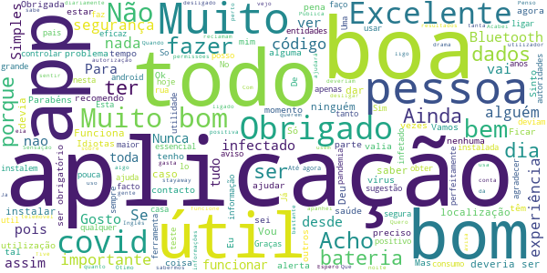
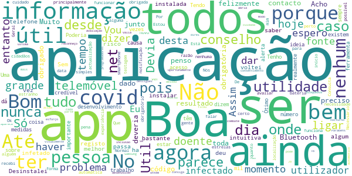
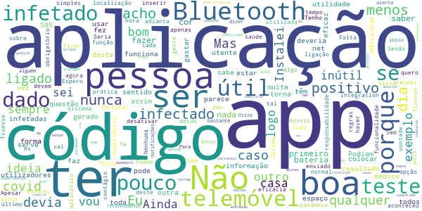
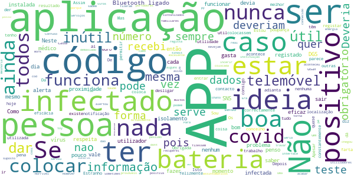

# STAYAWAY COVID
App version ``1.1.1``

Analyzed with [covid-apps-observer](http://github.com/covid-apps-observer) project, version ``0.1``

## App overview
| | |
|-------------------------|-------------------------| 
| **Name**&nbsp;&nbsp;&nbsp;&nbsp;&nbsp;&nbsp;&nbsp;&nbsp;&nbsp;&nbsp;&nbsp;&nbsp;&nbsp;&nbsp;&nbsp;&nbsp;&nbsp;&nbsp;&nbsp;&nbsp;&nbsp;&nbsp;&nbsp;&nbsp;&nbsp;&nbsp;&nbsp;&nbsp;&nbsp;&nbsp;&nbsp;&nbsp;&nbsp;&nbsp;&nbsp;&nbsp;&nbsp;&nbsp;&nbsp;&nbsp;  | STAYAWAY COVID |
| **Unique identifier** | fct.inesctec.stayaway |
| **Link to Google Play** | [https://play.google.com/store/apps/details?id=fct.inesctec.stayaway](https://play.google.com/store/apps/details?id=fct.inesctec.stayaway) |
| **Summary**  | A aplicação oficial de notificação de exposição à COVID-19 em Portugal. |
| **Privacy policy** | [https://stayawaycovid.pt/politica-de-privacidade](https://stayawaycovid.pt/politica-de-privacidade) |
| **Latest version** | 1.1.1 |
| **Last update** | 2020-12-18 19:15:36 |
| **Recent changes** | - Adicionado o ecrã das licenças - Corrigido o texto dos ecrãs de onboarding e de home - Atualizado o link para página da Ubirider - Corrigido o ecrã inicial em iOS - Correção de erros - Correção de bugs |
| **Installs**  | 1.000.000+ |
| **Category** | Saúde e fitness |
| **First release** | 13 de ago. de 2020 |
| **Size**  | 58M |
| **Supported Android version**  | 6.0 ou superior |

### Description
> STAYAWAY COVID é a aplicação oficial de notificação de exposição à COVID-19 em Portugal. É uma aplicação para telemóveis que tem como objetivo auxiliar o país no rastreio da COVID-19. A aplicação permite, de forma simples e segura, que cada um de nós seja informado sobre exposições de risco à doença, através da monitorização de contactos recentes. A aplicação é de utilização voluntária e gratuita e, em momento algum, tem acesso à sua identidade ou dados pessoais.
 Uma vez instalada a aplicação, o telemóvel anuncia a sua presença a todos os dispositivos próximos usando identificadores aleatórios que não revelam identidades pessoais. A informação partilhada entre dispositivos permite à STAYAWAY COVID saber de que telemóveis esteve perto, quão perto e por quanto tempo. A Organização Mundial de Saúde sugere que, contactos a menos de 2 metros e por mais de 15 minutos com alguém portador de COVID-19 sejam considerados com elevado risco de contágio.
 1. Ausência de registo de elevado risco de contágio
 Não registando contactos de proximidade com elevado risco de contágio com alguém a quem foi diagnosticada COVID-19, a aplicação informa-nos exatamente disso com a data da última avaliação.
 2. Alerta de elevado risco de contágio
 Se alguém de quem estivemos perigosamente próximo nos últimos 14 dias for diagnosticado com COVID-19 e informar o sistema STAYAWAY COVID, a aplicação alerta-nos de imediato do risco sugerindo que nos isolemos e contactemos a Linha SNS 24 (808 24 24 24).
 3. Após diagnóstico de COVID-19
 No caso de contrairmos COVID-19, com o diagnóstico receberemos um código numérico que nos permitirá, anonimamente e através da aplicação, informar o sistema STAYAWAY COVID. É este ato que permite ao sistema alertar segura e atempadamente todos aqueles que podemos ter contagiado, mesmo antes de terem tido qualquer sintoma. Não é nunca revelada a ninguém a identidade de ninguém.
 A aplicação STAYAWAY COVID foi desenvolvida pelo INESC TEC, ISPUP, Keyruptive e Ubirider para a DGS / Ministério da Saúde.

### User interface
The developers of the app provide the following screenshots in the Google play store.
| | | |
|:-------------------------:|:-------------------------:|:-------------------------:|
 |   |   |   | 
 |   |  

## Development team
In the following we report the main information provided by the development team in the Google play store.

| | |
|-------------------------|-------------------------|
| **Developer**  | FCT FCCN |
| **Website**  | [https://stayawaycovid.pt/](https://stayawaycovid.pt/) |
| **Email** | stayaway@inesctec.pt |
| **Physical address**  | - |
| **Other developed apps**  | [https://play.google.com/store/apps/developer?id=FCT+FCCN](https://play.google.com/store/apps/developer?id=FCT+FCCN) |

## Android support

| | |
|-------------------------|-------------------------|
| **Declared target Android version**  | - |
| **Effective target Android version**  | - |
| **Minimum supported Android version**  | Marshmallow, version 6.0 (API level 23) |
| **Maximum target Android version**  | - |

The larger the difference between the minimum and maximum supported Android versions, the better. A larger difference means a wider audience. For example, old phones have a very low Android version, so a high minimum supported Android version means that the app cannot be used by users with old phones, thus leading to accessibility problems. 

## Requested permissions

In the following we report the complete list of the permissions requested by the app. 

| **Permission** | **Protection level** | **Description** | 
|-------------------------|-------------------------|-------------------------|
 **android.permission ACCESS_NETWORK_STATE** | Normal | Allows applications to access information about networks. 
 **android.permission BLUETOOTH** | Normal | Allows applications to connect to paired bluetooth devices. 
 **android.permission FOREGROUND_SERVICE** | Normal | Allows a regular application to use Service.startForeground. 
 **android.permission INTERNET** | Normal | Allows applications to open network sockets. 
 **android.permission RECEIVE_BOOT_COMPLETED** | Normal | Allows an application to receive the Intent.ACTION_BOOT_COMPLETED that is broadcast after the system finishes booting. 
 **android.permission REQUEST_IGNORE_BATTERY_OPTIMIZATIONS** | Normal | Permission an application must hold in order to use Settings.ACTION_REQUEST_IGNORE_BATTERY_OPTIMIZATIONS. 
 **android.permission WAKE_LOCK** | Normal | Allows using PowerManager WakeLocks to keep processor from sleeping or screen from dimming. 

## Mentioned servers

| **Server** | **Registrant** | **Registrant country** | **Creation date** | 
|-------------------------|-------------------------|-------------------------|-------------------------|
 | android.com | Google LLC | :us: US | 1997-06-23 04:00:00 |
 | google.com | Google LLC | :us: US | 1997-09-15 04:00:00 |
 | ietf.org | IETF Trust | :us: US | 1995-03-11 05:00:00 |

## Security analysis 

Below we report the main security warnings raised by our execution of the [Androwarn](https://github.com/maaaaz/androwarn) security analysis tool.

**Connection interfaces exfiltration**
> - This application reads details about the currently active data network 
> - This application tries to find out if the currently active data network is metered 

**Suspicious connection establishment**
> - This application opens a Socket and connects it to the remote address '' on the 'N/A' port  
> - This application opens a Socket and connects it to the remote address 'Ljava/lang/StringBuilder;->toString()Ljava/lang/String;' on the ': connect, resolve' port  
> - This application opens a Socket and connects it to the remote address 'Ljava/lang/StringBuilder;->toString()Ljava/lang/String;' on the 'N/A' port  
> - This application opens a Socket and connects it to the remote address 'Ljava/net/Proxy;->type()Ljava/net/Proxy$Type;' on the 'N/A' port  
> - This application opens a Socket and connects it to the remote address 'timeout' on the 'N/A' port  

**Pim data leakage**
> - This application accesses data stored in the clipboard 

**Code execution**
> - This application loads a native library 
> - This application executes a UNIX command 

## User ratings and reviews

Below we provide information about how end users are reacting to the app in terms of ratings and reviews in the Google Play store.

### Ratings

The STAYAWAY COVID app has been installed by more than **1000000** times. At this time, **8277** rated the app and its average score is **2.8402367**. Below we show the distribution of the ratings across the usual star-based rating of Google Play

:star::star::star::star::star:: 3008

:star::star::star::star:: 627

:star::star::star:: 440

:star::star:: 440

:star:: 3762

### Reviews 

#### 5-star reviews

> Todos vejo e dá-me informação  :date: __2021-01-23 13:32:15__

> Bom  :date: __2021-01-22 20:36:15__

> Os botões de "Perguntas frequentes" e "Contacte-nos" nas configurações da aplicação parecem não estar a funcionar.  :date: __2021-01-22 15:38:01__

> Excelente  :date: __2021-01-21 12:44:23__

> Epa até foi uma boa ideia...  :date: __2021-01-19 16:55:56__

> Muito bom mas tudo isso que estão na sua conta de hoje para o seu pedido será postado t a todos os seus dados de hoje é isso mesmo menino Jesus o que é isso mesmo menino Jesus  :date: __2021-01-18 12:45:28__

> Excelente aplicação  :date: __2021-01-17 19:01:45__

> Apenas digo que estamos tramados c tantos infetados  :date: __2021-01-16 22:58:24__

> Graças a esta aplicação nunca apanhei coronovirus, muito bom eu recomendo  :date: __2021-01-16 19:41:11__

> Bom  :date: __2021-01-16 16:48:33__

#### 4-star reviews

> Oportunamente direi  :date: __2021-01-23 01:42:01__

> Sem o registo dos códigos para cada doente infetado, esta aplicação deixou de ter utilidade... No entanto reconheço o grande esforço que houve em desenvolver está aplicação.  :date: __2021-01-21 02:11:52__

> bom dia, tenho a app, instalada ha algum tempo, hoje nao abria, desliguei o telefone voltei a ligar, aparece a ultima avaliação de risco foi ontem e não passa para hoje. Desinstalei e voltei a instalar a app, e agora não passa da parte do consentimento. Ha algum problema hoje com a aplicação? O meu telefone é um Samsung S8+  :date: __2021-01-13 12:46:52__

> Bom  :date: __2021-01-13 00:22:32__

> Boa  :date: __2021-01-09 02:08:14__

> Já tive a aplicação mas nunca deu bloqueava espero que desta vez consiga  :date: __2021-01-05 11:22:31__

> Parabéns aos programadores. App é útil e acima de tudo pode ser uma enorme mais-valia no combate à Covid-19. A app está bastante cuidada visualmente e bastante intuitiva. E agora com inclusão de modo nocturno automático, ficou ainda melhor.  :date: __2020-12-29 18:52:15__

> Bom saber  :date: __2020-12-27 14:05:23__

> Tb  :date: __2020-12-26 17:33:03__

> Bom  :date: __2020-12-21 19:27:46__

#### 3-star reviews

> Misses European countries app integration like the Spanish app which has a integration between each other. How can I monitor my app if I study abroad? There should be just one EU app for all  :date: __2021-01-17 14:22:59__

> Não dá para ter essa aplicação porque tenho que ter o Bluetooth ligado 24 horas sobre 24horas. Ao ter isso sempre ligado, há interferências no meu telemóvel. Não vou danificar o meu telemóvel porque não tenho dinheiro para comprar outro e o estado não vai dar me um novo. Por isso eu não uso a aplicação. Eu protejo me ao máximo porque eu quero estar protegida e quero proteger as outras pessoas.  :date: __2021-01-12 16:29:52__

> Vou testar se for bom dou 5 estrelas  :date: __2021-01-12 13:02:39__

> Vou experimentar  :date: __2021-01-02 06:32:49__

> O conceito é bom. Na prática, é complicado controlar todas as variáveis que tornam a aplicação útil (ou inútil).  :date: __2020-12-28 23:18:11__

> É uma boa iniciativa  :date: __2020-12-24 00:11:20__

> Sem expiencias  :date: __2020-12-15 23:39:34__

> Falta agora criar um campo onde define se a pessoa já tomou a vacina ou não  :date: __2020-12-14 18:35:43__

> Está app não deveria de ocupar espaço eu não consigo instalar pk não tenho espaço no tlm  :date: __2020-12-10 12:11:44__

> A ideia é boa, mas ter que usar o Bluetooth e desativar funcionalidades básicas do telemóvel, que nem ligação direta devia ter, confesso que é um pouco bizarro. Podiam melhorar a ferramenta.  :date: __2020-12-09 12:47:26__

#### 2-star reviews

> Já estive positiva e já recuperei e não recebi nenhum código do SNS. Era suposto esta App ser útil mas nem para os meus familiares serviu. Revejam isto PF.  :date: __2021-01-21 11:11:36__

> Confuso. Deveriam ser os médicos a incerir na aplicação os casos positivos.  :date: __2021-01-17 22:24:25__

> É muito chato, está sempre a dar sinais sonoros.  :date: __2021-01-15 20:52:03__

> O SNS não dá códigos para a APP, o que a torna quase inútil... É uma pena  :date: __2021-01-15 14:58:50__

> Não tem utilidade nenhuma  :date: __2021-01-14 00:07:40__

> Sometimes this app dont work. However is cool toy...  :date: __2021-01-12 17:53:49__

> Actualmente e inútil e da cabo da bateria e ram do telemóvel.  :date: __2021-01-12 09:11:00__

> Seria muito útil se fosse obrigatório quem tem Covid a registar-se. Se só se regista quem quer, para que serve? Para travar o telemóvel?  :date: __2021-01-11 19:42:11__

> Horrível sem informação nenhuma e pessimo interface  :date: __2021-01-11 13:09:23__

> A ideia e muito bom, mas há pessoas infectadas com a APP instalada e não lhe dão o código para colocar na app  :date: __2020-12-29 15:03:59__

#### 1-star reviews

> Esta aplicação não serve para nada! Testei positivo ao Covid no dia 21 de Janeiro de 2021 e não recebi nenhum código do SNS para colocar na aplicação e já vamos a dia 23! Isto significa que se alguém se mantiver próximo de mim, não irá ser avisado. (Já para não falar que se estou em isolamento, não irei sair á rua, logo esta app mostra-se ainda mais inútil). A app também gasta imensa bateria, uma vez que nos obriga a ter o Bluetooth ligado!  :date: __2021-01-23 14:19:15__

> Estou positivo mas nunca recebi codogo nenhum para usar na app.... A Meu ver assim nao vale de nada apenas mais uma maneira de gastar o dinheiro dos contribuintes. Ou trazer-nos como carneirinhos a caminho do matadouro.... é triste.  :date: __2021-01-23 12:19:33__

> É inútil  :date: __2021-01-23 11:32:01__

> Qual é o interesse da aplicação em detetar/alertar doentes positivos se é suposto esses mesmo positivos estarem em isolamento?  :date: __2021-01-23 03:18:19__

> Inútil... A questão é mesmo essa não cumpre a sua função, têm que alterar os valores predefinidos para emitir alertas com base na próximidade e não na permanência superior a 15min.  :date: __2021-01-22 22:53:28__

> Não é nada útil, as pessoas no geral, não comunicam estar inferadas com covid às autoridades, app só para ocupar espaço no telemóvel  :date: __2021-01-22 15:07:06__

> Não funciona. Não existem códigos após resultados positivos.  :date: __2021-01-22 07:38:15__

> Médico tem de gerar o código manualmente. Como tem 150 famílias para contactar numa só manha, diz não ter hipótese de ir ao sistema próprio da aplicação gerar um código. Absolutamente lamentável que seja um processo manual, ainda por cima a cargo dos médicos que mal tempo têm para salvar vidas.  :date: __2021-01-21 21:02:58__

> Uma palhaçada só perder tempo com essa app  :date: __2021-01-21 14:23:25__

> Como não funciona  :date: __2021-01-20 17:15:52__

