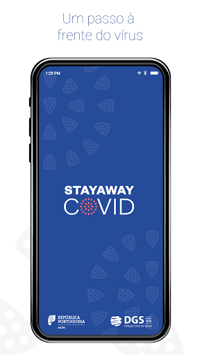
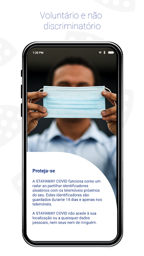
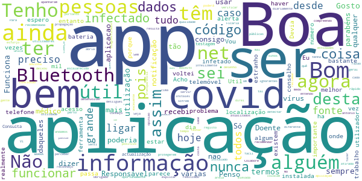
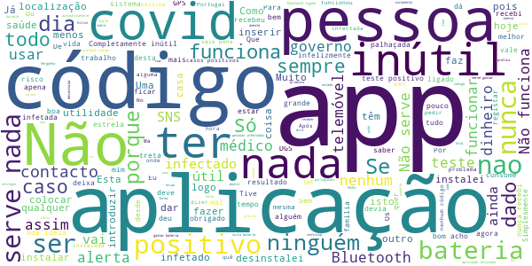

# STAYAWAY COVID
App version ``1.1.3``

Analyzed with [covid-apps-observer](http://github.com/covid-apps-observer) project, version ``0.1``

## App overview
| | |
|-------------------------|-------------------------| 
| **Name**&nbsp;&nbsp;&nbsp;&nbsp;&nbsp;&nbsp;&nbsp;&nbsp;&nbsp;&nbsp;&nbsp;&nbsp;&nbsp;&nbsp;&nbsp;&nbsp;&nbsp;&nbsp;&nbsp;&nbsp;&nbsp;&nbsp;&nbsp;&nbsp;&nbsp;&nbsp;&nbsp;&nbsp;&nbsp;&nbsp;&nbsp;&nbsp;&nbsp;&nbsp;&nbsp;&nbsp;&nbsp;&nbsp;&nbsp;&nbsp;  | STAYAWAY COVID |
| **Unique identifier** | fct.inesctec.stayaway |
| **Link to Google Play** | [https://play.google.com/store/apps/details?id=fct.inesctec.stayaway](https://play.google.com/store/apps/details?id=fct.inesctec.stayaway) |
| **Summary**  | A aplicação oficial de notificação de exposição à COVID-19 em Portugal. |
| **Privacy policy** | [https://stayawaycovid.pt/politica-de-privacidade](https://stayawaycovid.pt/politica-de-privacidade) |
| **Latest version** | 1.1.3 |
| **Last update** | 2021-02-01 20:58:28 |
| **Recent changes** | - Correções no mecanismo de sincronização - Correção de erros - Correção de bugs |
| **Installs**  | 1.000.000+ |
| **Category** | Saúde e fitness |
| **First release** | 13 de ago. de 2020 |
| **Size**  | 58M |
| **Supported Android version**  | 6.0 ou superior |

### Description
> STAYAWAY COVID é a aplicação oficial de notificação de exposição à COVID-19 em Portugal. É uma aplicação para telemóveis que tem como objetivo auxiliar o país no rastreio da COVID-19. A aplicação permite, de forma simples e segura, que cada um de nós seja informado sobre exposições de risco à doença, através da monitorização de contactos recentes. A aplicação é de utilização voluntária e gratuita e, em momento algum, tem acesso à sua identidade ou dados pessoais.
 Uma vez instalada a aplicação, o telemóvel anuncia a sua presença a todos os dispositivos próximos usando identificadores aleatórios que não revelam identidades pessoais. A informação partilhada entre dispositivos permite à STAYAWAY COVID saber de que telemóveis esteve perto, quão perto e por quanto tempo. A Organização Mundial de Saúde sugere que, contactos a menos de 2 metros e por mais de 15 minutos com alguém portador de COVID-19 sejam considerados com elevado risco de contágio.
 1. Ausência de registo de elevado risco de contágio
 Não registando contactos de proximidade com elevado risco de contágio com alguém a quem foi diagnosticada COVID-19, a aplicação informa-nos exatamente disso com a data da última avaliação.
 2. Alerta de elevado risco de contágio
 Se alguém de quem estivemos perigosamente próximo nos últimos 14 dias for diagnosticado com COVID-19 e informar o sistema STAYAWAY COVID, a aplicação alerta-nos de imediato do risco sugerindo que nos isolemos e contactemos a Linha SNS 24 (808 24 24 24).
 3. Após diagnóstico de COVID-19
 No caso de contrairmos COVID-19, com o diagnóstico receberemos um código numérico que nos permitirá, anonimamente e através da aplicação, informar o sistema STAYAWAY COVID. É este ato que permite ao sistema alertar segura e atempadamente todos aqueles que podemos ter contagiado, mesmo antes de terem tido qualquer sintoma. Não é nunca revelada a ninguém a identidade de ninguém.
 A aplicação STAYAWAY COVID foi desenvolvida pelo INESC TEC, ISPUP, Keyruptive e Ubirider para a DGS / Ministério da Saúde.

### User interface
The developers of the app provide the following screenshots in the Google play store.
| | | |
|:-------------------------:|:-------------------------:|:-------------------------:|
 |   |   |   | 
 |   |  

## Development team
In the following we report the main information provided by the development team in the Google play store.

| | |
|-------------------------|-------------------------|
| **Developer**  | FCT FCCN |
| **Website**  | [https://stayawaycovid.pt/](https://stayawaycovid.pt/) |
| **Email** | stayaway@inesctec.pt |
| **Physical address**  | - |
| **Other developed apps**  | [https://play.google.com/store/apps/developer?id=FCT+FCCN](https://play.google.com/store/apps/developer?id=FCT+FCCN) |

## Android support

| | |
|-------------------------|-------------------------|
| **Declared target Android version**  | - |
| **Effective target Android version**  | - |
| **Minimum supported Android version**  | Marshmallow, version 6.0 (API level 23) |
| **Maximum target Android version**  | - |

The larger the difference between the minimum and maximum supported Android versions, the better. A larger difference means a wider audience. For example, old phones have a very low Android version, so a high minimum supported Android version means that the app cannot be used by users with old phones, thus leading to accessibility problems. 

## Requested permissions

In the following we report the complete list of the permissions requested by the app. 

| **Permission** | **Protection level** | **Description** | 
|-------------------------|-------------------------|-------------------------|
 **android.permission ACCESS_NETWORK_STATE** | Normal | Allows applications to access information about networks. 
 **android.permission BLUETOOTH** | Normal | Allows applications to connect to paired bluetooth devices. 
 **android.permission FOREGROUND_SERVICE** | Normal | Allows a regular application to use Service.startForeground. 
 **android.permission INTERNET** | Normal | Allows applications to open network sockets. 
 **android.permission RECEIVE_BOOT_COMPLETED** | Normal | Allows an application to receive the Intent.ACTION_BOOT_COMPLETED that is broadcast after the system finishes booting. 
 **android.permission REQUEST_IGNORE_BATTERY_OPTIMIZATIONS** | Normal | Permission an application must hold in order to use Settings.ACTION_REQUEST_IGNORE_BATTERY_OPTIMIZATIONS. 
 **android.permission WAKE_LOCK** | Normal | Allows using PowerManager WakeLocks to keep processor from sleeping or screen from dimming. 

## Mentioned servers

| **Server** | **Registrant** | **Registrant country** | **Creation date** | 
|-------------------------|-------------------------|-------------------------|-------------------------|
 | android.com | Google LLC | :us: US | 1997-06-23 04:00:00 |
 | google.com | Google LLC | :us: US | 1997-09-15 04:00:00 |
 | ietf.org | IETF Trust | :us: US | 1995-03-11 05:00:00 |

## Security analysis 

Below we report the main security warnings raised by our execution of the [Androwarn](https://github.com/maaaaz/androwarn) security analysis tool.

**Connection interfaces exfiltration**
> - This application reads details about the currently active data network 
> - This application tries to find out if the currently active data network is metered 

**Suspicious connection establishment**
> - This application opens a Socket and connects it to the remote address '' on the 'N/A' port  
> - This application opens a Socket and connects it to the remote address 'Ljava/lang/StringBuilder;->toString()Ljava/lang/String;' on the ': connect, resolve' port  
> - This application opens a Socket and connects it to the remote address 'Ljava/lang/StringBuilder;->toString()Ljava/lang/String;' on the 'N/A' port  
> - This application opens a Socket and connects it to the remote address 'Ljava/net/Proxy;->type()Ljava/net/Proxy$Type;' on the 'N/A' port  
> - This application opens a Socket and connects it to the remote address 'timeout' on the 'N/A' port  

**Pim data leakage**
> - This application accesses data stored in the clipboard 

**Code execution**
> - This application loads a native library 
> - This application executes a UNIX command 

## User ratings and reviews

Below we provide information about how end users are reacting to the app in terms of ratings and reviews in the Google Play store.

### Ratings

The STAYAWAY COVID app has been installed by more than **1000000** times. At this time, **8879** rated the app and its average score is **2.7328918**. Below we show the distribution of the ratings across the usual star-based rating of Google Play

:star::star::star::star::star:: 2892

:star::star::star::star:: 813

:star::star::star:: 401

:star::star:: 578

:star:: 4195

### Reviews 

#### 5-star reviews

> Muito boa.  :date: __2021-02-06 19:38:12__

> Pena que a muita gente custe a perceber o uso e funcionamento desta aplicação, pois não percebem a finalidade.  :date: __2021-02-05 21:41:03__

> É ótimo mas, quando começa a aplicação nao diz se a pessoa tem covid-19 ou nao é xato  :date: __2021-02-05 21:20:13__

> Lamentável que a sociedade portuguesa não aproveite o talento da ciência portuguesa! Tem tudo para ser uma arma de combate nesta guerra, só não tem a simples colaboração de cada cidadão... Comecem a trabalhar no passaporte-vacina, acoplado a esta aplicação. Já muda tudo! Assim já será entendida como uma coisa para proveito próprio!  :date: __2021-02-04 22:33:56__

> Maravilha  :date: __2021-02-04 17:12:53__

> Bom  :date: __2021-02-04 01:48:11__

> Bom  :date: __2021-02-02 19:18:43__

> Excelente aplicação  :date: __2021-02-02 18:36:16__

> Boa  :date: __2021-02-01 15:15:22__

> Ok  :date: __2021-01-30 01:16:40__

#### 4-star reviews

> Tenho a dizer que não compreendo a razão de recomendar está aplicacao...pois infelizmente tenho várias pessoas que conheço que apanharam o maldito vírus....e nunca recebi qualquer notificação....portanto há qualquer coisa mal escalarecida na transparência dos dados...quem é o responsável. Doente ou médico...nao sei...mas alguém está a falhar....e ainda por cima está aplicacao foi tão recomendada pelo antonio costa...conclusao...mais uma areia atirada aos olhos daqueles que sofrem diariamente.  :date: __2021-02-05 16:03:20__

> Boa  :date: __2021-02-04 15:18:41__

> Tenho a aplicação, mas se passar por alguém que não tenha, e estiver infectado não resulta  :date: __2021-02-04 11:55:03__

> A app é boa em geral, mas não excelente. Só não entendo como é que têm gente BURRA a reclamar de ter de usar a localização e o Bluetooth para a app funcionar. É preciso fazer um desenho a explicar que o telemóvel n advinha se estiveram perto de alguém infectado. Ignorantes.  :date: __2021-02-04 03:00:15__

> Instalei agora ainda não tenho opinião. Obrigado.  :date: __2021-01-28 15:47:35__

> Oportunamente direi  :date: __2021-01-23 01:42:01__

> Sem o registo dos códigos para cada doente infetado, esta aplicação deixou de ter utilidade... No entanto reconheço o grande esforço que houve em desenvolver está aplicação.  :date: __2021-01-21 02:11:52__

> bom dia, tenho a app, instalada ha algum tempo, hoje nao abria, desliguei o telefone voltei a ligar, aparece a ultima avaliação de risco foi ontem e não passa para hoje. Desinstalei e voltei a instalar a app, e agora não passa da parte do consentimento. Ha algum problema hoje com a aplicação? O meu telefone é um Samsung S8+  :date: __2021-01-13 12:46:52__

> Bom  :date: __2021-01-13 00:22:32__

> Boa  :date: __2021-01-09 02:08:14__

#### 3-star reviews

> Acho mal k a APP tenha k ter sempre NET para atualizar a APP.  :date: __2021-01-27 16:46:27__

> Misses European countries app integration like the Spanish app which has a integration between each other. How can I monitor my app if I study abroad? There should be just one EU app for all  :date: __2021-01-17 14:22:59__

> Não dá para ter essa aplicação porque tenho que ter o Bluetooth ligado 24 horas sobre 24horas. Ao ter isso sempre ligado, há interferências no meu telemóvel. Não vou danificar o meu telemóvel porque não tenho dinheiro para comprar outro e o estado não vai dar me um novo. Por isso eu não uso a aplicação. Eu protejo me ao máximo porque eu quero estar protegida e quero proteger as outras pessoas.  :date: __2021-01-12 16:29:52__

> Vou testar se for bom dou 5 estrelas  :date: __2021-01-12 13:02:39__

> Vou experimentar  :date: __2021-01-02 06:32:49__

> O conceito é bom. Na prática, é complicado controlar todas as variáveis que tornam a aplicação útil (ou inútil).  :date: __2020-12-28 23:18:11__

> É uma boa iniciativa  :date: __2020-12-24 00:11:20__

> Sem expiencias  :date: __2020-12-15 23:39:34__

> Falta agora criar um campo onde define se a pessoa já tomou a vacina ou não  :date: __2020-12-14 18:35:43__

> Está app não deveria de ocupar espaço eu não consigo instalar pk não tenho espaço no tlm  :date: __2020-12-10 12:11:44__

#### 2-star reviews

> Nao serve p nada  :date: __2021-02-06 00:55:26__

> Tinha a aplicação instalada desde o início. Desde a última atualização que por três vezes me avisa para ativar Bluetooth e GPS, mesmo tendo os mesmos ativos. Nunca me notificou de nada. Nao vejo verdadeira utilidade na aplicação nos moldes atuais e com estes erros sem sentido. Desinstalei.  :date: __2021-01-30 23:16:52__

> Porque não dá dados nenhuns é só para gastar bateria  :date: __2021-01-30 19:28:25__

> Tenho uma dúvida que me persegue desde o seu lançamento. Se alguém dá positivo e introduz o código, como é que poderá alertar outras pessoas que se cruzou com um doente, se um infectado tem de ficar obrigatoriamente em casa? Não percebo muito bem a lógica da aplicação  :date: __2021-01-27 12:39:43__

> A APP está constantemente a desligar-se devido às optimização da bateria, quando a mesma está desactivada..  :date: __2021-01-26 19:25:06__

> Já estive positiva e já recuperei e não recebi nenhum código do SNS. Era suposto esta App ser útil mas nem para os meus familiares serviu. Revejam isto PF.  :date: __2021-01-21 11:11:36__

> Confuso. Deveriam ser os médicos a incerir na aplicação os casos positivos.  :date: __2021-01-17 22:24:25__

> É muito chato, está sempre a dar sinais sonoros.  :date: __2021-01-15 20:52:03__

> O SNS não dá códigos para a APP, o que a torna quase inútil... É uma pena  :date: __2021-01-15 14:58:50__

> Não tem utilidade nenhuma  :date: __2021-01-14 00:07:40__

#### 1-star reviews

> Completamente inútil, as pessoas infectadas não recebem o código para colocar na aplicação a não ser que peçam e quando o recebem já é demasiado tarde para alertar.  :date: __2021-02-06 18:54:20__

> TANGa  :date: __2021-02-06 18:08:19__

> Uma das caracteristicas da APP STAYAWAY COVID era não ter dados de localização dos equipamentos - telemovel. Esta questão foi amplamente difundida em varios meios. Agradecia esclarecimento sobre a obrigatoriadade de ter a localização do equipamento activa para a APP funcionar. Quando foi disponibilizada a APP e a instalei de imediato em 2020, a localização não era obrigatória. Trata-se de uma questão de transparência e de credibilidade.  :date: __2021-02-06 14:54:43__

> Para mim nao não funciona  :date: __2021-02-06 12:22:46__

> A APP está muito cuidada, mas a formação dos profissionais que deviam atribuir o código ficou na gaveta. O conceito está ótimo, a utilização para tirar proveito está péssima. Mal me disseram que não sabiam gerar o código, nem tinham a aplicação instalada, eu própria desinstalei a aplicação na hora.  :date: __2021-02-06 09:22:51__

> Não serve para nada tive casos onde trabalho não deu nada de nada em fim não serve nada  :date: __2021-02-06 00:48:58__

> Tinha a aplicação instalada e tive covid. Nunca cheguei a receber o código para alertar quem esteve em contacto comigo.  :date: __2021-02-05 12:50:51__

> QZ  :date: __2021-02-04 22:04:58__

> Não serve para nada. No meu local de trabalho houve (já estão curados) 3 casos positivos e a app nem piou. Se as pessoas não se importam de meter o código não adianta para nada. Vou desinstalar!  :date: __2021-02-04 18:33:43__

> Que app de caca so nao do 0 estrelas porque nao da Nao funciona e so laga o telemovel  :date: __2021-02-04 17:01:38__

