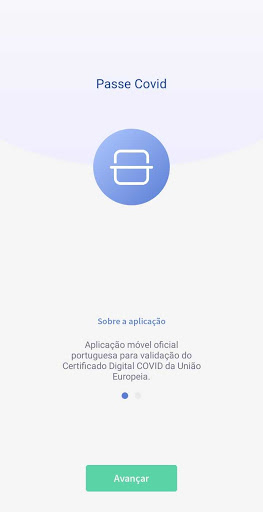

# Passe Covid
App version ``1.1``

Analyzed with [covid-apps-observer](http://github.com/covid-apps-observer) project, version ``0.1``

## App overview
| | |
|-------------------------|-------------------------| 
| **Name**&nbsp;&nbsp;&nbsp;&nbsp;&nbsp;&nbsp;&nbsp;&nbsp;&nbsp;&nbsp;&nbsp;&nbsp;&nbsp;&nbsp;&nbsp;&nbsp;&nbsp;&nbsp;&nbsp;&nbsp;&nbsp;&nbsp;&nbsp;&nbsp;&nbsp;&nbsp;&nbsp;&nbsp;&nbsp;&nbsp;&nbsp;&nbsp;&nbsp;&nbsp;&nbsp;&nbsp;&nbsp;&nbsp;&nbsp;&nbsp;  | Passe Covid |
| **Unique identifier** | pt.incm.eudcc.app.lite |
| **Link to Google Play** | [https://play.google.com/store/apps/details?id=pt.incm.eudcc.app.lite](https://play.google.com/store/apps/details?id=pt.incm.eudcc.app.lite) |
| **Summary**  | Aplicação oficial portuguesa para validação do Certificado Digital COVID da UE |
| **Privacy policy** | [https://incm.pt/portal/externo/incm/Termos_condicoes_PasseCovid.pdf](https://incm.pt/portal/externo/incm/Termos_condicoes_PasseCovid.pdf) |
| **Latest version** | 1.1 |
| **Last update** | 2021-07-05 17:00:52 |
| **Recent changes** | Versão 1.1 - Correções de Erros - Melhorias de Performance - Desabilitação de possibilidade de capturas de ecrã - Melhorias na leitura de certificados de outros países |
| **Installs**  | 50.000+ |
| **Category** | Turismo e local |
| **First release** | 29 de jun. de 2021 |
| **Size**  | 38M |
| **Supported Android version**  | 8.0 ou superior |

### Description
> A Passe Covid pode ser descarregada e utilizada por todos, nomeadamente transportadoras aéreas, organizadores de eventos culturais, corporativos, desportivos e familiares (como casamentos e batizados), para que possamos ter de volta a normalidade dos dias e a nossa liberdade, com toda a segurança.
 Pode ser utilizada pelas entidades que precisem de validar Certificados Digitais Covid da UE, emitidos por todos os Estados-Membros da União Europeia, na Islândia, no Liechtenstein, na Noruega e na Suíça.
 A aplicação valida a autenticidade do Certificado Digital Covid da UE e o cumprimento dos critérios de validação portugueses definidos pela DGS (Decreto-Lei nº 54-A/2021).
 Como usar?
 Aponte a câmara do telemóvel para leitura do código QR do Certificado apresentado. O certificado pode ser apresentado em papel ou em formato digital. A aplicação irá verificar automaticamente o certificado.
 Um resultado com sinal verde, significa que o certificado foi validado com sucesso.
 Um resultado com sinal vermelho, significa que o certificado não é válido (a validação inclui a verificação da autenticidade do certificado e o cumprimento das regras de saúde do país).
 Esta aplicação não garante a segurança do portador do Certificado Digital COVID em relação ao COVID-19, nem a sua identidade, servindo somente para validar a autenticidade do certificado.
 A apresentação do Certificado Digital COVID não serve como forma de identificação do portador, carecendo sempre da apresentação de um documento de identificação oficial válido e legitimo
 Proteção de Dados
 A aplicação não guarda qualquer tipo de dados.
 Mais informações: https://ec.europa.eu/info/live-work-travel-eu/coronavirus-response/safe-covid-19-vaccines-europeans/eu-digital-covid-certificate_pt

### User interface
The developers of the app provide the following screenshots in the Google play store.
| | | |
|:-------------------------:|:-------------------------:|:-------------------------:|
 |   |   |   | 
 |   |   |   | 
 |   |   |   | 
 |   |   |   | 
 |   |   |   | 

## Development team
In the following we report the main information provided by the development team in the Google play store.

| | |
|-------------------------|-------------------------|
| **Developer**  | Imprensa Nacional - Casa da Moeda S.A. |
| **Website**  | - |
| **Email** | passecovid.suporte@incm.pt |
| **Physical address**  | [Casa da Moeda Avenida António José de Almeida 1000-042 Lisboa Portugal](https://www.google.com/maps/search/Casa%20da%20Moeda%20Avenida%20António%20José%20de%20Almeida%201000-042%20Lisboa%20Portugal) (Google Maps) |
| **Other developed apps**  | [https://play.google.com/store/apps/developer?id=7850779897537985724](https://play.google.com/store/apps/developer?id=7850779897537985724) |

## Android support

| | |
|-------------------------|-------------------------|
| **Declared target Android version**  | Android10, version 10 (API level 29) |
| **Effective target Android version**  | Android10, version 10 (API level 29) |
| **Minimum supported Android version**  | Oreo, version 8.0.0 (API level 26) |
| **Maximum target Android version**  | - |

The larger the difference between the minimum and maximum supported Android versions, the better. A larger difference means a wider audience. For example, old phones have a very low Android version, so a high minimum supported Android version means that the app cannot be used by users with old phones, thus leading to accessibility problems. 

## Requested permissions

In the following we report the complete list of the permissions requested by the app. 

| **Permission** | **Protection level** | **Description** | 
|-------------------------|-------------------------|-------------------------|
 **android.permission ACCESS_NETWORK_STATE** | Normal | Allows applications to access information about networks. 
 **android.permission CAMERA** | :warning:**Dangerous** | Required to be able to access the camera device. 
 **android.permission FLASHLIGHT** | - | - 
 **android.permission INTERNET** | Normal | Allows applications to open network sockets. 

## Mentioned servers

| **Server** | **Registrant** | **Registrant country** | **Creation date** | 
|-------------------------|-------------------------|-------------------------|-------------------------|
 | google.com | Google LLC | :us: US | 1997-09-15 04:00:00 |
 | googleapis.com | Google LLC | :us: US | 2005-01-25 17:52:26 |
 | apache.org | The Apache Software Foundation | :us: US | 1995-04-11 04:00:00 |
 | w3.org | W3C | :us: US | 1994-07-06 04:00:00 |
 | xml.org | OASIS Open | :us: US | 1997-02-03 05:00:00 |

## Security analysis 

Below we report the main security warnings raised by our execution of the [Androwarn](https://github.com/maaaaz/androwarn) security analysis tool.

**Connection interfaces exfiltration**
> - This application reads details about the currently active data network 
> - This application tries to find out if the currently active data network is metered 

**Suspicious connection establishment**
> - This application opens a Socket and connects it to the remote address '1' on the 'N/A' port  
> - This application opens a Socket and connects it to the remote address '2' on the 'N/A' port  
> - This application opens a Socket and connects it to the remote address '3' on the 'N/A' port  
> - This application opens a Socket and connects it to the remote address 'Ljava/net/Proxy;->type()Ljava/net/Proxy$Type;' on the 'N/A' port  
> - This application opens a Socket and connects it to the remote address 'timeout' on the 'N/A' port  

**Pim data leakage**
> - This application accesses data stored in the clipboard 

**Code execution**
> - This application loads a native library: 'Ljava/lang/String;->valueOf(Ljava/lang/Object;)Ljava/lang/String;' 
> - This application loads a native library: 'barhopper_v2' 

## User ratings and reviews

Below we provide information about how end users are reacting to the app in terms of ratings and reviews in the Google Play store.

### Ratings

The Passe Covid app has been installed by more than **50000** times. At this time, **369** rated the app and its average score is **1.7592592**. Below we show the distribution of the ratings across the usual star-based rating of Google Play

:star::star::star::star::star:: 43

:star::star::star::star:: 20

:star::star::star:: 16

:star::star:: 13

:star:: 277

### Reviews 

#### 5-star reviews

> Excelente.  :date: __2021-07-11 07:38:47__

> Funciona  :date: __2021-07-11 02:48:03__

> App que faz o que promete. Não percebo as críticas, possuo Android 8 e consegui ver se um familiar meu já tem certificado válido ou não (pois ainda só passaram 12 dias desde a vacinação) em menos de 30 segundos. Obrigado  :date: __2021-07-10 21:47:38__

> Funciona na perfeição com leitura direta sobre códigos QR em telefones.  :date: __2021-07-10 16:02:37__

> Funciona bem. Valida o certificado.  :date: __2021-07-09 20:44:37__

> Grata à equipe Covid pela resposta. Já entendi como funciona. Fui lanchar a um Restaurante e o Proprietário explicou como funciona. Como eu tenho a Aplicação instalada e ele também. Ele com a câmara dele mais a Aplicação dele e a minha conseguiu, validar o Certificado Digital COVID. Estou portanto Validada a verde. Aparece o meu nome data de nascimento. Não consigo deixar aqui foto, mas está no Smartphone. Assim posso ir jantar fora no Sábado. Obrigada ao Programador. Ivone Ribeiro  :date: __2021-07-09 19:37:45__

> É bom para ser utilizado pelos empresários da restauração/ alojamento com os clientes e pela polícia  :date: __2021-07-09 02:54:14__

> Naturalmente esta app será mais direcionada não para quem tem o certificado, mas para quem tem a competência da respetiva fiscalização. Poderá também eventualmente servir como complemento na facilitação de acessos a espaços públicos como restaurantes etc, se vier a ser adotada uma medida nesse sentido. Bem conseguida, permite estarmos em linha com as orientações da UE nesta matéria de uma forma simples, rápida e absolutamente funcional. Parabéns!  :date: __2021-07-08 23:25:05__

> Boa  :date: __2021-07-08 21:43:34__

> Da minha experiência: APP funciona bem nos monitores, mesmo com grande aproximação da cam, depende da focagem, e também funciona bem nas impressões laser, não funciona na impressão a jacto de tinta.  :date: __2021-07-08 12:28:51__

#### 4-star reviews

> Faz aquilo para que foi feita... Por exemplo agora que é obrigatório ao fim de semana controlar o acesso aos estabelecimentos de restauração. Às vezes tem dificuldade em ler o qr-code.  :date: __2021-07-10 18:17:43__

> A minha experiência foi positiva.  :date: __2021-07-10 17:57:21__

> Funcionou tal como esperado. No meu caso o certificado deu inválido porque ainda não passou os 14 dias da última vacina. Mas vou testar assim que passar os 14 dias e depois dou o feedback.  :date: __2021-07-09 20:56:58__

> App cumpre o seu propósito, validar códigos. Eu entro num restaurante o código é validado e a identificação do portador do código? Pedem também uma identificação da pessoa?  :date: __2021-07-09 16:27:08__

> Não funciona em meu telemovel porquê?  :date: __2021-07-09 14:02:56__

> Resolvido, no entanto em espaços mais escuros preciso de ligar a luz do telemóvel  :date: __2021-07-09 09:51:29__

> Boa tarde Tal como pediram no email, desinstalei a aplicação e instalei novamente. Já consegui validar o meu certificado e o de minha mulher. Esclareço que a aplicação é um pouco confusa no momento da validação, e poderá gerar alguma confusão às pessoas. Mas funciona.  :date: __2021-07-08 17:02:14__

> Ok funcionou bem no código instalado noutro telemóvel, no código impresso em papel foi mais difícil  :date: __2021-07-07 15:26:42__

> Sim leu o meu certificado  :date: __2021-07-07 13:13:34__

> Além escolheu o nome "Passe covid" estava a pensar em que? mas ideia andar a passar o covid. Quanto ao resto, faz o que é suposto. Mas tem pouca utilidade para o público em geral, útil certamente para quem tem que fazer fiscalizações.  :date: __2021-07-07 02:00:29__

#### 3-star reviews

> Ao instalar esta aplicação têm de autorizar as permissões "todas" - não é só a câmara - caso contrário a aplicação vai declarar "Erro - o dicionário não está instalado" . Claro que não devia ser eu a estar a chamar a atenção para isto mas sim quem criou a aplicação, não é? Em seguida funciona bem e é muito util para assegurar ao seu titular que está tudo válido. Faz sentido que toda a familia a instale, para se verificarem uns aos outros, a menos que disponha de um segundo telefone.  :date: __2021-07-10 20:51:19__

> Boa tarde estou a tentar validar um certificado com a vacina da Janssen de uns clientes Espanhois. E é de uma só toma. E o certificado dá inválido!!!!! pois o QR Code diz que tem a toma de 1/2 doses!!! Como posso resolver a situação???? obrigada Carla Esmeriz  :date: __2021-07-10 18:13:00__

> E porque não desenvolver uma app que guarde vários certificados (agregado familiar) e depois comunique com um leitor, seja apresentando um QRcode, seja por Bluetooth, ou outra tecnologia?  :date: __2021-07-09 19:12:09__

> Não funciona a ler o código QR em papel  :date: __2021-07-09 15:34:44__

> Deveria ser recomendado que a leitura do QR Code fosse efectuada a partir de suportes digitais. (No PC/Tablet ou no tel. de pessoa amiga). Tentar fazer a leitura a partir do "print" é tarefa insana, pois muito depende da qualidade da impressão. Fora este detalhe, acho que a aplicação tem algumas dificuldades na focagem.  :date: __2021-07-09 11:37:05__

> Não funciona em todos telemóveis. Tenho um poco F1 e funcionou bem. Tentei num Poco x3 e não funcionou. A aplicação devia ter opção de colocar algum ID que permitisse validar o certificado, assim caso o QR code não funcione existe sempre mais uma opção.  :date: __2021-07-08 21:56:22__

> Não funciona por enquanto  :date: __2021-07-08 20:04:01__

> A aplicação faz o que diz no descritivo, mas é pouco útil para o público geral. Apenas valida se o QR Code dos cerificados Covid são validos. Ou seja, temos que continuar a andar com o pdf ou com o certificado em papel.  :date: __2021-07-07 18:25:33__

> Parece-me útil para as autoridades oficiais. Não reconheço qualquer autoridade a um segurança de grande superfície ou outros de nos exigir o certificado. Pode permitir muitos abusos.  :date: __2021-07-07 12:50:18__

> A primeira vez não funcionou, depois reinstalei e lá arrancou. Não sei para que me serve. Deve ser útil para quem trabalhe nas fronteiras e tenha que controlar os certificados. Inútil para o comum dos mortais. Seria mais útil uma espécie de carteira para ter de a mostrar.  :date: __2021-07-07 00:20:24__

#### 2-star reviews

> Não sei onde estou a falhar. Tenho a app instalada no smartphone, copio o código e fico com a confirmação (verde) do certificado de vacinação. Só que não tenho como gravar (será?). Saio da app e quando volto não há lá nada a não ser o quadrado a pedir-me a leitura do código.  :date: __2021-07-11 13:01:11__

> Funciona bem num Samsung androide 11 não lê o código em JPEG só mesmo no pdf. Xiaomi androide 11 dá erro  :date: __2021-07-10 13:46:20__

> Apenas funciona com iPhone , testei vários android e não lê os certificados. Agradeço a resposta, mas testei com vários Android e com iPhone e apenas lê os com iPhone  :date: __2021-07-10 01:17:27__

> Não posso dar melhor classificação, porque não tem a função de armazenamento do certificado digital do próprio utizador, para que sirva de passe Covid a apresentar (exemplo app "green pass").  :date: __2021-07-09 23:14:11__

> A app na funciona.  :date: __2021-07-08 22:34:14__

> Descarreguei a app em 08/07/2021 e verifico que a versão para Android não está a funcionar (não lê o código). Apenas a versão IOS funciona. Experimentei com vários telemóveis!  :date: __2021-07-08 19:52:49__

> Instalei por brincadeira para "validar" os certificados aqui de casa e não funciona em nenhum dos 2 certificados. Penso que ainda precisa de algumas afinações  :date: __2021-07-07 18:26:20__

> Tenho o certificado com uma vacina e não assume nada. Aplicação inútil.  :date: __2021-07-07 16:09:30__

> Não lê o código. Pensei que por ser no computador mas ao imprimir não lê à mesma.  :date: __2021-07-07 14:41:10__

> A leitura do QR é muito má. Existe uma outra app Suíça que não consegue verificar o certificado digital mas a leitura é muito rápida. Numa situação em que é necessário ler muitos certificados (eventos p ex ) não é nada eficaz. É algo que têm rever !  :date: __2021-07-07 13:14:19__

#### 1-star reviews

> Já não funciona  :date: __2021-07-11 13:58:14__

> Bom dia. O meu telemóvel é um OPPO A53s e a aplicação não funciona. Já instalei e desinstalei várias vezes e não lê nem em papel nem no telemóvel. Agradecia que me ajudassem. Obrigada.  :date: __2021-07-11 13:52:34__

> Não funciona!  :date: __2021-07-11 13:37:10__

> Erro desconecido  :date: __2021-07-11 13:08:50__

> Não funciona.  :date: __2021-07-11 09:44:24__

> Não funciona no meu telemóvel, só abre o quadro do scan. Telemóvel Samsung note 20 ultra, com o Android 11.  :date: __2021-07-11 01:25:37__

> Apenas pede para atualizar e não sai daí. Não lê nada  :date: __2021-07-11 00:34:19__

> Nao capta a imagem nem faz leitura  :date: __2021-07-10 23:48:37__

> Infelizmente não funciona no meu dispositivo. A aplicação abre, mas não consigo ler o QR.  :date: __2021-07-10 23:31:59__

> Não consigo ler o qrcode. Não dá nada. Impresso em impressora laser ou directo em écran smartphone.  :date: __2021-07-10 23:13:52__

