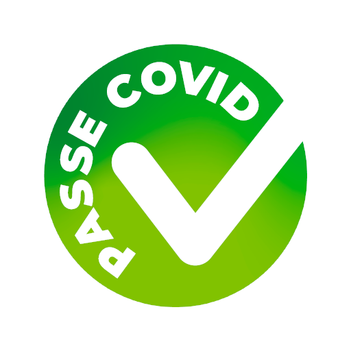
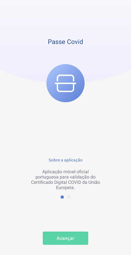
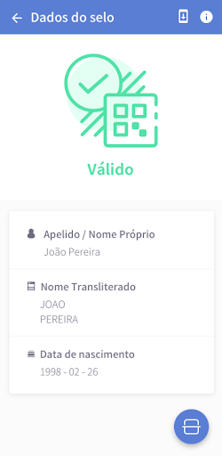
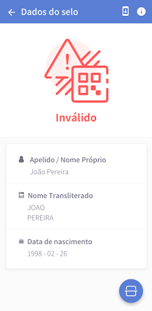
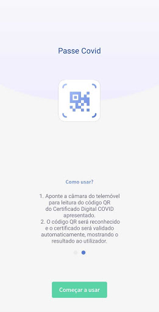
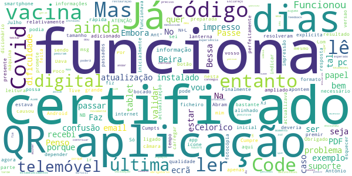
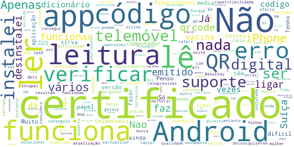
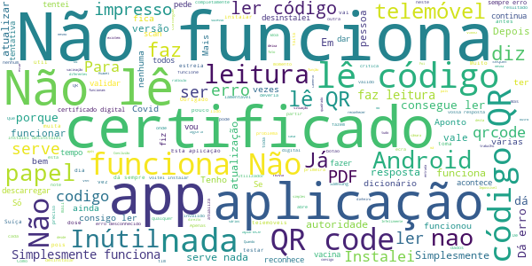

# Passe Covid
App version ``1.2.1``

Analyzed with [covid-apps-observer](http://github.com/covid-apps-observer) project, version ``0.1``

## App overview
| | |
|-------------------------|-------------------------| 
| **Name**&nbsp;&nbsp;&nbsp;&nbsp;&nbsp;&nbsp;&nbsp;&nbsp;&nbsp;&nbsp;&nbsp;&nbsp;&nbsp;&nbsp;&nbsp;&nbsp;&nbsp;&nbsp;&nbsp;&nbsp;&nbsp;&nbsp;&nbsp;&nbsp;&nbsp;&nbsp;&nbsp;&nbsp;&nbsp;&nbsp;&nbsp;&nbsp;&nbsp;&nbsp;&nbsp;&nbsp;&nbsp;&nbsp;&nbsp;&nbsp;  | Passe Covid |
| **Unique identifier** | pt.incm.eudcc.app.lite |
| **Link to Google Play** | [https://play.google.com/store/apps/details?id=pt.incm.eudcc.app.lite](https://play.google.com/store/apps/details?id=pt.incm.eudcc.app.lite) |
| **Summary**  | Aplicação oficial portuguesa para validação do Certificado Digital COVID da UE |
| **Privacy policy** | [https://incm.pt/portal/externo/incm/Termos_condicoes_PasseCovid.pdf](https://incm.pt/portal/externo/incm/Termos_condicoes_PasseCovid.pdf) |
| **Latest version** | 1.2.1 |
| **Last update** | 2021-07-14 14:59:41 |
| **Recent changes** | - Correções de erros |
| **Installs**  | 50.000+ |
| **Category** | Turismo e local |
| **First release** | 29 de jun. de 2021 |
| **Size**  | 38M |
| **Supported Android version**  | 8.0 ou superior |

### Description
> A Passe Covid pode ser descarregada e utilizada por todos, nomeadamente transportadoras aéreas, organizadores de eventos culturais, corporativos, desportivos e familiares (como casamentos e batizados), para que possamos ter de volta a normalidade dos dias e a nossa liberdade, com toda a segurança.
 Pode ser utilizada pelas entidades que precisem de validar Certificados Digitais Covid da UE, emitidos por todos os Estados-Membros da União Europeia, na Islândia, no Liechtenstein, na Noruega e na Suíça.
 A aplicação valida a autenticidade do Certificado Digital Covid da UE e o cumprimento dos critérios de validação portugueses definidos pela DGS (Decreto-Lei nº 54-A/2021).
 Como usar?
 Aponte a câmara do telemóvel para leitura do código QR do Certificado apresentado. O certificado pode ser apresentado em papel ou em formato digital. A aplicação irá verificar automaticamente o certificado.
 Um resultado com sinal verde, significa que o certificado foi validado com sucesso.
 Um resultado com sinal vermelho, significa que o certificado não é válido (a validação inclui a verificação da autenticidade do certificado e o cumprimento das regras de saúde do país).
 Esta aplicação não garante a segurança do portador do Certificado Digital COVID em relação ao COVID-19, nem a sua identidade, servindo somente para validar a autenticidade do certificado.
 A apresentação do Certificado Digital COVID não serve como forma de identificação do portador, carecendo sempre da apresentação de um documento de identificação oficial válido e legitimo
 Proteção de Dados
 A aplicação não guarda qualquer tipo de dados.
 Mais informações: https://ec.europa.eu/info/live-work-travel-eu/coronavirus-response/safe-covid-19-vaccines-europeans/eu-digital-covid-certificate_pt

### User interface
The developers of the app provide the following screenshots in the Google play store.
| | | |
|:-------------------------:|:-------------------------:|:-------------------------:|
 |   |   |   | 
 |   |   |   | 
 |   |   |   | 
 |   |   |   | 
 |   |   |   | 

## Development team
In the following we report the main information provided by the development team in the Google play store.

| | |
|-------------------------|-------------------------|
| **Developer**  | Imprensa Nacional - Casa da Moeda S.A. |
| **Website**  | - |
| **Email** | passecovid.suporte@incm.pt |
| **Physical address**  | [Casa da Moeda Avenida António José de Almeida 1000-042 Lisboa Portugal](https://www.google.com/maps/search/Casa%20da%20Moeda%20Avenida%20António%20José%20de%20Almeida%201000-042%20Lisboa%20Portugal) (Google Maps) |
| **Other developed apps**  | [https://play.google.com/store/apps/developer?id=7850779897537985724](https://play.google.com/store/apps/developer?id=7850779897537985724) |

## Android support

| | |
|-------------------------|-------------------------|
| **Declared target Android version**  | Android10, version 10 (API level 29) |
| **Effective target Android version**  | Android10, version 10 (API level 29) |
| **Minimum supported Android version**  | Oreo, version 8.0.0 (API level 26) |
| **Maximum target Android version**  | - |

The larger the difference between the minimum and maximum supported Android versions, the better. A larger difference means a wider audience. For example, old phones have a very low Android version, so a high minimum supported Android version means that the app cannot be used by users with old phones, thus leading to accessibility problems. 

## Requested permissions

In the following we report the complete list of the permissions requested by the app. 

| **Permission** | **Protection level** | **Description** | 
|-------------------------|-------------------------|-------------------------|
 **android.permission ACCESS_NETWORK_STATE** | Normal | Allows applications to access information about networks. 
 **android.permission CAMERA** | :warning:**Dangerous** | Required to be able to access the camera device. 
 **android.permission FLASHLIGHT** | - | - 
 **android.permission INTERNET** | Normal | Allows applications to open network sockets. 

## Mentioned servers

| **Server** | **Registrant** | **Registrant country** | **Creation date** | 
|-------------------------|-------------------------|-------------------------|-------------------------|
 | google.com | Google LLC | :us: US | 1997-09-15 04:00:00 |
 | googleapis.com | Google LLC | :us: US | 2005-01-25 17:52:26 |
 | apache.org | The Apache Software Foundation | :us: US | 1995-04-11 04:00:00 |
 | w3.org | W3C | :us: US | 1994-07-06 04:00:00 |
 | xml.org | OASIS Open | :us: US | 1997-02-03 05:00:00 |

## Security analysis 

Below we report the main security warnings raised by our execution of the [Androwarn](https://github.com/maaaaz/androwarn) security analysis tool.

**Connection interfaces exfiltration**
> - This application reads details about the currently active data network 
> - This application tries to find out if the currently active data network is metered 

**Suspicious connection establishment**
> - This application opens a Socket and connects it to the remote address '1' on the 'N/A' port  
> - This application opens a Socket and connects it to the remote address '2' on the 'N/A' port  
> - This application opens a Socket and connects it to the remote address '3' on the 'N/A' port  
> - This application opens a Socket and connects it to the remote address 'Ljava/net/Proxy;->type()Ljava/net/Proxy$Type;' on the 'N/A' port  
> - This application opens a Socket and connects it to the remote address 'timeout' on the 'N/A' port  

**Pim data leakage**
> - This application accesses data stored in the clipboard 

**Code execution**
> - This application loads a native library: 'Ljava/lang/String;->valueOf(Ljava/lang/Object;)Ljava/lang/String;' 
> - This application loads a native library: 'barhopper_v2' 

## User ratings and reviews

Below we provide information about how end users are reacting to the app in terms of ratings and reviews in the Google Play store.

### Ratings

The Passe Covid app has been installed by more than **50000** times. At this time, **573** rated the app and its average score is **2.2019231**. Below we show the distribution of the ratings across the usual star-based rating of Google Play

:star::star::star::star::star:: 121

:star::star::star::star:: 38

:star::star::star:: 27

:star::star:: 33

:star:: 354

### Reviews 

#### 5-star reviews

> Funciona  :date: __2021-07-18 20:12:38__

> Com a última atualização 1.2.1 já funciona bem. Obrigado  :date: __2021-07-16 17:03:03__

> Depois da última actualização já funciona bem em todos os meus dispositivos.  :date: __2021-07-16 12:13:52__

> Estou a reclassificar a app. Não funcionava porque estava a tentar fazer o scan de um certificado impresso com má qualidade É importante que o QR code esteja impresso com boa resolução  :date: __2021-07-15 18:55:26__

> Funciona sem problemas  :date: __2021-07-14 12:49:04__

> A aplicação funciona na perfeição. Experimentei a leitura de vários certificados: um com as doses completas, há mais de 15 dias, e outro com apenas uma dose. No primeiro validou e exibiu os dados; no segundo deu inválido e o motivo. Muito simples de usar e consegui usar tanto em suporte de papel como electrónico. Parabéns!  :date: __2021-07-13 21:25:28__

> Serve o seu propósito. Fiz a leitura do QRCODE no portátil e funcionou. Parabéns.  :date: __2021-07-12 12:29:28__

> Funciona bem!  :date: __2021-07-12 10:36:28__

> Funciona  :date: __2021-07-11 02:48:03__

> App que faz o que promete. Não percebo as críticas, possuo Android 8 e consegui ver se um familiar meu já tem certificado válido ou não (pois ainda só passaram 12 dias desde a vacinação) em menos de 30 segundos. Obrigado  :date: __2021-07-10 21:47:38__

#### 4-star reviews

> Finalmente resolveram o problema e a aplicação já funciona. Já não era sem tempo  :date: __2021-07-18 23:47:25__

> Funciona em parte (versão 1.2.1). Lê o QR Code presente no ficheiro PDF do certificado caso este esteja num tamanho relativamente grande, ou seja, bastante ampliado num ecrã de smartphone por exemplo. Penso que num tablet ou pc não haja problema. No entanto, não funciona a leitura do código se este estiver impresso. Penso que possa depender da qualidade da impressão, mas também pode ser resultado da aplicação estar apenas preparada para ler um QR Code em formato digital perfeitamente alinhado.  :date: __2021-07-18 15:56:17__

> Com esta última atualização, já funciona, tenho Poco X3 NFC, Android 11.  :date: __2021-07-17 11:45:54__

> Funciona bem. Nas informações deveria indicar a vacina.  :date: __2021-07-16 18:59:46__

> Já lê os códigos quer em papel quer digital, sendo no entanto necessário premir o botão da lanterna que foi adicionado à app nesta atualização.  :date: __2021-07-16 10:37:05__

> Cumpre o que promete.  :date: __2021-07-13 06:38:16__

> Funciona. Embora a actualização inicial do dicionário podia ser mais explícita, causou me um bocado confusão. Dava msg para "estar ligado à internet", que estava, mas não actualizava. Tive de ir carregar no ícone.  :date: __2021-07-12 19:47:18__

> António Bessa , Celorico da Beira , já tenho no meu telemóvel , a Aplicação Passe Covid mas ainda não sei de está instalado o certificado no mesmo. Celorico da Beira , 12 de Julho de 2021/ 18,34. Antº Bessa  :date: __2021-07-12 19:35:21__

> Obrigado pela resposta rápida aqui. Já o fiz para o email do vosso "suporte". Cumpts NB  :date: __2021-07-12 18:42:07__

> ATENÇÃO: Só funciona passados 14 dias da última vacina e em suporte digital. Na fotocópia é para esquecer. Abram o certificado pdf no PC e depois apontem a câmara da máquina para o ecrã e já funciona. A mim inicialmente também não funcionava.  :date: __2021-07-12 12:54:56__

#### 3-star reviews

> Muitas falhas  :date: __2021-07-19 12:13:04__

> Não funciona. Não lê o código. Depois de vários emails trocados com os programadores nada mudou. Continua a não funcionar. Update 1.2.1 feito, continua sem funcionar. Ainda 100% inútil. Finalmente hoje, 16/07/2021, começou a funcionar. Foram 2 semanas frustrantes com emails para a frente e para trás. Tudo podia ter sido evitado se a aplicação tivesse sido bem testada.  :date: __2021-07-16 19:22:09__

> Já consegui que lê-se o QRCode mas apenas no formato digital em papel continua a não ler.  :date: __2021-07-16 16:11:14__

> Funciona, mas a leitura do QR tem de ser melhorada. Demora muito a ler, o QR tem de estar tipo 100% alinhado com a caixa desenhada. Um bocadinho fora e ele não lê. Para usar para pessoas mais leigas no dia a dia, esse processo tem de ser melhorado.  :date: __2021-07-16 15:25:39__

> Não funciona. Não tira foto. ( Na versão 1.1) . Instalou a versão 1.1 apesar de existir versão mais recente. O botão atualização da aplicação não funciona . Só é possível atualizar através da Google play . A versão 1.2.1 já verifica o qrcode.  :date: __2021-07-16 12:04:00__

> E tu q faz55es anos hoje pub:mak.dev2020  :date: __2021-07-12 08:32:56__

> Não está a trabalhar 😕  :date: __2021-07-11 14:25:21__

> Ao instalar esta aplicação têm de autorizar as permissões "todas" - não é só a câmara - caso contrário a aplicação vai declarar "Erro - o dicionário não está instalado" . Claro que não devia ser eu a estar a chamar a atenção para isto mas sim quem criou a aplicação, não é? Em seguida funciona bem e é muito util para assegurar ao seu titular que está tudo válido. Faz sentido que toda a familia a instale, para se verificarem uns aos outros, a menos que disponha de um segundo telefone.  :date: __2021-07-10 20:51:19__

> Boa tarde estou a tentar validar um certificado com a vacina da Janssen de uns clientes Espanhois. E é de uma só toma. E o certificado dá inválido!!!!! pois o QR Code diz que tem a toma de 1/2 doses!!! Como posso resolver a situação???? obrigada Carla Esmeriz  :date: __2021-07-10 18:13:00__

> E porque não desenvolver uma app que guarde vários certificados (agregado familiar) e depois comunique com um leitor, seja apresentando um QRcode, seja por Bluetooth, ou outra tecnologia?  :date: __2021-07-09 19:12:09__

#### 2-star reviews

> Porquê android 7 não baixa está APP . Todo o mundo tem direito  :date: __2021-07-19 09:30:52__

> Com a última atualização deixou de funcionar. Já desinstalei e instalei novamente, sem que tenha sortido efeito.  :date: __2021-07-17 10:17:10__

> Não carrega o qrcode  :date: __2021-07-15 10:12:51__

> Boa noite. Em sistema Android não faz leitura do código QR. Da erro.  :date: __2021-07-15 03:27:36__

> Nao estou a conseguir verificar o certificado emitido pela Suíça, podem ajudar-me?  :date: __2021-07-15 00:27:56__

> Funciona no meu tablet (ipad) e no telemóvel da minha mulher (galaxy A71). Não funciona no meu telemóvel (oneplus 7 pro).  :date: __2021-07-14 17:46:43__

> Diz para ligar a Internet eactualizar o dicionário, mas não dá, como solucionar? Já instalei várias vezes?  :date: __2021-07-14 11:04:14__

> Nao funcionou. Desinstalei e reinstalei. Nunca conseguiu "ler" o codigo do certificado vacina. Por sugestoes tentei ler directamente o codigo no computador. Resultou num certificado mas dificil noutro. Muito dificil repetitibilidade. Apos varias reimpressoes consegui "ler" a "qualidade media" mas com dificuldade e com operaçoes de "mergulho e subida" que as vezes resultam. Penso que vai correr mal qd terceiros quiserem verificar meus certificados.  :date: __2021-07-14 01:04:46__

> Incapaz de ler certificados emitidos fora de Portugal.  :date: __2021-07-13 20:54:32__

> Só lê os certificados em suporte digital (telemóvel, pc). Não lê em suporte papel. Experimentei com dois telemóveis: um Android 8.1 e outro Android 9.0. No entanto considero a aplicação bastante útil mas têm que melhorar o aspecto que referi.  :date: __2021-07-12 18:47:10__

#### 1-star reviews

> Só após muitas tentativas consegue ler o qrcode. Não guarda o certificado para apresentação digital o que seria muito prática a semelhança da APP Suiça. Fica a sugestão de uma boa prática que deveriam ver e servir de inspiração. Mas acima de tudo melhorem a leitura do qrcode.  :date: __2021-07-19 13:06:51__

> A camera para reconhecer o código QR simplesmente não funciona!!!A app nao deixa avancar sem esse reconhecimento. De q serve esta aplicação se a camera nao funciona e se não da outra alternativa de aceso?  :date: __2021-07-19 12:27:24__

> Não consegue sequer ler o QR CODE no meu Sony Xperia XZ.  :date: __2021-07-19 11:41:25__

> Não tem botão para tirar a foto. Instalado num Android Samsung 10 plus.  :date: __2021-07-19 11:25:00__

> Todos os certificados de vacinação, neste aplicativo aparece como fora de validade, mesmos as pessoas que tomaram as duas doses da vacina há um mês. acredito que é erro do aplicativo.  :date: __2021-07-19 11:11:32__

> Não funciona  :date: __2021-07-18 23:57:00__

> Não funciona a versão 1.2  :date: __2021-07-18 23:46:03__

> Não funciona inútil  :date: __2021-07-18 21:33:13__

> Não consigo ler pela aplicação, já tentamos diversas vezes e sem sucesso. Agradeço que actualizem a app ou nos expliquem como conseguir ler  :date: __2021-07-18 21:12:34__

> Esta aplicação é completamente inútil. Não tira foto, não atualiza, não faz rigorosamente nada, exceto ocupar espaço! Não instalem!  :date: __2021-07-18 20:27:44__

