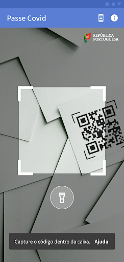
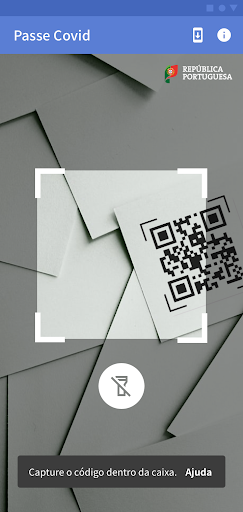
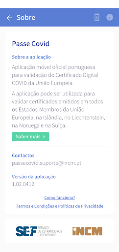
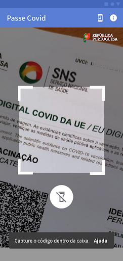
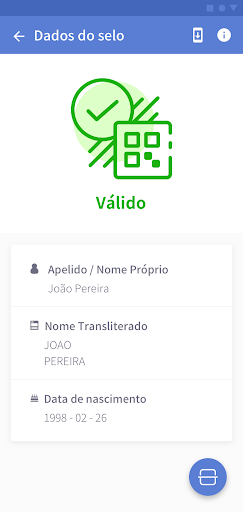
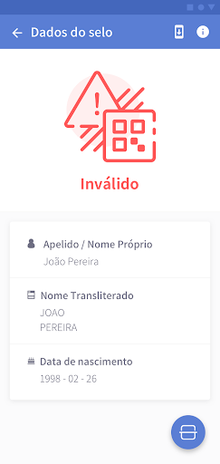
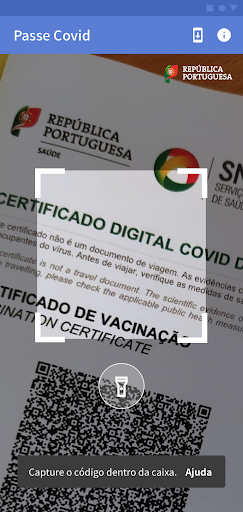
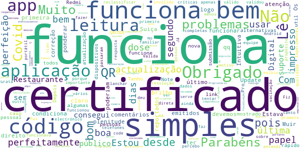
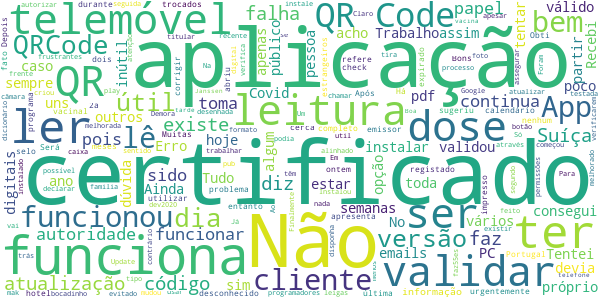
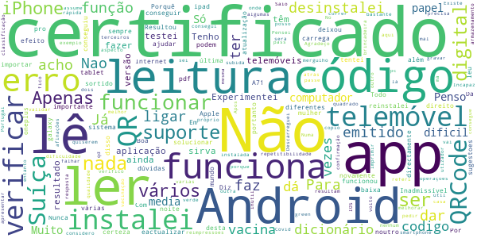

# Passe Covid
App version ``1.3``

Analyzed with [covid-apps-observer](http://github.com/covid-apps-observer) project, version ``0.1``

## App overview
| | |
|-------------------------|-------------------------| 
| **Name**&nbsp;&nbsp;&nbsp;&nbsp;&nbsp;&nbsp;&nbsp;&nbsp;&nbsp;&nbsp;&nbsp;&nbsp;&nbsp;&nbsp;&nbsp;&nbsp;&nbsp;&nbsp;&nbsp;&nbsp;&nbsp;&nbsp;&nbsp;&nbsp;&nbsp;&nbsp;&nbsp;&nbsp;&nbsp;&nbsp;&nbsp;&nbsp;&nbsp;&nbsp;&nbsp;&nbsp;&nbsp;&nbsp;&nbsp;&nbsp;  | Passe Covid |
| **Unique identifier** | pt.incm.eudcc.app.lite |
| **Link to Google Play** | [https://play.google.com/store/apps/details?id=pt.incm.eudcc.app.lite](https://play.google.com/store/apps/details?id=pt.incm.eudcc.app.lite) |
| **Summary**  | Aplicação oficial portuguesa para validação do Certificado Digital COVID da UE |
| **Privacy policy** | [https://incm.pt/portal/externo/incm/Termos_condicoes_PasseCovid.pdf](https://incm.pt/portal/externo/incm/Termos_condicoes_PasseCovid.pdf) |
| **Latest version** | 1.3 |
| **Last update** | 2021-07-20 18:45:46 |
| **Recent changes** | - Correções de erros - Melhoria na leitura de certificados emitidos na Suíça |
| **Installs**  | 100.000+ |
| **Category** | Turismo e local |
| **First release** | 29 de jun. de 2021 |
| **Size**  | 40M |
| **Supported Android version**  | 8.0 ou superior |

### Description
> A Passe Covid pode ser descarregada e utilizada por todos, nomeadamente transportadoras aéreas, organizadores de eventos culturais, corporativos, desportivos e familiares (como casamentos e batizados), para que possamos ter de volta a normalidade dos dias e a nossa liberdade, com toda a segurança.
 Pode ser utilizada pelas entidades que precisem de validar Certificados Digitais Covid da UE, emitidos por todos os Estados-Membros da União Europeia, na Islândia, no Liechtenstein, na Noruega e na Suíça.
 A aplicação valida a autenticidade do Certificado Digital Covid da UE e o cumprimento dos critérios de validação portugueses definidos pela DGS (Decreto-Lei nº 54-A/2021).
 Como usar?
 Aponte a câmara do telemóvel para leitura do código QR do Certificado apresentado. O certificado pode ser apresentado em papel ou em formato digital. A aplicação irá verificar automaticamente o certificado.
 Um resultado com sinal verde, significa que o certificado foi validado com sucesso.
 Um resultado com sinal vermelho, significa que o certificado não é válido (a validação inclui a verificação da autenticidade do certificado e o cumprimento das regras de saúde do país).
 Esta aplicação não garante a segurança do portador do Certificado Digital COVID em relação ao COVID-19, nem a sua identidade, servindo somente para validar a autenticidade do certificado.
 A apresentação do Certificado Digital COVID não serve como forma de identificação do portador, carecendo sempre da apresentação de um documento de identificação oficial válido e legitimo
 Proteção de Dados
 A aplicação não guarda qualquer tipo de dados.
 Mais informações: https://ec.europa.eu/info/live-work-travel-eu/coronavirus-response/safe-covid-19-vaccines-europeans/eu-digital-covid-certificate_pt

### User interface
The developers of the app provide the following screenshots in the Google play store.
| | | |
|:-------------------------:|:-------------------------:|:-------------------------:|
 |   |   |   | 
 |   |   |   | 
 |   |   |   | 
 |   |   |   | 
 |   |   |   | 
 |   |   |   | 
 |   |   |   | 

## Development team
In the following we report the main information provided by the development team in the Google play store.

| | |
|-------------------------|-------------------------|
| **Developer**  | Imprensa Nacional - Casa da Moeda S.A. |
| **Website**  | - |
| **Email** | passecovid.suporte@incm.pt |
| **Physical address**  | [Casa da Moeda Avenida António José de Almeida 1000-042 Lisboa Portugal](https://www.google.com/maps/search/Casa%20da%20Moeda%20Avenida%20António%20José%20de%20Almeida%201000-042%20Lisboa%20Portugal) (Google Maps) |
| **Other developed apps**  | [https://play.google.com/store/apps/developer?id=7850779897537985724](https://play.google.com/store/apps/developer?id=7850779897537985724) |

## Android support

| | |
|-------------------------|-------------------------|
| **Declared target Android version**  | - |
| **Effective target Android version**  | - |
| **Minimum supported Android version**  | Oreo, version 8.0.0 (API level 26) |
| **Maximum target Android version**  | - |

The larger the difference between the minimum and maximum supported Android versions, the better. A larger difference means a wider audience. For example, old phones have a very low Android version, so a high minimum supported Android version means that the app cannot be used by users with old phones, thus leading to accessibility problems. 

## Requested permissions

In the following we report the complete list of the permissions requested by the app. 

| **Permission** | **Protection level** | **Description** | 
|-------------------------|-------------------------|-------------------------|
 **android.permission ACCESS_NETWORK_STATE** | Normal | Allows applications to access information about networks. 
 **android.permission CAMERA** | :warning:**Dangerous** | Required to be able to access the camera device. 
 **android.permission FLASHLIGHT** | - | - 
 **android.permission INTERNET** | Normal | Allows applications to open network sockets. 

## Mentioned servers

| **Server** | **Registrant** | **Registrant country** | **Creation date** | 
|-------------------------|-------------------------|-------------------------|-------------------------|
 | google.com | Google LLC | :us: US | 1997-09-15 04:00:00 |
 | googleapis.com | Google LLC | :us: US | 2005-01-25 17:52:26 |
 | apache.org | The Apache Software Foundation | :us: US | 1995-04-11 04:00:00 |
 | w3.org | W3C | :us: US | 1994-07-06 04:00:00 |
 | xml.org | OASIS Open | :us: US | 1997-02-03 05:00:00 |

## Security analysis 

Below we report the main security warnings raised by our execution of the [Androwarn](https://github.com/maaaaz/androwarn) security analysis tool.

**Telephony identifiers leakage**
> - This application reads the MCC+MNC of the provider of the SIM 

**Connection interfaces exfiltration**
> - This application reads details about the currently active data network 
> - This application tries to find out if the currently active data network is metered 

**Suspicious connection establishment**
> - This application opens a Socket and connects it to the remote address '0' on the 'connect, resolve' port  
> - This application opens a Socket and connects it to the remote address '1' on the 'N/A' port  
> - This application opens a Socket and connects it to the remote address '2' on the 'N/A' port  
> - This application opens a Socket and connects it to the remote address '3' on the 'N/A' port  
> - This application opens a Socket and connects it to the remote address 'Ljava/net/Proxy;->type()Ljava/net/Proxy$Type;' on the 'N/A' port  
> - This application opens a Socket and connects it to the remote address 'Read timed out' on the 'N/A' port  
> - This application opens a Socket and connects it to the remote address 'timeout' on the 'N/A' port  

**Pim data leakage**
> - This application accesses data stored in the clipboard 

**Code execution**
> - This application loads a native library: 'barhopper_v2' 

## User ratings and reviews

Below we provide information about how end users are reacting to the app in terms of ratings and reviews in the Google Play store.

### Ratings

The Passe Covid app has been installed by more than **100000** times. At this time, **642** rated the app and its average score is **2.3235295**. Below we show the distribution of the ratings across the usual star-based rating of Google Play

:star::star::star::star::star:: 132

:star::star::star::star:: 63

:star::star::star:: 50

:star::star:: 31

:star:: 366

### Reviews 

#### 5-star reviews

> A funcionar na plenitude. Lê logo à primeira. É claro que devemos ter em atenção o brilho pois isso condiciona qq aplicação  :date: __2021-07-23 11:16:54__

> Muir bom  :date: __2021-07-22 23:55:00__

> Estava com problemas com certificados emitidos na Suiça, mas desde o último Update funciona direito. Obrigado pela correção.  :date: __2021-07-22 07:27:57__

> Intuitiva e não tive problemas. Os problemas reportados nos comentários são do código qr, pelo que poderiam ponderar alternativas caso o código não funcione com algumas pessoas, como um link com submissão de um código pessoal mostrado no certificado.  :date: __2021-07-21 00:46:22__

> Lê perfeitamente em papel, simples e rápido.  :date: __2021-07-20 23:52:13__

> Com esta nova actualização. Funciona. Muito bem.  :date: __2021-07-20 14:01:19__

> Não lê o código. Tenho um Redmi Note 9 Pro.  :date: __2021-07-20 12:12:33__

> muito util  :date: __2021-07-19 21:37:11__

> Funciona  :date: __2021-07-18 20:12:38__

> Com a última atualização 1.2.1 já funciona bem. Obrigado  :date: __2021-07-16 17:03:03__

#### 4-star reviews

> Inseri o QRCODE DO CERTIfICADO e validou o meu certificado. Mas vejo que a funçao desta App e apenas validar o certificado.Deveria a meu ver ficar registado o respetivo certificado para quando fosse necessario poder apresentar. . Seria optimo que fosse acrescentado essa funçao pk se for so pra validar , ao fazer o download no site do SNS ele ja e validado.Enfim!Ideias!  :date: __2021-07-23 10:18:36__

> A leitura do QrCode é muito lenta  :date: __2021-07-22 15:15:25__

> Emite o certificado e da primeira vez que verifiquei com esta app o certifcado deu verde mas agora passado uns dias está a dar um erro a dizer que o selo expirado e dá vermelho. Tenho as duas tomas da vacina.  :date: __2021-07-21 12:52:04__

> Finalmente resolveram o problema e a aplicação já funciona. Já não era sem tempo  :date: __2021-07-18 23:47:25__

> Funciona em parte (versão 1.2.1). Lê o QR Code presente no ficheiro PDF do certificado caso este esteja num tamanho relativamente grande, ou seja, bastante ampliado num ecrã de smartphone por exemplo. Penso que num tablet ou pc não haja problema. No entanto, não funciona a leitura do código se este estiver impresso. Penso que possa depender da qualidade da impressão, mas também pode ser resultado da aplicação estar apenas preparada para ler um QR Code em formato digital perfeitamente alinhado.  :date: __2021-07-18 15:56:17__

> Com esta última atualização, já funciona, tenho Poco X3 NFC, Android 11.  :date: __2021-07-17 11:45:54__

> Funciona bem. Nas informações deveria indicar a vacina.  :date: __2021-07-16 18:59:46__

> Já lê os códigos quer em papel quer digital, sendo no entanto necessário premir o botão da lanterna que foi adicionado à app nesta atualização.  :date: __2021-07-16 10:37:05__

> Cumpre o que promete.  :date: __2021-07-13 06:38:16__

> Funciona. Embora a actualização inicial do dicionário podia ser mais explícita, causou me um bocado confusão. Dava msg para "estar ligado à internet", que estava, mas não actualizava. Tive de ir carregar no ícone.  :date: __2021-07-12 19:47:18__

#### 3-star reviews

> Após a última atualização não mais abriu diz falha da aplicação, até esta atualização funcionou sempre bem.  :date: __2021-07-22 17:31:21__

> Bons dias. Obti o certificado há cerca de 2 semanas. O programa ao ler QR refere "selo expirado". O calendário vacinal está completo (2 tomas), mas de fato a 2a dose foi há mais de 6 meses. Há que corrigir urgentemente está falha!!!  :date: __2021-07-22 13:43:04__

> Não lê certificado impresso!  :date: __2021-07-21 14:37:49__

> Aplicação não faz leitura de certificados estrangeiros, apresenta a leitura como emissor desconhecido.  :date: __2021-07-19 16:09:01__

> Trabalho num hotel e ontem durante dois check-in's não consegui utilizar a aplicação para validar os certificados digitais de clientes da Suíça. Tentei com o telemóvel do trabalho e o meu próprio telemóvel, mas nenhum deles validou os certificados. No entanto, um dos clientes sugeriu instalar a App no próprio telemóvel (registado na Suíça) e a App no telemóvel do cliente já validou o certificado. Será que existe algum problema com a aplicação em Portugal para validar certificados da Suíça?  :date: __2021-07-19 15:57:09__

> Muitas falhas  :date: __2021-07-19 12:13:04__

> Não funciona. Não lê o código. Depois de vários emails trocados com os programadores nada mudou. Continua a não funcionar. Update 1.2.1 feito, continua sem funcionar. Ainda 100% inútil. Finalmente hoje, 16/07/2021, começou a funcionar. Foram 2 semanas frustrantes com emails para a frente e para trás. Tudo podia ter sido evitado se a aplicação tivesse sido bem testada.  :date: __2021-07-16 19:22:09__

> Já consegui que lê-se o QRCode mas apenas no formato digital em papel continua a não ler.  :date: __2021-07-16 16:11:14__

> Funciona, mas a leitura do QR tem de ser melhorada. Demora muito a ler, o QR tem de estar tipo 100% alinhado com a caixa desenhada. Um bocadinho fora e ele não lê. Para usar para pessoas mais leigas no dia a dia, esse processo tem de ser melhorado.  :date: __2021-07-16 15:25:39__

> Não funciona. Não tira foto. ( Na versão 1.1) . Instalou a versão 1.1 apesar de existir versão mais recente. O botão atualização da aplicação não funciona . Só é possível atualizar através da Google play . A versão 1.2.1 já verifica o qrcode.  :date: __2021-07-16 12:04:00__

#### 2-star reviews

> Não lê o QRCode. Para ter a certeza que não era do meu telemóvel instalei a App da Suíça e leu sempre: portanto não há dúvidas, é erro desta app. Para além disso, aquela tem a função de importar pdf o que acho importante.  :date: __2021-07-23 15:30:18__

> Não está a funcionar...  :date: __2021-07-23 12:06:43__

> Inadmissível a APP dar resultados diferentes para Android e Apple..  :date: __2021-07-20 20:34:34__

> Porquê android 7 não baixa está APP . Todo o mundo tem direito  :date: __2021-07-19 09:30:52__

> Com a última atualização deixou de funcionar. Já desinstalei e instalei novamente, sem que tenha sortido efeito.  :date: __2021-07-17 10:17:10__

> Não carrega o qrcode  :date: __2021-07-15 10:12:51__

> Boa noite. Em sistema Android não faz leitura do código QR. Da erro.  :date: __2021-07-15 03:27:36__

> Nao estou a conseguir verificar o certificado emitido pela Suíça, podem ajudar-me?  :date: __2021-07-15 00:27:56__

> Funciona no meu tablet (ipad) e no telemóvel da minha mulher (galaxy A71). Não funciona no meu telemóvel (oneplus 7 pro).  :date: __2021-07-14 17:46:43__

> Diz para ligar a Internet eactualizar o dicionário, mas não dá, como solucionar? Já instalei várias vezes?  :date: __2021-07-14 11:04:14__

#### 1-star reviews

> Tal e qual como começou o nazismo  :date: __2021-07-23 15:27:51__

> Não funcionou  :date: __2021-07-23 15:25:00__

> Mais uma vez os programadores informáticos estatais falham .É o habitual dos serviços do nosso Estado. Vou tentar uma app de outro país se for possível...😅☹  :date: __2021-07-23 14:58:48__

> Não funciona mais.  :date: __2021-07-23 13:28:29__

> Só lê os certificados se estiverem no ecrã no computador. No papel não lê. Aplicação muito má até ao momento. Espero que consigam rectificar isso.  :date: __2021-07-23 12:50:23__

> Não funciona.  :date: __2021-07-23 10:15:51__

> Após muitas tentativas e muito tempo (vários minutos) a tentar ler o código, não funciona. A app não lê o código. Com outras apps QRCode a leitura é imediata, logo é problema nesta app. É lamentável.  :date: __2021-07-23 08:38:50__

> Não lê o código  :date: __2021-07-22 18:44:59__

> Não dá nada, devem ser os mesmos da aplicação stayaway covid  :date: __2021-07-22 17:30:13__

> Não funciona  :date: __2021-07-22 16:11:28__

