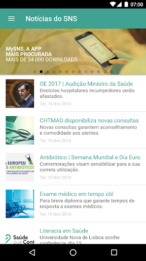
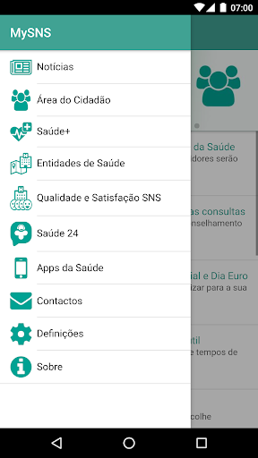
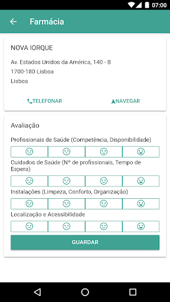

# MySNS
App version ``1.7.0``

Analyzed with [covid-apps-observer](http://github.com/covid-apps-observer) project, version ``0.1``

## App overview
| | |
|-------------------------|-------------------------| 
| **Name**&nbsp;&nbsp;&nbsp;&nbsp;&nbsp;&nbsp;&nbsp;&nbsp;&nbsp;&nbsp;&nbsp;&nbsp;&nbsp;&nbsp;&nbsp;&nbsp;&nbsp;&nbsp;&nbsp;&nbsp;&nbsp;&nbsp;&nbsp;&nbsp;&nbsp;&nbsp;&nbsp;&nbsp;&nbsp;&nbsp;&nbsp;&nbsp;&nbsp;&nbsp;&nbsp;&nbsp;&nbsp;&nbsp;&nbsp;&nbsp;  | MySNS |
| **Unique identifier** | pt.min_saude.spms.mysns |
| **Link to Google Play** | [https://play.google.com/store/apps/details?id=pt.min_saude.spms.mysns](https://play.google.com/store/apps/details?id=pt.min_saude.spms.mysns) |
| **Summary**  | Aplicação oficial do Serviço Nacional de Saúde com informação para o cidadão. |
| **Privacy policy** | [https://www.sns.gov.pt/home/notas-legais-portal-sns-2/](https://www.sns.gov.pt/home/notas-legais-portal-sns-2/) |
| **Latest version** | 1.7.0 |
| **Last update** | 2021-06-02 18:59:30 |
| **Recent changes** | - Saiba onde marcar as suas consultas de Saúde Oral! - Melhorias gráficas; - Melhorias gerais de usabilidade da aplicação; - Algumas correcções; |
| **Installs**  | 100.000+ |
| **Category** | Saúde e fitness |
| **First release** | 14 de set. de 2016 |
| **Size**  | 8,2M |
| **Supported Android version**  | 6.0 ou superior |

### Description
> Numa perspetiva de aumentar a proximidade junto do utente e a transparência dos serviços prestados foi desenvolvido o novo Portal do SNS. A App MySNS é uma aplicação oficial do Serviço Nacional de Saúde e é a ligação móvel a este portal e aos serviços digitais da saúde.
 O MySNS é uma ferramenta que permite consultar notícias do Serviço Nacional de Saúde, consultar informação de saúde, disponibilizar uma lista e mapa instituições de saúde (Hospitais, Cuidados de Saúde Primários e Farmácias), avaliação da qualidade e satisfação do SNS pelos cidadão, e consulta de informação da Linha Saúde 24, além disso irá receber notificações tais como alertas de calor, etc, associadas à sua localização.

### User interface
The developers of the app provide the following screenshots in the Google play store.
| | | |
|:-------------------------:|:-------------------------:|:-------------------------:|
 |   |   |   | 
 |  

## Development team
In the following we report the main information provided by the development team in the Google play store.

| | |
|-------------------------|-------------------------|
| **Developer**  | SPMS - Serviços Partilhados do Ministério da Saúde |
| **Website**  | [https://sns.gov.pt](https://sns.gov.pt) |
| **Email** | atendimento@sns24.gov.pt |
| **Physical address**  | - |
| **Other developed apps**  | [https://play.google.com/store/apps/developer?id=SPMS+-+Servi%C3%A7os+Partilhados+do+Minist%C3%A9rio+da+Sa%C3%BAde](https://play.google.com/store/apps/developer?id=SPMS+-+Servi%C3%A7os+Partilhados+do+Minist%C3%A9rio+da+Sa%C3%BAde) |

## Android support

| | |
|-------------------------|-------------------------|
| **Declared target Android version**  | Lollipop, version 5.1 (API level 22) |
| **Effective target Android version**  | Lollipop, version 5.1 (API level 22) |
| **Minimum supported Android version**  | KitKat, version 4.4 - 4.4.4 (API level 19) |
| **Maximum target Android version**  | - |

The larger the difference between the minimum and maximum supported Android versions, the better. A larger difference means a wider audience. For example, old phones have a very low Android version, so a high minimum supported Android version means that the app cannot be used by users with old phones, thus leading to accessibility problems. 

## Requested permissions

In the following we report the complete list of the permissions requested by the app. 

| **Permission** | **Protection level** | **Description** | 
|-------------------------|-------------------------|-------------------------|
 **android.permission ACCESS_COARSE_LOCATION** | :warning:**Dangerous** | Allows an app to access approximate location. 
 **android.permission ACCESS_FINE_LOCATION** | :warning:**Dangerous** | Allows an app to access precise location. 
 **android.permission ACCESS_NETWORK_STATE** | Normal | Allows applications to access information about networks. 
 **android.permission INTERNET** | Normal | Allows applications to open network sockets. 
 **android.permission READ_APP_BADGE** | - | - 
 **android.permission REQUEST_INSTALL_PACKAGES** | Signature | Allows an application to request installing packages. 
 **android.permission VIBRATE** | Normal | Allows access to the vibrator. 
 **android.permission WAKE_LOCK** | Normal | Allows using PowerManager WakeLocks to keep processor from sleeping or screen from dimming. 
 **android.permission WRITE_EXTERNAL_STORAGE** | :warning:**Dangerous** | Allows an application to write to external storage. 
 **com.anddoes.launcher.permission UPDATE_COUNT** | - | - 
 **com.google.android.c2dm.permission RECEIVE** | - | - 
 **com.htc.launcher.permission READ_SETTINGS** | - | - 
 **com.htc.launcher.permission UPDATE_SHORTCUT** | - | - 
 **com.huawei.android.launcher.permission CHANGE_BADGE** | - | - 
 **com.huawei.android.launcher.permission READ_SETTINGS** | - | - 
 **com.huawei.android.launcher.permission WRITE_SETTINGS** | - | - 
 **com.majeur.launcher.permission UPDATE_BADGE** | - | - 
 **com.oppo.launcher.permission READ_SETTINGS** | - | - 
 **com.oppo.launcher.permission WRITE_SETTINGS** | - | - 
 **com.sec.android.provider.badge.permission READ** | - | - 
 **com.sec.android.provider.badge.permission WRITE** | - | - 
 **com.sonyericsson.home.permission BROADCAST_BADGE** | - | - 
 **com.sonymobile.home.permission PROVIDER_INSERT_BADGE** | - | - 
 **pt.min_saude.spms.mysns.permission C2D_MESSAGE** | - | - 
 **pt.min_saude.spms.mysns.permission PushHandlerActivity** | - | - 

## Mentioned servers

| **Server** | **Registrant** | **Registrant country** | **Creation date** | 
|-------------------------|-------------------------|-------------------------|-------------------------|
 | google.com | Google LLC | :us: US | 1997-09-15 04:00:00 |
 | hockeyapp.net | Microsoft Corporation | :us: US | 2011-01-23 18:46:43 |
 | gstatic.com | Google LLC | :us: US | 2008-02-11 15:31:25 |
 | whatsapp.com | WhatsApp LLC | :us: US | 2008-09-04 12:39:12 |
 | here.com | HERE Global B.V. | :netherlands: NL | 1995-06-11 04:00:00 |
 | googleapis.com | Google LLC | :us: US | 2005-01-25 17:52:26 |

## Security analysis 

Below we report the main security warnings raised by our execution of the [Androwarn](https://github.com/maaaaz/androwarn) security analysis tool.

**Telephony identifiers leakage**
> - This application reads the device phone type value 

**Connection interfaces exfiltration**
> - This application reads details about the currently active data network 
> - This application tries to find out if the currently active data network is metered 

**Telephony services abuse**
> - This application makes phone calls 

**Suspicious connection establishment**
> - This application opens a Socket and connects it to the remote address '10' on the 'N/A' port  
> - This application opens a Socket and connects it to the remote address '3' on the 'N/A' port  
> - This application opens a Socket and connects it to the remote address 'Ljava/net/Proxy;->type()Ljava/net/Proxy$Type;' on the 'N/A' port  
> - This application opens a Socket and connects it to the remote address 'timeout' on the 'N/A' port  

**Code execution**
> - This application loads a native library: 'sqlc-native-driver' 
> - This application loads a native library: 'tbxml' 
> - This application executes a UNIX command containing this argument: '7' 

## User ratings and reviews

Below we provide information about how end users are reacting to the app in terms of ratings and reviews in the Google Play store.

### Ratings

The MySNS app has been installed by more than **100000** times. At this time, **1760** rated the app and its average score is **3.0568182**. Below we show the distribution of the ratings across the usual star-based rating of Google Play

:star::star::star::star::star:: 660

:star::star::star::star:: 220

:star::star::star:: 110

:star::star:: 100

:star:: 670

### Reviews 

#### 5-star reviews

> Gostava de activar o certificado como ja levei as vacinas O  :date: __2021-07-12 17:36:14__

> Tudo ok ! Até conta as vacinas que já tomou antes!  :date: __2021-07-12 17:25:29__

> Tenho pouca experiência, mas estou a gostar e vai-me útil  :date: __2021-07-12 16:47:06__

> Estou satisfeito  :date: __2021-07-10 15:06:18__

> Muito bom  :date: __2021-07-08 22:40:04__

> Ok.  :date: __2021-07-07 14:42:14__

> Boa ambiente na app  :date: __2021-07-02 19:30:43__

> Excelente  :date: __2021-07-01 18:02:48__

> Lenta na sua abertura, e de pouca utilidade. Não serve para consultar nada a não ser o número da saúde 24. Certamente o nome não corresponde à app. O que esperava era inserir o meu número de utente e ter acesso à informação médica pessoal.  :date: __2021-06-30 12:53:01__

> Funciona bem e é bastante útil .  :date: __2021-06-28 21:17:51__

#### 4-star reviews

> SNS24  :date: __2021-07-06 19:54:43__

> Muito completa e rápida.  :date: __2021-07-04 15:22:16__

> Bom  :date: __2021-06-24 17:20:04__

> Bom  :date: __2021-04-01 12:35:51__

> Nenhuma  :date: __2021-03-18 11:03:27__

> Boa  :date: __2021-02-04 12:01:31__

> A APP não corre com Android 10. como posso fazer para poder utilizar no meu tlm?  :date: __2021-01-26 07:57:32__

> Boa, muito boa  :date: __2021-01-06 10:55:27__

> Confusa  :date: __2020-12-14 15:54:31__

> Razoável  :date: __2020-12-08 11:57:07__

#### 3-star reviews

> Opcional  :date: __2021-07-21 22:12:07__

> Ainda tenho muitas dúvidas...  :date: __2021-07-19 22:39:37__

> O programa falha muitas vezes a leitura da impressão digital o que é necessário para mostrar o certificado covid etc.  :date: __2021-07-12 22:13:25__

> Caros informáticos... pessoalmente gostava mais da APP antiga ou seja a anterior a esta. Possivelmente esta seja mais rápida, mais técnica, não sei, só sei que a antiga a meu ver era mais intuitiva. Convém dizer que faz o que é pretendido mas estruturalmente acho a outra melhor, mais simples. Terei que me adaptar lógico mas é a minha opinião em relação á alteração. Cumprimentos P.S- o cartão ADSE não aparece? Algum defeito na APP?! É possível resolver a questão do cartão ADSE?  :date: __2021-06-30 22:43:22__

> Quero saber o boletim de vacinas do meu filho que não tem número de telemóvel ainda. Não consigo. Não aceita o meu número nem o da mãe, porque já estão registados. Não aceita 0000 porque não é possível. E agora?  :date: __2021-06-27 16:01:05__

> Ajustes necessários! A app é feia visualmente e praticamente. Não encontrei forma de iniciar secção na app. As apps MySNS Carteira e MySNS Tempos pode muito bem ser integrado a app MySNS o que faria uma maior simplicidade e unifornidade. Enfim certas apps do governo podiam ser mais simples, uniformes e fáceis de usar, ou seja, TODAS AS APPS RELACIONADAS AO SNS NO RAIO DE UMA APP SÓ, É ASSIM TÃO DIFÍCIL DE IMAGINAR???  :date: __2021-06-26 04:09:10__

> Nao consigo fazer certeficado Europeu de vacinas  :date: __2021-06-24 21:26:03__

> Muito útil  :date: __2021-05-09 16:54:25__

> Ao tentar utilizar pela primeira vez deu mensagem: mysns falhou  :date: __2021-04-23 13:39:55__

> Parece-me que tudo o que é possível fazer nesta app é também possível fazer através do site do SNS. Não vejo vantagem da app em relação ao site. Aliás, algumas das "funções" da app funcionam por reencaminhamento para o site.  :date: __2021-04-16 21:41:18__

#### 2-star reviews

> É prática mas não funciona a 100% numas funciona ,noutras não,e para se obter o certificado digital da covid 19 está diferente dos outros países da união europeia, não aparece com o símbolo da união europeia.  :date: __2021-07-15 18:16:40__

> Levei a 2a dose da vacina, Pfizer a 31 de maio de 2021. (Há 37 dias) Desde o dia 14 de junho, que tento obter Certificado Digital de Vacinação. Após introduzir dados solicitados,(data nascimento e número de Utente) ao Submeter, aparece a mensagem Aplicacional: "os dados não são válidos ou ainda não é possível obter o certificado"  :date: __2021-07-08 23:03:02__

> Não entendo a alteração. A mySnsCarteira funcionava sem ser necessário validar tudo vezes sem conta, agora está escondida lá no meio e falta informação. Não gosto.  :date: __2021-06-29 18:57:52__

> Instalei a app para ter acesso as minhas receitas e fiquei perdido...  :date: __2021-06-23 13:09:00__

> Depois de instalar a aplicação e de uma enorme perda de tempo não consigo aceder à receita médica qual é a utilidade desta aplicação  :date: __2021-06-13 22:47:50__

> Funcionou durante algum tempo mudei de telefone e inexplicavelmente deixou de funcionar. Enquanto Funcionou reparei que era muito complicada e pouco amigável para o utilizador no entanto com maior ou menor dificuldade sempre servia. Agora não consigo utilizar.  :date: __2021-05-18 23:11:57__

> Sinceramente não compreendo que esta APP não seja compatível com o SO Android mais recente. Há vontade de acompanhar a evolução o que facilita a vida a toda a gente. Mas ela não estando em conformidade vou desinstalá-la.  :date: __2021-05-08 21:34:07__

> Não existe opção de acesso pelo facto de o SNS não estar atualizado relativamente ao software a utilizar.  :date: __2021-05-03 16:02:37__

> Funciona muito mal e não tem os registos das minhas doenças crónicas  :date: __2021-04-12 16:19:02__

> Está sempre a parar de funcionar. Era bom actualizar esta app.  :date: __2021-03-12 12:33:48__

#### 1-star reviews

> Não percebo. Que aconteceu às receitas? Como saber quantas caixas são? Pela repetição do medicamento? Aparece o número de embalagens? Onde? E já não se recebem as receitas por email? Não percebo. A app foi alterada? Parece diferente. Antes não tinha estas dúvidas.  :date: __2021-07-19 23:31:20__

> Darei melhor classificação quando a aplicação me permitir entrar(fazer logg um) aparentemente não podemos mudar de número de telemóvel, diz que o meu número está errado, quando inclusive para a vacinação covid19 é este número que consta para o meu número de utente, tenho sido contactado por este número...!!!  :date: __2021-07-19 11:31:32__

> Funciona mas para chegar até á data de nascimento é um massacre e mais não digo...  :date: __2021-07-17 21:34:32__

> Completamente inutil  :date: __2021-07-16 11:17:32__

> Sinceramente não consigo perceber a utilidade desta aplicação....  :date: __2021-07-14 23:12:10__

> Ao apagarem a APP Mysns carteira pioraram a aplicação SNS24. Na parte dos acessos à APP no tlm e muito pior nas receitas. E a falha de não se saber (as farmácias sabem) quantas embalagens já foi aviadas e o prazo de validade não foi resolvida. Melhorem não estraguem...  :date: __2021-07-13 19:56:53__

> Puro lixo...  :date: __2021-07-11 23:38:12__

> Horrível  :date: __2021-07-10 11:33:57__

> Para que fazer uma app se apenas o que faz e nos redireccionar para o website? Inútil, complicada, sem design...  :date: __2021-07-08 22:15:13__

> Fraquinha, N S  :date: __2021-07-08 21:16:43__

