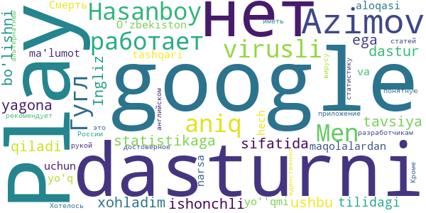
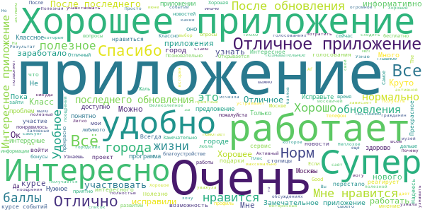

# COVID-related Android apps in Russia

Author: `Ivano Malavolta` (ivanomalavolta@gmail.com)

Created at: `2020/10/18`

Report generated by the [covid-apps-observer](http://github.com/covid-apps-observer) project, version 0.1

# Table of contents 

- [Background](#background)
    * [Data sources and analyses](#data-sources-and-analyses)
        * [App metadata](#app-metadata)
        * [Requested permissions](#requested-permissions)
        * [Mentioned servers](#mentioned_servers)
        * [Security analysis](#security_analysis)
        * [User ratings and reviews](#user-ratings-and-reviews)
    * [Disclaimer](#disclaimer)
- [Госуслуги Москвы](#госуслуги-москвы)
- [Моя Москва — официальное приложение портала mos.ru](#моя-москва-—-официальное-приложение-портала-mos.ru)
- [WHO Info](#who-info)
- [Социальный мониторинг](#социальный-мониторинг)
- [OpenWHO](#openwho)
- [Активный гражданин](#активный-гражданин)

- [Credits](#credits)

# How to read this report

This report has been generated by the [covid-apps-observer](http://github.com/covid-apps-observer) project. The project automatically analyzes the apps by extracting information which is already publicly available either on the web or in the apps binary files. 

Our analysis covers the following apps:
| | |
|-------------------------|-------------------------| 
|  | Госуслуги Москвы
|  | Моя Москва — официальное приложение портала mos.ru
|  | WHO Info
|  | Социальный мониторинг
|  | OpenWHO
|  | Активный гражданин

The details of our analysis are presented in the remainder of this report.

For independent verification, the raw data and the source code of the project is publicly available in its GitHub repository [http://github.com/covid-apps-observer](http://github.com/covid-apps-observer) and its source code has been thoroughly commented in order to provide all the details about how the information provided in this report has been extracted. 

Any feedback, questions, and improvements about the project are very welcome, feel free to create an issue or pull request directly in its GitHub repository: [http://github.com/covid-apps-observer](http://github.com/covid-apps-observer).

## Data sources and analyses

The analysis of each app is structured around five main dimensions: 
* App metadata  
* Requested permissions
* Mentioned servers
* Androwarn analysis
* User ratings and reviews

In the following we describe the data sources and analysis performed for each dimension.

### App metadata

App metadata includes an overview of the main information about the app (for example, its name, releases, privacy policy, etc.), contact information of the development team, and the various Android versions supported by the app. This information is extracted from two main data sources:
* _Google Play store_: we automatically mined the web page of the Google Play store showing the basic information about the app and we parsed it in order to extract information about the app and development team 
* _Android Manifest file_: in our analysis we decompiled the binary file of the app (it is similar to a Zip archive but it contains the code of the app instead of normal files) and we extracted information about the supported Android versions, as it has been listed by its development team.

The extracted app metadata feeds the _App overview_, _Development team_, and _Android support_ sections of this report.
We make use of the [google-play-scraper](https://github.com/JoMingyu/google-play-scraper) tool for extracting the raw data related to this dimension of the project.

### Requested permissions

The Android operating system has a permission model which allows users to grant access to potentially privacy-related information. Every Android app has to explictly declare the permissions it needs to properly function in the Android Manifest file.  

In this report we also show the protection level of each permission, which is a key information for understanding how the requested permissions related to the user's privacy. We carefully analyzed the [official Android documentation (v. 29)](https://developer.android.com/reference/android/Manifest.permission), and it resulted that a permission requested by an Android app can belong to the following protection levels:
* **Dangerous**: higher-risk permissions that would give a requesting app access to private user data or control over the device that can negatively impact the user. Because this type of permission introduces potential risk, the system usually does not automatically grant it to the requesting app. For example, any dangerous permissions requested by an app may be displayed to the user and require confirmation before proceeding.
* **Normal**: this is the default and most common level in Android; normal permissions are lower-risk and give access to isolated app-level features, with minimal risk to other apps, the system, or the user. 
* **Signature**: permissions granted only if the requesting app is signed with the same certificate as the app that declared the permission
* **Appop**: old permission level, a reminiscence of the App Ops tool that Google introduced in Android 4.3.
* **Development**: optional permissions which can be granted to development-oriented apps.
* **Privileged**: permissions who give higher power to mobile apps w.r.t. other apps, such as binding to incoming calls, interacting via bluetooth with other devices without user interaction, etc.
* **Preinstalled**: reserved only for preinstalled apps
* **Installer**: allow the holder to start the permission usage screen for an app
* **RetailDemo**: permissions related to devices used in demonstrations in shops.
* **Pre23**: permissions automatically granted to apps targeting devices running pre-6.0 Android.
* **Upcoming**: permissions which will be released in the next version of the Android platform. 
* **Deprecated**: permissions belonging to old releases of the Android platform, they should not be used by developers since they will not be supported in the near future.
* **Not for use by third-party applications**: permissions which can be requested only by apps developed by Google.
* **Undefined**: this protection level is not documented by Google.

The permissions dimension of this project is based on the [Androguard](https://github.com/androguard/androguard) static analysis tool.

### Mentioned servers

We decompiled each app in order to look for all possible mentions of remote URLs. The mentioned URLs can refer to remote servers the the app is using for either sending or receiving information, web addresses for directing the user to an information website, and so on. 

:warning: It is important to note that this analysis is not meant to be complete and it is very prone to obfuscation. The servers reported here are simply _mentioned_ somewhere in the code of the app and are meant to just give an indication about the "hooks" of the app towards external resources. For example, for an Android app it is normal to contact Google services in order to send/receive push notifications, or to contact the servers of analytics services for having real-time diagnostics about crashes of the app or bugs.

This part of the analysis is based on the [Androguard](https://github.com/androguard/androguard) static analysis tool for identfying the raw URLs mentioned in the app; then, the information about each mentioned server is collected by performing a _whois_ lookup on the first-level domain present in the URL.

### Security analysis

This dimension is based on the [Androwarn](https://github.com/maaaaz/androwarn) structural and data flow analysis of Android bytecode. Androwarn is developed by the University of Lyon/INSA (France) and it has been used in several academic studies. According to its documentation, Androwarn targets the following categories of potential security issues:
* **Telephony identifiers exfiltration**: IMEI, IMSI, MCC, MNC, LAC, CID, operator's name, etc.
* **Device settings exfiltration**: software version, usage statistics, system settings, logs, etc.
* **Geolocation information leakage**: GPS/WiFi geolocation, etc.
* **Connection interfaces information exfiltration**: WiFi credentials, Bluetooth MAC adress, etc.
* **Telephony services abuse**: premium SMS sending, phone call composition, etc.
* **Audio/video flow interception**: call recording, video capture, etc.
* **Remote connection establishment**: socket open call, Bluetooth pairing, APN settings edit, etc.
* **PIM data leakage**: contacts, calendar, SMS, mails, clipboard, etc.
* **External memory operations**: file access on SD card, etc.
* **PIM data modification**: add/delete contacts, calendar events, etc.
* **Arbitrary code execution**: native code using JNI, UNIX command, privilege escalation, etc.
* **Denial of Service**: event notification deactivation, file deletion, process killing, virtual keyboard disable, terminal shutdown/reboot, etc.

Note: We do not consider this data point in the current version of our analyzers since it is too verbose for our purposes.

:warning: It is important to note that Androwarn is a static analysis tool, and as such it performs a variety of heuristics and approximations in its analyses. Said that, the results shown in this report are meant to provide an indication of _potential_ security issues and should be by no means treated as complete and correct.   

### User ratings and reviews

For this dimension we turn again to the web interface of the Google Play store. Firstly, we automatically mine summary statistics about user ratings from the web page of the app under analysis; then, we automatically download the newest 1000 reviews of the app under analysis. For each level of rating (5 stars, 4 stars, , etc., 1 star) we show:
- a word cloud presenting the main terms used by end users in their reviews in the Google Play store
- the last 10 reviews provided by app users in the Google Play store. 

This purposefully simple analysis is meant to help both future users and the development team of the app in understanding what are the main positive and negative points of the app under analysis.

We make use of the [google-play-scraper](https://github.com/JoMingyu/google-play-scraper) tool for extracting the raw data related to this dimension of the project.

## Disclaimer 

This report has been produced independently of any parties and its only objective is to help anybody in better understanding how COVID-related apps work in practice (and compare to each other). The results of this report are limited to the specific version of the software used for running the analyses and on the various heuristics implemented in there. In other words, the results of the analyzers may differ depending on the time and modalities in which they are executed. We do not guarantee that the results of the analyses and the corresponding contents of this report are fully complete or correct. The analysis software is licensed under the [MIT License](https://github.com/iivanoo/covid-apps-observer/blob/master/LICENSE).

# Госуслуги Москвы
App version ``3.11.2.2``

Analyzed with [covid-apps-observer](http://github.com/covid-apps-observer) project, version ``0.1``

## App overview
| | |
|-------------------------|-------------------------| 
| **Name**&nbsp;&nbsp;&nbsp;&nbsp;&nbsp;&nbsp;&nbsp;&nbsp;&nbsp;&nbsp;&nbsp;&nbsp;&nbsp;&nbsp;&nbsp;&nbsp;&nbsp;&nbsp;&nbsp;&nbsp;&nbsp;&nbsp;&nbsp;&nbsp;&nbsp;&nbsp;&nbsp;&nbsp;&nbsp;&nbsp;&nbsp;&nbsp;&nbsp;&nbsp;&nbsp;&nbsp;&nbsp;&nbsp;&nbsp;&nbsp;  | Госуслуги Москвы |
| **Unique identifier** | ru.altarix.mos.pgu |
| **Link to Google Play** | [https://play.google.com/store/apps/details?id=ru.altarix.mos.pgu](https://play.google.com/store/apps/details?id=ru.altarix.mos.pgu) |
| **Summary**  | Все электронные услуги города: начисления ЖКХ, штрафы ГИБДД, эвакуация ТС и др. |
| **Privacy policy** | [http://dit.mos.ru/apps/privacypolicy](http://dit.mos.ru/apps/privacypolicy) |
| **Latest version** | 3.11.2.2 |
| **Last update** | 2020-05-21 18:36:56 |
| **Recent changes** | - Исправлена редкая проблема поиска адреса квартиры в профиле |
| **Installs**  | 1 000 000+ |
| **Category** | Социальные |
| **First release** | 27 сент. 2012 г. |
| **Size**  | 28M |
| **Supported Android version**  | 5.0 и выше |

### Description
> Мобильное приложение «Госуслуги Москвы» - сервис, объединяющий востребованные услуги Правительства Москвы, для комфортной жизни в большом городе.
 Образование:
 - Сервис «Мой ребенок в школе» дает возможность удаленно отслеживать проход и питание учащегося, школьное меню и баланс лицевого счета, который в любой момент можно пополнить с банковской карты/мобильного счета; 
 - Сервис «Электронный дневник» объединяет в себе самую важную для родителей информацию об учебе: расписание уроков, домашние задание, оценки учащегося и т.д.; 
 - Сервис «Результаты ГИА» - мобильная площадка с результатами прохождения Государственной итоговой аттестации.
 Жилье, ЖКУ:
 - Сервис «Начисления за жилищно-коммунальные услуги» предоставляет развернутую информацию о долговых/текущих начислениях за ЖКУ с возможностью заказать электронный Единый платежный документ; 
 - Сервис «Внесение показаний» - возможность передачи показаний счетчиков водоснабжения/электроэнергии, а также получения информации о задолженности без очередей и отрыва от важных дел; 
 - Сервис «Единый диспетчерский центр» – компактная площадка для решения проблем и вопросов, относящихся к вашему дому/двору;
 - Сервис «Информирование о начале расчетов по новой услуге»;
 - Сервис «Информирование о регистрации на жилплощади»;
 - Сервис «Информирование об отключении горячего водоснабжения».
 Транспорт:
 - Сервис «Штрафы» дает возможность получать актуальную информацию по вашим штрафам и оплачивать с мобильного; 
 - Сервис «Эвакуация транспортного средства» информирует об эвакуации ТС, а также предоставляет точный адрес местонахождения ТС на спецстоянке.
 Здоровье и документы:
 - Сервис «Запись к врачу» предоставляет возможность удаленно записаться на прием к любому врачу, перенести и отменить запись, посмотреть перечень направлений и выписанные вам рецепты; 
 - Сервис «Запись к ветеринару» предоставляет возможность записать своего питомца на прием в ветеринарную клинику (перенести, отменить запись) или вызвать ветеринара на дом;
 - Сервис «Готовность загранпаспорта» - индивидуальное информирование о готовности заграничного паспорта;
 - Сервис «Федеральная служба судебных приставов» предоставляет информацию о наличии исполнительных делопроизводств ФССП.
 Информация:
 - Сервис «Новости» объединяет в себе самые актуальные и интересные новости города в удобном мобильном формате.
 По желанию вы можете настроить способ получения уведомлений: SMS, E-mail или Push-уведомления.
 ___________________________________
 Обратите внимание на другие официальные приложения правительства Москвы.
 - Активный Гражданин - проект для тех, кому важно, что происходит в Москве
 - Наш город – помогите нам сделать город лучше
 - Парковки Москвы – приложение для поиска и оплаты парковки в Москве
 - Узнай Москву - архитектурная история столицы).

### User interface
The developers of the app provide the following screenshots in the Google play store.
| | | |
|:-------------------------:|:-------------------------:|:-------------------------:|
 |   |   |   | 
 |   |  

## Development team
In the following we report the main information provided by the development team in the Google play store.

| | |
|-------------------------|-------------------------|
| **Developer**  | Информационный город ГКУ |
| **Website**  | [https://www.mos.ru/mosapps/](https://www.mos.ru/mosapps/) |
| **Email** | emp@mos.ru |
| **Physical address**  | - |
| **Other developed apps**  | [https://play.google.com/store/apps/developer?id=%D0%98%D0%BD%D1%84%D0%BE%D1%80%D0%BC%D0%B0%D1%86%D0%B8%D0%BE%D0%BD%D0%BD%D1%8B%D0%B9+%D0%B3%D0%BE%D1%80%D0%BE%D0%B4+%D0%93%D0%9A%D0%A3](https://play.google.com/store/apps/developer?id=%D0%98%D0%BD%D1%84%D0%BE%D1%80%D0%BC%D0%B0%D1%86%D0%B8%D0%BE%D0%BD%D0%BD%D1%8B%D0%B9+%D0%B3%D0%BE%D1%80%D0%BE%D0%B4+%D0%93%D0%9A%D0%A3) |

## Android support

| | |
|-------------------------|-------------------------|
| **Declared target Android version**  | Pie, version 9 (API level 28) |
| **Effective target Android version**  | Pie, version 9 (API level 28) |
| **Minimum supported Android version**  | Lollipop, version 5.0 (API level 21) |
| **Maximum target Android version**  | - |

The larger the difference between the minimum and maximum supported Android versions, the better. A larger difference means a wider audience. For example, old phones have a very low Android version, so a high minimum supported Android version means that the app cannot be used by users with old phones, thus leading to accessibility problems. 

## Requested permissions

In the following we report the complete list of the permissions requested by the app. 

| **Permission** | **Protection level** | **Description** | 
|-------------------------|-------------------------|-------------------------|
 **android.permission ACCESS_COARSE_LOCATION** | :warning:**Dangerous** | Allows an app to access approximate location. 
 **android.permission ACCESS_FINE_LOCATION** | :warning:**Dangerous** | Allows an app to access precise location. 
 **android.permission ACCESS_NETWORK_STATE** | Normal | Allows applications to access information about networks. 
 **android.permission ACCESS_WIFI_STATE** | Normal | Allows applications to access information about Wi-Fi networks. 
 **android.permission CALL_PHONE** | :warning:**Dangerous** | Allows an application to initiate a phone call without going through the Dialer user interface for the user to confirm the call. 
 **android.permission CAMERA** | :warning:**Dangerous** | Required to be able to access the camera device. 
 **android.permission INTERNET** | Normal | Allows applications to open network sockets. 
 **android.permission READ_CALENDAR** | :warning:**Dangerous** | Allows an application to read the user's calendar data. 
 **android.permission READ_CONTACTS** | :warning:**Dangerous** | Allows an application to read the user's contacts data. 
 **android.permission READ_EXTERNAL_STORAGE** | :warning:**Dangerous** | Allows an application to read from external storage. 
 **android.permission USE_BIOMETRIC** | Normal | Allows an app to use device supported biometric modalities. 
 **android.permission USE_FINGERPRINT** | Normal | This constant was deprecated in API level 28. Applications should request USE_BIOMETRIC instead 
 **android.permission VIBRATE** | Normal | Allows access to the vibrator. 
 **android.permission WAKE_LOCK** | Normal | Allows using PowerManager WakeLocks to keep processor from sleeping or screen from dimming. 
 **android.permission WRITE_CALENDAR** | :warning:**Dangerous** | Allows an application to write the user's calendar data. 
 **android.permission WRITE_EXTERNAL_STORAGE** | :warning:**Dangerous** | Allows an application to write to external storage. 
 **com.google.android.c2dm.permission RECEIVE** | - | - 
 **com.google.android.finsky.permission BIND_GET_INSTALL_REFERRER_SERVICE** | - | - 

## Mentioned servers

| **Server** | **Registrant** | **Registrant country** | **Creation date** | 
|-------------------------|-------------------------|-------------------------|-------------------------|
 | vk.com | Privacy protection service - whoisproxy.ru | :ru: RU | 1997-06-24 04:00:00 |
 | cloudmade.com | Cloud Made Ltd | :uk: UK | 2007-07-17 17:02:27 |
 | facebook.com | Facebook, Inc. | :us: US | 1997-03-29 05:00:00 |
 | googleapis.com | Google LLC | :us: US | 2005-01-25 17:52:26 |
 | google.com | Google LLC | :us: US | 1997-09-15 04:00:00 |
 | 2gis.ru | - | - | 2001-02-18 21:00:00 |
 | crashlytics.com | Google LLC | :us: US | 2011-01-21 15:30:40 |
 | googlesyndication.com | Google LLC | :us: US | 2003-01-21 06:17:24 |
 | openstreetmap.org | OpenStreetMap Foundation | GB | 2004-08-09 18:47:25 |
 | openptmap.org | Registrant State/Province: Bayern | :de: DE | 2010-11-17 12:05:24 |
 | openstreetmap.nl | - | - | 2007-03-06 00:00:00 |
 | wmflabs.org | Wikimedia Foundation, Inc. | :us: US | 2011-09-29 14:58:28 |
 | openseamap.org | Registrant State/Province: | :de: DE | 2009-03-26 11:35:19 |
 | chartbundle.com | Whois Privacy Service | :us: US | 2010-01-09 23:30:15 |
 | opentopomap.org | Registrant State/Province: | :de: DE | 2011-09-03 18:35:13 |
 | app-measurement.com | Google LLC | :us: US | 2015-06-19 20:13:31 |
 | mos.ru | - | - | 1996-12-23 09:49:03 |
 | googleadservices.com | Google LLC | :us: US | 2003-06-19 16:34:53 |
 | w3.org | W3C | :us: US | 1994-07-06 04:00:00 |
 | mts.ru | - | - | 1997-11-19 12:02:34 |
 | 2gis.com | DoubleGIS LLC | :ru: RU | 2004-03-18 08:51:04 |

## Security analysis 

Below we report the main security warnings raised by our execution of the [Androwarn](https://github.com/maaaaz/androwarn) security analysis tool.

**Telephony identifiers leakage**
> - This application reads the numeric name (MCC+MNC) of current registered operator 
> - This application reads the operator name 

**Location lookup**
> - This application reads location information from all available providers (WiFi, GPS etc.) 

**Connection interfaces exfiltration**
> - This application reads details about the currently active data network 

**Telephony services abuse**
> - This application makes phone calls 

**Suspicious connection establishment**
> - This application opens a Socket and connects it to the remote address ' returned no addresses for  ; port is out of range' on the 'N/A' port  
> - This application opens a Socket and connects it to the remote address '' on the 'N/A' port  
> - This application opens a Socket and connects it to the remote address 'Ljava/net/Proxy;->type()Ljava/net/Proxy$Type;' on the 'N/A' port  
> - This application opens a Socket and connects it to the remote address 'timeout' on the 'N/A' port  

**Code execution**
> - This application loads a native library 

## User ratings and reviews

Below we provide information about how end users are reacting to the app in terms of ratings and reviews in the Google Play store.

### Ratings

The Госуслуги Москвы app has been installed by more than **1000000** times. At this time, **51744** rated the app and its average score is **4.181483**. Below we show the distribution of the ratings across the usual star-based rating of Google Play

:star::star::star::star::star:: 36558

:star::star::star::star:: 4559

:star::star::star:: 1757

:star::star:: 1195

:star:: 7673

### Reviews 

#### 5-star reviews

> Удобное приложение.  :date: __2020-10-18 09:46:22__

> Удобное приложение  :date: __2020-10-17 20:08:09__

> Очень хороший всо роботоет  :date: __2020-10-17 15:03:15__

> А чем отличается от приложения "Моя Москва" ?  :date: __2020-10-16 14:53:31__

> Отлично!  :date: __2020-10-16 14:31:28__

> Очень удобный сайт. Из дома можно передать показания, записаться к врачу. Молодцы.  :date: __2020-10-16 10:00:25__

> Круто  :date: __2020-10-16 09:22:29__

> Вы молодцы, спасибо!  :date: __2020-10-16 06:19:38__

> Крутое приложения  :date: __2020-10-15 16:30:56__

> Удобное и хорошее приложение, советую!  :date: __2020-10-15 10:52:55__

#### 4-star reviews

> Две проблемы. В ЭЖД нет возможности (или я не нашла) проставить уведомление об отсутствии. Это обесценивает приложение, потому что приходится заходить в браузерную версию. Вторая вскрылась только что: я попыталась добавить ввод электроэнергии через приложение. У нас дача в Новой Москве, нет номера квартиры и нет лицевого счета. В приложении не принимает сведения про электросчетчик и номер счета, если не ввести лицевой счет, которого нет.  :date: __2020-10-16 12:30:04__

> Пришел штраф, нажимаю оплатить, а в ответ пишет, что начисления не найдены.  :date: __2020-10-14 07:24:06__

> Электронная мед.карт последнее время совсем не открывается 😏  :date: __2020-10-11 13:19:05__

> 👍  :date: __2020-10-09 19:41:04__

> Уведомления легко удалять, не открывая каждое! Для этого надо пальцем потянуть влево каждое сообщение и справа от него появится красная кнопка "удалить". Многие этого не знают.  :date: __2020-10-09 09:49:09__

> Штрфы гибдд оплачены, висят как не оплачены. На сайте ГИБДД долгов нет, а на вашем есть  :date: __2020-10-09 09:41:20__

> Работает без сбоев.  :date: __2020-10-07 12:39:55__

> Приложение работает хорошо. По единому диспетчерскому центру хотелось чтобы можно было приложить фото или видео, тех же замеров температуры и течи. И стояк водоотведения в зоне управляющей компании и подлежит ремонту за счёт расходов на обслуживание. Прошу изменить по статусам заявки с платной на бесплатную.  :date: __2020-10-06 21:25:20__

> Приложение очень удобное. Для подачи данных по квартире и для отслеживания ребёнка то что нужно. То только одна вещь смущает и немного нервирует. Оплачиваю штрафы через другие приложения или через сайты, а они все равно весят как не оплаченных и не убираются из списка как оплаченные. Доработайте пожалуйста этот момент.  :date: __2020-10-04 09:07:25__

> Добавьте, пожалуйста, в размере заявок в отопление - холодные батареи. Сейчас есть только "экстремально высокая температура" чего в нашем доме, в принципе, не бывает.  :date: __2020-09-30 09:44:45__

#### 3-star reviews

> Оплаченные штрафы действительно долго высвечиваются как задолженность...  :date: __2020-10-14 12:04:22__

> Все было хорошо. Но за сентябрь не передались показания воды. Ни в одной из квартир. Как будто на подавал. Забыть не мог, стоит напоминание. Просто нет показаний и пришел средний счёт.  :date: __2020-10-13 07:19:49__

> Оплаченные штрафы висят месяцами.  :date: __2020-10-11 08:45:44__

> Добавлю Убрала одну звёздочку, т.к. "висит" оплаченный 2 месяца штраф и раздражает Неплохое приложение. Удобно работать с эл.дневниками детей, добавить им деньги на счёт, контроль всего))). Вижу свои начисления за ЖКХ, учебу детей, Лёгкая запись к врачам, показания счётчиков... Мне нравится. После последнего обновления стало очень долго загружаться, из-за этого пока 4  :date: __2020-10-10 08:54:27__

> В целом идея не плохая. Есть замечания: Оплаченный штраф за пдд не исчезает. Нет поиска услуг в разделе услуги, искать нужные проблема. 10.2020 Оплаченные штрафы в другом приложении по прежнему висят! Нет возможности настройки времени рассылки сообщений смс. Присылает по ночам!!!  :date: __2020-10-02 06:49:51__

> Показывает наличие давно оплаченных штрафов Гибдд, в т.ч. По адм.кодексу Москвы. Проверял и по сайту гибдд, за скорость - штрафов нет. За парковку делал офиц.запрос в адмистрацию Мос. Парковочного пространства. Штрафы уплачены, а здесь висят. Что это за сервис, если нету б.б, мне с утра хотелось, а нынче вот ослаб:-D  :date: __2020-10-01 10:46:09__

> Не возможно записаться к участковому терапевту, выдаёт постоянно ошибку. Зачем нужно приложение если для записи приходится ехать в поликлинику  :date: __2020-10-01 06:48:24__

> Сделайте темную тему для приложения. Везде уж есть. !  :date: __2020-09-30 19:42:36__

> За все время пользования приложением более двух лет. раздел перенести запись от одного врача к другому, или изменить время приема никогда не работает. Приходится это делать через сайт мос. Ру  :date: __2020-09-25 20:55:50__

> Почему переплаченая кварплата появляется в каком-то долговом ЕПД и числится как неоплаченый ЕПД. Нельзя сделать графу переплата?  :date: __2020-09-24 00:40:49__

#### 2-star reviews

> Раньше приложение работало нормально. Сейчас доступ к эл.мед.карте есть, но у них постоянно висит табличка "введите код подтверждения". А код не присылают. Пробовал через приложение ЕМИАС, такая же ерунда. Вообщем сдохли сайты.  :date: __2020-10-16 21:13:14__

> В приложении в разделе электронный дневник - МЭШ не активны дистанционные уроки. Зайти на дистанционный урок можно только через браузер! Ни на каком из устройств (смартфон, планшет) не работает ссылка на дистанционные уроки! Просьба решить данную проблему!!!  :date: __2020-10-15 12:38:21__

> Мне вот очень интересно, почему в государственном приложении происходит оплата коммуналки с комиссией в пользу частного банка? А потом ещё байки про борьбу с коррупцией будут рассказывать) Если решили привлечь частников, то тогда их услуги должны из бюджета оплачиваться.  :date: __2020-10-15 12:06:23__

> Получил доступ к медицинской карте. Но при входе требуется ввести код из СМС, но СМС не приходит!!! Поддержка молчит, как рыба об лёд...  :date: __2020-10-15 06:39:31__

> По долгу висят штрафы на автомобиль, которые уже давно погашены. Вход и выход из аккаунта не помогает. Неужели так сложно настроить обновление базы штрафов?  :date: __2020-10-14 14:13:04__

> Что с приложением, сказалось, а открыть никак, выкидывает.  :date: __2020-10-10 10:09:35__

> Приложением невозможно пользоваться, совершенно дурацкие требования к паролю, которые так же некорректно работают. К тому приложения в общем не корректно работает.  :date: __2020-10-08 23:34:15__

> Ставлю 2, чтобы обратили внимание. Включаю авторизацию по отпечатку, а он пытается распознать моё лицо (по лицу авторизация отключена на телефоне). В итоге авторизация по отпечатку работает через раз. При этом всё время пишет, что пытается распознать лицо. Хотя в целом приложение норм.  :date: __2020-10-04 12:57:21__

> С сентября месяца не могла войти в электронный дневник старшей дочери, писал системную ошибку, младшая пошла в ГКП и нам выдали электронный пропуск. После этого в электронном дневнике пропала запись о старшей дочери и появилась запись электронного дневника младшей. Зачем мне электронный дневник ребенка, который ходит в сад? Куда исчез электронный дневник, который действительно нужен, старшего ребёнка? Про штрафы присоединяюсь к отзывам, висят как не оплаченные. Отвратительно работает приложение.  :date: __2020-10-02 16:03:49__

> Не даёт войти в приложение, требует код авторизации, пароль не принимает, приходится входить через браузер. До этого пользовалась, все было в порядке, надеюсь на исправление.  :date: __2020-10-02 15:32:14__

#### 1-star reviews

> ЧТО ЗА???  :date: __2020-10-18 11:06:28__

> Вечно висит! Ни одного заявления не смогла оформить! Причем, что ночью, что в 6 утра  :date: __2020-10-17 06:08:23__

> Го  :date: __2020-10-16 14:26:30__

> Плохо очень плохо Ставлю 1  :date: __2020-10-16 09:45:00__

> Мои начисления, ошибка, сервис платежного агента вернул ошибку. Не работает приложение.  :date: __2020-10-16 09:00:03__

> Не открывается  :date: __2020-10-15 20:40:58__

> Приложение тренирует память. При каждом запуске надо помнить наизусть свой снилс и пароль. И если пароль нормальный, а не 12345 или qwerty, то память должна быть очень хорошей. Про сканеры отпечатков пальцев видимо не слышали, faceid боже упаси. Проще зайти на сайт, где о диво-дивное, чудо-чудное можно запомнить логин и пароль независимо от уровня компетенции горе-приложение и сайтостроителей.  :date: __2020-10-15 19:15:14__

> Более месяца штраф оплачен, шесть обращений и как топор в прорубь, ни ку-ку ни гу-гу. Походу все нормальные специалисты уволились из этой левой конторы  :date: __2020-10-15 13:22:40__

> Хуже сайта просто нет  :date: __2020-10-14 16:18:05__

> Такое свинское отношение я даже врагу не пожелаю, мало того, что у меня проблема со входом, так я в течение получаса ждал ответа, на что мне балгополучно сбросили трубку , и , естественно, никто мне не вернет моих потраченных рублей, а главное - потраченное время.Контора без человеческого облика, малодушная и ханжеская, не ценящая человека, плююще прямо ему в лицо на все его проблемы.  :date: __2020-10-14 13:56:01__

# Моя Москва — официальное приложение портала mos.ru
App version ``1.7``

Analyzed with [covid-apps-observer](http://github.com/covid-apps-observer) project, version ``0.1``

## App overview
| | |
|-------------------------|-------------------------| 
| **Name**&nbsp;&nbsp;&nbsp;&nbsp;&nbsp;&nbsp;&nbsp;&nbsp;&nbsp;&nbsp;&nbsp;&nbsp;&nbsp;&nbsp;&nbsp;&nbsp;&nbsp;&nbsp;&nbsp;&nbsp;&nbsp;&nbsp;&nbsp;&nbsp;&nbsp;&nbsp;&nbsp;&nbsp;&nbsp;&nbsp;&nbsp;&nbsp;&nbsp;&nbsp;&nbsp;&nbsp;&nbsp;&nbsp;&nbsp;&nbsp;  | Моя Москва — официальное приложение портала mos.ru |
| **Unique identifier** | ru.mos.app |
| **Link to Google Play** | [https://play.google.com/store/apps/details?id=ru.mos.app](https://play.google.com/store/apps/details?id=ru.mos.app) |
| **Summary**  | Все самые нужные городские сервисы в официальном приложении mos.ru «Моя Москва». |
| **Privacy policy** | [https://www.mos.ru/legal/rules/](https://www.mos.ru/legal/rules/) |
| **Latest version** | 1.7 |
| **Last update** | 2020-10-12 15:41:40 |
| **Recent changes** | Доступна новая версия приложения — 1.7. В ней: - Обновился раздел «Мои платежи» — теперь счета можно фильтровать по категориям, а документы добавлять без перехода в личный кабинет. - Появилась возможность прикреплять файлы в форме обратной связи. И еще мы поправили баги. |
| **Installs**  | 500 000+ |
| **Category** | Социальные |
| **First release** | 27 дек. 2018 г. |
| **Size**  | 86M |
| **Supported Android version**  | 5.0 и выше |

### Description
> Пользуйтесь главными сервисами mos.ru, читайте новости города и задавайте вопросы операторам городского контакт-центра в одном приложении. Достаточно ввести ваши данные для входа на портал mos.ru и вам откроются все возможности чат-бота «Моя Москва».
 Здесь мы собрали самые частые госуслуги, которыми пользуются москвичи. И упростили процесс получения — все вопросы решает быстрый чат-бот. Откройте диалог в нужном разделе:
 – Мой дом: подать показания счётчиков воды, узнать, когда нужно провести поверку счётчиков, получить счета за ЖКУ. Сохраните в приложении 10-значный номер плательщика (указан на вашем ЕПД) и вам будет доступна оплата ЖКХ.
 – Дети в школе: пользоваться сервисами «Москвёнок» и «Электронный дневник» в одном приложении. Проверить, когда ребенок пришёл в школу, какие оценки получил и что купил на обед, можно за пару минут, спросив у бота.
 – Здоровье: записаться на приём в поликлинику, перенести или отменить запись к врачу теперь можно онлайн в удобном чате. Только скажите боту номер полиса ОМС.
 – Транспорт: проверить и оплатить штрафы ГИБДД онлайн по номеру, узнать историю своего автомобиля. По вашей просьбе бот пришлёт уведомление об эвакуации машины и новых штрафах. Понадобятся номер водительских прав, СТС, VIN и госномер автомобиля.
 – Контакт-центр: операторы круглосуточно готовы помочь вам в решении вопросов, связанных с получением государственных услуг и работой приложения «Моя Москва».
 – Новости города: узнать за пару минут всё самое важное, что происходит в Москве и в вашем районе.
 – Мой район: изучать ваш район - читать об уникальных фактах, искать ближайшие парки и школы, детские и спортивные площадки, узнавать о планах его развития.
 «Моя Москва» — чат-бот, который помогает москвичам получить самые популярные госуслуги. Часть из них доступна без авторизации. Но советуем зарегистрироваться, чтобы бот знал ваши данные и мог напоминать о важных платежах или записи к врачу.
 Правительство Москвы также разработало отдельные приложения для тех, кто ищет или хочет оплатить парковку («Парковки Москвы»), участвовать в принятии важных городских решений («Активный Гражданин»), замечать недочеты в устройстве ЖКХ («Наш город»).

### User interface
The developers of the app provide the following screenshots in the Google play store.
| | | |
|:-------------------------:|:-------------------------:|:-------------------------:|
 |   |   |   | 
 |   |   |   | 
 |   |  

## Development team
In the following we report the main information provided by the development team in the Google play store.

| | |
|-------------------------|-------------------------|
| **Developer**  | Информационный город ГКУ |
| **Website**  | [https://www.mos.ru/mobile/](https://www.mos.ru/mobile/) |
| **Email** | mobile@mos.ru |
| **Physical address**  | - |
| **Other developed apps**  | [https://play.google.com/store/apps/developer?id=%D0%98%D0%BD%D1%84%D0%BE%D1%80%D0%BC%D0%B0%D1%86%D0%B8%D0%BE%D0%BD%D0%BD%D1%8B%D0%B9+%D0%B3%D0%BE%D1%80%D0%BE%D0%B4+%D0%93%D0%9A%D0%A3](https://play.google.com/store/apps/developer?id=%D0%98%D0%BD%D1%84%D0%BE%D1%80%D0%BC%D0%B0%D1%86%D0%B8%D0%BE%D0%BD%D0%BD%D1%8B%D0%B9+%D0%B3%D0%BE%D1%80%D0%BE%D0%B4+%D0%93%D0%9A%D0%A3) |

## Android support

| | |
|-------------------------|-------------------------|
| **Declared target Android version**  | Pie, version 9 (API level 28) |
| **Effective target Android version**  | Pie, version 9 (API level 28) |
| **Minimum supported Android version**  | Lollipop, version 5.0 (API level 21) |
| **Maximum target Android version**  | - |

The larger the difference between the minimum and maximum supported Android versions, the better. A larger difference means a wider audience. For example, old phones have a very low Android version, so a high minimum supported Android version means that the app cannot be used by users with old phones, thus leading to accessibility problems. 

## Requested permissions

In the following we report the complete list of the permissions requested by the app. 

| **Permission** | **Protection level** | **Description** | 
|-------------------------|-------------------------|-------------------------|
 **android.permission ACCESS_COARSE_LOCATION** | :warning:**Dangerous** | Allows an app to access approximate location. 
 **android.permission ACCESS_FINE_LOCATION** | :warning:**Dangerous** | Allows an app to access precise location. 
 **android.permission ACCESS_NETWORK_STATE** | Normal | Allows applications to access information about networks. 
 **android.permission ACCESS_WIFI_STATE** | Normal | Allows applications to access information about Wi-Fi networks. 
 **android.permission CAMERA** | :warning:**Dangerous** | Required to be able to access the camera device. 
 **android.permission CHANGE_WIFI_STATE** | Normal | Allows applications to change Wi-Fi connectivity state. 
 **android.permission INTERNET** | Normal | Allows applications to open network sockets. 
 **android.permission RECEIVE_BOOT_COMPLETED** | Normal | Allows an application to receive the Intent.ACTION_BOOT_COMPLETED that is broadcast after the system finishes booting. 
 **android.permission USE_BIOMETRIC** | Normal | Allows an app to use device supported biometric modalities. 
 **android.permission USE_FINGERPRINT** | Normal | This constant was deprecated in API level 28. Applications should request USE_BIOMETRIC instead 
 **android.permission VIBRATE** | Normal | Allows access to the vibrator. 
 **android.permission WAKE_LOCK** | Normal | Allows using PowerManager WakeLocks to keep processor from sleeping or screen from dimming. 
 **android.permission WRITE_CALENDAR** | :warning:**Dangerous** | Allows an application to write the user's calendar data. 
 **android.permission WRITE_EXTERNAL_STORAGE** | :warning:**Dangerous** | Allows an application to write to external storage. 
 **com.google.android.c2dm.permission RECEIVE** | - | - 
 **com.google.android.finsky.permission BIND_GET_INSTALL_REFERRER_SERVICE** | - | - 
 **ndroid.permission MANAGE_FINGERPRINT** | - | - 

## Mentioned servers

| **Server** | **Registrant** | **Registrant country** | **Creation date** | 
|-------------------------|-------------------------|-------------------------|-------------------------|
 | w3.org | W3C | :us: US | 1994-07-06 04:00:00 |
 | xml.org | OASIS Open | :us: US | 1997-02-03 05:00:00 |
 | xmlpull.org | WhoisGuard, Inc. | PA | 2001-11-26 20:33:08 |
 | googlesyndication.com | Google LLC | :us: US | 2003-01-21 06:17:24 |
 | google.com | Google LLC | :us: US | 1997-09-15 04:00:00 |
 | facebook.com | Facebook, Inc. | :us: US | 1997-03-29 05:00:00 |
 | app-measurement.com | Google LLC | :us: US | 2015-06-19 20:13:31 |
 | yandex.ru | - | - | 1997-09-23 09:45:07 |
 | yandexadexchange.net | - | :ru: RU | 2014-02-18 12:48:07 |
 | kladr-api.ru | - | - | 2013-02-06 00:31:38 |
 | crashlytics.com | Google LLC | :us: US | 2011-01-21 15:30:40 |
 | yandex.com | - | :switzerland: CH | 1998-09-24 04:00:00 |
 | yandex.net | - | :ru: RU | 2000-11-14 06:56:55 |
 | googleapis.com | Google LLC | :us: US | 2005-01-25 17:52:26 |
 | googleadservices.com | Google LLC | :us: US | 2003-06-19 16:34:53 |
 | frosteye.ru | - | - | 2012-12-08 18:43:12 |
 | intervale.ru | - | - | 2001-04-09 20:00:00 |
 | mts.ru | - | - | 1997-11-19 12:02:34 |
 | mos.ru | - | - | 1996-12-23 09:49:03 |
 | mgfoms.ru | - | - | 2002-12-22 21:00:00 |

## Security analysis 

Below we report the main security warnings raised by our execution of the [Androwarn](https://github.com/maaaaz/androwarn) security analysis tool.

**Telephony identifiers leakage**
> - This application reads the MCC+MNC of the provider of the SIM 
> - This application reads the Service Provider Name (SPN) 
> - This application reads the constant indicating the state of the device SIM card 
> - This application reads the current location of the device 
> - This application reads the neighboring cell information of the device 
> - This application reads the numeric name (MCC+MNC) of current registered operator 
> - This application reads the operator name 
> - This application reads the radio technology (network type) currently in use on the device for data transmission 
> - This application reads the unique device ID, i.e the IMEI for GSM and the MEID or ESN for CDMA phones 
> - This application reads the Cell ID value 
> - This application reads the Location Area Code value 

**Connection interfaces exfiltration**
> - This application reads details about the currently active data network 
> - This application tries to find out if the currently active data network is metered 

**Telephony services abuse**
> - This application makes phone calls 

**Suspicious connection establishment**
> - This application opens a Socket and connects it to the remote address 'Ljava/lang/StringBuilder;->toString()Ljava/lang/String;' on the 'N/A' port  
> - This application opens a Socket and connects it to the remote address 'Ljava/net/Proxy;->type()Ljava/net/Proxy$Type;' on the 'N/A' port  
> - This application opens a Socket and connects it to the remote address 'No route to  ' on the 'N/A' port  
> - This application opens a Socket and connects it to the remote address 'timeout' on the 'N/A' port  

**Code execution**
> - This application loads a native library 
> - This application loads a native library: 'Landroid/text/TextUtils;->isEmpty(Ljava/lang/CharSequence;)Z' 
> - This application loads a native library: 'YandexMetricaNativeModule' 
> - This application executes a UNIX command containing this argument: 'Ljava/lang/StringBuilder;->toString()Ljava/lang/String;' 
> - This application executes a UNIX command containing this argument: 'logcat -c' 

## User ratings and reviews

Below we provide information about how end users are reacting to the app in terms of ratings and reviews in the Google Play store.

### Ratings

The Моя Москва — официальное приложение портала mos.ru app has been installed by more than **500000** times. At this time, **2665** rated the app and its average score is **4.296296**. Below we show the distribution of the ratings across the usual star-based rating of Google Play

:star::star::star::star::star:: 1917

:star::star::star::star:: 276

:star::star::star:: 98

:star::star:: 98

:star:: 276

### Reviews 

#### 5-star reviews

> Нормально  :date: __2020-10-17 10:48:20__

> А чем отличается от приложения "Госуслуги Москвы" ?  :date: __2020-10-16 14:54:09__

> Everything is super!😉  :date: __2020-10-14 22:24:14__

> Очень быстро и удобно  :date: __2020-10-14 14:02:20__

> Записалась к врачу очень удобно и быстро.  :date: __2020-10-14 09:22:37__

> Удобное приложение.  :date: __2020-10-14 07:32:45__

> Всё отлично)быстро и качественно.Пользовалась Госуслугой,так вообще ничего там не работает.  :date: __2020-10-11 18:34:05__

> Удобно!  :date: __2020-10-11 10:00:17__

> Очень помогает! Не надо лишний раз идти в поликлинику!  :date: __2020-10-09 16:51:00__

> Очень удобное приложение.  :date: __2020-10-09 15:11:31__

#### 4-star reviews

> Лучше, чем было! Боюсь сглазить)  :date: __2020-10-15 16:37:29__

> Очень удобно читать новости города, и было бы идеально, если: 1. Добавить возможность увеличивать картинки в новостных статьях(те, что свайпаются вправо-влево) 2. Добавить тёмную тему. Надеюсь, разработчики пофиксят.  :date: __2020-10-13 15:09:09__

> Пока мне все нравится. Бывает подтупливает, но не критично)  :date: __2020-10-08 10:51:07__

> Очень не удобно работать в режиме чата. Это конечно трэнд, но не для этого приложения. Версия сайта удобнее. Хотелось бы видеть более удобный интерфейс вместо чата, которым пользоваться очень неудобно!  :date: __2020-09-25 23:19:55__

> К сожалению не показывает меню обеда ребенка!!! Сделайте  :date: __2020-09-22 11:37:28__

> Работает  :date: __2020-09-21 20:13:22__

> Постоянно сбрасывает пароль  :date: __2020-09-16 10:32:15__

> Вроде пока всё хорошо. Единственное при записи к врачу не понятно то ли открывается обновленное расписание приема, то ли в памяти старое расписание. Как удалить всю предыдущую бесполезную ленту информации. Спасибо!  :date: __2020-09-14 08:37:06__

> Пока все понятно  :date: __2020-09-09 12:08:12__

> Приятно помогает.  :date: __2020-08-31 09:04:50__

#### 3-star reviews

> Не смог осуществить вход в электронную медицинскую карту. Сделал все действия запрашиваемые приложением, и вновь, и вновь был отправлен к изначальной странице: " получить услугу".  :date: __2020-10-16 12:12:22__

> В приложении нет возможности связаться с городской властью и рассказать о проблемах, с которыми сталкиваешься: грязные подъезды; некачественный ремонт; плохое освещение; неухоженный двор, старые тополя, превращающие двор в помойку(машины завалены сухими ветками, листвой и смолой); нет кранов для полива цветники во дворе (таскаем лейки с 4го этажа)... Что делать с закладками наркотиков, перерыты все наши клумбы... МОЯ МОСКВА осталась в далеком детстве!!! Она была СТОЛИЦЕЙ и родным городом!!!  :date: __2020-10-10 08:48:31__

> Сделайте добавление профилей в приложении, чтобы не входить каждый раз под разными учетными записями в личные кабинеты.  :date: __2020-10-09 21:05:47__

> После перезагрузки телефона иконка исчезла с экрана и не выставляется,заходить в приложение стало неудобно,нужно загружать настройки  :date: __2020-09-27 12:40:12__

> Ребят, было бы очень удобно видеть все обращения, чтобы не ходить за ними на сайт. Спасибо.  :date: __2020-09-24 09:33:20__

> Не могу записаться к врачу. Приборы учета ввожу без проблем  :date: __2020-09-21 08:37:31__

> 3 три трешка  :date: __2020-08-20 17:22:37__

> Не так часто пользуюсь приложением, но в тех услугах, которыми пользуюсь (медицина) не устраивает то, что не отображаются ни направления анализов, ни их результаты.  :date: __2020-07-30 06:19:29__

> Не возможно получить нужную информацию по результатам анализов  :date: __2020-07-27 19:13:23__

> Тёмную тему не завезли ещё?  :date: __2020-07-12 08:39:24__

#### 2-star reviews

> Какое то бессмысленное приложение, направляет в браузер, где нужно опять вводить пароль, а пароли у них сложные.  :date: __2020-10-15 06:53:50__

> Есть установленное у меня приложение "Госуслуги Москвы" - то это приложение (Моя Москва) бесполезное.  :date: __2020-10-14 19:30:10__

> Не вздумайте оплачивать штрафы ГИБДД, которые может показать это приложение! Давно оплаченные штрафы здесь числятся не оплаченными! Правительство Москвы во главе с бордюренфюрером может только людей кошмарить, а банальную синхронизацию с ГИБДД надалить не в состоянии.  :date: __2020-10-14 18:29:05__

> Работает как п\*\**ец, но хотя работает, в отличии от мос.ру, поэтому 2 звезды думаю заслужил  :date: __2020-10-14 14:29:50__

> Не работают платежи: "что-то пошло не так, попробуйте повторить позже". И вообще очень спорное решение сделать интерфейс в стиле телеграмовского бота. Оно, возможно, оригинально, но ненаглядно и неудобно.  :date: __2020-10-07 10:52:12__

> ееещ  :date: __2020-10-01 17:55:11__

> На Андроид ужасно не удобно, какой -то сран.. й чат, очень неудобно, не вижу всех оценок ребенка, а только итог, на айфоне спокойно перелистываешь. Жуть  :date: __2020-09-29 11:28:41__

> Невозможно прикрепить ни один файл с телефона! Приложение просто игнорирует это действие. Кто-то советует заполнять и отправлять с компьютер, но у меня нет такой возможности, могу только с мобильного телефона.  :date: __2020-09-23 12:00:26__

> При поиске начислений выпадает надпись что " начисления не найдены", при этом, если зайти в раздел - начисления за ЖКУ, то начисления за ЖКУ находятся, видна сумма к оплате, но при попытке оплатить пишет что "начисления не найдены, обратитесь в ЕИРЦ", т.е нет возможности их оплатить. Нет возможности зайти в эл.дневник ребёнка, выпадает запись "сервис временно не доступен" и это продолжается 2 недели. Раньше было более рабочее приложение, чем сейчас.  :date: __2020-09-14 12:15:14__

> Жуткие тормоза,неудобный интерфейс.  :date: __2020-09-12 09:35:50__

#### 1-star reviews

> Уберите это приложение вообще из Playmarket  :date: __2020-10-17 08:43:22__

> Очень неудобное приложение  :date: __2020-10-16 16:42:27__

> Если бы можно было поставить 0 звезд... Это именно та оценка которую заслужили разработчики данного приложения. Я бы посоветовал их уволить и чем быстрее тем лучше.  :date: __2020-10-15 17:31:39__

> И тут комиссия, за всё комиссия☹️  :date: __2020-10-13 21:17:25__

> Толк от этого приложения,если он сырой сырющий.....пытаюсь перейти на мед карту,он меня перекидывает и перекидывает на одну и туже страницу. Буд-то специально сделано,чтобы люди не могли ничего найти.......  :date: __2020-10-13 18:16:16__

> Невозможно зарегистрироваться.Бредовое приложение.Поставил бы ноль.Да нет его,в оценках.Умеете троллить,"красавцы".  :date: __2020-10-12 16:22:56__

> Такое же мусорное приложение как и сам сайт, не смог зайти в аккаунт, зарегистрированный через гос услуги  :date: __2020-10-12 02:35:18__

> Ужасно  :date: __2020-10-11 23:24:08__

> Прет какая то чушь при регистрации и записи к врачу, раньше работало лучше, сейчас нахалтурили на скорую руку.  :date: __2020-10-09 18:30:17__

> Сайт х#йня , на коленке лучше сайт на строчу за пол часа, куда деваться только деньги государвственые, на это сраные jpg картинки?  :date: __2020-10-08 13:42:41__

# WHO Info
App version ``3.1``

Analyzed with [covid-apps-observer](http://github.com/covid-apps-observer) project, version ``0.1``

## App overview
| | |
|-------------------------|-------------------------| 
| **Name**&nbsp;&nbsp;&nbsp;&nbsp;&nbsp;&nbsp;&nbsp;&nbsp;&nbsp;&nbsp;&nbsp;&nbsp;&nbsp;&nbsp;&nbsp;&nbsp;&nbsp;&nbsp;&nbsp;&nbsp;&nbsp;&nbsp;&nbsp;&nbsp;&nbsp;&nbsp;&nbsp;&nbsp;&nbsp;&nbsp;&nbsp;&nbsp;&nbsp;&nbsp;&nbsp;&nbsp;&nbsp;&nbsp;&nbsp;&nbsp;  | WHO Info |
| **Unique identifier** | org.who.infoapp |
| **Link to Google Play** | [https://play.google.com/store/apps/details?id=org.who.infoapp](https://play.google.com/store/apps/details?id=org.who.infoapp) |
| **Summary**  | Официальное приложение информации Всемирной организации здравоохранения. |
| **Privacy policy** | [https://www.who.int/about/who-we-are/privacy-policy](https://www.who.int/about/who-we-are/privacy-policy) |
| **Latest version** | 3.1 |
| **Last update** | 2020-10-15 16:46:21 |
| **Recent changes** | Update for localized Covid-19 reporting per selected edition. |
| **Installs**  | 100 000+ |
| **Category** | Новости и журналы |
| **First release** | 13 апр. 2020 г. |
| **Size**  | 11M |
| **Supported Android version**  | 4.2 и выше |

### Description
> Have the latest health information at your fingertips with the official World Health Organization Information App. This app displays the latest news, events, features and breaking updates on outbreaks. 
  
 WHO works worldwide to promote health, keep the world safe, and serve the vulnerable. 
 Our goal is to ensure that a billion more people have universal health coverage, to protect a billion more people from health emergencies, and provide a further billion people with better health and well-being.

### User interface
The developers of the app provide the following screenshots in the Google play store.
| | | |
|:-------------------------:|:-------------------------:|:-------------------------:|
 |   |   |   | 
 |   |   |   | 
 |   |   |   | 
 |   |   |   | 
 |   |   |   | 
 |   |   |   | 
 |   |   |   | 
 |   |   |   | 

## Development team
In the following we report the main information provided by the development team in the Google play store.

| | |
|-------------------------|-------------------------|
| **Developer**  | World Health Organization |
| **Website**  | [https://www.who.int/](https://www.who.int/) |
| **Email** | dcx@who.int |
| **Physical address**  | [Avenu Appia 20 1211 Geneva Switzerland](https://www.google.com/maps/search/Avenu%20Appia%2020%201211%20Geneva%20Switzerland) (Google Maps) |
| **Other developed apps**  | [https://play.google.com/store/apps/developer?id=World+Health+Organization](https://play.google.com/store/apps/developer?id=World+Health+Organization) |

## Android support

| | |
|-------------------------|-------------------------|
| **Declared target Android version**  | - |
| **Effective target Android version**  | - |
| **Minimum supported Android version**  | Jelly Bean, version 4.2.x (API level 17) |
| **Maximum target Android version**  | - |

The larger the difference between the minimum and maximum supported Android versions, the better. A larger difference means a wider audience. For example, old phones have a very low Android version, so a high minimum supported Android version means that the app cannot be used by users with old phones, thus leading to accessibility problems. 

## Requested permissions

In the following we report the complete list of the permissions requested by the app. 

| **Permission** | **Protection level** | **Description** | 
|-------------------------|-------------------------|-------------------------|
 **android.permission ACCESS_NETWORK_STATE** | Normal | Allows applications to access information about networks. 
 **android.permission INTERNET** | Normal | Allows applications to open network sockets. 
 **android.permission READ_CALENDAR** | :warning:**Dangerous** | Allows an application to read the user's calendar data. 
 **android.permission READ_EXTERNAL_STORAGE** | :warning:**Dangerous** | Allows an application to read from external storage. 
 **android.permission WAKE_LOCK** | Normal | Allows using PowerManager WakeLocks to keep processor from sleeping or screen from dimming. 
 **android.permission WRITE_CALENDAR** | :warning:**Dangerous** | Allows an application to write the user's calendar data. 
 **android.permission WRITE_EXTERNAL_STORAGE** | :warning:**Dangerous** | Allows an application to write to external storage. 
 **com.google.android.c2dm.permission RECEIVE** | - | - 
 **com.google.android.finsky.permission BIND_GET_INSTALL_REFERRER_SERVICE** | - | - 

## Mentioned servers

| **Server** | **Registrant** | **Registrant country** | **Creation date** | 
|-------------------------|-------------------------|-------------------------|-------------------------|
 | adobe.com | Adobe Inc. | :us: US | 1986-11-17 05:00:00 |
 | googlesyndication.com | Google LLC | :us: US | 2003-01-21 06:17:24 |
 | google.com | Google LLC | :us: US | 1997-09-15 04:00:00 |
 | app-measurement.com | Google LLC | :us: US | 2015-06-19 20:13:31 |
 | googleapis.com | Google LLC | :us: US | 2005-01-25 17:52:26 |
 | googleadservices.com | Google LLC | :us: US | 2003-06-19 16:34:53 |

## Security analysis 

Below we report the main security warnings raised by our execution of the [Androwarn](https://github.com/maaaaz/androwarn) security analysis tool.

**Connection interfaces exfiltration**
> - This application reads details about the currently active data network 
> - This application tries to find out if the currently active data network is metered 

**Suspicious connection establishment**
> - This application opens a Socket and connects it to the remote address 'Lfi/iki/elonen/NanoHTTPD$ResponseException;' on the 'N/A' port  
> - This application opens a Socket and connects it to the remote address 'NanoHttpd Shutdown' on the 'N/A' port  

**Code execution**
> - This application loads a native library: 'NativeScript' 
> - This application executes a UNIX command containing this argument: '2' 

## User ratings and reviews

Below we provide information about how end users are reacting to the app in terms of ratings and reviews in the Google Play store.

### Ratings

The WHO Info app has been installed by more than **100000** times. At this time, **1001** rated the app and its average score is **3.5643563**. Below we show the distribution of the ratings across the usual star-based rating of Google Play

:star::star::star::star::star:: 526

:star::star::star::star:: 79

:star::star::star:: 99

:star::star:: 29

:star:: 268

### Reviews 

#### 5-star reviews

> 👍👍👍👍👍👍👍👍👍👍👍👋👍🤟🤟  :date: __2020-09-14 08:24:45__

> Great! Thanks a lot for russian language! 😉  :date: __2020-09-07 00:42:40__

> otlichno  :date: __2020-09-04 18:06:47__

> Классно!!!!!  :date: __2020-05-02 16:56:29__

#### 4-star reviews

No recent reviews available with 4 stars.

#### 3-star reviews

> А можно по русский написать  :date: __2020-05-23 06:45:03__

#### 2-star reviews

> На русском где?  :date: __2020-06-14 12:29:29__

#### 1-star reviews

> Azimov Hasanboy. B b.  :date: __2020-10-03 10:41:25__

> не работает с Гугл  :date: __2020-07-22 09:06:06__

> 👎👎👎👎👎👎👎👅  :date: __2020-07-16 19:13:31__

> Men aniq virusli statistikaga ega bo'lishni xohladim, google Play ushbu dasturni yagona ishonchli dastur sifatida tavsiya qiladi. Ingliz tilidagi maqolalardan tashqari, hech narsa yo'q. O'zbekiston uchun ma'lumot va dasturni aloqasi yo''qmi?  :date: __2020-06-05 13:48:39__

> Смерть разработчикам!!!  :date: __2020-05-19 22:17:08__

> Хотелось иметь под рукой понятную статистику по вирусу, google play рекомендует это приложение как единственно достоверное. Кроме статей на английском ничего нет. Т.е. для России альтернативы нет?  :date: __2020-05-07 16:18:22__

# Социальный мониторинг
App version ``1.8``

Analyzed with [covid-apps-observer](http://github.com/covid-apps-observer) project, version ``0.1``

## App overview
| | |
|-------------------------|-------------------------| 
| **Name**&nbsp;&nbsp;&nbsp;&nbsp;&nbsp;&nbsp;&nbsp;&nbsp;&nbsp;&nbsp;&nbsp;&nbsp;&nbsp;&nbsp;&nbsp;&nbsp;&nbsp;&nbsp;&nbsp;&nbsp;&nbsp;&nbsp;&nbsp;&nbsp;&nbsp;&nbsp;&nbsp;&nbsp;&nbsp;&nbsp;&nbsp;&nbsp;&nbsp;&nbsp;&nbsp;&nbsp;&nbsp;&nbsp;&nbsp;&nbsp;  | Социальный мониторинг |
| **Unique identifier** | ru.mos.socmon |
| **Link to Google Play** | [https://play.google.com/store/apps/details?id=ru.mos.socmon](https://play.google.com/store/apps/details?id=ru.mos.socmon) |
| **Summary**  | Приложение для контроля за соблюдением гражданами режима изоляции на дому |
| **Privacy policy** | [https://www.mos.ru/privacypolicy/socmon/](https://www.mos.ru/privacypolicy/socmon/) |
| **Latest version** | 1.8 |
| **Last update** | 2020-09-23 13:50:07 |
| **Recent changes** | Для удобства пользователей в мобильном приложении «Социальный мониторинг» введены дополнительные функции. На стартовой странице в приложение теперь указывается адрес изоляции, при обращении в техподдержку можно приложить фотографии. |
| **Installs**  | 100 000+ |
| **Category** | Медицина |
| **First release** | 22 апр. 2020 г. |
| **Size**  | 15M |
| **Supported Android version**  | 6.0 и выше |

### Description
> Приложение «Социальный мониторинг» создано для пациентов с подтвержденным диагнозом COVID-19, выбравших лечение на дому, граждан, контактировавших с ними, и горожан с проявлениями острых респираторных заболеваний, проживающих в Москве и соблюдающих предписанный им режим изоляции. С его помощью пациент информирует город о добросовестном соблюдении карантина.
 При регистрации пользователь подтверждает номер телефона, делает фотографию, геолокация (местонахождение) отправляется автоматически. Это нужно для того, чтобы проверить, находится ли пользователь в той же локации, которую указал в согласии, выбирая лечение на дому.
 Чтобы у пользователя не было возможности оставить смартфон дома и выйти на улицу без него, приложение в случайное время присылает СМС-уведомления с запросом дополнительного подтверждения — для этого потребуется сделать селфи.
 Если пользователь покидает исходную геолокацию или не реагирует на уведомления, система предупреждает городские службы о возможном нарушении режима изоляции.
 Личные данные, которые пользователь передает сервису, определены в согласии на получение медицинской помощи на дому и соблюдение режима изоляции либо в постановлении главного санитарного врача города Москвы. Все данные, которые пользователь передает приложению, хранятся в защищенном виде на серверах Департамента информационных технологий и используются в строгом соответствии с федеральным законом № 152-ФЗ "О персональных данных".

### User interface
The developers of the app provide the following screenshots in the Google play store.
| | | |
|:-------------------------:|:-------------------------:|:-------------------------:|
 |   |   |   | 
 |   |  

## Development team
In the following we report the main information provided by the development team in the Google play store.

| | |
|-------------------------|-------------------------|
| **Developer**  | Информационный город ГКУ |
| **Website**  | [https://www.mos.ru/city/projects/monitoring/](https://www.mos.ru/city/projects/monitoring/) |
| **Email** | socialmonitoring@mos.ru |
| **Physical address**  | - |
| **Other developed apps**  | [https://play.google.com/store/apps/developer?id=%D0%98%D0%BD%D1%84%D0%BE%D1%80%D0%BC%D0%B0%D1%86%D0%B8%D0%BE%D0%BD%D0%BD%D1%8B%D0%B9+%D0%B3%D0%BE%D1%80%D0%BE%D0%B4+%D0%93%D0%9A%D0%A3](https://play.google.com/store/apps/developer?id=%D0%98%D0%BD%D1%84%D0%BE%D1%80%D0%BC%D0%B0%D1%86%D0%B8%D0%BE%D0%BD%D0%BD%D1%8B%D0%B9+%D0%B3%D0%BE%D1%80%D0%BE%D0%B4+%D0%93%D0%9A%D0%A3) |

## Android support

| | |
|-------------------------|-------------------------|
| **Declared target Android version**  | Android10, version 10 (API level 29) |
| **Effective target Android version**  | Android10, version 10 (API level 29) |
| **Minimum supported Android version**  | Marshmallow, version 6.0 (API level 23) |
| **Maximum target Android version**  | - |

The larger the difference between the minimum and maximum supported Android versions, the better. A larger difference means a wider audience. For example, old phones have a very low Android version, so a high minimum supported Android version means that the app cannot be used by users with old phones, thus leading to accessibility problems. 

## Requested permissions

In the following we report the complete list of the permissions requested by the app. 

| **Permission** | **Protection level** | **Description** | 
|-------------------------|-------------------------|-------------------------|
 **android.permission ACCESS_BACKGROUND_LOCATION** | :warning:**Dangerous** | Allows an app to access location in the background. 
 **android.permission ACCESS_FINE_LOCATION** | :warning:**Dangerous** | Allows an app to access precise location. 
 **android.permission ACCESS_NETWORK_STATE** | Normal | Allows applications to access information about networks. 
 **android.permission ACCESS_WIFI_STATE** | Normal | Allows applications to access information about Wi-Fi networks. 
 **android.permission CAMERA** | :warning:**Dangerous** | Required to be able to access the camera device. 
 **android.permission CHANGE_WIFI_STATE** | Normal | Allows applications to change Wi-Fi connectivity state. 
 **android.permission FOREGROUND_SERVICE** | Normal | Allows a regular application to use Service.startForeground. 
 **android.permission INTERNET** | Normal | Allows applications to open network sockets. 
 **android.permission READ_EXTERNAL_STORAGE** | :warning:**Dangerous** | Allows an application to read from external storage. 
 **android.permission RECEIVE_BOOT_COMPLETED** | Normal | Allows an application to receive the Intent.ACTION_BOOT_COMPLETED that is broadcast after the system finishes booting. 
 **android.permission REQUEST_IGNORE_BATTERY_OPTIMIZATIONS** | Normal | Permission an application must hold in order to use Settings.ACTION_REQUEST_IGNORE_BATTERY_OPTIMIZATIONS. 
 **android.permission USE_FULL_SCREEN_INTENT** | Normal | Required for apps targeting Build.VERSION_CODES.Q that want to use notification full screen intents. 
 **android.permission WAKE_LOCK** | Normal | Allows using PowerManager WakeLocks to keep processor from sleeping or screen from dimming. 
 **android.permission WRITE_EXTERNAL_STORAGE** | :warning:**Dangerous** | Allows an application to write to external storage. 
 **com.google.android.c2dm.permission RECEIVE** | - | - 
 **com.google.android.finsky.permission BIND_GET_INSTALL_REFERRER_SERVICE** | - | - 

## Mentioned servers

| **Server** | **Registrant** | **Registrant country** | **Creation date** | 
|-------------------------|-------------------------|-------------------------|-------------------------|
 | adobe.com | Adobe Inc. | :us: US | 1986-11-17 05:00:00 |
 | googlesyndication.com | Google LLC | :us: US | 2003-01-21 06:17:24 |
 | google.com | Google LLC | :us: US | 1997-09-15 04:00:00 |
 | googleadservices.com | Google LLC | :us: US | 2003-06-19 16:34:53 |
 | app-measurement.com | Google LLC | :us: US | 2015-06-19 20:13:31 |
 | crashlytics.com | Google LLC | :us: US | 2011-01-21 15:30:40 |
 | mos.ru | - | - | 1996-12-23 09:49:03 |

## Security analysis 

Below we report the main security warnings raised by our execution of the [Androwarn](https://github.com/maaaaz/androwarn) security analysis tool.

**Connection interfaces exfiltration**
> - This application reads details about the currently active data network 
> - This application tries to find out if the currently active data network is metered 

**Telephony services abuse**
> - This application makes phone calls 

**Suspicious connection establishment**
> - This application opens a Socket and connects it to the remote address '; port is out of range' on the 'N/A' port  
> - This application opens a Socket and connects it to the remote address 'Ljava/net/Proxy;->type()Ljava/net/Proxy$Type;' on the 'N/A' port  
> - This application opens a Socket and connects it to the remote address 'Lq/b/a/a/a;->a(Ljava/lang/String;)Ljava/lang/StringBuilder;' on the 'N/A' port  
> - This application opens a Socket and connects it to the remote address 'Method sendUrgentData() is not supported.' on the 'N/A' port  
> - This application opens a Socket and connects it to the remote address 'Method setHandshakeTimeout() is not supported.' on the 'N/A' port  
> - This application opens a Socket and connects it to the remote address 'Method setOOBInline() is not supported.' on the 'N/A' port  
> - This application opens a Socket and connects it to the remote address 'Method setSoWriteTimeout() is not supported.' on the 'N/A' port  
> - This application opens a Socket and connects it to the remote address 'Socket closed' on the 'N/A' port  
> - This application opens a Socket and connects it to the remote address 'Socket is closed' on the 'N/A' port  
> - This application opens a Socket and connects it to the remote address 'Socket is closed.' on the 'N/A' port  
> - This application opens a Socket and connects it to the remote address 'Socket is not connected.' on the 'N/A' port  

**Code execution**
> - This application loads a native library 
> - This application loads a native library: 'conscrypt_gmscore_jni' 
> - This application loads a native library: 'conscrypt_jni' 
> - This application executes a UNIX command 
> - This application executes a UNIX command containing this argument: 'getprop' 
> - This application executes a UNIX command containing this argument: 'mount' 

## User ratings and reviews

Below we provide information about how end users are reacting to the app in terms of ratings and reviews in the Google Play store.

### Ratings

The Социальный мониторинг app has been installed by more than **100000** times. At this time, **6671** rated the app and its average score is **1.4336283**. Below we show the distribution of the ratings across the usual star-based rating of Google Play

:star::star::star::star::star:: 521

:star::star::star::star:: 98

:star::star::star:: 177

:star::star:: 157

:star:: 5718

### Reviews 

#### 5-star reviews

> Пользовался приложением 14 дней. Отправлял фотографии. За все время ни одного глюка.  :date: __2020-10-17 19:53:08__

> Была на карантине в связи с Ковидом. Всё работало исправно, запросы на фотографирования приходили не чаще, чем раза 4 в день. На 14ый день карантина, меня автоматически сняли с мониторинга, на следующий день просто удалила приложение. Были вопросы, звонили в тех.поддержку, всё разъяснили. Вообщем, проблем не возникло.  :date: __2020-10-14 21:15:19__

> Хорошее приложение, спасибо разработчикам за дизайн и простоту использования! Негативные отзывы связаны не с тем, что приложение плохое, а с несогласием в принципе использования приложения! Уважаемые пользователи, разработчики не обязывали вас пользоваться им! Всем здоровья и скорейшего выздоровления 😏  :date: __2020-10-08 17:01:36__

> Хорошее приложение, не лагает) ночью никто не беспокоит. Днем не более 4 фоток запрашивает. Чувствуешь себя звездой, за которой охотятся какие - то ленивые папарацци( сам себя фоткаешь по запросу, во всех точках квартиры, при разных занятиях)😹 Всем добра и здоровья! ❤️  :date: __2020-10-04 23:35:33__

> Правильные действия по работе с системой в которую вы попали после выписки из ГП с двумя отр. тестами или после выписки из больницы с отрицательными тестами: тянете до последнего и звоните в ДИТ Москвы и говорите что не можете поставить приложение и что нужна помощь - вас ставят как порядочного человека в очередь. Ждем курьера который привезет телефон (так тоже можно). Говорим что нет интернета, ну сломался роутер...и вообще. Итог - да может уже и кончится 2 недели а тел не привезут))  :date: __2020-10-02 19:01:13__

> К сожалению можно зарегистрировать 1 номер. Если у вас старый телефон, вам придётся ждать другого долго а штраф придёт быстро.  :date: __2020-10-01 14:12:52__

> Сам переболел ковидной пневмонией, но ковид пока что лабораторно не подтвержден. Считаю приложение полезным, но плохо разработанным. Было бы неплохо вешать глонас-ошейники с камерой на больных, чтобы не было даже минимальной возможности не сидеть дома, болели бы меньше.  :date: __2020-09-24 05:52:27__

> Перед установкой почитала отзывы и ужаснулась - ни одного положительного. Но видимо разработчики хорошо поработали, поэтому у меня нет никаких претензий к приложению. Зарегистрировалась быстро, сообщения проходили в урочное время.  :date: __2020-09-21 14:25:04__

> Сказали сегодня снимут уже это приложение, но как понять что завтра я могу уже удалить его, или то что если я покину помещение, мне не наложат штраф  :date: __2020-09-04 15:16:15__

> 5 звёзд только за то что жалкие людишки страдают в комментариях )))  :date: __2020-08-24 02:01:58__

#### 4-star reviews

> Сбоев в работе не было. Запросы в заявленный период времени смской и пуш-уведомлением. Батарейка не тратилась, телефон не тормозил. Из недостатков: нет истории отправленных фотографий.  :date: __2020-10-17 13:28:40__

> Мне лично не хватает что-то типа истории отправки фото, спросони можно не понять, отправил фото или нет, а так будет видно.  :date: __2020-10-16 15:45:15__

> Хорошее приложение. Уверена, что задача стояла за очень короткий срок сделать его максимально простым в эксплуатации и понятным для пользователей. Куда уж проще, единственная кнопка Сделать фотографию на главной вкладке) Дизайн хорош. Я, как пользователь, хочу увидеть вкладку со списком отправленных запросов от Дит и с подтверждением, что на этот запрос получена фотография.  :date: __2020-10-14 10:53:51__

> Установилось легко. Проверка была моментом. Смс и программа присылала пуш 3 раза в день (примерно в одно и тоже время в промежутках от 10 до 18) пару дней было по 4 раза. Из недостатков - 1) нет журнала фото (как подтверждение твоих действий), 2) ОЧЕНЬ быстро разряжается телефон, 3) никакая служба поддержки  :date: __2020-10-09 10:45:37__

> Хотелось бы попросить разработчиков предусмотреть видимость времени последнего отправления фото - при плохом самочувствии не всегда помнишь, что и когда ты делал(((  :date: __2020-10-02 13:02:20__

> Нормально работает  :date: __2020-10-01 14:35:24__

> Установил приложение 08.09, удаляю его 25.09. Все это время номер телефона находится на подтверждении данных, получается приложением не пользовался. Снимаю одну звезду за принудительную установку приложения.  :date: __2020-09-25 15:43:26__

> Посадили на самоизоляции из-за ложноположительного теста! На следующий день узнала, что никакие бумаги о самоизоляции я НЕ ОБЯЗАНА подписывать. Вы можете отказаться от самоизоляции,так как постановления никакого нет. Не повторяйте моих ошибок) Само приложение работает ок  :date: __2020-09-22 10:05:12__

> Уже 3 день идет потверждения номера  :date: __2020-09-14 07:43:49__

> В целом работает стабильно. Активно потребляет АКБ. Нелогично работают уведомления: SMS и PUSH приходят вразнобой - приходится слать фото каждый раз, т.к. 4000₽ не лишние. Факт запроса фото в самом приложении вообще никак не отображён (там всегда "Всё отлично!"). С учётом "стоимости" каждой неотправленной фотографии, необходимо отображение в приложении и запросов, и уже отправленных фото с привязкой к запросам и времени, т.к. на устройстве фото не сохраняются и концов в случае штрафа не найти.  :date: __2020-08-26 11:01:37__

#### 3-star reviews

> Не отражает запросы на фото и историю отправленных фото. Не всегда понятно, уже отправил или пропустил. Кнопки для выхода из приложения трудно найти. Незачем было их скрывать  :date: __2020-10-17 06:29:56__

> На 13 день карантина перестали приходить запросы. Карантин продлён, но 3 дня так и нет запросы идентификации. Звоню все дни на горячую линию. То говорят ждите. Одна диспетчер попросила не отключаться, спустя 35 минут я все-таки отключилась. В следующий раз предложили обновить приложение, но такой функции в приложении я так и не нашла. Вот жду вспомнят обо мне или просто меня же и отражают. Нормально так болеешь и всё время на стрессе. То боишься уснуть и пропустить, то вообще тишина...  :date: __2020-10-14 12:20:48__

> Добавьте пожалуйста историю отправок фото. Порой хочется уточнить отправлял я фото или нет.  :date: __2020-10-13 16:20:45__

> Просит фото и в приложении в строке состояния и в смс одновременно, зачем? Считаю необходимым создание отчётов или истории отправленных фото с геолокацией. А так же "успешно" или "неуспешно" отправлено. А то доказать, что отправлял потом невозможно.  :date: __2020-10-10 14:17:18__

> Нужно поменять номер телефона, указанный в постановлении. Звонят из соцмониторинга, в приложение войти не могу, по горячим линиям и всяким инстанциям футболят уже третий день. Третий! По выходным службы не работают. Штрафы если мне придут, тоже сказать, что за выходные не отвечаю?  :date: __2020-10-10 14:15:20__

> Я не смогла подключить приложение. Просила прислать волонтеров для помощи. Получила отказ. Только карательные меры  :date: __2020-10-10 14:13:12__

> Немного кривое и не доработанное, но свою функцию выполняет. Хотелось бы, чтобы перед выписыванием штрафа, вам звонили и уведомляли, что вы, напимер, не отправили фотографию  :date: __2020-10-10 13:00:03__

> Целый день не приходят СМС уведомления и просто уведомления о прохождении обязательной идентификации. Служба поддержки проблему не решает. Просьба разобраться.  :date: __2020-10-05 17:41:10__

> Согласие подписано еще с 8.09.2020.,но так и не заработала система,номер на подтверждении.  :date: __2020-09-15 18:07:30__

> Здравствуйте. Никто не говорил про приложение. 10.09 сказали, самоизоляция. Случайно узнала про приложение. сегодня уже 11.09, установила приложение, выходит, что номер находится на подтверждении данных. Сколько ждать? Если вчера сказали на самоизоляцию, а сегодня установила, штрафа не будет? Мазок рез выйдет только через 3 дня. Если мазок отриц будет, все равно надо пользоваться приложением? Сказали 24.09 прийти, а на тот день, когда пойду в пол-ку штрафа не будет?  :date: __2020-09-11 13:00:24__

#### 2-star reviews

> Второй день не приходят запросы на прохождение обязательной идентификации. На письменные запросы в техподдержку никто не отвечает,на звонки по телефону отвечает робот,а далее бесконечная музыка.....Жду официального ответа почему нет смс с запросом о идентификации.  :date: __2020-10-18 10:56:51__

> Не учитывает состояние пациента и биортимы. Оповещение по смс крайне неудобно и легко пропустить!  :date: __2020-10-16 04:16:50__

> Виснет. Не дает делать фото. На отправленные обращения, ответа нет. Зачем нужен чат вопросов в приложении, не понятно  :date: __2020-10-12 08:06:59__

> Кривое приложение. Поле для ввода SMS отсутствует. Не могу зарегистрироваться.  :date: __2020-10-10 15:55:28__

> Недоделанное приложение. Нет четкой инструкции о необходимых действиях. В смс написано пройдите в приложение для прохождения идентификации. Заходишь и читаешь, все хорошо, ваше положение передается. Вам придет сообщение о необходимости отправить фотографию. Тупик. В смс ни слова о том, что нужно отправить фотографию. Только "пройдите в приложение для прохождения идентификации". Заставляет думать о желании разработчиков повысить уровень штрафов за невыполнение требований приложения  :date: __2020-10-07 04:53:25__

> Скачал прилодение,уже второй день жду подтверждение номера  :date: __2020-09-30 19:57:40__

> Приложение не адаптировано под людей с маленькими детьми. У ребенка должен быть настраиваемый тихий час и это должно быть предусмотрено в приложении. Чтобы в этот промежуток времени не приходило уведомление о необходимости пройти идентификацию.  :date: __2020-09-30 19:53:47__

> Нет истории отправлений  :date: __2020-09-28 10:14:51__

> Не возможно пройти регистрацию.кнопка ввода для кода из СМС не активна..и это при том, что перезагружал это приложение не единожды, звонки в тех поддержку в течении 2 дней не помогают. Это специально? Нужны штрафы на зарплату сотрудников? Одно дело посадили здорового человека на карантин, так ещё и приложением издеваются до конца?? Сколько можно????? И до каких пор?????  :date: __2020-09-26 13:20:21__

> Добрый день! с 23.09. на самоизоляции, в этот же день скачала приложение, звонила на горячую линию 24.09, 25.09, дали номер обращения, сказали, что мне позвонят... Мой номер телефона до сих пор на подтверждении, никто не звонит! Если придёт штраф, к кому обращаться?  :date: __2020-09-25 15:56:19__

#### 1-star reviews

> Сам факт мониторинга - уже спорная штука. Реализовано плохо. Нет кнопок управления для Android, которые обычно есть во всех приложениях. Тут они скрыты и первые дни приходилось танцевать с бубном, чтобы выйти из приложения, потому что основная кнопка у меня сломана. Мониторинг с 9 утра до 22 вечера. Оповещение приходит с тихой смс. Нельзя выставить, когда я просыпаюсь (сейчас весь график сбит) приходится в панике просыпаться в 9, чтобы не пропустить оповещение.  :date: __2020-10-18 10:43:22__

> Поддерживаю людей, которые возмущаются данным приложением. Во первых оно несколько раз просто само слетало. Во вторых, реально оно вызывает паранойю. Ходишь везде с телефоном и не можешь даже лечь спать днем. Издевательство над больными.  :date: __2020-10-18 10:15:57__

> Невозможно спать днем, качественно отдыхать и восстанавливаться, постоянно лежишь и проверяешь телефон. Ужасная задумка и исполнение. Лучше бы сделали какие-нибудь браслетики, которые обязан носить на протяжении болезни, не снимая. Они бы передавали просто твоё местонахождение. Без вот этого издевательства с селфи.  :date: __2020-10-18 09:18:21__

> Это просто кошмар. Мало того, что криво работает, так и в технической поддержке работают неучи. Видимо соответствует тем, кто разрабатывал это приложение. Вместо реальной заботы о людях - стремление получить побольше денег, пользуясь тяжёлым положением заболевших.  :date: __2020-10-18 05:50:10__

> Сегодня прям капец поспать не дали мне больному, сел посрать опять сфоткайтесь, житья нет, у меня уже психоз с этой программы все время смотрю не пропустил ли я, бывает не слышу и не вижу сообщений по долгу от моих контактов чиво говорить о приложениях , зайду в Pubg Mobile поиграть опять присылают, сфоткайтесь .... ЗАДОЛБАЛИ ... Мониторинг лучше бы привлекли социальные службы чтоб со скидкой лекарства на дом привозили и продукты, а они еще наживаются штрафовать грозятся 4000₽ хотят...  :date: __2020-10-18 02:53:34__

> Что значит: 1)Хранилище -прочитать содержимое вашего USB-накопителя -изменить или удалить содержимое USB-накопителя Есть разрешение на Фото / мультимедиа / файлы 2)Другое получать данные из Интернета???зачем мне от вас что то? полный доступ к сети???зачем неограниченный доступ в интернет???? требует постоянного подключения к гпс? это портит телефон. предотвратить переход устройства в спящий режим это тоже портит телефон куда обращаться за компенсацией по ремонту телефона а именно замены батарейки?????  :date: __2020-10-17 20:00:12__

> 1) Неоптимизированная дичь, сделанная на коленке 2) Почему-то не работает в фоне, хоть и это предполагается, по итогу не понятно, что вообще происходит и передается ли местоположение, а то вдруг система подумает, что я не дома 3) Фотографии отправляются через раз 4) На выданном смартфоне huawei y5 lite приложение не влазит в экран 5) Отвратительная техподдержка, до сих пор не ответила 6) Вытекает из 5). Потрачено 64р на 23-х минутное ожидание колл-центра 7) Надеюсь на улучшение, по пока 1  :date: __2020-10-17 19:48:35__

> На s5 не работает. И это приложение автоматом выписывает штрафы, при таких глюках. Приложение для больных людей..я с t 38 должен вставать в 9 и бдить весь день. Вы серьезно. Мне даже подремать нельзя? Штраф да?  :date: __2020-10-17 19:44:28__

> У меня вопрос: зачем устанавливать приложение,если ты уже завтра снят с карантина? Заболели 3 числа,сегодня поишло смс о том,что нужно установить приложение. Ребята, вы не опоздали? В чем смысл в этой системе, если она "так работает"?  :date: __2020-10-17 18:54:45__

> Глючит  :date: __2020-10-17 16:15:15__

# OpenWHO
App version ``3.6``

Analyzed with [covid-apps-observer](http://github.com/covid-apps-observer) project, version ``0.1``

## App overview
| | |
|-------------------------|-------------------------| 
| **Name**&nbsp;&nbsp;&nbsp;&nbsp;&nbsp;&nbsp;&nbsp;&nbsp;&nbsp;&nbsp;&nbsp;&nbsp;&nbsp;&nbsp;&nbsp;&nbsp;&nbsp;&nbsp;&nbsp;&nbsp;&nbsp;&nbsp;&nbsp;&nbsp;&nbsp;&nbsp;&nbsp;&nbsp;&nbsp;&nbsp;&nbsp;&nbsp;&nbsp;&nbsp;&nbsp;&nbsp;&nbsp;&nbsp;&nbsp;&nbsp;  | OpenWHO |
| **Unique identifier** | de.xikolo.openwho |
| **Link to Google Play** | [https://play.google.com/store/apps/details?id=de.xikolo.openwho](https://play.google.com/store/apps/details?id=de.xikolo.openwho) |
| **Summary**  | Знания, необходимые при чрезвычайных ситуациях в области здравоохранения |
| **Privacy policy** | [https://openwho.org/pages/privacy](https://openwho.org/pages/privacy) |
| **Latest version** | 3.6 |
| **Last update** | 2020-10-08 13:10:39 |
| **Recent changes** | - Bug fixes and performance improvements |
| **Installs**  | 1 000 000+ |
| **Category** | Образование |
| **First release** | 17 мая 2017 г. |
| **Size**  | 18M |
| **Supported Android version**  | 5.0 и выше |

### Description
> OpenWHO - это интерактивная платформа Всемирной организации здравоохранения (ВОЗ) для распространения знаний, предлагающая онлайн курсы по улучшению реагирования на чрезвычайные ситуации в области здравоохранения. OpenWHO позволяет Организации и ее ключевым партнерам передавать знания, спасающие жизнь, большому числу лиц, находящихся на передней линии борьбы с чрезвычайными ситуациями.
 Платформа OpenWHO предоставляет возможность учиться в удобное для вас время. Смотрите короткие видео лекции и проверяйте свои знания с помощью самостоятельных тестов, когда и где вам будет удобно. Форум и возможность сотрудничества позволяют обмениваться опытом с другими участниками платформы и экспертами по всему миру.
 Данное приложение, предназначенное главным образом для работников здравоохранения, специалистов, осуществляющих первичные меры реагирования на чрезвычайные ситуации, и руководителей, также является источником информации для тех, кто затронут вспышками заболеваний и чрезвычайными ситуациями, в том числе для лиц в целом интересующихся работой ВОЗ в условиях чрезвычайных ситуаций в области здравоохранения.
 Данное приложение состоит из 6 каналов:
 - Канал, посвященный вспышкам заболеваний (Outbreak Channel), направлен на борьбу с инфекционными заболеваниями и предоставляет жизненно важную научную информацию.
 - Канал готовности к реагированию (Ready for Response channel) помогает в подготовке персонала, который проходит обучение для работы в условиях вспышек заболеваний и чрезвычайных ситуаций в области здравоохранения.
 - Социальный Канал (Get Social channel) фокусируется на мероприятиях, основанных на социальных науках, и помогает взаимодействовать с пострадавшими общинами.
 - Канал подготовки к пандемиям (Preparing for Pandemics channel) объединяет курсы по различным аспектам обеспечения готовности, включая эпиднадзор, меры в области общественного здравоохранения и информирование о рисках во время пандемии.
 - Канал COVID-19 (COVID-19 channel) представляет учебные материалы на 6 официальных языках ВОЗ (английском, арабском, испанском, китайском, русском и французском) для медицинских работников, руководителей и общественности в связи со вспышкой коронавирусной болезни (COVID-19). 
 - Канал COVID-19 другие национальные языки (COVID-19 National Languages channel) предлагает те же учебные ресурсы, что и канал COVID-19, но на других национальных языках, таких как индонезийский, японский и португальский.
 Курсы OpenWHO доступны на многих языках, включая 6 официальных языков ВОЗ.
 Скачайте приложение сейчас, присоединяйтесь к сообществу OpenWHO.
 Это приложение разработано в сотрудничестве между Институтом Хассо Платтнера и ВОЗ. Обучающий контент предоставляется исключительно ВОЗ.

### User interface
The developers of the app provide the following screenshots in the Google play store.
| | | |
|:-------------------------:|:-------------------------:|:-------------------------:|
 |   |   |   | 
 |   |   |   | 

## Development team
In the following we report the main information provided by the development team in the Google play store.

| | |
|-------------------------|-------------------------|
| **Developer**  | HPI Knowledge Engineering Team |
| **Website**  | [https://openwho.org/](https://openwho.org/) |
| **Email** | openwho-support@hpi.de |
| **Physical address**  | [Prof.-Dr.-Helmert-Str.2-3 14482 Potsdam](https://www.google.com/maps/search/Prof.-Dr.-Helmert-Str.2-3%2014482%20Potsdam) (Google Maps) |
| **Other developed apps**  | [https://play.google.com/store/apps/developer?id=7185448023325736337](https://play.google.com/store/apps/developer?id=7185448023325736337) |

## Android support

| | |
|-------------------------|-------------------------|
| **Declared target Android version**  | - |
| **Effective target Android version**  | - |
| **Minimum supported Android version**  | Lollipop, version 5.0 (API level 21) |
| **Maximum target Android version**  | - |

The larger the difference between the minimum and maximum supported Android versions, the better. A larger difference means a wider audience. For example, old phones have a very low Android version, so a high minimum supported Android version means that the app cannot be used by users with old phones, thus leading to accessibility problems. 

## Requested permissions

In the following we report the complete list of the permissions requested by the app. 

| **Permission** | **Protection level** | **Description** | 
|-------------------------|-------------------------|-------------------------|
 **android.permission ACCESS_NETWORK_STATE** | Normal | Allows applications to access information about networks. 
 **android.permission ACCESS_WIFI_STATE** | Normal | Allows applications to access information about Wi-Fi networks. 
 **android.permission DOWNLOAD_WITHOUT_NOTIFICATION** | - | - 
 **android.permission FOREGROUND_SERVICE** | Normal | Allows a regular application to use Service.startForeground. 
 **android.permission INTERNET** | Normal | Allows applications to open network sockets. 
 **android.permission RECEIVE_BOOT_COMPLETED** | Normal | Allows an application to receive the Intent.ACTION_BOOT_COMPLETED that is broadcast after the system finishes booting. 
 **android.permission WAKE_LOCK** | Normal | Allows using PowerManager WakeLocks to keep processor from sleeping or screen from dimming. 
 **android.permission WRITE_EXTERNAL_STORAGE** | :warning:**Dangerous** | Allows an application to write to external storage. 
 **com.google.android.c2dm.permission RECEIVE** | - | - 
 **com.google.android.finsky.permission BIND_GET_INSTALL_REFERRER_SERVICE** | - | - 

## Mentioned servers

| **Server** | **Registrant** | **Registrant country** | **Creation date** | 
|-------------------------|-------------------------|-------------------------|-------------------------|
 | googlesyndication.com | Google LLC | :us: US | 2003-01-21 06:17:24 |
 | google.com | Google LLC | :us: US | 1997-09-15 04:00:00 |
 | apple.com | Apple Inc. | :us: US | 1987-02-19 05:00:00 |
 | aomedia.org | Contact Privacy Inc. Customer 1243324949 | :canada: CA | 2015-08-24 14:07:31 |
 | dashif.org | VTM Group | :us: US | 2012-04-27 13:02:46 |
 | app-measurement.com | Google LLC | :us: US | 2015-06-19 20:13:31 |
 | w3.org | W3C | :us: US | 1994-07-06 04:00:00 |
 | googleapis.com | Google LLC | :us: US | 2005-01-25 17:52:26 |
 | psdev.de | - | - | - |
 | xmlpull.org | WhoisGuard, Inc. | PA | 2001-11-26 20:33:08 |
 | someurl.com | WhoisGuard, Inc. | PA | 2000-02-08 15:50:35 |
 | crashlytics.com | Google LLC | :us: US | 2011-01-21 15:30:40 |
 | apache.org | The Apache Software Foundation | :us: US | 1995-04-11 04:00:00 |
 | opensource.org | Open Source Initiative | :us: US | 1998-02-11 05:00:00 |
 | creativecommons.org | Creative Commons Corporation | :canada: CA | 2001-01-15 16:51:44 |
 | eclipse.org | Eclipse.org Foundation, Inc. | :canada: CA | 1997-04-14 04:00:00 |
 | gnu.org | Free Software Foundation | :us: US | 1995-11-24 05:00:00 |
 | mozilla.org | Mozilla Corporation | :us: US | 1998-01-24 05:00:00 |
 | googleadservices.com | Google LLC | :us: US | 2003-06-19 16:34:53 |

## Security analysis 

Below we report the main security warnings raised by our execution of the [Androwarn](https://github.com/maaaaz/androwarn) security analysis tool.

**Telephony identifiers leakage**
> - This application reads the ISO country code equivalent of the current registered operator's MCC (Mobile Country Code) 

**Connection interfaces exfiltration**
> - This application reads details about the currently active data network 
> - This application tries to find out if the currently active data network is metered 

**Suspicious connection establishment**
> - This application opens a Socket and connects it to the remote address ' returned no addresses for  ; port is out of range' on the 'N/A' port  
> - This application opens a Socket and connects it to the remote address '' on the 'N/A' port  
> - This application opens a Socket and connects it to the remote address 'Ljava/lang/StringBuilder;->toString()Ljava/lang/String;' on the 'N/A' port  
> - This application opens a Socket and connects it to the remote address 'Ljava/net/Proxy;->type()Ljava/net/Proxy$Type;' on the 'N/A' port  
> - This application opens a Socket and connects it to the remote address 'timeout' on the 'N/A' port  

**Code execution**
> - This application loads a native library 

## User ratings and reviews

Below we provide information about how end users are reacting to the app in terms of ratings and reviews in the Google Play store.

### Ratings

The OpenWHO app has been installed by more than **1000000** times. At this time, **3293** rated the app and its average score is **4.2636366**. Below we show the distribution of the ratings across the usual star-based rating of Google Play

:star::star::star::star::star:: 2297

:star::star::star::star:: 359

:star::star::star:: 169

:star::star:: 149

:star:: 319

### Reviews 

#### 5-star reviews

> Классно!!!!!  :date: __2020-05-02 17:01:13__

> ☝️👍  :date: __2020-04-16 23:35:41__

#### 4-star reviews

> Дал бы 5 звёзд, но я поставил 4.Потому что не актуально  :date: __2020-04-21 15:30:18__

#### 3-star reviews

No recent reviews available with 3 stars.

#### 2-star reviews

No recent reviews available with 2 stars.

#### 1-star reviews

> Ганр  :date: __2020-09-08 14:20:40__

> Zor  :date: __2020-04-06 16:27:47__

> Бесполезное приложение Я ищу сколько по Казахстану А тут статьи не о чем  :date: __2020-04-06 07:31:50__

> Bobur  :date: __2020-04-03 00:57:43__

# Активный гражданин
App version ``2.22.1``

Analyzed with [covid-apps-observer](http://github.com/covid-apps-observer) project, version ``0.1``

## App overview
| | |
|-------------------------|-------------------------| 
| **Name**&nbsp;&nbsp;&nbsp;&nbsp;&nbsp;&nbsp;&nbsp;&nbsp;&nbsp;&nbsp;&nbsp;&nbsp;&nbsp;&nbsp;&nbsp;&nbsp;&nbsp;&nbsp;&nbsp;&nbsp;&nbsp;&nbsp;&nbsp;&nbsp;&nbsp;&nbsp;&nbsp;&nbsp;&nbsp;&nbsp;&nbsp;&nbsp;&nbsp;&nbsp;&nbsp;&nbsp;&nbsp;&nbsp;&nbsp;&nbsp;  | Активный гражданин |
| **Unique identifier** | ru.mos.polls |
| **Link to Google Play** | [https://play.google.com/store/apps/details?id=ru.mos.polls](https://play.google.com/store/apps/details?id=ru.mos.polls) |
| **Summary**  | Твой город – твое решение! Электронные голосования Правительства Москвы. |
| **Privacy policy** | [https://ag.mos.ru/eula](https://ag.mos.ru/eula) |
| **Latest version** | 2.22.1 |
| **Last update** | 2020-10-15 14:52:45 |
| **Recent changes** | Исправлены мелкие ошибки |
| **Installs**  | 500 000+ |
| **Category** | Социальные |
| **First release** | 14 мая 2014 г. |
| **Size**  | 14M |
| **Supported Android version**  | 4.4 и выше |

### Description
> Твой город – твое решение! Электронные голосования Правительства Москвы.
 Ты решаешь, какой будет Москва! Участвуй в голосованиях и получай поощрения от города и партнеров проекта!
 «Активный гражданин» — проект для тех, кто хочет изменить город к лучшему. Это официальное приложение Правительства Москвы, которое было создано по поручению мэра Москвы Сергея Собянина.
 Каждую неделю Мэр и Правительство Москвы выносит на обсуждение активных граждан важные для города вопросы: от транспорта и благоустройства территорий до здравоохранения и образования. Выражая свое мнение, ты помогаешь органам власти принимать верные решения. 
 — Как будут отдыхать московские школьники?
 — Нужно ли ограничивать скорость в центре Москвы?
 — Что построить на месте бывшей промзоны?
 Просто зарегистрируйся, укажи свой адрес и голосуй!
 Результаты электронных голосований будут воплощены в жизнь, а тебя ждут приятные подарки.
 Высказывая свою позицию, ты получаешь баллы. Заработай 1000 баллов и получи статус «Активный гражданин», который открывает доступ к Магазину поощрений. В нем заработанные баллы можно обменять на городские услуги. Например:
 — оплата парковки
 — поездки на метро
 — билеты в театры и музеи
 — городские экскурсионные программы
 — яркие сувениры с символикой «Активного гражданина»
 и другие полезные мелочи.
 Хочешь получить еще больше баллов? Чаще заходи в приложение, выражай свое мнение, отмечайся на мероприятиях, приглашай друзей, активируй промо-коды и делись информацией о пройденных голосованиях в социальных сетях.
 Самые активные участники проекта становятся гостями уникальных городских мероприятий. Например, активные граждане могут посетить генеральную репетицию парада Победы или концерт в День города на Красной площади, Чемпионат мира по шорт-треку с участием звезды спорта Виктора Ана или кататься на главном катке страны на ВДНХ.
 Стань активным гражданином — установи приложение бесплатно прямо сейчас!

### User interface
The developers of the app provide the following screenshots in the Google play store.
| | | |
|:-------------------------:|:-------------------------:|:-------------------------:|
 |   |   |   | 
 |   |   |   | 
 |  

## Development team
In the following we report the main information provided by the development team in the Google play store.

| | |
|-------------------------|-------------------------|
| **Developer**  | Информационный город ГКУ |
| **Website**  | [http://ag.mos.ru/](http://ag.mos.ru/) |
| **Email** | support@ag.mos.ru |
| **Physical address**  | - |
| **Other developed apps**  | [https://play.google.com/store/apps/developer?id=%D0%98%D0%BD%D1%84%D0%BE%D1%80%D0%BC%D0%B0%D1%86%D0%B8%D0%BE%D0%BD%D0%BD%D1%8B%D0%B9+%D0%B3%D0%BE%D1%80%D0%BE%D0%B4+%D0%93%D0%9A%D0%A3](https://play.google.com/store/apps/developer?id=%D0%98%D0%BD%D1%84%D0%BE%D1%80%D0%BC%D0%B0%D1%86%D0%B8%D0%BE%D0%BD%D0%BD%D1%8B%D0%B9+%D0%B3%D0%BE%D1%80%D0%BE%D0%B4+%D0%93%D0%9A%D0%A3) |

## Android support

| | |
|-------------------------|-------------------------|
| **Declared target Android version**  | Android10, version 10 (API level 29) |
| **Effective target Android version**  | Android10, version 10 (API level 29) |
| **Minimum supported Android version**  | KitKat, version 4.4 - 4.4.4 (API level 19) |
| **Maximum target Android version**  | - |

The larger the difference between the minimum and maximum supported Android versions, the better. A larger difference means a wider audience. For example, old phones have a very low Android version, so a high minimum supported Android version means that the app cannot be used by users with old phones, thus leading to accessibility problems. 

## Requested permissions

In the following we report the complete list of the permissions requested by the app. 

| **Permission** | **Protection level** | **Description** | 
|-------------------------|-------------------------|-------------------------|
 **android.permission ACCESS_BACKGROUND_LOCATION** | :warning:**Dangerous** | Allows an app to access location in the background. 
 **android.permission ACCESS_COARSE_LOCATION** | :warning:**Dangerous** | Allows an app to access approximate location. 
 **android.permission ACCESS_FINE_LOCATION** | :warning:**Dangerous** | Allows an app to access precise location. 
 **android.permission ACCESS_NETWORK_STATE** | Normal | Allows applications to access information about networks. 
 **android.permission CAMERA** | :warning:**Dangerous** | Required to be able to access the camera device. 
 **android.permission GET_ACCOUNTS** | :warning:**Dangerous** | Allows access to the list of accounts in the Accounts Service. 
 **android.permission INTERNET** | Normal | Allows applications to open network sockets. 
 **android.permission READ_CONTACTS** | :warning:**Dangerous** | Allows an application to read the user's contacts data. 
 **android.permission READ_EXTERNAL_STORAGE** | :warning:**Dangerous** | Allows an application to read from external storage. 
 **android.permission READ_PHONE_STATE** | :warning:**Dangerous** | Allows read only access to phone state, including the phone number of the device, current cellular network information, the status of any ongoing calls, and a list of any PhoneAccounts registered on the device. 
 **android.permission USE_CREDENTIALS** | - | - 
 **android.permission WAKE_LOCK** | Normal | Allows using PowerManager WakeLocks to keep processor from sleeping or screen from dimming. 
 **android.permission WRITE_EXTERNAL_STORAGE** | :warning:**Dangerous** | Allows an application to write to external storage. 
 **com.google.android.c2dm.permission RECEIVE** | - | - 
 **com.google.android.finsky.permission BIND_GET_INSTALL_REFERRER_SERVICE** | - | - 

## Mentioned servers

| **Server** | **Registrant** | **Registrant country** | **Creation date** | 
|-------------------------|-------------------------|-------------------------|-------------------------|
 | googlesyndication.com | Google LLC | :us: US | 2003-01-21 06:17:24 |
 | google.com | Google LLC | :us: US | 1997-09-15 04:00:00 |
 | facebook.com | Facebook, Inc. | :us: US | 1997-03-29 05:00:00 |
 | google-analytics.com | Google LLC | :us: US | 2005-07-18 19:24:32 |
 | app-measurement.com | Google LLC | :us: US | 2015-06-19 20:13:31 |
 | googletagmanager.com | Google LLC | :us: US | 2011-11-11 23:39:05 |
 | mos.ru | - | - | 1996-12-23 09:49:03 |
 | crashlytics.com | Google LLC | :us: US | 2011-01-21 15:30:40 |
 | googleapis.com | Google LLC | :us: US | 2005-01-25 17:52:26 |
 | googleadservices.com | Google LLC | :us: US | 2003-06-19 16:34:53 |

## Security analysis 

Below we report the main security warnings raised by our execution of the [Androwarn](https://github.com/maaaaz/androwarn) security analysis tool.

**Connection interfaces exfiltration**
> - This application reads details about the currently active data network 

**Telephony services abuse**
> - This application makes phone calls 

**Suspicious connection establishment**
> - This application opens a Socket and connects it to the remote address 'Ljava/lang/StringBuilder;->toString()Ljava/lang/String;' on the 'N/A' port  
> - This application opens a Socket and connects it to the remote address 'Ljava/net/Proxy;->type()Ljava/net/Proxy$Type;' on the 'N/A' port  
> - This application opens a Socket and connects it to the remote address 'No route to  ' on the 'N/A' port  
> - This application opens a Socket and connects it to the remote address 'timeout' on the 'N/A' port  

## User ratings and reviews

Below we provide information about how end users are reacting to the app in terms of ratings and reviews in the Google Play store.

### Ratings

The Активный гражданин app has been installed by more than **500000** times. At this time, **74525** rated the app and its average score is **4.206493**. Below we show the distribution of the ratings across the usual star-based rating of Google Play

:star::star::star::star::star:: 52712

:star::star::star::star:: 6970

:star::star::star:: 2786

:star::star:: 1636

:star:: 10421

### Reviews 

#### 5-star reviews

> Отличное приложение  :date: __2020-10-17 09:14:29__

> Everything suits me. Easy and convenient and interesting. The best part is that I will spend time with the benefit of society. Всё устраивает. Легко и удобно и интересно. Самое приятное что провожу время с пользой для общества.  :date: __2020-10-17 08:33:54__

> Великолепное приложение!  :date: __2020-10-16 23:58:32__

> Всё здорово!  :date: __2020-10-16 19:18:13__

> Приложение отличное!  :date: __2020-10-15 12:30:40__

> Всё отлично!  :date: __2020-10-15 11:42:25__

> Круто  :date: __2020-10-15 11:02:40__

> На момент этого отзыва приложение работает без проблем  :date: __2020-10-15 10:29:49__

> Замечательное приложение для всех, кто желают участвовать в активной жизни столицы! Здесь можно узнавать обо всех городских новинках, принимать участие в интересных обсуждениях и голосованиях, получая за это приятные бонусы. Спасибо за это приложение!!!  :date: __2020-10-14 18:50:06__

> Неплохое приложение, вполне все удобно  :date: __2020-10-14 14:59:38__

#### 4-star reviews

> Приложение довольно качественное) рекомендую)  :date: __2020-10-16 02:20:59__

> Удобное приложение, работает отлично  :date: __2020-10-14 21:59:16__

> После обновления пока не предоставишь постоянный доступ к геолокации- не работает, висит. Дополнительные балы за соцсети не начисляются.  :date: __2020-10-09 14:13:37__

> Хорошее приложение.  :date: __2020-10-07 09:08:04__

> Каждый раз надо вводить логин пароль. С другого номера таких проблем нет.  :date: __2020-09-30 21:56:06__

> Маловато голосований ()  :date: __2020-09-17 11:34:42__

> Мало опросов.  :date: __2020-08-30 12:03:15__

> Поощрения не очень... да и дороговато.  :date: __2020-08-24 13:09:58__

> Хорошо  :date: __2020-08-23 13:52:31__

> Непредусмотрено программой, что дом может быть кооперативным и номер лицевого счета состоит всего из трех цифр; из-за этого профиль полностью не заполнить и в доп.опросах не поучаствовать  :date: __2020-08-22 11:01:42__

#### 3-star reviews

> Поправили😊  :date: __2020-10-16 16:32:20__

> Уже две недели как пропал "Пульс столицы", причем только у меня, у других он есть. Постоянно выдает ошибку при открытии своего профиля, а так же при попытке заполнить некоторые поля, вроде " Адрес проживания" и "Собственность", из-за чего не получается принимать участия во многих голосованиях и обсуждениях, а так же заполнить профиль на 100%. Меняю с 5 звезд на 3 :((  :date: __2020-10-14 16:46:10__

> Подглючивает при попытке ПОДЕЛИТЬСЯ в соцсетях  :date: __2020-10-10 10:59:49__

> Приобретаемое в магазине поощрение может оказаться неработающим. Выигрываемые сертификаты могут оказаться бесполезными, т.к. по ним нет возможности приобрести то что нужно. При получении поощрения может оказаться что пункт выдачи работает по другому графику, и получить не удаётся. На обращения реагируют всегда. Но не всегда специалист поддержки заинтересован в решении проблемы. Какого акта? Вы о чем? При получении ни разу не давали подписать акт! И в условиях написано что баллы вернуть нельзя!  :date: __2020-10-09 18:33:19__

> Очень долго "думает" ваше приложение, очень долго, чтоб открыть его или переходить по меню нужно много терпения!!!  :date: __2020-09-24 15:53:37__

> Норм. После обновления потерял все баллы(. Начинаем копить заново)))  :date: __2020-09-24 11:00:28__

> 23.09.2020 после последних обновлений стабильно разлогинивает после каждого выхода(не разлогиниваюсь) до сих пор висит баннер голосования по поправкам  :date: __2020-09-23 14:29:37__

> Норм  :date: __2020-09-18 19:10:26__

> Не могу ввести адреса. Не даёт приложение  :date: __2020-09-16 13:19:52__

> Постоянно зависает. Обратная связь не работает.04.09.20 написала в техподдержку и ответа нет.  :date: __2020-09-10 10:40:49__

#### 2-star reviews

> Уберите пожалуйста оценку городских новинок, надоело, просто трата времени. Тем, кто хочет узнать, что нового произошло, может зайти в специальный раздел.  :date: __2020-10-05 11:23:28__

> Информационный мусор. Никаких значащих голосований нет, всё что предлагается, одобрить что уже сделано или сказать что это должны решать" специалисты"  :date: __2020-09-26 08:38:53__

> Отличное приложение, чтобы улучшить "климат" в городе. И каждый раз вылетает приложение при обновлении телефона.  :date: __2020-09-19 19:10:59__

> За то, что друг переходит по ссылке и регестрируется баллы не начисляются. За то, что делишься в соц. сетях голосованием - тоже. Хотя, обещается обратное.  :date: __2020-09-07 10:51:45__

> Почему у меня пропали все баллы 8600? Обновился через мос.ру, хотя я заходила через логин номер телефона. Теперь он требует снилс. И у меня 245 баллов. Жду ответ. Почему служба поддержки игнорит ???? ОТЗЫВ ДОПОЛНЯЮ. ПОЧЕМУ ИГНОР УЖЕ НЕДЕЛЮ.  :date: __2020-09-06 10:23:38__

> У меня исчезли бонусы за 2 месяца ,верните пожалуйста обратно, заходя в приложение ,было запрещено, чтобы войти через мос.ру как только это сделала, бонусы исчезли  :date: __2020-09-04 19:26:33__

> Досвидули аккаунт?  :date: __2020-09-03 08:14:14__

> При каждом входе требуется авторизация через мосру, очень неудобно  :date: __2020-09-01 09:43:22__

> Плохо работаете,медленно,много огрехов у вас  :date: __2020-08-18 13:24:03__

> То ли приложение не работает то ли вся платформа, то ли это вообще политика такая-баллы просто сгорают-на карту Тройка перечислила, не активировала сразу на след.день на карте, потом сколько не выясняй-баллы просто сгорели.С акцией "Миллион призов"вообще весело:потратила заработанные на голосованиях баллы из Активного гражданина, а из Миллиона потратить не могу- разбираться не хотят, списали просто. Зря потраченное время на все эти голосования, потому что один негатив-работу выполняй, толку 0  :date: __2020-08-18 12:30:15__

#### 1-star reviews

> Не справедливое начисление баллов! Целый опрос и 20 баллов, а вопросов на 60 - 80 баллов. Парковочное пространство, снимают 667, а в замен 100 рублей! Пусть не половина но 200 руб. то можно!? Это единственно полезная функция для граждан и тут грабёж!  :date: __2020-10-17 17:30:09__

> Ужасно сделали у меня установлен пароль на госуслугах постоянный а теперь пароль то приходит то нет....  :date: __2020-10-17 12:01:51__

> Что за бред вводить данные для входа через браузер, напрямую сделать никак? И сделать так, чтобы не приходилось каждый раз его вводить?  :date: __2020-10-16 17:14:58__

> Зачем в АГ во время входа по паролю приходит смс и как отключить такую авторизацию?  :date: __2020-10-16 13:29:25__

> Выдали использованный или несуществующий промокод на каршеринг Belkacar. Замену или возврат баллов не делают:( обидно, 500 баллов не ветер  :date: __2020-10-15 17:32:12__

> Я набрала больше 13000 баллов, хотела внучке сделать подарок. И вдруг все баллы пропали, все с нуля, до 200 набрала, а потом просто перестала даже заглядывать в АГ. Обиделась. Если уж здесь такое, чего говорить о других сайтах.  :date: __2020-10-12 20:41:39__

> Стало постоянно разлогиноваться.  :date: __2020-10-12 15:11:31__

> На бонусном счёте было около 5000 баллов, после оплаты карты "Тройка" все баллы обнулились (при учёте, что единовременно можно потратить на карту около 1400 баллов)! Вопрос, куда делись остальные баллы!?  :date: __2020-10-11 22:18:37__

> Обнулили достижения активный гражданин месяца за три года при одном из последних обновлений. Техподдержка отказалась помочь т.к. не может обьяснив что это связано с аккаунтом на мос.ру не смотря что с момента регистрации используется телефон, почта и ф.и.о одни и те же с момента регистрации там и тут. Спасибо хоть баллы сохранили.  :date: __2020-10-07 05:48:32__

> Проблемы не решаются.Сайт не для москвичей,а для галочки.Если упорствовать ,то могут заблокировать.  :date: __2020-10-05 06:34:33__

# Credits

This project makes use of the following main third-party projects:
* Androguard: [https://github.com/androguard/androguard](https://github.com/androguard/androguard)
* Androwarn: [https://github.com/maaaaz/androwarn](https://github.com/maaaaz/androwarn)
* google_play_scraper: [https://github.com/JoMingyu/google-play-scraper](https://github.com/JoMingyu/google-play-scraper)
* whois: [https://github.com/DannyCork/python-whois](https://github.com/DannyCork/python-whois)
* BeautifulSoup: [https://www.crummy.com/software/BeautifulSoup](https://www.crummy.com/software/BeautifulSoup)

Other open-source projects used in this project include: 

- androguard==3.3.5
- appnope==0.1.0
- asn1crypto==1.3.0
- backcall==0.1.0
- beautifulsoup4==4.9.0
- bs4==0.0.1
- certifi==2020.4.5.1
- cffi==1.14.0
- chardet==3.0.4
- click==7.1.2
- colorama==0.4.3
- cryptography==2.9.2
- cycler==0.10.0
- decorator==4.4.2
- future==0.18.2
- google-play-scraper==0.1.1
- idna==2.9
- ipython==7.13.0
- ipython-genutils==0.2.0
- jedi==0.17.0
- Jinja2==2.11.2
- joblib==0.14.1
- kiwisolver==1.2.0
- lxml==4.5.0
- MarkupSafe==1.1.1
- matplotlib==3.2.1
- networkx==2.4
- nltk==3.5
- numpy==1.18.3
- parso==0.7.0
- pexpect==4.8.0
- pickleshare==0.7.5
- Pillow==7.1.2
- play-scraper==0.6.0
- prompt-toolkit==3.0.5
- ptyprocess==0.6.0
- pycountry==19.8.18
- pycparser==2.20
- pydot==1.4.1
- Pygments==2.6.1
- pyOpenSSL==19.1.0
- pyparsing==2.4.7
- python-dateutil==2.8.1
- regex==2020.4.4
- requests==2.23.0
- requests-futures==1.0.0
- six==1.14.0
- soupsieve==2.0
- tld==0.12.1
- tqdm==4.45.0
- traitlets==4.3.3
- urllib3==1.25.9
- wcwidth==0.1.9
- wordcloud==1.7.0

