# COVID-related Android apps in Russia

Author: `Ivano Malavolta` (ivanomalavolta@gmail.com)

Created at: `2020/11/30`

Report generated by the [covid-apps-observer](http://github.com/covid-apps-observer) project, version 0.1

# Table of contents 

- [Background](#background)
    * [Data sources and analyses](#data-sources-and-analyses)
        * [App metadata](#app-metadata)
        * [Requested permissions](#requested-permissions)
        * [Mentioned servers](#mentioned_servers)
        * [Security analysis](#security_analysis)
        * [User ratings and reviews](#user-ratings-and-reviews)
    * [Disclaimer](#disclaimer)
- [Госуслуги Москвы](#госуслуги-москвы)
- [Моя Москва — официальное приложение портала mos.ru](#моя-москва-—-официальное-приложение-портала-mos.ru)
- [WHO Info](#who-info)
- [Социальный мониторинг](#социальный-мониторинг)
- [OpenWHO](#openwho)
- [Активный гражданин](#активный-гражданин)
- [Госуслуги СТОП Коронавирус](#госуслуги-стоп-коронавирус)
- [Contact Tracker](#contact-tracker)
- [Карта жителя НО](#карта-жителя-но)
- [Телемедицина Югры](#телемедицина-югры)
- [Госуслуги.COVID трекер](#госуслуги.covid-трекер)

- [Credits](#credits)

# How to read this report

This report has been generated by the [covid-apps-observer](http://github.com/covid-apps-observer) project. The project automatically analyzes the apps by extracting information which is already publicly available either on the web or in the apps binary files. 

Our analysis covers the following apps:
| | |
|-------------------------|-------------------------| 
|  | Госуслуги Москвы
|  | Моя Москва — официальное приложение портала mos.ru
|  | WHO Info
|  | Социальный мониторинг
|  | OpenWHO
|  | Активный гражданин
|  | Госуслуги СТОП Коронавирус
|  | Contact Tracker
|  | Карта жителя НО
|  | Телемедицина Югры
|  | Госуслуги.COVID трекер

The details of our analysis are presented in the remainder of this report.

For independent verification, the raw data and the source code of the project is publicly available in its GitHub repository [http://github.com/covid-apps-observer](http://github.com/covid-apps-observer) and its source code has been thoroughly commented in order to provide all the details about how the information provided in this report has been extracted. 

Any feedback, questions, and improvements about the project are very welcome, feel free to create an issue or pull request directly in its GitHub repository: [http://github.com/covid-apps-observer](http://github.com/covid-apps-observer).

## Data sources and analyses

The analysis of each app is structured around five main dimensions: 
* App metadata  
* Requested permissions
* Mentioned servers
* Androwarn analysis
* User ratings and reviews

In the following we describe the data sources and analysis performed for each dimension.

### App metadata

App metadata includes an overview of the main information about the app (for example, its name, releases, privacy policy, etc.), contact information of the development team, and the various Android versions supported by the app. This information is extracted from two main data sources:
* _Google Play store_: we automatically mined the web page of the Google Play store showing the basic information about the app and we parsed it in order to extract information about the app and development team 
* _Android Manifest file_: in our analysis we decompiled the binary file of the app (it is similar to a Zip archive but it contains the code of the app instead of normal files) and we extracted information about the supported Android versions, as it has been listed by its development team.

The extracted app metadata feeds the _App overview_, _Development team_, and _Android support_ sections of this report.
We make use of the [google-play-scraper](https://github.com/JoMingyu/google-play-scraper) tool for extracting the raw data related to this dimension of the project.

### Requested permissions

The Android operating system has a permission model which allows users to grant access to potentially privacy-related information. Every Android app has to explictly declare the permissions it needs to properly function in the Android Manifest file.  

In this report we also show the protection level of each permission, which is a key information for understanding how the requested permissions related to the user's privacy. We carefully analyzed the [official Android documentation (v. 29)](https://developer.android.com/reference/android/Manifest.permission), and it resulted that a permission requested by an Android app can belong to the following protection levels:
* **Dangerous**: higher-risk permissions that would give a requesting app access to private user data or control over the device that can negatively impact the user. Because this type of permission introduces potential risk, the system usually does not automatically grant it to the requesting app. For example, any dangerous permissions requested by an app may be displayed to the user and require confirmation before proceeding.
* **Normal**: this is the default and most common level in Android; normal permissions are lower-risk and give access to isolated app-level features, with minimal risk to other apps, the system, or the user. 
* **Signature**: permissions granted only if the requesting app is signed with the same certificate as the app that declared the permission
* **Appop**: old permission level, a reminiscence of the App Ops tool that Google introduced in Android 4.3.
* **Development**: optional permissions which can be granted to development-oriented apps.
* **Privileged**: permissions who give higher power to mobile apps w.r.t. other apps, such as binding to incoming calls, interacting via bluetooth with other devices without user interaction, etc.
* **Preinstalled**: reserved only for preinstalled apps
* **Installer**: allow the holder to start the permission usage screen for an app
* **RetailDemo**: permissions related to devices used in demonstrations in shops.
* **Pre23**: permissions automatically granted to apps targeting devices running pre-6.0 Android.
* **Upcoming**: permissions which will be released in the next version of the Android platform. 
* **Deprecated**: permissions belonging to old releases of the Android platform, they should not be used by developers since they will not be supported in the near future.
* **Not for use by third-party applications**: permissions which can be requested only by apps developed by Google.
* **Undefined**: this protection level is not documented by Google.

The permissions dimension of this project is based on the [Androguard](https://github.com/androguard/androguard) static analysis tool.

### Mentioned servers

We decompiled each app in order to look for all possible mentions of remote URLs. The mentioned URLs can refer to remote servers the the app is using for either sending or receiving information, web addresses for directing the user to an information website, and so on. 

:warning: It is important to note that this analysis is not meant to be complete and it is very prone to obfuscation. The servers reported here are simply _mentioned_ somewhere in the code of the app and are meant to just give an indication about the "hooks" of the app towards external resources. For example, for an Android app it is normal to contact Google services in order to send/receive push notifications, or to contact the servers of analytics services for having real-time diagnostics about crashes of the app or bugs.

This part of the analysis is based on the [Androguard](https://github.com/androguard/androguard) static analysis tool for identfying the raw URLs mentioned in the app; then, the information about each mentioned server is collected by performing a _whois_ lookup on the first-level domain present in the URL.

### Security analysis

This dimension is based on the [Androwarn](https://github.com/maaaaz/androwarn) structural and data flow analysis of Android bytecode. Androwarn is developed by the University of Lyon/INSA (France) and it has been used in several academic studies. According to its documentation, Androwarn targets the following categories of potential security issues:
* **Telephony identifiers exfiltration**: IMEI, IMSI, MCC, MNC, LAC, CID, operator's name, etc.
* **Device settings exfiltration**: software version, usage statistics, system settings, logs, etc.
* **Geolocation information leakage**: GPS/WiFi geolocation, etc.
* **Connection interfaces information exfiltration**: WiFi credentials, Bluetooth MAC adress, etc.
* **Telephony services abuse**: premium SMS sending, phone call composition, etc.
* **Audio/video flow interception**: call recording, video capture, etc.
* **Remote connection establishment**: socket open call, Bluetooth pairing, APN settings edit, etc.
* **PIM data leakage**: contacts, calendar, SMS, mails, clipboard, etc.
* **External memory operations**: file access on SD card, etc.
* **PIM data modification**: add/delete contacts, calendar events, etc.
* **Arbitrary code execution**: native code using JNI, UNIX command, privilege escalation, etc.
* **Denial of Service**: event notification deactivation, file deletion, process killing, virtual keyboard disable, terminal shutdown/reboot, etc.

Note: We do not consider this data point in the current version of our analyzers since it is too verbose for our purposes.

:warning: It is important to note that Androwarn is a static analysis tool, and as such it performs a variety of heuristics and approximations in its analyses. Said that, the results shown in this report are meant to provide an indication of _potential_ security issues and should be by no means treated as complete and correct.   

### User ratings and reviews

For this dimension we turn again to the web interface of the Google Play store. Firstly, we automatically mine summary statistics about user ratings from the web page of the app under analysis; then, we automatically download the newest 1000 reviews of the app under analysis. For each level of rating (5 stars, 4 stars, , etc., 1 star) we show:
- a word cloud presenting the main terms used by end users in their reviews in the Google Play store
- the last 10 reviews provided by app users in the Google Play store. 

This purposefully simple analysis is meant to help both future users and the development team of the app in understanding what are the main positive and negative points of the app under analysis.

We make use of the [google-play-scraper](https://github.com/JoMingyu/google-play-scraper) tool for extracting the raw data related to this dimension of the project.

## Disclaimer 

This report has been produced independently of any parties and its only objective is to help anybody in better understanding how COVID-related apps work in practice (and compare to each other). The results of this report are limited to the specific version of the software used for running the analyses and on the various heuristics implemented in there. In other words, the results of the analyzers may differ depending on the time and modalities in which they are executed. We do not guarantee that the results of the analyses and the corresponding contents of this report are fully complete or correct. The analysis software is licensed under the [MIT License](https://github.com/iivanoo/covid-apps-observer/blob/master/LICENSE).

# Госуслуги Москвы
App version ``3.12.1.1``

Analyzed with [covid-apps-observer](http://github.com/covid-apps-observer) project, version ``0.1``

## App overview
| | |
|-------------------------|-------------------------| 
| **Name**&nbsp;&nbsp;&nbsp;&nbsp;&nbsp;&nbsp;&nbsp;&nbsp;&nbsp;&nbsp;&nbsp;&nbsp;&nbsp;&nbsp;&nbsp;&nbsp;&nbsp;&nbsp;&nbsp;&nbsp;&nbsp;&nbsp;&nbsp;&nbsp;&nbsp;&nbsp;&nbsp;&nbsp;&nbsp;&nbsp;&nbsp;&nbsp;&nbsp;&nbsp;&nbsp;&nbsp;&nbsp;&nbsp;&nbsp;&nbsp;  | Госуслуги Москвы |
| **Unique identifier** | ru.altarix.mos.pgu |
| **Link to Google Play** | [https://play.google.com/store/apps/details?id=ru.altarix.mos.pgu](https://play.google.com/store/apps/details?id=ru.altarix.mos.pgu) |
| **Summary**  | Все электронные услуги города: начисления ЖКХ, штрафы ГИБДД, эвакуация ТС и др. |
| **Privacy policy** | [https://mosapps.mos.ru/privacypolicy/](https://mosapps.mos.ru/privacypolicy/) |
| **Latest version** | 3.12.1.1 |
| **Last update** | 2020-10-19 19:51:09 |
| **Recent changes** | Исправлена редкая ошибка, приводящая к закрытию приложения при запуске |
| **Installs**  | 1 000 000+ |
| **Category** | Социальные |
| **First release** | 27 сент. 2012 г. |
| **Size**  | 28M |
| **Supported Android version**  | 5.0 и выше |

### Description
> Мобильное приложение «Госуслуги Москвы» - сервис, объединяющий востребованные услуги Правительства Москвы, для комфортной жизни в большом городе.
 Образование:
 - Сервис «Мой ребенок в школе» дает возможность удаленно отслеживать проход и питание учащегося, школьное меню и баланс лицевого счета, который в любой момент можно пополнить с банковской карты/мобильного счета; 
 - Сервис «Электронный дневник» объединяет в себе самую важную для родителей информацию об учебе: расписание уроков, домашние задание, оценки учащегося и т.д.; 
 - Сервис «Результаты ГИА» - мобильная площадка с результатами прохождения Государственной итоговой аттестации.
 Жилье, ЖКУ:
 - Сервис «Начисления за жилищно-коммунальные услуги» предоставляет развернутую информацию о долговых/текущих начислениях за ЖКУ с возможностью заказать электронный Единый платежный документ; 
 - Сервис «Внесение показаний» - возможность передачи показаний счетчиков водоснабжения/электроэнергии, а также получения информации о задолженности без очередей и отрыва от важных дел; 
 - Сервис «Единый диспетчерский центр» – компактная площадка для решения проблем и вопросов, относящихся к вашему дому/двору;
 - Сервис «Информирование о начале расчетов по новой услуге»;
 - Сервис «Информирование о регистрации на жилплощади»;
 - Сервис «Информирование об отключении горячего водоснабжения».
 Транспорт:
 - Сервис «Штрафы» дает возможность получать актуальную информацию по вашим штрафам и оплачивать с мобильного; 
 - Сервис «Эвакуация транспортного средства» информирует об эвакуации ТС, а также предоставляет точный адрес местонахождения ТС на спецстоянке.
 Здоровье и документы:
 - Сервис «Запись к врачу» предоставляет возможность удаленно записаться на прием к любому врачу, перенести и отменить запись, посмотреть перечень направлений и выписанные вам рецепты; 
 - Сервис «Запись к ветеринару» предоставляет возможность записать своего питомца на прием в ветеринарную клинику (перенести, отменить запись) или вызвать ветеринара на дом;
 - Сервис «Готовность загранпаспорта» - индивидуальное информирование о готовности заграничного паспорта;
 - Сервис «Федеральная служба судебных приставов» предоставляет информацию о наличии исполнительных делопроизводств ФССП.
 Информация:
 - Сервис «Новости» объединяет в себе самые актуальные и интересные новости города в удобном мобильном формате.
 По желанию вы можете настроить способ получения уведомлений: SMS, E-mail или Push-уведомления.
 ___________________________________
 Обратите внимание на другие официальные приложения правительства Москвы.
 - Активный Гражданин - проект для тех, кому важно, что происходит в Москве
 - Наш город – помогите нам сделать город лучше
 - Парковки Москвы – приложение для поиска и оплаты парковки в Москве
 - Узнай Москву - архитектурная история столицы).

### User interface
The developers of the app provide the following screenshots in the Google play store.
| | | |
|:-------------------------:|:-------------------------:|:-------------------------:|
 |   |   |   | 
 |   |  

## Development team
In the following we report the main information provided by the development team in the Google play store.

| | |
|-------------------------|-------------------------|
| **Developer**  | Информационный город ГКУ |
| **Website**  | [https://www.mos.ru/mosapps/](https://www.mos.ru/mosapps/) |
| **Email** | emp@mos.ru |
| **Physical address**  | - |
| **Other developed apps**  | [https://play.google.com/store/apps/developer?id=%D0%98%D0%BD%D1%84%D0%BE%D1%80%D0%BC%D0%B0%D1%86%D0%B8%D0%BE%D0%BD%D0%BD%D1%8B%D0%B9+%D0%B3%D0%BE%D1%80%D0%BE%D0%B4+%D0%93%D0%9A%D0%A3](https://play.google.com/store/apps/developer?id=%D0%98%D0%BD%D1%84%D0%BE%D1%80%D0%BC%D0%B0%D1%86%D0%B8%D0%BE%D0%BD%D0%BD%D1%8B%D0%B9+%D0%B3%D0%BE%D1%80%D0%BE%D0%B4+%D0%93%D0%9A%D0%A3) |

## Android support

| | |
|-------------------------|-------------------------|
| **Declared target Android version**  | Pie, version 9 (API level 28) |
| **Effective target Android version**  | Pie, version 9 (API level 28) |
| **Minimum supported Android version**  | Lollipop, version 5.0 (API level 21) |
| **Maximum target Android version**  | - |

The larger the difference between the minimum and maximum supported Android versions, the better. A larger difference means a wider audience. For example, old phones have a very low Android version, so a high minimum supported Android version means that the app cannot be used by users with old phones, thus leading to accessibility problems. 

## Requested permissions

In the following we report the complete list of the permissions requested by the app. 

| **Permission** | **Protection level** | **Description** | 
|-------------------------|-------------------------|-------------------------|
 **android.permission ACCESS_COARSE_LOCATION** | :warning:**Dangerous** | Allows an app to access approximate location. 
 **android.permission ACCESS_FINE_LOCATION** | :warning:**Dangerous** | Allows an app to access precise location. 
 **android.permission ACCESS_NETWORK_STATE** | Normal | Allows applications to access information about networks. 
 **android.permission ACCESS_WIFI_STATE** | Normal | Allows applications to access information about Wi-Fi networks. 
 **android.permission CALL_PHONE** | :warning:**Dangerous** | Allows an application to initiate a phone call without going through the Dialer user interface for the user to confirm the call. 
 **android.permission CAMERA** | :warning:**Dangerous** | Required to be able to access the camera device. 
 **android.permission INTERNET** | Normal | Allows applications to open network sockets. 
 **android.permission READ_CALENDAR** | :warning:**Dangerous** | Allows an application to read the user's calendar data. 
 **android.permission READ_CONTACTS** | :warning:**Dangerous** | Allows an application to read the user's contacts data. 
 **android.permission READ_EXTERNAL_STORAGE** | :warning:**Dangerous** | Allows an application to read from external storage. 
 **android.permission USE_BIOMETRIC** | Normal | Allows an app to use device supported biometric modalities. 
 **android.permission USE_FINGERPRINT** | Normal | This constant was deprecated in API level 28. Applications should request USE_BIOMETRIC instead 
 **android.permission VIBRATE** | Normal | Allows access to the vibrator. 
 **android.permission WAKE_LOCK** | Normal | Allows using PowerManager WakeLocks to keep processor from sleeping or screen from dimming. 
 **android.permission WRITE_CALENDAR** | :warning:**Dangerous** | Allows an application to write the user's calendar data. 
 **android.permission WRITE_EXTERNAL_STORAGE** | :warning:**Dangerous** | Allows an application to write to external storage. 
 **com.google.android.c2dm.permission RECEIVE** | - | - 
 **com.google.android.finsky.permission BIND_GET_INSTALL_REFERRER_SERVICE** | - | - 

## Mentioned servers

| **Server** | **Registrant** | **Registrant country** | **Creation date** | 
|-------------------------|-------------------------|-------------------------|-------------------------|
 | vk.com | Privacy protection service - whoisproxy.ru | :ru: RU | 1997-06-24 04:00:00 |
 | openstreetmap.org | OpenStreetMap Foundation | GB | 2004-08-09 18:47:25 |
 | openptmap.org | Registrant State/Province: Bayern | :de: DE | 2010-11-17 12:05:24 |
 | cloudmade.com | Cloud Made Ltd | :uk: UK | 2007-07-17 17:02:27 |
 | openstreetmap.nl | - | - | 2007-03-06 00:00:00 |
 | wmflabs.org | Wikimedia Foundation, Inc. | :us: US | 2011-09-29 14:58:28 |
 | openseamap.org | Registrant State/Province: | :de: DE | 2009-03-26 11:35:19 |
 | chartbundle.com | Whois Privacy Service | :us: US | 2010-01-09 23:30:15 |
 | opentopomap.org | Registrant State/Province: | :de: DE | 2011-09-03 18:35:13 |
 | facebook.com | Facebook, Inc. | :us: US | 1997-03-29 05:00:00 |
 | googleapis.com | Google LLC | :us: US | 2005-01-25 17:52:26 |
 | google.com | Google LLC | :us: US | 1997-09-15 04:00:00 |
 | 2gis.ru | - | - | 2001-02-18 21:00:00 |
 | crashlytics.com | Google LLC | :us: US | 2011-01-21 15:30:40 |
 | googlesyndication.com | Google LLC | :us: US | 2003-01-21 06:17:24 |
 | app-measurement.com | Google LLC | :us: US | 2015-06-19 20:13:31 |
 | mos.ru | - | - | 1996-12-23 09:49:03 |
 | googleadservices.com | Google LLC | :us: US | 2003-06-19 16:34:53 |
 | w3.org | W3C | :us: US | 1994-07-06 04:00:00 |
 | mts.ru | - | - | 1997-11-19 12:02:34 |
 | 2gis.com | DoubleGIS LLC | :ru: RU | 2004-03-18 08:51:04 |

## Security analysis 

Below we report the main security warnings raised by our execution of the [Androwarn](https://github.com/maaaaz/androwarn) security analysis tool.

**Telephony identifiers leakage**
> - This application reads the numeric name (MCC+MNC) of current registered operator 
> - This application reads the operator name 

**Location lookup**
> - This application reads location information from all available providers (WiFi, GPS etc.) 

**Connection interfaces exfiltration**
> - This application reads details about the currently active data network 

**Telephony services abuse**
> - This application makes phone calls 

**Suspicious connection establishment**
> - This application opens a Socket and connects it to the remote address ' returned no addresses for  ; port is out of range' on the 'N/A' port  
> - This application opens a Socket and connects it to the remote address '' on the 'N/A' port  
> - This application opens a Socket and connects it to the remote address 'Ljava/net/Proxy;->type()Ljava/net/Proxy$Type;' on the 'N/A' port  
> - This application opens a Socket and connects it to the remote address 'timeout' on the 'N/A' port  

**Code execution**
> - This application loads a native library 

## User ratings and reviews

Below we provide information about how end users are reacting to the app in terms of ratings and reviews in the Google Play store.

### Ratings

The Госуслуги Москвы app has been installed by more than **1000000** times. At this time, **56383** rated the app and its average score is **4.200809**. Below we show the distribution of the ratings across the usual star-based rating of Google Play

:star::star::star::star::star:: 39342

:star::star::star::star:: 5383

:star::star::star:: 2577

:star::star:: 1804

:star:: 7277

### Reviews 

#### 5-star reviews

> Все хорошо работает  :date: __2020-11-30 09:13:31__

> Нг  :date: __2020-11-30 07:23:39__

> 👍 удобно  :date: __2020-11-29 20:15:01__

> Очень довольна этим приложением. Считаю, что вся основная информация доступна и быстро решаема. Спасибо  :date: __2020-11-29 09:48:13__

> У меня не чиго не вылетает  :date: __2020-11-29 09:15:48__

> Всё отлично работает!!!  :date: __2020-11-28 12:02:19__

> Хорошее приложение. Передаю через него показания счетчиков.  :date: __2020-11-28 01:31:55__

> Спасибо удобно  :date: __2020-11-27 20:45:13__

> Отличное приложение  :date: __2020-11-27 19:29:16__

> Очень удобно.  :date: __2020-11-27 17:42:14__

#### 4-star reviews

> Возможно не актуальные позиции убрать с главного экрана..?  :date: __2020-11-29 21:47:57__

> Удобно но много недочëтов.  :date: __2020-11-29 20:05:54__

> Чайник-Фара, мой переключатель..! :/🤪  :date: __2020-11-27 18:15:33__

> Удобно, но штраф гаи который я оплатил два месяца назад до сих пор висит в проге как неоплаченный и что бы проверить его оплату по уин мне надо перейти из проги на сайт мос. ру. Это очень не удобно.  :date: __2020-11-27 11:12:00__

> Не могу зайти в электронную медкарту. Приложение требует обновить браузер. Не понятно какой?  :date: __2020-11-26 12:25:42__

> Исправьте ошибки. После обновления невозможно пользоваться приложением.  :date: __2020-11-25 07:58:43__

> Добрый день, разработчики. Всё отлично работает. Но было бы прекрасно, если приложение увеломляло о том, что приём у врача сегодня и можно было бы настраивать за столько часов направлять уведомление.  :date: __2020-11-24 18:10:52__

> Здравствуйте, невозможно подать электроэнергию, исправьте пожалуйста  :date: __2020-11-24 09:27:41__

> Всё было хорошо но теперь приложение работает некорректно, мос энергия не работает .  :date: __2020-11-24 09:17:40__

> Глючат штрафы ГИБДД, показывают то что было оплачено  :date: __2020-11-23 06:33:59__

#### 3-star reviews

> Медкарта недоступна, просит обновление браузера. По отзывам не только у меня.  :date: __2020-11-29 21:51:13__

> Вторую неделю невозможно войти в медкарту, программа циклит, выбрасывает на переавтоиизацию, пишет, что устарел браузер, но обновления автоматические и новых нет. Использую приложение для Android.  :date: __2020-11-28 09:55:27__

> В приложении не открывается электронная медицинская карта, выходит сообщение, что необходимо обновить браузер  :date: __2020-11-28 09:13:22__

> У меня новая версия не скачевайетса что делать?  :date: __2020-11-27 10:10:32__

> Не удается подать показатели электроэнергии. Самое неприятное - неадекватно отображается баланс карты проход-питание у ребенка школьного возраста.  :date: __2020-11-27 06:25:38__

> Связь с электроэнергии не работает  :date: __2020-11-24 11:35:47__

> Не могу неделю внести показания,пишет что услуга скоро будет доступна. Когда???  :date: __2020-11-24 11:04:15__

> Доброго времени суток. Какой день не работает передача показаний за электроэнергию. Есть понимание когда наладят?  :date: __2020-11-23 23:25:39__

> Не могу передать показания электроэнергии. Выдает ошибку.  :date: __2020-11-23 21:20:48__

> После обновления с передачей электроэнергии выдаёт разные ошибки Подать через приложение невозможно и проверить баланс или историю потребления тоже  :date: __2020-11-23 20:42:44__

#### 2-star reviews

> Невозможно попасть на страницу записи к врачу."Внешний сервер прислал ошибку".  :date: __2020-11-30 11:15:32__

> Невозможно прикрепиться к детской стоматологической поликлинике  :date: __2020-11-27 12:58:54__

> записаться на сдачу теста по коронавирусу предлагают на 14 дней вперед, это нормально?  :date: __2020-11-27 12:27:44__

> Что за чушь с обновлением браузера? Не могу получить доступ к медицинской карте, программа просит обновить браузер. Все браузеры установлены последней версии.  :date: __2020-11-26 13:33:32__

> Перевела ребенка в другую школу, не могу изменить данные в разделе "дневник". Отображалось расписание старой школы, пока не удалила приложени и не закачала заново. В ново теперь не добавить ребенка в Разделе Дневник. Когда заходишь в "добавить ребенка" там просто пусто!  :date: __2020-11-25 05:14:25__

> Невозможно уже около недели передать показания по электричеству.  :date: __2020-11-24 13:27:49__

> Что за ерунда происходит с подачей данных электроэнергии ?!  :date: __2020-11-24 11:21:29__

> Не могу отправить показания счётчика впервые за много лет  :date: __2020-11-24 09:30:10__

> Уже минимум вторые сутки невозможно отослать данные по электроэнергии в приложении - "Внешний сервер вернул некорректный ответ. Попробуйте позже.." Когда?? Изменил оценку, оказалось, что проблема долго не решается, может уволили неумелых, а новые не хотят идти... Почему никаких ответов??? Приложение превращается в отстойное, так и не став нормальным?  :date: __2020-11-24 07:21:19__

> невозможно отправить данные по электроэнергии  :date: __2020-11-24 05:14:55__

#### 1-star reviews

> Невозможно записаться к врачу, выдает ошибку, ужасно стало работать...  :date: __2020-11-30 11:00:36__

> Чего там было обновлять? Всё прекрасно работало и передавалось. А теперь, свет передать не могу, воду с горем пополам передала ((  :date: __2020-11-29 18:18:20__

> Отвратное приложение. После обновления всё слетело нужно заполнять заново  :date: __2020-11-29 17:58:54__

> Сайт ужасный.Виснит уже две недели. В ЭМК зайти невозможно. Натуральный сбор информации и все.  :date: __2020-11-28 20:10:05__

> Требует обновить браузер.. программисты хрома ещё не выпустили обновления, а прога уже требует... Круто, чо...  :date: __2020-11-28 02:23:52__

> Информация не всегда верная...Плохо работает обновление..  :date: __2020-11-28 00:25:06__

> Уже несколько дней пытаюсь создать электронную мед карту то СНИЛС введите хотя он 100500 лет введен и даже подтверждён. То браузер устарел в самой программе! Поддержка пишет удалить файлы куки не помогло...  :date: __2020-11-27 13:17:43__

> Несколько последних лет подавала данные по электроэнергии на даче через приложение. Сломался счётчик, поменяли, приложение попросило обновить данные - ввела номер нового счётчики, а данные не сохраняются - приложение требует указать адрес, но адрес Московской области не ищет. Я несколько лет передавала данные, а теперь это вдруг стало невозможно - у нас в стране лишь бы все сломать, ухудшить и отобрать у людей.  :date: __2020-11-27 11:25:50__

> Приложение окончательно сломалось! Невозможно пользоваться услугой электронная медкарта,просит некий браузер обновить 🤔 какой это устаревший?! Ничего нет устаревшего,это у кого то руки кривые!! Удалите из плей маркета если не можете сделать нормальный сервис!  :date: __2020-11-27 08:53:01__

> Зачем вводить все свои данные если вводишь постоянно их и кпждый раз????🤷  :date: __2020-11-26 21:38:19__

# Моя Москва — официальное приложение портала mos.ru
App version ``1.7``

Analyzed with [covid-apps-observer](http://github.com/covid-apps-observer) project, version ``0.1``

## App overview
| | |
|-------------------------|-------------------------| 
| **Name**&nbsp;&nbsp;&nbsp;&nbsp;&nbsp;&nbsp;&nbsp;&nbsp;&nbsp;&nbsp;&nbsp;&nbsp;&nbsp;&nbsp;&nbsp;&nbsp;&nbsp;&nbsp;&nbsp;&nbsp;&nbsp;&nbsp;&nbsp;&nbsp;&nbsp;&nbsp;&nbsp;&nbsp;&nbsp;&nbsp;&nbsp;&nbsp;&nbsp;&nbsp;&nbsp;&nbsp;&nbsp;&nbsp;&nbsp;&nbsp;  | Моя Москва — официальное приложение портала mos.ru |
| **Unique identifier** | ru.mos.app |
| **Link to Google Play** | [https://play.google.com/store/apps/details?id=ru.mos.app](https://play.google.com/store/apps/details?id=ru.mos.app) |
| **Summary**  | Все самые нужные городские сервисы в официальном приложении mos.ru «Моя Москва». |
| **Privacy policy** | [https://www.mos.ru/legal/rules/](https://www.mos.ru/legal/rules/) |
| **Latest version** | 1.7 |
| **Last update** | 2020-10-12 15:41:40 |
| **Recent changes** | Доступна новая версия приложения — 1.7. В ней: - Обновился раздел «Мои платежи» — теперь счета можно фильтровать по категориям, а документы добавлять без перехода в личный кабинет. - Появилась возможность прикреплять файлы в форме обратной связи. И еще мы поправили баги. |
| **Installs**  | 500 000+ |
| **Category** | Социальные |
| **First release** | 27 дек. 2018 г. |
| **Size**  | 86M |
| **Supported Android version**  | 5.0 и выше |

### Description
> Пользуйтесь главными сервисами mos.ru, читайте новости города и задавайте вопросы операторам городского контакт-центра в одном приложении. Достаточно ввести ваши данные для входа на портал mos.ru и вам откроются все возможности чат-бота «Моя Москва».
 Здесь мы собрали самые частые госуслуги, которыми пользуются москвичи. И упростили процесс получения — все вопросы решает быстрый чат-бот. Откройте диалог в нужном разделе:
 – Мой дом: подать показания счётчиков воды, узнать, когда нужно провести поверку счётчиков, получить счета за ЖКУ. Сохраните в приложении 10-значный номер плательщика (указан на вашем ЕПД) и вам будет доступна оплата ЖКХ.
 – Дети в школе: пользоваться сервисами «Москвёнок» и «Электронный дневник» в одном приложении. Проверить, когда ребенок пришёл в школу, какие оценки получил и что купил на обед, можно за пару минут, спросив у бота.
 – Здоровье: записаться на приём в поликлинику, перенести или отменить запись к врачу теперь можно онлайн в удобном чате. Только скажите боту номер полиса ОМС.
 – Транспорт: проверить и оплатить штрафы ГИБДД онлайн по номеру, узнать историю своего автомобиля. По вашей просьбе бот пришлёт уведомление об эвакуации машины и новых штрафах. Понадобятся номер водительских прав, СТС, VIN и госномер автомобиля.
 – Контакт-центр: операторы круглосуточно готовы помочь вам в решении вопросов, связанных с получением государственных услуг и работой приложения «Моя Москва».
 – Новости города: узнать за пару минут всё самое важное, что происходит в Москве и в вашем районе.
 – Мой район: изучать ваш район - читать об уникальных фактах, искать ближайшие парки и школы, детские и спортивные площадки, узнавать о планах его развития.
 «Моя Москва» — чат-бот, который помогает москвичам получить самые популярные госуслуги. Часть из них доступна без авторизации. Но советуем зарегистрироваться, чтобы бот знал ваши данные и мог напоминать о важных платежах или записи к врачу.
 Правительство Москвы также разработало отдельные приложения для тех, кто ищет или хочет оплатить парковку («Парковки Москвы»), участвовать в принятии важных городских решений («Активный Гражданин»), замечать недочеты в устройстве ЖКХ («Наш город»).

### User interface
The developers of the app provide the following screenshots in the Google play store.
| | | |
|:-------------------------:|:-------------------------:|:-------------------------:|
 |   |   |   | 
 |   |   | 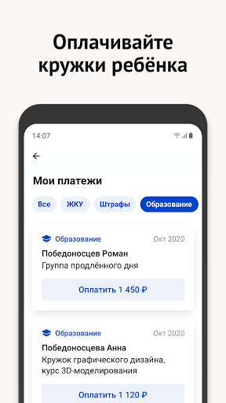  | 
 |   |  

## Development team
In the following we report the main information provided by the development team in the Google play store.

| | |
|-------------------------|-------------------------|
| **Developer**  | Информационный город ГКУ |
| **Website**  | [https://www.mos.ru/mobile/](https://www.mos.ru/mobile/) |
| **Email** | mobile@mos.ru |
| **Physical address**  | - |
| **Other developed apps**  | [https://play.google.com/store/apps/developer?id=%D0%98%D0%BD%D1%84%D0%BE%D1%80%D0%BC%D0%B0%D1%86%D0%B8%D0%BE%D0%BD%D0%BD%D1%8B%D0%B9+%D0%B3%D0%BE%D1%80%D0%BE%D0%B4+%D0%93%D0%9A%D0%A3](https://play.google.com/store/apps/developer?id=%D0%98%D0%BD%D1%84%D0%BE%D1%80%D0%BC%D0%B0%D1%86%D0%B8%D0%BE%D0%BD%D0%BD%D1%8B%D0%B9+%D0%B3%D0%BE%D1%80%D0%BE%D0%B4+%D0%93%D0%9A%D0%A3) |

## Android support

| | |
|-------------------------|-------------------------|
| **Declared target Android version**  | Pie, version 9 (API level 28) |
| **Effective target Android version**  | Pie, version 9 (API level 28) |
| **Minimum supported Android version**  | Lollipop, version 5.0 (API level 21) |
| **Maximum target Android version**  | - |

The larger the difference between the minimum and maximum supported Android versions, the better. A larger difference means a wider audience. For example, old phones have a very low Android version, so a high minimum supported Android version means that the app cannot be used by users with old phones, thus leading to accessibility problems. 

## Requested permissions

In the following we report the complete list of the permissions requested by the app. 

| **Permission** | **Protection level** | **Description** | 
|-------------------------|-------------------------|-------------------------|
 **android.permission ACCESS_COARSE_LOCATION** | :warning:**Dangerous** | Allows an app to access approximate location. 
 **android.permission ACCESS_FINE_LOCATION** | :warning:**Dangerous** | Allows an app to access precise location. 
 **android.permission ACCESS_NETWORK_STATE** | Normal | Allows applications to access information about networks. 
 **android.permission ACCESS_WIFI_STATE** | Normal | Allows applications to access information about Wi-Fi networks. 
 **android.permission CAMERA** | :warning:**Dangerous** | Required to be able to access the camera device. 
 **android.permission CHANGE_WIFI_STATE** | Normal | Allows applications to change Wi-Fi connectivity state. 
 **android.permission INTERNET** | Normal | Allows applications to open network sockets. 
 **android.permission RECEIVE_BOOT_COMPLETED** | Normal | Allows an application to receive the Intent.ACTION_BOOT_COMPLETED that is broadcast after the system finishes booting. 
 **android.permission USE_BIOMETRIC** | Normal | Allows an app to use device supported biometric modalities. 
 **android.permission USE_FINGERPRINT** | Normal | This constant was deprecated in API level 28. Applications should request USE_BIOMETRIC instead 
 **android.permission VIBRATE** | Normal | Allows access to the vibrator. 
 **android.permission WAKE_LOCK** | Normal | Allows using PowerManager WakeLocks to keep processor from sleeping or screen from dimming. 
 **android.permission WRITE_CALENDAR** | :warning:**Dangerous** | Allows an application to write the user's calendar data. 
 **android.permission WRITE_EXTERNAL_STORAGE** | :warning:**Dangerous** | Allows an application to write to external storage. 
 **com.google.android.c2dm.permission RECEIVE** | - | - 
 **com.google.android.finsky.permission BIND_GET_INSTALL_REFERRER_SERVICE** | - | - 
 **ndroid.permission MANAGE_FINGERPRINT** | - | - 

## Mentioned servers

| **Server** | **Registrant** | **Registrant country** | **Creation date** | 
|-------------------------|-------------------------|-------------------------|-------------------------|
 | w3.org | W3C | :us: US | 1994-07-06 04:00:00 |
 | xml.org | OASIS Open | :us: US | 1997-02-03 05:00:00 |
 | xmlpull.org | WhoisGuard, Inc. | PA | 2001-11-26 20:33:08 |
 | googlesyndication.com | Google LLC | :us: US | 2003-01-21 06:17:24 |
 | google.com | Google LLC | :us: US | 1997-09-15 04:00:00 |
 | facebook.com | Facebook, Inc. | :us: US | 1997-03-29 05:00:00 |
 | app-measurement.com | Google LLC | :us: US | 2015-06-19 20:13:31 |
 | yandex.ru | - | - | 1997-09-23 09:45:07 |
 | yandexadexchange.net | - | :ru: RU | 2014-02-18 12:48:07 |
 | kladr-api.ru | - | - | 2013-02-06 00:31:38 |
 | crashlytics.com | Google LLC | :us: US | 2011-01-21 15:30:40 |
 | yandex.com | - | :switzerland: CH | 1998-09-24 04:00:00 |
 | yandex.net | - | :ru: RU | 2000-11-14 06:56:55 |
 | googleapis.com | Google LLC | :us: US | 2005-01-25 17:52:26 |
 | googleadservices.com | Google LLC | :us: US | 2003-06-19 16:34:53 |
 | frosteye.ru | - | - | 2012-12-08 18:43:12 |
 | intervale.ru | - | - | 2001-04-09 20:00:00 |
 | mts.ru | - | - | 1997-11-19 12:02:34 |
 | mos.ru | - | - | 1996-12-23 09:49:03 |
 | mgfoms.ru | - | - | 2002-12-22 21:00:00 |

## Security analysis 

Below we report the main security warnings raised by our execution of the [Androwarn](https://github.com/maaaaz/androwarn) security analysis tool.

**Telephony identifiers leakage**
> - This application reads the MCC+MNC of the provider of the SIM 
> - This application reads the Service Provider Name (SPN) 
> - This application reads the constant indicating the state of the device SIM card 
> - This application reads the current location of the device 
> - This application reads the neighboring cell information of the device 
> - This application reads the numeric name (MCC+MNC) of current registered operator 
> - This application reads the operator name 
> - This application reads the radio technology (network type) currently in use on the device for data transmission 
> - This application reads the unique device ID, i.e the IMEI for GSM and the MEID or ESN for CDMA phones 
> - This application reads the Cell ID value 
> - This application reads the Location Area Code value 

**Connection interfaces exfiltration**
> - This application reads details about the currently active data network 
> - This application tries to find out if the currently active data network is metered 

**Telephony services abuse**
> - This application makes phone calls 

**Suspicious connection establishment**
> - This application opens a Socket and connects it to the remote address 'Ljava/lang/StringBuilder;->toString()Ljava/lang/String;' on the 'N/A' port  
> - This application opens a Socket and connects it to the remote address 'Ljava/net/Proxy;->type()Ljava/net/Proxy$Type;' on the 'N/A' port  
> - This application opens a Socket and connects it to the remote address 'No route to  ' on the 'N/A' port  
> - This application opens a Socket and connects it to the remote address 'timeout' on the 'N/A' port  

**Code execution**
> - This application loads a native library 
> - This application loads a native library: 'Landroid/text/TextUtils;->isEmpty(Ljava/lang/CharSequence;)Z' 
> - This application loads a native library: 'YandexMetricaNativeModule' 
> - This application executes a UNIX command containing this argument: 'Ljava/lang/StringBuilder;->toString()Ljava/lang/String;' 
> - This application executes a UNIX command containing this argument: 'logcat -c' 

## User ratings and reviews

Below we provide information about how end users are reacting to the app in terms of ratings and reviews in the Google Play store.

### Ratings

The Моя Москва — официальное приложение портала mos.ru app has been installed by more than **500000** times. At this time, **2665** rated the app and its average score is **4.296296**. Below we show the distribution of the ratings across the usual star-based rating of Google Play

:star::star::star::star::star:: 1917

:star::star::star::star:: 276

:star::star::star:: 98

:star::star:: 98

:star:: 276

### Reviews 

#### 5-star reviews

> Мне очень удобно, спасибо за такой комфорт, и записаться просто, и просмотреть всё, ставлю 4.5, ибо нет предела совершенству)  :date: __2020-11-30 09:04:06__

> Нормально  :date: __2020-11-29 20:11:11__

> Хорошее приложение.  :date: __2020-11-29 06:57:21__

> дорогие разработчики, а можете верхние функциональные клавиши опустить ниже на 5мм ибо постоянно пытаюсь нажать на кнопку меню, а попадаю на шторку (андроид 10, moto obe action)  :date: __2020-11-28 16:30:01__

> Удобно и быстро можно записаться на приём.  :date: __2020-11-28 05:18:14__

> Огонь, ребята. 10/10  :date: __2020-11-27 12:15:31__

> Иногда подвисает, а так вполне нормальное приложение  :date: __2020-11-26 21:26:59__

> Все понятно, все удобно  :date: __2020-11-24 19:57:00__

> Хорошо  :date: __2020-11-24 07:14:49__

> Работает стабильно, без перебоев , удобно , быстро  :date: __2020-11-23 18:32:22__

#### 4-star reviews

> Не даёт отменить запись к врачу, пишет: "Время приёма по записи уже прошло". И видимо по этому она и будет там висеть, что бы напоминать мне о том, как я опоздал попутав две поликлиники, потому что мою прикрыли на реконструкцию и расфасовали врачей по двум разным.  :date: __2020-11-23 13:39:59__

> Иногда направления, выписанные врачом не отображаются, может надолго зависнуть, приходится звонить. Простой и приятный интерфейс, скорость работы - отлично.  :date: __2020-11-20 11:04:08__

> Вроде неплохо, но не до конца освоила еще  :date: __2020-11-20 09:29:40__

> Приложение нормальное, но неудобно возвращение в начало каждый раз  :date: __2020-11-15 18:54:32__

> Для того чтобы смотреть медкарту в неё надо сначала открыть доступ. Чтобы смотреть медкарту детей - детей надо добавить и затем открывать доступ к их медкартам. Лучше это делать на компе. А потом - работает, хотя с вёрсткой в приложении проблемы, тексты ползут. Ну и к доступ в карту по смс - наверно перебор, можно по отпечатку пальца сделать, надёжнее.  :date: __2020-11-11 21:36:42__

> Удобно  :date: __2020-11-11 07:10:41__

> Понравилась отрицательная комиссия за использование карты МИР  :date: __2020-11-09 14:43:05__

> Долго реагирует на запрос  :date: __2020-11-09 08:58:53__

> Иногда происходят сбои в работе приложения  :date: __2020-11-05 21:57:11__

> Все отлично кроме комиссии за платежи.  :date: __2020-11-04 21:42:37__

#### 3-star reviews

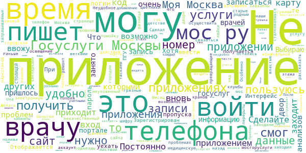

> Не возможно скачать ни один документ с мед.карты на телефон. Хотя предоставил разрешение. Нажимаю иконку сохранить но вот куда сохраняет неизвестно. Весь телефон уже перелопатил  :date: __2020-11-23 10:02:49__

> Моя Москва и гос Мос услуги, это одно и тоже ? В чем разница? Раньше в мосгоруслуги заходили через аккаунт сайта мос.ру, теперь не заходит , но заходит в приложение моя Москва ?  :date: __2020-11-06 13:50:46__

> Неудобное приложение. Особенно эжд.  :date: __2020-10-23 13:12:35__

> Постоянно не могу войти, при попытке получить код на телефон, код не приходит. Сделайте как в других приложениях вход по шифру. Месяц назад заходил, сейчас не смог.  :date: __2020-10-19 10:08:53__

> Не смог осуществить вход в электронную медицинскую карту. Сделал все действия запрашиваемые приложением, и вновь, и вновь был отправлен к изначальной странице: " получить услугу".  :date: __2020-10-16 12:12:22__

> В приложении нет возможности связаться с городской властью и рассказать о проблемах, с которыми сталкиваешься: грязные подъезды; некачественный ремонт; плохое освещение; неухоженный двор, старые тополя, превращающие двор в помойку(машины завалены сухими ветками, листвой и смолой); нет кранов для полива цветники во дворе (таскаем лейки с 4го этажа)... Что делать с закладками наркотиков, перерыты все наши клумбы... МОЯ МОСКВА осталась в далеком детстве!!! Она была СТОЛИЦЕЙ и родным городом!!!  :date: __2020-10-10 08:48:31__

> Сделайте добавление профилей в приложении, чтобы не входить каждый раз под разными учетными записями в личные кабинеты.  :date: __2020-10-09 21:05:47__

> После перезагрузки телефона иконка исчезла с экрана и не выставляется,заходить в приложение стало неудобно,нужно загружать настройки  :date: __2020-09-27 12:40:12__

> Ребят, было бы очень удобно видеть все обращения, чтобы не ходить за ними на сайт. Спасибо.  :date: __2020-09-24 09:33:20__

> Не могу записаться к врачу. Приборы учета ввожу без проблем  :date: __2020-09-21 08:37:31__

#### 2-star reviews

> Не поминаю, для чего нужно это приложение, если есть мос.ру.  :date: __2020-11-13 02:18:44__

> Вроде задумка и хорошая, но столько элементарных косяков, что просто хочется телефон кинуть или комп разбить. Какое терпение нужно на все эти недоделки. Введите свой СНИЛС- введите место жительства- введение места жительства не доступно- введите СНИЛС и так по кругу  :date: __2020-11-01 23:25:55__

> Плохо то, что мало времени на "подход" пароля для входа в медицинскую электронную карту. По три раза запрашивала пароль, так и не успевал прийти. НЕ УДОБНО! НАДО ЧТО-ТО МЕНЯТЬ!  :date: __2020-10-29 10:45:12__

> Организация передачи данных жкх ввиде чатов это совсем ад и полных гиков. Пользоваться таким такое себе удовольствие. Узабилити и юзерфрейндли на нуле даже для айтишника.  :date: __2020-10-28 17:44:37__

> смс пришла быстро. она вообще пришла. это уже достижение для мосру. только поэтому плюс звезда. передача показаний в виде чата выглядит убого и очень неудобна. по запросу показывает только цифры, нет диаграмм как на сайте. что прежнее приложение, что это - полный отстой. придется заходить через браузер.  :date: __2020-10-22 22:34:49__

> Так много плохих отзывов. А где хорошие при такой оценке? Накрутка  :date: __2020-10-20 07:26:42__

> Какое то бессмысленное приложение, направляет в браузер, где нужно опять вводить пароль, а пароли у них сложные.  :date: __2020-10-15 06:53:50__

> Есть установленное у меня приложение "Госуслуги Москвы" - то это приложение (Моя Москва) бесполезное.  :date: __2020-10-14 19:30:10__

> Не вздумайте оплачивать штрафы ГИБДД, которые может показать это приложение! Давно оплаченные штрафы здесь числятся не оплаченными! Правительство Москвы во главе с бордюренфюрером может только людей кошмарить, а банальную синхронизацию с ГИБДД надалить не в состоянии.  :date: __2020-10-14 18:29:05__

> Работает как п\*\**ец, но хотя работает, в отличии от мос.ру, поэтому 2 звезды думаю заслужил  :date: __2020-10-14 14:29:50__

#### 1-star reviews

> Вылетает программа при загрузке последнего файла  :date: __2020-11-30 08:32:34__

> Я никогда еще не видел такое глюченное приложение, войти не могу, а если войду то не с первой попытки. Подключиться к медкарте вообще невозможно.  :date: __2020-11-27 11:53:04__

> Почему пишет:Не корректный формат пароля? Ввожу пароль правильно. Большие и прописные латинские, цифры и знаки присутствуют, более 8 знаков.  :date: __2020-11-25 19:34:13__

> Сделайте пожалуйста вход через госуслуги / сбербанк ID . Я захожу через него, а в мобильной версии только логин и пароль. Это не правильно  :date: __2020-11-25 06:38:32__

> Приложение никакое, при попытке получить (услугу) перенаправляет на мос.ру. Полный отстой.  :date: __2020-11-25 06:10:07__

> Приложение ужасное, не работает больше половины опций которыми я пользовалась: передача показаний электричества, оплата ЖКУ, даже обратная связь не прикрепляет скриншоты. Оплаченный счет висит как не оплаченный. Единственное что работало пока без сбоев это передача показаний воды. Надеюсь хотя бы поддержка решит эту проблему. Жаль, что из хорошей идеи не получилось исправного приложения.  :date: __2020-11-24 18:09:17__

> Одно из самых поганых приложений. На каждый запрос отправляет на сайт. Половину запросов не понимает, хотя запрашиваемая услуга есть. Требует постоянно разрешения на обработку данных сопровождая эти запросы кучей документов. Ровно как аферисты или мошенники забивают гголову чтобы кинуть. Очень похоже что заказчики и разработчики понятия не имеют что такое удобное приложение или просто умственно отсталые  :date: __2020-11-22 09:39:56__

> Не могу записаться в гбдд  :date: __2020-11-20 19:03:52__

> Кривое, аллогичное.  :date: __2020-11-20 08:30:53__

> При попытке отправить заявку на подключение электронной медкнижки, мне предлагают заполнять все поля, при том, что у меня полностью заполненный аккаунт. Написал в поддержку, мне ответили "В целях обеспечения безопасности и сохранности персональных данных". Оператор даже сама наверное не понимала что копировала для ответа на мой вопрос.  :date: __2020-11-18 17:26:41__

# WHO Info
App version ``3.1.1``

Analyzed with [covid-apps-observer](http://github.com/covid-apps-observer) project, version ``0.1``

## App overview
| | |
|-------------------------|-------------------------| 
| **Name**&nbsp;&nbsp;&nbsp;&nbsp;&nbsp;&nbsp;&nbsp;&nbsp;&nbsp;&nbsp;&nbsp;&nbsp;&nbsp;&nbsp;&nbsp;&nbsp;&nbsp;&nbsp;&nbsp;&nbsp;&nbsp;&nbsp;&nbsp;&nbsp;&nbsp;&nbsp;&nbsp;&nbsp;&nbsp;&nbsp;&nbsp;&nbsp;&nbsp;&nbsp;&nbsp;&nbsp;&nbsp;&nbsp;&nbsp;&nbsp;  | WHO Info |
| **Unique identifier** | org.who.infoapp |
| **Link to Google Play** | [https://play.google.com/store/apps/details?id=org.who.infoapp](https://play.google.com/store/apps/details?id=org.who.infoapp) |
| **Summary**  | Официальное приложение информации Всемирной организации здравоохранения. |
| **Privacy policy** | [https://www.who.int/about/who-we-are/privacy-policy](https://www.who.int/about/who-we-are/privacy-policy) |
| **Latest version** | 3.1.1 |
| **Last update** | 2020-10-30 13:25:32 |
| **Recent changes** | This release addresses an issue related to Covid-19 case numbers reported to WHO. |
| **Installs**  | 100 000+ |
| **Category** | Новости и журналы |
| **First release** | 13 апр. 2020 г. |
| **Size**  | 11M |
| **Supported Android version**  | 4.2 и выше |

### Description
> Have the latest health information at your fingertips with the official World Health Organization Information App. This app displays the latest news, events, features and breaking updates on outbreaks. 
  
 WHO works worldwide to promote health, keep the world safe, and serve the vulnerable. 
 Our goal is to ensure that a billion more people have universal health coverage, to protect a billion more people from health emergencies, and provide a further billion people with better health and well-being.

### User interface
The developers of the app provide the following screenshots in the Google play store.
| | | |
|:-------------------------:|:-------------------------:|:-------------------------:|
 |   |   |   | 
 |   |   |   | 
 |   |   |   | 
 |   |   |   | 
 |   |   |   | 
 |   |   |   | 
 |   |   |   | 
 |   |   |   | 

## Development team
In the following we report the main information provided by the development team in the Google play store.

| | |
|-------------------------|-------------------------|
| **Developer**  | World Health Organization |
| **Website**  | [https://www.who.int/](https://www.who.int/) |
| **Email** | dcx@who.int |
| **Physical address**  | [Avenu Appia 20 1211 Geneva Switzerland](https://www.google.com/maps/search/Avenu%20Appia%2020%201211%20Geneva%20Switzerland) (Google Maps) |
| **Other developed apps**  | [https://play.google.com/store/apps/developer?id=World+Health+Organization](https://play.google.com/store/apps/developer?id=World+Health+Organization) |

## Android support

| | |
|-------------------------|-------------------------|
| **Declared target Android version**  | - |
| **Effective target Android version**  | - |
| **Minimum supported Android version**  | Jelly Bean, version 4.2.x (API level 17) |
| **Maximum target Android version**  | - |

The larger the difference between the minimum and maximum supported Android versions, the better. A larger difference means a wider audience. For example, old phones have a very low Android version, so a high minimum supported Android version means that the app cannot be used by users with old phones, thus leading to accessibility problems. 

## Requested permissions

In the following we report the complete list of the permissions requested by the app. 

| **Permission** | **Protection level** | **Description** | 
|-------------------------|-------------------------|-------------------------|
 **android.permission ACCESS_NETWORK_STATE** | Normal | Allows applications to access information about networks. 
 **android.permission INTERNET** | Normal | Allows applications to open network sockets. 
 **android.permission READ_CALENDAR** | :warning:**Dangerous** | Allows an application to read the user's calendar data. 
 **android.permission READ_EXTERNAL_STORAGE** | :warning:**Dangerous** | Allows an application to read from external storage. 
 **android.permission WAKE_LOCK** | Normal | Allows using PowerManager WakeLocks to keep processor from sleeping or screen from dimming. 
 **android.permission WRITE_CALENDAR** | :warning:**Dangerous** | Allows an application to write the user's calendar data. 
 **android.permission WRITE_EXTERNAL_STORAGE** | :warning:**Dangerous** | Allows an application to write to external storage. 
 **com.google.android.c2dm.permission RECEIVE** | - | - 
 **com.google.android.finsky.permission BIND_GET_INSTALL_REFERRER_SERVICE** | - | - 

## Mentioned servers

| **Server** | **Registrant** | **Registrant country** | **Creation date** | 
|-------------------------|-------------------------|-------------------------|-------------------------|
 | adobe.com | Adobe Inc. | :us: US | 1986-11-17 05:00:00 |
 | googlesyndication.com | Google LLC | :us: US | 2003-01-21 06:17:24 |
 | google.com | Google LLC | :us: US | 1997-09-15 04:00:00 |
 | app-measurement.com | Google LLC | :us: US | 2015-06-19 20:13:31 |
 | googleapis.com | Google LLC | :us: US | 2005-01-25 17:52:26 |
 | googleadservices.com | Google LLC | :us: US | 2003-06-19 16:34:53 |

## Security analysis 

Below we report the main security warnings raised by our execution of the [Androwarn](https://github.com/maaaaz/androwarn) security analysis tool.

**Connection interfaces exfiltration**
> - This application reads details about the currently active data network 
> - This application tries to find out if the currently active data network is metered 

**Suspicious connection establishment**
> - This application opens a Socket and connects it to the remote address 'Lfi/iki/elonen/NanoHTTPD$ResponseException;' on the 'N/A' port  
> - This application opens a Socket and connects it to the remote address 'NanoHttpd Shutdown' on the 'N/A' port  

**Code execution**
> - This application loads a native library: 'NativeScript' 
> - This application executes a UNIX command containing this argument: '2' 

## User ratings and reviews

Below we provide information about how end users are reacting to the app in terms of ratings and reviews in the Google Play store.

### Ratings

The WHO Info app has been installed by more than **100000** times. At this time, **1023** rated the app and its average score is **3.6470587**. Below we show the distribution of the ratings across the usual star-based rating of Google Play

:star::star::star::star::star:: 562

:star::star::star::star:: 90

:star::star::star:: 70

:star::star:: 50

:star:: 251

### Reviews 

#### 5-star reviews

> ВОЗ как всегда - на высоте!!!  :date: __2020-11-11 10:06:48__

> 👍👍👍👍👍👍👍👍👍👍👍👋👍🤟🤟  :date: __2020-09-14 08:24:45__

> Great! Thanks a lot for russian language! 😉  :date: __2020-09-07 00:42:40__

> otlichno  :date: __2020-09-04 18:06:47__

> Классно!!!!!  :date: __2020-05-02 16:56:29__

#### 4-star reviews

No recent reviews available with 4 stars.

#### 3-star reviews

> А можно по русский написать  :date: __2020-05-23 06:45:03__

#### 2-star reviews

> На русском где?  :date: __2020-06-14 12:29:29__

#### 1-star reviews

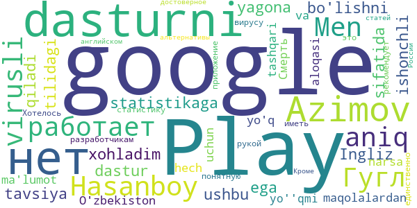

> Azimov Hasanboy. B b.  :date: __2020-10-03 10:41:25__

> не работает с Гугл  :date: __2020-07-22 09:06:06__

> 👎👎👎👎👎👎👎👅  :date: __2020-07-16 19:13:31__

> Men aniq virusli statistikaga ega bo'lishni xohladim, google Play ushbu dasturni yagona ishonchli dastur sifatida tavsiya qiladi. Ingliz tilidagi maqolalardan tashqari, hech narsa yo'q. O'zbekiston uchun ma'lumot va dasturni aloqasi yo''qmi?  :date: __2020-06-05 13:48:39__

> Смерть разработчикам!!!  :date: __2020-05-19 22:17:08__

> Хотелось иметь под рукой понятную статистику по вирусу, google play рекомендует это приложение как единственно достоверное. Кроме статей на английском ничего нет. Т.е. для России альтернативы нет?  :date: __2020-05-07 16:18:22__

# Социальный мониторинг
App version ``1.8``

Analyzed with [covid-apps-observer](http://github.com/covid-apps-observer) project, version ``0.1``

## App overview
| | |
|-------------------------|-------------------------| 
| **Name**&nbsp;&nbsp;&nbsp;&nbsp;&nbsp;&nbsp;&nbsp;&nbsp;&nbsp;&nbsp;&nbsp;&nbsp;&nbsp;&nbsp;&nbsp;&nbsp;&nbsp;&nbsp;&nbsp;&nbsp;&nbsp;&nbsp;&nbsp;&nbsp;&nbsp;&nbsp;&nbsp;&nbsp;&nbsp;&nbsp;&nbsp;&nbsp;&nbsp;&nbsp;&nbsp;&nbsp;&nbsp;&nbsp;&nbsp;&nbsp;  | Социальный мониторинг |
| **Unique identifier** | ru.mos.socmon |
| **Link to Google Play** | [https://play.google.com/store/apps/details?id=ru.mos.socmon](https://play.google.com/store/apps/details?id=ru.mos.socmon) |
| **Summary**  | Приложение для контроля за соблюдением гражданами режима изоляции на дому |
| **Privacy policy** | [https://www.mos.ru/privacypolicy/socmon/](https://www.mos.ru/privacypolicy/socmon/) |
| **Latest version** | 1.8 |
| **Last update** | 2020-09-23 13:50:07 |
| **Recent changes** | Для удобства пользователей в мобильном приложении «Социальный мониторинг» введены дополнительные функции. На стартовой странице в приложение теперь указывается адрес изоляции, при обращении в техподдержку можно приложить фотографии. |
| **Installs**  | 100 000+ |
| **Category** | Медицина |
| **First release** | 22 апр. 2020 г. |
| **Size**  | 15M |
| **Supported Android version**  | 6.0 и выше |

### Description
> Приложение «Социальный мониторинг» создано для пациентов с подтвержденным диагнозом COVID-19, выбравших лечение на дому, граждан, контактировавших с ними, и горожан с проявлениями острых респираторных заболеваний, проживающих в Москве и соблюдающих предписанный им режим изоляции. С его помощью пациент информирует город о добросовестном соблюдении карантина.
 При регистрации пользователь подтверждает номер телефона, делает фотографию, геолокация (местонахождение) отправляется автоматически. Это нужно для того, чтобы проверить, находится ли пользователь в той же локации, которую указал в согласии, выбирая лечение на дому.
 Чтобы у пользователя не было возможности оставить смартфон дома и выйти на улицу без него, приложение в случайное время присылает СМС-уведомления с запросом дополнительного подтверждения — для этого потребуется сделать селфи.
 Если пользователь покидает исходную геолокацию или не реагирует на уведомления, система предупреждает городские службы о возможном нарушении режима изоляции.
 Личные данные, которые пользователь передает сервису, определены в согласии на получение медицинской помощи на дому и соблюдение режима изоляции либо в постановлении главного санитарного врача города Москвы. Все данные, которые пользователь передает приложению, хранятся в защищенном виде на серверах Департамента информационных технологий и используются в строгом соответствии с федеральным законом № 152-ФЗ "О персональных данных".

### User interface
The developers of the app provide the following screenshots in the Google play store.
| | | |
|:-------------------------:|:-------------------------:|:-------------------------:|
 |   | 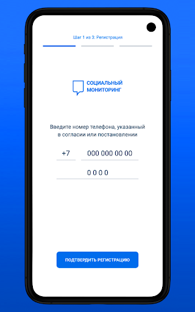  |   | 
 | 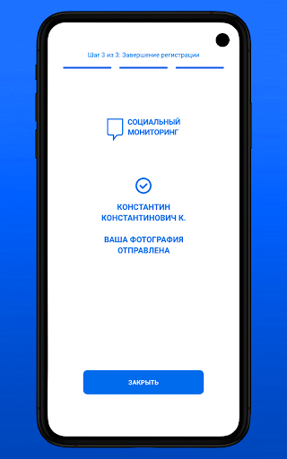  |  

## Development team
In the following we report the main information provided by the development team in the Google play store.

| | |
|-------------------------|-------------------------|
| **Developer**  | Информационный город ГКУ |
| **Website**  | [https://www.mos.ru/city/projects/monitoring/](https://www.mos.ru/city/projects/monitoring/) |
| **Email** | socialmonitoring@mos.ru |
| **Physical address**  | - |
| **Other developed apps**  | [https://play.google.com/store/apps/developer?id=%D0%98%D0%BD%D1%84%D0%BE%D1%80%D0%BC%D0%B0%D1%86%D0%B8%D0%BE%D0%BD%D0%BD%D1%8B%D0%B9+%D0%B3%D0%BE%D1%80%D0%BE%D0%B4+%D0%93%D0%9A%D0%A3](https://play.google.com/store/apps/developer?id=%D0%98%D0%BD%D1%84%D0%BE%D1%80%D0%BC%D0%B0%D1%86%D0%B8%D0%BE%D0%BD%D0%BD%D1%8B%D0%B9+%D0%B3%D0%BE%D1%80%D0%BE%D0%B4+%D0%93%D0%9A%D0%A3) |

## Android support

| | |
|-------------------------|-------------------------|
| **Declared target Android version**  | Android10, version 10 (API level 29) |
| **Effective target Android version**  | Android10, version 10 (API level 29) |
| **Minimum supported Android version**  | Marshmallow, version 6.0 (API level 23) |
| **Maximum target Android version**  | - |

The larger the difference between the minimum and maximum supported Android versions, the better. A larger difference means a wider audience. For example, old phones have a very low Android version, so a high minimum supported Android version means that the app cannot be used by users with old phones, thus leading to accessibility problems. 

## Requested permissions

In the following we report the complete list of the permissions requested by the app. 

| **Permission** | **Protection level** | **Description** | 
|-------------------------|-------------------------|-------------------------|
 **android.permission ACCESS_BACKGROUND_LOCATION** | :warning:**Dangerous** | Allows an app to access location in the background. 
 **android.permission ACCESS_FINE_LOCATION** | :warning:**Dangerous** | Allows an app to access precise location. 
 **android.permission ACCESS_NETWORK_STATE** | Normal | Allows applications to access information about networks. 
 **android.permission ACCESS_WIFI_STATE** | Normal | Allows applications to access information about Wi-Fi networks. 
 **android.permission CAMERA** | :warning:**Dangerous** | Required to be able to access the camera device. 
 **android.permission CHANGE_WIFI_STATE** | Normal | Allows applications to change Wi-Fi connectivity state. 
 **android.permission FOREGROUND_SERVICE** | Normal | Allows a regular application to use Service.startForeground. 
 **android.permission INTERNET** | Normal | Allows applications to open network sockets. 
 **android.permission READ_EXTERNAL_STORAGE** | :warning:**Dangerous** | Allows an application to read from external storage. 
 **android.permission RECEIVE_BOOT_COMPLETED** | Normal | Allows an application to receive the Intent.ACTION_BOOT_COMPLETED that is broadcast after the system finishes booting. 
 **android.permission REQUEST_IGNORE_BATTERY_OPTIMIZATIONS** | Normal | Permission an application must hold in order to use Settings.ACTION_REQUEST_IGNORE_BATTERY_OPTIMIZATIONS. 
 **android.permission USE_FULL_SCREEN_INTENT** | Normal | Required for apps targeting Build.VERSION_CODES.Q that want to use notification full screen intents. 
 **android.permission WAKE_LOCK** | Normal | Allows using PowerManager WakeLocks to keep processor from sleeping or screen from dimming. 
 **android.permission WRITE_EXTERNAL_STORAGE** | :warning:**Dangerous** | Allows an application to write to external storage. 
 **com.google.android.c2dm.permission RECEIVE** | - | - 
 **com.google.android.finsky.permission BIND_GET_INSTALL_REFERRER_SERVICE** | - | - 

## Mentioned servers

| **Server** | **Registrant** | **Registrant country** | **Creation date** | 
|-------------------------|-------------------------|-------------------------|-------------------------|
 | adobe.com | Adobe Inc. | :us: US | 1986-11-17 05:00:00 |
 | googlesyndication.com | Google LLC | :us: US | 2003-01-21 06:17:24 |
 | google.com | Google LLC | :us: US | 1997-09-15 04:00:00 |
 | googleadservices.com | Google LLC | :us: US | 2003-06-19 16:34:53 |
 | app-measurement.com | Google LLC | :us: US | 2015-06-19 20:13:31 |
 | crashlytics.com | Google LLC | :us: US | 2011-01-21 15:30:40 |
 | mos.ru | - | - | 1996-12-23 09:49:03 |

## Security analysis 

Below we report the main security warnings raised by our execution of the [Androwarn](https://github.com/maaaaz/androwarn) security analysis tool.

**Connection interfaces exfiltration**
> - This application reads details about the currently active data network 
> - This application tries to find out if the currently active data network is metered 

**Telephony services abuse**
> - This application makes phone calls 

**Suspicious connection establishment**
> - This application opens a Socket and connects it to the remote address '; port is out of range' on the 'N/A' port  
> - This application opens a Socket and connects it to the remote address 'Ljava/net/Proxy;->type()Ljava/net/Proxy$Type;' on the 'N/A' port  
> - This application opens a Socket and connects it to the remote address 'Lq/b/a/a/a;->a(Ljava/lang/String;)Ljava/lang/StringBuilder;' on the 'N/A' port  
> - This application opens a Socket and connects it to the remote address 'Method sendUrgentData() is not supported.' on the 'N/A' port  
> - This application opens a Socket and connects it to the remote address 'Method setHandshakeTimeout() is not supported.' on the 'N/A' port  
> - This application opens a Socket and connects it to the remote address 'Method setOOBInline() is not supported.' on the 'N/A' port  
> - This application opens a Socket and connects it to the remote address 'Method setSoWriteTimeout() is not supported.' on the 'N/A' port  
> - This application opens a Socket and connects it to the remote address 'Socket closed' on the 'N/A' port  
> - This application opens a Socket and connects it to the remote address 'Socket is closed' on the 'N/A' port  
> - This application opens a Socket and connects it to the remote address 'Socket is closed.' on the 'N/A' port  
> - This application opens a Socket and connects it to the remote address 'Socket is not connected.' on the 'N/A' port  

**Code execution**
> - This application loads a native library 
> - This application loads a native library: 'conscrypt_gmscore_jni' 
> - This application loads a native library: 'conscrypt_jni' 
> - This application executes a UNIX command 
> - This application executes a UNIX command containing this argument: 'getprop' 
> - This application executes a UNIX command containing this argument: 'mount' 

## User ratings and reviews

Below we provide information about how end users are reacting to the app in terms of ratings and reviews in the Google Play store.

### Ratings

The Социальный мониторинг app has been installed by more than **100000** times. At this time, **6671** rated the app and its average score is **1.4336283**. Below we show the distribution of the ratings across the usual star-based rating of Google Play

:star::star::star::star::star:: 521

:star::star::star::star:: 98

:star::star::star:: 177

:star::star:: 157

:star:: 5718

### Reviews 

#### 5-star reviews

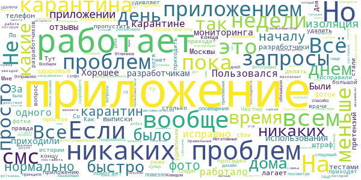

> Вылетает правда, нужно заходить постоянно разрешать передачу данных гео...  :date: __2020-11-30 05:47:32__

> Когда мне пришлось ставить это приложение из-за болезни, я начиталась отзывов здесь и была в ужасе. Но не установить его нельзя-штраф. Я настроила громче звук смс (мелодию подлинее!),чтоб не пропустить запрос от приложения. Эти запросы лично мне приходили не ранее 11, что давало возможность поспать утром подольше, и позже 19 уже не приходили. За сутки было 3-4 запроса. Когда отправляешь фото - нужно дождаться на экране надписи -"ваша фотография отправлена". Если ошибка-то перезагрузить телефон.  :date: __2020-11-29 18:30:54__

> Спать приложение мешало первый день. Сейчас уже пару раз в день фотографируюсь. Ничего лишнего, всё понятно даже 60+. Скорейшего всем выздоровления!  :date: __2020-11-29 15:20:10__

> Отличная идея. Но наро ещё много рабать над приложением  :date: __2020-11-26 02:32:21__

> 🤙  :date: __2020-11-25 18:15:38__

> Большая просьба разрекламировать приложение, чтоб люди были в курсе и устанавливали  :date: __2020-11-24 15:50:31__

> Приложение понравилось. Пользоваться им было удобно. Не смущала даже частота запросов - 3-4 раза в день с интервалами от 2-х до 4-х часов.  :date: __2020-11-23 18:18:31__

> Отлично  :date: __2020-11-21 22:51:26__

> Выскажу непопулярное мнение, но у меня всё работало хорошо) Запросы на селфи приходили только днём и не особо часто. В последний день, даже, всего 2 запроса было. GPS тоже не глючил, моё положение определялось там, где и должно было. Я всё соблюдала, и, по итогам, штрафов не получила (по крайней мере, пока не приходили). В общем, всё работает.  :date: __2020-11-18 17:53:50__

> Хорошее приложение, простое в использовании!  :date: __2020-11-17 19:58:21__

#### 4-star reviews

> Много пишут нигатива. Для того чтобы тебя отслеживали нормальное приложение. Нашла только один Большой минус, в том, что как только я установила и включила геолакацию, меня ДОСТАЛИ звонки со всех банков и медицинских учреждений!!!!  :date: __2020-11-29 10:11:22__

> Не хватает информации в приложении о том, в какое время отправлял фото.  :date: __2020-11-28 16:14:20__

> Приложение хорошее, работает исправно. Единственный минус не правильно занесли сначала мой адрес самоизоляции, но потом исправили.  :date: __2020-11-26 17:35:21__

> Слышал много негативных отзывов об этом приложении, и честно говоря, был скептически настроен скачивая его, но на удивление оказалось, что не так страшен черт!! Отчёт идёт через смс уведомления, поэтому в самом приложении нет никаких напоминаний. Так же приложение не показывает отправил ты фото или нет, это нужно запоминать. А так, очень простое и лёгкое приложение, которое не доставляет никакой анальной боли от его использования!  :date: __2020-11-20 15:22:41__

> Нормальное работает, только когда открываешь приложение - уведомление о необходимости сделать фото пропадает, остаётся только стандартный интерфейс, который появляется при открытии в любое время.  :date: __2020-11-18 09:47:28__

> Приложение для тех кто выполняет правила. Пришло уведомление - щёлкнул морду, отправил, посмотрел на сообщение что отправлено. Все просто и все работает. Понятно что написано на коленке без тендеров и полгода на согласование тз, но оно есть и работает.  :date: __2020-11-12 09:08:27__

> Все просто и понятно, но огромный, жирный минус за то что нет истории отправки фотографий и определения геолокации! Как я могу убедиться в том что фотография прошла и геолокация верно определяется? Только по отсутствию штрафов? Почему этого простейшего действия нет???  :date: __2020-11-09 17:36:59__

> Семьёй на изоляции. Указал свой номер - после чего приложение идентифицировало меня как моего сына и предложило сделать фото. Снёс приложение и пробую заново. Вопрос к разработчикам - просьба решить проблему.  :date: __2020-11-06 05:43:18__

> Буду в меньшинстве, но у меня к приложению мало нареканий. Установила после подписания постановления о карантине. Установила приложение, через 10 часов номер уже был подтвержден. Уведомления приходили в 2-х форматах - push-уведомления и смс, пропустить почти невозможно. Телефон не зависал, приложение не падало, фото отправлялись без проблем. Из недочетов - отсутствие учета отправки фото (желательно время какое-то, вести лог. Иначе сложно будет что-то доказывать в случае штрафов) и отсутствие возможности перевода приложения в фоновый режим. К остальному претензий нет.  :date: __2020-10-26 13:29:07__

> Быстро установилось,простое в управлении. Из минусов: добавьте пожалуйста историю по времени,когда отправлялись снимки.если температура,человек в агонии начинает судорожно вспоминать: отправлял или нет. Добавьте из записи личного профиля, дату анализов и первый результат.тоже полезно будет.  :date: __2020-10-23 22:07:04__

#### 3-star reviews

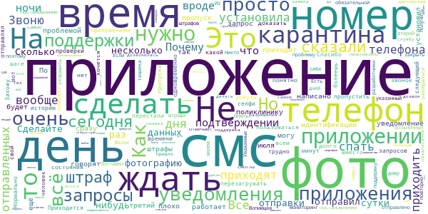

> 1. Нужен журнал событий. 2. Интеграция с медицинской системой, в части результатов анализов, диагноза, назначений врача, оперативных сообщений по болезни. 3. Ручное указание местоположения, если больной уже не дома, а в больнице. 4. Расписание приема лекарств, со звуковым оповещением. Это все помогло бы больному выздоровить. Спасибо.  :date: __2020-11-29 16:42:00__

> Как и все отмечу отсутствие подтверждения отправки фото. В случае чего нет никаких доказательств, что все требования были выполнены.  :date: __2020-11-25 14:51:27__

> Неудобно, что нет никакого подтверждения, что был выполнен запрос на идентификацию. И нет истории отправки данных. Никак нельзя показать, что я действительно отправляю фото вовремя.  :date: __2020-11-24 11:24:10__

> Приложение на тройку. Второй раз переустанавливаю, так как фото не работает серый экран с белым кругом и все.  :date: __2020-11-21 15:55:47__

> Сделайте табличку чтобы видно было сколько запросов пришло и сколько раз я отправил фото, а то каждый раз переживаю отправил или нет. И так благодарны должны быть за то, что я, почувствуя симптомы, пошел и сдал пцр за свои деньги, так ещё и под домашний арест посадили. Как дрессированная обезьяна по 4 раза на дню селфи отправляю теперь.  :date: __2020-11-21 12:24:48__

> Счастлива, что отношусь к людям, которые переносят заболевание в лёгкой форме. Если бы были серьёзные симптомы, я бы наверно не выдержала. Приходится постоянно держать телефон рядом и на громком звуке, потому что боюсь пропустить уведомление. Началась паранойя, дергаюсь от каждого звука. Нет истории отправки фото. Приходится делать запись видео с экрана, чтоб потом можно было обжаловать штраф, если придёт. Сильно садится зарядка и греется телефон!  :date: __2020-11-20 16:18:32__

> Слышала ,что штрафуют даже 75 летних людей , которые не смогли зарегистрироваться , считаю что немножко не продуманно Т к, люди были в тяжелом состоянии и не очень дружат с техникой , а помочь им было некому  :date: __2020-11-19 09:06:51__

> Добрый день, на мой взгяд разработчикам следует доработать: 1) добавить историю запросов и ответов. Принято или нет фото. Насколько знаю, такая функция ранее в приложении была, но ее почему-то убрали. Пользуюсь версией 1.8. 2) возможность в два тапа отправить информацию, что, мол, "извините, но завтра я сплю до часу дня, мне плохо, у меня ковид". В таком случае надзорные органы заранее осведомлены, программа не выставляет штрафы, а сам болеющий не дергается, а фокусируется на выздоровлении.  :date: __2020-11-18 22:47:41__

> Программа абсолютно бесполезная, но при этом крайне раздражающая. По три раза на дню приходится слать селфи, пока болеешь - даже поспать днём нельзя, вдруг смс пропустишь. При это обмануть программу можно достаточно легко, в связи с чем все эти меры по контролю абсолютно бесполезны.  :date: __2020-11-16 11:28:05__

> Нарушение прав человека  :date: __2020-11-14 17:37:19__

#### 2-star reviews

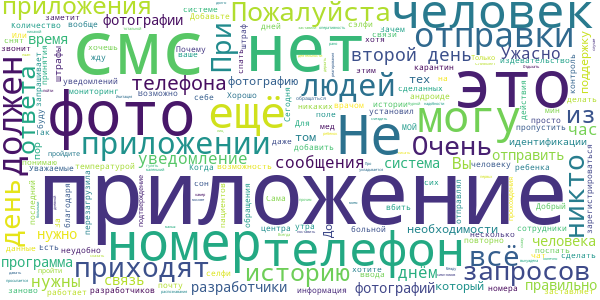

> Приложение работает в интересах "хотелок" группы чиновников, но не здоровья больных. Фиксировать кстати отправку фото и даже подтверждение отправки можно делая скриншоты. Можно ли привлечь чиновников к ответственности за нарушение режима выздоровления больных, у которых наверное есть права?  :date: __2020-11-30 10:49:31__

> Зависает на шаге 2, смартфоном можно пользоваться только перезагрузив  :date: __2020-11-29 20:07:54__

> Upd 29.11.20 27.11 меня выписали из больницы без карантина. Врач утверждает, что поставил специальную пометку. Но приложению это безразлично. Вопрос: существует ли фактор, который снимет претензии Соцмониторинга? У меня впечатление, что, один раз зарегистрировавшись, я всю оставшуюся жизнь буду обязана получать запросы приложения! Что бы ни случилось, какую пометку ни поставил доктор, за мной следят. Это кончится когда-нибудь?  :date: __2020-11-29 17:28:37__

> Мне хреново. На КТ, уже после подтверждения положительного теста на корону, отправился своим ходом. На скорой не довезут, нет же температуры за 38.0. 3 часа просидел среди людей ( кто-то приехал на скорой, кто-то просто провериться пришел , кто-то как я, по направлению своим ходом, а кто-то пришел со своим родственником) . Не виню врачей, ни в коем случае. Они настоящие герои для меня. Все претензии в адрес организаторов хр..и авторов идеи "установи приложение в течении 24-х часов или ШТРАФ!  :date: __2020-11-29 09:51:09__

> От этой проги телефон логает кошмар как! Батарею приходится заряжать несколько раз в день. Задала вопрос в тех поддержку на кануне окончания карантина... Та да... Пришёл ответ вовсе не на поставленный мной вопрос и судя по тексту вовсе от робота. МОЖЕТ ЧИТАТЬ ВОПРОСЫ ВНИМАТЕЛЬНО БУДЕТЕ! Кошмарная прога, надеюсь её ставить больше не придётся.  :date: __2020-11-28 09:12:04__

> Глючное по, что бы изводить больных людей.  :date: __2020-11-25 17:28:14__

> Имитация бурной деятельности. Про оперативность реагирования много писать не буду, просто скажу, что в моём случае мониторинг заставили поставить на 9 день от первых симптомов. Зачем нужны эти селфи с 9 до 22? Это же издевательство над больными- не давать поспать днём. При тотальной системе камер распознавания лиц в Москве в сэлфи нет никакой надобности! Вы же не хотите сказать, что после 22 можно пойти гулять или съездить в Ашан и никто этого не заметит? А если заметит- зачем днём сэлфи?  :date: __2020-11-20 19:54:48__

> Ужасно это всё конечно! У меня маленький ребенок, у него дневной сон, укладывается долго. Я вынуждена держать телефон при себе. Отдыхать тоже не могу. Всегда в сон час ребенка приходят СМС. А просыпается малыш рано. Между прочим перерыв с 13 до 15 прописан при строит. работах даже. А тут отдыхай как хочешь, выздоравливай как хочешь. Количество запросов увеличилось со временем. Телефон вечно на зарядке. Иногда уведомление от смс отстаёт на 30-40 мин. Недоделано и непродуманно всё.  :date: __2020-11-19 12:41:38__

> Приложение это я буду всем рекомендовать как пособие о глупости и бездарности проектирования. Есть приложение, но оно практически ничего не умеет. Даже сообщения приходят по другим каналам связи. А для того, чтобы потом все это свести отправка - анализ нужны еще рессурсы. Команда разработчиков - сбор бездарностей, проедающих деньги налогоплательшиков  :date: __2020-11-17 12:11:02__

> Не подерживается на meizu m6s  :date: __2020-11-16 11:32:21__

#### 1-star reviews

> Невозможно установить  :date: __2020-11-30 12:44:38__

> Что трудно сделать громкое и повторяющееся оповещение? Трудно сделать историю отсылки фотографий и получения извещений о съемке? Нужны сутки, чтобы проверить по базе номер телефона? В приложении сделано все, чтобы люди пропускали оповещения и платили штрафы. Нигде нет информации что делать с детьми, нужно или нет сейчас ставить приложение проживающим совместно с отрицательным тестом. И в законе написали через одно место и расшифровывать не хотят, поддержка ничего точно не знает.  :date: __2020-11-30 12:28:56__

> Бесполезное приложение , тупо для сбора данных по распознаванию лиц и штрафов.  :date: __2020-11-30 12:28:44__

> Я могу смирится с тем, что адрес не правильный.......а вот с тем, что из-за этого можно штраф получить..... Пишу в поддержку и ответов нет. Неужели у такой простой программы нет админов? А стоит, наверное, как несколько самолетов... Отрабатывайте наши налоги нормально, а не через 👉🙌👈  :date: __2020-11-30 12:07:25__

> Нет обратной связи, система оповещений не позволяет вовремя на них реагировать. По итогу вообще непонятно, есть ли у меня штрафы или нет. А если так, то приложение бесполезное, поскольку, штрафы это и есть способ контроля режима.  :date: __2020-11-30 12:01:24__

> Мой ребенок занимается на дизтанционке и я даю ему свой телефон мне пришло сообщение что нужно сфотографироваться но у ребенка занятие. И мне выписали штраф!!!!!!!!!!!!!  :date: __2020-11-30 11:39:56__

> Это всё лечение? Фото? Вы отвораживаете корону с помощью экстрасенсов? В чем смысл этой программы? Ее нужно прикладывать к больным местам?  :date: __2020-11-30 11:04:20__

> Вы меня достали! Определитесь с четкой формулировкой когда можно удалять ваше сраное приложение! Когда срок изоляции истек или больничный закрыт. И пришлите смс , что мол наше сраное приложение можно удалить.  :date: __2020-11-30 10:01:57__

> Приложение не работает с root доступом? При этом является обязательным для контактных? Wtf?  :date: __2020-11-30 08:48:51__

> Приложение очень кривое, запускается через раз, постоянно висит обновление координат  :date: __2020-11-30 08:45:25__

# OpenWHO
App version ``3.7``

Analyzed with [covid-apps-observer](http://github.com/covid-apps-observer) project, version ``0.1``

## App overview
| | |
|-------------------------|-------------------------| 
| **Name**&nbsp;&nbsp;&nbsp;&nbsp;&nbsp;&nbsp;&nbsp;&nbsp;&nbsp;&nbsp;&nbsp;&nbsp;&nbsp;&nbsp;&nbsp;&nbsp;&nbsp;&nbsp;&nbsp;&nbsp;&nbsp;&nbsp;&nbsp;&nbsp;&nbsp;&nbsp;&nbsp;&nbsp;&nbsp;&nbsp;&nbsp;&nbsp;&nbsp;&nbsp;&nbsp;&nbsp;&nbsp;&nbsp;&nbsp;&nbsp;  | OpenWHO |
| **Unique identifier** | de.xikolo.openwho |
| **Link to Google Play** | [https://play.google.com/store/apps/details?id=de.xikolo.openwho](https://play.google.com/store/apps/details?id=de.xikolo.openwho) |
| **Summary**  | Знания, необходимые при чрезвычайных ситуациях в области здравоохранения |
| **Privacy policy** | [https://openwho.org/pages/privacy](https://openwho.org/pages/privacy) |
| **Latest version** | 3.7 |
| **Last update** | 2020-11-23 13:57:15 |
| **Recent changes** | - Bug fixes and performance improvements |
| **Installs**  | 1 000 000+ |
| **Category** | Образование |
| **First release** | 17 мая 2017 г. |
| **Size**  | 18M |
| **Supported Android version**  | 5.0 и выше |

### Description
> OpenWHO - это интерактивная платформа Всемирной организации здравоохранения (ВОЗ) для распространения знаний, предлагающая онлайн курсы по улучшению реагирования на чрезвычайные ситуации в области здравоохранения. OpenWHO позволяет Организации и ее ключевым партнерам передавать знания, спасающие жизнь, большому числу лиц, находящихся на передней линии борьбы с чрезвычайными ситуациями.
 Платформа OpenWHO предоставляет возможность учиться в удобное для вас время. Смотрите короткие видео лекции и проверяйте свои знания с помощью самостоятельных тестов, когда и где вам будет удобно. Форум и возможность сотрудничества позволяют обмениваться опытом с другими участниками платформы и экспертами по всему миру.
 Данное приложение, предназначенное главным образом для работников здравоохранения, специалистов, осуществляющих первичные меры реагирования на чрезвычайные ситуации, и руководителей, также является источником информации для тех, кто затронут вспышками заболеваний и чрезвычайными ситуациями, в том числе для лиц в целом интересующихся работой ВОЗ в условиях чрезвычайных ситуаций в области здравоохранения.
 Данное приложение состоит из 6 каналов:
 - Канал, посвященный вспышкам заболеваний (Outbreak Channel), направлен на борьбу с инфекционными заболеваниями и предоставляет жизненно важную научную информацию.
 - Канал готовности к реагированию (Ready for Response channel) помогает в подготовке персонала, который проходит обучение для работы в условиях вспышек заболеваний и чрезвычайных ситуаций в области здравоохранения.
 - Социальный Канал (Get Social channel) фокусируется на мероприятиях, основанных на социальных науках, и помогает взаимодействовать с пострадавшими общинами.
 - Канал подготовки к пандемиям (Preparing for Pandemics channel) объединяет курсы по различным аспектам обеспечения готовности, включая эпиднадзор, меры в области общественного здравоохранения и информирование о рисках во время пандемии.
 - Канал COVID-19 (COVID-19 channel) представляет учебные материалы на 6 официальных языках ВОЗ (английском, арабском, испанском, китайском, русском и французском) для медицинских работников, руководителей и общественности в связи со вспышкой коронавирусной болезни (COVID-19). 
 - Канал COVID-19 другие национальные языки (COVID-19 National Languages channel) предлагает те же учебные ресурсы, что и канал COVID-19, но на других национальных языках, таких как индонезийский, японский и португальский.
 Курсы OpenWHO доступны на многих языках, включая 6 официальных языков ВОЗ.
 Скачайте приложение сейчас, присоединяйтесь к сообществу OpenWHO.
 Это приложение разработано в сотрудничестве между Институтом Хассо Платтнера и ВОЗ. Обучающий контент предоставляется исключительно ВОЗ.

### User interface
The developers of the app provide the following screenshots in the Google play store.
| | | |
|:-------------------------:|:-------------------------:|:-------------------------:|
 |   |   |   | 
 |   |   |   | 

## Development team
In the following we report the main information provided by the development team in the Google play store.

| | |
|-------------------------|-------------------------|
| **Developer**  | HPI Knowledge Engineering Team |
| **Website**  | [https://openwho.org/](https://openwho.org/) |
| **Email** | openwho-support@hpi.de |
| **Physical address**  | [Prof.-Dr.-Helmert-Str.2-3 14482 Potsdam](https://www.google.com/maps/search/Prof.-Dr.-Helmert-Str.2-3%2014482%20Potsdam) (Google Maps) |
| **Other developed apps**  | [https://play.google.com/store/apps/developer?id=7185448023325736337](https://play.google.com/store/apps/developer?id=7185448023325736337) |

## Android support

| | |
|-------------------------|-------------------------|
| **Declared target Android version**  | - |
| **Effective target Android version**  | - |
| **Minimum supported Android version**  | Lollipop, version 5.0 (API level 21) |
| **Maximum target Android version**  | - |

The larger the difference between the minimum and maximum supported Android versions, the better. A larger difference means a wider audience. For example, old phones have a very low Android version, so a high minimum supported Android version means that the app cannot be used by users with old phones, thus leading to accessibility problems. 

## Requested permissions

In the following we report the complete list of the permissions requested by the app. 

| **Permission** | **Protection level** | **Description** | 
|-------------------------|-------------------------|-------------------------|
 **android.permission ACCESS_NETWORK_STATE** | Normal | Allows applications to access information about networks. 
 **android.permission ACCESS_WIFI_STATE** | Normal | Allows applications to access information about Wi-Fi networks. 
 **android.permission DOWNLOAD_WITHOUT_NOTIFICATION** | - | - 
 **android.permission FOREGROUND_SERVICE** | Normal | Allows a regular application to use Service.startForeground. 
 **android.permission INTERNET** | Normal | Allows applications to open network sockets. 
 **android.permission RECEIVE_BOOT_COMPLETED** | Normal | Allows an application to receive the Intent.ACTION_BOOT_COMPLETED that is broadcast after the system finishes booting. 
 **android.permission WAKE_LOCK** | Normal | Allows using PowerManager WakeLocks to keep processor from sleeping or screen from dimming. 
 **android.permission WRITE_EXTERNAL_STORAGE** | :warning:**Dangerous** | Allows an application to write to external storage. 
 **com.google.android.c2dm.permission RECEIVE** | - | - 
 **com.google.android.finsky.permission BIND_GET_INSTALL_REFERRER_SERVICE** | - | - 

## Mentioned servers

| **Server** | **Registrant** | **Registrant country** | **Creation date** | 
|-------------------------|-------------------------|-------------------------|-------------------------|
 | googlesyndication.com | Google LLC | :us: US | 2003-01-21 06:17:24 |
 | google.com | Google LLC | :us: US | 1997-09-15 04:00:00 |
 | apple.com | Apple Inc. | :us: US | 1987-02-19 05:00:00 |
 | aomedia.org | Contact Privacy Inc. Customer 1243324949 | :canada: CA | 2015-08-24 14:07:31 |
 | dashif.org | VTM Group | :us: US | 2012-04-27 13:02:46 |
 | app-measurement.com | Google LLC | :us: US | 2015-06-19 20:13:31 |
 | w3.org | W3C | :us: US | 1994-07-06 04:00:00 |
 | googleapis.com | Google LLC | :us: US | 2005-01-25 17:52:26 |
 | psdev.de | - | - | - |
 | xmlpull.org | WhoisGuard, Inc. | PA | 2001-11-26 20:33:08 |
 | crashlytics.com | Google LLC | :us: US | 2011-01-21 15:30:40 |
 | apache.org | The Apache Software Foundation | :us: US | 1995-04-11 04:00:00 |
 | opensource.org | Open Source Initiative | :us: US | 1998-02-11 05:00:00 |
 | creativecommons.org | Creative Commons Corporation | :canada: CA | 2001-01-15 16:51:44 |
 | eclipse.org | Eclipse.org Foundation, Inc. | :canada: CA | 1997-04-14 04:00:00 |
 | gnu.org | Free Software Foundation | :us: US | 1995-11-24 05:00:00 |
 | mozilla.org | Mozilla Corporation | :us: US | 1998-01-24 05:00:00 |
 | googleadservices.com | Google LLC | :us: US | 2003-06-19 16:34:53 |

## Security analysis 

Below we report the main security warnings raised by our execution of the [Androwarn](https://github.com/maaaaz/androwarn) security analysis tool.

**Telephony identifiers leakage**
> - This application reads the ISO country code equivalent of the current registered operator's MCC (Mobile Country Code) 
> - This application reads the MCC+MNC of the provider of the SIM 

**Connection interfaces exfiltration**
> - This application reads details about the currently active data network 
> - This application tries to find out if the currently active data network is metered 

**Suspicious connection establishment**
> - This application opens a Socket and connects it to the remote address ' returned no addresses for  ; port is out of range' on the 'N/A' port  
> - This application opens a Socket and connects it to the remote address '' on the 'N/A' port  
> - This application opens a Socket and connects it to the remote address 'Ljava/lang/StringBuilder;->toString()Ljava/lang/String;' on the 'N/A' port  
> - This application opens a Socket and connects it to the remote address 'Ljava/net/Proxy;->type()Ljava/net/Proxy$Type;' on the 'N/A' port  
> - This application opens a Socket and connects it to the remote address 'timeout' on the 'N/A' port  

**Code execution**
> - This application loads a native library 

## User ratings and reviews

Below we provide information about how end users are reacting to the app in terms of ratings and reviews in the Google Play store.

### Ratings

The OpenWHO app has been installed by more than **1000000** times. At this time, **3403** rated the app and its average score is **4.2647057**. Below we show the distribution of the ratings across the usual star-based rating of Google Play

:star::star::star::star::star:: 2403

:star::star::star::star:: 370

:star::star::star:: 130

:star::star:: 130

:star:: 370

### Reviews 

#### 5-star reviews

> Классно!!!!!  :date: __2020-05-02 17:01:13__

> ☝️👍  :date: __2020-04-16 23:35:41__

#### 4-star reviews

> Дал бы 5 звёзд, но я поставил 4.Потому что не актуально  :date: __2020-04-21 15:30:18__

#### 3-star reviews

No recent reviews available with 3 stars.

#### 2-star reviews

No recent reviews available with 2 stars.

#### 1-star reviews

> Ганр  :date: __2020-09-08 14:20:40__

> Zor  :date: __2020-04-06 16:27:47__

> Бесполезное приложение Я ищу сколько по Казахстану А тут статьи не о чем  :date: __2020-04-06 07:31:50__

> Bobur  :date: __2020-04-03 00:57:43__

# Активный гражданин
App version ``2.23.1``

Analyzed with [covid-apps-observer](http://github.com/covid-apps-observer) project, version ``0.1``

## App overview
| | |
|-------------------------|-------------------------| 
| **Name**&nbsp;&nbsp;&nbsp;&nbsp;&nbsp;&nbsp;&nbsp;&nbsp;&nbsp;&nbsp;&nbsp;&nbsp;&nbsp;&nbsp;&nbsp;&nbsp;&nbsp;&nbsp;&nbsp;&nbsp;&nbsp;&nbsp;&nbsp;&nbsp;&nbsp;&nbsp;&nbsp;&nbsp;&nbsp;&nbsp;&nbsp;&nbsp;&nbsp;&nbsp;&nbsp;&nbsp;&nbsp;&nbsp;&nbsp;&nbsp;  | Активный гражданин |
| **Unique identifier** | ru.mos.polls |
| **Link to Google Play** | [https://play.google.com/store/apps/details?id=ru.mos.polls](https://play.google.com/store/apps/details?id=ru.mos.polls) |
| **Summary**  | Твой город – твое решение! Электронные голосования Правительства Москвы. |
| **Privacy policy** | [https://ag.mos.ru/eula](https://ag.mos.ru/eula) |
| **Latest version** | 2.23.1 |
| **Last update** | 2020-11-10 14:19:14 |
| **Recent changes** | Раздел &quot;Электронный дом&quot; скрыт для обновления |
| **Installs**  | 500 000+ |
| **Category** | Социальные |
| **First release** | 14 мая 2014 г. |
| **Size**  | 13M |
| **Supported Android version**  | 4.4 и выше |

### Description
> Твой город – твое решение! Электронные голосования Правительства Москвы.
 Ты решаешь, какой будет Москва! Участвуй в голосованиях и получай поощрения от города и партнеров проекта!
 «Активный гражданин» — проект для тех, кто хочет изменить город к лучшему. Это официальное приложение Правительства Москвы, которое было создано по поручению мэра Москвы Сергея Собянина.
 Каждую неделю Мэр и Правительство Москвы выносит на обсуждение активных граждан важные для города вопросы: от транспорта и благоустройства территорий до здравоохранения и образования. Выражая свое мнение, ты помогаешь органам власти принимать верные решения. 
 — Как будут отдыхать московские школьники?
 — Нужно ли ограничивать скорость в центре Москвы?
 — Что построить на месте бывшей промзоны?
 Просто зарегистрируйся, укажи свой адрес и голосуй!
 Результаты электронных голосований будут воплощены в жизнь, а тебя ждут приятные подарки.
 Высказывая свою позицию, ты получаешь баллы. Заработай 1000 баллов и получи статус «Активный гражданин», который открывает доступ к Магазину поощрений. В нем заработанные баллы можно обменять на городские услуги. Например:
 — оплата парковки
 — поездки на метро
 — билеты в театры и музеи
 — городские экскурсионные программы
 — яркие сувениры с символикой «Активного гражданина»
 и другие полезные мелочи.
 Хочешь получить еще больше баллов? Чаще заходи в приложение, выражай свое мнение, отмечайся на мероприятиях, приглашай друзей, активируй промо-коды и делись информацией о пройденных голосованиях в социальных сетях.
 Самые активные участники проекта становятся гостями уникальных городских мероприятий. Например, активные граждане могут посетить генеральную репетицию парада Победы или концерт в День города на Красной площади, Чемпионат мира по шорт-треку с участием звезды спорта Виктора Ана или кататься на главном катке страны на ВДНХ.
 Стань активным гражданином — установи приложение бесплатно прямо сейчас!

### User interface
The developers of the app provide the following screenshots in the Google play store.
| | | |
|:-------------------------:|:-------------------------:|:-------------------------:|
 |   |   |   | 
 |   |   |   | 
 |  

## Development team
In the following we report the main information provided by the development team in the Google play store.

| | |
|-------------------------|-------------------------|
| **Developer**  | Информационный город ГКУ |
| **Website**  | [http://ag.mos.ru/](http://ag.mos.ru/) |
| **Email** | support@ag.mos.ru |
| **Physical address**  | - |
| **Other developed apps**  | [https://play.google.com/store/apps/developer?id=%D0%98%D0%BD%D1%84%D0%BE%D1%80%D0%BC%D0%B0%D1%86%D0%B8%D0%BE%D0%BD%D0%BD%D1%8B%D0%B9+%D0%B3%D0%BE%D1%80%D0%BE%D0%B4+%D0%93%D0%9A%D0%A3](https://play.google.com/store/apps/developer?id=%D0%98%D0%BD%D1%84%D0%BE%D1%80%D0%BC%D0%B0%D1%86%D0%B8%D0%BE%D0%BD%D0%BD%D1%8B%D0%B9+%D0%B3%D0%BE%D1%80%D0%BE%D0%B4+%D0%93%D0%9A%D0%A3) |

## Android support

| | |
|-------------------------|-------------------------|
| **Declared target Android version**  | Android10, version 10 (API level 29) |
| **Effective target Android version**  | Android10, version 10 (API level 29) |
| **Minimum supported Android version**  | KitKat, version 4.4 - 4.4.4 (API level 19) |
| **Maximum target Android version**  | - |

The larger the difference between the minimum and maximum supported Android versions, the better. A larger difference means a wider audience. For example, old phones have a very low Android version, so a high minimum supported Android version means that the app cannot be used by users with old phones, thus leading to accessibility problems. 

## Requested permissions

In the following we report the complete list of the permissions requested by the app. 

| **Permission** | **Protection level** | **Description** | 
|-------------------------|-------------------------|-------------------------|
 **android.permission ACCESS_BACKGROUND_LOCATION** | :warning:**Dangerous** | Allows an app to access location in the background. 
 **android.permission ACCESS_COARSE_LOCATION** | :warning:**Dangerous** | Allows an app to access approximate location. 
 **android.permission ACCESS_FINE_LOCATION** | :warning:**Dangerous** | Allows an app to access precise location. 
 **android.permission ACCESS_NETWORK_STATE** | Normal | Allows applications to access information about networks. 
 **android.permission CAMERA** | :warning:**Dangerous** | Required to be able to access the camera device. 
 **android.permission GET_ACCOUNTS** | :warning:**Dangerous** | Allows access to the list of accounts in the Accounts Service. 
 **android.permission INTERNET** | Normal | Allows applications to open network sockets. 
 **android.permission READ_CONTACTS** | :warning:**Dangerous** | Allows an application to read the user's contacts data. 
 **android.permission READ_EXTERNAL_STORAGE** | :warning:**Dangerous** | Allows an application to read from external storage. 
 **android.permission READ_PHONE_STATE** | :warning:**Dangerous** | Allows read only access to phone state, including the phone number of the device, current cellular network information, the status of any ongoing calls, and a list of any PhoneAccounts registered on the device. 
 **android.permission USE_CREDENTIALS** | - | - 
 **android.permission WAKE_LOCK** | Normal | Allows using PowerManager WakeLocks to keep processor from sleeping or screen from dimming. 
 **android.permission WRITE_EXTERNAL_STORAGE** | :warning:**Dangerous** | Allows an application to write to external storage. 
 **com.google.android.c2dm.permission RECEIVE** | - | - 
 **com.google.android.finsky.permission BIND_GET_INSTALL_REFERRER_SERVICE** | - | - 

## Mentioned servers

| **Server** | **Registrant** | **Registrant country** | **Creation date** | 
|-------------------------|-------------------------|-------------------------|-------------------------|
 | googlesyndication.com | Google LLC | :us: US | 2003-01-21 06:17:24 |
 | google.com | Google LLC | :us: US | 1997-09-15 04:00:00 |
 | facebook.com | Facebook, Inc. | :us: US | 1997-03-29 05:00:00 |
 | google-analytics.com | Google LLC | :us: US | 2005-07-18 19:24:32 |
 | app-measurement.com | Google LLC | :us: US | 2015-06-19 20:13:31 |
 | googletagmanager.com | Google LLC | :us: US | 2011-11-11 23:39:05 |
 | mos.ru | - | - | 1996-12-23 09:49:03 |
 | crashlytics.com | Google LLC | :us: US | 2011-01-21 15:30:40 |
 | googleapis.com | Google LLC | :us: US | 2005-01-25 17:52:26 |
 | googleadservices.com | Google LLC | :us: US | 2003-06-19 16:34:53 |

## Security analysis 

Below we report the main security warnings raised by our execution of the [Androwarn](https://github.com/maaaaz/androwarn) security analysis tool.

**Connection interfaces exfiltration**
> - This application reads details about the currently active data network 

**Telephony services abuse**
> - This application makes phone calls 

**Suspicious connection establishment**
> - This application opens a Socket and connects it to the remote address 'Ljava/lang/StringBuilder;->toString()Ljava/lang/String;' on the 'N/A' port  
> - This application opens a Socket and connects it to the remote address 'Ljava/net/Proxy;->type()Ljava/net/Proxy$Type;' on the 'N/A' port  
> - This application opens a Socket and connects it to the remote address 'No route to  ' on the 'N/A' port  
> - This application opens a Socket and connects it to the remote address 'timeout' on the 'N/A' port  

## User ratings and reviews

Below we provide information about how end users are reacting to the app in terms of ratings and reviews in the Google Play store.

### Ratings

The Активный гражданин app has been installed by more than **500000** times. At this time, **74964** rated the app and its average score is **4.198239**. Below we show the distribution of the ratings across the usual star-based rating of Google Play

:star::star::star::star::star:: 52754

:star::star::star::star:: 7090

:star::star::star:: 2910

:star::star:: 1650

:star:: 10560

### Reviews 

#### 5-star reviews

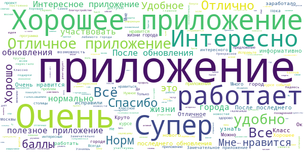

> Пропал старый аккаунт. Прощай 13000 баллов. Я в ауте от проекта.  :date: __2020-11-29 14:35:16__

> Позитивное приложение  :date: __2020-11-29 14:16:22__

> Отличное приложение!!!  :date: __2020-11-27 22:26:17__

> Крутое приложение  :date: __2020-11-27 08:31:48__

> Супер  :date: __2020-11-25 13:02:03__

> Замечательное приложение  :date: __2020-11-25 07:13:18__

> Мне очень нравится приложение Активный граждан.  :date: __2020-11-24 05:14:45__

> Мне очень нравится приложение  :date: __2020-11-23 15:12:14__

> Очень много нового узнала  :date: __2020-11-22 09:14:55__

> Очень информативное приложение  :date: __2020-11-19 14:57:35__

#### 4-star reviews

> Пожалуйста вставляйте ссылки во все статьи, где вы ссылаетесь на внешние источники, или программы. А то, где то есть, где то нету.  :date: __2020-11-29 07:41:38__

> Что-то, где-то не понятно, но ничего.  :date: __2020-11-26 01:47:11__

> Хорошее приложение. Всегда в курсе новых событий, а главное ты сам можешь принять в них участие.  :date: __2020-11-24 08:55:16__

> Пока все работает  :date: __2020-11-18 00:51:40__

> Узнала много нового  :date: __2020-11-14 21:26:41__

> Норм!  :date: __2020-11-13 21:48:27__

> Приложение хорошее, бывают недочёты с пополнением на тройку, хорошо, что не постоянно))) жаль, что другу нельзя подарить, хотя бы часть баллов (((  :date: __2020-11-11 22:14:33__

> Штрафы оплаченные висят, второй месяц и не пропадают  :date: __2020-11-11 19:20:08__

> Боле иение  :date: __2020-11-10 14:45:48__

> Класс,было  :date: __2020-11-10 12:21:10__

#### 3-star reviews

> Больше бы опросов то долго очень копить баллы(((  :date: __2020-11-28 13:26:49__

> Уже вторую недедю невозможно войти в приложение  :date: __2020-11-27 17:25:00__

> После обновления при головании и оценках, не видно проценты и кол-во проголосовавших. Будто бы за все время только я одна проголовала.  :date: __2020-11-12 16:12:34__

> После обновления пишет ошибку при запуске  :date: __2020-11-11 05:31:14__

> Очень медленно работает!  :date: __2020-10-25 14:11:08__

> Вот зачем вы привязали приложение мос ру? Если человека нет на мос ру ему приходится регистрироваться, а если он не хочет  :date: __2020-10-22 21:37:13__

> Нет возможности ставить больше одной звёзды в оценках.  :date: __2020-10-20 12:52:13__

> Почему после каждого обновления надо заново вводить логин и пароль? Понятное что есть восстановление пароля. А сделать попроще ни как?  :date: __2020-10-20 06:28:57__

> Поправили😊  :date: __2020-10-16 16:32:20__

> Уже две недели как пропал "Пульс столицы", причем только у меня, у других он есть. Постоянно выдает ошибку при открытии своего профиля, а так же при попытке заполнить некоторые поля, вроде " Адрес проживания" и "Собственность", из-за чего не получается принимать участия во многих голосованиях и обсуждениях, а так же заполнить профиль на 100%. Меняю с 5 звезд на 3 :((  :date: __2020-10-14 16:46:10__

#### 2-star reviews

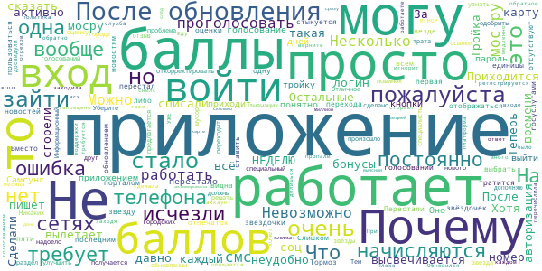

> После интеграции с порталом, пользоваться стало невозможно. Постоянно вылогинивает, и нет возможности зайти по отпечатку пальца. А я все пароли наизусть не помню.  :date: __2020-11-25 22:16:51__

> После перехода на вход через мос.ру перестал пользоваться. Слишком много времени тратится на вход. Сделали бы давно вход через отпечаток, как везде.  :date: __2020-11-07 07:59:20__

> Тормоз  :date: __2020-10-31 11:26:37__

> Перестали отображаться звёздочки для оценки новостей. Вместо всех пяти звёздочек, видна только первая. Приходится всем новостям ставить единицы.  :date: __2020-10-27 01:17:29__

> С последним обновлением могу выбрать только одну звезду при голосовании))) Остальные просто отсутствуют  :date: __2020-10-25 08:45:49__

> Не стыкуется ни с госуслугами ни с порталом мосру. Что либо откорректировать не получается  :date: __2020-10-22 08:39:38__

> Почему высвечивается только одна звезда? У кого-то такая же проблема. То есть остальные звёзды просто не высвечивается  :date: __2020-10-20 23:21:56__

> Уберите пожалуйста оценку городских новинок, надоело, просто трата времени. Тем, кто хочет узнать, что нового произошло, может зайти в специальный раздел.  :date: __2020-10-05 11:23:28__

> Информационный мусор. Никаких значащих голосований нет, всё что предлагается, одобрить что уже сделано или сказать что это должны решать" специалисты"  :date: __2020-09-26 08:38:53__

> Отличное приложение, чтобы улучшить "климат" в городе. И каждый раз вылетает приложение при обновлении телефона.  :date: __2020-09-19 19:10:59__

#### 1-star reviews

> Надоело! Каждый раз сбрасывается авторизация, из-за чего не приходят пуши о свежих голосованиях. Почините в конце концов  :date: __2020-11-29 23:40:24__

> Неделю не заходил в приложение - вылетает. Снова забыл зайти - вылетает. Надоело. Разрабам двойку за такой сервис.  :date: __2020-11-23 22:48:19__

> В ХрвринЕ, ТушинЕ, МедведковЕ.... а что, давайте ещё и в метрЕ и пальтЕ.... Где вы таких грамотеев то берете? Аж глазам "больно" на такое смотреть  :date: __2020-11-23 16:04:35__

> Не возможно сделать заказ поощрения. 5 раз написал в поддержку. Работа 0. Одни отписки. ошибка производся с 3 устройств. Напишу жалобу в мерию. И еще дома 2 программиста сказали баг сайта. Это не желанию выполнить работу  :date: __2020-11-22 06:47:23__

> 23.09.2020 после последних обновлений стабильно разлогинивает после каждого выхода(не разлогиниваюсь) до сих пор висит баннер голосования по поправкам 18.11.2020 после и этого обновления приложение стабильно разлогинивает после выхода. Другие приложения по каким-то причинам этого не делают.  :date: __2020-11-19 21:45:54__

> Бред какой-то  :date: __2020-11-18 23:59:09__

> Заказ Б-1424015 от 28.10.2020 23:16 Заказ из магазина поощрений аннулировали, доставки у них нету. А балы так и не вернули. Я на дурацкую маечку копил балв 1700 года 3.  :date: __2020-11-16 09:52:11__

> Слетает авторизация. Если вошёл через госуслуги не в тот аккаунт, то все, в свой уже не войти.  :date: __2020-11-15 15:46:39__

> Невозможно снова войти в приложение после обновления.  :date: __2020-11-13 19:56:50__

> Доступ к общественным слушаниям отсутствует по моему району  :date: __2020-11-13 18:11:24__

# Госуслуги СТОП Коронавирус
App version ``1.0.14``

Analyzed with [covid-apps-observer](http://github.com/covid-apps-observer) project, version ``0.1``

## App overview
| | |
|-------------------------|-------------------------| 
| **Name**&nbsp;&nbsp;&nbsp;&nbsp;&nbsp;&nbsp;&nbsp;&nbsp;&nbsp;&nbsp;&nbsp;&nbsp;&nbsp;&nbsp;&nbsp;&nbsp;&nbsp;&nbsp;&nbsp;&nbsp;&nbsp;&nbsp;&nbsp;&nbsp;&nbsp;&nbsp;&nbsp;&nbsp;&nbsp;&nbsp;&nbsp;&nbsp;&nbsp;&nbsp;&nbsp;&nbsp;&nbsp;&nbsp;&nbsp;&nbsp;  | Госуслуги СТОП Коронавирус |
| **Unique identifier** | com.minsvyaz.gosuslugi.stopcorona |
| **Link to Google Play** | [https://play.google.com/store/apps/details?id=com.minsvyaz.gosuslugi.stopcorona](https://play.google.com/store/apps/details?id=com.minsvyaz.gosuslugi.stopcorona) |
| **Summary**  | Госуслуги СТОП Коронавирус |
| **Privacy policy** | [https://gu-st.ru/content/Other/stopcovidpoliciesprivacy.pdf](https://gu-st.ru/content/Other/stopcovidpoliciesprivacy.pdf) |
| **Latest version** | 1.0.14 |
| **Last update** | 2020-06-02 17:42:34 |
| **Recent changes** | В новой версии приложения: - можно выбрать регион получения пропуска в момент выбора причины выхода из дома, - обновили форму самоопроса для пользователей приложения, - добавили поддержку функционала для пользователей, находящихся на карантине. Обращаем внимание, что для жителей Москвы оформление цифровых пропусков осуществляется через портал mos.ru |
| **Installs**  | 1 000 000+ |
| **Category** | Путешествия  |
| **First release** | 27 мар. 2020 г. |
| **Size**  | 46M |
| **Supported Android version**  | 5.0 и выше |

### Description
> Для жителей Москвы оформление цифровых пропусков осуществляется через портал mos.ru
 Приложение позволяет выбрать подходящий для вас статус и заполнить анкеты для получения мобильного пропуска на выход из дома в период самоизоляции в формате QR - кода. Вы сможете предъявить его в электронном виде на мобильном устройстве или в распечатанном виде сотрудникам правоохранительных органов в случае необходимости.
 Также можно заблаговременно заполнить анкету регистрации лиц, подлежащих постановке на карантин и ускорить прохождение паспортного и таможенного контроля при прибытии на территорию Российской Федерации из стран, где зарегистрированы случаи заболевания новой коронавирусной инфекцией (2019-nCoV). 
 Режим изоляции необходимо соблюдать в течение 14 календарных дней. Эта обязанность не зависит от признаков заболевания: на карантине следует находиться даже людям без симптомов инфекции. 
 В период карантина необходимо быть дома или в обсервационном центре. Не следует посещать общественные места, ходить на работу или в учебное заведение. Если нет возможности работать удаленно и получать заработную плату, при наличии трудового договора можно воспользоваться электронными сервисами на портале gosuslugi.ru и оформить больничный лист для получения пособия по временной нетрудоспособности.

### User interface
The developers of the app provide the following screenshots in the Google play store.
| | | |
|:-------------------------:|:-------------------------:|:-------------------------:|
 |   |   |   | 
 |   |   | 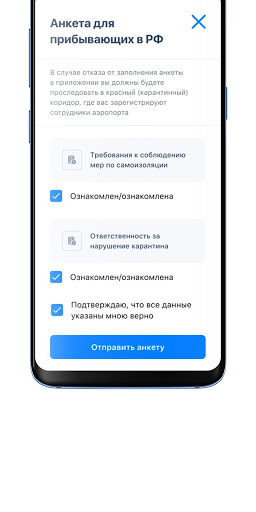  | 

## Development team
In the following we report the main information provided by the development team in the Google play store.

| | |
|-------------------------|-------------------------|
| **Developer**  | Минкомсвязь России |
| **Website**  | - |
| **Email** | support_mp@gosuslugi.ru |
| **Physical address**  | - |
| **Other developed apps**  | [https://play.google.com/store/apps/developer?id=%D0%9C%D0%B8%D0%BD%D0%BA%D0%BE%D0%BC%D1%81%D0%B2%D1%8F%D0%B7%D1%8C+%D0%A0%D0%BE%D1%81%D1%81%D0%B8%D0%B8](https://play.google.com/store/apps/developer?id=%D0%9C%D0%B8%D0%BD%D0%BA%D0%BE%D0%BC%D1%81%D0%B2%D1%8F%D0%B7%D1%8C+%D0%A0%D0%BE%D1%81%D1%81%D0%B8%D0%B8) |

## Android support

| | |
|-------------------------|-------------------------|
| **Declared target Android version**  | Android10, version 10 (API level 29) |
| **Effective target Android version**  | Android10, version 10 (API level 29) |
| **Minimum supported Android version**  | Lollipop, version 5.0 (API level 21) |
| **Maximum target Android version**  | - |

The larger the difference between the minimum and maximum supported Android versions, the better. A larger difference means a wider audience. For example, old phones have a very low Android version, so a high minimum supported Android version means that the app cannot be used by users with old phones, thus leading to accessibility problems. 

## Requested permissions

In the following we report the complete list of the permissions requested by the app. 

| **Permission** | **Protection level** | **Description** | 
|-------------------------|-------------------------|-------------------------|
 **android.permission ACCESS_FINE_LOCATION** | :warning:**Dangerous** | Allows an app to access precise location. 
 **android.permission ACCESS_NETWORK_STATE** | Normal | Allows applications to access information about networks. 
 **android.permission ACCESS_WIFI_STATE** | Normal | Allows applications to access information about Wi-Fi networks. 
 **android.permission CAMERA** | :warning:**Dangerous** | Required to be able to access the camera device. 
 **android.permission CHANGE_WIFI_STATE** | Normal | Allows applications to change Wi-Fi connectivity state. 
 **android.permission FOREGROUND_SERVICE** | Normal | Allows a regular application to use Service.startForeground. 
 **android.permission INTERNET** | Normal | Allows applications to open network sockets. 
 **android.permission READ_EXTERNAL_STORAGE** | :warning:**Dangerous** | Allows an application to read from external storage. 
 **android.permission RECEIVE_BOOT_COMPLETED** | Normal | Allows an application to receive the Intent.ACTION_BOOT_COMPLETED that is broadcast after the system finishes booting. 
 **android.permission VIBRATE** | Normal | Allows access to the vibrator. 
 **android.permission WAKE_LOCK** | Normal | Allows using PowerManager WakeLocks to keep processor from sleeping or screen from dimming. 
 **android.permission WRITE_EXTERNAL_STORAGE** | :warning:**Dangerous** | Allows an application to write to external storage. 
 **com.google.android.c2dm.permission RECEIVE** | - | - 
 **com.google.android.finsky.permission BIND_GET_INSTALL_REFERRER_SERVICE** | - | - 

## Mentioned servers

| **Server** | **Registrant** | **Registrant country** | **Creation date** | 
|-------------------------|-------------------------|-------------------------|-------------------------|
 | googleapis.com | Google LLC | :us: US | 2005-01-25 17:52:26 |
 | googlesyndication.com | Google LLC | :us: US | 2003-01-21 06:17:24 |
 | google.com | Google LLC | :us: US | 1997-09-15 04:00:00 |
 | googleadservices.com | Google LLC | :us: US | 2003-06-19 16:34:53 |
 | app-measurement.com | Google LLC | :us: US | 2015-06-19 20:13:31 |
 | crashlytics.com | Google LLC | :us: US | 2011-01-21 15:30:40 |
 | gosuslugi.ru | - | - | 2008-09-01 20:00:00 |
 | yandex.ru | - | - | 1997-09-23 09:45:07 |

## Security analysis 

Below we report the main security warnings raised by our execution of the [Androwarn](https://github.com/maaaaz/androwarn) security analysis tool.

**Telephony identifiers leakage**
> - This application reads the MCC+MNC of the provider of the SIM 
> - This application reads the constant indicating the state of the device SIM card 
> - This application reads the current location of the device 
> - This application reads the neighboring cell information of the device 
> - This application reads the radio technology (network type) currently in use on the device for data transmission 
> - This application reads the Cell ID value 
> - This application reads the Location Area Code value 

**Connection interfaces exfiltration**
> - This application reads details about the currently active data network 
> - This application tries to find out if the currently active data network is metered 

**Telephony services abuse**
> - This application makes phone calls 

**Suspicious connection establishment**
> - This application opens a Socket and connects it to the remote address '; port is out of range' on the 'N/A' port  
> - This application opens a Socket and connects it to the remote address 'Ljava/net/Proxy;->type()Ljava/net/Proxy$Type;' on the 'N/A' port  
> - This application opens a Socket and connects it to the remote address 'Lp/a/a/a/a;->a(Ljava/lang/String;)Ljava/lang/StringBuilder;' on the 'N/A' port  
> - This application opens a Socket and connects it to the remote address 'timeout' on the 'N/A' port  

**Code execution**
> - This application loads a native library: 'Landroid/text/TextUtils;->isEmpty(Ljava/lang/CharSequence;)Z' 

## User ratings and reviews

Below we provide information about how end users are reacting to the app in terms of ratings and reviews in the Google Play store.

### Ratings

The Госуслуги СТОП Коронавирус app has been installed by more than **1000000** times. At this time, **30989** rated the app and its average score is **2.5547493**. Below we show the distribution of the ratings across the usual star-based rating of Google Play

:star::star::star::star::star:: 9613

:star::star::star::star:: 1770

:star::star::star:: 1476

:star::star:: 1466

:star:: 16664

### Reviews 

#### 5-star reviews

> Ребят, сначало не работало, не могла посмотреть результат анализа после авторизации. После 3-х разового перезахода в эту приложуху, показал результат. Сразу после слов "Пройти самоопрос",появился раздел тестирование на ковид19.  :date: __2020-11-19 16:02:05__

> весной пользовалась. потом нечаянно удалила. теперь не могу восстановиться  :date: __2020-10-05 19:22:55__

> Просто пять звезд. Но шпиономания за гражданами примутствует полным ходом!!!  :date: __2020-09-30 01:12:34__

> То что надо знать  :date: __2020-09-11 06:29:23__

> Класс  :date: __2020-08-29 21:06:12__

> Просто скажу одно - хорошо  :date: __2020-08-26 20:57:12__

> Должна Дэш щ здоровье эх хдззз лишь долларов х он  :date: __2020-08-21 18:23:33__

> Не понравилось  :date: __2020-08-18 18:14:53__

> Мне нравится  :date: __2020-08-06 13:14:50__

> Он  :date: __2020-07-29 15:47:27__

#### 4-star reviews

> Все нормально  :date: __2020-10-19 20:55:17__

> ЫЯщя4Щщ8ф4?-😎  :date: __2020-07-23 02:22:02__

> Спасибо за Госуслуги  :date: __2020-07-16 04:36:30__

> IF  :date: __2020-07-04 15:26:47__

> Спасибо большое вя нас УЦ все чаще яп в  :date: __2020-07-03 17:22:09__

> Отличная работа!!!  :date: __2020-06-26 16:28:07__

> 8plucky 6th to testimony  :date: __2020-06-17 15:43:00__

> Приложение виснет при загрузке данных. Использование по назначению в данный момент невозможно.  :date: __2020-06-15 06:47:42__

> Ок  :date: __2020-06-11 18:23:14__

> Все отлично  :date: __2020-06-10 12:16:41__

#### 3-star reviews

> И Ти ггт н. Г у нас кч ил к логотипу. В  :date: __2020-10-07 07:29:39__

> На аватарку еще осиновый кол чесноксеребряныкпули.не хватает.оченьотпугивающее приложение.,а в плане использования все тупит и глучит.в общем как и все что сделанолюдьми средненьким по таланту ,средненькой мотивации на средненький джет.для средненько го гражданина нашейСреднейстраны  :date: __2020-09-24 08:12:56__

> Задумка хорошая,но доведите уже продукт до ума совместимость и связь с сервером нормально. Вылеты уже достали  :date: __2020-09-21 06:40:56__

> Где найти историю выданных пропусков, МАДИ прислал штраф, пропуск был.  :date: __2020-09-14 14:45:37__

> Ку выуаауу чувак фаявляя мне к цу вы фе Я  :date: __2020-08-10 16:46:06__

> Удалять приложение уже можно? Или стоит подождать до зимы?🤔  :date: __2020-08-07 10:52:52__

> 1) учитывая то, что там почти ничего нет (только текст), то могли бы и облегчить программу, всё-таки, она должга быть общедоступной. 2) приложение раздаёт пропуски даже не проверяя, какую люди ставят причину. Я спокофно ставлю "выгулить единорога" или "слетать на Луну" и оно выдвёт пропуск.  :date: __2020-07-21 01:51:47__

> Хм,странно. Всего один раз подвело,не совпадал номер машины. Ковырялся часа 3. Это если по смс. Линия ясен пень недоступна. Но потом зарегился по старому и рискнул. Прокатило. Катался по Москве и области и всё норм. В остальные дни проблем 0. Выезжал 2 раза в неделю,как положено. Телефон Ксаоми 8 про.  :date: __2020-07-05 09:14:14__

> Плохо работает  :date: __2020-06-24 09:19:53__

> Средний ужас  :date: __2020-06-21 11:40:30__

#### 2-star reviews

> Ни фига не поняла от слова совсем. Зашла через госуслуги. И все тоже самое ,что и там. Удалила  :date: __2020-11-26 10:55:18__

> Везде объявили об интеграции результатов тестов и госуслуги через это приложение, а по факту обновление последнее было летом, здесь даже графы или кнопки, по которой можно поинтересоваться результатом теста по назначению врача  :date: __2020-11-25 20:39:47__

> Я скачиваю приложение что бы посмотреть результаты анализа, но там их нет. Мне предлагают пройти самоопрос. Серьёзно?  :date: __2020-11-24 09:53:28__

> Добрый день. Не отображаются результаты тестирования в приложении. Нет раздела с просмотром результатов тестирования.  :date: __2020-11-22 08:50:50__

> Не могу посмотреть результат теста на коронавирус. Пишет ошибка.  :date: __2020-11-22 08:08:23__

> Нихрена не работает ваше приложение  :date: __2020-11-21 16:41:38__

> Много ненужной пекламы  :date: __2020-07-04 12:13:56__

> При столь скромных функциях приложение имеет столь огромный размер, непонятно  :date: __2020-07-01 17:07:02__

> очень быстро потеряло актуальность  :date: __2020-06-26 05:12:48__

> Очень лагает  :date: __2020-06-20 00:24:15__

#### 1-star reviews

> Плохое приложение  :date: __2020-11-30 11:16:21__

> Гав.о а не приложение, статистику собирает государство на вас, сто вопросов как только заходишь в приложение, анкеты и прочее, нах мне это надо? Я скачала только что результат теста на ковид узнать, т к на портале госуслуг было написано что результат узнаете в этом приложение. БРЕД !!!! НАХ МНЕ ЭТО ПРИЛОЖЕНИЕ, НЕУЖЕЛИ НЕЛЬЗЯ ПРОСТО НА ПОРТАЛЕ ГОСУСЛУГ написать да или нет!!!! В итоге тут на сто вопросов ответила, но никого результата нигде не нашла, лохотрон для сбора статистики и слежки!  :date: __2020-11-30 08:12:08__

> Не работает  :date: __2020-11-29 23:28:29__

> Пришло сообщение о готовности теста. По ссылке скачал приложение. Оказалась редкостная дрянь. Посмотреть результат теста не возможно  :date: __2020-11-29 23:02:28__

> Программа бестолковая. Оценка 1.  :date: __2020-11-29 20:26:35__

> Невозможно увидеть результаты тестирования, при открытии приложения доступно только выбор статуса и заполнение анкеты  :date: __2020-11-29 20:03:01__

> Полное г....  :date: __2020-11-29 19:27:28__

> Не работает  :date: __2020-11-29 18:25:31__

> Худшие приложение  :date: __2020-11-29 18:02:59__

> Результаты ваших анализов есть, но мы вам их не покажем! Ну как так можно?  :date: __2020-11-29 17:47:22__

# Contact Tracker
App version ``1.3``

Analyzed with [covid-apps-observer](http://github.com/covid-apps-observer) project, version ``0.1``

## App overview
| | |
|-------------------------|-------------------------| 
| **Name**&nbsp;&nbsp;&nbsp;&nbsp;&nbsp;&nbsp;&nbsp;&nbsp;&nbsp;&nbsp;&nbsp;&nbsp;&nbsp;&nbsp;&nbsp;&nbsp;&nbsp;&nbsp;&nbsp;&nbsp;&nbsp;&nbsp;&nbsp;&nbsp;&nbsp;&nbsp;&nbsp;&nbsp;&nbsp;&nbsp;&nbsp;&nbsp;&nbsp;&nbsp;&nbsp;&nbsp;&nbsp;&nbsp;&nbsp;&nbsp;  | Contact Tracker |
| **Unique identifier** | com.vjet.covid |
| **Link to Google Play** | [https://play.google.com/store/apps/details?id=com.vjet.covid](https://play.google.com/store/apps/details?id=com.vjet.covid) |
| **Summary**  | Contact Tracker предупреждает о контактах с человеком инфицированном COVID-19. |
| **Privacy policy** | [https://covid-19.y-media.io/privacy-policy/pp-ru.html](https://covid-19.y-media.io/privacy-policy/pp-ru.html) |
| **Latest version** | 1.3 |
| **Last update** | 2020-04-17 17:32:35 |
| **Recent changes** | - |
| **Installs**  | 1 000+ |
| **Category** | Социальные |
| **First release** | 24 мар. 2020 г. |
| **Size**  | 2,1M |
| **Supported Android version**  | 5.0 и выше |

### Description
> Приложение Contact Tracker, предупреждает пользователя о том, что он контактировал с человеком инфицированным COVID19. 
 Contact Tracker, использует технологию Bluetooth для трекинга контактов на расстоянии 3х метров.
 Пользователь может увидеть количество контактов в течении дня, 14 дней и за все время использования приложения.
 Если у пользователя был подтвержден диагноз COVID19, все пользователи с которыми он контактировал получат уведомление.
 Приложение работает в фоновом режиме и способно записывать контакты других пользователей у которых тоже запущено приложение.
 Вся информация является конфиденциальной и будет удалена после окончания эпидемии.

### User interface
The developers of the app provide the following screenshots in the Google play store.
| | | |
|:-------------------------:|:-------------------------:|:-------------------------:|
 | 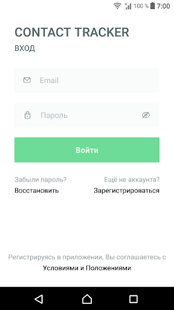  | 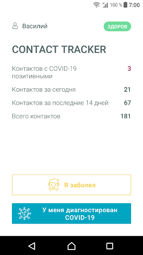  | 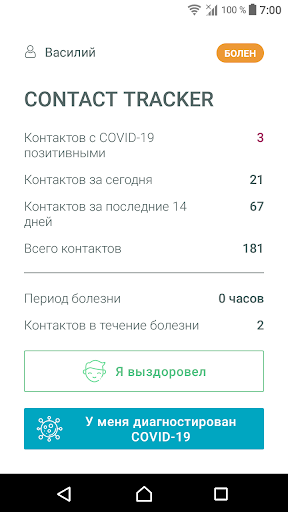  | 
 | 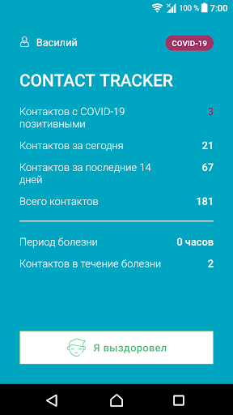 

## Development team
In the following we report the main information provided by the development team in the Google play store.

| | |
|-------------------------|-------------------------|
| **Developer**  | v-jet |
| **Website**  | [https://covid-19.y-media.io/ru/](https://covid-19.y-media.io/ru/) |
| **Email** | alex@y-media.io |
| **Physical address**  | [Work Email: vlad@v-jet.net Legal Entity: VI JET, TOV 49000, Ukraine, Dnipro, Knyazya Yaroslava Mudrogo str., 27](https://www.google.com/maps/search/Work%20Email:%20vlad@v-jet.net%20Legal%20Entity:%20VI%20JET,%20TOV%2049000,%20Ukraine,%20Dnipro,%20Knyazya%20Yaroslava%20Mudrogo%20str.,%2027) (Google Maps) |
| **Other developed apps**  | [https://play.google.com/store/apps/developer?id=v-jet](https://play.google.com/store/apps/developer?id=v-jet) |

## Android support

| | |
|-------------------------|-------------------------|
| **Declared target Android version**  | Android10, version 10 (API level 29) |
| **Effective target Android version**  | Android10, version 10 (API level 29) |
| **Minimum supported Android version**  | Lollipop, version 5.0 (API level 21) |
| **Maximum target Android version**  | - |

The larger the difference between the minimum and maximum supported Android versions, the better. A larger difference means a wider audience. For example, old phones have a very low Android version, so a high minimum supported Android version means that the app cannot be used by users with old phones, thus leading to accessibility problems. 

## Requested permissions

In the following we report the complete list of the permissions requested by the app. 

| **Permission** | **Protection level** | **Description** | 
|-------------------------|-------------------------|-------------------------|
 **android.permission ACCESS_BACKGROUND_LOCATION** | :warning:**Dangerous** | Allows an app to access location in the background. 
 **android.permission ACCESS_COARSE_LOCATION** | :warning:**Dangerous** | Allows an app to access approximate location. 
 **android.permission ACCESS_FINE_LOCATION** | :warning:**Dangerous** | Allows an app to access precise location. 
 **android.permission ACCESS_NETWORK_STATE** | Normal | Allows applications to access information about networks. 
 **android.permission BLUETOOTH** | Normal | Allows applications to connect to paired bluetooth devices. 
 **android.permission BLUETOOTH_ADMIN** | Normal | Allows applications to discover and pair bluetooth devices. 
 **android.permission FOREGROUND_SERVICE** | Normal | Allows a regular application to use Service.startForeground. 
 **android.permission INTERNET** | Normal | Allows applications to open network sockets. 
 **android.permission RECEIVE_BOOT_COMPLETED** | Normal | Allows an application to receive the Intent.ACTION_BOOT_COMPLETED that is broadcast after the system finishes booting. 
 **android.permission WAKE_LOCK** | Normal | Allows using PowerManager WakeLocks to keep processor from sleeping or screen from dimming. 
 **com.google.android.c2dm.permission RECEIVE** | - | - 
 **com.google.android.finsky.permission BIND_GET_INSTALL_REFERRER_SERVICE** | - | - 

## Mentioned servers

| **Server** | **Registrant** | **Registrant country** | **Creation date** | 
|-------------------------|-------------------------|-------------------------|-------------------------|
 | googlesyndication.com | Google LLC | :us: US | 2003-01-21 06:17:24 |
 | google.com | Google LLC | :us: US | 1997-09-15 04:00:00 |
 | app-measurement.com | Google LLC | :us: US | 2015-06-19 20:13:31 |
 | googleadservices.com | Google LLC | :us: US | 2003-06-19 16:34:53 |
 | googleapis.com | Google LLC | :us: US | 2005-01-25 17:52:26 |

## Security analysis 

Below we report the main security warnings raised by our execution of the [Androwarn](https://github.com/maaaaz/androwarn) security analysis tool.

**Connection interfaces exfiltration**
> - This application reads details about the currently active data network 

**Suspicious connection establishment**
> - This application opens a Socket and connects it to the remote address '; port is out of range' on the 'N/A' port  
> - This application opens a Socket and connects it to the remote address 'Lcom/android/tools/r8/GeneratedOutlineSupport;->outline11(Ljava/lang/String;)Ljava/lang/StringBuilder;' on the 'N/A' port  
> - This application opens a Socket and connects it to the remote address 'Ljava/net/Proxy;->type()Ljava/net/Proxy$Type;' on the 'N/A' port  
> - This application opens a Socket and connects it to the remote address 'timeout' on the 'N/A' port  

## User ratings and reviews

Below we provide information about how end users are reacting to the app in terms of ratings and reviews in the Google Play store.

### Ratings

The Contact Tracker app has been installed by more than **1000** times. At this time, **8** rated the app and its average score is **2.0**. Below we show the distribution of the ratings across the usual star-based rating of Google Play

:star::star::star::star::star:: 2

:star::star::star::star:: 0

:star::star::star:: 0

:star::star:: 0

:star:: 6

### Reviews 

#### 5-star reviews

No recent reviews available with 5 stars.

#### 4-star reviews

No recent reviews available with 4 stars.

#### 3-star reviews

No recent reviews available with 3 stars.

#### 2-star reviews

> Не возможно зарегистрироваться, не работает, все время ошибка  :date: __2020-11-25 11:08:32__

#### 1-star reviews

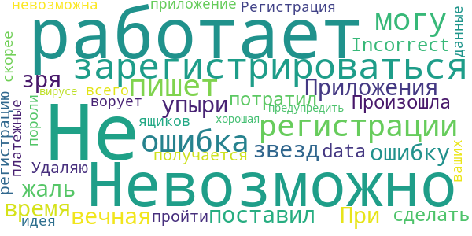

> Не работает  :date: __2020-11-25 11:09:01__

> Не работает  :date: __2020-11-24 09:36:27__

> Не регистрацию не как не могу пройти  :date: __2020-11-24 08:18:00__

> Не работает. Регистрация невозможна, скорее всего, приложение ворует пороли от ваших ящиков и платежные данные. А идея предупредить о вирусе - была хорошая.  :date: __2020-07-24 13:56:48__

# Карта жителя НО
App version ``2.0.7``

Analyzed with [covid-apps-observer](http://github.com/covid-apps-observer) project, version ``0.1``

## App overview
| | |
|-------------------------|-------------------------| 
| **Name**&nbsp;&nbsp;&nbsp;&nbsp;&nbsp;&nbsp;&nbsp;&nbsp;&nbsp;&nbsp;&nbsp;&nbsp;&nbsp;&nbsp;&nbsp;&nbsp;&nbsp;&nbsp;&nbsp;&nbsp;&nbsp;&nbsp;&nbsp;&nbsp;&nbsp;&nbsp;&nbsp;&nbsp;&nbsp;&nbsp;&nbsp;&nbsp;&nbsp;&nbsp;&nbsp;&nbsp;&nbsp;&nbsp;&nbsp;&nbsp;  | Карта жителя НО |
| **Unique identifier** | com.nizhniy_mobile |
| **Link to Google Play** | [https://play.google.com/store/apps/details?id=com.nizhniy_mobile](https://play.google.com/store/apps/details?id=com.nizhniy_mobile) |
| **Summary**  | Персональный электронный ключ к городской среде |
| **Privacy policy** | [https://drive.google.com/file/d/1IcZ0NtRJXhbX8yMoAQaGwMOU3Vfppvtm/view](https://drive.google.com/file/d/1IcZ0NtRJXhbX8yMoAQaGwMOU3Vfppvtm/view) |
| **Latest version** | 2.0.7 |
| **Last update** | 2020-11-11 21:08:37 |
| **Recent changes** | В этой версии приложения добавлен переход на сайт приложения &quot;Вам решать&quot; и пофиксили несколько неприятных багов. |
| **Installs**  | 100 000+ |
| **Category** | Социальные |
| **First release** | 2 апр. 2020 г. |
| **Size**  | 64M |
| **Supported Android version**  | 4.4W и выше |

### Description
> Бесплатное приложение для всех жителей Нижегородской области. С его помощью любой житель может взаимодействовать с городом и пользование различными услугами становится удобным, понятным и приятным.

### User interface
The developers of the app provide the following screenshots in the Google play store.
| | | |
|:-------------------------:|:-------------------------:|:-------------------------:|
 | 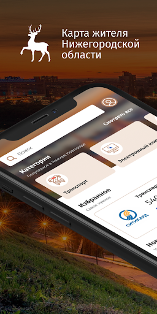  |   | 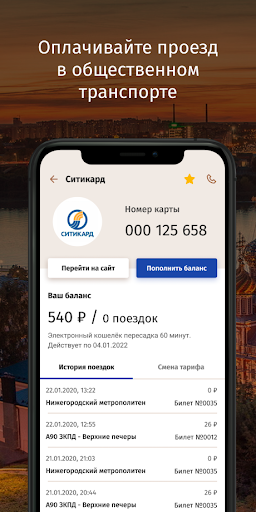  | 
 | 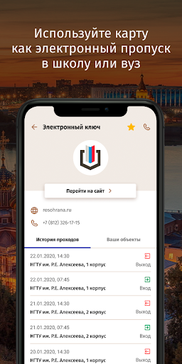  | 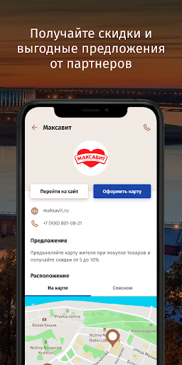  | 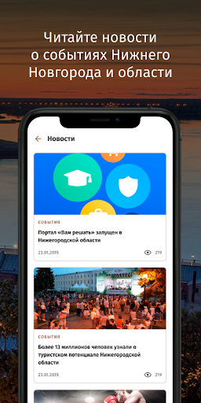  | 

## Development team
In the following we report the main information provided by the development team in the Google play store.

| | |
|-------------------------|-------------------------|
| **Developer**  | Мининформ Нижегородской области |
| **Website**  | [http://nn-card.ru](http://nn-card.ru) |
| **Email** | info@nn-card.ru |
| **Physical address**  | - |
| **Other developed apps**  | [https://play.google.com/store/apps/developer?id=%D0%9C%D0%B8%D0%BD%D0%B8%D0%BD%D1%84%D0%BE%D1%80%D0%BC+%D0%9D%D0%B8%D0%B6%D0%B5%D0%B3%D0%BE%D1%80%D0%BE%D0%B4%D1%81%D0%BA%D0%BE%D0%B9+%D0%BE%D0%B1%D0%BB%D0%B0%D1%81%D1%82%D0%B8](https://play.google.com/store/apps/developer?id=%D0%9C%D0%B8%D0%BD%D0%B8%D0%BD%D1%84%D0%BE%D1%80%D0%BC+%D0%9D%D0%B8%D0%B6%D0%B5%D0%B3%D0%BE%D1%80%D0%BE%D0%B4%D1%81%D0%BA%D0%BE%D0%B9+%D0%BE%D0%B1%D0%BB%D0%B0%D1%81%D1%82%D0%B8) |

## Android support

| | |
|-------------------------|-------------------------|
| **Declared target Android version**  | Android10, version 10 (API level 29) |
| **Effective target Android version**  | Android10, version 10 (API level 29) |
| **Minimum supported Android version**  | KitKat W, version 4.4W - 4.4.4W (API level 20) |
| **Maximum target Android version**  | - |

The larger the difference between the minimum and maximum supported Android versions, the better. A larger difference means a wider audience. For example, old phones have a very low Android version, so a high minimum supported Android version means that the app cannot be used by users with old phones, thus leading to accessibility problems. 

## Requested permissions

In the following we report the complete list of the permissions requested by the app. 

| **Permission** | **Protection level** | **Description** | 
|-------------------------|-------------------------|-------------------------|
 **android.permission ACCESS_COARSE_LOCATION** | :warning:**Dangerous** | Allows an app to access approximate location. 
 **android.permission ACCESS_FINE_LOCATION** | :warning:**Dangerous** | Allows an app to access precise location. 
 **android.permission ACCESS_NETWORK_STATE** | Normal | Allows applications to access information about networks. 
 **android.permission ACCESS_WIFI_STATE** | Normal | Allows applications to access information about Wi-Fi networks. 
 **android.permission CAMERA** | :warning:**Dangerous** | Required to be able to access the camera device. 
 **android.permission INTERNET** | Normal | Allows applications to open network sockets. 
 **android.permission READ_APP_BADGE** | - | - 
 **android.permission READ_EXTERNAL_STORAGE** | :warning:**Dangerous** | Allows an application to read from external storage. 
 **android.permission READ_PHONE_STATE** | :warning:**Dangerous** | Allows read only access to phone state, including the phone number of the device, current cellular network information, the status of any ongoing calls, and a list of any PhoneAccounts registered on the device. 
 **android.permission USE_BIOMETRIC** | Normal | Allows an app to use device supported biometric modalities. 
 **android.permission USE_FINGERPRINT** | Normal | This constant was deprecated in API level 28. Applications should request USE_BIOMETRIC instead 
 **android.permission WAKE_LOCK** | Normal | Allows using PowerManager WakeLocks to keep processor from sleeping or screen from dimming. 
 **android.permission WRITE_EXTERNAL_STORAGE** | :warning:**Dangerous** | Allows an application to write to external storage. 
 **com.anddoes.launcher.permission UPDATE_COUNT** | - | - 
 **com.android.vending CHECK_LICENSE** | - | - 
 **com.google.android.c2dm.permission RECEIVE** | - | - 
 **com.google.android.finsky.permission BIND_GET_INSTALL_REFERRER_SERVICE** | - | - 
 **com.htc.launcher.permission READ_SETTINGS** | - | - 
 **com.htc.launcher.permission UPDATE_SHORTCUT** | - | - 
 **com.huawei.android.launcher.permission CHANGE_BADGE** | - | - 
 **com.huawei.android.launcher.permission READ_SETTINGS** | - | - 
 **com.huawei.android.launcher.permission WRITE_SETTINGS** | - | - 
 **com.majeur.launcher.permission UPDATE_BADGE** | - | - 
 **com.oppo.launcher.permission READ_SETTINGS** | - | - 
 **com.oppo.launcher.permission WRITE_SETTINGS** | - | - 
 **com.sec.android.provider.badge.permission READ** | - | - 
 **com.sec.android.provider.badge.permission WRITE** | - | - 
 **com.sonyericsson.home.permission BROADCAST_BADGE** | - | - 
 **com.sonymobile.home.permission PROVIDER_INSERT_BADGE** | - | - 
 **me.everything.badger.permission BADGE_COUNT_READ** | - | - 
 **me.everything.badger.permission BADGE_COUNT_WRITE** | - | - 

## Mentioned servers

| **Server** | **Registrant** | **Registrant country** | **Creation date** | 
|-------------------------|-------------------------|-------------------------|-------------------------|
 | adobe.com | Adobe Inc. | :us: US | 1986-11-17 05:00:00 |
 | apache.org | The Apache Software Foundation | :us: US | 1995-04-11 04:00:00 |
 | xml.org | OASIS Open | :us: US | 1997-02-03 05:00:00 |
 | w3.org | W3C | :us: US | 1994-07-06 04:00:00 |
 | purl.org | Internet Archive | :us: US | 1996-01-01 05:00:00 |
 | android.com | Google LLC | :us: US | 1997-06-23 04:00:00 |
 | googlesyndication.com | Google LLC | :us: US | 2003-01-21 06:17:24 |
 | google.com | Google LLC | :us: US | 1997-09-15 04:00:00 |
 | facebook.com | Facebook, Inc. | :us: US | 1997-03-29 05:00:00 |
 | iptc.org | Whois Privacy Service | :us: US | 1995-12-27 05:00:00 |
 | useplus.org | PLUS COALITION | :us: US | 2003-11-18 19:31:25 |
 | npes.org | NPES | :us: US | 1996-01-30 05:00:00 |
 | aiim.org | Association for Information and Image Management International | :us: US | 1995-10-18 04:00:00 |
 | app-measurement.com | Google LLC | :us: US | 2015-06-19 20:13:31 |
 | drewnoakes.com | REDACTED FOR PRIVACY | GB | 2002-04-04 10:00:05 |
 | googleapis.com | Google LLC | :us: US | 2005-01-25 17:52:26 |
 | googleadservices.com | Google LLC | :us: US | 2003-06-19 16:34:53 |

## Security analysis 

Below we report the main security warnings raised by our execution of the [Androwarn](https://github.com/maaaaz/androwarn) security analysis tool.

**Telephony identifiers leakage**
> - This application reads the numeric name (MCC+MNC) of current registered operator 
> - This application reads the operator name 

**Connection interfaces exfiltration**
> - This application reads details about the currently active data network 
> - This application tries to find out if the currently active data network is metered 

**Audio video eavesdropping**
> - This application records audio from the 'CAMCORDER' source  
> - This application records audio from the 'MIC' source  
> - This application captures video from the 'CAMERA' source 
> - This application captures video from the 'SURFACE' source 

**Suspicious connection establishment**
> - This application opens a Socket and connects it to the remote address '' on the 'N/A' port  
> - This application opens a Socket and connects it to the remote address 'Ljava/lang/StringBuilder;->toString()Ljava/lang/String;' on the ': connect, resolve' port  
> - This application opens a Socket and connects it to the remote address 'Ljava/lang/StringBuilder;->toString()Ljava/lang/String;' on the 'N/A' port  
> - This application opens a Socket and connects it to the remote address 'Ljava/net/Proxy;->type()Ljava/net/Proxy$Type;' on the 'N/A' port  
> - This application opens a Socket and connects it to the remote address 'timeout' on the 'N/A' port  

**Pim data leakage**
> - This application accesses the downloads folder 
> - This application accesses data stored in the clipboard 

**Code execution**
> - This application loads a native library 
> - This application loads a native library: 'Ljava/util/Iterator;->next()Ljava/lang/Object;' 
> - This application loads a native library: 'c++_shared' 
> - This application loads a native library: 'jniPdfium' 
> - This application loads a native library: 'modft2' 
> - This application loads a native library: 'modpdfium' 
> - This application loads a native library: 'modpng' 
> - This application loads a native library: 'ucrop' 
> - This application executes a UNIX command 

## User ratings and reviews

Below we provide information about how end users are reacting to the app in terms of ratings and reviews in the Google Play store.

### Ratings

The Карта жителя НО app has been installed by more than **100000** times. At this time, **10172** rated the app and its average score is **1.8564547**. Below we show the distribution of the ratings across the usual star-based rating of Google Play

:star::star::star::star::star:: 1597

:star::star::star::star:: 303

:star::star::star:: 450

:star::star:: 509

:star:: 7313

### Reviews 

#### 5-star reviews

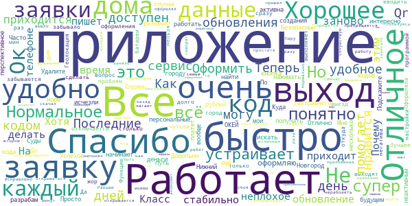

> Довольно перспективное приложение. Очень интересно как его разовьют в будущем. Успехов разрабам!  :date: __2020-07-26 10:57:33__

> Удалите все мои персональные данные.  :date: __2020-06-24 21:12:37__

> Теперь кодов нет спасибо  :date: __2020-06-11 22:18:26__

> все норм.все работает  :date: __2020-06-11 22:08:26__

> Очень удобное приложение. Сидишь дома, да ещё и деньги платят каждый день по 10 рублей. 😅  :date: __2020-06-02 10:36:49__

> Последние несколько дней, после создания заявки, кнопка Qr кода не активна.. а последние 2 заявки с неактивным кодом вообще исчезли...  :date: __2020-06-01 08:16:03__

> ок  :date: __2020-05-20 14:37:50__

> Отлично!  :date: __2020-05-18 21:00:15__

> Все ОКЕЙ  :date: __2020-05-12 19:51:44__

> Часто,сервис не доступен  :date: __2020-05-11 14:54:16__

#### 4-star reviews

> Все нормально работает. Интерфейс пока не очень дружелюбный для пользователей, но думаю, что со временем все исправят.  :date: __2020-06-30 19:51:07__

> После обновления белый экран, заставка с оленем проходит и потом белый экран. Телефон huawei p smart z. Пришлось удалить и установить заново, теперь всё работает.  :date: __2020-06-28 12:51:57__

> 🍪🏩  :date: __2020-06-12 07:17:00__

> Мне нравится! Но в последнее время очень странно начало вести себя само прииложение пишет что (сайт или приложение) злоумышленики пытаются взломать ваши данные. Не знаю может это у меня проблемы! Всеравно исправьте!  :date: __2020-06-04 18:37:16__

> После обновления пропал ярлык приложения. Приходиться каждый раз заходить в плэй-маркет. Очень не удобно... К работе нареканий нет. Поэтому 4 звездочки  :date: __2020-06-04 17:35:19__

> Вполне вероятно получится достаточно функциональное приложение. Пока что то, что уже доступно работает нормально. Единственное почему-то отслеживание местоположения не выключается даже тогда, когда выходишь из приложения. Но ошибки это нормально при такой скорости реализации фунций в пожарном режиме. Дополнение. После обращения в тех. поддержку решилась проблема с не отключающейся геолокацией. Обновление 02.06.2020 гуд. На Honor 8X и 10-м Андроиде все работает норм. На старом Lenovo Phab2 хуже.  :date: __2020-06-04 10:45:52__

> Уважаемые разработчики,а почему отсутствует геолокация? Она что вообще больше не нужна? Тогда зачем нужно само приложение?  :date: __2020-06-01 09:36:06__

> Хотелось бы иметь код передвижения на авто. Я еду одна, риска нет заражения.. Раньше был код-еду на машине, а теперь его почему-то убрали.  :date: __2020-05-26 11:20:34__

> У меня в "моих заявках" нет ни одной оформленной в мае заявки! Почему? Куда пропали? Перед выходом на улицу оформляю QR код всегда.  :date: __2020-05-18 11:12:39__

> Почему в приложении после оформления заявки не активна кнопка QR-код, она раньше высвечивалась синим цветом и открывалась а сейчас не открывается? И верните пжл..Тип заявки Еду на машине/такси, как это было раньше! Если обновлять данные, то лучше уж в лучшую сторону)  :date: __2020-05-13 17:18:07__

#### 3-star reviews

> Приложение живёт своей жизнью, двадцать пятый раз требует заполнить личные данные в профиле. Сегодня 14 октября скачал и пытался войти/зарегистрироваться. Бесполезно. Получил разъяснение разработчика, спасибо.  :date: __2020-10-23 11:44:29__

> Не приходит код для активации,только звонки с московских номеров!  :date: __2020-10-09 07:44:44__

> Так отменили коды то вроде. Зачем теперича эта прога нужна??? Чисто для отслеживания если только. Ну и граждане самое главное - наши личные данные у кого сейчас на флешке????  :date: __2020-06-17 18:52:53__

> У меня две транспортных карты. Как привязать вторую?  :date: __2020-06-17 12:40:56__

> Тяжело разобраться в разделах. Многие необходимые разделы есть только на портале, но не приложении. К примеру, я не нашла информацию по самой карте жителя и по предложениям скидок и купонов по ней  :date: __2020-06-12 10:56:18__

> После последнего обновления запускается с ошибкой через раз.  :date: __2020-06-02 18:38:04__

> Приложение не обновляется автоматически. Так же не появляется кнопка "обновить" в магазине. Приходится удалять приложение со смартфона, и скачивать и устанавливать снова. Тогда приложение устанавливается обновленным.  :date: __2020-06-02 10:37:03__

> Для посещения кладбища за городом (Вязовка), как мне оформлять заявку?  :date: __2020-06-01 07:55:48__

> Исчезают оформленные заявки, уже делаю скриншоты на телефон, чтобы хоть как то их сохранить(  :date: __2020-05-29 08:29:02__

> Автоматически не обновляется, без обновления не работает  :date: __2020-05-26 07:57:52__

#### 2-star reviews

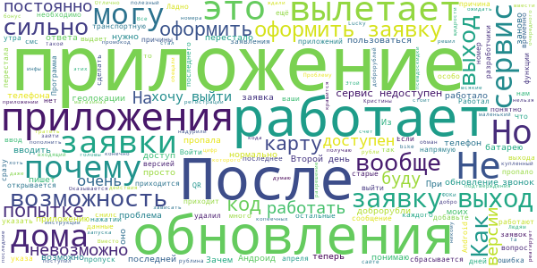

> Та же проблема что и у Кристины. Вместо кода подтверждения по смс получаю входящий звонок. После ответа звонок сбрасывается. Войти в приложение нельзя. !!!! Проблему решил. Оказывается нужно ввести последние 5 цифр номера с которого поступил звонок. Этой инфы в приложении нет, только в инструкции или на сайте  :date: __2020-10-15 11:16:09__

> При регистрации смс не приходит  :date: __2020-10-11 19:08:16__

> Такой обман - эти доброрубли))) Людям головы надурили, никому не надо тратить эти рубли на всякие ФОКи и псевдоскидки в магазинах. Все ждали, думаю, возможность пополнить свою транспортную карту за счет этих копеечных доброрублей (хоть маленький полезный бонус), но, конечно, уж такой щедрости нам ожидать не стоит (даже если нам это напрямую обещали).  :date: __2020-09-15 14:03:35__

> Не работает промокод купленный за добро рублина Lucky bike  :date: __2020-08-04 21:22:09__

> После очередного обновления, приложение при попытке оформить разрешение на выход просто вылетает.  :date: __2020-06-08 20:55:47__

> После обновления при попытке зайти в приложения стал зависать телефон, приложение не открывается и не реагирует на действия  :date: __2020-06-05 20:34:53__

> Отлично. После обновления крашится сразу после запуска. Если интересно Андроид 6.  :date: __2020-06-05 18:59:42__

> И чего? После каждого обновления приходится вводить все заново...  :date: __2020-06-05 17:29:28__

> Не работает это дерьмоприложение теперь(Код не приходит после обноввы(  :date: __2020-06-02 08:21:12__

> После установки этого предложения мне 8 раз позвонили и сообщили что мне одобрен кредит, причём от сомнительных контор, может конечно и оно виновато, но как то так...  :date: __2020-05-31 23:10:44__

#### 1-star reviews

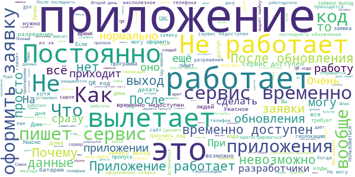

> Моя копия антивируса взбесилась после установки. Хорошо что телефон проглючил. Удалил.  :date: __2020-11-24 10:39:05__

> Я проделал все необходимые операции, чтобы зарегистрироваться и код с последними цифрами звонка и никакого результата. Что за безобразие!  :date: __2020-11-13 19:57:15__

> После обновлений приложение вылетает неуспев открыться  :date: __2020-11-11 20:52:54__

> Кроме того что изначально приложение не имело ни полезного функционала, ни даже свежих новостей, так теперь в него даже войти невозможо, впрочем так же как и заново зарегистрироваться. От разработчиков видимо ответа так никто и не дождется, так разрабы и сами не знают что сотворили...и ответить не могут. Деньги налогоплательщика освоены успешно! А Налогоплательщик хочет знать стоимость этого чудо- проекта. Приложение как было пустышкой, так и осталось! Не устанавливайте Граждане!  :date: __2020-10-28 11:06:33__

> Не приходит код доступа при регистрации. Вместо него - какие-то прерывающиеся звонки с незнакомых номеров. Может, звонки - совпадение, конечно (но вряд ли; прозвон идёт через 2-3 секунды после запроса кода; нет запросов - тишина). Короче - тут же удаляю на всякий противопожарный.  :date: __2020-10-22 15:20:35__

> Не могу зарегистрироваться в приложении. Смс-код не приходит, поэтому не могу зайти. Пытаюсь уже 3 дня, пока без результатов.  :date: __2020-10-22 06:56:13__

> Даже нет смысла скачивать, зайти все равно не удастся.. приложение дно  :date: __2020-10-20 21:00:14__

> Согласна с предыдушим пользователем. Ерунда какая то. Всю весну пользовалась приложением. А теперь требует какую то регистрацию, хотя она есть. Старую не хочет. А для новой не приходит смс, какой то дибильный звонок  :date: __2020-10-20 05:38:29__

> Где в приложении находятся "Мои заявки"?  :date: __2020-10-18 11:53:05__

> у меня вообще не скачивается. а на сайте при регистрации при получении кода по телефону звоеят и сбрасывают... дебильное приложение. по любому рос нано делало за миллиард рублей))  :date: __2020-10-17 15:17:06__

# Телемедицина Югры
App version ``1.9.42``

Analyzed with [covid-apps-observer](http://github.com/covid-apps-observer) project, version ``0.1``

## App overview
| | |
|-------------------------|-------------------------| 
| **Name**&nbsp;&nbsp;&nbsp;&nbsp;&nbsp;&nbsp;&nbsp;&nbsp;&nbsp;&nbsp;&nbsp;&nbsp;&nbsp;&nbsp;&nbsp;&nbsp;&nbsp;&nbsp;&nbsp;&nbsp;&nbsp;&nbsp;&nbsp;&nbsp;&nbsp;&nbsp;&nbsp;&nbsp;&nbsp;&nbsp;&nbsp;&nbsp;&nbsp;&nbsp;&nbsp;&nbsp;&nbsp;&nbsp;&nbsp;&nbsp;  | Телемедицина Югры |
| **Unique identifier** | com.miacugra.telemed |
| **Link to Google Play** | [https://play.google.com/store/apps/details?id=com.miacugra.telemed](https://play.google.com/store/apps/details?id=com.miacugra.telemed) |
| **Summary**  | Онлайн-консультации |
| **Privacy policy** | [https://tm.dzhmao.ru/policy](https://tm.dzhmao.ru/policy) |
| **Latest version** | 1.9.42 |
| **Last update** | 2020-10-22 14:04:48 |
| **Recent changes** | 1.9.42 |
| **Installs**  | 500+ |
| **Category** | Медицина |
| **First release** | 30 мар. 2020 г. |
| **Size**  | 43M |
| **Supported Android version**  | 5.0 и выше |

### Description
> — Онлайн-консультации с врачами
 — Личный дневник пациента
 — Напоминания о фиксировании оценки самочувствия

### User interface
The developers of the app provide the following screenshots in the Google play store.
| | | |
|:-------------------------:|:-------------------------:|:-------------------------:|
 |   | 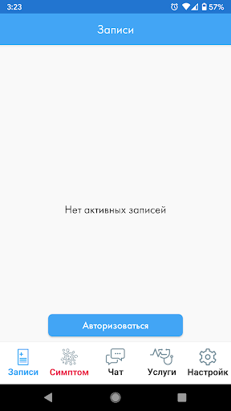  | 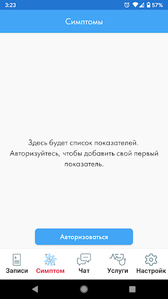  | 
 |   |   | 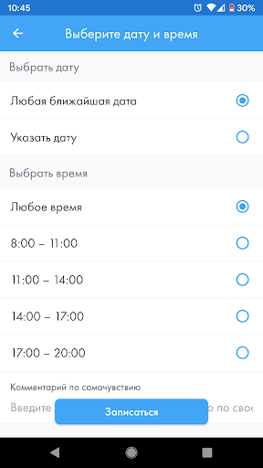  | 

## Development team
In the following we report the main information provided by the development team in the Google play store.

| | |
|-------------------------|-------------------------|
| **Developer**  | БУ "Медицинский информационно-аналитический центр" |
| **Website**  | [https://tm.dzhmao.ru/](https://tm.dzhmao.ru/) |
| **Email** | support@miacugra.ru |
| **Physical address**  | [628011, Россия, Ханты-Мансийский автономный округ - Югра, г. Ханты-Мансийск, ул. Студенческая, 15А](https://www.google.com/maps/search/628011,%20Россия,%20Ханты-Мансийский%20автономный%20округ%20-%20Югра,%20г.%20Ханты-Мансийск,%20ул.%20Студенческая,%2015А) (Google Maps) |
| **Other developed apps**  | [https://play.google.com/store/apps/developer?id=%D0%91%D0%A3+%22%D0%9C%D0%B5%D0%B4%D0%B8%D1%86%D0%B8%D0%BD%D1%81%D0%BA%D0%B8%D0%B9+%D0%B8%D0%BD%D1%84%D0%BE%D1%80%D0%BC%D0%B0%D1%86%D0%B8%D0%BE%D0%BD%D0%BD%D0%BE-%D0%B0%D0%BD%D0%B0%D0%BB%D0%B8%D1%82%D0%B8%D1%87%D0%B5%D1%81%D0%BA%D0%B8%D0%B9+%D1%86%D0%B5%D0%BD%D1%82%D1%80%22](https://play.google.com/store/apps/developer?id=%D0%91%D0%A3+%22%D0%9C%D0%B5%D0%B4%D0%B8%D1%86%D0%B8%D0%BD%D1%81%D0%BA%D0%B8%D0%B9+%D0%B8%D0%BD%D1%84%D0%BE%D1%80%D0%BC%D0%B0%D1%86%D0%B8%D0%BE%D0%BD%D0%BD%D0%BE-%D0%B0%D0%BD%D0%B0%D0%BB%D0%B8%D1%82%D0%B8%D1%87%D0%B5%D1%81%D0%BA%D0%B8%D0%B9+%D1%86%D0%B5%D0%BD%D1%82%D1%80%22) |

## Android support

| | |
|-------------------------|-------------------------|
| **Declared target Android version**  | Android10, version 10 (API level 29) |
| **Effective target Android version**  | Android10, version 10 (API level 29) |
| **Minimum supported Android version**  | Lollipop, version 5.0 (API level 21) |
| **Maximum target Android version**  | - |

The larger the difference between the minimum and maximum supported Android versions, the better. A larger difference means a wider audience. For example, old phones have a very low Android version, so a high minimum supported Android version means that the app cannot be used by users with old phones, thus leading to accessibility problems. 

## Requested permissions

In the following we report the complete list of the permissions requested by the app. 

| **Permission** | **Protection level** | **Description** | 
|-------------------------|-------------------------|-------------------------|
 **android.permission ACCESS_COARSE_LOCATION** | :warning:**Dangerous** | Allows an app to access approximate location. 
 **android.permission ACCESS_FINE_LOCATION** | :warning:**Dangerous** | Allows an app to access precise location. 
 **android.permission ACCESS_NETWORK_STATE** | Normal | Allows applications to access information about networks. 
 **android.permission ACCESS_WIFI_STATE** | Normal | Allows applications to access information about Wi-Fi networks. 
 **android.permission BLUETOOTH** | Normal | Allows applications to connect to paired bluetooth devices. 
 **android.permission BLUETOOTH_ADMIN** | Normal | Allows applications to discover and pair bluetooth devices. 
 **android.permission CAMERA** | :warning:**Dangerous** | Required to be able to access the camera device. 
 **android.permission FOREGROUND_SERVICE** | Normal | Allows a regular application to use Service.startForeground. 
 **android.permission INTERNET** | Normal | Allows applications to open network sockets. 
 **android.permission READ_EXTERNAL_STORAGE** | :warning:**Dangerous** | Allows an application to read from external storage. 
 **android.permission READ_PHONE_STATE** | :warning:**Dangerous** | Allows read only access to phone state, including the phone number of the device, current cellular network information, the status of any ongoing calls, and a list of any PhoneAccounts registered on the device. 
 **android.permission RECORD_AUDIO** | :warning:**Dangerous** | Allows an application to record audio. 
 **android.permission REORDER_TASKS** | Normal | Allows an application to change the Z-order of tasks. 
 **android.permission SYSTEM_ALERT_WINDOW** | Signature - preinstalled - appop - pre23 - development | Allows an app to create windows using the type WindowManager.LayoutParams.TYPE_APPLICATION_OVERLAY, shown on top of all other apps. 
 **android.permission USE_BIOMETRIC** | Normal | Allows an app to use device supported biometric modalities. 
 **android.permission USE_FINGERPRINT** | Normal | This constant was deprecated in API level 28. Applications should request USE_BIOMETRIC instead 
 **android.permission USE_FULL_SCREEN_INTENT** | Normal | Required for apps targeting Build.VERSION_CODES.Q that want to use notification full screen intents. 
 **android.permission VIBRATE** | Normal | Allows access to the vibrator. 
 **android.permission WAKE_LOCK** | Normal | Allows using PowerManager WakeLocks to keep processor from sleeping or screen from dimming. 
 **android.permission WRITE_EXTERNAL_STORAGE** | :warning:**Dangerous** | Allows an application to write to external storage. 
 **com.google.android.c2dm.permission RECEIVE** | - | - 
 **com.google.android.finsky.permission BIND_GET_INSTALL_REFERRER_SERVICE** | - | - 

## Mentioned servers

| **Server** | **Registrant** | **Registrant country** | **Creation date** | 
|-------------------------|-------------------------|-------------------------|-------------------------|
 | facebook.com | Facebook, Inc. | :us: US | 1997-03-29 05:00:00 |
 | google.com | Google LLC | :us: US | 1997-09-15 04:00:00 |
 | googlesyndication.com | Google LLC | :us: US | 2003-01-21 06:17:24 |
 | google-analytics.com | Google LLC | :us: US | 2005-07-18 19:24:32 |
 | app-measurement.com | Google LLC | :us: US | 2015-06-19 20:13:31 |
 | microsoft.com | Microsoft Corporation | :us: US | 1991-05-02 04:00:00 |
 | googleapis.com | Google LLC | :us: US | 2005-01-25 17:52:26 |

## Security analysis 

Below we report the main security warnings raised by our execution of the [Androwarn](https://github.com/maaaaz/androwarn) security analysis tool.

**Telephony identifiers leakage**
> - This application reads the ISO country code equivalent for the SIM provider's country code 
> - This application reads the ISO country code equivalent of the current registered operator's MCC (Mobile Country Code) 
> - This application reads the device phone type value 
> - This application reads the numeric name (MCC+MNC) of current registered operator 
> - This application reads the operator name 
> - This application reads the phone number string for line 1, for example, the MSISDN for a GSM phone 
> - This application reads the unique device ID, i.e the IMEI for GSM and the MEID or ESN for CDMA phones 

**Connection interfaces exfiltration**
> - This application reads details about the currently active data network 

**Telephony services abuse**
> - This application makes phone calls 

**Suspicious connection establishment**
> - This application opens a Socket and connects it to the remote address '' on the 'N/A' port  
> - This application opens a Socket and connects it to the remote address 'Ljava/lang/StringBuilder;->toString()Ljava/lang/String;' on the 'N/A' port  
> - This application opens a Socket and connects it to the remote address 'Ljava/net/Proxy;->type()Ljava/net/Proxy$Type;' on the 'N/A' port  
> - This application opens a Socket and connects it to the remote address 'timeout' on the 'N/A' port  

**Pim data leakage**
> - This application accesses data stored in the clipboard 

**Code execution**
> - This application loads a native library: 'Lcom/vc/app/App;->getNativeLibPath()Landroid/util/Pair;' 
> - This application loads a native library: 'TCAAudio' 
> - This application loads a native library: 'mono-native' 
> - This application loads a native library: 'monodroid' 
> - This application loads a native library: 'monosgen-2.0' 
> - This application loads a native library: 'xamarin-app' 
> - This application loads a native library: 'xamarin-debug-app-helper' 
> - This application executes a UNIX command 
> - This application executes a UNIX command containing this argument: '4' 
> - This application executes a UNIX command containing this argument: 'Lcom/vc/utils/log/LogcatHelper;->access$200()[Ljava/lang/String;' 

## User ratings and reviews

Below we provide information about how end users are reacting to the app in terms of ratings and reviews in the Google Play store.

### Ratings

The Телемедицина Югры app has been installed by more than **500** times. At this time, **-** rated the app and its average score is **0.0**. Below we show the distribution of the ratings across the usual star-based rating of Google Play

:star::star::star::star::star:: 0

:star::star::star::star:: 0

:star::star::star:: 0

:star::star:: 0

:star:: 0

### Reviews 

#### 5-star reviews

> Зашло  :date: __2020-04-23 18:09:54__

#### 4-star reviews

No recent reviews available with 4 stars.

#### 3-star reviews

No recent reviews available with 3 stars.

#### 2-star reviews

> Не возможно выбрать определённого педиатра  :date: __2020-09-02 19:11:48__

#### 1-star reviews

> Пока толку нет от приложения. Записалась но со мной никто так и не связался  :date: __2020-06-04 05:30:21__

# Госуслуги.COVID трекер
App version ``1.0.1``

Analyzed with [covid-apps-observer](http://github.com/covid-apps-observer) project, version ``0.1``

## App overview
| | |
|-------------------------|-------------------------| 
| **Name**&nbsp;&nbsp;&nbsp;&nbsp;&nbsp;&nbsp;&nbsp;&nbsp;&nbsp;&nbsp;&nbsp;&nbsp;&nbsp;&nbsp;&nbsp;&nbsp;&nbsp;&nbsp;&nbsp;&nbsp;&nbsp;&nbsp;&nbsp;&nbsp;&nbsp;&nbsp;&nbsp;&nbsp;&nbsp;&nbsp;&nbsp;&nbsp;&nbsp;&nbsp;&nbsp;&nbsp;&nbsp;&nbsp;&nbsp;&nbsp;  | Госуслуги.COVID трекер |
| **Unique identifier** | com.minsvyaz.gosuslugi.exposurenotificationdroid |
| **Link to Google Play** | [https://play.google.com/store/apps/details?id=com.minsvyaz.gosuslugi.exposurenotificationdroid](https://play.google.com/store/apps/details?id=com.minsvyaz.gosuslugi.exposurenotificationdroid) |
| **Summary**  | Госуслуги.COVID трекер |
| **Privacy policy** | [https://gu-st.ru/content/Other/privacy_policy_exposurenotification.pdf](https://gu-st.ru/content/Other/privacy_policy_exposurenotification.pdf) |
| **Latest version** | 1.0.1 |
| **Last update** | 2020-11-19 20:25:14 |
| **Recent changes** | Функция верификации диагноза пользователя по номеру телефона доступна для всех регионов РФ. |
| **Installs**  | 10 000+ |
| **Category** | Здоровье и фитнес |
| **First release** | 4 нояб. 2020 г. |
| **Size**  | 9,0M |
| **Supported Android version**  | 6.0 и выше |

### Description
> Возможно, недавно вы были совсем близко с человеком, заболевшим COVID-19, но пока не знаете об этом. Установите приложение и проверьте. Сообщите другим пользователям, если заболели сами. Всё анонимно! Никто не узнает, кто заболел и где находится.
 Как приложение находит контакты?
 Ваше устройство ищет и запоминает данные других устройств поблизости используя технологию exposure notification, которую совместно разработали компании Apple и Google. Данная технология фиксирует через ваш Bluetooth устройства других пользователей, обмениваясь с ними случайными ключами. Ваше устройство хранит свой список ключей локально не передавая его наружу. Если кто-то из пользователей заболел и у него положительный тест на COVID-19. Он сообщает об этом анонимно через приложение, предоставляя только доступ к своим случайным ключам за последние две недели. 
 Пользователи, с кем заболевший оказался рядом в последние 14 дней, получат push-уведомление с датой контакта. Никто не увидит никаких данных заболевшего.
 Если у вас положительный тест на COVID-19, сообщите остальным пользователям, что заболели. Они не узнают, от кого пришло сообщение и где он находится. Приложение не передаёт данные о телефоне, его владельце и местоположении. Доступна только информация о контакте с COVID-19 в конкретную дату за последние 14 дней.
 Чем больше пользователей, тем точнее можно оценить риск заражения вирусом. Вовремя сделать тест и начать лечение. 
 Поможем друг другу оставаться здоровыми!
 Разработано Министерством цифрового развития, связи и массовых коммуникаций Российской Федерации при участии Министерства здравоохранения Российской Федерации.
 Приложение предназначено для использования в Российской Федерации.

### User interface
The developers of the app provide the following screenshots in the Google play store.
| | | |
|:-------------------------:|:-------------------------:|:-------------------------:|
 | 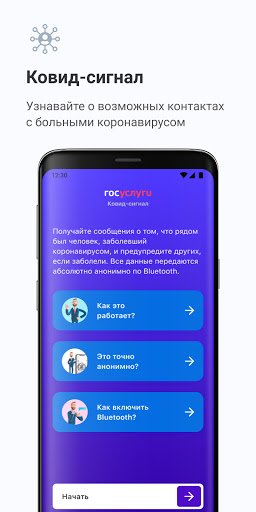  |   | 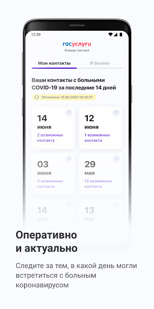  | 
 | 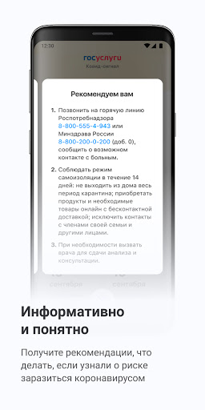  | 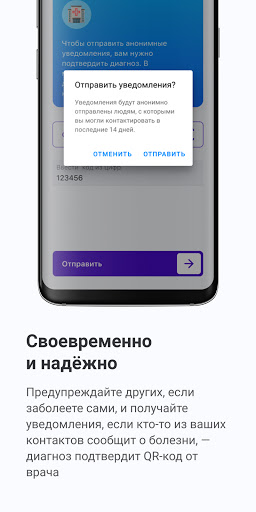 

## Development team
In the following we report the main information provided by the development team in the Google play store.

| | |
|-------------------------|-------------------------|
| **Developer**  | Минцифры России |
| **Website**  | - |
| **Email** | support_mp@gosuslugi.ru |
| **Physical address**  | - |
| **Other developed apps**  | [https://play.google.com/store/apps/developer?id=7040530283788474945](https://play.google.com/store/apps/developer?id=7040530283788474945) |

## Android support

| | |
|-------------------------|-------------------------|
| **Declared target Android version**  | - |
| **Effective target Android version**  | - |
| **Minimum supported Android version**  | Marshmallow, version 6.0 (API level 23) |
| **Maximum target Android version**  | - |

The larger the difference between the minimum and maximum supported Android versions, the better. A larger difference means a wider audience. For example, old phones have a very low Android version, so a high minimum supported Android version means that the app cannot be used by users with old phones, thus leading to accessibility problems. 

## Requested permissions

In the following we report the complete list of the permissions requested by the app. 

| **Permission** | **Protection level** | **Description** | 
|-------------------------|-------------------------|-------------------------|
 **android.permission ACCESS_NETWORK_STATE** | Normal | Allows applications to access information about networks. 
 **android.permission BLUETOOTH** | Normal | Allows applications to connect to paired bluetooth devices. 
 **android.permission FOREGROUND_SERVICE** | Normal | Allows a regular application to use Service.startForeground. 
 **android.permission INTERNET** | Normal | Allows applications to open network sockets. 
 **android.permission RECEIVE_BOOT_COMPLETED** | Normal | Allows an application to receive the Intent.ACTION_BOOT_COMPLETED that is broadcast after the system finishes booting. 
 **android.permission VIBRATE** | Normal | Allows access to the vibrator. 
 **android.permission WAKE_LOCK** | Normal | Allows using PowerManager WakeLocks to keep processor from sleeping or screen from dimming. 
 **com.google.android.c2dm.permission RECEIVE** | - | - 
 **com.google.android.finsky.permission BIND_GET_INSTALL_REFERRER_SERVICE** | - | - 

## Mentioned servers

| **Server** | **Registrant** | **Registrant country** | **Creation date** | 
|-------------------------|-------------------------|-------------------------|-------------------------|
 | googleapis.com | Google LLC | :us: US | 2005-01-25 17:52:26 |
 | googlesyndication.com | Google LLC | :us: US | 2003-01-21 06:17:24 |
 | google.com | Google LLC | :us: US | 1997-09-15 04:00:00 |
 | googleadservices.com | Google LLC | :us: US | 2003-06-19 16:34:53 |
 | app-measurement.com | Google LLC | :us: US | 2015-06-19 20:13:31 |
 | gosuslugi.ru | - | - | 2008-09-01 20:00:00 |
 | crashlytics.com | Google LLC | :us: US | 2011-01-21 15:30:40 |

## Security analysis 

Below we report the main security warnings raised by our execution of the [Androwarn](https://github.com/maaaaz/androwarn) security analysis tool.

**Connection interfaces exfiltration**
> - This application reads details about the currently active data network 
> - This application tries to find out if the currently active data network is metered 

**Telephony services abuse**
> - This application makes phone calls 

**Suspicious connection establishment**
> - This application opens a Socket and connects it to the remote address '; port is out of range' on the 'N/A' port  
> - This application opens a Socket and connects it to the remote address 'Ld/b/a/a/a;->o(Ljava/lang/String;)Ljava/lang/StringBuilder;' on the 'N/A' port  
> - This application opens a Socket and connects it to the remote address 'Ljava/net/Proxy;->type()Ljava/net/Proxy$Type;' on the 'N/A' port  
> - This application opens a Socket and connects it to the remote address 'timeout' on the 'N/A' port  

## User ratings and reviews

Below we provide information about how end users are reacting to the app in terms of ratings and reviews in the Google Play store.

### Ratings

The Госуслуги.COVID трекер app has been installed by more than **10000** times. At this time, **201** rated the app and its average score is **3.239521**. Below we show the distribution of the ratings across the usual star-based rating of Google Play

:star::star::star::star::star:: 103

:star::star::star::star:: 6

:star::star::star:: 9

:star::star:: 3

:star:: 80

### Reviews 

#### 5-star reviews

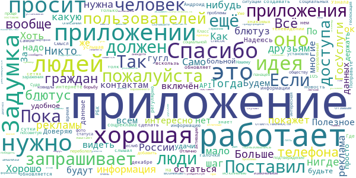

> Поставил, если что оповещу. Проблема в том, что надо иметь это приложение на смартфоне, чтобы узнать о возможном контакте, да и человек сам должен сообщить об этом. При условии, что имя заражённого не пишется, русские все равно не будет указывать об этом в приложении. Само приложение нигде не рекламируется, о нем тупо много людей не знают и не понимают как оно работает.  :date: __2020-11-30 09:30:58__

> Отличный экзамен на гражданскую сознательность!!! ⭐⭐⭐⭐⭐  :date: __2020-11-30 07:46:26__

> Скачивайте! Так у нас будет больше шансов победить вирус!  :date: __2020-11-29 21:13:16__

> Надо бы подобное приложение обязать представлять на импортируемых телефонах  :date: __2020-11-29 19:07:57__

> Хорошо. Спасибо!  :date: __2020-11-28 10:06:28__

> Очень хорошая задумка, лёгкое приложение, ничего лишнего, но как в том анекдоте, есть один нюанс. Если и скучают приложение, то диагноз поставят единицы. Это не потому что в России так, взять в пример какую-нибудь Германию, там хоть и установили много людей приложение, но предупредили малое количество людей. Поставлю формально пять, потому что в отзывах появляются странные люди со странными претензиями. Протрубите везде по это приложение и тогда, может быть, адекватные люди предупредят других  :date: __2020-11-27 09:28:26__

> Отличное приложение, но ему нужна реклама. Пока скачавших его 500 человек на всю страну толку мало. Вероятность, что оно покажет хоть какой-то контакт стремится к нулю. Upd было бы интересно видеть в приложении сколько зарегистрированных пользователей находится в радиусе например километров 20-50  :date: __2020-11-27 03:42:41__

> Интересно, а как приложение поймет что соседей по дому из соседнего подъезда считать не надо было? :) Я часто вижу дома чужие телефоны и телевизоры по Bluetooth. Учтите что многие сначала читать не будут быстро нажмут "далее". А только потом начнут писать комментарии о теории заговора с догадками как по их мнению приложение работает. Так вот на главном экране после установки тоже нужно разместить кнопку "как работает приложение"  :date: __2020-11-26 19:54:57__

> Давно пора было  :date: __2020-11-26 13:38:40__

> Ненавязчиво работает, но опасаюсь, что наши сограждане в основной своей массе пройдут мимо, а без значительной доли населения среди пользователей хорошая идея рискует остаться идеей.  :date: __2020-11-26 12:22:40__

#### 4-star reviews

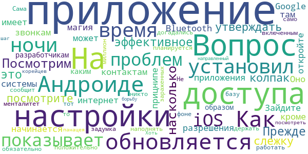

> На Андроиде не обновляется. Как установил в 1 ночи так то время и показывает. На iOS проблем нет  :date: __2020-11-25 08:24:32__

> Посмотрим насколько эффективное это приложение.  :date: __2020-11-25 07:38:24__

> Прежде чем утверждать про слежку и колпак, посмотрите разрешения приложения. Оно не имеет доступа к контактам и звонкам. Приложение в прицнипе ничего не может, кроме доступа в интернет и Bluetooth. Зайдите в настройки системы и откройте настройки Google, магия начинается там. Вопрос к разработчикам, каким образом планируется наполнять базу положительно зараженных? Приложение же не будет работать, менталитет не тот. Не сообщит никто..  :date: __2020-11-24 13:53:19__

> Вопрос на миллион - обязательно ли держать само приложение включенным в фоне? Сама задумка - наконец то, догадались посмотреть на корейцев. Хоть приложение и не панацея, но хоть какой то шаг, направленный на борьбу.  :date: __2020-11-24 05:51:35__

#### 3-star reviews

> Задумка хорошая, но как всегда есть одно но! Мне 5 дней назад пришли результаты с положительным диагнозом, а тут про меня до сих пор не знают. Чекаю каждый день и все "не подтвержден". 🤷  :date: __2020-11-30 13:39:15__

> Ничего не показывает, ибо, кажется мне, пользуюсь им я одна... 😭  :date: __2020-11-28 21:56:56__

> Нажимаю "включить уведомления" выскакивает "что-то пошло не так"  :date: __2020-11-28 08:07:36__

> Идея отличная, к технической реализации есть вопросы В частности, судя по встроенной в Android системе уведомлений о риске инфицирования, приложение делает проверку раз в день! То есть оно не постоянно мониторит, а только в моём случае один раз в день утром! (в моём случае 26 ноября в 10:39 и 27 ноября в 10:41). Можете это срочно исправить? Спасибо!  :date: __2020-11-27 17:27:27__

> Первое, что понятно, нужна сознательность и наличие данной программы именно у заболевших. Учитывая, то, что больной должен сидеть в изоляции, и даже есть штрафы, больной(носитель) не будет себя обозначать. Второе, более 50% заболевших, люди старше 50 лет. Они активные пользователи приложений смартфонов? Для чего данная программа? Она дает недостоверные данные в целом. Если только, больных не обяжут указывать данную инфо в приложении. По другому затея бесполезна, хотя идея хорошая.  :date: __2020-11-25 13:34:55__

> Пока от приложения толку мало. Если его установит много народу и тогда будет мало толку! Информацию о заболевших должны вносить в обязательном порядке все гос. Учереждения и частные лаборатории, а установка приложения должна дополнительно поощряться какими нибудь скидками и преимуществами, возможно розыгрышем призов и билетов. Вот тогда еще что то может быть.  :date: __2020-11-24 13:33:13__

> Информацию нужно вносить автоматически с получением результатов анализа. Тогда глядиш и будет польза от этого приложения. Надеюсь разработчики учтут пожелания пользователей.  :date: __2020-11-24 11:46:40__

> Чтобы это работало, нужна другая технология. Нужно у каждого заболевшего COVIDом узнавать номер телефона, рассылать по таким приложениям, и чтобы подобное приложение каким-то образом считывало номера телефонов с устройств вокруг (естественно, без показа их пользователю). Вот тогда это работало бы. Учитывая уровень ответственности россиян, конкретно это приложение будет бесполезным.  :date: __2020-11-24 09:36:52__

> ошибка при нажатии на кнопку "включить уведомления"  :date: __2020-11-23 23:11:39__

> Я немного недопонял: если у человека с подтвердившимся ковидом этого приложения нет, то ко мне уведомление не придет? Тогда, на мой взгляд, это приложение бесполезно. Похожу пока, посмотрим что покажет приложение.  :date: __2020-11-23 21:34:02__

#### 2-star reviews

> У людей с положительным тестом. Пишет не обнаружено!  :date: __2020-11-24 15:38:13__

> А зачем нужен блютуз, если у зараженного вообще нет никакого телефона????  :date: __2020-11-24 15:06:12__

> Двойка чисто за хорошую идею. Но работать это не будет. А сарафанное радио работает быстрее и точнее этого приложения :)))  :date: __2020-11-24 08:18:30__

#### 1-star reviews

> Толку от приложения нет. 4 дня назад мне пришло постановление о том, что у меня тест на ковид положительный, но в реестре я все никак не могу оказаться. Приложение все утверждает, что у меня не подтвержденный диагноз) Так что если бы я контактировала с каким-нибудь человеком, у которого есть это приложение, то он бы все равно не узнал бы о контакте))  :date: __2020-11-30 11:04:35__

> Приложение отстой, при установке 24.11.20 показал контактов не обнаружено. Сегодня уже 29.11.20 так и висит дата обновления 24.11.20. Программу в мусорку  :date: __2020-11-29 19:13:12__

> Было бы 5 но есть 1 проблема - автоматическое сканирлвание, я был в ресторане, сидел часа 3 там и за это время приложение ничего не делало, но когда я приехал домой оно начало сканировать. Добавьте функуию ручного сканирования а не только на автомате 1 раз в фиг знает сколько часов  :date: __2020-11-29 10:25:21__

> Очень сырое приложение. Для обновления информации нужно переустанавливать софт, что лютый бред  :date: __2020-11-26 22:21:18__

> Не работает,даже не говори что рядом со мной ковидный  :date: __2020-11-26 13:46:54__

> Лежу с ковриком в больнице. Ввожу свой номер телефона. А я оказывается здоров.  :date: __2020-11-26 13:33:26__

> Удаляйте. Не нужное приложения скажем все 🖕правительству!  :date: __2020-11-26 01:35:31__

> Спасибо, не надо  :date: __2020-11-25 23:24:38__

> Самое интересное в том что согласно данным приложения оно показывает что есть вероятность заражения от человека который возможно находится рядом с включенным блютуз,но согласно техническим данным мобильных устройств, расстояние передачи системы сигнала до 10 метров,а заразится возможно только от близкого Контакта.И как это может работать Ананимно,если регистрация в приложение проходит через номер телефона и у многих номера подключены к Гос,услугам таким образом человек попадает подколпак.  :date: __2020-11-25 22:46:29__

> Установил. Посмотрел. Удалил.  :date: __2020-11-25 20:45:54__

# Credits

This project makes use of the following main third-party projects:
* Androguard: [https://github.com/androguard/androguard](https://github.com/androguard/androguard)
* Androwarn: [https://github.com/maaaaz/androwarn](https://github.com/maaaaz/androwarn)
* google_play_scraper: [https://github.com/JoMingyu/google-play-scraper](https://github.com/JoMingyu/google-play-scraper)
* whois: [https://github.com/DannyCork/python-whois](https://github.com/DannyCork/python-whois)
* BeautifulSoup: [https://www.crummy.com/software/BeautifulSoup](https://www.crummy.com/software/BeautifulSoup)

Other open-source projects used in this project include: 

- androguard==3.3.5
- appnope==0.1.0
- asn1crypto==1.3.0
- backcall==0.1.0
- beautifulsoup4==4.9.0
- bs4==0.0.1
- certifi==2020.4.5.1
- cffi==1.14.0
- chardet==3.0.4
- click==7.1.2
- colorama==0.4.3
- cryptography==2.9.2
- cycler==0.10.0
- decorator==4.4.2
- future==0.18.2
- google-play-scraper==0.1.1
- idna==2.9
- ipython==7.13.0
- ipython-genutils==0.2.0
- jedi==0.17.0
- Jinja2==2.11.2
- joblib==0.14.1
- kiwisolver==1.2.0
- lxml==4.5.0
- MarkupSafe==1.1.1
- matplotlib==3.2.1
- networkx==2.4
- nltk==3.5
- numpy==1.18.3
- parso==0.7.0
- pexpect==4.8.0
- pickleshare==0.7.5
- Pillow==7.1.2
- play-scraper==0.6.0
- prompt-toolkit==3.0.5
- ptyprocess==0.6.0
- pycountry==19.8.18
- pycparser==2.20
- pydot==1.4.1
- Pygments==2.6.1
- pyOpenSSL==19.1.0
- pyparsing==2.4.7
- python-dateutil==2.8.1
- regex==2020.4.4
- requests==2.23.0
- requests-futures==1.0.0
- six==1.14.0
- soupsieve==2.0
- tld==0.12.1
- tqdm==4.45.0
- traitlets==4.3.3
- urllib3==1.25.9
- wcwidth==0.1.9
- wordcloud==1.7.0

