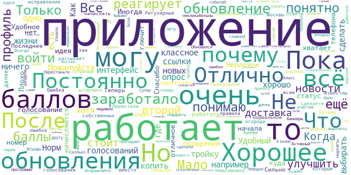
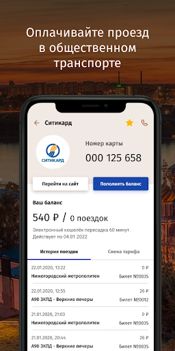
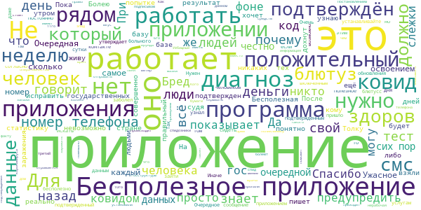

# COVID-related Android apps in Russia

Author: `Ivano Malavolta` (ivanomalavolta@gmail.com)

Created at: `2020/12/13`

Report generated by the [covid-apps-observer](http://github.com/covid-apps-observer) project, version 0.1

# Table of contents 

- [Background](#background)
    * [Data sources and analyses](#data-sources-and-analyses)
        * [App metadata](#app-metadata)
        * [Requested permissions](#requested-permissions)
        * [Mentioned servers](#mentioned_servers)
        * [Security analysis](#security_analysis)
        * [User ratings and reviews](#user-ratings-and-reviews)
    * [Disclaimer](#disclaimer)
- [Госуслуги Москвы](#госуслуги-москвы)
- [Моя Москва — официальное приложение портала mos.ru](#моя-москва-—-официальное-приложение-портала-mos.ru)
- [WHO Info](#who-info)
- [Социальный мониторинг](#социальный-мониторинг)
- [OpenWHO](#openwho)
- [Активный гражданин](#активный-гражданин)
- [Госуслуги СТОП Коронавирус](#госуслуги-стоп-коронавирус)
- [Contact Tracker](#contact-tracker)
- [Карта жителя НО](#карта-жителя-но)
- [Телемедицина Югры](#телемедицина-югры)
- [Госуслуги.COVID трекер](#госуслуги.covid-трекер)

- [Credits](#credits)

# How to read this report

This report has been generated by the [covid-apps-observer](http://github.com/covid-apps-observer) project. The project automatically analyzes the apps by extracting information which is already publicly available either on the web or in the apps binary files. 

Our analysis covers the following apps:
| | |
|-------------------------|-------------------------| 
|  | Госуслуги Москвы
|  | Моя Москва — официальное приложение портала mos.ru
|  | WHO Info
|  | Социальный мониторинг
|  | OpenWHO
|  | Активный гражданин
|  | Госуслуги СТОП Коронавирус
|  | Contact Tracker
|  | Карта жителя НО
|  | Телемедицина Югры
|  | Госуслуги.COVID трекер

The details of our analysis are presented in the remainder of this report.

For independent verification, the raw data and the source code of the project is publicly available in its GitHub repository [http://github.com/covid-apps-observer](http://github.com/covid-apps-observer) and its source code has been thoroughly commented in order to provide all the details about how the information provided in this report has been extracted. 

Any feedback, questions, and improvements about the project are very welcome, feel free to create an issue or pull request directly in its GitHub repository: [http://github.com/covid-apps-observer](http://github.com/covid-apps-observer).

## Data sources and analyses

The analysis of each app is structured around five main dimensions: 
* App metadata  
* Requested permissions
* Mentioned servers
* Androwarn analysis
* User ratings and reviews

In the following we describe the data sources and analysis performed for each dimension.

### App metadata

App metadata includes an overview of the main information about the app (for example, its name, releases, privacy policy, etc.), contact information of the development team, and the various Android versions supported by the app. This information is extracted from two main data sources:
* _Google Play store_: we automatically mined the web page of the Google Play store showing the basic information about the app and we parsed it in order to extract information about the app and development team 
* _Android Manifest file_: in our analysis we decompiled the binary file of the app (it is similar to a Zip archive but it contains the code of the app instead of normal files) and we extracted information about the supported Android versions, as it has been listed by its development team.

The extracted app metadata feeds the _App overview_, _Development team_, and _Android support_ sections of this report.
We make use of the [google-play-scraper](https://github.com/JoMingyu/google-play-scraper) tool for extracting the raw data related to this dimension of the project.

### Requested permissions

The Android operating system has a permission model which allows users to grant access to potentially privacy-related information. Every Android app has to explictly declare the permissions it needs to properly function in the Android Manifest file.  

In this report we also show the protection level of each permission, which is a key information for understanding how the requested permissions related to the user's privacy. We carefully analyzed the [official Android documentation (v. 29)](https://developer.android.com/reference/android/Manifest.permission), and it resulted that a permission requested by an Android app can belong to the following protection levels:
* **Dangerous**: higher-risk permissions that would give a requesting app access to private user data or control over the device that can negatively impact the user. Because this type of permission introduces potential risk, the system usually does not automatically grant it to the requesting app. For example, any dangerous permissions requested by an app may be displayed to the user and require confirmation before proceeding.
* **Normal**: this is the default and most common level in Android; normal permissions are lower-risk and give access to isolated app-level features, with minimal risk to other apps, the system, or the user. 
* **Signature**: permissions granted only if the requesting app is signed with the same certificate as the app that declared the permission
* **Appop**: old permission level, a reminiscence of the App Ops tool that Google introduced in Android 4.3.
* **Development**: optional permissions which can be granted to development-oriented apps.
* **Privileged**: permissions who give higher power to mobile apps w.r.t. other apps, such as binding to incoming calls, interacting via bluetooth with other devices without user interaction, etc.
* **Preinstalled**: reserved only for preinstalled apps
* **Installer**: allow the holder to start the permission usage screen for an app
* **RetailDemo**: permissions related to devices used in demonstrations in shops.
* **Pre23**: permissions automatically granted to apps targeting devices running pre-6.0 Android.
* **Upcoming**: permissions which will be released in the next version of the Android platform. 
* **Deprecated**: permissions belonging to old releases of the Android platform, they should not be used by developers since they will not be supported in the near future.
* **Not for use by third-party applications**: permissions which can be requested only by apps developed by Google.
* **Undefined**: this protection level is not documented by Google.

The permissions dimension of this project is based on the [Androguard](https://github.com/androguard/androguard) static analysis tool.

### Mentioned servers

We decompiled each app in order to look for all possible mentions of remote URLs. The mentioned URLs can refer to remote servers the the app is using for either sending or receiving information, web addresses for directing the user to an information website, and so on. 

:warning: It is important to note that this analysis is not meant to be complete and it is very prone to obfuscation. The servers reported here are simply _mentioned_ somewhere in the code of the app and are meant to just give an indication about the "hooks" of the app towards external resources. For example, for an Android app it is normal to contact Google services in order to send/receive push notifications, or to contact the servers of analytics services for having real-time diagnostics about crashes of the app or bugs.

This part of the analysis is based on the [Androguard](https://github.com/androguard/androguard) static analysis tool for identfying the raw URLs mentioned in the app; then, the information about each mentioned server is collected by performing a _whois_ lookup on the first-level domain present in the URL.

### Security analysis

This dimension is based on the [Androwarn](https://github.com/maaaaz/androwarn) structural and data flow analysis of Android bytecode. Androwarn is developed by the University of Lyon/INSA (France) and it has been used in several academic studies. According to its documentation, Androwarn targets the following categories of potential security issues:
* **Telephony identifiers exfiltration**: IMEI, IMSI, MCC, MNC, LAC, CID, operator's name, etc.
* **Device settings exfiltration**: software version, usage statistics, system settings, logs, etc.
* **Geolocation information leakage**: GPS/WiFi geolocation, etc.
* **Connection interfaces information exfiltration**: WiFi credentials, Bluetooth MAC adress, etc.
* **Telephony services abuse**: premium SMS sending, phone call composition, etc.
* **Audio/video flow interception**: call recording, video capture, etc.
* **Remote connection establishment**: socket open call, Bluetooth pairing, APN settings edit, etc.
* **PIM data leakage**: contacts, calendar, SMS, mails, clipboard, etc.
* **External memory operations**: file access on SD card, etc.
* **PIM data modification**: add/delete contacts, calendar events, etc.
* **Arbitrary code execution**: native code using JNI, UNIX command, privilege escalation, etc.
* **Denial of Service**: event notification deactivation, file deletion, process killing, virtual keyboard disable, terminal shutdown/reboot, etc.

Note: We do not consider this data point in the current version of our analyzers since it is too verbose for our purposes.

:warning: It is important to note that Androwarn is a static analysis tool, and as such it performs a variety of heuristics and approximations in its analyses. Said that, the results shown in this report are meant to provide an indication of _potential_ security issues and should be by no means treated as complete and correct.   

### User ratings and reviews

For this dimension we turn again to the web interface of the Google Play store. Firstly, we automatically mine summary statistics about user ratings from the web page of the app under analysis; then, we automatically download the newest 1000 reviews of the app under analysis. For each level of rating (5 stars, 4 stars, , etc., 1 star) we show:
- a word cloud presenting the main terms used by end users in their reviews in the Google Play store
- the last 10 reviews provided by app users in the Google Play store. 

This purposefully simple analysis is meant to help both future users and the development team of the app in understanding what are the main positive and negative points of the app under analysis.

We make use of the [google-play-scraper](https://github.com/JoMingyu/google-play-scraper) tool for extracting the raw data related to this dimension of the project.

## Disclaimer 

This report has been produced independently of any parties and its only objective is to help anybody in better understanding how COVID-related apps work in practice (and compare to each other). The results of this report are limited to the specific version of the software used for running the analyses and on the various heuristics implemented in there. In other words, the results of the analyzers may differ depending on the time and modalities in which they are executed. We do not guarantee that the results of the analyses and the corresponding contents of this report are fully complete or correct. The analysis software is licensed under the [MIT License](https://github.com/iivanoo/covid-apps-observer/blob/master/LICENSE).

# Госуслуги Москвы
App version ``3.12.1.1``

Analyzed with [covid-apps-observer](http://github.com/covid-apps-observer) project, version ``0.1``

## App overview
| | |
|-------------------------|-------------------------| 
| **Name**&nbsp;&nbsp;&nbsp;&nbsp;&nbsp;&nbsp;&nbsp;&nbsp;&nbsp;&nbsp;&nbsp;&nbsp;&nbsp;&nbsp;&nbsp;&nbsp;&nbsp;&nbsp;&nbsp;&nbsp;&nbsp;&nbsp;&nbsp;&nbsp;&nbsp;&nbsp;&nbsp;&nbsp;&nbsp;&nbsp;&nbsp;&nbsp;&nbsp;&nbsp;&nbsp;&nbsp;&nbsp;&nbsp;&nbsp;&nbsp;  | Госуслуги Москвы |
| **Unique identifier** | ru.altarix.mos.pgu |
| **Link to Google Play** | [https://play.google.com/store/apps/details?id=ru.altarix.mos.pgu](https://play.google.com/store/apps/details?id=ru.altarix.mos.pgu) |
| **Summary**  | Все электронные услуги города: начисления ЖКХ, штрафы ГИБДД, эвакуация ТС и др. |
| **Privacy policy** | [https://mosapps.mos.ru/privacypolicy/](https://mosapps.mos.ru/privacypolicy/) |
| **Latest version** | 3.12.1.1 |
| **Last update** | 2020-10-19 19:51:09 |
| **Recent changes** | Исправлена редкая ошибка, приводящая к закрытию приложения при запуске |
| **Installs**  | 1 000 000+ |
| **Category** | Социальные |
| **First release** | 27 сент. 2012 г. |
| **Size**  | 28M |
| **Supported Android version**  | 5.0 и выше |

### Description
> Мобильное приложение «Госуслуги Москвы» - сервис, объединяющий востребованные услуги Правительства Москвы, для комфортной жизни в большом городе.
 Образование:
 - Сервис «Мой ребенок в школе» дает возможность удаленно отслеживать проход и питание учащегося, школьное меню и баланс лицевого счета, который в любой момент можно пополнить с банковской карты/мобильного счета; 
 - Сервис «Электронный дневник» объединяет в себе самую важную для родителей информацию об учебе: расписание уроков, домашние задание, оценки учащегося и т.д.; 
 - Сервис «Результаты ГИА» - мобильная площадка с результатами прохождения Государственной итоговой аттестации.
 Жилье, ЖКУ:
 - Сервис «Начисления за жилищно-коммунальные услуги» предоставляет развернутую информацию о долговых/текущих начислениях за ЖКУ с возможностью заказать электронный Единый платежный документ; 
 - Сервис «Внесение показаний» - возможность передачи показаний счетчиков водоснабжения/электроэнергии, а также получения информации о задолженности без очередей и отрыва от важных дел; 
 - Сервис «Единый диспетчерский центр» – компактная площадка для решения проблем и вопросов, относящихся к вашему дому/двору;
 - Сервис «Информирование о начале расчетов по новой услуге»;
 - Сервис «Информирование о регистрации на жилплощади»;
 - Сервис «Информирование об отключении горячего водоснабжения».
 Транспорт:
 - Сервис «Штрафы» дает возможность получать актуальную информацию по вашим штрафам и оплачивать с мобильного; 
 - Сервис «Эвакуация транспортного средства» информирует об эвакуации ТС, а также предоставляет точный адрес местонахождения ТС на спецстоянке.
 Здоровье и документы:
 - Сервис «Запись к врачу» предоставляет возможность удаленно записаться на прием к любому врачу, перенести и отменить запись, посмотреть перечень направлений и выписанные вам рецепты; 
 - Сервис «Запись к ветеринару» предоставляет возможность записать своего питомца на прием в ветеринарную клинику (перенести, отменить запись) или вызвать ветеринара на дом;
 - Сервис «Готовность загранпаспорта» - индивидуальное информирование о готовности заграничного паспорта;
 - Сервис «Федеральная служба судебных приставов» предоставляет информацию о наличии исполнительных делопроизводств ФССП.
 Информация:
 - Сервис «Новости» объединяет в себе самые актуальные и интересные новости города в удобном мобильном формате.
 По желанию вы можете настроить способ получения уведомлений: SMS, E-mail или Push-уведомления.
 ___________________________________
 Обратите внимание на другие официальные приложения правительства Москвы.
 - Активный Гражданин - проект для тех, кому важно, что происходит в Москве
 - Наш город – помогите нам сделать город лучше
 - Парковки Москвы – приложение для поиска и оплаты парковки в Москве
 - Узнай Москву - архитектурная история столицы).

### User interface
The developers of the app provide the following screenshots in the Google play store.
| | | |
|:-------------------------:|:-------------------------:|:-------------------------:|
 |   |   |   | 
 |   |  

## Development team
In the following we report the main information provided by the development team in the Google play store.

| | |
|-------------------------|-------------------------|
| **Developer**  | Информационный город ГКУ |
| **Website**  | [https://www.mos.ru/mosapps/](https://www.mos.ru/mosapps/) |
| **Email** | emp@mos.ru |
| **Physical address**  | - |
| **Other developed apps**  | [https://play.google.com/store/apps/developer?id=%D0%98%D0%BD%D1%84%D0%BE%D1%80%D0%BC%D0%B0%D1%86%D0%B8%D0%BE%D0%BD%D0%BD%D1%8B%D0%B9+%D0%B3%D0%BE%D1%80%D0%BE%D0%B4+%D0%93%D0%9A%D0%A3](https://play.google.com/store/apps/developer?id=%D0%98%D0%BD%D1%84%D0%BE%D1%80%D0%BC%D0%B0%D1%86%D0%B8%D0%BE%D0%BD%D0%BD%D1%8B%D0%B9+%D0%B3%D0%BE%D1%80%D0%BE%D0%B4+%D0%93%D0%9A%D0%A3) |

## Android support

| | |
|-------------------------|-------------------------|
| **Declared target Android version**  | Pie, version 9 (API level 28) |
| **Effective target Android version**  | Pie, version 9 (API level 28) |
| **Minimum supported Android version**  | Lollipop, version 5.0 (API level 21) |
| **Maximum target Android version**  | - |

The larger the difference between the minimum and maximum supported Android versions, the better. A larger difference means a wider audience. For example, old phones have a very low Android version, so a high minimum supported Android version means that the app cannot be used by users with old phones, thus leading to accessibility problems. 

## Requested permissions

In the following we report the complete list of the permissions requested by the app. 

| **Permission** | **Protection level** | **Description** | 
|-------------------------|-------------------------|-------------------------|
 **android.permission ACCESS_COARSE_LOCATION** | :warning:**Dangerous** | Allows an app to access approximate location. 
 **android.permission ACCESS_FINE_LOCATION** | :warning:**Dangerous** | Allows an app to access precise location. 
 **android.permission ACCESS_NETWORK_STATE** | Normal | Allows applications to access information about networks. 
 **android.permission ACCESS_WIFI_STATE** | Normal | Allows applications to access information about Wi-Fi networks. 
 **android.permission CALL_PHONE** | :warning:**Dangerous** | Allows an application to initiate a phone call without going through the Dialer user interface for the user to confirm the call. 
 **android.permission CAMERA** | :warning:**Dangerous** | Required to be able to access the camera device. 
 **android.permission INTERNET** | Normal | Allows applications to open network sockets. 
 **android.permission READ_CALENDAR** | :warning:**Dangerous** | Allows an application to read the user's calendar data. 
 **android.permission READ_CONTACTS** | :warning:**Dangerous** | Allows an application to read the user's contacts data. 
 **android.permission READ_EXTERNAL_STORAGE** | :warning:**Dangerous** | Allows an application to read from external storage. 
 **android.permission USE_BIOMETRIC** | Normal | Allows an app to use device supported biometric modalities. 
 **android.permission USE_FINGERPRINT** | Normal | This constant was deprecated in API level 28. Applications should request USE_BIOMETRIC instead 
 **android.permission VIBRATE** | Normal | Allows access to the vibrator. 
 **android.permission WAKE_LOCK** | Normal | Allows using PowerManager WakeLocks to keep processor from sleeping or screen from dimming. 
 **android.permission WRITE_CALENDAR** | :warning:**Dangerous** | Allows an application to write the user's calendar data. 
 **android.permission WRITE_EXTERNAL_STORAGE** | :warning:**Dangerous** | Allows an application to write to external storage. 
 **com.google.android.c2dm.permission RECEIVE** | - | - 
 **com.google.android.finsky.permission BIND_GET_INSTALL_REFERRER_SERVICE** | - | - 

## Mentioned servers

| **Server** | **Registrant** | **Registrant country** | **Creation date** | 
|-------------------------|-------------------------|-------------------------|-------------------------|
 | vk.com | Privacy protection service - whoisproxy.ru | :ru: RU | 1997-06-24 04:00:00 |
 | openstreetmap.org | OpenStreetMap Foundation | GB | 2004-08-09 18:47:25 |
 | openptmap.org | Registrant State/Province: Bayern | :de: DE | 2010-11-17 12:05:24 |
 | cloudmade.com | Cloud Made Ltd | :uk: UK | 2007-07-17 17:02:27 |
 | openstreetmap.nl | - | - | 2007-03-06 00:00:00 |
 | wmflabs.org | Wikimedia Foundation, Inc. | :us: US | 2011-09-29 14:58:28 |
 | openseamap.org | Registrant State/Province: | :de: DE | 2009-03-26 11:35:19 |
 | chartbundle.com | Whois Privacy Service | :us: US | 2010-01-09 23:30:15 |
 | opentopomap.org | Registrant State/Province: | :de: DE | 2011-09-03 18:35:13 |
 | facebook.com | Facebook, Inc. | :us: US | 1997-03-29 05:00:00 |
 | googleapis.com | Google LLC | :us: US | 2005-01-25 17:52:26 |
 | google.com | Google LLC | :us: US | 1997-09-15 04:00:00 |
 | 2gis.ru | - | - | 2001-02-18 21:00:00 |
 | crashlytics.com | Google LLC | :us: US | 2011-01-21 15:30:40 |
 | googlesyndication.com | Google LLC | :us: US | 2003-01-21 06:17:24 |
 | app-measurement.com | Google LLC | :us: US | 2015-06-19 20:13:31 |
 | mos.ru | - | - | 1996-12-23 09:49:03 |
 | googleadservices.com | Google LLC | :us: US | 2003-06-19 16:34:53 |
 | w3.org | W3C | :us: US | 1994-07-06 04:00:00 |
 | mts.ru | - | - | 1997-11-19 12:02:34 |
 | 2gis.com | DoubleGIS LLC | :ru: RU | 2004-03-18 08:51:04 |

## Security analysis 

Below we report the main security warnings raised by our execution of the [Androwarn](https://github.com/maaaaz/androwarn) security analysis tool.

**Telephony identifiers leakage**
> - This application reads the numeric name (MCC+MNC) of current registered operator 
> - This application reads the operator name 

**Location lookup**
> - This application reads location information from all available providers (WiFi, GPS etc.) 

**Connection interfaces exfiltration**
> - This application reads details about the currently active data network 

**Telephony services abuse**
> - This application makes phone calls 

**Suspicious connection establishment**
> - This application opens a Socket and connects it to the remote address ' returned no addresses for  ; port is out of range' on the 'N/A' port  
> - This application opens a Socket and connects it to the remote address '' on the 'N/A' port  
> - This application opens a Socket and connects it to the remote address 'Ljava/net/Proxy;->type()Ljava/net/Proxy$Type;' on the 'N/A' port  
> - This application opens a Socket and connects it to the remote address 'timeout' on the 'N/A' port  

**Code execution**
> - This application loads a native library 

## User ratings and reviews

Below we provide information about how end users are reacting to the app in terms of ratings and reviews in the Google Play store.

### Ratings

The Госуслуги Москвы app has been installed by more than **1000000** times. At this time, **56383** rated the app and its average score is **4.200809**. Below we show the distribution of the ratings across the usual star-based rating of Google Play

:star::star::star::star::star:: 39342

:star::star::star::star:: 5383

:star::star::star:: 2577

:star::star:: 1804

:star:: 7277

### Reviews 

#### 5-star reviews

> Очень удобно  :date: __2020-12-13 21:22:39__

> Хорошее нужное удобное приложение для жителей Москвы. У меня всё работает нормально. Только непонятно, почему запись идёт "к врачу". По правилам русского языка должно быть "ко врачу".  :date: __2020-12-13 21:03:46__

> Очень удобно,все функции госуслуг в телефоне.  :date: __2020-12-13 20:31:48__

> Отлично, но нет графы на прививку от covid  :date: __2020-12-13 12:32:24__

> Очень довольна. Всё ясно, четко и понятно. Никакой лишней информации и ненужных ссылок непонятно куда. Пользуюсь этим приложением очень давно. Спасибо большое!!!  :date: __2020-12-13 09:30:08__

> Невозможно установить электронную мед.карту. Каждый раз указывает, обновить браузер.  :date: __2020-12-13 03:29:40__

> Мне нравится.  :date: __2020-12-12 22:06:15__

> Отличное приложение, все работает, всегда получается решить свои вопросы.  :date: __2020-12-12 17:43:42__

> Отлично  :date: __2020-12-12 14:14:47__

> Приложение постоянно совершенствуется в лучшую сторону  :date: __2020-12-12 07:47:33__

#### 4-star reviews

> Хорошее приложение  :date: __2020-12-13 19:33:35__

> Вроде стало норм  :date: __2020-12-13 18:05:51__

> Достаточно понятно все,но главное - быстро и просто платить, вносить показания счётчиков. Был глюк с оплатой света, но вроде починили,сейчас работает  :date: __2020-12-13 09:26:17__

> Добавьте возможность отмечать прочитанными все уведомления  :date: __2020-12-13 09:03:36__

> Добрый день. С сегодняшнего дня не могу войти в приложение, пишет что неправильно введен логин или пароль. С компьютера вхожу без проблем. Удалил приложение, заного установил, проблема осталась.  :date: __2020-12-11 08:59:44__

> Единственное замечание. Почему в начисления ЖКУ нельзя просматривать все неоплаченные счета? По умолчанию только за активный месяц, а чтобы посмотреть все долги надо перебирать все соответствующие месяцы, что весьма неудобно. Достаточно логично выводить все неоплаченные квитанции сразу. Фактически, неоплаченый долг нигде не указан.  :date: __2020-12-10 11:59:04__

> В общем приложение хорошее, но есть некоторые службы, которые не работают или не выдают обновлённой информации. Например, медкарту только в браузере предлагает открыть, а штрафы висят с лета, хотя давно оплачены.  :date: __2020-12-09 13:54:01__

> Таже история с входом в эл.медицинскую карту. Проблемы с заполнением анкет, пишет ,что данные паспорта не верны.  :date: __2020-12-08 15:50:36__

> Неделю не могу войти в приложение. Пишет, что некорректно логин или пароль. А все введено корректно. Выбило из приложения и не зайти  :date: __2020-12-08 12:38:46__

> Приложение хорошее, правда есть косяки, особенно в части актуальности автомобильных штрафов и их оплаты. В этой части работает плохо.  :date: __2020-12-08 09:43:11__

#### 3-star reviews

> Помогите, пожалуйста! 2 недели назад приложение разлогинилось, хотя я там часто сижу, и теперь даже после ввода логина и пароля ну впускает! Срочно!!!  :date: __2020-12-13 08:50:17__

> Сделайте тёмную тему!!  :date: __2020-12-12 17:27:25__

> Выдаёт ошибку при запросе услуги электронная медицинская карта  :date: __2020-12-12 12:57:57__

> Который день нельзя зайти, пишет неверный логин или пароль. С этими же данными на сайте с первого раза проходит авторизация  :date: __2020-12-12 09:56:13__

> Невозможно воспользоваться эмк. Требует обновления....  :date: __2020-12-10 21:50:48__

> Все бы ничего, но уже не первый раз со страницы входа по пинкоду выкидывает без причины, а потом приложение не принимает действующий пароль. За это три.  :date: __2020-12-10 11:57:39__

> Перешла на новый телефон Samsung Galaxy M31. Не могу войти в приложение. Пишет неверный логин или пароль. При этом в МЭШ вошла с теми же данными и через браузер тоже.  :date: __2020-12-10 09:34:00__

> Не получается заплатить за сад и кружки. Не пропускает,говорит вид не доступен  :date: __2020-12-09 08:55:38__

> Не могу открыть элмедкарту, пишет, что использую старую версию браузера.Я не понимаю, а какой нужен?  :date: __2020-12-08 15:25:00__

> Мало информации, приложение долго обновляет данные (штраф уплатил, а извещение 2ю неделю висит. Проверил на сайте- всё норм). И куда делась в мед услугах запись на ПЦР?  :date: __2020-12-08 07:50:41__

#### 2-star reviews

> Последнее время ужасно раздражает. Самопроизвольно выходит и требует снова войти по полной схеме, а потом пишет неправильный аккаунт или пароль??  :date: __2020-12-13 19:34:35__

> Неправильно показывает информацию по штрафам. Оплаченные 2 месяца назад штрафы в приложении висят как неоплаченные, хотя на сайтах мос.ру и ГИБДД долгов по штрафам нет (что соответствует действительности). Уже писАл по этой проблеме в поддержку несколько месяцев назад - эффекта никакого.  :date: __2020-12-13 18:29:46__

> Мне нравится.Сначала и правда всё нравилось, но после нескольких безуспешных попыток войти в элктронную медкарту я погял, что не всё то золото, что блестит. Сначала писал, что мой снилс уже где то используется, потом у меня оказывается старый браузер. В общем, плюнул я на это делр  :date: __2020-12-13 13:38:44__

> Не признаёт логин/пароль. На сайте всё хорошо, а в приложении выдаёт ошибку  :date: __2020-12-12 20:02:14__

> ЕДП НЕДОСТУПЕН ❗ СЕРВЕР ПОВИС❗  :date: __2020-12-11 08:20:20__

> Какой браузер требуется обновить, чтобы попасть в электронную медкарту??? Выдает ошибку про старый браущер и выкидывает, а ведь раньше все работало!  :date: __2020-12-10 15:43:52__

> Задумка отличная, но исполнение как всегда.Я длительный промежуток времени(более года) периодически пытаюсь получить доступ к ЭМК и все это время мне нужно,,обновить устаревший браузер''.Вы либо сделайте нормально работающий продукт, либо напишите какой браузер надо обновить. И работает приложение как-то выборочно, к врачу записаться можно,а доступа к карте нет. Зачем тогда вообще этот пункт делать? Но,судя по последним комментариям, разработчик не читает их.Ему плевать на мнение потребителя.  :date: __2020-12-10 07:26:20__

> Добавьте, пожалуйста, оповещения о выставдении оценки в электронном дневнике. P.S.: почти два года прошло, а так и не выполнили просьбу. Очень неудобно пользоваться программой - приходится проверять предыдущие дни, недели, чтоб понять, появились ли новые оценки. Отображение статуса ребенка в школе сильно запаздывает. Оплаченные штрафы висят, пока не напишешь в техподдержку!  :date: __2020-12-10 06:41:23__

> Раньше были проблемы с учётом электроэнергии, теперь просто войти невозможно. А тем временем на сайте всё работает.  :date: __2020-12-10 06:28:14__

> После обновления выбивает из приложения, а при вводе логина пароля пишет, что не верны. Приходится пользоваться сайтом и переустанавливать.  :date: __2020-12-07 18:29:42__

#### 1-star reviews

> Постоянная ошибка с паролем входа, постоянная. Заходите через компьютер, тут дно...  :date: __2020-12-13 21:25:14__

> Г...о оно и есть г...о  :date: __2020-12-13 21:02:07__

> Не могу зайти через приложение, возвращает ошибку о том, что неверный логин-пароль. Через сайт захожу нормально. Перестановка не помогла. Это можно, наконец, исправить?  :date: __2020-12-13 20:12:49__

> Что за бред... меня выкинуло из программы. Больше войти не могу, пишет не верный пароль, хотя ввожу все верно.....  :date: __2020-12-13 19:30:29__

> Перестала работать аутентификация. С сайта - пускает.  :date: __2020-12-13 13:32:21__

> Почему через учетку госуслуг нельзя зайти ?  :date: __2020-12-13 11:37:10__

> Не могу войти, на сайте все нормально  :date: __2020-12-13 08:38:03__

> Авторам до фонаря наши отзывы об их работе. Опять пришло оповещение с предложением оплатить уже оплаченный штраф, и до сих пор висят как неоплаченные два штрафа от июля и сентября, которые тогда же и были оплачены.  :date: __2020-12-13 08:25:35__

> Пропал доступ к мед.карте якобы с устаревшим браузером  :date: __2020-12-13 08:08:08__

> Не могу зайти в приложение? Пишет не верный пароль...на компьютере входит , а тут нет...  :date: __2020-12-13 07:00:35__

# Моя Москва — официальное приложение портала mos.ru
App version ``1.7.1``

Analyzed with [covid-apps-observer](http://github.com/covid-apps-observer) project, version ``0.1``

## App overview
| | |
|-------------------------|-------------------------| 
| **Name**&nbsp;&nbsp;&nbsp;&nbsp;&nbsp;&nbsp;&nbsp;&nbsp;&nbsp;&nbsp;&nbsp;&nbsp;&nbsp;&nbsp;&nbsp;&nbsp;&nbsp;&nbsp;&nbsp;&nbsp;&nbsp;&nbsp;&nbsp;&nbsp;&nbsp;&nbsp;&nbsp;&nbsp;&nbsp;&nbsp;&nbsp;&nbsp;&nbsp;&nbsp;&nbsp;&nbsp;&nbsp;&nbsp;&nbsp;&nbsp;  | Моя Москва — официальное приложение портала mos.ru |
| **Unique identifier** | ru.mos.app |
| **Link to Google Play** | [https://play.google.com/store/apps/details?id=ru.mos.app](https://play.google.com/store/apps/details?id=ru.mos.app) |
| **Summary**  | Все самые нужные городские сервисы в официальном приложении mos.ru «Моя Москва». |
| **Privacy policy** | [https://mosapps.mos.ru/privacypolicy/](https://mosapps.mos.ru/privacypolicy/) |
| **Latest version** | 1.7.1 |
| **Last update** | 2020-12-04 18:03:31 |
| **Recent changes** | В новой версии добавили возможность скачать электронный ЕПД в «Моих платежах». Теперь можно видеть, сколько и по какому тарифу начислено за коммунальные услуги, сохранить счёт и отправить его близкому. А ещё поправили мелкие баги – вы не заметите, но стало лучше. |
| **Installs**  | 500 000+ |
| **Category** | Социальные |
| **First release** | 27 дек. 2018 г. |
| **Size**  | 88M |
| **Supported Android version**  | 5.0 и выше |

### Description
> Пользуйтесь главными сервисами mos.ru, читайте новости города и задавайте вопросы операторам городского контакт-центра в одном приложении. Достаточно ввести ваши данные для входа на портал mos.ru и вам откроются все возможности чат-бота «Моя Москва».
 Здесь мы собрали самые частые госуслуги, которыми пользуются москвичи. И упростили процесс получения — все вопросы решает быстрый чат-бот. Откройте диалог в нужном разделе:
 – Мой дом: подать показания счётчиков воды, узнать, когда нужно провести поверку счётчиков, получить счета за ЖКУ. Сохраните в приложении 10-значный номер плательщика (указан на вашем ЕПД) и вам будет доступна оплата ЖКХ.
 – Дети в школе: пользоваться сервисами «Москвёнок» и «Электронный дневник» в одном приложении. Проверить, когда ребенок пришёл в школу, какие оценки получил и что купил на обед, можно за пару минут, спросив у бота.
 – Здоровье: записаться на приём в поликлинику, перенести или отменить запись к врачу теперь можно онлайн в удобном чате. Только скажите боту номер полиса ОМС.
 – Транспорт: проверить и оплатить штрафы ГИБДД онлайн по номеру, узнать историю своего автомобиля. По вашей просьбе бот пришлёт уведомление об эвакуации машины и новых штрафах. Понадобятся номер водительских прав, СТС, VIN и госномер автомобиля.
 – Контакт-центр: операторы круглосуточно готовы помочь вам в решении вопросов, связанных с получением государственных услуг и работой приложения «Моя Москва».
 – Новости города: узнать за пару минут всё самое важное, что происходит в Москве и в вашем районе.
 – Мой район: изучать ваш район - читать об уникальных фактах, искать ближайшие парки и школы, детские и спортивные площадки, узнавать о планах его развития.
 «Моя Москва» — чат-бот, который помогает москвичам получить самые популярные госуслуги. Часть из них доступна без авторизации. Но советуем зарегистрироваться, чтобы бот знал ваши данные и мог напоминать о важных платежах или записи к врачу.
 Правительство Москвы также разработало отдельные приложения для тех, кто ищет или хочет оплатить парковку («Парковки Москвы»), участвовать в принятии важных городских решений («Активный Гражданин»), замечать недочеты в устройстве ЖКХ («Наш город»).

### User interface
The developers of the app provide the following screenshots in the Google play store.
| | | |
|:-------------------------:|:-------------------------:|:-------------------------:|
 |   |   |   | 
 |   |   |   | 
 |   |  

## Development team
In the following we report the main information provided by the development team in the Google play store.

| | |
|-------------------------|-------------------------|
| **Developer**  | Информационный город ГКУ |
| **Website**  | [https://www.mos.ru/mobile/](https://www.mos.ru/mobile/) |
| **Email** | mobile@mos.ru |
| **Physical address**  | - |
| **Other developed apps**  | [https://play.google.com/store/apps/developer?id=%D0%98%D0%BD%D1%84%D0%BE%D1%80%D0%BC%D0%B0%D1%86%D0%B8%D0%BE%D0%BD%D0%BD%D1%8B%D0%B9+%D0%B3%D0%BE%D1%80%D0%BE%D0%B4+%D0%93%D0%9A%D0%A3](https://play.google.com/store/apps/developer?id=%D0%98%D0%BD%D1%84%D0%BE%D1%80%D0%BC%D0%B0%D1%86%D0%B8%D0%BE%D0%BD%D0%BD%D1%8B%D0%B9+%D0%B3%D0%BE%D1%80%D0%BE%D0%B4+%D0%93%D0%9A%D0%A3) |

## Android support

| | |
|-------------------------|-------------------------|
| **Declared target Android version**  | Pie, version 9 (API level 28) |
| **Effective target Android version**  | Pie, version 9 (API level 28) |
| **Minimum supported Android version**  | Lollipop, version 5.0 (API level 21) |
| **Maximum target Android version**  | - |

The larger the difference between the minimum and maximum supported Android versions, the better. A larger difference means a wider audience. For example, old phones have a very low Android version, so a high minimum supported Android version means that the app cannot be used by users with old phones, thus leading to accessibility problems. 

## Requested permissions

In the following we report the complete list of the permissions requested by the app. 

| **Permission** | **Protection level** | **Description** | 
|-------------------------|-------------------------|-------------------------|
 **android.permission ACCESS_COARSE_LOCATION** | :warning:**Dangerous** | Allows an app to access approximate location. 
 **android.permission ACCESS_FINE_LOCATION** | :warning:**Dangerous** | Allows an app to access precise location. 
 **android.permission ACCESS_NETWORK_STATE** | Normal | Allows applications to access information about networks. 
 **android.permission ACCESS_WIFI_STATE** | Normal | Allows applications to access information about Wi-Fi networks. 
 **android.permission CAMERA** | :warning:**Dangerous** | Required to be able to access the camera device. 
 **android.permission CHANGE_WIFI_STATE** | Normal | Allows applications to change Wi-Fi connectivity state. 
 **android.permission INTERNET** | Normal | Allows applications to open network sockets. 
 **android.permission RECEIVE_BOOT_COMPLETED** | Normal | Allows an application to receive the Intent.ACTION_BOOT_COMPLETED that is broadcast after the system finishes booting. 
 **android.permission USE_BIOMETRIC** | Normal | Allows an app to use device supported biometric modalities. 
 **android.permission USE_FINGERPRINT** | Normal | This constant was deprecated in API level 28. Applications should request USE_BIOMETRIC instead 
 **android.permission VIBRATE** | Normal | Allows access to the vibrator. 
 **android.permission WAKE_LOCK** | Normal | Allows using PowerManager WakeLocks to keep processor from sleeping or screen from dimming. 
 **android.permission WRITE_CALENDAR** | :warning:**Dangerous** | Allows an application to write the user's calendar data. 
 **android.permission WRITE_EXTERNAL_STORAGE** | :warning:**Dangerous** | Allows an application to write to external storage. 
 **com.google.android.c2dm.permission RECEIVE** | - | - 
 **com.google.android.finsky.permission BIND_GET_INSTALL_REFERRER_SERVICE** | - | - 
 **ndroid.permission MANAGE_FINGERPRINT** | - | - 

## Mentioned servers

| **Server** | **Registrant** | **Registrant country** | **Creation date** | 
|-------------------------|-------------------------|-------------------------|-------------------------|
 | w3.org | W3C | :us: US | 1994-07-06 04:00:00 |
 | xml.org | OASIS Open | :us: US | 1997-02-03 05:00:00 |
 | xmlpull.org | WhoisGuard, Inc. | PA | 2001-11-26 20:33:08 |
 | googlesyndication.com | Google LLC | :us: US | 2003-01-21 06:17:24 |
 | google.com | Google LLC | :us: US | 1997-09-15 04:00:00 |
 | facebook.com | Facebook, Inc. | :us: US | 1997-03-29 05:00:00 |
 | app-measurement.com | Google LLC | :us: US | 2015-06-19 20:13:31 |
 | yandex.ru | - | - | 1997-09-23 09:45:07 |
 | yandexadexchange.net | - | :ru: RU | 2014-02-18 12:48:07 |
 | crashlytics.com | Google LLC | :us: US | 2011-01-21 15:30:40 |
 | yandex.com | - | :switzerland: CH | 1998-09-24 04:00:00 |
 | yandex.net | - | :ru: RU | 2000-11-14 06:56:55 |
 | googleapis.com | Google LLC | :us: US | 2005-01-25 17:52:26 |
 | googleadservices.com | Google LLC | :us: US | 2003-06-19 16:34:53 |
 | kladr-api.ru | - | - | 2013-02-06 00:31:38 |
 | frosteye.ru | - | - | 2012-12-08 18:43:12 |
 | intervale.ru | - | - | 2001-04-09 20:00:00 |
 | mts.ru | - | - | 1997-11-19 12:02:34 |
 | mos.ru | - | - | 1996-12-23 09:49:03 |
 | mgfoms.ru | - | - | 2002-12-22 21:00:00 |

## Security analysis 

Below we report the main security warnings raised by our execution of the [Androwarn](https://github.com/maaaaz/androwarn) security analysis tool.

**Telephony identifiers leakage**
> - This application reads the MCC+MNC of the provider of the SIM 
> - This application reads the Service Provider Name (SPN) 
> - This application reads the constant indicating the state of the device SIM card 
> - This application reads the current location of the device 
> - This application reads the neighboring cell information of the device 
> - This application reads the numeric name (MCC+MNC) of current registered operator 
> - This application reads the operator name 
> - This application reads the phone's current state 
> - This application reads the radio technology (network type) currently in use on the device for data transmission 
> - This application reads the unique device ID, i.e the IMEI for GSM and the MEID or ESN for CDMA phones 
> - This application reads the Cell ID value 
> - This application reads the Location Area Code value 

**Location lookup**
> - This application reads location information from all available providers (WiFi, GPS etc.) 

**Connection interfaces exfiltration**
> - This application reads details about the currently active data network 
> - This application tries to find out if the currently active data network is metered 

**Telephony services abuse**
> - This application makes phone calls 

**Suspicious connection establishment**
> - This application opens a Socket and connects it to the remote address 'Ljava/lang/StringBuilder;->toString()Ljava/lang/String;' on the 'N/A' port  
> - This application opens a Socket and connects it to the remote address 'Ljava/net/Proxy;->type()Ljava/net/Proxy$Type;' on the 'N/A' port  
> - This application opens a Socket and connects it to the remote address 'No route to  ' on the 'N/A' port  
> - This application opens a Socket and connects it to the remote address 'timeout' on the 'N/A' port  

**Code execution**
> - This application loads a native library 
> - This application loads a native library: 'Landroid/text/TextUtils;->isEmpty(Ljava/lang/CharSequence;)Z' 
> - This application loads a native library: 'YandexMetricaNativeModule' 
> - This application executes a UNIX command containing this argument: 'Ljava/lang/StringBuilder;->toString()Ljava/lang/String;' 
> - This application executes a UNIX command containing this argument: 'logcat -c' 

## User ratings and reviews

Below we provide information about how end users are reacting to the app in terms of ratings and reviews in the Google Play store.

### Ratings

The Моя Москва — официальное приложение портала mos.ru app has been installed by more than **500000** times. At this time, **3069** rated the app and its average score is **3.8903227**. Below we show the distribution of the ratings across the usual star-based rating of Google Play

:star::star::star::star::star:: 2001

:star::star::star::star:: 217

:star::star::star:: 79

:star::star:: 59

:star:: 713

### Reviews 

#### 5-star reviews

> Хорошее удобное приложение! Но я хочу записываться ко врачу, а не "к врачу". Что за нововведения такие?  :date: __2020-12-13 21:03:10__

> Мгновенно и удобно.+много чего ещё+  :date: __2020-12-13 11:57:00__

> Хорошее приложение  :date: __2020-12-10 09:49:34__

> Хорошее приложение.  :date: __2020-12-09 16:44:59__

> До этого пользовался, все было хорошо, но после обновления не могу авторизоваться. Пишет не верное имя пользователя или пароль. 100% ввожу все верно  :date: __2020-12-08 17:25:26__

> Все быстро и четко  :date: __2020-12-08 11:11:19__

> Очень хорошо работает  :date: __2020-12-08 08:33:35__

> Отлично.  :date: __2020-12-07 15:46:24__

> Удобно 😀  :date: __2020-12-07 07:45:14__

> Очень удобно!  :date: __2020-12-07 05:53:17__

#### 4-star reviews

> Оплатил счёт через 15-16 секунд после его поступления.  :date: __2020-12-10 07:11:20__

> Не даёт отменить запись к врачу, пишет: "Время приёма по записи уже прошло". И видимо по этому она и будет там висеть, что бы напоминать мне о том, как я опоздал попутав две поликлиники, потому что мою прикрыли на реконструкцию и расфасовали врачей по двум разным.  :date: __2020-11-23 13:39:59__

> Иногда направления, выписанные врачом не отображаются, может надолго зависнуть, приходится звонить. Простой и приятный интерфейс, скорость работы - отлично.  :date: __2020-11-20 11:04:08__

> Вроде неплохо, но не до конца освоила еще  :date: __2020-11-20 09:29:40__

> Приложение нормальное, но неудобно возвращение в начало каждый раз  :date: __2020-11-15 18:54:32__

> Для того чтобы смотреть медкарту в неё надо сначала открыть доступ. Чтобы смотреть медкарту детей - детей надо добавить и затем открывать доступ к их медкартам. Лучше это делать на компе. А потом - работает, хотя с вёрсткой в приложении проблемы, тексты ползут. Ну и к доступ в карту по смс - наверно перебор, можно по отпечатку пальца сделать, надёжнее.  :date: __2020-11-11 21:36:42__

> Удобно  :date: __2020-11-11 07:10:41__

> Понравилась отрицательная комиссия за использование карты МИР  :date: __2020-11-09 14:43:05__

> Долго реагирует на запрос  :date: __2020-11-09 08:58:53__

> Иногда происходят сбои в работе приложения  :date: __2020-11-05 21:57:11__

#### 3-star reviews

> Приложение не показывает график приема врача, если записи нет на нужный день, а прием врач в этот день ведет и нужно попасть к врачу в строго определенный день для оформления больничного.  :date: __2020-12-11 15:59:16__

> Так себе приложенице, на троечку с минусом. Интерфейс дряньненький, старые запросы висят, глаза мозолят. В архив не спрячешь, не удалишь. Нет большой нужды, лучше не ставить. На ноуте под виндой проще и функциональнее.  :date: __2020-12-09 16:51:24__

> Не возможно скачать ни один документ с мед.карты на телефон. Хотя предоставил разрешение. Нажимаю иконку сохранить но вот куда сохраняет неизвестно. Весь телефон уже перелопатил  :date: __2020-11-23 10:02:49__

> Моя Москва и гос Мос услуги, это одно и тоже ? В чем разница? Раньше в мосгоруслуги заходили через аккаунт сайта мос.ру, теперь не заходит , но заходит в приложение моя Москва ?  :date: __2020-11-06 13:50:46__

> Неудобное приложение. Особенно эжд.  :date: __2020-10-23 13:12:35__

> Постоянно не могу войти, при попытке получить код на телефон, код не приходит. Сделайте как в других приложениях вход по шифру. Месяц назад заходил, сейчас не смог.  :date: __2020-10-19 10:08:53__

> Не смог осуществить вход в электронную медицинскую карту. Сделал все действия запрашиваемые приложением, и вновь, и вновь был отправлен к изначальной странице: " получить услугу".  :date: __2020-10-16 12:12:22__

> В приложении нет возможности связаться с городской властью и рассказать о проблемах, с которыми сталкиваешься: грязные подъезды; некачественный ремонт; плохое освещение; неухоженный двор, старые тополя, превращающие двор в помойку(машины завалены сухими ветками, листвой и смолой); нет кранов для полива цветники во дворе (таскаем лейки с 4го этажа)... Что делать с закладками наркотиков, перерыты все наши клумбы... МОЯ МОСКВА осталась в далеком детстве!!! Она была СТОЛИЦЕЙ и родным городом!!!  :date: __2020-10-10 08:48:31__

> Сделайте добавление профилей в приложении, чтобы не входить каждый раз под разными учетными записями в личные кабинеты.  :date: __2020-10-09 21:05:47__

> После перезагрузки телефона иконка исчезла с экрана и не выставляется,заходить в приложение стало неудобно,нужно загружать настройки  :date: __2020-09-27 12:40:12__

#### 2-star reviews

> Требует новый браузер. Какой?  :date: __2020-12-10 08:10:08__

> Не поминаю, для чего нужно это приложение, если есть мос.ру.  :date: __2020-11-13 02:18:44__

> Вроде задумка и хорошая, но столько элементарных косяков, что просто хочется телефон кинуть или комп разбить. Какое терпение нужно на все эти недоделки. Введите свой СНИЛС- введите место жительства- введение места жительства не доступно- введите СНИЛС и так по кругу  :date: __2020-11-01 23:25:55__

> Плохо то, что мало времени на "подход" пароля для входа в медицинскую электронную карту. По три раза запрашивала пароль, так и не успевал прийти. НЕ УДОБНО! НАДО ЧТО-ТО МЕНЯТЬ!  :date: __2020-10-29 10:45:12__

> Организация передачи данных жкх ввиде чатов это совсем ад и полных гиков. Пользоваться таким такое себе удовольствие. Узабилити и юзерфрейндли на нуле даже для айтишника.  :date: __2020-10-28 17:44:37__

> смс пришла быстро. она вообще пришла. это уже достижение для мосру. только поэтому плюс звезда. передача показаний в виде чата выглядит убого и очень неудобна. по запросу показывает только цифры, нет диаграмм как на сайте. что прежнее приложение, что это - полный отстой. придется заходить через браузер.  :date: __2020-10-22 22:34:49__

> Так много плохих отзывов. А где хорошие при такой оценке? Накрутка  :date: __2020-10-20 07:26:42__

> Какое то бессмысленное приложение, направляет в браузер, где нужно опять вводить пароль, а пароли у них сложные.  :date: __2020-10-15 06:53:50__

> Есть установленное у меня приложение "Госуслуги Москвы" - то это приложение (Моя Москва) бесполезное.  :date: __2020-10-14 19:30:10__

> Не вздумайте оплачивать штрафы ГИБДД, которые может показать это приложение! Давно оплаченные штрафы здесь числятся не оплаченными! Правительство Москвы во главе с бордюренфюрером может только людей кошмарить, а банальную синхронизацию с ГИБДД надалить не в состоянии.  :date: __2020-10-14 18:29:05__

#### 1-star reviews

> Зачем приложение если невозможно войти  :date: __2020-12-13 20:17:33__

> Не могу войти в приложение  :date: __2020-12-13 19:49:01__

> Не удалось авторизоваться  :date: __2020-12-13 11:20:26__

> Не могу зайти, неверный логин и пароль. Обратная связь тоже не работает. Пишет заполните поле e-mail, но оно уже заполнено.  :date: __2020-12-13 11:04:35__

> Столько дней уже не могут починить авторизацию!  :date: __2020-12-12 23:29:31__

> Не работает авторизация по верному логину/паролю. Позор!  :date: __2020-12-12 20:19:04__

> Ввожу правильно логин и пароль, в приложение не войти. Ошибка: Неправильный логин или пароль. Переустановка не помогает. С сайта войти могу под тем же логином и паролем.  :date: __2020-12-12 09:51:03__

> Снёс к чёртовой матери.Не могу войти в кабинет.Если при входе косяки,кто поручится за данные и платёжки.  :date: __2020-12-11 15:28:09__

> Ввожу адрес электронной почты и пароль, но войти не могу, так как мне сообщают, что я ввёл некорректные данные. Криворукие программисты! Какое приложение в сфере госуслуг не возьми, работает криво и проблемы со входом. Обращение в службу технической поддержки ничего не даёт: высылают какие-то отписки и далее просто игнорируют. Несолидно государству пользоваться услугами двоечников, у нас же есть классные специалисты, а вы набираете не поймёшь кого - гоните их всех в шею!  :date: __2020-12-11 08:45:27__

> Не авторизовывает 🤬 а с сайта заходит спокойно  :date: __2020-12-11 08:04:13__

# WHO Info
App version ``4.0.1``

Analyzed with [covid-apps-observer](http://github.com/covid-apps-observer) project, version ``0.1``

## App overview
| | |
|-------------------------|-------------------------| 
| **Name**&nbsp;&nbsp;&nbsp;&nbsp;&nbsp;&nbsp;&nbsp;&nbsp;&nbsp;&nbsp;&nbsp;&nbsp;&nbsp;&nbsp;&nbsp;&nbsp;&nbsp;&nbsp;&nbsp;&nbsp;&nbsp;&nbsp;&nbsp;&nbsp;&nbsp;&nbsp;&nbsp;&nbsp;&nbsp;&nbsp;&nbsp;&nbsp;&nbsp;&nbsp;&nbsp;&nbsp;&nbsp;&nbsp;&nbsp;&nbsp;  | WHO Info |
| **Unique identifier** | org.who.infoapp |
| **Link to Google Play** | [https://play.google.com/store/apps/details?id=org.who.infoapp](https://play.google.com/store/apps/details?id=org.who.infoapp) |
| **Summary**  | Официальное приложение информации Всемирной организации здравоохранения. |
| **Privacy policy** | [https://www.who.int/about/who-we-are/privacy-policy](https://www.who.int/about/who-we-are/privacy-policy) |
| **Latest version** | 4.0.1 |
| **Last update** | 2020-12-03 10:24:14 |
| **Recent changes** | Application UI redesign. Various improvements and bug fixes. |
| **Installs**  | 100 000+ |
| **Category** | Новости и журналы |
| **First release** | 13 апр. 2020 г. |
| **Size**  | 12M |
| **Supported Android version**  | 4.2 и выше |

### Description
> Have the latest health information at your fingertips with the official World Health Organization Information App. This app displays the latest news, events, features and breaking updates on outbreaks. 
  
 WHO works worldwide to promote health, keep the world safe, and serve the vulnerable. 
 Our goal is to ensure that a billion more people have universal health coverage, to protect a billion more people from health emergencies, and provide a further billion people with better health and well-being.

### User interface
The developers of the app provide the following screenshots in the Google play store.
| | | |
|:-------------------------:|:-------------------------:|:-------------------------:|
 |   |   |   | 
 |   |   |   | 
 |   |   |   | 
 |   |   |   | 
 |   |   |   | 
 |   |   |   | 
 |   |   |   | 
 |   |   |   | 

## Development team
In the following we report the main information provided by the development team in the Google play store.

| | |
|-------------------------|-------------------------|
| **Developer**  | World Health Organization |
| **Website**  | [https://www.who.int/](https://www.who.int/) |
| **Email** | dcx@who.int |
| **Physical address**  | [Avenu Appia 20 1211 Geneva Switzerland](https://www.google.com/maps/search/Avenu%20Appia%2020%201211%20Geneva%20Switzerland) (Google Maps) |
| **Other developed apps**  | [https://play.google.com/store/apps/developer?id=World+Health+Organization](https://play.google.com/store/apps/developer?id=World+Health+Organization) |

## Android support

| | |
|-------------------------|-------------------------|
| **Declared target Android version**  | - |
| **Effective target Android version**  | - |
| **Minimum supported Android version**  | Jelly Bean, version 4.2.x (API level 17) |
| **Maximum target Android version**  | - |

The larger the difference between the minimum and maximum supported Android versions, the better. A larger difference means a wider audience. For example, old phones have a very low Android version, so a high minimum supported Android version means that the app cannot be used by users with old phones, thus leading to accessibility problems. 

## Requested permissions

In the following we report the complete list of the permissions requested by the app. 

| **Permission** | **Protection level** | **Description** | 
|-------------------------|-------------------------|-------------------------|
 **android.permission ACCESS_NETWORK_STATE** | Normal | Allows applications to access information about networks. 
 **android.permission INTERNET** | Normal | Allows applications to open network sockets. 
 **android.permission READ_CALENDAR** | :warning:**Dangerous** | Allows an application to read the user's calendar data. 
 **android.permission READ_EXTERNAL_STORAGE** | :warning:**Dangerous** | Allows an application to read from external storage. 
 **android.permission WAKE_LOCK** | Normal | Allows using PowerManager WakeLocks to keep processor from sleeping or screen from dimming. 
 **android.permission WRITE_CALENDAR** | :warning:**Dangerous** | Allows an application to write the user's calendar data. 
 **android.permission WRITE_EXTERNAL_STORAGE** | :warning:**Dangerous** | Allows an application to write to external storage. 
 **com.google.android.c2dm.permission RECEIVE** | - | - 
 **com.google.android.finsky.permission BIND_GET_INSTALL_REFERRER_SERVICE** | - | - 

## Mentioned servers

| **Server** | **Registrant** | **Registrant country** | **Creation date** | 
|-------------------------|-------------------------|-------------------------|-------------------------|
 | adobe.com | Adobe Inc. | :us: US | 1986-11-17 05:00:00 |
 | googlesyndication.com | Google LLC | :us: US | 2003-01-21 06:17:24 |
 | google.com | Google LLC | :us: US | 1997-09-15 04:00:00 |
 | app-measurement.com | Google LLC | :us: US | 2015-06-19 20:13:31 |
 | googleapis.com | Google LLC | :us: US | 2005-01-25 17:52:26 |
 | googleadservices.com | Google LLC | :us: US | 2003-06-19 16:34:53 |

## Security analysis 

Below we report the main security warnings raised by our execution of the [Androwarn](https://github.com/maaaaz/androwarn) security analysis tool.

**Connection interfaces exfiltration**
> - This application reads details about the currently active data network 
> - This application tries to find out if the currently active data network is metered 

**Suspicious connection establishment**
> - This application opens a Socket and connects it to the remote address 'Lfi/iki/elonen/NanoHTTPD$ResponseException;' on the 'N/A' port  
> - This application opens a Socket and connects it to the remote address 'NanoHttpd Shutdown' on the 'N/A' port  

**Code execution**
> - This application loads a native library: 'NativeScript' 
> - This application executes a UNIX command containing this argument: '2' 

## User ratings and reviews

Below we provide information about how end users are reacting to the app in terms of ratings and reviews in the Google Play store.

### Ratings

The WHO Info app has been installed by more than **100000** times. At this time, **1080** rated the app and its average score is **4.009259**. Below we show the distribution of the ratings across the usual star-based rating of Google Play

:star::star::star::star::star:: 710

:star::star::star::star:: 90

:star::star::star:: 40

:star::star:: 60

:star:: 180

### Reviews 

#### 5-star reviews

> ВОЗ как всегда - на высоте!!!  :date: __2020-11-11 10:06:48__

> 👍👍👍👍👍👍👍👍👍👍👍👋👍🤟🤟  :date: __2020-09-14 08:24:45__

> Great! Thanks a lot for russian language! 😉  :date: __2020-09-07 00:42:40__

> otlichno  :date: __2020-09-04 18:06:47__

> Классно!!!!!  :date: __2020-05-02 16:56:29__

#### 4-star reviews

No recent reviews available with 4 stars.

#### 3-star reviews

> А можно по русский написать  :date: __2020-05-23 06:45:03__

#### 2-star reviews

> На русском где?  :date: __2020-06-14 12:29:29__

#### 1-star reviews

> Azimov Hasanboy. B b.  :date: __2020-10-03 10:41:25__

> не работает с Гугл  :date: __2020-07-22 09:06:06__

> 👎👎👎👎👎👎👎👅  :date: __2020-07-16 19:13:31__

> Men aniq virusli statistikaga ega bo'lishni xohladim, google Play ushbu dasturni yagona ishonchli dastur sifatida tavsiya qiladi. Ingliz tilidagi maqolalardan tashqari, hech narsa yo'q. O'zbekiston uchun ma'lumot va dasturni aloqasi yo''qmi?  :date: __2020-06-05 13:48:39__

> Смерть разработчикам!!!  :date: __2020-05-19 22:17:08__

> Хотелось иметь под рукой понятную статистику по вирусу, google play рекомендует это приложение как единственно достоверное. Кроме статей на английском ничего нет. Т.е. для России альтернативы нет?  :date: __2020-05-07 16:18:22__

# Социальный мониторинг
App version ``1.8``

Analyzed with [covid-apps-observer](http://github.com/covid-apps-observer) project, version ``0.1``

## App overview
| | |
|-------------------------|-------------------------| 
| **Name**&nbsp;&nbsp;&nbsp;&nbsp;&nbsp;&nbsp;&nbsp;&nbsp;&nbsp;&nbsp;&nbsp;&nbsp;&nbsp;&nbsp;&nbsp;&nbsp;&nbsp;&nbsp;&nbsp;&nbsp;&nbsp;&nbsp;&nbsp;&nbsp;&nbsp;&nbsp;&nbsp;&nbsp;&nbsp;&nbsp;&nbsp;&nbsp;&nbsp;&nbsp;&nbsp;&nbsp;&nbsp;&nbsp;&nbsp;&nbsp;  | Социальный мониторинг |
| **Unique identifier** | ru.mos.socmon |
| **Link to Google Play** | [https://play.google.com/store/apps/details?id=ru.mos.socmon](https://play.google.com/store/apps/details?id=ru.mos.socmon) |
| **Summary**  | Приложение для контроля за соблюдением гражданами режима изоляции на дому |
| **Privacy policy** | [https://www.mos.ru/privacypolicy/socmon/](https://www.mos.ru/privacypolicy/socmon/) |
| **Latest version** | 1.8 |
| **Last update** | 2020-09-23 13:50:07 |
| **Recent changes** | Для удобства пользователей в мобильном приложении «Социальный мониторинг» введены дополнительные функции. На стартовой странице в приложение теперь указывается адрес изоляции, при обращении в техподдержку можно приложить фотографии. |
| **Installs**  | 100 000+ |
| **Category** | Медицина |
| **First release** | 22 апр. 2020 г. |
| **Size**  | 15M |
| **Supported Android version**  | 6.0 и выше |

### Description
> Приложение «Социальный мониторинг» создано для пациентов с подтвержденным диагнозом COVID-19, выбравших лечение на дому, граждан, контактировавших с ними, и горожан с проявлениями острых респираторных заболеваний, проживающих в Москве и соблюдающих предписанный им режим изоляции. С его помощью пациент информирует город о добросовестном соблюдении карантина.
 При регистрации пользователь подтверждает номер телефона, делает фотографию, геолокация (местонахождение) отправляется автоматически. Это нужно для того, чтобы проверить, находится ли пользователь в той же локации, которую указал в согласии, выбирая лечение на дому.
 Чтобы у пользователя не было возможности оставить смартфон дома и выйти на улицу без него, приложение в случайное время присылает СМС-уведомления с запросом дополнительного подтверждения — для этого потребуется сделать селфи.
 Если пользователь покидает исходную геолокацию или не реагирует на уведомления, система предупреждает городские службы о возможном нарушении режима изоляции.
 Личные данные, которые пользователь передает сервису, определены в согласии на получение медицинской помощи на дому и соблюдение режима изоляции либо в постановлении главного санитарного врача города Москвы. Все данные, которые пользователь передает приложению, хранятся в защищенном виде на серверах Департамента информационных технологий и используются в строгом соответствии с федеральным законом № 152-ФЗ "О персональных данных".

### User interface
The developers of the app provide the following screenshots in the Google play store.
| | | |
|:-------------------------:|:-------------------------:|:-------------------------:|
 |   |   |   | 
 |   |  

## Development team
In the following we report the main information provided by the development team in the Google play store.

| | |
|-------------------------|-------------------------|
| **Developer**  | Информационный город ГКУ |
| **Website**  | [https://www.mos.ru/city/projects/monitoring/](https://www.mos.ru/city/projects/monitoring/) |
| **Email** | socialmonitoring@mos.ru |
| **Physical address**  | - |
| **Other developed apps**  | [https://play.google.com/store/apps/developer?id=%D0%98%D0%BD%D1%84%D0%BE%D1%80%D0%BC%D0%B0%D1%86%D0%B8%D0%BE%D0%BD%D0%BD%D1%8B%D0%B9+%D0%B3%D0%BE%D1%80%D0%BE%D0%B4+%D0%93%D0%9A%D0%A3](https://play.google.com/store/apps/developer?id=%D0%98%D0%BD%D1%84%D0%BE%D1%80%D0%BC%D0%B0%D1%86%D0%B8%D0%BE%D0%BD%D0%BD%D1%8B%D0%B9+%D0%B3%D0%BE%D1%80%D0%BE%D0%B4+%D0%93%D0%9A%D0%A3) |

## Android support

| | |
|-------------------------|-------------------------|
| **Declared target Android version**  | Android10, version 10 (API level 29) |
| **Effective target Android version**  | Android10, version 10 (API level 29) |
| **Minimum supported Android version**  | Marshmallow, version 6.0 (API level 23) |
| **Maximum target Android version**  | - |

The larger the difference between the minimum and maximum supported Android versions, the better. A larger difference means a wider audience. For example, old phones have a very low Android version, so a high minimum supported Android version means that the app cannot be used by users with old phones, thus leading to accessibility problems. 

## Requested permissions

In the following we report the complete list of the permissions requested by the app. 

| **Permission** | **Protection level** | **Description** | 
|-------------------------|-------------------------|-------------------------|
 **android.permission ACCESS_BACKGROUND_LOCATION** | :warning:**Dangerous** | Allows an app to access location in the background. 
 **android.permission ACCESS_FINE_LOCATION** | :warning:**Dangerous** | Allows an app to access precise location. 
 **android.permission ACCESS_NETWORK_STATE** | Normal | Allows applications to access information about networks. 
 **android.permission ACCESS_WIFI_STATE** | Normal | Allows applications to access information about Wi-Fi networks. 
 **android.permission CAMERA** | :warning:**Dangerous** | Required to be able to access the camera device. 
 **android.permission CHANGE_WIFI_STATE** | Normal | Allows applications to change Wi-Fi connectivity state. 
 **android.permission FOREGROUND_SERVICE** | Normal | Allows a regular application to use Service.startForeground. 
 **android.permission INTERNET** | Normal | Allows applications to open network sockets. 
 **android.permission READ_EXTERNAL_STORAGE** | :warning:**Dangerous** | Allows an application to read from external storage. 
 **android.permission RECEIVE_BOOT_COMPLETED** | Normal | Allows an application to receive the Intent.ACTION_BOOT_COMPLETED that is broadcast after the system finishes booting. 
 **android.permission REQUEST_IGNORE_BATTERY_OPTIMIZATIONS** | Normal | Permission an application must hold in order to use Settings.ACTION_REQUEST_IGNORE_BATTERY_OPTIMIZATIONS. 
 **android.permission USE_FULL_SCREEN_INTENT** | Normal | Required for apps targeting Build.VERSION_CODES.Q that want to use notification full screen intents. 
 **android.permission WAKE_LOCK** | Normal | Allows using PowerManager WakeLocks to keep processor from sleeping or screen from dimming. 
 **android.permission WRITE_EXTERNAL_STORAGE** | :warning:**Dangerous** | Allows an application to write to external storage. 
 **com.google.android.c2dm.permission RECEIVE** | - | - 
 **com.google.android.finsky.permission BIND_GET_INSTALL_REFERRER_SERVICE** | - | - 

## Mentioned servers

| **Server** | **Registrant** | **Registrant country** | **Creation date** | 
|-------------------------|-------------------------|-------------------------|-------------------------|
 | adobe.com | Adobe Inc. | :us: US | 1986-11-17 05:00:00 |
 | googlesyndication.com | Google LLC | :us: US | 2003-01-21 06:17:24 |
 | google.com | Google LLC | :us: US | 1997-09-15 04:00:00 |
 | googleadservices.com | Google LLC | :us: US | 2003-06-19 16:34:53 |
 | app-measurement.com | Google LLC | :us: US | 2015-06-19 20:13:31 |
 | crashlytics.com | Google LLC | :us: US | 2011-01-21 15:30:40 |
 | mos.ru | - | - | 1996-12-23 09:49:03 |

## Security analysis 

Below we report the main security warnings raised by our execution of the [Androwarn](https://github.com/maaaaz/androwarn) security analysis tool.

**Connection interfaces exfiltration**
> - This application reads details about the currently active data network 
> - This application tries to find out if the currently active data network is metered 

**Telephony services abuse**
> - This application makes phone calls 

**Suspicious connection establishment**
> - This application opens a Socket and connects it to the remote address '; port is out of range' on the 'N/A' port  
> - This application opens a Socket and connects it to the remote address 'Ljava/net/Proxy;->type()Ljava/net/Proxy$Type;' on the 'N/A' port  
> - This application opens a Socket and connects it to the remote address 'Lq/b/a/a/a;->a(Ljava/lang/String;)Ljava/lang/StringBuilder;' on the 'N/A' port  
> - This application opens a Socket and connects it to the remote address 'Method sendUrgentData() is not supported.' on the 'N/A' port  
> - This application opens a Socket and connects it to the remote address 'Method setHandshakeTimeout() is not supported.' on the 'N/A' port  
> - This application opens a Socket and connects it to the remote address 'Method setOOBInline() is not supported.' on the 'N/A' port  
> - This application opens a Socket and connects it to the remote address 'Method setSoWriteTimeout() is not supported.' on the 'N/A' port  
> - This application opens a Socket and connects it to the remote address 'Socket closed' on the 'N/A' port  
> - This application opens a Socket and connects it to the remote address 'Socket is closed' on the 'N/A' port  
> - This application opens a Socket and connects it to the remote address 'Socket is closed.' on the 'N/A' port  
> - This application opens a Socket and connects it to the remote address 'Socket is not connected.' on the 'N/A' port  

**Code execution**
> - This application loads a native library 
> - This application loads a native library: 'conscrypt_gmscore_jni' 
> - This application loads a native library: 'conscrypt_jni' 
> - This application executes a UNIX command 
> - This application executes a UNIX command containing this argument: 'getprop' 
> - This application executes a UNIX command containing this argument: 'mount' 

## User ratings and reviews

Below we provide information about how end users are reacting to the app in terms of ratings and reviews in the Google Play store.

### Ratings

The Социальный мониторинг app has been installed by more than **100000** times. At this time, **6671** rated the app and its average score is **1.4336283**. Below we show the distribution of the ratings across the usual star-based rating of Google Play

:star::star::star::star::star:: 521

:star::star::star::star:: 98

:star::star::star:: 177

:star::star:: 157

:star:: 5718

### Reviews 

#### 5-star reviews

> Help🙏  :date: __2020-12-13 01:48:07__

> Единственное неудобство нужно ставить длинную громкую мелодию на СМС.  :date: __2020-12-12 16:55:57__

> В отзывах вижу один только негатив... Ну конечно, вы болеете, но зачем всякую ерунду писать, по пустякам? О вас правительство заботиться, а вы на них плюете. Подумайте о чем пишете, а потом уже начинайте писать. Всем сейчас тяжело, что можно сделать? Ни-че-го. Только лечиться и лечиться. Как лучше станет, то тогда и идите в суд, и судитесь по поводу этого приложения до потери пульса, а сейчас нечего свои права качать.  :date: __2020-12-10 14:31:39__

> Надо соблюдать  :date: __2020-12-10 14:19:49__

> Не работает на рутованных устройствах  :date: __2020-12-08 18:14:37__

> Регистрация номера телефона прошла быстро. Уведомления присылали не раньше 10 утра, по большей части после 11 утра. Последнее уведомление приходило часов в 19 вечера. В общем проблем за 2 недели с этим приложением не возникло. После того, как уведомления перестали приходить, удалил программу. По факту обычная программа, возможно со своими недостатками. Большинство отзывов считаю бредом (имхо).  :date: __2020-12-08 14:36:20__

> Не знаю что там внутри, но все ставят 1 звезду, мне даже как то жалко стало разработчика, приложение наверное ок, остальное все не его работа..  :date: __2020-12-06 21:42:20__

> Можно вам подкинуть идею?! Пусть приходит от вас смс что можно удалить приложение по окончанию срока! 🤭 Пользователю было бы ОЧЕНЬ приятно! P.S. фото высылала 10-40 или 11-10 это первое с утра. До 4 фото в день. Время разное. Последнее фото высылала не позднее 19-00.  :date: __2020-12-03 08:42:34__

> При установке Не могу, вбить код из Смс, кнопка ввести код и получить новый, наложенны друг на друга. Спасибо за помощь, всё оказалось просто.  :date: __2020-12-02 14:59:49__

> В приложении сложно заблудиться. Удобно, что о фотографии появляется уведомление. Проблем нет  :date: __2020-12-01 19:32:34__

#### 4-star reviews

> Ну, в целом оно неплохое. Да многого не хватает, но при наличие костылей, можно подстроиться под приложение. У ДИТ вообще с приложениями и сайтами не очень получается. Но я желаю удачи разработчикам.  :date: __2020-12-09 21:28:50__

> Несколько суток нет подтверждения номера телефона и нет возможности пройти идентификацию. Зависло на втором шаге. Переустановка не помогает  :date: __2020-12-09 10:21:55__

> Нормально все работает, только с утра можно все проспать напрочь, особенно если состояние средней тяжести и за это штраф. Ну разве ж так можно. Было бы хорошо если бы отражалась дата окончания карантина. А вообще спасибо, за заботу. Все правильно сделали.  :date: __2020-12-08 16:04:06__

> За 10 дней Ни разу не было уведомления в 9 утра, все после 11..это приятно, что дают выспаться. В качестве замечания : сделайте отчёт о пересылке фото, а то я периодически забывала,делала или нет и высылала по нескольку раз на один запрос.. И ещё одно: когда снимаете слежку, то хоть в приложении как то уведомите. Мне вчера вечером пришёл отриц.мазок, Соц мониторинг сегодня ни разу не присылал уведомление, и я вот сижу дома и не понимаю, можно на волю-то уже, али я ещё взаперти... 🧐  :date: __2020-12-08 13:05:07__

> Пользовалась приложением как контактирующая, сейчас его наладили, уведомления не часто приходят- всего 3-4 раза в день, причем раньше 11 утра не присылали, как и вечером поздно не шлют. Конечно, уи кого высокая температура, может быть тяжело... Но в целом приложение не так страшно, как о нем все говорят. Всем здоровья!!  :date: __2020-12-07 09:18:12__

> О плюсах - спасибо, что поддерживает темную тему. О минусах: -периодически подрагивает, не отправляет фото (перезагруз и режим самолёта не решают проблему) -нет возможности сохранять фото (приходится делать скрины фото и подтверждение отправки, хотя бы так перестраховаться с временными метками и адресом) Пожелания: Прописать, чтобы автоматически создавал на телефоне папку, куда сохранял фото с подтверждением о правки (хоть "вотермарку" с датой и временем или ответ, что фото получено)  :date: __2020-12-05 10:37:49__

> Отличная идея. Но наро ещё много рабать над приложением. Сделайте ещё форму с отслеживанием состояния человека, например температура тела насморк, кашель, ломка в мышцах. Было бы очень удобно  :date: __2020-12-04 09:07:31__

> Не хватает информации в приложении о том, в какое время отправлял фото.  :date: __2020-11-28 16:14:20__

> Приложение хорошее, работает исправно. Единственный минус не правильно занесли сначала мой адрес самоизоляции, но потом исправили.  :date: __2020-11-26 17:35:21__

> Слышал много негативных отзывов об этом приложении, и честно говоря, был скептически настроен скачивая его, но на удивление оказалось, что не так страшен черт!! Отчёт идёт через смс уведомления, поэтому в самом приложении нет никаких напоминаний. Так же приложение не показывает отправил ты фото или нет, это нужно запоминать. А так, очень простое и лёгкое приложение, которое не доставляет никакой анальной боли от его использования!  :date: __2020-11-20 15:22:41__

#### 3-star reviews

> Сделала звук на максимум и слышала приложение даже из других комнат и утром спала без проблем, т.к опять таки звук уведомления стоял на максимуме. Но то, что нет истории, действительно, огорчило. Спустя два дня, отправляешь фото на автомате, потом сидишь и вспоминаешь, отправил или нет. Приходилось делать скрины себе. И хорошо бы сделать уведомление, что изоляция закончена, можете удалить приложение. Надеюсь, разработчики прислушаются.  :date: __2020-12-13 17:36:08__

> Приложение работало хорошо, но сама его суть, для чего оно создавалась - антигуманно, поэтому 3  :date: __2020-12-13 11:17:46__

> Нет истории запросов и отправки фото. Садит батарею.  :date: __2020-12-13 10:29:33__

> Нет обратной связи,не понятно дошло ли фото.  :date: __2020-12-08 14:43:37__

> Honor 9 постоянно в трее висит обновление координат. Поправте пожалуйста.  :date: __2020-12-08 10:45:41__

> Где обратная связь? Мне пришло смс и уведомление в приложении, что нужно сделать фото. Я сделал и отправил, прошло уже 20 минут. Где обратная связь, что все ок или не ок? Где мне это узнать ?  :date: __2020-12-03 13:31:28__

> А если на телефоне нет интернета( у жены)? Что, нельзя было предупредить о действиях в таком случае, прежде, чем брать с нее подпись? И что теперь делать? Штрафы ловить?  :date: __2020-12-01 07:43:57__

> 1. Нужен журнал событий. 2. Интеграция с медицинской системой, в части результатов анализов, диагноза, назначений врача, оперативных сообщений по болезни. 3. Ручное указание местоположения, если больной уже не дома, а в больнице. 4. Расписание приема лекарств, со звуковым оповещением. Это все помогло бы больному выздоровить. Спасибо.  :date: __2020-11-29 16:42:00__

> Как и все отмечу отсутствие подтверждения отправки фото. В случае чего нет никаких доказательств, что все требования были выполнены.  :date: __2020-11-25 14:51:27__

> Неудобно, что нет никакого подтверждения, что был выполнен запрос на идентификацию. И нет истории отправки данных. Никак нельзя показать, что я действительно отправляю фото вовремя.  :date: __2020-11-24 11:24:10__

#### 2-star reviews

> Приложение не имеет возможности посмотреть историю отправки фото. А по логике история просто обязана тут быть. Игра в одни ворота получается. Отправил фото, а дошло не дошло это загадка. И оправдывайся потом если что не так. И опереться не на что.  :date: __2020-12-12 15:42:55__

> Техподдержка не отвечает на вопросы, продублировал через час - все равно тишина.  :date: __2020-12-12 06:55:50__

> Добрый день! Не понимаю как это приложение работает?Отправила уже фоток 10, а все равно висит в приложении сделайте фото.... Сколько необходимо сделать фото, чтобы сделать все правильно?  :date: __2020-12-11 09:57:35__

> Соглашусь с многими отзывами поставленными пользователями. Кроме того,хочу добавить, что вчера 09.12.20 мне не пришло ни одного уведомления о передаче фото, а затем пришло извещение о том, что я нарушила режим и плати 4000 руб.И что теперь, из-за сбоя в вашем приложении я должна переживать, писать в инстанции и доказывать, что я сидела дома. Думайте, как не только следить за гражданами ,но и обеспечить им покой и помощь во время болезни.  :date: __2020-12-10 10:33:25__

> Почему нет данных об успешной загрузке/доставки фото после отправки?Почему запрос приходит только в виде СМС-сообщения(уведомления из приложения приходят через раз)?И почему только один?Звуковые уведомления о СМС(из приложения),у всех на телефоне-это какой-либо звук,а не 3-х минутная мелодия!Сегодня вечером уснул,а проснулся и увидел,что я должен был сделать фото ещё час назад.В итоге просрочил селфи на 5 минут.Теперь ждать постановления об административном правонарушении? В остальном все норм.  :date: __2020-12-09 21:21:23__

> Глючи страшно истории не видно надеюсь штрафа не будет, нельзя такой сырой продукт выпускать  :date: __2020-12-09 13:48:12__

> Бред  :date: __2020-12-08 19:21:29__

> Поразительно просто. Разработать приложение для больных людей, чтобы они не могли даже поспать. Если бы вас заботило что-то кроме получения штрафов, могли бы в крайнем случае сделать не смс-оповещение, которое легко пропустить, а звонок, и не с 9 утра, а хотя бы с 11ти.  :date: __2020-12-06 10:58:26__

> Я не понимаю, было написано, что уведомление будет проходить раз в день. Мне уже 4ое приходит и каждый раз я отправляю фото свое. Может я что-то не так делаю? Потом придёт штраф и докпзывай, что ты не осел. А я и так на 7м месте беременности, так ещё и с ковидом!!!  :date: __2020-12-05 17:31:00__

> Категорически неудобное приложение. 1. Нет никакой истории идентефикаций. Фото не сохраняются, чтобы потом можно было что-то доказать. 2. Главный экран никогда не меняется, даже когда переходишь по уведомлениям. От этого складывается впечатление, что приложение работает неправильно или не работает вовсе. 3. Дико разряжает батарею. 4. Постоянно висит плашка "обновление координат". Я не против их обновления, но неотключаемая плашка раздражает!  :date: __2020-12-05 15:59:39__

#### 1-star reviews

> Пришел отрицательный тест, разработчики не выходят на связь по удалению меня из своей базы данных. Абсолютное провоцирование грабежа меня самого и жителей города.  :date: __2020-12-13 18:29:29__

> "Если Вы ошибочно ввели цифры, удалите приложение и установите его заного"! Хаха просто умора, вы сколько денег на этот шлак прожрали?!  :date: __2020-12-13 16:16:55__

> Приложение (если это можно так назвать) не работает на устройствах с root доступом  :date: __2020-12-13 15:54:35__

> Реально программа создана, чтобы выписывать штрафы. Прислали смс,, оно тихое, я сплю с температурой, проснулся через 1.5 часа, жду штраф. И не докажешь же, что ты был дома. Мало того, что болеешь, так ещё и платишь за это. Сейчас я вообще нахожусь в больнице, звонил с просьбой отменить уведомления, но они все равно приходят. Сколько интересно мне штрафов придёт за все время нахождения в стационаре??? Что за беспредел!!!  :date: __2020-12-13 15:53:14__

> Ужасное приложение! Вторые сутки не могу отправить фото! Выдаёт ошибку, я пенсионерка и для меня это нервотрепка!! Всю ночь с давлением 200 пролежала от этого!!! В тех поддержку не дозвониться и на почту никто не отвечает! А потом будешь разгребать кучу штрафов!!  :date: __2020-12-13 15:02:11__

> Установив ваше приложение еще вчера. Постоянно после отправки фотографии. У меня появляется надпись красными буквами. Ваша геопозиция не передаются. Геолокация на телефоне включена.?  :date: __2020-12-13 13:33:35__

> Оно блин даже не скачивается, а если удаётся, то сразу вылетает  :date: __2020-12-13 13:28:03__

> Жаль нет оценки минус. Уже за то, что влезание в частную жизнь. За то, что мешают по хорошему выздоравливать дергая от сна и делая нервотиком, постоянно проверяющим телеыон. К сожалению, слишком поздно узнала о вощможности отказаться и написать заявление о добровольной самоизоляции без установки  :date: __2020-12-13 12:56:46__

> Да оно бл..ть даже нормально не устанавливается..., Пол дня пытаюсь его установить.  :date: __2020-12-13 12:41:50__

> Не удобное и не понятное  :date: __2020-12-13 12:40:16__

# OpenWHO
App version ``3.7``

Analyzed with [covid-apps-observer](http://github.com/covid-apps-observer) project, version ``0.1``

## App overview
| | |
|-------------------------|-------------------------| 
| **Name**&nbsp;&nbsp;&nbsp;&nbsp;&nbsp;&nbsp;&nbsp;&nbsp;&nbsp;&nbsp;&nbsp;&nbsp;&nbsp;&nbsp;&nbsp;&nbsp;&nbsp;&nbsp;&nbsp;&nbsp;&nbsp;&nbsp;&nbsp;&nbsp;&nbsp;&nbsp;&nbsp;&nbsp;&nbsp;&nbsp;&nbsp;&nbsp;&nbsp;&nbsp;&nbsp;&nbsp;&nbsp;&nbsp;&nbsp;&nbsp;  | OpenWHO |
| **Unique identifier** | de.xikolo.openwho |
| **Link to Google Play** | [https://play.google.com/store/apps/details?id=de.xikolo.openwho](https://play.google.com/store/apps/details?id=de.xikolo.openwho) |
| **Summary**  | Знания, необходимые при чрезвычайных ситуациях в области здравоохранения |
| **Privacy policy** | [https://openwho.org/pages/privacy](https://openwho.org/pages/privacy) |
| **Latest version** | 3.7 |
| **Last update** | 2020-11-23 13:57:15 |
| **Recent changes** | - Bug fixes and performance improvements |
| **Installs**  | 1 000 000+ |
| **Category** | Образование |
| **First release** | 17 мая 2017 г. |
| **Size**  | 18M |
| **Supported Android version**  | 5.0 и выше |

### Description
> OpenWHO - это интерактивная платформа Всемирной организации здравоохранения (ВОЗ) для распространения знаний, предлагающая онлайн курсы по улучшению реагирования на чрезвычайные ситуации в области здравоохранения. OpenWHO позволяет Организации и ее ключевым партнерам передавать знания, спасающие жизнь, большому числу лиц, находящихся на передней линии борьбы с чрезвычайными ситуациями.
 Платформа OpenWHO предоставляет возможность учиться в удобное для вас время. Смотрите короткие видео лекции и проверяйте свои знания с помощью самостоятельных тестов, когда и где вам будет удобно. Форум и возможность сотрудничества позволяют обмениваться опытом с другими участниками платформы и экспертами по всему миру.
 Данное приложение, предназначенное главным образом для работников здравоохранения, специалистов, осуществляющих первичные меры реагирования на чрезвычайные ситуации, и руководителей, также является источником информации для тех, кто затронут вспышками заболеваний и чрезвычайными ситуациями, в том числе для лиц в целом интересующихся работой ВОЗ в условиях чрезвычайных ситуаций в области здравоохранения.
 Данное приложение состоит из 6 каналов:
 - Канал, посвященный вспышкам заболеваний (Outbreak Channel), направлен на борьбу с инфекционными заболеваниями и предоставляет жизненно важную научную информацию.
 - Канал готовности к реагированию (Ready for Response channel) помогает в подготовке персонала, который проходит обучение для работы в условиях вспышек заболеваний и чрезвычайных ситуаций в области здравоохранения.
 - Социальный Канал (Get Social channel) фокусируется на мероприятиях, основанных на социальных науках, и помогает взаимодействовать с пострадавшими общинами.
 - Канал подготовки к пандемиям (Preparing for Pandemics channel) объединяет курсы по различным аспектам обеспечения готовности, включая эпиднадзор, меры в области общественного здравоохранения и информирование о рисках во время пандемии.
 - Канал COVID-19 (COVID-19 channel) представляет учебные материалы на 6 официальных языках ВОЗ (английском, арабском, испанском, китайском, русском и французском) для медицинских работников, руководителей и общественности в связи со вспышкой коронавирусной болезни (COVID-19). 
 - Канал COVID-19 другие национальные языки (COVID-19 National Languages channel) предлагает те же учебные ресурсы, что и канал COVID-19, но на других национальных языках, таких как индонезийский, японский и португальский.
 Курсы OpenWHO доступны на многих языках, включая 6 официальных языков ВОЗ.
 Скачайте приложение сейчас, присоединяйтесь к сообществу OpenWHO.
 Это приложение разработано в сотрудничестве между Институтом Хассо Платтнера и ВОЗ. Обучающий контент предоставляется исключительно ВОЗ.

### User interface
The developers of the app provide the following screenshots in the Google play store.
| | | |
|:-------------------------:|:-------------------------:|:-------------------------:|
 |   |   |   | 
 |   |   |   | 

## Development team
In the following we report the main information provided by the development team in the Google play store.

| | |
|-------------------------|-------------------------|
| **Developer**  | HPI Knowledge Engineering Team |
| **Website**  | [https://openwho.org/](https://openwho.org/) |
| **Email** | openwho-support@hpi.de |
| **Physical address**  | [Prof.-Dr.-Helmert-Str.2-3 14482 Potsdam](https://www.google.com/maps/search/Prof.-Dr.-Helmert-Str.2-3%2014482%20Potsdam) (Google Maps) |
| **Other developed apps**  | [https://play.google.com/store/apps/developer?id=7185448023325736337](https://play.google.com/store/apps/developer?id=7185448023325736337) |

## Android support

| | |
|-------------------------|-------------------------|
| **Declared target Android version**  | - |
| **Effective target Android version**  | - |
| **Minimum supported Android version**  | Lollipop, version 5.0 (API level 21) |
| **Maximum target Android version**  | - |

The larger the difference between the minimum and maximum supported Android versions, the better. A larger difference means a wider audience. For example, old phones have a very low Android version, so a high minimum supported Android version means that the app cannot be used by users with old phones, thus leading to accessibility problems. 

## Requested permissions

In the following we report the complete list of the permissions requested by the app. 

| **Permission** | **Protection level** | **Description** | 
|-------------------------|-------------------------|-------------------------|
 **android.permission ACCESS_NETWORK_STATE** | Normal | Allows applications to access information about networks. 
 **android.permission ACCESS_WIFI_STATE** | Normal | Allows applications to access information about Wi-Fi networks. 
 **android.permission DOWNLOAD_WITHOUT_NOTIFICATION** | - | - 
 **android.permission FOREGROUND_SERVICE** | Normal | Allows a regular application to use Service.startForeground. 
 **android.permission INTERNET** | Normal | Allows applications to open network sockets. 
 **android.permission RECEIVE_BOOT_COMPLETED** | Normal | Allows an application to receive the Intent.ACTION_BOOT_COMPLETED that is broadcast after the system finishes booting. 
 **android.permission WAKE_LOCK** | Normal | Allows using PowerManager WakeLocks to keep processor from sleeping or screen from dimming. 
 **android.permission WRITE_EXTERNAL_STORAGE** | :warning:**Dangerous** | Allows an application to write to external storage. 
 **com.google.android.c2dm.permission RECEIVE** | - | - 
 **com.google.android.finsky.permission BIND_GET_INSTALL_REFERRER_SERVICE** | - | - 

## Mentioned servers

| **Server** | **Registrant** | **Registrant country** | **Creation date** | 
|-------------------------|-------------------------|-------------------------|-------------------------|
 | googlesyndication.com | Google LLC | :us: US | 2003-01-21 06:17:24 |
 | google.com | Google LLC | :us: US | 1997-09-15 04:00:00 |
 | apple.com | Apple Inc. | :us: US | 1987-02-19 05:00:00 |
 | aomedia.org | Contact Privacy Inc. Customer 1243324949 | :canada: CA | 2015-08-24 14:07:31 |
 | dashif.org | VTM Group | :us: US | 2012-04-27 13:02:46 |
 | app-measurement.com | Google LLC | :us: US | 2015-06-19 20:13:31 |
 | w3.org | W3C | :us: US | 1994-07-06 04:00:00 |
 | googleapis.com | Google LLC | :us: US | 2005-01-25 17:52:26 |
 | psdev.de | - | - | - |
 | xmlpull.org | WhoisGuard, Inc. | PA | 2001-11-26 20:33:08 |
 | crashlytics.com | Google LLC | :us: US | 2011-01-21 15:30:40 |
 | apache.org | The Apache Software Foundation | :us: US | 1995-04-11 04:00:00 |
 | opensource.org | Open Source Initiative | :us: US | 1998-02-11 05:00:00 |
 | creativecommons.org | Creative Commons Corporation | :canada: CA | 2001-01-15 16:51:44 |
 | eclipse.org | Eclipse.org Foundation, Inc. | :canada: CA | 1997-04-14 04:00:00 |
 | gnu.org | Free Software Foundation | :us: US | 1995-11-24 05:00:00 |
 | mozilla.org | Mozilla Corporation | :us: US | 1998-01-24 05:00:00 |
 | googleadservices.com | Google LLC | :us: US | 2003-06-19 16:34:53 |

## Security analysis 

Below we report the main security warnings raised by our execution of the [Androwarn](https://github.com/maaaaz/androwarn) security analysis tool.

**Telephony identifiers leakage**
> - This application reads the ISO country code equivalent of the current registered operator's MCC (Mobile Country Code) 
> - This application reads the MCC+MNC of the provider of the SIM 

**Connection interfaces exfiltration**
> - This application reads details about the currently active data network 
> - This application tries to find out if the currently active data network is metered 

**Suspicious connection establishment**
> - This application opens a Socket and connects it to the remote address ' returned no addresses for  ; port is out of range' on the 'N/A' port  
> - This application opens a Socket and connects it to the remote address '' on the 'N/A' port  
> - This application opens a Socket and connects it to the remote address 'Ljava/lang/StringBuilder;->toString()Ljava/lang/String;' on the 'N/A' port  
> - This application opens a Socket and connects it to the remote address 'Ljava/net/Proxy;->type()Ljava/net/Proxy$Type;' on the 'N/A' port  
> - This application opens a Socket and connects it to the remote address 'timeout' on the 'N/A' port  

**Code execution**
> - This application loads a native library 

## User ratings and reviews

Below we provide information about how end users are reacting to the app in terms of ratings and reviews in the Google Play store.

### Ratings

The OpenWHO app has been installed by more than **1000000** times. At this time, **3403** rated the app and its average score is **4.2647057**. Below we show the distribution of the ratings across the usual star-based rating of Google Play

:star::star::star::star::star:: 2403

:star::star::star::star:: 370

:star::star::star:: 130

:star::star:: 130

:star:: 370

### Reviews 

#### 5-star reviews

> Классно!!!!!  :date: __2020-05-02 17:01:13__

> ☝️👍  :date: __2020-04-16 23:35:41__

#### 4-star reviews

> Дал бы 5 звёзд, но я поставил 4.Потому что не актуально  :date: __2020-04-21 15:30:18__

#### 3-star reviews

No recent reviews available with 3 stars.

#### 2-star reviews

No recent reviews available with 2 stars.

#### 1-star reviews

> Ганр  :date: __2020-09-08 14:20:40__

> Zor  :date: __2020-04-06 16:27:47__

> Бесполезное приложение Я ищу сколько по Казахстану А тут статьи не о чем  :date: __2020-04-06 07:31:50__

> Bobur  :date: __2020-04-03 00:57:43__

# Активный гражданин
App version ``2.23.2``

Analyzed with [covid-apps-observer](http://github.com/covid-apps-observer) project, version ``0.1``

## App overview
| | |
|-------------------------|-------------------------| 
| **Name**&nbsp;&nbsp;&nbsp;&nbsp;&nbsp;&nbsp;&nbsp;&nbsp;&nbsp;&nbsp;&nbsp;&nbsp;&nbsp;&nbsp;&nbsp;&nbsp;&nbsp;&nbsp;&nbsp;&nbsp;&nbsp;&nbsp;&nbsp;&nbsp;&nbsp;&nbsp;&nbsp;&nbsp;&nbsp;&nbsp;&nbsp;&nbsp;&nbsp;&nbsp;&nbsp;&nbsp;&nbsp;&nbsp;&nbsp;&nbsp;  | Активный гражданин |
| **Unique identifier** | ru.mos.polls |
| **Link to Google Play** | [https://play.google.com/store/apps/details?id=ru.mos.polls](https://play.google.com/store/apps/details?id=ru.mos.polls) |
| **Summary**  | Твой город – твое решение! Электронные голосования Правительства Москвы. |
| **Privacy policy** | [https://ag.mos.ru/eula](https://ag.mos.ru/eula) |
| **Latest version** | 2.23.2 |
| **Last update** | 2020-11-30 19:11:22 |
| **Recent changes** | Новые возможности для жителей и собственников в проекте &quot;Электронный дом&quot; |
| **Installs**  | 500 000+ |
| **Category** | Социальные |
| **First release** | 14 мая 2014 г. |
| **Size**  | 13M |
| **Supported Android version**  | 4.4 и выше |

### Description
> Твой город – твое решение! Электронные голосования Правительства Москвы.
 Ты решаешь, какой будет Москва! Участвуй в голосованиях и получай поощрения от города и партнеров проекта!
 «Активный гражданин» — проект для тех, кто хочет изменить город к лучшему. Это официальное приложение Правительства Москвы, которое было создано по поручению мэра Москвы Сергея Собянина.
 Каждую неделю Мэр и Правительство Москвы выносит на обсуждение активных граждан важные для города вопросы: от транспорта и благоустройства территорий до здравоохранения и образования. Выражая свое мнение, ты помогаешь органам власти принимать верные решения. 
 — Как будут отдыхать московские школьники?
 — Нужно ли ограничивать скорость в центре Москвы?
 — Что построить на месте бывшей промзоны?
 Просто зарегистрируйся, укажи свой адрес и голосуй!
 Результаты электронных голосований будут воплощены в жизнь, а тебя ждут приятные подарки.
 Высказывая свою позицию, ты получаешь баллы. Заработай 1000 баллов и получи статус «Активный гражданин», который открывает доступ к Магазину поощрений. В нем заработанные баллы можно обменять на городские услуги. Например:
 — оплата парковки
 — поездки на метро
 — билеты в театры и музеи
 — городские экскурсионные программы
 — яркие сувениры с символикой «Активного гражданина»
 и другие полезные мелочи.
 Хочешь получить еще больше баллов? Чаще заходи в приложение, выражай свое мнение, отмечайся на мероприятиях, приглашай друзей, активируй промо-коды и делись информацией о пройденных голосованиях в социальных сетях.
 Самые активные участники проекта становятся гостями уникальных городских мероприятий. Например, активные граждане могут посетить генеральную репетицию парада Победы или концерт в День города на Красной площади, Чемпионат мира по шорт-треку с участием звезды спорта Виктора Ана или кататься на главном катке страны на ВДНХ.
 Стань активным гражданином — установи приложение бесплатно прямо сейчас!

### User interface
The developers of the app provide the following screenshots in the Google play store.
| | | |
|:-------------------------:|:-------------------------:|:-------------------------:|
 |   |   |   | 
 |   |   |   | 
 |  

## Development team
In the following we report the main information provided by the development team in the Google play store.

| | |
|-------------------------|-------------------------|
| **Developer**  | Информационный город ГКУ |
| **Website**  | [http://ag.mos.ru/](http://ag.mos.ru/) |
| **Email** | support@ag.mos.ru |
| **Physical address**  | - |
| **Other developed apps**  | [https://play.google.com/store/apps/developer?id=%D0%98%D0%BD%D1%84%D0%BE%D1%80%D0%BC%D0%B0%D1%86%D0%B8%D0%BE%D0%BD%D0%BD%D1%8B%D0%B9+%D0%B3%D0%BE%D1%80%D0%BE%D0%B4+%D0%93%D0%9A%D0%A3](https://play.google.com/store/apps/developer?id=%D0%98%D0%BD%D1%84%D0%BE%D1%80%D0%BC%D0%B0%D1%86%D0%B8%D0%BE%D0%BD%D0%BD%D1%8B%D0%B9+%D0%B3%D0%BE%D1%80%D0%BE%D0%B4+%D0%93%D0%9A%D0%A3) |

## Android support

| | |
|-------------------------|-------------------------|
| **Declared target Android version**  | Android10, version 10 (API level 29) |
| **Effective target Android version**  | Android10, version 10 (API level 29) |
| **Minimum supported Android version**  | KitKat, version 4.4 - 4.4.4 (API level 19) |
| **Maximum target Android version**  | - |

The larger the difference between the minimum and maximum supported Android versions, the better. A larger difference means a wider audience. For example, old phones have a very low Android version, so a high minimum supported Android version means that the app cannot be used by users with old phones, thus leading to accessibility problems. 

## Requested permissions

In the following we report the complete list of the permissions requested by the app. 

| **Permission** | **Protection level** | **Description** | 
|-------------------------|-------------------------|-------------------------|
 **android.permission ACCESS_BACKGROUND_LOCATION** | :warning:**Dangerous** | Allows an app to access location in the background. 
 **android.permission ACCESS_COARSE_LOCATION** | :warning:**Dangerous** | Allows an app to access approximate location. 
 **android.permission ACCESS_FINE_LOCATION** | :warning:**Dangerous** | Allows an app to access precise location. 
 **android.permission ACCESS_NETWORK_STATE** | Normal | Allows applications to access information about networks. 
 **android.permission CAMERA** | :warning:**Dangerous** | Required to be able to access the camera device. 
 **android.permission GET_ACCOUNTS** | :warning:**Dangerous** | Allows access to the list of accounts in the Accounts Service. 
 **android.permission INTERNET** | Normal | Allows applications to open network sockets. 
 **android.permission READ_CONTACTS** | :warning:**Dangerous** | Allows an application to read the user's contacts data. 
 **android.permission READ_EXTERNAL_STORAGE** | :warning:**Dangerous** | Allows an application to read from external storage. 
 **android.permission READ_PHONE_STATE** | :warning:**Dangerous** | Allows read only access to phone state, including the phone number of the device, current cellular network information, the status of any ongoing calls, and a list of any PhoneAccounts registered on the device. 
 **android.permission USE_CREDENTIALS** | - | - 
 **android.permission WAKE_LOCK** | Normal | Allows using PowerManager WakeLocks to keep processor from sleeping or screen from dimming. 
 **android.permission WRITE_EXTERNAL_STORAGE** | :warning:**Dangerous** | Allows an application to write to external storage. 
 **com.google.android.c2dm.permission RECEIVE** | - | - 
 **com.google.android.finsky.permission BIND_GET_INSTALL_REFERRER_SERVICE** | - | - 

## Mentioned servers

| **Server** | **Registrant** | **Registrant country** | **Creation date** | 
|-------------------------|-------------------------|-------------------------|-------------------------|
 | googlesyndication.com | Google LLC | :us: US | 2003-01-21 06:17:24 |
 | google.com | Google LLC | :us: US | 1997-09-15 04:00:00 |
 | facebook.com | Facebook, Inc. | :us: US | 1997-03-29 05:00:00 |
 | google-analytics.com | Google LLC | :us: US | 2005-07-18 19:24:32 |
 | app-measurement.com | Google LLC | :us: US | 2015-06-19 20:13:31 |
 | googletagmanager.com | Google LLC | :us: US | 2011-11-11 23:39:05 |
 | mos.ru | - | - | 1996-12-23 09:49:03 |
 | crashlytics.com | Google LLC | :us: US | 2011-01-21 15:30:40 |
 | googleapis.com | Google LLC | :us: US | 2005-01-25 17:52:26 |
 | googleadservices.com | Google LLC | :us: US | 2003-06-19 16:34:53 |

## Security analysis 

Below we report the main security warnings raised by our execution of the [Androwarn](https://github.com/maaaaz/androwarn) security analysis tool.

**Connection interfaces exfiltration**
> - This application reads details about the currently active data network 

**Telephony services abuse**
> - This application makes phone calls 

**Suspicious connection establishment**
> - This application opens a Socket and connects it to the remote address 'Ljava/lang/StringBuilder;->toString()Ljava/lang/String;' on the 'N/A' port  
> - This application opens a Socket and connects it to the remote address 'Ljava/net/Proxy;->type()Ljava/net/Proxy$Type;' on the 'N/A' port  
> - This application opens a Socket and connects it to the remote address 'No route to  ' on the 'N/A' port  
> - This application opens a Socket and connects it to the remote address 'timeout' on the 'N/A' port  

## User ratings and reviews

Below we provide information about how end users are reacting to the app in terms of ratings and reviews in the Google Play store.

### Ratings

The Активный гражданин app has been installed by more than **500000** times. At this time, **75167** rated the app and its average score is **4.2027435**. Below we show the distribution of the ratings across the usual star-based rating of Google Play

:star::star::star::star::star:: 52889

:star::star::star::star:: 7198

:star::star::star:: 2964

:star::star:: 1665

:star:: 10451

### Reviews 

#### 5-star reviews

> Превосходное приложение, вместе с ним я в движении.  :date: __2020-12-13 11:17:18__

> Очень много интересного, познавательно.  :date: __2020-12-11 23:25:47__

> Хотелось бы чтобы такое приложение было для всей страны!!!  :date: __2020-12-10 20:25:20__

> Мне нравится, интересно и познавательно. Советую всем.  :date: __2020-12-10 18:19:54__

> Интересно  :date: __2020-12-10 07:51:14__

> Хорошая вещь с прикольным( но не лучшего качества) поощрениями за голосования.  :date: __2020-12-09 21:02:52__

> Супер  :date: __2020-12-09 20:48:19__

> Отличное и, главное, полезное приложение!  :date: __2020-12-08 20:37:08__

> Суппер  :date: __2020-12-08 13:35:54__

> Приложение класс!  :date: __2020-12-08 05:34:20__

#### 4-star reviews

> Прикольное приложение. Узнаю новости Москвы.  :date: __2020-12-12 14:59:43__

> всегда можно что-то улучшить)  :date: __2020-12-07 10:31:14__

> Невозможно войти в приложение. Постоянно Ошибка 403! Уже второй день. Когда вы уже сделаете нормальное приложение? Регулярные "косяки". Перестали начислять баллы после 21.00. Вместо исправления собственных ошибок рассылает правила Голосования, которые всем известны. Ответы "В огороде бузина, в Киеве дядька". Перестаньте уже морочить голову людям! Исправляйте ошибки сами, самостоятельно!!!  :date: __2020-12-07 10:27:05__

> Сколько стоит доставка "Активный Гражданин"?  :date: __2020-12-03 02:41:04__

> Супер  :date: __2020-12-01 18:27:43__

> Твёрдая 4!!  :date: __2020-12-01 10:46:49__

> Пожалуйста вставляйте ссылки во все статьи, где вы ссылаетесь на внешние источники, или программы. А то, где то есть, где то нету.  :date: __2020-11-29 07:41:38__

> Что-то, где-то не понятно, но ничего.  :date: __2020-11-26 01:47:11__

> Хорошее приложение. Всегда в курсе новых событий, а главное ты сам можешь принять в них участие.  :date: __2020-11-24 08:55:16__

> Пока все работает  :date: __2020-11-18 00:51:40__

#### 3-star reviews

> Почему нельзя изменить фон приложения? Когда захожу в голосование, то предлагаются ответы белым шрифтом на белом фоне и прочитать можно только если нажмёшь на экран... Если захожу в новости, то таже история, только вообще никак не прочитать... Белый экран с белым текстом???  :date: __2020-12-10 22:10:45__

> Пока норм  :date: __2020-12-07 17:46:11__

> Опять приложение не работает и сообщение "непредвиденная ошибка..."  :date: __2020-12-05 07:44:44__

> Глючное. Иногда не видно вариантов ответов. Зато тематика опросов самая актуальная (шутка)  :date: __2020-12-03 20:51:23__

> Очень растроен исчезновением возможности покупать за баллы парковочное пространство!!!  :date: __2020-12-03 18:31:41__

> Постоянно выходит из аккаунта, и для "поделиться в ВК" куча лишних нажатий.  :date: __2020-11-30 18:05:38__

> Больше бы опросов то долго очень копить баллы(((  :date: __2020-11-28 13:26:49__

> Уже вторую недедю невозможно войти в приложение  :date: __2020-11-27 17:25:00__

> После обновления при головании и оценках, не видно проценты и кол-во проголосовавших. Будто бы за все время только я одна проголовала.  :date: __2020-11-12 16:12:34__

> После обновления пишет ошибку при запуске  :date: __2020-11-11 05:31:14__

#### 2-star reviews

> Ни о чем  :date: __2020-12-03 04:12:56__

> После интеграции с порталом, пользоваться стало невозможно. Постоянно вылогинивает, и нет возможности зайти по отпечатку пальца. А я все пароли наизусть не помню.  :date: __2020-11-25 22:16:51__

> После перехода на вход через мос.ру перестал пользоваться. Слишком много времени тратится на вход. Сделали бы давно вход через отпечаток, как везде.  :date: __2020-11-07 07:59:20__

> Тормоз  :date: __2020-10-31 11:26:37__

> Перестали отображаться звёздочки для оценки новостей. Вместо всех пяти звёздочек, видна только первая. Приходится всем новостям ставить единицы.  :date: __2020-10-27 01:17:29__

> С последним обновлением могу выбрать только одну звезду при голосовании))) Остальные просто отсутствуют  :date: __2020-10-25 08:45:49__

> Не стыкуется ни с госуслугами ни с порталом мосру. Что либо откорректировать не получается  :date: __2020-10-22 08:39:38__

> Почему высвечивается только одна звезда? У кого-то такая же проблема. То есть остальные звёзды просто не высвечивается  :date: __2020-10-20 23:21:56__

> Уберите пожалуйста оценку городских новинок, надоело, просто трата времени. Тем, кто хочет узнать, что нового произошло, может зайти в специальный раздел.  :date: __2020-10-05 11:23:28__

> Информационный мусор. Никаких значащих голосований нет, всё что предлагается, одобрить что уже сделано или сказать что это должны решать" специалисты"  :date: __2020-09-26 08:38:53__

#### 1-star reviews

> Очень неудобное приложение  :date: __2020-12-13 16:04:43__

> Сайт подвержен взлому в УЗ пользователей. У меня таким образом "увели" баллы.  :date: __2020-12-07 21:14:45__

> Верните вход по номеру телефона минуя мосру который не работает. Мос.ру не работает.  :date: __2020-12-07 17:39:47__

> 22.11.2020 в 01.46 заказ Б-1450369 Потратил баллы на вознаграждение 200 р парковочного пространства , баллы списали , в моспаркинг вознаграждение не получил. Третью неделю пишу никакого результата , верните баллы хотя бы .  :date: __2020-12-06 19:14:16__

> Добрый день. Исчезло поощрение (обмен накопленных баллов) за московский паркинг. Прошу восстановить это поощрение, т.к. часто им пользовался и намерен продолжать пользоваться дальше. С уаажением, Илья  :date: __2020-12-06 10:02:29__

> Во время входа, перекидывает в браузер, когда залогиниваюсь там, в приложении пишет "произошла непредвиденная ошибка, попробуйте позже". Я хочу дом переводить на голосование через это приложение, а в него войти труднее чем подготовиться к очному собранию собственников.  :date: __2020-12-05 08:10:04__

> Нереально стало копить баллы, раньше можно было делиться в соцсетях и получать до 20баллов и за голосование 20баллов. Сейчас только 20 баллов и все. Нужно дожить до пенсии чтобы накопить баллы и обменять их на какой-нибудь сувенир 🤪🤪  :date: __2020-12-04 17:37:05__

> Что за бред вводить данные для входа через браузер, напрямую сделать никак? И сделать так, чтобы не приходилось каждый раз его вводить?  :date: __2020-12-02 17:05:54__

> Надоело! Каждый раз сбрасывается авторизация, из-за чего не приходят пуши о свежих голосованиях. Почините в конце концов  :date: __2020-11-29 23:40:24__

> Неделю не заходил в приложение - вылетает. Снова забыл зайти - вылетает. Надоело. Разрабам двойку за такой сервис.  :date: __2020-11-23 22:48:19__

# Госуслуги СТОП Коронавирус
App version ``1.0.16``

Analyzed with [covid-apps-observer](http://github.com/covid-apps-observer) project, version ``0.1``

## App overview
| | |
|-------------------------|-------------------------| 
| **Name**&nbsp;&nbsp;&nbsp;&nbsp;&nbsp;&nbsp;&nbsp;&nbsp;&nbsp;&nbsp;&nbsp;&nbsp;&nbsp;&nbsp;&nbsp;&nbsp;&nbsp;&nbsp;&nbsp;&nbsp;&nbsp;&nbsp;&nbsp;&nbsp;&nbsp;&nbsp;&nbsp;&nbsp;&nbsp;&nbsp;&nbsp;&nbsp;&nbsp;&nbsp;&nbsp;&nbsp;&nbsp;&nbsp;&nbsp;&nbsp;  | Госуслуги СТОП Коронавирус |
| **Unique identifier** | com.minsvyaz.gosuslugi.stopcorona |
| **Link to Google Play** | [https://play.google.com/store/apps/details?id=com.minsvyaz.gosuslugi.stopcorona](https://play.google.com/store/apps/details?id=com.minsvyaz.gosuslugi.stopcorona) |
| **Summary**  | Госуслуги СТОП Коронавирус |
| **Privacy policy** | [https://gu-st.ru/content/Other/stopcovidpoliciesprivacy.pdf](https://gu-st.ru/content/Other/stopcovidpoliciesprivacy.pdf) |
| **Latest version** | 1.0.16 |
| **Last update** | 2020-12-04 21:51:59 |
| **Recent changes** | Теперь в приложении можно просматривать и предъявлять результат своего анализа на коронавирусную инфекцию с помощью сканирования QR-кода, а также проверить достоверность анализа. Чтобы пользоваться новым функционалом было удобнее, добавили push-уведомления о результатах анализа на коронавирусную инфекцию. Вывели ссылку на политику приватности на экран авторизации в приложении. |
| **Installs**  | 1 000 000+ |
| **Category** | Здоровье и фитнес |
| **First release** | 27 мар. 2020 г. |
| **Size**  | 52M |
| **Supported Android version**  | 5.0 и выше |

### Description
> Для жителей Москвы оформление цифровых пропусков осуществляется через портал mos.ru
 Приложение позволяет выбрать подходящий для вас статус и заполнить анкеты для получения мобильного пропуска на выход из дома в период самоизоляции в формате QR - кода. Вы сможете предъявить его в электронном виде на мобильном устройстве или в распечатанном виде сотрудникам правоохранительных органов в случае необходимости.
 Также можно заблаговременно заполнить анкету регистрации лиц, подлежащих постановке на карантин и ускорить прохождение паспортного и таможенного контроля при прибытии на территорию Российской Федерации из стран, где зарегистрированы случаи заболевания новой коронавирусной инфекцией (2019-nCoV). 
 Режим изоляции необходимо соблюдать в течение 14 календарных дней. Эта обязанность не зависит от признаков заболевания: на карантине следует находиться даже людям без симптомов инфекции. 
 В период карантина необходимо быть дома или в обсервационном центре. Не следует посещать общественные места, ходить на работу или в учебное заведение. Если нет возможности работать удаленно и получать заработную плату, при наличии трудового договора можно воспользоваться электронными сервисами на портале gosuslugi.ru и оформить больничный лист для получения пособия по временной нетрудоспособности.

### User interface
The developers of the app provide the following screenshots in the Google play store.
| | | |
|:-------------------------:|:-------------------------:|:-------------------------:|
 |   |   |   | 
 |   |   |   | 

## Development team
In the following we report the main information provided by the development team in the Google play store.

| | |
|-------------------------|-------------------------|
| **Developer**  | Минцифры России |
| **Website**  | - |
| **Email** | support_mp@gosuslugi.ru |
| **Physical address**  | - |
| **Other developed apps**  | [https://play.google.com/store/apps/developer?id=7040530283788474945](https://play.google.com/store/apps/developer?id=7040530283788474945) |

## Android support

| | |
|-------------------------|-------------------------|
| **Declared target Android version**  | - |
| **Effective target Android version**  | - |
| **Minimum supported Android version**  | Lollipop, version 5.0 (API level 21) |
| **Maximum target Android version**  | - |

The larger the difference between the minimum and maximum supported Android versions, the better. A larger difference means a wider audience. For example, old phones have a very low Android version, so a high minimum supported Android version means that the app cannot be used by users with old phones, thus leading to accessibility problems. 

## Requested permissions

In the following we report the complete list of the permissions requested by the app. 

| **Permission** | **Protection level** | **Description** | 
|-------------------------|-------------------------|-------------------------|
 **android.permission ACCESS_FINE_LOCATION** | :warning:**Dangerous** | Allows an app to access precise location. 
 **android.permission ACCESS_NETWORK_STATE** | Normal | Allows applications to access information about networks. 
 **android.permission CAMERA** | :warning:**Dangerous** | Required to be able to access the camera device. 
 **android.permission FLASHLIGHT** | - | - 
 **android.permission FOREGROUND_SERVICE** | Normal | Allows a regular application to use Service.startForeground. 
 **android.permission INTERNET** | Normal | Allows applications to open network sockets. 
 **android.permission RECEIVE_BOOT_COMPLETED** | Normal | Allows an application to receive the Intent.ACTION_BOOT_COMPLETED that is broadcast after the system finishes booting. 
 **android.permission VIBRATE** | Normal | Allows access to the vibrator. 
 **android.permission WAKE_LOCK** | Normal | Allows using PowerManager WakeLocks to keep processor from sleeping or screen from dimming. 
 **com.google.android.c2dm.permission RECEIVE** | - | - 
 **com.google.android.finsky.permission BIND_GET_INSTALL_REFERRER_SERVICE** | - | - 

## Mentioned servers

| **Server** | **Registrant** | **Registrant country** | **Creation date** | 
|-------------------------|-------------------------|-------------------------|-------------------------|
 | googleapis.com | Google LLC | :us: US | 2005-01-25 17:52:26 |
 | googlesyndication.com | Google LLC | :us: US | 2003-01-21 06:17:24 |
 | google.com | Google LLC | :us: US | 1997-09-15 04:00:00 |
 | googleadservices.com | Google LLC | :us: US | 2003-06-19 16:34:53 |
 | app-measurement.com | Google LLC | :us: US | 2015-06-19 20:13:31 |
 | gosuslugi.ru | - | - | 2008-09-01 20:00:00 |
 | yandex.ru | - | - | 1997-09-23 09:45:07 |
 | crashlytics.com | Google LLC | :us: US | 2011-01-21 15:30:40 |

## Security analysis 

Below we report the main security warnings raised by our execution of the [Androwarn](https://github.com/maaaaz/androwarn) security analysis tool.

**Telephony identifiers leakage**
> - This application reads the MCC+MNC of the provider of the SIM 
> - This application reads the constant indicating the state of the device SIM card 
> - This application reads the current location of the device 
> - This application reads the neighboring cell information of the device 
> - This application reads the radio technology (network type) currently in use on the device for data transmission 
> - This application reads the Cell ID value 
> - This application reads the Location Area Code value 

**Connection interfaces exfiltration**
> - This application reads details about the currently active data network 
> - This application tries to find out if the currently active data network is metered 

**Telephony services abuse**
> - This application makes phone calls 

**Suspicious connection establishment**
> - This application opens a Socket and connects it to the remote address '; port is out of range' on the 'N/A' port  
> - This application opens a Socket and connects it to the remote address 'Ljava/net/Proxy;->type()Ljava/net/Proxy$Type;' on the 'N/A' port  
> - This application opens a Socket and connects it to the remote address 'Lp/a/a/a/a;->w(Ljava/lang/String;)Ljava/lang/StringBuilder;' on the 'N/A' port  
> - This application opens a Socket and connects it to the remote address 'timeout' on the 'N/A' port  

**Code execution**
> - This application loads a native library: 'Landroid/text/TextUtils;->isEmpty(Ljava/lang/CharSequence;)Z' 

## User ratings and reviews

Below we provide information about how end users are reacting to the app in terms of ratings and reviews in the Google Play store.

### Ratings

The Госуслуги СТОП Коронавирус app has been installed by more than **1000000** times. At this time, **31202** rated the app and its average score is **2.5342596**. Below we show the distribution of the ratings across the usual star-based rating of Google Play

:star::star::star::star::star:: 9567

:star::star::star::star:: 1753

:star::star::star:: 1448

:star::star:: 1448

:star:: 16986

### Reviews 

#### 5-star reviews

> Наконец работают тесты.  :date: __2020-12-08 09:15:16__

> Нормально  :date: __2020-12-07 06:32:17__

> Ребят, сначало не работало, не могла посмотреть результат анализа после авторизации. После 3-х разового перезахода в эту приложуху, показал результат. Сразу после слов "Пройти самоопрос",появился раздел тестирование на ковид19.  :date: __2020-11-19 16:02:05__

> весной пользовалась. потом нечаянно удалила. теперь не могу восстановиться  :date: __2020-10-05 19:22:55__

> Просто пять звезд. Но шпиономания за гражданами примутствует полным ходом!!!  :date: __2020-09-30 01:12:34__

> То что надо знать  :date: __2020-09-11 06:29:23__

> Класс  :date: __2020-08-29 21:06:12__

> Просто скажу одно - хорошо  :date: __2020-08-26 20:57:12__

> Должна Дэш щ здоровье эх хдззз лишь долларов х он  :date: __2020-08-21 18:23:33__

> Не понравилось  :date: __2020-08-18 18:14:53__

#### 4-star reviews

> Все работает  :date: __2020-12-13 08:59:01__

> Все нормально  :date: __2020-10-19 20:55:17__

> ЫЯщя4Щщ8ф4?-😎  :date: __2020-07-23 02:22:02__

> Спасибо за Госуслуги  :date: __2020-07-16 04:36:30__

> IF  :date: __2020-07-04 15:26:47__

> Спасибо большое вя нас УЦ все чаще яп в  :date: __2020-07-03 17:22:09__

> Отличная работа!!!  :date: __2020-06-26 16:28:07__

> 8plucky 6th to testimony  :date: __2020-06-17 15:43:00__

> Приложение виснет при загрузке данных. Использование по назначению в данный момент невозможно.  :date: __2020-06-15 06:47:42__

> Ок  :date: __2020-06-11 18:23:14__

#### 3-star reviews

> А как зайти другим аккаунтом? Выход из приложения невозможен. Только удалять и заново устанавливать.  :date: __2020-12-10 17:46:28__

> Не могу найти нужную информацию.,  :date: __2020-12-01 06:28:44__

> И Ти ггт н. Г у нас кч ил к логотипу. В  :date: __2020-10-07 07:29:39__

> На аватарку еще осиновый кол чесноксеребряныкпули.не хватает.оченьотпугивающее приложение.,а в плане использования все тупит и глучит.в общем как и все что сделанолюдьми средненьким по таланту ,средненькой мотивации на средненький джет.для средненько го гражданина нашейСреднейстраны  :date: __2020-09-24 08:12:56__

> Задумка хорошая,но доведите уже продукт до ума совместимость и связь с сервером нормально. Вылеты уже достали  :date: __2020-09-21 06:40:56__

> Где найти историю выданных пропусков, МАДИ прислал штраф, пропуск был.  :date: __2020-09-14 14:45:37__

> Ку выуаауу чувак фаявляя мне к цу вы фе Я  :date: __2020-08-10 16:46:06__

> Удалять приложение уже можно? Или стоит подождать до зимы?🤔  :date: __2020-08-07 10:52:52__

> 1) учитывая то, что там почти ничего нет (только текст), то могли бы и облегчить программу, всё-таки, она должга быть общедоступной. 2) приложение раздаёт пропуски даже не проверяя, какую люди ставят причину. Я спокофно ставлю "выгулить единорога" или "слетать на Луну" и оно выдвёт пропуск.  :date: __2020-07-21 01:51:47__

> Хм,странно. Всего один раз подвело,не совпадал номер машины. Ковырялся часа 3. Это если по смс. Линия ясен пень недоступна. Но потом зарегился по старому и рискнул. Прокатило. Катался по Москве и области и всё норм. В остальные дни проблем 0. Выезжал 2 раза в неделю,как положено. Телефон Ксаоми 8 про.  :date: __2020-07-05 09:14:14__

#### 2-star reviews

> Попытался по прилету из-за границы заполнить анкету - ничего не вышло, сообщает:"Что-то пошло не так. Мы разбираемся с проблемой." Сделал несколько попыток, бесполезно.  :date: __2020-12-09 06:23:22__

> Я понять не могу где смотреть результаты  :date: __2020-12-07 11:39:22__

> В приложении не могу указать свой адрес, не распазнает. И невозможно загрузить свой анализ.  :date: __2020-12-03 09:31:30__

> Пришло сообщение на госуслугах, что в этой программе доступны результаты теста. А там ничего нет. Программу удаляю за ненадобностью  :date: __2020-12-01 12:59:25__

> Госуслуги сказало что результат в этом приложении. Его так и не нашел. У приложения весьма ограниченный функционал и не понятно зачем его вообще ставить. Приложение носит информационный характер.  :date: __2020-12-01 09:01:00__

> Ни фига не поняла от слова совсем. Зашла через госуслуги. И все тоже самое ,что и там. Удалила  :date: __2020-11-26 10:55:18__

> Везде объявили об интеграции результатов тестов и госуслуги через это приложение, а по факту обновление последнее было летом, здесь даже графы или кнопки, по которой можно поинтересоваться результатом теста по назначению врача  :date: __2020-11-25 20:39:47__

> Я скачиваю приложение что бы посмотреть результаты анализа, но там их нет. Мне предлагают пройти самоопрос. Серьёзно?  :date: __2020-11-24 09:53:28__

> Добрый день. Не отображаются результаты тестирования в приложении. Нет раздела с просмотром результатов тестирования.  :date: __2020-11-22 08:50:50__

> Не могу посмотреть результат теста на коронавирус. Пишет ошибка.  :date: __2020-11-22 08:08:23__

#### 1-star reviews

> Не возможно открыть !!  :date: __2020-12-13 10:56:56__

> Максимально бесполезное приложение. Хотел всего лишь узнать результаты теста, врачи сказали все будет на гасуслугах. С трудом понял, что меня оказывается отсылали на это приложение. И вот проходит несколько дней, а приложение пишет что результата ещё нет. Ещё и самоопрос предлагает пройти, а потом советует сидеть дома с температурой 40 Ну просто что за чудо!  :date: __2020-12-13 09:13:08__

> Невозможно просмотреть анализ.заполни то одно,то другое.если есть все данные на госуслугах.бредятина  :date: __2020-12-10 11:46:01__

> Не могу зайти в приложение - всё время пишет: Попробуйте позже. Понятно  :date: __2020-12-09 10:51:27__

> Понятия не имею, зачем существует это приложение. Данные все заполняешь сам, сам пишешь, болен ты или нет зачем-то (разве пришёл сюда не узнать это?), отвечаешь на какие-то бессмысленные вопросы, рассказываешь все свои данные, читаешь советы, но то, ради чего люди и скачивают его - чтобы узнать результат, не говорят, пишут "результат не найден, сделайте тест",хоть ты и сдавал и знаешь уже результат, короче оно не рабочее. Не советую, хотите узнать результат или подтвердить его - Вам не сюда.  :date: __2020-12-08 23:10:41__

> плохая идея.продажные твари.нет никакой эпидемии,вруны  :date: __2020-12-08 05:41:23__

> не работает, туфта  :date: __2020-12-08 02:35:36__

> Нет результатов тестов. Обман.  :date: __2020-12-07 18:07:56__

> В госуслугах написано, что в этом приложении покажет результат теста. Специально его установил, но никаких результатов я тут не вижу.  :date: __2020-12-07 11:33:50__

> Результатов теста здесь нет  :date: __2020-12-07 07:41:03__

# Contact Tracker
App version ``1.3``

Analyzed with [covid-apps-observer](http://github.com/covid-apps-observer) project, version ``0.1``

## App overview
| | |
|-------------------------|-------------------------| 
| **Name**&nbsp;&nbsp;&nbsp;&nbsp;&nbsp;&nbsp;&nbsp;&nbsp;&nbsp;&nbsp;&nbsp;&nbsp;&nbsp;&nbsp;&nbsp;&nbsp;&nbsp;&nbsp;&nbsp;&nbsp;&nbsp;&nbsp;&nbsp;&nbsp;&nbsp;&nbsp;&nbsp;&nbsp;&nbsp;&nbsp;&nbsp;&nbsp;&nbsp;&nbsp;&nbsp;&nbsp;&nbsp;&nbsp;&nbsp;&nbsp;  | Contact Tracker |
| **Unique identifier** | com.vjet.covid |
| **Link to Google Play** | [https://play.google.com/store/apps/details?id=com.vjet.covid](https://play.google.com/store/apps/details?id=com.vjet.covid) |
| **Summary**  | Contact Tracker предупреждает о контактах с человеком инфицированном COVID-19. |
| **Privacy policy** | [https://covid-19.y-media.io/privacy-policy/pp-ru.html](https://covid-19.y-media.io/privacy-policy/pp-ru.html) |
| **Latest version** | 1.3 |
| **Last update** | 2020-04-17 17:32:35 |
| **Recent changes** | - |
| **Installs**  | 1 000+ |
| **Category** | Социальные |
| **First release** | 24 мар. 2020 г. |
| **Size**  | 2,1M |
| **Supported Android version**  | 5.0 и выше |

### Description
> Приложение Contact Tracker, предупреждает пользователя о том, что он контактировал с человеком инфицированным COVID19. 
 Contact Tracker, использует технологию Bluetooth для трекинга контактов на расстоянии 3х метров.
 Пользователь может увидеть количество контактов в течении дня, 14 дней и за все время использования приложения.
 Если у пользователя был подтвержден диагноз COVID19, все пользователи с которыми он контактировал получат уведомление.
 Приложение работает в фоновом режиме и способно записывать контакты других пользователей у которых тоже запущено приложение.
 Вся информация является конфиденциальной и будет удалена после окончания эпидемии.

### User interface
The developers of the app provide the following screenshots in the Google play store.
| | | |
|:-------------------------:|:-------------------------:|:-------------------------:|
 |   |   |   | 
 |  

## Development team
In the following we report the main information provided by the development team in the Google play store.

| | |
|-------------------------|-------------------------|
| **Developer**  | v-jet |
| **Website**  | [https://covid-19.y-media.io/ru/](https://covid-19.y-media.io/ru/) |
| **Email** | alex@y-media.io |
| **Physical address**  | [Work Email: vlad@v-jet.net Legal Entity: VI JET, TOV 49000, Ukraine, Dnipro, Knyazya Yaroslava Mudrogo str., 27](https://www.google.com/maps/search/Work%20Email:%20vlad@v-jet.net%20Legal%20Entity:%20VI%20JET,%20TOV%2049000,%20Ukraine,%20Dnipro,%20Knyazya%20Yaroslava%20Mudrogo%20str.,%2027) (Google Maps) |
| **Other developed apps**  | [https://play.google.com/store/apps/developer?id=v-jet](https://play.google.com/store/apps/developer?id=v-jet) |

## Android support

| | |
|-------------------------|-------------------------|
| **Declared target Android version**  | Android10, version 10 (API level 29) |
| **Effective target Android version**  | Android10, version 10 (API level 29) |
| **Minimum supported Android version**  | Lollipop, version 5.0 (API level 21) |
| **Maximum target Android version**  | - |

The larger the difference between the minimum and maximum supported Android versions, the better. A larger difference means a wider audience. For example, old phones have a very low Android version, so a high minimum supported Android version means that the app cannot be used by users with old phones, thus leading to accessibility problems. 

## Requested permissions

In the following we report the complete list of the permissions requested by the app. 

| **Permission** | **Protection level** | **Description** | 
|-------------------------|-------------------------|-------------------------|
 **android.permission ACCESS_BACKGROUND_LOCATION** | :warning:**Dangerous** | Allows an app to access location in the background. 
 **android.permission ACCESS_COARSE_LOCATION** | :warning:**Dangerous** | Allows an app to access approximate location. 
 **android.permission ACCESS_FINE_LOCATION** | :warning:**Dangerous** | Allows an app to access precise location. 
 **android.permission ACCESS_NETWORK_STATE** | Normal | Allows applications to access information about networks. 
 **android.permission BLUETOOTH** | Normal | Allows applications to connect to paired bluetooth devices. 
 **android.permission BLUETOOTH_ADMIN** | Normal | Allows applications to discover and pair bluetooth devices. 
 **android.permission FOREGROUND_SERVICE** | Normal | Allows a regular application to use Service.startForeground. 
 **android.permission INTERNET** | Normal | Allows applications to open network sockets. 
 **android.permission RECEIVE_BOOT_COMPLETED** | Normal | Allows an application to receive the Intent.ACTION_BOOT_COMPLETED that is broadcast after the system finishes booting. 
 **android.permission WAKE_LOCK** | Normal | Allows using PowerManager WakeLocks to keep processor from sleeping or screen from dimming. 
 **com.google.android.c2dm.permission RECEIVE** | - | - 
 **com.google.android.finsky.permission BIND_GET_INSTALL_REFERRER_SERVICE** | - | - 

## Mentioned servers

| **Server** | **Registrant** | **Registrant country** | **Creation date** | 
|-------------------------|-------------------------|-------------------------|-------------------------|
 | googlesyndication.com | Google LLC | :us: US | 2003-01-21 06:17:24 |
 | google.com | Google LLC | :us: US | 1997-09-15 04:00:00 |
 | app-measurement.com | Google LLC | :us: US | 2015-06-19 20:13:31 |
 | googleadservices.com | Google LLC | :us: US | 2003-06-19 16:34:53 |
 | googleapis.com | Google LLC | :us: US | 2005-01-25 17:52:26 |

## Security analysis 

Below we report the main security warnings raised by our execution of the [Androwarn](https://github.com/maaaaz/androwarn) security analysis tool.

**Connection interfaces exfiltration**
> - This application reads details about the currently active data network 

**Suspicious connection establishment**
> - This application opens a Socket and connects it to the remote address '; port is out of range' on the 'N/A' port  
> - This application opens a Socket and connects it to the remote address 'Lcom/android/tools/r8/GeneratedOutlineSupport;->outline11(Ljava/lang/String;)Ljava/lang/StringBuilder;' on the 'N/A' port  
> - This application opens a Socket and connects it to the remote address 'Ljava/net/Proxy;->type()Ljava/net/Proxy$Type;' on the 'N/A' port  
> - This application opens a Socket and connects it to the remote address 'timeout' on the 'N/A' port  

## User ratings and reviews

Below we provide information about how end users are reacting to the app in terms of ratings and reviews in the Google Play store.

### Ratings

The Contact Tracker app has been installed by more than **1000** times. At this time, **8** rated the app and its average score is **2.0**. Below we show the distribution of the ratings across the usual star-based rating of Google Play

:star::star::star::star::star:: 2

:star::star::star::star:: 0

:star::star::star:: 0

:star::star:: 0

:star:: 6

### Reviews 

#### 5-star reviews

No recent reviews available with 5 stars.

#### 4-star reviews

No recent reviews available with 4 stars.

#### 3-star reviews

No recent reviews available with 3 stars.

#### 2-star reviews

> Не возможно зарегистрироваться, не работает, все время ошибка  :date: __2020-11-25 11:08:32__

#### 1-star reviews

> Не работает  :date: __2020-11-25 11:09:01__

> Не работает  :date: __2020-11-24 09:36:27__

> Не регистрацию не как не могу пройти  :date: __2020-11-24 08:18:00__

> Не работает. Регистрация невозможна, скорее всего, приложение ворует пороли от ваших ящиков и платежные данные. А идея предупредить о вирусе - была хорошая.  :date: __2020-07-24 13:56:48__

# Карта жителя НО
App version ``2.0.7``

Analyzed with [covid-apps-observer](http://github.com/covid-apps-observer) project, version ``0.1``

## App overview
| | |
|-------------------------|-------------------------| 
| **Name**&nbsp;&nbsp;&nbsp;&nbsp;&nbsp;&nbsp;&nbsp;&nbsp;&nbsp;&nbsp;&nbsp;&nbsp;&nbsp;&nbsp;&nbsp;&nbsp;&nbsp;&nbsp;&nbsp;&nbsp;&nbsp;&nbsp;&nbsp;&nbsp;&nbsp;&nbsp;&nbsp;&nbsp;&nbsp;&nbsp;&nbsp;&nbsp;&nbsp;&nbsp;&nbsp;&nbsp;&nbsp;&nbsp;&nbsp;&nbsp;  | Карта жителя НО |
| **Unique identifier** | com.nizhniy_mobile |
| **Link to Google Play** | [https://play.google.com/store/apps/details?id=com.nizhniy_mobile](https://play.google.com/store/apps/details?id=com.nizhniy_mobile) |
| **Summary**  | Персональный электронный ключ к городской среде |
| **Privacy policy** | [https://drive.google.com/file/d/1IcZ0NtRJXhbX8yMoAQaGwMOU3Vfppvtm/view](https://drive.google.com/file/d/1IcZ0NtRJXhbX8yMoAQaGwMOU3Vfppvtm/view) |
| **Latest version** | 2.0.7 |
| **Last update** | 2020-11-11 21:08:37 |
| **Recent changes** | В этой версии приложения добавлен переход на сайт приложения &quot;Вам решать&quot; и пофиксили несколько неприятных багов. |
| **Installs**  | 100 000+ |
| **Category** | Социальные |
| **First release** | 2 апр. 2020 г. |
| **Size**  | 64M |
| **Supported Android version**  | 4.4W и выше |

### Description
> Бесплатное приложение для всех жителей Нижегородской области. С его помощью любой житель может взаимодействовать с городом и пользование различными услугами становится удобным, понятным и приятным.

### User interface
The developers of the app provide the following screenshots in the Google play store.
| | | |
|:-------------------------:|:-------------------------:|:-------------------------:|
 |   |   |   | 
 |   |   |   | 

## Development team
In the following we report the main information provided by the development team in the Google play store.

| | |
|-------------------------|-------------------------|
| **Developer**  | Мининформ Нижегородской области |
| **Website**  | [http://nn-card.ru](http://nn-card.ru) |
| **Email** | info@nn-card.ru |
| **Physical address**  | - |
| **Other developed apps**  | [https://play.google.com/store/apps/developer?id=%D0%9C%D0%B8%D0%BD%D0%B8%D0%BD%D1%84%D0%BE%D1%80%D0%BC+%D0%9D%D0%B8%D0%B6%D0%B5%D0%B3%D0%BE%D1%80%D0%BE%D0%B4%D1%81%D0%BA%D0%BE%D0%B9+%D0%BE%D0%B1%D0%BB%D0%B0%D1%81%D1%82%D0%B8](https://play.google.com/store/apps/developer?id=%D0%9C%D0%B8%D0%BD%D0%B8%D0%BD%D1%84%D0%BE%D1%80%D0%BC+%D0%9D%D0%B8%D0%B6%D0%B5%D0%B3%D0%BE%D1%80%D0%BE%D0%B4%D1%81%D0%BA%D0%BE%D0%B9+%D0%BE%D0%B1%D0%BB%D0%B0%D1%81%D1%82%D0%B8) |

## Android support

| | |
|-------------------------|-------------------------|
| **Declared target Android version**  | Android10, version 10 (API level 29) |
| **Effective target Android version**  | Android10, version 10 (API level 29) |
| **Minimum supported Android version**  | KitKat W, version 4.4W - 4.4.4W (API level 20) |
| **Maximum target Android version**  | - |

The larger the difference between the minimum and maximum supported Android versions, the better. A larger difference means a wider audience. For example, old phones have a very low Android version, so a high minimum supported Android version means that the app cannot be used by users with old phones, thus leading to accessibility problems. 

## Requested permissions

In the following we report the complete list of the permissions requested by the app. 

| **Permission** | **Protection level** | **Description** | 
|-------------------------|-------------------------|-------------------------|
 **android.permission ACCESS_COARSE_LOCATION** | :warning:**Dangerous** | Allows an app to access approximate location. 
 **android.permission ACCESS_FINE_LOCATION** | :warning:**Dangerous** | Allows an app to access precise location. 
 **android.permission ACCESS_NETWORK_STATE** | Normal | Allows applications to access information about networks. 
 **android.permission ACCESS_WIFI_STATE** | Normal | Allows applications to access information about Wi-Fi networks. 
 **android.permission CAMERA** | :warning:**Dangerous** | Required to be able to access the camera device. 
 **android.permission INTERNET** | Normal | Allows applications to open network sockets. 
 **android.permission READ_APP_BADGE** | - | - 
 **android.permission READ_EXTERNAL_STORAGE** | :warning:**Dangerous** | Allows an application to read from external storage. 
 **android.permission READ_PHONE_STATE** | :warning:**Dangerous** | Allows read only access to phone state, including the phone number of the device, current cellular network information, the status of any ongoing calls, and a list of any PhoneAccounts registered on the device. 
 **android.permission USE_BIOMETRIC** | Normal | Allows an app to use device supported biometric modalities. 
 **android.permission USE_FINGERPRINT** | Normal | This constant was deprecated in API level 28. Applications should request USE_BIOMETRIC instead 
 **android.permission WAKE_LOCK** | Normal | Allows using PowerManager WakeLocks to keep processor from sleeping or screen from dimming. 
 **android.permission WRITE_EXTERNAL_STORAGE** | :warning:**Dangerous** | Allows an application to write to external storage. 
 **com.anddoes.launcher.permission UPDATE_COUNT** | - | - 
 **com.android.vending CHECK_LICENSE** | - | - 
 **com.google.android.c2dm.permission RECEIVE** | - | - 
 **com.google.android.finsky.permission BIND_GET_INSTALL_REFERRER_SERVICE** | - | - 
 **com.htc.launcher.permission READ_SETTINGS** | - | - 
 **com.htc.launcher.permission UPDATE_SHORTCUT** | - | - 
 **com.huawei.android.launcher.permission CHANGE_BADGE** | - | - 
 **com.huawei.android.launcher.permission READ_SETTINGS** | - | - 
 **com.huawei.android.launcher.permission WRITE_SETTINGS** | - | - 
 **com.majeur.launcher.permission UPDATE_BADGE** | - | - 
 **com.oppo.launcher.permission READ_SETTINGS** | - | - 
 **com.oppo.launcher.permission WRITE_SETTINGS** | - | - 
 **com.sec.android.provider.badge.permission READ** | - | - 
 **com.sec.android.provider.badge.permission WRITE** | - | - 
 **com.sonyericsson.home.permission BROADCAST_BADGE** | - | - 
 **com.sonymobile.home.permission PROVIDER_INSERT_BADGE** | - | - 
 **me.everything.badger.permission BADGE_COUNT_READ** | - | - 
 **me.everything.badger.permission BADGE_COUNT_WRITE** | - | - 

## Mentioned servers

| **Server** | **Registrant** | **Registrant country** | **Creation date** | 
|-------------------------|-------------------------|-------------------------|-------------------------|
 | adobe.com | Adobe Inc. | :us: US | 1986-11-17 05:00:00 |
 | apache.org | The Apache Software Foundation | :us: US | 1995-04-11 04:00:00 |
 | xml.org | OASIS Open | :us: US | 1997-02-03 05:00:00 |
 | w3.org | W3C | :us: US | 1994-07-06 04:00:00 |
 | purl.org | Internet Archive | :us: US | 1996-01-01 05:00:00 |
 | android.com | Google LLC | :us: US | 1997-06-23 04:00:00 |
 | googlesyndication.com | Google LLC | :us: US | 2003-01-21 06:17:24 |
 | google.com | Google LLC | :us: US | 1997-09-15 04:00:00 |
 | facebook.com | Facebook, Inc. | :us: US | 1997-03-29 05:00:00 |
 | iptc.org | Whois Privacy Service | :us: US | 1995-12-27 05:00:00 |
 | useplus.org | PLUS COALITION | :us: US | 2003-11-18 19:31:25 |
 | npes.org | NPES | :us: US | 1996-01-30 05:00:00 |
 | aiim.org | Association for Information and Image Management International | :us: US | 1995-10-18 04:00:00 |
 | app-measurement.com | Google LLC | :us: US | 2015-06-19 20:13:31 |
 | drewnoakes.com | REDACTED FOR PRIVACY | GB | 2002-04-04 10:00:05 |
 | googleapis.com | Google LLC | :us: US | 2005-01-25 17:52:26 |
 | googleadservices.com | Google LLC | :us: US | 2003-06-19 16:34:53 |

## Security analysis 

Below we report the main security warnings raised by our execution of the [Androwarn](https://github.com/maaaaz/androwarn) security analysis tool.

**Telephony identifiers leakage**
> - This application reads the numeric name (MCC+MNC) of current registered operator 
> - This application reads the operator name 

**Connection interfaces exfiltration**
> - This application reads details about the currently active data network 
> - This application tries to find out if the currently active data network is metered 

**Audio video eavesdropping**
> - This application records audio from the 'CAMCORDER' source  
> - This application records audio from the 'MIC' source  
> - This application captures video from the 'CAMERA' source 
> - This application captures video from the 'SURFACE' source 

**Suspicious connection establishment**
> - This application opens a Socket and connects it to the remote address '' on the 'N/A' port  
> - This application opens a Socket and connects it to the remote address 'Ljava/lang/StringBuilder;->toString()Ljava/lang/String;' on the ': connect, resolve' port  
> - This application opens a Socket and connects it to the remote address 'Ljava/lang/StringBuilder;->toString()Ljava/lang/String;' on the 'N/A' port  
> - This application opens a Socket and connects it to the remote address 'Ljava/net/Proxy;->type()Ljava/net/Proxy$Type;' on the 'N/A' port  
> - This application opens a Socket and connects it to the remote address 'timeout' on the 'N/A' port  

**Pim data leakage**
> - This application accesses the downloads folder 
> - This application accesses data stored in the clipboard 

**Code execution**
> - This application loads a native library 
> - This application loads a native library: 'Ljava/util/Iterator;->next()Ljava/lang/Object;' 
> - This application loads a native library: 'c++_shared' 
> - This application loads a native library: 'jniPdfium' 
> - This application loads a native library: 'modft2' 
> - This application loads a native library: 'modpdfium' 
> - This application loads a native library: 'modpng' 
> - This application loads a native library: 'ucrop' 
> - This application executes a UNIX command 

## User ratings and reviews

Below we provide information about how end users are reacting to the app in terms of ratings and reviews in the Google Play store.

### Ratings

The Карта жителя НО app has been installed by more than **100000** times. At this time, **10172** rated the app and its average score is **1.8564547**. Below we show the distribution of the ratings across the usual star-based rating of Google Play

:star::star::star::star::star:: 1597

:star::star::star::star:: 303

:star::star::star:: 450

:star::star:: 509

:star:: 7313

### Reviews 

#### 5-star reviews

> Довольно перспективное приложение. Очень интересно как его разовьют в будущем. Успехов разрабам!  :date: __2020-07-26 10:57:33__

> Удалите все мои персональные данные.  :date: __2020-06-24 21:12:37__

> Теперь кодов нет спасибо  :date: __2020-06-11 22:18:26__

> все норм.все работает  :date: __2020-06-11 22:08:26__

> Очень удобное приложение. Сидишь дома, да ещё и деньги платят каждый день по 10 рублей. 😅  :date: __2020-06-02 10:36:49__

> Последние несколько дней, после создания заявки, кнопка Qr кода не активна.. а последние 2 заявки с неактивным кодом вообще исчезли...  :date: __2020-06-01 08:16:03__

> ок  :date: __2020-05-20 14:37:50__

> Отлично!  :date: __2020-05-18 21:00:15__

> Все ОКЕЙ  :date: __2020-05-12 19:51:44__

> Часто,сервис не доступен  :date: __2020-05-11 14:54:16__

#### 4-star reviews

> Все нормально работает. Интерфейс пока не очень дружелюбный для пользователей, но думаю, что со временем все исправят.  :date: __2020-06-30 19:51:07__

> После обновления белый экран, заставка с оленем проходит и потом белый экран. Телефон huawei p smart z. Пришлось удалить и установить заново, теперь всё работает.  :date: __2020-06-28 12:51:57__

> 🍪🏩  :date: __2020-06-12 07:17:00__

> Мне нравится! Но в последнее время очень странно начало вести себя само прииложение пишет что (сайт или приложение) злоумышленики пытаются взломать ваши данные. Не знаю может это у меня проблемы! Всеравно исправьте!  :date: __2020-06-04 18:37:16__

> После обновления пропал ярлык приложения. Приходиться каждый раз заходить в плэй-маркет. Очень не удобно... К работе нареканий нет. Поэтому 4 звездочки  :date: __2020-06-04 17:35:19__

> Вполне вероятно получится достаточно функциональное приложение. Пока что то, что уже доступно работает нормально. Единственное почему-то отслеживание местоположения не выключается даже тогда, когда выходишь из приложения. Но ошибки это нормально при такой скорости реализации фунций в пожарном режиме. Дополнение. После обращения в тех. поддержку решилась проблема с не отключающейся геолокацией. Обновление 02.06.2020 гуд. На Honor 8X и 10-м Андроиде все работает норм. На старом Lenovo Phab2 хуже.  :date: __2020-06-04 10:45:52__

> Уважаемые разработчики,а почему отсутствует геолокация? Она что вообще больше не нужна? Тогда зачем нужно само приложение?  :date: __2020-06-01 09:36:06__

> Хотелось бы иметь код передвижения на авто. Я еду одна, риска нет заражения.. Раньше был код-еду на машине, а теперь его почему-то убрали.  :date: __2020-05-26 11:20:34__

> У меня в "моих заявках" нет ни одной оформленной в мае заявки! Почему? Куда пропали? Перед выходом на улицу оформляю QR код всегда.  :date: __2020-05-18 11:12:39__

> Почему в приложении после оформления заявки не активна кнопка QR-код, она раньше высвечивалась синим цветом и открывалась а сейчас не открывается? И верните пжл..Тип заявки Еду на машине/такси, как это было раньше! Если обновлять данные, то лучше уж в лучшую сторону)  :date: __2020-05-13 17:18:07__

#### 3-star reviews

> Приложение живёт своей жизнью, двадцать пятый раз требует заполнить личные данные в профиле. Сегодня 14 октября скачал и пытался войти/зарегистрироваться. Бесполезно. Получил разъяснение разработчика, спасибо.  :date: __2020-10-23 11:44:29__

> Не приходит код для активации,только звонки с московских номеров!  :date: __2020-10-09 07:44:44__

> Так отменили коды то вроде. Зачем теперича эта прога нужна??? Чисто для отслеживания если только. Ну и граждане самое главное - наши личные данные у кого сейчас на флешке????  :date: __2020-06-17 18:52:53__

> У меня две транспортных карты. Как привязать вторую?  :date: __2020-06-17 12:40:56__

> Тяжело разобраться в разделах. Многие необходимые разделы есть только на портале, но не приложении. К примеру, я не нашла информацию по самой карте жителя и по предложениям скидок и купонов по ней  :date: __2020-06-12 10:56:18__

> После последнего обновления запускается с ошибкой через раз.  :date: __2020-06-02 18:38:04__

> Приложение не обновляется автоматически. Так же не появляется кнопка "обновить" в магазине. Приходится удалять приложение со смартфона, и скачивать и устанавливать снова. Тогда приложение устанавливается обновленным.  :date: __2020-06-02 10:37:03__

> Для посещения кладбища за городом (Вязовка), как мне оформлять заявку?  :date: __2020-06-01 07:55:48__

> Исчезают оформленные заявки, уже делаю скриншоты на телефон, чтобы хоть как то их сохранить(  :date: __2020-05-29 08:29:02__

> Автоматически не обновляется, без обновления не работает  :date: __2020-05-26 07:57:52__

#### 2-star reviews

> Та же проблема что и у Кристины. Вместо кода подтверждения по смс получаю входящий звонок. После ответа звонок сбрасывается. Войти в приложение нельзя. !!!! Проблему решил. Оказывается нужно ввести последние 5 цифр номера с которого поступил звонок. Этой инфы в приложении нет, только в инструкции или на сайте  :date: __2020-10-15 11:16:09__

> При регистрации смс не приходит  :date: __2020-10-11 19:08:16__

> Такой обман - эти доброрубли))) Людям головы надурили, никому не надо тратить эти рубли на всякие ФОКи и псевдоскидки в магазинах. Все ждали, думаю, возможность пополнить свою транспортную карту за счет этих копеечных доброрублей (хоть маленький полезный бонус), но, конечно, уж такой щедрости нам ожидать не стоит (даже если нам это напрямую обещали).  :date: __2020-09-15 14:03:35__

> Не работает промокод купленный за добро рублина Lucky bike  :date: __2020-08-04 21:22:09__

> После очередного обновления, приложение при попытке оформить разрешение на выход просто вылетает.  :date: __2020-06-08 20:55:47__

> После обновления при попытке зайти в приложения стал зависать телефон, приложение не открывается и не реагирует на действия  :date: __2020-06-05 20:34:53__

> Отлично. После обновления крашится сразу после запуска. Если интересно Андроид 6.  :date: __2020-06-05 18:59:42__

> И чего? После каждого обновления приходится вводить все заново...  :date: __2020-06-05 17:29:28__

> Не работает это дерьмоприложение теперь(Код не приходит после обноввы(  :date: __2020-06-02 08:21:12__

> После установки этого предложения мне 8 раз позвонили и сообщили что мне одобрен кредит, причём от сомнительных контор, может конечно и оно виновато, но как то так...  :date: __2020-05-31 23:10:44__

#### 1-star reviews

> Моя копия антивируса взбесилась после установки. Хорошо что телефон проглючил. Удалил.  :date: __2020-11-24 10:39:05__

> Я проделал все необходимые операции, чтобы зарегистрироваться и код с последними цифрами звонка и никакого результата. Что за безобразие!  :date: __2020-11-13 19:57:15__

> После обновлений приложение вылетает неуспев открыться  :date: __2020-11-11 20:52:54__

> Кроме того что изначально приложение не имело ни полезного функционала, ни даже свежих новостей, так теперь в него даже войти невозможо, впрочем так же как и заново зарегистрироваться. От разработчиков видимо ответа так никто и не дождется, так разрабы и сами не знают что сотворили...и ответить не могут. Деньги налогоплательщика освоены успешно! А Налогоплательщик хочет знать стоимость этого чудо- проекта. Приложение как было пустышкой, так и осталось! Не устанавливайте Граждане!  :date: __2020-10-28 11:06:33__

> Не приходит код доступа при регистрации. Вместо него - какие-то прерывающиеся звонки с незнакомых номеров. Может, звонки - совпадение, конечно (но вряд ли; прозвон идёт через 2-3 секунды после запроса кода; нет запросов - тишина). Короче - тут же удаляю на всякий противопожарный.  :date: __2020-10-22 15:20:35__

> Не могу зарегистрироваться в приложении. Смс-код не приходит, поэтому не могу зайти. Пытаюсь уже 3 дня, пока без результатов.  :date: __2020-10-22 06:56:13__

> Даже нет смысла скачивать, зайти все равно не удастся.. приложение дно  :date: __2020-10-20 21:00:14__

> Согласна с предыдушим пользователем. Ерунда какая то. Всю весну пользовалась приложением. А теперь требует какую то регистрацию, хотя она есть. Старую не хочет. А для новой не приходит смс, какой то дибильный звонок  :date: __2020-10-20 05:38:29__

> Где в приложении находятся "Мои заявки"?  :date: __2020-10-18 11:53:05__

> у меня вообще не скачивается. а на сайте при регистрации при получении кода по телефону звоеят и сбрасывают... дебильное приложение. по любому рос нано делало за миллиард рублей))  :date: __2020-10-17 15:17:06__

# Телемедицина Югры
App version ``1.9.42``

Analyzed with [covid-apps-observer](http://github.com/covid-apps-observer) project, version ``0.1``

## App overview
| | |
|-------------------------|-------------------------| 
| **Name**&nbsp;&nbsp;&nbsp;&nbsp;&nbsp;&nbsp;&nbsp;&nbsp;&nbsp;&nbsp;&nbsp;&nbsp;&nbsp;&nbsp;&nbsp;&nbsp;&nbsp;&nbsp;&nbsp;&nbsp;&nbsp;&nbsp;&nbsp;&nbsp;&nbsp;&nbsp;&nbsp;&nbsp;&nbsp;&nbsp;&nbsp;&nbsp;&nbsp;&nbsp;&nbsp;&nbsp;&nbsp;&nbsp;&nbsp;&nbsp;  | Телемедицина Югры |
| **Unique identifier** | com.miacugra.telemed |
| **Link to Google Play** | [https://play.google.com/store/apps/details?id=com.miacugra.telemed](https://play.google.com/store/apps/details?id=com.miacugra.telemed) |
| **Summary**  | Онлайн-консультации |
| **Privacy policy** | [https://tm.dzhmao.ru/policy](https://tm.dzhmao.ru/policy) |
| **Latest version** | 1.9.42 |
| **Last update** | 2020-10-22 14:04:48 |
| **Recent changes** | 1.9.42 |
| **Installs**  | 500+ |
| **Category** | Медицина |
| **First release** | 30 мар. 2020 г. |
| **Size**  | 43M |
| **Supported Android version**  | 5.0 и выше |

### Description
> — Онлайн-консультации с врачами
 — Личный дневник пациента
 — Напоминания о фиксировании оценки самочувствия

### User interface
The developers of the app provide the following screenshots in the Google play store.
| | | |
|:-------------------------:|:-------------------------:|:-------------------------:|
 |   |   |   | 
 |   |   |   | 

## Development team
In the following we report the main information provided by the development team in the Google play store.

| | |
|-------------------------|-------------------------|
| **Developer**  | БУ "Медицинский информационно-аналитический центр" |
| **Website**  | [https://tm.dzhmao.ru/](https://tm.dzhmao.ru/) |
| **Email** | support@miacugra.ru |
| **Physical address**  | [628011, Россия, Ханты-Мансийский автономный округ - Югра, г. Ханты-Мансийск, ул. Студенческая, 15А](https://www.google.com/maps/search/628011,%20Россия,%20Ханты-Мансийский%20автономный%20округ%20-%20Югра,%20г.%20Ханты-Мансийск,%20ул.%20Студенческая,%2015А) (Google Maps) |
| **Other developed apps**  | [https://play.google.com/store/apps/developer?id=%D0%91%D0%A3+%22%D0%9C%D0%B5%D0%B4%D0%B8%D1%86%D0%B8%D0%BD%D1%81%D0%BA%D0%B8%D0%B9+%D0%B8%D0%BD%D1%84%D0%BE%D1%80%D0%BC%D0%B0%D1%86%D0%B8%D0%BE%D0%BD%D0%BD%D0%BE-%D0%B0%D0%BD%D0%B0%D0%BB%D0%B8%D1%82%D0%B8%D1%87%D0%B5%D1%81%D0%BA%D0%B8%D0%B9+%D1%86%D0%B5%D0%BD%D1%82%D1%80%22](https://play.google.com/store/apps/developer?id=%D0%91%D0%A3+%22%D0%9C%D0%B5%D0%B4%D0%B8%D1%86%D0%B8%D0%BD%D1%81%D0%BA%D0%B8%D0%B9+%D0%B8%D0%BD%D1%84%D0%BE%D1%80%D0%BC%D0%B0%D1%86%D0%B8%D0%BE%D0%BD%D0%BD%D0%BE-%D0%B0%D0%BD%D0%B0%D0%BB%D0%B8%D1%82%D0%B8%D1%87%D0%B5%D1%81%D0%BA%D0%B8%D0%B9+%D1%86%D0%B5%D0%BD%D1%82%D1%80%22) |

## Android support

| | |
|-------------------------|-------------------------|
| **Declared target Android version**  | Android10, version 10 (API level 29) |
| **Effective target Android version**  | Android10, version 10 (API level 29) |
| **Minimum supported Android version**  | Lollipop, version 5.0 (API level 21) |
| **Maximum target Android version**  | - |

The larger the difference between the minimum and maximum supported Android versions, the better. A larger difference means a wider audience. For example, old phones have a very low Android version, so a high minimum supported Android version means that the app cannot be used by users with old phones, thus leading to accessibility problems. 

## Requested permissions

In the following we report the complete list of the permissions requested by the app. 

| **Permission** | **Protection level** | **Description** | 
|-------------------------|-------------------------|-------------------------|
 **android.permission ACCESS_COARSE_LOCATION** | :warning:**Dangerous** | Allows an app to access approximate location. 
 **android.permission ACCESS_FINE_LOCATION** | :warning:**Dangerous** | Allows an app to access precise location. 
 **android.permission ACCESS_NETWORK_STATE** | Normal | Allows applications to access information about networks. 
 **android.permission ACCESS_WIFI_STATE** | Normal | Allows applications to access information about Wi-Fi networks. 
 **android.permission BLUETOOTH** | Normal | Allows applications to connect to paired bluetooth devices. 
 **android.permission BLUETOOTH_ADMIN** | Normal | Allows applications to discover and pair bluetooth devices. 
 **android.permission CAMERA** | :warning:**Dangerous** | Required to be able to access the camera device. 
 **android.permission FOREGROUND_SERVICE** | Normal | Allows a regular application to use Service.startForeground. 
 **android.permission INTERNET** | Normal | Allows applications to open network sockets. 
 **android.permission READ_EXTERNAL_STORAGE** | :warning:**Dangerous** | Allows an application to read from external storage. 
 **android.permission READ_PHONE_STATE** | :warning:**Dangerous** | Allows read only access to phone state, including the phone number of the device, current cellular network information, the status of any ongoing calls, and a list of any PhoneAccounts registered on the device. 
 **android.permission RECORD_AUDIO** | :warning:**Dangerous** | Allows an application to record audio. 
 **android.permission REORDER_TASKS** | Normal | Allows an application to change the Z-order of tasks. 
 **android.permission SYSTEM_ALERT_WINDOW** | Signature - preinstalled - appop - pre23 - development | Allows an app to create windows using the type WindowManager.LayoutParams.TYPE_APPLICATION_OVERLAY, shown on top of all other apps. 
 **android.permission USE_BIOMETRIC** | Normal | Allows an app to use device supported biometric modalities. 
 **android.permission USE_FINGERPRINT** | Normal | This constant was deprecated in API level 28. Applications should request USE_BIOMETRIC instead 
 **android.permission USE_FULL_SCREEN_INTENT** | Normal | Required for apps targeting Build.VERSION_CODES.Q that want to use notification full screen intents. 
 **android.permission VIBRATE** | Normal | Allows access to the vibrator. 
 **android.permission WAKE_LOCK** | Normal | Allows using PowerManager WakeLocks to keep processor from sleeping or screen from dimming. 
 **android.permission WRITE_EXTERNAL_STORAGE** | :warning:**Dangerous** | Allows an application to write to external storage. 
 **com.google.android.c2dm.permission RECEIVE** | - | - 
 **com.google.android.finsky.permission BIND_GET_INSTALL_REFERRER_SERVICE** | - | - 

## Mentioned servers

| **Server** | **Registrant** | **Registrant country** | **Creation date** | 
|-------------------------|-------------------------|-------------------------|-------------------------|
 | facebook.com | Facebook, Inc. | :us: US | 1997-03-29 05:00:00 |
 | google.com | Google LLC | :us: US | 1997-09-15 04:00:00 |
 | googlesyndication.com | Google LLC | :us: US | 2003-01-21 06:17:24 |
 | google-analytics.com | Google LLC | :us: US | 2005-07-18 19:24:32 |
 | app-measurement.com | Google LLC | :us: US | 2015-06-19 20:13:31 |
 | microsoft.com | Microsoft Corporation | :us: US | 1991-05-02 04:00:00 |
 | googleapis.com | Google LLC | :us: US | 2005-01-25 17:52:26 |

## Security analysis 

Below we report the main security warnings raised by our execution of the [Androwarn](https://github.com/maaaaz/androwarn) security analysis tool.

**Telephony identifiers leakage**
> - This application reads the ISO country code equivalent for the SIM provider's country code 
> - This application reads the ISO country code equivalent of the current registered operator's MCC (Mobile Country Code) 
> - This application reads the device phone type value 
> - This application reads the numeric name (MCC+MNC) of current registered operator 
> - This application reads the operator name 
> - This application reads the phone number string for line 1, for example, the MSISDN for a GSM phone 
> - This application reads the unique device ID, i.e the IMEI for GSM and the MEID or ESN for CDMA phones 

**Connection interfaces exfiltration**
> - This application reads details about the currently active data network 

**Telephony services abuse**
> - This application makes phone calls 

**Suspicious connection establishment**
> - This application opens a Socket and connects it to the remote address '' on the 'N/A' port  
> - This application opens a Socket and connects it to the remote address 'Ljava/lang/StringBuilder;->toString()Ljava/lang/String;' on the 'N/A' port  
> - This application opens a Socket and connects it to the remote address 'Ljava/net/Proxy;->type()Ljava/net/Proxy$Type;' on the 'N/A' port  
> - This application opens a Socket and connects it to the remote address 'timeout' on the 'N/A' port  

**Pim data leakage**
> - This application accesses data stored in the clipboard 

**Code execution**
> - This application loads a native library: 'Lcom/vc/app/App;->getNativeLibPath()Landroid/util/Pair;' 
> - This application loads a native library: 'TCAAudio' 
> - This application loads a native library: 'mono-native' 
> - This application loads a native library: 'monodroid' 
> - This application loads a native library: 'monosgen-2.0' 
> - This application loads a native library: 'xamarin-app' 
> - This application loads a native library: 'xamarin-debug-app-helper' 
> - This application executes a UNIX command 
> - This application executes a UNIX command containing this argument: '4' 
> - This application executes a UNIX command containing this argument: 'Lcom/vc/utils/log/LogcatHelper;->access$200()[Ljava/lang/String;' 

## User ratings and reviews

Below we provide information about how end users are reacting to the app in terms of ratings and reviews in the Google Play store.

### Ratings

The Телемедицина Югры app has been installed by more than **500** times. At this time, **-** rated the app and its average score is **0.0**. Below we show the distribution of the ratings across the usual star-based rating of Google Play

:star::star::star::star::star:: 0

:star::star::star::star:: 0

:star::star::star:: 0

:star::star:: 0

:star:: 0

### Reviews 

#### 5-star reviews

> Зашло  :date: __2020-04-23 18:09:54__

#### 4-star reviews

No recent reviews available with 4 stars.

#### 3-star reviews

No recent reviews available with 3 stars.

#### 2-star reviews

> Не возможно выбрать определённого педиатра  :date: __2020-09-02 19:11:48__

#### 1-star reviews

> Пока толку нет от приложения. Записалась но со мной никто так и не связался  :date: __2020-06-04 05:30:21__

# Госуслуги.COVID трекер
App version ``1.0.1``

Analyzed with [covid-apps-observer](http://github.com/covid-apps-observer) project, version ``0.1``

## App overview
| | |
|-------------------------|-------------------------| 
| **Name**&nbsp;&nbsp;&nbsp;&nbsp;&nbsp;&nbsp;&nbsp;&nbsp;&nbsp;&nbsp;&nbsp;&nbsp;&nbsp;&nbsp;&nbsp;&nbsp;&nbsp;&nbsp;&nbsp;&nbsp;&nbsp;&nbsp;&nbsp;&nbsp;&nbsp;&nbsp;&nbsp;&nbsp;&nbsp;&nbsp;&nbsp;&nbsp;&nbsp;&nbsp;&nbsp;&nbsp;&nbsp;&nbsp;&nbsp;&nbsp;  | Госуслуги.COVID трекер |
| **Unique identifier** | com.minsvyaz.gosuslugi.exposurenotificationdroid |
| **Link to Google Play** | [https://play.google.com/store/apps/details?id=com.minsvyaz.gosuslugi.exposurenotificationdroid](https://play.google.com/store/apps/details?id=com.minsvyaz.gosuslugi.exposurenotificationdroid) |
| **Summary**  | Госуслуги.COVID трекер |
| **Privacy policy** | [https://gu-st.ru/content/Other/privacy_policy_exposurenotification.pdf](https://gu-st.ru/content/Other/privacy_policy_exposurenotification.pdf) |
| **Latest version** | 1.0.1 |
| **Last update** | 2020-11-19 20:25:14 |
| **Recent changes** | Функция верификации диагноза пользователя по номеру телефона доступна для всех регионов РФ. |
| **Installs**  | 10 000+ |
| **Category** | Здоровье и фитнес |
| **First release** | 4 нояб. 2020 г. |
| **Size**  | 9,0M |
| **Supported Android version**  | 6.0 и выше |

### Description
> Возможно, недавно вы были совсем близко с человеком, заболевшим COVID-19, но пока не знаете об этом. Установите приложение и проверьте. Сообщите другим пользователям, если заболели сами. Всё анонимно! Никто не узнает, кто заболел и где находится.
 Как приложение находит контакты?
 Ваше устройство ищет и запоминает данные других устройств поблизости используя технологию exposure notification, которую совместно разработали компании Apple и Google. Данная технология фиксирует через ваш Bluetooth устройства других пользователей, обмениваясь с ними случайными ключами. Ваше устройство хранит свой список ключей локально не передавая его наружу. Если кто-то из пользователей заболел и у него положительный тест на COVID-19. Он сообщает об этом анонимно через приложение, предоставляя только доступ к своим случайным ключам за последние две недели. 
 Пользователи, с кем заболевший оказался рядом в последние 14 дней, получат push-уведомление с датой контакта. Никто не увидит никаких данных заболевшего.
 Если у вас положительный тест на COVID-19, сообщите остальным пользователям, что заболели. Они не узнают, от кого пришло сообщение и где он находится. Приложение не передаёт данные о телефоне, его владельце и местоположении. Доступна только информация о контакте с COVID-19 в конкретную дату за последние 14 дней.
 Чем больше пользователей, тем точнее можно оценить риск заражения вирусом. Вовремя сделать тест и начать лечение. 
 Поможем друг другу оставаться здоровыми!
 Разработано Министерством цифрового развития, связи и массовых коммуникаций Российской Федерации при участии Министерства здравоохранения Российской Федерации.
 Приложение предназначено для использования в Российской Федерации.

### User interface
The developers of the app provide the following screenshots in the Google play store.
| | | |
|:-------------------------:|:-------------------------:|:-------------------------:|
 |   |   |   | 
 |   |  

## Development team
In the following we report the main information provided by the development team in the Google play store.

| | |
|-------------------------|-------------------------|
| **Developer**  | Минцифры России |
| **Website**  | - |
| **Email** | support_mp@gosuslugi.ru |
| **Physical address**  | - |
| **Other developed apps**  | [https://play.google.com/store/apps/developer?id=7040530283788474945](https://play.google.com/store/apps/developer?id=7040530283788474945) |

## Android support

| | |
|-------------------------|-------------------------|
| **Declared target Android version**  | - |
| **Effective target Android version**  | - |
| **Minimum supported Android version**  | Marshmallow, version 6.0 (API level 23) |
| **Maximum target Android version**  | - |

The larger the difference between the minimum and maximum supported Android versions, the better. A larger difference means a wider audience. For example, old phones have a very low Android version, so a high minimum supported Android version means that the app cannot be used by users with old phones, thus leading to accessibility problems. 

## Requested permissions

In the following we report the complete list of the permissions requested by the app. 

| **Permission** | **Protection level** | **Description** | 
|-------------------------|-------------------------|-------------------------|
 **android.permission ACCESS_NETWORK_STATE** | Normal | Allows applications to access information about networks. 
 **android.permission BLUETOOTH** | Normal | Allows applications to connect to paired bluetooth devices. 
 **android.permission FOREGROUND_SERVICE** | Normal | Allows a regular application to use Service.startForeground. 
 **android.permission INTERNET** | Normal | Allows applications to open network sockets. 
 **android.permission RECEIVE_BOOT_COMPLETED** | Normal | Allows an application to receive the Intent.ACTION_BOOT_COMPLETED that is broadcast after the system finishes booting. 
 **android.permission VIBRATE** | Normal | Allows access to the vibrator. 
 **android.permission WAKE_LOCK** | Normal | Allows using PowerManager WakeLocks to keep processor from sleeping or screen from dimming. 
 **com.google.android.c2dm.permission RECEIVE** | - | - 
 **com.google.android.finsky.permission BIND_GET_INSTALL_REFERRER_SERVICE** | - | - 

## Mentioned servers

| **Server** | **Registrant** | **Registrant country** | **Creation date** | 
|-------------------------|-------------------------|-------------------------|-------------------------|
 | googleapis.com | Google LLC | :us: US | 2005-01-25 17:52:26 |
 | googlesyndication.com | Google LLC | :us: US | 2003-01-21 06:17:24 |
 | google.com | Google LLC | :us: US | 1997-09-15 04:00:00 |
 | googleadservices.com | Google LLC | :us: US | 2003-06-19 16:34:53 |
 | app-measurement.com | Google LLC | :us: US | 2015-06-19 20:13:31 |
 | gosuslugi.ru | - | - | 2008-09-01 20:00:00 |
 | crashlytics.com | Google LLC | :us: US | 2011-01-21 15:30:40 |

## Security analysis 

Below we report the main security warnings raised by our execution of the [Androwarn](https://github.com/maaaaz/androwarn) security analysis tool.

**Connection interfaces exfiltration**
> - This application reads details about the currently active data network 
> - This application tries to find out if the currently active data network is metered 

**Telephony services abuse**
> - This application makes phone calls 

**Suspicious connection establishment**
> - This application opens a Socket and connects it to the remote address '; port is out of range' on the 'N/A' port  
> - This application opens a Socket and connects it to the remote address 'Ld/b/a/a/a;->o(Ljava/lang/String;)Ljava/lang/StringBuilder;' on the 'N/A' port  
> - This application opens a Socket and connects it to the remote address 'Ljava/net/Proxy;->type()Ljava/net/Proxy$Type;' on the 'N/A' port  
> - This application opens a Socket and connects it to the remote address 'timeout' on the 'N/A' port  

## User ratings and reviews

Below we provide information about how end users are reacting to the app in terms of ratings and reviews in the Google Play store.

### Ratings

The Госуслуги.COVID трекер app has been installed by more than **10000** times. At this time, **201** rated the app and its average score is **3.239521**. Below we show the distribution of the ratings across the usual star-based rating of Google Play

:star::star::star::star::star:: 103

:star::star::star::star:: 6

:star::star::star:: 9

:star::star:: 3

:star:: 80

### Reviews 

#### 5-star reviews

> Узнала о приложении только, услышав, новость по РБК в декабре, и то 1 раз и вскользь. Больше нигде не было этой информации. Никто из знакомых о нём и не слышал. Где соцреклама? Смысл было создавать, если о приложении никто не знает, для галочки?  :date: __2020-12-13 00:10:07__

> Нужно больше рекламы этого приложения. На телевидении, в интернете, в социальных сетях. В самом приложении "ГосУслуги". Тогда может и будет толк. Приложение на Андроид обновляет информацию 1 раз в сутки, в то время, как на IOS информация обновляется регулярно. Поправьте пожалуйста. Ещё можно сделать подтверждение анализа по фото, чтобы проще было добавить себя в список. Судя по отзывам у людей возникают проблемы с изменением статуса заражения.  :date: __2020-12-11 18:58:32__

> Уже переболел, но установлю и посоветую друзьям. Нашему обществу не хватает социальной ответственности, приложение - шаг к исполнению ситуации  :date: __2020-12-09 19:54:22__

> Класс!  :date: __2020-12-04 18:41:49__

> Отлично еслиб все ковидлы пользовались  :date: __2020-12-03 20:30:25__

> Хоть приложение и не панацея, но хоть какой то шаг, направленный на борьбу.  :date: __2020-12-02 20:05:30__

> Задумка интересная. В описании запрашивает только блютуз но при активации запрашивает ещё и геолокация. Как то подозрительно.  :date: __2020-12-02 07:57:17__

> Поставил, если что оповещу. Проблема в том, что надо иметь это приложение на смартфоне, чтобы узнать о возможном контакте, да и человек сам должен сообщить об этом. При условии, что имя заражённого не пишется, русские все равно не будет указывать об этом в приложении. Само приложение нигде не рекламируется, о нем тупо много людей не знают и не понимают как оно работает.  :date: __2020-11-30 09:30:58__

> Отличный экзамен на гражданскую сознательность!!! ⭐⭐⭐⭐⭐  :date: __2020-11-30 07:46:26__

> Скачивайте! Так у нас будет больше шансов победить вирус!  :date: __2020-11-29 21:13:16__

#### 4-star reviews

> Нажимаю кнопку "Включить уведомления" - появляется сообщение "Что-то пошло не так". Смартфон - Samsung Galaxy Note10. Все разрешения и права приложению даны. Исправьте пожалуйста.  :date: __2020-12-03 14:41:21__

> Идея класс! Жаль регион не выбирается автоматически  :date: __2020-11-30 23:05:38__

> Сейчас это очень нужное приложение. Вместо того чтобы показывать не нужную рекламу. По всем каналам крутите что есть такое приложение,что его обязательно скачать. Работадатели пусть обязывают официальным приказом тех кто может скачивать это приложение. Это надо было сделать давно. Телефоны практически у всех  :date: __2020-11-30 21:01:22__

> На Андроиде не обновляется. Как установил в 1 ночи так то время и показывает. На iOS проблем нет  :date: __2020-11-25 08:24:32__

> Посмотрим насколько эффективное это приложение.  :date: __2020-11-25 07:38:24__

> Прежде чем утверждать про слежку и колпак, посмотрите разрешения приложения. Оно не имеет доступа к контактам и звонкам. Приложение в прицнипе ничего не может, кроме доступа в интернет и Bluetooth. Зайдите в настройки системы и откройте настройки Google, магия начинается там. Вопрос к разработчикам, каким образом планируется наполнять базу положительно зараженных? Приложение же не будет работать, менталитет не тот. Не сообщит никто..  :date: __2020-11-24 13:53:19__

#### 3-star reviews

> Не обновляет данные о возможных контактах, последнее обновление было 2 декабря, как можно это исправить?  :date: __2020-12-10 03:51:10__

> Отличная идея и программа. Но после установки у меня перестает работать обнаружение новых Bluetooth устройств, и не могу сделать сопряжение с Bluetooth наушниками. Пришлось удалить :(  :date: __2020-12-04 15:08:47__

> Хорошо бы сделать так, чтобы можно было подтверждать свой диагноз результатами анализов. Как попасть в списки официальных ковидников - не понятно. Я уже неделю как подтвержденный носитель вируса, а сообщить об этом в приложении не могу. Что с этим делать?  :date: __2020-12-02 14:36:01__

> Ничего не показывает, ибо, кажется мне, пользуюсь им я одна... 😭  :date: __2020-11-28 21:56:56__

> Нажимаю "включить уведомления" выскакивает "что-то пошло не так"  :date: __2020-11-28 08:07:36__

> Идея отличная, к технической реализации есть вопросы В частности, судя по встроенной в Android системе уведомлений о риске инфицирования, приложение делает проверку раз в день! То есть оно не постоянно мониторит, а только в моём случае один раз в день утром! (в моём случае 26 ноября в 10:39 и 27 ноября в 10:41). Можете это срочно исправить? Спасибо!  :date: __2020-11-27 17:27:27__

> Первое, что понятно, нужна сознательность и наличие данной программы именно у заболевших. Учитывая, то, что больной должен сидеть в изоляции, и даже есть штрафы, больной(носитель) не будет себя обозначать. Второе, более 50% заболевших, люди старше 50 лет. Они активные пользователи приложений смартфонов? Для чего данная программа? Она дает недостоверные данные в целом. Если только, больных не обяжут указывать данную инфо в приложении. По другому затея бесполезна, хотя идея хорошая.  :date: __2020-11-25 13:34:55__

> Пока от приложения толку мало. Если его установит много народу и тогда будет мало толку! Информацию о заболевших должны вносить в обязательном порядке все гос. Учереждения и частные лаборатории, а установка приложения должна дополнительно поощряться какими нибудь скидками и преимуществами, возможно розыгрышем призов и билетов. Вот тогда еще что то может быть.  :date: __2020-11-24 13:33:13__

> Информацию нужно вносить автоматически с получением результатов анализа. Тогда глядиш и будет польза от этого приложения. Надеюсь разработчики учтут пожелания пользователей.  :date: __2020-11-24 11:46:40__

> Чтобы это работало, нужна другая технология. Нужно у каждого заболевшего COVIDом узнавать номер телефона, рассылать по таким приложениям, и чтобы подобное приложение каким-то образом считывало номера телефонов с устройств вокруг (естественно, без показа их пользователю). Вот тогда это работало бы. Учитывая уровень ответственности россиян, конкретно это приложение будет бесполезным.  :date: __2020-11-24 09:36:52__

#### 2-star reviews

> Бесполезное приложение. Кто будет кричать,что он болен?  :date: __2020-12-11 05:00:08__

> Бесполезно  :date: __2020-12-08 01:42:42__

> И как известить о перенесенном заболевании? Есть справки о наличии антител, но некуда вписать информацию. Ерунда, короче, удаляю.  :date: __2020-12-01 08:41:19__

> У людей с положительным тестом. Пишет не обнаружено!  :date: __2020-11-24 15:38:13__

> А зачем нужен блютуз, если у зараженного вообще нет никакого телефона????  :date: __2020-11-24 15:06:12__

> Двойка чисто за хорошую идею. Но работать это не будет. А сарафанное радио работает быстрее и точнее этого приложения :)))  :date: __2020-11-24 08:18:30__

#### 1-star reviews

> работает, если люди установили это приложение. но сколько людей знает про приложение? + по факту все болеют орви. и почему про спид нет такого приложения? почему спидозники имеют право скрывать свой диагноз?  :date: __2020-12-13 05:59:46__

> Ужасное, самое бесполезное приложение! У пеня подтверждён диагноз коронавируса уже неделю. И он до сих пор не отражается в данном приложении!  :date: __2020-12-12 20:34:43__

> У знакомого стоит программа, у него положительный тест, есть эпид номер, уже неделю каждый день проверяем, ничего не происходит. Очередная нерабочая программа с освоением государственных средств :(  :date: __2020-12-12 07:28:38__

> Деньги на ветер. Бесполезное приложение. Ковид подтвержден 10 дней назад, а пишет, что не подтвержден.  :date: __2020-12-11 19:45:17__

> Уëбищный колхоз, как и всë, на чëм пилят деньги госструктуры. Болею неделю. На третий день пропали запахи и вкус. Это не помешало вместо "врача на дом" отправить меня в поликлинику заражать людей, потому что "это всë ерунда". Там взяли мазки. 9го я узнаю, что положительный. 10го приходит врач, подписываю бумаги. И смс с Постановлением от 6го. Приложение же говорит, что меня нет в базе. 11го утром тоже нет. Кого и от чего оно может предупредить? Как вам поможет информация с такой оперативностью?  :date: __2020-12-11 03:39:10__

> Почему для подтверждения что я более менее нужно иметь номер телефона?! Да ещё и не понятно как и в какую базу мне его нужно внести чтоб подтвердить зарожение....  :date: __2020-12-09 18:35:10__

> Бесполезная игрушка. 0,3% населения РФ официально больны. Из них 1% знает о приложении. В Саратове это примерно 25 человек. Встретиться не реально.  :date: __2020-12-08 21:14:30__

> Вот мы и узнали как у нас в стране работает статистика по больным, ни одного реально заражённого в вашей кривой базе нет!  :date: __2020-12-08 19:16:50__

> У меня 5 дней назад пришёл положительный результат, в приложении я его добавить не могу, говорит, диагноз не подтверждён. Похоже, кое кто просто не хочет портить статистику, и не добавляет случаи заражения в базу.  :date: __2020-12-07 18:57:29__

> При попытке предупредить, невозможно исправить номер телефона на свой, правильный, если в первый раз он по ошибке указан неверно, т.е. упорно запрашивает код из СМС, либо повторить отправку кода на тот же неверный номер, без возможности его исправить. А как мне выйти из этого зависшего состояния, если неправильный код не подходит, а правильный код ушёл неизвестно кому?  :date: __2020-12-06 20:25:43__

# Credits

This project makes use of the following main third-party projects:
* Androguard: [https://github.com/androguard/androguard](https://github.com/androguard/androguard)
* Androwarn: [https://github.com/maaaaz/androwarn](https://github.com/maaaaz/androwarn)
* google_play_scraper: [https://github.com/JoMingyu/google-play-scraper](https://github.com/JoMingyu/google-play-scraper)
* whois: [https://github.com/DannyCork/python-whois](https://github.com/DannyCork/python-whois)
* BeautifulSoup: [https://www.crummy.com/software/BeautifulSoup](https://www.crummy.com/software/BeautifulSoup)

Other open-source projects used in this project include: 

- androguard==3.3.5
- appnope==0.1.0
- asn1crypto==1.3.0
- backcall==0.1.0
- beautifulsoup4==4.9.0
- bs4==0.0.1
- certifi==2020.4.5.1
- cffi==1.14.0
- chardet==3.0.4
- click==7.1.2
- colorama==0.4.3
- cryptography==2.9.2
- cycler==0.10.0
- decorator==4.4.2
- future==0.18.2
- google-play-scraper==0.1.1
- idna==2.9
- ipython==7.13.0
- ipython-genutils==0.2.0
- jedi==0.17.0
- Jinja2==2.11.2
- joblib==0.14.1
- kiwisolver==1.2.0
- lxml==4.5.0
- MarkupSafe==1.1.1
- matplotlib==3.2.1
- networkx==2.4
- nltk==3.5
- numpy==1.18.3
- parso==0.7.0
- pexpect==4.8.0
- pickleshare==0.7.5
- Pillow==7.1.2
- play-scraper==0.6.0
- prompt-toolkit==3.0.5
- ptyprocess==0.6.0
- pycountry==19.8.18
- pycparser==2.20
- pydot==1.4.1
- Pygments==2.6.1
- pyOpenSSL==19.1.0
- pyparsing==2.4.7
- python-dateutil==2.8.1
- regex==2020.4.4
- requests==2.23.0
- requests-futures==1.0.0
- six==1.14.0
- soupsieve==2.0
- tld==0.12.1
- tqdm==4.45.0
- traitlets==4.3.3
- urllib3==1.25.9
- wcwidth==0.1.9
- wordcloud==1.7.0

