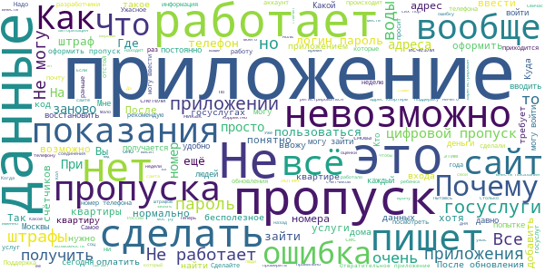
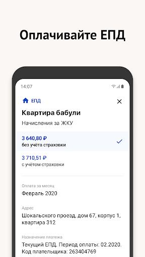
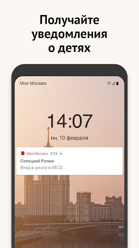
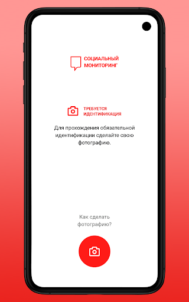

# COVID-related Android apps in Russia

Author: `Ivano Malavolta` (ivanomalavolta@gmail.com)

Created at: `2020/5/17`

Report generated by the [covid-apps-observer](http://github.com/covid-apps-observer) project, version 0.1

# Table of contents 

- [Background](#background)
    * [Data sources and analyses](#data-sources-and-analyses)
        * [App metadata](#app-metadata)
        * [Requested permissions](#requested-permissions)
        * [Mentioned servers](#mentioned_servers)
        * [Security analysis](#security_analysis)
        * [User ratings and reviews](#user-ratings-and-reviews)
    * [Disclaimer](#disclaimer)
- [Госуслуги Москвы](#госуслуги-москвы)
- [Моя Москва — официальное приложение портала mos.ru](#моя-москва-—-официальное-приложение-портала-mos.ru)
- [WHO Info](#who-info)
- [Социальный мониторинг](#социальный-мониторинг)
- [OpenWHO: Knowledge for Health Emergencies](#openwho-knowledge-for-health-emergencies)
- [Активный гражданин](#активный-гражданин)

- [Credits](#credits)

# How to read this report

This report has been generated by the [covid-apps-observer](http://github.com/covid-apps-observer) project. The project automatically analyzes the apps by extracting information which is already publicly available either on the web or in the apps binary files. 

Our analysis covers the following apps:
| | |
|-------------------------|-------------------------| 
|  | Госуслуги Москвы
|  | Моя Москва — официальное приложение портала mos.ru
|  | WHO Info
|  | Социальный мониторинг
|  | OpenWHO: Knowledge for Health Emergencies
|  | Активный гражданин

The details of our analysis are presented in the remainder of this report.

For independent verification, the raw data and the source code of the project is publicly available in its GitHub repository [http://github.com/covid-apps-observer](http://github.com/covid-apps-observer) and its source code has been thoroughly commented in order to provide all the details about how the information provided in this report has been extracted. 

Any feedback, questions, and improvements about the project are very welcome, feel free to create an issue or pull request directly in its GitHub repository: [http://github.com/covid-apps-observer](http://github.com/covid-apps-observer).

## Data sources and analyses

The analysis of each app is structured around five main dimensions: 
* App metadata  
* Requested permissions
* Mentioned servers
* Androwarn analysis
* User ratings and reviews

In the following we describe the data sources and analysis performed for each dimension.

### App metadata

App metadata includes an overview of the main information about the app (for example, its name, releases, privacy policy, etc.), contact information of the development team, and the various Android versions supported by the app. This information is extracted from two main data sources:
* _Google Play store_: we automatically mined the web page of the Google Play store showing the basic information about the app and we parsed it in order to extract information about the app and development team 
* _Android Manifest file_: in our analysis we decompiled the binary file of the app (it is similar to a Zip archive but it contains the code of the app instead of normal files) and we extracted information about the supported Android versions, as it has been listed by its development team.

The extracted app metadata feeds the _App overview_, _Development team_, and _Android support_ sections of this report.
We make use of the [google-play-scraper](https://github.com/JoMingyu/google-play-scraper) tool for extracting the raw data related to this dimension of the project.

### Requested permissions

The Android operating system has a permission model which allows users to grant access to potentially privacy-related information. Every Android app has to explictly declare the permissions it needs to properly function in the Android Manifest file.  

In this report we also show the protection level of each permission, which is a key information for understanding how the requested permissions related to the user's privacy. We carefully analyzed the [official Android documentation (v. 29)](https://developer.android.com/reference/android/Manifest.permission), and it resulted that a permission requested by an Android app can belong to the following protection levels:
* **Dangerous**: higher-risk permissions that would give a requesting app access to private user data or control over the device that can negatively impact the user. Because this type of permission introduces potential risk, the system usually does not automatically grant it to the requesting app. For example, any dangerous permissions requested by an app may be displayed to the user and require confirmation before proceeding.
* **Normal**: this is the default and most common level in Android; normal permissions are lower-risk and give access to isolated app-level features, with minimal risk to other apps, the system, or the user. 
* **Signature**: permissions granted only if the requesting app is signed with the same certificate as the app that declared the permission
* **Appop**: old permission level, a reminiscence of the App Ops tool that Google introduced in Android 4.3.
* **Development**: optional permissions which can be granted to development-oriented apps.
* **Privileged**: permissions who give higher power to mobile apps w.r.t. other apps, such as binding to incoming calls, interacting via bluetooth with other devices without user interaction, etc.
* **Preinstalled**: reserved only for preinstalled apps
* **Installer**: allow the holder to start the permission usage screen for an app
* **RetailDemo**: permissions related to devices used in demonstrations in shops.
* **Pre23**: permissions automatically granted to apps targeting devices running pre-6.0 Android.
* **Upcoming**: permissions which will be released in the next version of the Android platform. 
* **Deprecated**: permissions belonging to old releases of the Android platform, they should not be used by developers since they will not be supported in the near future.
* **Not for use by third-party applications**: permissions which can be requested only by apps developed by Google.
* **Undefined**: this protection level is not documented by Google.

The permissions dimension of this project is based on the [Androguard](https://github.com/androguard/androguard) static analysis tool.

### Mentioned servers

We decompiled each app in order to look for all possible mentions of remote URLs. The mentioned URLs can refer to remote servers the the app is using for either sending or receiving information, web addresses for directing the user to an information website, and so on. 

:warning: It is important to note that this analysis is not meant to be complete and it is very prone to obfuscation. The servers reported here are simply _mentioned_ somewhere in the code of the app and are meant to just give an indication about the "hooks" of the app towards external resources. For example, for an Android app it is normal to contact Google services in order to send/receive push notifications, or to contact the servers of analytics services for having real-time diagnostics about crashes of the app or bugs.

This part of the analysis is based on the [Androguard](https://github.com/androguard/androguard) static analysis tool for identfying the raw URLs mentioned in the app; then, the information about each mentioned server is collected by performing a _whois_ lookup on the first-level domain present in the URL.

### Security analysis

This dimension is based on the [Androwarn](https://github.com/maaaaz/androwarn) structural and data flow analysis of Android bytecode. Androwarn is developed by the University of Lyon/INSA (France) and it has been used in several academic studies. According to its documentation, Androwarn targets the following categories of potential security issues:
* **Telephony identifiers exfiltration**: IMEI, IMSI, MCC, MNC, LAC, CID, operator's name, etc.
* **Device settings exfiltration**: software version, usage statistics, system settings, logs, etc.
* **Geolocation information leakage**: GPS/WiFi geolocation, etc.
* **Connection interfaces information exfiltration**: WiFi credentials, Bluetooth MAC adress, etc.
* **Telephony services abuse**: premium SMS sending, phone call composition, etc.
* **Audio/video flow interception**: call recording, video capture, etc.
* **Remote connection establishment**: socket open call, Bluetooth pairing, APN settings edit, etc.
* **PIM data leakage**: contacts, calendar, SMS, mails, clipboard, etc.
* **External memory operations**: file access on SD card, etc.
* **PIM data modification**: add/delete contacts, calendar events, etc.
* **Arbitrary code execution**: native code using JNI, UNIX command, privilege escalation, etc.
* **Denial of Service**: event notification deactivation, file deletion, process killing, virtual keyboard disable, terminal shutdown/reboot, etc.

Note: We do not consider this data point in the current version of our analyzers since it is too verbose for our purposes.

:warning: It is important to note that Androwarn is a static analysis tool, and as such it performs a variety of heuristics and approximations in its analyses. Said that, the results shown in this report are meant to provide an indication of _potential_ security issues and should be by no means treated as complete and correct.   

### User ratings and reviews

For this dimension we turn again to the web interface of the Google Play store. Firstly, we automatically mine summary statistics about user ratings from the web page of the app under analysis; then, we automatically download the newest 1000 reviews of the app under analysis. For each level of rating (5 stars, 4 stars, , etc., 1 star) we show:
- a word cloud presenting the main terms used by end users in their reviews in the Google Play store
- the last 10 reviews provided by app users in the Google Play store. 

This purposefully simple analysis is meant to help both future users and the development team of the app in understanding what are the main positive and negative points of the app under analysis.

We make use of the [google-play-scraper](https://github.com/JoMingyu/google-play-scraper) tool for extracting the raw data related to this dimension of the project.

## Disclaimer 

This report has been produced independently of any parties and its only objective is to help anybody in better understanding how COVID-related apps work in practice (and compare to each other). The results of this report are limited to the specific version of the software used for running the analyses and on the various heuristics implemented in there. In other words, the results of the analyzers may differ depending on the time and modalities in which they are executed. We do not guarantee that the results of the analyses and the corresponding contents of this report are fully complete or correct. The analysis software is licensed under the [MIT License](https://github.com/iivanoo/covid-apps-observer/blob/master/LICENSE).

# Госуслуги Москвы
App version ``3.11.1.3``

Analyzed with [covid-apps-observer](http://github.com/covid-apps-observer) project, version ``0.1``

## App overview
| | |
|-------------------------|-------------------------| 
| **Name**&nbsp;&nbsp;&nbsp;&nbsp;&nbsp;&nbsp;&nbsp;&nbsp;&nbsp;&nbsp;&nbsp;&nbsp;&nbsp;&nbsp;&nbsp;&nbsp;&nbsp;&nbsp;&nbsp;&nbsp;&nbsp;&nbsp;&nbsp;&nbsp;&nbsp;&nbsp;&nbsp;&nbsp;&nbsp;&nbsp;&nbsp;&nbsp;&nbsp;&nbsp;&nbsp;&nbsp;&nbsp;&nbsp;&nbsp;&nbsp;  | Госуслуги Москвы |
| **Unique identifier** | ru.altarix.mos.pgu |
| **Link to Google Play** | [https://play.google.com/store/apps/details?id=ru.altarix.mos.pgu](https://play.google.com/store/apps/details?id=ru.altarix.mos.pgu) |
| **Summary**  | Все электронные услуги города: начисления ЖКХ, штрафы ГИБДД, эвакуация ТС и др. |
| **Privacy policy** | [http://dit.mos.ru/apps/privacypolicy](http://dit.mos.ru/apps/privacypolicy) |
| **Latest version** | 3.11.1.3 |
| **Last update** | 2020-04-16 13:43:57 |
| **Recent changes** | - Улучшено определение Карты москвича при оплате начислений |
| **Installs**  | 1 000 000+ |
| **Category** | Социальные |
| **First release** | 27 сент. 2012 г. |
| **Size**  | 28M |
| **Supported Android version**  | 5.0 и выше |

### Description
> Мобильное приложение «Госуслуги Москвы» - сервис, объединяющий востребованные услуги Правительства Москвы, для комфортной жизни в большом городе.
 Образование:
 - Сервис «Мой ребенок в школе» дает возможность удаленно отслеживать проход и питание учащегося, школьное меню и баланс лицевого счета, который в любой момент можно пополнить с банковской карты/мобильного счета; 
 - Сервис «Электронный дневник» объединяет в себе самую важную для родителей информацию об учебе: расписание уроков, домашние задание, оценки учащегося и т.д.; 
 - Сервис «Результаты ГИА» - мобильная площадка с результатами прохождения Государственной итоговой аттестации.
 Жилье, ЖКУ:
 - Сервис «Начисления за жилищно-коммунальные услуги» предоставляет развернутую информацию о долговых/текущих начислениях за ЖКУ с возможностью заказать электронный Единый платежный документ; 
 - Сервис «Внесение показаний» - возможность передачи показаний счетчиков водоснабжения/электроэнергии, а также получения информации о задолженности без очередей и отрыва от важных дел; 
 - Сервис «Единый диспетчерский центр» – компактная площадка для решения проблем и вопросов, относящихся к вашему дому/двору;
 - Сервис «Информирование о начале расчетов по новой услуге»;
 - Сервис «Информирование о регистрации на жилплощади»;
 - Сервис «Информирование об отключении горячего водоснабжения».
 Транспорт:
 - Сервис «Штрафы» дает возможность получать актуальную информацию по вашим штрафам и оплачивать с мобильного; 
 - Сервис «Эвакуация транспортного средства» информирует об эвакуации ТС, а также предоставляет точный адрес местонахождения ТС на спецстоянке.
 Здоровье и документы:
 - Сервис «Запись к врачу» предоставляет возможность удаленно записаться на прием к любому врачу, перенести и отменить запись, посмотреть перечень направлений и выписанные вам рецепты; 
 - Сервис «Запись к ветеринару» предоставляет возможность записать своего питомца на прием в ветеринарную клинику (перенести, отменить запись) или вызвать ветеринара на дом;
 - Сервис «Готовность загранпаспорта» - индивидуальное информирование о готовности заграничного паспорта;
 - Сервис «Федеральная служба судебных приставов» предоставляет информацию о наличии исполнительных делопроизводств ФССП.
 Информация:
 - Сервис «Новости» объединяет в себе самые актуальные и интересные новости города в удобном мобильном формате.
 По желанию вы можете настроить способ получения уведомлений: SMS, E-mail или Push-уведомления.
 ___________________________________
 Обратите внимание на другие официальные приложения правительства Москвы.
 - Активный Гражданин - проект для тех, кому важно, что происходит в Москве
 - Наш город – помогите нам сделать город лучше
 - Парковки Москвы – приложение для поиска и оплаты парковки в Москве
 - Узнай Москву - архитектурная история столицы).

### User interface
The developers of the app provide the following screenshots in the Google play store.
| | | |
|:-------------------------:|:-------------------------:|:-------------------------:|
 |   |   |   | 
 |   |  

## Development team
In the following we report the main information provided by the development team in the Google play store.

| | |
|-------------------------|-------------------------|
| **Developer**  | Информационный город ГКУ |
| **Website**  | [https://www.mos.ru/mosapps/](https://www.mos.ru/mosapps/) |
| **Email** | emp@mos.ru |
| **Physical address**  | - |
| **Other developed apps**  | [https://play.google.com/store/apps/developer?id=%D0%98%D0%BD%D1%84%D0%BE%D1%80%D0%BC%D0%B0%D1%86%D0%B8%D0%BE%D0%BD%D0%BD%D1%8B%D0%B9+%D0%B3%D0%BE%D1%80%D0%BE%D0%B4+%D0%93%D0%9A%D0%A3](https://play.google.com/store/apps/developer?id=%D0%98%D0%BD%D1%84%D0%BE%D1%80%D0%BC%D0%B0%D1%86%D0%B8%D0%BE%D0%BD%D0%BD%D1%8B%D0%B9+%D0%B3%D0%BE%D1%80%D0%BE%D0%B4+%D0%93%D0%9A%D0%A3) |

## Android support

| | |
|-------------------------|-------------------------|
| **Declared target Android version**  | Pie, version 9 (API level 28) |
| **Effective target Android version**  | Pie, version 9 (API level 28) |
| **Minimum supported Android version**  | Lollipop, version 5.0 (API level 21) |
| **Maximum target Android version**  | - |

The larger the difference between the minimum and maximum supported Android versions, the better. A larger difference means a wider audience. For example, old phones have a very low Android version, so a high minimum supported Android version means that the app cannot be used by users with old phones, thus leading to accessibility problems. 

## Requested permissions

In the following we report the complete list of the permissions requested by the app. 

| **Permission** | **Protection level** | **Description** | 
|-------------------------|-------------------------|-------------------------|
 **android.permission ACCESS_COARSE_LOCATION** | :warning:**Dangerous** | Allows an app to access approximate location. 
 **android.permission ACCESS_FINE_LOCATION** | :warning:**Dangerous** | Allows an app to access precise location. 
 **android.permission ACCESS_NETWORK_STATE** | Normal | Allows applications to access information about networks. 
 **android.permission ACCESS_WIFI_STATE** | Normal | Allows applications to access information about Wi-Fi networks. 
 **android.permission CALL_PHONE** | :warning:**Dangerous** | Allows an application to initiate a phone call without going through the Dialer user interface for the user to confirm the call. 
 **android.permission CAMERA** | :warning:**Dangerous** | Required to be able to access the camera device. 
 **android.permission INTERNET** | Normal | Allows applications to open network sockets. 
 **android.permission READ_CALENDAR** | :warning:**Dangerous** | Allows an application to read the user's calendar data. 
 **android.permission READ_CONTACTS** | :warning:**Dangerous** | Allows an application to read the user's contacts data. 
 **android.permission READ_EXTERNAL_STORAGE** | :warning:**Dangerous** | Allows an application to read from external storage. 
 **android.permission USE_BIOMETRIC** | Normal | Allows an app to use device supported biometric modalities. 
 **android.permission USE_FINGERPRINT** | Normal | This constant was deprecated in API level 28. Applications should request USE_BIOMETRIC instead 
 **android.permission VIBRATE** | Normal | Allows access to the vibrator. 
 **android.permission WAKE_LOCK** | Normal | Allows using PowerManager WakeLocks to keep processor from sleeping or screen from dimming. 
 **android.permission WRITE_CALENDAR** | :warning:**Dangerous** | Allows an application to write the user's calendar data. 
 **android.permission WRITE_EXTERNAL_STORAGE** | :warning:**Dangerous** | Allows an application to write to external storage. 
 **com.google.android.c2dm.permission RECEIVE** | - | - 
 **com.google.android.finsky.permission BIND_GET_INSTALL_REFERRER_SERVICE** | - | - 

## Mentioned servers

| **Server** | **Registrant** | **Registrant country** | **Creation date** | 
|-------------------------|-------------------------|-------------------------|-------------------------|
 | vk.com | Privacy protection service - whoisproxy.ru | :ru: RU | 1997-06-24 04:00:00 |
 | cloudmade.com | Cloud Made Ltd | :uk: UK | 2007-07-17 17:02:27 |
 | facebook.com | Facebook, Inc. | :us: US | 1997-03-29 05:00:00 |
 | googleapis.com | Google LLC | :us: US | 2005-01-25 17:52:26 |
 | google.com | Google LLC | :us: US | 1997-09-15 04:00:00 |
 | 2gis.ru | - | - | 2001-02-18 21:00:00 |
 | crashlytics.com | Google LLC | :us: US | 2011-01-21 15:30:40 |
 | googlesyndication.com | Google LLC | :us: US | 2003-01-21 06:17:24 |
 | openstreetmap.org | OpenStreetMap Foundation | GB | 2004-08-09 18:47:25 |
 | openptmap.org | - | :de: DE | 2010-11-17 12:05:24 |
 | openstreetmap.nl | - | - | 2007-03-06 00:00:00 |
 | wmflabs.org | Wikimedia Foundation, Inc. | :us: US | 2011-09-29 14:58:28 |
 | openseamap.org | - | :de: DE | 2009-03-26 11:35:19 |
 | chartbundle.com | Whois Privacy Service | :us: US | 2010-01-09 23:30:15 |
 | opentopomap.org | - | :de: DE | 2011-09-03 18:35:13 |
 | app-measurement.com | Google LLC | :us: US | 2015-06-19 20:13:31 |
 | mos.ru | - | - | 1996-12-23 09:49:03 |
 | googleadservices.com | Google LLC | :us: US | 2003-06-19 16:34:53 |
 | w3.org | W3C | :us: US | 1994-07-06 04:00:00 |
 | mts.ru | - | - | 1997-11-19 12:02:34 |
 | 2gis.com | DoubleGIS LLC | :ru: RU | 2004-03-18 08:51:04 |

## Security analysis 

Below we report the main security warnings raised by our execution of the [Androwarn](https://github.com/maaaaz/androwarn) security analysis tool.

**Telephony identifiers leakage**
> - This application reads the numeric name (MCC+MNC) of current registered operator 
> - This application reads the operator name 

**Location lookup**
> - This application reads location information from all available providers (WiFi, GPS etc.) 

**Connection interfaces exfiltration**
> - This application reads details about the currently active data network 

**Telephony services abuse**
> - This application makes phone calls 

**Suspicious connection establishment**
> - This application opens a Socket and connects it to the remote address ' returned no addresses for  ; port is out of range' on the 'N/A' port  
> - This application opens a Socket and connects it to the remote address '' on the 'N/A' port  
> - This application opens a Socket and connects it to the remote address 'Ljava/net/Proxy;->type()Ljava/net/Proxy$Type;' on the 'N/A' port  
> - This application opens a Socket and connects it to the remote address 'timeout' on the 'N/A' port  

**Code execution**
> - This application loads a native library 

## User ratings and reviews

Below we provide information about how end users are reacting to the app in terms of ratings and reviews in the Google Play store.

### Ratings

The Госуслуги Москвы app has been installed by more than **1000000** times. At this time, **50845** rated the app and its average score is **4.2360373**. Below we show the distribution of the ratings across the usual star-based rating of Google Play

:star::star::star::star::star:: 36585

:star::star::star::star:: 4635

:star::star::star:: 1655

:star::star:: 973

:star:: 6994

### Reviews 

#### 5-star reviews

> Удобно и быстро. Danke schon.  :date: __2020-05-17 11:56:38__

> Очень удобное приложение Всё ясно и понятно  :date: __2020-05-17 11:41:53__

> Норм  :date: __2020-05-17 09:14:11__

> Хорошо работающее приложение.  :date: __2020-05-17 08:48:58__

> Можно сделать лучше. Не очень удобное.  :date: __2020-05-17 07:13:44__

> Жизненно необходимое приложение. Можно решать все вопросы независимо от места нахождения. Вот я на даче в самоизоляции. Мне сообщают работающие члены семьи показания, а я их передаю. Жаль только , что не могу найти , как подать заявление а электронном виде на получение выплаты по случаю 55- летнего юбилея в браке.  :date: __2020-05-16 22:27:20__

> Госуслуги - оценка на 5 звезд тянет  :date: __2020-05-16 22:12:57__

> Ок  :date: __2020-05-16 22:10:08__

> Ставлю5 ,пока без изменений,тьфу 3 раза не сглазить бы)  :date: __2020-05-16 19:34:30__

> Полезная программа, особенно при текущих обстоятельствах  :date: __2020-05-16 17:14:53__

#### 4-star reviews

> Удобненько  :date: __2020-05-17 15:36:59__

> Устривает практически всё. При этом в главном меню "проверка штрафов" за мной до сих пор числится два не оплаченных штрафа. Один аннулирован в 2019 году, второй - в 2020 году. Считаю, что недоработки как Заказчика, так и Подрядчика программного обеспечения сайта!  :date: __2020-05-16 18:12:52__

> Дайте возможность отсылать фотки в диспетчерскую!!!  :date: __2020-05-16 15:11:34__

> Не хватает расписание врачей!  :date: __2020-05-16 08:12:59__

> Рмо галовин .1 как бы ты сам ребёнок, научись писать. А 2 щяс нужно всем свой электронные дневники, а не 1 дневник а там 4 учащиеся понел. А приложение хорошее  :date: __2020-05-15 12:21:19__

> Ребята,всё нормально! С продлением пропуска даже у меня всё прошло на раз!Спасибо!  :date: __2020-05-14 15:41:59__

> Пользуюсь в основном Услугами по медицине, гбдд, оформление паркочного места инвалида, парковки. Всё движется в правильном направлении. Каждый твой шаг под контролем. Идёт постоянное улучшение качества и кол-ва услуг. Штрафы Гбдд не всегда совпадают с госуслугами. Есть ощущение, что платишь штраф по несколько раз. Но это только ощущение, т.к. не проверял из-за времени. Но предполагаю, что испр Пропуск на езду при короновирусе не приходит на электронную почту почему то. Но приходит сразу по смс.  :date: __2020-05-13 18:33:55__

> Штрафы ГИБДД висят месяцами.  :date: __2020-05-13 12:52:49__

> На ДО не очень удобно пользоваться  :date: __2020-05-12 12:12:12__

> Не могу войти в приложение неделю. Пишет, что не правильно ввожу логин и пароль. При запросе нового пароля на номер телефона, пишет, что номер телефона не зарегистрирован. Много лет, все было зарегистрировано, а теперь почему то нет.  :date: __2020-05-12 07:39:34__

#### 3-star reviews

> С 16 не могу войти в свой акуант. В чем причина и как исправить?  :date: __2020-05-17 05:45:35__

> Плоховато работает сайт. Раздел подачи показания счётчиков очень часто виснет. Оплаченые штрафы висят как неоплаченые. Короче троечка с минусом разроботчикам  :date: __2020-05-13 11:05:35__

> Не работает одна из самых актуальных функций - функция проверки разрешения по номеру автомобиля. Можно хоть обрешаться, все ответы на примеры (проверки) будут неверными.  :date: __2020-05-13 08:30:31__

> Так себе  :date: __2020-05-11 15:02:24__

> Очень много багов и ограниченный функционал по сравнению с браузерной версией.  :date: __2020-05-10 16:40:48__

> Оплаченные штрафы на авто отображаются в приложении как не оплаченные.  :date: __2020-05-10 08:14:14__

> Приложение не видит новые штрафы на авто. При этом в стационарной версии все ок  :date: __2020-05-09 16:36:42__

> Приложение нормальное. Но бывает тормозит, электронный дневник виснит, задания приходят с опозданием. А штрафы, которые давно оплатили висят до сих пор. Уберите.  :date: __2020-05-07 19:56:21__

> Не всегда доступны услуги Не всегда можно зайти быстро в ЛК из за перегрузки сайта.  :date: __2020-05-06 20:13:25__

> Штрафы оплачены,а в приложении постоянно висят,пока не напишешь не убирают,и так всегда. Вот и сейчас, просят ивинения, а штраф так и не убрали, продолжает висет. По этому снижаю оценку ещё на звезду. Я понимаю, что Вам все равно, ну так, для информации.  :date: __2020-05-05 14:28:54__

#### 2-star reviews

> Постоянно отображает уже оплаченные штрафы и епд. Не показывает вход/выход на второго ребенка (заявление дважды подавали). Большинство услуг по ссылкам через сайт, а не в приложении. Уведомления о штрафах с сильным запозданием. Ну и выглядит аляповато конечно.  :date: __2020-05-17 08:46:53__

> Хочу в дневник зайти но пишет ошибка соединения исправьте это просто это кошмар  :date: __2020-05-13 10:48:03__

> Проводите технические работы на выходных. Ваше приложение постоянно висит, я использую ЭЖД и не могу в него войти когда нужно.  :date: __2020-05-12 21:52:00__

> Не могу войти в приложение, пароли и логины правильные, то пишет, чтобы добавили телефон на мос. ру, он там уже есть, просит обратиться в службу поддержки, интересно в какую и как?  :date: __2020-05-12 14:12:17__

> Совсем все поломали. Теперь меня не пускают, ссылаясь на то, что телефон не зарегистрирован. Поддержка не отвечает.  :date: __2020-05-12 08:08:31__

> Когда в приложении будет пункт для пропусков? Это сейчас крайне востребованно!  :date: __2020-05-11 20:44:02__

> В очередной раз после обновления приложение потребовало ввод логина и пароля. А потом установку пин-кода и разрешения использовать отпечаток пальца. Зачем? Я всё это уже делал со старой версией приложения. У нормальных разработчиков приложения после обновления просто продолжают работать  :date: __2020-05-11 07:33:13__

> Изначально не могла войти в профиль несколько дней, пришлось делать новый. Не добавляются данные счетчиков, выходит ошибка. На других мобильных всё работает. Переустановливала приложение, ничего не помогает. Разработчики, помогите!  :date: __2020-05-10 19:42:57__

> Невозможно открыть электронную медицинскую карту  :date: __2020-05-10 15:15:26__

> Опять обновление потерявшее информацию и размножившиеся одну запись в несколько и без возможности редактирования + потеряли адрес и ошибка при попытке его ввести + ввел адрес через сайт, так формы адреса в приложении и на сайте не совпадают  :date: __2020-05-10 13:22:21__

#### 1-star reviews

> Пыталась заказать пропуск в мед.учреждение, в выпадающем списке нет нужногр мед.учреждения. есть только государственные поликиники и больницы. Я лечусь по ДМС. Как быть? У мен я зуб болит. Мясникам из районной стоматологии не доверяю.  :date: __2020-05-17 15:11:14__

> Как налоги собирать - все работает как надо, все в первых строках. Как учёба, выплаты, пропуска и тд - нихрена не работает! Ошибки и так далее. Учёбы никакой!  :date: __2020-05-17 11:57:03__

> Работало вроде нормально, потом запись о квартире пропала, добавить её обратно не получается, улицу мою приложение не находит, использовать нет смысла.  :date: __2020-05-17 10:46:44__

> Отображаются штрафы, которые оплачены ещё в прошлом году. На сайте все нормально. Очень много глюков. Часто просто открываю сайт с телефона, т.к. приложением пользоваться невозможно.  :date: __2020-05-17 03:41:16__

> После обновления исчезли начисления жКХ, сделали все данные , я не могу ввести адрес квартиры , моего перулка в вашем адреснике нет , исчез учет воды, данные по автомобилю, висит давно оплаченный штраф, тогда как на госуслугах все отражено мой проыиль подтвержлен был полностью, требует ввести снилс, вместе его опять некуда , тогла как на госуслугах профиль полностью подтвержден , не могу войти электронную карту . Нет всех услуг . Кол разработчику  :date: __2020-05-16 23:47:30__

> После какого-то обновления слетела вся авторизация со всеми сохранёнными данными в личном кабинете (пароли, адреса, коды, документы). При попытке ввода адреса для счётчиков выдаёт ошибку соединения после первого же пробела в строке ввода для поиска адреса. Тестом приложения, видимо, никто не занимается, код проверять лень, раз одна ошибка на другой.  :date: __2020-05-16 16:38:58__

> Поставил приложение чтобы вызвать сантехника. Не смог. При выборе адреса в форму заявки подставились все данные из учётной записи, кроме адреса. Вручную приложение внести адрес не позволяет. Удалил.  :date: __2020-05-16 10:27:42__

> Не как не могу внести данные своих детей чтоб оформить выплаты и льготы .  :date: __2020-05-16 10:10:14__

> Отвратително!!! Такое впечатление что все идиоты, а разработчики и правительство ,с чьего указания все происходит, самые умные и они смеются над людьми  :date: __2020-05-16 08:32:37__

> Замучалась. Не посылает запрос на идентификацию. Некорректная работа. Сидя дома, получишь штрафы.  :date: __2020-05-16 05:55:01__

# Моя Москва — официальное приложение портала mos.ru
App version ``1.4.2``

Analyzed with [covid-apps-observer](http://github.com/covid-apps-observer) project, version ``0.1``

## App overview
| | |
|-------------------------|-------------------------| 
| **Name**&nbsp;&nbsp;&nbsp;&nbsp;&nbsp;&nbsp;&nbsp;&nbsp;&nbsp;&nbsp;&nbsp;&nbsp;&nbsp;&nbsp;&nbsp;&nbsp;&nbsp;&nbsp;&nbsp;&nbsp;&nbsp;&nbsp;&nbsp;&nbsp;&nbsp;&nbsp;&nbsp;&nbsp;&nbsp;&nbsp;&nbsp;&nbsp;&nbsp;&nbsp;&nbsp;&nbsp;&nbsp;&nbsp;&nbsp;&nbsp;  | Моя Москва — официальное приложение портала mos.ru |
| **Unique identifier** | ru.mos.app |
| **Link to Google Play** | [https://play.google.com/store/apps/details?id=ru.mos.app](https://play.google.com/store/apps/details?id=ru.mos.app) |
| **Summary**  | Все самые нужные городские сервисы в официальном приложении mos.ru «Моя Москва». |
| **Privacy policy** | [https://www.mos.ru/legal/rules/](https://www.mos.ru/legal/rules/) |
| **Latest version** | 1.4.2 |
| **Last update** | 2020-04-06 17:38:11 |
| **Recent changes** | Исправление ошибок |
| **Installs**  | 500 000+ |
| **Category** | Социальные |
| **First release** | 27 дек. 2018 г. |
| **Size**  | 22M |
| **Supported Android version**  | 5.0 и выше |

### Description
> Пользуйтесь главными сервисами mos.ru, читайте новости города и задавайте вопросы операторам городского контакт-центра в одном приложении. Достаточно ввести ваши данные для входа на портал mos.ru и вам откроются все возможности чат-бота «Моя Москва».
 Здесь мы собрали самые частые госуслуги, которыми пользуются москвичи. И упростили процесс получения — все вопросы решает быстрый чат-бот. Откройте диалог в нужном разделе:
 – Мой дом: подать показания счётчиков воды, узнать, когда нужно провести поверку счётчиков, получить счета за ЖКУ. Сохраните в приложении 10-значный номер плательщика (указан на вашем ЕПД) и вам будет доступна оплата ЖКХ.
 – Дети в школе: пользоваться сервисами «Москвёнок» и «Электронный дневник» в одном приложении. Проверить, когда ребенок пришёл в школу, какие оценки получил и что купил на обед, можно за пару минут, спросив у бота.
 – Здоровье: записаться на приём в поликлинику, перенести или отменить запись к врачу теперь можно онлайн в удобном чате. Только скажите боту номер полиса ОМС.
 – Транспорт: проверить и оплатить штрафы ГИБДД онлайн по номеру, узнать историю своего автомобиля. По вашей просьбе бот пришлёт уведомление об эвакуации машины и новых штрафах. Понадобятся номер водительских прав, СТС, VIN и госномер автомобиля.
 – Контакт-центр: операторы круглосуточно готовы помочь вам в решении вопросов, связанных с получением государственных услуг и работой приложения «Моя Москва».
 – Новости города: узнать за пару минут всё самое важное, что происходит в Москве и в вашем районе.
 – Мой район: изучать ваш район - читать об уникальных фактах, искать ближайшие парки и школы, детские и спортивные площадки, узнавать о планах его развития.
 «Моя Москва» — чат-бот, который помогает москвичам получить самые популярные госуслуги. Часть из них доступна без авторизации. Но советуем зарегистрироваться, чтобы бот знал ваши данные и мог напоминать о важных платежах или записи к врачу.
 Правительство Москвы также разработало отдельные приложения для тех, кто ищет или хочет оплатить парковку («Парковки Москвы»), участвовать в принятии важных городских решений («Активный Гражданин»), замечать недочеты в устройстве ЖКХ («Наш город»).

### User interface
The developers of the app provide the following screenshots in the Google play store.
| | | |
|:-------------------------:|:-------------------------:|:-------------------------:|
 |   |   |   | 
 |   |   |   | 
 |   |  

## Development team
In the following we report the main information provided by the development team in the Google play store.

| | |
|-------------------------|-------------------------|
| **Developer**  | Информационный город ГКУ |
| **Website**  | [https://www.mos.ru/mobile/](https://www.mos.ru/mobile/) |
| **Email** | mobile@mos.ru |
| **Physical address**  | - |
| **Other developed apps**  | [https://play.google.com/store/apps/developer?id=%D0%98%D0%BD%D1%84%D0%BE%D1%80%D0%BC%D0%B0%D1%86%D0%B8%D0%BE%D0%BD%D0%BD%D1%8B%D0%B9+%D0%B3%D0%BE%D1%80%D0%BE%D0%B4+%D0%93%D0%9A%D0%A3](https://play.google.com/store/apps/developer?id=%D0%98%D0%BD%D1%84%D0%BE%D1%80%D0%BC%D0%B0%D1%86%D0%B8%D0%BE%D0%BD%D0%BD%D1%8B%D0%B9+%D0%B3%D0%BE%D1%80%D0%BE%D0%B4+%D0%93%D0%9A%D0%A3) |

## Android support

| | |
|-------------------------|-------------------------|
| **Declared target Android version**  | Pie, version 9 (API level 28) |
| **Effective target Android version**  | Pie, version 9 (API level 28) |
| **Minimum supported Android version**  | Lollipop, version 5.0 (API level 21) |
| **Maximum target Android version**  | - |

The larger the difference between the minimum and maximum supported Android versions, the better. A larger difference means a wider audience. For example, old phones have a very low Android version, so a high minimum supported Android version means that the app cannot be used by users with old phones, thus leading to accessibility problems. 

## Requested permissions

In the following we report the complete list of the permissions requested by the app. 

| **Permission** | **Protection level** | **Description** | 
|-------------------------|-------------------------|-------------------------|
 **android.permission ACCESS_COARSE_LOCATION** | :warning:**Dangerous** | Allows an app to access approximate location. 
 **android.permission ACCESS_FINE_LOCATION** | :warning:**Dangerous** | Allows an app to access precise location. 
 **android.permission ACCESS_NETWORK_STATE** | Normal | Allows applications to access information about networks. 
 **android.permission ACCESS_WIFI_STATE** | Normal | Allows applications to access information about Wi-Fi networks. 
 **android.permission CAMERA** | :warning:**Dangerous** | Required to be able to access the camera device. 
 **android.permission CHANGE_WIFI_STATE** | Normal | Allows applications to change Wi-Fi connectivity state. 
 **android.permission INTERNET** | Normal | Allows applications to open network sockets. 
 **android.permission RECEIVE_BOOT_COMPLETED** | Normal | Allows an application to receive the Intent.ACTION_BOOT_COMPLETED that is broadcast after the system finishes booting. 
 **android.permission USE_BIOMETRIC** | Normal | Allows an app to use device supported biometric modalities. 
 **android.permission USE_FINGERPRINT** | Normal | This constant was deprecated in API level 28. Applications should request USE_BIOMETRIC instead 
 **android.permission VIBRATE** | Normal | Allows access to the vibrator. 
 **android.permission WAKE_LOCK** | Normal | Allows using PowerManager WakeLocks to keep processor from sleeping or screen from dimming. 
 **android.permission WRITE_CALENDAR** | :warning:**Dangerous** | Allows an application to write the user's calendar data. 
 **android.permission WRITE_EXTERNAL_STORAGE** | :warning:**Dangerous** | Allows an application to write to external storage. 
 **com.google.android.c2dm.permission RECEIVE** | - | - 
 **com.google.android.finsky.permission BIND_GET_INSTALL_REFERRER_SERVICE** | - | - 
 **ndroid.permission MANAGE_FINGERPRINT** | - | - 

## Mentioned servers

| **Server** | **Registrant** | **Registrant country** | **Creation date** | 
|-------------------------|-------------------------|-------------------------|-------------------------|
 | w3.org | W3C | :us: US | 1994-07-06 04:00:00 |
 | xml.org | OASIS Open | :us: US | 1997-02-03 05:00:00 |
 | xmlpull.org | WhoisGuard, Inc. | PA | 2001-11-26 20:33:08 |
 | googlesyndication.com | Google LLC | :us: US | 2003-01-21 06:17:24 |
 | google.com | Google LLC | :us: US | 1997-09-15 04:00:00 |
 | facebook.com | Facebook, Inc. | :us: US | 1997-03-29 05:00:00 |
 | app-measurement.com | Google LLC | :us: US | 2015-06-19 20:13:31 |
 | yandex.ru | - | - | 1997-09-23 09:45:07 |
 | yandexadexchange.net | - | :ru: RU | 2014-02-18 12:48:07 |
 | kladr-api.ru | - | - | 2013-02-06 00:31:38 |
 | crashlytics.com | Google LLC | :us: US | 2011-01-21 15:30:40 |
 | yandex.com | - | :switzerland: CH | 1998-09-24 04:00:00 |
 | yandex.net | - | :ru: RU | 2000-11-14 06:56:55 |
 | googleapis.com | Google LLC | :us: US | 2005-01-25 17:52:26 |
 | googleadservices.com | Google LLC | :us: US | 2003-06-19 16:34:53 |
 | frosteye.ru | - | - | 2012-12-08 18:43:12 |
 | intervale.ru | - | - | 2001-04-09 20:00:00 |
 | mts.ru | - | - | 1997-11-19 12:02:34 |
 | mos.ru | - | - | 1996-12-23 09:49:03 |
 | mgfoms.ru | - | - | 2002-12-22 21:00:00 |

## Security analysis 

Below we report the main security warnings raised by our execution of the [Androwarn](https://github.com/maaaaz/androwarn) security analysis tool.

**Telephony identifiers leakage**
> - This application reads the MCC+MNC of the provider of the SIM 
> - This application reads the Service Provider Name (SPN) 
> - This application reads the constant indicating the state of the device SIM card 
> - This application reads the current location of the device 
> - This application reads the neighboring cell information of the device 
> - This application reads the numeric name (MCC+MNC) of current registered operator 
> - This application reads the operator name 
> - This application reads the radio technology (network type) currently in use on the device for data transmission 
> - This application reads the unique device ID, i.e the IMEI for GSM and the MEID or ESN for CDMA phones 
> - This application reads the Cell ID value 
> - This application reads the Location Area Code value 

**Connection interfaces exfiltration**
> - This application reads details about the currently active data network 
> - This application tries to find out if the currently active data network is metered 

**Telephony services abuse**
> - This application makes phone calls 

**Suspicious connection establishment**
> - This application opens a Socket and connects it to the remote address 'Ljava/lang/StringBuilder;->toString()Ljava/lang/String;' on the 'N/A' port  
> - This application opens a Socket and connects it to the remote address 'Ljava/net/Proxy;->type()Ljava/net/Proxy$Type;' on the 'N/A' port  
> - This application opens a Socket and connects it to the remote address 'No route to  ' on the 'N/A' port  
> - This application opens a Socket and connects it to the remote address 'timeout' on the 'N/A' port  

**Code execution**
> - This application loads a native library 
> - This application loads a native library: 'Landroid/text/TextUtils;->isEmpty(Ljava/lang/CharSequence;)Z' 
> - This application loads a native library: 'YandexMetricaNativeModule' 
> - This application executes a UNIX command containing this argument: 'Ljava/lang/StringBuilder;->toString()Ljava/lang/String;' 
> - This application executes a UNIX command containing this argument: 'logcat -c' 

## User ratings and reviews

Below we provide information about how end users are reacting to the app in terms of ratings and reviews in the Google Play store.

### Ratings

The Моя Москва — официальное приложение портала mos.ru app has been installed by more than **500000** times. At this time, **1100** rated the app and its average score is **3.224299**. Below we show the distribution of the ratings across the usual star-based rating of Google Play

:star::star::star::star::star:: 544

:star::star::star::star:: 51

:star::star::star:: 41

:star::star:: 30

:star:: 431

### Reviews 

#### 5-star reviews

> Киласно  :date: __2020-05-17 15:02:34__

> Работает  :date: __2020-05-17 14:56:55__

> Супер,все под рукой)  :date: __2020-05-17 11:06:14__

> Хол бы сдать анализ крови на выявление кароновируса,но на портале не смог записаться,жаль.  :date: __2020-05-16 17:42:56__

> Супер  :date: __2020-05-16 12:29:51__

> Долго приходиться оформлять цифровой пропуск  :date: __2020-05-14 17:15:47__

> Быстрая запись к врачу 5+  :date: __2020-05-14 15:31:12__

> Удобное приложение  :date: __2020-05-14 15:12:38__

> Мне понравилось 😍😍😍😍😍  :date: __2020-05-14 13:40:07__

> Вроде работает.  :date: __2020-05-14 00:15:37__

#### 4-star reviews

> Бесплатное приложение с отсутствием в нём условно-небесплатного контента.  :date: __2020-05-15 15:33:25__

> Сделайте пожалуйста возможность удалять архив сообщений  :date: __2020-05-03 17:22:36__

> Глюченое, неудобное положение.  :date: __2020-04-29 15:00:47__

> Не могу понять одного и буду признательна, если кто ответить на мой вопрос: чем ЭТО приложение отличается от ГОСУСЛУГИ МОСКВЫ? Нельзя просто предыдущее приложение обновить до этого состояния? Мне просто очень не понятно  :date: __2020-04-23 10:25:03__

> Реагирует нормально. Хотелось бы иметь возможность поделиться сообщением бота. Например переслать домашнее задание  :date: __2020-04-23 07:07:36__

> Пора бы обновить приложение. С 22 апреля появились другие требования к цифровому пропуску  :date: __2020-04-23 06:51:29__

> Для смс заготовок для пропуска годится  :date: __2020-04-20 16:39:12__

> Сделайте: 1.вход по отпечатку пальца 2.темную тему  :date: __2020-04-19 12:03:37__

> Написала адрес квартиры не правильно не могла исправить в разделе мой дом Как быть ? И могу ли данные электричество из Подмосковной комнаты свои дать тоже по вашему сайте ?  :date: __2020-04-19 06:35:04__

> У вас тут сайт упал . Когда восстановите ?  :date: __2020-04-13 08:05:48__

#### 3-star reviews

> Не возможно заказать пропуск нахожусь в Республике Беларусь, не удобно,не могу уехать домой в г.Сыктывкар.Помогите уехать, мужу 79 лет заболел  :date: __2020-05-16 09:16:59__

> Не меняется номер телефона, как изменить?  :date: __2020-05-04 15:38:09__

> Интерфейс неудобный и непонятный.  :date: __2020-04-30 10:54:11__

> Не удобно. Прежнее приложение было быстрее. Не надо было читать инструкции робота.  :date: __2020-04-29 08:16:57__

> При выдаче пропуска на covid-19 не может взять номер автомобиля из профиля. Серьёзно, 21 век уже.  :date: __2020-04-28 07:57:48__

> У родственника старая версия андроид , приложения всех госуслуг не загружаются .(4.1). В чём проблема оформить пропуск с моего телефона ?!! К примеру в ЕМИАС с этим проблем - нет ! Да и все его данные достоверны . В ваш кул-центр с 777777 .. не дозвонишся ( пробовал ). Один номер - на всю страну !! "креативщики"... В любом офисе их по 5 - 6 штук 😠. p.s. ( все ваши госсайты так - же , как чиновники , пинают от одного к другому . Наштамповали а толку ноль . )  :date: __2020-04-26 22:42:25__

> Не скачивается приложение  :date: __2020-04-17 14:27:00__

> Сайт лежит / приложение тоже .  :date: __2020-04-13 09:19:19__

> Не показывает время записи и дату к врачам  :date: __2020-04-03 12:09:09__

> Зарегистрирован на портале госуслуг и там передаю показания счетчиков воды. Электросчетчик диктую по телефону. Там сообщают адрес старого владельца тлф. Я пользуюсь этим номером уже два года, но МГТС изменения не вносила. Вот и у Вас данные МОС.ру ПГУ не свпадают. В ПГУ я зарегистрирован, а на МОС.ру не могу, т.к. программа не позволяет, пишет, что данные неверные, хотя они те же.  :date: __2020-04-02 21:21:44__

#### 2-star reviews

> Очередное приложения с непонятной целью. Есть приложение Госуслуги Москвы, оно приятнее и логичнее организовано, но не работает, это приложение вроде работает, но интерфейс и алгоритмы организованы отвратительно. Кому в голову пришло внедрить эту пошаговую общую ленту для услуг в одном окне - уберите от возможности принимать решения, впечатление, что его идеал интерфейса - msdos и никакой параллельности. Скопируйте Госуслуги Москвы и сделайте их 100% рабочими - вам легче, нам удобнее.  :date: __2020-05-16 16:50:12__

> Зависает  :date: __2020-05-15 04:43:19__

> А вас не затруднит исправить ошибки в приложении так,чтобы оно не удаляло аутентификационные данные при каждом следующем обновлении и не требовало постоянно повторной аутентификации при переходе из раздела в раздел? Сделайте уже вход по PIN или по дактилоскопическому сканеру,2020-й год за окном. Наймите нормальных программистов,в нынешнем виде полурабочее глючное приложение.  :date: __2020-05-14 00:41:17__

> Полный отстой  :date: __2020-05-13 19:32:15__

> Я не гражданин России. А просят только паспорт РФ . И что мне делать? Мы выехали из дома на дачу все нормально была пропуск быстра сделала, а вот теперь с дачи я не могу выехать ,потому что у меня нет РФ. И электронный не открывается. Вот что делать?  :date: __2020-05-13 08:10:55__

> В Оформоании пропуска через смс нет возможности указать дату, на которую пропуск оформляется. И если заблаговременно оформить пропуск, он самоликвидируется ввиду некорректности даты, поскольку пропуск приходится оформлять в день поездки.  :date: __2020-05-08 08:49:43__

> Разрабы делали под себя (быстро,и дешево).Очень трудно разобраться,много воды,ответы на вопросы пустые,нет ответов на конкретный вопрос.ОЧЕНЬ Грустно.!  :date: __2020-05-01 10:52:46__

> Мне не нужен ремонт техники. Не возможно оформить цифровой пропуск при любом переходе требует регистрацию  :date: __2020-04-25 16:14:30__

> Приложение, дублирующее уже существующие сервисы.  :date: __2020-04-25 12:07:25__

> На кой хрен плодить кучу "приложений", которые почти полностью копируют друг-друга??? Два варианта Госуслуг, теперь ещо это ... Дабы занять хоть чем-то кучу бездарей? Доделайте хотя бы одно нормально!!!  :date: __2020-04-23 07:58:00__

#### 1-star reviews

> Невозможно проверить цифровой пропуск, невводятся латинские буквы! Контакт -центр 24/7 не отвечает на вопросы часами!  :date: __2020-05-17 13:07:22__

> Опасное для здоровья и кошелька приложение с огромным количеством проблем. Собянин и ДИТ показали себя лучше всех слов.  :date: __2020-05-17 12:13:11__

> Как и все от плиточника и власти в целом сделано что бы портить народу жизнь. Если у вас руки из Ж, ну живите по старинке, не лезте в информатику!  :date: __2020-05-17 10:22:57__

> Неудобный формат выбора услуг в виде диалога.  :date: __2020-05-16 22:46:46__

> Код регистрации пришёл через 8 часов... И ещё такая штука - почему только для граждан РФ можно сделать пропуск? Что случилось с иностранцами?  :date: __2020-05-16 22:44:41__

> Полное ...  :date: __2020-05-16 13:44:46__

> Оформляйте пропуска с кодом другими способами!  :date: __2020-05-16 01:21:53__

> Невозможно скачать. Не загружается  :date: __2020-05-15 19:17:53__

> Более не достойны нихрена ничего сделать толкового не можете  :date: __2020-05-15 01:06:52__

> Ооочень долго загружается и до сих пор не загрузилась .....15минут прошло уже но не загрузилась еще....Разработчики посмотрите что происходит с вашим приложением....  :date: __2020-05-14 23:11:50__

# WHO Info
App version ``2.1.0``

Analyzed with [covid-apps-observer](http://github.com/covid-apps-observer) project, version ``0.1``

## App overview
| | |
|-------------------------|-------------------------| 
| **Name**&nbsp;&nbsp;&nbsp;&nbsp;&nbsp;&nbsp;&nbsp;&nbsp;&nbsp;&nbsp;&nbsp;&nbsp;&nbsp;&nbsp;&nbsp;&nbsp;&nbsp;&nbsp;&nbsp;&nbsp;&nbsp;&nbsp;&nbsp;&nbsp;&nbsp;&nbsp;&nbsp;&nbsp;&nbsp;&nbsp;&nbsp;&nbsp;&nbsp;&nbsp;&nbsp;&nbsp;&nbsp;&nbsp;&nbsp;&nbsp;  | WHO Info |
| **Unique identifier** | org.who.infoapp |
| **Link to Google Play** | [https://play.google.com/store/apps/details?id=org.who.infoapp](https://play.google.com/store/apps/details?id=org.who.infoapp) |
| **Summary**  | Официальное приложение информации Всемирной организации здравоохранения. |
| **Privacy policy** | [https://www.who.int/about/who-we-are/privacy-policy](https://www.who.int/about/who-we-are/privacy-policy) |
| **Latest version** | 2.1.0 |
| **Last update** | 2020-05-08 13:17:43 |
| **Recent changes** | This release resolves some minor fixes and introduces the latest case numbers reported to WHO. |
| **Installs**  | 100 000+ |
| **Category** | Новости и журналы |
| **First release** | 13 апр. 2020 г. |
| **Size**  | 8,2M |
| **Supported Android version**  | 4.2 и выше |

### Description
> Have the latest health information at your fingertips with the official World Health Organization Information App. This app displays the latest news, events, features and breaking updates on outbreaks. 
  
 WHO works worldwide to promote health, keep the world safe, and serve the vulnerable. 
 Our goal is to ensure that a billion more people have universal health coverage, to protect a billion more people from health emergencies, and provide a further billion people with better health and well-being.

### User interface
The developers of the app provide the following screenshots in the Google play store.
| | | |
|:-------------------------:|:-------------------------:|:-------------------------:|
 |   |   |   | 
 |   |   |   | 
 |   |   |   | 
 |   |   |   | 
 |   |   |   | 
 |   |   |   | 

## Development team
In the following we report the main information provided by the development team in the Google play store.

| | |
|-------------------------|-------------------------|
| **Developer**  | World Health Organization |
| **Website**  | [https://www.who.int/](https://www.who.int/) |
| **Email** | dcx@who.int |
| **Physical address**  | [Avenu Appia 20 1211 Geneva Switzerland](https://www.google.com/maps/search/Avenu%20Appia%2020%201211%20Geneva%20Switzerland) (Google Maps) |
| **Other developed apps**  | [https://play.google.com/store/apps/developer?id=World+Health+Organization](https://play.google.com/store/apps/developer?id=World+Health+Organization) |

## Android support

| | |
|-------------------------|-------------------------|
| **Declared target Android version**  | Android10, version 10 (API level 29) |
| **Effective target Android version**  | Android10, version 10 (API level 29) |
| **Minimum supported Android version**  | Jelly Bean, version 4.2.x (API level 17) |
| **Maximum target Android version**  | - |

The larger the difference between the minimum and maximum supported Android versions, the better. A larger difference means a wider audience. For example, old phones have a very low Android version, so a high minimum supported Android version means that the app cannot be used by users with old phones, thus leading to accessibility problems. 

## Requested permissions

In the following we report the complete list of the permissions requested by the app. 

| **Permission** | **Protection level** | **Description** | 
|-------------------------|-------------------------|-------------------------|
 **android.permission INTERNET** | Normal | Allows applications to open network sockets. 
 **android.permission READ_EXTERNAL_STORAGE** | :warning:**Dangerous** | Allows an application to read from external storage. 
 **android.permission WRITE_EXTERNAL_STORAGE** | :warning:**Dangerous** | Allows an application to write to external storage. 

## Mentioned servers

| **Server** | **Registrant** | **Registrant country** | **Creation date** | 
|-------------------------|-------------------------|-------------------------|-------------------------|
-

## Security analysis 

Below we report the main security warnings raised by our execution of the [Androwarn](https://github.com/maaaaz/androwarn) security analysis tool.

**Connection interfaces exfiltration**
> - This application reads details about the currently active data network 
> - This application tries to find out if the currently active data network is metered 

**Suspicious connection establishment**
> - This application opens a Socket and connects it to the remote address 'Lfi/iki/elonen/NanoHTTPD$ResponseException;' on the 'N/A' port  
> - This application opens a Socket and connects it to the remote address 'NanoHttpd Shutdown' on the 'N/A' port  

**Code execution**
> - This application loads a native library: 'NativeScript' 
> - This application executes a UNIX command containing this argument: '2' 

## User ratings and reviews

Below we provide information about how end users are reacting to the app in terms of ratings and reviews in the Google Play store.

### Ratings

The WHO Info app has been installed by more than **100000** times. At this time, **309** rated the app and its average score is **3.66**. Below we show the distribution of the ratings across the usual star-based rating of Google Play

:star::star::star::star::star:: 173

:star::star::star::star:: 30

:star::star::star:: 9

:star::star:: 18

:star:: 77

### Reviews 

#### 5-star reviews

> Классно!!!!!  :date: __2020-05-02 16:56:29__

#### 4-star reviews

No recent reviews available with 4 stars.

#### 3-star reviews

No recent reviews available with 3 stars.

#### 2-star reviews

No recent reviews available with 2 stars.

#### 1-star reviews

> Хотелось иметь под рукой понятную статистику по вирусу, google play рекомендует это приложение как единственно достоверное. Кроме статей на английском ничего нет. Т.е. для России альтернативы нет?  :date: __2020-05-07 16:18:22__

# Социальный мониторинг
App version ``1.4.1``

Analyzed with [covid-apps-observer](http://github.com/covid-apps-observer) project, version ``0.1``

## App overview
| | |
|-------------------------|-------------------------| 
| **Name**&nbsp;&nbsp;&nbsp;&nbsp;&nbsp;&nbsp;&nbsp;&nbsp;&nbsp;&nbsp;&nbsp;&nbsp;&nbsp;&nbsp;&nbsp;&nbsp;&nbsp;&nbsp;&nbsp;&nbsp;&nbsp;&nbsp;&nbsp;&nbsp;&nbsp;&nbsp;&nbsp;&nbsp;&nbsp;&nbsp;&nbsp;&nbsp;&nbsp;&nbsp;&nbsp;&nbsp;&nbsp;&nbsp;&nbsp;&nbsp;  | Социальный мониторинг |
| **Unique identifier** | ru.mos.socmon |
| **Link to Google Play** | [https://play.google.com/store/apps/details?id=ru.mos.socmon](https://play.google.com/store/apps/details?id=ru.mos.socmon) |
| **Summary**  | Приложение для контроля за соблюдением гражданами режима самоизоляции на дому |
| **Privacy policy** | [https://www.mos.ru/privacypolicy/socmon/](https://www.mos.ru/privacypolicy/socmon/) |
| **Latest version** | 1.4.1 |
| **Last update** | 2020-05-14 16:04:04 |
| **Recent changes** | Улучшение работы приложения по замечаниям пользователей. |
| **Installs**  | 10 000+ |
| **Category** | Медицина |
| **First release** | 22 апр. 2020 г. |
| **Size**  | 46M |
| **Supported Android version**  | 6.0 и выше |

### Description
> Приложение «Социальный мониторинг» создано для пациентов с подтвержденным диагнозом COVID-19, выбравших лечение на дому, граждан, контактировавших с ними, и горожан с проявлениями острых респираторных заболеваний, проживающих в Москве и соблюдающих предписанный им режим изоляции. С его помощью пациент информирует город о добросовестном соблюдении карантина. 
 При регистрации пользователь подтверждает номер телефона, делает фотографию, геолокация (местонахождение) отправляется автоматически. Это нужно для того, чтобы проверить, находится ли пользователь в той же локации, которую указал в согласии, выбирая лечение на дому. 
 Чтобы у пользователя не было возможности оставить смартфон дома и выйти на улицу без него, приложение в случайное время присылает пуш-уведомления с запросом дополнительного подтверждения — для этого потребуется сделать селфи.
 Если пользователь покидает исходную геолокацию или не реагирует на уведомления, система предупреждает городские службы о возможном нарушении режима изоляции.
 Личные данные, которые пользователь передает сервису, определены в согласии на получение медицинской помощи на дому и соблюдение режима изоляции либо в постановлении главного санитарного врача города Москвы. Гражданин обязан подписать документ, если выбирает лечение на дому или если он контактировал с заболевшим и должен соблюдать режим изоляции. Он указывает ФИО, адрес, по которому обязуется находиться на протяжении всего периода лечения или изоляции, и номер мобильного телефона. Также гражданин дает согласие на осуществление фотосъемки и предъявление документа, удостоверяющего личность.
 Все данные, которые пользователь передает приложению, хранятся в защищенном виде на серверах Департамента информационных технологий. После окончания лечения или срока действия режима изоляции эти данные уничтожаются.

### User interface
The developers of the app provide the following screenshots in the Google play store.
| | | |
|:-------------------------:|:-------------------------:|:-------------------------:|
 |   |   |   | 
 |   |  

## Development team
In the following we report the main information provided by the development team in the Google play store.

| | |
|-------------------------|-------------------------|
| **Developer**  | Информационный город ГКУ |
| **Website**  | [http://socialmonitoring.mos.ru/](http://socialmonitoring.mos.ru/) |
| **Email** | socialmonitoring@mos.ru |
| **Physical address**  | - |
| **Other developed apps**  | [https://play.google.com/store/apps/developer?id=%D0%98%D0%BD%D1%84%D0%BE%D1%80%D0%BC%D0%B0%D1%86%D0%B8%D0%BE%D0%BD%D0%BD%D1%8B%D0%B9+%D0%B3%D0%BE%D1%80%D0%BE%D0%B4+%D0%93%D0%9A%D0%A3](https://play.google.com/store/apps/developer?id=%D0%98%D0%BD%D1%84%D0%BE%D1%80%D0%BC%D0%B0%D1%86%D0%B8%D0%BE%D0%BD%D0%BD%D1%8B%D0%B9+%D0%B3%D0%BE%D1%80%D0%BE%D0%B4+%D0%93%D0%9A%D0%A3) |

## Android support

| | |
|-------------------------|-------------------------|
| **Declared target Android version**  | Android10, version 10 (API level 29) |
| **Effective target Android version**  | Android10, version 10 (API level 29) |
| **Minimum supported Android version**  | Marshmallow, version 6.0 (API level 23) |
| **Maximum target Android version**  | - |

The larger the difference between the minimum and maximum supported Android versions, the better. A larger difference means a wider audience. For example, old phones have a very low Android version, so a high minimum supported Android version means that the app cannot be used by users with old phones, thus leading to accessibility problems. 

## Requested permissions

In the following we report the complete list of the permissions requested by the app. 

| **Permission** | **Protection level** | **Description** | 
|-------------------------|-------------------------|-------------------------|
 **android.permission ACCESS_BACKGROUND_LOCATION** | :warning:**Dangerous** | Allows an app to access location in the background. 
 **android.permission ACCESS_COARSE_LOCATION** | :warning:**Dangerous** | Allows an app to access approximate location. 
 **android.permission ACCESS_FINE_LOCATION** | :warning:**Dangerous** | Allows an app to access precise location. 
 **android.permission ACCESS_NETWORK_STATE** | Normal | Allows applications to access information about networks. 
 **android.permission ACCESS_WIFI_STATE** | Normal | Allows applications to access information about Wi-Fi networks. 
 **android.permission CAMERA** | :warning:**Dangerous** | Required to be able to access the camera device. 
 **android.permission CHANGE_WIFI_STATE** | Normal | Allows applications to change Wi-Fi connectivity state. 
 **android.permission FOREGROUND_SERVICE** | Normal | Allows a regular application to use Service.startForeground. 
 **android.permission INTERNET** | Normal | Allows applications to open network sockets. 
 **android.permission PREVENT_POWER_KEY** | - | - 
 **android.permission READ_EXTERNAL_STORAGE** | :warning:**Dangerous** | Allows an application to read from external storage. 
 **android.permission RECEIVE_BOOT_COMPLETED** | Normal | Allows an application to receive the Intent.ACTION_BOOT_COMPLETED that is broadcast after the system finishes booting. 
 **android.permission REQUEST_IGNORE_BATTERY_OPTIMIZATIONS** | Normal | Permission an application must hold in order to use Settings.ACTION_REQUEST_IGNORE_BATTERY_OPTIMIZATIONS. 
 **android.permission USE_FULL_SCREEN_INTENT** | Normal | Required for apps targeting Build.VERSION_CODES.Q that want to use notification full screen intents. 
 **android.permission VIBRATE** | Normal | Allows access to the vibrator. 
 **android.permission WAKE_LOCK** | Normal | Allows using PowerManager WakeLocks to keep processor from sleeping or screen from dimming. 
 **android.permission WRITE_EXTERNAL_STORAGE** | :warning:**Dangerous** | Allows an application to write to external storage. 
 **com.google.android.c2dm.permission RECEIVE** | - | - 
 **com.google.android.finsky.permission BIND_GET_INSTALL_REFERRER_SERVICE** | - | - 

## Mentioned servers

| **Server** | **Registrant** | **Registrant country** | **Creation date** | 
|-------------------------|-------------------------|-------------------------|-------------------------|
 | googlesyndication.com | Google LLC | :us: US | 2003-01-21 06:17:24 |
 | google.com | Google LLC | :us: US | 1997-09-15 04:00:00 |
 | googleadservices.com | Google LLC | :us: US | 2003-06-19 16:34:53 |
 | app-measurement.com | Google LLC | :us: US | 2015-06-19 20:13:31 |
 | crashlytics.com | Google LLC | :us: US | 2011-01-21 15:30:40 |
 | mos.ru | - | - | 1996-12-23 09:49:03 |
 | googleapis.com | Google LLC | :us: US | 2005-01-25 17:52:26 |

## Security analysis 

Below we report the main security warnings raised by our execution of the [Androwarn](https://github.com/maaaaz/androwarn) security analysis tool.

**Connection interfaces exfiltration**
> - This application reads details about the currently active data network 
> - This application tries to find out if the currently active data network is metered 

**Suspicious connection establishment**
> - This application opens a Socket and connects it to the remote address '; port is out of range' on the 'N/A' port  
> - This application opens a Socket and connects it to the remote address 'Ljava/net/Proxy;->type()Ljava/net/Proxy$Type;' on the 'N/A' port  
> - This application opens a Socket and connects it to the remote address 'Lk/b/a/a/a;->a(Ljava/lang/String;)Ljava/lang/StringBuilder;' on the 'N/A' port  
> - This application opens a Socket and connects it to the remote address 'Method sendUrgentData() is not supported.' on the 'N/A' port  
> - This application opens a Socket and connects it to the remote address 'Method setHandshakeTimeout() is not supported.' on the 'N/A' port  
> - This application opens a Socket and connects it to the remote address 'Method setOOBInline() is not supported.' on the 'N/A' port  
> - This application opens a Socket and connects it to the remote address 'Method setSoWriteTimeout() is not supported.' on the 'N/A' port  
> - This application opens a Socket and connects it to the remote address 'Socket closed' on the 'N/A' port  
> - This application opens a Socket and connects it to the remote address 'Socket is closed' on the 'N/A' port  
> - This application opens a Socket and connects it to the remote address 'Socket is closed.' on the 'N/A' port  
> - This application opens a Socket and connects it to the remote address 'Socket is not connected.' on the 'N/A' port  
> - This application opens a Socket and connects it to the remote address 'socket is closed' on the 'N/A' port  

**Code execution**
> - This application loads a native library 
> - This application loads a native library: 'Ljava/lang/String;->valueOf(Ljava/lang/Object;)Ljava/lang/String;' 
> - This application loads a native library: 'conscrypt_gmscore_jni' 
> - This application loads a native library: 'conscrypt_jni' 
> - This application executes a UNIX command 
> - This application executes a UNIX command containing this argument: 'getprop' 
> - This application executes a UNIX command containing this argument: 'mount' 

## User ratings and reviews

Below we provide information about how end users are reacting to the app in terms of ratings and reviews in the Google Play store.

### Ratings

The Социальный мониторинг app has been installed by more than **10000** times. At this time, **2012** rated the app and its average score is **1.0987654**. Below we show the distribution of the ratings across the usual star-based rating of Google Play

:star::star::star::star::star:: 12

:star::star::star::star:: 24

:star::star::star:: 12

:star::star:: 49

:star:: 1912

### Reviews 

#### 5-star reviews

> А меня вообще забыли.обновили и перестали за мной смотреть(фото не просят),смс не присылают(  :date: __2020-05-17 14:10:15__

> Впечатления хорошие. Больничный со 2 мая, но прислали запрос на регистрацию только 7. Пользовалась исправно, штрафы не приходили. Запрашивали селфи не так уж и часто, не "бесило", по крайней мере) могли с 9 до 22 в любое время. Было пару сбоев, когда самой приходилось заходить в приложение и проверять нужно ли фото. Но я привыкла к нему даже))поэтому периодически проверяла сама🙈 закрыла больн-ый, позвонила в колл-центр (ждала соединения максимум 5 мин), вежливые операторы помогли, вопросов нет  :date: __2020-05-15 15:13:44__

> Эпидемиологическая ситуация в нашей стране серьезная и это приложение очень мне помогает.  :date: __2020-05-15 00:02:13__

> Нужно переждать дома пандемию по возможности,чтобы не распространять вирус.  :date: __2020-05-15 00:02:08__

> количество заболевших  :date: __2020-05-14 23:42:17__

> нужно переждать дома, а вобщем приложение хорошее,работает без проблем  :date: __2020-05-14 23:35:08__

> Здравствуйте. Согласитесь, немного неразумно через каждые полчаса загружать фото  :date: __2020-05-14 16:56:26__

> Выход и карантина хорошее приложение советую всем установить его очень лёгкое и простое меню без всяких заморочек  :date: __2020-05-14 01:15:39__

> мировая пандемия  :date: __2020-05-13 23:49:34__

> Социальный мониторинг считаю отличное приложение для управления  :date: __2020-05-13 23:41:51__

#### 4-star reviews

> После обновления приложения меняю отзыв. Появилось звуковое сопровождение необходимости фото. В остальном претензий не было  :date: __2020-05-17 15:41:21__

> Наверное, я не очень умная. Наверное, не могу разобраться в приложении. Установила. Через несколько часов удалила. За несколько часов телефон нагрелся, потерял много заряда, передал данных около 36 мбайт. А скока этих мб будет за несколько недель? А не раскалится ли он за это время до температуры утюга? И меня напрягает постоянно дергающиеся значки приложения и геопозиционирования в верхней части экрана. Удалила, через сутки установила. Программа отработала 2 недели без зависания и глюков.  :date: __2020-05-17 15:20:57__

> Уважаемый разработчик, скажите пожалуйста когда можно будет удалить приложение с смартфона?Я уже закрыл больничный а приложение по-прежнему просит мою фотографию, Вы хоть как нибудь оповещайте что можно уже удалить.  :date: __2020-05-15 23:08:59__

> Греется телефон. Первые дни вроде адекватно работало приложение. Сегодня при запросе отправить фото повисло и не давало сфоткаться. Проблема решилась переустановкой приложения. Колл центр видимо перегружен,потому что дозвониться и правда чертовски затруднительно  :date: __2020-05-15 21:34:18__

> Вчера меня сняли с базы по короноворусу. Могу ли я уже удалить это приложение? Ни вчера, ни сегодня фото уже не запрашивает.  :date: __2020-05-14 16:59:09__

> Пока что все работает нормально. Sony Xperia l3, проблемы с батарейкой не выявлены, штрафов пока нет. Вопрос, где будет статус "Здоров", у меня взяли анализы на Ковид, была температура.  :date: __2020-05-10 18:58:55__

> Приложение работает, время от времени требует послать фото. Наблюдается рассогласование с смс - приходит смс от департамента с необходимостью идентификации пользователя и просьбой открыть приложение социальный мониторинг. Но: 1. приложение открыто 2. в самом приложении предложение идентификации отсутствует  :date: __2020-05-09 08:12:37__

> Проблема с приложением: не приходит уведомление, когда нужно сделать селфи. Приходится каждые пол часа влезать и проверять. Я иду как контактное лицо, а болеет - мама. Ей уведомления приходят моментально (Iphone), чего не скажешь о моём "агрегате" (Xiaomi). В остальном - всё работает исправно, батарею не жрёт, хотя в отзывах читала, что работа в фоновом режиме значительно повышает расход энергии. Как говорится: "установлено, хлеба не просит" - и то хорошо :)  :date: __2020-05-08 17:46:02__

> Последний день изоляции был 5 числа, сегодня приходит смс: "Вам направлен запрос на прохождение обязательной идентификации. Для прохождения идентификации откройте приложение «Социальный мониторинг»." Приложение уже удалено, нужно ли его заново у устанавливать и подтверждать подписание соглашения об изоляции, если его срок истек?  :date: __2020-05-08 09:58:16__

> За саппорт, спасибо, хоть кто-то знает куда надо обращаться с этой чехардой, за саппорт поставлю 4  :date: __2020-05-06 13:46:17__

#### 3-star reviews

> Дорогие разработчики скажите пожалуйста как дозвониться до вашей службы поддержки? Которая не берет трубку!  :date: __2020-05-17 12:14:01__

> Приложение уже больше суток не подтверждает регистрацию 🙁 Врач пришел на дом, зарегистрировал в системе и сфоткал для этого приложения, я в тот же день (15 мая) скачала его и зарегистровалась , но сегодня 17 мая подтверждения регистрации еще нет.  :date: __2020-05-17 10:28:45__

> Разработчики, после вашего последнего обновления приложение никакой проверки не проводит. Скажите, ради чего тогда я забиваю память телефона данным приложением? Раньше хотя бы можно было заходить самостоятельно и отчитываться, про пуш сообщения даже ничего говорить не буду.  :date: __2020-05-16 18:32:03__

> Добрый день. Отпишите пожалуйста: - если я вылечился от Коронавирус, то когда можно удалять приложение? - если я вылечился, то как и когда эта информация поступит в Вашу базу? - где прочитать алгоритм и правила по удалению Вашего приложения в случае выздоровления? Спасибо за ответы.  :date: __2020-05-16 12:39:53__

> Приложение нуждается в отладке с последующими обновлениями.  :date: __2020-05-15 15:28:58__

> Почему обновление программы должно происходить в момент поступления звонка? Вчера у жены такая ситуация была, только что у меня... Телефон подвешивается и сложно становится успеть сделать фото...  :date: __2020-05-15 13:07:16__

> Не скачивается обновление, для чего это надо было, гемор сплошной. Всё отлично работало, а тепер что, штраф.....не надо создавать лишние проблемы людям.  :date: __2020-05-15 12:35:44__

> Подскажите пожалуйста, что делать если телефон не поддерживает данное приложение. Неплохо бы было сделать возможность клонировать программу на одном устройстве. Спасибо.  :date: __2020-05-15 12:05:49__

> Весь карантин сижу дома, отмечаюсь в приложении, проблем не было, сегодня пришло смс от госуслуг, о том что я нарушил режим изоляции, звонил в поддержку, сказали, что перезвонят, прошло несколько часов, так и не перезвонили. Чуть не забыл, режим изоляции по документу должен был кончиться еще вчера, однако, до сих пор приходится отмечаться. UPD: спустя 3 недели перестали приходить пуш уведомления, никаких сообщений о завершении карантина на приходило, удалил приложение.  :date: __2020-05-14 12:10:47__

> Пуш уведомления не успевают вовремя.В приложении сообщения о повторяемых идентификациях и необходимости фото появляются намного раньше.  :date: __2020-05-13 12:32:05__

#### 2-star reviews

> Подскажите, если 11 мая я подписала документ о самоизоляции. 16 мая мне пришло смс, 17 мая я установила приложеник. С какого числа у меня самоизоляция - с 11 же?  :date: __2020-05-17 13:56:05__

> После обновления 08.05.2020 не приходит уведомление. Приложение открыто весь день. Интернет есть. Связаться по горячей линии не могу уже второй час. Как быть?  :date: __2020-05-17 13:25:42__

> Введите функцию ГОСПИТАЛИЗИРОВАН, так как лежачим больным реально неинтересно слушать визги проги  :date: __2020-05-16 19:06:07__

> Мой телефон некорректно показывает мою геолокацию. Я нахожусь дома. Приложение учитывает погрешность геолокации? Добавьте в приложение возможность указывать, что человек находится в больнице или планово едет на КТ. Состояние больного может ухудшиться до тяжёлого, мониторинг будет некорректным. Добавьте возможность людям видеть сроки карантина на основании сведений у вас. Спасибо.  :date: __2020-05-16 15:37:53__

> Как удалить приложение после окончания изоляции, что бы не нарваться на штраф?  :date: __2020-05-16 15:13:23__

> Samsung S9 Сломалась работа кнопки выхода на главный экран: постоянно запрашивает приложение главного экрана несмотря на установку использования "Всегда". При открытом приложении после нажатия на экран не открывается нижняя панель с кнопкой перехода на главный экран. Приходится открывать панель уведомлений, с которой показывается и нижняя панель. При открытом приложении не работает кнопка Назад. Так себе способ не дать закрыть приложение.  :date: __2020-05-16 11:54:30__

> Ужасная работа приложения. Получила 2 штрафа за то что у них были сбои в отправке фотографии. Звонила в техподдержку . Присылали сообщения с запросом на индефикацию, но при открытии приложение не фотографировало. При этом всегда показывало что геопозиция передаётся. Итог 8000р. Но Боюсь что это только начало.  :date: __2020-05-16 10:48:38__

> Телефон быстро разряжается от использования приложения. Никаких уведомлений от приложения не приходят, пока сам не зайдешь в него и не сделаешь фото. И что делать, если ночью телефон отключится разряженный?Сегодня возникла данная ситуация. Дополнение от 16.05:пришло 7 штрафов за 25, 26.04, 29.04 , 29.04 приложение не работало, приходил участковый, сфоткал меня и телефон и ушел. Неоднократно были звонки на горячую линию. Как можно штрафовать людей за неисправности приложения? Буду подавать в суд  :date: __2020-05-16 07:12:48__

> Сегодня установила приложение , при первом же запросе фото столкнулась с проблемой. Программа отказывалась отсылать фото, 6 попыток завершались сообщением о технической ошибке. Ушло почти случайно. Может потому, что повонила по телефону тех. поддержки. Кроме того звонок-вызов очень тих, еле услышала. Ночью придёт, точно не услышу. И что? За сон во время болезни мне придёт штраф???  :date: __2020-05-15 20:45:25__

> Скажите, а как быть, если наступил последний день карантина и надо идти закрывать больничный? Как система отслеживает финальную дату карантина и позволяет дойти до поликлиники? Ладно, расскажу для всех. В Главконтроле Москвы мне ответили, что на следующий день после окончания 14-дневного карантина, указанного в постановлении, пользователь спокойно деинсталлирует это приложение и идёт закрывать больничный. Следить вы больше не имеете права. Ответ был мной получен сегодня по телефону.  :date: __2020-05-15 20:27:37__

#### 1-star reviews

> Я нахожусь в контакте с больной пневмонией,зачем меня обязали установить это приложение?Телефон не отвечает!Ужас какой то!Разберитесь в работе приложения!  :date: __2020-05-17 16:20:20__

> Поставите приложение, и вас оштрафуют на сумму до 24 тысяч рублей. Не поставите и отделаетесь штрафом в 4 тысячи. Выбор очевиден.  :date: __2020-05-17 16:18:25__

> Зачем удаляете отзыв? Когда придет врач и сделает тест на covid-19?Вызывал 5 мая (пятого!!!), сказали,что в течении 3 дней.Позвонил в поликлинику,сказали позвонят (зачем?), зачем звонить, если человек сидит на изоляции дома подписав вашу бумажку?И то за весь день ни одной просьбы фото, а то аж за день раз 10 закидываете...Вы что боитесь меня? Но так ни одного звонка не было до сих пор...На дворе уже 15 мая, а изоляция по 18...Что за хамство с вашей стороны,или вам плевать? И отзыв не удалять...  :date: __2020-05-17 16:14:27__

> «Антисоциальный мониторинг» о том, как на москвичах обкатывают «сырое» приложение для слежки и во сколько им это обходится https://echo.msk.ru/programs/rikoshet/2642851-echo/  :date: __2020-05-17 16:14:26__

> Не работает уведомление  :date: __2020-05-17 16:05:36__

> Неееет  :date: __2020-05-17 16:03:55__

> Ужасное приложение. Жрет зарядку телефона. Сигналы приходят тихо. Если телефон не держишь в руках, то можешь не услышать сигнал для селфи.  :date: __2020-05-17 16:01:37__

> Собакин  :date: __2020-05-17 15:54:56__

> Отвратительное приложение  :date: __2020-05-17 15:49:50__

> Не надо из меня дурака делать!Как вы его сделали,так оно и работает!Я что свой номер не помню?Полтора часа не приходили смс,потом 15 штук как горох посыпались!И потом - почему для идентификации нужно каждый раз удалять и ставить ваше тупейшее приложение,как то по другому сделать не судьба мозгами пошевелить?!Или сразу с вами надо вопросы решать с помощью Роспотребнадзора и суда?!Уже жалобу за жалобой люди пишут на ваше криворукое приложение,а вы и пальцем не шевельнули,чтоб исправить!  :date: __2020-05-17 15:48:46__

# OpenWHO: Knowledge for Health Emergencies
App version ``3.3.1``

Analyzed with [covid-apps-observer](http://github.com/covid-apps-observer) project, version ``0.1``

## App overview
| | |
|-------------------------|-------------------------| 
| **Name**&nbsp;&nbsp;&nbsp;&nbsp;&nbsp;&nbsp;&nbsp;&nbsp;&nbsp;&nbsp;&nbsp;&nbsp;&nbsp;&nbsp;&nbsp;&nbsp;&nbsp;&nbsp;&nbsp;&nbsp;&nbsp;&nbsp;&nbsp;&nbsp;&nbsp;&nbsp;&nbsp;&nbsp;&nbsp;&nbsp;&nbsp;&nbsp;&nbsp;&nbsp;&nbsp;&nbsp;&nbsp;&nbsp;&nbsp;&nbsp;  | OpenWHO: Knowledge for Health Emergencies |
| **Unique identifier** | de.xikolo.openwho |
| **Link to Google Play** | [https://play.google.com/store/apps/details?id=de.xikolo.openwho](https://play.google.com/store/apps/details?id=de.xikolo.openwho) |
| **Summary**  | Жизненно важные знания для лиц, принимающих ответные меры в чрезвычайных ситуациях в области здравоохранения. |
| **Privacy policy** | [https://openwho.org/pages/privacy](https://openwho.org/pages/privacy) |
| **Latest version** | 3.3.1 |
| **Last update** | 2020-05-11 10:06:32 |
| **Recent changes** | - Redesign of some UI elements - Bug fixes and performance improvements |
| **Installs**  | 1 000 000+ |
| **Category** | Образование |
| **First release** | 17 мая 2017 г. |
| **Size**  | 18M |
| **Supported Android version**  | 5.0 и выше |

### Description
> OpenWHO is the World Health Organization's (WHO) interactive knowledge-transfer platform offering online courses to improve the response to health emergencies. OpenWHO enables the Organization and its key partners to transfer life-saving knowledge to large numbers of frontline responders.
 With OpenWHO, you have the flexibility to learn at your convenience. Watch the short video lectures and test your knowledge with self-tests when and where you like. The course forum and the collaboration space allow you to get in touch with other participants and experts around the world.
  
 Designed primarily for health care workers, frontline responders, and decision-makers, the app is also a source of information for those affected by disease outbreaks and health emergencies, or for those with a general interest in WHO's work in health emergencies.
  
 It features 6 channels:
 - The <b>Outbreak</b> channel addresses the management of infectious diseases and provides life-saving, scientific information.
 - The <b>Ready for Response</b> channel helps prepare personnel who are training for deployment to work in disease outbreaks and health emergencies.
 - The <b>Get Social</b> channel focuses on social science-based interventions and helps to communicate with affected communities.
 - The <b>Preparing for Pandemics</b> channel brings together courses on various aspects of preparedness, including surveillance, public health measures and risk communication during a pandemic.
 - The <b>COVID-19</b> channel provides learning resources in WHO's 6 official languages (Arabic, Chinese, English, French, Russian and Spanish) for health professionals, decision-makers and the public for the outbreak of coronavirus disease (COVID-19).
 - The <b>COVID-19 National Languages</b> channel provides the same learning resources as the COVID-19 channel but in national languages, such as Indonesian, Japanese and Portuguese. 
  
 OpenWHO courses are available in many languages, including WHO's 6 official languages. 
  
 Download the app now, and join the OpenWHO community.
 This app is developed in cooperation between the Hasso Plattner Institute and the WHO. The learning content is provided exclusively by the WHO.

### User interface
The developers of the app provide the following screenshots in the Google play store.
| | | |
|:-------------------------:|:-------------------------:|:-------------------------:|
 |   |   |   | 
 |   |   |   | 

## Development team
In the following we report the main information provided by the development team in the Google play store.

| | |
|-------------------------|-------------------------|
| **Developer**  | HPI Knowledge Engineering Team |
| **Website**  | [https://openwho.org/](https://openwho.org/) |
| **Email** | openwho-support@hpi.de |
| **Physical address**  | [Prof.-Dr.-Helmert-Str.2-3 14482 Potsdam](https://www.google.com/maps/search/Prof.-Dr.-Helmert-Str.2-3%2014482%20Potsdam) (Google Maps) |
| **Other developed apps**  | [https://play.google.com/store/apps/developer?id=7185448023325736337](https://play.google.com/store/apps/developer?id=7185448023325736337) |

## Android support

| | |
|-------------------------|-------------------------|
| **Declared target Android version**  | Android10, version 10 (API level 29) |
| **Effective target Android version**  | Android10, version 10 (API level 29) |
| **Minimum supported Android version**  | Lollipop, version 5.0 (API level 21) |
| **Maximum target Android version**  | - |

The larger the difference between the minimum and maximum supported Android versions, the better. A larger difference means a wider audience. For example, old phones have a very low Android version, so a high minimum supported Android version means that the app cannot be used by users with old phones, thus leading to accessibility problems. 

## Requested permissions

In the following we report the complete list of the permissions requested by the app. 

| **Permission** | **Protection level** | **Description** | 
|-------------------------|-------------------------|-------------------------|
 **android.permission ACCESS_NETWORK_STATE** | Normal | Allows applications to access information about networks. 
 **android.permission ACCESS_WIFI_STATE** | Normal | Allows applications to access information about Wi-Fi networks. 
 **android.permission FOREGROUND_SERVICE** | Normal | Allows a regular application to use Service.startForeground. 
 **android.permission INTERNET** | Normal | Allows applications to open network sockets. 
 **android.permission READ_EXTERNAL_STORAGE** | :warning:**Dangerous** | Allows an application to read from external storage. 
 **android.permission RECEIVE_BOOT_COMPLETED** | Normal | Allows an application to receive the Intent.ACTION_BOOT_COMPLETED that is broadcast after the system finishes booting. 
 **android.permission WAKE_LOCK** | Normal | Allows using PowerManager WakeLocks to keep processor from sleeping or screen from dimming. 
 **android.permission WRITE_EXTERNAL_STORAGE** | :warning:**Dangerous** | Allows an application to write to external storage. 
 **com.google.android.c2dm.permission RECEIVE** | - | - 
 **com.google.android.finsky.permission BIND_GET_INSTALL_REFERRER_SERVICE** | - | - 

## Mentioned servers

| **Server** | **Registrant** | **Registrant country** | **Creation date** | 
|-------------------------|-------------------------|-------------------------|-------------------------|
 | googlesyndication.com | Google LLC | :us: US | 2003-01-21 06:17:24 |
 | google.com | Google LLC | :us: US | 1997-09-15 04:00:00 |
 | app-measurement.com | Google LLC | :us: US | 2015-06-19 20:13:31 |
 | apple.com | Apple Inc. | :us: US | 1987-02-19 05:00:00 |
 | aomedia.org | Contact Privacy Inc. Customer 1243324949 | :canada: CA | 2015-08-24 14:07:31 |
 | dashif.org | VTM Group | :us: US | 2012-04-27 13:02:46 |
 | w3.org | W3C | :us: US | 1994-07-06 04:00:00 |
 | googleapis.com | Google LLC | :us: US | 2005-01-25 17:52:26 |
 | googleadservices.com | Google LLC | :us: US | 2003-06-19 16:34:53 |
 | psdev.de | - | - | - |
 | xmlpull.org | WhoisGuard, Inc. | PA | 2001-11-26 20:33:08 |
 | someurl.com | WhoisGuard, Inc. | PA | 2000-02-08 15:50:35 |
 | crashlytics.com | Google LLC | :us: US | 2011-01-21 15:30:40 |
 | apache.org | The Apache Software Foundation | :us: US | 1995-04-11 04:00:00 |
 | opensource.org | Open Source Initiative | :us: US | 1998-02-11 05:00:00 |
 | creativecommons.org | Creative Commons Corporation | :canada: CA | 2001-01-15 16:51:44 |
 | eclipse.org | Eclipse.org Foundation, Inc. | :canada: CA | 1997-04-14 04:00:00 |
 | gnu.org | Free Software Foundation | :us: US | 1995-11-24 05:00:00 |
 | mozilla.org | Mozilla Corporation | :us: US | 1998-01-24 05:00:00 |

## Security analysis 

Below we report the main security warnings raised by our execution of the [Androwarn](https://github.com/maaaaz/androwarn) security analysis tool.

**Telephony identifiers leakage**
> - This application reads the ISO country code equivalent of the current registered operator's MCC (Mobile Country Code) 

**Connection interfaces exfiltration**
> - This application reads details about the currently active data network 
> - This application tries to find out if the currently active data network is metered 

**Suspicious connection establishment**
> - This application opens a Socket and connects it to the remote address ' returned no addresses for  ; port is out of range' on the 'N/A' port  
> - This application opens a Socket and connects it to the remote address '' on the 'N/A' port  
> - This application opens a Socket and connects it to the remote address 'Ljava/lang/StringBuilder;->toString()Ljava/lang/String;' on the 'N/A' port  
> - This application opens a Socket and connects it to the remote address 'Ljava/net/Proxy;->type()Ljava/net/Proxy$Type;' on the 'N/A' port  
> - This application opens a Socket and connects it to the remote address 'timeout' on the 'N/A' port  

**Code execution**
> - This application loads a native library 
> - This application loads a native library: 'bypass' 

## User ratings and reviews

Below we provide information about how end users are reacting to the app in terms of ratings and reviews in the Google Play store.

### Ratings

The OpenWHO: Knowledge for Health Emergencies app has been installed by more than **1000000** times. At this time, **2498** rated the app and its average score is **4.2995954**. Below we show the distribution of the ratings across the usual star-based rating of Google Play

:star::star::star::star::star:: 1628

:star::star::star::star:: 394

:star::star::star:: 242

:star::star:: 60

:star:: 171

### Reviews 

#### 5-star reviews

> Классно!!!!!  :date: __2020-05-02 17:01:13__

> ☝️👍  :date: __2020-04-16 23:35:41__

#### 4-star reviews

> Дал бы 5 звёзд, но я поставил 4.Потому что не актуально  :date: __2020-04-21 15:30:18__

#### 3-star reviews

No recent reviews available with 3 stars.

#### 2-star reviews

No recent reviews available with 2 stars.

#### 1-star reviews

> Zor  :date: __2020-04-06 16:27:47__

> Бесполезное приложение Я ищу сколько по Казахстану А тут статьи не о чем  :date: __2020-04-06 07:31:50__

> Bobur  :date: __2020-04-03 00:57:43__

# Активный гражданин
App version ``2.15.2``

Analyzed with [covid-apps-observer](http://github.com/covid-apps-observer) project, version ``0.1``

## App overview
| | |
|-------------------------|-------------------------| 
| **Name**&nbsp;&nbsp;&nbsp;&nbsp;&nbsp;&nbsp;&nbsp;&nbsp;&nbsp;&nbsp;&nbsp;&nbsp;&nbsp;&nbsp;&nbsp;&nbsp;&nbsp;&nbsp;&nbsp;&nbsp;&nbsp;&nbsp;&nbsp;&nbsp;&nbsp;&nbsp;&nbsp;&nbsp;&nbsp;&nbsp;&nbsp;&nbsp;&nbsp;&nbsp;&nbsp;&nbsp;&nbsp;&nbsp;&nbsp;&nbsp;  | Активный гражданин |
| **Unique identifier** | ru.mos.polls |
| **Link to Google Play** | [https://play.google.com/store/apps/details?id=ru.mos.polls](https://play.google.com/store/apps/details?id=ru.mos.polls) |
| **Summary**  | Твой город – твое решение! Электронные голосования Правительства Москвы. |
| **Privacy policy** | [https://ag.mos.ru/eula](https://ag.mos.ru/eula) |
| **Latest version** | 2.15.2 |
| **Last update** | 2020-04-21 15:49:02 |
| **Recent changes** | Исправлены мелкие ошибки, оптимизирована работа приложения |
| **Installs**  | 500 000+ |
| **Category** | Социальные |
| **First release** | 14 мая 2014 г. |
| **Size**  | 16M |
| **Supported Android version**  | 4.4 и выше |

### Description
> Твой город – твое решение! Электронные голосования Правительства Москвы.
 Ты решаешь, какой будет Москва! Участвуй в голосованиях и получай поощрения от города и партнеров проекта!
 «Активный гражданин» — проект для тех, кто хочет изменить город к лучшему. Это официальное приложение Правительства Москвы, которое было создано по поручению мэра Москвы Сергея Собянина.
 Каждую неделю Мэр и Правительство Москвы выносит на обсуждение активных граждан важные для города вопросы: от транспорта и благоустройства территорий до здравоохранения и образования. Выражая свое мнение, ты помогаешь органам власти принимать верные решения. 
 — Как будут отдыхать московские школьники?
 — Нужно ли ограничивать скорость в центре Москвы?
 — Что построить на месте бывшей промзоны?
 Просто зарегистрируйся, укажи свой адрес и голосуй!
 Результаты электронных голосований будут воплощены в жизнь, а тебя ждут приятные подарки.
 Высказывая свою позицию, ты получаешь баллы. Заработай 1000 баллов и получи статус «Активный гражданин», который открывает доступ к Магазину поощрений. В нем заработанные баллы можно обменять на городские услуги. Например:
 — оплата парковки
 — поездки на метро
 — билеты в театры и музеи
 — городские экскурсионные программы
 — яркие сувениры с символикой «Активного гражданина»
 и другие полезные мелочи.
 Хочешь получить еще больше баллов? Чаще заходи в приложение, выражай свое мнение, отмечайся на мероприятиях, приглашай друзей, активируй промо-коды и делись информацией о пройденных голосованиях в социальных сетях.
 Самые активные участники проекта становятся гостями уникальных городских мероприятий. Например, активные граждане могут посетить генеральную репетицию парада Победы или концерт в День города на Красной площади, Чемпионат мира по шорт-треку с участием звезды спорта Виктора Ана или кататься на главном катке страны на ВДНХ.
 Стань активным гражданином — установи приложение бесплатно прямо сейчас!

### User interface
The developers of the app provide the following screenshots in the Google play store.
| | | |
|:-------------------------:|:-------------------------:|:-------------------------:|
 |   |   |   | 
 |   |   |   | 
 |  

## Development team
In the following we report the main information provided by the development team in the Google play store.

| | |
|-------------------------|-------------------------|
| **Developer**  | Информационный город ГКУ |
| **Website**  | [http://ag.mos.ru/](http://ag.mos.ru/) |
| **Email** | support@ag.mos.ru |
| **Physical address**  | - |
| **Other developed apps**  | [https://play.google.com/store/apps/developer?id=%D0%98%D0%BD%D1%84%D0%BE%D1%80%D0%BC%D0%B0%D1%86%D0%B8%D0%BE%D0%BD%D0%BD%D1%8B%D0%B9+%D0%B3%D0%BE%D1%80%D0%BE%D0%B4+%D0%93%D0%9A%D0%A3](https://play.google.com/store/apps/developer?id=%D0%98%D0%BD%D1%84%D0%BE%D1%80%D0%BC%D0%B0%D1%86%D0%B8%D0%BE%D0%BD%D0%BD%D1%8B%D0%B9+%D0%B3%D0%BE%D1%80%D0%BE%D0%B4+%D0%93%D0%9A%D0%A3) |

## Android support

| | |
|-------------------------|-------------------------|
| **Declared target Android version**  | Android10, version 10 (API level 29) |
| **Effective target Android version**  | Android10, version 10 (API level 29) |
| **Minimum supported Android version**  | KitKat, version 4.4 - 4.4.4 (API level 19) |
| **Maximum target Android version**  | - |

The larger the difference between the minimum and maximum supported Android versions, the better. A larger difference means a wider audience. For example, old phones have a very low Android version, so a high minimum supported Android version means that the app cannot be used by users with old phones, thus leading to accessibility problems. 

## Requested permissions

In the following we report the complete list of the permissions requested by the app. 

| **Permission** | **Protection level** | **Description** | 
|-------------------------|-------------------------|-------------------------|
 **android.permission ACCESS_COARSE_LOCATION** | :warning:**Dangerous** | Allows an app to access approximate location. 
 **android.permission ACCESS_FINE_LOCATION** | :warning:**Dangerous** | Allows an app to access precise location. 
 **android.permission ACCESS_NETWORK_STATE** | Normal | Allows applications to access information about networks. 
 **android.permission CAMERA** | :warning:**Dangerous** | Required to be able to access the camera device. 
 **android.permission GET_ACCOUNTS** | :warning:**Dangerous** | Allows access to the list of accounts in the Accounts Service. 
 **android.permission INTERNET** | Normal | Allows applications to open network sockets. 
 **android.permission READ_CONTACTS** | :warning:**Dangerous** | Allows an application to read the user's contacts data. 
 **android.permission READ_EXTERNAL_STORAGE** | :warning:**Dangerous** | Allows an application to read from external storage. 
 **android.permission READ_PHONE_STATE** | :warning:**Dangerous** | Allows read only access to phone state, including the phone number of the device, current cellular network information, the status of any ongoing calls, and a list of any PhoneAccounts registered on the device. 
 **android.permission USE_CREDENTIALS** | - | - 
 **android.permission WAKE_LOCK** | Normal | Allows using PowerManager WakeLocks to keep processor from sleeping or screen from dimming. 
 **android.permission WRITE_EXTERNAL_STORAGE** | :warning:**Dangerous** | Allows an application to write to external storage. 
 **com.google.android.c2dm.permission RECEIVE** | - | - 
 **com.google.android.finsky.permission BIND_GET_INSTALL_REFERRER_SERVICE** | - | - 

## Mentioned servers

| **Server** | **Registrant** | **Registrant country** | **Creation date** | 
|-------------------------|-------------------------|-------------------------|-------------------------|
 | facebook.com | Facebook, Inc. | :us: US | 1997-03-29 05:00:00 |
 | google.com | Google LLC | :us: US | 1997-09-15 04:00:00 |
 | googlesyndication.com | Google LLC | :us: US | 2003-01-21 06:17:24 |
 | google-analytics.com | Google LLC | :us: US | 2005-07-18 19:24:32 |
 | app-measurement.com | Google LLC | :us: US | 2015-06-19 20:13:31 |
 | googletagmanager.com | Google LLC | :us: US | 2011-11-11 23:39:05 |
 | googleapis.com | Google LLC | :us: US | 2005-01-25 17:52:26 |
 | googleadservices.com | Google LLC | :us: US | 2003-06-19 16:34:53 |
 | twitter.com | Twitter, Inc. | :us: US | 2000-01-21 16:28:17 |
 | vk.com | Privacy protection service - whoisproxy.ru | :ru: RU | 1997-06-24 04:00:00 |
 | crashlytics.com | Google LLC | :us: US | 2011-01-21 15:30:40 |
 | w3.org | W3C | :us: US | 1994-07-06 04:00:00 |
 | mos.ru | - | - | 1996-12-23 09:49:03 |
 | instagram.com | Instagram LLC | :us: US | 2004-06-04 13:37:18 |
 | ok.ru | - | - | 1998-11-03 16:40:32 |

## Security analysis 

Below we report the main security warnings raised by our execution of the [Androwarn](https://github.com/maaaaz/androwarn) security analysis tool.

**Telephony identifiers leakage**
> - This application reads the numeric name (MCC+MNC) of current registered operator 
> - This application reads the operator name 
> - This application reads the unique device ID, i.e the IMEI for GSM and the MEID or ESN for CDMA phones 

**Connection interfaces exfiltration**
> - This application reads details about the currently active data network 
> - This application tries to find out if the currently active data network is metered 

**Telephony services abuse**
> - This application makes phone calls 

**Suspicious connection establishment**
> - This application opens a Socket and connects it to the remote address '' on the 'N/A' port  
> - This application opens a Socket and connects it to the remote address 'Ljava/lang/StringBuilder;->toString()Ljava/lang/String;' on the 'N/A' port  
> - This application opens a Socket and connects it to the remote address 'Ljava/net/Proxy;->type()Ljava/net/Proxy$Type;' on the 'N/A' port  
> - This application opens a Socket and connects it to the remote address 'timeout' on the 'N/A' port  

**Code execution**
> - This application executes a UNIX command 

## User ratings and reviews

Below we provide information about how end users are reacting to the app in terms of ratings and reviews in the Google Play store.

### Ratings

The Активный гражданин app has been installed by more than **500000** times. At this time, **71095** rated the app and its average score is **4.4338746**. Below we show the distribution of the ratings across the usual star-based rating of Google Play

:star::star::star::star::star:: 54246

:star::star::star::star:: 7265

:star::star::star:: 2157

:star::star:: 1033

:star:: 6392

### Reviews 

#### 5-star reviews

> Хорошие приложение  :date: __2020-05-16 23:34:57__

> Поможем сделать Москву лучше!  :date: __2020-05-16 18:06:31__

> Очень нравится, но переживаю из-за сбоя и вынуждена начать историю с 0  :date: __2020-05-16 07:37:52__

> Отлично!!!  :date: __2020-05-15 14:03:37__

> "Велобайк" в поощрениях увидим в сентябре? Когда сезон закончится ?  :date: __2020-05-13 00:09:03__

> Супер мне нравиться  :date: __2020-05-05 19:28:47__

> Отлично  :date: __2020-05-05 13:51:59__

> Здорово и интересно  :date: __2020-05-05 04:08:36__

> Все хорошо спасибо  :date: __2020-05-03 08:30:49__

> Удобное приложение. Интересные голосования, хорошая система начисления и расходования бонусов.  :date: __2020-05-02 17:30:18__

#### 4-star reviews

> После обновления приложения требует ввести палоль, при вводе которого, пишет что он не правильный (я на 100% уверен, что он правилтный). После восстановления пароля, в личном кабинете пропали все накопленные балы за несколтко лет! Представители службы тех. поддержки порекомендовали перезайти в профиль. После чего баллы восстановились.  :date: __2020-05-15 17:55:55__

> Присоединяюсь к тем, у кого не получается скрыть плашки "Общественные обсуждения" и "Коронавирус". Они появляются при каждом заходе в приложение. О вирусе и так говорят изо всех щелей, спасибо, мне не нужен еще один непрошенный источник  :date: __2020-04-14 14:51:18__

> Общественные обсуждения , Краудсорсинг проект и Инфо.о.Коронавирусе появляется заного на вкладке Активный гражданин после того как скрыл их и заного зашел в приложение, глаза есть, и цифры с количеством обновлений вижу напротив вкладок, раскидайте их по их же вкладкам чтоб не мазолили глаза на главной вкладке,- на ней я любуюсь теперь не шестью новостями, а одиннадцатью достижениями. Почти всё стало хорошо! И размер шрифта сопостовимый с настройками смартфона стал! Спасибо! Не ломайте больше👍.  :date: __2020-04-04 06:36:28__

> Ещё пока разбираюсь с приложением.  :date: __2020-03-31 09:29:36__

> Баннер с вирусом достал. Ответы разрабов, что этого баннера не соответствуют действительности. Если вешаешь баннер в приложение - обойдись без ссылок через внешние приложения.  :date: __2020-03-25 16:29:08__

> Хорошее приложение. В курсе изменений в городе. Голосование за лучшие проекты и идеи. Сстема баллов, клторые сожно потратить на предметы из внутреннего магазина  :date: __2020-03-21 17:15:44__

> Не могу пополнить тройку.  :date: __2020-03-21 11:02:15__

> Неплохое приложение,единственный минус иногда подвисает и не дает проголосовать.  :date: __2020-03-21 07:00:02__

> Голосование голосованием, но почему-то не прислушиваются к голосам тех людей, которые живут и пользуются теми местами, о которых речь идет в голосовании. Пример: так называемый, Лианозовский променад. Это же ужас. Вместо скамеек стоят бетонные блоки, покрашенные в белый цвет, на которых невозможно сидеть, вход , на так называемый променад, сделан из каких-то белых непонятных арок. Заменили плитку, которую укладывали 2года назад. Зачем? На аллее стоял гранитный камень погибшим чернобыльцам, убра  :date: __2020-03-20 18:33:04__

> Приложение отличное! Только Московская область и не входит в голосования! Хотя, и перемен особо нет никаких. Обидно (  :date: __2020-03-20 15:31:01__

#### 3-star reviews

> Приложение хорошее, но нет возможности самим предлагать инициативы, а только голосовать в отношении предложенных. У меня был заполненный профиль и несколько тысяч баллов, потом программа обновилась и все слетело. Криво работает  :date: __2020-05-12 18:12:52__

> После обновления не могу войти в приложение. Кнопки входа и регистрации не активны  :date: __2020-05-07 22:12:11__

> Полгода не могу войти в личный кабинет. Все данные введены правильно. Выдает ошибку и выкидывает из приложения  :date: __2020-04-22 10:51:26__

> Хорошее приложения  :date: __2020-04-18 05:05:49__

> На троечку  :date: __2020-04-16 14:22:26__

> Малоэффективной приложение  :date: __2020-04-15 13:41:47__

> Да всякий шлак, из серии, каким цветом красить крышу дома. А я изначально против дома!  :date: __2020-04-14 18:35:36__

> Почему только в Москве??? Сделайте еще в уфе поощрения!!!  :date: __2020-04-07 21:48:15__

> Постоянно слетает пароль. Приходится восстанавливать его.  :date: __2020-04-06 13:39:31__

> Средненько  :date: __2020-04-04 15:23:42__

#### 2-star reviews

> Последний раз баллы были потрачены на карту тройку, но на тройку они так и не пришли....  :date: __2020-05-05 08:45:34__

> Не знаю связано ли это с последним обновлением, но приложение перестало открываться. Нажимаю войти через Mos. ru приложение зависает, нажимаю на зарегистрироваться и снова висит. Написала в тех поддержку, предложили удалить и установить заново. Удалила и установила, и так уже несколько раз. Результат все тот же. Написала ещё заявку, не отвечают совсем. Приложение так и не даёт войти. Обидно  :date: __2020-05-03 23:43:30__

> Неграмотные!!!  :date: __2020-04-30 20:41:13__

> 👍  :date: __2020-04-13 05:23:05__

> Раньше можно было спокойно входит в программу... Теперь же постоянно слетает логин и пароль... Почему нельзя зайти просто в программу, а не через мос.ру...? На кой тогда само приложение...?  :date: __2020-04-08 23:27:19__

> Приложение для засирания мозгов. По факту собянин на своей волне.  :date: __2020-04-04 07:44:01__

> Мне вот интересно, почему вознаграждение нужно ехать получать к черту на куличики? Вы хвалитесь количеством МФЦ, НО! в том районе где я живу НИКОГДА ничего нет! Вы нам даёте выбор в приложении(голосовать), а выбрать где мне забрать моё вознаграждение не даёте.  :date: __2020-03-20 21:17:45__

> Часто обновление  :date: __2020-03-20 17:15:06__

> Каждую неделю слетает регистрация и просит зайти через МОС.РУ, причем из браузера  :date: __2020-03-20 12:37:37__

> Привязаны все четыре социальные сети. В профиле они значаться как привязанные. Но при репостах голосований постоянно требуют залогиниться заново. Особенно этим грешит "Фейсбук" и "Одноклассники". И так несколько последних версий приложения. Так же очень раздражает ситуация с пополнением карты "Тройка" за набранные баллы. Каждый раз пишет что закончился дневной лимит, и предлагает попробовать после 00:00. РОВНО в это время выдает тоже самое. Пробиться очень сложно...  :date: __2020-03-19 14:10:45__

#### 1-star reviews

> Теперь авторизация только через мос.ру! Всё пропало! Исчезли баллы, результаты голосования! Как будто ничего и не было! И в качестве сладкой пилюли начислили 10 баллов! Это вместо накопленных десятков тысяч! Кто так строит? Исправили мелкие ошибки, но внесли глобальный крах! В поддержку написал. И тишина!  :date: __2020-05-16 10:02:10__

> С каждым обновлением все хуже и хуже. Удаляю. Ну не помню я все пароли! Это приложение чтобы отвечать на вопросы. Почему чтобы войти в приложение нужно квест пройти? Причем каждый вход. Ладно бы только при регистрации. В приложениях электронных банков и то проще.  :date: __2020-05-14 15:23:47__

> Суть приложения - это выбор краски для рукомойника в губернской психиатрической больнице ,причем разработчик пишет,что не имеет отношения к содержанию вопросов и вариантам ответов и их предлагает правительство Москвы,а варианты ответов не "да " и "нет",а таковы,что голосование сводится к заранее выбранному результату  :date: __2020-05-13 05:50:13__

> Недоделанное приложение, и перспективы развития не намечается  :date: __2020-05-11 08:06:30__

> Приложение сделано для прикрытия произвола властей Москвы. В общественном обсуждении каждый раз под разными предлогами не дает возможности оставить отрицательный отзыв относительно планируемой застройки района Зюзино. это такая специальная московская демократия по -собяновски??? потом будете говорить, что учли мнение москвичей?  :date: __2020-05-10 23:09:49__

> Оформил в магазине поощрений приложения заказ на баллы парковки. Списали 1335 баллов. Но денежку на парковку не перечислили. Заказ # 1214115 от 04.03.2020. Обращался в службу поддержки два раза. Никакого ответа... Делайте выводы  :date: __2020-05-07 22:28:00__

> Обшественные голосования не работают на этой платформе, все усложнено так, что граждане не могу голосовать за свой район и квартал. Остальные голосования легко и просто.  :date: __2020-05-07 16:41:00__

> Рукожопы. Нет синхронизации между приложением и сайтом мос.ру. Все баллы пропали, все голосования обнулились. Все соц сети намертво отвалились и дальнейшая привязка невозможна. Рукоголовожопы.  :date: __2020-05-07 05:31:17__

> Пустое приложение, фикция демократии. На самом деле мнение москвичей никого не интересует и ничего не решает. В топку.  :date: __2020-05-04 12:33:37__

> Я не собираюсь привязывать снилс, чтобы получить тройку. А без этого баллы вообще не нужны  :date: __2020-05-02 14:43:34__

# Credits

This project makes use of the following main third-party projects:
* Androguard: [https://github.com/androguard/androguard](https://github.com/androguard/androguard)
* Androwarn: [https://github.com/maaaaz/androwarn](https://github.com/maaaaz/androwarn)
* google_play_scraper: [https://github.com/JoMingyu/google-play-scraper](https://github.com/JoMingyu/google-play-scraper)
* whois: [https://github.com/DannyCork/python-whois](https://github.com/DannyCork/python-whois)
* BeautifulSoup: [https://www.crummy.com/software/BeautifulSoup](https://www.crummy.com/software/BeautifulSoup)

Other open-source projects used in this project include: 

- androguard==3.3.5
- appnope==0.1.0
- asn1crypto==1.3.0
- backcall==0.1.0
- beautifulsoup4==4.9.0
- bs4==0.0.1
- certifi==2020.4.5.1
- cffi==1.14.0
- chardet==3.0.4
- click==7.1.2
- colorama==0.4.3
- cryptography==2.9.2
- cycler==0.10.0
- decorator==4.4.2
- future==0.18.2
- google-play-scraper==0.0.2.3
- idna==2.9
- ipython==7.13.0
- ipython-genutils==0.2.0
- jedi==0.17.0
- Jinja2==2.11.2
- joblib==0.14.1
- kiwisolver==1.2.0
- lxml==4.5.0
- MarkupSafe==1.1.1
- matplotlib==3.2.1
- networkx==2.4
- nltk==3.5
- numpy==1.18.3
- parso==0.7.0
- pexpect==4.8.0
- pickleshare==0.7.5
- Pillow==7.1.2
- play-scraper==0.6.0
- prompt-toolkit==3.0.5
- ptyprocess==0.6.0
- pycountry==19.8.18
- pycparser==2.20
- pydot==1.4.1
- Pygments==2.6.1
- pyOpenSSL==19.1.0
- pyparsing==2.4.7
- python-dateutil==2.8.1
- regex==2020.4.4
- requests==2.23.0
- requests-futures==1.0.0
- six==1.14.0
- soupsieve==2.0
- tld==0.12.1
- tqdm==4.45.0
- traitlets==4.3.3
- urllib3==1.25.9
- wcwidth==0.1.9
- wordcloud==1.7.0

