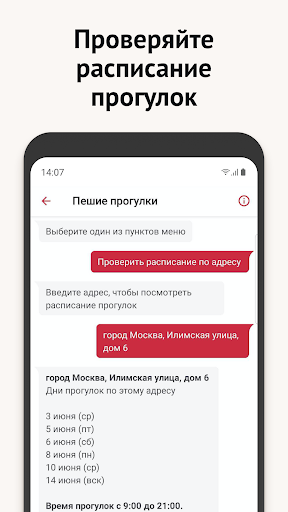
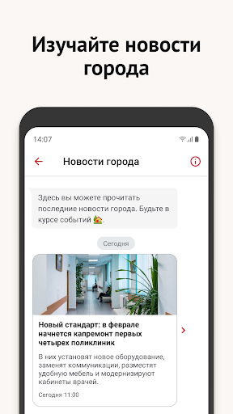
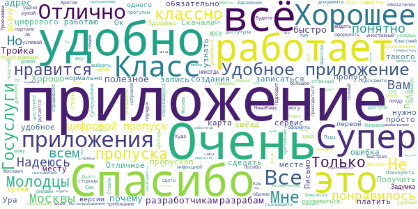
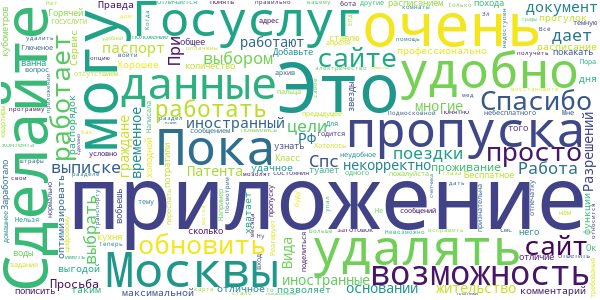
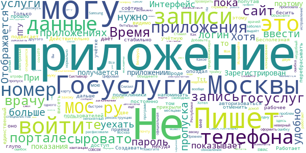
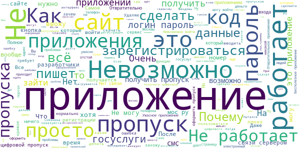
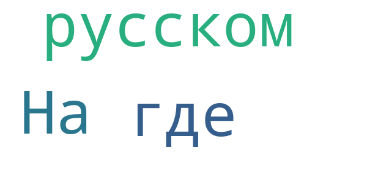
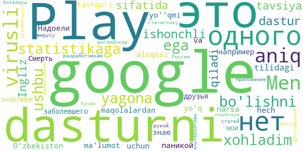

# COVID-related Android apps in Russia

Author: `Ivano Malavolta` (ivanomalavolta@gmail.com)

Created at: `2020/6/14`

Report generated by the [covid-apps-observer](http://github.com/covid-apps-observer) project, version 0.1

# Table of contents 

- [Background](#background)
    * [Data sources and analyses](#data-sources-and-analyses)
        * [App metadata](#app-metadata)
        * [Requested permissions](#requested-permissions)
        * [Mentioned servers](#mentioned_servers)
        * [Security analysis](#security_analysis)
        * [User ratings and reviews](#user-ratings-and-reviews)
    * [Disclaimer](#disclaimer)
- [Госуслуги Москвы](#госуслуги-москвы)
- [Моя Москва — официальное приложение портала mos.ru](#моя-москва-—-официальное-приложение-портала-mos.ru)
- [WHO Info](#who-info)
- [Социальный мониторинг](#социальный-мониторинг)
- [OpenWHO: Knowledge for Health Emergencies](#openwho-knowledge-for-health-emergencies)
- [Активный гражданин](#активный-гражданин)

- [Credits](#credits)

# How to read this report

This report has been generated by the [covid-apps-observer](http://github.com/covid-apps-observer) project. The project automatically analyzes the apps by extracting information which is already publicly available either on the web or in the apps binary files. 

Our analysis covers the following apps:
| | |
|-------------------------|-------------------------| 
|  | Госуслуги Москвы
|  | Моя Москва — официальное приложение портала mos.ru
|  | WHO Info
|  | Социальный мониторинг
|  | OpenWHO: Knowledge for Health Emergencies
|  | Активный гражданин

The details of our analysis are presented in the remainder of this report.

For independent verification, the raw data and the source code of the project is publicly available in its GitHub repository [http://github.com/covid-apps-observer](http://github.com/covid-apps-observer) and its source code has been thoroughly commented in order to provide all the details about how the information provided in this report has been extracted. 

Any feedback, questions, and improvements about the project are very welcome, feel free to create an issue or pull request directly in its GitHub repository: [http://github.com/covid-apps-observer](http://github.com/covid-apps-observer).

## Data sources and analyses

The analysis of each app is structured around five main dimensions: 
* App metadata  
* Requested permissions
* Mentioned servers
* Androwarn analysis
* User ratings and reviews

In the following we describe the data sources and analysis performed for each dimension.

### App metadata

App metadata includes an overview of the main information about the app (for example, its name, releases, privacy policy, etc.), contact information of the development team, and the various Android versions supported by the app. This information is extracted from two main data sources:
* _Google Play store_: we automatically mined the web page of the Google Play store showing the basic information about the app and we parsed it in order to extract information about the app and development team 
* _Android Manifest file_: in our analysis we decompiled the binary file of the app (it is similar to a Zip archive but it contains the code of the app instead of normal files) and we extracted information about the supported Android versions, as it has been listed by its development team.

The extracted app metadata feeds the _App overview_, _Development team_, and _Android support_ sections of this report.
We make use of the [google-play-scraper](https://github.com/JoMingyu/google-play-scraper) tool for extracting the raw data related to this dimension of the project.

### Requested permissions

The Android operating system has a permission model which allows users to grant access to potentially privacy-related information. Every Android app has to explictly declare the permissions it needs to properly function in the Android Manifest file.  

In this report we also show the protection level of each permission, which is a key information for understanding how the requested permissions related to the user's privacy. We carefully analyzed the [official Android documentation (v. 29)](https://developer.android.com/reference/android/Manifest.permission), and it resulted that a permission requested by an Android app can belong to the following protection levels:
* **Dangerous**: higher-risk permissions that would give a requesting app access to private user data or control over the device that can negatively impact the user. Because this type of permission introduces potential risk, the system usually does not automatically grant it to the requesting app. For example, any dangerous permissions requested by an app may be displayed to the user and require confirmation before proceeding.
* **Normal**: this is the default and most common level in Android; normal permissions are lower-risk and give access to isolated app-level features, with minimal risk to other apps, the system, or the user. 
* **Signature**: permissions granted only if the requesting app is signed with the same certificate as the app that declared the permission
* **Appop**: old permission level, a reminiscence of the App Ops tool that Google introduced in Android 4.3.
* **Development**: optional permissions which can be granted to development-oriented apps.
* **Privileged**: permissions who give higher power to mobile apps w.r.t. other apps, such as binding to incoming calls, interacting via bluetooth with other devices without user interaction, etc.
* **Preinstalled**: reserved only for preinstalled apps
* **Installer**: allow the holder to start the permission usage screen for an app
* **RetailDemo**: permissions related to devices used in demonstrations in shops.
* **Pre23**: permissions automatically granted to apps targeting devices running pre-6.0 Android.
* **Upcoming**: permissions which will be released in the next version of the Android platform. 
* **Deprecated**: permissions belonging to old releases of the Android platform, they should not be used by developers since they will not be supported in the near future.
* **Not for use by third-party applications**: permissions which can be requested only by apps developed by Google.
* **Undefined**: this protection level is not documented by Google.

The permissions dimension of this project is based on the [Androguard](https://github.com/androguard/androguard) static analysis tool.

### Mentioned servers

We decompiled each app in order to look for all possible mentions of remote URLs. The mentioned URLs can refer to remote servers the the app is using for either sending or receiving information, web addresses for directing the user to an information website, and so on. 

:warning: It is important to note that this analysis is not meant to be complete and it is very prone to obfuscation. The servers reported here are simply _mentioned_ somewhere in the code of the app and are meant to just give an indication about the "hooks" of the app towards external resources. For example, for an Android app it is normal to contact Google services in order to send/receive push notifications, or to contact the servers of analytics services for having real-time diagnostics about crashes of the app or bugs.

This part of the analysis is based on the [Androguard](https://github.com/androguard/androguard) static analysis tool for identfying the raw URLs mentioned in the app; then, the information about each mentioned server is collected by performing a _whois_ lookup on the first-level domain present in the URL.

### Security analysis

This dimension is based on the [Androwarn](https://github.com/maaaaz/androwarn) structural and data flow analysis of Android bytecode. Androwarn is developed by the University of Lyon/INSA (France) and it has been used in several academic studies. According to its documentation, Androwarn targets the following categories of potential security issues:
* **Telephony identifiers exfiltration**: IMEI, IMSI, MCC, MNC, LAC, CID, operator's name, etc.
* **Device settings exfiltration**: software version, usage statistics, system settings, logs, etc.
* **Geolocation information leakage**: GPS/WiFi geolocation, etc.
* **Connection interfaces information exfiltration**: WiFi credentials, Bluetooth MAC adress, etc.
* **Telephony services abuse**: premium SMS sending, phone call composition, etc.
* **Audio/video flow interception**: call recording, video capture, etc.
* **Remote connection establishment**: socket open call, Bluetooth pairing, APN settings edit, etc.
* **PIM data leakage**: contacts, calendar, SMS, mails, clipboard, etc.
* **External memory operations**: file access on SD card, etc.
* **PIM data modification**: add/delete contacts, calendar events, etc.
* **Arbitrary code execution**: native code using JNI, UNIX command, privilege escalation, etc.
* **Denial of Service**: event notification deactivation, file deletion, process killing, virtual keyboard disable, terminal shutdown/reboot, etc.

Note: We do not consider this data point in the current version of our analyzers since it is too verbose for our purposes.

:warning: It is important to note that Androwarn is a static analysis tool, and as such it performs a variety of heuristics and approximations in its analyses. Said that, the results shown in this report are meant to provide an indication of _potential_ security issues and should be by no means treated as complete and correct.   

### User ratings and reviews

For this dimension we turn again to the web interface of the Google Play store. Firstly, we automatically mine summary statistics about user ratings from the web page of the app under analysis; then, we automatically download the newest 1000 reviews of the app under analysis. For each level of rating (5 stars, 4 stars, , etc., 1 star) we show:
- a word cloud presenting the main terms used by end users in their reviews in the Google Play store
- the last 10 reviews provided by app users in the Google Play store. 

This purposefully simple analysis is meant to help both future users and the development team of the app in understanding what are the main positive and negative points of the app under analysis.

We make use of the [google-play-scraper](https://github.com/JoMingyu/google-play-scraper) tool for extracting the raw data related to this dimension of the project.

## Disclaimer 

This report has been produced independently of any parties and its only objective is to help anybody in better understanding how COVID-related apps work in practice (and compare to each other). The results of this report are limited to the specific version of the software used for running the analyses and on the various heuristics implemented in there. In other words, the results of the analyzers may differ depending on the time and modalities in which they are executed. We do not guarantee that the results of the analyses and the corresponding contents of this report are fully complete or correct. The analysis software is licensed under the [MIT License](https://github.com/iivanoo/covid-apps-observer/blob/master/LICENSE).

# Госуслуги Москвы
App version ``3.11.2.2``

Analyzed with [covid-apps-observer](http://github.com/covid-apps-observer) project, version ``0.1``

## App overview
| | |
|-------------------------|-------------------------| 
| **Name**&nbsp;&nbsp;&nbsp;&nbsp;&nbsp;&nbsp;&nbsp;&nbsp;&nbsp;&nbsp;&nbsp;&nbsp;&nbsp;&nbsp;&nbsp;&nbsp;&nbsp;&nbsp;&nbsp;&nbsp;&nbsp;&nbsp;&nbsp;&nbsp;&nbsp;&nbsp;&nbsp;&nbsp;&nbsp;&nbsp;&nbsp;&nbsp;&nbsp;&nbsp;&nbsp;&nbsp;&nbsp;&nbsp;&nbsp;&nbsp;  | Госуслуги Москвы |
| **Unique identifier** | ru.altarix.mos.pgu |
| **Link to Google Play** | [https://play.google.com/store/apps/details?id=ru.altarix.mos.pgu](https://play.google.com/store/apps/details?id=ru.altarix.mos.pgu) |
| **Summary**  | Все электронные услуги города: начисления ЖКХ, штрафы ГИБДД, эвакуация ТС и др. |
| **Privacy policy** | [http://dit.mos.ru/apps/privacypolicy](http://dit.mos.ru/apps/privacypolicy) |
| **Latest version** | 3.11.2.2 |
| **Last update** | 2020-05-21 18:36:56 |
| **Recent changes** | - Исправлена редкая проблема поиска адреса квартиры в профиле |
| **Installs**  | 1 000 000+ |
| **Category** | Социальные |
| **First release** | 27 сент. 2012 г. |
| **Size**  | 28M |
| **Supported Android version**  | 5.0 и выше |

### Description
> Мобильное приложение «Госуслуги Москвы» - сервис, объединяющий востребованные услуги Правительства Москвы, для комфортной жизни в большом городе.
 Образование:
 - Сервис «Мой ребенок в школе» дает возможность удаленно отслеживать проход и питание учащегося, школьное меню и баланс лицевого счета, который в любой момент можно пополнить с банковской карты/мобильного счета; 
 - Сервис «Электронный дневник» объединяет в себе самую важную для родителей информацию об учебе: расписание уроков, домашние задание, оценки учащегося и т.д.; 
 - Сервис «Результаты ГИА» - мобильная площадка с результатами прохождения Государственной итоговой аттестации.
 Жилье, ЖКУ:
 - Сервис «Начисления за жилищно-коммунальные услуги» предоставляет развернутую информацию о долговых/текущих начислениях за ЖКУ с возможностью заказать электронный Единый платежный документ; 
 - Сервис «Внесение показаний» - возможность передачи показаний счетчиков водоснабжения/электроэнергии, а также получения информации о задолженности без очередей и отрыва от важных дел; 
 - Сервис «Единый диспетчерский центр» – компактная площадка для решения проблем и вопросов, относящихся к вашему дому/двору;
 - Сервис «Информирование о начале расчетов по новой услуге»;
 - Сервис «Информирование о регистрации на жилплощади»;
 - Сервис «Информирование об отключении горячего водоснабжения».
 Транспорт:
 - Сервис «Штрафы» дает возможность получать актуальную информацию по вашим штрафам и оплачивать с мобильного; 
 - Сервис «Эвакуация транспортного средства» информирует об эвакуации ТС, а также предоставляет точный адрес местонахождения ТС на спецстоянке.
 Здоровье и документы:
 - Сервис «Запись к врачу» предоставляет возможность удаленно записаться на прием к любому врачу, перенести и отменить запись, посмотреть перечень направлений и выписанные вам рецепты; 
 - Сервис «Запись к ветеринару» предоставляет возможность записать своего питомца на прием в ветеринарную клинику (перенести, отменить запись) или вызвать ветеринара на дом;
 - Сервис «Готовность загранпаспорта» - индивидуальное информирование о готовности заграничного паспорта;
 - Сервис «Федеральная служба судебных приставов» предоставляет информацию о наличии исполнительных делопроизводств ФССП.
 Информация:
 - Сервис «Новости» объединяет в себе самые актуальные и интересные новости города в удобном мобильном формате.
 По желанию вы можете настроить способ получения уведомлений: SMS, E-mail или Push-уведомления.
 ___________________________________
 Обратите внимание на другие официальные приложения правительства Москвы.
 - Активный Гражданин - проект для тех, кому важно, что происходит в Москве
 - Наш город – помогите нам сделать город лучше
 - Парковки Москвы – приложение для поиска и оплаты парковки в Москве
 - Узнай Москву - архитектурная история столицы).

### User interface
The developers of the app provide the following screenshots in the Google play store.
| | | |
|:-------------------------:|:-------------------------:|:-------------------------:|
 |   |   |   | 
 |   |  

## Development team
In the following we report the main information provided by the development team in the Google play store.

| | |
|-------------------------|-------------------------|
| **Developer**  | Информационный город ГКУ |
| **Website**  | [https://www.mos.ru/mosapps/](https://www.mos.ru/mosapps/) |
| **Email** | emp@mos.ru |
| **Physical address**  | - |
| **Other developed apps**  | [https://play.google.com/store/apps/developer?id=%D0%98%D0%BD%D1%84%D0%BE%D1%80%D0%BC%D0%B0%D1%86%D0%B8%D0%BE%D0%BD%D0%BD%D1%8B%D0%B9+%D0%B3%D0%BE%D1%80%D0%BE%D0%B4+%D0%93%D0%9A%D0%A3](https://play.google.com/store/apps/developer?id=%D0%98%D0%BD%D1%84%D0%BE%D1%80%D0%BC%D0%B0%D1%86%D0%B8%D0%BE%D0%BD%D0%BD%D1%8B%D0%B9+%D0%B3%D0%BE%D1%80%D0%BE%D0%B4+%D0%93%D0%9A%D0%A3) |

## Android support

| | |
|-------------------------|-------------------------|
| **Declared target Android version**  | Pie, version 9 (API level 28) |
| **Effective target Android version**  | Pie, version 9 (API level 28) |
| **Minimum supported Android version**  | Lollipop, version 5.0 (API level 21) |
| **Maximum target Android version**  | - |

The larger the difference between the minimum and maximum supported Android versions, the better. A larger difference means a wider audience. For example, old phones have a very low Android version, so a high minimum supported Android version means that the app cannot be used by users with old phones, thus leading to accessibility problems. 

## Requested permissions

In the following we report the complete list of the permissions requested by the app. 

| **Permission** | **Protection level** | **Description** | 
|-------------------------|-------------------------|-------------------------|
 **android.permission ACCESS_COARSE_LOCATION** | :warning:**Dangerous** | Allows an app to access approximate location. 
 **android.permission ACCESS_FINE_LOCATION** | :warning:**Dangerous** | Allows an app to access precise location. 
 **android.permission ACCESS_NETWORK_STATE** | Normal | Allows applications to access information about networks. 
 **android.permission ACCESS_WIFI_STATE** | Normal | Allows applications to access information about Wi-Fi networks. 
 **android.permission CALL_PHONE** | :warning:**Dangerous** | Allows an application to initiate a phone call without going through the Dialer user interface for the user to confirm the call. 
 **android.permission CAMERA** | :warning:**Dangerous** | Required to be able to access the camera device. 
 **android.permission INTERNET** | Normal | Allows applications to open network sockets. 
 **android.permission READ_CALENDAR** | :warning:**Dangerous** | Allows an application to read the user's calendar data. 
 **android.permission READ_CONTACTS** | :warning:**Dangerous** | Allows an application to read the user's contacts data. 
 **android.permission READ_EXTERNAL_STORAGE** | :warning:**Dangerous** | Allows an application to read from external storage. 
 **android.permission USE_BIOMETRIC** | Normal | Allows an app to use device supported biometric modalities. 
 **android.permission USE_FINGERPRINT** | Normal | This constant was deprecated in API level 28. Applications should request USE_BIOMETRIC instead 
 **android.permission VIBRATE** | Normal | Allows access to the vibrator. 
 **android.permission WAKE_LOCK** | Normal | Allows using PowerManager WakeLocks to keep processor from sleeping or screen from dimming. 
 **android.permission WRITE_CALENDAR** | :warning:**Dangerous** | Allows an application to write the user's calendar data. 
 **android.permission WRITE_EXTERNAL_STORAGE** | :warning:**Dangerous** | Allows an application to write to external storage. 
 **com.google.android.c2dm.permission RECEIVE** | - | - 
 **com.google.android.finsky.permission BIND_GET_INSTALL_REFERRER_SERVICE** | - | - 

## Mentioned servers

| **Server** | **Registrant** | **Registrant country** | **Creation date** | 
|-------------------------|-------------------------|-------------------------|-------------------------|
 | vk.com | Privacy protection service - whoisproxy.ru | :ru: RU | 1997-06-24 04:00:00 |
 | cloudmade.com | Cloud Made Ltd | :uk: UK | 2007-07-17 17:02:27 |
 | facebook.com | Facebook, Inc. | :us: US | 1997-03-29 05:00:00 |
 | googleapis.com | Google LLC | :us: US | 2005-01-25 17:52:26 |
 | google.com | Google LLC | :us: US | 1997-09-15 04:00:00 |
 | 2gis.ru | - | - | 2001-02-18 21:00:00 |
 | crashlytics.com | Google LLC | :us: US | 2011-01-21 15:30:40 |
 | googlesyndication.com | Google LLC | :us: US | 2003-01-21 06:17:24 |
 | openstreetmap.org | OpenStreetMap Foundation | GB | 2004-08-09 18:47:25 |
 | openptmap.org | Registrant State/Province: Bayern | :de: DE | 2010-11-17 12:05:24 |
 | openstreetmap.nl | - | - | 2007-03-06 00:00:00 |
 | wmflabs.org | Wikimedia Foundation, Inc. | :us: US | 2011-09-29 14:58:28 |
 | openseamap.org | Registrant State/Province: | :de: DE | 2009-03-26 11:35:19 |
 | chartbundle.com | Whois Privacy Service | :us: US | 2010-01-09 23:30:15 |
 | opentopomap.org | Registrant State/Province: | :de: DE | 2011-09-03 18:35:13 |
 | app-measurement.com | Google LLC | :us: US | 2015-06-19 20:13:31 |
 | mos.ru | - | - | 1996-12-23 09:49:03 |
 | googleadservices.com | Google LLC | :us: US | 2003-06-19 16:34:53 |
 | w3.org | W3C | :us: US | 1994-07-06 04:00:00 |
 | mts.ru | - | - | 1997-11-19 12:02:34 |
 | 2gis.com | DoubleGIS LLC | :ru: RU | 2004-03-18 08:51:04 |

## Security analysis 

Below we report the main security warnings raised by our execution of the [Androwarn](https://github.com/maaaaz/androwarn) security analysis tool.

**Telephony identifiers leakage**
> - This application reads the numeric name (MCC+MNC) of current registered operator 
> - This application reads the operator name 

**Location lookup**
> - This application reads location information from all available providers (WiFi, GPS etc.) 

**Connection interfaces exfiltration**
> - This application reads details about the currently active data network 

**Telephony services abuse**
> - This application makes phone calls 

**Suspicious connection establishment**
> - This application opens a Socket and connects it to the remote address ' returned no addresses for  ; port is out of range' on the 'N/A' port  
> - This application opens a Socket and connects it to the remote address '' on the 'N/A' port  
> - This application opens a Socket and connects it to the remote address 'Ljava/net/Proxy;->type()Ljava/net/Proxy$Type;' on the 'N/A' port  
> - This application opens a Socket and connects it to the remote address 'timeout' on the 'N/A' port  

**Code execution**
> - This application loads a native library 

## User ratings and reviews

Below we provide information about how end users are reacting to the app in terms of ratings and reviews in the Google Play store.

### Ratings

The Госуслуги Москвы app has been installed by more than **1000000** times. At this time, **51744** rated the app and its average score is **4.181483**. Below we show the distribution of the ratings across the usual star-based rating of Google Play

:star::star::star::star::star:: 36558

:star::star::star::star:: 4559

:star::star::star:: 1757

:star::star:: 1195

:star:: 7673

### Reviews 

#### 5-star reviews

> Хорошо.  :date: __2020-06-14 20:45:26__

> Отличное приложение, даже пенсионерка смогла разобраться. Спасибо!  :date: __2020-06-14 16:32:23__

> Удобно и коммуникабельно.  :date: __2020-06-14 16:20:28__

> Приложение, как и Москва, должно совершенствоваться в постоянном режиме...  :date: __2020-06-14 12:41:36__

> 👍👍👍👍  :date: __2020-06-14 00:11:47__

> Супер  :date: __2020-06-13 23:32:39__

> Удобное приложение.  :date: __2020-06-13 10:59:39__

> Очень удобео, быстро и понятно. Спасибо.  :date: __2020-06-13 10:32:06__

> 👍  :date: __2020-06-13 08:06:48__

> Все работает отлично Никаких проблем.  :date: __2020-06-12 21:29:05__

#### 4-star reviews

> Многовато попыток выведать ту информацию, которую я не считаю нужным предоставлять и вводить.  :date: __2020-06-12 14:21:07__

> Пишет что установлен старый браузер Chrome при переходе на дистанционное голосование.  :date: __2020-06-10 16:06:27__

> Есть над чем работать  :date: __2020-06-10 06:05:12__

> хорошо  :date: __2020-06-08 18:49:04__

> Все ясно и четко. Спасибо за такое понятное и доступное приложение.  :date: __2020-06-08 18:16:26__

> Подскажите пожалуйста, а зачем работников бюджетных организаций сейчас заставляют регистрироваться в данном приложении и скидывать коды регистрации на голосование конституции руководству?  :date: __2020-06-08 15:44:14__

> Вау  :date: __2020-06-06 16:14:38__

> Не плохо, но многие функции и заявки можно сделать только с сайта  :date: __2020-06-06 11:19:01__

> В целом нормально работает. Не хватает возможности удаления сразу всех прошедших оповещений. Приходится в каждое заходить и удалять по одному.  :date: __2020-06-06 10:42:40__

> Общая оценка 5, но хочу порекомендовать. При оформлении цифрового пропуска, когда выбираешь карту москвича, то сделайте всплывающее окно. Кто может её использовать. А то выбрать её даёт, а проехать по ней нельзя. Моя мама 70лет, оформила пропуск и не смогла им воспользоваться. шла пешком до метро и после оказалось, что и там не может карту использовать. Оформила тройку и прождала 5ч для её активации.  :date: __2020-06-05 13:04:43__

#### 3-star reviews

> Пропали записи к стоматологу. Хотя показывает что прикреплен  :date: __2020-06-14 15:31:17__

> Не заходит в электронную медицинскую карту. При нажатии "Получить услугу" на секунду появляется зеленая шапка мед. карты и сразу выбрасывает обратно в приложение на страницу получения услуги.  :date: __2020-06-13 15:40:21__

> Оплаченные штрафы висят как неоплаченеюные уже 3 месяца  :date: __2020-06-13 09:47:35__

> Невозможно оформить заявление на онлайн голосование...пишет...браузер устарел, ха, у меня стоят самые последние обновления браузеров!!! Через браузеры тоже пробовала зайти и в мобильном режиме и версии для ПК и кэш чистила и тд. пишет тоже самое. Исправьте пожалуйста. В остальном приложение мне нравится.  :date: __2020-06-12 23:26:24__

> Не всегда работает  :date: __2020-06-12 18:50:43__

> Не всегда нормально работает, очень сложно получить доступ к электронной медицинской карте, получилрсь только на 3 день  :date: __2020-06-12 15:07:26__

> Почему нельзя оплатить соцкартой за епд, выдаёт ошибку после оплаты?  :date: __2020-06-12 14:14:51__

> Сложнос  :date: __2020-06-11 11:36:56__

> Сайт работает лучше чем приложение  :date: __2020-06-10 20:52:52__

> Добрый день уважаемые разработчики, прошу Вас добавить возможность оплаты с помощью Google Pay.  :date: __2020-06-10 09:29:16__

#### 2-star reviews

> Хорошее преложение. Нужное. Но мудреное, жуть! Сам черт ногу сломит, пока надет нужное. Как пожилым людям им пользоваться, когда молодые не могут понять, где что и как искать? Доработать и упростить необходимо.  :date: __2020-06-11 09:40:33__

> Не обновилась оплата штрафа  :date: __2020-06-10 11:23:42__

> 😛  :date: __2020-06-10 07:24:20__

> Сами для начала решите квесты своего приложения! Зачем их предлагать клиентам? Смотрю график отключения горячей воды - не полный адрес. Указываю адрес - номер счетчика электроэнергии не этой квартиры ... ФИНИШ!!! Толи я не туда много лет платил, толи мосэнерго не от того деньги получало ... Когда прекратятся эксперименты на живых людях? Жаль прицепить скрин нельзя. За косяки жрать надо, и наказывать рублем ... ((((  :date: __2020-06-06 21:18:32__

> А где тут пропуск оформить?? Вижу только проверку пропусков...  :date: __2020-06-06 16:12:24__

> Товарищи разработчики, второй раз ставлю приложение, чтобы проверить, появилась ли авторизация через аккаунт госуслуг, а ее все нет.  :date: __2020-06-06 09:08:47__

> Честно говоря, очень неудобная навигация. Поэтому приложение бесполезное. Пока найдёшь то, что нужно, с ума сойдёшь. Приходится с компьютера заходить и делать то, что нужно. Доработайте его, пожалуйста. Мне, например, не понятно, где находятся мои заявления, запросы и т.д.  :date: __2020-06-05 17:27:03__

> Нужные услуги запрятаны в недрах переадресаций и выпадающих меню. Многое просто не работает в приложении — перенаправляет на сайт. Часто падает сервер.  :date: __2020-06-03 14:47:55__

> Надоели обновления,только все портят. Теперь вообще невозможно установить приложение.  :date: __2020-06-02 20:44:45__

> Можно посмотреть сколь должен заплатить за квартиру или электричество. Что серьёзней отправляет на сайты гос органов. Тех поддержка на запросы не реагирует.  :date: __2020-05-31 00:22:13__

#### 1-star reviews

> Не работает ввод адреса при вводе заявки на вызов электрика. Поле адрес ввести невозможно, тыкаю ничего не происходит.  :date: __2020-06-14 20:32:21__

> Россия славится своими программистами. Но это достижение обошло стороной эту программу. Ее создатели позор IT направления. Программа не работает.  :date: __2020-06-14 14:24:54__

> Бесполезное приложение. Хотел записаться на прием в МФЦ, и думал, что может в мобильной версии это удастся. Но нет, моСРУ так не считает. Сайт вечно зависает, а от программы толку ноль.  :date: __2020-06-14 12:25:46__

> полтора часа ушло на подачу заявки. плохо  :date: __2020-06-13 19:37:16__

> ЗАДРАЛИ каждый раз при обновлении надо опять вводить логин и пароль!  :date: __2020-06-13 14:39:42__

> Ужасное  :date: __2020-06-13 13:09:07__

> В приложении информация вообще не обновляется! Висят штрафы которые давно оплачены, нет начислений за ЖКУ.... Идиотское приложение  :date: __2020-06-13 06:44:22__

> Глюк! Раздвоение личного кабинета на тот в котором остался СНИЛС и тот в котором телефон и почта. Во втором невозможно ввести СНИЛС!!! В первый невозможно восстановить пароль без почты или телефона.  :date: __2020-06-11 17:22:08__

> Не нашел услуги записи в МФЦ, удалил  :date: __2020-06-11 13:24:02__

> Сложно поверить, что это приложение для людей делали. Разработчик делитант.  :date: __2020-06-10 21:45:48__

# Моя Москва — официальное приложение портала mos.ru
App version ``1.5.1``

Analyzed with [covid-apps-observer](http://github.com/covid-apps-observer) project, version ``0.1``

## App overview
| | |
|-------------------------|-------------------------| 
| **Name**&nbsp;&nbsp;&nbsp;&nbsp;&nbsp;&nbsp;&nbsp;&nbsp;&nbsp;&nbsp;&nbsp;&nbsp;&nbsp;&nbsp;&nbsp;&nbsp;&nbsp;&nbsp;&nbsp;&nbsp;&nbsp;&nbsp;&nbsp;&nbsp;&nbsp;&nbsp;&nbsp;&nbsp;&nbsp;&nbsp;&nbsp;&nbsp;&nbsp;&nbsp;&nbsp;&nbsp;&nbsp;&nbsp;&nbsp;&nbsp;  | Моя Москва — официальное приложение портала mos.ru |
| **Unique identifier** | ru.mos.app |
| **Link to Google Play** | [https://play.google.com/store/apps/details?id=ru.mos.app](https://play.google.com/store/apps/details?id=ru.mos.app) |
| **Summary**  | Все самые нужные городские сервисы в официальном приложении mos.ru «Моя Москва». |
| **Privacy policy** | [https://www.mos.ru/legal/rules/](https://www.mos.ru/legal/rules/) |
| **Latest version** | 1.5.1 |
| **Last update** | 2020-05-27 11:46:43 |
| **Recent changes** | Исправление ошибок |
| **Installs**  | 500 000+ |
| **Category** | Социальные |
| **First release** | 27 дек. 2018 г. |
| **Size**  | 22M |
| **Supported Android version**  | 5.0 и выше |

### Description
> Пользуйтесь главными сервисами mos.ru, читайте новости города и задавайте вопросы операторам городского контакт-центра в одном приложении. Достаточно ввести ваши данные для входа на портал mos.ru и вам откроются все возможности чат-бота «Моя Москва».
 Здесь мы собрали самые частые госуслуги, которыми пользуются москвичи. И упростили процесс получения — все вопросы решает быстрый чат-бот. Откройте диалог в нужном разделе:
 – Мой дом: подать показания счётчиков воды, узнать, когда нужно провести поверку счётчиков, получить счета за ЖКУ. Сохраните в приложении 10-значный номер плательщика (указан на вашем ЕПД) и вам будет доступна оплата ЖКХ.
 – Дети в школе: пользоваться сервисами «Москвёнок» и «Электронный дневник» в одном приложении. Проверить, когда ребенок пришёл в школу, какие оценки получил и что купил на обед, можно за пару минут, спросив у бота.
 – Здоровье: записаться на приём в поликлинику, перенести или отменить запись к врачу теперь можно онлайн в удобном чате. Только скажите боту номер полиса ОМС.
 – Транспорт: проверить и оплатить штрафы ГИБДД онлайн по номеру, узнать историю своего автомобиля. По вашей просьбе бот пришлёт уведомление об эвакуации машины и новых штрафах. Понадобятся номер водительских прав, СТС, VIN и госномер автомобиля.
 – Контакт-центр: операторы круглосуточно готовы помочь вам в решении вопросов, связанных с получением государственных услуг и работой приложения «Моя Москва».
 – Новости города: узнать за пару минут всё самое важное, что происходит в Москве и в вашем районе.
 – Мой район: изучать ваш район - читать об уникальных фактах, искать ближайшие парки и школы, детские и спортивные площадки, узнавать о планах его развития.
 – Цифровой пропуск: новый раздел, где чат-бот поможет оформить электронный цифровой пропуск. QR код нужно получить для поездок по Москве и МО.
 «Моя Москва» — чат-бот, который помогает москвичам получить самые популярные госуслуги. Часть из них доступна без авторизации. Но советуем зарегистрироваться, чтобы бот знал ваши данные и мог напоминать о важных платежах или записи к врачу.
 Правительство Москвы также разработало отдельные приложения для тех, кто ищет или хочет оплатить парковку («Парковки Москвы»), участвовать в принятии важных городских решений («Активный Гражданин»), замечать недочеты в устройстве ЖКХ («Наш город»).

### User interface
The developers of the app provide the following screenshots in the Google play store.
| | | |
|:-------------------------:|:-------------------------:|:-------------------------:|
 |   |   |   | 
 |   |   |   | 
 |   |  

## Development team
In the following we report the main information provided by the development team in the Google play store.

| | |
|-------------------------|-------------------------|
| **Developer**  | Информационный город ГКУ |
| **Website**  | [https://www.mos.ru/mobile/](https://www.mos.ru/mobile/) |
| **Email** | mobile@mos.ru |
| **Physical address**  | - |
| **Other developed apps**  | [https://play.google.com/store/apps/developer?id=%D0%98%D0%BD%D1%84%D0%BE%D1%80%D0%BC%D0%B0%D1%86%D0%B8%D0%BE%D0%BD%D0%BD%D1%8B%D0%B9+%D0%B3%D0%BE%D1%80%D0%BE%D0%B4+%D0%93%D0%9A%D0%A3](https://play.google.com/store/apps/developer?id=%D0%98%D0%BD%D1%84%D0%BE%D1%80%D0%BC%D0%B0%D1%86%D0%B8%D0%BE%D0%BD%D0%BD%D1%8B%D0%B9+%D0%B3%D0%BE%D1%80%D0%BE%D0%B4+%D0%93%D0%9A%D0%A3) |

## Android support

| | |
|-------------------------|-------------------------|
| **Declared target Android version**  | Pie, version 9 (API level 28) |
| **Effective target Android version**  | Pie, version 9 (API level 28) |
| **Minimum supported Android version**  | Lollipop, version 5.0 (API level 21) |
| **Maximum target Android version**  | - |

The larger the difference between the minimum and maximum supported Android versions, the better. A larger difference means a wider audience. For example, old phones have a very low Android version, so a high minimum supported Android version means that the app cannot be used by users with old phones, thus leading to accessibility problems. 

## Requested permissions

In the following we report the complete list of the permissions requested by the app. 

| **Permission** | **Protection level** | **Description** | 
|-------------------------|-------------------------|-------------------------|
 **android.permission ACCESS_COARSE_LOCATION** | :warning:**Dangerous** | Allows an app to access approximate location. 
 **android.permission ACCESS_FINE_LOCATION** | :warning:**Dangerous** | Allows an app to access precise location. 
 **android.permission ACCESS_NETWORK_STATE** | Normal | Allows applications to access information about networks. 
 **android.permission ACCESS_WIFI_STATE** | Normal | Allows applications to access information about Wi-Fi networks. 
 **android.permission CAMERA** | :warning:**Dangerous** | Required to be able to access the camera device. 
 **android.permission CHANGE_WIFI_STATE** | Normal | Allows applications to change Wi-Fi connectivity state. 
 **android.permission INTERNET** | Normal | Allows applications to open network sockets. 
 **android.permission RECEIVE_BOOT_COMPLETED** | Normal | Allows an application to receive the Intent.ACTION_BOOT_COMPLETED that is broadcast after the system finishes booting. 
 **android.permission USE_BIOMETRIC** | Normal | Allows an app to use device supported biometric modalities. 
 **android.permission USE_FINGERPRINT** | Normal | This constant was deprecated in API level 28. Applications should request USE_BIOMETRIC instead 
 **android.permission VIBRATE** | Normal | Allows access to the vibrator. 
 **android.permission WAKE_LOCK** | Normal | Allows using PowerManager WakeLocks to keep processor from sleeping or screen from dimming. 
 **android.permission WRITE_CALENDAR** | :warning:**Dangerous** | Allows an application to write the user's calendar data. 
 **android.permission WRITE_EXTERNAL_STORAGE** | :warning:**Dangerous** | Allows an application to write to external storage. 
 **com.google.android.c2dm.permission RECEIVE** | - | - 
 **com.google.android.finsky.permission BIND_GET_INSTALL_REFERRER_SERVICE** | - | - 
 **ndroid.permission MANAGE_FINGERPRINT** | - | - 

## Mentioned servers

| **Server** | **Registrant** | **Registrant country** | **Creation date** | 
|-------------------------|-------------------------|-------------------------|-------------------------|
 | w3.org | W3C | :us: US | 1994-07-06 04:00:00 |
 | xml.org | OASIS Open | :us: US | 1997-02-03 05:00:00 |
 | xmlpull.org | WhoisGuard, Inc. | PA | 2001-11-26 20:33:08 |
 | googlesyndication.com | Google LLC | :us: US | 2003-01-21 06:17:24 |
 | google.com | Google LLC | :us: US | 1997-09-15 04:00:00 |
 | facebook.com | Facebook, Inc. | :us: US | 1997-03-29 05:00:00 |
 | app-measurement.com | Google LLC | :us: US | 2015-06-19 20:13:31 |
 | yandex.ru | - | - | 1997-09-23 09:45:07 |
 | yandexadexchange.net | - | :ru: RU | 2014-02-18 12:48:07 |
 | kladr-api.ru | - | - | 2013-02-06 00:31:38 |
 | crashlytics.com | Google LLC | :us: US | 2011-01-21 15:30:40 |
 | yandex.com | - | :switzerland: CH | 1998-09-24 04:00:00 |
 | yandex.net | - | :ru: RU | 2000-11-14 06:56:55 |
 | googleapis.com | Google LLC | :us: US | 2005-01-25 17:52:26 |
 | googleadservices.com | Google LLC | :us: US | 2003-06-19 16:34:53 |
 | frosteye.ru | - | - | 2012-12-08 18:43:12 |
 | intervale.ru | - | - | 2001-04-09 20:00:00 |
 | mts.ru | - | - | 1997-11-19 12:02:34 |
 | mos.ru | - | - | 1996-12-23 09:49:03 |
 | mgfoms.ru | - | - | 2002-12-22 21:00:00 |

## Security analysis 

Below we report the main security warnings raised by our execution of the [Androwarn](https://github.com/maaaaz/androwarn) security analysis tool.

**Telephony identifiers leakage**
> - This application reads the MCC+MNC of the provider of the SIM 
> - This application reads the Service Provider Name (SPN) 
> - This application reads the constant indicating the state of the device SIM card 
> - This application reads the current location of the device 
> - This application reads the neighboring cell information of the device 
> - This application reads the numeric name (MCC+MNC) of current registered operator 
> - This application reads the operator name 
> - This application reads the radio technology (network type) currently in use on the device for data transmission 
> - This application reads the unique device ID, i.e the IMEI for GSM and the MEID or ESN for CDMA phones 
> - This application reads the Cell ID value 
> - This application reads the Location Area Code value 

**Connection interfaces exfiltration**
> - This application reads details about the currently active data network 
> - This application tries to find out if the currently active data network is metered 

**Telephony services abuse**
> - This application makes phone calls 

**Suspicious connection establishment**
> - This application opens a Socket and connects it to the remote address 'Ljava/lang/StringBuilder;->toString()Ljava/lang/String;' on the 'N/A' port  
> - This application opens a Socket and connects it to the remote address 'Ljava/net/Proxy;->type()Ljava/net/Proxy$Type;' on the 'N/A' port  
> - This application opens a Socket and connects it to the remote address 'No route to  ' on the 'N/A' port  
> - This application opens a Socket and connects it to the remote address 'timeout' on the 'N/A' port  

**Code execution**
> - This application loads a native library 
> - This application loads a native library: 'Landroid/text/TextUtils;->isEmpty(Ljava/lang/CharSequence;)Z' 
> - This application loads a native library: 'YandexMetricaNativeModule' 
> - This application executes a UNIX command containing this argument: 'Ljava/lang/StringBuilder;->toString()Ljava/lang/String;' 
> - This application executes a UNIX command containing this argument: 'logcat -c' 

## User ratings and reviews

Below we provide information about how end users are reacting to the app in terms of ratings and reviews in the Google Play store.

### Ratings

The Моя Москва — официальное приложение портала mos.ru app has been installed by more than **500000** times. At this time, **1502** rated the app and its average score is **3.2808218**. Below we show the distribution of the ratings across the usual star-based rating of Google Play

:star::star::star::star::star:: 709

:star::star::star::star:: 133

:star::star::star:: 82

:star::star:: 20

:star:: 555

### Reviews 

#### 5-star reviews

> Всё отлично !!!  :date: __2020-06-14 10:38:02__

> Удобно  :date: __2020-06-13 13:17:12__

> отличное приложение. интуитивный интерфейс  :date: __2020-06-13 13:15:01__

> Очень нравится приложение. Удобное во всех смыслах.  :date: __2020-06-12 06:42:17__

> Удобно, быстро, легко!  :date: __2020-06-12 04:21:19__

> Хорошее приложение  :date: __2020-06-11 19:34:08__

> Отдично  :date: __2020-06-11 17:20:40__

> Пять баллов  :date: __2020-06-11 15:25:07__

> Быстпр, убобно.  :date: __2020-06-10 06:55:57__

> Очень удобно. Классное приложение  :date: __2020-06-09 22:13:10__

#### 4-star reviews

> Нормальная прога. Но сделайте перенос на карту пам. ! И с проверкой счетов всё путанно. Сделайте ясно / должен -- оплачено , а то каккие то уведомления , перескоки со страницы на страницу... Надо , как - нажал , энергия -- задолженность ... . Нажал жку - оплачено . Ясно и понятно .  :date: __2020-06-11 09:52:45__

> Подскажите как прикрепить 2-3,5 и 14 страницы паспорта, если прикрепить можно только одно фото?  :date: __2020-06-09 16:16:31__

> Лучше чем было,но работать и работать! Удачи, только не перемудрите.  :date: __2020-06-05 06:37:31__

> Код для отправки назаяки для получения цифровой код 205-6АОК-5ТНХ-1ХМS.  :date: __2020-06-02 13:57:01__

> Я не всегда могу выполнить какие-то приложения.При обращении в техподдержку ответ один-свяжитесь с разработчиком.Но и с вами связаться невозможно. Сделайте связь с вами доступной.Надеюсь на ответ.  :date: __2020-06-01 18:47:18__

> Спс  :date: __2020-05-31 22:41:14__

> Хорошее приложение.  :date: __2020-05-30 10:24:36__

> Приложение отличное! Сервис "расписание прогулок" очень удачное, позволяет с максимальной выгодой оптимизировать распорядок дня. Правда, не хватает функции с таким же расписанием похода в туалет, ну там на пописить и покакать. Это было бы очень удобно! Пока ставлю 4 звезды.  :date: __2020-05-29 15:02:44__

> В чем отличие от «Госуслуг Москвы»?  :date: __2020-05-27 19:43:26__

> Заработало, но лучше без него.  :date: __2020-05-26 19:10:06__

#### 3-star reviews

> Работает не всегда стабильно, подвисает.  :date: __2020-06-11 21:33:08__

> Нет возможности убрать счёт за квартплату, который уже оплачен, но в этом приложении пришёл с опозданием на день.  :date: __2020-06-10 12:46:11__

> Ttt  :date: __2020-06-10 12:00:08__

> Бесполезная софтина  :date: __2020-06-09 15:08:17__

> Я не могу войти через учётную запись госуслуг. А это единственный доступ к учётке на портале. Вроде и приложение рабочее, но зачем оно мне, когда я авторизоваться не могу? 🤣  :date: __2020-06-05 16:20:42__

> Не даёт отменить запись к врачу, пишет: "Время приёма по записи уже прошло". И видимо по этому она и будет там висеть, что бы напоминать мне о том, как я опоздал попутав две поликлиники, потому что мою прикрыли на реконструкцию и расфасовали врачей по двум разным.  :date: __2020-06-04 11:46:27__

> Все те же услуги что и в других приложениях. Хотел записаться на антитела covid19 но нет свободных специалистов что здесь, что на "Госуслуги Москвы", что на " ЕМИАС"  :date: __2020-06-03 12:19:25__

> Как такое может быть? С одного телефона захожу без проблем,с другого "неверный логин или пароль" Хотя данные ввожу один в один  :date: __2020-06-03 11:41:22__

> Добавьте самостоятельно скрывать оплаченные штрафы, квитанции. Отображается месяцами.  :date: __2020-05-29 07:10:12__

> Снизил с 5 до 3 (пока!). Какое исправление ошибок? Вы их наделали ещё больше! После обновления 25.05.20 приложение не открывается, СОВСЕМ! Пишет, что произошла ошибка. Исправляйте.  :date: __2020-05-28 11:41:37__

#### 2-star reviews

> Не показывает все направления, выданные докторами. Приходится заходить на сайт ЕМИАС.  :date: __2020-06-11 23:00:32__

> Кидают людей на деньги через приложение это  :date: __2020-06-09 20:36:11__

> Приложение глючное,куча мелких недоработок,которые очень раздражают. А оформить цифровой пропуск - особенно по началу,целая проблема.  :date: __2020-06-07 07:24:04__

> Как так получается, ваше приложение генерирует код, я его ввожу и оно оказывается неккоректного формата. Магия просто а не приложение.  :date: __2020-06-04 07:07:23__

> Очередное приложение с непонятной целью. Есть приложение Госуслуги Москвы, оно приятнее и логичнее организовано, а это приложение вроде работает, но интерфейс и алгоритмы организованы отвратительно. Кому в голову пришло внедрить эту пошаговую общую ленту для услуг в одном окне - уберите от возможности принимать решения, впечатление, что его идеал интерфейса - msdos и никакой параллельности. Скопируйте Госуслуги Москвы и сделайте их 100% рабочими - вам легче, нам удобнее.  :date: __2020-05-21 14:30:40__

> Тупое приложение  :date: __2020-05-20 06:49:25__

> Зависает  :date: __2020-05-15 04:43:19__

> А вас не затруднит исправить ошибки в приложении так,чтобы оно не удаляло аутентификационные данные при каждом следующем обновлении и не требовало постоянно повторной аутентификации при переходе из раздела в раздел? Сделайте уже вход по PIN или по дактилоскопическому сканеру,2020-й год за окном. Наймите нормальных программистов,в нынешнем виде полурабочее глючное приложение.  :date: __2020-05-14 00:41:17__

> Полный отстой  :date: __2020-05-13 19:32:15__

> Я не гражданин России. А просят только паспорт РФ . И что мне делать? Мы выехали из дома на дачу все нормально была пропуск быстра сделала, а вот теперь с дачи я не могу выехать ,потому что у меня нет РФ. И электронный не открывается. Вот что делать?  :date: __2020-05-13 08:10:55__

#### 1-star reviews

> Ужаснейшее приложение, изначально. Куча всего, ничего не синхронизированно, не продумано. Приходит смс с адресом в инете, и что сним делать? Счета без qr кодов на почту!! В нутри приложения из лс, для получения услуги отправляет на мос.ру, то есть в это же приложение и требует авторизации....  :date: __2020-06-12 15:19:30__

> Tupie skoti! Войти в мос.ру через госуслуги, входишь в госуслуги - введите пароль Мос.ру!  :date: __2020-06-11 14:12:34__

> Невозможно проголосовать дистанционно. Саботаж  :date: __2020-06-11 12:49:33__

> Плохо работают  :date: __2020-06-10 15:07:24__

> Виснет, глючит, кривое...но другого нет(((  :date: __2020-06-10 14:12:22__

> Работает плохо. Ужасно виснет. До операторов контактного цетра "достучаться вообще целая проблема. Короче - не приложение, а еще одной проблемой больше!!!  :date: __2020-06-10 13:32:20__

> Не понимаю зачем делать неудачного клона госуслуг. Или это просто бизнес. Невозможно внести личные данные надо зайти через сайт. ТАК МОЖЕТ ТОЛЬКО САЙТОМ И ОГРАНИЧЕТСЯ  :date: __2020-06-10 08:07:51__

> Как тротуарная плитка, ноги сломаешь, не то голову  :date: __2020-06-10 07:14:18__

> Не получается скачать. Пишите ошибка  :date: __2020-06-09 11:17:56__

> Даже звезды бы не дал а -3 поставил  :date: __2020-06-09 08:54:03__

# WHO Info
App version ``2.1.2``

Analyzed with [covid-apps-observer](http://github.com/covid-apps-observer) project, version ``0.1``

## App overview
| | |
|-------------------------|-------------------------| 
| **Name**&nbsp;&nbsp;&nbsp;&nbsp;&nbsp;&nbsp;&nbsp;&nbsp;&nbsp;&nbsp;&nbsp;&nbsp;&nbsp;&nbsp;&nbsp;&nbsp;&nbsp;&nbsp;&nbsp;&nbsp;&nbsp;&nbsp;&nbsp;&nbsp;&nbsp;&nbsp;&nbsp;&nbsp;&nbsp;&nbsp;&nbsp;&nbsp;&nbsp;&nbsp;&nbsp;&nbsp;&nbsp;&nbsp;&nbsp;&nbsp;  | WHO Info |
| **Unique identifier** | org.who.infoapp |
| **Link to Google Play** | [https://play.google.com/store/apps/details?id=org.who.infoapp](https://play.google.com/store/apps/details?id=org.who.infoapp) |
| **Summary**  | Официальное приложение информации Всемирной организации здравоохранения. |
| **Privacy policy** | [https://www.who.int/about/who-we-are/privacy-policy](https://www.who.int/about/who-we-are/privacy-policy) |
| **Latest version** | 2.1.2 |
| **Last update** | 2020-06-05 09:56:16 |
| **Recent changes** | This release resolves some minor fixes. |
| **Installs**  | 100 000+ |
| **Category** | Новости и журналы |
| **First release** | 13 апр. 2020 г. |
| **Size**  | 8,0M |
| **Supported Android version**  | 4.2 и выше |

### Description
> Have the latest health information at your fingertips with the official World Health Organization Information App. This app displays the latest news, events, features and breaking updates on outbreaks. 
  
 WHO works worldwide to promote health, keep the world safe, and serve the vulnerable. 
 Our goal is to ensure that a billion more people have universal health coverage, to protect a billion more people from health emergencies, and provide a further billion people with better health and well-being.

### User interface
The developers of the app provide the following screenshots in the Google play store.
| | | |
|:-------------------------:|:-------------------------:|:-------------------------:|
 |   |   |   | 
 |   |   |   | 
 |   |   |   | 
 |   |   |   | 
 |   |   |   | 
 |   |   |   | 

## Development team
In the following we report the main information provided by the development team in the Google play store.

| | |
|-------------------------|-------------------------|
| **Developer**  | World Health Organization |
| **Website**  | [https://www.who.int/](https://www.who.int/) |
| **Email** | dcx@who.int |
| **Physical address**  | [Avenu Appia 20 1211 Geneva Switzerland](https://www.google.com/maps/search/Avenu%20Appia%2020%201211%20Geneva%20Switzerland) (Google Maps) |
| **Other developed apps**  | [https://play.google.com/store/apps/developer?id=World+Health+Organization](https://play.google.com/store/apps/developer?id=World+Health+Organization) |

## Android support

| | |
|-------------------------|-------------------------|
| **Declared target Android version**  | Android10, version 10 (API level 29) |
| **Effective target Android version**  | Android10, version 10 (API level 29) |
| **Minimum supported Android version**  | Jelly Bean, version 4.2.x (API level 17) |
| **Maximum target Android version**  | - |

The larger the difference between the minimum and maximum supported Android versions, the better. A larger difference means a wider audience. For example, old phones have a very low Android version, so a high minimum supported Android version means that the app cannot be used by users with old phones, thus leading to accessibility problems. 

## Requested permissions

In the following we report the complete list of the permissions requested by the app. 

| **Permission** | **Protection level** | **Description** | 
|-------------------------|-------------------------|-------------------------|
 **android.permission INTERNET** | Normal | Allows applications to open network sockets. 
 **android.permission READ_CALENDAR** | :warning:**Dangerous** | Allows an application to read the user's calendar data. 
 **android.permission READ_EXTERNAL_STORAGE** | :warning:**Dangerous** | Allows an application to read from external storage. 
 **android.permission WRITE_CALENDAR** | :warning:**Dangerous** | Allows an application to write the user's calendar data. 
 **android.permission WRITE_EXTERNAL_STORAGE** | :warning:**Dangerous** | Allows an application to write to external storage. 

## Mentioned servers

| **Server** | **Registrant** | **Registrant country** | **Creation date** | 
|-------------------------|-------------------------|-------------------------|-------------------------|
-

## Security analysis 

Below we report the main security warnings raised by our execution of the [Androwarn](https://github.com/maaaaz/androwarn) security analysis tool.

**Connection interfaces exfiltration**
> - This application reads details about the currently active data network 
> - This application tries to find out if the currently active data network is metered 

**Suspicious connection establishment**
> - This application opens a Socket and connects it to the remote address 'Lfi/iki/elonen/NanoHTTPD$ResponseException;' on the 'N/A' port  
> - This application opens a Socket and connects it to the remote address 'NanoHttpd Shutdown' on the 'N/A' port  

**Code execution**
> - This application loads a native library: 'NativeScript' 
> - This application executes a UNIX command containing this argument: '2' 

## User ratings and reviews

Below we provide information about how end users are reacting to the app in terms of ratings and reviews in the Google Play store.

### Ratings

The WHO Info app has been installed by more than **100000** times. At this time, **587** rated the app and its average score is **4.12**. Below we show the distribution of the ratings across the usual star-based rating of Google Play

:star::star::star::star::star:: 399

:star::star::star::star:: 64

:star::star::star:: 17

:star::star:: 5

:star:: 99

### Reviews 

#### 5-star reviews

> Классно!!!!!  :date: __2020-05-02 16:56:29__

#### 4-star reviews

No recent reviews available with 4 stars.

#### 3-star reviews

> А можно по русский написать  :date: __2020-05-23 06:45:03__

#### 2-star reviews

> На русском где?  :date: __2020-06-14 12:29:29__

#### 1-star reviews

> Men aniq virusli statistikaga ega bo'lishni xohladim, google Play ushbu dasturni yagona ishonchli dastur sifatida tavsiya qiladi. Ingliz tilidagi maqolalardan tashqari, hech narsa yo'q. O'zbekiston uchun ma'lumot va dasturni aloqasi yo''qmi?  :date: __2020-06-05 13:48:39__

> Надоели с это паникой,например я не знаю ни одного заболевшего и мои знакомые и друзья ни одного!!!  :date: __2020-06-02 23:31:22__

> Смерть разработчикам!!!  :date: __2020-05-19 22:17:08__

> Хотелось иметь под рукой понятную статистику по вирусу, google play рекомендует это приложение как единственно достоверное. Кроме статей на английском ничего нет. Т.е. для России альтернативы нет?  :date: __2020-05-07 16:18:22__

# Социальный мониторинг
App version ``1.6.0``

Analyzed with [covid-apps-observer](http://github.com/covid-apps-observer) project, version ``0.1``

## App overview
| | |
|-------------------------|-------------------------| 
| **Name**&nbsp;&nbsp;&nbsp;&nbsp;&nbsp;&nbsp;&nbsp;&nbsp;&nbsp;&nbsp;&nbsp;&nbsp;&nbsp;&nbsp;&nbsp;&nbsp;&nbsp;&nbsp;&nbsp;&nbsp;&nbsp;&nbsp;&nbsp;&nbsp;&nbsp;&nbsp;&nbsp;&nbsp;&nbsp;&nbsp;&nbsp;&nbsp;&nbsp;&nbsp;&nbsp;&nbsp;&nbsp;&nbsp;&nbsp;&nbsp;  | Социальный мониторинг |
| **Unique identifier** | ru.mos.socmon |
| **Link to Google Play** | [https://play.google.com/store/apps/details?id=ru.mos.socmon](https://play.google.com/store/apps/details?id=ru.mos.socmon) |
| **Summary**  | Приложение для контроля за соблюдением гражданами режима изоляции на дому |
| **Privacy policy** | [https://www.mos.ru/privacypolicy/socmon/](https://www.mos.ru/privacypolicy/socmon/) |
| **Latest version** | 1.6.0 |
| **Last update** | 2020-06-05 13:51:44 |
| **Recent changes** | Ответы на наиболее распространенные вопросы можно получить прямо в мобильном приложении. Чтобы посмотреть ответы на вопросы, необходимо нажать на иконку с вопросительным знаком в правом верхнем углу главного экрана приложения. |
| **Installs**  | 50 000+ |
| **Category** | Медицина |
| **First release** | 22 апр. 2020 г. |
| **Size**  | 46M |
| **Supported Android version**  | 6.0 и выше |

### Description
> Приложение «Социальный мониторинг» создано для пациентов с подтвержденным диагнозом COVID-19, выбравших лечение на дому, граждан, контактировавших с ними, и горожан с проявлениями острых респираторных заболеваний, проживающих в Москве и соблюдающих предписанный им режим изоляции. С его помощью пациент информирует город о добросовестном соблюдении карантина. 
 При регистрации пользователь подтверждает номер телефона, делает фотографию, геолокация (местонахождение) отправляется автоматически. Это нужно для того, чтобы проверить, находится ли пользователь в той же локации, которую указал в согласии, выбирая лечение на дому. 
 Чтобы у пользователя не было возможности оставить смартфон дома и выйти на улицу без него, приложение в случайное время присылает СМС-уведомления с запросом дополнительного подтверждения — для этого потребуется сделать селфи.
 Если пользователь покидает исходную геолокацию или не реагирует на уведомления, система предупреждает городские службы о возможном нарушении режима изоляции.
 Личные данные, которые пользователь передает сервису, определены в согласии на получение медицинской помощи на дому и соблюдение режима изоляции либо в постановлении главного санитарного врача города Москвы. Гражданин обязан подписать документ, если выбирает лечение на дому или если он контактировал с заболевшим и должен соблюдать режим изоляции. Он указывает ФИО, адрес, по которому обязуется находиться на протяжении всего периода лечения или изоляции, и номер мобильного телефона. Также гражданин дает согласие на осуществление фотосъемки и предъявление документа, удостоверяющего личность.
 Все данные, которые пользователь передает приложению, хранятся в защищенном виде на серверах Департамента информационных технологий. После окончания лечения или срока действия режима изоляции эти данные уничтожаются.

### User interface
The developers of the app provide the following screenshots in the Google play store.
| | | |
|:-------------------------:|:-------------------------:|:-------------------------:|
 |   |   |   | 
 |  

## Development team
In the following we report the main information provided by the development team in the Google play store.

| | |
|-------------------------|-------------------------|
| **Developer**  | Информационный город ГКУ |
| **Website**  | [https://www.mos.ru/city/projects/monitoring/](https://www.mos.ru/city/projects/monitoring/) |
| **Email** | socialmonitoring@mos.ru |
| **Physical address**  | - |
| **Other developed apps**  | [https://play.google.com/store/apps/developer?id=%D0%98%D0%BD%D1%84%D0%BE%D1%80%D0%BC%D0%B0%D1%86%D0%B8%D0%BE%D0%BD%D0%BD%D1%8B%D0%B9+%D0%B3%D0%BE%D1%80%D0%BE%D0%B4+%D0%93%D0%9A%D0%A3](https://play.google.com/store/apps/developer?id=%D0%98%D0%BD%D1%84%D0%BE%D1%80%D0%BC%D0%B0%D1%86%D0%B8%D0%BE%D0%BD%D0%BD%D1%8B%D0%B9+%D0%B3%D0%BE%D1%80%D0%BE%D0%B4+%D0%93%D0%9A%D0%A3) |

## Android support

| | |
|-------------------------|-------------------------|
| **Declared target Android version**  | Android10, version 10 (API level 29) |
| **Effective target Android version**  | Android10, version 10 (API level 29) |
| **Minimum supported Android version**  | Marshmallow, version 6.0 (API level 23) |
| **Maximum target Android version**  | - |

The larger the difference between the minimum and maximum supported Android versions, the better. A larger difference means a wider audience. For example, old phones have a very low Android version, so a high minimum supported Android version means that the app cannot be used by users with old phones, thus leading to accessibility problems. 

## Requested permissions

In the following we report the complete list of the permissions requested by the app. 

| **Permission** | **Protection level** | **Description** | 
|-------------------------|-------------------------|-------------------------|
 **android.permission ACCESS_BACKGROUND_LOCATION** | :warning:**Dangerous** | Allows an app to access location in the background. 
 **android.permission ACCESS_FINE_LOCATION** | :warning:**Dangerous** | Allows an app to access precise location. 
 **android.permission ACCESS_NETWORK_STATE** | Normal | Allows applications to access information about networks. 
 **android.permission ACCESS_WIFI_STATE** | Normal | Allows applications to access information about Wi-Fi networks. 
 **android.permission CAMERA** | :warning:**Dangerous** | Required to be able to access the camera device. 
 **android.permission CHANGE_WIFI_STATE** | Normal | Allows applications to change Wi-Fi connectivity state. 
 **android.permission FOREGROUND_SERVICE** | Normal | Allows a regular application to use Service.startForeground. 
 **android.permission INTERNET** | Normal | Allows applications to open network sockets. 
 **android.permission READ_EXTERNAL_STORAGE** | :warning:**Dangerous** | Allows an application to read from external storage. 
 **android.permission RECEIVE_BOOT_COMPLETED** | Normal | Allows an application to receive the Intent.ACTION_BOOT_COMPLETED that is broadcast after the system finishes booting. 
 **android.permission REQUEST_IGNORE_BATTERY_OPTIMIZATIONS** | Normal | Permission an application must hold in order to use Settings.ACTION_REQUEST_IGNORE_BATTERY_OPTIMIZATIONS. 
 **android.permission USE_FULL_SCREEN_INTENT** | Normal | Required for apps targeting Build.VERSION_CODES.Q that want to use notification full screen intents. 
 **android.permission WAKE_LOCK** | Normal | Allows using PowerManager WakeLocks to keep processor from sleeping or screen from dimming. 
 **android.permission WRITE_EXTERNAL_STORAGE** | :warning:**Dangerous** | Allows an application to write to external storage. 
 **com.google.android.c2dm.permission RECEIVE** | - | - 
 **com.google.android.finsky.permission BIND_GET_INSTALL_REFERRER_SERVICE** | - | - 

## Mentioned servers

| **Server** | **Registrant** | **Registrant country** | **Creation date** | 
|-------------------------|-------------------------|-------------------------|-------------------------|
 | googlesyndication.com | Google LLC | :us: US | 2003-01-21 06:17:24 |
 | google.com | Google LLC | :us: US | 1997-09-15 04:00:00 |
 | googleadservices.com | Google LLC | :us: US | 2003-06-19 16:34:53 |
 | app-measurement.com | Google LLC | :us: US | 2015-06-19 20:13:31 |
 | crashlytics.com | Google LLC | :us: US | 2011-01-21 15:30:40 |
 | mos.ru | - | - | 1996-12-23 09:49:03 |
 | googleapis.com | Google LLC | :us: US | 2005-01-25 17:52:26 |

## Security analysis 

Below we report the main security warnings raised by our execution of the [Androwarn](https://github.com/maaaaz/androwarn) security analysis tool.

**Connection interfaces exfiltration**
> - This application reads details about the currently active data network 
> - This application tries to find out if the currently active data network is metered 

**Suspicious connection establishment**
> - This application opens a Socket and connects it to the remote address '; port is out of range' on the 'N/A' port  
> - This application opens a Socket and connects it to the remote address 'Lj/b/a/a/a;->a(Ljava/lang/String;)Ljava/lang/StringBuilder;' on the 'N/A' port  
> - This application opens a Socket and connects it to the remote address 'Ljava/net/Proxy;->type()Ljava/net/Proxy$Type;' on the 'N/A' port  
> - This application opens a Socket and connects it to the remote address 'Method sendUrgentData() is not supported.' on the 'N/A' port  
> - This application opens a Socket and connects it to the remote address 'Method setHandshakeTimeout() is not supported.' on the 'N/A' port  
> - This application opens a Socket and connects it to the remote address 'Method setOOBInline() is not supported.' on the 'N/A' port  
> - This application opens a Socket and connects it to the remote address 'Method setSoWriteTimeout() is not supported.' on the 'N/A' port  
> - This application opens a Socket and connects it to the remote address 'Socket closed' on the 'N/A' port  
> - This application opens a Socket and connects it to the remote address 'Socket is closed' on the 'N/A' port  
> - This application opens a Socket and connects it to the remote address 'Socket is closed.' on the 'N/A' port  
> - This application opens a Socket and connects it to the remote address 'Socket is not connected.' on the 'N/A' port  
> - This application opens a Socket and connects it to the remote address 'socket is closed' on the 'N/A' port  

**Code execution**
> - This application loads a native library 
> - This application loads a native library: 'Ljava/lang/String;->valueOf(Ljava/lang/Object;)Ljava/lang/String;' 
> - This application loads a native library: 'conscrypt_gmscore_jni' 
> - This application loads a native library: 'conscrypt_jni' 
> - This application executes a UNIX command 
> - This application executes a UNIX command containing this argument: 'getprop' 
> - This application executes a UNIX command containing this argument: 'mount' 

## User ratings and reviews

Below we provide information about how end users are reacting to the app in terms of ratings and reviews in the Google Play store.

### Ratings

The Социальный мониторинг app has been installed by more than **50000** times. At this time, **5506** rated the app and its average score is **2.5064456**. Below we show the distribution of the ratings across the usual star-based rating of Google Play

:star::star::star::star::star:: 1906

:star::star::star::star:: 91

:star::star::star:: 91

:star::star:: 212

:star:: 3204

### Reviews 

#### 5-star reviews

> Работает корректно. Одно пожелание. Сделайте уже телефон службы поддержки бесплатным. Пока дозвонишься, все деньги потратишь.  :date: __2020-06-12 12:49:34__

> Установка, использование- всё удобно и хорошо работает  :date: __2020-06-12 08:30:02__

> Приложение неплохое. Но старая версия была по лучше. Было понятно сделал я фото или нет. Память иногда подводит.  :date: __2020-06-11 22:41:52__

> Здравствуйте. Скажите если я закрою больничный лист с отметкой здоров, то когда я могу удалить приложение не получив за это штраф? Сразу же после получения больничного на руки? И когда приложение могут удалить члены моей семьи не получив за это штраф?  :date: __2020-06-11 21:22:06__

> Хочется что бы все, кто создал это приложение, до конца жизни сидели по своим норам  :date: __2020-06-11 18:08:51__

> Не всегда читать отзывы полезно... Согласие у меня от 27.05, сразу установила приложение; висело извещение,что номер находится на подтверждении, волновалась, переустанавливала...3.06 пришло смс о необходимости сфотографироваться. Обычно было 3-4 раза в день с 11 до 20. Ни разу не было глюков, зависания. По поводу расхода батареи-да,чуть больше,но не критично. может , разработчики наладили "СМ" и это в начале оно работало плохо? Нареканий не заметила.смс перестали приходить 9.06.удалила 11.06.  :date: __2020-06-11 15:47:38__

> Приложение было вынужденно мною установлено по предписанию по карантину. Приходили sms от ЕМИАС с просьбой сделать фото (селфи; так настроено приложение изначально) 3-4 раза в день, одновременно с этим отправляется и геолокация. Период смс с 11.00 до 20.00. Домашний режим соблюдала, никаких штрафов не приходило. Конечно, контроль напрягает, но ничего сложного технически не требуется. Когда выписали с больничного, приложение удалила сразу после полуночи в новый календарный день.  :date: __2020-06-09 23:23:36__

> Все работает исправно. Уведомления были 3-4 раза в день. Ночью не беспокоили. В службу поддержки дозвониться можно. Один вопрос: Мне сегодня сняли карантин. Могу ли я удалить приложение и идти гулять, либо надо неделю ждать сообщения с разрешением на удаление программы? Техподержка толком ничего не ответила.  :date: __2020-06-08 14:18:02__

> Здравствуйте! Не успела в течение часа ответить на пуш. Ответила через 1 час 1 минуту. Придет ли мне штраф?(  :date: __2020-06-07 15:59:47__

> Я в полном восторге! Это прекрасное приложения для того чтобы делать свое и без того нищее население ещё беднее, чувствую заботу нашего любимого мэра, он тот ещё затейник посадить гражданина заболевшего ОРЗ и хлестать, унижать, его штрафами как последнею сучку. спасибо тебе Сережа я этой доброты и тепла никогда не забуду, остальным \*\*\*\** передавай привет, с нетерпением жду выборов, да и любого другого кипиша.  :date: __2020-06-07 10:24:19__

#### 4-star reviews

> Все просто, но для забывчивых не отмечается время, когда оправил последнее фото. Делаешь на всякий случай лишнее и направляешь.  :date: __2020-06-13 19:23:50__

> В целом неплохо работает приложение. Мне ни разу не пришли штрафы. Хотя боялся что геолокация не правильно будет определять  :date: __2020-06-13 17:41:50__

> Приложение как приложение. Работает. Ни одного сбоя или ошибки за две недели пользования не было. Батарею, да, подъедает, телефон стал садиться заметно быстрее после установки приложения. Сейчас оно уже не нужно - с первого раза дозвонился в техподдержку, рекомендовали удалить. Если б ещё оно само уведомило, когда пришла пора, что его можно удалить, и удалило б все персональные данные обо мне с серверов ДИТ, было бы замечательно.  :date: __2020-06-11 19:39:29__

> Хотелось что бы в приложение добавили инфу о том когда ты последний раз фоткался. А то иной раз вспоминаешь, делал фотку или нет.  :date: __2020-06-08 20:58:01__

> Трое суток проверяли данные моего номера телефона, приложение не работало. На четвёртый день исправно стало функционировать. Спасибо команде разработчиков и техподдержке за то,что могут работать при таком наплыве заявок и отзывов. Программа для использования проста, инструкция понятна.  :date: __2020-06-08 16:41:15__

> Даже не знаю какую оценку поставить. Пришла смс 6 мая о том,что необходимо установить приложение. Сразу установила. Подтверждение регистрации должно было придти на следующий день. Сегодня уже 25 мая-ничего не пришло,хотя обновляла приложение несколько раз. Только по ТВ увидела,что там ещё и фото надо сделать,но у меня было только написано,что приложение установлено и всё. На всякий случай сделала скрин,а то вдруг ещё штраф какой выпишут. Поставлю пока 4. Приложение надо доработать.  :date: __2020-06-06 17:56:38__

> А можно не с 9, я до 14:00 сплю  :date: __2020-06-04 13:18:44__

> Такое чувство что я с ботом разговаривать начала. Я не говорила что удалила его. Я говорила что мне запросы не приходят. Приложение на месте стоит. Спасибо вчера первый запрос спустя 6 дней от первого обращения в техподдержку .  :date: __2020-06-04 10:44:38__

> Пуш-уведомления лучше привлекали внимание, чем смс. Можно как-то настроить возможность их получения?  :date: __2020-06-03 21:59:48__

> 28.05.2020 одно смс за весь день. При этом при самостоятельном входе в мониторинг шел запрос фото, а смс не было. Затем мониторинг пару дней работал нормально. После 13.47 01.06.2020 приложение перестало работать. Фото пыталась отправить без запроса на него по смс. 02.06.2020 получила одно смс с запросом на фото в 13.24. 03.06.2020 смс-запросы на фото приходят. Спасибо работникам " горячей линии".  :date: __2020-06-03 14:48:38__

#### 3-star reviews

> Добавьте оповещение о том, что можно удалить приложение.  :date: __2020-06-12 16:35:22__

> Установила приложение, как и было сказано втечение 24 часов после после подписания постановления. На экране пишет "Ваш телефон находится на подтверждении данных" уже целый день. Звонила в тех поддержку, толку ноль,сказали вам перезвонят в течении 24 часов. Номер был указан верно, тот, что и в постановлении.. Никакого номера заявки не дали. Полный беспредел.. ((( PS после обращения в тех поддержку именно по эл почте вопрос решился,вчера сделала первую фотографию.  :date: __2020-06-11 08:26:55__

> В приложение необходимо добавить либо журнал отправки фото с указанием времени, либо журнал соответствия отправок фото запросам, либо просто сразу после отправки фото писать время отправки на экране. Смс-запросов так много, что уже не понять, отправлено фото на последний запрос или еще нет. А это, между прочим, штраф. Надеюсь на вашу оперативную помощь, уважаемые разработчики  :date: __2020-06-10 19:51:50__

> Я сижу с 25 мая при этом никто не болеет коронавирусом. Сегодня я удалила приложение, а мне приходит сообщение что надо делать фото. Я устанавливать приложение и сидеть дома больше не буду. Не имеете право!  :date: __2020-06-08 09:45:49__

> Уже несколько часов приложение просто висит в статусе проверяем номер...  :date: __2020-06-06 16:55:26__

> Приложение работает без каких- либо проблем и сбоев. Скачано 03.06.2020 г.на смартфон Samsung J4 plus.  :date: __2020-06-06 13:50:22__

> Если прошло две недели самоизоляции и приложение перестало присылать сообщения о необходимости сделать фото, значит можно удалять приложение?  :date: __2020-06-05 22:10:13__

> А как понять, что уже можно удалить приложение? Оно уже дней 5 не присылает уведомлений или смс с просьбой сделать фото. Нужно ли мне его ещё держать, или можно уже удалять?  :date: __2020-06-04 17:51:06__

> Вроде работает, но нельзя ли заменить СМС на телефонный вызов от робота? Или на долгий звуковой сигнал, пока не нажмёшь кнопку? И так очень много простых уведомлений при приходе СМС, мессенджеров, от других приложений. На их фоне ваша СМС-ка теряется. Я уже два раза пропустил сеанс фотографии! Для современного человека со смартфоном сейчас срочное событие это не уведомление, а звонок. Кроме того, уведомление звучит не долго, а звонок - пока не возьмут трубку. И вы, кстати, будете знать, что уведомление получено. Надеюсь, меня не оштрафуют за медленную реакцию.  :date: __2020-06-04 17:08:22__

> 30.05.2020 установилось обновление (в старой версии всё работало исправно), теперь просит постоянно выслать фото для регистрации. Уже звонят соц. службы и просят установить уже установленное приложение. ОС-андроид 7.0, звонил в тех. поддержку - пока результатов нет. Доработайте и тестируйте пожалуйста своё приложение! В тех. поддержку написал.  :date: __2020-06-04 14:57:00__

#### 2-star reviews

> Постоянно,раз в два дня,пишет ошибку и что надо идет работа над испровлением ошибки, звонила в тех поддержку они не знают, что с этим делать, посоветовали удалять и заново загружать приложения!?а вот теперь вопрос не будет от этого ли штрафов,так как каждый раз заново приходиться проходить регистрацию  :date: __2020-06-13 18:54:49__

> пишет, что приложение не работает с root доступом! что мне делать??? пожалуйста, ответьте срочно!!!  :date: __2020-06-13 18:46:47__

> Долго грузится. В программе не остается никаких следов о выполненной идентификации. Я могу хоть 10 раз сделать фотку, но ДИТ скажет, что я этого не делал, и хрен докажешь, что не верблюд.  :date: __2020-06-13 16:36:57__

> Почему мне постоянно приходит сообщение, о том, что нужно установить приложение. Когда мы с самой болезни высылаем фото по требование и без требования  :date: __2020-06-12 12:13:09__

> Как "цепь", работает. Только снимать не хочет. Тех. поддержка ничего решить не может.  :date: __2020-06-11 13:48:07__

> Не приходит смс о том что нужно удалить приложение с телефона. В поддержке сказали ждать смс о том что можно удалить приложение. А звонил когда у постановления 10 дней истекло (1 июня 2020 г). В итоге не ответа, ни привета. И что делать удалять самому?  :date: __2020-06-10 16:05:57__

> Паршивое приложение . Похоже писали делитанты . Служба поддержки ? Тупые , Не компитентные мальчики . В течении шести дней звонили и каждый раз , все операторы заняты и вам специалист , Как освободится , перезвонит . Не звонка , не помощи . Но зато штрафовать , если не установить , мы первые . Зачем такие не кому , , меры ?  :date: __2020-06-06 20:16:16__

> Просит прислать фото 4 раза в день, надоело. Разряжается батарею.  :date: __2020-06-06 18:12:24__

> Идет пятый час с первого сообщения утром. Есть ли вообще какой-то смысл отсылать фотографию, если смс не приходят?  :date: __2020-06-06 15:51:48__

> Скачала приложение, отправляю фото, всё норм, но через день приходят врачи не врачи в костюмах! Звонятся бесцеремонно в дверь, и в будни, и в выходные, наводят панику у соседей, и вот объясни потом, что ты контактировала с больным и тебя посадили, а не то что заразная. Нарушает все границы. Неужели нет базы, чтобы просто проверить постановление? Нужно обязательно будить в выходной день?! Беспредел. Если нет возможности совмещать все в одной базе, не надо и ставить свои контроли непонятные. Ужас  :date: __2020-06-06 10:18:42__

#### 1-star reviews

> С 19 мая был на карантине дома. 21 числа пришло смс об установке приложения, и было установлено. Все фото по запросам были высланы. После обновления приложения, перестали отправляться фотографии. В техническую поддержку обращаться просто бестолку, по телефону дозваниваешься не менее 30 минут, писать бесполезно, никто с вами не свяжется, им просто пофигу! К концу карантина и даже спустя 11 дней после его окончания, пришли 3 штрафа по 4000 рублей, за якобы нарушение карантина!!! Буду Судиться!!!  :date: __2020-06-14 18:39:00__

> Мужу (у него кнопочный телефон) так и не доставили устройство для пользования данным приложением. Заявка была сделана 21 мая. SD12351890. Сегодня уже 14 июня! Кроме того, мне (а я также заболела), всего четыре дня приходили смс о фото и всё! Я звонила в ТП несколько раз, SD 12608810, "с вами свяжутся" и тишина. Приложение стоит на автообновлении. Как ещё его обновить, не понимаю! Что за ерунда!? Издевательство над заболевшими людьми!  :date: __2020-06-14 17:54:28__

> Все то же самое, про приложение ничего не сказали, смс пришли через 3 дня. Тупо отмытие денег, в постановлении не указано что я обязан установить это приложение на личное устройство, только намеки и согласие на обработку  :date: __2020-06-14 15:54:46__

> Сообщение "Ваш номер находится на подтверждении данных" висит уже 5 дней после выдачи постановления. Тех поддержка работать отказывается. Записали 4 моих обращения со словами: "Ждите, Вам перезвонят". И что-то никто не перезванивает. Проблема остаётся. Написал. И ничего уже 5 дней. SD12659289  :date: __2020-06-14 15:42:16__

> Второй день не приходят смс о необходимости пройти идентификацию. Техподдержка никакая. Создал заявку - ждите с вами свяжутся.... На вопрос, мне точно не выставят штрафы за эти дни, отмалчиваются. Ждите с вами свяжутся...  :date: __2020-06-14 15:19:00__

> А ничего что это скачивается с америки?! Мы вроде в России живем! И еще програма сообщает что через какоето время программа установиться интересно а когда это установится и установить ли вообще!  :date: __2020-06-14 14:57:11__

> Ужасно. Сегодня во время попытки сделать фото отправило систему в жесткую перезагрузку.  :date: __2020-06-14 14:50:35__

> Не запускается приложение, пишет что-то про root доступ  :date: __2020-06-14 14:43:11__

> Жена заболела короной , мои и детей мазки отрицательные , пришла врач выписала постановление на самоизоляции жены и необходимость установки приложения , нам выписала на карантин и ни слова , что остальным членам семьи тоже нужно установить приложение. В общем ничего не меняется , всё через одно место , полное безразличие к обычному человеку.  :date: __2020-06-14 14:35:39__

> Господа разработчики из приложения не возможно выйти.  :date: __2020-06-14 13:49:14__

# OpenWHO: Knowledge for Health Emergencies
App version ``3.3.1``

Analyzed with [covid-apps-observer](http://github.com/covid-apps-observer) project, version ``0.1``

## App overview
| | |
|-------------------------|-------------------------| 
| **Name**&nbsp;&nbsp;&nbsp;&nbsp;&nbsp;&nbsp;&nbsp;&nbsp;&nbsp;&nbsp;&nbsp;&nbsp;&nbsp;&nbsp;&nbsp;&nbsp;&nbsp;&nbsp;&nbsp;&nbsp;&nbsp;&nbsp;&nbsp;&nbsp;&nbsp;&nbsp;&nbsp;&nbsp;&nbsp;&nbsp;&nbsp;&nbsp;&nbsp;&nbsp;&nbsp;&nbsp;&nbsp;&nbsp;&nbsp;&nbsp;  | OpenWHO: Knowledge for Health Emergencies |
| **Unique identifier** | de.xikolo.openwho |
| **Link to Google Play** | [https://play.google.com/store/apps/details?id=de.xikolo.openwho](https://play.google.com/store/apps/details?id=de.xikolo.openwho) |
| **Summary**  | Жизненно важные знания для лиц, принимающих ответные меры в чрезвычайных ситуациях в области здравоохранения. |
| **Privacy policy** | [https://openwho.org/pages/privacy](https://openwho.org/pages/privacy) |
| **Latest version** | 3.3.1 |
| **Last update** | 2020-05-11 10:06:32 |
| **Recent changes** | - Redesign of some UI elements - Bug fixes and performance improvements |
| **Installs**  | 1 000 000+ |
| **Category** | Образование |
| **First release** | 17 мая 2017 г. |
| **Size**  | 18M |
| **Supported Android version**  | 5.0 и выше |

### Description
> OpenWHO is the World Health Organization's (WHO) interactive knowledge-transfer platform offering online courses to improve the response to health emergencies. OpenWHO enables the Organization and its key partners to transfer life-saving knowledge to large numbers of frontline responders.
 With OpenWHO, you have the flexibility to learn at your convenience. Watch the short video lectures and test your knowledge with self-tests when and where you like. The course forum and the collaboration space allow you to get in touch with other participants and experts around the world.
  
 Designed primarily for health care workers, frontline responders, and decision-makers, the app is also a source of information for those affected by disease outbreaks and health emergencies, or for those with a general interest in WHO's work in health emergencies.
  
 It features 6 channels:
 - The <b>Outbreak</b> channel addresses the management of infectious diseases and provides life-saving, scientific information.
 - The <b>Ready for Response</b> channel helps prepare personnel who are training for deployment to work in disease outbreaks and health emergencies.
 - The <b>Get Social</b> channel focuses on social science-based interventions and helps to communicate with affected communities.
 - The <b>Preparing for Pandemics</b> channel brings together courses on various aspects of preparedness, including surveillance, public health measures and risk communication during a pandemic.
 - The <b>COVID-19</b> channel provides learning resources in WHO's 6 official languages (Arabic, Chinese, English, French, Russian and Spanish) for health professionals, decision-makers and the public for the outbreak of coronavirus disease (COVID-19).
 - The <b>COVID-19 National Languages</b> channel provides the same learning resources as the COVID-19 channel but in national languages, such as Indonesian, Japanese and Portuguese. 
  
 OpenWHO courses are available in many languages, including WHO's 6 official languages. 
  
 Download the app now, and join the OpenWHO community.
 This app is developed in cooperation between the Hasso Plattner Institute and the WHO. The learning content is provided exclusively by the WHO.

### User interface
The developers of the app provide the following screenshots in the Google play store.
| | | |
|:-------------------------:|:-------------------------:|:-------------------------:|
 |   |   |   | 
 |   |   |   | 

## Development team
In the following we report the main information provided by the development team in the Google play store.

| | |
|-------------------------|-------------------------|
| **Developer**  | HPI Knowledge Engineering Team |
| **Website**  | [https://openwho.org/](https://openwho.org/) |
| **Email** | openwho-support@hpi.de |
| **Physical address**  | [Prof.-Dr.-Helmert-Str.2-3 14482 Potsdam](https://www.google.com/maps/search/Prof.-Dr.-Helmert-Str.2-3%2014482%20Potsdam) (Google Maps) |
| **Other developed apps**  | [https://play.google.com/store/apps/developer?id=7185448023325736337](https://play.google.com/store/apps/developer?id=7185448023325736337) |

## Android support

| | |
|-------------------------|-------------------------|
| **Declared target Android version**  | Android10, version 10 (API level 29) |
| **Effective target Android version**  | Android10, version 10 (API level 29) |
| **Minimum supported Android version**  | Lollipop, version 5.0 (API level 21) |
| **Maximum target Android version**  | - |

The larger the difference between the minimum and maximum supported Android versions, the better. A larger difference means a wider audience. For example, old phones have a very low Android version, so a high minimum supported Android version means that the app cannot be used by users with old phones, thus leading to accessibility problems. 

## Requested permissions

In the following we report the complete list of the permissions requested by the app. 

| **Permission** | **Protection level** | **Description** | 
|-------------------------|-------------------------|-------------------------|
 **android.permission ACCESS_NETWORK_STATE** | Normal | Allows applications to access information about networks. 
 **android.permission ACCESS_WIFI_STATE** | Normal | Allows applications to access information about Wi-Fi networks. 
 **android.permission FOREGROUND_SERVICE** | Normal | Allows a regular application to use Service.startForeground. 
 **android.permission INTERNET** | Normal | Allows applications to open network sockets. 
 **android.permission READ_EXTERNAL_STORAGE** | :warning:**Dangerous** | Allows an application to read from external storage. 
 **android.permission RECEIVE_BOOT_COMPLETED** | Normal | Allows an application to receive the Intent.ACTION_BOOT_COMPLETED that is broadcast after the system finishes booting. 
 **android.permission WAKE_LOCK** | Normal | Allows using PowerManager WakeLocks to keep processor from sleeping or screen from dimming. 
 **android.permission WRITE_EXTERNAL_STORAGE** | :warning:**Dangerous** | Allows an application to write to external storage. 
 **com.google.android.c2dm.permission RECEIVE** | - | - 
 **com.google.android.finsky.permission BIND_GET_INSTALL_REFERRER_SERVICE** | - | - 

## Mentioned servers

| **Server** | **Registrant** | **Registrant country** | **Creation date** | 
|-------------------------|-------------------------|-------------------------|-------------------------|
 | googlesyndication.com | Google LLC | :us: US | 2003-01-21 06:17:24 |
 | google.com | Google LLC | :us: US | 1997-09-15 04:00:00 |
 | app-measurement.com | Google LLC | :us: US | 2015-06-19 20:13:31 |
 | apple.com | Apple Inc. | :us: US | 1987-02-19 05:00:00 |
 | aomedia.org | Contact Privacy Inc. Customer 1243324949 | :canada: CA | 2015-08-24 14:07:31 |
 | dashif.org | VTM Group | :us: US | 2012-04-27 13:02:46 |
 | w3.org | W3C | :us: US | 1994-07-06 04:00:00 |
 | googleapis.com | Google LLC | :us: US | 2005-01-25 17:52:26 |
 | googleadservices.com | Google LLC | :us: US | 2003-06-19 16:34:53 |
 | psdev.de | - | - | - |
 | xmlpull.org | WhoisGuard, Inc. | PA | 2001-11-26 20:33:08 |
 | someurl.com | WhoisGuard, Inc. | PA | 2000-02-08 15:50:35 |
 | crashlytics.com | Google LLC | :us: US | 2011-01-21 15:30:40 |
 | apache.org | The Apache Software Foundation | :us: US | 1995-04-11 04:00:00 |
 | opensource.org | Open Source Initiative | :us: US | 1998-02-11 05:00:00 |
 | creativecommons.org | Creative Commons Corporation | :canada: CA | 2001-01-15 16:51:44 |
 | eclipse.org | Eclipse.org Foundation, Inc. | :canada: CA | 1997-04-14 04:00:00 |
 | gnu.org | Free Software Foundation | :us: US | 1995-11-24 05:00:00 |
 | mozilla.org | Mozilla Corporation | :us: US | 1998-01-24 05:00:00 |

## Security analysis 

Below we report the main security warnings raised by our execution of the [Androwarn](https://github.com/maaaaz/androwarn) security analysis tool.

**Telephony identifiers leakage**
> - This application reads the ISO country code equivalent of the current registered operator's MCC (Mobile Country Code) 

**Connection interfaces exfiltration**
> - This application reads details about the currently active data network 
> - This application tries to find out if the currently active data network is metered 

**Suspicious connection establishment**
> - This application opens a Socket and connects it to the remote address ' returned no addresses for  ; port is out of range' on the 'N/A' port  
> - This application opens a Socket and connects it to the remote address '' on the 'N/A' port  
> - This application opens a Socket and connects it to the remote address 'Ljava/lang/StringBuilder;->toString()Ljava/lang/String;' on the 'N/A' port  
> - This application opens a Socket and connects it to the remote address 'Ljava/net/Proxy;->type()Ljava/net/Proxy$Type;' on the 'N/A' port  
> - This application opens a Socket and connects it to the remote address 'timeout' on the 'N/A' port  

**Code execution**
> - This application loads a native library 
> - This application loads a native library: 'bypass' 

## User ratings and reviews

Below we provide information about how end users are reacting to the app in terms of ratings and reviews in the Google Play store.

### Ratings

The OpenWHO: Knowledge for Health Emergencies app has been installed by more than **1000000** times. At this time, **2498** rated the app and its average score is **4.2995954**. Below we show the distribution of the ratings across the usual star-based rating of Google Play

:star::star::star::star::star:: 1628

:star::star::star::star:: 394

:star::star::star:: 242

:star::star:: 60

:star:: 171

### Reviews 

#### 5-star reviews

> Классно!!!!!  :date: __2020-05-02 17:01:13__

> ☝️👍  :date: __2020-04-16 23:35:41__

#### 4-star reviews

> Дал бы 5 звёзд, но я поставил 4.Потому что не актуально  :date: __2020-04-21 15:30:18__

#### 3-star reviews

No recent reviews available with 3 stars.

#### 2-star reviews

No recent reviews available with 2 stars.

#### 1-star reviews

> Zor  :date: __2020-04-06 16:27:47__

> Бесполезное приложение Я ищу сколько по Казахстану А тут статьи не о чем  :date: __2020-04-06 07:31:50__

> Bobur  :date: __2020-04-03 00:57:43__

# Активный гражданин
App version ``2.18.1``

Analyzed with [covid-apps-observer](http://github.com/covid-apps-observer) project, version ``0.1``

## App overview
| | |
|-------------------------|-------------------------| 
| **Name**&nbsp;&nbsp;&nbsp;&nbsp;&nbsp;&nbsp;&nbsp;&nbsp;&nbsp;&nbsp;&nbsp;&nbsp;&nbsp;&nbsp;&nbsp;&nbsp;&nbsp;&nbsp;&nbsp;&nbsp;&nbsp;&nbsp;&nbsp;&nbsp;&nbsp;&nbsp;&nbsp;&nbsp;&nbsp;&nbsp;&nbsp;&nbsp;&nbsp;&nbsp;&nbsp;&nbsp;&nbsp;&nbsp;&nbsp;&nbsp;  | Активный гражданин |
| **Unique identifier** | ru.mos.polls |
| **Link to Google Play** | [https://play.google.com/store/apps/details?id=ru.mos.polls](https://play.google.com/store/apps/details?id=ru.mos.polls) |
| **Summary**  | Твой город – твое решение! Электронные голосования Правительства Москвы. |
| **Privacy policy** | [https://ag.mos.ru/eula](https://ag.mos.ru/eula) |
| **Latest version** | 2.18.1 |
| **Last update** | 2020-06-05 20:14:38 |
| **Recent changes** | Исправлена медленная работа интерфейса в Android 10 |
| **Installs**  | 500 000+ |
| **Category** | Социальные |
| **First release** | 14 мая 2014 г. |
| **Size**  | 14M |
| **Supported Android version**  | 4.4 и выше |

### Description
> Твой город – твое решение! Электронные голосования Правительства Москвы.
 Ты решаешь, какой будет Москва! Участвуй в голосованиях и получай поощрения от города и партнеров проекта!
 «Активный гражданин» — проект для тех, кто хочет изменить город к лучшему. Это официальное приложение Правительства Москвы, которое было создано по поручению мэра Москвы Сергея Собянина.
 Каждую неделю Мэр и Правительство Москвы выносит на обсуждение активных граждан важные для города вопросы: от транспорта и благоустройства территорий до здравоохранения и образования. Выражая свое мнение, ты помогаешь органам власти принимать верные решения. 
 — Как будут отдыхать московские школьники?
 — Нужно ли ограничивать скорость в центре Москвы?
 — Что построить на месте бывшей промзоны?
 Просто зарегистрируйся, укажи свой адрес и голосуй!
 Результаты электронных голосований будут воплощены в жизнь, а тебя ждут приятные подарки.
 Высказывая свою позицию, ты получаешь баллы. Заработай 1000 баллов и получи статус «Активный гражданин», который открывает доступ к Магазину поощрений. В нем заработанные баллы можно обменять на городские услуги. Например:
 — оплата парковки
 — поездки на метро
 — билеты в театры и музеи
 — городские экскурсионные программы
 — яркие сувениры с символикой «Активного гражданина»
 и другие полезные мелочи.
 Хочешь получить еще больше баллов? Чаще заходи в приложение, выражай свое мнение, отмечайся на мероприятиях, приглашай друзей, активируй промо-коды и делись информацией о пройденных голосованиях в социальных сетях.
 Самые активные участники проекта становятся гостями уникальных городских мероприятий. Например, активные граждане могут посетить генеральную репетицию парада Победы или концерт в День города на Красной площади, Чемпионат мира по шорт-треку с участием звезды спорта Виктора Ана или кататься на главном катке страны на ВДНХ.
 Стань активным гражданином — установи приложение бесплатно прямо сейчас!

### User interface
The developers of the app provide the following screenshots in the Google play store.
| | | |
|:-------------------------:|:-------------------------:|:-------------------------:|
 |   |   |   | 
 |   |   |   | 
 |  

## Development team
In the following we report the main information provided by the development team in the Google play store.

| | |
|-------------------------|-------------------------|
| **Developer**  | Информационный город ГКУ |
| **Website**  | [http://ag.mos.ru/](http://ag.mos.ru/) |
| **Email** | support@ag.mos.ru |
| **Physical address**  | - |
| **Other developed apps**  | [https://play.google.com/store/apps/developer?id=%D0%98%D0%BD%D1%84%D0%BE%D1%80%D0%BC%D0%B0%D1%86%D0%B8%D0%BE%D0%BD%D0%BD%D1%8B%D0%B9+%D0%B3%D0%BE%D1%80%D0%BE%D0%B4+%D0%93%D0%9A%D0%A3](https://play.google.com/store/apps/developer?id=%D0%98%D0%BD%D1%84%D0%BE%D1%80%D0%BC%D0%B0%D1%86%D0%B8%D0%BE%D0%BD%D0%BD%D1%8B%D0%B9+%D0%B3%D0%BE%D1%80%D0%BE%D0%B4+%D0%93%D0%9A%D0%A3) |

## Android support

| | |
|-------------------------|-------------------------|
| **Declared target Android version**  | Android10, version 10 (API level 29) |
| **Effective target Android version**  | Android10, version 10 (API level 29) |
| **Minimum supported Android version**  | KitKat, version 4.4 - 4.4.4 (API level 19) |
| **Maximum target Android version**  | - |

The larger the difference between the minimum and maximum supported Android versions, the better. A larger difference means a wider audience. For example, old phones have a very low Android version, so a high minimum supported Android version means that the app cannot be used by users with old phones, thus leading to accessibility problems. 

## Requested permissions

In the following we report the complete list of the permissions requested by the app. 

| **Permission** | **Protection level** | **Description** | 
|-------------------------|-------------------------|-------------------------|
 **android.permission ACCESS_BACKGROUND_LOCATION** | :warning:**Dangerous** | Allows an app to access location in the background. 
 **android.permission ACCESS_COARSE_LOCATION** | :warning:**Dangerous** | Allows an app to access approximate location. 
 **android.permission ACCESS_FINE_LOCATION** | :warning:**Dangerous** | Allows an app to access precise location. 
 **android.permission ACCESS_NETWORK_STATE** | Normal | Allows applications to access information about networks. 
 **android.permission CAMERA** | :warning:**Dangerous** | Required to be able to access the camera device. 
 **android.permission GET_ACCOUNTS** | :warning:**Dangerous** | Allows access to the list of accounts in the Accounts Service. 
 **android.permission INTERNET** | Normal | Allows applications to open network sockets. 
 **android.permission READ_CONTACTS** | :warning:**Dangerous** | Allows an application to read the user's contacts data. 
 **android.permission READ_EXTERNAL_STORAGE** | :warning:**Dangerous** | Allows an application to read from external storage. 
 **android.permission READ_PHONE_STATE** | :warning:**Dangerous** | Allows read only access to phone state, including the phone number of the device, current cellular network information, the status of any ongoing calls, and a list of any PhoneAccounts registered on the device. 
 **android.permission USE_CREDENTIALS** | - | - 
 **android.permission WAKE_LOCK** | Normal | Allows using PowerManager WakeLocks to keep processor from sleeping or screen from dimming. 
 **android.permission WRITE_EXTERNAL_STORAGE** | :warning:**Dangerous** | Allows an application to write to external storage. 
 **com.google.android.c2dm.permission RECEIVE** | - | - 
 **com.google.android.finsky.permission BIND_GET_INSTALL_REFERRER_SERVICE** | - | - 

## Mentioned servers

| **Server** | **Registrant** | **Registrant country** | **Creation date** | 
|-------------------------|-------------------------|-------------------------|-------------------------|
 | googlesyndication.com | Google LLC | :us: US | 2003-01-21 06:17:24 |
 | google.com | Google LLC | :us: US | 1997-09-15 04:00:00 |
 | facebook.com | Facebook, Inc. | :us: US | 1997-03-29 05:00:00 |
 | google-analytics.com | Google LLC | :us: US | 2005-07-18 19:24:32 |
 | app-measurement.com | Google LLC | :us: US | 2015-06-19 20:13:31 |
 | googletagmanager.com | Google LLC | :us: US | 2011-11-11 23:39:05 |
 | mos.ru | - | - | 1996-12-23 09:49:03 |
 | crashlytics.com | Google LLC | :us: US | 2011-01-21 15:30:40 |
 | googleapis.com | Google LLC | :us: US | 2005-01-25 17:52:26 |
 | googleadservices.com | Google LLC | :us: US | 2003-06-19 16:34:53 |

## Security analysis 

Below we report the main security warnings raised by our execution of the [Androwarn](https://github.com/maaaaz/androwarn) security analysis tool.

**Connection interfaces exfiltration**
> - This application reads details about the currently active data network 

**Telephony services abuse**
> - This application makes phone calls 

**Suspicious connection establishment**
> - This application opens a Socket and connects it to the remote address 'Ljava/lang/StringBuilder;->toString()Ljava/lang/String;' on the 'N/A' port  
> - This application opens a Socket and connects it to the remote address 'Ljava/net/Proxy;->type()Ljava/net/Proxy$Type;' on the 'N/A' port  
> - This application opens a Socket and connects it to the remote address 'No route to  ' on the 'N/A' port  
> - This application opens a Socket and connects it to the remote address 'timeout' on the 'N/A' port  

## User ratings and reviews

Below we provide information about how end users are reacting to the app in terms of ratings and reviews in the Google Play store.

### Ratings

The Активный гражданин app has been installed by more than **500000** times. At this time, **71834** rated the app and its average score is **4.118748**. Below we show the distribution of the ratings across the usual star-based rating of Google Play

:star::star::star::star::star:: 49193

:star::star::star::star:: 6804

:star::star::star:: 2538

:star::star:: 1766

:star:: 11530

### Reviews 

#### 5-star reviews

> Замечательное приложение)  :date: __2020-06-14 21:03:49__

> Интересно и много полезного узнала для себя  :date: __2020-06-14 00:06:18__

> Замечательно  :date: __2020-06-13 20:48:59__

> Всё как всегда супер)))  :date: __2020-06-13 17:50:34__

> Норм  :date: __2020-06-13 16:26:06__

> Хорошее прил.  :date: __2020-06-13 16:21:38__

> Клаас  :date: __2020-06-13 15:05:53__

> Отличное приложение! Много интересного!  :date: __2020-06-13 12:26:32__

> Очень удобно  :date: __2020-06-12 22:03:51__

> Удобное приложение  :date: __2020-06-12 20:24:09__

#### 4-star reviews

> Интересно, а почему удален отзыв и оценка!?  :date: __2020-06-13 20:58:22__

> Отлично  :date: __2020-06-11 19:47:59__

> Все снова работает. Спасибо. Только неудобно делиться в соц сетях.  :date: __2020-06-11 11:58:49__

> После обновления перестало работать. После обращения в службу поддержки, дня через три всё заработало! Спасибо разработчикам!  :date: __2020-06-10 08:55:11__

> Заработало после обновления, только как начисляются баллы за то что ссылкой поделился непонятно. Называется Реферальная система, объясните пожалуйста как работает?  :date: __2020-06-10 08:33:33__

> Наконец-то заработало после обновления. Теперь буду бояться новых обновлений.  :date: __2020-06-08 06:27:09__

> Работает .  :date: __2020-06-08 06:19:02__

> Новое обновление все исправило. Программа перестала требовать ненужные разрешения. Теперь только не трогать!  :date: __2020-06-08 03:59:28__

> Оперативно исправляют. Приложение хорошее, идея очень хорошая. Беда в том что серьёзные вопросы вроде ввода платных стоянок под окном не обсуждается. А стрижка газонов есть. Будем посмотреть.  :date: __2020-06-07 14:02:30__

> Перестало работать, загружается главная страница и далее не открывается ничего, ни голосование, ни новости, ни профиль... то есть далее приложение ни на что не реагирует Обновила 07.06 и все заработало!  :date: __2020-06-07 13:54:07__

#### 3-star reviews

> Приложение было крутое. Что стало? Не реагирует вообще на нажатие кнопок программа. Поделится новостью невозможно.  :date: __2020-06-14 17:49:28__

> Много лишних действий при голосовании  :date: __2020-06-12 06:09:32__

> Висит на 10 Андроиде. Что случилось? Переустановка не помогла.  :date: __2020-06-11 12:18:20__

> В целом не плохо. Работоспособно. Но баллы начисляют теперь за репост в одну любую из соц.сетей (10баллов максимум).Баллы начисляются один раз в 21час. Посмотреть можно в истории начислений.  :date: __2020-06-10 21:00:40__

> После действий "поделиться с друзьями" 10 баллов не начисляются.  :date: __2020-06-10 12:56:37__

> После обновление, приложение зависло. Написал разработчику дважды , обратная связь отсутствует. Без комментариев.  :date: __2020-06-08 21:05:18__

> Всё работает спасибо,но почему то становится все хуже  :date: __2020-06-08 05:15:43__

> Купил себе Samsung S20 Ultra. Приложение запускается но ни на одну новость я не могу нажать и все приложение дергается постоянно. Плюс убрали по 5 баллов за размещение голосования или новости в соц сетях. Зажмотили!!! Upd. Обновление исправило работу. А баллы за соцсети зажмотили.  :date: __2020-06-07 11:22:50__

> Хорошо ошибку исправили можно голосовать, но почему то соцсети исчезли из профиля, исправляйте ребят, тогда пять будет, потому как нет смысла делится в соцсетях если функция поощрения не работает.  :date: __2020-06-07 09:33:58__

> Не хватает ландшафтной ориентации и тёмной темы!  :date: __2020-06-07 06:55:51__

#### 2-star reviews

> Постоянно раз в неделю приложение вылетает.И требует опять внести пароль и логин.  :date: __2020-06-14 09:11:25__

> После обновления приложение не работает, ничего не реагирует, можно только зайти и выйти.  :date: __2020-06-13 10:11:40__

> Что случилось с приложением? Оно перестало работать! Несколько раз удаляла и вновь скачивала, ничего не меняется. Невозможно проголосовать, нет реаации. Статичные картинки! Караул!  :date: __2020-06-13 09:20:22__

> Не понятное и бесполезное приложения  :date: __2020-06-11 22:58:34__

> С авторизацией наворотили фигню. Почему бы не сделать вход по отпечатку пальца? Приложение каждый раз требует пароль, смс... Очень неудобно!  :date: __2020-06-11 20:11:46__

> После обновления приложение стало работать. Но с баллами за Поделиться какая-то непонятка. То начисляются 10 баллов, то нет. Никакой логики не видно. Теряется смысл делиться этим в социальных сетях  :date: __2020-06-08 09:04:52__

> После обновления, приложение НЕ РАБОТАЕТ! Ни одна ссылка не кликабельна  :date: __2020-06-06 22:24:24__

> Хорошее приложение, но сейчас оно не работает... исправьте, пожалуйста. Ранее Вам писала о проблеме по электронной почте, но ответа нет... Прошли еще дни, но ничего не исправлено! Можно только войти и выйти...  :date: __2020-06-06 14:23:02__

> Приложение не работает уже несколько дней после обновления. Могу только войти в него, но все кнопки не активны.  :date: __2020-06-06 14:22:29__

> После обновления пока не предоставишь постоянный доступ к геолокации- не работает, висит. Дополнительные балы за соцсети не начисляются.  :date: __2020-06-06 12:01:06__

#### 1-star reviews

> Последним обновлением исправили предыдущие ошибки, но теперь появляется назойливая реклама "поправок". Сколько бы я не скрывал, при новом открытии приложения она появляется снова.  :date: __2020-06-14 19:25:30__

> После переустановки приложения обнулились все ранее заработанные баллы, и опять требуется заполнения профиля🤕  :date: __2020-06-14 15:30:01__

> Ходи в ластах сабякин  :date: __2020-06-13 20:49:17__

> После обновления 4.06.20 г. не защитывает баллы за репосты в соцсетях  :date: __2020-06-13 12:45:35__

> После обновления когда делишься ссылкой с другом не начиляет баллы, хотя написано что 10 баллов должно быть. К тому же раньше можно было заработать 20 баллов, если поделился в соцсетях  :date: __2020-06-12 13:55:16__

> обновился и не работает,кривлрукие админы ,уволить их надо  :date: __2020-06-11 19:18:45__

> При заказе вознаграждения в магазине активного гражданина появляется ошибка: CConfirmSMS:251 Не могу распарсить ответ sms-шлюза  :date: __2020-06-11 11:55:23__

> Постоянно сбрасывает сохранеённый логин и пароль. Нет входа по сканеру. Уже изрядно надоело мучиться. Сколько не писал, толку никакого. И какие такие секреты несёт в себе это приложение, что так заморочились с безопасностью?  :date: __2020-06-11 04:51:00__

> Убрали баллы за репост в соц сетях  :date: __2020-06-10 21:45:02__

> Что за кривое приложение, постоянно вылетает, вы за 6 лет так и не решили проблему, соцсети также надо постоянно вводить из-за этого. Терпение закончилось, оценку меняю на кол, это существенный ваш косяк, который не можете исправить, не надо красок добавлять в приложение, сделайте чтобы тупо не вылетал. А вес приложения все прибавляется и прибавляется. Кто у вас этим занимается, постучите, пожалуйста, его по голове.  :date: __2020-06-10 21:02:53__

# Credits

This project makes use of the following main third-party projects:
* Androguard: [https://github.com/androguard/androguard](https://github.com/androguard/androguard)
* Androwarn: [https://github.com/maaaaz/androwarn](https://github.com/maaaaz/androwarn)
* google_play_scraper: [https://github.com/JoMingyu/google-play-scraper](https://github.com/JoMingyu/google-play-scraper)
* whois: [https://github.com/DannyCork/python-whois](https://github.com/DannyCork/python-whois)
* BeautifulSoup: [https://www.crummy.com/software/BeautifulSoup](https://www.crummy.com/software/BeautifulSoup)

Other open-source projects used in this project include: 

- androguard==3.3.5
- appnope==0.1.0
- asn1crypto==1.3.0
- backcall==0.1.0
- beautifulsoup4==4.9.0
- bs4==0.0.1
- certifi==2020.4.5.1
- cffi==1.14.0
- chardet==3.0.4
- click==7.1.2
- colorama==0.4.3
- cryptography==2.9.2
- cycler==0.10.0
- decorator==4.4.2
- future==0.18.2
- google-play-scraper==0.0.2.3
- idna==2.9
- ipython==7.13.0
- ipython-genutils==0.2.0
- jedi==0.17.0
- Jinja2==2.11.2
- joblib==0.14.1
- kiwisolver==1.2.0
- lxml==4.5.0
- MarkupSafe==1.1.1
- matplotlib==3.2.1
- networkx==2.4
- nltk==3.5
- numpy==1.18.3
- parso==0.7.0
- pexpect==4.8.0
- pickleshare==0.7.5
- Pillow==7.1.2
- play-scraper==0.6.0
- prompt-toolkit==3.0.5
- ptyprocess==0.6.0
- pycountry==19.8.18
- pycparser==2.20
- pydot==1.4.1
- Pygments==2.6.1
- pyOpenSSL==19.1.0
- pyparsing==2.4.7
- python-dateutil==2.8.1
- regex==2020.4.4
- requests==2.23.0
- requests-futures==1.0.0
- six==1.14.0
- soupsieve==2.0
- tld==0.12.1
- tqdm==4.45.0
- traitlets==4.3.3
- urllib3==1.25.9
- wcwidth==0.1.9
- wordcloud==1.7.0

