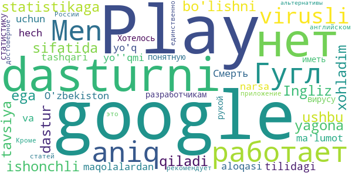
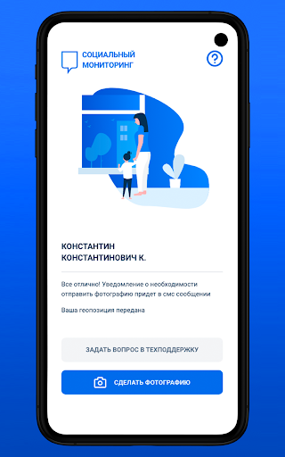
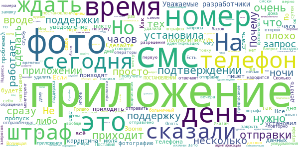
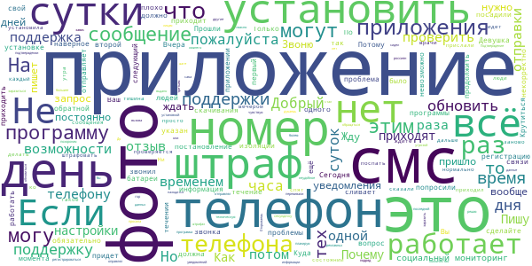

# COVID-related Android apps in Russia

Author: `Ivano Malavolta` (ivanomalavolta@gmail.com)

Created at: `2020/8/24`

Report generated by the [covid-apps-observer](http://github.com/covid-apps-observer) project, version 0.1

# Table of contents 

- [Background](#background)
    * [Data sources and analyses](#data-sources-and-analyses)
        * [App metadata](#app-metadata)
        * [Requested permissions](#requested-permissions)
        * [Mentioned servers](#mentioned_servers)
        * [Security analysis](#security_analysis)
        * [User ratings and reviews](#user-ratings-and-reviews)
    * [Disclaimer](#disclaimer)
- [Госуслуги Москвы](#госуслуги-москвы)
- [Моя Москва — официальное приложение портала mos.ru](#моя-москва-—-официальное-приложение-портала-mos.ru)
- [WHO Info](#who-info)
- [Социальный мониторинг](#социальный-мониторинг)
- [OpenWHO: Knowledge for Health Emergencies](#openwho-knowledge-for-health-emergencies)
- [Активный гражданин](#активный-гражданин)

- [Credits](#credits)

# How to read this report

This report has been generated by the [covid-apps-observer](http://github.com/covid-apps-observer) project. The project automatically analyzes the apps by extracting information which is already publicly available either on the web or in the apps binary files. 

Our analysis covers the following apps:
| | |
|-------------------------|-------------------------| 
|  | Госуслуги Москвы
|  | Моя Москва — официальное приложение портала mos.ru
|  | WHO Info
|  | Социальный мониторинг
|  | OpenWHO: Knowledge for Health Emergencies
|  | Активный гражданин

The details of our analysis are presented in the remainder of this report.

For independent verification, the raw data and the source code of the project is publicly available in its GitHub repository [http://github.com/covid-apps-observer](http://github.com/covid-apps-observer) and its source code has been thoroughly commented in order to provide all the details about how the information provided in this report has been extracted. 

Any feedback, questions, and improvements about the project are very welcome, feel free to create an issue or pull request directly in its GitHub repository: [http://github.com/covid-apps-observer](http://github.com/covid-apps-observer).

## Data sources and analyses

The analysis of each app is structured around five main dimensions: 
* App metadata  
* Requested permissions
* Mentioned servers
* Androwarn analysis
* User ratings and reviews

In the following we describe the data sources and analysis performed for each dimension.

### App metadata

App metadata includes an overview of the main information about the app (for example, its name, releases, privacy policy, etc.), contact information of the development team, and the various Android versions supported by the app. This information is extracted from two main data sources:
* _Google Play store_: we automatically mined the web page of the Google Play store showing the basic information about the app and we parsed it in order to extract information about the app and development team 
* _Android Manifest file_: in our analysis we decompiled the binary file of the app (it is similar to a Zip archive but it contains the code of the app instead of normal files) and we extracted information about the supported Android versions, as it has been listed by its development team.

The extracted app metadata feeds the _App overview_, _Development team_, and _Android support_ sections of this report.
We make use of the [google-play-scraper](https://github.com/JoMingyu/google-play-scraper) tool for extracting the raw data related to this dimension of the project.

### Requested permissions

The Android operating system has a permission model which allows users to grant access to potentially privacy-related information. Every Android app has to explictly declare the permissions it needs to properly function in the Android Manifest file.  

In this report we also show the protection level of each permission, which is a key information for understanding how the requested permissions related to the user's privacy. We carefully analyzed the [official Android documentation (v. 29)](https://developer.android.com/reference/android/Manifest.permission), and it resulted that a permission requested by an Android app can belong to the following protection levels:
* **Dangerous**: higher-risk permissions that would give a requesting app access to private user data or control over the device that can negatively impact the user. Because this type of permission introduces potential risk, the system usually does not automatically grant it to the requesting app. For example, any dangerous permissions requested by an app may be displayed to the user and require confirmation before proceeding.
* **Normal**: this is the default and most common level in Android; normal permissions are lower-risk and give access to isolated app-level features, with minimal risk to other apps, the system, or the user. 
* **Signature**: permissions granted only if the requesting app is signed with the same certificate as the app that declared the permission
* **Appop**: old permission level, a reminiscence of the App Ops tool that Google introduced in Android 4.3.
* **Development**: optional permissions which can be granted to development-oriented apps.
* **Privileged**: permissions who give higher power to mobile apps w.r.t. other apps, such as binding to incoming calls, interacting via bluetooth with other devices without user interaction, etc.
* **Preinstalled**: reserved only for preinstalled apps
* **Installer**: allow the holder to start the permission usage screen for an app
* **RetailDemo**: permissions related to devices used in demonstrations in shops.
* **Pre23**: permissions automatically granted to apps targeting devices running pre-6.0 Android.
* **Upcoming**: permissions which will be released in the next version of the Android platform. 
* **Deprecated**: permissions belonging to old releases of the Android platform, they should not be used by developers since they will not be supported in the near future.
* **Not for use by third-party applications**: permissions which can be requested only by apps developed by Google.
* **Undefined**: this protection level is not documented by Google.

The permissions dimension of this project is based on the [Androguard](https://github.com/androguard/androguard) static analysis tool.

### Mentioned servers

We decompiled each app in order to look for all possible mentions of remote URLs. The mentioned URLs can refer to remote servers the the app is using for either sending or receiving information, web addresses for directing the user to an information website, and so on. 

:warning: It is important to note that this analysis is not meant to be complete and it is very prone to obfuscation. The servers reported here are simply _mentioned_ somewhere in the code of the app and are meant to just give an indication about the "hooks" of the app towards external resources. For example, for an Android app it is normal to contact Google services in order to send/receive push notifications, or to contact the servers of analytics services for having real-time diagnostics about crashes of the app or bugs.

This part of the analysis is based on the [Androguard](https://github.com/androguard/androguard) static analysis tool for identfying the raw URLs mentioned in the app; then, the information about each mentioned server is collected by performing a _whois_ lookup on the first-level domain present in the URL.

### Security analysis

This dimension is based on the [Androwarn](https://github.com/maaaaz/androwarn) structural and data flow analysis of Android bytecode. Androwarn is developed by the University of Lyon/INSA (France) and it has been used in several academic studies. According to its documentation, Androwarn targets the following categories of potential security issues:
* **Telephony identifiers exfiltration**: IMEI, IMSI, MCC, MNC, LAC, CID, operator's name, etc.
* **Device settings exfiltration**: software version, usage statistics, system settings, logs, etc.
* **Geolocation information leakage**: GPS/WiFi geolocation, etc.
* **Connection interfaces information exfiltration**: WiFi credentials, Bluetooth MAC adress, etc.
* **Telephony services abuse**: premium SMS sending, phone call composition, etc.
* **Audio/video flow interception**: call recording, video capture, etc.
* **Remote connection establishment**: socket open call, Bluetooth pairing, APN settings edit, etc.
* **PIM data leakage**: contacts, calendar, SMS, mails, clipboard, etc.
* **External memory operations**: file access on SD card, etc.
* **PIM data modification**: add/delete contacts, calendar events, etc.
* **Arbitrary code execution**: native code using JNI, UNIX command, privilege escalation, etc.
* **Denial of Service**: event notification deactivation, file deletion, process killing, virtual keyboard disable, terminal shutdown/reboot, etc.

Note: We do not consider this data point in the current version of our analyzers since it is too verbose for our purposes.

:warning: It is important to note that Androwarn is a static analysis tool, and as such it performs a variety of heuristics and approximations in its analyses. Said that, the results shown in this report are meant to provide an indication of _potential_ security issues and should be by no means treated as complete and correct.   

### User ratings and reviews

For this dimension we turn again to the web interface of the Google Play store. Firstly, we automatically mine summary statistics about user ratings from the web page of the app under analysis; then, we automatically download the newest 1000 reviews of the app under analysis. For each level of rating (5 stars, 4 stars, , etc., 1 star) we show:
- a word cloud presenting the main terms used by end users in their reviews in the Google Play store
- the last 10 reviews provided by app users in the Google Play store. 

This purposefully simple analysis is meant to help both future users and the development team of the app in understanding what are the main positive and negative points of the app under analysis.

We make use of the [google-play-scraper](https://github.com/JoMingyu/google-play-scraper) tool for extracting the raw data related to this dimension of the project.

## Disclaimer 

This report has been produced independently of any parties and its only objective is to help anybody in better understanding how COVID-related apps work in practice (and compare to each other). The results of this report are limited to the specific version of the software used for running the analyses and on the various heuristics implemented in there. In other words, the results of the analyzers may differ depending on the time and modalities in which they are executed. We do not guarantee that the results of the analyses and the corresponding contents of this report are fully complete or correct. The analysis software is licensed under the [MIT License](https://github.com/iivanoo/covid-apps-observer/blob/master/LICENSE).

# Госуслуги Москвы
App version ``3.11.2.2``

Analyzed with [covid-apps-observer](http://github.com/covid-apps-observer) project, version ``0.1``

## App overview
| | |
|-------------------------|-------------------------| 
| **Name**&nbsp;&nbsp;&nbsp;&nbsp;&nbsp;&nbsp;&nbsp;&nbsp;&nbsp;&nbsp;&nbsp;&nbsp;&nbsp;&nbsp;&nbsp;&nbsp;&nbsp;&nbsp;&nbsp;&nbsp;&nbsp;&nbsp;&nbsp;&nbsp;&nbsp;&nbsp;&nbsp;&nbsp;&nbsp;&nbsp;&nbsp;&nbsp;&nbsp;&nbsp;&nbsp;&nbsp;&nbsp;&nbsp;&nbsp;&nbsp;  | Госуслуги Москвы |
| **Unique identifier** | ru.altarix.mos.pgu |
| **Link to Google Play** | [https://play.google.com/store/apps/details?id=ru.altarix.mos.pgu](https://play.google.com/store/apps/details?id=ru.altarix.mos.pgu) |
| **Summary**  | Все электронные услуги города: начисления ЖКХ, штрафы ГИБДД, эвакуация ТС и др. |
| **Privacy policy** | [http://dit.mos.ru/apps/privacypolicy](http://dit.mos.ru/apps/privacypolicy) |
| **Latest version** | 3.11.2.2 |
| **Last update** | 2020-05-21 18:36:56 |
| **Recent changes** | - Исправлена редкая проблема поиска адреса квартиры в профиле |
| **Installs**  | 1 000 000+ |
| **Category** | Социальные |
| **First release** | 27 сент. 2012 г. |
| **Size**  | 28M |
| **Supported Android version**  | 5.0 и выше |

### Description
> Мобильное приложение «Госуслуги Москвы» - сервис, объединяющий востребованные услуги Правительства Москвы, для комфортной жизни в большом городе.
 Образование:
 - Сервис «Мой ребенок в школе» дает возможность удаленно отслеживать проход и питание учащегося, школьное меню и баланс лицевого счета, который в любой момент можно пополнить с банковской карты/мобильного счета; 
 - Сервис «Электронный дневник» объединяет в себе самую важную для родителей информацию об учебе: расписание уроков, домашние задание, оценки учащегося и т.д.; 
 - Сервис «Результаты ГИА» - мобильная площадка с результатами прохождения Государственной итоговой аттестации.
 Жилье, ЖКУ:
 - Сервис «Начисления за жилищно-коммунальные услуги» предоставляет развернутую информацию о долговых/текущих начислениях за ЖКУ с возможностью заказать электронный Единый платежный документ; 
 - Сервис «Внесение показаний» - возможность передачи показаний счетчиков водоснабжения/электроэнергии, а также получения информации о задолженности без очередей и отрыва от важных дел; 
 - Сервис «Единый диспетчерский центр» – компактная площадка для решения проблем и вопросов, относящихся к вашему дому/двору;
 - Сервис «Информирование о начале расчетов по новой услуге»;
 - Сервис «Информирование о регистрации на жилплощади»;
 - Сервис «Информирование об отключении горячего водоснабжения».
 Транспорт:
 - Сервис «Штрафы» дает возможность получать актуальную информацию по вашим штрафам и оплачивать с мобильного; 
 - Сервис «Эвакуация транспортного средства» информирует об эвакуации ТС, а также предоставляет точный адрес местонахождения ТС на спецстоянке.
 Здоровье и документы:
 - Сервис «Запись к врачу» предоставляет возможность удаленно записаться на прием к любому врачу, перенести и отменить запись, посмотреть перечень направлений и выписанные вам рецепты; 
 - Сервис «Запись к ветеринару» предоставляет возможность записать своего питомца на прием в ветеринарную клинику (перенести, отменить запись) или вызвать ветеринара на дом;
 - Сервис «Готовность загранпаспорта» - индивидуальное информирование о готовности заграничного паспорта;
 - Сервис «Федеральная служба судебных приставов» предоставляет информацию о наличии исполнительных делопроизводств ФССП.
 Информация:
 - Сервис «Новости» объединяет в себе самые актуальные и интересные новости города в удобном мобильном формате.
 По желанию вы можете настроить способ получения уведомлений: SMS, E-mail или Push-уведомления.
 ___________________________________
 Обратите внимание на другие официальные приложения правительства Москвы.
 - Активный Гражданин - проект для тех, кому важно, что происходит в Москве
 - Наш город – помогите нам сделать город лучше
 - Парковки Москвы – приложение для поиска и оплаты парковки в Москве
 - Узнай Москву - архитектурная история столицы).

### User interface
The developers of the app provide the following screenshots in the Google play store.
| | | |
|:-------------------------:|:-------------------------:|:-------------------------:|
 |   |   |   | 
 |   |  

## Development team
In the following we report the main information provided by the development team in the Google play store.

| | |
|-------------------------|-------------------------|
| **Developer**  | Информационный город ГКУ |
| **Website**  | [https://www.mos.ru/mosapps/](https://www.mos.ru/mosapps/) |
| **Email** | emp@mos.ru |
| **Physical address**  | - |
| **Other developed apps**  | [https://play.google.com/store/apps/developer?id=%D0%98%D0%BD%D1%84%D0%BE%D1%80%D0%BC%D0%B0%D1%86%D0%B8%D0%BE%D0%BD%D0%BD%D1%8B%D0%B9+%D0%B3%D0%BE%D1%80%D0%BE%D0%B4+%D0%93%D0%9A%D0%A3](https://play.google.com/store/apps/developer?id=%D0%98%D0%BD%D1%84%D0%BE%D1%80%D0%BC%D0%B0%D1%86%D0%B8%D0%BE%D0%BD%D0%BD%D1%8B%D0%B9+%D0%B3%D0%BE%D1%80%D0%BE%D0%B4+%D0%93%D0%9A%D0%A3) |

## Android support

| | |
|-------------------------|-------------------------|
| **Declared target Android version**  | Pie, version 9 (API level 28) |
| **Effective target Android version**  | Pie, version 9 (API level 28) |
| **Minimum supported Android version**  | Lollipop, version 5.0 (API level 21) |
| **Maximum target Android version**  | - |

The larger the difference between the minimum and maximum supported Android versions, the better. A larger difference means a wider audience. For example, old phones have a very low Android version, so a high minimum supported Android version means that the app cannot be used by users with old phones, thus leading to accessibility problems. 

## Requested permissions

In the following we report the complete list of the permissions requested by the app. 

| **Permission** | **Protection level** | **Description** | 
|-------------------------|-------------------------|-------------------------|
 **android.permission ACCESS_COARSE_LOCATION** | :warning:**Dangerous** | Allows an app to access approximate location. 
 **android.permission ACCESS_FINE_LOCATION** | :warning:**Dangerous** | Allows an app to access precise location. 
 **android.permission ACCESS_NETWORK_STATE** | Normal | Allows applications to access information about networks. 
 **android.permission ACCESS_WIFI_STATE** | Normal | Allows applications to access information about Wi-Fi networks. 
 **android.permission CALL_PHONE** | :warning:**Dangerous** | Allows an application to initiate a phone call without going through the Dialer user interface for the user to confirm the call. 
 **android.permission CAMERA** | :warning:**Dangerous** | Required to be able to access the camera device. 
 **android.permission INTERNET** | Normal | Allows applications to open network sockets. 
 **android.permission READ_CALENDAR** | :warning:**Dangerous** | Allows an application to read the user's calendar data. 
 **android.permission READ_CONTACTS** | :warning:**Dangerous** | Allows an application to read the user's contacts data. 
 **android.permission READ_EXTERNAL_STORAGE** | :warning:**Dangerous** | Allows an application to read from external storage. 
 **android.permission USE_BIOMETRIC** | Normal | Allows an app to use device supported biometric modalities. 
 **android.permission USE_FINGERPRINT** | Normal | This constant was deprecated in API level 28. Applications should request USE_BIOMETRIC instead 
 **android.permission VIBRATE** | Normal | Allows access to the vibrator. 
 **android.permission WAKE_LOCK** | Normal | Allows using PowerManager WakeLocks to keep processor from sleeping or screen from dimming. 
 **android.permission WRITE_CALENDAR** | :warning:**Dangerous** | Allows an application to write the user's calendar data. 
 **android.permission WRITE_EXTERNAL_STORAGE** | :warning:**Dangerous** | Allows an application to write to external storage. 
 **com.google.android.c2dm.permission RECEIVE** | - | - 
 **com.google.android.finsky.permission BIND_GET_INSTALL_REFERRER_SERVICE** | - | - 

## Mentioned servers

| **Server** | **Registrant** | **Registrant country** | **Creation date** | 
|-------------------------|-------------------------|-------------------------|-------------------------|
 | vk.com | Privacy protection service - whoisproxy.ru | :ru: RU | 1997-06-24 04:00:00 |
 | cloudmade.com | Cloud Made Ltd | :uk: UK | 2007-07-17 17:02:27 |
 | facebook.com | Facebook, Inc. | :us: US | 1997-03-29 05:00:00 |
 | googleapis.com | Google LLC | :us: US | 2005-01-25 17:52:26 |
 | google.com | Google LLC | :us: US | 1997-09-15 04:00:00 |
 | 2gis.ru | - | - | 2001-02-18 21:00:00 |
 | crashlytics.com | Google LLC | :us: US | 2011-01-21 15:30:40 |
 | googlesyndication.com | Google LLC | :us: US | 2003-01-21 06:17:24 |
 | openstreetmap.org | OpenStreetMap Foundation | GB | 2004-08-09 18:47:25 |
 | openptmap.org | Registrant State/Province: Bayern | :de: DE | 2010-11-17 12:05:24 |
 | openstreetmap.nl | - | - | 2007-03-06 00:00:00 |
 | wmflabs.org | Wikimedia Foundation, Inc. | :us: US | 2011-09-29 14:58:28 |
 | openseamap.org | Registrant State/Province: | :de: DE | 2009-03-26 11:35:19 |
 | chartbundle.com | Whois Privacy Service | :us: US | 2010-01-09 23:30:15 |
 | opentopomap.org | Registrant State/Province: | :de: DE | 2011-09-03 18:35:13 |
 | app-measurement.com | Google LLC | :us: US | 2015-06-19 20:13:31 |
 | mos.ru | - | - | 1996-12-23 09:49:03 |
 | googleadservices.com | Google LLC | :us: US | 2003-06-19 16:34:53 |
 | w3.org | W3C | :us: US | 1994-07-06 04:00:00 |
 | mts.ru | - | - | 1997-11-19 12:02:34 |
 | 2gis.com | DoubleGIS LLC | :ru: RU | 2004-03-18 08:51:04 |

## Security analysis 

Below we report the main security warnings raised by our execution of the [Androwarn](https://github.com/maaaaz/androwarn) security analysis tool.

**Telephony identifiers leakage**
> - This application reads the numeric name (MCC+MNC) of current registered operator 
> - This application reads the operator name 

**Location lookup**
> - This application reads location information from all available providers (WiFi, GPS etc.) 

**Connection interfaces exfiltration**
> - This application reads details about the currently active data network 

**Telephony services abuse**
> - This application makes phone calls 

**Suspicious connection establishment**
> - This application opens a Socket and connects it to the remote address ' returned no addresses for  ; port is out of range' on the 'N/A' port  
> - This application opens a Socket and connects it to the remote address '' on the 'N/A' port  
> - This application opens a Socket and connects it to the remote address 'Ljava/net/Proxy;->type()Ljava/net/Proxy$Type;' on the 'N/A' port  
> - This application opens a Socket and connects it to the remote address 'timeout' on the 'N/A' port  

**Code execution**
> - This application loads a native library 

## User ratings and reviews

Below we provide information about how end users are reacting to the app in terms of ratings and reviews in the Google Play store.

### Ratings

The Госуслуги Москвы app has been installed by more than **1000000** times. At this time, **51744** rated the app and its average score is **4.181483**. Below we show the distribution of the ratings across the usual star-based rating of Google Play

:star::star::star::star::star:: 36558

:star::star::star::star:: 4559

:star::star::star:: 1757

:star::star:: 1195

:star:: 7673

### Reviews 

#### 5-star reviews

> Все работает  :date: __2020-08-24 06:54:50__

> Удобное приложение. Работает стабильно. Всегда можно записаться на приём к врачу.  :date: __2020-08-22 08:09:06__

> Отлично!  :date: __2020-08-22 02:46:05__

> Очень удобно и быстро  :date: __2020-08-21 14:51:11__

> Хорошее и нужное приложение  :date: __2020-08-21 09:28:15__

> Удобно! Очень.  :date: __2020-08-21 06:49:48__

> Молодцы  :date: __2020-08-20 23:24:17__

> Удобно, доступно, пока нравится.  :date: __2020-08-20 19:22:38__

> Удобно, мне нравится  :date: __2020-08-20 14:40:48__

> Очень удобное приложение. Грузится быстро, все работает без глюков. Пользуюсь постоянно. Количество вопросов, которые можно решить в приложении, постоянно расширяется.  :date: __2020-08-20 13:39:21__

#### 4-star reviews

> Только похвалил приложение за отсутствие глюков, как оно начало временами слетать, а сейчас пропала авторизация и пришлось заново вводить данные. Такое теперь везде часто случается, прямо поветрие какое-то. Но в целом оно весьма удобное, полезное и универсальное.  :date: __2020-08-22 18:58:32__

> Приложение открывается только после переустановки ((( Теперь,что каждый раз переустанавливать? Какие еще данные я должна вам передать?Приложение не открывается (( Спасибо,приложение открывается! А 5 звезд ставить пока не буду:)))  :date: __2020-08-15 08:30:43__

> Хорошее приложение ,единственный минус нельзя отменить запись к врачу  :date: __2020-08-14 17:42:45__

> Добавьте пожалуйста в приложение электронную медицинскую карту.  :date: __2020-08-14 16:46:03__

> Лучше госуслуг, но какой то недоработанный интерфейс.  :date: __2020-08-12 17:30:19__

> Минус звезда за то, что нет синхронизации с БД ГИБДД по штрафам. Сообщения о появлении штрафа приходят, но если штраф оплачен через сайт госуслуг, то штраф не помечается оплаченным и продолжают "висеть" активными. В остальном удобное приложение.  :date: __2020-08-12 07:57:37__

> Не плохо. Всё работает, но штрафы висят неоплаченные, хотя по гос услугам нет. И добавьте оплату гугл пэй пожалуйста.  :date: __2020-08-12 06:12:49__

> Поставил оценку 4, потому что можно записаться к любому врачу в поликлинике, а записаться на забор крови (анализы) по направлению НЕТ! Приходится ходить в поликлинику и записываться на анализы по старинке... Через терминал.  :date: __2020-08-10 18:18:00__

> Если при добавлении заявки не указать срок исполнения, то система подставит в это поле текущее время. Возможно это неправильно? Либо не давать подать заявку без указания времени, либо ставить что-то по умолчанию. А то исполнители звонят, говорят не успеем вашу заявку до 01:30 ночи выполнить. В остальном норм.  :date: __2020-08-08 01:15:01__

> Хорошее, удобное приложение. Пользуюсь им уже очень давно. И могу сказать, что не смотря ни на что, оно становится лучше и лучше. А разработчикам, конечно, всегда есть над чем работать. Желаю им удачи!  :date: __2020-08-06 08:43:30__

#### 3-star reviews

> Хромое! Нужно снести. Почему вдруг прил. пишет неверный формат моего ном телефона?! Н  :date: __2020-08-20 09:31:59__

> Вопрос- почему в приложении я не вижу всех членов моей семьи. ???  :date: __2020-08-20 00:31:09__

> В плане начислений за ЖКУ работа с приложением напоминает сказку про белого бычка. Почему нет возможности соединить или отредактировать различные данные ЖКУ (вода, электричество и пр.) для одной и той же квартиры?  :date: __2020-08-19 21:40:52__

> долго не обновляется информация по оплате ЖКХ, ШТРАФЫ и прочее ... вводит в заблуждение  :date: __2020-08-18 17:49:08__

> Приложение не плохое, но реализация хромает. То работает, то не работает, то показывает данные, то не показывает, то показывает какую-то устаревшую информацию. Такое ощущение, что программу пишет вася пупкин на коленке в свободное время, сидя на даче. Сделайте уже наконец это приложение стабильно работающим, а то все красиво, с анимацией, а толку мало.  :date: __2020-08-18 10:06:39__

> Нет возможности перейти в электронную медицинскую карту. При попытке получить услугу снова возвращает на страницу получения услуги....не может подгрузить...  :date: __2020-08-17 07:31:35__

> Перестала открываться эл мед карта с телефона  :date: __2020-08-15 11:47:57__

> Данные об оплате и отмене штрафов не обновляются. Висит штраф ещё с апреля месяца, который давным давно оплачен... на дворе середина августа...  :date: __2020-08-14 11:18:57__

> Раздел начисление за ЖКУ не открывает электронную платёжку, пишет ошибка соединения. Ранее в прошлом месяце работало.  :date: __2020-08-13 19:16:06__

> Мало информации, приложение долго обновляет данные (штраф уплатил, а извещение 2ю неделю висит. Проверил на сайте- всё норм).  :date: __2020-08-10 11:45:41__

#### 2-star reviews

> Висят штрафы уже оплаченные с июня 2019года  :date: __2020-08-24 04:31:17__

> В разделе "Единый диспетчерский центр" при подаче заявки нет важной категории Водоснабжение (или хотя бы категории Другое, не из предложенного списка), то есть нет возможности подать заявку, например, по внеплановому отключению ГВС. Пришлось дозваниваться диспетчерам по телефону по-старинке в течении 40минут.  :date: __2020-08-19 21:28:28__

> Служба работает неэффективно! Операторы принимают заявки... электронная подача идет... но результат никакой. Просто закрывают заявку.... Это Столица и так нельзя! Буду идти в вышестоящие органы.  :date: __2020-08-19 14:01:32__

> При попытке внесения показаний счётчика холодной воды, выдает ошибку и пишет , что внесённые данные меньше поверочных. Больная просьба поправить этот баг.  :date: __2020-08-17 20:15:49__

> Невозможно войти в электронную медкарту  :date: __2020-08-17 05:25:22__

> С июня приложение перестало работать исправно. Ни оплатить, ни посмотреть епд не удаётся из-за ошибки. Снижаю оценку до 2-х звёзд, пока не исправят.  :date: __2020-08-13 09:00:10__

> 08.2020 Не уходят ранее оплаченные штрафы, на сайте ГИБДД их уже давно нет, а здесь они активны и предлагаются к оплатей 04.2020. Сейчас все хорошо. /////////После обновления -ужас. Пропала история, нет машин, мерзкий цвет... Верните взад старую версию. Спасибо 4pda, вернулся на версию перед этим извратом  :date: __2020-08-11 20:22:22__

> уже 3й раз слетает квартира из профиля, что вынуждает заногл вводить все реквизиты. С данными об авто такой проблемы нет, все данные на месте  :date: __2020-08-11 08:34:28__

> Показывает как новые оплаченные и отмененные штрафы.  :date: __2020-08-04 15:32:56__

> Полезное приложение, но после последнего обновления пропала возможность авторизации через госуслуги, на сайте же такая возможность осталась.  :date: __2020-07-29 14:50:18__

#### 1-star reviews

> Нет авторизации госуслуг.  :date: __2020-08-23 15:55:23__

> Это черновик?! Приложение требует ввести номер телефона, но у меня нет номера телефона, который я могу указать!! Ребята, вы с головой дружите?! Попробуйте себя в чем-нибудь другом. Может улицу мести?! Безобразное приложение - отмывание гос. денег!  :date: __2020-08-23 13:58:22__

> Постоянно ошибки при оплате  :date: __2020-08-23 13:20:49__

> Бесит это приложения не возможно войти с телефона,,  :date: __2020-08-23 11:31:29__

> Оплатил ЕПД на сайте. В приложении нет оплаты, на сайте есть.  :date: __2020-08-22 14:29:43__

> Стала постоянно слетать.  :date: __2020-08-21 13:20:27__

> Это одно из самых отвратительных приложений. Полное ощущение что его делал пьяный человек. Ломаю голову весь день и вечер. Не могу внести изменения в личные данные. Тупо нет ячейки для СНИЛС. Интерфейс отвратительный. Ничего не понятно. Запутанно. Нелогично. Я относительно молодой человек и ничего не понимаю. А ведь приложение необходимо для пожилых людей.  :date: __2020-08-20 22:26:53__

> Достала слетающая при обновлениях приложения авторизация.  :date: __2020-08-20 06:45:28__

> Часто слетает авторизация, теперь после последнего обновления приложение не открывается upd: 19.08.20 опять нет авторизации, надо искать пароль и вводить код доступа и так далее. За полгода проблему не исправили.  :date: __2020-08-19 15:46:00__

> Это что -то с чем то.Невозможно войти и так же выйти!Половина из того что нужно нет.Ищите другое приложение Госуслуг.  :date: __2020-08-19 01:06:29__

# Моя Москва — официальное приложение портала mos.ru
App version ``1.6``

Analyzed with [covid-apps-observer](http://github.com/covid-apps-observer) project, version ``0.1``

## App overview
| | |
|-------------------------|-------------------------| 
| **Name**&nbsp;&nbsp;&nbsp;&nbsp;&nbsp;&nbsp;&nbsp;&nbsp;&nbsp;&nbsp;&nbsp;&nbsp;&nbsp;&nbsp;&nbsp;&nbsp;&nbsp;&nbsp;&nbsp;&nbsp;&nbsp;&nbsp;&nbsp;&nbsp;&nbsp;&nbsp;&nbsp;&nbsp;&nbsp;&nbsp;&nbsp;&nbsp;&nbsp;&nbsp;&nbsp;&nbsp;&nbsp;&nbsp;&nbsp;&nbsp;  | Моя Москва — официальное приложение портала mos.ru |
| **Unique identifier** | ru.mos.app |
| **Link to Google Play** | [https://play.google.com/store/apps/details?id=ru.mos.app](https://play.google.com/store/apps/details?id=ru.mos.app) |
| **Summary**  | Все самые нужные городские сервисы в официальном приложении mos.ru «Моя Москва». |
| **Privacy policy** | [https://www.mos.ru/legal/rules/](https://www.mos.ru/legal/rules/) |
| **Latest version** | 1.6 |
| **Last update** | 2020-07-20 17:34:29 |
| **Recent changes** | Важным событиям столицы — главный экран: теперь за ними не нужно специально ходить в раздел «Новости города» — всё оперативно в ленте. |
| **Installs**  | 500 000+ |
| **Category** | Социальные |
| **First release** | 27 дек. 2018 г. |
| **Size**  | 86M |
| **Supported Android version**  | 5.0 и выше |

### Description
> Пользуйтесь главными сервисами mos.ru, читайте новости города и задавайте вопросы операторам городского контакт-центра в одном приложении. Достаточно ввести ваши данные для входа на портал mos.ru и вам откроются все возможности чат-бота «Моя Москва».
 Здесь мы собрали самые частые госуслуги, которыми пользуются москвичи. И упростили процесс получения — все вопросы решает быстрый чат-бот. Откройте диалог в нужном разделе:
 – Мой дом: подать показания счётчиков воды, узнать, когда нужно провести поверку счётчиков, получить счета за ЖКУ. Сохраните в приложении 10-значный номер плательщика (указан на вашем ЕПД) и вам будет доступна оплата ЖКХ.
 – Дети в школе: пользоваться сервисами «Москвёнок» и «Электронный дневник» в одном приложении. Проверить, когда ребенок пришёл в школу, какие оценки получил и что купил на обед, можно за пару минут, спросив у бота.
 – Здоровье: записаться на приём в поликлинику, перенести или отменить запись к врачу теперь можно онлайн в удобном чате. Только скажите боту номер полиса ОМС.
 – Транспорт: проверить и оплатить штрафы ГИБДД онлайн по номеру, узнать историю своего автомобиля. По вашей просьбе бот пришлёт уведомление об эвакуации машины и новых штрафах. Понадобятся номер водительских прав, СТС, VIN и госномер автомобиля.
 – Контакт-центр: операторы круглосуточно готовы помочь вам в решении вопросов, связанных с получением государственных услуг и работой приложения «Моя Москва».
 – Новости города: узнать за пару минут всё самое важное, что происходит в Москве и в вашем районе.
 – Мой район: изучать ваш район - читать об уникальных фактах, искать ближайшие парки и школы, детские и спортивные площадки, узнавать о планах его развития.
 «Моя Москва» — чат-бот, который помогает москвичам получить самые популярные госуслуги. Часть из них доступна без авторизации. Но советуем зарегистрироваться, чтобы бот знал ваши данные и мог напоминать о важных платежах или записи к врачу.
 Правительство Москвы также разработало отдельные приложения для тех, кто ищет или хочет оплатить парковку («Парковки Москвы»), участвовать в принятии важных городских решений («Активный Гражданин»), замечать недочеты в устройстве ЖКХ («Наш город»).

### User interface
The developers of the app provide the following screenshots in the Google play store.
| | | |
|:-------------------------:|:-------------------------:|:-------------------------:|
 |   |   |   | 
 |   |   |   | 
 |   |  

## Development team
In the following we report the main information provided by the development team in the Google play store.

| | |
|-------------------------|-------------------------|
| **Developer**  | Информационный город ГКУ |
| **Website**  | [https://www.mos.ru/mobile/](https://www.mos.ru/mobile/) |
| **Email** | mobile@mos.ru |
| **Physical address**  | - |
| **Other developed apps**  | [https://play.google.com/store/apps/developer?id=%D0%98%D0%BD%D1%84%D0%BE%D1%80%D0%BC%D0%B0%D1%86%D0%B8%D0%BE%D0%BD%D0%BD%D1%8B%D0%B9+%D0%B3%D0%BE%D1%80%D0%BE%D0%B4+%D0%93%D0%9A%D0%A3](https://play.google.com/store/apps/developer?id=%D0%98%D0%BD%D1%84%D0%BE%D1%80%D0%BC%D0%B0%D1%86%D0%B8%D0%BE%D0%BD%D0%BD%D1%8B%D0%B9+%D0%B3%D0%BE%D1%80%D0%BE%D0%B4+%D0%93%D0%9A%D0%A3) |

## Android support

| | |
|-------------------------|-------------------------|
| **Declared target Android version**  | Pie, version 9 (API level 28) |
| **Effective target Android version**  | Pie, version 9 (API level 28) |
| **Minimum supported Android version**  | Lollipop, version 5.0 (API level 21) |
| **Maximum target Android version**  | - |

The larger the difference between the minimum and maximum supported Android versions, the better. A larger difference means a wider audience. For example, old phones have a very low Android version, so a high minimum supported Android version means that the app cannot be used by users with old phones, thus leading to accessibility problems. 

## Requested permissions

In the following we report the complete list of the permissions requested by the app. 

| **Permission** | **Protection level** | **Description** | 
|-------------------------|-------------------------|-------------------------|
 **android.permission ACCESS_COARSE_LOCATION** | :warning:**Dangerous** | Allows an app to access approximate location. 
 **android.permission ACCESS_FINE_LOCATION** | :warning:**Dangerous** | Allows an app to access precise location. 
 **android.permission ACCESS_NETWORK_STATE** | Normal | Allows applications to access information about networks. 
 **android.permission ACCESS_WIFI_STATE** | Normal | Allows applications to access information about Wi-Fi networks. 
 **android.permission CAMERA** | :warning:**Dangerous** | Required to be able to access the camera device. 
 **android.permission CHANGE_WIFI_STATE** | Normal | Allows applications to change Wi-Fi connectivity state. 
 **android.permission INTERNET** | Normal | Allows applications to open network sockets. 
 **android.permission RECEIVE_BOOT_COMPLETED** | Normal | Allows an application to receive the Intent.ACTION_BOOT_COMPLETED that is broadcast after the system finishes booting. 
 **android.permission USE_BIOMETRIC** | Normal | Allows an app to use device supported biometric modalities. 
 **android.permission USE_FINGERPRINT** | Normal | This constant was deprecated in API level 28. Applications should request USE_BIOMETRIC instead 
 **android.permission VIBRATE** | Normal | Allows access to the vibrator. 
 **android.permission WAKE_LOCK** | Normal | Allows using PowerManager WakeLocks to keep processor from sleeping or screen from dimming. 
 **android.permission WRITE_CALENDAR** | :warning:**Dangerous** | Allows an application to write the user's calendar data. 
 **android.permission WRITE_EXTERNAL_STORAGE** | :warning:**Dangerous** | Allows an application to write to external storage. 
 **com.google.android.c2dm.permission RECEIVE** | - | - 
 **com.google.android.finsky.permission BIND_GET_INSTALL_REFERRER_SERVICE** | - | - 
 **ndroid.permission MANAGE_FINGERPRINT** | - | - 

## Mentioned servers

| **Server** | **Registrant** | **Registrant country** | **Creation date** | 
|-------------------------|-------------------------|-------------------------|-------------------------|
 | w3.org | W3C | :us: US | 1994-07-06 04:00:00 |
 | xml.org | OASIS Open | :us: US | 1997-02-03 05:00:00 |
 | xmlpull.org | WhoisGuard, Inc. | PA | 2001-11-26 20:33:08 |
 | googlesyndication.com | Google LLC | :us: US | 2003-01-21 06:17:24 |
 | google.com | Google LLC | :us: US | 1997-09-15 04:00:00 |
 | facebook.com | - | - | 1997-03-29 05:00:00 |
 | app-measurement.com | Google LLC | :us: US | 2015-06-19 20:13:31 |
 | yandex.ru | - | - | 1997-09-23 09:45:07 |
 | yandexadexchange.net | - | :ru: RU | 2014-02-18 12:48:07 |
 | kladr-api.ru | - | - | 2013-02-06 00:31:38 |
 | crashlytics.com | Google LLC | :us: US | 2011-01-21 15:30:40 |
 | yandex.com | - | :switzerland: CH | 1998-09-24 04:00:00 |
 | yandex.net | - | :ru: RU | 2000-11-14 06:56:55 |
 | googleapis.com | Google LLC | :us: US | 2005-01-25 17:52:26 |
 | googleadservices.com | Google LLC | :us: US | 2003-06-19 16:34:53 |
 | frosteye.ru | - | - | 2012-12-08 18:43:12 |
 | intervale.ru | - | - | 2001-04-09 20:00:00 |
 | mts.ru | - | - | 1997-11-19 12:02:34 |
 | mos.ru | - | - | 1996-12-23 09:49:03 |
 | mgfoms.ru | - | - | 2002-12-22 21:00:00 |

## Security analysis 

Below we report the main security warnings raised by our execution of the [Androwarn](https://github.com/maaaaz/androwarn) security analysis tool.

**Telephony identifiers leakage**
> - This application reads the MCC+MNC of the provider of the SIM 
> - This application reads the Service Provider Name (SPN) 
> - This application reads the constant indicating the state of the device SIM card 
> - This application reads the current location of the device 
> - This application reads the neighboring cell information of the device 
> - This application reads the numeric name (MCC+MNC) of current registered operator 
> - This application reads the operator name 
> - This application reads the radio technology (network type) currently in use on the device for data transmission 
> - This application reads the unique device ID, i.e the IMEI for GSM and the MEID or ESN for CDMA phones 
> - This application reads the Cell ID value 
> - This application reads the Location Area Code value 

**Connection interfaces exfiltration**
> - This application reads details about the currently active data network 
> - This application tries to find out if the currently active data network is metered 

**Telephony services abuse**
> - This application makes phone calls 

**Suspicious connection establishment**
> - This application opens a Socket and connects it to the remote address 'Ljava/lang/StringBuilder;->toString()Ljava/lang/String;' on the 'N/A' port  
> - This application opens a Socket and connects it to the remote address 'Ljava/net/Proxy;->type()Ljava/net/Proxy$Type;' on the 'N/A' port  
> - This application opens a Socket and connects it to the remote address 'No route to  ' on the 'N/A' port  
> - This application opens a Socket and connects it to the remote address 'timeout' on the 'N/A' port  

**Code execution**
> - This application loads a native library 
> - This application loads a native library: 'Landroid/text/TextUtils;->isEmpty(Ljava/lang/CharSequence;)Z' 
> - This application loads a native library: 'YandexMetricaNativeModule' 
> - This application executes a UNIX command containing this argument: 'Ljava/lang/StringBuilder;->toString()Ljava/lang/String;' 
> - This application executes a UNIX command containing this argument: 'logcat -c' 

## User ratings and reviews

Below we provide information about how end users are reacting to the app in terms of ratings and reviews in the Google Play store.

### Ratings

The Моя Москва — официальное приложение портала mos.ru app has been installed by more than **500000** times. At this time, **2070** rated the app and its average score is **4.3317075**. Below we show the distribution of the ratings across the usual star-based rating of Google Play

:star::star::star::star::star:: 1524

:star::star::star::star:: 232

:star::star::star:: 40

:star::star:: 20

:star:: 252

### Reviews 

#### 5-star reviews

> Удобно  :date: __2020-08-21 20:28:54__

> Хорошее приложение!  :date: __2020-08-21 00:15:23__

> Удобно и интересно.  :date: __2020-08-20 14:22:12__

> Очень удобно. Все услуги не выходя из дома, и даже в отъезде.  :date: __2020-08-20 07:24:09__

> Полезное  :date: __2020-08-19 09:38:55__

> Удобно!  :date: __2020-08-18 14:07:13__

> Удобно  :date: __2020-08-17 15:44:57__

> Удобно и просто, спасибо  :date: __2020-08-17 14:07:00__

> Отлично сделано. Очень удобно.  :date: __2020-08-17 07:54:10__

> Все очень удобно  :date: __2020-08-17 06:50:14__

#### 4-star reviews

> Снизил с 5 до 3 (пока!). Какое исправление ошибок? Вы их наделали ещё больше! После обновления 25.05.20 приложение не открывается, СОВСЕМ! Пишет, что произошла ошибка. Исправляйте.  :date: __2020-08-21 07:36:50__

> Норм  :date: __2020-08-19 10:23:35__

> Удобно и полезно.  :date: __2020-08-15 12:28:21__

> Все доступно  :date: __2020-07-30 11:07:33__

> Не понимаю где раздел Здоровье.  :date: __2020-07-30 00:45:22__

> После перезагрузки телефона иконка исчезла с экрана и не выставляется,заходить в приложение стало неудобно,нужно загружать настройки  :date: __2020-07-28 18:10:02__

> В целом хорошо, есть удобные сервисы  :date: __2020-07-25 15:11:49__

> Нет поддержки google pay  :date: __2020-07-22 19:42:34__

> Впервые захожу на этот портал.Не сразу все получилось.  :date: __2020-07-22 09:30:49__

> Спасибо удобно!  :date: __2020-07-21 14:38:35__

#### 3-star reviews

> 3 три трешка  :date: __2020-08-20 17:22:37__

> Не так часто пользуюсь приложением, но в тех услугах, которыми пользуюсь (медицина) не устраивает то, что не отображаются ни направления анализов, ни их результаты.  :date: __2020-07-30 06:19:29__

> Не возможно получить нужную информацию по результатам анализов  :date: __2020-07-27 19:13:23__

> Тёмную тему не завезли ещё?  :date: __2020-07-12 08:39:24__

> Очень много заморочек  :date: __2020-06-30 23:15:03__

> Госуслуги Москвы по-лучше приложение.  :date: __2020-06-30 12:36:41__

> 10 раз к врачу пришлось записываться. Выбираю доступное время - пишет это время уже занято. Опять выбираю - занято. И т.д. Выбрал менее попул врачей - на это время нельзя записать по Интернет. Потом еще раз.  :date: __2020-06-29 10:54:35__

> Создавать приложение, чтобы постоянно перебрасывать на сайт это глупо  :date: __2020-06-18 11:07:53__

> Действительно сыровато дальше некуда... Только пользователей бесить! ;-)  :date: __2020-06-18 06:52:42__

> Работает не всегда стабильно, подвисает.  :date: __2020-06-11 21:33:08__

#### 2-star reviews

> Безнадежно виснет  :date: __2020-08-15 18:34:27__

> А вас не затруднит исправить ошибки в приложении так,чтобы оно не удаляло аутентификационные данные при каждом следующем обновлении и не требовало постоянно повторной аутентификации при переходе из раздела в раздел? Сделайте уже вход по PIN или по дактилоскопическому сканеру,2020-й год за окном. Наймите нормальных программистов,в нынешнем виде полурабочее глючное приложение. UPD:12.08.2020 ничего не изменилось  :date: __2020-08-12 14:15:06__

> Приложение - ерунда. Записал ребенка к участковому врачу. Приходим, а на месте поликлиники осталась одна "коробка", идёт ремонт. Хотя на карте показывает именно это здание.  :date: __2020-07-30 11:56:35__

> Старое приложение реализовано более функционально и удобно на мой взгляд. Тут не все так просто и быстро. Очень часто приходится делать лишние шаги и клики что бы получить доступ к информации.  :date: __2020-07-27 22:13:43__

> Записаться к в врачу проблема. Когда смотришь расписание не видно свободного времени. Начинаешь выбирать все время занято  :date: __2020-07-26 11:32:36__

> Не поддерживаю перекладывание бордюров 2 раза в год  :date: __2020-06-30 14:59:59__

> Я не знаю, что вы накрутили в приложение, что за данные оно собирает и куда отправляет. Знаю что оно безбожно нагружает телефон. Он как утюг греется. Я этого не наблюдала до появления на моем телефоне вашего "замечательного" приложения и проблема нагрева решилась сносом приложения "моя Москва". Но стоит отметить, что работать с ним удобно.  :date: __2020-06-24 18:33:48__

> всё через гос.услуги!!!  :date: __2020-06-17 17:01:31__

> Плохое приложение,непонятно как всё работает  :date: __2020-06-17 02:02:13__

> Не показывает все направления, выданные докторами. Приходится заходить на сайт ЕМИАС.  :date: __2020-06-11 23:00:32__

#### 1-star reviews

> Приложение толком не работает. Постоянно какие то работы. Обратной связи нет. На вопросы отвечает бот. И зачем оно вообще нужно????  :date: __2020-08-19 00:41:13__

> Спасибо, всё удобно!  :date: __2020-08-17 06:59:45__

> Попытался оплатить начисление по ЖКУ через приложение. Вылетела ошибка с нечитаемым описанием и кнопкой "Хорошо". Платеж не прошел. Вопрос: зачем нужно такое приложение? Ответ: низачем. Удалил приложение. И вы удалите. Или просто не ставьте.  :date: __2020-08-13 19:52:38__

> Нет входа через Госуслуги  :date: __2020-08-13 12:53:43__

> Плохая поддержка не дозвонишься. Это издевательство над человеком особенно когда нужен был пропуск. И очень мало информации при проверке авто по vin-номеру.  :date: __2020-08-12 15:13:51__

> В топку эту прогу вместе с разработчиками, криворукие, тупые дятлы ваше сие чудо изобретения состряпаное на пьяную голову не работает !!!! Гугл должен запретить такую шляпу выставлять в плеймаркет.  :date: __2020-08-12 13:49:54__

> Вы хоть сами пользуйтесь своим творением! Иначе вы тратите время и нервы других людей. Четыре дня назад я уже оформлял доступ к электронной карте. Уже получил письмо с тем, что услуга оказана. Поставил это чудо-прилжение и на тебе - всё сначала: подача заявки, поиск номера ОМС и т.д. Вместо экономии времени ваше приложение просто его тратит. Ставлю кол.  :date: __2020-08-11 10:17:02__

> В службе технической поддержки работают безграмотные люди, низкой квалификации не способные решать даже простейшие задачи.  :date: __2020-08-09 06:11:02__

> Нет функции отправки обращений в мэрию. Бесполезное приложение  :date: __2020-08-01 17:17:27__

> Каждый раз идентификация пользователя начинается заново. Снова и снова приходится вводить реквизиты документов! Ещё и не подтверждают сразу, требуя доказательств или подтверждаю несколько дней!  :date: __2020-08-01 12:08:22__

# WHO Info
App version ``2.3.4``

Analyzed with [covid-apps-observer](http://github.com/covid-apps-observer) project, version ``0.1``

## App overview
| | |
|-------------------------|-------------------------| 
| **Name**&nbsp;&nbsp;&nbsp;&nbsp;&nbsp;&nbsp;&nbsp;&nbsp;&nbsp;&nbsp;&nbsp;&nbsp;&nbsp;&nbsp;&nbsp;&nbsp;&nbsp;&nbsp;&nbsp;&nbsp;&nbsp;&nbsp;&nbsp;&nbsp;&nbsp;&nbsp;&nbsp;&nbsp;&nbsp;&nbsp;&nbsp;&nbsp;&nbsp;&nbsp;&nbsp;&nbsp;&nbsp;&nbsp;&nbsp;&nbsp;  | WHO Info |
| **Unique identifier** | org.who.infoapp |
| **Link to Google Play** | [https://play.google.com/store/apps/details?id=org.who.infoapp](https://play.google.com/store/apps/details?id=org.who.infoapp) |
| **Summary**  | Официальное приложение информации Всемирной организации здравоохранения. |
| **Privacy policy** | [https://www.who.int/about/who-we-are/privacy-policy](https://www.who.int/about/who-we-are/privacy-policy) |
| **Latest version** | 2.3.4 |
| **Last update** | 2020-08-18 14:00:11 |
| **Recent changes** | This release addresses an issue related to case numbers reported to WHO. |
| **Installs**  | 100 000+ |
| **Category** | Новости и журналы |
| **First release** | 13 апр. 2020 г. |
| **Size**  | 8,9M |
| **Supported Android version**  | 4.2 и выше |

### Description
> Have the latest health information at your fingertips with the official World Health Organization Information App. This app displays the latest news, events, features and breaking updates on outbreaks. 
  
 WHO works worldwide to promote health, keep the world safe, and serve the vulnerable. 
 Our goal is to ensure that a billion more people have universal health coverage, to protect a billion more people from health emergencies, and provide a further billion people with better health and well-being.

### User interface
The developers of the app provide the following screenshots in the Google play store.
| | | |
|:-------------------------:|:-------------------------:|:-------------------------:|
 |   |   |   | 
 |   |   |   | 
 |   |   |   | 
 |   |   |   | 
 |   |   |   | 
 |   |   |   | 
 |   |   |   | 
 |   |   |   | 

## Development team
In the following we report the main information provided by the development team in the Google play store.

| | |
|-------------------------|-------------------------|
| **Developer**  | World Health Organization |
| **Website**  | [https://www.who.int/](https://www.who.int/) |
| **Email** | dcx@who.int |
| **Physical address**  | [Avenu Appia 20 1211 Geneva Switzerland](https://www.google.com/maps/search/Avenu%20Appia%2020%201211%20Geneva%20Switzerland) (Google Maps) |
| **Other developed apps**  | [https://play.google.com/store/apps/developer?id=World+Health+Organization](https://play.google.com/store/apps/developer?id=World+Health+Organization) |

## Android support

| | |
|-------------------------|-------------------------|
| **Declared target Android version**  | - |
| **Effective target Android version**  | - |
| **Minimum supported Android version**  | Jelly Bean, version 4.2.x (API level 17) |
| **Maximum target Android version**  | - |

The larger the difference between the minimum and maximum supported Android versions, the better. A larger difference means a wider audience. For example, old phones have a very low Android version, so a high minimum supported Android version means that the app cannot be used by users with old phones, thus leading to accessibility problems. 

## Requested permissions

In the following we report the complete list of the permissions requested by the app. 

| **Permission** | **Protection level** | **Description** | 
|-------------------------|-------------------------|-------------------------|
 **android.permission ACCESS_NETWORK_STATE** | Normal | Allows applications to access information about networks. 
 **android.permission INTERNET** | Normal | Allows applications to open network sockets. 
 **android.permission READ_CALENDAR** | :warning:**Dangerous** | Allows an application to read the user's calendar data. 
 **android.permission READ_EXTERNAL_STORAGE** | :warning:**Dangerous** | Allows an application to read from external storage. 
 **android.permission WAKE_LOCK** | Normal | Allows using PowerManager WakeLocks to keep processor from sleeping or screen from dimming. 
 **android.permission WRITE_CALENDAR** | :warning:**Dangerous** | Allows an application to write the user's calendar data. 
 **android.permission WRITE_EXTERNAL_STORAGE** | :warning:**Dangerous** | Allows an application to write to external storage. 
 **com.google.android.c2dm.permission RECEIVE** | - | - 
 **com.google.android.finsky.permission BIND_GET_INSTALL_REFERRER_SERVICE** | - | - 

## Mentioned servers

| **Server** | **Registrant** | **Registrant country** | **Creation date** | 
|-------------------------|-------------------------|-------------------------|-------------------------|
 | googlesyndication.com | Google LLC | :us: US | 2003-01-21 06:17:24 |
 | google.com | Google LLC | :us: US | 1997-09-15 04:00:00 |
 | app-measurement.com | Google LLC | :us: US | 2015-06-19 20:13:31 |
 | googleapis.com | Google LLC | :us: US | 2005-01-25 17:52:26 |
 | googleadservices.com | Google LLC | :us: US | 2003-06-19 16:34:53 |

## Security analysis 

Below we report the main security warnings raised by our execution of the [Androwarn](https://github.com/maaaaz/androwarn) security analysis tool.

**Connection interfaces exfiltration**
> - This application reads details about the currently active data network 
> - This application tries to find out if the currently active data network is metered 

**Suspicious connection establishment**
> - This application opens a Socket and connects it to the remote address 'Lfi/iki/elonen/NanoHTTPD$ResponseException;' on the 'N/A' port  
> - This application opens a Socket and connects it to the remote address 'NanoHttpd Shutdown' on the 'N/A' port  

**Code execution**
> - This application loads a native library: 'NativeScript' 
> - This application executes a UNIX command containing this argument: '2' 

## User ratings and reviews

Below we provide information about how end users are reacting to the app in terms of ratings and reviews in the Google Play store.

### Ratings

The WHO Info app has been installed by more than **100000** times. At this time, **863** rated the app and its average score is **3.69**. Below we show the distribution of the ratings across the usual star-based rating of Google Play

:star::star::star::star::star:: 500

:star::star::star::star:: 34

:star::star::star:: 103

:star::star:: 8

:star:: 215

### Reviews 

#### 5-star reviews

> Классно!!!!!  :date: __2020-05-02 16:56:29__

#### 4-star reviews

No recent reviews available with 4 stars.

#### 3-star reviews

> А можно по русский написать  :date: __2020-05-23 06:45:03__

#### 2-star reviews

> На русском где?  :date: __2020-06-14 12:29:29__

#### 1-star reviews

> не работает с Гугл  :date: __2020-07-22 09:06:06__

> 👎👎👎👎👎👎👎👅  :date: __2020-07-16 19:13:31__

> Men aniq virusli statistikaga ega bo'lishni xohladim, google Play ushbu dasturni yagona ishonchli dastur sifatida tavsiya qiladi. Ingliz tilidagi maqolalardan tashqari, hech narsa yo'q. O'zbekiston uchun ma'lumot va dasturni aloqasi yo''qmi?  :date: __2020-06-05 13:48:39__

> Смерть разработчикам!!!  :date: __2020-05-19 22:17:08__

> Хотелось иметь под рукой понятную статистику по вирусу, google play рекомендует это приложение как единственно достоверное. Кроме статей на английском ничего нет. Т.е. для России альтернативы нет?  :date: __2020-05-07 16:18:22__

# Социальный мониторинг
App version ``1.7.1``

Analyzed with [covid-apps-observer](http://github.com/covid-apps-observer) project, version ``0.1``

## App overview
| | |
|-------------------------|-------------------------| 
| **Name**&nbsp;&nbsp;&nbsp;&nbsp;&nbsp;&nbsp;&nbsp;&nbsp;&nbsp;&nbsp;&nbsp;&nbsp;&nbsp;&nbsp;&nbsp;&nbsp;&nbsp;&nbsp;&nbsp;&nbsp;&nbsp;&nbsp;&nbsp;&nbsp;&nbsp;&nbsp;&nbsp;&nbsp;&nbsp;&nbsp;&nbsp;&nbsp;&nbsp;&nbsp;&nbsp;&nbsp;&nbsp;&nbsp;&nbsp;&nbsp;  | Социальный мониторинг |
| **Unique identifier** | ru.mos.socmon |
| **Link to Google Play** | [https://play.google.com/store/apps/details?id=ru.mos.socmon](https://play.google.com/store/apps/details?id=ru.mos.socmon) |
| **Summary**  | Приложение для контроля за соблюдением гражданами режима изоляции на дому |
| **Privacy policy** | [https://www.mos.ru/privacypolicy/socmon/](https://www.mos.ru/privacypolicy/socmon/) |
| **Latest version** | 1.7.1 |
| **Last update** | 2020-08-11 07:57:06 |
| **Recent changes** | В новой версии «Социального мониторинга» появилась возможность отправлять вопросы в службу технической поддержки непосредственно из приложения. Также предусмотрена пошаговая инструкция для регистрации, изменен экран для фотографирования, а интерфейс программы получил новый дизайн. |
| **Installs**  | 100 000+ |
| **Category** | Медицина |
| **First release** | 22 апр. 2020 г. |
| **Size**  | 14M |
| **Supported Android version**  | 6.0 и выше |

### Description
> Приложение «Социальный мониторинг» создано для пациентов с подтвержденным диагнозом COVID-19, выбравших лечение на дому, граждан, контактировавших с ними, и горожан с проявлениями острых респираторных заболеваний, проживающих в Москве и соблюдающих предписанный им режим изоляции. С его помощью пациент информирует город о добросовестном соблюдении карантина.
 При регистрации пользователь подтверждает номер телефона, делает фотографию, геолокация (местонахождение) отправляется автоматически. Это нужно для того, чтобы проверить, находится ли пользователь в той же локации, которую указал в согласии, выбирая лечение на дому.
 Чтобы у пользователя не было возможности оставить смартфон дома и выйти на улицу без него, приложение в случайное время присылает СМС-уведомления с запросом дополнительного подтверждения — для этого потребуется сделать селфи.
 Если пользователь покидает исходную геолокацию или не реагирует на уведомления, система предупреждает городские службы о возможном нарушении режима изоляции.
 Личные данные, которые пользователь передает сервису, определены в согласии на получение медицинской помощи на дому и соблюдение режима изоляции либо в постановлении главного санитарного врача города Москвы. Все данные, которые пользователь передает приложению, хранятся в защищенном виде на серверах Департамента информационных технологий и используются в строгом соответствии с федеральным законом № 152-ФЗ "О персональных данных".

### User interface
The developers of the app provide the following screenshots in the Google play store.
| | | |
|:-------------------------:|:-------------------------:|:-------------------------:|
 |   |   |   | 
 |   |  

## Development team
In the following we report the main information provided by the development team in the Google play store.

| | |
|-------------------------|-------------------------|
| **Developer**  | Информационный город ГКУ |
| **Website**  | [https://www.mos.ru/city/projects/monitoring/](https://www.mos.ru/city/projects/monitoring/) |
| **Email** | socialmonitoring@mos.ru |
| **Physical address**  | - |
| **Other developed apps**  | [https://play.google.com/store/apps/developer?id=%D0%98%D0%BD%D1%84%D0%BE%D1%80%D0%BC%D0%B0%D1%86%D0%B8%D0%BE%D0%BD%D0%BD%D1%8B%D0%B9+%D0%B3%D0%BE%D1%80%D0%BE%D0%B4+%D0%93%D0%9A%D0%A3](https://play.google.com/store/apps/developer?id=%D0%98%D0%BD%D1%84%D0%BE%D1%80%D0%BC%D0%B0%D1%86%D0%B8%D0%BE%D0%BD%D0%BD%D1%8B%D0%B9+%D0%B3%D0%BE%D1%80%D0%BE%D0%B4+%D0%93%D0%9A%D0%A3) |

## Android support

| | |
|-------------------------|-------------------------|
| **Declared target Android version**  | Android10, version 10 (API level 29) |
| **Effective target Android version**  | Android10, version 10 (API level 29) |
| **Minimum supported Android version**  | Marshmallow, version 6.0 (API level 23) |
| **Maximum target Android version**  | - |

The larger the difference between the minimum and maximum supported Android versions, the better. A larger difference means a wider audience. For example, old phones have a very low Android version, so a high minimum supported Android version means that the app cannot be used by users with old phones, thus leading to accessibility problems. 

## Requested permissions

In the following we report the complete list of the permissions requested by the app. 

| **Permission** | **Protection level** | **Description** | 
|-------------------------|-------------------------|-------------------------|
 **android.permission ACCESS_BACKGROUND_LOCATION** | :warning:**Dangerous** | Allows an app to access location in the background. 
 **android.permission ACCESS_FINE_LOCATION** | :warning:**Dangerous** | Allows an app to access precise location. 
 **android.permission ACCESS_NETWORK_STATE** | Normal | Allows applications to access information about networks. 
 **android.permission ACCESS_WIFI_STATE** | Normal | Allows applications to access information about Wi-Fi networks. 
 **android.permission CAMERA** | :warning:**Dangerous** | Required to be able to access the camera device. 
 **android.permission CHANGE_WIFI_STATE** | Normal | Allows applications to change Wi-Fi connectivity state. 
 **android.permission FOREGROUND_SERVICE** | Normal | Allows a regular application to use Service.startForeground. 
 **android.permission INTERNET** | Normal | Allows applications to open network sockets. 
 **android.permission READ_EXTERNAL_STORAGE** | :warning:**Dangerous** | Allows an application to read from external storage. 
 **android.permission RECEIVE_BOOT_COMPLETED** | Normal | Allows an application to receive the Intent.ACTION_BOOT_COMPLETED that is broadcast after the system finishes booting. 
 **android.permission REQUEST_IGNORE_BATTERY_OPTIMIZATIONS** | Normal | Permission an application must hold in order to use Settings.ACTION_REQUEST_IGNORE_BATTERY_OPTIMIZATIONS. 
 **android.permission USE_FULL_SCREEN_INTENT** | Normal | Required for apps targeting Build.VERSION_CODES.Q that want to use notification full screen intents. 
 **android.permission WAKE_LOCK** | Normal | Allows using PowerManager WakeLocks to keep processor from sleeping or screen from dimming. 
 **android.permission WRITE_EXTERNAL_STORAGE** | :warning:**Dangerous** | Allows an application to write to external storage. 
 **com.google.android.c2dm.permission RECEIVE** | - | - 
 **com.google.android.finsky.permission BIND_GET_INSTALL_REFERRER_SERVICE** | - | - 

## Mentioned servers

| **Server** | **Registrant** | **Registrant country** | **Creation date** | 
|-------------------------|-------------------------|-------------------------|-------------------------|
 | adobe.com | Adobe Inc. | :us: US | 1986-11-17 05:00:00 |
 | googlesyndication.com | Google LLC | :us: US | 2003-01-21 06:17:24 |
 | google.com | Google LLC | :us: US | 1997-09-15 04:00:00 |
 | googleadservices.com | Google LLC | :us: US | 2003-06-19 16:34:53 |
 | app-measurement.com | Google LLC | :us: US | 2015-06-19 20:13:31 |
 | crashlytics.com | Google LLC | :us: US | 2011-01-21 15:30:40 |
 | mos.ru | - | - | 1996-12-23 09:49:03 |

## Security analysis 

Below we report the main security warnings raised by our execution of the [Androwarn](https://github.com/maaaaz/androwarn) security analysis tool.

**Connection interfaces exfiltration**
> - This application reads details about the currently active data network 
> - This application tries to find out if the currently active data network is metered 

**Telephony services abuse**
> - This application makes phone calls 

**Suspicious connection establishment**
> - This application opens a Socket and connects it to the remote address '; port is out of range' on the 'N/A' port  
> - This application opens a Socket and connects it to the remote address 'Ljava/net/Proxy;->type()Ljava/net/Proxy$Type;' on the 'N/A' port  
> - This application opens a Socket and connects it to the remote address 'Lq/b/a/a/a;->a(Ljava/lang/String;)Ljava/lang/StringBuilder;' on the 'N/A' port  
> - This application opens a Socket and connects it to the remote address 'Method sendUrgentData() is not supported.' on the 'N/A' port  
> - This application opens a Socket and connects it to the remote address 'Method setHandshakeTimeout() is not supported.' on the 'N/A' port  
> - This application opens a Socket and connects it to the remote address 'Method setOOBInline() is not supported.' on the 'N/A' port  
> - This application opens a Socket and connects it to the remote address 'Method setSoWriteTimeout() is not supported.' on the 'N/A' port  
> - This application opens a Socket and connects it to the remote address 'Socket closed' on the 'N/A' port  
> - This application opens a Socket and connects it to the remote address 'Socket is closed' on the 'N/A' port  
> - This application opens a Socket and connects it to the remote address 'Socket is closed.' on the 'N/A' port  
> - This application opens a Socket and connects it to the remote address 'Socket is not connected.' on the 'N/A' port  

**Code execution**
> - This application loads a native library 
> - This application loads a native library: 'conscrypt_gmscore_jni' 
> - This application loads a native library: 'conscrypt_jni' 
> - This application executes a UNIX command 
> - This application executes a UNIX command containing this argument: 'getprop' 
> - This application executes a UNIX command containing this argument: 'mount' 

## User ratings and reviews

Below we provide information about how end users are reacting to the app in terms of ratings and reviews in the Google Play store.

### Ratings

The Социальный мониторинг app has been installed by more than **100000** times. At this time, **6427** rated the app and its average score is **1.5965732**. Below we show the distribution of the ratings across the usual star-based rating of Google Play

:star::star::star::star::star:: 740

:star::star::star::star:: 80

:star::star::star:: 230

:star::star:: 170

:star:: 5205

### Reviews 

#### 5-star reviews

> 5 звёзд только за то что жалкие людишки страдают в комментариях )))  :date: __2020-08-24 02:01:58__

> Ошибка сервиса отправки смс, 800403. На экране с вводом телефона. Исправили.  :date: __2020-08-08 08:57:33__

> За 2 недели при отрицательном анализе так и не заработало. Не знаю, чем недовольны, ставящие единицу. Не работает - меньше проблем, меньше штрафов  :date: __2020-08-07 11:00:38__

> Go приложение хорошое😊  :date: __2020-07-28 14:09:39__

> Всё работает нормально. Но немного стрёмно, что за мной так следят😂  :date: __2020-07-09 13:14:12__

> Самое что ни есть обычное приложение. В суровые времена надо быть готовым к суровым условиям.  :date: __2020-07-08 16:37:25__

> Регистрация долгая, заставила понервничать. Но после проверки данных все функции стали достпны и никаких проблем пока не возникает  :date: __2020-07-08 16:32:46__

> Я когда подписывала документ знала на что подписываюсь. Все кто тут гонит что врачи им не ту бумажку подсунули удивляют в край. Документы перед подписью читать не учили?  :date: __2020-07-08 16:30:51__

> По началу приходило где то 4 запроса на фото, потом стало меньше, сейчас они вообще пропали хотя до конца карантина еще 4 дня.  :date: __2020-07-08 16:08:55__

> До конца приложение не доработано, например нельзя посмотреть отправил ты фотографию или нет. Но по крайней мере не лагает  :date: __2020-07-08 15:32:35__

#### 4-star reviews

> Доброй день, зачем постоянно отправлять данные геопозиции ? Если я захочу выйти из дома, я просто оставлю телефон дома. Вы мне так батарею посадите, кто новую поставит ?  :date: __2020-08-10 10:43:51__

> Приложение иногда немного глючит, но не критично. Перезагрузка телефона спасает. Приложение много израсходует заряда батареи на телефоне, в настройках пишет 50% от общего заряда, для моего телефона плохо, греется( Вообще как функцию отправить селфи и информацию для тех кто на карантине приложение исполняет.  :date: __2020-08-07 21:44:02__

> Работало 24/7, съедало всю батарейку 4000мач, штрафы вроде не пришли. В целом ок.  :date: __2020-07-19 00:03:19__

> Добрый день, подскажите как отозвать согласие на обработку персональных данных?  :date: __2020-07-13 11:57:45__

> Вчера запрос на прохождение идентификации пришел (ВНИМАНИЕ!) в 23:03. Я конечно же спала. Как так то? Дополняю отзыв. Пользовалась им 3 недели. Запросы приходили первые две недели. 4-5 раз в день. На 3 недели не пришел ни один запрос. Штрафов вроде тоже пока не видно...  :date: __2020-06-28 23:18:13__

> Оно работает, что тут еще скажешь. Уведомления только не приходят. Samsung Galaxy S8, настройки стандартные, разрешения что приложение просило - выдал.  :date: __2020-06-25 16:32:49__

> Приложение первые пару дней подглючивало - при открытии начинало кричать о фотографии, но если сам не откроешь отметиться не требовало. После обновления все исправно работало. Последние 2 недели карантина не беспокоило вообще. Очень было бы здорово, если бы добавили кнопку узнать, какого числа можно удалять приложение, тк у нас документы о самоизоляции забрали на кт, а там сроки другие и в итоге мы высчитывали и на всякий случай не удаляли приложение еще дней 5,после теоретической даты окончания  :date: __2020-06-22 16:47:42__

> Установила приложение,на значке справа появился красный кружок. Уведомлений не пропускала,кружок не исчезает. Что это значит?  :date: __2020-06-22 08:34:19__

> Не было никаких штрафов. А крику то сколько...  :date: __2020-06-22 01:49:42__

> После отзывов ждала, что все будет плохо, но нет, норм приложение. Заряд жрёт, это да, но дома на зарядку телефон поставить всегда можно. Смс приходили 4-5 раз в день, никаких ночных уведомлений не было. Техподдержка, правда, такая себе, сами не знают, как отключать приложение после снятия ограничений, но с третьей попытки попала на адекватную девушку, которая сразу эту проблему решила.  :date: __2020-06-20 19:06:59__

#### 3-star reviews

> Поставил, прошли сутки, а номер все на подтверждении  :date: __2020-08-19 17:39:59__

> Ставлю тройку приложению Приложение вроде как допиливают понемногу. Подключился сразу (диагноз был подтвержден), до подержки дозвониваешся, на вопросы отвечают. По окончанию карантина приложение само отключилось и перестало слать запросы. Из минусов. Черезчур уж назойливо все это. Вам и так плохо. Вы болеете, а вас по 5 раз в день просят сфотаться. Есть перебор. Все закончилось, штрафов вроде нет. Берегите себя, здоровья всем  :date: __2020-08-14 13:48:17__

> Вопиющая несогласованность служб. Звоню в поддержку, чтобы узнать когда можно удалить приложение сначала говорят, что вы должны закрыть б.лист на дому. Звоню в поликлинику, отвечают, что на дому не закрывают. Приезжайте, оформив пропуск. Захожу на мос.ру, чтобы оформить пропуск, сайт пишет, что пропуска отменены. Опять звоню в поддержку, говорят поезжайте в поликлинику, закрывайте больничный. Вопиющая неосведомлённость поддержки. 3 звёзды только за бесперебойную ненавязчивую работу приложения.  :date: __2020-08-14 11:05:02__

> За время пользования были некоторые сбои в работе. Несколько раз окно с фотографией было серое, поэтому приходилось перезагружать телефон. Обычно присылали смс и уведомление из приложения одновременно. На второй неделе началось непонятное: есть смс, нет уведомления. Или наоборот. Поэтому делалось фото каждый раз, чтобы не получить штраф за "пропуск" фотоотчета.  :date: __2020-08-07 22:53:41__

> Уважаемые разработчики. Сделайте что-нибудь типа "История отправленных фото", где будет написано время отправки. Иногда завертишься или нажмёшь на крестик вместо "отправить", а потом сидишь и думаешь: блин, а отправил ли я? А отправлять повторно уже поздно. А так, приложение работает нормально, не считая того что отцу перестали приходить смс. Просто если делаете, делайте качественно.  :date: __2020-08-07 10:51:02__

> Пользуюсь приложение с 24 июля, было все ок. Но вот сегодня фото не могу отослать, пишет: к сожалению, что-то пошло не так, мы уже знаем об этом. Попробуйте ещё раз через некоторое время. Попробовала и тоже самое. Дозвонилась в службу поддержки, составили заявку, пообещал со мной связаться. Но тишина. Пришло новое смс и опять таже проблема!!!! Вот теперь думаю, штраф ждать!!!!!??? Кто и когда решит проблему??? На следующий день осылала два раза фото, все ок, но потом запросил регистрацию опять!  :date: __2020-08-01 16:46:00__

> Почему то смс не приходит. Телефон обновился . Все разрешения сделал , а уведомление фотографироваться не приходят как раньше. Мб и с карантина сняли. Не знаю.  :date: __2020-07-31 14:17:16__

> Почему бы не сделать пуш-уведомления со звуком? Как в mail, вотсапе, да и в куче других приложений. И почему бы не сделать более наглядным два состояния: когда тебе пришло уведомление и нужно срочно отправить фото и когда ты уже отправил свое фото и ничего не нужно делать. В интерфейсе никак не отображается различия между этими состояниями.  :date: __2020-07-30 17:45:02__

> Столкнулась с проблемой неверного номера телефона в Предписании. Очень жаль, что тех. поддержка СМ не может самостоятельно исправить одну цифру в номере. Сообщили, что изменить телефон может только мед. учреждение, кот-ое выдало предписание. В поликл. сказали, что только заведующая может помочь, дозвонилась уже вечером. На сег. день имею: приложение установлено в день предписания 12 июля, весь след. день дозвон в поликл., сегодня 18 июля, телефон все ещё "на подтверждении". Все сложно:(  :date: __2020-07-18 09:12:33__

> Приходит смс: для подтверждения обязательной индецификации, откройте социальный мониторинг. И что делать??? Открыть и закрыть или что???  :date: __2020-07-17 18:16:40__

#### 2-star reviews

> Приложение сливает номер телефона третьим лицам. Сегодня два рекламных звонка. До этого много лет подряд ни одного лишнего вызова. А раз сливает номер телефона, то и другие данные о вас тоже под угрозой  :date: __2020-08-21 15:26:35__

> Я два дня сидел без уведомлений и звонил в техническую поддержку. Только на второй день меня попросили обновить программу. Пожалуйста, сделайте так, чтобы программа сама просила людей обновиться, чтобы они не переживали о штрафах, а они, на секундочку, 4000₽  :date: __2020-08-17 13:20:26__

> Не стал регистрироваться, потому-что планирую заразиться, и заразить как можно большее колличество россиян. Мы вас похороним <3  :date: __2020-08-11 12:55:05__

> Добрый день! Вчера, 10.08 было выдано постановление об изоляции. Я болею, чувствую себя плохо. Но 2 сутки решаю проблемы с установкой программы "Социальный мониторинг". На 2 шаге телефон завис :"Ваш номер находится на подтверждении данных". Девушка на гор. линии отвечает, что телефон могут проверять в течении 3 суток (это в наш информационный век!!) На мос. ру официальная информация: " Если через 24 часа вы не пройдете регистрацию, получите штраф (статья 3.18.1 КоАП города Москвы, часть 2)". 1)У меня вопрос: если телефон проверяют в течение 3 суток и невозможно установить программу, то как может быть назначен штраф через сутки? 2)Если гипотетически предположить, что телефон мог быть записан некорректно или неправильно введен оператором, то как можно проверить свой номер телефона? Ведь если номер неверен, то установить приложение в принципе невозможно. 3)В постановлении указано, что будет указана техническая поддержка при установке "Соц. мониторинга". Я предполагала, что по моему телефону должно было прийти сообщение со ссылкой для скачивания приложения. Но ничего не приходило и никто не звонил. Я считаю, что не должен больной человек разыскивать эту программу в дебрях интернета и искать как ее установить. Не все молодые и технически подкованные. Ссылка на установку приложения должна приходить на телефон автоматически с пошаговой инструкцией по установке. 4) Если все-таки номер был указан некорректно, то как я могу проверить свой номер? По какому телефону мне звонить и кто этим занимается? Заранее благодарна за ответы службы поддержки.  :date: __2020-08-11 12:20:02__

> Ой, тут много 1) больше суток информация о моем номере телефона подгружалась (было окно с одной кнопкой "обновить" и никакой возможности куда-то перейти) 2) наверное, один из немногих положительных моментов, девушка из тех поддержки позвонила на следующий день после устранения проблемы и уточнила, исчезла ли проблема 3) нет возможности узнать, дошло или нет. К сожалению, место на отзыв закончилось, но это ещё не всё, что готовит это приложение) было б это коммерческим продуктом, не юзала б  :date: __2020-08-05 12:18:17__

> Нет сигнала напоминания - например через 5 минут или 10, до того момента как будет отправлено фото. И история фото нужна обязательно _ с датами,, временем отправки фотографий. Иначе игра в одни ворота - если технический сбой в программе или приложении - ходи и доказывал потом, что ты не верблюд.  :date: __2020-08-02 18:24:10__

> Нет пункта обратной связи, только телефон, кнопки "залипают" - нажимается все только с третьего раза. Вы что, больные, три раза за пять часов требовать фото? У людей дел что ли никаких нет? Штрафы за отсутствие селфи?! Вы серьёзно?  :date: __2020-07-29 16:46:09__

> Добрый день, та же проблема)не мониторит приложение висит сутки и боюсь что также ни за что оштрафуют. Телефон указан верно и при регистрации и при подписании согласия, прошу разобраться.Диагноз не подвержден, посадили на карантин на перестраховку и приложение с проблемами!  :date: __2020-07-21 21:25:15__

> Скучное приложение  :date: __2020-07-10 00:19:19__

> Кто нибудь знает куда позвонить, СМ не могу установить. Крутиться крутиться  :date: __2020-07-06 20:29:36__

#### 1-star reviews

> Весь карантин "номер находился на подтверждении".  :date: __2020-08-23 17:30:54__

> Ужасное приложение!! За все время карантина, постоянно глючило ! Удалите либо исправьте , чтобы работало хорошо. По Вашим данным,мне прислали штрафы на 20000, Жду ваших комментариев.  :date: __2020-08-23 15:30:32__

> Хорош данные мои сливать  :date: __2020-08-23 12:31:41__

> прошло уже более трёх обещанных дней, а данные моего тел всё ещё на проверке..... про "проверка данных до трёх дней" просто отмазка все остальные (звонят каждый день из поликлиники) тел записали правильно и только эта программа не может этого сделать  :date: __2020-08-23 10:38:13__

> Почему нельзя сфоткать спящего человека находящегося дома? Зачем его обязательно будить? У вас есть его фото с открытыми глазами, пусть для коллекции будет фото спящего лица, геоданные то те же, только чел спит. Как вариант добавьте функцию фото перед сном и сразу после сна - это хоть как то облегчит жизнь сидящим дома. Или разрешите фото спящего человека.  :date: __2020-08-22 13:57:17__

> Уроды, фашисты, никакой свободы!  :date: __2020-08-22 10:58:34__

> Хуже уже быть не может! У меня есть 6 обращений в поддержку и 8й день карантина. Телефоне все ещё на подтверждении. Все данные корректные, поликлиника это подтвердила! В самом приложении говорят, что данных моих нет. Зато штрафы появятся, это я даже не сомневаюсь!  :date: __2020-08-22 08:59:51__

> Преступление против человека! Электронный поводок, не дающий людям спать! Необходимо удалить его с площадки!  :date: __2020-08-22 06:49:25__

> Да он абсолютно не работает. Шёл 12ый день карантина, оставлено 2 заявки о не работающем приложении (все ещё крутится на проверке данных) Upd: я три заявления оставляла уже. И повторю раз в сотый - нет, номер нигде не использовался!  :date: __2020-08-21 21:50:27__

> Будьте внимательны, после обновления не включается сам, нужно запускать вручную.  :date: __2020-08-21 14:21:51__

# OpenWHO: Knowledge for Health Emergencies
App version ``3.4``

Analyzed with [covid-apps-observer](http://github.com/covid-apps-observer) project, version ``0.1``

## App overview
| | |
|-------------------------|-------------------------| 
| **Name**&nbsp;&nbsp;&nbsp;&nbsp;&nbsp;&nbsp;&nbsp;&nbsp;&nbsp;&nbsp;&nbsp;&nbsp;&nbsp;&nbsp;&nbsp;&nbsp;&nbsp;&nbsp;&nbsp;&nbsp;&nbsp;&nbsp;&nbsp;&nbsp;&nbsp;&nbsp;&nbsp;&nbsp;&nbsp;&nbsp;&nbsp;&nbsp;&nbsp;&nbsp;&nbsp;&nbsp;&nbsp;&nbsp;&nbsp;&nbsp;  | OpenWHO: Knowledge for Health Emergencies |
| **Unique identifier** | de.xikolo.openwho |
| **Link to Google Play** | [https://play.google.com/store/apps/details?id=de.xikolo.openwho](https://play.google.com/store/apps/details?id=de.xikolo.openwho) |
| **Summary**  | Жизненно важные знания для лиц, принимающих ответные меры в чрезвычайных ситуациях в области здравоохранения. |
| **Privacy policy** | [https://openwho.org/pages/privacy](https://openwho.org/pages/privacy) |
| **Latest version** | 3.4 |
| **Last update** | 2020-07-27 15:51:54 |
| **Recent changes** | - Bug fixes and performance improvements |
| **Installs**  | 1 000 000+ |
| **Category** | Образование |
| **First release** | 17 мая 2017 г. |
| **Size**  | 18M |
| **Supported Android version**  | 5.0 и выше |

### Description
> OpenWHO is the World Health Organization's (WHO) interactive knowledge-transfer platform offering online courses to improve the response to health emergencies. OpenWHO enables the Organization and its key partners to transfer life-saving knowledge to large numbers of frontline responders.
 With OpenWHO, you have the flexibility to learn at your convenience. Watch the short video lectures and test your knowledge with self-tests when and where you like. The course forum and the collaboration space allow you to get in touch with other participants and experts around the world.
  
 Designed primarily for health care workers, frontline responders, and decision-makers, the app is also a source of information for those affected by disease outbreaks and health emergencies, or for those with a general interest in WHO's work in health emergencies.
  
 It features 6 channels:
 - The <b>Outbreak</b> channel addresses the management of infectious diseases and provides life-saving, scientific information.
 - The <b>Ready for Response</b> channel helps prepare personnel who are training for deployment to work in disease outbreaks and health emergencies.
 - The <b>Get Social</b> channel focuses on social science-based interventions and helps to communicate with affected communities.
 - The <b>Preparing for Pandemics</b> channel brings together courses on various aspects of preparedness, including surveillance, public health measures and risk communication during a pandemic.
 - The <b>COVID-19</b> channel provides learning resources in WHO's 6 official languages (Arabic, Chinese, English, French, Russian and Spanish) for health professionals, decision-makers and the public for the outbreak of coronavirus disease (COVID-19).
 - The <b>COVID-19 National Languages</b> channel provides the same learning resources as the COVID-19 channel but in national languages, such as Indonesian, Japanese and Portuguese. 
  
 OpenWHO courses are available in many languages, including WHO's 6 official languages. 
  
 Download the app now, and join the OpenWHO community.
 This app is developed in cooperation between the Hasso Plattner Institute and the WHO. The learning content is provided exclusively by the WHO.

### User interface
The developers of the app provide the following screenshots in the Google play store.
| | | |
|:-------------------------:|:-------------------------:|:-------------------------:|
 |   |   |   | 
 |   |   |   | 

## Development team
In the following we report the main information provided by the development team in the Google play store.

| | |
|-------------------------|-------------------------|
| **Developer**  | HPI Knowledge Engineering Team |
| **Website**  | [https://openwho.org/](https://openwho.org/) |
| **Email** | openwho-support@hpi.de |
| **Physical address**  | [Prof.-Dr.-Helmert-Str.2-3 14482 Potsdam](https://www.google.com/maps/search/Prof.-Dr.-Helmert-Str.2-3%2014482%20Potsdam) (Google Maps) |
| **Other developed apps**  | [https://play.google.com/store/apps/developer?id=7185448023325736337](https://play.google.com/store/apps/developer?id=7185448023325736337) |

## Android support

| | |
|-------------------------|-------------------------|
| **Declared target Android version**  | Android10, version 10 (API level 29) |
| **Effective target Android version**  | Android10, version 10 (API level 29) |
| **Minimum supported Android version**  | Lollipop, version 5.0 (API level 21) |
| **Maximum target Android version**  | - |

The larger the difference between the minimum and maximum supported Android versions, the better. A larger difference means a wider audience. For example, old phones have a very low Android version, so a high minimum supported Android version means that the app cannot be used by users with old phones, thus leading to accessibility problems. 

## Requested permissions

In the following we report the complete list of the permissions requested by the app. 

| **Permission** | **Protection level** | **Description** | 
|-------------------------|-------------------------|-------------------------|
 **android.permission ACCESS_NETWORK_STATE** | Normal | Allows applications to access information about networks. 
 **android.permission ACCESS_WIFI_STATE** | Normal | Allows applications to access information about Wi-Fi networks. 
 **android.permission FOREGROUND_SERVICE** | Normal | Allows a regular application to use Service.startForeground. 
 **android.permission INTERNET** | Normal | Allows applications to open network sockets. 
 **android.permission READ_EXTERNAL_STORAGE** | :warning:**Dangerous** | Allows an application to read from external storage. 
 **android.permission RECEIVE_BOOT_COMPLETED** | Normal | Allows an application to receive the Intent.ACTION_BOOT_COMPLETED that is broadcast after the system finishes booting. 
 **android.permission WAKE_LOCK** | Normal | Allows using PowerManager WakeLocks to keep processor from sleeping or screen from dimming. 
 **android.permission WRITE_EXTERNAL_STORAGE** | :warning:**Dangerous** | Allows an application to write to external storage. 
 **com.google.android.c2dm.permission RECEIVE** | - | - 
 **com.google.android.finsky.permission BIND_GET_INSTALL_REFERRER_SERVICE** | - | - 

## Mentioned servers

| **Server** | **Registrant** | **Registrant country** | **Creation date** | 
|-------------------------|-------------------------|-------------------------|-------------------------|
 | googlesyndication.com | Google LLC | :us: US | 2003-01-21 06:17:24 |
 | google.com | Google LLC | :us: US | 1997-09-15 04:00:00 |
 | app-measurement.com | Google LLC | :us: US | 2015-06-19 20:13:31 |
 | apple.com | Apple Inc. | :us: US | 1987-02-19 05:00:00 |
 | aomedia.org | Contact Privacy Inc. Customer 1243324949 | :canada: CA | 2015-08-24 14:07:31 |
 | dashif.org | VTM Group | :us: US | 2012-04-27 13:02:46 |
 | w3.org | W3C | :us: US | 1994-07-06 04:00:00 |
 | googleapis.com | Google LLC | :us: US | 2005-01-25 17:52:26 |
 | googleadservices.com | Google LLC | :us: US | 2003-06-19 16:34:53 |
 | psdev.de | - | - | - |
 | xmlpull.org | WhoisGuard, Inc. | PA | 2001-11-26 20:33:08 |
 | someurl.com | WhoisGuard, Inc. | PA | 2000-02-08 15:50:35 |
 | crashlytics.com | Google LLC | :us: US | 2011-01-21 15:30:40 |
 | apache.org | The Apache Software Foundation | :us: US | 1995-04-11 04:00:00 |
 | opensource.org | Open Source Initiative | :us: US | 1998-02-11 05:00:00 |
 | creativecommons.org | Creative Commons Corporation | :canada: CA | 2001-01-15 16:51:44 |
 | eclipse.org | Eclipse.org Foundation, Inc. | :canada: CA | 1997-04-14 04:00:00 |
 | gnu.org | Free Software Foundation | :us: US | 1995-11-24 05:00:00 |
 | mozilla.org | Mozilla Corporation | :us: US | 1998-01-24 05:00:00 |

## Security analysis 

Below we report the main security warnings raised by our execution of the [Androwarn](https://github.com/maaaaz/androwarn) security analysis tool.

**Telephony identifiers leakage**
> - This application reads the ISO country code equivalent of the current registered operator's MCC (Mobile Country Code) 

**Connection interfaces exfiltration**
> - This application reads details about the currently active data network 
> - This application tries to find out if the currently active data network is metered 

**Suspicious connection establishment**
> - This application opens a Socket and connects it to the remote address ' returned no addresses for  ; port is out of range' on the 'N/A' port  
> - This application opens a Socket and connects it to the remote address '' on the 'N/A' port  
> - This application opens a Socket and connects it to the remote address 'Ljava/lang/StringBuilder;->toString()Ljava/lang/String;' on the 'N/A' port  
> - This application opens a Socket and connects it to the remote address 'Ljava/net/Proxy;->type()Ljava/net/Proxy$Type;' on the 'N/A' port  
> - This application opens a Socket and connects it to the remote address 'timeout' on the 'N/A' port  

**Code execution**
> - This application loads a native library 
> - This application loads a native library: 'bypass' 

## User ratings and reviews

Below we provide information about how end users are reacting to the app in terms of ratings and reviews in the Google Play store.

### Ratings

The OpenWHO: Knowledge for Health Emergencies app has been installed by more than **1000000** times. At this time, **3049** rated the app and its average score is **4.278146**. Below we show the distribution of the ratings across the usual star-based rating of Google Play

:star::star::star::star::star:: 2069

:star::star::star::star:: 403

:star::star::star:: 191

:star::star:: 121

:star:: 262

### Reviews 

#### 5-star reviews

> Классно!!!!!  :date: __2020-05-02 17:01:13__

> ☝️👍  :date: __2020-04-16 23:35:41__

#### 4-star reviews

> Дал бы 5 звёзд, но я поставил 4.Потому что не актуально  :date: __2020-04-21 15:30:18__

#### 3-star reviews

No recent reviews available with 3 stars.

#### 2-star reviews

No recent reviews available with 2 stars.

#### 1-star reviews

> Zor  :date: __2020-04-06 16:27:47__

> Бесполезное приложение Я ищу сколько по Казахстану А тут статьи не о чем  :date: __2020-04-06 07:31:50__

> Bobur  :date: __2020-04-03 00:57:43__

# Активный гражданин
App version ``2.19.1``

Analyzed with [covid-apps-observer](http://github.com/covid-apps-observer) project, version ``0.1``

## App overview
| | |
|-------------------------|-------------------------| 
| **Name**&nbsp;&nbsp;&nbsp;&nbsp;&nbsp;&nbsp;&nbsp;&nbsp;&nbsp;&nbsp;&nbsp;&nbsp;&nbsp;&nbsp;&nbsp;&nbsp;&nbsp;&nbsp;&nbsp;&nbsp;&nbsp;&nbsp;&nbsp;&nbsp;&nbsp;&nbsp;&nbsp;&nbsp;&nbsp;&nbsp;&nbsp;&nbsp;&nbsp;&nbsp;&nbsp;&nbsp;&nbsp;&nbsp;&nbsp;&nbsp;  | Активный гражданин |
| **Unique identifier** | ru.mos.polls |
| **Link to Google Play** | [https://play.google.com/store/apps/details?id=ru.mos.polls](https://play.google.com/store/apps/details?id=ru.mos.polls) |
| **Summary**  | Твой город – твое решение! Электронные голосования Правительства Москвы. |
| **Privacy policy** | [https://ag.mos.ru/eula](https://ag.mos.ru/eula) |
| **Latest version** | 2.19.1 |
| **Last update** | 2020-07-02 10:54:29 |
| **Recent changes** | Исправлены мелкие ошибки, оптимизирована работа приложения |
| **Installs**  | 500 000+ |
| **Category** | Социальные |
| **First release** | 14 мая 2014 г. |
| **Size**  | 14M |
| **Supported Android version**  | 4.4 и выше |

### Description
> Твой город – твое решение! Электронные голосования Правительства Москвы.
 Ты решаешь, какой будет Москва! Участвуй в голосованиях и получай поощрения от города и партнеров проекта!
 «Активный гражданин» — проект для тех, кто хочет изменить город к лучшему. Это официальное приложение Правительства Москвы, которое было создано по поручению мэра Москвы Сергея Собянина.
 Каждую неделю Мэр и Правительство Москвы выносит на обсуждение активных граждан важные для города вопросы: от транспорта и благоустройства территорий до здравоохранения и образования. Выражая свое мнение, ты помогаешь органам власти принимать верные решения. 
 — Как будут отдыхать московские школьники?
 — Нужно ли ограничивать скорость в центре Москвы?
 — Что построить на месте бывшей промзоны?
 Просто зарегистрируйся, укажи свой адрес и голосуй!
 Результаты электронных голосований будут воплощены в жизнь, а тебя ждут приятные подарки.
 Высказывая свою позицию, ты получаешь баллы. Заработай 1000 баллов и получи статус «Активный гражданин», который открывает доступ к Магазину поощрений. В нем заработанные баллы можно обменять на городские услуги. Например:
 — оплата парковки
 — поездки на метро
 — билеты в театры и музеи
 — городские экскурсионные программы
 — яркие сувениры с символикой «Активного гражданина»
 и другие полезные мелочи.
 Хочешь получить еще больше баллов? Чаще заходи в приложение, выражай свое мнение, отмечайся на мероприятиях, приглашай друзей, активируй промо-коды и делись информацией о пройденных голосованиях в социальных сетях.
 Самые активные участники проекта становятся гостями уникальных городских мероприятий. Например, активные граждане могут посетить генеральную репетицию парада Победы или концерт в День города на Красной площади, Чемпионат мира по шорт-треку с участием звезды спорта Виктора Ана или кататься на главном катке страны на ВДНХ.
 Стань активным гражданином — установи приложение бесплатно прямо сейчас!

### User interface
The developers of the app provide the following screenshots in the Google play store.
| | | |
|:-------------------------:|:-------------------------:|:-------------------------:|
 |   |   |   | 
 |   |   |   | 
 |  

## Development team
In the following we report the main information provided by the development team in the Google play store.

| | |
|-------------------------|-------------------------|
| **Developer**  | Информационный город ГКУ |
| **Website**  | [http://ag.mos.ru/](http://ag.mos.ru/) |
| **Email** | support@ag.mos.ru |
| **Physical address**  | - |
| **Other developed apps**  | [https://play.google.com/store/apps/developer?id=%D0%98%D0%BD%D1%84%D0%BE%D1%80%D0%BC%D0%B0%D1%86%D0%B8%D0%BE%D0%BD%D0%BD%D1%8B%D0%B9+%D0%B3%D0%BE%D1%80%D0%BE%D0%B4+%D0%93%D0%9A%D0%A3](https://play.google.com/store/apps/developer?id=%D0%98%D0%BD%D1%84%D0%BE%D1%80%D0%BC%D0%B0%D1%86%D0%B8%D0%BE%D0%BD%D0%BD%D1%8B%D0%B9+%D0%B3%D0%BE%D1%80%D0%BE%D0%B4+%D0%93%D0%9A%D0%A3) |

## Android support

| | |
|-------------------------|-------------------------|
| **Declared target Android version**  | Android10, version 10 (API level 29) |
| **Effective target Android version**  | Android10, version 10 (API level 29) |
| **Minimum supported Android version**  | KitKat, version 4.4 - 4.4.4 (API level 19) |
| **Maximum target Android version**  | - |

The larger the difference between the minimum and maximum supported Android versions, the better. A larger difference means a wider audience. For example, old phones have a very low Android version, so a high minimum supported Android version means that the app cannot be used by users with old phones, thus leading to accessibility problems. 

## Requested permissions

In the following we report the complete list of the permissions requested by the app. 

| **Permission** | **Protection level** | **Description** | 
|-------------------------|-------------------------|-------------------------|
 **android.permission ACCESS_BACKGROUND_LOCATION** | :warning:**Dangerous** | Allows an app to access location in the background. 
 **android.permission ACCESS_COARSE_LOCATION** | :warning:**Dangerous** | Allows an app to access approximate location. 
 **android.permission ACCESS_FINE_LOCATION** | :warning:**Dangerous** | Allows an app to access precise location. 
 **android.permission ACCESS_NETWORK_STATE** | Normal | Allows applications to access information about networks. 
 **android.permission CAMERA** | :warning:**Dangerous** | Required to be able to access the camera device. 
 **android.permission GET_ACCOUNTS** | :warning:**Dangerous** | Allows access to the list of accounts in the Accounts Service. 
 **android.permission INTERNET** | Normal | Allows applications to open network sockets. 
 **android.permission READ_CONTACTS** | :warning:**Dangerous** | Allows an application to read the user's contacts data. 
 **android.permission READ_EXTERNAL_STORAGE** | :warning:**Dangerous** | Allows an application to read from external storage. 
 **android.permission READ_PHONE_STATE** | :warning:**Dangerous** | Allows read only access to phone state, including the phone number of the device, current cellular network information, the status of any ongoing calls, and a list of any PhoneAccounts registered on the device. 
 **android.permission USE_CREDENTIALS** | - | - 
 **android.permission WAKE_LOCK** | Normal | Allows using PowerManager WakeLocks to keep processor from sleeping or screen from dimming. 
 **android.permission WRITE_EXTERNAL_STORAGE** | :warning:**Dangerous** | Allows an application to write to external storage. 
 **com.google.android.c2dm.permission RECEIVE** | - | - 
 **com.google.android.finsky.permission BIND_GET_INSTALL_REFERRER_SERVICE** | - | - 

## Mentioned servers

| **Server** | **Registrant** | **Registrant country** | **Creation date** | 
|-------------------------|-------------------------|-------------------------|-------------------------|
 | googlesyndication.com | Google LLC | :us: US | 2003-01-21 06:17:24 |
 | google.com | Google LLC | :us: US | 1997-09-15 04:00:00 |
 | facebook.com | Facebook, Inc. | :us: US | 1997-03-29 05:00:00 |
 | google-analytics.com | Google LLC | :us: US | 2005-07-18 19:24:32 |
 | app-measurement.com | Google LLC | :us: US | 2015-06-19 20:13:31 |
 | googletagmanager.com | Google LLC | :us: US | 2011-11-11 23:39:05 |
 | mos.ru | - | - | 1996-12-23 09:49:03 |
 | crashlytics.com | Google LLC | :us: US | 2011-01-21 15:30:40 |
 | googleapis.com | Google LLC | :us: US | 2005-01-25 17:52:26 |
 | googleadservices.com | Google LLC | :us: US | 2003-06-19 16:34:53 |

## Security analysis 

Below we report the main security warnings raised by our execution of the [Androwarn](https://github.com/maaaaz/androwarn) security analysis tool.

**Connection interfaces exfiltration**
> - This application reads details about the currently active data network 

**Telephony services abuse**
> - This application makes phone calls 

**Suspicious connection establishment**
> - This application opens a Socket and connects it to the remote address 'Ljava/lang/StringBuilder;->toString()Ljava/lang/String;' on the 'N/A' port  
> - This application opens a Socket and connects it to the remote address 'Ljava/net/Proxy;->type()Ljava/net/Proxy$Type;' on the 'N/A' port  
> - This application opens a Socket and connects it to the remote address 'No route to  ' on the 'N/A' port  
> - This application opens a Socket and connects it to the remote address 'timeout' on the 'N/A' port  

## User ratings and reviews

Below we provide information about how end users are reacting to the app in terms of ratings and reviews in the Google Play store.

### Ratings

The Активный гражданин app has been installed by more than **500000** times. At this time, **72726** rated the app and its average score is **4.1836624**. Below we show the distribution of the ratings across the usual star-based rating of Google Play

:star::star::star::star::star:: 50979

:star::star::star::star:: 6834

:star::star::star:: 2689

:star::star:: 1736

:star:: 10486

### Reviews 

#### 5-star reviews

> Полезно, удобно, быстро, интуитивно!  :date: __2020-08-23 22:45:41__

> Хорошее приложение  :date: __2020-08-23 20:25:21__

> Все работает норм  :date: __2020-08-23 18:58:00__

> Очень нравится,люблю подобные задумки,и дальше постараюсь участвовать  :date: __2020-08-23 05:30:11__

> После обновления приложения в июне исчезла история. Историю восстановили. Но, вдруг в августе решили опять поработать над сообщением, отправленным ещё в июне, по которому уже были проведены работы. Результат-история опять исчезла!!! Кошмар, а не приложение.  :date: __2020-08-22 22:04:12__

> Супер  :date: __2020-08-21 17:46:29__

> Мне нравится быть в курсе событий огромного мегаполиса, моего любимого города. Надеюсь, интересы мои и москвичей максимально учитываются властями столицы.  :date: __2020-08-21 14:38:29__

> Работает  :date: __2020-08-21 12:22:47__

> Хорошо, когда много информации  :date: __2020-08-21 07:39:19__

> Шик  :date: __2020-08-20 14:46:58__

#### 4-star reviews

> Хорошо  :date: __2020-08-23 13:52:31__

> Непредусмотрено программой, что дом может быть кооперативным и номер лицевого счета состоит всего из трех цифр; из-за этого профиль полностью не заполнить и в доп.опросах не поучаствовать  :date: __2020-08-22 11:01:42__

> мало баллов, куда-то исчезли ранее заработанные  :date: __2020-08-14 16:24:47__

> Неплохое приложение, но в основном бестолковое, проблемы не решает, но и шут с ним  :date: __2020-08-02 14:28:42__

> Постоянно исчезает аватарка.  :date: __2020-08-01 14:39:14__

> Мало поощрений  :date: __2020-07-29 18:41:43__

> Пока не все понятно  :date: __2020-07-29 11:14:10__

> Вполне норм  :date: __2020-07-24 18:47:55__

> Не хватает горизонтальной ориентации  :date: __2020-07-24 18:19:59__

> Приложение отличное! Только я не понимаю, почему бесконтактная доставка работает не на всех поощрениях?  :date: __2020-07-21 19:15:52__

#### 3-star reviews

> Каждое обновление сбрасывает аккаунт с авторизации, это бесит.  :date: __2020-08-18 18:39:07__

> Само приложение работает, Какие-то вопросы голосования. А где раздел для внесения предложений?  :date: __2020-08-13 11:12:24__

> Где раздел привязка соц,сети?  :date: __2020-08-13 05:48:59__

> пропадают баллы  :date: __2020-08-06 17:33:38__

> Нет синхронизации с приложением АГ, как было до обновления. Заказ оформить невозможно, т.к . при выборе пункта выдачи все зависает, на поисковый запрос программа не отвечает.  :date: __2020-07-31 13:39:56__

> Бесполезные голосования  :date: __2020-07-29 20:29:46__

> Удобненько  :date: __2020-07-24 23:07:11__

> Было проще и быстрее. Всё тормозит и зависает. Пытаясь сделать лучше не портите хорошую программу.  :date: __2020-07-20 23:20:29__

> Не удалось до конца заполнить профиль, работу.  :date: __2020-07-19 09:43:28__

> На многие вопросы нет реального выбора ответов, ответы только положительные, а если не согласен, то такого ответа просто нет.  :date: __2020-07-13 20:33:17__

#### 2-star reviews

> Плохо работаете,медленно,много огрехов у вас  :date: __2020-08-18 13:24:03__

> То ли приложение не работает то ли вся платформа, то ли это вообще политика такая-баллы просто сгорают-на карту Тройка перечислила, не активировала сразу на след.день на карте, потом сколько не выясняй-баллы просто сгорели.С акцией "Миллион призов"вообще весело:потратила заработанные на голосованиях баллы из Активного гражданина, а из Миллиона потратить не могу- разбираться не хотят, списали просто. Зря потраченное время на все эти голосования, потому что один негатив-работу выполняй, толку 0  :date: __2020-08-18 12:30:15__

> Верните прежнюю систему начисления баллов. Делюсь в трех соц сетях, а начисляют тока за один пост.  :date: __2020-08-13 20:31:49__

> Не могу войти пишет ошибка входа  :date: __2020-07-28 14:19:52__

> Давным давно активно пользовалась данным приложением и постоянно бесило подвисание при отличном интернете. Удалила, года 3 и не вспоминала. Сейчас настала острая необходимость проголосовать по своему району. Скачала новое приложение а в нём ничего не изменилось ((((. Отстой. Также подвисает. И ещё больше негатива.  :date: __2020-07-27 10:50:34__

> Все было нормально до поры , но сделав заказ ,у меня баллы списать списали ,но товар так и не предоставили .  :date: __2020-07-26 14:50:13__

> Не понятно в какое окно надо вводить смс подтверждение при оплате балами карту тройка, нет у меня соотствующего окна  :date: __2020-07-04 08:09:10__

> Не могу пополнить тройку.пишет ошибка,но на номер телефона приходит код подтверждения.  :date: __2020-07-03 07:17:19__

> Всё работает спасибо,но становится все хуже  :date: __2020-07-02 14:30:13__

> Почему сгорели мои балы? Я просто переустонавил приложение. И недосчитался многих балов. Пожалуйста объясните мне.  :date: __2020-06-30 18:09:02__

#### 1-star reviews

> Интересно, а почему удален отзыв и оценка!?  :date: __2020-08-23 11:03:13__

> Приложение не даёт проголосовать ПРОТИВ выдаёт ошибку , а во ЗА пожалуйста .  :date: __2020-08-23 07:57:38__

> Не могу зайти выдает ошибку.  :date: __2020-08-21 08:07:40__

> Просто жесть! Списали баллы и в "активном" и на сайте "миллион призов"! Короче, очередной развод и обман!!!!!  :date: __2020-08-20 12:59:10__

> Сгорели все баллы, кинули так кинули  :date: __2020-08-20 11:19:00__

> Отстойное приложение и реально бездарное!!! Правды написать нельзя!, нельзя написать свой отзыв с пожеланием как и что улучшить!, много вранья в голосовании! От приложения ваняет развитием коррупции! Это факт!  :date: __2020-08-19 23:44:22__

> Удаляю это га.... но. Постоянно требует пароль  :date: __2020-08-19 06:30:36__

> После последнего обновления исчезла возможность входа по номеру телефона, только через мос.ру, что привело к обнулению (любимое дело в этом году) аккаунта со всеми вытекающими - исчезла история, исчезли 10000 баллов. Кидалово в стиле ССС.  :date: __2020-08-19 05:30:40__

> ПРОПАЛИ БАЛЛЫ!!! Было более 11 000 баллов, в итоге они пропали!  :date: __2020-08-16 05:11:35__

> Когда- то нравилось.потом удалила,надоел. Теперь не могу зайти. Причем вообще.никак(((((  :date: __2020-08-11 21:35:05__

# Credits

This project makes use of the following main third-party projects:
* Androguard: [https://github.com/androguard/androguard](https://github.com/androguard/androguard)
* Androwarn: [https://github.com/maaaaz/androwarn](https://github.com/maaaaz/androwarn)
* google_play_scraper: [https://github.com/JoMingyu/google-play-scraper](https://github.com/JoMingyu/google-play-scraper)
* whois: [https://github.com/DannyCork/python-whois](https://github.com/DannyCork/python-whois)
* BeautifulSoup: [https://www.crummy.com/software/BeautifulSoup](https://www.crummy.com/software/BeautifulSoup)

Other open-source projects used in this project include: 

- androguard==3.3.5
- appnope==0.1.0
- asn1crypto==1.3.0
- backcall==0.1.0
- beautifulsoup4==4.9.0
- bs4==0.0.1
- certifi==2020.4.5.1
- cffi==1.14.0
- chardet==3.0.4
- click==7.1.2
- colorama==0.4.3
- cryptography==2.9.2
- cycler==0.10.0
- decorator==4.4.2
- future==0.18.2
- google-play-scraper==0.0.3.0
- idna==2.9
- ipython==7.13.0
- ipython-genutils==0.2.0
- jedi==0.17.0
- Jinja2==2.11.2
- joblib==0.14.1
- kiwisolver==1.2.0
- lxml==4.5.0
- MarkupSafe==1.1.1
- matplotlib==3.2.1
- networkx==2.4
- nltk==3.5
- numpy==1.18.3
- parso==0.7.0
- pexpect==4.8.0
- pickleshare==0.7.5
- Pillow==7.1.2
- play-scraper==0.6.0
- prompt-toolkit==3.0.5
- ptyprocess==0.6.0
- pycountry==19.8.18
- pycparser==2.20
- pydot==1.4.1
- Pygments==2.6.1
- pyOpenSSL==19.1.0
- pyparsing==2.4.7
- python-dateutil==2.8.1
- regex==2020.4.4
- requests==2.23.0
- requests-futures==1.0.0
- six==1.14.0
- soupsieve==2.0
- tld==0.12.1
- tqdm==4.45.0
- traitlets==4.3.3
- urllib3==1.25.9
- wcwidth==0.1.9
- wordcloud==1.7.0

