# COVID-related Android apps in Russia

Author: `Ivano Malavolta` (ivanomalavolta@gmail.com)

Created at: `2021/1/16`

Report generated by the [covid-apps-observer](http://github.com/covid-apps-observer) project, version 0.1

# Table of contents 

- [Background](#background)
    * [Data sources and analyses](#data-sources-and-analyses)
        * [App metadata](#app-metadata)
        * [Requested permissions](#requested-permissions)
        * [Mentioned servers](#mentioned_servers)
        * [Security analysis](#security_analysis)
        * [User ratings and reviews](#user-ratings-and-reviews)
    * [Disclaimer](#disclaimer)
- [Госуслуги Москвы](#госуслуги-москвы)
- [Моя Москва — официальное приложение портала mos.ru](#моя-москва-—-официальное-приложение-портала-mos.ru)
- [WHO Info](#who-info)
- [Социальный мониторинг](#социальный-мониторинг)
- [OpenWHO](#openwho)
- [Активный гражданин](#активный-гражданин)
- [Госуслуги СТОП Коронавирус](#госуслуги-стоп-коронавирус)
- [Contact Tracker](#contact-tracker)
- [Карта жителя НО](#карта-жителя-но)
- [Электронная регистратура](#электронная-регистратура)
- [Госуслуги.COVID трекер](#госуслуги.covid-трекер)

- [Credits](#credits)

# How to read this report

This report has been generated by the [covid-apps-observer](http://github.com/covid-apps-observer) project. The project automatically analyzes the apps by extracting information which is already publicly available either on the web or in the apps binary files. 

Our analysis covers the following apps:
| | |
|-------------------------|-------------------------| 
|  | Госуслуги Москвы
|  | Моя Москва — официальное приложение портала mos.ru
|  | WHO Info
|  | Социальный мониторинг
|  | OpenWHO
|  | Активный гражданин
|  | Госуслуги СТОП Коронавирус
|  | Contact Tracker
|  | Карта жителя НО
|  | Электронная регистратура
|  | Госуслуги.COVID трекер

The details of our analysis are presented in the remainder of this report.

For independent verification, the raw data and the source code of the project is publicly available in its GitHub repository [http://github.com/covid-apps-observer](http://github.com/covid-apps-observer) and its source code has been thoroughly commented in order to provide all the details about how the information provided in this report has been extracted. 

Any feedback, questions, and improvements about the project are very welcome, feel free to create an issue or pull request directly in its GitHub repository: [http://github.com/covid-apps-observer](http://github.com/covid-apps-observer).

## Data sources and analyses

The analysis of each app is structured around five main dimensions: 
* App metadata  
* Requested permissions
* Mentioned servers
* Androwarn analysis
* User ratings and reviews

In the following we describe the data sources and analysis performed for each dimension.

### App metadata

App metadata includes an overview of the main information about the app (for example, its name, releases, privacy policy, etc.), contact information of the development team, and the various Android versions supported by the app. This information is extracted from two main data sources:
* _Google Play store_: we automatically mined the web page of the Google Play store showing the basic information about the app and we parsed it in order to extract information about the app and development team 
* _Android Manifest file_: in our analysis we decompiled the binary file of the app (it is similar to a Zip archive but it contains the code of the app instead of normal files) and we extracted information about the supported Android versions, as it has been listed by its development team.

The extracted app metadata feeds the _App overview_, _Development team_, and _Android support_ sections of this report.
We make use of the [google-play-scraper](https://github.com/JoMingyu/google-play-scraper) tool for extracting the raw data related to this dimension of the project.

### Requested permissions

The Android operating system has a permission model which allows users to grant access to potentially privacy-related information. Every Android app has to explictly declare the permissions it needs to properly function in the Android Manifest file.  

In this report we also show the protection level of each permission, which is a key information for understanding how the requested permissions related to the user's privacy. We carefully analyzed the [official Android documentation (v. 29)](https://developer.android.com/reference/android/Manifest.permission), and it resulted that a permission requested by an Android app can belong to the following protection levels:
* **Dangerous**: higher-risk permissions that would give a requesting app access to private user data or control over the device that can negatively impact the user. Because this type of permission introduces potential risk, the system usually does not automatically grant it to the requesting app. For example, any dangerous permissions requested by an app may be displayed to the user and require confirmation before proceeding.
* **Normal**: this is the default and most common level in Android; normal permissions are lower-risk and give access to isolated app-level features, with minimal risk to other apps, the system, or the user. 
* **Signature**: permissions granted only if the requesting app is signed with the same certificate as the app that declared the permission
* **Appop**: old permission level, a reminiscence of the App Ops tool that Google introduced in Android 4.3.
* **Development**: optional permissions which can be granted to development-oriented apps.
* **Privileged**: permissions who give higher power to mobile apps w.r.t. other apps, such as binding to incoming calls, interacting via bluetooth with other devices without user interaction, etc.
* **Preinstalled**: reserved only for preinstalled apps
* **Installer**: allow the holder to start the permission usage screen for an app
* **RetailDemo**: permissions related to devices used in demonstrations in shops.
* **Pre23**: permissions automatically granted to apps targeting devices running pre-6.0 Android.
* **Upcoming**: permissions which will be released in the next version of the Android platform. 
* **Deprecated**: permissions belonging to old releases of the Android platform, they should not be used by developers since they will not be supported in the near future.
* **Not for use by third-party applications**: permissions which can be requested only by apps developed by Google.
* **Undefined**: this protection level is not documented by Google.

The permissions dimension of this project is based on the [Androguard](https://github.com/androguard/androguard) static analysis tool.

### Mentioned servers

We decompiled each app in order to look for all possible mentions of remote URLs. The mentioned URLs can refer to remote servers the the app is using for either sending or receiving information, web addresses for directing the user to an information website, and so on. 

:warning: It is important to note that this analysis is not meant to be complete and it is very prone to obfuscation. The servers reported here are simply _mentioned_ somewhere in the code of the app and are meant to just give an indication about the "hooks" of the app towards external resources. For example, for an Android app it is normal to contact Google services in order to send/receive push notifications, or to contact the servers of analytics services for having real-time diagnostics about crashes of the app or bugs.

This part of the analysis is based on the [Androguard](https://github.com/androguard/androguard) static analysis tool for identfying the raw URLs mentioned in the app; then, the information about each mentioned server is collected by performing a _whois_ lookup on the first-level domain present in the URL.

### Security analysis

This dimension is based on the [Androwarn](https://github.com/maaaaz/androwarn) structural and data flow analysis of Android bytecode. Androwarn is developed by the University of Lyon/INSA (France) and it has been used in several academic studies. According to its documentation, Androwarn targets the following categories of potential security issues:
* **Telephony identifiers exfiltration**: IMEI, IMSI, MCC, MNC, LAC, CID, operator's name, etc.
* **Device settings exfiltration**: software version, usage statistics, system settings, logs, etc.
* **Geolocation information leakage**: GPS/WiFi geolocation, etc.
* **Connection interfaces information exfiltration**: WiFi credentials, Bluetooth MAC adress, etc.
* **Telephony services abuse**: premium SMS sending, phone call composition, etc.
* **Audio/video flow interception**: call recording, video capture, etc.
* **Remote connection establishment**: socket open call, Bluetooth pairing, APN settings edit, etc.
* **PIM data leakage**: contacts, calendar, SMS, mails, clipboard, etc.
* **External memory operations**: file access on SD card, etc.
* **PIM data modification**: add/delete contacts, calendar events, etc.
* **Arbitrary code execution**: native code using JNI, UNIX command, privilege escalation, etc.
* **Denial of Service**: event notification deactivation, file deletion, process killing, virtual keyboard disable, terminal shutdown/reboot, etc.

Note: We do not consider this data point in the current version of our analyzers since it is too verbose for our purposes.

:warning: It is important to note that Androwarn is a static analysis tool, and as such it performs a variety of heuristics and approximations in its analyses. Said that, the results shown in this report are meant to provide an indication of _potential_ security issues and should be by no means treated as complete and correct.   

### User ratings and reviews

For this dimension we turn again to the web interface of the Google Play store. Firstly, we automatically mine summary statistics about user ratings from the web page of the app under analysis; then, we automatically download the newest 1000 reviews of the app under analysis. For each level of rating (5 stars, 4 stars, , etc., 1 star) we show:
- a word cloud presenting the main terms used by end users in their reviews in the Google Play store
- the last 10 reviews provided by app users in the Google Play store. 

This purposefully simple analysis is meant to help both future users and the development team of the app in understanding what are the main positive and negative points of the app under analysis.

We make use of the [google-play-scraper](https://github.com/JoMingyu/google-play-scraper) tool for extracting the raw data related to this dimension of the project.

## Disclaimer 

This report has been produced independently of any parties and its only objective is to help anybody in better understanding how COVID-related apps work in practice (and compare to each other). The results of this report are limited to the specific version of the software used for running the analyses and on the various heuristics implemented in there. In other words, the results of the analyzers may differ depending on the time and modalities in which they are executed. We do not guarantee that the results of the analyses and the corresponding contents of this report are fully complete or correct. The analysis software is licensed under the [MIT License](https://github.com/iivanoo/covid-apps-observer/blob/master/LICENSE).

# Госуслуги Москвы
App version ``3.13.0.19``

Analyzed with [covid-apps-observer](http://github.com/covid-apps-observer) project, version ``0.1``

## App overview
| | |
|-------------------------|-------------------------| 
| **Name**&nbsp;&nbsp;&nbsp;&nbsp;&nbsp;&nbsp;&nbsp;&nbsp;&nbsp;&nbsp;&nbsp;&nbsp;&nbsp;&nbsp;&nbsp;&nbsp;&nbsp;&nbsp;&nbsp;&nbsp;&nbsp;&nbsp;&nbsp;&nbsp;&nbsp;&nbsp;&nbsp;&nbsp;&nbsp;&nbsp;&nbsp;&nbsp;&nbsp;&nbsp;&nbsp;&nbsp;&nbsp;&nbsp;&nbsp;&nbsp;  | Госуслуги Москвы |
| **Unique identifier** | ru.altarix.mos.pgu |
| **Link to Google Play** | [https://play.google.com/store/apps/details?id=ru.altarix.mos.pgu](https://play.google.com/store/apps/details?id=ru.altarix.mos.pgu) |
| **Summary**  | Все электронные услуги города: начисления ЖКХ, штрафы ГИБДД, эвакуация ТС и др. |
| **Privacy policy** | [https://mosapps.mos.ru/privacypolicy/](https://mosapps.mos.ru/privacypolicy/) |
| **Latest version** | 3.13.0.19 |
| **Last update** | 2020-12-22 17:56:29 |
| **Recent changes** | - Расширен перечень категорий начислений и документов, по которым производится поиск начислений; - Добавлена возможность оплаты начислений за домашний телефон МГТС |
| **Installs**  | 1 000 000+ |
| **Category** | Социальные |
| **First release** | 27 сент. 2012 г. |
| **Size**  | 21M |
| **Supported Android version**  | 6.0 и выше |

### Description
> Мобильное приложение «Госуслуги Москвы» - сервис, объединяющий востребованные услуги Правительства Москвы, для комфортной жизни в большом городе.
 Образование:
 - Сервис «Мой ребенок в школе» дает возможность удаленно отслеживать проход и питание учащегося, школьное меню и баланс лицевого счета, который в любой момент можно пополнить с банковской карты/мобильного счета; 
 - Сервис «Электронный дневник» объединяет в себе самую важную для родителей информацию об учебе: расписание уроков, домашние задание, оценки учащегося и т.д.; 
 - Сервис «Результаты ГИА» - мобильная площадка с результатами прохождения Государственной итоговой аттестации.
 Жилье, ЖКУ:
 - Сервис «Начисления за жилищно-коммунальные услуги» предоставляет развернутую информацию о долговых/текущих начислениях за ЖКУ с возможностью заказать электронный Единый платежный документ; 
 - Сервис «Внесение показаний» - возможность передачи показаний счетчиков водоснабжения/электроэнергии, а также получения информации о задолженности без очередей и отрыва от важных дел; 
 - Сервис «Единый диспетчерский центр» – компактная площадка для решения проблем и вопросов, относящихся к вашему дому/двору;
 - Сервис «Информирование о начале расчетов по новой услуге»;
 - Сервис «Информирование о регистрации на жилплощади»;
 - Сервис «Информирование об отключении горячего водоснабжения».
 Транспорт:
 - Сервис «Штрафы» дает возможность получать актуальную информацию по вашим штрафам и оплачивать с мобильного; 
 - Сервис «Эвакуация транспортного средства» информирует об эвакуации ТС, а также предоставляет точный адрес местонахождения ТС на спецстоянке.
 Здоровье и документы:
 - Сервис «Запись к врачу» предоставляет возможность удаленно записаться на прием к любому врачу, перенести и отменить запись, посмотреть перечень направлений и выписанные вам рецепты; 
 - Сервис «Запись к ветеринару» предоставляет возможность записать своего питомца на прием в ветеринарную клинику (перенести, отменить запись) или вызвать ветеринара на дом;
 - Сервис «Готовность загранпаспорта» - индивидуальное информирование о готовности заграничного паспорта;
 - Сервис «Федеральная служба судебных приставов» предоставляет информацию о наличии исполнительных делопроизводств ФССП.
 Информация:
 - Сервис «Новости» объединяет в себе самые актуальные и интересные новости города в удобном мобильном формате.
 По желанию вы можете настроить способ получения уведомлений: SMS, E-mail или Push-уведомления.
 ___________________________________
 Обратите внимание на другие официальные приложения правительства Москвы.
 - Активный Гражданин - проект для тех, кому важно, что происходит в Москве
 - Наш город – помогите нам сделать город лучше
 - Парковки Москвы – приложение для поиска и оплаты парковки в Москве
 - Узнай Москву - архитектурная история столицы).

### User interface
The developers of the app provide the following screenshots in the Google play store.
| | | |
|:-------------------------:|:-------------------------:|:-------------------------:|
 |   |   |   | 
 |   |  

## Development team
In the following we report the main information provided by the development team in the Google play store.

| | |
|-------------------------|-------------------------|
| **Developer**  | Информационный город ГКУ |
| **Website**  | [https://www.mos.ru/mosapps/](https://www.mos.ru/mosapps/) |
| **Email** | emp@mos.ru |
| **Physical address**  | - |
| **Other developed apps**  | [https://play.google.com/store/apps/developer?id=%D0%98%D0%BD%D1%84%D0%BE%D1%80%D0%BC%D0%B0%D1%86%D0%B8%D0%BE%D0%BD%D0%BD%D1%8B%D0%B9+%D0%B3%D0%BE%D1%80%D0%BE%D0%B4+%D0%93%D0%9A%D0%A3](https://play.google.com/store/apps/developer?id=%D0%98%D0%BD%D1%84%D0%BE%D1%80%D0%BC%D0%B0%D1%86%D0%B8%D0%BE%D0%BD%D0%BD%D1%8B%D0%B9+%D0%B3%D0%BE%D1%80%D0%BE%D0%B4+%D0%93%D0%9A%D0%A3) |

## Android support

| | |
|-------------------------|-------------------------|
| **Declared target Android version**  | Android10, version 10 (API level 29) |
| **Effective target Android version**  | Android10, version 10 (API level 29) |
| **Minimum supported Android version**  | Marshmallow, version 6.0 (API level 23) |
| **Maximum target Android version**  | - |

The larger the difference between the minimum and maximum supported Android versions, the better. A larger difference means a wider audience. For example, old phones have a very low Android version, so a high minimum supported Android version means that the app cannot be used by users with old phones, thus leading to accessibility problems. 

## Requested permissions

In the following we report the complete list of the permissions requested by the app. 

| **Permission** | **Protection level** | **Description** | 
|-------------------------|-------------------------|-------------------------|
 **android.permission ACCESS_COARSE_LOCATION** | :warning:**Dangerous** | Allows an app to access approximate location. 
 **android.permission ACCESS_FINE_LOCATION** | :warning:**Dangerous** | Allows an app to access precise location. 
 **android.permission ACCESS_NETWORK_STATE** | Normal | Allows applications to access information about networks. 
 **android.permission ACCESS_WIFI_STATE** | Normal | Allows applications to access information about Wi-Fi networks. 
 **android.permission CALL_PHONE** | :warning:**Dangerous** | Allows an application to initiate a phone call without going through the Dialer user interface for the user to confirm the call. 
 **android.permission CAMERA** | :warning:**Dangerous** | Required to be able to access the camera device. 
 **android.permission INTERNET** | Normal | Allows applications to open network sockets. 
 **android.permission READ_CALENDAR** | :warning:**Dangerous** | Allows an application to read the user's calendar data. 
 **android.permission READ_CONTACTS** | :warning:**Dangerous** | Allows an application to read the user's contacts data. 
 **android.permission READ_EXTERNAL_STORAGE** | :warning:**Dangerous** | Allows an application to read from external storage. 
 **android.permission USE_BIOMETRIC** | Normal | Allows an app to use device supported biometric modalities. 
 **android.permission USE_FINGERPRINT** | Normal | This constant was deprecated in API level 28. Applications should request USE_BIOMETRIC instead 
 **android.permission VIBRATE** | Normal | Allows access to the vibrator. 
 **android.permission WAKE_LOCK** | Normal | Allows using PowerManager WakeLocks to keep processor from sleeping or screen from dimming. 
 **android.permission WRITE_CALENDAR** | :warning:**Dangerous** | Allows an application to write the user's calendar data. 
 **android.permission WRITE_EXTERNAL_STORAGE** | :warning:**Dangerous** | Allows an application to write to external storage. 
 **com.google.android.c2dm.permission RECEIVE** | - | - 
 **com.google.android.finsky.permission BIND_GET_INSTALL_REFERRER_SERVICE** | - | - 

## Mentioned servers

| **Server** | **Registrant** | **Registrant country** | **Creation date** | 
|-------------------------|-------------------------|-------------------------|-------------------------|
 | vk.com | Privacy protection service - whoisproxy.ru | :ru: RU | 1997-06-24 04:00:00 |
 | app-measurement.com | Google LLC | :us: US | 2015-06-19 20:13:31 |
 | facebook.com | Facebook, Inc. | :us: US | 1997-03-29 05:00:00 |
 | googlesyndication.com | Google LLC | :us: US | 2003-01-21 06:17:24 |
 | google.com | Google LLC | :us: US | 1997-09-15 04:00:00 |
 | openstreetmap.org | OpenStreetMap Foundation | GB | 2004-08-09 18:47:25 |
 | wikimedia.org | Wikimedia Foundation, Inc. | :us: US | 2003-03-16 08:22:47 |
 | openptmap.org | Registrant State/Province: Bayern | :de: DE | 2010-11-17 12:05:24 |
 | cloudmade.com | Cloud Made Ltd | :uk: UK | 2007-07-17 17:02:27 |
 | openstreetmap.nl | - | - | 2007-03-06 00:00:00 |
 | wmflabs.org | Wikimedia Foundation, Inc. | :us: US | 2011-09-29 14:58:28 |
 | openseamap.org | Registrant State/Province: | :de: DE | 2009-03-26 11:35:19 |
 | chartbundle.com | Whois Privacy Service | :us: US | 2010-01-09 23:30:15 |
 | opentopomap.org | Registrant State/Province: | :de: DE | 2011-09-03 18:35:13 |
 | 2gis.ru | - | - | 2001-02-18 21:00:00 |
 | crashlytics.com | Google LLC | :us: US | 2011-01-21 15:30:40 |
 | mos.ru | - | - | 1996-12-23 09:49:03 |
 | w3.org | W3C | :us: US | 1994-07-06 04:00:00 |
 | googleadservices.com | Google LLC | :us: US | 2003-06-19 16:34:53 |
 | huawei.com | Huawei Technologies Co., Ltd. | :china: CN | 2000-01-11 13:37:24 |
 | googleapis.com | Google LLC | :us: US | 2005-01-25 17:52:26 |
 | mts.ru | - | - | 1997-11-19 12:02:34 |
 | 2gis.com | DoubleGIS LLC | :ru: RU | 2004-03-18 08:51:04 |

## Security analysis 

Below we report the main security warnings raised by our execution of the [Androwarn](https://github.com/maaaaz/androwarn) security analysis tool.

**Telephony identifiers leakage**
> - This application reads the numeric name (MCC+MNC) of current registered operator 
> - This application reads the operator name 

**Location lookup**
> - This application reads location information from all available providers (WiFi, GPS etc.) 

**Connection interfaces exfiltration**
> - This application reads details about the currently active data network 
> - This application tries to find out if the currently active data network is metered 

**Telephony services abuse**
> - This application makes phone calls 

**Suspicious connection establishment**
> - This application opens a Socket and connects it to the remote address ' returned no addresses for  ; port is out of range' on the 'N/A' port  
> - This application opens a Socket and connects it to the remote address '' on the 'N/A' port  
> - This application opens a Socket and connects it to the remote address 'Ljava/net/Proxy;->type()Ljava/net/Proxy$Type;' on the 'N/A' port  
> - This application opens a Socket and connects it to the remote address 'timeout' on the 'N/A' port  

**Code execution**
> - This application loads a native library 

## User ratings and reviews

Below we provide information about how end users are reacting to the app in terms of ratings and reviews in the Google Play store.

### Ratings

The Госуслуги Москвы app has been installed by more than **1000000** times. At this time, **58633** rated the app and its average score is **3.9367776**. Below we show the distribution of the ratings across the usual star-based rating of Google Play

:star::star::star::star::star:: 36791

:star::star::star::star:: 5431

:star::star::star:: 2899

:star::star:: 2939

:star:: 10573

### Reviews 

#### 5-star reviews

> Очень удобное приложение. Быстро и чётко работает. Спасибо разработчикам.  :date: __2021-01-16 18:21:15__

> Хорошо. Очень хорошо.  :date: __2021-01-16 17:47:39__

> 👍👍👍👍👍👍👍👍👍  :date: __2021-01-16 12:18:23__

> Всё быстро /чётко ,молодцы  :date: __2021-01-16 08:11:30__

> Хорошее приложение но иногда тормозит.  :date: __2021-01-16 07:17:37__

> Всё хорошо. Спасибо!  :date: __2021-01-16 04:34:58__

> Приложение работает быстро и чётко. Благодарю.  :date: __2021-01-15 23:10:04__

> Всё просто и быстро. Спасибо за возможность передачи показаний на сайте госуслуг.  :date: __2021-01-15 20:30:31__

> 😀  :date: __2021-01-15 20:07:06__

> Приложение позволяет работать личными данными в любой точке Москвы.  :date: __2021-01-15 17:38:38__

#### 4-star reviews

> Удобно. Оплачиваю квартиру и передаю данные за счётчики через приложение. Другими услугами не пользуюсь.  :date: __2021-01-16 18:18:55__

> С Новым годом!  :date: __2021-01-16 10:14:29__

> Можно посмотреть сколь должен заплатить за квартиру или электричество. Что серьёзней отправляет на сайты гос органов. Тех поддержка на запросы не реагирует. Отлично работает с жилищником свиблово, отопление или замена ламп в подъезде, лифт. Реагируют за час, виден статус исполнения.  :date: __2021-01-15 18:38:57__

> Удобное приложение, при вводе нескольких квартир и авто показывает всю информацию по начислениям и штрафы. Хорошо бы добавить налоги на недвижимость , авто, и льготы  :date: __2021-01-15 15:58:50__

> Нормалёк было,пока не обновил...  :date: __2021-01-15 15:45:57__

> Когда записываешся к врачу нужно пролистать все фамилии, сделали бы уже кнопку поиск.  :date: __2021-01-15 09:46:13__

> ИНОГДА логает из-за этого 4 звезды  :date: __2021-01-14 19:04:35__

> Добрый день. Мы с супругой записались на вакцинацию 12.01.2021., нам за 70. В этот день нам пришло сообщение, что вакцинация отмечена. Потратил много времени и нервов, чтобы по телефону сообщили, что вакцинация не отменена. И только в поликлинике сказали, что вакцинацию перенесли на более раннее время. Само приложение отличное, пользуемся им давно, но неужели так сложно было высылать проверенную информацию.  :date: __2021-01-14 10:50:35__

> При попытке открыть электронную медицинскую карту ругается, что используется "старый браузер". Удалила и поставила новую версию приложения, но ничего не поменялось.  :date: __2021-01-14 08:16:29__

> Деньги обрабатываются с 26.09.2020г. Кому нужны это приложение?Исправили!!!  :date: __2021-01-13 20:39:50__

#### 3-star reviews

> До сегодняшнего дня, в целом, хорошее приложение было. Постоянно использую раздел "мои начисления". Очень удобно, что все начисления в одном месте с возможностью оплаты как всех, так и подетально. Сегодня же там ничего нет. Более того, на сайте та же история "сервис временно не доступен". И это при том, что в обновлениях сказано, что изменения как раз касаются расширения моих начислений.  :date: __2021-01-15 17:44:38__

> Вначале приложение работало хорошо, а в последние три месяца- отвратительно: дважды переустанавливал и всё равно со смартфона невозможно войти в приложение! Полностью согласен с другими - тех.поддержка никакая! После второй перестановки заработало  :date: __2021-01-15 15:17:20__

> Уважаемые разработчики, настройте приложение нормально. Невозможно оплатить жку, пишет что начисления не найдены, хотя висят начисления и они еще не оплачены. И штрафы гибдд, 2 штрафа оплатила, уже месяц висят в неоплаченных.  :date: __2021-01-15 10:47:09__

> Стало невозможно смотреть оплаченные ЕПД!!  :date: __2021-01-14 11:46:18__

> Не грузит электронную мед карту. Пишет на этой странице у вас старая версия браузера, какого еще браузера?, это ваше приложение, але)), ни чего нормально сделать не могут в россии.  :date: __2021-01-14 09:15:46__

> Требуют приложении обновить его,но у меня все обновлено.Захожу в медицинскую карту смс по несколько раз прошу прислать,время проходит смс не приходит все в этом году в прошлом было все хорошо.  :date: __2021-01-14 08:14:41__

> Не расширенные функции  :date: __2021-01-13 16:49:33__

> Перестала работать оплата жкх.  :date: __2021-01-12 16:18:49__

> Уважаемые разработчики,меняю свою оценку с 5 на тройку,приложение поначалу было хорошее,теперь что не войдёшь,пишет,чтобы обновила браузер, всё у меня обновлено,вы хотя бы пишите какой браузер обновить,у меня их три,все обновлены,что надо,прямо бесит уже,само приложение меня устраивает,тогда хоть доработайте или как.  :date: __2021-01-11 13:19:39__

> Где интересно обновить браузер для них. Только здесь и пишут про обновления браузера. Может им что-то надо обновить. Так то приложение нужное конечно, много полезного  :date: __2021-01-11 12:13:50__

#### 2-star reviews

> Программа постоянно забывает мой логин/пароль. Задолбало это уже. Сделайте напоминалку (раз в месяц) о необходимости ввести показания приборов учёта.  :date: __2021-01-16 15:08:59__

> Приложение стало полным глюком! Даже элементарно оплатить жкх стало невозможно! Пора менять всю команду разработчиков - зажрались!!! 🥶  :date: __2021-01-16 09:12:46__

> Глючное приложение  :date: __2021-01-15 18:03:50__

> Как обновить браузер? Пишет, что браузер старый, обновите, я понятия не имею какой браузер вы используете.  :date: __2021-01-15 14:49:27__

> После обновления пропали показатели и оплаты за ЖКУ за 2020год. Это очень неудобно!  :date: __2021-01-14 11:21:24__

> Длинные тексты не структурированы использованием разного шрифта, так что плохо читаются. "Ответы на вопросы" по теме выкидывает список не по теме, а все, что есть. В ответах есть все, что мне не надо, а что надо-нет. Уклон на описание прав горожан, и почти нет описания, как ими воспользоваться (пошаговые инструкции). Язык текстов напоминает русский...  :date: __2021-01-13 23:14:26__

> Не могу войти в приложение!!! Логин, пароль верные, с компа с ними вхожу спокойно...  :date: __2021-01-13 14:19:46__

> Почему опять такая тупость? Делал Мазок на Covid 5.01.21 для врача в НИКИО, 25.01 повторный прием, нужен новый "свежий" результат на Covid, а строка Мазок на Covid исчезла из Запись к врачу. Почему исчезла?  :date: __2021-01-12 12:01:58__

> Не отображаются штрафы ГИБДД!. Висит неоплаченным старый прошлогодний, который давно оплачен. Новых приходящих нету!!!  :date: __2021-01-11 18:19:04__

> Было удобно пользоваться сначала. Теперь сайт гонит. Не могу оплатить услуги онлайн. Выдает ошибку. Разработчики устраните неполадки на сайте!  :date: __2021-01-11 14:12:56__

#### 1-star reviews

> Устарела версия, не открывается электронная мед карта  :date: __2021-01-16 10:12:30__

> Деревянное приложение,приходится дублировать информацию через PC  :date: __2021-01-16 09:19:12__

> Какая страна, такое и приложение.  :date: __2021-01-16 08:48:10__

> Дерьмище лагающее и неработающее. А навигация по сайту полный провал. ГосГовно надо называть все гос сайты и приложения  :date: __2021-01-16 08:23:31__

> Приложение тупое.При каждом обновлении заново аккаунт подтверждать приходится.Достало уже.Разработчики рукожопы.  :date: __2021-01-16 07:33:59__

> Не пускает с учетной записью Госуслуг. Москва, что, уже стала отдельным государством?  :date: __2021-01-15 23:06:54__

> Очень сложно, малопонятно как установить это приложение. Потратил много времени, но результат - ноль. Спасибо, что поразвлекли меня, правда до "головной боли"  :date: __2021-01-15 22:15:12__

> Мобильное приложение по функциональности существенно ограничено, половина ссылок перебразывают в браузер. В браузере реакция на клики ОЧЕНЬ медленная - думаешь, что нажатие не сработало, нажимаешь повторно, в этот момент в месте нажатия оказывается совершенно другая ссылка, по которой тебя и перенаправляют...  :date: __2021-01-15 20:16:54__

> Уже неделю жду ответа от тех поддержки.Но видимо не дождусь. А надо то всего навсего исправить ошибку. Но лень это дичь Русского народа. А может это и не наш сайт?  :date: __2021-01-15 16:57:29__

> Надоело что выскакивает сообщение, чтобы обновить браузер! Какой?! Обновлений к приложению нет! Что за бардак! Вы за что там деньги получаете?! В электронной карте не пойми как все обновляется, войти в нее невозможно сразу! Уважаемые разработчики, исправьте свои косяки! Надоело!!!!  :date: __2021-01-15 15:56:54__

# Моя Москва — официальное приложение портала mos.ru
App version ``1.7.1``

Analyzed with [covid-apps-observer](http://github.com/covid-apps-observer) project, version ``0.1``

## App overview
| | |
|-------------------------|-------------------------| 
| **Name**&nbsp;&nbsp;&nbsp;&nbsp;&nbsp;&nbsp;&nbsp;&nbsp;&nbsp;&nbsp;&nbsp;&nbsp;&nbsp;&nbsp;&nbsp;&nbsp;&nbsp;&nbsp;&nbsp;&nbsp;&nbsp;&nbsp;&nbsp;&nbsp;&nbsp;&nbsp;&nbsp;&nbsp;&nbsp;&nbsp;&nbsp;&nbsp;&nbsp;&nbsp;&nbsp;&nbsp;&nbsp;&nbsp;&nbsp;&nbsp;  | Моя Москва — официальное приложение портала mos.ru |
| **Unique identifier** | ru.mos.app |
| **Link to Google Play** | [https://play.google.com/store/apps/details?id=ru.mos.app](https://play.google.com/store/apps/details?id=ru.mos.app) |
| **Summary**  | Все самые нужные городские сервисы в официальном приложении mos.ru «Моя Москва». |
| **Privacy policy** | [https://mosapps.mos.ru/privacypolicy/](https://mosapps.mos.ru/privacypolicy/) |
| **Latest version** | 1.7.1 |
| **Last update** | 2020-12-04 18:03:31 |
| **Recent changes** | В новой версии добавили возможность скачать электронный ЕПД в «Моих платежах». Теперь можно видеть, сколько и по какому тарифу начислено за коммунальные услуги, сохранить счёт и отправить его близкому. А ещё поправили мелкие баги – вы не заметите, но стало лучше. |
| **Installs**  | 500 000+ |
| **Category** | Социальные |
| **First release** | 27 дек. 2018 г. |
| **Size**  | 88M |
| **Supported Android version**  | 5.0 и выше |

### Description
> Пользуйтесь главными сервисами mos.ru, читайте новости города и задавайте вопросы операторам городского контакт-центра в одном приложении. Достаточно ввести ваши данные для входа на портал mos.ru и вам откроются все возможности чат-бота «Моя Москва».
 Здесь мы собрали самые частые госуслуги, которыми пользуются москвичи. И упростили процесс получения — все вопросы решает быстрый чат-бот. Откройте диалог в нужном разделе:
 – Мой дом: подать показания счётчиков воды, узнать, когда нужно провести поверку счётчиков, получить счета за ЖКУ. Сохраните в приложении 10-значный номер плательщика (указан на вашем ЕПД) и вам будет доступна оплата ЖКХ.
 – Дети в школе: пользоваться сервисами «Москвёнок» и «Электронный дневник» в одном приложении. Проверить, когда ребенок пришёл в школу, какие оценки получил и что купил на обед, можно за пару минут, спросив у бота.
 – Здоровье: записаться на приём в поликлинику, перенести или отменить запись к врачу теперь можно онлайн в удобном чате. Только скажите боту номер полиса ОМС.
 – Транспорт: проверить и оплатить штрафы ГИБДД онлайн по номеру, узнать историю своего автомобиля. По вашей просьбе бот пришлёт уведомление об эвакуации машины и новых штрафах. Понадобятся номер водительских прав, СТС, VIN и госномер автомобиля.
 – Контакт-центр: операторы круглосуточно готовы помочь вам в решении вопросов, связанных с получением государственных услуг и работой приложения «Моя Москва».
 – Новости города: узнать за пару минут всё самое важное, что происходит в Москве и в вашем районе.
 – Мой район: изучать ваш район - читать об уникальных фактах, искать ближайшие парки и школы, детские и спортивные площадки, узнавать о планах его развития.
 «Моя Москва» — чат-бот, который помогает москвичам получить самые популярные госуслуги. Часть из них доступна без авторизации. Но советуем зарегистрироваться, чтобы бот знал ваши данные и мог напоминать о важных платежах или записи к врачу.
 Правительство Москвы также разработало отдельные приложения для тех, кто ищет или хочет оплатить парковку («Парковки Москвы»), участвовать в принятии важных городских решений («Активный Гражданин»), замечать недочеты в устройстве ЖКХ («Наш город»).

### User interface
The developers of the app provide the following screenshots in the Google play store.
| | | |
|:-------------------------:|:-------------------------:|:-------------------------:|
 |   |   |   | 
 |   |   |   | 
 |   |  

## Development team
In the following we report the main information provided by the development team in the Google play store.

| | |
|-------------------------|-------------------------|
| **Developer**  | Информационный город ГКУ |
| **Website**  | [https://www.mos.ru/mobile/](https://www.mos.ru/mobile/) |
| **Email** | mobile@mos.ru |
| **Physical address**  | - |
| **Other developed apps**  | [https://play.google.com/store/apps/developer?id=%D0%98%D0%BD%D1%84%D0%BE%D1%80%D0%BC%D0%B0%D1%86%D0%B8%D0%BE%D0%BD%D0%BD%D1%8B%D0%B9+%D0%B3%D0%BE%D1%80%D0%BE%D0%B4+%D0%93%D0%9A%D0%A3](https://play.google.com/store/apps/developer?id=%D0%98%D0%BD%D1%84%D0%BE%D1%80%D0%BC%D0%B0%D1%86%D0%B8%D0%BE%D0%BD%D0%BD%D1%8B%D0%B9+%D0%B3%D0%BE%D1%80%D0%BE%D0%B4+%D0%93%D0%9A%D0%A3) |

## Android support

| | |
|-------------------------|-------------------------|
| **Declared target Android version**  | Pie, version 9 (API level 28) |
| **Effective target Android version**  | Pie, version 9 (API level 28) |
| **Minimum supported Android version**  | Lollipop, version 5.0 (API level 21) |
| **Maximum target Android version**  | - |

The larger the difference between the minimum and maximum supported Android versions, the better. A larger difference means a wider audience. For example, old phones have a very low Android version, so a high minimum supported Android version means that the app cannot be used by users with old phones, thus leading to accessibility problems. 

## Requested permissions

In the following we report the complete list of the permissions requested by the app. 

| **Permission** | **Protection level** | **Description** | 
|-------------------------|-------------------------|-------------------------|
 **android.permission ACCESS_COARSE_LOCATION** | :warning:**Dangerous** | Allows an app to access approximate location. 
 **android.permission ACCESS_FINE_LOCATION** | :warning:**Dangerous** | Allows an app to access precise location. 
 **android.permission ACCESS_NETWORK_STATE** | Normal | Allows applications to access information about networks. 
 **android.permission ACCESS_WIFI_STATE** | Normal | Allows applications to access information about Wi-Fi networks. 
 **android.permission CAMERA** | :warning:**Dangerous** | Required to be able to access the camera device. 
 **android.permission CHANGE_WIFI_STATE** | Normal | Allows applications to change Wi-Fi connectivity state. 
 **android.permission INTERNET** | Normal | Allows applications to open network sockets. 
 **android.permission RECEIVE_BOOT_COMPLETED** | Normal | Allows an application to receive the Intent.ACTION_BOOT_COMPLETED that is broadcast after the system finishes booting. 
 **android.permission USE_BIOMETRIC** | Normal | Allows an app to use device supported biometric modalities. 
 **android.permission USE_FINGERPRINT** | Normal | This constant was deprecated in API level 28. Applications should request USE_BIOMETRIC instead 
 **android.permission VIBRATE** | Normal | Allows access to the vibrator. 
 **android.permission WAKE_LOCK** | Normal | Allows using PowerManager WakeLocks to keep processor from sleeping or screen from dimming. 
 **android.permission WRITE_CALENDAR** | :warning:**Dangerous** | Allows an application to write the user's calendar data. 
 **android.permission WRITE_EXTERNAL_STORAGE** | :warning:**Dangerous** | Allows an application to write to external storage. 
 **com.google.android.c2dm.permission RECEIVE** | - | - 
 **com.google.android.finsky.permission BIND_GET_INSTALL_REFERRER_SERVICE** | - | - 
 **ndroid.permission MANAGE_FINGERPRINT** | - | - 

## Mentioned servers

| **Server** | **Registrant** | **Registrant country** | **Creation date** | 
|-------------------------|-------------------------|-------------------------|-------------------------|
 | w3.org | W3C | :us: US | 1994-07-06 04:00:00 |
 | xml.org | OASIS Open | :us: US | 1997-02-03 05:00:00 |
 | xmlpull.org | WhoisGuard, Inc. | PA | 2001-11-26 20:33:08 |
 | googlesyndication.com | Google LLC | :us: US | 2003-01-21 06:17:24 |
 | google.com | Google LLC | :us: US | 1997-09-15 04:00:00 |
 | facebook.com | Facebook, Inc. | :us: US | 1997-03-29 05:00:00 |
 | app-measurement.com | Google LLC | :us: US | 2015-06-19 20:13:31 |
 | yandex.ru | - | - | 1997-09-23 09:45:07 |
 | yandexadexchange.net | - | :ru: RU | 2014-02-18 12:48:07 |
 | crashlytics.com | Google LLC | :us: US | 2011-01-21 15:30:40 |
 | yandex.com | - | :switzerland: CH | 1998-09-24 04:00:00 |
 | yandex.net | - | :ru: RU | 2000-11-14 06:56:55 |
 | googleapis.com | Google LLC | :us: US | 2005-01-25 17:52:26 |
 | googleadservices.com | Google LLC | :us: US | 2003-06-19 16:34:53 |
 | kladr-api.ru | - | - | 2013-02-06 00:31:38 |
 | frosteye.ru | - | - | 2012-12-08 18:43:12 |
 | intervale.ru | - | - | 2001-04-09 20:00:00 |
 | mts.ru | - | - | 1997-11-19 12:02:34 |
 | mos.ru | - | - | 1996-12-23 09:49:03 |
 | mgfoms.ru | - | - | 2002-12-22 21:00:00 |

## Security analysis 

Below we report the main security warnings raised by our execution of the [Androwarn](https://github.com/maaaaz/androwarn) security analysis tool.

**Telephony identifiers leakage**
> - This application reads the MCC+MNC of the provider of the SIM 
> - This application reads the Service Provider Name (SPN) 
> - This application reads the constant indicating the state of the device SIM card 
> - This application reads the current location of the device 
> - This application reads the neighboring cell information of the device 
> - This application reads the numeric name (MCC+MNC) of current registered operator 
> - This application reads the operator name 
> - This application reads the phone's current state 
> - This application reads the radio technology (network type) currently in use on the device for data transmission 
> - This application reads the unique device ID, i.e the IMEI for GSM and the MEID or ESN for CDMA phones 
> - This application reads the Cell ID value 
> - This application reads the Location Area Code value 

**Location lookup**
> - This application reads location information from all available providers (WiFi, GPS etc.) 

**Connection interfaces exfiltration**
> - This application reads details about the currently active data network 
> - This application tries to find out if the currently active data network is metered 

**Telephony services abuse**
> - This application makes phone calls 

**Suspicious connection establishment**
> - This application opens a Socket and connects it to the remote address 'Ljava/lang/StringBuilder;->toString()Ljava/lang/String;' on the 'N/A' port  
> - This application opens a Socket and connects it to the remote address 'Ljava/net/Proxy;->type()Ljava/net/Proxy$Type;' on the 'N/A' port  
> - This application opens a Socket and connects it to the remote address 'No route to  ' on the 'N/A' port  
> - This application opens a Socket and connects it to the remote address 'timeout' on the 'N/A' port  

**Code execution**
> - This application loads a native library 
> - This application loads a native library: 'Landroid/text/TextUtils;->isEmpty(Ljava/lang/CharSequence;)Z' 
> - This application loads a native library: 'YandexMetricaNativeModule' 
> - This application executes a UNIX command containing this argument: 'Ljava/lang/StringBuilder;->toString()Ljava/lang/String;' 
> - This application executes a UNIX command containing this argument: 'logcat -c' 

## User ratings and reviews

Below we provide information about how end users are reacting to the app in terms of ratings and reviews in the Google Play store.

### Ratings

The Моя Москва — официальное приложение портала mos.ru app has been installed by more than **500000** times. At this time, **3069** rated the app and its average score is **3.8903227**. Below we show the distribution of the ratings across the usual star-based rating of Google Play

:star::star::star::star::star:: 2001

:star::star::star::star:: 217

:star::star::star:: 79

:star::star:: 59

:star:: 713

### Reviews 

#### 5-star reviews

> Отлично работает! Пока не вижу минусов. Плачу комунальные передаю воду, электричество. Все супер👍  :date: __2021-01-16 16:08:39__

> Очень удобное приложение  :date: __2021-01-15 20:22:08__

> Удобно и понятно.  :date: __2021-01-15 08:39:22__

> Вот зачем мне надо было регистрировать на мосру. Чтобы государственные учреждение как бгу голосовали за нас. И теперь все наши данные у них в плоть до поролей. От нашего мос ру. Мы вообще с других регионов. Вот поэтому делу надо проводить проверку. Как бюджетники голосуют за нашу воровскую власть  :date: __2021-01-14 14:17:03__

> Ок  :date: __2021-01-13 18:36:40__

> Удобное приложение!  :date: __2021-01-12 19:17:12__

> Пока это самое, что надо! Надеюсь так будет ВСЕГДА! СПАСИБО ЗА ТРУД 🤗  :date: __2021-01-11 14:38:31__

> Похоже действительно все работает, и работает быстро. Спасибо разработчикам.  :date: __2021-01-11 13:50:47__

> Удобное приложение.  :date: __2021-01-08 18:15:12__

> Класс спасибо  :date: __2021-01-01 04:01:17__

#### 4-star reviews

> Раздел Мои платежи не загружается.  :date: __2021-01-10 22:17:39__

> Не работает  :date: __2021-01-09 18:44:23__

> Нормальное приложение. Понимаю, что на всех не угодишь, но приложение попросило лично мой отзыв и лично для меня есть кнопки ссылки не логичные, точнее с какой-то своей логикой мне не понятной. Приходится ошибаться, повторять,... Для приложения используемого не часто, по необходимости любым человеком - раздражает.  :date: __2021-01-08 07:50:14__

> Неплохо, удобно, но периодически зависает.  :date: __2021-01-03 05:41:01__

> Всё работает. Только всегда просит обновить браузер.  :date: __2020-12-22 06:53:15__

> Понятно. Удобно.  :date: __2020-12-21 10:06:04__

> Срабатывает не всегда с первого раза оплаты  :date: __2020-12-16 19:38:42__

> Всё время просит обновить браузер, их 3 штуки установлено на телефоне! все обновлены. Может нужен какой-то конкретный браузер? То тогда напишите какой  :date: __2020-12-15 13:28:04__

> Оплатил счёт через 15-16 секунд после его поступления.  :date: __2020-12-10 07:11:20__

> Не даёт отменить запись к врачу, пишет: "Время приёма по записи уже прошло". И видимо по этому она и будет там висеть, что бы напоминать мне о том, как я опоздал попутав две поликлиники, потому что мою прикрыли на реконструкцию и расфасовали врачей по двум разным.  :date: __2020-11-23 13:39:59__

#### 3-star reviews

> Очень сырое приложение. И не понятно зачем оно, если уже много лет есть приложение Госуслуги Москвы.  :date: __2021-01-13 20:30:10__

> Тормозное приложение  :date: __2021-01-13 06:19:20__

> Зачем вообще нужно это приложение, если есть Госуслуги Москвы?  :date: __2021-01-12 20:55:02__

> ботва  :date: __2021-01-12 16:03:13__

> Я не поняла назначение этого приложения? Зачем оно? Есть же допиленное Госуслуги Москвы? Зачем этот хлам, для того, чтобы потратить деньги налогоплательщиков?  :date: __2021-01-12 14:40:49__

> Это вместо чего-то и вдогонку чего-то? На стадии авторизации заставляет изменить пароль и логин на отличный от уже существующих в "Госуслугах...", ЕМИАС. Зачем? Тот пароль получали в МФЦ, уже привыкли. Если единая система, то и пароль д.б. един. Новое приложение снесла, пусть поработают программисты, а посмотрю, что там такого нового, чего мне так необходимо. А пока утешаюсь теми приложениями, что работают...  :date: __2020-12-24 15:58:03__

> Не получается зайти в приложение. Ввожу все правильно. На сайте все заходит. Почему так?  :date: __2020-12-20 21:03:53__

> Не могу залогиниться в приложение. С этим же логином и паролем на компьютере заходит.  :date: __2020-12-19 15:12:27__

> Самый актуальный на данный момент сервис электронной медицинской карты фактически недоступен. При попытке перехода из приложения крашится. Реализуйте уже переход внутренним браузером, без требования обновления на устройстве встроенного. Не каждый его обновит, а где-то это невозмлжно. Вы же претендуете на кросс-платформенное решение с повышеным юзабилити  :date: __2020-12-15 23:04:31__

> Что произошло? Вчера меня просто приложение выкинуло? Войти повторно не получилось? Неправильный логин или пароль... Что за бред...  :date: __2020-12-15 04:17:02__

#### 2-star reviews

> Обсолютно бесполезное при ложение на фоне мос. ру. Вопрос к разрабам! Зачем делать приложение с ещё более худшим и неудобным интерфейсом?  :date: __2021-01-13 03:38:31__

> Ужасное Все зависает.нет своевременно обновления.прошу разработчиков уволить.  :date: __2021-01-12 17:42:59__

> Комиссия за оплату- нехорошо!  :date: __2021-01-08 17:23:52__

> Формы приходиться, каждый раз заполнять при обращении при том что информация уже есть....  :date: __2021-01-08 07:41:47__

> Пропала возможность скачать счета за квартплату. Приложение выдает сообщение об ошибке и работой над ее устранением. Длится более недели, результата нет. При попытке отправить сообщение о данной проблеме через форму обратной связи в приложении - также появляется сообщение об ошибке  :date: __2021-01-06 15:04:43__

> Все время просит обновить браузер!  :date: __2021-01-01 17:50:29__

> Не могу войти  :date: __2020-12-19 15:54:15__

> Не могу зайти в приложение уже целую неделю,да что ж такое. То некорректно виден код,изменяешь пароль,не верный..... Просто какой-то ужас!!! Служба поддержки пишут какую ерунду.  :date: __2020-12-15 13:21:45__

> Требует новый браузер. Какой?  :date: __2020-12-10 08:10:08__

> Не поминаю, для чего нужно это приложение, если есть мос.ру.  :date: __2020-11-13 02:18:44__

#### 1-star reviews

> Приложение дрянь, постоянно требует обновить браузер у меня браузер последней версии так как обновления загружаются автоматически, а ваша прога настолько деревянная, что это надо ее подтягивать для работы с обнавленными браузерами.  :date: __2021-01-16 13:09:58__

> Сделать приложение в виде чата полный идиотизм!!! Похоже его делал какой-то задрот мессенджеров  :date: __2021-01-14 20:09:28__

> Не удобный, вечно тормозещий, но пока не нашла замены.  :date: __2021-01-14 18:52:57__

> Все работало норм. Сейчас не могу зайти в электронную карту посмотреть готовность анализа. Просит обновить браузер. Просьба исправить ошибку. У меня все обновлено. Спасибо за решение моего вопроса.  :date: __2021-01-14 17:02:39__

> Ужасное приложение, деревянное! Постоянно пишет ваш браузер устарел, удалила, старый, установила новый, ничего не изменилась. Нужно получить доступ к электронной мед карте, ставит браузер в проблему и ничего не даёт делать. Удалила все, перезагрузил и установила заново, как об стенку головой. Куда бежать, что делать?  :date: __2021-01-14 10:47:48__

> Новая версия совсем плохая, Разработчики! Оставьте старую версию, вы хоть не издевайтесь над народом  :date: __2021-01-13 16:18:26__

> Невероятно тупое приложение!!! Вечно переводит на какой то выдуманный браузер который надо каким то чудом обновить! Либо просит по миллиону раз вводить все данные!  :date: __2021-01-13 10:31:58__

> Подвисает авторизация. Не удалось использовать. Приложение ещё не отработано. Пришлось удалит.  :date: __2021-01-13 10:31:18__

> Более уродского приложения я еще не видел. Чтобы что то открыть, нужно сходить в МФЦ, и как правило не 1 раз. Оно ни когда не может найти пользователя, или пишет, что не правильный пароль. Разработчика приложения хочется просто повесить! Для кого это приложение сделано, не понятно.  :date: __2021-01-13 07:35:50__

> Надо скачивать напрямую из Google Play, иначе будет бардак, как и на всех наших гос. сайтах. Давно не понимаю, где госструктуры находят таких уродливых IT спецов.  :date: __2021-01-13 00:21:34__

# WHO Info
App version ``4.1.0``

Analyzed with [covid-apps-observer](http://github.com/covid-apps-observer) project, version ``0.1``

## App overview
| | |
|-------------------------|-------------------------| 
| **Name**&nbsp;&nbsp;&nbsp;&nbsp;&nbsp;&nbsp;&nbsp;&nbsp;&nbsp;&nbsp;&nbsp;&nbsp;&nbsp;&nbsp;&nbsp;&nbsp;&nbsp;&nbsp;&nbsp;&nbsp;&nbsp;&nbsp;&nbsp;&nbsp;&nbsp;&nbsp;&nbsp;&nbsp;&nbsp;&nbsp;&nbsp;&nbsp;&nbsp;&nbsp;&nbsp;&nbsp;&nbsp;&nbsp;&nbsp;&nbsp;  | WHO Info |
| **Unique identifier** | org.who.infoapp |
| **Link to Google Play** | [https://play.google.com/store/apps/details?id=org.who.infoapp](https://play.google.com/store/apps/details?id=org.who.infoapp) |
| **Summary**  | Официальное приложение информации Всемирной организации здравоохранения. |
| **Privacy policy** | [https://www.who.int/about/who-we-are/privacy-policy](https://www.who.int/about/who-we-are/privacy-policy) |
| **Latest version** | 4.1.0 |
| **Last update** | 2021-01-14 10:10:28 |
| **Recent changes** | This release introduces &quot;Health Topics&quot;. &quot;Health Topics&quot; provide additional information about favourite health topics. |
| **Installs**  | 500 000+ |
| **Category** | Новости и журналы |
| **First release** | 13 апр. 2020 г. |
| **Size**  | 12M |
| **Supported Android version**  | 4.2 и выше |

### Description
> Have the latest health information at your fingertips with the official World Health Organization Information App. This app displays the latest news, events, features and breaking updates on outbreaks. 
  
 WHO works worldwide to promote health, keep the world safe, and serve the vulnerable. 
 Our goal is to ensure that a billion more people have universal health coverage, to protect a billion more people from health emergencies, and provide a further billion people with better health and well-being.

### User interface
The developers of the app provide the following screenshots in the Google play store.
| | | |
|:-------------------------:|:-------------------------:|:-------------------------:|
 |   |   |   | 
 |   |   |   | 
 |   |   |   | 
 |   |   |   | 
 |   |   |   | 
 |   |   |   | 
 |   |   |   | 
 |   |   |   | 

## Development team
In the following we report the main information provided by the development team in the Google play store.

| | |
|-------------------------|-------------------------|
| **Developer**  | World Health Organization |
| **Website**  | [https://www.who.int/](https://www.who.int/) |
| **Email** | dcx@who.int |
| **Physical address**  | [Avenu Appia 20 1211 Geneva Switzerland](https://www.google.com/maps/search/Avenu%20Appia%2020%201211%20Geneva%20Switzerland) (Google Maps) |
| **Other developed apps**  | [https://play.google.com/store/apps/developer?id=World+Health+Organization](https://play.google.com/store/apps/developer?id=World+Health+Organization) |

## Android support

| | |
|-------------------------|-------------------------|
| **Declared target Android version**  | - |
| **Effective target Android version**  | - |
| **Minimum supported Android version**  | Jelly Bean, version 4.2.x (API level 17) |
| **Maximum target Android version**  | - |

The larger the difference between the minimum and maximum supported Android versions, the better. A larger difference means a wider audience. For example, old phones have a very low Android version, so a high minimum supported Android version means that the app cannot be used by users with old phones, thus leading to accessibility problems. 

## Requested permissions

In the following we report the complete list of the permissions requested by the app. 

| **Permission** | **Protection level** | **Description** | 
|-------------------------|-------------------------|-------------------------|
 **android.permission ACCESS_NETWORK_STATE** | Normal | Allows applications to access information about networks. 
 **android.permission INTERNET** | Normal | Allows applications to open network sockets. 
 **android.permission READ_CALENDAR** | :warning:**Dangerous** | Allows an application to read the user's calendar data. 
 **android.permission READ_EXTERNAL_STORAGE** | :warning:**Dangerous** | Allows an application to read from external storage. 
 **android.permission WAKE_LOCK** | Normal | Allows using PowerManager WakeLocks to keep processor from sleeping or screen from dimming. 
 **android.permission WRITE_CALENDAR** | :warning:**Dangerous** | Allows an application to write the user's calendar data. 
 **android.permission WRITE_EXTERNAL_STORAGE** | :warning:**Dangerous** | Allows an application to write to external storage. 
 **com.google.android.c2dm.permission RECEIVE** | - | - 
 **com.google.android.finsky.permission BIND_GET_INSTALL_REFERRER_SERVICE** | - | - 

## Mentioned servers

| **Server** | **Registrant** | **Registrant country** | **Creation date** | 
|-------------------------|-------------------------|-------------------------|-------------------------|
 | adobe.com | Adobe Inc. | :us: US | 1986-11-17 05:00:00 |
 | googlesyndication.com | Google LLC | :us: US | 2003-01-21 06:17:24 |
 | google.com | Google LLC | :us: US | 1997-09-15 04:00:00 |
 | app-measurement.com | Google LLC | :us: US | 2015-06-19 20:13:31 |
 | googleapis.com | Google LLC | :us: US | 2005-01-25 17:52:26 |
 | googleadservices.com | Google LLC | :us: US | 2003-06-19 16:34:53 |

## Security analysis 

Below we report the main security warnings raised by our execution of the [Androwarn](https://github.com/maaaaz/androwarn) security analysis tool.

**Connection interfaces exfiltration**
> - This application reads details about the currently active data network 
> - This application tries to find out if the currently active data network is metered 

**Suspicious connection establishment**
> - This application opens a Socket and connects it to the remote address 'Lfi/iki/elonen/NanoHTTPD$ResponseException;' on the 'N/A' port  
> - This application opens a Socket and connects it to the remote address 'NanoHttpd Shutdown' on the 'N/A' port  

**Code execution**
> - This application loads a native library: 'NativeScript' 
> - This application executes a UNIX command containing this argument: '2' 

## User ratings and reviews

Below we provide information about how end users are reacting to the app in terms of ratings and reviews in the Google Play store.

### Ratings

The WHO Info app has been installed by more than **500000** times. At this time, **1114** rated the app and its average score is **4.108108**. Below we show the distribution of the ratings across the usual star-based rating of Google Play

:star::star::star::star::star:: 754

:star::star::star::star:: 90

:star::star::star:: 60

:star::star:: 60

:star:: 150

### Reviews 

#### 5-star reviews

> ВОЗ как всегда - на высоте!!!  :date: __2020-11-11 10:06:48__

> 👍👍👍👍👍👍👍👍👍👍👍👋👍🤟🤟  :date: __2020-09-14 08:24:45__

> Great! Thanks a lot for russian language! 😉  :date: __2020-09-07 00:42:40__

> otlichno  :date: __2020-09-04 18:06:47__

> Классно!!!!!  :date: __2020-05-02 16:56:29__

#### 4-star reviews

No recent reviews available with 4 stars.

#### 3-star reviews

> А можно по русский написать  :date: __2020-05-23 06:45:03__

#### 2-star reviews

> На русском где?  :date: __2020-06-14 12:29:29__

#### 1-star reviews

> Azimov Hasanboy. B b.  :date: __2020-10-03 10:41:25__

> не работает с Гугл  :date: __2020-07-22 09:06:06__

> 👎👎👎👎👎👎👎👅  :date: __2020-07-16 19:13:31__

> Men aniq virusli statistikaga ega bo'lishni xohladim, google Play ushbu dasturni yagona ishonchli dastur sifatida tavsiya qiladi. Ingliz tilidagi maqolalardan tashqari, hech narsa yo'q. O'zbekiston uchun ma'lumot va dasturni aloqasi yo''qmi?  :date: __2020-06-05 13:48:39__

> Смерть разработчикам!!!  :date: __2020-05-19 22:17:08__

> Хотелось иметь под рукой понятную статистику по вирусу, google play рекомендует это приложение как единственно достоверное. Кроме статей на английском ничего нет. Т.е. для России альтернативы нет?  :date: __2020-05-07 16:18:22__

# Социальный мониторинг
App version ``1.10``

Analyzed with [covid-apps-observer](http://github.com/covid-apps-observer) project, version ``0.1``

## App overview
| | |
|-------------------------|-------------------------| 
| **Name**&nbsp;&nbsp;&nbsp;&nbsp;&nbsp;&nbsp;&nbsp;&nbsp;&nbsp;&nbsp;&nbsp;&nbsp;&nbsp;&nbsp;&nbsp;&nbsp;&nbsp;&nbsp;&nbsp;&nbsp;&nbsp;&nbsp;&nbsp;&nbsp;&nbsp;&nbsp;&nbsp;&nbsp;&nbsp;&nbsp;&nbsp;&nbsp;&nbsp;&nbsp;&nbsp;&nbsp;&nbsp;&nbsp;&nbsp;&nbsp;  | Социальный мониторинг |
| **Unique identifier** | ru.mos.socmon |
| **Link to Google Play** | [https://play.google.com/store/apps/details?id=ru.mos.socmon](https://play.google.com/store/apps/details?id=ru.mos.socmon) |
| **Summary**  | Приложение для контроля за соблюдением гражданами режима изоляции на дому |
| **Privacy policy** | [https://www.mos.ru/privacypolicy/socmon/](https://www.mos.ru/privacypolicy/socmon/) |
| **Latest version** | 1.10 |
| **Last update** | 2020-12-18 12:02:18 |
| **Recent changes** | Улучшение работы приложения по замечаниям пользователей. |
| **Installs**  | 100 000+ |
| **Category** | Медицина |
| **First release** | 22 апр. 2020 г. |
| **Size**  | 14M |
| **Supported Android version**  | 6.0 и выше |

### Description
> Приложение «Социальный мониторинг» создано для пациентов с подтвержденным диагнозом COVID-19 и граждан контактировавших с ними, проживающих в Москве и соблюдающих предписанный им режим изоляции. С его помощью пациент информирует город о добросовестном соблюдении карантина.
 При регистрации пользователь подтверждает номер телефона, делает фотографию, геолокация (местонахождение) отправляется автоматически. Это нужно для того, чтобы проверить, находится ли пользователь в той же локации, которую указал в согласии, выбирая лечение на дому.
 Чтобы у пользователя не было возможности оставить смартфон дома и выйти на улицу без него, приложение в случайное время присылает СМС-уведомления с запросом дополнительного подтверждения — для этого потребуется сделать селфи.
 Если пользователь покидает исходную геолокацию или не реагирует на уведомления, система предупреждает городские службы о возможном нарушении режима изоляции.
 Личные данные, которые пользователь передает сервису, определены в согласии на получение медицинской помощи на дому и соблюдение режима изоляции либо в постановлении главного санитарного врача города Москвы. Все данные, которые пользователь передает приложению, хранятся в защищенном виде на серверах Департамента информационных технологий и используются в строгом соответствии с федеральным законом № 152-ФЗ "О персональных данных".

### User interface
The developers of the app provide the following screenshots in the Google play store.
| | | |
|:-------------------------:|:-------------------------:|:-------------------------:|
 | 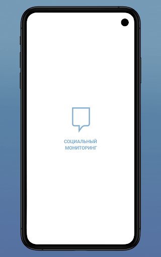  |   |   | 
 | 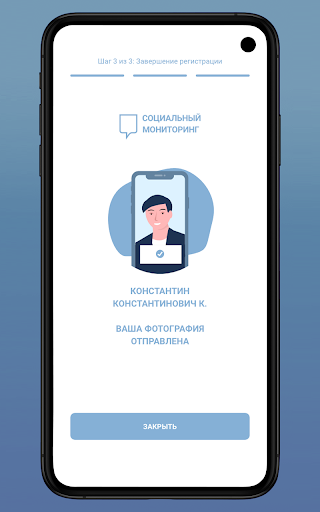  | 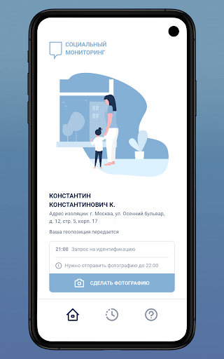 

## Development team
In the following we report the main information provided by the development team in the Google play store.

| | |
|-------------------------|-------------------------|
| **Developer**  | Информационный город ГКУ |
| **Website**  | [https://www.mos.ru/city/projects/monitoring/](https://www.mos.ru/city/projects/monitoring/) |
| **Email** | socialmonitoring@mos.ru |
| **Physical address**  | - |
| **Other developed apps**  | [https://play.google.com/store/apps/developer?id=%D0%98%D0%BD%D1%84%D0%BE%D1%80%D0%BC%D0%B0%D1%86%D0%B8%D0%BE%D0%BD%D0%BD%D1%8B%D0%B9+%D0%B3%D0%BE%D1%80%D0%BE%D0%B4+%D0%93%D0%9A%D0%A3](https://play.google.com/store/apps/developer?id=%D0%98%D0%BD%D1%84%D0%BE%D1%80%D0%BC%D0%B0%D1%86%D0%B8%D0%BE%D0%BD%D0%BD%D1%8B%D0%B9+%D0%B3%D0%BE%D1%80%D0%BE%D0%B4+%D0%93%D0%9A%D0%A3) |

## Android support

| | |
|-------------------------|-------------------------|
| **Declared target Android version**  | Android10, version 10 (API level 29) |
| **Effective target Android version**  | Android10, version 10 (API level 29) |
| **Minimum supported Android version**  | Marshmallow, version 6.0 (API level 23) |
| **Maximum target Android version**  | - |

The larger the difference between the minimum and maximum supported Android versions, the better. A larger difference means a wider audience. For example, old phones have a very low Android version, so a high minimum supported Android version means that the app cannot be used by users with old phones, thus leading to accessibility problems. 

## Requested permissions

In the following we report the complete list of the permissions requested by the app. 

| **Permission** | **Protection level** | **Description** | 
|-------------------------|-------------------------|-------------------------|
 **android.permission ACCESS_BACKGROUND_LOCATION** | :warning:**Dangerous** | Allows an app to access location in the background. 
 **android.permission ACCESS_FINE_LOCATION** | :warning:**Dangerous** | Allows an app to access precise location. 
 **android.permission ACCESS_NETWORK_STATE** | Normal | Allows applications to access information about networks. 
 **android.permission CAMERA** | :warning:**Dangerous** | Required to be able to access the camera device. 
 **android.permission FOREGROUND_SERVICE** | Normal | Allows a regular application to use Service.startForeground. 
 **android.permission INTERNET** | Normal | Allows applications to open network sockets. 
 **android.permission READ_EXTERNAL_STORAGE** | :warning:**Dangerous** | Allows an application to read from external storage. 
 **android.permission RECEIVE_BOOT_COMPLETED** | Normal | Allows an application to receive the Intent.ACTION_BOOT_COMPLETED that is broadcast after the system finishes booting. 
 **android.permission REQUEST_IGNORE_BATTERY_OPTIMIZATIONS** | Normal | Permission an application must hold in order to use Settings.ACTION_REQUEST_IGNORE_BATTERY_OPTIMIZATIONS. 
 **android.permission USE_FULL_SCREEN_INTENT** | Normal | Required for apps targeting Build.VERSION_CODES.Q that want to use notification full screen intents. 
 **android.permission WAKE_LOCK** | Normal | Allows using PowerManager WakeLocks to keep processor from sleeping or screen from dimming. 
 **android.permission WRITE_EXTERNAL_STORAGE** | :warning:**Dangerous** | Allows an application to write to external storage. 
 **com.google.android.c2dm.permission RECEIVE** | - | - 
 **com.google.android.finsky.permission BIND_GET_INSTALL_REFERRER_SERVICE** | - | - 
 **com.msk.socmon PERMISSION** | - | - 

## Mentioned servers

| **Server** | **Registrant** | **Registrant country** | **Creation date** | 
|-------------------------|-------------------------|-------------------------|-------------------------|
 | adobe.com | Adobe Inc. | :us: US | 1986-11-17 05:00:00 |
 | googlesyndication.com | Google LLC | :us: US | 2003-01-21 06:17:24 |
 | google.com | Google LLC | :us: US | 1997-09-15 04:00:00 |
 | googleadservices.com | Google LLC | :us: US | 2003-06-19 16:34:53 |
 | app-measurement.com | Google LLC | :us: US | 2015-06-19 20:13:31 |
 | mos.ru | - | - | 1996-12-23 09:49:03 |
 | crashlytics.com | Google LLC | :us: US | 2011-01-21 15:30:40 |

## Security analysis 

Below we report the main security warnings raised by our execution of the [Androwarn](https://github.com/maaaaz/androwarn) security analysis tool.

**Connection interfaces exfiltration**
> - This application reads details about the currently active data network 
> - This application tries to find out if the currently active data network is metered 

**Telephony services abuse**
> - This application makes phone calls 

**Suspicious connection establishment**
> - This application opens a Socket and connects it to the remote address '; port is out of range' on the 'N/A' port  
> - This application opens a Socket and connects it to the remote address 'Ljava/net/Proxy;->type()Ljava/net/Proxy$Type;' on the 'N/A' port  
> - This application opens a Socket and connects it to the remote address 'Lv/b/a/a/a;->w(Ljava/lang/String;)Ljava/lang/StringBuilder;' on the 'N/A' port  
> - This application opens a Socket and connects it to the remote address 'Method sendUrgentData() is not supported.' on the 'N/A' port  
> - This application opens a Socket and connects it to the remote address 'Method setHandshakeTimeout() is not supported.' on the 'N/A' port  
> - This application opens a Socket and connects it to the remote address 'Method setOOBInline() is not supported.' on the 'N/A' port  
> - This application opens a Socket and connects it to the remote address 'Method setSoWriteTimeout() is not supported.' on the 'N/A' port  
> - This application opens a Socket and connects it to the remote address 'Socket closed' on the 'N/A' port  
> - This application opens a Socket and connects it to the remote address 'Socket is closed' on the 'N/A' port  
> - This application opens a Socket and connects it to the remote address 'Socket is closed.' on the 'N/A' port  
> - This application opens a Socket and connects it to the remote address 'Socket is not connected.' on the 'N/A' port  
> - This application opens a Socket and connects it to the remote address 'socket is closed' on the 'N/A' port  
> - This application opens a Socket and connects it to the remote address 'timeout' on the 'N/A' port  

**Code execution**
> - This application loads a native library: 'conscrypt_gmscore_jni' 
> - This application loads a native library: 'conscrypt_jni' 
> - This application loads a native library: 'tool-checker' 
> - This application executes a UNIX command 
> - This application executes a UNIX command containing this argument: 'getprop' 
> - This application executes a UNIX command containing this argument: 'mount' 

## User ratings and reviews

Below we provide information about how end users are reacting to the app in terms of ratings and reviews in the Google Play store.

### Ratings

The Социальный мониторинг app has been installed by more than **100000** times. At this time, **9097** rated the app and its average score is **1.3493078**. Below we show the distribution of the ratings across the usual star-based rating of Google Play

:star::star::star::star::star:: 416

:star::star::star::star:: 232

:star::star::star:: 271

:star::star:: 271

:star:: 7907

### Reviews 

#### 5-star reviews

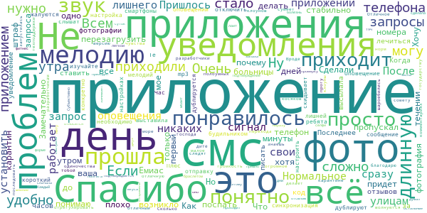

> Для ловли потенциальных убийц. Настроил специальный гудок, чтоб не спутать с другими, отсылаю селфик в случайное время. Всем в ответ того же и втройне.  :date: __2021-01-15 22:27:35__

> Нормальное приложение, те кто пишет гадости ложитесь на изоляцию в стационар и не пользуйтесь приложением.  :date: __2021-01-13 08:11:05__

> Тут так все злостно критикуют. Неужели так сложно самому настроить свой телефон и поставить мелодию вместо сигнала об смс? И даётся целый час, что бы ответить. Данные местоположения всегда едят батарею. Нормальное приложение.  :date: __2021-01-11 16:16:01__

> Хочу поделиться впечатлениями от использования программы. Не всё так плохо, как многие пишут. Сигналы приходят в виде СМС на Ваш телефон, а также от самой программы. Звук СМС, такой как вы сами поставите на своём телефоне. Запросы постоянно, никто не присылает. Мне приходит по 3 в день. Если у Вас телефон со слабой батареей, или Вы сомневаетесь, в своём устройстве, обратитесь в службу поддержки и Вам предоставят телефон на время изоляции. Мне привезли в течении 2 суток. Вообщем всё ок!  :date: __2021-01-10 10:49:15__

> а мне приложение понравилось, ничего лишнего + дублируют по смс оповещения синхронизация с будильником или настройка мелодий оповещения из приложения была бы не лишней. сейчас что бы настроить длинную мелодию на оповещении, необходимо установить mp3 на сообщение и отключить оповещение в приложении т.к. звук приложения скидывает сигнал смс потому что приходит сразу после смс  :date: __2021-01-09 16:33:49__

> Спасибо  :date: __2021-01-09 09:03:14__

> Нормальное приложение! В день приходит 3-4 уведомления. Плюс запрос дублируется по СМС. Час на отправку фото. Всё просто и понятно. Те, кто жалуются, что не слышат звук уведомления, или короткий сигнал, ребята, изучайте свои смартфоны! Я сразу, в настройках телефона, выставила длинную мелодию конкретно для этого приложения и никаких проблем! Ну а уж отрегулировать громкость телефона и дитё малое сумеет....  :date: __2021-01-08 18:12:53__

> Отличное приложение!  :date: __2021-01-05 10:32:36__

> Господа разработчики, благодарю вас за отличную прогу! Спасибо!  :date: __2021-01-05 10:26:13__

> все что надо делает  :date: __2021-01-05 09:26:22__

#### 4-star reviews

> Приложение работает прочитал отзывы вы спецыально походу пишите мол не работает,тихо приходит смс или уведомление.Это зависит от вашего же смартфона,включите звук и увеличьте в настройках уведомления,там же находится громче не можете сделать что ли.А потом ноете что мол приложение не работает и тихо приходит.У меня все прекрасно работает и слышу когда уведомления приходят  :date: __2021-01-15 07:17:34__

> Что касается уведомления (тихое или громкое) его можно выбрать в настройках звука уведомлений в телефоне (сделать громче и выбрать рингтон). Молодцы, что дублируют в смс запрос на идентификацию. Теперь пропустить реально проблематично. Что касается самой всей этой ситуации, то ощущение, что ты находишься под домашним арестом по уголовному делопроизводству и это пипец))) А по факту: берегите себя и окружающих, находитесь дома и не заражайте других. И, конечно же, скорейшего выздоровления всем!  :date: __2021-01-08 13:32:54__

> Со своей функцией справляется. Просидел на самоизоляции 2 недели, ни одной фотки не пропустил. ИМХО в приложении есть недостатков: 1. Самая идея, что вы мне смс, а я вам фотку за час- это бред, больные люди могут отдыхать, сам спал по 2 часа, но ИМХО это нормально. Нужен вариант, чтобы я предупредил вас, что прошу не беспокоить, я лечусь, а не вам информирую. 2. Громкость уведомления. Она должна быть адской 3. Добавить в приложение скан моего согласия и срок самоизоляции  :date: __2021-01-08 12:38:17__

> Спасибо разрабам всё работает хорошо,по крайней мере у меня.  :date: __2020-12-27 20:16:17__

> К приложению вопросов нет. Простое и интуитивно понятно. Проверка вмеру адекватно.  :date: __2020-12-27 18:49:17__

> Хорошее приложение. Жаль только, что не уведомляет каждые 5-10 минут о том, что надо пройти идентификацию. За это звезду снимаю. Но на телефоне можно отдельно настроить повторяющееся уведомление об смс. И кто пишет, что проспал и штраф пришел - это не так. У меня несколько знакомых пропустили один раз и ничего им не было за это. Ерунда только со снятием с карантина. Телефоны какую-то ерунду в основном говорят. Но это вопрос не к разработчикам.  :date: __2020-12-27 09:14:37__

> Вчера были врачи, после прочитала бумагу и сразу скачивала приложение, но мой номер сутки уже висит на подтверждении данных.  :date: __2020-12-27 08:50:42__

> Теперь, после обновления приложения определение местоположения заработало корректно. Минус одна звезда за то, что приложение не учитывает самочувствие человека, что он может спать и не среагировать на смс, а спать может и три часа подряд, при этом больному человеку нужно отсыпаться и восстанавливаться, а не дёргаться, что проспал смс. В общем по это проблема не разработчика, а скорее правительства Моаквы.  :date: __2020-12-25 14:51:22__

> Сразу хочу отметить, что отзыв оставляю о работе самого приложения, а не системы отслеживания) поначалу было менее информативно, приложение я поставила 10.12. Приходит смс и в течение часа надо отправить свое фото. Отметок о том, что фото прошло, не было. С обновлением стало удобнее: видно, во сколько пришел запрос, во сколько отправила фото и прошла ли фотл идентификацию. Следила конечно за смс, потому что раз пиликнет и всё, можно пропустить. Было бы удобнее реализовать дозвон. Всем здоровья.  :date: __2020-12-25 10:51:44__

> Нет данных о том, что изоляция окончена  :date: __2020-12-24 05:27:08__

#### 3-star reviews

> Необходимо подумать про уникальность уведомлений. Они сливаются с сотнями аналогичных  :date: __2021-01-13 14:32:40__

> Приложение в части для ковид контактных не рабочее, 10 дней пока был в контактных не регистрировали, как стал заболевшим, в течение суток зарегистрировали. Для чего тогда требование и согласие, что контактные должны ставить приложение? Вообщем хотели как лучше, а получилось как всегда, через ... Думаю все всё прекрасно поняли.  :date: __2021-01-12 10:03:47__

> Здравствуйте. Было бы не плохо сделать сигнал прохождения идентификации повторяющимся хотя бы каждые 15 минут (или сделать этот интервал настраиваемым). Когда спохватился, что давно не проходил идентификацию, оказалось, что сигнал пришел как раз в те 3 минуты когда я был на кухне. Опоздал почти на 1ч 20 минут. Просидев целый день дома. Обидно.  :date: __2021-01-11 19:37:21__

> Слишком часто приходилось звонить в техподдержку по вопросам работы приложения. Отзыв отредактирован несколько раз в период использования с 27.12.2020 по 10.01.202. В итоге впечатления: Плюсы: + в техподдержке грамотные специалисты, в колцентре - вежливые. Минусы: - ОЧЕНЬ легко пропустить оповещение. Приходилось всё время проверять телефон, это очень нервирует. Пожелание: - приведите в один уровень громкость оператора и музыки во время ожидания или музыку сделайте тише оператора, пожалуйста.  :date: __2021-01-10 10:10:19__

> Единственный минус который я заметил это то , что нет нормального звукового уведомления .  :date: __2021-01-09 23:22:15__

> Здорово , что вы контролируете заражённых и все такое . Но вот не понятно, когда я уже второй анализ сделала и у меня отрицательный, почему все ещё это приложение нужно снабжать моими фото? Ещё и дома сидеть, я ведь не заразна?  :date: __2021-01-09 16:11:20__

> Идея любопытная, но вот теперь став пациентом и невольным пользователем этого чуда, я испытываю некоторые трудности. Дело в том что я сова и привык поздно ложиться. Было бы здорово сделать возможным указать свой режим когда можно слать уведомления, а то одно я просто проспал не услышав смс. И вторая идея которая сделала бы это приложение более востребованным, это вмонтировать в него и дистанционную консультацию с врачом в чате и по видео и аудио связи. Ну и экстренный вызов скорой одним нажатием  :date: __2021-01-09 02:03:47__

> Ну такое, очень тихое уведомление, сделайте как будильник, ибо человек будет спать и не услышит , а потом лови штраф на 4 тыс  :date: __2021-01-08 23:12:07__

> Приложение иногда даёт сбой. Первые пару дней идёт проверка номера. В принципе, нормально.  :date: __2021-01-06 12:04:55__

> Нет возможности настроить на громкий звонок, а смс не слышно. У пожилых людей часто ослаблен слух. Больные люди часто днём спят. Простуда часто сопровождается отитом.  :date: __2021-01-05 07:43:19__

#### 2-star reviews

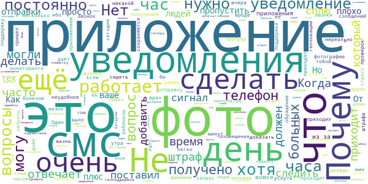

> Люди, можно ли с 22 часов до 9 утра, отключить на смартфоне интернет, это не нарушит правило, использования социального мониторинга, ведь в эти часы не приходят уведомления?  :date: __2021-01-16 16:08:20__

> Изоляция закончилась вчера,а запросы продолжает слать((((. На все вопросы что делать отвечает робот по шаблону. Сносить или нет и как они и что отслеживают, если нет у них данных когда подписано постановление. Я считаю, что это недоработка.  :date: __2021-01-14 19:10:47__

> Приложение неплохое по задумке, но ужасная реализация уведомленией полностью все портит. Когда приходит уведомление о фотографии даётся вроде бы немало времени на выполнение - 1 час, но если ты не обратил внимание, то штраф обеспечен. Если подумать, то непонятно, как больной человек, который из-за самочувствия может спать и днём тоже должен следить за телефоном. Это небольшое и единоразовое!! уведомление его точно не разбудит. Необходимо добавить повторное уведомление за 5-10 мин до конца срока.  :date: __2021-01-13 17:39:53__

> Когда нужно установить, уведомляют, а когда можно уже удалить приложение, не оповещают. Думай и гадай, можно или нельзя. В службу поддержки дозвон 25-30 минут.  :date: __2021-01-13 15:58:32__

> Нет настроек сигнала оповещения. Я бы поставил сигнал сирены и отличал бы, что пришел запрос на фотографию, а не спам из остальных 100500 сообщений. И так же просыпался бы когда сплю.  :date: __2021-01-13 15:45:07__

> Убогое приложение, никак не настраивается и не поворачивается, невозможно поставить отдельный ринг он, поэтому пищит как все смс и ватсап, пропустить будучи даже законопослушным гражданином идентификации как нехрен делать. Дали б разработчикам ещё немного денег чтобы они добавили настройки в программу.  :date: __2021-01-11 16:33:12__

> Приложение вроде не плохое, но уведомления никуда не годятся... Я себя плохо чувствую, сплю постоянно и просто иногда не могу услышать его. Лучше бы это было что то типо видиозвонка. Тем более в течении часа, данного на отправку фото, я могу быть где угодно  :date: __2021-01-09 13:57:05__

> Совершенно бестолковое приложение с точностью локализации около 10км.  :date: __2021-01-08 17:04:19__

> 1.ОЧЕНЬ неудобно без индивидуального звукового оповещения, пропустить легко уведомление. От этого нервничаешь и постоянно залезаешь в телефон - жизнь вокруг него это нереально. 2.ОБРАТНАЯ СВЯЗЬ ОДНОСТОРОННЯЯ. Я писала в тех.поддержку дважды и дважды ничего не получила в качестве автореплая (ваше обращение получено, благодарим за ...) 3. Нам перестали приходить смски на 13ый день, воспринималос как сигнал к выходу.  :date: __2021-01-07 10:48:46__

> Было бы хорошо добавить возможность увидеть историю отправленных тобой обращений в техподдержку плюс отбивку на указанный электронный адрес о том, что твое обращение получено. А то пишешь, отправляешь - как в трубу. Ушло/не ушло, получено/не получено... Непонятно. Ну и хорошо бы, чтобы ответ по решению проблемы на электронную почту тоже приходил, как обещано в описании. Написала 2 обращения, прошло несколько дней - ни на одно ответа нет. Ошибок конечно, ранее описанных, очень много.  :date: __2021-01-06 12:13:52__

#### 1-star reviews

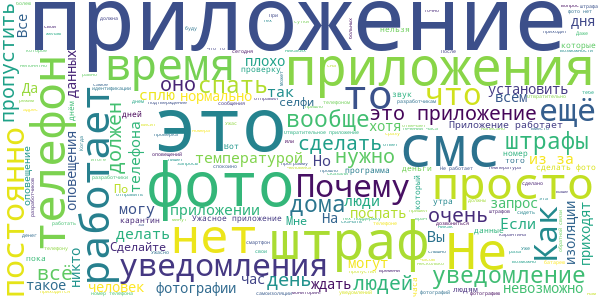

> Болела бессимптомно. Дома сидела с тремя маленькими детьми, один грудной. Приходилось постоянно таскать с собой телефон из комнаты в комнату, чтобы не пропустить уведомление. А это очень неудобно, когда дети бегают то туда, то сюда. Днём не прилечь поспать, боишься пропустить смс. Как те, кто реально болеет с температурой и слабостью?!..... В общем, жуть....  :date: __2021-01-16 19:49:16__

> Самое гнилое приложение, в место того что бы спать и набираться сил, нужно сидеть с открытыми глазами и ждать смс,  :date: __2021-01-16 19:10:14__

> ужасное приложение! нормально не работает, неужели нельзя сделать нормальное приложение, деньги потрачены, а толку ноль.  :date: __2021-01-16 17:54:06__

> заставляете в выходной вставать в 9 утра и не ложится спкть до 22 часов, вы сами там не больные случаем? у меня постоянные головные боли, я ложусь спать в 21, засыпаю в лучшем случае в 3 ночи и должен в 9 просыпаться потому что может прийти ваше учедомление которые не млышно даже! засудить бы вас...  :date: __2021-01-16 16:50:49__

> Отвратительно без конца просят фото а если я уснул что штраф что-ли , как заключённый себя чувтвую себя если в самом деле болен это будет лишней нервотрёпкой  :date: __2021-01-16 16:47:41__

> Программу курирует стадо недекватных и не особо умных людей. Больные люди с температурой не могут иметь дневного сна потому что им надо селфачь в рандомное время отправлять. Куратор этого проекта глупее животного. Тупые, ражевываю для Вас: к ночи у больных обычно поднимается температура и нормально выспаться нет возможности. Мониторят они...да за зеками гуманнее Мониторят наверное. Желаю руководству на своей шкуре испытать свойже режим. 0 из 5.  :date: __2021-01-16 13:24:59__

> Что за приложение такое днище,если например поспать захотел немного а вдруг придет СМС,как в таком случае быть,это не самоизоляция это рабство какое та,поставили бы хотяб именно такое время чтоб человек знал и не спал...  :date: __2021-01-16 09:33:17__

> Ужасное приложение, не продуманы уведомления. Человек болеет и не может позволить себе поспать! Приходилось ПОСТОЯННО ставить будильник.  :date: __2021-01-16 08:26:51__

> очень плохо работает  :date: __2021-01-16 00:57:16__

> 1 смс в час это единственное уведомление. Ты мог спать не услышать или ещё что-то. Второго уведомления тебе приложение не присылает. Могли бы сделать какое нибудь пуш уведомление или дублировать сигналом из приложения. С этой программой стал паникером каждые полчаса открываю приложение чтобы ничего не пропустить. Мне несколько дней было ужасно плохо, из за температуры я не высыпался, и каждое утро в 9:00 я должен просыпаться и включать звук на телефоне и ты уже нормально не заснешь. Ужасно!  :date: __2021-01-15 21:38:28__

# OpenWHO
App version ``3.7``

Analyzed with [covid-apps-observer](http://github.com/covid-apps-observer) project, version ``0.1``

## App overview
| | |
|-------------------------|-------------------------| 
| **Name**&nbsp;&nbsp;&nbsp;&nbsp;&nbsp;&nbsp;&nbsp;&nbsp;&nbsp;&nbsp;&nbsp;&nbsp;&nbsp;&nbsp;&nbsp;&nbsp;&nbsp;&nbsp;&nbsp;&nbsp;&nbsp;&nbsp;&nbsp;&nbsp;&nbsp;&nbsp;&nbsp;&nbsp;&nbsp;&nbsp;&nbsp;&nbsp;&nbsp;&nbsp;&nbsp;&nbsp;&nbsp;&nbsp;&nbsp;&nbsp;  | OpenWHO |
| **Unique identifier** | de.xikolo.openwho |
| **Link to Google Play** | [https://play.google.com/store/apps/details?id=de.xikolo.openwho](https://play.google.com/store/apps/details?id=de.xikolo.openwho) |
| **Summary**  | Знания, необходимые при чрезвычайных ситуациях в области здравоохранения |
| **Privacy policy** | [https://openwho.org/pages/privacy](https://openwho.org/pages/privacy) |
| **Latest version** | 3.7 |
| **Last update** | 2020-11-23 13:57:15 |
| **Recent changes** | - Bug fixes and performance improvements |
| **Installs**  | 1 000 000+ |
| **Category** | Образование |
| **First release** | 17 мая 2017 г. |
| **Size**  | 18M |
| **Supported Android version**  | 5.0 и выше |

### Description
> OpenWHO - это интерактивная платформа Всемирной организации здравоохранения (ВОЗ) для распространения знаний, предлагающая онлайн курсы по улучшению реагирования на чрезвычайные ситуации в области здравоохранения. OpenWHO позволяет Организации и ее ключевым партнерам передавать знания, спасающие жизнь, большому числу лиц, находящихся на передней линии борьбы с чрезвычайными ситуациями.
 Платформа OpenWHO предоставляет возможность учиться в удобное для вас время. Смотрите короткие видео лекции и проверяйте свои знания с помощью самостоятельных тестов, когда и где вам будет удобно. Форум и возможность сотрудничества позволяют обмениваться опытом с другими участниками платформы и экспертами по всему миру.
 Данное приложение, предназначенное главным образом для работников здравоохранения, специалистов, осуществляющих первичные меры реагирования на чрезвычайные ситуации, и руководителей, также является источником информации для тех, кто затронут вспышками заболеваний и чрезвычайными ситуациями, в том числе для лиц в целом интересующихся работой ВОЗ в условиях чрезвычайных ситуаций в области здравоохранения.
 Данное приложение состоит из 6 каналов:
 - Канал, посвященный вспышкам заболеваний (Outbreak Channel), направлен на борьбу с инфекционными заболеваниями и предоставляет жизненно важную научную информацию.
 - Канал готовности к реагированию (Ready for Response channel) помогает в подготовке персонала, который проходит обучение для работы в условиях вспышек заболеваний и чрезвычайных ситуаций в области здравоохранения.
 - Социальный Канал (Get Social channel) фокусируется на мероприятиях, основанных на социальных науках, и помогает взаимодействовать с пострадавшими общинами.
 - Канал подготовки к пандемиям (Preparing for Pandemics channel) объединяет курсы по различным аспектам обеспечения готовности, включая эпиднадзор, меры в области общественного здравоохранения и информирование о рисках во время пандемии.
 - Канал COVID-19 (COVID-19 channel) представляет учебные материалы на 6 официальных языках ВОЗ (английском, арабском, испанском, китайском, русском и французском) для медицинских работников, руководителей и общественности в связи со вспышкой коронавирусной болезни (COVID-19). 
 - Канал COVID-19 другие национальные языки (COVID-19 National Languages channel) предлагает те же учебные ресурсы, что и канал COVID-19, но на других национальных языках, таких как индонезийский, японский и португальский.
 Курсы OpenWHO доступны на многих языках, включая 6 официальных языков ВОЗ.
 Скачайте приложение сейчас, присоединяйтесь к сообществу OpenWHO.
 Это приложение разработано в сотрудничестве между Институтом Хассо Платтнера и ВОЗ. Обучающий контент предоставляется исключительно ВОЗ.

### User interface
The developers of the app provide the following screenshots in the Google play store.
| | | |
|:-------------------------:|:-------------------------:|:-------------------------:|
 |   |   |   | 
 |   |   |   | 

## Development team
In the following we report the main information provided by the development team in the Google play store.

| | |
|-------------------------|-------------------------|
| **Developer**  | HPI Knowledge Engineering Team |
| **Website**  | [https://openwho.org/](https://openwho.org/) |
| **Email** | openwho-support@hpi.de |
| **Physical address**  | [Prof.-Dr.-Helmert-Str.2-3 14482 Potsdam](https://www.google.com/maps/search/Prof.-Dr.-Helmert-Str.2-3%2014482%20Potsdam) (Google Maps) |
| **Other developed apps**  | [https://play.google.com/store/apps/developer?id=7185448023325736337](https://play.google.com/store/apps/developer?id=7185448023325736337) |

## Android support

| | |
|-------------------------|-------------------------|
| **Declared target Android version**  | - |
| **Effective target Android version**  | - |
| **Minimum supported Android version**  | Lollipop, version 5.0 (API level 21) |
| **Maximum target Android version**  | - |

The larger the difference between the minimum and maximum supported Android versions, the better. A larger difference means a wider audience. For example, old phones have a very low Android version, so a high minimum supported Android version means that the app cannot be used by users with old phones, thus leading to accessibility problems. 

## Requested permissions

In the following we report the complete list of the permissions requested by the app. 

| **Permission** | **Protection level** | **Description** | 
|-------------------------|-------------------------|-------------------------|
 **android.permission ACCESS_NETWORK_STATE** | Normal | Allows applications to access information about networks. 
 **android.permission ACCESS_WIFI_STATE** | Normal | Allows applications to access information about Wi-Fi networks. 
 **android.permission DOWNLOAD_WITHOUT_NOTIFICATION** | - | - 
 **android.permission FOREGROUND_SERVICE** | Normal | Allows a regular application to use Service.startForeground. 
 **android.permission INTERNET** | Normal | Allows applications to open network sockets. 
 **android.permission RECEIVE_BOOT_COMPLETED** | Normal | Allows an application to receive the Intent.ACTION_BOOT_COMPLETED that is broadcast after the system finishes booting. 
 **android.permission WAKE_LOCK** | Normal | Allows using PowerManager WakeLocks to keep processor from sleeping or screen from dimming. 
 **android.permission WRITE_EXTERNAL_STORAGE** | :warning:**Dangerous** | Allows an application to write to external storage. 
 **com.google.android.c2dm.permission RECEIVE** | - | - 
 **com.google.android.finsky.permission BIND_GET_INSTALL_REFERRER_SERVICE** | - | - 

## Mentioned servers

| **Server** | **Registrant** | **Registrant country** | **Creation date** | 
|-------------------------|-------------------------|-------------------------|-------------------------|
 | googlesyndication.com | Google LLC | :us: US | 2003-01-21 06:17:24 |
 | google.com | Google LLC | :us: US | 1997-09-15 04:00:00 |
 | apple.com | Apple Inc. | :us: US | 1987-02-19 05:00:00 |
 | aomedia.org | Contact Privacy Inc. Customer 1243324949 | :canada: CA | 2015-08-24 14:07:31 |
 | dashif.org | VTM Group | :us: US | 2012-04-27 13:02:46 |
 | app-measurement.com | Google LLC | :us: US | 2015-06-19 20:13:31 |
 | w3.org | W3C | :us: US | 1994-07-06 04:00:00 |
 | googleapis.com | Google LLC | :us: US | 2005-01-25 17:52:26 |
 | psdev.de | - | - | - |
 | xmlpull.org | WhoisGuard, Inc. | PA | 2001-11-26 20:33:08 |
 | crashlytics.com | Google LLC | :us: US | 2011-01-21 15:30:40 |
 | apache.org | The Apache Software Foundation | :us: US | 1995-04-11 04:00:00 |
 | opensource.org | Open Source Initiative | :us: US | 1998-02-11 05:00:00 |
 | creativecommons.org | Creative Commons Corporation | :canada: CA | 2001-01-15 16:51:44 |
 | eclipse.org | Eclipse.org Foundation, Inc. | :canada: CA | 1997-04-14 04:00:00 |
 | gnu.org | Free Software Foundation | :us: US | 1995-11-24 05:00:00 |
 | mozilla.org | Mozilla Corporation | :us: US | 1998-01-24 05:00:00 |
 | googleadservices.com | Google LLC | :us: US | 2003-06-19 16:34:53 |

## Security analysis 

Below we report the main security warnings raised by our execution of the [Androwarn](https://github.com/maaaaz/androwarn) security analysis tool.

**Telephony identifiers leakage**
> - This application reads the ISO country code equivalent of the current registered operator's MCC (Mobile Country Code) 
> - This application reads the MCC+MNC of the provider of the SIM 

**Connection interfaces exfiltration**
> - This application reads details about the currently active data network 
> - This application tries to find out if the currently active data network is metered 

**Suspicious connection establishment**
> - This application opens a Socket and connects it to the remote address ' returned no addresses for  ; port is out of range' on the 'N/A' port  
> - This application opens a Socket and connects it to the remote address '' on the 'N/A' port  
> - This application opens a Socket and connects it to the remote address 'Ljava/lang/StringBuilder;->toString()Ljava/lang/String;' on the 'N/A' port  
> - This application opens a Socket and connects it to the remote address 'Ljava/net/Proxy;->type()Ljava/net/Proxy$Type;' on the 'N/A' port  
> - This application opens a Socket and connects it to the remote address 'timeout' on the 'N/A' port  

**Code execution**
> - This application loads a native library 

## User ratings and reviews

Below we provide information about how end users are reacting to the app in terms of ratings and reviews in the Google Play store.

### Ratings

The OpenWHO app has been installed by more than **1000000** times. At this time, **3403** rated the app and its average score is **4.2647057**. Below we show the distribution of the ratings across the usual star-based rating of Google Play

:star::star::star::star::star:: 2403

:star::star::star::star:: 370

:star::star::star:: 130

:star::star:: 130

:star:: 370

### Reviews 

#### 5-star reviews

> Классно!!!!!  :date: __2020-05-02 17:01:13__

> ☝️👍  :date: __2020-04-16 23:35:41__

#### 4-star reviews

> Дал бы 5 звёзд, но я поставил 4.Потому что не актуально  :date: __2020-04-21 15:30:18__

#### 3-star reviews

No recent reviews available with 3 stars.

#### 2-star reviews

No recent reviews available with 2 stars.

#### 1-star reviews

> Ганр  :date: __2020-09-08 14:20:40__

> Zor  :date: __2020-04-06 16:27:47__

> Бесполезное приложение Я ищу сколько по Казахстану А тут статьи не о чем  :date: __2020-04-06 07:31:50__

> Bobur  :date: __2020-04-03 00:57:43__

# Активный гражданин
App version ``2.24.1``

Analyzed with [covid-apps-observer](http://github.com/covid-apps-observer) project, version ``0.1``

## App overview
| | |
|-------------------------|-------------------------| 
| **Name**&nbsp;&nbsp;&nbsp;&nbsp;&nbsp;&nbsp;&nbsp;&nbsp;&nbsp;&nbsp;&nbsp;&nbsp;&nbsp;&nbsp;&nbsp;&nbsp;&nbsp;&nbsp;&nbsp;&nbsp;&nbsp;&nbsp;&nbsp;&nbsp;&nbsp;&nbsp;&nbsp;&nbsp;&nbsp;&nbsp;&nbsp;&nbsp;&nbsp;&nbsp;&nbsp;&nbsp;&nbsp;&nbsp;&nbsp;&nbsp;  | Активный гражданин |
| **Unique identifier** | ru.mos.polls |
| **Link to Google Play** | [https://play.google.com/store/apps/details?id=ru.mos.polls](https://play.google.com/store/apps/details?id=ru.mos.polls) |
| **Summary**  | Твой город – твое решение! Электронные голосования Правительства Москвы. |
| **Privacy policy** | [https://ag.mos.ru/eula](https://ag.mos.ru/eula) |
| **Latest version** | 2.24.1 |
| **Last update** | 2020-12-11 09:17:34 |
| **Recent changes** | Новый раздел &quot;Лидеры проекта&quot; и обновленная форма поиска общественных обсуждений |
| **Installs**  | 500 000+ |
| **Category** | Социальные |
| **First release** | 14 мая 2014 г. |
| **Size**  | 13M |
| **Supported Android version**  | 4.4 и выше |

### Description
> Твой город – твое решение! Электронные голосования Правительства Москвы.
 Ты решаешь, какой будет Москва! Участвуй в голосованиях и получай поощрения от города и партнеров проекта!
 «Активный гражданин» — проект для тех, кто хочет изменить город к лучшему. Это официальное приложение Правительства Москвы, которое было создано по поручению мэра Москвы Сергея Собянина.
 Каждую неделю Мэр и Правительство Москвы выносит на обсуждение активных граждан важные для города вопросы: от транспорта и благоустройства территорий до здравоохранения и образования. Выражая свое мнение, ты помогаешь органам власти принимать верные решения. 
 — Как будут отдыхать московские школьники?
 — Нужно ли ограничивать скорость в центре Москвы?
 — Что построить на месте бывшей промзоны?
 Просто зарегистрируйся, укажи свой адрес и голосуй!
 Результаты электронных голосований будут воплощены в жизнь, а тебя ждут приятные подарки.
 Высказывая свою позицию, ты получаешь баллы. Заработай 1000 баллов и получи статус «Активный гражданин», который открывает доступ к Магазину поощрений. В нем заработанные баллы можно обменять на городские услуги. Например:
 — оплата парковки
 — поездки на метро
 — билеты в театры и музеи
 — городские экскурсионные программы
 — яркие сувениры с символикой «Активного гражданина»
 и другие полезные мелочи.
 Хочешь получить еще больше баллов? Чаще заходи в приложение, выражай свое мнение, отмечайся на мероприятиях, приглашай друзей, активируй промо-коды и делись информацией о пройденных голосованиях в социальных сетях.
 Самые активные участники проекта становятся гостями уникальных городских мероприятий. Например, активные граждане могут посетить генеральную репетицию парада Победы или концерт в День города на Красной площади, Чемпионат мира по шорт-треку с участием звезды спорта Виктора Ана или кататься на главном катке страны на ВДНХ.
 Стань активным гражданином — установи приложение бесплатно прямо сейчас!

### User interface
The developers of the app provide the following screenshots in the Google play store.
| | | |
|:-------------------------:|:-------------------------:|:-------------------------:|
 |   |   |   | 
 | 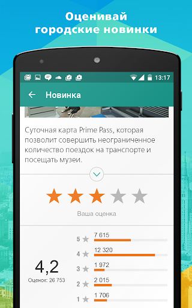  |   |   | 
 |  

## Development team
In the following we report the main information provided by the development team in the Google play store.

| | |
|-------------------------|-------------------------|
| **Developer**  | Информационный город ГКУ |
| **Website**  | [http://ag.mos.ru/](http://ag.mos.ru/) |
| **Email** | support@ag.mos.ru |
| **Physical address**  | - |
| **Other developed apps**  | [https://play.google.com/store/apps/developer?id=%D0%98%D0%BD%D1%84%D0%BE%D1%80%D0%BC%D0%B0%D1%86%D0%B8%D0%BE%D0%BD%D0%BD%D1%8B%D0%B9+%D0%B3%D0%BE%D1%80%D0%BE%D0%B4+%D0%93%D0%9A%D0%A3](https://play.google.com/store/apps/developer?id=%D0%98%D0%BD%D1%84%D0%BE%D1%80%D0%BC%D0%B0%D1%86%D0%B8%D0%BE%D0%BD%D0%BD%D1%8B%D0%B9+%D0%B3%D0%BE%D1%80%D0%BE%D0%B4+%D0%93%D0%9A%D0%A3) |

## Android support

| | |
|-------------------------|-------------------------|
| **Declared target Android version**  | Android10, version 10 (API level 29) |
| **Effective target Android version**  | Android10, version 10 (API level 29) |
| **Minimum supported Android version**  | KitKat, version 4.4 - 4.4.4 (API level 19) |
| **Maximum target Android version**  | - |

The larger the difference between the minimum and maximum supported Android versions, the better. A larger difference means a wider audience. For example, old phones have a very low Android version, so a high minimum supported Android version means that the app cannot be used by users with old phones, thus leading to accessibility problems. 

## Requested permissions

In the following we report the complete list of the permissions requested by the app. 

| **Permission** | **Protection level** | **Description** | 
|-------------------------|-------------------------|-------------------------|
 **android.permission ACCESS_BACKGROUND_LOCATION** | :warning:**Dangerous** | Allows an app to access location in the background. 
 **android.permission ACCESS_COARSE_LOCATION** | :warning:**Dangerous** | Allows an app to access approximate location. 
 **android.permission ACCESS_FINE_LOCATION** | :warning:**Dangerous** | Allows an app to access precise location. 
 **android.permission ACCESS_NETWORK_STATE** | Normal | Allows applications to access information about networks. 
 **android.permission CAMERA** | :warning:**Dangerous** | Required to be able to access the camera device. 
 **android.permission GET_ACCOUNTS** | :warning:**Dangerous** | Allows access to the list of accounts in the Accounts Service. 
 **android.permission INTERNET** | Normal | Allows applications to open network sockets. 
 **android.permission READ_CONTACTS** | :warning:**Dangerous** | Allows an application to read the user's contacts data. 
 **android.permission READ_EXTERNAL_STORAGE** | :warning:**Dangerous** | Allows an application to read from external storage. 
 **android.permission READ_PHONE_STATE** | :warning:**Dangerous** | Allows read only access to phone state, including the phone number of the device, current cellular network information, the status of any ongoing calls, and a list of any PhoneAccounts registered on the device. 
 **android.permission USE_CREDENTIALS** | - | - 
 **android.permission WAKE_LOCK** | Normal | Allows using PowerManager WakeLocks to keep processor from sleeping or screen from dimming. 
 **android.permission WRITE_EXTERNAL_STORAGE** | :warning:**Dangerous** | Allows an application to write to external storage. 
 **com.google.android.c2dm.permission RECEIVE** | - | - 
 **com.google.android.finsky.permission BIND_GET_INSTALL_REFERRER_SERVICE** | - | - 

## Mentioned servers

| **Server** | **Registrant** | **Registrant country** | **Creation date** | 
|-------------------------|-------------------------|-------------------------|-------------------------|
 | googlesyndication.com | Google LLC | :us: US | 2003-01-21 06:17:24 |
 | google.com | Google LLC | :us: US | 1997-09-15 04:00:00 |
 | facebook.com | Facebook, Inc. | :us: US | 1997-03-29 05:00:00 |
 | google-analytics.com | Google LLC | :us: US | 2005-07-18 19:24:32 |
 | app-measurement.com | Google LLC | :us: US | 2015-06-19 20:13:31 |
 | googletagmanager.com | Google LLC | :us: US | 2011-11-11 23:39:05 |
 | mos.ru | - | - | 1996-12-23 09:49:03 |
 | crashlytics.com | Google LLC | :us: US | 2011-01-21 15:30:40 |
 | googleapis.com | Google LLC | :us: US | 2005-01-25 17:52:26 |
 | googleadservices.com | Google LLC | :us: US | 2003-06-19 16:34:53 |

## Security analysis 

Below we report the main security warnings raised by our execution of the [Androwarn](https://github.com/maaaaz/androwarn) security analysis tool.

**Connection interfaces exfiltration**
> - This application reads details about the currently active data network 

**Telephony services abuse**
> - This application makes phone calls 

**Suspicious connection establishment**
> - This application opens a Socket and connects it to the remote address 'Ljava/lang/StringBuilder;->toString()Ljava/lang/String;' on the 'N/A' port  
> - This application opens a Socket and connects it to the remote address 'Ljava/net/Proxy;->type()Ljava/net/Proxy$Type;' on the 'N/A' port  
> - This application opens a Socket and connects it to the remote address 'No route to  ' on the 'N/A' port  
> - This application opens a Socket and connects it to the remote address 'timeout' on the 'N/A' port  

## User ratings and reviews

Below we provide information about how end users are reacting to the app in terms of ratings and reviews in the Google Play store.

### Ratings

The Активный гражданин app has been installed by more than **500000** times. At this time, **75330** rated the app and its average score is **4.201564**. Below we show the distribution of the ratings across the usual star-based rating of Google Play

:star::star::star::star::star:: 52880

:star::star::star::star:: 7297

:star::star::star:: 3054

:star::star:: 1657

:star:: 10442

### Reviews 

#### 5-star reviews

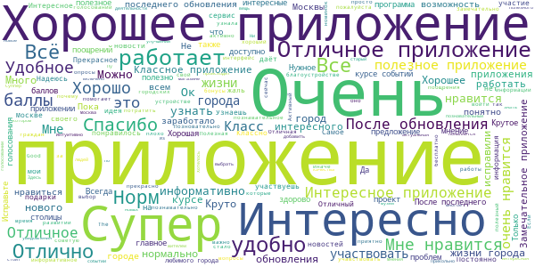

> Good  :date: __2021-01-16 09:26:37__

> Хорошее приложение  :date: __2021-01-15 12:22:16__

> Круто  :date: __2021-01-14 21:10:31__

> Удобно  :date: __2021-01-12 16:42:35__

> Да это очень крутое приложение, мне очень понравилось. Советую скачать его и попробовать сказать своё мнение, его обезательно услышат и может иммено ваше приложение поможет.  :date: __2021-01-12 14:53:18__

> Классное приложения и его идея. Пожелание - сделайте пожалуйста тёмную тему чтобы экономнее для аккумулятора на amoled экранах)  :date: __2021-01-12 12:49:18__

> Пока минусов не нашёл.  :date: __2021-01-07 12:31:37__

> Kruto  :date: __2021-01-06 03:54:53__

> Ну пользуюсь активно.ущнаю новости.  :date: __2021-01-05 20:19:12__

> Мне приложение нравится. Очень простое в использовании. Интуитивно и понятно, что и где находится. Из пожеланий, добавить сортировку по новостям, как это сделано на сайте (по годам и месяцам). По прежнему не работают уведомления на устройстве на появление новых голосований, новинок и т.д., хотя в профиле все включено и настройстве также включено. Почему то при смене фото, профиль становится не публичным и его снова надо отправлять на проверку.  :date: __2021-01-03 21:45:38__

#### 4-star reviews

> Украли баллы. Надеюсь, с персональными данными всё в порядке. P.S.: проблема была решена  :date: __2021-01-12 15:52:41__

> Вся семья пользуется этим приложением. Все копим баллы но хотелось бы сделать так что можно перекидывать баллы на один аккаунт.  :date: __2021-01-10 09:26:22__

> . Через обратную связь сообщить об ошибке невозможно, потому что не выбирается тема сообщения, а без этой темы не работает кнопка отправить. 04.12.17 приложение престает работать, если вы находитесь за границей. Говноподдержка на все отвечает одно: на наших серверах проблемы нет, ищите у себя. Этим долбоящщерам не приходит в голову рассмотреть все возможные причины не работы прложения. И видимо наше государство перестает вас считать своим гражданином, если вы находитесь за границей. Поздравляю..  :date: __2020-12-22 03:51:52__

> Нормальное приложение  :date: __2020-12-19 20:46:44__

> В "Лидерах проекта" нужна кнопка "Найти меня"  :date: __2020-12-18 16:41:58__

> Прикольное приложение. Узнаю новости Москвы.  :date: __2020-12-12 14:59:43__

> всегда можно что-то улучшить)  :date: __2020-12-07 10:31:14__

> Невозможно войти в приложение. Постоянно Ошибка 403! Уже второй день. Когда вы уже сделаете нормальное приложение? Регулярные "косяки". Перестали начислять баллы после 21.00. Вместо исправления собственных ошибок рассылает правила Голосования, которые всем известны. Ответы "В огороде бузина, в Киеве дядька". Перестаньте уже морочить голову людям! Исправляйте ошибки сами, самостоятельно!!!  :date: __2020-12-07 10:27:05__

> Сколько стоит доставка "Активный Гражданин"?  :date: __2020-12-03 02:41:04__

> Супер  :date: __2020-12-01 18:27:43__

#### 3-star reviews

> Ставлю 3. Только потому что магазин поощрений стал ужасным. Одна благотворительность. А где же кофточки, рюкзаки, футболки, значки, селфи палка и тд.? Верните прежний магазин. Я копила на селфи палку. За 1 день до покупки магазин поощрений отключили. И в итоге его обновление, сплошная благотворительность. Ужааааас. Разочаровали.  :date: __2021-01-15 11:47:32__

> Раньше с удовольствием писала отзывы и посылала ссылки своим родным, получая при этом баллы. Теперь надо каждый раз приглашать новых членов, то есть баллов много уже не получить... Да и баллы, которые я аккуратно коплю, куда-то пропадают... Голосования в последнее время какие-то неинтересные мне, даже лишний раз стараюсь не посещать Активного гражданина, а раньше часто заглядывала...  :date: __2021-01-14 23:19:50__

> Два года назад потеряла свой аккаунт. Тех.поддержка так и не смогла восстановить мой профиль по не понятным причинам. Обидно столько лет была там, столько баллов было и все сгорело.  :date: __2021-01-13 21:20:05__

> В последние 2 месяца приложение лагает , в Городских новинках при бывшем оценивании были варианты от 1 до 5 звёзд с 5 системой оценки Сейчас выскакивает 1 звезда, а система оценок так и остаётся 5бальной  :date: __2021-01-13 17:23:31__

> Оформил заказ в приложении, не успел ещё воспользоваться, через несколько часов пришло сообщение, что заказ аннулирован. Балы при этом не вернули. В итоге мой вопрос решён положительно, но осадок остался.  :date: __2021-01-12 17:15:27__

> Поменялись правила начисления баллов когда делишься в соц.сетях,обидненько однако.вообще проще не делиться,что бы не растраиватся.и в придачу еще и голований почти нет.савсем все печально стал((((  :date: __2021-01-11 20:45:54__

> 1м  :date: __2021-01-03 14:30:55__

> В приложении перестали приходить уведомления о новых голосованиях, смысл существования приложения теряется, можно с тем же успехом просто открыть страницу в интернете  :date: __2020-12-30 16:58:10__

> Несовместимо с темной темой  :date: __2020-12-24 13:18:51__

> Пока норм  :date: __2020-12-07 17:46:11__

#### 2-star reviews

> 10.01.21 вдруг при входе в приложение появилась страница аутентификации. Раньше было достаточно ткнуть иконку. Хорошо, зашел через какой то одноразовый код, который прислали на телефон. После этого изменилось все - профиль оказался незаполненным, исчезли все настройки, пропали все баллы (4800 ориентировочно). Пишет что я на проекте с 10.01.21 и голосований у меня ноль. А я в АГ с апреля 2018 и не пропустил ни одного мероприятия. Дважды написал в обратную связь - реакции ноль. БЕЗОБРАЗИЕ!!!  :date: __2021-01-14 16:16:42__

> 👎Воруют баллы.  :date: __2021-01-09 18:40:25__

> Не понимаю смысл данного приложения , пользователи единицы , информация редко когда действительно полезная и важная . Кому нужно наше мнение , сами знаем ответ , для галочки !  :date: __2021-01-08 22:40:04__

> Решите наконец проблему с постоянным вылетом из личного кабинета!  :date: __2021-01-01 22:30:08__

> Скоро новый год! Мы все ждем чудес, перемен. Помню как то в детстве, на новый год отец подарил мне конструктор лего, я был так счастлив. Смотрел по утрам мультики, днем гулял, катался на санках. Вечером садились за стол, смеялись всей семьёй. Было много радости, несмотря ни на что, время то было тяжёлое. Главное мы были вместе. Но всё ушло. Как и доверие к вашему ебаному приложению.  :date: __2020-12-23 20:53:45__

> По голосованиям и устройству претензий нет, но магазин поощрений просто беда. Хотела порадовать близких на Новый Год , а новогодний набор не заказывается ни в какую. Выдает ошибка 201. При обратной связи отписались общими фразами попробовать на след.день, что не работает как вы понимаете ужп 2 недели. На новое обращение так и не ответили , проблема не решена. Вполне оправданные 2 звезды.  :date: __2020-12-18 02:28:20__

> Ни о чем  :date: __2020-12-03 04:12:56__

> После интеграции с порталом, пользоваться стало невозможно. Постоянно вылогинивает, и нет возможности зайти по отпечатку пальца. А я все пароли наизусть не помню.  :date: __2020-11-25 22:16:51__

> После перехода на вход через мос.ру перестал пользоваться. Слишком много времени тратится на вход. Сделали бы давно вход через отпечаток, как везде.  :date: __2020-11-07 07:59:20__

> Тормоз  :date: __2020-10-31 11:26:37__

#### 1-star reviews

> Отменили начисление балов на карту Тройка. Заполонили иностранные термины. Голосования по всякой ненужной фигне.  :date: __2021-01-16 17:12:56__

> Без предупреждения обнулили 4000 баллов. Нет слов.  :date: __2021-01-15 21:50:58__

> Отменили возможность менять баллы на сувениры. Только ради этого пользовался приложением. В качестве альтернативы предлагается получать сертификаты в магазины,НО! ими нельзя оплатить всю покупку,а только треть.  :date: __2021-01-15 13:00:05__

> Обидно....мало того что без предупреждения объединили баллы Миллион призов и баллы в программе, так ещё теперь удалили 860 баллов... больше нет желания пользоваться программой. Понятное дело что участвовала там не из-за балов, но это честно обидно.  :date: __2021-01-14 21:37:09__

> Не поленюсь, поставлю ещё единицу. Зачем отправлять смс при пополнении тройки? Вам бюджет что ли выделили на смс сообщения.  :date: __2021-01-14 18:56:56__

> ОДИН ОБМАН.НИ ХРЕНА НЕ РАБРТАЕТ ЧТО ПРИЛОЖЕНИЕ САЙТ И ТД.  :date: __2021-01-11 01:23:19__

> Все работало нормально.Потом зачем-то стали требовать привязать номер.Я привязываюсь а СМС с подтверждением не приходит.  :date: __2021-01-09 08:34:18__

> Списали больше 11 000 баллов, техподдержка молчит  :date: __2021-01-07 17:20:17__

> Досрочно свернули программу миллион призов. Есть видео доказательство, что 31 декабря в 23 часа уже нельзя было ни на что потратить баллы. Как результат они просто сгорели на моих глазах. Поддержка дала отписку, что просто они закончились. А какой смысл давать баллы, если на них ничего нельзя приобрести? Никому не советую связываться с этими мошенниками!  :date: __2021-01-07 12:47:52__

> Взяли и списали ВСЕ баллы без предупреждения, дескать год закончился. И Миллион призов, где у меня баллов не оставалось, и собственно АГ, которые не должны были сгорать. Офигенно, все пачкой. Ну что, либо кривые руки либо намерения таковы были. Желаю авторам всего самого плохого в наступившем году, подавитесь.  :date: __2021-01-05 22:45:05__

# Госуслуги СТОП Коронавирус
App version ``1.0.18``

Analyzed with [covid-apps-observer](http://github.com/covid-apps-observer) project, version ``0.1``

## App overview
| | |
|-------------------------|-------------------------| 
| **Name**&nbsp;&nbsp;&nbsp;&nbsp;&nbsp;&nbsp;&nbsp;&nbsp;&nbsp;&nbsp;&nbsp;&nbsp;&nbsp;&nbsp;&nbsp;&nbsp;&nbsp;&nbsp;&nbsp;&nbsp;&nbsp;&nbsp;&nbsp;&nbsp;&nbsp;&nbsp;&nbsp;&nbsp;&nbsp;&nbsp;&nbsp;&nbsp;&nbsp;&nbsp;&nbsp;&nbsp;&nbsp;&nbsp;&nbsp;&nbsp;  | Госуслуги СТОП Коронавирус |
| **Unique identifier** | com.minsvyaz.gosuslugi.stopcorona |
| **Link to Google Play** | [https://play.google.com/store/apps/details?id=com.minsvyaz.gosuslugi.stopcorona](https://play.google.com/store/apps/details?id=com.minsvyaz.gosuslugi.stopcorona) |
| **Summary**  | Результаты тестов на COVID-19, сертификат вакцинации, QR-код для проверки. |
| **Privacy policy** | [https://gu-st.ru/content/Other/stopcovidpoliciesprivacy.pdf](https://gu-st.ru/content/Other/stopcovidpoliciesprivacy.pdf) |
| **Latest version** | 1.0.18 |
| **Last update** | 2021-01-08 21:27:42 |
| **Recent changes** | Добавили возможность просмотра сертификата о прививке. |
| **Installs**  | 1 000 000+ |
| **Category** | Здоровье и фитнес |
| **First release** | 27 мар. 2020 г. |
| **Size**  | 52M |
| **Supported Android version**  | 5.0 и выше |

### Description
> Для жителей Москвы оформление цифровых пропусков осуществляется через портал mos.ru
 Приложение позволяет выбрать подходящий для вас статус и заполнить анкеты для получения мобильного пропуска на выход из дома в период самоизоляции в формате QR - кода. Вы сможете предъявить его в электронном виде на мобильном устройстве или в распечатанном виде сотрудникам правоохранительных органов в случае необходимости.
 Также можно заблаговременно заполнить анкету регистрации лиц, подлежащих постановке на карантин и ускорить прохождение паспортного и таможенного контроля при прибытии на территорию Российской Федерации из стран, где зарегистрированы случаи заболевания новой коронавирусной инфекцией (2019-nCoV). 
 Режим изоляции необходимо соблюдать в течение 14 календарных дней. Эта обязанность не зависит от признаков заболевания: на карантине следует находиться даже людям без симптомов инфекции. 
 В период карантина необходимо быть дома или в обсервационном центре. Не следует посещать общественные места, ходить на работу или в учебное заведение. Если нет возможности работать удаленно и получать заработную плату, при наличии трудового договора можно воспользоваться электронными сервисами на портале gosuslugi.ru и оформить больничный лист для получения пособия по временной нетрудоспособности.

### User interface
The developers of the app provide the following screenshots in the Google play store.
| | | |
|:-------------------------:|:-------------------------:|:-------------------------:|
 | 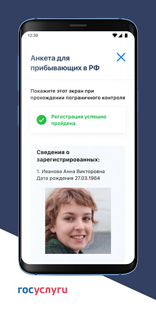  |   | 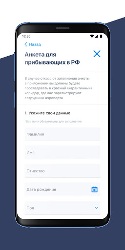  | 
 |   | 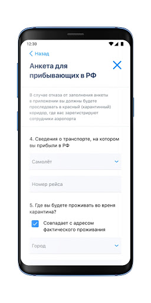  |   | 

## Development team
In the following we report the main information provided by the development team in the Google play store.

| | |
|-------------------------|-------------------------|
| **Developer**  | Минцифры России |
| **Website**  | - |
| **Email** | support_mp@gosuslugi.ru |
| **Physical address**  | - |
| **Other developed apps**  | [https://play.google.com/store/apps/developer?id=7040530283788474945](https://play.google.com/store/apps/developer?id=7040530283788474945) |

## Android support

| | |
|-------------------------|-------------------------|
| **Declared target Android version**  | - |
| **Effective target Android version**  | - |
| **Minimum supported Android version**  | Lollipop, version 5.0 (API level 21) |
| **Maximum target Android version**  | - |

The larger the difference between the minimum and maximum supported Android versions, the better. A larger difference means a wider audience. For example, old phones have a very low Android version, so a high minimum supported Android version means that the app cannot be used by users with old phones, thus leading to accessibility problems. 

## Requested permissions

In the following we report the complete list of the permissions requested by the app. 

| **Permission** | **Protection level** | **Description** | 
|-------------------------|-------------------------|-------------------------|
 **android.permission ACCESS_FINE_LOCATION** | :warning:**Dangerous** | Allows an app to access precise location. 
 **android.permission ACCESS_NETWORK_STATE** | Normal | Allows applications to access information about networks. 
 **android.permission CAMERA** | :warning:**Dangerous** | Required to be able to access the camera device. 
 **android.permission FLASHLIGHT** | - | - 
 **android.permission FOREGROUND_SERVICE** | Normal | Allows a regular application to use Service.startForeground. 
 **android.permission INTERNET** | Normal | Allows applications to open network sockets. 
 **android.permission RECEIVE_BOOT_COMPLETED** | Normal | Allows an application to receive the Intent.ACTION_BOOT_COMPLETED that is broadcast after the system finishes booting. 
 **android.permission VIBRATE** | Normal | Allows access to the vibrator. 
 **android.permission WAKE_LOCK** | Normal | Allows using PowerManager WakeLocks to keep processor from sleeping or screen from dimming. 
 **com.google.android.c2dm.permission RECEIVE** | - | - 
 **com.google.android.finsky.permission BIND_GET_INSTALL_REFERRER_SERVICE** | - | - 

## Mentioned servers

| **Server** | **Registrant** | **Registrant country** | **Creation date** | 
|-------------------------|-------------------------|-------------------------|-------------------------|
 | googleapis.com | Google LLC | :us: US | 2005-01-25 17:52:26 |
 | googlesyndication.com | Google LLC | :us: US | 2003-01-21 06:17:24 |
 | google.com | Google LLC | :us: US | 1997-09-15 04:00:00 |
 | googleadservices.com | Google LLC | :us: US | 2003-06-19 16:34:53 |
 | app-measurement.com | Google LLC | :us: US | 2015-06-19 20:13:31 |
 | gosuslugi.ru | - | - | 2008-09-01 20:00:00 |
 | yandex.ru | - | - | 1997-09-23 09:45:07 |
 | crashlytics.com | Google LLC | :us: US | 2011-01-21 15:30:40 |

## Security analysis 

Below we report the main security warnings raised by our execution of the [Androwarn](https://github.com/maaaaz/androwarn) security analysis tool.

**Telephony identifiers leakage**
> - This application reads the MCC+MNC of the provider of the SIM 
> - This application reads the constant indicating the state of the device SIM card 
> - This application reads the current location of the device 
> - This application reads the neighboring cell information of the device 
> - This application reads the radio technology (network type) currently in use on the device for data transmission 
> - This application reads the Cell ID value 
> - This application reads the Location Area Code value 

**Connection interfaces exfiltration**
> - This application reads details about the currently active data network 
> - This application tries to find out if the currently active data network is metered 

**Telephony services abuse**
> - This application makes phone calls 

**Suspicious connection establishment**
> - This application opens a Socket and connects it to the remote address '; port is out of range' on the 'N/A' port  
> - This application opens a Socket and connects it to the remote address 'Ljava/net/Proxy;->type()Ljava/net/Proxy$Type;' on the 'N/A' port  
> - This application opens a Socket and connects it to the remote address 'Ln/a/a/a/a;->w(Ljava/lang/String;)Ljava/lang/StringBuilder;' on the 'N/A' port  
> - This application opens a Socket and connects it to the remote address 'timeout' on the 'N/A' port  

**Code execution**
> - This application loads a native library: 'Landroid/text/TextUtils;->isEmpty(Ljava/lang/CharSequence;)Z' 

## User ratings and reviews

Below we provide information about how end users are reacting to the app in terms of ratings and reviews in the Google Play store.

### Ratings

The Госуслуги СТОП Коронавирус app has been installed by more than **1000000** times. At this time, **31308** rated the app and its average score is **2.528558**. Below we show the distribution of the ratings across the usual star-based rating of Google Play

:star::star::star::star::star:: 9593

:star::star::star::star:: 1709

:star::star::star:: 1452

:star::star:: 1452

:star:: 17102

### Reviews 

#### 5-star reviews

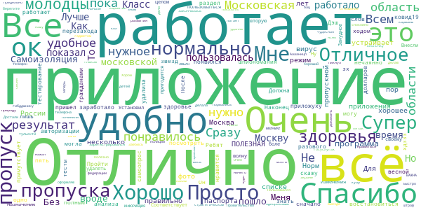

> Результат пришел сразу.  :date: __2021-01-05 09:16:24__

> Приложение заработало!  :date: __2020-12-20 18:26:58__

> Наконец работают тесты.  :date: __2020-12-08 09:15:16__

> Нормально  :date: __2020-12-07 06:32:17__

> Ребят, сначало не работало, не могла посмотреть результат анализа после авторизации. После 3-х разового перезахода в эту приложуху, показал результат. Сразу после слов "Пройти самоопрос",появился раздел тестирование на ковид19.  :date: __2020-11-19 16:02:05__

> весной пользовалась. потом нечаянно удалила. теперь не могу восстановиться  :date: __2020-10-05 19:22:55__

> Просто пять звезд. Но шпиономания за гражданами примутствует полным ходом!!!  :date: __2020-09-30 01:12:34__

> То что надо знать  :date: __2020-09-11 06:29:23__

> Класс  :date: __2020-08-29 21:06:12__

> Просто скажу одно - хорошо  :date: __2020-08-26 20:57:12__

#### 4-star reviews

> Все работает  :date: __2020-12-13 08:59:01__

> Все нормально  :date: __2020-10-19 20:55:17__

> ЫЯщя4Щщ8ф4?-😎  :date: __2020-07-23 02:22:02__

> Спасибо за Госуслуги  :date: __2020-07-16 04:36:30__

> IF  :date: __2020-07-04 15:26:47__

> Спасибо большое вя нас УЦ все чаще яп в  :date: __2020-07-03 17:22:09__

> Отличная работа!!!  :date: __2020-06-26 16:28:07__

> 8plucky 6th to testimony  :date: __2020-06-17 15:43:00__

> Приложение виснет при загрузке данных. Использование по назначению в данный момент невозможно.  :date: __2020-06-15 06:47:42__

> Ок  :date: __2020-06-11 18:23:14__

#### 3-star reviews

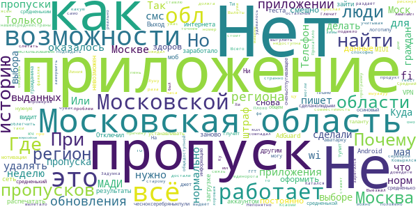

> При загрузке пишет нет интернета. Ни wi-fi, ни моб. сеть не видит. Android 10 MIUI 12. Отключил AdGuard (VPN), заработало.  :date: __2021-01-07 16:04:14__

> Нет возможности распечатать результаты теста.  :date: __2020-12-17 15:44:50__

> А как зайти другим аккаунтом? Выход из приложения невозможен. Только удалять и заново устанавливать.  :date: __2020-12-10 17:46:28__

> Не могу найти нужную информацию.,  :date: __2020-12-01 06:28:44__

> И Ти ггт н. Г у нас кч ил к логотипу. В  :date: __2020-10-07 07:29:39__

> На аватарку еще осиновый кол чесноксеребряныкпули.не хватает.оченьотпугивающее приложение.,а в плане использования все тупит и глучит.в общем как и все что сделанолюдьми средненьким по таланту ,средненькой мотивации на средненький джет.для средненько го гражданина нашейСреднейстраны  :date: __2020-09-24 08:12:56__

> Задумка хорошая,но доведите уже продукт до ума совместимость и связь с сервером нормально. Вылеты уже достали  :date: __2020-09-21 06:40:56__

> Где найти историю выданных пропусков, МАДИ прислал штраф, пропуск был.  :date: __2020-09-14 14:45:37__

> Ку выуаауу чувак фаявляя мне к цу вы фе Я  :date: __2020-08-10 16:46:06__

> Удалять приложение уже можно? Или стоит подождать до зимы?🤔  :date: __2020-08-07 10:52:52__

#### 2-star reviews

> Приложение ни о чем, результат анализа вполне можно отправить и на госуслуги  :date: __2021-01-15 14:34:42__

> Решила скачать приложение после того, как на госуслугах мне пришло сообщение о результате теста на ковид(сдавала при плановой госпитализации на операцию). Анкетирование невозможно обойти. Неудобно. Поскольку я сейчас приболела, выбрала строчку "болею-лечусь дома". Всë, эта строчка впоследствии превратилась в " Болею, сижу на самоизоляции". Приложение оформлено, как на бейсике, топорно.  :date: __2021-01-10 10:00:14__

> Результатов своих,я не нашла.Вот и всё.Мне оно не помогло.  :date: __2021-01-07 19:54:31__

> Ничего полезного!  :date: __2020-12-30 05:06:27__

> Нет результатов теста в приложении. Вообще непонятно, почему больше нигде его не посмотреть P.S. месяц спустя результаты таки появились. По этому поводу подниму на одну звезду  :date: __2020-12-23 06:04:39__

> Попытался по прилету из-за границы заполнить анкету - ничего не вышло, сообщает:"Что-то пошло не так. Мы разбираемся с проблемой." Сделал несколько попыток, бесполезно.  :date: __2020-12-09 06:23:22__

> Я понять не могу где смотреть результаты  :date: __2020-12-07 11:39:22__

> В приложении не могу указать свой адрес, не распазнает. И невозможно загрузить свой анализ.  :date: __2020-12-03 09:31:30__

> Пришло сообщение на госуслугах, что в этой программе доступны результаты теста. А там ничего нет. Программу удаляю за ненадобностью  :date: __2020-12-01 12:59:25__

> Госуслуги сказало что результат в этом приложении. Его так и не нашел. У приложения весьма ограниченный функционал и не понятно зачем его вообще ставить. Приложение носит информационный характер.  :date: __2020-12-01 09:01:00__

#### 1-star reviews

> Не работает. Одним словом гос.  :date: __2021-01-16 17:51:41__

> Никакие сведения о сданных мною тестах не показало  :date: __2021-01-14 22:38:35__

> Пишет нет интернета  :date: __2021-01-14 20:02:39__

> Зарегистрировался, чтобы получить результаты теста, а теперь приложение угрожает мне штрафами за выход на улицу.  :date: __2021-01-14 13:31:55__

> Пишет, якобы нет интернета  :date: __2021-01-14 11:11:21__

> Приложение пишет интернет отключен. Соединение не стобильное или отсутствует. Хотя смарт подключен через Wi-Fi и связь отличная, так что я не познал все прелести этого приложения  :date: __2021-01-14 10:08:03__

> Разработчики, "МОЛОДЦЫ" ! Программа работает отвратительно. Запускается с 5 попытки.  :date: __2021-01-13 18:57:22__

> Абсолютно бесполезное приложение, результатов анализа на ковид недождешся, уже несколько дней получаю лечение, а приложение пишет результатов не найдено  :date: __2021-01-13 13:33:48__

> Результат должен приходить на госуслуги, приложение не нужно. Шлак .  :date: __2021-01-12 15:26:00__

> Такое могут придумать только в россии  :date: __2021-01-11 19:26:52__

# Contact Tracker
App version ``1.3``

Analyzed with [covid-apps-observer](http://github.com/covid-apps-observer) project, version ``0.1``

## App overview
| | |
|-------------------------|-------------------------| 
| **Name**&nbsp;&nbsp;&nbsp;&nbsp;&nbsp;&nbsp;&nbsp;&nbsp;&nbsp;&nbsp;&nbsp;&nbsp;&nbsp;&nbsp;&nbsp;&nbsp;&nbsp;&nbsp;&nbsp;&nbsp;&nbsp;&nbsp;&nbsp;&nbsp;&nbsp;&nbsp;&nbsp;&nbsp;&nbsp;&nbsp;&nbsp;&nbsp;&nbsp;&nbsp;&nbsp;&nbsp;&nbsp;&nbsp;&nbsp;&nbsp;  | Contact Tracker |
| **Unique identifier** | com.vjet.covid |
| **Link to Google Play** | [https://play.google.com/store/apps/details?id=com.vjet.covid](https://play.google.com/store/apps/details?id=com.vjet.covid) |
| **Summary**  | Contact Tracker предупреждает о контактах с человеком инфицированном COVID-19. |
| **Privacy policy** | [https://covid-19.y-media.io/privacy-policy/pp-ru.html](https://covid-19.y-media.io/privacy-policy/pp-ru.html) |
| **Latest version** | 1.3 |
| **Last update** | 2020-04-17 17:32:35 |
| **Recent changes** | - |
| **Installs**  | 1 000+ |
| **Category** | Социальные |
| **First release** | 24 мар. 2020 г. |
| **Size**  | 2,1M |
| **Supported Android version**  | 5.0 и выше |

### Description
> Приложение Contact Tracker, предупреждает пользователя о том, что он контактировал с человеком инфицированным COVID19. 
 Contact Tracker, использует технологию Bluetooth для трекинга контактов на расстоянии 3х метров.
 Пользователь может увидеть количество контактов в течении дня, 14 дней и за все время использования приложения.
 Если у пользователя был подтвержден диагноз COVID19, все пользователи с которыми он контактировал получат уведомление.
 Приложение работает в фоновом режиме и способно записывать контакты других пользователей у которых тоже запущено приложение.
 Вся информация является конфиденциальной и будет удалена после окончания эпидемии.

### User interface
The developers of the app provide the following screenshots in the Google play store.
| | | |
|:-------------------------:|:-------------------------:|:-------------------------:|
 |   |   |   | 
 |  

## Development team
In the following we report the main information provided by the development team in the Google play store.

| | |
|-------------------------|-------------------------|
| **Developer**  | v-jet |
| **Website**  | [https://covid-19.y-media.io/ru/](https://covid-19.y-media.io/ru/) |
| **Email** | alex@y-media.io |
| **Physical address**  | [Work Email: vlad@v-jet.net Legal Entity: VI JET, TOV 49000, Ukraine, Dnipro, Knyazya Yaroslava Mudrogo str., 27](https://www.google.com/maps/search/Work%20Email:%20vlad@v-jet.net%20Legal%20Entity:%20VI%20JET,%20TOV%2049000,%20Ukraine,%20Dnipro,%20Knyazya%20Yaroslava%20Mudrogo%20str.,%2027) (Google Maps) |
| **Other developed apps**  | [https://play.google.com/store/apps/developer?id=v-jet](https://play.google.com/store/apps/developer?id=v-jet) |

## Android support

| | |
|-------------------------|-------------------------|
| **Declared target Android version**  | Android10, version 10 (API level 29) |
| **Effective target Android version**  | Android10, version 10 (API level 29) |
| **Minimum supported Android version**  | Lollipop, version 5.0 (API level 21) |
| **Maximum target Android version**  | - |

The larger the difference between the minimum and maximum supported Android versions, the better. A larger difference means a wider audience. For example, old phones have a very low Android version, so a high minimum supported Android version means that the app cannot be used by users with old phones, thus leading to accessibility problems. 

## Requested permissions

In the following we report the complete list of the permissions requested by the app. 

| **Permission** | **Protection level** | **Description** | 
|-------------------------|-------------------------|-------------------------|
 **android.permission ACCESS_BACKGROUND_LOCATION** | :warning:**Dangerous** | Allows an app to access location in the background. 
 **android.permission ACCESS_COARSE_LOCATION** | :warning:**Dangerous** | Allows an app to access approximate location. 
 **android.permission ACCESS_FINE_LOCATION** | :warning:**Dangerous** | Allows an app to access precise location. 
 **android.permission ACCESS_NETWORK_STATE** | Normal | Allows applications to access information about networks. 
 **android.permission BLUETOOTH** | Normal | Allows applications to connect to paired bluetooth devices. 
 **android.permission BLUETOOTH_ADMIN** | Normal | Allows applications to discover and pair bluetooth devices. 
 **android.permission FOREGROUND_SERVICE** | Normal | Allows a regular application to use Service.startForeground. 
 **android.permission INTERNET** | Normal | Allows applications to open network sockets. 
 **android.permission RECEIVE_BOOT_COMPLETED** | Normal | Allows an application to receive the Intent.ACTION_BOOT_COMPLETED that is broadcast after the system finishes booting. 
 **android.permission WAKE_LOCK** | Normal | Allows using PowerManager WakeLocks to keep processor from sleeping or screen from dimming. 
 **com.google.android.c2dm.permission RECEIVE** | - | - 
 **com.google.android.finsky.permission BIND_GET_INSTALL_REFERRER_SERVICE** | - | - 

## Mentioned servers

| **Server** | **Registrant** | **Registrant country** | **Creation date** | 
|-------------------------|-------------------------|-------------------------|-------------------------|
 | googlesyndication.com | Google LLC | :us: US | 2003-01-21 06:17:24 |
 | google.com | Google LLC | :us: US | 1997-09-15 04:00:00 |
 | app-measurement.com | Google LLC | :us: US | 2015-06-19 20:13:31 |
 | googleadservices.com | Google LLC | :us: US | 2003-06-19 16:34:53 |
 | googleapis.com | Google LLC | :us: US | 2005-01-25 17:52:26 |

## Security analysis 

Below we report the main security warnings raised by our execution of the [Androwarn](https://github.com/maaaaz/androwarn) security analysis tool.

**Connection interfaces exfiltration**
> - This application reads details about the currently active data network 

**Suspicious connection establishment**
> - This application opens a Socket and connects it to the remote address '; port is out of range' on the 'N/A' port  
> - This application opens a Socket and connects it to the remote address 'Lcom/android/tools/r8/GeneratedOutlineSupport;->outline11(Ljava/lang/String;)Ljava/lang/StringBuilder;' on the 'N/A' port  
> - This application opens a Socket and connects it to the remote address 'Ljava/net/Proxy;->type()Ljava/net/Proxy$Type;' on the 'N/A' port  
> - This application opens a Socket and connects it to the remote address 'timeout' on the 'N/A' port  

## User ratings and reviews

Below we provide information about how end users are reacting to the app in terms of ratings and reviews in the Google Play store.

### Ratings

The Contact Tracker app has been installed by more than **1000** times. At this time, **8** rated the app and its average score is **2.0**. Below we show the distribution of the ratings across the usual star-based rating of Google Play

:star::star::star::star::star:: 2

:star::star::star::star:: 0

:star::star::star:: 0

:star::star:: 0

:star:: 6

### Reviews 

#### 5-star reviews

No recent reviews available with 5 stars.

#### 4-star reviews

No recent reviews available with 4 stars.

#### 3-star reviews

No recent reviews available with 3 stars.

#### 2-star reviews

> Не возможно зарегистрироваться, не работает, все время ошибка  :date: __2020-11-25 11:08:32__

#### 1-star reviews

> Невозможно зарегистрироваться, вечная ошибка, поставил бы 0 звезд, жаль невозможно, упыри, зря время потратил😡  :date: __2021-01-05 19:15:52__

> Произошла ошибка при регистрации.  :date: __2020-12-25 05:30:56__

> Не могу зарегистрироваться!! Пишет "Incorrect data", ничего сделать не получается!  :date: __2020-12-20 11:39:58__

> Невозможно зарегистрироваться. Удаляю...  :date: __2020-12-17 13:09:36__

> Не работает  :date: __2020-11-25 11:09:01__

> Не работает  :date: __2020-11-24 09:36:27__

> Не регистрацию не как не могу пройти  :date: __2020-11-24 08:18:00__

> Не работает. Регистрация невозможна, скорее всего, приложение ворует пороли от ваших ящиков и платежные данные. А идея предупредить о вирусе - была хорошая.  :date: __2020-07-24 13:56:48__

# Карта жителя НО
App version ``2.0.9``

Analyzed with [covid-apps-observer](http://github.com/covid-apps-observer) project, version ``0.1``

## App overview
| | |
|-------------------------|-------------------------| 
| **Name**&nbsp;&nbsp;&nbsp;&nbsp;&nbsp;&nbsp;&nbsp;&nbsp;&nbsp;&nbsp;&nbsp;&nbsp;&nbsp;&nbsp;&nbsp;&nbsp;&nbsp;&nbsp;&nbsp;&nbsp;&nbsp;&nbsp;&nbsp;&nbsp;&nbsp;&nbsp;&nbsp;&nbsp;&nbsp;&nbsp;&nbsp;&nbsp;&nbsp;&nbsp;&nbsp;&nbsp;&nbsp;&nbsp;&nbsp;&nbsp;  | Карта жителя НО |
| **Unique identifier** | com.nizhniy_mobile |
| **Link to Google Play** | [https://play.google.com/store/apps/details?id=com.nizhniy_mobile](https://play.google.com/store/apps/details?id=com.nizhniy_mobile) |
| **Summary**  | Персональный электронный ключ к городской среде |
| **Privacy policy** | [https://drive.google.com/file/d/1IcZ0NtRJXhbX8yMoAQaGwMOU3Vfppvtm/view](https://drive.google.com/file/d/1IcZ0NtRJXhbX8yMoAQaGwMOU3Vfppvtm/view) |
| **Latest version** | 2.0.9 |
| **Last update** | 2020-12-29 11:22:16 |
| **Recent changes** | Поздравляем всех пользователей нашего приложения с Новым Годом! |
| **Installs**  | 100 000+ |
| **Category** | Социальные |
| **First release** | 2 апр. 2020 г. |
| **Size**  | 68M |
| **Supported Android version**  | 4.4W и выше |

### Description
> Бесплатное приложение для всех жителей Нижегородской области. С его помощью любой житель может взаимодействовать с городом и пользование различными услугами становится удобным, понятным и приятным.

### User interface
The developers of the app provide the following screenshots in the Google play store.
| | | |
|:-------------------------:|:-------------------------:|:-------------------------:|
 |   |   |   | 
 |   |  

## Development team
In the following we report the main information provided by the development team in the Google play store.

| | |
|-------------------------|-------------------------|
| **Developer**  | Мининформ Нижегородской области |
| **Website**  | [http://nn-card.ru](http://nn-card.ru) |
| **Email** | info@nn-card.ru |
| **Physical address**  | - |
| **Other developed apps**  | [https://play.google.com/store/apps/developer?id=%D0%9C%D0%B8%D0%BD%D0%B8%D0%BD%D1%84%D0%BE%D1%80%D0%BC+%D0%9D%D0%B8%D0%B6%D0%B5%D0%B3%D0%BE%D1%80%D0%BE%D0%B4%D1%81%D0%BA%D0%BE%D0%B9+%D0%BE%D0%B1%D0%BB%D0%B0%D1%81%D1%82%D0%B8](https://play.google.com/store/apps/developer?id=%D0%9C%D0%B8%D0%BD%D0%B8%D0%BD%D1%84%D0%BE%D1%80%D0%BC+%D0%9D%D0%B8%D0%B6%D0%B5%D0%B3%D0%BE%D1%80%D0%BE%D0%B4%D1%81%D0%BA%D0%BE%D0%B9+%D0%BE%D0%B1%D0%BB%D0%B0%D1%81%D1%82%D0%B8) |

## Android support

| | |
|-------------------------|-------------------------|
| **Declared target Android version**  | Android10, version 10 (API level 29) |
| **Effective target Android version**  | Android10, version 10 (API level 29) |
| **Minimum supported Android version**  | KitKat W, version 4.4W - 4.4.4W (API level 20) |
| **Maximum target Android version**  | - |

The larger the difference between the minimum and maximum supported Android versions, the better. A larger difference means a wider audience. For example, old phones have a very low Android version, so a high minimum supported Android version means that the app cannot be used by users with old phones, thus leading to accessibility problems. 

## Requested permissions

In the following we report the complete list of the permissions requested by the app. 

| **Permission** | **Protection level** | **Description** | 
|-------------------------|-------------------------|-------------------------|
 **android.permission ACCESS_COARSE_LOCATION** | :warning:**Dangerous** | Allows an app to access approximate location. 
 **android.permission ACCESS_FINE_LOCATION** | :warning:**Dangerous** | Allows an app to access precise location. 
 **android.permission ACCESS_NETWORK_STATE** | Normal | Allows applications to access information about networks. 
 **android.permission ACCESS_WIFI_STATE** | Normal | Allows applications to access information about Wi-Fi networks. 
 **android.permission CAMERA** | :warning:**Dangerous** | Required to be able to access the camera device. 
 **android.permission INTERNET** | Normal | Allows applications to open network sockets. 
 **android.permission READ_APP_BADGE** | - | - 
 **android.permission READ_EXTERNAL_STORAGE** | :warning:**Dangerous** | Allows an application to read from external storage. 
 **android.permission READ_PHONE_STATE** | :warning:**Dangerous** | Allows read only access to phone state, including the phone number of the device, current cellular network information, the status of any ongoing calls, and a list of any PhoneAccounts registered on the device. 
 **android.permission USE_BIOMETRIC** | Normal | Allows an app to use device supported biometric modalities. 
 **android.permission USE_FINGERPRINT** | Normal | This constant was deprecated in API level 28. Applications should request USE_BIOMETRIC instead 
 **android.permission WAKE_LOCK** | Normal | Allows using PowerManager WakeLocks to keep processor from sleeping or screen from dimming. 
 **android.permission WRITE_EXTERNAL_STORAGE** | :warning:**Dangerous** | Allows an application to write to external storage. 
 **com.anddoes.launcher.permission UPDATE_COUNT** | - | - 
 **com.android.vending CHECK_LICENSE** | - | - 
 **com.google.android.c2dm.permission RECEIVE** | - | - 
 **com.google.android.finsky.permission BIND_GET_INSTALL_REFERRER_SERVICE** | - | - 
 **com.htc.launcher.permission READ_SETTINGS** | - | - 
 **com.htc.launcher.permission UPDATE_SHORTCUT** | - | - 
 **com.huawei.android.launcher.permission CHANGE_BADGE** | - | - 
 **com.huawei.android.launcher.permission READ_SETTINGS** | - | - 
 **com.huawei.android.launcher.permission WRITE_SETTINGS** | - | - 
 **com.majeur.launcher.permission UPDATE_BADGE** | - | - 
 **com.oppo.launcher.permission READ_SETTINGS** | - | - 
 **com.oppo.launcher.permission WRITE_SETTINGS** | - | - 
 **com.sec.android.provider.badge.permission READ** | - | - 
 **com.sec.android.provider.badge.permission WRITE** | - | - 
 **com.sonyericsson.home.permission BROADCAST_BADGE** | - | - 
 **com.sonymobile.home.permission PROVIDER_INSERT_BADGE** | - | - 
 **me.everything.badger.permission BADGE_COUNT_READ** | - | - 
 **me.everything.badger.permission BADGE_COUNT_WRITE** | - | - 

## Mentioned servers

| **Server** | **Registrant** | **Registrant country** | **Creation date** | 
|-------------------------|-------------------------|-------------------------|-------------------------|
 | adobe.com | Adobe Inc. | :us: US | 1986-11-17 05:00:00 |
 | apache.org | The Apache Software Foundation | :us: US | 1995-04-11 04:00:00 |
 | xml.org | OASIS Open | :us: US | 1997-02-03 05:00:00 |
 | w3.org | W3C | :us: US | 1994-07-06 04:00:00 |
 | purl.org | Internet Archive | :us: US | 1996-01-01 05:00:00 |
 | android.com | Google LLC | :us: US | 1997-06-23 04:00:00 |
 | googlesyndication.com | Google LLC | :us: US | 2003-01-21 06:17:24 |
 | google.com | Google LLC | :us: US | 1997-09-15 04:00:00 |
 | facebook.com | Facebook, Inc. | :us: US | 1997-03-29 05:00:00 |
 | iptc.org | Whois Privacy Service | :us: US | 1995-12-27 05:00:00 |
 | useplus.org | PLUS COALITION | :us: US | 2003-11-18 19:31:25 |
 | npes.org | NPES | :us: US | 1996-01-30 05:00:00 |
 | aiim.org | Association for Information and Image Management International | :us: US | 1995-10-18 04:00:00 |
 | app-measurement.com | Google LLC | :us: US | 2015-06-19 20:13:31 |
 | drewnoakes.com | REDACTED FOR PRIVACY | GB | 2002-04-04 10:00:05 |
 | googleapis.com | Google LLC | :us: US | 2005-01-25 17:52:26 |
 | googleadservices.com | Google LLC | :us: US | 2003-06-19 16:34:53 |

## Security analysis 

Below we report the main security warnings raised by our execution of the [Androwarn](https://github.com/maaaaz/androwarn) security analysis tool.

**Telephony identifiers leakage**
> - This application reads the numeric name (MCC+MNC) of current registered operator 
> - This application reads the operator name 

**Connection interfaces exfiltration**
> - This application reads details about the currently active data network 
> - This application tries to find out if the currently active data network is metered 

**Audio video eavesdropping**
> - This application records audio from the 'CAMCORDER' source  
> - This application records audio from the 'MIC' source  
> - This application captures video from the 'CAMERA' source 
> - This application captures video from the 'SURFACE' source 

**Suspicious connection establishment**
> - This application opens a Socket and connects it to the remote address '' on the 'N/A' port  
> - This application opens a Socket and connects it to the remote address 'Ljava/lang/StringBuilder;->toString()Ljava/lang/String;' on the ': connect, resolve' port  
> - This application opens a Socket and connects it to the remote address 'Ljava/lang/StringBuilder;->toString()Ljava/lang/String;' on the 'N/A' port  
> - This application opens a Socket and connects it to the remote address 'Ljava/net/Proxy;->type()Ljava/net/Proxy$Type;' on the 'N/A' port  
> - This application opens a Socket and connects it to the remote address 'timeout' on the 'N/A' port  

**Pim data leakage**
> - This application accesses the downloads folder 
> - This application accesses data stored in the clipboard 

**Code execution**
> - This application loads a native library 
> - This application loads a native library: 'Ljava/util/Iterator;->next()Ljava/lang/Object;' 
> - This application loads a native library: 'c++_shared' 
> - This application loads a native library: 'jniPdfium' 
> - This application loads a native library: 'modft2' 
> - This application loads a native library: 'modpdfium' 
> - This application loads a native library: 'modpng' 
> - This application loads a native library: 'ucrop' 
> - This application executes a UNIX command 

## User ratings and reviews

Below we provide information about how end users are reacting to the app in terms of ratings and reviews in the Google Play store.

### Ratings

The Карта жителя НО app has been installed by more than **100000** times. At this time, **10172** rated the app and its average score is **1.8628955**. Below we show the distribution of the ratings across the usual star-based rating of Google Play

:star::star::star::star::star:: 1619

:star::star::star::star:: 292

:star::star::star:: 458

:star::star:: 507

:star:: 7296

### Reviews 

#### 5-star reviews

> Довольно перспективное приложение. Очень интересно как его разовьют в будущем. Успехов разрабам!  :date: __2020-07-26 10:57:33__

> Удалите все мои персональные данные.  :date: __2020-06-24 21:12:37__

> Теперь кодов нет спасибо  :date: __2020-06-11 22:18:26__

> все норм.все работает  :date: __2020-06-11 22:08:26__

> Очень удобное приложение. Сидишь дома, да ещё и деньги платят каждый день по 10 рублей. 😅  :date: __2020-06-02 10:36:49__

> Последние несколько дней, после создания заявки, кнопка Qr кода не активна.. а последние 2 заявки с неактивным кодом вообще исчезли...  :date: __2020-06-01 08:16:03__

> ок  :date: __2020-05-20 14:37:50__

> Отлично!  :date: __2020-05-18 21:00:15__

> Все ОКЕЙ  :date: __2020-05-12 19:51:44__

> Часто,сервис не доступен  :date: __2020-05-11 14:54:16__

#### 4-star reviews

> Все нормально работает. Интерфейс пока не очень дружелюбный для пользователей, но думаю, что со временем все исправят.  :date: __2020-06-30 19:51:07__

> После обновления белый экран, заставка с оленем проходит и потом белый экран. Телефон huawei p smart z. Пришлось удалить и установить заново, теперь всё работает.  :date: __2020-06-28 12:51:57__

> 🍪🏩  :date: __2020-06-12 07:17:00__

> Мне нравится! Но в последнее время очень странно начало вести себя само прииложение пишет что (сайт или приложение) злоумышленики пытаются взломать ваши данные. Не знаю может это у меня проблемы! Всеравно исправьте!  :date: __2020-06-04 18:37:16__

> После обновления пропал ярлык приложения. Приходиться каждый раз заходить в плэй-маркет. Очень не удобно... К работе нареканий нет. Поэтому 4 звездочки  :date: __2020-06-04 17:35:19__

> Вполне вероятно получится достаточно функциональное приложение. Пока что то, что уже доступно работает нормально. Единственное почему-то отслеживание местоположения не выключается даже тогда, когда выходишь из приложения. Но ошибки это нормально при такой скорости реализации фунций в пожарном режиме. Дополнение. После обращения в тех. поддержку решилась проблема с не отключающейся геолокацией. Обновление 02.06.2020 гуд. На Honor 8X и 10-м Андроиде все работает норм. На старом Lenovo Phab2 хуже.  :date: __2020-06-04 10:45:52__

> Уважаемые разработчики,а почему отсутствует геолокация? Она что вообще больше не нужна? Тогда зачем нужно само приложение?  :date: __2020-06-01 09:36:06__

> Хотелось бы иметь код передвижения на авто. Я еду одна, риска нет заражения.. Раньше был код-еду на машине, а теперь его почему-то убрали.  :date: __2020-05-26 11:20:34__

> У меня в "моих заявках" нет ни одной оформленной в мае заявки! Почему? Куда пропали? Перед выходом на улицу оформляю QR код всегда.  :date: __2020-05-18 11:12:39__

> Почему в приложении после оформления заявки не активна кнопка QR-код, она раньше высвечивалась синим цветом и открывалась а сейчас не открывается? И верните пжл..Тип заявки Еду на машине/такси, как это было раньше! Если обновлять данные, то лучше уж в лучшую сторону)  :date: __2020-05-13 17:18:07__

#### 3-star reviews

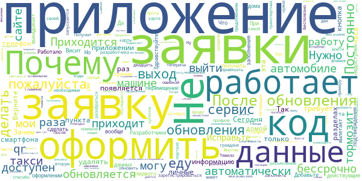

> Приложение живёт своей жизнью, двадцать пятый раз требует заполнить личные данные в профиле. Сегодня 14 октября скачал и пытался войти/зарегистрироваться. Бесполезно. Получил разъяснение разработчика, спасибо.  :date: __2020-10-23 11:44:29__

> Не приходит код для активации,только звонки с московских номеров!  :date: __2020-10-09 07:44:44__

> Так отменили коды то вроде. Зачем теперича эта прога нужна??? Чисто для отслеживания если только. Ну и граждане самое главное - наши личные данные у кого сейчас на флешке????  :date: __2020-06-17 18:52:53__

> У меня две транспортных карты. Как привязать вторую?  :date: __2020-06-17 12:40:56__

> Тяжело разобраться в разделах. Многие необходимые разделы есть только на портале, но не приложении. К примеру, я не нашла информацию по самой карте жителя и по предложениям скидок и купонов по ней  :date: __2020-06-12 10:56:18__

> После последнего обновления запускается с ошибкой через раз.  :date: __2020-06-02 18:38:04__

> Приложение не обновляется автоматически. Так же не появляется кнопка "обновить" в магазине. Приходится удалять приложение со смартфона, и скачивать и устанавливать снова. Тогда приложение устанавливается обновленным.  :date: __2020-06-02 10:37:03__

> Для посещения кладбища за городом (Вязовка), как мне оформлять заявку?  :date: __2020-06-01 07:55:48__

> Исчезают оформленные заявки, уже делаю скриншоты на телефон, чтобы хоть как то их сохранить(  :date: __2020-05-29 08:29:02__

> Автоматически не обновляется, без обновления не работает  :date: __2020-05-26 07:57:52__

#### 2-star reviews

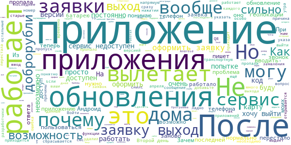

> Та же проблема что и у Кристины. Вместо кода подтверждения по смс получаю входящий звонок. После ответа звонок сбрасывается. Войти в приложение нельзя. !!!! Проблему решил. Оказывается нужно ввести последние 5 цифр номера с которого поступил звонок. Этой инфы в приложении нет, только в инструкции или на сайте  :date: __2020-10-15 11:16:09__

> При регистрации смс не приходит  :date: __2020-10-11 19:08:16__

> Такой обман - эти доброрубли))) Людям головы надурили, никому не надо тратить эти рубли на всякие ФОКи и псевдоскидки в магазинах. Все ждали, думаю, возможность пополнить свою транспортную карту за счет этих копеечных доброрублей (хоть маленький полезный бонус), но, конечно, уж такой щедрости нам ожидать не стоит (даже если нам это напрямую обещали).  :date: __2020-09-15 14:03:35__

> Не работает промокод купленный за добро рублина Lucky bike  :date: __2020-08-04 21:22:09__

> После очередного обновления, приложение при попытке оформить разрешение на выход просто вылетает.  :date: __2020-06-08 20:55:47__

> После обновления при попытке зайти в приложения стал зависать телефон, приложение не открывается и не реагирует на действия  :date: __2020-06-05 20:34:53__

> Отлично. После обновления крашится сразу после запуска. Если интересно Андроид 6.  :date: __2020-06-05 18:59:42__

> И чего? После каждого обновления приходится вводить все заново...  :date: __2020-06-05 17:29:28__

> Не работает это дерьмоприложение теперь(Код не приходит после обноввы(  :date: __2020-06-02 08:21:12__

> После установки этого предложения мне 8 раз позвонили и сообщили что мне одобрен кредит, причём от сомнительных контор, может конечно и оно виновато, но как то так...  :date: __2020-05-31 23:10:44__

#### 1-star reviews

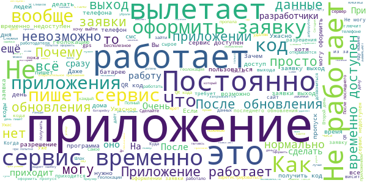

> Дичь полная, да ещё и не работает  :date: __2020-12-19 08:29:22__

> Моя копия антивируса взбесилась после установки. Хорошо что телефон проглючил. Удалил.  :date: __2020-11-24 10:39:05__

> Я проделал все необходимые операции, чтобы зарегистрироваться и код с последними цифрами звонка и никакого результата. Что за безобразие!  :date: __2020-11-13 19:57:15__

> После обновлений приложение вылетает неуспев открыться  :date: __2020-11-11 20:52:54__

> Кроме того что изначально приложение не имело ни полезного функционала, ни даже свежих новостей, так теперь в него даже войти невозможо, впрочем так же как и заново зарегистрироваться. От разработчиков видимо ответа так никто и не дождется, так разрабы и сами не знают что сотворили...и ответить не могут. Деньги налогоплательщика освоены успешно! А Налогоплательщик хочет знать стоимость этого чудо- проекта. Приложение как было пустышкой, так и осталось! Не устанавливайте Граждане!  :date: __2020-10-28 11:06:33__

> Не приходит код доступа при регистрации. Вместо него - какие-то прерывающиеся звонки с незнакомых номеров. Может, звонки - совпадение, конечно (но вряд ли; прозвон идёт через 2-3 секунды после запроса кода; нет запросов - тишина). Короче - тут же удаляю на всякий противопожарный.  :date: __2020-10-22 15:20:35__

> Не могу зарегистрироваться в приложении. Смс-код не приходит, поэтому не могу зайти. Пытаюсь уже 3 дня, пока без результатов.  :date: __2020-10-22 06:56:13__

> Даже нет смысла скачивать, зайти все равно не удастся.. приложение дно  :date: __2020-10-20 21:00:14__

> Согласна с предыдушим пользователем. Ерунда какая то. Всю весну пользовалась приложением. А теперь требует какую то регистрацию, хотя она есть. Старую не хочет. А для новой не приходит смс, какой то дибильный звонок  :date: __2020-10-20 05:38:29__

> Где в приложении находятся "Мои заявки"?  :date: __2020-10-18 11:53:05__

# Электронная регистратура
App version ``1.11.61``

Analyzed with [covid-apps-observer](http://github.com/covid-apps-observer) project, version ``0.1``

## App overview
| | |
|-------------------------|-------------------------| 
| **Name**&nbsp;&nbsp;&nbsp;&nbsp;&nbsp;&nbsp;&nbsp;&nbsp;&nbsp;&nbsp;&nbsp;&nbsp;&nbsp;&nbsp;&nbsp;&nbsp;&nbsp;&nbsp;&nbsp;&nbsp;&nbsp;&nbsp;&nbsp;&nbsp;&nbsp;&nbsp;&nbsp;&nbsp;&nbsp;&nbsp;&nbsp;&nbsp;&nbsp;&nbsp;&nbsp;&nbsp;&nbsp;&nbsp;&nbsp;&nbsp;  | Электронная регистратура |
| **Unique identifier** | com.miacugra.telemed |
| **Link to Google Play** | [https://play.google.com/store/apps/details?id=com.miacugra.telemed](https://play.google.com/store/apps/details?id=com.miacugra.telemed) |
| **Summary**  | Онлайн-консультации |
| **Privacy policy** | [https://tm.dzhmao.ru/policy](https://tm.dzhmao.ru/policy) |
| **Latest version** | 1.11.61 |
| **Last update** | 2020-12-17 11:33:50 |
| **Recent changes** | Добавлен дневник лекарственных препаратов. Возможность интеграции с тонометром A&amp;D по Bluetooth. Прочие доработки и улучшения. |
| **Installs**  | 500+ |
| **Category** | Медицина |
| **First release** | 30 мар. 2020 г. |
| **Size**  | 72M |
| **Supported Android version**  | 5.0 и выше |

### Description
> — Онлайн-консультации с врачами
 — Личный дневник пациента
 — Напоминания о фиксировании оценки самочувствия

### User interface
The developers of the app provide the following screenshots in the Google play store.
| | | |
|:-------------------------:|:-------------------------:|:-------------------------:|
 |   |   |   | 
 |   |   |   | 

## Development team
In the following we report the main information provided by the development team in the Google play store.

| | |
|-------------------------|-------------------------|
| **Developer**  | БУ "Медицинский информационно-аналитический центр" |
| **Website**  | [https://tm.dzhmao.ru/](https://tm.dzhmao.ru/) |
| **Email** | support@miacugra.ru |
| **Physical address**  | [628011, Россия, Ханты-Мансийский автономный округ - Югра, г. Ханты-Мансийск, ул. Студенческая, 15А](https://www.google.com/maps/search/628011,%20Россия,%20Ханты-Мансийский%20автономный%20округ%20-%20Югра,%20г.%20Ханты-Мансийск,%20ул.%20Студенческая,%2015А) (Google Maps) |
| **Other developed apps**  | [https://play.google.com/store/apps/developer?id=%D0%91%D0%A3+%22%D0%9C%D0%B5%D0%B4%D0%B8%D1%86%D0%B8%D0%BD%D1%81%D0%BA%D0%B8%D0%B9+%D0%B8%D0%BD%D1%84%D0%BE%D1%80%D0%BC%D0%B0%D1%86%D0%B8%D0%BE%D0%BD%D0%BD%D0%BE-%D0%B0%D0%BD%D0%B0%D0%BB%D0%B8%D1%82%D0%B8%D1%87%D0%B5%D1%81%D0%BA%D0%B8%D0%B9+%D1%86%D0%B5%D0%BD%D1%82%D1%80%22](https://play.google.com/store/apps/developer?id=%D0%91%D0%A3+%22%D0%9C%D0%B5%D0%B4%D0%B8%D1%86%D0%B8%D0%BD%D1%81%D0%BA%D0%B8%D0%B9+%D0%B8%D0%BD%D1%84%D0%BE%D1%80%D0%BC%D0%B0%D1%86%D0%B8%D0%BE%D0%BD%D0%BD%D0%BE-%D0%B0%D0%BD%D0%B0%D0%BB%D0%B8%D1%82%D0%B8%D1%87%D0%B5%D1%81%D0%BA%D0%B8%D0%B9+%D1%86%D0%B5%D0%BD%D1%82%D1%80%22) |

## Android support

| | |
|-------------------------|-------------------------|
| **Declared target Android version**  | Android10, version 10 (API level 29) |
| **Effective target Android version**  | Android10, version 10 (API level 29) |
| **Minimum supported Android version**  | Lollipop, version 5.0 (API level 21) |
| **Maximum target Android version**  | - |

The larger the difference between the minimum and maximum supported Android versions, the better. A larger difference means a wider audience. For example, old phones have a very low Android version, so a high minimum supported Android version means that the app cannot be used by users with old phones, thus leading to accessibility problems. 

## Requested permissions

In the following we report the complete list of the permissions requested by the app. 

| **Permission** | **Protection level** | **Description** | 
|-------------------------|-------------------------|-------------------------|
 **android.permission ACCESS_COARSE_LOCATION** | :warning:**Dangerous** | Allows an app to access approximate location. 
 **android.permission ACCESS_FINE_LOCATION** | :warning:**Dangerous** | Allows an app to access precise location. 
 **android.permission ACCESS_NETWORK_STATE** | Normal | Allows applications to access information about networks. 
 **android.permission ACCESS_WIFI_STATE** | Normal | Allows applications to access information about Wi-Fi networks. 
 **android.permission BLUETOOTH** | Normal | Allows applications to connect to paired bluetooth devices. 
 **android.permission BLUETOOTH_ADMIN** | Normal | Allows applications to discover and pair bluetooth devices. 
 **android.permission CAMERA** | :warning:**Dangerous** | Required to be able to access the camera device. 
 **android.permission FOREGROUND_SERVICE** | Normal | Allows a regular application to use Service.startForeground. 
 **android.permission INTERNET** | Normal | Allows applications to open network sockets. 
 **android.permission READ_EXTERNAL_STORAGE** | :warning:**Dangerous** | Allows an application to read from external storage. 
 **android.permission READ_PHONE_STATE** | :warning:**Dangerous** | Allows read only access to phone state, including the phone number of the device, current cellular network information, the status of any ongoing calls, and a list of any PhoneAccounts registered on the device. 
 **android.permission RECORD_AUDIO** | :warning:**Dangerous** | Allows an application to record audio. 
 **android.permission REORDER_TASKS** | Normal | Allows an application to change the Z-order of tasks. 
 **android.permission SYSTEM_ALERT_WINDOW** | Signature - preinstalled - appop - pre23 - development | Allows an app to create windows using the type WindowManager.LayoutParams.TYPE_APPLICATION_OVERLAY, shown on top of all other apps. 
 **android.permission USE_BIOMETRIC** | Normal | Allows an app to use device supported biometric modalities. 
 **android.permission USE_FINGERPRINT** | Normal | This constant was deprecated in API level 28. Applications should request USE_BIOMETRIC instead 
 **android.permission USE_FULL_SCREEN_INTENT** | Normal | Required for apps targeting Build.VERSION_CODES.Q that want to use notification full screen intents. 
 **android.permission VIBRATE** | Normal | Allows access to the vibrator. 
 **android.permission WAKE_LOCK** | Normal | Allows using PowerManager WakeLocks to keep processor from sleeping or screen from dimming. 
 **android.permission WRITE_EXTERNAL_STORAGE** | :warning:**Dangerous** | Allows an application to write to external storage. 
 **com.google.android.c2dm.permission RECEIVE** | - | - 
 **com.google.android.finsky.permission BIND_GET_INSTALL_REFERRER_SERVICE** | - | - 

## Mentioned servers

| **Server** | **Registrant** | **Registrant country** | **Creation date** | 
|-------------------------|-------------------------|-------------------------|-------------------------|
 | facebook.com | Facebook, Inc. | :us: US | 1997-03-29 05:00:00 |
 | google.com | Google LLC | :us: US | 1997-09-15 04:00:00 |
 | googlesyndication.com | Google LLC | :us: US | 2003-01-21 06:17:24 |
 | google-analytics.com | Google LLC | :us: US | 2005-07-18 19:24:32 |
 | app-measurement.com | Google LLC | :us: US | 2015-06-19 20:13:31 |
 | microsoft.com | Microsoft Corporation | :us: US | 1991-05-02 04:00:00 |
 | googleapis.com | Google LLC | :us: US | 2005-01-25 17:52:26 |

## Security analysis 

Below we report the main security warnings raised by our execution of the [Androwarn](https://github.com/maaaaz/androwarn) security analysis tool.

**Telephony identifiers leakage**
> - This application reads the ISO country code equivalent for the SIM provider's country code 
> - This application reads the ISO country code equivalent of the current registered operator's MCC (Mobile Country Code) 
> - This application reads the device phone type value 
> - This application reads the numeric name (MCC+MNC) of current registered operator 
> - This application reads the operator name 
> - This application reads the phone number string for line 1, for example, the MSISDN for a GSM phone 
> - This application reads the unique device ID, i.e the IMEI for GSM and the MEID or ESN for CDMA phones 

**Connection interfaces exfiltration**
> - This application reads details about the currently active data network 

**Telephony services abuse**
> - This application makes phone calls 

**Suspicious connection establishment**
> - This application opens a Socket and connects it to the remote address '' on the 'N/A' port  
> - This application opens a Socket and connects it to the remote address 'Ljava/lang/StringBuilder;->toString()Ljava/lang/String;' on the 'N/A' port  
> - This application opens a Socket and connects it to the remote address 'Ljava/net/Proxy;->type()Ljava/net/Proxy$Type;' on the 'N/A' port  
> - This application opens a Socket and connects it to the remote address 'timeout' on the 'N/A' port  

**Pim data leakage**
> - This application accesses data stored in the clipboard 

**Code execution**
> - This application loads a native library: 'Lcom/vc/app/App;->getNativeLibPath()Landroid/util/Pair;' 
> - This application loads a native library: 'TCAAudio' 
> - This application loads a native library: 'mono-native' 
> - This application loads a native library: 'monodroid' 
> - This application loads a native library: 'monosgen-2.0' 
> - This application loads a native library: 'xamarin-app' 
> - This application loads a native library: 'xamarin-debug-app-helper' 
> - This application executes a UNIX command 
> - This application executes a UNIX command containing this argument: '4' 
> - This application executes a UNIX command containing this argument: 'Lcom/vc/utils/log/LogcatHelper;->access$200()[Ljava/lang/String;' 

## User ratings and reviews

Below we provide information about how end users are reacting to the app in terms of ratings and reviews in the Google Play store.

### Ratings

The Электронная регистратура app has been installed by more than **500** times. At this time, **-** rated the app and its average score is **0.0**. Below we show the distribution of the ratings across the usual star-based rating of Google Play

:star::star::star::star::star:: 0

:star::star::star::star:: 0

:star::star::star:: 0

:star::star:: 0

:star:: 0

### Reviews 

#### 5-star reviews

> Зашло  :date: __2020-04-23 18:09:54__

#### 4-star reviews

No recent reviews available with 4 stars.

#### 3-star reviews

No recent reviews available with 3 stars.

#### 2-star reviews

> Не возможно выбрать определённого педиатра  :date: __2020-09-02 19:11:48__

#### 1-star reviews

> Пока толку нет от приложения. Записалась но со мной никто так и не связался  :date: __2020-06-04 05:30:21__

# Госуслуги.COVID трекер
App version ``1.0.3``

Analyzed with [covid-apps-observer](http://github.com/covid-apps-observer) project, version ``0.1``

## App overview
| | |
|-------------------------|-------------------------| 
| **Name**&nbsp;&nbsp;&nbsp;&nbsp;&nbsp;&nbsp;&nbsp;&nbsp;&nbsp;&nbsp;&nbsp;&nbsp;&nbsp;&nbsp;&nbsp;&nbsp;&nbsp;&nbsp;&nbsp;&nbsp;&nbsp;&nbsp;&nbsp;&nbsp;&nbsp;&nbsp;&nbsp;&nbsp;&nbsp;&nbsp;&nbsp;&nbsp;&nbsp;&nbsp;&nbsp;&nbsp;&nbsp;&nbsp;&nbsp;&nbsp;  | Госуслуги.COVID трекер |
| **Unique identifier** | com.minsvyaz.gosuslugi.exposurenotificationdroid |
| **Link to Google Play** | [https://play.google.com/store/apps/details?id=com.minsvyaz.gosuslugi.exposurenotificationdroid](https://play.google.com/store/apps/details?id=com.minsvyaz.gosuslugi.exposurenotificationdroid) |
| **Summary**  | Российское приложение для контроля за риском COVID-19. Технологии Apple и Google |
| **Privacy policy** | [https://gu-st.ru/content/Other/privacy_policy_exposurenotification.pdf](https://gu-st.ru/content/Other/privacy_policy_exposurenotification.pdf) |
| **Latest version** | 1.0.3 |
| **Last update** | 2020-12-17 16:55:03 |
| **Recent changes** | Теперь вы можете отправить уведомления повторно, если после предыдущего раза вы были рядом с людьми, которые могут не знать о вашем диагнозе. |
| **Installs**  | 10 000+ |
| **Category** | Здоровье и фитнес |
| **First release** | 4 нояб. 2020 г. |
| **Size**  | 9,4M |
| **Supported Android version**  | 6.0 и выше |

### Description
> Возможно, недавно вы были совсем близко с человеком, заболевшим COVID-19, но пока не знаете об этом. Установите приложение и проверьте. Сообщите другим пользователям, если заболели сами. Всё анонимно! Никто не узнает, кто заболел и где находится.
 Как приложение находит контакты?
 Ваше устройство ищет и запоминает данные других устройств поблизости, используя технологию Exposure Notification, которую совместно разработали компании Apple и Google. Данная технология позволяет вашему смартфону запоминать другие устройства поблизости через Bluetooth, обмениваясь с ними случайными ключами. Список переданных ключей хранится две недели на смартфоне, а потом удаляется. Если кто-то из пользователей заболел и у него положительный тест на COVID-19, он сообщает об этом анонимно через приложение. Уведомления отправляются на устройства, ключи которых сохранились на смартфоне за последние две недели. Их владельцы получат push-уведомление с датой контакта. Никто не увидит никаких данных заболевшего.
 Если у вас положительный тест на COVID-19, сообщите остальным пользователям, что заболели. Они не узнают, от кого пришло сообщение и где он находится. Приложение не передаёт данные о телефоне, его владельце и местоположении. Доступна только информация о контакте с COVID-19 в конкретную дату за последние 14 дней.
 Чем больше пользователей, тем точнее можно оценить риск заражения вирусом, вовремя сделать тест и начать лечение.
 Поможем друг другу оставаться здоровыми!
 Разработано Министерством цифрового развития, связи и массовых коммуникаций Российской Федерации при участии Министерства здравоохранения Российской Федерации.
 Приложение Госуслуги.COVID трекер предназначено для использования в Российской Федерации.

### User interface
The developers of the app provide the following screenshots in the Google play store.
| | | |
|:-------------------------:|:-------------------------:|:-------------------------:|
 |   |   |   | 
 |   |  

## Development team
In the following we report the main information provided by the development team in the Google play store.

| | |
|-------------------------|-------------------------|
| **Developer**  | Минцифры России |
| **Website**  | - |
| **Email** | support_mp@gosuslugi.ru |
| **Physical address**  | - |
| **Other developed apps**  | [https://play.google.com/store/apps/developer?id=7040530283788474945](https://play.google.com/store/apps/developer?id=7040530283788474945) |

## Android support

| | |
|-------------------------|-------------------------|
| **Declared target Android version**  | - |
| **Effective target Android version**  | - |
| **Minimum supported Android version**  | Marshmallow, version 6.0 (API level 23) |
| **Maximum target Android version**  | - |

The larger the difference between the minimum and maximum supported Android versions, the better. A larger difference means a wider audience. For example, old phones have a very low Android version, so a high minimum supported Android version means that the app cannot be used by users with old phones, thus leading to accessibility problems. 

## Requested permissions

In the following we report the complete list of the permissions requested by the app. 

| **Permission** | **Protection level** | **Description** | 
|-------------------------|-------------------------|-------------------------|
 **android.permission ACCESS_NETWORK_STATE** | Normal | Allows applications to access information about networks. 
 **android.permission BLUETOOTH** | Normal | Allows applications to connect to paired bluetooth devices. 
 **android.permission FOREGROUND_SERVICE** | Normal | Allows a regular application to use Service.startForeground. 
 **android.permission INTERNET** | Normal | Allows applications to open network sockets. 
 **android.permission RECEIVE_BOOT_COMPLETED** | Normal | Allows an application to receive the Intent.ACTION_BOOT_COMPLETED that is broadcast after the system finishes booting. 
 **android.permission VIBRATE** | Normal | Allows access to the vibrator. 
 **android.permission WAKE_LOCK** | Normal | Allows using PowerManager WakeLocks to keep processor from sleeping or screen from dimming. 
 **com.google.android.c2dm.permission RECEIVE** | - | - 
 **com.google.android.finsky.permission BIND_GET_INSTALL_REFERRER_SERVICE** | - | - 

## Mentioned servers

| **Server** | **Registrant** | **Registrant country** | **Creation date** | 
|-------------------------|-------------------------|-------------------------|-------------------------|
 | googleapis.com | Google LLC | :us: US | 2005-01-25 17:52:26 |
 | googlesyndication.com | Google LLC | :us: US | 2003-01-21 06:17:24 |
 | google.com | Google LLC | :us: US | 1997-09-15 04:00:00 |
 | googleadservices.com | Google LLC | :us: US | 2003-06-19 16:34:53 |
 | app-measurement.com | Google LLC | :us: US | 2015-06-19 20:13:31 |
 | gosuslugi.ru | - | - | 2008-09-01 20:00:00 |
 | crashlytics.com | Google LLC | :us: US | 2011-01-21 15:30:40 |

## Security analysis 

Below we report the main security warnings raised by our execution of the [Androwarn](https://github.com/maaaaz/androwarn) security analysis tool.

**Connection interfaces exfiltration**
> - This application reads details about the currently active data network 
> - This application tries to find out if the currently active data network is metered 

**Telephony services abuse**
> - This application makes phone calls 

**Suspicious connection establishment**
> - This application opens a Socket and connects it to the remote address '; port is out of range' on the 'N/A' port  
> - This application opens a Socket and connects it to the remote address 'Ld/b/a/a/a;->o(Ljava/lang/String;)Ljava/lang/StringBuilder;' on the 'N/A' port  
> - This application opens a Socket and connects it to the remote address 'Ljava/net/Proxy;->type()Ljava/net/Proxy$Type;' on the 'N/A' port  
> - This application opens a Socket and connects it to the remote address 'timeout' on the 'N/A' port  

## User ratings and reviews

Below we provide information about how end users are reacting to the app in terms of ratings and reviews in the Google Play store.

### Ratings

The Госуслуги.COVID трекер app has been installed by more than **10000** times. At this time, **297** rated the app and its average score is **2.4174757**. Below we show the distribution of the ratings across the usual star-based rating of Google Play

:star::star::star::star::star:: 87

:star::star::star::star:: 8

:star::star::star:: 17

:star::star:: 14

:star:: 171

### Reviews 

#### 5-star reviews

> Хорошее приложение.  :date: __2021-01-15 11:53:00__

> Надеюсь что охват приложения выростет а также будет опубликована сводная информация по работе с базой - что/как/когда проверяется после информирования о положительном тесте, чтобы было больше доверия, а то многие не понимают как оно работает. Нужно правильно работать с населением!  :date: __2021-01-10 13:59:05__

> Приложение от Госуслуг предупреждающее, что рядом есть больные короновирус ной инфекцией, работающее по блютус.  :date: __2021-01-05 20:06:57__

> Узнала о приложении только, услышав, новость по РБК в декабре, и то 1 раз и вскользь. Больше нигде не было этой информации. Никто из знакомых о нём и не слышал. Где соцреклама? Смысл было создавать, если о приложении никто не знает, для галочки?  :date: __2020-12-13 00:10:07__

> Нужно больше рекламы этого приложения. На телевидении, в интернете, в социальных сетях. В самом приложении "ГосУслуги". Тогда может и будет толк. Приложение на Андроид обновляет информацию 1 раз в сутки, в то время, как на IOS информация обновляется регулярно. Поправьте пожалуйста. Ещё можно сделать подтверждение анализа по фото, чтобы проще было добавить себя в список. Судя по отзывам у людей возникают проблемы с изменением статуса заражения.  :date: __2020-12-11 18:58:32__

> Уже переболел, но установлю и посоветую друзьям. Нашему обществу не хватает социальной ответственности, приложение - шаг к исполнению ситуации  :date: __2020-12-09 19:54:22__

> Класс!  :date: __2020-12-04 18:41:49__

> Отлично еслиб все ковидлы пользовались  :date: __2020-12-03 20:30:25__

> Хоть приложение и не панацея, но хоть какой то шаг, направленный на борьбу.  :date: __2020-12-02 20:05:30__

> Задумка интересная. В описании запрашивает только блютуз но при активации запрашивает ещё и геолокация. Как то подозрительно.  :date: __2020-12-02 07:57:17__

#### 4-star reviews

> Единственное приложение, которое активируется. Но я не понимаю, оно вообще будет показывать опасные контакты и историю? Потому что пока ничего не показывает. Разработчики, а когда эта штука заработает?  :date: __2020-12-29 18:27:10__

> Нажимаю кнопку "Включить уведомления" - появляется сообщение "Что-то пошло не так". Смартфон - Samsung Galaxy Note10. Все разрешения и права приложению даны. Исправьте пожалуйста.  :date: __2020-12-03 14:41:21__

> Идея класс! Жаль регион не выбирается автоматически  :date: __2020-11-30 23:05:38__

> Сейчас это очень нужное приложение. Вместо того чтобы показывать не нужную рекламу. По всем каналам крутите что есть такое приложение,что его обязательно скачать. Работадатели пусть обязывают официальным приказом тех кто может скачивать это приложение. Это надо было сделать давно. Телефоны практически у всех  :date: __2020-11-30 21:01:22__

> На Андроиде не обновляется. Как установил в 1 ночи так то время и показывает. На iOS проблем нет  :date: __2020-11-25 08:24:32__

> Посмотрим насколько эффективное это приложение.  :date: __2020-11-25 07:38:24__

> Прежде чем утверждать про слежку и колпак, посмотрите разрешения приложения. Оно не имеет доступа к контактам и звонкам. Приложение в прицнипе ничего не может, кроме доступа в интернет и Bluetooth. Зайдите в настройки системы и откройте настройки Google, магия начинается там. Вопрос к разработчикам, каким образом планируется наполнять базу положительно зараженных? Приложение же не будет работать, менталитет не тот. Не сообщит никто..  :date: __2020-11-24 13:53:19__

#### 3-star reviews

> Приложение будет работать, когда Роспотрнбнадзор, выдаст вам постановление и внесёт в свой реестр больных. У меня их так и не было, поэтому приложение пишет такие слова.  :date: __2020-12-27 10:12:06__

> Сама идея отличная. А Приложение странное. Не ясно - только по блютузу оно сканирует или и список контактов проверяет... скажем у меня точно есть контакты кто болеет,почему приложение меня не предупреждает? Интересно, разработчики в курсе , что на телефонах, если блютуз в фоне, то телефон невидимый при сканировании. Много вопросов...  :date: __2020-12-25 08:35:31__

> Не обновляет данные о возможных контактах, последнее обновление было 2 декабря, как можно это исправить?  :date: __2020-12-10 03:51:10__

> Отличная идея и программа. Но после установки у меня перестает работать обнаружение новых Bluetooth устройств, и не могу сделать сопряжение с Bluetooth наушниками. Пришлось удалить :(  :date: __2020-12-04 15:08:47__

> Хорошо бы сделать так, чтобы можно было подтверждать свой диагноз результатами анализов. Как попасть в списки официальных ковидников - не понятно. Я уже неделю как подтвержденный носитель вируса, а сообщить об этом в приложении не могу. Что с этим делать?  :date: __2020-12-02 14:36:01__

> Нажимаю "включить уведомления" выскакивает "что-то пошло не так"  :date: __2020-11-28 08:07:36__

> Идея отличная, к технической реализации есть вопросы В частности, судя по встроенной в Android системе уведомлений о риске инфицирования, приложение делает проверку раз в день! То есть оно не постоянно мониторит, а только в моём случае один раз в день утром! (в моём случае 26 ноября в 10:39 и 27 ноября в 10:41). Можете это срочно исправить? Спасибо!  :date: __2020-11-27 17:27:27__

> Первое, что понятно, нужна сознательность и наличие данной программы именно у заболевших. Учитывая, то, что больной должен сидеть в изоляции, и даже есть штрафы, больной(носитель) не будет себя обозначать. Второе, более 50% заболевших, люди старше 50 лет. Они активные пользователи приложений смартфонов? Для чего данная программа? Она дает недостоверные данные в целом. Если только, больных не обяжут указывать данную инфо в приложении. По другому затея бесполезна, хотя идея хорошая.  :date: __2020-11-25 13:34:55__

> Пока от приложения толку мало. Если его установит много народу и тогда будет мало толку! Информацию о заболевших должны вносить в обязательном порядке все гос. Учереждения и частные лаборатории, а установка приложения должна дополнительно поощряться какими нибудь скидками и преимуществами, возможно розыгрышем призов и билетов. Вот тогда еще что то может быть.  :date: __2020-11-24 13:33:13__

> Информацию нужно вносить автоматически с получением результатов анализа. Тогда глядиш и будет польза от этого приложения. Надеюсь разработчики учтут пожелания пользователей.  :date: __2020-11-24 11:46:40__

#### 2-star reviews

> При установке ни слова не сказано о том что программа платная а теперь выскочило сообщение о ежемесячной оплате, за сто деньги берете.  :date: __2021-01-05 13:18:26__

> Ничего не показывает, ибо, кажется мне, пользуюсь им я одна... 😭 Удаляю.  :date: __2021-01-04 17:58:41__

> Если бы при регистрации указывался например номер паспорта и при заболевании это отпрпвлялось в приложение, было бы здорово. А так вокруг меня заболело много всех, я много ходил а приложение ничего не показывает... сам никто не будет в него оповещать, для этого социальная ответственность должна быть...  :date: __2020-12-28 06:22:35__

> Заработали на программе на государстве? Молодцы! Теперь пора бы сделать так чтобы она еще и работает. 1) Регистрацию в программе сделать через номер телефона. ОБЯЗАТЕЛЬНОЙ! 2) Автоматически отслеживать и сообщать другим что пользователь был заражен и находился рядом БЕЗ действий самого пользователя. 3) Добавить инструкции по моделям телефона как добавить программу в список исключений, чтобы программу не выбивало ради экономии заряда батареи. А пока это просто бесполезная программа.  :date: __2020-12-24 11:41:43__

> Бесполезное приложение. Кто будет кричать,что он болен?  :date: __2020-12-11 05:00:08__

> Бесполезно  :date: __2020-12-08 01:42:42__

> И как известить о перенесенном заболевании? Есть справки о наличии антител, но некуда вписать информацию. Ерунда, короче, удаляю.  :date: __2020-12-01 08:41:19__

> У людей с положительным тестом. Пишет не обнаружено!  :date: __2020-11-24 15:38:13__

> А зачем нужен блютуз, если у зараженного вообще нет никакого телефона????  :date: __2020-11-24 15:06:12__

> Двойка чисто за хорошую идею. Но работать это не будет. А сарафанное радио работает быстрее и точнее этого приложения :)))  :date: __2020-11-24 08:18:30__

#### 1-star reviews

> Безполезное приложение, проверял на болеющих ни фига не предупреждает, тупо цифровой мусор в памяти телефона.  :date: __2021-01-16 16:35:12__

> Просто не работает, пишет включить кведомления, включаю, вемщу ошибка - что то пошло не так  :date: __2021-01-14 04:30:37__

> Бесполезное приложение  :date: __2021-01-13 16:06:28__

> Бесполезная программа. Болел в декабре. Официально пришло подтверждение от Роспотребнадзора, хотел предупредить тех кто пользуется приложением. Но... Приложение просто не работает. Не удивлюсь что на нем очередной вор заработал себе на дом/машину. Стыдно такое выпускать.  :date: __2021-01-11 12:57:27__

> Отображает информацию, только если заболевший лично подал данные а приложении. Мало кто это делает. По факту, безболезненное приложение, которое тратит ресурсы телефона. Когда уже в этой стране начнут перенимать удачные опыты по созданию чего-либо, а не просто отмывать деньги? Берите пример с Китая  :date: __2021-01-11 00:07:12__

> Идея хорошая, реализация - как все в России. Есть + ковид тест, программа говорит нет в базе. Неделю подождал, результат тот же. Шляпа  :date: __2021-01-10 19:41:40__

> Толку ноль. Сижу на соцмониторинге с подтвержденным ковидом уже 10 дней. Это приложение пишет))) все нормально, данные не найдены и вы здоровы.  :date: __2021-01-10 14:09:47__

> Одно из самых бесполезных приложений, мусор  :date: __2021-01-09 10:20:21__

> Не работает  :date: __2021-01-08 12:22:56__

> Приложение не работает, проверил. 3 человека с подтверженным ковидом не показывает. Ковид подтвердили ещё 30 декабря, они сейчас на караните.  :date: __2021-01-07 10:57:18__

# Credits

This project makes use of the following main third-party projects:
* Androguard: [https://github.com/androguard/androguard](https://github.com/androguard/androguard)
* Androwarn: [https://github.com/maaaaz/androwarn](https://github.com/maaaaz/androwarn)
* google_play_scraper: [https://github.com/JoMingyu/google-play-scraper](https://github.com/JoMingyu/google-play-scraper)
* whois: [https://github.com/DannyCork/python-whois](https://github.com/DannyCork/python-whois)
* BeautifulSoup: [https://www.crummy.com/software/BeautifulSoup](https://www.crummy.com/software/BeautifulSoup)

Other open-source projects used in this project include: 

- androguard==3.3.5
- appnope==0.1.0
- asn1crypto==1.3.0
- backcall==0.1.0
- beautifulsoup4==4.9.0
- bs4==0.0.1
- certifi==2020.4.5.1
- cffi==1.14.0
- chardet==3.0.4
- click==7.1.2
- colorama==0.4.3
- cryptography==2.9.2
- cycler==0.10.0
- decorator==4.4.2
- future==0.18.2
- google-play-scraper==0.1.1
- idna==2.9
- ipython==7.13.0
- ipython-genutils==0.2.0
- jedi==0.17.0
- Jinja2==2.11.2
- joblib==0.14.1
- kiwisolver==1.2.0
- lxml==4.5.0
- MarkupSafe==1.1.1
- matplotlib==3.2.1
- networkx==2.4
- nltk==3.5
- numpy==1.18.3
- parso==0.7.0
- pexpect==4.8.0
- pickleshare==0.7.5
- Pillow==7.1.2
- play-scraper==0.6.0
- prompt-toolkit==3.0.5
- ptyprocess==0.6.0
- pycountry==19.8.18
- pycparser==2.20
- pydot==1.4.1
- Pygments==2.6.1
- pyOpenSSL==19.1.0
- pyparsing==2.4.7
- python-dateutil==2.8.1
- regex==2020.4.4
- requests==2.23.0
- requests-futures==1.0.0
- six==1.14.0
- soupsieve==2.0
- tld==0.12.1
- tqdm==4.45.0
- traitlets==4.3.3
- urllib3==1.25.9
- wcwidth==0.1.9
- wordcloud==1.7.0

