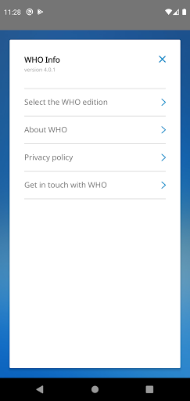
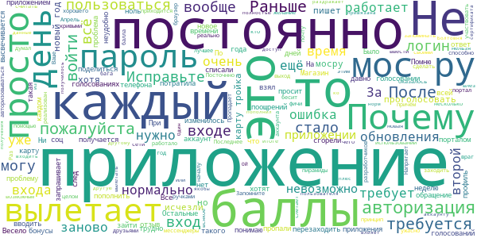
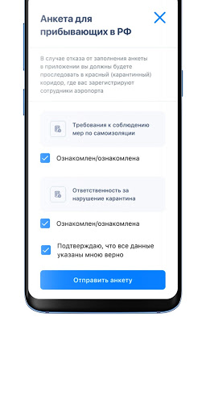
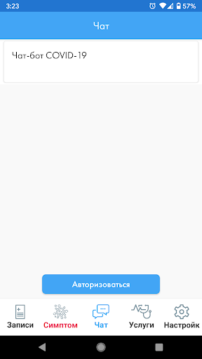
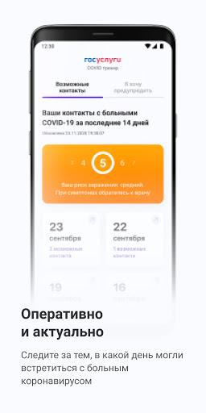
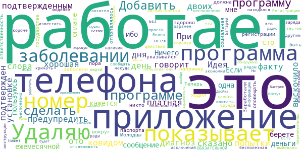

# COVID-related Android apps in Russia

Author: `Ivano Malavolta` (ivanomalavolta@gmail.com)

Created at: `2021/2/6`

Report generated by the [covid-apps-observer](http://github.com/covid-apps-observer) project, version 0.1

# Table of contents 

- [Background](#background)
    * [Data sources and analyses](#data-sources-and-analyses)
        * [App metadata](#app-metadata)
        * [Requested permissions](#requested-permissions)
        * [Mentioned servers](#mentioned_servers)
        * [Security analysis](#security_analysis)
        * [User ratings and reviews](#user-ratings-and-reviews)
    * [Disclaimer](#disclaimer)
- [Госуслуги Москвы](#госуслуги-москвы)
- [Моя Москва — официальное приложение портала mos.ru](#моя-москва-—-официальное-приложение-портала-mos.ru)
- [WHO Info](#who-info)
- [Социальный мониторинг](#социальный-мониторинг)
- [OpenWHO](#openwho)
- [Активный гражданин](#активный-гражданин)
- [Госуслуги СТОП Коронавирус](#госуслуги-стоп-коронавирус)
- [Contact Tracker](#contact-tracker)
- [Карта жителя НО](#карта-жителя-но)
- [Электронная регистратура](#электронная-регистратура)
- [Госуслуги.COVID трекер](#госуслуги.covid-трекер)

- [Credits](#credits)

# How to read this report

This report has been generated by the [covid-apps-observer](http://github.com/covid-apps-observer) project. The project automatically analyzes the apps by extracting information which is already publicly available either on the web or in the apps binary files. 

Our analysis covers the following apps:
| | |
|-------------------------|-------------------------| 
|  | Госуслуги Москвы
|  | Моя Москва — официальное приложение портала mos.ru
|  | WHO Info
|  | Социальный мониторинг
|  | OpenWHO
|  | Активный гражданин
|  | Госуслуги СТОП Коронавирус
|  | Contact Tracker
|  | Карта жителя НО
|  | Электронная регистратура
|  | Госуслуги.COVID трекер

The details of our analysis are presented in the remainder of this report.

For independent verification, the raw data and the source code of the project is publicly available in its GitHub repository [http://github.com/covid-apps-observer](http://github.com/covid-apps-observer) and its source code has been thoroughly commented in order to provide all the details about how the information provided in this report has been extracted. 

Any feedback, questions, and improvements about the project are very welcome, feel free to create an issue or pull request directly in its GitHub repository: [http://github.com/covid-apps-observer](http://github.com/covid-apps-observer).

## Data sources and analyses

The analysis of each app is structured around five main dimensions: 
* App metadata  
* Requested permissions
* Mentioned servers
* Androwarn analysis
* User ratings and reviews

In the following we describe the data sources and analysis performed for each dimension.

### App metadata

App metadata includes an overview of the main information about the app (for example, its name, releases, privacy policy, etc.), contact information of the development team, and the various Android versions supported by the app. This information is extracted from two main data sources:
* _Google Play store_: we automatically mined the web page of the Google Play store showing the basic information about the app and we parsed it in order to extract information about the app and development team 
* _Android Manifest file_: in our analysis we decompiled the binary file of the app (it is similar to a Zip archive but it contains the code of the app instead of normal files) and we extracted information about the supported Android versions, as it has been listed by its development team.

The extracted app metadata feeds the _App overview_, _Development team_, and _Android support_ sections of this report.
We make use of the [google-play-scraper](https://github.com/JoMingyu/google-play-scraper) tool for extracting the raw data related to this dimension of the project.

### Requested permissions

The Android operating system has a permission model which allows users to grant access to potentially privacy-related information. Every Android app has to explictly declare the permissions it needs to properly function in the Android Manifest file.  

In this report we also show the protection level of each permission, which is a key information for understanding how the requested permissions related to the user's privacy. We carefully analyzed the [official Android documentation (v. 29)](https://developer.android.com/reference/android/Manifest.permission), and it resulted that a permission requested by an Android app can belong to the following protection levels:
* **Dangerous**: higher-risk permissions that would give a requesting app access to private user data or control over the device that can negatively impact the user. Because this type of permission introduces potential risk, the system usually does not automatically grant it to the requesting app. For example, any dangerous permissions requested by an app may be displayed to the user and require confirmation before proceeding.
* **Normal**: this is the default and most common level in Android; normal permissions are lower-risk and give access to isolated app-level features, with minimal risk to other apps, the system, or the user. 
* **Signature**: permissions granted only if the requesting app is signed with the same certificate as the app that declared the permission
* **Appop**: old permission level, a reminiscence of the App Ops tool that Google introduced in Android 4.3.
* **Development**: optional permissions which can be granted to development-oriented apps.
* **Privileged**: permissions who give higher power to mobile apps w.r.t. other apps, such as binding to incoming calls, interacting via bluetooth with other devices without user interaction, etc.
* **Preinstalled**: reserved only for preinstalled apps
* **Installer**: allow the holder to start the permission usage screen for an app
* **RetailDemo**: permissions related to devices used in demonstrations in shops.
* **Pre23**: permissions automatically granted to apps targeting devices running pre-6.0 Android.
* **Upcoming**: permissions which will be released in the next version of the Android platform. 
* **Deprecated**: permissions belonging to old releases of the Android platform, they should not be used by developers since they will not be supported in the near future.
* **Not for use by third-party applications**: permissions which can be requested only by apps developed by Google.
* **Undefined**: this protection level is not documented by Google.

The permissions dimension of this project is based on the [Androguard](https://github.com/androguard/androguard) static analysis tool.

### Mentioned servers

We decompiled each app in order to look for all possible mentions of remote URLs. The mentioned URLs can refer to remote servers the the app is using for either sending or receiving information, web addresses for directing the user to an information website, and so on. 

:warning: It is important to note that this analysis is not meant to be complete and it is very prone to obfuscation. The servers reported here are simply _mentioned_ somewhere in the code of the app and are meant to just give an indication about the "hooks" of the app towards external resources. For example, for an Android app it is normal to contact Google services in order to send/receive push notifications, or to contact the servers of analytics services for having real-time diagnostics about crashes of the app or bugs.

This part of the analysis is based on the [Androguard](https://github.com/androguard/androguard) static analysis tool for identfying the raw URLs mentioned in the app; then, the information about each mentioned server is collected by performing a _whois_ lookup on the first-level domain present in the URL.

### Security analysis

This dimension is based on the [Androwarn](https://github.com/maaaaz/androwarn) structural and data flow analysis of Android bytecode. Androwarn is developed by the University of Lyon/INSA (France) and it has been used in several academic studies. According to its documentation, Androwarn targets the following categories of potential security issues:
* **Telephony identifiers exfiltration**: IMEI, IMSI, MCC, MNC, LAC, CID, operator's name, etc.
* **Device settings exfiltration**: software version, usage statistics, system settings, logs, etc.
* **Geolocation information leakage**: GPS/WiFi geolocation, etc.
* **Connection interfaces information exfiltration**: WiFi credentials, Bluetooth MAC adress, etc.
* **Telephony services abuse**: premium SMS sending, phone call composition, etc.
* **Audio/video flow interception**: call recording, video capture, etc.
* **Remote connection establishment**: socket open call, Bluetooth pairing, APN settings edit, etc.
* **PIM data leakage**: contacts, calendar, SMS, mails, clipboard, etc.
* **External memory operations**: file access on SD card, etc.
* **PIM data modification**: add/delete contacts, calendar events, etc.
* **Arbitrary code execution**: native code using JNI, UNIX command, privilege escalation, etc.
* **Denial of Service**: event notification deactivation, file deletion, process killing, virtual keyboard disable, terminal shutdown/reboot, etc.

Note: We do not consider this data point in the current version of our analyzers since it is too verbose for our purposes.

:warning: It is important to note that Androwarn is a static analysis tool, and as such it performs a variety of heuristics and approximations in its analyses. Said that, the results shown in this report are meant to provide an indication of _potential_ security issues and should be by no means treated as complete and correct.   

### User ratings and reviews

For this dimension we turn again to the web interface of the Google Play store. Firstly, we automatically mine summary statistics about user ratings from the web page of the app under analysis; then, we automatically download the newest 1000 reviews of the app under analysis. For each level of rating (5 stars, 4 stars, , etc., 1 star) we show:
- a word cloud presenting the main terms used by end users in their reviews in the Google Play store
- the last 10 reviews provided by app users in the Google Play store. 

This purposefully simple analysis is meant to help both future users and the development team of the app in understanding what are the main positive and negative points of the app under analysis.

We make use of the [google-play-scraper](https://github.com/JoMingyu/google-play-scraper) tool for extracting the raw data related to this dimension of the project.

## Disclaimer 

This report has been produced independently of any parties and its only objective is to help anybody in better understanding how COVID-related apps work in practice (and compare to each other). The results of this report are limited to the specific version of the software used for running the analyses and on the various heuristics implemented in there. In other words, the results of the analyzers may differ depending on the time and modalities in which they are executed. We do not guarantee that the results of the analyses and the corresponding contents of this report are fully complete or correct. The analysis software is licensed under the [MIT License](https://github.com/iivanoo/covid-apps-observer/blob/master/LICENSE).

# Госуслуги Москвы
App version ``3.13.0.19``

Analyzed with [covid-apps-observer](http://github.com/covid-apps-observer) project, version ``0.1``

## App overview
| | |
|-------------------------|-------------------------| 
| **Name**&nbsp;&nbsp;&nbsp;&nbsp;&nbsp;&nbsp;&nbsp;&nbsp;&nbsp;&nbsp;&nbsp;&nbsp;&nbsp;&nbsp;&nbsp;&nbsp;&nbsp;&nbsp;&nbsp;&nbsp;&nbsp;&nbsp;&nbsp;&nbsp;&nbsp;&nbsp;&nbsp;&nbsp;&nbsp;&nbsp;&nbsp;&nbsp;&nbsp;&nbsp;&nbsp;&nbsp;&nbsp;&nbsp;&nbsp;&nbsp;  | Госуслуги Москвы |
| **Unique identifier** | ru.altarix.mos.pgu |
| **Link to Google Play** | [https://play.google.com/store/apps/details?id=ru.altarix.mos.pgu](https://play.google.com/store/apps/details?id=ru.altarix.mos.pgu) |
| **Summary**  | Все электронные услуги города: начисления ЖКХ, штрафы ГИБДД, эвакуация ТС и др. |
| **Privacy policy** | [https://mosapps.mos.ru/privacypolicy/](https://mosapps.mos.ru/privacypolicy/) |
| **Latest version** | 3.13.0.19 |
| **Last update** | 2020-12-22 17:56:29 |
| **Recent changes** | - Расширен перечень категорий начислений и документов, по которым производится поиск начислений; - Добавлена возможность оплаты начислений за домашний телефон МГТС |
| **Installs**  | 1 000 000+ |
| **Category** | Социальные |
| **First release** | 27 сент. 2012 г. |
| **Size**  | 21M |
| **Supported Android version**  | 6.0 и выше |

### Description
> Мобильное приложение «Госуслуги Москвы» - сервис, объединяющий востребованные услуги Правительства Москвы, для комфортной жизни в большом городе.
 Образование:
 - Сервис «Мой ребенок в школе» дает возможность удаленно отслеживать проход и питание учащегося, школьное меню и баланс лицевого счета, который в любой момент можно пополнить с банковской карты/мобильного счета; 
 - Сервис «Электронный дневник» объединяет в себе самую важную для родителей информацию об учебе: расписание уроков, домашние задание, оценки учащегося и т.д.; 
 - Сервис «Результаты ГИА» - мобильная площадка с результатами прохождения Государственной итоговой аттестации.
 Жилье, ЖКУ:
 - Сервис «Начисления за жилищно-коммунальные услуги» предоставляет развернутую информацию о долговых/текущих начислениях за ЖКУ с возможностью заказать электронный Единый платежный документ; 
 - Сервис «Внесение показаний» - возможность передачи показаний счетчиков водоснабжения/электроэнергии, а также получения информации о задолженности без очередей и отрыва от важных дел; 
 - Сервис «Единый диспетчерский центр» – компактная площадка для решения проблем и вопросов, относящихся к вашему дому/двору;
 - Сервис «Информирование о начале расчетов по новой услуге»;
 - Сервис «Информирование о регистрации на жилплощади»;
 - Сервис «Информирование об отключении горячего водоснабжения».
 Транспорт:
 - Сервис «Штрафы» дает возможность получать актуальную информацию по вашим штрафам и оплачивать с мобильного; 
 - Сервис «Эвакуация транспортного средства» информирует об эвакуации ТС, а также предоставляет точный адрес местонахождения ТС на спецстоянке.
 Здоровье и документы:
 - Сервис «Запись к врачу» предоставляет возможность удаленно записаться на прием к любому врачу, перенести и отменить запись, посмотреть перечень направлений и выписанные вам рецепты; 
 - Сервис «Запись к ветеринару» предоставляет возможность записать своего питомца на прием в ветеринарную клинику (перенести, отменить запись) или вызвать ветеринара на дом;
 - Сервис «Готовность загранпаспорта» - индивидуальное информирование о готовности заграничного паспорта;
 - Сервис «Федеральная служба судебных приставов» предоставляет информацию о наличии исполнительных делопроизводств ФССП.
 Информация:
 - Сервис «Новости» объединяет в себе самые актуальные и интересные новости города в удобном мобильном формате.
 По желанию вы можете настроить способ получения уведомлений: SMS, E-mail или Push-уведомления.
 ___________________________________
 Обратите внимание на другие официальные приложения правительства Москвы.
 - Активный Гражданин - проект для тех, кому важно, что происходит в Москве
 - Наш город – помогите нам сделать город лучше
 - Парковки Москвы – приложение для поиска и оплаты парковки в Москве
 - Узнай Москву - архитектурная история столицы).

### User interface
The developers of the app provide the following screenshots in the Google play store.
| | | |
|:-------------------------:|:-------------------------:|:-------------------------:|
 |   |   |   | 
 |   |  

## Development team
In the following we report the main information provided by the development team in the Google play store.

| | |
|-------------------------|-------------------------|
| **Developer**  | Информационный город ГКУ |
| **Website**  | [https://www.mos.ru/mosapps/](https://www.mos.ru/mosapps/) |
| **Email** | emp@mos.ru |
| **Physical address**  | - |
| **Other developed apps**  | [https://play.google.com/store/apps/developer?id=%D0%98%D0%BD%D1%84%D0%BE%D1%80%D0%BC%D0%B0%D1%86%D0%B8%D0%BE%D0%BD%D0%BD%D1%8B%D0%B9+%D0%B3%D0%BE%D1%80%D0%BE%D0%B4+%D0%93%D0%9A%D0%A3](https://play.google.com/store/apps/developer?id=%D0%98%D0%BD%D1%84%D0%BE%D1%80%D0%BC%D0%B0%D1%86%D0%B8%D0%BE%D0%BD%D0%BD%D1%8B%D0%B9+%D0%B3%D0%BE%D1%80%D0%BE%D0%B4+%D0%93%D0%9A%D0%A3) |

## Android support

| | |
|-------------------------|-------------------------|
| **Declared target Android version**  | Android10, version 10 (API level 29) |
| **Effective target Android version**  | Android10, version 10 (API level 29) |
| **Minimum supported Android version**  | Marshmallow, version 6.0 (API level 23) |
| **Maximum target Android version**  | - |

The larger the difference between the minimum and maximum supported Android versions, the better. A larger difference means a wider audience. For example, old phones have a very low Android version, so a high minimum supported Android version means that the app cannot be used by users with old phones, thus leading to accessibility problems. 

## Requested permissions

In the following we report the complete list of the permissions requested by the app. 

| **Permission** | **Protection level** | **Description** | 
|-------------------------|-------------------------|-------------------------|
 **android.permission ACCESS_COARSE_LOCATION** | :warning:**Dangerous** | Allows an app to access approximate location. 
 **android.permission ACCESS_FINE_LOCATION** | :warning:**Dangerous** | Allows an app to access precise location. 
 **android.permission ACCESS_NETWORK_STATE** | Normal | Allows applications to access information about networks. 
 **android.permission ACCESS_WIFI_STATE** | Normal | Allows applications to access information about Wi-Fi networks. 
 **android.permission CALL_PHONE** | :warning:**Dangerous** | Allows an application to initiate a phone call without going through the Dialer user interface for the user to confirm the call. 
 **android.permission CAMERA** | :warning:**Dangerous** | Required to be able to access the camera device. 
 **android.permission INTERNET** | Normal | Allows applications to open network sockets. 
 **android.permission READ_CALENDAR** | :warning:**Dangerous** | Allows an application to read the user's calendar data. 
 **android.permission READ_CONTACTS** | :warning:**Dangerous** | Allows an application to read the user's contacts data. 
 **android.permission READ_EXTERNAL_STORAGE** | :warning:**Dangerous** | Allows an application to read from external storage. 
 **android.permission USE_BIOMETRIC** | Normal | Allows an app to use device supported biometric modalities. 
 **android.permission USE_FINGERPRINT** | Normal | This constant was deprecated in API level 28. Applications should request USE_BIOMETRIC instead 
 **android.permission VIBRATE** | Normal | Allows access to the vibrator. 
 **android.permission WAKE_LOCK** | Normal | Allows using PowerManager WakeLocks to keep processor from sleeping or screen from dimming. 
 **android.permission WRITE_CALENDAR** | :warning:**Dangerous** | Allows an application to write the user's calendar data. 
 **android.permission WRITE_EXTERNAL_STORAGE** | :warning:**Dangerous** | Allows an application to write to external storage. 
 **com.google.android.c2dm.permission RECEIVE** | - | - 
 **com.google.android.finsky.permission BIND_GET_INSTALL_REFERRER_SERVICE** | - | - 

## Mentioned servers

| **Server** | **Registrant** | **Registrant country** | **Creation date** | 
|-------------------------|-------------------------|-------------------------|-------------------------|
 | vk.com | Privacy protection service - whoisproxy.ru | :ru: RU | 1997-06-24 04:00:00 |
 | app-measurement.com | Google LLC | :us: US | 2015-06-19 20:13:31 |
 | facebook.com | Facebook, Inc. | :us: US | 1997-03-29 05:00:00 |
 | googlesyndication.com | Google LLC | :us: US | 2003-01-21 06:17:24 |
 | google.com | Google LLC | :us: US | 1997-09-15 04:00:00 |
 | openstreetmap.org | OpenStreetMap Foundation | GB | 2004-08-09 18:47:25 |
 | wikimedia.org | Wikimedia Foundation, Inc. | :us: US | 2003-03-16 08:22:47 |
 | openptmap.org | Registrant State/Province: Bayern | :de: DE | 2010-11-17 12:05:24 |
 | cloudmade.com | Cloud Made Ltd | :uk: UK | 2007-07-17 17:02:27 |
 | openstreetmap.nl | - | - | 2007-03-06 00:00:00 |
 | wmflabs.org | Wikimedia Foundation, Inc. | :us: US | 2011-09-29 14:58:28 |
 | openseamap.org | Registrant State/Province: | :de: DE | 2009-03-26 11:35:19 |
 | chartbundle.com | Whois Privacy Service | :us: US | 2010-01-09 23:30:15 |
 | opentopomap.org | Registrant State/Province: | :de: DE | 2011-09-03 18:35:13 |
 | 2gis.ru | - | - | 2001-02-18 21:00:00 |
 | crashlytics.com | Google LLC | :us: US | 2011-01-21 15:30:40 |
 | mos.ru | - | - | 1996-12-23 09:49:03 |
 | w3.org | W3C | :us: US | 1994-07-06 04:00:00 |
 | googleadservices.com | Google LLC | :us: US | 2003-06-19 16:34:53 |
 | huawei.com | Huawei Technologies Co., Ltd. | :china: CN | 2000-01-11 13:37:24 |
 | googleapis.com | Google LLC | :us: US | 2005-01-25 17:52:26 |
 | mts.ru | - | - | 1997-11-19 12:02:34 |
 | 2gis.com | DoubleGIS LLC | :ru: RU | 2004-03-18 08:51:04 |

## Security analysis 

Below we report the main security warnings raised by our execution of the [Androwarn](https://github.com/maaaaz/androwarn) security analysis tool.

**Telephony identifiers leakage**
> - This application reads the numeric name (MCC+MNC) of current registered operator 
> - This application reads the operator name 

**Location lookup**
> - This application reads location information from all available providers (WiFi, GPS etc.) 

**Connection interfaces exfiltration**
> - This application reads details about the currently active data network 
> - This application tries to find out if the currently active data network is metered 

**Telephony services abuse**
> - This application makes phone calls 

**Suspicious connection establishment**
> - This application opens a Socket and connects it to the remote address ' returned no addresses for  ; port is out of range' on the 'N/A' port  
> - This application opens a Socket and connects it to the remote address '' on the 'N/A' port  
> - This application opens a Socket and connects it to the remote address 'Ljava/net/Proxy;->type()Ljava/net/Proxy$Type;' on the 'N/A' port  
> - This application opens a Socket and connects it to the remote address 'timeout' on the 'N/A' port  

**Code execution**
> - This application loads a native library 

## User ratings and reviews

Below we provide information about how end users are reacting to the app in terms of ratings and reviews in the Google Play store.

### Ratings

The Госуслуги Москвы app has been installed by more than **1000000** times. At this time, **58633** rated the app and its average score is **3.9367776**. Below we show the distribution of the ratings across the usual star-based rating of Google Play

:star::star::star::star::star:: 36791

:star::star::star::star:: 5431

:star::star::star:: 2899

:star::star:: 2939

:star:: 10573

### Reviews 

#### 5-star reviews

> Жить стало лучше, жить стало проще.  :date: __2021-02-06 21:11:03__

> Хорошее приложение, убодно пользоваться, всё понятно  :date: __2021-02-06 16:33:30__

> Пользовался мало, всё хорошо работает.  :date: __2021-02-06 14:16:27__

> Мне нравится, но не могу с телефона войти в мою электронную карту.  :date: __2021-02-06 14:14:25__

> Очень хорошо !  :date: __2021-02-06 06:24:18__

> Ок!  :date: __2021-02-06 05:01:38__

> Всё хуже и хуже работает приложение. Особенно запись к врачу. Постоянно выдает или ошибка, или сервис временно не работает. Так хоть через компьютер можно было записаться ( хотя тоже переодически сбои бывают), а сейчас компьютер сломался и вообще не запишешься. Р.с. спасибо большое.  :date: __2021-02-05 22:08:04__

> Спасибо за услуги.  :date: __2021-02-05 16:33:56__

> удобно, быстро  :date: __2021-02-05 10:39:05__

> Good,Good.  :date: __2021-02-05 09:02:44__

#### 4-star reviews

> Всё, что есть работает исправно, жаль, что пока функционал не отвечает расширенному.  :date: __2021-02-06 09:02:51__

> Сделай возможность переноса приложения на sd карту.  :date: __2021-02-06 06:56:05__

> Хорошее приложение. Но заявки по единому диспетческому центру ГБУ Жилищник игнорирут делая отписки  :date: __2021-02-04 17:40:19__

> Ставлю ⭐⭐⭐⭐ из-за того что приложение требует доработки... По факту я получил загран паспорт записавшись в МФЦ через него! Обогощайте функционал, прислушивайтесь к отзывам, не перегружайте приложение.  :date: __2021-02-03 06:52:58__

> Раньше у меня не было проблем с приложением, а сегодня не могу зайти в записи к врачам. Какая-то загадочная ошибка 86. Обидно, блин!  :date: __2021-02-03 06:24:22__

> Штрафы на автомобили не обновляются(почти4 месяца) , хотя оплачены.  :date: __2021-02-02 19:37:31__

> Тормозит часто приложение  :date: __2021-02-01 06:12:04__

> Заказала гррячее питание на определенные дни. Нужно отменить одно число, но не получается. Программа пишет войти в "горячие питание", "платное питание" и внести измение, но ничего не выходит. "Платное питание"не активно. Помогите пожалуйста решить вопрос  :date: __2021-01-29 13:12:58__

> Оплаченные штрафы и платёжки по ЖКХ висят в программе.  :date: __2021-01-29 08:35:19__

> Глюк! Раздвоение личного кабинета на тот в котором остался СНИЛС и тот в котором телефон и почта. Во втором невозможно ввести СНИЛС!!! В первый невозможно восстановить пароль без почты или телефона.  :date: __2021-01-28 18:44:35__

#### 3-star reviews

> В приложении не могу открыть свою электронную медицинскую карту, все время слетает. Раньше открывалась  :date: __2021-02-04 09:50:16__

> Очень часто приложение не открывается, почти всю неделю невозможно открыть приложение, чтобы записаться к врачам, в чем причина непонятно, пишет ерунду "некорректный ответ" или ещё что нибудь непонятное.  :date: __2021-02-03 12:30:31__

> Хотела создать электронную мед.карту пишет браузер устарел, хотя обновления нет.  :date: __2021-02-02 14:55:53__

> Как найти жкх  :date: __2021-01-29 22:31:14__

> Оплаченные штрафы висят по полгода!! !  :date: __2021-01-28 19:09:20__

> Постоянно зависает  :date: __2021-01-28 15:24:35__

> Не могу зайти. Пишет "Ошибка. Сервер не доступен" после введения логина и пароля. Уже неделю  :date: __2021-01-28 12:40:15__

> Давно оплаченные штрафы от ГИБДД показывает как неоплаченные. Причем и очень давние.  :date: __2021-01-28 09:58:43__

> Доступ быстрый, пользуюсь для получения информации электронного дневника. Ножэ сделайте возможность удалять старые уведомления о проходе в школу!  :date: __2021-01-27 07:04:21__

> Единый диспетчерский центр оперативно передает заявки, но также оперативно управляющие компании закрывают многие из них фиктивно. Пишут, что работы выполнены без их выполнения или оказана консультация по телефону, а никто не звонил, или проблема не обнаружена даже без появления на месте. Для предотвращения отписок стоит добавить возможность закрытия заявки её инициатором, а не управляющей компанией, и оценкой выполненных работ. Т.е. при оформлении заявки предлагать выбрать, кем будет она закрыта  :date: __2021-01-26 19:58:52__

#### 2-star reviews

> Второй месяц не проходит оплата через приложение жку и так далее.В чем дело подскажите?  :date: __2021-02-06 09:02:36__

> Работает приложение с постоянными сбоями  :date: __2021-02-05 06:38:10__

> Какой толк с приложения если комунальщики не работают как положенно дажепосле заявки ?!?!?  :date: __2021-02-04 16:25:58__

> Штрафы ГИБДД висят 2,5года неоплаченые.(в др.приложениях и в банках отмечены как оплаченные).Записаться к врачу выдаёт: Ошибка, попробуйте снова.Раз на 3-5 удается.Вход в электронную мед.карту :Обновите браузер!!!?Служба поддержки ваще атас,предложила скачать приложение ЕМИАС.ИНФО для мед.карты.А не хотите ли господа поработать,и довести до ума приложение, так как перечисленные проблемы возникают у многих,и не первый год,судя по отзывам.  :date: __2021-02-04 10:06:24__

> Утром войти стало невозможно  :date: __2021-02-04 08:05:15__

> Ужасно работает.  :date: __2021-02-04 06:58:36__

> Периодически приходится обновлять пароль, иначе система к себе не пускает. Обратная связь тоже невозможна - она только для авторизованных клиентов, а как раз авторизоваться-то и войти в личный кабинет - не получается  :date: __2021-02-03 18:13:49__

> Все ок. За исключением авто штрафы весят оплаченные по месяцу..  :date: __2021-02-03 14:43:17__

> При попытке зайти и посмотреть мои записи к врачу выдает ошибку 86, удаление программы и установка заново не помогли  :date: __2021-02-03 06:42:53__

> Без конца ошибки. Записаться ко врачу нереально. Ошибка 82.  :date: __2021-02-03 06:04:53__

#### 1-star reviews

> Оплаченные платежи висят годами, а не "до 10ти дней" оплатил через сбербанк один свежий, и о чудо! Он исчез! Есть подозрения, что наши платежи уходят "не туда" потому и висят... Нет функции удаления аккаунта, пришлось просто удалить приложение.  :date: __2021-02-06 10:29:09__

> Зайти в электронную карту невозможно! Окно карты мелькает на секунду и пропадает. Попросите помочь исправить ошибку,кого нибудь не такого криворукого. Зачем издеваетесь над людьми? Или у вас такой юмор?  :date: __2021-02-06 07:50:32__

> Не могу на телефоне настроить это приложение,то пишет такая квартира уже есть,то номер счета уже есть,то телефон смените в мос услугах...одни сложности,что у государства денег нет на нормальных разработчиков?!  :date: __2021-02-05 21:19:10__

> Второй день невозможно записаться к врачу. После обновления стала долго запускаться, смотришь на иконку как баран на новые ворота или так задумали кривые разрабы.  :date: __2021-02-05 15:59:02__

> Чем дальше,тем хуже.  :date: __2021-02-05 13:41:37__

> Педиатр открыла нам запись к неврологу и ортопеду. Пытаюсь записать ребёнка,вижу что запись к этим врача есть, нажимаю на невролога/ортопеда выдаёт что "Ошибка, нет свободных врачей". Хотя я точно знаю, что запись есть. То вообще не даёт в записи зайти, пишет что Емиас недоступен. Раньше работало отлично, сейчас полный шлак.  :date: __2021-02-05 11:44:12__

> Невозможно зарегистрировать электронную мед карту. При заполнении полей постоянно что-то "слетает". Данными из личного кабинета не заполняется. Жуть. Техподдержка не работает. Приходит только сообщение "ваше обращение зарегистрировано". И ФСЁ  :date: __2021-02-05 08:44:37__

> Отврат  :date: __2021-02-05 06:16:37__

> Висят оплаченные штрафы уже пол года... Оплаченные начисления висят...  :date: __2021-02-05 05:18:40__

> Отвратительное приложение.  :date: __2021-02-04 22:22:48__

# Моя Москва — официальное приложение портала mos.ru
App version ``1.7.1``

Analyzed with [covid-apps-observer](http://github.com/covid-apps-observer) project, version ``0.1``

## App overview
| | |
|-------------------------|-------------------------| 
| **Name**&nbsp;&nbsp;&nbsp;&nbsp;&nbsp;&nbsp;&nbsp;&nbsp;&nbsp;&nbsp;&nbsp;&nbsp;&nbsp;&nbsp;&nbsp;&nbsp;&nbsp;&nbsp;&nbsp;&nbsp;&nbsp;&nbsp;&nbsp;&nbsp;&nbsp;&nbsp;&nbsp;&nbsp;&nbsp;&nbsp;&nbsp;&nbsp;&nbsp;&nbsp;&nbsp;&nbsp;&nbsp;&nbsp;&nbsp;&nbsp;  | Моя Москва — официальное приложение портала mos.ru |
| **Unique identifier** | ru.mos.app |
| **Link to Google Play** | [https://play.google.com/store/apps/details?id=ru.mos.app](https://play.google.com/store/apps/details?id=ru.mos.app) |
| **Summary**  | Все самые нужные городские сервисы в официальном приложении mos.ru «Моя Москва». |
| **Privacy policy** | [https://mosapps.mos.ru/privacypolicy/](https://mosapps.mos.ru/privacypolicy/) |
| **Latest version** | 1.7.1 |
| **Last update** | 2020-12-04 18:03:31 |
| **Recent changes** | В новой версии добавили возможность скачать электронный ЕПД в «Моих платежах». Теперь можно видеть, сколько и по какому тарифу начислено за коммунальные услуги, сохранить счёт и отправить его близкому. А ещё поправили мелкие баги – вы не заметите, но стало лучше. |
| **Installs**  | 500 000+ |
| **Category** | Социальные |
| **First release** | 27 дек. 2018 г. |
| **Size**  | 88M |
| **Supported Android version**  | 5.0 и выше |

### Description
> Пользуйтесь главными сервисами mos.ru, читайте новости города и задавайте вопросы операторам городского контакт-центра в одном приложении. Достаточно ввести ваши данные для входа на портал mos.ru и вам откроются все возможности чат-бота «Моя Москва».
 Здесь мы собрали самые частые госуслуги, которыми пользуются москвичи. И упростили процесс получения — все вопросы решает быстрый чат-бот. Откройте диалог в нужном разделе:
 – Мой дом: подать показания счётчиков воды, узнать, когда нужно провести поверку счётчиков, получить счета за ЖКУ. Сохраните в приложении 10-значный номер плательщика (указан на вашем ЕПД) и вам будет доступна оплата ЖКХ.
 – Дети в школе: пользоваться сервисами «Москвёнок» и «Электронный дневник» в одном приложении. Проверить, когда ребенок пришёл в школу, какие оценки получил и что купил на обед, можно за пару минут, спросив у бота.
 – Здоровье: записаться на приём в поликлинику, перенести или отменить запись к врачу теперь можно онлайн в удобном чате. Только скажите боту номер полиса ОМС.
 – Транспорт: проверить и оплатить штрафы ГИБДД онлайн по номеру, узнать историю своего автомобиля. По вашей просьбе бот пришлёт уведомление об эвакуации машины и новых штрафах. Понадобятся номер водительских прав, СТС, VIN и госномер автомобиля.
 – Контакт-центр: операторы круглосуточно готовы помочь вам в решении вопросов, связанных с получением государственных услуг и работой приложения «Моя Москва».
 – Новости города: узнать за пару минут всё самое важное, что происходит в Москве и в вашем районе.
 – Мой район: изучать ваш район - читать об уникальных фактах, искать ближайшие парки и школы, детские и спортивные площадки, узнавать о планах его развития.
 «Моя Москва» — чат-бот, который помогает москвичам получить самые популярные госуслуги. Часть из них доступна без авторизации. Но советуем зарегистрироваться, чтобы бот знал ваши данные и мог напоминать о важных платежах или записи к врачу.
 Правительство Москвы также разработало отдельные приложения для тех, кто ищет или хочет оплатить парковку («Парковки Москвы»), участвовать в принятии важных городских решений («Активный Гражданин»), замечать недочеты в устройстве ЖКХ («Наш город»).

### User interface
The developers of the app provide the following screenshots in the Google play store.
| | | |
|:-------------------------:|:-------------------------:|:-------------------------:|
 |   |   |   | 
 |   |   |   | 
 |   |  

## Development team
In the following we report the main information provided by the development team in the Google play store.

| | |
|-------------------------|-------------------------|
| **Developer**  | Информационный город ГКУ |
| **Website**  | [https://www.mos.ru/mobile/](https://www.mos.ru/mobile/) |
| **Email** | mobile@mos.ru |
| **Physical address**  | - |
| **Other developed apps**  | [https://play.google.com/store/apps/developer?id=%D0%98%D0%BD%D1%84%D0%BE%D1%80%D0%BC%D0%B0%D1%86%D0%B8%D0%BE%D0%BD%D0%BD%D1%8B%D0%B9+%D0%B3%D0%BE%D1%80%D0%BE%D0%B4+%D0%93%D0%9A%D0%A3](https://play.google.com/store/apps/developer?id=%D0%98%D0%BD%D1%84%D0%BE%D1%80%D0%BC%D0%B0%D1%86%D0%B8%D0%BE%D0%BD%D0%BD%D1%8B%D0%B9+%D0%B3%D0%BE%D1%80%D0%BE%D0%B4+%D0%93%D0%9A%D0%A3) |

## Android support

| | |
|-------------------------|-------------------------|
| **Declared target Android version**  | Pie, version 9 (API level 28) |
| **Effective target Android version**  | Pie, version 9 (API level 28) |
| **Minimum supported Android version**  | Lollipop, version 5.0 (API level 21) |
| **Maximum target Android version**  | - |

The larger the difference between the minimum and maximum supported Android versions, the better. A larger difference means a wider audience. For example, old phones have a very low Android version, so a high minimum supported Android version means that the app cannot be used by users with old phones, thus leading to accessibility problems. 

## Requested permissions

In the following we report the complete list of the permissions requested by the app. 

| **Permission** | **Protection level** | **Description** | 
|-------------------------|-------------------------|-------------------------|
 **android.permission ACCESS_COARSE_LOCATION** | :warning:**Dangerous** | Allows an app to access approximate location. 
 **android.permission ACCESS_FINE_LOCATION** | :warning:**Dangerous** | Allows an app to access precise location. 
 **android.permission ACCESS_NETWORK_STATE** | Normal | Allows applications to access information about networks. 
 **android.permission ACCESS_WIFI_STATE** | Normal | Allows applications to access information about Wi-Fi networks. 
 **android.permission CAMERA** | :warning:**Dangerous** | Required to be able to access the camera device. 
 **android.permission CHANGE_WIFI_STATE** | Normal | Allows applications to change Wi-Fi connectivity state. 
 **android.permission INTERNET** | Normal | Allows applications to open network sockets. 
 **android.permission RECEIVE_BOOT_COMPLETED** | Normal | Allows an application to receive the Intent.ACTION_BOOT_COMPLETED that is broadcast after the system finishes booting. 
 **android.permission USE_BIOMETRIC** | Normal | Allows an app to use device supported biometric modalities. 
 **android.permission USE_FINGERPRINT** | Normal | This constant was deprecated in API level 28. Applications should request USE_BIOMETRIC instead 
 **android.permission VIBRATE** | Normal | Allows access to the vibrator. 
 **android.permission WAKE_LOCK** | Normal | Allows using PowerManager WakeLocks to keep processor from sleeping or screen from dimming. 
 **android.permission WRITE_CALENDAR** | :warning:**Dangerous** | Allows an application to write the user's calendar data. 
 **android.permission WRITE_EXTERNAL_STORAGE** | :warning:**Dangerous** | Allows an application to write to external storage. 
 **com.google.android.c2dm.permission RECEIVE** | - | - 
 **com.google.android.finsky.permission BIND_GET_INSTALL_REFERRER_SERVICE** | - | - 
 **ndroid.permission MANAGE_FINGERPRINT** | - | - 

## Mentioned servers

| **Server** | **Registrant** | **Registrant country** | **Creation date** | 
|-------------------------|-------------------------|-------------------------|-------------------------|
 | w3.org | W3C | :us: US | 1994-07-06 04:00:00 |
 | xml.org | OASIS Open | :us: US | 1997-02-03 05:00:00 |
 | xmlpull.org | WhoisGuard, Inc. | PA | 2001-11-26 20:33:08 |
 | googlesyndication.com | Google LLC | :us: US | 2003-01-21 06:17:24 |
 | google.com | Google LLC | :us: US | 1997-09-15 04:00:00 |
 | facebook.com | Facebook, Inc. | :us: US | 1997-03-29 05:00:00 |
 | app-measurement.com | Google LLC | :us: US | 2015-06-19 20:13:31 |
 | yandex.ru | - | - | 1997-09-23 09:45:07 |
 | yandexadexchange.net | - | :ru: RU | 2014-02-18 12:48:07 |
 | crashlytics.com | Google LLC | :us: US | 2011-01-21 15:30:40 |
 | yandex.com | - | :switzerland: CH | 1998-09-24 04:00:00 |
 | yandex.net | - | :ru: RU | 2000-11-14 06:56:55 |
 | googleapis.com | Google LLC | :us: US | 2005-01-25 17:52:26 |
 | googleadservices.com | Google LLC | :us: US | 2003-06-19 16:34:53 |
 | kladr-api.ru | - | - | 2013-02-06 00:31:38 |
 | frosteye.ru | - | - | 2012-12-08 18:43:12 |
 | intervale.ru | - | - | 2001-04-09 20:00:00 |
 | mts.ru | - | - | 1997-11-19 12:02:34 |
 | mos.ru | - | - | 1996-12-23 09:49:03 |
 | mgfoms.ru | - | - | 2002-12-22 21:00:00 |

## Security analysis 

Below we report the main security warnings raised by our execution of the [Androwarn](https://github.com/maaaaz/androwarn) security analysis tool.

**Telephony identifiers leakage**
> - This application reads the MCC+MNC of the provider of the SIM 
> - This application reads the Service Provider Name (SPN) 
> - This application reads the constant indicating the state of the device SIM card 
> - This application reads the current location of the device 
> - This application reads the neighboring cell information of the device 
> - This application reads the numeric name (MCC+MNC) of current registered operator 
> - This application reads the operator name 
> - This application reads the phone's current state 
> - This application reads the radio technology (network type) currently in use on the device for data transmission 
> - This application reads the unique device ID, i.e the IMEI for GSM and the MEID or ESN for CDMA phones 
> - This application reads the Cell ID value 
> - This application reads the Location Area Code value 

**Location lookup**
> - This application reads location information from all available providers (WiFi, GPS etc.) 

**Connection interfaces exfiltration**
> - This application reads details about the currently active data network 
> - This application tries to find out if the currently active data network is metered 

**Telephony services abuse**
> - This application makes phone calls 

**Suspicious connection establishment**
> - This application opens a Socket and connects it to the remote address 'Ljava/lang/StringBuilder;->toString()Ljava/lang/String;' on the 'N/A' port  
> - This application opens a Socket and connects it to the remote address 'Ljava/net/Proxy;->type()Ljava/net/Proxy$Type;' on the 'N/A' port  
> - This application opens a Socket and connects it to the remote address 'No route to  ' on the 'N/A' port  
> - This application opens a Socket and connects it to the remote address 'timeout' on the 'N/A' port  

**Code execution**
> - This application loads a native library 
> - This application loads a native library: 'Landroid/text/TextUtils;->isEmpty(Ljava/lang/CharSequence;)Z' 
> - This application loads a native library: 'YandexMetricaNativeModule' 
> - This application executes a UNIX command containing this argument: 'Ljava/lang/StringBuilder;->toString()Ljava/lang/String;' 
> - This application executes a UNIX command containing this argument: 'logcat -c' 

## User ratings and reviews

Below we provide information about how end users are reacting to the app in terms of ratings and reviews in the Google Play store.

### Ratings

The Моя Москва — официальное приложение портала mos.ru app has been installed by more than **500000** times. At this time, **3069** rated the app and its average score is **3.8903227**. Below we show the distribution of the ratings across the usual star-based rating of Google Play

:star::star::star::star::star:: 2001

:star::star::star::star:: 217

:star::star::star:: 79

:star::star:: 59

:star:: 713

### Reviews 

#### 5-star reviews

> Очень нужное приложение. Экономит много времени  :date: __2021-02-05 13:50:39__

> Здорово,есть возможность записаться к врачу,большое спасибо.  :date: __2021-02-05 12:39:36__

> Мне очень нравится данной приложении. Все просто и понятно. Спасибо!  :date: __2021-02-04 11:45:33__

> Очень удобно и без проблем.  :date: __2021-02-02 17:26:52__

> Удобно пополнять школьный личный счет ребёнка.  :date: __2021-02-02 14:03:46__

> Супер ок  :date: __2021-02-01 15:34:03__

> Работает прекрасно. Спасибо  :date: __2021-02-01 09:36:05__

> Отличное приложение  :date: __2021-01-31 08:10:46__

> Я не понял, чем это приложене отличается от аналога с тем же названием, кроме оценки?  :date: __2021-01-30 06:25:56__

> Пока не поняо всех приимуществ.  :date: __2021-01-30 02:40:24__

#### 4-star reviews

> Кое-что кое-как работает, но своеобразный интерфейс приложения делает сложными и долгими самые простые вещи.  :date: __2021-01-25 20:08:54__

> В приложении при записи на прививку от ковид бот выдает старый текст про то, какие группы населения могут привиться и что требуется справка с работы. Это же уже не так, исправьте, пожалуйста.  :date: __2021-01-24 15:21:29__

> Сложнее, чем предыдущая версия для понимания. Надо привыкнуть.  :date: __2021-01-19 17:47:47__

> Раздел Мои платежи не загружается.  :date: __2021-01-10 22:17:39__

> Не работает  :date: __2021-01-09 18:44:23__

> Нормальное приложение. Понимаю, что на всех не угодишь, но приложение попросило лично мой отзыв и лично для меня есть кнопки ссылки не логичные, точнее с какой-то своей логикой мне не понятной. Приходится ошибаться, повторять,... Для приложения используемого не часто, по необходимости любым человеком - раздражает.  :date: __2021-01-08 07:50:14__

> Неплохо, удобно, но периодически зависает.  :date: __2021-01-03 05:41:01__

> Всё работает. Только всегда просит обновить браузер.  :date: __2020-12-22 06:53:15__

> Понятно. Удобно.  :date: __2020-12-21 10:06:04__

> Срабатывает не всегда с первого раза оплаты  :date: __2020-12-16 19:38:42__

#### 3-star reviews

> Запутанный алгоритм интерфейса. Из недостатков: в медицине автоматически без уведомлений переносится запись на ближайшее время, при просмотре времени приема.  :date: __2021-02-04 12:03:40__

> Много недоработок  :date: __2021-02-04 09:15:01__

> Приложение не работает. Всплывает окно с предложением обновить старую версию. Обычно для этого надо нажать на сноску- ОБНОВИТЬ. Здесь ничего нет. В магазине- где скачивала " старьё" тоже ничего нет. Что- для обновления надо удалить?  :date: __2021-01-31 15:53:04__

> Предыдущая версия приложения была гораздо удобнее  :date: __2021-01-22 09:39:48__

> Очень сырое приложение. И не понятно зачем оно, если уже много лет есть приложение Госуслуги Москвы.  :date: __2021-01-13 20:30:10__

> Тормозное приложение  :date: __2021-01-13 06:19:20__

> Зачем вообще нужно это приложение, если есть Госуслуги Москвы?  :date: __2021-01-12 20:55:02__

> ботва  :date: __2021-01-12 16:03:13__

> Я не поняла назначение этого приложения? Зачем оно? Есть же допиленное Госуслуги Москвы? Зачем этот хлам, для того, чтобы потратить деньги налогоплательщиков?  :date: __2021-01-12 14:40:49__

> Это вместо чего-то и вдогонку чего-то? На стадии авторизации заставляет изменить пароль и логин на отличный от уже существующих в "Госуслугах...", ЕМИАС. Зачем? Тот пароль получали в МФЦ, уже привыкли. Если единая система, то и пароль д.б. един. Новое приложение снесла, пусть поработают программисты, а посмотрю, что там такого нового, чего мне так необходимо. А пока утешаюсь теми приложениями, что работают...  :date: __2020-12-24 15:58:03__

#### 2-star reviews

> Бред,пишет неправильный пароль и через три раза блокируется на час.  :date: __2021-02-05 15:54:38__

> Все замечания и предложения по несовершенству портала справедливы, но к сожалению разработчики абсолютно на них не реагируют.  :date: __2021-02-05 10:08:44__

> Приложение хорошее но не очень понятно как с ним работать  :date: __2021-01-24 07:52:26__

> Каждый раз пишет, что Ваш браузер устарел... Чушь какая-то!  :date: __2021-01-20 15:53:25__

> Оплата ЖКУ невозможна, бесполезное приложение...  :date: __2021-01-20 10:56:48__

> Обсолютно бесполезное при ложение на фоне мос. ру. Вопрос к разрабам! Зачем делать приложение с ещё более худшим и неудобным интерфейсом?  :date: __2021-01-13 03:38:31__

> Ужасное Все зависает.нет своевременно обновления.прошу разработчиков уволить.  :date: __2021-01-12 17:42:59__

> Комиссия за оплату- нехорошо!  :date: __2021-01-08 17:23:52__

> Формы приходиться, каждый раз заполнять при обращении при том что информация уже есть....  :date: __2021-01-08 07:41:47__

> Пропала возможность скачать счета за квартплату. Приложение выдает сообщение об ошибке и работой над ее устранением. Длится более недели, результата нет. При попытке отправить сообщение о данной проблеме через форму обратной связи в приложении - также появляется сообщение об ошибке  :date: __2021-01-06 15:04:43__

#### 1-star reviews

> Платежи не открываются, постоянная загрузка..  :date: __2021-02-06 14:26:41__

> Даже зайти невозможно  :date: __2021-02-06 09:09:24__

> Зачем это глючное приложение если есть работающее Госуслуги Москвы ?  :date: __2021-02-06 08:14:13__

> Невозможно найти нужную дату записи, все время показывает ближайшую дату к одному и тому же врачу  :date: __2021-02-06 02:51:24__

> Оцифровка, оцифровка... Мишустин призывает:"Даёшь оцифровку!!!" А тут, такое ощущение, в программистах сидят тетки из 70-80ых.  :date: __2021-02-05 19:49:39__

> Поменял телефон теперь вообще не могу зарегистрироваться  :date: __2021-02-05 04:34:11__

> Ужасное приложение. В него невозможно войти под своим именем. Пишет, что неправильно введён логин или пароль, то что неправильный номер телефона или код. Помойка.  :date: __2021-02-04 12:50:43__

> Приложение г не могу ни куда зайти прошел регистрацию сбился пришлось повторять пишет что много авторизаций я все таки в очках и мне приходится приглядываться и быстро не могу пройти регистрацию и служба поддержки молчит и зачем нужно тогда такие приложения прошел регисрацию вхожу с новым паролем пишет рнеправильный логин или пароль проверяю п ль который записал все правильно вхожу второй раз такая же ерунда  :date: __2021-02-03 20:39:22__

> Минус 3 звёзды ,почему школьный дневник ребенка доступен ,а его счёт нет ,зато доступен счёт младшего в саду ,обратная связь не работает .Освоили бюджетные средства на разработку и забыли про остальное .  :date: __2021-02-03 17:33:34__

> Ужасное приложение.  :date: __2021-02-03 07:22:29__

# WHO Info
App version ``4.1.0``

Analyzed with [covid-apps-observer](http://github.com/covid-apps-observer) project, version ``0.1``

## App overview
| | |
|-------------------------|-------------------------| 
| **Name**&nbsp;&nbsp;&nbsp;&nbsp;&nbsp;&nbsp;&nbsp;&nbsp;&nbsp;&nbsp;&nbsp;&nbsp;&nbsp;&nbsp;&nbsp;&nbsp;&nbsp;&nbsp;&nbsp;&nbsp;&nbsp;&nbsp;&nbsp;&nbsp;&nbsp;&nbsp;&nbsp;&nbsp;&nbsp;&nbsp;&nbsp;&nbsp;&nbsp;&nbsp;&nbsp;&nbsp;&nbsp;&nbsp;&nbsp;&nbsp;  | WHO Info |
| **Unique identifier** | org.who.infoapp |
| **Link to Google Play** | [https://play.google.com/store/apps/details?id=org.who.infoapp](https://play.google.com/store/apps/details?id=org.who.infoapp) |
| **Summary**  | Официальное приложение информации Всемирной организации здравоохранения. |
| **Privacy policy** | [https://www.who.int/about/who-we-are/privacy-policy](https://www.who.int/about/who-we-are/privacy-policy) |
| **Latest version** | 4.1.0 |
| **Last update** | 2021-01-14 10:10:28 |
| **Recent changes** | This release introduces &quot;Health Topics&quot;. &quot;Health Topics&quot; provide additional information about favourite health topics. |
| **Installs**  | 500 000+ |
| **Category** | Новости и журналы |
| **First release** | 13 апр. 2020 г. |
| **Size**  | 12M |
| **Supported Android version**  | 4.2 и выше |

### Description
> Have the latest health information at your fingertips with the official World Health Organization Information App. This app displays the latest news, events, features and breaking updates on outbreaks. 
  
 WHO works worldwide to promote health, keep the world safe, and serve the vulnerable. 
 Our goal is to ensure that a billion more people have universal health coverage, to protect a billion more people from health emergencies, and provide a further billion people with better health and well-being.

### User interface
The developers of the app provide the following screenshots in the Google play store.
| | | |
|:-------------------------:|:-------------------------:|:-------------------------:|
 |   |   |   | 
 |   |   |   | 
 |   |   |   | 
 |   |   |   | 
 |   |   |   | 
 |   |   |   | 
 |   |   |   | 
 |   |   |   | 

## Development team
In the following we report the main information provided by the development team in the Google play store.

| | |
|-------------------------|-------------------------|
| **Developer**  | World Health Organization |
| **Website**  | [https://www.who.int/](https://www.who.int/) |
| **Email** | dcx@who.int |
| **Physical address**  | [Avenu Appia 20 1211 Geneva Switzerland](https://www.google.com/maps/search/Avenu%20Appia%2020%201211%20Geneva%20Switzerland) (Google Maps) |
| **Other developed apps**  | [https://play.google.com/store/apps/developer?id=World+Health+Organization](https://play.google.com/store/apps/developer?id=World+Health+Organization) |

## Android support

| | |
|-------------------------|-------------------------|
| **Declared target Android version**  | - |
| **Effective target Android version**  | - |
| **Minimum supported Android version**  | Jelly Bean, version 4.2.x (API level 17) |
| **Maximum target Android version**  | - |

The larger the difference between the minimum and maximum supported Android versions, the better. A larger difference means a wider audience. For example, old phones have a very low Android version, so a high minimum supported Android version means that the app cannot be used by users with old phones, thus leading to accessibility problems. 

## Requested permissions

In the following we report the complete list of the permissions requested by the app. 

| **Permission** | **Protection level** | **Description** | 
|-------------------------|-------------------------|-------------------------|
 **android.permission ACCESS_NETWORK_STATE** | Normal | Allows applications to access information about networks. 
 **android.permission INTERNET** | Normal | Allows applications to open network sockets. 
 **android.permission READ_CALENDAR** | :warning:**Dangerous** | Allows an application to read the user's calendar data. 
 **android.permission READ_EXTERNAL_STORAGE** | :warning:**Dangerous** | Allows an application to read from external storage. 
 **android.permission WAKE_LOCK** | Normal | Allows using PowerManager WakeLocks to keep processor from sleeping or screen from dimming. 
 **android.permission WRITE_CALENDAR** | :warning:**Dangerous** | Allows an application to write the user's calendar data. 
 **android.permission WRITE_EXTERNAL_STORAGE** | :warning:**Dangerous** | Allows an application to write to external storage. 
 **com.google.android.c2dm.permission RECEIVE** | - | - 
 **com.google.android.finsky.permission BIND_GET_INSTALL_REFERRER_SERVICE** | - | - 

## Mentioned servers

| **Server** | **Registrant** | **Registrant country** | **Creation date** | 
|-------------------------|-------------------------|-------------------------|-------------------------|
 | adobe.com | Adobe Inc. | :us: US | 1986-11-17 05:00:00 |
 | googlesyndication.com | Google LLC | :us: US | 2003-01-21 06:17:24 |
 | google.com | Google LLC | :us: US | 1997-09-15 04:00:00 |
 | app-measurement.com | Google LLC | :us: US | 2015-06-19 20:13:31 |
 | googleapis.com | Google LLC | :us: US | 2005-01-25 17:52:26 |
 | googleadservices.com | Google LLC | :us: US | 2003-06-19 16:34:53 |

## Security analysis 

Below we report the main security warnings raised by our execution of the [Androwarn](https://github.com/maaaaz/androwarn) security analysis tool.

**Connection interfaces exfiltration**
> - This application reads details about the currently active data network 
> - This application tries to find out if the currently active data network is metered 

**Suspicious connection establishment**
> - This application opens a Socket and connects it to the remote address 'Lfi/iki/elonen/NanoHTTPD$ResponseException;' on the 'N/A' port  
> - This application opens a Socket and connects it to the remote address 'NanoHttpd Shutdown' on the 'N/A' port  

**Code execution**
> - This application loads a native library: 'NativeScript' 
> - This application executes a UNIX command containing this argument: '2' 

## User ratings and reviews

Below we provide information about how end users are reacting to the app in terms of ratings and reviews in the Google Play store.

### Ratings

The WHO Info app has been installed by more than **500000** times. At this time, **1114** rated the app and its average score is **4.108108**. Below we show the distribution of the ratings across the usual star-based rating of Google Play

:star::star::star::star::star:: 754

:star::star::star::star:: 90

:star::star::star:: 60

:star::star:: 60

:star:: 150

### Reviews 

#### 5-star reviews

> ВОЗ как всегда - на высоте!!!  :date: __2020-11-11 10:06:48__

> 👍👍👍👍👍👍👍👍👍👍👍👋👍🤟🤟  :date: __2020-09-14 08:24:45__

> Great! Thanks a lot for russian language! 😉  :date: __2020-09-07 00:42:40__

> otlichno  :date: __2020-09-04 18:06:47__

> Классно!!!!!  :date: __2020-05-02 16:56:29__

#### 4-star reviews

No recent reviews available with 4 stars.

#### 3-star reviews

> А можно по русский написать  :date: __2020-05-23 06:45:03__

#### 2-star reviews

> На русском где?  :date: __2020-06-14 12:29:29__

#### 1-star reviews

> Приложение мошеннической организации, обманывающей весь мир уже год  :date: __2021-01-27 12:10:05__

> Azimov Hasanboy. B b.  :date: __2020-10-03 10:41:25__

> не работает с Гугл  :date: __2020-07-22 09:06:06__

> 👎👎👎👎👎👎👎👅  :date: __2020-07-16 19:13:31__

> Men aniq virusli statistikaga ega bo'lishni xohladim, google Play ushbu dasturni yagona ishonchli dastur sifatida tavsiya qiladi. Ingliz tilidagi maqolalardan tashqari, hech narsa yo'q. O'zbekiston uchun ma'lumot va dasturni aloqasi yo''qmi?  :date: __2020-06-05 13:48:39__

> Смерть разработчикам!!!  :date: __2020-05-19 22:17:08__

> Хотелось иметь под рукой понятную статистику по вирусу, google play рекомендует это приложение как единственно достоверное. Кроме статей на английском ничего нет. Т.е. для России альтернативы нет?  :date: __2020-05-07 16:18:22__

# Социальный мониторинг
App version ``1.10``

Analyzed with [covid-apps-observer](http://github.com/covid-apps-observer) project, version ``0.1``

## App overview
| | |
|-------------------------|-------------------------| 
| **Name**&nbsp;&nbsp;&nbsp;&nbsp;&nbsp;&nbsp;&nbsp;&nbsp;&nbsp;&nbsp;&nbsp;&nbsp;&nbsp;&nbsp;&nbsp;&nbsp;&nbsp;&nbsp;&nbsp;&nbsp;&nbsp;&nbsp;&nbsp;&nbsp;&nbsp;&nbsp;&nbsp;&nbsp;&nbsp;&nbsp;&nbsp;&nbsp;&nbsp;&nbsp;&nbsp;&nbsp;&nbsp;&nbsp;&nbsp;&nbsp;  | Социальный мониторинг |
| **Unique identifier** | ru.mos.socmon |
| **Link to Google Play** | [https://play.google.com/store/apps/details?id=ru.mos.socmon](https://play.google.com/store/apps/details?id=ru.mos.socmon) |
| **Summary**  | Приложение для контроля за соблюдением гражданами режима изоляции на дому |
| **Privacy policy** | [https://www.mos.ru/privacypolicy/socmon/](https://www.mos.ru/privacypolicy/socmon/) |
| **Latest version** | 1.10 |
| **Last update** | 2020-12-18 12:02:18 |
| **Recent changes** | Улучшение работы приложения по замечаниям пользователей. |
| **Installs**  | 100 000+ |
| **Category** | Медицина |
| **First release** | 22 апр. 2020 г. |
| **Size**  | 14M |
| **Supported Android version**  | 6.0 и выше |

### Description
> Приложение «Социальный мониторинг» создано для пациентов с подтвержденным диагнозом COVID-19 и граждан контактировавших с ними, проживающих в Москве и соблюдающих предписанный им режим изоляции. С его помощью пациент информирует город о добросовестном соблюдении карантина.
 При регистрации пользователь подтверждает номер телефона, делает фотографию, геолокация (местонахождение) отправляется автоматически. Это нужно для того, чтобы проверить, находится ли пользователь в той же локации, которую указал в согласии, выбирая лечение на дому.
 Чтобы у пользователя не было возможности оставить смартфон дома и выйти на улицу без него, приложение в случайное время присылает СМС-уведомления с запросом дополнительного подтверждения — для этого потребуется сделать селфи.
 Если пользователь покидает исходную геолокацию или не реагирует на уведомления, система предупреждает городские службы о возможном нарушении режима изоляции.
 Личные данные, которые пользователь передает сервису, определены в согласии на получение медицинской помощи на дому и соблюдение режима изоляции либо в постановлении главного санитарного врача города Москвы. Все данные, которые пользователь передает приложению, хранятся в защищенном виде на серверах Департамента информационных технологий и используются в строгом соответствии с федеральным законом № 152-ФЗ "О персональных данных".

### User interface
The developers of the app provide the following screenshots in the Google play store.
| | | |
|:-------------------------:|:-------------------------:|:-------------------------:|
 |   |   |   | 
 |   |  

## Development team
In the following we report the main information provided by the development team in the Google play store.

| | |
|-------------------------|-------------------------|
| **Developer**  | Информационный город ГКУ |
| **Website**  | [https://www.mos.ru/city/projects/monitoring/](https://www.mos.ru/city/projects/monitoring/) |
| **Email** | socialmonitoring@mos.ru |
| **Physical address**  | - |
| **Other developed apps**  | [https://play.google.com/store/apps/developer?id=%D0%98%D0%BD%D1%84%D0%BE%D1%80%D0%BC%D0%B0%D1%86%D0%B8%D0%BE%D0%BD%D0%BD%D1%8B%D0%B9+%D0%B3%D0%BE%D1%80%D0%BE%D0%B4+%D0%93%D0%9A%D0%A3](https://play.google.com/store/apps/developer?id=%D0%98%D0%BD%D1%84%D0%BE%D1%80%D0%BC%D0%B0%D1%86%D0%B8%D0%BE%D0%BD%D0%BD%D1%8B%D0%B9+%D0%B3%D0%BE%D1%80%D0%BE%D0%B4+%D0%93%D0%9A%D0%A3) |

## Android support

| | |
|-------------------------|-------------------------|
| **Declared target Android version**  | Android10, version 10 (API level 29) |
| **Effective target Android version**  | Android10, version 10 (API level 29) |
| **Minimum supported Android version**  | Marshmallow, version 6.0 (API level 23) |
| **Maximum target Android version**  | - |

The larger the difference between the minimum and maximum supported Android versions, the better. A larger difference means a wider audience. For example, old phones have a very low Android version, so a high minimum supported Android version means that the app cannot be used by users with old phones, thus leading to accessibility problems. 

## Requested permissions

In the following we report the complete list of the permissions requested by the app. 

| **Permission** | **Protection level** | **Description** | 
|-------------------------|-------------------------|-------------------------|
 **android.permission ACCESS_BACKGROUND_LOCATION** | :warning:**Dangerous** | Allows an app to access location in the background. 
 **android.permission ACCESS_FINE_LOCATION** | :warning:**Dangerous** | Allows an app to access precise location. 
 **android.permission ACCESS_NETWORK_STATE** | Normal | Allows applications to access information about networks. 
 **android.permission CAMERA** | :warning:**Dangerous** | Required to be able to access the camera device. 
 **android.permission FOREGROUND_SERVICE** | Normal | Allows a regular application to use Service.startForeground. 
 **android.permission INTERNET** | Normal | Allows applications to open network sockets. 
 **android.permission READ_EXTERNAL_STORAGE** | :warning:**Dangerous** | Allows an application to read from external storage. 
 **android.permission RECEIVE_BOOT_COMPLETED** | Normal | Allows an application to receive the Intent.ACTION_BOOT_COMPLETED that is broadcast after the system finishes booting. 
 **android.permission REQUEST_IGNORE_BATTERY_OPTIMIZATIONS** | Normal | Permission an application must hold in order to use Settings.ACTION_REQUEST_IGNORE_BATTERY_OPTIMIZATIONS. 
 **android.permission USE_FULL_SCREEN_INTENT** | Normal | Required for apps targeting Build.VERSION_CODES.Q that want to use notification full screen intents. 
 **android.permission WAKE_LOCK** | Normal | Allows using PowerManager WakeLocks to keep processor from sleeping or screen from dimming. 
 **android.permission WRITE_EXTERNAL_STORAGE** | :warning:**Dangerous** | Allows an application to write to external storage. 
 **com.google.android.c2dm.permission RECEIVE** | - | - 
 **com.google.android.finsky.permission BIND_GET_INSTALL_REFERRER_SERVICE** | - | - 
 **com.msk.socmon PERMISSION** | - | - 

## Mentioned servers

| **Server** | **Registrant** | **Registrant country** | **Creation date** | 
|-------------------------|-------------------------|-------------------------|-------------------------|
 | adobe.com | Adobe Inc. | :us: US | 1986-11-17 05:00:00 |
 | googlesyndication.com | Google LLC | :us: US | 2003-01-21 06:17:24 |
 | google.com | Google LLC | :us: US | 1997-09-15 04:00:00 |
 | googleadservices.com | Google LLC | :us: US | 2003-06-19 16:34:53 |
 | app-measurement.com | Google LLC | :us: US | 2015-06-19 20:13:31 |
 | mos.ru | - | - | 1996-12-23 09:49:03 |
 | crashlytics.com | Google LLC | :us: US | 2011-01-21 15:30:40 |

## Security analysis 

Below we report the main security warnings raised by our execution of the [Androwarn](https://github.com/maaaaz/androwarn) security analysis tool.

**Connection interfaces exfiltration**
> - This application reads details about the currently active data network 
> - This application tries to find out if the currently active data network is metered 

**Telephony services abuse**
> - This application makes phone calls 

**Suspicious connection establishment**
> - This application opens a Socket and connects it to the remote address '; port is out of range' on the 'N/A' port  
> - This application opens a Socket and connects it to the remote address 'Ljava/net/Proxy;->type()Ljava/net/Proxy$Type;' on the 'N/A' port  
> - This application opens a Socket and connects it to the remote address 'Lv/b/a/a/a;->w(Ljava/lang/String;)Ljava/lang/StringBuilder;' on the 'N/A' port  
> - This application opens a Socket and connects it to the remote address 'Method sendUrgentData() is not supported.' on the 'N/A' port  
> - This application opens a Socket and connects it to the remote address 'Method setHandshakeTimeout() is not supported.' on the 'N/A' port  
> - This application opens a Socket and connects it to the remote address 'Method setOOBInline() is not supported.' on the 'N/A' port  
> - This application opens a Socket and connects it to the remote address 'Method setSoWriteTimeout() is not supported.' on the 'N/A' port  
> - This application opens a Socket and connects it to the remote address 'Socket closed' on the 'N/A' port  
> - This application opens a Socket and connects it to the remote address 'Socket is closed' on the 'N/A' port  
> - This application opens a Socket and connects it to the remote address 'Socket is closed.' on the 'N/A' port  
> - This application opens a Socket and connects it to the remote address 'Socket is not connected.' on the 'N/A' port  
> - This application opens a Socket and connects it to the remote address 'socket is closed' on the 'N/A' port  
> - This application opens a Socket and connects it to the remote address 'timeout' on the 'N/A' port  

**Code execution**
> - This application loads a native library: 'conscrypt_gmscore_jni' 
> - This application loads a native library: 'conscrypt_jni' 
> - This application loads a native library: 'tool-checker' 
> - This application executes a UNIX command 
> - This application executes a UNIX command containing this argument: 'getprop' 
> - This application executes a UNIX command containing this argument: 'mount' 

## User ratings and reviews

Below we provide information about how end users are reacting to the app in terms of ratings and reviews in the Google Play store.

### Ratings

The Социальный мониторинг app has been installed by more than **100000** times. At this time, **9097** rated the app and its average score is **1.3493078**. Below we show the distribution of the ratings across the usual star-based rating of Google Play

:star::star::star::star::star:: 416

:star::star::star::star:: 232

:star::star::star:: 271

:star::star:: 271

:star:: 7907

### Reviews 

#### 5-star reviews

> Проблем не испытывал и не испытываю. Скачал, зарегистрировался, работает. P.s.: самое милое обновление, что я встречал в приложениях, функция "Тихий час"))))  :date: __2021-02-06 19:55:47__

> Приложение у меня работало отлично. К нему претензий нет, единственное, что горячая линия никогда ничего не знает))) фото 3-4 раза в день нужно было делать. Если фото светлое и нагрузка на сервера небольшая, то его в ту же минуту принимают. Однако болезнь тяжёлая, и приходилось в 9 будильник ставить , спать по полчаса... днем всегда рядом телефон и страх от того, что вдруг пропущу уведомление. Приложение не висло, с технической стороны все ОК. Отключилось само, соответственно предписанию.  :date: __2021-02-03 11:00:18__

> Весь карантин приложение работало без сбоев  :date: __2021-02-01 16:53:41__

> Все бы ничего, нехватает только, чтоб по окончанию самоизоляции в приложении было написано что все, вы свободны, ваша самоизоляция закончена.  :date: __2021-01-29 12:08:43__

> Хорошее приложение. Отдельное спасибо ,что не прям с 9 приходят Смс оповещения ,можно спокойно выспаться.Ужасного ни чего нет ,сделать три - четыре раза фото в день это нормально. Единстевенное начала карантина и окончание хотелось бы что б отображались. Всем кто болеет скорейшего выздоровления✊  :date: __2021-01-27 00:02:35__

> Очень хорошо объясняют,вежливые  :date: __2021-01-22 10:03:36__

> Видимо, здесь насчитывается столько негативных отзывов ввиду того, что люди просто поленились полазить в настройках собственного телефона. Приложение хорошее, работает исправно, отдельное спасибо за смски! :) Неудобств не доставляло и вцелом было не особо навязчиво - сфоткать за пару секунд и все. Ввиду сложившейся непростой обстановки в мире, считаю, что разработчики старались и видно, что пытались обеспечить комфорт для пользователей. В общем, спасибо!  :date: __2021-01-21 18:31:38__

> 👍👍👍  :date: __2021-01-21 14:32:21__

> Спасибо большое за мониторинг, это все правильно, это нужно, и группа работала хорошо, но вот только, когда болеешь не всегда получается ответить на запрос, потому что то ты спишь т. к. на таблетках то ты забыла про запрос ,и когда ты не очень-то владею компьютер возникает проблемы, а вообще ребята спасибо вам. Т. В. Хромых. Ура. Хочю, только посоветовать мосморинторингу попробуйте на себе, да еще не можешь зайти или выйти из соц. Мариторинга. Вы ребятки давайте мне помогайте. Очень Вас, Прошу.  :date: __2021-01-20 19:26:04__

> Отличное приложение. За все время карантина у меня так и не прошла проверка данных при регистрации. Рекомендую. Если бы все приложения для отслеживания работали, как это, мир бы стал намного лучше.  :date: __2021-01-19 00:31:20__

#### 4-star reviews

> Мдэмс...вот тебе и мониторинг)  :date: __2021-02-05 15:02:20__

> Не имеющая вес организация. Собрав информацию, не влияет на социум.  :date: __2021-02-03 11:03:21__

> Приложение работает. Зарегистрироваться удалось с первого раза. Предложение к разработчикам. По возможности сделайте отображение статуса пациента, например: на карантине, снят с карантина.  :date: __2021-02-01 03:03:07__

> В целом приложение работает хорошо, нареканий нет. Иногда, правда, бывают задержки с проверкой и проблемы при отправке фотографии по запросу. Но это за время моего использования было всего лишь один раз.  :date: __2021-01-30 12:56:06__

> Странно, что я это пишу, но надо отдать должное. На Андроиде программа работает нормально. Единственное пожелание - надо было сделать опцию выбора звука для уведомления, поскольку сейчас пришлось поменять звук сообщений от мессенджеров, чтобы не пропустить запросы из приложения. Раньше 10 запросы не шлют, можно спать утром.  :date: __2021-01-17 12:14:02__

> Приложение работает прочитал отзывы вы спецыально походу пишите мол не работает,тихо приходит смс или уведомление.Это зависит от вашего же смартфона,включите звук и увеличьте в настройках уведомления,там же находится громче не можете сделать что ли.А потом ноете что мол приложение не работает и тихо приходит.У меня все прекрасно работает и слышу когда уведомления приходят  :date: __2021-01-15 07:17:34__

> Что касается уведомления (тихое или громкое) его можно выбрать в настройках звука уведомлений в телефоне (сделать громче и выбрать рингтон). Молодцы, что дублируют в смс запрос на идентификацию. Теперь пропустить реально проблематично. Что касается самой всей этой ситуации, то ощущение, что ты находишься под домашним арестом по уголовному делопроизводству и это пипец))) А по факту: берегите себя и окружающих, находитесь дома и не заражайте других. И, конечно же, скорейшего выздоровления всем!  :date: __2021-01-08 13:32:54__

> Со своей функцией справляется. Просидел на самоизоляции 2 недели, ни одной фотки не пропустил. ИМХО в приложении есть недостатков: 1. Самая идея, что вы мне смс, а я вам фотку за час- это бред, больные люди могут отдыхать, сам спал по 2 часа, но ИМХО это нормально. Нужен вариант, чтобы я предупредил вас, что прошу не беспокоить, я лечусь, а не вам информирую. 2. Громкость уведомления. Она должна быть адской 3. Добавить в приложение скан моего согласия и срок самоизоляции  :date: __2021-01-08 12:38:17__

> Спасибо разрабам всё работает хорошо,по крайней мере у меня.  :date: __2020-12-27 20:16:17__

> К приложению вопросов нет. Простое и интуитивно понятно. Проверка вмеру адекватно.  :date: __2020-12-27 18:49:17__

#### 3-star reviews

> Добрый день. Устанавливала приложение с 02 на 03 февраля. До сих пор проверка данных. Что за проверка данных мне не понятно??? Сколько это может продолжаться? Не будут ли штрафы от от того, что не могу выслать фото? Можно как то продумать эти вопросы...  :date: __2021-02-06 12:34:51__

> Приложением пользоваться просто, и это плюс. Но уведомления приходят с задержкой. Т.е. вы только получили уведомление, а в приложении отмечено, что оно направлено 15 минут назад, и на фото у вас не один час, как вы думаете, а 45 минут. Однажды уведомление пришло уже просроченным. Благо штрафы предполагаются за "систематические нарушения" (цитата службы техподдержки приложения). Но вот большой вопрос кто виноват в долгой доставке уведомлений и как доказать свою невиновность в случае штрафа.  :date: __2021-02-04 12:15:20__

> Приложение иногда даёт сбой. Первые пару дней идёт проверка номера. В принципе, нормально. Ответ разработчика вообще не понятен.  :date: __2021-02-03 10:41:49__

> Мне кажется, было бы очень неплохо, если бы приложение показывало количество оставшихся дней карантина и дату, когда приложение можно удалить  :date: __2021-02-01 07:31:19__

> Приложение работает в целом нормально, но к сожалению не учитывается один момент. Во время коронавируса очень хочется спать, и с большой долей вероятности можно элементарно проспать время проверки. Это лишний стресс для и без того ослабленного организма, как в случае, когда стараешься не пропустить проверку, так и в случае, если она пропущена и будет выписан штраф.  :date: __2021-01-28 20:35:38__

> Приложение в части для ковид контактных не рабочее, 10 дней пока был в контактных не регистрировали, как стал заболевшим, в течение суток зарегистрировали. Для чего тогда требование и согласие, что контактные должны ставить приложение? Вообщем хотели как лучше, а получилось как всегда, через ... Думаю все всё прекрасно поняли. Ещё бы данное приложение присылало бы уведомление о окончании мониторинга, тогда было бы 4, а так троечники слепили, если не двоечники...  :date: __2021-01-24 15:54:30__

> Не всегда приходит смс-оповещение, из-за чего приходится ставить будильники, каждые 30 мин, чтоб не пропустить фотоотчет.  :date: __2021-01-22 22:42:17__

> Большая просьба разработчикам сделать уведомление об окончании изоляции, иначе получаеться что есть путаница в датах, протокол может быть от 8 января, срок начали изоляции с момента получения смс о положительном тесте с 7 января. Вопрос с какой даты считать дни изоляции? Если бы программа в конце изоляции могла уведомить что срок окончен, было бы гораздо удобнее.  :date: __2021-01-21 08:59:13__

> Очень неприятно отсылать фотографии каждые 2-3 часа при температуре 38.5 , особенно вечером , в мороз !! И на восьмом десятке лет!!! Туповато  :date: __2021-01-20 10:51:39__

> Придложение есть баги исправьте один баг когда бывают захожу ваше придложение у меня дата все время меняестца или год но это не всегда исправьте пожалуста  :date: __2021-01-19 14:03:21__

#### 2-star reviews

> Разработчики, читайте! Из-за этого приложения меня оштрафуют за то, что я не услышал его звуковое оповещение, а не за то, что я нарушил самоизоляцию! Все дни таскал смартфон по квартире с собой, а потом вечером все равно не услышал "бульканье" от пришедшей СМС! Вам уже люди писали о тихом сигнале Вашего приложения! Почему не включить громкий сигнал как от входящего вызова, чтобы слышать даже в соседней комнате?! Можно за 10минут до истечения срока отправки фото. Можно выбрать галкой в настройках  :date: __2021-01-23 19:32:32__

> Ироды! Что б вам для получения зарплаты так каждый день прходилось отмечаться. Сделайте хотя бы повтор оповещений. Чтобы люди сами могли настроить напоминания, скажем, каждые 5 / 10 /15 мин.  :date: __2021-01-22 22:57:25__

> Приложение сырое, часто глючит. Один из основных багов: приложение даёт сделать фотографию, но не даёт её отправить, ХОТЯ ВЫДЕЛЕННОЕ НА ЭТО ВРЕМЯ - ЧАС, ещё не закончился!!!  :date: __2021-01-21 14:38:35__

> Приложение не устанавливается, очень неудобное  :date: __2021-01-18 09:54:07__

> Люди, можно ли с 22 часов до 9 утра, отключить на смартфоне интернет, это не нарушит правило, использования социального мониторинга, ведь в эти часы не приходят уведомления?  :date: __2021-01-16 16:08:20__

> Изоляция закончилась вчера,а запросы продолжает слать((((. На все вопросы что делать отвечает робот по шаблону. Сносить или нет и как они и что отслеживают, если нет у них данных когда подписано постановление. Я считаю, что это недоработка.  :date: __2021-01-14 19:10:47__

> Приложение неплохое по задумке, но ужасная реализация уведомленией полностью все портит. Когда приходит уведомление о фотографии даётся вроде бы немало времени на выполнение - 1 час, но если ты не обратил внимание, то штраф обеспечен. Если подумать, то непонятно, как больной человек, который из-за самочувствия может спать и днём тоже должен следить за телефоном. Это небольшое и единоразовое!! уведомление его точно не разбудит. Необходимо добавить повторное уведомление за 5-10 мин до конца срока.  :date: __2021-01-13 17:39:53__

> Когда нужно установить, уведомляют, а когда можно уже удалить приложение, не оповещают. Думай и гадай, можно или нельзя. В службу поддержки дозвон 25-30 минут.  :date: __2021-01-13 15:58:32__

> Нет настроек сигнала оповещения. Я бы поставил сигнал сирены и отличал бы, что пришел запрос на фотографию, а не спам из остальных 100500 сообщений. И так же просыпался бы когда сплю.  :date: __2021-01-13 15:45:07__

> Убогое приложение, никак не настраивается и не поворачивается, невозможно поставить отдельный ринг он, поэтому пищит как все смс и ватсап, пропустить будучи даже законопослушным гражданином идентификации как нехрен делать. Дали б разработчикам ещё немного денег чтобы они добавили настройки в программу.  :date: __2021-01-11 16:33:12__

#### 1-star reviews

> Ужасное приложение!  :date: __2021-02-06 18:50:15__

> 11 день на карантине, а приложение не работает, якобы мой номер на проверке до сих пор. Проверка интересно закончиться когда карантин закончится или нет? Зачем тогда его устанавливать обязуют, если оно так работает?  :date: __2021-02-06 18:37:08__

> Какие мы безответственные оказывается, раз за нами необходимо следить. Завелось не с первого раза, пришлось оставлять заявку на горячей линии.  :date: __2021-02-06 17:10:44__

> Садисткая программа. Отслеживать тихие системные уведомления смс и пуш с температурой 39 весьма сомнительное удовольствие. Дневной сон и спокойная обстановка, очень необходимые для выздоровления и реабилитации, исключены. Все время на нервяке хватаешься за телефон. Громкий и индивидуальный несистемный звук уведомления и звонок робота через 5 минут могли бы решить проблему. Но, похоже, программа создана исключительно для сбора штрафов.  :date: __2021-02-06 16:16:57__

> Никогда не думала, что такое возможно в моей любимой Москве. Горько разочарована неумением защитить несчастных людей и неумением оказать помощь людям, оказывшимся в трагической, тяжёлой ситуации. Приложение целенаправленно издевается над людьми и не сообщает когда можно прекратить это издевательство.  :date: __2021-02-06 15:50:51__

> Батарею жрет как не в себя. Телефон греется. Разработчикам дизлайк. Вместо того что бы поспать, так как температура, сижу и боюсь пропустить уведомления.  :date: __2021-02-06 12:29:36__

> Ужасная программа, ужасный колл центр.  :date: __2021-02-06 07:52:33__

> Читать всем!!! Чтобы не пропустить уведомление: 1. В Настройках-Уведомления - изменить звук уведомл. Соц мониторинга со стандарт на длинный и громкий. Например на свой. 2. Там же включить опцию "Приоритетные события". И сигнал будет приходить даже в режиме "Не беспокоить". 3. Включить режим "Не беспокоить". Если этого не сделать, то смс, которое параллельно приходит от DIT_EMP остановит Вашу мелодию и Вы пропустите её. 4. В Настройках Батареи-Запуск приложений-поправить все опции на запуск.  :date: __2021-02-05 22:16:23__

> Полный бред. Человек больной должен ещё и по 13 часов бодорствовать и всё время быть в ожидании смс. Я вот последние пару дней просыпаюсь, ем, принимаю лекарства и обратно спать. И так в течении всех суток. А тут просыпаешься в очередной раз и у тебя пропущенный запрос. Полный бред и крайняя недалёкость создателей  :date: __2021-02-05 14:29:13__

> У нас всë как всегда- ладно бы всë работало нормально, так то геолокация пропадает на полчаса, то ещë что то, звонишь в службу поддержки никто ничего не знает! Бардак как обычно - лишь бы поборами заниматься! В Подмосковье такого нет - не пойму почему одних обязали, другие гуляют! Вывод один-в след раз заболею- обращаться не буду к врачам  :date: __2021-02-05 09:22:12__

# OpenWHO
App version ``3.7``

Analyzed with [covid-apps-observer](http://github.com/covid-apps-observer) project, version ``0.1``

## App overview
| | |
|-------------------------|-------------------------| 
| **Name**&nbsp;&nbsp;&nbsp;&nbsp;&nbsp;&nbsp;&nbsp;&nbsp;&nbsp;&nbsp;&nbsp;&nbsp;&nbsp;&nbsp;&nbsp;&nbsp;&nbsp;&nbsp;&nbsp;&nbsp;&nbsp;&nbsp;&nbsp;&nbsp;&nbsp;&nbsp;&nbsp;&nbsp;&nbsp;&nbsp;&nbsp;&nbsp;&nbsp;&nbsp;&nbsp;&nbsp;&nbsp;&nbsp;&nbsp;&nbsp;  | OpenWHO |
| **Unique identifier** | de.xikolo.openwho |
| **Link to Google Play** | [https://play.google.com/store/apps/details?id=de.xikolo.openwho](https://play.google.com/store/apps/details?id=de.xikolo.openwho) |
| **Summary**  | Знания, необходимые при чрезвычайных ситуациях в области здравоохранения |
| **Privacy policy** | [https://openwho.org/pages/privacy](https://openwho.org/pages/privacy) |
| **Latest version** | 3.7 |
| **Last update** | 2020-11-23 13:57:15 |
| **Recent changes** | - Bug fixes and performance improvements |
| **Installs**  | 1 000 000+ |
| **Category** | Образование |
| **First release** | 17 мая 2017 г. |
| **Size**  | 18M |
| **Supported Android version**  | 5.0 и выше |

### Description
> OpenWHO - это интерактивная платформа Всемирной организации здравоохранения (ВОЗ) для распространения знаний, предлагающая онлайн курсы по улучшению реагирования на чрезвычайные ситуации в области здравоохранения. OpenWHO позволяет Организации и ее ключевым партнерам передавать знания, спасающие жизнь, большому числу лиц, находящихся на передней линии борьбы с чрезвычайными ситуациями.
 Платформа OpenWHO предоставляет возможность учиться в удобное для вас время. Смотрите короткие видео лекции и проверяйте свои знания с помощью самостоятельных тестов, когда и где вам будет удобно. Форум и возможность сотрудничества позволяют обмениваться опытом с другими участниками платформы и экспертами по всему миру.
 Данное приложение, предназначенное главным образом для работников здравоохранения, специалистов, осуществляющих первичные меры реагирования на чрезвычайные ситуации, и руководителей, также является источником информации для тех, кто затронут вспышками заболеваний и чрезвычайными ситуациями, в том числе для лиц в целом интересующихся работой ВОЗ в условиях чрезвычайных ситуаций в области здравоохранения.
 Данное приложение состоит из 6 каналов:
 - Канал, посвященный вспышкам заболеваний (Outbreak Channel), направлен на борьбу с инфекционными заболеваниями и предоставляет жизненно важную научную информацию.
 - Канал готовности к реагированию (Ready for Response channel) помогает в подготовке персонала, который проходит обучение для работы в условиях вспышек заболеваний и чрезвычайных ситуаций в области здравоохранения.
 - Социальный Канал (Get Social channel) фокусируется на мероприятиях, основанных на социальных науках, и помогает взаимодействовать с пострадавшими общинами.
 - Канал подготовки к пандемиям (Preparing for Pandemics channel) объединяет курсы по различным аспектам обеспечения готовности, включая эпиднадзор, меры в области общественного здравоохранения и информирование о рисках во время пандемии.
 - Канал COVID-19 (COVID-19 channel) представляет учебные материалы на 6 официальных языках ВОЗ (английском, арабском, испанском, китайском, русском и французском) для медицинских работников, руководителей и общественности в связи со вспышкой коронавирусной болезни (COVID-19). 
 - Канал COVID-19 другие национальные языки (COVID-19 National Languages channel) предлагает те же учебные ресурсы, что и канал COVID-19, но на других национальных языках, таких как индонезийский, японский и португальский.
 Курсы OpenWHO доступны на многих языках, включая 6 официальных языков ВОЗ.
 Скачайте приложение сейчас, присоединяйтесь к сообществу OpenWHO.
 Это приложение разработано в сотрудничестве между Институтом Хассо Платтнера и ВОЗ. Обучающий контент предоставляется исключительно ВОЗ.

### User interface
The developers of the app provide the following screenshots in the Google play store.
| | | |
|:-------------------------:|:-------------------------:|:-------------------------:|
 |   |   |   | 
 |   |   |   | 

## Development team
In the following we report the main information provided by the development team in the Google play store.

| | |
|-------------------------|-------------------------|
| **Developer**  | HPI Knowledge Engineering Team |
| **Website**  | [https://openwho.org/](https://openwho.org/) |
| **Email** | openwho-support@hpi.de |
| **Physical address**  | [Prof.-Dr.-Helmert-Str.2-3 14482 Potsdam](https://www.google.com/maps/search/Prof.-Dr.-Helmert-Str.2-3%2014482%20Potsdam) (Google Maps) |
| **Other developed apps**  | [https://play.google.com/store/apps/developer?id=7185448023325736337](https://play.google.com/store/apps/developer?id=7185448023325736337) |

## Android support

| | |
|-------------------------|-------------------------|
| **Declared target Android version**  | - |
| **Effective target Android version**  | - |
| **Minimum supported Android version**  | Lollipop, version 5.0 (API level 21) |
| **Maximum target Android version**  | - |

The larger the difference between the minimum and maximum supported Android versions, the better. A larger difference means a wider audience. For example, old phones have a very low Android version, so a high minimum supported Android version means that the app cannot be used by users with old phones, thus leading to accessibility problems. 

## Requested permissions

In the following we report the complete list of the permissions requested by the app. 

| **Permission** | **Protection level** | **Description** | 
|-------------------------|-------------------------|-------------------------|
 **android.permission ACCESS_NETWORK_STATE** | Normal | Allows applications to access information about networks. 
 **android.permission ACCESS_WIFI_STATE** | Normal | Allows applications to access information about Wi-Fi networks. 
 **android.permission DOWNLOAD_WITHOUT_NOTIFICATION** | - | - 
 **android.permission FOREGROUND_SERVICE** | Normal | Allows a regular application to use Service.startForeground. 
 **android.permission INTERNET** | Normal | Allows applications to open network sockets. 
 **android.permission RECEIVE_BOOT_COMPLETED** | Normal | Allows an application to receive the Intent.ACTION_BOOT_COMPLETED that is broadcast after the system finishes booting. 
 **android.permission WAKE_LOCK** | Normal | Allows using PowerManager WakeLocks to keep processor from sleeping or screen from dimming. 
 **android.permission WRITE_EXTERNAL_STORAGE** | :warning:**Dangerous** | Allows an application to write to external storage. 
 **com.google.android.c2dm.permission RECEIVE** | - | - 
 **com.google.android.finsky.permission BIND_GET_INSTALL_REFERRER_SERVICE** | - | - 

## Mentioned servers

| **Server** | **Registrant** | **Registrant country** | **Creation date** | 
|-------------------------|-------------------------|-------------------------|-------------------------|
 | googlesyndication.com | Google LLC | :us: US | 2003-01-21 06:17:24 |
 | google.com | Google LLC | :us: US | 1997-09-15 04:00:00 |
 | apple.com | Apple Inc. | :us: US | 1987-02-19 05:00:00 |
 | aomedia.org | Contact Privacy Inc. Customer 1243324949 | :canada: CA | 2015-08-24 14:07:31 |
 | dashif.org | VTM Group | :us: US | 2012-04-27 13:02:46 |
 | app-measurement.com | Google LLC | :us: US | 2015-06-19 20:13:31 |
 | w3.org | W3C | :us: US | 1994-07-06 04:00:00 |
 | googleapis.com | Google LLC | :us: US | 2005-01-25 17:52:26 |
 | psdev.de | - | - | - |
 | xmlpull.org | WhoisGuard, Inc. | PA | 2001-11-26 20:33:08 |
 | crashlytics.com | Google LLC | :us: US | 2011-01-21 15:30:40 |
 | apache.org | The Apache Software Foundation | :us: US | 1995-04-11 04:00:00 |
 | opensource.org | Open Source Initiative | :us: US | 1998-02-11 05:00:00 |
 | creativecommons.org | Creative Commons Corporation | :canada: CA | 2001-01-15 16:51:44 |
 | eclipse.org | Eclipse.org Foundation, Inc. | :canada: CA | 1997-04-14 04:00:00 |
 | gnu.org | Free Software Foundation | :us: US | 1995-11-24 05:00:00 |
 | mozilla.org | Mozilla Corporation | :us: US | 1998-01-24 05:00:00 |
 | googleadservices.com | Google LLC | :us: US | 2003-06-19 16:34:53 |

## Security analysis 

Below we report the main security warnings raised by our execution of the [Androwarn](https://github.com/maaaaz/androwarn) security analysis tool.

**Telephony identifiers leakage**
> - This application reads the ISO country code equivalent of the current registered operator's MCC (Mobile Country Code) 
> - This application reads the MCC+MNC of the provider of the SIM 

**Connection interfaces exfiltration**
> - This application reads details about the currently active data network 
> - This application tries to find out if the currently active data network is metered 

**Suspicious connection establishment**
> - This application opens a Socket and connects it to the remote address ' returned no addresses for  ; port is out of range' on the 'N/A' port  
> - This application opens a Socket and connects it to the remote address '' on the 'N/A' port  
> - This application opens a Socket and connects it to the remote address 'Ljava/lang/StringBuilder;->toString()Ljava/lang/String;' on the 'N/A' port  
> - This application opens a Socket and connects it to the remote address 'Ljava/net/Proxy;->type()Ljava/net/Proxy$Type;' on the 'N/A' port  
> - This application opens a Socket and connects it to the remote address 'timeout' on the 'N/A' port  

**Code execution**
> - This application loads a native library 

## User ratings and reviews

Below we provide information about how end users are reacting to the app in terms of ratings and reviews in the Google Play store.

### Ratings

The OpenWHO app has been installed by more than **1000000** times. At this time, **3403** rated the app and its average score is **4.2647057**. Below we show the distribution of the ratings across the usual star-based rating of Google Play

:star::star::star::star::star:: 2403

:star::star::star::star:: 370

:star::star::star:: 130

:star::star:: 130

:star:: 370

### Reviews 

#### 5-star reviews

> Классно!!!!!  :date: __2020-05-02 17:01:13__

> ☝️👍  :date: __2020-04-16 23:35:41__

#### 4-star reviews

> Дал бы 5 звёзд, но я поставил 4.Потому что не актуально  :date: __2020-04-21 15:30:18__

#### 3-star reviews

> Москов  :date: __2021-02-02 14:12:29__

#### 2-star reviews

No recent reviews available with 2 stars.

#### 1-star reviews

> Нечего не могу найти  :date: __2021-02-02 13:48:42__

> Не понятно ничево  :date: __2021-01-29 12:39:36__

> Ганр  :date: __2020-09-08 14:20:40__

> Zor  :date: __2020-04-06 16:27:47__

> Бесполезное приложение Я ищу сколько по Казахстану А тут статьи не о чем  :date: __2020-04-06 07:31:50__

> Bobur  :date: __2020-04-03 00:57:43__

# Активный гражданин
App version ``2.26.0``

Analyzed with [covid-apps-observer](http://github.com/covid-apps-observer) project, version ``0.1``

## App overview
| | |
|-------------------------|-------------------------| 
| **Name**&nbsp;&nbsp;&nbsp;&nbsp;&nbsp;&nbsp;&nbsp;&nbsp;&nbsp;&nbsp;&nbsp;&nbsp;&nbsp;&nbsp;&nbsp;&nbsp;&nbsp;&nbsp;&nbsp;&nbsp;&nbsp;&nbsp;&nbsp;&nbsp;&nbsp;&nbsp;&nbsp;&nbsp;&nbsp;&nbsp;&nbsp;&nbsp;&nbsp;&nbsp;&nbsp;&nbsp;&nbsp;&nbsp;&nbsp;&nbsp;  | Активный гражданин |
| **Unique identifier** | ru.mos.polls |
| **Link to Google Play** | [https://play.google.com/store/apps/details?id=ru.mos.polls](https://play.google.com/store/apps/details?id=ru.mos.polls) |
| **Summary**  | Твой город – твое решение! Электронные голосования Правительства Москвы. |
| **Privacy policy** | [https://ag.mos.ru/eula](https://ag.mos.ru/eula) |
| **Latest version** | 2.26.0 |
| **Last update** | 2021-02-02 10:10:20 |
| **Recent changes** | Доработан раздел &quot;Город идей&quot;, добавлена возможность подачи идеи в любое время. |
| **Installs**  | 500 000+ |
| **Category** | Социальные |
| **First release** | 14 мая 2014 г. |
| **Size**  | 13M |
| **Supported Android version**  | 4.4 и выше |

### Description
> Твой город – твое решение! Электронные голосования Правительства Москвы.
 Ты решаешь, какой будет Москва! Участвуй в голосованиях и получай поощрения от города и партнеров проекта!
 «Активный гражданин» — проект для тех, кто хочет изменить город к лучшему. Это официальное приложение Правительства Москвы, которое было создано по поручению мэра Москвы Сергея Собянина.
 Каждую неделю Мэр и Правительство Москвы выносит на обсуждение активных граждан важные для города вопросы: от транспорта и благоустройства территорий до здравоохранения и образования. Выражая свое мнение, ты помогаешь органам власти принимать верные решения. 
 — Как будут отдыхать московские школьники?
 — Нужно ли ограничивать скорость в центре Москвы?
 — Что построить на месте бывшей промзоны?
 Просто зарегистрируйся, укажи свой адрес и голосуй!
 Результаты электронных голосований будут воплощены в жизнь, а тебя ждут приятные подарки.
 Высказывая свою позицию, ты получаешь баллы. Заработай 1000 баллов и получи статус «Активный гражданин», который открывает доступ к Магазину поощрений. В нем заработанные баллы можно обменять на городские услуги. Например:
 — оплата парковки
 — поездки на метро
 — билеты в театры и музеи
 — городские экскурсионные программы
 — яркие сувениры с символикой «Активного гражданина»
 и другие полезные мелочи.
 Хочешь получить еще больше баллов? Чаще заходи в приложение, выражай свое мнение, отмечайся на мероприятиях, приглашай друзей, активируй промо-коды и делись информацией о пройденных голосованиях в социальных сетях.
 Самые активные участники проекта становятся гостями уникальных городских мероприятий. Например, активные граждане могут посетить генеральную репетицию парада Победы или концерт в День города на Красной площади, Чемпионат мира по шорт-треку с участием звезды спорта Виктора Ана или кататься на главном катке страны на ВДНХ.
 Стань активным гражданином — установи приложение бесплатно прямо сейчас!

### User interface
The developers of the app provide the following screenshots in the Google play store.
| | | |
|:-------------------------:|:-------------------------:|:-------------------------:|
 |   |   |   | 
 |   |   |   | 
 |  

## Development team
In the following we report the main information provided by the development team in the Google play store.

| | |
|-------------------------|-------------------------|
| **Developer**  | Информационный город ГКУ |
| **Website**  | [http://ag.mos.ru/](http://ag.mos.ru/) |
| **Email** | support@ag.mos.ru |
| **Physical address**  | - |
| **Other developed apps**  | [https://play.google.com/store/apps/developer?id=%D0%98%D0%BD%D1%84%D0%BE%D1%80%D0%BC%D0%B0%D1%86%D0%B8%D0%BE%D0%BD%D0%BD%D1%8B%D0%B9+%D0%B3%D0%BE%D1%80%D0%BE%D0%B4+%D0%93%D0%9A%D0%A3](https://play.google.com/store/apps/developer?id=%D0%98%D0%BD%D1%84%D0%BE%D1%80%D0%BC%D0%B0%D1%86%D0%B8%D0%BE%D0%BD%D0%BD%D1%8B%D0%B9+%D0%B3%D0%BE%D1%80%D0%BE%D0%B4+%D0%93%D0%9A%D0%A3) |

## Android support

| | |
|-------------------------|-------------------------|
| **Declared target Android version**  | Android10, version 10 (API level 29) |
| **Effective target Android version**  | Android10, version 10 (API level 29) |
| **Minimum supported Android version**  | KitKat, version 4.4 - 4.4.4 (API level 19) |
| **Maximum target Android version**  | - |

The larger the difference between the minimum and maximum supported Android versions, the better. A larger difference means a wider audience. For example, old phones have a very low Android version, so a high minimum supported Android version means that the app cannot be used by users with old phones, thus leading to accessibility problems. 

## Requested permissions

In the following we report the complete list of the permissions requested by the app. 

| **Permission** | **Protection level** | **Description** | 
|-------------------------|-------------------------|-------------------------|
 **android.permission ACCESS_BACKGROUND_LOCATION** | :warning:**Dangerous** | Allows an app to access location in the background. 
 **android.permission ACCESS_COARSE_LOCATION** | :warning:**Dangerous** | Allows an app to access approximate location. 
 **android.permission ACCESS_FINE_LOCATION** | :warning:**Dangerous** | Allows an app to access precise location. 
 **android.permission ACCESS_NETWORK_STATE** | Normal | Allows applications to access information about networks. 
 **android.permission CAMERA** | :warning:**Dangerous** | Required to be able to access the camera device. 
 **android.permission INTERNET** | Normal | Allows applications to open network sockets. 
 **android.permission READ_EXTERNAL_STORAGE** | :warning:**Dangerous** | Allows an application to read from external storage. 
 **android.permission WAKE_LOCK** | Normal | Allows using PowerManager WakeLocks to keep processor from sleeping or screen from dimming. 
 **android.permission WRITE_EXTERNAL_STORAGE** | :warning:**Dangerous** | Allows an application to write to external storage. 
 **com.google.android.c2dm.permission RECEIVE** | - | - 
 **com.google.android.finsky.permission BIND_GET_INSTALL_REFERRER_SERVICE** | - | - 

## Mentioned servers

| **Server** | **Registrant** | **Registrant country** | **Creation date** | 
|-------------------------|-------------------------|-------------------------|-------------------------|
 | googlesyndication.com | Google LLC | :us: US | 2003-01-21 06:17:24 |
 | google.com | Google LLC | :us: US | 1997-09-15 04:00:00 |
 | facebook.com | Facebook, Inc. | :us: US | 1997-03-29 05:00:00 |
 | google-analytics.com | Google LLC | :us: US | 2005-07-18 19:24:32 |
 | app-measurement.com | Google LLC | :us: US | 2015-06-19 20:13:31 |
 | googletagmanager.com | Google LLC | :us: US | 2011-11-11 23:39:05 |
 | mos.ru | - | - | 1996-12-23 09:49:03 |
 | crashlytics.com | Google LLC | :us: US | 2011-01-21 15:30:40 |
 | googleapis.com | Google LLC | :us: US | 2005-01-25 17:52:26 |
 | googleadservices.com | Google LLC | :us: US | 2003-06-19 16:34:53 |

## Security analysis 

Below we report the main security warnings raised by our execution of the [Androwarn](https://github.com/maaaaz/androwarn) security analysis tool.

**Telephony identifiers leakage**
> - This application reads the MCC+MNC of the provider of the SIM 

**Connection interfaces exfiltration**
> - This application reads details about the currently active data network 

**Telephony services abuse**
> - This application makes phone calls 

**Suspicious connection establishment**
> - This application opens a Socket and connects it to the remote address 'Ljava/lang/StringBuilder;->toString()Ljava/lang/String;' on the 'N/A' port  
> - This application opens a Socket and connects it to the remote address 'Ljava/net/Proxy;->type()Ljava/net/Proxy$Type;' on the 'N/A' port  
> - This application opens a Socket and connects it to the remote address 'No route to  ' on the 'N/A' port  
> - This application opens a Socket and connects it to the remote address 'timeout' on the 'N/A' port  

## User ratings and reviews

Below we provide information about how end users are reacting to the app in terms of ratings and reviews in the Google Play store.

### Ratings

The Активный гражданин app has been installed by more than **500000** times. At this time, **75772** rated the app and its average score is **4.187986**. Below we show the distribution of the ratings across the usual star-based rating of Google Play

:star::star::star::star::star:: 52935

:star::star::star::star:: 7257

:star::star::star:: 3174

:star::star:: 1706

:star:: 10700

### Reviews 

#### 5-star reviews

> В голосованиях ставьте, пожалуйста, на первое место "Пусть выбирают специалисты" или "Затрудняюсь с ответом". Иногда создаётся ощущение, что голосуют только за первые варианты, особенно, когда вариантов много.  :date: __2021-02-06 13:36:23__

> Есть маза  :date: __2021-02-06 07:09:48__

> Отличное приложение  :date: __2021-02-05 19:52:47__

> Пока всё устраевает  :date: __2021-02-05 09:00:18__

> А куда делся раздел "сувениры" в магазине поощрений?  :date: __2021-02-05 04:21:20__

> Я активный гражданин, мне нравится, что моё мнение учитывается, я люблю свой город - мои предки с 18 века здесь. Я потомственная москвичка, превиваю любовь детям.  :date: __2021-02-04 16:54:47__

> Здорово придумано  :date: __2021-02-03 18:33:05__

> Замечательное приложение. И самое интересное, то что можно приобретать товары за баллы))) За исправленные ошибки в приложение, отдельное спасибо.  :date: __2021-02-03 14:42:56__

> Посл е обновления, при входе в приложение, мне пишет "ошибка". Прошу вас разобраться.  :date: __2021-02-03 09:40:41__

> Нравится, спасибо.  :date: __2021-02-01 18:59:43__

#### 4-star reviews

> 👍  :date: __2021-02-06 17:32:33__

> Гуд  :date: __2021-02-02 11:30:24__

> Здорово!  :date: __2021-01-29 15:37:39__

> Не могу войти в приложение после очередного обновления уже пару месяцев. Раньше было очень удобно. Обращался за помощью-не помогли.. Удаляю однозначно и буду пользоваться дальше с компа или браузера.  :date: __2021-01-28 07:35:33__

> Такая же проблема с голосованием. Показывает 1 звезду. Дополняю отзыв. Переустановила приложение, звезды появились. А с магазином поощрений конечно беда. Выбирать не из чего....  :date: __2021-01-27 19:14:58__

> Только стал пользоваться, посмотрим что и как, работает. А позже напишу дополнение.  :date: __2021-01-22 08:23:51__

> Мне доступна оценка новинки только в 1 звезду, я не могу при всём желании поставить большее количество звезд.  :date: __2021-01-21 21:11:14__

> класс！  :date: __2021-01-21 09:07:20__

> Приложение , которое пытается сделать Москву ещё лучше. Можно слегка поработать над удобством приложения  :date: __2021-01-19 10:09:06__

> Украли баллы. Надеюсь, с персональными данными всё в порядке. P.S.: проблема была решена  :date: __2021-01-12 15:52:41__

#### 3-star reviews

> В актуальной версии программы на любую новость можно поставить только одну оценку - одна звезда. Другие варианты недоступны. --- Не знаю, что вы там поправили, но, наконец-таки, всё починилось. Теперь (06.02.2021) можно ставить не только единицы.  :date: __2021-02-05 22:07:32__

> Пропали сувениры.  :date: __2021-02-05 07:27:46__

> Ну и где мой баннер фиолетовый под названием "Пульс города"??? Сувениры исчезли, не успела я купить. Наверное, пора вас удалять 👎  :date: __2021-02-04 17:28:42__

> Если темная тема на телефоне, вообще ничего не видно  :date: __2021-02-03 21:40:13__

> После обновления невозможно поставить оценку. "Звёздочки" скрыты.  :date: __2021-01-31 18:05:09__

> Норм  :date: __2021-01-30 23:31:03__

> Пока напоминает сдачу ЕГЭ.  :date: __2021-01-29 13:11:31__

> На мой взгляд интересно и полезно. Дополню. Приложение стало глючить, и часто даёт возможность поставить только 1. А я хочу поставить 5 достойным проектам! Это несправедливо.  :date: __2021-01-28 04:20:23__

> Требует слишком много кликов  :date: __2021-01-26 06:48:15__

> Некоторые вопросы слишком сложные, длинные  :date: __2021-01-23 11:23:09__

#### 2-star reviews

> Уже полгода как не могу пополнить карту тройка бонусами пишет Internal server error так что двойка  :date: __2021-02-03 08:07:31__

> Куда делать возможность получать билеты в музеи? ((((((((( поощрения теперь совершенно бесполезные  :date: __2021-01-31 16:49:21__

> Благотворительность просите с жителей Рублевки и лиц с каналов с миллиардами. Достали.включишь телевизор и все дети умирают. И тут же новости про новые яхты, самолеты олигархов и попа Кирилла. Мне было приятно от Вас получит сувенир с Вашей символикой.  :date: __2021-01-25 18:38:36__

> 10.01.21 вдруг при входе в приложение появилась страница аутентификации. Раньше было достаточно ткнуть иконку. Хорошо, зашел через какой то одноразовый код, который прислали на телефон. После этого изменилось все - профиль оказался незаполненным, исчезли все настройки, пропали все баллы (4800 ориентировочно). Пишет что я на проекте с 10.01.21 и голосований у меня ноль. А я в АГ с апреля 2018 и не пропустил ни одного мероприятия. Дважды написал в обратную связь - реакции ноль. БЕЗОБРАЗИЕ!!!  :date: __2021-01-14 16:16:42__

> 👎Воруют баллы.  :date: __2021-01-09 18:40:25__

> Не понимаю смысл данного приложения , пользователи единицы , информация редко когда действительно полезная и важная . Кому нужно наше мнение , сами знаем ответ , для галочки !  :date: __2021-01-08 22:40:04__

> Решите наконец проблему с постоянным вылетом из личного кабинета!  :date: __2021-01-01 22:30:08__

> Скоро новый год! Мы все ждем чудес, перемен. Помню как то в детстве, на новый год отец подарил мне конструктор лего, я был так счастлив. Смотрел по утрам мультики, днем гулял, катался на санках. Вечером садились за стол, смеялись всей семьёй. Было много радости, несмотря ни на что, время то было тяжёлое. Главное мы были вместе. Но всё ушло. Как и доверие к вашему ебаному приложению.  :date: __2020-12-23 20:53:45__

> По голосованиям и устройству претензий нет, но магазин поощрений просто беда. Хотела порадовать близких на Новый Год , а новогодний набор не заказывается ни в какую. Выдает ошибка 201. При обратной связи отписались общими фразами попробовать на след.день, что не работает как вы понимаете ужп 2 недели. На новое обращение так и не ответили , проблема не решена. Вполне оправданные 2 звезды.  :date: __2020-12-18 02:28:20__

> Ни о чем  :date: __2020-12-03 04:12:56__

#### 1-star reviews

> В темной теме андройд 10 не читается половина текста!!!  :date: __2021-02-06 14:19:14__

> Дебильные вопросы "на отвали". Видимость, что кого-то интересует ваше мнение. В то время как действительно важные вопросы решаются без участия москвичей, а зачастую идут вразрез с их мнением. Что интересно, оказывается, в августе 19-го года я регистрировалась в приложении... начислили баллы, в январе списали... Без меня меня женили, называется.  :date: __2021-02-05 08:04:50__

> Всё работает спасибо,но становится все хуже.  :date: __2021-02-03 17:32:28__

> С 02.02.21г. при входе выдаёт ошибку!  :date: __2021-02-02 07:49:58__

> при включенной тёмной теме в телефоне все вариантов ответов в данном приложении отображаются светлым шрифтом на белом фоне. поддержка ошибку не обнаружила, советует пользоваться сайтом или переключаться на белую тему оформления телефона каждый раз для использовпния приложения. гениальные! к сожалению 0 звёзд нельзя поставить.  :date: __2021-02-01 20:49:22__

> убрали из наград пополнение карты тройка!( это единственная адекватная приятность за баллы. Дополняют отзыв в негодовании: списание баллов Миллион призов дублируется списанием баллов в АГ! То, что это дублирование, 100%, я не поленилась пересчитать. Потерю 2000 заметить не трудно. Короче, я негодую! Это мошенничество и разводилово!  :date: __2021-02-01 19:07:53__

> Исправьте глюк со звёздами,в голосовани итд. Только одна звезда простовляет я в приложении. Могу отправить скрин.  :date: __2021-01-30 13:15:34__

> Не советую вообще регистрироваться на данном ресурсе. Он просто создает видимость, что мнение москвичей кого-то волнует. А основное назначение - дать заработать кому надо на бюджете города. Удалить аккаунт потом будет сложно, делается это только через техподдержку, а они, в свою очередь включают "дурачков" и всячески усложняют процесс. Вероятно, чтобы человек сдался, а неактивный аккаунт так и остался для видимости массовости участников. Плюс воровство баллов за голосования, наглость впечатляет  :date: __2021-01-29 11:26:53__

> Копил несколько лет баллы. Баллов было около 4000 или 5000. Зашёл в приложение. И типо я новенький,на счету ноль баллов....мошенники.  :date: __2021-01-28 13:48:58__

> О многом говорит тот факт, что работа приложения не проверяется вообще! Главное - запустить и отрапортовать? Вы вообще видели, что при переходе на темный режим вопросы теперь показаны белым шрифтом на белом фоне? И очень давно! Вам наши ответы не нужны?  :date: __2021-01-28 10:19:48__

# Госуслуги СТОП Коронавирус
App version ``1.0.19``

Analyzed with [covid-apps-observer](http://github.com/covid-apps-observer) project, version ``0.1``

## App overview
| | |
|-------------------------|-------------------------| 
| **Name**&nbsp;&nbsp;&nbsp;&nbsp;&nbsp;&nbsp;&nbsp;&nbsp;&nbsp;&nbsp;&nbsp;&nbsp;&nbsp;&nbsp;&nbsp;&nbsp;&nbsp;&nbsp;&nbsp;&nbsp;&nbsp;&nbsp;&nbsp;&nbsp;&nbsp;&nbsp;&nbsp;&nbsp;&nbsp;&nbsp;&nbsp;&nbsp;&nbsp;&nbsp;&nbsp;&nbsp;&nbsp;&nbsp;&nbsp;&nbsp;  | Госуслуги СТОП Коронавирус |
| **Unique identifier** | com.minsvyaz.gosuslugi.stopcorona |
| **Link to Google Play** | [https://play.google.com/store/apps/details?id=com.minsvyaz.gosuslugi.stopcorona](https://play.google.com/store/apps/details?id=com.minsvyaz.gosuslugi.stopcorona) |
| **Summary**  | Результаты тестов на COVID-19, сертификат вакцинации, QR-код для проверки. |
| **Privacy policy** | [https://gu-st.ru/content/Other/stopcovidpoliciesprivacy.pdf](https://gu-st.ru/content/Other/stopcovidpoliciesprivacy.pdf) |
| **Latest version** | 1.0.19 |
| **Last update** | 2021-01-20 17:39:59 |
| **Recent changes** | Исправили ошибки и оптимизировали приложение. |
| **Installs**  | 1 000 000+ |
| **Category** | Здоровье и фитнес |
| **First release** | 27 мар. 2020 г. |
| **Size**  | 52M |
| **Supported Android version**  | 5.0 и выше |

### Description
> Для жителей Москвы оформление цифровых пропусков осуществляется через портал mos.ru
 Приложение позволяет выбрать подходящий для вас статус и заполнить анкеты для получения мобильного пропуска на выход из дома в период самоизоляции в формате QR - кода. Вы сможете предъявить его в электронном виде на мобильном устройстве или в распечатанном виде сотрудникам правоохранительных органов в случае необходимости.
 Также можно заблаговременно заполнить анкету регистрации лиц, подлежащих постановке на карантин и ускорить прохождение паспортного и таможенного контроля при прибытии на территорию Российской Федерации из стран, где зарегистрированы случаи заболевания новой коронавирусной инфекцией (2019-nCoV). 
 Режим изоляции необходимо соблюдать в течение 14 календарных дней. Эта обязанность не зависит от признаков заболевания: на карантине следует находиться даже людям без симптомов инфекции. 
 В период карантина необходимо быть дома или в обсервационном центре. Не следует посещать общественные места, ходить на работу или в учебное заведение. Если нет возможности работать удаленно и получать заработную плату, при наличии трудового договора можно воспользоваться электронными сервисами на портале gosuslugi.ru и оформить больничный лист для получения пособия по временной нетрудоспособности.

### User interface
The developers of the app provide the following screenshots in the Google play store.
| | | |
|:-------------------------:|:-------------------------:|:-------------------------:|
 |   |   |   | 
 |   |   |   | 

## Development team
In the following we report the main information provided by the development team in the Google play store.

| | |
|-------------------------|-------------------------|
| **Developer**  | Минцифры России |
| **Website**  | - |
| **Email** | support_mp@gosuslugi.ru |
| **Physical address**  | - |
| **Other developed apps**  | [https://play.google.com/store/apps/developer?id=7040530283788474945](https://play.google.com/store/apps/developer?id=7040530283788474945) |

## Android support

| | |
|-------------------------|-------------------------|
| **Declared target Android version**  | - |
| **Effective target Android version**  | - |
| **Minimum supported Android version**  | Lollipop, version 5.0 (API level 21) |
| **Maximum target Android version**  | - |

The larger the difference between the minimum and maximum supported Android versions, the better. A larger difference means a wider audience. For example, old phones have a very low Android version, so a high minimum supported Android version means that the app cannot be used by users with old phones, thus leading to accessibility problems. 

## Requested permissions

In the following we report the complete list of the permissions requested by the app. 

| **Permission** | **Protection level** | **Description** | 
|-------------------------|-------------------------|-------------------------|
 **android.permission ACCESS_FINE_LOCATION** | :warning:**Dangerous** | Allows an app to access precise location. 
 **android.permission ACCESS_NETWORK_STATE** | Normal | Allows applications to access information about networks. 
 **android.permission CAMERA** | :warning:**Dangerous** | Required to be able to access the camera device. 
 **android.permission FLASHLIGHT** | - | - 
 **android.permission FOREGROUND_SERVICE** | Normal | Allows a regular application to use Service.startForeground. 
 **android.permission INTERNET** | Normal | Allows applications to open network sockets. 
 **android.permission RECEIVE_BOOT_COMPLETED** | Normal | Allows an application to receive the Intent.ACTION_BOOT_COMPLETED that is broadcast after the system finishes booting. 
 **android.permission VIBRATE** | Normal | Allows access to the vibrator. 
 **android.permission WAKE_LOCK** | Normal | Allows using PowerManager WakeLocks to keep processor from sleeping or screen from dimming. 
 **com.google.android.c2dm.permission RECEIVE** | - | - 
 **com.google.android.finsky.permission BIND_GET_INSTALL_REFERRER_SERVICE** | - | - 

## Mentioned servers

| **Server** | **Registrant** | **Registrant country** | **Creation date** | 
|-------------------------|-------------------------|-------------------------|-------------------------|
 | googleapis.com | Google LLC | :us: US | 2005-01-25 17:52:26 |
 | googlesyndication.com | Google LLC | :us: US | 2003-01-21 06:17:24 |
 | google.com | Google LLC | :us: US | 1997-09-15 04:00:00 |
 | googleadservices.com | Google LLC | :us: US | 2003-06-19 16:34:53 |
 | app-measurement.com | Google LLC | :us: US | 2015-06-19 20:13:31 |
 | gosuslugi.ru | - | - | 2008-09-01 20:00:00 |
 | yandex.ru | - | - | 1997-09-23 09:45:07 |
 | crashlytics.com | Google LLC | :us: US | 2011-01-21 15:30:40 |

## Security analysis 

Below we report the main security warnings raised by our execution of the [Androwarn](https://github.com/maaaaz/androwarn) security analysis tool.

**Telephony identifiers leakage**
> - This application reads the MCC+MNC of the provider of the SIM 
> - This application reads the constant indicating the state of the device SIM card 
> - This application reads the current location of the device 
> - This application reads the neighboring cell information of the device 
> - This application reads the radio technology (network type) currently in use on the device for data transmission 
> - This application reads the Cell ID value 
> - This application reads the Location Area Code value 

**Connection interfaces exfiltration**
> - This application reads details about the currently active data network 
> - This application tries to find out if the currently active data network is metered 

**Telephony services abuse**
> - This application makes phone calls 

**Suspicious connection establishment**
> - This application opens a Socket and connects it to the remote address '; port is out of range' on the 'N/A' port  
> - This application opens a Socket and connects it to the remote address 'Ljava/net/Proxy;->type()Ljava/net/Proxy$Type;' on the 'N/A' port  
> - This application opens a Socket and connects it to the remote address 'Ln/a/a/a/a;->w(Ljava/lang/String;)Ljava/lang/StringBuilder;' on the 'N/A' port  
> - This application opens a Socket and connects it to the remote address 'timeout' on the 'N/A' port  

**Code execution**
> - This application loads a native library: 'Landroid/text/TextUtils;->isEmpty(Ljava/lang/CharSequence;)Z' 

## User ratings and reviews

Below we provide information about how end users are reacting to the app in terms of ratings and reviews in the Google Play store.

### Ratings

The Госуслуги СТОП Коронавирус app has been installed by more than **1000000** times. At this time, **31331** rated the app and its average score is **2.5271075**. Below we show the distribution of the ratings across the usual star-based rating of Google Play

:star::star::star::star::star:: 9593

:star::star::star::star:: 1708

:star::star::star:: 1443

:star::star:: 1463

:star:: 17124

### Reviews 

#### 5-star reviews

> Приложение хорошее, только моих данных по тестам нет(  :date: __2021-01-28 07:19:45__

> Результат пришел сразу.  :date: __2021-01-05 09:16:24__

> Приложение заработало!  :date: __2020-12-20 18:26:58__

> Наконец работают тесты.  :date: __2020-12-08 09:15:16__

> Нормально  :date: __2020-12-07 06:32:17__

> Ребят, сначало не работало, не могла посмотреть результат анализа после авторизации. После 3-х разового перезахода в эту приложуху, показал результат. Сразу после слов "Пройти самоопрос",появился раздел тестирование на ковид19.  :date: __2020-11-19 16:02:05__

> весной пользовалась. потом нечаянно удалила. теперь не могу восстановиться  :date: __2020-10-05 19:22:55__

> Просто пять звезд. Но шпиономания за гражданами примутствует полным ходом!!!  :date: __2020-09-30 01:12:34__

> То что надо знать  :date: __2020-09-11 06:29:23__

> Класс  :date: __2020-08-29 21:06:12__

#### 4-star reviews

> Сегодня 02.02.21, но первый тест от 21.01.21 не отображается, хотя сообщил мне о результатах Роспотребнадзор . Хотелось узнать уже результаты повторного теста.  :date: __2021-02-02 09:50:01__

> SGS8+. Android 9.0  :date: __2021-01-21 21:39:35__

> Все работает  :date: __2020-12-13 08:59:01__

> Все нормально  :date: __2020-10-19 20:55:17__

> ЫЯщя4Щщ8ф4?-😎  :date: __2020-07-23 02:22:02__

> Спасибо за Госуслуги  :date: __2020-07-16 04:36:30__

> IF  :date: __2020-07-04 15:26:47__

> Спасибо большое вя нас УЦ все чаще яп в  :date: __2020-07-03 17:22:09__

> Отличная работа!!!  :date: __2020-06-26 16:28:07__

> 8plucky 6th to testimony  :date: __2020-06-17 15:43:00__

#### 3-star reviews

> Прививку сделала дважды, сертификат на госуслугах уже почти месяц жду, ничего не происходит.  :date: __2021-01-30 14:59:32__

> При загрузке пишет нет интернета. Ни wi-fi, ни моб. сеть не видит. Android 10 MIUI 12. Отключил AdGuard (VPN), заработало.  :date: __2021-01-07 16:04:14__

> Нет возможности распечатать результаты теста.  :date: __2020-12-17 15:44:50__

> А как зайти другим аккаунтом? Выход из приложения невозможен. Только удалять и заново устанавливать.  :date: __2020-12-10 17:46:28__

> Не могу найти нужную информацию.,  :date: __2020-12-01 06:28:44__

> И Ти ггт н. Г у нас кч ил к логотипу. В  :date: __2020-10-07 07:29:39__

> На аватарку еще осиновый кол чесноксеребряныкпули.не хватает.оченьотпугивающее приложение.,а в плане использования все тупит и глучит.в общем как и все что сделанолюдьми средненьким по таланту ,средненькой мотивации на средненький джет.для средненько го гражданина нашейСреднейстраны  :date: __2020-09-24 08:12:56__

> Задумка хорошая,но доведите уже продукт до ума совместимость и связь с сервером нормально. Вылеты уже достали  :date: __2020-09-21 06:40:56__

> Где найти историю выданных пропусков, МАДИ прислал штраф, пропуск был.  :date: __2020-09-14 14:45:37__

> Ку выуаауу чувак фаявляя мне к цу вы фе Я  :date: __2020-08-10 16:46:06__

#### 2-star reviews

> Болел и было сделано три теста и ниодного не оказалось в базе, странно  :date: __2021-01-18 10:41:22__

> Приложение ни о чем, результат анализа вполне можно отправить и на госуслуги  :date: __2021-01-15 14:34:42__

> Решила скачать приложение после того, как на госуслугах мне пришло сообщение о результате теста на ковид(сдавала при плановой госпитализации на операцию). Анкетирование невозможно обойти. Неудобно. Поскольку я сейчас приболела, выбрала строчку "болею-лечусь дома". Всë, эта строчка впоследствии превратилась в " Болею, сижу на самоизоляции". Приложение оформлено, как на бейсике, топорно.  :date: __2021-01-10 10:00:14__

> Результатов своих,я не нашла.Вот и всё.Мне оно не помогло.  :date: __2021-01-07 19:54:31__

> Ничего полезного!  :date: __2020-12-30 05:06:27__

> Нет результатов теста в приложении. Вообще непонятно, почему больше нигде его не посмотреть P.S. месяц спустя результаты таки появились. По этому поводу подниму на одну звезду  :date: __2020-12-23 06:04:39__

> Попытался по прилету из-за границы заполнить анкету - ничего не вышло, сообщает:"Что-то пошло не так. Мы разбираемся с проблемой." Сделал несколько попыток, бесполезно.  :date: __2020-12-09 06:23:22__

> Я понять не могу где смотреть результаты  :date: __2020-12-07 11:39:22__

> В приложении не могу указать свой адрес, не распазнает. И невозможно загрузить свой анализ.  :date: __2020-12-03 09:31:30__

> Пришло сообщение на госуслугах, что в этой программе доступны результаты теста. А там ничего нет. Программу удаляю за ненадобностью  :date: __2020-12-01 12:59:25__

#### 1-star reviews

> Невозмодно войти. При вводе данных каждый раз сбрасывает в ошибку.. уже 3 дня подряд.  :date: __2021-02-06 17:11:06__

> Не грузится  :date: __2021-02-06 00:57:19__

> QR коды не сканинирует. Списка одобренных лабораторий нет. Все сырое.  :date: __2021-02-05 08:27:14__

> Не работает, говорит нет интернета, 30 Мбит мало приложению.  :date: __2021-02-05 04:53:14__

> Герез Госуслуги пришло сообщение, что готов тест на короновирус. Результат, мол, можно посмотреть в этом приложении (и сразу ссылка на него). Устанавливаю, запускаю - оно мне начинает подсовывать вопросики анкеты. Нах мне анкета? Где результат теста, б...? Благо, в том первом сообщении оказывается и просто ссылка на тест была. А эту странную, сделанную на волне хайпа, попило-поделку снёс.  :date: __2021-02-04 10:09:03__

> Результаты теста были ещё утром. Сейчас поздняя ночь. В приложении результатов нет! Зачем вообще нужно это недоразумение, если оно не выполняет ЕДИНСТВЕННУЮ функцию, которая у него есть? Кто заказал это убожество и у кого? На что ушли государственные деньги. Эти отзывы надо отправлять в прокуратуру. А программистов - доучиваться... Продублирую мнение многих. По какой причине нельзя сразу на госуслугах посмотреть результаты теста? Вопрос риторический. Это коррупция... Удаляю  :date: __2021-02-03 22:42:59__

> Только гремучий идиот будет предоставлять логин и пароль простым текстом в какую-то сохатую программку. Для этого есть ЕСИА и OAuth. И даже никакой дятел в форме не имеет права от меня требовать предоставить ему пароли. Про сэлфи с паспортом в руке - сосите трещину у медведя. Разработчики бараны, читайте Политику Конфиденциальности на Госуслугах, пункт 3. Хрен я вам буду пароли сообщать. Приложение удаляю. И пока ЧС хотя бы не объявлено - нет юридического основания для всех этих пропусков и ограничений. PS. год прошёл, а приложение как было УГ, так и осталось... нет бюджета больше пилить?  :date: __2021-02-02 07:42:18__

> Не могу нигде получить электронный сертификат, хотя 2ую прививку сделал 15 января в районной поликлинике. Смысла в приложении не вижу.  :date: __2021-02-01 18:26:17__

> Заявленный функционал отсутствует.  :date: __2021-02-01 18:10:18__

> Это приложение исключительно для тех кто не вакцинировался. А как быть тем кто сделал вакцину? Ну на вылет все равно придётся сдавать тест это понятно, а как быть с тестом по прилёту в Россию тем кто прошёл вакцинация? Ведь я прилетала домой к себе, где до вылета прошла вакцинацию.  :date: __2021-02-01 13:32:18__

# Contact Tracker
App version ``1.3``

Analyzed with [covid-apps-observer](http://github.com/covid-apps-observer) project, version ``0.1``

## App overview
| | |
|-------------------------|-------------------------| 
| **Name**&nbsp;&nbsp;&nbsp;&nbsp;&nbsp;&nbsp;&nbsp;&nbsp;&nbsp;&nbsp;&nbsp;&nbsp;&nbsp;&nbsp;&nbsp;&nbsp;&nbsp;&nbsp;&nbsp;&nbsp;&nbsp;&nbsp;&nbsp;&nbsp;&nbsp;&nbsp;&nbsp;&nbsp;&nbsp;&nbsp;&nbsp;&nbsp;&nbsp;&nbsp;&nbsp;&nbsp;&nbsp;&nbsp;&nbsp;&nbsp;  | Contact Tracker |
| **Unique identifier** | com.vjet.covid |
| **Link to Google Play** | [https://play.google.com/store/apps/details?id=com.vjet.covid](https://play.google.com/store/apps/details?id=com.vjet.covid) |
| **Summary**  | Contact Tracker предупреждает о контактах с человеком инфицированном COVID-19. |
| **Privacy policy** | [https://covid-19.y-media.io/privacy-policy/pp-ru.html](https://covid-19.y-media.io/privacy-policy/pp-ru.html) |
| **Latest version** | 1.3 |
| **Last update** | 2020-04-17 17:32:35 |
| **Recent changes** | - |
| **Installs**  | 1 000+ |
| **Category** | Социальные |
| **First release** | 24 мар. 2020 г. |
| **Size**  | 2,1M |
| **Supported Android version**  | 5.0 и выше |

### Description
> Приложение Contact Tracker, предупреждает пользователя о том, что он контактировал с человеком инфицированным COVID19. 
 Contact Tracker, использует технологию Bluetooth для трекинга контактов на расстоянии 3х метров.
 Пользователь может увидеть количество контактов в течении дня, 14 дней и за все время использования приложения.
 Если у пользователя был подтвержден диагноз COVID19, все пользователи с которыми он контактировал получат уведомление.
 Приложение работает в фоновом режиме и способно записывать контакты других пользователей у которых тоже запущено приложение.
 Вся информация является конфиденциальной и будет удалена после окончания эпидемии.

### User interface
The developers of the app provide the following screenshots in the Google play store.
| | | |
|:-------------------------:|:-------------------------:|:-------------------------:|
 |   |   |   | 
 |  

## Development team
In the following we report the main information provided by the development team in the Google play store.

| | |
|-------------------------|-------------------------|
| **Developer**  | v-jet |
| **Website**  | [https://covid-19.y-media.io/ru/](https://covid-19.y-media.io/ru/) |
| **Email** | alex@y-media.io |
| **Physical address**  | [Work Email: vlad@v-jet.net Legal Entity: VI JET, TOV 49000, Ukraine, Dnipro, Knyazya Yaroslava Mudrogo str., 27](https://www.google.com/maps/search/Work%20Email:%20vlad@v-jet.net%20Legal%20Entity:%20VI%20JET,%20TOV%2049000,%20Ukraine,%20Dnipro,%20Knyazya%20Yaroslava%20Mudrogo%20str.,%2027) (Google Maps) |
| **Other developed apps**  | [https://play.google.com/store/apps/developer?id=v-jet](https://play.google.com/store/apps/developer?id=v-jet) |

## Android support

| | |
|-------------------------|-------------------------|
| **Declared target Android version**  | Android10, version 10 (API level 29) |
| **Effective target Android version**  | Android10, version 10 (API level 29) |
| **Minimum supported Android version**  | Lollipop, version 5.0 (API level 21) |
| **Maximum target Android version**  | - |

The larger the difference between the minimum and maximum supported Android versions, the better. A larger difference means a wider audience. For example, old phones have a very low Android version, so a high minimum supported Android version means that the app cannot be used by users with old phones, thus leading to accessibility problems. 

## Requested permissions

In the following we report the complete list of the permissions requested by the app. 

| **Permission** | **Protection level** | **Description** | 
|-------------------------|-------------------------|-------------------------|
 **android.permission ACCESS_BACKGROUND_LOCATION** | :warning:**Dangerous** | Allows an app to access location in the background. 
 **android.permission ACCESS_COARSE_LOCATION** | :warning:**Dangerous** | Allows an app to access approximate location. 
 **android.permission ACCESS_FINE_LOCATION** | :warning:**Dangerous** | Allows an app to access precise location. 
 **android.permission ACCESS_NETWORK_STATE** | Normal | Allows applications to access information about networks. 
 **android.permission BLUETOOTH** | Normal | Allows applications to connect to paired bluetooth devices. 
 **android.permission BLUETOOTH_ADMIN** | Normal | Allows applications to discover and pair bluetooth devices. 
 **android.permission FOREGROUND_SERVICE** | Normal | Allows a regular application to use Service.startForeground. 
 **android.permission INTERNET** | Normal | Allows applications to open network sockets. 
 **android.permission RECEIVE_BOOT_COMPLETED** | Normal | Allows an application to receive the Intent.ACTION_BOOT_COMPLETED that is broadcast after the system finishes booting. 
 **android.permission WAKE_LOCK** | Normal | Allows using PowerManager WakeLocks to keep processor from sleeping or screen from dimming. 
 **com.google.android.c2dm.permission RECEIVE** | - | - 
 **com.google.android.finsky.permission BIND_GET_INSTALL_REFERRER_SERVICE** | - | - 

## Mentioned servers

| **Server** | **Registrant** | **Registrant country** | **Creation date** | 
|-------------------------|-------------------------|-------------------------|-------------------------|
 | googlesyndication.com | Google LLC | :us: US | 2003-01-21 06:17:24 |
 | google.com | Google LLC | :us: US | 1997-09-15 04:00:00 |
 | app-measurement.com | Google LLC | :us: US | 2015-06-19 20:13:31 |
 | googleadservices.com | Google LLC | :us: US | 2003-06-19 16:34:53 |
 | googleapis.com | Google LLC | :us: US | 2005-01-25 17:52:26 |

## Security analysis 

Below we report the main security warnings raised by our execution of the [Androwarn](https://github.com/maaaaz/androwarn) security analysis tool.

**Connection interfaces exfiltration**
> - This application reads details about the currently active data network 

**Suspicious connection establishment**
> - This application opens a Socket and connects it to the remote address '; port is out of range' on the 'N/A' port  
> - This application opens a Socket and connects it to the remote address 'Lcom/android/tools/r8/GeneratedOutlineSupport;->outline11(Ljava/lang/String;)Ljava/lang/StringBuilder;' on the 'N/A' port  
> - This application opens a Socket and connects it to the remote address 'Ljava/net/Proxy;->type()Ljava/net/Proxy$Type;' on the 'N/A' port  
> - This application opens a Socket and connects it to the remote address 'timeout' on the 'N/A' port  

## User ratings and reviews

Below we provide information about how end users are reacting to the app in terms of ratings and reviews in the Google Play store.

### Ratings

The Contact Tracker app has been installed by more than **1000** times. At this time, **8** rated the app and its average score is **2.0**. Below we show the distribution of the ratings across the usual star-based rating of Google Play

:star::star::star::star::star:: 2

:star::star::star::star:: 0

:star::star::star:: 0

:star::star:: 0

:star:: 6

### Reviews 

#### 5-star reviews

No recent reviews available with 5 stars.

#### 4-star reviews

No recent reviews available with 4 stars.

#### 3-star reviews

No recent reviews available with 3 stars.

#### 2-star reviews

> Не возможно зарегистрироваться, не работает, все время ошибка  :date: __2020-11-25 11:08:32__

#### 1-star reviews

> Приложения не работает.  :date: __2021-01-22 04:58:30__

> При регистрации пишет ошибку  :date: __2021-01-19 10:29:08__

> Невозможно зарегистрироваться, вечная ошибка, поставил бы 0 звезд, жаль невозможно, упыри, зря время потратил😡  :date: __2021-01-05 19:15:52__

> Произошла ошибка при регистрации.  :date: __2020-12-25 05:30:56__

> Не могу зарегистрироваться!! Пишет "Incorrect data", ничего сделать не получается!  :date: __2020-12-20 11:39:58__

> Невозможно зарегистрироваться. Удаляю...  :date: __2020-12-17 13:09:36__

> Не работает  :date: __2020-11-25 11:09:01__

> Не работает  :date: __2020-11-24 09:36:27__

> Не регистрацию не как не могу пройти  :date: __2020-11-24 08:18:00__

> Не работает. Регистрация невозможна, скорее всего, приложение ворует пороли от ваших ящиков и платежные данные. А идея предупредить о вирусе - была хорошая.  :date: __2020-07-24 13:56:48__

# Карта жителя НО
App version ``2.0.9``

Analyzed with [covid-apps-observer](http://github.com/covid-apps-observer) project, version ``0.1``

## App overview
| | |
|-------------------------|-------------------------| 
| **Name**&nbsp;&nbsp;&nbsp;&nbsp;&nbsp;&nbsp;&nbsp;&nbsp;&nbsp;&nbsp;&nbsp;&nbsp;&nbsp;&nbsp;&nbsp;&nbsp;&nbsp;&nbsp;&nbsp;&nbsp;&nbsp;&nbsp;&nbsp;&nbsp;&nbsp;&nbsp;&nbsp;&nbsp;&nbsp;&nbsp;&nbsp;&nbsp;&nbsp;&nbsp;&nbsp;&nbsp;&nbsp;&nbsp;&nbsp;&nbsp;  | Карта жителя НО |
| **Unique identifier** | com.nizhniy_mobile |
| **Link to Google Play** | [https://play.google.com/store/apps/details?id=com.nizhniy_mobile](https://play.google.com/store/apps/details?id=com.nizhniy_mobile) |
| **Summary**  | Персональный электронный ключ к городской среде |
| **Privacy policy** | [https://drive.google.com/file/d/1IcZ0NtRJXhbX8yMoAQaGwMOU3Vfppvtm/view](https://drive.google.com/file/d/1IcZ0NtRJXhbX8yMoAQaGwMOU3Vfppvtm/view) |
| **Latest version** | 2.0.9 |
| **Last update** | 2020-12-29 11:22:16 |
| **Recent changes** | Поздравляем всех пользователей нашего приложения с Новым Годом! |
| **Installs**  | 100 000+ |
| **Category** | Социальные |
| **First release** | 2 апр. 2020 г. |
| **Size**  | 68M |
| **Supported Android version**  | 4.4W и выше |

### Description
> Бесплатное приложение для всех жителей Нижегородской области. С его помощью любой житель может взаимодействовать с городом и пользование различными услугами становится удобным, понятным и приятным.

### User interface
The developers of the app provide the following screenshots in the Google play store.
| | | |
|:-------------------------:|:-------------------------:|:-------------------------:|
 |   |   |   | 
 |   |  

## Development team
In the following we report the main information provided by the development team in the Google play store.

| | |
|-------------------------|-------------------------|
| **Developer**  | Мининформ Нижегородской области |
| **Website**  | [http://nn-card.ru](http://nn-card.ru) |
| **Email** | info@nn-card.ru |
| **Physical address**  | - |
| **Other developed apps**  | [https://play.google.com/store/apps/developer?id=%D0%9C%D0%B8%D0%BD%D0%B8%D0%BD%D1%84%D0%BE%D1%80%D0%BC+%D0%9D%D0%B8%D0%B6%D0%B5%D0%B3%D0%BE%D1%80%D0%BE%D0%B4%D1%81%D0%BA%D0%BE%D0%B9+%D0%BE%D0%B1%D0%BB%D0%B0%D1%81%D1%82%D0%B8](https://play.google.com/store/apps/developer?id=%D0%9C%D0%B8%D0%BD%D0%B8%D0%BD%D1%84%D0%BE%D1%80%D0%BC+%D0%9D%D0%B8%D0%B6%D0%B5%D0%B3%D0%BE%D1%80%D0%BE%D0%B4%D1%81%D0%BA%D0%BE%D0%B9+%D0%BE%D0%B1%D0%BB%D0%B0%D1%81%D1%82%D0%B8) |

## Android support

| | |
|-------------------------|-------------------------|
| **Declared target Android version**  | Android10, version 10 (API level 29) |
| **Effective target Android version**  | Android10, version 10 (API level 29) |
| **Minimum supported Android version**  | KitKat W, version 4.4W - 4.4.4W (API level 20) |
| **Maximum target Android version**  | - |

The larger the difference between the minimum and maximum supported Android versions, the better. A larger difference means a wider audience. For example, old phones have a very low Android version, so a high minimum supported Android version means that the app cannot be used by users with old phones, thus leading to accessibility problems. 

## Requested permissions

In the following we report the complete list of the permissions requested by the app. 

| **Permission** | **Protection level** | **Description** | 
|-------------------------|-------------------------|-------------------------|
 **android.permission ACCESS_COARSE_LOCATION** | :warning:**Dangerous** | Allows an app to access approximate location. 
 **android.permission ACCESS_FINE_LOCATION** | :warning:**Dangerous** | Allows an app to access precise location. 
 **android.permission ACCESS_NETWORK_STATE** | Normal | Allows applications to access information about networks. 
 **android.permission ACCESS_WIFI_STATE** | Normal | Allows applications to access information about Wi-Fi networks. 
 **android.permission CAMERA** | :warning:**Dangerous** | Required to be able to access the camera device. 
 **android.permission INTERNET** | Normal | Allows applications to open network sockets. 
 **android.permission READ_APP_BADGE** | - | - 
 **android.permission READ_EXTERNAL_STORAGE** | :warning:**Dangerous** | Allows an application to read from external storage. 
 **android.permission READ_PHONE_STATE** | :warning:**Dangerous** | Allows read only access to phone state, including the phone number of the device, current cellular network information, the status of any ongoing calls, and a list of any PhoneAccounts registered on the device. 
 **android.permission USE_BIOMETRIC** | Normal | Allows an app to use device supported biometric modalities. 
 **android.permission USE_FINGERPRINT** | Normal | This constant was deprecated in API level 28. Applications should request USE_BIOMETRIC instead 
 **android.permission WAKE_LOCK** | Normal | Allows using PowerManager WakeLocks to keep processor from sleeping or screen from dimming. 
 **android.permission WRITE_EXTERNAL_STORAGE** | :warning:**Dangerous** | Allows an application to write to external storage. 
 **com.anddoes.launcher.permission UPDATE_COUNT** | - | - 
 **com.android.vending CHECK_LICENSE** | - | - 
 **com.google.android.c2dm.permission RECEIVE** | - | - 
 **com.google.android.finsky.permission BIND_GET_INSTALL_REFERRER_SERVICE** | - | - 
 **com.htc.launcher.permission READ_SETTINGS** | - | - 
 **com.htc.launcher.permission UPDATE_SHORTCUT** | - | - 
 **com.huawei.android.launcher.permission CHANGE_BADGE** | - | - 
 **com.huawei.android.launcher.permission READ_SETTINGS** | - | - 
 **com.huawei.android.launcher.permission WRITE_SETTINGS** | - | - 
 **com.majeur.launcher.permission UPDATE_BADGE** | - | - 
 **com.oppo.launcher.permission READ_SETTINGS** | - | - 
 **com.oppo.launcher.permission WRITE_SETTINGS** | - | - 
 **com.sec.android.provider.badge.permission READ** | - | - 
 **com.sec.android.provider.badge.permission WRITE** | - | - 
 **com.sonyericsson.home.permission BROADCAST_BADGE** | - | - 
 **com.sonymobile.home.permission PROVIDER_INSERT_BADGE** | - | - 
 **me.everything.badger.permission BADGE_COUNT_READ** | - | - 
 **me.everything.badger.permission BADGE_COUNT_WRITE** | - | - 

## Mentioned servers

| **Server** | **Registrant** | **Registrant country** | **Creation date** | 
|-------------------------|-------------------------|-------------------------|-------------------------|
 | adobe.com | Adobe Inc. | :us: US | 1986-11-17 05:00:00 |
 | apache.org | The Apache Software Foundation | :us: US | 1995-04-11 04:00:00 |
 | xml.org | OASIS Open | :us: US | 1997-02-03 05:00:00 |
 | w3.org | W3C | :us: US | 1994-07-06 04:00:00 |
 | purl.org | Internet Archive | :us: US | 1996-01-01 05:00:00 |
 | android.com | Google LLC | :us: US | 1997-06-23 04:00:00 |
 | googlesyndication.com | Google LLC | :us: US | 2003-01-21 06:17:24 |
 | google.com | Google LLC | :us: US | 1997-09-15 04:00:00 |
 | facebook.com | Facebook, Inc. | :us: US | 1997-03-29 05:00:00 |
 | iptc.org | Whois Privacy Service | :us: US | 1995-12-27 05:00:00 |
 | useplus.org | PLUS COALITION | :us: US | 2003-11-18 19:31:25 |
 | npes.org | NPES | :us: US | 1996-01-30 05:00:00 |
 | aiim.org | Association for Information and Image Management International | :us: US | 1995-10-18 04:00:00 |
 | app-measurement.com | Google LLC | :us: US | 2015-06-19 20:13:31 |
 | drewnoakes.com | REDACTED FOR PRIVACY | GB | 2002-04-04 10:00:05 |
 | googleapis.com | Google LLC | :us: US | 2005-01-25 17:52:26 |
 | googleadservices.com | Google LLC | :us: US | 2003-06-19 16:34:53 |

## Security analysis 

Below we report the main security warnings raised by our execution of the [Androwarn](https://github.com/maaaaz/androwarn) security analysis tool.

**Telephony identifiers leakage**
> - This application reads the numeric name (MCC+MNC) of current registered operator 
> - This application reads the operator name 

**Connection interfaces exfiltration**
> - This application reads details about the currently active data network 
> - This application tries to find out if the currently active data network is metered 

**Audio video eavesdropping**
> - This application records audio from the 'CAMCORDER' source  
> - This application records audio from the 'MIC' source  
> - This application captures video from the 'CAMERA' source 
> - This application captures video from the 'SURFACE' source 

**Suspicious connection establishment**
> - This application opens a Socket and connects it to the remote address '' on the 'N/A' port  
> - This application opens a Socket and connects it to the remote address 'Ljava/lang/StringBuilder;->toString()Ljava/lang/String;' on the ': connect, resolve' port  
> - This application opens a Socket and connects it to the remote address 'Ljava/lang/StringBuilder;->toString()Ljava/lang/String;' on the 'N/A' port  
> - This application opens a Socket and connects it to the remote address 'Ljava/net/Proxy;->type()Ljava/net/Proxy$Type;' on the 'N/A' port  
> - This application opens a Socket and connects it to the remote address 'timeout' on the 'N/A' port  

**Pim data leakage**
> - This application accesses the downloads folder 
> - This application accesses data stored in the clipboard 

**Code execution**
> - This application loads a native library 
> - This application loads a native library: 'Ljava/util/Iterator;->next()Ljava/lang/Object;' 
> - This application loads a native library: 'c++_shared' 
> - This application loads a native library: 'jniPdfium' 
> - This application loads a native library: 'modft2' 
> - This application loads a native library: 'modpdfium' 
> - This application loads a native library: 'modpng' 
> - This application loads a native library: 'ucrop' 
> - This application executes a UNIX command 

## User ratings and reviews

Below we provide information about how end users are reacting to the app in terms of ratings and reviews in the Google Play store.

### Ratings

The Карта жителя НО app has been installed by more than **100000** times. At this time, **10172** rated the app and its average score is **1.8628955**. Below we show the distribution of the ratings across the usual star-based rating of Google Play

:star::star::star::star::star:: 1619

:star::star::star::star:: 292

:star::star::star:: 458

:star::star:: 507

:star:: 7296

### Reviews 

#### 5-star reviews

> Довольно перспективное приложение. Очень интересно как его разовьют в будущем. Успехов разрабам!  :date: __2020-07-26 10:57:33__

> Удалите все мои персональные данные.  :date: __2020-06-24 21:12:37__

> Теперь кодов нет спасибо  :date: __2020-06-11 22:18:26__

> все норм.все работает  :date: __2020-06-11 22:08:26__

> Очень удобное приложение. Сидишь дома, да ещё и деньги платят каждый день по 10 рублей. 😅  :date: __2020-06-02 10:36:49__

> Последние несколько дней, после создания заявки, кнопка Qr кода не активна.. а последние 2 заявки с неактивным кодом вообще исчезли...  :date: __2020-06-01 08:16:03__

> ок  :date: __2020-05-20 14:37:50__

> Отлично!  :date: __2020-05-18 21:00:15__

> Все ОКЕЙ  :date: __2020-05-12 19:51:44__

> Часто,сервис не доступен  :date: __2020-05-11 14:54:16__

#### 4-star reviews

> Все нормально работает. Интерфейс пока не очень дружелюбный для пользователей, но думаю, что со временем все исправят.  :date: __2020-06-30 19:51:07__

> После обновления белый экран, заставка с оленем проходит и потом белый экран. Телефон huawei p smart z. Пришлось удалить и установить заново, теперь всё работает.  :date: __2020-06-28 12:51:57__

> 🍪🏩  :date: __2020-06-12 07:17:00__

> Мне нравится! Но в последнее время очень странно начало вести себя само прииложение пишет что (сайт или приложение) злоумышленики пытаются взломать ваши данные. Не знаю может это у меня проблемы! Всеравно исправьте!  :date: __2020-06-04 18:37:16__

> После обновления пропал ярлык приложения. Приходиться каждый раз заходить в плэй-маркет. Очень не удобно... К работе нареканий нет. Поэтому 4 звездочки  :date: __2020-06-04 17:35:19__

> Вполне вероятно получится достаточно функциональное приложение. Пока что то, что уже доступно работает нормально. Единственное почему-то отслеживание местоположения не выключается даже тогда, когда выходишь из приложения. Но ошибки это нормально при такой скорости реализации фунций в пожарном режиме. Дополнение. После обращения в тех. поддержку решилась проблема с не отключающейся геолокацией. Обновление 02.06.2020 гуд. На Honor 8X и 10-м Андроиде все работает норм. На старом Lenovo Phab2 хуже.  :date: __2020-06-04 10:45:52__

> Уважаемые разработчики,а почему отсутствует геолокация? Она что вообще больше не нужна? Тогда зачем нужно само приложение?  :date: __2020-06-01 09:36:06__

> Хотелось бы иметь код передвижения на авто. Я еду одна, риска нет заражения.. Раньше был код-еду на машине, а теперь его почему-то убрали.  :date: __2020-05-26 11:20:34__

> У меня в "моих заявках" нет ни одной оформленной в мае заявки! Почему? Куда пропали? Перед выходом на улицу оформляю QR код всегда.  :date: __2020-05-18 11:12:39__

> Почему в приложении после оформления заявки не активна кнопка QR-код, она раньше высвечивалась синим цветом и открывалась а сейчас не открывается? И верните пжл..Тип заявки Еду на машине/такси, как это было раньше! Если обновлять данные, то лучше уж в лучшую сторону)  :date: __2020-05-13 17:18:07__

#### 3-star reviews

> Приложение живёт своей жизнью, двадцать пятый раз требует заполнить личные данные в профиле. Сегодня 14 октября скачал и пытался войти/зарегистрироваться. Бесполезно. Получил разъяснение разработчика, спасибо.  :date: __2020-10-23 11:44:29__

> Не приходит код для активации,только звонки с московских номеров!  :date: __2020-10-09 07:44:44__

> Так отменили коды то вроде. Зачем теперича эта прога нужна??? Чисто для отслеживания если только. Ну и граждане самое главное - наши личные данные у кого сейчас на флешке????  :date: __2020-06-17 18:52:53__

> У меня две транспортных карты. Как привязать вторую?  :date: __2020-06-17 12:40:56__

> Тяжело разобраться в разделах. Многие необходимые разделы есть только на портале, но не приложении. К примеру, я не нашла информацию по самой карте жителя и по предложениям скидок и купонов по ней  :date: __2020-06-12 10:56:18__

> После последнего обновления запускается с ошибкой через раз.  :date: __2020-06-02 18:38:04__

> Приложение не обновляется автоматически. Так же не появляется кнопка "обновить" в магазине. Приходится удалять приложение со смартфона, и скачивать и устанавливать снова. Тогда приложение устанавливается обновленным.  :date: __2020-06-02 10:37:03__

> Для посещения кладбища за городом (Вязовка), как мне оформлять заявку?  :date: __2020-06-01 07:55:48__

> Исчезают оформленные заявки, уже делаю скриншоты на телефон, чтобы хоть как то их сохранить(  :date: __2020-05-29 08:29:02__

> Автоматически не обновляется, без обновления не работает  :date: __2020-05-26 07:57:52__

#### 2-star reviews

> Доброрубли просто пропали из профиля. Лучше бы вы вообще ничего не вводили чем такой развод. Написать из приложения в службу поддержки не выходит, допилите уже приложение, затея хорошая, реализация желает лучшего. П. С. Доброрубли появились, спасибо.  :date: __2021-01-27 18:26:01__

> Та же проблема что и у Кристины. Вместо кода подтверждения по смс получаю входящий звонок. После ответа звонок сбрасывается. Войти в приложение нельзя. !!!! Проблему решил. Оказывается нужно ввести последние 5 цифр номера с которого поступил звонок. Этой инфы в приложении нет, только в инструкции или на сайте  :date: __2020-10-15 11:16:09__

> При регистрации смс не приходит  :date: __2020-10-11 19:08:16__

> Такой обман - эти доброрубли))) Людям головы надурили, никому не надо тратить эти рубли на всякие ФОКи и псевдоскидки в магазинах. Все ждали, думаю, возможность пополнить свою транспортную карту за счет этих копеечных доброрублей (хоть маленький полезный бонус), но, конечно, уж такой щедрости нам ожидать не стоит (даже если нам это напрямую обещали).  :date: __2020-09-15 14:03:35__

> Не работает промокод купленный за добро рублина Lucky bike  :date: __2020-08-04 21:22:09__

> После очередного обновления, приложение при попытке оформить разрешение на выход просто вылетает.  :date: __2020-06-08 20:55:47__

> После обновления при попытке зайти в приложения стал зависать телефон, приложение не открывается и не реагирует на действия  :date: __2020-06-05 20:34:53__

> Отлично. После обновления крашится сразу после запуска. Если интересно Андроид 6.  :date: __2020-06-05 18:59:42__

> И чего? После каждого обновления приходится вводить все заново...  :date: __2020-06-05 17:29:28__

> Не работает это дерьмоприложение теперь(Код не приходит после обноввы(  :date: __2020-06-02 08:21:12__

#### 1-star reviews

> Я не буду делать ваши прививки!!! Делайте сами!!!  :date: __2021-01-27 04:48:20__

> Дичь полная, да ещё и не работает  :date: __2020-12-19 08:29:22__

> Моя копия антивируса взбесилась после установки. Хорошо что телефон проглючил. Удалил.  :date: __2020-11-24 10:39:05__

> Я проделал все необходимые операции, чтобы зарегистрироваться и код с последними цифрами звонка и никакого результата. Что за безобразие!  :date: __2020-11-13 19:57:15__

> После обновлений приложение вылетает неуспев открыться  :date: __2020-11-11 20:52:54__

> Кроме того что изначально приложение не имело ни полезного функционала, ни даже свежих новостей, так теперь в него даже войти невозможо, впрочем так же как и заново зарегистрироваться. От разработчиков видимо ответа так никто и не дождется, так разрабы и сами не знают что сотворили...и ответить не могут. Деньги налогоплательщика освоены успешно! А Налогоплательщик хочет знать стоимость этого чудо- проекта. Приложение как было пустышкой, так и осталось! Не устанавливайте Граждане!  :date: __2020-10-28 11:06:33__

> Не приходит код доступа при регистрации. Вместо него - какие-то прерывающиеся звонки с незнакомых номеров. Может, звонки - совпадение, конечно (но вряд ли; прозвон идёт через 2-3 секунды после запроса кода; нет запросов - тишина). Короче - тут же удаляю на всякий противопожарный.  :date: __2020-10-22 15:20:35__

> Не могу зарегистрироваться в приложении. Смс-код не приходит, поэтому не могу зайти. Пытаюсь уже 3 дня, пока без результатов.  :date: __2020-10-22 06:56:13__

> Даже нет смысла скачивать, зайти все равно не удастся.. приложение дно  :date: __2020-10-20 21:00:14__

> Согласна с предыдушим пользователем. Ерунда какая то. Всю весну пользовалась приложением. А теперь требует какую то регистрацию, хотя она есть. Старую не хочет. А для новой не приходит смс, какой то дибильный звонок  :date: __2020-10-20 05:38:29__

# Электронная регистратура
App version ``1.11.61``

Analyzed with [covid-apps-observer](http://github.com/covid-apps-observer) project, version ``0.1``

## App overview
| | |
|-------------------------|-------------------------| 
| **Name**&nbsp;&nbsp;&nbsp;&nbsp;&nbsp;&nbsp;&nbsp;&nbsp;&nbsp;&nbsp;&nbsp;&nbsp;&nbsp;&nbsp;&nbsp;&nbsp;&nbsp;&nbsp;&nbsp;&nbsp;&nbsp;&nbsp;&nbsp;&nbsp;&nbsp;&nbsp;&nbsp;&nbsp;&nbsp;&nbsp;&nbsp;&nbsp;&nbsp;&nbsp;&nbsp;&nbsp;&nbsp;&nbsp;&nbsp;&nbsp;  | Электронная регистратура |
| **Unique identifier** | com.miacugra.telemed |
| **Link to Google Play** | [https://play.google.com/store/apps/details?id=com.miacugra.telemed](https://play.google.com/store/apps/details?id=com.miacugra.telemed) |
| **Summary**  | Онлайн-консультации |
| **Privacy policy** | [https://tm.dzhmao.ru/policy](https://tm.dzhmao.ru/policy) |
| **Latest version** | 1.11.61 |
| **Last update** | 2020-12-17 11:33:50 |
| **Recent changes** | Добавлен дневник лекарственных препаратов. Возможность интеграции с тонометром A&amp;D по Bluetooth. Прочие доработки и улучшения. |
| **Installs**  | 500+ |
| **Category** | Медицина |
| **First release** | 30 мар. 2020 г. |
| **Size**  | 72M |
| **Supported Android version**  | 5.0 и выше |

### Description
> — Онлайн-консультации с врачами
 — Личный дневник пациента
 — Напоминания о фиксировании оценки самочувствия

### User interface
The developers of the app provide the following screenshots in the Google play store.
| | | |
|:-------------------------:|:-------------------------:|:-------------------------:|
 |   |   |   | 
 |   |   |   | 

## Development team
In the following we report the main information provided by the development team in the Google play store.

| | |
|-------------------------|-------------------------|
| **Developer**  | БУ "Медицинский информационно-аналитический центр" |
| **Website**  | [https://tm.dzhmao.ru/](https://tm.dzhmao.ru/) |
| **Email** | support@miacugra.ru |
| **Physical address**  | [628011, Россия, Ханты-Мансийский автономный округ - Югра, г. Ханты-Мансийск, ул. Студенческая, 15А](https://www.google.com/maps/search/628011,%20Россия,%20Ханты-Мансийский%20автономный%20округ%20-%20Югра,%20г.%20Ханты-Мансийск,%20ул.%20Студенческая,%2015А) (Google Maps) |
| **Other developed apps**  | [https://play.google.com/store/apps/developer?id=%D0%91%D0%A3+%22%D0%9C%D0%B5%D0%B4%D0%B8%D1%86%D0%B8%D0%BD%D1%81%D0%BA%D0%B8%D0%B9+%D0%B8%D0%BD%D1%84%D0%BE%D1%80%D0%BC%D0%B0%D1%86%D0%B8%D0%BE%D0%BD%D0%BD%D0%BE-%D0%B0%D0%BD%D0%B0%D0%BB%D0%B8%D1%82%D0%B8%D1%87%D0%B5%D1%81%D0%BA%D0%B8%D0%B9+%D1%86%D0%B5%D0%BD%D1%82%D1%80%22](https://play.google.com/store/apps/developer?id=%D0%91%D0%A3+%22%D0%9C%D0%B5%D0%B4%D0%B8%D1%86%D0%B8%D0%BD%D1%81%D0%BA%D0%B8%D0%B9+%D0%B8%D0%BD%D1%84%D0%BE%D1%80%D0%BC%D0%B0%D1%86%D0%B8%D0%BE%D0%BD%D0%BD%D0%BE-%D0%B0%D0%BD%D0%B0%D0%BB%D0%B8%D1%82%D0%B8%D1%87%D0%B5%D1%81%D0%BA%D0%B8%D0%B9+%D1%86%D0%B5%D0%BD%D1%82%D1%80%22) |

## Android support

| | |
|-------------------------|-------------------------|
| **Declared target Android version**  | Android10, version 10 (API level 29) |
| **Effective target Android version**  | Android10, version 10 (API level 29) |
| **Minimum supported Android version**  | Lollipop, version 5.0 (API level 21) |
| **Maximum target Android version**  | - |

The larger the difference between the minimum and maximum supported Android versions, the better. A larger difference means a wider audience. For example, old phones have a very low Android version, so a high minimum supported Android version means that the app cannot be used by users with old phones, thus leading to accessibility problems. 

## Requested permissions

In the following we report the complete list of the permissions requested by the app. 

| **Permission** | **Protection level** | **Description** | 
|-------------------------|-------------------------|-------------------------|
 **android.permission ACCESS_COARSE_LOCATION** | :warning:**Dangerous** | Allows an app to access approximate location. 
 **android.permission ACCESS_FINE_LOCATION** | :warning:**Dangerous** | Allows an app to access precise location. 
 **android.permission ACCESS_NETWORK_STATE** | Normal | Allows applications to access information about networks. 
 **android.permission ACCESS_WIFI_STATE** | Normal | Allows applications to access information about Wi-Fi networks. 
 **android.permission BLUETOOTH** | Normal | Allows applications to connect to paired bluetooth devices. 
 **android.permission BLUETOOTH_ADMIN** | Normal | Allows applications to discover and pair bluetooth devices. 
 **android.permission CAMERA** | :warning:**Dangerous** | Required to be able to access the camera device. 
 **android.permission FOREGROUND_SERVICE** | Normal | Allows a regular application to use Service.startForeground. 
 **android.permission INTERNET** | Normal | Allows applications to open network sockets. 
 **android.permission READ_EXTERNAL_STORAGE** | :warning:**Dangerous** | Allows an application to read from external storage. 
 **android.permission READ_PHONE_STATE** | :warning:**Dangerous** | Allows read only access to phone state, including the phone number of the device, current cellular network information, the status of any ongoing calls, and a list of any PhoneAccounts registered on the device. 
 **android.permission RECORD_AUDIO** | :warning:**Dangerous** | Allows an application to record audio. 
 **android.permission REORDER_TASKS** | Normal | Allows an application to change the Z-order of tasks. 
 **android.permission SYSTEM_ALERT_WINDOW** | Signature - preinstalled - appop - pre23 - development | Allows an app to create windows using the type WindowManager.LayoutParams.TYPE_APPLICATION_OVERLAY, shown on top of all other apps. 
 **android.permission USE_BIOMETRIC** | Normal | Allows an app to use device supported biometric modalities. 
 **android.permission USE_FINGERPRINT** | Normal | This constant was deprecated in API level 28. Applications should request USE_BIOMETRIC instead 
 **android.permission USE_FULL_SCREEN_INTENT** | Normal | Required for apps targeting Build.VERSION_CODES.Q that want to use notification full screen intents. 
 **android.permission VIBRATE** | Normal | Allows access to the vibrator. 
 **android.permission WAKE_LOCK** | Normal | Allows using PowerManager WakeLocks to keep processor from sleeping or screen from dimming. 
 **android.permission WRITE_EXTERNAL_STORAGE** | :warning:**Dangerous** | Allows an application to write to external storage. 
 **com.google.android.c2dm.permission RECEIVE** | - | - 
 **com.google.android.finsky.permission BIND_GET_INSTALL_REFERRER_SERVICE** | - | - 

## Mentioned servers

| **Server** | **Registrant** | **Registrant country** | **Creation date** | 
|-------------------------|-------------------------|-------------------------|-------------------------|
 | facebook.com | Facebook, Inc. | :us: US | 1997-03-29 05:00:00 |
 | google.com | Google LLC | :us: US | 1997-09-15 04:00:00 |
 | googlesyndication.com | Google LLC | :us: US | 2003-01-21 06:17:24 |
 | google-analytics.com | Google LLC | :us: US | 2005-07-18 19:24:32 |
 | app-measurement.com | Google LLC | :us: US | 2015-06-19 20:13:31 |
 | microsoft.com | Microsoft Corporation | :us: US | 1991-05-02 04:00:00 |
 | googleapis.com | Google LLC | :us: US | 2005-01-25 17:52:26 |

## Security analysis 

Below we report the main security warnings raised by our execution of the [Androwarn](https://github.com/maaaaz/androwarn) security analysis tool.

**Telephony identifiers leakage**
> - This application reads the ISO country code equivalent for the SIM provider's country code 
> - This application reads the ISO country code equivalent of the current registered operator's MCC (Mobile Country Code) 
> - This application reads the device phone type value 
> - This application reads the numeric name (MCC+MNC) of current registered operator 
> - This application reads the operator name 
> - This application reads the phone number string for line 1, for example, the MSISDN for a GSM phone 
> - This application reads the unique device ID, i.e the IMEI for GSM and the MEID or ESN for CDMA phones 

**Connection interfaces exfiltration**
> - This application reads details about the currently active data network 

**Telephony services abuse**
> - This application makes phone calls 

**Suspicious connection establishment**
> - This application opens a Socket and connects it to the remote address '' on the 'N/A' port  
> - This application opens a Socket and connects it to the remote address 'Ljava/lang/StringBuilder;->toString()Ljava/lang/String;' on the 'N/A' port  
> - This application opens a Socket and connects it to the remote address 'Ljava/net/Proxy;->type()Ljava/net/Proxy$Type;' on the 'N/A' port  
> - This application opens a Socket and connects it to the remote address 'timeout' on the 'N/A' port  

**Pim data leakage**
> - This application accesses data stored in the clipboard 

**Code execution**
> - This application loads a native library: 'Lcom/vc/app/App;->getNativeLibPath()Landroid/util/Pair;' 
> - This application loads a native library: 'TCAAudio' 
> - This application loads a native library: 'mono-native' 
> - This application loads a native library: 'monodroid' 
> - This application loads a native library: 'monosgen-2.0' 
> - This application loads a native library: 'xamarin-app' 
> - This application loads a native library: 'xamarin-debug-app-helper' 
> - This application executes a UNIX command 
> - This application executes a UNIX command containing this argument: '4' 
> - This application executes a UNIX command containing this argument: 'Lcom/vc/utils/log/LogcatHelper;->access$200()[Ljava/lang/String;' 

## User ratings and reviews

Below we provide information about how end users are reacting to the app in terms of ratings and reviews in the Google Play store.

### Ratings

The Электронная регистратура app has been installed by more than **500** times. At this time, **-** rated the app and its average score is **0.0**. Below we show the distribution of the ratings across the usual star-based rating of Google Play

:star::star::star::star::star:: 0

:star::star::star::star:: 0

:star::star::star:: 0

:star::star:: 0

:star:: 0

### Reviews 

#### 5-star reviews

> Зашло  :date: __2020-04-23 18:09:54__

#### 4-star reviews

No recent reviews available with 4 stars.

#### 3-star reviews

No recent reviews available with 3 stars.

#### 2-star reviews

> Не возможно выбрать определённого педиатра  :date: __2020-09-02 19:11:48__

#### 1-star reviews

> Пока толку нет от приложения. Записалась но со мной никто так и не связался  :date: __2020-06-04 05:30:21__

# Госуслуги.COVID трекер
App version ``1.0.3``

Analyzed with [covid-apps-observer](http://github.com/covid-apps-observer) project, version ``0.1``

## App overview
| | |
|-------------------------|-------------------------| 
| **Name**&nbsp;&nbsp;&nbsp;&nbsp;&nbsp;&nbsp;&nbsp;&nbsp;&nbsp;&nbsp;&nbsp;&nbsp;&nbsp;&nbsp;&nbsp;&nbsp;&nbsp;&nbsp;&nbsp;&nbsp;&nbsp;&nbsp;&nbsp;&nbsp;&nbsp;&nbsp;&nbsp;&nbsp;&nbsp;&nbsp;&nbsp;&nbsp;&nbsp;&nbsp;&nbsp;&nbsp;&nbsp;&nbsp;&nbsp;&nbsp;  | Госуслуги.COVID трекер |
| **Unique identifier** | com.minsvyaz.gosuslugi.exposurenotificationdroid |
| **Link to Google Play** | [https://play.google.com/store/apps/details?id=com.minsvyaz.gosuslugi.exposurenotificationdroid](https://play.google.com/store/apps/details?id=com.minsvyaz.gosuslugi.exposurenotificationdroid) |
| **Summary**  | Российское приложение для контроля за риском COVID-19. Технологии Apple и Google |
| **Privacy policy** | [https://gu-st.ru/content/Other/privacy_policy_exposurenotification.pdf](https://gu-st.ru/content/Other/privacy_policy_exposurenotification.pdf) |
| **Latest version** | 1.0.3 |
| **Last update** | 2020-12-17 16:55:03 |
| **Recent changes** | Теперь вы можете отправить уведомления повторно, если после предыдущего раза вы были рядом с людьми, которые могут не знать о вашем диагнозе. |
| **Installs**  | 10 000+ |
| **Category** | Здоровье и фитнес |
| **First release** | 4 нояб. 2020 г. |
| **Size**  | 9,4M |
| **Supported Android version**  | 6.0 и выше |

### Description
> Возможно, недавно вы были совсем близко с человеком, заболевшим COVID-19, но пока не знаете об этом. Установите приложение и проверьте. Сообщите другим пользователям, если заболели сами. Всё анонимно! Никто не узнает, кто заболел и где находится.
 Как приложение находит контакты?
 Ваше устройство ищет и запоминает данные других устройств поблизости, используя технологию Exposure Notification, которую совместно разработали компании Apple и Google. Данная технология позволяет вашему смартфону запоминать другие устройства поблизости через Bluetooth, обмениваясь с ними случайными ключами. Список переданных ключей хранится две недели на смартфоне, а потом удаляется. Если кто-то из пользователей заболел и у него положительный тест на COVID-19, он сообщает об этом анонимно через приложение. Уведомления отправляются на устройства, ключи которых сохранились на смартфоне за последние две недели. Их владельцы получат push-уведомление с датой контакта. Никто не увидит никаких данных заболевшего.
 Если у вас положительный тест на COVID-19, сообщите остальным пользователям, что заболели. Они не узнают, от кого пришло сообщение и где он находится. Приложение не передаёт данные о телефоне, его владельце и местоположении. Доступна только информация о контакте с COVID-19 в конкретную дату за последние 14 дней.
 Чем больше пользователей, тем точнее можно оценить риск заражения вирусом, вовремя сделать тест и начать лечение.
 Поможем друг другу оставаться здоровыми!
 Разработано Министерством цифрового развития, связи и массовых коммуникаций Российской Федерации при участии Министерства здравоохранения Российской Федерации.
 Приложение Госуслуги.COVID трекер предназначено для использования в Российской Федерации.

### User interface
The developers of the app provide the following screenshots in the Google play store.
| | | |
|:-------------------------:|:-------------------------:|:-------------------------:|
 |   |   |   | 
 |   |  

## Development team
In the following we report the main information provided by the development team in the Google play store.

| | |
|-------------------------|-------------------------|
| **Developer**  | Минцифры России |
| **Website**  | - |
| **Email** | support_mp@gosuslugi.ru |
| **Physical address**  | - |
| **Other developed apps**  | [https://play.google.com/store/apps/developer?id=7040530283788474945](https://play.google.com/store/apps/developer?id=7040530283788474945) |

## Android support

| | |
|-------------------------|-------------------------|
| **Declared target Android version**  | - |
| **Effective target Android version**  | - |
| **Minimum supported Android version**  | Marshmallow, version 6.0 (API level 23) |
| **Maximum target Android version**  | - |

The larger the difference between the minimum and maximum supported Android versions, the better. A larger difference means a wider audience. For example, old phones have a very low Android version, so a high minimum supported Android version means that the app cannot be used by users with old phones, thus leading to accessibility problems. 

## Requested permissions

In the following we report the complete list of the permissions requested by the app. 

| **Permission** | **Protection level** | **Description** | 
|-------------------------|-------------------------|-------------------------|
 **android.permission ACCESS_NETWORK_STATE** | Normal | Allows applications to access information about networks. 
 **android.permission BLUETOOTH** | Normal | Allows applications to connect to paired bluetooth devices. 
 **android.permission FOREGROUND_SERVICE** | Normal | Allows a regular application to use Service.startForeground. 
 **android.permission INTERNET** | Normal | Allows applications to open network sockets. 
 **android.permission RECEIVE_BOOT_COMPLETED** | Normal | Allows an application to receive the Intent.ACTION_BOOT_COMPLETED that is broadcast after the system finishes booting. 
 **android.permission VIBRATE** | Normal | Allows access to the vibrator. 
 **android.permission WAKE_LOCK** | Normal | Allows using PowerManager WakeLocks to keep processor from sleeping or screen from dimming. 
 **com.google.android.c2dm.permission RECEIVE** | - | - 
 **com.google.android.finsky.permission BIND_GET_INSTALL_REFERRER_SERVICE** | - | - 

## Mentioned servers

| **Server** | **Registrant** | **Registrant country** | **Creation date** | 
|-------------------------|-------------------------|-------------------------|-------------------------|
 | googleapis.com | Google LLC | :us: US | 2005-01-25 17:52:26 |
 | googlesyndication.com | Google LLC | :us: US | 2003-01-21 06:17:24 |
 | google.com | Google LLC | :us: US | 1997-09-15 04:00:00 |
 | googleadservices.com | Google LLC | :us: US | 2003-06-19 16:34:53 |
 | app-measurement.com | Google LLC | :us: US | 2015-06-19 20:13:31 |
 | gosuslugi.ru | - | - | 2008-09-01 20:00:00 |
 | crashlytics.com | Google LLC | :us: US | 2011-01-21 15:30:40 |

## Security analysis 

Below we report the main security warnings raised by our execution of the [Androwarn](https://github.com/maaaaz/androwarn) security analysis tool.

**Connection interfaces exfiltration**
> - This application reads details about the currently active data network 
> - This application tries to find out if the currently active data network is metered 

**Telephony services abuse**
> - This application makes phone calls 

**Suspicious connection establishment**
> - This application opens a Socket and connects it to the remote address '; port is out of range' on the 'N/A' port  
> - This application opens a Socket and connects it to the remote address 'Ld/b/a/a/a;->o(Ljava/lang/String;)Ljava/lang/StringBuilder;' on the 'N/A' port  
> - This application opens a Socket and connects it to the remote address 'Ljava/net/Proxy;->type()Ljava/net/Proxy$Type;' on the 'N/A' port  
> - This application opens a Socket and connects it to the remote address 'timeout' on the 'N/A' port  

## User ratings and reviews

Below we provide information about how end users are reacting to the app in terms of ratings and reviews in the Google Play store.

### Ratings

The Госуслуги.COVID трекер app has been installed by more than **10000** times. At this time, **297** rated the app and its average score is **2.4174757**. Below we show the distribution of the ratings across the usual star-based rating of Google Play

:star::star::star::star::star:: 87

:star::star::star::star:: 8

:star::star::star:: 17

:star::star:: 14

:star:: 171

### Reviews 

#### 5-star reviews

> Всё классно,но кому уходят данные,зачем и вообще! Вирус? Вы о чем?)  :date: __2021-02-05 22:15:45__

> Это действительно полезное приложение, потому что таким образом можно узнать был ли у тебя контакт с зараженным коронавирусом и в случае чего провериться. Ведь есть риск заразиться и переболеть в лёгкой форме не зная этого, ходить и заражать других людей которые могут переболеть не то что в лёгкой, а вообще в тяжёлой форме и не дай Бог погибнуть. Поэтому, критикам, рекомендую перестать уповать на сугубо шкурные интересы, а начать думать о окружающих их людях. Спасибо.  :date: __2021-02-02 21:37:17__

> Отлично!  :date: __2021-01-29 20:54:40__

> Поживём увидим. А пока пойдёт.  :date: __2021-01-20 09:54:35__

> Очень хорошая задумка, лёгкое приложение, ничего лишнего, но как в том анекдоте, есть один нюанс. Если и скучают приложение, то диагноз поставят единицы. Это не потому что в России так, взять в пример какую-нибудь Германию, там хоть и установили много людей приложение, но предупредили малое количество людей. Поставлю формально пять, потому что в отзывах появляются странные люди со странными претензиями. Протрубите везде по это приложение и тогда, может быть, адекватные люди предупредят других  :date: __2021-01-19 00:28:03__

> Надеюсь что охват приложения выростет а также будет опубликована сводная информация по работе с базой - что/как/когда проверяется после информирования о положительном тесте, чтобы было больше доверия, а то многие не понимают как оно работает. Нужно правильно работать с населением!  :date: __2021-01-10 13:59:05__

> Приложение от Госуслуг предупреждающее, что рядом есть больные короновирус ной инфекцией, работающее по блютус.  :date: __2021-01-05 20:06:57__

> Узнала о приложении только, услышав, новость по РБК в декабре, и то 1 раз и вскользь. Больше нигде не было этой информации. Никто из знакомых о нём и не слышал. Где соцреклама? Смысл было создавать, если о приложении никто не знает, для галочки?  :date: __2020-12-13 00:10:07__

> Нужно больше рекламы этого приложения. На телевидении, в интернете, в социальных сетях. В самом приложении "ГосУслуги". Тогда может и будет толк. Приложение на Андроид обновляет информацию 1 раз в сутки, в то время, как на IOS информация обновляется регулярно. Поправьте пожалуйста. Ещё можно сделать подтверждение анализа по фото, чтобы проще было добавить себя в список. Судя по отзывам у людей возникают проблемы с изменением статуса заражения.  :date: __2020-12-11 18:58:32__

> Уже переболел, но установлю и посоветую друзьям. Нашему обществу не хватает социальной ответственности, приложение - шаг к исполнению ситуации  :date: __2020-12-09 19:54:22__

#### 4-star reviews

> zdrastvuite a pachimu uminia net pridlajenia putishestvia bez kovid19 skajite pajalusta jdu na vaprosa  :date: __2021-01-29 15:09:36__

> Единственное приложение, которое активируется. Но я не понимаю, оно вообще будет показывать опасные контакты и историю? Потому что пока ничего не показывает. Разработчики, а когда эта штука заработает?  :date: __2020-12-29 18:27:10__

> Нажимаю кнопку "Включить уведомления" - появляется сообщение "Что-то пошло не так". Смартфон - Samsung Galaxy Note10. Все разрешения и права приложению даны. Исправьте пожалуйста.  :date: __2020-12-03 14:41:21__

> Идея класс! Жаль регион не выбирается автоматически  :date: __2020-11-30 23:05:38__

> Сейчас это очень нужное приложение. Вместо того чтобы показывать не нужную рекламу. По всем каналам крутите что есть такое приложение,что его обязательно скачать. Работадатели пусть обязывают официальным приказом тех кто может скачивать это приложение. Это надо было сделать давно. Телефоны практически у всех  :date: __2020-11-30 21:01:22__

> На Андроиде не обновляется. Как установил в 1 ночи так то время и показывает. На iOS проблем нет  :date: __2020-11-25 08:24:32__

> Посмотрим насколько эффективное это приложение.  :date: __2020-11-25 07:38:24__

> Прежде чем утверждать про слежку и колпак, посмотрите разрешения приложения. Оно не имеет доступа к контактам и звонкам. Приложение в прицнипе ничего не может, кроме доступа в интернет и Bluetooth. Зайдите в настройки системы и откройте настройки Google, магия начинается там. Вопрос к разработчикам, каким образом планируется наполнять базу положительно зараженных? Приложение же не будет работать, менталитет не тот. Не сообщит никто..  :date: __2020-11-24 13:53:19__

#### 3-star reviews

> Приложение будет работать, когда Роспотрнбнадзор, выдаст вам постановление и внесёт в свой реестр больных. У меня их так и не было, поэтому приложение пишет такие слова.  :date: __2020-12-27 10:12:06__

> Сама идея отличная. А Приложение странное. Не ясно - только по блютузу оно сканирует или и список контактов проверяет... скажем у меня точно есть контакты кто болеет,почему приложение меня не предупреждает? Интересно, разработчики в курсе , что на телефонах, если блютуз в фоне, то телефон невидимый при сканировании. Много вопросов...  :date: __2020-12-25 08:35:31__

> Не обновляет данные о возможных контактах, последнее обновление было 2 декабря, как можно это исправить?  :date: __2020-12-10 03:51:10__

> Отличная идея и программа. Но после установки у меня перестает работать обнаружение новых Bluetooth устройств, и не могу сделать сопряжение с Bluetooth наушниками. Пришлось удалить :(  :date: __2020-12-04 15:08:47__

> Хорошо бы сделать так, чтобы можно было подтверждать свой диагноз результатами анализов. Как попасть в списки официальных ковидников - не понятно. Я уже неделю как подтвержденный носитель вируса, а сообщить об этом в приложении не могу. Что с этим делать?  :date: __2020-12-02 14:36:01__

> Нажимаю "включить уведомления" выскакивает "что-то пошло не так"  :date: __2020-11-28 08:07:36__

> Идея отличная, к технической реализации есть вопросы В частности, судя по встроенной в Android системе уведомлений о риске инфицирования, приложение делает проверку раз в день! То есть оно не постоянно мониторит, а только в моём случае один раз в день утром! (в моём случае 26 ноября в 10:39 и 27 ноября в 10:41). Можете это срочно исправить? Спасибо!  :date: __2020-11-27 17:27:27__

> Первое, что понятно, нужна сознательность и наличие данной программы именно у заболевших. Учитывая, то, что больной должен сидеть в изоляции, и даже есть штрафы, больной(носитель) не будет себя обозначать. Второе, более 50% заболевших, люди старше 50 лет. Они активные пользователи приложений смартфонов? Для чего данная программа? Она дает недостоверные данные в целом. Если только, больных не обяжут указывать данную инфо в приложении. По другому затея бесполезна, хотя идея хорошая.  :date: __2020-11-25 13:34:55__

> Пока от приложения толку мало. Если его установит много народу и тогда будет мало толку! Информацию о заболевших должны вносить в обязательном порядке все гос. Учереждения и частные лаборатории, а установка приложения должна дополнительно поощряться какими нибудь скидками и преимуществами, возможно розыгрышем призов и билетов. Вот тогда еще что то может быть.  :date: __2020-11-24 13:33:13__

> Информацию нужно вносить автоматически с получением результатов анализа. Тогда глядиш и будет польза от этого приложения. Надеюсь разработчики учтут пожелания пользователей.  :date: __2020-11-24 11:46:40__

#### 2-star reviews

> Идея хорошая, по факту - не работает. У нас двоих с подтвержденным ковидом день ото дня на попытки предупредить говорит, что диагноз не подтвержден.  :date: __2021-02-04 18:27:06__

> При установке ни слова не сказано о том что программа платная а теперь выскочило сообщение о ежемесячной оплате, за сто деньги берете.  :date: __2021-01-05 13:18:26__

> Ничего не показывает, ибо, кажется мне, пользуюсь им я одна... 😭 Удаляю.  :date: __2021-01-04 17:58:41__

> Если бы при регистрации указывался например номер паспорта и при заболевании это отпрпвлялось в приложение, было бы здорово. А так вокруг меня заболело много всех, я много ходил а приложение ничего не показывает... сам никто не будет в него оповещать, для этого социальная ответственность должна быть...  :date: __2020-12-28 06:22:35__

> Заработали на программе на государстве? Молодцы! Теперь пора бы сделать так чтобы она еще и работает. 1) Регистрацию в программе сделать через номер телефона. ОБЯЗАТЕЛЬНОЙ! 2) Автоматически отслеживать и сообщать другим что пользователь был заражен и находился рядом БЕЗ действий самого пользователя. 3) Добавить инструкции по моделям телефона как добавить программу в список исключений, чтобы программу не выбивало ради экономии заряда батареи. А пока это просто бесполезная программа.  :date: __2020-12-24 11:41:43__

> Бесполезное приложение. Кто будет кричать,что он болен?  :date: __2020-12-11 05:00:08__

> Бесполезно  :date: __2020-12-08 01:42:42__

> И как известить о перенесенном заболевании? Есть справки о наличии антител, но некуда вписать информацию. Ерунда, короче, удаляю.  :date: __2020-12-01 08:41:19__

> У людей с положительным тестом. Пишет не обнаружено!  :date: __2020-11-24 15:38:13__

> А зачем нужен блютуз, если у зараженного вообще нет никакого телефона????  :date: __2020-11-24 15:06:12__

#### 1-star reviews

> Не работает как и у всех оставивших отзывы. Пустышка э  :date: __2021-02-06 17:18:48__

> Не работает!  :date: __2021-01-28 19:04:57__

> Нам сказали либо с этим приложением можем найти те лаборатории где можно сдавать тесть covida чтобы смогли полететь а тут зарегистровалась с номером телефоны совсем другое как будто мы предупреждаем что болеем коронавирусом😕. Не знаю как найто тот приложение котрый действительно нам нужен.я не болею ковидом чтобы тут предупредить блинь не знаю как найти этот.путешествую без covid19 приложение  :date: __2021-01-27 22:07:56__

> Слежка за людьми, нарушение прав человека  :date: __2021-01-27 12:04:13__

> Хочу предупредить что у меня ковид, но не получается. Пишет что диагноз не подтвержден. Удаляю бесполезное приложение  :date: __2021-01-25 17:47:29__

> Ходил с приложением несколько месяцев, заболел, подтвердил через ПЦР заражение, 3 дня пытался в приложении оповестить но каждый раз получал сообщение что диагноз не пожтвержден, удалил со злости. Какой в нем смысл...  :date: __2021-01-24 19:30:53__

> Два человека, три положительных теста (пятый день), номера телефонов указывали — "диагноз не подтверждён". Очередной распил, аж тошно  :date: __2021-01-21 04:58:55__

> Сижу с подтвержденным коронавирусом уже третью неделю, и всё это время приложение мне пишет, что диагноз не подтверждён. А также, если верить приложению, я за все те несколько месяцев, что оно у меня установлено, ни разу ни с кем больным не пересекалась (ага, в Питере). Блютуз включен постоянно, у меня через него часы и наушники подключены. Удаляю, в общем, только место напрасно занимает, никакого от него толку  :date: __2021-01-20 18:51:08__

> Приложение нефункционально - если только у заболевшего будет такая же программа. А если нет- то соседи спокойно болеют, а мы не в курсе.  :date: __2021-01-20 08:51:41__

> Высаживает аккумулятор за 9 часов!  :date: __2021-01-19 14:48:35__

# Credits

This project makes use of the following main third-party projects:
* Androguard: [https://github.com/androguard/androguard](https://github.com/androguard/androguard)
* Androwarn: [https://github.com/maaaaz/androwarn](https://github.com/maaaaz/androwarn)
* google_play_scraper: [https://github.com/JoMingyu/google-play-scraper](https://github.com/JoMingyu/google-play-scraper)
* whois: [https://github.com/DannyCork/python-whois](https://github.com/DannyCork/python-whois)
* BeautifulSoup: [https://www.crummy.com/software/BeautifulSoup](https://www.crummy.com/software/BeautifulSoup)

Other open-source projects used in this project include: 

- androguard==3.3.5
- appnope==0.1.0
- asn1crypto==1.3.0
- backcall==0.1.0
- beautifulsoup4==4.9.0
- bs4==0.0.1
- certifi==2020.4.5.1
- cffi==1.14.0
- chardet==3.0.4
- click==7.1.2
- colorama==0.4.3
- cryptography==2.9.2
- cycler==0.10.0
- decorator==4.4.2
- future==0.18.2
- google-play-scraper==0.1.1
- idna==2.9
- ipython==7.13.0
- ipython-genutils==0.2.0
- jedi==0.17.0
- Jinja2==2.11.2
- joblib==0.14.1
- kiwisolver==1.2.0
- lxml==4.5.0
- MarkupSafe==1.1.1
- matplotlib==3.2.1
- networkx==2.4
- nltk==3.5
- numpy==1.18.3
- parso==0.7.0
- pexpect==4.8.0
- pickleshare==0.7.5
- Pillow==7.1.2
- play-scraper==0.6.0
- prompt-toolkit==3.0.5
- ptyprocess==0.6.0
- pycountry==19.8.18
- pycparser==2.20
- pydot==1.4.1
- Pygments==2.6.1
- pyOpenSSL==19.1.0
- pyparsing==2.4.7
- python-dateutil==2.8.1
- regex==2020.4.4
- requests==2.23.0
- requests-futures==1.0.0
- six==1.14.0
- soupsieve==2.0
- tld==0.12.1
- tqdm==4.45.0
- traitlets==4.3.3
- urllib3==1.25.9
- wcwidth==0.1.9
- wordcloud==1.7.0

