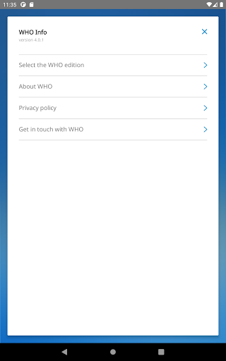
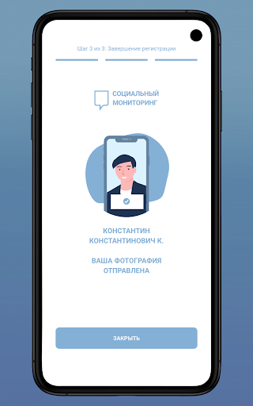
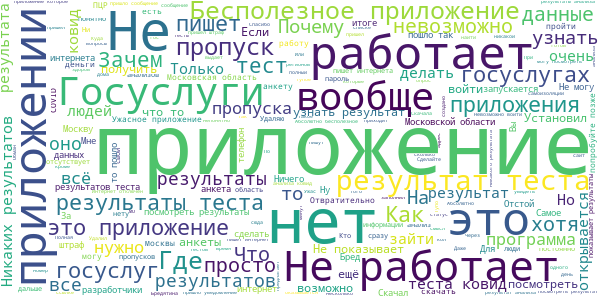
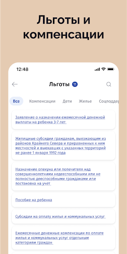
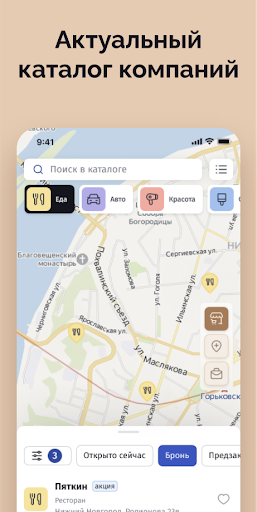

# COVID-related Android apps in Russia

Author: `Ivano Malavolta` (ivanomalavolta@gmail.com)

Created at: `2021/3/28`

Report generated by the [covid-apps-observer](http://github.com/covid-apps-observer) project, version 0.1

# Table of contents 

- [Background](#background)
    * [Data sources and analyses](#data-sources-and-analyses)
        * [App metadata](#app-metadata)
        * [Requested permissions](#requested-permissions)
        * [Mentioned servers](#mentioned_servers)
        * [Security analysis](#security_analysis)
        * [User ratings and reviews](#user-ratings-and-reviews)
    * [Disclaimer](#disclaimer)
- [Госуслуги Москвы](#госуслуги-москвы)
- [Моя Москва — официальное приложение портала mos.ru](#моя-москва-—-официальное-приложение-портала-mos.ru)
- [WHO Info](#who-info)
- [Социальный мониторинг](#социальный-мониторинг)
- [OpenWHO](#openwho)
- [Активный гражданин](#активный-гражданин)
- [Госуслуги СТОП Коронавирус](#госуслуги-стоп-коронавирус)
- [CoronaSTOP](#coronastop)
- [Contact Tracker](#contact-tracker)
- [Карта жителя НО](#карта-жителя-но)
- [Кыргыз Консул](#кыргыз-консул)
- [ЯОК – контролируйте свое здоровье](#яок-–-контролируйте-свое-здоровье)
- [Электронная регистратура](#электронная-регистратура)
- [Госуслуги.COVID трекер](#госуслуги.covid-трекер)

- [Credits](#credits)

# How to read this report

This report has been generated by the [covid-apps-observer](http://github.com/covid-apps-observer) project. The project automatically analyzes the apps by extracting information which is already publicly available either on the web or in the apps binary files. 

Our analysis covers the following apps:
| | |
|-------------------------|-------------------------| 
|  | Госуслуги Москвы
|  | Моя Москва — официальное приложение портала mos.ru
|  | WHO Info
|  | Социальный мониторинг
|  | OpenWHO
|  | Активный гражданин
|  | Госуслуги СТОП Коронавирус
|  | CoronaSTOP
|  | Contact Tracker
|  | Карта жителя НО
|  | Кыргыз Консул
|  | ЯОК – контролируйте свое здоровье
|  | Электронная регистратура
|  | Госуслуги.COVID трекер

The details of our analysis are presented in the remainder of this report.

For independent verification, the raw data and the source code of the project is publicly available in its GitHub repository [http://github.com/covid-apps-observer](http://github.com/covid-apps-observer) and its source code has been thoroughly commented in order to provide all the details about how the information provided in this report has been extracted. 

Any feedback, questions, and improvements about the project are very welcome, feel free to create an issue or pull request directly in its GitHub repository: [http://github.com/covid-apps-observer](http://github.com/covid-apps-observer).

## Data sources and analyses

The analysis of each app is structured around five main dimensions: 
* App metadata  
* Requested permissions
* Mentioned servers
* Androwarn analysis
* User ratings and reviews

In the following we describe the data sources and analysis performed for each dimension.

### App metadata

App metadata includes an overview of the main information about the app (for example, its name, releases, privacy policy, etc.), contact information of the development team, and the various Android versions supported by the app. This information is extracted from two main data sources:
* _Google Play store_: we automatically mined the web page of the Google Play store showing the basic information about the app and we parsed it in order to extract information about the app and development team 
* _Android Manifest file_: in our analysis we decompiled the binary file of the app (it is similar to a Zip archive but it contains the code of the app instead of normal files) and we extracted information about the supported Android versions, as it has been listed by its development team.

The extracted app metadata feeds the _App overview_, _Development team_, and _Android support_ sections of this report.
We make use of the [google-play-scraper](https://github.com/JoMingyu/google-play-scraper) tool for extracting the raw data related to this dimension of the project.

### Requested permissions

The Android operating system has a permission model which allows users to grant access to potentially privacy-related information. Every Android app has to explictly declare the permissions it needs to properly function in the Android Manifest file.  

In this report we also show the protection level of each permission, which is a key information for understanding how the requested permissions related to the user's privacy. We carefully analyzed the [official Android documentation (v. 29)](https://developer.android.com/reference/android/Manifest.permission), and it resulted that a permission requested by an Android app can belong to the following protection levels:
* **Dangerous**: higher-risk permissions that would give a requesting app access to private user data or control over the device that can negatively impact the user. Because this type of permission introduces potential risk, the system usually does not automatically grant it to the requesting app. For example, any dangerous permissions requested by an app may be displayed to the user and require confirmation before proceeding.
* **Normal**: this is the default and most common level in Android; normal permissions are lower-risk and give access to isolated app-level features, with minimal risk to other apps, the system, or the user. 
* **Signature**: permissions granted only if the requesting app is signed with the same certificate as the app that declared the permission
* **Appop**: old permission level, a reminiscence of the App Ops tool that Google introduced in Android 4.3.
* **Development**: optional permissions which can be granted to development-oriented apps.
* **Privileged**: permissions who give higher power to mobile apps w.r.t. other apps, such as binding to incoming calls, interacting via bluetooth with other devices without user interaction, etc.
* **Preinstalled**: reserved only for preinstalled apps
* **Installer**: allow the holder to start the permission usage screen for an app
* **RetailDemo**: permissions related to devices used in demonstrations in shops.
* **Pre23**: permissions automatically granted to apps targeting devices running pre-6.0 Android.
* **Upcoming**: permissions which will be released in the next version of the Android platform. 
* **Deprecated**: permissions belonging to old releases of the Android platform, they should not be used by developers since they will not be supported in the near future.
* **Not for use by third-party applications**: permissions which can be requested only by apps developed by Google.
* **Undefined**: this protection level is not documented by Google.

The permissions dimension of this project is based on the [Androguard](https://github.com/androguard/androguard) static analysis tool.

### Mentioned servers

We decompiled each app in order to look for all possible mentions of remote URLs. The mentioned URLs can refer to remote servers the the app is using for either sending or receiving information, web addresses for directing the user to an information website, and so on. 

:warning: It is important to note that this analysis is not meant to be complete and it is very prone to obfuscation. The servers reported here are simply _mentioned_ somewhere in the code of the app and are meant to just give an indication about the "hooks" of the app towards external resources. For example, for an Android app it is normal to contact Google services in order to send/receive push notifications, or to contact the servers of analytics services for having real-time diagnostics about crashes of the app or bugs.

This part of the analysis is based on the [Androguard](https://github.com/androguard/androguard) static analysis tool for identfying the raw URLs mentioned in the app; then, the information about each mentioned server is collected by performing a _whois_ lookup on the first-level domain present in the URL.

### Security analysis

This dimension is based on the [Androwarn](https://github.com/maaaaz/androwarn) structural and data flow analysis of Android bytecode. Androwarn is developed by the University of Lyon/INSA (France) and it has been used in several academic studies. According to its documentation, Androwarn targets the following categories of potential security issues:
* **Telephony identifiers exfiltration**: IMEI, IMSI, MCC, MNC, LAC, CID, operator's name, etc.
* **Device settings exfiltration**: software version, usage statistics, system settings, logs, etc.
* **Geolocation information leakage**: GPS/WiFi geolocation, etc.
* **Connection interfaces information exfiltration**: WiFi credentials, Bluetooth MAC adress, etc.
* **Telephony services abuse**: premium SMS sending, phone call composition, etc.
* **Audio/video flow interception**: call recording, video capture, etc.
* **Remote connection establishment**: socket open call, Bluetooth pairing, APN settings edit, etc.
* **PIM data leakage**: contacts, calendar, SMS, mails, clipboard, etc.
* **External memory operations**: file access on SD card, etc.
* **PIM data modification**: add/delete contacts, calendar events, etc.
* **Arbitrary code execution**: native code using JNI, UNIX command, privilege escalation, etc.
* **Denial of Service**: event notification deactivation, file deletion, process killing, virtual keyboard disable, terminal shutdown/reboot, etc.

Note: We do not consider this data point in the current version of our analyzers since it is too verbose for our purposes.

:warning: It is important to note that Androwarn is a static analysis tool, and as such it performs a variety of heuristics and approximations in its analyses. Said that, the results shown in this report are meant to provide an indication of _potential_ security issues and should be by no means treated as complete and correct.   

### User ratings and reviews

For this dimension we turn again to the web interface of the Google Play store. Firstly, we automatically mine summary statistics about user ratings from the web page of the app under analysis; then, we automatically download the newest 1000 reviews of the app under analysis. For each level of rating (5 stars, 4 stars, , etc., 1 star) we show:
- a word cloud presenting the main terms used by end users in their reviews in the Google Play store
- the last 10 reviews provided by app users in the Google Play store. 

This purposefully simple analysis is meant to help both future users and the development team of the app in understanding what are the main positive and negative points of the app under analysis.

We make use of the [google-play-scraper](https://github.com/JoMingyu/google-play-scraper) tool for extracting the raw data related to this dimension of the project.

## Disclaimer 

This report has been produced independently of any parties and its only objective is to help anybody in better understanding how COVID-related apps work in practice (and compare to each other). The results of this report are limited to the specific version of the software used for running the analyses and on the various heuristics implemented in there. In other words, the results of the analyzers may differ depending on the time and modalities in which they are executed. We do not guarantee that the results of the analyses and the corresponding contents of this report are fully complete or correct. The analysis software is licensed under the [MIT License](https://github.com/iivanoo/covid-apps-observer/blob/master/LICENSE).

# Госуслуги Москвы
App version ``3.13.0.19``

Analyzed with [covid-apps-observer](http://github.com/covid-apps-observer) project, version ``0.1``

## App overview
| | |
|-------------------------|-------------------------| 
| **Name**&nbsp;&nbsp;&nbsp;&nbsp;&nbsp;&nbsp;&nbsp;&nbsp;&nbsp;&nbsp;&nbsp;&nbsp;&nbsp;&nbsp;&nbsp;&nbsp;&nbsp;&nbsp;&nbsp;&nbsp;&nbsp;&nbsp;&nbsp;&nbsp;&nbsp;&nbsp;&nbsp;&nbsp;&nbsp;&nbsp;&nbsp;&nbsp;&nbsp;&nbsp;&nbsp;&nbsp;&nbsp;&nbsp;&nbsp;&nbsp;  | Госуслуги Москвы |
| **Unique identifier** | ru.altarix.mos.pgu |
| **Link to Google Play** | [https://play.google.com/store/apps/details?id=ru.altarix.mos.pgu](https://play.google.com/store/apps/details?id=ru.altarix.mos.pgu) |
| **Summary**  | Все электронные услуги города: начисления ЖКХ, штрафы ГИБДД, эвакуация ТС и др. |
| **Privacy policy** | [https://mosapps.mos.ru/privacypolicy/](https://mosapps.mos.ru/privacypolicy/) |
| **Latest version** | 3.13.0.19 |
| **Last update** | 2020-12-22 17:56:29 |
| **Recent changes** | - Расширен перечень категорий начислений и документов, по которым производится поиск начислений; - Добавлена возможность оплаты начислений за домашний телефон МГТС |
| **Installs**  | 1 000 000+ |
| **Category** | Социальные |
| **First release** | 27 сент. 2012 г. |
| **Size**  | 21M |
| **Supported Android version**  | 6.0 и выше |

### Description
> Мобильное приложение «Госуслуги Москвы» - сервис, объединяющий востребованные услуги Правительства Москвы, для комфортной жизни в большом городе.
 Образование:
 - Сервис «Мой ребенок в школе» дает возможность удаленно отслеживать проход и питание учащегося, школьное меню и баланс лицевого счета, который в любой момент можно пополнить с банковской карты/мобильного счета; 
 - Сервис «Электронный дневник» объединяет в себе самую важную для родителей информацию об учебе: расписание уроков, домашние задание, оценки учащегося и т.д.; 
 - Сервис «Результаты ГИА» - мобильная площадка с результатами прохождения Государственной итоговой аттестации.
 Жилье, ЖКУ:
 - Сервис «Начисления за жилищно-коммунальные услуги» предоставляет развернутую информацию о долговых/текущих начислениях за ЖКУ с возможностью заказать электронный Единый платежный документ; 
 - Сервис «Внесение показаний» - возможность передачи показаний счетчиков водоснабжения/электроэнергии, а также получения информации о задолженности без очередей и отрыва от важных дел; 
 - Сервис «Единый диспетчерский центр» – компактная площадка для решения проблем и вопросов, относящихся к вашему дому/двору;
 - Сервис «Информирование о начале расчетов по новой услуге»;
 - Сервис «Информирование о регистрации на жилплощади»;
 - Сервис «Информирование об отключении горячего водоснабжения».
 Транспорт:
 - Сервис «Штрафы» дает возможность получать актуальную информацию по вашим штрафам и оплачивать с мобильного; 
 - Сервис «Эвакуация транспортного средства» информирует об эвакуации ТС, а также предоставляет точный адрес местонахождения ТС на спецстоянке.
 Здоровье и документы:
 - Сервис «Запись к врачу» предоставляет возможность удаленно записаться на прием к любому врачу, перенести и отменить запись, посмотреть перечень направлений и выписанные вам рецепты; 
 - Сервис «Запись к ветеринару» предоставляет возможность записать своего питомца на прием в ветеринарную клинику (перенести, отменить запись) или вызвать ветеринара на дом;
 - Сервис «Готовность загранпаспорта» - индивидуальное информирование о готовности заграничного паспорта;
 - Сервис «Федеральная служба судебных приставов» предоставляет информацию о наличии исполнительных делопроизводств ФССП.
 Информация:
 - Сервис «Новости» объединяет в себе самые актуальные и интересные новости города в удобном мобильном формате.
 По желанию вы можете настроить способ получения уведомлений: SMS, E-mail или Push-уведомления.
 ___________________________________
 Обратите внимание на другие официальные приложения правительства Москвы.
 - Активный Гражданин - проект для тех, кому важно, что происходит в Москве
 - Наш город – помогите нам сделать город лучше
 - Парковки Москвы – приложение для поиска и оплаты парковки в Москве
 - Узнай Москву - архитектурная история столицы).

### User interface
The developers of the app provide the following screenshots in the Google play store.
| | | |
|:-------------------------:|:-------------------------:|:-------------------------:|
 |   |   |   | 
 |   |  

## Development team
In the following we report the main information provided by the development team in the Google play store.

| | |
|-------------------------|-------------------------|
| **Developer**  | Информационный город ГКУ |
| **Website**  | [https://www.mos.ru/mosapps/](https://www.mos.ru/mosapps/) |
| **Email** | emp@mos.ru |
| **Physical address**  | - |
| **Other developed apps**  | [https://play.google.com/store/apps/developer?id=%D0%98%D0%BD%D1%84%D0%BE%D1%80%D0%BC%D0%B0%D1%86%D0%B8%D0%BE%D0%BD%D0%BD%D1%8B%D0%B9+%D0%B3%D0%BE%D1%80%D0%BE%D0%B4+%D0%93%D0%9A%D0%A3](https://play.google.com/store/apps/developer?id=%D0%98%D0%BD%D1%84%D0%BE%D1%80%D0%BC%D0%B0%D1%86%D0%B8%D0%BE%D0%BD%D0%BD%D1%8B%D0%B9+%D0%B3%D0%BE%D1%80%D0%BE%D0%B4+%D0%93%D0%9A%D0%A3) |

## Android support

| | |
|-------------------------|-------------------------|
| **Declared target Android version**  | Android10, version 10 (API level 29) |
| **Effective target Android version**  | Android10, version 10 (API level 29) |
| **Minimum supported Android version**  | Marshmallow, version 6.0 (API level 23) |
| **Maximum target Android version**  | - |

The larger the difference between the minimum and maximum supported Android versions, the better. A larger difference means a wider audience. For example, old phones have a very low Android version, so a high minimum supported Android version means that the app cannot be used by users with old phones, thus leading to accessibility problems. 

## Requested permissions

In the following we report the complete list of the permissions requested by the app. 

| **Permission** | **Protection level** | **Description** | 
|-------------------------|-------------------------|-------------------------|
 **android.permission ACCESS_COARSE_LOCATION** | :warning:**Dangerous** | Allows an app to access approximate location. 
 **android.permission ACCESS_FINE_LOCATION** | :warning:**Dangerous** | Allows an app to access precise location. 
 **android.permission ACCESS_NETWORK_STATE** | Normal | Allows applications to access information about networks. 
 **android.permission ACCESS_WIFI_STATE** | Normal | Allows applications to access information about Wi-Fi networks. 
 **android.permission CALL_PHONE** | :warning:**Dangerous** | Allows an application to initiate a phone call without going through the Dialer user interface for the user to confirm the call. 
 **android.permission CAMERA** | :warning:**Dangerous** | Required to be able to access the camera device. 
 **android.permission INTERNET** | Normal | Allows applications to open network sockets. 
 **android.permission READ_CALENDAR** | :warning:**Dangerous** | Allows an application to read the user's calendar data. 
 **android.permission READ_CONTACTS** | :warning:**Dangerous** | Allows an application to read the user's contacts data. 
 **android.permission READ_EXTERNAL_STORAGE** | :warning:**Dangerous** | Allows an application to read from external storage. 
 **android.permission USE_BIOMETRIC** | Normal | Allows an app to use device supported biometric modalities. 
 **android.permission USE_FINGERPRINT** | Normal | This constant was deprecated in API level 28. Applications should request USE_BIOMETRIC instead 
 **android.permission VIBRATE** | Normal | Allows access to the vibrator. 
 **android.permission WAKE_LOCK** | Normal | Allows using PowerManager WakeLocks to keep processor from sleeping or screen from dimming. 
 **android.permission WRITE_CALENDAR** | :warning:**Dangerous** | Allows an application to write the user's calendar data. 
 **android.permission WRITE_EXTERNAL_STORAGE** | :warning:**Dangerous** | Allows an application to write to external storage. 
 **com.google.android.c2dm.permission RECEIVE** | - | - 
 **com.google.android.finsky.permission BIND_GET_INSTALL_REFERRER_SERVICE** | - | - 

## Mentioned servers

| **Server** | **Registrant** | **Registrant country** | **Creation date** | 
|-------------------------|-------------------------|-------------------------|-------------------------|
 | vk.com | Privacy protection service - whoisproxy.ru | :ru: RU | 1997-06-24 04:00:00 |
 | app-measurement.com | Google LLC | :us: US | 2015-06-19 20:13:31 |
 | facebook.com | Facebook, Inc. | :us: US | 1997-03-29 05:00:00 |
 | googlesyndication.com | Google LLC | :us: US | 2003-01-21 06:17:24 |
 | google.com | Google LLC | :us: US | 1997-09-15 04:00:00 |
 | openstreetmap.org | OpenStreetMap Foundation | GB | 2004-08-09 18:47:25 |
 | wikimedia.org | Wikimedia Foundation, Inc. | :us: US | 2003-03-16 08:22:47 |
 | openptmap.org | Registrant State/Province: Bayern | :de: DE | 2010-11-17 12:05:24 |
 | cloudmade.com | Cloud Made Ltd | :uk: UK | 2007-07-17 17:02:27 |
 | openstreetmap.nl | - | - | 2007-03-06 00:00:00 |
 | wmflabs.org | Wikimedia Foundation, Inc. | :us: US | 2011-09-29 14:58:28 |
 | openseamap.org | Registrant State/Province: | :de: DE | 2009-03-26 11:35:19 |
 | chartbundle.com | Whois Privacy Service | :us: US | 2010-01-09 23:30:15 |
 | opentopomap.org | Registrant State/Province: | :de: DE | 2011-09-03 18:35:13 |
 | 2gis.ru | - | - | 2001-02-18 21:00:00 |
 | crashlytics.com | Google LLC | :us: US | 2011-01-21 15:30:40 |
 | mos.ru | - | - | 1996-12-23 09:49:03 |
 | w3.org | W3C | :us: US | 1994-07-06 04:00:00 |
 | googleadservices.com | Google LLC | :us: US | 2003-06-19 16:34:53 |
 | huawei.com | Huawei Technologies Co., Ltd. | :china: CN | 2000-01-11 13:37:24 |
 | googleapis.com | Google LLC | :us: US | 2005-01-25 17:52:26 |
 | mts.ru | - | - | 1997-11-19 12:02:34 |
 | 2gis.com | DoubleGIS LLC | :ru: RU | 2004-03-18 08:51:04 |

## Security analysis 

Below we report the main security warnings raised by our execution of the [Androwarn](https://github.com/maaaaz/androwarn) security analysis tool.

**Telephony identifiers leakage**
> - This application reads the numeric name (MCC+MNC) of current registered operator 
> - This application reads the operator name 

**Location lookup**
> - This application reads location information from all available providers (WiFi, GPS etc.) 

**Connection interfaces exfiltration**
> - This application reads details about the currently active data network 
> - This application tries to find out if the currently active data network is metered 

**Telephony services abuse**
> - This application makes phone calls 

**Suspicious connection establishment**
> - This application opens a Socket and connects it to the remote address ' returned no addresses for  ; port is out of range' on the 'N/A' port  
> - This application opens a Socket and connects it to the remote address '' on the 'N/A' port  
> - This application opens a Socket and connects it to the remote address 'Ljava/net/Proxy;->type()Ljava/net/Proxy$Type;' on the 'N/A' port  
> - This application opens a Socket and connects it to the remote address 'timeout' on the 'N/A' port  

**Code execution**
> - This application loads a native library 

## User ratings and reviews

Below we provide information about how end users are reacting to the app in terms of ratings and reviews in the Google Play store.

### Ratings

The Госуслуги Москвы app has been installed by more than **1000000** times. At this time, **58633** rated the app and its average score is **3.9367776**. Below we show the distribution of the ratings across the usual star-based rating of Google Play

:star::star::star::star::star:: 36791

:star::star::star::star:: 5431

:star::star::star:: 2899

:star::star:: 2939

:star:: 10573

### Reviews 

#### 5-star reviews

> Очень удобно..спасибо разоаботчикам..  :date: __2021-03-28 08:17:47__

> домашнее задание не отображается.( исправьте ошибки!  :date: __2021-03-28 06:47:49__

> Оочень крутое приложение  :date: __2021-03-27 17:36:42__

> Очень удобно  :date: __2021-03-27 08:22:16__

> Госуслуги хорошее приложение, всегда посмотришь оцэнки д/з и т.д  :date: __2021-03-25 21:56:27__

> Необезательно  :date: __2021-03-25 19:37:26__

> Отлично  :date: __2021-03-25 17:41:00__

> Очень удобно, все карточки с собой. Не надо таскать кипу карт.  :date: __2021-03-25 15:04:21__

> Все удобно  :date: __2021-03-25 14:33:46__

> Хорошее обслуживание в поликлиннике 84.  :date: __2021-03-25 11:10:33__

#### 4-star reviews

> Глючит  :date: __2021-03-26 19:28:03__

> Лагает иногда  :date: __2021-03-26 06:13:04__

> Установил, думал зайду под своими данными от сайта и вуаля все на месте ( квартиры, лиц. счета и т.д.). Этого ничего не оказалось. Нет синхронизации с данными сайта. Update. Стало лучше, но иногда невозможно оплатить  :date: __2021-03-25 18:38:08__

> Не хватает тёмной темы, и красный цвет довольно агрессивный  :date: __2021-03-24 18:36:08__

> Отличное приложение !! Но последнее время постоянно выдает ошибку. С третьего или четвертого раза удается записаться. Это печалит(  :date: __2021-03-24 07:38:28__

> Не могу найти начисления пенсионного фонда  :date: __2021-03-24 06:05:54__

> В приложении почему то не отображается место рождения, хотя личные данные были заполнены полностью! А добавить не могу ( не открывается клавиатура только в этом приложении ) . Спасибо!  :date: __2021-03-23 07:33:35__

> Работал хорошо. Сегодня не могу войти  :date: __2021-03-23 06:59:05__

> Проблема с авторизацией!  :date: __2021-03-21 18:40:01__

> Нет возможности присоединить фото  :date: __2021-03-21 11:05:26__

#### 3-star reviews

> не могу который месяц зайти в элетронную медицинскую книжку, при нажатии кнопки "получить услугу" выбрасывает на главную страницу  :date: __2021-03-28 07:07:34__

> Не знаю что случилось, только после обновления, то ли что. Даже зайти её могу в приложение. Выбивает сразу же.  :date: __2021-03-24 14:10:28__

> Пользовалась приложением достаточно успешно, но с сегодняшнего дня не открывается. Перезагрузка устройства не помогает. Обновлений приложения нет. Разработчики, что за сбой?  :date: __2021-03-23 20:22:18__

> Здравствуйте. Сегодня весь день зайти не могу, вылетает. Помогите.  :date: __2021-03-23 17:21:29__

> Плохо работает. Глючит часто.  :date: __2021-03-23 09:43:12__

> Перестали отображаться направления на анализ крови. Когда будет исправлена эта ситуация?  :date: __2021-03-23 07:02:14__

> Не работает запись к врачу уже давно. Надоело это! Выдаёт ошибку. Исправьте  :date: __2021-03-22 05:39:47__

> Нет возможности войти в медицинскую карту. Пропала данная строка. Да и раньше входила туда не сразу - всё время просят обновить браузер. А сейчас вообще нет входа в мед.карту. Не могу посмотреть результаты тестирования.  :date: __2021-03-22 05:03:27__

> Подскажите, пожалуйста, как оплатить детский сад?  :date: __2021-03-19 10:36:28__

> Сколько раз не пробовал, но электронная почта не сохраняются.  :date: __2021-03-18 13:29:47__

#### 2-star reviews

> Почему не могу посмотреть наличие штрафов? Раньше показывало, а сейчас нет!  :date: __2021-03-27 14:06:11__

> Постоянно технические работы, выкидывает. Оплату карты проход питание вообще теперь использовать не буду, вчера перевела ребенку, деньги поступили только сегодня. Через сбер мгновенно зачисляются.  :date: __2021-03-26 16:58:30__

> Отвратительно работает приложение, постоянно глючит! К врачу записаться проблема, пополнить баланс ребёнку-проблема! Причём денежку списывают быстренько, а вот сумма на счёт не поступает! Ребёнок кушает в школе в долг, хотя обед для него оплачен заранее! Разберитесь уже наконец-то!  :date: __2021-03-26 12:59:04__

> Слишком часто пишет ошибка и с сайта выбрасывает! Тупить стал очень сильно!  :date: __2021-03-24 23:36:11__

> Так себе.. Тормозит, глючит, постоянные ошибки выходят, долгие задумчивые паузы между нажатиями  :date: __2021-03-24 09:04:51__

> Не помню, когда последний раз за полгода, запись к врачу подходила бы без выпадения кучи ошибок.  :date: __2021-03-24 05:52:46__

> До недавнего времени было вполне удобное приложение, но в последнее время постоянно глючит и выдаёт ошибку, в частности, при записи к врачу ("Сервис недоступен"). В электронный дневник тоже через раз заходит. Каждый раз начинаешь "пляски с бубнами", чтобы открыть нужную страницу: вернуться на шаг назад, зайти снова. И это уже который месяц! Можно наконец исправить?!!!  :date: __2021-03-24 05:38:04__

> Вылетает постоянно. После обновления вообще не возможно зайти  :date: __2021-03-24 04:26:41__

> Почему вечно приложение зависает и выкидывает из него. Постоянно ошибки в нем(  :date: __2021-03-23 19:13:56__

> Не работает  :date: __2021-03-23 11:14:21__

#### 1-star reviews

> Бесконечно ошибки и невозможно пользоваться  :date: __2021-03-27 11:54:29__

> Неужели разработчики сами не видят что происходит, в электронную медицинскую карту не зайти, к врачу не записаться, электронный дневник не открывается, оплаченные штрафы висят. Такое приложение было удобное, но нет просто на фиг все испортили!  :date: __2021-03-27 08:09:52__

> Невозможно оплатить жку  :date: __2021-03-26 16:57:46__

> Зачем нужно это приложение, если на половину услуг оно выдаёт ошибку?  :date: __2021-03-26 16:43:39__

> Поддержка отвратительная, описал проблему, отправил. Запросили доп. Данные. Ответить им спустя один день, а заявку уже закрыли! Поддержка пишет про то что предоставлять надо не позднее одного дня, эти самые дополнительные данные, хотя в отбивках указан срок в три дня! Завел новое, с указанием старого, новое закрыли с пометкой что решение будет в закрытой!!! Заявке. Что бы не быть голословным: Основное SD16169402. Повторное SD16218562. Закрыто. Данные будут по первому уже закрытому!Бред.  :date: __2021-03-26 16:18:14__

> Не честно там какая-то девушка поставила мене 2  :date: __2021-03-26 11:55:05__

> Я положила деньги на карту они 2 день не приходят. Деньги в пустую(  :date: __2021-03-26 11:08:12__

> Отображение части записей к врачу не корректно, нет ни названия записи, ни номера кабинета, понять что за запись просто не возможно Могу предоставить скриншоты  :date: __2021-03-26 09:41:57__

> Невозможно записаться на анализы, приходится идти к инфомату, а раньше можно было это делать через приложение!  :date: __2021-03-26 07:04:52__

> Батя отправил деньги на карту они так и не пришли сижу 1 день и голодаю  :date: __2021-03-26 06:29:45__

# Моя Москва — официальное приложение портала mos.ru
App version ``1.8.1``

Analyzed with [covid-apps-observer](http://github.com/covid-apps-observer) project, version ``0.1``

## App overview
| | |
|-------------------------|-------------------------| 
| **Name**&nbsp;&nbsp;&nbsp;&nbsp;&nbsp;&nbsp;&nbsp;&nbsp;&nbsp;&nbsp;&nbsp;&nbsp;&nbsp;&nbsp;&nbsp;&nbsp;&nbsp;&nbsp;&nbsp;&nbsp;&nbsp;&nbsp;&nbsp;&nbsp;&nbsp;&nbsp;&nbsp;&nbsp;&nbsp;&nbsp;&nbsp;&nbsp;&nbsp;&nbsp;&nbsp;&nbsp;&nbsp;&nbsp;&nbsp;&nbsp;  | Моя Москва — официальное приложение портала mos.ru |
| **Unique identifier** | ru.mos.app |
| **Link to Google Play** | [https://play.google.com/store/apps/details?id=ru.mos.app](https://play.google.com/store/apps/details?id=ru.mos.app) |
| **Summary**  | Все самые нужные городские сервисы в официальном приложении mos.ru «Моя Москва». |
| **Privacy policy** | [https://mosapps.mos.ru/privacypolicy/](https://mosapps.mos.ru/privacypolicy/) |
| **Latest version** | 1.8.1 |
| **Last update** | 2021-03-13 10:04:27 |
| **Recent changes** | Исправили ошибку, из-за которой у части пользователей могло вылетать приложение. |
| **Installs**  | 500 000+ |
| **Category** | Социальные |
| **First release** | 27 дек. 2018 г. |
| **Size**  | 88M |
| **Supported Android version**  | 5.0 и выше |

### Description
> Пользуйтесь главными сервисами mos.ru, читайте новости города и задавайте вопросы операторам городского контакт-центра в одном приложении. Достаточно ввести ваши данные для входа на портал mos.ru и вам откроются все возможности чат-бота «Моя Москва».
 Здесь мы собрали самые частые госуслуги, которыми пользуются москвичи. И упростили процесс получения — все вопросы решает быстрый чат-бот. Откройте диалог в нужном разделе:
 – Мой дом: подать показания счётчиков воды, узнать, когда нужно провести поверку счётчиков, получить счета за ЖКУ. Сохраните в приложении 10-значный номер плательщика (указан на вашем ЕПД) и вам будет доступна оплата ЖКХ.
 – Дети в школе: пользоваться сервисами «Москвёнок» и «Электронный дневник» в одном приложении. Проверить, когда ребенок пришёл в школу, какие оценки получил и что купил на обед, можно за пару минут, спросив у бота.
 – Здоровье: записаться на приём в поликлинику, перенести или отменить запись к врачу теперь можно онлайн в удобном чате. Только скажите боту номер полиса ОМС.
 – Транспорт: проверить и оплатить штрафы ГИБДД онлайн по номеру, узнать историю своего автомобиля. По вашей просьбе бот пришлёт уведомление об эвакуации машины и новых штрафах. Понадобятся номер водительских прав, СТС, VIN и госномер автомобиля.
 – Контакт-центр: операторы круглосуточно готовы помочь вам в решении вопросов, связанных с получением государственных услуг и работой приложения «Моя Москва».
 – Новости города: узнать за пару минут всё самое важное, что происходит в Москве и в вашем районе.
 – Мой район: изучать ваш район - читать об уникальных фактах, искать ближайшие парки и школы, детские и спортивные площадки, узнавать о планах его развития.
 «Моя Москва» — чат-бот, который помогает москвичам получить самые популярные госуслуги. Часть из них доступна без авторизации. Но советуем зарегистрироваться, чтобы бот знал ваши данные и мог напоминать о важных платежах или записи к врачу.
 Правительство Москвы также разработало отдельные приложения для тех, кто ищет или хочет оплатить парковку («Парковки Москвы»), участвовать в принятии важных городских решений («Активный Гражданин»), замечать недочеты в устройстве ЖКХ («Наш город»).

### User interface
The developers of the app provide the following screenshots in the Google play store.
| | | |
|:-------------------------:|:-------------------------:|:-------------------------:|
 |   |   |   | 
 |   |   |   | 
 |   |  

## Development team
In the following we report the main information provided by the development team in the Google play store.

| | |
|-------------------------|-------------------------|
| **Developer**  | Информационный город ГКУ |
| **Website**  | [https://www.mos.ru/mobile/](https://www.mos.ru/mobile/) |
| **Email** | mobile@mos.ru |
| **Physical address**  | - |
| **Other developed apps**  | [https://play.google.com/store/apps/developer?id=%D0%98%D0%BD%D1%84%D0%BE%D1%80%D0%BC%D0%B0%D1%86%D0%B8%D0%BE%D0%BD%D0%BD%D1%8B%D0%B9+%D0%B3%D0%BE%D1%80%D0%BE%D0%B4+%D0%93%D0%9A%D0%A3](https://play.google.com/store/apps/developer?id=%D0%98%D0%BD%D1%84%D0%BE%D1%80%D0%BC%D0%B0%D1%86%D0%B8%D0%BE%D0%BD%D0%BD%D1%8B%D0%B9+%D0%B3%D0%BE%D1%80%D0%BE%D0%B4+%D0%93%D0%9A%D0%A3) |

## Android support

| | |
|-------------------------|-------------------------|
| **Declared target Android version**  | Android10, version 10 (API level 29) |
| **Effective target Android version**  | Android10, version 10 (API level 29) |
| **Minimum supported Android version**  | Lollipop, version 5.0 (API level 21) |
| **Maximum target Android version**  | - |

The larger the difference between the minimum and maximum supported Android versions, the better. A larger difference means a wider audience. For example, old phones have a very low Android version, so a high minimum supported Android version means that the app cannot be used by users with old phones, thus leading to accessibility problems. 

## Requested permissions

In the following we report the complete list of the permissions requested by the app. 

| **Permission** | **Protection level** | **Description** | 
|-------------------------|-------------------------|-------------------------|
 **android.permission ACCESS_COARSE_LOCATION** | :warning:**Dangerous** | Allows an app to access approximate location. 
 **android.permission ACCESS_FINE_LOCATION** | :warning:**Dangerous** | Allows an app to access precise location. 
 **android.permission ACCESS_NETWORK_STATE** | Normal | Allows applications to access information about networks. 
 **android.permission ACCESS_WIFI_STATE** | Normal | Allows applications to access information about Wi-Fi networks. 
 **android.permission CAMERA** | :warning:**Dangerous** | Required to be able to access the camera device. 
 **android.permission CHANGE_WIFI_STATE** | Normal | Allows applications to change Wi-Fi connectivity state. 
 **android.permission INTERNET** | Normal | Allows applications to open network sockets. 
 **android.permission READ_EXTERNAL_STORAGE** | :warning:**Dangerous** | Allows an application to read from external storage. 
 **android.permission RECEIVE_BOOT_COMPLETED** | Normal | Allows an application to receive the Intent.ACTION_BOOT_COMPLETED that is broadcast after the system finishes booting. 
 **android.permission USE_BIOMETRIC** | Normal | Allows an app to use device supported biometric modalities. 
 **android.permission USE_FINGERPRINT** | Normal | This constant was deprecated in API level 28. Applications should request USE_BIOMETRIC instead 
 **android.permission VIBRATE** | Normal | Allows access to the vibrator. 
 **android.permission WAKE_LOCK** | Normal | Allows using PowerManager WakeLocks to keep processor from sleeping or screen from dimming. 
 **android.permission WRITE_CALENDAR** | :warning:**Dangerous** | Allows an application to write the user's calendar data. 
 **android.permission WRITE_EXTERNAL_STORAGE** | :warning:**Dangerous** | Allows an application to write to external storage. 
 **com.google.android.c2dm.permission RECEIVE** | - | - 
 **com.google.android.finsky.permission BIND_GET_INSTALL_REFERRER_SERVICE** | - | - 
 **ndroid.permission MANAGE_FINGERPRINT** | - | - 

## Mentioned servers

| **Server** | **Registrant** | **Registrant country** | **Creation date** | 
|-------------------------|-------------------------|-------------------------|-------------------------|
 | xml.org | OASIS Open | :us: US | 1997-02-03 05:00:00 |
 | xmlpull.org | WhoisGuard, Inc. | PA | 2001-11-26 20:33:08 |
 | w3.org | W3C | :us: US | 1994-07-06 04:00:00 |
 | googlesyndication.com | Google LLC | :us: US | 2003-01-21 06:17:24 |
 | google.com | Google LLC | :us: US | 1997-09-15 04:00:00 |
 | app-measurement.com | Google LLC | :us: US | 2015-06-19 20:13:31 |
 | yandex.ru | - | - | 1997-09-23 09:45:07 |
 | crashlytics.com | Google LLC | :us: US | 2011-01-21 15:30:40 |
 | googleapis.com | Google LLC | :us: US | 2005-01-25 17:52:26 |
 | googleadservices.com | Google LLC | :us: US | 2003-06-19 16:34:53 |
 | mos.ru | - | - | 1996-12-23 09:49:03 |
 | kladr-api.ru | - | - | 2013-02-06 00:31:38 |
 | frosteye.ru | - | - | 2012-12-08 18:43:12 |
 | intervale.ru | - | - | 2001-04-09 20:00:00 |
 | mts.ru | - | - | 1997-11-19 12:02:34 |
 | mgfoms.ru | - | - | 2002-12-22 21:00:00 |

## Security analysis 

Below we report the main security warnings raised by our execution of the [Androwarn](https://github.com/maaaaz/androwarn) security analysis tool.

**Telephony identifiers leakage**
> - This application reads the MCC+MNC of the provider of the SIM 
> - This application reads the Service Provider Name (SPN) 
> - This application reads the constant indicating the state of the device SIM card 
> - This application reads the current location of the device 
> - This application reads the neighboring cell information of the device 
> - This application reads the numeric name (MCC+MNC) of current registered operator 
> - This application reads the operator name 
> - This application reads the phone's current state 
> - This application reads the radio technology (network type) currently in use on the device for data transmission 
> - This application reads the unique device ID, i.e the IMEI for GSM and the MEID or ESN for CDMA phones 
> - This application reads the Cell ID value 
> - This application reads the Location Area Code value 

**Location lookup**
> - This application reads location information from all available providers (WiFi, GPS etc.) 

**Connection interfaces exfiltration**
> - This application reads details about the currently active data network 
> - This application tries to find out if the currently active data network is metered 

**Telephony services abuse**
> - This application makes phone calls 

**Suspicious connection establishment**
> - This application opens a Socket and connects it to the remote address 'Ljava/lang/StringBuilder;->toString()Ljava/lang/String;' on the 'N/A' port  
> - This application opens a Socket and connects it to the remote address 'Ljava/net/Proxy;->type()Ljava/net/Proxy$Type;' on the 'N/A' port  
> - This application opens a Socket and connects it to the remote address 'No route to  ' on the 'N/A' port  
> - This application opens a Socket and connects it to the remote address 'timeout' on the 'N/A' port  

**Code execution**
> - This application loads a native library 
> - This application loads a native library: 'Landroid/text/TextUtils;->isEmpty(Ljava/lang/CharSequence;)Z' 
> - This application loads a native library: 'YandexMetricaNativeModule' 
> - This application executes a UNIX command containing this argument: 'Ljava/lang/StringBuilder;->toString()Ljava/lang/String;' 
> - This application executes a UNIX command containing this argument: 'logcat -c' 

## User ratings and reviews

Below we provide information about how end users are reacting to the app in terms of ratings and reviews in the Google Play store.

### Ratings

The Моя Москва — официальное приложение портала mos.ru app has been installed by more than **500000** times. At this time, **3820** rated the app and its average score is **3.5153062**. Below we show the distribution of the ratings across the usual star-based rating of Google Play

:star::star::star::star::star:: 2018

:star::star::star::star:: 302

:star::star::star:: 214

:star::star:: 204

:star:: 1082

### Reviews 

#### 5-star reviews

> Удобно очень работает без отказано и есть все что нужно мне нравится  :date: __2021-03-28 07:46:04__

> Пользовался правда 2 раза очень понравилось  :date: __2021-03-25 18:05:46__

> Спасибо, очень удобно! Запись к врачам, напоминание, всё мгновенно  :date: __2021-03-25 15:11:38__

> Интуитивно понятное приложение, которое значительно помогает нам в повседневной жизни.  :date: __2021-03-23 21:03:51__

> Удобное. Приложение  :date: __2021-03-21 04:57:46__

> Очень удобно все иметь под рукой в одном приложении.  :date: __2021-03-20 13:04:31__

> Суппер  :date: __2021-03-20 12:00:48__

> Программа работает.  :date: __2021-03-20 09:55:21__

> Все очень доступно и удобно.  :date: __2021-03-20 08:22:51__

> Очень удобно и быстро  :date: __2021-03-19 18:51:31__

#### 4-star reviews

> Бывают сбои но хорошая программа  :date: __2021-03-27 07:33:38__

> Пользуюсь для оплаты счетов для сада и кружков. Остальное слишком урезана относительно версии в компьютере  :date: __2021-03-16 10:30:41__

> Приложение не запускается.  :date: __2021-03-09 05:49:13__

> Не открывается приложение  :date: __2021-03-08 11:17:16__

> Все работает пока хорошо. Дальше будет видно как работает.  :date: __2021-03-04 12:57:54__

> Пока мне сложно разобраться  :date: __2021-02-25 15:58:11__

> Удобное приложение  :date: __2021-02-24 08:47:41__

> Удобно  :date: __2021-02-24 05:35:45__

> Удобное, но специалистов мало.Возмущает отсутствие отоларинголога в 1 филиале (118) пол-ки, практически с осени 2020г. Приходится обращаться к платным специалистам, а у меня тугоухость 3ст.ношу 2 аппарата и для осмотра ушей, очистки от серных пробок приходится платить 4750руб., а я пенсионер. Неужели нельзя хотя бы 2раза в неделю приглашать ЛОР врачей из других филиалов пол-ки.Пока все, хотя замечаний много, но больше не хочу писать, думаю, толку будет мало.  :date: __2021-02-13 17:02:12__

> Кое-что кое-как работает, но своеобразный интерфейс приложения делает сложными и долгими самые простые вещи.  :date: __2021-01-25 20:08:54__

#### 3-star reviews

> При оплате за кап ремонт не считывает карточку, при этом всё идеально, освещение, резкость, рамка, читаемость, функция вроде есть, но не работает, приходится вручную вводить.Также при платежах за жкх комиссию снимают, нет соглашения значит хотя-бы с крупными банками (втб например)..  :date: __2021-03-25 12:01:37__

> Почти все сервисы кривые и не собираюсь перечислять какие !!!  :date: __2021-03-22 13:19:18__

> Ну и где установить последнию версию браузера.  :date: __2021-03-18 10:08:42__

> В разделе "Дети в школе" есть рубрика "Домашка". Дорогие создателя поймите что в официальном приложении вы используете просторечия, вульгарный русский язык. Кафешка, фотка, можно применить в разговоре со своим малообразованным другом, но ни тут . Беда нашей страны - недоучившийся сотрудники  :date: __2021-03-16 19:33:54__

> Почему при переходе на сайт мос.ру, при заполнении датнадо листать много лет, чтобы ввести дату? Прсему нельзя ввести ее вручную?  :date: __2021-03-15 12:27:50__

> Предварительная оценка. Другие функции посмотрим...  :date: __2021-03-15 11:55:29__

> В последнее время некорректно работает. Примите меры!!! Приложение ОЧЕНЬ нужно!!!  :date: __2021-03-12 04:24:42__

> При входе в программу, выскакиваю назад. Что за дела? Было всё хорошо. А с 06.03 не могу зайти.  :date: __2021-03-09 12:05:56__

> Пользовалась год, теперь приложение вылетает постоянно. обновление и переустановка не помогли  :date: __2021-03-08 17:22:51__

> ПРИЛОЖЕНИЕ СТАЛО ВЫЛЕТАТЬ ПРИ ВХОДЕ!!! ПОЧИНИТЕ!!!!  :date: __2021-03-08 12:33:43__

#### 2-star reviews

> Часто недоступна оплата обедов в школе  :date: __2021-03-27 08:31:48__

> Чтобы узнать где врач надо открывать карту это бред. Нет возможности удалить историю чтобы найти что надо надо рыться в мусоре. Записался к врачу есть врач есть время есть дата нет номера кабинета.  :date: __2021-03-19 18:01:21__

> Организация велопарковки, не получается отправить заявку на рассмотрение.  :date: __2021-03-18 12:25:50__

> Почему у меня в приложении информация о ребёнке в школе за декабрь месяц 2020 года. И другие "новости" - устаревшие.  :date: __2021-03-15 14:41:03__

> Невозможно с настоящим приложением работать, долго загружается, постоянно просить внести пароль логинь, внезапно прерывает начатые операции и.тд.Дайте старое приложение, или приводите этот в порядок.  :date: __2021-03-14 10:48:56__

> Заблокировал доступ, хотя пароль был успешно изменён.  :date: __2021-03-12 09:29:30__

> Приложение открывается и работает, но только до попытки что-нибудь оплатить, сразу зависание, долгие загрузки и счёт временно недоступен  :date: __2021-03-12 07:27:08__

> Приложение не загружается! У меня три смартфона, и на всех одно и тоже, начинает грузится, а потом гаснет!!!  :date: __2021-03-08 16:34:44__

> Не работает пииложение. При авторизации вылетает.  :date: __2021-03-08 15:37:20__

> Вылетает при открытии.  :date: __2021-03-08 15:19:41__

#### 1-star reviews

> Приложение БЫЛО ясным и удобным. Сейчас малопонятным, постоянная пишет Ошибка внешней системы. После введения показаний электросчетчика раньше производил оплата, видна была сумма начисления. Потребление рессурсов наглядно отражалось на графике и т.д. Изменение программы должно способствовать улучшению существующей, а не морочить людям голову и программа не должна при эксплуатации давать постоянные сбои.  :date: __2021-03-26 07:07:28__

> А что сегодня с приложением?отправил на карту москвёнок 1500 рублей,с карты списались но на москвёнок не зачислились!  :date: __2021-03-25 15:49:19__

> При оплате счетов брать комиссию в официальном приложении... это ущербно  :date: __2021-03-21 17:31:14__

> Формат смс или переписки, совершенно не подходит под данный формат приложения "Моя Москва". Вечно приходится нажимать на раздел "вернуться назад" т.к. приложение запоминает на чём ты закончил прошлый поиск запроса, несмотря на то, что ты открыл приложение через день или два. Счета за ЖКХ являются не актуальными, т.к. по ним производилась оплата, а они до сих пор висят в надежде,что я совершу переплату. Вот такая она "Моя Москва"  :date: __2021-03-20 23:01:23__

> Ужасное приложение, вечно виснет. Электронную мед карту чтоты смотреть, через приложение пол дня придется потратить, чтобы зарегистрироваться.  :date: __2021-03-19 13:01:48__

> Ало у вас ни буя не работает!!! И всё через угадайте через какое место.  :date: __2021-03-18 11:53:49__

> Вообще не удобно.  :date: __2021-03-18 06:35:02__

> Невозможное приложение! Всё время пишет, что нет СНИЛСа, мол, использован в другой записи..???? Так СНИЛС же один! Я не могу внести другой номер его! Паспорт почему-то зафиксирован, он же тоже один! А СНИЛС в Госуслугах есть, а в Мос.ру не вставляет. И когда захожу через Госуслуги в Мос.ру опять пишет, что нет СНИЛСа. Это издевательство просто!!! Никто ничего у вас не исправляет! Программа дебильная!  :date: __2021-03-16 21:31:09__

> Самое кривое и убогое приложение!!!!!!!  :date: __2021-03-16 08:54:02__

> ужасное, с 7.30 как открывается запись к врачам, начинает висеть и выдавать все виды технических ошибок системы!!! Если не справляетесь с нагрузкой, не занимайтесь этим, не ваше это!! Не могу записаться изза этого к врачу уже неделю, к обеду все ичправляется, но нужные спецы уже закрыты для записи.  :date: __2021-03-16 06:05:46__

# WHO Info
App version ``4.1.0``

Analyzed with [covid-apps-observer](http://github.com/covid-apps-observer) project, version ``0.1``

## App overview
| | |
|-------------------------|-------------------------| 
| **Name**&nbsp;&nbsp;&nbsp;&nbsp;&nbsp;&nbsp;&nbsp;&nbsp;&nbsp;&nbsp;&nbsp;&nbsp;&nbsp;&nbsp;&nbsp;&nbsp;&nbsp;&nbsp;&nbsp;&nbsp;&nbsp;&nbsp;&nbsp;&nbsp;&nbsp;&nbsp;&nbsp;&nbsp;&nbsp;&nbsp;&nbsp;&nbsp;&nbsp;&nbsp;&nbsp;&nbsp;&nbsp;&nbsp;&nbsp;&nbsp;  | WHO Info |
| **Unique identifier** | org.who.infoapp |
| **Link to Google Play** | [https://play.google.com/store/apps/details?id=org.who.infoapp](https://play.google.com/store/apps/details?id=org.who.infoapp) |
| **Summary**  | Официальное приложение информации Всемирной организации здравоохранения. |
| **Privacy policy** | [https://www.who.int/about/who-we-are/privacy-policy](https://www.who.int/about/who-we-are/privacy-policy) |
| **Latest version** | 4.1.0 |
| **Last update** | 2021-01-14 10:10:28 |
| **Recent changes** | This release introduces &quot;Health Topics&quot;. &quot;Health Topics&quot; provide additional information about favourite health topics. |
| **Installs**  | 500 000+ |
| **Category** | Новости и журналы |
| **First release** | 13 апр. 2020 г. |
| **Size**  | 12M |
| **Supported Android version**  | 4.2 и выше |

### Description
> Have the latest health information at your fingertips with the official World Health Organization Information App. This app displays the latest news, events, features and breaking updates on outbreaks. 
  
 WHO works worldwide to promote health, keep the world safe, and serve the vulnerable. 
 Our goal is to ensure that a billion more people have universal health coverage, to protect a billion more people from health emergencies, and provide a further billion people with better health and well-being.

### User interface
The developers of the app provide the following screenshots in the Google play store.
| | | |
|:-------------------------:|:-------------------------:|:-------------------------:|
 |   |   |   | 
 |   |   |   | 
 |   |   |   | 
 |   |   |   | 
 |   |   |   | 
 |   |   |   | 
 |   |   |   | 
 |   |   |   | 

## Development team
In the following we report the main information provided by the development team in the Google play store.

| | |
|-------------------------|-------------------------|
| **Developer**  | World Health Organization |
| **Website**  | [https://www.who.int/](https://www.who.int/) |
| **Email** | dcx@who.int |
| **Physical address**  | [Avenu Appia 20 1211 Geneva Switzerland](https://www.google.com/maps/search/Avenu%20Appia%2020%201211%20Geneva%20Switzerland) (Google Maps) |
| **Other developed apps**  | [https://play.google.com/store/apps/developer?id=World+Health+Organization](https://play.google.com/store/apps/developer?id=World+Health+Organization) |

## Android support

| | |
|-------------------------|-------------------------|
| **Declared target Android version**  | - |
| **Effective target Android version**  | - |
| **Minimum supported Android version**  | Jelly Bean, version 4.2.x (API level 17) |
| **Maximum target Android version**  | - |

The larger the difference between the minimum and maximum supported Android versions, the better. A larger difference means a wider audience. For example, old phones have a very low Android version, so a high minimum supported Android version means that the app cannot be used by users with old phones, thus leading to accessibility problems. 

## Requested permissions

In the following we report the complete list of the permissions requested by the app. 

| **Permission** | **Protection level** | **Description** | 
|-------------------------|-------------------------|-------------------------|
 **android.permission ACCESS_NETWORK_STATE** | Normal | Allows applications to access information about networks. 
 **android.permission INTERNET** | Normal | Allows applications to open network sockets. 
 **android.permission READ_CALENDAR** | :warning:**Dangerous** | Allows an application to read the user's calendar data. 
 **android.permission READ_EXTERNAL_STORAGE** | :warning:**Dangerous** | Allows an application to read from external storage. 
 **android.permission WAKE_LOCK** | Normal | Allows using PowerManager WakeLocks to keep processor from sleeping or screen from dimming. 
 **android.permission WRITE_CALENDAR** | :warning:**Dangerous** | Allows an application to write the user's calendar data. 
 **android.permission WRITE_EXTERNAL_STORAGE** | :warning:**Dangerous** | Allows an application to write to external storage. 
 **com.google.android.c2dm.permission RECEIVE** | - | - 
 **com.google.android.finsky.permission BIND_GET_INSTALL_REFERRER_SERVICE** | - | - 

## Mentioned servers

| **Server** | **Registrant** | **Registrant country** | **Creation date** | 
|-------------------------|-------------------------|-------------------------|-------------------------|
 | adobe.com | Adobe Inc. | :us: US | 1986-11-17 05:00:00 |
 | googlesyndication.com | Google LLC | :us: US | 2003-01-21 06:17:24 |
 | google.com | Google LLC | :us: US | 1997-09-15 04:00:00 |
 | app-measurement.com | Google LLC | :us: US | 2015-06-19 20:13:31 |
 | googleapis.com | Google LLC | :us: US | 2005-01-25 17:52:26 |
 | googleadservices.com | Google LLC | :us: US | 2003-06-19 16:34:53 |

## Security analysis 

Below we report the main security warnings raised by our execution of the [Androwarn](https://github.com/maaaaz/androwarn) security analysis tool.

**Connection interfaces exfiltration**
> - This application reads details about the currently active data network 
> - This application tries to find out if the currently active data network is metered 

**Suspicious connection establishment**
> - This application opens a Socket and connects it to the remote address 'Lfi/iki/elonen/NanoHTTPD$ResponseException;' on the 'N/A' port  
> - This application opens a Socket and connects it to the remote address 'NanoHttpd Shutdown' on the 'N/A' port  

**Code execution**
> - This application loads a native library: 'NativeScript' 
> - This application executes a UNIX command containing this argument: '2' 

## User ratings and reviews

Below we provide information about how end users are reacting to the app in terms of ratings and reviews in the Google Play store.

### Ratings

The WHO Info app has been installed by more than **500000** times. At this time, **1114** rated the app and its average score is **4.108108**. Below we show the distribution of the ratings across the usual star-based rating of Google Play

:star::star::star::star::star:: 754

:star::star::star::star:: 90

:star::star::star:: 60

:star::star:: 60

:star:: 150

### Reviews 

#### 5-star reviews

> ВОЗ как всегда - на высоте!!!  :date: __2020-11-11 10:06:48__

> 👍👍👍👍👍👍👍👍👍👍👍👋👍🤟🤟  :date: __2020-09-14 08:24:45__

> Great! Thanks a lot for russian language! 😉  :date: __2020-09-07 00:42:40__

> otlichno  :date: __2020-09-04 18:06:47__

> Классно!!!!!  :date: __2020-05-02 16:56:29__

#### 4-star reviews

No recent reviews available with 4 stars.

#### 3-star reviews

> А можно по русский написать  :date: __2020-05-23 06:45:03__

#### 2-star reviews

> На русском где?  :date: __2020-06-14 12:29:29__

#### 1-star reviews

> Приложение мошеннической организации, обманывающей весь мир уже год  :date: __2021-01-27 12:10:05__

> Azimov Hasanboy. B b.  :date: __2020-10-03 10:41:25__

> не работает с Гугл  :date: __2020-07-22 09:06:06__

> 👎👎👎👎👎👎👎👅  :date: __2020-07-16 19:13:31__

> Men aniq virusli statistikaga ega bo'lishni xohladim, google Play ushbu dasturni yagona ishonchli dastur sifatida tavsiya qiladi. Ingliz tilidagi maqolalardan tashqari, hech narsa yo'q. O'zbekiston uchun ma'lumot va dasturni aloqasi yo''qmi?  :date: __2020-06-05 13:48:39__

> Смерть разработчикам!!!  :date: __2020-05-19 22:17:08__

> Хотелось иметь под рукой понятную статистику по вирусу, google play рекомендует это приложение как единственно достоверное. Кроме статей на английском ничего нет. Т.е. для России альтернативы нет?  :date: __2020-05-07 16:18:22__

# Социальный мониторинг
App version ``1.11``

Analyzed with [covid-apps-observer](http://github.com/covid-apps-observer) project, version ``0.1``

## App overview
| | |
|-------------------------|-------------------------| 
| **Name**&nbsp;&nbsp;&nbsp;&nbsp;&nbsp;&nbsp;&nbsp;&nbsp;&nbsp;&nbsp;&nbsp;&nbsp;&nbsp;&nbsp;&nbsp;&nbsp;&nbsp;&nbsp;&nbsp;&nbsp;&nbsp;&nbsp;&nbsp;&nbsp;&nbsp;&nbsp;&nbsp;&nbsp;&nbsp;&nbsp;&nbsp;&nbsp;&nbsp;&nbsp;&nbsp;&nbsp;&nbsp;&nbsp;&nbsp;&nbsp;  | Социальный мониторинг |
| **Unique identifier** | ru.mos.socmon |
| **Link to Google Play** | [https://play.google.com/store/apps/details?id=ru.mos.socmon](https://play.google.com/store/apps/details?id=ru.mos.socmon) |
| **Summary**  | Приложение для контроля за соблюдением гражданами режима изоляции на дому |
| **Privacy policy** | [https://www.mos.ru/privacypolicy/socmon/](https://www.mos.ru/privacypolicy/socmon/) |
| **Latest version** | 1.11 |
| **Last update** | 2021-01-27 15:18:09 |
| **Recent changes** | Добавлена новая функция «Тихий час», которая позволяет отключить запрос идентификации один раз в день на 2 часа. |
| **Installs**  | 100 000+ |
| **Category** | Медицина |
| **First release** | 22 апр. 2020 г. |
| **Size**  | 15M |
| **Supported Android version**  | 6.0 и выше |

### Description
> Приложение «Социальный мониторинг» создано для пациентов с подтвержденным диагнозом COVID-19 и граждан контактировавших с ними, проживающих в Москве и соблюдающих предписанный им режим изоляции. С его помощью пациент информирует город о добросовестном соблюдении карантина.
 При регистрации пользователь подтверждает номер телефона, делает фотографию, геолокация (местонахождение) отправляется автоматически. Это нужно для того, чтобы проверить, находится ли пользователь в той же локации, которую указал в согласии, выбирая лечение на дому.
 Чтобы у пользователя не было возможности оставить смартфон дома и выйти на улицу без него, приложение в случайное время присылает СМС-уведомления с запросом дополнительного подтверждения — для этого потребуется сделать селфи.
 Если пользователь покидает исходную геолокацию или не реагирует на уведомления, система предупреждает городские службы о возможном нарушении режима изоляции.
 Личные данные, которые пользователь передает сервису, определены в согласии на получение медицинской помощи на дому и соблюдение режима изоляции либо в постановлении главного санитарного врача города Москвы. Все данные, которые пользователь передает приложению, хранятся в защищенном виде на серверах Департамента информационных технологий и используются в строгом соответствии с федеральным законом № 152-ФЗ "О персональных данных".

### User interface
The developers of the app provide the following screenshots in the Google play store.
| | | |
|:-------------------------:|:-------------------------:|:-------------------------:|
 |   |   |   | 
 |   |  

## Development team
In the following we report the main information provided by the development team in the Google play store.

| | |
|-------------------------|-------------------------|
| **Developer**  | Информационный город ГКУ |
| **Website**  | [https://www.mos.ru/city/projects/monitoring/](https://www.mos.ru/city/projects/monitoring/) |
| **Email** | socialmonitoring@mos.ru |
| **Physical address**  | - |
| **Other developed apps**  | [https://play.google.com/store/apps/developer?id=%D0%98%D0%BD%D1%84%D0%BE%D1%80%D0%BC%D0%B0%D1%86%D0%B8%D0%BE%D0%BD%D0%BD%D1%8B%D0%B9+%D0%B3%D0%BE%D1%80%D0%BE%D0%B4+%D0%93%D0%9A%D0%A3](https://play.google.com/store/apps/developer?id=%D0%98%D0%BD%D1%84%D0%BE%D1%80%D0%BC%D0%B0%D1%86%D0%B8%D0%BE%D0%BD%D0%BD%D1%8B%D0%B9+%D0%B3%D0%BE%D1%80%D0%BE%D0%B4+%D0%93%D0%9A%D0%A3) |

## Android support

| | |
|-------------------------|-------------------------|
| **Declared target Android version**  | Android10, version 10 (API level 29) |
| **Effective target Android version**  | Android10, version 10 (API level 29) |
| **Minimum supported Android version**  | Marshmallow, version 6.0 (API level 23) |
| **Maximum target Android version**  | - |

The larger the difference between the minimum and maximum supported Android versions, the better. A larger difference means a wider audience. For example, old phones have a very low Android version, so a high minimum supported Android version means that the app cannot be used by users with old phones, thus leading to accessibility problems. 

## Requested permissions

In the following we report the complete list of the permissions requested by the app. 

| **Permission** | **Protection level** | **Description** | 
|-------------------------|-------------------------|-------------------------|
 **android.permission ACCESS_BACKGROUND_LOCATION** | :warning:**Dangerous** | Allows an app to access location in the background. 
 **android.permission ACCESS_FINE_LOCATION** | :warning:**Dangerous** | Allows an app to access precise location. 
 **android.permission ACCESS_NETWORK_STATE** | Normal | Allows applications to access information about networks. 
 **android.permission CAMERA** | :warning:**Dangerous** | Required to be able to access the camera device. 
 **android.permission FOREGROUND_SERVICE** | Normal | Allows a regular application to use Service.startForeground. 
 **android.permission INTERNET** | Normal | Allows applications to open network sockets. 
 **android.permission READ_EXTERNAL_STORAGE** | :warning:**Dangerous** | Allows an application to read from external storage. 
 **android.permission RECEIVE_BOOT_COMPLETED** | Normal | Allows an application to receive the Intent.ACTION_BOOT_COMPLETED that is broadcast after the system finishes booting. 
 **android.permission REQUEST_IGNORE_BATTERY_OPTIMIZATIONS** | Normal | Permission an application must hold in order to use Settings.ACTION_REQUEST_IGNORE_BATTERY_OPTIMIZATIONS. 
 **android.permission USE_FULL_SCREEN_INTENT** | Normal | Required for apps targeting Build.VERSION_CODES.Q that want to use notification full screen intents. 
 **android.permission WAKE_LOCK** | Normal | Allows using PowerManager WakeLocks to keep processor from sleeping or screen from dimming. 
 **android.permission WRITE_EXTERNAL_STORAGE** | :warning:**Dangerous** | Allows an application to write to external storage. 
 **com.google.android.c2dm.permission RECEIVE** | - | - 
 **com.google.android.finsky.permission BIND_GET_INSTALL_REFERRER_SERVICE** | - | - 
 **com.msk.socmon PERMISSION** | - | - 

## Mentioned servers

| **Server** | **Registrant** | **Registrant country** | **Creation date** | 
|-------------------------|-------------------------|-------------------------|-------------------------|
 | adobe.com | Adobe Inc. | :us: US | 1986-11-17 05:00:00 |
 | googlesyndication.com | Google LLC | :us: US | 2003-01-21 06:17:24 |
 | google.com | Google LLC | :us: US | 1997-09-15 04:00:00 |
 | googleadservices.com | Google LLC | :us: US | 2003-06-19 16:34:53 |
 | app-measurement.com | Google LLC | :us: US | 2015-06-19 20:13:31 |
 | mos.ru | - | - | 1996-12-23 09:49:03 |
 | crashlytics.com | Google LLC | :us: US | 2011-01-21 15:30:40 |

## Security analysis 

Below we report the main security warnings raised by our execution of the [Androwarn](https://github.com/maaaaz/androwarn) security analysis tool.

**Connection interfaces exfiltration**
> - This application reads details about the currently active data network 
> - This application tries to find out if the currently active data network is metered 

**Telephony services abuse**
> - This application makes phone calls 

**Suspicious connection establishment**
> - This application opens a Socket and connects it to the remote address '; port is out of range' on the 'N/A' port  
> - This application opens a Socket and connects it to the remote address 'Ljava/net/Proxy;->type()Ljava/net/Proxy$Type;' on the 'N/A' port  
> - This application opens a Socket and connects it to the remote address 'Lw/b/a/a/a;->w(Ljava/lang/String;)Ljava/lang/StringBuilder;' on the 'N/A' port  
> - This application opens a Socket and connects it to the remote address 'Method sendUrgentData() is not supported.' on the 'N/A' port  
> - This application opens a Socket and connects it to the remote address 'Method setHandshakeTimeout() is not supported.' on the 'N/A' port  
> - This application opens a Socket and connects it to the remote address 'Method setOOBInline() is not supported.' on the 'N/A' port  
> - This application opens a Socket and connects it to the remote address 'Method setSoWriteTimeout() is not supported.' on the 'N/A' port  
> - This application opens a Socket and connects it to the remote address 'Socket closed' on the 'N/A' port  
> - This application opens a Socket and connects it to the remote address 'Socket is closed' on the 'N/A' port  
> - This application opens a Socket and connects it to the remote address 'Socket is closed.' on the 'N/A' port  
> - This application opens a Socket and connects it to the remote address 'Socket is not connected.' on the 'N/A' port  
> - This application opens a Socket and connects it to the remote address 'socket is closed' on the 'N/A' port  
> - This application opens a Socket and connects it to the remote address 'timeout' on the 'N/A' port  

**Code execution**
> - This application loads a native library: 'conscrypt_gmscore_jni' 
> - This application loads a native library: 'conscrypt_jni' 
> - This application loads a native library: 'tool-checker' 
> - This application executes a UNIX command 
> - This application executes a UNIX command containing this argument: 'getprop' 
> - This application executes a UNIX command containing this argument: 'mount' 

## User ratings and reviews

Below we provide information about how end users are reacting to the app in terms of ratings and reviews in the Google Play store.

### Ratings

The Социальный мониторинг app has been installed by more than **100000** times. At this time, **9680** rated the app and its average score is **1.4561404**. Below we show the distribution of the ratings across the usual star-based rating of Google Play

:star::star::star::star::star:: 699

:star::star::star::star:: 219

:star::star::star:: 349

:star::star:: 259

:star:: 8154

### Reviews 

#### 5-star reviews

> Использую не очень долго. Что могу сказать: Ставьте другой звук уведомления, и не пропустите момент идентификации. Мне не было сложно сделать фото. Функция тихого часа пока не понадобилась. Не могу сказать что-то ещё.  :date: __2021-03-18 22:35:47__

> Добрый вечер! Спасибо! Все обещали исправить в течении 2-3 дней.Это технические неполадки.  :date: __2021-03-18 18:31:23__

> Это приложение . издевательство над людьми .и застовляет людей становиться чокнутыми.. мало им денег . Не все ешё ограбили..  :date: __2021-03-18 13:46:27__

> Нормальное приложение  :date: __2021-03-14 18:54:03__

> Чтобы сделать фото дается целый час времени. Выражение лица не важно, состояние тоже. Достаточно включить уведомления и просто нажать одну кнопку в приложении, чтобы отправить фото. 3-4 раза в день и всё  :date: __2021-03-06 12:48:45__

> Супер  :date: __2021-02-27 17:29:48__

> Оооочень весёлая штука!!!😏👍, Самое лучшее, что могли придумать наши разработчики!!!🤭🤣🤣  :date: __2021-02-25 09:08:32__

> Фух, ну вот и я переболел ковидом. Приложение работает, отслеживает, отправляет запросы, проблем не выявлено. Правда батарейку жрёт, но я думаю это от постоянных запросов джипиэс. Наверное только это неудобство, которое решается зарядкой, ибо и так сидишь дома.  :date: __2021-02-22 19:48:20__

> Приложение работает нормально, хорошая и нужная функция «тихий час»  :date: __2021-02-22 06:43:37__

> 14 дней карантина и мониторингп позади... пишу только потому, что увидел здесь кучу странных отзывов, с которыми не сталкивался ни я ни мои знакомы, которые тоже прошли карантин. ни разу запро не приходил раньше 10 утра и позже 8 вечера... ни разу не было проблем с проверкой фото, на всю процедуру фото-отправка-подтверждение ни разу не ушло больше 2х минут. у меня самсунг а41, все работает замечательно.  :date: __2021-02-18 18:50:06__

#### 4-star reviews

> Периодически случались сбои  :date: __2021-03-03 09:16:47__

> Upd 22.02.2021 По итогу использования. Приложение наконец доработали более-менее. Действительно, несмотря на то, что приходят оповещения, даже когда в больнице, санкции не наступают. Кроме того, после того, как выписали, ещё некоторое время приходили оповещения, но без последствий (метки уже не ставила) . Видимо, ещё из-за большого наплыва больных осенью ответы поддержки были вообще не по теме, никто не вчитывался, о чем вопрос, автоматически выбирался ответ. Ну да ладно, пережили.  :date: __2021-02-22 08:13:26__

> Нормальная программа, но вот с оповещениями у неё плохо. Тот пилик, что она выдаёт часто просто не замечаешь. Как и приход смски. Приходится постоянно смотреть в телефон, чтобы не пропустить фотографирование. Сделали ли бы они возможность ставить на оповещение разные мелодии, цены бы им не было.  :date: __2021-02-18 20:04:26__

> Функционирует отлично, единственное пожелание- наличие статуса об активности ограничений, типа "Наблюдается/Не наблюдается"  :date: __2021-02-10 12:21:19__

> После регистрации в приложении с удивлением для себя заметил, что мое отчесво написано с ошибками, да и адрес не совсем тот. Позвонил в поддержку. Через неделю все исправили.  :date: __2021-02-09 10:15:14__

> Мдэмс...вот тебе и мониторинг)  :date: __2021-02-05 15:02:20__

> Не имеющая вес организация. Собрав информацию, не влияет на социум.  :date: __2021-02-03 11:03:21__

> Приложение работает. Зарегистрироваться удалось с первого раза. Предложение к разработчикам. По возможности сделайте отображение статуса пациента, например: на карантине, снят с карантина.  :date: __2021-02-01 03:03:07__

> В целом приложение работает хорошо, нареканий нет. Иногда, правда, бывают задержки с проверкой и проблемы при отправке фотографии по запросу. Но это за время моего использования было всего лишь один раз.  :date: __2021-01-30 12:56:06__

> Странно, что я это пишу, но надо отдать должное. На Андроиде программа работает нормально. Единственное пожелание - надо было сделать опцию выбора звука для уведомления, поскольку сейчас пришлось поменять звук сообщений от мессенджеров, чтобы не пропустить запросы из приложения. Раньше 10 запросы не шлют, можно спать утром.  :date: __2021-01-17 12:14:02__

#### 3-star reviews

> Даже при очень громком звуке, сигнализирующем, что пришло смс и нужно отправить фото, на него не реагируешь, если уснул. А когда болеешь, то спишь много и в любое время. Как результат, пропущенная отправка фото. Это самая большая недоработка приложения. Возможно было бы правильнее не смс отправлять, а звонить на телефон. Больше шансов , что человек услышит и проснется. Если, конечно, целью приложения является контроль за распространением болезни, а не сбор денег.  :date: __2021-03-25 22:46:52__

> Это самое ужасное. Заболел 9-го марта, анализ результата пришёл 12-го марта, у меня взяли анализ 12-го марта, результат отрицательный. Почему же меня посадили на карантин до 26-го марта, если переболевший может выходить на улицу, а я сижу дома на карантине, где логика?  :date: __2021-03-25 11:04:22__

> Уже два дня не идут запросы на фотографии, специалист технической поддержки не знает - закончился карантин или нет  :date: __2021-03-21 17:31:49__

> Во–первых: ставьте индивидуальное уведомление — какую–ниб долгую мелодию, чтобы не провафльть запрос на фотографию, иначе легко встрять на 4к штрафа на ровном месте Во–вторых, если ваше состояние оставляет желать лучшего, то вы встряли, потому что дневной сон вам испортят этими запросами. Обычно 4–5 запросов в день, с 10 до 20, по крайней мере у меня было так... проспал запрос— 4к. Презумция невиновности не действует Еще в первый день штук 10 звонков получите, сверяющихся о вашем самочуствии...  :date: __2021-03-13 08:46:57__

> Оповещения из приложения приходят без звука! Спасает только дублирование запроса по смс через 20 минут. В остальном приложение функционирует нормально. Update: Уважаемые разработчики! Тогда что у вас за приложение такое, которое игнорит настройки моего телефона?! У меня даже сра*ый тетрис уведомления со звуком присылает!  :date: __2021-03-09 14:39:21__

> За время использования приложения особых проблем не возникло. Пару раз были технические сбои, когда приходил запрос на фото, а в программе не "горела" кнопка для фото, но быстро устранялись. Правильно люди пишут в отзывах, что когда болеешь, хочешь спать, а не следить за запросами фото. Увы, больному человеку 2 часов "тихого часа" мало. В послед.день карантина запросы не приходили. Хотелось бы, чтобы было оповещение об окончании карантина тоже.  :date: __2021-03-07 06:14:26__

> Если у Вас бессонница или Вы любитель поспать до обеда,будьте морально готовы к постоянному недосыпу,помимо болезни,либо заплатить штраф за просрочку. Небольшой лайфхак для сов и страдающих бессонницей, как я. Ставите будильник на 9.55-просыпаетесь. Если фото не надо,то ставите режим "тихий час" и следующий будильник на 12.55.  :date: __2021-02-28 11:29:43__

> Если у вас техсбой( нет возможности сделать фото в приложении) и уже пришло на телефон уведомление о необходимости отправить фото, то почему тосле исправления техсбоя, не приходит повторное уведомление. Очень не удобно больному человеку сидеть и мониторить, когда заработает, что бы фото отправить. Делайте повторную рассылку после исправления техсбоя. И прежде, чем устанавливать см, позвоните и расскажите как это сделать и как он работает, люди за 70+ плохо в этом разбираются  :date: __2021-02-27 10:12:19__

> Сделайте возможность сфотографировать больного другому человеку. С температурой под 40 сфотографировать самого себя весьма не просто.  :date: __2021-02-24 14:59:48__

> Всем фото делать 6р/день или мне 1му?  :date: __2021-02-23 16:20:43__

#### 2-star reviews

> Приложение зависает при отправке фотографии.  :date: __2021-03-23 18:48:10__

> Ничего не понятно  :date: __2021-03-17 16:58:32__

> Вот мне надо забрать посылку, как поступить в этой ситуации?  :date: __2021-03-12 09:29:46__

> Недоделанное ПО. Неоттестированное на реальных (а не игроманах) людях. Причем, не молодого возраста. Регулярные сбои. При этом угрозы штрафов. Безответственные разработчики и "контролёры". Техподдержка социальную напряженность при сбоях не снимает. Позор, а не "цифровизация".  :date: __2021-03-09 05:56:43__

> Нет возможности переключения в свой режим дня. Более 20 лет живу как сова, сплю днем. С этим приложением не сплю уже 10 дней! Могу позволить себе дремать между будильниками, которые стоят на каждый час, начиная с 9 утра! Издевательство! Я больше потеряла здоровья от этого контроля! Все хронические болячки повылазили! При этом у меня даже корону и не нашли, было превышение иммуноглобулинов на фоне отека Квинке! Тихий час не позволяет выспаться! 2часа это копейки  :date: __2021-03-03 07:50:55__

> Приложение присылает запрос на фотографию, а при переходе в само приложение функции фотографирования НЕТ. По истечении часа появляется информация, что ты пропустил фотографирование.  :date: __2021-02-27 10:03:15__

> Очень,часто делать фото,2-3 в день,в полне достаточно,а тут по 5 просят,  :date: __2021-02-25 23:02:21__

> не загружается  :date: __2021-02-25 14:16:59__

> Сегодня 25.02.2021 приложение не работает  :date: __2021-02-25 14:15:48__

> Что за дебилизм после каждой удачной проверки слать пуш-сообщения? Нахрена мне это знать? Я должен знать только когда проверка НЕ пройдена, и надо отправить фото повторно. Меня только это беспокоит. Что за дебилоид разрабатывал логику поведения программы? Вы, блин, ещё каждый час отправляйте подтверждение в виде пуша, что я действительно нахожусь по адресу! (сарказм) Я здоров, но живу с больным и тоже на карантине. У меня ночной график работы на удалёнке.Днём я сплю, а вы, твари, спать не даёте!  :date: __2021-02-20 16:40:43__

#### 1-star reviews

> Вчера уснула,не сфоткалась, сегодня вообще не работает . Мне ждать штрафов?  :date: __2021-03-28 11:22:57__

> Издевательство какое-то.... И ещё было очень обидно узнать, что оказывается можно было просто отказаться от того контроля. Так что читайте что подписываете!  :date: __2021-03-27 22:10:20__

> Самое унизительное и антигуманное приложение, которое только могло придумать наше руководство!! Мало того, что ты болеешь и чудом не отправился на тот свет, так тебя в принудительном порядке с угрозой штрафов, как самого настоящего биотеррориста, заставляют доказывать, что ты реально дома. Причём кто-то определил что с 9 до 22 в любое время мне необходимо прислать фото! И часа режима не беспокоить с меня, биотеррориста, видимо,достаточно! Дергать и заставлять людей - это отвратительно  :date: __2021-03-27 17:50:42__

> Отвратное приложение, в тяжёлом состоянии задергивает, стресует. Силы тратишь на хотелки других тебя контролировать, а не на выздоравления. Чтоб вам самим этот поводок носить все время!  :date: __2021-03-27 17:02:52__

> Тот кто обязал пользоваться этим приложением (мы знаем кто это) - больной урод. Я валяюсь с температурой, сплю пол дня, и вынуждена все время держать рядом включённый телефон (с интернетом, звуком и геолокацией), и все время заряжать телефон, т.к. это жрет батарейку. Пол ночи болеющему человеку с температурой снится что я пропустила время фото. Пусть горят в аду те кто это придумал, и кто участвовал в разработке.  :date: __2021-03-27 14:57:39__

> Убогое приложение,мне фигово и я хочу спать а я б\*\*ять должен смотреть за получением сообщения а то придет штраф. Очередное г*вно от безруких.  :date: __2021-03-27 10:08:36__

> Отвратительное приложение!!!! Вместо того чтобы спать и отдыхать, когда болеешь судорожно вслушиваешься в смс. 2 часа тихого часа?! Серьёзно, когда болеешь эти 2 часа тихого часа от разработчико как плевок. Им такого же, только каждые 10 минут!!! Есть геолокация, одного фото в день было бы достаточно. Когда болеешь, с высокий температурой, по квартире тяжело ходить. Всё для людей, как обычно!  :date: __2021-03-26 18:14:48__

> Сплошной маразм Приложение 9 дней обрабатывало номер телефона, на 10 день, когда я о нём уже и думать практически забыла, а карантин почти закончился, оно таки соизволило заработать, и пришло первое уведомление с запросом на фотографию. Я благополучно проспала первый отчёт и теперь нервно жду оповещения за "административное нарушение", которое я не совершала. Спасибо, за потрепанные нервы, всем советую  :date: __2021-03-25 21:13:14__

> Сдохните твари, и вы и ваши близкие, и собакин, все сдохните и горите в аду.  :date: __2021-03-25 19:28:39__

> Я пропустил уже 3 фотографии, следить за смс это дно. Два раза по вечерам тупо уснул. И один раз сидел на удаленке, работал и тупо не обратил внимания. Ждем продолжения истории...  :date: __2021-03-25 13:29:29__

# OpenWHO
App version ``3.7``

Analyzed with [covid-apps-observer](http://github.com/covid-apps-observer) project, version ``0.1``

## App overview
| | |
|-------------------------|-------------------------| 
| **Name**&nbsp;&nbsp;&nbsp;&nbsp;&nbsp;&nbsp;&nbsp;&nbsp;&nbsp;&nbsp;&nbsp;&nbsp;&nbsp;&nbsp;&nbsp;&nbsp;&nbsp;&nbsp;&nbsp;&nbsp;&nbsp;&nbsp;&nbsp;&nbsp;&nbsp;&nbsp;&nbsp;&nbsp;&nbsp;&nbsp;&nbsp;&nbsp;&nbsp;&nbsp;&nbsp;&nbsp;&nbsp;&nbsp;&nbsp;&nbsp;  | OpenWHO |
| **Unique identifier** | de.xikolo.openwho |
| **Link to Google Play** | [https://play.google.com/store/apps/details?id=de.xikolo.openwho](https://play.google.com/store/apps/details?id=de.xikolo.openwho) |
| **Summary**  | Знания, необходимые при чрезвычайных ситуациях в области здравоохранения |
| **Privacy policy** | [https://openwho.org/pages/privacy](https://openwho.org/pages/privacy) |
| **Latest version** | 3.7 |
| **Last update** | 2020-11-23 13:57:15 |
| **Recent changes** | - Bug fixes and performance improvements |
| **Installs**  | 1 000 000+ |
| **Category** | Образование |
| **First release** | 17 мая 2017 г. |
| **Size**  | 18M |
| **Supported Android version**  | 5.0 и выше |

### Description
> OpenWHO - это интерактивная платформа Всемирной организации здравоохранения (ВОЗ) для распространения знаний, предлагающая онлайн курсы по улучшению реагирования на чрезвычайные ситуации в области здравоохранения. OpenWHO позволяет Организации и ее ключевым партнерам передавать знания, спасающие жизнь, большому числу лиц, находящихся на передней линии борьбы с чрезвычайными ситуациями.
 Платформа OpenWHO предоставляет возможность учиться в удобное для вас время. Смотрите короткие видео лекции и проверяйте свои знания с помощью самостоятельных тестов, когда и где вам будет удобно. Форум и возможность сотрудничества позволяют обмениваться опытом с другими участниками платформы и экспертами по всему миру.
 Данное приложение, предназначенное главным образом для работников здравоохранения, специалистов, осуществляющих первичные меры реагирования на чрезвычайные ситуации, и руководителей, также является источником информации для тех, кто затронут вспышками заболеваний и чрезвычайными ситуациями, в том числе для лиц в целом интересующихся работой ВОЗ в условиях чрезвычайных ситуаций в области здравоохранения.
 Данное приложение состоит из 6 каналов:
 - Канал, посвященный вспышкам заболеваний (Outbreak Channel), направлен на борьбу с инфекционными заболеваниями и предоставляет жизненно важную научную информацию.
 - Канал готовности к реагированию (Ready for Response channel) помогает в подготовке персонала, который проходит обучение для работы в условиях вспышек заболеваний и чрезвычайных ситуаций в области здравоохранения.
 - Социальный Канал (Get Social channel) фокусируется на мероприятиях, основанных на социальных науках, и помогает взаимодействовать с пострадавшими общинами.
 - Канал подготовки к пандемиям (Preparing for Pandemics channel) объединяет курсы по различным аспектам обеспечения готовности, включая эпиднадзор, меры в области общественного здравоохранения и информирование о рисках во время пандемии.
 - Канал COVID-19 (COVID-19 channel) представляет учебные материалы на 6 официальных языках ВОЗ (английском, арабском, испанском, китайском, русском и французском) для медицинских работников, руководителей и общественности в связи со вспышкой коронавирусной болезни (COVID-19). 
 - Канал COVID-19 другие национальные языки (COVID-19 National Languages channel) предлагает те же учебные ресурсы, что и канал COVID-19, но на других национальных языках, таких как индонезийский, японский и португальский.
 Курсы OpenWHO доступны на многих языках, включая 6 официальных языков ВОЗ.
 Скачайте приложение сейчас, присоединяйтесь к сообществу OpenWHO.
 Это приложение разработано в сотрудничестве между Институтом Хассо Платтнера и ВОЗ. Обучающий контент предоставляется исключительно ВОЗ.

### User interface
The developers of the app provide the following screenshots in the Google play store.
| | | |
|:-------------------------:|:-------------------------:|:-------------------------:|
 |   |   |   | 
 |   |   |   | 

## Development team
In the following we report the main information provided by the development team in the Google play store.

| | |
|-------------------------|-------------------------|
| **Developer**  | HPI Knowledge Engineering Team |
| **Website**  | [https://openwho.org/](https://openwho.org/) |
| **Email** | openwho-support@hpi.de |
| **Physical address**  | [Prof.-Dr.-Helmert-Str.2-3 14482 Potsdam](https://www.google.com/maps/search/Prof.-Dr.-Helmert-Str.2-3%2014482%20Potsdam) (Google Maps) |
| **Other developed apps**  | [https://play.google.com/store/apps/developer?id=7185448023325736337](https://play.google.com/store/apps/developer?id=7185448023325736337) |

## Android support

| | |
|-------------------------|-------------------------|
| **Declared target Android version**  | - |
| **Effective target Android version**  | - |
| **Minimum supported Android version**  | Lollipop, version 5.0 (API level 21) |
| **Maximum target Android version**  | - |

The larger the difference between the minimum and maximum supported Android versions, the better. A larger difference means a wider audience. For example, old phones have a very low Android version, so a high minimum supported Android version means that the app cannot be used by users with old phones, thus leading to accessibility problems. 

## Requested permissions

In the following we report the complete list of the permissions requested by the app. 

| **Permission** | **Protection level** | **Description** | 
|-------------------------|-------------------------|-------------------------|
 **android.permission ACCESS_NETWORK_STATE** | Normal | Allows applications to access information about networks. 
 **android.permission ACCESS_WIFI_STATE** | Normal | Allows applications to access information about Wi-Fi networks. 
 **android.permission DOWNLOAD_WITHOUT_NOTIFICATION** | - | - 
 **android.permission FOREGROUND_SERVICE** | Normal | Allows a regular application to use Service.startForeground. 
 **android.permission INTERNET** | Normal | Allows applications to open network sockets. 
 **android.permission RECEIVE_BOOT_COMPLETED** | Normal | Allows an application to receive the Intent.ACTION_BOOT_COMPLETED that is broadcast after the system finishes booting. 
 **android.permission WAKE_LOCK** | Normal | Allows using PowerManager WakeLocks to keep processor from sleeping or screen from dimming. 
 **android.permission WRITE_EXTERNAL_STORAGE** | :warning:**Dangerous** | Allows an application to write to external storage. 
 **com.google.android.c2dm.permission RECEIVE** | - | - 
 **com.google.android.finsky.permission BIND_GET_INSTALL_REFERRER_SERVICE** | - | - 

## Mentioned servers

| **Server** | **Registrant** | **Registrant country** | **Creation date** | 
|-------------------------|-------------------------|-------------------------|-------------------------|
 | googlesyndication.com | Google LLC | :us: US | 2003-01-21 06:17:24 |
 | google.com | Google LLC | :us: US | 1997-09-15 04:00:00 |
 | apple.com | Apple Inc. | :us: US | 1987-02-19 05:00:00 |
 | aomedia.org | Contact Privacy Inc. Customer 1243324949 | :canada: CA | 2015-08-24 14:07:31 |
 | dashif.org | VTM Group | :us: US | 2012-04-27 13:02:46 |
 | app-measurement.com | Google LLC | :us: US | 2015-06-19 20:13:31 |
 | w3.org | W3C | :us: US | 1994-07-06 04:00:00 |
 | googleapis.com | Google LLC | :us: US | 2005-01-25 17:52:26 |
 | psdev.de | - | - | - |
 | xmlpull.org | WhoisGuard, Inc. | PA | 2001-11-26 20:33:08 |
 | crashlytics.com | Google LLC | :us: US | 2011-01-21 15:30:40 |
 | apache.org | The Apache Software Foundation | :us: US | 1995-04-11 04:00:00 |
 | opensource.org | Open Source Initiative | :us: US | 1998-02-11 05:00:00 |
 | creativecommons.org | Creative Commons Corporation | :canada: CA | 2001-01-15 16:51:44 |
 | eclipse.org | Eclipse.org Foundation, Inc. | :canada: CA | 1997-04-14 04:00:00 |
 | gnu.org | Free Software Foundation | :us: US | 1995-11-24 05:00:00 |
 | mozilla.org | Mozilla Corporation | :us: US | 1998-01-24 05:00:00 |
 | googleadservices.com | Google LLC | :us: US | 2003-06-19 16:34:53 |

## Security analysis 

Below we report the main security warnings raised by our execution of the [Androwarn](https://github.com/maaaaz/androwarn) security analysis tool.

**Telephony identifiers leakage**
> - This application reads the ISO country code equivalent of the current registered operator's MCC (Mobile Country Code) 
> - This application reads the MCC+MNC of the provider of the SIM 

**Connection interfaces exfiltration**
> - This application reads details about the currently active data network 
> - This application tries to find out if the currently active data network is metered 

**Suspicious connection establishment**
> - This application opens a Socket and connects it to the remote address ' returned no addresses for  ; port is out of range' on the 'N/A' port  
> - This application opens a Socket and connects it to the remote address '' on the 'N/A' port  
> - This application opens a Socket and connects it to the remote address 'Ljava/lang/StringBuilder;->toString()Ljava/lang/String;' on the 'N/A' port  
> - This application opens a Socket and connects it to the remote address 'Ljava/net/Proxy;->type()Ljava/net/Proxy$Type;' on the 'N/A' port  
> - This application opens a Socket and connects it to the remote address 'timeout' on the 'N/A' port  

**Code execution**
> - This application loads a native library 

## User ratings and reviews

Below we provide information about how end users are reacting to the app in terms of ratings and reviews in the Google Play store.

### Ratings

The OpenWHO app has been installed by more than **1000000** times. At this time, **3403** rated the app and its average score is **4.2647057**. Below we show the distribution of the ratings across the usual star-based rating of Google Play

:star::star::star::star::star:: 2403

:star::star::star::star:: 370

:star::star::star:: 130

:star::star:: 130

:star:: 370

### Reviews 

#### 5-star reviews

> Классно!!!!!  :date: __2020-05-02 17:01:13__

> ☝️👍  :date: __2020-04-16 23:35:41__

#### 4-star reviews

> Дал бы 5 звёзд, но я поставил 4.Потому что не актуально  :date: __2020-04-21 15:30:18__

#### 3-star reviews

No recent reviews available with 3 stars.

#### 2-star reviews

No recent reviews available with 2 stars.

#### 1-star reviews

> Нечего не могу найти  :date: __2021-02-02 13:48:42__

> Не понятно ничево  :date: __2021-01-29 12:39:36__

> Ганр  :date: __2020-09-08 14:20:40__

> Zor  :date: __2020-04-06 16:27:47__

> Бесполезное приложение Я ищу сколько по Казахстану А тут статьи не о чем  :date: __2020-04-06 07:31:50__

> Bobur  :date: __2020-04-03 00:57:43__

# Активный гражданин
App version ``2.26.0``

Analyzed with [covid-apps-observer](http://github.com/covid-apps-observer) project, version ``0.1``

## App overview
| | |
|-------------------------|-------------------------| 
| **Name**&nbsp;&nbsp;&nbsp;&nbsp;&nbsp;&nbsp;&nbsp;&nbsp;&nbsp;&nbsp;&nbsp;&nbsp;&nbsp;&nbsp;&nbsp;&nbsp;&nbsp;&nbsp;&nbsp;&nbsp;&nbsp;&nbsp;&nbsp;&nbsp;&nbsp;&nbsp;&nbsp;&nbsp;&nbsp;&nbsp;&nbsp;&nbsp;&nbsp;&nbsp;&nbsp;&nbsp;&nbsp;&nbsp;&nbsp;&nbsp;  | Активный гражданин |
| **Unique identifier** | ru.mos.polls |
| **Link to Google Play** | [https://play.google.com/store/apps/details?id=ru.mos.polls](https://play.google.com/store/apps/details?id=ru.mos.polls) |
| **Summary**  | Твой город – твое решение! Электронные голосования Правительства Москвы. |
| **Privacy policy** | [https://ag.mos.ru/eula](https://ag.mos.ru/eula) |
| **Latest version** | 2.26.0 |
| **Last update** | 2021-02-02 10:10:20 |
| **Recent changes** | Доработан раздел &quot;Город идей&quot;, добавлена возможность подачи идеи в любое время. |
| **Installs**  | 500 000+ |
| **Category** | Социальные |
| **First release** | 14 мая 2014 г. |
| **Size**  | 13M |
| **Supported Android version**  | 4.4 и выше |

### Description
> Твой город – твое решение! Электронные голосования Правительства Москвы.
 Ты решаешь, какой будет Москва! Участвуй в голосованиях и получай поощрения от города и партнеров проекта!
 «Активный гражданин» — проект для тех, кто хочет изменить город к лучшему. Это официальное приложение Правительства Москвы, которое было создано по поручению мэра Москвы Сергея Собянина.
 Каждую неделю Мэр и Правительство Москвы выносит на обсуждение активных граждан важные для города вопросы: от транспорта и благоустройства территорий до здравоохранения и образования. Выражая свое мнение, ты помогаешь органам власти принимать верные решения. 
 — Как будут отдыхать московские школьники?
 — Нужно ли ограничивать скорость в центре Москвы?
 — Что построить на месте бывшей промзоны?
 Просто зарегистрируйся, укажи свой адрес и голосуй!
 Результаты электронных голосований будут воплощены в жизнь, а тебя ждут приятные подарки.
 Высказывая свою позицию, ты получаешь баллы. Заработай 1000 баллов и получи статус «Активный гражданин», который открывает доступ к Магазину поощрений. В нем заработанные баллы можно обменять на городские услуги. Например:
 — оплата парковки
 — поездки на метро
 — билеты в театры и музеи
 — городские экскурсионные программы
 — яркие сувениры с символикой «Активного гражданина»
 и другие полезные мелочи.
 Хочешь получить еще больше баллов? Чаще заходи в приложение, выражай свое мнение, отмечайся на мероприятиях, приглашай друзей, активируй промо-коды и делись информацией о пройденных голосованиях в социальных сетях.
 Самые активные участники проекта становятся гостями уникальных городских мероприятий. Например, активные граждане могут посетить генеральную репетицию парада Победы или концерт в День города на Красной площади, Чемпионат мира по шорт-треку с участием звезды спорта Виктора Ана или кататься на главном катке страны на ВДНХ.
 Стань активным гражданином — установи приложение бесплатно прямо сейчас!

### User interface
The developers of the app provide the following screenshots in the Google play store.
| | | |
|:-------------------------:|:-------------------------:|:-------------------------:|
 |   |   |   | 
 |   |   |   | 
 |  

## Development team
In the following we report the main information provided by the development team in the Google play store.

| | |
|-------------------------|-------------------------|
| **Developer**  | Информационный город ГКУ |
| **Website**  | [http://ag.mos.ru/](http://ag.mos.ru/) |
| **Email** | support@ag.mos.ru |
| **Physical address**  | - |
| **Other developed apps**  | [https://play.google.com/store/apps/developer?id=%D0%98%D0%BD%D1%84%D0%BE%D1%80%D0%BC%D0%B0%D1%86%D0%B8%D0%BE%D0%BD%D0%BD%D1%8B%D0%B9+%D0%B3%D0%BE%D1%80%D0%BE%D0%B4+%D0%93%D0%9A%D0%A3](https://play.google.com/store/apps/developer?id=%D0%98%D0%BD%D1%84%D0%BE%D1%80%D0%BC%D0%B0%D1%86%D0%B8%D0%BE%D0%BD%D0%BD%D1%8B%D0%B9+%D0%B3%D0%BE%D1%80%D0%BE%D0%B4+%D0%93%D0%9A%D0%A3) |

## Android support

| | |
|-------------------------|-------------------------|
| **Declared target Android version**  | Android10, version 10 (API level 29) |
| **Effective target Android version**  | Android10, version 10 (API level 29) |
| **Minimum supported Android version**  | KitKat, version 4.4 - 4.4.4 (API level 19) |
| **Maximum target Android version**  | - |

The larger the difference between the minimum and maximum supported Android versions, the better. A larger difference means a wider audience. For example, old phones have a very low Android version, so a high minimum supported Android version means that the app cannot be used by users with old phones, thus leading to accessibility problems. 

## Requested permissions

In the following we report the complete list of the permissions requested by the app. 

| **Permission** | **Protection level** | **Description** | 
|-------------------------|-------------------------|-------------------------|
 **android.permission ACCESS_BACKGROUND_LOCATION** | :warning:**Dangerous** | Allows an app to access location in the background. 
 **android.permission ACCESS_COARSE_LOCATION** | :warning:**Dangerous** | Allows an app to access approximate location. 
 **android.permission ACCESS_FINE_LOCATION** | :warning:**Dangerous** | Allows an app to access precise location. 
 **android.permission ACCESS_NETWORK_STATE** | Normal | Allows applications to access information about networks. 
 **android.permission CAMERA** | :warning:**Dangerous** | Required to be able to access the camera device. 
 **android.permission INTERNET** | Normal | Allows applications to open network sockets. 
 **android.permission READ_EXTERNAL_STORAGE** | :warning:**Dangerous** | Allows an application to read from external storage. 
 **android.permission WAKE_LOCK** | Normal | Allows using PowerManager WakeLocks to keep processor from sleeping or screen from dimming. 
 **android.permission WRITE_EXTERNAL_STORAGE** | :warning:**Dangerous** | Allows an application to write to external storage. 
 **com.google.android.c2dm.permission RECEIVE** | - | - 
 **com.google.android.finsky.permission BIND_GET_INSTALL_REFERRER_SERVICE** | - | - 

## Mentioned servers

| **Server** | **Registrant** | **Registrant country** | **Creation date** | 
|-------------------------|-------------------------|-------------------------|-------------------------|
 | googlesyndication.com | Google LLC | :us: US | 2003-01-21 06:17:24 |
 | google.com | Google LLC | :us: US | 1997-09-15 04:00:00 |
 | facebook.com | Facebook, Inc. | :us: US | 1997-03-29 05:00:00 |
 | google-analytics.com | Google LLC | :us: US | 2005-07-18 19:24:32 |
 | app-measurement.com | Google LLC | :us: US | 2015-06-19 20:13:31 |
 | googletagmanager.com | Google LLC | :us: US | 2011-11-11 23:39:05 |
 | mos.ru | - | - | 1996-12-23 09:49:03 |
 | crashlytics.com | Google LLC | :us: US | 2011-01-21 15:30:40 |
 | googleapis.com | Google LLC | :us: US | 2005-01-25 17:52:26 |
 | googleadservices.com | Google LLC | :us: US | 2003-06-19 16:34:53 |

## Security analysis 

Below we report the main security warnings raised by our execution of the [Androwarn](https://github.com/maaaaz/androwarn) security analysis tool.

**Telephony identifiers leakage**
> - This application reads the MCC+MNC of the provider of the SIM 

**Connection interfaces exfiltration**
> - This application reads details about the currently active data network 

**Telephony services abuse**
> - This application makes phone calls 

**Suspicious connection establishment**
> - This application opens a Socket and connects it to the remote address 'Ljava/lang/StringBuilder;->toString()Ljava/lang/String;' on the 'N/A' port  
> - This application opens a Socket and connects it to the remote address 'Ljava/net/Proxy;->type()Ljava/net/Proxy$Type;' on the 'N/A' port  
> - This application opens a Socket and connects it to the remote address 'No route to  ' on the 'N/A' port  
> - This application opens a Socket and connects it to the remote address 'timeout' on the 'N/A' port  

## User ratings and reviews

Below we provide information about how end users are reacting to the app in terms of ratings and reviews in the Google Play store.

### Ratings

The Активный гражданин app has been installed by more than **500000** times. At this time, **75772** rated the app and its average score is **4.187986**. Below we show the distribution of the ratings across the usual star-based rating of Google Play

:star::star::star::star::star:: 52935

:star::star::star::star:: 7257

:star::star::star:: 3174

:star::star:: 1706

:star:: 10700

### Reviews 

#### 5-star reviews

> Очень полезное приложение  :date: __2021-03-26 07:56:52__

> Очень хорошо  :date: __2021-03-25 19:16:56__

> Рад что что то происходит в Москве.  :date: __2021-03-25 12:37:14__

> Великолепное приложение  :date: __2021-03-25 04:49:31__

> Полезное приложение, но не видно текста в вариантах ответов, приходится нажимать на каждый и удерживать, чтобы ознакомиться с содержанием.  :date: __2021-03-24 22:53:39__

> Очень удобное, интересное и полезное приложения, благодаря которому можно не только голосовать за новинки в Москве, но и получать бонусы, которые можно тратить на пополнение "Тройки", на скидку в аптеках "Столички" и "Самсон Фарма", да и просто получать полезные призы (кофту, толстовку, кепку, чехлы для смартфона и многое другое). Всем советую это приложение.  :date: __2021-03-23 12:14:42__

> Хороший удобный сервис  :date: __2021-03-23 00:45:07__

> Очень удобное приложение и интересное, много узнаешь.  :date: __2021-03-22 11:19:55__

> Хорошее приложение  :date: __2021-03-22 10:30:59__

> Навится  :date: __2021-03-21 19:07:06__

#### 4-star reviews

> Полезное приложение, захожу с удовольствием, всегда можно узнать что то новое.  :date: __2021-03-26 13:12:09__

> Отлично  :date: __2021-03-24 22:01:07__

> Ок  :date: __2021-03-24 19:23:02__

> Есть над чем трудится, но продукт уже хороший.  :date: __2021-03-23 09:03:21__

> Хорошо бы доработать! Например если я не работаю как внести данные о работе на мос.ру????  :date: __2021-02-28 09:29:55__

> Не понимаю принцип подсчёта голосов. Есть ли защита от ботов? Визуально все вполне себе. Структура понятна.  :date: __2021-02-27 11:56:48__

> Норм  :date: __2021-02-26 14:27:47__

> Приложение не плохое, как и задумка, но я не заходил 2 дня в приложение и надо заходить снова в свой аккаунт  :date: __2021-02-26 09:08:15__

> Ура! В приложение можно войти!  :date: __2021-02-26 08:54:30__

> Норм  :date: __2021-02-23 09:08:37__

#### 3-star reviews

> Очень плохо что приложение плохо работает в темном режиме телефона. Слова не прочитать.Сделайте поддержку темного режима. Не удобно из за одного приложения переключать режимы.  :date: __2021-03-19 20:03:39__

> Нет адаптации под телефон, разрабы пишут - отключите тёмную тему на вашем телефоне. Всмысле? Ребят, кажется это приложение должно адаптироваться, а не наоборот. Проще удалить.  :date: __2021-03-12 05:44:24__

> Стало постоянно выходить из учетной запись  :date: __2021-03-06 08:44:36__

> Медленное приложение. Магазин поощрений плохо работает  :date: __2021-03-05 18:22:18__

> Идея классная, но кажется что голосование по средством такого приложения не объективно. Ощущение что люди просто тыкают 5 звезд на каждом опросе. В голосовании написаны белые буквы на светлом фоне, и чтобы что-то увидеть приходится удерживать пальцем пункт.  :date: __2021-03-03 14:02:13__

> Все бы хорошо, но приложение очень часто требует подтверждения активации (ввода логина и пароля), в неактивном состоянии перестают приходить уведомления на телефон и почту. О том, что приложение не активно узнаешь случайно. Из-за этого я пропускаю активные голосования.  :date: __2021-03-02 19:18:59__

> Белый шрифт на белом фоне...интересное решение. Особенно когда не знаешь за что голосуешь )  :date: __2021-02-28 23:08:40__

> Регулярно слетает пароль, нужно входить снова. После слияния двух аккаунтов в МФЦ и входа через мос.ру у меня появился новый аккаунт в активном гражданине. Служба поддержки сообщила, что объединить два мои аккаунта в активном гражданине не может. Жаль, старый у меня был несколько лет.  :date: __2021-02-27 17:46:25__

> Переодически вылетает из личного кабинета + когда заказала на баллы брошь так её и не получила, в пункте выдачи сказали что не было такого заказала, служба поддержки не помогла  :date: __2021-02-27 13:45:40__

> Псевдоопросы, лицемерие. Но бывает полезно узнать, что ещё оккупанты из мэрии придумали против народа.  :date: __2021-02-26 16:23:56__

#### 2-star reviews

> Приложение для получения сертификата требует полностью все данные пользователя и плюс ещё доступ ко всей информации в приложении Госуслуги. Весело!  :date: __2021-03-27 22:07:52__

> Сделайте наконец-то темную тему в приложении, невозможно нормально проголосовать.  :date: __2021-03-21 05:46:33__

> Xiaomi redmi 9C у отца. Вылетает каждые пару дней (не отслеживал). Почините. Это же не банковское приложение, хотя тот же Сбербанк не вылетает.  :date: __2021-03-15 04:42:39__

> Все баллы накопленные за три года сгорели из за того что вход стал только через мосру  :date: __2021-03-09 15:47:10__

> Благотворительность просите у жителей Рублевки и лиц с каналов с миллиардами. Достали.Включишь телевизор и на всех каналах дети умирают. И тут же новости про новые яхты, самолеты олигархов и попа Кирилла. Мне было приятно от Вас получит сувенир с Вашей символикой.  :date: __2021-03-09 08:35:14__

> Приложение не только не досчитывает баллы,но и постоянно запрашивает логин и пароль.Вы хоть исправьте свои ошибки.  :date: __2021-03-04 04:01:23__

> Не понятно и сложное  :date: __2021-03-01 18:54:14__

> Не удобно. Поздно узнаю о голосовании. Например я за Дзержинского на Лубянке. А по важным для меня вопросам о регистрации трудно было войти очень!  :date: __2021-02-28 07:03:34__

> Скатились до использования людей для пропихивания своих непопулярных решений. В частности голосование за лик Лубянки где нет выбора: палач Дзержинский или человек сделавший Русь колонией Орды - Невский. Люди хотят фонтан, а не предателей.  :date: __2021-02-25 10:21:01__

> Кривое приложение. Не даёт проголосовать в некоторых опросах, ссылаясь на незаполненный профиль на мос.ру  :date: __2021-02-25 10:01:12__

#### 1-star reviews

> Приложение вылетает , не идет открытие  :date: __2021-03-28 11:18:26__

> Магазин поощрения не меняют служба поддержки пишет что они не отвечают за магазин а там весит года одно и тоже это сайт ОЛЕНЕВОДА ПЛИТОЧНИКА и бордюрщика  :date: __2021-03-27 10:41:37__

> Не возможно открыть предложения поощрения магазинов,ни один не открывается  :date: __2021-03-26 10:04:14__

> Приложение написано рукажопами, требует постоянное подтверждение, часто просто недоступно, школоте заказали за 3 копейки? Вопрос риторический.  :date: __2021-03-26 09:40:50__

> Не работает  :date: __2021-03-25 18:46:03__

> ИБД: Вас спросят как назвать новорожденных зверенышей редкой твари разродившейся в зоопарке или козы на "ферме" ВДНХ, как сильно нравится вам масштабность уничтожения чудом уцелевших до нынешнего дня уголков настоящей природы в городе и какую плитку там стоит положить покрупнее или помельче. Ещё у вас непременно поинтересуются где вы любите бывать (т.е. куда ещё не дотянулись заботливые руки градоначальника 🤦🏻‍♀️) и как благоустроят там всё... И народу позовут туда и побольше. Бесполезное  :date: __2021-03-24 13:55:31__

> Чтобы зайти в свой аккаунт в приложении, нужно залогиниться через браузер? Серьезно? Зайти в аккаунт так и не удалось  :date: __2021-03-23 18:25:24__

> Уважаемые разработчики и техническая служба поддержки! Вы когда прекратите воровать баллы? В декабре было списано 6000 баллов четырьмя транзакциями. После обращения их восстановили. Спустя два месяца снова списали. Только уже 7500 баллов. Вам не стыдно? Кому-то не хватает денег, чтоб в Пятёрочке купить продуктов или мыльце в Хоффе? Пожалуй, пора подавать заявление на мошенничество в МВД и Прокуратуру!!!  :date: __2021-03-21 09:33:19__

> Делетаниы  :date: __2021-03-21 00:44:38__

> Активный Гражданин, вы опять вводите в заблуждение нас, граждан, при голосовании:предлагается заработать дополнительные баллы путем "шэринга" через соц.сети, но ничего не происходит. Уберите соответствующий текст в баннере, выплывающем после проведения голосования  :date: __2021-03-19 07:10:58__

# Госуслуги СТОП Коронавирус
App version ``1.0.19``

Analyzed with [covid-apps-observer](http://github.com/covid-apps-observer) project, version ``0.1``

## App overview
| | |
|-------------------------|-------------------------| 
| **Name**&nbsp;&nbsp;&nbsp;&nbsp;&nbsp;&nbsp;&nbsp;&nbsp;&nbsp;&nbsp;&nbsp;&nbsp;&nbsp;&nbsp;&nbsp;&nbsp;&nbsp;&nbsp;&nbsp;&nbsp;&nbsp;&nbsp;&nbsp;&nbsp;&nbsp;&nbsp;&nbsp;&nbsp;&nbsp;&nbsp;&nbsp;&nbsp;&nbsp;&nbsp;&nbsp;&nbsp;&nbsp;&nbsp;&nbsp;&nbsp;  | Госуслуги СТОП Коронавирус |
| **Unique identifier** | com.minsvyaz.gosuslugi.stopcorona |
| **Link to Google Play** | [https://play.google.com/store/apps/details?id=com.minsvyaz.gosuslugi.stopcorona](https://play.google.com/store/apps/details?id=com.minsvyaz.gosuslugi.stopcorona) |
| **Summary**  | Результаты тестов на COVID-19, сертификат вакцинации, QR-код для проверки. |
| **Privacy policy** | [https://gu-st.ru/content/Other/stopcovidpoliciesprivacy.pdf](https://gu-st.ru/content/Other/stopcovidpoliciesprivacy.pdf) |
| **Latest version** | 1.0.19 |
| **Last update** | 2021-01-20 17:39:59 |
| **Recent changes** | Исправили ошибки и оптимизировали приложение. |
| **Installs**  | 1 000 000+ |
| **Category** | Здоровье и фитнес |
| **First release** | 27 мар. 2020 г. |
| **Size**  | 52M |
| **Supported Android version**  | 5.0 и выше |

### Description
> Для жителей Москвы оформление цифровых пропусков осуществляется через портал mos.ru
 Приложение позволяет выбрать подходящий для вас статус и заполнить анкеты для получения мобильного пропуска на выход из дома в период самоизоляции в формате QR - кода. Вы сможете предъявить его в электронном виде на мобильном устройстве или в распечатанном виде сотрудникам правоохранительных органов в случае необходимости.
 Также можно заблаговременно заполнить анкету регистрации лиц, подлежащих постановке на карантин и ускорить прохождение паспортного и таможенного контроля при прибытии на территорию Российской Федерации из стран, где зарегистрированы случаи заболевания новой коронавирусной инфекцией (2019-nCoV). 
 Режим изоляции необходимо соблюдать в течение 14 календарных дней. Эта обязанность не зависит от признаков заболевания: на карантине следует находиться даже людям без симптомов инфекции. 
 В период карантина необходимо быть дома или в обсервационном центре. Не следует посещать общественные места, ходить на работу или в учебное заведение. Если нет возможности работать удаленно и получать заработную плату, при наличии трудового договора можно воспользоваться электронными сервисами на портале gosuslugi.ru и оформить больничный лист для получения пособия по временной нетрудоспособности.

### User interface
The developers of the app provide the following screenshots in the Google play store.
| | | |
|:-------------------------:|:-------------------------:|:-------------------------:|
 |   |   |   | 
 |   |   |   | 

## Development team
In the following we report the main information provided by the development team in the Google play store.

| | |
|-------------------------|-------------------------|
| **Developer**  | Минцифры России |
| **Website**  | - |
| **Email** | support_mp@gosuslugi.ru |
| **Physical address**  | - |
| **Other developed apps**  | [https://play.google.com/store/apps/developer?id=7040530283788474945](https://play.google.com/store/apps/developer?id=7040530283788474945) |

## Android support

| | |
|-------------------------|-------------------------|
| **Declared target Android version**  | - |
| **Effective target Android version**  | - |
| **Minimum supported Android version**  | Lollipop, version 5.0 (API level 21) |
| **Maximum target Android version**  | - |

The larger the difference between the minimum and maximum supported Android versions, the better. A larger difference means a wider audience. For example, old phones have a very low Android version, so a high minimum supported Android version means that the app cannot be used by users with old phones, thus leading to accessibility problems. 

## Requested permissions

In the following we report the complete list of the permissions requested by the app. 

| **Permission** | **Protection level** | **Description** | 
|-------------------------|-------------------------|-------------------------|
 **android.permission ACCESS_FINE_LOCATION** | :warning:**Dangerous** | Allows an app to access precise location. 
 **android.permission ACCESS_NETWORK_STATE** | Normal | Allows applications to access information about networks. 
 **android.permission CAMERA** | :warning:**Dangerous** | Required to be able to access the camera device. 
 **android.permission FLASHLIGHT** | - | - 
 **android.permission FOREGROUND_SERVICE** | Normal | Allows a regular application to use Service.startForeground. 
 **android.permission INTERNET** | Normal | Allows applications to open network sockets. 
 **android.permission RECEIVE_BOOT_COMPLETED** | Normal | Allows an application to receive the Intent.ACTION_BOOT_COMPLETED that is broadcast after the system finishes booting. 
 **android.permission VIBRATE** | Normal | Allows access to the vibrator. 
 **android.permission WAKE_LOCK** | Normal | Allows using PowerManager WakeLocks to keep processor from sleeping or screen from dimming. 
 **com.google.android.c2dm.permission RECEIVE** | - | - 
 **com.google.android.finsky.permission BIND_GET_INSTALL_REFERRER_SERVICE** | - | - 

## Mentioned servers

| **Server** | **Registrant** | **Registrant country** | **Creation date** | 
|-------------------------|-------------------------|-------------------------|-------------------------|
 | googleapis.com | Google LLC | :us: US | 2005-01-25 17:52:26 |
 | googlesyndication.com | Google LLC | :us: US | 2003-01-21 06:17:24 |
 | google.com | Google LLC | :us: US | 1997-09-15 04:00:00 |
 | googleadservices.com | Google LLC | :us: US | 2003-06-19 16:34:53 |
 | app-measurement.com | Google LLC | :us: US | 2015-06-19 20:13:31 |
 | gosuslugi.ru | - | - | 2008-09-01 20:00:00 |
 | yandex.ru | - | - | 1997-09-23 09:45:07 |
 | crashlytics.com | Google LLC | :us: US | 2011-01-21 15:30:40 |

## Security analysis 

Below we report the main security warnings raised by our execution of the [Androwarn](https://github.com/maaaaz/androwarn) security analysis tool.

**Telephony identifiers leakage**
> - This application reads the MCC+MNC of the provider of the SIM 
> - This application reads the constant indicating the state of the device SIM card 
> - This application reads the current location of the device 
> - This application reads the neighboring cell information of the device 
> - This application reads the radio technology (network type) currently in use on the device for data transmission 
> - This application reads the Cell ID value 
> - This application reads the Location Area Code value 

**Connection interfaces exfiltration**
> - This application reads details about the currently active data network 
> - This application tries to find out if the currently active data network is metered 

**Telephony services abuse**
> - This application makes phone calls 

**Suspicious connection establishment**
> - This application opens a Socket and connects it to the remote address '; port is out of range' on the 'N/A' port  
> - This application opens a Socket and connects it to the remote address 'Ljava/net/Proxy;->type()Ljava/net/Proxy$Type;' on the 'N/A' port  
> - This application opens a Socket and connects it to the remote address 'Ln/a/a/a/a;->w(Ljava/lang/String;)Ljava/lang/StringBuilder;' on the 'N/A' port  
> - This application opens a Socket and connects it to the remote address 'timeout' on the 'N/A' port  

**Code execution**
> - This application loads a native library: 'Landroid/text/TextUtils;->isEmpty(Ljava/lang/CharSequence;)Z' 

## User ratings and reviews

Below we provide information about how end users are reacting to the app in terms of ratings and reviews in the Google Play store.

### Ratings

The Госуслуги СТОП Коронавирус app has been installed by more than **1000000** times. At this time, **31331** rated the app and its average score is **2.5271075**. Below we show the distribution of the ratings across the usual star-based rating of Google Play

:star::star::star::star::star:: 9593

:star::star::star::star:: 1708

:star::star::star:: 1443

:star::star:: 1463

:star:: 17124

### Reviews 

#### 5-star reviews

> Хорошое  :date: __2021-03-16 10:01:29__

> Всегда читаю  :date: __2021-03-03 13:01:12__

> А где в приложении сертификат о прививке?  :date: __2021-03-01 09:57:37__

> Удобно очень, особенно когда болеешь  :date: __2021-02-27 05:46:44__

> Результаты теста узнала через данное приложение, все оперативно  :date: __2021-02-24 09:30:01__

> 👌  :date: __2021-02-20 21:52:44__

> Как "выздороветь" в вашем приложении? Я уже неделю как здоров и на работе, ЭЛН закрыт, но "заполните дневник", "оставайтесь дома". UPD: Нашёл, в анкете о состоянии есть маленькая синяя надпись "Изменить".  :date: __2021-02-12 09:02:33__

> Приложение хорошее, только моих данных по тестам нет(  :date: __2021-01-28 07:19:45__

> Результат пришел сразу.  :date: __2021-01-05 09:16:24__

> Приложение заработало!  :date: __2020-12-20 18:26:58__

#### 4-star reviews

> Сегодня 08.02.21, но первый тест от 21.01.21, так же, как и второй, так и не отобразился. Уже выписалась. Нужен номер исследования.  :date: __2021-02-08 17:02:52__

> Все работает  :date: __2020-12-13 08:59:01__

> Все нормально  :date: __2020-10-19 20:55:17__

> ЫЯщя4Щщ8ф4?-😎  :date: __2020-07-23 02:22:02__

> Спасибо за Госуслуги  :date: __2020-07-16 04:36:30__

> IF  :date: __2020-07-04 15:26:47__

> Спасибо большое вя нас УЦ все чаще яп в  :date: __2020-07-03 17:22:09__

> Отличная работа!!!  :date: __2020-06-26 16:28:07__

> 8plucky 6th to testimony  :date: __2020-06-17 15:43:00__

> Приложение виснет при загрузке данных. Использование по назначению в данный момент невозможно.  :date: __2020-06-15 06:47:42__

#### 3-star reviews

> Не заходит в приложение, пишет "что то пошло не так" Huawei p10 lite  :date: __2021-03-10 05:09:17__

> Прививку сделала дважды, сертификат на госуслугах уже почти месяц жду, ничего не происходит.  :date: __2021-01-30 14:59:32__

> При загрузке пишет нет интернета. Ни wi-fi, ни моб. сеть не видит. Android 10 MIUI 12. Отключил AdGuard (VPN), заработало.  :date: __2021-01-07 16:04:14__

> Нет возможности распечатать результаты теста.  :date: __2020-12-17 15:44:50__

> А как зайти другим аккаунтом? Выход из приложения невозможен. Только удалять и заново устанавливать.  :date: __2020-12-10 17:46:28__

> Не могу найти нужную информацию.,  :date: __2020-12-01 06:28:44__

> И Ти ггт н. Г у нас кч ил к логотипу. В  :date: __2020-10-07 07:29:39__

> На аватарку еще осиновый кол чесноксеребряныкпули.не хватает.оченьотпугивающее приложение.,а в плане использования все тупит и глучит.в общем как и все что сделанолюдьми средненьким по таланту ,средненькой мотивации на средненький джет.для средненько го гражданина нашейСреднейстраны  :date: __2020-09-24 08:12:56__

> Задумка хорошая,но доведите уже продукт до ума совместимость и связь с сервером нормально. Вылеты уже достали  :date: __2020-09-21 06:40:56__

> Где найти историю выданных пропусков, МАДИ прислал штраф, пропуск был.  :date: __2020-09-14 14:45:37__

#### 2-star reviews

> А где сертификат о пройденной вакцинации???  :date: __2021-03-16 22:29:38__

> Плохое приложение не видит обещанного электронного сертификата о проведенной прививке, или не хочет искать, вместо конкретного вопроса предлагает опрос, который не нужен.  :date: __2021-03-02 13:25:28__

> Болел и было сделано три теста и ниодного не оказалось в базе, странно  :date: __2021-01-18 10:41:22__

> Приложение ни о чем, результат анализа вполне можно отправить и на госуслуги  :date: __2021-01-15 14:34:42__

> Решила скачать приложение после того, как на госуслугах мне пришло сообщение о результате теста на ковид(сдавала при плановой госпитализации на операцию). Анкетирование невозможно обойти. Неудобно. Поскольку я сейчас приболела, выбрала строчку "болею-лечусь дома". Всë, эта строчка впоследствии превратилась в " Болею, сижу на самоизоляции". Приложение оформлено, как на бейсике, топорно.  :date: __2021-01-10 10:00:14__

> Результатов своих,я не нашла.Вот и всё.Мне оно не помогло.  :date: __2021-01-07 19:54:31__

> Ничего полезного!  :date: __2020-12-30 05:06:27__

> Нет результатов теста в приложении. Вообще непонятно, почему больше нигде его не посмотреть P.S. месяц спустя результаты таки появились. По этому поводу подниму на одну звезду  :date: __2020-12-23 06:04:39__

> Попытался по прилету из-за границы заполнить анкету - ничего не вышло, сообщает:"Что-то пошло не так. Мы разбираемся с проблемой." Сделал несколько попыток, бесполезно.  :date: __2020-12-09 06:23:22__

> Я понять не могу где смотреть результаты  :date: __2020-12-07 11:39:22__

#### 1-star reviews

> Последние полгода раз в месяц на работе проходим тест на короновирус, в приложении данных нет!  :date: __2021-03-28 13:26:37__

> Ужас ужасный: "интернет не подключен" и всё! При стабильном интернете 100 Мбит  :date: __2021-03-27 09:16:55__

> АБСОЛЮТНО бесполезное. Функционал пустой. Просто кто-то отмыл деньги.  :date: __2021-03-27 06:21:34__

> Полное г.....  :date: __2021-03-25 14:37:42__

> Самое бесполезное приложение. Даже одной звезды не заслуживает.  :date: __2021-03-25 13:30:31__

> Зачем такое приложение, которое не запускается🤔  :date: __2021-03-25 11:44:19__

> Бессмысленное приложение. Установил сто бы получить сертиыикат о пройденой вакцинации. Эта функция есть в описании. Фактически этой функции нет. После отправки дурацкой анкеты. Солбщается что дааных о сданных тестах в системе нет. Хотя я их сдавал. А про вакцинацию вообще ни слова. Нет такой опции. Снес приложение.  :date: __2021-03-24 12:12:53__

> Результатов теста нет, хотя первый был положительный, но он не отображается. Про второй молчу. Бесполезное приложение.  :date: __2021-03-24 10:58:43__

> Где тут электронный сертификат о вакцинации? Зачем это приложение? В нем опросник какой то.... Какая у вас температура утром, вечером, а пульс какой.... Вот щас пишу отзыв и чувствую пульс выше стал, хочется это приложение удалить вместе со смартфоном в форточку....  :date: __2021-03-23 22:12:16__

> Это что вообще?  :date: __2021-03-23 10:29:16__

# Contact Tracker
App version ``1.3``

Analyzed with [covid-apps-observer](http://github.com/covid-apps-observer) project, version ``0.1``

## App overview
| | |
|-------------------------|-------------------------| 
| **Name**&nbsp;&nbsp;&nbsp;&nbsp;&nbsp;&nbsp;&nbsp;&nbsp;&nbsp;&nbsp;&nbsp;&nbsp;&nbsp;&nbsp;&nbsp;&nbsp;&nbsp;&nbsp;&nbsp;&nbsp;&nbsp;&nbsp;&nbsp;&nbsp;&nbsp;&nbsp;&nbsp;&nbsp;&nbsp;&nbsp;&nbsp;&nbsp;&nbsp;&nbsp;&nbsp;&nbsp;&nbsp;&nbsp;&nbsp;&nbsp;  | Contact Tracker |
| **Unique identifier** | com.vjet.covid |
| **Link to Google Play** | [https://play.google.com/store/apps/details?id=com.vjet.covid](https://play.google.com/store/apps/details?id=com.vjet.covid) |
| **Summary**  | Contact Tracker предупреждает о контактах с человеком инфицированном COVID-19. |
| **Privacy policy** | [https://covid-19.y-media.io/privacy-policy/pp-ru.html](https://covid-19.y-media.io/privacy-policy/pp-ru.html) |
| **Latest version** | 1.3 |
| **Last update** | 2020-04-17 17:32:35 |
| **Recent changes** | - |
| **Installs**  | 1 000+ |
| **Category** | Социальные |
| **First release** | 24 мар. 2020 г. |
| **Size**  | 2,1M |
| **Supported Android version**  | 5.0 и выше |

### Description
> Приложение Contact Tracker, предупреждает пользователя о том, что он контактировал с человеком инфицированным COVID19. 
 Contact Tracker, использует технологию Bluetooth для трекинга контактов на расстоянии 3х метров.
 Пользователь может увидеть количество контактов в течении дня, 14 дней и за все время использования приложения.
 Если у пользователя был подтвержден диагноз COVID19, все пользователи с которыми он контактировал получат уведомление.
 Приложение работает в фоновом режиме и способно записывать контакты других пользователей у которых тоже запущено приложение.
 Вся информация является конфиденциальной и будет удалена после окончания эпидемии.

### User interface
The developers of the app provide the following screenshots in the Google play store.
| | | |
|:-------------------------:|:-------------------------:|:-------------------------:|
 |   |   |   | 
 |  

## Development team
In the following we report the main information provided by the development team in the Google play store.

| | |
|-------------------------|-------------------------|
| **Developer**  | v-jet |
| **Website**  | [https://covid-19.y-media.io/ru/](https://covid-19.y-media.io/ru/) |
| **Email** | alex@y-media.io |
| **Physical address**  | [Work Email: vlad@v-jet.net Legal Entity: VI JET, TOV 49000, Ukraine, Dnipro, Knyazya Yaroslava Mudrogo str., 27](https://www.google.com/maps/search/Work%20Email:%20vlad@v-jet.net%20Legal%20Entity:%20VI%20JET,%20TOV%2049000,%20Ukraine,%20Dnipro,%20Knyazya%20Yaroslava%20Mudrogo%20str.,%2027) (Google Maps) |
| **Other developed apps**  | [https://play.google.com/store/apps/developer?id=v-jet](https://play.google.com/store/apps/developer?id=v-jet) |

## Android support

| | |
|-------------------------|-------------------------|
| **Declared target Android version**  | Android10, version 10 (API level 29) |
| **Effective target Android version**  | Android10, version 10 (API level 29) |
| **Minimum supported Android version**  | Lollipop, version 5.0 (API level 21) |
| **Maximum target Android version**  | - |

The larger the difference between the minimum and maximum supported Android versions, the better. A larger difference means a wider audience. For example, old phones have a very low Android version, so a high minimum supported Android version means that the app cannot be used by users with old phones, thus leading to accessibility problems. 

## Requested permissions

In the following we report the complete list of the permissions requested by the app. 

| **Permission** | **Protection level** | **Description** | 
|-------------------------|-------------------------|-------------------------|
 **android.permission ACCESS_BACKGROUND_LOCATION** | :warning:**Dangerous** | Allows an app to access location in the background. 
 **android.permission ACCESS_COARSE_LOCATION** | :warning:**Dangerous** | Allows an app to access approximate location. 
 **android.permission ACCESS_FINE_LOCATION** | :warning:**Dangerous** | Allows an app to access precise location. 
 **android.permission ACCESS_NETWORK_STATE** | Normal | Allows applications to access information about networks. 
 **android.permission BLUETOOTH** | Normal | Allows applications to connect to paired bluetooth devices. 
 **android.permission BLUETOOTH_ADMIN** | Normal | Allows applications to discover and pair bluetooth devices. 
 **android.permission FOREGROUND_SERVICE** | Normal | Allows a regular application to use Service.startForeground. 
 **android.permission INTERNET** | Normal | Allows applications to open network sockets. 
 **android.permission RECEIVE_BOOT_COMPLETED** | Normal | Allows an application to receive the Intent.ACTION_BOOT_COMPLETED that is broadcast after the system finishes booting. 
 **android.permission WAKE_LOCK** | Normal | Allows using PowerManager WakeLocks to keep processor from sleeping or screen from dimming. 
 **com.google.android.c2dm.permission RECEIVE** | - | - 
 **com.google.android.finsky.permission BIND_GET_INSTALL_REFERRER_SERVICE** | - | - 

## Mentioned servers

| **Server** | **Registrant** | **Registrant country** | **Creation date** | 
|-------------------------|-------------------------|-------------------------|-------------------------|
 | googlesyndication.com | Google LLC | :us: US | 2003-01-21 06:17:24 |
 | google.com | Google LLC | :us: US | 1997-09-15 04:00:00 |
 | app-measurement.com | Google LLC | :us: US | 2015-06-19 20:13:31 |
 | googleadservices.com | Google LLC | :us: US | 2003-06-19 16:34:53 |
 | googleapis.com | Google LLC | :us: US | 2005-01-25 17:52:26 |

## Security analysis 

Below we report the main security warnings raised by our execution of the [Androwarn](https://github.com/maaaaz/androwarn) security analysis tool.

**Connection interfaces exfiltration**
> - This application reads details about the currently active data network 

**Suspicious connection establishment**
> - This application opens a Socket and connects it to the remote address '; port is out of range' on the 'N/A' port  
> - This application opens a Socket and connects it to the remote address 'Lcom/android/tools/r8/GeneratedOutlineSupport;->outline11(Ljava/lang/String;)Ljava/lang/StringBuilder;' on the 'N/A' port  
> - This application opens a Socket and connects it to the remote address 'Ljava/net/Proxy;->type()Ljava/net/Proxy$Type;' on the 'N/A' port  
> - This application opens a Socket and connects it to the remote address 'timeout' on the 'N/A' port  

## User ratings and reviews

Below we provide information about how end users are reacting to the app in terms of ratings and reviews in the Google Play store.

### Ratings

The Contact Tracker app has been installed by more than **1000** times. At this time, **8** rated the app and its average score is **2.0**. Below we show the distribution of the ratings across the usual star-based rating of Google Play

:star::star::star::star::star:: 2

:star::star::star::star:: 0

:star::star::star:: 0

:star::star:: 0

:star:: 6

### Reviews 

#### 5-star reviews

No recent reviews available with 5 stars.

#### 4-star reviews

No recent reviews available with 4 stars.

#### 3-star reviews

No recent reviews available with 3 stars.

#### 2-star reviews

> Не возможно зарегистрироваться, не работает, все время ошибка  :date: __2020-11-25 11:08:32__

#### 1-star reviews

> Приложения не работает.  :date: __2021-01-22 04:58:30__

> При регистрации пишет ошибку  :date: __2021-01-19 10:29:08__

> Невозможно зарегистрироваться, вечная ошибка, поставил бы 0 звезд, жаль невозможно, упыри, зря время потратил😡  :date: __2021-01-05 19:15:52__

> Произошла ошибка при регистрации.  :date: __2020-12-25 05:30:56__

> Не могу зарегистрироваться!! Пишет "Incorrect data", ничего сделать не получается!  :date: __2020-12-20 11:39:58__

> Невозможно зарегистрироваться. Удаляю...  :date: __2020-12-17 13:09:36__

> Не работает  :date: __2020-11-25 11:09:01__

> Не работает  :date: __2020-11-24 09:36:27__

> Не регистрацию не как не могу пройти  :date: __2020-11-24 08:18:00__

> Не работает. Регистрация невозможна, скорее всего, приложение ворует пороли от ваших ящиков и платежные данные. А идея предупредить о вирусе - была хорошая.  :date: __2020-07-24 13:56:48__

# Карта жителя НО
App version ``2.0.9``

Analyzed with [covid-apps-observer](http://github.com/covid-apps-observer) project, version ``0.1``

## App overview
| | |
|-------------------------|-------------------------| 
| **Name**&nbsp;&nbsp;&nbsp;&nbsp;&nbsp;&nbsp;&nbsp;&nbsp;&nbsp;&nbsp;&nbsp;&nbsp;&nbsp;&nbsp;&nbsp;&nbsp;&nbsp;&nbsp;&nbsp;&nbsp;&nbsp;&nbsp;&nbsp;&nbsp;&nbsp;&nbsp;&nbsp;&nbsp;&nbsp;&nbsp;&nbsp;&nbsp;&nbsp;&nbsp;&nbsp;&nbsp;&nbsp;&nbsp;&nbsp;&nbsp;  | Карта жителя НО |
| **Unique identifier** | com.nizhniy_mobile |
| **Link to Google Play** | [https://play.google.com/store/apps/details?id=com.nizhniy_mobile](https://play.google.com/store/apps/details?id=com.nizhniy_mobile) |
| **Summary**  | Персональный электронный ключ к городской среде |
| **Privacy policy** | [https://drive.google.com/file/d/1IcZ0NtRJXhbX8yMoAQaGwMOU3Vfppvtm/view](https://drive.google.com/file/d/1IcZ0NtRJXhbX8yMoAQaGwMOU3Vfppvtm/view) |
| **Latest version** | 2.0.9 |
| **Last update** | 2020-12-29 11:22:16 |
| **Recent changes** | Поздравляем всех пользователей нашего приложения с Новым Годом! |
| **Installs**  | 100 000+ |
| **Category** | Социальные |
| **First release** | 2 апр. 2020 г. |
| **Size**  | 68M |
| **Supported Android version**  | 4.4W и выше |

### Description
> Бесплатное приложение для всех жителей Нижегородской области. С его помощью любой житель может взаимодействовать с городом и пользование различными услугами становится удобным, понятным и приятным.

### User interface
The developers of the app provide the following screenshots in the Google play store.
| | | |
|:-------------------------:|:-------------------------:|:-------------------------:|
 |   |   |   | 
 |   |  

## Development team
In the following we report the main information provided by the development team in the Google play store.

| | |
|-------------------------|-------------------------|
| **Developer**  | Мининформ Нижегородской области |
| **Website**  | [http://nn-card.ru](http://nn-card.ru) |
| **Email** | info@nn-card.ru |
| **Physical address**  | - |
| **Other developed apps**  | [https://play.google.com/store/apps/developer?id=%D0%9C%D0%B8%D0%BD%D0%B8%D0%BD%D1%84%D0%BE%D1%80%D0%BC+%D0%9D%D0%B8%D0%B6%D0%B5%D0%B3%D0%BE%D1%80%D0%BE%D0%B4%D1%81%D0%BA%D0%BE%D0%B9+%D0%BE%D0%B1%D0%BB%D0%B0%D1%81%D1%82%D0%B8](https://play.google.com/store/apps/developer?id=%D0%9C%D0%B8%D0%BD%D0%B8%D0%BD%D1%84%D0%BE%D1%80%D0%BC+%D0%9D%D0%B8%D0%B6%D0%B5%D0%B3%D0%BE%D1%80%D0%BE%D0%B4%D1%81%D0%BA%D0%BE%D0%B9+%D0%BE%D0%B1%D0%BB%D0%B0%D1%81%D1%82%D0%B8) |

## Android support

| | |
|-------------------------|-------------------------|
| **Declared target Android version**  | Android10, version 10 (API level 29) |
| **Effective target Android version**  | Android10, version 10 (API level 29) |
| **Minimum supported Android version**  | KitKat W, version 4.4W - 4.4.4W (API level 20) |
| **Maximum target Android version**  | - |

The larger the difference between the minimum and maximum supported Android versions, the better. A larger difference means a wider audience. For example, old phones have a very low Android version, so a high minimum supported Android version means that the app cannot be used by users with old phones, thus leading to accessibility problems. 

## Requested permissions

In the following we report the complete list of the permissions requested by the app. 

| **Permission** | **Protection level** | **Description** | 
|-------------------------|-------------------------|-------------------------|
 **android.permission ACCESS_COARSE_LOCATION** | :warning:**Dangerous** | Allows an app to access approximate location. 
 **android.permission ACCESS_FINE_LOCATION** | :warning:**Dangerous** | Allows an app to access precise location. 
 **android.permission ACCESS_NETWORK_STATE** | Normal | Allows applications to access information about networks. 
 **android.permission ACCESS_WIFI_STATE** | Normal | Allows applications to access information about Wi-Fi networks. 
 **android.permission CAMERA** | :warning:**Dangerous** | Required to be able to access the camera device. 
 **android.permission INTERNET** | Normal | Allows applications to open network sockets. 
 **android.permission READ_APP_BADGE** | - | - 
 **android.permission READ_EXTERNAL_STORAGE** | :warning:**Dangerous** | Allows an application to read from external storage. 
 **android.permission READ_PHONE_STATE** | :warning:**Dangerous** | Allows read only access to phone state, including the phone number of the device, current cellular network information, the status of any ongoing calls, and a list of any PhoneAccounts registered on the device. 
 **android.permission USE_BIOMETRIC** | Normal | Allows an app to use device supported biometric modalities. 
 **android.permission USE_FINGERPRINT** | Normal | This constant was deprecated in API level 28. Applications should request USE_BIOMETRIC instead 
 **android.permission WAKE_LOCK** | Normal | Allows using PowerManager WakeLocks to keep processor from sleeping or screen from dimming. 
 **android.permission WRITE_EXTERNAL_STORAGE** | :warning:**Dangerous** | Allows an application to write to external storage. 
 **com.anddoes.launcher.permission UPDATE_COUNT** | - | - 
 **com.android.vending CHECK_LICENSE** | - | - 
 **com.google.android.c2dm.permission RECEIVE** | - | - 
 **com.google.android.finsky.permission BIND_GET_INSTALL_REFERRER_SERVICE** | - | - 
 **com.htc.launcher.permission READ_SETTINGS** | - | - 
 **com.htc.launcher.permission UPDATE_SHORTCUT** | - | - 
 **com.huawei.android.launcher.permission CHANGE_BADGE** | - | - 
 **com.huawei.android.launcher.permission READ_SETTINGS** | - | - 
 **com.huawei.android.launcher.permission WRITE_SETTINGS** | - | - 
 **com.majeur.launcher.permission UPDATE_BADGE** | - | - 
 **com.oppo.launcher.permission READ_SETTINGS** | - | - 
 **com.oppo.launcher.permission WRITE_SETTINGS** | - | - 
 **com.sec.android.provider.badge.permission READ** | - | - 
 **com.sec.android.provider.badge.permission WRITE** | - | - 
 **com.sonyericsson.home.permission BROADCAST_BADGE** | - | - 
 **com.sonymobile.home.permission PROVIDER_INSERT_BADGE** | - | - 
 **me.everything.badger.permission BADGE_COUNT_READ** | - | - 
 **me.everything.badger.permission BADGE_COUNT_WRITE** | - | - 

## Mentioned servers

| **Server** | **Registrant** | **Registrant country** | **Creation date** | 
|-------------------------|-------------------------|-------------------------|-------------------------|
 | adobe.com | Adobe Inc. | :us: US | 1986-11-17 05:00:00 |
 | apache.org | The Apache Software Foundation | :us: US | 1995-04-11 04:00:00 |
 | xml.org | OASIS Open | :us: US | 1997-02-03 05:00:00 |
 | w3.org | W3C | :us: US | 1994-07-06 04:00:00 |
 | purl.org | Internet Archive | :us: US | 1996-01-01 05:00:00 |
 | android.com | Google LLC | :us: US | 1997-06-23 04:00:00 |
 | googlesyndication.com | Google LLC | :us: US | 2003-01-21 06:17:24 |
 | google.com | Google LLC | :us: US | 1997-09-15 04:00:00 |
 | facebook.com | Facebook, Inc. | :us: US | 1997-03-29 05:00:00 |
 | iptc.org | Whois Privacy Service | :us: US | 1995-12-27 05:00:00 |
 | useplus.org | PLUS COALITION | :us: US | 2003-11-18 19:31:25 |
 | npes.org | NPES | :us: US | 1996-01-30 05:00:00 |
 | aiim.org | Association for Information and Image Management International | :us: US | 1995-10-18 04:00:00 |
 | app-measurement.com | Google LLC | :us: US | 2015-06-19 20:13:31 |
 | drewnoakes.com | REDACTED FOR PRIVACY | GB | 2002-04-04 10:00:05 |
 | googleapis.com | Google LLC | :us: US | 2005-01-25 17:52:26 |
 | googleadservices.com | Google LLC | :us: US | 2003-06-19 16:34:53 |

## Security analysis 

Below we report the main security warnings raised by our execution of the [Androwarn](https://github.com/maaaaz/androwarn) security analysis tool.

**Telephony identifiers leakage**
> - This application reads the numeric name (MCC+MNC) of current registered operator 
> - This application reads the operator name 

**Connection interfaces exfiltration**
> - This application reads details about the currently active data network 
> - This application tries to find out if the currently active data network is metered 

**Audio video eavesdropping**
> - This application records audio from the 'CAMCORDER' source  
> - This application records audio from the 'MIC' source  
> - This application captures video from the 'CAMERA' source 
> - This application captures video from the 'SURFACE' source 

**Suspicious connection establishment**
> - This application opens a Socket and connects it to the remote address '' on the 'N/A' port  
> - This application opens a Socket and connects it to the remote address 'Ljava/lang/StringBuilder;->toString()Ljava/lang/String;' on the ': connect, resolve' port  
> - This application opens a Socket and connects it to the remote address 'Ljava/lang/StringBuilder;->toString()Ljava/lang/String;' on the 'N/A' port  
> - This application opens a Socket and connects it to the remote address 'Ljava/net/Proxy;->type()Ljava/net/Proxy$Type;' on the 'N/A' port  
> - This application opens a Socket and connects it to the remote address 'timeout' on the 'N/A' port  

**Pim data leakage**
> - This application accesses the downloads folder 
> - This application accesses data stored in the clipboard 

**Code execution**
> - This application loads a native library 
> - This application loads a native library: 'Ljava/util/Iterator;->next()Ljava/lang/Object;' 
> - This application loads a native library: 'c++_shared' 
> - This application loads a native library: 'jniPdfium' 
> - This application loads a native library: 'modft2' 
> - This application loads a native library: 'modpdfium' 
> - This application loads a native library: 'modpng' 
> - This application loads a native library: 'ucrop' 
> - This application executes a UNIX command 

## User ratings and reviews

Below we provide information about how end users are reacting to the app in terms of ratings and reviews in the Google Play store.

### Ratings

The Карта жителя НО app has been installed by more than **100000** times. At this time, **10172** rated the app and its average score is **1.8628955**. Below we show the distribution of the ratings across the usual star-based rating of Google Play

:star::star::star::star::star:: 1619

:star::star::star::star:: 292

:star::star::star:: 458

:star::star:: 507

:star:: 7296

### Reviews 

#### 5-star reviews

> Довольно перспективное приложение. Очень интересно как его разовьют в будущем. Успехов разрабам!  :date: __2020-07-26 10:57:33__

> Удалите все мои персональные данные.  :date: __2020-06-24 21:12:37__

> Теперь кодов нет спасибо  :date: __2020-06-11 22:18:26__

> все норм.все работает  :date: __2020-06-11 22:08:26__

> Очень удобное приложение. Сидишь дома, да ещё и деньги платят каждый день по 10 рублей. 😅  :date: __2020-06-02 10:36:49__

> Последние несколько дней, после создания заявки, кнопка Qr кода не активна.. а последние 2 заявки с неактивным кодом вообще исчезли...  :date: __2020-06-01 08:16:03__

> ок  :date: __2020-05-20 14:37:50__

> Отлично!  :date: __2020-05-18 21:00:15__

> Все ОКЕЙ  :date: __2020-05-12 19:51:44__

> Часто,сервис не доступен  :date: __2020-05-11 14:54:16__

#### 4-star reviews

> Все нормально работает. Интерфейс пока не очень дружелюбный для пользователей, но думаю, что со временем все исправят.  :date: __2020-06-30 19:51:07__

> После обновления белый экран, заставка с оленем проходит и потом белый экран. Телефон huawei p smart z. Пришлось удалить и установить заново, теперь всё работает.  :date: __2020-06-28 12:51:57__

> 🍪🏩  :date: __2020-06-12 07:17:00__

> После обновления пропал ярлык приложения. Приходиться каждый раз заходить в плэй-маркет. Очень не удобно... К работе нареканий нет. Поэтому 4 звездочки  :date: __2020-06-04 17:35:19__

> Вполне вероятно получится достаточно функциональное приложение. Пока что то, что уже доступно работает нормально. Единственное почему-то отслеживание местоположения не выключается даже тогда, когда выходишь из приложения. Но ошибки это нормально при такой скорости реализации фунций в пожарном режиме. Дополнение. После обращения в тех. поддержку решилась проблема с не отключающейся геолокацией. Обновление 02.06.2020 гуд. На Honor 8X и 10-м Андроиде все работает норм. На старом Lenovo Phab2 хуже.  :date: __2020-06-04 10:45:52__

> Уважаемые разработчики,а почему отсутствует геолокация? Она что вообще больше не нужна? Тогда зачем нужно само приложение?  :date: __2020-06-01 09:36:06__

> Хотелось бы иметь код передвижения на авто. Я еду одна, риска нет заражения.. Раньше был код-еду на машине, а теперь его почему-то убрали.  :date: __2020-05-26 11:20:34__

> У меня в "моих заявках" нет ни одной оформленной в мае заявки! Почему? Куда пропали? Перед выходом на улицу оформляю QR код всегда.  :date: __2020-05-18 11:12:39__

> Почему в приложении после оформления заявки не активна кнопка QR-код, она раньше высвечивалась синим цветом и открывалась а сейчас не открывается? И верните пжл..Тип заявки Еду на машине/такси, как это было раньше! Если обновлять данные, то лучше уж в лучшую сторону)  :date: __2020-05-13 17:18:07__

> В какой момент появляется сервис "безопасный путь"?  :date: __2020-05-08 19:41:44__

#### 3-star reviews

> Здравствуйте разработчики. Скажите, а зачем такое слишком длинное название (пока выговариваешь -- язык устанет), можно же проще: "Карта Нижегородца", так же как "Карта Москвича"? Я представляю: "Карта жителя Московской области". Ведь не удобно же  :date: __2021-02-17 16:17:10__

> Приложение живёт своей жизнью, двадцать пятый раз требует заполнить личные данные в профиле. Сегодня 14 октября скачал и пытался войти/зарегистрироваться. Бесполезно. Получил разъяснение разработчика, спасибо.  :date: __2020-10-23 11:44:29__

> Не приходит код для активации,только звонки с московских номеров!  :date: __2020-10-09 07:44:44__

> Так отменили коды то вроде. Зачем теперича эта прога нужна??? Чисто для отслеживания если только. Ну и граждане самое главное - наши личные данные у кого сейчас на флешке????  :date: __2020-06-17 18:52:53__

> У меня две транспортных карты. Как привязать вторую?  :date: __2020-06-17 12:40:56__

> Тяжело разобраться в разделах. Многие необходимые разделы есть только на портале, но не приложении. К примеру, я не нашла информацию по самой карте жителя и по предложениям скидок и купонов по ней  :date: __2020-06-12 10:56:18__

> После последнего обновления запускается с ошибкой через раз.  :date: __2020-06-02 18:38:04__

> Приложение не обновляется автоматически. Так же не появляется кнопка "обновить" в магазине. Приходится удалять приложение со смартфона, и скачивать и устанавливать снова. Тогда приложение устанавливается обновленным.  :date: __2020-06-02 10:37:03__

> Для посещения кладбища за городом (Вязовка), как мне оформлять заявку?  :date: __2020-06-01 07:55:48__

> Исчезают оформленные заявки, уже делаю скриншоты на телефон, чтобы хоть как то их сохранить(  :date: __2020-05-29 08:29:02__

#### 2-star reviews

> Доброрубли просто пропали из профиля. Лучше бы вы вообще ничего не вводили чем такой развод. Написать из приложения в службу поддержки не выходит, допилите уже приложение, затея хорошая, реализация желает лучшего. П. С. Доброрубли появились, спасибо.  :date: __2021-01-27 18:26:01__

> Та же проблема что и у Кристины. Вместо кода подтверждения по смс получаю входящий звонок. После ответа звонок сбрасывается. Войти в приложение нельзя. !!!! Проблему решил. Оказывается нужно ввести последние 5 цифр номера с которого поступил звонок. Этой инфы в приложении нет, только в инструкции или на сайте  :date: __2020-10-15 11:16:09__

> При регистрации смс не приходит  :date: __2020-10-11 19:08:16__

> Такой обман - эти доброрубли))) Людям головы надурили, никому не надо тратить эти рубли на всякие ФОКи и псевдоскидки в магазинах. Все ждали, думаю, возможность пополнить свою транспортную карту за счет этих копеечных доброрублей (хоть маленький полезный бонус), но, конечно, уж такой щедрости нам ожидать не стоит (даже если нам это напрямую обещали).  :date: __2020-09-15 14:03:35__

> Не работает промокод купленный за добро рублина Lucky bike  :date: __2020-08-04 21:22:09__

> После очередного обновления, приложение при попытке оформить разрешение на выход просто вылетает.  :date: __2020-06-08 20:55:47__

> После обновления при попытке зайти в приложения стал зависать телефон, приложение не открывается и не реагирует на действия  :date: __2020-06-05 20:34:53__

> Отлично. После обновления крашится сразу после запуска. Если интересно Андроид 6.  :date: __2020-06-05 18:59:42__

> И чего? После каждого обновления приходится вводить все заново...  :date: __2020-06-05 17:29:28__

> Не работает это дерьмоприложение теперь(Код не приходит после обноввы(  :date: __2020-06-02 08:21:12__

#### 1-star reviews

> После установки данного приложения,сбрасываются все месенджеры открываешь и они закрываются. Помогает только удаление данного приложения.В чем проблемма?  :date: __2021-03-23 17:57:33__

> Сегодня надо передавать показания, а он в ответ пишет сервис временно не работает  :date: __2021-03-23 06:00:02__

> Я не буду делать ваши прививки!!! Делайте сами!!!  :date: __2021-01-27 04:48:20__

> Дичь полная, да ещё и не работает  :date: __2020-12-19 08:29:22__

> Моя копия антивируса взбесилась после установки. Хорошо что телефон проглючил. Удалил.  :date: __2020-11-24 10:39:05__

> Я проделал все необходимые операции, чтобы зарегистрироваться и код с последними цифрами звонка и никакого результата. Что за безобразие!  :date: __2020-11-13 19:57:15__

> После обновлений приложение вылетает неуспев открыться  :date: __2020-11-11 20:52:54__

> Кроме того что изначально приложение не имело ни полезного функционала, ни даже свежих новостей, так теперь в него даже войти невозможо, впрочем так же как и заново зарегистрироваться. От разработчиков видимо ответа так никто и не дождется, так разрабы и сами не знают что сотворили...и ответить не могут. Деньги налогоплательщика освоены успешно! А Налогоплательщик хочет знать стоимость этого чудо- проекта. Приложение как было пустышкой, так и осталось! Не устанавливайте Граждане!  :date: __2020-10-28 11:06:33__

> Не приходит код доступа при регистрации. Вместо него - какие-то прерывающиеся звонки с незнакомых номеров. Может, звонки - совпадение, конечно (но вряд ли; прозвон идёт через 2-3 секунды после запроса кода; нет запросов - тишина). Короче - тут же удаляю на всякий противопожарный.  :date: __2020-10-22 15:20:35__

> Не могу зарегистрироваться в приложении. Смс-код не приходит, поэтому не могу зайти. Пытаюсь уже 3 дня, пока без результатов.  :date: __2020-10-22 06:56:13__

# Электронная регистратура
App version ``1.12.72``

Analyzed with [covid-apps-observer](http://github.com/covid-apps-observer) project, version ``0.1``

## App overview
| | |
|-------------------------|-------------------------| 
| **Name**&nbsp;&nbsp;&nbsp;&nbsp;&nbsp;&nbsp;&nbsp;&nbsp;&nbsp;&nbsp;&nbsp;&nbsp;&nbsp;&nbsp;&nbsp;&nbsp;&nbsp;&nbsp;&nbsp;&nbsp;&nbsp;&nbsp;&nbsp;&nbsp;&nbsp;&nbsp;&nbsp;&nbsp;&nbsp;&nbsp;&nbsp;&nbsp;&nbsp;&nbsp;&nbsp;&nbsp;&nbsp;&nbsp;&nbsp;&nbsp;  | Электронная регистратура |
| **Unique identifier** | com.miacugra.telemed |
| **Link to Google Play** | [https://play.google.com/store/apps/details?id=com.miacugra.telemed](https://play.google.com/store/apps/details?id=com.miacugra.telemed) |
| **Summary**  | Онлайн-консультации |
| **Privacy policy** | [https://tm.dzhmao.ru/policy](https://tm.dzhmao.ru/policy) |
| **Latest version** | 1.12.72 |
| **Last update** | 2021-03-22 10:40:50 |
| **Recent changes** | - |
| **Installs**  | 1 000+ |
| **Category** | Медицина |
| **First release** | 30 мар. 2020 г. |
| **Size**  | 76M |
| **Supported Android version**  | 5.0 и выше |

### Description
> — Онлайн-консультации с врачами
 — Личный дневник пациента
 — Напоминания о фиксировании оценки самочувствия

### User interface
The developers of the app provide the following screenshots in the Google play store.
| | | |
|:-------------------------:|:-------------------------:|:-------------------------:|
 |   |   |   | 
 |   |   |   | 

## Development team
In the following we report the main information provided by the development team in the Google play store.

| | |
|-------------------------|-------------------------|
| **Developer**  | БУ "Медицинский информационно-аналитический центр" |
| **Website**  | [https://tm.dzhmao.ru/](https://tm.dzhmao.ru/) |
| **Email** | support@miacugra.ru |
| **Physical address**  | [628011, Россия, Ханты-Мансийский автономный округ - Югра, г. Ханты-Мансийск, ул. Студенческая, 15А](https://www.google.com/maps/search/628011,%20Россия,%20Ханты-Мансийский%20автономный%20округ%20-%20Югра,%20г.%20Ханты-Мансийск,%20ул.%20Студенческая,%2015А) (Google Maps) |
| **Other developed apps**  | [https://play.google.com/store/apps/developer?id=%D0%91%D0%A3+%22%D0%9C%D0%B5%D0%B4%D0%B8%D1%86%D0%B8%D0%BD%D1%81%D0%BA%D0%B8%D0%B9+%D0%B8%D0%BD%D1%84%D0%BE%D1%80%D0%BC%D0%B0%D1%86%D0%B8%D0%BE%D0%BD%D0%BD%D0%BE-%D0%B0%D0%BD%D0%B0%D0%BB%D0%B8%D1%82%D0%B8%D1%87%D0%B5%D1%81%D0%BA%D0%B8%D0%B9+%D1%86%D0%B5%D0%BD%D1%82%D1%80%22](https://play.google.com/store/apps/developer?id=%D0%91%D0%A3+%22%D0%9C%D0%B5%D0%B4%D0%B8%D1%86%D0%B8%D0%BD%D1%81%D0%BA%D0%B8%D0%B9+%D0%B8%D0%BD%D1%84%D0%BE%D1%80%D0%BC%D0%B0%D1%86%D0%B8%D0%BE%D0%BD%D0%BD%D0%BE-%D0%B0%D0%BD%D0%B0%D0%BB%D0%B8%D1%82%D0%B8%D1%87%D0%B5%D1%81%D0%BA%D0%B8%D0%B9+%D1%86%D0%B5%D0%BD%D1%82%D1%80%22) |

## Android support

| | |
|-------------------------|-------------------------|
| **Declared target Android version**  | Android10, version 10 (API level 29) |
| **Effective target Android version**  | Android10, version 10 (API level 29) |
| **Minimum supported Android version**  | Lollipop, version 5.0 (API level 21) |
| **Maximum target Android version**  | - |

The larger the difference between the minimum and maximum supported Android versions, the better. A larger difference means a wider audience. For example, old phones have a very low Android version, so a high minimum supported Android version means that the app cannot be used by users with old phones, thus leading to accessibility problems. 

## Requested permissions

In the following we report the complete list of the permissions requested by the app. 

| **Permission** | **Protection level** | **Description** | 
|-------------------------|-------------------------|-------------------------|
 **android.permission ACCESS_COARSE_LOCATION** | :warning:**Dangerous** | Allows an app to access approximate location. 
 **android.permission ACCESS_FINE_LOCATION** | :warning:**Dangerous** | Allows an app to access precise location. 
 **android.permission ACCESS_NETWORK_STATE** | Normal | Allows applications to access information about networks. 
 **android.permission ACCESS_WIFI_STATE** | Normal | Allows applications to access information about Wi-Fi networks. 
 **android.permission BLUETOOTH** | Normal | Allows applications to connect to paired bluetooth devices. 
 **android.permission BLUETOOTH_ADMIN** | Normal | Allows applications to discover and pair bluetooth devices. 
 **android.permission CAMERA** | :warning:**Dangerous** | Required to be able to access the camera device. 
 **android.permission FOREGROUND_SERVICE** | Normal | Allows a regular application to use Service.startForeground. 
 **android.permission INTERNET** | Normal | Allows applications to open network sockets. 
 **android.permission MANAGE_OWN_CALLS** | Normal | Allows a calling application which manages it own calls through the self-managed ConnectionService APIs. 
 **android.permission MODIFY_AUDIO_SETTINGS** | Normal | Allows an application to modify global audio settings. 
 **android.permission READ_CALENDAR** | :warning:**Dangerous** | Allows an application to read the user's calendar data. 
 **android.permission READ_EXTERNAL_STORAGE** | :warning:**Dangerous** | Allows an application to read from external storage. 
 **android.permission READ_PHONE_STATE** | :warning:**Dangerous** | Allows read only access to phone state, including the phone number of the device, current cellular network information, the status of any ongoing calls, and a list of any PhoneAccounts registered on the device. 
 **android.permission RECORD_AUDIO** | :warning:**Dangerous** | Allows an application to record audio. 
 **android.permission REORDER_TASKS** | Normal | Allows an application to change the Z-order of tasks. 
 **android.permission SYSTEM_ALERT_WINDOW** | Signature - preinstalled - appop - pre23 - development | Allows an app to create windows using the type WindowManager.LayoutParams.TYPE_APPLICATION_OVERLAY, shown on top of all other apps. 
 **android.permission USE_BIOMETRIC** | Normal | Allows an app to use device supported biometric modalities. 
 **android.permission USE_FINGERPRINT** | Normal | This constant was deprecated in API level 28. Applications should request USE_BIOMETRIC instead 
 **android.permission USE_FULL_SCREEN_INTENT** | Normal | Required for apps targeting Build.VERSION_CODES.Q that want to use notification full screen intents. 
 **android.permission VIBRATE** | Normal | Allows access to the vibrator. 
 **android.permission WAKE_LOCK** | Normal | Allows using PowerManager WakeLocks to keep processor from sleeping or screen from dimming. 
 **android.permission WRITE_CALENDAR** | :warning:**Dangerous** | Allows an application to write the user's calendar data. 
 **android.permission WRITE_EXTERNAL_STORAGE** | :warning:**Dangerous** | Allows an application to write to external storage. 
 **com.google.android.c2dm.permission RECEIVE** | - | - 
 **com.google.android.finsky.permission BIND_GET_INSTALL_REFERRER_SERVICE** | - | - 

## Mentioned servers

| **Server** | **Registrant** | **Registrant country** | **Creation date** | 
|-------------------------|-------------------------|-------------------------|-------------------------|
 | facebook.com | Facebook, Inc. | :us: US | 1997-03-29 05:00:00 |
 | google.com | Google LLC | :us: US | 1997-09-15 04:00:00 |
 | android.com | Google LLC | :us: US | 1997-06-23 04:00:00 |
 | googlesyndication.com | Google LLC | :us: US | 2003-01-21 06:17:24 |
 | google-analytics.com | Google LLC | :us: US | 2005-07-18 19:24:32 |
 | app-measurement.com | Google LLC | :us: US | 2015-06-19 20:13:31 |
 | microsoft.com | Microsoft Corporation | :us: US | 1991-05-02 04:00:00 |
 | googleapis.com | Google LLC | :us: US | 2005-01-25 17:52:26 |

## Security analysis 

Below we report the main security warnings raised by our execution of the [Androwarn](https://github.com/maaaaz/androwarn) security analysis tool.

**Telephony identifiers leakage**
> - This application reads the ISO country code equivalent for the SIM provider's country code 
> - This application reads the ISO country code equivalent of the current registered operator's MCC (Mobile Country Code) 
> - This application reads the device phone type value 
> - This application reads the numeric name (MCC+MNC) of current registered operator 
> - This application reads the operator name 
> - This application reads the phone number string for line 1, for example, the MSISDN for a GSM phone 
> - This application reads the unique device ID, i.e the IMEI for GSM and the MEID or ESN for CDMA phones 

**Connection interfaces exfiltration**
> - This application reads details about the currently active data network 
> - This application tries to find out if the currently active data network is metered 

**Telephony services abuse**
> - This application makes phone calls 

**Suspicious connection establishment**
> - This application opens a Socket and connects it to the remote address '' on the 'N/A' port  
> - This application opens a Socket and connects it to the remote address 'Ljava/lang/StringBuilder;->toString()Ljava/lang/String;' on the 'N/A' port  
> - This application opens a Socket and connects it to the remote address 'Ljava/net/Proxy;->type()Ljava/net/Proxy$Type;' on the 'N/A' port  
> - This application opens a Socket and connects it to the remote address 'timeout' on the 'N/A' port  

**Pim data leakage**
> - This application accesses the downloads folder 
> - This application accesses data stored in the clipboard 

**Code execution**
> - This application loads a native library 
> - This application loads a native library: 'Lcom/vc/app/App;->getNativeLibPath()Landroid/util/Pair;' 
> - This application loads a native library: 'TCAAudio' 
> - This application loads a native library: 'duktape' 
> - This application loads a native library: 'mono-native' 
> - This application loads a native library: 'monodroid' 
> - This application loads a native library: 'monosgen-2.0' 
> - This application loads a native library: 'xamarin-app' 
> - This application loads a native library: 'xamarin-debug-app-helper' 
> - This application executes a UNIX command 
> - This application executes a UNIX command containing this argument: '4' 
> - This application executes a UNIX command containing this argument: 'Lcom/vc/utils/log/LogcatHelper;->access$200()[Ljava/lang/String;' 

## User ratings and reviews

Below we provide information about how end users are reacting to the app in terms of ratings and reviews in the Google Play store.

### Ratings

The Электронная регистратура app has been installed by more than **1000** times. At this time, **8** rated the app and its average score is **2.625**. Below we show the distribution of the ratings across the usual star-based rating of Google Play

:star::star::star::star::star:: 3

:star::star::star::star:: 0

:star::star::star:: 0

:star::star:: 1

:star:: 4

### Reviews 

#### 5-star reviews

> Да  :date: __2021-02-09 18:20:23__

> Зашло  :date: __2020-04-23 18:09:54__

#### 4-star reviews

No recent reviews available with 4 stars.

#### 3-star reviews

No recent reviews available with 3 stars.

#### 2-star reviews

> Не возможно выбрать определённого педиатра  :date: __2020-09-02 19:11:48__

#### 1-star reviews

> Даже не находит наши учреждения, очень сырое приложение.Увы удалила.  :date: __2021-03-28 08:45:44__

> Бесполезная для меня приложение нет моего города. Плюс постоянно слетает авторизация.  :date: __2021-03-13 14:38:22__

> Не понятно о чем приложение. Если никуда невозможно записаться. Всего три услуги. При том что одна тестовая  :date: __2021-03-01 13:47:28__

> Пока толку нет от приложения. Записалась но со мной никто так и не связался  :date: __2020-06-04 05:30:21__

# Госуслуги.COVID трекер
App version ``1.1.0``

Analyzed with [covid-apps-observer](http://github.com/covid-apps-observer) project, version ``0.1``

## App overview
| | |
|-------------------------|-------------------------| 
| **Name**&nbsp;&nbsp;&nbsp;&nbsp;&nbsp;&nbsp;&nbsp;&nbsp;&nbsp;&nbsp;&nbsp;&nbsp;&nbsp;&nbsp;&nbsp;&nbsp;&nbsp;&nbsp;&nbsp;&nbsp;&nbsp;&nbsp;&nbsp;&nbsp;&nbsp;&nbsp;&nbsp;&nbsp;&nbsp;&nbsp;&nbsp;&nbsp;&nbsp;&nbsp;&nbsp;&nbsp;&nbsp;&nbsp;&nbsp;&nbsp;  | Госуслуги.COVID трекер |
| **Unique identifier** | com.minsvyaz.gosuslugi.exposurenotificationdroid |
| **Link to Google Play** | [https://play.google.com/store/apps/details?id=com.minsvyaz.gosuslugi.exposurenotificationdroid](https://play.google.com/store/apps/details?id=com.minsvyaz.gosuslugi.exposurenotificationdroid) |
| **Summary**  | Российское приложение для контроля за риском COVID-19. Технологии Apple и Google |
| **Privacy policy** | [https://gu-st.ru/content/Other/privacy_policy_exposurenotification.pdf](https://gu-st.ru/content/Other/privacy_policy_exposurenotification.pdf) |
| **Latest version** | 1.1.0 |
| **Last update** | 2021-02-15 12:16:33 |
| **Recent changes** | Оптимизировали определение и фиксирование контактов и добавили возможность указывать причину объявления о заболевании |
| **Installs**  | 50 000+ |
| **Category** | Здоровье и фитнес |
| **First release** | 4 нояб. 2020 г. |
| **Size**  | 9,6M |
| **Supported Android version**  | 6.0 и выше |

### Description
> Возможно, недавно вы были совсем близко с человеком, заболевшим COVID-19, но пока не знаете об этом. Установите приложение и проверьте. Сообщите другим пользователям, если заболели сами. Всё анонимно! Никто не узнает, кто заболел и где находится.
 Как приложение находит контакты?
 Ваше устройство ищет и запоминает данные других устройств поблизости, используя технологию Exposure Notification, которую совместно разработали компании Apple и Google. Данная технология позволяет вашему смартфону запоминать другие устройства поблизости через Bluetooth, обмениваясь с ними случайными ключами. Список переданных ключей хранится две недели на смартфоне, а потом удаляется. Если кто-то из пользователей заболел и у него положительный тест на COVID-19, он сообщает об этом анонимно через приложение. Уведомления отправляются на устройства, ключи которых сохранились на смартфоне за последние две недели. Их владельцы получат push-уведомление с датой контакта. Никто не увидит никаких данных заболевшего.
 Если у вас положительный тест на COVID-19, сообщите остальным пользователям, что заболели. Они не узнают, от кого пришло сообщение и где он находится. Приложение не передаёт данные о телефоне, его владельце и местоположении. Доступна только информация о контакте с COVID-19 в конкретную дату за последние 14 дней.
 Чем больше пользователей, тем точнее можно оценить риск заражения вирусом, вовремя сделать тест и начать лечение.
 Поможем друг другу оставаться здоровыми!
 Разработано Министерством цифрового развития, связи и массовых коммуникаций Российской Федерации при участии Министерства здравоохранения Российской Федерации.
 Приложение Госуслуги.COVID трекер предназначено для использования в Российской Федерации.

### User interface
The developers of the app provide the following screenshots in the Google play store.
| | | |
|:-------------------------:|:-------------------------:|:-------------------------:|
 |   |   |   | 
 |   |  

## Development team
In the following we report the main information provided by the development team in the Google play store.

| | |
|-------------------------|-------------------------|
| **Developer**  | Минцифры России |
| **Website**  | - |
| **Email** | support_mp@gosuslugi.ru |
| **Physical address**  | - |
| **Other developed apps**  | [https://play.google.com/store/apps/developer?id=7040530283788474945](https://play.google.com/store/apps/developer?id=7040530283788474945) |

## Android support

| | |
|-------------------------|-------------------------|
| **Declared target Android version**  | - |
| **Effective target Android version**  | - |
| **Minimum supported Android version**  | Marshmallow, version 6.0 (API level 23) |
| **Maximum target Android version**  | - |

The larger the difference between the minimum and maximum supported Android versions, the better. A larger difference means a wider audience. For example, old phones have a very low Android version, so a high minimum supported Android version means that the app cannot be used by users with old phones, thus leading to accessibility problems. 

## Requested permissions

In the following we report the complete list of the permissions requested by the app. 

| **Permission** | **Protection level** | **Description** | 
|-------------------------|-------------------------|-------------------------|
 **android.permission ACCESS_NETWORK_STATE** | Normal | Allows applications to access information about networks. 
 **android.permission BLUETOOTH** | Normal | Allows applications to connect to paired bluetooth devices. 
 **android.permission FOREGROUND_SERVICE** | Normal | Allows a regular application to use Service.startForeground. 
 **android.permission INTERNET** | Normal | Allows applications to open network sockets. 
 **android.permission RECEIVE_BOOT_COMPLETED** | Normal | Allows an application to receive the Intent.ACTION_BOOT_COMPLETED that is broadcast after the system finishes booting. 
 **android.permission VIBRATE** | Normal | Allows access to the vibrator. 
 **android.permission WAKE_LOCK** | Normal | Allows using PowerManager WakeLocks to keep processor from sleeping or screen from dimming. 
 **com.google.android.c2dm.permission RECEIVE** | - | - 
 **com.google.android.finsky.permission BIND_GET_INSTALL_REFERRER_SERVICE** | - | - 

## Mentioned servers

| **Server** | **Registrant** | **Registrant country** | **Creation date** | 
|-------------------------|-------------------------|-------------------------|-------------------------|
 | googleapis.com | Google LLC | :us: US | 2005-01-25 17:52:26 |
 | googlesyndication.com | Google LLC | :us: US | 2003-01-21 06:17:24 |
 | google.com | Google LLC | :us: US | 1997-09-15 04:00:00 |
 | googleadservices.com | Google LLC | :us: US | 2003-06-19 16:34:53 |
 | app-measurement.com | Google LLC | :us: US | 2015-06-19 20:13:31 |
 | gosuslugi.ru | - | - | 2008-09-01 20:00:00 |
 | crashlytics.com | Google LLC | :us: US | 2011-01-21 15:30:40 |

## Security analysis 

Below we report the main security warnings raised by our execution of the [Androwarn](https://github.com/maaaaz/androwarn) security analysis tool.

**Connection interfaces exfiltration**
> - This application reads details about the currently active data network 
> - This application tries to find out if the currently active data network is metered 

**Telephony services abuse**
> - This application makes phone calls 

**Suspicious connection establishment**
> - This application opens a Socket and connects it to the remote address '; port is out of range' on the 'N/A' port  
> - This application opens a Socket and connects it to the remote address 'Le/b/a/a/a;->p(Ljava/lang/String;)Ljava/lang/StringBuilder;' on the 'N/A' port  
> - This application opens a Socket and connects it to the remote address 'Ljava/net/Proxy;->type()Ljava/net/Proxy$Type;' on the 'N/A' port  
> - This application opens a Socket and connects it to the remote address 'timeout' on the 'N/A' port  

## User ratings and reviews

Below we provide information about how end users are reacting to the app in terms of ratings and reviews in the Google Play store.

### Ratings

The Госуслуги.COVID трекер app has been installed by more than **50000** times. At this time, **361** rated the app and its average score is **2.5049505**. Below we show the distribution of the ratings across the usual star-based rating of Google Play

:star::star::star::star::star:: 118

:star::star::star::star:: 7

:star::star::star:: 14

:star::star:: 21

:star:: 201

### Reviews 

#### 5-star reviews

> Хорошее приложение...Жаль что про него знает мало людей.Удаляю из-за ненадобности  :date: __2021-03-25 04:38:31__

> Интересная задумка.  :date: __2021-03-03 05:15:09__

> Хорошо!  :date: __2021-02-25 23:02:55__

> Установил, возможно это мне и другому человеку поможет избежать заболевания ковидом. Всем здоровья!  :date: __2021-02-16 07:00:54__

> Япония  :date: __2021-02-13 03:32:48__

> Как только мы одни из самых красивых 😁❤️❤️❤️❤️❤️❤️  :date: __2021-02-08 13:42:47__

> Всё классно,но кому уходят данные,зачем и вообще! Вирус? Вы о чем?)  :date: __2021-02-05 22:15:45__

> Это действительно полезное приложение, потому что таким образом можно узнать был ли у тебя контакт с зараженным коронавирусом и в случае чего провериться. Ведь есть риск заразиться и переболеть в лёгкой форме не зная этого, ходить и заражать других людей которые могут переболеть не то что в лёгкой, а вообще в тяжёлой форме и не дай Бог погибнуть. Поэтому, критикам, рекомендую перестать уповать на сугубо шкурные интересы, а начать думать о окружающих их людях. Спасибо.  :date: __2021-02-02 21:37:17__

> Отлично!  :date: __2021-01-29 20:54:40__

> Поживём увидим. А пока пойдёт.  :date: __2021-01-20 09:54:35__

#### 4-star reviews

> zdrastvuite a pachimu uminia net pridlajenia putishestvia bez kovid19 skajite pajalusta jdu na vaprosa  :date: __2021-01-29 15:09:36__

> Единственное приложение, которое активируется. Но я не понимаю, оно вообще будет показывать опасные контакты и историю? Потому что пока ничего не показывает. Разработчики, а когда эта штука заработает?  :date: __2020-12-29 18:27:10__

> Нажимаю кнопку "Включить уведомления" - появляется сообщение "Что-то пошло не так". Смартфон - Samsung Galaxy Note10. Все разрешения и права приложению даны. Исправьте пожалуйста.  :date: __2020-12-03 14:41:21__

> Идея класс! Жаль регион не выбирается автоматически  :date: __2020-11-30 23:05:38__

> Сейчас это очень нужное приложение. Вместо того чтобы показывать не нужную рекламу. По всем каналам крутите что есть такое приложение,что его обязательно скачать. Работадатели пусть обязывают официальным приказом тех кто может скачивать это приложение. Это надо было сделать давно. Телефоны практически у всех  :date: __2020-11-30 21:01:22__

> На Андроиде не обновляется. Как установил в 1 ночи так то время и показывает. На iOS проблем нет  :date: __2020-11-25 08:24:32__

> Посмотрим насколько эффективное это приложение.  :date: __2020-11-25 07:38:24__

> Прежде чем утверждать про слежку и колпак, посмотрите разрешения приложения. Оно не имеет доступа к контактам и звонкам. Приложение в прицнипе ничего не может, кроме доступа в интернет и Bluetooth. Зайдите в настройки системы и откройте настройки Google, магия начинается там. Вопрос к разработчикам, каким образом планируется наполнять базу положительно зараженных? Приложение же не будет работать, менталитет не тот. Не сообщит никто..  :date: __2020-11-24 13:53:19__

#### 3-star reviews

> Ответьте срочно, пожалуйста! Мне пришло уведомление, что у меня был возможный контакт с больным, но при переходе в приложение никакой информации о контакте нет - все чисто! Мне завтра на работу ехать, к людям! Скажите, это сбой или есть о чем беспокоиться?  :date: __2021-03-24 11:26:25__

> А почему вы не добавите сертификат о вакцинации в это приложение? Можно будет отслеживать контакты вакцинированных. Приложение бессполезно практически, особенно в регионах. Люди не устанавливают и не отмечают, что заболели. Нужно мотивировать.  :date: __2021-03-21 19:27:30__

> Приложение будет работать, когда Роспотрнбнадзор, выдаст вам постановление и внесёт в свой реестр больных. У меня их так и не было, поэтому приложение пишет такие слова.  :date: __2020-12-27 10:12:06__

> Сама идея отличная. А Приложение странное. Не ясно - только по блютузу оно сканирует или и список контактов проверяет... скажем у меня точно есть контакты кто болеет,почему приложение меня не предупреждает? Интересно, разработчики в курсе , что на телефонах, если блютуз в фоне, то телефон невидимый при сканировании. Много вопросов...  :date: __2020-12-25 08:35:31__

> Не обновляет данные о возможных контактах, последнее обновление было 2 декабря, как можно это исправить?  :date: __2020-12-10 03:51:10__

> Отличная идея и программа. Но после установки у меня перестает работать обнаружение новых Bluetooth устройств, и не могу сделать сопряжение с Bluetooth наушниками. Пришлось удалить :(  :date: __2020-12-04 15:08:47__

> Хорошо бы сделать так, чтобы можно было подтверждать свой диагноз результатами анализов. Как попасть в списки официальных ковидников - не понятно. Я уже неделю как подтвержденный носитель вируса, а сообщить об этом в приложении не могу. Что с этим делать?  :date: __2020-12-02 14:36:01__

> Нажимаю "включить уведомления" выскакивает "что-то пошло не так"  :date: __2020-11-28 08:07:36__

> Идея отличная, к технической реализации есть вопросы В частности, судя по встроенной в Android системе уведомлений о риске инфицирования, приложение делает проверку раз в день! То есть оно не постоянно мониторит, а только в моём случае один раз в день утром! (в моём случае 26 ноября в 10:39 и 27 ноября в 10:41). Можете это срочно исправить? Спасибо!  :date: __2020-11-27 17:27:27__

> Первое, что понятно, нужна сознательность и наличие данной программы именно у заболевших. Учитывая, то, что больной должен сидеть в изоляции, и даже есть штрафы, больной(носитель) не будет себя обозначать. Второе, более 50% заболевших, люди старше 50 лет. Они активные пользователи приложений смартфонов? Для чего данная программа? Она дает недостоверные данные в целом. Если только, больных не обяжут указывать данную инфо в приложении. По другому затея бесполезна, хотя идея хорошая.  :date: __2020-11-25 13:34:55__

#### 2-star reviews

> Пользовалась пару месяцев (СПб). Ни одного уведомления не было и это наверное хорошо. Плохо, что регулярно отваливался браслет Xiaomi mi band 4, телефон blackview pro 6800. Пару дней нормальной работы, потом не удаётся установить соединение до перезагрузки телефона. Если исправите, буду и дальше пользоваться.  :date: __2021-03-12 06:09:54__

> Идея хорошая, по факту - не работает. У нас двоих с подтвержденным ковидом день ото дня на попытки предупредить говорит, что диагноз не подтвержден.  :date: __2021-02-04 18:27:06__

> При установке ни слова не сказано о том что программа платная а теперь выскочило сообщение о ежемесячной оплате, за сто деньги берете.  :date: __2021-01-05 13:18:26__

> Ничего не показывает, ибо, кажется мне, пользуюсь им я одна... 😭 Удаляю.  :date: __2021-01-04 17:58:41__

> Если бы при регистрации указывался например номер паспорта и при заболевании это отпрпвлялось в приложение, было бы здорово. А так вокруг меня заболело много всех, я много ходил а приложение ничего не показывает... сам никто не будет в него оповещать, для этого социальная ответственность должна быть...  :date: __2020-12-28 06:22:35__

> Заработали на программе на государстве? Молодцы! Теперь пора бы сделать так чтобы она еще и работает. 1) Регистрацию в программе сделать через номер телефона. ОБЯЗАТЕЛЬНОЙ! 2) Автоматически отслеживать и сообщать другим что пользователь был заражен и находился рядом БЕЗ действий самого пользователя. 3) Добавить инструкции по моделям телефона как добавить программу в список исключений, чтобы программу не выбивало ради экономии заряда батареи. А пока это просто бесполезная программа.  :date: __2020-12-24 11:41:43__

> Бесполезное приложение. Кто будет кричать,что он болен?  :date: __2020-12-11 05:00:08__

> Бесполезно  :date: __2020-12-08 01:42:42__

> И как известить о перенесенном заболевании? Есть справки о наличии антител, но некуда вписать информацию. Ерунда, короче, удаляю.  :date: __2020-12-01 08:41:19__

> У людей с положительным тестом. Пишет не обнаружено!  :date: __2020-11-24 15:38:13__

#### 1-star reviews

> общался с переболевшими и не один раз, но приложение уверяет что за 2 недели контактов небыло.  :date: __2021-03-26 08:32:07__

> Пока нет открытых исходников - доверия к приложению никакого  :date: __2021-03-21 19:24:10__

> Проходил с данным приложением более 3х месяцев, в моём окружении были люди с подтвержденным ковидом, но приложение не отобразило ниодного! Приложение шлак, просто тратит заряд телефона и собирает непонятную информацию. Свою функцию не выполняет. Удалил.  :date: __2021-03-21 13:41:15__

> За 4 месяца менее 100 тыс скачиваний. Приложение свой цели не выполняет. Не информативно.  :date: __2021-03-07 12:00:58__

> Бесполезное приложение. Не видит подтвержденного больного рядом. Хотя этот человек отправлял информацию о наличии у себя Covid через это приложение.  :date: __2021-03-02 20:24:45__

> Не о чем. Развод чистой воды.  :date: __2021-02-22 18:44:33__

> Бестолковое приложение  :date: __2021-02-19 04:19:33__

> Пока от приложения толку мало. Информацию о заболевших должны вносить в обязательном порядке все гос. Учереждения и частные лаборатории, а установка приложения должна дополнительно поощряться. Самое смешное заключается в том, что я тяжело болел covid 19 и лежал в больнице две недели в ковидном отделении в т.н. красной зоне. Сейчас я дома, но приложение показывает, что у меня не было контактов с больными Covid за последние две недели!?  :date: __2021-02-09 11:31:54__

> Подтвержденный ковид, а приложение пишет что нет его. Бесполезная вещь  :date: __2021-02-08 10:09:19__

> Не работает как и у всех оставивших отзывы. Пустышка э  :date: __2021-02-06 17:18:48__

# Credits

This project makes use of the following main third-party projects:
* Androguard: [https://github.com/androguard/androguard](https://github.com/androguard/androguard)
* Androwarn: [https://github.com/maaaaz/androwarn](https://github.com/maaaaz/androwarn)
* google_play_scraper: [https://github.com/JoMingyu/google-play-scraper](https://github.com/JoMingyu/google-play-scraper)
* whois: [https://github.com/DannyCork/python-whois](https://github.com/DannyCork/python-whois)
* BeautifulSoup: [https://www.crummy.com/software/BeautifulSoup](https://www.crummy.com/software/BeautifulSoup)

Other open-source projects used in this project include: 

- androguard==3.3.5
- appnope==0.1.0
- asn1crypto==1.3.0
- backcall==0.1.0
- beautifulsoup4==4.9.0
- bs4==0.0.1
- certifi==2020.4.5.1
- cffi==1.14.0
- chardet==3.0.4
- click==7.1.2
- colorama==0.4.3
- cryptography==2.9.2
- cycler==0.10.0
- decorator==4.4.2
- future==0.18.2
- google-play-scraper==0.1.1
- idna==2.9
- ipython==7.13.0
- ipython-genutils==0.2.0
- jedi==0.17.0
- Jinja2==2.11.2
- joblib==0.14.1
- kiwisolver==1.2.0
- lxml==4.5.0
- MarkupSafe==1.1.1
- matplotlib==3.2.1
- networkx==2.4
- nltk==3.5
- numpy==1.18.3
- parso==0.7.0
- pexpect==4.8.0
- pickleshare==0.7.5
- Pillow==7.1.2
- play-scraper==0.6.0
- prompt-toolkit==3.0.5
- ptyprocess==0.6.0
- pycountry==19.8.18
- pycparser==2.20
- pydot==1.4.1
- Pygments==2.6.1
- pyOpenSSL==19.1.0
- pyparsing==2.4.7
- python-dateutil==2.8.1
- regex==2020.4.4
- requests==2.23.0
- requests-futures==1.0.0
- six==1.14.0
- soupsieve==2.0
- tld==0.12.1
- tqdm==4.45.0
- traitlets==4.3.3
- urllib3==1.25.9
- wcwidth==0.1.9
- wordcloud==1.7.0

