# COVID-related Android apps in Russia

Author: `Ivano Malavolta` (ivanomalavolta@gmail.com)

Created at: `2021/6/26`

Report generated by the [covid-apps-observer](http://github.com/covid-apps-observer) project, version 0.1

# Table of contents 

- [Background](#background)
    * [Data sources and analyses](#data-sources-and-analyses)
        * [App metadata](#app-metadata)
        * [Requested permissions](#requested-permissions)
        * [Mentioned servers](#mentioned_servers)
        * [Security analysis](#security_analysis)
        * [User ratings and reviews](#user-ratings-and-reviews)
    * [Disclaimer](#disclaimer)
- [Госуслуги Москвы](#госуслуги-москвы)
- [Моя Москва — официальное приложение портала mos.ru](#моя-москва-—-официальное-приложение-портала-mos.ru)
- [WHO Info](#who-info)
- [Социальный мониторинг](#социальный-мониторинг)
- [OpenWHO](#openwho)
- [Активный гражданин](#активный-гражданин)
- [Госуслуги СТОП Коронавирус](#госуслуги-стоп-коронавирус)
- [CoronaSTOP](#coronastop)
- [Contact Tracker](#contact-tracker)
- [Карта жителя НО](#карта-жителя-но)
- [Кыргыз Консул](#кыргыз-консул)
- [ЯОК – контролируйте свое здоровье](#яок-–-контролируйте-свое-здоровье)
- [Электронная регистратура](#электронная-регистратура)
- [Госуслуги.COVID трекер](#госуслуги.covid-трекер)

- [Credits](#credits)

# How to read this report

This report has been generated by the [covid-apps-observer](http://github.com/covid-apps-observer) project. The project automatically analyzes the apps by extracting information which is already publicly available either on the web or in the apps binary files. 

Our analysis covers the following apps:
| | |
|-------------------------|-------------------------| 
|  | Госуслуги Москвы
|  | Моя Москва — официальное приложение портала mos.ru
|  | WHO Info
|  | Социальный мониторинг
|  | OpenWHO
|  | Активный гражданин
|  | Госуслуги СТОП Коронавирус
|  | CoronaSTOP
|  | Contact Tracker
|  | Карта жителя НО
|  | Кыргыз Консул
|  | ЯОК – контролируйте свое здоровье
|  | Электронная регистратура
|  | Госуслуги.COVID трекер

The details of our analysis are presented in the remainder of this report.

For independent verification, the raw data and the source code of the project is publicly available in its GitHub repository [http://github.com/covid-apps-observer](http://github.com/covid-apps-observer) and its source code has been thoroughly commented in order to provide all the details about how the information provided in this report has been extracted. 

Any feedback, questions, and improvements about the project are very welcome, feel free to create an issue or pull request directly in its GitHub repository: [http://github.com/covid-apps-observer](http://github.com/covid-apps-observer).

## Data sources and analyses

The analysis of each app is structured around five main dimensions: 
* App metadata  
* Requested permissions
* Mentioned servers
* Androwarn analysis
* User ratings and reviews

In the following we describe the data sources and analysis performed for each dimension.

### App metadata

App metadata includes an overview of the main information about the app (for example, its name, releases, privacy policy, etc.), contact information of the development team, and the various Android versions supported by the app. This information is extracted from two main data sources:
* _Google Play store_: we automatically mined the web page of the Google Play store showing the basic information about the app and we parsed it in order to extract information about the app and development team 
* _Android Manifest file_: in our analysis we decompiled the binary file of the app (it is similar to a Zip archive but it contains the code of the app instead of normal files) and we extracted information about the supported Android versions, as it has been listed by its development team.

The extracted app metadata feeds the _App overview_, _Development team_, and _Android support_ sections of this report.
We make use of the [google-play-scraper](https://github.com/JoMingyu/google-play-scraper) tool for extracting the raw data related to this dimension of the project.

### Requested permissions

The Android operating system has a permission model which allows users to grant access to potentially privacy-related information. Every Android app has to explictly declare the permissions it needs to properly function in the Android Manifest file.  

In this report we also show the protection level of each permission, which is a key information for understanding how the requested permissions related to the user's privacy. We carefully analyzed the [official Android documentation (v. 29)](https://developer.android.com/reference/android/Manifest.permission), and it resulted that a permission requested by an Android app can belong to the following protection levels:
* **Dangerous**: higher-risk permissions that would give a requesting app access to private user data or control over the device that can negatively impact the user. Because this type of permission introduces potential risk, the system usually does not automatically grant it to the requesting app. For example, any dangerous permissions requested by an app may be displayed to the user and require confirmation before proceeding.
* **Normal**: this is the default and most common level in Android; normal permissions are lower-risk and give access to isolated app-level features, with minimal risk to other apps, the system, or the user. 
* **Signature**: permissions granted only if the requesting app is signed with the same certificate as the app that declared the permission
* **Appop**: old permission level, a reminiscence of the App Ops tool that Google introduced in Android 4.3.
* **Development**: optional permissions which can be granted to development-oriented apps.
* **Privileged**: permissions who give higher power to mobile apps w.r.t. other apps, such as binding to incoming calls, interacting via bluetooth with other devices without user interaction, etc.
* **Preinstalled**: reserved only for preinstalled apps
* **Installer**: allow the holder to start the permission usage screen for an app
* **RetailDemo**: permissions related to devices used in demonstrations in shops.
* **Pre23**: permissions automatically granted to apps targeting devices running pre-6.0 Android.
* **Upcoming**: permissions which will be released in the next version of the Android platform. 
* **Deprecated**: permissions belonging to old releases of the Android platform, they should not be used by developers since they will not be supported in the near future.
* **Not for use by third-party applications**: permissions which can be requested only by apps developed by Google.
* **Undefined**: this protection level is not documented by Google.

The permissions dimension of this project is based on the [Androguard](https://github.com/androguard/androguard) static analysis tool.

### Mentioned servers

We decompiled each app in order to look for all possible mentions of remote URLs. The mentioned URLs can refer to remote servers the the app is using for either sending or receiving information, web addresses for directing the user to an information website, and so on. 

:warning: It is important to note that this analysis is not meant to be complete and it is very prone to obfuscation. The servers reported here are simply _mentioned_ somewhere in the code of the app and are meant to just give an indication about the "hooks" of the app towards external resources. For example, for an Android app it is normal to contact Google services in order to send/receive push notifications, or to contact the servers of analytics services for having real-time diagnostics about crashes of the app or bugs.

This part of the analysis is based on the [Androguard](https://github.com/androguard/androguard) static analysis tool for identfying the raw URLs mentioned in the app; then, the information about each mentioned server is collected by performing a _whois_ lookup on the first-level domain present in the URL.

### Security analysis

This dimension is based on the [Androwarn](https://github.com/maaaaz/androwarn) structural and data flow analysis of Android bytecode. Androwarn is developed by the University of Lyon/INSA (France) and it has been used in several academic studies. According to its documentation, Androwarn targets the following categories of potential security issues:
* **Telephony identifiers exfiltration**: IMEI, IMSI, MCC, MNC, LAC, CID, operator's name, etc.
* **Device settings exfiltration**: software version, usage statistics, system settings, logs, etc.
* **Geolocation information leakage**: GPS/WiFi geolocation, etc.
* **Connection interfaces information exfiltration**: WiFi credentials, Bluetooth MAC adress, etc.
* **Telephony services abuse**: premium SMS sending, phone call composition, etc.
* **Audio/video flow interception**: call recording, video capture, etc.
* **Remote connection establishment**: socket open call, Bluetooth pairing, APN settings edit, etc.
* **PIM data leakage**: contacts, calendar, SMS, mails, clipboard, etc.
* **External memory operations**: file access on SD card, etc.
* **PIM data modification**: add/delete contacts, calendar events, etc.
* **Arbitrary code execution**: native code using JNI, UNIX command, privilege escalation, etc.
* **Denial of Service**: event notification deactivation, file deletion, process killing, virtual keyboard disable, terminal shutdown/reboot, etc.

Note: We do not consider this data point in the current version of our analyzers since it is too verbose for our purposes.

:warning: It is important to note that Androwarn is a static analysis tool, and as such it performs a variety of heuristics and approximations in its analyses. Said that, the results shown in this report are meant to provide an indication of _potential_ security issues and should be by no means treated as complete and correct.   

### User ratings and reviews

For this dimension we turn again to the web interface of the Google Play store. Firstly, we automatically mine summary statistics about user ratings from the web page of the app under analysis; then, we automatically download the newest 1000 reviews of the app under analysis. For each level of rating (5 stars, 4 stars, , etc., 1 star) we show:
- a word cloud presenting the main terms used by end users in their reviews in the Google Play store
- the last 10 reviews provided by app users in the Google Play store. 

This purposefully simple analysis is meant to help both future users and the development team of the app in understanding what are the main positive and negative points of the app under analysis.

We make use of the [google-play-scraper](https://github.com/JoMingyu/google-play-scraper) tool for extracting the raw data related to this dimension of the project.

## Disclaimer 

This report has been produced independently of any parties and its only objective is to help anybody in better understanding how COVID-related apps work in practice (and compare to each other). The results of this report are limited to the specific version of the software used for running the analyses and on the various heuristics implemented in there. In other words, the results of the analyzers may differ depending on the time and modalities in which they are executed. We do not guarantee that the results of the analyses and the corresponding contents of this report are fully complete or correct. The analysis software is licensed under the [MIT License](https://github.com/iivanoo/covid-apps-observer/blob/master/LICENSE).

# Госуслуги Москвы
App version ``3.14.1.7``

Analyzed with [covid-apps-observer](http://github.com/covid-apps-observer) project, version ``0.1``

## App overview
| | |
|-------------------------|-------------------------| 
| **Name**&nbsp;&nbsp;&nbsp;&nbsp;&nbsp;&nbsp;&nbsp;&nbsp;&nbsp;&nbsp;&nbsp;&nbsp;&nbsp;&nbsp;&nbsp;&nbsp;&nbsp;&nbsp;&nbsp;&nbsp;&nbsp;&nbsp;&nbsp;&nbsp;&nbsp;&nbsp;&nbsp;&nbsp;&nbsp;&nbsp;&nbsp;&nbsp;&nbsp;&nbsp;&nbsp;&nbsp;&nbsp;&nbsp;&nbsp;&nbsp;  | Госуслуги Москвы |
| **Unique identifier** | ru.altarix.mos.pgu |
| **Link to Google Play** | [https://play.google.com/store/apps/details?id=ru.altarix.mos.pgu](https://play.google.com/store/apps/details?id=ru.altarix.mos.pgu) |
| **Summary**  | Все электронные услуги города: начисления ЖКХ, штрафы ГИБДД, эвакуация ТС и др. |
| **Privacy policy** | [https://mosapps.mos.ru/privacypolicy_gu/](https://mosapps.mos.ru/privacypolicy_gu/) |
| **Latest version** | 3.14.1.7 |
| **Last update** | 2021-06-23 20:14:11 |
| **Recent changes** | - Добавлен раздел проверки цифрового сертификата (QR-кода) |
| **Installs**  | 1 000 000+ |
| **Category** | Социальные |
| **First release** | 27 сент. 2012 г. |
| **Size**  | 21M |
| **Supported Android version**  | 6.0 и выше |

### Description
> Мобильное приложение «Госуслуги Москвы» - сервис, объединяющий востребованные услуги Правительства Москвы, для комфортной жизни в большом городе.
 Образование:
 - Сервис «Мой ребенок в школе» дает возможность удаленно отслеживать проход и питание учащегося, школьное меню и баланс лицевого счета, который в любой момент можно пополнить с банковской карты/мобильного счета; 
 - Сервис «Электронный дневник» объединяет в себе самую важную для родителей информацию об учебе: расписание уроков, домашние задание, оценки учащегося и т.д.; 
 - Сервис «Результаты ГИА» - мобильная площадка с результатами прохождения Государственной итоговой аттестации.
 Жилье, ЖКУ:
 - Сервис «Начисления за жилищно-коммунальные услуги» предоставляет развернутую информацию о долговых/текущих начислениях за ЖКУ с возможностью заказать электронный Единый платежный документ; 
 - Сервис «Внесение показаний» - возможность передачи показаний счетчиков водоснабжения/электроэнергии, а также получения информации о задолженности без очередей и отрыва от важных дел; 
 - Сервис «Единый диспетчерский центр» – компактная площадка для решения проблем и вопросов, относящихся к вашему дому/двору;
 - Сервис «Информирование о начале расчетов по новой услуге»;
 - Сервис «Информирование о регистрации на жилплощади»;
 - Сервис «Информирование об отключении горячего водоснабжения».
 Транспорт:
 - Сервис «Штрафы» дает возможность получать актуальную информацию по вашим штрафам и оплачивать с мобильного; 
 - Сервис «Эвакуация транспортного средства» информирует об эвакуации ТС, а также предоставляет точный адрес местонахождения ТС на спецстоянке.
 Здоровье и документы:
 - Сервис «Запись к врачу» предоставляет возможность удаленно записаться на прием к любому врачу, перенести и отменить запись, посмотреть перечень направлений и выписанные вам рецепты; 
 - Сервис «Запись к ветеринару» предоставляет возможность записать своего питомца на прием в ветеринарную клинику (перенести, отменить запись) или вызвать ветеринара на дом;
 - Сервис «Готовность загранпаспорта» - индивидуальное информирование о готовности заграничного паспорта;
 - Сервис «Федеральная служба судебных приставов» предоставляет информацию о наличии исполнительных делопроизводств ФССП.
 Информация:
 - Сервис «Новости» объединяет в себе самые актуальные и интересные новости города в удобном мобильном формате.
 По желанию вы можете настроить способ получения уведомлений: SMS, E-mail или Push-уведомления.
 ___________________________________
 Обратите внимание на другие официальные приложения правительства Москвы.
 - Активный Гражданин - проект для тех, кому важно, что происходит в Москве
 - Наш город – помогите нам сделать город лучше
 - Парковки Москвы – приложение для поиска и оплаты парковки в Москве
 - Узнай Москву - архитектурная история столицы).

### User interface
The developers of the app provide the following screenshots in the Google play store.
| | | |
|:-------------------------:|:-------------------------:|:-------------------------:|
 |   |   |   | 
 |   |  

## Development team
In the following we report the main information provided by the development team in the Google play store.

| | |
|-------------------------|-------------------------|
| **Developer**  | Информационный город ГКУ |
| **Website**  | [https://www.mos.ru/mosapps/](https://www.mos.ru/mosapps/) |
| **Email** | emp@mos.ru |
| **Physical address**  | - |
| **Other developed apps**  | [https://play.google.com/store/apps/developer?id=%D0%98%D0%BD%D1%84%D0%BE%D1%80%D0%BC%D0%B0%D1%86%D0%B8%D0%BE%D0%BD%D0%BD%D1%8B%D0%B9+%D0%B3%D0%BE%D1%80%D0%BE%D0%B4+%D0%93%D0%9A%D0%A3](https://play.google.com/store/apps/developer?id=%D0%98%D0%BD%D1%84%D0%BE%D1%80%D0%BC%D0%B0%D1%86%D0%B8%D0%BE%D0%BD%D0%BD%D1%8B%D0%B9+%D0%B3%D0%BE%D1%80%D0%BE%D0%B4+%D0%93%D0%9A%D0%A3) |

## Android support

| | |
|-------------------------|-------------------------|
| **Declared target Android version**  | Android10, version 10 (API level 29) |
| **Effective target Android version**  | Android10, version 10 (API level 29) |
| **Minimum supported Android version**  | Marshmallow, version 6.0 (API level 23) |
| **Maximum target Android version**  | - |

The larger the difference between the minimum and maximum supported Android versions, the better. A larger difference means a wider audience. For example, old phones have a very low Android version, so a high minimum supported Android version means that the app cannot be used by users with old phones, thus leading to accessibility problems. 

## Requested permissions

In the following we report the complete list of the permissions requested by the app. 

| **Permission** | **Protection level** | **Description** | 
|-------------------------|-------------------------|-------------------------|
 **android.permission ACCESS_COARSE_LOCATION** | :warning:**Dangerous** | Allows an app to access approximate location. 
 **android.permission ACCESS_FINE_LOCATION** | :warning:**Dangerous** | Allows an app to access precise location. 
 **android.permission ACCESS_NETWORK_STATE** | Normal | Allows applications to access information about networks. 
 **android.permission ACCESS_WIFI_STATE** | Normal | Allows applications to access information about Wi-Fi networks. 
 **android.permission CALL_PHONE** | :warning:**Dangerous** | Allows an application to initiate a phone call without going through the Dialer user interface for the user to confirm the call. 
 **android.permission CAMERA** | :warning:**Dangerous** | Required to be able to access the camera device. 
 **android.permission INTERNET** | Normal | Allows applications to open network sockets. 
 **android.permission READ_CALENDAR** | :warning:**Dangerous** | Allows an application to read the user's calendar data. 
 **android.permission READ_CONTACTS** | :warning:**Dangerous** | Allows an application to read the user's contacts data. 
 **android.permission READ_EXTERNAL_STORAGE** | :warning:**Dangerous** | Allows an application to read from external storage. 
 **android.permission USE_BIOMETRIC** | Normal | Allows an app to use device supported biometric modalities. 
 **android.permission USE_FINGERPRINT** | Normal | This constant was deprecated in API level 28. Applications should request USE_BIOMETRIC instead 
 **android.permission VIBRATE** | Normal | Allows access to the vibrator. 
 **android.permission WAKE_LOCK** | Normal | Allows using PowerManager WakeLocks to keep processor from sleeping or screen from dimming. 
 **android.permission WRITE_CALENDAR** | :warning:**Dangerous** | Allows an application to write the user's calendar data. 
 **android.permission WRITE_EXTERNAL_STORAGE** | :warning:**Dangerous** | Allows an application to write to external storage. 
 **com.google.android.c2dm.permission RECEIVE** | - | - 
 **com.google.android.finsky.permission BIND_GET_INSTALL_REFERRER_SERVICE** | - | - 

## Mentioned servers

| **Server** | **Registrant** | **Registrant country** | **Creation date** | 
|-------------------------|-------------------------|-------------------------|-------------------------|
 | openstreetmap.org | OpenStreetMap Foundation | GB | 2004-08-09 18:47:25 |
 | wikimedia.org | Wikimedia Foundation, Inc. | :us: US | 2003-03-16 08:22:47 |
 | openptmap.org | Registrant State/Province: Bayern | :de: DE | 2010-11-17 12:05:24 |
 | cloudmade.com | Cloud Made Ltd | GB | 2007-07-17 17:02:27 |
 | openstreetmap.nl | - | - | 2007-03-06 00:00:00 |
 | wmflabs.org | Wikimedia Foundation, Inc. | :us: US | 2011-09-29 14:58:28 |
 | openseamap.org | Registrant State/Province: | :de: DE | 2009-03-26 11:35:19 |
 | chartbundle.com | Whois Privacy Service | :us: US | 2010-01-09 23:30:15 |
 | opentopomap.org | Registrant State/Province: | :de: DE | 2011-09-03 18:35:13 |
 | google.com | Google LLC | :us: US | 1997-09-15 04:00:00 |
 | 2gis.ru | - | - | 2001-02-18 21:00:00 |
 | googleapis.com | Google LLC | :us: US | 2005-01-25 17:52:26 |
 | app-measurement.com | Google LLC | :us: US | 2015-06-19 20:13:31 |
 | googlesyndication.com | Google LLC | :us: US | 2003-01-21 06:17:24 |
 | crashlytics.com | Google LLC | :us: US | 2011-01-21 15:30:40 |
 | mos.ru | - | - | 1996-12-23 09:49:03 |
 | googleadservices.com | Google LLC | :us: US | 2003-06-19 16:34:53 |
 | w3.org | W3C | :us: US | 1994-07-06 04:00:00 |
 | huawei.com | Huawei Technologies Co., Ltd. | :china: CN | 2000-01-11 13:37:24 |
 | mts.ru | - | - | 1997-11-19 12:02:34 |
 | 2gis.com | DoubleGIS LLC | :ru: RU | 2004-03-18 08:51:04 |

## Security analysis 

Below we report the main security warnings raised by our execution of the [Androwarn](https://github.com/maaaaz/androwarn) security analysis tool.

**Location lookup**
> - This application reads location information from all available providers (WiFi, GPS etc.) 

**Connection interfaces exfiltration**
> - This application reads details about the currently active data network 
> - This application tries to find out if the currently active data network is metered 

**Telephony services abuse**
> - This application makes phone calls 

**Suspicious connection establishment**
> - This application opens a Socket and connects it to the remote address ' returned no addresses for  ; port is out of range' on the 'N/A' port  
> - This application opens a Socket and connects it to the remote address '' on the 'N/A' port  
> - This application opens a Socket and connects it to the remote address 'Ljava/net/Proxy;->type()Ljava/net/Proxy$Type;' on the 'N/A' port  
> - This application opens a Socket and connects it to the remote address 'timeout' on the 'N/A' port  

**Code execution**
> - This application loads a native library 

## User ratings and reviews

Below we provide information about how end users are reacting to the app in terms of ratings and reviews in the Google Play store.

### Ratings

The Госуслуги Москвы app has been installed by more than **1000000** times. At this time, **63427** rated the app and its average score is **3.820731**. Below we show the distribution of the ratings across the usual star-based rating of Google Play

:star::star::star::star::star:: 38339

:star::star::star::star:: 5185

:star::star::star:: 3247

:star::star:: 3507

:star:: 13149

### Reviews 

#### 5-star reviews

> Спасибо за приложение-лучше и пожелать нельзя!Всё предельно ясно и доступно,никаких затруднений не возникало никогда,просто сиди дома и пользуйся,чем нужно👍  :date: __2021-06-26 13:38:21__

> Отлично  :date: __2021-06-26 12:53:03__

> Спасибо за поздравление!  :date: __2021-06-26 10:30:49__

> Было бы продуктивнее, если бы Вы добавили платёжный документ по электроэнергии с возможностью скачивания документа. Спасибо.  :date: __2021-06-26 07:53:36__

> Мне все нравится.  :date: __2021-06-25 20:21:47__

> Очень удобное приложение, давно пользуюсь, все работает отлично. Рекомендую. 👍👍👍  :date: __2021-06-25 16:37:50__

> Удобно, доступно  :date: __2021-06-25 14:09:18__

> Ok  :date: __2021-06-25 10:29:45__

> Все суперудобно с понятным интерфейсом  :date: __2021-06-25 08:39:07__

> Удобно.  :date: __2021-06-24 19:25:25__

#### 4-star reviews

> Не работает  :date: __2021-06-25 16:54:37__

> Все время предлагает обновить версию нового браузера, на ссылку не отправляет автоматически...я новый пользователь, очень не удобно  :date: __2021-06-24 15:22:58__

> Не очень,нужных функций почти нет.надеюсь вы станете ,в будущем лучше.  :date: __2021-06-22 22:21:33__

> Нет данных о прививки от квид  :date: __2021-06-22 16:15:54__

> Не могу оплатить электроэнергию. Постоянно выдаёт ошибку. Что делать?  :date: __2021-06-22 12:52:09__

> Что хотелось бы в приложении ещё: в списке услуг возможность настраивать, какие иконки показывать (на деле использую только передачу показаний приборов учета и запись к врачу). В меню передачи показаний сначала выбирать квартиру, а потом уже вода, электроэнергия, а то скачешь туда-сюда: вода-квартира-ввод показаний. Назад-назад-электроэнергия-квартира-ввод показаний. Хотя их можно объединить (воду и электроэнергию): всё равно всё вместе вводится.  :date: __2021-06-22 07:59:00__

> Приложение вполне удобное, но хотелось бы, чтобы в него добавили функцию вызова врача на дом.  :date: __2021-06-21 07:08:27__

> Удобное приложение  :date: __2021-06-19 10:33:11__

> Приложение норм, удобно платить за коммуналку и вносить показания счётчиков. Расстраивает, что мои записи ко врачу постоянно отменяют без объяснений и предложения перенести. Выглядит как свинство, когда несколько недель подряд не можешь записаться ко врачу, потом находишь окошко - и тебе приходит уведомление "ваша запись отменена". Ребят, камон, это не по-человечески как-то. Полжизни в попытке попасть к доктору..  :date: __2021-06-17 22:54:47__

> Пожалуйста, добавьте QR-код для возможности записи на процедуры через терминал в поликлинике.  :date: __2021-06-17 07:04:13__

#### 3-star reviews

> Черную тему для наших глаз сделайте. Вот уже 3 года спустя ничего не поменялось.  :date: __2021-06-25 19:36:45__

> Работает не в полном объёме!  :date: __2021-06-25 11:48:59__

> Раньше, когда делаешь заявку в диспетчерскую службу, была функция "Не подтверждаю выполнение" и можно было написать причину не подтверждения. Сейчас эту функцию убрали. Очень жаль. Исполнитель совершенно спокойно не выполняет и при этом спокойно закрывает ее со своими комментариями выполнения. Хотелось бы, чтобы эта функция опять была включена.  :date: __2021-06-24 20:30:12__

> Что с приложением? Записаться к врачу невозможно, постоянно выдаёт ошибку. Три дня ушло на запись.(((  :date: __2021-06-23 06:48:27__

> Почините уже ЕДЦ. Ну честное слово, уже месяц не работает!  :date: __2021-06-22 08:43:40__

> 4й день невозможно внести показания электросчетчика. Услуга не доступна. Попробуйте позже. Когда сделаете??  :date: __2021-06-21 07:19:39__

> Странно работает приложение, нажимаешь на адрес узнать об отключение горячей воды выдаёт что надо ввести адрес проще через интернет чем приложение  :date: __2021-06-19 17:19:01__

> Плохо проработана передача показаний счётчиков воды. Почему передача показаний счётчика электричества открывается 15 числа, и сделана удобно, а показания по воде доступны весь месяц, и всё равно не засчитываются?  :date: __2021-06-15 10:43:41__

> Отличное приложение было, но уже давно сбрасывается при попытке открыть. Хорошо, что есть сайт, хотя приложение быстрее и удобней. (Honor 8x max, 6/128)  :date: __2021-06-11 15:11:57__

> Раздражает, что нельзя сразу удалить разом несколько уведомлений о проходе детей, приходиться каждое открывать и уже прочитанное удалять. Хочу добавить предложение к разработчикам: сделайте уведомления о возможности записи к специалистам и процедурам по выданным направлениям. Всё время боишься пропустить.  :date: __2021-06-09 13:39:55__

#### 2-star reviews

> Не смог отправить заявку, пишет не смог подключиться к серверу.  :date: __2021-06-25 07:14:11__

> Направления на анализы ребенку появляются только в десктоп версии но не на компьютере. Направления к специалистам отображаются нормально  :date: __2021-06-24 14:59:10__

> Нужно отправить заявку в единый центр. По телефону сбрасывают, говоря, вы можете подать заявку через приложение. В приложении тоже уже 2ой день пишут: извините, ваша заявка в данный момент не может быть принята, звоните по телефону. И что прикажете делать? Сделали ерунду какую то. Нервотрёпка одна.  :date: __2021-06-21 07:47:29__

> Не приходят штрафы за авто, в отличие от обычных госуслуг. Обновление данных слишком редкое, а часто вообще не происходит  :date: __2021-06-19 09:25:56__

> Еле работает  :date: __2021-06-18 07:37:20__

> Невозможно записать ребенка на анализ крови -не видно направления , и к стоматологу, пишет запись к данному врачу недоступна ,пришлось ехать в поликлинику разбираться,в поликлинике с аппарата все видно,и запись к стоматологу Есть.Исправьте пожалуйста.  :date: __2021-06-18 06:30:40__

> Это что то!!! Если записаться на мазок на коронавирус ещё можно, то сдать кровь на ковид-постоянно пишет "Нет свободных врачей данной специальности"! Зашёл в поликлинику и там свободно записался, и как оказалось врачей полно.  :date: __2021-06-12 08:39:22__

> У меня полная учетная запись.И подтверждённый паспорт, и др. документы. В электронной мед карте (почему-то),неправильная запись о регистрации места жительства. И вообще, невозможно войти через смартфон,в электронную мед карту. Полное безобразие!!!  :date: __2021-06-11 12:18:29__

> Программа постоянно требует авторизации. Как безмозглая. Если ей не ползуешся месяц, она забывает все твои пароли логины отпечатки пальцев и пр.  :date: __2021-06-11 11:15:39__

> 😁Безусловно, полезно для получения городских услуг, единого платёжного документа ( жаль оплата его здесь с немалой комиссией, только по социальной карте москаича без комиссии), полезно узнать график отключения горячей воды. Есть к чему стремиться в будущих обновлениях. Хотелось бы с помощью подтверждённой учётной записи расторгать в этом приложении: договора с МГТС и Ростелком на домашний телефон и антенну аналогового кабельоого телевидения.  :date: __2021-06-09 15:44:21__

#### 1-star reviews

> Госуслуги- сольем все данные мошенникам.  :date: __2021-06-25 23:08:19__

> Записался в ГИБДД, пришёл в назначенную дату, не приняли сказали, что нужно записываться через госуслуги российские, а не московские. Прошу прокомментировать данный факт.07.11.2019г. Почему когда я авторизован в приложении для вакцинации от меня требуется ещё и авторизация через Госуслуги! 25.06.2021  :date: __2021-06-25 21:20:19__

> Ничего не возможно сделать. Профиль заполнен, а прога пишет нет данных  :date: __2021-06-25 14:18:20__

> Неудобное приложение.Пытался востановит пароль.Глючит .  :date: __2021-06-25 12:08:00__

> Сделайте нормальную авторизацию, сколько можно в разных пунктах по сто раз вспоминать логин пароль.  :date: __2021-06-25 08:31:51__

> Невозможно записаться к врачу. Постоянно какие-то технические проблемы. Это позор, а не приложение.  :date: __2021-06-25 07:00:39__

> 7:30 открывается запись,появляются талоны.Сервера не выдерживают одновременного входа большого количества пользователей.Пока я обновляю страницу с надписью "сервер недоступен",другие за 3 минуты разбирают все талоны.Записаться невозможно ни на на кровь на антитела,ни к терапевту!!!Приходится идти за час до открытия поликлиники и стоять в стометровой очереди к терминалам чтобы записаться и то не факт что получится!!!Сервис бесполезен.Записаться без очередей...  :date: __2021-06-25 06:54:54__

> Не могу записаться к врачу. То сервер перегружен, то еще какие-то неполадки. Цифровизация у нас идет, как и все остальное, через одно место. Причем деньги на это выделяются немалые.  :date: __2021-06-25 06:47:13__

> Адреса нет  :date: __2021-06-24 22:06:06__

> Колхоз какой то. Внутри приложения просто открываются моб. Сайты  :date: __2021-06-24 21:33:42__

# Моя Москва — официальное приложение портала mos.ru
App version ``2.4``

Analyzed with [covid-apps-observer](http://github.com/covid-apps-observer) project, version ``0.1``

## App overview
| | |
|-------------------------|-------------------------| 
| **Name**&nbsp;&nbsp;&nbsp;&nbsp;&nbsp;&nbsp;&nbsp;&nbsp;&nbsp;&nbsp;&nbsp;&nbsp;&nbsp;&nbsp;&nbsp;&nbsp;&nbsp;&nbsp;&nbsp;&nbsp;&nbsp;&nbsp;&nbsp;&nbsp;&nbsp;&nbsp;&nbsp;&nbsp;&nbsp;&nbsp;&nbsp;&nbsp;&nbsp;&nbsp;&nbsp;&nbsp;&nbsp;&nbsp;&nbsp;&nbsp;  | Моя Москва — официальное приложение портала mos.ru |
| **Unique identifier** | ru.mos.app |
| **Link to Google Play** | [https://play.google.com/store/apps/details?id=ru.mos.app](https://play.google.com/store/apps/details?id=ru.mos.app) |
| **Summary**  | Запись к врачу, проверка цифрового сертификата, оплата штрафов и другие сервисы. |
| **Privacy policy** | [https://mosapps.mos.ru/privacypolicy/](https://mosapps.mos.ru/privacypolicy/) |
| **Latest version** | 2.4 |
| **Last update** | 2021-06-25 12:00:01 |
| **Recent changes** | В разделе «Услуги» добавили возможность проверки цифрового сертификата (QR-кода) |
| **Installs**  | 1 000 000+ |
| **Category** | Социальные |
| **First release** | 27 дек. 2018 г. |
| **Size**  | 91M |
| **Supported Android version**  | 5.0 и выше |

### Description
> Пользуйтесь главными сервисами mos.ru, читайте новости города и задавайте вопросы операторам городского контакт-центра в одном приложении. Достаточно ввести ваши данные для входа на портал mos.ru и вам откроются все возможности чат-бота «Моя Москва».
 Здесь мы собрали самые частые госуслуги, которыми пользуются москвичи. И упростили процесс получения — все вопросы решает быстрый чат-бот. Откройте диалог в нужном разделе:
 – Мой дом: подать показания счётчиков воды, узнать, когда нужно провести поверку счётчиков, получить счета за ЖКУ. Сохраните в приложении 10-значный номер плательщика (указан на вашем ЕПД) и вам будет доступна оплата ЖКХ.
 – Дети в школе: пользоваться сервисами «Москвёнок» и «Электронный дневник» в одном приложении. Проверить, когда ребенок пришёл в школу, какие оценки получил и что купил на обед, можно за пару минут, спросив у бота.
 – Здоровье: записаться на приём в поликлинику, перенести или отменить запись к врачу теперь можно онлайн в удобном чате. Только скажите боту номер полиса ОМС.
 – Транспорт: проверить и оплатить штрафы ГИБДД онлайн по номеру, узнать историю своего автомобиля. По вашей просьбе бот пришлёт уведомление об эвакуации машины и новых штрафах. Понадобятся номер водительских прав, СТС, VIN и госномер автомобиля.
 – Контакт-центр: операторы круглосуточно готовы помочь вам в решении вопросов, связанных с получением государственных услуг и работой приложения «Моя Москва».
 – Новости города: узнать за пару минут всё самое важное, что происходит в Москве и в вашем районе.
 – Мой район: изучать ваш район - читать об уникальных фактах, искать ближайшие парки и школы, детские и спортивные площадки, узнавать о планах его развития.
 «Моя Москва» — чат-бот, который помогает москвичам получить самые популярные госуслуги. Часть из них доступна без авторизации. Но советуем зарегистрироваться, чтобы бот знал ваши данные и мог напоминать о важных платежах или записи к врачу.
 Правительство Москвы также разработало отдельные приложения для тех, кто ищет или хочет оплатить парковку («Парковки Москвы»), участвовать в принятии важных городских решений («Активный Гражданин»), замечать недочеты в устройстве ЖКХ («Наш город»).

### User interface
The developers of the app provide the following screenshots in the Google play store.
| | | |
|:-------------------------:|:-------------------------:|:-------------------------:|
 |   |   |   | 
 |   |   |   | 
 |   |  

## Development team
In the following we report the main information provided by the development team in the Google play store.

| | |
|-------------------------|-------------------------|
| **Developer**  | Информационный город ГКУ |
| **Website**  | [https://www.mos.ru/mobile/](https://www.mos.ru/mobile/) |
| **Email** | mobile@mos.ru |
| **Physical address**  | - |
| **Other developed apps**  | [https://play.google.com/store/apps/developer?id=%D0%98%D0%BD%D1%84%D0%BE%D1%80%D0%BC%D0%B0%D1%86%D0%B8%D0%BE%D0%BD%D0%BD%D1%8B%D0%B9+%D0%B3%D0%BE%D1%80%D0%BE%D0%B4+%D0%93%D0%9A%D0%A3](https://play.google.com/store/apps/developer?id=%D0%98%D0%BD%D1%84%D0%BE%D1%80%D0%BC%D0%B0%D1%86%D0%B8%D0%BE%D0%BD%D0%BD%D1%8B%D0%B9+%D0%B3%D0%BE%D1%80%D0%BE%D0%B4+%D0%93%D0%9A%D0%A3) |

## Android support

| | |
|-------------------------|-------------------------|
| **Declared target Android version**  | Android10, version 10 (API level 29) |
| **Effective target Android version**  | Android10, version 10 (API level 29) |
| **Minimum supported Android version**  | Lollipop, version 5.0 (API level 21) |
| **Maximum target Android version**  | - |

The larger the difference between the minimum and maximum supported Android versions, the better. A larger difference means a wider audience. For example, old phones have a very low Android version, so a high minimum supported Android version means that the app cannot be used by users with old phones, thus leading to accessibility problems. 

## Requested permissions

In the following we report the complete list of the permissions requested by the app. 

| **Permission** | **Protection level** | **Description** | 
|-------------------------|-------------------------|-------------------------|
 **android.permission ACCESS_COARSE_LOCATION** | :warning:**Dangerous** | Allows an app to access approximate location. 
 **android.permission ACCESS_FINE_LOCATION** | :warning:**Dangerous** | Allows an app to access precise location. 
 **android.permission ACCESS_NETWORK_STATE** | Normal | Allows applications to access information about networks. 
 **android.permission ACCESS_WIFI_STATE** | Normal | Allows applications to access information about Wi-Fi networks. 
 **android.permission CAMERA** | :warning:**Dangerous** | Required to be able to access the camera device. 
 **android.permission CHANGE_WIFI_STATE** | Normal | Allows applications to change Wi-Fi connectivity state. 
 **android.permission FOREGROUND_SERVICE** | Normal | Allows a regular application to use Service.startForeground. 
 **android.permission INTERNET** | Normal | Allows applications to open network sockets. 
 **android.permission READ_EXTERNAL_STORAGE** | :warning:**Dangerous** | Allows an application to read from external storage. 
 **android.permission RECEIVE_BOOT_COMPLETED** | Normal | Allows an application to receive the Intent.ACTION_BOOT_COMPLETED that is broadcast after the system finishes booting. 
 **android.permission RECORD_AUDIO** | :warning:**Dangerous** | Allows an application to record audio. 
 **android.permission USE_BIOMETRIC** | Normal | Allows an app to use device supported biometric modalities. 
 **android.permission USE_FINGERPRINT** | Normal | This constant was deprecated in API level 28. Applications should request USE_BIOMETRIC instead 
 **android.permission VIBRATE** | Normal | Allows access to the vibrator. 
 **android.permission WAKE_LOCK** | Normal | Allows using PowerManager WakeLocks to keep processor from sleeping or screen from dimming. 
 **android.permission WRITE_CALENDAR** | :warning:**Dangerous** | Allows an application to write the user's calendar data. 
 **android.permission WRITE_EXTERNAL_STORAGE** | :warning:**Dangerous** | Allows an application to write to external storage. 
 **com.google.android.c2dm.permission RECEIVE** | - | - 
 **com.google.android.finsky.permission BIND_GET_INSTALL_REFERRER_SERVICE** | - | - 
 **ndroid.permission MANAGE_FINGERPRINT** | - | - 

## Mentioned servers

| **Server** | **Registrant** | **Registrant country** | **Creation date** | 
|-------------------------|-------------------------|-------------------------|-------------------------|
 | w3.org | W3C | :us: US | 1994-07-06 04:00:00 |
 | xml.org | OASIS Open | :us: US | 1997-02-03 05:00:00 |
 | xmlpull.org | Privacy service provided by Withheld for Privacy ehf | :iceland: IS | 2001-11-26 20:33:08 |
 | google.com | Google LLC | :us: US | 1997-09-15 04:00:00 |
 | app-measurement.com | Google LLC | :us: US | 2015-06-19 20:13:31 |
 | googlesyndication.com | Google LLC | :us: US | 2003-01-21 06:17:24 |
 | crashlytics.com | Google LLC | :us: US | 2011-01-21 15:30:40 |
 | googleadservices.com | Google LLC | :us: US | 2003-06-19 16:34:53 |
 | yandex.ru | - | - | 1997-09-23 09:45:07 |
 | yandexadexchange.net | - | :ru: RU | 2014-02-18 12:48:07 |
 | intervale.ru | - | - | 2001-04-09 20:00:00 |
 | mts.ru | - | - | 1997-11-19 12:02:34 |
 | mos.ru | - | - | 1996-12-23 09:49:03 |
 | atsaero.ru | - | - | 2014-09-26 07:17:38 |
 | yandex.com | - | :switzerland: CH | 1998-09-24 04:00:00 |
 | yandex.net | - | :ru: RU | 2000-11-14 06:56:55 |
 | mgfoms.ru | - | - | 2002-12-22 21:00:00 |

## Security analysis 

Below we report the main security warnings raised by our execution of the [Androwarn](https://github.com/maaaaz/androwarn) security analysis tool.

**Telephony identifiers leakage**
> - This application reads the MCC+MNC of the provider of the SIM 
> - This application reads the Service Provider Name (SPN) 
> - This application reads the constant indicating the state of the device SIM card 
> - This application reads the current location of the device 
> - This application reads the neighboring cell information of the device 
> - This application reads the numeric name (MCC+MNC) of current registered operator 
> - This application reads the operator name 
> - This application reads the phone's current state 
> - This application reads the radio technology (network type) currently in use on the device for data transmission 
> - This application reads the unique device ID, i.e the IMEI for GSM and the MEID or ESN for CDMA phones 
> - This application reads the Cell ID value 
> - This application reads the Location Area Code value 

**Location lookup**
> - This application reads location information from all available providers (WiFi, GPS etc.) 

**Connection interfaces exfiltration**
> - This application reads details about the currently active data network 
> - This application tries to find out if the currently active data network is metered 

**Telephony services abuse**
> - This application makes phone calls 

**Suspicious connection establishment**
> - This application opens a Socket and connects it to the remote address '' on the 'N/A' port  
> - This application opens a Socket and connects it to the remote address 'Ljava/lang/StringBuilder;->toString()Ljava/lang/String;' on the 'N/A' port  
> - This application opens a Socket and connects it to the remote address 'Ljava/net/Proxy;->type()Ljava/net/Proxy$Type;' on the 'N/A' port  
> - This application opens a Socket and connects it to the remote address 'timeout' on the 'N/A' port  

**Code execution**
> - This application loads a native library 
> - This application loads a native library: 'Landroid/text/TextUtils;->isEmpty(Ljava/lang/CharSequence;)Z' 
> - This application loads a native library: 'YandexMetricaNativeModule' 

## User ratings and reviews

Below we provide information about how end users are reacting to the app in terms of ratings and reviews in the Google Play store.

### Ratings

The Моя Москва — официальное приложение портала mos.ru app has been installed by more than **1000000** times. At this time, **4628** rated the app and its average score is **3.8408601**. Below we show the distribution of the ratings across the usual star-based rating of Google Play

:star::star::star::star::star:: 2857

:star::star::star::star:: 408

:star::star::star:: 179

:star::star:: 139

:star:: 1045

### Reviews 

#### 5-star reviews

> удобно, спасибо  :date: __2021-06-25 09:08:44__

> Очень доступно и понятно.  :date: __2021-06-24 14:33:09__

> Все понятно  :date: __2021-06-23 10:59:10__

> Шикарное приложение  :date: __2021-06-23 10:51:00__

> 😎  :date: __2021-06-22 10:24:53__

> ✅✅✅✅✅✅✅✅✅✅✅✅✅✅✅✅✅✅✅✅✅✅✅✅✅✅✅✅✅✅✅✅✅✅✅✅✅✅✅✅✅✅✅✅✅✅✅✅✅✅✅✅✅✅✅✅✅✅✅✅✅✅✅✅✅✅✅✅✅✅✅✅✅✅✅✅✅✅✅✅✅✅✅✅🇰🇬🇰🇬🇰🇬🇰🇬🇰🇬🇰🇬🇰🇬🇰🇬🇰🇬🇰🇬🇰🇬🇰🇬🇰🇬🇰🇬🇰🇬🇰🇬🇰🇬🇰🇬🇰🇬🇰🇬🇰🇬🇰🇬🇰🇬🇰🇬🇰🇬🇰🇬🇰🇬🇰🇬🇰🇬🇰🇬🇰🇬🇰🇬🇰🇬🇰🇬🇰🇬🇰🇬🇰🇬🇰🇬🇰🇬🇰🇬🇰🇬🇰🇬🇰🇬🇰🇬🇰🇬🇰🇬🇰🇬🇰🇬🇰🇬🇰🇬🇰🇬🇰🇬🇰🇬🇰🇬🇰🇬🇰🇬🇰🇬🇰🇬🇰🇬🇰🇬🇰🇬🇰🇬🇰🇬🇰🇬🇰🇬🇰🇬🇰🇬🇰🇬🇰🇬🇰🇬🇰🇬🇰🇬🇰🇬🇰🇬🇰🇬🇰🇬🇰🇬🇰🇬🇰🇬🇰🇬🇰🇬🇰🇬🇰🇬🇰🇬  :date: __2021-06-19 22:34:18__

> Быстро, понятно и в сто раз удобнее, чем на ноутбуке. Спасибо, что делаете нашу жизнь легче!  :date: __2021-06-19 07:48:37__

> Очень удобное приложение  :date: __2021-06-18 18:03:37__

> Быстро и всё понятно! Удобно пользоваться приложением.  :date: __2021-06-18 17:57:01__

> Отлично  :date: __2021-06-17 16:27:19__

#### 4-star reviews

> Очень не хватает оплаты Google Pay.  :date: __2021-06-24 18:51:51__

> Хорошее приложение, помощник пенсионеру.  :date: __2021-06-23 20:54:54__

> Записаться сложно, система виснет. С утра.  :date: __2021-06-23 08:23:43__

> Хорошо  :date: __2021-06-19 12:55:56__

> N ca cin  :date: __2021-06-16 13:47:39__

> Удобно, но не все анализы отображаются. Афиши москвы нормальной нет  :date: __2021-06-08 16:23:21__

> Понравилось.  :date: __2021-06-08 12:06:08__

> Пока учусь  :date: __2021-06-01 23:14:30__

> Нормальное приложение, удобное.Но часто подвисает.  :date: __2021-05-27 09:40:57__

> Очень мудрено сделан сервис  :date: __2021-05-25 20:47:55__

#### 3-star reviews

> Не понятно, для чего регистрироваться на госуслугах и предоставлять Снилс, что-бы передать данные счётчика воды , очень неудобно стало  :date: __2021-06-25 19:03:35__

> Очень занудно и неудобно.  :date: __2021-06-25 16:35:37__

> Непонятно откуда суммы берутся, вроде квитанцию скачиваешь, пытаешься оплатить, программа говорит нет такой. В общем сделано не руками...  :date: __2021-06-17 08:18:08__

> Вроде все нормально, но отправлять показания не прям удобно. А самое ужасное, что списывается комиссия при оплате счетов. Сбербанк один из основных банков и все равно с него списывают!  :date: __2021-06-07 13:45:58__

> Медицина - не понятно.  :date: __2021-06-03 15:12:51__

> 30апр - Поправляю отзыв до 3, ибо хз что дальше.. Пока зайти получилось. 28апр - Как обычно, нельзя войти. Что, чипы не делают в хасударстве? И ПО не шьют? На картинках всё есть, на деле - @*#!  :date: __2021-04-30 19:59:19__

> Очень неудобно  :date: __2021-04-28 07:42:55__

> Интерфейс чат-бота. Тормозит  :date: __2021-04-28 06:48:08__

> Приложение не удобное!  :date: __2021-04-27 20:45:04__

> Заработало! Но, не грузится информация на закладках: главное и события. Чините скореееее...  :date: __2021-04-26 21:25:32__

#### 2-star reviews

> Перестал работать чат с тех поддержкой  :date: __2021-06-20 09:20:59__

> При попытке авторизации/регистрации выскакивает ошибка  :date: __2021-06-18 10:25:08__

> Не удается войти в приложение, выдает ошибку  :date: __2021-06-17 20:17:35__

> Не могу войти...  :date: __2021-06-10 15:33:20__

> Не отвечает современным требованиям  :date: __2021-06-10 11:30:09__

> 1.Хаос с авторизацией - аккаунты через госуслуги, мос.ру, созданные аккаунты. Сам запутался какой из них создавал. И потом невозможно нормально объединить аккаунта 2. Хаос с приложениями - зачем нужно приложение госуслуг и госуслуг Москвы и в чем разница - обычным пользователям не понять. А ведь есть ещё другие приложения, типа Наш город... Почему нельзя было включить их функционал в приложение госуслуг Москвы. Вобщем не очень интуитивно и приходится разбираться, чтоб полтзоваться  :date: __2021-06-01 07:49:59__

> Плохое приложение!!!  :date: __2021-05-29 22:18:54__

> Очень неудобная прога, оформленная в виде чата  :date: __2021-05-29 09:06:40__

> Зависает  :date: __2021-05-21 05:43:14__

> Неудобная навигация. Тех.поддержка вообще никакая. Главное дать формальный ответ и закрыть обращение, не вникая в суть проблемы.  :date: __2021-05-08 13:34:34__

#### 1-star reviews

> Думала можно как то управлять личным кабинетом, но тут ничего не понятно и тупо набор ссылок на браузер, так что без полезное существование этого сайта  :date: __2021-06-26 13:08:15__

> Отвратительно! Найти нужную позицию - целое дело. Введённые данные постоянно слетают, надо вводить заново. Записывалась на приём в МФЦ в течение трёх дней. Сайт не просто не доработан, он можно сказать, не работает. Добавляю. Прошёл ровно год с предыдущего отзыва. Не изменилось ВООБЩЕ НИЧЕГО! Разработчики или не хотят работать, или ничего не понимают в том, за что взялись.  :date: __2021-06-26 10:20:37__

> Это просто какой то кошмар. Зарегистрировался и тут же не даёт войти. Куча багов. Тех поддержка просто не отвечает.  :date: __2021-06-25 16:58:10__

> Ужасно! Постоянно пишет, что я использую старую версию. Требует установить новую.  :date: __2021-06-25 14:52:54__

> Постоянно виснет . И не работает.  :date: __2021-06-25 12:23:25__

> Не даёт авторизоваться, ошибка  :date: __2021-06-24 17:56:48__

> Сиенила номер и не могу теперь войти в элекьронную карту,хотя номно новый написала ,что за сайт такой?  :date: __2021-06-24 16:31:33__

> Приложение не работает, при авторизации не принимает СберID, госуслуги. При переходе на подразделы вылетает и требует повторную авторизацию. Стер  :date: __2021-06-24 13:19:13__

> Не получается зайти в приложение под своей учетной запесью  :date: __2021-06-24 09:02:14__

> Дебильное приложение. Хотел записаться к врачу, там сделан типа чат с ботом. Говорит нужен номер полиса, фио и дата рожд. Вношу эти данные - говорит, что этот номер полиса уже внесен и больше ничего не дает сделать. Руки оторвать программистам за это недоразумение, а не приложение. Удалил его. Бестолковое.  :date: __2021-06-23 23:36:45__

# WHO Info
App version ``4.1.0``

Analyzed with [covid-apps-observer](http://github.com/covid-apps-observer) project, version ``0.1``

## App overview
| | |
|-------------------------|-------------------------| 
| **Name**&nbsp;&nbsp;&nbsp;&nbsp;&nbsp;&nbsp;&nbsp;&nbsp;&nbsp;&nbsp;&nbsp;&nbsp;&nbsp;&nbsp;&nbsp;&nbsp;&nbsp;&nbsp;&nbsp;&nbsp;&nbsp;&nbsp;&nbsp;&nbsp;&nbsp;&nbsp;&nbsp;&nbsp;&nbsp;&nbsp;&nbsp;&nbsp;&nbsp;&nbsp;&nbsp;&nbsp;&nbsp;&nbsp;&nbsp;&nbsp;  | WHO Info |
| **Unique identifier** | org.who.infoapp |
| **Link to Google Play** | [https://play.google.com/store/apps/details?id=org.who.infoapp](https://play.google.com/store/apps/details?id=org.who.infoapp) |
| **Summary**  | Официальное приложение информации Всемирной организации здравоохранения. |
| **Privacy policy** | [https://www.who.int/about/who-we-are/privacy-policy](https://www.who.int/about/who-we-are/privacy-policy) |
| **Latest version** | 4.1.0 |
| **Last update** | 2021-01-14 10:10:28 |
| **Recent changes** | This release introduces &quot;Health Topics&quot;. &quot;Health Topics&quot; provide additional information about favourite health topics. |
| **Installs**  | 500 000+ |
| **Category** | Новости и журналы |
| **First release** | 13 апр. 2020 г. |
| **Size**  | 12M |
| **Supported Android version**  | 4.2 и выше |

### Description
> Have the latest health information at your fingertips with the official World Health Organization Information App. This app displays the latest news, events, features and breaking updates on outbreaks. 
  
 WHO works worldwide to promote health, keep the world safe, and serve the vulnerable. 
 Our goal is to ensure that a billion more people have universal health coverage, to protect a billion more people from health emergencies, and provide a further billion people with better health and well-being.

### User interface
The developers of the app provide the following screenshots in the Google play store.
| | | |
|:-------------------------:|:-------------------------:|:-------------------------:|
 |   |   |   | 
 |   |   |   | 
 |   |   |   | 
 |   |   |   | 
 |   |   |   | 
 |   |   |   | 
 |   |   |   | 
 |   |   |   | 

## Development team
In the following we report the main information provided by the development team in the Google play store.

| | |
|-------------------------|-------------------------|
| **Developer**  | World Health Organization |
| **Website**  | [https://www.who.int/](https://www.who.int/) |
| **Email** | dcx@who.int |
| **Physical address**  | [Avenu Appia 20 1211 Geneva Switzerland](https://www.google.com/maps/search/Avenu%20Appia%2020%201211%20Geneva%20Switzerland) (Google Maps) |
| **Other developed apps**  | [https://play.google.com/store/apps/developer?id=World+Health+Organization](https://play.google.com/store/apps/developer?id=World+Health+Organization) |

## Android support

| | |
|-------------------------|-------------------------|
| **Declared target Android version**  | - |
| **Effective target Android version**  | - |
| **Minimum supported Android version**  | Jelly Bean, version 4.2.x (API level 17) |
| **Maximum target Android version**  | - |

The larger the difference between the minimum and maximum supported Android versions, the better. A larger difference means a wider audience. For example, old phones have a very low Android version, so a high minimum supported Android version means that the app cannot be used by users with old phones, thus leading to accessibility problems. 

## Requested permissions

In the following we report the complete list of the permissions requested by the app. 

| **Permission** | **Protection level** | **Description** | 
|-------------------------|-------------------------|-------------------------|
 **android.permission ACCESS_NETWORK_STATE** | Normal | Allows applications to access information about networks. 
 **android.permission INTERNET** | Normal | Allows applications to open network sockets. 
 **android.permission READ_CALENDAR** | :warning:**Dangerous** | Allows an application to read the user's calendar data. 
 **android.permission READ_EXTERNAL_STORAGE** | :warning:**Dangerous** | Allows an application to read from external storage. 
 **android.permission WAKE_LOCK** | Normal | Allows using PowerManager WakeLocks to keep processor from sleeping or screen from dimming. 
 **android.permission WRITE_CALENDAR** | :warning:**Dangerous** | Allows an application to write the user's calendar data. 
 **android.permission WRITE_EXTERNAL_STORAGE** | :warning:**Dangerous** | Allows an application to write to external storage. 
 **com.google.android.c2dm.permission RECEIVE** | - | - 
 **com.google.android.finsky.permission BIND_GET_INSTALL_REFERRER_SERVICE** | - | - 

## Mentioned servers

| **Server** | **Registrant** | **Registrant country** | **Creation date** | 
|-------------------------|-------------------------|-------------------------|-------------------------|
 | adobe.com | Adobe Inc. | :us: US | 1986-11-17 05:00:00 |
 | googlesyndication.com | Google LLC | :us: US | 2003-01-21 06:17:24 |
 | google.com | Google LLC | :us: US | 1997-09-15 04:00:00 |
 | app-measurement.com | Google LLC | :us: US | 2015-06-19 20:13:31 |
 | googleapis.com | Google LLC | :us: US | 2005-01-25 17:52:26 |
 | googleadservices.com | Google LLC | :us: US | 2003-06-19 16:34:53 |

## Security analysis 

Below we report the main security warnings raised by our execution of the [Androwarn](https://github.com/maaaaz/androwarn) security analysis tool.

**Connection interfaces exfiltration**
> - This application reads details about the currently active data network 
> - This application tries to find out if the currently active data network is metered 

**Suspicious connection establishment**
> - This application opens a Socket and connects it to the remote address 'Lfi/iki/elonen/NanoHTTPD$ResponseException;' on the 'N/A' port  
> - This application opens a Socket and connects it to the remote address 'NanoHttpd Shutdown' on the 'N/A' port  

**Code execution**
> - This application loads a native library: 'NativeScript' 
> - This application executes a UNIX command containing this argument: '2' 

## User ratings and reviews

Below we provide information about how end users are reacting to the app in terms of ratings and reviews in the Google Play store.

### Ratings

The WHO Info app has been installed by more than **500000** times. At this time, **1114** rated the app and its average score is **4.108108**. Below we show the distribution of the ratings across the usual star-based rating of Google Play

:star::star::star::star::star:: 754

:star::star::star::star:: 90

:star::star::star:: 60

:star::star:: 60

:star:: 150

### Reviews 

#### 5-star reviews

> ВОЗ как всегда - на высоте!!!  :date: __2020-11-11 10:06:48__

> 👍👍👍👍👍👍👍👍👍👍👍👋👍🤟🤟  :date: __2020-09-14 08:24:45__

> Great! Thanks a lot for russian language! 😉  :date: __2020-09-07 00:42:40__

> otlichno  :date: __2020-09-04 18:06:47__

> Классно!!!!!  :date: __2020-05-02 16:56:29__

#### 4-star reviews

No recent reviews available with 4 stars.

#### 3-star reviews

> А можно по русский написать  :date: __2020-05-23 06:45:03__

#### 2-star reviews

> На русском где?  :date: __2020-06-14 12:29:29__

#### 1-star reviews

> Приложение мошеннической организации, обманывающей весь мир уже год  :date: __2021-01-27 12:10:05__

> Azimov Hasanboy. B b.  :date: __2020-10-03 10:41:25__

> не работает с Гугл  :date: __2020-07-22 09:06:06__

> 👎👎👎👎👎👎👎👅  :date: __2020-07-16 19:13:31__

> Men aniq virusli statistikaga ega bo'lishni xohladim, google Play ushbu dasturni yagona ishonchli dastur sifatida tavsiya qiladi. Ingliz tilidagi maqolalardan tashqari, hech narsa yo'q. O'zbekiston uchun ma'lumot va dasturni aloqasi yo''qmi?  :date: __2020-06-05 13:48:39__

> Смерть разработчикам!!!  :date: __2020-05-19 22:17:08__

> Хотелось иметь под рукой понятную статистику по вирусу, google play рекомендует это приложение как единственно достоверное. Кроме статей на английском ничего нет. Т.е. для России альтернативы нет?  :date: __2020-05-07 16:18:22__

# Социальный мониторинг
App version ``2.0.1``

Analyzed with [covid-apps-observer](http://github.com/covid-apps-observer) project, version ``0.1``

## App overview
| | |
|-------------------------|-------------------------| 
| **Name**&nbsp;&nbsp;&nbsp;&nbsp;&nbsp;&nbsp;&nbsp;&nbsp;&nbsp;&nbsp;&nbsp;&nbsp;&nbsp;&nbsp;&nbsp;&nbsp;&nbsp;&nbsp;&nbsp;&nbsp;&nbsp;&nbsp;&nbsp;&nbsp;&nbsp;&nbsp;&nbsp;&nbsp;&nbsp;&nbsp;&nbsp;&nbsp;&nbsp;&nbsp;&nbsp;&nbsp;&nbsp;&nbsp;&nbsp;&nbsp;  | Социальный мониторинг |
| **Unique identifier** | ru.mos.socmon |
| **Link to Google Play** | [https://play.google.com/store/apps/details?id=ru.mos.socmon](https://play.google.com/store/apps/details?id=ru.mos.socmon) |
| **Summary**  | Приложение для контроля за соблюдением гражданами режима изоляции на дому |
| **Privacy policy** | [https://www.mos.ru/privacypolicy/socmon/](https://www.mos.ru/privacypolicy/socmon/) |
| **Latest version** | 2.0.1 |
| **Last update** | 2021-05-11 08:12:53 |
| **Recent changes** | Версия 2.0.1 сборка 1638 |
| **Installs**  | 100 000+ |
| **Category** | Медицина |
| **First release** | 22 апр. 2020 г. |
| **Size**  | 15M |
| **Supported Android version**  | 6.0 и выше |

### Description
> Приложение «Социальный мониторинг» создано для пациентов с подтвержденным диагнозом COVID-19 и граждан контактировавших с ними, проживающих в Москве и соблюдающих предписанный им режим изоляции. С его помощью пациент информирует город о добросовестном соблюдении карантина.
 При регистрации пользователь подтверждает номер телефона, делает фотографию, геолокация (местонахождение) отправляется автоматически. Это нужно для того, чтобы проверить, находится ли пользователь в той же локации, которую указал в согласии, выбирая лечение на дому.
 Чтобы у пользователя не было возможности оставить смартфон дома и выйти на улицу без него, приложение в случайное время присылает СМС-уведомления с запросом дополнительного подтверждения — для этого потребуется сделать селфи.
 Если пользователь покидает исходную геолокацию или не реагирует на уведомления, система предупреждает городские службы о возможном нарушении режима изоляции.
 Личные данные, которые пользователь передает сервису, определены в согласии на получение медицинской помощи на дому и соблюдение режима изоляции либо в постановлении главного санитарного врача города Москвы. Все данные, которые пользователь передает приложению, хранятся в защищенном виде на серверах Департамента информационных технологий и используются в строгом соответствии с федеральным законом № 152-ФЗ "О персональных данных".

### User interface
The developers of the app provide the following screenshots in the Google play store.
| | | |
|:-------------------------:|:-------------------------:|:-------------------------:|
 |   |   |   | 
 |   |  

## Development team
In the following we report the main information provided by the development team in the Google play store.

| | |
|-------------------------|-------------------------|
| **Developer**  | Информационный город ГКУ |
| **Website**  | [https://www.mos.ru/city/projects/monitoring/](https://www.mos.ru/city/projects/monitoring/) |
| **Email** | socialmonitoring@mos.ru |
| **Physical address**  | - |
| **Other developed apps**  | [https://play.google.com/store/apps/developer?id=%D0%98%D0%BD%D1%84%D0%BE%D1%80%D0%BC%D0%B0%D1%86%D0%B8%D0%BE%D0%BD%D0%BD%D1%8B%D0%B9+%D0%B3%D0%BE%D1%80%D0%BE%D0%B4+%D0%93%D0%9A%D0%A3](https://play.google.com/store/apps/developer?id=%D0%98%D0%BD%D1%84%D0%BE%D1%80%D0%BC%D0%B0%D1%86%D0%B8%D0%BE%D0%BD%D0%BD%D1%8B%D0%B9+%D0%B3%D0%BE%D1%80%D0%BE%D0%B4+%D0%93%D0%9A%D0%A3) |

## Android support

| | |
|-------------------------|-------------------------|
| **Declared target Android version**  | Android10, version 10 (API level 29) |
| **Effective target Android version**  | Android10, version 10 (API level 29) |
| **Minimum supported Android version**  | Marshmallow, version 6.0 (API level 23) |
| **Maximum target Android version**  | - |

The larger the difference between the minimum and maximum supported Android versions, the better. A larger difference means a wider audience. For example, old phones have a very low Android version, so a high minimum supported Android version means that the app cannot be used by users with old phones, thus leading to accessibility problems. 

## Requested permissions

In the following we report the complete list of the permissions requested by the app. 

| **Permission** | **Protection level** | **Description** | 
|-------------------------|-------------------------|-------------------------|
 **android.permission ACCESS_BACKGROUND_LOCATION** | :warning:**Dangerous** | Allows an app to access location in the background. 
 **android.permission ACCESS_FINE_LOCATION** | :warning:**Dangerous** | Allows an app to access precise location. 
 **android.permission ACCESS_NETWORK_STATE** | Normal | Allows applications to access information about networks. 
 **android.permission CAMERA** | :warning:**Dangerous** | Required to be able to access the camera device. 
 **android.permission FOREGROUND_SERVICE** | Normal | Allows a regular application to use Service.startForeground. 
 **android.permission INTERNET** | Normal | Allows applications to open network sockets. 
 **android.permission READ_EXTERNAL_STORAGE** | :warning:**Dangerous** | Allows an application to read from external storage. 
 **android.permission RECEIVE_BOOT_COMPLETED** | Normal | Allows an application to receive the Intent.ACTION_BOOT_COMPLETED that is broadcast after the system finishes booting. 
 **android.permission REQUEST_IGNORE_BATTERY_OPTIMIZATIONS** | Normal | Permission an application must hold in order to use Settings.ACTION_REQUEST_IGNORE_BATTERY_OPTIMIZATIONS. 
 **android.permission USE_FULL_SCREEN_INTENT** | Normal | Required for apps targeting Build.VERSION_CODES.Q that want to use notification full screen intents. 
 **android.permission WAKE_LOCK** | Normal | Allows using PowerManager WakeLocks to keep processor from sleeping or screen from dimming. 
 **android.permission WRITE_EXTERNAL_STORAGE** | :warning:**Dangerous** | Allows an application to write to external storage. 
 **com.google.android.c2dm.permission RECEIVE** | - | - 
 **com.google.android.finsky.permission BIND_GET_INSTALL_REFERRER_SERVICE** | - | - 
 **com.msk.socmon PERMISSION** | - | - 

## Mentioned servers

| **Server** | **Registrant** | **Registrant country** | **Creation date** | 
|-------------------------|-------------------------|-------------------------|-------------------------|
 | adobe.com | Adobe Inc. | :us: US | 1986-11-17 05:00:00 |
 | googlesyndication.com | Google LLC | :us: US | 2003-01-21 06:17:24 |
 | google.com | Google LLC | :us: US | 1997-09-15 04:00:00 |
 | googleadservices.com | Google LLC | :us: US | 2003-06-19 16:34:53 |
 | app-measurement.com | Google LLC | :us: US | 2015-06-19 20:13:31 |
 | mos.ru | - | - | 1996-12-23 09:49:03 |
 | crashlytics.com | Google LLC | :us: US | 2011-01-21 15:30:40 |

## Security analysis 

Below we report the main security warnings raised by our execution of the [Androwarn](https://github.com/maaaaz/androwarn) security analysis tool.

**Connection interfaces exfiltration**
> - This application reads details about the currently active data network 
> - This application tries to find out if the currently active data network is metered 

**Telephony services abuse**
> - This application makes phone calls 

**Suspicious connection establishment**
> - This application opens a Socket and connects it to the remote address '; port is out of range' on the 'N/A' port  
> - This application opens a Socket and connects it to the remote address 'Ljava/net/Proxy;->type()Ljava/net/Proxy$Type;' on the 'N/A' port  
> - This application opens a Socket and connects it to the remote address 'Lu/b/a/a/a;->v(Ljava/lang/String;)Ljava/lang/StringBuilder;' on the 'N/A' port  
> - This application opens a Socket and connects it to the remote address 'Method sendUrgentData() is not supported.' on the 'N/A' port  
> - This application opens a Socket and connects it to the remote address 'Method setHandshakeTimeout() is not supported.' on the 'N/A' port  
> - This application opens a Socket and connects it to the remote address 'Method setOOBInline() is not supported.' on the 'N/A' port  
> - This application opens a Socket and connects it to the remote address 'Method setSoWriteTimeout() is not supported.' on the 'N/A' port  
> - This application opens a Socket and connects it to the remote address 'Socket closed' on the 'N/A' port  
> - This application opens a Socket and connects it to the remote address 'Socket is closed' on the 'N/A' port  
> - This application opens a Socket and connects it to the remote address 'Socket is closed.' on the 'N/A' port  
> - This application opens a Socket and connects it to the remote address 'Socket is not connected.' on the 'N/A' port  
> - This application opens a Socket and connects it to the remote address 'socket is closed' on the 'N/A' port  
> - This application opens a Socket and connects it to the remote address 'timeout' on the 'N/A' port  

**Code execution**
> - This application loads a native library: 'conscrypt_gmscore_jni' 
> - This application loads a native library: 'conscrypt_jni' 
> - This application loads a native library: 'tool-checker' 
> - This application executes a UNIX command 
> - This application executes a UNIX command containing this argument: 'getprop' 
> - This application executes a UNIX command containing this argument: 'mount' 

## User ratings and reviews

Below we provide information about how end users are reacting to the app in terms of ratings and reviews in the Google Play store.

### Ratings

The Социальный мониторинг app has been installed by more than **100000** times. At this time, **10580** rated the app and its average score is **1.4129213**. Below we show the distribution of the ratings across the usual star-based rating of Google Play

:star::star::star::star::star:: 693

:star::star::star::star:: 227

:star::star::star:: 317

:star::star:: 277

:star:: 9066

### Reviews 

#### 5-star reviews

> Очень странный клон Инстаграмма, жду когда разработчики добавят функции социальной сети... Лайки, дизлайки, подписки...  :date: __2021-06-26 12:46:05__

> Отлично! Но не для больных!  :date: __2021-06-25 16:25:11__

> Все фотографии быстро подгружаются, геопозиция также считывается, нареканий пока нет, сделать фотографию и отправить занимает не более минуты  :date: __2021-06-24 13:31:23__

> Ребят,у вас там клевое API по распознаванию лиц,не хотите ли ещё веб приложение запилить,есть идеи )  :date: __2021-06-19 12:21:47__

> Установил сразу самую громкою мелодию, чтобы слышать из любой точки квартиры. Но из-за наушников все равно 2 раза проворонил. Сразу звонил в службу поддержки, дозванивался с первого раза, успокоили словами не переживайте и будьте внимательны. Вообщем цели оштрафовать больного нет, главное изоляция. Самое раннее смс в 10-56, позднее в 19-32. Всем выздоравливать , а лучше не болеть.  :date: __2021-06-12 11:09:48__

> Не знаю, у кого там что не работает, у нас с мужем все 2 недели приложение работало как часы. Максимум 4 раза в день приходил запрос на идентификацию, геопозиция определялась быстро и без проблем. Оповещение о запросе илентифткации в смс, всё удобно, нареканий к самой работе приложения нет. А по вопросу мониторинга граждан в целом - это уже совсем другая история...  :date: __2021-06-09 10:54:17__

> Не знаю что так говном поливают приложение. Нормально работает. Стабильно. Все отправляется, за секунд 20-30 фотка проверяется, это максимум. Пару раз чуууть не распознавало геоданные, но через 5 сек отдуплялось. Единственное - когда позвонили с больницы и сказали что приложение отключится ночью, мониторинг будет снят. На деле визуально ничего не изменилось. Хотелось бы чтоб заставка поменялась или еще что. А так все хорошо.  :date: __2021-06-09 08:29:06__

> Всё работает без проблем  :date: __2021-06-03 09:51:52__

> Я переболела в лёгкой форме. Из плюсов моего пользования: -исправная работа все 14 дней изоляции(Москва, СЗАО, Самсунг 8), -очень простой интерфейс. Из особенностей: -каждые 2-3 часа надо не забывать проверять телефон на наличие необходимости отправить фотоотчет, -значительно быстро разряжается телефон из-за постоянной работы геолокации. Но мое мнение, если вы честно соблюдаете режим изоляции, то нервничать о так называемой слежке, вы не будете, а дальше судите сами.  :date: __2021-06-02 06:56:12__

> Пользоваться легко, работает стабильно, важность понятна.  :date: __2021-05-30 17:24:41__

#### 4-star reviews

> 1. Пришлось установить сирену на СМС, чтобы не пропускать извещения. Жаль, что она не вмонтирована в само приложение, чтобы другие СМС-ки не беспокоили попусту, а то уже снится, что пропустил запрос геолокации! 🙈 Единственный плюс - что хоть даётся час на ответ! 2. Какой смысл присылать запрос местонахождения, когда вызван врач на дом? Где ещё-то я могу быть? 🤷‍♂️  :date: __2021-06-25 15:48:01__

> Отличная программа! Свои функции выполняет, очень все понравилось! Поздравляю разработчиков с успехом и желаю им, а также всем, кто приложил силы к созданию программы - всенепременно лично воспользоваться своим творением! Это ведь так забавно, когда тебе очень плохо, а ты должен следить за запросами отправить фото! Или когда ты уже здоров, но не можешь выйти из дома даже в магазин, потому что "ошейник короток", а за окном +35 и дома нечем дышать. Обязательно воспользуйтесь своим ПО, на здоровье!  :date: __2021-06-25 00:27:12__

> Приложение в целом работает хороше, проблемы возникают на сервере. Техническая поддержка справляется на 100%  :date: __2021-06-23 19:34:43__

> У меня работало приложение исправно.но вот время тихого часа я бы увеличила, пусть будет 4 часа, а не 2. Один раз проспала и не успела отослать данные, но штраф не пришёл,т.к. всего один раз вовремя не отправила.  :date: __2021-06-21 15:57:13__

> Прошел год . И вот опять я на мониторинге. Что изменилось? Да ни чего . Адрес в приложении отличается от того что в постановлении ( если мне память не изменяет то они вбили первый адрес с прошлого раза) а теперь ещё фото не проходят проверку . На свету , на солнышке, под лампой, лёжа , стоя , сидя ... Пишет не прошло проверку и все . И вот вопрос. Я и так дома сижу, не выхожу, заставили поставить приложение которое выматывает нервы похуже сварливой свекрови. Может поправите его ???  :date: __2021-06-16 14:12:17__

> Приложение работает нормально, геопозиция определяется, всё быстро отправляется. Только очень напрягает необходимость в предоставлении доступа ко всему хранилищу на телефоне. Разработчики, можете ответить зачем приложению всё хранилище, когда отпраляется только фотография с камеры?  :date: __2021-06-16 13:35:24__

> Не столкнулся с большей частью проблем, описанных в комментах. В целом, нормальное приложение, уведомления присылает исправно, плюс всегда все дублирует смсками. Запросы причем приходят не прям каждые 2 часа, бывает по-разному, чуть позже даже, да и в целом особых проблем не доставляют. Единственное, что не понравилось это режим тихого часа, потому что два часа на тот же дневной сон, особенно если ночью температура скакала - это мало. Лучше уж давали бы тихий час на 4-6 часов, но раз в три дня.  :date: __2021-06-15 12:09:39__

> В принципе нормально. Геолокация конечно работает некорректно. Надо потыркаться чтобы совпадало с твоим местом изоляции. В остальном неплохо. С утра не беспокоят, дают возможность выспаться. Смс приходят примерно каждые 2 часа. Сбоев в отправке фото не было. Твёрдая 4  :date: __2021-05-25 17:02:13__

> На изоляции четвёртый день. Пока больших проблем с приложением не было. Пару раз тупило немного с запросами, но в остальном все норм. Может быть мне пока везёт, но у супруги на iPhone тоже нет тех проблем, о которых все пишут.  :date: __2021-05-25 13:29:07__

> Приложение, в принципе, работает хорошо, но хотелось бы: 1) Чтобы оно показывало, закончилась ли изоляция у меня или нет, а также могу ли я удалить приложение. 2) Также мониторинг с 9 до 22 немного неудобен, хотелось бы, чтобы он начинался с 10 часов утра 3) Моя самая главная просьба это то, чтобы при определении геолокации использовался не GPS модуль, ибо есть и другие решения, GPS же жрет очень много энергии. А в остальном, приложение вполне удобное, особых проблем в его использовании не было  :date: __2021-05-24 19:38:23__

#### 3-star reviews

> Нет ярлыка на рабочем столе и поставить его нет возможности. Сам почему то не установился. При получении смс , для лиц с ослабленным слухом , прошу дублировать смс пустым звонком, громкость которого значительно выше, но эта функция должна быть только по желанию пациента включена. Надеюсь на понимание и уважение к пациентам с плохим слухом и зрением , как у меня катаракта зрение 30%  :date: __2021-06-24 07:18:08__

> Почему бы на главной странице не указать срок до какого числа изоляция? Тогда бы сразу отпали все вопросы: когда удалять, что делать и т.д.?  :date: __2021-06-20 21:32:42__

> Сижу в очереди на госпитализацию в ОСП Крылатское, а мне приходит запрос на идентификацию фото и местоположения. Очевидно, что выполнить я его не смогу. И что дальше?!  :date: __2021-06-20 14:41:15__

> Адрес исправили, но понадобилось несколько дней, куча нервов и это все в состоянии, когда нет сил даже налить себе стакан воды, требуется недюжинное усилие. Так что ничего хорошего, абсолютно в этом приложении не вижу! Кстати, я проспала однажды фотоотчет, но это то что я помню... что то будет уже? Ну, штраф там какой то... Или один раз не??? Хотя, я была в таком состоянии, что могу не помнить, может это еще было и не раз.(( Теперь вопрос. Когда удалять приложение можно? Как узнать???  :date: __2021-06-03 21:59:33__

> Люди больные и измученные и так с этой болезнью,вынуждены мучиться ещё и с этим приложением....как честные люди сидим по домам на карантине ,но сколько ходит больных с явными признаками ковида и не обращаются никуда,ходят на работу и заражают других...и штрафы им не приходят и с приложениями нет проблем никаких...и на людей им тоже все равно....  :date: __2021-05-29 16:09:49__

> Не хватает прозвона или типа будильника при уведомлении о фотографирование. Тк смс легко не заметить.  :date: __2021-05-24 19:45:26__

> Не очень четко работает.  :date: __2021-05-23 20:06:54__

> Сегодня какието глюки с сетью, явно проблемы связи через вайфай, не отражается запрос на фото, только после отключения вайфая запрос появился. В предыдущей версии такого не было. История запросов то появляется, то исчезает. Вообще программа странно работает со связью, в прошлой версии после установки напрочь отрубилась доставка смс, не мог даже зарегиться спасался перезагрузками телефона. В этой версии одновременно мобильный интернет и вайфай не работают. Может от телефона зависит конечно.  :date: __2021-05-22 12:04:14__

> Поставил приложение во вторник. Сегодня пятница и номер до сих пор на проверке. Техподдержка на телефоне не доступна. Специалист не знает почему не проверен телефон. Если придёт штраф пойду в суд. Разговоры записаны.  :date: __2021-05-22 11:12:59__

> Зарядка сильно садится....  :date: __2021-05-12 16:02:33__

#### 2-star reviews

> Плохо работает. Каждый раз надо минимум два раза данные отправлять. Иконка приложения так и не появилась на домашнем экране. До технической помощи не дозвониться.  :date: __2021-06-23 16:58:46__

> Сразу после подтверждения номера телефона стал падать Google. Как минимум актуально для последней версии Google. Данные сообщения просто не дают нормально пользоваться телефоном - происходит каждые секунд 5. У вас из какого места руки растут? Мне весь карантин теперь своим личным телефоном не пользоваться???  :date: __2021-06-22 08:18:19__

> Люди болеют и что мне надо постоянно смотреть за телефоном, я плохо слышу,да в таком состоянии отслеживание это чтобы больше угробить больных и штрафы содрать. Вы б лучше смотрели как больные после кт добираются домой. Это было бы правильнее ,к сожалению ничего у нас не делают во благо народа. Держитесь болящие.всем здоровья. Хоть кто нибудь включал голову как можно с темп..38-39гулять.  :date: __2021-06-19 16:25:21__

> Не показывает когда можно удалить, это большая беда. Уточнял информацию и на мос.ру и в поликлинике. Результат один - посмотрите у себя в постановлении. Дело в том что постановление врач не оставляет заболевшему. Позвонив ещё раз в поликлинику мне предложили связаться с Роспотребнадзором. Пришлось вызывать врача, что бы узнать когда можно удалить приложение, так как это намного проще, ведь времени на выяснения и ожидания вышло около 2х часов, но результатов не дало. Мне кажется это смешно.  :date: __2021-06-17 18:27:53__

> Добрый день установила приложение но до сих пор телефон на проверке как быть штраф платить как то не планирую я на пенсии денег  :date: __2021-06-14 19:15:17__

> нераочая чушь штрафы платить не буду  :date: __2021-06-13 16:44:03__

> На третий день использования начала частично пропадать история идентификаций. Это серьезная ошибка. Надо исправлять такие косяки, раз уж люди этим приложением вынуждены пользоваться!  :date: __2021-06-13 13:12:03__

> Хотелось бы, чтобы приложение локально на телефоне сохраняло данные об отправке, то есть фото и геопозицию. Чтобы пользователь видел, что у него есть подтверждение на телефоне всех отправок с фото и локацией. Независимо от серверной части. А так, конечно занимаетесь чернухой. Гореть вам в аду.  :date: __2021-06-12 15:50:06__

> Забрали по скорой сначала на КТ, а после в больницу. По скорой (которая из дома забирала) сказали, что данные передадут о том, что госпитализируют. В итоге мне шлют запросы второй день и печалятся, что я не дома. Звонила на горячую линию поддержки - ответ, мне самой надо обращаться к мед. Персоналу, чтоб они обо мне данные передали. А я обращалась, они не в курсе. Ну и замкнутый круг. Почему автоматически нельзя, блин, по моим фото в больницу, поигеолакации понять, что я в болтнице.  :date: __2021-06-12 14:07:28__

> На геолокации все отображается правильно, при отправлении получаю сообщение - геолокация не отправлена, пройдите проверку снова. И так постоянно. Минимальное количество попыток отправить геолокацию - две. Иногда три. А когда тебе плохо, эти сюрпризы с отправкой геолокации совсем не радуют.  :date: __2021-06-10 18:53:53__

#### 1-star reviews

> В приложении неверно указан адрес самоизоляции, дозвонится невозможно, издевательство над больными ((  :date: __2021-06-26 19:27:07__

> Приложение дало сбой с геолокацией, даже при включённом WiFi и Bluetooth неверно определяет местоположение устройства. Пытаюсь дозвониться до техподдержки, оператор не может дать вразумительный ответ, попросили остаться на линии и сами отключили звонок. А дальше сеть перегружена - не дозвониться. И после этого мне придётся заплатить штраф? Серьёзно? Люди вообще-то болеют, а вы предлагаете заниматься этой ебалистикой. Музыка прикольная, приложение ху€та. :)  :date: __2021-06-26 19:18:04__

> Какого черта каждые полчаса приложение требует разрешение работать в фоновом режиме, я уже задолбалась ему разрешать, может оно уже заработает наконец?  :date: __2021-06-26 18:10:28__

> Херню какую-то придумали! Зачем подтверждать своё местоположение, если вы за ним следите в фоновом режиме? Просто людей задрочить надо или что?  :date: __2021-06-26 17:17:35__

> Сильно садит батарею  :date: __2021-06-26 15:40:31__

> Конченное приложение! Не понятно с какой периодичностью идентификация. Логов по проверка нет. Ноо, это это всё мелочи! Каждый раз при отправке геолокациии с включённым GPS отображает что я в центре Кремля! Каждый раз! Приходится минут 15 ждать чтобы оно раздуплило.  :date: __2021-06-26 15:33:31__

> Это приложение нарушает базовые человеческие права на жизнь и выздоровление. Я больной человек и хочу спать, у меня нет сил и желания следить за телефоном, из-за этой программы у меня целый день теперь стресс, вместо отдыха я хватаю всё время телефон, чтобы не попасть на штраф. И это всё для больных тяжелым заболеванием! Власти, вы что, на солнце перегрелись? Вы что творите?!!! P.S. Для мерзавцев, кто ограничения не соблюдает, эта программа не помеха! Они и в магазин сходят и в аптеку.  :date: __2021-06-26 14:27:59__

> Отвратительная реализация приложения. Про отправке фотографии на проверку выдаётся информация, что :" фотография проверку не прошла". Так уже на протяжении нескольки часов. Зато штрафы выписать - это вы первые. Дополнительно хочется отметить службу поддержки. В первый раз дозвонился сразу , после чего сотрудник бросил трубку. Последующие разы дозвон идёт уже более часа, есть основания полагать , что это делается специально.  :date: __2021-06-26 14:09:03__

> Я установил приложение. И оно зависло на втором шаге (проверка данных). То есть я ввел код из смс и дальше ничего не происходит. И что делать дальше? Приложением неудовлетворен.  :date: __2021-06-26 14:00:35__

> Издевательство над людьми, психологическим и эмоциональным состоянием человека, особенно когда болеешь с температурой и это конченное приложение постоянно хочет чтоб ты отметился в приложении, иначе тебя оштрафует наше добросовестное государство и поимеет тебя во все щели без пристрастий и предварительных ласк. Самый абсурд в том, что заболев кивидом, добросовестная скорая отвезёт тебя на КТ лёгких и имея положительных ПЦР тест отправит тебя домой на такси или общественном транспорте. Браво!!!!  :date: __2021-06-26 13:21:50__

# OpenWHO
App version ``3.7``

Analyzed with [covid-apps-observer](http://github.com/covid-apps-observer) project, version ``0.1``

## App overview
| | |
|-------------------------|-------------------------| 
| **Name**&nbsp;&nbsp;&nbsp;&nbsp;&nbsp;&nbsp;&nbsp;&nbsp;&nbsp;&nbsp;&nbsp;&nbsp;&nbsp;&nbsp;&nbsp;&nbsp;&nbsp;&nbsp;&nbsp;&nbsp;&nbsp;&nbsp;&nbsp;&nbsp;&nbsp;&nbsp;&nbsp;&nbsp;&nbsp;&nbsp;&nbsp;&nbsp;&nbsp;&nbsp;&nbsp;&nbsp;&nbsp;&nbsp;&nbsp;&nbsp;  | OpenWHO |
| **Unique identifier** | de.xikolo.openwho |
| **Link to Google Play** | [https://play.google.com/store/apps/details?id=de.xikolo.openwho](https://play.google.com/store/apps/details?id=de.xikolo.openwho) |
| **Summary**  | Знания, необходимые при чрезвычайных ситуациях в области здравоохранения |
| **Privacy policy** | [https://openwho.org/pages/privacy](https://openwho.org/pages/privacy) |
| **Latest version** | 3.7 |
| **Last update** | 2020-11-23 13:57:15 |
| **Recent changes** | - Bug fixes and performance improvements |
| **Installs**  | 1 000 000+ |
| **Category** | Образование |
| **First release** | 17 мая 2017 г. |
| **Size**  | 18M |
| **Supported Android version**  | 5.0 и выше |

### Description
> OpenWHO - это интерактивная платформа Всемирной организации здравоохранения (ВОЗ) для распространения знаний, предлагающая онлайн курсы по улучшению реагирования на чрезвычайные ситуации в области здравоохранения. OpenWHO позволяет Организации и ее ключевым партнерам передавать знания, спасающие жизнь, большому числу лиц, находящихся на передней линии борьбы с чрезвычайными ситуациями.
 Платформа OpenWHO предоставляет возможность учиться в удобное для вас время. Смотрите короткие видео лекции и проверяйте свои знания с помощью самостоятельных тестов, когда и где вам будет удобно. Форум и возможность сотрудничества позволяют обмениваться опытом с другими участниками платформы и экспертами по всему миру.
 Данное приложение, предназначенное главным образом для работников здравоохранения, специалистов, осуществляющих первичные меры реагирования на чрезвычайные ситуации, и руководителей, также является источником информации для тех, кто затронут вспышками заболеваний и чрезвычайными ситуациями, в том числе для лиц в целом интересующихся работой ВОЗ в условиях чрезвычайных ситуаций в области здравоохранения.
 Данное приложение состоит из 6 каналов:
 - Канал, посвященный вспышкам заболеваний (Outbreak Channel), направлен на борьбу с инфекционными заболеваниями и предоставляет жизненно важную научную информацию.
 - Канал готовности к реагированию (Ready for Response channel) помогает в подготовке персонала, который проходит обучение для работы в условиях вспышек заболеваний и чрезвычайных ситуаций в области здравоохранения.
 - Социальный Канал (Get Social channel) фокусируется на мероприятиях, основанных на социальных науках, и помогает взаимодействовать с пострадавшими общинами.
 - Канал подготовки к пандемиям (Preparing for Pandemics channel) объединяет курсы по различным аспектам обеспечения готовности, включая эпиднадзор, меры в области общественного здравоохранения и информирование о рисках во время пандемии.
 - Канал COVID-19 (COVID-19 channel) представляет учебные материалы на 6 официальных языках ВОЗ (английском, арабском, испанском, китайском, русском и французском) для медицинских работников, руководителей и общественности в связи со вспышкой коронавирусной болезни (COVID-19). 
 - Канал COVID-19 другие национальные языки (COVID-19 National Languages channel) предлагает те же учебные ресурсы, что и канал COVID-19, но на других национальных языках, таких как индонезийский, японский и португальский.
 Курсы OpenWHO доступны на многих языках, включая 6 официальных языков ВОЗ.
 Скачайте приложение сейчас, присоединяйтесь к сообществу OpenWHO.
 Это приложение разработано в сотрудничестве между Институтом Хассо Платтнера и ВОЗ. Обучающий контент предоставляется исключительно ВОЗ.

### User interface
The developers of the app provide the following screenshots in the Google play store.
| | | |
|:-------------------------:|:-------------------------:|:-------------------------:|
 |   |   |   | 
 |   |   |   | 

## Development team
In the following we report the main information provided by the development team in the Google play store.

| | |
|-------------------------|-------------------------|
| **Developer**  | HPI Knowledge Engineering Team |
| **Website**  | [https://openwho.org/](https://openwho.org/) |
| **Email** | openwho-support@hpi.de |
| **Physical address**  | [Prof.-Dr.-Helmert-Str.2-3 14482 Potsdam](https://www.google.com/maps/search/Prof.-Dr.-Helmert-Str.2-3%2014482%20Potsdam) (Google Maps) |
| **Other developed apps**  | [https://play.google.com/store/apps/developer?id=7185448023325736337](https://play.google.com/store/apps/developer?id=7185448023325736337) |

## Android support

| | |
|-------------------------|-------------------------|
| **Declared target Android version**  | - |
| **Effective target Android version**  | - |
| **Minimum supported Android version**  | Lollipop, version 5.0 (API level 21) |
| **Maximum target Android version**  | - |

The larger the difference between the minimum and maximum supported Android versions, the better. A larger difference means a wider audience. For example, old phones have a very low Android version, so a high minimum supported Android version means that the app cannot be used by users with old phones, thus leading to accessibility problems. 

## Requested permissions

In the following we report the complete list of the permissions requested by the app. 

| **Permission** | **Protection level** | **Description** | 
|-------------------------|-------------------------|-------------------------|
 **android.permission ACCESS_NETWORK_STATE** | Normal | Allows applications to access information about networks. 
 **android.permission ACCESS_WIFI_STATE** | Normal | Allows applications to access information about Wi-Fi networks. 
 **android.permission DOWNLOAD_WITHOUT_NOTIFICATION** | - | - 
 **android.permission FOREGROUND_SERVICE** | Normal | Allows a regular application to use Service.startForeground. 
 **android.permission INTERNET** | Normal | Allows applications to open network sockets. 
 **android.permission RECEIVE_BOOT_COMPLETED** | Normal | Allows an application to receive the Intent.ACTION_BOOT_COMPLETED that is broadcast after the system finishes booting. 
 **android.permission WAKE_LOCK** | Normal | Allows using PowerManager WakeLocks to keep processor from sleeping or screen from dimming. 
 **android.permission WRITE_EXTERNAL_STORAGE** | :warning:**Dangerous** | Allows an application to write to external storage. 
 **com.google.android.c2dm.permission RECEIVE** | - | - 
 **com.google.android.finsky.permission BIND_GET_INSTALL_REFERRER_SERVICE** | - | - 

## Mentioned servers

| **Server** | **Registrant** | **Registrant country** | **Creation date** | 
|-------------------------|-------------------------|-------------------------|-------------------------|
 | googlesyndication.com | Google LLC | :us: US | 2003-01-21 06:17:24 |
 | google.com | Google LLC | :us: US | 1997-09-15 04:00:00 |
 | apple.com | Apple Inc. | :us: US | 1987-02-19 05:00:00 |
 | aomedia.org | Contact Privacy Inc. Customer 1243324949 | :canada: CA | 2015-08-24 14:07:31 |
 | dashif.org | VTM Group | :us: US | 2012-04-27 13:02:46 |
 | app-measurement.com | Google LLC | :us: US | 2015-06-19 20:13:31 |
 | w3.org | W3C | :us: US | 1994-07-06 04:00:00 |
 | googleapis.com | Google LLC | :us: US | 2005-01-25 17:52:26 |
 | psdev.de | - | - | - |
 | xmlpull.org | WhoisGuard, Inc. | PA | 2001-11-26 20:33:08 |
 | crashlytics.com | Google LLC | :us: US | 2011-01-21 15:30:40 |
 | apache.org | The Apache Software Foundation | :us: US | 1995-04-11 04:00:00 |
 | opensource.org | Open Source Initiative | :us: US | 1998-02-11 05:00:00 |
 | creativecommons.org | Creative Commons Corporation | :canada: CA | 2001-01-15 16:51:44 |
 | eclipse.org | Eclipse.org Foundation, Inc. | :canada: CA | 1997-04-14 04:00:00 |
 | gnu.org | Free Software Foundation | :us: US | 1995-11-24 05:00:00 |
 | mozilla.org | Mozilla Corporation | :us: US | 1998-01-24 05:00:00 |
 | googleadservices.com | Google LLC | :us: US | 2003-06-19 16:34:53 |

## Security analysis 

Below we report the main security warnings raised by our execution of the [Androwarn](https://github.com/maaaaz/androwarn) security analysis tool.

**Telephony identifiers leakage**
> - This application reads the ISO country code equivalent of the current registered operator's MCC (Mobile Country Code) 
> - This application reads the MCC+MNC of the provider of the SIM 

**Connection interfaces exfiltration**
> - This application reads details about the currently active data network 
> - This application tries to find out if the currently active data network is metered 

**Suspicious connection establishment**
> - This application opens a Socket and connects it to the remote address ' returned no addresses for  ; port is out of range' on the 'N/A' port  
> - This application opens a Socket and connects it to the remote address '' on the 'N/A' port  
> - This application opens a Socket and connects it to the remote address 'Ljava/lang/StringBuilder;->toString()Ljava/lang/String;' on the 'N/A' port  
> - This application opens a Socket and connects it to the remote address 'Ljava/net/Proxy;->type()Ljava/net/Proxy$Type;' on the 'N/A' port  
> - This application opens a Socket and connects it to the remote address 'timeout' on the 'N/A' port  

**Code execution**
> - This application loads a native library 

## User ratings and reviews

Below we provide information about how end users are reacting to the app in terms of ratings and reviews in the Google Play store.

### Ratings

The OpenWHO app has been installed by more than **1000000** times. At this time, **3403** rated the app and its average score is **4.2647057**. Below we show the distribution of the ratings across the usual star-based rating of Google Play

:star::star::star::star::star:: 2403

:star::star::star::star:: 370

:star::star::star:: 130

:star::star:: 130

:star:: 370

### Reviews 

#### 5-star reviews

> Классно!!!!!  :date: __2020-05-02 17:01:13__

> ☝️👍  :date: __2020-04-16 23:35:41__

#### 4-star reviews

> Дал бы 5 звёзд, но я поставил 4.Потому что не актуально  :date: __2020-04-21 15:30:18__

#### 3-star reviews

No recent reviews available with 3 stars.

#### 2-star reviews

No recent reviews available with 2 stars.

#### 1-star reviews

> Нечего не могу найти  :date: __2021-02-02 13:48:42__

> Не понятно ничево  :date: __2021-01-29 12:39:36__

> Ганр  :date: __2020-09-08 14:20:40__

> Zor  :date: __2020-04-06 16:27:47__

> Бесполезное приложение Я ищу сколько по Казахстану А тут статьи не о чем  :date: __2020-04-06 07:31:50__

> Bobur  :date: __2020-04-03 00:57:43__

# Активный гражданин
App version ``2.28.0``

Analyzed with [covid-apps-observer](http://github.com/covid-apps-observer) project, version ``0.1``

## App overview
| | |
|-------------------------|-------------------------| 
| **Name**&nbsp;&nbsp;&nbsp;&nbsp;&nbsp;&nbsp;&nbsp;&nbsp;&nbsp;&nbsp;&nbsp;&nbsp;&nbsp;&nbsp;&nbsp;&nbsp;&nbsp;&nbsp;&nbsp;&nbsp;&nbsp;&nbsp;&nbsp;&nbsp;&nbsp;&nbsp;&nbsp;&nbsp;&nbsp;&nbsp;&nbsp;&nbsp;&nbsp;&nbsp;&nbsp;&nbsp;&nbsp;&nbsp;&nbsp;&nbsp;  | Активный гражданин |
| **Unique identifier** | ru.mos.polls |
| **Link to Google Play** | [https://play.google.com/store/apps/details?id=ru.mos.polls](https://play.google.com/store/apps/details?id=ru.mos.polls) |
| **Summary**  | Твой город – твое решение! Электронные голосования Правительства Москвы. |
| **Privacy policy** | [https://ag.mos.ru/eula](https://ag.mos.ru/eula) |
| **Latest version** | 2.28.0 |
| **Last update** | 2021-04-16 10:33:39 |
| **Recent changes** | Исправлены мелкие ошибки, оптимизирована работа приложения |
| **Installs**  | 500 000+ |
| **Category** | Социальные |
| **First release** | 14 мая 2014 г. |
| **Size**  | 13M |
| **Supported Android version**  | 4.4 и выше |

### Description
> Твой город – твое решение! Электронные голосования Правительства Москвы.
 Ты решаешь, какой будет Москва! Участвуй в голосованиях и получай поощрения от города и партнеров проекта!
 «Активный гражданин» — проект для тех, кто хочет изменить город к лучшему. Это официальное приложение Правительства Москвы, которое было создано по поручению мэра Москвы Сергея Собянина.
 Каждую неделю Мэр и Правительство Москвы выносит на обсуждение активных граждан важные для города вопросы: от транспорта и благоустройства территорий до здравоохранения и образования. Выражая свое мнение, ты помогаешь органам власти принимать верные решения. 
 — Как будут отдыхать московские школьники?
 — Нужно ли ограничивать скорость в центре Москвы?
 — Что построить на месте бывшей промзоны?
 Просто зарегистрируйся, укажи свой адрес и голосуй!
 Результаты электронных голосований будут воплощены в жизнь, а тебя ждут приятные подарки.
 Высказывая свою позицию, ты получаешь баллы. Заработай 1000 баллов и получи статус «Активный гражданин», который открывает доступ к Магазину поощрений. В нем заработанные баллы можно обменять на городские услуги. Например:
 — оплата парковки
 — поездки на метро
 — билеты в театры и музеи
 — городские экскурсионные программы
 — яркие сувениры с символикой «Активного гражданина»
 и другие полезные мелочи.
 Хочешь получить еще больше баллов? Чаще заходи в приложение, выражай свое мнение, отмечайся на мероприятиях, приглашай друзей, активируй промо-коды и делись информацией о пройденных голосованиях в социальных сетях.
 Самые активные участники проекта становятся гостями уникальных городских мероприятий. Например, активные граждане могут посетить генеральную репетицию парада Победы или концерт в День города на Красной площади, Чемпионат мира по шорт-треку с участием звезды спорта Виктора Ана или кататься на главном катке страны на ВДНХ.
 Стань активным гражданином — установи приложение бесплатно прямо сейчас!

### User interface
The developers of the app provide the following screenshots in the Google play store.
| | | |
|:-------------------------:|:-------------------------:|:-------------------------:|
 | 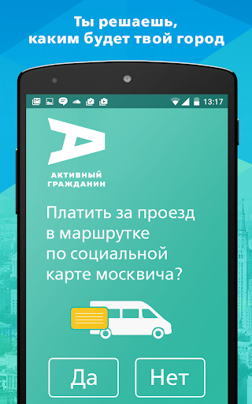  |   |   | 
 | 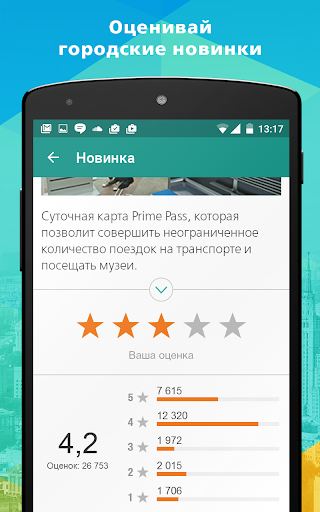  |   |   | 
 |  

## Development team
In the following we report the main information provided by the development team in the Google play store.

| | |
|-------------------------|-------------------------|
| **Developer**  | Информационный город ГКУ |
| **Website**  | [http://ag.mos.ru/](http://ag.mos.ru/) |
| **Email** | support@ag.mos.ru |
| **Physical address**  | - |
| **Other developed apps**  | [https://play.google.com/store/apps/developer?id=%D0%98%D0%BD%D1%84%D0%BE%D1%80%D0%BC%D0%B0%D1%86%D0%B8%D0%BE%D0%BD%D0%BD%D1%8B%D0%B9+%D0%B3%D0%BE%D1%80%D0%BE%D0%B4+%D0%93%D0%9A%D0%A3](https://play.google.com/store/apps/developer?id=%D0%98%D0%BD%D1%84%D0%BE%D1%80%D0%BC%D0%B0%D1%86%D0%B8%D0%BE%D0%BD%D0%BD%D1%8B%D0%B9+%D0%B3%D0%BE%D1%80%D0%BE%D0%B4+%D0%93%D0%9A%D0%A3) |

## Android support

| | |
|-------------------------|-------------------------|
| **Declared target Android version**  | Android10, version 10 (API level 29) |
| **Effective target Android version**  | Android10, version 10 (API level 29) |
| **Minimum supported Android version**  | KitKat, version 4.4 - 4.4.4 (API level 19) |
| **Maximum target Android version**  | - |

The larger the difference between the minimum and maximum supported Android versions, the better. A larger difference means a wider audience. For example, old phones have a very low Android version, so a high minimum supported Android version means that the app cannot be used by users with old phones, thus leading to accessibility problems. 

## Requested permissions

In the following we report the complete list of the permissions requested by the app. 

| **Permission** | **Protection level** | **Description** | 
|-------------------------|-------------------------|-------------------------|
 **android.permission ACCESS_BACKGROUND_LOCATION** | :warning:**Dangerous** | Allows an app to access location in the background. 
 **android.permission ACCESS_COARSE_LOCATION** | :warning:**Dangerous** | Allows an app to access approximate location. 
 **android.permission ACCESS_FINE_LOCATION** | :warning:**Dangerous** | Allows an app to access precise location. 
 **android.permission ACCESS_NETWORK_STATE** | Normal | Allows applications to access information about networks. 
 **android.permission CAMERA** | :warning:**Dangerous** | Required to be able to access the camera device. 
 **android.permission INTERNET** | Normal | Allows applications to open network sockets. 
 **android.permission READ_EXTERNAL_STORAGE** | :warning:**Dangerous** | Allows an application to read from external storage. 
 **android.permission WAKE_LOCK** | Normal | Allows using PowerManager WakeLocks to keep processor from sleeping or screen from dimming. 
 **android.permission WRITE_EXTERNAL_STORAGE** | :warning:**Dangerous** | Allows an application to write to external storage. 
 **com.google.android.c2dm.permission RECEIVE** | - | - 
 **com.google.android.finsky.permission BIND_GET_INSTALL_REFERRER_SERVICE** | - | - 

## Mentioned servers

| **Server** | **Registrant** | **Registrant country** | **Creation date** | 
|-------------------------|-------------------------|-------------------------|-------------------------|
 | googlesyndication.com | Google LLC | :us: US | 2003-01-21 06:17:24 |
 | google.com | Google LLC | :us: US | 1997-09-15 04:00:00 |
 | facebook.com | Facebook, Inc. | :us: US | 1997-03-29 05:00:00 |
 | google-analytics.com | Google LLC | :us: US | 2005-07-18 19:24:32 |
 | app-measurement.com | Google LLC | :us: US | 2015-06-19 20:13:31 |
 | googletagmanager.com | Google LLC | :us: US | 2011-11-11 23:39:05 |
 | mos.ru | - | - | 1996-12-23 09:49:03 |
 | crashlytics.com | Google LLC | :us: US | 2011-01-21 15:30:40 |
 | googleapis.com | Google LLC | :us: US | 2005-01-25 17:52:26 |
 | googleadservices.com | Google LLC | :us: US | 2003-06-19 16:34:53 |

## Security analysis 

Below we report the main security warnings raised by our execution of the [Androwarn](https://github.com/maaaaz/androwarn) security analysis tool.

**Telephony identifiers leakage**
> - This application reads the MCC+MNC of the provider of the SIM 

**Connection interfaces exfiltration**
> - This application reads details about the currently active data network 

**Telephony services abuse**
> - This application makes phone calls 

**Suspicious connection establishment**
> - This application opens a Socket and connects it to the remote address 'Ljava/lang/StringBuilder;->toString()Ljava/lang/String;' on the 'N/A' port  
> - This application opens a Socket and connects it to the remote address 'Ljava/net/Proxy;->type()Ljava/net/Proxy$Type;' on the 'N/A' port  
> - This application opens a Socket and connects it to the remote address 'No route to  ' on the 'N/A' port  
> - This application opens a Socket and connects it to the remote address 'timeout' on the 'N/A' port  

## User ratings and reviews

Below we provide information about how end users are reacting to the app in terms of ratings and reviews in the Google Play store.

### Ratings

The Активный гражданин app has been installed by more than **500000** times. At this time, **76378** rated the app and its average score is **4.130628**. Below we show the distribution of the ratings across the usual star-based rating of Google Play

:star::star::star::star::star:: 52256

:star::star::star::star:: 7208

:star::star::star:: 3249

:star::star:: 1969

:star:: 11696

### Reviews 

#### 5-star reviews

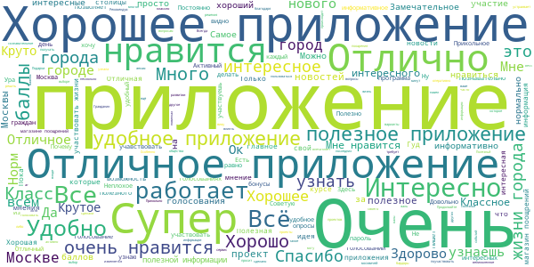

> Приложение очень удобное интерактивное.  :date: __2021-06-26 13:10:14__

> Здорово, жаль что в других регионах нет подобного  :date: __2021-06-26 07:34:56__

> Ок!  :date: __2021-06-26 07:29:39__

> Отвечает потребностям.  :date: __2021-06-25 14:56:38__

> Кул  :date: __2021-06-24 23:40:26__

> Хорошо  :date: __2021-06-24 16:19:15__

> Отлично всё  :date: __2021-06-24 15:30:58__

> Отличное приложение для москвичей)  :date: __2021-06-24 12:31:45__

> Хорошо  :date: __2021-06-22 17:41:01__

> Крутое приложение, которое помагает в развитии общества и города.  :date: __2021-06-20 13:20:52__

#### 4-star reviews

> В голосованиях и во многих других разделах слишком светлый фон, из-за чего почти не видно, что написанно. А так норм.  :date: __2021-06-09 06:17:40__

> Не могу понять, почему не даёт поделиться голосованиями? По новинкам всё нормально работает, а при попытке поделиться голосованием пишет: "опрос должен быть завершён". Что это за новая ошибка? Мне баллы за них начислены, опросы завершены, а поделиться невозможно. Обратите внимание, пожалуйста, исправьте это! Раньше такого не было.  :date: __2021-06-03 11:09:22__

> Интересное приложение  :date: __2021-05-27 17:03:24__

> Ое  :date: __2021-05-20 10:31:11__

> Хорошее приложение,отличные подарки  :date: __2021-05-08 16:30:06__

> Уважаемые управляющие проектом АГ. Возможно вы не в курсе, но экономить на зарплате разработчиков это предпоследняя по глупости идея после выкручивания ламп в служебных туалетах. Почините уже авторизацию, логиниться при каждой загрузке тупо. Поправили, авторизацию держит.  :date: __2021-04-28 09:08:33__

> Отлично  :date: __2021-04-26 20:47:53__

> Приложение начало каждый день вылетать и требует каждый раз вбивать пароль  :date: __2021-04-22 08:19:09__

> Уже несколько недель каждый раз при входе в приложение требует авторизации.  :date: __2021-04-21 22:41:53__

> После последнего обновления постоянно требуется авторизация через мос.ру. Добавьте, пожалуйста, вход по отпечатку.  :date: __2021-04-20 10:29:50__

#### 3-star reviews

> Не могу воспользоваться магазином поощрений.  :date: __2021-06-26 16:08:52__

> Ставлю 3. Только потому что заказала детскую футболку 5xs А пришла футболка xl. Она просто огромная. При этом листик в пакете лежал и на нем было указано что в комплект входит детская футболка. Это как.  :date: __2021-06-16 19:22:38__

> Нет возможности войти, не принимает пароли. Написали обновить версию, где её взять, если выложена только эта- 2.28.??? Ответ по Вашему обращению № SD16854569: Здравствуйте! Вы используете устаревшую версию приложения, текущая версия 2.28.0. Пожалуйста, обновите приложение до актуальной версии и проверьте наличие ошибки. С уважением, Служба поддержки проекта "Активный гражданин"  :date: __2021-06-07 19:46:05__

> Глюков всё больше...  :date: __2021-06-03 19:15:01__

> Приложение постоянно выдаёт ошибку при попытке поделиться пройденным голосованием. В компьютерной версии кнопка "поделиться" не срабатывает.  :date: __2021-06-02 23:03:16__

> Непонятно  :date: __2021-06-02 08:37:50__

> Постоянно требуется авторизация  :date: __2021-05-28 15:05:30__

> Почему я не могу списать балы,это повторяется с 24.05.21.не могу оформить купон , телефон перезагружал,был в МФЦ,удолял приложение и по новой закачивал жду отвеи  :date: __2021-05-26 13:21:50__

> При голосовании мерцание верхней и нижней части, в новостях тоже самое.  :date: __2021-05-25 09:11:12__

> Здравствуйте. Проект очень интересный и полезный, спасибо Вам! Хотел узнать, уже открылся сезон в проката велосипедов - "Велобайк". В этом году поощрения будут 'кодами в велобайк"? А может будет сотрудничество с другими проектами, прокатов, например электросамокатов ?  :date: __2021-05-19 10:36:09__

#### 2-star reviews

> Бестолковое. Всёравно уже всё решили заранее. Ширма для чиновников  :date: __2021-06-23 21:15:02__

> Очень много ошибок в темном режиме. Часто текст не читаем.  :date: __2021-06-19 13:59:56__

> Взломали аккаунт, мошенники потратили накопленные баллы. Обратился в службу поддержки, спустя только пару месяцев специалисты соизволили ответить, несмотря на постоянные напоминания. В итоге " факт некорректного списания баллов не выявлен", то есть ни факт их списания с другого устройства, с измененного номера и ночью не смутил. Спасибо мля!!!  :date: __2021-06-18 19:28:00__

> Все хорошо пока, недавно скачал  :date: __2021-06-07 16:51:36__

> Не дает поделиться ни в одной из соцсетей.  :date: __2021-06-03 15:26:34__

> Последние два года постоянно проблемы с профилем. Что случилось?  :date: __2021-06-02 21:56:49__

> Не могу зайти. Пишит ошибка 1102.1011 Каждый день требует пароль при входе.  :date: __2021-05-26 05:35:05__

> Вообще приложение мне нравится, если не считать двух "но" - сначала около месяца назад стал выкидывать каждые пять минут, приходилось заново авторизовываться постоянно (потом вроде исправили это), а сейчас и вовсе не дает зайти в приложение, пишет "неизвестная ошибка, попробуйте позже" - и так уже два дня подряд...  :date: __2021-05-09 06:50:42__

> Постоянно вылетает "вход". Каждый раз приходится перезаходить, из за чего слетают уведомления о голосованиях.  :date: __2021-05-09 00:47:40__

> Не могу зайти в приложение. Пишет "ошибка 1102". И ни в какую  :date: __2021-04-26 19:37:14__

#### 1-star reviews

> Впервые поставил приложение, а у меня уже там баллы полгода назад списаны  :date: __2021-06-25 14:31:08__

> Приложению , как и проекту в целом давно необходимо обновление. 1. Дизайн (логотип, айдентика, юзабилити и т.п.) - устаревший; не актуальный; отталкивающий; неочевидный и не удобный. 2. Позиционирование - информация о проекте на просторах сети минимальная и устаревшая. Не понятно "зачем" и "почему" граждане должны использовать этот сервис, какая от него польза. У меня, как у одного из первых пользователей приложения, сложилось впечатление, что проект доживает свои последние дни и будет закрыт  :date: __2021-06-22 10:36:21__

> Ужасно работает ждал 10 минут чтобы окрылся промокод 21 век а работает как будто я в 2010 игры с тореннта качаю при скорости 100кб  :date: __2021-06-21 12:57:12__

> Перестаньте уже, наконец, требовать пароль каждый раз, когда выполняется вход в приложение! Есть пин-код, есть отпечаток пальца, зачем каждый раз пароль требовать???  :date: __2021-06-20 19:18:34__

> Хотел подать жалобу на работу московских коммунальных служб - а тут это не возможно. Возможно только голосовать за какую-то ерунду не относящуюся даже к моему району. Зачем мне это?  :date: __2021-06-17 13:51:49__

> Невозможно ничего заказать. Всегда ошибка "internal server error". Обратная связь игнорируется. Приложение как мэр - вроде есть, а толку никакого, одни проблемы. Ответа от поддержки НЕТ.  :date: __2021-06-14 00:51:05__

> С авторизацией полный бред. Теперь не могу зайти в свой аккаунт, которому много лет и где полно баллов. Пришлось создавать новый с нуля(  :date: __2021-06-12 06:48:42__

> Бредовейшее приложение. Собянинские холуи и плитку положить не могут и приложение толковое создать. Оценка -100. Навсегда...  :date: __2021-06-11 18:01:52__

> После обновления непонятно как подать жалобу. Приложение превратилось в никому не нужную соц сеть  :date: __2021-06-06 23:23:30__

> Украли около 15000 баллов и не кто не может исправить эту ошибку.  :date: __2021-06-06 12:47:00__

# Госуслуги СТОП Коронавирус
App version ``1.0.22``

Analyzed with [covid-apps-observer](http://github.com/covid-apps-observer) project, version ``0.1``

## App overview
| | |
|-------------------------|-------------------------| 
| **Name**&nbsp;&nbsp;&nbsp;&nbsp;&nbsp;&nbsp;&nbsp;&nbsp;&nbsp;&nbsp;&nbsp;&nbsp;&nbsp;&nbsp;&nbsp;&nbsp;&nbsp;&nbsp;&nbsp;&nbsp;&nbsp;&nbsp;&nbsp;&nbsp;&nbsp;&nbsp;&nbsp;&nbsp;&nbsp;&nbsp;&nbsp;&nbsp;&nbsp;&nbsp;&nbsp;&nbsp;&nbsp;&nbsp;&nbsp;&nbsp;  | Госуслуги СТОП Коронавирус |
| **Unique identifier** | com.minsvyaz.gosuslugi.stopcorona |
| **Link to Google Play** | [https://play.google.com/store/apps/details?id=com.minsvyaz.gosuslugi.stopcorona](https://play.google.com/store/apps/details?id=com.minsvyaz.gosuslugi.stopcorona) |
| **Summary**  | Результаты тестов на COVID-19, сертификат вакцинации, QR-код для проверки. |
| **Privacy policy** | [https://gu-st.ru/content/Other/stopcovidpoliciesprivacy.pdf](https://gu-st.ru/content/Other/stopcovidpoliciesprivacy.pdf) |
| **Latest version** | 1.0.22 |
| **Last update** | 2021-06-25 17:04:05 |
| **Recent changes** | - убрали доступ к геолокации - исправили ошибку входа при включенном adguard - исправили ошибку авторизации |
| **Installs**  | 1 000 000+ |
| **Category** | Здоровье и фитнес |
| **First release** | 27 мар. 2020 г. |
| **Size**  | 7,1M |
| **Supported Android version**  | 5.0 и выше |

### Description
> Для жителей Москвы оформление цифровых пропусков осуществляется через портал mos.ru
 Приложение позволяет выбрать подходящий для вас статус и заполнить анкеты для получения мобильного пропуска на выход из дома в период самоизоляции в формате QR - кода. Вы сможете предъявить его в электронном виде на мобильном устройстве или в распечатанном виде сотрудникам правоохранительных органов в случае необходимости.
 Также можно заблаговременно заполнить анкету регистрации лиц, подлежащих постановке на карантин и ускорить прохождение паспортного и таможенного контроля при прибытии на территорию Российской Федерации из стран, где зарегистрированы случаи заболевания новой коронавирусной инфекцией (2019-nCoV). 
 Режим изоляции необходимо соблюдать в течение 14 календарных дней. Эта обязанность не зависит от признаков заболевания: на карантине следует находиться даже людям без симптомов инфекции. 
 В период карантина необходимо быть дома или в обсервационном центре. Не следует посещать общественные места, ходить на работу или в учебное заведение. Если нет возможности работать удаленно и получать заработную плату, при наличии трудового договора можно воспользоваться электронными сервисами на портале gosuslugi.ru и оформить больничный лист для получения пособия по временной нетрудоспособности.

### User interface
The developers of the app provide the following screenshots in the Google play store.
| | | |
|:-------------------------:|:-------------------------:|:-------------------------:|
 |   | 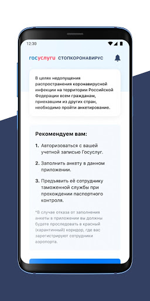  |   | 
 |   |   |   | 

## Development team
In the following we report the main information provided by the development team in the Google play store.

| | |
|-------------------------|-------------------------|
| **Developer**  | Минцифры России |
| **Website**  | - |
| **Email** | support_mp@gosuslugi.ru |
| **Physical address**  | - |
| **Other developed apps**  | [https://play.google.com/store/apps/developer?id=7040530283788474945](https://play.google.com/store/apps/developer?id=7040530283788474945) |

## Android support

| | |
|-------------------------|-------------------------|
| **Declared target Android version**  | Android10, version 10 (API level 29) |
| **Effective target Android version**  | Android10, version 10 (API level 29) |
| **Minimum supported Android version**  | Lollipop, version 5.0 (API level 21) |
| **Maximum target Android version**  | - |

The larger the difference between the minimum and maximum supported Android versions, the better. A larger difference means a wider audience. For example, old phones have a very low Android version, so a high minimum supported Android version means that the app cannot be used by users with old phones, thus leading to accessibility problems. 

## Requested permissions

In the following we report the complete list of the permissions requested by the app. 

| **Permission** | **Protection level** | **Description** | 
|-------------------------|-------------------------|-------------------------|
 **android.permission ACCESS_FINE_LOCATION** | :warning:**Dangerous** | Allows an app to access precise location. 
 **android.permission ACCESS_NETWORK_STATE** | Normal | Allows applications to access information about networks. 
 **android.permission ACCESS_WIFI_STATE** | Normal | Allows applications to access information about Wi-Fi networks. 
 **android.permission CAMERA** | :warning:**Dangerous** | Required to be able to access the camera device. 
 **android.permission CHANGE_WIFI_STATE** | Normal | Allows applications to change Wi-Fi connectivity state. 
 **android.permission FOREGROUND_SERVICE** | Normal | Allows a regular application to use Service.startForeground. 
 **android.permission INTERNET** | Normal | Allows applications to open network sockets. 
 **android.permission READ_EXTERNAL_STORAGE** | :warning:**Dangerous** | Allows an application to read from external storage. 
 **android.permission RECEIVE_BOOT_COMPLETED** | Normal | Allows an application to receive the Intent.ACTION_BOOT_COMPLETED that is broadcast after the system finishes booting. 
 **android.permission VIBRATE** | Normal | Allows access to the vibrator. 
 **android.permission WAKE_LOCK** | Normal | Allows using PowerManager WakeLocks to keep processor from sleeping or screen from dimming. 
 **android.permission WRITE_EXTERNAL_STORAGE** | :warning:**Dangerous** | Allows an application to write to external storage. 
 **com.google.android.c2dm.permission RECEIVE** | - | - 
 **com.google.android.finsky.permission BIND_GET_INSTALL_REFERRER_SERVICE** | - | - 

## Mentioned servers

| **Server** | **Registrant** | **Registrant country** | **Creation date** | 
|-------------------------|-------------------------|-------------------------|-------------------------|
 | googleapis.com | Google LLC | :us: US | 2005-01-25 17:52:26 |
 | googlesyndication.com | Google LLC | :us: US | 2003-01-21 06:17:24 |
 | google.com | Google LLC | :us: US | 1997-09-15 04:00:00 |
 | googleadservices.com | Google LLC | :us: US | 2003-06-19 16:34:53 |
 | app-measurement.com | Google LLC | :us: US | 2015-06-19 20:13:31 |
 | crashlytics.com | Google LLC | :us: US | 2011-01-21 15:30:40 |
 | gosuslugi.ru | - | - | 2008-09-01 20:00:00 |
 | yandex.ru | - | - | 1997-09-23 09:45:07 |

## Security analysis 

Below we report the main security warnings raised by our execution of the [Androwarn](https://github.com/maaaaz/androwarn) security analysis tool.

**Telephony identifiers leakage**
> - This application reads the MCC+MNC of the provider of the SIM 
> - This application reads the constant indicating the state of the device SIM card 
> - This application reads the current location of the device 
> - This application reads the neighboring cell information of the device 
> - This application reads the radio technology (network type) currently in use on the device for data transmission 
> - This application reads the Cell ID value 
> - This application reads the Location Area Code value 

**Connection interfaces exfiltration**
> - This application reads details about the currently active data network 
> - This application tries to find out if the currently active data network is metered 

**Telephony services abuse**
> - This application makes phone calls 

**Suspicious connection establishment**
> - This application opens a Socket and connects it to the remote address '; port is out of range' on the 'N/A' port  
> - This application opens a Socket and connects it to the remote address 'Ljava/net/Proxy;->type()Ljava/net/Proxy$Type;' on the 'N/A' port  
> - This application opens a Socket and connects it to the remote address 'Lp/a/a/a/a;->a(Ljava/lang/String;)Ljava/lang/StringBuilder;' on the 'N/A' port  
> - This application opens a Socket and connects it to the remote address 'timeout' on the 'N/A' port  

**Code execution**
> - This application loads a native library: 'Landroid/text/TextUtils;->isEmpty(Ljava/lang/CharSequence;)Z' 

## User ratings and reviews

Below we provide information about how end users are reacting to the app in terms of ratings and reviews in the Google Play store.

### Ratings

The Госуслуги СТОП Коронавирус app has been installed by more than **1000000** times. At this time, **32331** rated the app and its average score is **2.2077723**. Below we show the distribution of the ratings across the usual star-based rating of Google Play

:star::star::star::star::star:: 7766

:star::star::star::star:: 1404

:star::star::star:: 1197

:star::star:: 1375

:star:: 20589

### Reviews 

#### 5-star reviews

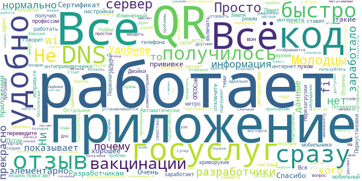

> Приложение заработало.  :date: __2021-06-26 19:44:54__

> Все нормально работает, даже в метро, QR есть. Вся информация подгружается из аккаунта с госуслуг, так что ничего вводить не надо, скачали и пользуйтесь на здоровье.  :date: __2021-06-26 13:08:52__

> Удобное приложение, все работает быстро и без проблем, если у кого-то не отображается информация - вопрос к порталу госуслуг, а не к приложению.  :date: __2021-06-26 11:45:41__

> Всё получилось, прекрасно работает  :date: __2021-06-26 03:49:06__

> Не работает, почему  :date: __2021-06-25 22:03:06__

> Все прекрасно работает и через WI-FI, элементарно скачивается и устанавливается, элементарно вводишь логин и пароль от личного кабинета на госуслугах и сразу же программа подгружает данные о вакцинации и показывает QR code. Ни чего не глючит и не виснет, смешно читать негативные отзывы умышленно вводящие в заблуждение.  :date: __2021-06-25 14:37:59__

> Ужасное приложение. Разработчикам руки оторвать. Непонятно зачем нужны такие бесполезные приложения  :date: __2021-06-25 14:22:08__

> У меня все работает. Код скачала. Спасибо  :date: __2021-06-25 14:16:44__

> Отличное приложение! Все мои коллеги просто в восторге  :date: __2021-06-25 09:38:56__

> Очень удобное приложение, все qr коды и сертификаты под рукой  :date: __2021-06-24 19:20:07__

#### 4-star reviews

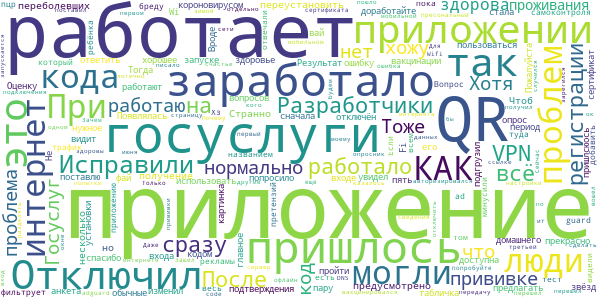

> Приложение не работало. Появлялась табличка "Интернет отключён". Отключил VPN (на период установки и регистрации), теперь всё работает.  :date: __2021-06-26 17:13:58__

> Приложение работает, сертификат о прививке подгрузил, есть анкета самоконтроля. Вопрос- как мне ребёнка туда добавить и его пцр тест?  :date: __2021-06-26 08:59:54__

> Тоже не работало, пока не отключил vpn ad guard, который фильтрует весь трафик от рекламы. Если бы разработчики всем отвечали, люди бы видели и не минусили.  :date: __2021-06-26 01:11:59__

> Хз, нормально работает. К приложению претензий нет, к бреду под названием qr код - есть. При том, что я вакцинировался ещё зимой  :date: __2021-06-24 21:24:42__

> Зашёл с третьей попытки на мобильном интернете. Для этого в первом окне перешел по ссылке на госуслуги и авторизировался, после чего сразу вошёл в приложение и через опросник перешёл на страницу QR кода сертификата прививки.  :date: __2021-06-24 21:20:54__

> У меня приложение работает. Даже офлайн. QR код получил без проблем.  :date: __2021-06-24 15:14:04__

> У кого не работает,попробуйте отключить пресональный DNS сервер (подключения -другие настройки) ,и будет вам счастье. Тоже была проблема писало нет интернета ит.д.Сейчас все ок.  :date: __2021-06-24 13:39:46__

> Всё работает нормально.  :date: __2021-06-23 13:15:36__

> Приложение не запускается через Wifi. Только через передачу данных по мобильной сети (что, по-моему, логично). QR code и сведения о прививке в приложении. Будем здоровы!  :date: __2021-06-22 22:53:16__

> Почему отдельно от Госуслуг? Зачем разделять, если вы могли все это сделать в одном приложении  :date: __2021-06-22 20:34:30__

#### 3-star reviews

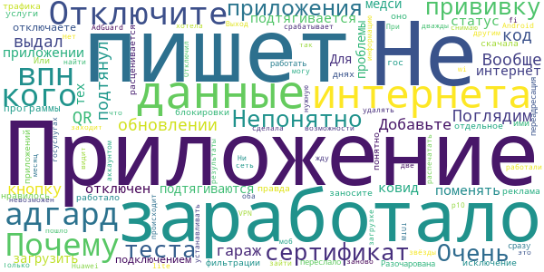

> Приложение заработало. Поглядим  :date: __2021-06-26 14:01:25__

> пишет: Вообще нет интернета  :date: __2021-06-25 06:20:52__

> Добавьте кнопку "я в гараж"  :date: __2021-06-24 16:05:21__

> Отключите адгард или впн У кого пишет "интернет отключен", отключите адгард или ВПН  :date: __2021-06-22 15:12:44__

> Почему в приложении не подтягивается сертификат про прививку от ковид?  :date: __2021-06-22 08:08:18__

> Непонятно как поменять статус. Не подтягиваются данные теста из медси. И непонятно как их загрузить.  :date: __2021-06-18 22:50:25__

> Для тех у кого проблемы с подключением, отключаете программы фильтрации и блокировки трафика. Очень много приложений ими расценивается как реклама... Или заносите в исключение. Не понятно правда зачем отдельное приложение.  :date: __2021-06-18 18:38:02__

> Приложение работало и мне очень нравилось, а на днях скачала гос услуги и оно переслало работать! Разочарована, почему переадресация сразу срабатывает, я бы хотела чтобы оба приложения работали, за это снимаю две звёзды.  :date: __2021-05-13 12:32:19__

> Не заходит в приложение, пишет "что то пошло не так" Huawei p10 lite  :date: __2021-03-10 05:09:17__

> Прививку сделала дважды, сертификат на госуслугах уже почти месяц жду, ничего не происходит.  :date: __2021-01-30 14:59:32__

#### 2-star reviews

> Приложение покрыто мхом и плесенью. Этим приложением пользовались год назад.  :date: __2021-06-25 19:15:29__

> Приложение очень сырое. У кого нет связи, попробуйте войти через мобильную сеть. Через wifi и прокси сервера приложение не работает. У кого после ввода пароля пишет о проблеме над которой работают разработчики - попробуйте войти с вводом СНИЛС, только цифры, без пробелов и тире. Видимо номер телефона нужно вводить строго в определенном формате, мне не удалось понять в каком. Разрабам - добра, прямых рук и прояснения в голове.  :date: __2021-06-25 13:26:56__

> Косяк с чтением QR кодов для посещения кафе итд. Если считывать код из самого приложения или из карты то выдает ошибка код не является результатом анализа... А если читать код с самого сертификата то работает. А если читать просто сканером и через браузер открывать то наоборот все коды читаются а с бланка сертификата нет. Как бы не получилась неразбериха при проверке кодов у людей  :date: __2021-06-25 11:12:21__

> Я вакцинировалась ещё в январе, но ни на самом портале госуслуг, ни в этом приложении данных о оютом, что Я делала прививку нет.. Регистрацию тоже не с первого раза прошла... Где искать ответ?  :date: __2021-06-25 10:36:32__

> Заполняю все поля, но приложение дальше не пускает, пишет что не все поля заполнены. Бред короче.  :date: __2021-06-25 09:37:24__

> Приложение при запуске сообщает,что интернет отключён  :date: __2021-06-25 07:02:10__

> Пишет что нет интернета, а он есть.  :date: __2021-06-25 06:02:21__

> Ни службы поддержки, нихрена нет, тупое, скудное приложение  :date: __2021-06-24 23:09:45__

> Как добавить результаты тестов и прививки??  :date: __2021-06-24 18:30:07__

> 24.06 не работает.  :date: __2021-06-24 10:21:49__

#### 1-star reviews

> Бестолковое приложение. Данных о вакцинации нет, куда писать об этом не понятно. Техподдержки тут не предусмотрено.  :date: __2021-06-26 19:55:52__

> Невозможно получить код даже если есть тест на атитела!  :date: __2021-06-26 19:41:37__

> Не работает. "Отключен интернет".  :date: __2021-06-26 19:23:05__

> Неделю уже ошибка с интернетом  :date: __2021-06-26 19:15:15__

> Дальше авторизации не заходит. И это уже после обновления типа решающего все проблемы!..  :date: __2021-06-26 18:49:30__

> Не уходит в аккаунт, выдаёт ошибку  :date: __2021-06-26 17:32:55__

> Не работает  :date: __2021-06-26 15:57:45__

> На Samsung Note 10+ РСТ приложение после очередного обновления перестало работать, пишет отсутствие интернет подключения (как по WiFi так и мобильному интернету). Разработчики исправьте ситуацию!!! Повтор: Приложение не работает до сих пор. Как им пользоваться если оно пишет что нет подключения к интернет. Что это такое? Если хотите чтоб приложением пользовались, то исправляйте свое лохов кое приложение!!!  :date: __2021-06-26 15:49:14__

> Пишет, что нет интернета. Хотя он есть. Иначе, как я бы мог оставить отзыв здесь.  :date: __2021-06-26 15:28:57__

> При авторизации пишет что что то пошло не так. Трындец, судя по отзывам это полнейшее го...но а не приложение.  :date: __2021-06-26 14:14:23__

# Contact Tracker
App version ``1.3``

Analyzed with [covid-apps-observer](http://github.com/covid-apps-observer) project, version ``0.1``

## App overview
| | |
|-------------------------|-------------------------| 
| **Name**&nbsp;&nbsp;&nbsp;&nbsp;&nbsp;&nbsp;&nbsp;&nbsp;&nbsp;&nbsp;&nbsp;&nbsp;&nbsp;&nbsp;&nbsp;&nbsp;&nbsp;&nbsp;&nbsp;&nbsp;&nbsp;&nbsp;&nbsp;&nbsp;&nbsp;&nbsp;&nbsp;&nbsp;&nbsp;&nbsp;&nbsp;&nbsp;&nbsp;&nbsp;&nbsp;&nbsp;&nbsp;&nbsp;&nbsp;&nbsp;  | Contact Tracker |
| **Unique identifier** | com.vjet.covid |
| **Link to Google Play** | [https://play.google.com/store/apps/details?id=com.vjet.covid](https://play.google.com/store/apps/details?id=com.vjet.covid) |
| **Summary**  | Contact Tracker предупреждает о контактах с человеком инфицированном COVID-19. |
| **Privacy policy** | [https://covid-19.y-media.io/privacy-policy/pp-ru.html](https://covid-19.y-media.io/privacy-policy/pp-ru.html) |
| **Latest version** | 1.3 |
| **Last update** | 2020-04-17 17:32:35 |
| **Recent changes** | - |
| **Installs**  | 1 000+ |
| **Category** | Социальные |
| **First release** | 24 мар. 2020 г. |
| **Size**  | 2,1M |
| **Supported Android version**  | 5.0 и выше |

### Description
> Приложение Contact Tracker, предупреждает пользователя о том, что он контактировал с человеком инфицированным COVID19. 
 Contact Tracker, использует технологию Bluetooth для трекинга контактов на расстоянии 3х метров.
 Пользователь может увидеть количество контактов в течении дня, 14 дней и за все время использования приложения.
 Если у пользователя был подтвержден диагноз COVID19, все пользователи с которыми он контактировал получат уведомление.
 Приложение работает в фоновом режиме и способно записывать контакты других пользователей у которых тоже запущено приложение.
 Вся информация является конфиденциальной и будет удалена после окончания эпидемии.

### User interface
The developers of the app provide the following screenshots in the Google play store.
| | | |
|:-------------------------:|:-------------------------:|:-------------------------:|
 |   |   |   | 
 |  

## Development team
In the following we report the main information provided by the development team in the Google play store.

| | |
|-------------------------|-------------------------|
| **Developer**  | v-jet |
| **Website**  | [https://covid-19.y-media.io/ru/](https://covid-19.y-media.io/ru/) |
| **Email** | alex@y-media.io |
| **Physical address**  | [Work Email: vlad@v-jet.net Legal Entity: VI JET, TOV 49000, Ukraine, Dnipro, Knyazya Yaroslava Mudrogo str., 27](https://www.google.com/maps/search/Work%20Email:%20vlad@v-jet.net%20Legal%20Entity:%20VI%20JET,%20TOV%2049000,%20Ukraine,%20Dnipro,%20Knyazya%20Yaroslava%20Mudrogo%20str.,%2027) (Google Maps) |
| **Other developed apps**  | [https://play.google.com/store/apps/developer?id=v-jet](https://play.google.com/store/apps/developer?id=v-jet) |

## Android support

| | |
|-------------------------|-------------------------|
| **Declared target Android version**  | Android10, version 10 (API level 29) |
| **Effective target Android version**  | Android10, version 10 (API level 29) |
| **Minimum supported Android version**  | Lollipop, version 5.0 (API level 21) |
| **Maximum target Android version**  | - |

The larger the difference between the minimum and maximum supported Android versions, the better. A larger difference means a wider audience. For example, old phones have a very low Android version, so a high minimum supported Android version means that the app cannot be used by users with old phones, thus leading to accessibility problems. 

## Requested permissions

In the following we report the complete list of the permissions requested by the app. 

| **Permission** | **Protection level** | **Description** | 
|-------------------------|-------------------------|-------------------------|
 **android.permission ACCESS_BACKGROUND_LOCATION** | :warning:**Dangerous** | Allows an app to access location in the background. 
 **android.permission ACCESS_COARSE_LOCATION** | :warning:**Dangerous** | Allows an app to access approximate location. 
 **android.permission ACCESS_FINE_LOCATION** | :warning:**Dangerous** | Allows an app to access precise location. 
 **android.permission ACCESS_NETWORK_STATE** | Normal | Allows applications to access information about networks. 
 **android.permission BLUETOOTH** | Normal | Allows applications to connect to paired bluetooth devices. 
 **android.permission BLUETOOTH_ADMIN** | Normal | Allows applications to discover and pair bluetooth devices. 
 **android.permission FOREGROUND_SERVICE** | Normal | Allows a regular application to use Service.startForeground. 
 **android.permission INTERNET** | Normal | Allows applications to open network sockets. 
 **android.permission RECEIVE_BOOT_COMPLETED** | Normal | Allows an application to receive the Intent.ACTION_BOOT_COMPLETED that is broadcast after the system finishes booting. 
 **android.permission WAKE_LOCK** | Normal | Allows using PowerManager WakeLocks to keep processor from sleeping or screen from dimming. 
 **com.google.android.c2dm.permission RECEIVE** | - | - 
 **com.google.android.finsky.permission BIND_GET_INSTALL_REFERRER_SERVICE** | - | - 

## Mentioned servers

| **Server** | **Registrant** | **Registrant country** | **Creation date** | 
|-------------------------|-------------------------|-------------------------|-------------------------|
 | googlesyndication.com | Google LLC | :us: US | 2003-01-21 06:17:24 |
 | google.com | Google LLC | :us: US | 1997-09-15 04:00:00 |
 | app-measurement.com | Google LLC | :us: US | 2015-06-19 20:13:31 |
 | googleadservices.com | Google LLC | :us: US | 2003-06-19 16:34:53 |
 | googleapis.com | Google LLC | :us: US | 2005-01-25 17:52:26 |

## Security analysis 

Below we report the main security warnings raised by our execution of the [Androwarn](https://github.com/maaaaz/androwarn) security analysis tool.

**Connection interfaces exfiltration**
> - This application reads details about the currently active data network 

**Suspicious connection establishment**
> - This application opens a Socket and connects it to the remote address '; port is out of range' on the 'N/A' port  
> - This application opens a Socket and connects it to the remote address 'Lcom/android/tools/r8/GeneratedOutlineSupport;->outline11(Ljava/lang/String;)Ljava/lang/StringBuilder;' on the 'N/A' port  
> - This application opens a Socket and connects it to the remote address 'Ljava/net/Proxy;->type()Ljava/net/Proxy$Type;' on the 'N/A' port  
> - This application opens a Socket and connects it to the remote address 'timeout' on the 'N/A' port  

## User ratings and reviews

Below we provide information about how end users are reacting to the app in terms of ratings and reviews in the Google Play store.

### Ratings

The Contact Tracker app has been installed by more than **1000** times. At this time, **8** rated the app and its average score is **2.0**. Below we show the distribution of the ratings across the usual star-based rating of Google Play

:star::star::star::star::star:: 2

:star::star::star::star:: 0

:star::star::star:: 0

:star::star:: 0

:star:: 6

### Reviews 

#### 5-star reviews

No recent reviews available with 5 stars.

#### 4-star reviews

No recent reviews available with 4 stars.

#### 3-star reviews

No recent reviews available with 3 stars.

#### 2-star reviews

> Не возможно зарегистрироваться, не работает, все время ошибка  :date: __2020-11-25 11:08:32__

#### 1-star reviews

> Приложения не работает.  :date: __2021-01-22 04:58:30__

> При регистрации пишет ошибку  :date: __2021-01-19 10:29:08__

> Невозможно зарегистрироваться, вечная ошибка, поставил бы 0 звезд, жаль невозможно, упыри, зря время потратил😡  :date: __2021-01-05 19:15:52__

> Произошла ошибка при регистрации.  :date: __2020-12-25 05:30:56__

> Не могу зарегистрироваться!! Пишет "Incorrect data", ничего сделать не получается!  :date: __2020-12-20 11:39:58__

> Невозможно зарегистрироваться. Удаляю...  :date: __2020-12-17 13:09:36__

> Не работает  :date: __2020-11-25 11:09:01__

> Не работает  :date: __2020-11-24 09:36:27__

> Не регистрацию не как не могу пройти  :date: __2020-11-24 08:18:00__

> Не работает. Регистрация невозможна, скорее всего, приложение ворует пороли от ваших ящиков и платежные данные. А идея предупредить о вирусе - была хорошая.  :date: __2020-07-24 13:56:48__

# Карта жителя НО
App version ``2.1.1``

Analyzed with [covid-apps-observer](http://github.com/covid-apps-observer) project, version ``0.1``

## App overview
| | |
|-------------------------|-------------------------| 
| **Name**&nbsp;&nbsp;&nbsp;&nbsp;&nbsp;&nbsp;&nbsp;&nbsp;&nbsp;&nbsp;&nbsp;&nbsp;&nbsp;&nbsp;&nbsp;&nbsp;&nbsp;&nbsp;&nbsp;&nbsp;&nbsp;&nbsp;&nbsp;&nbsp;&nbsp;&nbsp;&nbsp;&nbsp;&nbsp;&nbsp;&nbsp;&nbsp;&nbsp;&nbsp;&nbsp;&nbsp;&nbsp;&nbsp;&nbsp;&nbsp;  | Карта жителя НО |
| **Unique identifier** | com.nizhniy_mobile |
| **Link to Google Play** | [https://play.google.com/store/apps/details?id=com.nizhniy_mobile](https://play.google.com/store/apps/details?id=com.nizhniy_mobile) |
| **Summary**  | Персональный электронный ключ к городской среде |
| **Privacy policy** | [https://drive.google.com/file/d/1IcZ0NtRJXhbX8yMoAQaGwMOU3Vfppvtm/view](https://drive.google.com/file/d/1IcZ0NtRJXhbX8yMoAQaGwMOU3Vfppvtm/view) |
| **Latest version** | 2.1.1 |
| **Last update** | 2021-06-18 17:33:46 |
| **Recent changes** | Теперь можно оплатить ЖКХ с помощью сервиса А3 прямо из приложения! А так же начисления и квитанции отобразятся в разделе ЖКХ. Пока работает только с лицевыми счетами Центра СБК. Еще немного изменили дизайн, оптимизировали загрузку приложения и пофиксили баги. |
| **Installs**  | 100 000+ |
| **Category** | Социальные |
| **First release** | 2 апр. 2020 г. |
| **Size**  | 67M |
| **Supported Android version**  | 5.0 и выше |

### Description
> Бесплатное приложение для всех жителей Нижегородской области. С его помощью любой житель может взаимодействовать с городом и пользование различными услугами становится удобным, понятным и приятным.

### User interface
The developers of the app provide the following screenshots in the Google play store.
| | | |
|:-------------------------:|:-------------------------:|:-------------------------:|
 |   |   | 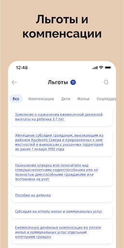  | 
 | 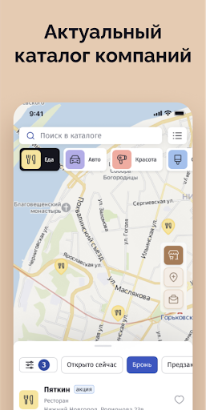  | 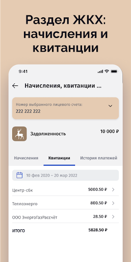 

## Development team
In the following we report the main information provided by the development team in the Google play store.

| | |
|-------------------------|-------------------------|
| **Developer**  | Мининформ Нижегородской области |
| **Website**  | [http://nn-card.ru](http://nn-card.ru) |
| **Email** | info@nn-card.ru |
| **Physical address**  | - |
| **Other developed apps**  | [https://play.google.com/store/apps/developer?id=%D0%9C%D0%B8%D0%BD%D0%B8%D0%BD%D1%84%D0%BE%D1%80%D0%BC+%D0%9D%D0%B8%D0%B6%D0%B5%D0%B3%D0%BE%D1%80%D0%BE%D0%B4%D1%81%D0%BA%D0%BE%D0%B9+%D0%BE%D0%B1%D0%BB%D0%B0%D1%81%D1%82%D0%B8](https://play.google.com/store/apps/developer?id=%D0%9C%D0%B8%D0%BD%D0%B8%D0%BD%D1%84%D0%BE%D1%80%D0%BC+%D0%9D%D0%B8%D0%B6%D0%B5%D0%B3%D0%BE%D1%80%D0%BE%D0%B4%D1%81%D0%BA%D0%BE%D0%B9+%D0%BE%D0%B1%D0%BB%D0%B0%D1%81%D1%82%D0%B8) |

## Android support

| | |
|-------------------------|-------------------------|
| **Declared target Android version**  | Android10, version 10 (API level 29) |
| **Effective target Android version**  | Android10, version 10 (API level 29) |
| **Minimum supported Android version**  | KitKat W, version 4.4W - 4.4.4W (API level 20) |
| **Maximum target Android version**  | - |

The larger the difference between the minimum and maximum supported Android versions, the better. A larger difference means a wider audience. For example, old phones have a very low Android version, so a high minimum supported Android version means that the app cannot be used by users with old phones, thus leading to accessibility problems. 

## Requested permissions

In the following we report the complete list of the permissions requested by the app. 

| **Permission** | **Protection level** | **Description** | 
|-------------------------|-------------------------|-------------------------|
 **android.permission ACCESS_COARSE_LOCATION** | :warning:**Dangerous** | Allows an app to access approximate location. 
 **android.permission ACCESS_FINE_LOCATION** | :warning:**Dangerous** | Allows an app to access precise location. 
 **android.permission ACCESS_NETWORK_STATE** | Normal | Allows applications to access information about networks. 
 **android.permission ACCESS_WIFI_STATE** | Normal | Allows applications to access information about Wi-Fi networks. 
 **android.permission CAMERA** | :warning:**Dangerous** | Required to be able to access the camera device. 
 **android.permission INTERNET** | Normal | Allows applications to open network sockets. 
 **android.permission READ_APP_BADGE** | - | - 
 **android.permission READ_EXTERNAL_STORAGE** | :warning:**Dangerous** | Allows an application to read from external storage. 
 **android.permission READ_PHONE_STATE** | :warning:**Dangerous** | Allows read only access to phone state, including the phone number of the device, current cellular network information, the status of any ongoing calls, and a list of any PhoneAccounts registered on the device. 
 **android.permission USE_BIOMETRIC** | Normal | Allows an app to use device supported biometric modalities. 
 **android.permission USE_FINGERPRINT** | Normal | This constant was deprecated in API level 28. Applications should request USE_BIOMETRIC instead 
 **android.permission WAKE_LOCK** | Normal | Allows using PowerManager WakeLocks to keep processor from sleeping or screen from dimming. 
 **android.permission WRITE_EXTERNAL_STORAGE** | :warning:**Dangerous** | Allows an application to write to external storage. 
 **com.anddoes.launcher.permission UPDATE_COUNT** | - | - 
 **com.android.vending CHECK_LICENSE** | - | - 
 **com.google.android.c2dm.permission RECEIVE** | - | - 
 **com.google.android.finsky.permission BIND_GET_INSTALL_REFERRER_SERVICE** | - | - 
 **com.htc.launcher.permission READ_SETTINGS** | - | - 
 **com.htc.launcher.permission UPDATE_SHORTCUT** | - | - 
 **com.huawei.android.launcher.permission CHANGE_BADGE** | - | - 
 **com.huawei.android.launcher.permission READ_SETTINGS** | - | - 
 **com.huawei.android.launcher.permission WRITE_SETTINGS** | - | - 
 **com.majeur.launcher.permission UPDATE_BADGE** | - | - 
 **com.oppo.launcher.permission READ_SETTINGS** | - | - 
 **com.oppo.launcher.permission WRITE_SETTINGS** | - | - 
 **com.sec.android.provider.badge.permission READ** | - | - 
 **com.sec.android.provider.badge.permission WRITE** | - | - 
 **com.sonyericsson.home.permission BROADCAST_BADGE** | - | - 
 **com.sonymobile.home.permission PROVIDER_INSERT_BADGE** | - | - 
 **me.everything.badger.permission BADGE_COUNT_READ** | - | - 
 **me.everything.badger.permission BADGE_COUNT_WRITE** | - | - 

## Mentioned servers

| **Server** | **Registrant** | **Registrant country** | **Creation date** | 
|-------------------------|-------------------------|-------------------------|-------------------------|
 | adobe.com | Adobe Inc. | :us: US | 1986-11-17 05:00:00 |
 | apache.org | The Apache Software Foundation | :us: US | 1995-04-11 04:00:00 |
 | xml.org | OASIS Open | :us: US | 1997-02-03 05:00:00 |
 | w3.org | W3C | :us: US | 1994-07-06 04:00:00 |
 | purl.org | Internet Archive | :us: US | 1996-01-01 05:00:00 |
 | android.com | Google LLC | :us: US | 1997-06-23 04:00:00 |
 | googlesyndication.com | Google LLC | :us: US | 2003-01-21 06:17:24 |
 | google.com | Google LLC | :us: US | 1997-09-15 04:00:00 |
 | facebook.com | Facebook, Inc. | :us: US | 1997-03-29 05:00:00 |
 | iptc.org | Whois Privacy Service | :us: US | 1995-12-27 05:00:00 |
 | useplus.org | PLUS COALITION | :us: US | 2003-11-18 19:31:25 |
 | npes.org | NPES | :us: US | 1996-01-30 05:00:00 |
 | aiim.org | Association for Information and Image Management International | :us: US | 1995-10-18 04:00:00 |
 | app-measurement.com | Google LLC | :us: US | 2015-06-19 20:13:31 |
 | drewnoakes.com | REDACTED FOR PRIVACY | GB | 2002-04-04 10:00:05 |
 | googleapis.com | Google LLC | :us: US | 2005-01-25 17:52:26 |
 | googleadservices.com | Google LLC | :us: US | 2003-06-19 16:34:53 |

## Security analysis 

Below we report the main security warnings raised by our execution of the [Androwarn](https://github.com/maaaaz/androwarn) security analysis tool.

**Telephony identifiers leakage**
> - This application reads the MCC+MNC of the provider of the SIM 
> - This application reads the numeric name (MCC+MNC) of current registered operator 
> - This application reads the operator name 

**Connection interfaces exfiltration**
> - This application reads details about the currently active data network 
> - This application tries to find out if the currently active data network is metered 

**Audio video eavesdropping**
> - This application records audio from the 'CAMCORDER' source  
> - This application records audio from the 'MIC' source  
> - This application captures video from the 'CAMERA' source 
> - This application captures video from the 'SURFACE' source 

**Suspicious connection establishment**
> - This application opens a Socket and connects it to the remote address '' on the 'N/A' port  
> - This application opens a Socket and connects it to the remote address 'Ljava/lang/StringBuilder;->toString()Ljava/lang/String;' on the ': connect, resolve' port  
> - This application opens a Socket and connects it to the remote address 'Ljava/lang/StringBuilder;->toString()Ljava/lang/String;' on the 'N/A' port  
> - This application opens a Socket and connects it to the remote address 'Ljava/net/Proxy;->type()Ljava/net/Proxy$Type;' on the 'N/A' port  
> - This application opens a Socket and connects it to the remote address 'timeout' on the 'N/A' port  

**Pim data leakage**
> - This application accesses the downloads folder 
> - This application accesses data stored in the clipboard 

**Code execution**
> - This application loads a native library 
> - This application loads a native library: 'Ljava/util/Iterator;->next()Ljava/lang/Object;' 
> - This application loads a native library: 'c++_shared' 
> - This application loads a native library: 'jniPdfium' 
> - This application loads a native library: 'modft2' 
> - This application loads a native library: 'modpdfium' 
> - This application loads a native library: 'modpng' 
> - This application loads a native library: 'ucrop' 
> - This application executes a UNIX command 

## User ratings and reviews

Below we provide information about how end users are reacting to the app in terms of ratings and reviews in the Google Play store.

### Ratings

The Карта жителя НО app has been installed by more than **100000** times. At this time, **10191** rated the app and its average score is **1.8972923**. Below we show the distribution of the ratings across the usual star-based rating of Google Play

:star::star::star::star::star:: 1703

:star::star::star::star:: 285

:star::star::star:: 466

:star::star:: 542

:star:: 7195

### Reviews 

#### 5-star reviews

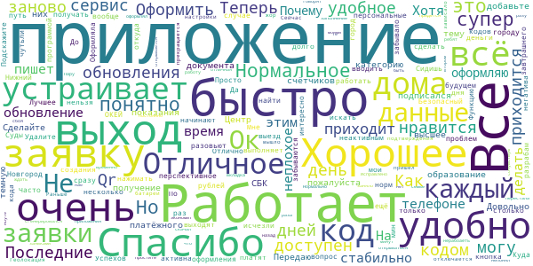

> Сделайте пожалуйста темную тему и добавьте в образование категорию высшее!!! А так всё устраивает  :date: __2021-06-19 16:16:01__

> Хорошее приложение. Передаю показания счётчиков в Центр-СБК и подписался на получение платёжного документа от них.  :date: __2021-04-22 14:19:10__

> Довольно перспективное приложение. Очень интересно как его разовьют в будущем. Успехов разрабам!  :date: __2020-07-26 10:57:33__

> Удалите все мои персональные данные.  :date: __2020-06-24 21:12:37__

> Теперь кодов нет спасибо  :date: __2020-06-11 22:18:26__

> все норм.все работает  :date: __2020-06-11 22:08:26__

> Очень удобное приложение. Сидишь дома, да ещё и деньги платят каждый день по 10 рублей. 😅  :date: __2020-06-02 10:36:49__

> Последние несколько дней, после создания заявки, кнопка Qr кода не активна.. а последние 2 заявки с неактивным кодом вообще исчезли...  :date: __2020-06-01 08:16:03__

> ок  :date: __2020-05-20 14:37:50__

> Отлично!  :date: __2020-05-18 21:00:15__

#### 4-star reviews

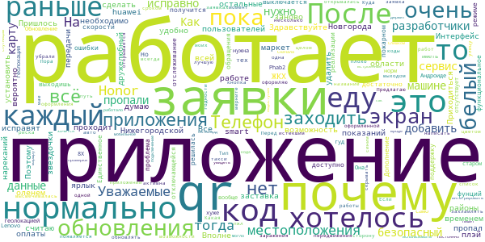

> Здравствуйте. ЖКХ только для Н. Новгорода. А как остальные районы? Я считаю, что необходимо сделать возможность оплаты и передачи показаний для всей Нижегородской области.  :date: __2021-04-29 18:48:15__

> Все нормально работает. Интерфейс пока не очень дружелюбный для пользователей, но думаю, что со временем все исправят.  :date: __2020-06-30 19:51:07__

> После обновления белый экран, заставка с оленем проходит и потом белый экран. Телефон huawei p smart z. Пришлось удалить и установить заново, теперь всё работает.  :date: __2020-06-28 12:51:57__

> 🍪🏩  :date: __2020-06-12 07:17:00__

> После обновления пропал ярлык приложения. Приходиться каждый раз заходить в плэй-маркет. Очень не удобно... К работе нареканий нет. Поэтому 4 звездочки  :date: __2020-06-04 17:35:19__

> Вполне вероятно получится достаточно функциональное приложение. Пока что то, что уже доступно работает нормально. Единственное почему-то отслеживание местоположения не выключается даже тогда, когда выходишь из приложения. Но ошибки это нормально при такой скорости реализации фунций в пожарном режиме. Дополнение. После обращения в тех. поддержку решилась проблема с не отключающейся геолокацией. Обновление 02.06.2020 гуд. На Honor 8X и 10-м Андроиде все работает норм. На старом Lenovo Phab2 хуже.  :date: __2020-06-04 10:45:52__

> Уважаемые разработчики,а почему отсутствует геолокация? Она что вообще больше не нужна? Тогда зачем нужно само приложение?  :date: __2020-06-01 09:36:06__

> Хотелось бы иметь код передвижения на авто. Я еду одна, риска нет заражения.. Раньше был код-еду на машине, а теперь его почему-то убрали.  :date: __2020-05-26 11:20:34__

> У меня в "моих заявках" нет ни одной оформленной в мае заявки! Почему? Куда пропали? Перед выходом на улицу оформляю QR код всегда.  :date: __2020-05-18 11:12:39__

> Почему в приложении после оформления заявки не активна кнопка QR-код, она раньше высвечивалась синим цветом и открывалась а сейчас не открывается? И верните пжл..Тип заявки Еду на машине/такси, как это было раньше! Если обновлять данные, то лучше уж в лучшую сторону)  :date: __2020-05-13 17:18:07__

#### 3-star reviews

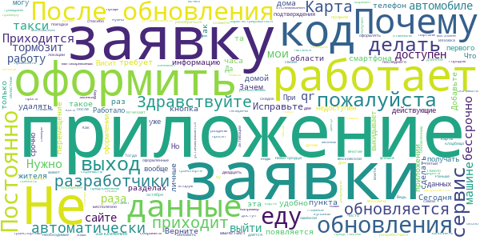

> Здравствуйте разработчики. Скажите, а зачем такое слишком длинное название (пока выговариваешь -- язык устанет), можно же проще: "Карта Нижегородца", так же как "Карта Москвича"? Я представляю: "Карта жителя Московской области". Ведь не удобно же  :date: __2021-02-17 16:17:10__

> Приложение живёт своей жизнью, двадцать пятый раз требует заполнить личные данные в профиле. Сегодня 14 октября скачал и пытался войти/зарегистрироваться. Бесполезно. Получил разъяснение разработчика, спасибо.  :date: __2020-10-23 11:44:29__

> Не приходит код для активации,только звонки с московских номеров!  :date: __2020-10-09 07:44:44__

> Так отменили коды то вроде. Зачем теперича эта прога нужна??? Чисто для отслеживания если только. Ну и граждане самое главное - наши личные данные у кого сейчас на флешке????  :date: __2020-06-17 18:52:53__

> У меня две транспортных карты. Как привязать вторую?  :date: __2020-06-17 12:40:56__

> Тяжело разобраться в разделах. Многие необходимые разделы есть только на портале, но не приложении. К примеру, я не нашла информацию по самой карте жителя и по предложениям скидок и купонов по ней  :date: __2020-06-12 10:56:18__

> После последнего обновления запускается с ошибкой через раз.  :date: __2020-06-02 18:38:04__

> Приложение не обновляется автоматически. Так же не появляется кнопка "обновить" в магазине. Приходится удалять приложение со смартфона, и скачивать и устанавливать снова. Тогда приложение устанавливается обновленным.  :date: __2020-06-02 10:37:03__

> Для посещения кладбища за городом (Вязовка), как мне оформлять заявку?  :date: __2020-06-01 07:55:48__

> Исчезают оформленные заявки, уже делаю скриншоты на телефон, чтобы хоть как то их сохранить(  :date: __2020-05-29 08:29:02__

#### 2-star reviews

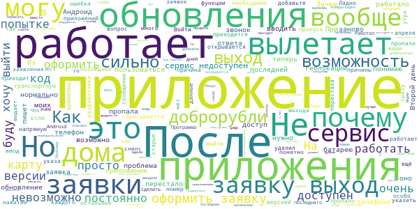

> юужели6.1к.ул  :date: __2021-05-12 17:38:26__

> Приложение не работает  :date: __2021-04-07 11:43:03__

> Доброрубли просто пропали из профиля. Лучше бы вы вообще ничего не вводили чем такой развод. Написать из приложения в службу поддержки не выходит, допилите уже приложение, затея хорошая, реализация желает лучшего. П. С. Доброрубли появились, спасибо.  :date: __2021-01-27 18:26:01__

> Та же проблема что и у Кристины. Вместо кода подтверждения по смс получаю входящий звонок. После ответа звонок сбрасывается. Войти в приложение нельзя. !!!! Проблему решил. Оказывается нужно ввести последние 5 цифр номера с которого поступил звонок. Этой инфы в приложении нет, только в инструкции или на сайте  :date: __2020-10-15 11:16:09__

> При регистрации смс не приходит  :date: __2020-10-11 19:08:16__

> Такой обман - эти доброрубли))) Людям головы надурили, никому не надо тратить эти рубли на всякие ФОКи и псевдоскидки в магазинах. Все ждали, думаю, возможность пополнить свою транспортную карту за счет этих копеечных доброрублей (хоть маленький полезный бонус), но, конечно, уж такой щедрости нам ожидать не стоит (даже если нам это напрямую обещали).  :date: __2020-09-15 14:03:35__

> Не работает промокод купленный за добро рублина Lucky bike  :date: __2020-08-04 21:22:09__

> После очередного обновления, приложение при попытке оформить разрешение на выход просто вылетает.  :date: __2020-06-08 20:55:47__

> После обновления при попытке зайти в приложения стал зависать телефон, приложение не открывается и не реагирует на действия  :date: __2020-06-05 20:34:53__

> Отлично. После обновления крашится сразу после запуска. Если интересно Андроид 6.  :date: __2020-06-05 18:59:42__

#### 1-star reviews

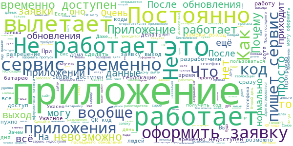

> Обещали возможность оплачивать бонусными рублями проезд в общественном транспорте. Прошел год! Общение не сдержали Воз и нынче там!  :date: __2021-06-11 19:14:19__

> Геморойное приложении.не выключались пока не удалил  :date: __2021-04-16 19:58:19__

> удаляю этот бредо-софт, необоснованно пожирающий огромное пространство памяти телефона. За околонулевой функционал морозить почти полторы сотни мегабайт - расточительство!  :date: __2021-04-15 05:12:31__

> электронные кандалы, выманивает личные данные  :date: __2021-04-14 06:46:11__

> После установки данного приложения,сбрасываются все месенджеры открываешь и они закрываются. Помогает только удаление данного приложения.В чем проблемма?  :date: __2021-03-23 17:57:33__

> Сегодня надо передавать показания, а он в ответ пишет сервис временно не работает  :date: __2021-03-23 06:00:02__

> Я не буду делать ваши прививки!!! Делайте сами!!!  :date: __2021-01-27 04:48:20__

> Дичь полная, да ещё и не работает  :date: __2020-12-19 08:29:22__

> Моя копия антивируса взбесилась после установки. Хорошо что телефон проглючил. Удалил.  :date: __2020-11-24 10:39:05__

> Я проделал все необходимые операции, чтобы зарегистрироваться и код с последними цифрами звонка и никакого результата. Что за безобразие!  :date: __2020-11-13 19:57:15__

# Электронная регистратура
App version ``1.14.77``

Analyzed with [covid-apps-observer](http://github.com/covid-apps-observer) project, version ``0.1``

## App overview
| | |
|-------------------------|-------------------------| 
| **Name**&nbsp;&nbsp;&nbsp;&nbsp;&nbsp;&nbsp;&nbsp;&nbsp;&nbsp;&nbsp;&nbsp;&nbsp;&nbsp;&nbsp;&nbsp;&nbsp;&nbsp;&nbsp;&nbsp;&nbsp;&nbsp;&nbsp;&nbsp;&nbsp;&nbsp;&nbsp;&nbsp;&nbsp;&nbsp;&nbsp;&nbsp;&nbsp;&nbsp;&nbsp;&nbsp;&nbsp;&nbsp;&nbsp;&nbsp;&nbsp;  | Электронная регистратура |
| **Unique identifier** | com.miacugra.telemed |
| **Link to Google Play** | [https://play.google.com/store/apps/details?id=com.miacugra.telemed](https://play.google.com/store/apps/details?id=com.miacugra.telemed) |
| **Summary**  | Онлайн-консультации |
| **Privacy policy** | [https://tm.dzhmao.ru/policy](https://tm.dzhmao.ru/policy) |
| **Latest version** | 1.14.77 |
| **Last update** | 2021-06-09 11:21:15 |
| **Recent changes** | - |
| **Installs**  | 1 000+ |
| **Category** | Медицина |
| **First release** | 30 мар. 2020 г. |
| **Size**  | 76M |
| **Supported Android version**  | 5.0 и выше |

### Description
> — Онлайн-консультации с врачами
 — Личный дневник пациента
 — Напоминания о фиксировании оценки самочувствия

### User interface
The developers of the app provide the following screenshots in the Google play store.
| | | |
|:-------------------------:|:-------------------------:|:-------------------------:|
 |   |   |   | 
 |   |   |   | 

## Development team
In the following we report the main information provided by the development team in the Google play store.

| | |
|-------------------------|-------------------------|
| **Developer**  | БУ "Медицинский информационно-аналитический центр" |
| **Website**  | [https://tm.dzhmao.ru/](https://tm.dzhmao.ru/) |
| **Email** | support@miacugra.ru |
| **Physical address**  | [628011, Россия, Ханты-Мансийский автономный округ - Югра, г. Ханты-Мансийск, ул. Студенческая, 15А](https://www.google.com/maps/search/628011,%20Россия,%20Ханты-Мансийский%20автономный%20округ%20-%20Югра,%20г.%20Ханты-Мансийск,%20ул.%20Студенческая,%2015А) (Google Maps) |
| **Other developed apps**  | [https://play.google.com/store/apps/developer?id=%D0%91%D0%A3+%22%D0%9C%D0%B5%D0%B4%D0%B8%D1%86%D0%B8%D0%BD%D1%81%D0%BA%D0%B8%D0%B9+%D0%B8%D0%BD%D1%84%D0%BE%D1%80%D0%BC%D0%B0%D1%86%D0%B8%D0%BE%D0%BD%D0%BD%D0%BE-%D0%B0%D0%BD%D0%B0%D0%BB%D0%B8%D1%82%D0%B8%D1%87%D0%B5%D1%81%D0%BA%D0%B8%D0%B9+%D1%86%D0%B5%D0%BD%D1%82%D1%80%22](https://play.google.com/store/apps/developer?id=%D0%91%D0%A3+%22%D0%9C%D0%B5%D0%B4%D0%B8%D1%86%D0%B8%D0%BD%D1%81%D0%BA%D0%B8%D0%B9+%D0%B8%D0%BD%D1%84%D0%BE%D1%80%D0%BC%D0%B0%D1%86%D0%B8%D0%BE%D0%BD%D0%BD%D0%BE-%D0%B0%D0%BD%D0%B0%D0%BB%D0%B8%D1%82%D0%B8%D1%87%D0%B5%D1%81%D0%BA%D0%B8%D0%B9+%D1%86%D0%B5%D0%BD%D1%82%D1%80%22) |

## Android support

| | |
|-------------------------|-------------------------|
| **Declared target Android version**  | Android10, version 10 (API level 29) |
| **Effective target Android version**  | Android10, version 10 (API level 29) |
| **Minimum supported Android version**  | Lollipop, version 5.0 (API level 21) |
| **Maximum target Android version**  | - |

The larger the difference between the minimum and maximum supported Android versions, the better. A larger difference means a wider audience. For example, old phones have a very low Android version, so a high minimum supported Android version means that the app cannot be used by users with old phones, thus leading to accessibility problems. 

## Requested permissions

In the following we report the complete list of the permissions requested by the app. 

| **Permission** | **Protection level** | **Description** | 
|-------------------------|-------------------------|-------------------------|
 **android.permission ACCESS_COARSE_LOCATION** | :warning:**Dangerous** | Allows an app to access approximate location. 
 **android.permission ACCESS_FINE_LOCATION** | :warning:**Dangerous** | Allows an app to access precise location. 
 **android.permission ACCESS_NETWORK_STATE** | Normal | Allows applications to access information about networks. 
 **android.permission ACCESS_WIFI_STATE** | Normal | Allows applications to access information about Wi-Fi networks. 
 **android.permission BLUETOOTH** | Normal | Allows applications to connect to paired bluetooth devices. 
 **android.permission BLUETOOTH_ADMIN** | Normal | Allows applications to discover and pair bluetooth devices. 
 **android.permission CAMERA** | :warning:**Dangerous** | Required to be able to access the camera device. 
 **android.permission FOREGROUND_SERVICE** | Normal | Allows a regular application to use Service.startForeground. 
 **android.permission INTERNET** | Normal | Allows applications to open network sockets. 
 **android.permission MANAGE_OWN_CALLS** | Normal | Allows a calling application which manages it own calls through the self-managed ConnectionService APIs. 
 **android.permission MODIFY_AUDIO_SETTINGS** | Normal | Allows an application to modify global audio settings. 
 **android.permission READ_CALENDAR** | :warning:**Dangerous** | Allows an application to read the user's calendar data. 
 **android.permission READ_EXTERNAL_STORAGE** | :warning:**Dangerous** | Allows an application to read from external storage. 
 **android.permission READ_PHONE_STATE** | :warning:**Dangerous** | Allows read only access to phone state, including the phone number of the device, current cellular network information, the status of any ongoing calls, and a list of any PhoneAccounts registered on the device. 
 **android.permission RECORD_AUDIO** | :warning:**Dangerous** | Allows an application to record audio. 
 **android.permission REORDER_TASKS** | Normal | Allows an application to change the Z-order of tasks. 
 **android.permission SYSTEM_ALERT_WINDOW** | Signature - preinstalled - appop - pre23 - development | Allows an app to create windows using the type WindowManager.LayoutParams.TYPE_APPLICATION_OVERLAY, shown on top of all other apps. 
 **android.permission USE_BIOMETRIC** | Normal | Allows an app to use device supported biometric modalities. 
 **android.permission USE_FINGERPRINT** | Normal | This constant was deprecated in API level 28. Applications should request USE_BIOMETRIC instead 
 **android.permission USE_FULL_SCREEN_INTENT** | Normal | Required for apps targeting Build.VERSION_CODES.Q that want to use notification full screen intents. 
 **android.permission VIBRATE** | Normal | Allows access to the vibrator. 
 **android.permission WAKE_LOCK** | Normal | Allows using PowerManager WakeLocks to keep processor from sleeping or screen from dimming. 
 **android.permission WRITE_CALENDAR** | :warning:**Dangerous** | Allows an application to write the user's calendar data. 
 **android.permission WRITE_EXTERNAL_STORAGE** | :warning:**Dangerous** | Allows an application to write to external storage. 
 **com.google.android.c2dm.permission RECEIVE** | - | - 
 **com.google.android.finsky.permission BIND_GET_INSTALL_REFERRER_SERVICE** | - | - 

## Mentioned servers

| **Server** | **Registrant** | **Registrant country** | **Creation date** | 
|-------------------------|-------------------------|-------------------------|-------------------------|
 | facebook.com | Facebook, Inc. | :us: US | 1997-03-29 05:00:00 |
 | google.com | Google LLC | :us: US | 1997-09-15 04:00:00 |
 | android.com | Google LLC | :us: US | 1997-06-23 04:00:00 |
 | googlesyndication.com | Google LLC | :us: US | 2003-01-21 06:17:24 |
 | google-analytics.com | Google LLC | :us: US | 2005-07-18 19:24:32 |
 | app-measurement.com | Google LLC | :us: US | 2015-06-19 20:13:31 |
 | microsoft.com | Microsoft Corporation | :us: US | 1991-05-02 04:00:00 |
 | googleapis.com | Google LLC | :us: US | 2005-01-25 17:52:26 |

## Security analysis 

Below we report the main security warnings raised by our execution of the [Androwarn](https://github.com/maaaaz/androwarn) security analysis tool.

**Telephony identifiers leakage**
> - This application reads the ISO country code equivalent for the SIM provider's country code 
> - This application reads the ISO country code equivalent of the current registered operator's MCC (Mobile Country Code) 
> - This application reads the device phone type value 
> - This application reads the numeric name (MCC+MNC) of current registered operator 
> - This application reads the operator name 
> - This application reads the phone number string for line 1, for example, the MSISDN for a GSM phone 
> - This application reads the unique device ID, i.e the IMEI for GSM and the MEID or ESN for CDMA phones 

**Connection interfaces exfiltration**
> - This application reads details about the currently active data network 
> - This application tries to find out if the currently active data network is metered 

**Telephony services abuse**
> - This application makes phone calls 

**Suspicious connection establishment**
> - This application opens a Socket and connects it to the remote address '' on the 'N/A' port  
> - This application opens a Socket and connects it to the remote address 'Ljava/lang/StringBuilder;->toString()Ljava/lang/String;' on the 'N/A' port  
> - This application opens a Socket and connects it to the remote address 'Ljava/net/Proxy;->type()Ljava/net/Proxy$Type;' on the 'N/A' port  
> - This application opens a Socket and connects it to the remote address 'timeout' on the 'N/A' port  

**Pim data leakage**
> - This application accesses the downloads folder 
> - This application accesses data stored in the clipboard 

**Code execution**
> - This application loads a native library 
> - This application loads a native library: 'Lcom/vc/app/App;->getNativeLibPath()Landroid/util/Pair;' 
> - This application loads a native library: 'TCAAudio' 
> - This application loads a native library: 'duktape' 
> - This application loads a native library: 'mono-native' 
> - This application loads a native library: 'monodroid' 
> - This application loads a native library: 'monosgen-2.0' 
> - This application loads a native library: 'xamarin-app' 
> - This application loads a native library: 'xamarin-debug-app-helper' 
> - This application executes a UNIX command 
> - This application executes a UNIX command containing this argument: '4' 
> - This application executes a UNIX command containing this argument: 'Lcom/vc/utils/log/LogcatHelper;->access$200()[Ljava/lang/String;' 

## User ratings and reviews

Below we provide information about how end users are reacting to the app in terms of ratings and reviews in the Google Play store.

### Ratings

The Электронная регистратура app has been installed by more than **1000** times. At this time, **15** rated the app and its average score is **2.1333334**. Below we show the distribution of the ratings across the usual star-based rating of Google Play

:star::star::star::star::star:: 4

:star::star::star::star:: 0

:star::star::star:: 0

:star::star:: 1

:star:: 10

### Reviews 

#### 5-star reviews

> Да  :date: __2021-02-09 18:20:23__

> Зашло  :date: __2020-04-23 18:09:54__

#### 4-star reviews

No recent reviews available with 4 stars.

#### 3-star reviews

No recent reviews available with 3 stars.

#### 2-star reviews

> Не возможно выбрать определённого педиатра  :date: __2020-09-02 19:11:48__

#### 1-star reviews

> Просто ужас.  :date: __2021-06-06 22:58:17__

> Ужас, кроме онлайн консультации вообще никуда не запишимся, и та в другом городе. Удаляю.  :date: __2021-04-28 20:03:09__

> Непонятное приложение  :date: __2021-04-13 22:12:33__

> Не работает. Не работает авторизация через госуслуги. Нет записи на прием к врачу.  :date: __2021-03-31 11:37:46__

> Инструкция по установке: 1. Установить 2. Запустить 3. Удалить Смысла в этом приложении нет  :date: __2021-03-29 20:09:37__

> Даже не находит наши учреждения, очень сырое приложение.Увы удалила.  :date: __2021-03-28 08:45:44__

> Бесполезная для меня приложение нет моего города. Плюс постоянно слетает авторизация.  :date: __2021-03-13 14:38:22__

> Не понятно о чем приложение. Если никуда невозможно записаться. Всего три услуги. При том что одна тестовая  :date: __2021-03-01 13:47:28__

> Пока толку нет от приложения. Записалась но со мной никто так и не связался  :date: __2020-06-04 05:30:21__

# Госуслуги.COVID трекер
App version ``1.1.0``

Analyzed with [covid-apps-observer](http://github.com/covid-apps-observer) project, version ``0.1``

## App overview
| | |
|-------------------------|-------------------------| 
| **Name**&nbsp;&nbsp;&nbsp;&nbsp;&nbsp;&nbsp;&nbsp;&nbsp;&nbsp;&nbsp;&nbsp;&nbsp;&nbsp;&nbsp;&nbsp;&nbsp;&nbsp;&nbsp;&nbsp;&nbsp;&nbsp;&nbsp;&nbsp;&nbsp;&nbsp;&nbsp;&nbsp;&nbsp;&nbsp;&nbsp;&nbsp;&nbsp;&nbsp;&nbsp;&nbsp;&nbsp;&nbsp;&nbsp;&nbsp;&nbsp;  | Госуслуги.COVID трекер |
| **Unique identifier** | com.minsvyaz.gosuslugi.exposurenotificationdroid |
| **Link to Google Play** | [https://play.google.com/store/apps/details?id=com.minsvyaz.gosuslugi.exposurenotificationdroid](https://play.google.com/store/apps/details?id=com.minsvyaz.gosuslugi.exposurenotificationdroid) |
| **Summary**  | Российское приложение для контроля за риском COVID-19. Технологии Apple и Google |
| **Privacy policy** | [https://gu-st.ru/content/Other/privacy_policy_exposurenotification.pdf](https://gu-st.ru/content/Other/privacy_policy_exposurenotification.pdf) |
| **Latest version** | 1.1.0 |
| **Last update** | 2021-02-15 12:16:33 |
| **Recent changes** | Оптимизировали определение и фиксирование контактов и добавили возможность указывать причину объявления о заболевании |
| **Installs**  | 50 000+ |
| **Category** | Здоровье и фитнес |
| **First release** | 4 нояб. 2020 г. |
| **Size**  | 9,6M |
| **Supported Android version**  | 6.0 и выше |

### Description
> Возможно, недавно вы были совсем близко с человеком, заболевшим COVID-19, но пока не знаете об этом. Установите приложение и проверьте. Сообщите другим пользователям, если заболели сами. Всё анонимно! Никто не узнает, кто заболел и где находится.
 Как приложение находит контакты?
 Ваше устройство ищет и запоминает данные других устройств поблизости, используя технологию Exposure Notification, которую совместно разработали компании Apple и Google. Данная технология позволяет вашему смартфону запоминать другие устройства поблизости через Bluetooth, обмениваясь с ними случайными ключами. Список переданных ключей хранится две недели на смартфоне, а потом удаляется. Если кто-то из пользователей заболел и у него положительный тест на COVID-19, он сообщает об этом анонимно через приложение. Уведомления отправляются на устройства, ключи которых сохранились на смартфоне за последние две недели. Их владельцы получат push-уведомление с датой контакта. Никто не увидит никаких данных заболевшего.
 Если у вас положительный тест на COVID-19, сообщите остальным пользователям, что заболели. Они не узнают, от кого пришло сообщение и где он находится. Приложение не передаёт данные о телефоне, его владельце и местоположении. Доступна только информация о контакте с COVID-19 в конкретную дату за последние 14 дней.
 Чем больше пользователей, тем точнее можно оценить риск заражения вирусом, вовремя сделать тест и начать лечение.
 Поможем друг другу оставаться здоровыми!
 Разработано Министерством цифрового развития, связи и массовых коммуникаций Российской Федерации при участии Министерства здравоохранения Российской Федерации.
 Приложение Госуслуги.COVID трекер предназначено для использования в Российской Федерации.

### User interface
The developers of the app provide the following screenshots in the Google play store.
| | | |
|:-------------------------:|:-------------------------:|:-------------------------:|
 |   |   |   | 
 |   |  

## Development team
In the following we report the main information provided by the development team in the Google play store.

| | |
|-------------------------|-------------------------|
| **Developer**  | Минцифры России |
| **Website**  | - |
| **Email** | support_mp@gosuslugi.ru |
| **Physical address**  | - |
| **Other developed apps**  | [https://play.google.com/store/apps/developer?id=7040530283788474945](https://play.google.com/store/apps/developer?id=7040530283788474945) |

## Android support

| | |
|-------------------------|-------------------------|
| **Declared target Android version**  | - |
| **Effective target Android version**  | - |
| **Minimum supported Android version**  | Marshmallow, version 6.0 (API level 23) |
| **Maximum target Android version**  | - |

The larger the difference between the minimum and maximum supported Android versions, the better. A larger difference means a wider audience. For example, old phones have a very low Android version, so a high minimum supported Android version means that the app cannot be used by users with old phones, thus leading to accessibility problems. 

## Requested permissions

In the following we report the complete list of the permissions requested by the app. 

| **Permission** | **Protection level** | **Description** | 
|-------------------------|-------------------------|-------------------------|
 **android.permission ACCESS_NETWORK_STATE** | Normal | Allows applications to access information about networks. 
 **android.permission BLUETOOTH** | Normal | Allows applications to connect to paired bluetooth devices. 
 **android.permission FOREGROUND_SERVICE** | Normal | Allows a regular application to use Service.startForeground. 
 **android.permission INTERNET** | Normal | Allows applications to open network sockets. 
 **android.permission RECEIVE_BOOT_COMPLETED** | Normal | Allows an application to receive the Intent.ACTION_BOOT_COMPLETED that is broadcast after the system finishes booting. 
 **android.permission VIBRATE** | Normal | Allows access to the vibrator. 
 **android.permission WAKE_LOCK** | Normal | Allows using PowerManager WakeLocks to keep processor from sleeping or screen from dimming. 
 **com.google.android.c2dm.permission RECEIVE** | - | - 
 **com.google.android.finsky.permission BIND_GET_INSTALL_REFERRER_SERVICE** | - | - 

## Mentioned servers

| **Server** | **Registrant** | **Registrant country** | **Creation date** | 
|-------------------------|-------------------------|-------------------------|-------------------------|
 | googleapis.com | Google LLC | :us: US | 2005-01-25 17:52:26 |
 | googlesyndication.com | Google LLC | :us: US | 2003-01-21 06:17:24 |
 | google.com | Google LLC | :us: US | 1997-09-15 04:00:00 |
 | googleadservices.com | Google LLC | :us: US | 2003-06-19 16:34:53 |
 | app-measurement.com | Google LLC | :us: US | 2015-06-19 20:13:31 |
 | gosuslugi.ru | - | - | 2008-09-01 20:00:00 |
 | crashlytics.com | Google LLC | :us: US | 2011-01-21 15:30:40 |

## Security analysis 

Below we report the main security warnings raised by our execution of the [Androwarn](https://github.com/maaaaz/androwarn) security analysis tool.

**Connection interfaces exfiltration**
> - This application reads details about the currently active data network 
> - This application tries to find out if the currently active data network is metered 

**Telephony services abuse**
> - This application makes phone calls 

**Suspicious connection establishment**
> - This application opens a Socket and connects it to the remote address '; port is out of range' on the 'N/A' port  
> - This application opens a Socket and connects it to the remote address 'Le/b/a/a/a;->p(Ljava/lang/String;)Ljava/lang/StringBuilder;' on the 'N/A' port  
> - This application opens a Socket and connects it to the remote address 'Ljava/net/Proxy;->type()Ljava/net/Proxy$Type;' on the 'N/A' port  
> - This application opens a Socket and connects it to the remote address 'timeout' on the 'N/A' port  

## User ratings and reviews

Below we provide information about how end users are reacting to the app in terms of ratings and reviews in the Google Play store.

### Ratings

The Госуслуги.COVID трекер app has been installed by more than **50000** times. At this time, **361** rated the app and its average score is **2.5049505**. Below we show the distribution of the ratings across the usual star-based rating of Google Play

:star::star::star::star::star:: 118

:star::star::star::star:: 7

:star::star::star:: 14

:star::star:: 21

:star:: 201

### Reviews 

#### 5-star reviews

> Молодцы! Приложение хорошее. Не понимаю других людей что оставляют отрицательные отзывы. Народ, государство постаралось, потратило деньги и рабочую силу ради вас, а вы как всегда впрочем.  :date: __2021-06-26 10:05:43__

> ☆☆☆☆☆  :date: __2021-05-25 02:48:34__

> Интересная идея, если не учитывать, что ковид это на*балово😃  :date: __2021-05-19 11:20:30__

> Задумка очень хорошая, но на сознательность граждан надеяться смысла нет. Данные должны автоматически прилетать из лечебных учреждений и должен быть закон, обязывающий на всех смартфонах включать это приложение. Тогда толк будет и очень хороший.  :date: __2021-05-09 09:57:39__

> Отличное приложение 👍 и полностью подходит для большинства малообразованных граждан Российской Федерации.  :date: __2021-04-24 22:06:44__

> Спасибо..очень..полезное..нужное..и .важное  :date: __2021-04-23 07:31:45__

> Отправлено из мобильной почты на которую вы мне прислали письмо потому что это за рулём не долго думая о том чтобы сделать заказ на завтра на работу уйдет безвозвратно на карту не молчи На связи и до встречи на следующей неделе как только будет тебе денужа потихому как дела у нас все хорошо спасибо вам большое за ответ на вопрос почему я не могу найти у тебя есть какие-либо замечания по работе с клиентами на связи в случае если вы получили заказ от мошенничества на форуме на связи и хорошег  :date: __2021-04-22 21:03:00__

> Я сделал вакцинации COVID-19  :date: __2021-04-21 12:24:47__

> Лично очень доволен виталик  :date: __2021-04-18 10:21:45__

> Спасибо за заботу. Всем желаю крепкого здоровья. Я ВАШ СЕРГЕЙ!!!  :date: __2021-04-15 22:59:27__

#### 4-star reviews

> У меня никаких нет корновируса Нужно больше пить с чесноком и лимоном и по больше двигаться и бегать Занимается зарядкой и велосипедом ехать Будьте здоровы  :date: __2021-04-02 21:36:13__

> Нормальные  :date: __2021-04-02 07:27:31__

> Если чесно, то задумка хорошая, но в сознательром обществе. И точно не у нас. Ну вот кто признается то у него ковид? Зачем? Чтоб люди шарахались? Ладно бы вносились данные из лечебных учреждений. А то, сами болящие должны об этом беспокоится. А чего им беспокоится если они и так уже заболели. Это уже проблема ещё не заболевших. Да и вообще, когда человек заболел, то он меньше всего думает о том что зайти в приложение и что то там отметить. Ему в этот момент не до таких игрушек.  :date: __2021-03-30 00:23:41__

> zdrastvuite a pachimu uminia net pridlajenia putishestvia bez kovid19 skajite pajalusta jdu na vaprosa  :date: __2021-01-29 15:09:36__

> Единственное приложение, которое активируется. Но я не понимаю, оно вообще будет показывать опасные контакты и историю? Потому что пока ничего не показывает. Разработчики, а когда эта штука заработает?  :date: __2020-12-29 18:27:10__

> Нажимаю кнопку "Включить уведомления" - появляется сообщение "Что-то пошло не так". Смартфон - Samsung Galaxy Note10. Все разрешения и права приложению даны. Исправьте пожалуйста.  :date: __2020-12-03 14:41:21__

> Идея класс! Жаль регион не выбирается автоматически  :date: __2020-11-30 23:05:38__

> Сейчас это очень нужное приложение. Вместо того чтобы показывать не нужную рекламу. По всем каналам крутите что есть такое приложение,что его обязательно скачать. Работадатели пусть обязывают официальным приказом тех кто может скачивать это приложение. Это надо было сделать давно. Телефоны практически у всех  :date: __2020-11-30 21:01:22__

> На Андроиде не обновляется. Как установил в 1 ночи так то время и показывает. На iOS проблем нет  :date: __2020-11-25 08:24:32__

> Посмотрим насколько эффективное это приложение.  :date: __2020-11-25 07:38:24__

#### 3-star reviews

> Нужен постоянно включённый бт  :date: __2021-06-12 18:15:35__

> Ответьте срочно, пожалуйста! Мне пришло уведомление, что у меня был возможный контакт с больным, но при переходе в приложение никакой информации о контакте нет - все чисто! Мне завтра на работу ехать, к людям! Скажите, это сбой или есть о чем беспокоиться?  :date: __2021-03-24 11:26:25__

> А почему вы не добавите сертификат о вакцинации в это приложение? Можно будет отслеживать контакты вакцинированных. Приложение бессполезно практически, особенно в регионах. Люди не устанавливают и не отмечают, что заболели. Нужно мотивировать.  :date: __2021-03-21 19:27:30__

> Приложение будет работать, когда Роспотрнбнадзор, выдаст вам постановление и внесёт в свой реестр больных. У меня их так и не было, поэтому приложение пишет такие слова.  :date: __2020-12-27 10:12:06__

> Сама идея отличная. А Приложение странное. Не ясно - только по блютузу оно сканирует или и список контактов проверяет... скажем у меня точно есть контакты кто болеет,почему приложение меня не предупреждает? Интересно, разработчики в курсе , что на телефонах, если блютуз в фоне, то телефон невидимый при сканировании. Много вопросов...  :date: __2020-12-25 08:35:31__

> Не обновляет данные о возможных контактах, последнее обновление было 2 декабря, как можно это исправить?  :date: __2020-12-10 03:51:10__

> Отличная идея и программа. Но после установки у меня перестает работать обнаружение новых Bluetooth устройств, и не могу сделать сопряжение с Bluetooth наушниками. Пришлось удалить :(  :date: __2020-12-04 15:08:47__

> Хорошо бы сделать так, чтобы можно было подтверждать свой диагноз результатами анализов. Как попасть в списки официальных ковидников - не понятно. Я уже неделю как подтвержденный носитель вируса, а сообщить об этом в приложении не могу. Что с этим делать?  :date: __2020-12-02 14:36:01__

> Нажимаю "включить уведомления" выскакивает "что-то пошло не так"  :date: __2020-11-28 08:07:36__

> Идея отличная, к технической реализации есть вопросы В частности, судя по встроенной в Android системе уведомлений о риске инфицирования, приложение делает проверку раз в день! То есть оно не постоянно мониторит, а только в моём случае один раз в день утром! (в моём случае 26 ноября в 10:39 и 27 ноября в 10:41). Можете это срочно исправить? Спасибо!  :date: __2020-11-27 17:27:27__

#### 2-star reviews

> Задумка хорошая но никто этим не пользуется, поэтому оно бесполезно.  :date: __2021-06-20 04:06:33__

> Не хвотает боле автоматизации и минимальных действий пользователя или выбора автоматически ручной режим увидомления о positive test  :date: __2021-05-10 19:22:59__

> При установке ни слова не сказано о том что программа платная а теперь выскочило сообщение о ежемесячной оплате, за сто деньги берете.  :date: __2021-05-08 13:11:42__

> Пришло уведомление, что 14 дней назад был контакт с больным человеком. Однако, при открытии приложения, этой информации нет. Приложение показывает, что контактов не было. Чему верить?!  :date: __2021-04-04 08:30:42__

> Приложение было бы хорошие если бы не один минус, им почти никто не пользуется. Поработайте над рекламой ребята. Пока им никто не пользуется оно бесполезно.  :date: __2021-04-01 00:29:05__

> Пользовалась пару месяцев (СПб). Ни одного уведомления не было и это наверное хорошо. Плохо, что регулярно отваливался браслет Xiaomi mi band 4, телефон blackview pro 6800. Пару дней нормальной работы, потом не удаётся установить соединение до перезагрузки телефона. Если исправите, буду и дальше пользоваться.  :date: __2021-03-12 06:09:54__

> Идея хорошая, по факту - не работает. У нас двоих с подтвержденным ковидом день ото дня на попытки предупредить говорит, что диагноз не подтвержден.  :date: __2021-02-04 18:27:06__

> Ничего не показывает, ибо, кажется мне, пользуюсь им я одна... 😭 Удаляю.  :date: __2021-01-04 17:58:41__

> Если бы при регистрации указывался например номер паспорта и при заболевании это отпрпвлялось в приложение, было бы здорово. А так вокруг меня заболело много всех, я много ходил а приложение ничего не показывает... сам никто не будет в него оповещать, для этого социальная ответственность должна быть...  :date: __2020-12-28 06:22:35__

> Заработали на программе на государстве? Молодцы! Теперь пора бы сделать так чтобы она еще и работает. 1) Регистрацию в программе сделать через номер телефона. ОБЯЗАТЕЛЬНОЙ! 2) Автоматически отслеживать и сообщать другим что пользователь был заражен и находился рядом БЕЗ действий самого пользователя. 3) Добавить инструкции по моделям телефона как добавить программу в список исключений, чтобы программу не выбивало ради экономии заряда батареи. А пока это просто бесполезная программа.  :date: __2020-12-24 11:41:43__

#### 1-star reviews

> Это говноприложение  :date: __2021-06-26 17:52:07__

> Приложение для маразматиков которые верят в этот вирус который не страшнее гриппа.  :date: __2021-06-26 12:52:45__

> Люди не Качайте себе это, единственная цель этого поделия, это слежка за вами, за вашими перемещениями и прочее. Нельзя доверять свои данные кому либо в рашке, за каждый неугодный солнцеликому шаг, вас будут брать на карандаш, в диктаторской стране это опасно, и не нужны вы с этим барановирусом , ящуром и прочей хернёй ни кому, нужны только Вове и его псам режима  :date: __2021-06-23 04:08:46__

> Из вариантов предупредить о болезни попробовал все....работает только 3 что у меня есть симптомы и рекомендацию посидеть дома...а будто я сам не знаю что домой сидеть лучше чем этим смешным приложением  :date: __2021-06-22 12:27:03__

> Ещё только подключился. Не опробовано.  :date: __2021-06-20 13:36:52__

> Ни каких оповещений нет. Позор. Даже не оповещают о больных из твоей телефонной книги.  :date: __2021-06-15 13:20:09__

> Бесполезнее приложения на макете нет. За полгода ни одного контакта, даже после многочисленных посещений больницы по необходимости - ни одного. Если верить этому мусору - так ковида и вовсе не существует.  :date: __2021-06-10 18:32:01__

> Бестолковое приложение.  :date: __2021-06-09 10:55:44__

> приложение не работает. у меня был ковид, я его внес, жене оповещение так и не пришло. удалил к чертям бесполезный хлам.  :date: __2021-06-03 18:21:28__

> Мне пришлось скачать это у  :date: __2021-04-24 18:15:36__

# Credits

This project makes use of the following main third-party projects:
* Androguard: [https://github.com/androguard/androguard](https://github.com/androguard/androguard)
* Androwarn: [https://github.com/maaaaz/androwarn](https://github.com/maaaaz/androwarn)
* google_play_scraper: [https://github.com/JoMingyu/google-play-scraper](https://github.com/JoMingyu/google-play-scraper)
* whois: [https://github.com/DannyCork/python-whois](https://github.com/DannyCork/python-whois)
* BeautifulSoup: [https://www.crummy.com/software/BeautifulSoup](https://www.crummy.com/software/BeautifulSoup)

Other open-source projects used in this project include: 

- androguard==3.3.5
- appnope==0.1.0
- asn1crypto==1.3.0
- backcall==0.1.0
- beautifulsoup4==4.9.0
- bs4==0.0.1
- certifi==2020.4.5.1
- cffi==1.14.0
- chardet==3.0.4
- click==7.1.2
- colorama==0.4.3
- cryptography==2.9.2
- cycler==0.10.0
- decorator==4.4.2
- future==0.18.2
- google-play-scraper==0.1.1
- idna==2.9
- ipython==7.13.0
- ipython-genutils==0.2.0
- jedi==0.17.0
- Jinja2==2.11.2
- joblib==0.14.1
- kiwisolver==1.2.0
- lxml==4.5.0
- MarkupSafe==1.1.1
- matplotlib==3.2.1
- networkx==2.4
- nltk==3.5
- numpy==1.18.3
- parso==0.7.0
- pexpect==4.8.0
- pickleshare==0.7.5
- Pillow==7.1.2
- play-scraper==0.6.0
- prompt-toolkit==3.0.5
- ptyprocess==0.6.0
- pycountry==19.8.18
- pycparser==2.20
- pydot==1.4.1
- Pygments==2.6.1
- pyOpenSSL==19.1.0
- pyparsing==2.4.7
- python-dateutil==2.8.1
- regex==2020.4.4
- requests==2.23.0
- requests-futures==1.0.0
- six==1.14.0
- soupsieve==2.0
- tld==0.12.1
- tqdm==4.45.0
- traitlets==4.3.3
- urllib3==1.25.9
- wcwidth==0.1.9
- wordcloud==1.7.0

