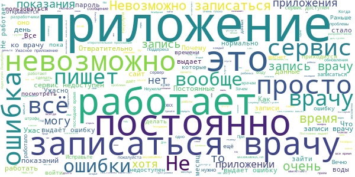
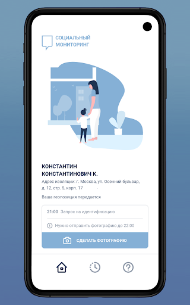
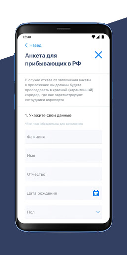
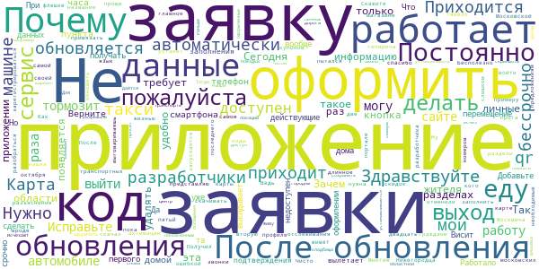
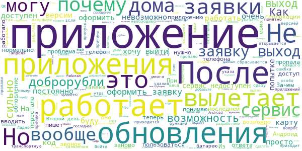
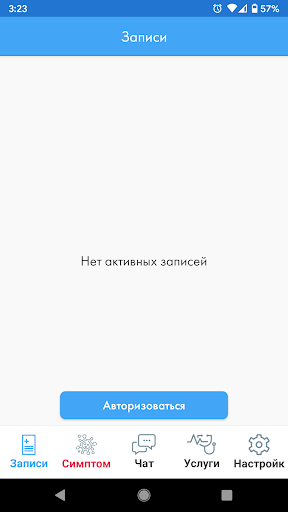
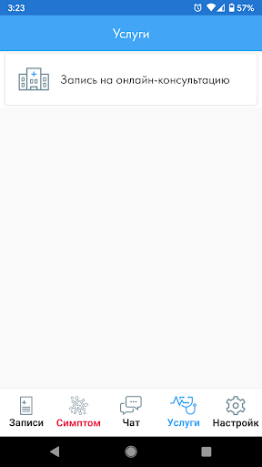
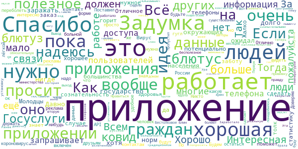
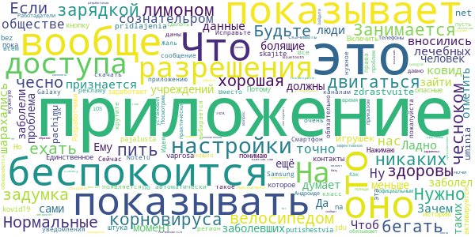

# COVID-related Android apps in Russia

Author: `Ivano Malavolta` (ivanomalavolta@gmail.com)

Created at: `2021/6/6`

Report generated by the [covid-apps-observer](http://github.com/covid-apps-observer) project, version 0.1

# Table of contents 

- [Background](#background)
    * [Data sources and analyses](#data-sources-and-analyses)
        * [App metadata](#app-metadata)
        * [Requested permissions](#requested-permissions)
        * [Mentioned servers](#mentioned_servers)
        * [Security analysis](#security_analysis)
        * [User ratings and reviews](#user-ratings-and-reviews)
    * [Disclaimer](#disclaimer)
- [Госуслуги Москвы](#госуслуги-москвы)
- [Моя Москва — официальное приложение портала mos.ru](#моя-москва-—-официальное-приложение-портала-mos.ru)
- [WHO Info](#who-info)
- [Социальный мониторинг](#социальный-мониторинг)
- [OpenWHO](#openwho)
- [Активный гражданин](#активный-гражданин)
- [Госуслуги СТОП Коронавирус](#госуслуги-стоп-коронавирус)
- [CoronaSTOP](#coronastop)
- [Contact Tracker](#contact-tracker)
- [Карта жителя НО](#карта-жителя-но)
- [Кыргыз Консул](#кыргыз-консул)
- [ЯОК – контролируйте свое здоровье](#яок-–-контролируйте-свое-здоровье)
- [Электронная регистратура](#электронная-регистратура)
- [Госуслуги.COVID трекер](#госуслуги.covid-трекер)

- [Credits](#credits)

# How to read this report

This report has been generated by the [covid-apps-observer](http://github.com/covid-apps-observer) project. The project automatically analyzes the apps by extracting information which is already publicly available either on the web or in the apps binary files. 

Our analysis covers the following apps:
| | |
|-------------------------|-------------------------| 
|  | Госуслуги Москвы
|  | Моя Москва — официальное приложение портала mos.ru
|  | WHO Info
|  | Социальный мониторинг
|  | OpenWHO
|  | Активный гражданин
|  | Госуслуги СТОП Коронавирус
|  | CoronaSTOP
|  | Contact Tracker
|  | Карта жителя НО
|  | Кыргыз Консул
|  | ЯОК – контролируйте свое здоровье
|  | Электронная регистратура
|  | Госуслуги.COVID трекер

The details of our analysis are presented in the remainder of this report.

For independent verification, the raw data and the source code of the project is publicly available in its GitHub repository [http://github.com/covid-apps-observer](http://github.com/covid-apps-observer) and its source code has been thoroughly commented in order to provide all the details about how the information provided in this report has been extracted. 

Any feedback, questions, and improvements about the project are very welcome, feel free to create an issue or pull request directly in its GitHub repository: [http://github.com/covid-apps-observer](http://github.com/covid-apps-observer).

## Data sources and analyses

The analysis of each app is structured around five main dimensions: 
* App metadata  
* Requested permissions
* Mentioned servers
* Androwarn analysis
* User ratings and reviews

In the following we describe the data sources and analysis performed for each dimension.

### App metadata

App metadata includes an overview of the main information about the app (for example, its name, releases, privacy policy, etc.), contact information of the development team, and the various Android versions supported by the app. This information is extracted from two main data sources:
* _Google Play store_: we automatically mined the web page of the Google Play store showing the basic information about the app and we parsed it in order to extract information about the app and development team 
* _Android Manifest file_: in our analysis we decompiled the binary file of the app (it is similar to a Zip archive but it contains the code of the app instead of normal files) and we extracted information about the supported Android versions, as it has been listed by its development team.

The extracted app metadata feeds the _App overview_, _Development team_, and _Android support_ sections of this report.
We make use of the [google-play-scraper](https://github.com/JoMingyu/google-play-scraper) tool for extracting the raw data related to this dimension of the project.

### Requested permissions

The Android operating system has a permission model which allows users to grant access to potentially privacy-related information. Every Android app has to explictly declare the permissions it needs to properly function in the Android Manifest file.  

In this report we also show the protection level of each permission, which is a key information for understanding how the requested permissions related to the user's privacy. We carefully analyzed the [official Android documentation (v. 29)](https://developer.android.com/reference/android/Manifest.permission), and it resulted that a permission requested by an Android app can belong to the following protection levels:
* **Dangerous**: higher-risk permissions that would give a requesting app access to private user data or control over the device that can negatively impact the user. Because this type of permission introduces potential risk, the system usually does not automatically grant it to the requesting app. For example, any dangerous permissions requested by an app may be displayed to the user and require confirmation before proceeding.
* **Normal**: this is the default and most common level in Android; normal permissions are lower-risk and give access to isolated app-level features, with minimal risk to other apps, the system, or the user. 
* **Signature**: permissions granted only if the requesting app is signed with the same certificate as the app that declared the permission
* **Appop**: old permission level, a reminiscence of the App Ops tool that Google introduced in Android 4.3.
* **Development**: optional permissions which can be granted to development-oriented apps.
* **Privileged**: permissions who give higher power to mobile apps w.r.t. other apps, such as binding to incoming calls, interacting via bluetooth with other devices without user interaction, etc.
* **Preinstalled**: reserved only for preinstalled apps
* **Installer**: allow the holder to start the permission usage screen for an app
* **RetailDemo**: permissions related to devices used in demonstrations in shops.
* **Pre23**: permissions automatically granted to apps targeting devices running pre-6.0 Android.
* **Upcoming**: permissions which will be released in the next version of the Android platform. 
* **Deprecated**: permissions belonging to old releases of the Android platform, they should not be used by developers since they will not be supported in the near future.
* **Not for use by third-party applications**: permissions which can be requested only by apps developed by Google.
* **Undefined**: this protection level is not documented by Google.

The permissions dimension of this project is based on the [Androguard](https://github.com/androguard/androguard) static analysis tool.

### Mentioned servers

We decompiled each app in order to look for all possible mentions of remote URLs. The mentioned URLs can refer to remote servers the the app is using for either sending or receiving information, web addresses for directing the user to an information website, and so on. 

:warning: It is important to note that this analysis is not meant to be complete and it is very prone to obfuscation. The servers reported here are simply _mentioned_ somewhere in the code of the app and are meant to just give an indication about the "hooks" of the app towards external resources. For example, for an Android app it is normal to contact Google services in order to send/receive push notifications, or to contact the servers of analytics services for having real-time diagnostics about crashes of the app or bugs.

This part of the analysis is based on the [Androguard](https://github.com/androguard/androguard) static analysis tool for identfying the raw URLs mentioned in the app; then, the information about each mentioned server is collected by performing a _whois_ lookup on the first-level domain present in the URL.

### Security analysis

This dimension is based on the [Androwarn](https://github.com/maaaaz/androwarn) structural and data flow analysis of Android bytecode. Androwarn is developed by the University of Lyon/INSA (France) and it has been used in several academic studies. According to its documentation, Androwarn targets the following categories of potential security issues:
* **Telephony identifiers exfiltration**: IMEI, IMSI, MCC, MNC, LAC, CID, operator's name, etc.
* **Device settings exfiltration**: software version, usage statistics, system settings, logs, etc.
* **Geolocation information leakage**: GPS/WiFi geolocation, etc.
* **Connection interfaces information exfiltration**: WiFi credentials, Bluetooth MAC adress, etc.
* **Telephony services abuse**: premium SMS sending, phone call composition, etc.
* **Audio/video flow interception**: call recording, video capture, etc.
* **Remote connection establishment**: socket open call, Bluetooth pairing, APN settings edit, etc.
* **PIM data leakage**: contacts, calendar, SMS, mails, clipboard, etc.
* **External memory operations**: file access on SD card, etc.
* **PIM data modification**: add/delete contacts, calendar events, etc.
* **Arbitrary code execution**: native code using JNI, UNIX command, privilege escalation, etc.
* **Denial of Service**: event notification deactivation, file deletion, process killing, virtual keyboard disable, terminal shutdown/reboot, etc.

Note: We do not consider this data point in the current version of our analyzers since it is too verbose for our purposes.

:warning: It is important to note that Androwarn is a static analysis tool, and as such it performs a variety of heuristics and approximations in its analyses. Said that, the results shown in this report are meant to provide an indication of _potential_ security issues and should be by no means treated as complete and correct.   

### User ratings and reviews

For this dimension we turn again to the web interface of the Google Play store. Firstly, we automatically mine summary statistics about user ratings from the web page of the app under analysis; then, we automatically download the newest 1000 reviews of the app under analysis. For each level of rating (5 stars, 4 stars, , etc., 1 star) we show:
- a word cloud presenting the main terms used by end users in their reviews in the Google Play store
- the last 10 reviews provided by app users in the Google Play store. 

This purposefully simple analysis is meant to help both future users and the development team of the app in understanding what are the main positive and negative points of the app under analysis.

We make use of the [google-play-scraper](https://github.com/JoMingyu/google-play-scraper) tool for extracting the raw data related to this dimension of the project.

## Disclaimer 

This report has been produced independently of any parties and its only objective is to help anybody in better understanding how COVID-related apps work in practice (and compare to each other). The results of this report are limited to the specific version of the software used for running the analyses and on the various heuristics implemented in there. In other words, the results of the analyzers may differ depending on the time and modalities in which they are executed. We do not guarantee that the results of the analyses and the corresponding contents of this report are fully complete or correct. The analysis software is licensed under the [MIT License](https://github.com/iivanoo/covid-apps-observer/blob/master/LICENSE).

# Госуслуги Москвы
App version ``3.14.0.2``

Analyzed with [covid-apps-observer](http://github.com/covid-apps-observer) project, version ``0.1``

## App overview
| | |
|-------------------------|-------------------------| 
| **Name**&nbsp;&nbsp;&nbsp;&nbsp;&nbsp;&nbsp;&nbsp;&nbsp;&nbsp;&nbsp;&nbsp;&nbsp;&nbsp;&nbsp;&nbsp;&nbsp;&nbsp;&nbsp;&nbsp;&nbsp;&nbsp;&nbsp;&nbsp;&nbsp;&nbsp;&nbsp;&nbsp;&nbsp;&nbsp;&nbsp;&nbsp;&nbsp;&nbsp;&nbsp;&nbsp;&nbsp;&nbsp;&nbsp;&nbsp;&nbsp;  | Госуслуги Москвы |
| **Unique identifier** | ru.altarix.mos.pgu |
| **Link to Google Play** | [https://play.google.com/store/apps/details?id=ru.altarix.mos.pgu](https://play.google.com/store/apps/details?id=ru.altarix.mos.pgu) |
| **Summary**  | Все электронные услуги города: начисления ЖКХ, штрафы ГИБДД, эвакуация ТС и др. |
| **Privacy policy** | [https://mosapps.mos.ru/privacypolicy_gu/](https://mosapps.mos.ru/privacypolicy_gu/) |
| **Latest version** | 3.14.0.2 |
| **Last update** | 2021-03-29 18:30:20 |
| **Recent changes** | - Добавлены дополнительные способы авторизации в приложении с помощью учётной записи mos.ru |
| **Installs**  | 1 000 000+ |
| **Category** | Социальные |
| **First release** | 27 сент. 2012 г. |
| **Size**  | 21M |
| **Supported Android version**  | 6.0 и выше |

### Description
> Мобильное приложение «Госуслуги Москвы» - сервис, объединяющий востребованные услуги Правительства Москвы, для комфортной жизни в большом городе.
 Образование:
 - Сервис «Мой ребенок в школе» дает возможность удаленно отслеживать проход и питание учащегося, школьное меню и баланс лицевого счета, который в любой момент можно пополнить с банковской карты/мобильного счета; 
 - Сервис «Электронный дневник» объединяет в себе самую важную для родителей информацию об учебе: расписание уроков, домашние задание, оценки учащегося и т.д.; 
 - Сервис «Результаты ГИА» - мобильная площадка с результатами прохождения Государственной итоговой аттестации.
 Жилье, ЖКУ:
 - Сервис «Начисления за жилищно-коммунальные услуги» предоставляет развернутую информацию о долговых/текущих начислениях за ЖКУ с возможностью заказать электронный Единый платежный документ; 
 - Сервис «Внесение показаний» - возможность передачи показаний счетчиков водоснабжения/электроэнергии, а также получения информации о задолженности без очередей и отрыва от важных дел; 
 - Сервис «Единый диспетчерский центр» – компактная площадка для решения проблем и вопросов, относящихся к вашему дому/двору;
 - Сервис «Информирование о начале расчетов по новой услуге»;
 - Сервис «Информирование о регистрации на жилплощади»;
 - Сервис «Информирование об отключении горячего водоснабжения».
 Транспорт:
 - Сервис «Штрафы» дает возможность получать актуальную информацию по вашим штрафам и оплачивать с мобильного; 
 - Сервис «Эвакуация транспортного средства» информирует об эвакуации ТС, а также предоставляет точный адрес местонахождения ТС на спецстоянке.
 Здоровье и документы:
 - Сервис «Запись к врачу» предоставляет возможность удаленно записаться на прием к любому врачу, перенести и отменить запись, посмотреть перечень направлений и выписанные вам рецепты; 
 - Сервис «Запись к ветеринару» предоставляет возможность записать своего питомца на прием в ветеринарную клинику (перенести, отменить запись) или вызвать ветеринара на дом;
 - Сервис «Готовность загранпаспорта» - индивидуальное информирование о готовности заграничного паспорта;
 - Сервис «Федеральная служба судебных приставов» предоставляет информацию о наличии исполнительных делопроизводств ФССП.
 Информация:
 - Сервис «Новости» объединяет в себе самые актуальные и интересные новости города в удобном мобильном формате.
 По желанию вы можете настроить способ получения уведомлений: SMS, E-mail или Push-уведомления.
 ___________________________________
 Обратите внимание на другие официальные приложения правительства Москвы.
 - Активный Гражданин - проект для тех, кому важно, что происходит в Москве
 - Наш город – помогите нам сделать город лучше
 - Парковки Москвы – приложение для поиска и оплаты парковки в Москве
 - Узнай Москву - архитектурная история столицы).

### User interface
The developers of the app provide the following screenshots in the Google play store.
| | | |
|:-------------------------:|:-------------------------:|:-------------------------:|
 |   |   |   | 
 |   |  

## Development team
In the following we report the main information provided by the development team in the Google play store.

| | |
|-------------------------|-------------------------|
| **Developer**  | Информационный город ГКУ |
| **Website**  | [https://www.mos.ru/mosapps/](https://www.mos.ru/mosapps/) |
| **Email** | emp@mos.ru |
| **Physical address**  | - |
| **Other developed apps**  | [https://play.google.com/store/apps/developer?id=%D0%98%D0%BD%D1%84%D0%BE%D1%80%D0%BC%D0%B0%D1%86%D0%B8%D0%BE%D0%BD%D0%BD%D1%8B%D0%B9+%D0%B3%D0%BE%D1%80%D0%BE%D0%B4+%D0%93%D0%9A%D0%A3](https://play.google.com/store/apps/developer?id=%D0%98%D0%BD%D1%84%D0%BE%D1%80%D0%BC%D0%B0%D1%86%D0%B8%D0%BE%D0%BD%D0%BD%D1%8B%D0%B9+%D0%B3%D0%BE%D1%80%D0%BE%D0%B4+%D0%93%D0%9A%D0%A3) |

## Android support

| | |
|-------------------------|-------------------------|
| **Declared target Android version**  | Android10, version 10 (API level 29) |
| **Effective target Android version**  | Android10, version 10 (API level 29) |
| **Minimum supported Android version**  | Marshmallow, version 6.0 (API level 23) |
| **Maximum target Android version**  | - |

The larger the difference between the minimum and maximum supported Android versions, the better. A larger difference means a wider audience. For example, old phones have a very low Android version, so a high minimum supported Android version means that the app cannot be used by users with old phones, thus leading to accessibility problems. 

## Requested permissions

In the following we report the complete list of the permissions requested by the app. 

| **Permission** | **Protection level** | **Description** | 
|-------------------------|-------------------------|-------------------------|
 **android.permission ACCESS_COARSE_LOCATION** | :warning:**Dangerous** | Allows an app to access approximate location. 
 **android.permission ACCESS_FINE_LOCATION** | :warning:**Dangerous** | Allows an app to access precise location. 
 **android.permission ACCESS_NETWORK_STATE** | Normal | Allows applications to access information about networks. 
 **android.permission ACCESS_WIFI_STATE** | Normal | Allows applications to access information about Wi-Fi networks. 
 **android.permission CALL_PHONE** | :warning:**Dangerous** | Allows an application to initiate a phone call without going through the Dialer user interface for the user to confirm the call. 
 **android.permission CAMERA** | :warning:**Dangerous** | Required to be able to access the camera device. 
 **android.permission INTERNET** | Normal | Allows applications to open network sockets. 
 **android.permission READ_CALENDAR** | :warning:**Dangerous** | Allows an application to read the user's calendar data. 
 **android.permission READ_CONTACTS** | :warning:**Dangerous** | Allows an application to read the user's contacts data. 
 **android.permission READ_EXTERNAL_STORAGE** | :warning:**Dangerous** | Allows an application to read from external storage. 
 **android.permission USE_BIOMETRIC** | Normal | Allows an app to use device supported biometric modalities. 
 **android.permission USE_FINGERPRINT** | Normal | This constant was deprecated in API level 28. Applications should request USE_BIOMETRIC instead 
 **android.permission VIBRATE** | Normal | Allows access to the vibrator. 
 **android.permission WAKE_LOCK** | Normal | Allows using PowerManager WakeLocks to keep processor from sleeping or screen from dimming. 
 **android.permission WRITE_CALENDAR** | :warning:**Dangerous** | Allows an application to write the user's calendar data. 
 **android.permission WRITE_EXTERNAL_STORAGE** | :warning:**Dangerous** | Allows an application to write to external storage. 
 **com.google.android.c2dm.permission RECEIVE** | - | - 
 **com.google.android.finsky.permission BIND_GET_INSTALL_REFERRER_SERVICE** | - | - 

## Mentioned servers

| **Server** | **Registrant** | **Registrant country** | **Creation date** | 
|-------------------------|-------------------------|-------------------------|-------------------------|
 | vk.com | Privacy protection service - whoisproxy.ru | :ru: RU | 1997-06-24 04:00:00 |
 | app-measurement.com | Google LLC | :us: US | 2015-06-19 20:13:31 |
 | facebook.com | Facebook, Inc. | :us: US | 1997-03-29 05:00:00 |
 | googlesyndication.com | Google LLC | :us: US | 2003-01-21 06:17:24 |
 | google.com | Google LLC | :us: US | 1997-09-15 04:00:00 |
 | openstreetmap.org | OpenStreetMap Foundation | GB | 2004-08-09 18:47:25 |
 | wikimedia.org | Wikimedia Foundation, Inc. | :us: US | 2003-03-16 08:22:47 |
 | openptmap.org | Registrant State/Province: Bayern | :de: DE | 2010-11-17 12:05:24 |
 | cloudmade.com | Cloud Made Ltd | GB | 2007-07-17 17:02:27 |
 | openstreetmap.nl | - | - | 2007-03-06 00:00:00 |
 | wmflabs.org | Wikimedia Foundation, Inc. | :us: US | 2011-09-29 14:58:28 |
 | openseamap.org | Registrant State/Province: | :de: DE | 2009-03-26 11:35:19 |
 | chartbundle.com | Whois Privacy Service | :us: US | 2010-01-09 23:30:15 |
 | opentopomap.org | Registrant State/Province: | :de: DE | 2011-09-03 18:35:13 |
 | 2gis.ru | - | - | 2001-02-18 21:00:00 |
 | crashlytics.com | Google LLC | :us: US | 2011-01-21 15:30:40 |
 | mos.ru | - | - | 1996-12-23 09:49:03 |
 | w3.org | W3C | :us: US | 1994-07-06 04:00:00 |
 | googleadservices.com | Google LLC | :us: US | 2003-06-19 16:34:53 |
 | huawei.com | Huawei Technologies Co., Ltd. | :china: CN | 2000-01-11 13:37:24 |
 | googleapis.com | Google LLC | :us: US | 2005-01-25 17:52:26 |
 | mts.ru | - | - | 1997-11-19 12:02:34 |
 | 2gis.com | DoubleGIS LLC | :ru: RU | 2004-03-18 08:51:04 |

## Security analysis 

Below we report the main security warnings raised by our execution of the [Androwarn](https://github.com/maaaaz/androwarn) security analysis tool.

**Telephony identifiers leakage**
> - This application reads the numeric name (MCC+MNC) of current registered operator 
> - This application reads the operator name 

**Location lookup**
> - This application reads location information from all available providers (WiFi, GPS etc.) 

**Connection interfaces exfiltration**
> - This application reads details about the currently active data network 
> - This application tries to find out if the currently active data network is metered 

**Telephony services abuse**
> - This application makes phone calls 

**Suspicious connection establishment**
> - This application opens a Socket and connects it to the remote address ' returned no addresses for  ; port is out of range' on the 'N/A' port  
> - This application opens a Socket and connects it to the remote address '' on the 'N/A' port  
> - This application opens a Socket and connects it to the remote address 'Ljava/net/Proxy;->type()Ljava/net/Proxy$Type;' on the 'N/A' port  
> - This application opens a Socket and connects it to the remote address 'timeout' on the 'N/A' port  

**Code execution**
> - This application loads a native library 

## User ratings and reviews

Below we provide information about how end users are reacting to the app in terms of ratings and reviews in the Google Play store.

### Ratings

The Госуслуги Москвы app has been installed by more than **1000000** times. At this time, **62399** rated the app and its average score is **3.6771264**. Below we show the distribution of the ratings across the usual star-based rating of Google Play

:star::star::star::star::star:: 35226

:star::star::star::star:: 5029

:star::star::star:: 3498

:star::star:: 4065

:star:: 14581

### Reviews 

#### 5-star reviews

> Удобное и простое приложение))  :date: __2021-06-06 09:52:52__

> Очень хорошо!  :date: __2021-06-05 21:51:36__

> Отлично!  :date: __2021-06-05 20:56:12__

> Хорошо  :date: __2021-06-05 16:17:24__

> Доступно и удобно, но есть над чём поработать ещё  :date: __2021-06-05 15:33:42__

> Очень удобное приложение. Все "под рукой", всё понятно.  :date: __2021-06-05 11:23:36__

> Хорошо обслуживание  :date: __2021-06-05 10:12:46__

> Спасибо за заботу. Всё устраивает.  :date: __2021-06-05 09:42:45__

> Очень хорошая приложение  :date: __2021-06-05 08:33:41__

> Работает!  :date: __2021-06-04 19:05:48__

#### 4-star reviews

> Всё понятно и хорошо сделано, только почему-то при записи к врачу не показывает номер кабинета и смс мне не приходит.  :date: __2021-06-04 12:01:34__

> Очень удобно  :date: __2021-06-03 07:07:23__

> Удобно.  :date: __2021-05-24 20:28:37__

> Очень удобно! Спасибо!  :date: __2021-05-24 07:46:47__

> Очень удобно.  :date: __2021-05-21 10:29:40__

> Часто с первого раза трудно зайти в нужный раздел. Только после нескольких попыток удается открыть то, что надо.  :date: __2021-05-20 23:09:51__

> Пока все работает, спасибо. Единственное, когда была дистанционка у ребенка, подвисало видео...  :date: __2021-05-20 11:31:25__

> Хорошо  :date: __2021-05-19 17:48:01__

> Через приложение трудно записаться к врачу. Утром (с 7.30 до 8.30 пишет сервис недоступен или ошибка 282), а потом талонов уже нет, все разобрали. Записаться можно только на компьютере. Сервера и прочее обородование слабые для такого количества пользователей. Причем часто записей к врачу через приложение нет, а через компьютер есть. Сырое пока приложение в этой части. Добавлю, телефон современный и интернет дома высокоскоростной.  :date: __2021-05-19 06:09:23__

> Очень заморочено  :date: __2021-05-19 02:27:29__

#### 3-star reviews

> Всегда тормозит.  :date: __2021-06-04 14:50:03__

> 3 потому что на андроид 4.4 не поддерживается  :date: __2021-06-01 12:35:21__

> Занëс автомобиль чтобы штрафы проверять так там штраф весит уже месяц хотя я оплатил уже больше месяца назад.  :date: __2021-05-31 11:47:24__

> В последнее время нет возможности оформить заявку в Единую диспетчерскую. Приложение сообщает, что нужно звонить туда по телефону. Так уже недели 2 точно. Непонятно что случилось. А по телефону дозваниваться иногда очень долго приходится.  :date: __2021-05-29 16:45:42__

> Подвисает при заполнении форм!  :date: __2021-05-24 12:54:30__

> Очень не хватает возможности прикреплять к заявке на услуги фотографию случившегося. Часто приходится объяснять потом это диспетчеру словами, что отнимает много времени.  :date: __2021-05-24 08:45:50__

> Пытался зарегистрировать пенсионные карты Москвича себе и жене. Естественно, в разных аккаунтах и на различных устройствах. Одна выдана в декабре 2020, другая в мае 2021. В обоих случаях безуспешно. Ошибка одна и та же: "поле держатели карт скм имеет неверный формат".  :date: __2021-05-20 08:17:42__

> Показания воды не показываются на экране как раньше. Проверьте сайт.  :date: __2021-05-18 14:20:33__

> Приложение очень сырое, некоторые сервисы или не работают или работают через пятую точку  :date: __2021-05-18 06:46:47__

> Часто виснет и не работает  :date: __2021-05-15 10:29:22__

#### 2-star reviews

> Периодически лагает приложение при записи и переносе записи к врачу. Пишет,что я не изменила время/врача, хотя это не так. Очень раздражает. Исправьте, пожалуйста  :date: __2021-06-04 09:36:09__

> Постоянно технические неисправности. Блокирует внесение показаний счётчиков ссылаясь на технические сбои, или проведение работ. Потом приходят счета неимоверные. Запись к врачу не работает. В ответе на претензию, говорят, что сами врачи блокируют пациентов. Отвратительно работает. Ощущение, что новый способ обирать людей.  :date: __2021-06-02 11:06:50__

> Скачала,чтобы оставлять заявки в диспетчерскую.С некоторых пор это невозможно.двойка.  :date: __2021-06-01 10:22:11__

> Отправляю показания воды и электроэнергии, пишет успешно отправлены, а в итоге этих показаний нет! Через компьютер показывает, что отсутствуют показания и так уже 4 месяца! Бывало что пришлось вносить данные 2 дня подряд!  :date: __2021-06-01 09:58:55__

> ДОРАБОТАЙЬЕ ВЫ СВОЕ ПРИЛОЖЕНИЕ!!! НАДОЕЛО: единый диспетчерский центр- есть поле для комментариев и поля часы- они обязательны, НО! их не видят служба, ни время ни что я там им пишу, зачем мне тогда что то писать , тратить время, а после мне ещё будут звонить и спрашивать "что там" или то что "у них срок на закрытие заявки 3 дня , а я ее даю в нерабочий период", в итоге заявка закрывается помнят про нее или нет хрен знает. Доработать надо!!!  :date: __2021-05-30 17:31:43__

> Не могу внести показания воды, пишет нужен номер квартиры, вношу номер, такие данные уже зарегистрированы.. Не работающее приложение. Судя по всему все нормальные программисты исчезли как мамонты.  :date: __2021-05-26 21:52:46__

> Попытался привязать в личном кабинете карту москвича. Сканирую штрихкод карты. Все цифры читаются правильно, но в середине поля ввода маска ввода содержит пробел и приложение отказывается добавлять такой номер. Ввести вручную тоже нельзя, убрать пробел невозможно. Да еще сообщение выдается с грамматической ошибкой: "не верный формат". Ну вот как так можно, а?  :date: __2021-05-26 13:49:56__

> Очень неудобно реализована услуга "библиотеки". Даже предыдущим сайтом было в разы удобнее пользоваться.  :date: __2021-05-24 07:37:25__

> купите сервера. при нагрузке пользоваться нельзя  :date: __2021-05-21 21:41:14__

> Совсем перестало работать приложение. Уже месяц. Бесконца вылетает. Не могу зайти в дневник и записаться к врачу. Ужас какой.  :date: __2021-05-19 19:27:35__

#### 1-star reviews

> Из-за сбоя в программе некорректно зачлись показания счётчика воды. Поддержка работает неэффективно, из-за этого сбоя потрачено время, которое можно было потратить на что-то полезное.  :date: __2021-06-04 18:34:12__

> Глючит это приложение бесконечно :(((  :date: __2021-06-03 12:42:42__

> Барахло, работает кое-как  :date: __2021-06-02 15:08:53__

> Неудобно, непонятно.  :date: __2021-06-01 11:15:20__

> Отвратительно сделано приложение - утром записаться к врачу невозможно, сервис недоступен, направления показывает не все.  :date: __2021-06-01 09:04:34__

> Навязанное приложение для цифровизации населения а так же создание учётных данных для контроля детей в школах и их успеваемостью. Сбор и обработка данных человека без согласия третьим лицам.  :date: __2021-05-29 22:56:23__

> Хуже некуда.  :date: __2021-05-29 21:33:12__

> Не отправляет заявки в диспетчерскую службу ни на ios ни на android  :date: __2021-05-29 10:19:27__

> Сплошные баги и глюки. Многово нету, приходиться авторизироваться через сайт.  :date: __2021-05-28 18:29:44__

> Отвратительное приложение!!! Всё что оно умеет так это грузить и всё!!! Вообще ничего невозможно посмотреть, ни на сайте, не в приложении, потому что чтобы что-то посмотреть на сайте его толь не достаточно грузит приложение, а чтобы посмотреть что-то в приложении отличающиеся от записаться к врачу или посмотреть дневник ребёнка(хотя писали что и эти функции не работают) нужно перейти на сайт, хотя приложение даже перекинуть на него не может только грузит и всё!  :date: __2021-05-28 09:45:27__

# Моя Москва — официальное приложение портала mos.ru
App version ``2.2``

Analyzed with [covid-apps-observer](http://github.com/covid-apps-observer) project, version ``0.1``

## App overview
| | |
|-------------------------|-------------------------| 
| **Name**&nbsp;&nbsp;&nbsp;&nbsp;&nbsp;&nbsp;&nbsp;&nbsp;&nbsp;&nbsp;&nbsp;&nbsp;&nbsp;&nbsp;&nbsp;&nbsp;&nbsp;&nbsp;&nbsp;&nbsp;&nbsp;&nbsp;&nbsp;&nbsp;&nbsp;&nbsp;&nbsp;&nbsp;&nbsp;&nbsp;&nbsp;&nbsp;&nbsp;&nbsp;&nbsp;&nbsp;&nbsp;&nbsp;&nbsp;&nbsp;  | Моя Москва — официальное приложение портала mos.ru |
| **Unique identifier** | ru.mos.app |
| **Link to Google Play** | [https://play.google.com/store/apps/details?id=ru.mos.app](https://play.google.com/store/apps/details?id=ru.mos.app) |
| **Summary**  | Все самые нужные городские сервисы в официальном приложении mos.ru «Моя Москва». |
| **Privacy policy** | [https://mosapps.mos.ru/privacypolicy/](https://mosapps.mos.ru/privacypolicy/) |
| **Latest version** | 2.2 |
| **Last update** | 2021-05-19 15:29:33 |
| **Recent changes** | Добавили возможность входить в приложение теми же способами, что и на mos.ru. Если входите на портал через Госуслуги или соцсети, то и в «Мою Москву» с их помощью теперь попадёте. Давно надо было так сделать — и вот. |
| **Installs**  | 1 000 000+ |
| **Category** | Социальные |
| **First release** | 27 дек. 2018 г. |
| **Size**  | 89M |
| **Supported Android version**  | 5.0 и выше |

### Description
> Пользуйтесь главными сервисами mos.ru, читайте новости города и задавайте вопросы операторам городского контакт-центра в одном приложении. Достаточно ввести ваши данные для входа на портал mos.ru и вам откроются все возможности чат-бота «Моя Москва».
 Здесь мы собрали самые частые госуслуги, которыми пользуются москвичи. И упростили процесс получения — все вопросы решает быстрый чат-бот. Откройте диалог в нужном разделе:
 – Мой дом: подать показания счётчиков воды, узнать, когда нужно провести поверку счётчиков, получить счета за ЖКУ. Сохраните в приложении 10-значный номер плательщика (указан на вашем ЕПД) и вам будет доступна оплата ЖКХ.
 – Дети в школе: пользоваться сервисами «Москвёнок» и «Электронный дневник» в одном приложении. Проверить, когда ребенок пришёл в школу, какие оценки получил и что купил на обед, можно за пару минут, спросив у бота.
 – Здоровье: записаться на приём в поликлинику, перенести или отменить запись к врачу теперь можно онлайн в удобном чате. Только скажите боту номер полиса ОМС.
 – Транспорт: проверить и оплатить штрафы ГИБДД онлайн по номеру, узнать историю своего автомобиля. По вашей просьбе бот пришлёт уведомление об эвакуации машины и новых штрафах. Понадобятся номер водительских прав, СТС, VIN и госномер автомобиля.
 – Контакт-центр: операторы круглосуточно готовы помочь вам в решении вопросов, связанных с получением государственных услуг и работой приложения «Моя Москва».
 – Новости города: узнать за пару минут всё самое важное, что происходит в Москве и в вашем районе.
 – Мой район: изучать ваш район - читать об уникальных фактах, искать ближайшие парки и школы, детские и спортивные площадки, узнавать о планах его развития.
 «Моя Москва» — чат-бот, который помогает москвичам получить самые популярные госуслуги. Часть из них доступна без авторизации. Но советуем зарегистрироваться, чтобы бот знал ваши данные и мог напоминать о важных платежах или записи к врачу.
 Правительство Москвы также разработало отдельные приложения для тех, кто ищет или хочет оплатить парковку («Парковки Москвы»), участвовать в принятии важных городских решений («Активный Гражданин»), замечать недочеты в устройстве ЖКХ («Наш город»).

### User interface
The developers of the app provide the following screenshots in the Google play store.
| | | |
|:-------------------------:|:-------------------------:|:-------------------------:|
 |   |   |   | 
 |   |   |   | 
 |   |  

## Development team
In the following we report the main information provided by the development team in the Google play store.

| | |
|-------------------------|-------------------------|
| **Developer**  | Информационный город ГКУ |
| **Website**  | [https://www.mos.ru/mobile/](https://www.mos.ru/mobile/) |
| **Email** | mobile@mos.ru |
| **Physical address**  | - |
| **Other developed apps**  | [https://play.google.com/store/apps/developer?id=%D0%98%D0%BD%D1%84%D0%BE%D1%80%D0%BC%D0%B0%D1%86%D0%B8%D0%BE%D0%BD%D0%BD%D1%8B%D0%B9+%D0%B3%D0%BE%D1%80%D0%BE%D0%B4+%D0%93%D0%9A%D0%A3](https://play.google.com/store/apps/developer?id=%D0%98%D0%BD%D1%84%D0%BE%D1%80%D0%BC%D0%B0%D1%86%D0%B8%D0%BE%D0%BD%D0%BD%D1%8B%D0%B9+%D0%B3%D0%BE%D1%80%D0%BE%D0%B4+%D0%93%D0%9A%D0%A3) |

## Android support

| | |
|-------------------------|-------------------------|
| **Declared target Android version**  | Android10, version 10 (API level 29) |
| **Effective target Android version**  | Android10, version 10 (API level 29) |
| **Minimum supported Android version**  | Lollipop, version 5.0 (API level 21) |
| **Maximum target Android version**  | - |

The larger the difference between the minimum and maximum supported Android versions, the better. A larger difference means a wider audience. For example, old phones have a very low Android version, so a high minimum supported Android version means that the app cannot be used by users with old phones, thus leading to accessibility problems. 

## Requested permissions

In the following we report the complete list of the permissions requested by the app. 

| **Permission** | **Protection level** | **Description** | 
|-------------------------|-------------------------|-------------------------|
 **android.permission ACCESS_COARSE_LOCATION** | :warning:**Dangerous** | Allows an app to access approximate location. 
 **android.permission ACCESS_FINE_LOCATION** | :warning:**Dangerous** | Allows an app to access precise location. 
 **android.permission ACCESS_NETWORK_STATE** | Normal | Allows applications to access information about networks. 
 **android.permission ACCESS_WIFI_STATE** | Normal | Allows applications to access information about Wi-Fi networks. 
 **android.permission CAMERA** | :warning:**Dangerous** | Required to be able to access the camera device. 
 **android.permission CHANGE_WIFI_STATE** | Normal | Allows applications to change Wi-Fi connectivity state. 
 **android.permission FOREGROUND_SERVICE** | Normal | Allows a regular application to use Service.startForeground. 
 **android.permission INTERNET** | Normal | Allows applications to open network sockets. 
 **android.permission READ_EXTERNAL_STORAGE** | :warning:**Dangerous** | Allows an application to read from external storage. 
 **android.permission RECEIVE_BOOT_COMPLETED** | Normal | Allows an application to receive the Intent.ACTION_BOOT_COMPLETED that is broadcast after the system finishes booting. 
 **android.permission RECORD_AUDIO** | :warning:**Dangerous** | Allows an application to record audio. 
 **android.permission USE_BIOMETRIC** | Normal | Allows an app to use device supported biometric modalities. 
 **android.permission USE_FINGERPRINT** | Normal | This constant was deprecated in API level 28. Applications should request USE_BIOMETRIC instead 
 **android.permission VIBRATE** | Normal | Allows access to the vibrator. 
 **android.permission WAKE_LOCK** | Normal | Allows using PowerManager WakeLocks to keep processor from sleeping or screen from dimming. 
 **android.permission WRITE_CALENDAR** | :warning:**Dangerous** | Allows an application to write the user's calendar data. 
 **android.permission WRITE_EXTERNAL_STORAGE** | :warning:**Dangerous** | Allows an application to write to external storage. 
 **com.google.android.c2dm.permission RECEIVE** | - | - 
 **com.google.android.finsky.permission BIND_GET_INSTALL_REFERRER_SERVICE** | - | - 
 **ndroid.permission MANAGE_FINGERPRINT** | - | - 

## Mentioned servers

| **Server** | **Registrant** | **Registrant country** | **Creation date** | 
|-------------------------|-------------------------|-------------------------|-------------------------|
 | w3.org | W3C | :us: US | 1994-07-06 04:00:00 |
 | xml.org | OASIS Open | :us: US | 1997-02-03 05:00:00 |
 | xmlpull.org | Privacy service provided by Withheld for Privacy ehf | :iceland: IS | 2001-11-26 20:33:08 |
 | google.com | Google LLC | :us: US | 1997-09-15 04:00:00 |
 | app-measurement.com | Google LLC | :us: US | 2015-06-19 20:13:31 |
 | googlesyndication.com | Google LLC | :us: US | 2003-01-21 06:17:24 |
 | crashlytics.com | Google LLC | :us: US | 2011-01-21 15:30:40 |
 | googleadservices.com | Google LLC | :us: US | 2003-06-19 16:34:53 |
 | yandex.ru | - | - | 1997-09-23 09:45:07 |
 | yandexadexchange.net | - | :ru: RU | 2014-02-18 12:48:07 |
 | intervale.ru | - | - | 2001-04-09 20:00:00 |
 | mts.ru | - | - | 1997-11-19 12:02:34 |
 | mos.ru | - | - | 1996-12-23 09:49:03 |
 | atsaero.ru | - | - | 2014-09-26 07:17:38 |
 | yandex.com | - | :switzerland: CH | 1998-09-24 04:00:00 |
 | yandex.net | - | :ru: RU | 2000-11-14 06:56:55 |
 | mgfoms.ru | - | - | 2002-12-22 21:00:00 |

## Security analysis 

Below we report the main security warnings raised by our execution of the [Androwarn](https://github.com/maaaaz/androwarn) security analysis tool.

**Telephony identifiers leakage**
> - This application reads the MCC+MNC of the provider of the SIM 
> - This application reads the Service Provider Name (SPN) 
> - This application reads the constant indicating the state of the device SIM card 
> - This application reads the current location of the device 
> - This application reads the neighboring cell information of the device 
> - This application reads the numeric name (MCC+MNC) of current registered operator 
> - This application reads the operator name 
> - This application reads the phone's current state 
> - This application reads the radio technology (network type) currently in use on the device for data transmission 
> - This application reads the unique device ID, i.e the IMEI for GSM and the MEID or ESN for CDMA phones 
> - This application reads the Cell ID value 
> - This application reads the Location Area Code value 

**Location lookup**
> - This application reads location information from all available providers (WiFi, GPS etc.) 

**Connection interfaces exfiltration**
> - This application reads details about the currently active data network 
> - This application tries to find out if the currently active data network is metered 

**Telephony services abuse**
> - This application makes phone calls 

**Suspicious connection establishment**
> - This application opens a Socket and connects it to the remote address '' on the 'N/A' port  
> - This application opens a Socket and connects it to the remote address 'Ljava/lang/StringBuilder;->toString()Ljava/lang/String;' on the 'N/A' port  
> - This application opens a Socket and connects it to the remote address 'Ljava/net/Proxy;->type()Ljava/net/Proxy$Type;' on the 'N/A' port  
> - This application opens a Socket and connects it to the remote address 'timeout' on the 'N/A' port  

**Code execution**
> - This application loads a native library 
> - This application loads a native library: 'Landroid/text/TextUtils;->isEmpty(Ljava/lang/CharSequence;)Z' 
> - This application loads a native library: 'YandexMetricaNativeModule' 

## User ratings and reviews

Below we provide information about how end users are reacting to the app in terms of ratings and reviews in the Google Play store.

### Ratings

The Моя Москва — официальное приложение портала mos.ru app has been installed by more than **1000000** times. At this time, **4311** rated the app and its average score is **3.891455**. Below we show the distribution of the ratings across the usual star-based rating of Google Play

:star::star::star::star::star:: 2739

:star::star::star::star:: 338

:star::star::star:: 169

:star::star:: 159

:star:: 906

### Reviews 

#### 5-star reviews

> Спасибо.😊  :date: __2021-06-05 10:22:47__

> Отлично работает))  :date: __2021-06-04 13:06:01__

> Меня все устраивает  :date: __2021-06-03 22:54:59__

> Быстро и удобно.  :date: __2021-05-31 11:48:24__

> Очень доступно .  :date: __2021-05-31 08:45:01__

> Удобно. Доступно. Полезно.  :date: __2021-05-30 07:14:07__

> Очень удобно!  :date: __2021-05-28 21:10:55__

> Все всегда доступно, и мед.услуги- запись к врачам, и школа, уведомления о входе и выходе из школы детей, и многие другие госуслуги. Замечательное приложение  :date: __2021-05-28 15:23:49__

> Всё отлично,но надо ещё лучше!  :date: __2021-05-28 12:37:21__

> Мгновенно и удобно.+много чего ещё+  :date: __2021-05-28 02:30:42__

#### 4-star reviews

> Пока учусь  :date: __2021-06-01 23:14:30__

> Нормальное приложение, удобное.Но часто подвисает.  :date: __2021-05-27 09:40:57__

> Очень мудрено сделан сервис  :date: __2021-05-25 20:47:55__

> Уведомления не приходят ,хотя настройки включены.  :date: __2021-05-25 20:08:08__

> Приложение глючит  :date: __2021-05-13 09:47:07__

> Хорошее приложение.  :date: __2021-05-01 21:47:33__

> Уважаемые разработчики! Сделайте вход в ЭЖД в вашем приложении, также как и через сайт. Неудобно пользоваться дневником в таком режиме.  :date: __2021-04-27 16:45:22__

> Удобно  :date: __2021-04-16 09:33:53__

> Удобное приложение, но имееются недочёты. Нет наглядности в информации по школьным оценкам. Например, нет выделения итоговых оценок, не видны коэффициенты.  :date: __2021-04-06 15:15:19__

> Периодически выскакивает ошибка при записи, если введено несколько полисов  :date: __2021-03-29 14:20:29__

#### 3-star reviews

> Медицина - не понятно.  :date: __2021-06-03 15:12:51__

> 30апр - Поправляю отзыв до 3, ибо хз что дальше.. Пока зайти получилось. 28апр - Как обычно, нельзя войти. Что, чипы не делают в хасударстве? И ПО не шьют? На картинках всё есть, на деле - @*#!  :date: __2021-04-30 19:59:19__

> Очень неудобно  :date: __2021-04-28 07:42:55__

> Интерфейс чат-бота. Тормозит  :date: __2021-04-28 06:48:08__

> Приложение не удобное!  :date: __2021-04-27 20:45:04__

> Заработало! Но, не грузится информация на закладках: главное и события. Чините скореееее...  :date: __2021-04-26 21:25:32__

> Приложение неудобное. Трудно найти то, что нужно. Надо дорабатывать.  :date: __2021-04-09 06:48:50__

> Еле живое, по 10 раз зависает в одной точке  :date: __2021-04-01 12:50:30__

> При оплате за кап ремонт не считывает карточку, при этом всё идеально, освещение, резкость, рамка, читаемость, функция вроде есть, но не работает, приходится вручную вводить.Также при платежах за жкх комиссию снимают, нет соглашения значит хотя-бы с крупными банками (втб например)..  :date: __2021-03-25 12:01:37__

> Почти все сервисы кривые и не собираюсь перечислять какие !!!  :date: __2021-03-22 13:19:18__

#### 2-star reviews

> 1.Хаос с авторизацией - аккаунты через госуслуги, мос.ру, созданные аккаунты. Сам запутался какой из них создавал. И потом невозможно нормально объединить аккаунта 2. Хаос с приложениями - зачем нужно приложение госуслуг и госуслуг Москвы и в чем разница - обычным пользователям не понять. А ведь есть ещё другие приложения, типа Наш город... Почему нельзя было включить их функционал в приложение госуслуг Москвы. Вобщем не очень интуитивно и приходится разбираться, чтоб полтзоваться  :date: __2021-06-01 07:49:59__

> Плохое приложение!!!  :date: __2021-05-29 22:18:54__

> Очень неудобная прога, оформленная в виде чата  :date: __2021-05-29 09:06:40__

> Зависает  :date: __2021-05-21 05:43:14__

> Неудобная навигация. Тех.поддержка вообще никакая. Главное дать формальный ответ и закрыть обращение, не вникая в суть проблемы.  :date: __2021-05-08 13:34:34__

> Требует установить последнюю версию моего (а10)браузера.  :date: __2021-04-28 14:36:28__

> Неаозможно зайти через УЗ госулуг  :date: __2021-04-23 21:46:56__

> Тяжело записаться к врачу, постоянно выпадает ошибка  :date: __2021-04-21 11:00:44__

> Отвратительно работает  :date: __2021-04-21 06:49:46__

> Ужасно приложение! Второй год не могу создать личный кабинет, все пороли почему то не подходят.  :date: __2021-04-06 13:09:57__

#### 1-star reviews

> Наитупейшее приложение. Почему нельзя сделать так, что бы не было переходов из приложения в браузер. Не могу так же перейти в электронную медицинскую книжку. Собянин только плитку умеет разрабатывать, но не качественно работающее приложение.  :date: __2021-06-04 18:59:10__

> Не могу узнать график отключения горячей воды !  :date: __2021-06-04 18:09:34__

> Приложение отвратительное. Техподдежка не работает в принципе, и не может решить заявленную проблему. Понять ничего не возможно - меню ужасное. Внешний вид вообще молчу...  :date: __2021-06-04 14:45:01__

> Не буду повторять отзывы других,с ними согласен полностью!!  :date: __2021-06-02 14:35:07__

> Обсалютно ненужное приложение, способ отмывания денег. По всем вопросам все равно идти в мфц записываться к врачам в поликлинику.  :date: __2021-06-01 09:27:13__

> Отвратительное приложение. Просят надеть цак и фото анфас выслать. Уроды.  :date: __2021-05-31 18:04:17__

> Непонятно для кого делалось приложение!  :date: __2021-05-31 09:45:21__

> Всё лагает, показатели света не принимает, показатели воды тоже.Нулина. я бросил квартиру и не хочу за неё долгов.  :date: __2021-05-30 19:35:22__

> Мобильное приложение - халтура!!! Бесит. Можно подьзоваться на личном пк. Мобильное приложение оооочень сырое и убогое. Никому не советую.  :date: __2021-05-29 21:43:06__

> Полный ноль ,под любыми предлогами просит обновить ,войти категорически невозможно. Я думаю ,что это сделано специально. Чем меньше людей на сайте тем лучше им .  :date: __2021-05-29 15:17:11__

# WHO Info
App version ``4.1.0``

Analyzed with [covid-apps-observer](http://github.com/covid-apps-observer) project, version ``0.1``

## App overview
| | |
|-------------------------|-------------------------| 
| **Name**&nbsp;&nbsp;&nbsp;&nbsp;&nbsp;&nbsp;&nbsp;&nbsp;&nbsp;&nbsp;&nbsp;&nbsp;&nbsp;&nbsp;&nbsp;&nbsp;&nbsp;&nbsp;&nbsp;&nbsp;&nbsp;&nbsp;&nbsp;&nbsp;&nbsp;&nbsp;&nbsp;&nbsp;&nbsp;&nbsp;&nbsp;&nbsp;&nbsp;&nbsp;&nbsp;&nbsp;&nbsp;&nbsp;&nbsp;&nbsp;  | WHO Info |
| **Unique identifier** | org.who.infoapp |
| **Link to Google Play** | [https://play.google.com/store/apps/details?id=org.who.infoapp](https://play.google.com/store/apps/details?id=org.who.infoapp) |
| **Summary**  | Официальное приложение информации Всемирной организации здравоохранения. |
| **Privacy policy** | [https://www.who.int/about/who-we-are/privacy-policy](https://www.who.int/about/who-we-are/privacy-policy) |
| **Latest version** | 4.1.0 |
| **Last update** | 2021-01-14 10:10:28 |
| **Recent changes** | This release introduces &quot;Health Topics&quot;. &quot;Health Topics&quot; provide additional information about favourite health topics. |
| **Installs**  | 500 000+ |
| **Category** | Новости и журналы |
| **First release** | 13 апр. 2020 г. |
| **Size**  | 12M |
| **Supported Android version**  | 4.2 и выше |

### Description
> Have the latest health information at your fingertips with the official World Health Organization Information App. This app displays the latest news, events, features and breaking updates on outbreaks. 
  
 WHO works worldwide to promote health, keep the world safe, and serve the vulnerable. 
 Our goal is to ensure that a billion more people have universal health coverage, to protect a billion more people from health emergencies, and provide a further billion people with better health and well-being.

### User interface
The developers of the app provide the following screenshots in the Google play store.
| | | |
|:-------------------------:|:-------------------------:|:-------------------------:|
 |   |   |   | 
 |   |   |   | 
 |   |   |   | 
 |   |   |   | 
 |   |   |   | 
 |   |   |   | 
 |   |   |   | 
 |   |   |   | 

## Development team
In the following we report the main information provided by the development team in the Google play store.

| | |
|-------------------------|-------------------------|
| **Developer**  | World Health Organization |
| **Website**  | [https://www.who.int/](https://www.who.int/) |
| **Email** | dcx@who.int |
| **Physical address**  | [Avenu Appia 20 1211 Geneva Switzerland](https://www.google.com/maps/search/Avenu%20Appia%2020%201211%20Geneva%20Switzerland) (Google Maps) |
| **Other developed apps**  | [https://play.google.com/store/apps/developer?id=World+Health+Organization](https://play.google.com/store/apps/developer?id=World+Health+Organization) |

## Android support

| | |
|-------------------------|-------------------------|
| **Declared target Android version**  | - |
| **Effective target Android version**  | - |
| **Minimum supported Android version**  | Jelly Bean, version 4.2.x (API level 17) |
| **Maximum target Android version**  | - |

The larger the difference between the minimum and maximum supported Android versions, the better. A larger difference means a wider audience. For example, old phones have a very low Android version, so a high minimum supported Android version means that the app cannot be used by users with old phones, thus leading to accessibility problems. 

## Requested permissions

In the following we report the complete list of the permissions requested by the app. 

| **Permission** | **Protection level** | **Description** | 
|-------------------------|-------------------------|-------------------------|
 **android.permission ACCESS_NETWORK_STATE** | Normal | Allows applications to access information about networks. 
 **android.permission INTERNET** | Normal | Allows applications to open network sockets. 
 **android.permission READ_CALENDAR** | :warning:**Dangerous** | Allows an application to read the user's calendar data. 
 **android.permission READ_EXTERNAL_STORAGE** | :warning:**Dangerous** | Allows an application to read from external storage. 
 **android.permission WAKE_LOCK** | Normal | Allows using PowerManager WakeLocks to keep processor from sleeping or screen from dimming. 
 **android.permission WRITE_CALENDAR** | :warning:**Dangerous** | Allows an application to write the user's calendar data. 
 **android.permission WRITE_EXTERNAL_STORAGE** | :warning:**Dangerous** | Allows an application to write to external storage. 
 **com.google.android.c2dm.permission RECEIVE** | - | - 
 **com.google.android.finsky.permission BIND_GET_INSTALL_REFERRER_SERVICE** | - | - 

## Mentioned servers

| **Server** | **Registrant** | **Registrant country** | **Creation date** | 
|-------------------------|-------------------------|-------------------------|-------------------------|
 | adobe.com | Adobe Inc. | :us: US | 1986-11-17 05:00:00 |
 | googlesyndication.com | Google LLC | :us: US | 2003-01-21 06:17:24 |
 | google.com | Google LLC | :us: US | 1997-09-15 04:00:00 |
 | app-measurement.com | Google LLC | :us: US | 2015-06-19 20:13:31 |
 | googleapis.com | Google LLC | :us: US | 2005-01-25 17:52:26 |
 | googleadservices.com | Google LLC | :us: US | 2003-06-19 16:34:53 |

## Security analysis 

Below we report the main security warnings raised by our execution of the [Androwarn](https://github.com/maaaaz/androwarn) security analysis tool.

**Connection interfaces exfiltration**
> - This application reads details about the currently active data network 
> - This application tries to find out if the currently active data network is metered 

**Suspicious connection establishment**
> - This application opens a Socket and connects it to the remote address 'Lfi/iki/elonen/NanoHTTPD$ResponseException;' on the 'N/A' port  
> - This application opens a Socket and connects it to the remote address 'NanoHttpd Shutdown' on the 'N/A' port  

**Code execution**
> - This application loads a native library: 'NativeScript' 
> - This application executes a UNIX command containing this argument: '2' 

## User ratings and reviews

Below we provide information about how end users are reacting to the app in terms of ratings and reviews in the Google Play store.

### Ratings

The WHO Info app has been installed by more than **500000** times. At this time, **1114** rated the app and its average score is **4.108108**. Below we show the distribution of the ratings across the usual star-based rating of Google Play

:star::star::star::star::star:: 754

:star::star::star::star:: 90

:star::star::star:: 60

:star::star:: 60

:star:: 150

### Reviews 

#### 5-star reviews

> ВОЗ как всегда - на высоте!!!  :date: __2020-11-11 10:06:48__

> 👍👍👍👍👍👍👍👍👍👍👍👋👍🤟🤟  :date: __2020-09-14 08:24:45__

> Great! Thanks a lot for russian language! 😉  :date: __2020-09-07 00:42:40__

> otlichno  :date: __2020-09-04 18:06:47__

> Классно!!!!!  :date: __2020-05-02 16:56:29__

#### 4-star reviews

No recent reviews available with 4 stars.

#### 3-star reviews

> А можно по русский написать  :date: __2020-05-23 06:45:03__

#### 2-star reviews

> На русском где?  :date: __2020-06-14 12:29:29__

#### 1-star reviews

> Приложение мошеннической организации, обманывающей весь мир уже год  :date: __2021-01-27 12:10:05__

> Azimov Hasanboy. B b.  :date: __2020-10-03 10:41:25__

> не работает с Гугл  :date: __2020-07-22 09:06:06__

> 👎👎👎👎👎👎👎👅  :date: __2020-07-16 19:13:31__

> Men aniq virusli statistikaga ega bo'lishni xohladim, google Play ushbu dasturni yagona ishonchli dastur sifatida tavsiya qiladi. Ingliz tilidagi maqolalardan tashqari, hech narsa yo'q. O'zbekiston uchun ma'lumot va dasturni aloqasi yo''qmi?  :date: __2020-06-05 13:48:39__

> Смерть разработчикам!!!  :date: __2020-05-19 22:17:08__

> Хотелось иметь под рукой понятную статистику по вирусу, google play рекомендует это приложение как единственно достоверное. Кроме статей на английском ничего нет. Т.е. для России альтернативы нет?  :date: __2020-05-07 16:18:22__

# Социальный мониторинг
App version ``2.0.1``

Analyzed with [covid-apps-observer](http://github.com/covid-apps-observer) project, version ``0.1``

## App overview
| | |
|-------------------------|-------------------------| 
| **Name**&nbsp;&nbsp;&nbsp;&nbsp;&nbsp;&nbsp;&nbsp;&nbsp;&nbsp;&nbsp;&nbsp;&nbsp;&nbsp;&nbsp;&nbsp;&nbsp;&nbsp;&nbsp;&nbsp;&nbsp;&nbsp;&nbsp;&nbsp;&nbsp;&nbsp;&nbsp;&nbsp;&nbsp;&nbsp;&nbsp;&nbsp;&nbsp;&nbsp;&nbsp;&nbsp;&nbsp;&nbsp;&nbsp;&nbsp;&nbsp;  | Социальный мониторинг |
| **Unique identifier** | ru.mos.socmon |
| **Link to Google Play** | [https://play.google.com/store/apps/details?id=ru.mos.socmon](https://play.google.com/store/apps/details?id=ru.mos.socmon) |
| **Summary**  | Приложение для контроля за соблюдением гражданами режима изоляции на дому |
| **Privacy policy** | [https://www.mos.ru/privacypolicy/socmon/](https://www.mos.ru/privacypolicy/socmon/) |
| **Latest version** | 2.0.1 |
| **Last update** | 2021-05-11 08:12:53 |
| **Recent changes** | Версия 2.0.1 сборка 1638 |
| **Installs**  | 100 000+ |
| **Category** | Медицина |
| **First release** | 22 апр. 2020 г. |
| **Size**  | 15M |
| **Supported Android version**  | 6.0 и выше |

### Description
> Приложение «Социальный мониторинг» создано для пациентов с подтвержденным диагнозом COVID-19 и граждан контактировавших с ними, проживающих в Москве и соблюдающих предписанный им режим изоляции. С его помощью пациент информирует город о добросовестном соблюдении карантина.
 При регистрации пользователь подтверждает номер телефона, делает фотографию, геолокация (местонахождение) отправляется автоматически. Это нужно для того, чтобы проверить, находится ли пользователь в той же локации, которую указал в согласии, выбирая лечение на дому.
 Чтобы у пользователя не было возможности оставить смартфон дома и выйти на улицу без него, приложение в случайное время присылает СМС-уведомления с запросом дополнительного подтверждения — для этого потребуется сделать селфи.
 Если пользователь покидает исходную геолокацию или не реагирует на уведомления, система предупреждает городские службы о возможном нарушении режима изоляции.
 Личные данные, которые пользователь передает сервису, определены в согласии на получение медицинской помощи на дому и соблюдение режима изоляции либо в постановлении главного санитарного врача города Москвы. Все данные, которые пользователь передает приложению, хранятся в защищенном виде на серверах Департамента информационных технологий и используются в строгом соответствии с федеральным законом № 152-ФЗ "О персональных данных".

### User interface
The developers of the app provide the following screenshots in the Google play store.
| | | |
|:-------------------------:|:-------------------------:|:-------------------------:|
 |   |   |   | 
 |   |  

## Development team
In the following we report the main information provided by the development team in the Google play store.

| | |
|-------------------------|-------------------------|
| **Developer**  | Информационный город ГКУ |
| **Website**  | [https://www.mos.ru/city/projects/monitoring/](https://www.mos.ru/city/projects/monitoring/) |
| **Email** | socialmonitoring@mos.ru |
| **Physical address**  | - |
| **Other developed apps**  | [https://play.google.com/store/apps/developer?id=%D0%98%D0%BD%D1%84%D0%BE%D1%80%D0%BC%D0%B0%D1%86%D0%B8%D0%BE%D0%BD%D0%BD%D1%8B%D0%B9+%D0%B3%D0%BE%D1%80%D0%BE%D0%B4+%D0%93%D0%9A%D0%A3](https://play.google.com/store/apps/developer?id=%D0%98%D0%BD%D1%84%D0%BE%D1%80%D0%BC%D0%B0%D1%86%D0%B8%D0%BE%D0%BD%D0%BD%D1%8B%D0%B9+%D0%B3%D0%BE%D1%80%D0%BE%D0%B4+%D0%93%D0%9A%D0%A3) |

## Android support

| | |
|-------------------------|-------------------------|
| **Declared target Android version**  | Android10, version 10 (API level 29) |
| **Effective target Android version**  | Android10, version 10 (API level 29) |
| **Minimum supported Android version**  | Marshmallow, version 6.0 (API level 23) |
| **Maximum target Android version**  | - |

The larger the difference between the minimum and maximum supported Android versions, the better. A larger difference means a wider audience. For example, old phones have a very low Android version, so a high minimum supported Android version means that the app cannot be used by users with old phones, thus leading to accessibility problems. 

## Requested permissions

In the following we report the complete list of the permissions requested by the app. 

| **Permission** | **Protection level** | **Description** | 
|-------------------------|-------------------------|-------------------------|
 **android.permission ACCESS_BACKGROUND_LOCATION** | :warning:**Dangerous** | Allows an app to access location in the background. 
 **android.permission ACCESS_FINE_LOCATION** | :warning:**Dangerous** | Allows an app to access precise location. 
 **android.permission ACCESS_NETWORK_STATE** | Normal | Allows applications to access information about networks. 
 **android.permission CAMERA** | :warning:**Dangerous** | Required to be able to access the camera device. 
 **android.permission FOREGROUND_SERVICE** | Normal | Allows a regular application to use Service.startForeground. 
 **android.permission INTERNET** | Normal | Allows applications to open network sockets. 
 **android.permission READ_EXTERNAL_STORAGE** | :warning:**Dangerous** | Allows an application to read from external storage. 
 **android.permission RECEIVE_BOOT_COMPLETED** | Normal | Allows an application to receive the Intent.ACTION_BOOT_COMPLETED that is broadcast after the system finishes booting. 
 **android.permission REQUEST_IGNORE_BATTERY_OPTIMIZATIONS** | Normal | Permission an application must hold in order to use Settings.ACTION_REQUEST_IGNORE_BATTERY_OPTIMIZATIONS. 
 **android.permission USE_FULL_SCREEN_INTENT** | Normal | Required for apps targeting Build.VERSION_CODES.Q that want to use notification full screen intents. 
 **android.permission WAKE_LOCK** | Normal | Allows using PowerManager WakeLocks to keep processor from sleeping or screen from dimming. 
 **android.permission WRITE_EXTERNAL_STORAGE** | :warning:**Dangerous** | Allows an application to write to external storage. 
 **com.google.android.c2dm.permission RECEIVE** | - | - 
 **com.google.android.finsky.permission BIND_GET_INSTALL_REFERRER_SERVICE** | - | - 
 **com.msk.socmon PERMISSION** | - | - 

## Mentioned servers

| **Server** | **Registrant** | **Registrant country** | **Creation date** | 
|-------------------------|-------------------------|-------------------------|-------------------------|
 | adobe.com | Adobe Inc. | :us: US | 1986-11-17 05:00:00 |
 | googlesyndication.com | Google LLC | :us: US | 2003-01-21 06:17:24 |
 | google.com | Google LLC | :us: US | 1997-09-15 04:00:00 |
 | googleadservices.com | Google LLC | :us: US | 2003-06-19 16:34:53 |
 | app-measurement.com | Google LLC | :us: US | 2015-06-19 20:13:31 |
 | mos.ru | - | - | 1996-12-23 09:49:03 |
 | crashlytics.com | Google LLC | :us: US | 2011-01-21 15:30:40 |

## Security analysis 

Below we report the main security warnings raised by our execution of the [Androwarn](https://github.com/maaaaz/androwarn) security analysis tool.

**Connection interfaces exfiltration**
> - This application reads details about the currently active data network 
> - This application tries to find out if the currently active data network is metered 

**Telephony services abuse**
> - This application makes phone calls 

**Suspicious connection establishment**
> - This application opens a Socket and connects it to the remote address '; port is out of range' on the 'N/A' port  
> - This application opens a Socket and connects it to the remote address 'Ljava/net/Proxy;->type()Ljava/net/Proxy$Type;' on the 'N/A' port  
> - This application opens a Socket and connects it to the remote address 'Lu/b/a/a/a;->v(Ljava/lang/String;)Ljava/lang/StringBuilder;' on the 'N/A' port  
> - This application opens a Socket and connects it to the remote address 'Method sendUrgentData() is not supported.' on the 'N/A' port  
> - This application opens a Socket and connects it to the remote address 'Method setHandshakeTimeout() is not supported.' on the 'N/A' port  
> - This application opens a Socket and connects it to the remote address 'Method setOOBInline() is not supported.' on the 'N/A' port  
> - This application opens a Socket and connects it to the remote address 'Method setSoWriteTimeout() is not supported.' on the 'N/A' port  
> - This application opens a Socket and connects it to the remote address 'Socket closed' on the 'N/A' port  
> - This application opens a Socket and connects it to the remote address 'Socket is closed' on the 'N/A' port  
> - This application opens a Socket and connects it to the remote address 'Socket is closed.' on the 'N/A' port  
> - This application opens a Socket and connects it to the remote address 'Socket is not connected.' on the 'N/A' port  
> - This application opens a Socket and connects it to the remote address 'socket is closed' on the 'N/A' port  
> - This application opens a Socket and connects it to the remote address 'timeout' on the 'N/A' port  

**Code execution**
> - This application loads a native library: 'conscrypt_gmscore_jni' 
> - This application loads a native library: 'conscrypt_jni' 
> - This application loads a native library: 'tool-checker' 
> - This application executes a UNIX command 
> - This application executes a UNIX command containing this argument: 'getprop' 
> - This application executes a UNIX command containing this argument: 'mount' 

## User ratings and reviews

Below we provide information about how end users are reacting to the app in terms of ratings and reviews in the Google Play store.

### Ratings

The Социальный мониторинг app has been installed by more than **100000** times. At this time, **10580** rated the app and its average score is **1.4129213**. Below we show the distribution of the ratings across the usual star-based rating of Google Play

:star::star::star::star::star:: 693

:star::star::star::star:: 227

:star::star::star:: 317

:star::star:: 277

:star:: 9066

### Reviews 

#### 5-star reviews

> Всё работает без проблем  :date: __2021-06-03 09:51:52__

> Я переболела в лёгкой форме. Из плюсов моего пользования: -исправная работа все 14 дней изоляции(Москва, СЗАО, Самсунг 8), -очень простой интерфейс. Из особенностей: -каждые 2-3 часа надо не забывать проверять телефон на наличие необходимости отправить фотоотчет, -значительно быстро разряжается телефон из-за постоянной работы геолокации. Но мое мнение, если вы честно соблюдаете режим изоляции, то нервничать о так называемой слежке, вы не будете, а дальше судите сами.  :date: __2021-06-02 06:56:12__

> Пользоваться легко, работает стабильно, важность понятна.  :date: __2021-05-30 17:24:41__

> Все работает отлично. У кого не работает,значит телефон собирали в подвале.  :date: __2021-05-27 13:32:45__

> Мне нет 18 лет, Вы не имеете права за мной следить и выписывать штраф в размере 4000₽!!!!  :date: __2021-05-22 21:07:56__

> Сколько дней длиться карантин ? Я с 07 мая и с вчерашнего дня нет уведомление и ни каких смс .что мне делать. Никто мне не говорить ничего  :date: __2021-05-21 12:15:27__

> Нормально все работает  :date: __2021-05-17 12:47:23__

> Удобно. Справедливо! Современно.  :date: __2021-05-15 15:51:31__

> Чудо-приложение. При регистрации сообщило, что данные будут на проверке от двух дней. В итоге за 2 недели так обо мне и не вспомнило. В общем рекомендую и с удовольствием удаляю.  :date: __2021-05-14 18:19:41__

> Приложение огонь! Не даёт расслабляться! Приучает к внимательности! ))) Но всё равно удаляю его )  :date: __2021-05-11 23:19:19__

#### 4-star reviews

> На сегодняшний момент приложение работает более чем стабильно, если у вас телефон не мамонт или не стоит 3 копейки. Xiaomi redmi k30 5g. (Android11) 1. Две недели отсидела с геолокаций с которой у меня проблем не было ни разу. 2. Фотографии передаються в низком качестве, но это из за серверов и вы ничего не сделаете. 3. Уведомления приходили чётко по 3-4 раза в день. Не раньше 12:30 и не позднее 20. Хотя и написано что с 9 до 22. Все работает на твердую 4.  :date: __2021-06-06 07:04:37__

> В принципе нормально. Геолокация конечно работает некорректно. Надо потыркаться чтобы совпадало с твоим местом изоляции. В остальном неплохо. С утра не беспокоят, дают возможность выспаться. Смс приходят примерно каждые 2 часа. Сбоев в отправке фото не было. Твёрдая 4  :date: __2021-05-25 17:02:13__

> На изоляции четвёртый день. Пока больших проблем с приложением не было. Пару раз тупило немного с запросами, но в остальном все норм. Может быть мне пока везёт, но у супруги на iPhone тоже нет тех проблем, о которых все пишут.  :date: __2021-05-25 13:29:07__

> Приложение, в принципе, работает хорошо, но хотелось бы: 1) Чтобы оно показывало, закончилась ли изоляция у меня или нет, а также могу ли я удалить приложение. 2) Также мониторинг с 9 до 22 немного неудобен, хотелось бы, чтобы он начинался с 10 часов утра 3) Моя самая главная просьба это то, чтобы при определении геолокации использовался не GPS модуль, ибо есть и другие решения, GPS же жрет очень много энергии. А в остальном, приложение вполне удобное, особых проблем в его использовании не было  :date: __2021-05-24 19:38:23__

> Upd 22.02.2021 По итогу использования. Приложение наконец доработали более-менее. Действительно, несмотря на то, что приходят оповещения, даже когда в больнице, санкции не наступают. Кроме того, после того, как выписали, ещё некоторое время приходили оповещения, но без последствий (метки уже не ставила) . Upd 24.05.21 Судя по отзывам, воз и ныне там - посмотрите на ответы поддержки. Интересно, они понимают написанные слова, иногда ответы просто не рядом, что называется.  :date: __2021-05-24 00:31:38__

> Да программа за нами следит, но меня она не доставала. Рано утром вообще никогда запрос не приходил. Ну да, тяжело, когда температура, а тебе надо фотографироваться, но приходилось, у меня лишних 4000 руб. нет на штраф. Всем болеющим - скорого выздоровления!  :date: __2021-05-23 16:18:16__

> Добавьте информацию о сроке действий карантина и контактные телефоны для получения справочной информации  :date: __2021-05-19 08:16:58__

> Само приложение работало хорошо. Беспокоило 3-4 раза в день. Есть тихий час. Фотографии распозновало нормально. Из улучшений хотелось бы скачать в конце все свои фото. Ну и чтобы даты мониторинга отображались. А сама концепция мониторинга, конечно, ничего кроме раздражения не вызывает.  :date: __2021-05-17 23:00:54__

> Приложение у меня работает хорошо, уведомления приходят в среднем по 4 раза в день, мне не напряжно им пользоваться, если учесть тот факт, что у меня никаких симптомом нет и я чувствую себя хорошо...а вот для больного человека, которому хочется спать большую часть дня, это наверное пытка....за это и сняла одну звезду....  :date: __2021-05-16 14:02:09__

> Приложение работает хорошо, правда не всегда с первого раза проходит проверка геопозиции.  :date: __2021-05-13 11:07:23__

#### 3-star reviews

> Адрес исправили, но понадобилось несколько дней, куча нервов и это все в состоянии, когда нет сил даже налить себе стакан воды, требуется недюжинное усилие. Так что ничего хорошего, абсолютно в этом приложении не вижу! Кстати, я проспала однажды фотоотчет, но это то что я помню... что то будет уже? Ну, штраф там какой то... Или один раз не??? Хотя, я была в таком состоянии, что могу не помнить, может это еще было и не раз.(( Теперь вопрос. Когда удалять приложение можно? Как узнать???  :date: __2021-06-03 21:59:33__

> Люди больные и измученные и так с этой болезнью,вынуждены мучиться ещё и с этим приложением....как честные люди сидим по домам на карантине ,но сколько ходит больных с явными признаками ковида и не обращаются никуда,ходят на работу и заражают других...и штрафы им не приходят и с приложениями нет проблем никаких...и на людей им тоже все равно....  :date: __2021-05-29 16:09:49__

> Не хватает прозвона или типа будильника при уведомлении о фотографирование. Тк смс легко не заметить.  :date: __2021-05-24 19:45:26__

> Не очень четко работает.  :date: __2021-05-23 20:06:54__

> Сегодня какието глюки с сетью, явно проблемы связи через вайфай, не отражается запрос на фото, только после отключения вайфая запрос появился. В предыдущей версии такого не было. История запросов то появляется, то исчезает. Вообще программа странно работает со связью, в прошлой версии после установки напрочь отрубилась доставка смс, не мог даже зарегиться спасался перезагрузками телефона. В этой версии одновременно мобильный интернет и вайфай не работают. Может от телефона зависит конечно.  :date: __2021-05-22 12:04:14__

> Поставил приложение во вторник. Сегодня пятница и номер до сих пор на проверке. Техподдержка на телефоне не доступна. Специалист не знает почему не проверен телефон. Если придёт штраф пойду в суд. Разговоры записаны.  :date: __2021-05-22 11:12:59__

> Зарядка сильно садится....  :date: __2021-05-12 16:02:33__

> Нет настройки громкости и мелодии уведомлений конкретно для приложения. Телефон надо все время носить с собой иначе штраф. У меня уведомления отключены, т.к. других приложений много. Нужна настройка именно для данного приложения, а не телефона вообще - нет желания бежать к телефону на каждое уведомление от других приложений. Срочный ответ требует только Ваше приложение, поэтому и уведомление должно быть индивидуально  :date: __2021-05-04 12:07:01__

> Нельзя заставить приложение проигрывать свой сигнал. Функция тихий час работает лишь однажды. Нет информации о окончании периода самоизоляции.  :date: __2021-05-03 08:17:01__

> Обычно запросы были 4-5 раз в день с 10 до 19, пару тройку раз пропустил запрос - спал днем, санкций не было. Телефон с МТС интернетом выдали и после отрицательного теста забрали. Для китайских телефонов, сделали дублирующий запрос по смс.  :date: __2021-04-24 03:09:48__

#### 2-star reviews

> Не идет дальше разрешения местоположения на андроид. На iOS регистрация прошла, а тут разрешила всё, но дальше регистрацию сделать не дает. И какой смысл, если я с собой ношу именно андроид, а айфон всё равно лежит дома?  :date: __2021-06-02 16:53:00__

> Не могу оценить все "прелести" приложения, описанные с предыдущих отзывах. У меня тупо с понедельника идёт проверка номера и никуда дальше мы не двигаемся. Каждый день боюсь, что штраф придёт, хотя я из дома не выхожу, приложение скачала в понедельник вечером 🤷  :date: __2021-05-28 14:51:57__

> Приложение работает отвратительно,первые несколько дней после установки все было нормально, а сейчас не важно с первого раза ответить на запрос, Приложение зависает и не даёт ничего сделать  :date: __2021-05-22 12:50:44__

> Те кто сделал заказ этого приложения они явно не выполнили свою работу разьве что пункты 1содрать денег 2замучить граждан 3 не у всех есть дорогие мобильники и не все усеют пользоваться им. Дальше к обращение к команде всех кто причастен к этому приложению: 1ребята вы либо выполнили то что от вас просили и вообще не думали что делали. 2 вам что трудно было сделать более развернутый интерфейс? Вот что трудного поставить начало и конец карантина? 3 у приложения проблема с уведомлением.  :date: __2021-05-22 00:41:03__

> После обновления начались одни лаги, каждый раз теперь запрашивается геолокация,которая вроде как постоянно отслеживается, предыдущих фотографий нет, пришел запрос по смс,но в самом приложении его нет. Дозвониться по горячей линии тоже еще надо суметь. А теперь главный вопрос: человек лежит с температурой, ему теперь еще и об этом глючном приложении беспокоиться надо?  :date: __2021-05-21 18:22:50__

> Добавьте информацию о нарушениях! Прилетают штрафы ХЗ за что. И не понятно как программа видит мое местоположение.  :date: __2021-05-18 05:40:05__

> При написании вопроса в техподдержку ответ шаблоном, да и если позвонить операторы ничего не знают кроме "14 дней" и если они вам скажут можно удалить вас не мониторят, вы получите штраф 4000₽. Сам мониторинг не навящив 3-4 раза в день. НО, когда приходит время выписки с больничного и общения с поликлиникой и мониторингом это Ж. Сегодня последний день и никаких запросов нет, поликлиника требует прийти и закрыть больничный. Оператор техподдержки говорит, что нельзя штраф.  :date: __2021-05-13 15:09:06__

> Оповещения иногда отсутствуют, приходится постоянно мониторить экран, а вдруг что-то пришло, везёт что проверяю постоянно, иначе бы раза 3 штраф схватил  :date: __2021-04-27 15:33:11__

> Не принимает фотографии, геоданные отображает с ошибками.  :date: __2021-04-25 11:28:47__

> Доброго здоровья всем,кто читает этот отзыв!Поставили диагноз "Ковид".Прислали ссылку на приложение соцмониторинг.Поставила на свою голову🤦‍♂️ Лежу с закрытыми глазами.Сил-едва дойти до дамской комнаты,а тут...чпок...Соцмониторинг просит пройти обязательную идентификацию...и так сегодня,в 16.45,уже третий(!)раз. Вы сами-то болели коронавирусом???Тут не то,чтобы выйти,тут с кровати не встать лишний раз,хоть мне 34.. Уважаемые разработчиаи,побойтесь Бога!Сделайте эту миссию выполнимой:это 2р.в д  :date: __2021-04-21 15:55:39__

#### 1-star reviews

> С 03.06 не сохраняется история идентификаций. В случае чего, не смогу даже доказать, что отправляла фото и ничего не нарушила. Замечательный ход, чтобы выкачивать деньги. И на горячую линию звонила, и в чат писала, ответа нет уже 3 дня. По истории я с 03.06 ничего не отправляла. Здорово. Что сказать...  :date: __2021-06-06 15:09:58__

> Не понимаю почему я должна разрешать этому приложению доступ к моим файлам и впринципе личной информации, пусть люди ходят и проверяют, так же у меня например памяти на телефоне нет, и я не хочу удалять файлы для установки этого приложения, так же камера разбита и что мне теперь идти заказывать новый телефон, только ради этого?  :date: __2021-06-06 14:32:19__

> Приложение - дрянь. Уведомления о необходимости идентификации не приходят. Потом смотришь, а уже пропустила очередную отправку фото и геолокации. "Будьте внимательны и не пропускайте в следующий раз" звучит как издевательство. Приложение Только для выкачивания бабла из больных людей.  :date: __2021-06-06 13:21:44__

> Назойливые правила у не надёжного приложения. Придумали простой способ, как собрать данные о людях, конченные мусорилы.  :date: __2021-06-06 10:51:18__

> Разработчики, сами больные на всю голову, издеваются над больными людьми  :date: __2021-06-05 20:03:39__

> Навязанное приложение. Слежка за людьми с температурой. Я лично с кровати встать не могла, и все время хотела спать. А меня заставляли фотографироваться. Только усну и просыпаюсь от ужаса что пропустила. А штраф 4 тысячи. Мерзкое приложение. P. S. После вашего комментария, желаю тем, кто все это придумал, что бы вы оказались в такой ситуации! Удачно пофоткаться с температурой 40  :date: __2021-06-05 20:02:06__

> Короче, нет мне теперь больному человеку покоя и сна . Только и делаю, что фоткаюсь и подтверждаю дислакацию! Нервничаю ,телефон везде с собой и в туалет и душ и в постель .Изверги..  :date: __2021-06-05 18:51:31__

> Просьба беспокоить меня как можно реже, я хочу поправиться  :date: __2021-06-05 18:34:49__

> Вы нелюди. Заставляете людей чувствовать себя заключёнными. И так за две недели в своей квартире с ума сойти можно, еще и вы сверху своим присутствием давите.  :date: __2021-06-05 18:29:54__

> Приложение кривое! Работает через анал! Геопозиция шлак... Я все время нахожусь не по адресу... Телефон ПЛАТНЫЙ... ПОЗВОНИЛ И 380 РУБЛЕЙ УЛЕТЕЛО! Это только в России такую парашу могут сделать!!!  :date: __2021-06-05 18:12:34__

# OpenWHO
App version ``3.7``

Analyzed with [covid-apps-observer](http://github.com/covid-apps-observer) project, version ``0.1``

## App overview
| | |
|-------------------------|-------------------------| 
| **Name**&nbsp;&nbsp;&nbsp;&nbsp;&nbsp;&nbsp;&nbsp;&nbsp;&nbsp;&nbsp;&nbsp;&nbsp;&nbsp;&nbsp;&nbsp;&nbsp;&nbsp;&nbsp;&nbsp;&nbsp;&nbsp;&nbsp;&nbsp;&nbsp;&nbsp;&nbsp;&nbsp;&nbsp;&nbsp;&nbsp;&nbsp;&nbsp;&nbsp;&nbsp;&nbsp;&nbsp;&nbsp;&nbsp;&nbsp;&nbsp;  | OpenWHO |
| **Unique identifier** | de.xikolo.openwho |
| **Link to Google Play** | [https://play.google.com/store/apps/details?id=de.xikolo.openwho](https://play.google.com/store/apps/details?id=de.xikolo.openwho) |
| **Summary**  | Знания, необходимые при чрезвычайных ситуациях в области здравоохранения |
| **Privacy policy** | [https://openwho.org/pages/privacy](https://openwho.org/pages/privacy) |
| **Latest version** | 3.7 |
| **Last update** | 2020-11-23 13:57:15 |
| **Recent changes** | - Bug fixes and performance improvements |
| **Installs**  | 1 000 000+ |
| **Category** | Образование |
| **First release** | 17 мая 2017 г. |
| **Size**  | 18M |
| **Supported Android version**  | 5.0 и выше |

### Description
> OpenWHO - это интерактивная платформа Всемирной организации здравоохранения (ВОЗ) для распространения знаний, предлагающая онлайн курсы по улучшению реагирования на чрезвычайные ситуации в области здравоохранения. OpenWHO позволяет Организации и ее ключевым партнерам передавать знания, спасающие жизнь, большому числу лиц, находящихся на передней линии борьбы с чрезвычайными ситуациями.
 Платформа OpenWHO предоставляет возможность учиться в удобное для вас время. Смотрите короткие видео лекции и проверяйте свои знания с помощью самостоятельных тестов, когда и где вам будет удобно. Форум и возможность сотрудничества позволяют обмениваться опытом с другими участниками платформы и экспертами по всему миру.
 Данное приложение, предназначенное главным образом для работников здравоохранения, специалистов, осуществляющих первичные меры реагирования на чрезвычайные ситуации, и руководителей, также является источником информации для тех, кто затронут вспышками заболеваний и чрезвычайными ситуациями, в том числе для лиц в целом интересующихся работой ВОЗ в условиях чрезвычайных ситуаций в области здравоохранения.
 Данное приложение состоит из 6 каналов:
 - Канал, посвященный вспышкам заболеваний (Outbreak Channel), направлен на борьбу с инфекционными заболеваниями и предоставляет жизненно важную научную информацию.
 - Канал готовности к реагированию (Ready for Response channel) помогает в подготовке персонала, который проходит обучение для работы в условиях вспышек заболеваний и чрезвычайных ситуаций в области здравоохранения.
 - Социальный Канал (Get Social channel) фокусируется на мероприятиях, основанных на социальных науках, и помогает взаимодействовать с пострадавшими общинами.
 - Канал подготовки к пандемиям (Preparing for Pandemics channel) объединяет курсы по различным аспектам обеспечения готовности, включая эпиднадзор, меры в области общественного здравоохранения и информирование о рисках во время пандемии.
 - Канал COVID-19 (COVID-19 channel) представляет учебные материалы на 6 официальных языках ВОЗ (английском, арабском, испанском, китайском, русском и французском) для медицинских работников, руководителей и общественности в связи со вспышкой коронавирусной болезни (COVID-19). 
 - Канал COVID-19 другие национальные языки (COVID-19 National Languages channel) предлагает те же учебные ресурсы, что и канал COVID-19, но на других национальных языках, таких как индонезийский, японский и португальский.
 Курсы OpenWHO доступны на многих языках, включая 6 официальных языков ВОЗ.
 Скачайте приложение сейчас, присоединяйтесь к сообществу OpenWHO.
 Это приложение разработано в сотрудничестве между Институтом Хассо Платтнера и ВОЗ. Обучающий контент предоставляется исключительно ВОЗ.

### User interface
The developers of the app provide the following screenshots in the Google play store.
| | | |
|:-------------------------:|:-------------------------:|:-------------------------:|
 |   |   |   | 
 |   |   |   | 

## Development team
In the following we report the main information provided by the development team in the Google play store.

| | |
|-------------------------|-------------------------|
| **Developer**  | HPI Knowledge Engineering Team |
| **Website**  | [https://openwho.org/](https://openwho.org/) |
| **Email** | openwho-support@hpi.de |
| **Physical address**  | [Prof.-Dr.-Helmert-Str.2-3 14482 Potsdam](https://www.google.com/maps/search/Prof.-Dr.-Helmert-Str.2-3%2014482%20Potsdam) (Google Maps) |
| **Other developed apps**  | [https://play.google.com/store/apps/developer?id=7185448023325736337](https://play.google.com/store/apps/developer?id=7185448023325736337) |

## Android support

| | |
|-------------------------|-------------------------|
| **Declared target Android version**  | - |
| **Effective target Android version**  | - |
| **Minimum supported Android version**  | Lollipop, version 5.0 (API level 21) |
| **Maximum target Android version**  | - |

The larger the difference between the minimum and maximum supported Android versions, the better. A larger difference means a wider audience. For example, old phones have a very low Android version, so a high minimum supported Android version means that the app cannot be used by users with old phones, thus leading to accessibility problems. 

## Requested permissions

In the following we report the complete list of the permissions requested by the app. 

| **Permission** | **Protection level** | **Description** | 
|-------------------------|-------------------------|-------------------------|
 **android.permission ACCESS_NETWORK_STATE** | Normal | Allows applications to access information about networks. 
 **android.permission ACCESS_WIFI_STATE** | Normal | Allows applications to access information about Wi-Fi networks. 
 **android.permission DOWNLOAD_WITHOUT_NOTIFICATION** | - | - 
 **android.permission FOREGROUND_SERVICE** | Normal | Allows a regular application to use Service.startForeground. 
 **android.permission INTERNET** | Normal | Allows applications to open network sockets. 
 **android.permission RECEIVE_BOOT_COMPLETED** | Normal | Allows an application to receive the Intent.ACTION_BOOT_COMPLETED that is broadcast after the system finishes booting. 
 **android.permission WAKE_LOCK** | Normal | Allows using PowerManager WakeLocks to keep processor from sleeping or screen from dimming. 
 **android.permission WRITE_EXTERNAL_STORAGE** | :warning:**Dangerous** | Allows an application to write to external storage. 
 **com.google.android.c2dm.permission RECEIVE** | - | - 
 **com.google.android.finsky.permission BIND_GET_INSTALL_REFERRER_SERVICE** | - | - 

## Mentioned servers

| **Server** | **Registrant** | **Registrant country** | **Creation date** | 
|-------------------------|-------------------------|-------------------------|-------------------------|
 | googlesyndication.com | Google LLC | :us: US | 2003-01-21 06:17:24 |
 | google.com | Google LLC | :us: US | 1997-09-15 04:00:00 |
 | apple.com | Apple Inc. | :us: US | 1987-02-19 05:00:00 |
 | aomedia.org | Contact Privacy Inc. Customer 1243324949 | :canada: CA | 2015-08-24 14:07:31 |
 | dashif.org | VTM Group | :us: US | 2012-04-27 13:02:46 |
 | app-measurement.com | Google LLC | :us: US | 2015-06-19 20:13:31 |
 | w3.org | W3C | :us: US | 1994-07-06 04:00:00 |
 | googleapis.com | Google LLC | :us: US | 2005-01-25 17:52:26 |
 | psdev.de | - | - | - |
 | xmlpull.org | WhoisGuard, Inc. | PA | 2001-11-26 20:33:08 |
 | crashlytics.com | Google LLC | :us: US | 2011-01-21 15:30:40 |
 | apache.org | The Apache Software Foundation | :us: US | 1995-04-11 04:00:00 |
 | opensource.org | Open Source Initiative | :us: US | 1998-02-11 05:00:00 |
 | creativecommons.org | Creative Commons Corporation | :canada: CA | 2001-01-15 16:51:44 |
 | eclipse.org | Eclipse.org Foundation, Inc. | :canada: CA | 1997-04-14 04:00:00 |
 | gnu.org | Free Software Foundation | :us: US | 1995-11-24 05:00:00 |
 | mozilla.org | Mozilla Corporation | :us: US | 1998-01-24 05:00:00 |
 | googleadservices.com | Google LLC | :us: US | 2003-06-19 16:34:53 |

## Security analysis 

Below we report the main security warnings raised by our execution of the [Androwarn](https://github.com/maaaaz/androwarn) security analysis tool.

**Telephony identifiers leakage**
> - This application reads the ISO country code equivalent of the current registered operator's MCC (Mobile Country Code) 
> - This application reads the MCC+MNC of the provider of the SIM 

**Connection interfaces exfiltration**
> - This application reads details about the currently active data network 
> - This application tries to find out if the currently active data network is metered 

**Suspicious connection establishment**
> - This application opens a Socket and connects it to the remote address ' returned no addresses for  ; port is out of range' on the 'N/A' port  
> - This application opens a Socket and connects it to the remote address '' on the 'N/A' port  
> - This application opens a Socket and connects it to the remote address 'Ljava/lang/StringBuilder;->toString()Ljava/lang/String;' on the 'N/A' port  
> - This application opens a Socket and connects it to the remote address 'Ljava/net/Proxy;->type()Ljava/net/Proxy$Type;' on the 'N/A' port  
> - This application opens a Socket and connects it to the remote address 'timeout' on the 'N/A' port  

**Code execution**
> - This application loads a native library 

## User ratings and reviews

Below we provide information about how end users are reacting to the app in terms of ratings and reviews in the Google Play store.

### Ratings

The OpenWHO app has been installed by more than **1000000** times. At this time, **3403** rated the app and its average score is **4.2647057**. Below we show the distribution of the ratings across the usual star-based rating of Google Play

:star::star::star::star::star:: 2403

:star::star::star::star:: 370

:star::star::star:: 130

:star::star:: 130

:star:: 370

### Reviews 

#### 5-star reviews

> Классно!!!!!  :date: __2020-05-02 17:01:13__

> ☝️👍  :date: __2020-04-16 23:35:41__

#### 4-star reviews

> Дал бы 5 звёзд, но я поставил 4.Потому что не актуально  :date: __2020-04-21 15:30:18__

#### 3-star reviews

No recent reviews available with 3 stars.

#### 2-star reviews

No recent reviews available with 2 stars.

#### 1-star reviews

> Нечего не могу найти  :date: __2021-02-02 13:48:42__

> Не понятно ничево  :date: __2021-01-29 12:39:36__

> Ганр  :date: __2020-09-08 14:20:40__

> Zor  :date: __2020-04-06 16:27:47__

> Бесполезное приложение Я ищу сколько по Казахстану А тут статьи не о чем  :date: __2020-04-06 07:31:50__

> Bobur  :date: __2020-04-03 00:57:43__

# Активный гражданин
App version ``2.28.0``

Analyzed with [covid-apps-observer](http://github.com/covid-apps-observer) project, version ``0.1``

## App overview
| | |
|-------------------------|-------------------------| 
| **Name**&nbsp;&nbsp;&nbsp;&nbsp;&nbsp;&nbsp;&nbsp;&nbsp;&nbsp;&nbsp;&nbsp;&nbsp;&nbsp;&nbsp;&nbsp;&nbsp;&nbsp;&nbsp;&nbsp;&nbsp;&nbsp;&nbsp;&nbsp;&nbsp;&nbsp;&nbsp;&nbsp;&nbsp;&nbsp;&nbsp;&nbsp;&nbsp;&nbsp;&nbsp;&nbsp;&nbsp;&nbsp;&nbsp;&nbsp;&nbsp;  | Активный гражданин |
| **Unique identifier** | ru.mos.polls |
| **Link to Google Play** | [https://play.google.com/store/apps/details?id=ru.mos.polls](https://play.google.com/store/apps/details?id=ru.mos.polls) |
| **Summary**  | Твой город – твое решение! Электронные голосования Правительства Москвы. |
| **Privacy policy** | [https://ag.mos.ru/eula](https://ag.mos.ru/eula) |
| **Latest version** | 2.28.0 |
| **Last update** | 2021-04-16 10:33:39 |
| **Recent changes** | Исправлены мелкие ошибки, оптимизирована работа приложения |
| **Installs**  | 500 000+ |
| **Category** | Социальные |
| **First release** | 14 мая 2014 г. |
| **Size**  | 13M |
| **Supported Android version**  | 4.4 и выше |

### Description
> Твой город – твое решение! Электронные голосования Правительства Москвы.
 Ты решаешь, какой будет Москва! Участвуй в голосованиях и получай поощрения от города и партнеров проекта!
 «Активный гражданин» — проект для тех, кто хочет изменить город к лучшему. Это официальное приложение Правительства Москвы, которое было создано по поручению мэра Москвы Сергея Собянина.
 Каждую неделю Мэр и Правительство Москвы выносит на обсуждение активных граждан важные для города вопросы: от транспорта и благоустройства территорий до здравоохранения и образования. Выражая свое мнение, ты помогаешь органам власти принимать верные решения. 
 — Как будут отдыхать московские школьники?
 — Нужно ли ограничивать скорость в центре Москвы?
 — Что построить на месте бывшей промзоны?
 Просто зарегистрируйся, укажи свой адрес и голосуй!
 Результаты электронных голосований будут воплощены в жизнь, а тебя ждут приятные подарки.
 Высказывая свою позицию, ты получаешь баллы. Заработай 1000 баллов и получи статус «Активный гражданин», который открывает доступ к Магазину поощрений. В нем заработанные баллы можно обменять на городские услуги. Например:
 — оплата парковки
 — поездки на метро
 — билеты в театры и музеи
 — городские экскурсионные программы
 — яркие сувениры с символикой «Активного гражданина»
 и другие полезные мелочи.
 Хочешь получить еще больше баллов? Чаще заходи в приложение, выражай свое мнение, отмечайся на мероприятиях, приглашай друзей, активируй промо-коды и делись информацией о пройденных голосованиях в социальных сетях.
 Самые активные участники проекта становятся гостями уникальных городских мероприятий. Например, активные граждане могут посетить генеральную репетицию парада Победы или концерт в День города на Красной площади, Чемпионат мира по шорт-треку с участием звезды спорта Виктора Ана или кататься на главном катке страны на ВДНХ.
 Стань активным гражданином — установи приложение бесплатно прямо сейчас!

### User interface
The developers of the app provide the following screenshots in the Google play store.
| | | |
|:-------------------------:|:-------------------------:|:-------------------------:|
 |   |   |   | 
 |   |   |   | 
 |  

## Development team
In the following we report the main information provided by the development team in the Google play store.

| | |
|-------------------------|-------------------------|
| **Developer**  | Информационный город ГКУ |
| **Website**  | [http://ag.mos.ru/](http://ag.mos.ru/) |
| **Email** | support@ag.mos.ru |
| **Physical address**  | - |
| **Other developed apps**  | [https://play.google.com/store/apps/developer?id=%D0%98%D0%BD%D1%84%D0%BE%D1%80%D0%BC%D0%B0%D1%86%D0%B8%D0%BE%D0%BD%D0%BD%D1%8B%D0%B9+%D0%B3%D0%BE%D1%80%D0%BE%D0%B4+%D0%93%D0%9A%D0%A3](https://play.google.com/store/apps/developer?id=%D0%98%D0%BD%D1%84%D0%BE%D1%80%D0%BC%D0%B0%D1%86%D0%B8%D0%BE%D0%BD%D0%BD%D1%8B%D0%B9+%D0%B3%D0%BE%D1%80%D0%BE%D0%B4+%D0%93%D0%9A%D0%A3) |

## Android support

| | |
|-------------------------|-------------------------|
| **Declared target Android version**  | Android10, version 10 (API level 29) |
| **Effective target Android version**  | Android10, version 10 (API level 29) |
| **Minimum supported Android version**  | KitKat, version 4.4 - 4.4.4 (API level 19) |
| **Maximum target Android version**  | - |

The larger the difference between the minimum and maximum supported Android versions, the better. A larger difference means a wider audience. For example, old phones have a very low Android version, so a high minimum supported Android version means that the app cannot be used by users with old phones, thus leading to accessibility problems. 

## Requested permissions

In the following we report the complete list of the permissions requested by the app. 

| **Permission** | **Protection level** | **Description** | 
|-------------------------|-------------------------|-------------------------|
 **android.permission ACCESS_BACKGROUND_LOCATION** | :warning:**Dangerous** | Allows an app to access location in the background. 
 **android.permission ACCESS_COARSE_LOCATION** | :warning:**Dangerous** | Allows an app to access approximate location. 
 **android.permission ACCESS_FINE_LOCATION** | :warning:**Dangerous** | Allows an app to access precise location. 
 **android.permission ACCESS_NETWORK_STATE** | Normal | Allows applications to access information about networks. 
 **android.permission CAMERA** | :warning:**Dangerous** | Required to be able to access the camera device. 
 **android.permission INTERNET** | Normal | Allows applications to open network sockets. 
 **android.permission READ_EXTERNAL_STORAGE** | :warning:**Dangerous** | Allows an application to read from external storage. 
 **android.permission WAKE_LOCK** | Normal | Allows using PowerManager WakeLocks to keep processor from sleeping or screen from dimming. 
 **android.permission WRITE_EXTERNAL_STORAGE** | :warning:**Dangerous** | Allows an application to write to external storage. 
 **com.google.android.c2dm.permission RECEIVE** | - | - 
 **com.google.android.finsky.permission BIND_GET_INSTALL_REFERRER_SERVICE** | - | - 

## Mentioned servers

| **Server** | **Registrant** | **Registrant country** | **Creation date** | 
|-------------------------|-------------------------|-------------------------|-------------------------|
 | googlesyndication.com | Google LLC | :us: US | 2003-01-21 06:17:24 |
 | google.com | Google LLC | :us: US | 1997-09-15 04:00:00 |
 | facebook.com | Facebook, Inc. | :us: US | 1997-03-29 05:00:00 |
 | google-analytics.com | Google LLC | :us: US | 2005-07-18 19:24:32 |
 | app-measurement.com | Google LLC | :us: US | 2015-06-19 20:13:31 |
 | googletagmanager.com | Google LLC | :us: US | 2011-11-11 23:39:05 |
 | mos.ru | - | - | 1996-12-23 09:49:03 |
 | crashlytics.com | Google LLC | :us: US | 2011-01-21 15:30:40 |
 | googleapis.com | Google LLC | :us: US | 2005-01-25 17:52:26 |
 | googleadservices.com | Google LLC | :us: US | 2003-06-19 16:34:53 |

## Security analysis 

Below we report the main security warnings raised by our execution of the [Androwarn](https://github.com/maaaaz/androwarn) security analysis tool.

**Telephony identifiers leakage**
> - This application reads the MCC+MNC of the provider of the SIM 

**Connection interfaces exfiltration**
> - This application reads details about the currently active data network 

**Telephony services abuse**
> - This application makes phone calls 

**Suspicious connection establishment**
> - This application opens a Socket and connects it to the remote address 'Ljava/lang/StringBuilder;->toString()Ljava/lang/String;' on the 'N/A' port  
> - This application opens a Socket and connects it to the remote address 'Ljava/net/Proxy;->type()Ljava/net/Proxy$Type;' on the 'N/A' port  
> - This application opens a Socket and connects it to the remote address 'No route to  ' on the 'N/A' port  
> - This application opens a Socket and connects it to the remote address 'timeout' on the 'N/A' port  

## User ratings and reviews

Below we provide information about how end users are reacting to the app in terms of ratings and reviews in the Google Play store.

### Ratings

The Активный гражданин app has been installed by more than **500000** times. At this time, **76378** rated the app and its average score is **4.130628**. Below we show the distribution of the ratings across the usual star-based rating of Google Play

:star::star::star::star::star:: 52256

:star::star::star::star:: 7208

:star::star::star:: 3249

:star::star:: 1969

:star:: 11696

### Reviews 

#### 5-star reviews

> Очень интересный проект  :date: __2021-06-05 12:48:21__

> Нравится!  :date: __2021-06-05 09:11:33__

> Приложение супер)  :date: __2021-06-04 21:06:08__

> Мне пока всё нравится. Скачала, чтобы узнать о новинках в городе :) но есть минус, когда прохожу опрос и хочу поделиться им мне пишет что он не завершён, хотя я его прошла.  :date: __2021-06-04 12:42:56__

> Балы это здорово!  :date: __2021-06-04 11:45:29__

> Неплохое приложение  :date: __2021-06-03 19:16:26__

> Все работает, исправили  :date: __2021-06-03 15:25:07__

> Супер  :date: __2021-06-03 10:42:14__

> Очень нравится!  :date: __2021-06-03 09:39:33__

> Великолепный  :date: __2021-06-02 20:45:55__

#### 4-star reviews

> Не могу понять, почему не даёт поделиться голосованиями? По новинкам всё нормально работает, а при попытке поделиться голосованием пишет: "опрос должен быть завершён". Что это за новая ошибка? Мне баллы за них начислены, опросы завершены, а поделиться невозможно. Обратите внимание, пожалуйста, исправьте это! Раньше такого не было.  :date: __2021-06-03 11:09:22__

> Интересное приложение  :date: __2021-05-27 17:03:24__

> Ое  :date: __2021-05-20 10:31:11__

> Хорошее приложение,отличные подарки  :date: __2021-05-08 16:30:06__

> Уважаемые управляющие проектом АГ. Возможно вы не в курсе, но экономить на зарплате разработчиков это предпоследняя по глупости идея после выкручивания ламп в служебных туалетах. Почините уже авторизацию, логиниться при каждой загрузке тупо. Поправили, авторизацию держит.  :date: __2021-04-28 09:08:33__

> Отлично  :date: __2021-04-26 20:47:53__

> Приложение начало каждый день вылетать и требует каждый раз вбивать пароль  :date: __2021-04-22 08:19:09__

> Уже несколько недель каждый раз при входе в приложение требует авторизации.  :date: __2021-04-21 22:41:53__

> После последнего обновления постоянно требуется авторизация через мос.ру. Добавьте, пожалуйста, вход по отпечатку.  :date: __2021-04-20 10:29:50__

> Приложение будет писать - Да или нет. Или тупо не сканировать?  :date: __2021-04-17 14:31:12__

#### 3-star reviews

> Глюков всё больше...  :date: __2021-06-03 19:15:01__

> Приложение постоянно выдаёт ошибку при попытке поделиться пройденным голосованием. В компьютерной версии кнопка "поделиться" не срабатывает.  :date: __2021-06-02 23:03:16__

> Непонятно  :date: __2021-06-02 08:37:50__

> Постоянно требуется авторизация  :date: __2021-05-28 15:05:30__

> Почему я не могу списать балы,это повторяется с 24.05.21.не могу оформить купон , телефон перезагружал,был в МФЦ,удолял приложение и по новой закачивал жду отвеи  :date: __2021-05-26 13:21:50__

> При голосовании мерцание верхней и нижней части, в новостях тоже самое.  :date: __2021-05-25 09:11:12__

> Здравствуйте. Проект очень интересный и полезный, спасибо Вам! Хотел узнать, уже открылся сезон в проката велосипедов - "Велобайк". В этом году поощрения будут 'кодами в велобайк"? А может будет сотрудничество с другими проектами, прокатов, например электросамокатов ?  :date: __2021-05-19 10:36:09__

> Почему нет своего варианта в ответах? Например, про сервис перевозок «по требованию» - даётся только три непонятных названия.  :date: __2021-04-27 15:49:49__

> При каждом входе в приложение требует авторизоваться. После каждого голосования спрашивает не хочу ли я рассказать о голосовании, нажимаю кнопку "больше не спрашивать" и этого хватает до следующей оценки городской новинки или голосования.  :date: __2021-04-26 13:01:07__

> Постоянно отваливается авторизация.  :date: __2021-04-23 18:49:40__

#### 2-star reviews

> Не дает поделиться ни в одной из соцсетей.  :date: __2021-06-03 15:26:34__

> Последние два года постоянно проблемы с профилем. Что случилось?  :date: __2021-06-02 21:56:49__

> Не могу зайти. Пишит ошибка 1102.1011 Каждый день требует пароль при входе.  :date: __2021-05-26 05:35:05__

> Вообще приложение мне нравится, если не считать двух "но" - сначала около месяца назад стал выкидывать каждые пять минут, приходилось заново авторизовываться постоянно (потом вроде исправили это), а сейчас и вовсе не дает зайти в приложение, пишет "неизвестная ошибка, попробуйте позже" - и так уже два дня подряд...  :date: __2021-05-09 06:50:42__

> Постоянно вылетает "вход". Каждый раз приходится перезаходить, из за чего слетают уведомления о голосованиях.  :date: __2021-05-09 00:47:40__

> Не могу зайти в приложение. Пишет "ошибка 1102". И ни в какую  :date: __2021-04-26 19:37:14__

> Всем доброго. Вот уже накипело, решил поделиться. Пользуюсь данным приложением очень очень давно. Все бы хорошо, но вот сколько я не пробывал и что не делал, уведомления о новых голосованиях не приходят, на почту оч редко что то приходит и не более того. Из за этого что нет уведомлений я пропускаю голосования. Я уже и переустанавливал, но результата нет. Спасибо за внимание.  :date: __2021-04-26 10:12:32__

> Каждый день в новом месте выбивает и снова вводить пароль..  :date: __2021-04-24 09:03:23__

> Почему теперь каждый раз, чтобы войти в приложение, я должна вводить пароль?!  :date: __2021-04-22 11:49:19__

> Каждый раз приходится по-новому в ходить в личный кабинет. Это максимально неудобный.  :date: __2021-04-20 15:02:09__

#### 1-star reviews

> Украли около 15000 баллов и не кто не может исправить эту ошибку.  :date: __2021-06-06 12:47:00__

> без изменений. при включенной тёмной темы в телефоне все варианты ответов в данном приложении отображаются светлым шрифтом на белом фоне. поддержка ошибку не признаёт, советует пользоваться сайтом или переключаться на белую тему оформления телефона каждый раз для использовпния приложения. гениальные! к сожалению 0 звёзд нельзя поставить.  :date: __2021-06-06 10:12:46__

> ✋ Зашёл глянуть отзывы и оказывается эта проблема у всех ;)Значит криворукие Разрабы Да и ещё не отвечают на отзывы значит знают а сделать ничего не могут. В АПП Стабильно слетает авторизация Это пипец каждый раз вводить ? И ДА Заметил, что Разрабы (или Кремлеботы) пользуются накруткой отзывов Это обычно заметно когда ставят 1 звезду⭐ над ним появляется 5звезд с коротким отзывом) Просто ДНО. А плеймаркету давно нужно банить такие отзывы, Super, супер, класс, всё ок, хорошее приложении, 👍 и ТД  :date: __2021-06-04 18:49:03__

> Невозможно зайти в приложение. Ни одним способом. Перестановка не помогает  :date: __2021-06-04 14:40:51__

> МОШЕННИКИ!!!!!! Создатели и их руководство МОШЕННИКИ. ЛЮДИ НЕ ВЕРЬТЕ ИМ И ОНИ ДЕРЖАТ ВЕСЬ НАРОД ЗА ЛОХОВ. НАБИВАЮТ СВОИ КАРМАНЫ ЗА СЧЕТ НАРОДА!!!!  :date: __2021-06-04 10:37:26__

> 1. При каждом входе теперь требует аутентификацию 2. Вопросы не показываются, а чтобы увидеть вопрос, для удобства добавили доп. нажатие. Маркетологи и дизайнеры, остановитесь. Сношу на хрен!  :date: __2021-06-04 07:54:12__

> Не приложение, а сплошная "непредвиденная ошибка"!  :date: __2021-06-02 21:30:39__

> Не заходит в приложение, не через восстановление пароля, не через разные способы подтверждения. Программу переустанавливала, аналогично - не заходит и выдает ошибку. Спустя 2 недели проблема не исправлена!!!!  :date: __2021-06-01 13:23:47__

> Нет Волгоградской области. В Москве точно знаю, это приложение работает. А вот у нас его походу специально не запускают.  :date: __2021-06-01 01:34:33__

> Скачал. Пытаюсь войти через ГосУслуги. Ошибка 1102 и возвращает на страницу аунтификации.  :date: __2021-05-29 19:43:01__

# Госуслуги СТОП Коронавирус
App version ``1.0.19``

Analyzed with [covid-apps-observer](http://github.com/covid-apps-observer) project, version ``0.1``

## App overview
| | |
|-------------------------|-------------------------| 
| **Name**&nbsp;&nbsp;&nbsp;&nbsp;&nbsp;&nbsp;&nbsp;&nbsp;&nbsp;&nbsp;&nbsp;&nbsp;&nbsp;&nbsp;&nbsp;&nbsp;&nbsp;&nbsp;&nbsp;&nbsp;&nbsp;&nbsp;&nbsp;&nbsp;&nbsp;&nbsp;&nbsp;&nbsp;&nbsp;&nbsp;&nbsp;&nbsp;&nbsp;&nbsp;&nbsp;&nbsp;&nbsp;&nbsp;&nbsp;&nbsp;  | Госуслуги СТОП Коронавирус |
| **Unique identifier** | com.minsvyaz.gosuslugi.stopcorona |
| **Link to Google Play** | [https://play.google.com/store/apps/details?id=com.minsvyaz.gosuslugi.stopcorona](https://play.google.com/store/apps/details?id=com.minsvyaz.gosuslugi.stopcorona) |
| **Summary**  | Результаты тестов на COVID-19, сертификат вакцинации, QR-код для проверки. |
| **Privacy policy** | [https://gu-st.ru/content/Other/stopcovidpoliciesprivacy.pdf](https://gu-st.ru/content/Other/stopcovidpoliciesprivacy.pdf) |
| **Latest version** | 1.0.19 |
| **Last update** | 2021-01-20 17:39:59 |
| **Recent changes** | Исправили ошибки и оптимизировали приложение. |
| **Installs**  | 1 000 000+ |
| **Category** | Здоровье и фитнес |
| **First release** | 27 мар. 2020 г. |
| **Size**  | 52M |
| **Supported Android version**  | 5.0 и выше |

### Description
> Для жителей Москвы оформление цифровых пропусков осуществляется через портал mos.ru
 Приложение позволяет выбрать подходящий для вас статус и заполнить анкеты для получения мобильного пропуска на выход из дома в период самоизоляции в формате QR - кода. Вы сможете предъявить его в электронном виде на мобильном устройстве или в распечатанном виде сотрудникам правоохранительных органов в случае необходимости.
 Также можно заблаговременно заполнить анкету регистрации лиц, подлежащих постановке на карантин и ускорить прохождение паспортного и таможенного контроля при прибытии на территорию Российской Федерации из стран, где зарегистрированы случаи заболевания новой коронавирусной инфекцией (2019-nCoV). 
 Режим изоляции необходимо соблюдать в течение 14 календарных дней. Эта обязанность не зависит от признаков заболевания: на карантине следует находиться даже людям без симптомов инфекции. 
 В период карантина необходимо быть дома или в обсервационном центре. Не следует посещать общественные места, ходить на работу или в учебное заведение. Если нет возможности работать удаленно и получать заработную плату, при наличии трудового договора можно воспользоваться электронными сервисами на портале gosuslugi.ru и оформить больничный лист для получения пособия по временной нетрудоспособности.

### User interface
The developers of the app provide the following screenshots in the Google play store.
| | | |
|:-------------------------:|:-------------------------:|:-------------------------:|
 |   |   |   | 
 |   |   |   | 

## Development team
In the following we report the main information provided by the development team in the Google play store.

| | |
|-------------------------|-------------------------|
| **Developer**  | Минцифры России |
| **Website**  | - |
| **Email** | support_mp@gosuslugi.ru |
| **Physical address**  | - |
| **Other developed apps**  | [https://play.google.com/store/apps/developer?id=7040530283788474945](https://play.google.com/store/apps/developer?id=7040530283788474945) |

## Android support

| | |
|-------------------------|-------------------------|
| **Declared target Android version**  | - |
| **Effective target Android version**  | - |
| **Minimum supported Android version**  | Lollipop, version 5.0 (API level 21) |
| **Maximum target Android version**  | - |

The larger the difference between the minimum and maximum supported Android versions, the better. A larger difference means a wider audience. For example, old phones have a very low Android version, so a high minimum supported Android version means that the app cannot be used by users with old phones, thus leading to accessibility problems. 

## Requested permissions

In the following we report the complete list of the permissions requested by the app. 

| **Permission** | **Protection level** | **Description** | 
|-------------------------|-------------------------|-------------------------|
 **android.permission ACCESS_FINE_LOCATION** | :warning:**Dangerous** | Allows an app to access precise location. 
 **android.permission ACCESS_NETWORK_STATE** | Normal | Allows applications to access information about networks. 
 **android.permission CAMERA** | :warning:**Dangerous** | Required to be able to access the camera device. 
 **android.permission FLASHLIGHT** | - | - 
 **android.permission FOREGROUND_SERVICE** | Normal | Allows a regular application to use Service.startForeground. 
 **android.permission INTERNET** | Normal | Allows applications to open network sockets. 
 **android.permission RECEIVE_BOOT_COMPLETED** | Normal | Allows an application to receive the Intent.ACTION_BOOT_COMPLETED that is broadcast after the system finishes booting. 
 **android.permission VIBRATE** | Normal | Allows access to the vibrator. 
 **android.permission WAKE_LOCK** | Normal | Allows using PowerManager WakeLocks to keep processor from sleeping or screen from dimming. 
 **com.google.android.c2dm.permission RECEIVE** | - | - 
 **com.google.android.finsky.permission BIND_GET_INSTALL_REFERRER_SERVICE** | - | - 

## Mentioned servers

| **Server** | **Registrant** | **Registrant country** | **Creation date** | 
|-------------------------|-------------------------|-------------------------|-------------------------|
 | googleapis.com | Google LLC | :us: US | 2005-01-25 17:52:26 |
 | googlesyndication.com | Google LLC | :us: US | 2003-01-21 06:17:24 |
 | google.com | Google LLC | :us: US | 1997-09-15 04:00:00 |
 | googleadservices.com | Google LLC | :us: US | 2003-06-19 16:34:53 |
 | app-measurement.com | Google LLC | :us: US | 2015-06-19 20:13:31 |
 | gosuslugi.ru | - | - | 2008-09-01 20:00:00 |
 | yandex.ru | - | - | 1997-09-23 09:45:07 |
 | crashlytics.com | Google LLC | :us: US | 2011-01-21 15:30:40 |

## Security analysis 

Below we report the main security warnings raised by our execution of the [Androwarn](https://github.com/maaaaz/androwarn) security analysis tool.

**Telephony identifiers leakage**
> - This application reads the MCC+MNC of the provider of the SIM 
> - This application reads the constant indicating the state of the device SIM card 
> - This application reads the current location of the device 
> - This application reads the neighboring cell information of the device 
> - This application reads the radio technology (network type) currently in use on the device for data transmission 
> - This application reads the Cell ID value 
> - This application reads the Location Area Code value 

**Connection interfaces exfiltration**
> - This application reads details about the currently active data network 
> - This application tries to find out if the currently active data network is metered 

**Telephony services abuse**
> - This application makes phone calls 

**Suspicious connection establishment**
> - This application opens a Socket and connects it to the remote address '; port is out of range' on the 'N/A' port  
> - This application opens a Socket and connects it to the remote address 'Ljava/net/Proxy;->type()Ljava/net/Proxy$Type;' on the 'N/A' port  
> - This application opens a Socket and connects it to the remote address 'Ln/a/a/a/a;->w(Ljava/lang/String;)Ljava/lang/StringBuilder;' on the 'N/A' port  
> - This application opens a Socket and connects it to the remote address 'timeout' on the 'N/A' port  

**Code execution**
> - This application loads a native library: 'Landroid/text/TextUtils;->isEmpty(Ljava/lang/CharSequence;)Z' 

## User ratings and reviews

Below we provide information about how end users are reacting to the app in terms of ratings and reviews in the Google Play store.

### Ratings

The Госуслуги СТОП Коронавирус app has been installed by more than **1000000** times. At this time, **31331** rated the app and its average score is **2.5271075**. Below we show the distribution of the ratings across the usual star-based rating of Google Play

:star::star::star::star::star:: 9593

:star::star::star::star:: 1708

:star::star::star:: 1443

:star::star:: 1463

:star:: 17124

### Reviews 

#### 5-star reviews

> Приложение, работает👍  :date: __2021-05-22 06:50:37__

> Отзыв  :date: __2021-05-14 05:47:10__

> Всё получилось в течение минуты)  :date: __2021-04-18 16:25:32__

> удобно  :date: __2021-04-05 14:21:50__

> Хорошое  :date: __2021-03-16 10:01:29__

> Всегда читаю  :date: __2021-03-03 13:01:12__

> А где в приложении сертификат о прививке?  :date: __2021-03-01 09:57:37__

> Удобно очень, особенно когда болеешь  :date: __2021-02-27 05:46:44__

> Результаты теста узнала через данное приложение, все оперативно  :date: __2021-02-24 09:30:01__

> 👌  :date: __2021-02-20 21:52:44__

#### 4-star reviews

> Сегодня 08.02.21, но первый тест от 21.01.21, так же, как и второй, так и не отобразился. Уже выписалась. Нужен номер исследования.  :date: __2021-02-08 17:02:52__

> Все работает  :date: __2020-12-13 08:59:01__

> Все нормально  :date: __2020-10-19 20:55:17__

> ЫЯщя4Щщ8ф4?-😎  :date: __2020-07-23 02:22:02__

> Спасибо за Госуслуги  :date: __2020-07-16 04:36:30__

> IF  :date: __2020-07-04 15:26:47__

> Спасибо большое вя нас УЦ все чаще яп в  :date: __2020-07-03 17:22:09__

> Отличная работа!!!  :date: __2020-06-26 16:28:07__

> 8plucky 6th to testimony  :date: __2020-06-17 15:43:00__

> Приложение виснет при загрузке данных. Использование по назначению в данный момент невозможно.  :date: __2020-06-15 06:47:42__

#### 3-star reviews

> Приложение работало и мне очень нравилось, а на днях скачала гос услуги и оно переслало работать! Разочарована, почему переадресация сразу срабатывает, я бы хотела чтобы оба приложения работали, за это снимаю две звёзды.  :date: __2021-05-13 12:32:19__

> Не заходит в приложение, пишет "что то пошло не так" Huawei p10 lite  :date: __2021-03-10 05:09:17__

> Прививку сделала дважды, сертификат на госуслугах уже почти месяц жду, ничего не происходит.  :date: __2021-01-30 14:59:32__

> При загрузке пишет нет интернета. Ни wi-fi, ни моб. сеть не видит. Android 10 MIUI 12. Отключил AdGuard (VPN), заработало.  :date: __2021-01-07 16:04:14__

> Нет возможности распечатать результаты теста.  :date: __2020-12-17 15:44:50__

> А как зайти другим аккаунтом? Выход из приложения невозможен. Только удалять и заново устанавливать.  :date: __2020-12-10 17:46:28__

> Не могу найти нужную информацию.,  :date: __2020-12-01 06:28:44__

> И Ти ггт н. Г у нас кч ил к логотипу. В  :date: __2020-10-07 07:29:39__

> На аватарку еще осиновый кол чесноксеребряныкпули.не хватает.оченьотпугивающее приложение.,а в плане использования все тупит и глучит.в общем как и все что сделанолюдьми средненьким по таланту ,средненькой мотивации на средненький джет.для средненько го гражданина нашейСреднейстраны  :date: __2020-09-24 08:12:56__

> Задумка хорошая,но доведите уже продукт до ума совместимость и связь с сервером нормально. Вылеты уже достали  :date: __2020-09-21 06:40:56__

#### 2-star reviews

> ....о по-другому не скажешь  :date: __2021-05-25 17:37:18__

> Ничего непонятно и не срабатывает  :date: __2021-05-23 21:36:21__

> Сертификат вакцинации исчез. Плохая программа.  :date: __2021-04-23 21:20:08__

> А где сертификат о пройденной вакцинации???  :date: __2021-03-16 22:29:38__

> Плохое приложение не видит обещанного электронного сертификата о проведенной прививке, или не хочет искать, вместо конкретного вопроса предлагает опрос, который не нужен.  :date: __2021-03-02 13:25:28__

> Болел и было сделано три теста и ниодного не оказалось в базе, странно  :date: __2021-01-18 10:41:22__

> Приложение ни о чем, результат анализа вполне можно отправить и на госуслуги  :date: __2021-01-15 14:34:42__

> Решила скачать приложение после того, как на госуслугах мне пришло сообщение о результате теста на ковид(сдавала при плановой госпитализации на операцию). Анкетирование невозможно обойти. Неудобно. Поскольку я сейчас приболела, выбрала строчку "болею-лечусь дома". Всë, эта строчка впоследствии превратилась в " Болею, сижу на самоизоляции". Приложение оформлено, как на бейсике, топорно.  :date: __2021-01-10 10:00:14__

> Результатов своих,я не нашла.Вот и всё.Мне оно не помогло.  :date: __2021-01-07 19:54:31__

> Ничего полезного!  :date: __2020-12-30 05:06:27__

#### 1-star reviews

> Не работает. Отсутствует интернет соединение.  :date: __2021-06-06 13:34:46__

> Не открывает, пишет нет интернета хотя всё другое работает. Отстой! Не советую это приложение!  :date: __2021-06-06 10:52:24__

> Не работает, удалил  :date: __2021-06-06 09:19:23__

> Здравствуйте. Оценить приложение не могу, так как при открытии выдает сообщение, Интернет отключен. Соединение не возможно. Или отключено. Подключитесь к сети позже.  :date: __2021-06-06 08:38:06__

> Самое бесполезное приложение, скачал чтобы получить справку, а мне вместо нее какую-то анкету подсовывают. Дибилизм!!! Везде пишут, что на госуслугах можно справку получить, но на деле, для получения справки, оказывается нужно это сраное приложние ставить. Топорный пиар говноприложения, сношу нафиг. В другом месте справку получу..  :date: __2021-06-05 21:34:37__

> Загрузила. Не работает совсем. Очень плохое приложение.  :date: __2021-06-04 18:19:20__

> Не рабочее приложение от слова вообще!!!!!!!  :date: __2021-06-04 18:09:26__

> Не работает, криворукие разработчики  :date: __2021-06-04 07:44:30__

> Не работает  :date: __2021-06-03 22:10:29__

> Бесполезное приложение. Можно было это в госуслуги внести, а не создавать отдельное приложение  :date: __2021-06-03 14:51:33__

# Contact Tracker
App version ``1.3``

Analyzed with [covid-apps-observer](http://github.com/covid-apps-observer) project, version ``0.1``

## App overview
| | |
|-------------------------|-------------------------| 
| **Name**&nbsp;&nbsp;&nbsp;&nbsp;&nbsp;&nbsp;&nbsp;&nbsp;&nbsp;&nbsp;&nbsp;&nbsp;&nbsp;&nbsp;&nbsp;&nbsp;&nbsp;&nbsp;&nbsp;&nbsp;&nbsp;&nbsp;&nbsp;&nbsp;&nbsp;&nbsp;&nbsp;&nbsp;&nbsp;&nbsp;&nbsp;&nbsp;&nbsp;&nbsp;&nbsp;&nbsp;&nbsp;&nbsp;&nbsp;&nbsp;  | Contact Tracker |
| **Unique identifier** | com.vjet.covid |
| **Link to Google Play** | [https://play.google.com/store/apps/details?id=com.vjet.covid](https://play.google.com/store/apps/details?id=com.vjet.covid) |
| **Summary**  | Contact Tracker предупреждает о контактах с человеком инфицированном COVID-19. |
| **Privacy policy** | [https://covid-19.y-media.io/privacy-policy/pp-ru.html](https://covid-19.y-media.io/privacy-policy/pp-ru.html) |
| **Latest version** | 1.3 |
| **Last update** | 2020-04-17 17:32:35 |
| **Recent changes** | - |
| **Installs**  | 1 000+ |
| **Category** | Социальные |
| **First release** | 24 мар. 2020 г. |
| **Size**  | 2,1M |
| **Supported Android version**  | 5.0 и выше |

### Description
> Приложение Contact Tracker, предупреждает пользователя о том, что он контактировал с человеком инфицированным COVID19. 
 Contact Tracker, использует технологию Bluetooth для трекинга контактов на расстоянии 3х метров.
 Пользователь может увидеть количество контактов в течении дня, 14 дней и за все время использования приложения.
 Если у пользователя был подтвержден диагноз COVID19, все пользователи с которыми он контактировал получат уведомление.
 Приложение работает в фоновом режиме и способно записывать контакты других пользователей у которых тоже запущено приложение.
 Вся информация является конфиденциальной и будет удалена после окончания эпидемии.

### User interface
The developers of the app provide the following screenshots in the Google play store.
| | | |
|:-------------------------:|:-------------------------:|:-------------------------:|
 |   |   |   | 
 |  

## Development team
In the following we report the main information provided by the development team in the Google play store.

| | |
|-------------------------|-------------------------|
| **Developer**  | v-jet |
| **Website**  | [https://covid-19.y-media.io/ru/](https://covid-19.y-media.io/ru/) |
| **Email** | alex@y-media.io |
| **Physical address**  | [Work Email: vlad@v-jet.net Legal Entity: VI JET, TOV 49000, Ukraine, Dnipro, Knyazya Yaroslava Mudrogo str., 27](https://www.google.com/maps/search/Work%20Email:%20vlad@v-jet.net%20Legal%20Entity:%20VI%20JET,%20TOV%2049000,%20Ukraine,%20Dnipro,%20Knyazya%20Yaroslava%20Mudrogo%20str.,%2027) (Google Maps) |
| **Other developed apps**  | [https://play.google.com/store/apps/developer?id=v-jet](https://play.google.com/store/apps/developer?id=v-jet) |

## Android support

| | |
|-------------------------|-------------------------|
| **Declared target Android version**  | Android10, version 10 (API level 29) |
| **Effective target Android version**  | Android10, version 10 (API level 29) |
| **Minimum supported Android version**  | Lollipop, version 5.0 (API level 21) |
| **Maximum target Android version**  | - |

The larger the difference between the minimum and maximum supported Android versions, the better. A larger difference means a wider audience. For example, old phones have a very low Android version, so a high minimum supported Android version means that the app cannot be used by users with old phones, thus leading to accessibility problems. 

## Requested permissions

In the following we report the complete list of the permissions requested by the app. 

| **Permission** | **Protection level** | **Description** | 
|-------------------------|-------------------------|-------------------------|
 **android.permission ACCESS_BACKGROUND_LOCATION** | :warning:**Dangerous** | Allows an app to access location in the background. 
 **android.permission ACCESS_COARSE_LOCATION** | :warning:**Dangerous** | Allows an app to access approximate location. 
 **android.permission ACCESS_FINE_LOCATION** | :warning:**Dangerous** | Allows an app to access precise location. 
 **android.permission ACCESS_NETWORK_STATE** | Normal | Allows applications to access information about networks. 
 **android.permission BLUETOOTH** | Normal | Allows applications to connect to paired bluetooth devices. 
 **android.permission BLUETOOTH_ADMIN** | Normal | Allows applications to discover and pair bluetooth devices. 
 **android.permission FOREGROUND_SERVICE** | Normal | Allows a regular application to use Service.startForeground. 
 **android.permission INTERNET** | Normal | Allows applications to open network sockets. 
 **android.permission RECEIVE_BOOT_COMPLETED** | Normal | Allows an application to receive the Intent.ACTION_BOOT_COMPLETED that is broadcast after the system finishes booting. 
 **android.permission WAKE_LOCK** | Normal | Allows using PowerManager WakeLocks to keep processor from sleeping or screen from dimming. 
 **com.google.android.c2dm.permission RECEIVE** | - | - 
 **com.google.android.finsky.permission BIND_GET_INSTALL_REFERRER_SERVICE** | - | - 

## Mentioned servers

| **Server** | **Registrant** | **Registrant country** | **Creation date** | 
|-------------------------|-------------------------|-------------------------|-------------------------|
 | googlesyndication.com | Google LLC | :us: US | 2003-01-21 06:17:24 |
 | google.com | Google LLC | :us: US | 1997-09-15 04:00:00 |
 | app-measurement.com | Google LLC | :us: US | 2015-06-19 20:13:31 |
 | googleadservices.com | Google LLC | :us: US | 2003-06-19 16:34:53 |
 | googleapis.com | Google LLC | :us: US | 2005-01-25 17:52:26 |

## Security analysis 

Below we report the main security warnings raised by our execution of the [Androwarn](https://github.com/maaaaz/androwarn) security analysis tool.

**Connection interfaces exfiltration**
> - This application reads details about the currently active data network 

**Suspicious connection establishment**
> - This application opens a Socket and connects it to the remote address '; port is out of range' on the 'N/A' port  
> - This application opens a Socket and connects it to the remote address 'Lcom/android/tools/r8/GeneratedOutlineSupport;->outline11(Ljava/lang/String;)Ljava/lang/StringBuilder;' on the 'N/A' port  
> - This application opens a Socket and connects it to the remote address 'Ljava/net/Proxy;->type()Ljava/net/Proxy$Type;' on the 'N/A' port  
> - This application opens a Socket and connects it to the remote address 'timeout' on the 'N/A' port  

## User ratings and reviews

Below we provide information about how end users are reacting to the app in terms of ratings and reviews in the Google Play store.

### Ratings

The Contact Tracker app has been installed by more than **1000** times. At this time, **8** rated the app and its average score is **2.0**. Below we show the distribution of the ratings across the usual star-based rating of Google Play

:star::star::star::star::star:: 2

:star::star::star::star:: 0

:star::star::star:: 0

:star::star:: 0

:star:: 6

### Reviews 

#### 5-star reviews

No recent reviews available with 5 stars.

#### 4-star reviews

No recent reviews available with 4 stars.

#### 3-star reviews

No recent reviews available with 3 stars.

#### 2-star reviews

> Не возможно зарегистрироваться, не работает, все время ошибка  :date: __2020-11-25 11:08:32__

#### 1-star reviews

> Приложения не работает.  :date: __2021-01-22 04:58:30__

> При регистрации пишет ошибку  :date: __2021-01-19 10:29:08__

> Невозможно зарегистрироваться, вечная ошибка, поставил бы 0 звезд, жаль невозможно, упыри, зря время потратил😡  :date: __2021-01-05 19:15:52__

> Произошла ошибка при регистрации.  :date: __2020-12-25 05:30:56__

> Не могу зарегистрироваться!! Пишет "Incorrect data", ничего сделать не получается!  :date: __2020-12-20 11:39:58__

> Невозможно зарегистрироваться. Удаляю...  :date: __2020-12-17 13:09:36__

> Не работает  :date: __2020-11-25 11:09:01__

> Не работает  :date: __2020-11-24 09:36:27__

> Не регистрацию не как не могу пройти  :date: __2020-11-24 08:18:00__

> Не работает. Регистрация невозможна, скорее всего, приложение ворует пороли от ваших ящиков и платежные данные. А идея предупредить о вирусе - была хорошая.  :date: __2020-07-24 13:56:48__

# Карта жителя НО
App version ``2.1.0``

Analyzed with [covid-apps-observer](http://github.com/covid-apps-observer) project, version ``0.1``

## App overview
| | |
|-------------------------|-------------------------| 
| **Name**&nbsp;&nbsp;&nbsp;&nbsp;&nbsp;&nbsp;&nbsp;&nbsp;&nbsp;&nbsp;&nbsp;&nbsp;&nbsp;&nbsp;&nbsp;&nbsp;&nbsp;&nbsp;&nbsp;&nbsp;&nbsp;&nbsp;&nbsp;&nbsp;&nbsp;&nbsp;&nbsp;&nbsp;&nbsp;&nbsp;&nbsp;&nbsp;&nbsp;&nbsp;&nbsp;&nbsp;&nbsp;&nbsp;&nbsp;&nbsp;  | Карта жителя НО |
| **Unique identifier** | com.nizhniy_mobile |
| **Link to Google Play** | [https://play.google.com/store/apps/details?id=com.nizhniy_mobile](https://play.google.com/store/apps/details?id=com.nizhniy_mobile) |
| **Summary**  | Персональный электронный ключ к городской среде |
| **Privacy policy** | [https://drive.google.com/file/d/1IcZ0NtRJXhbX8yMoAQaGwMOU3Vfppvtm/view](https://drive.google.com/file/d/1IcZ0NtRJXhbX8yMoAQaGwMOU3Vfppvtm/view) |
| **Latest version** | 2.1.0 |
| **Last update** | 2021-05-15 14:36:04 |
| **Recent changes** | Переработали профиль пользователя, добавили партнеров портала. Исправили замечания и немного оптимизировали работу приложения. |
| **Installs**  | 100 000+ |
| **Category** | Социальные |
| **First release** | 2 апр. 2020 г. |
| **Size**  | 67M |
| **Supported Android version**  | 5.0 и выше |

### Description
> Бесплатное приложение для всех жителей Нижегородской области. С его помощью любой житель может взаимодействовать с городом и пользование различными услугами становится удобным, понятным и приятным.

### User interface
The developers of the app provide the following screenshots in the Google play store.
| | | |
|:-------------------------:|:-------------------------:|:-------------------------:|
 |   |   |   | 
 |   |  

## Development team
In the following we report the main information provided by the development team in the Google play store.

| | |
|-------------------------|-------------------------|
| **Developer**  | Мининформ Нижегородской области |
| **Website**  | [http://nn-card.ru](http://nn-card.ru) |
| **Email** | info@nn-card.ru |
| **Physical address**  | - |
| **Other developed apps**  | [https://play.google.com/store/apps/developer?id=%D0%9C%D0%B8%D0%BD%D0%B8%D0%BD%D1%84%D0%BE%D1%80%D0%BC+%D0%9D%D0%B8%D0%B6%D0%B5%D0%B3%D0%BE%D1%80%D0%BE%D0%B4%D1%81%D0%BA%D0%BE%D0%B9+%D0%BE%D0%B1%D0%BB%D0%B0%D1%81%D1%82%D0%B8](https://play.google.com/store/apps/developer?id=%D0%9C%D0%B8%D0%BD%D0%B8%D0%BD%D1%84%D0%BE%D1%80%D0%BC+%D0%9D%D0%B8%D0%B6%D0%B5%D0%B3%D0%BE%D1%80%D0%BE%D0%B4%D1%81%D0%BA%D0%BE%D0%B9+%D0%BE%D0%B1%D0%BB%D0%B0%D1%81%D1%82%D0%B8) |

## Android support

| | |
|-------------------------|-------------------------|
| **Declared target Android version**  | Android10, version 10 (API level 29) |
| **Effective target Android version**  | Android10, version 10 (API level 29) |
| **Minimum supported Android version**  | KitKat W, version 4.4W - 4.4.4W (API level 20) |
| **Maximum target Android version**  | - |

The larger the difference between the minimum and maximum supported Android versions, the better. A larger difference means a wider audience. For example, old phones have a very low Android version, so a high minimum supported Android version means that the app cannot be used by users with old phones, thus leading to accessibility problems. 

## Requested permissions

In the following we report the complete list of the permissions requested by the app. 

| **Permission** | **Protection level** | **Description** | 
|-------------------------|-------------------------|-------------------------|
 **android.permission ACCESS_COARSE_LOCATION** | :warning:**Dangerous** | Allows an app to access approximate location. 
 **android.permission ACCESS_FINE_LOCATION** | :warning:**Dangerous** | Allows an app to access precise location. 
 **android.permission ACCESS_NETWORK_STATE** | Normal | Allows applications to access information about networks. 
 **android.permission ACCESS_WIFI_STATE** | Normal | Allows applications to access information about Wi-Fi networks. 
 **android.permission CAMERA** | :warning:**Dangerous** | Required to be able to access the camera device. 
 **android.permission INTERNET** | Normal | Allows applications to open network sockets. 
 **android.permission READ_APP_BADGE** | - | - 
 **android.permission READ_EXTERNAL_STORAGE** | :warning:**Dangerous** | Allows an application to read from external storage. 
 **android.permission READ_PHONE_STATE** | :warning:**Dangerous** | Allows read only access to phone state, including the phone number of the device, current cellular network information, the status of any ongoing calls, and a list of any PhoneAccounts registered on the device. 
 **android.permission USE_BIOMETRIC** | Normal | Allows an app to use device supported biometric modalities. 
 **android.permission USE_FINGERPRINT** | Normal | This constant was deprecated in API level 28. Applications should request USE_BIOMETRIC instead 
 **android.permission WAKE_LOCK** | Normal | Allows using PowerManager WakeLocks to keep processor from sleeping or screen from dimming. 
 **android.permission WRITE_EXTERNAL_STORAGE** | :warning:**Dangerous** | Allows an application to write to external storage. 
 **com.anddoes.launcher.permission UPDATE_COUNT** | - | - 
 **com.android.vending CHECK_LICENSE** | - | - 
 **com.google.android.c2dm.permission RECEIVE** | - | - 
 **com.google.android.finsky.permission BIND_GET_INSTALL_REFERRER_SERVICE** | - | - 
 **com.htc.launcher.permission READ_SETTINGS** | - | - 
 **com.htc.launcher.permission UPDATE_SHORTCUT** | - | - 
 **com.huawei.android.launcher.permission CHANGE_BADGE** | - | - 
 **com.huawei.android.launcher.permission READ_SETTINGS** | - | - 
 **com.huawei.android.launcher.permission WRITE_SETTINGS** | - | - 
 **com.majeur.launcher.permission UPDATE_BADGE** | - | - 
 **com.oppo.launcher.permission READ_SETTINGS** | - | - 
 **com.oppo.launcher.permission WRITE_SETTINGS** | - | - 
 **com.sec.android.provider.badge.permission READ** | - | - 
 **com.sec.android.provider.badge.permission WRITE** | - | - 
 **com.sonyericsson.home.permission BROADCAST_BADGE** | - | - 
 **com.sonymobile.home.permission PROVIDER_INSERT_BADGE** | - | - 
 **me.everything.badger.permission BADGE_COUNT_READ** | - | - 
 **me.everything.badger.permission BADGE_COUNT_WRITE** | - | - 

## Mentioned servers

| **Server** | **Registrant** | **Registrant country** | **Creation date** | 
|-------------------------|-------------------------|-------------------------|-------------------------|
 | adobe.com | Adobe Inc. | :us: US | 1986-11-17 05:00:00 |
 | apache.org | The Apache Software Foundation | :us: US | 1995-04-11 04:00:00 |
 | xml.org | OASIS Open | :us: US | 1997-02-03 05:00:00 |
 | w3.org | W3C | :us: US | 1994-07-06 04:00:00 |
 | purl.org | Internet Archive | :us: US | 1996-01-01 05:00:00 |
 | android.com | Google LLC | :us: US | 1997-06-23 04:00:00 |
 | googlesyndication.com | Google LLC | :us: US | 2003-01-21 06:17:24 |
 | google.com | Google LLC | :us: US | 1997-09-15 04:00:00 |
 | facebook.com | Facebook, Inc. | :us: US | 1997-03-29 05:00:00 |
 | iptc.org | Whois Privacy Service | :us: US | 1995-12-27 05:00:00 |
 | useplus.org | PLUS COALITION | :us: US | 2003-11-18 19:31:25 |
 | npes.org | NPES | :us: US | 1996-01-30 05:00:00 |
 | aiim.org | Association for Information and Image Management International | :us: US | 1995-10-18 04:00:00 |
 | app-measurement.com | Google LLC | :us: US | 2015-06-19 20:13:31 |
 | drewnoakes.com | REDACTED FOR PRIVACY | GB | 2002-04-04 10:00:05 |
 | googleapis.com | Google LLC | :us: US | 2005-01-25 17:52:26 |
 | googleadservices.com | Google LLC | :us: US | 2003-06-19 16:34:53 |

## Security analysis 

Below we report the main security warnings raised by our execution of the [Androwarn](https://github.com/maaaaz/androwarn) security analysis tool.

**Telephony identifiers leakage**
> - This application reads the MCC+MNC of the provider of the SIM 
> - This application reads the numeric name (MCC+MNC) of current registered operator 
> - This application reads the operator name 

**Connection interfaces exfiltration**
> - This application reads details about the currently active data network 
> - This application tries to find out if the currently active data network is metered 

**Audio video eavesdropping**
> - This application records audio from the 'CAMCORDER' source  
> - This application records audio from the 'MIC' source  
> - This application captures video from the 'CAMERA' source 
> - This application captures video from the 'SURFACE' source 

**Suspicious connection establishment**
> - This application opens a Socket and connects it to the remote address '' on the 'N/A' port  
> - This application opens a Socket and connects it to the remote address 'Ljava/lang/StringBuilder;->toString()Ljava/lang/String;' on the ': connect, resolve' port  
> - This application opens a Socket and connects it to the remote address 'Ljava/lang/StringBuilder;->toString()Ljava/lang/String;' on the 'N/A' port  
> - This application opens a Socket and connects it to the remote address 'Ljava/net/Proxy;->type()Ljava/net/Proxy$Type;' on the 'N/A' port  
> - This application opens a Socket and connects it to the remote address 'timeout' on the 'N/A' port  

**Pim data leakage**
> - This application accesses the downloads folder 
> - This application accesses data stored in the clipboard 

**Code execution**
> - This application loads a native library 
> - This application loads a native library: 'Ljava/util/Iterator;->next()Ljava/lang/Object;' 
> - This application loads a native library: 'c++_shared' 
> - This application loads a native library: 'jniPdfium' 
> - This application loads a native library: 'modft2' 
> - This application loads a native library: 'modpdfium' 
> - This application loads a native library: 'modpng' 
> - This application loads a native library: 'ucrop' 
> - This application executes a UNIX command 

## User ratings and reviews

Below we provide information about how end users are reacting to the app in terms of ratings and reviews in the Google Play store.

### Ratings

The Карта жителя НО app has been installed by more than **100000** times. At this time, **10188** rated the app and its average score is **1.8862782**. Below we show the distribution of the ratings across the usual star-based rating of Google Play

:star::star::star::star::star:: 1676

:star::star::star::star:: 287

:star::star::star:: 459

:star::star:: 545

:star:: 7221

### Reviews 

#### 5-star reviews

> Хорошее приложение. Передаю показания счётчиков в Центр-СБК и подписался на получение платёжного документа от них.  :date: __2021-04-22 14:19:10__

> Довольно перспективное приложение. Очень интересно как его разовьют в будущем. Успехов разрабам!  :date: __2020-07-26 10:57:33__

> Удалите все мои персональные данные.  :date: __2020-06-24 21:12:37__

> Теперь кодов нет спасибо  :date: __2020-06-11 22:18:26__

> все норм.все работает  :date: __2020-06-11 22:08:26__

> Очень удобное приложение. Сидишь дома, да ещё и деньги платят каждый день по 10 рублей. 😅  :date: __2020-06-02 10:36:49__

> Последние несколько дней, после создания заявки, кнопка Qr кода не активна.. а последние 2 заявки с неактивным кодом вообще исчезли...  :date: __2020-06-01 08:16:03__

> ок  :date: __2020-05-20 14:37:50__

> Отлично!  :date: __2020-05-18 21:00:15__

> Все ОКЕЙ  :date: __2020-05-12 19:51:44__

#### 4-star reviews

> Здравствуйте. ЖКХ только для Н. Новгорода. А как остальные районы? Я считаю, что необходимо сделать возможность оплаты и передачи показаний для всей Нижегородской области.  :date: __2021-04-29 18:48:15__

> Все нормально работает. Интерфейс пока не очень дружелюбный для пользователей, но думаю, что со временем все исправят.  :date: __2020-06-30 19:51:07__

> После обновления белый экран, заставка с оленем проходит и потом белый экран. Телефон huawei p smart z. Пришлось удалить и установить заново, теперь всё работает.  :date: __2020-06-28 12:51:57__

> 🍪🏩  :date: __2020-06-12 07:17:00__

> После обновления пропал ярлык приложения. Приходиться каждый раз заходить в плэй-маркет. Очень не удобно... К работе нареканий нет. Поэтому 4 звездочки  :date: __2020-06-04 17:35:19__

> Вполне вероятно получится достаточно функциональное приложение. Пока что то, что уже доступно работает нормально. Единственное почему-то отслеживание местоположения не выключается даже тогда, когда выходишь из приложения. Но ошибки это нормально при такой скорости реализации фунций в пожарном режиме. Дополнение. После обращения в тех. поддержку решилась проблема с не отключающейся геолокацией. Обновление 02.06.2020 гуд. На Honor 8X и 10-м Андроиде все работает норм. На старом Lenovo Phab2 хуже.  :date: __2020-06-04 10:45:52__

> Уважаемые разработчики,а почему отсутствует геолокация? Она что вообще больше не нужна? Тогда зачем нужно само приложение?  :date: __2020-06-01 09:36:06__

> Хотелось бы иметь код передвижения на авто. Я еду одна, риска нет заражения.. Раньше был код-еду на машине, а теперь его почему-то убрали.  :date: __2020-05-26 11:20:34__

> У меня в "моих заявках" нет ни одной оформленной в мае заявки! Почему? Куда пропали? Перед выходом на улицу оформляю QR код всегда.  :date: __2020-05-18 11:12:39__

> Почему в приложении после оформления заявки не активна кнопка QR-код, она раньше высвечивалась синим цветом и открывалась а сейчас не открывается? И верните пжл..Тип заявки Еду на машине/такси, как это было раньше! Если обновлять данные, то лучше уж в лучшую сторону)  :date: __2020-05-13 17:18:07__

#### 3-star reviews

> Здравствуйте разработчики. Скажите, а зачем такое слишком длинное название (пока выговариваешь -- язык устанет), можно же проще: "Карта Нижегородца", так же как "Карта Москвича"? Я представляю: "Карта жителя Московской области". Ведь не удобно же  :date: __2021-02-17 16:17:10__

> Приложение живёт своей жизнью, двадцать пятый раз требует заполнить личные данные в профиле. Сегодня 14 октября скачал и пытался войти/зарегистрироваться. Бесполезно. Получил разъяснение разработчика, спасибо.  :date: __2020-10-23 11:44:29__

> Не приходит код для активации,только звонки с московских номеров!  :date: __2020-10-09 07:44:44__

> Так отменили коды то вроде. Зачем теперича эта прога нужна??? Чисто для отслеживания если только. Ну и граждане самое главное - наши личные данные у кого сейчас на флешке????  :date: __2020-06-17 18:52:53__

> У меня две транспортных карты. Как привязать вторую?  :date: __2020-06-17 12:40:56__

> Тяжело разобраться в разделах. Многие необходимые разделы есть только на портале, но не приложении. К примеру, я не нашла информацию по самой карте жителя и по предложениям скидок и купонов по ней  :date: __2020-06-12 10:56:18__

> После последнего обновления запускается с ошибкой через раз.  :date: __2020-06-02 18:38:04__

> Приложение не обновляется автоматически. Так же не появляется кнопка "обновить" в магазине. Приходится удалять приложение со смартфона, и скачивать и устанавливать снова. Тогда приложение устанавливается обновленным.  :date: __2020-06-02 10:37:03__

> Для посещения кладбища за городом (Вязовка), как мне оформлять заявку?  :date: __2020-06-01 07:55:48__

> Исчезают оформленные заявки, уже делаю скриншоты на телефон, чтобы хоть как то их сохранить(  :date: __2020-05-29 08:29:02__

#### 2-star reviews

> юужели6.1к.ул  :date: __2021-05-12 17:38:26__

> Приложение не работает  :date: __2021-04-07 11:43:03__

> Доброрубли просто пропали из профиля. Лучше бы вы вообще ничего не вводили чем такой развод. Написать из приложения в службу поддержки не выходит, допилите уже приложение, затея хорошая, реализация желает лучшего. П. С. Доброрубли появились, спасибо.  :date: __2021-01-27 18:26:01__

> Та же проблема что и у Кристины. Вместо кода подтверждения по смс получаю входящий звонок. После ответа звонок сбрасывается. Войти в приложение нельзя. !!!! Проблему решил. Оказывается нужно ввести последние 5 цифр номера с которого поступил звонок. Этой инфы в приложении нет, только в инструкции или на сайте  :date: __2020-10-15 11:16:09__

> При регистрации смс не приходит  :date: __2020-10-11 19:08:16__

> Такой обман - эти доброрубли))) Людям головы надурили, никому не надо тратить эти рубли на всякие ФОКи и псевдоскидки в магазинах. Все ждали, думаю, возможность пополнить свою транспортную карту за счет этих копеечных доброрублей (хоть маленький полезный бонус), но, конечно, уж такой щедрости нам ожидать не стоит (даже если нам это напрямую обещали).  :date: __2020-09-15 14:03:35__

> Не работает промокод купленный за добро рублина Lucky bike  :date: __2020-08-04 21:22:09__

> После очередного обновления, приложение при попытке оформить разрешение на выход просто вылетает.  :date: __2020-06-08 20:55:47__

> После обновления при попытке зайти в приложения стал зависать телефон, приложение не открывается и не реагирует на действия  :date: __2020-06-05 20:34:53__

> Отлично. После обновления крашится сразу после запуска. Если интересно Андроид 6.  :date: __2020-06-05 18:59:42__

#### 1-star reviews

> Геморойное приложении.не выключались пока не удалил  :date: __2021-04-16 19:58:19__

> удаляю этот бредо-софт, необоснованно пожирающий огромное пространство памяти телефона. За околонулевой функционал морозить почти полторы сотни мегабайт - расточительство!  :date: __2021-04-15 05:12:31__

> электронные кандалы, выманивает личные данные  :date: __2021-04-14 06:46:11__

> После установки данного приложения,сбрасываются все месенджеры открываешь и они закрываются. Помогает только удаление данного приложения.В чем проблемма?  :date: __2021-03-23 17:57:33__

> Сегодня надо передавать показания, а он в ответ пишет сервис временно не работает  :date: __2021-03-23 06:00:02__

> Я не буду делать ваши прививки!!! Делайте сами!!!  :date: __2021-01-27 04:48:20__

> Дичь полная, да ещё и не работает  :date: __2020-12-19 08:29:22__

> Моя копия антивируса взбесилась после установки. Хорошо что телефон проглючил. Удалил.  :date: __2020-11-24 10:39:05__

> Я проделал все необходимые операции, чтобы зарегистрироваться и код с последними цифрами звонка и никакого результата. Что за безобразие!  :date: __2020-11-13 19:57:15__

> После обновлений приложение вылетает неуспев открыться  :date: __2020-11-11 20:52:54__

# Электронная регистратура
App version ``1.12.73``

Analyzed with [covid-apps-observer](http://github.com/covid-apps-observer) project, version ``0.1``

## App overview
| | |
|-------------------------|-------------------------| 
| **Name**&nbsp;&nbsp;&nbsp;&nbsp;&nbsp;&nbsp;&nbsp;&nbsp;&nbsp;&nbsp;&nbsp;&nbsp;&nbsp;&nbsp;&nbsp;&nbsp;&nbsp;&nbsp;&nbsp;&nbsp;&nbsp;&nbsp;&nbsp;&nbsp;&nbsp;&nbsp;&nbsp;&nbsp;&nbsp;&nbsp;&nbsp;&nbsp;&nbsp;&nbsp;&nbsp;&nbsp;&nbsp;&nbsp;&nbsp;&nbsp;  | Электронная регистратура |
| **Unique identifier** | com.miacugra.telemed |
| **Link to Google Play** | [https://play.google.com/store/apps/details?id=com.miacugra.telemed](https://play.google.com/store/apps/details?id=com.miacugra.telemed) |
| **Summary**  | Онлайн-консультации |
| **Privacy policy** | [https://tm.dzhmao.ru/policy](https://tm.dzhmao.ru/policy) |
| **Latest version** | 1.12.73 |
| **Last update** | 2021-05-27 11:58:21 |
| **Recent changes** | - |
| **Installs**  | 1 000+ |
| **Category** | Медицина |
| **First release** | 30 мар. 2020 г. |
| **Size**  | 76M |
| **Supported Android version**  | 5.0 и выше |

### Description
> — Онлайн-консультации с врачами
 — Личный дневник пациента
 — Напоминания о фиксировании оценки самочувствия

### User interface
The developers of the app provide the following screenshots in the Google play store.
| | | |
|:-------------------------:|:-------------------------:|:-------------------------:|
 |   |   |   | 
 |   |   |   | 

## Development team
In the following we report the main information provided by the development team in the Google play store.

| | |
|-------------------------|-------------------------|
| **Developer**  | БУ "Медицинский информационно-аналитический центр" |
| **Website**  | [https://tm.dzhmao.ru/](https://tm.dzhmao.ru/) |
| **Email** | support@miacugra.ru |
| **Physical address**  | [628011, Россия, Ханты-Мансийский автономный округ - Югра, г. Ханты-Мансийск, ул. Студенческая, 15А](https://www.google.com/maps/search/628011,%20Россия,%20Ханты-Мансийский%20автономный%20округ%20-%20Югра,%20г.%20Ханты-Мансийск,%20ул.%20Студенческая,%2015А) (Google Maps) |
| **Other developed apps**  | [https://play.google.com/store/apps/developer?id=%D0%91%D0%A3+%22%D0%9C%D0%B5%D0%B4%D0%B8%D1%86%D0%B8%D0%BD%D1%81%D0%BA%D0%B8%D0%B9+%D0%B8%D0%BD%D1%84%D0%BE%D1%80%D0%BC%D0%B0%D1%86%D0%B8%D0%BE%D0%BD%D0%BD%D0%BE-%D0%B0%D0%BD%D0%B0%D0%BB%D0%B8%D1%82%D0%B8%D1%87%D0%B5%D1%81%D0%BA%D0%B8%D0%B9+%D1%86%D0%B5%D0%BD%D1%82%D1%80%22](https://play.google.com/store/apps/developer?id=%D0%91%D0%A3+%22%D0%9C%D0%B5%D0%B4%D0%B8%D1%86%D0%B8%D0%BD%D1%81%D0%BA%D0%B8%D0%B9+%D0%B8%D0%BD%D1%84%D0%BE%D1%80%D0%BC%D0%B0%D1%86%D0%B8%D0%BE%D0%BD%D0%BD%D0%BE-%D0%B0%D0%BD%D0%B0%D0%BB%D0%B8%D1%82%D0%B8%D1%87%D0%B5%D1%81%D0%BA%D0%B8%D0%B9+%D1%86%D0%B5%D0%BD%D1%82%D1%80%22) |

## Android support

| | |
|-------------------------|-------------------------|
| **Declared target Android version**  | Android10, version 10 (API level 29) |
| **Effective target Android version**  | Android10, version 10 (API level 29) |
| **Minimum supported Android version**  | Lollipop, version 5.0 (API level 21) |
| **Maximum target Android version**  | - |

The larger the difference between the minimum and maximum supported Android versions, the better. A larger difference means a wider audience. For example, old phones have a very low Android version, so a high minimum supported Android version means that the app cannot be used by users with old phones, thus leading to accessibility problems. 

## Requested permissions

In the following we report the complete list of the permissions requested by the app. 

| **Permission** | **Protection level** | **Description** | 
|-------------------------|-------------------------|-------------------------|
 **android.permission ACCESS_COARSE_LOCATION** | :warning:**Dangerous** | Allows an app to access approximate location. 
 **android.permission ACCESS_FINE_LOCATION** | :warning:**Dangerous** | Allows an app to access precise location. 
 **android.permission ACCESS_NETWORK_STATE** | Normal | Allows applications to access information about networks. 
 **android.permission ACCESS_WIFI_STATE** | Normal | Allows applications to access information about Wi-Fi networks. 
 **android.permission BLUETOOTH** | Normal | Allows applications to connect to paired bluetooth devices. 
 **android.permission BLUETOOTH_ADMIN** | Normal | Allows applications to discover and pair bluetooth devices. 
 **android.permission CAMERA** | :warning:**Dangerous** | Required to be able to access the camera device. 
 **android.permission FOREGROUND_SERVICE** | Normal | Allows a regular application to use Service.startForeground. 
 **android.permission INTERNET** | Normal | Allows applications to open network sockets. 
 **android.permission MANAGE_OWN_CALLS** | Normal | Allows a calling application which manages it own calls through the self-managed ConnectionService APIs. 
 **android.permission MODIFY_AUDIO_SETTINGS** | Normal | Allows an application to modify global audio settings. 
 **android.permission READ_CALENDAR** | :warning:**Dangerous** | Allows an application to read the user's calendar data. 
 **android.permission READ_EXTERNAL_STORAGE** | :warning:**Dangerous** | Allows an application to read from external storage. 
 **android.permission READ_PHONE_STATE** | :warning:**Dangerous** | Allows read only access to phone state, including the phone number of the device, current cellular network information, the status of any ongoing calls, and a list of any PhoneAccounts registered on the device. 
 **android.permission RECORD_AUDIO** | :warning:**Dangerous** | Allows an application to record audio. 
 **android.permission REORDER_TASKS** | Normal | Allows an application to change the Z-order of tasks. 
 **android.permission SYSTEM_ALERT_WINDOW** | Signature - preinstalled - appop - pre23 - development | Allows an app to create windows using the type WindowManager.LayoutParams.TYPE_APPLICATION_OVERLAY, shown on top of all other apps. 
 **android.permission USE_BIOMETRIC** | Normal | Allows an app to use device supported biometric modalities. 
 **android.permission USE_FINGERPRINT** | Normal | This constant was deprecated in API level 28. Applications should request USE_BIOMETRIC instead 
 **android.permission USE_FULL_SCREEN_INTENT** | Normal | Required for apps targeting Build.VERSION_CODES.Q that want to use notification full screen intents. 
 **android.permission VIBRATE** | Normal | Allows access to the vibrator. 
 **android.permission WAKE_LOCK** | Normal | Allows using PowerManager WakeLocks to keep processor from sleeping or screen from dimming. 
 **android.permission WRITE_CALENDAR** | :warning:**Dangerous** | Allows an application to write the user's calendar data. 
 **android.permission WRITE_EXTERNAL_STORAGE** | :warning:**Dangerous** | Allows an application to write to external storage. 
 **com.google.android.c2dm.permission RECEIVE** | - | - 
 **com.google.android.finsky.permission BIND_GET_INSTALL_REFERRER_SERVICE** | - | - 

## Mentioned servers

| **Server** | **Registrant** | **Registrant country** | **Creation date** | 
|-------------------------|-------------------------|-------------------------|-------------------------|
 | facebook.com | Facebook, Inc. | :us: US | 1997-03-29 05:00:00 |
 | google.com | Google LLC | :us: US | 1997-09-15 04:00:00 |
 | android.com | Google LLC | :us: US | 1997-06-23 04:00:00 |
 | googlesyndication.com | Google LLC | :us: US | 2003-01-21 06:17:24 |
 | google-analytics.com | Google LLC | :us: US | 2005-07-18 19:24:32 |
 | app-measurement.com | Google LLC | :us: US | 2015-06-19 20:13:31 |
 | microsoft.com | Microsoft Corporation | :us: US | 1991-05-02 04:00:00 |
 | googleapis.com | Google LLC | :us: US | 2005-01-25 17:52:26 |

## Security analysis 

Below we report the main security warnings raised by our execution of the [Androwarn](https://github.com/maaaaz/androwarn) security analysis tool.

**Telephony identifiers leakage**
> - This application reads the ISO country code equivalent for the SIM provider's country code 
> - This application reads the ISO country code equivalent of the current registered operator's MCC (Mobile Country Code) 
> - This application reads the device phone type value 
> - This application reads the numeric name (MCC+MNC) of current registered operator 
> - This application reads the operator name 
> - This application reads the phone number string for line 1, for example, the MSISDN for a GSM phone 
> - This application reads the unique device ID, i.e the IMEI for GSM and the MEID or ESN for CDMA phones 

**Connection interfaces exfiltration**
> - This application reads details about the currently active data network 
> - This application tries to find out if the currently active data network is metered 

**Telephony services abuse**
> - This application makes phone calls 

**Suspicious connection establishment**
> - This application opens a Socket and connects it to the remote address '' on the 'N/A' port  
> - This application opens a Socket and connects it to the remote address 'Ljava/lang/StringBuilder;->toString()Ljava/lang/String;' on the 'N/A' port  
> - This application opens a Socket and connects it to the remote address 'Ljava/net/Proxy;->type()Ljava/net/Proxy$Type;' on the 'N/A' port  
> - This application opens a Socket and connects it to the remote address 'timeout' on the 'N/A' port  

**Pim data leakage**
> - This application accesses the downloads folder 
> - This application accesses data stored in the clipboard 

**Code execution**
> - This application loads a native library 
> - This application loads a native library: 'Lcom/vc/app/App;->getNativeLibPath()Landroid/util/Pair;' 
> - This application loads a native library: 'TCAAudio' 
> - This application loads a native library: 'duktape' 
> - This application loads a native library: 'mono-native' 
> - This application loads a native library: 'monodroid' 
> - This application loads a native library: 'monosgen-2.0' 
> - This application loads a native library: 'xamarin-app' 
> - This application loads a native library: 'xamarin-debug-app-helper' 
> - This application executes a UNIX command 
> - This application executes a UNIX command containing this argument: '4' 
> - This application executes a UNIX command containing this argument: 'Lcom/vc/utils/log/LogcatHelper;->access$200()[Ljava/lang/String;' 

## User ratings and reviews

Below we provide information about how end users are reacting to the app in terms of ratings and reviews in the Google Play store.

### Ratings

The Электронная регистратура app has been installed by more than **1000** times. At this time, **14** rated the app and its average score is **2.2142856**. Below we show the distribution of the ratings across the usual star-based rating of Google Play

:star::star::star::star::star:: 4

:star::star::star::star:: 0

:star::star::star:: 0

:star::star:: 1

:star:: 9

### Reviews 

#### 5-star reviews

> Да  :date: __2021-02-09 18:20:23__

> Зашло  :date: __2020-04-23 18:09:54__

#### 4-star reviews

No recent reviews available with 4 stars.

#### 3-star reviews

No recent reviews available with 3 stars.

#### 2-star reviews

> Не возможно выбрать определённого педиатра  :date: __2020-09-02 19:11:48__

#### 1-star reviews

> Ужас, кроме онлайн консультации вообще никуда не запишимся, и та в другом городе. Удаляю.  :date: __2021-04-28 20:03:09__

> Непонятное приложение  :date: __2021-04-13 22:12:33__

> Не работает. Не работает авторизация через госуслуги. Нет записи на прием к врачу.  :date: __2021-03-31 11:37:46__

> Инструкция по установке: 1. Установить 2. Запустить 3. Удалить Смысла в этом приложении нет  :date: __2021-03-29 20:09:37__

> Даже не находит наши учреждения, очень сырое приложение.Увы удалила.  :date: __2021-03-28 08:45:44__

> Бесполезная для меня приложение нет моего города. Плюс постоянно слетает авторизация.  :date: __2021-03-13 14:38:22__

> Не понятно о чем приложение. Если никуда невозможно записаться. Всего три услуги. При том что одна тестовая  :date: __2021-03-01 13:47:28__

> Пока толку нет от приложения. Записалась но со мной никто так и не связался  :date: __2020-06-04 05:30:21__

# Госуслуги.COVID трекер
App version ``1.1.0``

Analyzed with [covid-apps-observer](http://github.com/covid-apps-observer) project, version ``0.1``

## App overview
| | |
|-------------------------|-------------------------| 
| **Name**&nbsp;&nbsp;&nbsp;&nbsp;&nbsp;&nbsp;&nbsp;&nbsp;&nbsp;&nbsp;&nbsp;&nbsp;&nbsp;&nbsp;&nbsp;&nbsp;&nbsp;&nbsp;&nbsp;&nbsp;&nbsp;&nbsp;&nbsp;&nbsp;&nbsp;&nbsp;&nbsp;&nbsp;&nbsp;&nbsp;&nbsp;&nbsp;&nbsp;&nbsp;&nbsp;&nbsp;&nbsp;&nbsp;&nbsp;&nbsp;  | Госуслуги.COVID трекер |
| **Unique identifier** | com.minsvyaz.gosuslugi.exposurenotificationdroid |
| **Link to Google Play** | [https://play.google.com/store/apps/details?id=com.minsvyaz.gosuslugi.exposurenotificationdroid](https://play.google.com/store/apps/details?id=com.minsvyaz.gosuslugi.exposurenotificationdroid) |
| **Summary**  | Российское приложение для контроля за риском COVID-19. Технологии Apple и Google |
| **Privacy policy** | [https://gu-st.ru/content/Other/privacy_policy_exposurenotification.pdf](https://gu-st.ru/content/Other/privacy_policy_exposurenotification.pdf) |
| **Latest version** | 1.1.0 |
| **Last update** | 2021-02-15 12:16:33 |
| **Recent changes** | Оптимизировали определение и фиксирование контактов и добавили возможность указывать причину объявления о заболевании |
| **Installs**  | 50 000+ |
| **Category** | Здоровье и фитнес |
| **First release** | 4 нояб. 2020 г. |
| **Size**  | 9,6M |
| **Supported Android version**  | 6.0 и выше |

### Description
> Возможно, недавно вы были совсем близко с человеком, заболевшим COVID-19, но пока не знаете об этом. Установите приложение и проверьте. Сообщите другим пользователям, если заболели сами. Всё анонимно! Никто не узнает, кто заболел и где находится.
 Как приложение находит контакты?
 Ваше устройство ищет и запоминает данные других устройств поблизости, используя технологию Exposure Notification, которую совместно разработали компании Apple и Google. Данная технология позволяет вашему смартфону запоминать другие устройства поблизости через Bluetooth, обмениваясь с ними случайными ключами. Список переданных ключей хранится две недели на смартфоне, а потом удаляется. Если кто-то из пользователей заболел и у него положительный тест на COVID-19, он сообщает об этом анонимно через приложение. Уведомления отправляются на устройства, ключи которых сохранились на смартфоне за последние две недели. Их владельцы получат push-уведомление с датой контакта. Никто не увидит никаких данных заболевшего.
 Если у вас положительный тест на COVID-19, сообщите остальным пользователям, что заболели. Они не узнают, от кого пришло сообщение и где он находится. Приложение не передаёт данные о телефоне, его владельце и местоположении. Доступна только информация о контакте с COVID-19 в конкретную дату за последние 14 дней.
 Чем больше пользователей, тем точнее можно оценить риск заражения вирусом, вовремя сделать тест и начать лечение.
 Поможем друг другу оставаться здоровыми!
 Разработано Министерством цифрового развития, связи и массовых коммуникаций Российской Федерации при участии Министерства здравоохранения Российской Федерации.
 Приложение Госуслуги.COVID трекер предназначено для использования в Российской Федерации.

### User interface
The developers of the app provide the following screenshots in the Google play store.
| | | |
|:-------------------------:|:-------------------------:|:-------------------------:|
 |   |   |   | 
 |   |  

## Development team
In the following we report the main information provided by the development team in the Google play store.

| | |
|-------------------------|-------------------------|
| **Developer**  | Минцифры России |
| **Website**  | - |
| **Email** | support_mp@gosuslugi.ru |
| **Physical address**  | - |
| **Other developed apps**  | [https://play.google.com/store/apps/developer?id=7040530283788474945](https://play.google.com/store/apps/developer?id=7040530283788474945) |

## Android support

| | |
|-------------------------|-------------------------|
| **Declared target Android version**  | - |
| **Effective target Android version**  | - |
| **Minimum supported Android version**  | Marshmallow, version 6.0 (API level 23) |
| **Maximum target Android version**  | - |

The larger the difference between the minimum and maximum supported Android versions, the better. A larger difference means a wider audience. For example, old phones have a very low Android version, so a high minimum supported Android version means that the app cannot be used by users with old phones, thus leading to accessibility problems. 

## Requested permissions

In the following we report the complete list of the permissions requested by the app. 

| **Permission** | **Protection level** | **Description** | 
|-------------------------|-------------------------|-------------------------|
 **android.permission ACCESS_NETWORK_STATE** | Normal | Allows applications to access information about networks. 
 **android.permission BLUETOOTH** | Normal | Allows applications to connect to paired bluetooth devices. 
 **android.permission FOREGROUND_SERVICE** | Normal | Allows a regular application to use Service.startForeground. 
 **android.permission INTERNET** | Normal | Allows applications to open network sockets. 
 **android.permission RECEIVE_BOOT_COMPLETED** | Normal | Allows an application to receive the Intent.ACTION_BOOT_COMPLETED that is broadcast after the system finishes booting. 
 **android.permission VIBRATE** | Normal | Allows access to the vibrator. 
 **android.permission WAKE_LOCK** | Normal | Allows using PowerManager WakeLocks to keep processor from sleeping or screen from dimming. 
 **com.google.android.c2dm.permission RECEIVE** | - | - 
 **com.google.android.finsky.permission BIND_GET_INSTALL_REFERRER_SERVICE** | - | - 

## Mentioned servers

| **Server** | **Registrant** | **Registrant country** | **Creation date** | 
|-------------------------|-------------------------|-------------------------|-------------------------|
 | googleapis.com | Google LLC | :us: US | 2005-01-25 17:52:26 |
 | googlesyndication.com | Google LLC | :us: US | 2003-01-21 06:17:24 |
 | google.com | Google LLC | :us: US | 1997-09-15 04:00:00 |
 | googleadservices.com | Google LLC | :us: US | 2003-06-19 16:34:53 |
 | app-measurement.com | Google LLC | :us: US | 2015-06-19 20:13:31 |
 | gosuslugi.ru | - | - | 2008-09-01 20:00:00 |
 | crashlytics.com | Google LLC | :us: US | 2011-01-21 15:30:40 |

## Security analysis 

Below we report the main security warnings raised by our execution of the [Androwarn](https://github.com/maaaaz/androwarn) security analysis tool.

**Connection interfaces exfiltration**
> - This application reads details about the currently active data network 
> - This application tries to find out if the currently active data network is metered 

**Telephony services abuse**
> - This application makes phone calls 

**Suspicious connection establishment**
> - This application opens a Socket and connects it to the remote address '; port is out of range' on the 'N/A' port  
> - This application opens a Socket and connects it to the remote address 'Le/b/a/a/a;->p(Ljava/lang/String;)Ljava/lang/StringBuilder;' on the 'N/A' port  
> - This application opens a Socket and connects it to the remote address 'Ljava/net/Proxy;->type()Ljava/net/Proxy$Type;' on the 'N/A' port  
> - This application opens a Socket and connects it to the remote address 'timeout' on the 'N/A' port  

## User ratings and reviews

Below we provide information about how end users are reacting to the app in terms of ratings and reviews in the Google Play store.

### Ratings

The Госуслуги.COVID трекер app has been installed by more than **50000** times. At this time, **361** rated the app and its average score is **2.5049505**. Below we show the distribution of the ratings across the usual star-based rating of Google Play

:star::star::star::star::star:: 118

:star::star::star::star:: 7

:star::star::star:: 14

:star::star:: 21

:star:: 201

### Reviews 

#### 5-star reviews

> ☆☆☆☆☆  :date: __2021-05-25 02:48:34__

> Интересная идея, если не учитывать, что ковид это на*балово😃  :date: __2021-05-19 11:20:30__

> Задумка очень хорошая, но на сознательность граждан надеяться смысла нет. Данные должны автоматически прилетать из лечебных учреждений и должен быть закон, обязывающий на всех смартфонах включать это приложение. Тогда толк будет и очень хороший.  :date: __2021-05-09 09:57:39__

> Отличное приложение 👍 и полностью подходит для большинства малообразованных граждан Российской Федерации.  :date: __2021-04-24 22:06:44__

> Спасибо..очень..полезное..нужное..и .важное  :date: __2021-04-23 07:31:45__

> Отправлено из мобильной почты на которую вы мне прислали письмо потому что это за рулём не долго думая о том чтобы сделать заказ на завтра на работу уйдет безвозвратно на карту не молчи На связи и до встречи на следующей неделе как только будет тебе денужа потихому как дела у нас все хорошо спасибо вам большое за ответ на вопрос почему я не могу найти у тебя есть какие-либо замечания по работе с клиентами на связи в случае если вы получили заказ от мошенничества на форуме на связи и хорошег  :date: __2021-04-22 21:03:00__

> Я сделал вакцинации COVID-19  :date: __2021-04-21 12:24:47__

> Лично очень доволен виталик  :date: __2021-04-18 10:21:45__

> Спасибо за заботу. Всем желаю крепкого здоровья. Я ВАШ СЕРГЕЙ!!!  :date: __2021-04-15 22:59:27__

> Хорошее приложение...Жаль что про него знает мало людей.Удаляю из-за ненадобности  :date: __2021-03-25 04:38:31__

#### 4-star reviews

> У меня никаких нет корновируса Нужно больше пить с чесноком и лимоном и по больше двигаться и бегать Занимается зарядкой и велосипедом ехать Будьте здоровы  :date: __2021-04-02 21:36:13__

> Нормальные  :date: __2021-04-02 07:27:31__

> Если чесно, то задумка хорошая, но в сознательром обществе. И точно не у нас. Ну вот кто признается то у него ковид? Зачем? Чтоб люди шарахались? Ладно бы вносились данные из лечебных учреждений. А то, сами болящие должны об этом беспокоится. А чего им беспокоится если они и так уже заболели. Это уже проблема ещё не заболевших. Да и вообще, когда человек заболел, то он меньше всего думает о том что зайти в приложение и что то там отметить. Ему в этот момент не до таких игрушек.  :date: __2021-03-30 00:23:41__

> zdrastvuite a pachimu uminia net pridlajenia putishestvia bez kovid19 skajite pajalusta jdu na vaprosa  :date: __2021-01-29 15:09:36__

> Единственное приложение, которое активируется. Но я не понимаю, оно вообще будет показывать опасные контакты и историю? Потому что пока ничего не показывает. Разработчики, а когда эта штука заработает?  :date: __2020-12-29 18:27:10__

> Нажимаю кнопку "Включить уведомления" - появляется сообщение "Что-то пошло не так". Смартфон - Samsung Galaxy Note10. Все разрешения и права приложению даны. Исправьте пожалуйста.  :date: __2020-12-03 14:41:21__

> Идея класс! Жаль регион не выбирается автоматически  :date: __2020-11-30 23:05:38__

> Сейчас это очень нужное приложение. Вместо того чтобы показывать не нужную рекламу. По всем каналам крутите что есть такое приложение,что его обязательно скачать. Работадатели пусть обязывают официальным приказом тех кто может скачивать это приложение. Это надо было сделать давно. Телефоны практически у всех  :date: __2020-11-30 21:01:22__

> На Андроиде не обновляется. Как установил в 1 ночи так то время и показывает. На iOS проблем нет  :date: __2020-11-25 08:24:32__

> Посмотрим насколько эффективное это приложение.  :date: __2020-11-25 07:38:24__

#### 3-star reviews

> Ответьте срочно, пожалуйста! Мне пришло уведомление, что у меня был возможный контакт с больным, но при переходе в приложение никакой информации о контакте нет - все чисто! Мне завтра на работу ехать, к людям! Скажите, это сбой или есть о чем беспокоиться?  :date: __2021-03-24 11:26:25__

> А почему вы не добавите сертификат о вакцинации в это приложение? Можно будет отслеживать контакты вакцинированных. Приложение бессполезно практически, особенно в регионах. Люди не устанавливают и не отмечают, что заболели. Нужно мотивировать.  :date: __2021-03-21 19:27:30__

> Приложение будет работать, когда Роспотрнбнадзор, выдаст вам постановление и внесёт в свой реестр больных. У меня их так и не было, поэтому приложение пишет такие слова.  :date: __2020-12-27 10:12:06__

> Сама идея отличная. А Приложение странное. Не ясно - только по блютузу оно сканирует или и список контактов проверяет... скажем у меня точно есть контакты кто болеет,почему приложение меня не предупреждает? Интересно, разработчики в курсе , что на телефонах, если блютуз в фоне, то телефон невидимый при сканировании. Много вопросов...  :date: __2020-12-25 08:35:31__

> Не обновляет данные о возможных контактах, последнее обновление было 2 декабря, как можно это исправить?  :date: __2020-12-10 03:51:10__

> Отличная идея и программа. Но после установки у меня перестает работать обнаружение новых Bluetooth устройств, и не могу сделать сопряжение с Bluetooth наушниками. Пришлось удалить :(  :date: __2020-12-04 15:08:47__

> Хорошо бы сделать так, чтобы можно было подтверждать свой диагноз результатами анализов. Как попасть в списки официальных ковидников - не понятно. Я уже неделю как подтвержденный носитель вируса, а сообщить об этом в приложении не могу. Что с этим делать?  :date: __2020-12-02 14:36:01__

> Нажимаю "включить уведомления" выскакивает "что-то пошло не так"  :date: __2020-11-28 08:07:36__

> Идея отличная, к технической реализации есть вопросы В частности, судя по встроенной в Android системе уведомлений о риске инфицирования, приложение делает проверку раз в день! То есть оно не постоянно мониторит, а только в моём случае один раз в день утром! (в моём случае 26 ноября в 10:39 и 27 ноября в 10:41). Можете это срочно исправить? Спасибо!  :date: __2020-11-27 17:27:27__

> Первое, что понятно, нужна сознательность и наличие данной программы именно у заболевших. Учитывая, то, что больной должен сидеть в изоляции, и даже есть штрафы, больной(носитель) не будет себя обозначать. Второе, более 50% заболевших, люди старше 50 лет. Они активные пользователи приложений смартфонов? Для чего данная программа? Она дает недостоверные данные в целом. Если только, больных не обяжут указывать данную инфо в приложении. По другому затея бесполезна, хотя идея хорошая.  :date: __2020-11-25 13:34:55__

#### 2-star reviews

> Не хвотает боле автоматизации и минимальных действий пользователя или выбора автоматически ручной режим увидомления о positive test  :date: __2021-05-10 19:22:59__

> При установке ни слова не сказано о том что программа платная а теперь выскочило сообщение о ежемесячной оплате, за сто деньги берете.  :date: __2021-05-08 13:11:42__

> Пришло уведомление, что 14 дней назад был контакт с больным человеком. Однако, при открытии приложения, этой информации нет. Приложение показывает, что контактов не было. Чему верить?!  :date: __2021-04-04 08:30:42__

> Приложение было бы хорошие если бы не один минус, им почти никто не пользуется. Поработайте над рекламой ребята. Пока им никто не пользуется оно бесполезно.  :date: __2021-04-01 00:29:05__

> Пользовалась пару месяцев (СПб). Ни одного уведомления не было и это наверное хорошо. Плохо, что регулярно отваливался браслет Xiaomi mi band 4, телефон blackview pro 6800. Пару дней нормальной работы, потом не удаётся установить соединение до перезагрузки телефона. Если исправите, буду и дальше пользоваться.  :date: __2021-03-12 06:09:54__

> Идея хорошая, по факту - не работает. У нас двоих с подтвержденным ковидом день ото дня на попытки предупредить говорит, что диагноз не подтвержден.  :date: __2021-02-04 18:27:06__

> Ничего не показывает, ибо, кажется мне, пользуюсь им я одна... 😭 Удаляю.  :date: __2021-01-04 17:58:41__

> Если бы при регистрации указывался например номер паспорта и при заболевании это отпрпвлялось в приложение, было бы здорово. А так вокруг меня заболело много всех, я много ходил а приложение ничего не показывает... сам никто не будет в него оповещать, для этого социальная ответственность должна быть...  :date: __2020-12-28 06:22:35__

> Заработали на программе на государстве? Молодцы! Теперь пора бы сделать так чтобы она еще и работает. 1) Регистрацию в программе сделать через номер телефона. ОБЯЗАТЕЛЬНОЙ! 2) Автоматически отслеживать и сообщать другим что пользователь был заражен и находился рядом БЕЗ действий самого пользователя. 3) Добавить инструкции по моделям телефона как добавить программу в список исключений, чтобы программу не выбивало ради экономии заряда батареи. А пока это просто бесполезная программа.  :date: __2020-12-24 11:41:43__

> Бесполезное приложение. Кто будет кричать,что он болен?  :date: __2020-12-11 05:00:08__

#### 1-star reviews

> приложение не работает. у меня был ковид, я его внес, жене оповещение так и не пришло. удалил к чертям бесполезный хлам.  :date: __2021-06-03 18:21:28__

> Мне пришлось скачать это у  :date: __2021-04-24 18:15:36__

> непродуманное приложение. обсуждать его разработчики не желают - отправляют на "наш" неизвестно где находящийся форум. на прямой вопрос - почему только в одной области можно предупредить людей, а не в нескольких (контакты были в нескольких) - отсылают на форум. зачем включать блютуз, если рядом на 50м никого нет. почему не передавать данные по сотовой. ссылка на форум якобы в приложении - обман, нет там вообще никаких опций и впомине - два окна, во втором - вы известили... НЕ известил!  :date: __2021-04-20 11:32:35__

> Не приложение а враньё полнейшее т.к Я переболел ковидом19(в лёгкой форме)а приложение пишет что небыло контактов с заболевшими  :date: __2021-04-11 06:02:28__

> Очень смешное приложение. Абсолютно неинформативное.  :date: __2021-04-10 19:52:21__

> Перестал нормально работать BT. Постоянно отрубает наушники. Спасибо, обойдусь.  :date: __2021-04-08 22:07:05__

> Ne ne t0 VKT 👇👎😎👁️  :date: __2021-04-07 22:59:38__

> За 5 месяцев менее 100 тыс скачиваний. Приложение свой цели не выполняет. Не информативно.  :date: __2021-04-05 00:29:35__

> Приложение полная шляпа. Прекрасно рассказывает о том, что мой круг общения здоров. Только вот как оказалось неделю назад весь день пообщался с человеком, у которого на следующий день подтвердили ковид, человек позвонил и предупредил. А что показывает приложение-правильно, все зелёное, контактов не обнаружено. И смысл от этой поделки?  :date: __2021-03-29 17:17:11__

> общался с переболевшими и не один раз, но приложение уверяет что за 2 недели контактов небыло.  :date: __2021-03-26 08:32:07__

# Credits

This project makes use of the following main third-party projects:
* Androguard: [https://github.com/androguard/androguard](https://github.com/androguard/androguard)
* Androwarn: [https://github.com/maaaaz/androwarn](https://github.com/maaaaz/androwarn)
* google_play_scraper: [https://github.com/JoMingyu/google-play-scraper](https://github.com/JoMingyu/google-play-scraper)
* whois: [https://github.com/DannyCork/python-whois](https://github.com/DannyCork/python-whois)
* BeautifulSoup: [https://www.crummy.com/software/BeautifulSoup](https://www.crummy.com/software/BeautifulSoup)

Other open-source projects used in this project include: 

- androguard==3.3.5
- appnope==0.1.0
- asn1crypto==1.3.0
- backcall==0.1.0
- beautifulsoup4==4.9.0
- bs4==0.0.1
- certifi==2020.4.5.1
- cffi==1.14.0
- chardet==3.0.4
- click==7.1.2
- colorama==0.4.3
- cryptography==2.9.2
- cycler==0.10.0
- decorator==4.4.2
- future==0.18.2
- google-play-scraper==0.1.1
- idna==2.9
- ipython==7.13.0
- ipython-genutils==0.2.0
- jedi==0.17.0
- Jinja2==2.11.2
- joblib==0.14.1
- kiwisolver==1.2.0
- lxml==4.5.0
- MarkupSafe==1.1.1
- matplotlib==3.2.1
- networkx==2.4
- nltk==3.5
- numpy==1.18.3
- parso==0.7.0
- pexpect==4.8.0
- pickleshare==0.7.5
- Pillow==7.1.2
- play-scraper==0.6.0
- prompt-toolkit==3.0.5
- ptyprocess==0.6.0
- pycountry==19.8.18
- pycparser==2.20
- pydot==1.4.1
- Pygments==2.6.1
- pyOpenSSL==19.1.0
- pyparsing==2.4.7
- python-dateutil==2.8.1
- regex==2020.4.4
- requests==2.23.0
- requests-futures==1.0.0
- six==1.14.0
- soupsieve==2.0
- tld==0.12.1
- tqdm==4.45.0
- traitlets==4.3.3
- urllib3==1.25.9
- wcwidth==0.1.9
- wordcloud==1.7.0

