# COVID-related Android apps in Russia

Author: `Ivano Malavolta` (ivanomalavolta@gmail.com)

Created at: `2021/7/19`

Report generated by the [covid-apps-observer](http://github.com/covid-apps-observer) project, version 0.1

# Table of contents 

- [Background](#background)
    * [Data sources and analyses](#data-sources-and-analyses)
        * [App metadata](#app-metadata)
        * [Requested permissions](#requested-permissions)
        * [Mentioned servers](#mentioned_servers)
        * [Security analysis](#security_analysis)
        * [User ratings and reviews](#user-ratings-and-reviews)
    * [Disclaimer](#disclaimer)
- [Госуслуги Москвы](#госуслуги-москвы)
- [Моя Москва — официальное приложение портала mos.ru](#моя-москва-—-официальное-приложение-портала-mos.ru)
- [WHO Info](#who-info)
- [Социальный мониторинг](#социальный-мониторинг)
- [OpenWHO](#openwho)
- [Активный гражданин](#активный-гражданин)
- [Госуслуги СТОП Коронавирус](#госуслуги-стоп-коронавирус)
- [CoronaSTOP](#coronastop)
- [Contact Tracker](#contact-tracker)
- [Карта жителя НО](#карта-жителя-но)
- [Кыргыз Консул](#кыргыз-консул)
- [ЯОК – контролируйте свое здоровье](#яок-–-контролируйте-свое-здоровье)
- [Электронная регистратура](#электронная-регистратура)
- [Госуслуги.COVID трекер](#госуслуги.covid-трекер)

- [Credits](#credits)

# How to read this report

This report has been generated by the [covid-apps-observer](http://github.com/covid-apps-observer) project. The project automatically analyzes the apps by extracting information which is already publicly available either on the web or in the apps binary files. 

Our analysis covers the following apps:
| | |
|-------------------------|-------------------------| 
|  | Госуслуги Москвы
|  | Моя Москва — официальное приложение портала mos.ru
|  | WHO Info
|  | Социальный мониторинг
|  | OpenWHO
|  | Активный гражданин
| 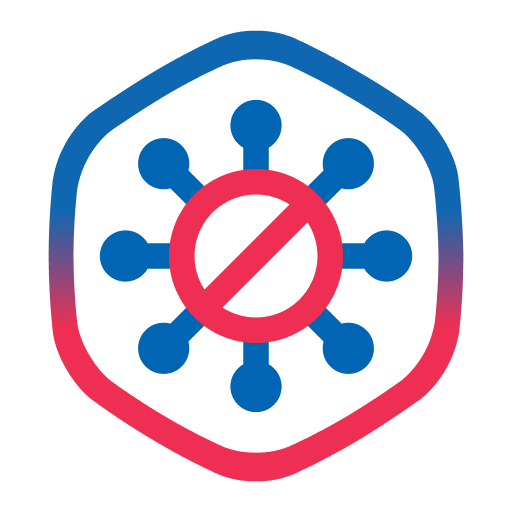 | Госуслуги СТОП Коронавирус
|  | CoronaSTOP
|  | Contact Tracker
|  | Карта жителя НО
|  | Кыргыз Консул
|  | ЯОК – контролируйте свое здоровье
|  | Электронная регистратура
|  | Госуслуги.COVID трекер

The details of our analysis are presented in the remainder of this report.

For independent verification, the raw data and the source code of the project is publicly available in its GitHub repository [http://github.com/covid-apps-observer](http://github.com/covid-apps-observer) and its source code has been thoroughly commented in order to provide all the details about how the information provided in this report has been extracted. 

Any feedback, questions, and improvements about the project are very welcome, feel free to create an issue or pull request directly in its GitHub repository: [http://github.com/covid-apps-observer](http://github.com/covid-apps-observer).

## Data sources and analyses

The analysis of each app is structured around five main dimensions: 
* App metadata  
* Requested permissions
* Mentioned servers
* Androwarn analysis
* User ratings and reviews

In the following we describe the data sources and analysis performed for each dimension.

### App metadata

App metadata includes an overview of the main information about the app (for example, its name, releases, privacy policy, etc.), contact information of the development team, and the various Android versions supported by the app. This information is extracted from two main data sources:
* _Google Play store_: we automatically mined the web page of the Google Play store showing the basic information about the app and we parsed it in order to extract information about the app and development team 
* _Android Manifest file_: in our analysis we decompiled the binary file of the app (it is similar to a Zip archive but it contains the code of the app instead of normal files) and we extracted information about the supported Android versions, as it has been listed by its development team.

The extracted app metadata feeds the _App overview_, _Development team_, and _Android support_ sections of this report.
We make use of the [google-play-scraper](https://github.com/JoMingyu/google-play-scraper) tool for extracting the raw data related to this dimension of the project.

### Requested permissions

The Android operating system has a permission model which allows users to grant access to potentially privacy-related information. Every Android app has to explictly declare the permissions it needs to properly function in the Android Manifest file.  

In this report we also show the protection level of each permission, which is a key information for understanding how the requested permissions related to the user's privacy. We carefully analyzed the [official Android documentation (v. 29)](https://developer.android.com/reference/android/Manifest.permission), and it resulted that a permission requested by an Android app can belong to the following protection levels:
* **Dangerous**: higher-risk permissions that would give a requesting app access to private user data or control over the device that can negatively impact the user. Because this type of permission introduces potential risk, the system usually does not automatically grant it to the requesting app. For example, any dangerous permissions requested by an app may be displayed to the user and require confirmation before proceeding.
* **Normal**: this is the default and most common level in Android; normal permissions are lower-risk and give access to isolated app-level features, with minimal risk to other apps, the system, or the user. 
* **Signature**: permissions granted only if the requesting app is signed with the same certificate as the app that declared the permission
* **Appop**: old permission level, a reminiscence of the App Ops tool that Google introduced in Android 4.3.
* **Development**: optional permissions which can be granted to development-oriented apps.
* **Privileged**: permissions who give higher power to mobile apps w.r.t. other apps, such as binding to incoming calls, interacting via bluetooth with other devices without user interaction, etc.
* **Preinstalled**: reserved only for preinstalled apps
* **Installer**: allow the holder to start the permission usage screen for an app
* **RetailDemo**: permissions related to devices used in demonstrations in shops.
* **Pre23**: permissions automatically granted to apps targeting devices running pre-6.0 Android.
* **Upcoming**: permissions which will be released in the next version of the Android platform. 
* **Deprecated**: permissions belonging to old releases of the Android platform, they should not be used by developers since they will not be supported in the near future.
* **Not for use by third-party applications**: permissions which can be requested only by apps developed by Google.
* **Undefined**: this protection level is not documented by Google.

The permissions dimension of this project is based on the [Androguard](https://github.com/androguard/androguard) static analysis tool.

### Mentioned servers

We decompiled each app in order to look for all possible mentions of remote URLs. The mentioned URLs can refer to remote servers the the app is using for either sending or receiving information, web addresses for directing the user to an information website, and so on. 

:warning: It is important to note that this analysis is not meant to be complete and it is very prone to obfuscation. The servers reported here are simply _mentioned_ somewhere in the code of the app and are meant to just give an indication about the "hooks" of the app towards external resources. For example, for an Android app it is normal to contact Google services in order to send/receive push notifications, or to contact the servers of analytics services for having real-time diagnostics about crashes of the app or bugs.

This part of the analysis is based on the [Androguard](https://github.com/androguard/androguard) static analysis tool for identfying the raw URLs mentioned in the app; then, the information about each mentioned server is collected by performing a _whois_ lookup on the first-level domain present in the URL.

### Security analysis

This dimension is based on the [Androwarn](https://github.com/maaaaz/androwarn) structural and data flow analysis of Android bytecode. Androwarn is developed by the University of Lyon/INSA (France) and it has been used in several academic studies. According to its documentation, Androwarn targets the following categories of potential security issues:
* **Telephony identifiers exfiltration**: IMEI, IMSI, MCC, MNC, LAC, CID, operator's name, etc.
* **Device settings exfiltration**: software version, usage statistics, system settings, logs, etc.
* **Geolocation information leakage**: GPS/WiFi geolocation, etc.
* **Connection interfaces information exfiltration**: WiFi credentials, Bluetooth MAC adress, etc.
* **Telephony services abuse**: premium SMS sending, phone call composition, etc.
* **Audio/video flow interception**: call recording, video capture, etc.
* **Remote connection establishment**: socket open call, Bluetooth pairing, APN settings edit, etc.
* **PIM data leakage**: contacts, calendar, SMS, mails, clipboard, etc.
* **External memory operations**: file access on SD card, etc.
* **PIM data modification**: add/delete contacts, calendar events, etc.
* **Arbitrary code execution**: native code using JNI, UNIX command, privilege escalation, etc.
* **Denial of Service**: event notification deactivation, file deletion, process killing, virtual keyboard disable, terminal shutdown/reboot, etc.

Note: We do not consider this data point in the current version of our analyzers since it is too verbose for our purposes.

:warning: It is important to note that Androwarn is a static analysis tool, and as such it performs a variety of heuristics and approximations in its analyses. Said that, the results shown in this report are meant to provide an indication of _potential_ security issues and should be by no means treated as complete and correct.   

### User ratings and reviews

For this dimension we turn again to the web interface of the Google Play store. Firstly, we automatically mine summary statistics about user ratings from the web page of the app under analysis; then, we automatically download the newest 1000 reviews of the app under analysis. For each level of rating (5 stars, 4 stars, , etc., 1 star) we show:
- a word cloud presenting the main terms used by end users in their reviews in the Google Play store
- the last 10 reviews provided by app users in the Google Play store. 

This purposefully simple analysis is meant to help both future users and the development team of the app in understanding what are the main positive and negative points of the app under analysis.

We make use of the [google-play-scraper](https://github.com/JoMingyu/google-play-scraper) tool for extracting the raw data related to this dimension of the project.

## Disclaimer 

This report has been produced independently of any parties and its only objective is to help anybody in better understanding how COVID-related apps work in practice (and compare to each other). The results of this report are limited to the specific version of the software used for running the analyses and on the various heuristics implemented in there. In other words, the results of the analyzers may differ depending on the time and modalities in which they are executed. We do not guarantee that the results of the analyses and the corresponding contents of this report are fully complete or correct. The analysis software is licensed under the [MIT License](https://github.com/iivanoo/covid-apps-observer/blob/master/LICENSE).

# Госуслуги Москвы
App version ``3.14.1.7``

Analyzed with [covid-apps-observer](http://github.com/covid-apps-observer) project, version ``0.1``

## App overview
| | |
|-------------------------|-------------------------| 
| **Name**&nbsp;&nbsp;&nbsp;&nbsp;&nbsp;&nbsp;&nbsp;&nbsp;&nbsp;&nbsp;&nbsp;&nbsp;&nbsp;&nbsp;&nbsp;&nbsp;&nbsp;&nbsp;&nbsp;&nbsp;&nbsp;&nbsp;&nbsp;&nbsp;&nbsp;&nbsp;&nbsp;&nbsp;&nbsp;&nbsp;&nbsp;&nbsp;&nbsp;&nbsp;&nbsp;&nbsp;&nbsp;&nbsp;&nbsp;&nbsp;  | Госуслуги Москвы |
| **Unique identifier** | ru.altarix.mos.pgu |
| **Link to Google Play** | [https://play.google.com/store/apps/details?id=ru.altarix.mos.pgu](https://play.google.com/store/apps/details?id=ru.altarix.mos.pgu) |
| **Summary**  | Все электронные услуги города: начисления ЖКХ, штрафы ГИБДД, эвакуация ТС и др. |
| **Privacy policy** | [https://mosapps.mos.ru/privacypolicy_gu/](https://mosapps.mos.ru/privacypolicy_gu/) |
| **Latest version** | 3.14.1.7 |
| **Last update** | 2021-06-23 20:14:11 |
| **Recent changes** | - Добавлен раздел проверки цифрового сертификата (QR-кода) |
| **Installs**  | 1 000 000+ |
| **Category** | Социальные |
| **First release** | 27 сент. 2012 г. |
| **Size**  | 21M |
| **Supported Android version**  | 6.0 и выше |

### Description
> Мобильное приложение «Госуслуги Москвы» - сервис, объединяющий востребованные услуги Правительства Москвы, для комфортной жизни в большом городе.
 Образование:
 - Сервис «Мой ребенок в школе» дает возможность удаленно отслеживать проход и питание учащегося, школьное меню и баланс лицевого счета, который в любой момент можно пополнить с банковской карты/мобильного счета; 
 - Сервис «Электронный дневник» объединяет в себе самую важную для родителей информацию об учебе: расписание уроков, домашние задание, оценки учащегося и т.д.; 
 - Сервис «Результаты ГИА» - мобильная площадка с результатами прохождения Государственной итоговой аттестации.
 Жилье, ЖКУ:
 - Сервис «Начисления за жилищно-коммунальные услуги» предоставляет развернутую информацию о долговых/текущих начислениях за ЖКУ с возможностью заказать электронный Единый платежный документ; 
 - Сервис «Внесение показаний» - возможность передачи показаний счетчиков водоснабжения/электроэнергии, а также получения информации о задолженности без очередей и отрыва от важных дел; 
 - Сервис «Единый диспетчерский центр» – компактная площадка для решения проблем и вопросов, относящихся к вашему дому/двору;
 - Сервис «Информирование о начале расчетов по новой услуге»;
 - Сервис «Информирование о регистрации на жилплощади»;
 - Сервис «Информирование об отключении горячего водоснабжения».
 Транспорт:
 - Сервис «Штрафы» дает возможность получать актуальную информацию по вашим штрафам и оплачивать с мобильного; 
 - Сервис «Эвакуация транспортного средства» информирует об эвакуации ТС, а также предоставляет точный адрес местонахождения ТС на спецстоянке.
 Здоровье и документы:
 - Сервис «Запись к врачу» предоставляет возможность удаленно записаться на прием к любому врачу, перенести и отменить запись, посмотреть перечень направлений и выписанные вам рецепты; 
 - Сервис «Запись к ветеринару» предоставляет возможность записать своего питомца на прием в ветеринарную клинику (перенести, отменить запись) или вызвать ветеринара на дом;
 - Сервис «Готовность загранпаспорта» - индивидуальное информирование о готовности заграничного паспорта;
 - Сервис «Федеральная служба судебных приставов» предоставляет информацию о наличии исполнительных делопроизводств ФССП.
 Информация:
 - Сервис «Новости» объединяет в себе самые актуальные и интересные новости города в удобном мобильном формате.
 По желанию вы можете настроить способ получения уведомлений: SMS, E-mail или Push-уведомления.
 ___________________________________
 Обратите внимание на другие официальные приложения правительства Москвы.
 - Активный Гражданин - проект для тех, кому важно, что происходит в Москве
 - Наш город – помогите нам сделать город лучше
 - Парковки Москвы – приложение для поиска и оплаты парковки в Москве
 - Узнай Москву - архитектурная история столицы).

### User interface
The developers of the app provide the following screenshots in the Google play store.
| | | |
|:-------------------------:|:-------------------------:|:-------------------------:|
 | 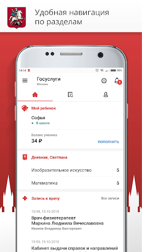  | 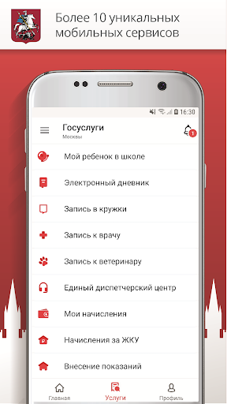  | 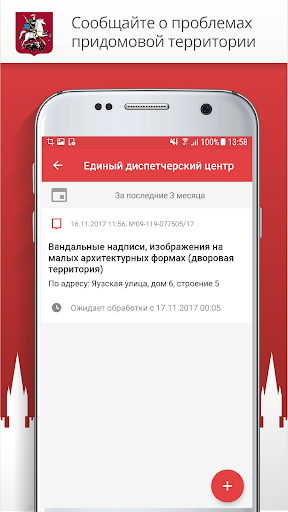  | 
 | 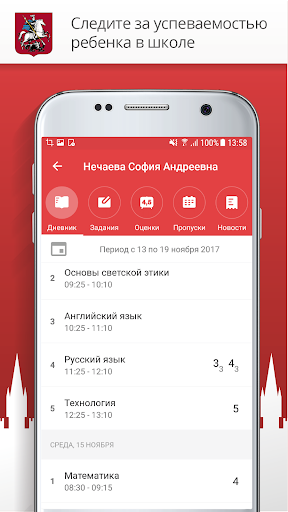  | 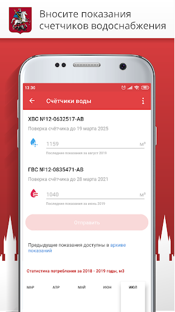 

## Development team
In the following we report the main information provided by the development team in the Google play store.

| | |
|-------------------------|-------------------------|
| **Developer**  | Информационный город ГКУ |
| **Website**  | [https://www.mos.ru/mosapps/](https://www.mos.ru/mosapps/) |
| **Email** | emp@mos.ru |
| **Physical address**  | - |
| **Other developed apps**  | [https://play.google.com/store/apps/developer?id=%D0%98%D0%BD%D1%84%D0%BE%D1%80%D0%BC%D0%B0%D1%86%D0%B8%D0%BE%D0%BD%D0%BD%D1%8B%D0%B9+%D0%B3%D0%BE%D1%80%D0%BE%D0%B4+%D0%93%D0%9A%D0%A3](https://play.google.com/store/apps/developer?id=%D0%98%D0%BD%D1%84%D0%BE%D1%80%D0%BC%D0%B0%D1%86%D0%B8%D0%BE%D0%BD%D0%BD%D1%8B%D0%B9+%D0%B3%D0%BE%D1%80%D0%BE%D0%B4+%D0%93%D0%9A%D0%A3) |

## Android support

| | |
|-------------------------|-------------------------|
| **Declared target Android version**  | Android10, version 10 (API level 29) |
| **Effective target Android version**  | Android10, version 10 (API level 29) |
| **Minimum supported Android version**  | Marshmallow, version 6.0 (API level 23) |
| **Maximum target Android version**  | - |

The larger the difference between the minimum and maximum supported Android versions, the better. A larger difference means a wider audience. For example, old phones have a very low Android version, so a high minimum supported Android version means that the app cannot be used by users with old phones, thus leading to accessibility problems. 

## Requested permissions

In the following we report the complete list of the permissions requested by the app. 

| **Permission** | **Protection level** | **Description** | 
|-------------------------|-------------------------|-------------------------|
 **android.permission ACCESS_COARSE_LOCATION** | :warning:**Dangerous** | Allows an app to access approximate location. 
 **android.permission ACCESS_FINE_LOCATION** | :warning:**Dangerous** | Allows an app to access precise location. 
 **android.permission ACCESS_NETWORK_STATE** | Normal | Allows applications to access information about networks. 
 **android.permission ACCESS_WIFI_STATE** | Normal | Allows applications to access information about Wi-Fi networks. 
 **android.permission CALL_PHONE** | :warning:**Dangerous** | Allows an application to initiate a phone call without going through the Dialer user interface for the user to confirm the call. 
 **android.permission CAMERA** | :warning:**Dangerous** | Required to be able to access the camera device. 
 **android.permission INTERNET** | Normal | Allows applications to open network sockets. 
 **android.permission READ_CALENDAR** | :warning:**Dangerous** | Allows an application to read the user's calendar data. 
 **android.permission READ_CONTACTS** | :warning:**Dangerous** | Allows an application to read the user's contacts data. 
 **android.permission READ_EXTERNAL_STORAGE** | :warning:**Dangerous** | Allows an application to read from external storage. 
 **android.permission USE_BIOMETRIC** | Normal | Allows an app to use device supported biometric modalities. 
 **android.permission USE_FINGERPRINT** | Normal | This constant was deprecated in API level 28. Applications should request USE_BIOMETRIC instead 
 **android.permission VIBRATE** | Normal | Allows access to the vibrator. 
 **android.permission WAKE_LOCK** | Normal | Allows using PowerManager WakeLocks to keep processor from sleeping or screen from dimming. 
 **android.permission WRITE_CALENDAR** | :warning:**Dangerous** | Allows an application to write the user's calendar data. 
 **android.permission WRITE_EXTERNAL_STORAGE** | :warning:**Dangerous** | Allows an application to write to external storage. 
 **com.google.android.c2dm.permission RECEIVE** | - | - 
 **com.google.android.finsky.permission BIND_GET_INSTALL_REFERRER_SERVICE** | - | - 

## Mentioned servers

| **Server** | **Registrant** | **Registrant country** | **Creation date** | 
|-------------------------|-------------------------|-------------------------|-------------------------|
 | openstreetmap.org | OpenStreetMap Foundation | GB | 2004-08-09 18:47:25 |
 | wikimedia.org | Wikimedia Foundation, Inc. | :us: US | 2003-03-16 08:22:47 |
 | openptmap.org | Registrant State/Province: Bayern | :de: DE | 2010-11-17 12:05:24 |
 | cloudmade.com | Cloud Made Ltd | GB | 2007-07-17 17:02:27 |
 | openstreetmap.nl | - | - | 2007-03-06 00:00:00 |
 | wmflabs.org | Wikimedia Foundation, Inc. | :us: US | 2011-09-29 14:58:28 |
 | openseamap.org | Registrant State/Province: | :de: DE | 2009-03-26 11:35:19 |
 | chartbundle.com | Whois Privacy Service | :us: US | 2010-01-09 23:30:15 |
 | opentopomap.org | Registrant State/Province: | :de: DE | 2011-09-03 18:35:13 |
 | google.com | Google LLC | :us: US | 1997-09-15 04:00:00 |
 | 2gis.ru | - | - | 2001-02-18 21:00:00 |
 | googleapis.com | Google LLC | :us: US | 2005-01-25 17:52:26 |
 | app-measurement.com | Google LLC | :us: US | 2015-06-19 20:13:31 |
 | googlesyndication.com | Google LLC | :us: US | 2003-01-21 06:17:24 |
 | crashlytics.com | Google LLC | :us: US | 2011-01-21 15:30:40 |
 | mos.ru | - | - | 1996-12-23 09:49:03 |
 | googleadservices.com | Google LLC | :us: US | 2003-06-19 16:34:53 |
 | w3.org | W3C | :us: US | 1994-07-06 04:00:00 |
 | huawei.com | Huawei Technologies Co., Ltd. | :china: CN | 2000-01-11 13:37:24 |
 | mts.ru | - | - | 1997-11-19 12:02:34 |
 | 2gis.com | DoubleGIS LLC | :ru: RU | 2004-03-18 08:51:04 |

## Security analysis 

Below we report the main security warnings raised by our execution of the [Androwarn](https://github.com/maaaaz/androwarn) security analysis tool.

**Location lookup**
> - This application reads location information from all available providers (WiFi, GPS etc.) 

**Connection interfaces exfiltration**
> - This application reads details about the currently active data network 
> - This application tries to find out if the currently active data network is metered 

**Telephony services abuse**
> - This application makes phone calls 

**Suspicious connection establishment**
> - This application opens a Socket and connects it to the remote address ' returned no addresses for  ; port is out of range' on the 'N/A' port  
> - This application opens a Socket and connects it to the remote address '' on the 'N/A' port  
> - This application opens a Socket and connects it to the remote address 'Ljava/net/Proxy;->type()Ljava/net/Proxy$Type;' on the 'N/A' port  
> - This application opens a Socket and connects it to the remote address 'timeout' on the 'N/A' port  

**Code execution**
> - This application loads a native library 

## User ratings and reviews

Below we provide information about how end users are reacting to the app in terms of ratings and reviews in the Google Play store.

### Ratings

The Госуслуги Москвы app has been installed by more than **1000000** times. At this time, **63427** rated the app and its average score is **3.820731**. Below we show the distribution of the ratings across the usual star-based rating of Google Play

:star::star::star::star::star:: 38339

:star::star::star::star:: 5185

:star::star::star:: 3247

:star::star:: 3507

:star:: 13149

### Reviews 

#### 5-star reviews

> Удобно. Качественно. Понятно. Современно.  :date: __2021-07-19 08:18:02__

> Все услуги под рукой! Очень удобно!  :date: __2021-07-19 07:58:38__

> 4й день невозможно внести показания электросчетчика. Услуга не доступна. Попробуйте позже. Когда сделаете??  :date: __2021-07-19 06:01:30__

> 👍  :date: __2021-07-18 21:10:37__

> Отлично.  :date: __2021-07-18 05:39:55__

> Нравится . Очень удобно - danke schon!  :date: __2021-07-17 15:48:25__

> Пока нет замечания по программе .  :date: __2021-07-17 11:52:51__

> Работает  :date: __2021-07-17 03:33:24__

> Всё хорошо  :date: __2021-07-16 20:57:23__

> Удобно.  :date: __2021-07-16 19:36:28__

#### 4-star reviews

> Очень удобно и доступно в пользовании в любом возрасте.  :date: __2021-07-19 07:16:10__

> Сложно войти в электронную медицинскую карту...  :date: __2021-07-17 10:36:22__

> Нормально  :date: __2021-07-16 20:22:12__

> Было бы здорово, чтобы талоны предварительеой записи на получение услуг сохранялись автоматически и отражались в уведомлениях.  :date: __2021-07-15 12:38:01__

> Значительно улучшилась стабильность и функционал.  :date: __2021-07-14 11:49:56__

> Удобное приложение, но записаться на приём, например, к профильному специалисту (зубной врач), как правило невозможно, когда как через ЕМИАС возможно  :date: __2021-07-11 17:39:30__

> Иногда "чудит"... Вы хоть оповещайте иногда, если, что меняется. Не всегда торчишь в Вашем приложении. Спасибо!  :date: __2021-07-09 20:37:06__

> Хорошее приложение, но плохо что бывают несостыковки  :date: __2021-07-08 11:19:19__

> Пока приложение устраивает .  :date: __2021-07-07 05:45:45__

> Запись к врачу ,часто нет возможности записаться!пишет ,,ошибка,,  :date: __2021-07-06 09:02:20__

#### 3-star reviews

> Последнее время приложение работает не стабильно , сервисы не доступны , не работает  :date: __2021-07-19 13:53:48__

> Обновила приложение. И все данные пропали. Записи к врачу, данные о квартире. Почему, должна заново все записывать????  :date: __2021-07-17 12:24:52__

> Вечно нельзя записаться к врачу, звонишь в поликлинику всегда есть свободные врачи. Если бы не электронной дневник давно бы удалила приложение  :date: __2021-07-17 10:19:57__

> В последнее время постоянно при любых операциях при записи ко врачу "Ошибка. Сервис не доступен". Грузит каждый раздел очень долго и снова ошибка. Жуть просто. 20.05. Перестали приходить коды смс для входа в мед.книжку. Ну не можете реализовать, так не надо по смс доступ делать. Логина с паролем от мос.ру вам мало что ли.  :date: __2021-07-13 14:06:35__

> В приложении многие данные надо вводить в ручную, даже если они уже внесены в личный кабинет. Это очень не удобно. Двойная работа. У всех магазинов под одним логином все отображается, а у " такой продвинутой" системы как каменный век  :date: __2021-07-11 14:06:30__

> Не работает подключение карты говорят что работает в тестовом режиме заработает только в сентябре  :date: __2021-07-11 13:11:46__

> Добавьте QR—код полиса для записи на терминале. Не всегда полис с собой, нет возможности записаться на портале на процедуры (анализы крови и т.д).  :date: __2021-07-10 15:46:20__

> Как найти Q код по вакцинации от короновируса  :date: __2021-07-06 12:44:07__

> Взяли и убрали из приложения возможность сделать заявку диспетчеру управляющей компании. Им так удобнее (от людей прятаться), а на мнение людей, мягко говоря, напл...ать. Впрочем - это как обычно, по барски. Увы.  :date: __2021-07-04 13:19:06__

> Все хорошо, но с июня невозможно зайти в эл.медкарту. Обновление приложения тоже не помогло(( Если изменится, то повышу оценку до 5 звёзд.  :date: __2021-07-03 06:33:54__

#### 2-star reviews

> Постоянно висит рекомендация обновить приложение, т.к. используется старая версия. Странно. Давно все обновил  :date: __2021-07-14 05:16:48__

> Приложение некорректно отображает информацию: о штрафах ГИБДД - штраф оплаченный более года назад висит как неоплаченный, новый не отображается; о сведениях об оплате ЖКХ - приложение и портал не смогли договориться: в приложении статус оплачено, на портале нет. Функционал урезанный, например, нельзя распечатать талон к врачу, интерфейс архаичный и запутанный, логика в его архитектуре отсутствует. ЛК ЕМИАС вообще песня: полностью отсутствуют данные о прививках, выписке из стационара, больничных  :date: __2021-07-13 06:15:44__

> Часто бывают сбои.  :date: __2021-06-30 07:36:23__

> Нельзя отметить оьсутствие ребенка в школе. Нельзя вызвать врача на дом. Не видно направления на анализы.  :date: __2021-06-29 20:05:14__

> Выставляют счет за ЖКУ, а от какой организации и за что, нет пояснения. Нет объяснения про холодную воду и графы холодная вода. Нет ни какого пояснения об отоплении. Сколько и за что начислено. И пояснения что это за отопления. Нет выбора оплаты отопления. За год или пол года.  :date: __2021-06-28 14:37:11__

> Исправьте работу приложения при активации "темной"темы на телефоне. Не видно номера соцккрты и по.  :date: __2021-06-27 10:03:25__

> Работает чере пень-колоду! То серверы какие-то недоступны, то войти не могу - выкидывает на страницу "403 бла-бла... пройдите идентификацию... бла-бла-бла" А самое для меня неудобное это невозможность выходить из одного аккаунта и входить в другой, потому что мы пользуемся иногда с супругой своими смартфонами поочереди. Приходится удалять и ставить приложение снова. Добавьте кнопку в личном кабине "выйти из аккаунта"  :date: __2021-06-27 08:19:44__

> Не могу попасть в раздел для прикрепления к ЛПУ. Ввод данных корректен. В чём дело?  :date: __2021-06-26 19:48:33__

> Не смог отправить заявку, пишет не смог подключиться к серверу.  :date: __2021-06-25 07:14:11__

> Направления на анализы ребенку появляются только в десктоп версии но не на компьютере. Направления к специалистам отображаются нормально  :date: __2021-06-24 14:59:10__

#### 1-star reviews

> Бесполезное приложение. У меня не работает. К врачу не записаться, в единый диспетчерский центр заявку не оставить. Остальное меня не интересует. Оставляла заявку на некорректную работу приложения, просто закрыли и ничего не исправили. Удаляю.  :date: __2021-07-17 18:31:50__

> Приложение как из каменного века. Просто позорище. Подать заявку в диспетчерский центр теперь невозможно, приходится звонить. Удаляю...  :date: __2021-07-17 10:15:28__

> Бесполезное приложение, которое не даёт никакой информации об оплате ЖКУ. Постоянно виснет.  :date: __2021-07-16 10:35:49__

> 1)На услуги нет ответов, жду ответа больше месяца 2)тех. Поддержка спит  :date: __2021-07-15 10:19:05__

> Совсем сырые программы. Не могли в пятером зарегистрироваться на вашем портале. Успешно прошли проверку пфр и мвд , но сайт госуслуг не пускал в личный кабинет. То пароль не тот, то логин, то вообще написал что нет такой учетной записи. А сейчас я повторно ввела свой снилс и сайт сказал что не верно, я тут же перепроверила номер. Введен правильно, а ваша программа тупая.  :date: __2021-07-14 23:20:49__

> Невозможно с мобильного приложения заказать замену социальную карту учащегося плохо  :date: __2021-07-11 12:27:56__

> Невозможно оплатить, обратитесть в еирц… счет при этом выставлен… электронную платежку не посмотреть–сервер видете ли недрступен. Сервера чинить надо и обновлять господа!  :date: __2021-07-11 07:40:12__

> Приложение хоть кто-то редактирует, обновляет? Несколько попыток записаться в мфц не увенчались успехом. В списке просто нет таких услуг, адреса мфц не выдает. На сайте запись норм. Зачем тогда приложение?  :date: __2021-07-08 19:03:13__

> Много переходов  :date: __2021-07-08 14:12:29__

> Абсолютно глюченное приложение, даже одной звезды слишком много, я бы поставил минус5. По-моему у разраба вместо головы капуста. Это просто позорище, а не приложение!!!  :date: __2021-07-08 10:46:19__

# Моя Москва — официальное приложение портала mos.ru
App version ``2.4``

Analyzed with [covid-apps-observer](http://github.com/covid-apps-observer) project, version ``0.1``

## App overview
| | |
|-------------------------|-------------------------| 
| **Name**&nbsp;&nbsp;&nbsp;&nbsp;&nbsp;&nbsp;&nbsp;&nbsp;&nbsp;&nbsp;&nbsp;&nbsp;&nbsp;&nbsp;&nbsp;&nbsp;&nbsp;&nbsp;&nbsp;&nbsp;&nbsp;&nbsp;&nbsp;&nbsp;&nbsp;&nbsp;&nbsp;&nbsp;&nbsp;&nbsp;&nbsp;&nbsp;&nbsp;&nbsp;&nbsp;&nbsp;&nbsp;&nbsp;&nbsp;&nbsp;  | Моя Москва — официальное приложение портала mos.ru |
| **Unique identifier** | ru.mos.app |
| **Link to Google Play** | [https://play.google.com/store/apps/details?id=ru.mos.app](https://play.google.com/store/apps/details?id=ru.mos.app) |
| **Summary**  | Запись к врачу, проверка цифрового сертификата, оплата штрафов и другие сервисы. |
| **Privacy policy** | [https://mosapps.mos.ru/privacypolicy/](https://mosapps.mos.ru/privacypolicy/) |
| **Latest version** | 2.4 |
| **Last update** | 2021-06-25 12:00:01 |
| **Recent changes** | В разделе «Услуги» добавили возможность проверки цифрового сертификата (QR-кода) |
| **Installs**  | 1 000 000+ |
| **Category** | Социальные |
| **First release** | 27 дек. 2018 г. |
| **Size**  | 91M |
| **Supported Android version**  | 5.0 и выше |

### Description
> Пользуйтесь главными сервисами mos.ru, читайте новости города и задавайте вопросы операторам городского контакт-центра в одном приложении. Достаточно ввести ваши данные для входа на портал mos.ru и вам откроются все возможности чат-бота «Моя Москва».
 Здесь мы собрали самые частые госуслуги, которыми пользуются москвичи. И упростили процесс получения — все вопросы решает быстрый чат-бот. Откройте диалог в нужном разделе:
 – Мой дом: подать показания счётчиков воды, узнать, когда нужно провести поверку счётчиков, получить счета за ЖКУ. Сохраните в приложении 10-значный номер плательщика (указан на вашем ЕПД) и вам будет доступна оплата ЖКХ.
 – Дети в школе: пользоваться сервисами «Москвёнок» и «Электронный дневник» в одном приложении. Проверить, когда ребенок пришёл в школу, какие оценки получил и что купил на обед, можно за пару минут, спросив у бота.
 – Здоровье: записаться на приём в поликлинику, перенести или отменить запись к врачу теперь можно онлайн в удобном чате. Только скажите боту номер полиса ОМС.
 – Транспорт: проверить и оплатить штрафы ГИБДД онлайн по номеру, узнать историю своего автомобиля. По вашей просьбе бот пришлёт уведомление об эвакуации машины и новых штрафах. Понадобятся номер водительских прав, СТС, VIN и госномер автомобиля.
 – Контакт-центр: операторы круглосуточно готовы помочь вам в решении вопросов, связанных с получением государственных услуг и работой приложения «Моя Москва».
 – Новости города: узнать за пару минут всё самое важное, что происходит в Москве и в вашем районе.
 – Мой район: изучать ваш район - читать об уникальных фактах, искать ближайшие парки и школы, детские и спортивные площадки, узнавать о планах его развития.
 «Моя Москва» — чат-бот, который помогает москвичам получить самые популярные госуслуги. Часть из них доступна без авторизации. Но советуем зарегистрироваться, чтобы бот знал ваши данные и мог напоминать о важных платежах или записи к врачу.
 Правительство Москвы также разработало отдельные приложения для тех, кто ищет или хочет оплатить парковку («Парковки Москвы»), участвовать в принятии важных городских решений («Активный Гражданин»), замечать недочеты в устройстве ЖКХ («Наш город»).

### User interface
The developers of the app provide the following screenshots in the Google play store.
| | | |
|:-------------------------:|:-------------------------:|:-------------------------:|
 | 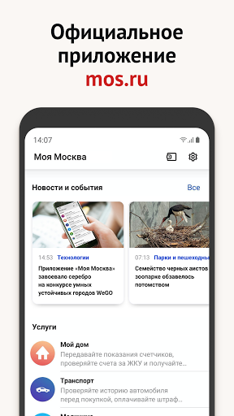  | 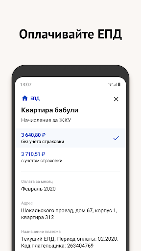  | 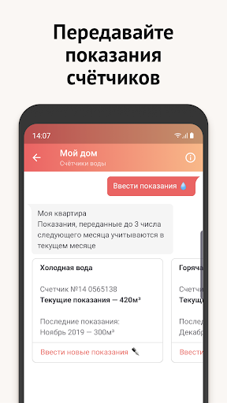  | 
 | 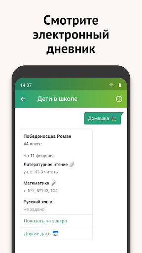  |   |   | 
 | 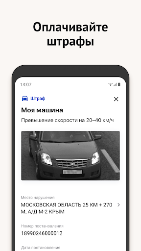  | 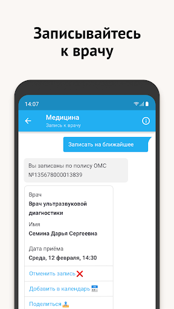 

## Development team
In the following we report the main information provided by the development team in the Google play store.

| | |
|-------------------------|-------------------------|
| **Developer**  | Информационный город ГКУ |
| **Website**  | [https://www.mos.ru/mobile/](https://www.mos.ru/mobile/) |
| **Email** | mobile@mos.ru |
| **Physical address**  | - |
| **Other developed apps**  | [https://play.google.com/store/apps/developer?id=%D0%98%D0%BD%D1%84%D0%BE%D1%80%D0%BC%D0%B0%D1%86%D0%B8%D0%BE%D0%BD%D0%BD%D1%8B%D0%B9+%D0%B3%D0%BE%D1%80%D0%BE%D0%B4+%D0%93%D0%9A%D0%A3](https://play.google.com/store/apps/developer?id=%D0%98%D0%BD%D1%84%D0%BE%D1%80%D0%BC%D0%B0%D1%86%D0%B8%D0%BE%D0%BD%D0%BD%D1%8B%D0%B9+%D0%B3%D0%BE%D1%80%D0%BE%D0%B4+%D0%93%D0%9A%D0%A3) |

## Android support

| | |
|-------------------------|-------------------------|
| **Declared target Android version**  | Android10, version 10 (API level 29) |
| **Effective target Android version**  | Android10, version 10 (API level 29) |
| **Minimum supported Android version**  | Lollipop, version 5.0 (API level 21) |
| **Maximum target Android version**  | - |

The larger the difference between the minimum and maximum supported Android versions, the better. A larger difference means a wider audience. For example, old phones have a very low Android version, so a high minimum supported Android version means that the app cannot be used by users with old phones, thus leading to accessibility problems. 

## Requested permissions

In the following we report the complete list of the permissions requested by the app. 

| **Permission** | **Protection level** | **Description** | 
|-------------------------|-------------------------|-------------------------|
 **android.permission ACCESS_COARSE_LOCATION** | :warning:**Dangerous** | Allows an app to access approximate location. 
 **android.permission ACCESS_FINE_LOCATION** | :warning:**Dangerous** | Allows an app to access precise location. 
 **android.permission ACCESS_NETWORK_STATE** | Normal | Allows applications to access information about networks. 
 **android.permission ACCESS_WIFI_STATE** | Normal | Allows applications to access information about Wi-Fi networks. 
 **android.permission CAMERA** | :warning:**Dangerous** | Required to be able to access the camera device. 
 **android.permission CHANGE_WIFI_STATE** | Normal | Allows applications to change Wi-Fi connectivity state. 
 **android.permission FOREGROUND_SERVICE** | Normal | Allows a regular application to use Service.startForeground. 
 **android.permission INTERNET** | Normal | Allows applications to open network sockets. 
 **android.permission READ_EXTERNAL_STORAGE** | :warning:**Dangerous** | Allows an application to read from external storage. 
 **android.permission RECEIVE_BOOT_COMPLETED** | Normal | Allows an application to receive the Intent.ACTION_BOOT_COMPLETED that is broadcast after the system finishes booting. 
 **android.permission RECORD_AUDIO** | :warning:**Dangerous** | Allows an application to record audio. 
 **android.permission USE_BIOMETRIC** | Normal | Allows an app to use device supported biometric modalities. 
 **android.permission USE_FINGERPRINT** | Normal | This constant was deprecated in API level 28. Applications should request USE_BIOMETRIC instead 
 **android.permission VIBRATE** | Normal | Allows access to the vibrator. 
 **android.permission WAKE_LOCK** | Normal | Allows using PowerManager WakeLocks to keep processor from sleeping or screen from dimming. 
 **android.permission WRITE_CALENDAR** | :warning:**Dangerous** | Allows an application to write the user's calendar data. 
 **android.permission WRITE_EXTERNAL_STORAGE** | :warning:**Dangerous** | Allows an application to write to external storage. 
 **com.google.android.c2dm.permission RECEIVE** | - | - 
 **com.google.android.finsky.permission BIND_GET_INSTALL_REFERRER_SERVICE** | - | - 
 **ndroid.permission MANAGE_FINGERPRINT** | - | - 

## Mentioned servers

| **Server** | **Registrant** | **Registrant country** | **Creation date** | 
|-------------------------|-------------------------|-------------------------|-------------------------|
 | w3.org | W3C | :us: US | 1994-07-06 04:00:00 |
 | xml.org | OASIS Open | :us: US | 1997-02-03 05:00:00 |
 | xmlpull.org | Privacy service provided by Withheld for Privacy ehf | :iceland: IS | 2001-11-26 20:33:08 |
 | google.com | Google LLC | :us: US | 1997-09-15 04:00:00 |
 | app-measurement.com | Google LLC | :us: US | 2015-06-19 20:13:31 |
 | googlesyndication.com | Google LLC | :us: US | 2003-01-21 06:17:24 |
 | crashlytics.com | Google LLC | :us: US | 2011-01-21 15:30:40 |
 | googleadservices.com | Google LLC | :us: US | 2003-06-19 16:34:53 |
 | yandex.ru | - | - | 1997-09-23 09:45:07 |
 | yandexadexchange.net | - | :ru: RU | 2014-02-18 12:48:07 |
 | intervale.ru | - | - | 2001-04-09 20:00:00 |
 | mts.ru | - | - | 1997-11-19 12:02:34 |
 | mos.ru | - | - | 1996-12-23 09:49:03 |
 | atsaero.ru | - | - | 2014-09-26 07:17:38 |
 | yandex.com | - | :switzerland: CH | 1998-09-24 04:00:00 |
 | yandex.net | - | :ru: RU | 2000-11-14 06:56:55 |
 | mgfoms.ru | - | - | 2002-12-22 21:00:00 |

## Security analysis 

Below we report the main security warnings raised by our execution of the [Androwarn](https://github.com/maaaaz/androwarn) security analysis tool.

**Telephony identifiers leakage**
> - This application reads the MCC+MNC of the provider of the SIM 
> - This application reads the Service Provider Name (SPN) 
> - This application reads the constant indicating the state of the device SIM card 
> - This application reads the current location of the device 
> - This application reads the neighboring cell information of the device 
> - This application reads the numeric name (MCC+MNC) of current registered operator 
> - This application reads the operator name 
> - This application reads the phone's current state 
> - This application reads the radio technology (network type) currently in use on the device for data transmission 
> - This application reads the unique device ID, i.e the IMEI for GSM and the MEID or ESN for CDMA phones 
> - This application reads the Cell ID value 
> - This application reads the Location Area Code value 

**Location lookup**
> - This application reads location information from all available providers (WiFi, GPS etc.) 

**Connection interfaces exfiltration**
> - This application reads details about the currently active data network 
> - This application tries to find out if the currently active data network is metered 

**Telephony services abuse**
> - This application makes phone calls 

**Suspicious connection establishment**
> - This application opens a Socket and connects it to the remote address '' on the 'N/A' port  
> - This application opens a Socket and connects it to the remote address 'Ljava/lang/StringBuilder;->toString()Ljava/lang/String;' on the 'N/A' port  
> - This application opens a Socket and connects it to the remote address 'Ljava/net/Proxy;->type()Ljava/net/Proxy$Type;' on the 'N/A' port  
> - This application opens a Socket and connects it to the remote address 'timeout' on the 'N/A' port  

**Code execution**
> - This application loads a native library 
> - This application loads a native library: 'Landroid/text/TextUtils;->isEmpty(Ljava/lang/CharSequence;)Z' 
> - This application loads a native library: 'YandexMetricaNativeModule' 

## User ratings and reviews

Below we provide information about how end users are reacting to the app in terms of ratings and reviews in the Google Play store.

### Ratings

The Моя Москва — официальное приложение портала mos.ru app has been installed by more than **1000000** times. At this time, **4628** rated the app and its average score is **3.8408601**. Below we show the distribution of the ratings across the usual star-based rating of Google Play

:star::star::star::star::star:: 2857

:star::star::star::star:: 408

:star::star::star:: 179

:star::star:: 139

:star:: 1045

### Reviews 

#### 5-star reviews

> Все круто с этим преложение  :date: __2021-07-19 00:39:25__

> Хорошее приложение  :date: __2021-07-18 10:27:09__

> Очень удобная программа.  :date: __2021-07-18 07:46:07__

> Отлично сработано  :date: __2021-07-17 17:16:24__

> Очень удобное, полезное и информативное приложение!!☝👍  :date: __2021-07-17 11:34:21__

> 👍  :date: __2021-07-17 09:09:55__

> Неплохо  :date: __2021-07-16 17:57:28__

> Пойдёт.  :date: __2021-07-15 23:32:09__

> Всё понятно и просто  :date: __2021-07-15 14:37:54__

> Ок  :date: __2021-07-15 14:02:00__

#### 4-star reviews

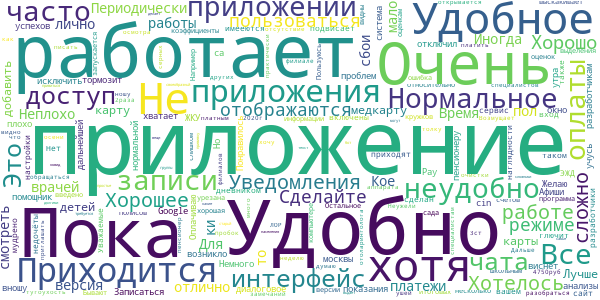

> Немного тормозит. Хотелось бы исключить диалоговое окно....  :date: __2021-07-18 11:07:17__

> Часто плохо работает. Желаю разработчикам успехов в дальнейшей работе.  :date: __2021-07-11 09:31:05__

> Очень не хватает оплаты Google Pay.  :date: __2021-06-24 18:51:51__

> Хорошее приложение, помощник пенсионеру.  :date: __2021-06-23 20:54:54__

> Записаться сложно, система виснет. С утра.  :date: __2021-06-23 08:23:43__

> Хорошо  :date: __2021-06-19 12:55:56__

> N ca cin  :date: __2021-06-16 13:47:39__

> Удобно, но не все анализы отображаются. Афиши москвы нормальной нет  :date: __2021-06-08 16:23:21__

> Понравилось.  :date: __2021-06-08 12:06:08__

> Пока учусь  :date: __2021-06-01 23:14:30__

#### 3-star reviews

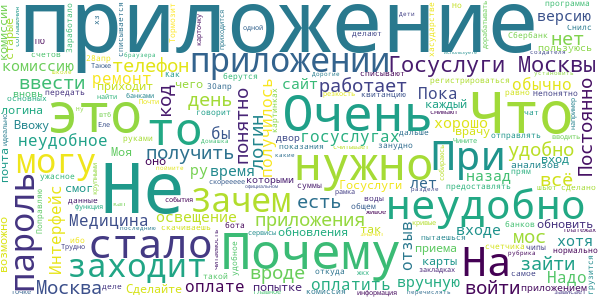

> Ув. Разработчик! Что за дела? Отказано в пароле  :date: __2021-07-18 19:06:06__

> Мог бы дать собякину люлей, пятерку бы поставил  :date: __2021-07-14 21:12:39__

> На практике если вы не пользовались ПО 90 дней и более, то ваши настройки слетают. Например, любой, завладевший тлф, нажав иконку приложения без пинкода попадает к вам в ЛК. Это какой уровень безопасности. Я писал уже дважды. В ответ какие-то невнятные пояснения. Ничего не исправляется.  :date: __2021-07-14 14:18:51__

> Чет обновили что ль его?! Раньше было больше возможностей.  :date: __2021-07-09 17:29:30__

> Приложение хорошее, но счета за ЖКУ г...но  :date: __2021-07-06 21:25:38__

> При подаче заявки на починку лифта и. Т.д. не возможно увидеть решение заявки....  :date: __2021-07-05 15:19:53__

> Очень сильно зависает приложение. Часто выходят ошибки при записи на приём к врачу  :date: __2021-07-02 06:36:08__

> Необходимость постоянно менять пароль очень раздражает  :date: __2021-06-29 08:33:27__

> Не понятно, для чего регистрироваться на госуслугах и предоставлять Снилс, что-бы передать данные счётчика воды , очень неудобно стало  :date: __2021-06-25 19:03:35__

> Очень занудно и неудобно.  :date: __2021-06-25 16:35:37__

#### 2-star reviews

> Нужное, но отвратное приложение.. Надобно доработать, не возможно пользоваться без раздражения.. 😕  :date: __2021-07-19 06:43:19__

> ПЛОХО, ОЧЕНЬ ПЛОХО! Слишком часто ведутся профилактические работы! Обычно в самый неподходящий момент "УСЛУГА НЕДОСТУПНА"! Когда, допустим, необходимо срочно записаться к врачу или изменить запись на другое время. И тут как по заказу "УСЛУГА НЕДОСТУПНА, ОБРАТИТЕСЬ ПОЗЖЕ!" Интересно, что вы там ежедневно и еженощно исправляете. Создаётся впечатление, что или сайт поганый, или ваши специалисты низкой квалификации и просто недостойны работать на сайте мэра Москвы. Буду жаловаться Собянину.Достали!  :date: __2021-07-02 01:29:41__

> Старое приложение моя москва было отличное Без всяких мельканий и перепрыгиванием. В глазах все путатся сей час в этом "замечательном приложении". И в конце концов записи нет звоните туда, где никто не ответит.  :date: __2021-06-28 16:44:37__

> Не могу войти, что напрямую через снилс что через госуслуги, пишет "ошибка синхронизации учётных записей 10005". Переустановка не помогает. Сайт работает хорошо а с приложением что-то гамудрили.  :date: __2021-06-27 12:15:41__

> Зачем оно нужно если тут даже нет функции просмотра своих актуальных услуг!? Или оно спрятано так что я 2ой день ищу  :date: __2021-06-27 10:33:46__

> Перестал работать чат с тех поддержкой  :date: __2021-06-20 09:20:59__

> При попытке авторизации/регистрации выскакивает ошибка  :date: __2021-06-18 10:25:08__

> Не удается войти в приложение, выдает ошибку  :date: __2021-06-17 20:17:35__

> Не могу войти...  :date: __2021-06-10 15:33:20__

> Не отвечает современным требованиям  :date: __2021-06-10 11:30:09__

#### 1-star reviews

> Даже писать нечего, два дня пытаюсь войти, но какой-то замкнутый круг...  :date: __2021-07-18 20:38:08__

> Просто ужас  :date: __2021-07-18 20:13:13__

> Не могу попасть в личный кабинет, все время возникают разные ошибки.  :date: __2021-07-18 14:25:49__

> Полное го\*\**,думал хуже сайта быть не может,а нет,есть еще и приложение  :date: __2021-07-17 06:12:56__

> Очередной инвалид! Так-же как и МосОблЕИРЦ, пользоваться невозможно все глючит и слетает! Руки оторвать таким разработчикам! Сношу нафиг!  :date: __2021-07-17 00:14:56__

> Странное приложение. При регистрации выдает чужие ФИО, но мою электронную почту и мой телефон. Предлагает внести изменения на портале мос.ру, но там данные соответствуют паспортным, т.е. исправлять нечего. Ещё и с портала Мос.ру приходят письма на чужое имя, но на мой эл.адрес. Тех. поддержка молчит... Удалила приложение нафиг.  :date: __2021-07-16 21:53:49__

> Из за хронических траблов с авторизацией удалил и забыл. Обойдусь без моеймосквы. А вообще, это ПОЗОР МОСКВЫ, конечно...  :date: __2021-07-16 17:12:34__

> Работать и работать над приложением  :date: __2021-07-16 16:26:26__

> Невозможно авторизоваться в приложении. "Ошибка синхронизации учетных данных". Через госуслуги и СберID зайти также невозможно - с первого раза не приходят СМС, ждать 5 минут, за это время разрыв соединения в приложении "ради вашей безопасности" (спасибо, я не просила) - и всё по новой. Удаляю.  :date: __2021-07-16 15:43:04__

> Штампуют приложения, но хоть одно бы работало нормально. Да что тут говорить- бюджет платит,они отмывают. Классика. Так же как ежегодно бардюры меняют,так же и приложения делают,одно бесполезнее другого  :date: __2021-07-16 15:35:49__

# WHO Info
App version ``4.1.0``

Analyzed with [covid-apps-observer](http://github.com/covid-apps-observer) project, version ``0.1``

## App overview
| | |
|-------------------------|-------------------------| 
| **Name**&nbsp;&nbsp;&nbsp;&nbsp;&nbsp;&nbsp;&nbsp;&nbsp;&nbsp;&nbsp;&nbsp;&nbsp;&nbsp;&nbsp;&nbsp;&nbsp;&nbsp;&nbsp;&nbsp;&nbsp;&nbsp;&nbsp;&nbsp;&nbsp;&nbsp;&nbsp;&nbsp;&nbsp;&nbsp;&nbsp;&nbsp;&nbsp;&nbsp;&nbsp;&nbsp;&nbsp;&nbsp;&nbsp;&nbsp;&nbsp;  | WHO Info |
| **Unique identifier** | org.who.infoapp |
| **Link to Google Play** | [https://play.google.com/store/apps/details?id=org.who.infoapp](https://play.google.com/store/apps/details?id=org.who.infoapp) |
| **Summary**  | Официальное приложение информации Всемирной организации здравоохранения. |
| **Privacy policy** | [https://www.who.int/about/who-we-are/privacy-policy](https://www.who.int/about/who-we-are/privacy-policy) |
| **Latest version** | 4.1.0 |
| **Last update** | 2021-01-14 10:10:28 |
| **Recent changes** | This release introduces &quot;Health Topics&quot;. &quot;Health Topics&quot; provide additional information about favourite health topics. |
| **Installs**  | 500 000+ |
| **Category** | Новости и журналы |
| **First release** | 13 апр. 2020 г. |
| **Size**  | 12M |
| **Supported Android version**  | 4.2 и выше |

### Description
> Have the latest health information at your fingertips with the official World Health Organization Information App. This app displays the latest news, events, features and breaking updates on outbreaks. 
  
 WHO works worldwide to promote health, keep the world safe, and serve the vulnerable. 
 Our goal is to ensure that a billion more people have universal health coverage, to protect a billion more people from health emergencies, and provide a further billion people with better health and well-being.

### User interface
The developers of the app provide the following screenshots in the Google play store.
| | | |
|:-------------------------:|:-------------------------:|:-------------------------:|
 |   |   |   | 
 |   |   |   | 
 |   | 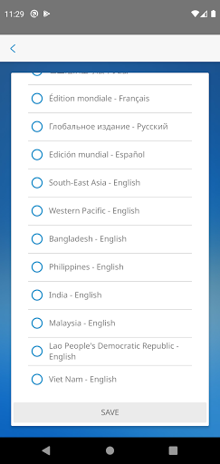  |   | 
 |   |   |   | 
 |   |   |   | 
 |   |   |   | 
 |   |   |   | 
 |   |   |   | 

## Development team
In the following we report the main information provided by the development team in the Google play store.

| | |
|-------------------------|-------------------------|
| **Developer**  | World Health Organization |
| **Website**  | [https://www.who.int/](https://www.who.int/) |
| **Email** | dcx@who.int |
| **Physical address**  | [Avenu Appia 20 1211 Geneva Switzerland](https://www.google.com/maps/search/Avenu%20Appia%2020%201211%20Geneva%20Switzerland) (Google Maps) |
| **Other developed apps**  | [https://play.google.com/store/apps/developer?id=World+Health+Organization](https://play.google.com/store/apps/developer?id=World+Health+Organization) |

## Android support

| | |
|-------------------------|-------------------------|
| **Declared target Android version**  | - |
| **Effective target Android version**  | - |
| **Minimum supported Android version**  | Jelly Bean, version 4.2.x (API level 17) |
| **Maximum target Android version**  | - |

The larger the difference between the minimum and maximum supported Android versions, the better. A larger difference means a wider audience. For example, old phones have a very low Android version, so a high minimum supported Android version means that the app cannot be used by users with old phones, thus leading to accessibility problems. 

## Requested permissions

In the following we report the complete list of the permissions requested by the app. 

| **Permission** | **Protection level** | **Description** | 
|-------------------------|-------------------------|-------------------------|
 **android.permission ACCESS_NETWORK_STATE** | Normal | Allows applications to access information about networks. 
 **android.permission INTERNET** | Normal | Allows applications to open network sockets. 
 **android.permission READ_CALENDAR** | :warning:**Dangerous** | Allows an application to read the user's calendar data. 
 **android.permission READ_EXTERNAL_STORAGE** | :warning:**Dangerous** | Allows an application to read from external storage. 
 **android.permission WAKE_LOCK** | Normal | Allows using PowerManager WakeLocks to keep processor from sleeping or screen from dimming. 
 **android.permission WRITE_CALENDAR** | :warning:**Dangerous** | Allows an application to write the user's calendar data. 
 **android.permission WRITE_EXTERNAL_STORAGE** | :warning:**Dangerous** | Allows an application to write to external storage. 
 **com.google.android.c2dm.permission RECEIVE** | - | - 
 **com.google.android.finsky.permission BIND_GET_INSTALL_REFERRER_SERVICE** | - | - 

## Mentioned servers

| **Server** | **Registrant** | **Registrant country** | **Creation date** | 
|-------------------------|-------------------------|-------------------------|-------------------------|
 | adobe.com | Adobe Inc. | :us: US | 1986-11-17 05:00:00 |
 | googlesyndication.com | Google LLC | :us: US | 2003-01-21 06:17:24 |
 | google.com | Google LLC | :us: US | 1997-09-15 04:00:00 |
 | app-measurement.com | Google LLC | :us: US | 2015-06-19 20:13:31 |
 | googleapis.com | Google LLC | :us: US | 2005-01-25 17:52:26 |
 | googleadservices.com | Google LLC | :us: US | 2003-06-19 16:34:53 |

## Security analysis 

Below we report the main security warnings raised by our execution of the [Androwarn](https://github.com/maaaaz/androwarn) security analysis tool.

**Connection interfaces exfiltration**
> - This application reads details about the currently active data network 
> - This application tries to find out if the currently active data network is metered 

**Suspicious connection establishment**
> - This application opens a Socket and connects it to the remote address 'Lfi/iki/elonen/NanoHTTPD$ResponseException;' on the 'N/A' port  
> - This application opens a Socket and connects it to the remote address 'NanoHttpd Shutdown' on the 'N/A' port  

**Code execution**
> - This application loads a native library: 'NativeScript' 
> - This application executes a UNIX command containing this argument: '2' 

## User ratings and reviews

Below we provide information about how end users are reacting to the app in terms of ratings and reviews in the Google Play store.

### Ratings

The WHO Info app has been installed by more than **500000** times. At this time, **1114** rated the app and its average score is **4.108108**. Below we show the distribution of the ratings across the usual star-based rating of Google Play

:star::star::star::star::star:: 754

:star::star::star::star:: 90

:star::star::star:: 60

:star::star:: 60

:star:: 150

### Reviews 

#### 5-star reviews

> ВОЗ как всегда - на высоте!!!  :date: __2020-11-11 10:06:48__

> 👍👍👍👍👍👍👍👍👍👍👍👋👍🤟🤟  :date: __2020-09-14 08:24:45__

> Great! Thanks a lot for russian language! 😉  :date: __2020-09-07 00:42:40__

> otlichno  :date: __2020-09-04 18:06:47__

> Классно!!!!!  :date: __2020-05-02 16:56:29__

#### 4-star reviews

No recent reviews available with 4 stars.

#### 3-star reviews

> А можно по русский написать  :date: __2020-05-23 06:45:03__

#### 2-star reviews

> На русском где?  :date: __2020-06-14 12:29:29__

#### 1-star reviews

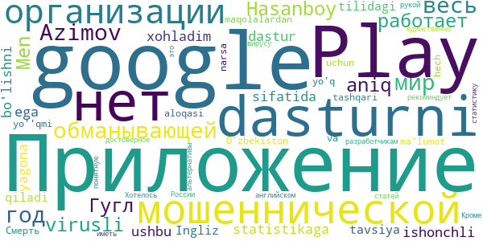

> Приложение мошеннической организации, обманывающей весь мир уже год  :date: __2021-01-27 12:10:05__

> Azimov Hasanboy. B b.  :date: __2020-10-03 10:41:25__

> не работает с Гугл  :date: __2020-07-22 09:06:06__

> 👎👎👎👎👎👎👎👅  :date: __2020-07-16 19:13:31__

> Men aniq virusli statistikaga ega bo'lishni xohladim, google Play ushbu dasturni yagona ishonchli dastur sifatida tavsiya qiladi. Ingliz tilidagi maqolalardan tashqari, hech narsa yo'q. O'zbekiston uchun ma'lumot va dasturni aloqasi yo''qmi?  :date: __2020-06-05 13:48:39__

> Смерть разработчикам!!!  :date: __2020-05-19 22:17:08__

> Хотелось иметь под рукой понятную статистику по вирусу, google play рекомендует это приложение как единственно достоверное. Кроме статей на английском ничего нет. Т.е. для России альтернативы нет?  :date: __2020-05-07 16:18:22__

# Социальный мониторинг
App version ``2.0.1``

Analyzed with [covid-apps-observer](http://github.com/covid-apps-observer) project, version ``0.1``

## App overview
| | |
|-------------------------|-------------------------| 
| **Name**&nbsp;&nbsp;&nbsp;&nbsp;&nbsp;&nbsp;&nbsp;&nbsp;&nbsp;&nbsp;&nbsp;&nbsp;&nbsp;&nbsp;&nbsp;&nbsp;&nbsp;&nbsp;&nbsp;&nbsp;&nbsp;&nbsp;&nbsp;&nbsp;&nbsp;&nbsp;&nbsp;&nbsp;&nbsp;&nbsp;&nbsp;&nbsp;&nbsp;&nbsp;&nbsp;&nbsp;&nbsp;&nbsp;&nbsp;&nbsp;  | Социальный мониторинг |
| **Unique identifier** | ru.mos.socmon |
| **Link to Google Play** | [https://play.google.com/store/apps/details?id=ru.mos.socmon](https://play.google.com/store/apps/details?id=ru.mos.socmon) |
| **Summary**  | Приложение для контроля за соблюдением гражданами режима изоляции на дому |
| **Privacy policy** | [https://www.mos.ru/privacypolicy/socmon/](https://www.mos.ru/privacypolicy/socmon/) |
| **Latest version** | 2.0.1 |
| **Last update** | 2021-05-11 08:12:53 |
| **Recent changes** | Версия 2.0.1 сборка 1638 |
| **Installs**  | 100 000+ |
| **Category** | Медицина |
| **First release** | 22 апр. 2020 г. |
| **Size**  | 15M |
| **Supported Android version**  | 6.0 и выше |

### Description
> Приложение «Социальный мониторинг» создано для пациентов с подтвержденным диагнозом COVID-19 и граждан контактировавших с ними, проживающих в Москве и соблюдающих предписанный им режим изоляции. С его помощью пациент информирует город о добросовестном соблюдении карантина.
 При регистрации пользователь подтверждает номер телефона, делает фотографию, геолокация (местонахождение) отправляется автоматически. Это нужно для того, чтобы проверить, находится ли пользователь в той же локации, которую указал в согласии, выбирая лечение на дому.
 Чтобы у пользователя не было возможности оставить смартфон дома и выйти на улицу без него, приложение в случайное время присылает СМС-уведомления с запросом дополнительного подтверждения — для этого потребуется сделать селфи.
 Если пользователь покидает исходную геолокацию или не реагирует на уведомления, система предупреждает городские службы о возможном нарушении режима изоляции.
 Личные данные, которые пользователь передает сервису, определены в согласии на получение медицинской помощи на дому и соблюдение режима изоляции либо в постановлении главного санитарного врача города Москвы. Все данные, которые пользователь передает приложению, хранятся в защищенном виде на серверах Департамента информационных технологий и используются в строгом соответствии с федеральным законом № 152-ФЗ "О персональных данных".

### User interface
The developers of the app provide the following screenshots in the Google play store.
| | | |
|:-------------------------:|:-------------------------:|:-------------------------:|
 |   |   |   | 
 |   |  

## Development team
In the following we report the main information provided by the development team in the Google play store.

| | |
|-------------------------|-------------------------|
| **Developer**  | Информационный город ГКУ |
| **Website**  | [https://www.mos.ru/city/projects/monitoring/](https://www.mos.ru/city/projects/monitoring/) |
| **Email** | socialmonitoring@mos.ru |
| **Physical address**  | - |
| **Other developed apps**  | [https://play.google.com/store/apps/developer?id=%D0%98%D0%BD%D1%84%D0%BE%D1%80%D0%BC%D0%B0%D1%86%D0%B8%D0%BE%D0%BD%D0%BD%D1%8B%D0%B9+%D0%B3%D0%BE%D1%80%D0%BE%D0%B4+%D0%93%D0%9A%D0%A3](https://play.google.com/store/apps/developer?id=%D0%98%D0%BD%D1%84%D0%BE%D1%80%D0%BC%D0%B0%D1%86%D0%B8%D0%BE%D0%BD%D0%BD%D1%8B%D0%B9+%D0%B3%D0%BE%D1%80%D0%BE%D0%B4+%D0%93%D0%9A%D0%A3) |

## Android support

| | |
|-------------------------|-------------------------|
| **Declared target Android version**  | Android10, version 10 (API level 29) |
| **Effective target Android version**  | Android10, version 10 (API level 29) |
| **Minimum supported Android version**  | Marshmallow, version 6.0 (API level 23) |
| **Maximum target Android version**  | - |

The larger the difference between the minimum and maximum supported Android versions, the better. A larger difference means a wider audience. For example, old phones have a very low Android version, so a high minimum supported Android version means that the app cannot be used by users with old phones, thus leading to accessibility problems. 

## Requested permissions

In the following we report the complete list of the permissions requested by the app. 

| **Permission** | **Protection level** | **Description** | 
|-------------------------|-------------------------|-------------------------|
 **android.permission ACCESS_BACKGROUND_LOCATION** | :warning:**Dangerous** | Allows an app to access location in the background. 
 **android.permission ACCESS_FINE_LOCATION** | :warning:**Dangerous** | Allows an app to access precise location. 
 **android.permission ACCESS_NETWORK_STATE** | Normal | Allows applications to access information about networks. 
 **android.permission CAMERA** | :warning:**Dangerous** | Required to be able to access the camera device. 
 **android.permission FOREGROUND_SERVICE** | Normal | Allows a regular application to use Service.startForeground. 
 **android.permission INTERNET** | Normal | Allows applications to open network sockets. 
 **android.permission READ_EXTERNAL_STORAGE** | :warning:**Dangerous** | Allows an application to read from external storage. 
 **android.permission RECEIVE_BOOT_COMPLETED** | Normal | Allows an application to receive the Intent.ACTION_BOOT_COMPLETED that is broadcast after the system finishes booting. 
 **android.permission REQUEST_IGNORE_BATTERY_OPTIMIZATIONS** | Normal | Permission an application must hold in order to use Settings.ACTION_REQUEST_IGNORE_BATTERY_OPTIMIZATIONS. 
 **android.permission USE_FULL_SCREEN_INTENT** | Normal | Required for apps targeting Build.VERSION_CODES.Q that want to use notification full screen intents. 
 **android.permission WAKE_LOCK** | Normal | Allows using PowerManager WakeLocks to keep processor from sleeping or screen from dimming. 
 **android.permission WRITE_EXTERNAL_STORAGE** | :warning:**Dangerous** | Allows an application to write to external storage. 
 **com.google.android.c2dm.permission RECEIVE** | - | - 
 **com.google.android.finsky.permission BIND_GET_INSTALL_REFERRER_SERVICE** | - | - 
 **com.msk.socmon PERMISSION** | - | - 

## Mentioned servers

| **Server** | **Registrant** | **Registrant country** | **Creation date** | 
|-------------------------|-------------------------|-------------------------|-------------------------|
 | adobe.com | Adobe Inc. | :us: US | 1986-11-17 05:00:00 |
 | googlesyndication.com | Google LLC | :us: US | 2003-01-21 06:17:24 |
 | google.com | Google LLC | :us: US | 1997-09-15 04:00:00 |
 | googleadservices.com | Google LLC | :us: US | 2003-06-19 16:34:53 |
 | app-measurement.com | Google LLC | :us: US | 2015-06-19 20:13:31 |
 | mos.ru | - | - | 1996-12-23 09:49:03 |
 | crashlytics.com | Google LLC | :us: US | 2011-01-21 15:30:40 |

## Security analysis 

Below we report the main security warnings raised by our execution of the [Androwarn](https://github.com/maaaaz/androwarn) security analysis tool.

**Connection interfaces exfiltration**
> - This application reads details about the currently active data network 
> - This application tries to find out if the currently active data network is metered 

**Telephony services abuse**
> - This application makes phone calls 

**Suspicious connection establishment**
> - This application opens a Socket and connects it to the remote address '; port is out of range' on the 'N/A' port  
> - This application opens a Socket and connects it to the remote address 'Ljava/net/Proxy;->type()Ljava/net/Proxy$Type;' on the 'N/A' port  
> - This application opens a Socket and connects it to the remote address 'Lu/b/a/a/a;->v(Ljava/lang/String;)Ljava/lang/StringBuilder;' on the 'N/A' port  
> - This application opens a Socket and connects it to the remote address 'Method sendUrgentData() is not supported.' on the 'N/A' port  
> - This application opens a Socket and connects it to the remote address 'Method setHandshakeTimeout() is not supported.' on the 'N/A' port  
> - This application opens a Socket and connects it to the remote address 'Method setOOBInline() is not supported.' on the 'N/A' port  
> - This application opens a Socket and connects it to the remote address 'Method setSoWriteTimeout() is not supported.' on the 'N/A' port  
> - This application opens a Socket and connects it to the remote address 'Socket closed' on the 'N/A' port  
> - This application opens a Socket and connects it to the remote address 'Socket is closed' on the 'N/A' port  
> - This application opens a Socket and connects it to the remote address 'Socket is closed.' on the 'N/A' port  
> - This application opens a Socket and connects it to the remote address 'Socket is not connected.' on the 'N/A' port  
> - This application opens a Socket and connects it to the remote address 'socket is closed' on the 'N/A' port  
> - This application opens a Socket and connects it to the remote address 'timeout' on the 'N/A' port  

**Code execution**
> - This application loads a native library: 'conscrypt_gmscore_jni' 
> - This application loads a native library: 'conscrypt_jni' 
> - This application loads a native library: 'tool-checker' 
> - This application executes a UNIX command 
> - This application executes a UNIX command containing this argument: 'getprop' 
> - This application executes a UNIX command containing this argument: 'mount' 

## User ratings and reviews

Below we provide information about how end users are reacting to the app in terms of ratings and reviews in the Google Play store.

### Ratings

The Социальный мониторинг app has been installed by more than **100000** times. At this time, **10580** rated the app and its average score is **1.4129213**. Below we show the distribution of the ratings across the usual star-based rating of Google Play

:star::star::star::star::star:: 693

:star::star::star::star:: 227

:star::star::star:: 317

:star::star:: 277

:star:: 9066

### Reviews 

#### 5-star reviews

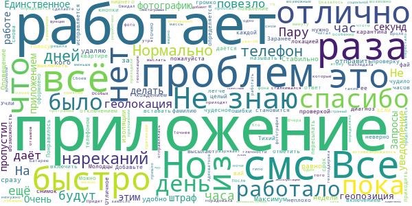

> Молодцы! Учли ошибки - теперь смс высылают с 11 до 20 часов. Можно отметить 2 часа в день, когда смс не будут приходить. На ответ даётся целый час. Если геолокация определяется телефоном неверно - можно её выключить и снова включить, а приложение даёт возможность пересылать снимок пока она не определится верно (было 2 раза). Один раз пришло смс, а приложение не активизировалось - техподдержка быстро всё решила. Батарею не разряжает. После ужасов, которые читал программа порадовала.  :date: __2021-07-18 18:33:17__

> Не знаю, возможно мне повезло, но приложение работало отлично, геолокацию приложение определяло мгновенно, а фотографию меньше чем за минуту. Единственное что, сделайте изменение фона или чтото типо того, чтобы было понятно, когда уже приложение больше ненужно.  :date: __2021-07-16 11:22:58__

> Сбоев в приложении не наблюдала. Все хорошо работает  :date: __2021-07-13 16:53:58__

> Не знаю, повезло ли мне или нет, но проблем с приложением у меня не было. Запросы приходили 3-4 раза в день, фотография и геолокация отправлялась секунд за 5. Запросы не приходят с 22 ночи и до 9 утра, по этому со сном проблем не было.  :date: __2021-07-08 08:56:02__

> Вроле работает без претензий. Но я пропустил одно уведомление. Кто-то сталкивался с таким? Придет ли штраф? Точнее не пропустил, а проспал  :date: __2021-07-07 19:56:18__

> У меня зависло приложение. Что делать?  :date: __2021-07-03 20:30:52__

> Ожидал глючности и массы проблем с этим приложением, особенно после отзывов. Оказалось не все так плохо. Особых нареканий к работе у меня нет  :date: __2021-06-30 16:30:46__

> Приложение перестало работать и выслать фото и локацию не представляется возможным . Вчера 28 всё работало.  :date: __2021-06-29 13:15:53__

> Адекватное, минималистичное приложение с понятным функцилналом. Никаких проблем при эксплуатации не замечено.  :date: __2021-06-27 19:45:29__

> Очень странный клон Инстаграмма, жду когда разработчики добавят функции социальной сети... Лайки, дизлайки, подписки...  :date: __2021-06-26 12:46:05__

#### 4-star reviews

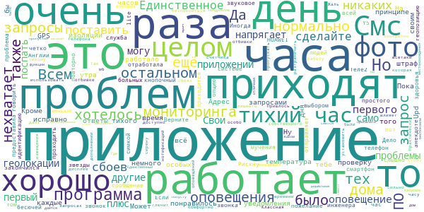

> Иногда геопозицию не с первого раза отправляет, приходится тут же повторно идентификацию проходить. Но в целом это не проблема  :date: __2021-07-06 13:00:30__

> Если говорить не о всей бесючей системе мучения больных людей, а конкретно о приложении, то: Комфортно использовать (запросы приходят 3-4 раза за день, что не сильно напрягает) Практически не глючит (были тех проблемы только первый день, на работу телефона особо не влияет) С 22:00 до 9:00 как и обещали запросы не приходят Классная функция "тихий час", которая дает 2 часа поспать и не беспокоиться о запросах В дисплее ничего лишнего, нет мешающих кнопок, все доступно  :date: __2021-07-05 17:00:50__

> Очень нехватает нотификаций о тех. сбоях. Так же нехватает собственного оповещения об отбивке. Смс оповещение всетаки не то. Нехватает счетчика оповещений. В дополнении к тихому часу мб стоит разграничить отбивки по времени. С 9 до 11, с 13 до 15 и т.д., т.е. 2/2, чтобы можно было поспать.  :date: __2021-07-05 13:42:47__

> 1. Пришлось установить сирену на СМС, чтобы не пропускать извещения. Жаль, что она не вмонтирована в само приложение, чтобы другие СМС-ки не беспокоили попусту, а то уже снится, что пропустил запрос геолокации! 🙈 Единственный плюс - что хоть даётся час на ответ! 2. Какой смысл присылать запрос местонахождения, когда вызван врач на дом? Где ещё-то я могу быть? 🤷‍♂️  :date: __2021-06-25 15:48:01__

> Отличная программа! Свои функции выполняет, очень все понравилось! Поздравляю разработчиков с успехом и желаю им, а также всем, кто приложил силы к созданию программы - всенепременно лично воспользоваться своим творением! Это ведь так забавно, когда тебе очень плохо, а ты должен следить за запросами отправить фото! Или когда ты уже здоров, но не можешь выйти из дома даже в магазин, потому что "ошейник короток", а за окном +35 и дома нечем дышать. Обязательно воспользуйтесь своим ПО, на здоровье!  :date: __2021-06-25 00:27:12__

> Приложение в целом работает хороше, проблемы возникают на сервере. Техническая поддержка справляется на 100%  :date: __2021-06-23 19:34:43__

> У меня работало приложение исправно.но вот время тихого часа я бы увеличила, пусть будет 4 часа, а не 2. Один раз проспала и не успела отослать данные, но штраф не пришёл,т.к. всего один раз вовремя не отправила.  :date: __2021-06-21 15:57:13__

> Прошел год . И вот опять я на мониторинге. Что изменилось? Да ни чего . Адрес в приложении отличается от того что в постановлении ( если мне память не изменяет то они вбили первый адрес с прошлого раза) а теперь ещё фото не проходят проверку . На свету , на солнышке, под лампой, лёжа , стоя , сидя ... Пишет не прошло проверку и все . И вот вопрос. Я и так дома сижу, не выхожу, заставили поставить приложение которое выматывает нервы похуже сварливой свекрови. Может поправите его ???  :date: __2021-06-16 14:12:17__

> Приложение работает нормально, геопозиция определяется, всё быстро отправляется. Только очень напрягает необходимость в предоставлении доступа ко всему хранилищу на телефоне. Разработчики, можете ответить зачем приложению всё хранилище, когда отпраляется только фотография с камеры?  :date: __2021-06-16 13:35:24__

> Не столкнулся с большей частью проблем, описанных в комментах. В целом, нормальное приложение, уведомления присылает исправно, плюс всегда все дублирует смсками. Запросы причем приходят не прям каждые 2 часа, бывает по-разному, чуть позже даже, да и в целом особых проблем не доставляют. Единственное, что не понравилось это режим тихого часа, потому что два часа на тот же дневной сон, особенно если ночью температура скакала - это мало. Лучше уж давали бы тихий час на 4-6 часов, но раз в три дня.  :date: __2021-06-15 12:09:39__

#### 3-star reviews

> Основное впечатление: приложение истощает психические ресурсы, необходимые для лечения от короновируса. Одна из причин - постоянная тревога из-за боязни пропустить уведомление, зависимость от телефона. Прошу разработчиков добавить возможность установки произвольной мелодии уведомлений, с настраиваемой громкостью отдельно от других приложений. А также, настраиваемый повтор уведомлений, чтобы точно не пропустить. На мой взгляд, это должно снизить вред, наносимый пользователям приложения.  :date: __2021-07-18 16:55:03__

> Здравствуйте,с 01.07.2021г болею ковид,отмечаюсь в соц.мониторинг ежедневно.сегодня ещё неприш ел неодин запрос об отметки,это сбой или ещё позже будут вопросы???  :date: __2021-07-17 15:31:31__

> Идея для разрабов, добавьте в приложение таймер по отстчету сколько дней осталось в карантине, по окончанию которого можно удалять данный "шедевр" с телефона. Это добавит удобства пользователям и снизит число вопросов на ваши контакты поддержки.  :date: __2021-07-16 10:00:23__

> Отбросим требование об установке данного приложения ) К Июлю 21 года , вроде как доработали что-то, хотя висит обновление только от мая. В любом случае, есть что ещё нужно доработать и самое главное это геолокация. Пару-тройку раз за две недели, приложение показывало, что был дома и через минуту уже в трёх километрах от него. Второй момент, это сбой геолокации при отправке своих данных. Загрузил фото,а геолокация не передалась. И так по два раза приходится загружать.  :date: __2021-07-13 14:11:16__

> Где можно в приложении посмотреть, сколько осталось дней до конца самоизоляции?  :date: __2021-07-10 10:51:59__

> Удалилась история за последние пять дней, смс не было 2 дня, пришёл штраф просто ни за что. Великолепно. А хотя сначала всё работало отлично  :date: __2021-07-10 09:45:55__

> Неправильно определяет геопозицию!  :date: __2021-07-04 17:19:18__

> Авторизация не происходит уже несколько часов, приложение не запускается дальше второго шага, что с этим делать?  :date: __2021-07-03 18:21:14__

> Прямо сейчас в данный кокнретный момент в 14:10 30.06.21 я не могу отправить геопозицию, т.к. приложение выдает ошибку, пр попытке отправить снова, кнопка "отправить" гаснет и остаётся не активной до перезапуска приложения. Upd: починили, сбой на серваках, честно, не такого ожидаешь от госконторы  :date: __2021-07-02 11:11:37__

> В первый же день второй мониторинг не может отправить геопозицию. Почему я должна больная ждать пока исправится ваши баги? Уже полчаса не могу геопозицию отправить. Даже приложение переустановила. Вместо того чтоб лечь спать трачу нервы на попытку повторных отправок. В тех поддержку не дозвониться, вопрос в тех поддержку не отправляется  :date: __2021-06-30 13:35:58__

#### 2-star reviews

> Спустя год тоже сбои при передаче данных.Фото не проходит проверку.Геолокация пройдена.На кухне геолокация не проходит.В одной квартире в разных комнатах геолокация разная.Издевка,чтобы штраф применять? При первом звонке,по указ.тел в приложении, после разговора сброс.Со второго звонка мне оказали помощь.Спасибо.Для нервной системы стресс,конечно.За год мое лицо не могло так измениться, чтобы у робота не пройти проверку.Странная идентификация по фото.Складывается впечатление,что не доработано  :date: __2021-07-17 12:26:20__

> Авторы- рукожопы. Что-то там анализируют по фото и местоположению...но тупы настолько, что в специализированном приложении не могут распознать человека в дыхательной маске и на территории больницы... путь очень многих захужевших... при этом, маски везде одинаковы.. а адреса больниц стандартны... вы чо там анализируете и как, если вы 2+2 сложить не можете!?  :date: __2021-07-17 00:40:04__

> Как выбрать для фото основную камеру? Мне нужно фотографировать другого человека. С фронтальной камеры это делать неудобно.  :date: __2021-07-14 19:37:47__

> Служба технической поддержки не работает никто не подходит к телефону, а робот дает безполезные советы  :date: __2021-07-14 16:12:22__

> 13.07.21 установил приложение. 14.07.21 система до сих пор проверяет.  :date: __2021-07-14 15:56:14__

> Не проходит проверку фотография? Что за дичь?  :date: __2021-07-12 16:58:38__

> Фотография упорно не проходит проверку, хотя сделана по всем правилам, освещение хорошее, одна и та же комната и ракуср. Исправьте уже тех.ошибку в приложении! Сколько можно мучать больных людей!!!  :date: __2021-07-11 16:35:13__

> Почему нет нигде упоминания, что приложение не будет работать на устройстве с root правами?  :date: __2021-07-11 08:20:21__

> Приложение, конечно, ни при чем. Вопрос к чиновникам, которые придумали такое. Понятно, что с соц.ответственностью в обществе беда и очень многие не сдают тесты, чтоб не получить положительный с карантином впридачу. Самое неприятное, что человек может себя чувствовать плохо. Я болею без температуры, но с дикой слабостью. Я хочу спать постоянно. Сегодня Заводила будильник каждые 50 минут, чтоб не пропустить фото-контроль. Это очень напрягает!!!  :date: __2021-07-03 19:18:22__

> надо приложение дорабатывать. Уведомлений не слышно, не видно. Чтобы не пропускать , надо зависать постоянно в телефоне и видеть момент прихода уведомления. Сейчас с отметкой опоздала на 5 минут. Телефон лежал в стороне и не знала, что пора делать сельфи)  :date: __2021-07-03 17:42:00__

#### 1-star reviews

> Это не просто отстой. Это геноцид и дискриминация. С температурой и пневмонией, надо что то слать, тут не сдохнуть бы. Помимо штрафов ещё и отказ от мед.обслуживания. С какого такого? Приложение не установил, можешь помирать спокойно?! Толку от этого приложения? Днем контроль, а вечером гуляй заражай всех и вся?  :date: __2021-07-19 13:45:23__

> Оно не включается)  :date: __2021-07-19 09:44:27__

> Не работает  :date: __2021-07-18 16:28:36__

> Приложение глючит постоянно, то фото проходит проверку по часу, то геолакацию определяет чуть ли не в пустыне сахара. Когда обращаешься в техническую поддержку, то никто ничего внятно объяснить не может, так как "специалисты" сами не знают как сервис работает.  :date: __2021-07-18 16:15:46__

> Отвратительно выстроена работа. Третьи сутки не могут изменить ошибочный адрес. И четвёртый раз обещают сделать это в ближайшее время несмотря на зафиксированое обращение.  :date: __2021-07-18 13:22:42__

> Три раза скачала,кодов аж шесть раз водила и толку ноль,встала на стр- после ведение кода.А теперь иза тупой программы штраф наложат!!! Полностью такаеже проблема как у Сергея клиентом с низу!!!  :date: __2021-07-18 13:04:05__

> Служба поддержки переустановите. 2 раза и оно по прежнему не работает. Я стою на пункте 2 при регистрации. Я на самоизоляции с 29. С 4го играюсь с приложением- как подписал бумаги. Сегодня 18е.... Не работает!!!! Не подписывайте! Сидите чесно просто без этой херни!  :date: __2021-07-18 12:21:28__

> Кошмарное приложение! Мало того, что всё это время сидишь дёргаешься, что-бы не проспать идентификацию, так ещё после стандартного обновления версии miui для redmi note 9 pro, это приложение перестало работать! Оно просто начинает зависать и не сворачивается, от чего зависает и телефон. В тех поддержке сказали, что привезут другой телефон. Но только я активный пользователь и из-за этой изоляции приходится пользоваться онлайн сервисами доставки и сбербанка. После этого всё превращается в ещё боль  :date: __2021-07-18 10:50:23__

> Судя по геолокации я гуляю по кремлю, приложение ни как не пытается определить местоположение, в гугл и яндекс картах отображается всё коректно.  :date: __2021-07-18 10:06:31__

> Висит на проверке номера 4 день  :date: __2021-07-18 08:45:11__

# OpenWHO
App version ``3.7``

Analyzed with [covid-apps-observer](http://github.com/covid-apps-observer) project, version ``0.1``

## App overview
| | |
|-------------------------|-------------------------| 
| **Name**&nbsp;&nbsp;&nbsp;&nbsp;&nbsp;&nbsp;&nbsp;&nbsp;&nbsp;&nbsp;&nbsp;&nbsp;&nbsp;&nbsp;&nbsp;&nbsp;&nbsp;&nbsp;&nbsp;&nbsp;&nbsp;&nbsp;&nbsp;&nbsp;&nbsp;&nbsp;&nbsp;&nbsp;&nbsp;&nbsp;&nbsp;&nbsp;&nbsp;&nbsp;&nbsp;&nbsp;&nbsp;&nbsp;&nbsp;&nbsp;  | OpenWHO |
| **Unique identifier** | de.xikolo.openwho |
| **Link to Google Play** | [https://play.google.com/store/apps/details?id=de.xikolo.openwho](https://play.google.com/store/apps/details?id=de.xikolo.openwho) |
| **Summary**  | Знания, необходимые при чрезвычайных ситуациях в области здравоохранения |
| **Privacy policy** | [https://openwho.org/pages/privacy](https://openwho.org/pages/privacy) |
| **Latest version** | 3.7 |
| **Last update** | 2020-11-23 13:57:15 |
| **Recent changes** | - Bug fixes and performance improvements |
| **Installs**  | 1 000 000+ |
| **Category** | Образование |
| **First release** | 17 мая 2017 г. |
| **Size**  | 18M |
| **Supported Android version**  | 5.0 и выше |

### Description
> OpenWHO - это интерактивная платформа Всемирной организации здравоохранения (ВОЗ) для распространения знаний, предлагающая онлайн курсы по улучшению реагирования на чрезвычайные ситуации в области здравоохранения. OpenWHO позволяет Организации и ее ключевым партнерам передавать знания, спасающие жизнь, большому числу лиц, находящихся на передней линии борьбы с чрезвычайными ситуациями.
 Платформа OpenWHO предоставляет возможность учиться в удобное для вас время. Смотрите короткие видео лекции и проверяйте свои знания с помощью самостоятельных тестов, когда и где вам будет удобно. Форум и возможность сотрудничества позволяют обмениваться опытом с другими участниками платформы и экспертами по всему миру.
 Данное приложение, предназначенное главным образом для работников здравоохранения, специалистов, осуществляющих первичные меры реагирования на чрезвычайные ситуации, и руководителей, также является источником информации для тех, кто затронут вспышками заболеваний и чрезвычайными ситуациями, в том числе для лиц в целом интересующихся работой ВОЗ в условиях чрезвычайных ситуаций в области здравоохранения.
 Данное приложение состоит из 6 каналов:
 - Канал, посвященный вспышкам заболеваний (Outbreak Channel), направлен на борьбу с инфекционными заболеваниями и предоставляет жизненно важную научную информацию.
 - Канал готовности к реагированию (Ready for Response channel) помогает в подготовке персонала, который проходит обучение для работы в условиях вспышек заболеваний и чрезвычайных ситуаций в области здравоохранения.
 - Социальный Канал (Get Social channel) фокусируется на мероприятиях, основанных на социальных науках, и помогает взаимодействовать с пострадавшими общинами.
 - Канал подготовки к пандемиям (Preparing for Pandemics channel) объединяет курсы по различным аспектам обеспечения готовности, включая эпиднадзор, меры в области общественного здравоохранения и информирование о рисках во время пандемии.
 - Канал COVID-19 (COVID-19 channel) представляет учебные материалы на 6 официальных языках ВОЗ (английском, арабском, испанском, китайском, русском и французском) для медицинских работников, руководителей и общественности в связи со вспышкой коронавирусной болезни (COVID-19). 
 - Канал COVID-19 другие национальные языки (COVID-19 National Languages channel) предлагает те же учебные ресурсы, что и канал COVID-19, но на других национальных языках, таких как индонезийский, японский и португальский.
 Курсы OpenWHO доступны на многих языках, включая 6 официальных языков ВОЗ.
 Скачайте приложение сейчас, присоединяйтесь к сообществу OpenWHO.
 Это приложение разработано в сотрудничестве между Институтом Хассо Платтнера и ВОЗ. Обучающий контент предоставляется исключительно ВОЗ.

### User interface
The developers of the app provide the following screenshots in the Google play store.
| | | |
|:-------------------------:|:-------------------------:|:-------------------------:|
 |   |   |   | 
 |   |   |   | 

## Development team
In the following we report the main information provided by the development team in the Google play store.

| | |
|-------------------------|-------------------------|
| **Developer**  | HPI Knowledge Engineering Team |
| **Website**  | [https://openwho.org/](https://openwho.org/) |
| **Email** | openwho-support@hpi.de |
| **Physical address**  | [Prof.-Dr.-Helmert-Str.2-3 14482 Potsdam](https://www.google.com/maps/search/Prof.-Dr.-Helmert-Str.2-3%2014482%20Potsdam) (Google Maps) |
| **Other developed apps**  | [https://play.google.com/store/apps/developer?id=7185448023325736337](https://play.google.com/store/apps/developer?id=7185448023325736337) |

## Android support

| | |
|-------------------------|-------------------------|
| **Declared target Android version**  | - |
| **Effective target Android version**  | - |
| **Minimum supported Android version**  | Lollipop, version 5.0 (API level 21) |
| **Maximum target Android version**  | - |

The larger the difference between the minimum and maximum supported Android versions, the better. A larger difference means a wider audience. For example, old phones have a very low Android version, so a high minimum supported Android version means that the app cannot be used by users with old phones, thus leading to accessibility problems. 

## Requested permissions

In the following we report the complete list of the permissions requested by the app. 

| **Permission** | **Protection level** | **Description** | 
|-------------------------|-------------------------|-------------------------|
 **android.permission ACCESS_NETWORK_STATE** | Normal | Allows applications to access information about networks. 
 **android.permission ACCESS_WIFI_STATE** | Normal | Allows applications to access information about Wi-Fi networks. 
 **android.permission DOWNLOAD_WITHOUT_NOTIFICATION** | - | - 
 **android.permission FOREGROUND_SERVICE** | Normal | Allows a regular application to use Service.startForeground. 
 **android.permission INTERNET** | Normal | Allows applications to open network sockets. 
 **android.permission RECEIVE_BOOT_COMPLETED** | Normal | Allows an application to receive the Intent.ACTION_BOOT_COMPLETED that is broadcast after the system finishes booting. 
 **android.permission WAKE_LOCK** | Normal | Allows using PowerManager WakeLocks to keep processor from sleeping or screen from dimming. 
 **android.permission WRITE_EXTERNAL_STORAGE** | :warning:**Dangerous** | Allows an application to write to external storage. 
 **com.google.android.c2dm.permission RECEIVE** | - | - 
 **com.google.android.finsky.permission BIND_GET_INSTALL_REFERRER_SERVICE** | - | - 

## Mentioned servers

| **Server** | **Registrant** | **Registrant country** | **Creation date** | 
|-------------------------|-------------------------|-------------------------|-------------------------|
 | googlesyndication.com | Google LLC | :us: US | 2003-01-21 06:17:24 |
 | google.com | Google LLC | :us: US | 1997-09-15 04:00:00 |
 | apple.com | Apple Inc. | :us: US | 1987-02-19 05:00:00 |
 | aomedia.org | Contact Privacy Inc. Customer 1243324949 | :canada: CA | 2015-08-24 14:07:31 |
 | dashif.org | VTM Group | :us: US | 2012-04-27 13:02:46 |
 | app-measurement.com | Google LLC | :us: US | 2015-06-19 20:13:31 |
 | w3.org | W3C | :us: US | 1994-07-06 04:00:00 |
 | googleapis.com | Google LLC | :us: US | 2005-01-25 17:52:26 |
 | psdev.de | - | - | - |
 | xmlpull.org | WhoisGuard, Inc. | PA | 2001-11-26 20:33:08 |
 | crashlytics.com | Google LLC | :us: US | 2011-01-21 15:30:40 |
 | apache.org | The Apache Software Foundation | :us: US | 1995-04-11 04:00:00 |
 | opensource.org | Open Source Initiative | :us: US | 1998-02-11 05:00:00 |
 | creativecommons.org | Creative Commons Corporation | :canada: CA | 2001-01-15 16:51:44 |
 | eclipse.org | Eclipse.org Foundation, Inc. | :canada: CA | 1997-04-14 04:00:00 |
 | gnu.org | Free Software Foundation | :us: US | 1995-11-24 05:00:00 |
 | mozilla.org | Mozilla Corporation | :us: US | 1998-01-24 05:00:00 |
 | googleadservices.com | Google LLC | :us: US | 2003-06-19 16:34:53 |

## Security analysis 

Below we report the main security warnings raised by our execution of the [Androwarn](https://github.com/maaaaz/androwarn) security analysis tool.

**Telephony identifiers leakage**
> - This application reads the ISO country code equivalent of the current registered operator's MCC (Mobile Country Code) 
> - This application reads the MCC+MNC of the provider of the SIM 

**Connection interfaces exfiltration**
> - This application reads details about the currently active data network 
> - This application tries to find out if the currently active data network is metered 

**Suspicious connection establishment**
> - This application opens a Socket and connects it to the remote address ' returned no addresses for  ; port is out of range' on the 'N/A' port  
> - This application opens a Socket and connects it to the remote address '' on the 'N/A' port  
> - This application opens a Socket and connects it to the remote address 'Ljava/lang/StringBuilder;->toString()Ljava/lang/String;' on the 'N/A' port  
> - This application opens a Socket and connects it to the remote address 'Ljava/net/Proxy;->type()Ljava/net/Proxy$Type;' on the 'N/A' port  
> - This application opens a Socket and connects it to the remote address 'timeout' on the 'N/A' port  

**Code execution**
> - This application loads a native library 

## User ratings and reviews

Below we provide information about how end users are reacting to the app in terms of ratings and reviews in the Google Play store.

### Ratings

The OpenWHO app has been installed by more than **1000000** times. At this time, **3403** rated the app and its average score is **4.2647057**. Below we show the distribution of the ratings across the usual star-based rating of Google Play

:star::star::star::star::star:: 2403

:star::star::star::star:: 370

:star::star::star:: 130

:star::star:: 130

:star:: 370

### Reviews 

#### 5-star reviews

> Классно!!!!!  :date: __2020-05-02 17:01:13__

> ☝️👍  :date: __2020-04-16 23:35:41__

#### 4-star reviews

> Дал бы 5 звёзд, но я поставил 4.Потому что не актуально  :date: __2020-04-21 15:30:18__

#### 3-star reviews

No recent reviews available with 3 stars.

#### 2-star reviews

No recent reviews available with 2 stars.

#### 1-star reviews

> Нечего не могу найти  :date: __2021-02-02 13:48:42__

> Не понятно ничево  :date: __2021-01-29 12:39:36__

> Ганр  :date: __2020-09-08 14:20:40__

> Zor  :date: __2020-04-06 16:27:47__

> Бесполезное приложение Я ищу сколько по Казахстану А тут статьи не о чем  :date: __2020-04-06 07:31:50__

> Bobur  :date: __2020-04-03 00:57:43__

# Активный гражданин
App version ``3.0.0``

Analyzed with [covid-apps-observer](http://github.com/covid-apps-observer) project, version ``0.1``

## App overview
| | |
|-------------------------|-------------------------| 
| **Name**&nbsp;&nbsp;&nbsp;&nbsp;&nbsp;&nbsp;&nbsp;&nbsp;&nbsp;&nbsp;&nbsp;&nbsp;&nbsp;&nbsp;&nbsp;&nbsp;&nbsp;&nbsp;&nbsp;&nbsp;&nbsp;&nbsp;&nbsp;&nbsp;&nbsp;&nbsp;&nbsp;&nbsp;&nbsp;&nbsp;&nbsp;&nbsp;&nbsp;&nbsp;&nbsp;&nbsp;&nbsp;&nbsp;&nbsp;&nbsp;  | Активный гражданин |
| **Unique identifier** | ru.mos.polls |
| **Link to Google Play** | [https://play.google.com/store/apps/details?id=ru.mos.polls](https://play.google.com/store/apps/details?id=ru.mos.polls) |
| **Summary**  | Твой город – твое решение! Электронные голосования Правительства Москвы. |
| **Privacy policy** | [https://ag.mos.ru/eula](https://ag.mos.ru/eula) |
| **Latest version** | 3.0.0 |
| **Last update** | 2021-07-16 19:09:33 |
| **Recent changes** | Переработана структура приложения. На главной странице появилась верхняя и нижняя панель с основными разделами. У голосований появились тематические иконки: «Благоустройство», «Транспорт», «Культура» и другие. По завершении голосования, предлагаются другие голосования, которые еще не пройдены. В разделе «Новости» объединились две рубрики: «Новости проекта» и «Городские новинки». |
| **Installs**  | 500 000+ |
| **Category** | Социальные |
| **First release** | 14 мая 2014 г. |
| **Size**  | 50M |
| **Supported Android version**  | 4.4W и выше |

### Description
> Твой город – твое решение! Электронные голосования Правительства Москвы.
 Ты решаешь, какой будет Москва! Участвуй в голосованиях и получай поощрения от города и партнеров проекта!
 «Активный гражданин» — проект для тех, кто хочет изменить город к лучшему. Это официальное приложение Правительства Москвы, которое было создано по поручению мэра Москвы Сергея Собянина.
 Каждую неделю Мэр и Правительство Москвы выносит на обсуждение активных граждан важные для города вопросы: от транспорта и благоустройства территорий до здравоохранения и образования. Выражая свое мнение, ты помогаешь органам власти принимать верные решения. 
 — Как будут отдыхать московские школьники?
 — Нужно ли ограничивать скорость в центре Москвы?
 — Что построить на месте бывшей промзоны?
 Просто зарегистрируйся, укажи свой адрес и голосуй!
 Результаты электронных голосований будут воплощены в жизнь, а тебя ждут приятные подарки.
 Высказывая свою позицию, ты получаешь баллы. Заработай 1000 баллов и получи статус «Активный гражданин», который открывает доступ к Магазину поощрений. В нем заработанные баллы можно обменять на городские услуги. Например:
 — оплата парковки
 — поездки на метро
 — билеты в театры и музеи
 — городские экскурсионные программы
 — яркие сувениры с символикой «Активного гражданина»
 и другие полезные мелочи.
 Хочешь получить еще больше баллов? Чаще заходи в приложение, выражай свое мнение, отмечайся на мероприятиях, приглашай друзей, активируй промо-коды и делись информацией о пройденных голосованиях в социальных сетях.
 Самые активные участники проекта становятся гостями уникальных городских мероприятий. Например, активные граждане могут посетить генеральную репетицию парада Победы или концерт в День города на Красной площади, Чемпионат мира по шорт-треку с участием звезды спорта Виктора Ана или кататься на главном катке страны на ВДНХ.
 Стань активным гражданином — установи приложение бесплатно прямо сейчас!

### User interface
The developers of the app provide the following screenshots in the Google play store.
| | | |
|:-------------------------:|:-------------------------:|:-------------------------:|
 | 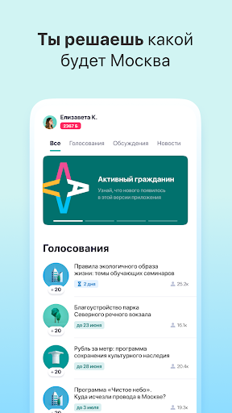  | 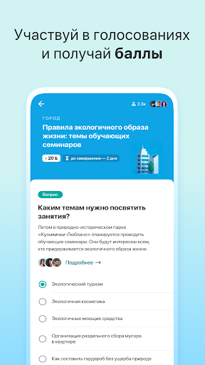  |   | 
 | 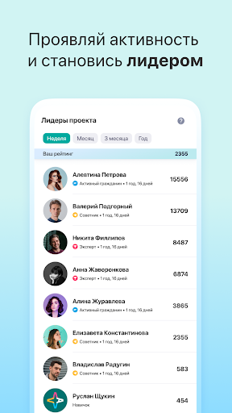  | 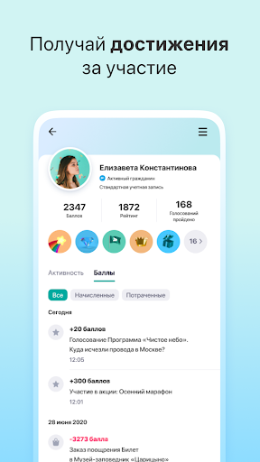  | 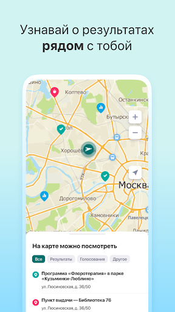  | 

## Development team
In the following we report the main information provided by the development team in the Google play store.

| | |
|-------------------------|-------------------------|
| **Developer**  | Информационный город ГКУ |
| **Website**  | [http://ag.mos.ru/](http://ag.mos.ru/) |
| **Email** | support@ag.mos.ru |
| **Physical address**  | - |
| **Other developed apps**  | [https://play.google.com/store/apps/developer?id=%D0%98%D0%BD%D1%84%D0%BE%D1%80%D0%BC%D0%B0%D1%86%D0%B8%D0%BE%D0%BD%D0%BD%D1%8B%D0%B9+%D0%B3%D0%BE%D1%80%D0%BE%D0%B4+%D0%93%D0%9A%D0%A3](https://play.google.com/store/apps/developer?id=%D0%98%D0%BD%D1%84%D0%BE%D1%80%D0%BC%D0%B0%D1%86%D0%B8%D0%BE%D0%BD%D0%BD%D1%8B%D0%B9+%D0%B3%D0%BE%D1%80%D0%BE%D0%B4+%D0%93%D0%9A%D0%A3) |

## Android support

| | |
|-------------------------|-------------------------|
| **Declared target Android version**  | Android10, version 10 (API level 29) |
| **Effective target Android version**  | Android10, version 10 (API level 29) |
| **Minimum supported Android version**  | KitKat, version 4.4 - 4.4.4 (API level 19) |
| **Maximum target Android version**  | - |

The larger the difference between the minimum and maximum supported Android versions, the better. A larger difference means a wider audience. For example, old phones have a very low Android version, so a high minimum supported Android version means that the app cannot be used by users with old phones, thus leading to accessibility problems. 

## Requested permissions

In the following we report the complete list of the permissions requested by the app. 

| **Permission** | **Protection level** | **Description** | 
|-------------------------|-------------------------|-------------------------|
 **android.permission ACCESS_BACKGROUND_LOCATION** | :warning:**Dangerous** | Allows an app to access location in the background. 
 **android.permission ACCESS_COARSE_LOCATION** | :warning:**Dangerous** | Allows an app to access approximate location. 
 **android.permission ACCESS_FINE_LOCATION** | :warning:**Dangerous** | Allows an app to access precise location. 
 **android.permission ACCESS_NETWORK_STATE** | Normal | Allows applications to access information about networks. 
 **android.permission CAMERA** | :warning:**Dangerous** | Required to be able to access the camera device. 
 **android.permission INTERNET** | Normal | Allows applications to open network sockets. 
 **android.permission READ_EXTERNAL_STORAGE** | :warning:**Dangerous** | Allows an application to read from external storage. 
 **android.permission WAKE_LOCK** | Normal | Allows using PowerManager WakeLocks to keep processor from sleeping or screen from dimming. 
 **android.permission WRITE_EXTERNAL_STORAGE** | :warning:**Dangerous** | Allows an application to write to external storage. 
 **com.google.android.c2dm.permission RECEIVE** | - | - 
 **com.google.android.finsky.permission BIND_GET_INSTALL_REFERRER_SERVICE** | - | - 

## Mentioned servers

| **Server** | **Registrant** | **Registrant country** | **Creation date** | 
|-------------------------|-------------------------|-------------------------|-------------------------|
 | googlesyndication.com | Google LLC | :us: US | 2003-01-21 06:17:24 |
 | google.com | Google LLC | :us: US | 1997-09-15 04:00:00 |
 | facebook.com | Facebook, Inc. | :us: US | 1997-03-29 05:00:00 |
 | google-analytics.com | Google LLC | :us: US | 2005-07-18 19:24:32 |
 | app-measurement.com | Google LLC | :us: US | 2015-06-19 20:13:31 |
 | googletagmanager.com | Google LLC | :us: US | 2011-11-11 23:39:05 |
 | mos.ru | - | - | 1996-12-23 09:49:03 |
 | crashlytics.com | Google LLC | :us: US | 2011-01-21 15:30:40 |
 | googleapis.com | Google LLC | :us: US | 2005-01-25 17:52:26 |
 | googleadservices.com | Google LLC | :us: US | 2003-06-19 16:34:53 |

## Security analysis 

Below we report the main security warnings raised by our execution of the [Androwarn](https://github.com/maaaaz/androwarn) security analysis tool.

**Telephony identifiers leakage**
> - This application reads the MCC+MNC of the provider of the SIM 

**Connection interfaces exfiltration**
> - This application reads details about the currently active data network 

**Telephony services abuse**
> - This application makes phone calls 

**Suspicious connection establishment**
> - This application opens a Socket and connects it to the remote address 'Ljava/lang/StringBuilder;->toString()Ljava/lang/String;' on the 'N/A' port  
> - This application opens a Socket and connects it to the remote address 'Ljava/net/Proxy;->type()Ljava/net/Proxy$Type;' on the 'N/A' port  
> - This application opens a Socket and connects it to the remote address 'No route to  ' on the 'N/A' port  
> - This application opens a Socket and connects it to the remote address 'timeout' on the 'N/A' port  

## User ratings and reviews

Below we provide information about how end users are reacting to the app in terms of ratings and reviews in the Google Play store.

### Ratings

The Активный гражданин app has been installed by more than **500000** times. At this time, **77633** rated the app and its average score is **4.1570067**. Below we show the distribution of the ratings across the usual star-based rating of Google Play

:star::star::star::star::star:: 53767

:star::star::star::star:: 7199

:star::star::star:: 3259

:star::star:: 1909

:star:: 11499

### Reviews 

#### 5-star reviews

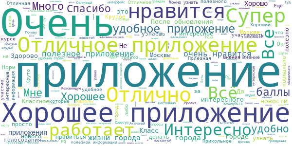

> Приложение отличное! Только я не понимаю, почему бесконтактная доставка работает не на всех поощрениях?  :date: __2021-07-19 13:46:39__

> Не работает авторизация на 5 Андроиде, у меня есть смартфон ZTE Blade x 3, я установил ваше приложение и хотел авторизоваться , код по смс пришёл, ввожу пишет либо неправильный код либо ошибка авторизации, хотя цифры кода я ввожу верно, подскажите что делать если авторизация не проходит  :date: __2021-07-19 12:38:49__

> Обновить приложение, чтобы оно не работало? Отличная идея  :date: __2021-07-19 11:18:45__

> После обновления при каждом запуске программы требуется вводить пароль на сайте мос.ру. не удобно. По состоянию на июль 2021 такой ошибки нет.  :date: __2021-07-18 08:53:52__

> Да, хорошее приложение  :date: __2021-07-17 14:46:29__

> Все здорово  :date: __2021-07-17 08:36:37__

> Нравится приложение, много интересного.  :date: __2021-07-17 00:35:35__

> Отличное приложение для жизни в Москве  :date: __2021-07-16 11:38:37__

> Удобное приложение  :date: __2021-07-16 06:39:46__

> Отличное приложение  :date: __2021-07-15 22:02:49__

#### 4-star reviews

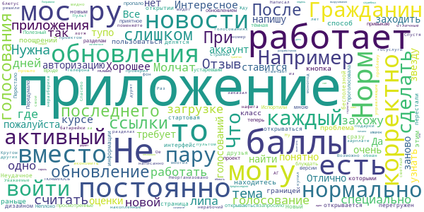

> Полезный проект👍  :date: __2021-07-08 20:13:04__

> Неорганизовано нормально то, что я за баллы свои накопленные, заказал монопод с пультом блютус. Пульт нерабочий,батарейки даже специально купил, проверил-"липа". Написал поменяйте, нафига мне "липа"? Молчат. Не отвечают. Ну как так? Кругом неразбериха,обман. Жду прошло много дней. Гражданин активный, а его дурят. Раз молчат  :date: __2021-07-04 01:37:48__

> Не могу войти через мос.ру, т.к. на мос.ру захожу через госуслуги и активный гражданин не видит мой номер телефона, хотя он есть!!! Спустя пару лет проблему решили за пару дней. Спасибо  :date: __2021-07-03 11:05:02__

> В голосованиях и во многих других разделах слишком светлый фон, из-за чего почти не видно, что написанно. А так норм.  :date: __2021-06-09 06:17:40__

> Не могу понять, почему не даёт поделиться голосованиями? По новинкам всё нормально работает, а при попытке поделиться голосованием пишет: "опрос должен быть завершён". Что это за новая ошибка? Мне баллы за них начислены, опросы завершены, а поделиться невозможно. Обратите внимание, пожалуйста, исправьте это! Раньше такого не было.  :date: __2021-06-03 11:09:22__

> Интересное приложение  :date: __2021-05-27 17:03:24__

> Ое  :date: __2021-05-20 10:31:11__

> Хорошее приложение,отличные подарки  :date: __2021-05-08 16:30:06__

> Уважаемые управляющие проектом АГ. Возможно вы не в курсе, но экономить на зарплате разработчиков это предпоследняя по глупости идея после выкручивания ламп в служебных туалетах. Почините уже авторизацию, логиниться при каждой загрузке тупо. Поправили, авторизацию держит.  :date: __2021-04-28 09:08:33__

> Отлично  :date: __2021-04-26 20:47:53__

#### 3-star reviews

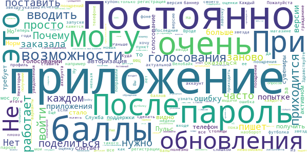

> Все места жительства и регистрации указаны, а проголосовать не могу, пишет что не указано место регистрации  :date: __2021-07-16 21:39:01__

> Вроде как "Тройку" пополнить можно. Плюс только в этом.  :date: __2021-07-12 06:04:48__

> Пароль замучил  :date: __2021-07-03 18:41:54__

> Не могу воспользоваться магазином поощрений.  :date: __2021-06-26 16:08:52__

> Ставлю 3. Только потому что заказала детскую футболку 5xs А пришла футболка xl. Она просто огромная. При этом листик в пакете лежал и на нем было указано что в комплект входит детская футболка. Это как.  :date: __2021-06-16 19:22:38__

> Нет возможности войти, не принимает пароли. Написали обновить версию, где её взять, если выложена только эта- 2.28.??? Ответ по Вашему обращению № SD16854569: Здравствуйте! Вы используете устаревшую версию приложения, текущая версия 2.28.0. Пожалуйста, обновите приложение до актуальной версии и проверьте наличие ошибки. С уважением, Служба поддержки проекта "Активный гражданин"  :date: __2021-06-07 19:46:05__

> Глюков всё больше...  :date: __2021-06-03 19:15:01__

> Приложение постоянно выдаёт ошибку при попытке поделиться пройденным голосованием. В компьютерной версии кнопка "поделиться" не срабатывает.  :date: __2021-06-02 23:03:16__

> Непонятно  :date: __2021-06-02 08:37:50__

> Постоянно требуется авторизация  :date: __2021-05-28 15:05:30__

#### 2-star reviews

> Слетает авторизация каждый раз после обновления  :date: __2021-07-10 21:47:46__

> Отвратительное приложение. Тратишь время, пишешь мнения, а приходит время и Твои заработанные баллы не принимают. Прошёл 6 аптек Столички. НИЧЕГО НЕ РАБОТАЕТ! Тех. Поддержка высылает - Ваш заказ действует! АФЕРЮГИ! P.S.Сейчас вообще снесли и 6300 баллов - СГОРЕЛИ!!!  :date: __2021-07-08 18:11:26__

> Бестолковое. Всёравно уже всё решили заранее. Ширма для чиновников  :date: __2021-06-23 21:15:02__

> Очень много ошибок в темном режиме. Часто текст не читаем.  :date: __2021-06-19 13:59:56__

> Взломали аккаунт, мошенники потратили накопленные баллы. Обратился в службу поддержки, спустя только пару месяцев специалисты соизволили ответить, несмотря на постоянные напоминания. В итоге " факт некорректного списания баллов не выявлен", то есть ни факт их списания с другого устройства, с измененного номера и ночью не смутил. Спасибо мля!!!  :date: __2021-06-18 19:28:00__

> Все хорошо пока, недавно скачал  :date: __2021-06-07 16:51:36__

> Не дает поделиться ни в одной из соцсетей.  :date: __2021-06-03 15:26:34__

> Последние два года постоянно проблемы с профилем. Что случилось?  :date: __2021-06-02 21:56:49__

> Вообще приложение мне нравится, если не считать двух "но" - сначала около месяца назад стал выкидывать каждые пять минут, приходилось заново авторизовываться постоянно (потом вроде исправили это), а сейчас и вовсе не дает зайти в приложение, пишет "неизвестная ошибка, попробуйте позже" - и так уже два дня подряд...  :date: __2021-05-09 06:50:42__

> Постоянно вылетает "вход". Каждый раз приходится перезаходить, из за чего слетают уведомления о голосованиях.  :date: __2021-05-09 00:47:40__

#### 1-star reviews

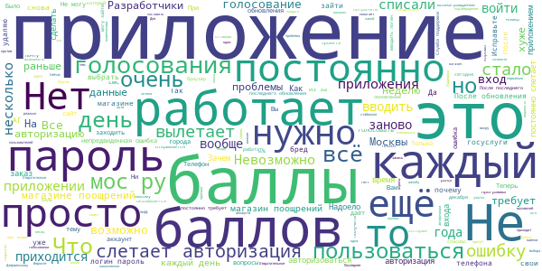

> Новый дизайн просто ужасен! Не удобно и не красиво.  :date: __2021-07-19 09:43:25__

> Зачемто ввели потверждение кодом из смс при заказе в магазине поощрений, в результате вышло как всегда - через анальное отверстие .Смс не приходит заказ сделать не возможно  :date: __2021-07-17 07:28:21__

> Нет связи уже месяц. 08.07.2021.  :date: __2021-07-08 12:38:35__

> Приложение стало ещё хуже чем было теперь воспользоваться баллами в магазине поощрений не возможно даже имея подтвержденную учётную запись. Зделано это специально  :date: __2021-07-08 10:22:41__

> Не могу зайти в акаунт полгода.  :date: __2021-07-07 05:35:19__

> Перестала работать при входе выдаёт ошибку  :date: __2021-07-06 06:24:11__

> Вылетает логин и пароль стабильно раз в неделю, это ужасно  :date: __2021-07-01 08:17:18__

> Не могу выбрать ничего из "магазина поощрений". После нажатия на любой товар, ничего не меняется  :date: __2021-06-30 06:51:14__

> Впервые поставил приложение, а у меня уже там баллы полгода назад списаны  :date: __2021-06-25 14:31:08__

> Приложению , как и проекту в целом давно необходимо обновление. 1. Дизайн (логотип, айдентика, юзабилити и т.п.) - устаревший; не актуальный; отталкивающий; неочевидный и не удобный. 2. Позиционирование - информация о проекте на просторах сети минимальная и устаревшая. Не понятно "зачем" и "почему" граждане должны использовать этот сервис, какая от него польза. У меня, как у одного из первых пользователей приложения, сложилось впечатление, что проект доживает свои последние дни и будет закрыт  :date: __2021-06-22 10:36:21__

# Госуслуги СТОП Коронавирус
App version ``1.1.2-gms``

Analyzed with [covid-apps-observer](http://github.com/covid-apps-observer) project, version ``0.1``

## App overview
| | |
|-------------------------|-------------------------| 
| **Name**&nbsp;&nbsp;&nbsp;&nbsp;&nbsp;&nbsp;&nbsp;&nbsp;&nbsp;&nbsp;&nbsp;&nbsp;&nbsp;&nbsp;&nbsp;&nbsp;&nbsp;&nbsp;&nbsp;&nbsp;&nbsp;&nbsp;&nbsp;&nbsp;&nbsp;&nbsp;&nbsp;&nbsp;&nbsp;&nbsp;&nbsp;&nbsp;&nbsp;&nbsp;&nbsp;&nbsp;&nbsp;&nbsp;&nbsp;&nbsp;  | Госуслуги СТОП Коронавирус |
| **Unique identifier** | com.minsvyaz.gosuslugi.stopcorona |
| **Link to Google Play** | [https://play.google.com/store/apps/details?id=com.minsvyaz.gosuslugi.stopcorona](https://play.google.com/store/apps/details?id=com.minsvyaz.gosuslugi.stopcorona) |
| **Summary**  | Результаты тестов на COVID-19, сертификат вакцинации, QR-код для проверки. |
| **Privacy policy** | [https://gu-st.ru/content/Other/stopcovidpoliciesprivacy.pdf](https://gu-st.ru/content/Other/stopcovidpoliciesprivacy.pdf) |
| **Latest version** | 1.1.2-gms |
| **Last update** | 2021-07-15 17:03:13 |
| **Recent changes** | Исправили проблемы с авторизацией |
| **Installs**  | 1 000 000+ |
| **Category** | Здоровье и фитнес |
| **First release** | 27 мар. 2020 г. |
| **Size**  | 11M |
| **Supported Android version**  | 6.0 и выше |

### Description
> СТОП-Коронавирус — официальное приложение для контроля за распространением COVID-19. Доступно гражданам России с подтверждённой учётной записью Госуслуг 
 Предъявляйте сертификаты о вакцинации, справки, ПЦР-тесты и анкеты для прибывающих из-за границы прямо с телефона. Храните и просматривайте в приложении тесты на антитела
 Документы на русском и английском языках 
 Сертификат вакцинации появится в приложении после прививки. После полного курса сертификат можно отправить на работу и предъявить в виде QR-кода везде, где попросят 
 Справка о перенесённом заболевании доступна для предъявления и отправки в Роспотребнадзор для прибывающих из-за границы 
 Сканируйте QR-коды с других устройств, если нужно проверить наличие сертификата, ПЦР-теста или убедиться, что человек перенёс заболевание 
 Отправляйте жалобы на проблемы с сертификатом или записью на вакцинацию. Минздрав и другие организации рассмотрят обращение и помогут с решением

### User interface
The developers of the app provide the following screenshots in the Google play store.
| | | |
|:-------------------------:|:-------------------------:|:-------------------------:|
 | 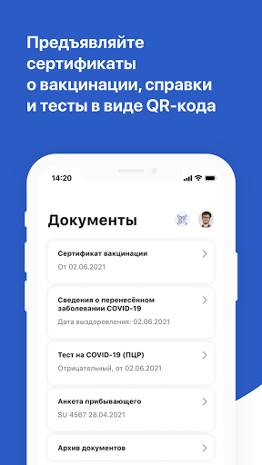  | 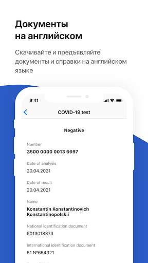  | 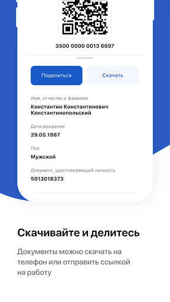  | 
 | 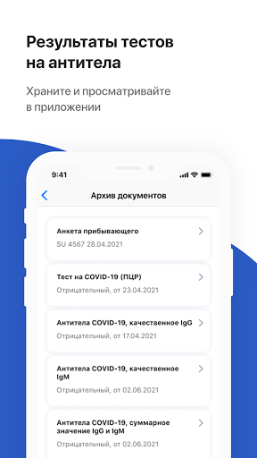 

## Development team
In the following we report the main information provided by the development team in the Google play store.

| | |
|-------------------------|-------------------------|
| **Developer**  | Минцифры России |
| **Website**  | - |
| **Email** | support_mp@gosuslugi.ru |
| **Physical address**  | - |
| **Other developed apps**  | [https://play.google.com/store/apps/developer?id=7040530283788474945](https://play.google.com/store/apps/developer?id=7040530283788474945) |

## Android support

| | |
|-------------------------|-------------------------|
| **Declared target Android version**  | Android10, version 10 (API level 29) |
| **Effective target Android version**  | Android10, version 10 (API level 29) |
| **Minimum supported Android version**  | Lollipop, version 5.0 (API level 21) |
| **Maximum target Android version**  | - |

The larger the difference between the minimum and maximum supported Android versions, the better. A larger difference means a wider audience. For example, old phones have a very low Android version, so a high minimum supported Android version means that the app cannot be used by users with old phones, thus leading to accessibility problems. 

## Requested permissions

In the following we report the complete list of the permissions requested by the app. 

| **Permission** | **Protection level** | **Description** | 
|-------------------------|-------------------------|-------------------------|
 **android.permission ACCESS_FINE_LOCATION** | :warning:**Dangerous** | Allows an app to access precise location. 
 **android.permission ACCESS_NETWORK_STATE** | Normal | Allows applications to access information about networks. 
 **android.permission ACCESS_WIFI_STATE** | Normal | Allows applications to access information about Wi-Fi networks. 
 **android.permission CAMERA** | :warning:**Dangerous** | Required to be able to access the camera device. 
 **android.permission CHANGE_WIFI_STATE** | Normal | Allows applications to change Wi-Fi connectivity state. 
 **android.permission FOREGROUND_SERVICE** | Normal | Allows a regular application to use Service.startForeground. 
 **android.permission INTERNET** | Normal | Allows applications to open network sockets. 
 **android.permission READ_EXTERNAL_STORAGE** | :warning:**Dangerous** | Allows an application to read from external storage. 
 **android.permission RECEIVE_BOOT_COMPLETED** | Normal | Allows an application to receive the Intent.ACTION_BOOT_COMPLETED that is broadcast after the system finishes booting. 
 **android.permission VIBRATE** | Normal | Allows access to the vibrator. 
 **android.permission WAKE_LOCK** | Normal | Allows using PowerManager WakeLocks to keep processor from sleeping or screen from dimming. 
 **android.permission WRITE_EXTERNAL_STORAGE** | :warning:**Dangerous** | Allows an application to write to external storage. 
 **com.google.android.c2dm.permission RECEIVE** | - | - 
 **com.google.android.finsky.permission BIND_GET_INSTALL_REFERRER_SERVICE** | - | - 

## Mentioned servers

| **Server** | **Registrant** | **Registrant country** | **Creation date** | 
|-------------------------|-------------------------|-------------------------|-------------------------|
 | googleapis.com | Google LLC | :us: US | 2005-01-25 17:52:26 |
 | googlesyndication.com | Google LLC | :us: US | 2003-01-21 06:17:24 |
 | google.com | Google LLC | :us: US | 1997-09-15 04:00:00 |
 | googleadservices.com | Google LLC | :us: US | 2003-06-19 16:34:53 |
 | app-measurement.com | Google LLC | :us: US | 2015-06-19 20:13:31 |
 | crashlytics.com | Google LLC | :us: US | 2011-01-21 15:30:40 |
 | gosuslugi.ru | - | - | 2008-09-01 20:00:00 |
 | yandex.ru | - | - | 1997-09-23 09:45:07 |

## Security analysis 

Below we report the main security warnings raised by our execution of the [Androwarn](https://github.com/maaaaz/androwarn) security analysis tool.

**Telephony identifiers leakage**
> - This application reads the MCC+MNC of the provider of the SIM 
> - This application reads the constant indicating the state of the device SIM card 
> - This application reads the current location of the device 
> - This application reads the neighboring cell information of the device 
> - This application reads the radio technology (network type) currently in use on the device for data transmission 
> - This application reads the Cell ID value 
> - This application reads the Location Area Code value 

**Connection interfaces exfiltration**
> - This application reads details about the currently active data network 
> - This application tries to find out if the currently active data network is metered 

**Telephony services abuse**
> - This application makes phone calls 

**Suspicious connection establishment**
> - This application opens a Socket and connects it to the remote address '; port is out of range' on the 'N/A' port  
> - This application opens a Socket and connects it to the remote address 'Ljava/net/Proxy;->type()Ljava/net/Proxy$Type;' on the 'N/A' port  
> - This application opens a Socket and connects it to the remote address 'Lp/a/a/a/a;->a(Ljava/lang/String;)Ljava/lang/StringBuilder;' on the 'N/A' port  
> - This application opens a Socket and connects it to the remote address 'timeout' on the 'N/A' port  

**Code execution**
> - This application loads a native library: 'Landroid/text/TextUtils;->isEmpty(Ljava/lang/CharSequence;)Z' 

## User ratings and reviews

Below we provide information about how end users are reacting to the app in terms of ratings and reviews in the Google Play store.

### Ratings

The Госуслуги СТОП Коронавирус app has been installed by more than **1000000** times. At this time, **33542** rated the app and its average score is **1.8033373**. Below we show the distribution of the ratings across the usual star-based rating of Google Play

:star::star::star::star::star:: 5137

:star::star::star::star:: 999

:star::star::star:: 959

:star::star:: 1479

:star:: 24968

### Reviews 

#### 5-star reviews

> Всё работает отлично  :date: __2021-07-19 13:52:57__

> Просто и надёжно.  :date: __2021-07-19 04:41:19__

> После обновлееия приложение не запускается  :date: __2021-07-17 12:53:31__

> Что-то пошло не так (с)  :date: __2021-07-17 10:35:36__

> После обновления перестало загружаться. Экран с надписью "госуслуги. Добро пожаловать." пересекает коричневая вертикальная полоса (справа налево, примерно раз в секунду).  :date: __2021-07-17 08:56:52__

> 30лет в стране бардак и в вашей системе бардак когда человека ободрать все работать , а когда решит что то одни препятствия.спосибо Медведеву компьютерному мальчику и его партии слугам народа, но только не России!  :date: __2021-07-16 09:53:54__

> ЖИВУ В ДОМЕ-ИНТЕРНАТЕ . ВАКЦИНАЦИЯ БЫЛА 27.03.2021 . С МАРТА 2020 ПО СЕЙ ДЕНЬ НАХОДИМСЯ В КАРАНТИНЕ , КАК "ПРОКАЖЁННЫЕ" ... ВОПРОС - ТАК , НА ХРЕНА НАМ ЭТА ВАКЦИНАЦИЯ , ЕСЛИ ВСЁ ЖИВЁМ "ПЛАТНОЙ ТЮРЬМЕ"?  :date: __2021-07-15 18:54:59__

> Установил, ввел логин и пароль, всё в порядке, глюков не было. Режим нот 9  :date: __2021-07-15 17:16:01__

> стало работать гораздо лучше. Если у кого-то после обновления началась дискотека со входом, то необходимо удалить приложение и снова установить. Всё работает.  :date: __2021-07-14 19:12:56__

> Не работает  :date: __2021-07-14 13:50:30__

#### 4-star reviews

> Как то не удобненько все....суховато  :date: __2021-07-18 22:58:22__

> Жалко нельзя поставить меньше 1 звезды. Приложение лежит;) и уже не подаёт признаков жизни почти месяц. Отличный софт. UPD: Ладно, молодцы;) починили)  :date: __2021-07-17 18:22:43__

> Удобно  :date: __2021-07-16 13:58:12__

> Не работает Update: Наконец-то починили, спасибо. Получил qr-код Были проблемы при первом входе, автоподстановка гугла сюрасывалась после заполнения, пришлось лог/пас вручную вбивать  :date: __2021-07-15 19:06:17__

> Здравствуйте, не могу скачать qr код. А так все работает.  :date: __2021-07-15 18:22:19__

> После обновления, в англоязычной версии сертификата не отображается загранпаспорт, хотя в предыдущей версии все было корректно. Также, при скачивании pdf-версии, в русскоязычном варианте не отображаются данные российского паспорта. Исправьте, пожалуйста.  :date: __2021-07-15 08:06:16__

> Здравствуйте! В приложении при попытке скачать сертификат переболевшего появляется ошибка.  :date: __2021-07-14 17:28:16__

> Добавьте на страницу с английским языком данные заграничного паспорта  :date: __2021-07-14 08:57:10__

> Сертификат на английском языке не подгружает данные загранпаспорта, вместо него российский.  :date: __2021-07-13 07:13:04__

> При изменении выбора демонстрации QR-кода с русского на английский не реализовано изменение привязанного документа удостоверяющего личность. В обоих случаях показывается номер внутреннего паспорта, а по логике в английской версии должны отображаться либо оба - и внутренний, и заграничный, либо хотя бы только заграничный.  :date: __2021-07-11 08:32:18__

#### 3-star reviews

> Все работает, но для входа нужно потанцевать с бубном. Автозаполнением пользоваться нельзя, потому что программа сразу слетает, все нужно заново вводить- и логин и пароль.  :date: __2021-07-16 13:09:05__

> Почему нет такой темы в этой программе"Я переболел ковид, обращался в больницу, пцр тест не показал наличие этой заразы, симптомы были все ковидные, с потерей нюха и прочее" антитела есть, но qr кода нет!  :date: __2021-07-15 15:33:47__

> После обновления невозможно открыть код, кнопка Скачать не работает вообще, а после попытки нажать эту кнопку, приложение вообще перестаёт работать.  :date: __2021-07-15 07:11:33__

> Х140721  :date: __2021-07-14 10:04:55__

> После обновления невозможно войти, постоянная "дискотека" со сменой экрана входа. Переустановил, вроде зашёл. На троечку с такими танцами.  :date: __2021-07-13 15:47:26__

> Начался глюк, мигает и не заходит! До этого работало!  :date: __2021-07-13 13:36:47__

> Не подтягивает сертификат вакцинации с госуслуг. Но зато показывает результаты ПЦР.  :date: __2021-07-09 17:57:14__

> Пишет : 'Интернет отключен'! И хоть убейся об стену, неработает. Upd.09.07.21 внезапно заработало, но сертификат вакцинации не показывает.  :date: __2021-07-09 15:41:59__

> Возможно кому то и полезно приложение, но почему не подгружаются данные сертификата переболевшего?! Все как всегда работает через одно место в этом Минздраве.  :date: __2021-07-09 08:14:12__

> После обновления пришлось переустановить, при автозаполнении логина и пароля форма постоянно обновлялась и введенные данные сбрасывались. Пришлось вспоминать пароль и вводить все вручную. Xiaomi mi note 10 lite  :date: __2021-07-09 07:42:30__

#### 2-star reviews

> Что с приложением, не могу его открыть  :date: __2021-07-16 15:24:12__

> Не работае  :date: __2021-07-16 11:23:06__

> Сначала всё было нормально, а теперь дискотека со входом.  :date: __2021-07-15 14:21:50__

> Походу программа сама корону подхватила  :date: __2021-07-15 11:57:42__

> Сломалось приложение. Да и нужно то оно было только чтоб КуРэ код показывало.  :date: __2021-07-14 12:03:51__

> На сайте госуслуг и в приложении госуслуги в сертификате о вакцинации есть данные загранпаспорта. А в этом приложении только российский. Предлагает исправить паспортные данные в личном кабинете, но там все правильно, оба паспорта есть. Какая-то ерунда  :date: __2021-07-13 10:36:56__

> Перестало работать, постоянная смена экранов  :date: __2021-07-13 09:20:31__

> Присоединяюсь к последним отзывам: приложение не загружается, постоянно мигающий экран загрузки. И это уже больше недели! Когда уже наконец будет исправлено?!  :date: __2021-07-13 07:32:12__

> После обновления перестало работать.Заходить в приложение не хочет,все мерцает.  :date: __2021-07-12 10:35:12__

> Плохо работает.  :date: __2021-07-10 15:58:41__

#### 1-star reviews

> Вылет сразу при входе.  :date: __2021-07-19 10:05:18__

> Разраб даун  :date: __2021-07-19 09:50:42__

> Испортили все своими последними двумя обновлениями! Разработчики, вы хоть отзывы читаете? Верните все обратно!!!  :date: __2021-07-19 06:24:37__

> Разработчик(и) кретин(ы). На этом все! Спасибо за внимание.  :date: __2021-07-18 21:34:44__

> Вообще незагружается!  :date: __2021-07-18 16:03:08__

> Приходится в день переустанавливать приложение  :date: __2021-07-18 16:01:12__

> Скачала, установила, ввела код 4значный. Затем приложение пишет Здравствуйте, Ирина! И просит снова и снова, снова и снова ввести 4значный код и дальше непускает....  :date: __2021-07-18 13:11:59__

> Даже не открывается!!!!  :date: __2021-07-18 10:43:06__

> Удалила старое приложение и установила новое. Приложение требует постоянной авторизации и не открывается!!!!!!!!  :date: __2021-07-18 00:50:15__

> Идите куда подальше  :date: __2021-07-17 23:42:51__

# Contact Tracker
App version ``1.3``

Analyzed with [covid-apps-observer](http://github.com/covid-apps-observer) project, version ``0.1``

## App overview
| | |
|-------------------------|-------------------------| 
| **Name**&nbsp;&nbsp;&nbsp;&nbsp;&nbsp;&nbsp;&nbsp;&nbsp;&nbsp;&nbsp;&nbsp;&nbsp;&nbsp;&nbsp;&nbsp;&nbsp;&nbsp;&nbsp;&nbsp;&nbsp;&nbsp;&nbsp;&nbsp;&nbsp;&nbsp;&nbsp;&nbsp;&nbsp;&nbsp;&nbsp;&nbsp;&nbsp;&nbsp;&nbsp;&nbsp;&nbsp;&nbsp;&nbsp;&nbsp;&nbsp;  | Contact Tracker |
| **Unique identifier** | com.vjet.covid |
| **Link to Google Play** | [https://play.google.com/store/apps/details?id=com.vjet.covid](https://play.google.com/store/apps/details?id=com.vjet.covid) |
| **Summary**  | Contact Tracker предупреждает о контактах с человеком инфицированном COVID-19. |
| **Privacy policy** | [https://covid-19.y-media.io/privacy-policy/pp-ru.html](https://covid-19.y-media.io/privacy-policy/pp-ru.html) |
| **Latest version** | 1.3 |
| **Last update** | 2020-04-17 17:32:35 |
| **Recent changes** | - |
| **Installs**  | 1 000+ |
| **Category** | Социальные |
| **First release** | 24 мар. 2020 г. |
| **Size**  | 2,1M |
| **Supported Android version**  | 5.0 и выше |

### Description
> Приложение Contact Tracker, предупреждает пользователя о том, что он контактировал с человеком инфицированным COVID19. 
 Contact Tracker, использует технологию Bluetooth для трекинга контактов на расстоянии 3х метров.
 Пользователь может увидеть количество контактов в течении дня, 14 дней и за все время использования приложения.
 Если у пользователя был подтвержден диагноз COVID19, все пользователи с которыми он контактировал получат уведомление.
 Приложение работает в фоновом режиме и способно записывать контакты других пользователей у которых тоже запущено приложение.
 Вся информация является конфиденциальной и будет удалена после окончания эпидемии.

### User interface
The developers of the app provide the following screenshots in the Google play store.
| | | |
|:-------------------------:|:-------------------------:|:-------------------------:|
 |   |   |   | 
 |  

## Development team
In the following we report the main information provided by the development team in the Google play store.

| | |
|-------------------------|-------------------------|
| **Developer**  | v-jet |
| **Website**  | [https://covid-19.y-media.io/ru/](https://covid-19.y-media.io/ru/) |
| **Email** | alex@y-media.io |
| **Physical address**  | [Work Email: vlad@v-jet.net Legal Entity: VI JET, TOV 49000, Ukraine, Dnipro, Knyazya Yaroslava Mudrogo str., 27](https://www.google.com/maps/search/Work%20Email:%20vlad@v-jet.net%20Legal%20Entity:%20VI%20JET,%20TOV%2049000,%20Ukraine,%20Dnipro,%20Knyazya%20Yaroslava%20Mudrogo%20str.,%2027) (Google Maps) |
| **Other developed apps**  | [https://play.google.com/store/apps/developer?id=v-jet](https://play.google.com/store/apps/developer?id=v-jet) |

## Android support

| | |
|-------------------------|-------------------------|
| **Declared target Android version**  | Android10, version 10 (API level 29) |
| **Effective target Android version**  | Android10, version 10 (API level 29) |
| **Minimum supported Android version**  | Lollipop, version 5.0 (API level 21) |
| **Maximum target Android version**  | - |

The larger the difference between the minimum and maximum supported Android versions, the better. A larger difference means a wider audience. For example, old phones have a very low Android version, so a high minimum supported Android version means that the app cannot be used by users with old phones, thus leading to accessibility problems. 

## Requested permissions

In the following we report the complete list of the permissions requested by the app. 

| **Permission** | **Protection level** | **Description** | 
|-------------------------|-------------------------|-------------------------|
 **android.permission ACCESS_BACKGROUND_LOCATION** | :warning:**Dangerous** | Allows an app to access location in the background. 
 **android.permission ACCESS_COARSE_LOCATION** | :warning:**Dangerous** | Allows an app to access approximate location. 
 **android.permission ACCESS_FINE_LOCATION** | :warning:**Dangerous** | Allows an app to access precise location. 
 **android.permission ACCESS_NETWORK_STATE** | Normal | Allows applications to access information about networks. 
 **android.permission BLUETOOTH** | Normal | Allows applications to connect to paired bluetooth devices. 
 **android.permission BLUETOOTH_ADMIN** | Normal | Allows applications to discover and pair bluetooth devices. 
 **android.permission FOREGROUND_SERVICE** | Normal | Allows a regular application to use Service.startForeground. 
 **android.permission INTERNET** | Normal | Allows applications to open network sockets. 
 **android.permission RECEIVE_BOOT_COMPLETED** | Normal | Allows an application to receive the Intent.ACTION_BOOT_COMPLETED that is broadcast after the system finishes booting. 
 **android.permission WAKE_LOCK** | Normal | Allows using PowerManager WakeLocks to keep processor from sleeping or screen from dimming. 
 **com.google.android.c2dm.permission RECEIVE** | - | - 
 **com.google.android.finsky.permission BIND_GET_INSTALL_REFERRER_SERVICE** | - | - 

## Mentioned servers

| **Server** | **Registrant** | **Registrant country** | **Creation date** | 
|-------------------------|-------------------------|-------------------------|-------------------------|
 | googlesyndication.com | Google LLC | :us: US | 2003-01-21 06:17:24 |
 | google.com | Google LLC | :us: US | 1997-09-15 04:00:00 |
 | app-measurement.com | Google LLC | :us: US | 2015-06-19 20:13:31 |
 | googleadservices.com | Google LLC | :us: US | 2003-06-19 16:34:53 |
 | googleapis.com | Google LLC | :us: US | 2005-01-25 17:52:26 |

## Security analysis 

Below we report the main security warnings raised by our execution of the [Androwarn](https://github.com/maaaaz/androwarn) security analysis tool.

**Connection interfaces exfiltration**
> - This application reads details about the currently active data network 

**Suspicious connection establishment**
> - This application opens a Socket and connects it to the remote address '; port is out of range' on the 'N/A' port  
> - This application opens a Socket and connects it to the remote address 'Lcom/android/tools/r8/GeneratedOutlineSupport;->outline11(Ljava/lang/String;)Ljava/lang/StringBuilder;' on the 'N/A' port  
> - This application opens a Socket and connects it to the remote address 'Ljava/net/Proxy;->type()Ljava/net/Proxy$Type;' on the 'N/A' port  
> - This application opens a Socket and connects it to the remote address 'timeout' on the 'N/A' port  

## User ratings and reviews

Below we provide information about how end users are reacting to the app in terms of ratings and reviews in the Google Play store.

### Ratings

The Contact Tracker app has been installed by more than **1000** times. At this time, **8** rated the app and its average score is **2.0**. Below we show the distribution of the ratings across the usual star-based rating of Google Play

:star::star::star::star::star:: 2

:star::star::star::star:: 0

:star::star::star:: 0

:star::star:: 0

:star:: 6

### Reviews 

#### 5-star reviews

No recent reviews available with 5 stars.

#### 4-star reviews

No recent reviews available with 4 stars.

#### 3-star reviews

No recent reviews available with 3 stars.

#### 2-star reviews

> Не возможно зарегистрироваться, не работает, все время ошибка  :date: __2020-11-25 11:08:32__

#### 1-star reviews

> Приложения не работает.  :date: __2021-01-22 04:58:30__

> При регистрации пишет ошибку  :date: __2021-01-19 10:29:08__

> Невозможно зарегистрироваться, вечная ошибка, поставил бы 0 звезд, жаль невозможно, упыри, зря время потратил😡  :date: __2021-01-05 19:15:52__

> Произошла ошибка при регистрации.  :date: __2020-12-25 05:30:56__

> Не могу зарегистрироваться!! Пишет "Incorrect data", ничего сделать не получается!  :date: __2020-12-20 11:39:58__

> Невозможно зарегистрироваться. Удаляю...  :date: __2020-12-17 13:09:36__

> Не работает  :date: __2020-11-25 11:09:01__

> Не работает  :date: __2020-11-24 09:36:27__

> Не регистрацию не как не могу пройти  :date: __2020-11-24 08:18:00__

> Не работает. Регистрация невозможна, скорее всего, приложение ворует пороли от ваших ящиков и платежные данные. А идея предупредить о вирусе - была хорошая.  :date: __2020-07-24 13:56:48__

# Карта жителя НО
App version ``2.1.2``

Analyzed with [covid-apps-observer](http://github.com/covid-apps-observer) project, version ``0.1``

## App overview
| | |
|-------------------------|-------------------------| 
| **Name**&nbsp;&nbsp;&nbsp;&nbsp;&nbsp;&nbsp;&nbsp;&nbsp;&nbsp;&nbsp;&nbsp;&nbsp;&nbsp;&nbsp;&nbsp;&nbsp;&nbsp;&nbsp;&nbsp;&nbsp;&nbsp;&nbsp;&nbsp;&nbsp;&nbsp;&nbsp;&nbsp;&nbsp;&nbsp;&nbsp;&nbsp;&nbsp;&nbsp;&nbsp;&nbsp;&nbsp;&nbsp;&nbsp;&nbsp;&nbsp;  | Карта жителя НО |
| **Unique identifier** | com.nizhniy_mobile |
| **Link to Google Play** | [https://play.google.com/store/apps/details?id=com.nizhniy_mobile](https://play.google.com/store/apps/details?id=com.nizhniy_mobile) |
| **Summary**  | Персональный электронный ключ к городской среде |
| **Privacy policy** | [https://drive.google.com/file/d/1IcZ0NtRJXhbX8yMoAQaGwMOU3Vfppvtm/view](https://drive.google.com/file/d/1IcZ0NtRJXhbX8yMoAQaGwMOU3Vfppvtm/view) |
| **Latest version** | 2.1.2 |
| **Last update** | 2021-07-01 14:12:41 |
| **Recent changes** | Новый дизайн Мультипасс 800. Отображение Карты Жителя в профиле пользователя. Возможность загрузки фотографии в профиль и отображение ее в Мультипасс 800. Фикс багов. |
| **Installs**  | 100 000+ |
| **Category** | Социальные |
| **First release** | 2 апр. 2020 г. |
| **Size**  | 68M |
| **Supported Android version**  | 5.0 и выше |

### Description
> Бесплатное приложение для всех жителей Нижегородской области. С его помощью любой житель может взаимодействовать с городом и пользование различными услугами становится удобным, понятным и приятным.

### User interface
The developers of the app provide the following screenshots in the Google play store.
| | | |
|:-------------------------:|:-------------------------:|:-------------------------:|
 | 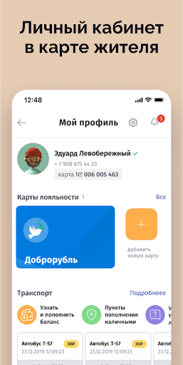  |   | 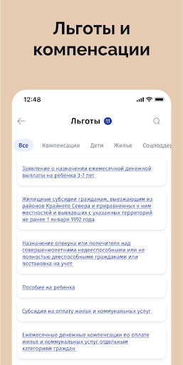  | 
 |   |  

## Development team
In the following we report the main information provided by the development team in the Google play store.

| | |
|-------------------------|-------------------------|
| **Developer**  | Мининформ Нижегородской области |
| **Website**  | [http://nn-card.ru](http://nn-card.ru) |
| **Email** | info@nn-card.ru |
| **Physical address**  | - |
| **Other developed apps**  | [https://play.google.com/store/apps/developer?id=%D0%9C%D0%B8%D0%BD%D0%B8%D0%BD%D1%84%D0%BE%D1%80%D0%BC+%D0%9D%D0%B8%D0%B6%D0%B5%D0%B3%D0%BE%D1%80%D0%BE%D0%B4%D1%81%D0%BA%D0%BE%D0%B9+%D0%BE%D0%B1%D0%BB%D0%B0%D1%81%D1%82%D0%B8](https://play.google.com/store/apps/developer?id=%D0%9C%D0%B8%D0%BD%D0%B8%D0%BD%D1%84%D0%BE%D1%80%D0%BC+%D0%9D%D0%B8%D0%B6%D0%B5%D0%B3%D0%BE%D1%80%D0%BE%D0%B4%D1%81%D0%BA%D0%BE%D0%B9+%D0%BE%D0%B1%D0%BB%D0%B0%D1%81%D1%82%D0%B8) |

## Android support

| | |
|-------------------------|-------------------------|
| **Declared target Android version**  | Android10, version 10 (API level 29) |
| **Effective target Android version**  | Android10, version 10 (API level 29) |
| **Minimum supported Android version**  | KitKat W, version 4.4W - 4.4.4W (API level 20) |
| **Maximum target Android version**  | - |

The larger the difference between the minimum and maximum supported Android versions, the better. A larger difference means a wider audience. For example, old phones have a very low Android version, so a high minimum supported Android version means that the app cannot be used by users with old phones, thus leading to accessibility problems. 

## Requested permissions

In the following we report the complete list of the permissions requested by the app. 

| **Permission** | **Protection level** | **Description** | 
|-------------------------|-------------------------|-------------------------|
 **android.permission ACCESS_COARSE_LOCATION** | :warning:**Dangerous** | Allows an app to access approximate location. 
 **android.permission ACCESS_FINE_LOCATION** | :warning:**Dangerous** | Allows an app to access precise location. 
 **android.permission ACCESS_NETWORK_STATE** | Normal | Allows applications to access information about networks. 
 **android.permission ACCESS_WIFI_STATE** | Normal | Allows applications to access information about Wi-Fi networks. 
 **android.permission CAMERA** | :warning:**Dangerous** | Required to be able to access the camera device. 
 **android.permission INTERNET** | Normal | Allows applications to open network sockets. 
 **android.permission READ_APP_BADGE** | - | - 
 **android.permission READ_EXTERNAL_STORAGE** | :warning:**Dangerous** | Allows an application to read from external storage. 
 **android.permission READ_PHONE_STATE** | :warning:**Dangerous** | Allows read only access to phone state, including the phone number of the device, current cellular network information, the status of any ongoing calls, and a list of any PhoneAccounts registered on the device. 
 **android.permission USE_BIOMETRIC** | Normal | Allows an app to use device supported biometric modalities. 
 **android.permission USE_FINGERPRINT** | Normal | This constant was deprecated in API level 28. Applications should request USE_BIOMETRIC instead 
 **android.permission WAKE_LOCK** | Normal | Allows using PowerManager WakeLocks to keep processor from sleeping or screen from dimming. 
 **android.permission WRITE_EXTERNAL_STORAGE** | :warning:**Dangerous** | Allows an application to write to external storage. 
 **com.anddoes.launcher.permission UPDATE_COUNT** | - | - 
 **com.android.vending CHECK_LICENSE** | - | - 
 **com.google.android.c2dm.permission RECEIVE** | - | - 
 **com.google.android.finsky.permission BIND_GET_INSTALL_REFERRER_SERVICE** | - | - 
 **com.htc.launcher.permission READ_SETTINGS** | - | - 
 **com.htc.launcher.permission UPDATE_SHORTCUT** | - | - 
 **com.huawei.android.launcher.permission CHANGE_BADGE** | - | - 
 **com.huawei.android.launcher.permission READ_SETTINGS** | - | - 
 **com.huawei.android.launcher.permission WRITE_SETTINGS** | - | - 
 **com.majeur.launcher.permission UPDATE_BADGE** | - | - 
 **com.oppo.launcher.permission READ_SETTINGS** | - | - 
 **com.oppo.launcher.permission WRITE_SETTINGS** | - | - 
 **com.sec.android.provider.badge.permission READ** | - | - 
 **com.sec.android.provider.badge.permission WRITE** | - | - 
 **com.sonyericsson.home.permission BROADCAST_BADGE** | - | - 
 **com.sonymobile.home.permission PROVIDER_INSERT_BADGE** | - | - 
 **me.everything.badger.permission BADGE_COUNT_READ** | - | - 
 **me.everything.badger.permission BADGE_COUNT_WRITE** | - | - 

## Mentioned servers

| **Server** | **Registrant** | **Registrant country** | **Creation date** | 
|-------------------------|-------------------------|-------------------------|-------------------------|
 | adobe.com | Adobe Inc. | :us: US | 1986-11-17 05:00:00 |
 | apache.org | The Apache Software Foundation | :us: US | 1995-04-11 04:00:00 |
 | xml.org | OASIS Open | :us: US | 1997-02-03 05:00:00 |
 | w3.org | W3C | :us: US | 1994-07-06 04:00:00 |
 | purl.org | Internet Archive | :us: US | 1996-01-01 05:00:00 |
 | android.com | Google LLC | :us: US | 1997-06-23 04:00:00 |
 | googlesyndication.com | Google LLC | :us: US | 2003-01-21 06:17:24 |
 | google.com | Google LLC | :us: US | 1997-09-15 04:00:00 |
 | facebook.com | Facebook, Inc. | :us: US | 1997-03-29 05:00:00 |
 | iptc.org | Whois Privacy Service | :us: US | 1995-12-27 05:00:00 |
 | useplus.org | PLUS COALITION | :us: US | 2003-11-18 19:31:25 |
 | npes.org | NPES | :us: US | 1996-01-30 05:00:00 |
 | aiim.org | Association for Information and Image Management International | :us: US | 1995-10-18 04:00:00 |
 | app-measurement.com | Google LLC | :us: US | 2015-06-19 20:13:31 |
 | drewnoakes.com | REDACTED FOR PRIVACY | GB | 2002-04-04 10:00:05 |
 | googleapis.com | Google LLC | :us: US | 2005-01-25 17:52:26 |
 | googleadservices.com | Google LLC | :us: US | 2003-06-19 16:34:53 |

## Security analysis 

Below we report the main security warnings raised by our execution of the [Androwarn](https://github.com/maaaaz/androwarn) security analysis tool.

**Telephony identifiers leakage**
> - This application reads the MCC+MNC of the provider of the SIM 
> - This application reads the numeric name (MCC+MNC) of current registered operator 
> - This application reads the operator name 

**Connection interfaces exfiltration**
> - This application reads details about the currently active data network 
> - This application tries to find out if the currently active data network is metered 

**Audio video eavesdropping**
> - This application records audio from the 'CAMCORDER' source  
> - This application records audio from the 'MIC' source  
> - This application captures video from the 'CAMERA' source 
> - This application captures video from the 'SURFACE' source 

**Suspicious connection establishment**
> - This application opens a Socket and connects it to the remote address '' on the 'N/A' port  
> - This application opens a Socket and connects it to the remote address 'Ljava/lang/StringBuilder;->toString()Ljava/lang/String;' on the ': connect, resolve' port  
> - This application opens a Socket and connects it to the remote address 'Ljava/lang/StringBuilder;->toString()Ljava/lang/String;' on the 'N/A' port  
> - This application opens a Socket and connects it to the remote address 'Ljava/net/Proxy;->type()Ljava/net/Proxy$Type;' on the 'N/A' port  
> - This application opens a Socket and connects it to the remote address 'timeout' on the 'N/A' port  

**Pim data leakage**
> - This application accesses the downloads folder 
> - This application accesses data stored in the clipboard 

**Code execution**
> - This application loads a native library 
> - This application loads a native library: 'Ljava/util/Iterator;->next()Ljava/lang/Object;' 
> - This application loads a native library: 'c++_shared' 
> - This application loads a native library: 'jniPdfium' 
> - This application loads a native library: 'modft2' 
> - This application loads a native library: 'modpdfium' 
> - This application loads a native library: 'modpng' 
> - This application loads a native library: 'ucrop' 
> - This application executes a UNIX command 

## User ratings and reviews

Below we provide information about how end users are reacting to the app in terms of ratings and reviews in the Google Play store.

### Ratings

The Карта жителя НО app has been installed by more than **100000** times. At this time, **10195** rated the app and its average score is **1.9423828**. Below we show the distribution of the ratings across the usual star-based rating of Google Play

:star::star::star::star::star:: 1802

:star::star::star::star:: 298

:star::star::star:: 478

:star::star:: 547

:star:: 7070

### Reviews 

#### 5-star reviews

> Сделайте куар код привитым от КоВида.  :date: __2021-07-13 14:28:08__

> Супер  :date: __2021-07-02 17:47:06__

> Сделайте пожалуйста темную тему и добавьте в образование категорию высшее!!! А так всё устраивает  :date: __2021-06-19 16:16:01__

> Хорошее приложение. Передаю показания счётчиков в Центр-СБК и подписался на получение платёжного документа от них.  :date: __2021-04-22 14:19:10__

> Довольно перспективное приложение. Очень интересно как его разовьют в будущем. Успехов разрабам!  :date: __2020-07-26 10:57:33__

> Удалите все мои персональные данные.  :date: __2020-06-24 21:12:37__

> Теперь кодов нет спасибо  :date: __2020-06-11 22:18:26__

> все норм.все работает  :date: __2020-06-11 22:08:26__

> Очень удобное приложение. Сидишь дома, да ещё и деньги платят каждый день по 10 рублей. 😅  :date: __2020-06-02 10:36:49__

> Последние несколько дней, после создания заявки, кнопка Qr кода не активна.. а последние 2 заявки с неактивным кодом вообще исчезли...  :date: __2020-06-01 08:16:03__

#### 4-star reviews

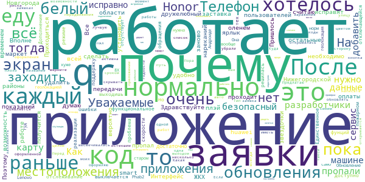

> Здравствуйте. ЖКХ только для Н. Новгорода. А как остальные районы? Я считаю, что необходимо сделать возможность оплаты и передачи показаний для всей Нижегородской области.  :date: __2021-04-29 18:48:15__

> Все нормально работает. Интерфейс пока не очень дружелюбный для пользователей, но думаю, что со временем все исправят.  :date: __2020-06-30 19:51:07__

> После обновления белый экран, заставка с оленем проходит и потом белый экран. Телефон huawei p smart z. Пришлось удалить и установить заново, теперь всё работает.  :date: __2020-06-28 12:51:57__

> 🍪🏩  :date: __2020-06-12 07:17:00__

> После обновления пропал ярлык приложения. Приходиться каждый раз заходить в плэй-маркет. Очень не удобно... К работе нареканий нет. Поэтому 4 звездочки  :date: __2020-06-04 17:35:19__

> Вполне вероятно получится достаточно функциональное приложение. Пока что то, что уже доступно работает нормально. Единственное почему-то отслеживание местоположения не выключается даже тогда, когда выходишь из приложения. Но ошибки это нормально при такой скорости реализации фунций в пожарном режиме. Дополнение. После обращения в тех. поддержку решилась проблема с не отключающейся геолокацией. Обновление 02.06.2020 гуд. На Honor 8X и 10-м Андроиде все работает норм. На старом Lenovo Phab2 хуже.  :date: __2020-06-04 10:45:52__

> Уважаемые разработчики,а почему отсутствует геолокация? Она что вообще больше не нужна? Тогда зачем нужно само приложение?  :date: __2020-06-01 09:36:06__

> Хотелось бы иметь код передвижения на авто. Я еду одна, риска нет заражения.. Раньше был код-еду на машине, а теперь его почему-то убрали.  :date: __2020-05-26 11:20:34__

> У меня в "моих заявках" нет ни одной оформленной в мае заявки! Почему? Куда пропали? Перед выходом на улицу оформляю QR код всегда.  :date: __2020-05-18 11:12:39__

> Почему в приложении после оформления заявки не активна кнопка QR-код, она раньше высвечивалась синим цветом и открывалась а сейчас не открывается? И верните пжл..Тип заявки Еду на машине/такси, как это было раньше! Если обновлять данные, то лучше уж в лучшую сторону)  :date: __2020-05-13 17:18:07__

#### 3-star reviews

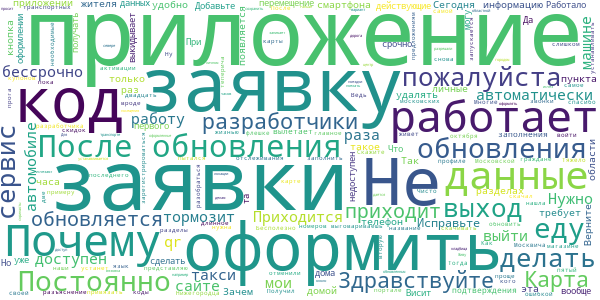

> Ну вот честно смысл от этого приложения? Куда не ткни везде переход по ссылке. Я вбив в поиск могу быстрее все найти. Обещали сделать привязку по школе-в школе пропуска сделаны, до сих пор ничего нет в приложении. А хотелось посмотреть попробовать испытать. Родителям донести. Но не судьба.  :date: __2021-07-11 22:26:32__

> Здравствуйте разработчики. Скажите, а зачем такое слишком длинное название (пока выговариваешь -- язык устанет), можно же проще: "Карта Нижегородца", так же как "Карта Москвича"? Я представляю: "Карта жителя Московской области". Ведь не удобно же  :date: __2021-02-17 16:17:10__

> Приложение живёт своей жизнью, двадцать пятый раз требует заполнить личные данные в профиле. Сегодня 14 октября скачал и пытался войти/зарегистрироваться. Бесполезно. Получил разъяснение разработчика, спасибо.  :date: __2020-10-23 11:44:29__

> Не приходит код для активации,только звонки с московских номеров!  :date: __2020-10-09 07:44:44__

> Так отменили коды то вроде. Зачем теперича эта прога нужна??? Чисто для отслеживания если только. Ну и граждане самое главное - наши личные данные у кого сейчас на флешке????  :date: __2020-06-17 18:52:53__

> У меня две транспортных карты. Как привязать вторую?  :date: __2020-06-17 12:40:56__

> Тяжело разобраться в разделах. Многие необходимые разделы есть только на портале, но не приложении. К примеру, я не нашла информацию по самой карте жителя и по предложениям скидок и купонов по ней  :date: __2020-06-12 10:56:18__

> После последнего обновления запускается с ошибкой через раз.  :date: __2020-06-02 18:38:04__

> Приложение не обновляется автоматически. Так же не появляется кнопка "обновить" в магазине. Приходится удалять приложение со смартфона, и скачивать и устанавливать снова. Тогда приложение устанавливается обновленным.  :date: __2020-06-02 10:37:03__

> Для посещения кладбища за городом (Вязовка), как мне оформлять заявку?  :date: __2020-06-01 07:55:48__

#### 2-star reviews

> юужели6.1к.ул  :date: __2021-05-12 17:38:26__

> Приложение не работает  :date: __2021-04-07 11:43:03__

> Доброрубли просто пропали из профиля. Лучше бы вы вообще ничего не вводили чем такой развод. Написать из приложения в службу поддержки не выходит, допилите уже приложение, затея хорошая, реализация желает лучшего. П. С. Доброрубли появились, спасибо.  :date: __2021-01-27 18:26:01__

> Та же проблема что и у Кристины. Вместо кода подтверждения по смс получаю входящий звонок. После ответа звонок сбрасывается. Войти в приложение нельзя. !!!! Проблему решил. Оказывается нужно ввести последние 5 цифр номера с которого поступил звонок. Этой инфы в приложении нет, только в инструкции или на сайте  :date: __2020-10-15 11:16:09__

> При регистрации смс не приходит  :date: __2020-10-11 19:08:16__

> Такой обман - эти доброрубли))) Людям головы надурили, никому не надо тратить эти рубли на всякие ФОКи и псевдоскидки в магазинах. Все ждали, думаю, возможность пополнить свою транспортную карту за счет этих копеечных доброрублей (хоть маленький полезный бонус), но, конечно, уж такой щедрости нам ожидать не стоит (даже если нам это напрямую обещали).  :date: __2020-09-15 14:03:35__

> Не работает промокод купленный за добро рублина Lucky bike  :date: __2020-08-04 21:22:09__

> После очередного обновления, приложение при попытке оформить разрешение на выход просто вылетает.  :date: __2020-06-08 20:55:47__

> После обновления при попытке зайти в приложения стал зависать телефон, приложение не открывается и не реагирует на действия  :date: __2020-06-05 20:34:53__

> Отлично. После обновления крашится сразу после запуска. Если интересно Андроид 6.  :date: __2020-06-05 18:59:42__

#### 1-star reviews

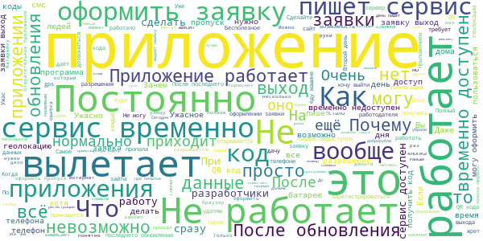

> Очередное оборанивание, AUSWEIS  :date: __2021-07-16 02:26:35__

> Программа не важная, даже мусора не просят запустить  :date: __2021-07-15 18:39:42__

> Результаты анализов не добавляются, техподдержка заявки игнорирует. По факту - бесполезная неработающая программа.  :date: __2021-07-10 21:37:37__

> Обещали возможность оплачивать бонусными рублями проезд в общественном транспорте. Прошел год! Общение не сдержали Воз и нынче там!  :date: __2021-06-11 19:14:19__

> Геморойное приложении.не выключались пока не удалил  :date: __2021-04-16 19:58:19__

> удаляю этот бредо-софт, необоснованно пожирающий огромное пространство памяти телефона. За околонулевой функционал морозить почти полторы сотни мегабайт - расточительство!  :date: __2021-04-15 05:12:31__

> электронные кандалы, выманивает личные данные  :date: __2021-04-14 06:46:11__

> После установки данного приложения,сбрасываются все месенджеры открываешь и они закрываются. Помогает только удаление данного приложения.В чем проблемма?  :date: __2021-03-23 17:57:33__

> Сегодня надо передавать показания, а он в ответ пишет сервис временно не работает  :date: __2021-03-23 06:00:02__

> Я не буду делать ваши прививки!!! Делайте сами!!!  :date: __2021-01-27 04:48:20__

# Электронная регистратура
App version ``1.14.77``

Analyzed with [covid-apps-observer](http://github.com/covid-apps-observer) project, version ``0.1``

## App overview
| | |
|-------------------------|-------------------------| 
| **Name**&nbsp;&nbsp;&nbsp;&nbsp;&nbsp;&nbsp;&nbsp;&nbsp;&nbsp;&nbsp;&nbsp;&nbsp;&nbsp;&nbsp;&nbsp;&nbsp;&nbsp;&nbsp;&nbsp;&nbsp;&nbsp;&nbsp;&nbsp;&nbsp;&nbsp;&nbsp;&nbsp;&nbsp;&nbsp;&nbsp;&nbsp;&nbsp;&nbsp;&nbsp;&nbsp;&nbsp;&nbsp;&nbsp;&nbsp;&nbsp;  | Электронная регистратура |
| **Unique identifier** | com.miacugra.telemed |
| **Link to Google Play** | [https://play.google.com/store/apps/details?id=com.miacugra.telemed](https://play.google.com/store/apps/details?id=com.miacugra.telemed) |
| **Summary**  | Онлайн-консультации |
| **Privacy policy** | [https://tm.dzhmao.ru/policy](https://tm.dzhmao.ru/policy) |
| **Latest version** | 1.14.77 |
| **Last update** | 2021-06-09 11:21:15 |
| **Recent changes** | - |
| **Installs**  | 1 000+ |
| **Category** | Медицина |
| **First release** | 30 мар. 2020 г. |
| **Size**  | 76M |
| **Supported Android version**  | 5.0 и выше |

### Description
> — Онлайн-консультации с врачами
 — Личный дневник пациента
 — Напоминания о фиксировании оценки самочувствия

### User interface
The developers of the app provide the following screenshots in the Google play store.
| | | |
|:-------------------------:|:-------------------------:|:-------------------------:|
 | 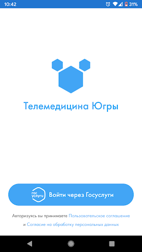  |   |   | 
 |   | 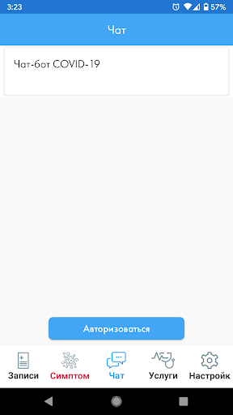  | 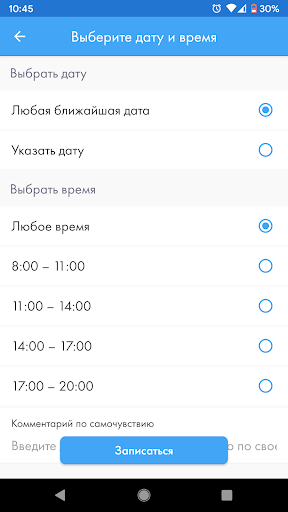  | 

## Development team
In the following we report the main information provided by the development team in the Google play store.

| | |
|-------------------------|-------------------------|
| **Developer**  | БУ "Медицинский информационно-аналитический центр" |
| **Website**  | [https://tm.dzhmao.ru/](https://tm.dzhmao.ru/) |
| **Email** | support@miacugra.ru |
| **Physical address**  | [628011, Россия, Ханты-Мансийский автономный округ - Югра, г. Ханты-Мансийск, ул. Студенческая, 15А](https://www.google.com/maps/search/628011,%20Россия,%20Ханты-Мансийский%20автономный%20округ%20-%20Югра,%20г.%20Ханты-Мансийск,%20ул.%20Студенческая,%2015А) (Google Maps) |
| **Other developed apps**  | [https://play.google.com/store/apps/developer?id=%D0%91%D0%A3+%22%D0%9C%D0%B5%D0%B4%D0%B8%D1%86%D0%B8%D0%BD%D1%81%D0%BA%D0%B8%D0%B9+%D0%B8%D0%BD%D1%84%D0%BE%D1%80%D0%BC%D0%B0%D1%86%D0%B8%D0%BE%D0%BD%D0%BD%D0%BE-%D0%B0%D0%BD%D0%B0%D0%BB%D0%B8%D1%82%D0%B8%D1%87%D0%B5%D1%81%D0%BA%D0%B8%D0%B9+%D1%86%D0%B5%D0%BD%D1%82%D1%80%22](https://play.google.com/store/apps/developer?id=%D0%91%D0%A3+%22%D0%9C%D0%B5%D0%B4%D0%B8%D1%86%D0%B8%D0%BD%D1%81%D0%BA%D0%B8%D0%B9+%D0%B8%D0%BD%D1%84%D0%BE%D1%80%D0%BC%D0%B0%D1%86%D0%B8%D0%BE%D0%BD%D0%BD%D0%BE-%D0%B0%D0%BD%D0%B0%D0%BB%D0%B8%D1%82%D0%B8%D1%87%D0%B5%D1%81%D0%BA%D0%B8%D0%B9+%D1%86%D0%B5%D0%BD%D1%82%D1%80%22) |

## Android support

| | |
|-------------------------|-------------------------|
| **Declared target Android version**  | Android10, version 10 (API level 29) |
| **Effective target Android version**  | Android10, version 10 (API level 29) |
| **Minimum supported Android version**  | Lollipop, version 5.0 (API level 21) |
| **Maximum target Android version**  | - |

The larger the difference between the minimum and maximum supported Android versions, the better. A larger difference means a wider audience. For example, old phones have a very low Android version, so a high minimum supported Android version means that the app cannot be used by users with old phones, thus leading to accessibility problems. 

## Requested permissions

In the following we report the complete list of the permissions requested by the app. 

| **Permission** | **Protection level** | **Description** | 
|-------------------------|-------------------------|-------------------------|
 **android.permission ACCESS_COARSE_LOCATION** | :warning:**Dangerous** | Allows an app to access approximate location. 
 **android.permission ACCESS_FINE_LOCATION** | :warning:**Dangerous** | Allows an app to access precise location. 
 **android.permission ACCESS_NETWORK_STATE** | Normal | Allows applications to access information about networks. 
 **android.permission ACCESS_WIFI_STATE** | Normal | Allows applications to access information about Wi-Fi networks. 
 **android.permission BLUETOOTH** | Normal | Allows applications to connect to paired bluetooth devices. 
 **android.permission BLUETOOTH_ADMIN** | Normal | Allows applications to discover and pair bluetooth devices. 
 **android.permission CAMERA** | :warning:**Dangerous** | Required to be able to access the camera device. 
 **android.permission FOREGROUND_SERVICE** | Normal | Allows a regular application to use Service.startForeground. 
 **android.permission INTERNET** | Normal | Allows applications to open network sockets. 
 **android.permission MANAGE_OWN_CALLS** | Normal | Allows a calling application which manages it own calls through the self-managed ConnectionService APIs. 
 **android.permission MODIFY_AUDIO_SETTINGS** | Normal | Allows an application to modify global audio settings. 
 **android.permission READ_CALENDAR** | :warning:**Dangerous** | Allows an application to read the user's calendar data. 
 **android.permission READ_EXTERNAL_STORAGE** | :warning:**Dangerous** | Allows an application to read from external storage. 
 **android.permission READ_PHONE_STATE** | :warning:**Dangerous** | Allows read only access to phone state, including the phone number of the device, current cellular network information, the status of any ongoing calls, and a list of any PhoneAccounts registered on the device. 
 **android.permission RECORD_AUDIO** | :warning:**Dangerous** | Allows an application to record audio. 
 **android.permission REORDER_TASKS** | Normal | Allows an application to change the Z-order of tasks. 
 **android.permission SYSTEM_ALERT_WINDOW** | Signature - preinstalled - appop - pre23 - development | Allows an app to create windows using the type WindowManager.LayoutParams.TYPE_APPLICATION_OVERLAY, shown on top of all other apps. 
 **android.permission USE_BIOMETRIC** | Normal | Allows an app to use device supported biometric modalities. 
 **android.permission USE_FINGERPRINT** | Normal | This constant was deprecated in API level 28. Applications should request USE_BIOMETRIC instead 
 **android.permission USE_FULL_SCREEN_INTENT** | Normal | Required for apps targeting Build.VERSION_CODES.Q that want to use notification full screen intents. 
 **android.permission VIBRATE** | Normal | Allows access to the vibrator. 
 **android.permission WAKE_LOCK** | Normal | Allows using PowerManager WakeLocks to keep processor from sleeping or screen from dimming. 
 **android.permission WRITE_CALENDAR** | :warning:**Dangerous** | Allows an application to write the user's calendar data. 
 **android.permission WRITE_EXTERNAL_STORAGE** | :warning:**Dangerous** | Allows an application to write to external storage. 
 **com.google.android.c2dm.permission RECEIVE** | - | - 
 **com.google.android.finsky.permission BIND_GET_INSTALL_REFERRER_SERVICE** | - | - 

## Mentioned servers

| **Server** | **Registrant** | **Registrant country** | **Creation date** | 
|-------------------------|-------------------------|-------------------------|-------------------------|
 | facebook.com | Facebook, Inc. | :us: US | 1997-03-29 05:00:00 |
 | google.com | Google LLC | :us: US | 1997-09-15 04:00:00 |
 | android.com | Google LLC | :us: US | 1997-06-23 04:00:00 |
 | googlesyndication.com | Google LLC | :us: US | 2003-01-21 06:17:24 |
 | google-analytics.com | Google LLC | :us: US | 2005-07-18 19:24:32 |
 | app-measurement.com | Google LLC | :us: US | 2015-06-19 20:13:31 |
 | microsoft.com | Microsoft Corporation | :us: US | 1991-05-02 04:00:00 |
 | googleapis.com | Google LLC | :us: US | 2005-01-25 17:52:26 |

## Security analysis 

Below we report the main security warnings raised by our execution of the [Androwarn](https://github.com/maaaaz/androwarn) security analysis tool.

**Telephony identifiers leakage**
> - This application reads the ISO country code equivalent for the SIM provider's country code 
> - This application reads the ISO country code equivalent of the current registered operator's MCC (Mobile Country Code) 
> - This application reads the device phone type value 
> - This application reads the numeric name (MCC+MNC) of current registered operator 
> - This application reads the operator name 
> - This application reads the phone number string for line 1, for example, the MSISDN for a GSM phone 
> - This application reads the unique device ID, i.e the IMEI for GSM and the MEID or ESN for CDMA phones 

**Connection interfaces exfiltration**
> - This application reads details about the currently active data network 
> - This application tries to find out if the currently active data network is metered 

**Telephony services abuse**
> - This application makes phone calls 

**Suspicious connection establishment**
> - This application opens a Socket and connects it to the remote address '' on the 'N/A' port  
> - This application opens a Socket and connects it to the remote address 'Ljava/lang/StringBuilder;->toString()Ljava/lang/String;' on the 'N/A' port  
> - This application opens a Socket and connects it to the remote address 'Ljava/net/Proxy;->type()Ljava/net/Proxy$Type;' on the 'N/A' port  
> - This application opens a Socket and connects it to the remote address 'timeout' on the 'N/A' port  

**Pim data leakage**
> - This application accesses the downloads folder 
> - This application accesses data stored in the clipboard 

**Code execution**
> - This application loads a native library 
> - This application loads a native library: 'Lcom/vc/app/App;->getNativeLibPath()Landroid/util/Pair;' 
> - This application loads a native library: 'TCAAudio' 
> - This application loads a native library: 'duktape' 
> - This application loads a native library: 'mono-native' 
> - This application loads a native library: 'monodroid' 
> - This application loads a native library: 'monosgen-2.0' 
> - This application loads a native library: 'xamarin-app' 
> - This application loads a native library: 'xamarin-debug-app-helper' 
> - This application executes a UNIX command 
> - This application executes a UNIX command containing this argument: '4' 
> - This application executes a UNIX command containing this argument: 'Lcom/vc/utils/log/LogcatHelper;->access$200()[Ljava/lang/String;' 

## User ratings and reviews

Below we provide information about how end users are reacting to the app in terms of ratings and reviews in the Google Play store.

### Ratings

The Электронная регистратура app has been installed by more than **1000** times. At this time, **15** rated the app and its average score is **2.1333334**. Below we show the distribution of the ratings across the usual star-based rating of Google Play

:star::star::star::star::star:: 4

:star::star::star::star:: 0

:star::star::star:: 0

:star::star:: 1

:star:: 10

### Reviews 

#### 5-star reviews

> Да  :date: __2021-02-09 18:20:23__

> Зашло  :date: __2020-04-23 18:09:54__

#### 4-star reviews

No recent reviews available with 4 stars.

#### 3-star reviews

No recent reviews available with 3 stars.

#### 2-star reviews

> Не возможно выбрать определённого педиатра  :date: __2020-09-02 19:11:48__

#### 1-star reviews

> Просто ужас.  :date: __2021-06-06 22:58:17__

> Ужас, кроме онлайн консультации вообще никуда не запишимся, и та в другом городе. Удаляю.  :date: __2021-04-28 20:03:09__

> Непонятное приложение  :date: __2021-04-13 22:12:33__

> Не работает. Не работает авторизация через госуслуги. Нет записи на прием к врачу.  :date: __2021-03-31 11:37:46__

> Инструкция по установке: 1. Установить 2. Запустить 3. Удалить Смысла в этом приложении нет  :date: __2021-03-29 20:09:37__

> Даже не находит наши учреждения, очень сырое приложение.Увы удалила.  :date: __2021-03-28 08:45:44__

> Бесполезная для меня приложение нет моего города. Плюс постоянно слетает авторизация.  :date: __2021-03-13 14:38:22__

> Не понятно о чем приложение. Если никуда невозможно записаться. Всего три услуги. При том что одна тестовая  :date: __2021-03-01 13:47:28__

> Пока толку нет от приложения. Записалась но со мной никто так и не связался  :date: __2020-06-04 05:30:21__

# Госуслуги.COVID трекер
App version ``1.1.0``

Analyzed with [covid-apps-observer](http://github.com/covid-apps-observer) project, version ``0.1``

## App overview
| | |
|-------------------------|-------------------------| 
| **Name**&nbsp;&nbsp;&nbsp;&nbsp;&nbsp;&nbsp;&nbsp;&nbsp;&nbsp;&nbsp;&nbsp;&nbsp;&nbsp;&nbsp;&nbsp;&nbsp;&nbsp;&nbsp;&nbsp;&nbsp;&nbsp;&nbsp;&nbsp;&nbsp;&nbsp;&nbsp;&nbsp;&nbsp;&nbsp;&nbsp;&nbsp;&nbsp;&nbsp;&nbsp;&nbsp;&nbsp;&nbsp;&nbsp;&nbsp;&nbsp;  | Госуслуги.COVID трекер |
| **Unique identifier** | com.minsvyaz.gosuslugi.exposurenotificationdroid |
| **Link to Google Play** | [https://play.google.com/store/apps/details?id=com.minsvyaz.gosuslugi.exposurenotificationdroid](https://play.google.com/store/apps/details?id=com.minsvyaz.gosuslugi.exposurenotificationdroid) |
| **Summary**  | Российское приложение для контроля за риском COVID-19. Технологии Apple и Google |
| **Privacy policy** | [https://gu-st.ru/content/Other/privacy_policy_exposurenotification.pdf](https://gu-st.ru/content/Other/privacy_policy_exposurenotification.pdf) |
| **Latest version** | 1.1.0 |
| **Last update** | 2021-02-15 12:16:33 |
| **Recent changes** | Оптимизировали определение и фиксирование контактов и добавили возможность указывать причину объявления о заболевании |
| **Installs**  | 50 000+ |
| **Category** | Здоровье и фитнес |
| **First release** | 4 нояб. 2020 г. |
| **Size**  | 9,6M |
| **Supported Android version**  | 6.0 и выше |

### Description
> Возможно, недавно вы были совсем близко с человеком, заболевшим COVID-19, но пока не знаете об этом. Установите приложение и проверьте. Сообщите другим пользователям, если заболели сами. Всё анонимно! Никто не узнает, кто заболел и где находится.
 Как приложение находит контакты?
 Ваше устройство ищет и запоминает данные других устройств поблизости, используя технологию Exposure Notification, которую совместно разработали компании Apple и Google. Данная технология позволяет вашему смартфону запоминать другие устройства поблизости через Bluetooth, обмениваясь с ними случайными ключами. Список переданных ключей хранится две недели на смартфоне, а потом удаляется. Если кто-то из пользователей заболел и у него положительный тест на COVID-19, он сообщает об этом анонимно через приложение. Уведомления отправляются на устройства, ключи которых сохранились на смартфоне за последние две недели. Их владельцы получат push-уведомление с датой контакта. Никто не увидит никаких данных заболевшего.
 Если у вас положительный тест на COVID-19, сообщите остальным пользователям, что заболели. Они не узнают, от кого пришло сообщение и где он находится. Приложение не передаёт данные о телефоне, его владельце и местоположении. Доступна только информация о контакте с COVID-19 в конкретную дату за последние 14 дней.
 Чем больше пользователей, тем точнее можно оценить риск заражения вирусом, вовремя сделать тест и начать лечение.
 Поможем друг другу оставаться здоровыми!
 Разработано Министерством цифрового развития, связи и массовых коммуникаций Российской Федерации при участии Министерства здравоохранения Российской Федерации.
 Приложение Госуслуги.COVID трекер предназначено для использования в Российской Федерации.

### User interface
The developers of the app provide the following screenshots in the Google play store.
| | | |
|:-------------------------:|:-------------------------:|:-------------------------:|
 |   |   |   | 
 |   | 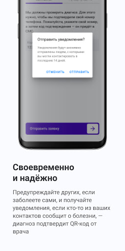 

## Development team
In the following we report the main information provided by the development team in the Google play store.

| | |
|-------------------------|-------------------------|
| **Developer**  | Минцифры России |
| **Website**  | - |
| **Email** | support_mp@gosuslugi.ru |
| **Physical address**  | - |
| **Other developed apps**  | [https://play.google.com/store/apps/developer?id=7040530283788474945](https://play.google.com/store/apps/developer?id=7040530283788474945) |

## Android support

| | |
|-------------------------|-------------------------|
| **Declared target Android version**  | - |
| **Effective target Android version**  | - |
| **Minimum supported Android version**  | Marshmallow, version 6.0 (API level 23) |
| **Maximum target Android version**  | - |

The larger the difference between the minimum and maximum supported Android versions, the better. A larger difference means a wider audience. For example, old phones have a very low Android version, so a high minimum supported Android version means that the app cannot be used by users with old phones, thus leading to accessibility problems. 

## Requested permissions

In the following we report the complete list of the permissions requested by the app. 

| **Permission** | **Protection level** | **Description** | 
|-------------------------|-------------------------|-------------------------|
 **android.permission ACCESS_NETWORK_STATE** | Normal | Allows applications to access information about networks. 
 **android.permission BLUETOOTH** | Normal | Allows applications to connect to paired bluetooth devices. 
 **android.permission FOREGROUND_SERVICE** | Normal | Allows a regular application to use Service.startForeground. 
 **android.permission INTERNET** | Normal | Allows applications to open network sockets. 
 **android.permission RECEIVE_BOOT_COMPLETED** | Normal | Allows an application to receive the Intent.ACTION_BOOT_COMPLETED that is broadcast after the system finishes booting. 
 **android.permission VIBRATE** | Normal | Allows access to the vibrator. 
 **android.permission WAKE_LOCK** | Normal | Allows using PowerManager WakeLocks to keep processor from sleeping or screen from dimming. 
 **com.google.android.c2dm.permission RECEIVE** | - | - 
 **com.google.android.finsky.permission BIND_GET_INSTALL_REFERRER_SERVICE** | - | - 

## Mentioned servers

| **Server** | **Registrant** | **Registrant country** | **Creation date** | 
|-------------------------|-------------------------|-------------------------|-------------------------|
 | googleapis.com | Google LLC | :us: US | 2005-01-25 17:52:26 |
 | googlesyndication.com | Google LLC | :us: US | 2003-01-21 06:17:24 |
 | google.com | Google LLC | :us: US | 1997-09-15 04:00:00 |
 | googleadservices.com | Google LLC | :us: US | 2003-06-19 16:34:53 |
 | app-measurement.com | Google LLC | :us: US | 2015-06-19 20:13:31 |
 | gosuslugi.ru | - | - | 2008-09-01 20:00:00 |
 | crashlytics.com | Google LLC | :us: US | 2011-01-21 15:30:40 |

## Security analysis 

Below we report the main security warnings raised by our execution of the [Androwarn](https://github.com/maaaaz/androwarn) security analysis tool.

**Connection interfaces exfiltration**
> - This application reads details about the currently active data network 
> - This application tries to find out if the currently active data network is metered 

**Telephony services abuse**
> - This application makes phone calls 

**Suspicious connection establishment**
> - This application opens a Socket and connects it to the remote address '; port is out of range' on the 'N/A' port  
> - This application opens a Socket and connects it to the remote address 'Le/b/a/a/a;->p(Ljava/lang/String;)Ljava/lang/StringBuilder;' on the 'N/A' port  
> - This application opens a Socket and connects it to the remote address 'Ljava/net/Proxy;->type()Ljava/net/Proxy$Type;' on the 'N/A' port  
> - This application opens a Socket and connects it to the remote address 'timeout' on the 'N/A' port  

## User ratings and reviews

Below we provide information about how end users are reacting to the app in terms of ratings and reviews in the Google Play store.

### Ratings

The Госуслуги.COVID трекер app has been installed by more than **50000** times. At this time, **361** rated the app and its average score is **2.5049505**. Below we show the distribution of the ratings across the usual star-based rating of Google Play

:star::star::star::star::star:: 118

:star::star::star::star:: 7

:star::star::star:: 14

:star::star:: 21

:star:: 201

### Reviews 

#### 5-star reviews

> Нравиться  :date: __2021-07-12 12:14:29__

> Блин, я так долго ожидал приложение что пропустил его выход на 8 месяцев, и нигде государство не рассказывает о его существовании  :date: __2021-07-07 17:02:00__

> Давно ждала это приложение от нашего министерства, надеюсь сделают хотя бы обязательную установку этого приложения!  :date: __2021-07-07 16:21:32__

> Бестолковое приложение. ..и Госуслуги - шлак. Первую прививку не показывает , и хрен на\*\** вторую , буду заражать , пока ноги носят. 😤  :date: __2021-07-07 15:46:41__

> Это бы работало, если бы все его поставили и все писали бы правду. Вот только если бы все были такими сознательными и, пока болеют, сидели бы по домам - приложение бы и не понадобилось. Вывод - бесполезное! А 5 ставлю потому что приложение и авторы не виноваты в традиционном русском пофигизме и наплевательстве на окружающих.  :date: __2021-07-05 21:06:46__

> норм приложение  :date: __2021-07-04 07:41:39__

> Ранее писал : Ура! Заработало! Эта программа потенциально способна заменить QR - код. Если попросить ее установить на телефоны большинства населения и оставить включенным блютуз телефонов, то мы наконец то можем получить реальную статистику контактов. Теперь пишу : да, у моей жены ковид с температурой - у меня горит 5. У меня ковид на закрытии больничного - у нее горит 3. Жалко девочку, которая 28 брала тест у меня (больше не с кем не контактировал). Слава Богу по ней опасность 3. Работает !!!  :date: __2021-07-02 18:57:57__

> хорошо  :date: __2021-07-01 19:54:59__

> Крутое приложение  :date: __2021-06-28 13:58:31__

> Молодцы! Приложение хорошее. Не понимаю других людей что оставляют отрицательные отзывы. Народ, государство постаралось, потратило деньги и рабочую силу ради вас, а вы как всегда впрочем.  :date: __2021-06-26 10:05:43__

#### 4-star reviews

> У меня никаких нет корновируса Нужно больше пить с чесноком и лимоном и по больше двигаться и бегать Занимается зарядкой и велосипедом ехать Будьте здоровы  :date: __2021-04-02 21:36:13__

> Нормальные  :date: __2021-04-02 07:27:31__

> Если чесно, то задумка хорошая, но в сознательром обществе. И точно не у нас. Ну вот кто признается то у него ковид? Зачем? Чтоб люди шарахались? Ладно бы вносились данные из лечебных учреждений. А то, сами болящие должны об этом беспокоится. А чего им беспокоится если они и так уже заболели. Это уже проблема ещё не заболевших. Да и вообще, когда человек заболел, то он меньше всего думает о том что зайти в приложение и что то там отметить. Ему в этот момент не до таких игрушек.  :date: __2021-03-30 00:23:41__

> zdrastvuite a pachimu uminia net pridlajenia putishestvia bez kovid19 skajite pajalusta jdu na vaprosa  :date: __2021-01-29 15:09:36__

> Единственное приложение, которое активируется. Но я не понимаю, оно вообще будет показывать опасные контакты и историю? Потому что пока ничего не показывает. Разработчики, а когда эта штука заработает?  :date: __2020-12-29 18:27:10__

> Нажимаю кнопку "Включить уведомления" - появляется сообщение "Что-то пошло не так". Смартфон - Samsung Galaxy Note10. Все разрешения и права приложению даны. Исправьте пожалуйста.  :date: __2020-12-03 14:41:21__

> Идея класс! Жаль регион не выбирается автоматически  :date: __2020-11-30 23:05:38__

> Сейчас это очень нужное приложение. Вместо того чтобы показывать не нужную рекламу. По всем каналам крутите что есть такое приложение,что его обязательно скачать. Работадатели пусть обязывают официальным приказом тех кто может скачивать это приложение. Это надо было сделать давно. Телефоны практически у всех  :date: __2020-11-30 21:01:22__

> На Андроиде не обновляется. Как установил в 1 ночи так то время и показывает. На iOS проблем нет  :date: __2020-11-25 08:24:32__

> Посмотрим насколько эффективное это приложение.  :date: __2020-11-25 07:38:24__

#### 3-star reviews

> У нас люди не любят сами на себя ставить клеймо, так что все здоровы, а вообще белен или нет должна ставить система автоматом  :date: __2021-07-16 12:58:16__

> Пришло уведомление о контакте с инфицированным. Захожу в приложение - ничего. Контактов не обнаружено  :date: __2021-07-15 20:17:34__

> Идея интересная. Но должен быть не регион, а вся страна. И данные должны быть не только от тех, кто сознательный. Но и из мед.учреждений. Но и то, и другое невозможно. Первое по причине головотяпства. Второе по закону о врачебной и медицинской тайне.  :date: __2021-06-28 09:03:39__

> Нужен постоянно включённый бт  :date: __2021-06-12 18:15:35__

> Ответьте срочно, пожалуйста! Мне пришло уведомление, что у меня был возможный контакт с больным, но при переходе в приложение никакой информации о контакте нет - все чисто! Мне завтра на работу ехать, к людям! Скажите, это сбой или есть о чем беспокоиться?  :date: __2021-03-24 11:26:25__

> А почему вы не добавите сертификат о вакцинации в это приложение? Можно будет отслеживать контакты вакцинированных. Приложение бессполезно практически, особенно в регионах. Люди не устанавливают и не отмечают, что заболели. Нужно мотивировать.  :date: __2021-03-21 19:27:30__

> Приложение будет работать, когда Роспотрнбнадзор, выдаст вам постановление и внесёт в свой реестр больных. У меня их так и не было, поэтому приложение пишет такие слова.  :date: __2020-12-27 10:12:06__

> Сама идея отличная. А Приложение странное. Не ясно - только по блютузу оно сканирует или и список контактов проверяет... скажем у меня точно есть контакты кто болеет,почему приложение меня не предупреждает? Интересно, разработчики в курсе , что на телефонах, если блютуз в фоне, то телефон невидимый при сканировании. Много вопросов...  :date: __2020-12-25 08:35:31__

> Не обновляет данные о возможных контактах, последнее обновление было 2 декабря, как можно это исправить?  :date: __2020-12-10 03:51:10__

> Отличная идея и программа. Но после установки у меня перестает работать обнаружение новых Bluetooth устройств, и не могу сделать сопряжение с Bluetooth наушниками. Пришлось удалить :(  :date: __2020-12-04 15:08:47__

#### 2-star reviews

> Задумка хорошая но никто этим не пользуется, поэтому оно бесполезно.  :date: __2021-06-20 04:06:33__

> Не хвотает боле автоматизации и минимальных действий пользователя или выбора автоматически ручной режим увидомления о positive test  :date: __2021-05-10 19:22:59__

> При установке ни слова не сказано о том что программа платная а теперь выскочило сообщение о ежемесячной оплате, за сто деньги берете.  :date: __2021-05-08 13:11:42__

> Пришло уведомление, что 14 дней назад был контакт с больным человеком. Однако, при открытии приложения, этой информации нет. Приложение показывает, что контактов не было. Чему верить?!  :date: __2021-04-04 08:30:42__

> Приложение было бы хорошие если бы не один минус, им почти никто не пользуется. Поработайте над рекламой ребята. Пока им никто не пользуется оно бесполезно.  :date: __2021-04-01 00:29:05__

> Пользовалась пару месяцев (СПб). Ни одного уведомления не было и это наверное хорошо. Плохо, что регулярно отваливался браслет Xiaomi mi band 4, телефон blackview pro 6800. Пару дней нормальной работы, потом не удаётся установить соединение до перезагрузки телефона. Если исправите, буду и дальше пользоваться.  :date: __2021-03-12 06:09:54__

> Идея хорошая, по факту - не работает. У нас двоих с подтвержденным ковидом день ото дня на попытки предупредить говорит, что диагноз не подтвержден.  :date: __2021-02-04 18:27:06__

> Ничего не показывает, ибо, кажется мне, пользуюсь им я одна... 😭 Удаляю.  :date: __2021-01-04 17:58:41__

> Если бы при регистрации указывался например номер паспорта и при заболевании это отпрпвлялось в приложение, было бы здорово. А так вокруг меня заболело много всех, я много ходил а приложение ничего не показывает... сам никто не будет в него оповещать, для этого социальная ответственность должна быть...  :date: __2020-12-28 06:22:35__

> Заработали на программе на государстве? Молодцы! Теперь пора бы сделать так чтобы она еще и работает. 1) Регистрацию в программе сделать через номер телефона. ОБЯЗАТЕЛЬНОЙ! 2) Автоматически отслеживать и сообщать другим что пользователь был заражен и находился рядом БЕЗ действий самого пользователя. 3) Добавить инструкции по моделям телефона как добавить программу в список исключений, чтобы программу не выбивало ради экономии заряда батареи. А пока это просто бесполезная программа.  :date: __2020-12-24 11:41:43__

#### 1-star reviews

> Приложение показывает только вакцынированых(то есть добровольно заражённых)  :date: __2021-07-17 17:40:16__

> Приложение бесполезно!!!!!!  :date: __2021-07-16 16:49:13__

> Не работает.  :date: __2021-07-14 22:03:42__

> Не согласна. Дурдом.вы раздули как .со6ласна с прививками. А раздули как пузырь.  :date: __2021-07-12 21:26:41__

> Абсолютно бесполезное по, куда загружать тест?!  :date: __2021-07-10 19:46:09__

> Неудобное, ужасное приложение, удалите его, будьте людьми  :date: __2021-07-09 15:15:33__

> Я хотел получить QR код о том что я переболел но ошибочно нажал на кнопку что я болею! И как мне исправить это недоразумение!???  :date: __2021-07-09 13:40:25__

> У меня вопрос в следующем при пересечении границы РФ с Казахстана, пишут что надо скачать данное приложение выбрать из списка ближайшую клинику где можно сдать пцр-тест взять qr код и с ним по приложению пересеч границу. Но есть одно но, где список клиник? Где камера чтоб сканировать qr-код?  :date: __2021-07-09 06:26:26__

> Не работает!!!  :date: __2021-07-08 11:45:50__

> Хотел бы узнать а что с теми у кого телефон не смартфон а обычный телефон? Например мой отец приезжает в конце июля и он в возрасте и телефон у него обычный. Как в таком случае пересекается границу ? Вы об этом думали ?  :date: __2021-07-07 20:32:12__

# Credits

This project makes use of the following main third-party projects:
* Androguard: [https://github.com/androguard/androguard](https://github.com/androguard/androguard)
* Androwarn: [https://github.com/maaaaz/androwarn](https://github.com/maaaaz/androwarn)
* google_play_scraper: [https://github.com/JoMingyu/google-play-scraper](https://github.com/JoMingyu/google-play-scraper)
* whois: [https://github.com/DannyCork/python-whois](https://github.com/DannyCork/python-whois)
* BeautifulSoup: [https://www.crummy.com/software/BeautifulSoup](https://www.crummy.com/software/BeautifulSoup)

Other open-source projects used in this project include: 

- androguard==3.3.5
- appnope==0.1.0
- asn1crypto==1.3.0
- backcall==0.1.0
- beautifulsoup4==4.9.0
- bs4==0.0.1
- certifi==2020.4.5.1
- cffi==1.14.0
- chardet==3.0.4
- click==7.1.2
- colorama==0.4.3
- cryptography==2.9.2
- cycler==0.10.0
- decorator==4.4.2
- future==0.18.2
- google-play-scraper==0.1.1
- idna==2.9
- ipython==7.13.0
- ipython-genutils==0.2.0
- jedi==0.17.0
- Jinja2==2.11.2
- joblib==0.14.1
- kiwisolver==1.2.0
- lxml==4.5.0
- MarkupSafe==1.1.1
- matplotlib==3.2.1
- networkx==2.4
- nltk==3.5
- numpy==1.18.3
- parso==0.7.0
- pexpect==4.8.0
- pickleshare==0.7.5
- Pillow==7.1.2
- play-scraper==0.6.0
- prompt-toolkit==3.0.5
- ptyprocess==0.6.0
- pycountry==19.8.18
- pycparser==2.20
- pydot==1.4.1
- Pygments==2.6.1
- pyOpenSSL==19.1.0
- pyparsing==2.4.7
- python-dateutil==2.8.1
- regex==2020.4.4
- requests==2.23.0
- requests-futures==1.0.0
- six==1.14.0
- soupsieve==2.0
- tld==0.12.1
- tqdm==4.45.0
- traitlets==4.3.3
- urllib3==1.25.9
- wcwidth==0.1.9
- wordcloud==1.7.0

