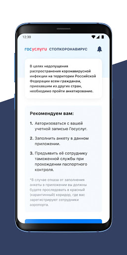

# Госуслуги СТОП Коронавирус
App version ``1.0.20``

Analyzed with [covid-apps-observer](http://github.com/covid-apps-observer) project, version ``0.1``

## App overview
| | |
|-------------------------|-------------------------| 
| **Name**&nbsp;&nbsp;&nbsp;&nbsp;&nbsp;&nbsp;&nbsp;&nbsp;&nbsp;&nbsp;&nbsp;&nbsp;&nbsp;&nbsp;&nbsp;&nbsp;&nbsp;&nbsp;&nbsp;&nbsp;&nbsp;&nbsp;&nbsp;&nbsp;&nbsp;&nbsp;&nbsp;&nbsp;&nbsp;&nbsp;&nbsp;&nbsp;&nbsp;&nbsp;&nbsp;&nbsp;&nbsp;&nbsp;&nbsp;&nbsp;  | Госуслуги СТОП Коронавирус |
| **Unique identifier** | com.minsvyaz.gosuslugi.stopcorona |
| **Link to Google Play** | [https://play.google.com/store/apps/details?id=com.minsvyaz.gosuslugi.stopcorona](https://play.google.com/store/apps/details?id=com.minsvyaz.gosuslugi.stopcorona) |
| **Summary**  | Результаты тестов на COVID-19, сертификат вакцинации, QR-код для проверки. |
| **Privacy policy** | [https://gu-st.ru/content/Other/stopcovidpoliciesprivacy.pdf](https://gu-st.ru/content/Other/stopcovidpoliciesprivacy.pdf) |
| **Latest version** | 1.0.20 |
| **Last update** | 2021-06-11 20:37:56 |
| **Recent changes** | Исправили ошибки и оптимизировали приложение. |
| **Installs**  | 1 000 000+ |
| **Category** | Здоровье и фитнес |
| **First release** | 27 мар. 2020 г. |
| **Size**  | 52M |
| **Supported Android version**  | 5.0 и выше |

### Description
> Для жителей Москвы оформление цифровых пропусков осуществляется через портал mos.ru
 Приложение позволяет выбрать подходящий для вас статус и заполнить анкеты для получения мобильного пропуска на выход из дома в период самоизоляции в формате QR - кода. Вы сможете предъявить его в электронном виде на мобильном устройстве или в распечатанном виде сотрудникам правоохранительных органов в случае необходимости.
 Также можно заблаговременно заполнить анкету регистрации лиц, подлежащих постановке на карантин и ускорить прохождение паспортного и таможенного контроля при прибытии на территорию Российской Федерации из стран, где зарегистрированы случаи заболевания новой коронавирусной инфекцией (2019-nCoV). 
 Режим изоляции необходимо соблюдать в течение 14 календарных дней. Эта обязанность не зависит от признаков заболевания: на карантине следует находиться даже людям без симптомов инфекции. 
 В период карантина необходимо быть дома или в обсервационном центре. Не следует посещать общественные места, ходить на работу или в учебное заведение. Если нет возможности работать удаленно и получать заработную плату, при наличии трудового договора можно воспользоваться электронными сервисами на портале gosuslugi.ru и оформить больничный лист для получения пособия по временной нетрудоспособности.

### User interface
The developers of the app provide the following screenshots in the Google play store.
| | | |
|:-------------------------:|:-------------------------:|:-------------------------:|
 |   |   |   | 
 |   |   |   | 

## Development team
In the following we report the main information provided by the development team in the Google play store.

| | |
|-------------------------|-------------------------|
| **Developer**  | Минцифры России |
| **Website**  | - |
| **Email** | support_mp@gosuslugi.ru |
| **Physical address**  | - |
| **Other developed apps**  | [https://play.google.com/store/apps/developer?id=7040530283788474945](https://play.google.com/store/apps/developer?id=7040530283788474945) |

## Android support

| | |
|-------------------------|-------------------------|
| **Declared target Android version**  | Android10, version 10 (API level 29) |
| **Effective target Android version**  | Android10, version 10 (API level 29) |
| **Minimum supported Android version**  | Lollipop, version 5.0 (API level 21) |
| **Maximum target Android version**  | - |

The larger the difference between the minimum and maximum supported Android versions, the better. A larger difference means a wider audience. For example, old phones have a very low Android version, so a high minimum supported Android version means that the app cannot be used by users with old phones, thus leading to accessibility problems. 

## Requested permissions

In the following we report the complete list of the permissions requested by the app. 

| **Permission** | **Protection level** | **Description** | 
|-------------------------|-------------------------|-------------------------|
 **android.permission ACCESS_FINE_LOCATION** | :warning:**Dangerous** | Allows an app to access precise location. 
 **android.permission ACCESS_NETWORK_STATE** | Normal | Allows applications to access information about networks. 
 **android.permission ACCESS_WIFI_STATE** | Normal | Allows applications to access information about Wi-Fi networks. 
 **android.permission CAMERA** | :warning:**Dangerous** | Required to be able to access the camera device. 
 **android.permission CHANGE_WIFI_STATE** | Normal | Allows applications to change Wi-Fi connectivity state. 
 **android.permission FOREGROUND_SERVICE** | Normal | Allows a regular application to use Service.startForeground. 
 **android.permission INTERNET** | Normal | Allows applications to open network sockets. 
 **android.permission READ_EXTERNAL_STORAGE** | :warning:**Dangerous** | Allows an application to read from external storage. 
 **android.permission RECEIVE_BOOT_COMPLETED** | Normal | Allows an application to receive the Intent.ACTION_BOOT_COMPLETED that is broadcast after the system finishes booting. 
 **android.permission VIBRATE** | Normal | Allows access to the vibrator. 
 **android.permission WAKE_LOCK** | Normal | Allows using PowerManager WakeLocks to keep processor from sleeping or screen from dimming. 
 **android.permission WRITE_EXTERNAL_STORAGE** | :warning:**Dangerous** | Allows an application to write to external storage. 
 **com.google.android.c2dm.permission RECEIVE** | - | - 
 **com.google.android.finsky.permission BIND_GET_INSTALL_REFERRER_SERVICE** | - | - 

## Mentioned servers

| **Server** | **Registrant** | **Registrant country** | **Creation date** | 
|-------------------------|-------------------------|-------------------------|-------------------------|
 | googleapis.com | Google LLC | :us: US | 2005-01-25 17:52:26 |
 | googlesyndication.com | Google LLC | :us: US | 2003-01-21 06:17:24 |
 | google.com | Google LLC | :us: US | 1997-09-15 04:00:00 |
 | googleadservices.com | Google LLC | :us: US | 2003-06-19 16:34:53 |
 | app-measurement.com | Google LLC | :us: US | 2015-06-19 20:13:31 |
 | crashlytics.com | Google LLC | :us: US | 2011-01-21 15:30:40 |
 | gosuslugi.ru | - | - | 2008-09-01 20:00:00 |
 | yandex.ru | - | - | 1997-09-23 09:45:07 |

## Security analysis 

Below we report the main security warnings raised by our execution of the [Androwarn](https://github.com/maaaaz/androwarn) security analysis tool.

**Telephony identifiers leakage**
> - This application reads the MCC+MNC of the provider of the SIM 
> - This application reads the constant indicating the state of the device SIM card 
> - This application reads the current location of the device 
> - This application reads the neighboring cell information of the device 
> - This application reads the radio technology (network type) currently in use on the device for data transmission 
> - This application reads the Cell ID value 
> - This application reads the Location Area Code value 

**Connection interfaces exfiltration**
> - This application reads details about the currently active data network 
> - This application tries to find out if the currently active data network is metered 

**Telephony services abuse**
> - This application makes phone calls 

**Suspicious connection establishment**
> - This application opens a Socket and connects it to the remote address '; port is out of range' on the 'N/A' port  
> - This application opens a Socket and connects it to the remote address 'Ljava/net/Proxy;->type()Ljava/net/Proxy$Type;' on the 'N/A' port  
> - This application opens a Socket and connects it to the remote address 'Lp/a/a/a/a;->a(Ljava/lang/String;)Ljava/lang/StringBuilder;' on the 'N/A' port  
> - This application opens a Socket and connects it to the remote address 'timeout' on the 'N/A' port  

**Code execution**
> - This application loads a native library: 'Landroid/text/TextUtils;->isEmpty(Ljava/lang/CharSequence;)Z' 

## User ratings and reviews

Below we provide information about how end users are reacting to the app in terms of ratings and reviews in the Google Play store.

### Ratings

The Госуслуги СТОП Коронавирус app has been installed by more than **1000000** times. At this time, **31800** rated the app and its average score is **2.4587042**. Below we show the distribution of the ratings across the usual star-based rating of Google Play

:star::star::star::star::star:: 9344

:star::star::star::star:: 1591

:star::star::star:: 1396

:star::star:: 1445

:star:: 18024

### Reviews 

#### 5-star reviews

> Все работает, только пока не понял зачем мне это )))  :date: __2021-06-21 10:32:53__

> За минуту получила QR код о прохождении вакцинации, удобно.  :date: __2021-06-18 10:30:11__

> Первое впечатление, приложение хорошее...  :date: __2021-06-18 07:55:00__

> Класс  :date: __2021-06-16 09:53:57__

> Супер спасибо большое  :date: __2021-06-10 08:36:59__

> Приложение, работает👍  :date: __2021-05-22 06:50:37__

> Отзыв  :date: __2021-05-14 05:47:10__

> Всё получилось в течение минуты)  :date: __2021-04-18 16:25:32__

> удобно  :date: __2021-04-05 14:21:50__

> Хорошое  :date: __2021-03-16 10:01:29__

#### 4-star reviews

> Приложение установилось, я успешно авторизовалась. На моменте заполнения анкеты есть пожелание: я уже давно работаю на удаленке, и почти никуда не хожу, а подобного пцнкта нет, пришлось выбрать здорова, хожу на работу, хотя это не так, я здорова, работаю удаленно. Так же приложение подтянуло данные с госуслуг, при этом мой адрес фактического проживания не совпадет с адресом регистрации, и в адресе проживания отсутствует улица, видимо поэтому приложение его не принимало, пришлось указать другой.  :date: __2021-06-18 09:51:21__

> Сегодня 08.02.21, но первый тест от 21.01.21, так же, как и второй, так и не отобразился. Уже выписалась. Нужен номер исследования.  :date: __2021-02-08 17:02:52__

> Все работает  :date: __2020-12-13 08:59:01__

> Все нормально  :date: __2020-10-19 20:55:17__

> ЫЯщя4Щщ8ф4?-😎  :date: __2020-07-23 02:22:02__

> Спасибо за Госуслуги  :date: __2020-07-16 04:36:30__

> IF  :date: __2020-07-04 15:26:47__

> Спасибо большое вя нас УЦ все чаще яп в  :date: __2020-07-03 17:22:09__

> Отличная работа!!!  :date: __2020-06-26 16:28:07__

> 8plucky 6th to testimony  :date: __2020-06-17 15:43:00__

#### 3-star reviews

> Непонятно как поменять статус. Не подтягиваются данные теста из медси. И непонятно как их загрузить.  :date: __2021-06-18 22:50:25__

> Для тех у кого проблемы с подключением, отключаете программы фильтрации и блокировки трафика. Очень много приложений ими расценивается как реклама... Или заносите в исключение. Не понятно правда зачем отдельное приложение.  :date: __2021-06-18 18:38:02__

> Приложение работало и мне очень нравилось, а на днях скачала гос услуги и оно переслало работать! Разочарована, почему переадресация сразу срабатывает, я бы хотела чтобы оба приложения работали, за это снимаю две звёзды.  :date: __2021-05-13 12:32:19__

> Не заходит в приложение, пишет "что то пошло не так" Huawei p10 lite  :date: __2021-03-10 05:09:17__

> Прививку сделала дважды, сертификат на госуслугах уже почти месяц жду, ничего не происходит.  :date: __2021-01-30 14:59:32__

> При загрузке пишет нет интернета. Ни wi-fi, ни моб. сеть не видит. Android 10 MIUI 12. Отключил AdGuard (VPN), заработало.  :date: __2021-01-07 16:04:14__

> Нет возможности распечатать результаты теста.  :date: __2020-12-17 15:44:50__

> А как зайти другим аккаунтом? Выход из приложения невозможен. Только удалять и заново устанавливать.  :date: __2020-12-10 17:46:28__

> Не могу найти нужную информацию.,  :date: __2020-12-01 06:28:44__

> И Ти ггт н. Г у нас кч ил к логотипу. В  :date: __2020-10-07 07:29:39__

#### 2-star reviews

> Разработчики, а зачем выкладывать приложение, которое не работает? Вы его может потестите сначала...upd. после третьей попытки авторизации всё-таки зашёл...  :date: __2021-06-21 12:18:14__

> "Ошибка! Нет интернета!" Работало и вдруг нате вам! Исправляйте!!!  :date: __2021-06-19 16:22:35__

> Сертификат неверный, возможности связаться с поддержкой нет  :date: __2021-06-18 11:27:10__

> Пытался получить результаты тестов на ковид, поскольку госуслуги отправляют сюда, однако это бесполезно. Медицинские учреждения заставляют печатать результат. А тут вылезает qr код, да и то последний, а где предыдущие? Как распечатать с мобильного? Бесполезное приложение.  :date: __2021-06-17 15:00:59__

> Электронный концлагерь  :date: __2021-06-14 17:14:17__

> ....о по-другому не скажешь  :date: __2021-05-25 17:37:18__

> Ничего непонятно и не срабатывает  :date: __2021-05-23 21:36:21__

> Сертификат вакцинации исчез. Плохая программа.  :date: __2021-04-23 21:20:08__

> А где сертификат о пройденной вакцинации???  :date: __2021-03-16 22:29:38__

> Плохое приложение не видит обещанного электронного сертификата о проведенной прививке, или не хочет искать, вместо конкретного вопроса предлагает опрос, который не нужен.  :date: __2021-03-02 13:25:28__

#### 1-star reviews

> Не работает  :date: __2021-06-21 13:18:51__

> Что-то пошло не так Даже вход осуществить не удается  :date: __2021-06-21 11:22:59__

> Не работает от слова совсем , думал я один такой , так нет у всех кто из моих знакомых не поставил не работает...  :date: __2021-06-21 10:47:07__

> Смысл в этом приложении, если оно не работает????  :date: __2021-06-21 10:32:58__

> Не работает приложение.  :date: __2021-06-21 09:37:31__

> Бесполезное приложение. Приложение предлагает прежде, чем посмотреть результаты тестов заполнить анкету пребывающих, которую я уже заполнял на госуслугах. У приложения есть интеграция с госуслугами, почему не взять информацию оттуда, зачем повторно заполнять? Условия самоизоляции для прибывающих в РФ из других стран, приводимые в приложении, не соответствуют условиям на сайте Роспотребнадзора. Дальше даже продолжать не стал.  :date: __2021-06-21 06:39:03__

> Не работает  :date: __2021-06-20 20:58:31__

> Не смогла даже войти, "что-то пошло не так"(  :date: __2021-06-20 14:33:56__

> Приложение не работает...  :date: __2021-06-20 08:54:46__

> Приложение при имеющемся интернете прекрасно скачалось и установилось. Запустить же не удалось ни под каким соусом. И при включенном WiFi и при мобильном интернете пишет Нет интернета.  :date: __2021-06-20 01:00:27__

