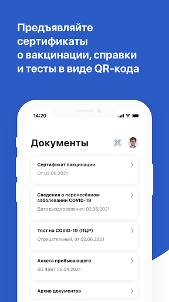
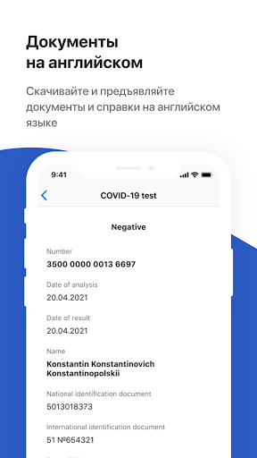
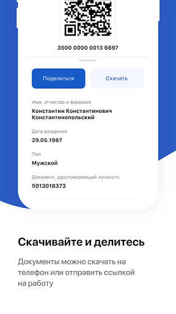
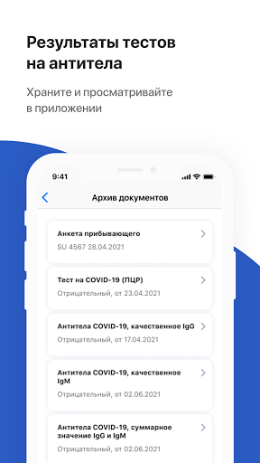

# Госуслуги СТОП Коронавирус
App version ``1.1.0-gms``

Analyzed with [covid-apps-observer](http://github.com/covid-apps-observer) project, version ``0.1``

## App overview
| | |
|-------------------------|-------------------------| 
| **Name**&nbsp;&nbsp;&nbsp;&nbsp;&nbsp;&nbsp;&nbsp;&nbsp;&nbsp;&nbsp;&nbsp;&nbsp;&nbsp;&nbsp;&nbsp;&nbsp;&nbsp;&nbsp;&nbsp;&nbsp;&nbsp;&nbsp;&nbsp;&nbsp;&nbsp;&nbsp;&nbsp;&nbsp;&nbsp;&nbsp;&nbsp;&nbsp;&nbsp;&nbsp;&nbsp;&nbsp;&nbsp;&nbsp;&nbsp;&nbsp;  | Госуслуги СТОП Коронавирус |
| **Unique identifier** | com.minsvyaz.gosuslugi.stopcorona |
| **Link to Google Play** | [https://play.google.com/store/apps/details?id=com.minsvyaz.gosuslugi.stopcorona](https://play.google.com/store/apps/details?id=com.minsvyaz.gosuslugi.stopcorona) |
| **Summary**  | Результаты тестов на COVID-19, сертификат вакцинации, QR-код для проверки. |
| **Privacy policy** | [https://gu-st.ru/content/Other/stopcovidpoliciesprivacy.pdf](https://gu-st.ru/content/Other/stopcovidpoliciesprivacy.pdf) |
| **Latest version** | 1.1.0-gms |
| **Last update** | 2021-07-02 04:54:58 |
| **Recent changes** | Обновился интерфейс, пропали лишние функции. Сертификаты и справки теперь и на английском языке — скачивайте, отправляйте или показывайте на экране. Добавлена форма для жалоб на вакцинацию и документы. Появилось ещё больше ответов на вопросы о COVID-19 |
| **Installs**  | 1 000 000+ |
| **Category** | Здоровье и фитнес |
| **First release** | 27 мар. 2020 г. |
| **Size**  | 19M |
| **Supported Android version**  | 6.0 и выше |

### Description
> СТОП-Коронавирус — официальное приложение для контроля за распространением COVID-19. Доступно гражданам России с подтверждённой учётной записью Госуслуг 
 Предъявляйте сертификаты о вакцинации, справки, ПЦР-тесты и анкеты для прибывающих из-за границы прямо с телефона. Храните и просматривайте в приложении тесты на антитела
 Документы на русском и английском языках 
 Сертификат вакцинации появится в приложении после прививки. После полного курса сертификат можно отправить на работу и предъявить в виде QR-кода везде, где попросят 
 Справка о перенесённом заболевании доступна для предъявления и отправки в Роспотребнадзор для прибывающих из-за границы 
 Сканируйте QR-коды с других устройств, если нужно проверить наличие сертификата, ПЦР-теста или убедиться, что человек перенёс заболевание 
 Отправляйте жалобы на проблемы с сертификатом или записью на вакцинацию. Минздрав и другие организации рассмотрят обращение и помогут с решением

### User interface
The developers of the app provide the following screenshots in the Google play store.
| | | |
|:-------------------------:|:-------------------------:|:-------------------------:|
 |   |   |   | 
 |  

## Development team
In the following we report the main information provided by the development team in the Google play store.

| | |
|-------------------------|-------------------------|
| **Developer**  | Минцифры России |
| **Website**  | - |
| **Email** | support_mp@gosuslugi.ru |
| **Physical address**  | - |
| **Other developed apps**  | [https://play.google.com/store/apps/developer?id=7040530283788474945](https://play.google.com/store/apps/developer?id=7040530283788474945) |

## Android support

| | |
|-------------------------|-------------------------|
| **Declared target Android version**  | Android10, version 10 (API level 29) |
| **Effective target Android version**  | Android10, version 10 (API level 29) |
| **Minimum supported Android version**  | Lollipop, version 5.0 (API level 21) |
| **Maximum target Android version**  | - |

The larger the difference between the minimum and maximum supported Android versions, the better. A larger difference means a wider audience. For example, old phones have a very low Android version, so a high minimum supported Android version means that the app cannot be used by users with old phones, thus leading to accessibility problems. 

## Requested permissions

In the following we report the complete list of the permissions requested by the app. 

| **Permission** | **Protection level** | **Description** | 
|-------------------------|-------------------------|-------------------------|
 **android.permission ACCESS_FINE_LOCATION** | :warning:**Dangerous** | Allows an app to access precise location. 
 **android.permission ACCESS_NETWORK_STATE** | Normal | Allows applications to access information about networks. 
 **android.permission ACCESS_WIFI_STATE** | Normal | Allows applications to access information about Wi-Fi networks. 
 **android.permission CAMERA** | :warning:**Dangerous** | Required to be able to access the camera device. 
 **android.permission CHANGE_WIFI_STATE** | Normal | Allows applications to change Wi-Fi connectivity state. 
 **android.permission FOREGROUND_SERVICE** | Normal | Allows a regular application to use Service.startForeground. 
 **android.permission INTERNET** | Normal | Allows applications to open network sockets. 
 **android.permission READ_EXTERNAL_STORAGE** | :warning:**Dangerous** | Allows an application to read from external storage. 
 **android.permission RECEIVE_BOOT_COMPLETED** | Normal | Allows an application to receive the Intent.ACTION_BOOT_COMPLETED that is broadcast after the system finishes booting. 
 **android.permission VIBRATE** | Normal | Allows access to the vibrator. 
 **android.permission WAKE_LOCK** | Normal | Allows using PowerManager WakeLocks to keep processor from sleeping or screen from dimming. 
 **android.permission WRITE_EXTERNAL_STORAGE** | :warning:**Dangerous** | Allows an application to write to external storage. 
 **com.google.android.c2dm.permission RECEIVE** | - | - 
 **com.google.android.finsky.permission BIND_GET_INSTALL_REFERRER_SERVICE** | - | - 

## Mentioned servers

| **Server** | **Registrant** | **Registrant country** | **Creation date** | 
|-------------------------|-------------------------|-------------------------|-------------------------|
 | googleapis.com | Google LLC | :us: US | 2005-01-25 17:52:26 |
 | googlesyndication.com | Google LLC | :us: US | 2003-01-21 06:17:24 |
 | google.com | Google LLC | :us: US | 1997-09-15 04:00:00 |
 | googleadservices.com | Google LLC | :us: US | 2003-06-19 16:34:53 |
 | app-measurement.com | Google LLC | :us: US | 2015-06-19 20:13:31 |
 | crashlytics.com | Google LLC | :us: US | 2011-01-21 15:30:40 |
 | gosuslugi.ru | - | - | 2008-09-01 20:00:00 |
 | yandex.ru | - | - | 1997-09-23 09:45:07 |

## Security analysis 

Below we report the main security warnings raised by our execution of the [Androwarn](https://github.com/maaaaz/androwarn) security analysis tool.

**Telephony identifiers leakage**
> - This application reads the MCC+MNC of the provider of the SIM 
> - This application reads the constant indicating the state of the device SIM card 
> - This application reads the current location of the device 
> - This application reads the neighboring cell information of the device 
> - This application reads the radio technology (network type) currently in use on the device for data transmission 
> - This application reads the Cell ID value 
> - This application reads the Location Area Code value 

**Connection interfaces exfiltration**
> - This application reads details about the currently active data network 
> - This application tries to find out if the currently active data network is metered 

**Telephony services abuse**
> - This application makes phone calls 

**Suspicious connection establishment**
> - This application opens a Socket and connects it to the remote address '; port is out of range' on the 'N/A' port  
> - This application opens a Socket and connects it to the remote address 'Ljava/net/Proxy;->type()Ljava/net/Proxy$Type;' on the 'N/A' port  
> - This application opens a Socket and connects it to the remote address 'Lp/a/a/a/a;->a(Ljava/lang/String;)Ljava/lang/StringBuilder;' on the 'N/A' port  
> - This application opens a Socket and connects it to the remote address 'timeout' on the 'N/A' port  

**Code execution**
> - This application loads a native library: 'Landroid/text/TextUtils;->isEmpty(Ljava/lang/CharSequence;)Z' 

## User ratings and reviews

Below we provide information about how end users are reacting to the app in terms of ratings and reviews in the Google Play store.

### Ratings

The Госуслуги СТОП Коронавирус app has been installed by more than **1000000** times. At this time, **33201** rated the app and its average score is **1.9145654**. Below we show the distribution of the ratings across the usual star-based rating of Google Play

:star::star::star::star::star:: 5811

:star::star::star::star:: 1103

:star::star::star:: 1103

:star::star:: 1605

:star:: 23579

### Reviews 

#### 5-star reviews

> Ура, работает  :date: __2021-07-10 13:19:45__

> Функционирует отлично ,пришлось удалить старую версию ,установить новую версию ,работает на двух системах (андроид 10- Xiaomi A2 и андроид 9- Яндекс смартфон) ,сбоев не обнаружил работает стабильно.  :date: __2021-07-09 22:54:30__

> 😉👍🏻👍🏻👍🏻🔥🔥🔥🔥🔥  :date: __2021-07-09 22:16:49__

> Приложение работает хорошо  :date: __2021-07-09 16:36:24__

> Хорошее  :date: __2021-07-09 13:40:17__

> Все работает, быстро и удобно. Для получения QR пройти минианкету. После обновления перестал работать. Переустановка все решила. Гуд.  :date: __2021-07-09 13:35:29__

> Полезное приложение  :date: __2021-07-09 12:12:26__

> Выполняет свою функцию, автоматически показывает ПЦР-тесты с Госуслуг  :date: __2021-07-09 08:22:06__

> Работает без сбоев  :date: __2021-07-09 08:10:10__

> После обновления приложение перестало запускаться, как отмечали многие пользователи. Однако, полностью удалил и установил приложение заново, после этого удалось войти в приложение с учётной от ГосУслуг. Сертификат о прививке, QR код отображается корректно, переключение языка тоже работает. Единственный недостаток - если выйти из приложения с помощью команды "Выйти", то при следующем запуске придётся вводить учётные данные заново. Если просто свернуть, то можно и по отпечатку войти  :date: __2021-07-09 07:21:33__

#### 4-star reviews

> При изменении выбора демонстрации QR-кода с русского на английский не реализовано изменение привязанного документа удостоверяющего личность. В обоих случаях показывается номер внутреннего паспорта, а по логике в английской версии должны отображаться либо оба - и внутренний, и заграничный, либо хотя бы только заграничный.  :date: __2021-07-11 08:32:18__

> Смогла решить проблему удалив кэш и сбросив настройки приложения. Затем заново зашла с использованием пароля. Заработало. Разработчики, вы больше таких косяков не делайте, люди в наше время могут попасть в неприятную ситуацию из-за вас.  :date: __2021-07-10 09:02:57__

> Не получается войти: После входа в Госуслуги выдаёт бесконечную загрузку Телефон: Huawei p40 pro; ОС: Android 10; Процессор: Hisilicon Kirin990; Поддерживаемые ABI: arm64-v8a, armeabi-v7a, armeabi; Исправьте. UPD: Обновили приложение, нареканий нет. Единственное - немного подтормаживает и не особо удобный интерфейс.  :date: __2021-07-08 12:51:09__

> Не открывается приложение. После перезагрузки, работает.  :date: __2021-07-07 13:13:23__

> Вошёл без проблем, код сертификата о перенесенном заболевании отобразился сразу. Хочу скачать на случай отсутствия интернета, выдает ошибку. Поэтому 4*. Санкт-Петербург.  :date: __2021-07-07 08:59:10__

> Приложение даже не подтянуло автозаролнение, а так конечно заработало.  :date: __2021-07-07 08:17:03__

> После обновления 7.7.21 надо перелогиньться чтобы заработало. Поменяли дизайн, местами стало удобнее. Жаль что убрали цветовую индикацию положительных/отрицательных тестов. Из минусов: – сертификат вакцинации при переключении на eng показывает российский паспорт, хотя есть данные заграника – в анкете прибывающего отсутствует графа о посещении Турции, хотя при заполнении была. Осталась только о Великобритании.  :date: __2021-07-07 07:11:16__

> Переустановка помогла с проблемами приложения.  :date: __2021-07-07 01:06:08__

> Заработало.  :date: __2021-07-06 17:35:22__

> Исправляются. Можно пользоваться.  :date: __2021-07-06 12:07:50__

#### 3-star reviews

> Не подтягивает сертификат вакцинации с госуслуг. Но зато показывает результаты ПЦР.  :date: __2021-07-09 17:57:14__

> Пишет : 'Интернет отключен'! И хоть убейся об стену, неработает. Upd.09.07.21 внезапно заработало, но сертификат вакцинации не показывает.  :date: __2021-07-09 15:41:59__

> Возможно кому то и полезно приложение, но почему не подгружаются данные сертификата переболевшего?! Все как всегда работает через одно место в этом Минздраве.  :date: __2021-07-09 08:14:12__

> После обновления пришлось переустановить, при автозаполнении логина и пароля форма постоянно обновлялась и введенные данные сбрасывались. Пришлось вспоминать пароль и вводить все вручную. Xiaomi mi note 10 lite  :date: __2021-07-09 07:42:30__

> Не могу войти в приложение, какой то глюк у программы. А так до сегодняшнего дня программа хорошо работала  :date: __2021-07-09 07:38:00__

> После обновления. Сертификат о вакцинации на английском подтягивает паспорт РФ, а не загран паспорт  :date: __2021-07-09 06:34:46__

> Последняя инфа от мая, хотя сдаю тесты каждую неделю. Почему нет остальных???  :date: __2021-07-08 08:01:05__

> После обновления - не запускается. Мелькает заставка Глсуслуг и все... Кэш чистил, удалял/переустанавливал - не помогло...  :date: __2021-07-08 04:01:59__

> Опробую, потом поставлю больше или меньше.  :date: __2021-07-07 11:30:18__

> Глючит после обновления. 20 раз выскакивает добро пожаловать гос услуги.  :date: __2021-07-07 10:56:42__

#### 2-star reviews

> Плохо работает.  :date: __2021-07-10 15:58:41__

> Невозможно зайти в приложение. Экран начинает моргать и зависает весь телефон  :date: __2021-07-10 13:42:13__

> после обновления уходит в постоянный поиск и не открывается  :date: __2021-07-10 11:52:30__

> Последнее обновление не открывается. Танцы с бубном  :date: __2021-07-10 08:24:47__

> Приложение реально нужно чтобы показывать QR код сертификата о прививке. Но разработчик не был достаточно умён, чтобы один раз скачать и выдавать этот код без подключения к Интернет. Если нет подключения, вместо кода будет дурацкое сообщение о том что нет подключения.  :date: __2021-07-09 14:17:52__

> Если я переболела, как получить QR-код? Непредсказуемое и непонятное приложение.  :date: __2021-07-08 22:33:09__

> Ужас, после обновления приложение не открывается, а если открывается, то загрузка вечная  :date: __2021-07-08 19:47:54__

> Обновила, не работает, грузится и все тут  :date: __2021-07-08 11:26:52__

> Получил сертификат об иммунизации на почту с комментарием, что подробная информация есть в приложении. А в приложении нет ни данных об этом сертификате, ни заявленных данных о проверках на COVID (я их раз 10 минимум проходил), ни о том, что я в процессе вакцинации (кстати в основном приложении госуслуги эти данные есть). Не понятно - зачем нужно это приложение, так как своему описанию оно НЕ соответствует на все 100%)  :date: __2021-07-08 08:51:56__

> Дико странная история когда самый неудачный момент приложение сходит с ума, и только зайдя в google play и начиная читать отзывы ты понимаешь что оказывается его нужно удалять и ставить заново. Предложить пользователям обновление не думали? Почему в английской версии паспорта вакцинации указан номер паспорта российского, а не загранпаспорт???  :date: __2021-07-08 07:18:20__

#### 1-star reviews

> Обновилось и не открывается теперь.. постоянно листается и зависает.. после рекомендации разработчика удалить и установить новую версию- без изменений... Ещё раз переустановил- тоже самое.. беда бедой  :date: __2021-07-11 13:15:21__

> Приложение глюченное, не открывается.  :date: __2021-07-11 13:10:10__

> Перестало работать  :date: __2021-07-11 13:04:32__

> Приложение не работает. Невозможно ввести логин, пароль и код подтверждения. Т.к. приложение сбрасывается.  :date: __2021-07-11 12:22:09__

> Циклично просит ввести данные для входа. Как можно пускать в прод такую забагованную версию?!  :date: __2021-07-11 11:11:56__

> При открытии приложения постоянно сменяющийся экран. Невозможно зайти  :date: __2021-07-11 10:34:05__

> Не работает,ужас.  :date: __2021-07-11 10:09:53__

> Не работает приложение не запускается, вечный вход, заново установить не помогает  :date: __2021-07-11 09:48:28__

> После обновления нет возможности войти в приложение, постоянная загрузка приложения. Удалил и снова поставил, а теперь не принимает аккаунт с госуслуг, блеск.  :date: __2021-07-11 09:37:47__

> Отвратительное приложение. В нем Вообще НИЧЕГО НЕ РАБОТАЕТ!  :date: __2021-07-11 09:24:35__

