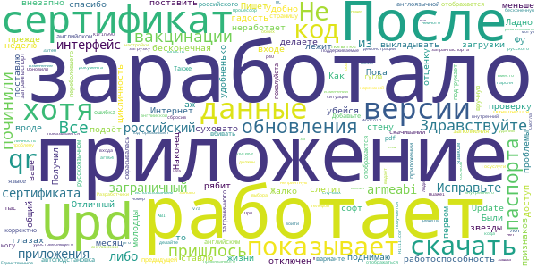
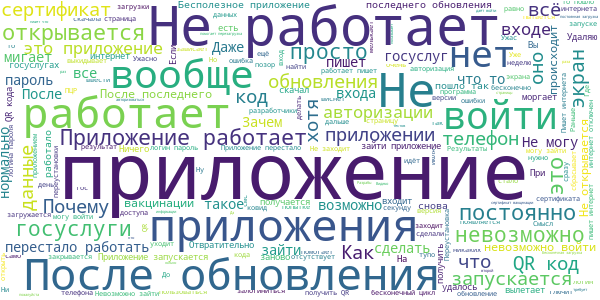

# Госуслуги СТОП Коронавирус
App version ``1.1.2-gms``

Analyzed with [covid-apps-observer](http://github.com/covid-apps-observer) project, version ``0.1``

## App overview
| | |
|-------------------------|-------------------------| 
| **Name**&nbsp;&nbsp;&nbsp;&nbsp;&nbsp;&nbsp;&nbsp;&nbsp;&nbsp;&nbsp;&nbsp;&nbsp;&nbsp;&nbsp;&nbsp;&nbsp;&nbsp;&nbsp;&nbsp;&nbsp;&nbsp;&nbsp;&nbsp;&nbsp;&nbsp;&nbsp;&nbsp;&nbsp;&nbsp;&nbsp;&nbsp;&nbsp;&nbsp;&nbsp;&nbsp;&nbsp;&nbsp;&nbsp;&nbsp;&nbsp;  | Госуслуги СТОП Коронавирус |
| **Unique identifier** | com.minsvyaz.gosuslugi.stopcorona |
| **Link to Google Play** | [https://play.google.com/store/apps/details?id=com.minsvyaz.gosuslugi.stopcorona](https://play.google.com/store/apps/details?id=com.minsvyaz.gosuslugi.stopcorona) |
| **Summary**  | Результаты тестов на COVID-19, сертификат вакцинации, QR-код для проверки. |
| **Privacy policy** | [https://gu-st.ru/content/Other/stopcovidpoliciesprivacy.pdf](https://gu-st.ru/content/Other/stopcovidpoliciesprivacy.pdf) |
| **Latest version** | 1.1.2-gms |
| **Last update** | 2021-07-15 17:03:13 |
| **Recent changes** | Исправили проблемы с авторизацией |
| **Installs**  | 1 000 000+ |
| **Category** | Здоровье и фитнес |
| **First release** | 27 мар. 2020 г. |
| **Size**  | 11M |
| **Supported Android version**  | 6.0 и выше |

### Description
> СТОП-Коронавирус — официальное приложение для контроля за распространением COVID-19. Доступно гражданам России с подтверждённой учётной записью Госуслуг 
 Предъявляйте сертификаты о вакцинации, справки, ПЦР-тесты и анкеты для прибывающих из-за границы прямо с телефона. Храните и просматривайте в приложении тесты на антитела
 Документы на русском и английском языках 
 Сертификат вакцинации появится в приложении после прививки. После полного курса сертификат можно отправить на работу и предъявить в виде QR-кода везде, где попросят 
 Справка о перенесённом заболевании доступна для предъявления и отправки в Роспотребнадзор для прибывающих из-за границы 
 Сканируйте QR-коды с других устройств, если нужно проверить наличие сертификата, ПЦР-теста или убедиться, что человек перенёс заболевание 
 Отправляйте жалобы на проблемы с сертификатом или записью на вакцинацию. Минздрав и другие организации рассмотрят обращение и помогут с решением

### User interface
The developers of the app provide the following screenshots in the Google play store.
| | | |
|:-------------------------:|:-------------------------:|:-------------------------:|
 |   |   |   | 
 |  

## Development team
In the following we report the main information provided by the development team in the Google play store.

| | |
|-------------------------|-------------------------|
| **Developer**  | Минцифры России |
| **Website**  | - |
| **Email** | support_mp@gosuslugi.ru |
| **Physical address**  | - |
| **Other developed apps**  | [https://play.google.com/store/apps/developer?id=7040530283788474945](https://play.google.com/store/apps/developer?id=7040530283788474945) |

## Android support

| | |
|-------------------------|-------------------------|
| **Declared target Android version**  | Android10, version 10 (API level 29) |
| **Effective target Android version**  | Android10, version 10 (API level 29) |
| **Minimum supported Android version**  | Lollipop, version 5.0 (API level 21) |
| **Maximum target Android version**  | - |

The larger the difference between the minimum and maximum supported Android versions, the better. A larger difference means a wider audience. For example, old phones have a very low Android version, so a high minimum supported Android version means that the app cannot be used by users with old phones, thus leading to accessibility problems. 

## Requested permissions

In the following we report the complete list of the permissions requested by the app. 

| **Permission** | **Protection level** | **Description** | 
|-------------------------|-------------------------|-------------------------|
 **android.permission ACCESS_FINE_LOCATION** | :warning:**Dangerous** | Allows an app to access precise location. 
 **android.permission ACCESS_NETWORK_STATE** | Normal | Allows applications to access information about networks. 
 **android.permission ACCESS_WIFI_STATE** | Normal | Allows applications to access information about Wi-Fi networks. 
 **android.permission CAMERA** | :warning:**Dangerous** | Required to be able to access the camera device. 
 **android.permission CHANGE_WIFI_STATE** | Normal | Allows applications to change Wi-Fi connectivity state. 
 **android.permission FOREGROUND_SERVICE** | Normal | Allows a regular application to use Service.startForeground. 
 **android.permission INTERNET** | Normal | Allows applications to open network sockets. 
 **android.permission READ_EXTERNAL_STORAGE** | :warning:**Dangerous** | Allows an application to read from external storage. 
 **android.permission RECEIVE_BOOT_COMPLETED** | Normal | Allows an application to receive the Intent.ACTION_BOOT_COMPLETED that is broadcast after the system finishes booting. 
 **android.permission VIBRATE** | Normal | Allows access to the vibrator. 
 **android.permission WAKE_LOCK** | Normal | Allows using PowerManager WakeLocks to keep processor from sleeping or screen from dimming. 
 **android.permission WRITE_EXTERNAL_STORAGE** | :warning:**Dangerous** | Allows an application to write to external storage. 
 **com.google.android.c2dm.permission RECEIVE** | - | - 
 **com.google.android.finsky.permission BIND_GET_INSTALL_REFERRER_SERVICE** | - | - 

## Mentioned servers

| **Server** | **Registrant** | **Registrant country** | **Creation date** | 
|-------------------------|-------------------------|-------------------------|-------------------------|
 | googleapis.com | Google LLC | :us: US | 2005-01-25 17:52:26 |
 | googlesyndication.com | Google LLC | :us: US | 2003-01-21 06:17:24 |
 | google.com | Google LLC | :us: US | 1997-09-15 04:00:00 |
 | googleadservices.com | Google LLC | :us: US | 2003-06-19 16:34:53 |
 | app-measurement.com | Google LLC | :us: US | 2015-06-19 20:13:31 |
 | crashlytics.com | Google LLC | :us: US | 2011-01-21 15:30:40 |
 | gosuslugi.ru | - | - | 2008-09-01 20:00:00 |
 | yandex.ru | - | - | 1997-09-23 09:45:07 |

## Security analysis 

Below we report the main security warnings raised by our execution of the [Androwarn](https://github.com/maaaaz/androwarn) security analysis tool.

**Telephony identifiers leakage**
> - This application reads the MCC+MNC of the provider of the SIM 
> - This application reads the constant indicating the state of the device SIM card 
> - This application reads the current location of the device 
> - This application reads the neighboring cell information of the device 
> - This application reads the radio technology (network type) currently in use on the device for data transmission 
> - This application reads the Cell ID value 
> - This application reads the Location Area Code value 

**Connection interfaces exfiltration**
> - This application reads details about the currently active data network 
> - This application tries to find out if the currently active data network is metered 

**Telephony services abuse**
> - This application makes phone calls 

**Suspicious connection establishment**
> - This application opens a Socket and connects it to the remote address '; port is out of range' on the 'N/A' port  
> - This application opens a Socket and connects it to the remote address 'Ljava/net/Proxy;->type()Ljava/net/Proxy$Type;' on the 'N/A' port  
> - This application opens a Socket and connects it to the remote address 'Lp/a/a/a/a;->a(Ljava/lang/String;)Ljava/lang/StringBuilder;' on the 'N/A' port  
> - This application opens a Socket and connects it to the remote address 'timeout' on the 'N/A' port  

**Code execution**
> - This application loads a native library: 'Landroid/text/TextUtils;->isEmpty(Ljava/lang/CharSequence;)Z' 

## User ratings and reviews

Below we provide information about how end users are reacting to the app in terms of ratings and reviews in the Google Play store.

### Ratings

The Госуслуги СТОП Коронавирус app has been installed by more than **1000000** times. At this time, **33542** rated the app and its average score is **1.8033373**. Below we show the distribution of the ratings across the usual star-based rating of Google Play

:star::star::star::star::star:: 5137

:star::star::star::star:: 999

:star::star::star:: 959

:star::star:: 1479

:star:: 24968

### Reviews 

#### 5-star reviews

> Пока все корректно  :date: __2021-07-23 09:24:17__

> Плохое приложение, ставлю пять звëзд  :date: __2021-07-22 23:36:12__

> Всё прекрасно работает.  :date: __2021-07-22 10:17:31__

> Я живу много лет в России по ВНЖ. В 2020 году пользовался приложением Стоп коронавирус и соблюдал все правила, даже не совсем логичные, получал пропуска на проход в магазин итд. Привился в феврале 2021 Спутником V. Собирался сейчас пользоваться QR кодом из приложения. После обновления программы она мне пишет, что приложение недоступно для иностранцев. Спасибо, что изменили. Теперь программа для меня работает нормально.  :date: __2021-07-21 10:56:29__

> У меня все работает  :date: __2021-07-21 07:02:17__

> Все работает как надо.  :date: __2021-07-20 18:05:05__

> Приложение - огонь! Оно скачивает PDF-файл и роняет его в свою папку, посмотреть QR можно только ДРУГИМ приложенем. Где вы нашли таких программистов? И чем ваше приложение лучше ссылки на документ с QR-кодом?  :date: __2021-07-20 17:10:58__

> Восстановилась авторизация через есиа  :date: __2021-07-20 12:37:01__

> Ок.  :date: __2021-07-20 11:54:24__

> Всё работает отлично  :date: __2021-07-19 13:52:57__

#### 4-star reviews

> Пока вроде все работает, ставлю 4, через неделю не слетит поставлю 5  :date: __2021-07-23 17:08:12__

> Пишет : 'Интернет отключен'! И хоть убейся об стену, неработает. Upd.09.07.21 внезапно заработало, но сертификат вакцинации не показывает. Upd. Все работает, все показывает, поднимаю отценку.  :date: __2021-07-20 00:20:53__

> Как то не удобненько все....суховато  :date: __2021-07-18 22:58:22__

> Жалко нельзя поставить меньше 1 звезды. Приложение лежит;) и уже не подаёт признаков жизни почти месяц. Отличный софт. UPD: Ладно, молодцы;) починили)  :date: __2021-07-17 18:22:43__

> Удобно  :date: __2021-07-16 13:58:12__

> Не работает Update: Наконец-то починили, спасибо. Получил qr-код Были проблемы при первом входе, автоподстановка гугла сюрасывалась после заполнения, пришлось лог/пас вручную вбивать  :date: __2021-07-15 19:06:17__

> Здравствуйте, не могу скачать qr код. А так все работает.  :date: __2021-07-15 18:22:19__

> После обновления, в англоязычной версии сертификата не отображается загранпаспорт, хотя в предыдущей версии все было корректно. Также, при скачивании pdf-версии, в русскоязычном варианте не отображаются данные российского паспорта. Исправьте, пожалуйста.  :date: __2021-07-15 08:06:16__

> Здравствуйте! В приложении при попытке скачать сертификат переболевшего появляется ошибка.  :date: __2021-07-14 17:28:16__

> Добавьте на страницу с английским языком данные заграничного паспорта  :date: __2021-07-14 08:57:10__

#### 3-star reviews

> Установил приложение, зашёл со второй попытки через госуслуги, полезность сводится к нулю, не отображает ни результатов ПЦР, что сдавал, ни того, что прохожу вакцинацию. Upd: спустя 10 дней после первой вакцины данные появились  :date: __2021-07-23 09:34:02__

> Все работает, но для входа нужно потанцевать с бубном. Автозаполнением пользоваться нельзя, потому что программа сразу слетает, все нужно заново вводить- и логин и пароль.  :date: __2021-07-16 13:09:05__

> Почему нет такой темы в этой программе"Я переболел ковид, обращался в больницу, пцр тест не показал наличие этой заразы, симптомы были все ковидные, с потерей нюха и прочее" антитела есть, но qr кода нет!  :date: __2021-07-15 15:33:47__

> После обновления невозможно открыть код, кнопка Скачать не работает вообще, а после попытки нажать эту кнопку, приложение вообще перестаёт работать.  :date: __2021-07-15 07:11:33__

> Х140721  :date: __2021-07-14 10:04:55__

> После обновления невозможно войти, постоянная "дискотека" со сменой экрана входа. Переустановил, вроде зашёл. На троечку с такими танцами.  :date: __2021-07-13 15:47:26__

> Начался глюк, мигает и не заходит! До этого работало!  :date: __2021-07-13 13:36:47__

> Не подтягивает сертификат вакцинации с госуслуг. Но зато показывает результаты ПЦР.  :date: __2021-07-09 17:57:14__

> Возможно кому то и полезно приложение, но почему не подгружаются данные сертификата переболевшего?! Все как всегда работает через одно место в этом Минздраве.  :date: __2021-07-09 08:14:12__

> После обновления пришлось переустановить, при автозаполнении логина и пароля форма постоянно обновлялась и введенные данные сбрасывались. Пришлось вспоминать пароль и вводить все вручную. Xiaomi mi note 10 lite  :date: __2021-07-09 07:42:30__

#### 2-star reviews

> Сканер qr не работает. И сделайте, пожалуйста, возможность добавить свой сертификат с ЕМИАС вручную по тому же qr, люди месяцами не могут добиться автоматической синхронизации.  :date: __2021-07-23 08:53:40__

> Не показывает сертификат.До обновления все было нормально.  :date: __2021-07-22 15:33:30__

> Не могу войти постояно запрашивает четырёх значный код  :date: __2021-07-21 19:26:42__

> Неудобное приложение, непонятное.  :date: __2021-07-21 12:01:23__

> Просит подтвердить учётную запись. Проходиш по ссылке, подтверждаеш через госуслуги. Выходиш в приложение и всё по новой, а само приложение не открывается.  :date: __2021-07-21 11:34:48__

> Что с приложением, не могу его открыть  :date: __2021-07-16 15:24:12__

> Не работае  :date: __2021-07-16 11:23:06__

> Сначала всё было нормально, а теперь дискотека со входом.  :date: __2021-07-15 14:21:50__

> Походу программа сама корону подхватила  :date: __2021-07-15 11:57:42__

> Сломалось приложение. Да и нужно то оно было только чтоб КуРэ код показывало.  :date: __2021-07-14 12:03:51__

#### 1-star reviews

> Приложение глючное,первый раз заходишь и все показывает. Потом больше не работает и ничего нет.  :date: __2021-07-23 21:38:53__

> Ничего не работает  :date: __2021-07-23 19:03:11__

> Рукожопы, приложение на Redmi 5 plus не запускается. Нативное приложение Госуслуг работает. Минцифра, как можно такое выпускать. Хотя у вас все так.  :date: __2021-07-22 21:48:04__

> Не работает  :date: __2021-07-22 13:37:10__

> Ужас! Переболел ковидом. Но нет Qr кода. Хотя в приложении гос услуги есть уведомление, что посмотреть тест можете в приложении стоп ковид! В котором нет QR кода  :date: __2021-07-22 13:35:56__

> Не запускается после обновления!  :date: __2021-07-22 12:10:27__

> Закрывается сразу при входе. Poptel p60, android 8.1  :date: __2021-07-22 12:05:12__

> Данное приложение не работает оффлайн: подключение к интернету отсутствует. Невозможно отобразить данные.  :date: __2021-07-22 11:27:20__

> Не грузит, приложение зависло на вводе пароля  :date: __2021-07-22 05:11:58__

> Гандоны тупорылые.  :date: __2021-07-21 16:16:45__

