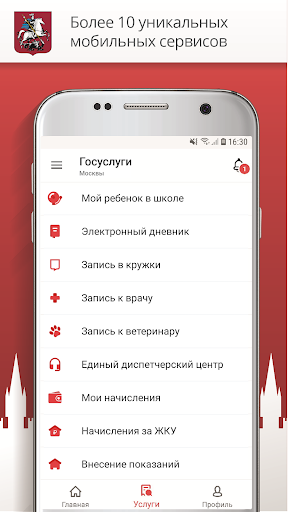
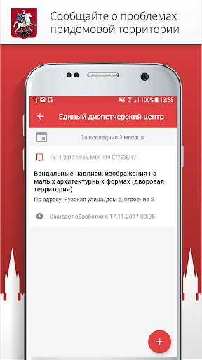
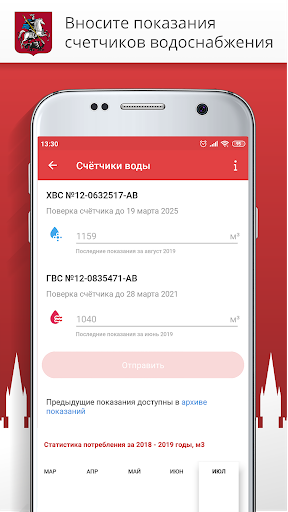
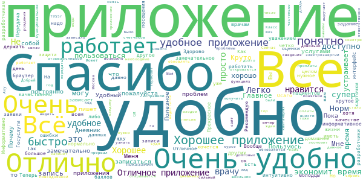
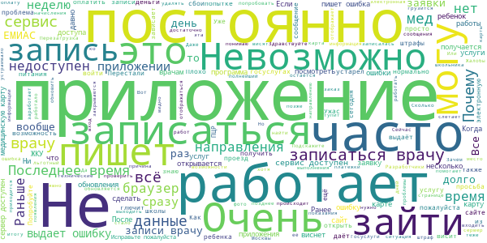
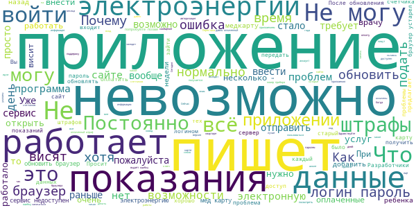

# Госуслуги Москвы
App version ``3.13.0.19``

Analyzed with [covid-apps-observer](http://github.com/covid-apps-observer) project, version ``0.1``

## App overview
| | |
|-------------------------|-------------------------| 
| **Name**&nbsp;&nbsp;&nbsp;&nbsp;&nbsp;&nbsp;&nbsp;&nbsp;&nbsp;&nbsp;&nbsp;&nbsp;&nbsp;&nbsp;&nbsp;&nbsp;&nbsp;&nbsp;&nbsp;&nbsp;&nbsp;&nbsp;&nbsp;&nbsp;&nbsp;&nbsp;&nbsp;&nbsp;&nbsp;&nbsp;&nbsp;&nbsp;&nbsp;&nbsp;&nbsp;&nbsp;&nbsp;&nbsp;&nbsp;&nbsp;  | Госуслуги Москвы |
| **Unique identifier** | ru.altarix.mos.pgu |
| **Link to Google Play** | [https://play.google.com/store/apps/details?id=ru.altarix.mos.pgu](https://play.google.com/store/apps/details?id=ru.altarix.mos.pgu) |
| **Summary**  | Все электронные услуги города: начисления ЖКХ, штрафы ГИБДД, эвакуация ТС и др. |
| **Privacy policy** | [https://mosapps.mos.ru/privacypolicy/](https://mosapps.mos.ru/privacypolicy/) |
| **Latest version** | 3.13.0.19 |
| **Last update** | 2020-12-22 17:56:29 |
| **Recent changes** | - Расширен перечень категорий начислений и документов, по которым производится поиск начислений; - Добавлена возможность оплаты начислений за домашний телефон МГТС |
| **Installs**  | 1 000 000+ |
| **Category** | Социальные |
| **First release** | 27 сент. 2012 г. |
| **Size**  | 21M |
| **Supported Android version**  | 6.0 и выше |

### Description
> Мобильное приложение «Госуслуги Москвы» - сервис, объединяющий востребованные услуги Правительства Москвы, для комфортной жизни в большом городе.
 Образование:
 - Сервис «Мой ребенок в школе» дает возможность удаленно отслеживать проход и питание учащегося, школьное меню и баланс лицевого счета, который в любой момент можно пополнить с банковской карты/мобильного счета; 
 - Сервис «Электронный дневник» объединяет в себе самую важную для родителей информацию об учебе: расписание уроков, домашние задание, оценки учащегося и т.д.; 
 - Сервис «Результаты ГИА» - мобильная площадка с результатами прохождения Государственной итоговой аттестации.
 Жилье, ЖКУ:
 - Сервис «Начисления за жилищно-коммунальные услуги» предоставляет развернутую информацию о долговых/текущих начислениях за ЖКУ с возможностью заказать электронный Единый платежный документ; 
 - Сервис «Внесение показаний» - возможность передачи показаний счетчиков водоснабжения/электроэнергии, а также получения информации о задолженности без очередей и отрыва от важных дел; 
 - Сервис «Единый диспетчерский центр» – компактная площадка для решения проблем и вопросов, относящихся к вашему дому/двору;
 - Сервис «Информирование о начале расчетов по новой услуге»;
 - Сервис «Информирование о регистрации на жилплощади»;
 - Сервис «Информирование об отключении горячего водоснабжения».
 Транспорт:
 - Сервис «Штрафы» дает возможность получать актуальную информацию по вашим штрафам и оплачивать с мобильного; 
 - Сервис «Эвакуация транспортного средства» информирует об эвакуации ТС, а также предоставляет точный адрес местонахождения ТС на спецстоянке.
 Здоровье и документы:
 - Сервис «Запись к врачу» предоставляет возможность удаленно записаться на прием к любому врачу, перенести и отменить запись, посмотреть перечень направлений и выписанные вам рецепты; 
 - Сервис «Запись к ветеринару» предоставляет возможность записать своего питомца на прием в ветеринарную клинику (перенести, отменить запись) или вызвать ветеринара на дом;
 - Сервис «Готовность загранпаспорта» - индивидуальное информирование о готовности заграничного паспорта;
 - Сервис «Федеральная служба судебных приставов» предоставляет информацию о наличии исполнительных делопроизводств ФССП.
 Информация:
 - Сервис «Новости» объединяет в себе самые актуальные и интересные новости города в удобном мобильном формате.
 По желанию вы можете настроить способ получения уведомлений: SMS, E-mail или Push-уведомления.
 ___________________________________
 Обратите внимание на другие официальные приложения правительства Москвы.
 - Активный Гражданин - проект для тех, кому важно, что происходит в Москве
 - Наш город – помогите нам сделать город лучше
 - Парковки Москвы – приложение для поиска и оплаты парковки в Москве
 - Узнай Москву - архитектурная история столицы).

### User interface
The developers of the app provide the following screenshots in the Google play store.
| | | |
|:-------------------------:|:-------------------------:|:-------------------------:|
 |   |   |   | 
 |   |  

## Development team
In the following we report the main information provided by the development team in the Google play store.

| | |
|-------------------------|-------------------------|
| **Developer**  | Информационный город ГКУ |
| **Website**  | [https://www.mos.ru/mosapps/](https://www.mos.ru/mosapps/) |
| **Email** | emp@mos.ru |
| **Physical address**  | - |
| **Other developed apps**  | [https://play.google.com/store/apps/developer?id=%D0%98%D0%BD%D1%84%D0%BE%D1%80%D0%BC%D0%B0%D1%86%D0%B8%D0%BE%D0%BD%D0%BD%D1%8B%D0%B9+%D0%B3%D0%BE%D1%80%D0%BE%D0%B4+%D0%93%D0%9A%D0%A3](https://play.google.com/store/apps/developer?id=%D0%98%D0%BD%D1%84%D0%BE%D1%80%D0%BC%D0%B0%D1%86%D0%B8%D0%BE%D0%BD%D0%BD%D1%8B%D0%B9+%D0%B3%D0%BE%D1%80%D0%BE%D0%B4+%D0%93%D0%9A%D0%A3) |

## Android support

| | |
|-------------------------|-------------------------|
| **Declared target Android version**  | Android10, version 10 (API level 29) |
| **Effective target Android version**  | Android10, version 10 (API level 29) |
| **Minimum supported Android version**  | Marshmallow, version 6.0 (API level 23) |
| **Maximum target Android version**  | - |

The larger the difference between the minimum and maximum supported Android versions, the better. A larger difference means a wider audience. For example, old phones have a very low Android version, so a high minimum supported Android version means that the app cannot be used by users with old phones, thus leading to accessibility problems. 

## Requested permissions

In the following we report the complete list of the permissions requested by the app. 

| **Permission** | **Protection level** | **Description** | 
|-------------------------|-------------------------|-------------------------|
 **android.permission ACCESS_COARSE_LOCATION** | :warning:**Dangerous** | Allows an app to access approximate location. 
 **android.permission ACCESS_FINE_LOCATION** | :warning:**Dangerous** | Allows an app to access precise location. 
 **android.permission ACCESS_NETWORK_STATE** | Normal | Allows applications to access information about networks. 
 **android.permission ACCESS_WIFI_STATE** | Normal | Allows applications to access information about Wi-Fi networks. 
 **android.permission CALL_PHONE** | :warning:**Dangerous** | Allows an application to initiate a phone call without going through the Dialer user interface for the user to confirm the call. 
 **android.permission CAMERA** | :warning:**Dangerous** | Required to be able to access the camera device. 
 **android.permission INTERNET** | Normal | Allows applications to open network sockets. 
 **android.permission READ_CALENDAR** | :warning:**Dangerous** | Allows an application to read the user's calendar data. 
 **android.permission READ_CONTACTS** | :warning:**Dangerous** | Allows an application to read the user's contacts data. 
 **android.permission READ_EXTERNAL_STORAGE** | :warning:**Dangerous** | Allows an application to read from external storage. 
 **android.permission USE_BIOMETRIC** | Normal | Allows an app to use device supported biometric modalities. 
 **android.permission USE_FINGERPRINT** | Normal | This constant was deprecated in API level 28. Applications should request USE_BIOMETRIC instead 
 **android.permission VIBRATE** | Normal | Allows access to the vibrator. 
 **android.permission WAKE_LOCK** | Normal | Allows using PowerManager WakeLocks to keep processor from sleeping or screen from dimming. 
 **android.permission WRITE_CALENDAR** | :warning:**Dangerous** | Allows an application to write the user's calendar data. 
 **android.permission WRITE_EXTERNAL_STORAGE** | :warning:**Dangerous** | Allows an application to write to external storage. 
 **com.google.android.c2dm.permission RECEIVE** | - | - 
 **com.google.android.finsky.permission BIND_GET_INSTALL_REFERRER_SERVICE** | - | - 

## Mentioned servers

| **Server** | **Registrant** | **Registrant country** | **Creation date** | 
|-------------------------|-------------------------|-------------------------|-------------------------|
 | vk.com | Privacy protection service - whoisproxy.ru | :ru: RU | 1997-06-24 04:00:00 |
 | app-measurement.com | Google LLC | :us: US | 2015-06-19 20:13:31 |
 | facebook.com | Facebook, Inc. | :us: US | 1997-03-29 05:00:00 |
 | googlesyndication.com | Google LLC | :us: US | 2003-01-21 06:17:24 |
 | google.com | Google LLC | :us: US | 1997-09-15 04:00:00 |
 | openstreetmap.org | OpenStreetMap Foundation | GB | 2004-08-09 18:47:25 |
 | wikimedia.org | Wikimedia Foundation, Inc. | :us: US | 2003-03-16 08:22:47 |
 | openptmap.org | Registrant State/Province: Bayern | :de: DE | 2010-11-17 12:05:24 |
 | cloudmade.com | Cloud Made Ltd | :uk: UK | 2007-07-17 17:02:27 |
 | openstreetmap.nl | - | - | 2007-03-06 00:00:00 |
 | wmflabs.org | Wikimedia Foundation, Inc. | :us: US | 2011-09-29 14:58:28 |
 | openseamap.org | Registrant State/Province: | :de: DE | 2009-03-26 11:35:19 |
 | chartbundle.com | Whois Privacy Service | :us: US | 2010-01-09 23:30:15 |
 | opentopomap.org | Registrant State/Province: | :de: DE | 2011-09-03 18:35:13 |
 | 2gis.ru | - | - | 2001-02-18 21:00:00 |
 | crashlytics.com | Google LLC | :us: US | 2011-01-21 15:30:40 |
 | mos.ru | - | - | 1996-12-23 09:49:03 |
 | w3.org | W3C | :us: US | 1994-07-06 04:00:00 |
 | googleadservices.com | Google LLC | :us: US | 2003-06-19 16:34:53 |
 | huawei.com | Huawei Technologies Co., Ltd. | :china: CN | 2000-01-11 13:37:24 |
 | googleapis.com | Google LLC | :us: US | 2005-01-25 17:52:26 |
 | mts.ru | - | - | 1997-11-19 12:02:34 |
 | 2gis.com | DoubleGIS LLC | :ru: RU | 2004-03-18 08:51:04 |

## Security analysis 

Below we report the main security warnings raised by our execution of the [Androwarn](https://github.com/maaaaz/androwarn) security analysis tool.

**Telephony identifiers leakage**
> - This application reads the numeric name (MCC+MNC) of current registered operator 
> - This application reads the operator name 

**Location lookup**
> - This application reads location information from all available providers (WiFi, GPS etc.) 

**Connection interfaces exfiltration**
> - This application reads details about the currently active data network 
> - This application tries to find out if the currently active data network is metered 

**Telephony services abuse**
> - This application makes phone calls 

**Suspicious connection establishment**
> - This application opens a Socket and connects it to the remote address ' returned no addresses for  ; port is out of range' on the 'N/A' port  
> - This application opens a Socket and connects it to the remote address '' on the 'N/A' port  
> - This application opens a Socket and connects it to the remote address 'Ljava/net/Proxy;->type()Ljava/net/Proxy$Type;' on the 'N/A' port  
> - This application opens a Socket and connects it to the remote address 'timeout' on the 'N/A' port  

**Code execution**
> - This application loads a native library 

## User ratings and reviews

Below we provide information about how end users are reacting to the app in terms of ratings and reviews in the Google Play store.

### Ratings

The Госуслуги Москвы app has been installed by more than **1000000** times. At this time, **58633** rated the app and its average score is **3.9367776**. Below we show the distribution of the ratings across the usual star-based rating of Google Play

:star::star::star::star::star:: 36791

:star::star::star::star:: 5431

:star::star::star:: 2899

:star::star:: 2939

:star:: 10573

### Reviews 

#### 5-star reviews

> Очень удобное приложение. Быстро и чётко работает. Спасибо разработчикам.  :date: __2021-01-16 18:21:15__

> Хорошо. Очень хорошо.  :date: __2021-01-16 17:47:39__

> 👍👍👍👍👍👍👍👍👍  :date: __2021-01-16 12:18:23__

> Всё быстро /чётко ,молодцы  :date: __2021-01-16 08:11:30__

> Хорошее приложение но иногда тормозит.  :date: __2021-01-16 07:17:37__

> Всё хорошо. Спасибо!  :date: __2021-01-16 04:34:58__

> Приложение работает быстро и чётко. Благодарю.  :date: __2021-01-15 23:10:04__

> Всё просто и быстро. Спасибо за возможность передачи показаний на сайте госуслуг.  :date: __2021-01-15 20:30:31__

> 😀  :date: __2021-01-15 20:07:06__

> Приложение позволяет работать личными данными в любой точке Москвы.  :date: __2021-01-15 17:38:38__

#### 4-star reviews

> Удобно. Оплачиваю квартиру и передаю данные за счётчики через приложение. Другими услугами не пользуюсь.  :date: __2021-01-16 18:18:55__

> С Новым годом!  :date: __2021-01-16 10:14:29__

> Можно посмотреть сколь должен заплатить за квартиру или электричество. Что серьёзней отправляет на сайты гос органов. Тех поддержка на запросы не реагирует. Отлично работает с жилищником свиблово, отопление или замена ламп в подъезде, лифт. Реагируют за час, виден статус исполнения.  :date: __2021-01-15 18:38:57__

> Удобное приложение, при вводе нескольких квартир и авто показывает всю информацию по начислениям и штрафы. Хорошо бы добавить налоги на недвижимость , авто, и льготы  :date: __2021-01-15 15:58:50__

> Нормалёк было,пока не обновил...  :date: __2021-01-15 15:45:57__

> Когда записываешся к врачу нужно пролистать все фамилии, сделали бы уже кнопку поиск.  :date: __2021-01-15 09:46:13__

> ИНОГДА логает из-за этого 4 звезды  :date: __2021-01-14 19:04:35__

> Добрый день. Мы с супругой записались на вакцинацию 12.01.2021., нам за 70. В этот день нам пришло сообщение, что вакцинация отмечена. Потратил много времени и нервов, чтобы по телефону сообщили, что вакцинация не отменена. И только в поликлинике сказали, что вакцинацию перенесли на более раннее время. Само приложение отличное, пользуемся им давно, но неужели так сложно было высылать проверенную информацию.  :date: __2021-01-14 10:50:35__

> При попытке открыть электронную медицинскую карту ругается, что используется "старый браузер". Удалила и поставила новую версию приложения, но ничего не поменялось.  :date: __2021-01-14 08:16:29__

> Деньги обрабатываются с 26.09.2020г. Кому нужны это приложение?Исправили!!!  :date: __2021-01-13 20:39:50__

#### 3-star reviews

> До сегодняшнего дня, в целом, хорошее приложение было. Постоянно использую раздел "мои начисления". Очень удобно, что все начисления в одном месте с возможностью оплаты как всех, так и подетально. Сегодня же там ничего нет. Более того, на сайте та же история "сервис временно не доступен". И это при том, что в обновлениях сказано, что изменения как раз касаются расширения моих начислений.  :date: __2021-01-15 17:44:38__

> Вначале приложение работало хорошо, а в последние три месяца- отвратительно: дважды переустанавливал и всё равно со смартфона невозможно войти в приложение! Полностью согласен с другими - тех.поддержка никакая! После второй перестановки заработало  :date: __2021-01-15 15:17:20__

> Уважаемые разработчики, настройте приложение нормально. Невозможно оплатить жку, пишет что начисления не найдены, хотя висят начисления и они еще не оплачены. И штрафы гибдд, 2 штрафа оплатила, уже месяц висят в неоплаченных.  :date: __2021-01-15 10:47:09__

> Стало невозможно смотреть оплаченные ЕПД!!  :date: __2021-01-14 11:46:18__

> Не грузит электронную мед карту. Пишет на этой странице у вас старая версия браузера, какого еще браузера?, это ваше приложение, але)), ни чего нормально сделать не могут в россии.  :date: __2021-01-14 09:15:46__

> Требуют приложении обновить его,но у меня все обновлено.Захожу в медицинскую карту смс по несколько раз прошу прислать,время проходит смс не приходит все в этом году в прошлом было все хорошо.  :date: __2021-01-14 08:14:41__

> Не расширенные функции  :date: __2021-01-13 16:49:33__

> Перестала работать оплата жкх.  :date: __2021-01-12 16:18:49__

> Уважаемые разработчики,меняю свою оценку с 5 на тройку,приложение поначалу было хорошее,теперь что не войдёшь,пишет,чтобы обновила браузер, всё у меня обновлено,вы хотя бы пишите какой браузер обновить,у меня их три,все обновлены,что надо,прямо бесит уже,само приложение меня устраивает,тогда хоть доработайте или как.  :date: __2021-01-11 13:19:39__

> Где интересно обновить браузер для них. Только здесь и пишут про обновления браузера. Может им что-то надо обновить. Так то приложение нужное конечно, много полезного  :date: __2021-01-11 12:13:50__

#### 2-star reviews

> Программа постоянно забывает мой логин/пароль. Задолбало это уже. Сделайте напоминалку (раз в месяц) о необходимости ввести показания приборов учёта.  :date: __2021-01-16 15:08:59__

> Приложение стало полным глюком! Даже элементарно оплатить жкх стало невозможно! Пора менять всю команду разработчиков - зажрались!!! 🥶  :date: __2021-01-16 09:12:46__

> Глючное приложение  :date: __2021-01-15 18:03:50__

> Как обновить браузер? Пишет, что браузер старый, обновите, я понятия не имею какой браузер вы используете.  :date: __2021-01-15 14:49:27__

> После обновления пропали показатели и оплаты за ЖКУ за 2020год. Это очень неудобно!  :date: __2021-01-14 11:21:24__

> Длинные тексты не структурированы использованием разного шрифта, так что плохо читаются. "Ответы на вопросы" по теме выкидывает список не по теме, а все, что есть. В ответах есть все, что мне не надо, а что надо-нет. Уклон на описание прав горожан, и почти нет описания, как ими воспользоваться (пошаговые инструкции). Язык текстов напоминает русский...  :date: __2021-01-13 23:14:26__

> Не могу войти в приложение!!! Логин, пароль верные, с компа с ними вхожу спокойно...  :date: __2021-01-13 14:19:46__

> Почему опять такая тупость? Делал Мазок на Covid 5.01.21 для врача в НИКИО, 25.01 повторный прием, нужен новый "свежий" результат на Covid, а строка Мазок на Covid исчезла из Запись к врачу. Почему исчезла?  :date: __2021-01-12 12:01:58__

> Не отображаются штрафы ГИБДД!. Висит неоплаченным старый прошлогодний, который давно оплачен. Новых приходящих нету!!!  :date: __2021-01-11 18:19:04__

> Было удобно пользоваться сначала. Теперь сайт гонит. Не могу оплатить услуги онлайн. Выдает ошибку. Разработчики устраните неполадки на сайте!  :date: __2021-01-11 14:12:56__

#### 1-star reviews

> Устарела версия, не открывается электронная мед карта  :date: __2021-01-16 10:12:30__

> Деревянное приложение,приходится дублировать информацию через PC  :date: __2021-01-16 09:19:12__

> Какая страна, такое и приложение.  :date: __2021-01-16 08:48:10__

> Дерьмище лагающее и неработающее. А навигация по сайту полный провал. ГосГовно надо называть все гос сайты и приложения  :date: __2021-01-16 08:23:31__

> Приложение тупое.При каждом обновлении заново аккаунт подтверждать приходится.Достало уже.Разработчики рукожопы.  :date: __2021-01-16 07:33:59__

> Не пускает с учетной записью Госуслуг. Москва, что, уже стала отдельным государством?  :date: __2021-01-15 23:06:54__

> Очень сложно, малопонятно как установить это приложение. Потратил много времени, но результат - ноль. Спасибо, что поразвлекли меня, правда до "головной боли"  :date: __2021-01-15 22:15:12__

> Мобильное приложение по функциональности существенно ограничено, половина ссылок перебразывают в браузер. В браузере реакция на клики ОЧЕНЬ медленная - думаешь, что нажатие не сработало, нажимаешь повторно, в этот момент в месте нажатия оказывается совершенно другая ссылка, по которой тебя и перенаправляют...  :date: __2021-01-15 20:16:54__

> Уже неделю жду ответа от тех поддержки.Но видимо не дождусь. А надо то всего навсего исправить ошибку. Но лень это дичь Русского народа. А может это и не наш сайт?  :date: __2021-01-15 16:57:29__

> Надоело что выскакивает сообщение, чтобы обновить браузер! Какой?! Обновлений к приложению нет! Что за бардак! Вы за что там деньги получаете?! В электронной карте не пойми как все обновляется, войти в нее невозможно сразу! Уважаемые разработчики, исправьте свои косяки! Надоело!!!!  :date: __2021-01-15 15:56:54__

