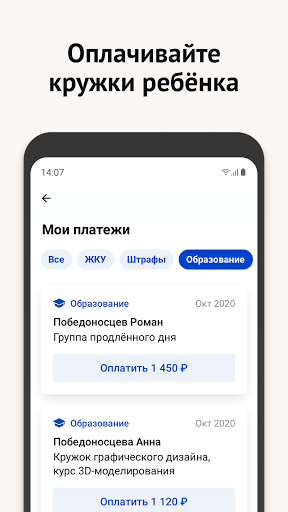

# Моя Москва — официальное приложение портала mos.ru
App version ``1.8``

Analyzed with [covid-apps-observer](http://github.com/covid-apps-observer) project, version ``0.1``

## App overview
| | |
|-------------------------|-------------------------| 
| **Name**&nbsp;&nbsp;&nbsp;&nbsp;&nbsp;&nbsp;&nbsp;&nbsp;&nbsp;&nbsp;&nbsp;&nbsp;&nbsp;&nbsp;&nbsp;&nbsp;&nbsp;&nbsp;&nbsp;&nbsp;&nbsp;&nbsp;&nbsp;&nbsp;&nbsp;&nbsp;&nbsp;&nbsp;&nbsp;&nbsp;&nbsp;&nbsp;&nbsp;&nbsp;&nbsp;&nbsp;&nbsp;&nbsp;&nbsp;&nbsp;  | Моя Москва — официальное приложение портала mos.ru |
| **Unique identifier** | ru.mos.app |
| **Link to Google Play** | [https://play.google.com/store/apps/details?id=ru.mos.app](https://play.google.com/store/apps/details?id=ru.mos.app) |
| **Summary**  | Все самые нужные городские сервисы в официальном приложении mos.ru «Моя Москва». |
| **Privacy policy** | [https://mosapps.mos.ru/privacypolicy/](https://mosapps.mos.ru/privacypolicy/) |
| **Latest version** | 1.8 |
| **Last update** | 2021-02-17 12:24:20 |
| **Recent changes** | В новом релизе классные обновления — в основном в разделе «Мои платежи». 1. В приложении можно оплачивать счета за домашний телефон, если у вас МГТС или MТС Home ☎️ — и никаких комиссий. 2. Вся информация об оплаченных счетах сохраняется в «Истории платежей». Это электронная шкатулка, из которой можно достать необходимую квитанцию, скачать её или отправить. 3. Мы исправили баги. И в их числе ошибка «Ваш браузер устарел». Если с браузером все ок, она больше не посмеет показаться вам на глаза. |
| **Installs**  | 500 000+ |
| **Category** | Социальные |
| **First release** | 27 дек. 2018 г. |
| **Size**  | 88M |
| **Supported Android version**  | 5.0 и выше |

### Description
> Пользуйтесь главными сервисами mos.ru, читайте новости города и задавайте вопросы операторам городского контакт-центра в одном приложении. Достаточно ввести ваши данные для входа на портал mos.ru и вам откроются все возможности чат-бота «Моя Москва».
 Здесь мы собрали самые частые госуслуги, которыми пользуются москвичи. И упростили процесс получения — все вопросы решает быстрый чат-бот. Откройте диалог в нужном разделе:
 – Мой дом: подать показания счётчиков воды, узнать, когда нужно провести поверку счётчиков, получить счета за ЖКУ. Сохраните в приложении 10-значный номер плательщика (указан на вашем ЕПД) и вам будет доступна оплата ЖКХ.
 – Дети в школе: пользоваться сервисами «Москвёнок» и «Электронный дневник» в одном приложении. Проверить, когда ребенок пришёл в школу, какие оценки получил и что купил на обед, можно за пару минут, спросив у бота.
 – Здоровье: записаться на приём в поликлинику, перенести или отменить запись к врачу теперь можно онлайн в удобном чате. Только скажите боту номер полиса ОМС.
 – Транспорт: проверить и оплатить штрафы ГИБДД онлайн по номеру, узнать историю своего автомобиля. По вашей просьбе бот пришлёт уведомление об эвакуации машины и новых штрафах. Понадобятся номер водительских прав, СТС, VIN и госномер автомобиля.
 – Контакт-центр: операторы круглосуточно готовы помочь вам в решении вопросов, связанных с получением государственных услуг и работой приложения «Моя Москва».
 – Новости города: узнать за пару минут всё самое важное, что происходит в Москве и в вашем районе.
 – Мой район: изучать ваш район - читать об уникальных фактах, искать ближайшие парки и школы, детские и спортивные площадки, узнавать о планах его развития.
 «Моя Москва» — чат-бот, который помогает москвичам получить самые популярные госуслуги. Часть из них доступна без авторизации. Но советуем зарегистрироваться, чтобы бот знал ваши данные и мог напоминать о важных платежах или записи к врачу.
 Правительство Москвы также разработало отдельные приложения для тех, кто ищет или хочет оплатить парковку («Парковки Москвы»), участвовать в принятии важных городских решений («Активный Гражданин»), замечать недочеты в устройстве ЖКХ («Наш город»).

### User interface
The developers of the app provide the following screenshots in the Google play store.
| | | |
|:-------------------------:|:-------------------------:|:-------------------------:|
 |   |   |   | 
 |   |   |   | 
 |   |  

## Development team
In the following we report the main information provided by the development team in the Google play store.

| | |
|-------------------------|-------------------------|
| **Developer**  | Информационный город ГКУ |
| **Website**  | [https://www.mos.ru/mobile/](https://www.mos.ru/mobile/) |
| **Email** | mobile@mos.ru |
| **Physical address**  | - |
| **Other developed apps**  | [https://play.google.com/store/apps/developer?id=%D0%98%D0%BD%D1%84%D0%BE%D1%80%D0%BC%D0%B0%D1%86%D0%B8%D0%BE%D0%BD%D0%BD%D1%8B%D0%B9+%D0%B3%D0%BE%D1%80%D0%BE%D0%B4+%D0%93%D0%9A%D0%A3](https://play.google.com/store/apps/developer?id=%D0%98%D0%BD%D1%84%D0%BE%D1%80%D0%BC%D0%B0%D1%86%D0%B8%D0%BE%D0%BD%D0%BD%D1%8B%D0%B9+%D0%B3%D0%BE%D1%80%D0%BE%D0%B4+%D0%93%D0%9A%D0%A3) |

## Android support

| | |
|-------------------------|-------------------------|
| **Declared target Android version**  | Android10, version 10 (API level 29) |
| **Effective target Android version**  | Android10, version 10 (API level 29) |
| **Minimum supported Android version**  | Lollipop, version 5.0 (API level 21) |
| **Maximum target Android version**  | - |

The larger the difference between the minimum and maximum supported Android versions, the better. A larger difference means a wider audience. For example, old phones have a very low Android version, so a high minimum supported Android version means that the app cannot be used by users with old phones, thus leading to accessibility problems. 

## Requested permissions

In the following we report the complete list of the permissions requested by the app. 

| **Permission** | **Protection level** | **Description** | 
|-------------------------|-------------------------|-------------------------|
 **android.permission ACCESS_COARSE_LOCATION** | :warning:**Dangerous** | Allows an app to access approximate location. 
 **android.permission ACCESS_FINE_LOCATION** | :warning:**Dangerous** | Allows an app to access precise location. 
 **android.permission ACCESS_NETWORK_STATE** | Normal | Allows applications to access information about networks. 
 **android.permission ACCESS_WIFI_STATE** | Normal | Allows applications to access information about Wi-Fi networks. 
 **android.permission CAMERA** | :warning:**Dangerous** | Required to be able to access the camera device. 
 **android.permission CHANGE_WIFI_STATE** | Normal | Allows applications to change Wi-Fi connectivity state. 
 **android.permission INTERNET** | Normal | Allows applications to open network sockets. 
 **android.permission READ_EXTERNAL_STORAGE** | :warning:**Dangerous** | Allows an application to read from external storage. 
 **android.permission RECEIVE_BOOT_COMPLETED** | Normal | Allows an application to receive the Intent.ACTION_BOOT_COMPLETED that is broadcast after the system finishes booting. 
 **android.permission USE_BIOMETRIC** | Normal | Allows an app to use device supported biometric modalities. 
 **android.permission USE_FINGERPRINT** | Normal | This constant was deprecated in API level 28. Applications should request USE_BIOMETRIC instead 
 **android.permission VIBRATE** | Normal | Allows access to the vibrator. 
 **android.permission WAKE_LOCK** | Normal | Allows using PowerManager WakeLocks to keep processor from sleeping or screen from dimming. 
 **android.permission WRITE_CALENDAR** | :warning:**Dangerous** | Allows an application to write the user's calendar data. 
 **android.permission WRITE_EXTERNAL_STORAGE** | :warning:**Dangerous** | Allows an application to write to external storage. 
 **com.google.android.c2dm.permission RECEIVE** | - | - 
 **com.google.android.finsky.permission BIND_GET_INSTALL_REFERRER_SERVICE** | - | - 
 **ndroid.permission MANAGE_FINGERPRINT** | - | - 

## Mentioned servers

| **Server** | **Registrant** | **Registrant country** | **Creation date** | 
|-------------------------|-------------------------|-------------------------|-------------------------|
 | xml.org | OASIS Open | :us: US | 1997-02-03 05:00:00 |
 | xmlpull.org | WhoisGuard, Inc. | PA | 2001-11-26 20:33:08 |
 | w3.org | W3C | :us: US | 1994-07-06 04:00:00 |
 | googlesyndication.com | Google LLC | :us: US | 2003-01-21 06:17:24 |
 | google.com | Google LLC | :us: US | 1997-09-15 04:00:00 |
 | app-measurement.com | Google LLC | :us: US | 2015-06-19 20:13:31 |
 | yandex.ru | - | - | 1997-09-23 09:45:07 |
 | yandexadexchange.net | - | :ru: RU | 2014-02-18 12:48:07 |
 | crashlytics.com | Google LLC | :us: US | 2011-01-21 15:30:40 |
 | yandex.com | - | :switzerland: CH | 1998-09-24 04:00:00 |
 | yandex.net | - | :ru: RU | 2000-11-14 06:56:55 |
 | googleapis.com | Google LLC | :us: US | 2005-01-25 17:52:26 |
 | googleadservices.com | Google LLC | :us: US | 2003-06-19 16:34:53 |
 | kladr-api.ru | - | - | 2013-02-06 00:31:38 |
 | frosteye.ru | - | - | 2012-12-08 18:43:12 |
 | intervale.ru | - | - | 2001-04-09 20:00:00 |
 | mts.ru | - | - | 1997-11-19 12:02:34 |
 | mos.ru | - | - | 1996-12-23 09:49:03 |
 | mgfoms.ru | - | - | 2002-12-22 21:00:00 |

## Security analysis 

Below we report the main security warnings raised by our execution of the [Androwarn](https://github.com/maaaaz/androwarn) security analysis tool.

**Telephony identifiers leakage**
> - This application reads the MCC+MNC of the provider of the SIM 
> - This application reads the Service Provider Name (SPN) 
> - This application reads the constant indicating the state of the device SIM card 
> - This application reads the current location of the device 
> - This application reads the neighboring cell information of the device 
> - This application reads the numeric name (MCC+MNC) of current registered operator 
> - This application reads the operator name 
> - This application reads the phone's current state 
> - This application reads the radio technology (network type) currently in use on the device for data transmission 
> - This application reads the unique device ID, i.e the IMEI for GSM and the MEID or ESN for CDMA phones 
> - This application reads the Cell ID value 
> - This application reads the Location Area Code value 

**Location lookup**
> - This application reads location information from all available providers (WiFi, GPS etc.) 

**Connection interfaces exfiltration**
> - This application reads details about the currently active data network 
> - This application tries to find out if the currently active data network is metered 

**Telephony services abuse**
> - This application makes phone calls 

**Suspicious connection establishment**
> - This application opens a Socket and connects it to the remote address 'Ljava/lang/StringBuilder;->toString()Ljava/lang/String;' on the 'N/A' port  
> - This application opens a Socket and connects it to the remote address 'Ljava/net/Proxy;->type()Ljava/net/Proxy$Type;' on the 'N/A' port  
> - This application opens a Socket and connects it to the remote address 'No route to  ' on the 'N/A' port  
> - This application opens a Socket and connects it to the remote address 'timeout' on the 'N/A' port  

**Code execution**
> - This application loads a native library 
> - This application loads a native library: 'Landroid/text/TextUtils;->isEmpty(Ljava/lang/CharSequence;)Z' 
> - This application loads a native library: 'YandexMetricaNativeModule' 
> - This application executes a UNIX command containing this argument: 'Ljava/lang/StringBuilder;->toString()Ljava/lang/String;' 
> - This application executes a UNIX command containing this argument: 'logcat -c' 

## User ratings and reviews

Below we provide information about how end users are reacting to the app in terms of ratings and reviews in the Google Play store.

### Ratings

The Моя Москва — официальное приложение портала mos.ru app has been installed by more than **500000** times. At this time, **3644** rated the app and its average score is **3.5589042**. Below we show the distribution of the ratings across the usual star-based rating of Google Play

:star::star::star::star::star:: 1978

:star::star::star::star:: 279

:star::star::star:: 209

:star::star:: 159

:star:: 1019

### Reviews 

#### 5-star reviews

> Удобно, быстро и ясно.  :date: __2021-03-05 08:53:57__

> Мобильная версия очень понравилось. Ранее оплачивал через компьютер. Оплата ЖКУ сделана понятно и легко.  :date: __2021-03-05 02:07:09__

> Оплачивать быстро и удобно!  :date: __2021-03-04 13:34:35__

> Отличное приложение,все удобно и понятно.  :date: __2021-03-04 11:40:49__

> Приложение отличное.Но я не могу найти вкладку уведомления и статусы по услугам.Хотелось бы чтобы интерфейс был таким же как и на сайте.  :date: __2021-03-04 08:13:36__

> Отличное приложение. Помнит всё, что нужно. Передать показания и заплатить за жку за пару минут в любом месте.  :date: __2021-03-03 13:06:06__

> Очень удобное приложение  :date: __2021-03-01 19:19:09__

> Очень удобние приложение  :date: __2021-02-27 07:09:19__

> Удобное приложение. Работает хорошо.  :date: __2021-02-26 08:05:52__

> Спасибо  :date: __2021-02-25 12:01:22__

#### 4-star reviews

> Все работает пока хорошо. Дальше будет видно как работает.  :date: __2021-03-04 12:57:54__

> Пока мне сложно разобраться  :date: __2021-02-25 15:58:11__

> Удобное приложение  :date: __2021-02-24 08:47:41__

> Удобно  :date: __2021-02-24 05:35:45__

> Удобное, но специалистов мало.Возмущает отсутствие отоларинголога в 1 филиале (118) пол-ки, практически с осени 2020г. Приходится обращаться к платным специалистам, а у меня тугоухость 3ст.ношу 2 аппарата и для осмотра ушей, очистки от серных пробок приходится платить 4750руб., а я пенсионер. Неужели нельзя хотя бы 2раза в неделю приглашать ЛОР врачей из других филиалов пол-ки.Пока все, хотя замечаний много, но больше не хочу писать, думаю, толку будет мало.  :date: __2021-02-13 17:02:12__

> Кое-что кое-как работает, но своеобразный интерфейс приложения делает сложными и долгими самые простые вещи.  :date: __2021-01-25 20:08:54__

> В приложении при записи на прививку от ковид бот выдает старый текст про то, какие группы населения могут привиться и что требуется справка с работы. Это же уже не так, исправьте, пожалуйста.  :date: __2021-01-24 15:21:29__

> Сложнее, чем предыдущая версия для понимания. Надо привыкнуть.  :date: __2021-01-19 17:47:47__

> Раздел Мои платежи не загружается.  :date: __2021-01-10 22:17:39__

> Не работает  :date: __2021-01-09 18:44:23__

#### 3-star reviews

> Котаны, где в приложении кнопка входа через госуслуги?  :date: __2021-02-24 09:53:40__

> Когда появится возможность авторизоваться с помощью госуслуг?!  :date: __2021-02-19 20:36:47__

> Хорошо что в группе в саду узнала что выставили счёт за фотографии,полезла искать, через 2 дня нашла. Не приходит почему то уведомление об этом!  :date: __2021-02-18 18:16:52__

> Оплатить через гугл пей не позволяет. Приложение не генерирует qr код в платёжном документе, комиссию полпроцента берёт. Это все не френдли  :date: __2021-02-17 23:06:16__

> Меняю отзыв. Стало мило, симпатично. Не так серьёзно, как "Госуслуги Москвы". Надо разобраться. Надеялся, что это приложение будет лучше в плане оплаты, но надежды не сбылись. Все так же оплата проходит через МТС-БАНК. Почему? Почему Госуслуги через ГПБ - и без комиссии? Почему Мосэнергосбыт через ВБРР - и опять без комиссии?! А здесь выходит с комиссией. Что это такое?  :date: __2021-02-17 08:56:47__

> Постоянно виснет.  :date: __2021-02-12 10:53:02__

> У меня в Моих документах был оформлен полный доступ и выдали одинадцатизначный логин, а здесь требуется почта в качестве логина. И при вводе старого логина (почта) и после трёх попыток ввести ранее применявшиеся пароли заблокировали на час.  :date: __2021-02-11 17:48:54__

> Запутанный алгоритм интерфейса. Из недостатков: в медицине автоматически без уведомлений переносится запись на ближайшее время, при просмотре времени приема.  :date: __2021-02-04 12:03:40__

> Много недоработок  :date: __2021-02-04 09:15:01__

> Приложение не работает. Всплывает окно с предложением обновить старую версию. Обычно для этого надо нажать на сноску- ОБНОВИТЬ. Здесь ничего нет. В магазине- где скачивала " старьё" тоже ничего нет. Что- для обновления надо удалить?  :date: __2021-01-31 15:53:04__

#### 2-star reviews

> Где единый сервисный центр?????!!!!!!!!! Я не могу сообщить об отсутствии света.  :date: __2021-03-05 18:02:38__

> Не удобно. Добираться до нужного пункта шаг за шагом тут не удобно, нужно много опций на одной странице. Такой интерфейс в принципе не подходит.  :date: __2021-03-02 10:54:01__

> Нет возможности войти в моб. приложение посредством госуслуг. Я зареган через госуслуги, ввожу данные, пишет ошибка и блочит на 1 час. Брееед  :date: __2021-03-02 08:34:44__

> Убогий функционал. По половине кнопок идёт редирект на сайт  :date: __2021-03-02 06:54:19__

> Новый телефон. Постоянно что то синхронизирует. Выдает что мне нет 18 хотя в настройках 1972.  :date: __2021-02-25 12:45:25__

> 1)Приложение на заполнении данных места регистрации и жительства при выборе поликлиники зависает и схлопывается. 2) При попытке заполнить реальный адрес места жительства в СНТ в Новой Москве не находит дом, который зарегистрирован в ЕГРН с 2018 года, к тому же требует вписать квартиру, даже если формально подставить тот номер дома, который есть в системе. Но у частного дома нет и не может быть квартиры. В результате реальное место жительства внести в систему невозможно.  :date: __2021-02-19 23:36:59__

> Посему?! Мосру.... 😂😂😂 Ане рф!? 😂😂😂  :date: __2021-02-12 08:56:06__

> Бред,пишет неправильный пароль и через три раза блокируется на час.  :date: __2021-02-05 15:54:38__

> Все замечания и предложения по несовершенству портала справедливы, но к сожалению разработчики абсолютно на них не реагируют.  :date: __2021-02-05 10:08:44__

> Приложение хорошее но не очень понятно как с ним работать  :date: __2021-01-24 07:52:26__

#### 1-star reviews

> Не возможно войти в электронную медкарту! Появляется заставка и сразу исчезает, висит чистый экран! А от ЕМИАС идут сообщения о кодах. Как это понимать? И постоянно пишет" обновите версию", хотя всё обновлено. Разберитесь с этим, что за безобразие?  :date: __2021-03-06 12:45:24__

> Ужасное приложение. Войти в аккаунт, используя адрес электронную почту, нельзя, только номер телефона. Дневник ребёнка недоступен постоянно - "Сервер недоступен".  :date: __2021-03-05 12:02:25__

> Как обычно зависает система оплаты....ничего не работает...  :date: __2021-03-03 16:14:54__

> Стоило написать критическое замечание разработчикам, как приложение вообще перестало загружаться.  :date: __2021-03-01 13:14:30__

> Ничего не работает!!!!!! Видимо программисты по блату набирались.....  :date: __2021-02-27 05:17:19__

> А вы сами пользовались? Где смотреть проведённые платежи?!  :date: __2021-02-26 07:46:51__

> Уважаемый админ, опять один и тот же вопрос, почему опять невозможно войти через мобильное приложение , а через компьютер без проблем? Раньше можно было , а сейчас нет, в чем проблема? Все для народа в удовольствие? Сомневаюсь, зачем тогда это приложение вы создали?  :date: __2021-02-24 18:49:49__

> Ужасно хуже этого не чем не пользовался Постоянно ошибки Тупое окно чата которое неудобное И многое другое  :date: __2021-02-24 17:42:28__

> Пытаюсь зайти в эмк, не получается, страница не догружается, и в итоге откатывпет назад. Кошмар и безобразие.  :date: __2021-02-21 11:42:18__

> Вы даже изменение пароля не с состоянии нормально провести, убожество...  :date: __2021-02-21 10:37:17__

