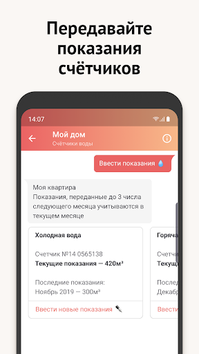
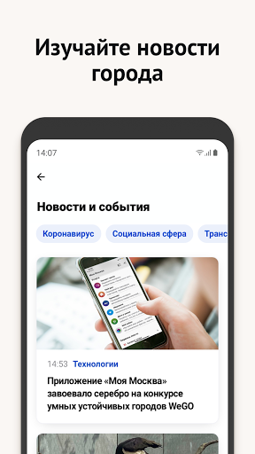
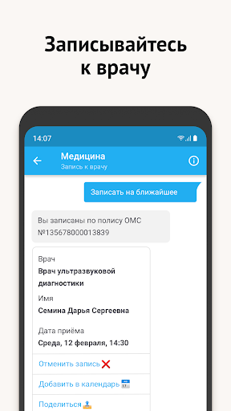

# Моя Москва — официальное приложение портала mos.ru
App version ``2.2``

Analyzed with [covid-apps-observer](http://github.com/covid-apps-observer) project, version ``0.1``

## App overview
| | |
|-------------------------|-------------------------| 
| **Name**&nbsp;&nbsp;&nbsp;&nbsp;&nbsp;&nbsp;&nbsp;&nbsp;&nbsp;&nbsp;&nbsp;&nbsp;&nbsp;&nbsp;&nbsp;&nbsp;&nbsp;&nbsp;&nbsp;&nbsp;&nbsp;&nbsp;&nbsp;&nbsp;&nbsp;&nbsp;&nbsp;&nbsp;&nbsp;&nbsp;&nbsp;&nbsp;&nbsp;&nbsp;&nbsp;&nbsp;&nbsp;&nbsp;&nbsp;&nbsp;  | Моя Москва — официальное приложение портала mos.ru |
| **Unique identifier** | ru.mos.app |
| **Link to Google Play** | [https://play.google.com/store/apps/details?id=ru.mos.app](https://play.google.com/store/apps/details?id=ru.mos.app) |
| **Summary**  | Все самые нужные городские сервисы в официальном приложении mos.ru «Моя Москва». |
| **Privacy policy** | [https://mosapps.mos.ru/privacypolicy/](https://mosapps.mos.ru/privacypolicy/) |
| **Latest version** | 2.2 |
| **Last update** | 2021-05-19 15:29:33 |
| **Recent changes** | Добавили возможность входить в приложение теми же способами, что и на mos.ru. Если входите на портал через Госуслуги или соцсети, то и в «Мою Москву» с их помощью теперь попадёте. Давно надо было так сделать — и вот. |
| **Installs**  | 1 000 000+ |
| **Category** | Социальные |
| **First release** | 27 дек. 2018 г. |
| **Size**  | 89M |
| **Supported Android version**  | 5.0 и выше |

### Description
> Пользуйтесь главными сервисами mos.ru, читайте новости города и задавайте вопросы операторам городского контакт-центра в одном приложении. Достаточно ввести ваши данные для входа на портал mos.ru и вам откроются все возможности чат-бота «Моя Москва».
 Здесь мы собрали самые частые госуслуги, которыми пользуются москвичи. И упростили процесс получения — все вопросы решает быстрый чат-бот. Откройте диалог в нужном разделе:
 – Мой дом: подать показания счётчиков воды, узнать, когда нужно провести поверку счётчиков, получить счета за ЖКУ. Сохраните в приложении 10-значный номер плательщика (указан на вашем ЕПД) и вам будет доступна оплата ЖКХ.
 – Дети в школе: пользоваться сервисами «Москвёнок» и «Электронный дневник» в одном приложении. Проверить, когда ребенок пришёл в школу, какие оценки получил и что купил на обед, можно за пару минут, спросив у бота.
 – Здоровье: записаться на приём в поликлинику, перенести или отменить запись к врачу теперь можно онлайн в удобном чате. Только скажите боту номер полиса ОМС.
 – Транспорт: проверить и оплатить штрафы ГИБДД онлайн по номеру, узнать историю своего автомобиля. По вашей просьбе бот пришлёт уведомление об эвакуации машины и новых штрафах. Понадобятся номер водительских прав, СТС, VIN и госномер автомобиля.
 – Контакт-центр: операторы круглосуточно готовы помочь вам в решении вопросов, связанных с получением государственных услуг и работой приложения «Моя Москва».
 – Новости города: узнать за пару минут всё самое важное, что происходит в Москве и в вашем районе.
 – Мой район: изучать ваш район - читать об уникальных фактах, искать ближайшие парки и школы, детские и спортивные площадки, узнавать о планах его развития.
 «Моя Москва» — чат-бот, который помогает москвичам получить самые популярные госуслуги. Часть из них доступна без авторизации. Но советуем зарегистрироваться, чтобы бот знал ваши данные и мог напоминать о важных платежах или записи к врачу.
 Правительство Москвы также разработало отдельные приложения для тех, кто ищет или хочет оплатить парковку («Парковки Москвы»), участвовать в принятии важных городских решений («Активный Гражданин»), замечать недочеты в устройстве ЖКХ («Наш город»).

### User interface
The developers of the app provide the following screenshots in the Google play store.
| | | |
|:-------------------------:|:-------------------------:|:-------------------------:|
 |   |   |   | 
 |   |   |   | 
 |   |  

## Development team
In the following we report the main information provided by the development team in the Google play store.

| | |
|-------------------------|-------------------------|
| **Developer**  | Информационный город ГКУ |
| **Website**  | [https://www.mos.ru/mobile/](https://www.mos.ru/mobile/) |
| **Email** | mobile@mos.ru |
| **Physical address**  | - |
| **Other developed apps**  | [https://play.google.com/store/apps/developer?id=%D0%98%D0%BD%D1%84%D0%BE%D1%80%D0%BC%D0%B0%D1%86%D0%B8%D0%BE%D0%BD%D0%BD%D1%8B%D0%B9+%D0%B3%D0%BE%D1%80%D0%BE%D0%B4+%D0%93%D0%9A%D0%A3](https://play.google.com/store/apps/developer?id=%D0%98%D0%BD%D1%84%D0%BE%D1%80%D0%BC%D0%B0%D1%86%D0%B8%D0%BE%D0%BD%D0%BD%D1%8B%D0%B9+%D0%B3%D0%BE%D1%80%D0%BE%D0%B4+%D0%93%D0%9A%D0%A3) |

## Android support

| | |
|-------------------------|-------------------------|
| **Declared target Android version**  | Android10, version 10 (API level 29) |
| **Effective target Android version**  | Android10, version 10 (API level 29) |
| **Minimum supported Android version**  | Lollipop, version 5.0 (API level 21) |
| **Maximum target Android version**  | - |

The larger the difference between the minimum and maximum supported Android versions, the better. A larger difference means a wider audience. For example, old phones have a very low Android version, so a high minimum supported Android version means that the app cannot be used by users with old phones, thus leading to accessibility problems. 

## Requested permissions

In the following we report the complete list of the permissions requested by the app. 

| **Permission** | **Protection level** | **Description** | 
|-------------------------|-------------------------|-------------------------|
 **android.permission ACCESS_COARSE_LOCATION** | :warning:**Dangerous** | Allows an app to access approximate location. 
 **android.permission ACCESS_FINE_LOCATION** | :warning:**Dangerous** | Allows an app to access precise location. 
 **android.permission ACCESS_NETWORK_STATE** | Normal | Allows applications to access information about networks. 
 **android.permission ACCESS_WIFI_STATE** | Normal | Allows applications to access information about Wi-Fi networks. 
 **android.permission CAMERA** | :warning:**Dangerous** | Required to be able to access the camera device. 
 **android.permission CHANGE_WIFI_STATE** | Normal | Allows applications to change Wi-Fi connectivity state. 
 **android.permission FOREGROUND_SERVICE** | Normal | Allows a regular application to use Service.startForeground. 
 **android.permission INTERNET** | Normal | Allows applications to open network sockets. 
 **android.permission READ_EXTERNAL_STORAGE** | :warning:**Dangerous** | Allows an application to read from external storage. 
 **android.permission RECEIVE_BOOT_COMPLETED** | Normal | Allows an application to receive the Intent.ACTION_BOOT_COMPLETED that is broadcast after the system finishes booting. 
 **android.permission RECORD_AUDIO** | :warning:**Dangerous** | Allows an application to record audio. 
 **android.permission USE_BIOMETRIC** | Normal | Allows an app to use device supported biometric modalities. 
 **android.permission USE_FINGERPRINT** | Normal | This constant was deprecated in API level 28. Applications should request USE_BIOMETRIC instead 
 **android.permission VIBRATE** | Normal | Allows access to the vibrator. 
 **android.permission WAKE_LOCK** | Normal | Allows using PowerManager WakeLocks to keep processor from sleeping or screen from dimming. 
 **android.permission WRITE_CALENDAR** | :warning:**Dangerous** | Allows an application to write the user's calendar data. 
 **android.permission WRITE_EXTERNAL_STORAGE** | :warning:**Dangerous** | Allows an application to write to external storage. 
 **com.google.android.c2dm.permission RECEIVE** | - | - 
 **com.google.android.finsky.permission BIND_GET_INSTALL_REFERRER_SERVICE** | - | - 
 **ndroid.permission MANAGE_FINGERPRINT** | - | - 

## Mentioned servers

| **Server** | **Registrant** | **Registrant country** | **Creation date** | 
|-------------------------|-------------------------|-------------------------|-------------------------|
 | w3.org | W3C | :us: US | 1994-07-06 04:00:00 |
 | xml.org | OASIS Open | :us: US | 1997-02-03 05:00:00 |
 | xmlpull.org | Privacy service provided by Withheld for Privacy ehf | :iceland: IS | 2001-11-26 20:33:08 |
 | google.com | Google LLC | :us: US | 1997-09-15 04:00:00 |
 | app-measurement.com | Google LLC | :us: US | 2015-06-19 20:13:31 |
 | googlesyndication.com | Google LLC | :us: US | 2003-01-21 06:17:24 |
 | crashlytics.com | Google LLC | :us: US | 2011-01-21 15:30:40 |
 | googleadservices.com | Google LLC | :us: US | 2003-06-19 16:34:53 |
 | yandex.ru | - | - | 1997-09-23 09:45:07 |
 | yandexadexchange.net | - | :ru: RU | 2014-02-18 12:48:07 |
 | intervale.ru | - | - | 2001-04-09 20:00:00 |
 | mts.ru | - | - | 1997-11-19 12:02:34 |
 | mos.ru | - | - | 1996-12-23 09:49:03 |
 | atsaero.ru | - | - | 2014-09-26 07:17:38 |
 | yandex.com | - | :switzerland: CH | 1998-09-24 04:00:00 |
 | yandex.net | - | :ru: RU | 2000-11-14 06:56:55 |
 | mgfoms.ru | - | - | 2002-12-22 21:00:00 |

## Security analysis 

Below we report the main security warnings raised by our execution of the [Androwarn](https://github.com/maaaaz/androwarn) security analysis tool.

**Telephony identifiers leakage**
> - This application reads the MCC+MNC of the provider of the SIM 
> - This application reads the Service Provider Name (SPN) 
> - This application reads the constant indicating the state of the device SIM card 
> - This application reads the current location of the device 
> - This application reads the neighboring cell information of the device 
> - This application reads the numeric name (MCC+MNC) of current registered operator 
> - This application reads the operator name 
> - This application reads the phone's current state 
> - This application reads the radio technology (network type) currently in use on the device for data transmission 
> - This application reads the unique device ID, i.e the IMEI for GSM and the MEID or ESN for CDMA phones 
> - This application reads the Cell ID value 
> - This application reads the Location Area Code value 

**Location lookup**
> - This application reads location information from all available providers (WiFi, GPS etc.) 

**Connection interfaces exfiltration**
> - This application reads details about the currently active data network 
> - This application tries to find out if the currently active data network is metered 

**Telephony services abuse**
> - This application makes phone calls 

**Suspicious connection establishment**
> - This application opens a Socket and connects it to the remote address '' on the 'N/A' port  
> - This application opens a Socket and connects it to the remote address 'Ljava/lang/StringBuilder;->toString()Ljava/lang/String;' on the 'N/A' port  
> - This application opens a Socket and connects it to the remote address 'Ljava/net/Proxy;->type()Ljava/net/Proxy$Type;' on the 'N/A' port  
> - This application opens a Socket and connects it to the remote address 'timeout' on the 'N/A' port  

**Code execution**
> - This application loads a native library 
> - This application loads a native library: 'Landroid/text/TextUtils;->isEmpty(Ljava/lang/CharSequence;)Z' 
> - This application loads a native library: 'YandexMetricaNativeModule' 

## User ratings and reviews

Below we provide information about how end users are reacting to the app in terms of ratings and reviews in the Google Play store.

### Ratings

The Моя Москва — официальное приложение портала mos.ru app has been installed by more than **1000000** times. At this time, **4311** rated the app and its average score is **3.891455**. Below we show the distribution of the ratings across the usual star-based rating of Google Play

:star::star::star::star::star:: 2739

:star::star::star::star:: 338

:star::star::star:: 169

:star::star:: 159

:star:: 906

### Reviews 

#### 5-star reviews

> Всё нормально.  :date: __2021-05-22 17:52:16__

> Отличное приложение мне нравится Молодцы +++++5  :date: __2021-05-21 22:07:16__

> Шикардос  :date: __2021-05-20 17:30:13__

> Хорошее приложение, пользуюсь регулярно 👍  :date: __2021-05-20 07:48:56__

> Всем советую хорошее приложение  :date: __2021-05-19 16:20:40__

> Отлично  :date: __2021-05-19 11:39:53__

> Всё хорошо работает!  :date: __2021-05-19 07:26:53__

> Интерфейс в виде чата очень удобен.  :date: __2021-05-19 03:57:29__

> Пока что все нравиться. Пользуюсь записью ко врачу и электронным дневником. Удобно.  :date: __2021-05-17 21:56:47__

> Быстро, удобно  :date: __2021-05-17 08:53:33__

#### 4-star reviews

> Приложение глючит  :date: __2021-05-13 09:47:07__

> Хорошее приложение.  :date: __2021-05-01 21:47:33__

> Уважаемые разработчики! Сделайте вход в ЭЖД в вашем приложении, также как и через сайт. Неудобно пользоваться дневником в таком режиме.  :date: __2021-04-27 16:45:22__

> Удобно  :date: __2021-04-16 09:33:53__

> Удобное приложение, но имееются недочёты. Нет наглядности в информации по школьным оценкам. Например, нет выделения итоговых оценок, не видны коэффициенты.  :date: __2021-04-06 15:15:19__

> Периодически выскакивает ошибка при записи, если введено несколько полисов  :date: __2021-03-29 14:20:29__

> Бывают сбои но хорошая программа  :date: __2021-03-27 07:33:38__

> Пользуюсь для оплаты счетов для сада и кружков. Остальное слишком урезана относительно версии в компьютере  :date: __2021-03-16 10:30:41__

> Приложение не запускается.  :date: __2021-03-09 05:49:13__

> Не открывается приложение  :date: __2021-03-08 11:17:16__

#### 3-star reviews

> 30апр - Поправляю отзыв до 3, ибо хз что дальше.. Пока зайти получилось. 28апр - Как обычно, нельзя войти. Что, чипы не делают в хасударстве? И ПО не шьют? На картинках всё есть, на деле - @*#!  :date: __2021-04-30 19:59:19__

> Очень неудобно  :date: __2021-04-28 07:42:55__

> Интерфейс чат-бота. Тормозит  :date: __2021-04-28 06:48:08__

> Приложение не удобное!  :date: __2021-04-27 20:45:04__

> Заработало! Но, не грузится информация на закладках: главное и события. Чините скореееее...  :date: __2021-04-26 21:25:32__

> Приложение неудобное. Трудно найти то, что нужно. Надо дорабатывать.  :date: __2021-04-09 06:48:50__

> Еле живое, по 10 раз зависает в одной точке  :date: __2021-04-01 12:50:30__

> При оплате за кап ремонт не считывает карточку, при этом всё идеально, освещение, резкость, рамка, читаемость, функция вроде есть, но не работает, приходится вручную вводить.Также при платежах за жкх комиссию снимают, нет соглашения значит хотя-бы с крупными банками (втб например)..  :date: __2021-03-25 12:01:37__

> Почти все сервисы кривые и не собираюсь перечислять какие !!!  :date: __2021-03-22 13:19:18__

> Ну и где установить последнию версию браузера.  :date: __2021-03-18 10:08:42__

#### 2-star reviews

> Зависает  :date: __2021-05-21 05:43:14__

> Неудобная навигация. Тех.поддержка вообще никакая. Главное дать формальный ответ и закрыть обращение, не вникая в суть проблемы.  :date: __2021-05-08 13:34:34__

> Требует установить последнюю версию моего (а10)браузера.  :date: __2021-04-28 14:36:28__

> Неаозможно зайти через УЗ госулуг  :date: __2021-04-23 21:46:56__

> Тяжело записаться к врачу, постоянно выпадает ошибка  :date: __2021-04-21 11:00:44__

> Отвратительно работает  :date: __2021-04-21 06:49:46__

> Ужасно приложение! Второй год не могу создать личный кабинет, все пороли почему то не подходят.  :date: __2021-04-06 13:09:57__

> Часто недоступна оплата обедов в школе  :date: __2021-03-27 08:31:48__

> Чтобы узнать где врач надо открывать карту это бред. Нет возможности удалить историю чтобы найти что надо надо рыться в мусоре. Записался к врачу есть врач есть время есть дата нет номера кабинета.  :date: __2021-03-19 18:01:21__

> Организация велопарковки, не получается отправить заявку на рассмотрение.  :date: __2021-03-18 12:25:50__

#### 1-star reviews

> Отвратительное приложение, в которое невозможно войти.  :date: __2021-05-22 14:19:08__

> Не могу войти в мед карту. Перекидывает на браузер. Там пишет, что браузер устарел. Я его обновила. Ещё раз пишет, ещё раз обновила , хотя он уже обновлен Ничего не изменилось. Или из мос ру посылают на гос услуи. А сами что?  :date: __2021-05-22 07:16:13__

> Очень плохо. Неудачно ткнул в телефоне, промахнулся и все, запись к врачу потеряна. А нужно срочно. Ждëшь эту запись по 2 недели, А она теряется за секунду. Найду куда, накатаю жалобу.  :date: __2021-05-21 09:19:34__

> Сдать анализ на антитела можно почему-то только через вашу программу. А войти а нее не возможно. Исправьте пожалуйста. Это мое здоровье. Не нужно так. PS. Выдает следующее {"error":"invalid_client","error_description":"Unknown client.","state":"883c6acb-3dfc-4e97-93c4-b812d3c779bd"}  :date: __2021-05-19 21:37:13__

> Личные данные не синхронизируются, навигация ужасная.  :date: __2021-05-18 09:48:24__

> На сайт захожу через ГосУслуги, а в приложении такой возможности нет. Удалил.  :date: __2021-05-17 16:15:58__

> Я бы поставил минус 5 . Но к сожалению есть оценки от 1 до 5 . Собянин , пригласите других разработчиков !!! Или денег по больше платите нынешним!!! Доработаете до конца , пора уже , пора !!!  :date: __2021-05-17 13:50:40__

> Отвратное приложение. Нормальному человеку пользоваться невозможно. Бобло распилили, а нормальный сервис сделать слабо. Это приложение как и все в стране, не для удобства, а для галочки.  :date: __2021-05-16 08:01:13__

> Отвратительно.Тормозит .  :date: __2021-05-15 10:58:31__

> Отвратительная визуализация в виде чата.  :date: __2021-05-14 11:34:14__

