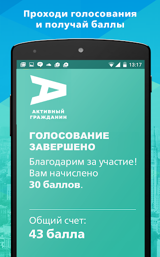
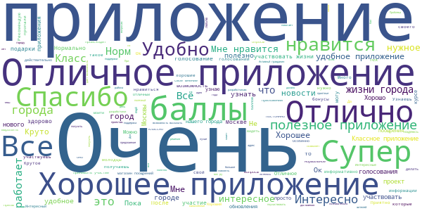
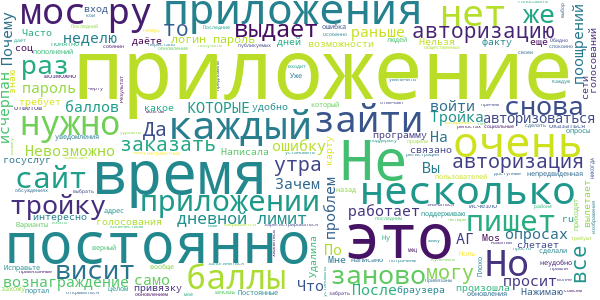

# Активный гражданин
App version ``2.15.2``

Analyzed with [covid-apps-observer](http://github.com/covid-apps-observer) project, version ``0.1``

## App overview
| | |
|-------------------------|-------------------------| 
| **Name**&nbsp;&nbsp;&nbsp;&nbsp;&nbsp;&nbsp;&nbsp;&nbsp;&nbsp;&nbsp;&nbsp;&nbsp;&nbsp;&nbsp;&nbsp;&nbsp;&nbsp;&nbsp;&nbsp;&nbsp;&nbsp;&nbsp;&nbsp;&nbsp;&nbsp;&nbsp;&nbsp;&nbsp;&nbsp;&nbsp;&nbsp;&nbsp;&nbsp;&nbsp;&nbsp;&nbsp;&nbsp;&nbsp;&nbsp;&nbsp;  | Активный гражданин |
| **Unique identifier** | ru.mos.polls |
| **Link to Google Play** | [https://play.google.com/store/apps/details?id=ru.mos.polls](https://play.google.com/store/apps/details?id=ru.mos.polls) |
| **Summary**  | Твой город – твое решение! Электронные голосования Правительства Москвы. |
| **Privacy policy** | [https://ag.mos.ru/eula](https://ag.mos.ru/eula) |
| **Latest version** | 2.15.2 |
| **Last update** | 2020-04-21 15:49:02 |
| **Recent changes** | Исправлены мелкие ошибки, оптимизирована работа приложения |
| **Installs**  | 500 000+ |
| **Category** | Социальные |
| **First release** | 14 мая 2014 г. |
| **Size**  | 16M |
| **Supported Android version**  | 4.4 и выше |

### Description
> Твой город – твое решение! Электронные голосования Правительства Москвы.
 Ты решаешь, какой будет Москва! Участвуй в голосованиях и получай поощрения от города и партнеров проекта!
 «Активный гражданин» — проект для тех, кто хочет изменить город к лучшему. Это официальное приложение Правительства Москвы, которое было создано по поручению мэра Москвы Сергея Собянина.
 Каждую неделю Мэр и Правительство Москвы выносит на обсуждение активных граждан важные для города вопросы: от транспорта и благоустройства территорий до здравоохранения и образования. Выражая свое мнение, ты помогаешь органам власти принимать верные решения. 
 — Как будут отдыхать московские школьники?
 — Нужно ли ограничивать скорость в центре Москвы?
 — Что построить на месте бывшей промзоны?
 Просто зарегистрируйся, укажи свой адрес и голосуй!
 Результаты электронных голосований будут воплощены в жизнь, а тебя ждут приятные подарки.
 Высказывая свою позицию, ты получаешь баллы. Заработай 1000 баллов и получи статус «Активный гражданин», который открывает доступ к Магазину поощрений. В нем заработанные баллы можно обменять на городские услуги. Например:
 — оплата парковки
 — поездки на метро
 — билеты в театры и музеи
 — городские экскурсионные программы
 — яркие сувениры с символикой «Активного гражданина»
 и другие полезные мелочи.
 Хочешь получить еще больше баллов? Чаще заходи в приложение, выражай свое мнение, отмечайся на мероприятиях, приглашай друзей, активируй промо-коды и делись информацией о пройденных голосованиях в социальных сетях.
 Самые активные участники проекта становятся гостями уникальных городских мероприятий. Например, активные граждане могут посетить генеральную репетицию парада Победы или концерт в День города на Красной площади, Чемпионат мира по шорт-треку с участием звезды спорта Виктора Ана или кататься на главном катке страны на ВДНХ.
 Стань активным гражданином — установи приложение бесплатно прямо сейчас!

### User interface
The developers of the app provide the following screenshots in the Google play store.
| | | |
|:-------------------------:|:-------------------------:|:-------------------------:|
 |   |   |   | 
 |   |   |   | 
 |  

## Development team
In the following we report the main information provided by the development team in the Google play store.

| | |
|-------------------------|-------------------------|
| **Developer**  | Информационный город ГКУ |
| **Website**  | [http://ag.mos.ru/](http://ag.mos.ru/) |
| **Email** | support@ag.mos.ru |
| **Physical address**  | - |
| **Other developed apps**  | [https://play.google.com/store/apps/developer?id=%D0%98%D0%BD%D1%84%D0%BE%D1%80%D0%BC%D0%B0%D1%86%D0%B8%D0%BE%D0%BD%D0%BD%D1%8B%D0%B9+%D0%B3%D0%BE%D1%80%D0%BE%D0%B4+%D0%93%D0%9A%D0%A3](https://play.google.com/store/apps/developer?id=%D0%98%D0%BD%D1%84%D0%BE%D1%80%D0%BC%D0%B0%D1%86%D0%B8%D0%BE%D0%BD%D0%BD%D1%8B%D0%B9+%D0%B3%D0%BE%D1%80%D0%BE%D0%B4+%D0%93%D0%9A%D0%A3) |

## Android support

| | |
|-------------------------|-------------------------|
| **Declared target Android version**  | Android10, version 10 (API level 29) |
| **Effective target Android version**  | Android10, version 10 (API level 29) |
| **Minimum supported Android version**  | KitKat, version 4.4 - 4.4.4 (API level 19) |
| **Maximum target Android version**  | - |

The larger the difference between the minimum and maximum supported Android versions, the better. A larger difference means a wider audience. For example, old phones have a very low Android version, so a high minimum supported Android version means that the app cannot be used by users with old phones, thus leading to accessibility problems. 

## Requested permissions

In the following we report the complete list of the permissions requested by the app. 

| **Permission** | **Protection level** | **Description** | 
|-------------------------|-------------------------|-------------------------|
 **android.permission ACCESS_COARSE_LOCATION** | :warning:**Dangerous** | Allows an app to access approximate location. 
 **android.permission ACCESS_FINE_LOCATION** | :warning:**Dangerous** | Allows an app to access precise location. 
 **android.permission ACCESS_NETWORK_STATE** | Normal | Allows applications to access information about networks. 
 **android.permission CAMERA** | :warning:**Dangerous** | Required to be able to access the camera device. 
 **android.permission GET_ACCOUNTS** | :warning:**Dangerous** | Allows access to the list of accounts in the Accounts Service. 
 **android.permission INTERNET** | Normal | Allows applications to open network sockets. 
 **android.permission READ_CONTACTS** | :warning:**Dangerous** | Allows an application to read the user's contacts data. 
 **android.permission READ_EXTERNAL_STORAGE** | :warning:**Dangerous** | Allows an application to read from external storage. 
 **android.permission READ_PHONE_STATE** | :warning:**Dangerous** | Allows read only access to phone state, including the phone number of the device, current cellular network information, the status of any ongoing calls, and a list of any PhoneAccounts registered on the device. 
 **android.permission USE_CREDENTIALS** | - | - 
 **android.permission WAKE_LOCK** | Normal | Allows using PowerManager WakeLocks to keep processor from sleeping or screen from dimming. 
 **android.permission WRITE_EXTERNAL_STORAGE** | :warning:**Dangerous** | Allows an application to write to external storage. 
 **com.google.android.c2dm.permission RECEIVE** | - | - 
 **com.google.android.finsky.permission BIND_GET_INSTALL_REFERRER_SERVICE** | - | - 

## Mentioned servers

| **Server** | **Registrant** | **Registrant country** | **Creation date** | 
|-------------------------|-------------------------|-------------------------|-------------------------|
 | facebook.com | Facebook, Inc. | :us: US | 1997-03-29 05:00:00 |
 | google.com | Google LLC | :us: US | 1997-09-15 04:00:00 |
 | googlesyndication.com | Google LLC | :us: US | 2003-01-21 06:17:24 |
 | google-analytics.com | Google LLC | :us: US | 2005-07-18 19:24:32 |
 | app-measurement.com | Google LLC | :us: US | 2015-06-19 20:13:31 |
 | googletagmanager.com | Google LLC | :us: US | 2011-11-11 23:39:05 |
 | googleapis.com | Google LLC | :us: US | 2005-01-25 17:52:26 |
 | googleadservices.com | Google LLC | :us: US | 2003-06-19 16:34:53 |
 | twitter.com | Twitter, Inc. | :us: US | 2000-01-21 16:28:17 |
 | vk.com | Privacy protection service - whoisproxy.ru | :ru: RU | 1997-06-24 04:00:00 |
 | crashlytics.com | Google LLC | :us: US | 2011-01-21 15:30:40 |
 | w3.org | W3C | :us: US | 1994-07-06 04:00:00 |
 | mos.ru | - | - | 1996-12-23 09:49:03 |
 | instagram.com | Instagram LLC | :us: US | 2004-06-04 13:37:18 |
 | ok.ru | - | - | 1998-11-03 16:40:32 |

## Security analysis 

Below we report the main security warnings raised by our execution of the [Androwarn](https://github.com/maaaaz/androwarn) security analysis tool.

**Telephony identifiers leakage**
> - This application reads the numeric name (MCC+MNC) of current registered operator 
> - This application reads the operator name 
> - This application reads the unique device ID, i.e the IMEI for GSM and the MEID or ESN for CDMA phones 

**Connection interfaces exfiltration**
> - This application reads details about the currently active data network 
> - This application tries to find out if the currently active data network is metered 

**Telephony services abuse**
> - This application makes phone calls 

**Suspicious connection establishment**
> - This application opens a Socket and connects it to the remote address '' on the 'N/A' port  
> - This application opens a Socket and connects it to the remote address 'Ljava/lang/StringBuilder;->toString()Ljava/lang/String;' on the 'N/A' port  
> - This application opens a Socket and connects it to the remote address 'Ljava/net/Proxy;->type()Ljava/net/Proxy$Type;' on the 'N/A' port  
> - This application opens a Socket and connects it to the remote address 'timeout' on the 'N/A' port  

**Code execution**
> - This application executes a UNIX command 

## User ratings and reviews

Below we provide information about how end users are reacting to the app in terms of ratings and reviews in the Google Play store.

### Ratings

The Активный гражданин app has been installed by more than **500000** times. At this time, **71095** rated the app and its average score is **4.4338746**. Below we show the distribution of the ratings across the usual star-based rating of Google Play

:star::star::star::star::star:: 54246

:star::star::star::star:: 7265

:star::star::star:: 2157

:star::star:: 1033

:star:: 6392

### Reviews 

#### 5-star reviews

> Супер мне нравиться  :date: __2020-05-05 19:28:47__

> Отлично  :date: __2020-05-05 13:51:59__

> Здорово и интересно  :date: __2020-05-05 04:08:36__

> Все хорошо спасибо  :date: __2020-05-03 08:30:49__

> Удобное приложение. Интересные голосования, хорошая система начисления и расходования бонусов.  :date: __2020-05-02 17:30:18__

> Хорошо  :date: __2020-05-02 00:48:44__

> Очень нужное приложение  :date: __2020-05-01 15:33:00__

> Классссссссс  :date: __2020-05-01 12:12:07__

> Круто  :date: __2020-04-30 20:21:17__

> Топ  :date: __2020-04-29 12:28:49__

#### 4-star reviews

> Присоединяюсь к тем, у кого не получается скрыть плашки "Общественные обсуждения" и "Коронавирус". Они появляются при каждом заходе в приложение. О вирусе и так говорят изо всех щелей, спасибо, мне не нужен еще один непрошенный источник  :date: __2020-04-14 14:51:18__

> Общественные обсуждения , Краудсорсинг проект и Инфо.о.Коронавирусе появляется заного на вкладке Активный гражданин после того как скрыл их и заного зашел в приложение, глаза есть, и цифры с количеством обновлений вижу напротив вкладок, раскидайте их по их же вкладкам чтоб не мазолили глаза на главной вкладке,- на ней я любуюсь теперь не шестью новостями, а одиннадцатью достижениями. Почти всё стало хорошо! И размер шрифта сопостовимый с настройками смартфона стал! Спасибо! Не ломайте больше👍.  :date: __2020-04-04 06:36:28__

> Ещё пока разбираюсь с приложением.  :date: __2020-03-31 09:29:36__

> Баннер с вирусом достал. Ответы разрабов, что этого баннера не соответствуют действительности. Если вешаешь баннер в приложение - обойдись без ссылок через внешние приложения.  :date: __2020-03-25 16:29:08__

> Хорошее приложение. В курсе изменений в городе. Голосование за лучшие проекты и идеи. Сстема баллов, клторые сожно потратить на предметы из внутреннего магазина  :date: __2020-03-21 17:15:44__

> Не могу пополнить тройку.  :date: __2020-03-21 11:02:15__

> Неплохое приложение,единственный минус иногда подвисает и не дает проголосовать.  :date: __2020-03-21 07:00:02__

> Голосование голосованием, но почему-то не прислушиваются к голосам тех людей, которые живут и пользуются теми местами, о которых речь идет в голосовании. Пример: так называемый, Лианозовский променад. Это же ужас. Вместо скамеек стоят бетонные блоки, покрашенные в белый цвет, на которых невозможно сидеть, вход , на так называемый променад, сделан из каких-то белых непонятных арок. Заменили плитку, которую укладывали 2года назад. Зачем? На аллее стоял гранитный камень погибшим чернобыльцам, убра  :date: __2020-03-20 18:33:04__

> Приложение отличное! Только Московская область и не входит в голосования! Хотя, и перемен особо нет никаких. Обидно (  :date: __2020-03-20 15:31:01__

> Хорошее приложение, НУЖНОЕ! БЫЛИ Проблемы, но всё устранено! Благодарю!  :date: __2020-03-20 15:20:46__

#### 3-star reviews

> После обновления не могу войти в приложение. Кнопки входа и регистрации не активны  :date: __2020-05-07 22:12:11__

> Полгода не могу войти в личный кабинет. Все данные введены правильно. Выдает ошибку и выкидывает из приложения  :date: __2020-04-22 10:51:26__

> Хорошее приложения  :date: __2020-04-18 05:05:49__

> На троечку  :date: __2020-04-16 14:22:26__

> Малоэффективной приложение  :date: __2020-04-15 13:41:47__

> Да всякий шлак, из серии, каким цветом красить крышу дома. А я изначально против дома!  :date: __2020-04-14 18:35:36__

> Почему только в Москве??? Сделайте еще в уфе поощрения!!!  :date: __2020-04-07 21:48:15__

> Постоянно слетает пароль. Приходится восстанавливать его.  :date: __2020-04-06 13:39:31__

> Средненько  :date: __2020-04-04 15:23:42__

> Медленно и зависает  :date: __2020-03-26 05:50:47__

#### 2-star reviews

> Последний раз баллы были потрачены на карту тройку, но на тройку они так и не пришли....  :date: __2020-05-05 08:45:34__

> Не знаю связано ли это с последним обновлением, но приложение перестало открываться. Нажимаю войти через Mos. ru приложение зависает, нажимаю на зарегистрироваться и снова висит. Написала в тех поддержку, предложили удалить и установить заново. Удалила и установила, и так уже несколько раз. Результат все тот же. Написала ещё заявку, не отвечают совсем. Приложение так и не даёт войти. Обидно  :date: __2020-05-03 23:43:30__

> Неграмотные!!!  :date: __2020-04-30 20:41:13__

> 👍  :date: __2020-04-13 05:23:05__

> Раньше можно было спокойно входит в программу... Теперь же постоянно слетает логин и пароль... Почему нельзя зайти просто в программу, а не через мос.ру...? На кой тогда само приложение...?  :date: __2020-04-08 23:27:19__

> Приложение для засирания мозгов. По факту собянин на своей волне.  :date: __2020-04-04 07:44:01__

> Мне вот интересно, почему вознаграждение нужно ехать получать к черту на куличики? Вы хвалитесь количеством МФЦ, НО! в том районе где я живу НИКОГДА ничего нет! Вы нам даёте выбор в приложении(голосовать), а выбрать где мне забрать моё вознаграждение не даёте.  :date: __2020-03-20 21:17:45__

> Часто обновление  :date: __2020-03-20 17:15:06__

> Каждую неделю слетает регистрация и просит зайти через МОС.РУ, причем из браузера  :date: __2020-03-20 12:37:37__

> Привязаны все четыре социальные сети. В профиле они значаться как привязанные. Но при репостах голосований постоянно требуют залогиниться заново. Особенно этим грешит "Фейсбук" и "Одноклассники". И так несколько последних версий приложения. Так же очень раздражает ситуация с пополнением карты "Тройка" за набранные баллы. Каждый раз пишет что закончился дневной лимит, и предлагает попробовать после 00:00. РОВНО в это время выдает тоже самое. Пробиться очень сложно...  :date: __2020-03-19 14:10:45__

#### 1-star reviews

> Оформил в магазине поощрений приложения заказ на баллы парковки. Списали 1335 баллов. Но денежку на парковку не перечислили. Заказ # 1214115 от 04.03.2020. Обращался в службу поддержки два раза. Никакого ответа... Делайте выводы  :date: __2020-05-07 22:28:00__

> Обшественные голосования не работают на этой платформе, все усложнено так, что граждане не могу голосовать за свой район и квартал. Остальные голосования легко и просто.  :date: __2020-05-07 16:41:00__

> Рукожопы. Нет синхронизации между приложением и сайтом мос.ру. Все баллы пропали, все голосования обнулились. Все соц сети намертво отвалились и дальнейшая привязка невозможна. Рукоголовожопы.  :date: __2020-05-07 05:31:17__

> Пустое приложение, фикция демократии. На самом деле мнение москвичей никого не интересует и ничего не решает. В топку.  :date: __2020-05-04 12:33:37__

> После обновления приложения требует ввести палоль, при вводе которого, пишет что он не правильный (я на 100% уверен, что он правилтный). После восстановления пароля, в личном кабинете пропали все накопленные балы за несколтко лет! Прошу разобраться с данной проблемой.  :date: __2020-05-04 09:57:08__

> Я не собираюсь привязывать снилс, чтобы получить тройку. А без этого баллы вообще не нужны  :date: __2020-05-02 14:43:34__

> Написали что на проекте с 30.04.2020.я с самого начала на проекте!!вы взяли и меня обнулили!!????.и это че???  :date: __2020-05-02 07:30:41__

> Бред.  :date: __2020-05-01 22:12:06__

> Месяц уже не могу зайти вприложение. Пишут ошибка при входе. И дальше тоже ничего нельзя сделать.  :date: __2020-04-30 11:31:57__

> Нет, это прекрасно. В очередной раз меня просят ввести логи/пароль после обновления. Это ваше обновление, это ваши проблемы. Ввожу и не могу зайти в приложение. Просят подтвердить мобильный телефон через мос.ру. Да вы издеваетесь?! Вы полгода назад просили делать тоже самое! Нет, опять все слетало. Теперь я вынуждена восстанавливать историю баллов, больше 10000, и ждать. Вы как вообще работаете и за что ваши разрабы деньги получают, мне интересно? Почему нельзя это по-человечески делать?  :date: __2020-04-28 21:35:18__

