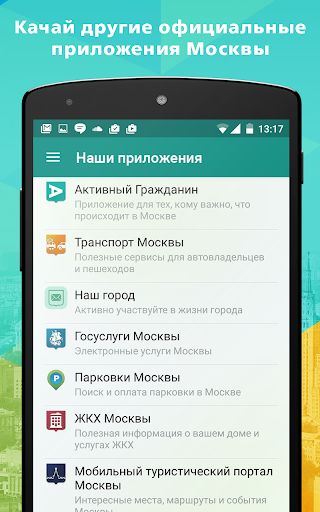
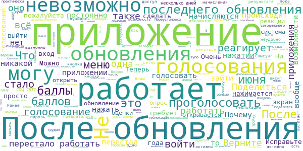
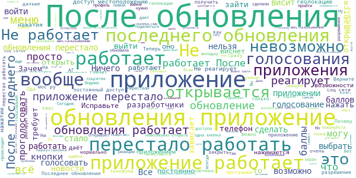

# Активный гражданин
App version ``2.18.1``

Analyzed with [covid-apps-observer](http://github.com/covid-apps-observer) project, version ``0.1``

## App overview
| | |
|-------------------------|-------------------------| 
| **Name**&nbsp;&nbsp;&nbsp;&nbsp;&nbsp;&nbsp;&nbsp;&nbsp;&nbsp;&nbsp;&nbsp;&nbsp;&nbsp;&nbsp;&nbsp;&nbsp;&nbsp;&nbsp;&nbsp;&nbsp;&nbsp;&nbsp;&nbsp;&nbsp;&nbsp;&nbsp;&nbsp;&nbsp;&nbsp;&nbsp;&nbsp;&nbsp;&nbsp;&nbsp;&nbsp;&nbsp;&nbsp;&nbsp;&nbsp;&nbsp;  | Активный гражданин |
| **Unique identifier** | ru.mos.polls |
| **Link to Google Play** | [https://play.google.com/store/apps/details?id=ru.mos.polls](https://play.google.com/store/apps/details?id=ru.mos.polls) |
| **Summary**  | Твой город – твое решение! Электронные голосования Правительства Москвы. |
| **Privacy policy** | [https://ag.mos.ru/eula](https://ag.mos.ru/eula) |
| **Latest version** | 2.18.1 |
| **Last update** | 2020-06-05 20:14:38 |
| **Recent changes** | Исправлена медленная работа интерфейса в Android 10 |
| **Installs**  | 500 000+ |
| **Category** | Социальные |
| **First release** | 14 мая 2014 г. |
| **Size**  | 14M |
| **Supported Android version**  | 4.4 и выше |

### Description
> Твой город – твое решение! Электронные голосования Правительства Москвы.
 Ты решаешь, какой будет Москва! Участвуй в голосованиях и получай поощрения от города и партнеров проекта!
 «Активный гражданин» — проект для тех, кто хочет изменить город к лучшему. Это официальное приложение Правительства Москвы, которое было создано по поручению мэра Москвы Сергея Собянина.
 Каждую неделю Мэр и Правительство Москвы выносит на обсуждение активных граждан важные для города вопросы: от транспорта и благоустройства территорий до здравоохранения и образования. Выражая свое мнение, ты помогаешь органам власти принимать верные решения. 
 — Как будут отдыхать московские школьники?
 — Нужно ли ограничивать скорость в центре Москвы?
 — Что построить на месте бывшей промзоны?
 Просто зарегистрируйся, укажи свой адрес и голосуй!
 Результаты электронных голосований будут воплощены в жизнь, а тебя ждут приятные подарки.
 Высказывая свою позицию, ты получаешь баллы. Заработай 1000 баллов и получи статус «Активный гражданин», который открывает доступ к Магазину поощрений. В нем заработанные баллы можно обменять на городские услуги. Например:
 — оплата парковки
 — поездки на метро
 — билеты в театры и музеи
 — городские экскурсионные программы
 — яркие сувениры с символикой «Активного гражданина»
 и другие полезные мелочи.
 Хочешь получить еще больше баллов? Чаще заходи в приложение, выражай свое мнение, отмечайся на мероприятиях, приглашай друзей, активируй промо-коды и делись информацией о пройденных голосованиях в социальных сетях.
 Самые активные участники проекта становятся гостями уникальных городских мероприятий. Например, активные граждане могут посетить генеральную репетицию парада Победы или концерт в День города на Красной площади, Чемпионат мира по шорт-треку с участием звезды спорта Виктора Ана или кататься на главном катке страны на ВДНХ.
 Стань активным гражданином — установи приложение бесплатно прямо сейчас!

### User interface
The developers of the app provide the following screenshots in the Google play store.
| | | |
|:-------------------------:|:-------------------------:|:-------------------------:|
 |   |   |   | 
 |   |   |   | 
 |  

## Development team
In the following we report the main information provided by the development team in the Google play store.

| | |
|-------------------------|-------------------------|
| **Developer**  | Информационный город ГКУ |
| **Website**  | [http://ag.mos.ru/](http://ag.mos.ru/) |
| **Email** | support@ag.mos.ru |
| **Physical address**  | - |
| **Other developed apps**  | [https://play.google.com/store/apps/developer?id=%D0%98%D0%BD%D1%84%D0%BE%D1%80%D0%BC%D0%B0%D1%86%D0%B8%D0%BE%D0%BD%D0%BD%D1%8B%D0%B9+%D0%B3%D0%BE%D1%80%D0%BE%D0%B4+%D0%93%D0%9A%D0%A3](https://play.google.com/store/apps/developer?id=%D0%98%D0%BD%D1%84%D0%BE%D1%80%D0%BC%D0%B0%D1%86%D0%B8%D0%BE%D0%BD%D0%BD%D1%8B%D0%B9+%D0%B3%D0%BE%D1%80%D0%BE%D0%B4+%D0%93%D0%9A%D0%A3) |

## Android support

| | |
|-------------------------|-------------------------|
| **Declared target Android version**  | Android10, version 10 (API level 29) |
| **Effective target Android version**  | Android10, version 10 (API level 29) |
| **Minimum supported Android version**  | KitKat, version 4.4 - 4.4.4 (API level 19) |
| **Maximum target Android version**  | - |

The larger the difference between the minimum and maximum supported Android versions, the better. A larger difference means a wider audience. For example, old phones have a very low Android version, so a high minimum supported Android version means that the app cannot be used by users with old phones, thus leading to accessibility problems. 

## Requested permissions

In the following we report the complete list of the permissions requested by the app. 

| **Permission** | **Protection level** | **Description** | 
|-------------------------|-------------------------|-------------------------|
 **android.permission ACCESS_BACKGROUND_LOCATION** | :warning:**Dangerous** | Allows an app to access location in the background. 
 **android.permission ACCESS_COARSE_LOCATION** | :warning:**Dangerous** | Allows an app to access approximate location. 
 **android.permission ACCESS_FINE_LOCATION** | :warning:**Dangerous** | Allows an app to access precise location. 
 **android.permission ACCESS_NETWORK_STATE** | Normal | Allows applications to access information about networks. 
 **android.permission CAMERA** | :warning:**Dangerous** | Required to be able to access the camera device. 
 **android.permission GET_ACCOUNTS** | :warning:**Dangerous** | Allows access to the list of accounts in the Accounts Service. 
 **android.permission INTERNET** | Normal | Allows applications to open network sockets. 
 **android.permission READ_CONTACTS** | :warning:**Dangerous** | Allows an application to read the user's contacts data. 
 **android.permission READ_EXTERNAL_STORAGE** | :warning:**Dangerous** | Allows an application to read from external storage. 
 **android.permission READ_PHONE_STATE** | :warning:**Dangerous** | Allows read only access to phone state, including the phone number of the device, current cellular network information, the status of any ongoing calls, and a list of any PhoneAccounts registered on the device. 
 **android.permission USE_CREDENTIALS** | - | - 
 **android.permission WAKE_LOCK** | Normal | Allows using PowerManager WakeLocks to keep processor from sleeping or screen from dimming. 
 **android.permission WRITE_EXTERNAL_STORAGE** | :warning:**Dangerous** | Allows an application to write to external storage. 
 **com.google.android.c2dm.permission RECEIVE** | - | - 
 **com.google.android.finsky.permission BIND_GET_INSTALL_REFERRER_SERVICE** | - | - 

## Mentioned servers

| **Server** | **Registrant** | **Registrant country** | **Creation date** | 
|-------------------------|-------------------------|-------------------------|-------------------------|
 | googlesyndication.com | Google LLC | :us: US | 2003-01-21 06:17:24 |
 | google.com | Google LLC | :us: US | 1997-09-15 04:00:00 |
 | facebook.com | Facebook, Inc. | :us: US | 1997-03-29 05:00:00 |
 | google-analytics.com | Google LLC | :us: US | 2005-07-18 19:24:32 |
 | app-measurement.com | Google LLC | :us: US | 2015-06-19 20:13:31 |
 | googletagmanager.com | Google LLC | :us: US | 2011-11-11 23:39:05 |
 | mos.ru | - | - | 1996-12-23 09:49:03 |
 | crashlytics.com | Google LLC | :us: US | 2011-01-21 15:30:40 |
 | googleapis.com | Google LLC | :us: US | 2005-01-25 17:52:26 |
 | googleadservices.com | Google LLC | :us: US | 2003-06-19 16:34:53 |

## Security analysis 

Below we report the main security warnings raised by our execution of the [Androwarn](https://github.com/maaaaz/androwarn) security analysis tool.

**Connection interfaces exfiltration**
> - This application reads details about the currently active data network 

**Telephony services abuse**
> - This application makes phone calls 

**Suspicious connection establishment**
> - This application opens a Socket and connects it to the remote address 'Ljava/lang/StringBuilder;->toString()Ljava/lang/String;' on the 'N/A' port  
> - This application opens a Socket and connects it to the remote address 'Ljava/net/Proxy;->type()Ljava/net/Proxy$Type;' on the 'N/A' port  
> - This application opens a Socket and connects it to the remote address 'No route to  ' on the 'N/A' port  
> - This application opens a Socket and connects it to the remote address 'timeout' on the 'N/A' port  

## User ratings and reviews

Below we provide information about how end users are reacting to the app in terms of ratings and reviews in the Google Play store.

### Ratings

The Активный гражданин app has been installed by more than **500000** times. At this time, **71834** rated the app and its average score is **4.118748**. Below we show the distribution of the ratings across the usual star-based rating of Google Play

:star::star::star::star::star:: 49193

:star::star::star::star:: 6804

:star::star::star:: 2538

:star::star:: 1766

:star:: 11530

### Reviews 

#### 5-star reviews

> 02.06.20 После последнего обновления на устройстве с 10 андроидом приложение полностью зависло, не реагирует ни на какие команды, даже не дает выйти из приложения. Переустановка не помогла. А на устройстве с 9 андроидом после обновления всё нормально. Исправьте ошибки для 10 андроида, иначе это приложение просто становится шлаком. 07.06.20 Всё исправили, приложение работает. Оценку повышаю. Спасибо  :date: __2020-06-07 22:50:54__

> Нормально  :date: __2020-06-07 21:20:06__

> Если тебе не безразлична твоя среда обитания и условия жизни и работы в родном городе, то это предложение для тебя.  :date: __2020-06-07 21:03:30__

> После последнего обновления приложение не работает, есть возможность войти и выйти, меню не активно, выход приходится осуществлять принудительно. Попытка удалить и вновь установить приложение тоже не увенчалась успехом. Разработчики исправьте, пожалуйста, данную проблему.  :date: __2020-06-07 20:33:17__

> Молодцы, исправили. Меняю на 5.  :date: __2020-06-07 11:56:04__

> Обновили и заработало всё нормально.  :date: __2020-06-07 11:28:14__

> После последнего обновления v 2.18.1, приложение стало работать хорошо!  :date: __2020-06-07 10:01:35__

> Приложение неработает  :date: __2020-06-07 09:38:20__

> После обновления приложение не работает.  :date: __2020-06-07 09:13:02__

> Поправили😊  :date: __2020-06-07 06:30:02__

#### 4-star reviews

> Оперативно исправляют. Приложение хорошее, идея очень хорошая. Беда в том что серьёзные вопросы вроде ввода платных стоянок под окном не обсуждается. А стрижка газонов есть. Будем посмотреть.  :date: __2020-06-07 14:02:30__

> Перестало работать, загружается главная страница и далее не открывается ничего, ни голосование, ни новости, ни профиль... то есть далее приложение ни на что не реагирует Обновила 07.06 и все заработало!  :date: __2020-06-07 13:54:07__

> Что за обновление? Тачпад совсем не работает.  :date: __2020-06-07 12:07:34__

> Ошибку исправили, теперь работает. "После последнего обновления на смартфоне TCL PLEX на Android 10 приложение не работает. Запускается, но на прикосновения не реагирует."  :date: __2020-06-07 05:11:01__

> Вообще ни одно меню не реагирует на нажатие, видать и правда всё так плохо в собяненском королевстве  :date: __2020-06-07 04:26:39__

> Сильно зависает интерфейс, до полной невозможности управления. Бывает не часто.  :date: __2020-06-06 21:38:14__

> Последнее обновление сильно глючит  :date: __2020-06-06 16:20:13__

> Ужас! Сегодня обновила приложение, окна стали вообще не активны. Тыкаю, тыкаю...ноль. Вопрос: в чем улучшение??? Приложение не работает!!!  :date: __2020-06-06 16:12:07__

> Последнее обновление убило приложение.  :date: __2020-06-06 14:54:24__

> После последнего обновления приложение только открывается, ни проголосовать, ни прочитать новости и новинки не возможно, вкладки не реагируют  :date: __2020-06-06 00:31:43__

#### 3-star reviews

> Купил себе Samsung S20 Ultra. Приложение запускается но ни на одну новость я не могу нажать и все приложение дергается постоянно. Плюс убрали по 5 баллов за размещение голосования или новости в соц сетях. Зажмотили!!! Upd. Обновление исправило работу. А баллы за соцсети зажмотили.  :date: __2020-06-07 11:22:50__

> Хорошо ошибку исправили можно голосовать, но почему то соцсети исчезли из профиля, исправляйте ребят, тогда пять будет, потому как нет смысла делится в соцсетях если функция поощрения не работает.  :date: __2020-06-07 09:33:58__

> Не хватает ландшафтной ориентации и тёмной темы!  :date: __2020-06-07 06:55:51__

> После обновления ничего не работает, ничего не открывается проголосовать вообще невозможно  :date: __2020-06-06 09:56:03__

> После последнего обновления приложение можно удалить при входе на голосование ни чего не открывается  :date: __2020-06-06 07:47:13__

> Не могу пользоваться приложением. Не реагирует экран... Уже сутки...  :date: __2020-06-06 06:37:55__

> После обновления пропала возможность ПОДЕЛИТЬСЯ В СОЦСЕТЯХ((( Остальное все работает: все нажимается, баллы за голосования начисляются.  :date: __2020-06-05 21:43:57__

> Второй день висит, не проголосовать, не новости просмотреть, не меню открыть. Все это после последнего обновления. Исправляйте!  :date: __2020-06-05 18:45:30__

> После обновления приложение не работает. Исправтье. Панель не активная.  :date: __2020-06-05 15:33:27__

> Обновление всё сломало. Голосование не работает.  :date: __2020-06-05 11:30:11__

#### 2-star reviews

> После обновления, приложение НЕ РАБОТАЕТ! Ни одна ссылка не кликабельна  :date: __2020-06-06 22:24:24__

> Хорошее приложение, но сейчас оно не работает... исправьте, пожалуйста. Ранее Вам писала о проблеме по электронной почте, но ответа нет... Прошли еще дни, но ничего не исправлено! Можно только войти и выйти...  :date: __2020-06-06 14:23:02__

> Приложение не работает уже несколько дней после обновления. Могу только войти в него, но все кнопки не активны.  :date: __2020-06-06 14:22:29__

> После обновления пока не предоставишь постоянный доступ к геолокации- не работает, висит. Дополнительные балы за соцсети не начисляются.  :date: __2020-06-06 12:01:06__

> После обновления приложение перестало работать. Не возможно пройти ни одно голосование, т.к. приложение превратилось в просто картинку, где не нажимается ни одна кнопка. Самсунг s9.  :date: __2020-06-06 09:30:28__

> После обновления приложение не работает. Вообще не работает. Можно только войти.  :date: __2020-06-06 06:54:59__

> Верните прежнюю систему начисления баллов  :date: __2020-06-06 05:46:50__

> На самсунг не работает  :date: __2020-06-06 05:35:05__

> Несколько дней подряд не могу проголосовать. В приложение зайти могу, но далее ничего не активно. Не могу зайти в меню, не могу нажать на голосование. Как будто экран заблокирован. Что происходит?  :date: __2020-06-06 02:49:01__

> После обновления приложнение стало плохо работать  :date: __2020-06-05 19:29:48__

#### 1-star reviews

> Идея скатывается в канализацию и честно говоря уже и не жалко, с каждым приложением все хуже и хуже. А оценки удаляйте, еще напишут.  :date: __2020-06-07 22:35:02__

> Приложение которое угробило Москву уничтожмло древний город  :date: __2020-06-07 21:50:27__

> После обновления не работает!  :date: __2020-06-07 20:39:07__

> После последнего обновления зависло и не работает.  :date: __2020-06-07 19:56:33__

> Отвратительное обновление! Просит разрешить ему постоянно мониторить мою геопозицию и этом шантажирует работой приложения. Администрация этого приложения хочет следить за каждым.  :date: __2020-06-07 19:55:22__

> Читаете отзывы? Мягко говоря, вы некомпетентны в вопросах общения с клиентами. Ваше приложение перестало работать, а вы, словно, вымерли.  :date: __2020-06-07 19:28:54__

> невозможно поделиться в приложениях, опять все сломали  :date: __2020-06-07 16:55:50__

> Удаляю эту пародию на голосование. Негативные отзывы здесь блокируют))))  :date: __2020-06-07 14:49:52__

> Невозможно войти в приложение. Служба технической поддержки не реагирует на проблему.  :date: __2020-06-07 14:11:31__

> Ужас. Приложение не работает  :date: __2020-06-07 11:31:55__

