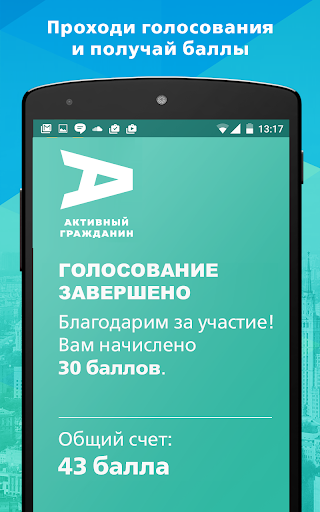
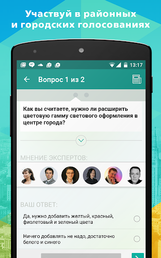
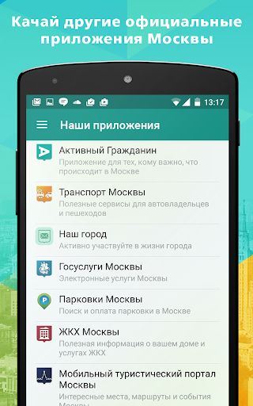

# Активный гражданин
App version ``2.26.0``

Analyzed with [covid-apps-observer](http://github.com/covid-apps-observer) project, version ``0.1``

## App overview
| | |
|-------------------------|-------------------------| 
| **Name**&nbsp;&nbsp;&nbsp;&nbsp;&nbsp;&nbsp;&nbsp;&nbsp;&nbsp;&nbsp;&nbsp;&nbsp;&nbsp;&nbsp;&nbsp;&nbsp;&nbsp;&nbsp;&nbsp;&nbsp;&nbsp;&nbsp;&nbsp;&nbsp;&nbsp;&nbsp;&nbsp;&nbsp;&nbsp;&nbsp;&nbsp;&nbsp;&nbsp;&nbsp;&nbsp;&nbsp;&nbsp;&nbsp;&nbsp;&nbsp;  | Активный гражданин |
| **Unique identifier** | ru.mos.polls |
| **Link to Google Play** | [https://play.google.com/store/apps/details?id=ru.mos.polls](https://play.google.com/store/apps/details?id=ru.mos.polls) |
| **Summary**  | Твой город – твое решение! Электронные голосования Правительства Москвы. |
| **Privacy policy** | [https://ag.mos.ru/eula](https://ag.mos.ru/eula) |
| **Latest version** | 2.26.0 |
| **Last update** | 2021-02-02 10:10:20 |
| **Recent changes** | Доработан раздел &quot;Город идей&quot;, добавлена возможность подачи идеи в любое время. |
| **Installs**  | 500 000+ |
| **Category** | Социальные |
| **First release** | 14 мая 2014 г. |
| **Size**  | 13M |
| **Supported Android version**  | 4.4 и выше |

### Description
> Твой город – твое решение! Электронные голосования Правительства Москвы.
 Ты решаешь, какой будет Москва! Участвуй в голосованиях и получай поощрения от города и партнеров проекта!
 «Активный гражданин» — проект для тех, кто хочет изменить город к лучшему. Это официальное приложение Правительства Москвы, которое было создано по поручению мэра Москвы Сергея Собянина.
 Каждую неделю Мэр и Правительство Москвы выносит на обсуждение активных граждан важные для города вопросы: от транспорта и благоустройства территорий до здравоохранения и образования. Выражая свое мнение, ты помогаешь органам власти принимать верные решения. 
 — Как будут отдыхать московские школьники?
 — Нужно ли ограничивать скорость в центре Москвы?
 — Что построить на месте бывшей промзоны?
 Просто зарегистрируйся, укажи свой адрес и голосуй!
 Результаты электронных голосований будут воплощены в жизнь, а тебя ждут приятные подарки.
 Высказывая свою позицию, ты получаешь баллы. Заработай 1000 баллов и получи статус «Активный гражданин», который открывает доступ к Магазину поощрений. В нем заработанные баллы можно обменять на городские услуги. Например:
 — оплата парковки
 — поездки на метро
 — билеты в театры и музеи
 — городские экскурсионные программы
 — яркие сувениры с символикой «Активного гражданина»
 и другие полезные мелочи.
 Хочешь получить еще больше баллов? Чаще заходи в приложение, выражай свое мнение, отмечайся на мероприятиях, приглашай друзей, активируй промо-коды и делись информацией о пройденных голосованиях в социальных сетях.
 Самые активные участники проекта становятся гостями уникальных городских мероприятий. Например, активные граждане могут посетить генеральную репетицию парада Победы или концерт в День города на Красной площади, Чемпионат мира по шорт-треку с участием звезды спорта Виктора Ана или кататься на главном катке страны на ВДНХ.
 Стань активным гражданином — установи приложение бесплатно прямо сейчас!

### User interface
The developers of the app provide the following screenshots in the Google play store.
| | | |
|:-------------------------:|:-------------------------:|:-------------------------:|
 |   |   |   | 
 |   |   |   | 
 |  

## Development team
In the following we report the main information provided by the development team in the Google play store.

| | |
|-------------------------|-------------------------|
| **Developer**  | Информационный город ГКУ |
| **Website**  | [http://ag.mos.ru/](http://ag.mos.ru/) |
| **Email** | support@ag.mos.ru |
| **Physical address**  | - |
| **Other developed apps**  | [https://play.google.com/store/apps/developer?id=%D0%98%D0%BD%D1%84%D0%BE%D1%80%D0%BC%D0%B0%D1%86%D0%B8%D0%BE%D0%BD%D0%BD%D1%8B%D0%B9+%D0%B3%D0%BE%D1%80%D0%BE%D0%B4+%D0%93%D0%9A%D0%A3](https://play.google.com/store/apps/developer?id=%D0%98%D0%BD%D1%84%D0%BE%D1%80%D0%BC%D0%B0%D1%86%D0%B8%D0%BE%D0%BD%D0%BD%D1%8B%D0%B9+%D0%B3%D0%BE%D1%80%D0%BE%D0%B4+%D0%93%D0%9A%D0%A3) |

## Android support

| | |
|-------------------------|-------------------------|
| **Declared target Android version**  | Android10, version 10 (API level 29) |
| **Effective target Android version**  | Android10, version 10 (API level 29) |
| **Minimum supported Android version**  | KitKat, version 4.4 - 4.4.4 (API level 19) |
| **Maximum target Android version**  | - |

The larger the difference between the minimum and maximum supported Android versions, the better. A larger difference means a wider audience. For example, old phones have a very low Android version, so a high minimum supported Android version means that the app cannot be used by users with old phones, thus leading to accessibility problems. 

## Requested permissions

In the following we report the complete list of the permissions requested by the app. 

| **Permission** | **Protection level** | **Description** | 
|-------------------------|-------------------------|-------------------------|
 **android.permission ACCESS_BACKGROUND_LOCATION** | :warning:**Dangerous** | Allows an app to access location in the background. 
 **android.permission ACCESS_COARSE_LOCATION** | :warning:**Dangerous** | Allows an app to access approximate location. 
 **android.permission ACCESS_FINE_LOCATION** | :warning:**Dangerous** | Allows an app to access precise location. 
 **android.permission ACCESS_NETWORK_STATE** | Normal | Allows applications to access information about networks. 
 **android.permission CAMERA** | :warning:**Dangerous** | Required to be able to access the camera device. 
 **android.permission INTERNET** | Normal | Allows applications to open network sockets. 
 **android.permission READ_EXTERNAL_STORAGE** | :warning:**Dangerous** | Allows an application to read from external storage. 
 **android.permission WAKE_LOCK** | Normal | Allows using PowerManager WakeLocks to keep processor from sleeping or screen from dimming. 
 **android.permission WRITE_EXTERNAL_STORAGE** | :warning:**Dangerous** | Allows an application to write to external storage. 
 **com.google.android.c2dm.permission RECEIVE** | - | - 
 **com.google.android.finsky.permission BIND_GET_INSTALL_REFERRER_SERVICE** | - | - 

## Mentioned servers

| **Server** | **Registrant** | **Registrant country** | **Creation date** | 
|-------------------------|-------------------------|-------------------------|-------------------------|
 | googlesyndication.com | Google LLC | :us: US | 2003-01-21 06:17:24 |
 | google.com | Google LLC | :us: US | 1997-09-15 04:00:00 |
 | facebook.com | Facebook, Inc. | :us: US | 1997-03-29 05:00:00 |
 | google-analytics.com | Google LLC | :us: US | 2005-07-18 19:24:32 |
 | app-measurement.com | Google LLC | :us: US | 2015-06-19 20:13:31 |
 | googletagmanager.com | Google LLC | :us: US | 2011-11-11 23:39:05 |
 | mos.ru | - | - | 1996-12-23 09:49:03 |
 | crashlytics.com | Google LLC | :us: US | 2011-01-21 15:30:40 |
 | googleapis.com | Google LLC | :us: US | 2005-01-25 17:52:26 |
 | googleadservices.com | Google LLC | :us: US | 2003-06-19 16:34:53 |

## Security analysis 

Below we report the main security warnings raised by our execution of the [Androwarn](https://github.com/maaaaz/androwarn) security analysis tool.

**Telephony identifiers leakage**
> - This application reads the MCC+MNC of the provider of the SIM 

**Connection interfaces exfiltration**
> - This application reads details about the currently active data network 

**Telephony services abuse**
> - This application makes phone calls 

**Suspicious connection establishment**
> - This application opens a Socket and connects it to the remote address 'Ljava/lang/StringBuilder;->toString()Ljava/lang/String;' on the 'N/A' port  
> - This application opens a Socket and connects it to the remote address 'Ljava/net/Proxy;->type()Ljava/net/Proxy$Type;' on the 'N/A' port  
> - This application opens a Socket and connects it to the remote address 'No route to  ' on the 'N/A' port  
> - This application opens a Socket and connects it to the remote address 'timeout' on the 'N/A' port  

## User ratings and reviews

Below we provide information about how end users are reacting to the app in terms of ratings and reviews in the Google Play store.

### Ratings

The Активный гражданин app has been installed by more than **500000** times. At this time, **75772** rated the app and its average score is **4.187986**. Below we show the distribution of the ratings across the usual star-based rating of Google Play

:star::star::star::star::star:: 52935

:star::star::star::star:: 7257

:star::star::star:: 3174

:star::star:: 1706

:star:: 10700

### Reviews 

#### 5-star reviews

> Всё нормально! Но Всё равно такое чувство, что все равно никто не читает только жмёт по своей клаве на работе на клавишу для Собянина! Всё равно до сих пор скоко я живу там наверху всем на.....ть.  :date: __2021-02-26 20:42:59__

> Полезное приложение.  :date: __2021-02-26 18:28:51__

> Отлично!  :date: __2021-02-26 15:26:19__

> Отличное приложение, много полезного для себя нашёл  :date: __2021-02-26 13:41:45__

> Прикольное приложение. Новостной блок довольно не плохой. Видно как город изменяется, растет, изменяется. Лишь бы в лучшую сторону.  :date: __2021-02-26 12:59:52__

> Все отлично  :date: __2021-02-26 11:19:15__

> Проверяют как элекронно голосовать по тем или иным вопросам.  :date: __2021-02-26 10:44:34__

> Вроде норм  :date: __2021-02-26 09:44:36__

> Отличное приложение  :date: __2021-02-26 08:48:53__

> Много хороших предложений по Москве и району где проживаю  :date: __2021-02-26 08:09:38__

#### 4-star reviews

> Не понимаю принцип подсчёта голосов. Есть ли защита от ботов? Визуально все вполне себе. Структура понятна.  :date: __2021-02-27 11:56:48__

> Норм  :date: __2021-02-26 14:27:47__

> Приложение не плохое, как и задумка, но я не заходил 2 дня в приложение и надо заходить снова в свой аккаунт  :date: __2021-02-26 09:08:15__

> Ура! В приложение можно войти!  :date: __2021-02-26 08:54:30__

> Норм  :date: __2021-02-23 09:08:37__

> Навигация несовершенна. По радио говорят про голосование на Лубянской площади, но найти где проголосовать на данном портале не могу.  :date: __2021-02-22 09:48:48__

> Не корректно работает в тёмном режиме  :date: __2021-02-21 10:41:28__

> Все понятно и просто  :date: __2021-02-20 20:53:13__

> Да еще и сгорели балы  :date: __2021-02-17 11:00:02__

> При выставлении оценки выставляется всегда на звезду больше чем хочешь: вместо тройки ставится четвёрка, вместо четыре ставится пять звёзд. Думаю разработчики специально сместили разметку, чтобы оценки выше ставились.  :date: __2021-02-16 21:51:25__

#### 3-star reviews

> Псевдоопросы, лицемерие. Но бывает полезно узнать, что ещё оккупанты из мэрии придумали против народа.  :date: __2021-02-26 16:23:56__

> Тяжело войти в приложение  :date: __2021-02-26 07:48:49__

> Для выбора даты рождения нужно листать вручную помесячно. Исправьте, пожалуйста, нужно поле для ручного ввода.  :date: __2021-02-25 17:05:28__

> Главная претензия - заходишь в голосование и там не отображаются пункты голосования. Строки тупо пустые. Да и сама систем конечно дико тормозная, и мобильная версия и портал. Вечно у нас госпродукт с нормальной идеей, но кривой реализацией.  :date: __2021-02-25 11:17:52__

> Приложение не плохое и задумка тоже хороша, но не видно как влияет твоё голосование на конкретные принятые решения. Было бы не плохо добавить рассылку, что вы дорогой Дмитрий Алексеевич проголосовали за лавочку в сквере и 94% москвичей вас поддержало и вот свершилось! Власти Москвы эту лавочку установили! Ну как то так...  :date: __2021-02-22 13:04:46__

> Не работает рубрика "пульс столицы", нет возможности оценить саму рубрику и нет смайлов, просто висит баннер и все ((  :date: __2021-02-13 12:21:59__

> В актуальной версии программы на любую новость можно поставить только одну оценку - одна звезда. Другие варианты недоступны. --- Не знаю, что вы там поправили, но, наконец-таки, всё починилось. Теперь (06.02.2021) можно ставить не только единицы.  :date: __2021-02-05 22:07:32__

> Пропали сувениры.  :date: __2021-02-05 07:27:46__

> Ну и где мой баннер фиолетовый под названием "Пульс города"??? Сувениры исчезли, не успела я купить. Наверное, пора вас удалять 👎  :date: __2021-02-04 17:28:42__

> Если темная тема на телефоне, вообще ничего не видно  :date: __2021-02-03 21:40:13__

#### 2-star reviews

> Скатились до использования людей для пропихивания своих непопулярных решений. В частности голосование за лик Лубянки где нет выбора: палач Дзержинский или человек сделавший Русь колонией Орды - Невский. Люди хотят фонтан, а не предателей.  :date: __2021-02-25 10:21:01__

> Кривое приложение. Не даёт проголосовать в некоторых опросах, ссылаясь на незаполненный профиль на мос.ру  :date: __2021-02-25 10:01:12__

> Невозможно пользоваться. По какой-то причине у меня в приложении белые буквы на белом фоне. Поправьте пожалуйста  :date: __2021-02-19 14:48:19__

> Не понимаю куда писать обращение и жалобы  :date: __2021-02-13 11:30:02__

> Полдня потратила на то, чтобы войти! Зачем каждый раз при входе в приложение спрашивать пароль?  :date: __2021-02-09 09:57:45__

> Уже полгода как не могу пополнить карту тройка бонусами пишет Internal server error так что двойка  :date: __2021-02-03 08:07:31__

> Куда делать возможность получать билеты в музеи? ((((((((( поощрения теперь совершенно бесполезные  :date: __2021-01-31 16:49:21__

> Благотворительность просите с жителей Рублевки и лиц с каналов с миллиардами. Достали.включишь телевизор и все дети умирают. И тут же новости про новые яхты, самолеты олигархов и попа Кирилла. Мне было приятно от Вас получит сувенир с Вашей символикой.  :date: __2021-01-25 18:38:36__

> 10.01.21 вдруг при входе в приложение появилась страница аутентификации. Раньше было достаточно ткнуть иконку. Хорошо, зашел через какой то одноразовый код, который прислали на телефон. После этого изменилось все - профиль оказался незаполненным, исчезли все настройки, пропали все баллы (4800 ориентировочно). Пишет что я на проекте с 10.01.21 и голосований у меня ноль. А я в АГ с апреля 2018 и не пропустил ни одного мероприятия. Дважды написал в обратную связь - реакции ноль. БЕЗОБРАЗИЕ!!!  :date: __2021-01-14 16:16:42__

> Не понимаю смысл данного приложения , пользователи единицы , информация редко когда действительно полезная и важная . Кому нужно наше мнение , сами знаем ответ , для галочки !  :date: __2021-01-08 22:40:04__

#### 1-star reviews

> Не дало проголосовать за Дзержинского, удаляю  :date: __2021-02-26 18:51:37__

> Кажется, что приложение создано для легитимизации решений чиновников.  :date: __2021-02-26 17:35:03__

> Бесполезная программа для легитимизации вбросов.  :date: __2021-02-26 12:14:55__

> Приложение не отвечает тем требованиям которые заявляются. Голосование за памятники Держинский Невский четко показало, что можно легко управлять путем подключения ботов. Так же безтолковая система балов за которые вроде бы можно вознаграждение получить - тут тоже мимо, не знаю таких и самому не удалось. Остаются только новости, но для этого есть свои ресурсы. В итоге голосования бесполезны, балы тоже, новости в другом месте.  :date: __2021-02-26 12:05:09__

> Приложение для фейкового голосования по спорным вопросам. Наглая накрутка голосов по "нужным" проектам.  :date: __2021-02-26 10:42:34__

> Мне 62 года живу в Москве не получается проголосовать за памятник Дзержинскому пишите что отказано по причине, что мне меньше 18 лет ,а мне62 года  :date: __2021-02-26 08:48:10__

> После того, как для того, чтобы пользоваться магазином поощрений без ограничений, нужно вводить свои паспортные данные и СНИЛС и ещё ехать подтверждать их в МФЦ, я пользоваться вашим приложением не хочу. Была активным гражданином с 27.04.2017 года. Прощайте, удаляю ваше приложение.  :date: __2021-02-26 08:13:17__

> Нельзя объявлять голосования без варианта "против всех" В моем голосовании было так: Против всех 89% дзержинский 11% невский 0% Я не буду голосовать за невского только потому, что мне не нравится дзержинский  :date: __2021-02-26 06:15:57__

> Удачный сервис, голосований мало 1 в неделю и то если придет. Одним словом ужас.  :date: __2021-02-26 06:05:01__

> Бестолковое приложение, которое не даёт ничего заполнить и только всё блокирует. Это приложение создавалось для показухи и отмывания денег. А цифры и голосование просто рисуют. Хотела проголосовать за памятник на Лубянке, не дает. Пишет, что не указан возраст. Нет СНИЛС. Куда это ещё нужно вбить не понятно, т.к. эти данные уже везде внесены. Поэтому делаю вывод, результаты рисуется. Как всегда одна показуха.Приложение липа.  :date: __2021-02-26 05:30:01__

