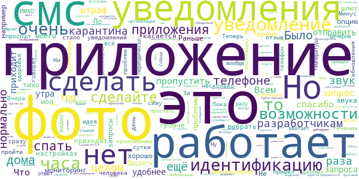

# Социальный мониторинг
App version ``1.10``

Analyzed with [covid-apps-observer](http://github.com/covid-apps-observer) project, version ``0.1``

## App overview
| | |
|-------------------------|-------------------------| 
| **Name**&nbsp;&nbsp;&nbsp;&nbsp;&nbsp;&nbsp;&nbsp;&nbsp;&nbsp;&nbsp;&nbsp;&nbsp;&nbsp;&nbsp;&nbsp;&nbsp;&nbsp;&nbsp;&nbsp;&nbsp;&nbsp;&nbsp;&nbsp;&nbsp;&nbsp;&nbsp;&nbsp;&nbsp;&nbsp;&nbsp;&nbsp;&nbsp;&nbsp;&nbsp;&nbsp;&nbsp;&nbsp;&nbsp;&nbsp;&nbsp;  | Социальный мониторинг |
| **Unique identifier** | ru.mos.socmon |
| **Link to Google Play** | [https://play.google.com/store/apps/details?id=ru.mos.socmon](https://play.google.com/store/apps/details?id=ru.mos.socmon) |
| **Summary**  | Приложение для контроля за соблюдением гражданами режима изоляции на дому |
| **Privacy policy** | [https://www.mos.ru/privacypolicy/socmon/](https://www.mos.ru/privacypolicy/socmon/) |
| **Latest version** | 1.10 |
| **Last update** | 2020-12-18 12:02:18 |
| **Recent changes** | Улучшение работы приложения по замечаниям пользователей. |
| **Installs**  | 100 000+ |
| **Category** | Медицина |
| **First release** | 22 апр. 2020 г. |
| **Size**  | 14M |
| **Supported Android version**  | 6.0 и выше |

### Description
> Приложение «Социальный мониторинг» создано для пациентов с подтвержденным диагнозом COVID-19 и граждан контактировавших с ними, проживающих в Москве и соблюдающих предписанный им режим изоляции. С его помощью пациент информирует город о добросовестном соблюдении карантина.
 При регистрации пользователь подтверждает номер телефона, делает фотографию, геолокация (местонахождение) отправляется автоматически. Это нужно для того, чтобы проверить, находится ли пользователь в той же локации, которую указал в согласии, выбирая лечение на дому.
 Чтобы у пользователя не было возможности оставить смартфон дома и выйти на улицу без него, приложение в случайное время присылает СМС-уведомления с запросом дополнительного подтверждения — для этого потребуется сделать селфи.
 Если пользователь покидает исходную геолокацию или не реагирует на уведомления, система предупреждает городские службы о возможном нарушении режима изоляции.
 Личные данные, которые пользователь передает сервису, определены в согласии на получение медицинской помощи на дому и соблюдение режима изоляции либо в постановлении главного санитарного врача города Москвы. Все данные, которые пользователь передает приложению, хранятся в защищенном виде на серверах Департамента информационных технологий и используются в строгом соответствии с федеральным законом № 152-ФЗ "О персональных данных".

### User interface
The developers of the app provide the following screenshots in the Google play store.
| | | |
|:-------------------------:|:-------------------------:|:-------------------------:|
 |   |   |   | 
 |   |  

## Development team
In the following we report the main information provided by the development team in the Google play store.

| | |
|-------------------------|-------------------------|
| **Developer**  | Информационный город ГКУ |
| **Website**  | [https://www.mos.ru/city/projects/monitoring/](https://www.mos.ru/city/projects/monitoring/) |
| **Email** | socialmonitoring@mos.ru |
| **Physical address**  | - |
| **Other developed apps**  | [https://play.google.com/store/apps/developer?id=%D0%98%D0%BD%D1%84%D0%BE%D1%80%D0%BC%D0%B0%D1%86%D0%B8%D0%BE%D0%BD%D0%BD%D1%8B%D0%B9+%D0%B3%D0%BE%D1%80%D0%BE%D0%B4+%D0%93%D0%9A%D0%A3](https://play.google.com/store/apps/developer?id=%D0%98%D0%BD%D1%84%D0%BE%D1%80%D0%BC%D0%B0%D1%86%D0%B8%D0%BE%D0%BD%D0%BD%D1%8B%D0%B9+%D0%B3%D0%BE%D1%80%D0%BE%D0%B4+%D0%93%D0%9A%D0%A3) |

## Android support

| | |
|-------------------------|-------------------------|
| **Declared target Android version**  | Android10, version 10 (API level 29) |
| **Effective target Android version**  | Android10, version 10 (API level 29) |
| **Minimum supported Android version**  | Marshmallow, version 6.0 (API level 23) |
| **Maximum target Android version**  | - |

The larger the difference between the minimum and maximum supported Android versions, the better. A larger difference means a wider audience. For example, old phones have a very low Android version, so a high minimum supported Android version means that the app cannot be used by users with old phones, thus leading to accessibility problems. 

## Requested permissions

In the following we report the complete list of the permissions requested by the app. 

| **Permission** | **Protection level** | **Description** | 
|-------------------------|-------------------------|-------------------------|
 **android.permission ACCESS_BACKGROUND_LOCATION** | :warning:**Dangerous** | Allows an app to access location in the background. 
 **android.permission ACCESS_FINE_LOCATION** | :warning:**Dangerous** | Allows an app to access precise location. 
 **android.permission ACCESS_NETWORK_STATE** | Normal | Allows applications to access information about networks. 
 **android.permission CAMERA** | :warning:**Dangerous** | Required to be able to access the camera device. 
 **android.permission FOREGROUND_SERVICE** | Normal | Allows a regular application to use Service.startForeground. 
 **android.permission INTERNET** | Normal | Allows applications to open network sockets. 
 **android.permission READ_EXTERNAL_STORAGE** | :warning:**Dangerous** | Allows an application to read from external storage. 
 **android.permission RECEIVE_BOOT_COMPLETED** | Normal | Allows an application to receive the Intent.ACTION_BOOT_COMPLETED that is broadcast after the system finishes booting. 
 **android.permission REQUEST_IGNORE_BATTERY_OPTIMIZATIONS** | Normal | Permission an application must hold in order to use Settings.ACTION_REQUEST_IGNORE_BATTERY_OPTIMIZATIONS. 
 **android.permission USE_FULL_SCREEN_INTENT** | Normal | Required for apps targeting Build.VERSION_CODES.Q that want to use notification full screen intents. 
 **android.permission WAKE_LOCK** | Normal | Allows using PowerManager WakeLocks to keep processor from sleeping or screen from dimming. 
 **android.permission WRITE_EXTERNAL_STORAGE** | :warning:**Dangerous** | Allows an application to write to external storage. 
 **com.google.android.c2dm.permission RECEIVE** | - | - 
 **com.google.android.finsky.permission BIND_GET_INSTALL_REFERRER_SERVICE** | - | - 
 **com.msk.socmon PERMISSION** | - | - 

## Mentioned servers

| **Server** | **Registrant** | **Registrant country** | **Creation date** | 
|-------------------------|-------------------------|-------------------------|-------------------------|
 | adobe.com | Adobe Inc. | :us: US | 1986-11-17 05:00:00 |
 | googlesyndication.com | Google LLC | :us: US | 2003-01-21 06:17:24 |
 | google.com | Google LLC | :us: US | 1997-09-15 04:00:00 |
 | googleadservices.com | Google LLC | :us: US | 2003-06-19 16:34:53 |
 | app-measurement.com | Google LLC | :us: US | 2015-06-19 20:13:31 |
 | mos.ru | - | - | 1996-12-23 09:49:03 |
 | crashlytics.com | Google LLC | :us: US | 2011-01-21 15:30:40 |

## Security analysis 

Below we report the main security warnings raised by our execution of the [Androwarn](https://github.com/maaaaz/androwarn) security analysis tool.

**Connection interfaces exfiltration**
> - This application reads details about the currently active data network 
> - This application tries to find out if the currently active data network is metered 

**Telephony services abuse**
> - This application makes phone calls 

**Suspicious connection establishment**
> - This application opens a Socket and connects it to the remote address '; port is out of range' on the 'N/A' port  
> - This application opens a Socket and connects it to the remote address 'Ljava/net/Proxy;->type()Ljava/net/Proxy$Type;' on the 'N/A' port  
> - This application opens a Socket and connects it to the remote address 'Lv/b/a/a/a;->w(Ljava/lang/String;)Ljava/lang/StringBuilder;' on the 'N/A' port  
> - This application opens a Socket and connects it to the remote address 'Method sendUrgentData() is not supported.' on the 'N/A' port  
> - This application opens a Socket and connects it to the remote address 'Method setHandshakeTimeout() is not supported.' on the 'N/A' port  
> - This application opens a Socket and connects it to the remote address 'Method setOOBInline() is not supported.' on the 'N/A' port  
> - This application opens a Socket and connects it to the remote address 'Method setSoWriteTimeout() is not supported.' on the 'N/A' port  
> - This application opens a Socket and connects it to the remote address 'Socket closed' on the 'N/A' port  
> - This application opens a Socket and connects it to the remote address 'Socket is closed' on the 'N/A' port  
> - This application opens a Socket and connects it to the remote address 'Socket is closed.' on the 'N/A' port  
> - This application opens a Socket and connects it to the remote address 'Socket is not connected.' on the 'N/A' port  
> - This application opens a Socket and connects it to the remote address 'socket is closed' on the 'N/A' port  
> - This application opens a Socket and connects it to the remote address 'timeout' on the 'N/A' port  

**Code execution**
> - This application loads a native library: 'conscrypt_gmscore_jni' 
> - This application loads a native library: 'conscrypt_jni' 
> - This application loads a native library: 'tool-checker' 
> - This application executes a UNIX command 
> - This application executes a UNIX command containing this argument: 'getprop' 
> - This application executes a UNIX command containing this argument: 'mount' 

## User ratings and reviews

Below we provide information about how end users are reacting to the app in terms of ratings and reviews in the Google Play store.

### Ratings

The Социальный мониторинг app has been installed by more than **100000** times. At this time, **9097** rated the app and its average score is **1.3493078**. Below we show the distribution of the ratings across the usual star-based rating of Google Play

:star::star::star::star::star:: 416

:star::star::star::star:: 232

:star::star::star:: 271

:star::star:: 271

:star:: 7907

### Reviews 

#### 5-star reviews

> Для ловли потенциальных убийц. Настроил специальный гудок, чтоб не спутать с другими, отсылаю селфик в случайное время. Всем в ответ того же и втройне.  :date: __2021-01-15 22:27:35__

> Нормальное приложение, те кто пишет гадости ложитесь на изоляцию в стационар и не пользуйтесь приложением.  :date: __2021-01-13 08:11:05__

> Тут так все злостно критикуют. Неужели так сложно самому настроить свой телефон и поставить мелодию вместо сигнала об смс? И даётся целый час, что бы ответить. Данные местоположения всегда едят батарею. Нормальное приложение.  :date: __2021-01-11 16:16:01__

> Хочу поделиться впечатлениями от использования программы. Не всё так плохо, как многие пишут. Сигналы приходят в виде СМС на Ваш телефон, а также от самой программы. Звук СМС, такой как вы сами поставите на своём телефоне. Запросы постоянно, никто не присылает. Мне приходит по 3 в день. Если у Вас телефон со слабой батареей, или Вы сомневаетесь, в своём устройстве, обратитесь в службу поддержки и Вам предоставят телефон на время изоляции. Мне привезли в течении 2 суток. Вообщем всё ок!  :date: __2021-01-10 10:49:15__

> а мне приложение понравилось, ничего лишнего + дублируют по смс оповещения синхронизация с будильником или настройка мелодий оповещения из приложения была бы не лишней. сейчас что бы настроить длинную мелодию на оповещении, необходимо установить mp3 на сообщение и отключить оповещение в приложении т.к. звук приложения скидывает сигнал смс потому что приходит сразу после смс  :date: __2021-01-09 16:33:49__

> Спасибо  :date: __2021-01-09 09:03:14__

> Нормальное приложение! В день приходит 3-4 уведомления. Плюс запрос дублируется по СМС. Час на отправку фото. Всё просто и понятно. Те, кто жалуются, что не слышат звук уведомления, или короткий сигнал, ребята, изучайте свои смартфоны! Я сразу, в настройках телефона, выставила длинную мелодию конкретно для этого приложения и никаких проблем! Ну а уж отрегулировать громкость телефона и дитё малое сумеет....  :date: __2021-01-08 18:12:53__

> Отличное приложение!  :date: __2021-01-05 10:32:36__

> Господа разработчики, благодарю вас за отличную прогу! Спасибо!  :date: __2021-01-05 10:26:13__

> все что надо делает  :date: __2021-01-05 09:26:22__

#### 4-star reviews

> Приложение работает прочитал отзывы вы спецыально походу пишите мол не работает,тихо приходит смс или уведомление.Это зависит от вашего же смартфона,включите звук и увеличьте в настройках уведомления,там же находится громче не можете сделать что ли.А потом ноете что мол приложение не работает и тихо приходит.У меня все прекрасно работает и слышу когда уведомления приходят  :date: __2021-01-15 07:17:34__

> Что касается уведомления (тихое или громкое) его можно выбрать в настройках звука уведомлений в телефоне (сделать громче и выбрать рингтон). Молодцы, что дублируют в смс запрос на идентификацию. Теперь пропустить реально проблематично. Что касается самой всей этой ситуации, то ощущение, что ты находишься под домашним арестом по уголовному делопроизводству и это пипец))) А по факту: берегите себя и окружающих, находитесь дома и не заражайте других. И, конечно же, скорейшего выздоровления всем!  :date: __2021-01-08 13:32:54__

> Со своей функцией справляется. Просидел на самоизоляции 2 недели, ни одной фотки не пропустил. ИМХО в приложении есть недостатков: 1. Самая идея, что вы мне смс, а я вам фотку за час- это бред, больные люди могут отдыхать, сам спал по 2 часа, но ИМХО это нормально. Нужен вариант, чтобы я предупредил вас, что прошу не беспокоить, я лечусь, а не вам информирую. 2. Громкость уведомления. Она должна быть адской 3. Добавить в приложение скан моего согласия и срок самоизоляции  :date: __2021-01-08 12:38:17__

> Спасибо разрабам всё работает хорошо,по крайней мере у меня.  :date: __2020-12-27 20:16:17__

> К приложению вопросов нет. Простое и интуитивно понятно. Проверка вмеру адекватно.  :date: __2020-12-27 18:49:17__

> Хорошее приложение. Жаль только, что не уведомляет каждые 5-10 минут о том, что надо пройти идентификацию. За это звезду снимаю. Но на телефоне можно отдельно настроить повторяющееся уведомление об смс. И кто пишет, что проспал и штраф пришел - это не так. У меня несколько знакомых пропустили один раз и ничего им не было за это. Ерунда только со снятием с карантина. Телефоны какую-то ерунду в основном говорят. Но это вопрос не к разработчикам.  :date: __2020-12-27 09:14:37__

> Вчера были врачи, после прочитала бумагу и сразу скачивала приложение, но мой номер сутки уже висит на подтверждении данных.  :date: __2020-12-27 08:50:42__

> Теперь, после обновления приложения определение местоположения заработало корректно. Минус одна звезда за то, что приложение не учитывает самочувствие человека, что он может спать и не среагировать на смс, а спать может и три часа подряд, при этом больному человеку нужно отсыпаться и восстанавливаться, а не дёргаться, что проспал смс. В общем по это проблема не разработчика, а скорее правительства Моаквы.  :date: __2020-12-25 14:51:22__

> Сразу хочу отметить, что отзыв оставляю о работе самого приложения, а не системы отслеживания) поначалу было менее информативно, приложение я поставила 10.12. Приходит смс и в течение часа надо отправить свое фото. Отметок о том, что фото прошло, не было. С обновлением стало удобнее: видно, во сколько пришел запрос, во сколько отправила фото и прошла ли фотл идентификацию. Следила конечно за смс, потому что раз пиликнет и всё, можно пропустить. Было бы удобнее реализовать дозвон. Всем здоровья.  :date: __2020-12-25 10:51:44__

> Нет данных о том, что изоляция окончена  :date: __2020-12-24 05:27:08__

#### 3-star reviews

> Необходимо подумать про уникальность уведомлений. Они сливаются с сотнями аналогичных  :date: __2021-01-13 14:32:40__

> Приложение в части для ковид контактных не рабочее, 10 дней пока был в контактных не регистрировали, как стал заболевшим, в течение суток зарегистрировали. Для чего тогда требование и согласие, что контактные должны ставить приложение? Вообщем хотели как лучше, а получилось как всегда, через ... Думаю все всё прекрасно поняли.  :date: __2021-01-12 10:03:47__

> Здравствуйте. Было бы не плохо сделать сигнал прохождения идентификации повторяющимся хотя бы каждые 15 минут (или сделать этот интервал настраиваемым). Когда спохватился, что давно не проходил идентификацию, оказалось, что сигнал пришел как раз в те 3 минуты когда я был на кухне. Опоздал почти на 1ч 20 минут. Просидев целый день дома. Обидно.  :date: __2021-01-11 19:37:21__

> Слишком часто приходилось звонить в техподдержку по вопросам работы приложения. Отзыв отредактирован несколько раз в период использования с 27.12.2020 по 10.01.202. В итоге впечатления: Плюсы: + в техподдержке грамотные специалисты, в колцентре - вежливые. Минусы: - ОЧЕНЬ легко пропустить оповещение. Приходилось всё время проверять телефон, это очень нервирует. Пожелание: - приведите в один уровень громкость оператора и музыки во время ожидания или музыку сделайте тише оператора, пожалуйста.  :date: __2021-01-10 10:10:19__

> Единственный минус который я заметил это то , что нет нормального звукового уведомления .  :date: __2021-01-09 23:22:15__

> Здорово , что вы контролируете заражённых и все такое . Но вот не понятно, когда я уже второй анализ сделала и у меня отрицательный, почему все ещё это приложение нужно снабжать моими фото? Ещё и дома сидеть, я ведь не заразна?  :date: __2021-01-09 16:11:20__

> Идея любопытная, но вот теперь став пациентом и невольным пользователем этого чуда, я испытываю некоторые трудности. Дело в том что я сова и привык поздно ложиться. Было бы здорово сделать возможным указать свой режим когда можно слать уведомления, а то одно я просто проспал не услышав смс. И вторая идея которая сделала бы это приложение более востребованным, это вмонтировать в него и дистанционную консультацию с врачом в чате и по видео и аудио связи. Ну и экстренный вызов скорой одним нажатием  :date: __2021-01-09 02:03:47__

> Ну такое, очень тихое уведомление, сделайте как будильник, ибо человек будет спать и не услышит , а потом лови штраф на 4 тыс  :date: __2021-01-08 23:12:07__

> Приложение иногда даёт сбой. Первые пару дней идёт проверка номера. В принципе, нормально.  :date: __2021-01-06 12:04:55__

> Нет возможности настроить на громкий звонок, а смс не слышно. У пожилых людей часто ослаблен слух. Больные люди часто днём спят. Простуда часто сопровождается отитом.  :date: __2021-01-05 07:43:19__

#### 2-star reviews

> Люди, можно ли с 22 часов до 9 утра, отключить на смартфоне интернет, это не нарушит правило, использования социального мониторинга, ведь в эти часы не приходят уведомления?  :date: __2021-01-16 16:08:20__

> Изоляция закончилась вчера,а запросы продолжает слать((((. На все вопросы что делать отвечает робот по шаблону. Сносить или нет и как они и что отслеживают, если нет у них данных когда подписано постановление. Я считаю, что это недоработка.  :date: __2021-01-14 19:10:47__

> Приложение неплохое по задумке, но ужасная реализация уведомленией полностью все портит. Когда приходит уведомление о фотографии даётся вроде бы немало времени на выполнение - 1 час, но если ты не обратил внимание, то штраф обеспечен. Если подумать, то непонятно, как больной человек, который из-за самочувствия может спать и днём тоже должен следить за телефоном. Это небольшое и единоразовое!! уведомление его точно не разбудит. Необходимо добавить повторное уведомление за 5-10 мин до конца срока.  :date: __2021-01-13 17:39:53__

> Когда нужно установить, уведомляют, а когда можно уже удалить приложение, не оповещают. Думай и гадай, можно или нельзя. В службу поддержки дозвон 25-30 минут.  :date: __2021-01-13 15:58:32__

> Нет настроек сигнала оповещения. Я бы поставил сигнал сирены и отличал бы, что пришел запрос на фотографию, а не спам из остальных 100500 сообщений. И так же просыпался бы когда сплю.  :date: __2021-01-13 15:45:07__

> Убогое приложение, никак не настраивается и не поворачивается, невозможно поставить отдельный ринг он, поэтому пищит как все смс и ватсап, пропустить будучи даже законопослушным гражданином идентификации как нехрен делать. Дали б разработчикам ещё немного денег чтобы они добавили настройки в программу.  :date: __2021-01-11 16:33:12__

> Приложение вроде не плохое, но уведомления никуда не годятся... Я себя плохо чувствую, сплю постоянно и просто иногда не могу услышать его. Лучше бы это было что то типо видиозвонка. Тем более в течении часа, данного на отправку фото, я могу быть где угодно  :date: __2021-01-09 13:57:05__

> Совершенно бестолковое приложение с точностью локализации около 10км.  :date: __2021-01-08 17:04:19__

> 1.ОЧЕНЬ неудобно без индивидуального звукового оповещения, пропустить легко уведомление. От этого нервничаешь и постоянно залезаешь в телефон - жизнь вокруг него это нереально. 2.ОБРАТНАЯ СВЯЗЬ ОДНОСТОРОННЯЯ. Я писала в тех.поддержку дважды и дважды ничего не получила в качестве автореплая (ваше обращение получено, благодарим за ...) 3. Нам перестали приходить смски на 13ый день, воспринималос как сигнал к выходу.  :date: __2021-01-07 10:48:46__

> Было бы хорошо добавить возможность увидеть историю отправленных тобой обращений в техподдержку плюс отбивку на указанный электронный адрес о том, что твое обращение получено. А то пишешь, отправляешь - как в трубу. Ушло/не ушло, получено/не получено... Непонятно. Ну и хорошо бы, чтобы ответ по решению проблемы на электронную почту тоже приходил, как обещано в описании. Написала 2 обращения, прошло несколько дней - ни на одно ответа нет. Ошибок конечно, ранее описанных, очень много.  :date: __2021-01-06 12:13:52__

#### 1-star reviews

> Болела бессимптомно. Дома сидела с тремя маленькими детьми, один грудной. Приходилось постоянно таскать с собой телефон из комнаты в комнату, чтобы не пропустить уведомление. А это очень неудобно, когда дети бегают то туда, то сюда. Днём не прилечь поспать, боишься пропустить смс. Как те, кто реально болеет с температурой и слабостью?!..... В общем, жуть....  :date: __2021-01-16 19:49:16__

> Самое гнилое приложение, в место того что бы спать и набираться сил, нужно сидеть с открытыми глазами и ждать смс,  :date: __2021-01-16 19:10:14__

> ужасное приложение! нормально не работает, неужели нельзя сделать нормальное приложение, деньги потрачены, а толку ноль.  :date: __2021-01-16 17:54:06__

> заставляете в выходной вставать в 9 утра и не ложится спкть до 22 часов, вы сами там не больные случаем? у меня постоянные головные боли, я ложусь спать в 21, засыпаю в лучшем случае в 3 ночи и должен в 9 просыпаться потому что может прийти ваше учедомление которые не млышно даже! засудить бы вас...  :date: __2021-01-16 16:50:49__

> Отвратительно без конца просят фото а если я уснул что штраф что-ли , как заключённый себя чувтвую себя если в самом деле болен это будет лишней нервотрёпкой  :date: __2021-01-16 16:47:41__

> Программу курирует стадо недекватных и не особо умных людей. Больные люди с температурой не могут иметь дневного сна потому что им надо селфачь в рандомное время отправлять. Куратор этого проекта глупее животного. Тупые, ражевываю для Вас: к ночи у больных обычно поднимается температура и нормально выспаться нет возможности. Мониторят они...да за зеками гуманнее Мониторят наверное. Желаю руководству на своей шкуре испытать свойже режим. 0 из 5.  :date: __2021-01-16 13:24:59__

> Что за приложение такое днище,если например поспать захотел немного а вдруг придет СМС,как в таком случае быть,это не самоизоляция это рабство какое та,поставили бы хотяб именно такое время чтоб человек знал и не спал...  :date: __2021-01-16 09:33:17__

> Ужасное приложение, не продуманы уведомления. Человек болеет и не может позволить себе поспать! Приходилось ПОСТОЯННО ставить будильник.  :date: __2021-01-16 08:26:51__

> очень плохо работает  :date: __2021-01-16 00:57:16__

> 1 смс в час это единственное уведомление. Ты мог спать не услышать или ещё что-то. Второго уведомления тебе приложение не присылает. Могли бы сделать какое нибудь пуш уведомление или дублировать сигналом из приложения. С этой программой стал паникером каждые полчаса открываю приложение чтобы ничего не пропустить. Мне несколько дней было ужасно плохо, из за температуры я не высыпался, и каждое утро в 9:00 я должен просыпаться и включать звук на телефоне и ты уже нормально не заснешь. Ужасно!  :date: __2021-01-15 21:38:28__

