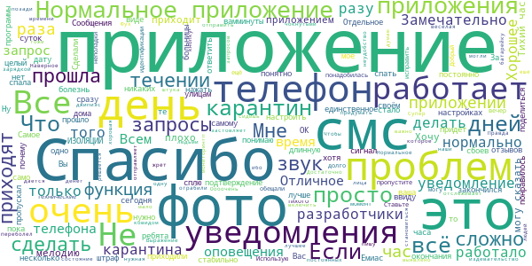
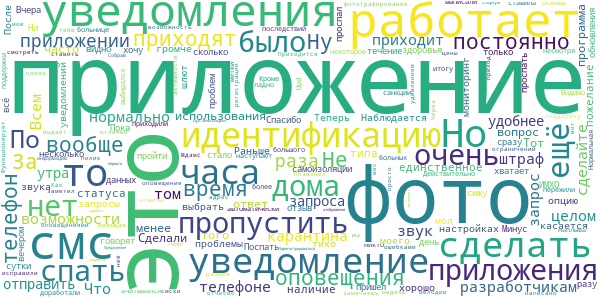
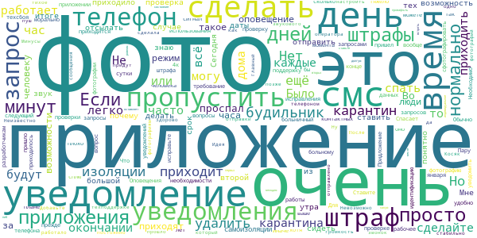
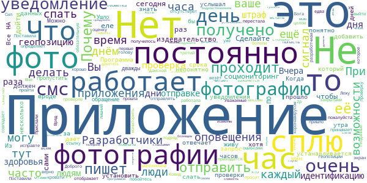
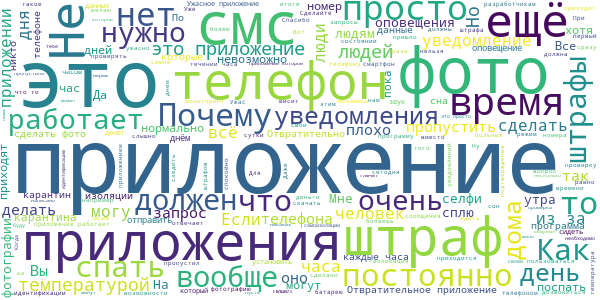

# Социальный мониторинг
App version ``1.11``

Analyzed with [covid-apps-observer](http://github.com/covid-apps-observer) project, version ``0.1``

## App overview
| | |
|-------------------------|-------------------------| 
| **Name**&nbsp;&nbsp;&nbsp;&nbsp;&nbsp;&nbsp;&nbsp;&nbsp;&nbsp;&nbsp;&nbsp;&nbsp;&nbsp;&nbsp;&nbsp;&nbsp;&nbsp;&nbsp;&nbsp;&nbsp;&nbsp;&nbsp;&nbsp;&nbsp;&nbsp;&nbsp;&nbsp;&nbsp;&nbsp;&nbsp;&nbsp;&nbsp;&nbsp;&nbsp;&nbsp;&nbsp;&nbsp;&nbsp;&nbsp;&nbsp;  | Социальный мониторинг |
| **Unique identifier** | ru.mos.socmon |
| **Link to Google Play** | [https://play.google.com/store/apps/details?id=ru.mos.socmon](https://play.google.com/store/apps/details?id=ru.mos.socmon) |
| **Summary**  | Приложение для контроля за соблюдением гражданами режима изоляции на дому |
| **Privacy policy** | [https://www.mos.ru/privacypolicy/socmon/](https://www.mos.ru/privacypolicy/socmon/) |
| **Latest version** | 1.11 |
| **Last update** | 2021-01-27 15:18:09 |
| **Recent changes** | Добавлена новая функция «Тихий час», которая позволяет отключить запрос идентификации один раз в день на 2 часа. |
| **Installs**  | 100 000+ |
| **Category** | Медицина |
| **First release** | 22 апр. 2020 г. |
| **Size**  | 15M |
| **Supported Android version**  | 6.0 и выше |

### Description
> Приложение «Социальный мониторинг» создано для пациентов с подтвержденным диагнозом COVID-19 и граждан контактировавших с ними, проживающих в Москве и соблюдающих предписанный им режим изоляции. С его помощью пациент информирует город о добросовестном соблюдении карантина.
 При регистрации пользователь подтверждает номер телефона, делает фотографию, геолокация (местонахождение) отправляется автоматически. Это нужно для того, чтобы проверить, находится ли пользователь в той же локации, которую указал в согласии, выбирая лечение на дому.
 Чтобы у пользователя не было возможности оставить смартфон дома и выйти на улицу без него, приложение в случайное время присылает СМС-уведомления с запросом дополнительного подтверждения — для этого потребуется сделать селфи.
 Если пользователь покидает исходную геолокацию или не реагирует на уведомления, система предупреждает городские службы о возможном нарушении режима изоляции.
 Личные данные, которые пользователь передает сервису, определены в согласии на получение медицинской помощи на дому и соблюдение режима изоляции либо в постановлении главного санитарного врача города Москвы. Все данные, которые пользователь передает приложению, хранятся в защищенном виде на серверах Департамента информационных технологий и используются в строгом соответствии с федеральным законом № 152-ФЗ "О персональных данных".

### User interface
The developers of the app provide the following screenshots in the Google play store.
| | | |
|:-------------------------:|:-------------------------:|:-------------------------:|
 |   |   |   | 
 |   |  

## Development team
In the following we report the main information provided by the development team in the Google play store.

| | |
|-------------------------|-------------------------|
| **Developer**  | Информационный город ГКУ |
| **Website**  | [https://www.mos.ru/city/projects/monitoring/](https://www.mos.ru/city/projects/monitoring/) |
| **Email** | socialmonitoring@mos.ru |
| **Physical address**  | - |
| **Other developed apps**  | [https://play.google.com/store/apps/developer?id=%D0%98%D0%BD%D1%84%D0%BE%D1%80%D0%BC%D0%B0%D1%86%D0%B8%D0%BE%D0%BD%D0%BD%D1%8B%D0%B9+%D0%B3%D0%BE%D1%80%D0%BE%D0%B4+%D0%93%D0%9A%D0%A3](https://play.google.com/store/apps/developer?id=%D0%98%D0%BD%D1%84%D0%BE%D1%80%D0%BC%D0%B0%D1%86%D0%B8%D0%BE%D0%BD%D0%BD%D1%8B%D0%B9+%D0%B3%D0%BE%D1%80%D0%BE%D0%B4+%D0%93%D0%9A%D0%A3) |

## Android support

| | |
|-------------------------|-------------------------|
| **Declared target Android version**  | Android10, version 10 (API level 29) |
| **Effective target Android version**  | Android10, version 10 (API level 29) |
| **Minimum supported Android version**  | Marshmallow, version 6.0 (API level 23) |
| **Maximum target Android version**  | - |

The larger the difference between the minimum and maximum supported Android versions, the better. A larger difference means a wider audience. For example, old phones have a very low Android version, so a high minimum supported Android version means that the app cannot be used by users with old phones, thus leading to accessibility problems. 

## Requested permissions

In the following we report the complete list of the permissions requested by the app. 

| **Permission** | **Protection level** | **Description** | 
|-------------------------|-------------------------|-------------------------|
 **android.permission ACCESS_BACKGROUND_LOCATION** | :warning:**Dangerous** | Allows an app to access location in the background. 
 **android.permission ACCESS_FINE_LOCATION** | :warning:**Dangerous** | Allows an app to access precise location. 
 **android.permission ACCESS_NETWORK_STATE** | Normal | Allows applications to access information about networks. 
 **android.permission CAMERA** | :warning:**Dangerous** | Required to be able to access the camera device. 
 **android.permission FOREGROUND_SERVICE** | Normal | Allows a regular application to use Service.startForeground. 
 **android.permission INTERNET** | Normal | Allows applications to open network sockets. 
 **android.permission READ_EXTERNAL_STORAGE** | :warning:**Dangerous** | Allows an application to read from external storage. 
 **android.permission RECEIVE_BOOT_COMPLETED** | Normal | Allows an application to receive the Intent.ACTION_BOOT_COMPLETED that is broadcast after the system finishes booting. 
 **android.permission REQUEST_IGNORE_BATTERY_OPTIMIZATIONS** | Normal | Permission an application must hold in order to use Settings.ACTION_REQUEST_IGNORE_BATTERY_OPTIMIZATIONS. 
 **android.permission USE_FULL_SCREEN_INTENT** | Normal | Required for apps targeting Build.VERSION_CODES.Q that want to use notification full screen intents. 
 **android.permission WAKE_LOCK** | Normal | Allows using PowerManager WakeLocks to keep processor from sleeping or screen from dimming. 
 **android.permission WRITE_EXTERNAL_STORAGE** | :warning:**Dangerous** | Allows an application to write to external storage. 
 **com.google.android.c2dm.permission RECEIVE** | - | - 
 **com.google.android.finsky.permission BIND_GET_INSTALL_REFERRER_SERVICE** | - | - 
 **com.msk.socmon PERMISSION** | - | - 

## Mentioned servers

| **Server** | **Registrant** | **Registrant country** | **Creation date** | 
|-------------------------|-------------------------|-------------------------|-------------------------|
 | adobe.com | Adobe Inc. | :us: US | 1986-11-17 05:00:00 |
 | googlesyndication.com | Google LLC | :us: US | 2003-01-21 06:17:24 |
 | google.com | Google LLC | :us: US | 1997-09-15 04:00:00 |
 | googleadservices.com | Google LLC | :us: US | 2003-06-19 16:34:53 |
 | app-measurement.com | Google LLC | :us: US | 2015-06-19 20:13:31 |
 | mos.ru | - | - | 1996-12-23 09:49:03 |
 | crashlytics.com | Google LLC | :us: US | 2011-01-21 15:30:40 |

## Security analysis 

Below we report the main security warnings raised by our execution of the [Androwarn](https://github.com/maaaaz/androwarn) security analysis tool.

**Connection interfaces exfiltration**
> - This application reads details about the currently active data network 
> - This application tries to find out if the currently active data network is metered 

**Telephony services abuse**
> - This application makes phone calls 

**Suspicious connection establishment**
> - This application opens a Socket and connects it to the remote address '; port is out of range' on the 'N/A' port  
> - This application opens a Socket and connects it to the remote address 'Ljava/net/Proxy;->type()Ljava/net/Proxy$Type;' on the 'N/A' port  
> - This application opens a Socket and connects it to the remote address 'Lw/b/a/a/a;->w(Ljava/lang/String;)Ljava/lang/StringBuilder;' on the 'N/A' port  
> - This application opens a Socket and connects it to the remote address 'Method sendUrgentData() is not supported.' on the 'N/A' port  
> - This application opens a Socket and connects it to the remote address 'Method setHandshakeTimeout() is not supported.' on the 'N/A' port  
> - This application opens a Socket and connects it to the remote address 'Method setOOBInline() is not supported.' on the 'N/A' port  
> - This application opens a Socket and connects it to the remote address 'Method setSoWriteTimeout() is not supported.' on the 'N/A' port  
> - This application opens a Socket and connects it to the remote address 'Socket closed' on the 'N/A' port  
> - This application opens a Socket and connects it to the remote address 'Socket is closed' on the 'N/A' port  
> - This application opens a Socket and connects it to the remote address 'Socket is closed.' on the 'N/A' port  
> - This application opens a Socket and connects it to the remote address 'Socket is not connected.' on the 'N/A' port  
> - This application opens a Socket and connects it to the remote address 'socket is closed' on the 'N/A' port  
> - This application opens a Socket and connects it to the remote address 'timeout' on the 'N/A' port  

**Code execution**
> - This application loads a native library: 'conscrypt_gmscore_jni' 
> - This application loads a native library: 'conscrypt_jni' 
> - This application loads a native library: 'tool-checker' 
> - This application executes a UNIX command 
> - This application executes a UNIX command containing this argument: 'getprop' 
> - This application executes a UNIX command containing this argument: 'mount' 

## User ratings and reviews

Below we provide information about how end users are reacting to the app in terms of ratings and reviews in the Google Play store.

### Ratings

The Социальный мониторинг app has been installed by more than **100000** times. At this time, **9680** rated the app and its average score is **1.4561404**. Below we show the distribution of the ratings across the usual star-based rating of Google Play

:star::star::star::star::star:: 699

:star::star::star::star:: 219

:star::star::star:: 349

:star::star:: 259

:star:: 8154

### Reviews 

#### 5-star reviews

> Работает четко, придраться не к чему. Но в любом случае - горите в аду со своим мониторингом.  :date: __2021-02-23 02:17:24__

> Фух, ну вот и я переболел ковидом. Приложение работает, отслеживает, отправляет запросы, проблем не выявлено. Правда батарейку жрёт, но я думаю это от постоянных запросов джипиэс. Наверное только это неудобство, которое решается зарядкой, ибо и так сидишь дома.  :date: __2021-02-22 19:48:20__

> Приложение работает нормально, хорошая и нужная функция «тихий час»  :date: __2021-02-22 06:43:37__

> 14 дней карантина и мониторингп позади... пишу только потому, что увидел здесь кучу странных отзывов, с которыми не сталкивался ни я ни мои знакомы, которые тоже прошли карантин. ни разу запро не приходил раньше 10 утра и позже 8 вечера... ни разу не было проблем с проверкой фото, на всю процедуру фото-отправка-подтверждение ни разу не ушло больше 2х минут. у меня самсунг а41, все работает замечательно.  :date: __2021-02-18 18:50:06__

> Спасибо за добавление в приложение Тихий час. Не мешает детям уведомление и можно самому лечь спать а не ждать смс.  :date: __2021-02-09 11:17:06__

> Исправились. Сообщения приходят и в виде СМС.  :date: __2021-02-09 11:14:20__

> Проблем не испытывал и не испытываю. Скачал, зарегистрировался, работает. P.s.: самое милое обновление, что я встречал в приложениях, функция "Тихий час"))))  :date: __2021-02-06 19:55:47__

> Приложение у меня работало отлично. К нему претензий нет, единственное, что горячая линия никогда ничего не знает))) фото 3-4 раза в день нужно было делать. Если фото светлое и нагрузка на сервера небольшая, то его в ту же минуту принимают. Однако болезнь тяжёлая, и приходилось в 9 будильник ставить , спать по полчаса... днем всегда рядом телефон и страх от того, что вдруг пропущу уведомление. Приложение не висло, с технической стороны все ОК. Отключилось само, соответственно предписанию.  :date: __2021-02-03 11:00:18__

> Весь карантин приложение работало без сбоев  :date: __2021-02-01 16:53:41__

> Все бы ничего, нехватает только, чтоб по окончанию самоизоляции в приложении было написано что все, вы свободны, ваша самоизоляция закончена.  :date: __2021-01-29 12:08:43__

#### 4-star reviews

> Upd 22.02.2021 По итогу использования. Приложение наконец доработали более-менее. Действительно, несмотря на то, что приходят оповещения, даже когда в больнице, санкции не наступают. Кроме того, после того, как выписали, ещё некоторое время приходили оповещения, но без последствий (метки уже не ставила) . Видимо, ещё из-за большого наплыва больных осенью ответы поддержки были вообще не по теме, никто не вчитывался, о чем вопрос, автоматически выбирался ответ. Ну да ладно, пережили.  :date: __2021-02-22 08:13:26__

> Нормальная программа, но вот с оповещениями у неё плохо. Тот пилик, что она выдаёт часто просто не замечаешь. Как и приход смски. Приходится постоянно смотреть в телефон, чтобы не пропустить фотографирование. Сделали ли бы они возможность ставить на оповещение разные мелодии, цены бы им не было.  :date: __2021-02-18 20:04:26__

> Функционирует отлично, единственное пожелание- наличие статуса об активности ограничений, типа "Наблюдается/Не наблюдается"  :date: __2021-02-10 12:21:19__

> После регистрации в приложении с удивлением для себя заметил, что мое отчесво написано с ошибками, да и адрес не совсем тот. Позвонил в поддержку. Через неделю все исправили.  :date: __2021-02-09 10:15:14__

> Мдэмс...вот тебе и мониторинг)  :date: __2021-02-05 15:02:20__

> Не имеющая вес организация. Собрав информацию, не влияет на социум.  :date: __2021-02-03 11:03:21__

> Приложение работает. Зарегистрироваться удалось с первого раза. Предложение к разработчикам. По возможности сделайте отображение статуса пациента, например: на карантине, снят с карантина.  :date: __2021-02-01 03:03:07__

> В целом приложение работает хорошо, нареканий нет. Иногда, правда, бывают задержки с проверкой и проблемы при отправке фотографии по запросу. Но это за время моего использования было всего лишь один раз.  :date: __2021-01-30 12:56:06__

> Странно, что я это пишу, но надо отдать должное. На Андроиде программа работает нормально. Единственное пожелание - надо было сделать опцию выбора звука для уведомления, поскольку сейчас пришлось поменять звук сообщений от мессенджеров, чтобы не пропустить запросы из приложения. Раньше 10 запросы не шлют, можно спать утром.  :date: __2021-01-17 12:14:02__

> Приложение работает прочитал отзывы вы спецыально походу пишите мол не работает,тихо приходит смс или уведомление.Это зависит от вашего же смартфона,включите звук и увеличьте в настройках уведомления,там же находится громче не можете сделать что ли.А потом ноете что мол приложение не работает и тихо приходит.У меня все прекрасно работает и слышу когда уведомления приходят  :date: __2021-01-15 07:17:34__

#### 3-star reviews

> Всем фото делать 6р/день или мне 1му?  :date: __2021-02-23 16:20:43__

> Сегодня перестали приходить запросы на идентификацию ... посмотрим может придёт теперь штраф 🤔  :date: __2021-02-23 12:23:30__

> В плане работы приложение работает нормально. Но для болеющего человека - оно является стрессом. Потому что не можешь нормально отключить телефон и звук и боишься пропустить требование о фото. Я очень советую разработчикам сделать возможность болеющему выбирать время когда он бодрствует, а когда спит. Делать под одну гребёнку с 9 до 22 - не вариант. При бессоннице я до 4 утра не сплю и приходится вставать в 9 включать звук чтобы ничего не пропустить. Очень морально тяжело.  :date: __2021-02-16 11:19:08__

> Телефон ребенка (16 лет) уже 3 сутки на проверке. Нет возможности "мониторится", сегодня час потратила на выяснение причин. 122 - футболит меня в тех.поддержку, тех.поддержка рекомендует разбираться с 122!!!  :date: __2021-02-08 19:54:44__

> Было бы очень удобно если бы по окончании карантина приходило уведомление. "Ваш карантин закончен, можете удалить приложение. " не все открывают больничный, на сколько я поняла карантин заканчивается через 14 дней. И запрос на селфи просто перестаёт приходить.  :date: __2021-02-08 13:03:26__

> Добрый день. Устанавливала приложение с 02 на 03 февраля. До сих пор проверка данных. Что за проверка данных мне не понятно??? Сколько это может продолжаться? Не будут ли штрафы от от того, что не могу выслать фото? Можно как то продумать эти вопросы...  :date: __2021-02-06 12:34:51__

> Приложением пользоваться просто, и это плюс. Но уведомления приходят с задержкой. Т.е. вы только получили уведомление, а в приложении отмечено, что оно направлено 15 минут назад, и на фото у вас не один час, как вы думаете, а 45 минут. Однажды уведомление пришло уже просроченным. Благо штрафы предполагаются за "систематические нарушения" (цитата службы техподдержки приложения). Но вот большой вопрос кто виноват в долгой доставке уведомлений и как доказать свою невиновность в случае штрафа.  :date: __2021-02-04 12:15:20__

> Приложение иногда даёт сбой. Первые пару дней идёт проверка номера. В принципе, нормально. Ответ разработчика вообще не понятен.  :date: __2021-02-03 10:41:49__

> Мне кажется, было бы очень неплохо, если бы приложение показывало количество оставшихся дней карантина и дату, когда приложение можно удалить  :date: __2021-02-01 07:31:19__

> Приложение работает в целом нормально, но к сожалению не учитывается один момент. Во время коронавируса очень хочется спать, и с большой долей вероятности можно элементарно проспать время проверки. Это лишний стресс для и без того ослабленного организма, как в случае, когда стараешься не пропустить проверку, так и в случае, если она пропущена и будет выписан штраф.  :date: __2021-01-28 20:35:38__

#### 2-star reviews

> Что за дебилизм после каждой удачной проверки слать пуш-сообщения? Нахрена мне это знать? Я должен знать только когда проверка НЕ пройдена, и надо отправить фото повторно. Меня только это беспокоит. Что за дебилоид разрабатывал логику поведения программы? Вы, блин, ещё каждый час отправляйте подтверждение в виде пуша, что я действительно нахожусь по адресу! (сарказм) Я здоров, но живу с больным и тоже на карантине. У меня ночной график работы на удалёнке.Днём я сплю, а вы, твари, спать не даёте!  :date: __2021-02-20 16:40:43__

> Какое время требуется для проверки данных?Установила несколько часов прошло. Приложение не работает  :date: __2021-02-13 22:10:33__

> Теперь приложении стало гуманным позволяет больному поспать! Может добавить функцию ещё поучить устав  :date: __2021-02-13 13:01:09__

> Разработчики, читайте! Из-за этого приложения меня оштрафуют за то, что я не услышал его звуковое оповещение, а не за то, что я нарушил самоизоляцию! Все дни таскал смартфон по квартире с собой, а потом вечером все равно не услышал "бульканье" от пришедшей СМС! Вам уже люди писали о тихом сигнале Вашего приложения! Почему не включить громкий сигнал как от входящего вызова, чтобы слышать даже в соседней комнате?! Можно за 10минут до истечения срока отправки фото. Можно выбрать галкой в настройках  :date: __2021-01-23 19:32:32__

> Ироды! Что б вам для получения зарплаты так каждый день прходилось отмечаться. Сделайте хотя бы повтор оповещений. Чтобы люди сами могли настроить напоминания, скажем, каждые 5 / 10 /15 мин.  :date: __2021-01-22 22:57:25__

> Приложение сырое, часто глючит. Один из основных багов: приложение даёт сделать фотографию, но не даёт её отправить, ХОТЯ ВЫДЕЛЕННОЕ НА ЭТО ВРЕМЯ - ЧАС, ещё не закончился!!!  :date: __2021-01-21 14:38:35__

> Приложение не устанавливается, очень неудобное  :date: __2021-01-18 09:54:07__

> Люди, можно ли с 22 часов до 9 утра, отключить на смартфоне интернет, это не нарушит правило, использования социального мониторинга, ведь в эти часы не приходят уведомления?  :date: __2021-01-16 16:08:20__

> Изоляция закончилась вчера,а запросы продолжает слать((((. На все вопросы что делать отвечает робот по шаблону. Сносить или нет и как они и что отслеживают, если нет у них данных когда подписано постановление. Я считаю, что это недоработка.  :date: __2021-01-14 19:10:47__

> Приложение неплохое по задумке, но ужасная реализация уведомленией полностью все портит. Когда приходит уведомление о фотографии даётся вроде бы немало времени на выполнение - 1 час, но если ты не обратил внимание, то штраф обеспечен. Если подумать, то непонятно, как больной человек, который из-за самочувствия может спать и днём тоже должен следить за телефоном. Это небольшое и единоразовое!! уведомление его точно не разбудит. Необходимо добавить повторное уведомление за 5-10 мин до конца срока.  :date: __2021-01-13 17:39:53__

#### 1-star reviews

> Даже здесь наше долбанутое государство пытается заработать, то чувство, когда болеть в этой стране уже опасно, я в ахере, полном  :date: __2021-02-23 17:24:16__

> Это и правда какое то издевательство над людьми...сиди и переживай, что пропустишь уведомление..приходят смс о подтверждении нахождения через каждые 2 часа..то есть уснуть на 3-4 часа уже нельзя, сразу штраф..и каком лечении идёт речь...самое главное лечение при этой болезни это сон...а тут в постоянном стрессе..и не надо писать о режиме на 2 часа сна в приложении..как только это время закончилось сразу пришло подтвердить свое нахождение.увеличьте время отдыха в дневное время...ужас, а не забота  :date: __2021-02-23 15:13:01__

> Короче не работает это приложение. Криворукости разработчиков, можно позавидовать.  :date: __2021-02-23 13:23:18__

> Похоже, что люди подхватившие заразу, автоматически приравнены к уголовникам, поверка в камере каждые 2 часа, как в кино-лицом к стене, статья, порядковый номер.... Надо разработчикам ещё для единообразия поступающих к ним портретов в уголке номер камеры и чтоб все в робах полосатых...  :date: __2021-02-23 13:15:27__

> Ужасное приложение и больше слов нет  :date: __2021-02-23 13:05:06__

> ЭТО ОТВРАТИТЕЛЬНОЕ ПРИЛОЖЕНИЕ Когда только устанавливала, то удивилась, что оно имеет такой низкий рейтинг, но теперь я понимаю почему Я ЧТО ПО ВАШЕМУ МНЕНИЮ 24/7 СИЖУ В ТЕЛЕФОНЕ??? ПОЧЕМУ ВЫ ДУМАЕТЕ, ЧТО У МЕНЯ НЕТ ДЕЛ?? У МЕНЯ УРОКИ, ДОПОЛНИТЕЛЬНЫЕ ЗАНЯТИЯ, КОТОРЫЕ ДЛЯТСЯ ПО 2 ЧАСА, Я НЕ МОГУ ПОСТОЯННО ЧЕКАТЬ ЭТО ПРИЛОЖЕНИЕ!!ещё я могу уснуть просто в любой момент из-за сильной слабости, которая у меня появилась с приходом короновируса и пока я сплю мне просто начисляются ШТРАФЫ. Полный отстой  :date: __2021-02-23 13:03:33__

> *авно, а не приложение  :date: __2021-02-23 07:07:46__

> Функции двухчасового сна, о которой вы пишите в ответ людям, которым очень плохо - недостаточно, ведь сделана она отвратительно. Отвратительна как и концепция этого приложения. Я не знаю какой "гений" вообще это придумал, но пусть идёт придумыать что-то другое и не на от*ебись, а для людей, если так вообще умеют у нас делать. Сначала делайте нормальную систему, а потом уже штрафы вводите. Пользы оно приносит лишь в деньгах государству, а люди страдают. С тех точки зрен. сделано нормально  :date: __2021-02-22 17:10:09__

> Приложение для сбора денег в бюджет Москвы. Когда плохо себя чувствуешь и днём очень хочется спать, с высокой вероятностью можно пропустить запрос и получить штраф. Окончание действия приложения не понятно и не согласуется с датой официального вызова в поликлинику для закрытия больничного. Потом придётся потратить время на оспаривание штрафа. Техподдержка не сообщает, закончился ли срок контроля приложением. Даже одной звезды много. Браслет ФСИН в данном случае был бы гуманнее.  :date: __2021-02-22 15:51:24__

> Приложение не работает на устройствах с root доступом.  :date: __2021-02-22 15:22:57__

