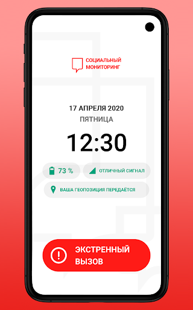
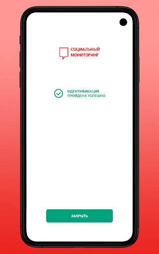
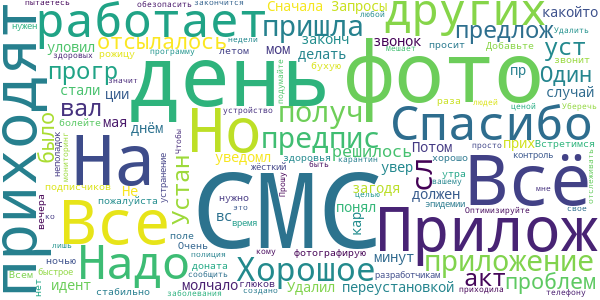
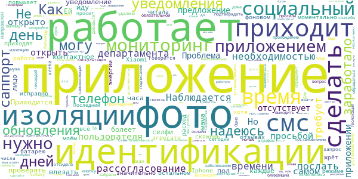
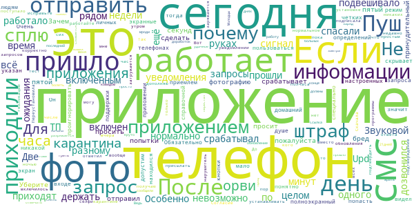
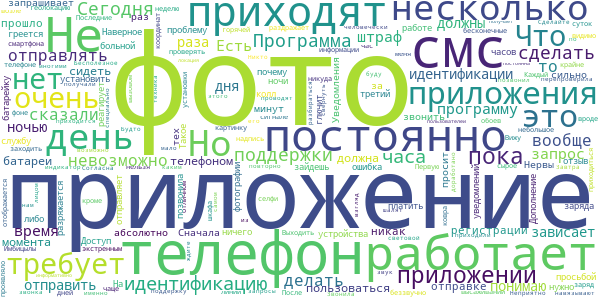
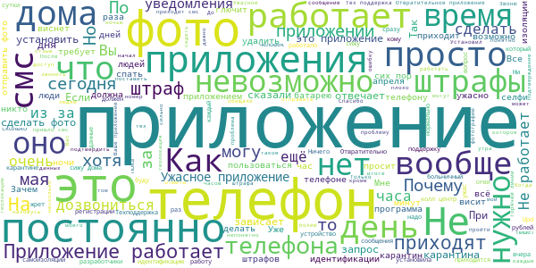

# Социальный мониторинг
App version ``1.3.0``

Analyzed with [covid-apps-observer](http://github.com/covid-apps-observer) project, version ``0.1``

## App overview
| | |
|-------------------------|-------------------------| 
| **Name**&nbsp;&nbsp;&nbsp;&nbsp;&nbsp;&nbsp;&nbsp;&nbsp;&nbsp;&nbsp;&nbsp;&nbsp;&nbsp;&nbsp;&nbsp;&nbsp;&nbsp;&nbsp;&nbsp;&nbsp;&nbsp;&nbsp;&nbsp;&nbsp;&nbsp;&nbsp;&nbsp;&nbsp;&nbsp;&nbsp;&nbsp;&nbsp;&nbsp;&nbsp;&nbsp;&nbsp;&nbsp;&nbsp;&nbsp;&nbsp;  | Социальный мониторинг |
| **Unique identifier** | ru.mos.socmon |
| **Link to Google Play** | [https://play.google.com/store/apps/details?id=ru.mos.socmon](https://play.google.com/store/apps/details?id=ru.mos.socmon) |
| **Summary**  | Приложение для контроля за соблюдением гражданами режима самоизоляции на дому |
| **Privacy policy** | [https://www.mos.ru/privacypolicy/socmon/](https://www.mos.ru/privacypolicy/socmon/) |
| **Latest version** | 1.3.0 |
| **Last update** | 2020-05-05 08:01:07 |
| **Recent changes** | Добавлена возможность автоматического обновления версии. Доработки по замечаниям пользователей. Исправление мелких визуальных ошибок. |
| **Installs**  | 10 000+ |
| **Category** | Медицина |
| **First release** | 22 апр. 2020 г. |
| **Size**  | 46M |
| **Supported Android version**  | 6.0 и выше |

### Description
> Приложение «Социальный мониторинг» создано для пациентов с подтвержденным диагнозом COVID-19, выбравших лечение на дому, граждан, контактировавших с ними, и горожан с проявлениями острых респираторных заболеваний, проживающих в Москве и соблюдающих предписанный им режим изоляции. С его помощью пациент информирует город о добросовестном соблюдении карантина. 
 При регистрации пользователь подтверждает номер телефона, делает фотографию, геолокация (местонахождение) отправляется автоматически. Это нужно для того, чтобы проверить, находится ли пользователь в той же локации, которую указал в согласии, выбирая лечение на дому. 
 Чтобы у пользователя не было возможности оставить смартфон дома и выйти на улицу без него, приложение в случайное время присылает пуш-уведомления с запросом дополнительного подтверждения — для этого потребуется сделать селфи.
 Если пользователь покидает исходную геолокацию или не реагирует на уведомления, система предупреждает городские службы о возможном нарушении режима изоляции.
 Личные данные, которые пользователь передает сервису, определены в согласии на получение медицинской помощи на дому и соблюдение режима изоляции либо в постановлении главного санитарного врача города Москвы. Гражданин обязан подписать документ, если выбирает лечение на дому или если он контактировал с заболевшим и должен соблюдать режим изоляции. Он указывает ФИО, адрес, по которому обязуется находиться на протяжении всего периода лечения или изоляции, и номер мобильного телефона. Также гражданин дает согласие на осуществление фотосъемки и предъявление документа, удостоверяющего личность.
 Все данные, которые пользователь передает приложению, хранятся в защищенном виде на серверах Департамента информационных технологий. После окончания лечения или срока действия режима изоляции эти данные уничтожаются.

### User interface
The developers of the app provide the following screenshots in the Google play store.
| | | |
|:-------------------------:|:-------------------------:|:-------------------------:|
 |   |   |   | 
 |   |  

## Development team
In the following we report the main information provided by the development team in the Google play store.

| | |
|-------------------------|-------------------------|
| **Developer**  | Информационный город ГКУ |
| **Website**  | [http://socialmonitoring.mos.ru/](http://socialmonitoring.mos.ru/) |
| **Email** | socialmonitoring@mos.ru |
| **Physical address**  | - |
| **Other developed apps**  | [https://play.google.com/store/apps/developer?id=%D0%98%D0%BD%D1%84%D0%BE%D1%80%D0%BC%D0%B0%D1%86%D0%B8%D0%BE%D0%BD%D0%BD%D1%8B%D0%B9+%D0%B3%D0%BE%D1%80%D0%BE%D0%B4+%D0%93%D0%9A%D0%A3](https://play.google.com/store/apps/developer?id=%D0%98%D0%BD%D1%84%D0%BE%D1%80%D0%BC%D0%B0%D1%86%D0%B8%D0%BE%D0%BD%D0%BD%D1%8B%D0%B9+%D0%B3%D0%BE%D1%80%D0%BE%D0%B4+%D0%93%D0%9A%D0%A3) |

## Android support

| | |
|-------------------------|-------------------------|
| **Declared target Android version**  | Android10, version 10 (API level 29) |
| **Effective target Android version**  | Android10, version 10 (API level 29) |
| **Minimum supported Android version**  | Marshmallow, version 6.0 (API level 23) |
| **Maximum target Android version**  | - |

The larger the difference between the minimum and maximum supported Android versions, the better. A larger difference means a wider audience. For example, old phones have a very low Android version, so a high minimum supported Android version means that the app cannot be used by users with old phones, thus leading to accessibility problems. 

## Requested permissions

In the following we report the complete list of the permissions requested by the app. 

| **Permission** | **Protection level** | **Description** | 
|-------------------------|-------------------------|-------------------------|
 **android.permission ACCESS_BACKGROUND_LOCATION** | :warning:**Dangerous** | Allows an app to access location in the background. 
 **android.permission ACCESS_COARSE_LOCATION** | :warning:**Dangerous** | Allows an app to access approximate location. 
 **android.permission ACCESS_FINE_LOCATION** | :warning:**Dangerous** | Allows an app to access precise location. 
 **android.permission ACCESS_NETWORK_STATE** | Normal | Allows applications to access information about networks. 
 **android.permission ACCESS_WIFI_STATE** | Normal | Allows applications to access information about Wi-Fi networks. 
 **android.permission CAMERA** | :warning:**Dangerous** | Required to be able to access the camera device. 
 **android.permission CHANGE_WIFI_STATE** | Normal | Allows applications to change Wi-Fi connectivity state. 
 **android.permission FOREGROUND_SERVICE** | Normal | Allows a regular application to use Service.startForeground. 
 **android.permission INTERNET** | Normal | Allows applications to open network sockets. 
 **android.permission PREVENT_POWER_KEY** | - | - 
 **android.permission READ_EXTERNAL_STORAGE** | :warning:**Dangerous** | Allows an application to read from external storage. 
 **android.permission RECEIVE_BOOT_COMPLETED** | Normal | Allows an application to receive the Intent.ACTION_BOOT_COMPLETED that is broadcast after the system finishes booting. 
 **android.permission REQUEST_IGNORE_BATTERY_OPTIMIZATIONS** | Normal | Permission an application must hold in order to use Settings.ACTION_REQUEST_IGNORE_BATTERY_OPTIMIZATIONS. 
 **android.permission USE_FULL_SCREEN_INTENT** | Normal | Required for apps targeting Build.VERSION_CODES.Q that want to use notification full screen intents. 
 **android.permission VIBRATE** | Normal | Allows access to the vibrator. 
 **android.permission WAKE_LOCK** | Normal | Allows using PowerManager WakeLocks to keep processor from sleeping or screen from dimming. 
 **android.permission WRITE_EXTERNAL_STORAGE** | :warning:**Dangerous** | Allows an application to write to external storage. 
 **com.google.android.c2dm.permission RECEIVE** | - | - 
 **com.google.android.finsky.permission BIND_GET_INSTALL_REFERRER_SERVICE** | - | - 

## Mentioned servers

| **Server** | **Registrant** | **Registrant country** | **Creation date** | 
|-------------------------|-------------------------|-------------------------|-------------------------|
 | googlesyndication.com | Google LLC | :us: US | 2003-01-21 06:17:24 |
 | google.com | Google LLC | :us: US | 1997-09-15 04:00:00 |
 | app-measurement.com | Google LLC | :us: US | 2015-06-19 20:13:31 |
 | googleadservices.com | Google LLC | :us: US | 2003-06-19 16:34:53 |
 | crashlytics.com | Google LLC | :us: US | 2011-01-21 15:30:40 |
 | mos.ru | - | - | 1996-12-23 09:49:03 |
 | googleapis.com | Google LLC | :us: US | 2005-01-25 17:52:26 |

## Security analysis 

Below we report the main security warnings raised by our execution of the [Androwarn](https://github.com/maaaaz/androwarn) security analysis tool.

**Connection interfaces exfiltration**
> - This application reads details about the currently active data network 
> - This application tries to find out if the currently active data network is metered 

**Telephony services abuse**
> - This application makes phone calls 

**Suspicious connection establishment**
> - This application opens a Socket and connects it to the remote address '; port is out of range' on the 'N/A' port  
> - This application opens a Socket and connects it to the remote address 'Lh/b/a/a/a;->a(Ljava/lang/String;)Ljava/lang/StringBuilder;' on the 'N/A' port  
> - This application opens a Socket and connects it to the remote address 'Ljava/net/Proxy;->type()Ljava/net/Proxy$Type;' on the 'N/A' port  
> - This application opens a Socket and connects it to the remote address 'Method sendUrgentData() is not supported.' on the 'N/A' port  
> - This application opens a Socket and connects it to the remote address 'Method setHandshakeTimeout() is not supported.' on the 'N/A' port  
> - This application opens a Socket and connects it to the remote address 'Method setOOBInline() is not supported.' on the 'N/A' port  
> - This application opens a Socket and connects it to the remote address 'Method setSoWriteTimeout() is not supported.' on the 'N/A' port  
> - This application opens a Socket and connects it to the remote address 'Socket closed' on the 'N/A' port  
> - This application opens a Socket and connects it to the remote address 'Socket is closed' on the 'N/A' port  
> - This application opens a Socket and connects it to the remote address 'Socket is closed.' on the 'N/A' port  
> - This application opens a Socket and connects it to the remote address 'Socket is not connected.' on the 'N/A' port  
> - This application opens a Socket and connects it to the remote address 'socket is closed' on the 'N/A' port  
> - This application opens a Socket and connects it to the remote address 'timeout' on the 'N/A' port  

**Code execution**
> - This application loads a native library: 'Ljava/lang/String;->valueOf(Ljava/lang/Object;)Ljava/lang/String;' 
> - This application loads a native library: 'conscrypt_gmscore_jni' 
> - This application loads a native library: 'conscrypt_jni' 
> - This application loads a native library: 'tool-checker' 
> - This application executes a UNIX command 
> - This application executes a UNIX command containing this argument: 'getprop' 
> - This application executes a UNIX command containing this argument: 'mount' 

## User ratings and reviews

Below we provide information about how end users are reacting to the app in terms of ratings and reviews in the Google Play store.

### Ratings

The Социальный мониторинг app has been installed by more than **10000** times. At this time, **782** rated the app and its average score is **1.2**. Below we show the distribution of the ratings across the usual star-based rating of Google Play

:star::star::star::star::star:: 15

:star::star::star::star:: 7

:star::star::star:: 7

:star::star:: 54

:star:: 695

### Reviews 

#### 5-star reviews

> Хорошое приложение  :date: __2020-05-09 22:29:24__

> 23.04 получ. предпис. на 14 д. На сл. день пришла СМС с предлож. уст. прогр. Устан. и акт-вал без проблем. Один раз было: не отсылалось фото. Всё решилось переустановкой. Запросы на фото были только днём раз 5-7 в день. В какойто мом. стали прих. смс-уведомл. об идент-ции. Не понял, что я должен делать. Прилож. молчало. Потом уловил, что СМС приходят как бы загодя. Сначала смс, потом минут через 10 звонок от прилож. 8 мая кар. законч. Но СМС приходят. Удалил на вс. случай., не увер. что пр-но))  :date: __2020-05-08 16:21:12__

> Все работает, фотографирую свою бухую рожицу с утра до вечера. Добавьте пожалуйста поле для подписчиков и доната. Очень нужно. Всем здоровья, не болейте. Встретимся летом!  :date: __2020-05-08 14:19:55__

> Все работает хорошо, стабильно. 3-4 раза в день просит фото, глюков нет, ночью не звонит. Спасибо разработчикам за быстрое устранение всех неполадок.  :date: __2020-05-06 22:22:50__

> На время эпидемии нужен жёсткий контроль  :date: __2020-04-30 18:40:48__

> Оптимизируйте свое устройство! Чтобы просто так не приходила полиция ко мне!  :date: __2020-04-30 08:09:45__

> Надо отслеживать, значит, надо. Прошу сообщить, как быть, когда карантин закончится? Удалить программу?  :date: __2020-04-26 18:29:47__

> Всё создано с целью Уберечь других людей от заболевания , спасибо что пытаетесь обезопасить здоровых любой ценой. А тем кому этот мониторинг Мешает , подумайте о других . И ничего вашему телефону не будет это ведь всего лишь на 2 недели.  :date: __2020-04-25 17:08:36__

#### 4-star reviews

> Приложение работает, время от времени требует послать фото. Наблюдается рассогласование с смс - приходит смс от департамента с необходимостью идентификации пользователя и просьбой открыть приложение социальный мониторинг. Но: 1. приложение открыто 2. в самом приложении предложение идентификации отсутствует  :date: __2020-05-09 08:12:37__

> Проблема с приложением: не приходит уведомление, когда нужно сделать селфи. Приходится каждые пол часа влезать и проверять. Я иду как контактное лицо, а болеет - мама. Ей уведомления приходят моментально (Iphone), чего не скажешь о моём "агрегате" (Xiaomi). В остальном - всё работает исправно, батарею не жрёт, хотя в отзывах читала, что работа в фоновом режиме значительно повышает расход энергии. Как говорится: "установлено, хлеба не просит" - и то хорошо :)  :date: __2020-05-08 17:46:02__

> Последний день изоляции был 5 числа, сегодня приходит смс: "Вам направлен запрос на прохождение обязательной идентификации. Для прохождения идентификации откройте приложение «Социальный мониторинг»." Приложение уже удалено, нужно ли его заново у устанавливать и подтверждать подписание соглашения об изоляции, если его срок истек?  :date: __2020-05-08 09:58:16__

> За саппорт, спасибо, хоть кто-то знает куда надо обращаться с этой чехардой, за саппорт поставлю 4  :date: __2020-05-06 13:46:17__

> Приложение работает, ночью не беспокоит, максимально за день просили 5 раз фото. Одно не могу понять, я свою изоляцию по заболеванию отсидела дома, теперь у меня ещё несколько дней изоляции как контактного лица, но по постановлению я могу выходить в ближайший магазин и выгулять собаку. Как мне это сделать, если телефон определит тут же выход из зоны самоизоляции? И еще вопрос, мужа забрали в больницу, т.е. геолокация изменилась, потом его выпишут опять измениться, штрафов не будет надеюсь?  :date: __2020-05-06 09:27:28__

> Добавьте кнопку онлайн консультация с доктором. До поликлиники не дозвониться, врачи сами не звонят, не интересуются самочувствием. И сделайте подтверждение фото в разумное время, а то в 5 утра разбудил, потом час заснуть не мог.  :date: __2020-05-05 15:54:40__

> Быстро тратит аккумулятор, 10% за полчаса. Также постоянно мигают иконки в трее. Не хочется гробить свой телефон таким приложением) UPD: после обновления вроде заработало адекватно, исправил единицу на 4  :date: __2020-05-04 10:40:12__

> У меня все ок работает. Не хватает только уведомления о конце изоляции или сколько дней осталось.  :date: __2020-05-02 22:11:22__

> Разработчик ответил. Получилось обновить и сделать фото. Надеюсь, что все будет работать.  :date: __2020-04-30 21:07:35__

> После обновления приложение заработало. Посмотрим, на долго ли. Сначала два дня тоже работало.  :date: __2020-04-30 17:02:41__

#### 3-star reviews

> Две недели прошли, а запросы всё ещё приходят...  :date: __2020-05-10 11:29:40__

> В целом работало нормально. Особенно телефон не подвешивало. Пуш уведомления приходили по-разному, то по 4-5 в день, то ни одного. Звуковой сигнал о пуш срабатывал, только если телефон был в руках и включен. А так приходили смс, только они и спасали, невозможно же телефон все время рядом включенным держать.  :date: __2020-05-10 08:40:58__

> Upd от 08.05.2020 дозвонился в ТП через 20 минут ожидания 01.05.20 После фото срабатывает через раз на пятый, сегодня отправил фото с пятой попытки, через 10 секунд опять просит отправить  :date: __2020-05-08 13:35:48__

> Зачем просить сделать фотографию после 23:00, что за бред?  :date: __2020-05-05 19:42:08__

> Уберите пожалуйста принудительный полноэкранный режим. Он приемлем на специально настроенных телефонах, но не на личных. Приложение скрывает экранные кнопки и людям не понятно как попасть на домашний экран. Очень мало информации о том как пользоваться приложением, нет чётких определений что значит проигнорировать запрос. Если я находился в душе, допустим, и не видел запроса, что тогда? Телефон поддержки был указан только при входе, почему в приложении нет никакой справочной информации?  :date: __2020-05-05 13:26:01__

> Обязательно ли устанавливать это приложение?  :date: __2020-05-05 11:55:26__

> После обновления программы я запрос о селфи получаю только через смс, исправьте уже это!  :date: __2020-05-04 15:23:06__

> Приложение нормальное ,только не корректно работает .Вот зачем присылать ночью подтверждение, когда я сплю. Если я не ответил то,что я нарушитель и штраф мне. Так же если я сплю до 12 час и пришло утром уведомлении подтвердить геолокацию мне что опять штраф. До работайте приложение.  :date: __2020-05-04 10:23:46__

> Переустановила вчера.включилось только недавно.  :date: __2020-05-03 15:15:48__

> Не могу отправить фото,не загружается .  :date: __2020-05-03 11:15:29__

#### 2-star reviews

> Имбицылы, телефоном невозможно пользоваться!!!!!!  :date: __2020-05-09 17:03:05__

> Вижу только картинку с экстренным вызовом, геолокацию, заряд батареи и надпись об отличном сигнале. А куда фото отправлять нет.  :date: __2020-05-09 13:07:51__

> Каждый час или чаще требует фото меня. Я, видимо, должна сидеть возле смартфона и делать бесконечные селфи на фоне ковра, обоев, шкафа... Выходить-то никуда нельзя.  :date: __2020-05-09 11:21:05__

> Приложение вроде небольшое, но крайне сырое. 1. С момента установки до момента регистрации прошло больше 1.5 суток 2. Первую неделю вообще себя никак не проявляло, кроме информации об отправке координат и высаживании батареи. 3. Последние несколько дней запрашивает фото по 7 раз в день, через 15-30 минут. Что ОЧЕНЬ сильно раздражает. 4. После регистрации в приложении не отображается телефон горячей линии.  :date: __2020-05-09 10:04:35__

> Приложение пока работает. Но! Уведомления приходят абсолютно беззвучно. Постоянно приходиться заходить и проверять. У себя на телефоне все перепроверила: звук, световой индикатор. Звонила в тех. поддержку, сказали ждите звонка техника. Никто так и не позвонил. Нервы постоянно шалят из-за этого. Завтра буду звонить повторно. Неприятно, что навязывают эту программу, и нам же приходится звонить и разбираться. Сделайте по-человечески хоть раз! Будто специально, чтоб штраф получали...  :date: __2020-05-08 18:46:25__

> Бесполезное на мой взгляд приложение. С каким именно лицом они идентификацию проводят? Сначала из приложения приходили запросы, теперь по смс. Есть запрос по смс, а в самом приложении нет. Согласна со многими, не доработано приложение. Не возможно свернуть его, мало информативно для пользователей  :date: __2020-05-08 15:00:50__

> Приложение работает, просит фото и его получает, при этом локация устройства постоянна. В то же время приходят СМС с просьбой срочно авторизоваться. Такое чувство, что регистрация не доходит до сервера или он ее не регистрирует. Доступ в интернет с устройства есть. Пожалуйста проверьте работоспособность системы.  :date: __2020-05-08 14:30:50__

> Не понятно почему после удаления приложения,приходят СМС с просьбой о фото и тд.  :date: __2020-05-08 13:25:02__

> Приходит смс сообщение о прохождении обязательной идентификации, но в приложении запрос на идентификацию отсутствует.  :date: __2020-05-08 11:48:09__

> Что за ерунда? Запрашивает фото в 4 часа ночи. Днем может через каждые пол часа просить. Я конечно все понимаю,но невозможно постоянно следить за телефоном. Дозвониться в службу поддержки невозможно!  :date: __2020-05-08 11:41:53__

#### 1-star reviews

> 9 мая закончился карантин по орви. Сегодня 10 мая получила запрос на индификацию. Почему не отражен конец карантина. Как быть в этой ситуации? До тех. Службы не дозвониться, никто не подходит. Куда обращаться. И когда можно удалить эту программу. Сегодня 8 мая пришло сообщение об индефикации, пол часа пытаюсь сделать селфи и дозвониться в калл центр. Глухо, по телефону не отвечают, программу открываю селфи сделать невозможно. Телефон не работает, никто не подходит, проблема не решена.  :date: __2020-05-10 11:48:19__

> Ужасное, недоработанное приложение!!! Просто кошмар, прежде чем заставлять людей устанавливать его, анализы хоть возьмите, ко мне даже не пришли тест делать, а приложение пришлось установить)))  :date: __2020-05-10 11:27:08__

> Куча багов, влияет на операционную систему, для исправления ошибок после удаления пришлось ребутить телефон.  :date: __2020-05-10 11:13:26__

> Получил ЧЕТЫРЕ штрафа, один за 3 мая, и три за 5 мая. Сижу дома с ковидом, пневманией, температурой. Спасибо разработчикам и ДИТ Москвы за вашу заботу. Приложение оказывается условнобесплатное. По данному номеру, который указан в ответе, ни чего не знают и не помагают. Жизнь больных людей превратили в ад. Ни кто помагает со штрафами не собирается. Это ужасно.  :date: __2020-05-10 11:00:34__

> Самое убогое приложение. Создано для посадки людей на привязь дома. Сажают как больных, так и здоровых. Уведомлений об идентификации от приложения нет. Иногда приходят смс, но в приложении идентифицироваться не надо. Служба тех. поддержки ничерта не знает и ничего не может. Создали заявку для настройки, обещали что отзвонятся и хрен Вам, а не настройка. Связи с врачом нет. Кнопки sos нету, будете умирать, звоните в 112 через приложение.Можно фоткать домашних животных, и никто ничего не заметит.  :date: __2020-05-10 10:57:35__

> Спасибо. Заболев ОРВИ, чувствую себя преступником. Спасибо всем, кто придумал и разработал. Спасибо, за мой моральный настрой, нужный для выздоровления, который каждый раз стремится к нулю, при запросе сделать фото. Желание выкинуть телефон и больше никогда не доверять, нашему правительству, как и оно мне.  :date: __2020-05-10 10:51:11__

> Ставлю один бал чтобы обратить внимание на то что непонятно как сняться с мониторинга. Телефон мос.ру отключается через 30 минут ожидания, так и не дождавшись ответа оператора. Пытался дозвониться сегодня 5 раз по 30 минут. В программе функции обратной связи нет.  :date: __2020-05-10 10:36:19__

> Получил штраф 8 мая хотя карантин закончился ещё 29 апреля и приложение сразу удолил  :date: __2020-05-10 10:21:18__

> Приложение очень глючит по 7 раз пытаюсь сфоткаться не отправляется решил переустановить пришло 2 штрафа  :date: __2020-05-10 10:13:14__

> Нет уведомления об необходимости сделать фотографию, приходится постоянно проверять телефон. Я уже и заснуть боюсь, что вполне логично для больного человека.  :date: __2020-05-10 09:03:47__

