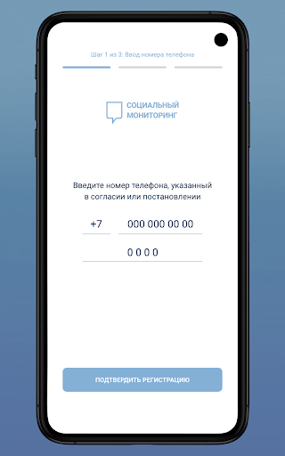
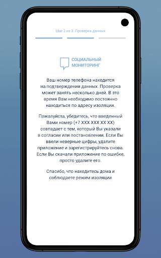
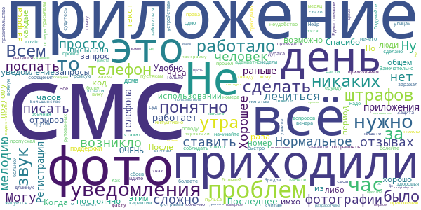
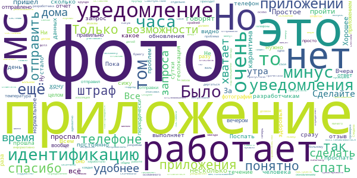
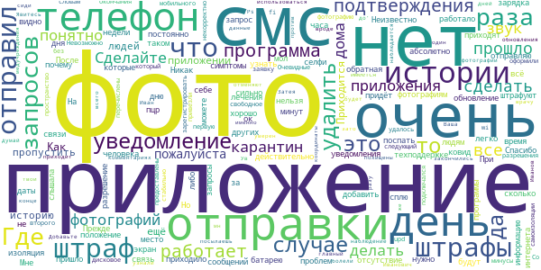
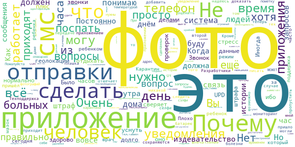
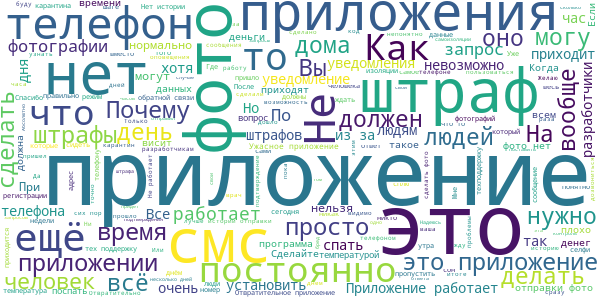

# Социальный мониторинг
App version ``1.9``

Analyzed with [covid-apps-observer](http://github.com/covid-apps-observer) project, version ``0.1``

## App overview
| | |
|-------------------------|-------------------------| 
| **Name**&nbsp;&nbsp;&nbsp;&nbsp;&nbsp;&nbsp;&nbsp;&nbsp;&nbsp;&nbsp;&nbsp;&nbsp;&nbsp;&nbsp;&nbsp;&nbsp;&nbsp;&nbsp;&nbsp;&nbsp;&nbsp;&nbsp;&nbsp;&nbsp;&nbsp;&nbsp;&nbsp;&nbsp;&nbsp;&nbsp;&nbsp;&nbsp;&nbsp;&nbsp;&nbsp;&nbsp;&nbsp;&nbsp;&nbsp;&nbsp;  | Социальный мониторинг |
| **Unique identifier** | ru.mos.socmon |
| **Link to Google Play** | [https://play.google.com/store/apps/details?id=ru.mos.socmon](https://play.google.com/store/apps/details?id=ru.mos.socmon) |
| **Summary**  | Приложение для контроля за соблюдением гражданами режима изоляции на дому |
| **Privacy policy** | [https://www.mos.ru/privacypolicy/socmon/](https://www.mos.ru/privacypolicy/socmon/) |
| **Latest version** | 1.9 |
| **Last update** | 2020-12-03 19:20:32 |
| **Recent changes** | В новой версии появилась история идентификаций. История позволяет увидеть, когда поступил запрос на прохождение обязательной идентификации, через какое время отправлено фото, прошло ли оно проверку. |
| **Installs**  | 100 000+ |
| **Category** | Медицина |
| **First release** | 22 апр. 2020 г. |
| **Size**  | 14M |
| **Supported Android version**  | 6.0 и выше |

### Description
> Приложение «Социальный мониторинг» создано для пациентов с подтвержденным диагнозом COVID-19 и граждан контактировавших с ними, проживающих в Москве и соблюдающих предписанный им режим изоляции. С его помощью пациент информирует город о добросовестном соблюдении карантина.
 При регистрации пользователь подтверждает номер телефона, делает фотографию, геолокация (местонахождение) отправляется автоматически. Это нужно для того, чтобы проверить, находится ли пользователь в той же локации, которую указал в согласии, выбирая лечение на дому.
 Чтобы у пользователя не было возможности оставить смартфон дома и выйти на улицу без него, приложение в случайное время присылает СМС-уведомления с запросом дополнительного подтверждения — для этого потребуется сделать селфи.
 Если пользователь покидает исходную геолокацию или не реагирует на уведомления, система предупреждает городские службы о возможном нарушении режима изоляции.
 Личные данные, которые пользователь передает сервису, определены в согласии на получение медицинской помощи на дому и соблюдение режима изоляции либо в постановлении главного санитарного врача города Москвы. Все данные, которые пользователь передает приложению, хранятся в защищенном виде на серверах Департамента информационных технологий и используются в строгом соответствии с федеральным законом № 152-ФЗ "О персональных данных".

### User interface
The developers of the app provide the following screenshots in the Google play store.
| | | |
|:-------------------------:|:-------------------------:|:-------------------------:|
 |   |   |   | 
 |   |  

## Development team
In the following we report the main information provided by the development team in the Google play store.

| | |
|-------------------------|-------------------------|
| **Developer**  | Информационный город ГКУ |
| **Website**  | [https://www.mos.ru/city/projects/monitoring/](https://www.mos.ru/city/projects/monitoring/) |
| **Email** | socialmonitoring@mos.ru |
| **Physical address**  | - |
| **Other developed apps**  | [https://play.google.com/store/apps/developer?id=%D0%98%D0%BD%D1%84%D0%BE%D1%80%D0%BC%D0%B0%D1%86%D0%B8%D0%BE%D0%BD%D0%BD%D1%8B%D0%B9+%D0%B3%D0%BE%D1%80%D0%BE%D0%B4+%D0%93%D0%9A%D0%A3](https://play.google.com/store/apps/developer?id=%D0%98%D0%BD%D1%84%D0%BE%D1%80%D0%BC%D0%B0%D1%86%D0%B8%D0%BE%D0%BD%D0%BD%D1%8B%D0%B9+%D0%B3%D0%BE%D1%80%D0%BE%D0%B4+%D0%93%D0%9A%D0%A3) |

## Android support

| | |
|-------------------------|-------------------------|
| **Declared target Android version**  | Android10, version 10 (API level 29) |
| **Effective target Android version**  | Android10, version 10 (API level 29) |
| **Minimum supported Android version**  | Marshmallow, version 6.0 (API level 23) |
| **Maximum target Android version**  | - |

The larger the difference between the minimum and maximum supported Android versions, the better. A larger difference means a wider audience. For example, old phones have a very low Android version, so a high minimum supported Android version means that the app cannot be used by users with old phones, thus leading to accessibility problems. 

## Requested permissions

In the following we report the complete list of the permissions requested by the app. 

| **Permission** | **Protection level** | **Description** | 
|-------------------------|-------------------------|-------------------------|
 **android.permission ACCESS_BACKGROUND_LOCATION** | :warning:**Dangerous** | Allows an app to access location in the background. 
 **android.permission ACCESS_FINE_LOCATION** | :warning:**Dangerous** | Allows an app to access precise location. 
 **android.permission ACCESS_NETWORK_STATE** | Normal | Allows applications to access information about networks. 
 **android.permission ACCESS_WIFI_STATE** | Normal | Allows applications to access information about Wi-Fi networks. 
 **android.permission CAMERA** | :warning:**Dangerous** | Required to be able to access the camera device. 
 **android.permission CHANGE_WIFI_STATE** | Normal | Allows applications to change Wi-Fi connectivity state. 
 **android.permission FOREGROUND_SERVICE** | Normal | Allows a regular application to use Service.startForeground. 
 **android.permission INTERNET** | Normal | Allows applications to open network sockets. 
 **android.permission READ_EXTERNAL_STORAGE** | :warning:**Dangerous** | Allows an application to read from external storage. 
 **android.permission RECEIVE_BOOT_COMPLETED** | Normal | Allows an application to receive the Intent.ACTION_BOOT_COMPLETED that is broadcast after the system finishes booting. 
 **android.permission REQUEST_IGNORE_BATTERY_OPTIMIZATIONS** | Normal | Permission an application must hold in order to use Settings.ACTION_REQUEST_IGNORE_BATTERY_OPTIMIZATIONS. 
 **android.permission USE_FULL_SCREEN_INTENT** | Normal | Required for apps targeting Build.VERSION_CODES.Q that want to use notification full screen intents. 
 **android.permission WAKE_LOCK** | Normal | Allows using PowerManager WakeLocks to keep processor from sleeping or screen from dimming. 
 **android.permission WRITE_EXTERNAL_STORAGE** | :warning:**Dangerous** | Allows an application to write to external storage. 
 **com.google.android.c2dm.permission RECEIVE** | - | - 
 **com.google.android.finsky.permission BIND_GET_INSTALL_REFERRER_SERVICE** | - | - 

## Mentioned servers

| **Server** | **Registrant** | **Registrant country** | **Creation date** | 
|-------------------------|-------------------------|-------------------------|-------------------------|
 | adobe.com | Adobe Inc. | :us: US | 1986-11-17 05:00:00 |
 | crashlytics.com | Google LLC | :us: US | 2011-01-21 15:30:40 |
 | googlesyndication.com | Google LLC | :us: US | 2003-01-21 06:17:24 |
 | google.com | Google LLC | :us: US | 1997-09-15 04:00:00 |
 | googleadservices.com | Google LLC | :us: US | 2003-06-19 16:34:53 |
 | app-measurement.com | Google LLC | :us: US | 2015-06-19 20:13:31 |
 | mos.ru | - | - | 1996-12-23 09:49:03 |

## Security analysis 

Below we report the main security warnings raised by our execution of the [Androwarn](https://github.com/maaaaz/androwarn) security analysis tool.

**Connection interfaces exfiltration**
> - This application reads details about the currently active data network 
> - This application tries to find out if the currently active data network is metered 

**Telephony services abuse**
> - This application makes phone calls 

**Suspicious connection establishment**
> - This application opens a Socket and connects it to the remote address '; port is out of range' on the 'N/A' port  
> - This application opens a Socket and connects it to the remote address 'Ljava/net/Proxy;->type()Ljava/net/Proxy$Type;' on the 'N/A' port  
> - This application opens a Socket and connects it to the remote address 'Lv/b/a/a/a;->q(Ljava/lang/String;)Ljava/lang/StringBuilder;' on the 'N/A' port  
> - This application opens a Socket and connects it to the remote address 'Method sendUrgentData() is not supported.' on the 'N/A' port  
> - This application opens a Socket and connects it to the remote address 'Method setHandshakeTimeout() is not supported.' on the 'N/A' port  
> - This application opens a Socket and connects it to the remote address 'Method setOOBInline() is not supported.' on the 'N/A' port  
> - This application opens a Socket and connects it to the remote address 'Method setSoWriteTimeout() is not supported.' on the 'N/A' port  
> - This application opens a Socket and connects it to the remote address 'Socket closed' on the 'N/A' port  
> - This application opens a Socket and connects it to the remote address 'Socket is closed' on the 'N/A' port  
> - This application opens a Socket and connects it to the remote address 'Socket is closed.' on the 'N/A' port  
> - This application opens a Socket and connects it to the remote address 'Socket is not connected.' on the 'N/A' port  
> - This application opens a Socket and connects it to the remote address 'socket is closed' on the 'N/A' port  
> - This application opens a Socket and connects it to the remote address 'timeout' on the 'N/A' port  

**Code execution**
> - This application loads a native library: 'conscrypt_gmscore_jni' 
> - This application loads a native library: 'conscrypt_jni' 
> - This application loads a native library: 'tool-checker' 
> - This application executes a UNIX command 
> - This application executes a UNIX command containing this argument: 'getprop' 
> - This application executes a UNIX command containing this argument: 'mount' 

## User ratings and reviews

Below we provide information about how end users are reacting to the app in terms of ratings and reviews in the Google Play store.

### Ratings

The Социальный мониторинг app has been installed by more than **100000** times. At this time, **8710** rated the app and its average score is **1.347973**. Below we show the distribution of the ratings across the usual star-based rating of Google Play

:star::star::star::star::star:: 431

:star::star::star::star:: 186

:star::star::star:: 235

:star::star:: 274

:star:: 7584

### Reviews 

#### 5-star reviews

> Замечательно, не понимаю только почему это приложение занимает 7.5 мбайт а Емиас больше чем полгига. Сделали бы Емиас.лайт, хотя к этому оно и не относится.  :date: __2020-12-27 15:33:28__

> 14 числа,в 19ч ,у меня почему то не прошла проверку фотография,я сделала фото и отправила,не смотрела прошла она не прошла,только после больницы и было плохо.А в остальные дни,делала повторные снимки на такие вопросы.Что же делать мне,придет штраф?Но это ваша вина,одно и то же лицо и не прошло.Я была 2 дня после больницы.18 дней в больнице провела с 60% поражения,до этотго 9 дней дома.Что мне делать?Вчера 26.12 закончился карантин и только сегодня, я первый раз буду выходить.  :date: __2020-12-27 06:50:02__

> Я конечно ,понимаю и разделяю волну негатива к идейной составляющей приложения, но программная часть проблем не создает. Рано утром и ночью запросы не прилетают, фотки определяются оперативно. Стабильно по 3 запроса в день, нет бесконечного спама, рекламы и глюков. Если б добавили идентификацию не по фото, а по отпечатку, было бы еще лучше. Пускай программисты на стороне зла, но работу сделали хорошо  :date: __2020-12-26 15:11:37__

> Приложение после изменения стало очень удобным и понятным . Спасибо разработчику.  :date: __2020-12-25 12:58:51__

> Я подключилась, зарегестрировалась. Меня удивляет, что прислали угрозе о штрафе 4000 р. Я болею. Сплю. Хочу, что бы приложение само отслеживало мое местонахождение. Есть и другие дела Как поделиться? На что нажать? Сложно.  :date: __2020-12-23 17:49:11__

> Не могу скачать приложение крутится подождите и все.Получилось после перезагрузки приложения гугл плэй маркет.  :date: __2020-12-23 11:31:48__

> Нормальное  :date: __2020-12-18 10:17:42__

> Замечательно  :date: __2020-12-16 11:37:12__

> Хорошее приложение, все интуитивно понятно, болел месяц и никаких проблем не возникло, сообщения не пропускал. А кто жалуется, что сложно, не слышу смс, поспать хочу.. Могу сказать одно, это приложение сделано, чтобы больной covid-19 человек не шатался по улицам и не заражал других. Защита от дурака.  :date: __2020-12-15 20:55:57__

> Ну кстати не всё так плохо как писали, к приложению вопросов нет, карантин прошёл без штрафов. Все уведомления приходили адекватно и фотографии отправлять было просто.  :date: __2020-12-14 21:49:59__

#### 4-star reviews

> Спасибо разрабам всё работает хорошо,по крайней мере у меня.  :date: __2020-12-27 20:16:17__

> К приложению вопросов нет. Простое и интуитивно понятно. Проверка вмеру адекватно.  :date: __2020-12-27 18:49:17__

> Хорошее приложение. Жаль только, что не уведомляет каждые 5-10 минут о том, что надо пройти идентификацию. За это звезду снимаю. Но на телефоне можно отдельно настроить повторяющееся уведомление об смс. И кто пишет, что проспал и штраф пришел - это не так. У меня несколько знакомых пропустили один раз и ничего им не было за это. Ерунда только со снятием с карантина. Телефоны какую-то ерунду в основном говорят. Но это вопрос не к разработчикам.  :date: __2020-12-27 09:14:37__

> Вчера были врачи, после прочитала бумагу и сразу скачивала приложение, но мой номер сутки уже висит на подтверждении данных.  :date: __2020-12-27 08:50:42__

> Теперь, после обновления приложения определение местоположения заработало корректно. Минус одна звезда за то, что приложение не учитывает самочувствие человека, что он может спать и не среагировать на смс, а спать может и три часа подряд, при этом больному человеку нужно отсыпаться и восстанавливаться, а не дёргаться, что проспал смс. В общем по это проблема не разработчика, а скорее правительства Моаквы.  :date: __2020-12-25 14:51:22__

> Сразу хочу отметить, что отзыв оставляю о работе самого приложения, а не системы отслеживания) поначалу было менее информативно, приложение я поставила 10.12. Приходит смс и в течение часа надо отправить свое фото. Отметок о том, что фото прошло, не было. С обновлением стало удобнее: видно, во сколько пришел запрос, во сколько отправила фото и прошла ли фотл идентификацию. Следила конечно за смс, потому что раз пиликнет и всё, можно пропустить. Было бы удобнее реализовать дозвон. Всем здоровья.  :date: __2020-12-25 10:51:44__

> Нет данных о том, что изоляция окончена  :date: __2020-12-24 05:27:08__

> Приложение как приложение. Ничего особенного. Больной постоянно должен быть на связи. Поспать особо не дадут. В любом состоянии делай фото, что ты дома, а то штраф.  :date: __2020-12-21 19:25:33__

> Приложение закачал, через сутки проверили. И пошло... Смс уведомления сделать фото и отослать. Ни 1 сбоя. Фото делаю и отсылаю. В день 3-4 запроса. Только неправильно определяет место. Типа Я по дороге бегаю... Не дома сижу. GPS +- . Слава КПСС закончилось наблюдение!  :date: __2020-12-21 13:05:34__

> Нет возможности установить на телефон с root доступом. Полагаю, на этом проблемы не заканчиваются (симка в новом телефоне, Google аккаунт и т.п.). Пока это только предположение, как привезут новый аппарат - дополню отзыв. Дополнение: телефон привезли быстро, с СИМкой, инструкцией по установке приложения. Установил без проблем. Приложение свою функцию выполняет.  :date: __2020-12-21 11:22:35__

#### 3-star reviews

> Третий день не открывается приложение,как же я буду фото отсылать  :date: __2020-12-28 09:35:11__

> Плдвисло в один день и пришел штраф!  :date: __2020-12-28 07:18:54__

> Срок самоизоляции 14 дней закончился вчера. Позвонила в тех поддержку, что бы уточнить, мне подтвердили, что 27ого могу удалить прилодение. Удалила. Вышла из дома. Сегодня все ещё идут смс для подтверждения. Мне ждать штрафы????  :date: __2020-12-27 14:17:48__

> Не знаю,что ставить...прошли сутки,а мой номер всё ещё на проверке...указал я его верно. Или всё в систему заносят..или мне придут штрафы..  :date: __2020-12-25 16:19:55__

> Очень легко пропустить запрос. Добавьте возможность непрерывного звукового уведомления (как звонок), я не могу постоянно смотреть в телефон.  :date: __2020-12-25 16:17:13__

> Ладно, это все понятно. Но я сплю утром а днем делаю домашние дела. Телефоном почти не пользуюсь. У меня двое маленьких детей. Я просто не знаю как отслеживать. Так глаз задергается на нервах.. Одно вылечишь другое заболит. Реально звонили бы.. А не смс. Или время определенное, будильник бы ставила. А то от телефона вообще не отойти. БРЕД  :date: __2020-12-23 20:27:35__

> Нет даты окончания самоизоляции  :date: __2020-12-19 16:40:18__

> Невозможно сделать фотографию (все разрешения предоставлены, свободное дисковое пространство имеется) upd. Со второго раза удалось зарегистрировать заявку в техподдержке (первую, по их словам, некорректно оформили). На следующий день привезли телефон, который подключался только к wi-fi (без мобильного интернета). Приложение работало стабильно. Очевидные минусы уже перечислены в других комментариях. Прежде всего, отсутствие истории запросов.  :date: __2020-12-17 05:55:24__

> После обновления не чего не приходит, зато узнали что в один, из дней фото не прошло, сиди и думай будет штраф, не будет, ни разу так не болели  :date: __2020-12-16 20:38:12__

> Затея так себе.Неизвестно куда именно посылаешь фотографии, не уверен что твои данные не будут похищены и не будут использоваться против тебя же. Ps.Добавьте на главный экран приложения информацию, 'с и до' у человека карантин. Где он наблюдается. В конце, когда отменяют карантин/наблюдение, сделайте чтобы приходило уведомление вроде этого " мн. Ув. Иван Иванович Иванов. Ваша изоляция закончились. Явитесь к врачу (координаты и телефон медучреждения). После чего" вы можете удалить приложение."  :date: __2020-12-16 16:36:41__

#### 2-star reviews

> Почему так долго сверяет данные? Я загрузила приложение, а оно сверяет данные больше часа. Это разве нормально? UPD: ОПОВЕЩЕНИЯ НЕ ПРИХОДЯТ!!!  :date: __2020-12-28 13:29:02__

> Тупит. Не реагирует на нажатие кнопок  :date: __2020-12-28 10:20:30__

> Иногда уведомления даже и не слышала ибо была занята своими делами, могла уснуть в послеобеденное время или же проспать все утро. Я не нарушитель, но система может запросто посчитать меня таковым ибо я не слышу уведомления. Это огромный стресс, я не могу уснуть не подумав о том что я пропущу идентификацию. Я понимаю необходимость проверок, но нельзя ли сделать отслеживание геолокации+звонки на телефон например. Звонок по крайней мере будет услышан, ты на него ответишь и будешь дальше отдыхать.  :date: __2020-12-26 15:11:32__

> Было б здорово уменьшить частоту проверок: 2-3 в день мне кажется будет более чем достаточно чтобы пациент не сбежал далеко. Судите сами, сижу на удалёнке на электронной почте, плюс звонки из департамента здравоохранения, штаба Ковид, поликлиники, коллеги, мессенджеры... Ещё можно увеличить интервал отправки фото с часа до двух часов, а то и так невничаешь что болеешь, а теперь ещё и 4000 штрафа над тобой маячат домокловым мечом. Карантин-карантином, но надо помнить и про удобство для людей)  :date: __2020-12-21 15:41:30__

> Плохо работает  :date: __2020-12-21 07:24:41__

> Нужно приложение звонило, а не отправляло смс, или издавало длинный звуковой сигнал как будильник. Я, как и многие, от смс не просыпаюсь, сегодня уже проспала одну(  :date: __2020-12-19 10:49:27__

> Создатели не учитывают режим мамы с новорожденным ребенком. У мам часто нет времени помыть голову или покушать, а здесь добавляется стресс разбудить ребенка из-за сообщений. Плюс ко всему, что ребенок, который не гуляет, больше плачет. Делала фото с орущим на руках ребенком..разве это нормально? Отличная поддержка матерей. Матери и так почти на изоляции с детками. Зато к тем, кто меня заразил врач вообще не пришёл, хотя мазок был положительный, и соц.мониторинг им устанавливать было не нужно.  :date: __2020-12-18 06:31:31__

> Все конечно замечательно. Но больше похоже на тюремное заключение. После лечения на 11 день взяли повторно мазок, результат отрицательный. Почему после отрицательного результата я должен сидеть дома еще 4 дня и отсылать фото по запросу ? Ваша тех.поддержка предложила позвонить врачу, только не уточнила как его найти и как до него дозвониться чтоб сняли с мониторинга. И второй момент поспать с этим приложением не возможно, особенно тяжко было в первые дни болезни, это издевательство а не забота.  :date: __2020-12-17 21:09:30__

> Молодцы, сделали) А теперь нужно сделать так, чтоб при неприсланном фото звонил оператор, а не штраф приходил. Вдруг человек потерял сознание от нехватки кислорода и умирает, а вы его за это штрафуете?  :date: __2020-12-17 05:20:21__

> Не сохраняются сделанные фото. Как вот потом доказать что фото было отправлено? Очень часто всё теряется, а штраф оспорить нереально  :date: __2020-12-16 09:34:16__

#### 1-star reviews

> Это нечто. Регистрация не идет и тут мы читаем: 3. Если подтверждение номера идет больше 3-х суток, мы советуем проверить не указывался ли данный номер в согласии/постановлении Ваших родственников или друзей.👪 \*\** Мне предлагают начать делать обзвон всех знакомых и родных, говорить, что у меня ковид и спрашивать, что никто мой телефон не указывал! - Вы там что курите?!  :date: __2020-12-28 13:51:04__

> 5 дней не работает , нафиг мы на это подписались ?  :date: __2020-12-28 13:37:29__

> Техподдержка не отвечает. Оповещения не приходят.  :date: __2020-12-28 13:32:02__

> Отслеживание положение человека без постановления суда незаконно. Приложение не сертифицировано, куда смотрит ФСТЕК и ФСБ? Даже на просьбу выслать документацию нет ответа.  :date: __2020-12-28 13:24:04__

> Ваша тех. поддержка не отвечает. В регистрационной форме нет графы фамилии, имени, отчества, на кого регистрируешься не известно до тех пор пока не отошлешь фотографию. На моего ребенка (16 лет) выдано предписание на самоизоляцию, врачи внесли мой номер, (почему то не его) поменять не реально.  :date: __2020-12-28 13:11:59__

> Кучка дебилов  :date: __2020-12-28 12:30:29__

> Хороший нашли способ усугубить твоё состояние, за то пополнить казну.  :date: __2020-12-28 12:20:12__

> Совершенно НЕ продуманное приложение! Вчера пропустила запрос на фото! Я честно сижу дома, просто уснула и не слышала смс! Если человек не отвечает в течении часа, то это не значит, что он гуляет! Может, надо бы еще раз отправить запрос? Или лучше позвонить и уточнить где он? А не наказывать!! Теперь мне грозит 4000 штраф? За что?? У меня отрицательный тест! У мамы положительный (возможно ложный) т.к. нет ни одного симптома! Уже 10 дней прошло после сдачи теста! А мы должны сидеть дома! Зачем???  :date: __2020-12-28 11:51:47__

> Если Вам надо отслеживать людей, приходите сами в гости, а не вот этой муйнёй с приложением занимайтесь. Никакой личной жизни в 21м веке  :date: __2020-12-28 11:49:45__

> Сдерают бабло Государство!!!!!Мошенники, лишь бы на деньги поставит глюченное приложение!!!!  :date: __2020-12-28 11:45:39__

