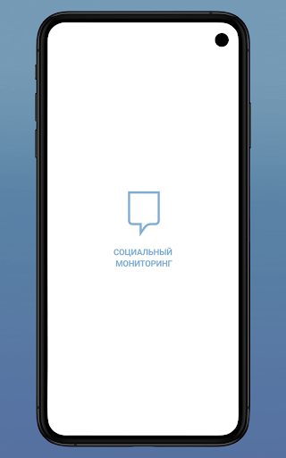
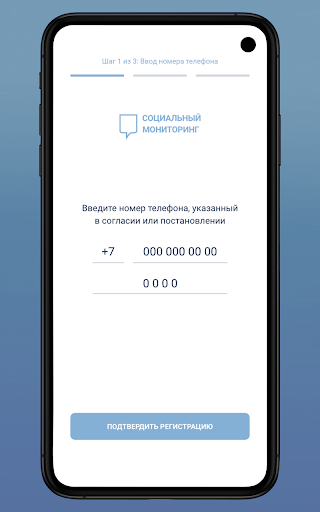
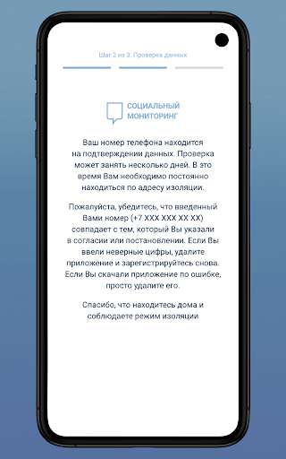
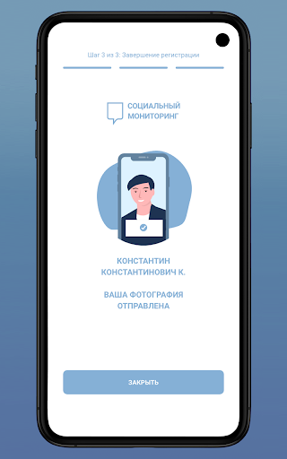
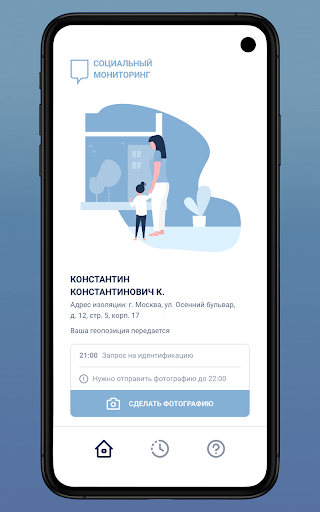
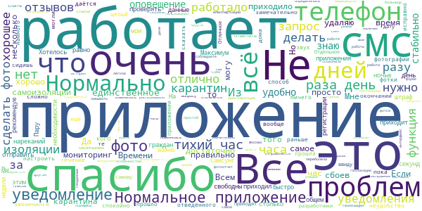
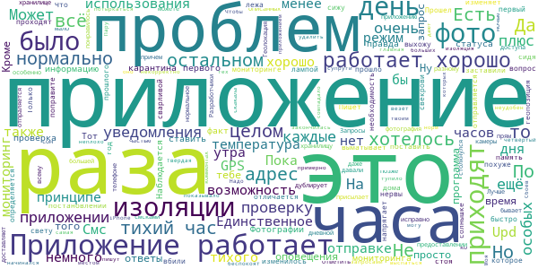
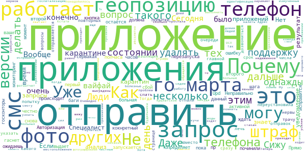
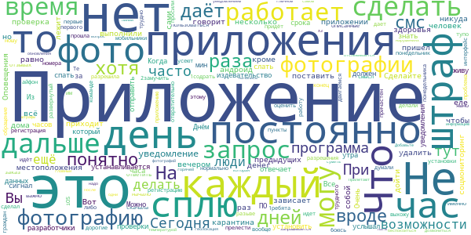
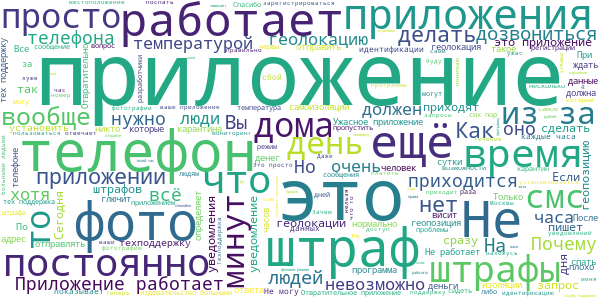

# Социальный мониторинг
App version ``2.0.1``

Analyzed with [covid-apps-observer](http://github.com/covid-apps-observer) project, version ``0.1``

## App overview
| | |
|-------------------------|-------------------------| 
| **Name**&nbsp;&nbsp;&nbsp;&nbsp;&nbsp;&nbsp;&nbsp;&nbsp;&nbsp;&nbsp;&nbsp;&nbsp;&nbsp;&nbsp;&nbsp;&nbsp;&nbsp;&nbsp;&nbsp;&nbsp;&nbsp;&nbsp;&nbsp;&nbsp;&nbsp;&nbsp;&nbsp;&nbsp;&nbsp;&nbsp;&nbsp;&nbsp;&nbsp;&nbsp;&nbsp;&nbsp;&nbsp;&nbsp;&nbsp;&nbsp;  | Социальный мониторинг |
| **Unique identifier** | ru.mos.socmon |
| **Link to Google Play** | [https://play.google.com/store/apps/details?id=ru.mos.socmon](https://play.google.com/store/apps/details?id=ru.mos.socmon) |
| **Summary**  | Приложение для контроля за соблюдением гражданами режима изоляции на дому |
| **Privacy policy** | [https://www.mos.ru/privacypolicy/socmon/](https://www.mos.ru/privacypolicy/socmon/) |
| **Latest version** | 2.0.1 |
| **Last update** | 2021-05-11 08:12:53 |
| **Recent changes** | Версия 2.0.1 сборка 1638 |
| **Installs**  | 100 000+ |
| **Category** | Медицина |
| **First release** | 22 апр. 2020 г. |
| **Size**  | 15M |
| **Supported Android version**  | 6.0 и выше |

### Description
> Приложение «Социальный мониторинг» создано для пациентов с подтвержденным диагнозом COVID-19 и граждан контактировавших с ними, проживающих в Москве и соблюдающих предписанный им режим изоляции. С его помощью пациент информирует город о добросовестном соблюдении карантина.
 При регистрации пользователь подтверждает номер телефона, делает фотографию, геолокация (местонахождение) отправляется автоматически. Это нужно для того, чтобы проверить, находится ли пользователь в той же локации, которую указал в согласии, выбирая лечение на дому.
 Чтобы у пользователя не было возможности оставить смартфон дома и выйти на улицу без него, приложение в случайное время присылает СМС-уведомления с запросом дополнительного подтверждения — для этого потребуется сделать селфи.
 Если пользователь покидает исходную геолокацию или не реагирует на уведомления, система предупреждает городские службы о возможном нарушении режима изоляции.
 Личные данные, которые пользователь передает сервису, определены в согласии на получение медицинской помощи на дому и соблюдение режима изоляции либо в постановлении главного санитарного врача города Москвы. Все данные, которые пользователь передает приложению, хранятся в защищенном виде на серверах Департамента информационных технологий и используются в строгом соответствии с федеральным законом № 152-ФЗ "О персональных данных".

### User interface
The developers of the app provide the following screenshots in the Google play store.
| | | |
|:-------------------------:|:-------------------------:|:-------------------------:|
 |   |   |   | 
 |   |  

## Development team
In the following we report the main information provided by the development team in the Google play store.

| | |
|-------------------------|-------------------------|
| **Developer**  | Информационный город ГКУ |
| **Website**  | [https://www.mos.ru/city/projects/monitoring/](https://www.mos.ru/city/projects/monitoring/) |
| **Email** | socialmonitoring@mos.ru |
| **Physical address**  | - |
| **Other developed apps**  | [https://play.google.com/store/apps/developer?id=%D0%98%D0%BD%D1%84%D0%BE%D1%80%D0%BC%D0%B0%D1%86%D0%B8%D0%BE%D0%BD%D0%BD%D1%8B%D0%B9+%D0%B3%D0%BE%D1%80%D0%BE%D0%B4+%D0%93%D0%9A%D0%A3](https://play.google.com/store/apps/developer?id=%D0%98%D0%BD%D1%84%D0%BE%D1%80%D0%BC%D0%B0%D1%86%D0%B8%D0%BE%D0%BD%D0%BD%D1%8B%D0%B9+%D0%B3%D0%BE%D1%80%D0%BE%D0%B4+%D0%93%D0%9A%D0%A3) |

## Android support

| | |
|-------------------------|-------------------------|
| **Declared target Android version**  | Android10, version 10 (API level 29) |
| **Effective target Android version**  | Android10, version 10 (API level 29) |
| **Minimum supported Android version**  | Marshmallow, version 6.0 (API level 23) |
| **Maximum target Android version**  | - |

The larger the difference between the minimum and maximum supported Android versions, the better. A larger difference means a wider audience. For example, old phones have a very low Android version, so a high minimum supported Android version means that the app cannot be used by users with old phones, thus leading to accessibility problems. 

## Requested permissions

In the following we report the complete list of the permissions requested by the app. 

| **Permission** | **Protection level** | **Description** | 
|-------------------------|-------------------------|-------------------------|
 **android.permission ACCESS_BACKGROUND_LOCATION** | :warning:**Dangerous** | Allows an app to access location in the background. 
 **android.permission ACCESS_FINE_LOCATION** | :warning:**Dangerous** | Allows an app to access precise location. 
 **android.permission ACCESS_NETWORK_STATE** | Normal | Allows applications to access information about networks. 
 **android.permission CAMERA** | :warning:**Dangerous** | Required to be able to access the camera device. 
 **android.permission FOREGROUND_SERVICE** | Normal | Allows a regular application to use Service.startForeground. 
 **android.permission INTERNET** | Normal | Allows applications to open network sockets. 
 **android.permission READ_EXTERNAL_STORAGE** | :warning:**Dangerous** | Allows an application to read from external storage. 
 **android.permission RECEIVE_BOOT_COMPLETED** | Normal | Allows an application to receive the Intent.ACTION_BOOT_COMPLETED that is broadcast after the system finishes booting. 
 **android.permission REQUEST_IGNORE_BATTERY_OPTIMIZATIONS** | Normal | Permission an application must hold in order to use Settings.ACTION_REQUEST_IGNORE_BATTERY_OPTIMIZATIONS. 
 **android.permission USE_FULL_SCREEN_INTENT** | Normal | Required for apps targeting Build.VERSION_CODES.Q that want to use notification full screen intents. 
 **android.permission WAKE_LOCK** | Normal | Allows using PowerManager WakeLocks to keep processor from sleeping or screen from dimming. 
 **android.permission WRITE_EXTERNAL_STORAGE** | :warning:**Dangerous** | Allows an application to write to external storage. 
 **com.google.android.c2dm.permission RECEIVE** | - | - 
 **com.google.android.finsky.permission BIND_GET_INSTALL_REFERRER_SERVICE** | - | - 
 **com.msk.socmon PERMISSION** | - | - 

## Mentioned servers

| **Server** | **Registrant** | **Registrant country** | **Creation date** | 
|-------------------------|-------------------------|-------------------------|-------------------------|
 | adobe.com | Adobe Inc. | :us: US | 1986-11-17 05:00:00 |
 | googlesyndication.com | Google LLC | :us: US | 2003-01-21 06:17:24 |
 | google.com | Google LLC | :us: US | 1997-09-15 04:00:00 |
 | googleadservices.com | Google LLC | :us: US | 2003-06-19 16:34:53 |
 | app-measurement.com | Google LLC | :us: US | 2015-06-19 20:13:31 |
 | mos.ru | - | - | 1996-12-23 09:49:03 |
 | crashlytics.com | Google LLC | :us: US | 2011-01-21 15:30:40 |

## Security analysis 

Below we report the main security warnings raised by our execution of the [Androwarn](https://github.com/maaaaz/androwarn) security analysis tool.

**Connection interfaces exfiltration**
> - This application reads details about the currently active data network 
> - This application tries to find out if the currently active data network is metered 

**Telephony services abuse**
> - This application makes phone calls 

**Suspicious connection establishment**
> - This application opens a Socket and connects it to the remote address '; port is out of range' on the 'N/A' port  
> - This application opens a Socket and connects it to the remote address 'Ljava/net/Proxy;->type()Ljava/net/Proxy$Type;' on the 'N/A' port  
> - This application opens a Socket and connects it to the remote address 'Lu/b/a/a/a;->v(Ljava/lang/String;)Ljava/lang/StringBuilder;' on the 'N/A' port  
> - This application opens a Socket and connects it to the remote address 'Method sendUrgentData() is not supported.' on the 'N/A' port  
> - This application opens a Socket and connects it to the remote address 'Method setHandshakeTimeout() is not supported.' on the 'N/A' port  
> - This application opens a Socket and connects it to the remote address 'Method setOOBInline() is not supported.' on the 'N/A' port  
> - This application opens a Socket and connects it to the remote address 'Method setSoWriteTimeout() is not supported.' on the 'N/A' port  
> - This application opens a Socket and connects it to the remote address 'Socket closed' on the 'N/A' port  
> - This application opens a Socket and connects it to the remote address 'Socket is closed' on the 'N/A' port  
> - This application opens a Socket and connects it to the remote address 'Socket is closed.' on the 'N/A' port  
> - This application opens a Socket and connects it to the remote address 'Socket is not connected.' on the 'N/A' port  
> - This application opens a Socket and connects it to the remote address 'socket is closed' on the 'N/A' port  
> - This application opens a Socket and connects it to the remote address 'timeout' on the 'N/A' port  

**Code execution**
> - This application loads a native library: 'conscrypt_gmscore_jni' 
> - This application loads a native library: 'conscrypt_jni' 
> - This application loads a native library: 'tool-checker' 
> - This application executes a UNIX command 
> - This application executes a UNIX command containing this argument: 'getprop' 
> - This application executes a UNIX command containing this argument: 'mount' 

## User ratings and reviews

Below we provide information about how end users are reacting to the app in terms of ratings and reviews in the Google Play store.

### Ratings

The Социальный мониторинг app has been installed by more than **100000** times. At this time, **10580** rated the app and its average score is **1.4129213**. Below we show the distribution of the ratings across the usual star-based rating of Google Play

:star::star::star::star::star:: 693

:star::star::star::star:: 227

:star::star::star:: 317

:star::star:: 277

:star:: 9066

### Reviews 

#### 5-star reviews

> Молодцы! Учли ошибки - теперь смс высылают с 11 до 20 часов. Можно отметить 2 часа в день, когда смс не будут приходить. На ответ даётся целый час. Если геолокация определяется телефоном неверно - можно её выключить и снова включить, а приложение даёт возможность пересылать снимок пока она не определится верно (было 2 раза). Один раз пришло смс, а приложение не активизировалось - техподдержка быстро всё решила. Батарею не разряжает. После ужасов, которые читал программа порадовала.  :date: __2021-07-18 18:33:17__

> Не знаю, возможно мне повезло, но приложение работало отлично, геолокацию приложение определяло мгновенно, а фотографию меньше чем за минуту. Единственное что, сделайте изменение фона или чтото типо того, чтобы было понятно, когда уже приложение больше ненужно.  :date: __2021-07-16 11:22:58__

> Сбоев в приложении не наблюдала. Все хорошо работает  :date: __2021-07-13 16:53:58__

> Не знаю, повезло ли мне или нет, но проблем с приложением у меня не было. Запросы приходили 3-4 раза в день, фотография и геолокация отправлялась секунд за 5. Запросы не приходят с 22 ночи и до 9 утра, по этому со сном проблем не было.  :date: __2021-07-08 08:56:02__

> Вроле работает без претензий. Но я пропустил одно уведомление. Кто-то сталкивался с таким? Придет ли штраф? Точнее не пропустил, а проспал  :date: __2021-07-07 19:56:18__

> У меня зависло приложение. Что делать?  :date: __2021-07-03 20:30:52__

> Ожидал глючности и массы проблем с этим приложением, особенно после отзывов. Оказалось не все так плохо. Особых нареканий к работе у меня нет  :date: __2021-06-30 16:30:46__

> Приложение перестало работать и выслать фото и локацию не представляется возможным . Вчера 28 всё работало.  :date: __2021-06-29 13:15:53__

> Адекватное, минималистичное приложение с понятным функцилналом. Никаких проблем при эксплуатации не замечено.  :date: __2021-06-27 19:45:29__

> Очень странный клон Инстаграмма, жду когда разработчики добавят функции социальной сети... Лайки, дизлайки, подписки...  :date: __2021-06-26 12:46:05__

#### 4-star reviews

> Иногда геопозицию не с первого раза отправляет, приходится тут же повторно идентификацию проходить. Но в целом это не проблема  :date: __2021-07-06 13:00:30__

> Если говорить не о всей бесючей системе мучения больных людей, а конкретно о приложении, то: Комфортно использовать (запросы приходят 3-4 раза за день, что не сильно напрягает) Практически не глючит (были тех проблемы только первый день, на работу телефона особо не влияет) С 22:00 до 9:00 как и обещали запросы не приходят Классная функция "тихий час", которая дает 2 часа поспать и не беспокоиться о запросах В дисплее ничего лишнего, нет мешающих кнопок, все доступно  :date: __2021-07-05 17:00:50__

> Очень нехватает нотификаций о тех. сбоях. Так же нехватает собственного оповещения об отбивке. Смс оповещение всетаки не то. Нехватает счетчика оповещений. В дополнении к тихому часу мб стоит разграничить отбивки по времени. С 9 до 11, с 13 до 15 и т.д., т.е. 2/2, чтобы можно было поспать.  :date: __2021-07-05 13:42:47__

> 1. Пришлось установить сирену на СМС, чтобы не пропускать извещения. Жаль, что она не вмонтирована в само приложение, чтобы другие СМС-ки не беспокоили попусту, а то уже снится, что пропустил запрос геолокации! 🙈 Единственный плюс - что хоть даётся час на ответ! 2. Какой смысл присылать запрос местонахождения, когда вызван врач на дом? Где ещё-то я могу быть? 🤷‍♂️  :date: __2021-06-25 15:48:01__

> Отличная программа! Свои функции выполняет, очень все понравилось! Поздравляю разработчиков с успехом и желаю им, а также всем, кто приложил силы к созданию программы - всенепременно лично воспользоваться своим творением! Это ведь так забавно, когда тебе очень плохо, а ты должен следить за запросами отправить фото! Или когда ты уже здоров, но не можешь выйти из дома даже в магазин, потому что "ошейник короток", а за окном +35 и дома нечем дышать. Обязательно воспользуйтесь своим ПО, на здоровье!  :date: __2021-06-25 00:27:12__

> Приложение в целом работает хороше, проблемы возникают на сервере. Техническая поддержка справляется на 100%  :date: __2021-06-23 19:34:43__

> У меня работало приложение исправно.но вот время тихого часа я бы увеличила, пусть будет 4 часа, а не 2. Один раз проспала и не успела отослать данные, но штраф не пришёл,т.к. всего один раз вовремя не отправила.  :date: __2021-06-21 15:57:13__

> Прошел год . И вот опять я на мониторинге. Что изменилось? Да ни чего . Адрес в приложении отличается от того что в постановлении ( если мне память не изменяет то они вбили первый адрес с прошлого раза) а теперь ещё фото не проходят проверку . На свету , на солнышке, под лампой, лёжа , стоя , сидя ... Пишет не прошло проверку и все . И вот вопрос. Я и так дома сижу, не выхожу, заставили поставить приложение которое выматывает нервы похуже сварливой свекрови. Может поправите его ???  :date: __2021-06-16 14:12:17__

> Приложение работает нормально, геопозиция определяется, всё быстро отправляется. Только очень напрягает необходимость в предоставлении доступа ко всему хранилищу на телефоне. Разработчики, можете ответить зачем приложению всё хранилище, когда отпраляется только фотография с камеры?  :date: __2021-06-16 13:35:24__

> Не столкнулся с большей частью проблем, описанных в комментах. В целом, нормальное приложение, уведомления присылает исправно, плюс всегда все дублирует смсками. Запросы причем приходят не прям каждые 2 часа, бывает по-разному, чуть позже даже, да и в целом особых проблем не доставляют. Единственное, что не понравилось это режим тихого часа, потому что два часа на тот же дневной сон, особенно если ночью температура скакала - это мало. Лучше уж давали бы тихий час на 4-6 часов, но раз в три дня.  :date: __2021-06-15 12:09:39__

#### 3-star reviews

> Основное впечатление: приложение истощает психические ресурсы, необходимые для лечения от короновируса. Одна из причин - постоянная тревога из-за боязни пропустить уведомление, зависимость от телефона. Прошу разработчиков добавить возможность установки произвольной мелодии уведомлений, с настраиваемой громкостью отдельно от других приложений. А также, настраиваемый повтор уведомлений, чтобы точно не пропустить. На мой взгляд, это должно снизить вред, наносимый пользователям приложения.  :date: __2021-07-18 16:55:03__

> Здравствуйте,с 01.07.2021г болею ковид,отмечаюсь в соц.мониторинг ежедневно.сегодня ещё неприш ел неодин запрос об отметки,это сбой или ещё позже будут вопросы???  :date: __2021-07-17 15:31:31__

> Идея для разрабов, добавьте в приложение таймер по отстчету сколько дней осталось в карантине, по окончанию которого можно удалять данный "шедевр" с телефона. Это добавит удобства пользователям и снизит число вопросов на ваши контакты поддержки.  :date: __2021-07-16 10:00:23__

> Отбросим требование об установке данного приложения ) К Июлю 21 года , вроде как доработали что-то, хотя висит обновление только от мая. В любом случае, есть что ещё нужно доработать и самое главное это геолокация. Пару-тройку раз за две недели, приложение показывало, что был дома и через минуту уже в трёх километрах от него. Второй момент, это сбой геолокации при отправке своих данных. Загрузил фото,а геолокация не передалась. И так по два раза приходится загружать.  :date: __2021-07-13 14:11:16__

> Где можно в приложении посмотреть, сколько осталось дней до конца самоизоляции?  :date: __2021-07-10 10:51:59__

> Удалилась история за последние пять дней, смс не было 2 дня, пришёл штраф просто ни за что. Великолепно. А хотя сначала всё работало отлично  :date: __2021-07-10 09:45:55__

> Неправильно определяет геопозицию!  :date: __2021-07-04 17:19:18__

> Авторизация не происходит уже несколько часов, приложение не запускается дальше второго шага, что с этим делать?  :date: __2021-07-03 18:21:14__

> Прямо сейчас в данный кокнретный момент в 14:10 30.06.21 я не могу отправить геопозицию, т.к. приложение выдает ошибку, пр попытке отправить снова, кнопка "отправить" гаснет и остаётся не активной до перезапуска приложения. Upd: починили, сбой на серваках, честно, не такого ожидаешь от госконторы  :date: __2021-07-02 11:11:37__

> В первый же день второй мониторинг не может отправить геопозицию. Почему я должна больная ждать пока исправится ваши баги? Уже полчаса не могу геопозицию отправить. Даже приложение переустановила. Вместо того чтоб лечь спать трачу нервы на попытку повторных отправок. В тех поддержку не дозвониться, вопрос в тех поддержку не отправляется  :date: __2021-06-30 13:35:58__

#### 2-star reviews

> Спустя год тоже сбои при передаче данных.Фото не проходит проверку.Геолокация пройдена.На кухне геолокация не проходит.В одной квартире в разных комнатах геолокация разная.Издевка,чтобы штраф применять? При первом звонке,по указ.тел в приложении, после разговора сброс.Со второго звонка мне оказали помощь.Спасибо.Для нервной системы стресс,конечно.За год мое лицо не могло так измениться, чтобы у робота не пройти проверку.Странная идентификация по фото.Складывается впечатление,что не доработано  :date: __2021-07-17 12:26:20__

> Авторы- рукожопы. Что-то там анализируют по фото и местоположению...но тупы настолько, что в специализированном приложении не могут распознать человека в дыхательной маске и на территории больницы... путь очень многих захужевших... при этом, маски везде одинаковы.. а адреса больниц стандартны... вы чо там анализируете и как, если вы 2+2 сложить не можете!?  :date: __2021-07-17 00:40:04__

> Как выбрать для фото основную камеру? Мне нужно фотографировать другого человека. С фронтальной камеры это делать неудобно.  :date: __2021-07-14 19:37:47__

> Служба технической поддержки не работает никто не подходит к телефону, а робот дает безполезные советы  :date: __2021-07-14 16:12:22__

> 13.07.21 установил приложение. 14.07.21 система до сих пор проверяет.  :date: __2021-07-14 15:56:14__

> Не проходит проверку фотография? Что за дичь?  :date: __2021-07-12 16:58:38__

> Фотография упорно не проходит проверку, хотя сделана по всем правилам, освещение хорошее, одна и та же комната и ракуср. Исправьте уже тех.ошибку в приложении! Сколько можно мучать больных людей!!!  :date: __2021-07-11 16:35:13__

> Почему нет нигде упоминания, что приложение не будет работать на устройстве с root правами?  :date: __2021-07-11 08:20:21__

> Приложение, конечно, ни при чем. Вопрос к чиновникам, которые придумали такое. Понятно, что с соц.ответственностью в обществе беда и очень многие не сдают тесты, чтоб не получить положительный с карантином впридачу. Самое неприятное, что человек может себя чувствовать плохо. Я болею без температуры, но с дикой слабостью. Я хочу спать постоянно. Сегодня Заводила будильник каждые 50 минут, чтоб не пропустить фото-контроль. Это очень напрягает!!!  :date: __2021-07-03 19:18:22__

> надо приложение дорабатывать. Уведомлений не слышно, не видно. Чтобы не пропускать , надо зависать постоянно в телефоне и видеть момент прихода уведомления. Сейчас с отметкой опоздала на 5 минут. Телефон лежал в стороне и не знала, что пора делать сельфи)  :date: __2021-07-03 17:42:00__

#### 1-star reviews

> Это не просто отстой. Это геноцид и дискриминация. С температурой и пневмонией, надо что то слать, тут не сдохнуть бы. Помимо штрафов ещё и отказ от мед.обслуживания. С какого такого? Приложение не установил, можешь помирать спокойно?! Толку от этого приложения? Днем контроль, а вечером гуляй заражай всех и вся?  :date: __2021-07-19 13:45:23__

> Оно не включается)  :date: __2021-07-19 09:44:27__

> Не работает  :date: __2021-07-18 16:28:36__

> Приложение глючит постоянно, то фото проходит проверку по часу, то геолакацию определяет чуть ли не в пустыне сахара. Когда обращаешься в техническую поддержку, то никто ничего внятно объяснить не может, так как "специалисты" сами не знают как сервис работает.  :date: __2021-07-18 16:15:46__

> Отвратительно выстроена работа. Третьи сутки не могут изменить ошибочный адрес. И четвёртый раз обещают сделать это в ближайшее время несмотря на зафиксированое обращение.  :date: __2021-07-18 13:22:42__

> Три раза скачала,кодов аж шесть раз водила и толку ноль,встала на стр- после ведение кода.А теперь иза тупой программы штраф наложат!!! Полностью такаеже проблема как у Сергея клиентом с низу!!!  :date: __2021-07-18 13:04:05__

> Служба поддержки переустановите. 2 раза и оно по прежнему не работает. Я стою на пункте 2 при регистрации. Я на самоизоляции с 29. С 4го играюсь с приложением- как подписал бумаги. Сегодня 18е.... Не работает!!!! Не подписывайте! Сидите чесно просто без этой херни!  :date: __2021-07-18 12:21:28__

> Кошмарное приложение! Мало того, что всё это время сидишь дёргаешься, что-бы не проспать идентификацию, так ещё после стандартного обновления версии miui для redmi note 9 pro, это приложение перестало работать! Оно просто начинает зависать и не сворачивается, от чего зависает и телефон. В тех поддержке сказали, что привезут другой телефон. Но только я активный пользователь и из-за этой изоляции приходится пользоваться онлайн сервисами доставки и сбербанка. После этого всё превращается в ещё боль  :date: __2021-07-18 10:50:23__

> Судя по геолокации я гуляю по кремлю, приложение ни как не пытается определить местоположение, в гугл и яндекс картах отображается всё коректно.  :date: __2021-07-18 10:06:31__

> Висит на проверке номера 4 день  :date: __2021-07-18 08:45:11__

