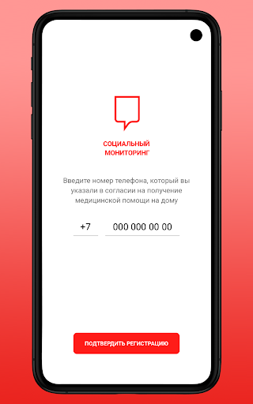
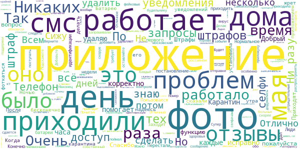
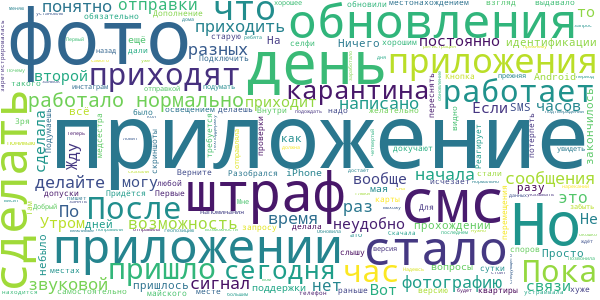
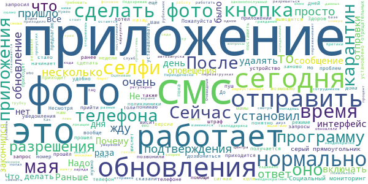
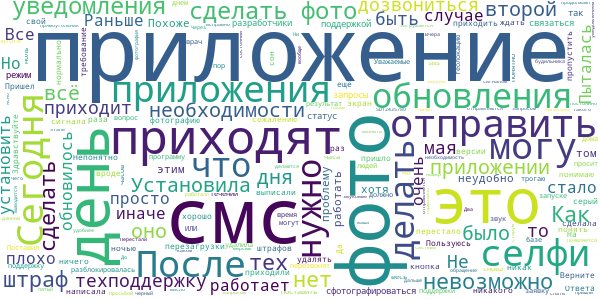
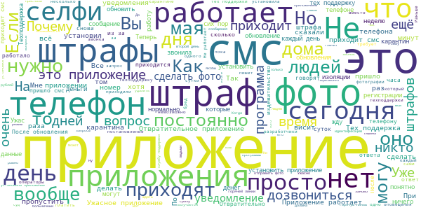

# Социальный мониторинг
App version ``Зависит от устройства``

Analyzed with [covid-apps-observer](http://github.com/covid-apps-observer) project, version ``0.1``

## App overview
| | |
|-------------------------|-------------------------| 
| **Name**&nbsp;&nbsp;&nbsp;&nbsp;&nbsp;&nbsp;&nbsp;&nbsp;&nbsp;&nbsp;&nbsp;&nbsp;&nbsp;&nbsp;&nbsp;&nbsp;&nbsp;&nbsp;&nbsp;&nbsp;&nbsp;&nbsp;&nbsp;&nbsp;&nbsp;&nbsp;&nbsp;&nbsp;&nbsp;&nbsp;&nbsp;&nbsp;&nbsp;&nbsp;&nbsp;&nbsp;&nbsp;&nbsp;&nbsp;&nbsp;  | Социальный мониторинг |
| **Unique identifier** | ru.mos.socmon |
| **Link to Google Play** | [https://play.google.com/store/apps/details?id=ru.mos.socmon](https://play.google.com/store/apps/details?id=ru.mos.socmon) |
| **Summary**  | Приложение для контроля за соблюдением гражданами режима самоизоляции на дому |
| **Privacy policy** | [https://www.mos.ru/privacypolicy/socmon/](https://www.mos.ru/privacypolicy/socmon/) |
| **Latest version** | Зависит от устройства |
| **Last update** | 2020-05-25 11:40:06 |
| **Recent changes** | Изменен механизм уведомления о необходимости отправить фотографию. Уведомления приходят в СМС-сообщении, при получении уведомления необходимо открыть приложение и сделать свою фотографию. Кнопка «Сделать фотографию» будет доступна всегда, а перед отправкой фотографии, Вы сможете переснять ее, если будет необходимо. |
| **Installs**  | 50 000+ |
| **Category** | Медицина |
| **First release** | 22 апр. 2020 г. |
| **Size**  | 46M |
| **Supported Android version**  | 6.0 и выше |

### Description
> Приложение «Социальный мониторинг» создано для пациентов с подтвержденным диагнозом COVID-19, выбравших лечение на дому, граждан, контактировавших с ними, и горожан с проявлениями острых респираторных заболеваний, проживающих в Москве и соблюдающих предписанный им режим изоляции. С его помощью пациент информирует город о добросовестном соблюдении карантина. 
 При регистрации пользователь подтверждает номер телефона, делает фотографию, геолокация (местонахождение) отправляется автоматически. Это нужно для того, чтобы проверить, находится ли пользователь в той же локации, которую указал в согласии, выбирая лечение на дому. 
 Чтобы у пользователя не было возможности оставить смартфон дома и выйти на улицу без него, приложение в случайное время присылает пуш-уведомления с запросом дополнительного подтверждения — для этого потребуется сделать селфи.
 Если пользователь покидает исходную геолокацию или не реагирует на уведомления, система предупреждает городские службы о возможном нарушении режима изоляции.
 Личные данные, которые пользователь передает сервису, определены в согласии на получение медицинской помощи на дому и соблюдение режима изоляции либо в постановлении главного санитарного врача города Москвы. Гражданин обязан подписать документ, если выбирает лечение на дому или если он контактировал с заболевшим и должен соблюдать режим изоляции. Он указывает ФИО, адрес, по которому обязуется находиться на протяжении всего периода лечения или изоляции, и номер мобильного телефона. Также гражданин дает согласие на осуществление фотосъемки и предъявление документа, удостоверяющего личность.
 Все данные, которые пользователь передает приложению, хранятся в защищенном виде на серверах Департамента информационных технологий. После окончания лечения или срока действия режима изоляции эти данные уничтожаются.

### User interface
The developers of the app provide the following screenshots in the Google play store.
| | | |
|:-------------------------:|:-------------------------:|:-------------------------:|
 |   |   |   | 
 |   |  

## Development team
In the following we report the main information provided by the development team in the Google play store.

| | |
|-------------------------|-------------------------|
| **Developer**  | Информационный город ГКУ |
| **Website**  | [http://socialmonitoring.mos.ru/](http://socialmonitoring.mos.ru/) |
| **Email** | socialmonitoring@mos.ru |
| **Physical address**  | - |
| **Other developed apps**  | [https://play.google.com/store/apps/developer?id=%D0%98%D0%BD%D1%84%D0%BE%D1%80%D0%BC%D0%B0%D1%86%D0%B8%D0%BE%D0%BD%D0%BD%D1%8B%D0%B9+%D0%B3%D0%BE%D1%80%D0%BE%D0%B4+%D0%93%D0%9A%D0%A3](https://play.google.com/store/apps/developer?id=%D0%98%D0%BD%D1%84%D0%BE%D1%80%D0%BC%D0%B0%D1%86%D0%B8%D0%BE%D0%BD%D0%BD%D1%8B%D0%B9+%D0%B3%D0%BE%D1%80%D0%BE%D0%B4+%D0%93%D0%9A%D0%A3) |

## Android support

| | |
|-------------------------|-------------------------|
| **Declared target Android version**  | Android10, version 10 (API level 29) |
| **Effective target Android version**  | Android10, version 10 (API level 29) |
| **Minimum supported Android version**  | Marshmallow, version 6.0 (API level 23) |
| **Maximum target Android version**  | - |

The larger the difference between the minimum and maximum supported Android versions, the better. A larger difference means a wider audience. For example, old phones have a very low Android version, so a high minimum supported Android version means that the app cannot be used by users with old phones, thus leading to accessibility problems. 

## Requested permissions

In the following we report the complete list of the permissions requested by the app. 

| **Permission** | **Protection level** | **Description** | 
|-------------------------|-------------------------|-------------------------|
 **android.permission ACCESS_BACKGROUND_LOCATION** | :warning:**Dangerous** | Allows an app to access location in the background. 
 **android.permission ACCESS_COARSE_LOCATION** | :warning:**Dangerous** | Allows an app to access approximate location. 
 **android.permission ACCESS_FINE_LOCATION** | :warning:**Dangerous** | Allows an app to access precise location. 
 **android.permission ACCESS_NETWORK_STATE** | Normal | Allows applications to access information about networks. 
 **android.permission ACCESS_WIFI_STATE** | Normal | Allows applications to access information about Wi-Fi networks. 
 **android.permission CAMERA** | :warning:**Dangerous** | Required to be able to access the camera device. 
 **android.permission CHANGE_WIFI_STATE** | Normal | Allows applications to change Wi-Fi connectivity state. 
 **android.permission FOREGROUND_SERVICE** | Normal | Allows a regular application to use Service.startForeground. 
 **android.permission INTERNET** | Normal | Allows applications to open network sockets. 
 **android.permission PREVENT_POWER_KEY** | - | - 
 **android.permission READ_EXTERNAL_STORAGE** | :warning:**Dangerous** | Allows an application to read from external storage. 
 **android.permission RECEIVE_BOOT_COMPLETED** | Normal | Allows an application to receive the Intent.ACTION_BOOT_COMPLETED that is broadcast after the system finishes booting. 
 **android.permission REQUEST_IGNORE_BATTERY_OPTIMIZATIONS** | Normal | Permission an application must hold in order to use Settings.ACTION_REQUEST_IGNORE_BATTERY_OPTIMIZATIONS. 
 **android.permission USE_FULL_SCREEN_INTENT** | Normal | Required for apps targeting Build.VERSION_CODES.Q that want to use notification full screen intents. 
 **android.permission VIBRATE** | Normal | Allows access to the vibrator. 
 **android.permission WAKE_LOCK** | Normal | Allows using PowerManager WakeLocks to keep processor from sleeping or screen from dimming. 
 **android.permission WRITE_EXTERNAL_STORAGE** | :warning:**Dangerous** | Allows an application to write to external storage. 
 **com.google.android.c2dm.permission RECEIVE** | - | - 
 **com.google.android.finsky.permission BIND_GET_INSTALL_REFERRER_SERVICE** | - | - 

## Mentioned servers

| **Server** | **Registrant** | **Registrant country** | **Creation date** | 
|-------------------------|-------------------------|-------------------------|-------------------------|
 | googlesyndication.com | Google LLC | :us: US | 2003-01-21 06:17:24 |
 | google.com | Google LLC | :us: US | 1997-09-15 04:00:00 |
 | googleadservices.com | Google LLC | :us: US | 2003-06-19 16:34:53 |
 | app-measurement.com | Google LLC | :us: US | 2015-06-19 20:13:31 |
 | crashlytics.com | Google LLC | :us: US | 2011-01-21 15:30:40 |
 | mos.ru | - | - | 1996-12-23 09:49:03 |
 | googleapis.com | Google LLC | :us: US | 2005-01-25 17:52:26 |

## Security analysis 

Below we report the main security warnings raised by our execution of the [Androwarn](https://github.com/maaaaz/androwarn) security analysis tool.

**Connection interfaces exfiltration**
> - This application reads details about the currently active data network 
> - This application tries to find out if the currently active data network is metered 

**Suspicious connection establishment**
> - This application opens a Socket and connects it to the remote address '; port is out of range' on the 'N/A' port  
> - This application opens a Socket and connects it to the remote address 'Ljava/net/Proxy;->type()Ljava/net/Proxy$Type;' on the 'N/A' port  
> - This application opens a Socket and connects it to the remote address 'Lk/b/a/a/a;->a(Ljava/lang/String;)Ljava/lang/StringBuilder;' on the 'N/A' port  
> - This application opens a Socket and connects it to the remote address 'Method sendUrgentData() is not supported.' on the 'N/A' port  
> - This application opens a Socket and connects it to the remote address 'Method setHandshakeTimeout() is not supported.' on the 'N/A' port  
> - This application opens a Socket and connects it to the remote address 'Method setOOBInline() is not supported.' on the 'N/A' port  
> - This application opens a Socket and connects it to the remote address 'Method setSoWriteTimeout() is not supported.' on the 'N/A' port  
> - This application opens a Socket and connects it to the remote address 'Socket closed' on the 'N/A' port  
> - This application opens a Socket and connects it to the remote address 'Socket is closed' on the 'N/A' port  
> - This application opens a Socket and connects it to the remote address 'Socket is closed.' on the 'N/A' port  
> - This application opens a Socket and connects it to the remote address 'Socket is not connected.' on the 'N/A' port  
> - This application opens a Socket and connects it to the remote address 'socket is closed' on the 'N/A' port  

**Code execution**
> - This application loads a native library 
> - This application loads a native library: 'Ljava/lang/String;->valueOf(Ljava/lang/Object;)Ljava/lang/String;' 
> - This application loads a native library: 'conscrypt_gmscore_jni' 
> - This application loads a native library: 'conscrypt_jni' 
> - This application executes a UNIX command 
> - This application executes a UNIX command containing this argument: 'getprop' 
> - This application executes a UNIX command containing this argument: 'mount' 

## User ratings and reviews

Below we provide information about how end users are reacting to the app in terms of ratings and reviews in the Google Play store.

### Ratings

The Социальный мониторинг app has been installed by more than **50000** times. At this time, **4847** rated the app and its average score is **2.3059072**. Below we show the distribution of the ratings across the usual star-based rating of Google Play

:star::star::star::star::star:: 1452

:star::star::star::star:: 51

:star::star::star:: 102

:star::star:: 163

:star:: 3077

### Reviews 

#### 5-star reviews

> Сижу на самоизоляции.сначала запрашивали по будильнику.потом обновили приложение-смс приходила.было понятно что надо сделать фото.а сейчас вообще не приходит несколько дней.забыли обо мне(...с 5 мая сижу дома -как мне понять что надо удалить приложение?  :date: __2020-06-01 10:38:00__

> Супер  :date: __2020-06-01 09:19:28__

> Не глючит, по ночам фото не требует.время показывает точно 😂 Почитал отзывы... Очень удивляют отрицательные отзывы где тяжело больные дома... особенно с пневмонией... сдается мне эти отзывы фейковые... и скорее всего не только эти! Всем здоровья! Верните звонок, сообщение не всегда слышно 😔  :date: __2020-06-01 04:43:29__

> Отлично  :date: __2020-05-31 10:24:15__

> Отличный  :date: __2020-05-30 23:18:21__

> Приложение работало исправно. Каждый день, каждые 2-3 часа он мне напоминал о контроле и отправке фото. Так же исправно приходили смс. Карантин закончился, приложение удаляю.  :date: __2020-05-30 23:10:18__

> Отличное приложение помогает россиянам следить за тем чтобы не распростронять вирус  :date: __2020-05-30 22:04:34__

> Отсидел свое. Работало корректно. Штрафов не поймал.  :date: __2020-05-30 16:54:50__

> Добрый день. Подскажите, пожалуйста, как стоит поступать, если надо вызвать скорую и отъехахать вместе с ней сделать кт? Номер тех. поддержки не отвечает. Пожалуйста не оставляйте мой вопрос без внимания. Спасибо! Пс. Приложение работает хорошо. Приходят СМС. Делаю фото. Штрафы пока не приходили.  :date: __2020-05-30 14:19:32__

> Наконец додумались добавить функцию смс уведомлений. Можно не мониторить бесконечно эту приложуху.  :date: __2020-05-29 19:01:04__

#### 4-star reviews

> После обновления совсем стало не понятно. СМС не приходят. Кнопка"сделать фотографию" после селфи не исчезает. А когда делаешь фото,написано"сделать еще раз" Верните старую версию до обновления. Там хоть понятно было. Дополнение. Пока сообщения стали приходить,но иногда не приходят.  :date: __2020-06-01 11:29:11__

> Разобрался.. Подключить все допуски обязательно. Реагирует на перемещения Внутри квартиры!! Фото делайте для начала в разных местах с хорошим освещением. По запросу желательно в том же месте где фото делала медсестра. Первые сутки - на мой взгляд не докучают. Но надо... Придётся потерпеть.. Для споров-делайте скриншоты любой карты с местонахождением во время проверки.  :date: __2020-06-01 08:21:05__

> После майского обновления стало хуже, раньше приложение самостоятельно выдавало звуковой сигнал, теперь по смс, а эти смс я через раз слышу. И после отправки фото было видно, что сейчас не требуется отправки, а теперь такого нет. Зря обновили. Подумаешь дали возможность переснять фото перед отправкой, можно подумать инстаграм😁😁😁  :date: __2020-05-31 23:04:08__

> Добрый день, я понимаю что это хорошее приложение... Но как то неудобно без напоминания... Мне СМС приходит, а я его могу увидеть только через час, ато вообще могу забыть что час назад фото отправляла, прежняя версия больше устраивала.. неудобно стало после обновления!  :date: __2020-05-31 14:56:39__

> Скачала приложение 29.05.2020 после 17:00, зарегистрировалась, но приложение пишет, что телефон находится на подтверждении данных..уже второй час.. Жду. Позвонила в техподдержку, ребята вежливые, сказали, что нужно подождать, что в связи с большим кол-вом заявок регистрация может занять до 24 часов. Утром следующего дня (30.05.2020) приложение заработало, сделала фотографию и отправила. Пока нареканий нет, все работает. Надеюсь, так и будет.  :date: __2020-05-30 08:16:16__

> Меняю с * на \*\*\*\*, в последнем обновление глюки поправили. Не достаёт возможности указывать период сна.  :date: __2020-05-29 21:15:55__

> Первый день работало нормально. Второй без фото. Обновила. Теперь в приложении висит постоянно окошко сделать фото. А запрос на фото по прежнему не приходит . А теперь смс пришло что если не установлю приложение меня ждёт штраф. Вот только приложение стоит с самого начала .то есть четвертый день .!!! И геопозицию ловит. И из дома не выхожу. Почему я должна нервничать из-за кривого приложения ???  :date: __2020-05-29 17:44:17__

> Вопрос разработчикам. Если перестали приходить сообщения о прохождении идентификации, значит ли это что время "карантина" закончилось, и можно передвигаться по городу? Где и как, в какой организации, на сайте или по телефону узнать по какой день наложены ограничения на перемещение?  :date: __2020-05-28 14:45:26__

> Приложение нормально работает, но сегодня утром пришло уведомление по SMS о прохождении идентификации, но в самом приложении кроме заставки часов и кнопки SOS больше ничего небыло. Интересно, теперь ждать штраф? С 24 сняты с карантина сегодня уже 27 число не отключают приложение. Звоню с 25 числа по 3-4 раза в день заявки принимают говорят перезвонят так никто ни разу не перезвонил. Не можем выйти, муж не может закрыть больничный. Вышел-Штраф!!!! Просто ужас.  :date: __2020-05-27 09:24:04__

> Все 14 дней приложение работало нормально. Но совершенно непонятно как от него отключаться. Вот прошли мои 14 дней и что? Оператор говорит можно удалять, но если мой статус не подтвердится, а приложения нет - штраф. Можно как-то сообщать в приложении что наше сотрудничество закончилось?  :date: __2020-05-27 01:00:24__

#### 3-star reviews

> Несмотря на все разрешения и обновления,приложение регулярно отказывается работать в фоновом режиме и начинает заново требовать разные разрешения. Периодически из двух иконок в трее остается одна.это значит,приложение вылетело и хочет разрешаться снова.несмотря на то,что его и обновляли,и разрешали, и вообще стоит рубильник автозапуска при перезагрузках телефона.  :date: __2020-06-01 10:50:45__

> Здоров, но попал сюда... Как законопослушный гражданин установил приложение. Оцениваю скорее работу служб, ибо кода подтверждения жду с 22.05, уже несколько раз переустановил... Техподдержка трубку не берёт и не перезванивает, не смотря на неоднократные уверения сотрудников колл-центра, куда тоже дозвониться очень не просто. Подозреваю что мне нужно лишь в их базе сменить номер телефона. Жду подтверждения данных... Ответ на ответ ниже: ФИО и номера посылал вам на почту неоднократно!  :date: __2020-06-01 08:50:56__

> Несколько дней назад пришло обновление. После обновления изменился интерфейс приложения. Т.е.ранее приходило смс-сообщение, после открываешь приложение и оно готово к отправке фото, т.е. понятно,что пришло время. После отправки появлялось на экране процент заряда, время и определение локации. Сейчас окно приложения в одном режиме.. и ранее, после поступления смс, приложение издавало сигнал - это удобно, не пропустишь. Сейчас, если смс-ку не услышишь, то попадешь на штраф.  :date: __2020-05-31 22:32:09__

> Критики полно, предлагаю: 1.Нужен FAQ в приложении. Очевидные вопросы: "Надо ли 24/7 его включать и караулить уведомления" (не надо, также приходят смски), "Что делать, если пропустил час Х" (отметиться в течение часа) ответа не имеют. Колл-центр был бы неплохо разгружен. 2. Откатите интерфейс назад. Приложение больше не вешает оболочек, это респект. Шизоиды не понимают, почему теперь всегда висит кнопка "сделать фото", это вынос мозга для окружающих. Желаю всем здоровья и крепких нервов ;*  :date: __2020-05-31 21:43:22__

> Установил приложение "Социальный мониторинг". А сегодня мне позвонили из поликлиники и сказали что завтра за мной приедет машина Скорой помощи, которая отвезет меня к ним на КТ. Что мне делать если в это время приложение запросит мои геоданные и фото?  :date: __2020-05-31 20:46:22__

> Последнее обновление вроде облегчило задачу-фоткаться. Было бы замечательно если бы приложение давало знать что его можно спокойно удалять, потому что бывают расхождения в датах.  :date: __2020-05-31 15:05:07__

> Загрузила приложение и оно виснет, открывается одно приложение, телефон горячий, и потом если открываю приложение то обратно невозможно закрыть, ужасно, что такая ситуация и так плохо работает  :date: __2020-05-31 12:55:05__

> Google Play не работает - виснет - ожидание режима скачивания  :date: __2020-05-31 09:19:30__

> Сегодня не работает селфи. Почему-то не получается обновление. При этом приходится целый день нервничать, что сказывается на здоровье. Прошу помощи в нормальной работе "Социального мориторенга".  :date: __2020-05-30 19:24:20__

> Пожалуйста верните громкий звуковой сигнал. Смс звучит тихо и недолго.  :date: __2020-05-30 11:09:45__

#### 2-star reviews

> Фото сделать невозможно, черный экран отправляется, что мне делать?  :date: __2020-05-31 23:40:57__

> В приложении не загружается фотография. После того как сделала фото выводится серый экран. Что делать в этом случае?  :date: __2020-05-31 18:12:59__

> Установила уже пятый день, продолжают слать смс чтоб я его установила! Оно или не работает или ваша система глючит. Ни кнопок ничего, вообще никак не понять в каком оно состоянии  :date: __2020-05-31 15:57:35__

> После обновления приложение перестало звонить, когда нужно сделать селфи. Приходят только смс. В приложении постоянно написано "сделать фото". Раньше такого не было. Через 2 дня стало невозможно делать селфи. Появляется серый прямоугольник и всё. Фото не делаются и не отправляются.  :date: __2020-05-31 14:01:23__

> После" перезагрузки"приложения,второй день не приходят смс с запросом на фото.Чего ждать?штраф? До обновления все работало исправно. Да,и с сигналом будильника,было на много удобнее.  :date: __2020-05-31 12:38:30__

> Все было не так плохо. Ничего не висло, не тормозило, ночью запросов на фото не было. Но уже второй день не приходят СМС с уведомлением о необходимости сделать фото. Два раза написала в техподдержку (обращение SD12435780). Ответа нет. Пыталась дозвониться. На данном этапе мне не ясно, что делать дальше.. ждать штрафов? Написала ещё раз в техподдержку, ответа также нет..  :date: __2020-05-30 22:51:04__

> Я все понимаю, необходимость. Пользуюсь с 15 мая. Сегодня пришло смс на второй номер с просьбой установить приложение, но я им и так пользуюсь... теперь жду штраф.  :date: __2020-05-30 20:37:56__

> Перестали приходить звуковые уведомления после обновления. Верните старую версию.  :date: __2020-05-30 19:17:00__

> Вчера обновилось приложение и сегодня о необходимости сделать фото пришли просто смс, никакого сигнала в самом приложении не было. Как итог: я пропустила 2 запроса, потому что наконец-то спала крепко (суббота как никак). И что теперь - мне за свой здоровый крепкий сон платить штрафы?  :date: __2020-05-30 15:18:59__

> Сегодня приложение обновилось выглядит теперь иначе и теперь никакого сигнала что нужно отправить фото нет, кроме смс, это очень неудобно. Верните прежнее обратно(  :date: __2020-05-30 14:54:26__

#### 1-star reviews

> Скачал приложение, так как пришла смс с уведомлением, что приложение необходимо установить. Приложение не открывается, выдает ошибку, что "Не работает на устройстве с root доступом. Что это значит - не понимаю, другого телефона у меня нет. Что делать? Проблема подключения более не актуальна - меня выписали 30.05.2020. Теперь актуальна проблема отключения. Меня до сих пор не могут отключить от приложения. Создавал заявку SD12475445. Сколько ещё мне здоровым сидеть на изоляции?!  :date: __2020-06-01 11:55:30__

> Говницо программа телефон xiaomi redmi note 5 global version установил смс прилитела вбил код и на этом всё , кому надо пусть каждый день ходят и проверяют сижу дома или нет или пусть на на домашний звонят  :date: __2020-06-01 11:54:44__

> Что делать когда надо идти выписываться в день окончания карантина? Брать с собой телефон и ждать штрафы?  :date: __2020-06-01 11:39:26__

> В общем меня уже вынесли из списка больных. На запрос пропуска выхода на улицу мне его одобрили иьдали этот код. Какого спрашивается черта мне не дает жизни эта ваша ерунда??? Удалю же если, пришлете штраф сразу  :date: __2020-06-01 10:57:14__

> Постановлении аж от 06.05. Прошло даже не 14 , а уже 25 дней моей изоляции, ни одного теста не было у меня положительного. Приложение так и шлëт смс о прохождении индификации. Что делать? !!!!!! Мне на работу выходить надо!!!!! Ужасное приложение, даже после обновления! Жаль нельзя -100 поставить за него!!!!!  :date: __2020-06-01 10:31:51__

> Ужасно работает программа .27.05 уставлен Соц. Мониторинг. До 1 июня ни одного запроса на идентификацию не приходило. Из службы поддержки помочь не смогли. Сами шлем фото в произвольное время во избежании необоснованных штрафов.  :date: __2020-06-01 10:28:20__

> Уж что что, а такие приложения не должны глючить!!! Каждый день я должна заново регистрироваться! И если мне придёт штраф за не своевременное подтверждение местонахождения я подам на вас в суд!!! Не сомневайтесь!  :date: __2020-06-01 10:27:16__

> Вот что за система?! 14 дней Я просидел на карантине!!! При этом тест отрицательный, но выходить нельзя!!! Сегодня меня выписали!!! Но! Уведомления продолжают приходить! Если меня оштрафуют хоть на копейку, я пойду в суд!!! Когда закончится беззаконие? Почему на горячей линии не отключают этот ошейник моментально? Почему я должен бояться штрафов? Я не хочу бегать и доказывать, что я не олень!!! Почему мне нужно что то и где то уточнять? Почему здоровые граждане вынуждены сидеть дома 14 дней?  :date: __2020-06-01 10:17:45__

> Не понимаю людей, которые ставят приложению 5 звёзд, но при это пишут, что у них что-то не работает.  :date: __2020-06-01 07:41:48__

> Отвратительно , если не дай боже мне придётся платить штраф по вине этого недоприложения , я засужу всех , будете очень долго отмываться потом.приложение переустанавливала, смс не приходили и не приходят, по тел тех поддержки девушка диктует номер регистрации жалобы, а воз и ныне там.  :date: __2020-06-01 05:34:19__

