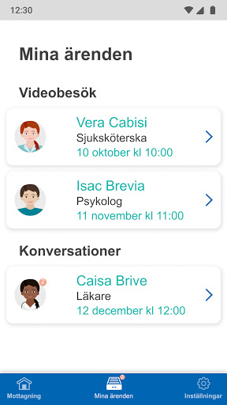
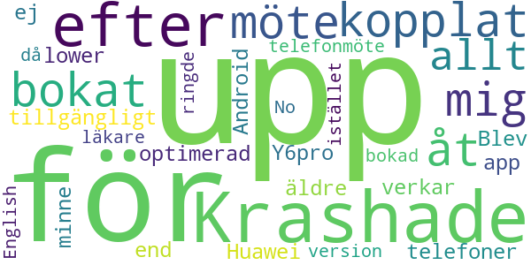

# Din Vård Region Östergötland
App version ``3.31.0``

Analyzed with [covid-apps-observer](http://github.com/covid-apps-observer) project, version ``0.1``

## App overview
| | |
|-------------------------|-------------------------| 
| **Name**&nbsp;&nbsp;&nbsp;&nbsp;&nbsp;&nbsp;&nbsp;&nbsp;&nbsp;&nbsp;&nbsp;&nbsp;&nbsp;&nbsp;&nbsp;&nbsp;&nbsp;&nbsp;&nbsp;&nbsp;&nbsp;&nbsp;&nbsp;&nbsp;&nbsp;&nbsp;&nbsp;&nbsp;&nbsp;&nbsp;&nbsp;&nbsp;&nbsp;&nbsp;&nbsp;&nbsp;&nbsp;&nbsp;&nbsp;&nbsp;  | Din Vård Region Östergötland |
| **Unique identifier** | com.visibagroup.visibacare.regionostergotland |
| **Link to Google Play** | [https://play.google.com/store/apps/details?id=com.visibagroup.visibacare.regionostergotland](https://play.google.com/store/apps/details?id=com.visibagroup.visibacare.regionostergotland) |
| **Summary**  | In the app you can meet healthcare personnel from Region Östergötland directly on your mobile. |
| **Privacy policy** | [https://se.visibacare.com/api/app/v1/config/Android/com.visibagroup.visibacare.regionostergotland/privacypolicy/?langCode=sv](https://se.visibacare.com/api/app/v1/config/Android/com.visibagroup.visibacare.regionostergotland/privacypolicy/?langCode=sv) |
| **Latest version** | 3.31.0 |
| **Last update** | 2021-02-11 09:33:37 |
| **Recent changes** | - |
| **Installs**  | 10,000+ |
| **Category** | Medical |
| **First release** | Apr 11, 2016 |
| **Size**  | Varies with device |
| **Supported Android version**  | 5.1 and up |

### Description
> I appen Din vård kan du boka tid och träffa legitimerad vårdpersonal från Region Östergötland. Kontakta oss via appen vid till exempel förkylning, hosta, hudbesvär, allergi, ögoninflammation eller om du har problem med leder och muskler. 
 Våra läkare kan hjälpa dig med rådgivning, bedömning och akut receptförnyelse. Vi skriver inte ut beroendeframkallande läkemedel. 
 Våra fysioterapeuter kan hjälpa dig med tillfälliga problem i knän, axlar eller andra leder.
 regelbundna kontakter med ordinarie vårdcentral eller fysioterapeut.  
 I appen kan du även träffa vårdpersonal för återbesök eller uppföljning efter överenskommelse.

### User interface
The developers of the app provide the following screenshots in the Google play store.
| | | |
|:-------------------------:|:-------------------------:|:-------------------------:|
 |   |   |   | 
 |  

## Development team
In the following we report the main information provided by the development team in the Google play store.

| | |
|-------------------------|-------------------------|
| **Developer**  | Region Östergötland |
| **Website**  | [http://www.regionostergotland.se/](http://www.regionostergotland.se/) |
| **Email** | digitalavardcentralen@regionostergotland.se |
| **Physical address**  | - |
| **Other developed apps**  | [https://play.google.com/store/apps/developer?id=Region+%C3%96sterg%C3%B6tland](https://play.google.com/store/apps/developer?id=Region+%C3%96sterg%C3%B6tland) |

## Android support

| | |
|-------------------------|-------------------------|
| **Declared target Android version**  | Pie, version 9 (API level 28) |
| **Effective target Android version**  | Pie, version 9 (API level 28) |
| **Minimum supported Android version**  | Lollipop, version 5.0 (API level 21) |
| **Maximum target Android version**  | - |

The larger the difference between the minimum and maximum supported Android versions, the better. A larger difference means a wider audience. For example, old phones have a very low Android version, so a high minimum supported Android version means that the app cannot be used by users with old phones, thus leading to accessibility problems. 

## Requested permissions

In the following we report the complete list of the permissions requested by the app. 

| **Permission** | **Protection level** | **Description** | 
|-------------------------|-------------------------|-------------------------|
 **android.permission ACCESS_NETWORK_STATE** | Normal | Allows applications to access information about networks. 
 **android.permission ACCESS_WIFI_STATE** | Normal | Allows applications to access information about Wi-Fi networks. 
 **android.permission BLUETOOTH** | Normal | Allows applications to connect to paired bluetooth devices. 
 **android.permission BLUETOOTH_ADMIN** | Normal | Allows applications to discover and pair bluetooth devices. 
 **android.permission CAMERA** | :warning:**Dangerous** | Required to be able to access the camera device. 
 **android.permission FOREGROUND_SERVICE** | Normal | Allows a regular application to use Service.startForeground. 
 **android.permission INTERNET** | Normal | Allows applications to open network sockets. 
 **android.permission MODIFY_AUDIO_SETTINGS** | Normal | Allows an application to modify global audio settings. 
 **android.permission READ_EXTERNAL_STORAGE** | :warning:**Dangerous** | Allows an application to read from external storage. 
 **android.permission RECEIVE_BOOT_COMPLETED** | Normal | Allows an application to receive the Intent.ACTION_BOOT_COMPLETED that is broadcast after the system finishes booting. 
 **android.permission RECORD_AUDIO** | :warning:**Dangerous** | Allows an application to record audio. 
 **android.permission VIBRATE** | Normal | Allows access to the vibrator. 
 **android.permission WAKE_LOCK** | Normal | Allows using PowerManager WakeLocks to keep processor from sleeping or screen from dimming. 
 **android.permission WRITE_EXTERNAL_STORAGE** | :warning:**Dangerous** | Allows an application to write to external storage. 
 **com.google.android.c2dm.permission RECEIVE** | - | - 

## Mentioned servers

| **Server** | **Registrant** | **Registrant country** | **Creation date** | 
|-------------------------|-------------------------|-------------------------|-------------------------|
 | google.com | Google LLC | :us: US | 1997-09-15 04:00:00 |
 | visibacare.com | Not Disclosed | :sweden: SE | 2014-10-13 09:36:59 |
 | vcare.pl | - | - | 2017-03-10 16:57:06 |
 | crashlytics.com | Google LLC | :us: US | 2011-01-21 15:30:40 |
 | googleapis.com | Google LLC | :us: US | 2005-01-25 17:52:26 |

## Security analysis 

Below we report the main security warnings raised by our execution of the [Androwarn](https://github.com/maaaaz/androwarn) security analysis tool.

**Connection interfaces exfiltration**
> - This application reads details about the currently active data network 
> - This application tries to find out if the currently active data network is metered 

**Telephony services abuse**
> - This application makes phone calls 

**Suspicious connection establishment**
> - This application opens a Socket and connects it to the remote address '' on the 'N/A' port  
> - This application opens a Socket and connects it to the remote address 'Ljava/lang/StringBuilder;->toString()Ljava/lang/String;' on the 'N/A' port  
> - This application opens a Socket and connects it to the remote address 'Ljava/net/Proxy;->type()Ljava/net/Proxy$Type;' on the 'N/A' port  
> - This application opens a Socket and connects it to the remote address 'timeout' on the 'N/A' port  

**Code execution**
> - This application loads a native library 
> - This application executes a UNIX command containing this argument: '' 

## User ratings and reviews

Below we provide information about how end users are reacting to the app in terms of ratings and reviews in the Google Play store.

### Ratings

The Din Vård Region Östergötland app has been installed by more than **10000** times. At this time, **202** rated the app and its average score is **4.62**. Below we show the distribution of the ratings across the usual star-based rating of Google Play

:star::star::star::star::star:: 144

:star::star::star::star:: 44

:star::star::star:: 12

:star::star:: 0

:star:: 2

### Reviews 

#### 5-star reviews

> ok  :date: __2021-01-01 17:48:39__

#### 4-star reviews

No recent reviews available with 4 stars.

#### 3-star reviews

No recent reviews available with 3 stars.

#### 2-star reviews

> Alla ärenden borta  :date: __2020-06-18 04:00:44__

#### 1-star reviews

> Krashade efter kopplat upp mig för bokat möte - åt up allt tillgängligt minne, app verkar ej optimerad för äldre/lower end telefoner (Huawei Y6pro / Android 5.1). Blev telefonmöte istället då bokad läkare ringde upp.  :date: __2019-10-22 20:02:01__

> No English version  :date: __2019-09-06 22:28:50__

