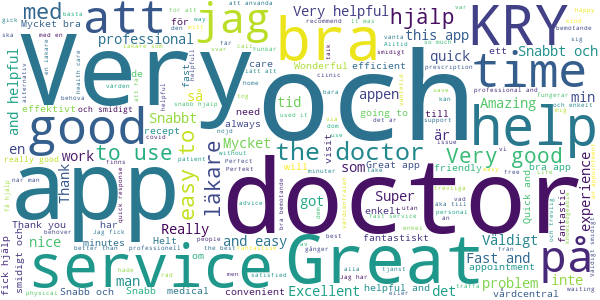
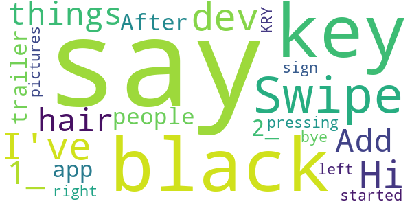

# Kry – See a Doctor by Video
App version ``3.21.1``

Analyzed with [covid-apps-observer](http://github.com/covid-apps-observer) project, version ``0.1``

## App overview
| | |
|-------------------------|-------------------------| 
| **Name**&nbsp;&nbsp;&nbsp;&nbsp;&nbsp;&nbsp;&nbsp;&nbsp;&nbsp;&nbsp;&nbsp;&nbsp;&nbsp;&nbsp;&nbsp;&nbsp;&nbsp;&nbsp;&nbsp;&nbsp;&nbsp;&nbsp;&nbsp;&nbsp;&nbsp;&nbsp;&nbsp;&nbsp;&nbsp;&nbsp;&nbsp;&nbsp;&nbsp;&nbsp;&nbsp;&nbsp;&nbsp;&nbsp;&nbsp;&nbsp;  | Kry – See a Doctor by Video |
| **Unique identifier** | se.kry.android |
| **Link to Google Play** | [https://play.google.com/store/apps/details?id=se.kry.android](https://play.google.com/store/apps/details?id=se.kry.android) |
| **Summary**  | See a doctor by video. In minutes. Wherever you are. |
| **Privacy policy** | [https://www.livi.health/privacy-policies/](https://www.livi.health/privacy-policies/) |
| **Latest version** | 3.21.1 |
| **Last update** | 2020-11-24 13:54:02 |
| **Recent changes** | This update improves the booking experience and fixes a couple of minor bugs. |
| **Installs**  | 500,000+ |
| **Category** | Medical |
| **First release** | Jul 8, 2015 |
| **Size**  | 121M |
| **Supported Android version**  | 6.0 and up |

### Description
> Kry takes care of you and your family’s physical and mental health. Book a video appointment for you or your child with one of our doctors or psychologists – at a time and place that’s convenient for you. We’ve got drop-in appointments or you can book one at a specific time.
 <b>Highlights</b>
 - Kry has treated more than 2 million patients
 - Kry received a 5-star rating from 97% of its patients
 - Kry doctors and psychologists speak 25 different languages
 - Kry is open 24 hours – 7 days a week
 <b>What can Kry treat?</b>
 <i>Physical health</i>
 Abdominal pain • Acne • Allergies • Asthma • Cold and flu • Cold sores • Constipation • Cough • Diarrhoea or vomiting • Erectile dysfunction • Eye infection • Fever • Hair loss • Headache • Indigestion and heartburn • Insect bites • Insomnia or difficulty sleeping • Mole checker • Nail problems • Quit smoking • Sinusitis or sinus infection • Skin rashes and eczema • Sore throat • Stage fright • Underactive thyroid 
 <i>Mental health</i>
 Anxiety • Crisis and grief • Depression • Sleep disorders • Stress
 <b>Is it safe? How do you use my data?</b>
 Kry is an approved medical product. Operating since 2014, we are a registered healthcare provider subject to all healthcare laws and regulations, together with personal data, patient data and patient safety laws. Your data is encrypted and processed in line with patient data laws. We carefully select licensed medical professionals with a strong academic and professional background.

### User interface
The developers of the app provide the following screenshots in the Google play store.
| | | |
|:-------------------------:|:-------------------------:|:-------------------------:|
 |   |   |   | 
 |   |   |   | 
 |   |   |   | 
 |   |   |   | 

## Development team
In the following we report the main information provided by the development team in the Google play store.

| | |
|-------------------------|-------------------------|
| **Developer**  | KRY International |
| **Website**  | - |
| **Email** | support@kry.se |
| **Physical address**  | [KRY International AB Torsgatan 21 113 21 Stockholm](https://www.google.com/maps/search/KRY%20International%20AB%20Torsgatan%2021%20113%2021%20Stockholm) (Google Maps) |
| **Other developed apps**  | [https://play.google.com/store/apps/developer?id=KRY+International](https://play.google.com/store/apps/developer?id=KRY+International) |

## Android support

| | |
|-------------------------|-------------------------|
| **Declared target Android version**  | Android10, version 10 (API level 29) |
| **Effective target Android version**  | Android10, version 10 (API level 29) |
| **Minimum supported Android version**  | Marshmallow, version 6.0 (API level 23) |
| **Maximum target Android version**  | - |

The larger the difference between the minimum and maximum supported Android versions, the better. A larger difference means a wider audience. For example, old phones have a very low Android version, so a high minimum supported Android version means that the app cannot be used by users with old phones, thus leading to accessibility problems. 

## Requested permissions

In the following we report the complete list of the permissions requested by the app. 

| **Permission** | **Protection level** | **Description** | 
|-------------------------|-------------------------|-------------------------|
 **android.permission ACCESS_NETWORK_STATE** | Normal | Allows applications to access information about networks. 
 **android.permission ACCESS_WIFI_STATE** | Normal | Allows applications to access information about Wi-Fi networks. 
 **android.permission BLUETOOTH** | Normal | Allows applications to connect to paired bluetooth devices. 
 **android.permission BROADCAST_STICKY** | Normal | Allows an application to broadcast sticky intents. 
 **android.permission CAMERA** | :warning:**Dangerous** | Required to be able to access the camera device. 
 **android.permission INTERNET** | Normal | Allows applications to open network sockets. 
 **android.permission MODIFY_AUDIO_SETTINGS** | Normal | Allows an application to modify global audio settings. 
 **android.permission READ_EXTERNAL_STORAGE** | :warning:**Dangerous** | Allows an application to read from external storage. 
 **android.permission READ_PHONE_STATE** | :warning:**Dangerous** | Allows read only access to phone state, including the phone number of the device, current cellular network information, the status of any ongoing calls, and a list of any PhoneAccounts registered on the device. 
 **android.permission RECORD_AUDIO** | :warning:**Dangerous** | Allows an application to record audio. 
 **android.permission USE_BIOMETRIC** | Normal | Allows an app to use device supported biometric modalities. 
 **android.permission USE_FINGERPRINT** | Normal | This constant was deprecated in API level 28. Applications should request USE_BIOMETRIC instead 
 **android.permission USE_FULL_SCREEN_INTENT** | Normal | Required for apps targeting Build.VERSION_CODES.Q that want to use notification full screen intents. 
 **android.permission VIBRATE** | Normal | Allows access to the vibrator. 
 **android.permission WAKE_LOCK** | Normal | Allows using PowerManager WakeLocks to keep processor from sleeping or screen from dimming. 
 **android.permission WRITE_EXTERNAL_STORAGE** | :warning:**Dangerous** | Allows an application to write to external storage. 
 **com.google.android.c2dm.permission RECEIVE** | - | - 
 **com.google.android.finsky.permission BIND_GET_INSTALL_REFERRER_SERVICE** | - | - 
 **se.kry.android.permission C2D_MESSAGE** | - | - 

## Mentioned servers

| **Server** | **Registrant** | **Registrant country** | **Creation date** | 
|-------------------------|-------------------------|-------------------------|-------------------------|
 | klarna.com | Klarna Bank AB | :sweden: SE | 2008-12-12 13:20:40 |
 | adjust.com | - | :de: DE | 1995-09-27 04:00:00 |
 | googlesyndication.com | Google LLC | :us: US | 2003-01-21 06:17:24 |
 | google.com | Google LLC | :us: US | 1997-09-15 04:00:00 |
 | google-analytics.com | Google LLC | :us: US | 2005-07-18 19:24:32 |
 | appboy.com | Braze, Inc. | :us: US | 2008-10-06 23:28:32 |
 | braze.com | Braze, Inc. | :us: US | 2000-01-19 02:18:28 |
 | googleapis.com | Google LLC | :us: US | 2005-01-25 17:52:26 |
 | googleapis.com | Google LLC | :us: US | 2005-01-25 17:52:26 |
 | googletagmanager.com | Google LLC | :us: US | 2011-11-11 23:39:05 |
 | googleapis.com | Google LLC | :us: US | 2005-01-25 17:52:26 |
 | onfido.com | Whois Privacy Service | :us: US | 2013-02-22 19:19:38 |
 | segment.com | Domains By Proxy, LLC | :us: US | 1998-07-06 04:00:00 |
 | segment.io | Segment.io, Inc. | :us: US | 2011-10-01 04:10:05 |
 | opentok.com | Domains By Proxy, LLC | :us: US | 2010-09-24 17:14:13 |
 | youtube.com | Google LLC | :us: US | 2005-02-15 05:13:12 |
 | stripe.com | - | :us: US | 1995-09-12 04:00:00 |
 | crashlytics.com | Google LLC | :us: US | 2011-01-21 15:30:40 |
 | w3.org | W3C | :us: US | 1994-07-06 04:00:00 |

## Security analysis 

Below we report the main security warnings raised by our execution of the [Androwarn](https://github.com/maaaaz/androwarn) security analysis tool.

**Telephony identifiers leakage**
> - This application reads the ISO country code equivalent for the SIM provider's country code 
> - This application reads the device phone type value 
> - This application reads the numeric name (MCC+MNC) of current registered operator 
> - This application reads the operator name 
> - This application reads the radio technology (network type) currently in use on the device for data transmission 
> - This application reads the unique device ID, i.e the IMEI for GSM and the MEID or ESN for CDMA phones 

**Location lookup**
> - This application reads location information from all available providers (WiFi, GPS etc.) 

**Connection interfaces exfiltration**
> - This application reads details about the currently active data network 
> - This application tries to find out if the currently active data network is metered 

**Telephony services abuse**
> - This application makes phone calls 

**Suspicious connection establishment**
> - This application opens a Socket and connects it to the remote address ' returned no addresses for  ; port is out of range' on the 'N/A' port  
> - This application opens a Socket and connects it to the remote address '' on the 'N/A' port  
> - This application opens a Socket and connects it to the remote address 'Ljava/lang/StringBuilder;->toString()Ljava/lang/String;' on the ': connect, resolve' port  
> - This application opens a Socket and connects it to the remote address 'Ljava/lang/StringBuilder;->toString()Ljava/lang/String;' on the 'N/A' port  
> - This application opens a Socket and connects it to the remote address 'Ljava/net/Proxy;->type()Ljava/net/Proxy$Type;' on the 'N/A' port  
> - This application opens a Socket and connects it to the remote address 'timeout' on the 'N/A' port  

**Code execution**
> - This application loads a native library 
> - This application loads a native library: 'Ljava/lang/String;->valueOf(Ljava/lang/Object;)Ljava/lang/String;' 
> - This application loads a native library: 'NativeBridge' 
> - This application loads a native library: 'barhopper_v2' 
> - This application loads a native library: 'opentok' 
> - This application loads a native library: 'signer' 
> - This application executes a UNIX command 
> - This application executes a UNIX command containing this argument: '2' 

## User ratings and reviews

Below we provide information about how end users are reacting to the app in terms of ratings and reviews in the Google Play store.

### Ratings

The Kry – See a Doctor by Video app has been installed by more than **500000** times. At this time, **19184** rated the app and its average score is **4.764553**. Below we show the distribution of the ratings across the usual star-based rating of Google Play

:star::star::star::star::star:: 17252

:star::star::star::star:: 977

:star::star::star:: 109

:star::star:: 69

:star:: 777

### Reviews 

#### 5-star reviews

> Helpful and knowledgeable doctor  :date: __2020-12-20 14:39:32__

> I like the service, it's fast and reliable  :date: __2020-12-18 10:19:30__

> Excellent experience. Incredible. I will be a regular user after this.  :date: __2020-12-17 18:37:20__

> Very easy to use and friendly.  :date: __2020-12-17 09:15:01__

> Mycket bra alternativ tidsbesparande för saker som inte behöver handpåläggning liksom.  :date: __2020-12-14 04:46:52__

> It's helpfull!  :date: __2020-12-12 10:46:13__

> Good app  :date: __2020-12-10 15:09:54__

> Jätte bra app.  :date: __2020-12-09 14:37:58__

> Great service  :date: __2020-12-08 18:40:26__

> Wonderful service as always.  :date: __2020-12-08 11:46:11__

#### 4-star reviews

> Fast and reliable  :date: __2020-12-02 13:32:21__

> Good  :date: __2020-08-27 15:43:06__

> The estimated waiting time is a joke it said 2-5 min and i ve been waiting for 20 minutes now still haven't been called  :date: __2020-07-14 15:11:58__

> Very helpful and fast  :date: __2020-06-17 21:07:25__

> Used it the first time and had good experience.  :date: __2020-04-30 15:35:20__

> Good app!  :date: __2020-04-23 13:31:45__

> Fast answer, doctor gives fast and hopefully correct diagnosis, not 5 stars because of video issues from doctors side.  :date: __2020-04-21 17:29:32__

> Good especially for times like this (covid19)  :date: __2020-04-08 14:13:56__

> Easy to use  :date: __2020-03-08 13:12:13__

> Good and easy  :date: __2020-03-07 11:45:17__

#### 3-star reviews

> Hi dev. I've 2 things to say: 1_ Add some black/black hair people in the trailer in app. 2_ After pressing "get started with KRY" key, there's is not any sign that says "Swipe left" or "Swipe right" key for those pictures. bye.  :date: __2017-12-16 04:25:58__

#### 2-star reviews

> I had a urology question. Long delays with misleading 'just a few minutes', no good for specialist questions. Just go directly to the specialist if you need one. The app could have told me so via FAQ or so.  :date: __2020-12-03 18:27:22__

> Kunde inte byta sråk till svenska har min mobil inställd på engelska är lättaste för mig att fatta inställningarna då appar blir oftast automatiskt påå engelska brukar inte ha problem med att byta menn av nån anledning vill spåkändring till sevska inte funka. Inga större problem för mig litee svårt attt fatta viss information. Ville se om de fans online chatt ville mäst ha råd om jag borde åka in och få de kollat verka bara finnas vidochat  :date: __2020-05-10 00:25:41__

> Det verkar som om läkarna inte läser det jag skriver och inte heller läst journalen ordentligt. Fick fel medicin utskrivet två gånger på rad för samma åkomma. Ge patienten liter mer tid och uppmärksamhet istället.  :date: __2020-04-13 12:49:56__

> This is the 2nd time that I've used this app in the hopes of getting help and sadly they were anything but. The first time it was a question related to my pregnancy and I was just asked to contact my barnmorska. The second time I was in pain and had a question related to breastfeeding and after asking my question the same thing happened! Why do you offer barnmorska support if you really don't offer any help? I'm only putting 2 stars because they were quick in taking my call.  :date: __2020-04-01 23:16:03__

> Did speak with a doctor quickly, however had to go to another physician to match treatment with the diagnosis  :date: __2020-03-29 14:03:32__

> Usually quite nice to save long waiting at the VC, in particular with restless kids. But last time was bad: we suspected hand-foot-mouth but didn't want to bias them. They diagnosed a combo of fungi and rash and prescribed 1 cream for each. 2 days later dagis let's us pick him up, had to go to VC and of course it was HFM... That should have been obvious and more logical imo, cannot believe they missed it.  :date: __2020-02-10 07:03:49__

> Meetings disconnect due to doctors bad reception. I've spent a long time waiting several times and got connected. No customer service available unless you spend time on a phone...  :date: __2020-02-05 10:00:08__

> Appen suger. Stått mindre än 5min till läkarbesöket i över 50min. Fick ringa till supporten. Läkaren var proffsig och trevlig. Alltså tack vare läkaren ger jag 2 stjärnor, annars skulle gett 0 stjärnor. Läkaren får 5 stjärnor.  :date: __2020-01-24 18:10:36__

> No way to see Privacy policy in English version of app. No way to view the Swedish ToS during registration in the English version, even if it states that the Swedish edition will overpower the English one if there is anything lost in translation. This is a serious flaw. Also giving wrong time when booking meeting. Country and UTC + hour code does not match the actual time in specifc country. Not sure which one to follow. Country or UTC code?  :date: __2019-06-07 09:53:56__

> Soon after downloading the app it says that you are not connected to the internet. Reinstalled twice same error.  :date: __2018-11-11 10:54:27__

#### 1-star reviews

> They always say they can't help you and you need to see a doctor at vårdcentral. Why the hell don't they tell the patient before, they have the info they need prior to the consultation. Who needs a doctor to tell you to see another doctor and charge for that? Today I booked for weight loss (a service they offer) and within 30 sec of seing my face dr said he didn't think I looked fat (I'm obese) and refused to refer me because he didnt believe my weight. He didnt even bother looking at my files  :date: __2020-12-11 18:12:14__

> I don't recommend it.  :date: __2020-12-10 09:25:41__

> After all data (health insurance data multiple times!) have been entered, the process always ends with "no appointment available". No indication of next appointments, or how or when you could look again. And: Only private prescriptions are issued, health insurance patients are allowed to reach into their pockets. Worthless.  :date: __2020-11-27 14:24:02__

> Wow, if I could give minus starts I actually would. This was a really bad experience. I met an unfriendly doctor who was totally not interested in me and my symptoms. I am not only still sick but also really sad after this experience. I have to pay 200 SEK for an unfriendly meeting with no help at all. If you can avoid kry, do it. This was simply pointless.  :date: __2020-11-09 15:48:20__

> Kry kinda sus tho ngl  :date: __2020-11-01 12:33:52__

> Behandlar sina anställda som skit. Bojkotta!  :date: __2020-11-01 12:33:39__

> it's useless in every sense of the word. the app does not show the doctor's messages. furthermore, the doctor is not able to prescribe any medicine. I just had to wait 2 days then stay at home for nothing.  :date: __2020-10-21 16:52:21__

> Kom och revolutionerade vården. Nu dock rent girigt företag som roffar åt sig av välfärd genom att syna varje kryphål. Direkt skadligt för välfärden. Vart en trogen kund sen starten, men nu avinstallerat efter fusket i region sthlm uppdagades.  :date: __2020-10-11 09:35:27__

> By agreeing to the terms of this service, you will be enlisted to one of their connected healthcare centres (i.e. they change your "Mina vårdval"). Techically not against the law, but really, really distasteful acting by these loophole seekers.  :date: __2020-10-02 06:13:07__

> Är det ens helt lagligt att prompta att lista sig till ny VC?  :date: __2020-10-01 13:24:25__

