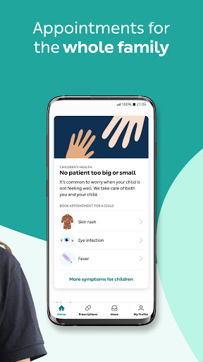
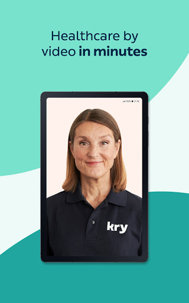
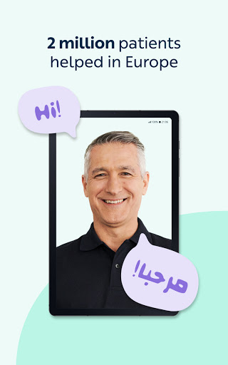
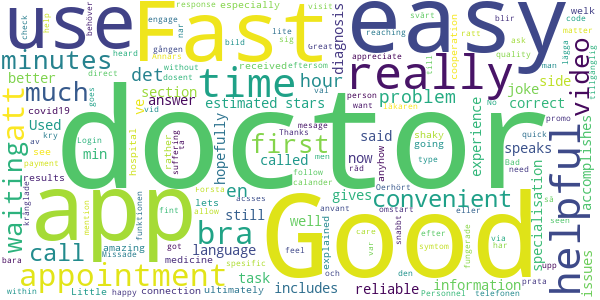
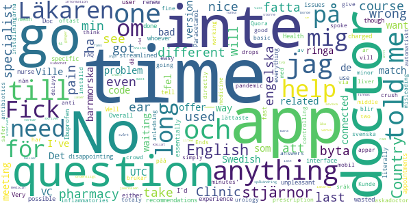
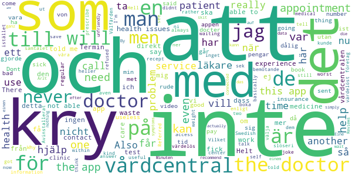

# Kry – See a Doctor by Video
App version ``3.26``

Analyzed with [covid-apps-observer](http://github.com/covid-apps-observer) project, version ``0.1``

## App overview
| | |
|-------------------------|-------------------------| 
| **Name**&nbsp;&nbsp;&nbsp;&nbsp;&nbsp;&nbsp;&nbsp;&nbsp;&nbsp;&nbsp;&nbsp;&nbsp;&nbsp;&nbsp;&nbsp;&nbsp;&nbsp;&nbsp;&nbsp;&nbsp;&nbsp;&nbsp;&nbsp;&nbsp;&nbsp;&nbsp;&nbsp;&nbsp;&nbsp;&nbsp;&nbsp;&nbsp;&nbsp;&nbsp;&nbsp;&nbsp;&nbsp;&nbsp;&nbsp;&nbsp;  | Kry – See a Doctor by Video |
| **Unique identifier** | se.kry.android |
| **Link to Google Play** | [https://play.google.com/store/apps/details?id=se.kry.android](https://play.google.com/store/apps/details?id=se.kry.android) |
| **Summary**  | See a doctor by video. In minutes. Wherever you are. |
| **Privacy policy** | [https://www.livi.health/privacy-policies/](https://www.livi.health/privacy-policies/) |
| **Latest version** | 3.26 |
| **Last update** | 2021-03-29 09:25:18 |
| **Recent changes** | This update improves the booking experience and fixes a couple of minor bugs. |
| **Installs**  | 500,000+ |
| **Category** | Medical |
| **First release** | Jul 8, 2015 |
| **Size**  | 124M |
| **Supported Android version**  | 6.0 and up |

### Description
> Kry takes care of you and your family’s physical and mental health. Book a video appointment for you or your child with one of our doctors or psychologists – at a time and place that’s convenient for you. We’ve got drop-in appointments or you can book one at a specific time.
 <b>Highlights</b>
 - Kry has treated more than 2 million patients
 - Kry received a 5-star rating from 97% of its patients
 - Kry doctors and psychologists speak 25 different languages
 - Kry is open 24 hours – 7 days a week
 <b>What can Kry treat?</b>
 <i>Physical health</i>
 Abdominal pain • Acne • Allergies • Asthma • Cold and flu • Cold sores • Constipation • Cough • Diarrhoea or vomiting • Erectile dysfunction • Eye infection • Fever • Hair loss • Headache • Indigestion and heartburn • Insect bites • Insomnia or difficulty sleeping • Mole checker • Nail problems • Quit smoking • Sinusitis or sinus infection • Skin rashes and eczema • Sore throat • Stage fright • Underactive thyroid 
 <i>Mental health</i>
 Anxiety • Crisis and grief • Depression • Sleep disorders • Stress
 <b>Is it safe? How do you use my data?</b>
 Kry is an approved medical product. Operating since 2014, we are a registered healthcare provider subject to all healthcare laws and regulations, together with personal data, patient data and patient safety laws. Your data is encrypted and processed in line with patient data laws. We carefully select licensed medical professionals with a strong academic and professional background.

### User interface
The developers of the app provide the following screenshots in the Google play store.
| | | |
|:-------------------------:|:-------------------------:|:-------------------------:|
 |   |   |   | 
 |   |   |   | 
 |   |   |   | 
 |   |   |   | 

## Development team
In the following we report the main information provided by the development team in the Google play store.

| | |
|-------------------------|-------------------------|
| **Developer**  | KRY International |
| **Website**  | [https://kry.se](https://kry.se) |
| **Email** | support@kry.se |
| **Physical address**  | [KRY International AB Torsgatan 21 113 21 Stockholm](https://www.google.com/maps/search/KRY%20International%20AB%20Torsgatan%2021%20113%2021%20Stockholm) (Google Maps) |
| **Other developed apps**  | [https://play.google.com/store/apps/developer?id=KRY+International](https://play.google.com/store/apps/developer?id=KRY+International) |

## Android support

| | |
|-------------------------|-------------------------|
| **Declared target Android version**  | Android10, version 10 (API level 29) |
| **Effective target Android version**  | Android10, version 10 (API level 29) |
| **Minimum supported Android version**  | Marshmallow, version 6.0 (API level 23) |
| **Maximum target Android version**  | - |

The larger the difference between the minimum and maximum supported Android versions, the better. A larger difference means a wider audience. For example, old phones have a very low Android version, so a high minimum supported Android version means that the app cannot be used by users with old phones, thus leading to accessibility problems. 

## Requested permissions

In the following we report the complete list of the permissions requested by the app. 

| **Permission** | **Protection level** | **Description** | 
|-------------------------|-------------------------|-------------------------|
 **android.permission ACCESS_NETWORK_STATE** | Normal | Allows applications to access information about networks. 
 **android.permission ACCESS_WIFI_STATE** | Normal | Allows applications to access information about Wi-Fi networks. 
 **android.permission BLUETOOTH** | Normal | Allows applications to connect to paired bluetooth devices. 
 **android.permission BROADCAST_STICKY** | Normal | Allows an application to broadcast sticky intents. 
 **android.permission CAMERA** | :warning:**Dangerous** | Required to be able to access the camera device. 
 **android.permission FOREGROUND_SERVICE** | Normal | Allows a regular application to use Service.startForeground. 
 **android.permission INTERNET** | Normal | Allows applications to open network sockets. 
 **android.permission MODIFY_AUDIO_SETTINGS** | Normal | Allows an application to modify global audio settings. 
 **android.permission READ_EXTERNAL_STORAGE** | :warning:**Dangerous** | Allows an application to read from external storage. 
 **android.permission READ_PHONE_STATE** | :warning:**Dangerous** | Allows read only access to phone state, including the phone number of the device, current cellular network information, the status of any ongoing calls, and a list of any PhoneAccounts registered on the device. 
 **android.permission RECORD_AUDIO** | :warning:**Dangerous** | Allows an application to record audio. 
 **android.permission USE_BIOMETRIC** | Normal | Allows an app to use device supported biometric modalities. 
 **android.permission USE_FINGERPRINT** | Normal | This constant was deprecated in API level 28. Applications should request USE_BIOMETRIC instead 
 **android.permission USE_FULL_SCREEN_INTENT** | Normal | Required for apps targeting Build.VERSION_CODES.Q that want to use notification full screen intents. 
 **android.permission VIBRATE** | Normal | Allows access to the vibrator. 
 **android.permission WAKE_LOCK** | Normal | Allows using PowerManager WakeLocks to keep processor from sleeping or screen from dimming. 
 **com.google.android.c2dm.permission RECEIVE** | - | - 
 **com.google.android.finsky.permission BIND_GET_INSTALL_REFERRER_SERVICE** | - | - 
 **se.kry.android.permission C2D_MESSAGE** | - | - 

## Mentioned servers

| **Server** | **Registrant** | **Registrant country** | **Creation date** | 
|-------------------------|-------------------------|-------------------------|-------------------------|
 | adjust.com | - | :de: DE | 1995-09-27 04:00:00 |
 | googlesyndication.com | Google LLC | :us: US | 2003-01-21 06:17:24 |
 | google.com | Google LLC | :us: US | 1997-09-15 04:00:00 |
 | google-analytics.com | Google LLC | :us: US | 2005-07-18 19:24:32 |
 | appboy.com | Braze, Inc. | :us: US | 2008-10-06 23:28:32 |
 | braze.com | Braze, Inc. | :us: US | 2000-01-19 02:18:28 |
 | googleapis.com | Google LLC | :us: US | 2005-01-25 17:52:26 |
 | googleapis.com | Google LLC | :us: US | 2005-01-25 17:52:26 |
 | googletagmanager.com | Google LLC | :us: US | 2011-11-11 23:39:05 |
 | android.com | Google LLC | :us: US | 1997-06-23 04:00:00 |
 | googleapis.com | Google LLC | :us: US | 2005-01-25 17:52:26 |
 | onfido.com | Whois Privacy Service | :us: US | 2013-02-22 19:19:38 |
 | segment.com | Domains By Proxy, LLC | :us: US | 1998-07-06 04:00:00 |
 | segment.io | Segment.io, Inc. | :us: US | 2011-10-01 04:10:05 |
 | opentok.com | Domains By Proxy, LLC | :us: US | 2010-09-24 17:14:13 |
 | youtube.com | Google LLC | :us: US | 2005-02-15 05:13:12 |
 | stripe.com | - | :us: US | 1995-09-12 04:00:00 |
 | crashlytics.com | Google LLC | :us: US | 2011-01-21 15:30:40 |
 | w3.org | W3C | :us: US | 1994-07-06 04:00:00 |

## Security analysis 

Below we report the main security warnings raised by our execution of the [Androwarn](https://github.com/maaaaz/androwarn) security analysis tool.

**Telephony identifiers leakage**
> - This application reads the ISO country code equivalent for the SIM provider's country code 
> - This application reads the device phone type value 
> - This application reads the numeric name (MCC+MNC) of current registered operator 
> - This application reads the operator name 
> - This application reads the radio technology (network type) currently in use on the device for data transmission 
> - This application reads the unique device ID, i.e the IMEI for GSM and the MEID or ESN for CDMA phones 

**Location lookup**
> - This application reads location information from all available providers (WiFi, GPS etc.) 

**Connection interfaces exfiltration**
> - This application reads details about the currently active data network 
> - This application tries to find out if the currently active data network is metered 

**Telephony services abuse**
> - This application makes phone calls 

**Suspicious connection establishment**
> - This application opens a Socket and connects it to the remote address ' returned no addresses for  ; port is out of range' on the 'N/A' port  
> - This application opens a Socket and connects it to the remote address '' on the 'N/A' port  
> - This application opens a Socket and connects it to the remote address 'Ljava/lang/StringBuilder;->toString()Ljava/lang/String;' on the ': connect, resolve' port  
> - This application opens a Socket and connects it to the remote address 'Ljava/lang/StringBuilder;->toString()Ljava/lang/String;' on the 'N/A' port  
> - This application opens a Socket and connects it to the remote address 'Ljava/net/Proxy;->type()Ljava/net/Proxy$Type;' on the 'N/A' port  
> - This application opens a Socket and connects it to the remote address 'timeout' on the 'N/A' port  

**Code execution**
> - This application loads a native library 
> - This application loads a native library: 'Ljava/lang/String;->valueOf(Ljava/lang/Object;)Ljava/lang/String;' 
> - This application loads a native library: 'NativeBridge' 
> - This application loads a native library: 'barhopper_v2' 
> - This application loads a native library: 'opentok' 
> - This application loads a native library: 'signer' 
> - This application executes a UNIX command 
> - This application executes a UNIX command containing this argument: '2' 

## User ratings and reviews

Below we provide information about how end users are reacting to the app in terms of ratings and reviews in the Google Play store.

### Ratings

The Kry – See a Doctor by Video app has been installed by more than **500000** times. At this time, **21734** rated the app and its average score is **4.8246098**. Below we show the distribution of the ratings across the usual star-based rating of Google Play

:star::star::star::star::star:: 19730

:star::star::star::star:: 1277

:star::star::star:: 139

:star::star:: 99

:star:: 489

### Reviews 

#### 5-star reviews

> Det jätte bra app  :date: __2021-03-25 20:40:13__

> Väldigt enkelt att få hjälp för enkla ärenden.  :date: __2021-03-24 15:37:16__

> Good service  :date: __2021-03-24 12:08:28__

> Großartiges Konzept, großartig umgesetzt! Toll!  :date: __2021-03-15 15:09:00__

> Very good😊  :date: __2021-03-10 13:09:47__

> very exellent  :date: __2021-03-02 10:12:56__

> Excellent  :date: __2021-02-22 12:26:16__

> snabbt och enkelt  :date: __2021-02-21 08:55:18__

> Good application and fast appointments  :date: __2021-02-10 09:45:46__

> Excellent service with a caring, professional doctor!  :date: __2021-02-06 11:11:54__

#### 4-star reviews

> It would be much better if in section "doctor who speaks your language" an information includes about a doctor and his/her specialisation  :date: __2021-04-03 10:49:42__

> It accomplishes the task very well.  :date: __2021-01-15 17:49:47__

> Fast and reliable  :date: __2020-12-02 13:32:21__

> Good  :date: __2020-08-27 15:43:06__

> The estimated waiting time is a joke it said 2-5 min and i ve been waiting for 20 minutes now still haven't been called  :date: __2020-07-14 15:11:58__

> Very helpful and fast  :date: __2020-06-17 21:07:25__

> Used it the first time and had good experience.  :date: __2020-04-30 15:35:20__

> Good app!  :date: __2020-04-23 13:31:45__

> Fast answer, doctor gives fast and hopefully correct diagnosis, not 5 stars because of video issues from doctors side.  :date: __2020-04-21 17:29:32__

> Good especially for times like this (covid19)  :date: __2020-04-08 14:13:56__

#### 3-star reviews

> While doctors are good, app does not have a "help, service desk" option. My prescription was not successfully added to my account, and there was no way to contact them for help. Only option was to pay 200sek and get a doctors appointment to fix a technical problem.  :date: __2021-01-14 12:24:37__

> Hi dev. I've 2 things to say: 1_ Add some black/black hair people in the trailer in app. 2_ After pressing "get started with KRY" key, there's is not any sign that says "Swipe left" or "Swipe right" key for those pictures. bye.  :date: __2017-12-16 04:25:58__

#### 2-star reviews

> Very unpleasant appointments. Doc just wants to get it done with as fast as possible.  :date: __2021-03-27 12:49:25__

> App is streamlined and easy to use. Doctors whoever will literally just tell you to either take Paracetamol or Ibuprofen for everything or to go to a Health Clinic for anything, can't even renew prescription for basic ear drops in the middle of a pandemic because they think it's safer to crowd clinics for minor ear pain at a time like this than to give you anything other than anti inflammatories that crush your liver. Ends up not being more help than simply going to r/askadoctor or Quora.  :date: __2021-01-31 05:27:08__

> The app itself is working fine. I spoke to two different doctors and got totaly different answers. The last one told me that I don't need to take any medicine. After controlling this with 1177 is this also wrong (antibiotics shall be used).  :date: __2021-01-16 12:02:59__

> I had a urology question. Long delays with misleading 'just a few minutes', no good for specialist questions. Just go directly to the specialist if you need one. The app could have told me so via FAQ or so.  :date: __2020-12-03 18:27:22__

> Kunde inte byta sråk till svenska har min mobil inställd på engelska är lättaste för mig att fatta inställningarna då appar blir oftast automatiskt påå engelska brukar inte ha problem med att byta menn av nån anledning vill spåkändring till sevska inte funka. Inga större problem för mig litee svårt attt fatta viss information. Ville se om de fans online chatt ville mäst ha råd om jag borde åka in och få de kollat verka bara finnas vidochat  :date: __2020-05-10 00:25:41__

> Det verkar som om läkarna inte läser det jag skriver och inte heller läst journalen ordentligt. Fick fel medicin utskrivet två gånger på rad för samma åkomma. Ge patienten liter mer tid och uppmärksamhet istället.  :date: __2020-04-13 12:49:56__

> This is the 2nd time that I've used this app in the hopes of getting help and sadly they were anything but. The first time it was a question related to my pregnancy and I was just asked to contact my barnmorska. The second time I was in pain and had a question related to breastfeeding and after asking my question the same thing happened! Why do you offer barnmorska support if you really don't offer any help? I'm only putting 2 stars because they were quick in taking my call.  :date: __2020-04-01 23:16:03__

> Did speak with a doctor quickly, however had to go to another physician to match treatment with the diagnosis  :date: __2020-03-29 14:03:32__

> Usually quite nice to save long waiting at the VC, in particular with restless kids. But last time was bad: we suspected hand-foot-mouth but didn't want to bias them. They diagnosed a combo of fungi and rash and prescribed 1 cream for each. 2 days later dagis let's us pick him up, had to go to VC and of course it was HFM... That should have been obvious and more logical imo, cannot believe they missed it.  :date: __2020-02-10 07:03:49__

> Meetings disconnect due to doctors bad reception. I've spent a long time waiting several times and got connected. No customer service available unless you spend time on a phone...  :date: __2020-02-05 10:00:08__

#### 1-star reviews

> There are several good and bad points about this app. We all know good so lets talk about the bad side- The support number given in the app does not work, it never worked for me! Whenever called, you never get a chance to talk to a real person and there is all sorts of waiting line music that you hear and no information about your queue number in case you decide to hung up. There is no email address provided so if you have any problem with the app or any questions, guess what? you will never get any answers The most important thing, Kry does not save your third party medical records (the reports received from other clinics) to 1177 and you can't access it because kry uses NPÖ and no one else than kry practitioners can access it, not even the doctors at general vårdcentral. Also, if you think that the doctor at Kry is going to be kind and listen to all your health issues and will be patient in listening to you then you are WRONG! The doctor that i visited told me within 15 minutes of my allotted appointment that he had another patient to attend to and therefore i must book another appointment if i had any other health issues to discuss. Kry had been good application when it comes to resolving health issues for children or even smaller scale health issues but it definitely needs to step up and provide correct information to the patients who come with serious or more complex health issues.  :date: __2021-04-01 22:16:39__

> Läkare var sarkastisk. Han är svensk, inte heller arabisk talande enligt önskemål, trots enligt app har de 28 ST som pratar Arabiska.inget anamnes tagits allt, startade samtalet direkt tyvärr kan inte hjälpa er och ni behöver byta hälsocentral, kan inte ta prover utan undersöka, och om vi vill kan vi ta det privat.även osteoporos utredningar som tas muntlig var inte lustig att ta det här samtalet.vår upplevelse att dålig bemötande och värdelös hjälp.ingen skillnad från vanlig HC.rekomenderar ej  :date: __2021-03-23 17:50:45__

> Välfärden dukar under och det är detta vi lägger pengarna på istället för fler sköterskor på äldreboendena. Vi som betalar skatt förtjänar inte att få våra ihoparbetade pengar bortslösade på det här sättet. Går rakt ner i ägarnas fickor. Såna här företag borde inte vara skattefinansierade.  :date: __2021-03-20 19:07:07__

> Vilket skräp, 400kr faktura för nån indier ska hålla med dig o skriva ut ett värdelöst recept.  :date: __2021-03-19 19:30:57__

> Helt meningslöst, ett simpelt läkarintyg behövdes men hänvisades till vårdcentralen. Bortkastade pengar. Jaja. Avinstallerat nu.  :date: __2021-03-15 23:56:53__

> Hell no. Don't use this app.  :date: __2021-02-22 18:40:28__

> Saw an add for a self test. Downloaded the app and then there were no self test. Badly structured campaign.  :date: __2021-02-16 13:33:04__

> I have har two apointments in this app. Both were very un pleasant. The first one basically told me that it was my medicines fault and sent me to my regular clinic and the second one was extremely rude, only repeated the same thing which I explained didn't work, He told me he was going to prescribe me some medicine (never told me what medicine) and then just didn't prescribed them and just sent me a text with tips. I will NEVER use this app again. I would rather burn 200sek than pay them to kry!  :date: __2021-02-04 11:12:26__

> Just book an appointment at your regular health care center and save your money for that visit instead. That's all I got from my appointment. Referred to my regular health care center.  :date: __2021-01-19 20:30:25__

> Not useful at all. Don't waste your time and call the vårdcentral directly.  :date: __2021-01-15 13:09:06__

