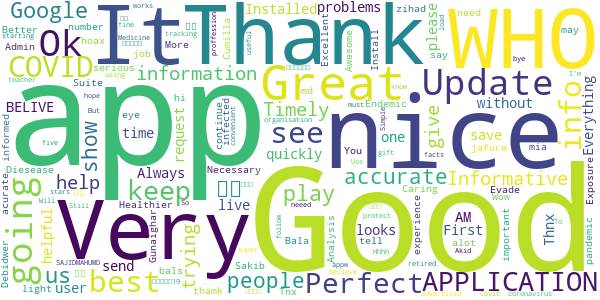
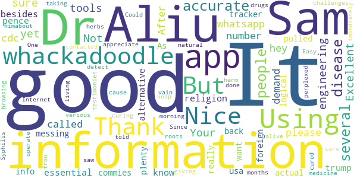
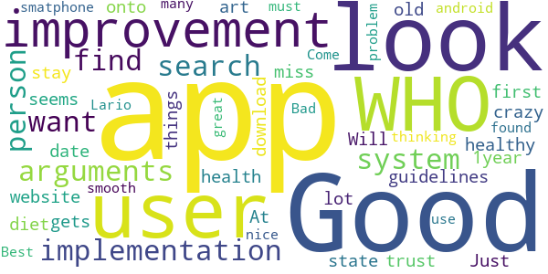
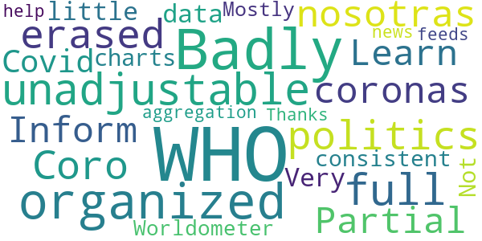
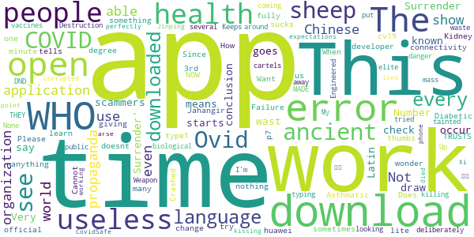
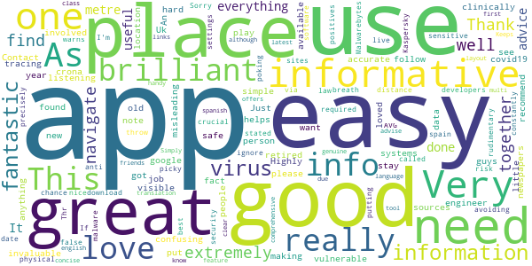
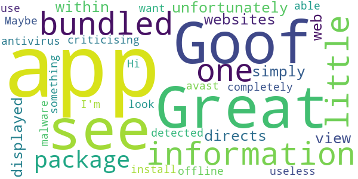
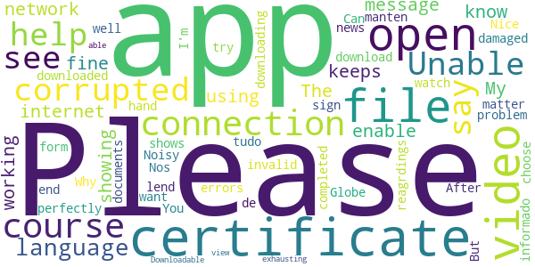

# COVID-related Android apps in UK

Author: `Ivano Malavolta` (ivanomalavolta@gmail.com)

Created at: `2020/11/16`

Report generated by the [covid-apps-observer](http://github.com/covid-apps-observer) project, version 0.1

# Table of contents 

- [Background](#background)
    * [Data sources and analyses](#data-sources-and-analyses)
        * [App metadata](#app-metadata)
        * [Requested permissions](#requested-permissions)
        * [Mentioned servers](#mentioned_servers)
        * [Security analysis](#security_analysis)
        * [User ratings and reviews](#user-ratings-and-reviews)
    * [Disclaimer](#disclaimer)
- [WHO Info](#who-info)
- [Coronavirus Help](#coronavirus-help)
- [COVIDCare NI](#covidcare-ni)
- [OpenWHO: Knowledge for Health Emergencies](#openwho-knowledge-for-health-emergencies)
- [NHS COVID-19](#nhs-covid-19)

- [Credits](#credits)

# How to read this report

This report has been generated by the [covid-apps-observer](http://github.com/covid-apps-observer) project. The project automatically analyzes the apps by extracting information which is already publicly available either on the web or in the apps binary files. 

Our analysis covers the following apps:
| | |
|-------------------------|-------------------------| 
|  | WHO Info
|  | Coronavirus Help
|  | COVIDCare NI
|  | OpenWHO: Knowledge for Health Emergencies
|  | NHS COVID-19

The details of our analysis are presented in the remainder of this report.

For independent verification, the raw data and the source code of the project is publicly available in its GitHub repository [http://github.com/covid-apps-observer](http://github.com/covid-apps-observer) and its source code has been thoroughly commented in order to provide all the details about how the information provided in this report has been extracted. 

Any feedback, questions, and improvements about the project are very welcome, feel free to create an issue or pull request directly in its GitHub repository: [http://github.com/covid-apps-observer](http://github.com/covid-apps-observer).

## Data sources and analyses

The analysis of each app is structured around five main dimensions: 
* App metadata  
* Requested permissions
* Mentioned servers
* Androwarn analysis
* User ratings and reviews

In the following we describe the data sources and analysis performed for each dimension.

### App metadata

App metadata includes an overview of the main information about the app (for example, its name, releases, privacy policy, etc.), contact information of the development team, and the various Android versions supported by the app. This information is extracted from two main data sources:
* _Google Play store_: we automatically mined the web page of the Google Play store showing the basic information about the app and we parsed it in order to extract information about the app and development team 
* _Android Manifest file_: in our analysis we decompiled the binary file of the app (it is similar to a Zip archive but it contains the code of the app instead of normal files) and we extracted information about the supported Android versions, as it has been listed by its development team.

The extracted app metadata feeds the _App overview_, _Development team_, and _Android support_ sections of this report.
We make use of the [google-play-scraper](https://github.com/JoMingyu/google-play-scraper) tool for extracting the raw data related to this dimension of the project.

### Requested permissions

The Android operating system has a permission model which allows users to grant access to potentially privacy-related information. Every Android app has to explictly declare the permissions it needs to properly function in the Android Manifest file.  

In this report we also show the protection level of each permission, which is a key information for understanding how the requested permissions related to the user's privacy. We carefully analyzed the [official Android documentation (v. 29)](https://developer.android.com/reference/android/Manifest.permission), and it resulted that a permission requested by an Android app can belong to the following protection levels:
* **Dangerous**: higher-risk permissions that would give a requesting app access to private user data or control over the device that can negatively impact the user. Because this type of permission introduces potential risk, the system usually does not automatically grant it to the requesting app. For example, any dangerous permissions requested by an app may be displayed to the user and require confirmation before proceeding.
* **Normal**: this is the default and most common level in Android; normal permissions are lower-risk and give access to isolated app-level features, with minimal risk to other apps, the system, or the user. 
* **Signature**: permissions granted only if the requesting app is signed with the same certificate as the app that declared the permission
* **Appop**: old permission level, a reminiscence of the App Ops tool that Google introduced in Android 4.3.
* **Development**: optional permissions which can be granted to development-oriented apps.
* **Privileged**: permissions who give higher power to mobile apps w.r.t. other apps, such as binding to incoming calls, interacting via bluetooth with other devices without user interaction, etc.
* **Preinstalled**: reserved only for preinstalled apps
* **Installer**: allow the holder to start the permission usage screen for an app
* **RetailDemo**: permissions related to devices used in demonstrations in shops.
* **Pre23**: permissions automatically granted to apps targeting devices running pre-6.0 Android.
* **Upcoming**: permissions which will be released in the next version of the Android platform. 
* **Deprecated**: permissions belonging to old releases of the Android platform, they should not be used by developers since they will not be supported in the near future.
* **Not for use by third-party applications**: permissions which can be requested only by apps developed by Google.
* **Undefined**: this protection level is not documented by Google.

The permissions dimension of this project is based on the [Androguard](https://github.com/androguard/androguard) static analysis tool.

### Mentioned servers

We decompiled each app in order to look for all possible mentions of remote URLs. The mentioned URLs can refer to remote servers the the app is using for either sending or receiving information, web addresses for directing the user to an information website, and so on. 

:warning: It is important to note that this analysis is not meant to be complete and it is very prone to obfuscation. The servers reported here are simply _mentioned_ somewhere in the code of the app and are meant to just give an indication about the "hooks" of the app towards external resources. For example, for an Android app it is normal to contact Google services in order to send/receive push notifications, or to contact the servers of analytics services for having real-time diagnostics about crashes of the app or bugs.

This part of the analysis is based on the [Androguard](https://github.com/androguard/androguard) static analysis tool for identfying the raw URLs mentioned in the app; then, the information about each mentioned server is collected by performing a _whois_ lookup on the first-level domain present in the URL.

### Security analysis

This dimension is based on the [Androwarn](https://github.com/maaaaz/androwarn) structural and data flow analysis of Android bytecode. Androwarn is developed by the University of Lyon/INSA (France) and it has been used in several academic studies. According to its documentation, Androwarn targets the following categories of potential security issues:
* **Telephony identifiers exfiltration**: IMEI, IMSI, MCC, MNC, LAC, CID, operator's name, etc.
* **Device settings exfiltration**: software version, usage statistics, system settings, logs, etc.
* **Geolocation information leakage**: GPS/WiFi geolocation, etc.
* **Connection interfaces information exfiltration**: WiFi credentials, Bluetooth MAC adress, etc.
* **Telephony services abuse**: premium SMS sending, phone call composition, etc.
* **Audio/video flow interception**: call recording, video capture, etc.
* **Remote connection establishment**: socket open call, Bluetooth pairing, APN settings edit, etc.
* **PIM data leakage**: contacts, calendar, SMS, mails, clipboard, etc.
* **External memory operations**: file access on SD card, etc.
* **PIM data modification**: add/delete contacts, calendar events, etc.
* **Arbitrary code execution**: native code using JNI, UNIX command, privilege escalation, etc.
* **Denial of Service**: event notification deactivation, file deletion, process killing, virtual keyboard disable, terminal shutdown/reboot, etc.

Note: We do not consider this data point in the current version of our analyzers since it is too verbose for our purposes.

:warning: It is important to note that Androwarn is a static analysis tool, and as such it performs a variety of heuristics and approximations in its analyses. Said that, the results shown in this report are meant to provide an indication of _potential_ security issues and should be by no means treated as complete and correct.   

### User ratings and reviews

For this dimension we turn again to the web interface of the Google Play store. Firstly, we automatically mine summary statistics about user ratings from the web page of the app under analysis; then, we automatically download the newest 1000 reviews of the app under analysis. For each level of rating (5 stars, 4 stars, , etc., 1 star) we show:
- a word cloud presenting the main terms used by end users in their reviews in the Google Play store
- the last 10 reviews provided by app users in the Google Play store. 

This purposefully simple analysis is meant to help both future users and the development team of the app in understanding what are the main positive and negative points of the app under analysis.

We make use of the [google-play-scraper](https://github.com/JoMingyu/google-play-scraper) tool for extracting the raw data related to this dimension of the project.

## Disclaimer 

This report has been produced independently of any parties and its only objective is to help anybody in better understanding how COVID-related apps work in practice (and compare to each other). The results of this report are limited to the specific version of the software used for running the analyses and on the various heuristics implemented in there. In other words, the results of the analyzers may differ depending on the time and modalities in which they are executed. We do not guarantee that the results of the analyses and the corresponding contents of this report are fully complete or correct. The analysis software is licensed under the [MIT License](https://github.com/iivanoo/covid-apps-observer/blob/master/LICENSE).

# WHO Info
App version ``3.1.1``

Analyzed with [covid-apps-observer](http://github.com/covid-apps-observer) project, version ``0.1``

## App overview
| | |
|-------------------------|-------------------------| 
| **Name**&nbsp;&nbsp;&nbsp;&nbsp;&nbsp;&nbsp;&nbsp;&nbsp;&nbsp;&nbsp;&nbsp;&nbsp;&nbsp;&nbsp;&nbsp;&nbsp;&nbsp;&nbsp;&nbsp;&nbsp;&nbsp;&nbsp;&nbsp;&nbsp;&nbsp;&nbsp;&nbsp;&nbsp;&nbsp;&nbsp;&nbsp;&nbsp;&nbsp;&nbsp;&nbsp;&nbsp;&nbsp;&nbsp;&nbsp;&nbsp;  | WHO Info |
| **Unique identifier** | org.who.infoapp |
| **Link to Google Play** | [https://play.google.com/store/apps/details?id=org.who.infoapp](https://play.google.com/store/apps/details?id=org.who.infoapp) |
| **Summary**  | The official World Health Organization Information App. |
| **Privacy policy** | [https://www.who.int/about/who-we-are/privacy-policy](https://www.who.int/about/who-we-are/privacy-policy) |
| **Latest version** | 3.1.1 |
| **Last update** | 2020-10-30 13:25:32 |
| **Recent changes** | This release addresses an issue related to Covid-19 case numbers reported to WHO. |
| **Installs**  | 100,000+ |
| **Category** | News & Magazines |
| **First release** | Apr 13, 2020 |
| **Size**  | 11M |
| **Supported Android version**  | 4.2 and up |

### Description
> Have the latest health information at your fingertips with the official World Health Organization Information App. This app displays the latest news, events, features and breaking updates on outbreaks. 
  
 WHO works worldwide to promote health, keep the world safe, and serve the vulnerable. 
 Our goal is to ensure that a billion more people have universal health coverage, to protect a billion more people from health emergencies, and provide a further billion people with better health and well-being.

### User interface
The developers of the app provide the following screenshots in the Google play store.
| | | |
|:-------------------------:|:-------------------------:|:-------------------------:|
 |   |   |   | 
 |   |   |   | 
 |   |   |   | 
 |   |   |   | 
 |   |   |   | 
 |   |   |   | 
 |   |   |   | 
 |   |   |   | 

## Development team
In the following we report the main information provided by the development team in the Google play store.

| | |
|-------------------------|-------------------------|
| **Developer**  | World Health Organization |
| **Website**  | [https://www.who.int/](https://www.who.int/) |
| **Email** | dcx@who.int |
| **Physical address**  | [Avenu Appia 20 1211 Geneva Switzerland](https://www.google.com/maps/search/Avenu%20Appia%2020%201211%20Geneva%20Switzerland) (Google Maps) |
| **Other developed apps**  | [https://play.google.com/store/apps/developer?id=World+Health+Organization](https://play.google.com/store/apps/developer?id=World+Health+Organization) |

## Android support

| | |
|-------------------------|-------------------------|
| **Declared target Android version**  | - |
| **Effective target Android version**  | - |
| **Minimum supported Android version**  | Jelly Bean, version 4.2.x (API level 17) |
| **Maximum target Android version**  | - |

The larger the difference between the minimum and maximum supported Android versions, the better. A larger difference means a wider audience. For example, old phones have a very low Android version, so a high minimum supported Android version means that the app cannot be used by users with old phones, thus leading to accessibility problems. 

## Requested permissions

In the following we report the complete list of the permissions requested by the app. 

| **Permission** | **Protection level** | **Description** | 
|-------------------------|-------------------------|-------------------------|
 **android.permission ACCESS_NETWORK_STATE** | Normal | Allows applications to access information about networks. 
 **android.permission INTERNET** | Normal | Allows applications to open network sockets. 
 **android.permission READ_CALENDAR** | :warning:**Dangerous** | Allows an application to read the user's calendar data. 
 **android.permission READ_EXTERNAL_STORAGE** | :warning:**Dangerous** | Allows an application to read from external storage. 
 **android.permission WAKE_LOCK** | Normal | Allows using PowerManager WakeLocks to keep processor from sleeping or screen from dimming. 
 **android.permission WRITE_CALENDAR** | :warning:**Dangerous** | Allows an application to write the user's calendar data. 
 **android.permission WRITE_EXTERNAL_STORAGE** | :warning:**Dangerous** | Allows an application to write to external storage. 
 **com.google.android.c2dm.permission RECEIVE** | - | - 
 **com.google.android.finsky.permission BIND_GET_INSTALL_REFERRER_SERVICE** | - | - 

## Mentioned servers

| **Server** | **Registrant** | **Registrant country** | **Creation date** | 
|-------------------------|-------------------------|-------------------------|-------------------------|
 | adobe.com | Adobe Inc. | :us: US | 1986-11-17 05:00:00 |
 | googlesyndication.com | Google LLC | :us: US | 2003-01-21 06:17:24 |
 | google.com | Google LLC | :us: US | 1997-09-15 04:00:00 |
 | app-measurement.com | Google LLC | :us: US | 2015-06-19 20:13:31 |
 | googleapis.com | Google LLC | :us: US | 2005-01-25 17:52:26 |
 | googleadservices.com | Google LLC | :us: US | 2003-06-19 16:34:53 |

## Security analysis 

Below we report the main security warnings raised by our execution of the [Androwarn](https://github.com/maaaaz/androwarn) security analysis tool.

**Connection interfaces exfiltration**
> - This application reads details about the currently active data network 
> - This application tries to find out if the currently active data network is metered 

**Suspicious connection establishment**
> - This application opens a Socket and connects it to the remote address 'Lfi/iki/elonen/NanoHTTPD$ResponseException;' on the 'N/A' port  
> - This application opens a Socket and connects it to the remote address 'NanoHttpd Shutdown' on the 'N/A' port  

**Code execution**
> - This application loads a native library: 'NativeScript' 
> - This application executes a UNIX command containing this argument: '2' 

## User ratings and reviews

Below we provide information about how end users are reacting to the app in terms of ratings and reviews in the Google Play store.

### Ratings

The WHO Info app has been installed by more than **100000** times. At this time, **1023** rated the app and its average score is **3.6470587**. Below we show the distribution of the ratings across the usual star-based rating of Google Play

:star::star::star::star::star:: 562

:star::star::star::star:: 90

:star::star::star:: 70

:star::star:: 50

:star:: 251

### Reviews 

#### 5-star reviews

> Great. Installed quickly without problems. :-)  :date: __2020-11-15 16:31:45__

> Thnx u save live  :date: __2020-11-11 19:32:07__

> Always the best one!  :date: __2020-11-04 22:22:46__

> Great app  :date: __2020-11-03 15:50:52__

> Good  :date: __2020-10-31 20:49:42__

> 😊😊😊  :date: __2020-10-21 18:17:56__

> I. AM. BELIVE. W. H. O  :date: __2020-10-04 06:51:53__

> I like to see a update on what's going on please  :date: __2020-09-23 12:20:19__

> First time user, but the app looks helpful.  :date: __2020-09-16 19:17:57__

> I request WHO info App. to send Update on Everything Necessary for Healthier Caring to Evade the light of the Endemic Diesease COVID 19 Exposure. G-Suite Admin.  :date: __2020-09-06 03:01:26__

#### 4-star reviews

> Not sure yet  :date: __2020-09-27 08:50:53__

> Excellent engineering tools. Your whatsapp number please.  :date: __2020-08-05 11:01:52__

> all the demand who it is hey  :date: __2020-07-20 15:10:48__

> Using this more and more. After the cdc called religion an essential. I don't know what whackadoodle besides trump/pence is messing with the info. Thank you for being a more logical alternative. As usa is being pulled back by whackadoodles and foreign commies.  :date: __2020-07-17 03:09:14__

> Nice  :date: __2020-07-08 17:19:26__

> good  :date: __2020-06-03 00:37:10__

> It's just information, not the actual tracker. But has plenty of information that's 100% accurate.  :date: __2020-05-31 02:37:20__

> I really want to appreciate Dr. Aliu Sam for using his natural roots and herbs medicine to cure me of Syphilis Since 11 months now I have been living with this disease and it has been giving me challenges, I was so perplexed cause I have been taking several drugs to be cured but all have been in vain. One morning I was browsing through the Internet then i saw several testimonies about Dr. Aliu Sam curing people off verious diseases and immediately I contacted Dr. Aliu Sam I told himabout my trou  :date: __2020-05-08 05:33:57__

> It did not detect  :date: __2020-04-29 18:37:26__

> Could do with more accurate information to keep people alive. But no harm done.  :date: __2020-04-29 13:41:12__

#### 3-star reviews

> A good improvement could be the implementation of a search system for arguments that a person want to find ( like the guidelines about health and healthy diet). At first look seems it miss a lot from the website.  :date: __2020-09-27 10:09:16__

> Good App but I don't trust the WHO. Just have the app to stay up to date with the crazy things the WHO gets up to  :date: __2020-07-29 10:34:08__

> Will not download onto my 1year old state of the art smatphone. Bad, as a user of many android apps what are you thinking. I have found more than 3700 other users that can not use this app. Come on you must no you have problem.  :date: __2020-05-26 02:04:59__

> Good  :date: __2020-05-14 21:22:11__

> Best.  :date: __2020-04-20 13:14:33__

> Looks nice great look smooth Lario  :date: __2020-04-18 09:44:30__

#### 2-star reviews

> Badly organized, unadjustable, and full of politics,i erased it  :date: __2020-11-13 07:29:53__

> Coro nosotras coronas  :date: __2020-07-02 06:41:55__

> Partial  :date: __2020-06-22 12:24:23__

> Learn more  :date: __2020-06-15 23:35:50__

> WHO Inform Covid 19  :date: __2020-05-24 17:14:56__

> Very little data or charts. Not consistent with Worldometer. Mostly an aggregation of news feeds about WHO  :date: __2020-05-15 15:38:10__

> Thanks for your help.  :date: __2020-04-22 18:52:40__

#### 1-star reviews

> A wast of time  :date: __2020-11-04 13:04:20__

> “‘Ovid’ is Latin for a sheep. COVID starts with a C, which also means ‘see’ in ancient language. 19 was known as the “Number of Surrender” in ancient times.”  It goes on to draw the conclusion, “C-OVID 19 = ‘See a Sheep Surrender'”.  :date: __2020-11-02 08:06:17__

> Very scammers  :date: __2020-10-19 19:45:47__

> I just downloaded it, but every time I open it just say "an error occur check your connectivity" or something like that... didn't work...  :date: __2020-10-10 17:24:54__

> Does not work  :date: __2020-10-09 00:12:33__

> This is your official application? and sometimes it doesn't work  :date: __2020-10-07 18:26:16__

> I am not able to download it fully its no use to me as i am a type1 Diabetic and Asthmatic i am also in 3rd degree Kidney Failure.  :date: __2020-09-29 02:20:05__

> WHO TRUSTS WHO NOW ¿¿?!?????  :date: __2020-09-25 02:07:50__

> This app sucks  :date: __2020-09-14 21:01:10__

> Every time i open the app,doesnt work just tells us error on my huawei lite p7. Please developer work on it.  :date: __2020-08-18 11:59:51__

# Coronavirus Help
App version ``1.1``

Analyzed with [covid-apps-observer](http://github.com/covid-apps-observer) project, version ``0.1``

## App overview
| | |
|-------------------------|-------------------------| 
| **Name**&nbsp;&nbsp;&nbsp;&nbsp;&nbsp;&nbsp;&nbsp;&nbsp;&nbsp;&nbsp;&nbsp;&nbsp;&nbsp;&nbsp;&nbsp;&nbsp;&nbsp;&nbsp;&nbsp;&nbsp;&nbsp;&nbsp;&nbsp;&nbsp;&nbsp;&nbsp;&nbsp;&nbsp;&nbsp;&nbsp;&nbsp;&nbsp;&nbsp;&nbsp;&nbsp;&nbsp;&nbsp;&nbsp;&nbsp;&nbsp;  | Coronavirus Help |
| **Unique identifier** | appinventor.ai_david_taylor.Coronavirus_help2020 |
| **Link to Google Play** | [https://play.google.com/store/apps/details?id=appinventor.ai_david_taylor.Coronavirus_help2020](https://play.google.com/store/apps/details?id=appinventor.ai_david_taylor.Coronavirus_help2020) |
| **Summary**  | Help and advice on the Coronavirus (Covid-19) |
| **Privacy policy** | [-](-) |
| **Latest version** | 1.1 |
| **Last update** | 2020-04-23 09:48:32 |
| **Recent changes** | Splash screen removed, more advice added through the Ryecroft website feature |
| **Installs**  | 1,000+ |
| **Category** | Health & Fitness |
| **First release** | Mar 26, 2020 |
| **Size**  | 5.9M |
| **Supported Android version**  | 2.1 and up |

### Description
> This app collates genuine information from sorces such as the UK Government, WHO, NHS and others in one place. THis idea being all of the information is genuine and updated on a regular basis by the organisations mentioned.

### User interface
The developers of the app provide the following screenshots in the Google play store.
| | | |
|:-------------------------:|:-------------------------:|:-------------------------:|
 |   |   |   | 
 |  

## Development team
In the following we report the main information provided by the development team in the Google play store.

| | |
|-------------------------|-------------------------|
| **Developer**  | Dave at Ryecroft Community Hub & BITS |
| **Website**  | [http://www.ryecroftnrc.org](http://www.ryecroftnrc.org) |
| **Email** | david.taylor@ryecroftnrc.org |
| **Physical address**  | - |
| **Other developed apps**  | [https://play.google.com/store/apps/developer?id=Dave+at+Ryecroft+Community+Hub+%26+BITS](https://play.google.com/store/apps/developer?id=Dave+at+Ryecroft+Community+Hub+%26+BITS) |

## Android support

| | |
|-------------------------|-------------------------|
| **Declared target Android version**  | Pie, version 9 (API level 28) |
| **Effective target Android version**  | Pie, version 9 (API level 28) |
| **Minimum supported Android version**  | Eclair, version 2.1 (API level 7) |
| **Maximum target Android version**  | - |

The larger the difference between the minimum and maximum supported Android versions, the better. A larger difference means a wider audience. For example, old phones have a very low Android version, so a high minimum supported Android version means that the app cannot be used by users with old phones, thus leading to accessibility problems. 

## Requested permissions

In the following we report the complete list of the permissions requested by the app. 

| **Permission** | **Protection level** | **Description** | 
|-------------------------|-------------------------|-------------------------|
 **android.permission ACCESS_NETWORK_STATE** | Normal | Allows applications to access information about networks. 
 **android.permission ACCESS_WIFI_STATE** | Normal | Allows applications to access information about Wi-Fi networks. 
 **android.permission INTERNET** | Normal | Allows applications to open network sockets. 
 **android.permission READ_EXTERNAL_STORAGE** | :warning:**Dangerous** | Allows an application to read from external storage. 
 **android.permission WRITE_EXTERNAL_STORAGE** | :warning:**Dangerous** | Allows an application to write to external storage. 

## Mentioned servers

| **Server** | **Registrant** | **Registrant country** | **Creation date** | 
|-------------------------|-------------------------|-------------------------|-------------------------|
 | google.com | Google LLC | :us: US | 1997-09-15 04:00:00 |
 | w3.org | W3C | :us: US | 1994-07-06 04:00:00 |
 | gnu.org | Free Software Foundation | :us: US | 1995-11-24 05:00:00 |
 | googleapis.com | Google LLC | :us: US | 2005-01-25 17:52:26 |
 | appspot.com | Google LLC | :us: US | 2005-03-10 02:27:55 |
 | appspot.com | Google LLC | :us: US | 2005-03-10 02:27:55 |
 | mit.edu | Massachusetts Institute of Technology | - | 1985-05-23 00:00:00 |
 | appspot.com | Google LLC | :us: US | 2005-03-10 02:27:55 |
 | yandex.net | - | :ru: RU | 2000-11-14 06:56:55 |
 |  | - | - | 1996-08-01 00:00:00 |
 | redcross.org | American National Red Cross | :us: US | 1995-09-05 04:00:00 |
 |  | - | - | 2003-11-04 00:00:00 |
 |  | - | - | 1996-08-01 00:00:00 |
 |  | - | - | 1996-08-01 00:00:00 |

## Security analysis 

Below we report the main security warnings raised by our execution of the [Androwarn](https://github.com/maaaaz/androwarn) security analysis tool.

**Telephony identifiers leakage**
> - This application reads the unique device ID, i.e the IMEI for GSM and the MEID or ESN for CDMA phones 

**Location lookup**
> - This application reads location information from all available providers (WiFi, GPS etc.) 

**Connection interfaces exfiltration**
> - This application reads details about the currently active data network 
> - This application tries to find out if the currently active data network is metered 

**Telephony services abuse**
> - This application makes phone calls 

**Audio video eavesdropping**
> - This application records audio from the 'MIC' source  

**Suspicious connection establishment**
> - This application opens a Socket and connects it to the remote address '4' on the 'v31' port  

**Pim data leakage**
> - This application accesses the contacts list 

**Code execution**
> - This application executes a UNIX command 
> - This application executes a UNIX command containing this argument: 'Ljava/util/List;->size()I' 

## User ratings and reviews

Below we provide information about how end users are reacting to the app in terms of ratings and reviews in the Google Play store.

### Ratings

The Coronavirus Help app has been installed by more than **1000** times. At this time, **19** rated the app and its average score is **4.0**. Below we show the distribution of the ratings across the usual star-based rating of Google Play

:star::star::star::star::star:: 13

:star::star::star::star:: 1

:star::star::star:: 1

:star::star:: 0

:star:: 4

### Reviews 

#### 5-star reviews

> Good  :date: __2020-10-10 21:21:40__

> Just got this app and really loved the fact that all covid19 info you need was in 1 place and easy to use great job. (was a little hard to find on google play. An app like this should be more visible)  :date: __2020-07-12 23:25:15__

> Very informative  :date: __2020-07-09 21:39:20__

> This helps me from the new crona very good 👍 👌 😊 ☺ 😀 😄 👍 👌 😊  :date: __2020-06-15 17:43:31__

> Contact tracing. Uk  :date: __2020-06-01 22:22:36__

> I love it 💖 so simple to use and not confusing at all, I love that everything is in one place and from the people that we should be listening to and not from misleading sources (newspapers) x I love all you over 70's that was involved in making this great app x I am 28 and I couldn't of done anything like this well done guys stay safe 💋💋  :date: __2020-05-27 22:54:07__

> This app is very good .  :date: __2020-05-26 02:43:22__

> Brilliant app! Very informative and easy to follow. Highly recommend  :date: __2020-05-08 13:34:16__

> Easy to use  :date: __2020-05-03 17:07:02__

> It's good that this information is available in one location, however please note (developers) that the physical distance required by law and for the best chance of avoiding the virus via breath, is 2 metres, not 1 metre as stated in the app. Sorry to be picky, but this is crucial information. As for the risk of malware, some of the more rudimentary so-called security apps will throw up false positives but Kaspersky, AVG and Malwarebytes will not. 🏳  :date: __2020-05-02 18:01:23__

#### 4-star reviews

> Goof  :date: __2020-09-26 20:22:38__

> Great to see all the information bundled into one little package, unfortunately, because the app simply directs you to websites that are displayed within a web view, it's completely useless for offline use.  :date: __2020-05-30 11:49:56__

> Hi I'm not criticising your app but my avast antivirus also detected that there was malware in your app so I wasn't able to install. Maybe this is something you want to look into  :date: __2020-04-28 03:51:39__

#### 3-star reviews

> Virus checker (McAfee) alerted to a (possible) malware contained within this app. After reading other reviews of this app it appears to be a false positive, thank goodness other people had flagged this as i would of halted the install and not downloaded it. I don't believe its actually anything harmful contained within the app itself. I would given the app a 5 ⭐ except its laid out like a website from 1992. Great app though  :date: __2020-05-21 09:29:34__

> What is your email? I can send you a screen shot saying that the app might be a virus when I install it  :date: __2020-04-26 14:51:15__

#### 2-star reviews

> Who'd of thought I'd need an app to "help" me with a virus that I have a 99.94% chance of surviving (official numbers).  :date: __2020-06-25 08:48:45__

#### 1-star reviews

> Here is another app that's been put on my phone and I can't use it to track if I have been near anybody with coronavirus as according to the app it doesn't work in Scotland. What the bloody point of putting this app on people's phones if they can't use it.  :date: __2020-08-18 09:31:46__

> Stolen content  :date: __2020-06-21 18:51:30__

> Turns out I didn't need an app for a mysteriously absent virus that has killed worldwide less than seasonal flu.  :date: __2020-06-09 10:13:17__

> If I wanted to see a picture of the word caronavirus I can Google one . Other than this it's pretty useless probably worst app I've encountered  :date: __2020-04-17 14:09:13__

> Will not open in Sony XZ3  :date: __2020-04-14 17:58:35__

# COVIDCare NI
App version ``2.0``

Analyzed with [covid-apps-observer](http://github.com/covid-apps-observer) project, version ``0.1``

## App overview
| | |
|-------------------------|-------------------------| 
| **Name**&nbsp;&nbsp;&nbsp;&nbsp;&nbsp;&nbsp;&nbsp;&nbsp;&nbsp;&nbsp;&nbsp;&nbsp;&nbsp;&nbsp;&nbsp;&nbsp;&nbsp;&nbsp;&nbsp;&nbsp;&nbsp;&nbsp;&nbsp;&nbsp;&nbsp;&nbsp;&nbsp;&nbsp;&nbsp;&nbsp;&nbsp;&nbsp;&nbsp;&nbsp;&nbsp;&nbsp;&nbsp;&nbsp;&nbsp;&nbsp;  | COVIDCare NI |
| **Unique identifier** | net.hscni.covid19ni |
| **Link to Google Play** | [https://play.google.com/store/apps/details?id=net.hscni.covid19ni](https://play.google.com/store/apps/details?id=net.hscni.covid19ni) |
| **Summary**  | COVIDCare NI is a coronavirus symptom check with the latest advice and guidance |
| **Privacy policy** | [https://www.health-ni.gov.uk/publications/covid-19-app-privacy-notice](https://www.health-ni.gov.uk/publications/covid-19-app-privacy-notice) |
| **Latest version** | 2.0 |
| **Last update** | 2020-07-22 16:32:05 |
| **Recent changes** | · Featured articles on mental health and general advice · Latest regulations and easing of lockdown guidance  · Information on how to get tested and testing facilities · COVID-19 statistics · Isolation timer updated to include isolation following a positive test result and isolation due to close contact with someone with COVID-19 · Ability to add household members symptoms to dashboard · Improved navigation |
| **Installs**  | 50,000+ |
| **Category** | Medical |
| **First release** | Mar 24, 2020 |
| **Size**  | 60M |
| **Supported Android version**  | 4.2 and up |

### Description
> Overview
 The COVIDCare NI app has been developed by Digital Health and Care NI in partnership with Health & Social Care, the Public Health Agency and the Department of Health.
 The app has been designed to help the public in Northern Ireland keep up to date with the latest advice on the COVID-19 pandemic, helping you to:
 Check if you or someone in your household has coronavirus symptoms.
 Access personalised advice based on your answers to the symptom check questions.
 Decide if you need clinical advice and how to access it.
 Easily find links to trusted information resources on COVID-19 advice and mental health resources.
 Self-isolate if you have symptoms by checking the self-isolation timer for both yourself and your household.
 Search current advice by using a search function of FAQs.
 We continue to update the app with new features based on feedback from citizens in Northern Ireland and will continue to ensure app users get access to the most up to date headlines and changes in the advice and guidance.
 Things are moving quickly with the pandemic so you may need to come back to refresh your app regularly. We’ll let you know when this is necessary.
 Thank you for your support in helping us project your family, friends and community.
 Why use the app?
 The app is available for use in Northern Ireland to all individuals who are currently residing in Northern Ireland.
 Data Security
 The app does not collect any personally identifiable information.
 We will collect information related to the postcode and age of the user to help us track the impact of COVID-19 in Northern Ireland.
 This will help us to plan services and ensure that resources are directed to the areas of greatest need.

### User interface
The developers of the app provide the following screenshots in the Google play store.
| | | |
|:-------------------------:|:-------------------------:|:-------------------------:|
 |   |   |   | 
 |   |  

## Development team
In the following we report the main information provided by the development team in the Google play store.

| | |
|-------------------------|-------------------------|
| **Developer**  | Health & Social Care Northern Ireland |
| **Website**  | [https://www.publichealth.hscni.net/](https://www.publichealth.hscni.net/) |
| **Email** | hscdhcni@gmail.com |
| **Physical address**  | - |
| **Other developed apps**  | [https://play.google.com/store/apps/developer?id=Health+%26+Social+Care+Northern+Ireland](https://play.google.com/store/apps/developer?id=Health+%26+Social+Care+Northern+Ireland) |

## Android support

| | |
|-------------------------|-------------------------|
| **Declared target Android version**  | Android10, version 10 (API level 29) |
| **Effective target Android version**  | Android10, version 10 (API level 29) |
| **Minimum supported Android version**  | Jelly Bean, version 4.2.x (API level 17) |
| **Maximum target Android version**  | - |

The larger the difference between the minimum and maximum supported Android versions, the better. A larger difference means a wider audience. For example, old phones have a very low Android version, so a high minimum supported Android version means that the app cannot be used by users with old phones, thus leading to accessibility problems. 

## Requested permissions

In the following we report the complete list of the permissions requested by the app. 

| **Permission** | **Protection level** | **Description** | 
|-------------------------|-------------------------|-------------------------|
 **android.permission ACCESS_NETWORK_STATE** | Normal | Allows applications to access information about networks. 
 **android.permission ACCESS_WIFI_STATE** | Normal | Allows applications to access information about Wi-Fi networks. 
 **android.permission INTERNET** | Normal | Allows applications to open network sockets. 
 **android.permission WAKE_LOCK** | Normal | Allows using PowerManager WakeLocks to keep processor from sleeping or screen from dimming. 
 **com.google.android.c2dm.permission RECEIVE** | - | - 
 **net.hscni.covid19ni.permission C2D_MESSAGE** | - | - 

## Mentioned servers

| **Server** | **Registrant** | **Registrant country** | **Creation date** | 
|-------------------------|-------------------------|-------------------------|-------------------------|
 | google.com | Google LLC | :us: US | 1997-09-15 04:00:00 |
 | w3.org | W3C | :us: US | 1994-07-06 04:00:00 |
 | microsoft.com | Microsoft Corporation | :us: US | 1991-05-02 04:00:00 |
 | googleapis.com | Google LLC | :us: US | 2005-01-25 17:52:26 |

## Security analysis 

Below we report the main security warnings raised by our execution of the [Androwarn](https://github.com/maaaaz/androwarn) security analysis tool.

**Telephony identifiers leakage**
> - This application reads the ISO country code equivalent of the current registered operator's MCC (Mobile Country Code) 
> - This application reads the numeric name (MCC+MNC) of current registered operator 
> - This application reads the operator name 

**Connection interfaces exfiltration**
> - This application reads details about the currently active data network 

**Code execution**
> - This application loads a native library: 'monodroid' 
> - This application loads a native library: 'monosgen-2.0' 
> - This application loads a native library: 'xamarin-app' 
> - This application loads a native library: 'xamarin-debug-app-helper' 

## User ratings and reviews

Below we provide information about how end users are reacting to the app in terms of ratings and reviews in the Google Play store.

### Ratings

The COVIDCare NI app has been installed by more than **50000** times. At this time, **300** rated the app and its average score is **3.58**. Below we show the distribution of the ratings across the usual star-based rating of Google Play

:star::star::star::star::star:: 162

:star::star::star::star:: 27

:star::star::star:: 12

:star::star:: 21

:star:: 78

### Reviews 

#### 5-star reviews

> Excellent service I could recommend  :date: __2020-10-19 15:13:53__

> Very poor  :date: __2020-09-08 20:21:41__

> Amazing and informative app. PLEASE NOTE THIS APP IS FOR NORTHERN IRELAND ONLY. So don't think this will work in other parts of the UK or the world, however it is compatible with the republic of ireland version.  :date: __2020-08-01 00:43:11__

> Easy to use and informative  :date: __2020-07-30 19:39:35__

> Excellent  :date: __2020-07-30 15:56:15__

> Excellent and informative  :date: __2020-06-30 14:11:20__

> Amazing the p we people who it doesn't work you need to go to the NHS website or gothirmont web don't give the 1 star if do you are ungrateful and it probably your phone. 😂😂😂  :date: __2020-06-06 22:45:27__

> Easy to use informative and source of good advice and information specific for NI residents.  :date: __2020-06-06 10:56:34__

> If you are from UK but not from NI, this app is not for you as it may not match the advice your local government is giving. Crucially, this is the advice of the Northern Irish HSC (NHS equivalent).  :date: __2020-06-02 13:07:43__

> I don't live in NI, and I don't have any covid symptoms but I was curious to see how this app worked, so I used an NI postcode and 'role-played'. This is great; clear and concise, with efficient links through to local health service info. We could definitely benefit from an app like this in mainland UK. Hats off to the developers! To those giving 1 star reviews, I note many of you do not live in NI & did not notice that the app was, therefore, not designed for you!!!  :date: __2020-05-27 19:31:24__

#### 4-star reviews

> Would a regional breakdown of new cases  :date: __2020-07-31 00:38:27__

> Seems promising at first glance, easy to use with good range of features. It also let's you use the app on behalf of someone else which might be good for elderly/and or the less technical, visually impaired or less able bodied. What accessibility features does it conform to? One issue I had was when I filled in the symptom checker flow. The last stage presents a blank yellow screen and it's not intuitive that you have to close or go back to see suggestions  :date: __2020-07-30 18:59:15__

> Could do with more updates. But pretty good for sign posting  :date: __2020-06-29 12:39:16__

> A bit empty but good overall!  :date: __2020-06-17 22:06:54__

> Manchester not,,,,,  :date: __2020-06-11 21:25:59__

> Quite good app as has a symptoms checker and some info, advice and statistics.. However doesn't have what I actually downloaded it for which was to find out about updates to current regulations and recovery plan such as easing of lockdown rules etc.. Have to search for this and then visit nidirect website for this info..  :date: __2020-06-07 21:55:20__

> Good app  :date: __2020-05-06 23:22:23__

> Great app, though the virtual assistant could use some more specific information / ai training. Thanks for making this.  :date: __2020-04-02 10:48:28__

> Handy advice in scarey times  :date: __2020-04-01 21:27:09__

> Hopefully this could be a very powerful way of identifying cv19 hotspots.  :date: __2020-03-31 20:18:01__

#### 3-star reviews

> Information not updated regularly  :date: __2020-10-05 08:48:36__

> I have just downloaded this app can anyone please tell me if it's free or is there a payment on it  :date: __2020-08-11 23:00:25__

> Who owns this App is it a private profit making company? If so is this another privatisation by the back door which is all too common with the NHS overall in recent years Own it Don't rent it!  :date: __2020-05-06 15:23:14__

> I was looking for statistics on the spread in NI as we are lumped in with the UK in official statistics, this app doesn't seem to have that. Useful advice but nothing I haven't heard 1000 times already - those who aren't listening won't be downloading the app anyway.  :date: __2020-04-11 15:32:23__

> N/A  :date: __2020-04-10 00:07:41__

> Helps a bit but I still rang 111 help line  :date: __2020-04-07 03:46:29__

> Only available in Ireland!  :date: __2020-04-02 18:40:10__

> Doesn't work in the UK  :date: __2020-04-01 08:16:36__

> Only available in Northern Ireland 🇮🇪 😢  :date: __2020-03-26 13:18:23__

#### 2-star reviews

> Not in NI but won't load 😔  :date: __2020-06-20 10:41:04__

> Sporadic updates. Better to just use google.  :date: __2020-05-26 17:42:14__

> No updated figures since April 30  :date: __2020-05-04 17:55:33__

> Sorry 2 stars only. App not for England or Wales. Advertised on the news as available all over UK and this is not so. So I've uninstalled it.  :date: __2020-04-11 23:08:08__

> Why is this only available in NI and not available anywhere else I think its deplorable as we are all dealing with this and not just NI  :date: __2020-04-10 14:03:09__

> Nothing new or useful here.  :date: __2020-04-06 19:46:22__

> My is it only NI  :date: __2020-03-26 08:24:52__

#### 1-star reviews

> Complete rubbish. I answered all the questions in the symptom checker as perfectly healthy, it told me to isolate as I had covid symptoms. Absolute nonsense.  :date: __2020-10-26 23:26:48__

> Rubbish  :date: __2020-10-18 20:47:15__

> Totally useless!; Not able to get passed "Accept" terms. Be easier to wait for the news updates. Amazingly bad.  :date: __2020-10-04 18:50:14__

> doesn't load past the first screen  :date: __2020-09-26 17:06:32__

> App won't open once installed :-(  :date: __2020-09-24 10:53:15__

> only works on recent phones, completely misses the point...must work everywhere or it is pointless.  :date: __2020-08-11 12:19:23__

> It came to stop as I had no tracing ability and said no more.  :date: __2020-07-31 23:15:28__

> doesn't work...!  :date: __2020-07-31 22:10:26__

> This is not the official app for Northern Ireland COVID19. STOPCOVID NI is the correct app  :date: __2020-07-31 19:47:35__

> unfortunately, COVIDCard NI Has stopped so the app is useless as it just crashes And i wish people could read the words NI 'Northern Ireland' and stop moaning that its not working in your area as it clearly says Northern Ireland in the Description a few times on the download page. only problem i have with app is it don't load and just crashes.  :date: __2020-07-31 13:04:30__

# OpenWHO: Knowledge for Health Emergencies
App version ``3.6``

Analyzed with [covid-apps-observer](http://github.com/covid-apps-observer) project, version ``0.1``

## App overview
| | |
|-------------------------|-------------------------| 
| **Name**&nbsp;&nbsp;&nbsp;&nbsp;&nbsp;&nbsp;&nbsp;&nbsp;&nbsp;&nbsp;&nbsp;&nbsp;&nbsp;&nbsp;&nbsp;&nbsp;&nbsp;&nbsp;&nbsp;&nbsp;&nbsp;&nbsp;&nbsp;&nbsp;&nbsp;&nbsp;&nbsp;&nbsp;&nbsp;&nbsp;&nbsp;&nbsp;&nbsp;&nbsp;&nbsp;&nbsp;&nbsp;&nbsp;&nbsp;&nbsp;  | OpenWHO: Knowledge for Health Emergencies |
| **Unique identifier** | de.xikolo.openwho |
| **Link to Google Play** | [https://play.google.com/store/apps/details?id=de.xikolo.openwho](https://play.google.com/store/apps/details?id=de.xikolo.openwho) |
| **Summary**  | Life-saving knowledge for frontline responders in health emergencies. |
| **Privacy policy** | [https://openwho.org/pages/privacy](https://openwho.org/pages/privacy) |
| **Latest version** | 3.6 |
| **Last update** | 2020-10-08 13:10:39 |
| **Recent changes** | - Bug fixes and performance improvements |
| **Installs**  | 1,000,000+ |
| **Category** | Education |
| **First release** | May 17, 2017 |
| **Size**  | 18M |
| **Supported Android version**  | 5.0 and up |

### Description
> OpenWHO is the World Health Organization's (WHO) interactive knowledge-transfer platform offering online courses to improve the response to health emergencies. OpenWHO enables the Organization and its key partners to transfer life-saving knowledge to large numbers of frontline responders.
 With OpenWHO, you have the flexibility to learn at your convenience. Watch the short video lectures and test your knowledge with self-tests when and where you like. The course forum and the collaboration space allow you to get in touch with other participants and experts around the world.
  
 Designed primarily for health care workers, frontline responders, and decision-makers, the app is also a source of information for those affected by disease outbreaks and health emergencies, or for those with a general interest in WHO's work in health emergencies.
  
 It features 6 channels:
 - The <b>Outbreak</b> channel addresses the management of infectious diseases and provides life-saving, scientific information.
 - The <b>Ready for Response</b> channel helps prepare personnel who are training for deployment to work in disease outbreaks and health emergencies.
 - The <b>Get Social</b> channel focuses on social science-based interventions and helps to communicate with affected communities.
 - The <b>Preparing for Pandemics</b> channel brings together courses on various aspects of preparedness, including surveillance, public health measures and risk communication during a pandemic.
 - The <b>COVID-19</b> channel provides learning resources in WHO's 6 official languages (Arabic, Chinese, English, French, Russian and Spanish) for health professionals, decision-makers and the public for the outbreak of coronavirus disease (COVID-19).
 - The <b>COVID-19 National Languages</b> channel provides the same learning resources as the COVID-19 channel but in national languages, such as Indonesian, Japanese and Portuguese. 
  
 OpenWHO courses are available in many languages, including WHO's 6 official languages. 
  
 Download the app now, and join the OpenWHO community.
 This app is developed in cooperation between the Hasso Plattner Institute and the WHO. The learning content is provided exclusively by the WHO.

### User interface
The developers of the app provide the following screenshots in the Google play store.
| | | |
|:-------------------------:|:-------------------------:|:-------------------------:|
 |   |   |   | 
 |   |   |   | 

## Development team
In the following we report the main information provided by the development team in the Google play store.

| | |
|-------------------------|-------------------------|
| **Developer**  | HPI Knowledge Engineering Team |
| **Website**  | [https://openwho.org/](https://openwho.org/) |
| **Email** | openwho-support@hpi.de |
| **Physical address**  | [Prof.-Dr.-Helmert-Str.2-3 14482 Potsdam](https://www.google.com/maps/search/Prof.-Dr.-Helmert-Str.2-3%2014482%20Potsdam) (Google Maps) |
| **Other developed apps**  | [https://play.google.com/store/apps/developer?id=7185448023325736337](https://play.google.com/store/apps/developer?id=7185448023325736337) |

## Android support

| | |
|-------------------------|-------------------------|
| **Declared target Android version**  | - |
| **Effective target Android version**  | - |
| **Minimum supported Android version**  | Lollipop, version 5.0 (API level 21) |
| **Maximum target Android version**  | - |

The larger the difference between the minimum and maximum supported Android versions, the better. A larger difference means a wider audience. For example, old phones have a very low Android version, so a high minimum supported Android version means that the app cannot be used by users with old phones, thus leading to accessibility problems. 

## Requested permissions

In the following we report the complete list of the permissions requested by the app. 

| **Permission** | **Protection level** | **Description** | 
|-------------------------|-------------------------|-------------------------|
 **android.permission ACCESS_NETWORK_STATE** | Normal | Allows applications to access information about networks. 
 **android.permission ACCESS_WIFI_STATE** | Normal | Allows applications to access information about Wi-Fi networks. 
 **android.permission DOWNLOAD_WITHOUT_NOTIFICATION** | - | - 
 **android.permission FOREGROUND_SERVICE** | Normal | Allows a regular application to use Service.startForeground. 
 **android.permission INTERNET** | Normal | Allows applications to open network sockets. 
 **android.permission RECEIVE_BOOT_COMPLETED** | Normal | Allows an application to receive the Intent.ACTION_BOOT_COMPLETED that is broadcast after the system finishes booting. 
 **android.permission WAKE_LOCK** | Normal | Allows using PowerManager WakeLocks to keep processor from sleeping or screen from dimming. 
 **android.permission WRITE_EXTERNAL_STORAGE** | :warning:**Dangerous** | Allows an application to write to external storage. 
 **com.google.android.c2dm.permission RECEIVE** | - | - 
 **com.google.android.finsky.permission BIND_GET_INSTALL_REFERRER_SERVICE** | - | - 

## Mentioned servers

| **Server** | **Registrant** | **Registrant country** | **Creation date** | 
|-------------------------|-------------------------|-------------------------|-------------------------|
 | googlesyndication.com | Google LLC | :us: US | 2003-01-21 06:17:24 |
 | google.com | Google LLC | :us: US | 1997-09-15 04:00:00 |
 | apple.com | Apple Inc. | :us: US | 1987-02-19 05:00:00 |
 | aomedia.org | Contact Privacy Inc. Customer 1243324949 | :canada: CA | 2015-08-24 14:07:31 |
 | dashif.org | VTM Group | :us: US | 2012-04-27 13:02:46 |
 | app-measurement.com | Google LLC | :us: US | 2015-06-19 20:13:31 |
 | w3.org | W3C | :us: US | 1994-07-06 04:00:00 |
 | googleapis.com | Google LLC | :us: US | 2005-01-25 17:52:26 |
 | psdev.de | - | - | - |
 | xmlpull.org | WhoisGuard, Inc. | PA | 2001-11-26 20:33:08 |
 | someurl.com | WhoisGuard, Inc. | PA | 2000-02-08 15:50:35 |
 | crashlytics.com | Google LLC | :us: US | 2011-01-21 15:30:40 |
 | apache.org | The Apache Software Foundation | :us: US | 1995-04-11 04:00:00 |
 | opensource.org | Open Source Initiative | :us: US | 1998-02-11 05:00:00 |
 | creativecommons.org | Creative Commons Corporation | :canada: CA | 2001-01-15 16:51:44 |
 | eclipse.org | Eclipse.org Foundation, Inc. | :canada: CA | 1997-04-14 04:00:00 |
 | gnu.org | Free Software Foundation | :us: US | 1995-11-24 05:00:00 |
 | mozilla.org | Mozilla Corporation | :us: US | 1998-01-24 05:00:00 |
 | googleadservices.com | Google LLC | :us: US | 2003-06-19 16:34:53 |

## Security analysis 

Below we report the main security warnings raised by our execution of the [Androwarn](https://github.com/maaaaz/androwarn) security analysis tool.

**Telephony identifiers leakage**
> - This application reads the ISO country code equivalent of the current registered operator's MCC (Mobile Country Code) 

**Connection interfaces exfiltration**
> - This application reads details about the currently active data network 
> - This application tries to find out if the currently active data network is metered 

**Suspicious connection establishment**
> - This application opens a Socket and connects it to the remote address ' returned no addresses for  ; port is out of range' on the 'N/A' port  
> - This application opens a Socket and connects it to the remote address '' on the 'N/A' port  
> - This application opens a Socket and connects it to the remote address 'Ljava/lang/StringBuilder;->toString()Ljava/lang/String;' on the 'N/A' port  
> - This application opens a Socket and connects it to the remote address 'Ljava/net/Proxy;->type()Ljava/net/Proxy$Type;' on the 'N/A' port  
> - This application opens a Socket and connects it to the remote address 'timeout' on the 'N/A' port  

**Code execution**
> - This application loads a native library 

## User ratings and reviews

Below we provide information about how end users are reacting to the app in terms of ratings and reviews in the Google Play store.

### Ratings

The OpenWHO: Knowledge for Health Emergencies app has been installed by more than **1000000** times. At this time, **3293** rated the app and its average score is **4.2636366**. Below we show the distribution of the ratings across the usual star-based rating of Google Play

:star::star::star::star::star:: 2297

:star::star::star::star:: 359

:star::star::star:: 169

:star::star:: 149

:star:: 319

### Reviews 

#### 5-star reviews

> Fabulous  :date: __2020-11-13 13:19:20__

> Good  :date: __2020-11-06 18:32:20__

> Knowledgebase  :date: __2020-11-03 14:05:53__

> thank you so much for app developer  :date: __2020-10-26 06:14:47__

> WHO is really helping the future workers  :date: __2020-10-17 05:46:26__

> Great  :date: __2020-10-16 21:35:14__

> This is really nice and helpful. I really ful to WHO to give us such opportunities to learn many of about health care. And to give us opportunities to learn free and get record of achievement which encourage us to learn more and more.  :date: __2020-10-09 18:45:37__

> It's an incredible app  :date: __2020-10-08 18:52:11__

> I. AM. BELIVE W.H.O  :date: __2020-10-07 07:29:41__

> It's educative  :date: __2020-10-01 11:38:30__

#### 4-star reviews

> Online course class is use full  :date: __2020-07-17 11:52:09__

> Excellent information but less attractive for the most  :date: __2020-07-02 17:54:08__

> Good working  :date: __2020-06-28 08:53:05__

> Could you please host the videos also on YouTube, since we cannot access the Vimeo Platform here in Indonesia. Thank you.  :date: __2020-06-24 07:38:57__

> Good source of information  :date: __2020-06-20 09:36:05__

> Excellent Direction~  :date: __2020-06-19 14:08:55__

> Mast  :date: __2020-06-13 09:10:54__

> Good app of thh halt.  :date: __2020-05-31 05:25:43__

> Arch. eng.  :date: __2020-05-22 01:54:14__

> Good  :date: __2020-05-17 08:09:21__

#### 3-star reviews

> I feel a bit disappointed, experienced a lot of errors. My module and videos can't be loaded.  :date: __2020-07-26 17:32:06__

> Great app, but my only problem is that I can't open my certificate file. Says invalid format. Disappointing 😭  :date: __2020-07-23 02:09:56__

> Videos were not working only, so I uninstalled it.  :date: __2020-07-18 08:42:28__

> I have finished two courses on two different date(one before midnight, another after midnight) but found same date on both while I downloaded Certificates. Why is this?  :date: __2020-06-11 19:18:50__

> covid  :date: __2020-06-11 18:37:22__

> Sir, Plzz improve the quality of the certificate awarded by the WHO to the participants to increase more & more participation as well as awareness of the people in this contest organised by OpenWHO.  :date: __2020-05-24 16:44:50__

> Some extent it's very good and its provide guidelines to advert disease.  :date: __2020-05-23 18:33:55__

> Nice app however difficult to watch video presentations  :date: __2020-05-14 19:35:42__

> Very confusing. not happy with the link. I don't know if I have done it correctly.  :date: __2020-05-12 22:12:31__

> Tbh this app is kinda like reddit, you can scroll through windows that shows general knowlage, then you can tap into that window for more information. It's a good app to learn about stuff  :date: __2020-05-09 13:39:53__

#### 2-star reviews

> The app keeps showing me this message (please enable network connection) when I open it, don't know why ?? My internet connection is working fine and I am using all the other apps perfectly well. Can you lend me a hand in this matter.  :date: __2020-11-08 08:31:34__

> After downloading the certificate at the end of the course when u try to open it. It says the file is corrupted or damaged  :date: __2020-09-23 14:26:48__

> Unable to watch the video or download the video.  :date: __2020-08-08 15:29:04__

> I can't open the certificate. Please help me out of this problem  :date: __2020-07-31 05:25:00__

> It shows errors again and again,Can't sign in  :date: __2020-06-26 16:11:53__

> I completed a course and then downloaded certificate it ... But I'm unable too see my certificate as it say corrupted file or invalid file. Please help with reagrdings to it.  :date: __2020-05-27 13:14:22__

> Noisy app.  :date: __2020-04-21 21:34:45__

> Nice  :date: __2020-04-09 16:25:41__

> Please , i want the App in the form of the Globe.  :date: __2020-04-05 14:35:33__

> Nos manten informado de tudo  :date: __2020-03-22 08:51:43__

#### 1-star reviews

> The videos are not playing eventhough I've downloaded them  :date: __2020-11-03 10:43:38__

> “‘Ovid’ is Latin for a sheep. COVID starts with a C, which also means ‘see’ in ancient language. 19 was known as the “Number of Surrender” in ancient times.”  It goes on to draw the conclusion, “C-OVID 19 = ‘See a Sheep Surrender'”.  :date: __2020-11-02 08:04:58__

> Very bad experience i got unable to login very bad i fell worst experience  :date: __2020-09-26 10:55:02__

> Ok  :date: __2020-08-10 23:31:14__

> This is called an "Emergency" app but requires registration? Very disappointing.  :date: __2020-08-06 20:55:46__

> unable to make account and register, also not able to login.  :date: __2020-08-04 11:59:45__

> I can't Login no matter how much I try.  :date: __2020-07-04 14:19:09__

> This app is having technical issues  :date: __2020-07-03 17:13:33__

> Not a good application....It always changes names in certificates and it changes dates also moreover i have done courses and it changes there names also in certificates...so many problems...now what to do  :date: __2020-07-02 03:49:39__

> Not sign in properly many time errors.. Please help me out of this problem. I already registered a complaint that particular problem through mail.  :date: __2020-06-16 05:10:29__

# NHS COVID-19
App version ``3.10 (100)``

Analyzed with [covid-apps-observer](http://github.com/covid-apps-observer) project, version ``0.1``

## App overview
| | |
|-------------------------|-------------------------| 
| **Name**&nbsp;&nbsp;&nbsp;&nbsp;&nbsp;&nbsp;&nbsp;&nbsp;&nbsp;&nbsp;&nbsp;&nbsp;&nbsp;&nbsp;&nbsp;&nbsp;&nbsp;&nbsp;&nbsp;&nbsp;&nbsp;&nbsp;&nbsp;&nbsp;&nbsp;&nbsp;&nbsp;&nbsp;&nbsp;&nbsp;&nbsp;&nbsp;&nbsp;&nbsp;&nbsp;&nbsp;&nbsp;&nbsp;&nbsp;&nbsp;  | NHS COVID-19 |
| **Unique identifier** | uk.nhs.covid19.production |
| **Link to Google Play** | [https://play.google.com/store/apps/details?id=uk.nhs.covid19.production](https://play.google.com/store/apps/details?id=uk.nhs.covid19.production) |
| **Summary**  | Protect your loved ones with the NHS contact tracing app for England and Wales. |
| **Privacy policy** | [https://covid19.nhs.uk/our-policies.html](https://covid19.nhs.uk/our-policies.html) |
| **Latest version** | 3.10 (100) |
| **Last update** | 2020-11-05 22:05:26 |
| **Recent changes** | App can be used across UK borders in England, Wales, Scotland, Northern Ireland, Jersey and Gibraltar, detecting all relevant contact tracing app users (regardless of them using different official apps), alerting them if they have been in contact with coronavirus. Alerts users to new versions of the app when available to ensure access to the latest features, guidance, new tier information and advice. Feature enhancements when ordering a test. Overall UI, language and accessibility optimisations. |
| **Installs**  | 5,000,000+ |
| **Category** | Medical |
| **First release** | Aug 12, 2020 |
| **Size**  | 8.0M |
| **Supported Android version**  | 6.0 and up |

### Description
> The new NHS COVID-19 app is the Official NHS contact tracing app for England and Wales. 
 It is the fastest way of knowing when you’re at risk from Coronavirus. The quicker you know, the quicker you can alert your loved ones, and your community. 
 The more of us that use it, the better we can control coronavirus. 
 The app runs on proven software developed by Apple and Google, designed so that nobody will know who or where you are. And you can delete your data, or the app, at any time.
 It has a number of features: 
 - Trace: Find out when you’ve been near other app users who have tested positive for coronavirus
 - Alert: Lets you know the level of coronavirus risk in your postcode district. 
 - Check-in: Get alerted if you have visited a venue where you may have come into contact with coronavirus, using a simple QR code scanner. No more form filling. 
 - Symptoms: Check if you have coronavirus symptoms and see if you need to order a test. 
 - Test: Helps you order a test if you need to.
 - Isolate: Keep track of your self-isolation countdown and access relevant advice.
 Available in English, Arabic (Modern Standard), Bengali, Chinese (Simplified), Gujarati, Polish, Punjabi (Gurmukhi script), Romanian, Somali, Turkish, Urdu and Welsh.
 The app has been built in collaboration with some of the most innovative organisations in the world. We have worked with medical experts, privacy groups, at-risk communities and we’ve shared knowledge with the teams working on similar apps in many countries.
 Protect your loved ones. Please download the app. 
 The App is CE marked as a class I medical device in the United Kingdom and developed in compliance with European Commission Directive 93/42/EEC for class I devices.

### User interface
The developers of the app provide the following screenshots in the Google play store.
| | | |
|:-------------------------:|:-------------------------:|:-------------------------:|
 |   |   |   | 
 |   |  

## Development team
In the following we report the main information provided by the development team in the Google play store.

| | |
|-------------------------|-------------------------|
| **Developer**  | Department of Health and Social Care |
| **Website**  | [https://covid19.nhs.uk/](https://covid19.nhs.uk/) |
| **Email** | NHSCovid-19AppStoreSupport@nhsbsa.nhs.uk |
| **Physical address**  | - |
| **Other developed apps**  | [https://play.google.com/store/apps/developer?id=Department+of+Health+and+Social+Care](https://play.google.com/store/apps/developer?id=Department+of+Health+and+Social+Care) |

## Android support

| | |
|-------------------------|-------------------------|
| **Declared target Android version**  | Android10, version 10 (API level 29) |
| **Effective target Android version**  | Android10, version 10 (API level 29) |
| **Minimum supported Android version**  | Marshmallow, version 6.0 (API level 23) |
| **Maximum target Android version**  | - |

The larger the difference between the minimum and maximum supported Android versions, the better. A larger difference means a wider audience. For example, old phones have a very low Android version, so a high minimum supported Android version means that the app cannot be used by users with old phones, thus leading to accessibility problems. 

## Requested permissions

In the following we report the complete list of the permissions requested by the app. 

| **Permission** | **Protection level** | **Description** | 
|-------------------------|-------------------------|-------------------------|
 **android.permission ACCESS_NETWORK_STATE** | Normal | Allows applications to access information about networks. 
 **android.permission BLUETOOTH** | Normal | Allows applications to connect to paired bluetooth devices. 
 **android.permission CAMERA** | :warning:**Dangerous** | Required to be able to access the camera device. 
 **android.permission FOREGROUND_SERVICE** | Normal | Allows a regular application to use Service.startForeground. 
 **android.permission INTERNET** | Normal | Allows applications to open network sockets. 
 **android.permission RECEIVE_BOOT_COMPLETED** | Normal | Allows an application to receive the Intent.ACTION_BOOT_COMPLETED that is broadcast after the system finishes booting. 
 **android.permission WAKE_LOCK** | Normal | Allows using PowerManager WakeLocks to keep processor from sleeping or screen from dimming. 

## Mentioned servers

| **Server** | **Registrant** | **Registrant country** | **Creation date** | 
|-------------------------|-------------------------|-------------------------|-------------------------|
 | google.com | Google LLC | :us: US | 1997-09-15 04:00:00 |
 | ietf.org | IETF Trust | :us: US | 1995-03-11 05:00:00 |
 | googleapis.com | Google LLC | :us: US | 2005-01-25 17:52:26 |
 | apache.org | The Apache Software Foundation | :us: US | 1995-04-11 04:00:00 |

## Security analysis 

Below we report the main security warnings raised by our execution of the [Androwarn](https://github.com/maaaaz/androwarn) security analysis tool.

**Connection interfaces exfiltration**
> - This application reads details about the currently active data network 
> - This application tries to find out if the currently active data network is metered 

**Suspicious connection establishment**
> - This application opens a Socket and connects it to the remote address ' returned no addresses for  ; port is out of range' on the 'N/A' port  
> - This application opens a Socket and connects it to the remote address '' on the 'N/A' port  
> - This application opens a Socket and connects it to the remote address 'Ljava/lang/StringBuilder;->toString()Ljava/lang/String;' on the 'N/A' port  
> - This application opens a Socket and connects it to the remote address 'Ljava/net/Proxy;->type()Ljava/net/Proxy$Type;' on the 'N/A' port  
> - This application opens a Socket and connects it to the remote address 'timeout' on the 'N/A' port  

**Code execution**
> - This application loads a native library 
> - This application loads a native library: 'Ljava/lang/String;->valueOf(Ljava/lang/Object;)Ljava/lang/String;' 

## User ratings and reviews

Below we provide information about how end users are reacting to the app in terms of ratings and reviews in the Google Play store.

### Ratings

The NHS COVID-19 app has been installed by more than **5000000** times. At this time, **89069** rated the app and its average score is **4.0075464**. Below we show the distribution of the ratings across the usual star-based rating of Google Play

:star::star::star::star::star:: 53168

:star::star::star::star:: 12694

:star::star::star:: 6894

:star::star:: 3341

:star:: 12972

### Reviews 

#### 5-star reviews

> Love getting my updates 💗  :date: __2020-11-16 08:48:30__

> Excellent app just not sure how to activate the notifications part if you've been in contact with anyone who may have got it n not now that . highly. recommend this app to everyone at the moment. To help protect yourself n your loved ones n others excellent app  :date: __2020-11-16 03:15:30__

> The app is OK but it has had its down falls in the past. Hope the track and trace is working OK now) thanks to our Google network working to along side the NHS. Thank you so much to you both. And keep up the good work in keeping family's safe from covid 19)and our health services safe to  :date: __2020-11-16 02:44:48__

> Amazing app love it so much  :date: __2020-11-16 00:17:25__

> Does what it says on the tin.  :date: __2020-11-15 22:51:10__

> Very simple to use and having read many reviews (including those of the Which? Consumer organisation) I have no doubt that my data is entirely anonymous. Will this make a huge difference in fighting covid-19? Who knows but I am sure it will help and therefore I am sure that everyone with a smart phone really ought to be using it. Your fellow citizens deserve it.  :date: __2020-11-15 20:12:22__

> Amazing 👏 🙀  :date: __2020-11-15 14:05:16__

> This app helps you out  :date: __2020-11-15 12:09:06__

> Very handy to see  :date: __2020-11-14 22:57:26__

> Nothing to say which I could print, as none of it would be accepted. Just a pity that various things could not have been done before now. No one's fault, we can all be wise after any event.  :date: __2020-11-14 17:29:25__

#### 4-star reviews

> I've been working on a hospital ward which now has covid cases should I self isolate as I've been in there rooms before they tested positive??  :date: __2020-11-16 08:12:41__

> Helpful  :date: __2020-11-15 22:13:51__

> Good app  :date: __2020-11-15 11:42:10__

> A peace of mind good reminder  :date: __2020-11-14 12:58:24__

> Need improving you can't stay logged in location if you receive a phone call it automatically log you out.  :date: __2020-11-14 10:26:26__

> Thanks it was helpful  :date: __2020-11-14 09:35:16__

> Having to put Bluetooth on my phone all time, it kills the battery so u can't use it all time otherwise its a very helpful and let's u know when to isolate, like my neighbor..  :date: __2020-11-14 08:06:21__

> I have downloaded this but not been contacted so far. I think it's a bad idea to call people from 0345 numbers. Many of us deliberately avoid such calls as they may be cold callers.  :date: __2020-11-13 17:24:55__

> Overall, does it's job. I have moved to a new area and I can't figure out how to update my address as it's stuck on my old one.  :date: __2020-11-13 13:32:37__

> It looks like it's working, I've not had any notifications about isolating. The only downside is it doesn't have a check out so if you scan a qr code it leaves you logged in to that area until you either scan another qr code or until midnight. You might only be popping the shop for a pint of milk at 8am before going home for the day so your logged in as at the shop for 16 hours. I'd like to be able to check out even if I have to enter details manually.  :date: __2020-11-13 03:09:35__

#### 3-star reviews

> Kept telling me to put Bluetooth on, it was and still wouldn't work  :date: __2020-11-16 06:43:56__

> Why is it for people aged more than 16 Those under 16 are free-coronavirus ?!  :date: __2020-11-15 20:05:03__

> Ok the app  :date: __2020-11-15 15:01:54__

> I've had a notification to self isolate for 8 days this morning, but it didn't tell me where it was that I had been in contact with which is a bit crazy, because I have no idea who I was with at the time in order to notify them about it. Why doesn't it tell you where it was that you may have been in contact, surely its not that hard to do.......  :date: __2020-11-15 11:06:06__

> Don't think the close control exposure works when you're close to someone with covid19 as we have a positive result back from our house hold and my phone hasn't picked it up yet  :date: __2020-11-15 09:32:11__

> Edit: Absolutely slaughters your battery. I thought my phone was broken, down to 67% charge from 100% by 9am. Uninstalled and the next day my battery was still at 47% by 10pm! The sort of person who is selfish enough not to self isolate when needed to isn't likely to of bothered with downloading and using this app. Quite then why you've revealed that you'll share info with the police is beyond me. All you've done is hurt the success of the app and give the tin foil hat wearers an energy boost.  :date: __2020-11-15 07:42:42__

> Has not done for me since installation  :date: __2020-11-14 19:44:36__

> still confused cos I'm deaf ...  :date: __2020-11-14 09:34:44__

> Not a problem but still waiting for the virus notice to come up so I can only give it 3*  :date: __2020-11-13 22:36:50__

> Helpfull quicker than signing in.  :date: __2020-11-13 14:21:21__

#### 2-star reviews

> This is so unclear to use  :date: __2020-11-16 10:54:35__

> Worked fine for a bit, but now crashes whenever I try to open it. Uninstalling and reinstalling has no effect. EDIT: So instead of improving the app to prevent crashes, I'm advised to update iOS to 14.2. On the Google Play store.  :date: __2020-11-16 09:38:32__

> I live with someone who tested positive for coronavirus but the app didn't notify me. I received an email from test and trace to tell me to isolate.  :date: __2020-11-16 01:40:43__

> I have been self isolate by test and trace for 10 days and if I get again exposed will be losing my job no thank you I have unstalled the app.  :date: __2020-11-15 23:50:57__

> Only wish there was a section to notify that my neighbours are having parties  :date: __2020-11-14 16:20:47__

> This app now keeps crashing (and my Pixel came up with a warning message saying it's constantly crashing). Can't currently even open the app. When it did previously work it was reasonable but the notifications are terrible. Please add a notification history section because it sends notifications and then you tap on them and see nothing but the normal screen in the app. It would be useful to be able to check Covid rates in other parts of the country, not just the area you've set as your home.  :date: __2020-11-14 10:36:16__

> The app on my Samsung S10 + has failed to update that I should self isolate after a household member has been tested positive?  :date: __2020-11-13 18:04:08__

> I can't really give it more. I have checked in all the places I go and then I get a little shield pop up on top of my screen but then it doesn't show me anything. Does this mean I've been safe all these months and trust it will pop up with full information of where I was if I did go near a stranger who has symptoms ? Also does this only work if the person/persons fills out the form properly because surely the app isn't that smart to predict who has the virus or at least showing symptoms ?  :date: __2020-11-13 16:12:54__

> I've not had any problems with the app technically. But going by how badly Test and Trace is going, there doesn't seem much point having the app. I do use it though, and I hope it will keep getting better. Edit: Thank you for your response. Although I don't find the app 'useful', it's something else to worry about. Its more that I just use it.  :date: __2020-11-13 16:02:54__

> Garbage, i travel the length of the uk working at service stations, staying in hotels, eating at restaurants and have been in contact with thousands of people in 7/8 months, and it has only notified me when i was at home one day saying someone nearby has symptoms, not being funny but that only appeared after my wife had a test (it was negative)  :date: __2020-11-13 11:34:04__

#### 1-star reviews

> Stopped working about 2 weeks ago...have tried uninstalling and reinstalling but still doesn't work. Crashes when trying to open the app.  :date: __2020-11-16 10:56:16__

> Went to check the app and had to agree to T&C's again..then told there was 3 days left of my isolation. So missed 7 days. My girlfriands app won't even open. Utterly useless.  :date: __2020-11-16 10:14:51__

> app wont open. everytime i click on it nothing happens  :date: __2020-11-16 08:12:37__

> Utterly pointless I don't know anyone who is using this app. Every place I've ever gone to noone use using the app. So if it's only being used by a small small minority it makes it utterly pointless.  :date: __2020-11-16 06:12:18__

> Wouldn't use, doesn't work in all cases and can give false positives causing people to potentially be isolated against their will. Avoid!  :date: __2020-11-16 02:16:14__

> It doesnt work. A family member in my house has tested positive. My husbands phone picked it up, my phone hasn't.Doesnt give me much confidence in the app.  :date: __2020-11-16 01:51:16__

> It's a shame for kids because it's only for 16 year olds  :date: __2020-11-16 00:45:45__

> App on my Samsung note 10+ and girlfriends Samsung S9 stopped checking for exposure on the 28th October (both same date) only checked this as have been in contact with a covid positive person. Reinstalled app and its checking again. Im assuming id of got a notification which is now gone.  :date: __2020-11-16 00:23:12__

> I think that I get indications of notifications, a number appears on the app icon, then it disappears. How do I read these notifications? If I can't I might as well uninstall the app!  :date: __2020-11-16 00:12:04__

> App won't load  :date: __2020-11-15 23:57:03__

# Credits

This project makes use of the following main third-party projects:
* Androguard: [https://github.com/androguard/androguard](https://github.com/androguard/androguard)
* Androwarn: [https://github.com/maaaaz/androwarn](https://github.com/maaaaz/androwarn)
* google_play_scraper: [https://github.com/JoMingyu/google-play-scraper](https://github.com/JoMingyu/google-play-scraper)
* whois: [https://github.com/DannyCork/python-whois](https://github.com/DannyCork/python-whois)
* BeautifulSoup: [https://www.crummy.com/software/BeautifulSoup](https://www.crummy.com/software/BeautifulSoup)

Other open-source projects used in this project include: 

- androguard==3.3.5
- appnope==0.1.0
- asn1crypto==1.3.0
- backcall==0.1.0
- beautifulsoup4==4.9.0
- bs4==0.0.1
- certifi==2020.4.5.1
- cffi==1.14.0
- chardet==3.0.4
- click==7.1.2
- colorama==0.4.3
- cryptography==2.9.2
- cycler==0.10.0
- decorator==4.4.2
- future==0.18.2
- google-play-scraper==0.1.1
- idna==2.9
- ipython==7.13.0
- ipython-genutils==0.2.0
- jedi==0.17.0
- Jinja2==2.11.2
- joblib==0.14.1
- kiwisolver==1.2.0
- lxml==4.5.0
- MarkupSafe==1.1.1
- matplotlib==3.2.1
- networkx==2.4
- nltk==3.5
- numpy==1.18.3
- parso==0.7.0
- pexpect==4.8.0
- pickleshare==0.7.5
- Pillow==7.1.2
- play-scraper==0.6.0
- prompt-toolkit==3.0.5
- ptyprocess==0.6.0
- pycountry==19.8.18
- pycparser==2.20
- pydot==1.4.1
- Pygments==2.6.1
- pyOpenSSL==19.1.0
- pyparsing==2.4.7
- python-dateutil==2.8.1
- regex==2020.4.4
- requests==2.23.0
- requests-futures==1.0.0
- six==1.14.0
- soupsieve==2.0
- tld==0.12.1
- tqdm==4.45.0
- traitlets==4.3.3
- urllib3==1.25.9
- wcwidth==0.1.9
- wordcloud==1.7.0

