# COVID-related Android apps in UK

Author: `Ivano Malavolta` (ivanomalavolta@gmail.com)

Created at: `2020/11/23`

Report generated by the [covid-apps-observer](http://github.com/covid-apps-observer) project, version 0.1

# Table of contents 

- [Background](#background)
    * [Data sources and analyses](#data-sources-and-analyses)
        * [App metadata](#app-metadata)
        * [Requested permissions](#requested-permissions)
        * [Mentioned servers](#mentioned_servers)
        * [Security analysis](#security_analysis)
        * [User ratings and reviews](#user-ratings-and-reviews)
    * [Disclaimer](#disclaimer)
- [WHO Info](#who-info)
- [Coronavirus Help](#coronavirus-help)
- [COVIDCare NI](#covidcare-ni)
- [OpenWHO: Knowledge for Health Emergencies](#openwho-knowledge-for-health-emergencies)
- [NHS COVID-19](#nhs-covid-19)
- [Protect Scotland](#protect-scotland)
- [Jersey COVID Alert](#jersey-covid-alert)
- [StopCOVID NI](#stopcovid-ni)
- [Beat Covid Gibraltar](#beat-covid-gibraltar)
- [COVID Symptom Study](#covid-symptom-study)
- [NHS 24 : Covid-19 and flu information](#nhs-24--covid-19-and-flu-information)
- [COVID-19 Sounds](#covid-19-sounds)
- [NHS App](#nhs-app)
- [C19 Control](#c19-control)
- [patientMpower for COVID-19](#patientmpower-for-covid-19)
- [UCLH COVID-19](#uclh-covid-19)
- [CoronaReport - COVID-19 reports for Social Science](#coronareport---covid-19-reports-for-social-science)
- [One You Couch to 5K](#one-you-couch-to-5k)
- [Ayush Sanjivani](#ayush-sanjivani)
- [Protego](#protego)
- [NHS People](#nhs-people)
- [Royal Mail - Tracking, redelivery, prices](#royal-mail---tracking-redelivery-prices)
- [City of Corona App](#city-of-corona-app)
- [ALHOSN UAE](#alhosn-uae)
- [GoodSAM Responder](#goodsam-responder)
- [Campus by Airbus](#campus-by-airbus)
- [One You Active 10 Walking Tracker](#one-you-active-10-walking-tracker)
- [Leisure for Life](#leisure-for-life)
- [Bramley Health App](#bramley-health-app)
- [MenaLabs](#menalabs)
- [LTH Guidelines](#lth-guidelines)
- [NHS Ayrshire & Arran](#nhs-ayrshire--arran)
- [Healthily: Self-Care & Health Journal](#healthily-self-care--health-journal)
- [HasHealth Video Consultations](#hashealth-video-consultations)
- [Evergreen Life PHR](#evergreen-life-phr)
- [My Ansa](#my-ansa)
- [BuMP+](#bump+)

- [Credits](#credits)

# How to read this report

This report has been generated by the [covid-apps-observer](http://github.com/covid-apps-observer) project. The project automatically analyzes the apps by extracting information which is already publicly available either on the web or in the apps binary files. 

Our analysis covers the following apps:
| | |
|-------------------------|-------------------------| 
|  | WHO Info
|  | Coronavirus Help
|  | COVIDCare NI
|  | OpenWHO: Knowledge for Health Emergencies
|  | NHS COVID-19
|  | Protect Scotland
|  | Jersey COVID Alert
|  | StopCOVID NI
|  | Beat Covid Gibraltar
|  | COVID Symptom Study
|  | NHS 24 : Covid-19 and flu information
|  | COVID-19 Sounds
|  | NHS App
|  | C19 Control
|  | patientMpower for COVID-19
|  | UCLH COVID-19
|  | CoronaReport - COVID-19 reports for Social Science
|  | One You Couch to 5K
|  | Ayush Sanjivani
|  | Protego
|  | NHS People
|  | Royal Mail - Tracking, redelivery, prices
|  | City of Corona App
|  | ALHOSN UAE
|  | GoodSAM Responder
|  | Campus by Airbus
|  | One You Active 10 Walking Tracker
|  | Leisure for Life
|  | Bramley Health App
|  | MenaLabs
|  | LTH Guidelines
|  | NHS Ayrshire & Arran
|  | Healthily: Self-Care & Health Journal
|  | HasHealth Video Consultations
|  | Evergreen Life PHR
|  | My Ansa
|  | BuMP+

The details of our analysis are presented in the remainder of this report.

For independent verification, the raw data and the source code of the project is publicly available in its GitHub repository [http://github.com/covid-apps-observer](http://github.com/covid-apps-observer) and its source code has been thoroughly commented in order to provide all the details about how the information provided in this report has been extracted. 

Any feedback, questions, and improvements about the project are very welcome, feel free to create an issue or pull request directly in its GitHub repository: [http://github.com/covid-apps-observer](http://github.com/covid-apps-observer).

## Data sources and analyses

The analysis of each app is structured around five main dimensions: 
* App metadata  
* Requested permissions
* Mentioned servers
* Androwarn analysis
* User ratings and reviews

In the following we describe the data sources and analysis performed for each dimension.

### App metadata

App metadata includes an overview of the main information about the app (for example, its name, releases, privacy policy, etc.), contact information of the development team, and the various Android versions supported by the app. This information is extracted from two main data sources:
* _Google Play store_: we automatically mined the web page of the Google Play store showing the basic information about the app and we parsed it in order to extract information about the app and development team 
* _Android Manifest file_: in our analysis we decompiled the binary file of the app (it is similar to a Zip archive but it contains the code of the app instead of normal files) and we extracted information about the supported Android versions, as it has been listed by its development team.

The extracted app metadata feeds the _App overview_, _Development team_, and _Android support_ sections of this report.
We make use of the [google-play-scraper](https://github.com/JoMingyu/google-play-scraper) tool for extracting the raw data related to this dimension of the project.

### Requested permissions

The Android operating system has a permission model which allows users to grant access to potentially privacy-related information. Every Android app has to explictly declare the permissions it needs to properly function in the Android Manifest file.  

In this report we also show the protection level of each permission, which is a key information for understanding how the requested permissions related to the user's privacy. We carefully analyzed the [official Android documentation (v. 29)](https://developer.android.com/reference/android/Manifest.permission), and it resulted that a permission requested by an Android app can belong to the following protection levels:
* **Dangerous**: higher-risk permissions that would give a requesting app access to private user data or control over the device that can negatively impact the user. Because this type of permission introduces potential risk, the system usually does not automatically grant it to the requesting app. For example, any dangerous permissions requested by an app may be displayed to the user and require confirmation before proceeding.
* **Normal**: this is the default and most common level in Android; normal permissions are lower-risk and give access to isolated app-level features, with minimal risk to other apps, the system, or the user. 
* **Signature**: permissions granted only if the requesting app is signed with the same certificate as the app that declared the permission
* **Appop**: old permission level, a reminiscence of the App Ops tool that Google introduced in Android 4.3.
* **Development**: optional permissions which can be granted to development-oriented apps.
* **Privileged**: permissions who give higher power to mobile apps w.r.t. other apps, such as binding to incoming calls, interacting via bluetooth with other devices without user interaction, etc.
* **Preinstalled**: reserved only for preinstalled apps
* **Installer**: allow the holder to start the permission usage screen for an app
* **RetailDemo**: permissions related to devices used in demonstrations in shops.
* **Pre23**: permissions automatically granted to apps targeting devices running pre-6.0 Android.
* **Upcoming**: permissions which will be released in the next version of the Android platform. 
* **Deprecated**: permissions belonging to old releases of the Android platform, they should not be used by developers since they will not be supported in the near future.
* **Not for use by third-party applications**: permissions which can be requested only by apps developed by Google.
* **Undefined**: this protection level is not documented by Google.

The permissions dimension of this project is based on the [Androguard](https://github.com/androguard/androguard) static analysis tool.

### Mentioned servers

We decompiled each app in order to look for all possible mentions of remote URLs. The mentioned URLs can refer to remote servers the the app is using for either sending or receiving information, web addresses for directing the user to an information website, and so on. 

:warning: It is important to note that this analysis is not meant to be complete and it is very prone to obfuscation. The servers reported here are simply _mentioned_ somewhere in the code of the app and are meant to just give an indication about the "hooks" of the app towards external resources. For example, for an Android app it is normal to contact Google services in order to send/receive push notifications, or to contact the servers of analytics services for having real-time diagnostics about crashes of the app or bugs.

This part of the analysis is based on the [Androguard](https://github.com/androguard/androguard) static analysis tool for identfying the raw URLs mentioned in the app; then, the information about each mentioned server is collected by performing a _whois_ lookup on the first-level domain present in the URL.

### Security analysis

This dimension is based on the [Androwarn](https://github.com/maaaaz/androwarn) structural and data flow analysis of Android bytecode. Androwarn is developed by the University of Lyon/INSA (France) and it has been used in several academic studies. According to its documentation, Androwarn targets the following categories of potential security issues:
* **Telephony identifiers exfiltration**: IMEI, IMSI, MCC, MNC, LAC, CID, operator's name, etc.
* **Device settings exfiltration**: software version, usage statistics, system settings, logs, etc.
* **Geolocation information leakage**: GPS/WiFi geolocation, etc.
* **Connection interfaces information exfiltration**: WiFi credentials, Bluetooth MAC adress, etc.
* **Telephony services abuse**: premium SMS sending, phone call composition, etc.
* **Audio/video flow interception**: call recording, video capture, etc.
* **Remote connection establishment**: socket open call, Bluetooth pairing, APN settings edit, etc.
* **PIM data leakage**: contacts, calendar, SMS, mails, clipboard, etc.
* **External memory operations**: file access on SD card, etc.
* **PIM data modification**: add/delete contacts, calendar events, etc.
* **Arbitrary code execution**: native code using JNI, UNIX command, privilege escalation, etc.
* **Denial of Service**: event notification deactivation, file deletion, process killing, virtual keyboard disable, terminal shutdown/reboot, etc.

Note: We do not consider this data point in the current version of our analyzers since it is too verbose for our purposes.

:warning: It is important to note that Androwarn is a static analysis tool, and as such it performs a variety of heuristics and approximations in its analyses. Said that, the results shown in this report are meant to provide an indication of _potential_ security issues and should be by no means treated as complete and correct.   

### User ratings and reviews

For this dimension we turn again to the web interface of the Google Play store. Firstly, we automatically mine summary statistics about user ratings from the web page of the app under analysis; then, we automatically download the newest 1000 reviews of the app under analysis. For each level of rating (5 stars, 4 stars, , etc., 1 star) we show:
- a word cloud presenting the main terms used by end users in their reviews in the Google Play store
- the last 10 reviews provided by app users in the Google Play store. 

This purposefully simple analysis is meant to help both future users and the development team of the app in understanding what are the main positive and negative points of the app under analysis.

We make use of the [google-play-scraper](https://github.com/JoMingyu/google-play-scraper) tool for extracting the raw data related to this dimension of the project.

## Disclaimer 

This report has been produced independently of any parties and its only objective is to help anybody in better understanding how COVID-related apps work in practice (and compare to each other). The results of this report are limited to the specific version of the software used for running the analyses and on the various heuristics implemented in there. In other words, the results of the analyzers may differ depending on the time and modalities in which they are executed. We do not guarantee that the results of the analyses and the corresponding contents of this report are fully complete or correct. The analysis software is licensed under the [MIT License](https://github.com/iivanoo/covid-apps-observer/blob/master/LICENSE).

# WHO Info
App version ``3.1.1``

Analyzed with [covid-apps-observer](http://github.com/covid-apps-observer) project, version ``0.1``

## App overview
| | |
|-------------------------|-------------------------| 
| **Name**&nbsp;&nbsp;&nbsp;&nbsp;&nbsp;&nbsp;&nbsp;&nbsp;&nbsp;&nbsp;&nbsp;&nbsp;&nbsp;&nbsp;&nbsp;&nbsp;&nbsp;&nbsp;&nbsp;&nbsp;&nbsp;&nbsp;&nbsp;&nbsp;&nbsp;&nbsp;&nbsp;&nbsp;&nbsp;&nbsp;&nbsp;&nbsp;&nbsp;&nbsp;&nbsp;&nbsp;&nbsp;&nbsp;&nbsp;&nbsp;  | WHO Info |
| **Unique identifier** | org.who.infoapp |
| **Link to Google Play** | [https://play.google.com/store/apps/details?id=org.who.infoapp](https://play.google.com/store/apps/details?id=org.who.infoapp) |
| **Summary**  | The official World Health Organization Information App. |
| **Privacy policy** | [https://www.who.int/about/who-we-are/privacy-policy](https://www.who.int/about/who-we-are/privacy-policy) |
| **Latest version** | 3.1.1 |
| **Last update** | 2020-10-30 13:25:32 |
| **Recent changes** | This release addresses an issue related to Covid-19 case numbers reported to WHO. |
| **Installs**  | 100,000+ |
| **Category** | News & Magazines |
| **First release** | Apr 13, 2020 |
| **Size**  | 11M |
| **Supported Android version**  | 4.2 and up |

### Description
> Have the latest health information at your fingertips with the official World Health Organization Information App. This app displays the latest news, events, features and breaking updates on outbreaks. 
  
 WHO works worldwide to promote health, keep the world safe, and serve the vulnerable. 
 Our goal is to ensure that a billion more people have universal health coverage, to protect a billion more people from health emergencies, and provide a further billion people with better health and well-being.

### User interface
The developers of the app provide the following screenshots in the Google play store.
| | | |
|:-------------------------:|:-------------------------:|:-------------------------:|
 |   |   |   | 
 |   |   |   | 
 |   |   |   | 
 |   |   |   | 
 |   |   |   | 
 |   |   |   | 
 |   |   |   | 
 |   |   |   | 

## Development team
In the following we report the main information provided by the development team in the Google play store.

| | |
|-------------------------|-------------------------|
| **Developer**  | World Health Organization |
| **Website**  | [https://www.who.int/](https://www.who.int/) |
| **Email** | dcx@who.int |
| **Physical address**  | [Avenu Appia 20 1211 Geneva Switzerland](https://www.google.com/maps/search/Avenu%20Appia%2020%201211%20Geneva%20Switzerland) (Google Maps) |
| **Other developed apps**  | [https://play.google.com/store/apps/developer?id=World+Health+Organization](https://play.google.com/store/apps/developer?id=World+Health+Organization) |

## Android support

| | |
|-------------------------|-------------------------|
| **Declared target Android version**  | - |
| **Effective target Android version**  | - |
| **Minimum supported Android version**  | Jelly Bean, version 4.2.x (API level 17) |
| **Maximum target Android version**  | - |

The larger the difference between the minimum and maximum supported Android versions, the better. A larger difference means a wider audience. For example, old phones have a very low Android version, so a high minimum supported Android version means that the app cannot be used by users with old phones, thus leading to accessibility problems. 

## Requested permissions

In the following we report the complete list of the permissions requested by the app. 

| **Permission** | **Protection level** | **Description** | 
|-------------------------|-------------------------|-------------------------|
 **android.permission ACCESS_NETWORK_STATE** | Normal | Allows applications to access information about networks. 
 **android.permission INTERNET** | Normal | Allows applications to open network sockets. 
 **android.permission READ_CALENDAR** | :warning:**Dangerous** | Allows an application to read the user's calendar data. 
 **android.permission READ_EXTERNAL_STORAGE** | :warning:**Dangerous** | Allows an application to read from external storage. 
 **android.permission WAKE_LOCK** | Normal | Allows using PowerManager WakeLocks to keep processor from sleeping or screen from dimming. 
 **android.permission WRITE_CALENDAR** | :warning:**Dangerous** | Allows an application to write the user's calendar data. 
 **android.permission WRITE_EXTERNAL_STORAGE** | :warning:**Dangerous** | Allows an application to write to external storage. 
 **com.google.android.c2dm.permission RECEIVE** | - | - 
 **com.google.android.finsky.permission BIND_GET_INSTALL_REFERRER_SERVICE** | - | - 

## Mentioned servers

| **Server** | **Registrant** | **Registrant country** | **Creation date** | 
|-------------------------|-------------------------|-------------------------|-------------------------|
 | adobe.com | Adobe Inc. | :us: US | 1986-11-17 05:00:00 |
 | googlesyndication.com | Google LLC | :us: US | 2003-01-21 06:17:24 |
 | google.com | Google LLC | :us: US | 1997-09-15 04:00:00 |
 | app-measurement.com | Google LLC | :us: US | 2015-06-19 20:13:31 |
 | googleapis.com | Google LLC | :us: US | 2005-01-25 17:52:26 |
 | googleadservices.com | Google LLC | :us: US | 2003-06-19 16:34:53 |

## Security analysis 

Below we report the main security warnings raised by our execution of the [Androwarn](https://github.com/maaaaz/androwarn) security analysis tool.

**Connection interfaces exfiltration**
> - This application reads details about the currently active data network 
> - This application tries to find out if the currently active data network is metered 

**Suspicious connection establishment**
> - This application opens a Socket and connects it to the remote address 'Lfi/iki/elonen/NanoHTTPD$ResponseException;' on the 'N/A' port  
> - This application opens a Socket and connects it to the remote address 'NanoHttpd Shutdown' on the 'N/A' port  

**Code execution**
> - This application loads a native library: 'NativeScript' 
> - This application executes a UNIX command containing this argument: '2' 

## User ratings and reviews

Below we provide information about how end users are reacting to the app in terms of ratings and reviews in the Google Play store.

### Ratings

The WHO Info app has been installed by more than **100000** times. At this time, **1023** rated the app and its average score is **3.6470587**. Below we show the distribution of the ratings across the usual star-based rating of Google Play

:star::star::star::star::star:: 562

:star::star::star::star:: 90

:star::star::star:: 70

:star::star:: 50

:star:: 251

### Reviews 

#### 5-star reviews

> Great. Installed quickly without problems. :-)  :date: __2020-11-15 16:31:45__

> Thnx u save live  :date: __2020-11-11 19:32:07__

> Always the best one!  :date: __2020-11-04 22:22:46__

> Great app  :date: __2020-11-03 15:50:52__

> Good  :date: __2020-10-31 20:49:42__

> 😊😊😊  :date: __2020-10-21 18:17:56__

> I. AM. BELIVE. W. H. O  :date: __2020-10-04 06:51:53__

> I like to see a update on what's going on please  :date: __2020-09-23 12:20:19__

> First time user, but the app looks helpful.  :date: __2020-09-16 19:17:57__

> I request WHO info App. to send Update on Everything Necessary for Healthier Caring to Evade the light of the Endemic Diesease COVID 19 Exposure. G-Suite Admin.  :date: __2020-09-06 03:01:26__

#### 4-star reviews

> Not sure yet  :date: __2020-09-27 08:50:53__

> Excellent engineering tools. Your whatsapp number please.  :date: __2020-08-05 11:01:52__

> all the demand who it is hey  :date: __2020-07-20 15:10:48__

> Using this more and more. After the cdc called religion an essential. I don't know what whackadoodle besides trump/pence is messing with the info. Thank you for being a more logical alternative. As usa is being pulled back by whackadoodles and foreign commies.  :date: __2020-07-17 03:09:14__

> Nice  :date: __2020-07-08 17:19:26__

> good  :date: __2020-06-03 00:37:10__

> It's just information, not the actual tracker. But has plenty of information that's 100% accurate.  :date: __2020-05-31 02:37:20__

> I really want to appreciate Dr. Aliu Sam for using his natural roots and herbs medicine to cure me of Syphilis Since 11 months now I have been living with this disease and it has been giving me challenges, I was so perplexed cause I have been taking several drugs to be cured but all have been in vain. One morning I was browsing through the Internet then i saw several testimonies about Dr. Aliu Sam curing people off verious diseases and immediately I contacted Dr. Aliu Sam I told himabout my trou  :date: __2020-05-08 05:33:57__

> It did not detect  :date: __2020-04-29 18:37:26__

> Could do with more accurate information to keep people alive. But no harm done.  :date: __2020-04-29 13:41:12__

#### 3-star reviews

> A good improvement could be the implementation of a search system for arguments that a person want to find ( like the guidelines about health and healthy diet). At first look seems it miss a lot from the website.  :date: __2020-09-27 10:09:16__

> Good App but I don't trust the WHO. Just have the app to stay up to date with the crazy things the WHO gets up to  :date: __2020-07-29 10:34:08__

> Will not download onto my 1year old state of the art smatphone. Bad, as a user of many android apps what are you thinking. I have found more than 3700 other users that can not use this app. Come on you must no you have problem.  :date: __2020-05-26 02:04:59__

> Good  :date: __2020-05-14 21:22:11__

> Best.  :date: __2020-04-20 13:14:33__

> Looks nice great look smooth Lario  :date: __2020-04-18 09:44:30__

#### 2-star reviews

> Badly organized, unadjustable, and full of politics,i erased it  :date: __2020-11-13 07:29:53__

> Coro nosotras coronas  :date: __2020-07-02 06:41:55__

> Partial  :date: __2020-06-22 12:24:23__

> Learn more  :date: __2020-06-15 23:35:50__

> WHO Inform Covid 19  :date: __2020-05-24 17:14:56__

> Very little data or charts. Not consistent with Worldometer. Mostly an aggregation of news feeds about WHO  :date: __2020-05-15 15:38:10__

> Thanks for your help.  :date: __2020-04-22 18:52:40__

#### 1-star reviews

> A wast of time  :date: __2020-11-04 13:04:20__

> “‘Ovid’ is Latin for a sheep. COVID starts with a C, which also means ‘see’ in ancient language. 19 was known as the “Number of Surrender” in ancient times.”  It goes on to draw the conclusion, “C-OVID 19 = ‘See a Sheep Surrender'”.  :date: __2020-11-02 08:06:17__

> Very scammers  :date: __2020-10-19 19:45:47__

> I just downloaded it, but every time I open it just say "an error occur check your connectivity" or something like that... didn't work...  :date: __2020-10-10 17:24:54__

> Does not work  :date: __2020-10-09 00:12:33__

> This is your official application? and sometimes it doesn't work  :date: __2020-10-07 18:26:16__

> I am not able to download it fully its no use to me as i am a type1 Diabetic and Asthmatic i am also in 3rd degree Kidney Failure.  :date: __2020-09-29 02:20:05__

> WHO TRUSTS WHO NOW ¿¿?!?????  :date: __2020-09-25 02:07:50__

> This app sucks  :date: __2020-09-14 21:01:10__

> Every time i open the app,doesnt work just tells us error on my huawei lite p7. Please developer work on it.  :date: __2020-08-18 11:59:51__

# Coronavirus Help
App version ``1.1``

Analyzed with [covid-apps-observer](http://github.com/covid-apps-observer) project, version ``0.1``

## App overview
| | |
|-------------------------|-------------------------| 
| **Name**&nbsp;&nbsp;&nbsp;&nbsp;&nbsp;&nbsp;&nbsp;&nbsp;&nbsp;&nbsp;&nbsp;&nbsp;&nbsp;&nbsp;&nbsp;&nbsp;&nbsp;&nbsp;&nbsp;&nbsp;&nbsp;&nbsp;&nbsp;&nbsp;&nbsp;&nbsp;&nbsp;&nbsp;&nbsp;&nbsp;&nbsp;&nbsp;&nbsp;&nbsp;&nbsp;&nbsp;&nbsp;&nbsp;&nbsp;&nbsp;  | Coronavirus Help |
| **Unique identifier** | appinventor.ai_david_taylor.Coronavirus_help2020 |
| **Link to Google Play** | [https://play.google.com/store/apps/details?id=appinventor.ai_david_taylor.Coronavirus_help2020](https://play.google.com/store/apps/details?id=appinventor.ai_david_taylor.Coronavirus_help2020) |
| **Summary**  | Help and advice on the Coronavirus (Covid-19) |
| **Privacy policy** | [-](-) |
| **Latest version** | 1.1 |
| **Last update** | 2020-04-23 09:48:32 |
| **Recent changes** | Splash screen removed, more advice added through the Ryecroft website feature |
| **Installs**  | 1,000+ |
| **Category** | Health & Fitness |
| **First release** | Mar 26, 2020 |
| **Size**  | 5.9M |
| **Supported Android version**  | 2.1 and up |

### Description
> This app collates genuine information from sorces such as the UK Government, WHO, NHS and others in one place. THis idea being all of the information is genuine and updated on a regular basis by the organisations mentioned.

### User interface
The developers of the app provide the following screenshots in the Google play store.
| | | |
|:-------------------------:|:-------------------------:|:-------------------------:|
 |   |   |   | 
 |  

## Development team
In the following we report the main information provided by the development team in the Google play store.

| | |
|-------------------------|-------------------------|
| **Developer**  | Dave at Ryecroft Community Hub & BITS |
| **Website**  | [http://www.ryecroftnrc.org](http://www.ryecroftnrc.org) |
| **Email** | david.taylor@ryecroftnrc.org |
| **Physical address**  | - |
| **Other developed apps**  | [https://play.google.com/store/apps/developer?id=Dave+at+Ryecroft+Community+Hub+%26+BITS](https://play.google.com/store/apps/developer?id=Dave+at+Ryecroft+Community+Hub+%26+BITS) |

## Android support

| | |
|-------------------------|-------------------------|
| **Declared target Android version**  | Pie, version 9 (API level 28) |
| **Effective target Android version**  | Pie, version 9 (API level 28) |
| **Minimum supported Android version**  | Eclair, version 2.1 (API level 7) |
| **Maximum target Android version**  | - |

The larger the difference between the minimum and maximum supported Android versions, the better. A larger difference means a wider audience. For example, old phones have a very low Android version, so a high minimum supported Android version means that the app cannot be used by users with old phones, thus leading to accessibility problems. 

## Requested permissions

In the following we report the complete list of the permissions requested by the app. 

| **Permission** | **Protection level** | **Description** | 
|-------------------------|-------------------------|-------------------------|
 **android.permission ACCESS_NETWORK_STATE** | Normal | Allows applications to access information about networks. 
 **android.permission ACCESS_WIFI_STATE** | Normal | Allows applications to access information about Wi-Fi networks. 
 **android.permission INTERNET** | Normal | Allows applications to open network sockets. 
 **android.permission READ_EXTERNAL_STORAGE** | :warning:**Dangerous** | Allows an application to read from external storage. 
 **android.permission WRITE_EXTERNAL_STORAGE** | :warning:**Dangerous** | Allows an application to write to external storage. 

## Mentioned servers

| **Server** | **Registrant** | **Registrant country** | **Creation date** | 
|-------------------------|-------------------------|-------------------------|-------------------------|
 | google.com | Google LLC | :us: US | 1997-09-15 04:00:00 |
 | w3.org | W3C | :us: US | 1994-07-06 04:00:00 |
 | gnu.org | Free Software Foundation | :us: US | 1995-11-24 05:00:00 |
 | googleapis.com | Google LLC | :us: US | 2005-01-25 17:52:26 |
 | appspot.com | Google LLC | :us: US | 2005-03-10 02:27:55 |
 | appspot.com | Google LLC | :us: US | 2005-03-10 02:27:55 |
 | mit.edu | Massachusetts Institute of Technology | - | 1985-05-23 00:00:00 |
 | appspot.com | Google LLC | :us: US | 2005-03-10 02:27:55 |
 | yandex.net | - | :ru: RU | 2000-11-14 06:56:55 |
 |  | - | - | 1996-08-01 00:00:00 |
 | redcross.org | American National Red Cross | :us: US | 1995-09-05 04:00:00 |
 |  | - | - | 2003-11-04 00:00:00 |
 |  | - | - | 1996-08-01 00:00:00 |
 |  | - | - | 1996-08-01 00:00:00 |

## Security analysis 

Below we report the main security warnings raised by our execution of the [Androwarn](https://github.com/maaaaz/androwarn) security analysis tool.

**Telephony identifiers leakage**
> - This application reads the unique device ID, i.e the IMEI for GSM and the MEID or ESN for CDMA phones 

**Location lookup**
> - This application reads location information from all available providers (WiFi, GPS etc.) 

**Connection interfaces exfiltration**
> - This application reads details about the currently active data network 
> - This application tries to find out if the currently active data network is metered 

**Telephony services abuse**
> - This application makes phone calls 

**Audio video eavesdropping**
> - This application records audio from the 'MIC' source  

**Suspicious connection establishment**
> - This application opens a Socket and connects it to the remote address '4' on the 'v31' port  

**Pim data leakage**
> - This application accesses the contacts list 

**Code execution**
> - This application executes a UNIX command 
> - This application executes a UNIX command containing this argument: 'Ljava/util/List;->size()I' 

## User ratings and reviews

Below we provide information about how end users are reacting to the app in terms of ratings and reviews in the Google Play store.

### Ratings

The Coronavirus Help app has been installed by more than **1000** times. At this time, **19** rated the app and its average score is **4.0**. Below we show the distribution of the ratings across the usual star-based rating of Google Play

:star::star::star::star::star:: 13

:star::star::star::star:: 1

:star::star::star:: 1

:star::star:: 0

:star:: 4

### Reviews 

#### 5-star reviews

> Good  :date: __2020-10-10 21:21:40__

> Just got this app and really loved the fact that all covid19 info you need was in 1 place and easy to use great job. (was a little hard to find on google play. An app like this should be more visible)  :date: __2020-07-12 23:25:15__

> Very informative  :date: __2020-07-09 21:39:20__

> This helps me from the new crona very good 👍 👌 😊 ☺ 😀 😄 👍 👌 😊  :date: __2020-06-15 17:43:31__

> Contact tracing. Uk  :date: __2020-06-01 22:22:36__

> I love it 💖 so simple to use and not confusing at all, I love that everything is in one place and from the people that we should be listening to and not from misleading sources (newspapers) x I love all you over 70's that was involved in making this great app x I am 28 and I couldn't of done anything like this well done guys stay safe 💋💋  :date: __2020-05-27 22:54:07__

> This app is very good .  :date: __2020-05-26 02:43:22__

> Brilliant app! Very informative and easy to follow. Highly recommend  :date: __2020-05-08 13:34:16__

> Easy to use  :date: __2020-05-03 17:07:02__

> It's good that this information is available in one location, however please note (developers) that the physical distance required by law and for the best chance of avoiding the virus via breath, is 2 metres, not 1 metre as stated in the app. Sorry to be picky, but this is crucial information. As for the risk of malware, some of the more rudimentary so-called security apps will throw up false positives but Kaspersky, AVG and Malwarebytes will not. 🏳  :date: __2020-05-02 18:01:23__

#### 4-star reviews

> Goof  :date: __2020-09-26 20:22:38__

> Great to see all the information bundled into one little package, unfortunately, because the app simply directs you to websites that are displayed within a web view, it's completely useless for offline use.  :date: __2020-05-30 11:49:56__

> Hi I'm not criticising your app but my avast antivirus also detected that there was malware in your app so I wasn't able to install. Maybe this is something you want to look into  :date: __2020-04-28 03:51:39__

#### 3-star reviews

> Virus checker (McAfee) alerted to a (possible) malware contained within this app. After reading other reviews of this app it appears to be a false positive, thank goodness other people had flagged this as i would of halted the install and not downloaded it. I don't believe its actually anything harmful contained within the app itself. I would given the app a 5 ⭐ except its laid out like a website from 1992. Great app though  :date: __2020-05-21 09:29:34__

> What is your email? I can send you a screen shot saying that the app might be a virus when I install it  :date: __2020-04-26 14:51:15__

#### 2-star reviews

> Who'd of thought I'd need an app to "help" me with a virus that I have a 99.94% chance of surviving (official numbers).  :date: __2020-06-25 08:48:45__

#### 1-star reviews

> Here is another app that's been put on my phone and I can't use it to track if I have been near anybody with coronavirus as according to the app it doesn't work in Scotland. What the bloody point of putting this app on people's phones if they can't use it.  :date: __2020-08-18 09:31:46__

> Stolen content  :date: __2020-06-21 18:51:30__

> Turns out I didn't need an app for a mysteriously absent virus that has killed worldwide less than seasonal flu.  :date: __2020-06-09 10:13:17__

> If I wanted to see a picture of the word caronavirus I can Google one . Other than this it's pretty useless probably worst app I've encountered  :date: __2020-04-17 14:09:13__

> Will not open in Sony XZ3  :date: __2020-04-14 17:58:35__

# COVIDCare NI
App version ``2.0``

Analyzed with [covid-apps-observer](http://github.com/covid-apps-observer) project, version ``0.1``

## App overview
| | |
|-------------------------|-------------------------| 
| **Name**&nbsp;&nbsp;&nbsp;&nbsp;&nbsp;&nbsp;&nbsp;&nbsp;&nbsp;&nbsp;&nbsp;&nbsp;&nbsp;&nbsp;&nbsp;&nbsp;&nbsp;&nbsp;&nbsp;&nbsp;&nbsp;&nbsp;&nbsp;&nbsp;&nbsp;&nbsp;&nbsp;&nbsp;&nbsp;&nbsp;&nbsp;&nbsp;&nbsp;&nbsp;&nbsp;&nbsp;&nbsp;&nbsp;&nbsp;&nbsp;  | COVIDCare NI |
| **Unique identifier** | net.hscni.covid19ni |
| **Link to Google Play** | [https://play.google.com/store/apps/details?id=net.hscni.covid19ni](https://play.google.com/store/apps/details?id=net.hscni.covid19ni) |
| **Summary**  | COVIDCare NI is a coronavirus symptom check with the latest advice and guidance |
| **Privacy policy** | [https://www.health-ni.gov.uk/publications/covid-19-app-privacy-notice](https://www.health-ni.gov.uk/publications/covid-19-app-privacy-notice) |
| **Latest version** | 2.0 |
| **Last update** | 2020-07-22 16:32:05 |
| **Recent changes** | · Featured articles on mental health and general advice · Latest regulations and easing of lockdown guidance  · Information on how to get tested and testing facilities · COVID-19 statistics · Isolation timer updated to include isolation following a positive test result and isolation due to close contact with someone with COVID-19 · Ability to add household members symptoms to dashboard · Improved navigation |
| **Installs**  | 50,000+ |
| **Category** | Medical |
| **First release** | Mar 24, 2020 |
| **Size**  | 60M |
| **Supported Android version**  | 4.2 and up |

### Description
> Overview
 The COVIDCare NI app has been developed by Digital Health and Care NI in partnership with Health & Social Care, the Public Health Agency and the Department of Health.
 The app has been designed to help the public in Northern Ireland keep up to date with the latest advice on the COVID-19 pandemic, helping you to:
 Check if you or someone in your household has coronavirus symptoms.
 Access personalised advice based on your answers to the symptom check questions.
 Decide if you need clinical advice and how to access it.
 Easily find links to trusted information resources on COVID-19 advice and mental health resources.
 Self-isolate if you have symptoms by checking the self-isolation timer for both yourself and your household.
 Search current advice by using a search function of FAQs.
 We continue to update the app with new features based on feedback from citizens in Northern Ireland and will continue to ensure app users get access to the most up to date headlines and changes in the advice and guidance.
 Things are moving quickly with the pandemic so you may need to come back to refresh your app regularly. We’ll let you know when this is necessary.
 Thank you for your support in helping us project your family, friends and community.
 Why use the app?
 The app is available for use in Northern Ireland to all individuals who are currently residing in Northern Ireland.
 Data Security
 The app does not collect any personally identifiable information.
 We will collect information related to the postcode and age of the user to help us track the impact of COVID-19 in Northern Ireland.
 This will help us to plan services and ensure that resources are directed to the areas of greatest need.

### User interface
The developers of the app provide the following screenshots in the Google play store.
| | | |
|:-------------------------:|:-------------------------:|:-------------------------:|
 |   |   |   | 
 |   |  

## Development team
In the following we report the main information provided by the development team in the Google play store.

| | |
|-------------------------|-------------------------|
| **Developer**  | Health & Social Care Northern Ireland |
| **Website**  | [https://www.publichealth.hscni.net/](https://www.publichealth.hscni.net/) |
| **Email** | hscdhcni@gmail.com |
| **Physical address**  | - |
| **Other developed apps**  | [https://play.google.com/store/apps/developer?id=Health+%26+Social+Care+Northern+Ireland](https://play.google.com/store/apps/developer?id=Health+%26+Social+Care+Northern+Ireland) |

## Android support

| | |
|-------------------------|-------------------------|
| **Declared target Android version**  | Android10, version 10 (API level 29) |
| **Effective target Android version**  | Android10, version 10 (API level 29) |
| **Minimum supported Android version**  | Jelly Bean, version 4.2.x (API level 17) |
| **Maximum target Android version**  | - |

The larger the difference between the minimum and maximum supported Android versions, the better. A larger difference means a wider audience. For example, old phones have a very low Android version, so a high minimum supported Android version means that the app cannot be used by users with old phones, thus leading to accessibility problems. 

## Requested permissions

In the following we report the complete list of the permissions requested by the app. 

| **Permission** | **Protection level** | **Description** | 
|-------------------------|-------------------------|-------------------------|
 **android.permission ACCESS_NETWORK_STATE** | Normal | Allows applications to access information about networks. 
 **android.permission ACCESS_WIFI_STATE** | Normal | Allows applications to access information about Wi-Fi networks. 
 **android.permission INTERNET** | Normal | Allows applications to open network sockets. 
 **android.permission WAKE_LOCK** | Normal | Allows using PowerManager WakeLocks to keep processor from sleeping or screen from dimming. 
 **com.google.android.c2dm.permission RECEIVE** | - | - 
 **net.hscni.covid19ni.permission C2D_MESSAGE** | - | - 

## Mentioned servers

| **Server** | **Registrant** | **Registrant country** | **Creation date** | 
|-------------------------|-------------------------|-------------------------|-------------------------|
 | google.com | Google LLC | :us: US | 1997-09-15 04:00:00 |
 | w3.org | W3C | :us: US | 1994-07-06 04:00:00 |
 | microsoft.com | Microsoft Corporation | :us: US | 1991-05-02 04:00:00 |
 | googleapis.com | Google LLC | :us: US | 2005-01-25 17:52:26 |

## Security analysis 

Below we report the main security warnings raised by our execution of the [Androwarn](https://github.com/maaaaz/androwarn) security analysis tool.

**Telephony identifiers leakage**
> - This application reads the ISO country code equivalent of the current registered operator's MCC (Mobile Country Code) 
> - This application reads the numeric name (MCC+MNC) of current registered operator 
> - This application reads the operator name 

**Connection interfaces exfiltration**
> - This application reads details about the currently active data network 

**Code execution**
> - This application loads a native library: 'monodroid' 
> - This application loads a native library: 'monosgen-2.0' 
> - This application loads a native library: 'xamarin-app' 
> - This application loads a native library: 'xamarin-debug-app-helper' 

## User ratings and reviews

Below we provide information about how end users are reacting to the app in terms of ratings and reviews in the Google Play store.

### Ratings

The COVIDCare NI app has been installed by more than **50000** times. At this time, **300** rated the app and its average score is **3.58**. Below we show the distribution of the ratings across the usual star-based rating of Google Play

:star::star::star::star::star:: 162

:star::star::star::star:: 27

:star::star::star:: 12

:star::star:: 21

:star:: 78

### Reviews 

#### 5-star reviews

> C x  :date: __2020-11-21 10:18:39__

> Excellent service I could recommend  :date: __2020-10-19 15:13:53__

> Very poor  :date: __2020-09-08 20:21:41__

> Amazing and informative app. PLEASE NOTE THIS APP IS FOR NORTHERN IRELAND ONLY. So don't think this will work in other parts of the UK or the world, however it is compatible with the republic of ireland version.  :date: __2020-08-01 00:43:11__

> Easy to use and informative  :date: __2020-07-30 19:39:35__

> Excellent  :date: __2020-07-30 15:56:15__

> Excellent and informative  :date: __2020-06-30 14:11:20__

> Amazing the p we people who it doesn't work you need to go to the NHS website or gothirmont web don't give the 1 star if do you are ungrateful and it probably your phone. 😂😂😂  :date: __2020-06-06 22:45:27__

> Easy to use informative and source of good advice and information specific for NI residents.  :date: __2020-06-06 10:56:34__

> If you are from UK but not from NI, this app is not for you as it may not match the advice your local government is giving. Crucially, this is the advice of the Northern Irish HSC (NHS equivalent).  :date: __2020-06-02 13:07:43__

#### 4-star reviews

> Would a regional breakdown of new cases  :date: __2020-07-31 00:38:27__

> Seems promising at first glance, easy to use with good range of features. It also let's you use the app on behalf of someone else which might be good for elderly/and or the less technical, visually impaired or less able bodied. What accessibility features does it conform to? One issue I had was when I filled in the symptom checker flow. The last stage presents a blank yellow screen and it's not intuitive that you have to close or go back to see suggestions  :date: __2020-07-30 18:59:15__

> Could do with more updates. But pretty good for sign posting  :date: __2020-06-29 12:39:16__

> A bit empty but good overall!  :date: __2020-06-17 22:06:54__

> Manchester not,,,,,  :date: __2020-06-11 21:25:59__

> Quite good app as has a symptoms checker and some info, advice and statistics.. However doesn't have what I actually downloaded it for which was to find out about updates to current regulations and recovery plan such as easing of lockdown rules etc.. Have to search for this and then visit nidirect website for this info..  :date: __2020-06-07 21:55:20__

> Good app  :date: __2020-05-06 23:22:23__

> Great app, though the virtual assistant could use some more specific information / ai training. Thanks for making this.  :date: __2020-04-02 10:48:28__

> Handy advice in scarey times  :date: __2020-04-01 21:27:09__

> Hopefully this could be a very powerful way of identifying cv19 hotspots.  :date: __2020-03-31 20:18:01__

#### 3-star reviews

> Information not updated regularly  :date: __2020-10-05 08:48:36__

> I have just downloaded this app can anyone please tell me if it's free or is there a payment on it  :date: __2020-08-11 23:00:25__

> Who owns this App is it a private profit making company? If so is this another privatisation by the back door which is all too common with the NHS overall in recent years Own it Don't rent it!  :date: __2020-05-06 15:23:14__

> I was looking for statistics on the spread in NI as we are lumped in with the UK in official statistics, this app doesn't seem to have that. Useful advice but nothing I haven't heard 1000 times already - those who aren't listening won't be downloading the app anyway.  :date: __2020-04-11 15:32:23__

> N/A  :date: __2020-04-10 00:07:41__

> Helps a bit but I still rang 111 help line  :date: __2020-04-07 03:46:29__

> Only available in Ireland!  :date: __2020-04-02 18:40:10__

> Doesn't work in the UK  :date: __2020-04-01 08:16:36__

> Only available in Northern Ireland 🇮🇪 😢  :date: __2020-03-26 13:18:23__

#### 2-star reviews

> Not in NI but won't load 😔  :date: __2020-06-20 10:41:04__

> Sporadic updates. Better to just use google.  :date: __2020-05-26 17:42:14__

> No updated figures since April 30  :date: __2020-05-04 17:55:33__

> Sorry 2 stars only. App not for England or Wales. Advertised on the news as available all over UK and this is not so. So I've uninstalled it.  :date: __2020-04-11 23:08:08__

> Why is this only available in NI and not available anywhere else I think its deplorable as we are all dealing with this and not just NI  :date: __2020-04-10 14:03:09__

> Nothing new or useful here.  :date: __2020-04-06 19:46:22__

> My is it only NI  :date: __2020-03-26 08:24:52__

#### 1-star reviews

> Hasn't worked since the upgrade. Keeps asking me to connect to network when I am already connected  :date: __2020-11-18 14:07:13__

> Complete rubbish. I answered all the questions in the symptom checker as perfectly healthy, it told me to isolate as I had covid symptoms. Absolute nonsense.  :date: __2020-10-26 23:26:48__

> Rubbish  :date: __2020-10-18 20:47:15__

> Totally useless!; Not able to get passed "Accept" terms. Be easier to wait for the news updates. Amazingly bad.  :date: __2020-10-04 18:50:14__

> doesn't load past the first screen  :date: __2020-09-26 17:06:32__

> App won't open once installed :-(  :date: __2020-09-24 10:53:15__

> only works on recent phones, completely misses the point...must work everywhere or it is pointless.  :date: __2020-08-11 12:19:23__

> It came to stop as I had no tracing ability and said no more.  :date: __2020-07-31 23:15:28__

> doesn't work...!  :date: __2020-07-31 22:10:26__

> This is not the official app for Northern Ireland COVID19. STOPCOVID NI is the correct app  :date: __2020-07-31 19:47:35__

# OpenWHO: Knowledge for Health Emergencies
App version ``3.6``

Analyzed with [covid-apps-observer](http://github.com/covid-apps-observer) project, version ``0.1``

## App overview
| | |
|-------------------------|-------------------------| 
| **Name**&nbsp;&nbsp;&nbsp;&nbsp;&nbsp;&nbsp;&nbsp;&nbsp;&nbsp;&nbsp;&nbsp;&nbsp;&nbsp;&nbsp;&nbsp;&nbsp;&nbsp;&nbsp;&nbsp;&nbsp;&nbsp;&nbsp;&nbsp;&nbsp;&nbsp;&nbsp;&nbsp;&nbsp;&nbsp;&nbsp;&nbsp;&nbsp;&nbsp;&nbsp;&nbsp;&nbsp;&nbsp;&nbsp;&nbsp;&nbsp;  | OpenWHO: Knowledge for Health Emergencies |
| **Unique identifier** | de.xikolo.openwho |
| **Link to Google Play** | [https://play.google.com/store/apps/details?id=de.xikolo.openwho](https://play.google.com/store/apps/details?id=de.xikolo.openwho) |
| **Summary**  | Life-saving knowledge for frontline responders in health emergencies. |
| **Privacy policy** | [https://openwho.org/pages/privacy](https://openwho.org/pages/privacy) |
| **Latest version** | 3.6 |
| **Last update** | 2020-10-08 13:10:39 |
| **Recent changes** | - Bug fixes and performance improvements |
| **Installs**  | 1,000,000+ |
| **Category** | Education |
| **First release** | May 17, 2017 |
| **Size**  | 18M |
| **Supported Android version**  | 5.0 and up |

### Description
> OpenWHO is the World Health Organization's (WHO) interactive knowledge-transfer platform offering online courses to improve the response to health emergencies. OpenWHO enables the Organization and its key partners to transfer life-saving knowledge to large numbers of frontline responders.
 With OpenWHO, you have the flexibility to learn at your convenience. Watch the short video lectures and test your knowledge with self-tests when and where you like. The course forum and the collaboration space allow you to get in touch with other participants and experts around the world.
  
 Designed primarily for health care workers, frontline responders, and decision-makers, the app is also a source of information for those affected by disease outbreaks and health emergencies, or for those with a general interest in WHO's work in health emergencies.
  
 It features 6 channels:
 - The <b>Outbreak</b> channel addresses the management of infectious diseases and provides life-saving, scientific information.
 - The <b>Ready for Response</b> channel helps prepare personnel who are training for deployment to work in disease outbreaks and health emergencies.
 - The <b>Get Social</b> channel focuses on social science-based interventions and helps to communicate with affected communities.
 - The <b>Preparing for Pandemics</b> channel brings together courses on various aspects of preparedness, including surveillance, public health measures and risk communication during a pandemic.
 - The <b>COVID-19</b> channel provides learning resources in WHO's 6 official languages (Arabic, Chinese, English, French, Russian and Spanish) for health professionals, decision-makers and the public for the outbreak of coronavirus disease (COVID-19).
 - The <b>COVID-19 National Languages</b> channel provides the same learning resources as the COVID-19 channel but in national languages, such as Indonesian, Japanese and Portuguese. 
  
 OpenWHO courses are available in many languages, including WHO's 6 official languages. 
  
 Download the app now, and join the OpenWHO community.
 This app is developed in cooperation between the Hasso Plattner Institute and the WHO. The learning content is provided exclusively by the WHO.

### User interface
The developers of the app provide the following screenshots in the Google play store.
| | | |
|:-------------------------:|:-------------------------:|:-------------------------:|
 |   |   |   | 
 |   |   |   | 

## Development team
In the following we report the main information provided by the development team in the Google play store.

| | |
|-------------------------|-------------------------|
| **Developer**  | HPI Knowledge Engineering Team |
| **Website**  | [https://openwho.org/](https://openwho.org/) |
| **Email** | openwho-support@hpi.de |
| **Physical address**  | [Prof.-Dr.-Helmert-Str.2-3 14482 Potsdam](https://www.google.com/maps/search/Prof.-Dr.-Helmert-Str.2-3%2014482%20Potsdam) (Google Maps) |
| **Other developed apps**  | [https://play.google.com/store/apps/developer?id=7185448023325736337](https://play.google.com/store/apps/developer?id=7185448023325736337) |

## Android support

| | |
|-------------------------|-------------------------|
| **Declared target Android version**  | - |
| **Effective target Android version**  | - |
| **Minimum supported Android version**  | Lollipop, version 5.0 (API level 21) |
| **Maximum target Android version**  | - |

The larger the difference between the minimum and maximum supported Android versions, the better. A larger difference means a wider audience. For example, old phones have a very low Android version, so a high minimum supported Android version means that the app cannot be used by users with old phones, thus leading to accessibility problems. 

## Requested permissions

In the following we report the complete list of the permissions requested by the app. 

| **Permission** | **Protection level** | **Description** | 
|-------------------------|-------------------------|-------------------------|
 **android.permission ACCESS_NETWORK_STATE** | Normal | Allows applications to access information about networks. 
 **android.permission ACCESS_WIFI_STATE** | Normal | Allows applications to access information about Wi-Fi networks. 
 **android.permission DOWNLOAD_WITHOUT_NOTIFICATION** | - | - 
 **android.permission FOREGROUND_SERVICE** | Normal | Allows a regular application to use Service.startForeground. 
 **android.permission INTERNET** | Normal | Allows applications to open network sockets. 
 **android.permission RECEIVE_BOOT_COMPLETED** | Normal | Allows an application to receive the Intent.ACTION_BOOT_COMPLETED that is broadcast after the system finishes booting. 
 **android.permission WAKE_LOCK** | Normal | Allows using PowerManager WakeLocks to keep processor from sleeping or screen from dimming. 
 **android.permission WRITE_EXTERNAL_STORAGE** | :warning:**Dangerous** | Allows an application to write to external storage. 
 **com.google.android.c2dm.permission RECEIVE** | - | - 
 **com.google.android.finsky.permission BIND_GET_INSTALL_REFERRER_SERVICE** | - | - 

## Mentioned servers

| **Server** | **Registrant** | **Registrant country** | **Creation date** | 
|-------------------------|-------------------------|-------------------------|-------------------------|
 | googlesyndication.com | Google LLC | :us: US | 2003-01-21 06:17:24 |
 | google.com | Google LLC | :us: US | 1997-09-15 04:00:00 |
 | apple.com | Apple Inc. | :us: US | 1987-02-19 05:00:00 |
 | aomedia.org | Contact Privacy Inc. Customer 1243324949 | :canada: CA | 2015-08-24 14:07:31 |
 | dashif.org | VTM Group | :us: US | 2012-04-27 13:02:46 |
 | app-measurement.com | Google LLC | :us: US | 2015-06-19 20:13:31 |
 | w3.org | W3C | :us: US | 1994-07-06 04:00:00 |
 | googleapis.com | Google LLC | :us: US | 2005-01-25 17:52:26 |
 | psdev.de | - | - | - |
 | xmlpull.org | WhoisGuard, Inc. | PA | 2001-11-26 20:33:08 |
 | someurl.com | WhoisGuard, Inc. | PA | 2000-02-08 15:50:35 |
 | crashlytics.com | Google LLC | :us: US | 2011-01-21 15:30:40 |
 | apache.org | The Apache Software Foundation | :us: US | 1995-04-11 04:00:00 |
 | opensource.org | Open Source Initiative | :us: US | 1998-02-11 05:00:00 |
 | creativecommons.org | Creative Commons Corporation | :canada: CA | 2001-01-15 16:51:44 |
 | eclipse.org | Eclipse.org Foundation, Inc. | :canada: CA | 1997-04-14 04:00:00 |
 | gnu.org | Free Software Foundation | :us: US | 1995-11-24 05:00:00 |
 | mozilla.org | Mozilla Corporation | :us: US | 1998-01-24 05:00:00 |
 | googleadservices.com | Google LLC | :us: US | 2003-06-19 16:34:53 |

## Security analysis 

Below we report the main security warnings raised by our execution of the [Androwarn](https://github.com/maaaaz/androwarn) security analysis tool.

**Telephony identifiers leakage**
> - This application reads the ISO country code equivalent of the current registered operator's MCC (Mobile Country Code) 

**Connection interfaces exfiltration**
> - This application reads details about the currently active data network 
> - This application tries to find out if the currently active data network is metered 

**Suspicious connection establishment**
> - This application opens a Socket and connects it to the remote address ' returned no addresses for  ; port is out of range' on the 'N/A' port  
> - This application opens a Socket and connects it to the remote address '' on the 'N/A' port  
> - This application opens a Socket and connects it to the remote address 'Ljava/lang/StringBuilder;->toString()Ljava/lang/String;' on the 'N/A' port  
> - This application opens a Socket and connects it to the remote address 'Ljava/net/Proxy;->type()Ljava/net/Proxy$Type;' on the 'N/A' port  
> - This application opens a Socket and connects it to the remote address 'timeout' on the 'N/A' port  

**Code execution**
> - This application loads a native library 

## User ratings and reviews

Below we provide information about how end users are reacting to the app in terms of ratings and reviews in the Google Play store.

### Ratings

The OpenWHO: Knowledge for Health Emergencies app has been installed by more than **1000000** times. At this time, **3293** rated the app and its average score is **4.2636366**. Below we show the distribution of the ratings across the usual star-based rating of Google Play

:star::star::star::star::star:: 2297

:star::star::star::star:: 359

:star::star::star:: 169

:star::star:: 149

:star:: 319

### Reviews 

#### 5-star reviews

> I have no experience in use I heared ABOUT  :date: __2020-11-21 20:57:38__

> Enjoyable  :date: __2020-11-21 18:49:13__

> Fabulous  :date: __2020-11-13 13:19:20__

> Good  :date: __2020-11-06 18:32:20__

> Knowledgebase  :date: __2020-11-03 14:05:53__

> thank you so much for app developer  :date: __2020-10-26 06:14:47__

> WHO is really helping the future workers  :date: __2020-10-17 05:46:26__

> Great  :date: __2020-10-16 21:35:14__

> This is really nice and helpful. I really ful to WHO to give us such opportunities to learn many of about health care. And to give us opportunities to learn free and get record of achievement which encourage us to learn more and more.  :date: __2020-10-09 18:45:37__

> It's an incredible app  :date: __2020-10-08 18:52:11__

#### 4-star reviews

> Online course class is use full  :date: __2020-07-17 11:52:09__

> Excellent information but less attractive for the most  :date: __2020-07-02 17:54:08__

> Good working  :date: __2020-06-28 08:53:05__

> Could you please host the videos also on YouTube, since we cannot access the Vimeo Platform here in Indonesia. Thank you.  :date: __2020-06-24 07:38:57__

> Good source of information  :date: __2020-06-20 09:36:05__

> Excellent Direction~  :date: __2020-06-19 14:08:55__

> Mast  :date: __2020-06-13 09:10:54__

> Good app of thh halt.  :date: __2020-05-31 05:25:43__

> Arch. eng.  :date: __2020-05-22 01:54:14__

> Good  :date: __2020-05-17 08:09:21__

#### 3-star reviews

> I feel a bit disappointed, experienced a lot of errors. My module and videos can't be loaded.  :date: __2020-07-26 17:32:06__

> Great app, but my only problem is that I can't open my certificate file. Says invalid format. Disappointing 😭  :date: __2020-07-23 02:09:56__

> Videos were not working only, so I uninstalled it.  :date: __2020-07-18 08:42:28__

> I have finished two courses on two different date(one before midnight, another after midnight) but found same date on both while I downloaded Certificates. Why is this?  :date: __2020-06-11 19:18:50__

> covid  :date: __2020-06-11 18:37:22__

> Sir, Plzz improve the quality of the certificate awarded by the WHO to the participants to increase more & more participation as well as awareness of the people in this contest organised by OpenWHO.  :date: __2020-05-24 16:44:50__

> Some extent it's very good and its provide guidelines to advert disease.  :date: __2020-05-23 18:33:55__

> Nice app however difficult to watch video presentations  :date: __2020-05-14 19:35:42__

> Very confusing. not happy with the link. I don't know if I have done it correctly.  :date: __2020-05-12 22:12:31__

> Tbh this app is kinda like reddit, you can scroll through windows that shows general knowlage, then you can tap into that window for more information. It's a good app to learn about stuff  :date: __2020-05-09 13:39:53__

#### 2-star reviews

> The app keeps showing me this message (please enable network connection) when I open it, don't know why ?? My internet connection is working fine and I am using all the other apps perfectly well. Can you lend me a hand in this matter.  :date: __2020-11-08 08:31:34__

> After downloading the certificate at the end of the course when u try to open it. It says the file is corrupted or damaged  :date: __2020-09-23 14:26:48__

> Unable to watch the video or download the video.  :date: __2020-08-08 15:29:04__

> I can't open the certificate. Please help me out of this problem  :date: __2020-07-31 05:25:00__

> It shows errors again and again,Can't sign in  :date: __2020-06-26 16:11:53__

> I completed a course and then downloaded certificate it ... But I'm unable too see my certificate as it say corrupted file or invalid file. Please help with reagrdings to it.  :date: __2020-05-27 13:14:22__

> Noisy app.  :date: __2020-04-21 21:34:45__

> Nice  :date: __2020-04-09 16:25:41__

> Please , i want the App in the form of the Globe.  :date: __2020-04-05 14:35:33__

> Nos manten informado de tudo  :date: __2020-03-22 08:51:43__

#### 1-star reviews

> The videos are not playing eventhough I've downloaded them  :date: __2020-11-03 10:43:38__

> “‘Ovid’ is Latin for a sheep. COVID starts with a C, which also means ‘see’ in ancient language. 19 was known as the “Number of Surrender” in ancient times.”  It goes on to draw the conclusion, “C-OVID 19 = ‘See a Sheep Surrender'”.  :date: __2020-11-02 08:04:58__

> Very bad experience i got unable to login very bad i fell worst experience  :date: __2020-09-26 10:55:02__

> Ok  :date: __2020-08-10 23:31:14__

> This is called an "Emergency" app but requires registration? Very disappointing.  :date: __2020-08-06 20:55:46__

> unable to make account and register, also not able to login.  :date: __2020-08-04 11:59:45__

> I can't Login no matter how much I try.  :date: __2020-07-04 14:19:09__

> This app is having technical issues  :date: __2020-07-03 17:13:33__

> Not a good application....It always changes names in certificates and it changes dates also moreover i have done courses and it changes there names also in certificates...so many problems...now what to do  :date: __2020-07-02 03:49:39__

> Not sign in properly many time errors.. Please help me out of this problem. I already registered a complaint that particular problem through mail.  :date: __2020-06-16 05:10:29__

# NHS COVID-19
App version ``3.10 (100)``

Analyzed with [covid-apps-observer](http://github.com/covid-apps-observer) project, version ``0.1``

## App overview
| | |
|-------------------------|-------------------------| 
| **Name**&nbsp;&nbsp;&nbsp;&nbsp;&nbsp;&nbsp;&nbsp;&nbsp;&nbsp;&nbsp;&nbsp;&nbsp;&nbsp;&nbsp;&nbsp;&nbsp;&nbsp;&nbsp;&nbsp;&nbsp;&nbsp;&nbsp;&nbsp;&nbsp;&nbsp;&nbsp;&nbsp;&nbsp;&nbsp;&nbsp;&nbsp;&nbsp;&nbsp;&nbsp;&nbsp;&nbsp;&nbsp;&nbsp;&nbsp;&nbsp;  | NHS COVID-19 |
| **Unique identifier** | uk.nhs.covid19.production |
| **Link to Google Play** | [https://play.google.com/store/apps/details?id=uk.nhs.covid19.production](https://play.google.com/store/apps/details?id=uk.nhs.covid19.production) |
| **Summary**  | Protect your loved ones with the NHS contact tracing app for England and Wales. |
| **Privacy policy** | [https://covid19.nhs.uk/our-policies.html](https://covid19.nhs.uk/our-policies.html) |
| **Latest version** | 3.10 (100) |
| **Last update** | 2020-11-05 22:05:26 |
| **Recent changes** | App can be used across UK borders in England, Wales, Scotland, Northern Ireland, Jersey and Gibraltar, detecting all relevant contact tracing app users (regardless of them using different official apps), alerting them if they have been in contact with coronavirus. Alerts users to new versions of the app when available to ensure access to the latest features, guidance, new tier information and advice. Feature enhancements when ordering a test. Overall UI, language and accessibility optimisations. |
| **Installs**  | 5,000,000+ |
| **Category** | Medical |
| **First release** | Aug 12, 2020 |
| **Size**  | 8.0M |
| **Supported Android version**  | 6.0 and up |

### Description
> The new NHS COVID-19 app is the Official NHS contact tracing app for England and Wales. 
 It is the fastest way of knowing when you’re at risk from Coronavirus. The quicker you know, the quicker you can alert your loved ones, and your community. 
 The more of us that use it, the better we can control coronavirus. 
 The app runs on proven software developed by Apple and Google, designed so that nobody will know who or where you are. And you can delete your data, or the app, at any time.
 It has a number of features: 
 - Trace: Find out when you’ve been near other app users who have tested positive for coronavirus
 - Alert: Lets you know the level of coronavirus risk in your postcode district. 
 - Check-in: Get alerted if you have visited a venue where you may have come into contact with coronavirus, using a simple QR code scanner. No more form filling. 
 - Symptoms: Check if you have coronavirus symptoms and see if you need to order a test. 
 - Test: Helps you order a test if you need to.
 - Isolate: Keep track of your self-isolation countdown and access relevant advice.
 Available in English, Arabic (Modern Standard), Bengali, Chinese (Simplified), Gujarati, Polish, Punjabi (Gurmukhi script), Romanian, Somali, Turkish, Urdu and Welsh.
 The app has been built in collaboration with some of the most innovative organisations in the world. We have worked with medical experts, privacy groups, at-risk communities and we’ve shared knowledge with the teams working on similar apps in many countries.
 Protect your loved ones. Please download the app. 
 The App is CE marked as a class I medical device in the United Kingdom and developed in compliance with European Commission Directive 93/42/EEC for class I devices.

### User interface
The developers of the app provide the following screenshots in the Google play store.
| | | |
|:-------------------------:|:-------------------------:|:-------------------------:|
 |   |   |   | 
 |   |  

## Development team
In the following we report the main information provided by the development team in the Google play store.

| | |
|-------------------------|-------------------------|
| **Developer**  | Department of Health and Social Care |
| **Website**  | [https://covid19.nhs.uk/](https://covid19.nhs.uk/) |
| **Email** | NHSCovid-19AppStoreSupport@nhsbsa.nhs.uk |
| **Physical address**  | - |
| **Other developed apps**  | [https://play.google.com/store/apps/developer?id=Department+of+Health+and+Social+Care](https://play.google.com/store/apps/developer?id=Department+of+Health+and+Social+Care) |

## Android support

| | |
|-------------------------|-------------------------|
| **Declared target Android version**  | Android10, version 10 (API level 29) |
| **Effective target Android version**  | Android10, version 10 (API level 29) |
| **Minimum supported Android version**  | Marshmallow, version 6.0 (API level 23) |
| **Maximum target Android version**  | - |

The larger the difference between the minimum and maximum supported Android versions, the better. A larger difference means a wider audience. For example, old phones have a very low Android version, so a high minimum supported Android version means that the app cannot be used by users with old phones, thus leading to accessibility problems. 

## Requested permissions

In the following we report the complete list of the permissions requested by the app. 

| **Permission** | **Protection level** | **Description** | 
|-------------------------|-------------------------|-------------------------|
 **android.permission ACCESS_NETWORK_STATE** | Normal | Allows applications to access information about networks. 
 **android.permission BLUETOOTH** | Normal | Allows applications to connect to paired bluetooth devices. 
 **android.permission CAMERA** | :warning:**Dangerous** | Required to be able to access the camera device. 
 **android.permission FOREGROUND_SERVICE** | Normal | Allows a regular application to use Service.startForeground. 
 **android.permission INTERNET** | Normal | Allows applications to open network sockets. 
 **android.permission RECEIVE_BOOT_COMPLETED** | Normal | Allows an application to receive the Intent.ACTION_BOOT_COMPLETED that is broadcast after the system finishes booting. 
 **android.permission WAKE_LOCK** | Normal | Allows using PowerManager WakeLocks to keep processor from sleeping or screen from dimming. 

## Mentioned servers

| **Server** | **Registrant** | **Registrant country** | **Creation date** | 
|-------------------------|-------------------------|-------------------------|-------------------------|
 | google.com | Google LLC | :us: US | 1997-09-15 04:00:00 |
 | ietf.org | IETF Trust | :us: US | 1995-03-11 05:00:00 |
 | googleapis.com | Google LLC | :us: US | 2005-01-25 17:52:26 |
 | apache.org | The Apache Software Foundation | :us: US | 1995-04-11 04:00:00 |

## Security analysis 

Below we report the main security warnings raised by our execution of the [Androwarn](https://github.com/maaaaz/androwarn) security analysis tool.

**Connection interfaces exfiltration**
> - This application reads details about the currently active data network 
> - This application tries to find out if the currently active data network is metered 

**Suspicious connection establishment**
> - This application opens a Socket and connects it to the remote address ' returned no addresses for  ; port is out of range' on the 'N/A' port  
> - This application opens a Socket and connects it to the remote address '' on the 'N/A' port  
> - This application opens a Socket and connects it to the remote address 'Ljava/lang/StringBuilder;->toString()Ljava/lang/String;' on the 'N/A' port  
> - This application opens a Socket and connects it to the remote address 'Ljava/net/Proxy;->type()Ljava/net/Proxy$Type;' on the 'N/A' port  
> - This application opens a Socket and connects it to the remote address 'timeout' on the 'N/A' port  

**Code execution**
> - This application loads a native library 
> - This application loads a native library: 'Ljava/lang/String;->valueOf(Ljava/lang/Object;)Ljava/lang/String;' 

## User ratings and reviews

Below we provide information about how end users are reacting to the app in terms of ratings and reviews in the Google Play store.

### Ratings

The NHS COVID-19 app has been installed by more than **5000000** times. At this time, **89069** rated the app and its average score is **4.0075464**. Below we show the distribution of the ratings across the usual star-based rating of Google Play

:star::star::star::star::star:: 53168

:star::star::star::star:: 12694

:star::star::star:: 6894

:star::star:: 3341

:star:: 12972

### Reviews 

#### 5-star reviews

> This was very useful sometins didnt really help  :date: __2020-11-23 09:24:18__

> Worksreakky well  :date: __2020-11-22 19:13:42__

> Easy and accurate  :date: __2020-11-22 17:05:55__

> app working well  :date: __2020-11-22 14:19:45__

> Alerted me to self isolate also How do you obtain a reference number to confirm the message was genuine. I wasn't able to claim the 500 pound support payment because the message came through the app.  :date: __2020-11-22 10:15:02__

> Very good  :date: __2020-11-21 21:08:04__

> We are all in this together. And it's extremely important for everyone in the UK, and worldwide too. And I will do all I can to help 😇  :date: __2020-11-21 20:47:19__

> really helpfull  :date: __2020-11-21 13:10:03__

> C x  :date: __2020-11-21 10:12:18__

> Very good service  :date: __2020-11-21 07:32:51__

#### 4-star reviews

> Won't take picture of QR code so app not working. Now working.  :date: __2020-11-22 21:27:08__

> It's cool  :date: __2020-11-22 08:01:31__

> Very good  :date: __2020-11-21 15:35:35__

> I've had no issues other than when I had covid, track n trace called 3 or 4 times a day, each person I had been in contact with meant they created numerous 'accounts' for me and so they were forever trying to update all the accounts, they need to find a way to just have one cos it's not ideal ...but better they ring 10 times than not at all I guess  :date: __2020-11-21 11:46:06__

> Check in works well but rumours are that it remains checked-in until you check-in somewhere else or at midnight you're automatically checked out. Is this true?  :date: __2020-11-21 09:21:17__

> Was hoping that this app would be useful (I've not given up and hope that I receive a response to this review). I have installed the app, entered my details, confirmed my email address and entered the code following that. I then come to the page asking me to accept the conditions of use but the page (apart from the heading) is blank and I cannot get any further than that. I tried going back to the previous page but the app closed. I successfully logged in to the app again but stuck same spot.  :date: __2020-11-21 03:00:20__

> So far so good. Husband had report when his best friend tested positive (although friend told us) very quickly and we isolated for his 14 day countdown clock. Unfortunately, the other friend who was with them all evening was never contacted but we would all inform each other in our village. This would have been a big error in an Urban area. So more needs to be done on this app.  :date: __2020-11-20 23:54:32__

> It would be nice to be able to change the postcode. I've recently returned to the UK and entered the postcode of where I was staying for quarantine, but now I am unable to edit the postcode to reflect where I am currently living, which is a bit annoying. Particularly if we move back to the tiered system.  :date: __2020-11-20 20:03:04__

> Doing an excellent job keep it up and stay safe everyone  :date: __2020-11-20 11:50:45__

> Classy  :date: __2020-11-20 09:28:00__

#### 3-star reviews

> Was working fine initially but the last week its stopped scanning when I'm out. Yes I have all the correct settings on.. Contact tracing, location, data etc. There's no logs of phone /key communication at all whilst being out.  :date: __2020-11-22 04:42:59__

> I've had a few of the false 'possible covid exposure' notices and a self-isolation alert for an anonymous user but now that a work colleague has actually tested positive for coronavirus, the app isn't telling me to self-isolate. We lunch outside together every day so I know we've been less than 2m away for more than 15 mins many, many times in the last 14 days. Both of us had the apps on, so why no notification?  :date: __2020-11-21 18:45:04__

> So I've just literally downloaded this about 20 minutes ago and it's still activating . It takes so long  :date: __2020-11-19 20:36:31__

> Changed phones. Now won't re- download. I have had the wheel of death for three days saying "PENDING ".Tried deleting and reinstalling. Nothing.  :date: __2020-11-19 16:29:31__

> Didn't get to use the app for being under 16. Feel like it would be good for young people to have access to the app as well because of children typically bring asymptomatic carriers of COVID  :date: __2020-11-19 14:52:06__

> Seems to want to track me while at home, I don't leave my GPS and Bluetooth on 247 which makes the app kind of flawed.  :date: __2020-11-19 14:42:28__

> Now seems to work, after quite a bit of messing about clearing various caches  :date: __2020-11-18 22:27:12__

> When traveling to different areas the app dosent update the area alert level  :date: __2020-11-18 17:58:15__

> Woke up to an exposure notification that disappeared when I clicked on it to yo open the app. Useless, get it together! Wow, yes, the thing uses Google and apple notifications to let us know! Great, now how is that useful information? Are the notifications true? Ridiculous  :date: __2020-11-18 16:30:19__

> Not bad but every time i turn my Bluetooth on it turns on my hifi to which can be very annoying it has to sorted  :date: __2020-11-17 12:23:44__

#### 2-star reviews

> Easy enough to use, but notifications are awful - "You were with someone with covid but you are fine and we will not tell you anything else" would be a more accurate notification. Could be VERY scary for someone in a high risk group. About the standard of TalkTalk internet. Dido Harding should resign. Edit: Used a custom home screen to change the app icon to the "not helth" meme. A much more accurate icon!  :date: __2020-11-22 15:44:46__

> See  :date: __2020-11-22 14:53:53__

> In glad ut has started to work however on my Samsung device I'm experiencing "fake exposure notifications on my phone" and when I go on the app nothing appears its quite annoying not gonna lie. This needs to be fixed ASAP  :date: __2020-11-22 11:56:24__

> Often crashes on Pixel 3, won't stay running, so basically not fit for purpose for me.  :date: __2020-11-22 10:26:45__

> App doesn't seem to allow update. Stuck on the September version, even though a November update is apparently available. Won't accept reference provided by the test center and won't allow skipping of the question. So app is stuck in 'self isolate' state even though government email confirmed I have the 'all clear'. Seems a waste of taxpayer money that this app is still so poor.  :date: __2020-11-21 17:02:12__

> I'm not sure how long the app takes to notify you if you have come into contact with a covid positive person. I did this morning, they have the app that states they are positive. I've had no notification yet. 🤨  :date: __2020-11-20 18:28:24__

> Told me to self isolate for 14 days.. I live on my own in a 1 bed flat and have not left the house. Perhaps I got infected through the walls... Doesn't make sense to me! Turn the tracking off when your at home or driving  :date: __2020-11-20 14:08:42__

> Asks for your postcode and then reports the risk level based on your local authority. Postcodes are a fairly arbitrary geo-tagging mechanism used by the post office and have little connection to most authorities. Mine is not even in the right county! So far from being informative, it's misleading. It appears that the isolation instructions given in the app are DIFFERENT to those given by the NHS. Sadly, this is just one of several contradictions in advice and instructions given.  :date: __2020-11-20 10:12:58__

> Would be worth seeing a map based on ones location and those who are using the app around me  :date: __2020-11-19 20:49:58__

> They told us it didn't require location tracking, but it does. And the implementation in general has been a shambles. EDIT - The Department of Health and Social Care say below that the app doesn't access our location. And I completely understand why it doesn't need to to do its job (that's why I installed it). But as someone who never has location tracking enabled on my phone, the app very clearly tells me that it can't work unless I turn location tracking on. Try it yourself. Why is this?  :date: __2020-11-19 18:09:09__

#### 1-star reviews

> Doesn't work properly... stops working without you realising so if you don't go on the app it stops scanning... mine wasn't scanning for 2 weeks without me realising!!!! Also when it does work it sends out 'possible exposure' notifications and then gives no more information causing a great deal of worry.  :date: __2020-11-23 10:05:30__

> My son came back positive, now the codes we were sent do not work in the app!!  :date: __2020-11-23 09:35:27__

> I live with another app user, we put her positive covid result in her app 2 nights ago, I've checked the app is running, checked our Bluetooth is working, but about 36 hours later I've still not had any notification to self isolate... Doesn't seem to work.  :date: __2020-11-23 09:34:30__

> Ran battery down  :date: __2020-11-23 08:07:40__

> This app takes up data. Seldom works perfectly and it corrupts your phone  :date: __2020-11-23 06:42:31__

> My wife tested positive for Covid this morning and we're currently in the same room so surely the app should be notifying me??  :date: __2020-11-23 00:01:23__

> Just what is the point if this app.? It doesn't track me anywhere apart from in my house. So bad my daughter who is a nurse and unfortunately caught Covid at work wasn't contacted and the app didn't ping her partner. Absolutely doesn't do what it says on the tin. Very very 😥 😞 😥  :date: __2020-11-22 23:46:50__

> This app is bs it requires bluetooth but then crashes my phone when try to turn it on this needs sorting.  :date: __2020-11-22 23:43:01__

> Unfortunately disappointing app. Just recently three people in my office were tested positive covid, I had not received any notifications about this.  :date: __2020-11-22 22:13:09__

> Bloody useless  :date: __2020-11-22 21:44:23__

# Protect Scotland
App version ``1.0.4``

Analyzed with [covid-apps-observer](http://github.com/covid-apps-observer) project, version ``0.1``

## App overview
| | |
|-------------------------|-------------------------| 
| **Name**&nbsp;&nbsp;&nbsp;&nbsp;&nbsp;&nbsp;&nbsp;&nbsp;&nbsp;&nbsp;&nbsp;&nbsp;&nbsp;&nbsp;&nbsp;&nbsp;&nbsp;&nbsp;&nbsp;&nbsp;&nbsp;&nbsp;&nbsp;&nbsp;&nbsp;&nbsp;&nbsp;&nbsp;&nbsp;&nbsp;&nbsp;&nbsp;&nbsp;&nbsp;&nbsp;&nbsp;&nbsp;&nbsp;&nbsp;&nbsp;  | Protect Scotland |
| **Unique identifier** | gov.scot.covidtracker |
| **Link to Google Play** | [https://play.google.com/store/apps/details?id=gov.scot.covidtracker](https://play.google.com/store/apps/details?id=gov.scot.covidtracker) |
| **Summary**  | Help stop the spread of Covid-19 in Scotland by using the Protect Scotland app. |
| **Privacy policy** | [https://protect.scot/privacy-policy-app](https://protect.scot/privacy-policy-app) |
| **Latest version** | 1.0.4 |
| **Last update** | 2020-10-08 20:53:56 |
| **Recent changes** | Version status:   In-app notice to alert users when a new version of the app is ready to install Error checking:  More informative error messaging during onboarding related to date &amp; time settings (previously showing as network errors) Accessibility improvements: Amended alt text and sentence structure to better support accessibility tools |
| **Installs**  | 500,000+ |
| **Category** | Medical |
| **First release** | Sep 4, 2020 |
| **Size**  | 105M |
| **Supported Android version**  | 6.0 and up |

### Description
> Help Scotland keep the spread of coronavirus under control by downloading and using the free Protect Scotland app from NHS Scotland’s Test and Protect service. 
 Using the app is entirely voluntary.  When you use the app, you will be alerted if you have been in close contact with another app user who has tested positive for coronavirus. If you test positive and you enter the unique code sent to you into the app, it will anonymously warn other app users whom you have been in close contact with.
 Using Bluetooth, the app will search for other devices with the Protect Scotland app installed, which are within 2m of your phone. You don’t need to have a WiFi connection. The app uses a very small amount of your mobile phone data.  
 
Once you’ve downloaded the app, encourage your friends, family and colleagues to do so too. The more people who download and use the Protect Scotland app, the more likely we are to keep coronavirus under control. . The benefits of using the app are:

Speeds up the process of identifying and notifying people that have been at risk of catching coronavirus, particularly of unknown contacts
Slows the spread of the virus
Reduces the likelihood of further lockdowns
Helps protect the health service, your family and friends, yourself and the people of Scotland
 Ultimately, you can help to stop the spread of coronavirus in Scotland by downloading and using the Protect Scotland app.
 Privacy and Data
 The Protect Scotland app is designed to protect the privacy of all users. It doesn’t store or share any personally identifiable information, like your name or address. Nobody can track your location by using the app or tell who you are.
 You can remove the app from your device at any time, and all the data stored on your phone will be deleted.

### User interface
The developers of the app provide the following screenshots in the Google play store.
| | | |
|:-------------------------:|:-------------------------:|:-------------------------:|
 |   |   |   | 
 |   |  

## Development team
In the following we report the main information provided by the development team in the Google play store.

| | |
|-------------------------|-------------------------|
| **Developer**  | NHS Education for Scotland |
| **Website**  | [https://protect.scot/index.html](https://protect.scot/index.html) |
| **Email** | testandprotect@nhs.scot |
| **Physical address**  | [NHS Education for Scotland Knowledge Services 2 Central Quay 3rd Floor 89 Hydepark Street Glasgow G3 8BW ](https://www.google.com/maps/search/NHS%20Education%20for%20Scotland%20Knowledge%20Services%202%20Central%20Quay%203rd%20Floor%2089%20Hydepark%20Street%20Glasgow%20G3%208BW%20) (Google Maps) |
| **Other developed apps**  | [https://play.google.com/store/apps/developer?id=NHS+Education+for+Scotland](https://play.google.com/store/apps/developer?id=NHS+Education+for+Scotland) |

## Android support

| | |
|-------------------------|-------------------------|
| **Declared target Android version**  | Android10, version 10 (API level 29) |
| **Effective target Android version**  | Android10, version 10 (API level 29) |
| **Minimum supported Android version**  | Marshmallow, version 6.0 (API level 23) |
| **Maximum target Android version**  | - |

The larger the difference between the minimum and maximum supported Android versions, the better. A larger difference means a wider audience. For example, old phones have a very low Android version, so a high minimum supported Android version means that the app cannot be used by users with old phones, thus leading to accessibility problems. 

## Requested permissions

In the following we report the complete list of the permissions requested by the app. 

| **Permission** | **Protection level** | **Description** | 
|-------------------------|-------------------------|-------------------------|
 **android.permission ACCESS_NETWORK_STATE** | Normal | Allows applications to access information about networks. 
 **android.permission ACCESS_WIFI_STATE** | Normal | Allows applications to access information about Wi-Fi networks. 
 **android.permission BLUETOOTH** | Normal | Allows applications to connect to paired bluetooth devices. 
 **android.permission FOREGROUND_SERVICE** | Normal | Allows a regular application to use Service.startForeground. 
 **android.permission INTERNET** | Normal | Allows applications to open network sockets. 
 **android.permission RECEIVE_BOOT_COMPLETED** | Normal | Allows an application to receive the Intent.ACTION_BOOT_COMPLETED that is broadcast after the system finishes booting. 
 **android.permission VIBRATE** | Normal | Allows access to the vibrator. 

## Mentioned servers

| **Server** | **Registrant** | **Registrant country** | **Creation date** | 
|-------------------------|-------------------------|-------------------------|-------------------------|
 | android.com | Google LLC | :us: US | 1997-06-23 04:00:00 |
 | google.com | Google LLC | :us: US | 1997-09-15 04:00:00 |
 | expo.io | See PrivacyGuardian.org | :us: US | 2011-05-01 21:26:50 |

## Security analysis 

Below we report the main security warnings raised by our execution of the [Androwarn](https://github.com/maaaaz/androwarn) security analysis tool.

**Telephony identifiers leakage**
> - This application reads the numeric name (MCC+MNC) of current registered operator 
> - This application reads the operator name 

**Connection interfaces exfiltration**
> - This application reads details about the currently active data network 
> - This application tries to find out if the currently active data network is metered 

**Suspicious connection establishment**
> - This application opens a Socket and connects it to the remote address ' returned no addresses for  ; port is out of range' on the 'N/A' port  
> - This application opens a Socket and connects it to the remote address '' on the 'N/A' port  
> - This application opens a Socket and connects it to the remote address 'Ljava/lang/StringBuilder;->toString()Ljava/lang/String;' on the 'N/A' port  
> - This application opens a Socket and connects it to the remote address 'Ljava/net/Proxy;->type()Ljava/net/Proxy$Type;' on the 'N/A' port  
> - This application opens a Socket and connects it to the remote address 'timeout' on the 'N/A' port  

**Pim data leakage**
> - This application accesses data stored in the clipboard 

**Code execution**
> - This application loads a native library 
> - This application executes a UNIX command 

## User ratings and reviews

Below we provide information about how end users are reacting to the app in terms of ratings and reviews in the Google Play store.

### Ratings

The Protect Scotland app has been installed by more than **500000** times. At this time, **2052** rated the app and its average score is **3.52657**. Below we show the distribution of the ratings across the usual star-based rating of Google Play

:star::star::star::star::star:: 1062

:star::star::star::star:: 138

:star::star::star:: 178

:star::star:: 168

:star:: 506

### Reviews 

#### 5-star reviews

> I hope others are remembering to put Bluetooth on when out so it can work. Feels safer but if only you could make it law so it was more accurate. Great Job Scotland team 👏  :date: __2020-11-23 01:55:25__

> Clear so far  :date: __2020-11-22 00:23:23__

> Rachel Best Staff Number One  :date: __2020-11-21 18:38:38__

> They are doing a great job  :date: __2020-11-21 01:21:23__

> Easy to install and clear to use and secure so i can use it and i can delete data app at any time.  :date: __2020-11-19 18:37:29__

> Saves lives  :date: __2020-11-19 12:20:24__

> A fantastic app so easy to set up and use I just hope that people are using it or are even aware that it is available  :date: __2020-11-17 16:05:10__

> Helping to protect urselfs and ur family and friends with the information available.  :date: __2020-11-15 14:59:49__

> Excellent app.  :date: __2020-11-15 01:46:03__

> Everyone should be using this app  :date: __2020-11-14 19:20:36__

#### 4-star reviews

> Just downloaded the app, some folk saying you dont need to turn on location but the app says I have to keep both location and bluetooth on. Glad we have a safe app here in Scotland! 🏴󠁧󠁢󠁳󠁣󠁴󠁿  :date: __2020-11-18 14:51:54__

> I have not, thankfully been exposed to anyone who have tested positive for covid, but I have friends who use this app who have. From listening to them and hearing their experience proves that the Scottish app works  :date: __2020-11-15 03:26:08__

> Very easily understood and concise information explained simple and clearly. I would urge anyone I know to use this app to track and trace to protect the most vulnerable in not just our community, but our own families and friends!!  :date: __2020-10-25 13:23:33__

> YES I KNOW ITS MENT TO PROTECT SCOTLAND FROM COVID BUT im 12 in secondary school and This app was recommended by google play its self it said Pegi 3 so i downloaded it yesterday i forgot about then went back into it today and it came with two options im over 16 or under i said under as I am it said you are not entitled to use this app so undownload it so i did the point to this is *what is the point of making this a pegi 3 and only 16 are entitled to use this app* Thank you goodbye.............  :date: __2020-10-22 22:52:46__

> The app is great the alerts go off all the time outside the parligment building Edinburgh so who's not telling they have it  :date: __2020-10-19 18:17:39__

> Having issues with it not doing exposure checks unless I kill and restart the app. Apart from that, the app works.  :date: __2020-10-18 19:45:35__

> Beware software updates. I have a Samsung phone onto which I downloaded this app. 2 days ago I received an android/Samsung software update message and installed it. This app was shut down in the process which I had not noticed and was therefore not working for the last 2 days. I had no warning this would happen and as a result I have either put myself or someone else at risk. BEWARE.  :date: __2020-10-10 10:00:43__

> Dead easy to instal and setup.And after reading reviews that it drained battery power, all was fine. Shame it doesn't have a venue check in tool like the England and Wales one, instead you are relying on venues to gather details via their sometimes dodgy third party sites who can cash in on signing you up for marketing data. Or worse still, paper and pen. Issue is cross-border using alongside the England & Wales one and disappointing had no reply back by email when I asked this point especially since I was encouraged to install it for a short visit. I was in Scotland up until 3rd October for three nights. Switched back to the NHS England & Wales one when I stepped off the train in Carlisle. But other than going in a couple of times a day switching the Exposure Notifications to the Protect Scotland App I won't know if I get any app notification. And again if I get tested in England and unfortunately it's a positive, I would really like to do my bit and notify Protect Scotland app users I may have been in close contact with. But I understand the codes issued aren't compatible.  :date: __2020-10-05 12:22:27__

> I cannot get it to work on Samsung J5. The version of android has to be higher  :date: __2020-10-05 01:08:57__

> Pretty straight forward!  :date: __2020-10-02 20:15:26__

#### 3-star reviews

> Asking me today to turn on my Bluetooth and repoen PS app. My Bluetooth is switched on. Reopened app,vstill asking me to switch Bluetooth on.... So guess it's not working  :date: __2020-11-21 19:32:03__

> Can someone tell me what the "keys" and "matches" mean? It says I have 1 match on the exposure checks but I have no notifications?  :date: __2020-11-20 19:35:28__

> Wastes battery. But good concept  :date: __2020-11-17 00:47:21__

> Dasi  :date: __2020-11-13 17:56:32__

> Wouldn't complete installation  :date: __2020-11-13 13:37:20__

> Using as a visitor from England and have to say it lacks compared to NHS COVID 19 app. No check-in with QR code or postcode/level notification. Also had to disable power saving in settings otherwise it closes and doesn't do exposure checks. Someone without technical knowledge wouldn't be aware how to change this, therefore rendering the app pointless.  :date: __2020-11-04 22:49:52__

> I have an android phone and I don't get any messages to confirm it is working. I have heard with I phones you get a messages to advise that you haven't had any contact with anyone with covid. I would like if you got confirmation from time to time  :date: __2020-11-04 20:34:41__

> Hard to understand this app, might be easy if show the video  :date: __2020-11-04 18:27:25__

> Hasn't checked for matches in over a week  :date: __2020-11-02 20:00:21__

> Happy birthday to  :date: __2020-11-01 09:55:57__

#### 2-star reviews

> Great idea. Had to uninstall though as it started draining memory and wouldn't push notifications as a result. Might not be apps fault, could be mine or my phone's ability. Either way, can no longer use.  :date: __2020-11-20 07:16:33__

> Doesn't work, went on the app and then got a notification that ive been in close contact with an infexted person. This was 13 days after i was in contact with the person. Never got a text phone or email either. Just aswell i dont have any symptoms  :date: __2020-11-17 22:25:32__

> I have an android phone. This app gives me no notifications. Other users with iPhones tell me they get notifications saying they have no contacts and how many people they have been matched against etc. Why would that be?  :date: __2020-11-15 21:56:30__

> I WASNT NOTIFIED OF MY EXPOSURE TO SOMEONE WHO TESTED POSITIVE WITH COVID-19 TILL 6 DAYS LATER. NOT MUCH GOOD IF I HAD OF UNKNOWINGLY BEEN POSITIVE AND ASYMPTOMATIC. CLEARLY THE APP NEEDS TO BE IMPROVED AS WELL AS USED - DOWNLOADED BY MILLIONS MORE PEOPLE IF IT IS TO BE EFFECTIVE OR WORTHWHILE.  :date: __2020-11-12 23:38:12__

> To be honest I put this app on my phone when I was in Scotland for a week it didn't really seem to do anything like the nhs app in England  :date: __2020-11-12 15:01:09__

> Just clicked on the app and its came up saying i need to isolate as been in close contact with someone with covid i did not get a notification about this was only when i physically went into the app i knew. Also i am on day 16 and the app is still saying to isolate  :date: __2020-11-12 08:38:10__

> Thought I was using the app to book a test, after being redirected several times, finally ordering my test, now do not have a code to input in to the app, no way to get a code, no way to contact anyone about it.  :date: __2020-11-10 14:37:56__

> Bit buggy compared to English version and no where to check into places which is veru useful  :date: __2020-11-09 13:42:03__

> I find it a nice idea, and it has a really good interface, but how much is it really worth in practice... If I pass by someone who's marked they have Covid on it and it beeps me, I don't imagine anything different would happen. I would be happy to leave it on "because why not", if it wasn't for the keeping Bluetooth on requirement, which is a security risk, plus the constant notifications every time I turn BT/location off and on at home...  :date: __2020-11-09 01:04:50__

> I have the app on my phone but it keeps randomly turning the tracing function off? I check it every few days and often find that the tracing is black and informs me that I need to turn it on. I have no idea how long it has been off and so don't know how effective it has been. Very poor 😞  :date: __2020-11-07 11:03:26__

#### 1-star reviews

> Controlavirus.. Switch off your TV..bin the mask.. Hug each other.. Educate yourselves..#lulz  :date: __2020-11-22 10:52:57__

> Government surveillance scam,shhep fell for it!  :date: __2020-11-21 05:20:00__

> The app seems fine, but the exposure notifications in Google says it hasn't checked since the 24th Oct (today being the 19th Nov) My phone goes everywhere with me, everything is up to date on my Samsung s10+ and there was no reply from the developer at the email address given. I guess I just have to hope it is working? EDIT: Paused tracing in the app while at home, restarted it and it did a check at last.  :date: __2020-11-20 22:28:09__

> Needs bt and location.drains battery fast.Useless  :date: __2020-11-20 19:29:06__

> 15 mins is to long. I'm a delivery driver and I'm not in anyones company for that long. Surely you can catch covid in less than 15 mins Thought I'd add to my review My friends have just got the bug 5 days ago and they haven't got a call from track and trace yet. So what is the point of the app. He was also told to let his kids to keep going to school after him being positive.  :date: __2020-11-20 03:40:54__

> Needs bluetooth on all the time.Security and battery waste.Junk.uninstalled  :date: __2020-11-19 05:30:09__

> I uninstall this used it for when it come out I live in a small town but livi centre is big enough and guess what nothing happened big deal 😉 still well wear a mask keep to normal well this normal rules. Remember this covid19 is not as big as you think grow the hell up. Bye have a nice day. Don't worry 2020 is nearly over do double 😀 in 2021 or 2022.  :date: __2020-11-18 08:33:33__

> Just too much as it's around me all the time. Having it on everything is alot. I work for nhs and I'm covid negative, I just need to stop thinking  :date: __2020-11-18 05:42:14__

> Was good. No longer updates.  :date: __2020-11-17 20:52:05__

> Useless  :date: __2020-11-17 12:21:22__

# Jersey COVID Alert
App version ``1.0.3``

Analyzed with [covid-apps-observer](http://github.com/covid-apps-observer) project, version ``0.1``

## App overview
| | |
|-------------------------|-------------------------| 
| **Name**&nbsp;&nbsp;&nbsp;&nbsp;&nbsp;&nbsp;&nbsp;&nbsp;&nbsp;&nbsp;&nbsp;&nbsp;&nbsp;&nbsp;&nbsp;&nbsp;&nbsp;&nbsp;&nbsp;&nbsp;&nbsp;&nbsp;&nbsp;&nbsp;&nbsp;&nbsp;&nbsp;&nbsp;&nbsp;&nbsp;&nbsp;&nbsp;&nbsp;&nbsp;&nbsp;&nbsp;&nbsp;&nbsp;&nbsp;&nbsp;  | Jersey COVID Alert |
| **Unique identifier** | com.governmentofjersey.jerseycovidalert |
| **Link to Google Play** | [https://play.google.com/store/apps/details?id=com.governmentofjersey.jerseycovidalert](https://play.google.com/store/apps/details?id=com.governmentofjersey.jerseycovidalert) |
| **Summary**  | Jersey&#39;s COVID-19 contact tracing app |
| **Privacy policy** | [https://covidalert.gov.je/pages/privacy-notice.aspx](https://covidalert.gov.je/pages/privacy-notice.aspx) |
| **Latest version** | 1.0.3 |
| **Last update** | 2020-11-16 18:29:22 |
| **Recent changes** | Updated statistics, miscellaneous bug fixes and tweaks. |
| **Installs**  | 10,000+ |
| **Category** | Medical |
| **First release** | Oct 8, 2020 |
| **Size**  | 108M |
| **Supported Android version**  | 6.0 and up |

### Description
> This is the official digital contact tracing and exposure notification application provided by Public Health, Government of Jersey for visitors and citizens on the island of Jersey.
 By using the app you can help prevent and contain outbreaks of COVID-19. 
 The app will warn you with an Exposure Alert if you have been near someone who has recently been diagnosed with COVID-19.  If you choose, you can ask the Contact Tracing Team to call you for specific advice and support if you get an Exposure Alert.  
 If you are diagnosed with COVID-19, the app lets you anonymously warn people you were near to before you became aware that you were infectious. Only people with a confirmed case of COVID-19 can do this with the support of the Contact Tracing Team.
 Your privacy is protected:
 •        No personal information needed to sign up
 •        The app does not record your location and does not use GPS. 
 •        The app is built with strong privacy protection. 
 •        Use of the app is always voluntary. 
 •        The app will ask your permission to share any data. 
 •        The app can be uninstalled at any time. 
 •        It is extremely unlikely that you could be identified by other users while using the app. 
 Developed on behalf of Public Health (JHA) by Digital Health (HCS) and Digital Jersey.

### User interface
The developers of the app provide the following screenshots in the Google play store.
| | | |
|:-------------------------:|:-------------------------:|:-------------------------:|
 |   |   |   | 
 |   |  

## Development team
In the following we report the main information provided by the development team in the Google play store.

| | |
|-------------------------|-------------------------|
| **Developer**  | Government of Jersey |
| **Website**  | [http://covidalert.gov.je](http://covidalert.gov.je) |
| **Email** | covidalert@gov.je |
| **Physical address**  | [Digital Health, 4 Edward Place, The Parade, St. Helier, Jersey JE2 3QP](https://www.google.com/maps/search/Digital%20Health,%204%20Edward%20Place,%20The%20Parade,%20St.%20Helier,%20Jersey%20JE2%203QP) (Google Maps) |
| **Other developed apps**  | [https://play.google.com/store/apps/developer?id=5014249503765258721](https://play.google.com/store/apps/developer?id=5014249503765258721) |

## Android support

| | |
|-------------------------|-------------------------|
| **Declared target Android version**  | Android10, version 10 (API level 29) |
| **Effective target Android version**  | Android10, version 10 (API level 29) |
| **Minimum supported Android version**  | Marshmallow, version 6.0 (API level 23) |
| **Maximum target Android version**  | - |

The larger the difference between the minimum and maximum supported Android versions, the better. A larger difference means a wider audience. For example, old phones have a very low Android version, so a high minimum supported Android version means that the app cannot be used by users with old phones, thus leading to accessibility problems. 

## Requested permissions

In the following we report the complete list of the permissions requested by the app. 

| **Permission** | **Protection level** | **Description** | 
|-------------------------|-------------------------|-------------------------|
 **android.permission ACCESS_NETWORK_STATE** | Normal | Allows applications to access information about networks. 
 **android.permission ACCESS_WIFI_STATE** | Normal | Allows applications to access information about Wi-Fi networks. 
 **android.permission BLUETOOTH** | Normal | Allows applications to connect to paired bluetooth devices. 
 **android.permission FOREGROUND_SERVICE** | Normal | Allows a regular application to use Service.startForeground. 
 **android.permission INTERNET** | Normal | Allows applications to open network sockets. 
 **android.permission RECEIVE_BOOT_COMPLETED** | Normal | Allows an application to receive the Intent.ACTION_BOOT_COMPLETED that is broadcast after the system finishes booting. 
 **android.permission VIBRATE** | Normal | Allows access to the vibrator. 

## Mentioned servers

| **Server** | **Registrant** | **Registrant country** | **Creation date** | 
|-------------------------|-------------------------|-------------------------|-------------------------|
 | android.com | Google LLC | :us: US | 1997-06-23 04:00:00 |
 | google.com | Google LLC | :us: US | 1997-09-15 04:00:00 |
 | expo.io | See PrivacyGuardian.org | :us: US | 2011-05-01 21:26:50 |

## Security analysis 

Below we report the main security warnings raised by our execution of the [Androwarn](https://github.com/maaaaz/androwarn) security analysis tool.

**Telephony identifiers leakage**
> - This application reads the numeric name (MCC+MNC) of current registered operator 
> - This application reads the operator name 

**Connection interfaces exfiltration**
> - This application reads details about the currently active data network 
> - This application tries to find out if the currently active data network is metered 

**Suspicious connection establishment**
> - This application opens a Socket and connects it to the remote address '' on the 'N/A' port  
> - This application opens a Socket and connects it to the remote address 'Ljava/lang/StringBuilder;->toString()Ljava/lang/String;' on the ': connect, resolve' port  
> - This application opens a Socket and connects it to the remote address 'Ljava/lang/StringBuilder;->toString()Ljava/lang/String;' on the 'N/A' port  
> - This application opens a Socket and connects it to the remote address 'Ljava/net/Proxy;->type()Ljava/net/Proxy$Type;' on the 'N/A' port  
> - This application opens a Socket and connects it to the remote address 'timeout' on the 'N/A' port  

**Pim data leakage**
> - This application accesses data stored in the clipboard 

**Code execution**
> - This application loads a native library 
> - This application executes a UNIX command 

## User ratings and reviews

Below we provide information about how end users are reacting to the app in terms of ratings and reviews in the Google Play store.

### Ratings

The Jersey COVID Alert app has been installed by more than **10000** times. At this time, **31** rated the app and its average score is **2.967742**. Below we show the distribution of the ratings across the usual star-based rating of Google Play

:star::star::star::star::star:: 12

:star::star::star::star:: 2

:star::star::star:: 3

:star::star:: 1

:star:: 13

### Reviews 

#### 5-star reviews

> The layout is simplistic and it is working fine for me 🙂  :date: __2020-10-19 16:19:39__

> Good information  :date: __2020-10-17 22:05:35__

#### 4-star reviews

> Constantly getting "cannot contact server" error message. Edit The fixed version does now work. Easy to use. Now a 4 star app (can't give 5 stars until I've met someone with covid!,)  :date: __2020-10-15 18:20:59__

> Says no Internet connection the whole time. Update has fixed issues  :date: __2020-10-14 21:31:16__

#### 3-star reviews

> Personally I think the Channel Islands as a whole should use a combined system instead of separatist nature. I also don't get why NHS Scotland app separate from the NHS Covid-19 England & Wales App though both parts of the UK and same island. The Jersey App 'Latest' & 'share' tabs content is useful and all the UK Covid ENS apps should include the feature. All UK ENS Apps should feature parity on NHS Eng&Wales App - QR codes etc tho Jersey 'Latest' tab all the UK Covid apps could learn from!  :date: __2020-11-14 21:29:22__

> App constantly says the notifications are turned off but they are on Android  :date: __2020-11-04 16:25:20__

#### 2-star reviews

> Keep needing to install/uninstall due to connectivity issues but nothing wrong with my wifi.  :date: __2020-11-18 08:43:30__

#### 1-star reviews

> Government surveillance scam, sheep fell for it!  :date: __2020-11-21 05:22:03__

> Installed the app on my Sony L1, launched the app and it completely locked the phone up, I re started the phone and it had corrupted my SD card so every thing on there is lost and needs re-installing, It deleted icons from my home screen so I am not happy with it  :date: __2020-11-05 11:42:01__

> not compatible with loolipop 5.1  :date: __2020-10-18 19:55:41__

> Tell you to press continue and just times out, tried reinstalling and all other easy fixes to no avail  :date: __2020-10-16 13:18:41__

> I have tried to load this app for 2 days now and every time a box appears saying "something went wrong our end, please try again" . Maybe the IT people need to back to the drawing board!!  :date: __2020-10-16 12:54:52__

> Does now work with oppo reno 2. App keeps crashing after 2nd page.  :date: __2020-10-16 12:32:23__

> Waiting for the app to download. 4 Days!!!!!!. Useless!!.  :date: __2020-10-16 12:29:24__

> Anybody who installs this is an absolute moron!  :date: __2020-10-16 12:22:08__

> Says installed on my Galaxy J6 and app will appear shortly but after 24 hours and multiple attempts to reinstall no joy  :date: __2020-10-16 12:12:52__

# StopCOVID NI
App version ``2.3.0``

Analyzed with [covid-apps-observer](http://github.com/covid-apps-observer) project, version ``0.1``

## App overview
| | |
|-------------------------|-------------------------| 
| **Name**&nbsp;&nbsp;&nbsp;&nbsp;&nbsp;&nbsp;&nbsp;&nbsp;&nbsp;&nbsp;&nbsp;&nbsp;&nbsp;&nbsp;&nbsp;&nbsp;&nbsp;&nbsp;&nbsp;&nbsp;&nbsp;&nbsp;&nbsp;&nbsp;&nbsp;&nbsp;&nbsp;&nbsp;&nbsp;&nbsp;&nbsp;&nbsp;&nbsp;&nbsp;&nbsp;&nbsp;&nbsp;&nbsp;&nbsp;&nbsp;  | StopCOVID NI |
| **Unique identifier** | net.hscni.covidtracker |
| **Link to Google Play** | [https://play.google.com/store/apps/details?id=net.hscni.covidtracker](https://play.google.com/store/apps/details?id=net.hscni.covidtracker) |
| **Summary**  | The coronavirus contact tracing app for Northern Ireland |
| **Privacy policy** | [https://covid-19.hscni.net/privacy-notice/](https://covid-19.hscni.net/privacy-notice/) |
| **Latest version** | 2.3.0 |
| **Last update** | 2020-11-13 18:21:47 |
| **Recent changes** | - Create and send a certificate proving you need to self-isolate to other people and organisations, e.g. your employer or the Social Security Agency. - Self-isolation periods are now calculated based on the date of exposure.  |
| **Installs**  | 100,000+ |
| **Category** | Medical |
| **First release** | Jul 29, 2020 |
| **Size**  | 108M |
| **Supported Android version**  | 6.0 and up |

### Description
> If you are 11 or older and live in Northern Ireland you can use this HSC contact tracing app. By using it you will help stop or slow the spread of coronavirus.
 ** Support the health services **
 ** Help avoid more lockdowns **
 ** Save lives **
 How does the app work?
 If you are in close contact with an app user who has told their app that they have COVID-19, you will get an alert from this app. You won’t know who it was or where it happened. You must then self-isolate for the period shown in the app. There’s advice on how to self-isolate and answers to common questions about this in the app.
 If you test positive for COVID-19 you can tell this app. Other app users that you’ve been close to will then be alerted. They won’t know that it was you or where it happened.
 ** Works in the background on Bluetooth, not GPS, and uses very little battery **
 ** Please keep Bluetooth on so the app can work properly **
 How is my privacy protected?
 ** This app never knows your name or where you are, so it’s completely private **
 It uses the ‘Exposure Notification API’ developed by Apple and Google in a joint effort to help governments and health agencies reduce the spread of COVID-19 through contact tracing, with user privacy and security core to the design. This is sometimes called the ‘decentralised’ model.
 If you test positive for COVID-19 you will get a code by SMS text message from 'HSCresult'. When you put your code into this app you will be asked to share the 'Random IDs’ that your phone has been swapping with other app users over the last 14 days. This will allow us to tell those people that they have been exposed to COVID-19. 
 ** We will never ask you to reply to the SMS text message **
 ** Please ignore any message if it asks you to reply or send information **
 So that you can use this app when travelling abroad we will securely share 'Random IDs' with other countries. This also means that apps used by visitors from those countries will work here.
 ** This app will never track your identity or location **

### User interface
The developers of the app provide the following screenshots in the Google play store.
| | | |
|:-------------------------:|:-------------------------:|:-------------------------:|
 |   |   |   | 
 |   |   |   | 
 |  

## Development team
In the following we report the main information provided by the development team in the Google play store.

| | |
|-------------------------|-------------------------|
| **Developer**  | Health & Social Care Northern Ireland |
| **Website**  | [https://covid-19.hscni.net/contact-tracing/](https://covid-19.hscni.net/contact-tracing/) |
| **Email** | StopCOVIDNIApp@hscni.net |
| **Physical address**  | - |
| **Other developed apps**  | [https://play.google.com/store/apps/developer?id=Health+%26+Social+Care+Northern+Ireland](https://play.google.com/store/apps/developer?id=Health+%26+Social+Care+Northern+Ireland) |

## Android support

| | |
|-------------------------|-------------------------|
| **Declared target Android version**  | Android10, version 10 (API level 29) |
| **Effective target Android version**  | Android10, version 10 (API level 29) |
| **Minimum supported Android version**  | Marshmallow, version 6.0 (API level 23) |
| **Maximum target Android version**  | - |

The larger the difference between the minimum and maximum supported Android versions, the better. A larger difference means a wider audience. For example, old phones have a very low Android version, so a high minimum supported Android version means that the app cannot be used by users with old phones, thus leading to accessibility problems. 

## Requested permissions

In the following we report the complete list of the permissions requested by the app. 

| **Permission** | **Protection level** | **Description** | 
|-------------------------|-------------------------|-------------------------|
 **android.permission ACCESS_NETWORK_STATE** | Normal | Allows applications to access information about networks. 
 **android.permission ACCESS_WIFI_STATE** | Normal | Allows applications to access information about Wi-Fi networks. 
 **android.permission BLUETOOTH** | Normal | Allows applications to connect to paired bluetooth devices. 
 **android.permission FOREGROUND_SERVICE** | Normal | Allows a regular application to use Service.startForeground. 
 **android.permission INTERNET** | Normal | Allows applications to open network sockets. 
 **android.permission RECEIVE_BOOT_COMPLETED** | Normal | Allows an application to receive the Intent.ACTION_BOOT_COMPLETED that is broadcast after the system finishes booting. 
 **android.permission VIBRATE** | Normal | Allows access to the vibrator. 

## Mentioned servers

| **Server** | **Registrant** | **Registrant country** | **Creation date** | 
|-------------------------|-------------------------|-------------------------|-------------------------|
 | android.com | Google LLC | :us: US | 1997-06-23 04:00:00 |
 | google.com | Google LLC | :us: US | 1997-09-15 04:00:00 |
 | expo.io | See PrivacyGuardian.org | :us: US | 2011-05-01 21:26:50 |

## Security analysis 

Below we report the main security warnings raised by our execution of the [Androwarn](https://github.com/maaaaz/androwarn) security analysis tool.

**Telephony identifiers leakage**
> - This application reads the numeric name (MCC+MNC) of current registered operator 
> - This application reads the operator name 

**Connection interfaces exfiltration**
> - This application reads details about the currently active data network 
> - This application tries to find out if the currently active data network is metered 

**Suspicious connection establishment**
> - This application opens a Socket and connects it to the remote address ' returned no addresses for  ; port is out of range' on the 'N/A' port  
> - This application opens a Socket and connects it to the remote address '' on the 'N/A' port  
> - This application opens a Socket and connects it to the remote address 'Ljava/lang/StringBuilder;->toString()Ljava/lang/String;' on the 'N/A' port  
> - This application opens a Socket and connects it to the remote address 'Ljava/net/Proxy;->type()Ljava/net/Proxy$Type;' on the 'N/A' port  
> - This application opens a Socket and connects it to the remote address 'timeout' on the 'N/A' port  

**Pim data leakage**
> - This application accesses data stored in the clipboard 

**Code execution**
> - This application loads a native library 
> - This application executes a UNIX command 

## User ratings and reviews

Below we provide information about how end users are reacting to the app in terms of ratings and reviews in the Google Play store.

### Ratings

The StopCOVID NI app has been installed by more than **100000** times. At this time, **478** rated the app and its average score is **2.67**. Below we show the distribution of the ratings across the usual star-based rating of Google Play

:star::star::star::star::star:: 148

:star::star::star::star:: 19

:star::star::star:: 43

:star::star:: 62

:star:: 206

### Reviews 

#### 5-star reviews

> Great to see and well designed. Fantastic to have an app like this so quickly for NI  :date: __2020-11-22 23:32:11__

> Respect to our great NHS , and listen to them .  :date: __2020-11-20 15:20:02__

> It does what it says and this update will make things much clearer for anyone receiving notifications  :date: __2020-11-17 12:56:54__

> Thankfully no alerts yet  :date: __2020-11-06 22:40:58__

> Very good  :date: __2020-10-28 00:13:57__

> C x  :date: __2020-10-26 18:37:45__

> brilliant app ni government bettter than the uk test and trace app  :date: __2020-10-25 13:23:53__

> App sleeping now fixed looking good guys  :date: __2020-10-20 11:19:51__

> So more people can find it and download it  :date: __2020-10-14 18:03:40__

> Great app. Good to have just incase I'm standing by someone who might have covid 19. I have mine tracing all the time just to be safe and for my peace of mind.  :date: __2020-10-06 06:10:01__

#### 4-star reviews

> Zoe123  :date: __2020-11-22 15:45:06__

> Just discovered the app had been "Auto Disabled" on my android phone. Something to watch out for (When it's running you should get a notification once a week, reminding you and confirming that it is indeed running).  :date: __2020-10-21 23:33:44__

> Please add the capacity to scan QR codes like the NHS app does, not having this function leads to confusion in dealing with GB businesses in NI  :date: __2020-10-10 08:57:01__

> It seems to work, and I really hope it does.. it is simple, and not intrusive. I look forward to seeing his it pans out.  :date: __2020-10-08 01:00:45__

> This app only checks exposure if it comes within a short distance of someone else who has the app. No exposure checks mean you havent been close enough to someone for it to check.  :date: __2020-10-02 20:06:28__

> QUERY! If having to move devices, how are you supposed to transfer the existing exposure checks from the previous 14 days to the new device, in case any of those report a positive case?  :date: __2020-09-21 22:39:02__

> Once running, seems to be very good. But was hard to find. Wasn't immediately clear if there was a background daemon service running or the app had to be "minimized" but not closed to work. Samsung Galaxy 8 running Android 9: It seems Samsung's battery optimisation service was killing the app. After a reboot, it seemed OK, though. Closing/swiping away the app and then toggling bluetooth on/off showed it was still running (I got an alert from the app saying bluetooth needs enabled).  :date: __2020-08-13 21:40:20__

> No problems downloading and it appears active on my Samsung S10. Would love to understand more about the keys as we're registering them without leaving the house!  :date: __2020-08-12 22:11:42__

> Seems to work just fine, but the interface is slow and it's hard to know if this is actually running or if I have to load up the app manually every time.  :date: __2020-08-07 11:52:24__

> I found it easily, I just typed in covid and found the app. But like others have said, when you close the app and open it it says tracing not active then changes to active. Unsure if it is working when the app isn't open.  :date: __2020-08-04 11:47:01__

#### 3-star reviews

> Does not give n Ireland  :date: __2020-11-20 13:22:56__

> The App keeps disabling itself.  :date: __2020-10-26 07:53:08__

> C. Nmu  :date: __2020-10-17 23:19:09__

> No log updates. Uninstalled and reinstalled the app for NI. Made no difference. How can we trust it.  :date: __2020-10-16 14:07:46__

> I don't know  :date: __2020-10-11 18:11:48__

> Downloaded this when it became available, but after the last update, it keeps pushing me to turn my bluetooth on and restart the app; my Bluetooth has been on, and restarting the app doesn't help. Only had this issue since the update, but makes having the app pretty much useless.  :date: __2020-10-11 15:06:04__

> Mine barely checks (once in 14 days) but my friends checks multiple times a day. I'm nearer much more people than them so I don't understand.  :date: __2020-10-11 11:19:25__

> I downloaded the app. I get that someone will notify me if I come into contact with someone who has the app and then tests positive. However, I feel it should give people either daily or weekly updates of places that the person has been and I wonder when two mobile phones that have the app downloaded on the phones - do they react to each other. Another thing is people on the island of ireland both north and south of the island should be able to use both apps together.  :date: __2020-10-06 23:59:37__

> Whose bright idea was it to remove the statistics section (daily number changes etc.) from the app, and not adding a link to where the information can be found?  :date: __2020-10-05 18:42:45__

> It took a while to download and install. However when you first open the app it says "tracing not active " this suggests the app is not running in the background. Working great now.  :date: __2020-10-02 21:30:20__

#### 2-star reviews

> I had hoped that this app would provide useful timely and accurate information to users. Instead I see that the statistics are not kept up to date. By way of example today is 05/11/20 but the R number estimate is from 16/10/20. Come on people for the sake of credibility must do better!  :date: __2020-11-05 23:37:19__

> I don't see the point in this app. As I checked today 2nd November as I'd accidentally knocked off Bluetooth. Seen it last checked on 12th October. I am a key worker, I could potentially come into contact with this virus. And after 14 days it removes data. So that is a lot of potential contact with this virus missed. If it's not going to work and check then why have it installed?  :date: __2020-11-02 09:56:14__

> Either it doesn't work or nobody has it... since the 20th of October (it is now the 1st of Nov) I have had 2 notifications (checks), 1 of which are my partner. Pointless.  :date: __2020-11-01 20:20:25__

> Its not working keeps telling me connect to blutooth and I have!  :date: __2020-10-28 18:45:24__

> The app worked well but I noticed at times when I was out that no checks had been made. I did recieve an alert to isolate for 14 days which I did, yet on the 5th day into isolation I got another notification saying that I've been exposed and have to isolate for 14 days. I hadn't left to house, I didnt even leave my bedroom so I'm not sure how accurate this app is which is why I removed it.  :date: __2020-10-26 09:57:00__

> No alert given for App update. No weekly alerts given for 2 consecutive weeks  :date: __2020-10-24 04:50:41__

> Despite having my Bluetooth on constantly, the app is telling me tracing is not active. There is clearly a bug in the app that needs fixed.  :date: __2020-10-23 23:31:59__

> Fault app. Tells me in early hours of morning that there has been a huge number of checkins like 2000+/3000+ while im at home. But also saying 0 check ins in last 4 days-14 days. Have to open it again to start checks and i never switch off the bluetooth so no idea what happening.  :date: __2020-10-23 23:17:28__

> Dont think this works to well  :date: __2020-10-23 16:04:28__

> App thinks Bluetooth is disabled. Popup shown constantly  :date: __2020-10-19 09:54:04__

#### 1-star reviews

> Loads of Rubbish.  :date: __2020-11-22 18:35:12__

> Government surveillance scam,shhep fell for it!  :date: __2020-11-21 05:18:56__

> Heap of trash 😂😂😂😂😂😂  :date: __2020-11-20 17:08:02__

> isn't it supposed to send notifications? because that's not happening  :date: __2020-11-18 09:53:06__

> Wont sed me ghme frm skool  :date: __2020-11-17 14:39:48__

> This app wastes the battery life on my phone  :date: __2020-11-17 00:37:21__

> This app doesn't work for me keeps on telling me to turn on Bluetooth the Bluetooth is on already tried downloading this app a few times now but it just never works  :date: __2020-11-07 18:46:45__

> Not effective and drains battery  :date: __2020-11-04 22:38:44__

> This app is non effective  :date: __2020-11-04 06:22:52__

> Doubtful it works, it only does a check when you go in and prompt it, I had zero checks for 14 days on a few occasions. I have the app on 3 devices in the same house and they have never had a handshake with each other.  :date: __2020-11-03 00:33:13__

# Beat Covid Gibraltar
App version ``1.0.2``

Analyzed with [covid-apps-observer](http://github.com/covid-apps-observer) project, version ``0.1``

## App overview
| | |
|-------------------------|-------------------------| 
| **Name**&nbsp;&nbsp;&nbsp;&nbsp;&nbsp;&nbsp;&nbsp;&nbsp;&nbsp;&nbsp;&nbsp;&nbsp;&nbsp;&nbsp;&nbsp;&nbsp;&nbsp;&nbsp;&nbsp;&nbsp;&nbsp;&nbsp;&nbsp;&nbsp;&nbsp;&nbsp;&nbsp;&nbsp;&nbsp;&nbsp;&nbsp;&nbsp;&nbsp;&nbsp;&nbsp;&nbsp;&nbsp;&nbsp;&nbsp;&nbsp;  | Beat Covid Gibraltar |
| **Unique identifier** | com.gha.covid.tracker |
| **Link to Google Play** | [https://play.google.com/store/apps/details?id=com.gha.covid.tracker](https://play.google.com/store/apps/details?id=com.gha.covid.tracker) |
| **Summary**  | Let’s Beat COVID-19 together |
| **Privacy policy** | [https://gibraltar.gov.gi/beatcovidapp/privacy](https://gibraltar.gov.gi/beatcovidapp/privacy) |
| **Latest version** | 1.0.2 |
| **Last update** | 2020-11-11 17:53:36 |
| **Recent changes** | Minor bug fixes and adds a Pause function for specific scenarios |
| **Installs**  | 10,000+ |
| **Category** | Medical |
| **First release** | Jun 25, 2020 |
| **Size**  | 106M |
| **Supported Android version**  | 6.0 and up |

### Description
> The Beat COVID Gibraltar app is for the citizens of Gibraltar and uses the bluetooth technology on your phone to track other phones you have been in close proximity to. It uses the Exposure Notification Service and you will be notified directly if you have been in close contact with someone who has tested positive for the virus. Likewise, if you are tested positive for COVID-19 yourself, those you have been in close contact with will be notified.  
 No personal data will be stored or used.  
 This app is totally anonymous and no personal information will be logged or shared with anyone. 
 Join the fight against COVID-19 and download the app today. 
 Beat COVID Gibraltar has been developed by the Gibraltar Health Authority and HM Government of Gibraltar.

### User interface
The developers of the app provide the following screenshots in the Google play store.
| | | |
|:-------------------------:|:-------------------------:|:-------------------------:|
 |   |   |   | 
 |   |  

## Development team
In the following we report the main information provided by the development team in the Google play store.

| | |
|-------------------------|-------------------------|
| **Developer**  | Gibraltar Health Authority |
| **Website**  | [https://www.gibraltar.gov.gi/beatcovidapp](https://www.gibraltar.gov.gi/beatcovidapp) |
| **Email** | info@gha.ie |
| **Physical address**  | - |
| **Other developed apps**  | [https://play.google.com/store/apps/developer?id=Gibraltar+Health+Authority](https://play.google.com/store/apps/developer?id=Gibraltar+Health+Authority) |

## Android support

| | |
|-------------------------|-------------------------|
| **Declared target Android version**  | Pie, version 9 (API level 28) |
| **Effective target Android version**  | Pie, version 9 (API level 28) |
| **Minimum supported Android version**  | Marshmallow, version 6.0 (API level 23) |
| **Maximum target Android version**  | - |

The larger the difference between the minimum and maximum supported Android versions, the better. A larger difference means a wider audience. For example, old phones have a very low Android version, so a high minimum supported Android version means that the app cannot be used by users with old phones, thus leading to accessibility problems. 

## Requested permissions

In the following we report the complete list of the permissions requested by the app. 

| **Permission** | **Protection level** | **Description** | 
|-------------------------|-------------------------|-------------------------|
 **android.permission ACCESS_NETWORK_STATE** | Normal | Allows applications to access information about networks. 
 **android.permission ACCESS_WIFI_STATE** | Normal | Allows applications to access information about Wi-Fi networks. 
 **android.permission BLUETOOTH** | Normal | Allows applications to connect to paired bluetooth devices. 
 **android.permission INTERNET** | Normal | Allows applications to open network sockets. 

## Mentioned servers

| **Server** | **Registrant** | **Registrant country** | **Creation date** | 
|-------------------------|-------------------------|-------------------------|-------------------------|
 | android.com | Google LLC | :us: US | 1997-06-23 04:00:00 |
 | google.com | Google LLC | :us: US | 1997-09-15 04:00:00 |
 | expo.io | See PrivacyGuardian.org | :us: US | 2011-05-01 21:26:50 |

## Security analysis 

Below we report the main security warnings raised by our execution of the [Androwarn](https://github.com/maaaaz/androwarn) security analysis tool.

**Telephony identifiers leakage**
> - This application reads the numeric name (MCC+MNC) of current registered operator 
> - This application reads the operator name 

**Connection interfaces exfiltration**
> - This application reads details about the currently active data network 
> - This application tries to find out if the currently active data network is metered 

**Suspicious connection establishment**
> - This application opens a Socket and connects it to the remote address ' returned no addresses for  ; port is out of range' on the 'N/A' port  
> - This application opens a Socket and connects it to the remote address '' on the 'N/A' port  
> - This application opens a Socket and connects it to the remote address 'Ljava/lang/StringBuilder;->toString()Ljava/lang/String;' on the ': connect, resolve' port  
> - This application opens a Socket and connects it to the remote address 'Ljava/lang/StringBuilder;->toString()Ljava/lang/String;' on the 'N/A' port  
> - This application opens a Socket and connects it to the remote address 'Ljava/net/Proxy;->type()Ljava/net/Proxy$Type;' on the 'N/A' port  
> - This application opens a Socket and connects it to the remote address 'timeout' on the 'N/A' port  

**Pim data leakage**
> - This application accesses data stored in the clipboard 

**Code execution**
> - This application loads a native library 
> - This application executes a UNIX command 

## User ratings and reviews

Below we provide information about how end users are reacting to the app in terms of ratings and reviews in the Google Play store.

### Ratings

The Beat Covid Gibraltar app has been installed by more than **10000** times. At this time, **70** rated the app and its average score is **3.142857**. Below we show the distribution of the ratings across the usual star-based rating of Google Play

:star::star::star::star::star:: 31

:star::star::star::star:: 5

:star::star::star:: 4

:star::star:: 3

:star:: 27

### Reviews 

#### 5-star reviews

> 👍😎  :date: __2020-11-05 21:22:14__

> So, I downloaded this app to complain... about the idiots who have downloaded the app then given it a 1 star review for not being made for the UK 1. Gibraltar is a British overseas territory, as such it is relevant to the UK, you imbaciles. 2. It does tell you it is made specifically for Gibraltar, check the name of the app, you uncultured swine. 3. If you are not from Gibraltar it isn't relevant to you. This does not mean you should give it a negative review, as that does not make it a bad app.  :date: __2020-09-27 14:21:48__

> This app is really easy and fast and doesn't have too much of an impact on your battery life  :date: __2020-08-18 01:16:04__

> Works as described, easy to set up and turn on.- I've not heard anything from the developer and I'm in the UK, the more people who use it - the more will be notified  :date: __2020-08-09 14:58:58__

> Good  :date: __2020-08-08 14:37:46__

> You have to make sure your phone is up to date with system update. I up dated my S10+ and download this and it works fine.  :date: __2020-08-04 22:11:47__

> Good 👍🏼  :date: __2020-07-25 13:20:16__

> Downloaded and working in the UK. If you are having trouble with set up make sure you have the latest system update from Google/ apple and turn on the contact tracing api in settings.  :date: __2020-07-21 10:11:48__

> Downloaded, installed and turned on notifications no problem - very easy. Yes, it does automatically turn on your Bluetooth which drains the battery faster but I'm keeping it on only when I'm outside my house&work, e.g.shopping.  :date: __2020-07-19 23:06:12__

> Easy to set up and no issues  :date: __2020-07-10 19:09:49__

#### 4-star reviews

> First covid app good work Gibraltar  :date: __2020-11-01 18:01:54__

> Easy to load works out of the box on pixel 2xl. Android 10. Only question is only as useful as number of folks using it. Needs a bit of publicity.  :date: __2020-07-30 15:49:20__

> It took a while to work, but hopefully it works now!  :date: __2020-07-09 12:57:22__

#### 3-star reviews

> It may have been me, I didn't understand how it worked.  :date: __2020-10-08 15:24:12__

> It doesn't give out any information...  :date: __2020-07-20 19:00:47__

#### 2-star reviews

No recent reviews available with 2 stars.

#### 1-star reviews

> Government surveillance scam,shhep fell for it!  :date: __2020-11-21 05:17:20__

> Pathetic app which does does not download! If it had zero to rate, I would instead of 1 star  :date: __2020-10-09 17:02:10__

> I don't live in Gibraltar so it's no help to me.  :date: __2020-09-24 21:07:36__

> You ask a quistion have been traded positive then a question mark but not nagged ie it should of been yes or no mo on this app does not help at all I have never been rested for c19 been very carefull flowed all rules but witch is the right easy app for yes and no for c19 for me southnorwood  :date: __2020-09-24 14:40:32__

> Doesnt even work in the background  :date: __2020-08-14 00:51:41__

> Waste of time ! Doesn't seem to do anything at all, who said that it was for UK, and why should something developed by and for Gibraltar have any relevance for the UK ?  :date: __2020-08-08 17:35:31__

> What does this App actually do? It doesn't seem able to access surveys they send you emails asking you to complete? Why can't the App itself actually ask you?  :date: __2020-08-07 11:07:46__

> No instructions on how it works  :date: __2020-08-03 21:03:07__

> Ok, I only downloaded this app last night & although the reviews seem ok. This was the 1st & main app for COVID-19 tracking. Yes I realise Gibraltar is it's main domain, I get it. But seeing as this was my only option really, Am I just meant to look at the compass tracker, watching random green dots faintly appearing, with the blue screen just saying "Active"/click if i tested positive? How do i know? I don't! We can't just ask 4 test. Bluetooth is always on. So do i just wait 4 an alert? 🤷🏻‍  :date: __2020-07-31 22:24:09__

> This App is not designed for th UK, it is designed only for Gibraltar the app is useless, contact the developer like i did, UK citizen you will be told we can't use it in the UK 🇬🇧 This is their response "This App has been developed specifically with Gibraltar in mind. It is open for download by anyone, including cross-frontier workers and persons who regularly visit Gibraltar. If you are not in Gibraltar (whether residing, working or visiting) this app is of no real use to you"  :date: __2020-07-30 22:25:30__

# COVID Symptom Study
App version ``2.0.1``

Analyzed with [covid-apps-observer](http://github.com/covid-apps-observer) project, version ``0.1``

## App overview
| | |
|-------------------------|-------------------------| 
| **Name**&nbsp;&nbsp;&nbsp;&nbsp;&nbsp;&nbsp;&nbsp;&nbsp;&nbsp;&nbsp;&nbsp;&nbsp;&nbsp;&nbsp;&nbsp;&nbsp;&nbsp;&nbsp;&nbsp;&nbsp;&nbsp;&nbsp;&nbsp;&nbsp;&nbsp;&nbsp;&nbsp;&nbsp;&nbsp;&nbsp;&nbsp;&nbsp;&nbsp;&nbsp;&nbsp;&nbsp;&nbsp;&nbsp;&nbsp;&nbsp;  | COVID Symptom Study |
| **Unique identifier** | com.joinzoe.covid_zoe |
| **Link to Google Play** | [https://play.google.com/store/apps/details?id=com.joinzoe.covid_zoe](https://play.google.com/store/apps/details?id=com.joinzoe.covid_zoe) |
| **Summary**  | Help slow COVID-19 by self-reporting your symptoms daily, even if you feel well. |
| **Privacy policy** | [https://predict.study/covid-privacy-notice/](https://predict.study/covid-privacy-notice/) |
| **Latest version** | 2.0.1 |
| **Last update** | 2020-11-18 19:41:33 |
| **Recent changes** | Fixed push notification |
| **Installs**  | 1,000,000+ |
| **Category** | Health & Fitness |
| **First release** | Mar 20, 2020 |
| **Size**  | 35M |
| **Supported Android version**  | 5.0 and up |

### Description
> Take 1 minute each day and help fight the spread of COVID-19 in your community
 * Report your health daily even if you feel well
 * Get a daily estimate of COVID in your area
 * Help slow the outbreak near you
 Join millions of people supporting scientists at Stanford University, Harvard University, Massachusetts General Hospital, and King's College London to help fight coronavirus by identifying:
 * How fast the virus is spreading in your area
 * High-risk areas in the US
 * Who is most at risk, by better understanding symptoms linked to underlying health conditions
 You will contribute to advance research on COVID-19 in partnership with leading health researchers globally like TwinsUK, one of the most clinically detailed studies in the world.
 This app (formerly known as the Covid Symptom Tracker) allows you to help others, but does not give health advice. If you need health advice please visit the CDC website at: [https://www.cdc.gov/coronavirus/2019-ncov/index.html](https://www.cdc.gov/coronavirus/2019-ncov/index.html)
 This app has been designed for everyone to report their status not just those who are ill.
 It was designed by doctors and scientists at King's College London, Guys and St Thomas’ Hospitals and Zoe Global Limited, a health technology company.
 In the US the app is being used by the Nurses' Health Study to identify symptoms in active healthcare workers who are treating people with COVID across the country and risking their own health to help us.
 In response to recommendations by Stand Up To Cancer (SU2C), the app also includes questions for cancer patients and survivors, such as if they are living with cancer, what type of cancer and what treatment they are receiving.
 If you would like to help out in this difficult time, then you can. Download the app and share daily your own status, even if you are well. With your help we can understand much better the situation across the nation, how the disease presents itself to different people, and how it progresses.
 This is a new virus which the world has never seen before. There are a wide range of symptoms, which differ between people. With your help we can understand better how the disease presents itself depending upon individual factors such as health and age.
 No information you share will be used for commercial purposes.
 There are two parts to the app:
 HEALTH INFORMATION
 You will be asked to share some general information, such as your age and some health details, such as whether you have certain diseases.
 SYMPTOM TRACKING
 We will ask you every day to let us know how you feel, so you can share your symptoms. We will also ask whether you have visited the hospital, what treatment you received there, and whether you have been tested for COVID-19 (Coronavirus).

### User interface
The developers of the app provide the following screenshots in the Google play store.
| | | |
|:-------------------------:|:-------------------------:|:-------------------------:|
 |   |   |   | 
 |   |   |   | 
 |   |  

## Development team
In the following we report the main information provided by the development team in the Google play store.

| | |
|-------------------------|-------------------------|
| **Developer**  | Zoe Global Limited |
| **Website**  | [http://covid.joinzoe.com/](http://covid.joinzoe.com/) |
| **Email** | covid@joinzoe.com |
| **Physical address**  | [164 Westminster Bridge Road London SE1 7RW United Kingdom](https://www.google.com/maps/search/164%20Westminster%20Bridge%20Road%20London%20SE1%207RW%20United%20Kingdom) (Google Maps) |
| **Other developed apps**  | [https://play.google.com/store/apps/developer?id=Zoe+Global+Limited](https://play.google.com/store/apps/developer?id=Zoe+Global+Limited) |

## Android support

| | |
|-------------------------|-------------------------|
| **Declared target Android version**  | Android10, version 10 (API level 29) |
| **Effective target Android version**  | Android10, version 10 (API level 29) |
| **Minimum supported Android version**  | Lollipop, version 5.0 (API level 21) |
| **Maximum target Android version**  | - |

The larger the difference between the minimum and maximum supported Android versions, the better. A larger difference means a wider audience. For example, old phones have a very low Android version, so a high minimum supported Android version means that the app cannot be used by users with old phones, thus leading to accessibility problems. 

## Requested permissions

In the following we report the complete list of the permissions requested by the app. 

| **Permission** | **Protection level** | **Description** | 
|-------------------------|-------------------------|-------------------------|
 **android.permission ACCESS_BACKGROUND_LOCATION** | :warning:**Dangerous** | Allows an app to access location in the background. 
 **android.permission ACCESS_COARSE_LOCATION** | :warning:**Dangerous** | Allows an app to access approximate location. 
 **android.permission ACCESS_FINE_LOCATION** | :warning:**Dangerous** | Allows an app to access precise location. 
 **android.permission ACCESS_NETWORK_STATE** | Normal | Allows applications to access information about networks. 
 **android.permission CAMERA** | :warning:**Dangerous** | Required to be able to access the camera device. 
 **android.permission FOREGROUND_SERVICE** | Normal | Allows a regular application to use Service.startForeground. 
 **android.permission INTERNET** | Normal | Allows applications to open network sockets. 
 **android.permission MANAGE_DOCUMENTS** | Undefined | Allows an application to manage access to documents, usually as part of a document picker. 
 **android.permission MODIFY_AUDIO_SETTINGS** | Normal | Allows an application to modify global audio settings. 
 **android.permission READ_APP_BADGE** | - | - 
 **android.permission READ_CALENDAR** | :warning:**Dangerous** | Allows an application to read the user's calendar data. 
 **android.permission READ_CONTACTS** | :warning:**Dangerous** | Allows an application to read the user's contacts data. 
 **android.permission READ_EXTERNAL_STORAGE** | :warning:**Dangerous** | Allows an application to read from external storage. 
 **android.permission READ_INTERNAL_STORAGE** | - | - 
 **android.permission READ_PHONE_STATE** | :warning:**Dangerous** | Allows read only access to phone state, including the phone number of the device, current cellular network information, the status of any ongoing calls, and a list of any PhoneAccounts registered on the device. 
 **android.permission RECEIVE_BOOT_COMPLETED** | Normal | Allows an application to receive the Intent.ACTION_BOOT_COMPLETED that is broadcast after the system finishes booting. 
 **android.permission RECORD_AUDIO** | :warning:**Dangerous** | Allows an application to record audio. 
 **android.permission SYSTEM_ALERT_WINDOW** | Signature - preinstalled - appop - pre23 - development | Allows an app to create windows using the type WindowManager.LayoutParams.TYPE_APPLICATION_OVERLAY, shown on top of all other apps. 
 **android.permission USE_FINGERPRINT** | Normal | This constant was deprecated in API level 28. Applications should request USE_BIOMETRIC instead 
 **android.permission VIBRATE** | Normal | Allows access to the vibrator. 
 **android.permission WAKE_LOCK** | Normal | Allows using PowerManager WakeLocks to keep processor from sleeping or screen from dimming. 
 **android.permission WRITE_CALENDAR** | :warning:**Dangerous** | Allows an application to write the user's calendar data. 
 **android.permission WRITE_EXTERNAL_STORAGE** | :warning:**Dangerous** | Allows an application to write to external storage. 
 **android.permission WRITE_SETTINGS** | Signature - preinstalled - appop - pre23 | Allows an application to read or write the system settings. 
 **com.anddoes.launcher.permission UPDATE_COUNT** | - | - 
 **com.google.android.c2dm.permission RECEIVE** | - | - 
 **com.google.android.finsky.permission BIND_GET_INSTALL_REFERRER_SERVICE** | - | - 
 **com.google.android.gms.permission ACTIVITY_RECOGNITION** | - | - 
 **com.google.android.providers.gsf.permission READ_GSERVICES** | - | - 
 **com.htc.launcher.permission READ_SETTINGS** | - | - 
 **com.htc.launcher.permission UPDATE_SHORTCUT** | - | - 
 **com.huawei.android.launcher.permission CHANGE_BADGE** | - | - 
 **com.huawei.android.launcher.permission READ_SETTINGS** | - | - 
 **com.huawei.android.launcher.permission WRITE_SETTINGS** | - | - 
 **com.majeur.launcher.permission UPDATE_BADGE** | - | - 
 **com.oppo.launcher.permission READ_SETTINGS** | - | - 
 **com.oppo.launcher.permission WRITE_SETTINGS** | - | - 
 **com.sec.android.provider.badge.permission READ** | - | - 
 **com.sec.android.provider.badge.permission WRITE** | - | - 
 **com.sonyericsson.home.permission BROADCAST_BADGE** | - | - 
 **com.sonymobile.home.permission PROVIDER_INSERT_BADGE** | - | - 
 **me.everything.badger.permission BADGE_COUNT_READ** | - | - 
 **me.everything.badger.permission BADGE_COUNT_WRITE** | - | - 

## Mentioned servers

| **Server** | **Registrant** | **Registrant country** | **Creation date** | 
|-------------------------|-------------------------|-------------------------|-------------------------|
 | amplitude.com | Amplitude | :us: US | 1996-05-09 04:00:00 |
 | android.com | Google LLC | :us: US | 1997-06-23 04:00:00 |
 | google.com | Google LLC | :us: US | 1997-09-15 04:00:00 |
 | microsoft.com | Microsoft Corporation | :us: US | 1991-05-02 04:00:00 |
 | googleapis.com | Google LLC | :us: US | 2005-01-25 17:52:26 |
 | cloudfront.net | Amazon.com, Inc. | :us: US | 2008-04-25 18:25:49 |
 | expo.io | See PrivacyGuardian.org | :us: US | 2011-05-01 21:26:50 |

## Security analysis 

Below we report the main security warnings raised by our execution of the [Androwarn](https://github.com/maaaaz/androwarn) security analysis tool.

**Telephony identifiers leakage**
> - This application reads the ISO country code equivalent of the current registered operator's MCC (Mobile Country Code) 
> - This application reads the device phone type value 
> - This application reads the numeric name (MCC+MNC) of current registered operator 
> - This application reads the operator name 

**Location lookup**
> - This application reads location information from all available providers (WiFi, GPS etc.) 

**Connection interfaces exfiltration**
> - This application reads details about the currently active data network 
> - This application tries to find out if the currently active data network is metered 

**Suspicious connection establishment**
> - This application opens a Socket and connects it to the remote address '' on the 'N/A' port  
> - This application opens a Socket and connects it to the remote address 'Ljava/lang/StringBuilder;->toString()Ljava/lang/String;' on the ': connect, resolve' port  
> - This application opens a Socket and connects it to the remote address 'Ljava/lang/StringBuilder;->toString()Ljava/lang/String;' on the 'N/A' port  
> - This application opens a Socket and connects it to the remote address 'Ljava/net/Proxy;->type()Ljava/net/Proxy$Type;' on the 'N/A' port  
> - This application opens a Socket and connects it to the remote address 'timeout' on the 'N/A' port  

**Pim data leakage**
> - This application accesses data stored in the clipboard 

**Code execution**
> - This application loads a native library 
> - This application executes a UNIX command 

## User ratings and reviews

Below we provide information about how end users are reacting to the app in terms of ratings and reviews in the Google Play store.

### Ratings

The COVID Symptom Study app has been installed by more than **1000000** times. At this time, **127925** rated the app and its average score is **4.763717**. Below we show the distribution of the ratings across the usual star-based rating of Google Play

:star::star::star::star::star:: 101229

:star::star::star::star:: 23980

:star::star::star:: 2170

:star::star:: 283

:star:: 263

### Reviews 

#### 5-star reviews

> I concur with other users that as a guide to what is happening in my area and the information given this is useful. However, my reminders stopped 7 days ago and I have just had to restart with new password etc.  :date: __2020-11-23 10:50:43__

> Easy to use, quick, and doesn't crash.  :date: __2020-11-23 10:46:34__

> Really good regular app on local & national Covid-19 stats & information. Easy to use & quick to give feedback.  :date: __2020-11-23 10:33:53__

> Easy to use and picks up on symptoms early, as well as informative.  :date: __2020-11-23 10:30:15__

> Easy to use. I want to help researchers  :date: __2020-11-23 10:28:07__

> Works a treat.  :date: __2020-11-23 10:19:10__

> Great source of information. And comfort.  :date: __2020-11-23 10:18:57__

> Pretty effortless for a worthwhile cause.  :date: __2020-11-23 10:12:07__

> Easy to use and helpful information.  :date: __2020-11-23 10:08:50__

> Very good  :date: __2020-11-23 10:02:32__

#### 4-star reviews

> Easy and quick to report each day. Good to keep in touch with the situation in my area and with Tim Spectre's weekly review.  :date: __2020-11-23 10:38:46__

> Glad to help.  :date: __2020-11-23 10:37:36__

> Annoying that I cant change profile details. Also it disconnected me so had to reinstall find/create new log in  :date: __2020-11-23 10:35:23__

> Originally very quick and simple to use. It is now more complex with the use of logins. It has also stopped asking about activity rates.  :date: __2020-11-23 10:07:46__

> Great app, simple to use and very interesting to have local area data. It helps me make sense of the news.  :date: __2020-11-23 10:05:56__

> Usually works well, with occasional glitches.  :date: __2020-11-23 09:50:27__

> Very easy to use app. Good for updates about the results. Glad to be helping the science and understanding of this disease. When I first joined this study all I was asked was whether I'd had a fever and cough. I might have had this in February. Glad to see that the list of symptoms and the detailed questions are much improved.  :date: __2020-11-23 09:39:49__

> Not sure why but this app has stopped sending daily reminders, so I've gone from entering daily to it being 3 or 4 days before I think about it. But it's a great idea and handy tool.  :date: __2020-11-23 09:34:48__

> Easy to use.  :date: __2020-11-23 09:05:12__

> Worthwhile and informative  :date: __2020-11-23 08:21:26__

#### 3-star reviews

> The app is quick and simple to use but sometimes seems to fail to record daily input and displays an inaccurate "last report" date. On the occasions that additional information is requested the wording of questions limit input from those outside the demographic options.  :date: __2020-11-23 10:01:31__

> The app 'forgot' me for a while and resetting the password was not as straightforward as it should be. The 'login' function seemed unresponsive at several points. But overall it feels like a good way to contribute to the understanding of where this virus is heading, so I have stuck with it.  :date: __2020-11-22 20:16:46__

> It helps me feel connected but I'm not sure how  :date: __2020-11-22 13:43:07__

> Easy and quick to use. Now mostly warns if there is no connection. However if connection is later lost whilst reporting symptoms, this is not reported. \*\*\*\* Version number shown on menu screen is stuck at 1.0.0, actual version is now 2.0.1 \*\*\*\*  :date: __2020-11-22 10:56:13__

> This app has worked well and I have reported most days for several months without a problem. But in the last week, there have been problems logging in, being asked for a password when it already should have it. Then the last few days, the page has loaded to report and then gone blank before I am able to click the report button. I have uninstalled and reloaded the page several times and finally, was able to log in. Will persevere because I trust this app and believe it is worthwhile.  :date: __2020-11-22 10:44:20__

> Generally good and important info collector - however daily reminder to do is not reliable and for some reason had to log in again recently despite using it nearly every day.  :date: __2020-11-22 10:13:24__

> When trying to find the outbreak numbers in my area I find the maps are inadequate, very few names of boroughs, and illegible but can't zoom in sufficiently.  :date: __2020-11-22 00:34:22__

> Doesn't always record my daily visit, then needed logging in again.  :date: __2020-11-21 22:15:01__

> I think you should be asking about daily interactions and mask wearing, visits to places and relatively risky behaviors. I think you should be including political affiliation and source of respondents news about covid. Perhaps you should ask about their religion and whether they gather in church groups, whether they abide by local quarantine restrictions.  :date: __2020-11-21 19:26:32__

> Following a recent app update the push notifications have stopped so I have to remember to update daily  :date: __2020-11-21 16:36:28__

#### 2-star reviews

> Used to be great and I felt good to be part of helping research. Unfortunately, about a week ago the app disappeared from my phone and I had to reinstall and login which I'd never done previously. And now, this new version doesn't remind me to report either so I quite often forget. Perhaps the Zoe team don't need my input anymore? Not too sure if it's worth keeping to be honest.  :date: __2020-11-22 20:16:18__

> Since last update I was logged out (and had to faff about resetting password) and then logged back in. Now I no longer get any notifications to remind me to update. Well done for the update and my entry is so sporadic now as I often forget to update.  :date: __2020-11-22 15:15:17__

> There is no facility to show that I had an antibody test not an antigen test which was positive. So now your data looks like I had covid twice. I had it in march with no test. I had positive antibody test in June and a positive antibody test eight months after the illness in November. Your results will be skewed of the data of antibodies and antigen tests is put in the same question  :date: __2020-11-21 11:48:54__

> I fill in the questionnaire every morning, the icon shows that I've done it today, yet later I get a notification and when I check in the app it says I haven't done it, so I do it again. This happens every single day. Apart from today, when it said i hadn't contributed for six days. Which is not true.  :date: __2020-11-21 00:29:29__

> When I missed out recording a day I could not get back into my account in spite of having an accepted new password.  :date: __2020-11-20 18:49:46__

#### 1-star reviews

> No longer reminds me at all, as a result my posts are sporadic. Get it fixed.  :date: __2020-11-22 19:36:32__

> Since the last version installed 2 days ago app crashes whilst loading. Quick fix please.  :date: __2020-11-22 00:59:22__

> Not interested in adverts - this app has lost its way.  :date: __2020-11-21 22:36:49__

> Change log says only "fixed push notifications". So how come there is a whole slew of invasive permissions added with this update? Phone ID, GPS, Contacts, Calendar, Microphone, Camera etc?  :date: __2020-11-21 15:30:19__

> Since the recent update, the daily notification to report has stopped. My phone notifications are on and the app notifications are also on.  :date: __2020-11-20 22:04:34__

> No request to update today.....something wrong with app?  :date: __2020-11-20 19:18:03__

> Push notifications are not appearing anymore (last 6 days) so I forget to input my data. Really frustrating as the reminder meant I had missed only a couple of days since downloading the app in April. I have missed 4 out of the last 6 days now. I've checked my phone settings and there's no reason the notifications aren't appearing.  :date: __2020-11-20 15:50:52__

# NHS 24 : Covid-19 and flu information
App version ``2.0.1``

Analyzed with [covid-apps-observer](http://github.com/covid-apps-observer) project, version ``0.1``

## App overview
| | |
|-------------------------|-------------------------| 
| **Name**&nbsp;&nbsp;&nbsp;&nbsp;&nbsp;&nbsp;&nbsp;&nbsp;&nbsp;&nbsp;&nbsp;&nbsp;&nbsp;&nbsp;&nbsp;&nbsp;&nbsp;&nbsp;&nbsp;&nbsp;&nbsp;&nbsp;&nbsp;&nbsp;&nbsp;&nbsp;&nbsp;&nbsp;&nbsp;&nbsp;&nbsp;&nbsp;&nbsp;&nbsp;&nbsp;&nbsp;&nbsp;&nbsp;&nbsp;&nbsp;  | NHS 24 : Covid-19 and flu information |
| **Unique identifier** | scot.nhs24.coronavirus |
| **Link to Google Play** | [https://play.google.com/store/apps/details?id=scot.nhs24.coronavirus](https://play.google.com/store/apps/details?id=scot.nhs24.coronavirus) |
| **Summary**  | Coronavirus info and flu vaccine guidance for people in Scotland |
| **Privacy policy** | [https://www.nhsinform.scot/privacy-and-cookies-policy](https://www.nhsinform.scot/privacy-and-cookies-policy) |
| **Latest version** | 2.0.1 |
| **Last update** | 2020-10-13 14:55:01 |
| **Recent changes** | Minor bug fixes |
| **Installs**  | 10,000+ |
| **Category** | Health & Fitness |
| **First release** | Apr 19, 2020 |
| **Size**  | 12M |
| **Supported Android version**  | 4.2 and up |

### Description
> Get the latest health information on coronavirus in Scotland and find out how and where to get your flu vaccination this winter.
 This app is owned and delivered by NHS 24

### User interface
The developers of the app provide the following screenshots in the Google play store.
| | | |
|:-------------------------:|:-------------------------:|:-------------------------:|
 |   |   |   | 
 |   |   |   | 

## Development team
In the following we report the main information provided by the development team in the Google play store.

| | |
|-------------------------|-------------------------|
| **Developer**  | NHS24 |
| **Website**  | - |
| **Email** | ContentWorkRequest@nhs24.scot.nhs.uk |
| **Physical address**  | - |
| **Other developed apps**  | [https://play.google.com/store/apps/developer?id=NHS24](https://play.google.com/store/apps/developer?id=NHS24) |

## Android support

| | |
|-------------------------|-------------------------|
| **Declared target Android version**  | - |
| **Effective target Android version**  | - |
| **Minimum supported Android version**  | Jelly Bean, version 4.2.x (API level 17) |
| **Maximum target Android version**  | - |

The larger the difference between the minimum and maximum supported Android versions, the better. A larger difference means a wider audience. For example, old phones have a very low Android version, so a high minimum supported Android version means that the app cannot be used by users with old phones, thus leading to accessibility problems. 

## Requested permissions

In the following we report the complete list of the permissions requested by the app. 

| **Permission** | **Protection level** | **Description** | 
|-------------------------|-------------------------|-------------------------|
 **android.permission ACCESS_NETWORK_STATE** | Normal | Allows applications to access information about networks. 
 **android.permission INTERNET** | Normal | Allows applications to open network sockets. 
 **android.permission WAKE_LOCK** | Normal | Allows using PowerManager WakeLocks to keep processor from sleeping or screen from dimming. 
 **com.google.android.c2dm.permission RECEIVE** | - | - 

## Mentioned servers

| **Server** | **Registrant** | **Registrant country** | **Creation date** | 
|-------------------------|-------------------------|-------------------------|-------------------------|
 | google.com | Google LLC | :us: US | 1997-09-15 04:00:00 |
 | w3.org | W3C | :us: US | 1994-07-06 04:00:00 |

## Security analysis 

Below we report the main security warnings raised by our execution of the [Androwarn](https://github.com/maaaaz/androwarn) security analysis tool.

**Telephony identifiers leakage**
> - This application reads the ISO country code equivalent of the current registered operator's MCC (Mobile Country Code) 

**Connection interfaces exfiltration**
> - This application reads details about the currently active data network 

**Suspicious connection establishment**
> - This application opens a Socket and connects it to the remote address '' on the 'N/A' port  
> - This application opens a Socket and connects it to the remote address 'Ljava/lang/StringBuilder;->toString()Ljava/lang/String;' on the 'N/A' port  
> - This application opens a Socket and connects it to the remote address 'Ljava/net/Proxy;->type()Ljava/net/Proxy$Type;' on the 'N/A' port  
> - This application opens a Socket and connects it to the remote address 'timeout' on the 'N/A' port  

**Pim data leakage**
> - This application accesses data stored in the clipboard 

**Code execution**
> - This application loads a native library: 'flutter' 

## User ratings and reviews

Below we provide information about how end users are reacting to the app in terms of ratings and reviews in the Google Play store.

### Ratings

The NHS 24 : Covid-19 and flu information app has been installed by more than **10000** times. At this time, **53** rated the app and its average score is **3.2075472**. Below we show the distribution of the ratings across the usual star-based rating of Google Play

:star::star::star::star::star:: 21

:star::star::star::star:: 7

:star::star::star:: 5

:star::star:: 2

:star:: 18

### Reviews 

#### 5-star reviews

> Straight forward to use and no nonsense answers to questions  :date: __2020-09-29 22:57:54__

> This is an excellent app with key information relating to coronavirus. Everyone should download it. However, for all of the clueless wonders out there who cannot read and have left it One Star reviews because it doesn't trace, it's not supposed to trace. There is a specific, dedicated app for 'Test & Protect' in Scotland, and that is the new Scottish tracking app. Learn to read, and you may well have a better chance of doing what you need to do in order to avoid coronavirus.  :date: __2020-09-24 18:39:42__

> Everything you need  :date: __2020-07-31 14:49:51__

> Am just about to try to see how good it is!  :date: __2020-05-29 12:27:51__

#### 4-star reviews

> I am in England not Scotland  :date: __2020-09-27 22:41:55__

> Just hope that this app works well for all of us if not we'll all in big trouble.  :date: __2020-09-26 13:18:41__

> Can this app notify me for other people who have covid  :date: __2020-09-24 19:20:35__

#### 3-star reviews

> Ok  :date: __2020-10-24 12:35:36__

> Since there's so many NHS apps, one general for patients who may need advice for their condition, another for general health information, whilst so many 3rd parties are using their logo, can NHS not name this Scottish app with Scotland AND COVID-19 in the name so the English and Welsh people can avoid this one?  :date: __2020-09-25 15:59:44__

> How do i check using post code  :date: __2020-09-24 13:19:39__

> If you are looking for the contact tracing app you need to search for Protect Scotland - this is not the app you are looking for. Stay Safe, Be Kind.  :date: __2020-09-10 12:15:04__

> Very disappointed with this app, very very basic, no proximity alerts, no information where positive areas are. I really wanted this app to impress me but sadly has failed. Why not just team up with the Kings College / ZOE Covid19 app as this has more information on where the hotpots are and offers you daily check-in for symptoms to collect live data. Come on NHS Scotland you can do much better than this!  :date: __2020-09-03 17:22:15__

#### 2-star reviews

> Nothing new here  :date: __2020-09-27 16:01:55__

> Do not think a lot of this app  :date: __2020-09-24 09:18:39__

#### 1-star reviews

> Rubish it does not work andstops everything elsewith failed to launch  :date: __2020-10-09 14:01:12__

> Unable to download as my phone is too old.  :date: __2020-10-05 20:01:44__

> This is too basic, and tells you nothing about covid-19 nor its wider symptoms. It just asks those 3 questions. I wonder if this is just a waste of resources.  :date: __2020-10-05 02:00:49__

> Wouldn't work  :date: __2020-10-04 23:13:02__

> Big Brother is watching you!  :date: __2020-09-29 04:12:08__

> I couldn't see anything about contact tracing if I came close to someone who tested positive. Just a lidt of symptoms  :date: __2020-09-28 21:45:06__

> no use at all  :date: __2020-09-27 20:36:00__

> This is for Scotland not England  :date: __2020-09-24 22:04:32__

> Not sure I've got the right app I wanted the track and trace one  :date: __2020-09-24 19:30:42__

> Doesn't work.  :date: __2020-09-24 11:14:25__

# COVID-19 Sounds
App version ``1.1.19``

Analyzed with [covid-apps-observer](http://github.com/covid-apps-observer) project, version ``0.1``

## App overview
| | |
|-------------------------|-------------------------| 
| **Name**&nbsp;&nbsp;&nbsp;&nbsp;&nbsp;&nbsp;&nbsp;&nbsp;&nbsp;&nbsp;&nbsp;&nbsp;&nbsp;&nbsp;&nbsp;&nbsp;&nbsp;&nbsp;&nbsp;&nbsp;&nbsp;&nbsp;&nbsp;&nbsp;&nbsp;&nbsp;&nbsp;&nbsp;&nbsp;&nbsp;&nbsp;&nbsp;&nbsp;&nbsp;&nbsp;&nbsp;&nbsp;&nbsp;&nbsp;&nbsp;  | COVID-19 Sounds |
| **Unique identifier** | uk.ac.cam.cl.covid19sounds |
| **Link to Google Play** | [https://play.google.com/store/apps/details?id=uk.ac.cam.cl.covid19sounds](https://play.google.com/store/apps/details?id=uk.ac.cam.cl.covid19sounds) |
| **Summary**  | Contribute your cough and voice sounds for research into COVID-19. |
| **Privacy policy** | [http://covid-19-sounds.org/privacy.html](http://covid-19-sounds.org/privacy.html) |
| **Latest version** | 1.1.19 |
| **Last update** | 2020-10-15 19:20:46 |
| **Recent changes** | scroll bar highliting |
| **Installs**  | 10,000+ |
| **Category** | Education |
| **First release** | Mar 25, 2020 |
| **Size**  | 3.4M |
| **Supported Android version**  | 5.0 and up |

### Description
> This app is part of a research project at the University of Cambridge. The aim of this research is to develop machine learning algorithms to automatically detect if a person is suffering of COVID-19, based primarily on sounds of their voice, their breathing and coughing. 
 In order to enable this research we are launching a large scale, crowdsourced data collection through a mobile app. The app will collect some basic demographics and medical history data, as well as some voice samples (while you read text on the screen) through a questionnaire and a few seconds of breathing and coughing through the phone microphone. We will additionally collect one location sample. The app will also ask if you have tested positive for the virus. The app won't be tracking you and only collect this data when you actively interact with it. 
 The data will be stored on University servers and be used solely for research purposes. We hope to release the dataset we are collecting to other researchers after the initial analysis. 
 The app will not give medical advice and any reports of symptoms will not be responded to by medical assistance.
 This app is available in English, Spanish, French, German, Hindi, Greek, Portuguese, Russian, Italian, and Chinese.

### User interface
The developers of the app provide the following screenshots in the Google play store.
| | | |
|:-------------------------:|:-------------------------:|:-------------------------:|
 |   |   |   | 
 |  

## Development team
In the following we report the main information provided by the development team in the Google play store.

| | |
|-------------------------|-------------------------|
| **Developer**  | cam-cl-mobile-systems |
| **Website**  | [http://covid-19-sounds.org](http://covid-19-sounds.org) |
| **Email** | covid19sounds@gmail.com |
| **Physical address**  | - |
| **Other developed apps**  | [https://play.google.com/store/apps/developer?id=cam-cl-mobile-systems](https://play.google.com/store/apps/developer?id=cam-cl-mobile-systems) |

## Android support

| | |
|-------------------------|-------------------------|
| **Declared target Android version**  | Android10, version 10 (API level 29) |
| **Effective target Android version**  | Android10, version 10 (API level 29) |
| **Minimum supported Android version**  | Lollipop, version 5.0 (API level 21) |
| **Maximum target Android version**  | - |

The larger the difference between the minimum and maximum supported Android versions, the better. A larger difference means a wider audience. For example, old phones have a very low Android version, so a high minimum supported Android version means that the app cannot be used by users with old phones, thus leading to accessibility problems. 

## Requested permissions

In the following we report the complete list of the permissions requested by the app. 

| **Permission** | **Protection level** | **Description** | 
|-------------------------|-------------------------|-------------------------|
 **android.permission ACCESS_COARSE_LOCATION** | :warning:**Dangerous** | Allows an app to access approximate location. 
 **android.permission ACCESS_NETWORK_STATE** | Normal | Allows applications to access information about networks. 
 **android.permission ACCESS_WIFI_STATE** | Normal | Allows applications to access information about Wi-Fi networks. 
 **android.permission AUTHENTICATE_ACCOUNTS** | - | - 
 **android.permission GET_ACCOUNTS** | :warning:**Dangerous** | Allows access to the list of accounts in the Accounts Service. 
 **android.permission INTERNET** | Normal | Allows applications to open network sockets. 
 **android.permission READ_SYNC_SETTINGS** | Normal | Allows applications to read the sync settings. 
 **android.permission READ_SYNC_STATS** | Normal | Allows applications to read the sync stats. 
 **android.permission RECORD_AUDIO** | :warning:**Dangerous** | Allows an application to record audio. 
 **android.permission WRITE_SYNC_SETTINGS** | Normal | Allows applications to write the sync settings. 
 **com.samsung.android.providers.context.permission WRITE_USE_APP_FEATURE_SURVEY** | - | - 

## Mentioned servers

| **Server** | **Registrant** | **Registrant country** | **Creation date** | 
|-------------------------|-------------------------|-------------------------|-------------------------|
 | google.com | Google LLC | :us: US | 1997-09-15 04:00:00 |
 | googleapis.com | Google LLC | :us: US | 2005-01-25 17:52:26 |

## Security analysis 

Below we report the main security warnings raised by our execution of the [Androwarn](https://github.com/maaaaz/androwarn) security analysis tool.

**Connection interfaces exfiltration**
> - This application reads details about the currently active data network 
> - This application tries to find out if the currently active data network is metered 

**Suspicious connection establishment**
> - This application opens a Socket and connects it to the remote address 'Lcz/msebera/android/httpclient/HttpHost;->getPort()I' on the 'Lcz/msebera/android/httpclient/HttpHost;->getPort()I' port  

## User ratings and reviews

Below we provide information about how end users are reacting to the app in terms of ratings and reviews in the Google Play store.

### Ratings

The COVID-19 Sounds app has been installed by more than **10000** times. At this time, **72** rated the app and its average score is **3.8611112**. Below we show the distribution of the ratings across the usual star-based rating of Google Play

:star::star::star::star::star:: 43

:star::star::star::star:: 7

:star::star::star:: 4

:star::star:: 5

:star:: 13

### Reviews 

#### 5-star reviews

> The verification page with the user id has a broken link. Its not closed so if you click anywhere after the link, it clicks the link. Great app! I hope they are able to collect enough data to do what they want.  :date: __2020-11-10 20:11:56__

> Great easy to use app. One day could lead to great things.  :date: __2020-11-03 18:29:57__

> Easy to use, hopefully helpful.  :date: __2020-09-02 04:49:31__

> Great easy app I'm sure it will be extremely useful long term  :date: __2020-08-08 09:23:57__

> 👍👍👍👍👍 this app is very useful. Thanks for this ideya. 😉😉👍👍👍👍👍  :date: __2020-07-18 12:42:37__

> how I'll know my result  :date: __2020-05-22 00:35:52__

> Great idea, all the best with this app, hope we can win over Covid-19!  :date: __2020-04-13 21:34:53__

#### 4-star reviews

No recent reviews available with 4 stars.

#### 3-star reviews

No recent reviews available with 3 stars.

#### 2-star reviews

No recent reviews available with 2 stars.

#### 1-star reviews

> I cant open it  :date: __2020-10-20 00:37:26__

# NHS App
App version ``1.41.3``

Analyzed with [covid-apps-observer](http://github.com/covid-apps-observer) project, version ``0.1``

## App overview
| | |
|-------------------------|-------------------------| 
| **Name**&nbsp;&nbsp;&nbsp;&nbsp;&nbsp;&nbsp;&nbsp;&nbsp;&nbsp;&nbsp;&nbsp;&nbsp;&nbsp;&nbsp;&nbsp;&nbsp;&nbsp;&nbsp;&nbsp;&nbsp;&nbsp;&nbsp;&nbsp;&nbsp;&nbsp;&nbsp;&nbsp;&nbsp;&nbsp;&nbsp;&nbsp;&nbsp;&nbsp;&nbsp;&nbsp;&nbsp;&nbsp;&nbsp;&nbsp;&nbsp;  | NHS App |
| **Unique identifier** | com.nhs.online.nhsonline |
| **Link to Google Play** | [https://play.google.com/store/apps/details?id=com.nhs.online.nhsonline](https://play.google.com/store/apps/details?id=com.nhs.online.nhsonline) |
| **Summary**  | Access NHS services in England |
| **Privacy policy** | [https://www.nhs.uk/using-the-nhs/nhs-services/the-nhs-app/privacy/](https://www.nhs.uk/using-the-nhs/nhs-services/the-nhs-app/privacy/) |
| **Latest version** | 1.41.3 |
| **Last update** | 2020-11-16 08:40:22 |
| **Recent changes** | Improvements:  • We have added more information about what to do next when you order a repeat prescription • We have fixed some accessibility issues • You can now view the app in landscape mode • We have renamed &quot;Health record&quot; to &quot;Your health&quot; • Bug fixes, and various performance, stability and accessibility enhancements |
| **Installs**  | 1,000,000+ |
| **Category** | Medical |
| **First release** | Dec 31, 2018 |
| **Size**  | 58M |
| **Supported Android version**  | 5.0 and up |

### Description
> <b>This is not the NHS COVID-19 app. To download the NHS COVID-19 contact tracing app, go to covid19.nhs.uk</b>
 Owned and run by the NHS, the NHS App is a simple and secure way to access a range of NHS services on your smartphone or tablet.
 To use the NHS App you must be aged 13 and over and registered with a GP surgery in England.
 You can also access NHS App services from the browser on your desktop or laptop computer. Go to www.nhs.uk/app
 Use the NHS App to:
 •	get advice about coronavirus
 •	order your repeat prescriptions
 •	book and manage appointments at your GP surgery
 •	get health information and advice
 •	view your health record securely
 •	register your organ donation decision
 •	find out how the NHS uses your data
 If your GP surgery or hospital offers other services in the NHS App, you may be able to:
 •	message your GP surgery, doctor or health professional online
 •	consult a GP or health professional through an online form and get a reply
 •	access health services on behalf of someone you care for
 •	view your hospital and other healthcare appointments
 •	view useful links your doctor or health professional has shared with you
 •	view and manage your care plans
 Get advice about coronavirus 
 ---------------------------------------
 Get information about coronavirus and find out what to do if you think you have it.
 Order repeat prescriptions 
 -----------------------------------
 See your available medicines, request a new repeat prescription and choose a pharmacy for your prescriptions to be sent to.
 Book appointments
 --------------------------
 Search for, book and cancel appointments at your GP surgery. See details of your upcoming and past appointments.
 Get health advice
 -----------------------------
 Search trusted NHS information and advice on hundreds of conditions and treatments. You can also answer questions to get instant advice or medical help near you. 
 View your health record
 ----------------------------------
 Securely access your GP health record, to see information like your allergies and your current and past medicines. If your GP surgery has given you access to your detailed medical record, you can also see information like test results and details of your consultations. 
 Register your organ donation decision
 --------------------------------------------------
 Choose to donate some or all of your organs and check your registered decision.
 Find out how the NHS uses your data
 -------------------------------------------------
 Choose if data from your health records is shared for research and planning.
 Keeping your data secure
 ---------------------------------
 After you download the app, you will need to set up an NHS login and prove who you are. The app then securely connects to information from your GP surgery. 
 If your Android device supports fingerprint detection, you can use it to log in to the NHS App each time, instead of using a password and security code.

### User interface
The developers of the app provide the following screenshots in the Google play store.
| | | |
|:-------------------------:|:-------------------------:|:-------------------------:|
 |   |   |   | 
 |   |   |   | 
 |   |   |   | 
 |   |   |   | 
 |   |   |   | 
 |   |   |   | 

## Development team
In the following we report the main information provided by the development team in the Google play store.

| | |
|-------------------------|-------------------------|
| **Developer**  | NHS Digital |
| **Website**  | [https://www.nhs.uk/using-the-nhs/nhs-services/the-nhs-app/help/](https://www.nhs.uk/using-the-nhs/nhs-services/the-nhs-app/help/) |
| **Email** | nhsapp@nhs.net |
| **Physical address**  | - |
| **Other developed apps**  | [https://play.google.com/store/apps/developer?id=NHS+Digital](https://play.google.com/store/apps/developer?id=NHS+Digital) |

## Android support

| | |
|-------------------------|-------------------------|
| **Declared target Android version**  | Android10, version 10 (API level 29) |
| **Effective target Android version**  | Android10, version 10 (API level 29) |
| **Minimum supported Android version**  | Lollipop, version 5.0 (API level 21) |
| **Maximum target Android version**  | - |

The larger the difference between the minimum and maximum supported Android versions, the better. A larger difference means a wider audience. For example, old phones have a very low Android version, so a high minimum supported Android version means that the app cannot be used by users with old phones, thus leading to accessibility problems. 

## Requested permissions

In the following we report the complete list of the permissions requested by the app. 

| **Permission** | **Protection level** | **Description** | 
|-------------------------|-------------------------|-------------------------|
 **android.permission ACCESS_FINE_LOCATION** | :warning:**Dangerous** | Allows an app to access precise location. 
 **android.permission ACCESS_NETWORK_STATE** | Normal | Allows applications to access information about networks. 
 **android.permission CAMERA** | :warning:**Dangerous** | Required to be able to access the camera device. 
 **android.permission INTERNET** | Normal | Allows applications to open network sockets. 
 **android.permission MODIFY_AUDIO_SETTINGS** | Normal | Allows an application to modify global audio settings. 
 **android.permission NFC** | Normal | Allows applications to perform I/O operations over NFC. 
 **android.permission READ_EXTERNAL_STORAGE** | :warning:**Dangerous** | Allows an application to read from external storage. 
 **android.permission READ_PHONE_STATE** | :warning:**Dangerous** | Allows read only access to phone state, including the phone number of the device, current cellular network information, the status of any ongoing calls, and a list of any PhoneAccounts registered on the device. 
 **android.permission RECORD_AUDIO** | :warning:**Dangerous** | Allows an application to record audio. 
 **android.permission USE_FINGERPRINT** | Normal | This constant was deprecated in API level 28. Applications should request USE_BIOMETRIC instead 
 **android.permission WAKE_LOCK** | Normal | Allows using PowerManager WakeLocks to keep processor from sleeping or screen from dimming. 
 **android.permission WRITE_EXTERNAL_STORAGE** | :warning:**Dangerous** | Allows an application to write to external storage. 
 **com.google.android.c2dm.permission RECEIVE** | - | - 
 **com.google.android.finsky.permission BIND_GET_INSTALL_REFERRER_SERVICE** | - | - 
 **org.fidoalliance.uaf.permissions FIDO_CLIENT** | - | - 

## Mentioned servers

| **Server** | **Registrant** | **Registrant country** | **Creation date** | 
|-------------------------|-------------------------|-------------------------|-------------------------|
 | googlesyndication.com | Google LLC | :us: US | 2003-01-21 06:17:24 |
 | google.com | Google LLC | :us: US | 1997-09-15 04:00:00 |
 | app-measurement.com | Google LLC | :us: US | 2015-06-19 20:13:31 |

## Security analysis 

Below we report the main security warnings raised by our execution of the [Androwarn](https://github.com/maaaaz/androwarn) security analysis tool.

**Connection interfaces exfiltration**
> - This application reads details about the currently active data network 

**Telephony services abuse**
> - This application makes phone calls 

**Suspicious connection establishment**
> - This application opens a Socket and connects it to the remote address '; port is out of range' on the 'N/A' port  
> - This application opens a Socket and connects it to the remote address 'Lc/b/a/a/a;->w(Ljava/lang/String;)Ljava/lang/StringBuilder;' on the 'N/A' port  
> - This application opens a Socket and connects it to the remote address 'Ljava/net/Proxy;->type()Ljava/net/Proxy$Type;' on the 'N/A' port  
> - This application opens a Socket and connects it to the remote address 'timeout' on the 'N/A' port  

**Code execution**
> - This application loads a native library: 'DocumentCropper' 
> - This application loads a native library: 'Integrity' 
> - This application loads a native library: 'Liveness' 
> - This application loads a native library: 'Ocr' 
> - This application loads a native library: 'Preflight' 
> - This application loads a native library: 'Quality' 
> - This application loads a native library: 'gnustl_shared' 
> - This application loads a native library: 'lept' 
> - This application loads a native library: 'opencv_java3' 
> - This application loads a native library: 'tensorflow_inference' 
> - This application loads a native library: 'tensorflow_jni' 
> - This application loads a native library: 'tess' 

## User ratings and reviews

Below we provide information about how end users are reacting to the app in terms of ratings and reviews in the Google Play store.

### Ratings

The NHS App app has been installed by more than **1000000** times. At this time, **5323** rated the app and its average score is **3.2267659**. Below we show the distribution of the ratings across the usual star-based rating of Google Play

:star::star::star::star::star:: 2296

:star::star::star::star:: 593

:star::star::star:: 287

:star::star:: 316

:star:: 1831

### Reviews 

#### 5-star reviews

> Great APP which any idiot can use me included plus it also saves a lot of time either visiting or phoning Doctors especially when your really busy....5 STARS⭐⭐⭐⭐⭐  :date: __2020-11-21 15:55:48__

> I have had no problems as yet with the and hoping not to either I love the app I can order my meds I can send messages to my chemist make appointments so so good get my history on the urgent dont need for gp to write anything it is all there  :date: __2020-11-20 03:24:04__

> Just so easy to re-order my medicine. The Best app ! I registered while in Spain with a poor Internet connection - I followed the instructions. Just took a little patience.  :date: __2020-11-19 14:45:12__

> Thanks for the prompt advice. My mishtake. Works well 👍  :date: __2020-11-19 13:01:23__

> Good1  :date: __2020-11-18 15:25:36__

> Had no problems...easy registered....It would be great within the app...if your chosen pharmacy, could let you know when your items are ready to pick up. The pharmacy we go to have released their app, similar to Patient Access, with the difference being...the new app lets you know when meds are ready....would be perfect if it was all under one umbrella, without the need to download so many apps 😊  :date: __2020-11-18 14:54:15__

> Much easier than doctors web site  :date: __2020-11-17 20:42:14__

> Very good useful app.  :date: __2020-11-17 19:23:26__

> A really good app - once you've got through the initial setup and proved identity etc, just uses the fingerprint scanner on the phone to log in, and you can order your repeate prescription, look back at your medical notes etc. The functionality is there to book appointments but my GP surgery seems to have turned that off (but that's not the fault of the app).  :date: __2020-11-17 17:42:11__

> Excellent!!  :date: __2020-11-17 12:40:59__

#### 4-star reviews

> Was hoping that this app would be useful (I've not given up and hope that I receive a response to this review). I have installed the app, entered my details, confirmed my email address and entered the code following that. I then come to the page asking me to accept the conditions of use but the page (apart from the heading) is blank and I cannot get any further than that. I tried going back to the previous page but the app closed. I successfully logged in to the app again but stuck same spot.  :date: __2020-11-21 03:04:58__

> Great app for ordering repeat prescriptions, not tried to book appointment as yet.  :date: __2020-11-20 18:38:40__

> Easy to use, shame the historic medical history has to be answered every time you need to contact your GP  :date: __2020-11-20 09:28:33__

> Second time lucky, first time I installed the app, I got the unresponsive white screen others are reporting. So I uninstalled it and reinstalled the app and all seems fine now, the proving of my identity worked fine too.  :date: __2020-11-18 22:19:44__

> I didn't seem to have the same difficulty putting in my I d and personal details as everyone else seems to have. Using app I can see my prescription and my allergy, cannot book an appointment due to Co vid. Was hoping to view test results, but still waiting for gp surgery 4 weeks on. Helpful for ordering repeat prescription.  :date: __2020-11-18 11:24:54__

> Access your medical records and order repeat prescription.  :date: __2020-11-18 10:40:19__

> Easy to oparate.  :date: __2020-11-17 23:45:48__

> I've received an alert to say I have to self isolate as I have been in close contact with someone, but I haven't, last week I went to the doctors (who I called and are okay), a fish & chip shop to collect food, I wear gloves and touch nothing, & I popped into the co-op, in all cases I was not close to anyone, why have I been sent the message ?? Edit.... thank you for your note, sorry, I will contact the website you have suggested 😊  :date: __2020-11-17 22:06:03__

> App works absolutely fine for me. Uploaded all information using android phone. Requires NHS checks / approval based on id submission which is understandable given the personal data you'll be able to view. Having 10 digit NHS number to hand probably helps with ease of registration. With the app itself I like what I see.  :date: __2020-11-14 10:05:36__

> 2nd Update.. No issues installing the app and verifying my details. Able to order repeat prescriptions without issue. Unable to book/view/manage appointments which the NHS help desk advise me is due to my surgery disabling the function and not the app. In summary, everything working as it should it seems. Any problems reported are looked into and answered within a couple of days. Happy so far, will be happier when I'm able to book and view appointments. Thanks NHS for your efforts.  :date: __2020-11-03 11:31:17__

#### 3-star reviews

> NHS admin efficiency  :date: __2020-11-20 21:34:44__

> Just ran an update. When I try to "Continue with NHS login", I just get a blank white page that goes nowhere. Updated review. Completely uninstalled app and reinstalled. This worked. Can login again. Upgraded the rating a couple of stars but can't give it more as it didn't work straight after the upgrade. I had used the app to describe symptoms and got a doctor call back within 36 hours from my local surgery. Was easy to use and resulted in a prescription that I could collect within hours.  :date: __2020-11-16 21:42:18__

> Could not book Doctors appointment on app  :date: __2020-11-15 20:07:19__

> Confusing and unhelpful  :date: __2020-11-14 10:41:01__

> Good  :date: __2020-11-05 14:40:37__

> Not a bad app.  :date: __2020-11-02 19:50:50__

> Appears to work  :date: __2020-10-30 17:43:00__

> Good app but missing a notification centre  :date: __2020-10-29 21:36:45__

> Removed it. Doesn't do anything. Live ruraly and work in a huge office and business park with nobody around. Everyone is Covid kosher following best practice. Had Covid in Jan. This app is several months too late.  :date: __2020-10-27 22:27:47__

> Not sure about this app as could not get in touch with my doctor even though they told me to get this app but will give it another try  :date: __2020-10-26 17:09:05__

#### 2-star reviews

> Unhappy being forced to accept cookies, even if you choose not to have certain cookies the app will not allow you to continue without agreeing to accept all of them  :date: __2020-11-20 12:13:49__

> Can't open app  :date: __2020-11-18 17:25:17__

> Latest update will not update. Any guidance on how to make it update would be most welcome. N.B. opened the app and found it was still working, therefore that is not the problem.  :date: __2020-11-18 13:39:21__

> Over sensenitive. Alerted me 3 hours before self isolation was due to be over. Status had apparently really?! No not yet. Has now though finally.  :date: __2020-11-18 08:36:18__

> Easy enough to put on your phone. Big problem I have for the last 2hrs had Internet connection error 😠  :date: __2020-11-16 19:01:39__

> My initial review of this was far from flattering. Would NOT allow me to register using passport and video upload. Seems to be a common problem judging by other comments. Avoid this by using the alternative route and get your GP surgery to provide passcodes etc. Having finaly managed to register using these data, the App seems fine but it was a very stressful experience.  :date: __2020-11-16 13:26:32__

> I been for day so how can I have been around some one who got it not very good at all  :date: __2020-11-11 15:12:07__

> Can't register without a mobile phone. Developer needs to be more objective. Not everyone can afford or want a mobile device  :date: __2020-11-09 09:29:19__

> App needs constant updates and often crashes.  :date: __2020-11-06 15:52:28__

> Can down but not open the app  :date: __2020-11-04 18:05:59__

#### 1-star reviews

> When you try to enter the app just buffers and buffers. Have tried to load many times. Same problem  :date: __2020-11-22 03:30:34__

> Unable to log in. Choose camcorder??  :date: __2020-11-21 23:03:16__

> This app asks for excessive personal information including photo I'd. Yet still wants more before you can use the simple functions. Don't bother with it!  :date: __2020-11-21 16:55:27__

> in accurate and mis reports  :date: __2020-11-20 18:53:28__

> Why is everything with the NHS so bad? Huawei Mate 20 Pro - doesn't trigger the camera to verify my identity, so the app is completely useless. Do some basic testing!  :date: __2020-11-20 17:58:13__

> App will not let me order prescription or view appointments total waste of time. Was told to uninstall and redo. Still the same.  :date: __2020-11-20 11:59:37__

> It's NHS, enough said really. Absolutely terrible app don't waste you time with this garbage.  :date: __2020-11-19 18:30:12__

> Doesn't work. Tried on my wife's phone, got as far as trying to type in the 6 digit security code, typing doesn't work, just blank. Tried on my phone, 6 digit security code not received despite several tries.  :date: __2020-11-19 15:51:21__

> Tried 20+ videos saying 4 numbers, same result "there is a problem with your video" No advice on what the problem is or how to rectify Lost the will and gave up  :date: __2020-11-19 13:29:43__

> Poor. I have been trying to log into this site for a while. Sadly no joy. I giving up.  :date: __2020-11-19 13:22:27__

# C19 Control
App version ``1.4.0``

Analyzed with [covid-apps-observer](http://github.com/covid-apps-observer) project, version ``0.1``

## App overview
| | |
|-------------------------|-------------------------| 
| **Name**&nbsp;&nbsp;&nbsp;&nbsp;&nbsp;&nbsp;&nbsp;&nbsp;&nbsp;&nbsp;&nbsp;&nbsp;&nbsp;&nbsp;&nbsp;&nbsp;&nbsp;&nbsp;&nbsp;&nbsp;&nbsp;&nbsp;&nbsp;&nbsp;&nbsp;&nbsp;&nbsp;&nbsp;&nbsp;&nbsp;&nbsp;&nbsp;&nbsp;&nbsp;&nbsp;&nbsp;&nbsp;&nbsp;&nbsp;&nbsp;  | C19 Control |
| **Unique identifier** | com.elt.covid_android |
| **Link to Google Play** | [https://play.google.com/store/apps/details?id=com.elt.covid_android](https://play.google.com/store/apps/details?id=com.elt.covid_android) |
| **Summary**  | Record and monitor the C19 status for people being cared for and for care staff. |
| **Privacy policy** | [https://www.c19control.com/privacy-policy](https://www.c19control.com/privacy-policy) |
| **Latest version** | 1.4.0 |
| **Last update** | 2020-05-19 15:34:07 |
| **Recent changes** | Text changes and usability improvements |
| **Installs**  | 50+ |
| **Category** | Medical |
| **First release** | Apr 20, 2020 |
| **Size**  | 4.2M |
| **Supported Android version**  | 6.0 and up |

### Description
> C19 CONTROL is the fast and simple way for care providers to record and report COVID-19 status and PPE use on the frontline of care.  
  
 Care staff can view a list of people being cared for, and for each person they can record the advice given by the official NHS service in their region; the relevant symptoms; and the appropriate COVID-19 status.  Care Staff can also record their own Personal Protective Equipment (PPE) supply levels, giving their Care Managers a real-time view of PPE needs across their team.
 Care managers can use the app to record the COVID-19 status for each of their care staff, and can quickly add new people to the list of care receivers and care staff.  Care Managers can also record the overall PPE levels for the care service, to help when re-ordering stock.
 Using the C19 CONTROL web portal, care managers can set the dependency level of people being cared for and can run reports of COVID-19status and dependency level for people being cared for, and COVID-19 status and PPE levels for care staff.
 The data recorded by C19 CONTROL will help both care providers as well as local, regional and national government organisations to gain a better understanding of the cases of suspected or confirmed COVID-19 across health and social care systems so that they can better anticipate health needs and plan resource requirements.

### User interface
The developers of the app provide the following screenshots in the Google play store.
| | | |
|:-------------------------:|:-------------------------:|:-------------------------:|
 |   |   |   | 
 |   |   |   | 
 |   |   |   | 
 |   |   |   | 
 |   |   |   | 
 |   |   |   | 
 |   |   |   | 
 |  

## Development team
In the following we report the main information provided by the development team in the Google play store.

| | |
|-------------------------|-------------------------|
| **Developer**  | everyLIFE |
| **Website**  | [https://www.c19control.com/](https://www.c19control.com/) |
| **Email** | support@c19control.com |
| **Physical address**  | [A1, East Wing, Cody Technology Park, Ively Road, Farnborough, UK, GU14 0LX](https://www.google.com/maps/search/A1,%20East%20Wing,%20Cody%20Technology%20Park,%20Ively%20Road,%20Farnborough,%20UK,%20GU14%200LX) (Google Maps) |
| **Other developed apps**  | [https://play.google.com/store/apps/developer?id=everyLIFE](https://play.google.com/store/apps/developer?id=everyLIFE) |

## Android support

| | |
|-------------------------|-------------------------|
| **Declared target Android version**  | Android10, version 10 (API level 29) |
| **Effective target Android version**  | Android10, version 10 (API level 29) |
| **Minimum supported Android version**  | Marshmallow, version 6.0 (API level 23) |
| **Maximum target Android version**  | - |

The larger the difference between the minimum and maximum supported Android versions, the better. A larger difference means a wider audience. For example, old phones have a very low Android version, so a high minimum supported Android version means that the app cannot be used by users with old phones, thus leading to accessibility problems. 

## Requested permissions

In the following we report the complete list of the permissions requested by the app. 

| **Permission** | **Protection level** | **Description** | 
|-------------------------|-------------------------|-------------------------|
 **android.permission ACCESS_NETWORK_STATE** | Normal | Allows applications to access information about networks. 
 **android.permission CALL_PHONE** | :warning:**Dangerous** | Allows an application to initiate a phone call without going through the Dialer user interface for the user to confirm the call. 
 **android.permission INTERNET** | Normal | Allows applications to open network sockets. 
 **android.permission WAKE_LOCK** | Normal | Allows using PowerManager WakeLocks to keep processor from sleeping or screen from dimming. 
 **com.google.android.c2dm.permission RECEIVE** | - | - 
 **com.google.android.finsky.permission BIND_GET_INSTALL_REFERRER_SERVICE** | - | - 

## Mentioned servers

| **Server** | **Registrant** | **Registrant country** | **Creation date** | 
|-------------------------|-------------------------|-------------------------|-------------------------|
 | googleapis.com | Google LLC | :us: US | 2005-01-25 17:52:26 |
 | googlesyndication.com | Google LLC | :us: US | 2003-01-21 06:17:24 |
 | google.com | Google LLC | :us: US | 1997-09-15 04:00:00 |
 | app-measurement.com | Google LLC | :us: US | 2015-06-19 20:13:31 |
 | googleadservices.com | Google LLC | :us: US | 2003-06-19 16:34:53 |
 | crashlytics.com | Google LLC | :us: US | 2011-01-21 15:30:40 |
 | googleapis.com | Google LLC | :us: US | 2005-01-25 17:52:26 |
 | passgenius.com | - | GB | 2014-09-28 21:17:28 |

## Security analysis 

Below we report the main security warnings raised by our execution of the [Androwarn](https://github.com/maaaaz/androwarn) security analysis tool.

**Connection interfaces exfiltration**
> - This application reads details about the currently active data network 
> - This application tries to find out if the currently active data network is metered 

**Telephony services abuse**
> - This application makes phone calls 

**Suspicious connection establishment**
> - This application opens a Socket and connects it to the remote address ': ; port is out of range' on the 'N/A' port  
> - This application opens a Socket and connects it to the remote address 'Ld/c/a/a/a;->a(Ljava/lang/String;)Ljava/lang/StringBuilder;' on the 'N/A' port  
> - This application opens a Socket and connects it to the remote address 'Ljava/net/Proxy;->type()Ljava/net/Proxy$Type;' on the 'N/A' port  
> - This application opens a Socket and connects it to the remote address 'timeout' on the 'N/A' port  

## User ratings and reviews

Below we provide information about how end users are reacting to the app in terms of ratings and reviews in the Google Play store.

### Ratings

The C19 Control app has been installed by more than **50** times. At this time, **-** rated the app and its average score is **0.0**. Below we show the distribution of the ratings across the usual star-based rating of Google Play

:star::star::star::star::star:: 0

:star::star::star::star:: 0

:star::star::star:: 0

:star::star:: 0

:star:: 0

### Reviews 

#### 5-star reviews

> Simple to use with a very easy to navigate set of menus.  :date: __2020-04-30 07:50:48__

#### 4-star reviews

No recent reviews available with 4 stars.

#### 3-star reviews

No recent reviews available with 3 stars.

#### 2-star reviews

No recent reviews available with 2 stars.

#### 1-star reviews

No recent reviews available with 1 stars.

# patientMpower for COVID-19
App version ``covid-19-1.4.3``

Analyzed with [covid-apps-observer](http://github.com/covid-apps-observer) project, version ``0.1``

## App overview
| | |
|-------------------------|-------------------------| 
| **Name**&nbsp;&nbsp;&nbsp;&nbsp;&nbsp;&nbsp;&nbsp;&nbsp;&nbsp;&nbsp;&nbsp;&nbsp;&nbsp;&nbsp;&nbsp;&nbsp;&nbsp;&nbsp;&nbsp;&nbsp;&nbsp;&nbsp;&nbsp;&nbsp;&nbsp;&nbsp;&nbsp;&nbsp;&nbsp;&nbsp;&nbsp;&nbsp;&nbsp;&nbsp;&nbsp;&nbsp;&nbsp;&nbsp;&nbsp;&nbsp;  | patientMpower for COVID-19 |
| **Unique identifier** | com.maithu.transplantbuddy.covid19 |
| **Link to Google Play** | [https://play.google.com/store/apps/details?id=com.maithu.transplantbuddy.covid19](https://play.google.com/store/apps/details?id=com.maithu.transplantbuddy.covid19) |
| **Summary**  | patientMpower COVID-19 Patient Management app |
| **Privacy policy** | [https://info.patientmpower.com/covid19-privacy-policy](https://info.patientmpower.com/covid19-privacy-policy) |
| **Latest version** | covid-19-1.4.3 |
| **Last update** | 2020-11-06 20:43:34 |
| **Recent changes** | - Show graphs after taking one measurement - Fixed bugs causing crashes |
| **Installs**  | 1,000+ |
| **Category** | Health & Fitness |
| **First release** | Mar 15, 2020 |
| **Size**  | 64M |
| **Supported Android version**  | 4.3 and up |

### Description
> The patientMpower for COVID-19 app is for people in the Republic of Ireland who have been enrolled in the COVID-19 remote monitoring programme by a healthcare professional. 
 The patientMpower for COVID-19 app will allow you to monitor your COVID-19 symptoms and  health information such as your oxygen levels and temperature whilst you are in self-isolation. This information will be shared confidentially with trained personnel at dedicated monitoring centres. They will be able to see your information immediately. Monitoring will enable healthcare professionals to assess if you are recovering well whilst in isolation or if you need additional support (e.g. extra treatments at home or if you need to go to hospital). 
 It is recommended that you consent to using location services after downloading this app. If you don’t want to consent to sharing your location you can continue to use the app. The location information will be de-identified and used for research into COVID-19. 
 KEY FEATURES
  - Monitors your oxygen saturation (using a device called a pulse oximeter), which is important to track to ensure you are recovering from COVID-19
  - Tracks your symptoms including breathlessness
  - Records details of relevant underlying conditions and your existing medications
  - Anonymised location monitoring, to help us understand trends of COVID-19 across Ireland and plan resources to best deliver healthcare
  - Confidential health data viewable in real time by healthcare professionals at monitoring centres
 patientMpower are an Irish digital health company who are experienced in providing home monitoring  platforms for people with lung conditions. If you need help installing the app or need any technical support please email support@patientMpower.com. 
 IMPORTANT: This app cannot provide medical intervention in the event of an emergency. If you experience a rapid worsening of symptoms or severe breathing difficulties please contact 999 or 112. 
 Privacy policy:
 https://info.patientmpower.com/covid19-privacy-policy

### User interface
The developers of the app provide the following screenshots in the Google play store.
| | | |
|:-------------------------:|:-------------------------:|:-------------------------:|
 |   |   |   | 
 |   |   |   | 
 |  

## Development team
In the following we report the main information provided by the development team in the Google play store.

| | |
|-------------------------|-------------------------|
| **Developer**  | patientMpower |
| **Website**  | [https://info.patientmpower.com/](https://info.patientmpower.com/) |
| **Email** | info+covid-19@patientmpower.com |
| **Physical address**  | [The Digital Depot Thomas St Dublin D08 TCV4 Ireland](https://www.google.com/maps/search/The%20Digital%20Depot%20Thomas%20St%20Dublin%20D08%20TCV4%20Ireland) (Google Maps) |
| **Other developed apps**  | [https://play.google.com/store/apps/developer?id=patientMpower](https://play.google.com/store/apps/developer?id=patientMpower) |

## Android support

| | |
|-------------------------|-------------------------|
| **Declared target Android version**  | Android10, version 10 (API level 29) |
| **Effective target Android version**  | Android10, version 10 (API level 29) |
| **Minimum supported Android version**  | Jelly Bean, version 4.3.x (API level 18) |
| **Maximum target Android version**  | - |

The larger the difference between the minimum and maximum supported Android versions, the better. A larger difference means a wider audience. For example, old phones have a very low Android version, so a high minimum supported Android version means that the app cannot be used by users with old phones, thus leading to accessibility problems. 

## Requested permissions

In the following we report the complete list of the permissions requested by the app. 

| **Permission** | **Protection level** | **Description** | 
|-------------------------|-------------------------|-------------------------|
 **android.permission ACCESS_COARSE_LOCATION** | :warning:**Dangerous** | Allows an app to access approximate location. 
 **android.permission ACCESS_FINE_LOCATION** | :warning:**Dangerous** | Allows an app to access precise location. 
 **android.permission ACCESS_NETWORK_STATE** | Normal | Allows applications to access information about networks. 
 **android.permission BLUETOOTH** | Normal | Allows applications to connect to paired bluetooth devices. 
 **android.permission BLUETOOTH_ADMIN** | Normal | Allows applications to discover and pair bluetooth devices. 
 **android.permission CAMERA** | :warning:**Dangerous** | Required to be able to access the camera device. 
 **android.permission INTERNET** | Normal | Allows applications to open network sockets. 
 **android.permission READ_EXTERNAL_STORAGE** | :warning:**Dangerous** | Allows an application to read from external storage. 
 **android.permission RECEIVE_BOOT_COMPLETED** | Normal | Allows an application to receive the Intent.ACTION_BOOT_COMPLETED that is broadcast after the system finishes booting. 
 **android.permission VIBRATE** | Normal | Allows access to the vibrator. 
 **android.permission WAKE_LOCK** | Normal | Allows using PowerManager WakeLocks to keep processor from sleeping or screen from dimming. 
 **android.permission WRITE_EXTERNAL_STORAGE** | :warning:**Dangerous** | Allows an application to write to external storage. 
 **com.amazon.device.messaging.permission RECEIVE** | - | - 
 **com.google.android.c2dm.permission RECEIVE** | - | - 
 **com.google.android.finsky.permission BIND_GET_INSTALL_REFERRER_SERVICE** | - | - 
 **com.maithu.transplantbuddy.covid19.permission C2D_MESSAGE** | - | - 
 **com.maithu.transplantbuddy.covid19.permission RECEIVE_ADM_MESSAGE** | - | - 

## Mentioned servers

| **Server** | **Registrant** | **Registrant country** | **Creation date** | 
|-------------------------|-------------------------|-------------------------|-------------------------|
 | googlesyndication.com | Google LLC | :us: US | 2003-01-21 06:17:24 |
 | google.com | Google LLC | :us: US | 1997-09-15 04:00:00 |
 | facebook.com | Facebook, Inc. | :us: US | 1997-03-29 05:00:00 |
 | megsupporttools.com | - | IE | 2017-03-07 18:37:51 |
 | patientmpower.com | Patient Buddy | IE | 2016-04-06 17:01:49 |
 | app-measurement.com | Google LLC | :us: US | 2015-06-19 20:13:31 |
 | googleapis.com | Google LLC | :us: US | 2005-01-25 17:52:26 |
 | googleapis.com | Google LLC | :us: US | 2005-01-25 17:52:26 |
 | waqi.info | Contact Privacy Inc. Customer 0147459724 | :canada: CA | 2013-01-28 13:36:34 |
 | mixpanel.com | WhoisGuard, Inc. | PA | 2007-03-13 02:23:00 |
 | urbanairship.com | DNStination Inc. | :us: US | 2009-04-14 06:34:46 |
 | vimeo.com | Vimeo, Inc. | :us: US | 2004-12-15 08:38:55 |
 | crashlytics.com | Google LLC | :us: US | 2011-01-21 15:30:40 |
 | twitter.com | Twitter, Inc. | :us: US | 2000-01-21 16:28:17 |
 | intercomcdn.com | Whois Privacy Service | :us: US | 2013-04-25 22:04:57 |
 | wistia.net | Wistia | :us: US | 2008-09-02 18:42:09 |
 | youtube.com | Google LLC | :us: US | 2005-02-15 05:13:12 |
 | wistia.com | Wistia | :us: US | 2007-03-18 21:58:55 |
 | intercom.io | Intercom Ops | IE | 2011-08-15 11:52:53 |
 | googleadservices.com | Google LLC | :us: US | 2003-06-19 16:34:53 |

## Security analysis 

Below we report the main security warnings raised by our execution of the [Androwarn](https://github.com/maaaaz/androwarn) security analysis tool.

**Telephony identifiers leakage**
> - This application reads the numeric name (MCC+MNC) of current registered operator 
> - This application reads the operator name 
> - This application reads the radio technology (network type) currently in use on the device for data transmission 
> - This application reads the unique device ID, i.e the IMEI for GSM and the MEID or ESN for CDMA phones 

**Location lookup**
> - This application reads location information from all available providers (WiFi, GPS etc.) 

**Connection interfaces exfiltration**
> - This application reads details about the currently active data network 
> - This application tries to find out if the currently active data network is metered 

**Telephony services abuse**
> - This application makes phone calls 

**Suspicious connection establishment**
> - This application opens a Socket and connects it to the remote address '' on the 'N/A' port  
> - This application opens a Socket and connects it to the remote address 'Ljava/lang/StringBuilder;->toString()Ljava/lang/String;' on the 'N/A' port  
> - This application opens a Socket and connects it to the remote address 'Ljava/net/Proxy;->type()Ljava/net/Proxy$Type;' on the 'N/A' port  
> - This application opens a Socket and connects it to the remote address 'timeout' on the 'N/A' port  

**Pim data leakage**
> - This application accesses data stored in the clipboard 

**Code execution**
> - This application loads a native library: 'Ljava/lang/String;->valueOf(Ljava/lang/Object;)Ljava/lang/String;' 
> - This application loads a native library: 'jniPdfium' 
> - This application loads a native library: 'modft2' 
> - This application loads a native library: 'modpdfium' 
> - This application loads a native library: 'modpng' 
> - This application executes a UNIX command containing this argument: 'uname -a' 

## User ratings and reviews

Below we provide information about how end users are reacting to the app in terms of ratings and reviews in the Google Play store.

### Ratings

The patientMpower for COVID-19 app has been installed by more than **1000** times. At this time, **-** rated the app and its average score is **0.0**. Below we show the distribution of the ratings across the usual star-based rating of Google Play

:star::star::star::star::star:: 0

:star::star::star::star:: 0

:star::star::star:: 0

:star::star:: 0

:star:: 0

### Reviews 

#### 5-star reviews

No recent reviews available with 5 stars.

#### 4-star reviews

No recent reviews available with 4 stars.

#### 3-star reviews

No recent reviews available with 3 stars.

#### 2-star reviews

No recent reviews available with 2 stars.

#### 1-star reviews

> Not working  :date: __2020-06-09 23:02:07__

# UCLH COVID-19
App version ``0.0.4``

Analyzed with [covid-apps-observer](http://github.com/covid-apps-observer) project, version ``0.1``

## App overview
| | |
|-------------------------|-------------------------| 
| **Name**&nbsp;&nbsp;&nbsp;&nbsp;&nbsp;&nbsp;&nbsp;&nbsp;&nbsp;&nbsp;&nbsp;&nbsp;&nbsp;&nbsp;&nbsp;&nbsp;&nbsp;&nbsp;&nbsp;&nbsp;&nbsp;&nbsp;&nbsp;&nbsp;&nbsp;&nbsp;&nbsp;&nbsp;&nbsp;&nbsp;&nbsp;&nbsp;&nbsp;&nbsp;&nbsp;&nbsp;&nbsp;&nbsp;&nbsp;&nbsp;  | UCLH COVID-19 |
| **Unique identifier** | co.uk.healthcreatives.uclhcovid19 |
| **Link to Google Play** | [https://play.google.com/store/apps/details?id=co.uk.healthcreatives.uclhcovid19](https://play.google.com/store/apps/details?id=co.uk.healthcreatives.uclhcovid19) |
| **Summary**  | UCLH COVID-19 Clinical Guidance app |
| **Privacy policy** | [http://healthcreatives.co.uk/privacy/uclh-covid-19/index.html](http://healthcreatives.co.uk/privacy/uclh-covid-19/index.html) |
| **Latest version** | 0.0.4 |
| **Last update** | 2020-04-30 19:52:47 |
| **Recent changes** | Additions and updates to guidance, including: PPE requirements for operative interventions; the use of antimicrobials; CPAP positioning; a visual guide to PPE; donning and doffing - non AGP. |
| **Installs**  | 100+ |
| **Category** | Medical |
| **First release** | Apr 12, 2020 |
| **Size**  | 3.0M |
| **Supported Android version**  | - |

### Description
> This app has been developed for UCLH as part of their COVID-19 response. 
 The guidelines in this app have been authored by a wide range of clinical and staff, who have worked closely with our operational teams at UCLH and draws on all their invaluable expertise. It contains guidance on staff and patient protection, clinical care, clinician-facing standard operating procedures and educational materials.
  
 The guidelines are based on:
 • The expertise of our teams
 • Existing best practice
 • Experience from colleagues working in organisations, cities and countries dealing with the COIVD-19 epidemic
 • Published research
 • Content released from professional and speciality organisations and associations
  
 Content will expand rapidly over the coming days in response to clinical need for guidance, our evolving understanding of COVID-19 and as our approach adapts. The guidance will be made available through a release cycle. Each release will describe key changes since last time, this information can be found via the "version control" button.
  
 Content has been approved UCLH COVID-19 clinical guideline committee.
  
 Some of our guidance may be relevant to clinicians working in other organisations and we are keen to share approaches to clinical management and service design during this pandemic. Please refer to your local clinical and governance leads regarding adaption of any guidance locally and contact for any information about the guidance. We would also be keen to hear from non-UCLH clinicians regarding their learning, expertise and how we might improve our approach.

### User interface
The developers of the app provide the following screenshots in the Google play store.
| | | |
|:-------------------------:|:-------------------------:|:-------------------------:|
 |   |   |   | 
 |   |   |   | 

## Development team
In the following we report the main information provided by the development team in the Google play store.

| | |
|-------------------------|-------------------------|
| **Developer**  | Vincent Harding - UCL Health Creatives |
| **Website**  | - |
| **Email** | v.harding@ucl.ac.uk |
| **Physical address**  | - |
| **Other developed apps**  | [https://play.google.com/store/apps/developer?id=Vincent+Harding+-+UCL+Health+Creatives](https://play.google.com/store/apps/developer?id=Vincent+Harding+-+UCL+Health+Creatives) |

## Android support

| | |
|-------------------------|-------------------------|
| **Declared target Android version**  | Pie, version 9 (API level 28) |
| **Effective target Android version**  | Pie, version 9 (API level 28) |
| **Minimum supported Android version**  | Pie, version 9 (API level 28) |
| **Maximum target Android version**  | - |

The larger the difference between the minimum and maximum supported Android versions, the better. A larger difference means a wider audience. For example, old phones have a very low Android version, so a high minimum supported Android version means that the app cannot be used by users with old phones, thus leading to accessibility problems. 

## Requested permissions

In the following we report the complete list of the permissions requested by the app. 

| **Permission** | **Protection level** | **Description** | 
|-------------------------|-------------------------|-------------------------|
 **android.permission INTERNET** | Normal | Allows applications to open network sockets. 
 **android.permission READ_EXTERNAL_STORAGE** | :warning:**Dangerous** | Allows an application to read from external storage. 
 **android.permission WRITE_EXTERNAL_STORAGE** | :warning:**Dangerous** | Allows an application to write to external storage. 

## Mentioned servers

| **Server** | **Registrant** | **Registrant country** | **Creation date** | 
|-------------------------|-------------------------|-------------------------|-------------------------|
 | gstatic.com | Google LLC | :us: US | 2008-02-11 15:31:25 |
 | google.com | Google LLC | :us: US | 1997-09-15 04:00:00 |

## Security analysis 

Below we report the main security warnings raised by our execution of the [Androwarn](https://github.com/maaaaz/androwarn) security analysis tool.

**Connection interfaces exfiltration**
> - This application reads details about the currently active data network 
> - This application tries to find out if the currently active data network is metered 

## User ratings and reviews

Below we provide information about how end users are reacting to the app in terms of ratings and reviews in the Google Play store.

### Ratings

The UCLH COVID-19 app has been installed by more than **100** times. At this time, **-** rated the app and its average score is **0.0**. Below we show the distribution of the ratings across the usual star-based rating of Google Play

:star::star::star::star::star:: 0

:star::star::star::star:: 0

:star::star::star:: 0

:star::star:: 0

:star:: 0

### Reviews 

#### 5-star reviews

No recent reviews available with 5 stars.

#### 4-star reviews

No recent reviews available with 4 stars.

#### 3-star reviews

No recent reviews available with 3 stars.

#### 2-star reviews

No recent reviews available with 2 stars.

#### 1-star reviews

No recent reviews available with 1 stars.

# CoronaReport - COVID-19 reports for Social Science
App version ``2.9.6``

Analyzed with [covid-apps-observer](http://github.com/covid-apps-observer) project, version ``0.1``

## App overview
| | |
|-------------------------|-------------------------| 
| **Name**&nbsp;&nbsp;&nbsp;&nbsp;&nbsp;&nbsp;&nbsp;&nbsp;&nbsp;&nbsp;&nbsp;&nbsp;&nbsp;&nbsp;&nbsp;&nbsp;&nbsp;&nbsp;&nbsp;&nbsp;&nbsp;&nbsp;&nbsp;&nbsp;&nbsp;&nbsp;&nbsp;&nbsp;&nbsp;&nbsp;&nbsp;&nbsp;&nbsp;&nbsp;&nbsp;&nbsp;&nbsp;&nbsp;&nbsp;&nbsp;  | CoronaReport - COVID-19 reports for Social Science |
| **Unique identifier** | com.spotteron.coronareport |
| **Link to Google Play** | [https://play.google.com/store/apps/details?id=com.spotteron.coronareport](https://play.google.com/store/apps/details?id=com.spotteron.coronareport) |
| **Summary**  | Citizen-led democratic reporting on the Coronavirus. Share your story. |
| **Privacy policy** | [https://www.spotteron.net/terms-of-use](https://www.spotteron.net/terms-of-use) |
| **Latest version** | 2.9.6 |
| **Last update** | 2020-06-11 03:36:19 |
| **Recent changes** | Minor change in imprint: Data Protection Officer Name updated |
| **Installs**  | 5,000+ |
| **Category** | Health & Fitness |
| **First release** | Mar 23, 2020 |
| **Size**  | 17M |
| **Supported Android version**  | 4.4 and up |

### Description
> CoronaReport is a citizen science project developed by the Scottish Collaboration for Public Health Research and Policy (SCPHRP), and the University of Edinburgh. Citizens can record their experiences of the disease, and the effects on their lives. The app is not intended to be used for/in emergencies or for diagnostics/medical purposes.
 Coronavirus (COVID-19) is the viral pandemic affecting communities worldwide. The pandemic’s impacts are varied and substantial. CoronaReport is a citizen science project which democratizes the reporting on the Coronavirus, and makes these reports accessible to other citizens. You can create public reports about your experiences, including how the virus is affecting your area and the way your community functions (e.g., schools, nursing homes, and businesses).
 About the project
 The collected and anonymized data from the reports will then be shared on the CoronaReport platform enabling you and other citizens to see first-hand accounts about how people are feeling and experiencing the impact of coronavirus. You can choose how much information you want to contribute to your reports and if you want to connect with others to share experiences. By working together citizens can build a real-time and vivid picture of how coronavirus is influencing the way people live and work. For example, we do not know the extent to which countermeasures like social distancing are being practised and how this, and other countermeasures, are affecting people’s well-being. Find out more about the project on the website: www.coronareport.global
 The project is running on the SPOTTERON Citizen Science Platform.

### User interface
The developers of the app provide the following screenshots in the Google play store.
| | | |
|:-------------------------:|:-------------------------:|:-------------------------:|
 |   |   |   | 
 |   |   |   | 
 |  

## Development team
In the following we report the main information provided by the development team in the Google play store.

| | |
|-------------------------|-------------------------|
| **Developer**  | SPOTTERON |
| **Website**  | [https://www.spotteron.net](https://www.spotteron.net) |
| **Email** | office@spotteron.net |
| **Physical address**  | [Faßziehergasse 5, 1070 Wien](https://www.google.com/maps/search/Faßziehergasse%205,%201070%20Wien) (Google Maps) |
| **Other developed apps**  | [https://play.google.com/store/apps/developer?id=6074809323558115618](https://play.google.com/store/apps/developer?id=6074809323558115618) |

## Android support

| | |
|-------------------------|-------------------------|
| **Declared target Android version**  | Pie, version 9 (API level 28) |
| **Effective target Android version**  | Pie, version 9 (API level 28) |
| **Minimum supported Android version**  | KitKat, version 4.4 - 4.4.4 (API level 19) |
| **Maximum target Android version**  | - |

The larger the difference between the minimum and maximum supported Android versions, the better. A larger difference means a wider audience. For example, old phones have a very low Android version, so a high minimum supported Android version means that the app cannot be used by users with old phones, thus leading to accessibility problems. 

## Requested permissions

In the following we report the complete list of the permissions requested by the app. 

| **Permission** | **Protection level** | **Description** | 
|-------------------------|-------------------------|-------------------------|
 **android.permission ACCESS_COARSE_LOCATION** | :warning:**Dangerous** | Allows an app to access approximate location. 
 **android.permission ACCESS_FINE_LOCATION** | :warning:**Dangerous** | Allows an app to access precise location. 
 **android.permission ACCESS_NETWORK_STATE** | Normal | Allows applications to access information about networks. 
 **android.permission INTERNET** | Normal | Allows applications to open network sockets. 
 **android.permission READ_APP_BADGE** | - | - 
 **android.permission VIBRATE** | Normal | Allows access to the vibrator. 
 **android.permission WAKE_LOCK** | Normal | Allows using PowerManager WakeLocks to keep processor from sleeping or screen from dimming. 
 **android.permission WRITE_EXTERNAL_STORAGE** | :warning:**Dangerous** | Allows an application to write to external storage. 
 **com.anddoes.launcher.permission UPDATE_COUNT** | - | - 
 **com.google.android.c2dm.permission RECEIVE** | - | - 
 **com.htc.launcher.permission READ_SETTINGS** | - | - 
 **com.htc.launcher.permission UPDATE_SHORTCUT** | - | - 
 **com.huawei.android.launcher.permission CHANGE_BADGE** | - | - 
 **com.huawei.android.launcher.permission READ_SETTINGS** | - | - 
 **com.huawei.android.launcher.permission WRITE_SETTINGS** | - | - 
 **com.majeur.launcher.permission UPDATE_BADGE** | - | - 
 **com.oppo.launcher.permission READ_SETTINGS** | - | - 
 **com.oppo.launcher.permission WRITE_SETTINGS** | - | - 
 **com.sec.android.provider.badge.permission READ** | - | - 
 **com.sec.android.provider.badge.permission WRITE** | - | - 
 **com.sonyericsson.home.permission BROADCAST_BADGE** | - | - 
 **com.sonymobile.home.permission PROVIDER_INSERT_BADGE** | - | - 
 **com.spotteron.coronareport.permission C2D_MESSAGE** | - | - 
 **me.everything.badger.permission BADGE_COUNT_READ** | - | - 
 **me.everything.badger.permission BADGE_COUNT_WRITE** | - | - 

## Mentioned servers

| **Server** | **Registrant** | **Registrant country** | **Creation date** | 
|-------------------------|-------------------------|-------------------------|-------------------------|
 | google.com | Google LLC | :us: US | 1997-09-15 04:00:00 |
 | gstatic.com | Google LLC | :us: US | 2008-02-11 15:31:25 |
 | whatsapp.com | Whatsapp Inc. | :us: US | 2008-09-04 12:39:12 |
 | googleapis.com | Google LLC | :us: US | 2005-01-25 17:52:26 |

## Security analysis 

Below we report the main security warnings raised by our execution of the [Androwarn](https://github.com/maaaaz/androwarn) security analysis tool.

**Connection interfaces exfiltration**
> - This application reads details about the currently active data network 
> - This application tries to find out if the currently active data network is metered 

**Telephony services abuse**
> - This application makes phone calls 

**Pim data leakage**
> - This application accesses the downloads folder 
> - This application accesses data stored in the clipboard 

**Code execution**
> - This application loads a native library: 'sqlc-evcore-native-driver' 
> - This application executes a UNIX command containing this argument: 'Ljava/lang/StringBuilder;->toString()Ljava/lang/String;' 

## User ratings and reviews

Below we provide information about how end users are reacting to the app in terms of ratings and reviews in the Google Play store.

### Ratings

The CoronaReport - COVID-19 reports for Social Science app has been installed by more than **5000** times. At this time, **11** rated the app and its average score is **4.6363635**. Below we show the distribution of the ratings across the usual star-based rating of Google Play

:star::star::star::star::star:: 10

:star::star::star::star:: 0

:star::star::star:: 0

:star::star:: 0

:star:: 1

### Reviews 

#### 5-star reviews

> Bala abinesh  :date: __2020-11-08 05:04:51__

> Good  :date: __2020-10-24 10:16:07__

> Thanks ok  :date: __2020-07-19 14:13:24__

#### 4-star reviews

No recent reviews available with 4 stars.

#### 3-star reviews

No recent reviews available with 3 stars.

#### 2-star reviews

No recent reviews available with 2 stars.

#### 1-star reviews

> Don't like  :date: __2020-05-07 23:16:32__

# One You Couch to 5K
App version ``7.4.0``

Analyzed with [covid-apps-observer](http://github.com/covid-apps-observer) project, version ``0.1``

## App overview
| | |
|-------------------------|-------------------------| 
| **Name**&nbsp;&nbsp;&nbsp;&nbsp;&nbsp;&nbsp;&nbsp;&nbsp;&nbsp;&nbsp;&nbsp;&nbsp;&nbsp;&nbsp;&nbsp;&nbsp;&nbsp;&nbsp;&nbsp;&nbsp;&nbsp;&nbsp;&nbsp;&nbsp;&nbsp;&nbsp;&nbsp;&nbsp;&nbsp;&nbsp;&nbsp;&nbsp;&nbsp;&nbsp;&nbsp;&nbsp;&nbsp;&nbsp;&nbsp;&nbsp;  | One You Couch to 5K |
| **Unique identifier** | com.phe.couchto5K |
| **Link to Google Play** | [https://play.google.com/store/apps/details?id=com.phe.couchto5K](https://play.google.com/store/apps/details?id=com.phe.couchto5K) |
| **Summary**  | The FREE Couch to 5K app. We’ll take you from couch to 5k hero in just 9 weeks! |
| **Privacy policy** | [https://www.nhs.uk/oneyou/privacy-policy](https://www.nhs.uk/oneyou/privacy-policy) |
| **Latest version** | 7.4.0 |
| **Last update** | 2020-07-27 12:06:56 |
| **Recent changes** | General bug fixes and maintenance improvements. |
| **Installs**  | 1,000,000+ |
| **Category** | Health & Fitness |
| **First release** | Mar 5, 2016 |
| **Size**  | 132M |
| **Supported Android version**  | 4.4W and up |

### Description
> For the latest official information about what you can and can't do at this time, visit https://www.nhs.uk/conditions/coronavirus-covid-19/ 
 It’s an easy to follow programme known the world over, and perfect for those new to running and need some extra support and motivation along the way.
 The app features a choice of 5 great trainers to support and motivate you at every step of the way, telling you when to run and when to walk, from broadcaster and former Olympian Michael Johnson, comedians Sarah Millican and Sanjeev Kohli, BBC presenter Jo Whiley, and our very own Laura, who have now helped over 2 million people like you start their own running journeys.
 One You Couch to 5K features:
 • A flexible programme that can be completed in as little as 9 weeks, or longer if you want to go at your own pace
 • Easy to follow countdown timer so you can see and well as hear how long you’ve got left of each run
 • Works alongside your preferred music player, automatically 'dipping' the volumes so you can hear the instructions and motivations from your chosen trainer
 • Signals a half-time bell when you get half way, so you know when to head home!
 • Lets you track your progress and awards achievements as you move through the runs
 • Lets you rate how you feel before and after each session to help acknowledge the immediate benefits for doing some physical activity
 • Connects you with likeminded people through the Couch to 5k HealthUnlocked community forums, offering loads of advice, tips and motivations to keep you on you on your fitness journey
 One You is here to help you live more healthily and make the changes that matter most. Millions of people have already got running with the Couch to 5k plan. Now it’s your turn! Download this app, get off the couch and we’ll help you reach your health goals.

### User interface
The developers of the app provide the following screenshots in the Google play store.
| | | |
|:-------------------------:|:-------------------------:|:-------------------------:|
 |   |   |   | 
 |   |   |   | 
 |   |  

## Development team
In the following we report the main information provided by the development team in the Google play store.

| | |
|-------------------------|-------------------------|
| **Developer**  | Public Health England Digital |
| **Website**  | [https://www.nhs.uk/oneyou/moving](https://www.nhs.uk/oneyou/moving) |
| **Email** | oneyou@phe.gov.uk |
| **Physical address**  | - |
| **Other developed apps**  | [https://play.google.com/store/apps/developer?id=Public+Health+England+Digital](https://play.google.com/store/apps/developer?id=Public+Health+England+Digital) |

## Android support

| | |
|-------------------------|-------------------------|
| **Declared target Android version**  | Pie, version 9 (API level 28) |
| **Effective target Android version**  | Pie, version 9 (API level 28) |
| **Minimum supported Android version**  | KitKat W, version 4.4W - 4.4.4W (API level 20) |
| **Maximum target Android version**  | - |

The larger the difference between the minimum and maximum supported Android versions, the better. A larger difference means a wider audience. For example, old phones have a very low Android version, so a high minimum supported Android version means that the app cannot be used by users with old phones, thus leading to accessibility problems. 

## Requested permissions

In the following we report the complete list of the permissions requested by the app. 

| **Permission** | **Protection level** | **Description** | 
|-------------------------|-------------------------|-------------------------|
 **android.permission ACCESS_COARSE_LOCATION** | :warning:**Dangerous** | Allows an app to access approximate location. 
 **android.permission ACCESS_FINE_LOCATION** | :warning:**Dangerous** | Allows an app to access precise location. 
 **android.permission ACCESS_NETWORK_STATE** | Normal | Allows applications to access information about networks. 
 **android.permission BLUETOOTH** | Normal | Allows applications to connect to paired bluetooth devices. 
 **android.permission BLUETOOTH_ADMIN** | Normal | Allows applications to discover and pair bluetooth devices. 
 **android.permission INTERNET** | Normal | Allows applications to open network sockets. 
 **android.permission WAKE_LOCK** | Normal | Allows using PowerManager WakeLocks to keep processor from sleeping or screen from dimming. 
 **android.permission WRITE_EXTERNAL_STORAGE** | :warning:**Dangerous** | Allows an application to write to external storage. 
 **com.android.alarm.permission SET_ALARM** | Normal | Allows an application to broadcast an Intent to set an alarm for the user. 
 **com.google.android.c2dm.permission RECEIVE** | - | - 
 **com.google.android.finsky.permission BIND_GET_INSTALL_REFERRER_SERVICE** | - | - 

## Mentioned servers

| **Server** | **Registrant** | **Registrant country** | **Creation date** | 
|-------------------------|-------------------------|-------------------------|-------------------------|
 | googlesyndication.com | Google LLC | :us: US | 2003-01-21 06:17:24 |
 | google.com | Google LLC | :us: US | 1997-09-15 04:00:00 |
 | google-analytics.com | Google LLC | :us: US | 2005-07-18 19:24:32 |
 | app-measurement.com | Google LLC | :us: US | 2015-06-19 20:13:31 |
 | googletagmanager.com | Google LLC | :us: US | 2011-11-11 23:39:05 |
 | paragon-cc.co.uk | - | - | 2017-04-04 00:00:00 |
 | bbc.co.uk | - | - | 1996-08-01 00:00:00 |
 | df-phe.com | DOGFI.SH Mobile | GB | 2015-06-16 14:57:16 |
 | phedigital.co.uk | - | - | 2018-06-06 00:00:00 |
 | youtube.com | Google LLC | :us: US | 2005-02-15 05:13:12 |
 | crashlytics.com | Google LLC | :us: US | 2011-01-21 15:30:40 |
 | nhs.uk | Department of Health | - | 1996-08-01 00:00:00 |
 | tealiumiq.com | Whois Privacy Service | :us: US | 2011-02-09 18:33:06 |
 | googleapis.com | Google LLC | :us: US | 2005-01-25 17:52:26 |
 | googleadservices.com | Google LLC | :us: US | 2003-06-19 16:34:53 |
 | healthunlocked.com | Everything Unlocked Ltd | GB | 2008-05-04 18:31:28 |

## Security analysis 

Below we report the main security warnings raised by our execution of the [Androwarn](https://github.com/maaaaz/androwarn) security analysis tool.

**Telephony identifiers leakage**
> - This application reads the ISO country code equivalent of the current registered operator's MCC (Mobile Country Code) 
> - This application reads the numeric name (MCC+MNC) of current registered operator 
> - This application reads the operator name 

**Connection interfaces exfiltration**
> - This application reads details about the currently active data network 
> - This application tries to find out if the currently active data network is metered 

**Suspicious connection establishment**
> - This application opens a Socket and connects it to the remote address '' on the 'N/A' port  
> - This application opens a Socket and connects it to the remote address 'Ljava/lang/StringBuilder;->toString()Ljava/lang/String;' on the ': connect, resolve' port  
> - This application opens a Socket and connects it to the remote address 'Ljava/lang/StringBuilder;->toString()Ljava/lang/String;' on the 'N/A' port  
> - This application opens a Socket and connects it to the remote address 'Ljava/net/Proxy;->type()Ljava/net/Proxy$Type;' on the 'N/A' port  
> - This application opens a Socket and connects it to the remote address 'timeout' on the 'N/A' port  

## User ratings and reviews

Below we provide information about how end users are reacting to the app in terms of ratings and reviews in the Google Play store.

### Ratings

The One You Couch to 5K app has been installed by more than **1000000** times. At this time, **28344** rated the app and its average score is **4.744284**. Below we show the distribution of the ratings across the usual star-based rating of Google Play

:star::star::star::star::star:: 23520

:star::star::star::star:: 3559

:star::star::star:: 548

:star::star:: 279

:star:: 438

### Reviews 

#### 5-star reviews

> I've just finished run 1week 2 Joe Wiley is very encouraging.  :date: __2020-11-23 10:42:22__

> This works!! I've never been a jogger.  :date: __2020-11-23 10:18:17__

> Great App  :date: __2020-11-23 09:37:41__

> Excellent, very motivating, love running with Jo Whiley!  :date: __2020-11-23 08:13:19__

> Its been great for me to be able to be guided as someone who is an original couch potato that has never ran before! I liked how i could choose a trainer to talk me through it who i felt i could relate to.  :date: __2020-11-23 06:27:37__

> Never been into running before but this is a really good way to get started  :date: __2020-11-23 00:01:43__

> Great ap, helps make steady progress.  :date: __2020-11-22 22:10:17__

> 10/10 haven't done any physical exercise in years...Helping me slowly getting back in shape.  :date: __2020-11-22 20:34:42__

> Never thought I would be able to run 30 mins so made up and feel great 👍  :date: __2020-11-22 20:31:12__

> Turning a 57 year old fatty into a slightly more healthy fella.  :date: __2020-11-22 19:38:25__

#### 4-star reviews

> Needs an option to keep the screen on.  :date: __2020-11-22 23:56:51__

> Good app although some help with preparing for week one could be helpful for those new to exercise. Update. Amazing. I did it and can now run 5k.  :date: __2020-11-22 20:59:56__

> Good, but makes me reset the trainer each time  :date: __2020-11-21 22:47:51__

> Great. Would be even better if each run was coached independently instead of the commentary being repeated each week.  :date: __2020-11-21 21:25:40__

> Amaze balls  :date: __2020-11-21 14:24:48__

> It motivates but would like more encouragement and also on week 9 Michael Johnson said goodbye to me 3 times. Would like individual commentary for individual runs not the same spiel for evry run in a week.  :date: __2020-11-20 23:39:22__

> Love it, running with Michael Johnson 😍, perfect. The app builds you up and never pushes you further than you are able. I was coming back to running after a bout of Sciatica and working stupid hours in lockdown impacted on my running, i.e. I did none! Am now happily running for 30 minutes again 😀, and got my running mojo back.  :date: __2020-11-20 17:04:05__

> Very good  :date: __2020-11-20 12:40:06__

> Jo Keeps me on track  :date: __2020-11-19 12:14:08__

> Great motivation to get active and build fitness.  :date: __2020-11-19 10:56:51__

#### 3-star reviews

> The program itself is great and I'm really enjoying it but the app keeps crashing. I have to keep restarting it which is frustrating when I'm trying to get into a rythmn and flow with my running.  :date: __2020-11-23 01:09:53__

> Jo is off putting talking nonsense and making you think its time to stop running, twice now she's ruined my run. So annoying! Only talk when it's time to stop.  :date: __2020-11-22 20:43:51__

> Its great but app keeps on stopping when im using it.  :date: __2020-11-21 16:50:05__

> App is good for workouts and motivation but it does keep crashing  :date: __2020-11-20 17:38:08__

> Great app but the annoying bell half way needs to be removed.  :date: __2020-11-18 03:18:07__

> It's a fantastic app, really encourages me to get out and I love how clever it is to interact with your music. However the only problem is it crashes 3-4 times each run so I end up walking or running much longer than intended  :date: __2020-11-17 11:43:00__

> I absolutely LOVE the actual guide - it has given me the ability to run, which is something I never thought I'd be able to do. 5/5 However, the app itself is incredibly frustrating. Sometimes when I trybto save my runs it just starts them from the beginning, which is inconvenient. Every time I start a new week the app tells me my selected trainer is 'unavailable', and I have to choose a new one. I've cycled through all options now and none of them work for longer than a week! Frustrating  :date: __2020-11-16 14:36:44__

> Very good when it doesn't crash. So annoying when the app crashes half way through a run.  :date: __2020-11-15 20:59:51__

> App closes randomly during the run  :date: __2020-11-15 17:20:26__

> Like the programme, but am finding that when I put my phone in my running pouch/waste belt it seems to pause itself so I have to keep taking it out and I eitherende up running or walking too long! I've tried switching my screen off but somehow it keeps pausing unless I hold my phone which is not desirable when running!  :date: __2020-11-12 20:37:54__

#### 2-star reviews

> Pretty much the shonkiest app out there, crashes 2/3 times per run and has failed to log the last 3 runs. The principle is fine, the execution is very poor.  :date: __2020-11-16 18:05:34__

> The apps only purpose is to ensure you get a clear instruction to run, or to stop running and walk. I've had to reinstall twice before week 8 because the trainer became mute. My music dips, but that's it.  :date: __2020-11-15 20:34:45__

> Resert a session to start randomly  :date: __2020-11-13 20:18:17__

> Keeps stopping and going back to the beginning... Shame  :date: __2020-11-13 13:30:55__

> I have the app installed on my Huawei P10 and although I have adjusted the settings as recommended, the app often closes mid run. I also completed up to week 7 with Michael Johnson but now an error message appears and prevents this audio. Since installing the app back in July, I have had to uninstall and then reinstall because of these reoccurring issues.  :date: __2020-11-13 11:34:03__

> Idea is great, just finished 2nd run, same as 1st app reset numerous times.  :date: __2020-11-11 20:57:57__

> Unfortunately the app kept crashing making it incredibly difficult to use however the features of it seemed very promising.  :date: __2020-11-11 10:04:38__

> Keeps crashing on the journey. Spotify plays perfectly and the one you app turns it's self off  :date: __2020-11-09 19:48:10__

> Great idea. You had very high hopes of my fitness for the first run but I've kept at it, occasionally walking a running part until I could do it. End of week 4 now and twice your app has crashed while I was running. If I were walking it would be less of an issue but it isn't great when I am about to collapse before I realise I should have stopped running a while ago! Stop the crashing and I'll up you to 4 stars, give me a warm up so I don't damage my ankles again and I'll go up to 5.  :date: __2020-11-09 14:29:34__

> I've used this app in the past and it does the job well. BUT the audio is shocking. Can't hear what they're saying over my music,so am basically guessing I'm stopping and starting in right place!  :date: __2020-10-28 22:09:07__

#### 1-star reviews

> Dia, continually cuts out. R u b b I s h.  :date: __2020-11-16 17:13:44__

> The coach narration/alarms and stuff don't work. Tried listening with music and nothing. Tried without nothing. Not good. Since my last review I still can't hear a damn thing. Got a different app  :date: __2020-11-13 10:50:14__

> Didn't really use it  :date: __2020-11-12 11:10:10__

> What is that name!? (:  :date: __2020-11-12 09:48:11__

> Utterly rubbish, app closes every time I am on the run phase.  :date: __2020-11-11 19:14:31__

> The app doesn't work. It starts your workout then stops after 3 minutes. There you are thinking you have done s good job and it hasn't been doing anything. Pointless app. If I could give no stars I would.  :date: __2020-11-10 22:22:50__

> How am I supposed to run 5k?! I'm 4 stone overweight and can't even run upstairs. This is for Olympic athletes not ordinary out of shape people! And how am I supposed to afford trainers and gym gear when I'm out of work due to the coronavirus? Do an app that helps people lose weight not kill themselves running marathons.  :date: __2020-11-09 13:57:36__

> Broken and frustrating app, works for 5-10 mins then it stops and closes the app with out warning. I've double checked the settings on my phone to make sure it's set right but still doesn't work. Plenty of other apps that do C25k I'll try them  :date: __2020-11-07 12:10:51__

> Terrifible experience. Used it for the first time, built up the confidence to go out and the app kept crashing or the audio didn't come over the music. It was raining so I couldn't keep getting my phone out to restart it so after about 30 minutes (in which time I had only got about a quarter of the way through due to keep stopping to re-boot the app) I gave up and went home. Unfortunately it seems all the one star reviews are for the same thing so it must be a common problem.  :date: __2020-11-02 19:27:29__

> Really wanted to love this app as it's really clean and well designed, but I just can't get voice instructions to work. The music dips but there's no voice, so you have to keep looking at your phone. Not sure if I'm missing something or if this is the design of the app (or just a bug on my phone, Pixel 3).  :date: __2020-11-01 19:08:23__

# Ayush Sanjivani
App version ``1.0.9``

Analyzed with [covid-apps-observer](http://github.com/covid-apps-observer) project, version ``0.1``

## App overview
| | |
|-------------------------|-------------------------| 
| **Name**&nbsp;&nbsp;&nbsp;&nbsp;&nbsp;&nbsp;&nbsp;&nbsp;&nbsp;&nbsp;&nbsp;&nbsp;&nbsp;&nbsp;&nbsp;&nbsp;&nbsp;&nbsp;&nbsp;&nbsp;&nbsp;&nbsp;&nbsp;&nbsp;&nbsp;&nbsp;&nbsp;&nbsp;&nbsp;&nbsp;&nbsp;&nbsp;&nbsp;&nbsp;&nbsp;&nbsp;&nbsp;&nbsp;&nbsp;&nbsp;  | Ayush Sanjivani |
| **Unique identifier** | com.negd.ayushfeedback |
| **Link to Google Play** | [https://play.google.com/store/apps/details?id=com.negd.ayushfeedback](https://play.google.com/store/apps/details?id=com.negd.ayushfeedback) |
| **Summary**  | For analysing the use of AYUSH interventions for immunity in COVID 19 situation. |
| **Privacy policy** | [https://test2.ncog.gov.in/Ayush_Sanjivani_Privacy/privacy-policy-page/privay-policy.html](https://test2.ncog.gov.in/Ayush_Sanjivani_Privacy/privacy-policy-page/privay-policy.html) |
| **Latest version** | 1.0.9 |
| **Last update** | 2020-11-16 13:45:04 |
| **Recent changes** | - Bug fixes and optimizations |
| **Installs**  | 500,000+ |
| **Category** | Health & Fitness |
| **First release** | Apr 24, 2020 |
| **Size**  | 4.8M |
| **Supported Android version**  | 4.4 and up |

### Description
> The Ministry of AYUSH presents the “Ayush Sanjivani” mobile application for understanding the measures adopted by public for enhancing immunity and keeping themselves healthy in the difficult COVID-19 situation. The app is designed as a simple but effective mechanism of electronic documentation for studying population behaviour. Response of the public to the advisories issued by the AYUSH Ministry on immunity enhancement will be an important area of examination. In addition, provision is also made for recording other measures (if any) propagated by AYUSH practitioners and adopted by general public for immunity enhancement and disease prevention. Data collected through this app will be analyzed to find out usage of AYUSH interventions and its efficacy in maintaining health by enhancing immunity.
 This app is at the centre of a massive exercise to study specific health seeking behaviours of the public in which the Central Research Councils of AYUSH, the National Institutes of AYUSH, numerous AYUSH educational institutions and state governments bodies collaborate. The Ministry has a target sample size of 1 million people for this study, making it one of the largest in any discipline of medicine. All those who volunteer to furnish information through this app will be making a significant contribution to the study of public health in the country.
 Data collected will be analyzed and will be useful for the AYUSH systems, and will establish their viability as health-assuring practices globally. This would also add momentum to the growth of the AYUSH Sector.

### User interface
The developers of the app provide the following screenshots in the Google play store.
| | | |
|:-------------------------:|:-------------------------:|:-------------------------:|
 |   |   |   | 
 |   |   |   | 
 |   |  

## Development team
In the following we report the main information provided by the development team in the Google play store.

| | |
|-------------------------|-------------------------|
| **Developer**  | Ministry of AYUSH |
| **Website**  | [https://www.ayush.gov.in/](https://www.ayush.gov.in/) |
| **Email** | ayush.sanjivani@digitalindia.gov.in |
| **Physical address**  | - |
| **Other developed apps**  | [https://play.google.com/store/apps/developer?id=Ministry+of+AYUSH](https://play.google.com/store/apps/developer?id=Ministry+of+AYUSH) |

## Android support

| | |
|-------------------------|-------------------------|
| **Declared target Android version**  | Android10, version 10 (API level 29) |
| **Effective target Android version**  | Android10, version 10 (API level 29) |
| **Minimum supported Android version**  | KitKat, version 4.4 - 4.4.4 (API level 19) |
| **Maximum target Android version**  | - |

The larger the difference between the minimum and maximum supported Android versions, the better. A larger difference means a wider audience. For example, old phones have a very low Android version, so a high minimum supported Android version means that the app cannot be used by users with old phones, thus leading to accessibility problems. 

## Requested permissions

In the following we report the complete list of the permissions requested by the app. 

| **Permission** | **Protection level** | **Description** | 
|-------------------------|-------------------------|-------------------------|
 **android.permission ACCESS_NETWORK_STATE** | Normal | Allows applications to access information about networks. 
 **android.permission INTERNET** | Normal | Allows applications to open network sockets. 
 **android.permission WAKE_LOCK** | Normal | Allows using PowerManager WakeLocks to keep processor from sleeping or screen from dimming. 
 **com.google.android.c2dm.permission RECEIVE** | - | - 

## Mentioned servers

| **Server** | **Registrant** | **Registrant country** | **Creation date** | 
|-------------------------|-------------------------|-------------------------|-------------------------|
 | google.com | Google LLC | :us: US | 1997-09-15 04:00:00 |
 | facebook.com | Facebook, Inc. | :us: US | 1997-03-29 05:00:00 |
 | googleapis.com | Google LLC | :us: US | 2005-01-25 17:52:26 |

## Security analysis 

Below we report the main security warnings raised by our execution of the [Androwarn](https://github.com/maaaaz/androwarn) security analysis tool.

**Connection interfaces exfiltration**
> - This application reads details about the currently active data network 
> - This application tries to find out if the currently active data network is metered 

**Telephony services abuse**
> - This application makes phone calls 

**Suspicious connection establishment**
> - This application opens a Socket and connects it to the remote address '' on the 'N/A' port  
> - This application opens a Socket and connects it to the remote address 'Ljava/lang/StringBuilder;->toString()Ljava/lang/String;' on the 'N/A' port  
> - This application opens a Socket and connects it to the remote address 'Ljava/net/Proxy;->type()Ljava/net/Proxy$Type;' on the 'N/A' port  
> - This application opens a Socket and connects it to the remote address 'timeout' on the 'N/A' port  

## User ratings and reviews

Below we provide information about how end users are reacting to the app in terms of ratings and reviews in the Google Play store.

### Ratings

The Ayush Sanjivani app has been installed by more than **500000** times. At this time, **2241** rated the app and its average score is **3.9267242**. Below we show the distribution of the ratings across the usual star-based rating of Google Play

:star::star::star::star::star:: 1344

:star::star::star::star:: 299

:star::star::star:: 106

:star::star:: 77

:star:: 415

### Reviews 

#### 5-star reviews

> Very good  :date: __2020-10-17 14:28:14__

> Nice  :date: __2020-10-12 19:37:32__

> Too good  :date: __2020-10-08 19:43:41__

> Excellent  :date: __2020-09-29 05:46:40__

> Best App for everyone customer 👍👍  :date: __2020-09-25 04:03:17__

> Excellent  :date: __2020-09-05 14:20:45__

> Best app all details available for taking care of our self on our own  :date: __2020-09-03 19:05:32__

> Very nice app  :date: __2020-09-02 09:11:08__

> Ok  :date: __2020-08-30 08:23:02__

> Best  :date: __2020-08-22 16:59:22__

#### 4-star reviews

> Provide general basic ayuervedic medicine tips for more general diseases  :date: __2020-10-19 19:29:10__

> Nice app for immune system improvement  :date: __2020-08-24 17:23:46__

> Best  :date: __2020-08-22 15:42:21__

> Not too useful  :date: __2020-08-21 22:01:41__

> I had new to this app and shall find out results after use.  :date: __2020-08-10 20:27:59__

> Good  :date: __2020-08-10 18:34:52__

> Nice app  :date: __2020-07-14 07:24:21__

> Ok  :date: __2020-07-11 18:18:24__

> Very helpful  :date: __2020-07-04 13:54:42__

> Good app for health.  :date: __2020-07-02 08:14:07__

#### 3-star reviews

> Fair  :date: __2020-07-18 19:00:04__

> Problem ke hisab se uska ilaj batane ke liye bhi option dijiye Jab kisi ko koi problem hoga to us option me jake check karega kya chij use kare ki problem thik ho jaye Tab jyada log Aayurved par dhyan denge.  :date: __2020-07-02 10:20:19__

> Good  :date: __2020-06-28 14:13:38__

> "Something went wrong " What is this pls solve  :date: __2020-06-21 06:27:48__

> It's very helpful for us  :date: __2020-06-20 03:00:22__

> Good pahal by csc  :date: __2020-06-18 13:05:46__

> Good  :date: __2020-06-18 09:06:21__

> Good  :date: __2020-06-13 08:42:18__

> Good But some Issues..  :date: __2020-06-11 03:19:58__

> BeSt  :date: __2020-06-10 07:56:36__

#### 2-star reviews

> I am not recieving OTP on my mobile number.  :date: __2020-11-14 22:14:07__

> Never got any appointment from doctor  :date: __2020-08-27 07:43:48__

> Good  :date: __2020-07-30 12:40:56__

> நான் சென்னை தாம்பரத்திலுள்ள சித்தா மருத்துவமனை சென்றிருந்தபோது இந்த appக்கு டவுன்லோடு பண்ணிக்கோங்க னு சொன்னாங்க.நானும் டவுன்லோடு பண்ணினால் ஆங்கிலம் & ஹிந்தியை தவிர வேறு மொழியில்லை.சரி பரவாயில்லை வேறு ஏதாவது உறுபடியா இருக்கும்னு பார்த்தா அதுவும் இல்லை .. என்னை பொறுத்தவரை இது not in use..  :date: __2020-07-25 16:21:02__

> I think something fishy on this app development  :date: __2020-07-01 08:05:18__

> After filling up all the information in getting pop up like something went wrong  :date: __2020-06-18 09:04:30__

> It's nice  :date: __2020-06-13 08:36:21__

> Not very useful  :date: __2020-06-13 04:24:14__

> I thought it will include some more content like yoga exercises about herbal medicine it just for a survey😒😒  :date: __2020-06-05 18:24:30__

> Very good app but I need my language in tamil. Thank you.  :date: __2020-06-05 16:03:39__

#### 1-star reviews

> Unable to receive otp  :date: __2020-11-22 01:54:03__

> Does not get OTP even thogh well connected network and without Verification can not use.  :date: __2020-11-21 17:43:31__

> No OTP. Waste of time  :date: __2020-11-21 12:31:58__

> Why does ministry choose such poor developers for these works.. Even OTP is not being sent.. All of them just take bribe and give contract to any fool.. App ke naam pe Bwasir bna dete hain... Idiots  :date: __2020-11-19 05:20:25__

> OTP not received  :date: __2020-11-18 06:27:22__

> After many attempts not received mobile OTP.  :date: __2020-11-16 04:06:05__

> Code is not coming..plz do needfu  :date: __2020-11-13 19:20:33__

> Unable to register  :date: __2020-11-13 11:41:20__

> 3 din pahle app download kiya hai, 3 din se baar baar try kar raha hu par OTP nahi aa raha...  :date: __2020-11-01 16:45:54__

> Bed  :date: __2020-10-18 12:22:49__

# Protego
App version ``Varies with device``

Analyzed with [covid-apps-observer](http://github.com/covid-apps-observer) project, version ``0.1``

## App overview
| | |
|-------------------------|-------------------------| 
| **Name**&nbsp;&nbsp;&nbsp;&nbsp;&nbsp;&nbsp;&nbsp;&nbsp;&nbsp;&nbsp;&nbsp;&nbsp;&nbsp;&nbsp;&nbsp;&nbsp;&nbsp;&nbsp;&nbsp;&nbsp;&nbsp;&nbsp;&nbsp;&nbsp;&nbsp;&nbsp;&nbsp;&nbsp;&nbsp;&nbsp;&nbsp;&nbsp;&nbsp;&nbsp;&nbsp;&nbsp;&nbsp;&nbsp;&nbsp;&nbsp;  | Protego |
| **Unique identifier** | org.theviralapp.app1 |
| **Link to Google Play** | [https://play.google.com/store/apps/details?id=org.theviralapp.app1](https://play.google.com/store/apps/details?id=org.theviralapp.app1) |
| **Summary**  | Fully anonymous contact tracing for COVID-19 |
| **Privacy policy** | [-](-) |
| **Latest version** | Varies with device |
| **Last update** | 2020-05-30 02:24:39 |
| **Recent changes** | Fully Anonymous Contact Tracing App For COVID-19   -   No personal data used, you remain completely anonymous.  -   Completely decentralised anonymous exposure checking performed locally on each device.   -   UI updates to improve usability.  -   Enhanced security and encryption of randomly generated IDs.  -   Improved proximity detection algorithm. |
| **Installs**  | 1,000+ |
| **Category** | Health & Fitness |
| **First release** | - |
| **Size**  | Varies with device |
| **Supported Android version**  | Varies with device |

### Description
> This app is designed by medics and scientists from Imperial College London with one intention: to stop the spread of COVID-19 without compromising your privacy.
 It will let you know if any app user that you have had close contact with in past 14 days goes on to develop symptoms or a diagnosis of COVID-19.
 For example:
 If someone you waited next to in the supermarket queue last week gets a diagnosis of COVID-19 and records this in their app, you will be anonymously informed that someone you have previously been in close contact with now has the virus.You are now free to use this information about your potential exposure to make more educated decisions in your day to day life in order to limit the spread of the virus, protecting those that are most at risk. 
 You can also use this app to help others, by anonymously informing them if you get symptoms or a diagnosis relating to COVID-19. This will enable them to take appropriate action and minimise their risk of infecting others. 
 This app is an example of "privacy by design" as we believe the safest way to protect your personal information is by never collecting it in the first place. That is why this app will never even ask for your name and has no sign up whatsoever. We will also never use location data. You are completely anonymous. Neither us nor the government will ever be able to figure out who you are through this app.
 We use Bluetooth technology to register close contacts and use randomised anonymous IDs that refresh regularly as a substitute for names. For added privacy, this is all stored locally on your own device and only uploaded to the server if you report symptoms or a diagnosis of COVID-19. Additionally, only your personal device knows what IDs you have previously had, and hence only your personal device will be able to check if you have been exposed to someone with the virus. 
 We believe that the best way to do contact tracing is to collect only the absolute essential information. 
 No Names
 No Location
 No Log in
 Just contact tracing.
 For more information please visit our website at www.protegoapp.org

### User interface
The developers of the app provide the following screenshots in the Google play store.
| | | |
|:-------------------------:|:-------------------------:|:-------------------------:|
 |   |   |   | 
 |  

## Development team
In the following we report the main information provided by the development team in the Google play store.

| | |
|-------------------------|-------------------------|
| **Developer**  | Protego App Ltd |
| **Website**  | [https://www.protegoapp.org/](https://www.protegoapp.org/) |
| **Email** | info@protegoapp.org |
| **Physical address**  | - |
| **Other developed apps**  | [https://play.google.com/store/apps/developer?id=Protego+App+Ltd](https://play.google.com/store/apps/developer?id=Protego+App+Ltd) |

## Android support

| | |
|-------------------------|-------------------------|
| **Declared target Android version**  | Android10, version 10 (API level 29) |
| **Effective target Android version**  | Android10, version 10 (API level 29) |
| **Minimum supported Android version**  | Lollipop, version 5.0 (API level 21) |
| **Maximum target Android version**  | - |

The larger the difference between the minimum and maximum supported Android versions, the better. A larger difference means a wider audience. For example, old phones have a very low Android version, so a high minimum supported Android version means that the app cannot be used by users with old phones, thus leading to accessibility problems. 

## Requested permissions

In the following we report the complete list of the permissions requested by the app. 

| **Permission** | **Protection level** | **Description** | 
|-------------------------|-------------------------|-------------------------|
 **android.permission ACCESS_BACKGROUND_LOCATION** | :warning:**Dangerous** | Allows an app to access location in the background. 
 **android.permission ACCESS_COARSE_LOCATION** | :warning:**Dangerous** | Allows an app to access approximate location. 
 **android.permission ACCESS_FINE_LOCATION** | :warning:**Dangerous** | Allows an app to access precise location. 
 **android.permission ACCESS_NETWORK_STATE** | Normal | Allows applications to access information about networks. 
 **android.permission BLUETOOTH** | Normal | Allows applications to connect to paired bluetooth devices. 
 **android.permission BLUETOOTH_ADMIN** | Normal | Allows applications to discover and pair bluetooth devices. 
 **android.permission FOREGROUND_SERVICE** | Normal | Allows a regular application to use Service.startForeground. 
 **android.permission INTERNET** | Normal | Allows applications to open network sockets. 
 **android.permission RECEIVE_BOOT_COMPLETED** | Normal | Allows an application to receive the Intent.ACTION_BOOT_COMPLETED that is broadcast after the system finishes booting. 
 **android.permission REQUEST_IGNORE_BATTERY_OPTIMIZATIONS** | Normal | Permission an application must hold in order to use Settings.ACTION_REQUEST_IGNORE_BATTERY_OPTIMIZATIONS. 
 **android.permission WAKE_LOCK** | Normal | Allows using PowerManager WakeLocks to keep processor from sleeping or screen from dimming. 
 **com.google.android.c2dm.permission RECEIVE** | - | - 
 **com.google.android.finsky.permission BIND_GET_INSTALL_REFERRER_SERVICE** | - | - 

## Mentioned servers

| **Server** | **Registrant** | **Registrant country** | **Creation date** | 
|-------------------------|-------------------------|-------------------------|-------------------------|
 | googlesyndication.com | Google LLC | :us: US | 2003-01-21 06:17:24 |
 | google.com | Google LLC | :us: US | 1997-09-15 04:00:00 |
 | app-measurement.com | Google LLC | :us: US | 2015-06-19 20:13:31 |
 | googleapis.com | Google LLC | :us: US | 2005-01-25 17:52:26 |
 | crashlytics.com | Google LLC | :us: US | 2011-01-21 15:30:40 |
 | googleapis.com | Google LLC | :us: US | 2005-01-25 17:52:26 |
 | googleadservices.com | Google LLC | :us: US | 2003-06-19 16:34:53 |

## Security analysis 

Below we report the main security warnings raised by our execution of the [Androwarn](https://github.com/maaaaz/androwarn) security analysis tool.

**Connection interfaces exfiltration**
> - This application reads details about the currently active data network 
> - This application tries to find out if the currently active data network is metered 

**Suspicious connection establishment**
> - This application opens a Socket and connects it to the remote address '' on the 'N/A' port  
> - This application opens a Socket and connects it to the remote address 'Ljava/lang/StringBuilder;->toString()Ljava/lang/String;' on the 'N/A' port  
> - This application opens a Socket and connects it to the remote address 'Ljava/net/Proxy;->type()Ljava/net/Proxy$Type;' on the 'N/A' port  
> - This application opens a Socket and connects it to the remote address 'timeout' on the 'N/A' port  

**Code execution**
> - This application loads a native library 

## User ratings and reviews

Below we provide information about how end users are reacting to the app in terms of ratings and reviews in the Google Play store.

### Ratings

The Protego app has been installed by more than **1000** times. At this time, **-** rated the app and its average score is **-**. Below we show the distribution of the ratings across the usual star-based rating of Google Play

:star::star::star::star::star:: 0

:star::star::star::star:: 0

:star::star::star:: 0

:star::star:: 0

:star:: 0

### Reviews 

#### 5-star reviews

No recent reviews available with 5 stars.

#### 4-star reviews

No recent reviews available with 4 stars.

#### 3-star reviews

No recent reviews available with 3 stars.

#### 2-star reviews

No recent reviews available with 2 stars.

#### 1-star reviews

No recent reviews available with 1 stars.

# NHS People
App version ``5.70.2``

Analyzed with [covid-apps-observer](http://github.com/covid-apps-observer) project, version ``0.1``

## App overview
| | |
|-------------------------|-------------------------| 
| **Name**&nbsp;&nbsp;&nbsp;&nbsp;&nbsp;&nbsp;&nbsp;&nbsp;&nbsp;&nbsp;&nbsp;&nbsp;&nbsp;&nbsp;&nbsp;&nbsp;&nbsp;&nbsp;&nbsp;&nbsp;&nbsp;&nbsp;&nbsp;&nbsp;&nbsp;&nbsp;&nbsp;&nbsp;&nbsp;&nbsp;&nbsp;&nbsp;&nbsp;&nbsp;&nbsp;&nbsp;&nbsp;&nbsp;&nbsp;&nbsp;  | NHS People |
| **Unique identifier** | com.hivelearning.nhs |
| **Link to Google Play** | [https://play.google.com/store/apps/details?id=com.hivelearning.nhs](https://play.google.com/store/apps/details?id=com.hivelearning.nhs) |
| **Summary**  | NHS People community |
| **Privacy policy** | [https://support.nhslife.nhs.uk/hc/en-us/articles/360009382298-Privacy-Policy](https://support.nhslife.nhs.uk/hc/en-us/articles/360009382298-Privacy-Policy) |
| **Latest version** | 5.70.2 |
| **Last update** | 2020-11-07 13:49:00 |
| **Recent changes** | We update the app regularly so we can make it better for you. This version includes several bug fixes and performance improvements. |
| **Installs**  | 500+ |
| **Category** | Productivity |
| **First release** | Jun 11, 2020 |
| **Size**  | 51M |
| **Supported Android version**  | 4.1 and up |

### Description
> Join the NHS People app for:
 • Real time, essential alerts for all our NHS people during coronavirus
 • Practical resources to benefit your health and wellbeing during coronavirus
 • All NHS people wanting to connect with others in a safe space

### User interface
The developers of the app provide the following screenshots in the Google play store.
| | | |
|:-------------------------:|:-------------------------:|:-------------------------:|
 | 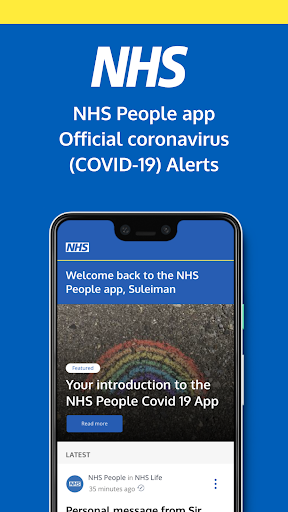  | 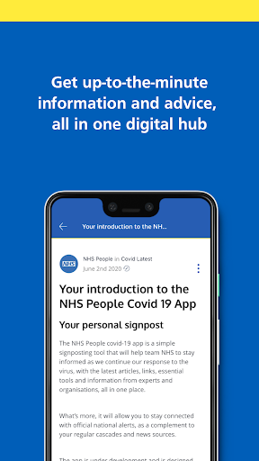  | 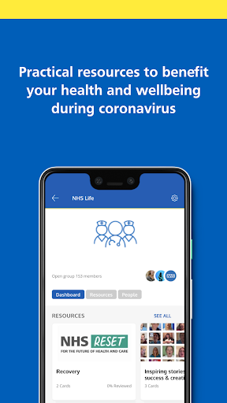  | 
 | 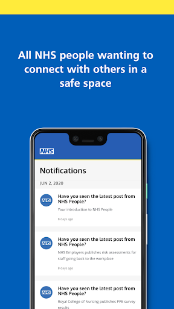 

## Development team
In the following we report the main information provided by the development team in the Google play store.

| | |
|-------------------------|-------------------------|
| **Developer**  | NHS Business Services Authority |
| **Website**  | - |
| **Email** | help@nhslife.nhs.uk |
| **Physical address**  | - |
| **Other developed apps**  | [https://play.google.com/store/apps/developer?id=NHS+Business+Services+Authority](https://play.google.com/store/apps/developer?id=NHS+Business+Services+Authority) |

## Android support

| | |
|-------------------------|-------------------------|
| **Declared target Android version**  | Pie, version 9 (API level 28) |
| **Effective target Android version**  | Pie, version 9 (API level 28) |
| **Minimum supported Android version**  | Jelly Bean, version 4.1.x (API level 16) |
| **Maximum target Android version**  | - |

The larger the difference between the minimum and maximum supported Android versions, the better. A larger difference means a wider audience. For example, old phones have a very low Android version, so a high minimum supported Android version means that the app cannot be used by users with old phones, thus leading to accessibility problems. 

## Requested permissions

In the following we report the complete list of the permissions requested by the app. 

| **Permission** | **Protection level** | **Description** | 
|-------------------------|-------------------------|-------------------------|
 **android.permission ACCESS_NETWORK_STATE** | Normal | Allows applications to access information about networks. 
 **android.permission ACCESS_WIFI_STATE** | Normal | Allows applications to access information about Wi-Fi networks. 
 **android.permission CAMERA** | :warning:**Dangerous** | Required to be able to access the camera device. 
 **android.permission INTERNET** | Normal | Allows applications to open network sockets. 
 **android.permission READ_APP_BADGE** | - | - 
 **android.permission RECEIVE_BOOT_COMPLETED** | Normal | Allows an application to receive the Intent.ACTION_BOOT_COMPLETED that is broadcast after the system finishes booting. 
 **android.permission SYSTEM_ALERT_WINDOW** | Signature - preinstalled - appop - pre23 - development | Allows an app to create windows using the type WindowManager.LayoutParams.TYPE_APPLICATION_OVERLAY, shown on top of all other apps. 
 **android.permission USE_FINGERPRINT** | Normal | This constant was deprecated in API level 28. Applications should request USE_BIOMETRIC instead 
 **android.permission VIBRATE** | Normal | Allows access to the vibrator. 
 **android.permission WAKE_LOCK** | Normal | Allows using PowerManager WakeLocks to keep processor from sleeping or screen from dimming. 
 **android.permission WRITE_EXTERNAL_STORAGE** | :warning:**Dangerous** | Allows an application to write to external storage. 
 **com.anddoes.launcher.permission UPDATE_COUNT** | - | - 
 **com.android.vending CHECK_LICENSE** | - | - 
 **com.google.android.c2dm.permission RECEIVE** | - | - 
 **com.google.android.finsky.permission BIND_GET_INSTALL_REFERRER_SERVICE** | - | - 
 **com.htc.launcher.permission READ_SETTINGS** | - | - 
 **com.htc.launcher.permission UPDATE_SHORTCUT** | - | - 
 **com.huawei.android.launcher.permission CHANGE_BADGE** | - | - 
 **com.huawei.android.launcher.permission READ_SETTINGS** | - | - 
 **com.huawei.android.launcher.permission WRITE_SETTINGS** | - | - 
 **com.majeur.launcher.permission UPDATE_BADGE** | - | - 
 **com.oppo.launcher.permission READ_SETTINGS** | - | - 
 **com.oppo.launcher.permission WRITE_SETTINGS** | - | - 
 **com.sec.android.provider.badge.permission READ** | - | - 
 **com.sec.android.provider.badge.permission WRITE** | - | - 
 **com.sonyericsson.home.permission BROADCAST_BADGE** | - | - 
 **com.sonymobile.home.permission PROVIDER_INSERT_BADGE** | - | - 
 **me.everything.badger.permission BADGE_COUNT_READ** | - | - 
 **me.everything.badger.permission BADGE_COUNT_WRITE** | - | - 

## Mentioned servers

| **Server** | **Registrant** | **Registrant country** | **Creation date** | 
|-------------------------|-------------------------|-------------------------|-------------------------|
 | bugsnag.com | Bugsnag Inc. | GB | 2011-08-18 03:26:10 |
 | android.com | Google LLC | :us: US | 1997-06-23 04:00:00 |
 | googlesyndication.com | Google LLC | :us: US | 2003-01-21 06:17:24 |
 | google.com | Google LLC | :us: US | 1997-09-15 04:00:00 |
 | app-measurement.com | Google LLC | :us: US | 2015-06-19 20:13:31 |
 | github.com | GitHub, Inc. | :us: US | 2007-10-09 18:20:50 |
 | googleapis.com | Google LLC | :us: US | 2005-01-25 17:52:26 |
 | googleadservices.com | Google LLC | :us: US | 2003-06-19 16:34:53 |

## Security analysis 

Below we report the main security warnings raised by our execution of the [Androwarn](https://github.com/maaaaz/androwarn) security analysis tool.

**Telephony identifiers leakage**
> - This application reads the numeric name (MCC+MNC) of current registered operator 
> - This application reads the operator name 
> - This application reads the phone number string for line 1, for example, the MSISDN for a GSM phone 

**Location lookup**
> - This application reads location information from all available providers (WiFi, GPS etc.) 

**Connection interfaces exfiltration**
> - This application reads details about the currently active data network 
> - This application tries to find out if the currently active data network is metered 

**Suspicious connection establishment**
> - This application opens a Socket and connects it to the remote address '' on the 'N/A' port  
> - This application opens a Socket and connects it to the remote address 'Ljava/lang/StringBuilder;->toString()Ljava/lang/String;' on the ': connect, resolve' port  
> - This application opens a Socket and connects it to the remote address 'Ljava/lang/StringBuilder;->toString()Ljava/lang/String;' on the 'N/A' port  
> - This application opens a Socket and connects it to the remote address 'Ljava/net/Proxy;->type()Ljava/net/Proxy$Type;' on the 'N/A' port  
> - This application opens a Socket and connects it to the remote address 'timeout' on the 'N/A' port  

**Pim data leakage**
> - This application accesses the downloads folder 
> - This application accesses data stored in the clipboard 

**Code execution**
> - This application loads a native library 
> - This application loads a native library: 'Ljava/util/Iterator;->next()Ljava/lang/Object;' 
> - This application loads a native library: 'bugsnag-ndk' 
> - This application loads a native library: 'bugsnag-plugin-android-anr' 
> - This application loads a native library: 'c++_shared' 
> - This application loads a native library: 'jniPdfium' 
> - This application loads a native library: 'modft2' 
> - This application loads a native library: 'modpdfium' 
> - This application loads a native library: 'modpng' 
> - This application executes a UNIX command containing this argument: '2' 

## User ratings and reviews

Below we provide information about how end users are reacting to the app in terms of ratings and reviews in the Google Play store.

### Ratings

The NHS People app has been installed by more than **500** times. At this time, **-** rated the app and its average score is **0.0**. Below we show the distribution of the ratings across the usual star-based rating of Google Play

:star::star::star::star::star:: 0

:star::star::star::star:: 0

:star::star::star:: 0

:star::star:: 0

:star:: 0

### Reviews 

#### 5-star reviews

No recent reviews available with 5 stars.

#### 4-star reviews

No recent reviews available with 4 stars.

#### 3-star reviews

No recent reviews available with 3 stars.

#### 2-star reviews

No recent reviews available with 2 stars.

#### 1-star reviews

No recent reviews available with 1 stars.

# Royal Mail - Tracking, redelivery, prices
App version ``6.0.1``

Analyzed with [covid-apps-observer](http://github.com/covid-apps-observer) project, version ``0.1``

## App overview
| | |
|-------------------------|-------------------------| 
| **Name**&nbsp;&nbsp;&nbsp;&nbsp;&nbsp;&nbsp;&nbsp;&nbsp;&nbsp;&nbsp;&nbsp;&nbsp;&nbsp;&nbsp;&nbsp;&nbsp;&nbsp;&nbsp;&nbsp;&nbsp;&nbsp;&nbsp;&nbsp;&nbsp;&nbsp;&nbsp;&nbsp;&nbsp;&nbsp;&nbsp;&nbsp;&nbsp;&nbsp;&nbsp;&nbsp;&nbsp;&nbsp;&nbsp;&nbsp;&nbsp;  | Royal Mail - Tracking, redelivery, prices |
| **Unique identifier** | com.royalmail.app.droid |
| **Link to Google Play** | [https://play.google.com/store/apps/details?id=com.royalmail.app.droid](https://play.google.com/store/apps/details?id=com.royalmail.app.droid) |
| **Summary**  | Easily manage your items and track your deliveries |
| **Privacy policy** | [https://www.royalmail.com/privacy-notice](https://www.royalmail.com/privacy-notice) |
| **Latest version** | 6.0.1 |
| **Last update** | 2020-11-19 13:20:27 |
| **Recent changes** | This latest release includes bug fixes and performance updates. |
| **Installs**  | 500,000+ |
| **Category** | Lifestyle |
| **First release** | Sep 4, 2018 |
| **Size**  | 73M |
| **Supported Android version**  | 8.0 and up |

### Description
> 📦📦📦 With the Royal Mail App, you can:
 • Send an item - quickly and easily buy postage in just a few steps. You can print your labels at home or take the QR code on the app to a Royal Mail Customer Service Point/Delivery Office and we’ll print the label for you when you drop off your item.
 • Find your nearest drop off location - Postbox, Parcel Postbox, Post Office branch or Royal Mail Customer Service Point.
 • Track your items – just enter your tracking ID number or scan the barcode to check the progress of your deliveries (available with Royal Mail Tracked and Royal Mail Special Delivery Guaranteed items)
 • Find the size and format of your parcel using the Augmented Reality Parcel Sizer guide. Available with AR supported devices.
 •	Change your delivery options to suit you – You can now change where your parcel is delivered, to a Safeplace or neighbour after it has been sent. (available with Royal Mail Tracked items)
 •	Get proof of postage sent straight to your phone – get that extra peace of mind when dropping of at any of our locations (including our 24/7 Parcel Postboxes)
 • Postcode and address finder – if you’re not sure of a full address, or want to check a postcode, just enter part of the address and we’ll fill in the blanks
 • Find any Post Office locations or Customer Service Point/Delivery Office to print your label or drop off your item, with opening hours, address, map, available services and directions
 • Receive push notifications on your deliveries - never miss a delivery update
 • Save items you are tracking, and add an alias name making them easier to identify 
 • See a photograph of the signature if someone has signed for it, or the Safeplace an item has been delivered to
 • Book a Redelivery – if you’ve missed an item you can easily book a Redelivery to your address, your neighbour’s address or a local Post Office – and specify a delivery day
 • Save postage receipts – simply take a photo of your receipt and store it to the app
 • Track an item on the go - if you have Alexa, you can track your delivery by saying an alias name you have previously assigned to an item

### User interface
The developers of the app provide the following screenshots in the Google play store.
| | | |
|:-------------------------:|:-------------------------:|:-------------------------:|
 |   |   |   | 
 |   |   |   | 
 |  

## Development team
In the following we report the main information provided by the development team in the Google play store.

| | |
|-------------------------|-------------------------|
| **Developer**  | Royal Mail Group |
| **Website**  | [https://www.royalmail.com](https://www.royalmail.com) |
| **Email** | appfeedback@royalmail.com |
| **Physical address**  | - |
| **Other developed apps**  | [https://play.google.com/store/apps/developer?id=Royal+Mail+Group](https://play.google.com/store/apps/developer?id=Royal+Mail+Group) |

## Android support

| | |
|-------------------------|-------------------------|
| **Declared target Android version**  | - |
| **Effective target Android version**  | - |
| **Minimum supported Android version**  | Oreo, version 8.0.0 (API level 26) |
| **Maximum target Android version**  | - |

The larger the difference between the minimum and maximum supported Android versions, the better. A larger difference means a wider audience. For example, old phones have a very low Android version, so a high minimum supported Android version means that the app cannot be used by users with old phones, thus leading to accessibility problems. 

## Requested permissions

In the following we report the complete list of the permissions requested by the app. 

| **Permission** | **Protection level** | **Description** | 
|-------------------------|-------------------------|-------------------------|
 **android.permission ACCESS_FINE_LOCATION** | :warning:**Dangerous** | Allows an app to access precise location. 
 **android.permission ACCESS_NETWORK_STATE** | Normal | Allows applications to access information about networks. 
 **android.permission CAMERA** | :warning:**Dangerous** | Required to be able to access the camera device. 
 **android.permission INTERNET** | Normal | Allows applications to open network sockets. 
 **android.permission RECEIVE_BOOT_COMPLETED** | Normal | Allows an application to receive the Intent.ACTION_BOOT_COMPLETED that is broadcast after the system finishes booting. 
 **android.permission WAKE_LOCK** | Normal | Allows using PowerManager WakeLocks to keep processor from sleeping or screen from dimming. 
 **android.permission WRITE_EXTERNAL_STORAGE** | :warning:**Dangerous** | Allows an application to write to external storage. 
 **com.google.android.c2dm.permission RECEIVE** | - | - 
 **com.royalmail.app.droid.permission MAPS_RECEIVE** | - | - 

## Mentioned servers

| **Server** | **Registrant** | **Registrant country** | **Creation date** | 
|-------------------------|-------------------------|-------------------------|-------------------------|
 | google.com | Google LLC | :us: US | 1997-09-15 04:00:00 |
 | microsoft.com | Microsoft Corporation | :us: US | 1991-05-02 04:00:00 |
 | tealiumiq.com | Whois Privacy Service | :us: US | 2011-02-09 18:33:06 |
 | googleapis.com | Google LLC | :us: US | 2005-01-25 17:52:26 |

## Security analysis 

Below we report the main security warnings raised by our execution of the [Androwarn](https://github.com/maaaaz/androwarn) security analysis tool.

**Telephony identifiers leakage**
> - This application reads the ISO country code equivalent of the current registered operator's MCC (Mobile Country Code) 
> - This application reads the numeric name (MCC+MNC) of current registered operator 
> - This application reads the operator name 

**Connection interfaces exfiltration**
> - This application reads details about the currently active data network 
> - This application tries to find out if the currently active data network is metered 

**Suspicious connection establishment**
> - This application opens a Socket and connects it to the remote address '' on the 'N/A' port  
> - This application opens a Socket and connects it to the remote address 'Ljava/lang/StringBuilder;->toString()Ljava/lang/String;' on the 'N/A' port  
> - This application opens a Socket and connects it to the remote address 'Ljava/net/Proxy;->type()Ljava/net/Proxy$Type;' on the 'N/A' port  
> - This application opens a Socket and connects it to the remote address 'timeout' on the 'N/A' port  

**Code execution**
> - This application loads a native library 
> - This application loads a native library: 'arcore_sdk_jni' 
> - This application loads a native library: 'arsceneview_jni' 
> - This application loads a native library: 'filament-jni' 
> - This application loads a native library: 'mono-native' 
> - This application loads a native library: 'monodroid' 
> - This application loads a native library: 'monosgen-2.0' 
> - This application loads a native library: 'xamarin-app' 
> - This application loads a native library: 'xamarin-debug-app-helper' 

## User ratings and reviews

Below we provide information about how end users are reacting to the app in terms of ratings and reviews in the Google Play store.

### Ratings

The Royal Mail - Tracking, redelivery, prices app has been installed by more than **500000** times. At this time, **2751** rated the app and its average score is **2.0981817**. Below we show the distribution of the ratings across the usual star-based rating of Google Play

:star::star::star::star::star:: 580

:star::star::star::star:: 130

:star::star::star:: 90

:star::star:: 130

:star:: 1821

### Reviews 

#### 5-star reviews

> Very Good App  :date: __2020-11-19 17:14:06__

> Great  :date: __2020-11-16 11:50:10__

> Good  :date: __2020-11-16 01:02:03__

> I THINK IT IS GREAT THANK YOU ROYAL MAIL YOUR DOING A AWESOME HARD JOB STAY SAFE  :date: __2020-11-14 15:10:30__

> Had first requested redelivery.Found difficult to find without app.And in Covid mode extremely lengthy process arranging services like redelivery for inform aged real pergatory!  :date: __2020-11-11 00:14:10__

> \*\*" EDIT\*\** well what a fab turn around with the app.... Over the moon how much better it works now, updates are second to none.... Really pleased with the app now!!! 5* What a joke, trying to make an account up and type in email.. And it doubles the words when trying to spell it out wont let me delete and tracking down 😡 NOT happy with R.M  :date: __2020-11-10 08:48:18__

> Convenient  :date: __2020-11-09 00:02:29__

> 👍☑️  :date: __2020-11-07 22:53:11__

> Love my app, makes tracking etc simple. Clear menus, easy to follow.  :date: __2020-11-06 19:09:15__

> So handy  :date: __2020-11-03 14:20:58__

#### 4-star reviews

> Easy to arrange re-delivery of parcels.  :date: __2020-11-17 21:07:07__

> Well I used app for a redelivery and still waiting for parcel, its 20 past 6, I live in hope. Other than that app seems to be working ok.  :date: __2020-11-07 19:18:29__

> Last few times I've re booked delivery.they havent arrived and had to re book again.  :date: __2020-10-06 14:49:54__

> works fine  :date: __2020-10-04 15:07:40__

> Well I haven't received any thing from you bar letters but I think the post office and the postie's ARE EXCELLENT  :date: __2020-10-03 14:57:01__

> Patchy  :date: __2020-10-01 11:30:23__

> Much better since the bugs that made it crash on Android Oreo were fixed  :date: __2020-09-24 08:35:09__

> Ok  :date: __2020-09-16 00:31:29__

> Very good experience.  :date: __2020-09-15 08:34:59__

> Works well again after update, thank you. Little bit slow responding and the tracking is not planned well but I can live with that.  :date: __2020-09-10 21:05:17__

#### 3-star reviews

> Good app love you can name deliveries, however when you recieve a push notification and pull down your notification drawer usually there isn't enough room to display the full notification so I press on it assuming it will open the app and display the notification in full but it doesn't it just opens the app normally and the notification is lost. Otherwise a great app.  :date: __2020-11-21 09:40:21__

> A bit iffy. Sometimes info is spot on, other times non existent, or plain wrong. Not really good enough for what they consider to be a Premium Brand. Sort yourselves out!  :date: __2020-11-20 11:01:26__

> Overall a very good service  :date: __2020-11-17 17:21:54__

> The first time I used this app it was awful and I gave up, it's now at least useable, but still needs a lot of work  :date: __2020-11-14 13:18:20__

> App is useful by some bug. The tracking pages need looking at badly  :date: __2020-11-13 19:39:37__

> Please allow the option to reference name a parcel/tracking number provided by a seller, even before it has a status attached.  :date: __2020-11-03 15:49:49__

> 3 * because I have tried to get a redelivery for a item and it won't allow me to redeliver keeps saying "validation error if this persists contact the site provider" brilliant idea but whats all that about?  :date: __2020-10-31 15:50:42__

> No collection service option. Was expecting to purchase my postage and select a collection in one simple app. But no, the new parcel collection service doesn't seem to be available as it is on the desktop site. Very disappointing as their competitors make it so easy.  :date: __2020-10-26 21:57:33__

> I don't use snail mail very often so don't buy stamps. For me this app is very welcome since it means not having to go online to buy postage. What it lacks and needs is the ability to print straight to an envelope rather than a label (their old service had this). It would be good if it could store your information so that you do not have to enter it each time. So good start Royal Mail now develop it further  :date: __2020-10-17 17:46:24__

> This app is generally useful but has two flaws. It doesn't remember your name and address, so every single time I print postage for a letter I have to re-type my it. Plus the need for a title when I only know someone's forename and surname is frustrating.  :date: __2020-10-16 14:13:11__

#### 2-star reviews

> Really good idea but be so careful when printing out labels.....the app tends to hold onto the last label bought so you may end up sending the item to the wrong person as I did  :date: __2020-11-17 21:38:40__

> I have received text messages from you saying that my parcel is due today at a certain time, and it's showing me that it has been delivered today, but i don't have any parcel, so can someone tell me what is going on with my parcel please, thanks. Mr. Edmond Cairns. EH65EW  :date: __2020-11-15 03:27:13__

> No tracking updates, no option to saved details, no copy and paste option.  :date: __2020-11-09 13:00:55__

> Keeps saying error messages when performing basic functions. Uninstall!  :date: __2020-11-08 11:50:51__

> This app stresses me out lol  :date: __2020-11-06 12:42:20__

> You should add options for our tracking items where it should be if we're not at home. For example , where should we leave your package? In the shed etc.  :date: __2020-10-31 04:04:45__

> Want too much info and password setting is a joke  :date: __2020-10-30 00:09:31__

> Ok to track parcels, completely useless to alter delivery. Tried it twice so far, both times the request was ignored and I was bombarded with texts and e-mails advising me parcels couldn't be delivered on the day I'd already said to not deliver on. Then had to rebook the already rebooked delivery as the original request had been deleted! The app looks nice and is easy to use. Shame it seems to have absolutely no use other than that.  :date: __2020-10-29 21:08:28__

> Why does RM require one to sign up just for tracking a simple item? I don't see the point of making an account with RM app for such a simple thing. RM needs to change this feature on their app wherein you can track status of an item without having to sign up / log in  :date: __2020-10-27 11:51:31__

> Validation error trying to book redelivery.  :date: __2020-10-26 23:43:57__

#### 1-star reviews

> Added details address password etc etc then get a message "error, sorry we are unable to deal with your request ". No next step or reason why or what to do next.  :date: __2020-11-23 10:16:34__

> Awful waste of time why not just let me simply arrange a re-delivery on the website instead I have to go through account set up on the app only for it not to work!  :date: __2020-11-23 09:56:56__

> Worthless. First off why do I need a app to book a redelivery. Secondly why do I need a app to book a delivery that can't even work.  :date: __2020-11-22 21:30:42__

> Absolutely shocking that an app of this quality has been released by Royal Mail. This would fail as a GCSE Computing project, it is that bad.  :date: __2020-11-22 17:14:12__

> Utter rubbish. Complete waste of time.  :date: __2020-11-22 10:28:18__

> Absolutely Rubbish, constant error message trying to book a redelivery.  :date: __2020-11-21 21:06:47__

> Terrible, wanted to pick up a parcel I missed while at work, went after work the next day since Google and their website said they were open but no. After calling them THE ONLY WAY TO TELL IF THEY WERE OPEN WAS BY DOWNLOADING THE APP SIGHNING UP AND CHECKING THAT WAY. Now I try to get onto the app again it refuses to allow me to do anything unless I go onto the website and scan a QR code. How the hell can royal mail think this is acceptable during covid, update your times on google.  :date: __2020-11-21 20:47:54__

> It's unacceptable to make you download an app to use their redelivery service. The app crashed multiple times and was very slow when trying to sort the redelivery as well so its not fit for purpose. You want people to stay home, well let them organise on the website, or at the very least get some better programmers.  :date: __2020-11-21 16:55:03__

> Don't waste your time. After you register it shows an error and you can't do anything  :date: __2020-11-21 13:57:11__

> Terrible app. No option to scan QR code. Long and pointless registration that you then can't use any of the details from to pull through for delivery and have enter it all again. What a joke!  :date: __2020-11-21 09:42:47__

# City of Corona App
App version ``1.0.0``

Analyzed with [covid-apps-observer](http://github.com/covid-apps-observer) project, version ``0.1``

## App overview
| | |
|-------------------------|-------------------------| 
| **Name**&nbsp;&nbsp;&nbsp;&nbsp;&nbsp;&nbsp;&nbsp;&nbsp;&nbsp;&nbsp;&nbsp;&nbsp;&nbsp;&nbsp;&nbsp;&nbsp;&nbsp;&nbsp;&nbsp;&nbsp;&nbsp;&nbsp;&nbsp;&nbsp;&nbsp;&nbsp;&nbsp;&nbsp;&nbsp;&nbsp;&nbsp;&nbsp;&nbsp;&nbsp;&nbsp;&nbsp;&nbsp;&nbsp;&nbsp;&nbsp;  | City of Corona App |
| **Unique identifier** | io.appbuild.cityofco1 |
| **Link to Google Play** | [https://play.google.com/store/apps/details?id=io.appbuild.cityofco1](https://play.google.com/store/apps/details?id=io.appbuild.cityofco1) |
| **Summary**  | Welcome to the City of Corona App |
| **Privacy policy** | [http://cms.appbuild.io/cms/docs/legal/privacy.php?appcode=thisapp](http://cms.appbuild.io/cms/docs/legal/privacy.php?appcode=thisapp) |
| **Latest version** | 1.0.0 |
| **Last update** | 2020-10-05 17:40:49 |
| **Recent changes** | - |
| **Installs**  | 50,000+ |
| **Category** | Lifestyle |
| **First release** | Nov 28, 2018 |
| **Size**  | 27M |
| **Supported Android version**  | 5.1 and up |

### Description
> The City of Corona app provides simple methods for the community residents to engage and be part of this wonderful community. It provides ways to pay bills, sign up for recreation activities, call departments with one click, as well as Live Video feeds from many traffic cameras throughout the city. Through GPS maps, users of the app will be able to find their way to many official City offices, parks, and other locations. When looking for something to do, a calendar has events with the ability to have push notifications with instant alerts on crime, traffic, events, and more.

### User interface
The developers of the app provide the following screenshots in the Google play store.
| | | |
|:-------------------------:|:-------------------------:|:-------------------------:|
 |   |   |   | 
 |   |   |   | 
 |   |  

## Development team
In the following we report the main information provided by the development team in the Google play store.

| | |
|-------------------------|-------------------------|
| **Developer**  | City of Corona |
| **Website**  | [http://www.discovercorona.com](http://www.discovercorona.com) |
| **Email** | Brittanyr@ci.corona.ca.us |
| **Physical address**  | [400 S Vicentia Ave Suite 310 Corona, CA 92882](https://www.google.com/maps/search/400%20S%20Vicentia%20Ave%20Suite%20310%20Corona,%20CA%2092882) (Google Maps) |
| **Other developed apps**  | [https://play.google.com/store/apps/developer?id=City+of+Corona](https://play.google.com/store/apps/developer?id=City+of+Corona) |

## Android support

| | |
|-------------------------|-------------------------|
| **Declared target Android version**  | Android10, version 10 (API level 29) |
| **Effective target Android version**  | Android10, version 10 (API level 29) |
| **Minimum supported Android version**  | Lollipop, version 5.1 (API level 22) |
| **Maximum target Android version**  | - |

The larger the difference between the minimum and maximum supported Android versions, the better. A larger difference means a wider audience. For example, old phones have a very low Android version, so a high minimum supported Android version means that the app cannot be used by users with old phones, thus leading to accessibility problems. 

## Requested permissions

In the following we report the complete list of the permissions requested by the app. 

| **Permission** | **Protection level** | **Description** | 
|-------------------------|-------------------------|-------------------------|
 **android.permission ACCESS_ASSISTED_GPS** | - | - 
 **android.permission ACCESS_COARSE_LOCATION** | :warning:**Dangerous** | Allows an app to access approximate location. 
 **android.permission ACCESS_FINE_LOCATION** | :warning:**Dangerous** | Allows an app to access precise location. 
 **android.permission ACCESS_GPS** | - | - 
 **android.permission ACCESS_LOCATION_EXTRA_COMMANDS** | Normal | Allows an application to access extra location provider commands. 
 **android.permission ACCESS_MOCK_LOCATION** | - | - 
 **android.permission ACCESS_NETWORK_STATE** | Normal | Allows applications to access information about networks. 
 **android.permission CAMERA** | :warning:**Dangerous** | Required to be able to access the camera device. 
 **android.permission FLASHLIGHT** | - | - 
 **android.permission FOREGROUND_SERVICE** | Normal | Allows a regular application to use Service.startForeground. 
 **android.permission INTERNET** | Normal | Allows applications to open network sockets. 
 **android.permission READ_APP_BADGE** | - | - 
 **android.permission REQUEST_IGNORE_BATTERY_OPTIMIZATIONS** | Normal | Permission an application must hold in order to use Settings.ACTION_REQUEST_IGNORE_BATTERY_OPTIMIZATIONS. 
 **android.permission VIBRATE** | Normal | Allows access to the vibrator. 
 **android.permission WAKE_LOCK** | Normal | Allows using PowerManager WakeLocks to keep processor from sleeping or screen from dimming. 
 **android.permission WRITE_EXTERNAL_STORAGE** | :warning:**Dangerous** | Allows an application to write to external storage. 
 **com.anddoes.launcher.permission UPDATE_COUNT** | - | - 
 **com.google.android.c2dm.permission RECEIVE** | - | - 
 **com.htc.launcher.permission READ_SETTINGS** | - | - 
 **com.htc.launcher.permission UPDATE_SHORTCUT** | - | - 
 **com.huawei.android.launcher.permission CHANGE_BADGE** | - | - 
 **com.huawei.android.launcher.permission READ_SETTINGS** | - | - 
 **com.huawei.android.launcher.permission WRITE_SETTINGS** | - | - 
 **com.majeur.launcher.permission UPDATE_BADGE** | - | - 
 **com.oppo.launcher.permission READ_SETTINGS** | - | - 
 **com.oppo.launcher.permission WRITE_SETTINGS** | - | - 
 **com.sec.android.provider.badge.permission READ** | - | - 
 **com.sec.android.provider.badge.permission WRITE** | - | - 
 **com.sonyericsson.home.permission BROADCAST_BADGE** | - | - 
 **com.sonymobile.home.permission PROVIDER_INSERT_BADGE** | - | - 
 **io.appbuild.cityofco1.permission C2D_MESSAGE** | - | - 
 **me.everything.badger.permission BADGE_COUNT_READ** | - | - 
 **me.everything.badger.permission BADGE_COUNT_WRITE** | - | - 

## Mentioned servers

| **Server** | **Registrant** | **Registrant country** | **Creation date** | 
|-------------------------|-------------------------|-------------------------|-------------------------|
 | braintreegateway.com | PayPal Inc. | :us: US | 2009-10-06 23:05:33 |
 | googlesyndication.com | Google LLC | :us: US | 2003-01-21 06:17:24 |
 | google.com | Google LLC | :us: US | 1997-09-15 04:00:00 |
 | facebook.com | Facebook, Inc. | :us: US | 1997-03-29 05:00:00 |
 | googleapis.com | Google LLC | :us: US | 2005-01-25 17:52:26 |
 | google-analytics.com | Google LLC | :us: US | 2005-07-18 19:24:32 |
 | app-measurement.com | Google LLC | :us: US | 2015-06-19 20:13:31 |
 | googleapis.com | Google LLC | :us: US | 2005-01-25 17:52:26 |
 | doubleclick.net | Google Inc. | :us: US | 1996-01-16 05:00:00 |
 | gstatic.com | Google LLC | :us: US | 2008-02-11 15:31:25 |
 | googleapis.com | Google LLC | :us: US | 2005-01-25 17:52:26 |
 | visa.com | Visa International Service Association | :us: US | 1994-03-08 05:00:00 |
 | googletagmanager.com | Google LLC | :us: US | 2011-11-11 23:39:05 |
 | appspot.com | Google LLC | :us: US | 2005-03-10 02:27:55 |
 | paypal.com | PayPal Inc. | :us: US | 1999-07-15 05:32:11 |
 | paypalobjects.com | PayPal Inc. | :us: US | 2005-05-12 17:11:21 |
 | whatsapp.com | Whatsapp Inc. | :us: US | 2008-09-04 12:39:12 |

## Security analysis 

Below we report the main security warnings raised by our execution of the [Androwarn](https://github.com/maaaaz/androwarn) security analysis tool.

**Telephony identifiers leakage**
> - This application reads the ISO country code equivalent for the SIM provider's country code 
> - This application reads the MCC+MNC of the provider of the SIM 
> - This application reads the SIM's serial number 
> - This application reads the Service Provider Name (SPN) 
> - This application reads the current location of the device 
> - This application reads the device phone type value 
> - This application reads the numeric name (MCC+MNC) of current registered operator 
> - This application reads the operator name 
> - This application reads the radio technology (network type) currently in use on the device for data transmission 
> - This application reads the unique device ID, i.e the IMEI for GSM and the MEID or ESN for CDMA phones 
> - This application reads the unique subscriber ID, for example, the IMSI for a GSM phone 
> - This application reads the Cell ID value 
> - This application reads the Location Area Code value 

**Location lookup**
> - This application reads location information from all available providers (WiFi, GPS etc.) 

**Connection interfaces exfiltration**
> - This application reads details about the currently active data network 
> - This application tries to find out if the currently active data network is metered 

**Telephony services abuse**
> - This application makes phone calls 
> - This application sends an SMS message 'v12' to the 'Landroid/content/Intent;-><init>()V' phone number 

**Suspicious connection establishment**
> - This application opens a Socket and connects it to the remote address '' on the '80' port  
> - This application opens a Socket and connects it to the remote address 'Network subsystem is unavailable' on the 'N/A' port  

**Pim data leakage**
> - This application accesses the downloads folder 
> - This application accesses data stored in the clipboard 

**Code execution**
> - This application loads a native library 
> - This application executes a UNIX command 
> - This application executes a UNIX command containing this argument: 'Ljava/lang/StringBuilder;->toString()Ljava/lang/String;' 

## User ratings and reviews

Below we provide information about how end users are reacting to the app in terms of ratings and reviews in the Google Play store.

### Ratings

The City of Corona App app has been installed by more than **50000** times. At this time, **43** rated the app and its average score is **3.4418604**. Below we show the distribution of the ratings across the usual star-based rating of Google Play

:star::star::star::star::star:: 21

:star::star::star::star:: 4

:star::star::star:: 3

:star::star:: 3

:star:: 12

### Reviews 

#### 5-star reviews

> Supper  :date: __2020-04-05 18:13:09__

> It is not use  :date: __2020-03-29 04:46:06__

> it is frod  :date: __2020-03-18 13:24:03__

#### 4-star reviews

No recent reviews available with 4 stars.

#### 3-star reviews

> Something something right  :date: __2020-04-03 18:03:13__

#### 2-star reviews

No recent reviews available with 2 stars.

#### 1-star reviews

> useless  :date: __2020-04-14 07:39:44__

> Very bad experience this app in this condition  :date: __2020-04-14 07:05:12__

> Not opening this sight.As per news paper we have to down load the Appp"CORONA KAWACH which informs regarding corona patients near by and advise to take necessary precautions in this regard.But thisdoes not appear in the list .  :date: __2020-03-31 15:34:55__

> does not work very bad performance  :date: __2020-03-30 21:48:38__

> Doesn't work well at all. Download App direct from City of Corona website.  :date: __2019-06-21 00:33:30__

# ALHOSN UAE
App version ``1.44.248``

Analyzed with [covid-apps-observer](http://github.com/covid-apps-observer) project, version ``0.1``

## App overview
| | |
|-------------------------|-------------------------| 
| **Name**&nbsp;&nbsp;&nbsp;&nbsp;&nbsp;&nbsp;&nbsp;&nbsp;&nbsp;&nbsp;&nbsp;&nbsp;&nbsp;&nbsp;&nbsp;&nbsp;&nbsp;&nbsp;&nbsp;&nbsp;&nbsp;&nbsp;&nbsp;&nbsp;&nbsp;&nbsp;&nbsp;&nbsp;&nbsp;&nbsp;&nbsp;&nbsp;&nbsp;&nbsp;&nbsp;&nbsp;&nbsp;&nbsp;&nbsp;&nbsp;  | ALHOSN UAE |
| **Unique identifier** | doh.health.shield |
| **Link to Google Play** | [https://play.google.com/store/apps/details?id=doh.health.shield](https://play.google.com/store/apps/details?id=doh.health.shield) |
| **Summary**  | ALHOSN UAE allows you to keep your COVID-19 results on your mobile device |
| **Privacy policy** | [https://alhosnapp.ae/en/privacy-policy/](https://alhosnapp.ae/en/privacy-policy/) |
| **Latest version** | 1.44.248 |
| **Last update** | 2020-11-10 11:38:29 |
| **Recent changes** | - Improved user experience - App stability |
| **Installs**  | 1,000,000+ |
| **Category** | Medical |
| **First release** | Apr 7, 2020 |
| **Size**  | 12M |
| **Supported Android version**  | 5.0 and up |

### Description
> The ALHOSN UAE app is the official COVID-19 testing channel for health authorities in the United Arab Emirates, by the Ministry of Health and Prevention.
 By using the app, everyone can help stop the spread of COVID-19 and keep their family and friends safe.
  
 You can receive your COVID-19 test results directly on your phone with a unique QR code that is proof of your status and that of everyone else around you who also have the app, giving you peace of mind that you can safely interact.
 The app can also help trace people who may have come within close proximity to confirmed COVID-19 cases for an extended period of time. It uses short-distance Bluetooth signals to determine when your phone is near another phone that also has the app installed.  Both phones exchange anonymized IDs which are then stored in encrypted form on your phone. Using the anonymized IDs, health authorities can quickly identify and contact people at risk of infection so they can be retested.
  
 Put your health in your hands with 3 easy steps:
 1.      Download the ALHOSN UAE app
 2.      Authenticate with your Emirates ID and phone number
 3.      Turn on Bluetooth and push notifications on your smartphone
  
 Download the ALHOSN UAE app today and share it with your family and friends.
 Together, we can stop the spread of COVID-19
 Safer Together.

### User interface
The developers of the app provide the following screenshots in the Google play store.
| | | |
|:-------------------------:|:-------------------------:|:-------------------------:|
 |   |  

## Development team
In the following we report the main information provided by the development team in the Google play store.

| | |
|-------------------------|-------------------------|
| **Developer**  | Ministry of Health and Prevention - UAE |
| **Website**  | [https://alhosnapp.ae/en/contact-us/](https://alhosnapp.ae/en/contact-us/) |
| **Email** | info@alhosnapp.ae |
| **Physical address**  | - |
| **Other developed apps**  | [https://play.google.com/store/apps/developer?id=Ministry+of+Health+and+Prevention+-+UAE](https://play.google.com/store/apps/developer?id=Ministry+of+Health+and+Prevention+-+UAE) |

## Android support

| | |
|-------------------------|-------------------------|
| **Declared target Android version**  | Android10, version 10 (API level 29) |
| **Effective target Android version**  | Android10, version 10 (API level 29) |
| **Minimum supported Android version**  | Lollipop, version 5.0 (API level 21) |
| **Maximum target Android version**  | - |

The larger the difference between the minimum and maximum supported Android versions, the better. A larger difference means a wider audience. For example, old phones have a very low Android version, so a high minimum supported Android version means that the app cannot be used by users with old phones, thus leading to accessibility problems. 

## Requested permissions

In the following we report the complete list of the permissions requested by the app. 

| **Permission** | **Protection level** | **Description** | 
|-------------------------|-------------------------|-------------------------|
 **android.permission ACCESS_BACKGROUND_LOCATION** | :warning:**Dangerous** | Allows an app to access location in the background. 
 **android.permission ACCESS_FINE_LOCATION** | :warning:**Dangerous** | Allows an app to access precise location. 
 **android.permission ACCESS_NETWORK_STATE** | Normal | Allows applications to access information about networks. 
 **android.permission BLUETOOTH** | Normal | Allows applications to connect to paired bluetooth devices. 
 **android.permission BLUETOOTH_ADMIN** | Normal | Allows applications to discover and pair bluetooth devices. 
 **android.permission CAMERA** | :warning:**Dangerous** | Required to be able to access the camera device. 
 **android.permission FOREGROUND_SERVICE** | Normal | Allows a regular application to use Service.startForeground. 
 **android.permission INTERNET** | Normal | Allows applications to open network sockets. 
 **android.permission QUICKBOOT_POWERON** | - | - 
 **android.permission RECEIVE_BOOT_COMPLETED** | Normal | Allows an application to receive the Intent.ACTION_BOOT_COMPLETED that is broadcast after the system finishes booting. 
 **android.permission REQUEST_IGNORE_BATTERY_OPTIMIZATIONS** | Normal | Permission an application must hold in order to use Settings.ACTION_REQUEST_IGNORE_BATTERY_OPTIMIZATIONS. 
 **android.permission WAKE_LOCK** | Normal | Allows using PowerManager WakeLocks to keep processor from sleeping or screen from dimming. 
 **android.permission WRITE_EXTERNAL_STORAGE** | :warning:**Dangerous** | Allows an application to write to external storage. 
 **com.google.android.c2dm.permission RECEIVE** | - | - 

## Mentioned servers

| **Server** | **Registrant** | **Registrant country** | **Creation date** | 
|-------------------------|-------------------------|-------------------------|-------------------------|
 | adobe.com | Adobe Inc. | :us: US | 1986-11-17 05:00:00 |
 | google.com | Google LLC | :us: US | 1997-09-15 04:00:00 |
 | healthshielduae.com | Domains By Proxy, LLC | :us: US | 2020-03-31 19:30:02 |

## Security analysis 

Below we report the main security warnings raised by our execution of the [Androwarn](https://github.com/maaaaz/androwarn) security analysis tool.

**Connection interfaces exfiltration**
> - This application reads details about the currently active data network 
> - This application tries to find out if the currently active data network is metered 

**Suspicious connection establishment**
> - This application opens a Socket and connects it to the remote address 'Li/b/a/a/a;->f(Ljava/lang/String;)Ljava/lang/StringBuilder;' on the 'N/A' port  
> - This application opens a Socket and connects it to the remote address 'Ljava/net/Proxy;->type()Ljava/net/Proxy$Type;' on the 'N/A' port  
> - This application opens a Socket and connects it to the remote address 'hostname == null ' on the 'N/A' port  
> - This application opens a Socket and connects it to the remote address 'timeout' on the 'N/A' port  

**Code execution**
> - This application loads a native library 
> - This application loads a native library: 'tool-checker' 
> - This application executes a UNIX command 
> - This application executes a UNIX command containing this argument: 'getprop' 
> - This application executes a UNIX command containing this argument: 'mount' 

## User ratings and reviews

Below we provide information about how end users are reacting to the app in terms of ratings and reviews in the Google Play store.

### Ratings

The ALHOSN UAE app has been installed by more than **1000000** times. At this time, **6085** rated the app and its average score is **4.3555193**. Below we show the distribution of the ratings across the usual star-based rating of Google Play

:star::star::star::star::star:: 4545

:star::star::star::star:: 543

:star::star::star:: 266

:star::star:: 79

:star:: 652

### Reviews 

#### 5-star reviews

> Good  :date: __2020-11-23 07:10:19__

> its helpful  :date: __2020-11-23 07:06:39__

> This is Good Aplication. We can easily view our report in details.  :date: __2020-11-22 06:25:39__

> Good  :date: __2020-11-22 03:57:26__

> Nice app  :date: __2020-11-22 02:20:31__

> Best  :date: __2020-11-21 14:04:09__

> Very Convinient  :date: __2020-11-21 09:02:40__

> Good profit  :date: __2020-11-21 07:11:18__

> Really good experience. Easy to use and reliable.  :date: __2020-11-21 03:24:22__

> This is very good app  :date: __2020-11-20 09:49:07__

#### 4-star reviews

> Good service  :date: __2020-11-17 10:53:49__

> It is hard to open the application  :date: __2020-11-14 15:22:10__

> Free testing centre of covid 19 testing  :date: __2020-11-14 07:21:24__

> Working fine just open location blootooth charging it's working.  :date: __2020-11-08 17:53:37__

> Good  :date: __2020-11-06 08:02:29__

> Good apps for me  :date: __2020-11-06 07:47:50__

> Good  :date: __2020-11-04 18:01:37__

> nice  :date: __2020-11-03 20:12:28__

> great app  :date: __2020-11-02 13:46:34__

> Shows test results well but I haven't seen any link to tracing.  :date: __2020-11-02 08:50:02__

#### 3-star reviews

> I just received the text message result. I wanna download the result document n need to upload to my HR portal. I just login to the app with the emirates ID and phone number. The current result is not reflecting.  :date: __2020-11-21 07:44:11__

> Not updating to vaccinated status. No one answering the al hosn support nor email not working.  :date: __2020-11-20 22:19:28__

> App crash. Can't open apps it's crash always  :date: __2020-11-16 20:03:12__

> It is ok I guess  :date: __2020-11-16 08:57:46__

> Hello i had pcr test yesterday and my result still not receive,anyone can help me my alhons not updated.  :date: __2020-11-11 08:48:20__

> Unable to register. Just a blank screen on opening the app .  :date: __2020-11-10 13:15:49__

> DPR Tests from dubai don't show here  :date: __2020-11-10 08:35:44__

> Update not ready  :date: __2020-11-08 07:05:38__

> لا تعليق  :date: __2020-11-07 02:53:04__

> Easy to use  :date: __2020-11-04 23:39:07__

#### 2-star reviews

> The latest update is unstable (frequently hanging) and also no longer shows how many days have past since the last testing date. With the previous version, the user/inspector can easily see how many days have passed since the last COVID19 test. In latest version, if you access the result after some time (4 days in my experience) it will just say "Negative - Expired". In the previous version, it would say "Negative for 4 days"..  :date: __2020-11-22 10:04:15__

> I can't open the app with mobile data or Wi-Fi I'm still out side the Country and I'm facing this issue  :date: __2020-11-18 14:16:54__

> App is very slow  :date: __2020-11-12 18:32:40__

> I couldnt check my status, and no option to answer pre survey..This app is not compatible with my mobile..please fix the issue, thank you  :date: __2020-11-11 13:56:02__

> Hello. This is a last resort from my side. I've done my pcr test last week and to date it has not been updated in the app. I've received the result via SMS too. I've called your hotline and they've promised it'll reflect by max yesterday. And still nothing. Please help.  :date: __2020-11-09 09:14:57__

> Good  :date: __2020-11-08 15:28:22__

> not moving to submit not abal to get result  :date: __2020-11-08 09:35:22__

> Battery usage is verh high while running this application  :date: __2020-11-05 11:36:27__

> To much notification  :date: __2020-11-04 09:57:57__

> Very slow. Jams a lot  :date: __2020-10-31 09:55:09__

#### 1-star reviews

> Good  :date: __2020-11-22 13:45:27__

> I took corona test via passport but there is no other way to check in this app via passport  :date: __2020-11-22 10:45:12__

> After installing the app is not opening, not working.  :date: __2020-11-21 21:15:35__

> Nice app  :date: __2020-11-21 14:40:14__

> This app sucks  :date: __2020-11-20 15:00:26__

> Its not working properly, morning i got result by message but in this app still (evening) did not update.  :date: __2020-11-20 11:12:33__

> Application doesn't work, screen shows the logo and nothing happens after that.  :date: __2020-11-20 10:41:47__

> Pathatic  :date: __2020-11-20 09:42:06__

> Not working at all.  :date: __2020-11-19 13:14:07__

> Why do you need Bluetooth and always (even background) location access to use the application? And most importantly I use battery optimization to prevent background activity and secure my privacy, why am I asked to disable it?  :date: __2020-11-19 13:01:52__

# GoodSAM Responder
App version ``12.2``

Analyzed with [covid-apps-observer](http://github.com/covid-apps-observer) project, version ``0.1``

## App overview
| | |
|-------------------------|-------------------------| 
| **Name**&nbsp;&nbsp;&nbsp;&nbsp;&nbsp;&nbsp;&nbsp;&nbsp;&nbsp;&nbsp;&nbsp;&nbsp;&nbsp;&nbsp;&nbsp;&nbsp;&nbsp;&nbsp;&nbsp;&nbsp;&nbsp;&nbsp;&nbsp;&nbsp;&nbsp;&nbsp;&nbsp;&nbsp;&nbsp;&nbsp;&nbsp;&nbsp;&nbsp;&nbsp;&nbsp;&nbsp;&nbsp;&nbsp;&nbsp;&nbsp;  | GoodSAM Responder |
| **Unique identifier** | com.goodsam.responder |
| **Link to Google Play** | [https://play.google.com/store/apps/details?id=com.goodsam.responder](https://play.google.com/store/apps/details?id=com.goodsam.responder) |
| **Summary**  | GoodSAM connects those with specific skill sets to those in need. |
| **Privacy policy** | [https://goodsamapp.org/dataprotection](https://goodsamapp.org/dataprotection) |
| **Latest version** | 12.2 |
| **Last update** | 2020-09-30 22:40:12 |
| **Recent changes** | - Enabling more task types on the platform including group tasks. - Bug fixes and improvements. |
| **Installs**  | 100,000+ |
| **Category** | Health & Fitness |
| **First release** | Apr 21, 2014 |
| **Size**  | 40M |
| **Supported Android version**  | 4.1 and up |

### Description
> The GoodSAM Responder App is a professional deployment system used by Emergency Services around the world.
 GoodSAM provides a range of solutions connecting those with specific skill sets to those in need, for example:
 -       GoodSAM Cardiac – This system is used by ambulance services to alert those trained in resuscitation (e.g. off duty paramedics, nurses, doctors, police and fire staff) to those nearby who are likely to be in cardiac arrest. This system has saved many lives around the world.
 -       GoodSAM Volunteer Response – GoodSAM is a platform used by organisations such as the Royal Voluntary Service and British Red Cross.
 -       GoodSAM Pro – This is a professional dispatch system for community first responders and the emergency services.
 The App utilises the latest in location technology and has many advanced features including a built in “radio” (Buzz) function so you can communicate with surrounding colleagues.
 The GoodSAM platform has saved hundreds of lives and helped many thousands of people around the world. If you can help your community, please download the App and register under your parent organisation (or get your parent organisation on board if they are not on!).
 Visit www.goodsamapp.org for more information
 Please download the App and join our global community.

### User interface
The developers of the app provide the following screenshots in the Google play store.
| | | |
|:-------------------------:|:-------------------------:|:-------------------------:|
 |   |   |   | 
 |   |   |   | 
 |   |  

## Development team
In the following we report the main information provided by the development team in the Google play store.

| | |
|-------------------------|-------------------------|
| **Developer**  | GoodSAM LTD |
| **Website**  | [http://www.goodsamapp.org/](http://www.goodsamapp.org/) |
| **Email** | info@goodsamapp.org |
| **Physical address**  | - |
| **Other developed apps**  | [https://play.google.com/store/apps/developer?id=GoodSAM+LTD](https://play.google.com/store/apps/developer?id=GoodSAM+LTD) |

## Android support

| | |
|-------------------------|-------------------------|
| **Declared target Android version**  | Android10, version 10 (API level 29) |
| **Effective target Android version**  | Android10, version 10 (API level 29) |
| **Minimum supported Android version**  | Jelly Bean, version 4.1.x (API level 16) |
| **Maximum target Android version**  | - |

The larger the difference between the minimum and maximum supported Android versions, the better. A larger difference means a wider audience. For example, old phones have a very low Android version, so a high minimum supported Android version means that the app cannot be used by users with old phones, thus leading to accessibility problems. 

## Requested permissions

In the following we report the complete list of the permissions requested by the app. 

| **Permission** | **Protection level** | **Description** | 
|-------------------------|-------------------------|-------------------------|
 **android.permission ACCESS_BACKGROUND_LOCATION** | :warning:**Dangerous** | Allows an app to access location in the background. 
 **android.permission ACCESS_COARSE_LOCATION** | :warning:**Dangerous** | Allows an app to access approximate location. 
 **android.permission ACCESS_FINE_LOCATION** | :warning:**Dangerous** | Allows an app to access precise location. 
 **android.permission ACCESS_NETWORK_STATE** | Normal | Allows applications to access information about networks. 
 **android.permission CAMERA** | :warning:**Dangerous** | Required to be able to access the camera device. 
 **android.permission FLASHLIGHT** | - | - 
 **android.permission GET_ACCOUNTS** | :warning:**Dangerous** | Allows access to the list of accounts in the Accounts Service. 
 **android.permission INTERNET** | Normal | Allows applications to open network sockets. 
 **android.permission MODIFY_AUDIO_SETTINGS** | Normal | Allows an application to modify global audio settings. 
 **android.permission READ_CONTACTS** | :warning:**Dangerous** | Allows an application to read the user's contacts data. 
 **android.permission READ_EXTERNAL_STORAGE** | :warning:**Dangerous** | Allows an application to read from external storage. 
 **android.permission READ_OWNER_DATA** | - | - 
 **android.permission RECEIVE_BOOT_COMPLETED** | Normal | Allows an application to receive the Intent.ACTION_BOOT_COMPLETED that is broadcast after the system finishes booting. 
 **android.permission RECORD_AUDIO** | :warning:**Dangerous** | Allows an application to record audio. 
 **android.permission REQUEST_IGNORE_BATTERY_OPTIMIZATIONS** | Normal | Permission an application must hold in order to use Settings.ACTION_REQUEST_IGNORE_BATTERY_OPTIMIZATIONS. 
 **android.permission USE_CREDENTIALS** | - | - 
 **android.permission VIBRATE** | Normal | Allows access to the vibrator. 
 **android.permission WAKE_LOCK** | Normal | Allows using PowerManager WakeLocks to keep processor from sleeping or screen from dimming. 
 **android.permission WRITE_EXTERNAL_STORAGE** | :warning:**Dangerous** | Allows an application to write to external storage. 
 **com.goodsam.responder.permission C2D_MESSAGE** | - | - 
 **com.goodsam.responder.permission MAPS_RECEIVE** | - | - 
 **com.google.android.c2dm.permission RECEIVE** | - | - 
 **com.google.android.finsky.permission BIND_GET_INSTALL_REFERRER_SERVICE** | - | - 
 **com.google.android.gms.permission ACTIVITY_RECOGNITION** | - | - 
 **com.google.android.providers.gsf.permission READ_GSERVICES** | - | - 

## Mentioned servers

| **Server** | **Registrant** | **Registrant country** | **Creation date** | 
|-------------------------|-------------------------|-------------------------|-------------------------|
 | facebook.com | Facebook, Inc. | :us: US | 1997-03-29 05:00:00 |
 | google.com | Google LLC | :us: US | 1997-09-15 04:00:00 |
 | goodsam.co.uk | - | - | 2013-07-27 00:00:00 |
 | goodsamapp.org | Registrant State/Province: | GB | 2014-03-17 22:10:28 |
 | linkedin.com | LinkedIn Corporation | :us: US | 2002-11-02 15:38:11 |
 | googlesyndication.com | Google LLC | :us: US | 2003-01-21 06:17:24 |
 | googleapis.com | Google LLC | :us: US | 2005-01-25 17:52:26 |
 | app-measurement.com | Google LLC | :us: US | 2015-06-19 20:13:31 |
 | googleadservices.com | Google LLC | :us: US | 2003-06-19 16:34:53 |

## Security analysis 

Below we report the main security warnings raised by our execution of the [Androwarn](https://github.com/maaaaz/androwarn) security analysis tool.

**Telephony identifiers leakage**
> - This application reads the numeric name (MCC+MNC) of current registered operator 
> - This application reads the operator name 

**Connection interfaces exfiltration**
> - This application reads details about the currently active data network 
> - This application tries to find out if the currently active data network is metered 

**Audio video eavesdropping**
> - This application records audio from the 'MIC' source  

**Suspicious connection establishment**
> - This application opens a Socket and connects it to the remote address '' on the 'N/A' port  
> - This application opens a Socket and connects it to the remote address 'Ljava/lang/StringBuilder;->toString()Ljava/lang/String;' on the 'N/A' port  
> - This application opens a Socket and connects it to the remote address 'Ljava/net/Proxy;->type()Ljava/net/Proxy$Type;' on the 'N/A' port  
> - This application opens a Socket and connects it to the remote address 'Lorg/apache/http/HttpHost;->getPort()I' on the 'Lorg/apache/http/HttpHost;->getPort()I' port  
> - This application opens a Socket and connects it to the remote address 'timeout' on the 'N/A' port  

**Code execution**
> - This application loads a native library 
> - This application executes a UNIX command 

## User ratings and reviews

Below we provide information about how end users are reacting to the app in terms of ratings and reviews in the Google Play store.

### Ratings

The GoodSAM Responder app has been installed by more than **100000** times. At this time, **1194** rated the app and its average score is **2.7058823**. Below we show the distribution of the ratings across the usual star-based rating of Google Play

:star::star::star::star::star:: 261

:star::star::star::star:: 100

:star::star::star:: 211

:star::star:: 271

:star:: 351

### Reviews 

#### 5-star reviews

> Helping in times like these is vital. User friendly precise and professional.  :date: __2020-09-20 17:43:57__

> Always freeze accept button when I am assigned for task...don't know what's happening...  :date: __2020-09-14 15:21:40__

> A service that provides help for people in need. Very professional and friendly service that's was needed during the Covid 19 pandemic but still provides essential services through out the year.  :date: __2020-09-04 21:29:15__

> Works well! Love being a Responder  :date: __2020-08-26 13:45:55__

> Never had a problem with this app. Very straight forward and they are keen to improve it as it gets used more and more.  :date: __2020-06-19 13:17:18__

> Never had an issue with the app. I use the OHCA responder as not signed up for the NHS voluntary scheme. One glitch I do need help with. I cannot upload photo or position if a community defib. Have tried on 2 phones. Both have location and tags unlocked. But no joy. Any ideas. For those below who are not happy with the app. Keep trying. Be patient. This app has saved lives around the world. It was a steep climb for the design team to go from out of hospital cardiac arrest to what it is now  :date: __2020-06-12 12:32:12__

> Easy to use and extremely useful.  :date: __2020-06-08 21:45:43__

> Very easy to use and works as it should.  :date: __2020-06-03 18:05:29__

> App is good now the issue App not recording me as on call is fixed...  :date: __2020-05-27 11:53:31__

> Easy to use and up to date information  :date: __2020-05-17 22:52:17__

#### 4-star reviews

> Appreciate your helpful response - sadly my area is not on the list but I noticed the link for registering my interest in case it is added in the future. Thank you and all the best  :date: __2020-10-08 19:52:04__

> Please give us a volume control for that dreadful siren  :date: __2020-09-26 15:13:11__

> Well after not bothering to log on much over the summer due to never being called on, I received an email saying more people were needing help. Plus I felt I should do something to say thank you for early access to the Track and Trace app. I logged on half an hour ago and just had my first call! She's already received help from a neighbour but was very grateful for the call.  :date: __2020-09-25 11:51:16__

> The app work good. But the notification siren (which I am not able to change) puts me off. Think about a loud siren in the middle of a restaurant, quite house/work place. Ability to choose between a couple of notification tones/ringtones will be of great help. Thanks  :date: __2020-08-20 12:13:07__

> Seems to work fine, gives plenty of information. Has been disappointing the number of requests that have come through though. Maybe it is a good thing and very few locals need support during the Pandemic.  :date: __2020-07-01 14:54:44__

> Up until yesterday it worked fine but now I can only get my initial screen with photo. I can't get page with on/off options (on duty / receive alerts etc)  :date: __2020-06-19 11:26:09__

> The app is decent enuff but there phone-in workers are ridiculous 🙄 rude to a point of where they lie to your face over and over and over and if u don't write all the info down on paper say goodbye to any refunds  :date: __2020-06-16 09:39:42__

> Well built app  :date: __2020-06-09 23:10:33__

> Embarrassingly loud notification  :date: __2020-06-06 22:04:39__

> I have had alerts, accepted job, contacted person and yes help required. Rang surgery for collection of prescription and was already collected. Some time previous, so why had alert come through after collection. Needs more info as to progression of job. i.e Accepted, collected, delivered maybe? Good idea though.  :date: __2020-06-04 14:04:22__

#### 3-star reviews

> Good app but siren way too loud, it's driving my neighbour mad ! Apart from that, as others say here, 90% of people I ring have no idea why I rang, or how or why somebody put them on list. That needs addressing . On top of that some of the alerts are days old ,their prescription or shopping done days ago.Im becoming a bit disheartened wasting my time every day. I'm more than happy to run around for folks but less happy with wasted calls  :date: __2020-11-19 16:11:24__

> Doesn't work. I try to register using my St John certificate and the swirl of doom just spins foreverrrrrrrr; by which I mean 20 minutes over WiFi. Was able to register via the Web then log in to the app. But app registration just did not work.  :date: __2020-11-17 22:19:48__

> I've responded a couple of times to find that the chat request was for the previous day and had been dealt with? Embarrassing and unnecessary and the siren is excruciating why not a special phone sound kinder on the ears  :date: __2020-11-03 13:24:23__

> The app is ok however this Sunday I received 6 requests in quick succession. All bar one needed no help, and most requests I get end up being no help needed. My main criticism of the app is that once an alert comes in it sets my notification volume to max. I don't want or need to be notified each time normal messages come in which is why it is set to mute. Please can you make sure the app doesn't change my notification settings  :date: __2020-10-09 21:17:20__

> I am getting alerts but am unable to accept or reject them, have reinstalled app as advised by volunteer helpline & this has made no difference.  :date: __2020-10-02 15:18:13__

> App works well, though it does not always record your time. Cannot make contact with any app designers to help resolve the problem. Tried a re-install but it didn't help.  :date: __2020-08-20 14:13:43__

> Always crashes for no apparent reason. Had no alerts in thousands of hours. Crash report sent  :date: __2020-08-16 21:21:10__

> Worked perfectly before the update.  :date: __2020-08-05 18:58:39__

> Tempremental, freezes on occasions?  :date: __2020-08-05 17:55:09__

> Can you please add an option to adjust the volume of the alert, it nearly gives me a heart attack each time. Thanks!  :date: __2020-07-24 13:10:17__

#### 2-star reviews

> Still unable to upload photos of new AEDs locations to the GoodSAM app. I've replied via email and awaiting your reply.  :date: __2020-11-20 23:07:53__

> Not contacted very often. Sometimes people dont need any help.  :date: __2020-11-19 09:37:32__

> The alerts work for a few weeks then the siren stop and I'm not notified of an alert. It just says in comma you missed an alert. So frustrating.  :date: __2020-11-18 11:27:38__

> Very poor for something so important. Clumsy, bad layout, adding an AED is broken. Come on, this app is IMPORTANT. Sort it out. (Reply to developer - Yes I have checked both of those settings and it still doesn't work. No reply to 4 emails requesting help either)  :date: __2020-11-17 19:39:03__

> Only just come back to the app...but now i know why I deleted it! The siren is just too loud! I have to have my phone on silent now to stop it going off. I can understand why it was there during the apps initial use, for first responders calling to medical emergencies, but check in and chats or collecting groceries and prescriptions are hardly medical emergencies that need to be completed that precise minute. I cannot have my phone on silent constantly, so think I will have to delete it again...  :date: __2020-11-10 10:38:35__

> Goodsam can u explain as to WHY today their was a serious cardiac arrest which happened litrally 2mins from where i live....why wasnt the alarm raised and i could of potentially saved this old gents life,but because nobody knew were the nearest defibrillator was,by time ambulance etc got to him he had passed away...This absolutely breaks my heart because i could of saved this gent potential, but was not alerted.....its a disgrace really is....  :date: __2020-11-04 00:24:36__

> When volunteering in SE London I get a lot of requests which are 4-8miles away. This is too far in a city and unnecessary given the number of volunteers that must be available (e.g 15 within a few hundred yards of me). I therefore waste a lot of time with the siren continually blarring and rejecting 9 out of ten requests before accepting a request within a reasonable distance. It should be easy add a setting so that requests beyond a certain distance are not referred.  :date: __2020-10-21 17:04:53__

> App is obviously for a good cause, but I keep signing myself out as off duty to avoid the ear splitting notifications (which are unaffected by muting your phone) 3x a minute for requests that are way out of my range. Needs location restrictions and notification adjustments ASAP!  :date: __2020-10-17 16:46:43__

> I don't seem to be the only one having trouble with the app. Firstly, the alarm is ear splitting, is there any way to turn it down please? I've just called a lady (I only do chats, as I'm stuck in too) she had no idea what it was all about, & didn't know why I was calling. I've had this before, but I chatted with her anyway, and she was ok. Also, I've been logging in 9-5 every day bar Sun, since lockdown started, but my hours are stuck on 388 and never change. This doesn't show all I've done.  :date: __2020-10-14 16:32:01__

> App is OK apart from: (1) the ear splitting siren which I've now turned off by going into the Responder settings via my phones Apps option. The downside is I mow miss most requests! Need an alternative noise. (2) I didn't sign up for chats (I'm rubbish at them) so either don't send them (most requests are chats) or enable me to see what the request is so I can decline if its chat. At the moment the alert does not indicate what its about. Until changes made the app remains set to Off Duty.  :date: __2020-10-09 16:21:58__

#### 1-star reviews

> I can't believe you can't adjust the volume on that siren, deleting it.  :date: __2020-11-23 01:04:08__

> I have received many alerts but was able to respind to only one as the alarm no longer works on my phone, although it does if I simulate it.  :date: __2020-11-22 10:58:20__

> I'm afraid I won't be using the app. The siren is, as the previous reviewer stated, ear splitting. I'll volunteer through a local organisation.  :date: __2020-11-19 00:30:41__

> Opens to register but thats as far as it goes, fill in my details and hit register and nothing happens, the little wheel just goes round and round  :date: __2020-11-01 19:45:27__

> Completely unusable. When you get an alert, there's absolutely no indication as to what you're supposed to do, and no way to contact the person needing help.  :date: __2020-10-17 18:32:29__

> I am being inundated with requests that are far outside of the area I can reasonably travel. In the last 10 minutes I have had 31 requests to help, but all 5km-10km away. I have double checked that the app knows my location via the emailed link. I can't spend all day rejecting 3 requests a minute until I find one that is in a reasonable cycle/foot radius of my location. I'm in London so I am sure there are people nearby that I could help but as is I am not seeing them. Please fix this!  :date: __2020-10-09 18:28:42__

> I am receiving alerts from miles away.. sometimes even different cities, which are more than 200 miles away. 😒  :date: __2020-10-08 18:22:35__

> Really poor. They are trying to use the app for something it is not intended for and only a fraction of the process is actually covered In the app so it's kind of redundant for the most part. Standard NHS/PHE/government approach really  :date: __2020-10-04 10:11:55__

> I'm always contacted for assistance for another town 15 miles away - nowhere else and never anywhere nearby around my own town of 30k people... As I'm not registered for check in, chat, I'm not sure why I'm continually contacted. The siren is a ridiculously loud alarm too. As this app now serves more than a single purpose, some thoughts on a sensible method of notification should be considered.  :date: __2020-09-30 12:05:39__

> My phone will not stop going off with alerts that are dated over 2 days ago  :date: __2020-09-18 15:42:49__

# Campus by Airbus
App version ``2.1.8.3316-SNAPSHOT``

Analyzed with [covid-apps-observer](http://github.com/covid-apps-observer) project, version ``0.1``

## App overview
| | |
|-------------------------|-------------------------| 
| **Name**&nbsp;&nbsp;&nbsp;&nbsp;&nbsp;&nbsp;&nbsp;&nbsp;&nbsp;&nbsp;&nbsp;&nbsp;&nbsp;&nbsp;&nbsp;&nbsp;&nbsp;&nbsp;&nbsp;&nbsp;&nbsp;&nbsp;&nbsp;&nbsp;&nbsp;&nbsp;&nbsp;&nbsp;&nbsp;&nbsp;&nbsp;&nbsp;&nbsp;&nbsp;&nbsp;&nbsp;&nbsp;&nbsp;&nbsp;&nbsp;  | Campus by Airbus |
| **Unique identifier** | com.airbus.campus |
| **Link to Google Play** | [https://play.google.com/store/apps/details?id=com.airbus.campus](https://play.google.com/store/apps/details?id=com.airbus.campus) |
| **Summary**  | An easy-to-use cartography app to navigate around Airbus sites and facilities. |
| **Privacy policy** | [-](-) |
| **Latest version** | 2.1.8.3316-SNAPSHOT |
| **Last update** | 2020-07-21 16:28:33 |
| **Recent changes** | - Main menu options located at bottom of app opening screen for easier access. - POIs changed to clickable icons for easy individual/multiple selection. - “World map” icon added for viewing Airbus European sites quickly. - New “Useful Apps” created for displaying Public/Private apps. - Hamburg Internal shuttle timetables in PDF format. - Orientation/directional improvements in relation to buildings/POIs around users.. - Bugs &amp; general performance improvements. |
| **Installs**  | 10,000+ |
| **Category** | Maps & Navigation |
| **First release** | Apr 23, 2018 |
| **Size**  | 56M |
| **Supported Android version**  | 5.0 and up |

### Description
> Campus is the Airbus app that helps you quickly locate where you are and what is around you whilst visiting an Airbus site. The app provides easy-to-use site search capabilities, which allows you to switch from one site to another quickly by either using the search bar menu, settings or by selecting the “world icon” to view all available sites. The app provides information on building locations, Airbus shuttle services, links to public shuttle services (currently only for Toulouse & Hamburg) and different points of interests like entrance points, car parks, defibrillators, restaurants, etc. The information is provided on a site basis and new supported site information (Buildings, POIs, etc) will appear over time.

### User interface
The developers of the app provide the following screenshots in the Google play store.
| | | |
|:-------------------------:|:-------------------------:|:-------------------------:|
 |   |   |   | 
 |   |   |   | 
 |   |  

## Development team
In the following we report the main information provided by the development team in the Google play store.

| | |
|-------------------------|-------------------------|
| **Developer**  | Airbus Group |
| **Website**  | [http://www.airbus.com](http://www.airbus.com) |
| **Email** | support.campus@airbus.com |
| **Physical address**  | [B02 Building 2, rond-point Dewoitine, BP 90112 31703 Blagnac Cedex - FRANCE](https://www.google.com/maps/search/B02%20Building%202,%20rond-point%20Dewoitine,%20BP%2090112%2031703%20Blagnac%20Cedex%20-%20FRANCE) (Google Maps) |
| **Other developed apps**  | [https://play.google.com/store/apps/developer?id=Airbus+Group](https://play.google.com/store/apps/developer?id=Airbus+Group) |

## Android support

| | |
|-------------------------|-------------------------|
| **Declared target Android version**  | Pie, version 9 (API level 28) |
| **Effective target Android version**  | Pie, version 9 (API level 28) |
| **Minimum supported Android version**  | Lollipop, version 5.0 (API level 21) |
| **Maximum target Android version**  | - |

The larger the difference between the minimum and maximum supported Android versions, the better. A larger difference means a wider audience. For example, old phones have a very low Android version, so a high minimum supported Android version means that the app cannot be used by users with old phones, thus leading to accessibility problems. 

## Requested permissions

In the following we report the complete list of the permissions requested by the app. 

| **Permission** | **Protection level** | **Description** | 
|-------------------------|-------------------------|-------------------------|
 **android.permission ACCESS_FINE_LOCATION** | :warning:**Dangerous** | Allows an app to access precise location. 
 **android.permission ACCESS_NETWORK_STATE** | Normal | Allows applications to access information about networks. 
 **android.permission FOREGROUND_SERVICE** | Normal | Allows a regular application to use Service.startForeground. 
 **android.permission INTERNET** | Normal | Allows applications to open network sockets. 
 **android.permission VIBRATE** | Normal | Allows access to the vibrator. 
 **android.permission WAKE_LOCK** | Normal | Allows using PowerManager WakeLocks to keep processor from sleeping or screen from dimming. 
 **com.google.android.c2dm.permission RECEIVE** | - | - 
 **com.google.android.finsky.permission BIND_GET_INSTALL_REFERRER_SERVICE** | - | - 

## Mentioned servers

| **Server** | **Registrant** | **Registrant country** | **Creation date** | 
|-------------------------|-------------------------|-------------------------|-------------------------|
 | amazonaws.com | Amazon.com, Inc. | :us: US | 2005-08-18 02:10:45 |
 | hvv.de | - | - | - |
 | tisseo.fr | TISSEO COLLECTIVITES | - | 2002-12-10 23:00:00 |
 | google.com | Google LLC | :us: US | 1997-09-15 04:00:00 |
 | geofox.de | - | - | - |
 | googlesyndication.com | Google LLC | :us: US | 2003-01-21 06:17:24 |
 | googleapis.com | Google LLC | :us: US | 2005-01-25 17:52:26 |
 | google-analytics.com | Google LLC | :us: US | 2005-07-18 19:24:32 |
 | app-measurement.com | Google LLC | :us: US | 2015-06-19 20:13:31 |
 | googletagmanager.com | Google LLC | :us: US | 2011-11-11 23:39:05 |
 | crashlytics.com | Google LLC | :us: US | 2011-01-21 15:30:40 |

## Security analysis 

Below we report the main security warnings raised by our execution of the [Androwarn](https://github.com/maaaaz/androwarn) security analysis tool.

**Location lookup**
> - This application reads location information from all available providers (WiFi, GPS etc.) 

**Connection interfaces exfiltration**
> - This application reads details about the currently active data network 
> - This application tries to find out if the currently active data network is metered 

**Suspicious connection establishment**
> - This application opens a Socket and connects it to the remote address '' on the 'N/A' port  
> - This application opens a Socket and connects it to the remote address 'Ljava/lang/StringBuilder;->toString()Ljava/lang/String;' on the 'N/A' port  
> - This application opens a Socket and connects it to the remote address 'Ljava/net/Proxy;->type()Ljava/net/Proxy$Type;' on the 'N/A' port  
> - This application opens a Socket and connects it to the remote address 'timeout' on the 'N/A' port  

**Code execution**
> - This application loads a native library 
> - This application loads a native library: '' 
> - This application loads a native library: 'c++_shared' 
> - This application loads a native library: 'runtimecore' 
> - This application loads a native library: 'runtimecore_java' 

## User ratings and reviews

Below we provide information about how end users are reacting to the app in terms of ratings and reviews in the Google Play store.

### Ratings

The Campus by Airbus app has been installed by more than **10000** times. At this time, **37** rated the app and its average score is **2.9729729**. Below we show the distribution of the ratings across the usual star-based rating of Google Play

:star::star::star::star::star:: 13

:star::star::star::star:: 4

:star::star::star:: 2

:star::star:: 5

:star:: 13

### Reviews 

#### 5-star reviews

No recent reviews available with 5 stars.

#### 4-star reviews

> Please update to the new bus schedule in Finkenwerde.  :date: __2019-12-16 07:10:00__

#### 3-star reviews

No recent reviews available with 3 stars.

#### 2-star reviews

> It seems to need some debugging... It crashes before even openig  :date: __2018-05-03 15:49:30__

#### 1-star reviews

> Used to work, now not even loading. Asks for network just after it downloaded the app... Why could there not be sitemap as backup  :date: __2020-01-17 07:37:45__

> Not working with Oppo phone  :date: __2020-01-05 17:21:40__

> No way to make it work, needs debugging...  :date: __2018-09-21 17:54:33__

# One You Active 10 Walking Tracker
App version ``4.1.0``

Analyzed with [covid-apps-observer](http://github.com/covid-apps-observer) project, version ``0.1``

## App overview
| | |
|-------------------------|-------------------------| 
| **Name**&nbsp;&nbsp;&nbsp;&nbsp;&nbsp;&nbsp;&nbsp;&nbsp;&nbsp;&nbsp;&nbsp;&nbsp;&nbsp;&nbsp;&nbsp;&nbsp;&nbsp;&nbsp;&nbsp;&nbsp;&nbsp;&nbsp;&nbsp;&nbsp;&nbsp;&nbsp;&nbsp;&nbsp;&nbsp;&nbsp;&nbsp;&nbsp;&nbsp;&nbsp;&nbsp;&nbsp;&nbsp;&nbsp;&nbsp;&nbsp;  | One You Active 10 Walking Tracker |
| **Unique identifier** | uk.ac.shef.oak.pheactiveten |
| **Link to Google Play** | [https://play.google.com/store/apps/details?id=uk.ac.shef.oak.pheactiveten](https://play.google.com/store/apps/details?id=uk.ac.shef.oak.pheactiveten) |
| **Summary**  | Active 10 shows you when you are walking quickly enough to get health benefits. |
| **Privacy policy** | [https://www.nhs.uk/oneyou/privacy-policy#H6QQyKsRuuBpI7Dg.97](https://www.nhs.uk/oneyou/privacy-policy#H6QQyKsRuuBpI7Dg.97) |
| **Latest version** | 4.1.0 |
| **Last update** | 2020-10-06 14:21:07 |
| **Recent changes** | We release regular updates to the Active 10 app to fix issues and improve performance.  In this release we have completed some minor bug fixes under the hood. |
| **Installs**  | 100,000+ |
| **Category** | Health & Fitness |
| **First release** | Mar 3, 2017 |
| **Size**  | 18M |
| **Supported Android version**  | 5.1 and up |

### Description
> Active 10 is a free and easy to use walking app that tracks your walking and shows you how you can increase your intensity to benefit your health. The app is designed to support you every step of the way to increase your daily level of physical activity, with simple and achievable milestones and rewards along the way.
 Key features:
 * Tracks all your walking and how many minutes were brisk
 * Rewards every brisk minute achieved throughout the day, so perfect for those starting from low levels of activity
 * Promotes goal setting to help keep you motivated and help you progress
 * Store and view up to 12 months of your walking activity, to see how far you have come 
 * Discover loads of hints and tips on achieving a healthier lifestyle
 BRISK WALKING BENEFITS YOUR HEALTH
 We all know how important it is to be active. The good news is you don’t have to go to the gym or start expensive fitness programmes, walking counts too!
 Just ten minutes of brisk walking every day can get your heart pumping and can make you feel more energetic, as well as lowering your risk of serious illnesses like heart disease and type 2 diabetes. Going for a brisk walk is a great way to clear your head and improve your mood.
 Active 10s are simple to fit into your day. From taking the dog out to going for a lunchtime walk there are lots of opportunities to introduce brisk walking into your daily routine.
 This app relies on your phone’s inbuilt sensors to measure your activity so you may experience varying levels of accuracy especially in older devices/operating systems. To improve accuracy, keep your phone in a pocket close to your body rather than in a loose coat pocket or bag.
 If you have any feedback on how we can improve the app please send it to oneyou@phe.gov.uk.
 Frequently asked questions: https://www.nhs.uk/oneyou/active10/faqs

### User interface
The developers of the app provide the following screenshots in the Google play store.
| | | |
|:-------------------------:|:-------------------------:|:-------------------------:|
 |   |   |   | 
 |   |  

## Development team
In the following we report the main information provided by the development team in the Google play store.

| | |
|-------------------------|-------------------------|
| **Developer**  | Public Health England Digital |
| **Website**  | [http://www.nhs.uk/oneyou/active10](http://www.nhs.uk/oneyou/active10) |
| **Email** | oneyou@phe.gov.uk |
| **Physical address**  | - |
| **Other developed apps**  | [https://play.google.com/store/apps/developer?id=Public+Health+England+Digital](https://play.google.com/store/apps/developer?id=Public+Health+England+Digital) |

## Android support

| | |
|-------------------------|-------------------------|
| **Declared target Android version**  | Pie, version 9 (API level 28) |
| **Effective target Android version**  | Pie, version 9 (API level 28) |
| **Minimum supported Android version**  | Lollipop, version 5.1 (API level 22) |
| **Maximum target Android version**  | - |

The larger the difference between the minimum and maximum supported Android versions, the better. A larger difference means a wider audience. For example, old phones have a very low Android version, so a high minimum supported Android version means that the app cannot be used by users with old phones, thus leading to accessibility problems. 

## Requested permissions

In the following we report the complete list of the permissions requested by the app. 

| **Permission** | **Protection level** | **Description** | 
|-------------------------|-------------------------|-------------------------|
 **android.permission ACCESS_FINE_LOCATION** | :warning:**Dangerous** | Allows an app to access precise location. 
 **android.permission ACCESS_NETWORK_STATE** | Normal | Allows applications to access information about networks. 
 **android.permission ACCESS_WIFI_STATE** | Normal | Allows applications to access information about Wi-Fi networks. 
 **android.permission INTERNET** | Normal | Allows applications to open network sockets. 
 **android.permission MODIFY_AUDIO_SETTINGS** | Normal | Allows an application to modify global audio settings. 
 **android.permission READ_EXTERNAL_STORAGE** | :warning:**Dangerous** | Allows an application to read from external storage. 
 **android.permission RECEIVE_BOOT_COMPLETED** | Normal | Allows an application to receive the Intent.ACTION_BOOT_COMPLETED that is broadcast after the system finishes booting. 
 **android.permission RECORD_AUDIO** | :warning:**Dangerous** | Allows an application to record audio. 
 **android.permission WAKE_LOCK** | Normal | Allows using PowerManager WakeLocks to keep processor from sleeping or screen from dimming. 
 **android.permission WRITE_EXTERNAL_STORAGE** | :warning:**Dangerous** | Allows an application to write to external storage. 
 **com.google.android.c2dm.permission RECEIVE** | - | - 
 **com.google.android.finsky.permission BIND_GET_INSTALL_REFERRER_SERVICE** | - | - 

## Mentioned servers

| **Server** | **Registrant** | **Registrant country** | **Creation date** | 
|-------------------------|-------------------------|-------------------------|-------------------------|
 | googleapis.com | Google LLC | :us: US | 2005-01-25 17:52:26 |
 | phedigital.co.uk | - | - | 2018-06-06 00:00:00 |
 | paragon-cc.co.uk | - | - | 2017-04-04 00:00:00 |
 | nhs.uk | Department of Health | - | 1996-08-01 00:00:00 |
 | googlesyndication.com | Google LLC | :us: US | 2003-01-21 06:17:24 |
 | google.com | Google LLC | :us: US | 1997-09-15 04:00:00 |
 | app-measurement.com | Google LLC | :us: US | 2015-06-19 20:13:31 |
 | instabug.com | - | :us: US | 2000-05-16 23:13:25 |
 | crashlytics.com | Google LLC | :us: US | 2011-01-21 15:30:40 |
 | googleadservices.com | Google LLC | :us: US | 2003-06-19 16:34:53 |

## Security analysis 

Below we report the main security warnings raised by our execution of the [Androwarn](https://github.com/maaaaz/androwarn) security analysis tool.

**Telephony identifiers leakage**
> - This application reads the numeric name (MCC+MNC) of current registered operator 
> - This application reads the operator name 

**Connection interfaces exfiltration**
> - This application reads details about the currently active data network 
> - This application tries to find out if the currently active data network is metered 

**Audio video eavesdropping**
> - This application records audio from the 'MIC' source  

**Suspicious connection establishment**
> - This application opens a Socket and connects it to the remote address ': ; port is out of range' on the 'N/A' port  
> - This application opens a Socket and connects it to the remote address 'Lc/b/a/a/a;->a(Ljava/lang/String;)Ljava/lang/StringBuilder;' on the 'N/A' port  
> - This application opens a Socket and connects it to the remote address 'Ljava/net/Proxy;->type()Ljava/net/Proxy$Type;' on the 'N/A' port  
> - This application opens a Socket and connects it to the remote address 'timeout' on the 'N/A' port  

**Code execution**
> - This application loads a native library 
> - This application loads a native library: 'constant' 
> - This application executes a UNIX command 
> - This application executes a UNIX command containing this argument: '' 

## User ratings and reviews

Below we provide information about how end users are reacting to the app in terms of ratings and reviews in the Google Play store.

### Ratings

The One You Active 10 Walking Tracker app has been installed by more than **100000** times. At this time, **3985** rated the app and its average score is **4.235589**. Below we show the distribution of the ratings across the usual star-based rating of Google Play

:star::star::star::star::star:: 2239

:star::star::star::star:: 1079

:star::star::star:: 279

:star::star:: 149

:star:: 239

### Reviews 

#### 5-star reviews

> Very encouraged to reach my targets every day.  :date: __2020-11-23 09:42:46__

> Very handy  :date: __2020-11-21 11:27:11__

> C x  :date: __2020-11-21 10:17:32__

> Great to check how fast you are walking and make the most of the walk.  :date: __2020-11-21 09:49:21__

> Great aid to keeping fit  :date: __2020-11-20 15:46:33__

> Motivating!  :date: __2020-11-20 11:06:56__

> Great app. Easy to use  :date: __2020-11-17 21:54:09__

> It's a good app that encourages me to walk faster than normal which actually helps to lose weight.  :date: __2020-11-16 01:16:30__

> Does what it says on the tin, no complaints at all  :date: __2020-11-13 23:14:12__

> It is realy good and track the brsk walk is really special.  :date: __2020-11-11 16:45:21__

#### 4-star reviews

> I've persevered with the app and it improved to 5 star standard. It was used in conjunction with a Fitbit; they gave comprehensive information together, particularly when used for backpacking or trying new walks. Unfortunately the comprehensive output of the original, where you could see where active minutes were lost due to using gates, stiles bogs etc., has been replaced with a trophy icon for every 10 mins that reduces it usefulness quite considerably, without losing its core purpose.  :date: __2020-11-23 10:23:10__

> Very useful and encouraging to exercise.  :date: __2020-11-23 09:53:41__

> Wonderful software.  :date: __2020-11-21 15:42:45__

> Motivating to move. This app allows me to track how much brisk walking I've done without any kerfuffle. And keeps a record so I can see day by day week by week.  :date: __2020-11-20 16:45:16__

> Helps me stay on track  :date: __2020-11-17 13:41:04__

> Very useful. It has helped my husband immensely to recover from a heart attack in our first lockdown. As he could not have proper rehab at hospital, his recovery was very much in his hands with just telephone consults as guidance. He could track how much of his walking was brisk and improve in a sensible and safe timeframe as dictated by the hospital.  :date: __2020-11-15 13:12:22__

> Clear and not fussy.  :date: __2020-11-15 09:32:11__

> I have a problem with pedestrian crossings as I have to pause which makes it hard to do 10 minutes without stopping  :date: __2020-11-09 22:26:43__

> Good at recording brisk walks but overestimates normal walking. New edition much more accurate.  :date: __2020-11-09 13:23:28__

> It's quite motivating but doesn't differentiate between e.g. walking up a really steep hill and walking on a flat smooth path.  :date: __2020-11-09 13:16:45__

#### 3-star reviews

> OK ish  :date: __2020-11-19 17:11:19__

> If you exceed your target the app doesn't recognise that and tells you 'keep going' for the target.  :date: __2020-11-16 10:42:09__

> Loads quicker than the earlier version, but otherwise inferior. Needs to allow more than 30 minutes as a target, also appears to under-record brisk walking.  :date: __2020-11-10 18:47:51__

> 9 November 2020: it works better than it used to, except I keep getting messages to update, I click the update button but the update doesn't happen. So annoying. Still, this app got me walking, and I've got healthier because of it.  :date: __2020-11-09 11:15:39__

> Active 10 just did an update and got rid of all my walks! Very annoying  :date: __2020-11-05 14:23:04__

> Why does it ask, every time it starts, to get the latest updates, when it has the latest version?? It'll be removed if it continues to annoy me.  :date: __2020-11-04 10:02:55__

> It is a good, useful and simple tracker. I like the use of time. Would prefer if it allowed you to set higher targets but it's good enough for me. I gave it 4 stars when I left that review but for some reason it now asks to be updated every day!! I reinstalled it to try and stop this but it wiped all my data! So now downgrading to 3 stars.  :date: __2020-11-02 20:04:34__

> Very useful for motivating me to exercise more. Clear and easy to use. Results are presented in a clear way. Sometimes the notifications get lost. Update November 2020: for the last few weeks it's been asking me to update every time I open it. Also reported by other users. Any plans to fix this issue?  :date: __2020-11-01 13:43:54__

> It used to be much better. Recently it has been telling me lies about my walking which it did on a previous version but I thought had been fixed. Such a shame. Also why does it ask me to update every single time I open it now?  :date: __2020-10-30 10:08:52__

> The latest version of this app is, in my opinion, inferior to its predecessor. It seems to have bugs and is less accurate in tracking brisk walking. Disappointing.  :date: __2020-10-18 18:48:02__

#### 2-star reviews

> It does not work offline and i hate that  :date: __2020-11-17 08:29:56__

> App needs tweaking. Just walked for 25 mins app says 8 mins active that's all, not recorded the other 17 mins at all, I know phone senser is working as samsung health has recorded correctly. Also it can't add up,yesterday the daily "today" says I've done "32" mins of brisk walking then tells me I've NEARLY achieved 3 x10min awards, but it shows 3 gold cups. I also get fed up of it asking me to "update" everytime I open the app, if I choose "ok" there is clearly no new update  :date: __2020-11-13 12:01:01__

> I like the app, it's simple and tells me exactly what I need to know. But the latest version keeps prompting to update, very annoying!!  :date: __2020-11-08 20:04:35__

> Keeps telling me an update is available. As far as I can tell Ihave already downloaded it  :date: __2020-11-05 13:45:47__

> Very basic, but good enough. Been using for a year now and no major problems. A few extra features would make it more useful, but then I guess complexity could compromise the quality and reliability. UPDATE: New version is buggy. It keeps saying there is an update when I am on the latest.  :date: __2020-11-05 10:13:24__

> App does not give distance travelled, constantly reminds about an update but if you try to update your taken to the option to download same version as already installed. Not good.  :date: __2020-10-23 23:50:09__

> Doesn't register cycling big disappointment,wants to update every time I open the app.  :date: __2020-10-17 08:45:49__

> Seems a bit hit and miss since upgrade, probably by Serco. 2 people did same walk and it registers 130 mins for 1 and 237 for the other ??!  :date: __2020-10-17 01:08:09__

> 1850's patronising user interface  :date: __2020-10-09 08:02:49__

> Third time losing my progress data. I've been using app for several years and check it many times a day to see how I'm doing. (I preferred your older format which showed how much/what time each walk consisted of). No response to queries about moving my several years of data to new android mobile. (Data had previously been lost from my old mobile and took ages for me to get it reinstated.  :date: __2020-10-07 08:50:27__

#### 1-star reviews

> Cannot get app to work. It seems to get into a loop when setting up at the fitness page. I press continue and get taken back to the beginning.  :date: __2020-11-22 11:49:01__

> I only have a 26inch leg so my strides are short, to get it to register as a brisk walk on this app i had to jog for the10min  :date: __2020-11-18 12:46:23__

> Previous version was very good and accurate. Walk the same route at the same speed. Previous version 20 minutes brisk new version 5 minutes brisk. Going to uninstall. It is a waste of time.  :date: __2020-11-10 20:57:41__

> Since I've updated a few weeks ago, it's just not logging anything. Just keeps giving me an annoying 'oops' message.  :date: __2020-11-09 21:59:28__

> Walked very briskly for 40 minutes, and this App didn't register a single movement. It worked well for about two weeks. Very disappointed. Don't bother with this App.  :date: __2020-11-09 18:02:58__

> Not working.. constant update ..walking speed faulty..someone has being adjusting the app parameters.. brilliant app the way it was (pre Nov 20)  :date: __2020-11-09 10:09:06__

> Keep getting update pop up even though it has been updated to latest version!!  :date: __2020-11-02 22:49:36__

> Normally good but lately it wants to constantly update despite my changing settings on my phone. Very annoying.  :date: __2020-11-01 09:25:30__

> Stopped working - had been great - but all old walks lost, isnt tracking any walks just keeps saying loading or cant upload data. Nothing on the app in FAQ or help Shame as it was a useful app before it stopped working.  :date: __2020-10-25 11:50:05__

> Does not record brisk walking, I was almost running and it didn't record it as 'brisk'.  :date: __2020-10-24 23:06:28__

# Leisure for Life
App version ``4.62``

Analyzed with [covid-apps-observer](http://github.com/covid-apps-observer) project, version ``0.1``

## App overview
| | |
|-------------------------|-------------------------| 
| **Name**&nbsp;&nbsp;&nbsp;&nbsp;&nbsp;&nbsp;&nbsp;&nbsp;&nbsp;&nbsp;&nbsp;&nbsp;&nbsp;&nbsp;&nbsp;&nbsp;&nbsp;&nbsp;&nbsp;&nbsp;&nbsp;&nbsp;&nbsp;&nbsp;&nbsp;&nbsp;&nbsp;&nbsp;&nbsp;&nbsp;&nbsp;&nbsp;&nbsp;&nbsp;&nbsp;&nbsp;&nbsp;&nbsp;&nbsp;&nbsp;  | Leisure for Life |
| **Unique identifier** | com.innovatise.rctcbc |
| **Link to Google Play** | [https://play.google.com/store/apps/details?id=com.innovatise.rctcbc](https://play.google.com/store/apps/details?id=com.innovatise.rctcbc) |
| **Summary**  | Access all Rhondda Cynon Taf Leisure Centres from just one App |
| **Privacy policy** | [http://www.rctcbc.gov.uk/leisure](http://www.rctcbc.gov.uk/leisure) |
| **Latest version** | 4.62 |
| **Last update** | 2020-11-02 02:41:45 |
| **Recent changes** | Thanks for using our app! To make our app better for you, we bring updates to the App Store regularly. Updates will include new features, fixes and performance improvements. |
| **Installs**  | 5,000+ |
| **Category** | Health & Fitness |
| **First release** | Dec 1, 2017 |
| **Size**  | 36M |
| **Supported Android version**  | 5.1 and up |

### Description
> With the Rhondda Cynon Taf Council Leisure for Life  app you always have your facility in your pocket with quick and easy access to book your favourite fitness classes and activities. Get up-to-date information, news, fitness class timetables, public swim timetables, offers, events and receive push notifications for important news.
 FITNESS CLASS TIMETABLES
 Get real-time access to your centre’s timetable for classes, including times, fitness instructors and class description.
 FITNESS CLASS BOOKINGS
 Check availability, make a booking, amend a booking and cancel a booking – all on the move!
 PUBLIC SWIM TIMETABLES
 Get real-time access to your centre’s timetable for public swim sessions.
 CENTRE INFORMATION
 Find out about our opening times and facilities.
 NEWS AND PUSH NOTIFICATIONS
 Instantly get notified of centre news and events direct to your phone. With our app, you’ll immediately know when there are new events or classes, ensuring that you’ll never miss a thing.
 OFFERS
 Get push notifications for new offers so you always know about special promotions.
 MEMBERSHIPS AND ONLINE JOINING
 View our different types of membership to find the one which best suits you and join online.
 CONTACT US
 Easily contact us with leisure centre telephone numbers and email addresses or view directions and maps.
 SHARE THROUGH FACEBOOK, TWITTER AND EMAIL
 Share fitness classes, news, centre information and offers with your friends and family at the touch of a button.
 CENTRES INCLUDED
 Rhondda Leisure Centre, Tonyrefail Leisure centre, Llantrisant Leisure Centre, Hawthorn Leisure Centre, Abercynon Leisure Centre, Sobells Leisure centre, Rhondda Fach Leisure Centre, Bronwydd Pool
 ................................
 CYMRAEG
 Drwy lawrlwytho ap Hamdden am Oes Cyngor Rhondda Cynon Taf, bydd modd cadw'r cyfleuster yn eich poced a chadw lle mewn dosbarth ffitrwydd neu ar gyfer gweithgareddau'n gyflym ac yn hawdd. Byddwch chi'n derbyn y wybodaeth a'r newyddion diweddaraf, amserlenni dosbarthiadau ffitrwydd, amserlenni nofio cyhoeddus, cynigion, achlysuron. Bydd modd i chi hefyd dewis derbyn hysbysiadau ynglŷn â newyddion pwysig.
 AMSERLEN Y DOSBARTHIADAU CADW'N HEINI
 Bydd gyda chi fynediad at amserlenni dosbarthiadau'r ganolfan, gan gynnwys amseroedd, hyfforddwyr y dosbarth a disgrifiad o'r dosbarth.
 CADW LLE MEWN DOSBARTH FFITRWYDD
 Bydd modd i chi wirio argaeledd, trefnu gweithgaredd, newid gweithgaredd neu ganslo gweithgaredd - ar eich ffôn!
 AMSERLEN NOFIO CYHOEDDUS
 Bydd gyda chi mynediad at amserlenni sesiynau nofio cyhoeddus eich canolfan.
 GWYBODAETH AM Y GANOLFAN
 Dysgwch ragor am oriau agor a chyfleusterau'r ganolfan.
 NEWYDDION A HYSBYSIADAU
 Cewch chi hysbysebion ynglŷn â newyddion ac achlysuron y ganolfan ar eich ffôn Bydd yr ap yn sicrhau eich bod chi'n cael gwybod pa achlysuron a dosbarthiadau newydd sydd ar gael ar unwaith. Fyddwch chi ddim yn colli allan! 
 CYNIGION
 Byddwch chi'n derbyn hysbysiadau ynglŷn â chynigion newydd fel eich bod chi'n ymwybodol o hyrwyddiadau arbennig.
 AELODAETH AC YMUNO AR-LEIN
 Cymerwch gipolwg ar y mathau gwahanol o aelodaeth sydd ar gael, a dewiswch yr un sydd orau gennych chi. Ymunwch ar-lein!
 MANYLION CYSWLLT  
 Mae'n hawdd cysylltu â ni drwy'r ap. Mae rhifau ffôn a chyfeiriadau e-bost wedi'u nodi, neu mae modd cael cyfeiriadau drwy ddefnyddio'r map.
 RHANNWCH WYBODAETH AR FACEBOOK, TWITTER AC E-BOST
 Rhannwch wybodaeth am ddosbarth ffitrwydd, newyddion, gwybodaeth am y ganolfan a chynigion gyda'ch teulu a'ch ffrindiau wrth bwyso botwm.

### User interface
The developers of the app provide the following screenshots in the Google play store.
| | | |
|:-------------------------:|:-------------------------:|:-------------------------:|
 |   | 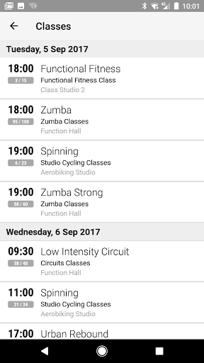  |   | 
 |   |  

## Development team
In the following we report the main information provided by the development team in the Google play store.

| | |
|-------------------------|-------------------------|
| **Developer**  | Innovatise GmbH |
| **Website**  | [http://www.rctcbc.gov.uk/leisure](http://www.rctcbc.gov.uk/leisure) |
| **Email** | leisuremembership@rctcbc.gov.uk |
| **Physical address**  | - |
| **Other developed apps**  | [https://play.google.com/store/apps/developer?id=Innovatise+GmbH](https://play.google.com/store/apps/developer?id=Innovatise+GmbH) |

## Android support

| | |
|-------------------------|-------------------------|
| **Declared target Android version**  | Pie, version 9 (API level 28) |
| **Effective target Android version**  | Pie, version 9 (API level 28) |
| **Minimum supported Android version**  | Lollipop, version 5.0 (API level 21) |
| **Maximum target Android version**  | - |

The larger the difference between the minimum and maximum supported Android versions, the better. A larger difference means a wider audience. For example, old phones have a very low Android version, so a high minimum supported Android version means that the app cannot be used by users with old phones, thus leading to accessibility problems. 

## Requested permissions

In the following we report the complete list of the permissions requested by the app. 

| **Permission** | **Protection level** | **Description** | 
|-------------------------|-------------------------|-------------------------|
 **android.permission ACCESS_COARSE_LOCATION** | :warning:**Dangerous** | Allows an app to access approximate location. 
 **android.permission ACCESS_FINE_LOCATION** | :warning:**Dangerous** | Allows an app to access precise location. 
 **android.permission ACCESS_NETWORK_STATE** | Normal | Allows applications to access information about networks. 
 **android.permission ACCESS_WIFI_STATE** | Normal | Allows applications to access information about Wi-Fi networks. 
 **android.permission AUTHENTICATE_ACCOUNTS** | - | - 
 **android.permission BLUETOOTH** | Normal | Allows applications to connect to paired bluetooth devices. 
 **android.permission BLUETOOTH_ADMIN** | Normal | Allows applications to discover and pair bluetooth devices. 
 **android.permission CAMERA** | :warning:**Dangerous** | Required to be able to access the camera device. 
 **android.permission GET_ACCOUNTS** | :warning:**Dangerous** | Allows access to the list of accounts in the Accounts Service. 
 **android.permission INTERNET** | Normal | Allows applications to open network sockets. 
 **android.permission MANAGE_ACCOUNTS** | - | - 
 **android.permission READ_PHONE_STATE** | :warning:**Dangerous** | Allows read only access to phone state, including the phone number of the device, current cellular network information, the status of any ongoing calls, and a list of any PhoneAccounts registered on the device. 
 **android.permission RECEIVE_BOOT_COMPLETED** | Normal | Allows an application to receive the Intent.ACTION_BOOT_COMPLETED that is broadcast after the system finishes booting. 
 **android.permission VIBRATE** | Normal | Allows access to the vibrator. 
 **android.permission WAKE_LOCK** | Normal | Allows using PowerManager WakeLocks to keep processor from sleeping or screen from dimming. 
 **android.permission WRITE_EXTERNAL_STORAGE** | :warning:**Dangerous** | Allows an application to write to external storage. 
 **com.google.android.c2dm.permission RECEIVE** | - | - 
 **com.google.android.finsky.permission BIND_GET_INSTALL_REFERRER_SERVICE** | - | - 
 **com.google.android.providers.gsf.permission READ_GSERVICES** | - | - 

## Mentioned servers

| **Server** | **Registrant** | **Registrant country** | **Creation date** | 
|-------------------------|-------------------------|-------------------------|-------------------------|
 | google.com | Google LLC | :us: US | 1997-09-15 04:00:00 |
 | myfitapp.de | - | - | - |
 | microsoft.com | Microsoft Corporation | :us: US | 1991-05-02 04:00:00 |
 | googlesyndication.com | Google LLC | :us: US | 2003-01-21 06:17:24 |
 | googleapis.com | Google LLC | :us: US | 2005-01-25 17:52:26 |
 | app-measurement.com | Google LLC | :us: US | 2015-06-19 20:13:31 |

## Security analysis 

Below we report the main security warnings raised by our execution of the [Androwarn](https://github.com/maaaaz/androwarn) security analysis tool.

**Telephony identifiers leakage**
> - This application reads the ISO country code equivalent for the SIM provider's country code 
> - This application reads the ISO country code equivalent of the current registered operator's MCC (Mobile Country Code) 
> - This application reads the MCC+MNC of the provider of the SIM 
> - This application reads the Service Provider Name (SPN) 
> - This application reads the constant indicating the state of the device SIM card 
> - This application reads the device phone type value 
> - This application reads the numeric name (MCC+MNC) of current registered operator 
> - This application reads the operator name 
> - This application reads the radio technology (network type) currently in use on the device for data transmission 
> - This application reads the unique device ID, i.e the IMEI for GSM and the MEID or ESN for CDMA phones 

**Connection interfaces exfiltration**
> - This application reads details about the currently active data network 
> - This application tries to find out if the currently active data network is metered 

**Telephony services abuse**
> - This application makes phone calls 

**Suspicious connection establishment**
> - This application opens a Socket and connects it to the remote address '' on the 'N/A' port  
> - This application opens a Socket and connects it to the remote address 'Ljava/lang/StringBuilder;->toString()Ljava/lang/String;' on the 'N/A' port  
> - This application opens a Socket and connects it to the remote address 'Ljava/net/Proxy;->type()Ljava/net/Proxy$Type;' on the 'N/A' port  
> - This application opens a Socket and connects it to the remote address 'timeout' on the 'N/A' port  

**Code execution**
> - This application loads a native library 
> - This application loads a native library: 'jniPdfium' 
> - This application loads a native library: 'modft2' 
> - This application loads a native library: 'modpdfium' 
> - This application loads a native library: 'modpng' 

## User ratings and reviews

Below we provide information about how end users are reacting to the app in terms of ratings and reviews in the Google Play store.

### Ratings

The Leisure for Life app has been installed by more than **5000** times. At this time, **32** rated the app and its average score is **2.90625**. Below we show the distribution of the ratings across the usual star-based rating of Google Play

:star::star::star::star::star:: 12

:star::star::star::star:: 1

:star::star::star:: 4

:star::star:: 2

:star:: 13

### Reviews 

#### 5-star reviews

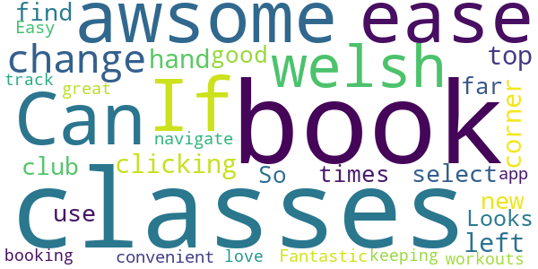

> awsome  :date: __2019-05-07 17:19:15__

> Can book all my classes with ease now . If in welsh change by clicking top 
left hand corner and select new club with. +  :date: __2018-08-01 10:43:48__

> I use it to book classes and find out times  :date: __2018-04-27 19:56:40__

> So far, so good! Looks great. Easy to navigate and book with!  :date: __2017-12-11 22:50:58__

> Fantastic app so convenient for booking classes and keeping track of my workouts love it 👍  :date: __2017-12-07 14:30:54__

#### 4-star reviews

> Teething problems. As it was in welsh but how to sort below If you go to the APP and in the left hand corner there is a menu tab 'three lines'.   Then click the 'my clubs' tab. Then click + in the right hand corner. Then you should be able to see all pages or club names in both English and in Welsh. Select one in your language prefrence  :date: __2020-10-08 15:34:33__

#### 3-star reviews

> When it works it's really good...it's really hit and miss though! It either sits on a loading page for ages or tells you there's a jellybean error 🤔 fix these annoying glitches and it would be brilliant.  :date: __2020-09-15 20:05:15__

> It's basically like a mobile version of the website. No support for NFC  :date: __2017-12-13 08:35:18__

#### 2-star reviews

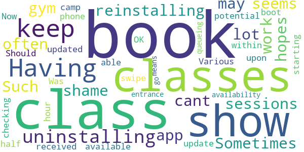

> Having to keep uninstalling and reinstalling in the hopes that it may work. Sometimes I can book gym sessions, often I cant. Such a shame as the app seems to have a lot of potential.  :date: __2020-08-18 18:07:59__

> Was OK until updated. Now cannot book a class within half an hour of it starting. Various classes don't show up, just received an update that boot camp classes are available to book and upon checking they do not show. Should be able to swipe in with phone but no availability to do this so it means queueing at the entrance before you can go to the class.  :date: __2019-05-25 16:05:53__

#### 1-star reviews

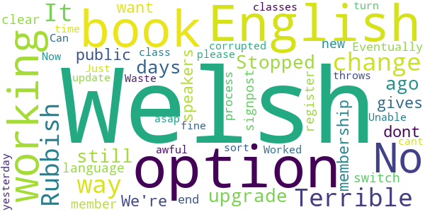

> Stopped working for upgrade days ago and still not working!  :date: __2020-10-17 16:51:28__

> No option to book as just public I dont want a membership  :date: __2020-10-17 05:45:37__

> No option for this is English?! We're not all Welsh speakers!  :date: __2020-09-28 11:03:54__

> Terrible just terrible only gives Welsh language with no option to switch no clear signpost to register as a new member. Eventually get to the end of the process and it's corrupted and throws you all the way out Rubbish. Waste of time  :date: __2020-09-24 18:33:43__

> Just awful  :date: __2020-09-02 09:42:44__

> Worked fine until yesterday's update. Now I cant book classes. Can you sort it asap  :date: __2020-08-17 20:51:35__

> Unable to book a class....rubbish  :date: __2020-08-11 00:04:20__

> It's all in Welsh is there an option to change it to english  :date: __2018-07-25 13:25:31__

> it's all in welsh ....how do you turn on English?  :date: __2018-07-10 11:39:19__

> It's all in Welsh is there a way to change this please?  :date: __2018-06-21 01:01:46__

# Bramley Health App
App version ``1.0.0``

Analyzed with [covid-apps-observer](http://github.com/covid-apps-observer) project, version ``0.1``

## App overview
| | |
|-------------------------|-------------------------| 
| **Name**&nbsp;&nbsp;&nbsp;&nbsp;&nbsp;&nbsp;&nbsp;&nbsp;&nbsp;&nbsp;&nbsp;&nbsp;&nbsp;&nbsp;&nbsp;&nbsp;&nbsp;&nbsp;&nbsp;&nbsp;&nbsp;&nbsp;&nbsp;&nbsp;&nbsp;&nbsp;&nbsp;&nbsp;&nbsp;&nbsp;&nbsp;&nbsp;&nbsp;&nbsp;&nbsp;&nbsp;&nbsp;&nbsp;&nbsp;&nbsp;  | Bramley Health App |
| **Unique identifier** | com.AppInstitute.bramleyv1 |
| **Link to Google Play** | [https://play.google.com/store/apps/details?id=com.AppInstitute.bramleyv1](https://play.google.com/store/apps/details?id=com.AppInstitute.bramleyv1) |
| **Summary**  | Providing NHS Primary Care GP Services |
| **Privacy policy** | [http://cms.appbuild.io/cms/docs/legal/privacy.php?appcode=thisapp](http://cms.appbuild.io/cms/docs/legal/privacy.php?appcode=thisapp) |
| **Latest version** | 1.0.0 |
| **Last update** | 2019-07-17 12:30:05 |
| **Recent changes** | - |
| **Installs**  | 1,000+ |
| **Category** | Health & Fitness |
| **First release** | May 9, 2018 |
| **Size**  | 32M |
| **Supported Android version**  | 4.4 and up |

### Description
> The Bramley Health App is designed for our patients who are registered at one of our sites in England. Once registered as a patient, you can access online services including:
 - econsultations: reviewed by a GP or Nurse Practitioner once submitted who will get in contact regarding next steps
 - face-to-face and telephone appointments: bookable via the login section
 - video consultations: visit the econsultation page for more information
 - request a referral based: you request will be reviewed by a clinician who will either refer you or make contact to discuss further
 - sick note request: use the app to submit a new or repeat sick note request
 - medication request: use the econsultation section to order repeat or request new medication
 - view your GP medical record: log in to your medical record via the app and view your medical history, previous test results and other health information about you
 - health information: read and watch health information 
 To use the app, you must be aged 13 and over and registered with one of our GP surgeries. Registering is easy and can be done using the app. As long as you live in England, you can register with us and make us your main GP Surgery which will allow you to access all our online services. If you live more than 2 miles away from our physical locations, you will still be able to access all our services except for home visits.

### User interface
The developers of the app provide the following screenshots in the Google play store.
| | | |
|:-------------------------:|:-------------------------:|:-------------------------:|
 |   |   |   | 
 |   |   |   | 
 |  

## Development team
In the following we report the main information provided by the development team in the Google play store.

| | |
|-------------------------|-------------------------|
| **Developer**  | Fuller and Forbes Healthare |
| **Website**  | [http://www.bramleyonline.co.uk](http://www.bramleyonline.co.uk) |
| **Email** | bramley.village@nhs.net |
| **Physical address**  | [Fuller and Forbes Healthcare Bramley Village Health and Wellbeing Centre Highfield Road Bramley Leeds LS13 2BL](https://www.google.com/maps/search/Fuller%20and%20Forbes%20Healthcare%20Bramley%20Village%20Health%20and%20Wellbeing%20Centre%20Highfield%20Road%20Bramley%20Leeds%20LS13%202BL) (Google Maps) |
| **Other developed apps**  | [https://play.google.com/store/apps/developer?id=Fuller+and+Forbes+Healthare](https://play.google.com/store/apps/developer?id=Fuller+and+Forbes+Healthare) |

## Android support

| | |
|-------------------------|-------------------------|
| **Declared target Android version**  | Pie, version 9 (API level 28) |
| **Effective target Android version**  | Pie, version 9 (API level 28) |
| **Minimum supported Android version**  | KitKat, version 4.4 - 4.4.4 (API level 19) |
| **Maximum target Android version**  | - |

The larger the difference between the minimum and maximum supported Android versions, the better. A larger difference means a wider audience. For example, old phones have a very low Android version, so a high minimum supported Android version means that the app cannot be used by users with old phones, thus leading to accessibility problems. 

## Requested permissions

In the following we report the complete list of the permissions requested by the app. 

| **Permission** | **Protection level** | **Description** | 
|-------------------------|-------------------------|-------------------------|
 **android.permission ACCESS_ASSISTED_GPS** | - | - 
 **android.permission ACCESS_COARSE_LOCATION** | :warning:**Dangerous** | Allows an app to access approximate location. 
 **android.permission ACCESS_FINE_LOCATION** | :warning:**Dangerous** | Allows an app to access precise location. 
 **android.permission ACCESS_GPS** | - | - 
 **android.permission ACCESS_LOCATION_EXTRA_COMMANDS** | Normal | Allows an application to access extra location provider commands. 
 **android.permission ACCESS_MOCK_LOCATION** | - | - 
 **android.permission ACCESS_NETWORK_STATE** | Normal | Allows applications to access information about networks. 
 **android.permission CAMERA** | :warning:**Dangerous** | Required to be able to access the camera device. 
 **android.permission FLASHLIGHT** | - | - 
 **android.permission INTERNET** | Normal | Allows applications to open network sockets. 
 **android.permission READ_APP_BADGE** | - | - 
 **android.permission VIBRATE** | Normal | Allows access to the vibrator. 
 **android.permission WAKE_LOCK** | Normal | Allows using PowerManager WakeLocks to keep processor from sleeping or screen from dimming. 
 **android.permission WRITE_EXTERNAL_STORAGE** | :warning:**Dangerous** | Allows an application to write to external storage. 
 **com.AppInstitute.bramleyv1.permission C2D_MESSAGE** | - | - 
 **com.anddoes.launcher.permission UPDATE_COUNT** | - | - 
 **com.google.android.c2dm.permission RECEIVE** | - | - 
 **com.htc.launcher.permission READ_SETTINGS** | - | - 
 **com.htc.launcher.permission UPDATE_SHORTCUT** | - | - 
 **com.huawei.android.launcher.permission CHANGE_BADGE** | - | - 
 **com.huawei.android.launcher.permission READ_SETTINGS** | - | - 
 **com.huawei.android.launcher.permission WRITE_SETTINGS** | - | - 
 **com.majeur.launcher.permission UPDATE_BADGE** | - | - 
 **com.oppo.launcher.permission READ_SETTINGS** | - | - 
 **com.oppo.launcher.permission WRITE_SETTINGS** | - | - 
 **com.sec.android.provider.badge.permission READ** | - | - 
 **com.sec.android.provider.badge.permission WRITE** | - | - 
 **com.sonyericsson.home.permission BROADCAST_BADGE** | - | - 
 **com.sonymobile.home.permission PROVIDER_INSERT_BADGE** | - | - 
 **me.everything.badger.permission BADGE_COUNT_READ** | - | - 
 **me.everything.badger.permission BADGE_COUNT_WRITE** | - | - 

## Mentioned servers

| **Server** | **Registrant** | **Registrant country** | **Creation date** | 
|-------------------------|-------------------------|-------------------------|-------------------------|
 | braintreegateway.com | PayPal Inc. | :us: US | 2009-10-06 23:05:33 |
 | googlesyndication.com | Google LLC | :us: US | 2003-01-21 06:17:24 |
 | google.com | Google LLC | :us: US | 1997-09-15 04:00:00 |
 | facebook.com | Facebook, Inc. | :us: US | 1997-03-29 05:00:00 |
 | googleapis.com | Google LLC | :us: US | 2005-01-25 17:52:26 |
 | google-analytics.com | Google LLC | :us: US | 2005-07-18 19:24:32 |
 | app-measurement.com | Google LLC | :us: US | 2015-06-19 20:13:31 |
 | googleapis.com | Google LLC | :us: US | 2005-01-25 17:52:26 |
 | doubleclick.net | Google Inc. | :us: US | 1996-01-16 05:00:00 |
 | gstatic.com | Google LLC | :us: US | 2008-02-11 15:31:25 |
 | googleapis.com | Google LLC | :us: US | 2005-01-25 17:52:26 |
 | visa.com | Visa International Service Association | :us: US | 1994-03-08 05:00:00 |
 | googletagmanager.com | Google LLC | :us: US | 2011-11-11 23:39:05 |
 | appspot.com | Google LLC | :us: US | 2005-03-10 02:27:55 |
 | paypal.com | PayPal Inc. | :us: US | 1999-07-15 05:32:11 |
 | paypalobjects.com | PayPal Inc. | :us: US | 2005-05-12 17:11:21 |
 | whatsapp.com | Whatsapp Inc. | :us: US | 2008-09-04 12:39:12 |

## Security analysis 

Below we report the main security warnings raised by our execution of the [Androwarn](https://github.com/maaaaz/androwarn) security analysis tool.

**Telephony identifiers leakage**
> - This application reads the ISO country code equivalent for the SIM provider's country code 
> - This application reads the MCC+MNC of the provider of the SIM 
> - This application reads the SIM's serial number 
> - This application reads the Service Provider Name (SPN) 
> - This application reads the current location of the device 
> - This application reads the device phone type value 
> - This application reads the numeric name (MCC+MNC) of current registered operator 
> - This application reads the operator name 
> - This application reads the radio technology (network type) currently in use on the device for data transmission 
> - This application reads the unique device ID, i.e the IMEI for GSM and the MEID or ESN for CDMA phones 
> - This application reads the unique subscriber ID, for example, the IMSI for a GSM phone 
> - This application reads the Cell ID value 
> - This application reads the Location Area Code value 

**Location lookup**
> - This application reads location information from all available providers (WiFi, GPS etc.) 

**Connection interfaces exfiltration**
> - This application reads details about the currently active data network 
> - This application tries to find out if the currently active data network is metered 

**Telephony services abuse**
> - This application makes phone calls 
> - This application sends an SMS message 'v12' to the 'Landroid/content/Intent;-><init>()V' phone number 

**Suspicious connection establishment**
> - This application opens a Socket and connects it to the remote address '' on the '80' port  
> - This application opens a Socket and connects it to the remote address 'Network subsystem is unavailable' on the 'N/A' port  

**Pim data leakage**
> - This application accesses the downloads folder 
> - This application accesses data stored in the clipboard 

**Code execution**
> - This application loads a native library 
> - This application executes a UNIX command 
> - This application executes a UNIX command containing this argument: 'Ljava/lang/StringBuilder;->toString()Ljava/lang/String;' 

## User ratings and reviews

Below we provide information about how end users are reacting to the app in terms of ratings and reviews in the Google Play store.

### Ratings

The Bramley Health App app has been installed by more than **1000** times. At this time, **-** rated the app and its average score is **0.0**. Below we show the distribution of the ratings across the usual star-based rating of Google Play

:star::star::star::star::star:: 0

:star::star::star::star:: 0

:star::star::star:: 0

:star::star:: 0

:star:: 0

### Reviews 

#### 5-star reviews

No recent reviews available with 5 stars.

#### 4-star reviews

No recent reviews available with 4 stars.

#### 3-star reviews

No recent reviews available with 3 stars.

#### 2-star reviews

No recent reviews available with 2 stars.

#### 1-star reviews

> Q The app will not allow me to register to use the service.  :date: __2020-11-19 13:59:38__

> Terrible  :date: __2020-06-17 12:43:14__

> Shocking , awful app. Unable to register as page just comes up blank when clicking to register via the app. Guess I'll have to stick to the good old fashioned way of ringing the doctors up  :date: __2020-05-01 09:39:46__

# MenaLabs
App version ``1.1.4``

Analyzed with [covid-apps-observer](http://github.com/covid-apps-observer) project, version ``0.1``

## App overview
| | |
|-------------------------|-------------------------| 
| **Name**&nbsp;&nbsp;&nbsp;&nbsp;&nbsp;&nbsp;&nbsp;&nbsp;&nbsp;&nbsp;&nbsp;&nbsp;&nbsp;&nbsp;&nbsp;&nbsp;&nbsp;&nbsp;&nbsp;&nbsp;&nbsp;&nbsp;&nbsp;&nbsp;&nbsp;&nbsp;&nbsp;&nbsp;&nbsp;&nbsp;&nbsp;&nbsp;&nbsp;&nbsp;&nbsp;&nbsp;&nbsp;&nbsp;&nbsp;&nbsp;  | MenaLabs |
| **Unique identifier** | com.menalabs.app |
| **Link to Google Play** | [https://play.google.com/store/apps/details?id=com.menalabs.app](https://play.google.com/store/apps/details?id=com.menalabs.app) |
| **Summary**  | Find a specialist or medical test and book a visit at MenaLabs laboratories |
| **Privacy policy** | [https://www.heartbits.me/privacy-policy/](https://www.heartbits.me/privacy-policy/) |
| **Latest version** | 1.1.4 |
| **Last update** | 2020-09-24 10:56:00 |
| **Recent changes** | Visual improvements |
| **Installs**  | 500+ |
| **Category** | Medical |
| **First release** | Apr 18, 2020 |
| **Size**  | 11M |
| **Supported Android version**  | 4.1 and up |

### Description
> Manage your health mobile way. Find a specialists or medical test and make an appointment at MenaLabs laboratories.
 MenaLabs mobile application allows making appointments in MenaLabs laboratories with specialists of your need and ordering specialty tests. The application brings also loyalty program for MenaLabs customers.
 A transparent interface and intuitive navigation allow:
 *) user registration
 *) presentation of a health care provider
 *) presentation of specialists and their profiles
 *) mechanism to book, reschedule and cancel appointments with specialists
 *) notification reminder about an incoming visit
 *) visit satisfaction feedback collection
 *) presentation of history of visits
 *) laboratory result delivery to the patient
 *) mechanism of loyalty points collection
 *) presentation of rewards to be redeemed using the collected loyalty points

### User interface
The developers of the app provide the following screenshots in the Google play store.
| | | |
|:-------------------------:|:-------------------------:|:-------------------------:|
 |   |   |   | 
 |   |  

## Development team
In the following we report the main information provided by the development team in the Google play store.

| | |
|-------------------------|-------------------------|
| **Developer**  | Menalabs |
| **Website**  | [https://www.menalabs.com/](https://www.menalabs.com/) |
| **Email** | support@heartbits.me |
| **Physical address**  | - |
| **Other developed apps**  | [https://play.google.com/store/apps/developer?id=Menalabs](https://play.google.com/store/apps/developer?id=Menalabs) |

## Android support

| | |
|-------------------------|-------------------------|
| **Declared target Android version**  | Android10, version 10 (API level 29) |
| **Effective target Android version**  | Android10, version 10 (API level 29) |
| **Minimum supported Android version**  | Jelly Bean, version 4.1.x (API level 16) |
| **Maximum target Android version**  | - |

The larger the difference between the minimum and maximum supported Android versions, the better. A larger difference means a wider audience. For example, old phones have a very low Android version, so a high minimum supported Android version means that the app cannot be used by users with old phones, thus leading to accessibility problems. 

## Requested permissions

In the following we report the complete list of the permissions requested by the app. 

| **Permission** | **Protection level** | **Description** | 
|-------------------------|-------------------------|-------------------------|
 **android.permission ACCESS_COARSE_LOCATION** | :warning:**Dangerous** | Allows an app to access approximate location. 
 **android.permission ACCESS_NETWORK_STATE** | Normal | Allows applications to access information about networks. 
 **android.permission ACCESS_WIFI_STATE** | Normal | Allows applications to access information about Wi-Fi networks. 
 **android.permission INTERNET** | Normal | Allows applications to open network sockets. 
 **android.permission RECEIVE_BOOT_COMPLETED** | Normal | Allows an application to receive the Intent.ACTION_BOOT_COMPLETED that is broadcast after the system finishes booting. 
 **android.permission VIBRATE** | Normal | Allows access to the vibrator. 
 **android.permission WAKE_LOCK** | Normal | Allows using PowerManager WakeLocks to keep processor from sleeping or screen from dimming. 
 **com.google.android.c2dm.permission RECEIVE** | - | - 
 **com.google.android.finsky.permission BIND_GET_INSTALL_REFERRER_SERVICE** | - | - 

## Mentioned servers

| **Server** | **Registrant** | **Registrant country** | **Creation date** | 
|-------------------------|-------------------------|-------------------------|-------------------------|
 | android.com | Google LLC | :us: US | 1997-06-23 04:00:00 |
 | googlesyndication.com | Google LLC | :us: US | 2003-01-21 06:17:24 |
 | google.com | Google LLC | :us: US | 1997-09-15 04:00:00 |
 | app-measurement.com | Google LLC | :us: US | 2015-06-19 20:13:31 |
 | googleapis.com | Google LLC | :us: US | 2005-01-25 17:52:26 |
 | googleadservices.com | Google LLC | :us: US | 2003-06-19 16:34:53 |

## Security analysis 

Below we report the main security warnings raised by our execution of the [Androwarn](https://github.com/maaaaz/androwarn) security analysis tool.

**Telephony identifiers leakage**
> - This application reads the numeric name (MCC+MNC) of current registered operator 
> - This application reads the operator name 
> - This application reads the phone number string for line 1, for example, the MSISDN for a GSM phone 

**Location lookup**
> - This application reads location information from all available providers (WiFi, GPS etc.) 

**Connection interfaces exfiltration**
> - This application reads details about the currently active data network 
> - This application tries to find out if the currently active data network is metered 

**Suspicious connection establishment**
> - This application opens a Socket and connects it to the remote address '' on the 'N/A' port  
> - This application opens a Socket and connects it to the remote address 'Ljava/lang/StringBuilder;->toString()Ljava/lang/String;' on the ': connect, resolve' port  
> - This application opens a Socket and connects it to the remote address 'Ljava/lang/StringBuilder;->toString()Ljava/lang/String;' on the 'N/A' port  
> - This application opens a Socket and connects it to the remote address 'Ljava/net/Proxy;->type()Ljava/net/Proxy$Type;' on the 'N/A' port  
> - This application opens a Socket and connects it to the remote address 'timeout' on the 'N/A' port  

**Pim data leakage**
> - This application accesses data stored in the clipboard 

**Code execution**
> - This application loads a native library 
> - This application executes a UNIX command containing this argument: '2' 

## User ratings and reviews

Below we provide information about how end users are reacting to the app in terms of ratings and reviews in the Google Play store.

### Ratings

The MenaLabs app has been installed by more than **500** times. At this time, **30** rated the app and its average score is **4.866667**. Below we show the distribution of the ratings across the usual star-based rating of Google Play

:star::star::star::star::star:: 29

:star::star::star::star:: 0

:star::star::star:: 0

:star::star:: 0

:star:: 1

### Reviews 

#### 5-star reviews

> Fast and reliable service  :date: __2020-09-09 06:53:21__

> Exceptional services,easy to navigate  :date: __2020-08-20 17:49:31__

> Easy to use. 👏  :date: __2020-08-17 10:39:33__

> Great staff and fast and efficient service.  :date: __2020-08-17 10:25:23__

> So educative and a friendly place of work  :date: __2020-08-16 10:46:45__

> Appoinment are so easy..staff are expert and professionals. excellent Apps Keep it up👍👍👍👍👍  :date: __2020-08-15 13:41:12__

> Fast and Reliable results.  :date: __2020-08-15 12:26:50__

> They provide ultimate quality service  :date: __2020-08-15 12:06:56__

> Easy to book an appointment and very reliable  :date: __2020-08-15 11:51:16__

> Easy to navigate app, very responsive. 5 star to this!  :date: __2020-08-15 11:50:51__

#### 4-star reviews

No recent reviews available with 4 stars.

#### 3-star reviews

No recent reviews available with 3 stars.

#### 2-star reviews

No recent reviews available with 2 stars.

#### 1-star reviews

No recent reviews available with 1 stars.

# LTH Guidelines
App version ``1.1.0``

Analyzed with [covid-apps-observer](http://github.com/covid-apps-observer) project, version ``0.1``

## App overview
| | |
|-------------------------|-------------------------| 
| **Name**&nbsp;&nbsp;&nbsp;&nbsp;&nbsp;&nbsp;&nbsp;&nbsp;&nbsp;&nbsp;&nbsp;&nbsp;&nbsp;&nbsp;&nbsp;&nbsp;&nbsp;&nbsp;&nbsp;&nbsp;&nbsp;&nbsp;&nbsp;&nbsp;&nbsp;&nbsp;&nbsp;&nbsp;&nbsp;&nbsp;&nbsp;&nbsp;&nbsp;&nbsp;&nbsp;&nbsp;&nbsp;&nbsp;&nbsp;&nbsp;  | LTH Guidelines |
| **Unique identifier** | com.nhs.lth.guidelines |
| **Link to Google Play** | [https://play.google.com/store/apps/details?id=com.nhs.lth.guidelines](https://play.google.com/store/apps/details?id=com.nhs.lth.guidelines) |
| **Summary**  | Hospital guidelines for health care professionals. |
| **Privacy policy** | [-](-) |
| **Latest version** | 1.1.0 |
| **Last update** | 2020-03-15 19:51:54 |
| **Recent changes** | Links can be opened from description page |
| **Installs**  | 500+ |
| **Category** | Medical |
| **First release** | Mar 13, 2020 |
| **Size**  | 7.0M |
| **Supported Android version**  | 4.1 and up |

### Description
> This app provides hospital guidelines for healthcare professions. This app replicates guidelines published elsewhere, such as on www.gov.uk by Public Health England and provides guidance on current practice allowing safe and effective assessment, placement, testing and management of patients. Guidelines are regularly reviewed in line with updates from Public Health England and other sources.

### User interface
The developers of the app provide the following screenshots in the Google play store.
| | | |
|:-------------------------:|:-------------------------:|:-------------------------:|
 |   |   |   | 

## Development team
In the following we report the main information provided by the development team in the Google play store.

| | |
|-------------------------|-------------------------|
| **Developer**  | Lancashire Teaching Hospitals NHS Foundation Trust |
| **Website**  | [https://www.lancsteachinghospitals.nhs.uk/](https://www.lancsteachinghospitals.nhs.uk/) |
| **Email** | webmaster@lthtr.nhs.uk |
| **Physical address**  | [Lancashire Teaching Hospitals Royal Preston Hospital Sharoe Green Lane Fulwood Preston PR2 2JU](https://www.google.com/maps/search/Lancashire%20Teaching%20Hospitals%20Royal%20Preston%20Hospital%20Sharoe%20Green%20Lane%20Fulwood%20Preston%20PR2%202JU) (Google Maps) |
| **Other developed apps**  | [https://play.google.com/store/apps/developer?id=Lancashire+Teaching+Hospitals+NHS+Foundation+Trust](https://play.google.com/store/apps/developer?id=Lancashire+Teaching+Hospitals+NHS+Foundation+Trust) |

## Android support

| | |
|-------------------------|-------------------------|
| **Declared target Android version**  | Pie, version 9 (API level 28) |
| **Effective target Android version**  | Pie, version 9 (API level 28) |
| **Minimum supported Android version**  | Jelly Bean, version 4.1.x (API level 16) |
| **Maximum target Android version**  | - |

The larger the difference between the minimum and maximum supported Android versions, the better. A larger difference means a wider audience. For example, old phones have a very low Android version, so a high minimum supported Android version means that the app cannot be used by users with old phones, thus leading to accessibility problems. 

## Requested permissions

In the following we report the complete list of the permissions requested by the app. 

| **Permission** | **Protection level** | **Description** | 
|-------------------------|-------------------------|-------------------------|
 **android.permission ACCESS_NETWORK_STATE** | Normal | Allows applications to access information about networks. 
 **android.permission ACCESS_WIFI_STATE** | Normal | Allows applications to access information about Wi-Fi networks. 
 **android.permission INTERNET** | Normal | Allows applications to open network sockets. 
 **android.permission WAKE_LOCK** | Normal | Allows using PowerManager WakeLocks to keep processor from sleeping or screen from dimming. 
 **com.google.android.c2dm.permission RECEIVE** | - | - 
 **com.google.android.finsky.permission BIND_GET_INSTALL_REFERRER_SERVICE** | - | - 

## Mentioned servers

| **Server** | **Registrant** | **Registrant country** | **Creation date** | 
|-------------------------|-------------------------|-------------------------|-------------------------|
 | googlesyndication.com | Google LLC | :us: US | 2003-01-21 06:17:24 |
 | google.com | Google LLC | :us: US | 1997-09-15 04:00:00 |
 | app-measurement.com | Google LLC | :us: US | 2015-06-19 20:13:31 |
 | googleadservices.com | Google LLC | :us: US | 2003-06-19 16:34:53 |

## Security analysis 

Below we report the main security warnings raised by our execution of the [Androwarn](https://github.com/maaaaz/androwarn) security analysis tool.

**Connection interfaces exfiltration**
> - This application reads details about the currently active data network 

**Pim data leakage**
> - This application accesses data stored in the clipboard 

**Code execution**
> - This application loads a native library: 'flutter' 

## User ratings and reviews

Below we provide information about how end users are reacting to the app in terms of ratings and reviews in the Google Play store.

### Ratings

The LTH Guidelines app has been installed by more than **500** times. At this time, **-** rated the app and its average score is **0.0**. Below we show the distribution of the ratings across the usual star-based rating of Google Play

:star::star::star::star::star:: 0

:star::star::star::star:: 0

:star::star::star:: 0

:star::star:: 0

:star:: 0

### Reviews 

#### 5-star reviews

No recent reviews available with 5 stars.

#### 4-star reviews

No recent reviews available with 4 stars.

#### 3-star reviews

No recent reviews available with 3 stars.

#### 2-star reviews

No recent reviews available with 2 stars.

#### 1-star reviews

No recent reviews available with 1 stars.

# NHS Ayrshire & Arran
App version ``3.0.2``

Analyzed with [covid-apps-observer](http://github.com/covid-apps-observer) project, version ``0.1``

## App overview
| | |
|-------------------------|-------------------------| 
| **Name**&nbsp;&nbsp;&nbsp;&nbsp;&nbsp;&nbsp;&nbsp;&nbsp;&nbsp;&nbsp;&nbsp;&nbsp;&nbsp;&nbsp;&nbsp;&nbsp;&nbsp;&nbsp;&nbsp;&nbsp;&nbsp;&nbsp;&nbsp;&nbsp;&nbsp;&nbsp;&nbsp;&nbsp;&nbsp;&nbsp;&nbsp;&nbsp;&nbsp;&nbsp;&nbsp;&nbsp;&nbsp;&nbsp;&nbsp;&nbsp;  | NHS Ayrshire & Arran |
| **Unique identifier** | uk.nhs.ayrshirearran |
| **Link to Google Play** | [https://play.google.com/store/apps/details?id=uk.nhs.ayrshirearran](https://play.google.com/store/apps/details?id=uk.nhs.ayrshirearran) |
| **Summary**  | NHS Ayrshire &amp; Arran |
| **Privacy policy** | [https://www.piota.co.uk/privacy-cookies-policy-piota-app/](https://www.piota.co.uk/privacy-cookies-policy-piota-app/) |
| **Latest version** | 3.0.2 |
| **Last update** | 2020-04-06 10:48:39 |
| **Recent changes** | Fixed issues with push notifications and tile icons. |
| **Installs**  | 1,000+ |
| **Category** | Medical |
| **First release** | Apr 6, 2020 |
| **Size**  | Varies with device |
| **Supported Android version**  | 6.0 and up |

### Description
> The NHS Ayrshire & Arran app consists of information about healthcare services maintained by the NHS Ayrshire & Arran regional NHS Board in Scotland. The app is published by NHS Ayrshire & Arran regional NHS Board.
 Each provided service contains a rich mix of authoritative information about your condition, lifestyle pointers, local and national resources you can access, contacts information, clinic schedules and emergency information should you get into trouble. Browse these whenever you need.
 In addition each service can, if you allow it, message you via targeted push notifications, saving time and cost for the NHS and delivering a better more relevant service to you.
 Simply type your healthcare service name into the search box, open the app and select the push notifications relevant for you in the Settings section.
 You can select, interact and receive notifications from more than one of our services in our app.

### User interface
The developers of the app provide the following screenshots in the Google play store.
| | | |
|:-------------------------:|:-------------------------:|:-------------------------:|
 |   |  

## Development team
In the following we report the main information provided by the development team in the Google play store.

| | |
|-------------------------|-------------------------|
| **Developer**  | NHS Ayrshire & Arran |
| **Website**  | [https://www.nhsaaa.net/](https://www.nhsaaa.net/) |
| **Email** | support@piota.co.uk |
| **Physical address**  | - |
| **Other developed apps**  | [https://play.google.com/store/apps/developer?id=NHS+Ayrshire+%26+Arran](https://play.google.com/store/apps/developer?id=NHS+Ayrshire+%26+Arran) |

## Android support

| | |
|-------------------------|-------------------------|
| **Declared target Android version**  | Android10, version 10 (API level 29) |
| **Effective target Android version**  | Android10, version 10 (API level 29) |
| **Minimum supported Android version**  | Marshmallow, version 6.0 (API level 23) |
| **Maximum target Android version**  | - |

The larger the difference between the minimum and maximum supported Android versions, the better. A larger difference means a wider audience. For example, old phones have a very low Android version, so a high minimum supported Android version means that the app cannot be used by users with old phones, thus leading to accessibility problems. 

## Requested permissions

In the following we report the complete list of the permissions requested by the app. 

| **Permission** | **Protection level** | **Description** | 
|-------------------------|-------------------------|-------------------------|
 **android.permission ACCESS_NETWORK_STATE** | Normal | Allows applications to access information about networks. 
 **android.permission INTERNET** | Normal | Allows applications to open network sockets. 
 **android.permission WAKE_LOCK** | Normal | Allows using PowerManager WakeLocks to keep processor from sleeping or screen from dimming. 
 **com.google.android.c2dm.permission RECEIVE** | - | - 
 **com.google.android.finsky.permission BIND_GET_INSTALL_REFERRER_SERVICE** | - | - 

## Mentioned servers

| **Server** | **Registrant** | **Registrant country** | **Creation date** | 
|-------------------------|-------------------------|-------------------------|-------------------------|
 | googlesyndication.com | Google LLC | :us: US | 2003-01-21 06:17:24 |
 | google.com | Google LLC | :us: US | 1997-09-15 04:00:00 |
 | app-measurement.com | Google LLC | :us: US | 2015-06-19 20:13:31 |
 | googleadservices.com | Google LLC | :us: US | 2003-06-19 16:34:53 |

## Security analysis 

Below we report the main security warnings raised by our execution of the [Androwarn](https://github.com/maaaaz/androwarn) security analysis tool.

**Connection interfaces exfiltration**
> - This application reads details about the currently active data network 

**Pim data leakage**
> - This application accesses data stored in the clipboard 

**Code execution**
> - This application loads a native library: 'flutter' 

## User ratings and reviews

Below we provide information about how end users are reacting to the app in terms of ratings and reviews in the Google Play store.

### Ratings

The NHS Ayrshire & Arran app has been installed by more than **1000** times. At this time, **-** rated the app and its average score is **0.0**. Below we show the distribution of the ratings across the usual star-based rating of Google Play

:star::star::star::star::star:: 0

:star::star::star::star:: 0

:star::star::star:: 0

:star::star:: 0

:star:: 0

### Reviews 

#### 5-star reviews

No recent reviews available with 5 stars.

#### 4-star reviews

No recent reviews available with 4 stars.

#### 3-star reviews

No recent reviews available with 3 stars.

#### 2-star reviews

> Not very up to date with information during the Corana virus crisis. Not the easiest site to navigate  :date: __2020-09-17 17:41:27__

#### 1-star reviews

No recent reviews available with 1 stars.

# Healthily: Self-Care & Health Journal
App version ``4.01.06``

Analyzed with [covid-apps-observer](http://github.com/covid-apps-observer) project, version ``0.1``

## App overview
| | |
|-------------------------|-------------------------| 
| **Name**&nbsp;&nbsp;&nbsp;&nbsp;&nbsp;&nbsp;&nbsp;&nbsp;&nbsp;&nbsp;&nbsp;&nbsp;&nbsp;&nbsp;&nbsp;&nbsp;&nbsp;&nbsp;&nbsp;&nbsp;&nbsp;&nbsp;&nbsp;&nbsp;&nbsp;&nbsp;&nbsp;&nbsp;&nbsp;&nbsp;&nbsp;&nbsp;&nbsp;&nbsp;&nbsp;&nbsp;&nbsp;&nbsp;&nbsp;&nbsp;  | Healthily: Self-Care & Health Journal |
| **Unique identifier** | md.your |
| **Link to Google Play** | [https://play.google.com/store/apps/details?id=md.your](https://play.google.com/store/apps/details?id=md.your) |
| **Summary**  | Manage your health, check your symptoms and track your progress |
| **Privacy policy** | [https://www.your.md/privacy](https://www.your.md/privacy) |
| **Latest version** | 4.01.06 |
| **Last update** | 2020-11-06 16:35:26 |
| **Recent changes** | In this release, we&#39;ve added a new analytics feature to help us keep improving our app for you.  We&#39;ve also updated our app icon to be in line with our new brand. |
| **Installs**  | 1,000,000+ |
| **Category** | Health & Fitness |
| **First release** | Apr 28, 2014 |
| **Size**  | 14M |
| **Supported Android version**  | 5.0 and up |

### Description
> Designed by doctors, used by millions, Healthily is the free, award-winning self-care app that helps you look after you every day. Manage 100s of conditions, check your symptoms, track your progress and much more.
 From deciding when to see a doctor, to making small changes to feel better every day, Healthily brings you the tools you need for self-care, wherever you are.
 Talk to our friendly chatbot about your symptoms, browse our world-class health library and use our journal and trackers to look after your health with confidence.
 <b>From coronavirus to mental health, we’ve got you covered</b>
 We help you find self-care information on a huge range of health conditions including:
 • Coronavirus (Covid-19)
 • Cold and flu
 • Sore throat
 • Headaches
 • Back pain
 • Sexual health
 • Sleep and tiredness
 • Anxiety and depression
 <b>How to use Healthily</b>
 Understand your health, take action and build healthier habits, step by step.
 ASSESS: Talk to our friendly chatbot to check your health.
 LEARN: Get trusted information from our world-class health library.
 TRACK: See what’s working with our health journal and trackers. 
 FIND: Find vetted products and services in our OneStop Health™ marketplace.
 DISCUSS: Connect with people with similar experiences.
 MANAGE: Look after specific issues with our dedicated hubs.
 We bring together everything you need for self-care, during the coronavirus (Covid-19) outbreak and beyond.
 <b>Here’s what people are saying about Healthily</b>
 <i>“This is the best app I ever installed”</i> - @Emanuel Tănasă, Google Play
 <i>“Very accurate and always on point with information”</i> - @Jesseina Torres, Google Play
 <i>“This is like carrying a personal doctor in your pocket”</i> - @Rising Sun, Google Play
 <i>“The best health app so far”</i> - @Likando Ilishebo, Google Play
 <i>“Love this app and especially the journal”</i> - @Sondre Eftedal Blom, Google Play
 Join millions of people already using Healthily, the self-care app.
 <b>Your safety is our top priority</b>
 As your self-care app, we take your security seriously. Our chatbot, health tracker and journal have the ePrivacy seal of approval, so you can be confident your data is private and protected.
 All our health and self-care content is reviewed and approved by our team of in-house doctors. Our Clinical Advisory Board, made up of world-renowned medical experts, supervise this process.
 Healthily is classified as a Class I Medical Device registered with the Medicines and Healthcare products Regulatory Agency (MHRA) and is CE accredited, which means that our services comply with European Union Medical Device legislation.
 <b>(*) SAFE USE</b>
 If you’re generally healthy and don’t suffer from any chronic or rare medical conditions, we can help identify less serious conditions that you can manage yourself and guide you on whether to see a doctor. Healthily cannot consider all the information a doctor can and is not able to identify all conditions or symptoms. Healthily does not provide diagnosis or medical advice.
 Healthily cannot be used for information about babies, children aged 15 and younger, pregnant women, people on immunosuppressive treatment, and people with complex or long-term conditions.
 For more information read <i><a href="https://www.google.com/url?q=https%3A%2F%2Fwww.your.md%2Flegal%2Fterms&sa=D&sntz=1&usg=AFQjCNHMtLbfQYmnPJ17jtXb5y9C0WeuCg">Healthily Terms of Service and </a><a href="https://www.google.com/url?q=https%3A%2F%2Fwww.your.md%2Flegal%2Fsafe-use&sa=D&sntz=1&usg=AFQjCNF_NSceUv2TAvAxVm8NddwVB8BPVw">Safe Use Instructions</a></i>.

### User interface
The developers of the app provide the following screenshots in the Google play store.
| | | |
|:-------------------------:|:-------------------------:|:-------------------------:|
 | 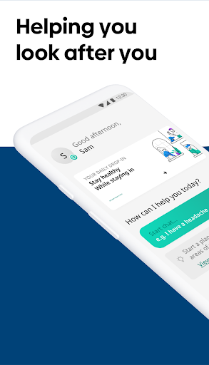  |   |   | 
 |   |   |   | 
 | 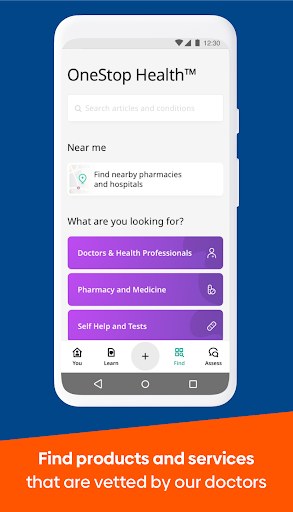 

## Development team
In the following we report the main information provided by the development team in the Google play store.

| | |
|-------------------------|-------------------------|
| **Developer**  | Your.MD |
| **Website**  | [https://www.your.md](https://www.your.md) |
| **Email** | feedback@your.md |
| **Physical address**  | [5th Floor, 43 Whitfield Street London W1T 4HD](https://www.google.com/maps/search/5th%20Floor,%2043%20Whitfield%20Street%20London%20W1T%204HD) (Google Maps) |
| **Other developed apps**  | [https://play.google.com/store/apps/developer?id=Your.MD](https://play.google.com/store/apps/developer?id=Your.MD) |

## Android support

| | |
|-------------------------|-------------------------|
| **Declared target Android version**  | Android10, version 10 (API level 29) |
| **Effective target Android version**  | Android10, version 10 (API level 29) |
| **Minimum supported Android version**  | Lollipop, version 5.0 (API level 21) |
| **Maximum target Android version**  | - |

The larger the difference between the minimum and maximum supported Android versions, the better. A larger difference means a wider audience. For example, old phones have a very low Android version, so a high minimum supported Android version means that the app cannot be used by users with old phones, thus leading to accessibility problems. 

## Requested permissions

In the following we report the complete list of the permissions requested by the app. 

| **Permission** | **Protection level** | **Description** | 
|-------------------------|-------------------------|-------------------------|
 **android.permission ACCESS_FINE_LOCATION** | :warning:**Dangerous** | Allows an app to access precise location. 
 **android.permission ACCESS_NETWORK_STATE** | Normal | Allows applications to access information about networks. 
 **android.permission ACCESS_WIFI_STATE** | Normal | Allows applications to access information about Wi-Fi networks. 
 **android.permission BODY_SENSORS** | :warning:**Dangerous** | Allows an application to access data from sensors that the user uses to measure what is happening inside his/her body, such as heart rate. 
 **android.permission FOREGROUND_SERVICE** | Normal | Allows a regular application to use Service.startForeground. 
 **android.permission INTERNET** | Normal | Allows applications to open network sockets. 
 **android.permission READ_PROFILE** | - | - 
 **android.permission RECEIVE_BOOT_COMPLETED** | Normal | Allows an application to receive the Intent.ACTION_BOOT_COMPLETED that is broadcast after the system finishes booting. 
 **android.permission USE_CREDENTIALS** | - | - 
 **android.permission WAKE_LOCK** | Normal | Allows using PowerManager WakeLocks to keep processor from sleeping or screen from dimming. 
 **android.permission WRITE_EXTERNAL_STORAGE** | :warning:**Dangerous** | Allows an application to write to external storage. 
 **com.google.android.c2dm.permission RECEIVE** | - | - 
 **com.google.android.finsky.permission BIND_GET_INSTALL_REFERRER_SERVICE** | - | - 

## Mentioned servers

| **Server** | **Registrant** | **Registrant country** | **Creation date** | 
|-------------------------|-------------------------|-------------------------|-------------------------|
 | android.com | Google LLC | :us: US | 1997-06-23 04:00:00 |
 | apache.org | The Apache Software Foundation | :us: US | 1995-04-11 04:00:00 |
 | github.com | GitHub, Inc. | :us: US | 2007-10-09 18:20:50 |
 | github.io | GitHub, Inc. | :us: US | 2013-03-08 19:12:48 |
 | facebook.com | Facebook, Inc. | :us: US | 1997-03-29 05:00:00 |
 | github.io | GitHub, Inc. | :us: US | 2013-03-08 19:12:48 |
 | googleapis.com | Google LLC | :us: US | 2005-01-25 17:52:26 |
 | gstatic.com | Google LLC | :us: US | 2008-02-11 15:31:25 |
 | googlesyndication.com | Google LLC | :us: US | 2003-01-21 06:17:24 |
 | google.com | Google LLC | :us: US | 1997-09-15 04:00:00 |
 | googleapis.com | Google LLC | :us: US | 2005-01-25 17:52:26 |
 | googleadservices.com | Google LLC | :us: US | 2003-06-19 16:34:53 |
 | app-measurement.com | Google LLC | :us: US | 2015-06-19 20:13:31 |
 | eprivacy.eu | - | - | - |
 | twitter.com | Twitter, Inc. | :us: US | 2000-01-21 16:28:17 |
 | linkedin.com | LinkedIn Corporation | :us: US | 2002-11-02 15:38:11 |
 | instagram.com | Instagram LLC | :us: US | 2004-06-04 13:37:18 |
 | crashlytics.com | Google LLC | :us: US | 2011-01-21 15:30:40 |
 | googleapis.com | Google LLC | :us: US | 2005-01-25 17:52:26 |

## Security analysis 

Below we report the main security warnings raised by our execution of the [Androwarn](https://github.com/maaaaz/androwarn) security analysis tool.

**Telephony identifiers leakage**
> - This application reads the MCC+MNC of the provider of the SIM 
> - This application reads the Service Provider Name (SPN) 
> - This application reads the device phone type value 
> - This application reads the numeric name (MCC+MNC) of current registered operator 
> - This application reads the operator name 

**Connection interfaces exfiltration**
> - This application reads details about the currently active data network 

**Suspicious connection establishment**
> - This application opens a Socket and connects it to the remote address ': ; port is out of range' on the 'N/A' port  
> - This application opens a Socket and connects it to the remote address 'Ljava/net/Proxy;->type()Ljava/net/Proxy$Type;' on the 'N/A' port  
> - This application opens a Socket and connects it to the remote address 'Lz/b/b/a/a;->q(Ljava/lang/String;)Ljava/lang/StringBuilder;' on the 'N/A' port  
> - This application opens a Socket and connects it to the remote address 'timeout' on the 'N/A' port  

**Code execution**
> - This application loads a native library 
> - This application loads a native library: 'bypass' 
> - This application loads a native library: 'tool-checker' 
> - This application executes a UNIX command 
> - This application executes a UNIX command containing this argument: 'getprop' 
> - This application executes a UNIX command containing this argument: 'mount' 

## User ratings and reviews

Below we provide information about how end users are reacting to the app in terms of ratings and reviews in the Google Play store.

### Ratings

The Healthily: Self-Care & Health Journal app has been installed by more than **1000000** times. At this time, **13872** rated the app and its average score is **4.1094313**. Below we show the distribution of the ratings across the usual star-based rating of Google Play

:star::star::star::star::star:: 8470

:star::star::star::star:: 2157

:star::star::star:: 1158

:star::star:: 469

:star:: 1618

### Reviews 

#### 5-star reviews

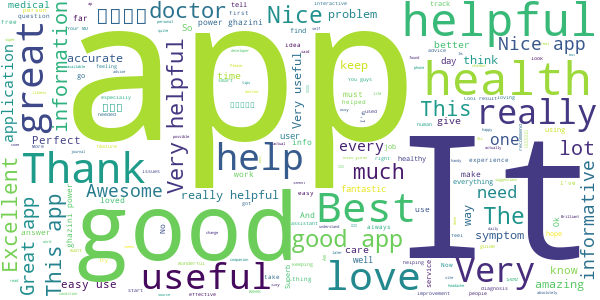

> nice one  :date: __2020-11-22 05:51:59__

> внат ан авесоме аpp. итс хелпинг те ундерстанд мы health  :date: __2020-11-21 23:00:02__

> it's great to determine if you need to go to the Dr, so easy to overlook symptoms but this app makes me look at the whole picture  :date: __2020-11-20 13:37:11__

> This app is really helping me. The prescription that given is really helpful  :date: __2020-11-20 08:50:20__

> I Started using this app in 2018, it has become a part of me, whenever i change a phone, its the first app i think. You guys are so amazing for introducing this app thanks a lot  :date: __2020-11-19 20:23:40__

> so far I'm liking this app. No problems yet.  :date: __2020-11-17 02:24:59__

> it's such a nice app  :date: __2020-11-16 15:24:08__

> Amazing experience, since you start using it it will become your main habit everyday. Very very good  :date: __2020-11-16 10:19:14__

> Good app motivating and easy to follow  :date: __2020-11-15 11:49:43__

> feel like a llama  :date: __2020-11-15 05:27:46__

#### 4-star reviews

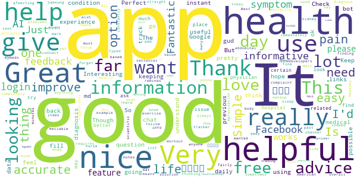

> it very nice to have a Healthy app to improve body works  :date: __2020-11-21 01:08:24__

> Not used yet  :date: __2020-11-14 13:33:05__

> I really like it but really wish you could have dark mode feature please and thank you!!!!  :date: __2020-11-10 21:28:14__

> Interesting  :date: __2020-11-08 22:26:29__

> nice app  :date: __2020-11-08 15:30:38__

> I feel pain and weak today. thinking of going to the E.R. the past few days.  :date: __2020-10-27 03:39:59__

> good app  :date: __2020-10-21 15:36:15__

> Good experience  :date: __2020-09-24 02:06:25__

> It is good for keeping notes about your health and other information  :date: __2020-09-21 01:45:58__

> Reliable  :date: __2020-08-01 21:24:53__

#### 3-star reviews

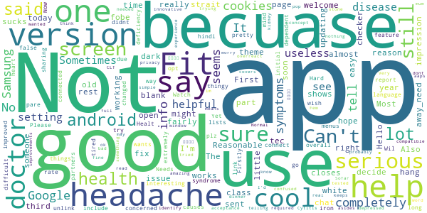

> Reasonable  :date: __2020-10-12 17:07:49__

> I have a headache today and app sent me almost strait to the doctor as a serious issue. Not sure one of headache is that serious and reason might be any. Also I would welcome dark version (theme) of the app. Headache and white screen is not good.  :date: __2020-10-09 20:36:09__

> First impression fairly easy to use, me being a 59 year old tec no fobe  :date: __2020-10-03 15:30:49__

> Most third class 👎👎👎  :date: __2020-09-30 13:58:53__

> Can't decide right away_need a little more time working on this app to get a hang of how it works  :date: __2020-09-30 12:12:37__

> Hello! I can't open the app after updating, it just shows blank page and then closes. I'm still on android version 5.1 if it helps. I really like this app as a health checker, hope it gets a fix soon.  :date: __2020-09-12 21:18:27__

> The chat with someone part sucks but rest is interesting  :date: __2020-09-05 08:41:55__

> I said i had some syndrome becuase was tired a lot but that didnt have to do with it becuase i have an iron deficiency which causes that, so this app did not help me becuase becuase it was concerned with things that were completely false.  :date: __2020-08-01 08:45:54__

> Needs more info  :date: __2020-05-13 18:40:40__

> Please include hindi language  :date: __2020-05-02 20:05:06__

#### 2-star reviews

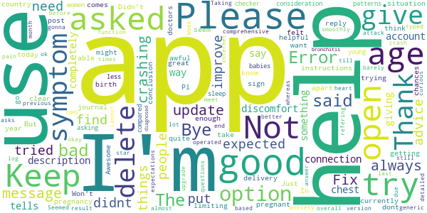

> Just asked how i felt today, i said awful and the reply was.....Awesome? Bye bye  :date: __2020-10-12 01:00:36__

> Didn't seem bad, but I'm not able to use it because I'm currently pregnant. There's no options for pregnancy or post delivery options.  :date: __2020-10-10 23:31:28__

> The how to use the app instructions aren't clear enough for me.  :date: __2020-10-07 05:17:05__

> Error message comes up when I try to sign up so I can't use the app.....  :date: __2020-09-03 12:54:01__

> I has always been a great app. But after update it keeps crashing ..Please Fix this.  :date: __2020-07-23 03:04:41__

> Keeps crashing. Won't open  :date: __2020-06-28 00:43:57__

> Keep getting and error message when trying to go to journal.  :date: __2020-06-27 12:37:51__

> Not what I expected didnt find it very helpful for me  :date: __2020-04-01 08:10:43__

> I tried to open the app and when it asked for my birth year I put 2006,it said the app was only for 16-100 but I dont get why,people under the age of 16 might need help too this app is limiting chances of people the age of 15 and under to get help,apart from this I think the app is quite good for those over 16 as it can help them with things they didnt know they could use help with or give them more help. In conclusion good app but improve on the age situation please as I want to try it.  :date: __2019-12-30 23:59:09__

> Pl advice doctors advice which u give here from which country  :date: __2019-09-15 18:35:53__

#### 1-star reviews

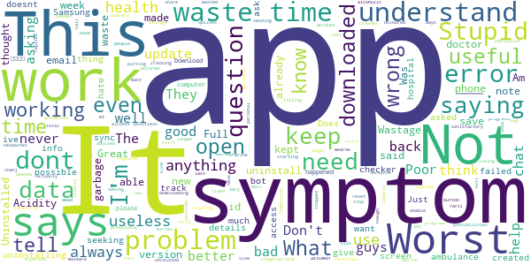

> Great app  :date: __2020-11-13 07:47:00__

> Notes don't save. It only has a back button which does not save the note.  :date: __2020-10-07 16:26:38__

> I have this app downloaded on my phone, but I can't open it What's wrong.  :date: __2020-10-04 04:03:07__

> Not useful to me  :date: __2020-10-03 14:29:55__

> Malware possibilities  :date: __2020-09-22 01:13:09__

> Inappropriate question (unrelated to headaches). Uninstalled app  :date: __2020-09-19 21:23:47__

> Unable to register with email address. Keep on receiving error message, even after uninstall and reinstall.  :date: __2020-09-16 18:03:27__

> Not working , dead app. Airtel provider  :date: __2020-08-07 12:26:46__

> Acidity? You're a doctor app and you don't know what is acidity?  :date: __2020-08-03 19:06:33__

> Was kind of liking the app but it reset itself 5 days into the 4 week programs so I lost all progress. Not starting again, clearly a bug needs to be fixed.  :date: __2020-08-01 10:45:32__

# HasHealth Video Consultations
App version ``1.0.3``

Analyzed with [covid-apps-observer](http://github.com/covid-apps-observer) project, version ``0.1``

## App overview
| | |
|-------------------------|-------------------------| 
| **Name**&nbsp;&nbsp;&nbsp;&nbsp;&nbsp;&nbsp;&nbsp;&nbsp;&nbsp;&nbsp;&nbsp;&nbsp;&nbsp;&nbsp;&nbsp;&nbsp;&nbsp;&nbsp;&nbsp;&nbsp;&nbsp;&nbsp;&nbsp;&nbsp;&nbsp;&nbsp;&nbsp;&nbsp;&nbsp;&nbsp;&nbsp;&nbsp;&nbsp;&nbsp;&nbsp;&nbsp;&nbsp;&nbsp;&nbsp;&nbsp;  | HasHealth Video Consultations |
| **Unique identifier** | com.nuasolutions.hse.prod |
| **Link to Google Play** | [https://play.google.com/store/apps/details?id=com.nuasolutions.hse.prod](https://play.google.com/store/apps/details?id=com.nuasolutions.hse.prod) |
| **Summary**  | HasHealth Video Consultations allows patients to see their clinician directly. |
| **Privacy policy** | [https://www.nuahealth.com/site_pages/privacy](https://www.nuahealth.com/site_pages/privacy) |
| **Latest version** | 1.0.3 |
| **Last update** | 2020-11-05 16:12:16 |
| **Recent changes** | Fix problem with joining video consultation |
| **Installs**  | 1,000+ |
| **Category** | Medical |
| **First release** | Mar 15, 2020 |
| **Size**  | 20M |
| **Supported Android version**  | 4.4 and up |

### Description
> HasHealth is a Video Consultation Service launched in response to Coronavirus / COVID-19 that allows you access to your own Clinician from the comfort of your home, all through our Android App.
 It is a new way to see your own clinician.
 HOW IT WORKS
 1. Contact your local practice / clinic to arrange a video appointment
 2. Receive an email/SMS with your unique link containing your access code
 2. See your own clinician by clicking the link or by entering the code
 FEATURES
 * Live Video Consultations – medical advice from your own clinician using video and audio
 * Available everywhere in the Republic of Ireland - available anytime, anywhere
 * Your data is always safe and 100% confidential. This Service is fully compliant with the General Data Protection Regulation (GDPR).
 Please note, all medical advice is provided by your own Clinician, who has total clinical independence in deciding what they can safely treat and diagnose using this Service.
 You will need a high quality, reliable Internet connection to use the Service.
 This Service is not recommended for medical emergencies or acute medical episodes.
 If the clinician decides it necessary, they may recommend you have an in-clinic appointment or alternatively ask you to contact your local Out of Hours or accident and emergency department as appropriate.
 www.hashealth.com

### User interface
The developers of the app provide the following screenshots in the Google play store.
| | | |
|:-------------------------:|:-------------------------:|:-------------------------:|
 |   |   | 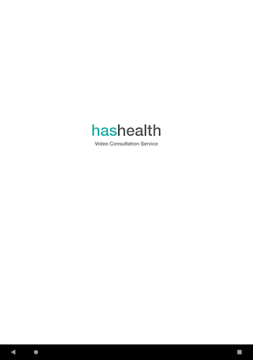  | 
 |  

## Development team
In the following we report the main information provided by the development team in the Google play store.

| | |
|-------------------------|-------------------------|
| **Developer**  | Webdoctor Limited |
| **Website**  | [https://www.nuahealth.com](https://www.nuahealth.com) |
| **Email** | info@nuahealth.com |
| **Physical address**  | - |
| **Other developed apps**  | [https://play.google.com/store/apps/developer?id=Webdoctor+Limited](https://play.google.com/store/apps/developer?id=Webdoctor+Limited) |

## Android support

| | |
|-------------------------|-------------------------|
| **Declared target Android version**  | Pie, version 9 (API level 28) |
| **Effective target Android version**  | Pie, version 9 (API level 28) |
| **Minimum supported Android version**  | KitKat, version 4.4 - 4.4.4 (API level 19) |
| **Maximum target Android version**  | - |

The larger the difference between the minimum and maximum supported Android versions, the better. A larger difference means a wider audience. For example, old phones have a very low Android version, so a high minimum supported Android version means that the app cannot be used by users with old phones, thus leading to accessibility problems. 

## Requested permissions

In the following we report the complete list of the permissions requested by the app. 

| **Permission** | **Protection level** | **Description** | 
|-------------------------|-------------------------|-------------------------|
 **android.permission ACCESS_NETWORK_STATE** | Normal | Allows applications to access information about networks. 
 **android.permission BLUETOOTH** | Normal | Allows applications to connect to paired bluetooth devices. 
 **android.permission BROADCAST_STICKY** | Normal | Allows an application to broadcast sticky intents. 
 **android.permission CALL_PHONE** | :warning:**Dangerous** | Allows an application to initiate a phone call without going through the Dialer user interface for the user to confirm the call. 
 **android.permission CAMERA** | :warning:**Dangerous** | Required to be able to access the camera device. 
 **android.permission INTERNET** | Normal | Allows applications to open network sockets. 
 **android.permission MODIFY_AUDIO_SETTINGS** | Normal | Allows an application to modify global audio settings. 
 **android.permission READ_EXTERNAL_STORAGE** | :warning:**Dangerous** | Allows an application to read from external storage. 
 **android.permission READ_PHONE_STATE** | :warning:**Dangerous** | Allows read only access to phone state, including the phone number of the device, current cellular network information, the status of any ongoing calls, and a list of any PhoneAccounts registered on the device. 
 **android.permission RECORD_AUDIO** | :warning:**Dangerous** | Allows an application to record audio. 
 **android.permission WAKE_LOCK** | Normal | Allows using PowerManager WakeLocks to keep processor from sleeping or screen from dimming. 
 **android.permission WRITE_EXTERNAL_STORAGE** | :warning:**Dangerous** | Allows an application to write to external storage. 
 **com.google.android.c2dm.permission RECEIVE** | - | - 
 **com.google.android.finsky.permission BIND_GET_INSTALL_REFERRER_SERVICE** | - | - 

## Mentioned servers

| **Server** | **Registrant** | **Registrant country** | **Creation date** | 
|-------------------------|-------------------------|-------------------------|-------------------------|
 | googlesyndication.com | Google LLC | :us: US | 2003-01-21 06:17:24 |
 | google.com | Google LLC | :us: US | 1997-09-15 04:00:00 |
 | app-measurement.com | Google LLC | :us: US | 2015-06-19 20:13:31 |
 | logentries.com | Rapid7 | :us: US | 2010-02-08 16:18:32 |
 | hashealth.com | REDACTED FOR GDPR | IE | 2020-01-07 05:32:15 |
 | opentok.com | Domains By Proxy, LLC | :us: US | 2010-09-24 17:14:13 |
 | crashlytics.com | Google LLC | :us: US | 2011-01-21 15:30:40 |
 | googleapis.com | Google LLC | :us: US | 2005-01-25 17:52:26 |
 | googleadservices.com | Google LLC | :us: US | 2003-06-19 16:34:53 |

## Security analysis 

Below we report the main security warnings raised by our execution of the [Androwarn](https://github.com/maaaaz/androwarn) security analysis tool.

**Connection interfaces exfiltration**
> - This application reads details about the currently active data network 
> - This application tries to find out if the currently active data network is metered 

**Telephony services abuse**
> - This application makes phone calls 

**Suspicious connection establishment**
> - This application opens a Socket and connects it to the remote address '' on the 'N/A' port  
> - This application opens a Socket and connects it to the remote address 'Lcom/logentries/net/LogentriesClient;->getPort()I' on the 'Lcom/logentries/net/LogentriesClient;->getPort()I' port  
> - This application opens a Socket and connects it to the remote address 'Ljava/lang/StringBuilder;->toString()Ljava/lang/String;' on the 'N/A' port  
> - This application opens a Socket and connects it to the remote address 'Ljava/net/Proxy;->type()Ljava/net/Proxy$Type;' on the 'N/A' port  
> - This application opens a Socket and connects it to the remote address 'timeout' on the 'N/A' port  

**Code execution**
> - This application loads a native library: 'Ljava/lang/String;->valueOf(Ljava/lang/Object;)Ljava/lang/String;' 
> - This application loads a native library: 'opentok' 

## User ratings and reviews

Below we provide information about how end users are reacting to the app in terms of ratings and reviews in the Google Play store.

### Ratings

The HasHealth Video Consultations app has been installed by more than **1000** times. At this time, **-** rated the app and its average score is **0.0**. Below we show the distribution of the ratings across the usual star-based rating of Google Play

:star::star::star::star::star:: 0

:star::star::star::star:: 0

:star::star::star:: 0

:star::star:: 0

:star:: 0

### Reviews 

#### 5-star reviews

No recent reviews available with 5 stars.

#### 4-star reviews

No recent reviews available with 4 stars.

#### 3-star reviews

No recent reviews available with 3 stars.

#### 2-star reviews

No recent reviews available with 2 stars.

#### 1-star reviews

No recent reviews available with 1 stars.

# Evergreen Life PHR
App version ``18.1.1``

Analyzed with [covid-apps-observer](http://github.com/covid-apps-observer) project, version ``0.1``

## App overview
| | |
|-------------------------|-------------------------| 
| **Name**&nbsp;&nbsp;&nbsp;&nbsp;&nbsp;&nbsp;&nbsp;&nbsp;&nbsp;&nbsp;&nbsp;&nbsp;&nbsp;&nbsp;&nbsp;&nbsp;&nbsp;&nbsp;&nbsp;&nbsp;&nbsp;&nbsp;&nbsp;&nbsp;&nbsp;&nbsp;&nbsp;&nbsp;&nbsp;&nbsp;&nbsp;&nbsp;&nbsp;&nbsp;&nbsp;&nbsp;&nbsp;&nbsp;&nbsp;&nbsp;  | Evergreen Life PHR |
| **Unique identifier** | com.ascent.phr |
| **Link to Google Play** | [https://play.google.com/store/apps/details?id=com.ascent.phr](https://play.google.com/store/apps/details?id=com.ascent.phr) |
| **Summary**  | Book appointments, order prescriptions and manage your health and wellbeing |
| **Privacy policy** | [https://www.evergreen-life.co.uk/terms/website-terms-of-use](https://www.evergreen-life.co.uk/terms/website-terms-of-use) |
| **Latest version** | 18.1.1 |
| **Last update** | 2020-11-18 11:27:44 |
| **Recent changes** | We’re constantly working to improve our service to you with regular updates. If you have any ideas for further improvements, ideas for features, or need help, contact us via our website evergreen-life.co.uk. We’re always happy to help. |
| **Installs**  | 100,000+ |
| **Category** | Health & Fitness |
| **First release** | Apr 4, 2016 |
| **Size**  | 9.8M |
| **Supported Android version**  | 5.1 and up |

### Description
> 💚 Order repeat prescriptions to your door
 💚 Book GP appointments
 💚 View your GP medical record and carry it in your pocket
 💚 Discover your Wellness Score and get practical insights into your wellbeing
 💚 Build your most accurate health record
 <b>NHS-ASSURED GP ONLINE SERVICES</b>
 Available at all GP practices in England:
 • Save yourself time by booking and cancelling GP appointments ⏰
 • Order your repeat prescriptions directly to your door, so you’re never without your medication 🚚 💊
 • Stay informed with 24/7 access to your GP medical record, including test results, immunisations, allergies and medications 📁
 <b>ONE HEALTH RECORD. WHEN YOU NEED IT</b> 
 It may come as a surprise but a central record of your health doesn’t exist - your GP, hospital and other healthcare records aren’t joined up and information is not necessarily shared between them. That can make things pretty tricky, having to remember important information from memory, and explain past treatments and conditions over and over. With Evergreen Life, you can be in control and keep all your health data, including all of your GP records, in the palm of your hand - building a fully accurate and up-to-date record that you can carry with you all the time.
 <b>WHAT’S YOUR WELLNESS SCORE?</b>
 Your Wellness Score can help you understand if you’re doing all you can to stay well. The score is based on your answers to the app’s clinically-researched Wellness Checks in areas such as fitness, happiness, sleep and diet. By discovering your Wellness Score, you’ll get personalised and practical insights into ways you can optimise your health and wellbeing.
 <b>MEDICATION REMINDERS</b>
 Give yourself one less thing to worry about. Never forget to take your medications again with the Evergreen Life medicine app, helping you safely manage your own or your family’s health 💊
 <b>HEALTH AND FITNESS TRACKER</b>
 Track your health and fitness measurements, including blood pressure, body fat percentage and blood sugar levels, so you can monitor your health goals 🏋️‍♂️🤸‍♂️
 <b>SECURELY STORE YOUR DOCUMENTS</b>
 If you struggle to find appointment letters or your health information is difficult to manage, storing all your documents in one app can make it much easier to organise your care 📩
 <b>SHARE WITH THOSE WHO MATTER MOST</b>
 Get the best care possible and give peace-of-mind to your family or health providers with secure access to your shared health information.
  
 <b>DNA TESTING: UNLOCK YOUR HEALTH SECRETS</b> 🤫
 With Evergreen Life DNA testing, you can find out how your genes influence your:
 • DIET - Fuel your body with the nutrition it needs
 • METABOLISM - Understand what foods will help you feel healthiest
 • FITNESS - Achieve better fitness results, faster
 • SKIN - Personalise your beauty routine by what your skin needs
 Need a helping hand? 🖐️ If you want any help and support with using the app or getting set up with GP online services, head to https://help.evergreen-life.co.uk or call our Support Team at 0161 768 6063
 <i>*Your local doctor’s surgery may not offer all GP online services. Ask your practice directly to find out which are available to you.</i>

### User interface
The developers of the app provide the following screenshots in the Google play store.
| | | |
|:-------------------------:|:-------------------------:|:-------------------------:|
 |   |   |   | 
 |   |   |   | 
 |   |  

## Development team
In the following we report the main information provided by the development team in the Google play store.

| | |
|-------------------------|-------------------------|
| **Developer**  | Evergreen Health Solutions Ltd |
| **Website**  | [http://www.evergreen-life.co.uk](http://www.evergreen-life.co.uk) |
| **Email** | hello@evergreen-life.co.uk |
| **Physical address**  | - |
| **Other developed apps**  | [https://play.google.com/store/apps/developer?id=Evergreen+Health+Solutions+Ltd](https://play.google.com/store/apps/developer?id=Evergreen+Health+Solutions+Ltd) |

## Android support

| | |
|-------------------------|-------------------------|
| **Declared target Android version**  | Android10, version 10 (API level 29) |
| **Effective target Android version**  | Android10, version 10 (API level 29) |
| **Minimum supported Android version**  | Lollipop, version 5.1 (API level 22) |
| **Maximum target Android version**  | - |

The larger the difference between the minimum and maximum supported Android versions, the better. A larger difference means a wider audience. For example, old phones have a very low Android version, so a high minimum supported Android version means that the app cannot be used by users with old phones, thus leading to accessibility problems. 

## Requested permissions

In the following we report the complete list of the permissions requested by the app. 

| **Permission** | **Protection level** | **Description** | 
|-------------------------|-------------------------|-------------------------|
 **android.permission ACCESS_COARSE_LOCATION** | :warning:**Dangerous** | Allows an app to access approximate location. 
 **android.permission ACCESS_FINE_LOCATION** | :warning:**Dangerous** | Allows an app to access precise location. 
 **android.permission ACCESS_NETWORK_STATE** | Normal | Allows applications to access information about networks. 
 **android.permission CAMERA** | :warning:**Dangerous** | Required to be able to access the camera device. 
 **android.permission FLASHLIGHT** | - | - 
 **android.permission FOREGROUND_SERVICE** | Normal | Allows a regular application to use Service.startForeground. 
 **android.permission INTERNET** | Normal | Allows applications to open network sockets. 
 **android.permission READ_APP_BADGE** | - | - 
 **android.permission READ_CALENDAR** | :warning:**Dangerous** | Allows an application to read the user's calendar data. 
 **android.permission READ_EXTERNAL_STORAGE** | :warning:**Dangerous** | Allows an application to read from external storage. 
 **android.permission USE_FINGERPRINT** | Normal | This constant was deprecated in API level 28. Applications should request USE_BIOMETRIC instead 
 **android.permission VIBRATE** | Normal | Allows access to the vibrator. 
 **android.permission WAKE_LOCK** | Normal | Allows using PowerManager WakeLocks to keep processor from sleeping or screen from dimming. 
 **android.permission WRITE_CALENDAR** | :warning:**Dangerous** | Allows an application to write the user's calendar data. 
 **android.permission WRITE_EXTERNAL_STORAGE** | :warning:**Dangerous** | Allows an application to write to external storage. 
 **com.anddoes.launcher.permission UPDATE_COUNT** | - | - 
 **com.ascent.phr.permission C2D_MESSAGE** | - | - 
 **com.google.android.c2dm.permission RECEIVE** | - | - 
 **com.google.android.finsky.permission BIND_GET_INSTALL_REFERRER_SERVICE** | - | - 
 **com.htc.launcher.permission READ_SETTINGS** | - | - 
 **com.htc.launcher.permission UPDATE_SHORTCUT** | - | - 
 **com.huawei.android.launcher.permission CHANGE_BADGE** | - | - 
 **com.huawei.android.launcher.permission READ_SETTINGS** | - | - 
 **com.huawei.android.launcher.permission WRITE_SETTINGS** | - | - 
 **com.majeur.launcher.permission UPDATE_BADGE** | - | - 
 **com.oppo.launcher.permission READ_SETTINGS** | - | - 
 **com.oppo.launcher.permission WRITE_SETTINGS** | - | - 
 **com.sec.android.provider.badge.permission READ** | - | - 
 **com.sec.android.provider.badge.permission WRITE** | - | - 
 **com.sonyericsson.home.permission BROADCAST_BADGE** | - | - 
 **com.sonymobile.home.permission PROVIDER_INSERT_BADGE** | - | - 
 **me.everything.badger.permission BADGE_COUNT_READ** | - | - 
 **me.everything.badger.permission BADGE_COUNT_WRITE** | - | - 

## Mentioned servers

| **Server** | **Registrant** | **Registrant country** | **Creation date** | 
|-------------------------|-------------------------|-------------------------|-------------------------|
 | google.com | Google LLC | :us: US | 1997-09-15 04:00:00 |
 | appspot.com | Google LLC | :us: US | 2005-03-10 02:27:55 |
 | branch.io | Branch | :us: US | 2011-11-10 13:52:13 |
 | gstatic.com | Google LLC | :us: US | 2008-02-11 15:31:25 |
 | googleapis.com | Google LLC | :us: US | 2005-01-25 17:52:26 |
 | bnc.lt | - | - | 2016-11-14 00:00:00 |
 | whatsapp.com | Whatsapp Inc. | :us: US | 2008-09-04 12:39:12 |

## Security analysis 

Below we report the main security warnings raised by our execution of the [Androwarn](https://github.com/maaaaz/androwarn) security analysis tool.

**Telephony identifiers leakage**
> - This application reads the numeric name (MCC+MNC) of current registered operator 
> - This application reads the operator name 

**Connection interfaces exfiltration**
> - This application reads details about the currently active data network 
> - This application tries to find out if the currently active data network is metered 

**Telephony services abuse**
> - This application makes phone calls 

**Pim data leakage**
> - This application accesses the calendar 
> - This application accesses the downloads folder 
> - This application accesses data stored in the clipboard 

**Code execution**
> - This application loads a native library 
> - This application executes a UNIX command containing this argument: 'Ljava/lang/StringBuilder;->toString()Ljava/lang/String;' 

## User ratings and reviews

Below we provide information about how end users are reacting to the app in terms of ratings and reviews in the Google Play store.

### Ratings

The Evergreen Life PHR app has been installed by more than **100000** times. At this time, **2951** rated the app and its average score is **3.9661016**. Below we show the distribution of the ratings across the usual star-based rating of Google Play

:star::star::star::star::star:: 1741

:star::star::star::star:: 390

:star::star::star:: 220

:star::star:: 180

:star:: 420

### Reviews 

#### 5-star reviews

> Thanks for this lovely App  :date: __2020-11-23 09:09:36__

> Good app, fairly intuitive & simple to use.  :date: __2020-11-22 19:02:14__

> easy to use, very convenient  :date: __2020-11-22 08:31:51__

> very good app, loads of info  :date: __2020-11-20 00:55:36__

> You are wonderful no worrying about things with you here  :date: __2020-11-19 17:51:20__

> Really good app  :date: __2020-11-19 09:09:09__

> Excellent no hassle  :date: __2020-11-18 10:31:52__

> The best app.  :date: __2020-11-02 23:37:48__

> Cool  :date: __2020-10-30 23:09:41__

> Nice  :date: __2020-10-29 12:50:45__

#### 4-star reviews

> Quite a good app. All your medical info in one place. Only problem is when I send a message, no matter what it's about, I only get 'null' as a reply which isn't very helpful.  :date: __2020-11-19 12:17:35__

> Useful!  :date: __2020-11-06 23:06:27__

> Update 07-04: Originally gave this app 5 stars then after an update, it didn't work, so reduced the rating. Since 7th April I have had no issues and it seems to be working fine. Just hope this continues. UPDATE 15 Oct: Have decided to use another app, although I have to say there were only a few problems. Trouble is I don't need problems. When you're ordering meds, you want it to be plain sailing and simple. I would tentatively recommend this app but it has to work without hiccups. Thanks  :date: __2020-10-15 11:01:41__

> I have been using same from almost the first week.off course when you first released the app it had one or two problems, then again which new release does not have problems. Seen a couple of comments saying difficult to understand.all I can say is that they must have a different program open to me.  :date: __2020-10-13 22:29:16__

> Could you let me lnow how yo record fitness results  :date: __2020-09-29 11:05:21__

> So much easier than waiting on hold to book an appointment :). However, parts of the interface can be confusing at times and hard to navigate. I can imagine it being difficult if you aren't tech savvy.  :date: __2020-09-10 12:03:38__

> Have used for a while now and found it very useful, however, recently it has stopped connecting to the server. Does anyone know the cause or have a fix?  :date: __2020-08-20 21:30:04__

> I can use this on my phone and laptop. This is useful.  :date: __2020-08-02 08:27:46__

> Edit: Although I still have no idea why I couldn't log in last time, the app is now working perfectly. It is very useful to be able to order a repeat prescription and to see medical records. Much easier than trying to get through to the surgery by phone. Evergreen Customer Services were very helpful! I installed the app on my phone but it just keeps scrolling through the 5 introductory screens and won't let me log in. It's a really good idea but no use if it's not reliable.  :date: __2020-08-01 14:05:06__

> Getting to know the app... How do I view photos of appointment letters I have taken? I can see the thumbnails, but can't open them?  :date: __2020-07-15 08:49:26__

#### 3-star reviews

> Edit: this is working again now - but only on my old phone (which is too knackered to sell so ok). My new phone runs colorOS, (realme6), which might have something to do with it. Disney+ doesn't work on it because of this... Edit: I can't get to the bit where you order a precriotion. It just buffers endlessly. 4/5/2020 Works well for me.  :date: __2020-11-23 08:25:52__

> good but needs improving  :date: __2020-11-22 13:36:15__

> I would like to see my records but they don't seem to be available  :date: __2020-11-20 14:19:30__

> Frustrating after the last update it constantly asks for the screen lock code making it very difficult to get access to the app. Is anyone else having trouble  :date: __2020-11-13 10:04:33__

> User experience inconsistent, lota if data not available from practition  :date: __2020-10-14 14:23:14__

> App is fine but biometric finger scan never worked.  :date: __2020-10-13 20:52:10__

> Not the best to get the information I need  :date: __2020-10-13 20:08:20__

> Works in a basic way but it relies on your GP practice to provide a lot of the connections to other info, which in my case they don't. Also the biometric log in does not work now. It did work to start with, but although it says Fingerprint recognised it cannot log me in?  :date: __2020-09-23 19:54:52__

> Can't even login. The linkage number given by my practice is 13 characters (double checked many times) but the app it insists it should be 15!  :date: __2020-09-04 13:52:41__

> I've been using this app for quite a while now & l haven't had any issues until this morning & now it's saying its unable to log me in. None of my details have changed its seem since there was an update that its happened. Any chance someone can reply to this to help me out.  :date: __2020-08-25 12:52:35__

#### 2-star reviews

> biometric logon does not work, and last whole would not order my prescription  :date: __2020-11-22 12:22:00__

> Prescription function issues when trying to order. Galaxy S10. Used to work fine, now all but useless to me.  :date: __2020-11-08 15:03:43__

> I will leave this rating as '2' as a warning to other potential users that there is an issue. ie that sometimes the App stops recognising your password and that, despite their best endeavours and lots of communications between us, Evergreen Life have not been able to resolve this issue. Hopefully one day they will get to the bottom of it as it is otherwise a pretty good App (and the Web access is good) but there are I know other similar Apps available that are probably worth looking at first.  :date: __2020-10-24 11:10:45__

> Having major problems with your app it keeps logging me out I then have to reset my password this has happened twice in a week it's completely unusable now and I can't order my meds really really bad...  :date: __2020-10-17 08:38:12__

> This was a good App till it started promoting Pharmacy2u right in the App when we were going through the first Covid peak. Unfortunately I opted for that which never worked out and I had to switch back to my old pharmacy. Since then this App continues to update repeats in a haphazard manner repeatedly bringing up the same data when I request repeats. It is sad that after a long time I am uninstalling it. Business should never be given precedence to the core functions of people using this App.  :date: __2020-10-15 11:09:34__

> The app worked fine up until very recently where now I can't do anything in it and the buttons are unresponsive. The Customer Service team recommended reinstalling the app but this did nothing.  :date: __2020-10-15 09:19:19__

> Extraordinary initial interface, more like a game for the sharp eyed than a practical aid for those in pain or in a hurry. 'Playful" with tiny print. I suppose you'd get used to it.  :date: __2020-10-06 01:08:43__

> Okay when it works, which is not very often.  :date: __2020-09-28 09:38:54__

> This app was good, but now can't log on it just goes through the introduction screen its annoying as its the easiest way I order my prescriptions. Can you please fix...  :date: __2020-07-31 10:53:50__

> Unable to add more than one medication, and when doing the well being test despite selecting the never smoked option, it the asked questions about how many cigarettes I smoked a day. So not intuitive software. I ended up deleting  :date: __2020-06-26 17:47:02__

#### 1-star reviews

> don't look at the comments part. sends permissions to wrong place.  :date: __2020-11-22 10:43:26__

> AVOID THIS USELESS APP This app is nothing but logging users out, doesn't accept complex passwords, unlinks your GP account and then loads up half the time without any styling. Update 2020 Just just as useless in 2019 but now with 100% more notifications to drive you up the wall. Anything I try to do on this non-functioning app it just crashes. The NHS services are also tucked away making GP services harder to find and use.  :date: __2020-11-21 13:03:16__

> Unable to use finger print to log in. Have reset print numerous times and accepted by app - then won't allow print to be used for log on . Amateur Time  :date: __2020-11-20 19:51:20__

> Absolutely pants. It was fine originally but for the last year or so it freezes making it useless to me. Reloaded many times to no avail - time for me to move on.... No - I can't be bothered to ring customer services - it's an app - it doesn't work on my old phone or my new phone - plenty of alternatives out there.... Avoid.  :date: __2020-11-04 20:26:56__

> Absolute rubbish.I cant even opt out of automatic updates.When I try and update the app, it just says "waiting on download." It won't let me use the app unless I complete the update so now I am stuck.Absolutely stupid way to design an app.Useless!!!!!  :date: __2020-10-31 18:14:42__

> Atrocious app. Won't let me log in when I know 100% that my credentials are correct. When I click to reset the password, it does nothing. How can we ever log in then?!? Awful.  :date: __2020-10-15 15:30:51__

> Only wanted to make doctor's appointment. Too many extras. Are they mining data?  :date: __2020-10-13 21:02:41__

> My phone has facial recognition: does this app? No, don't be silly. It's all in a Google Security API that no 'developer' is able to understand yet. Agree about the interface; it is very poorly thought out. And it's not about me, is it? It's about selling services. Don't you just hate what's happening with our NHS?  :date: __2020-10-13 19:25:24__

> Finger print password does not work and it's the default setting  :date: __2020-10-08 10:11:52__

> This app is truly awful. Half the buttons don't even work, constantly logs you out and won't allow you to log in again. I've ended up having to use their website instead, which is also awful. If you're looking for an app to connect to your practice, for the love of God don't use this one. 1 star because I can't give it negative stars  :date: __2020-10-08 09:50:31__

# My Ansa
App version ``1.2.0.0``

Analyzed with [covid-apps-observer](http://github.com/covid-apps-observer) project, version ``0.1``

## App overview
| | |
|-------------------------|-------------------------| 
| **Name**&nbsp;&nbsp;&nbsp;&nbsp;&nbsp;&nbsp;&nbsp;&nbsp;&nbsp;&nbsp;&nbsp;&nbsp;&nbsp;&nbsp;&nbsp;&nbsp;&nbsp;&nbsp;&nbsp;&nbsp;&nbsp;&nbsp;&nbsp;&nbsp;&nbsp;&nbsp;&nbsp;&nbsp;&nbsp;&nbsp;&nbsp;&nbsp;&nbsp;&nbsp;&nbsp;&nbsp;&nbsp;&nbsp;&nbsp;&nbsp;  | My Ansa |
| **Unique identifier** | com.app.p3681GD |
| **Link to Google Play** | [https://play.google.com/store/apps/details?id=com.app.p3681GD](https://play.google.com/store/apps/details?id=com.app.p3681GD) |
| **Summary**  | App for Ansa |
| **Privacy policy** | [http://www.ansa.co.uk/about-us/privacy-notice.aspx](http://www.ansa.co.uk/about-us/privacy-notice.aspx) |
| **Latest version** | 1.2.0.0 |
| **Last update** | 2020-03-24 16:27:42 |
| **Recent changes** | - |
| **Installs**  | 100+ |
| **Category** | Business |
| **First release** | Mar 24, 2020 |
| **Size**  | 30M |
| **Supported Android version**  | 2.3.3 and up |

### Description
> App for Ansa employees to access the latest information

### User interface
The developers of the app provide the following screenshots in the Google play store.
| | | |
|:-------------------------:|:-------------------------:|:-------------------------:|
 |   |   |   | 
 |  

## Development team
In the following we report the main information provided by the development team in the Google play store.

| | |
|-------------------------|-------------------------|
| **Developer**  | Ansa Environmental Services Ltd |
| **Website**  | - |
| **Email** | emma@dalzell.com |
| **Physical address**  | - |
| **Other developed apps**  | [https://play.google.com/store/apps/developer?id=Ansa+Environmental+Services+Ltd](https://play.google.com/store/apps/developer?id=Ansa+Environmental+Services+Ltd) |

## Android support

| | |
|-------------------------|-------------------------|
| **Declared target Android version**  | Pie, version 9 (API level 28) |
| **Effective target Android version**  | Pie, version 9 (API level 28) |
| **Minimum supported Android version**  | Gingerbread, version 2.3.3 - 2.3.7 (API level 10) |
| **Maximum target Android version**  | - |

The larger the difference between the minimum and maximum supported Android versions, the better. A larger difference means a wider audience. For example, old phones have a very low Android version, so a high minimum supported Android version means that the app cannot be used by users with old phones, thus leading to accessibility problems. 

## Requested permissions

In the following we report the complete list of the permissions requested by the app. 

| **Permission** | **Protection level** | **Description** | 
|-------------------------|-------------------------|-------------------------|
 **android.permission ACCESS_COARSE_LOCATION** | :warning:**Dangerous** | Allows an app to access approximate location. 
 **android.permission ACCESS_FINE_LOCATION** | :warning:**Dangerous** | Allows an app to access precise location. 
 **android.permission ACCESS_NETWORK_STATE** | Normal | Allows applications to access information about networks. 
 **android.permission INTERNET** | Normal | Allows applications to open network sockets. 
 **android.permission READ_GSERVICES** | - | - 
 **android.permission WAKE_LOCK** | Normal | Allows using PowerManager WakeLocks to keep processor from sleeping or screen from dimming. 
 **android.permission WRITE_EXTERNAL_STORAGE** | :warning:**Dangerous** | Allows an application to write to external storage. 
 **com.app.p3681GD.permission C2D_MESSAGE** | - | - 
 **com.google.android.c2dm.permission RECEIVE** | - | - 
 **com.google.android.providers.gsf.permission READ_GSERVICES** | - | - 

## Mentioned servers

| **Server** | **Registrant** | **Registrant country** | **Creation date** | 
|-------------------------|-------------------------|-------------------------|-------------------------|
 | googlesyndication.com | Google LLC | :us: US | 2003-01-21 06:17:24 |
 | googleapis.com | Google LLC | :us: US | 2005-01-25 17:52:26 |
 | google.com | Google LLC | :us: US | 1997-09-15 04:00:00 |
 | app-measurement.com | Google LLC | :us: US | 2015-06-19 20:13:31 |
 | doubleclick.net | Google Inc. | :us: US | 1996-01-16 05:00:00 |
 | gstatic.com | Google LLC | :us: US | 2008-02-11 15:31:25 |
 | googleapis.com | Google LLC | :us: US | 2005-01-25 17:52:26 |

## Security analysis 

Below we report the main security warnings raised by our execution of the [Androwarn](https://github.com/maaaaz/androwarn) security analysis tool.

**Telephony identifiers leakage**
> - This application reads the device phone type value 
> - This application reads the numeric name (MCC+MNC) of current registered operator 
> - This application reads the radio technology (network type) currently in use on the device for data transmission 

**Connection interfaces exfiltration**
> - This application reads details about the currently active data network 
> - This application tries to find out if the currently active data network is metered 

**Telephony services abuse**
> - This application makes phone calls 

**Code execution**
> - This application loads a native library: 'monodroid' 
> - This application loads a native library: 'xamarin-app' 

## User ratings and reviews

Below we provide information about how end users are reacting to the app in terms of ratings and reviews in the Google Play store.

### Ratings

The My Ansa app has been installed by more than **100** times. At this time, **-** rated the app and its average score is **0.0**. Below we show the distribution of the ratings across the usual star-based rating of Google Play

:star::star::star::star::star:: 0

:star::star::star::star:: 0

:star::star::star:: 0

:star::star:: 0

:star:: 0

### Reviews 

#### 5-star reviews

No recent reviews available with 5 stars.

#### 4-star reviews

No recent reviews available with 4 stars.

#### 3-star reviews

No recent reviews available with 3 stars.

#### 2-star reviews

No recent reviews available with 2 stars.

#### 1-star reviews

No recent reviews available with 1 stars.

# BuMP+
App version ``1.1.0``

Analyzed with [covid-apps-observer](http://github.com/covid-apps-observer) project, version ``0.1``

## App overview
| | |
|-------------------------|-------------------------| 
| **Name**&nbsp;&nbsp;&nbsp;&nbsp;&nbsp;&nbsp;&nbsp;&nbsp;&nbsp;&nbsp;&nbsp;&nbsp;&nbsp;&nbsp;&nbsp;&nbsp;&nbsp;&nbsp;&nbsp;&nbsp;&nbsp;&nbsp;&nbsp;&nbsp;&nbsp;&nbsp;&nbsp;&nbsp;&nbsp;&nbsp;&nbsp;&nbsp;&nbsp;&nbsp;&nbsp;&nbsp;&nbsp;&nbsp;&nbsp;&nbsp;  | BuMP+ |
| **Unique identifier** | uk.ac.ox.ibme.bumpplus |
| **Link to Google Play** | [https://play.google.com/store/apps/details?id=uk.ac.ox.ibme.bumpplus](https://play.google.com/store/apps/details?id=uk.ac.ox.ibme.bumpplus) |
| **Summary**  | Blood Pressure App for Pregnancy Monitoring |
| **Privacy policy** | [https://www.ouh.nhs.uk/privacy/default.aspx](https://www.ouh.nhs.uk/privacy/default.aspx) |
| **Latest version** | 1.1.0 |
| **Last update** | 2020-07-13 22:38:45 |
| **Recent changes** | Changes and improvements to BuMP+ |
| **Installs**  | 50+ |
| **Category** | Health & Fitness |
| **First release** | Mar 29, 2020 |
| **Size**  | 10M |
| **Supported Android version**  | 4.4 and up |

### Description
> Please note this application is only available for users registered in the BuMP-Plus programme (it's not yet available to a wider public).
 Good blood pressure control in the mother is crucial during pregnancy for the health of both the mother and baby.
 This application supports women to monitor their own blood pressure at home in addition to their usual antenatal care.

### User interface
The developers of the app provide the following screenshots in the Google play store.
| | | |
|:-------------------------:|:-------------------------:|:-------------------------:|
 |   |   |   | 
 |  

## Development team
In the following we report the main information provided by the development team in the Google play store.

| | |
|-------------------------|-------------------------|
| **Developer**  | IBME - University of Oxford |
| **Website**  | [http://edge.oxnet.nhs.uk/bump-plus](http://edge.oxnet.nhs.uk/bump-plus) |
| **Email** | ibme.development@gmail.com |
| **Physical address**  | [Institute of Biomedical Engineering Department of Engineering Science Old Road Campus Research Building University of Oxford Headington Oxford OX3 7DQ, UK](https://www.google.com/maps/search/Institute%20of%20Biomedical%20Engineering%20Department%20of%20Engineering%20Science%20Old%20Road%20Campus%20Research%20Building%20University%20of%20Oxford%20Headington%20Oxford%20OX3%207DQ,%20UK) (Google Maps) |
| **Other developed apps**  | [https://play.google.com/store/apps/developer?id=IBME+-+University+of+Oxford](https://play.google.com/store/apps/developer?id=IBME+-+University+of+Oxford) |

## Android support

| | |
|-------------------------|-------------------------|
| **Declared target Android version**  | Pie, version 9 (API level 28) |
| **Effective target Android version**  | Pie, version 9 (API level 28) |
| **Minimum supported Android version**  | KitKat, version 4.4 - 4.4.4 (API level 19) |
| **Maximum target Android version**  | - |

The larger the difference between the minimum and maximum supported Android versions, the better. A larger difference means a wider audience. For example, old phones have a very low Android version, so a high minimum supported Android version means that the app cannot be used by users with old phones, thus leading to accessibility problems. 

## Requested permissions

In the following we report the complete list of the permissions requested by the app. 

| **Permission** | **Protection level** | **Description** | 
|-------------------------|-------------------------|-------------------------|
 **android.permission ACCESS_NETWORK_STATE** | Normal | Allows applications to access information about networks. 
 **android.permission INTERNET** | Normal | Allows applications to open network sockets. 
 **android.permission WAKE_LOCK** | Normal | Allows using PowerManager WakeLocks to keep processor from sleeping or screen from dimming. 
 **android.permission WRITE_EXTERNAL_STORAGE** | :warning:**Dangerous** | Allows an application to write to external storage. 
 **com.google.android.c2dm.permission RECEIVE** | - | - 
 **com.google.android.finsky.permission BIND_GET_INSTALL_REFERRER_SERVICE** | - | - 
 **com.google.android.providers.gsf.permission READ_GSERVICES** | - | - 

## Mentioned servers

| **Server** | **Registrant** | **Registrant country** | **Creation date** | 
|-------------------------|-------------------------|-------------------------|-------------------------|
 | googlesyndication.com | Google LLC | :us: US | 2003-01-21 06:17:24 |
 | google.com | Google LLC | :us: US | 1997-09-15 04:00:00 |
 | google-analytics.com | Google LLC | :us: US | 2005-07-18 19:24:32 |
 | app-measurement.com | Google LLC | :us: US | 2015-06-19 20:13:31 |
 | googleapis.com | Google LLC | :us: US | 2005-01-25 17:52:26 |
 | crashlytics.com | Google LLC | :us: US | 2011-01-21 15:30:40 |
 | gstatic.com | Google LLC | :us: US | 2008-02-11 15:31:25 |
 | googleapis.com | Google LLC | :us: US | 2005-01-25 17:52:26 |
 | googleadservices.com | Google LLC | :us: US | 2003-06-19 16:34:53 |

## Security analysis 

Below we report the main security warnings raised by our execution of the [Androwarn](https://github.com/maaaaz/androwarn) security analysis tool.

**Telephony identifiers leakage**
> - This application reads the numeric name (MCC+MNC) of current registered operator 
> - This application reads the operator name 

**Connection interfaces exfiltration**
> - This application reads details about the currently active data network 
> - This application tries to find out if the currently active data network is metered 

**Suspicious connection establishment**
> - This application opens a Socket and connects it to the remote address '' on the 'N/A' port  
> - This application opens a Socket and connects it to the remote address 'Ljava/lang/StringBuilder;->toString()Ljava/lang/String;' on the ': connect, resolve' port  
> - This application opens a Socket and connects it to the remote address 'Ljava/lang/StringBuilder;->toString()Ljava/lang/String;' on the 'N/A' port  
> - This application opens a Socket and connects it to the remote address 'Ljava/net/Proxy;->type()Ljava/net/Proxy$Type;' on the 'N/A' port  
> - This application opens a Socket and connects it to the remote address 'timeout' on the 'N/A' port  

**Code execution**
> - This application loads a native library: 'crashlytics' 

## User ratings and reviews

Below we provide information about how end users are reacting to the app in terms of ratings and reviews in the Google Play store.

### Ratings

The BuMP+ app has been installed by more than **50** times. At this time, **-** rated the app and its average score is **0.0**. Below we show the distribution of the ratings across the usual star-based rating of Google Play

:star::star::star::star::star:: 0

:star::star::star::star:: 0

:star::star::star:: 0

:star::star:: 0

:star:: 0

### Reviews 

#### 5-star reviews

No recent reviews available with 5 stars.

#### 4-star reviews

No recent reviews available with 4 stars.

#### 3-star reviews

No recent reviews available with 3 stars.

#### 2-star reviews

No recent reviews available with 2 stars.

#### 1-star reviews

No recent reviews available with 1 stars.

# Credits

This project makes use of the following main third-party projects:
* Androguard: [https://github.com/androguard/androguard](https://github.com/androguard/androguard)
* Androwarn: [https://github.com/maaaaz/androwarn](https://github.com/maaaaz/androwarn)
* google_play_scraper: [https://github.com/JoMingyu/google-play-scraper](https://github.com/JoMingyu/google-play-scraper)
* whois: [https://github.com/DannyCork/python-whois](https://github.com/DannyCork/python-whois)
* BeautifulSoup: [https://www.crummy.com/software/BeautifulSoup](https://www.crummy.com/software/BeautifulSoup)

Other open-source projects used in this project include: 

- androguard==3.3.5
- appnope==0.1.0
- asn1crypto==1.3.0
- backcall==0.1.0
- beautifulsoup4==4.9.0
- bs4==0.0.1
- certifi==2020.4.5.1
- cffi==1.14.0
- chardet==3.0.4
- click==7.1.2
- colorama==0.4.3
- cryptography==2.9.2
- cycler==0.10.0
- decorator==4.4.2
- future==0.18.2
- google-play-scraper==0.1.1
- idna==2.9
- ipython==7.13.0
- ipython-genutils==0.2.0
- jedi==0.17.0
- Jinja2==2.11.2
- joblib==0.14.1
- kiwisolver==1.2.0
- lxml==4.5.0
- MarkupSafe==1.1.1
- matplotlib==3.2.1
- networkx==2.4
- nltk==3.5
- numpy==1.18.3
- parso==0.7.0
- pexpect==4.8.0
- pickleshare==0.7.5
- Pillow==7.1.2
- play-scraper==0.6.0
- prompt-toolkit==3.0.5
- ptyprocess==0.6.0
- pycountry==19.8.18
- pycparser==2.20
- pydot==1.4.1
- Pygments==2.6.1
- pyOpenSSL==19.1.0
- pyparsing==2.4.7
- python-dateutil==2.8.1
- regex==2020.4.4
- requests==2.23.0
- requests-futures==1.0.0
- six==1.14.0
- soupsieve==2.0
- tld==0.12.1
- tqdm==4.45.0
- traitlets==4.3.3
- urllib3==1.25.9
- wcwidth==0.1.9
- wordcloud==1.7.0

