# COVID-related Android apps in UK

Author: `Ivano Malavolta` (ivanomalavolta@gmail.com)

Created at: `2021/1/3`

Report generated by the [covid-apps-observer](http://github.com/covid-apps-observer) project, version 0.1

# Table of contents 

- [Background](#background)
    * [Data sources and analyses](#data-sources-and-analyses)
        * [App metadata](#app-metadata)
        * [Requested permissions](#requested-permissions)
        * [Mentioned servers](#mentioned_servers)
        * [Security analysis](#security_analysis)
        * [User ratings and reviews](#user-ratings-and-reviews)
    * [Disclaimer](#disclaimer)
- [WHO Info](#who-info)
- [Coronavirus Help](#coronavirus-help)
- [COVIDCare NI](#covidcare-ni)
- [OpenWHO: Knowledge for Health Emergencies](#openwho-knowledge-for-health-emergencies)
- [NHS COVID-19](#nhs-covid-19)
- [Protect Scotland](#protect-scotland)
- [Jersey COVID Alert](#jersey-covid-alert)
- [StopCOVID NI](#stopcovid-ni)
- [Beat Covid Gibraltar](#beat-covid-gibraltar)
- [COVID Symptom Study](#covid-symptom-study)
- [NHS 24 : Covid-19 and flu information](#nhs-24--covid-19-and-flu-information)
- [COVID-19 Sounds](#covid-19-sounds)
- [NHS App](#nhs-app)
- [C19 Control](#c19-control)
- [Lasante - Seychelles Coronavirus Tool](#lasante---seychelles-coronavirus-tool)
- [patientMpower for COVID-19](#patientmpower-for-covid-19)
- [UCLH COVID-19](#uclh-covid-19)
- [CoronaReport - COVID-19 reports for Social Science](#coronareport---covid-19-reports-for-social-science)
- [One You Couch to 5K](#one-you-couch-to-5k)
- [Ayush Sanjivani](#ayush-sanjivani)
- [Protego](#protego)
- [NHS People](#nhs-people)
- [Royal Mail - Tracking, redelivery, prices](#royal-mail---tracking-redelivery-prices)
- [City of Corona App](#city-of-corona-app)
- [ALHOSN UAE](#alhosn-uae)
- [GoodSAM Responder](#goodsam-responder)
- [Campus by Airbus](#campus-by-airbus)
- [One You Active 10 Walking Tracker](#one-you-active-10-walking-tracker)
- [Leisure for Life](#leisure-for-life)
- [Bramley Health App](#bramley-health-app)
- [MenaLabs](#menalabs)
- [LTH Guidelines](#lth-guidelines)
- [NHS Ayrshire & Arran](#nhs-ayrshire--arran)
- [Healthily: Self-Care & Health Journal](#healthily-self-care--health-journal)
- [HasHealth Video Consultations](#hashealth-video-consultations)
- [Evergreen Life PHR](#evergreen-life-phr)
- [My Ansa](#my-ansa)
- [BuMP+](#bump+)

- [Credits](#credits)

# How to read this report

This report has been generated by the [covid-apps-observer](http://github.com/covid-apps-observer) project. The project automatically analyzes the apps by extracting information which is already publicly available either on the web or in the apps binary files. 

Our analysis covers the following apps:
| | |
|-------------------------|-------------------------| 
|  | WHO Info
|  | Coronavirus Help
|  | COVIDCare NI
|  | OpenWHO: Knowledge for Health Emergencies
|  | NHS COVID-19
|  | Protect Scotland
|  | Jersey COVID Alert
|  | StopCOVID NI
|  | Beat Covid Gibraltar
|  | COVID Symptom Study
|  | NHS 24 : Covid-19 and flu information
|  | COVID-19 Sounds
|  | NHS App
|  | C19 Control
|  | Lasante - Seychelles Coronavirus Tool
|  | patientMpower for COVID-19
|  | UCLH COVID-19
|  | CoronaReport - COVID-19 reports for Social Science
|  | One You Couch to 5K
|  | Ayush Sanjivani
|  | Protego
|  | NHS People
|  | Royal Mail - Tracking, redelivery, prices
|  | City of Corona App
|  | ALHOSN UAE
|  | GoodSAM Responder
|  | Campus by Airbus
|  | One You Active 10 Walking Tracker
|  | Leisure for Life
|  | Bramley Health App
|  | MenaLabs
|  | LTH Guidelines
|  | NHS Ayrshire & Arran
|  | Healthily: Self-Care & Health Journal
|  | HasHealth Video Consultations
|  | Evergreen Life PHR
|  | My Ansa
|  | BuMP+

The details of our analysis are presented in the remainder of this report.

For independent verification, the raw data and the source code of the project is publicly available in its GitHub repository [http://github.com/covid-apps-observer](http://github.com/covid-apps-observer) and its source code has been thoroughly commented in order to provide all the details about how the information provided in this report has been extracted. 

Any feedback, questions, and improvements about the project are very welcome, feel free to create an issue or pull request directly in its GitHub repository: [http://github.com/covid-apps-observer](http://github.com/covid-apps-observer).

## Data sources and analyses

The analysis of each app is structured around five main dimensions: 
* App metadata  
* Requested permissions
* Mentioned servers
* Androwarn analysis
* User ratings and reviews

In the following we describe the data sources and analysis performed for each dimension.

### App metadata

App metadata includes an overview of the main information about the app (for example, its name, releases, privacy policy, etc.), contact information of the development team, and the various Android versions supported by the app. This information is extracted from two main data sources:
* _Google Play store_: we automatically mined the web page of the Google Play store showing the basic information about the app and we parsed it in order to extract information about the app and development team 
* _Android Manifest file_: in our analysis we decompiled the binary file of the app (it is similar to a Zip archive but it contains the code of the app instead of normal files) and we extracted information about the supported Android versions, as it has been listed by its development team.

The extracted app metadata feeds the _App overview_, _Development team_, and _Android support_ sections of this report.
We make use of the [google-play-scraper](https://github.com/JoMingyu/google-play-scraper) tool for extracting the raw data related to this dimension of the project.

### Requested permissions

The Android operating system has a permission model which allows users to grant access to potentially privacy-related information. Every Android app has to explictly declare the permissions it needs to properly function in the Android Manifest file.  

In this report we also show the protection level of each permission, which is a key information for understanding how the requested permissions related to the user's privacy. We carefully analyzed the [official Android documentation (v. 29)](https://developer.android.com/reference/android/Manifest.permission), and it resulted that a permission requested by an Android app can belong to the following protection levels:
* **Dangerous**: higher-risk permissions that would give a requesting app access to private user data or control over the device that can negatively impact the user. Because this type of permission introduces potential risk, the system usually does not automatically grant it to the requesting app. For example, any dangerous permissions requested by an app may be displayed to the user and require confirmation before proceeding.
* **Normal**: this is the default and most common level in Android; normal permissions are lower-risk and give access to isolated app-level features, with minimal risk to other apps, the system, or the user. 
* **Signature**: permissions granted only if the requesting app is signed with the same certificate as the app that declared the permission
* **Appop**: old permission level, a reminiscence of the App Ops tool that Google introduced in Android 4.3.
* **Development**: optional permissions which can be granted to development-oriented apps.
* **Privileged**: permissions who give higher power to mobile apps w.r.t. other apps, such as binding to incoming calls, interacting via bluetooth with other devices without user interaction, etc.
* **Preinstalled**: reserved only for preinstalled apps
* **Installer**: allow the holder to start the permission usage screen for an app
* **RetailDemo**: permissions related to devices used in demonstrations in shops.
* **Pre23**: permissions automatically granted to apps targeting devices running pre-6.0 Android.
* **Upcoming**: permissions which will be released in the next version of the Android platform. 
* **Deprecated**: permissions belonging to old releases of the Android platform, they should not be used by developers since they will not be supported in the near future.
* **Not for use by third-party applications**: permissions which can be requested only by apps developed by Google.
* **Undefined**: this protection level is not documented by Google.

The permissions dimension of this project is based on the [Androguard](https://github.com/androguard/androguard) static analysis tool.

### Mentioned servers

We decompiled each app in order to look for all possible mentions of remote URLs. The mentioned URLs can refer to remote servers the the app is using for either sending or receiving information, web addresses for directing the user to an information website, and so on. 

:warning: It is important to note that this analysis is not meant to be complete and it is very prone to obfuscation. The servers reported here are simply _mentioned_ somewhere in the code of the app and are meant to just give an indication about the "hooks" of the app towards external resources. For example, for an Android app it is normal to contact Google services in order to send/receive push notifications, or to contact the servers of analytics services for having real-time diagnostics about crashes of the app or bugs.

This part of the analysis is based on the [Androguard](https://github.com/androguard/androguard) static analysis tool for identfying the raw URLs mentioned in the app; then, the information about each mentioned server is collected by performing a _whois_ lookup on the first-level domain present in the URL.

### Security analysis

This dimension is based on the [Androwarn](https://github.com/maaaaz/androwarn) structural and data flow analysis of Android bytecode. Androwarn is developed by the University of Lyon/INSA (France) and it has been used in several academic studies. According to its documentation, Androwarn targets the following categories of potential security issues:
* **Telephony identifiers exfiltration**: IMEI, IMSI, MCC, MNC, LAC, CID, operator's name, etc.
* **Device settings exfiltration**: software version, usage statistics, system settings, logs, etc.
* **Geolocation information leakage**: GPS/WiFi geolocation, etc.
* **Connection interfaces information exfiltration**: WiFi credentials, Bluetooth MAC adress, etc.
* **Telephony services abuse**: premium SMS sending, phone call composition, etc.
* **Audio/video flow interception**: call recording, video capture, etc.
* **Remote connection establishment**: socket open call, Bluetooth pairing, APN settings edit, etc.
* **PIM data leakage**: contacts, calendar, SMS, mails, clipboard, etc.
* **External memory operations**: file access on SD card, etc.
* **PIM data modification**: add/delete contacts, calendar events, etc.
* **Arbitrary code execution**: native code using JNI, UNIX command, privilege escalation, etc.
* **Denial of Service**: event notification deactivation, file deletion, process killing, virtual keyboard disable, terminal shutdown/reboot, etc.

Note: We do not consider this data point in the current version of our analyzers since it is too verbose for our purposes.

:warning: It is important to note that Androwarn is a static analysis tool, and as such it performs a variety of heuristics and approximations in its analyses. Said that, the results shown in this report are meant to provide an indication of _potential_ security issues and should be by no means treated as complete and correct.   

### User ratings and reviews

For this dimension we turn again to the web interface of the Google Play store. Firstly, we automatically mine summary statistics about user ratings from the web page of the app under analysis; then, we automatically download the newest 1000 reviews of the app under analysis. For each level of rating (5 stars, 4 stars, , etc., 1 star) we show:
- a word cloud presenting the main terms used by end users in their reviews in the Google Play store
- the last 10 reviews provided by app users in the Google Play store. 

This purposefully simple analysis is meant to help both future users and the development team of the app in understanding what are the main positive and negative points of the app under analysis.

We make use of the [google-play-scraper](https://github.com/JoMingyu/google-play-scraper) tool for extracting the raw data related to this dimension of the project.

## Disclaimer 

This report has been produced independently of any parties and its only objective is to help anybody in better understanding how COVID-related apps work in practice (and compare to each other). The results of this report are limited to the specific version of the software used for running the analyses and on the various heuristics implemented in there. In other words, the results of the analyzers may differ depending on the time and modalities in which they are executed. We do not guarantee that the results of the analyses and the corresponding contents of this report are fully complete or correct. The analysis software is licensed under the [MIT License](https://github.com/iivanoo/covid-apps-observer/blob/master/LICENSE).

# WHO Info
App version ``4.0.1``

Analyzed with [covid-apps-observer](http://github.com/covid-apps-observer) project, version ``0.1``

## App overview
| | |
|-------------------------|-------------------------| 
| **Name**&nbsp;&nbsp;&nbsp;&nbsp;&nbsp;&nbsp;&nbsp;&nbsp;&nbsp;&nbsp;&nbsp;&nbsp;&nbsp;&nbsp;&nbsp;&nbsp;&nbsp;&nbsp;&nbsp;&nbsp;&nbsp;&nbsp;&nbsp;&nbsp;&nbsp;&nbsp;&nbsp;&nbsp;&nbsp;&nbsp;&nbsp;&nbsp;&nbsp;&nbsp;&nbsp;&nbsp;&nbsp;&nbsp;&nbsp;&nbsp;  | WHO Info |
| **Unique identifier** | org.who.infoapp |
| **Link to Google Play** | [https://play.google.com/store/apps/details?id=org.who.infoapp](https://play.google.com/store/apps/details?id=org.who.infoapp) |
| **Summary**  | The official World Health Organization Information App. |
| **Privacy policy** | [https://www.who.int/about/who-we-are/privacy-policy](https://www.who.int/about/who-we-are/privacy-policy) |
| **Latest version** | 4.0.1 |
| **Last update** | 2020-12-03 10:24:14 |
| **Recent changes** | Application UI redesign. Various improvements and bug fixes. |
| **Installs**  | 100,000+ |
| **Category** | News & Magazines |
| **First release** | Apr 13, 2020 |
| **Size**  | 12M |
| **Supported Android version**  | 4.2 and up |

### Description
> Have the latest health information at your fingertips with the official World Health Organization Information App. This app displays the latest news, events, features and breaking updates on outbreaks. 
  
 WHO works worldwide to promote health, keep the world safe, and serve the vulnerable. 
 Our goal is to ensure that a billion more people have universal health coverage, to protect a billion more people from health emergencies, and provide a further billion people with better health and well-being.

### User interface
The developers of the app provide the following screenshots in the Google play store.
| | | |
|:-------------------------:|:-------------------------:|:-------------------------:|
 |   |   |   | 
 |   |   |   | 
 |   |   |   | 
 |   |   |   | 
 |   |   |   | 
 |   |   |   | 
 |   |   |   | 
 |   |   |   | 

## Development team
In the following we report the main information provided by the development team in the Google play store.

| | |
|-------------------------|-------------------------|
| **Developer**  | World Health Organization |
| **Website**  | [https://www.who.int/](https://www.who.int/) |
| **Email** | dcx@who.int |
| **Physical address**  | [Avenu Appia 20 1211 Geneva Switzerland](https://www.google.com/maps/search/Avenu%20Appia%2020%201211%20Geneva%20Switzerland) (Google Maps) |
| **Other developed apps**  | [https://play.google.com/store/apps/developer?id=World+Health+Organization](https://play.google.com/store/apps/developer?id=World+Health+Organization) |

## Android support

| | |
|-------------------------|-------------------------|
| **Declared target Android version**  | - |
| **Effective target Android version**  | - |
| **Minimum supported Android version**  | Jelly Bean, version 4.2.x (API level 17) |
| **Maximum target Android version**  | - |

The larger the difference between the minimum and maximum supported Android versions, the better. A larger difference means a wider audience. For example, old phones have a very low Android version, so a high minimum supported Android version means that the app cannot be used by users with old phones, thus leading to accessibility problems. 

## Requested permissions

In the following we report the complete list of the permissions requested by the app. 

| **Permission** | **Protection level** | **Description** | 
|-------------------------|-------------------------|-------------------------|
 **android.permission ACCESS_NETWORK_STATE** | Normal | Allows applications to access information about networks. 
 **android.permission INTERNET** | Normal | Allows applications to open network sockets. 
 **android.permission READ_CALENDAR** | :warning:**Dangerous** | Allows an application to read the user's calendar data. 
 **android.permission READ_EXTERNAL_STORAGE** | :warning:**Dangerous** | Allows an application to read from external storage. 
 **android.permission WAKE_LOCK** | Normal | Allows using PowerManager WakeLocks to keep processor from sleeping or screen from dimming. 
 **android.permission WRITE_CALENDAR** | :warning:**Dangerous** | Allows an application to write the user's calendar data. 
 **android.permission WRITE_EXTERNAL_STORAGE** | :warning:**Dangerous** | Allows an application to write to external storage. 
 **com.google.android.c2dm.permission RECEIVE** | - | - 
 **com.google.android.finsky.permission BIND_GET_INSTALL_REFERRER_SERVICE** | - | - 

## Mentioned servers

| **Server** | **Registrant** | **Registrant country** | **Creation date** | 
|-------------------------|-------------------------|-------------------------|-------------------------|
 | adobe.com | Adobe Inc. | :us: US | 1986-11-17 05:00:00 |
 | googlesyndication.com | Google LLC | :us: US | 2003-01-21 06:17:24 |
 | google.com | Google LLC | :us: US | 1997-09-15 04:00:00 |
 | app-measurement.com | Google LLC | :us: US | 2015-06-19 20:13:31 |
 | googleapis.com | Google LLC | :us: US | 2005-01-25 17:52:26 |
 | googleadservices.com | Google LLC | :us: US | 2003-06-19 16:34:53 |

## Security analysis 

Below we report the main security warnings raised by our execution of the [Androwarn](https://github.com/maaaaz/androwarn) security analysis tool.

**Connection interfaces exfiltration**
> - This application reads details about the currently active data network 
> - This application tries to find out if the currently active data network is metered 

**Suspicious connection establishment**
> - This application opens a Socket and connects it to the remote address 'Lfi/iki/elonen/NanoHTTPD$ResponseException;' on the 'N/A' port  
> - This application opens a Socket and connects it to the remote address 'NanoHttpd Shutdown' on the 'N/A' port  

**Code execution**
> - This application loads a native library: 'NativeScript' 
> - This application executes a UNIX command containing this argument: '2' 

## User ratings and reviews

Below we provide information about how end users are reacting to the app in terms of ratings and reviews in the Google Play store.

### Ratings

The WHO Info app has been installed by more than **100000** times. At this time, **1080** rated the app and its average score is **4.009259**. Below we show the distribution of the ratings across the usual star-based rating of Google Play

:star::star::star::star::star:: 710

:star::star::star::star:: 90

:star::star::star:: 40

:star::star:: 60

:star:: 180

### Reviews 

#### 5-star reviews

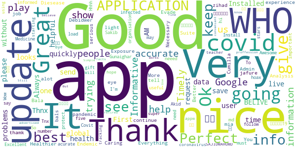

> Very nice app for health.  :date: __2020-12-12 06:15:46__

> Great. Installed quickly without problems. :-)  :date: __2020-11-15 16:31:45__

> Thnx u save live  :date: __2020-11-11 19:32:07__

> Always the best one!  :date: __2020-11-04 22:22:46__

> Great app  :date: __2020-11-03 15:50:52__

> Good  :date: __2020-10-31 20:49:42__

> 😊😊😊  :date: __2020-10-21 18:17:56__

> I. AM. BELIVE. W. H. O  :date: __2020-10-04 06:51:53__

> I like to see a update on what's going on please  :date: __2020-09-23 12:20:19__

> First time user, but the app looks helpful.  :date: __2020-09-16 19:17:57__

#### 4-star reviews

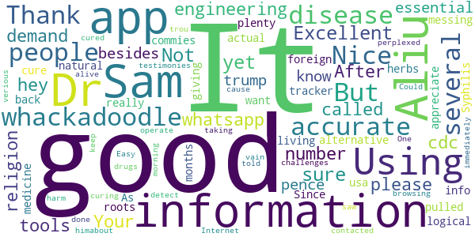

> Not sure yet  :date: __2020-09-27 08:50:53__

> Excellent engineering tools. Your whatsapp number please.  :date: __2020-08-05 11:01:52__

> all the demand who it is hey  :date: __2020-07-20 15:10:48__

> Using this more and more. After the cdc called religion an essential. I don't know what whackadoodle besides trump/pence is messing with the info. Thank you for being a more logical alternative. As usa is being pulled back by whackadoodles and foreign commies.  :date: __2020-07-17 03:09:14__

> Nice  :date: __2020-07-08 17:19:26__

> good  :date: __2020-06-03 00:37:10__

> It's just information, not the actual tracker. But has plenty of information that's 100% accurate.  :date: __2020-05-31 02:37:20__

> I really want to appreciate Dr. Aliu Sam for using his natural roots and herbs medicine to cure me of Syphilis Since 11 months now I have been living with this disease and it has been giving me challenges, I was so perplexed cause I have been taking several drugs to be cured but all have been in vain. One morning I was browsing through the Internet then i saw several testimonies about Dr. Aliu Sam curing people off verious diseases and immediately I contacted Dr. Aliu Sam I told himabout my trou  :date: __2020-05-08 05:33:57__

> It did not detect  :date: __2020-04-29 18:37:26__

> Could do with more accurate information to keep people alive. But no harm done.  :date: __2020-04-29 13:41:12__

#### 3-star reviews

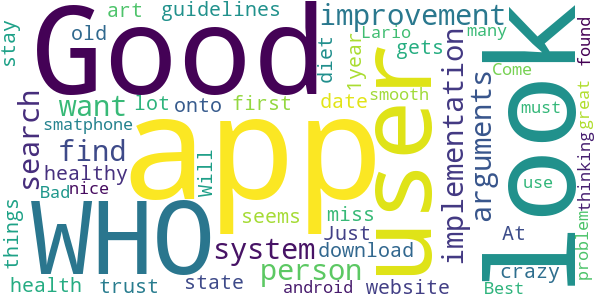

> A good improvement could be the implementation of a search system for arguments that a person want to find ( like the guidelines about health and healthy diet). At first look seems it miss a lot from the website.  :date: __2020-09-27 10:09:16__

> Good App but I don't trust the WHO. Just have the app to stay up to date with the crazy things the WHO gets up to  :date: __2020-07-29 10:34:08__

> Will not download onto my 1year old state of the art smatphone. Bad, as a user of many android apps what are you thinking. I have found more than 3700 other users that can not use this app. Come on you must no you have problem.  :date: __2020-05-26 02:04:59__

> Good  :date: __2020-05-14 21:22:11__

> Best.  :date: __2020-04-20 13:14:33__

> Looks nice great look smooth Lario  :date: __2020-04-18 09:44:30__

#### 2-star reviews

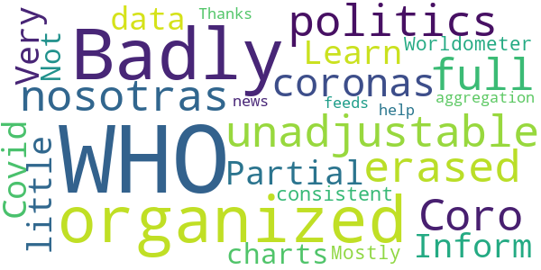

> Badly organized, unadjustable, and full of politics,i erased it  :date: __2020-11-13 07:29:53__

> Coro nosotras coronas  :date: __2020-07-02 06:41:55__

> Partial  :date: __2020-06-22 12:24:23__

> Learn more  :date: __2020-06-15 23:35:50__

> WHO Inform Covid 19  :date: __2020-05-24 17:14:56__

> Very little data or charts. Not consistent with Worldometer. Mostly an aggregation of news feeds about WHO  :date: __2020-05-15 15:38:10__

> Thanks for your help.  :date: __2020-04-22 18:52:40__

#### 1-star reviews

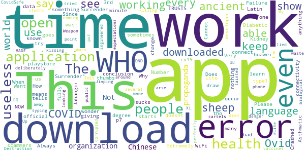

> Extremely bad application. Always not working at all. Why do you keep it in the playstore?!  :date: __2020-12-15 16:13:48__

> A wast of time  :date: __2020-11-04 13:04:20__

> “‘Ovid’ is Latin for a sheep. COVID starts with a C, which also means ‘see’ in ancient language. 19 was known as the “Number of Surrender” in ancient times.”  It goes on to draw the conclusion, “C-OVID 19 = ‘See a Sheep Surrender'”.  :date: __2020-11-02 08:06:17__

> Very scammers  :date: __2020-10-19 19:45:47__

> I just downloaded it, but every time I open it just say "an error occur check your connectivity" or something like that... didn't work...  :date: __2020-10-10 17:24:54__

> Does not work  :date: __2020-10-09 00:12:33__

> This is your official application? and sometimes it doesn't work  :date: __2020-10-07 18:26:16__

> I am not able to download it fully its no use to me as i am a type1 Diabetic and Asthmatic i am also in 3rd degree Kidney Failure.  :date: __2020-09-29 02:20:05__

> WHO TRUSTS WHO NOW ¿¿?!?????  :date: __2020-09-25 02:07:50__

> This app sucks  :date: __2020-09-14 21:01:10__

# Coronavirus Help
App version ``1.1``

Analyzed with [covid-apps-observer](http://github.com/covid-apps-observer) project, version ``0.1``

## App overview
| | |
|-------------------------|-------------------------| 
| **Name**&nbsp;&nbsp;&nbsp;&nbsp;&nbsp;&nbsp;&nbsp;&nbsp;&nbsp;&nbsp;&nbsp;&nbsp;&nbsp;&nbsp;&nbsp;&nbsp;&nbsp;&nbsp;&nbsp;&nbsp;&nbsp;&nbsp;&nbsp;&nbsp;&nbsp;&nbsp;&nbsp;&nbsp;&nbsp;&nbsp;&nbsp;&nbsp;&nbsp;&nbsp;&nbsp;&nbsp;&nbsp;&nbsp;&nbsp;&nbsp;  | Coronavirus Help |
| **Unique identifier** | appinventor.ai_david_taylor.Coronavirus_help2020 |
| **Link to Google Play** | [https://play.google.com/store/apps/details?id=appinventor.ai_david_taylor.Coronavirus_help2020](https://play.google.com/store/apps/details?id=appinventor.ai_david_taylor.Coronavirus_help2020) |
| **Summary**  | Help and advice on the Coronavirus (Covid-19) |
| **Privacy policy** | [-](-) |
| **Latest version** | 1.1 |
| **Last update** | 2020-04-23 09:48:32 |
| **Recent changes** | Splash screen removed, more advice added through the Ryecroft website feature |
| **Installs**  | 1,000+ |
| **Category** | Health & Fitness |
| **First release** | Mar 26, 2020 |
| **Size**  | 5.9M |
| **Supported Android version**  | 2.1 and up |

### Description
> This app collates genuine information from sorces such as the UK Government, WHO, NHS and others in one place. THis idea being all of the information is genuine and updated on a regular basis by the organisations mentioned.

### User interface
The developers of the app provide the following screenshots in the Google play store.
| | | |
|:-------------------------:|:-------------------------:|:-------------------------:|
 |   |   |   | 
 |  

## Development team
In the following we report the main information provided by the development team in the Google play store.

| | |
|-------------------------|-------------------------|
| **Developer**  | Dave at Ryecroft Community Hub & BITS |
| **Website**  | [http://www.ryecroftnrc.org](http://www.ryecroftnrc.org) |
| **Email** | david.taylor@ryecroftnrc.org |
| **Physical address**  | - |
| **Other developed apps**  | [https://play.google.com/store/apps/developer?id=Dave+at+Ryecroft+Community+Hub+%26+BITS](https://play.google.com/store/apps/developer?id=Dave+at+Ryecroft+Community+Hub+%26+BITS) |

## Android support

| | |
|-------------------------|-------------------------|
| **Declared target Android version**  | Pie, version 9 (API level 28) |
| **Effective target Android version**  | Pie, version 9 (API level 28) |
| **Minimum supported Android version**  | Eclair, version 2.1 (API level 7) |
| **Maximum target Android version**  | - |

The larger the difference between the minimum and maximum supported Android versions, the better. A larger difference means a wider audience. For example, old phones have a very low Android version, so a high minimum supported Android version means that the app cannot be used by users with old phones, thus leading to accessibility problems. 

## Requested permissions

In the following we report the complete list of the permissions requested by the app. 

| **Permission** | **Protection level** | **Description** | 
|-------------------------|-------------------------|-------------------------|
 **android.permission ACCESS_NETWORK_STATE** | Normal | Allows applications to access information about networks. 
 **android.permission ACCESS_WIFI_STATE** | Normal | Allows applications to access information about Wi-Fi networks. 
 **android.permission INTERNET** | Normal | Allows applications to open network sockets. 
 **android.permission READ_EXTERNAL_STORAGE** | :warning:**Dangerous** | Allows an application to read from external storage. 
 **android.permission WRITE_EXTERNAL_STORAGE** | :warning:**Dangerous** | Allows an application to write to external storage. 

## Mentioned servers

| **Server** | **Registrant** | **Registrant country** | **Creation date** | 
|-------------------------|-------------------------|-------------------------|-------------------------|
 | google.com | Google LLC | :us: US | 1997-09-15 04:00:00 |
 | w3.org | W3C | :us: US | 1994-07-06 04:00:00 |
 | gnu.org | Free Software Foundation | :us: US | 1995-11-24 05:00:00 |
 | googleapis.com | Google LLC | :us: US | 2005-01-25 17:52:26 |
 | appspot.com | Google LLC | :us: US | 2005-03-10 02:27:55 |
 | appspot.com | Google LLC | :us: US | 2005-03-10 02:27:55 |
 | mit.edu | Massachusetts Institute of Technology | - | 1985-05-23 00:00:00 |
 | appspot.com | Google LLC | :us: US | 2005-03-10 02:27:55 |
 | yandex.net | - | :ru: RU | 2000-11-14 06:56:55 |
 |  | - | - | 1996-08-01 00:00:00 |
 | redcross.org | American National Red Cross | :us: US | 1995-09-05 04:00:00 |
 |  | - | - | 2003-11-04 00:00:00 |
 |  | - | - | 1996-08-01 00:00:00 |
 |  | - | - | 1996-08-01 00:00:00 |

## Security analysis 

Below we report the main security warnings raised by our execution of the [Androwarn](https://github.com/maaaaz/androwarn) security analysis tool.

**Telephony identifiers leakage**
> - This application reads the unique device ID, i.e the IMEI for GSM and the MEID or ESN for CDMA phones 

**Location lookup**
> - This application reads location information from all available providers (WiFi, GPS etc.) 

**Connection interfaces exfiltration**
> - This application reads details about the currently active data network 
> - This application tries to find out if the currently active data network is metered 

**Telephony services abuse**
> - This application makes phone calls 

**Audio video eavesdropping**
> - This application records audio from the 'MIC' source  

**Suspicious connection establishment**
> - This application opens a Socket and connects it to the remote address '4' on the 'v31' port  

**Pim data leakage**
> - This application accesses the contacts list 

**Code execution**
> - This application executes a UNIX command 
> - This application executes a UNIX command containing this argument: 'Ljava/util/List;->size()I' 

## User ratings and reviews

Below we provide information about how end users are reacting to the app in terms of ratings and reviews in the Google Play store.

### Ratings

The Coronavirus Help app has been installed by more than **1000** times. At this time, **19** rated the app and its average score is **4.0**. Below we show the distribution of the ratings across the usual star-based rating of Google Play

:star::star::star::star::star:: 13

:star::star::star::star:: 1

:star::star::star:: 1

:star::star:: 0

:star:: 4

### Reviews 

#### 5-star reviews

> Good  :date: __2020-10-10 21:21:40__

> Just got this app and really loved the fact that all covid19 info you need was in 1 place and easy to use great job. (was a little hard to find on google play. An app like this should be more visible)  :date: __2020-07-12 23:25:15__

> Very informative  :date: __2020-07-09 21:39:20__

> This helps me from the new crona very good 👍 👌 😊 ☺ 😀 😄 👍 👌 😊  :date: __2020-06-15 17:43:31__

> Contact tracing. Uk  :date: __2020-06-01 22:22:36__

> I love it 💖 so simple to use and not confusing at all, I love that everything is in one place and from the people that we should be listening to and not from misleading sources (newspapers) x I love all you over 70's that was involved in making this great app x I am 28 and I couldn't of done anything like this well done guys stay safe 💋💋  :date: __2020-05-27 22:54:07__

> This app is very good .  :date: __2020-05-26 02:43:22__

> Brilliant app! Very informative and easy to follow. Highly recommend  :date: __2020-05-08 13:34:16__

> Easy to use  :date: __2020-05-03 17:07:02__

> It's good that this information is available in one location, however please note (developers) that the physical distance required by law and for the best chance of avoiding the virus via breath, is 2 metres, not 1 metre as stated in the app. Sorry to be picky, but this is crucial information. As for the risk of malware, some of the more rudimentary so-called security apps will throw up false positives but Kaspersky, AVG and Malwarebytes will not. 🏳  :date: __2020-05-02 18:01:23__

#### 4-star reviews

> Goof  :date: __2020-09-26 20:22:38__

> Great to see all the information bundled into one little package, unfortunately, because the app simply directs you to websites that are displayed within a web view, it's completely useless for offline use.  :date: __2020-05-30 11:49:56__

> Hi I'm not criticising your app but my avast antivirus also detected that there was malware in your app so I wasn't able to install. Maybe this is something you want to look into  :date: __2020-04-28 03:51:39__

#### 3-star reviews

> Virus checker (McAfee) alerted to a (possible) malware contained within this app. After reading other reviews of this app it appears to be a false positive, thank goodness other people had flagged this as i would of halted the install and not downloaded it. I don't believe its actually anything harmful contained within the app itself. I would given the app a 5 ⭐ except its laid out like a website from 1992. Great app though  :date: __2020-05-21 09:29:34__

> What is your email? I can send you a screen shot saying that the app might be a virus when I install it  :date: __2020-04-26 14:51:15__

#### 2-star reviews

> Who'd of thought I'd need an app to "help" me with a virus that I have a 99.94% chance of surviving (official numbers).  :date: __2020-06-25 08:48:45__

#### 1-star reviews

> Here is another app that's been put on my phone and I can't use it to track if I have been near anybody with coronavirus as according to the app it doesn't work in Scotland. What the bloody point of putting this app on people's phones if they can't use it.  :date: __2020-08-18 09:31:46__

> Stolen content  :date: __2020-06-21 18:51:30__

> Turns out I didn't need an app for a mysteriously absent virus that has killed worldwide less than seasonal flu.  :date: __2020-06-09 10:13:17__

> If I wanted to see a picture of the word caronavirus I can Google one . Other than this it's pretty useless probably worst app I've encountered  :date: __2020-04-17 14:09:13__

> Will not open in Sony XZ3  :date: __2020-04-14 17:58:35__

# COVIDCare NI
App version ``2.0``

Analyzed with [covid-apps-observer](http://github.com/covid-apps-observer) project, version ``0.1``

## App overview
| | |
|-------------------------|-------------------------| 
| **Name**&nbsp;&nbsp;&nbsp;&nbsp;&nbsp;&nbsp;&nbsp;&nbsp;&nbsp;&nbsp;&nbsp;&nbsp;&nbsp;&nbsp;&nbsp;&nbsp;&nbsp;&nbsp;&nbsp;&nbsp;&nbsp;&nbsp;&nbsp;&nbsp;&nbsp;&nbsp;&nbsp;&nbsp;&nbsp;&nbsp;&nbsp;&nbsp;&nbsp;&nbsp;&nbsp;&nbsp;&nbsp;&nbsp;&nbsp;&nbsp;  | COVIDCare NI |
| **Unique identifier** | net.hscni.covid19ni |
| **Link to Google Play** | [https://play.google.com/store/apps/details?id=net.hscni.covid19ni](https://play.google.com/store/apps/details?id=net.hscni.covid19ni) |
| **Summary**  | COVIDCare NI is a coronavirus symptom check with the latest advice and guidance |
| **Privacy policy** | [https://www.health-ni.gov.uk/publications/covid-19-app-privacy-notice](https://www.health-ni.gov.uk/publications/covid-19-app-privacy-notice) |
| **Latest version** | 2.0 |
| **Last update** | 2020-07-22 16:32:05 |
| **Recent changes** | · Featured articles on mental health and general advice · Latest regulations and easing of lockdown guidance  · Information on how to get tested and testing facilities · COVID-19 statistics · Isolation timer updated to include isolation following a positive test result and isolation due to close contact with someone with COVID-19 · Ability to add household members symptoms to dashboard · Improved navigation |
| **Installs**  | 50,000+ |
| **Category** | Medical |
| **First release** | Mar 24, 2020 |
| **Size**  | 60M |
| **Supported Android version**  | 4.2 and up |

### Description
> Overview
 The COVIDCare NI app has been developed by Digital Health and Care NI in partnership with Health & Social Care, the Public Health Agency and the Department of Health.
 The app has been designed to help the public in Northern Ireland keep up to date with the latest advice on the COVID-19 pandemic, helping you to:
 Check if you or someone in your household has coronavirus symptoms.
 Access personalised advice based on your answers to the symptom check questions.
 Decide if you need clinical advice and how to access it.
 Easily find links to trusted information resources on COVID-19 advice and mental health resources.
 Self-isolate if you have symptoms by checking the self-isolation timer for both yourself and your household.
 Search current advice by using a search function of FAQs.
 We continue to update the app with new features based on feedback from citizens in Northern Ireland and will continue to ensure app users get access to the most up to date headlines and changes in the advice and guidance.
 Things are moving quickly with the pandemic so you may need to come back to refresh your app regularly. We’ll let you know when this is necessary.
 Thank you for your support in helping us project your family, friends and community.
 Why use the app?
 The app is available for use in Northern Ireland to all individuals who are currently residing in Northern Ireland.
 Data Security
 The app does not collect any personally identifiable information.
 We will collect information related to the postcode and age of the user to help us track the impact of COVID-19 in Northern Ireland.
 This will help us to plan services and ensure that resources are directed to the areas of greatest need.

### User interface
The developers of the app provide the following screenshots in the Google play store.
| | | |
|:-------------------------:|:-------------------------:|:-------------------------:|
 |   |   |   | 
 |   |  

## Development team
In the following we report the main information provided by the development team in the Google play store.

| | |
|-------------------------|-------------------------|
| **Developer**  | Health & Social Care Northern Ireland |
| **Website**  | [https://www.publichealth.hscni.net/](https://www.publichealth.hscni.net/) |
| **Email** | hscdhcni@gmail.com |
| **Physical address**  | - |
| **Other developed apps**  | [https://play.google.com/store/apps/developer?id=Health+%26+Social+Care+Northern+Ireland](https://play.google.com/store/apps/developer?id=Health+%26+Social+Care+Northern+Ireland) |

## Android support

| | |
|-------------------------|-------------------------|
| **Declared target Android version**  | Android10, version 10 (API level 29) |
| **Effective target Android version**  | Android10, version 10 (API level 29) |
| **Minimum supported Android version**  | Jelly Bean, version 4.2.x (API level 17) |
| **Maximum target Android version**  | - |

The larger the difference between the minimum and maximum supported Android versions, the better. A larger difference means a wider audience. For example, old phones have a very low Android version, so a high minimum supported Android version means that the app cannot be used by users with old phones, thus leading to accessibility problems. 

## Requested permissions

In the following we report the complete list of the permissions requested by the app. 

| **Permission** | **Protection level** | **Description** | 
|-------------------------|-------------------------|-------------------------|
 **android.permission ACCESS_NETWORK_STATE** | Normal | Allows applications to access information about networks. 
 **android.permission ACCESS_WIFI_STATE** | Normal | Allows applications to access information about Wi-Fi networks. 
 **android.permission INTERNET** | Normal | Allows applications to open network sockets. 
 **android.permission WAKE_LOCK** | Normal | Allows using PowerManager WakeLocks to keep processor from sleeping or screen from dimming. 
 **com.google.android.c2dm.permission RECEIVE** | - | - 
 **net.hscni.covid19ni.permission C2D_MESSAGE** | - | - 

## Mentioned servers

| **Server** | **Registrant** | **Registrant country** | **Creation date** | 
|-------------------------|-------------------------|-------------------------|-------------------------|
 | google.com | Google LLC | :us: US | 1997-09-15 04:00:00 |
 | w3.org | W3C | :us: US | 1994-07-06 04:00:00 |
 | microsoft.com | Microsoft Corporation | :us: US | 1991-05-02 04:00:00 |
 | googleapis.com | Google LLC | :us: US | 2005-01-25 17:52:26 |

## Security analysis 

Below we report the main security warnings raised by our execution of the [Androwarn](https://github.com/maaaaz/androwarn) security analysis tool.

**Telephony identifiers leakage**
> - This application reads the ISO country code equivalent of the current registered operator's MCC (Mobile Country Code) 
> - This application reads the numeric name (MCC+MNC) of current registered operator 
> - This application reads the operator name 

**Connection interfaces exfiltration**
> - This application reads details about the currently active data network 

**Code execution**
> - This application loads a native library: 'monodroid' 
> - This application loads a native library: 'monosgen-2.0' 
> - This application loads a native library: 'xamarin-app' 
> - This application loads a native library: 'xamarin-debug-app-helper' 

## User ratings and reviews

Below we provide information about how end users are reacting to the app in terms of ratings and reviews in the Google Play store.

### Ratings

The COVIDCare NI app has been installed by more than **50000** times. At this time, **300** rated the app and its average score is **3.58**. Below we show the distribution of the ratings across the usual star-based rating of Google Play

:star::star::star::star::star:: 162

:star::star::star::star:: 27

:star::star::star:: 12

:star::star:: 21

:star:: 78

### Reviews 

#### 5-star reviews

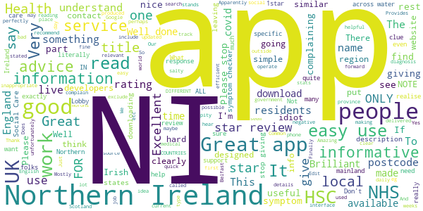

> Good so far  :date: __2020-12-31 05:36:23__

> A great app for the current crises. Well designed and easy to navigate  :date: __2020-12-15 01:13:45__

> Excellent service I could recommend  :date: __2020-10-19 15:13:53__

> Very poor  :date: __2020-09-08 20:21:41__

> Amazing and informative app. PLEASE NOTE THIS APP IS FOR NORTHERN IRELAND ONLY. So don't think this will work in other parts of the UK or the world, however it is compatible with the republic of ireland version.  :date: __2020-08-01 00:43:11__

> Easy to use and informative  :date: __2020-07-30 19:39:35__

> Excellent  :date: __2020-07-30 15:56:15__

> Excellent and informative  :date: __2020-06-30 14:11:20__

> Amazing the p we people who it doesn't work you need to go to the NHS website or gothirmont web don't give the 1 star if do you are ungrateful and it probably your phone. 😂😂😂  :date: __2020-06-06 22:45:27__

> Easy to use informative and source of good advice and information specific for NI residents.  :date: __2020-06-06 10:56:34__

#### 4-star reviews

> Would a regional breakdown of new cases  :date: __2020-07-31 00:38:27__

> Seems promising at first glance, easy to use with good range of features. It also let's you use the app on behalf of someone else which might be good for elderly/and or the less technical, visually impaired or less able bodied. What accessibility features does it conform to? One issue I had was when I filled in the symptom checker flow. The last stage presents a blank yellow screen and it's not intuitive that you have to close or go back to see suggestions  :date: __2020-07-30 18:59:15__

> Could do with more updates. But pretty good for sign posting  :date: __2020-06-29 12:39:16__

> A bit empty but good overall!  :date: __2020-06-17 22:06:54__

> Manchester not,,,,,  :date: __2020-06-11 21:25:59__

> Quite good app as has a symptoms checker and some info, advice and statistics.. However doesn't have what I actually downloaded it for which was to find out about updates to current regulations and recovery plan such as easing of lockdown rules etc.. Have to search for this and then visit nidirect website for this info..  :date: __2020-06-07 21:55:20__

> Good app  :date: __2020-05-06 23:22:23__

> Great app, though the virtual assistant could use some more specific information / ai training. Thanks for making this.  :date: __2020-04-02 10:48:28__

> Handy advice in scarey times  :date: __2020-04-01 21:27:09__

> Hopefully this could be a very powerful way of identifying cv19 hotspots.  :date: __2020-03-31 20:18:01__

#### 3-star reviews

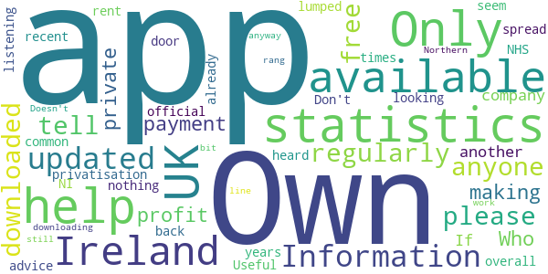

> Information not updated regularly  :date: __2020-10-05 08:48:36__

> I have just downloaded this app can anyone please tell me if it's free or is there a payment on it  :date: __2020-08-11 23:00:25__

> Who owns this App is it a private profit making company? If so is this another privatisation by the back door which is all too common with the NHS overall in recent years Own it Don't rent it!  :date: __2020-05-06 15:23:14__

> I was looking for statistics on the spread in NI as we are lumped in with the UK in official statistics, this app doesn't seem to have that. Useful advice but nothing I haven't heard 1000 times already - those who aren't listening won't be downloading the app anyway.  :date: __2020-04-11 15:32:23__

> N/A  :date: __2020-04-10 00:07:41__

> Helps a bit but I still rang 111 help line  :date: __2020-04-07 03:46:29__

> Only available in Ireland!  :date: __2020-04-02 18:40:10__

> Doesn't work in the UK  :date: __2020-04-01 08:16:36__

> Only available in Northern Ireland 🇮🇪 😢  :date: __2020-03-26 13:18:23__

#### 2-star reviews

> Not in NI but won't load 😔  :date: __2020-06-20 10:41:04__

> Sporadic updates. Better to just use google.  :date: __2020-05-26 17:42:14__

> No updated figures since April 30  :date: __2020-05-04 17:55:33__

> Sorry 2 stars only. App not for England or Wales. Advertised on the news as available all over UK and this is not so. So I've uninstalled it.  :date: __2020-04-11 23:08:08__

> Why is this only available in NI and not available anywhere else I think its deplorable as we are all dealing with this and not just NI  :date: __2020-04-10 14:03:09__

> Nothing new or useful here.  :date: __2020-04-06 19:46:22__

> My is it only NI  :date: __2020-03-26 08:24:52__

#### 1-star reviews

> Pointless really, after you go to the trouble of registering and getting it set up, all it does is ask you 3 questions. Have you a temperature? Have you a continuous cough? Did anyone in your household have covid symptoms? That's it!!  :date: __2021-01-01 20:35:30__

> Hasn't worked since the upgrade. Keeps asking me to connect to network when I am already connected  :date: __2020-11-18 14:07:13__

> Complete rubbish. I answered all the questions in the symptom checker as perfectly healthy, it told me to isolate as I had covid symptoms. Absolute nonsense.  :date: __2020-10-26 23:26:48__

> Rubbish  :date: __2020-10-18 20:47:15__

> Totally useless!; Not able to get passed "Accept" terms. Be easier to wait for the news updates. Amazingly bad.  :date: __2020-10-04 18:50:14__

> App won't open once installed :-(  :date: __2020-09-24 10:53:15__

> only works on recent phones, completely misses the point...must work everywhere or it is pointless.  :date: __2020-08-11 12:19:23__

> It came to stop as I had no tracing ability and said no more.  :date: __2020-07-31 23:15:28__

> doesn't work...!  :date: __2020-07-31 22:10:26__

> This is not the official app for Northern Ireland COVID19. STOPCOVID NI is the correct app  :date: __2020-07-31 19:47:35__

# OpenWHO: Knowledge for Health Emergencies
App version ``3.7``

Analyzed with [covid-apps-observer](http://github.com/covid-apps-observer) project, version ``0.1``

## App overview
| | |
|-------------------------|-------------------------| 
| **Name**&nbsp;&nbsp;&nbsp;&nbsp;&nbsp;&nbsp;&nbsp;&nbsp;&nbsp;&nbsp;&nbsp;&nbsp;&nbsp;&nbsp;&nbsp;&nbsp;&nbsp;&nbsp;&nbsp;&nbsp;&nbsp;&nbsp;&nbsp;&nbsp;&nbsp;&nbsp;&nbsp;&nbsp;&nbsp;&nbsp;&nbsp;&nbsp;&nbsp;&nbsp;&nbsp;&nbsp;&nbsp;&nbsp;&nbsp;&nbsp;  | OpenWHO: Knowledge for Health Emergencies |
| **Unique identifier** | de.xikolo.openwho |
| **Link to Google Play** | [https://play.google.com/store/apps/details?id=de.xikolo.openwho](https://play.google.com/store/apps/details?id=de.xikolo.openwho) |
| **Summary**  | Life-saving knowledge for frontline responders in health emergencies. |
| **Privacy policy** | [https://openwho.org/pages/privacy](https://openwho.org/pages/privacy) |
| **Latest version** | 3.7 |
| **Last update** | 2020-11-23 13:57:15 |
| **Recent changes** | - Bug fixes and performance improvements |
| **Installs**  | 1,000,000+ |
| **Category** | Education |
| **First release** | May 17, 2017 |
| **Size**  | 18M |
| **Supported Android version**  | 5.0 and up |

### Description
> OpenWHO is the World Health Organization's (WHO) interactive knowledge-transfer platform offering online courses to improve the response to health emergencies. OpenWHO enables the Organization and its key partners to transfer life-saving knowledge to large numbers of frontline responders.
 With OpenWHO, you have the flexibility to learn at your convenience. Watch the short video lectures and test your knowledge with self-tests when and where you like. The course forum and the collaboration space allow you to get in touch with other participants and experts around the world.
  
 Designed primarily for health care workers, frontline responders, and decision-makers, the app is also a source of information for those affected by disease outbreaks and health emergencies, or for those with a general interest in WHO's work in health emergencies.
  
 It features 6 channels:
 - The <b>Outbreak</b> channel addresses the management of infectious diseases and provides life-saving, scientific information.
 - The <b>Ready for Response</b> channel helps prepare personnel who are training for deployment to work in disease outbreaks and health emergencies.
 - The <b>Get Social</b> channel focuses on social science-based interventions and helps to communicate with affected communities.
 - The <b>Preparing for Pandemics</b> channel brings together courses on various aspects of preparedness, including surveillance, public health measures and risk communication during a pandemic.
 - The <b>COVID-19</b> channel provides learning resources in WHO's 6 official languages (Arabic, Chinese, English, French, Russian and Spanish) for health professionals, decision-makers and the public for the outbreak of coronavirus disease (COVID-19).
 - The <b>COVID-19 National Languages</b> channel provides the same learning resources as the COVID-19 channel but in national languages, such as Indonesian, Japanese and Portuguese. 
  
 OpenWHO courses are available in many languages, including WHO's 6 official languages. 
  
 Download the app now, and join the OpenWHO community.
 This app is developed in cooperation between the Hasso Plattner Institute and the WHO. The learning content is provided exclusively by the WHO.

### User interface
The developers of the app provide the following screenshots in the Google play store.
| | | |
|:-------------------------:|:-------------------------:|:-------------------------:|
 |   |   |   | 
 |   |   |   | 

## Development team
In the following we report the main information provided by the development team in the Google play store.

| | |
|-------------------------|-------------------------|
| **Developer**  | HPI Knowledge Engineering Team |
| **Website**  | [https://openwho.org/](https://openwho.org/) |
| **Email** | openwho-support@hpi.de |
| **Physical address**  | [Prof.-Dr.-Helmert-Str.2-3 14482 Potsdam](https://www.google.com/maps/search/Prof.-Dr.-Helmert-Str.2-3%2014482%20Potsdam) (Google Maps) |
| **Other developed apps**  | [https://play.google.com/store/apps/developer?id=7185448023325736337](https://play.google.com/store/apps/developer?id=7185448023325736337) |

## Android support

| | |
|-------------------------|-------------------------|
| **Declared target Android version**  | - |
| **Effective target Android version**  | - |
| **Minimum supported Android version**  | Lollipop, version 5.0 (API level 21) |
| **Maximum target Android version**  | - |

The larger the difference between the minimum and maximum supported Android versions, the better. A larger difference means a wider audience. For example, old phones have a very low Android version, so a high minimum supported Android version means that the app cannot be used by users with old phones, thus leading to accessibility problems. 

## Requested permissions

In the following we report the complete list of the permissions requested by the app. 

| **Permission** | **Protection level** | **Description** | 
|-------------------------|-------------------------|-------------------------|
 **android.permission ACCESS_NETWORK_STATE** | Normal | Allows applications to access information about networks. 
 **android.permission ACCESS_WIFI_STATE** | Normal | Allows applications to access information about Wi-Fi networks. 
 **android.permission DOWNLOAD_WITHOUT_NOTIFICATION** | - | - 
 **android.permission FOREGROUND_SERVICE** | Normal | Allows a regular application to use Service.startForeground. 
 **android.permission INTERNET** | Normal | Allows applications to open network sockets. 
 **android.permission RECEIVE_BOOT_COMPLETED** | Normal | Allows an application to receive the Intent.ACTION_BOOT_COMPLETED that is broadcast after the system finishes booting. 
 **android.permission WAKE_LOCK** | Normal | Allows using PowerManager WakeLocks to keep processor from sleeping or screen from dimming. 
 **android.permission WRITE_EXTERNAL_STORAGE** | :warning:**Dangerous** | Allows an application to write to external storage. 
 **com.google.android.c2dm.permission RECEIVE** | - | - 
 **com.google.android.finsky.permission BIND_GET_INSTALL_REFERRER_SERVICE** | - | - 

## Mentioned servers

| **Server** | **Registrant** | **Registrant country** | **Creation date** | 
|-------------------------|-------------------------|-------------------------|-------------------------|
 | googlesyndication.com | Google LLC | :us: US | 2003-01-21 06:17:24 |
 | google.com | Google LLC | :us: US | 1997-09-15 04:00:00 |
 | apple.com | Apple Inc. | :us: US | 1987-02-19 05:00:00 |
 | aomedia.org | Contact Privacy Inc. Customer 1243324949 | :canada: CA | 2015-08-24 14:07:31 |
 | dashif.org | VTM Group | :us: US | 2012-04-27 13:02:46 |
 | app-measurement.com | Google LLC | :us: US | 2015-06-19 20:13:31 |
 | w3.org | W3C | :us: US | 1994-07-06 04:00:00 |
 | googleapis.com | Google LLC | :us: US | 2005-01-25 17:52:26 |
 | psdev.de | - | - | - |
 | xmlpull.org | WhoisGuard, Inc. | PA | 2001-11-26 20:33:08 |
 | crashlytics.com | Google LLC | :us: US | 2011-01-21 15:30:40 |
 | apache.org | The Apache Software Foundation | :us: US | 1995-04-11 04:00:00 |
 | opensource.org | Open Source Initiative | :us: US | 1998-02-11 05:00:00 |
 | creativecommons.org | Creative Commons Corporation | :canada: CA | 2001-01-15 16:51:44 |
 | eclipse.org | Eclipse.org Foundation, Inc. | :canada: CA | 1997-04-14 04:00:00 |
 | gnu.org | Free Software Foundation | :us: US | 1995-11-24 05:00:00 |
 | mozilla.org | Mozilla Corporation | :us: US | 1998-01-24 05:00:00 |
 | googleadservices.com | Google LLC | :us: US | 2003-06-19 16:34:53 |

## Security analysis 

Below we report the main security warnings raised by our execution of the [Androwarn](https://github.com/maaaaz/androwarn) security analysis tool.

**Telephony identifiers leakage**
> - This application reads the ISO country code equivalent of the current registered operator's MCC (Mobile Country Code) 
> - This application reads the MCC+MNC of the provider of the SIM 

**Connection interfaces exfiltration**
> - This application reads details about the currently active data network 
> - This application tries to find out if the currently active data network is metered 

**Suspicious connection establishment**
> - This application opens a Socket and connects it to the remote address ' returned no addresses for  ; port is out of range' on the 'N/A' port  
> - This application opens a Socket and connects it to the remote address '' on the 'N/A' port  
> - This application opens a Socket and connects it to the remote address 'Ljava/lang/StringBuilder;->toString()Ljava/lang/String;' on the 'N/A' port  
> - This application opens a Socket and connects it to the remote address 'Ljava/net/Proxy;->type()Ljava/net/Proxy$Type;' on the 'N/A' port  
> - This application opens a Socket and connects it to the remote address 'timeout' on the 'N/A' port  

**Code execution**
> - This application loads a native library 

## User ratings and reviews

Below we provide information about how end users are reacting to the app in terms of ratings and reviews in the Google Play store.

### Ratings

The OpenWHO: Knowledge for Health Emergencies app has been installed by more than **1000000** times. At this time, **3403** rated the app and its average score is **4.2647057**. Below we show the distribution of the ratings across the usual star-based rating of Google Play

:star::star::star::star::star:: 2403

:star::star::star::star:: 370

:star::star::star:: 130

:star::star:: 130

:star:: 370

### Reviews 

#### 5-star reviews

> Iloveit  :date: __2021-01-03 07:20:51__

> Very good  :date: __2020-12-29 17:40:56__

> I love this app because it makes essay a lot.  :date: __2020-12-27 18:00:46__

> It's a great platform for me to send money 💰 safely  :date: __2020-12-15 14:26:31__

> Good  :date: __2020-12-08 16:01:38__

> + definitely a good app. I'm a fan  :date: __2020-12-03 11:12:16__

> I have no experience in use I heared ABOUT  :date: __2020-11-21 20:57:38__

> Enjoyable  :date: __2020-11-21 18:49:13__

> Fabulous  :date: __2020-11-13 13:19:20__

> Good  :date: __2020-11-06 18:32:20__

#### 4-star reviews

> WHO has offered great courses but we're expecting more courses within less time gap as it's been month's since WHO has launched any course.Secondly,there is no direct place offered in the WHO app to express our views.  :date: __2020-12-11 07:27:50__

> Online course class is use full  :date: __2020-07-17 11:52:09__

> Excellent information but less attractive for the most  :date: __2020-07-02 17:54:08__

> Good working  :date: __2020-06-28 08:53:05__

> Could you please host the videos also on YouTube, since we cannot access the Vimeo Platform here in Indonesia. Thank you.  :date: __2020-06-24 07:38:57__

> Good source of information  :date: __2020-06-20 09:36:05__

> Excellent Direction~  :date: __2020-06-19 14:08:55__

> Mast  :date: __2020-06-13 09:10:54__

> Good app of thh halt.  :date: __2020-05-31 05:25:43__

> Arch. eng.  :date: __2020-05-22 01:54:14__

#### 3-star reviews

> Good info  :date: __2020-12-24 16:44:57__

> I feel a bit disappointed, experienced a lot of errors. My module and videos can't be loaded.  :date: __2020-07-26 17:32:06__

> Great app, but my only problem is that I can't open my certificate file. Says invalid format. Disappointing 😭  :date: __2020-07-23 02:09:56__

> Videos were not working only, so I uninstalled it.  :date: __2020-07-18 08:42:28__

> I have finished two courses on two different date(one before midnight, another after midnight) but found same date on both while I downloaded Certificates. Why is this?  :date: __2020-06-11 19:18:50__

> covid  :date: __2020-06-11 18:37:22__

> Sir, Plzz improve the quality of the certificate awarded by the WHO to the participants to increase more & more participation as well as awareness of the people in this contest organised by OpenWHO.  :date: __2020-05-24 16:44:50__

> Some extent it's very good and its provide guidelines to advert disease.  :date: __2020-05-23 18:33:55__

> Nice app however difficult to watch video presentations  :date: __2020-05-14 19:35:42__

> Very confusing. not happy with the link. I don't know if I have done it correctly.  :date: __2020-05-12 22:12:31__

#### 2-star reviews

> Needs to be improved. Image don't show up . Fix needed  :date: __2020-12-23 15:51:31__

> The app keeps showing me this message (please enable network connection) when I open it, don't know why ?? My internet connection is working fine and I am using all the other apps perfectly well. Can you lend me a hand in this matter.  :date: __2020-11-08 08:31:34__

> After downloading the certificate at the end of the course when u try to open it. It says the file is corrupted or damaged  :date: __2020-09-23 14:26:48__

> Unable to watch the video or download the video.  :date: __2020-08-08 15:29:04__

> I can't open the certificate. Please help me out of this problem  :date: __2020-07-31 05:25:00__

> It shows errors again and again,Can't sign in  :date: __2020-06-26 16:11:53__

> I completed a course and then downloaded certificate it ... But I'm unable too see my certificate as it say corrupted file or invalid file. Please help with reagrdings to it.  :date: __2020-05-27 13:14:22__

> Noisy app.  :date: __2020-04-21 21:34:45__

> Nice  :date: __2020-04-09 16:25:41__

> Please , i want the App in the form of the Globe.  :date: __2020-04-05 14:35:33__

#### 1-star reviews

> The videos are not playing eventhough I've downloaded them  :date: __2020-11-03 10:43:38__

> “‘Ovid’ is Latin for a sheep. COVID starts with a C, which also means ‘see’ in ancient language. 19 was known as the “Number of Surrender” in ancient times.”  It goes on to draw the conclusion, “C-OVID 19 = ‘See a Sheep Surrender'”.  :date: __2020-11-02 08:04:58__

> Very bad experience i got unable to login very bad i fell worst experience  :date: __2020-09-26 10:55:02__

> Ok  :date: __2020-08-10 23:31:14__

> This is called an "Emergency" app but requires registration? Very disappointing.  :date: __2020-08-06 20:55:46__

> unable to make account and register, also not able to login.  :date: __2020-08-04 11:59:45__

> I can't Login no matter how much I try.  :date: __2020-07-04 14:19:09__

> This app is having technical issues  :date: __2020-07-03 17:13:33__

> Not a good application....It always changes names in certificates and it changes dates also moreover i have done courses and it changes there names also in certificates...so many problems...now what to do  :date: __2020-07-02 03:49:39__

> Not sign in properly many time errors.. Please help me out of this problem. I already registered a complaint that particular problem through mail.  :date: __2020-06-16 05:10:29__

# NHS COVID-19
App version ``4.1.1 (124)``

Analyzed with [covid-apps-observer](http://github.com/covid-apps-observer) project, version ``0.1``

## App overview
| | |
|-------------------------|-------------------------| 
| **Name**&nbsp;&nbsp;&nbsp;&nbsp;&nbsp;&nbsp;&nbsp;&nbsp;&nbsp;&nbsp;&nbsp;&nbsp;&nbsp;&nbsp;&nbsp;&nbsp;&nbsp;&nbsp;&nbsp;&nbsp;&nbsp;&nbsp;&nbsp;&nbsp;&nbsp;&nbsp;&nbsp;&nbsp;&nbsp;&nbsp;&nbsp;&nbsp;&nbsp;&nbsp;&nbsp;&nbsp;&nbsp;&nbsp;&nbsp;&nbsp;  | NHS COVID-19 |
| **Unique identifier** | uk.nhs.covid19.production |
| **Link to Google Play** | [https://play.google.com/store/apps/details?id=uk.nhs.covid19.production](https://play.google.com/store/apps/details?id=uk.nhs.covid19.production) |
| **Summary**  | Protect your loved ones with the NHS contact tracing app for England and Wales. |
| **Privacy policy** | [https://covid19.nhs.uk/our-policies.html](https://covid19.nhs.uk/our-policies.html) |
| **Latest version** | 4.1.1 (124) |
| **Last update** | 2020-12-18 15:54:37 |
| **Recent changes** | Bug Fixes. |
| **Installs**  | 5,000,000+ |
| **Category** | Medical |
| **First release** | Aug 12, 2020 |
| **Size**  | 8.2M |
| **Supported Android version**  | 6.0 and up |

### Description
> The NHS COVID-19 app is the official contact tracing app for England and Wales. 
 It is the fastest way of knowing when you’re at risk from coronavirus. The quicker you know, the quicker you can alert your loved ones, and your community. 
 The more of us that use it, the better we can control coronavirus. 
 The app runs on proven software developed by Apple and Google, designed so that nobody will know who or where you are. And you can delete your data, or the app, at any time.
 It has a number of features: 
 Trace: Find out when you’ve been near other app users who have tested positive for coronavirus
 Alert: Lets you know the level of coronavirus risk in your postcode district. 
 Check-in: Use our simple QR code scanner to check-in to venues like bars and restaurants. You will get alerted if you have visited a venue where you may have come into contact with coronavirus.
 Symptoms: Check if you have coronavirus symptoms and see if you need to order a test. 
 Test: Helps you order a test if you need to.
 Isolate: Keep track of your self-isolation countdown and access relevant advice.
 Available in English, Welsh, Arabic (Modern Standard), Bengali, Chinese (Simplified), Gujarati, Polish, Punjabi (Gurmukhi script), Romanian, Somali, Turkish and Urdu.
 The app can be used across UK borders in England, Wales, Scotland, Northern Ireland, Jersey and Gibraltar, detecting all relevant contact tracing app users (regardless of them using different official apps), alerting them if they have been in contact with coronavirus. 
 The app has been built in collaboration with some of the most innovative organisations in the world. We have worked with medical experts, privacy groups, at-risk communities and we’ve shared knowledge with the teams working on similar apps in many countries.
 Protect your loved ones. Please download the app. 
 The App is CE marked as a class I medical device in the United Kingdom and developed in compliance with European Commission Directive 93/42/EEC for class I devices.

### User interface
The developers of the app provide the following screenshots in the Google play store.
| | | |
|:-------------------------:|:-------------------------:|:-------------------------:|
 |   |   |   | 
 |   |  

## Development team
In the following we report the main information provided by the development team in the Google play store.

| | |
|-------------------------|-------------------------|
| **Developer**  | Department of Health and Social Care |
| **Website**  | [https://covid19.nhs.uk/](https://covid19.nhs.uk/) |
| **Email** | NHSCovid-19AppStoreSupport@nhsbsa.nhs.uk |
| **Physical address**  | - |
| **Other developed apps**  | [https://play.google.com/store/apps/developer?id=Department+of+Health+and+Social+Care](https://play.google.com/store/apps/developer?id=Department+of+Health+and+Social+Care) |

## Android support

| | |
|-------------------------|-------------------------|
| **Declared target Android version**  | Android10, version 10 (API level 29) |
| **Effective target Android version**  | Android10, version 10 (API level 29) |
| **Minimum supported Android version**  | Marshmallow, version 6.0 (API level 23) |
| **Maximum target Android version**  | - |

The larger the difference between the minimum and maximum supported Android versions, the better. A larger difference means a wider audience. For example, old phones have a very low Android version, so a high minimum supported Android version means that the app cannot be used by users with old phones, thus leading to accessibility problems. 

## Requested permissions

In the following we report the complete list of the permissions requested by the app. 

| **Permission** | **Protection level** | **Description** | 
|-------------------------|-------------------------|-------------------------|
 **android.permission ACCESS_NETWORK_STATE** | Normal | Allows applications to access information about networks. 
 **android.permission BLUETOOTH** | Normal | Allows applications to connect to paired bluetooth devices. 
 **android.permission CAMERA** | :warning:**Dangerous** | Required to be able to access the camera device. 
 **android.permission FOREGROUND_SERVICE** | Normal | Allows a regular application to use Service.startForeground. 
 **android.permission INTERNET** | Normal | Allows applications to open network sockets. 
 **android.permission RECEIVE_BOOT_COMPLETED** | Normal | Allows an application to receive the Intent.ACTION_BOOT_COMPLETED that is broadcast after the system finishes booting. 
 **android.permission WAKE_LOCK** | Normal | Allows using PowerManager WakeLocks to keep processor from sleeping or screen from dimming. 

## Mentioned servers

| **Server** | **Registrant** | **Registrant country** | **Creation date** | 
|-------------------------|-------------------------|-------------------------|-------------------------|
 | google.com | Google LLC | :us: US | 1997-09-15 04:00:00 |
 | ietf.org | IETF Trust | :us: US | 1995-03-11 05:00:00 |
 | googleapis.com | Google LLC | :us: US | 2005-01-25 17:52:26 |
 | apache.org | The Apache Software Foundation | :us: US | 1995-04-11 04:00:00 |

## Security analysis 

Below we report the main security warnings raised by our execution of the [Androwarn](https://github.com/maaaaz/androwarn) security analysis tool.

**Connection interfaces exfiltration**
> - This application reads details about the currently active data network 
> - This application tries to find out if the currently active data network is metered 

**Suspicious connection establishment**
> - This application opens a Socket and connects it to the remote address ' returned no addresses for  ; port is out of range' on the 'N/A' port  
> - This application opens a Socket and connects it to the remote address '' on the 'N/A' port  
> - This application opens a Socket and connects it to the remote address 'Ljava/lang/StringBuilder;->toString()Ljava/lang/String;' on the 'N/A' port  
> - This application opens a Socket and connects it to the remote address 'Ljava/net/Proxy;->type()Ljava/net/Proxy$Type;' on the 'N/A' port  
> - This application opens a Socket and connects it to the remote address 'timeout' on the 'N/A' port  

**Code execution**
> - This application loads a native library 
> - This application loads a native library: 'Ljava/lang/String;->valueOf(Ljava/lang/Object;)Ljava/lang/String;' 

## User ratings and reviews

Below we provide information about how end users are reacting to the app in terms of ratings and reviews in the Google Play store.

### Ratings

The NHS COVID-19 app has been installed by more than **5000000** times. At this time, **95001** rated the app and its average score is **3.9574847**. Below we show the distribution of the ratings across the usual star-based rating of Google Play

:star::star::star::star::star:: 56378

:star::star::star::star:: 12680

:star::star::star:: 6932

:star::star:: 3550

:star:: 15461

### Reviews 

#### 5-star reviews

> I like the idea of the app, it keeps me on the alert. (Thanks)  :date: __2021-01-03 11:47:44__

> Very good as it tells if someone has corona  :date: __2021-01-02 20:49:15__

> I'm always using this app, I find it strange that the large supermarket and small shop selling food haven't got a a QR code to scan that people have been in the store.?  :date: __2021-01-02 17:00:11__

> great scary feature  :date: __2021-01-02 13:46:57__

> Seems to do the job. Had it since september, hasnt given me a false notification. However had close contact with 2 people that had unknowingly got covid. After they tested positive it did its thing very efficiently. Tells you when you need to isolate till with a countdown and there seems to be lots of help and information when you get an alert. Of course it does rely on people inputting test results but if they do a great little app. Full marks.  :date: __2021-01-02 13:00:10__

> Really good app and so easy to use.  :date: __2021-01-02 11:02:33__

> Brilliant safe and secure.  :date: __2021-01-01 18:02:04__

> Does what it says on the tin more than happy with it.  :date: __2021-01-01 13:10:13__

> Everybody should have this om there fone its a censual to  :date: __2021-01-01 13:07:30__

> Someone at work tested positive. Later that day I had a notification with exposure date matching the last time I saw them. Isolated from family, and 4 days later had mild symptoms tested positive. Hopefully those 4 days isolating in a single room will be enough to spare my wife and daughter.  :date: __2021-01-01 11:01:42__

#### 4-star reviews

> I think it works I do my part  :date: __2021-01-02 22:43:44__

> Hi, can I suggest an option where this app functions as a proximity detector. So when two users get too close beyond a certain amount of time eg 2 minutes, the app would alarm and warn the users to move apart. Prevention is better than cure.  :date: __2021-01-01 21:50:45__

> Very good  :date: __2021-01-01 16:11:57__

> Managed to get things sorted with second covid test.  :date: __2020-12-31 15:14:59__

> My son was alerted through the app to self control which he did .I have the app as well but am shielding at the moment. We were pleased to get notified as it meant we took extra precautions at home  :date: __2020-12-31 14:49:16__

> The app has improved dramatically since it was first introduced, they need to fine tune it (ie more urgency on notifications) but it's notified my family & friends to self isolate who had been due unfortunate circumstances  :date: __2020-12-31 06:02:09__

> Found app useful to a degree as things are not always easy to find. App is telling me to self isolate for 5 days as been in contact with a positive case. To get support payment you need your CTAS account ID number which apparently is on a link in the app.....can't find it?  :date: __2020-12-29 21:56:50__

> Easy to install and use .  :date: __2020-12-27 16:13:40__

> The app didn't really seem to have much stuff on it other than just telling people what tier in the UK they're areas are in. Did uninstall after. I also don't see the point for it having to use Bluetooth for it to work, it just doesn't make any sense at all, like it's not like it has to connect to some physical device or something.  :date: __2020-12-27 03:24:12__

> It has worked fine for me so far. Very useful for checking my local restrictions. I have never booked a test or been told to self isolate via this app so I cannot comment on those features. However, from what I have experienced, an all round good app. It will become more effective the more people install it.  :date: __2020-12-26 21:56:13__

#### 3-star reviews

> In tier 4 yet the app tells me I'm still in tier 3  :date: __2021-01-03 12:20:34__

> Worked fine until today. Now crashes on load, every time. Pixel 3XL Android version 11  :date: __2021-01-03 10:13:27__

> OK I'm prepared to accept using this app for the benefit of helping defeat covid. However it needs to allow you to read notifications without having to turn on location and Bluetooth. I won't turn on location at home since I don't wish to share such info with all the other snooping apps. I can't see why the NHS app needs location for you to read a notification? Edit 02.01.21.Your response didn't answer the question or the point made. I was referring to how the app works not your privacy policy.  :date: __2021-01-03 03:38:07__

> Some useful info in it but I'm very dubious as to whether the notifications actually work as intended, and I regular get a notification that the app is loading but nothing discernible happens afterward.  :date: __2021-01-02 20:43:32__

> Keeps crashing. Since first installing this app when it was initially released I have had to reinstall it twice because it crashed completely. Surely all these months on it though to be stable by now?!  :date: __2021-01-02 18:38:26__

> Not very accurate, mine says I'm in tear 3 and my mates say tear 4 ??????? I wouldn't mind but we live in the same house.  :date: __2021-01-02 15:30:04__

> Did not update tier 3 to 4 automatically  :date: __2021-01-02 11:46:59__

> Open question: is this app still working? I haven't received any proximity notification in the last 2+ months. It is a good thing, but it makes me wonder if the app is doing what it should.  :date: __2021-01-02 10:43:36__

> I have a constant message on my phone saying NHS Covid 19 Loading. Other than thst i think it is working  :date: __2021-01-02 07:42:37__

> Too many glitches, doesn't retain venue locations.would be better if it used Google maps location finder software Good try though  :date: __2021-01-01 07:42:24__

#### 2-star reviews

> Impossible to enter a test result, it's asking for a code which was provided in my results email and text, there was no code in the email. Therefore it's still telling me to isolate when in fact I've had a negative result. I was under the impression that this was an early problem which had been fixed. Obviously not.  :date: __2021-01-02 23:47:44__

> So my wife as tested positive for covid we put her test code into the app on her phone showing how many days left and in red but my question is why ain't my app informed me of being near her yet and that test was done on the 28th its now the 2nd (ps we are self isolating for 10 day so not a problem and my app and hers is always on )  :date: __2021-01-02 20:03:29__

> This now needs an update. Used to work fine but now it keeps tying itself up in knots and just says "app is loading" all the time so I've no idea if its actually working now. Only way to clear it is reset the phone. Using an S20+ with the latest software update  :date: __2021-01-02 19:34:53__

> Wanted to add in my test results but it wouldn't let me type my test code  :date: __2021-01-02 19:24:56__

> 03/01/2021 - I have had an icon on the app, and also as a notification, telling me its updating something, and it's been in for the past week. Nothing has changed, not even when I thought it'd refresh with the whole tier 4 announcement. Had to uninstall/reinstall.  :date: __2021-01-02 18:08:59__

> Very unreliable. I get a notification almost every day that I've been exposed to someone positive, but don't have to do anything. I don't leave the house... I have no idea what this app thinks I'm doing, but it's clearly unreliable!  :date: __2021-01-02 02:28:49__

> Not updating real time, requires location and Bluetooth on(take time to secure connection via Bluetooth ensuring no one can connect to you via other apps you might have installed and not checked T&C's and permissions required - media and storage ), no updates when reception is not available ei. At work. Useful? Just to tell you what tier you are in. Just stay away from others and keep yourself safe people, stay safe :)  :date: __2021-01-02 01:17:30__

> My area is now in tier 4 my app says we are in tier 3 why is this i have updated the app  :date: __2021-01-01 19:17:17__

> It's not updating the tiers, it says I'm in tier 2, there are no tier 2 areas at this time. Other than that I have no reason not to trust it, but thats probably enough. Send out an update and fix the bugs please.  :date: __2021-01-01 12:58:51__

> Keeps saying I have a notification but all I see is message saying 'loading'?!  :date: __2021-01-01 12:50:00__

#### 1-star reviews

> Says it's not compatible with my phone (xiaomi)!!  :date: __2021-01-03 16:00:46__

> I've had this app since the day it was released to the public and updated it every time there's been a new update, but it hasn't done a potential exposure check since 8th October! So for months this app has been useless other than for the check ins  :date: __2021-01-03 15:02:42__

> Funny app hhhhhh after two weeks we been in tier 4 give me notification after 2 weeks hhhh  :date: __2021-01-03 14:01:39__

> It keeps telling me it's not working and when I open it it just has a black screen with NHS Covid 19 on it then it closes. I've uninstalled and reinstalled and still doesn't work  :date: __2021-01-03 13:36:03__

> The app doesn't open anymore, tried uninstalling and reinstalling but still doesn't work. Not sure if this is to do with my phone now running Android 11.  :date: __2021-01-03 13:01:22__

> Had to unisall, just spent time "updating covid" and running my battery down, pretty much useless, good job getting your friends a job BoJo  :date: __2021-01-03 12:03:14__

> Can't download it, stuck on pending. Plenty of memory space, have tried deleting other apps and photos/videos to make room, left it overnight still pending.......  :date: __2021-01-03 11:06:19__

> Have uninstalled this app. it is pretty useless since it gave me a contact point 2 days after a supposed event. Using my Google location history there is no way I could have been in contact with someone, less than 2m,>15mins, other than when my phone was left in a locker during swimming so unless the app can provide a time & location it is useless and doesn't properly assess the risk as personal protective measures were in use at all other times - less than 2m, >15mins cumulative.  :date: __2021-01-03 10:57:29__

> Hate this app. Flags of and you get a £100 a week to pay a house and feed your family. And no1 helps you out. 😡  :date: __2021-01-03 10:55:45__

> Choppy not simple or procise confusing  :date: __2021-01-03 10:54:49__

# Protect Scotland
App version ``1.1.0``

Analyzed with [covid-apps-observer](http://github.com/covid-apps-observer) project, version ``0.1``

## App overview
| | |
|-------------------------|-------------------------| 
| **Name**&nbsp;&nbsp;&nbsp;&nbsp;&nbsp;&nbsp;&nbsp;&nbsp;&nbsp;&nbsp;&nbsp;&nbsp;&nbsp;&nbsp;&nbsp;&nbsp;&nbsp;&nbsp;&nbsp;&nbsp;&nbsp;&nbsp;&nbsp;&nbsp;&nbsp;&nbsp;&nbsp;&nbsp;&nbsp;&nbsp;&nbsp;&nbsp;&nbsp;&nbsp;&nbsp;&nbsp;&nbsp;&nbsp;&nbsp;&nbsp;  | Protect Scotland |
| **Unique identifier** | gov.scot.covidtracker |
| **Link to Google Play** | [https://play.google.com/store/apps/details?id=gov.scot.covidtracker](https://play.google.com/store/apps/details?id=gov.scot.covidtracker) |
| **Summary**  | Help stop the spread of Covid-19 in Scotland by using the Protect Scotland app. |
| **Privacy policy** | [https://protect.scot/privacy-policy-app](https://protect.scot/privacy-policy-app) |
| **Latest version** | 1.1.0 |
| **Last update** | 2020-12-10 19:46:00 |
| **Recent changes** | Accessibility improvements: Amended content and age verification for secondary school age users Guidance updates: updated content to reflect changes to self-isolation rules |
| **Installs**  | 500,000+ |
| **Category** | Medical |
| **First release** | Sep 4, 2020 |
| **Size**  | 107M |
| **Supported Android version**  | 6.0 and up |

### Description
> Help Scotland keep the spread of coronavirus under control by downloading and using the free Protect Scotland app from NHS Scotland’s Test and Protect service. 
 Using the app is entirely voluntary.  When you use the app, you will be alerted if you have been in close contact with another app user who has tested positive for coronavirus. If you test positive and you enter the unique code sent to you into the app, it will anonymously warn other app users whom you have been in close contact with.
 Using Bluetooth, the app will search for other devices with the Protect Scotland app installed, which are within 2m of your phone. You don’t need to have a WiFi connection. The app uses a very small amount of your mobile phone data.  
 
Once you’ve downloaded the app, encourage your friends, family and colleagues to do so too. The more people who download and use the Protect Scotland app, the more likely we are to keep coronavirus under control. . The benefits of using the app are:

Speeds up the process of identifying and notifying people that have been at risk of catching coronavirus, particularly of unknown contacts
Slows the spread of the virus
Reduces the likelihood of further lockdowns
Helps protect the health service, your family and friends, yourself and the people of Scotland
 Ultimately, you can help to stop the spread of coronavirus in Scotland by downloading and using the Protect Scotland app.
 Privacy and Data
 The Protect Scotland app is designed to protect the privacy of all users. It doesn’t store or share any personally identifiable information, like your name or address. Nobody can track your location by using the app or tell who you are.
 You can remove the app from your device at any time, and all the data stored on your phone will be deleted.

### User interface
The developers of the app provide the following screenshots in the Google play store.
| | | |
|:-------------------------:|:-------------------------:|:-------------------------:|
 |   | 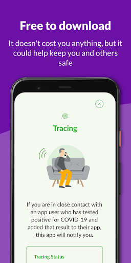  | 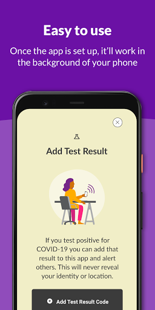  | 
 |   |  

## Development team
In the following we report the main information provided by the development team in the Google play store.

| | |
|-------------------------|-------------------------|
| **Developer**  | NHS Education for Scotland |
| **Website**  | [https://protect.scot/index.html](https://protect.scot/index.html) |
| **Email** | testandprotect@nhs.scot |
| **Physical address**  | [NHS Education for Scotland Knowledge Services 2 Central Quay 3rd Floor 89 Hydepark Street Glasgow G3 8BW ](https://www.google.com/maps/search/NHS%20Education%20for%20Scotland%20Knowledge%20Services%202%20Central%20Quay%203rd%20Floor%2089%20Hydepark%20Street%20Glasgow%20G3%208BW%20) (Google Maps) |
| **Other developed apps**  | [https://play.google.com/store/apps/developer?id=NHS+Education+for+Scotland](https://play.google.com/store/apps/developer?id=NHS+Education+for+Scotland) |

## Android support

| | |
|-------------------------|-------------------------|
| **Declared target Android version**  | Android10, version 10 (API level 29) |
| **Effective target Android version**  | Android10, version 10 (API level 29) |
| **Minimum supported Android version**  | Marshmallow, version 6.0 (API level 23) |
| **Maximum target Android version**  | - |

The larger the difference between the minimum and maximum supported Android versions, the better. A larger difference means a wider audience. For example, old phones have a very low Android version, so a high minimum supported Android version means that the app cannot be used by users with old phones, thus leading to accessibility problems. 

## Requested permissions

In the following we report the complete list of the permissions requested by the app. 

| **Permission** | **Protection level** | **Description** | 
|-------------------------|-------------------------|-------------------------|
 **android.permission ACCESS_NETWORK_STATE** | Normal | Allows applications to access information about networks. 
 **android.permission ACCESS_WIFI_STATE** | Normal | Allows applications to access information about Wi-Fi networks. 
 **android.permission BLUETOOTH** | Normal | Allows applications to connect to paired bluetooth devices. 
 **android.permission FOREGROUND_SERVICE** | Normal | Allows a regular application to use Service.startForeground. 
 **android.permission INTERNET** | Normal | Allows applications to open network sockets. 
 **android.permission RECEIVE_BOOT_COMPLETED** | Normal | Allows an application to receive the Intent.ACTION_BOOT_COMPLETED that is broadcast after the system finishes booting. 
 **android.permission VIBRATE** | Normal | Allows access to the vibrator. 

## Mentioned servers

| **Server** | **Registrant** | **Registrant country** | **Creation date** | 
|-------------------------|-------------------------|-------------------------|-------------------------|
 | android.com | Google LLC | :us: US | 1997-06-23 04:00:00 |
 | google.com | Google LLC | :us: US | 1997-09-15 04:00:00 |
 | expo.io | See PrivacyGuardian.org | :us: US | 2011-05-01 21:26:50 |

## Security analysis 

Below we report the main security warnings raised by our execution of the [Androwarn](https://github.com/maaaaz/androwarn) security analysis tool.

**Telephony identifiers leakage**
> - This application reads the numeric name (MCC+MNC) of current registered operator 
> - This application reads the operator name 

**Connection interfaces exfiltration**
> - This application reads details about the currently active data network 
> - This application tries to find out if the currently active data network is metered 

**Suspicious connection establishment**
> - This application opens a Socket and connects it to the remote address ' returned no addresses for  ; port is out of range' on the 'N/A' port  
> - This application opens a Socket and connects it to the remote address '' on the 'N/A' port  
> - This application opens a Socket and connects it to the remote address 'Ljava/lang/StringBuilder;->toString()Ljava/lang/String;' on the 'N/A' port  
> - This application opens a Socket and connects it to the remote address 'Ljava/net/Proxy;->type()Ljava/net/Proxy$Type;' on the 'N/A' port  
> - This application opens a Socket and connects it to the remote address 'timeout' on the 'N/A' port  

**Pim data leakage**
> - This application accesses data stored in the clipboard 

**Code execution**
> - This application loads a native library 
> - This application executes a UNIX command 

## User ratings and reviews

Below we provide information about how end users are reacting to the app in terms of ratings and reviews in the Google Play store.

### Ratings

The Protect Scotland app has been installed by more than **500000** times. At this time, **2247** rated the app and its average score is **4.0528636**. Below we show the distribution of the ratings across the usual star-based rating of Google Play

:star::star::star::star::star:: 1496

:star::star::star::star:: 168

:star::star::star:: 158

:star::star:: 59

:star:: 366

### Reviews 

#### 5-star reviews

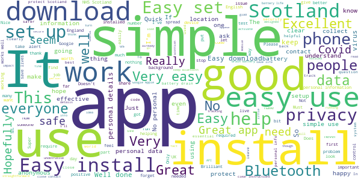

> Brilliant app so easy to use  :date: __2021-01-02 13:08:27__

> Very pleased with the app thank you  :date: __2021-01-01 11:23:29__

> A app that doesn't harvest your information.  :date: __2021-01-01 01:39:35__

> Easy install, anonymous and unobtrusive. No personal details required. Get alerted if you have been in close contact with anyone recently testing positive. What you choose to do then is up to you. Similarly if you have a positive test, you choose to allow the app/system. A win-win for everyone, and it will help restrict and limit any spread. Update: 31st Jan 20: The app/system works. My partner got a +ve test result this morning. She entered her code and I was notified a few hours later.  :date: __2020-12-31 14:53:28__

> Every one should have this.  :date: __2020-12-31 10:03:37__

> Walk and keep positive. X  :date: __2020-12-30 19:41:21__

> Explosheed to covid  :date: __2020-12-30 19:33:21__

> Very good service  :date: __2020-12-29 09:39:36__

> On my phone 24×7 - and on yours too, right? Never causes any perceivable problems.  :date: __2020-12-28 19:38:12__

> All good works as described  :date: __2020-12-27 18:07:54__

#### 4-star reviews

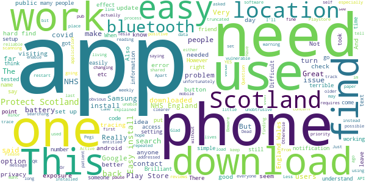

> It saves lives  :date: __2021-01-02 00:22:28__

> Have not needed to use  :date: __2020-12-23 00:24:50__

> Easy to use no problems except for the battery so had to use a back up facility  :date: __2020-12-16 22:14:09__

> Okay I think.I may just have been so Isolated I have not had a concern ..yet .  :date: __2020-12-14 23:01:39__

> I haven't had to use it so far  :date: __2020-11-26 23:25:03__

> Just downloaded the app, some folk saying you dont need to turn on location but the app says I have to keep both location and bluetooth on. Glad we have a safe app here in Scotland! 🏴󠁧󠁢󠁳󠁣󠁴󠁿  :date: __2020-11-18 14:51:54__

> I have not, thankfully been exposed to anyone who have tested positive for covid, but I have friends who use this app who have. From listening to them and hearing their experience proves that the Scottish app works  :date: __2020-11-15 03:26:08__

> Very easily understood and concise information explained simple and clearly. I would urge anyone I know to use this app to track and trace to protect the most vulnerable in not just our community, but our own families and friends!!  :date: __2020-10-25 13:23:33__

> YES I KNOW ITS MENT TO PROTECT SCOTLAND FROM COVID BUT im 12 in secondary school and This app was recommended by google play its self it said Pegi 3 so i downloaded it yesterday i forgot about then went back into it today and it came with two options im over 16 or under i said under as I am it said you are not entitled to use this app so undownload it so i did the point to this is *what is the point of making this a pegi 3 and only 16 are entitled to use this app* Thank you goodbye.............  :date: __2020-10-22 22:52:46__

> The app is great the alerts go off all the time outside the parligment building Edinburgh so who's not telling they have it  :date: __2020-10-19 18:17:39__

#### 3-star reviews

> I occasionally check this app and all is well. Thank God.  :date: __2020-12-30 23:14:17__

> No exposure checks in the last 14 days, yet I've had bluetooth & location switched on.  :date: __2020-12-30 14:39:08__

> Not enough information  :date: __2020-12-29 03:11:50__

> Periodically tells me that Bluetooth is turned off, even when (as far as I can see) it's not...  :date: __2020-12-28 19:22:14__

> Won't install. When I click next after accepting T&C it says I'm not connected to the Internet. Could it be because I have the covid tracker program installed? Turns out if you have a VPN installed it will not work.  :date: __2020-12-20 12:00:57__

> Good idea but drains battery extremely fast. Cant be in public spaces anymore than an hour with it on or my phone dies  :date: __2020-12-18 04:02:10__

> Okay good  :date: __2020-12-15 16:23:30__

> Think it works!  :date: __2020-12-06 07:48:00__

> It would be great if updates of local area were posted, and the latest government updates policy in the area.  :date: __2020-11-30 17:37:16__

> App is fine but uses a LOT of data.  :date: __2020-11-27 16:07:22__

#### 2-star reviews

> Does it do anything . No buttons seem active  :date: __2020-12-23 12:48:16__

> Its a good idea but while it was installed, it messed up my Bluetooth connections. Couldnt use any Bluetooth devices while it was installed  :date: __2020-12-22 04:04:22__

> Following the latest update It appears my phone had turned off the exposure notifications switch in settings / Google/ covid-19 exposure notifications. What is worrying was / is the Protect Scotland app did not notify me in any way, until I happened to open the app by chance and only then did a warning appear. Why doesn't the app generate a warning every time it tries to check or update it's database ? It seems a very basic failing. ☹️😳 Also why no exposure checks reported anymore ?  :date: __2020-12-19 02:35:30__

> Absolutely destroyed my battery life polling live connections for proximity checking. Also didn't warn of a close contact.  :date: __2020-12-14 12:29:30__

> How do I know this app is working?  :date: __2020-11-24 19:52:43__

> Great idea. Had to uninstall though as it started draining memory and wouldn't push notifications as a result. Might not be apps fault, could be mine or my phone's ability. Either way, can no longer use.  :date: __2020-11-20 07:16:33__

> Doesn't work, went on the app and then got a notification that ive been in close contact with an infexted person. This was 13 days after i was in contact with the person. Never got a text phone or email either. Just aswell i dont have any symptoms  :date: __2020-11-17 22:25:32__

> I have an android phone. This app gives me no notifications. Other users with iPhones tell me they get notifications saying they have no contacts and how many people they have been matched against etc. Why would that be?  :date: __2020-11-15 21:56:30__

> I WASNT NOTIFIED OF MY EXPOSURE TO SOMEONE WHO TESTED POSITIVE WITH COVID-19 TILL 6 DAYS LATER. NOT MUCH GOOD IF I HAD OF UNKNOWINGLY BEEN POSITIVE AND ASYMPTOMATIC. CLEARLY THE APP NEEDS TO BE IMPROVED AS WELL AS USED - DOWNLOADED BY MILLIONS MORE PEOPLE IF IT IS TO BE EFFECTIVE OR WORTHWHILE.  :date: __2020-11-12 23:38:12__

> To be honest I put this app on my phone when I was in Scotland for a week it didn't really seem to do anything like the nhs app in England  :date: __2020-11-12 15:01:09__

#### 1-star reviews

> Not being updated with exposure checks sitting at 0 in 14 days not sure if this is a problem.??  :date: __2021-01-03 12:35:47__

> Stopped checking without notifying me. So hasn't worked for god knows how long.  :date: __2021-01-02 20:51:21__

> This app has stopped working and no notifications reported since early December. This software is supposed to help keep us safe !!! This is scandalous. FIX IT !!!!!  :date: __2021-01-02 11:04:19__

> Totally useless. I've known several people who've had it and the app hasn't alerted me. Apparently they aren't managing to trace most cases. Not surprising from the same track and trace that told me I didn't need to isolate, can return to work etc. despite someone I live with being told to isolate because they tested positive (we all tested at the same time). ScotGov and Scot NHS have messed this up entirely. They only look better in comparison to the disaster that is BoJo and the UK Gov.  :date: __2021-01-02 09:44:03__

> Absolutely useless; people who are positive are going to go out with app running and Bluetooth on? REALLY? Dumbfounded that anyone even tried to use this Uninstalling....  :date: __2021-01-01 01:53:27__

> Not performing checks. One check don in 14 days. The only way I got it to perform the check at all was to turn Bluetooth off and on. Have had iss for 2 months. Reinstalled and insured all battery optimisations off. All emails to developer ignored. May just uninstall.  :date: __2020-12-31 22:24:22__

> Exposure notification has not been updated since the 8th of December. This is the 31st at time of writing. I assume for 23 days i have had no protection from this app. Seems absolutely pointless.  :date: __2020-12-31 20:01:16__

> Won't check me automatically, have to manually refresh the app.  :date: __2020-12-31 16:59:52__

> 0 checks in 14 days. Another SNP failure  :date: __2020-12-31 14:30:27__

> I've been diagnosed with Covid, have been given a code, however when I try to input it into the App, the code is too long. So it doesn't work. Pointless  :date: __2020-12-31 02:46:28__

# Jersey COVID Alert
App version ``1.0.5``

Analyzed with [covid-apps-observer](http://github.com/covid-apps-observer) project, version ``0.1``

## App overview
| | |
|-------------------------|-------------------------| 
| **Name**&nbsp;&nbsp;&nbsp;&nbsp;&nbsp;&nbsp;&nbsp;&nbsp;&nbsp;&nbsp;&nbsp;&nbsp;&nbsp;&nbsp;&nbsp;&nbsp;&nbsp;&nbsp;&nbsp;&nbsp;&nbsp;&nbsp;&nbsp;&nbsp;&nbsp;&nbsp;&nbsp;&nbsp;&nbsp;&nbsp;&nbsp;&nbsp;&nbsp;&nbsp;&nbsp;&nbsp;&nbsp;&nbsp;&nbsp;&nbsp;  | Jersey COVID Alert |
| **Unique identifier** | com.governmentofjersey.jerseycovidalert |
| **Link to Google Play** | [https://play.google.com/store/apps/details?id=com.governmentofjersey.jerseycovidalert](https://play.google.com/store/apps/details?id=com.governmentofjersey.jerseycovidalert) |
| **Summary**  | Jersey&#39;s COVID-19 contact tracing app |
| **Privacy policy** | [https://covidalert.gov.je/pages/privacy-notice.aspx](https://covidalert.gov.je/pages/privacy-notice.aspx) |
| **Latest version** | 1.0.5 |
| **Last update** | 2020-12-07 14:00:39 |
| **Recent changes** | Minor updates |
| **Installs**  | 10,000+ |
| **Category** | Medical |
| **First release** | Oct 8, 2020 |
| **Size**  | 108M |
| **Supported Android version**  | 6.0 and up |

### Description
> This is the official digital contact tracing and exposure notification application provided by Public Health, Government of Jersey for visitors and citizens on the island of Jersey.
 By using the app you can help prevent and contain outbreaks of COVID-19. 
 The app will warn you with an Exposure Alert if you have been near someone who has recently been diagnosed with COVID-19.  If you choose, you can ask the Contact Tracing Team to call you for specific advice and support if you get an Exposure Alert.  
 If you are diagnosed with COVID-19, the app lets you anonymously warn people you were near to before you became aware that you were infectious. Only people with a confirmed case of COVID-19 can do this with the support of the Contact Tracing Team.
 Your privacy is protected:
 •        No personal information needed to sign up
 •        The app does not record your location and does not use GPS. 
 •        The app is built with strong privacy protection. 
 •        Use of the app is always voluntary. 
 •        The app will ask your permission to share any data. 
 •        The app can be uninstalled at any time. 
 •        It is extremely unlikely that you could be identified by other users while using the app. 
 Developed on behalf of Public Health (JHA) by Digital Health (HCS) and Digital Jersey.

### User interface
The developers of the app provide the following screenshots in the Google play store.
| | | |
|:-------------------------:|:-------------------------:|:-------------------------:|
 |   |   |   | 
 | 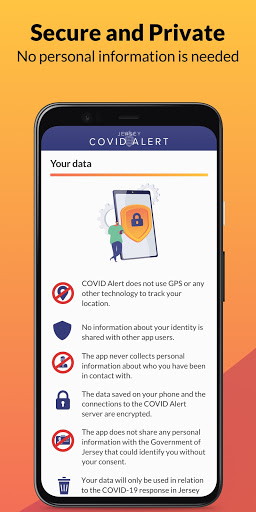  |  

## Development team
In the following we report the main information provided by the development team in the Google play store.

| | |
|-------------------------|-------------------------|
| **Developer**  | Government of Jersey |
| **Website**  | [http://covidalert.gov.je](http://covidalert.gov.je) |
| **Email** | covidalert@gov.je |
| **Physical address**  | [Digital Health, 4 Edward Place, The Parade, St. Helier, Jersey JE2 3QP](https://www.google.com/maps/search/Digital%20Health,%204%20Edward%20Place,%20The%20Parade,%20St.%20Helier,%20Jersey%20JE2%203QP) (Google Maps) |
| **Other developed apps**  | [https://play.google.com/store/apps/developer?id=5014249503765258721](https://play.google.com/store/apps/developer?id=5014249503765258721) |

## Android support

| | |
|-------------------------|-------------------------|
| **Declared target Android version**  | Android10, version 10 (API level 29) |
| **Effective target Android version**  | Android10, version 10 (API level 29) |
| **Minimum supported Android version**  | Marshmallow, version 6.0 (API level 23) |
| **Maximum target Android version**  | - |

The larger the difference between the minimum and maximum supported Android versions, the better. A larger difference means a wider audience. For example, old phones have a very low Android version, so a high minimum supported Android version means that the app cannot be used by users with old phones, thus leading to accessibility problems. 

## Requested permissions

In the following we report the complete list of the permissions requested by the app. 

| **Permission** | **Protection level** | **Description** | 
|-------------------------|-------------------------|-------------------------|
 **android.permission ACCESS_NETWORK_STATE** | Normal | Allows applications to access information about networks. 
 **android.permission ACCESS_WIFI_STATE** | Normal | Allows applications to access information about Wi-Fi networks. 
 **android.permission BLUETOOTH** | Normal | Allows applications to connect to paired bluetooth devices. 
 **android.permission FOREGROUND_SERVICE** | Normal | Allows a regular application to use Service.startForeground. 
 **android.permission INTERNET** | Normal | Allows applications to open network sockets. 
 **android.permission RECEIVE_BOOT_COMPLETED** | Normal | Allows an application to receive the Intent.ACTION_BOOT_COMPLETED that is broadcast after the system finishes booting. 
 **android.permission VIBRATE** | Normal | Allows access to the vibrator. 

## Mentioned servers

| **Server** | **Registrant** | **Registrant country** | **Creation date** | 
|-------------------------|-------------------------|-------------------------|-------------------------|
 | android.com | Google LLC | :us: US | 1997-06-23 04:00:00 |
 | google.com | Google LLC | :us: US | 1997-09-15 04:00:00 |
 | expo.io | See PrivacyGuardian.org | :us: US | 2011-05-01 21:26:50 |

## Security analysis 

Below we report the main security warnings raised by our execution of the [Androwarn](https://github.com/maaaaz/androwarn) security analysis tool.

**Connection interfaces exfiltration**
> - This application reads details about the currently active data network 
> - This application tries to find out if the currently active data network is metered 

**Suspicious connection establishment**
> - This application opens a Socket and connects it to the remote address ' returned no addresses for  ; port is out of range' on the 'N/A' port  
> - This application opens a Socket and connects it to the remote address '' on the 'N/A' port  
> - This application opens a Socket and connects it to the remote address 'Ljava/lang/StringBuilder;->toString()Ljava/lang/String;' on the ': connect, resolve' port  
> - This application opens a Socket and connects it to the remote address 'Ljava/lang/StringBuilder;->toString()Ljava/lang/String;' on the 'N/A' port  
> - This application opens a Socket and connects it to the remote address 'Ljava/net/Proxy;->type()Ljava/net/Proxy$Type;' on the 'N/A' port  
> - This application opens a Socket and connects it to the remote address 'timeout' on the 'N/A' port  

**Pim data leakage**
> - This application accesses data stored in the clipboard 

**Code execution**
> - This application loads a native library 
> - This application executes a UNIX command 

## User ratings and reviews

Below we provide information about how end users are reacting to the app in terms of ratings and reviews in the Google Play store.

### Ratings

The Jersey COVID Alert app has been installed by more than **10000** times. At this time, **36** rated the app and its average score is **3.1111112**. Below we show the distribution of the ratings across the usual star-based rating of Google Play

:star::star::star::star::star:: 15

:star::star::star::star:: 3

:star::star::star:: 3

:star::star:: 1

:star:: 14

### Reviews 

#### 5-star reviews

> The layout is simplistic and it is working fine for me 🙂  :date: __2020-10-19 16:19:39__

> Good information  :date: __2020-10-17 22:05:35__

#### 4-star reviews

> Useful beyond its track trace function. Provides broad range of latest stats and other info. Surprisingly it does not provide up to date behaviour guidance and rules information.  :date: __2020-12-19 01:22:15__

> Pretty straightforward. NHS app has built in QR scanner for venue check-in which this app is missing.  :date: __2020-12-05 01:22:57__

> Constantly getting "cannot contact server" error message. Edit The fixed version does now work. Easy to use. Now a 4 star app (can't give 5 stars until I've met someone with covid!,)  :date: __2020-10-15 18:20:59__

> Says no Internet connection the whole time. Update has fixed issues  :date: __2020-10-14 21:31:16__

#### 3-star reviews

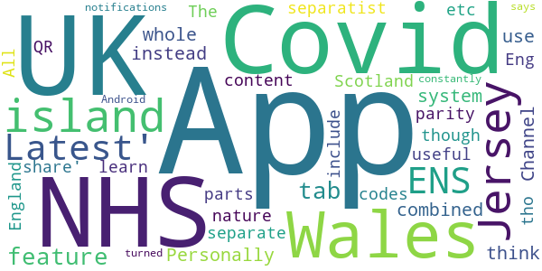

> Personally I think the Channel Islands as a whole should use a combined system instead of separatist nature. I also don't get why NHS Scotland app separate from the NHS Covid-19 England & Wales App though both parts of the UK and same island. The Jersey App 'Latest' & 'share' tabs content is useful and all the UK Covid ENS apps should include the feature. All UK ENS Apps should feature parity on NHS Eng&Wales App - QR codes etc tho Jersey 'Latest' tab all the UK Covid apps could learn from!  :date: __2020-11-14 21:29:22__

> App constantly says the notifications are turned off but they are on Android  :date: __2020-11-04 16:25:20__

#### 2-star reviews

> Keep needing to install/uninstall due to connectivity issues but nothing wrong with my wifi.  :date: __2020-11-18 08:43:30__

#### 1-star reviews

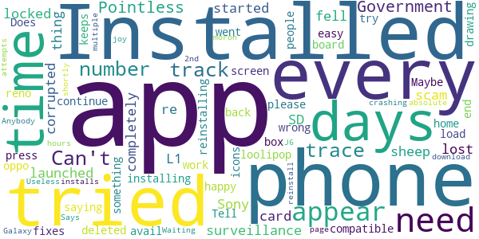

> Can't get through to the track and trace number. Pointless  :date: __2020-11-30 21:25:58__

> Government surveillance scam, sheep fell for it!  :date: __2020-11-21 05:22:03__

> Installed the app on my Sony L1, launched the app and it completely locked the phone up, I re started the phone and it had corrupted my SD card so every thing on there is lost and needs re-installing, It deleted icons from my home screen so I am not happy with it  :date: __2020-11-05 11:42:01__

> not compatible with loolipop 5.1  :date: __2020-10-18 19:55:41__

> Tell you to press continue and just times out, tried reinstalling and all other easy fixes to no avail  :date: __2020-10-16 13:18:41__

> I have tried to load this app for 2 days now and every time a box appears saying "something went wrong our end, please try again" . Maybe the IT people need to back to the drawing board!!  :date: __2020-10-16 12:54:52__

> Does now work with oppo reno 2. App keeps crashing after 2nd page.  :date: __2020-10-16 12:32:23__

> Waiting for the app to download. 4 Days!!!!!!. Useless!!.  :date: __2020-10-16 12:29:24__

> Anybody who installs this is an absolute moron!  :date: __2020-10-16 12:22:08__

> Says installed on my Galaxy J6 and app will appear shortly but after 24 hours and multiple attempts to reinstall no joy  :date: __2020-10-16 12:12:52__

# StopCOVID NI
App version ``2.3.0``

Analyzed with [covid-apps-observer](http://github.com/covid-apps-observer) project, version ``0.1``

## App overview
| | |
|-------------------------|-------------------------| 
| **Name**&nbsp;&nbsp;&nbsp;&nbsp;&nbsp;&nbsp;&nbsp;&nbsp;&nbsp;&nbsp;&nbsp;&nbsp;&nbsp;&nbsp;&nbsp;&nbsp;&nbsp;&nbsp;&nbsp;&nbsp;&nbsp;&nbsp;&nbsp;&nbsp;&nbsp;&nbsp;&nbsp;&nbsp;&nbsp;&nbsp;&nbsp;&nbsp;&nbsp;&nbsp;&nbsp;&nbsp;&nbsp;&nbsp;&nbsp;&nbsp;  | StopCOVID NI |
| **Unique identifier** | net.hscni.covidtracker |
| **Link to Google Play** | [https://play.google.com/store/apps/details?id=net.hscni.covidtracker](https://play.google.com/store/apps/details?id=net.hscni.covidtracker) |
| **Summary**  | The coronavirus contact tracing app for Northern Ireland |
| **Privacy policy** | [https://covid-19.hscni.net/privacy-notice/](https://covid-19.hscni.net/privacy-notice/) |
| **Latest version** | 2.3.0 |
| **Last update** | 2020-11-13 18:21:47 |
| **Recent changes** | - Create and send a certificate proving you need to self-isolate to other people and organisations, e.g. your employer or the Social Security Agency. - Self-isolation periods are now calculated based on the date of exposure.  |
| **Installs**  | 100,000+ |
| **Category** | Medical |
| **First release** | Jul 29, 2020 |
| **Size**  | 108M |
| **Supported Android version**  | 6.0 and up |

### Description
> If you are 11 or older and live in Northern Ireland you can use this HSC contact tracing app. By using it you will help stop or slow the spread of coronavirus.
 ** Support the health services **
 ** Help avoid more lockdowns **
 ** Save lives **
 How does the app work?
 If you are in close contact with an app user who has told their app that they have COVID-19, you will get an alert from this app. You won’t know who it was or where it happened. You must then self-isolate for the period shown in the app. There’s advice on how to self-isolate and answers to common questions about this in the app.
 If you test positive for COVID-19 you can tell this app. Other app users that you’ve been close to will then be alerted. They won’t know that it was you or where it happened.
 ** Works in the background on Bluetooth, not GPS, and uses very little battery **
 ** Please keep Bluetooth on so the app can work properly **
 How is my privacy protected?
 ** This app never knows your name or where you are, so it’s completely private **
 It uses the ‘Exposure Notification API’ developed by Apple and Google in a joint effort to help governments and health agencies reduce the spread of COVID-19 through contact tracing, with user privacy and security core to the design. This is sometimes called the ‘decentralised’ model.
 If you test positive for COVID-19 you will get a code by SMS text message from 'HSCresult'. When you put your code into this app you will be asked to share the 'Random IDs’ that your phone has been swapping with other app users over the last 14 days. This will allow us to tell those people that they have been exposed to COVID-19. 
 ** We will never ask you to reply to the SMS text message **
 ** Please ignore any message if it asks you to reply or send information **
 So that you can use this app when travelling abroad we will securely share 'Random IDs' with other countries. This also means that apps used by visitors from those countries will work here.
 ** This app will never track your identity or location **

### User interface
The developers of the app provide the following screenshots in the Google play store.
| | | |
|:-------------------------:|:-------------------------:|:-------------------------:|
 |   |   | 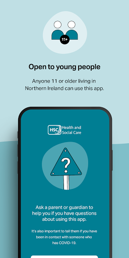  | 
 | 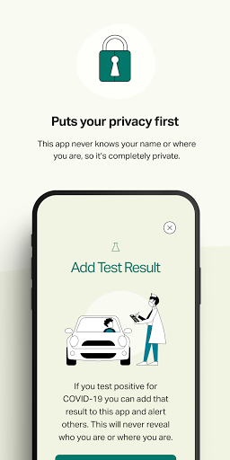  |   |   | 
 |  

## Development team
In the following we report the main information provided by the development team in the Google play store.

| | |
|-------------------------|-------------------------|
| **Developer**  | Health & Social Care Northern Ireland |
| **Website**  | [https://covid-19.hscni.net/contact-tracing/](https://covid-19.hscni.net/contact-tracing/) |
| **Email** | StopCOVIDNIApp@hscni.net |
| **Physical address**  | - |
| **Other developed apps**  | [https://play.google.com/store/apps/developer?id=Health+%26+Social+Care+Northern+Ireland](https://play.google.com/store/apps/developer?id=Health+%26+Social+Care+Northern+Ireland) |

## Android support

| | |
|-------------------------|-------------------------|
| **Declared target Android version**  | Android10, version 10 (API level 29) |
| **Effective target Android version**  | Android10, version 10 (API level 29) |
| **Minimum supported Android version**  | Marshmallow, version 6.0 (API level 23) |
| **Maximum target Android version**  | - |

The larger the difference between the minimum and maximum supported Android versions, the better. A larger difference means a wider audience. For example, old phones have a very low Android version, so a high minimum supported Android version means that the app cannot be used by users with old phones, thus leading to accessibility problems. 

## Requested permissions

In the following we report the complete list of the permissions requested by the app. 

| **Permission** | **Protection level** | **Description** | 
|-------------------------|-------------------------|-------------------------|
 **android.permission ACCESS_NETWORK_STATE** | Normal | Allows applications to access information about networks. 
 **android.permission ACCESS_WIFI_STATE** | Normal | Allows applications to access information about Wi-Fi networks. 
 **android.permission BLUETOOTH** | Normal | Allows applications to connect to paired bluetooth devices. 
 **android.permission FOREGROUND_SERVICE** | Normal | Allows a regular application to use Service.startForeground. 
 **android.permission INTERNET** | Normal | Allows applications to open network sockets. 
 **android.permission RECEIVE_BOOT_COMPLETED** | Normal | Allows an application to receive the Intent.ACTION_BOOT_COMPLETED that is broadcast after the system finishes booting. 
 **android.permission VIBRATE** | Normal | Allows access to the vibrator. 

## Mentioned servers

| **Server** | **Registrant** | **Registrant country** | **Creation date** | 
|-------------------------|-------------------------|-------------------------|-------------------------|
 | android.com | Google LLC | :us: US | 1997-06-23 04:00:00 |
 | google.com | Google LLC | :us: US | 1997-09-15 04:00:00 |
 | expo.io | See PrivacyGuardian.org | :us: US | 2011-05-01 21:26:50 |

## Security analysis 

Below we report the main security warnings raised by our execution of the [Androwarn](https://github.com/maaaaz/androwarn) security analysis tool.

**Telephony identifiers leakage**
> - This application reads the numeric name (MCC+MNC) of current registered operator 
> - This application reads the operator name 

**Connection interfaces exfiltration**
> - This application reads details about the currently active data network 
> - This application tries to find out if the currently active data network is metered 

**Suspicious connection establishment**
> - This application opens a Socket and connects it to the remote address ' returned no addresses for  ; port is out of range' on the 'N/A' port  
> - This application opens a Socket and connects it to the remote address '' on the 'N/A' port  
> - This application opens a Socket and connects it to the remote address 'Ljava/lang/StringBuilder;->toString()Ljava/lang/String;' on the 'N/A' port  
> - This application opens a Socket and connects it to the remote address 'Ljava/net/Proxy;->type()Ljava/net/Proxy$Type;' on the 'N/A' port  
> - This application opens a Socket and connects it to the remote address 'timeout' on the 'N/A' port  

**Pim data leakage**
> - This application accesses data stored in the clipboard 

**Code execution**
> - This application loads a native library 
> - This application executes a UNIX command 

## User ratings and reviews

Below we provide information about how end users are reacting to the app in terms of ratings and reviews in the Google Play store.

### Ratings

The StopCOVID NI app has been installed by more than **100000** times. At this time, **478** rated the app and its average score is **2.67**. Below we show the distribution of the ratings across the usual star-based rating of Google Play

:star::star::star::star::star:: 148

:star::star::star::star:: 19

:star::star::star:: 43

:star::star:: 62

:star:: 206

### Reviews 

#### 5-star reviews

> Installed this as soon as it became available. Happy to support the good work  :date: __2021-01-03 15:43:57__

> Helpful  :date: __2021-01-02 01:45:10__

> I strumming for DCI middlemoor u big style fun and games cock  :date: __2020-12-26 05:13:43__

> Helps to keep me safe and others safe  :date: __2020-12-21 03:35:48__

> Perfect  :date: __2020-12-10 13:47:17__

> Absolutely essential app.  :date: __2020-12-07 08:47:11__

> excellent service staving propjes live om no racis or colour kust a hitman Boeing me xXxjetiame xXx  :date: __2020-12-05 16:27:26__

> We are in a Lockdown for 2weeks Christmas Cancelled This Year  :date: __2020-11-29 08:12:05__

> I am a father and this app is help bust my lokel drug deler(he was my lokel deler UWU), and my dother infrormaeshen was stolen (shes 4)😁 Thank god the worden let me downlode (I foed my wife an this app )XD<3:3  :date: __2020-11-23 11:01:57__

> Great to see and well designed. Fantastic to have an app like this so quickly for NI  :date: __2020-11-22 23:32:11__

#### 4-star reviews

> Zoe123  :date: __2020-11-22 15:45:06__

> Just discovered the app had been "Auto Disabled" on my android phone. Something to watch out for (When it's running you should get a notification once a week, reminding you and confirming that it is indeed running).  :date: __2020-10-21 23:33:44__

> Please add the capacity to scan QR codes like the NHS app does, not having this function leads to confusion in dealing with GB businesses in NI  :date: __2020-10-10 08:57:01__

> It seems to work, and I really hope it does.. it is simple, and not intrusive. I look forward to seeing his it pans out.  :date: __2020-10-08 01:00:45__

> This app only checks exposure if it comes within a short distance of someone else who has the app. No exposure checks mean you havent been close enough to someone for it to check.  :date: __2020-10-02 20:06:28__

> QUERY! If having to move devices, how are you supposed to transfer the existing exposure checks from the previous 14 days to the new device, in case any of those report a positive case?  :date: __2020-09-21 22:39:02__

> Once running, seems to be very good. But was hard to find. Wasn't immediately clear if there was a background daemon service running or the app had to be "minimized" but not closed to work. Samsung Galaxy 8 running Android 9: It seems Samsung's battery optimisation service was killing the app. After a reboot, it seemed OK, though. Closing/swiping away the app and then toggling bluetooth on/off showed it was still running (I got an alert from the app saying bluetooth needs enabled).  :date: __2020-08-13 21:40:20__

> No problems downloading and it appears active on my Samsung S10. Would love to understand more about the keys as we're registering them without leaving the house!  :date: __2020-08-12 22:11:42__

> Seems to work just fine, but the interface is slow and it's hard to know if this is actually running or if I have to load up the app manually every time.  :date: __2020-08-07 11:52:24__

> I found it easily, I just typed in covid and found the app. But like others have said, when you close the app and open it it says tracing not active then changes to active. Unsure if it is working when the app isn't open.  :date: __2020-08-04 11:47:01__

#### 3-star reviews

> Can you make a version of this app for the huawei app gallery?  :date: __2020-11-26 21:32:22__

> Does not give n Ireland  :date: __2020-11-20 13:22:56__

> The App keeps disabling itself.  :date: __2020-10-26 07:53:08__

> C. Nmu  :date: __2020-10-17 23:19:09__

> No log updates. Uninstalled and reinstalled the app for NI. Made no difference. How can we trust it.  :date: __2020-10-16 14:07:46__

> I don't know  :date: __2020-10-11 18:11:48__

> Downloaded this when it became available, but after the last update, it keeps pushing me to turn my bluetooth on and restart the app; my Bluetooth has been on, and restarting the app doesn't help. Only had this issue since the update, but makes having the app pretty much useless.  :date: __2020-10-11 15:06:04__

> Mine barely checks (once in 14 days) but my friends checks multiple times a day. I'm nearer much more people than them so I don't understand.  :date: __2020-10-11 11:19:25__

> I downloaded the app. I get that someone will notify me if I come into contact with someone who has the app and then tests positive. However, I feel it should give people either daily or weekly updates of places that the person has been and I wonder when two mobile phones that have the app downloaded on the phones - do they react to each other. Another thing is people on the island of ireland both north and south of the island should be able to use both apps together.  :date: __2020-10-06 23:59:37__

> Whose bright idea was it to remove the statistics section (daily number changes etc.) from the app, and not adding a link to where the information can be found?  :date: __2020-10-05 18:42:45__

#### 2-star reviews

> Bluetooth is always on but the app tells me to turn it on! Same after restarting the device and checking Bluetooth status  :date: __2020-12-30 18:52:58__

> Got a notification to say i was in contact and had to isolate. Only problem was i had been in contact the 10th. First told of it the 23rd with 1day left to isolate. Its reliant on people updating the app with their test results and if they dont do that then nobody knows  :date: __2020-11-23 21:34:22__

> I had hoped that this app would provide useful timely and accurate information to users. Instead I see that the statistics are not kept up to date. By way of example today is 05/11/20 but the R number estimate is from 16/10/20. Come on people for the sake of credibility must do better!  :date: __2020-11-05 23:37:19__

> I don't see the point in this app. As I checked today 2nd November as I'd accidentally knocked off Bluetooth. Seen it last checked on 12th October. I am a key worker, I could potentially come into contact with this virus. And after 14 days it removes data. So that is a lot of potential contact with this virus missed. If it's not going to work and check then why have it installed?  :date: __2020-11-02 09:56:14__

> Either it doesn't work or nobody has it... since the 20th of October (it is now the 1st of Nov) I have had 2 notifications (checks), 1 of which are my partner. Pointless.  :date: __2020-11-01 20:20:25__

> Its not working keeps telling me connect to blutooth and I have!  :date: __2020-10-28 18:45:24__

> The app worked well but I noticed at times when I was out that no checks had been made. I did recieve an alert to isolate for 14 days which I did, yet on the 5th day into isolation I got another notification saying that I've been exposed and have to isolate for 14 days. I hadn't left to house, I didnt even leave my bedroom so I'm not sure how accurate this app is which is why I removed it.  :date: __2020-10-26 09:57:00__

> No alert given for App update. No weekly alerts given for 2 consecutive weeks  :date: __2020-10-24 04:50:41__

> Despite having my Bluetooth on constantly, the app is telling me tracing is not active. There is clearly a bug in the app that needs fixed.  :date: __2020-10-23 23:31:59__

> Fault app. Tells me in early hours of morning that there has been a huge number of checkins like 2000+/3000+ while im at home. But also saying 0 check ins in last 4 days-14 days. Have to open it again to start checks and i never switch off the bluetooth so no idea what happening.  :date: __2020-10-23 23:17:28__

#### 1-star reviews

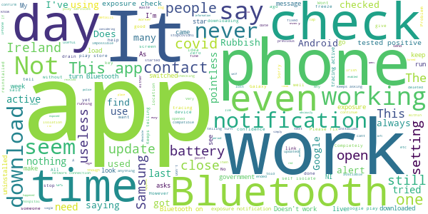

> App won't open/crashes even after re-downloading  :date: __2021-01-03 11:51:38__

> Pointless app. I don't think it's even accurate.  :date: __2020-12-30 00:26:35__

> DISCUSTING app terrorism  :date: __2020-12-29 12:26:18__

> I NEVER downloaded this app, yet, I have recently discovered it on my fone AND WITH ALL PERMISSIONS ALLOWED etc??? An explanation would be appreciated!!! Immediately deleted after discovery.  :date: __2020-12-28 21:41:01__

> Yh it's a good idea if you're 6 years old assuming that everyone is going to download it... A small childish idea where we all live in a utopia downloading this app at the same time... This only works if the government forces you to download it by law... Only downloaded because I thought there was going to be a surprising new idea to uncover... Yh turns out it's like Pokémon GO without any Pokémon  :date: __2020-12-26 21:58:20__

> Load of s\*\*\*\*  :date: __2020-12-22 19:54:32__

> Shite dont work week late 😂😂😂😂🤬🤬🤬  :date: __2020-12-11 10:05:12__

> I got an alert tonight showing close contact on the 26th November.. Problem being the alert only came through when the isolation period ended that being 10th December? Very worrying!  :date: __2020-12-11 02:19:31__

> Downloaded app i was in touch with 3 people who tested positive nothing came up i rang the helpline says not to worry its not 100%  :date: __2020-12-06 11:30:28__

> Makes the phone sooo slooooow that it's unusable. Had to uninstall.  :date: __2020-12-05 22:01:17__

# Beat Covid Gibraltar
App version ``1.0.2``

Analyzed with [covid-apps-observer](http://github.com/covid-apps-observer) project, version ``0.1``

## App overview
| | |
|-------------------------|-------------------------| 
| **Name**&nbsp;&nbsp;&nbsp;&nbsp;&nbsp;&nbsp;&nbsp;&nbsp;&nbsp;&nbsp;&nbsp;&nbsp;&nbsp;&nbsp;&nbsp;&nbsp;&nbsp;&nbsp;&nbsp;&nbsp;&nbsp;&nbsp;&nbsp;&nbsp;&nbsp;&nbsp;&nbsp;&nbsp;&nbsp;&nbsp;&nbsp;&nbsp;&nbsp;&nbsp;&nbsp;&nbsp;&nbsp;&nbsp;&nbsp;&nbsp;  | Beat Covid Gibraltar |
| **Unique identifier** | com.gha.covid.tracker |
| **Link to Google Play** | [https://play.google.com/store/apps/details?id=com.gha.covid.tracker](https://play.google.com/store/apps/details?id=com.gha.covid.tracker) |
| **Summary**  | Let’s Beat COVID-19 together |
| **Privacy policy** | [https://gibraltar.gov.gi/beatcovidapp/privacy](https://gibraltar.gov.gi/beatcovidapp/privacy) |
| **Latest version** | 1.0.2 |
| **Last update** | 2020-11-11 17:53:36 |
| **Recent changes** | Minor bug fixes and adds a Pause function for specific scenarios |
| **Installs**  | 10,000+ |
| **Category** | Medical |
| **First release** | Jun 25, 2020 |
| **Size**  | 106M |
| **Supported Android version**  | 6.0 and up |

### Description
> The Beat COVID Gibraltar app is for the citizens of Gibraltar and uses the bluetooth technology on your phone to track other phones you have been in close proximity to. It uses the Exposure Notification Service and you will be notified directly if you have been in close contact with someone who has tested positive for the virus. Likewise, if you are tested positive for COVID-19 yourself, those you have been in close contact with will be notified.  
 No personal data will be stored or used.  
 This app is totally anonymous and no personal information will be logged or shared with anyone. 
 Join the fight against COVID-19 and download the app today. 
 Beat COVID Gibraltar has been developed by the Gibraltar Health Authority and HM Government of Gibraltar.

### User interface
The developers of the app provide the following screenshots in the Google play store.
| | | |
|:-------------------------:|:-------------------------:|:-------------------------:|
 |   |   |   | 
 |   |  

## Development team
In the following we report the main information provided by the development team in the Google play store.

| | |
|-------------------------|-------------------------|
| **Developer**  | Gibraltar Health Authority |
| **Website**  | [https://www.gibraltar.gov.gi/beatcovidapp](https://www.gibraltar.gov.gi/beatcovidapp) |
| **Email** | info@gha.ie |
| **Physical address**  | - |
| **Other developed apps**  | [https://play.google.com/store/apps/developer?id=Gibraltar+Health+Authority](https://play.google.com/store/apps/developer?id=Gibraltar+Health+Authority) |

## Android support

| | |
|-------------------------|-------------------------|
| **Declared target Android version**  | Pie, version 9 (API level 28) |
| **Effective target Android version**  | Pie, version 9 (API level 28) |
| **Minimum supported Android version**  | Marshmallow, version 6.0 (API level 23) |
| **Maximum target Android version**  | - |

The larger the difference between the minimum and maximum supported Android versions, the better. A larger difference means a wider audience. For example, old phones have a very low Android version, so a high minimum supported Android version means that the app cannot be used by users with old phones, thus leading to accessibility problems. 

## Requested permissions

In the following we report the complete list of the permissions requested by the app. 

| **Permission** | **Protection level** | **Description** | 
|-------------------------|-------------------------|-------------------------|
 **android.permission ACCESS_NETWORK_STATE** | Normal | Allows applications to access information about networks. 
 **android.permission ACCESS_WIFI_STATE** | Normal | Allows applications to access information about Wi-Fi networks. 
 **android.permission BLUETOOTH** | Normal | Allows applications to connect to paired bluetooth devices. 
 **android.permission INTERNET** | Normal | Allows applications to open network sockets. 

## Mentioned servers

| **Server** | **Registrant** | **Registrant country** | **Creation date** | 
|-------------------------|-------------------------|-------------------------|-------------------------|
 | android.com | Google LLC | :us: US | 1997-06-23 04:00:00 |
 | google.com | Google LLC | :us: US | 1997-09-15 04:00:00 |
 | expo.io | See PrivacyGuardian.org | :us: US | 2011-05-01 21:26:50 |

## Security analysis 

Below we report the main security warnings raised by our execution of the [Androwarn](https://github.com/maaaaz/androwarn) security analysis tool.

**Telephony identifiers leakage**
> - This application reads the numeric name (MCC+MNC) of current registered operator 
> - This application reads the operator name 

**Connection interfaces exfiltration**
> - This application reads details about the currently active data network 
> - This application tries to find out if the currently active data network is metered 

**Suspicious connection establishment**
> - This application opens a Socket and connects it to the remote address ' returned no addresses for  ; port is out of range' on the 'N/A' port  
> - This application opens a Socket and connects it to the remote address '' on the 'N/A' port  
> - This application opens a Socket and connects it to the remote address 'Ljava/lang/StringBuilder;->toString()Ljava/lang/String;' on the ': connect, resolve' port  
> - This application opens a Socket and connects it to the remote address 'Ljava/lang/StringBuilder;->toString()Ljava/lang/String;' on the 'N/A' port  
> - This application opens a Socket and connects it to the remote address 'Ljava/net/Proxy;->type()Ljava/net/Proxy$Type;' on the 'N/A' port  
> - This application opens a Socket and connects it to the remote address 'timeout' on the 'N/A' port  

**Pim data leakage**
> - This application accesses data stored in the clipboard 

**Code execution**
> - This application loads a native library 
> - This application executes a UNIX command 

## User ratings and reviews

Below we provide information about how end users are reacting to the app in terms of ratings and reviews in the Google Play store.

### Ratings

The Beat Covid Gibraltar app has been installed by more than **10000** times. At this time, **70** rated the app and its average score is **3.142857**. Below we show the distribution of the ratings across the usual star-based rating of Google Play

:star::star::star::star::star:: 31

:star::star::star::star:: 5

:star::star::star:: 4

:star::star:: 3

:star:: 27

### Reviews 

#### 5-star reviews

> 👍😎  :date: __2020-11-05 21:22:14__

> So, I downloaded this app to complain... about the idiots who have downloaded the app then given it a 1 star review for not being made for the UK 1. Gibraltar is a British overseas territory, as such it is relevant to the UK, you imbaciles. 2. It does tell you it is made specifically for Gibraltar, check the name of the app, you uncultured swine. 3. If you are not from Gibraltar it isn't relevant to you. This does not mean you should give it a negative review, as that does not make it a bad app.  :date: __2020-09-27 14:21:48__

> This app is really easy and fast and doesn't have too much of an impact on your battery life  :date: __2020-08-18 01:16:04__

> Works as described, easy to set up and turn on.- I've not heard anything from the developer and I'm in the UK, the more people who use it - the more will be notified  :date: __2020-08-09 14:58:58__

> Good  :date: __2020-08-08 14:37:46__

> You have to make sure your phone is up to date with system update. I up dated my S10+ and download this and it works fine.  :date: __2020-08-04 22:11:47__

> Good 👍🏼  :date: __2020-07-25 13:20:16__

> Downloaded and working in the UK. If you are having trouble with set up make sure you have the latest system update from Google/ apple and turn on the contact tracing api in settings.  :date: __2020-07-21 10:11:48__

> Downloaded, installed and turned on notifications no problem - very easy. Yes, it does automatically turn on your Bluetooth which drains the battery faster but I'm keeping it on only when I'm outside my house&work, e.g.shopping.  :date: __2020-07-19 23:06:12__

> Easy to set up and no issues  :date: __2020-07-10 19:09:49__

#### 4-star reviews

> First covid app good work Gibraltar  :date: __2020-11-01 18:01:54__

> Easy to load works out of the box on pixel 2xl. Android 10. Only question is only as useful as number of folks using it. Needs a bit of publicity.  :date: __2020-07-30 15:49:20__

#### 3-star reviews

> It may have been me, I didn't understand how it worked.  :date: __2020-10-08 15:24:12__

> It doesn't give out any information...  :date: __2020-07-20 19:00:47__

#### 2-star reviews

No recent reviews available with 2 stars.

#### 1-star reviews

> Government surveillance scam,shhep fell for it!  :date: __2020-11-21 05:17:20__

> Pathetic app which does does not download! If it had zero to rate, I would instead of 1 star  :date: __2020-10-09 17:02:10__

> I don't live in Gibraltar so it's no help to me.  :date: __2020-09-24 21:07:36__

> You ask a quistion have been traded positive then a question mark but not nagged ie it should of been yes or no mo on this app does not help at all I have never been rested for c19 been very carefull flowed all rules but witch is the right easy app for yes and no for c19 for me southnorwood  :date: __2020-09-24 14:40:32__

> Doesnt even work in the background  :date: __2020-08-14 00:51:41__

> Waste of time ! Doesn't seem to do anything at all, who said that it was for UK, and why should something developed by and for Gibraltar have any relevance for the UK ?  :date: __2020-08-08 17:35:31__

> What does this App actually do? It doesn't seem able to access surveys they send you emails asking you to complete? Why can't the App itself actually ask you?  :date: __2020-08-07 11:07:46__

> No instructions on how it works  :date: __2020-08-03 21:03:07__

> Ok, I only downloaded this app last night & although the reviews seem ok. This was the 1st & main app for COVID-19 tracking. Yes I realise Gibraltar is it's main domain, I get it. But seeing as this was my only option really, Am I just meant to look at the compass tracker, watching random green dots faintly appearing, with the blue screen just saying "Active"/click if i tested positive? How do i know? I don't! We can't just ask 4 test. Bluetooth is always on. So do i just wait 4 an alert? 🤷🏻‍  :date: __2020-07-31 22:24:09__

> This App is not designed for th UK, it is designed only for Gibraltar the app is useless, contact the developer like i did, UK citizen you will be told we can't use it in the UK 🇬🇧 This is their response "This App has been developed specifically with Gibraltar in mind. It is open for download by anyone, including cross-frontier workers and persons who regularly visit Gibraltar. If you are not in Gibraltar (whether residing, working or visiting) this app is of no real use to you"  :date: __2020-07-30 22:25:30__

# COVID Symptom Study
App version ``2.2.0``

Analyzed with [covid-apps-observer](http://github.com/covid-apps-observer) project, version ``0.1``

## App overview
| | |
|-------------------------|-------------------------| 
| **Name**&nbsp;&nbsp;&nbsp;&nbsp;&nbsp;&nbsp;&nbsp;&nbsp;&nbsp;&nbsp;&nbsp;&nbsp;&nbsp;&nbsp;&nbsp;&nbsp;&nbsp;&nbsp;&nbsp;&nbsp;&nbsp;&nbsp;&nbsp;&nbsp;&nbsp;&nbsp;&nbsp;&nbsp;&nbsp;&nbsp;&nbsp;&nbsp;&nbsp;&nbsp;&nbsp;&nbsp;&nbsp;&nbsp;&nbsp;&nbsp;  | COVID Symptom Study |
| **Unique identifier** | com.joinzoe.covid_zoe |
| **Link to Google Play** | [https://play.google.com/store/apps/details?id=com.joinzoe.covid_zoe](https://play.google.com/store/apps/details?id=com.joinzoe.covid_zoe) |
| **Summary**  | Help slow COVID-19 by self-reporting your symptoms daily, even if you feel well. |
| **Privacy policy** | [https://predict.study/covid-privacy-notice/](https://predict.study/covid-privacy-notice/) |
| **Latest version** | 2.2.0 |
| **Last update** | 2020-12-18 12:42:28 |
| **Recent changes** | Diet study results for participating users. UI fixes. |
| **Installs**  | 1,000,000+ |
| **Category** | Health & Fitness |
| **First release** | Mar 20, 2020 |
| **Size**  | 36M |
| **Supported Android version**  | 5.0 and up |

### Description
> Take 1 minute each day and help fight the spread of COVID-19 in your community
 * Report your health daily even if you feel well
 * Get a daily estimate of COVID in your area
 * Help slow the outbreak near you
 Join millions of people supporting scientists at Stanford University, Harvard University, Massachusetts General Hospital, and King's College London to help fight coronavirus by identifying:
 * How fast the virus is spreading in your area
 * High-risk areas in the US
 * Who is most at risk, by better understanding symptoms linked to underlying health conditions
 You will contribute to advance research on COVID-19 in partnership with leading health researchers globally like TwinsUK, one of the most clinically detailed studies in the world.
 This app (formerly known as the Covid Symptom Tracker) allows you to help others, but does not give health advice. If you need health advice please visit the CDC website at: [https://www.cdc.gov/coronavirus/2019-ncov/index.html](https://www.cdc.gov/coronavirus/2019-ncov/index.html)
 This app has been designed for everyone to report their status not just those who are ill.
 It was designed by doctors and scientists at King's College London, Guys and St Thomas’ Hospitals and Zoe Global Limited, a health technology company.
 In the US the app is being used by the Nurses' Health Study to identify symptoms in active healthcare workers who are treating people with COVID across the country and risking their own health to help us.
 In response to recommendations by Stand Up To Cancer (SU2C), the app also includes questions for cancer patients and survivors, such as if they are living with cancer, what type of cancer and what treatment they are receiving.
 If you would like to help out in this difficult time, then you can. Download the app and share daily your own status, even if you are well. With your help we can understand much better the situation across the nation, how the disease presents itself to different people, and how it progresses.
 This is a new virus which the world has never seen before. There are a wide range of symptoms, which differ between people. With your help we can understand better how the disease presents itself depending upon individual factors such as health and age.
 No information you share will be used for commercial purposes.
 There are two parts to the app:
 HEALTH INFORMATION
 You will be asked to share some general information, such as your age and some health details, such as whether you have certain diseases.
 SYMPTOM TRACKING
 We will ask you every day to let us know how you feel, so you can share your symptoms. We will also ask whether you have visited the hospital, what treatment you received there, and whether you have been tested for COVID-19 (Coronavirus).

### User interface
The developers of the app provide the following screenshots in the Google play store.
| | | |
|:-------------------------:|:-------------------------:|:-------------------------:|
 |   |   |   | 
 |   |   |   | 
 |   |  

## Development team
In the following we report the main information provided by the development team in the Google play store.

| | |
|-------------------------|-------------------------|
| **Developer**  | Zoe Global Limited |
| **Website**  | [http://covid.joinzoe.com/](http://covid.joinzoe.com/) |
| **Email** | covid@joinzoe.com |
| **Physical address**  | [164 Westminster Bridge Road London SE1 7RW United Kingdom](https://www.google.com/maps/search/164%20Westminster%20Bridge%20Road%20London%20SE1%207RW%20United%20Kingdom) (Google Maps) |
| **Other developed apps**  | [https://play.google.com/store/apps/developer?id=Zoe+Global+Limited](https://play.google.com/store/apps/developer?id=Zoe+Global+Limited) |

## Android support

| | |
|-------------------------|-------------------------|
| **Declared target Android version**  | Android10, version 10 (API level 29) |
| **Effective target Android version**  | Android10, version 10 (API level 29) |
| **Minimum supported Android version**  | Lollipop, version 5.0 (API level 21) |
| **Maximum target Android version**  | - |

The larger the difference between the minimum and maximum supported Android versions, the better. A larger difference means a wider audience. For example, old phones have a very low Android version, so a high minimum supported Android version means that the app cannot be used by users with old phones, thus leading to accessibility problems. 

## Requested permissions

In the following we report the complete list of the permissions requested by the app. 

| **Permission** | **Protection level** | **Description** | 
|-------------------------|-------------------------|-------------------------|
 **android.permission ACCESS_BACKGROUND_LOCATION** | :warning:**Dangerous** | Allows an app to access location in the background. 
 **android.permission ACCESS_COARSE_LOCATION** | :warning:**Dangerous** | Allows an app to access approximate location. 
 **android.permission ACCESS_FINE_LOCATION** | :warning:**Dangerous** | Allows an app to access precise location. 
 **android.permission ACCESS_NETWORK_STATE** | Normal | Allows applications to access information about networks. 
 **android.permission ACCESS_WIFI_STATE** | Normal | Allows applications to access information about Wi-Fi networks. 
 **android.permission FOREGROUND_SERVICE** | Normal | Allows a regular application to use Service.startForeground. 
 **android.permission INTERNET** | Normal | Allows applications to open network sockets. 
 **android.permission READ_APP_BADGE** | - | - 
 **android.permission READ_EXTERNAL_STORAGE** | :warning:**Dangerous** | Allows an application to read from external storage. 
 **android.permission RECEIVE_BOOT_COMPLETED** | Normal | Allows an application to receive the Intent.ACTION_BOOT_COMPLETED that is broadcast after the system finishes booting. 
 **android.permission WAKE_LOCK** | Normal | Allows using PowerManager WakeLocks to keep processor from sleeping or screen from dimming. 
 **android.permission WRITE_EXTERNAL_STORAGE** | :warning:**Dangerous** | Allows an application to write to external storage. 
 **com.anddoes.launcher.permission UPDATE_COUNT** | - | - 
 **com.google.android.c2dm.permission RECEIVE** | - | - 
 **com.google.android.finsky.permission BIND_GET_INSTALL_REFERRER_SERVICE** | - | - 
 **com.google.android.gms.permission ACTIVITY_RECOGNITION** | - | - 
 **com.google.android.providers.gsf.permission READ_GSERVICES** | - | - 
 **com.htc.launcher.permission READ_SETTINGS** | - | - 
 **com.htc.launcher.permission UPDATE_SHORTCUT** | - | - 
 **com.huawei.android.launcher.permission CHANGE_BADGE** | - | - 
 **com.huawei.android.launcher.permission READ_SETTINGS** | - | - 
 **com.huawei.android.launcher.permission WRITE_SETTINGS** | - | - 
 **com.majeur.launcher.permission UPDATE_BADGE** | - | - 
 **com.oppo.launcher.permission READ_SETTINGS** | - | - 
 **com.oppo.launcher.permission WRITE_SETTINGS** | - | - 
 **com.sec.android.provider.badge.permission READ** | - | - 
 **com.sec.android.provider.badge.permission WRITE** | - | - 
 **com.sonyericsson.home.permission BROADCAST_BADGE** | - | - 
 **com.sonymobile.home.permission PROVIDER_INSERT_BADGE** | - | - 
 **me.everything.badger.permission BADGE_COUNT_READ** | - | - 
 **me.everything.badger.permission BADGE_COUNT_WRITE** | - | - 

## Mentioned servers

| **Server** | **Registrant** | **Registrant country** | **Creation date** | 
|-------------------------|-------------------------|-------------------------|-------------------------|
 | amplitude.com | Amplitude | :us: US | 1996-05-09 04:00:00 |
 | android.com | Google LLC | :us: US | 1997-06-23 04:00:00 |
 | google.com | Google LLC | :us: US | 1997-09-15 04:00:00 |
 | microsoft.com | Microsoft Corporation | :us: US | 1991-05-02 04:00:00 |
 | googleapis.com | Google LLC | :us: US | 2005-01-25 17:52:26 |
 | cloudfront.net | Amazon.com, Inc. | :us: US | 2008-04-25 18:25:49 |
 | expo.io | See PrivacyGuardian.org | :us: US | 2011-05-01 21:26:50 |

## Security analysis 

Below we report the main security warnings raised by our execution of the [Androwarn](https://github.com/maaaaz/androwarn) security analysis tool.

**Telephony identifiers leakage**
> - This application reads the ISO country code equivalent of the current registered operator's MCC (Mobile Country Code) 
> - This application reads the device phone type value 
> - This application reads the numeric name (MCC+MNC) of current registered operator 
> - This application reads the operator name 

**Location lookup**
> - This application reads location information from all available providers (WiFi, GPS etc.) 

**Connection interfaces exfiltration**
> - This application reads details about the currently active data network 
> - This application tries to find out if the currently active data network is metered 

**Suspicious connection establishment**
> - This application opens a Socket and connects it to the remote address '' on the 'N/A' port  
> - This application opens a Socket and connects it to the remote address 'Ljava/lang/StringBuilder;->toString()Ljava/lang/String;' on the ': connect, resolve' port  
> - This application opens a Socket and connects it to the remote address 'Ljava/lang/StringBuilder;->toString()Ljava/lang/String;' on the 'N/A' port  
> - This application opens a Socket and connects it to the remote address 'Ljava/net/Proxy;->type()Ljava/net/Proxy$Type;' on the 'N/A' port  
> - This application opens a Socket and connects it to the remote address 'timeout' on the 'N/A' port  

**Pim data leakage**
> - This application accesses data stored in the clipboard 

**Code execution**
> - This application loads a native library 
> - This application executes a UNIX command 

## User ratings and reviews

Below we provide information about how end users are reacting to the app in terms of ratings and reviews in the Google Play store.

### Ratings

The COVID Symptom Study app has been installed by more than **1000000** times. At this time, **132542** rated the app and its average score is **4.7363367**. Below we show the distribution of the ratings across the usual star-based rating of Google Play

:star::star::star::star::star:: 103238

:star::star::star::star:: 25450

:star::star::star:: 2710

:star::star:: 503

:star:: 641

### Reviews 

#### 5-star reviews

> Easy to use, informative and authoritative information, incredible initiative  :date: __2021-01-03 15:50:22__

> Doing a splendid job. Easy to use.  :date: __2021-01-03 14:14:31__

> So easy and useful there is NO excuse not to use it!!  :date: __2021-01-03 13:54:56__

> Easy to use!  :date: __2021-01-03 12:34:13__

> Easy to use.  :date: __2021-01-03 12:24:12__

> This app does not tell you if you have had covid but any information you can give will help better understanding of the covid 19 virus. Please help in the fight of covid 19.  :date: __2021-01-03 11:58:48__

> Really positive pp  :date: __2021-01-03 11:38:32__

> Very helpful  :date: __2021-01-03 11:37:16__

> Brilliant and simple app to use. I work in health care with vulnerable people and I've been reporting daily since March 2020. Lots of my friends have joined, the more people contributing the better the data. Please join this community.  :date: __2021-01-03 11:08:51__

> Very easy to use  :date: __2021-01-03 11:02:31__

#### 4-star reviews

> I'm struggling with this app. I update my symptoms daily, but the next day it says the last update was 2-3 days earlier. The app is the latest version, I've checked, there are no updates available.  :date: __2021-01-03 15:14:16__

> Easy to complete nothing complicated  :date: __2021-01-03 12:51:39__

> Occasional glitches, but on the whole, app works well and happy to be helping  :date: __2021-01-03 11:26:15__

> I had been using the app daily since March, but in late 2020 the reminders stopped working, so I only remember to log in periodically... I have reinstalled a number of times but nothing seems to fix it. Such a shame after all the team's hard work, can't they get any IT companies to fix these glitches??! PS one day later: tried reinstalling one more time and now finally the notifications are working again - yay!  :date: __2021-01-02 18:44:27__

> Does what it says on the tin, you can report your health and covid status to researchers. It can be quite buggy, which is annoying. I went 11 days being unable to report as I couldn't log in until they did a bug fix.  :date: __2021-01-02 13:58:19__

> Easy and quick to use. Now mostly warns if there is no connection. However if connection is later lost whilst reporting symptoms, this is not reported. \*\* Broken again: Graphs of All, Month, Week don't show any data \*\*  :date: __2021-01-02 11:49:29__

> Normally no problems with app easy to use, however over the last two days my wife nor myself have been able to report app only displaying a white screen even after uninstalling and re installing app glad to say all well now.  :date: __2021-01-02 11:27:23__

> Good to know I'm contributing but I did lapse for a while. I think my phone was at fault however. Quick and easy to use.  :date: __2021-01-01 12:22:17__

> Easy to use & hopefully effective in gathering relevant information.  :date: __2021-01-01 00:08:02__

> Good app. Important in these strange times to help understand this virus in some small way.  :date: __2020-12-31 19:25:49__

#### 3-star reviews

> Can't log as when opening I just get a white screen.  :date: __2021-01-01 17:37:55__

> The next second zip code feature is great. Thank you for addding. However it would be nice if the app then reported the new zip codes county if you have moved from your original. It would also be nice if the app remebered your previous second zip code.  :date: __2021-01-01 16:29:59__

> Excellent initiative but IT side is the weak link...filled in for 6 months then it did not recognise me despite doing all fixes so had to register under different name to continue its just such a loss of 6 months linked data. That said incredible work that is being done  :date: __2021-01-01 11:49:48__

> Yep, I've got the white screen issue now as well. Worked fine until lunchtime 31/12/2020. No matter what I do, uninstall, re-install it still loads and then goes full white screen so I can no longer participate. Please fix.  :date: __2021-01-01 09:49:05__

> Not sure what it's achieving  :date: __2020-12-31 09:24:17__

> Should be useful but seems limited and a tad buggy - stats charts don't show (android 10) when click them to go through to week/month etc view. No notifications despite ensuring they are turned on. And no differentiation between the old antibody test & symptom testing - I had an antibody test months ago when I returned to work. It was positive but never had any symptoms so should be able to clarify this. Also really feel there should be a link to the official number of cases for comparison.  :date: __2020-12-31 08:38:35__

> Very clear and useful. 30/12/20 app will not display month or weekly data in graph, only the full set to dec data. Latest version 2.2 and tried a force stop  :date: __2020-12-30 18:13:29__

> I have updated the app, but still not getting daily reminders  :date: __2020-12-30 17:59:09__

> Report in daily but sometimes it's not recorded and I am being told that it's a day or more since I reported in  :date: __2020-12-30 17:35:47__

> Worked ok until 19th December when it just showed a blank screen after loading. Same after updating. Shame but this type of app must be 100% reliable to be useful. Uninstalling Update 30.12.20 Re installed following email update; seems to be working now  :date: __2020-12-30 17:33:18__

#### 2-star reviews

> I am frustrated because I kept being asked to repeat my report. I have an añdroid phone and I followed your advice to reinstall the app ensuring it is the latest version. I am NOT going to do that anymore and to that end I will not be reporting my status for a week to allow you to SORT this. Many, inclùding those involved in deciding how we are all to live our lives. Your study group use our reports to develop models, which may be skewed by additional reporting.  :date: __2021-01-02 17:57:57__

> Clear well thought out APP just need more people taking part. Or at least it was until I am now trapped with a white screen and seemingly no way of fixing it.  :date: __2021-01-02 09:27:18__

> It used to give me daily notifications to fill out the form but this stopped few months ago nothing I do can change this. Not sure if this is just me or others having the same issue.  :date: __2021-01-01 21:06:28__

> Used it since the start but reminders stopped two months ago so forget to do it  :date: __2020-12-31 15:29:28__

> Reminders just stopped working and I cannot find a way to restart them. So useless as I forget to report each day  :date: __2020-12-31 08:23:11__

> I am told by the computer that the Symtoms Study has been installed, yet i am unable to enter data from my Android laptop  :date: __2020-12-30 19:18:53__

> Still unable to add the test result even after restarting the app as the email suggested  :date: __2020-12-30 17:26:12__

> IT IS BROKEN AGAIN - CAN'T ENTER TEST RESULTS SINCE 17TH DECEMBER  :date: __2020-12-29 12:09:03__

> All, Month and Week graphs stopped working some time ago and the developer has not fixed them or responded to email.  :date: __2020-12-27 12:12:45__

> Great to assist in the fight against covid !!  :date: __2020-12-26 11:46:56__

#### 1-star reviews

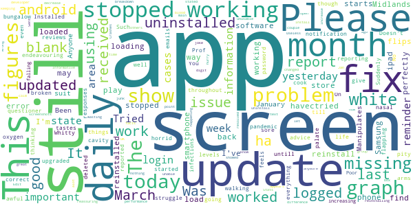

> White screen of doom - I get through to the 'report today' screen very very briefly then it disappears and I get a blank white screen. Clearly not an issue just with my phone or my account by the look of other comments. I've reported daily for months and am disappointed not to be able to continue.  :date: __2021-01-01 18:10:10__

> The app has stopped working today. It launches for a split second and then the screen goes all white. Update 1 Jan, it's working now.  :date: __2021-01-01 14:49:27__

> I am now unable to open the app despite uninstalling then reinstalling many times. It now works .. 12 MD 01 01 21  :date: __2021-01-01 13:19:08__

> No updated often enough  :date: __2021-01-01 11:34:07__

> I have to say I'm really pissed off with this. There was a fault and it stopped working for a while, now I'm getting emails asking me to reinstall but with no link in the email (a no reply email address!). When you think Facebook manages literally billions of accounts, fully indexed and cross referenced, and these clowns can't cope with a simple database.... I'm doing something else instead  :date: __2020-12-31 15:41:45__

> Have been an enthusiastic user but sadly Tim Spector is misusing his data to make dangerous pronouncements. There are now better more accurate data sources available so the job here has been done...at this point users are just potential customers for Zoe's diet plans.  :date: __2020-12-31 15:22:05__

> The app is broken... Loads to a white screen.. Deleted and reloaded... Sign in then opens to a white blank screen again, unable to fill in any details...  :date: __2020-12-29 11:02:43__

> COVID data for my region is out of alignment with PHE and worryingly the app shows a fall of ~500 from last week and PHE showing a rise of 158 (~39%). True the figures shown widely disagree but the trends should be consistent. The app appears to be making the area looking better than national statistics suggest. Is there a way to get the app to show both?  :date: __2020-12-28 08:12:31__

> HELP! I've been logging every day but today after the 'splash' screen I just get an empty white screen and I can't do anything. Tried killing the app and restarting, uninstalling and re-installing but still no luck.  :date: __2020-12-24 12:11:50__

> Won't let me enter previous Covid test info so can't use app. Obviously bug in it or an issue with my One Plus 6 phone??  :date: __2020-12-23 19:09:33__

# NHS 24 : Covid-19 and flu information
App version ``2.0.1``

Analyzed with [covid-apps-observer](http://github.com/covid-apps-observer) project, version ``0.1``

## App overview
| | |
|-------------------------|-------------------------| 
| **Name**&nbsp;&nbsp;&nbsp;&nbsp;&nbsp;&nbsp;&nbsp;&nbsp;&nbsp;&nbsp;&nbsp;&nbsp;&nbsp;&nbsp;&nbsp;&nbsp;&nbsp;&nbsp;&nbsp;&nbsp;&nbsp;&nbsp;&nbsp;&nbsp;&nbsp;&nbsp;&nbsp;&nbsp;&nbsp;&nbsp;&nbsp;&nbsp;&nbsp;&nbsp;&nbsp;&nbsp;&nbsp;&nbsp;&nbsp;&nbsp;  | NHS 24 : Covid-19 and flu information |
| **Unique identifier** | scot.nhs24.coronavirus |
| **Link to Google Play** | [https://play.google.com/store/apps/details?id=scot.nhs24.coronavirus](https://play.google.com/store/apps/details?id=scot.nhs24.coronavirus) |
| **Summary**  | Coronavirus info and flu vaccine guidance for people in Scotland |
| **Privacy policy** | [https://www.nhsinform.scot/privacy-and-cookies-policy](https://www.nhsinform.scot/privacy-and-cookies-policy) |
| **Latest version** | 2.0.1 |
| **Last update** | 2020-10-13 14:55:01 |
| **Recent changes** | Minor bug fixes |
| **Installs**  | 10,000+ |
| **Category** | Health & Fitness |
| **First release** | Apr 19, 2020 |
| **Size**  | 12M |
| **Supported Android version**  | 4.2 and up |

### Description
> Get the latest health information on coronavirus in Scotland and find out how and where to get your flu vaccination this winter.
 This app is owned and delivered by NHS 24

### User interface
The developers of the app provide the following screenshots in the Google play store.
| | | |
|:-------------------------:|:-------------------------:|:-------------------------:|
 |   |   |   | 
 | 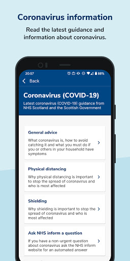  | 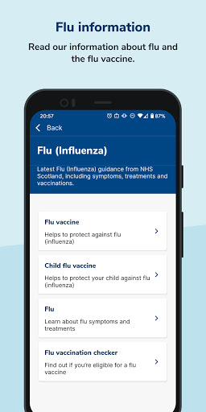  |   | 

## Development team
In the following we report the main information provided by the development team in the Google play store.

| | |
|-------------------------|-------------------------|
| **Developer**  | NHS24 |
| **Website**  | - |
| **Email** | ContentWorkRequest@nhs24.scot.nhs.uk |
| **Physical address**  | - |
| **Other developed apps**  | [https://play.google.com/store/apps/developer?id=NHS24](https://play.google.com/store/apps/developer?id=NHS24) |

## Android support

| | |
|-------------------------|-------------------------|
| **Declared target Android version**  | - |
| **Effective target Android version**  | - |
| **Minimum supported Android version**  | Jelly Bean, version 4.2.x (API level 17) |
| **Maximum target Android version**  | - |

The larger the difference between the minimum and maximum supported Android versions, the better. A larger difference means a wider audience. For example, old phones have a very low Android version, so a high minimum supported Android version means that the app cannot be used by users with old phones, thus leading to accessibility problems. 

## Requested permissions

In the following we report the complete list of the permissions requested by the app. 

| **Permission** | **Protection level** | **Description** | 
|-------------------------|-------------------------|-------------------------|
 **android.permission ACCESS_NETWORK_STATE** | Normal | Allows applications to access information about networks. 
 **android.permission INTERNET** | Normal | Allows applications to open network sockets. 
 **android.permission WAKE_LOCK** | Normal | Allows using PowerManager WakeLocks to keep processor from sleeping or screen from dimming. 
 **com.google.android.c2dm.permission RECEIVE** | - | - 

## Mentioned servers

| **Server** | **Registrant** | **Registrant country** | **Creation date** | 
|-------------------------|-------------------------|-------------------------|-------------------------|
 | google.com | Google LLC | :us: US | 1997-09-15 04:00:00 |
 | w3.org | W3C | :us: US | 1994-07-06 04:00:00 |

## Security analysis 

Below we report the main security warnings raised by our execution of the [Androwarn](https://github.com/maaaaz/androwarn) security analysis tool.

**Telephony identifiers leakage**
> - This application reads the ISO country code equivalent of the current registered operator's MCC (Mobile Country Code) 

**Connection interfaces exfiltration**
> - This application reads details about the currently active data network 

**Suspicious connection establishment**
> - This application opens a Socket and connects it to the remote address '' on the 'N/A' port  
> - This application opens a Socket and connects it to the remote address 'Ljava/lang/StringBuilder;->toString()Ljava/lang/String;' on the 'N/A' port  
> - This application opens a Socket and connects it to the remote address 'Ljava/net/Proxy;->type()Ljava/net/Proxy$Type;' on the 'N/A' port  
> - This application opens a Socket and connects it to the remote address 'timeout' on the 'N/A' port  

**Pim data leakage**
> - This application accesses data stored in the clipboard 

**Code execution**
> - This application loads a native library: 'flutter' 

## User ratings and reviews

Below we provide information about how end users are reacting to the app in terms of ratings and reviews in the Google Play store.

### Ratings

The NHS 24 : Covid-19 and flu information app has been installed by more than **10000** times. At this time, **53** rated the app and its average score is **3.2075472**. Below we show the distribution of the ratings across the usual star-based rating of Google Play

:star::star::star::star::star:: 21

:star::star::star::star:: 7

:star::star::star:: 5

:star::star:: 2

:star:: 18

### Reviews 

#### 5-star reviews

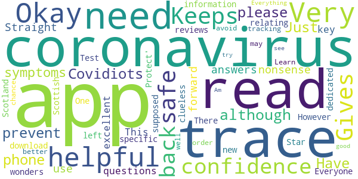

> Straight forward to use and no nonsense answers to questions  :date: __2020-09-29 22:57:54__

> This is an excellent app with key information relating to coronavirus. Everyone should download it. However, for all of the clueless wonders out there who cannot read and have left it One Star reviews because it doesn't trace, it's not supposed to trace. There is a specific, dedicated app for 'Test & Protect' in Scotland, and that is the new Scottish tracking app. Learn to read, and you may well have a better chance of doing what you need to do in order to avoid coronavirus.  :date: __2020-09-24 18:39:42__

> Everything you need  :date: __2020-07-31 14:49:51__

> Am just about to try to see how good it is!  :date: __2020-05-29 12:27:51__

#### 4-star reviews

> I am in England not Scotland  :date: __2020-09-27 22:41:55__

> Just hope that this app works well for all of us if not we'll all in big trouble.  :date: __2020-09-26 13:18:41__

> Can this app notify me for other people who have covid  :date: __2020-09-24 19:20:35__

#### 3-star reviews

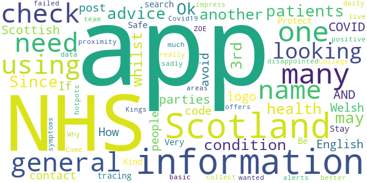

> Ok  :date: __2020-10-24 12:35:36__

> Since there's so many NHS apps, one general for patients who may need advice for their condition, another for general health information, whilst so many 3rd parties are using their logo, can NHS not name this Scottish app with Scotland AND COVID-19 in the name so the English and Welsh people can avoid this one?  :date: __2020-09-25 15:59:44__

> How do i check using post code  :date: __2020-09-24 13:19:39__

> If you are looking for the contact tracing app you need to search for Protect Scotland - this is not the app you are looking for. Stay Safe, Be Kind.  :date: __2020-09-10 12:15:04__

> Very disappointed with this app, very very basic, no proximity alerts, no information where positive areas are. I really wanted this app to impress me but sadly has failed. Why not just team up with the Kings College / ZOE Covid19 app as this has more information on where the hotpots are and offers you daily check-in for symptoms to collect live data. Come on NHS Scotland you can do much better than this!  :date: __2020-09-03 17:22:15__

#### 2-star reviews

> Nothing new here  :date: __2020-09-27 16:01:55__

> Do not think a lot of this app  :date: __2020-09-24 09:18:39__

#### 1-star reviews

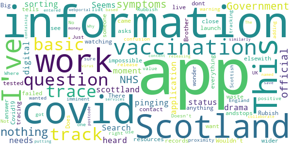

> There is no track and trace, if this isn't it then where is it?  :date: __2020-12-18 17:52:56__

> Rubish it does not work andstops everything elsewith failed to launch  :date: __2020-10-09 14:01:12__

> This is too basic, and tells you nothing about covid-19 nor its wider symptoms. It just asks those 3 questions. I wonder if this is just a waste of resources.  :date: __2020-10-05 02:00:49__

> Wouldn't work  :date: __2020-10-04 23:13:02__

> Big Brother is watching you!  :date: __2020-09-29 04:12:08__

> I couldn't see anything about contact tracing if I came close to someone who tested positive. Just a lidt of symptoms  :date: __2020-09-28 21:45:06__

> no use at all  :date: __2020-09-27 20:36:00__

> This is for Scotland not England  :date: __2020-09-24 22:04:32__

> Not sure I've got the right app I wanted the track and trace one  :date: __2020-09-24 19:30:42__

> Doesn't work.  :date: __2020-09-24 11:14:25__

# COVID-19 Sounds
App version ``1.1.19``

Analyzed with [covid-apps-observer](http://github.com/covid-apps-observer) project, version ``0.1``

## App overview
| | |
|-------------------------|-------------------------| 
| **Name**&nbsp;&nbsp;&nbsp;&nbsp;&nbsp;&nbsp;&nbsp;&nbsp;&nbsp;&nbsp;&nbsp;&nbsp;&nbsp;&nbsp;&nbsp;&nbsp;&nbsp;&nbsp;&nbsp;&nbsp;&nbsp;&nbsp;&nbsp;&nbsp;&nbsp;&nbsp;&nbsp;&nbsp;&nbsp;&nbsp;&nbsp;&nbsp;&nbsp;&nbsp;&nbsp;&nbsp;&nbsp;&nbsp;&nbsp;&nbsp;  | COVID-19 Sounds |
| **Unique identifier** | uk.ac.cam.cl.covid19sounds |
| **Link to Google Play** | [https://play.google.com/store/apps/details?id=uk.ac.cam.cl.covid19sounds](https://play.google.com/store/apps/details?id=uk.ac.cam.cl.covid19sounds) |
| **Summary**  | Contribute your cough and voice sounds for research into COVID-19. |
| **Privacy policy** | [http://covid-19-sounds.org/privacy.html](http://covid-19-sounds.org/privacy.html) |
| **Latest version** | 1.1.19 |
| **Last update** | 2020-10-15 19:20:46 |
| **Recent changes** | scroll bar highliting |
| **Installs**  | 10,000+ |
| **Category** | Education |
| **First release** | Mar 25, 2020 |
| **Size**  | 3.4M |
| **Supported Android version**  | 5.0 and up |

### Description
> This app is part of a research project at the University of Cambridge. The aim of this research is to develop machine learning algorithms to automatically detect if a person is suffering of COVID-19, based primarily on sounds of their voice, their breathing and coughing. 
 In order to enable this research we are launching a large scale, crowdsourced data collection through a mobile app. The app will collect some basic demographics and medical history data, as well as some voice samples (while you read text on the screen) through a questionnaire and a few seconds of breathing and coughing through the phone microphone. We will additionally collect one location sample. The app will also ask if you have tested positive for the virus. The app won't be tracking you and only collect this data when you actively interact with it. 
 The data will be stored on University servers and be used solely for research purposes. We hope to release the dataset we are collecting to other researchers after the initial analysis. 
 The app will not give medical advice and any reports of symptoms will not be responded to by medical assistance.
 This app is available in English, Spanish, French, German, Hindi, Greek, Portuguese, Russian, Italian, and Chinese.

### User interface
The developers of the app provide the following screenshots in the Google play store.
| | | |
|:-------------------------:|:-------------------------:|:-------------------------:|
 |   | 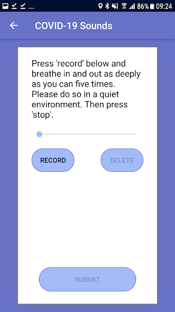  | 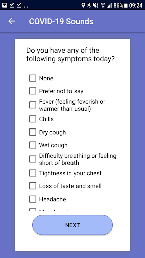  | 
 |  

## Development team
In the following we report the main information provided by the development team in the Google play store.

| | |
|-------------------------|-------------------------|
| **Developer**  | cam-cl-mobile-systems |
| **Website**  | [http://covid-19-sounds.org](http://covid-19-sounds.org) |
| **Email** | covid19sounds@gmail.com |
| **Physical address**  | - |
| **Other developed apps**  | [https://play.google.com/store/apps/developer?id=cam-cl-mobile-systems](https://play.google.com/store/apps/developer?id=cam-cl-mobile-systems) |

## Android support

| | |
|-------------------------|-------------------------|
| **Declared target Android version**  | Android10, version 10 (API level 29) |
| **Effective target Android version**  | Android10, version 10 (API level 29) |
| **Minimum supported Android version**  | Lollipop, version 5.0 (API level 21) |
| **Maximum target Android version**  | - |

The larger the difference between the minimum and maximum supported Android versions, the better. A larger difference means a wider audience. For example, old phones have a very low Android version, so a high minimum supported Android version means that the app cannot be used by users with old phones, thus leading to accessibility problems. 

## Requested permissions

In the following we report the complete list of the permissions requested by the app. 

| **Permission** | **Protection level** | **Description** | 
|-------------------------|-------------------------|-------------------------|
 **android.permission ACCESS_COARSE_LOCATION** | :warning:**Dangerous** | Allows an app to access approximate location. 
 **android.permission ACCESS_NETWORK_STATE** | Normal | Allows applications to access information about networks. 
 **android.permission ACCESS_WIFI_STATE** | Normal | Allows applications to access information about Wi-Fi networks. 
 **android.permission AUTHENTICATE_ACCOUNTS** | - | - 
 **android.permission GET_ACCOUNTS** | :warning:**Dangerous** | Allows access to the list of accounts in the Accounts Service. 
 **android.permission INTERNET** | Normal | Allows applications to open network sockets. 
 **android.permission READ_SYNC_SETTINGS** | Normal | Allows applications to read the sync settings. 
 **android.permission READ_SYNC_STATS** | Normal | Allows applications to read the sync stats. 
 **android.permission RECORD_AUDIO** | :warning:**Dangerous** | Allows an application to record audio. 
 **android.permission WRITE_SYNC_SETTINGS** | Normal | Allows applications to write the sync settings. 
 **com.samsung.android.providers.context.permission WRITE_USE_APP_FEATURE_SURVEY** | - | - 

## Mentioned servers

| **Server** | **Registrant** | **Registrant country** | **Creation date** | 
|-------------------------|-------------------------|-------------------------|-------------------------|
 | google.com | Google LLC | :us: US | 1997-09-15 04:00:00 |
 | googleapis.com | Google LLC | :us: US | 2005-01-25 17:52:26 |

## Security analysis 

Below we report the main security warnings raised by our execution of the [Androwarn](https://github.com/maaaaz/androwarn) security analysis tool.

**Connection interfaces exfiltration**
> - This application reads details about the currently active data network 
> - This application tries to find out if the currently active data network is metered 

**Suspicious connection establishment**
> - This application opens a Socket and connects it to the remote address 'Lcz/msebera/android/httpclient/HttpHost;->getPort()I' on the 'Lcz/msebera/android/httpclient/HttpHost;->getPort()I' port  

## User ratings and reviews

Below we provide information about how end users are reacting to the app in terms of ratings and reviews in the Google Play store.

### Ratings

The COVID-19 Sounds app has been installed by more than **10000** times. At this time, **72** rated the app and its average score is **3.8611112**. Below we show the distribution of the ratings across the usual star-based rating of Google Play

:star::star::star::star::star:: 43

:star::star::star::star:: 7

:star::star::star:: 4

:star::star:: 5

:star:: 13

### Reviews 

#### 5-star reviews

> I wasn't able to answer my covid test results are pending... but overall a great app  :date: __2020-12-13 20:06:00__

> The verification page with the user id has a broken link. Its not closed so if you click anywhere after the link, it clicks the link. Great app! I hope they are able to collect enough data to do what they want.  :date: __2020-11-10 20:11:56__

> Great easy to use app. One day could lead to great things.  :date: __2020-11-03 18:29:57__

> Easy to use, hopefully helpful.  :date: __2020-09-02 04:49:31__

> Great easy app I'm sure it will be extremely useful long term  :date: __2020-08-08 09:23:57__

> 👍👍👍👍👍 this app is very useful. Thanks for this ideya. 😉😉👍👍👍👍👍  :date: __2020-07-18 12:42:37__

> how I'll know my result  :date: __2020-05-22 00:35:52__

> Great idea, all the best with this app, hope we can win over Covid-19!  :date: __2020-04-13 21:34:53__

#### 4-star reviews

No recent reviews available with 4 stars.

#### 3-star reviews

No recent reviews available with 3 stars.

#### 2-star reviews

> So, well, this app only gets your data: you send your talk, your cough, your data, and that's it. It gives you back nothing. You contribute to science. The problem here is: why don't they give me back the result of my data, based on the data they accumulated? This is not fair, no matter how much the data is valuable/correct. Just give me the output, even if just for curiosity. You state that the app is 98% correct. So there's no reason to be so shy. Also: this app would render the swab completely useless. Maybe the app doesn't give back the results so to not destroy the market of a perfectly useless device like the swab? I can see no other reason.  :date: __2020-12-31 18:10:40__

> The app asked me to complete the same survey every morning. I would have been happy to provide weekly responses, but found daily prompts too stressful given my very limited understanding of how this might help.  :date: __2020-11-27 18:27:29__

#### 1-star reviews

> I cant open it  :date: __2020-10-20 00:37:26__

# NHS App
App version ``1.43.0``

Analyzed with [covid-apps-observer](http://github.com/covid-apps-observer) project, version ``0.1``

## App overview
| | |
|-------------------------|-------------------------| 
| **Name**&nbsp;&nbsp;&nbsp;&nbsp;&nbsp;&nbsp;&nbsp;&nbsp;&nbsp;&nbsp;&nbsp;&nbsp;&nbsp;&nbsp;&nbsp;&nbsp;&nbsp;&nbsp;&nbsp;&nbsp;&nbsp;&nbsp;&nbsp;&nbsp;&nbsp;&nbsp;&nbsp;&nbsp;&nbsp;&nbsp;&nbsp;&nbsp;&nbsp;&nbsp;&nbsp;&nbsp;&nbsp;&nbsp;&nbsp;&nbsp;  | NHS App |
| **Unique identifier** | com.nhs.online.nhsonline |
| **Link to Google Play** | [https://play.google.com/store/apps/details?id=com.nhs.online.nhsonline](https://play.google.com/store/apps/details?id=com.nhs.online.nhsonline) |
| **Summary**  | Access NHS services in England |
| **Privacy policy** | [https://www.nhs.uk/using-the-nhs/nhs-services/the-nhs-app/privacy/](https://www.nhs.uk/using-the-nhs/nhs-services/the-nhs-app/privacy/) |
| **Latest version** | 1.43.0 |
| **Last update** | 2020-12-18 10:07:49 |
| **Recent changes** | Improvements  We have made some changes to make unread messages more visible Bug fixes, and various performance, stability and accessibility enhancements |
| **Installs**  | 1,000,000+ |
| **Category** | Medical |
| **First release** | Dec 31, 2018 |
| **Size**  | 58M |
| **Supported Android version**  | 5.0 and up |

### Description
> <b>This is not the NHS COVID-19 app. To download the NHS COVID-19 contact tracing app, go to covid19.nhs.uk</b>
 Owned and run by the NHS, the NHS App is a simple and secure way to access a range of NHS services on your smartphone or tablet.
 To use the NHS App you must be aged 13 and over and registered with a GP surgery in England.
 You can also access NHS App services from the browser on your desktop or laptop computer. Go to www.nhs.uk/app
 Use the NHS App to:
 •	get advice about coronavirus
 •	order your repeat prescriptions
 •	book and manage appointments at your GP surgery
 •	get health information and advice
 •	view your health record securely
 •	register your organ donation decision
 •	find out how the NHS uses your data
 If your GP surgery or hospital offers other services in the NHS App, you may be able to:
 •	message your GP surgery, doctor or health professional online
 •	consult a GP or health professional through an online form and get a reply
 •	access health services on behalf of someone you care for
 •	view your hospital and other healthcare appointments
 •	view useful links your doctor or health professional has shared with you
 •	view and manage your care plans
 Get advice about coronavirus 
 ---------------------------------------
 Get information about coronavirus and find out what to do if you think you have it.
 Order repeat prescriptions 
 -----------------------------------
 See your available medicines, request a new repeat prescription and choose a pharmacy for your prescriptions to be sent to.
 Book appointments
 --------------------------
 Search for, book and cancel appointments at your GP surgery. See details of your upcoming and past appointments.
 Get health advice
 -----------------------------
 Search trusted NHS information and advice on hundreds of conditions and treatments. You can also answer questions to get instant advice or medical help near you. 
 View your health record
 ----------------------------------
 Securely access your GP health record, to see information like your allergies and your current and past medicines. If your GP surgery has given you access to your detailed medical record, you can also see information like test results and details of your consultations. 
 Register your organ donation decision
 --------------------------------------------------
 Choose to donate some or all of your organs and check your registered decision.
 Find out how the NHS uses your data
 -------------------------------------------------
 Choose if data from your health records is shared for research and planning.
 Keeping your data secure
 ---------------------------------
 After you download the app, you will need to set up an NHS login and prove who you are. The app then securely connects to information from your GP surgery. 
 If your Android device supports fingerprint detection, you can use it to log in to the NHS App each time, instead of using a password and security code.

### User interface
The developers of the app provide the following screenshots in the Google play store.
| | | |
|:-------------------------:|:-------------------------:|:-------------------------:|
 |   |   |   | 
 |   |   |   | 
 |   |   |   | 
 |   |   |   | 
 |   |   |   | 
 |   |   |   | 

## Development team
In the following we report the main information provided by the development team in the Google play store.

| | |
|-------------------------|-------------------------|
| **Developer**  | NHS Digital |
| **Website**  | [https://www.nhs.uk/using-the-nhs/nhs-services/the-nhs-app/help/](https://www.nhs.uk/using-the-nhs/nhs-services/the-nhs-app/help/) |
| **Email** | nhsapp@nhs.net |
| **Physical address**  | - |
| **Other developed apps**  | [https://play.google.com/store/apps/developer?id=NHS+Digital](https://play.google.com/store/apps/developer?id=NHS+Digital) |

## Android support

| | |
|-------------------------|-------------------------|
| **Declared target Android version**  | Android10, version 10 (API level 29) |
| **Effective target Android version**  | Android10, version 10 (API level 29) |
| **Minimum supported Android version**  | Lollipop, version 5.0 (API level 21) |
| **Maximum target Android version**  | - |

The larger the difference between the minimum and maximum supported Android versions, the better. A larger difference means a wider audience. For example, old phones have a very low Android version, so a high minimum supported Android version means that the app cannot be used by users with old phones, thus leading to accessibility problems. 

## Requested permissions

In the following we report the complete list of the permissions requested by the app. 

| **Permission** | **Protection level** | **Description** | 
|-------------------------|-------------------------|-------------------------|
 **android.permission ACCESS_FINE_LOCATION** | :warning:**Dangerous** | Allows an app to access precise location. 
 **android.permission ACCESS_NETWORK_STATE** | Normal | Allows applications to access information about networks. 
 **android.permission CAMERA** | :warning:**Dangerous** | Required to be able to access the camera device. 
 **android.permission INTERNET** | Normal | Allows applications to open network sockets. 
 **android.permission MODIFY_AUDIO_SETTINGS** | Normal | Allows an application to modify global audio settings. 
 **android.permission NFC** | Normal | Allows applications to perform I/O operations over NFC. 
 **android.permission READ_EXTERNAL_STORAGE** | :warning:**Dangerous** | Allows an application to read from external storage. 
 **android.permission READ_PHONE_STATE** | :warning:**Dangerous** | Allows read only access to phone state, including the phone number of the device, current cellular network information, the status of any ongoing calls, and a list of any PhoneAccounts registered on the device. 
 **android.permission RECORD_AUDIO** | :warning:**Dangerous** | Allows an application to record audio. 
 **android.permission USE_FINGERPRINT** | Normal | This constant was deprecated in API level 28. Applications should request USE_BIOMETRIC instead 
 **android.permission WAKE_LOCK** | Normal | Allows using PowerManager WakeLocks to keep processor from sleeping or screen from dimming. 
 **android.permission WRITE_EXTERNAL_STORAGE** | :warning:**Dangerous** | Allows an application to write to external storage. 
 **com.google.android.c2dm.permission RECEIVE** | - | - 
 **com.google.android.finsky.permission BIND_GET_INSTALL_REFERRER_SERVICE** | - | - 
 **org.fidoalliance.uaf.permissions FIDO_CLIENT** | - | - 

## Mentioned servers

| **Server** | **Registrant** | **Registrant country** | **Creation date** | 
|-------------------------|-------------------------|-------------------------|-------------------------|
 | googlesyndication.com | Google LLC | :us: US | 2003-01-21 06:17:24 |
 | google.com | Google LLC | :us: US | 1997-09-15 04:00:00 |
 | app-measurement.com | Google LLC | :us: US | 2015-06-19 20:13:31 |

## Security analysis 

Below we report the main security warnings raised by our execution of the [Androwarn](https://github.com/maaaaz/androwarn) security analysis tool.

**Connection interfaces exfiltration**
> - This application reads details about the currently active data network 

**Telephony services abuse**
> - This application makes phone calls 

**Suspicious connection establishment**
> - This application opens a Socket and connects it to the remote address '; port is out of range' on the 'N/A' port  
> - This application opens a Socket and connects it to the remote address 'Lc/b/b/a/a;->w(Ljava/lang/String;)Ljava/lang/StringBuilder;' on the 'N/A' port  
> - This application opens a Socket and connects it to the remote address 'Ljava/net/Proxy;->type()Ljava/net/Proxy$Type;' on the 'N/A' port  
> - This application opens a Socket and connects it to the remote address 'timeout' on the 'N/A' port  

**Code execution**
> - This application loads a native library: 'DocumentCropper' 
> - This application loads a native library: 'Integrity' 
> - This application loads a native library: 'Liveness' 
> - This application loads a native library: 'Ocr' 
> - This application loads a native library: 'Preflight' 
> - This application loads a native library: 'Quality' 
> - This application loads a native library: 'gnustl_shared' 
> - This application loads a native library: 'lept' 
> - This application loads a native library: 'opencv_java3' 
> - This application loads a native library: 'tensorflow_inference' 
> - This application loads a native library: 'tensorflow_jni' 
> - This application loads a native library: 'tess' 

## User ratings and reviews

Below we provide information about how end users are reacting to the app in terms of ratings and reviews in the Google Play store.

### Ratings

The NHS App app has been installed by more than **1000000** times. At this time, **5633** rated the app and its average score is **3.4485815**. Below we show the distribution of the ratings across the usual star-based rating of Google Play

:star::star::star::star::star:: 2668

:star::star::star::star:: 689

:star::star::star:: 369

:star::star:: 319

:star:: 1588

### Reviews 

#### 5-star reviews

> This App is very handy and easy to navigate. I can order prescriptions and collect at the surgery. I can view my records and much more.  :date: __2021-01-03 15:30:51__

> Can i add my husband to this so i can order his repeat prescriptions aswell  :date: __2021-01-03 13:14:48__

> I've used this app for a year and it's great. No problems with the exception of the odd logging in problem.  :date: __2021-01-03 00:18:06__

> Works fine  :date: __2021-01-02 11:41:37__

> A fab idea helpful and possible life saver a fantastic helpful site these people are brilliant😇😇😇😇😇😇  :date: __2021-01-01 22:36:19__

> Very positive. Shows appointments and issues, also vaccination record for 20+ years which is very helpful  :date: __2021-01-01 14:42:45__

> I work NHS  :date: __2021-01-01 02:22:59__

> Very good.  :date: __2020-12-31 22:57:54__

> So far have not been contacted bug info very good on here to keep up to date.  :date: __2020-12-31 22:47:19__

> Excellent service  :date: __2020-12-31 03:51:31__

#### 4-star reviews

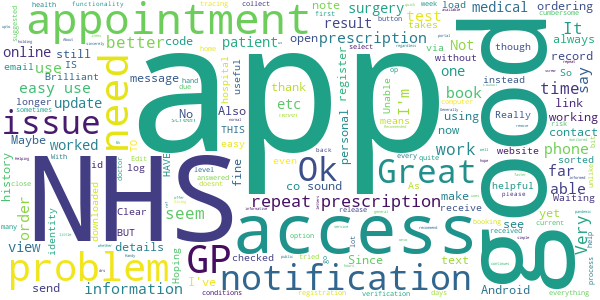

> I cannot receive any of the letters that I am informed Mk hospital patient portal need to send to me.??why not just send as a normal text message that don't need a code to open?  :date: __2021-01-02 16:23:45__

> Very useful for repeat prescriptions and easy to use  :date: __2021-01-02 10:38:00__

> Helping NHS to get better, faster at Giving a good service  :date: __2021-01-02 01:00:03__

> Good  :date: __2021-01-01 15:09:17__

> Brilliant app but all prescription items whether repeat or not should be available to order via the app - they're all monitored by the surgery regardless of the means to order them. Also should be a means for us to message the drs instead of having to log onto the website. Really helpful having the remote access and I sincerely hope this continues after this pandemic  :date: __2020-12-28 12:00:36__

> Does not work always  :date: __2020-12-26 04:28:48__

> Generally good  :date: __2020-12-25 11:53:27__

> Good little app.... Hoping the updates do not screw it up Note to developer test the updates before releasing it  :date: __2020-12-23 15:52:07__

> Updated: I downloaded a later version of the app and was able to authenticate without issues, so all good now. Unable to load video as Camcorder goes to files only  :date: __2020-12-22 16:11:34__

> Clear information  :date: __2020-12-19 21:29:17__

#### 3-star reviews

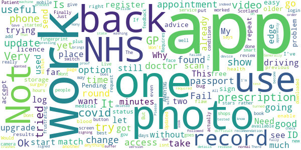

> There one problem with trying register with this the photo ID proof has to be a driving licence or passport and for those that don't have one these it become difficult indeed.  :date: __2020-12-31 01:30:11__

> Useful app  :date: __2020-12-23 12:39:05__

> Followed advice & deleted 2 older apps to free up storage. Tried again. It is still in a "Pending" status. All my other apps work, the only one trying to update is NHS. It's NHS update Got a recommendation to upgrade the app but all you see is the "washing machine" going round, and round, and round..... still in a pending state and you cannot go back and use the previous version. Wanted to check a medical appointment but now can't. Does not look like this upgrade release has been fully tested!!  :date: __2020-12-18 16:47:56__

> Needs more details Why I can't see my health records like blood test results or scan results or even what is the problem that I suffer Please put that in the App That's right of our rights as patients,  :date: __2020-12-18 12:33:42__

> I have not used it much yet don't know how good it is.  :date: __2020-12-17 17:40:41__

> Generally the app is very good but I've found one "flaw" and one bug Bug: If you try to re-enable fingerprint access, after it has apparently been turned off due to "a change" on my device, the app crashes as soon as I slide the "enable fingerprint" switch. Flaw: pressing the back button brings up the option to log out, rather than just take me back a screen as is more normal. Fix is to reinstall the app. Samsung S7 edge.  :date: __2020-12-17 01:53:09__

> Finally let me log in but no records, repeat prescriptions or anything show. I can't book a GP appointment. My GP records don't show my personal changes in records.  :date: __2020-12-15 16:39:50__

> Is there an NHS app for Scotland. I tried to register using the app but it does not recognise the information because I reside in Scotland not England.  :date: __2020-12-11 15:24:06__

> Not used yet  :date: __2020-12-10 12:24:17__

> Having trouble verifing my I. D, try to take a video but it takes me to files not video. Already messaged about this but none of advice worked. Very frustrating as it also kicks me off the site so have to log back in all the time.  :date: __2020-12-08 17:31:23__

#### 2-star reviews

> Can't get past photo upload  :date: __2021-01-03 11:45:49__

> Not working on my phone  :date: __2020-12-31 01:25:35__

> The app crashes every time I try to see my full medical history. I've tried resetting the app and still having problems.  :date: __2020-12-24 14:57:31__

> The consultation form asks like 50 unrelevant questions before you can actually submit consultation form. This app was much better when I used it few months ago.  :date: __2020-12-16 21:48:56__

> Cannot find out how to order repeat prescription  :date: __2020-12-16 18:59:17__

> After settling into using the app for Months, suddenly without reason or warning my online delivery pharmacist was changed to a "collect only" service from a village chemist miles away. The restoration of normal service was a pain in the ass & only possible by re registration on my chosen chemist's website. It seems to have begun, though its not confirmed. As an interim, prescriptions will be delivered to a chemist shop nearer my home. Why mess about like this!?? Is the app or NHS at fault?  :date: __2020-12-15 22:29:00__

> Currently refuses to open on my device. Sits on the opening screen with the round 'loading' thing going and just doesn't open. Please sort it out.  :date: __2020-12-13 14:59:51__

> System online for GP surgeries is more effective and easier to use.  :date: __2020-12-13 11:03:34__

> Still can't book appointmemts  :date: __2020-12-11 07:53:30__

> Trying to prove my identity with this app was a nightmare. Whenever I got to the point to upload an image, for sending photo id, to take a photo or upload a video, nothing happened when i tapped the camera icon! Seems certain random aspects of things on PHE/NHS apps don't seem to work on a Huawei P20! In the end i had to complete the registration process using an old SAMSUNG phone! BEyond that, everything seems fine.  :date: __2020-12-09 14:45:05__

#### 1-star reviews

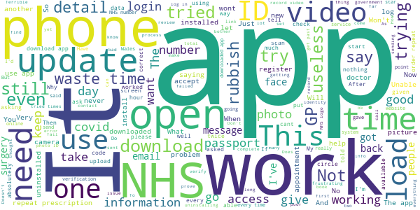

> Terrible do not use files info can be used  :date: __2021-01-02 19:41:48__

> I've spent more than an hour trying to get this app to work. As others have reported it is impossible to take a photo of one's face or record a video of one's face. A complete waste of time. Dreadfull.  :date: __2021-01-02 15:57:09__

> Need too buy a new phone - inop on A5  :date: __2021-01-02 14:40:06__

> Not user friendly  :date: __2021-01-01 16:29:24__

> Asked local surgery for required information. (Account ID, ODS and Linkage Key). Surgery manager said they had no idea what these numbers were and couldn't give me any details.  :date: __2021-01-01 15:14:39__

> Terrible app it keeps freezing.  :date: __2021-01-01 12:21:35__

> Apparently my face isn't mine. The process to upload photo and video and external enter the personal details including nhs no is so long winded that I'm not sure I can be bothered to try again!  :date: __2020-12-31 20:26:13__

> Absolute pants!! Can't open camcorder to record the video required to complete registration. Very frustrating!!! After receiving a reply, thankyou very much, neither myself nor my husband can solve the issue! Therefore sadly l had to uninstall the app. Will try again next month in the hope it will work.  :date: __2020-12-31 15:00:35__

> Clunky and hard to use.  :date: __2020-12-31 12:04:41__

> What a Complete waste of time. You spend 20mins adding every known detail you have on the website only to be told you don't exist. So you will have to visit your Dr who will ask yet more questions. Then, you have to go back to this rubbish and try it all again. Except it does the same bloody thing again. Then you discover it's linked to the "patient access service". Well now I know why it's so totally useless.... Their response to this review will be the same one they paste for all poor reviews.  :date: __2020-12-30 23:34:58__

# C19 Control
App version ``1.4.0``

Analyzed with [covid-apps-observer](http://github.com/covid-apps-observer) project, version ``0.1``

## App overview
| | |
|-------------------------|-------------------------| 
| **Name**&nbsp;&nbsp;&nbsp;&nbsp;&nbsp;&nbsp;&nbsp;&nbsp;&nbsp;&nbsp;&nbsp;&nbsp;&nbsp;&nbsp;&nbsp;&nbsp;&nbsp;&nbsp;&nbsp;&nbsp;&nbsp;&nbsp;&nbsp;&nbsp;&nbsp;&nbsp;&nbsp;&nbsp;&nbsp;&nbsp;&nbsp;&nbsp;&nbsp;&nbsp;&nbsp;&nbsp;&nbsp;&nbsp;&nbsp;&nbsp;  | C19 Control |
| **Unique identifier** | com.elt.covid_android |
| **Link to Google Play** | [https://play.google.com/store/apps/details?id=com.elt.covid_android](https://play.google.com/store/apps/details?id=com.elt.covid_android) |
| **Summary**  | Record and monitor the C19 status for people being cared for and for care staff. |
| **Privacy policy** | [https://www.c19control.com/privacy-policy](https://www.c19control.com/privacy-policy) |
| **Latest version** | 1.4.0 |
| **Last update** | 2020-05-19 15:34:07 |
| **Recent changes** | Text changes and usability improvements |
| **Installs**  | 50+ |
| **Category** | Medical |
| **First release** | Apr 20, 2020 |
| **Size**  | 4.2M |
| **Supported Android version**  | 6.0 and up |

### Description
> C19 CONTROL is the fast and simple way for care providers to record and report COVID-19 status and PPE use on the frontline of care.  
  
 Care staff can view a list of people being cared for, and for each person they can record the advice given by the official NHS service in their region; the relevant symptoms; and the appropriate COVID-19 status.  Care Staff can also record their own Personal Protective Equipment (PPE) supply levels, giving their Care Managers a real-time view of PPE needs across their team.
 Care managers can use the app to record the COVID-19 status for each of their care staff, and can quickly add new people to the list of care receivers and care staff.  Care Managers can also record the overall PPE levels for the care service, to help when re-ordering stock.
 Using the C19 CONTROL web portal, care managers can set the dependency level of people being cared for and can run reports of COVID-19status and dependency level for people being cared for, and COVID-19 status and PPE levels for care staff.
 The data recorded by C19 CONTROL will help both care providers as well as local, regional and national government organisations to gain a better understanding of the cases of suspected or confirmed COVID-19 across health and social care systems so that they can better anticipate health needs and plan resource requirements.

### User interface
The developers of the app provide the following screenshots in the Google play store.
| | | |
|:-------------------------:|:-------------------------:|:-------------------------:|
 |   |   | 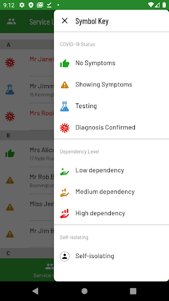  | 
 |   |   |   | 
 |   |   |   | 
 |   | 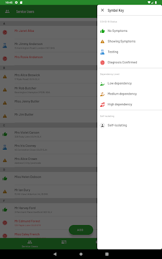  |   | 
 | 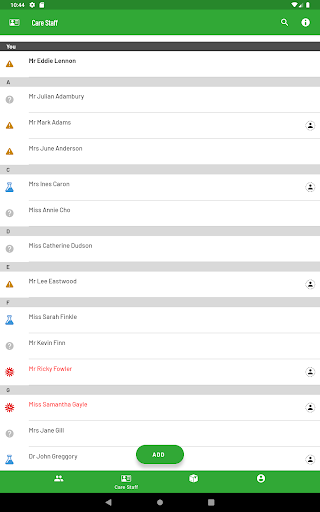  | 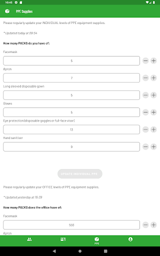  |   | 
 |   |   |   | 
 |   |   |   | 
 |  

## Development team
In the following we report the main information provided by the development team in the Google play store.

| | |
|-------------------------|-------------------------|
| **Developer**  | everyLIFE |
| **Website**  | [https://www.c19control.com/](https://www.c19control.com/) |
| **Email** | support@c19control.com |
| **Physical address**  | [A1, East Wing, Cody Technology Park, Ively Road, Farnborough, UK, GU14 0LX](https://www.google.com/maps/search/A1,%20East%20Wing,%20Cody%20Technology%20Park,%20Ively%20Road,%20Farnborough,%20UK,%20GU14%200LX) (Google Maps) |
| **Other developed apps**  | [https://play.google.com/store/apps/developer?id=everyLIFE](https://play.google.com/store/apps/developer?id=everyLIFE) |

## Android support

| | |
|-------------------------|-------------------------|
| **Declared target Android version**  | Android10, version 10 (API level 29) |
| **Effective target Android version**  | Android10, version 10 (API level 29) |
| **Minimum supported Android version**  | Marshmallow, version 6.0 (API level 23) |
| **Maximum target Android version**  | - |

The larger the difference between the minimum and maximum supported Android versions, the better. A larger difference means a wider audience. For example, old phones have a very low Android version, so a high minimum supported Android version means that the app cannot be used by users with old phones, thus leading to accessibility problems. 

## Requested permissions

In the following we report the complete list of the permissions requested by the app. 

| **Permission** | **Protection level** | **Description** | 
|-------------------------|-------------------------|-------------------------|
 **android.permission ACCESS_NETWORK_STATE** | Normal | Allows applications to access information about networks. 
 **android.permission CALL_PHONE** | :warning:**Dangerous** | Allows an application to initiate a phone call without going through the Dialer user interface for the user to confirm the call. 
 **android.permission INTERNET** | Normal | Allows applications to open network sockets. 
 **android.permission WAKE_LOCK** | Normal | Allows using PowerManager WakeLocks to keep processor from sleeping or screen from dimming. 
 **com.google.android.c2dm.permission RECEIVE** | - | - 
 **com.google.android.finsky.permission BIND_GET_INSTALL_REFERRER_SERVICE** | - | - 

## Mentioned servers

| **Server** | **Registrant** | **Registrant country** | **Creation date** | 
|-------------------------|-------------------------|-------------------------|-------------------------|
 | googleapis.com | Google LLC | :us: US | 2005-01-25 17:52:26 |
 | googlesyndication.com | Google LLC | :us: US | 2003-01-21 06:17:24 |
 | google.com | Google LLC | :us: US | 1997-09-15 04:00:00 |
 | app-measurement.com | Google LLC | :us: US | 2015-06-19 20:13:31 |
 | googleadservices.com | Google LLC | :us: US | 2003-06-19 16:34:53 |
 | crashlytics.com | Google LLC | :us: US | 2011-01-21 15:30:40 |
 | googleapis.com | Google LLC | :us: US | 2005-01-25 17:52:26 |
 | passgenius.com | - | GB | 2014-09-28 21:17:28 |

## Security analysis 

Below we report the main security warnings raised by our execution of the [Androwarn](https://github.com/maaaaz/androwarn) security analysis tool.

**Connection interfaces exfiltration**
> - This application reads details about the currently active data network 
> - This application tries to find out if the currently active data network is metered 

**Telephony services abuse**
> - This application makes phone calls 

**Suspicious connection establishment**
> - This application opens a Socket and connects it to the remote address ': ; port is out of range' on the 'N/A' port  
> - This application opens a Socket and connects it to the remote address 'Ld/c/a/a/a;->a(Ljava/lang/String;)Ljava/lang/StringBuilder;' on the 'N/A' port  
> - This application opens a Socket and connects it to the remote address 'Ljava/net/Proxy;->type()Ljava/net/Proxy$Type;' on the 'N/A' port  
> - This application opens a Socket and connects it to the remote address 'timeout' on the 'N/A' port  

## User ratings and reviews

Below we provide information about how end users are reacting to the app in terms of ratings and reviews in the Google Play store.

### Ratings

The C19 Control app has been installed by more than **50** times. At this time, **-** rated the app and its average score is **0.0**. Below we show the distribution of the ratings across the usual star-based rating of Google Play

:star::star::star::star::star:: 0

:star::star::star::star:: 0

:star::star::star:: 0

:star::star:: 0

:star:: 0

### Reviews 

#### 5-star reviews

> I care for my friends so I got this app  :date: __2020-12-27 19:53:18__

> Simple to use with a very easy to navigate set of menus.  :date: __2020-04-30 07:50:48__

#### 4-star reviews

No recent reviews available with 4 stars.

#### 3-star reviews

No recent reviews available with 3 stars.

#### 2-star reviews

No recent reviews available with 2 stars.

#### 1-star reviews

No recent reviews available with 1 stars.

# patientMpower for COVID-19
App version ``covid-19-1.4.3``

Analyzed with [covid-apps-observer](http://github.com/covid-apps-observer) project, version ``0.1``

## App overview
| | |
|-------------------------|-------------------------| 
| **Name**&nbsp;&nbsp;&nbsp;&nbsp;&nbsp;&nbsp;&nbsp;&nbsp;&nbsp;&nbsp;&nbsp;&nbsp;&nbsp;&nbsp;&nbsp;&nbsp;&nbsp;&nbsp;&nbsp;&nbsp;&nbsp;&nbsp;&nbsp;&nbsp;&nbsp;&nbsp;&nbsp;&nbsp;&nbsp;&nbsp;&nbsp;&nbsp;&nbsp;&nbsp;&nbsp;&nbsp;&nbsp;&nbsp;&nbsp;&nbsp;  | patientMpower for COVID-19 |
| **Unique identifier** | com.maithu.transplantbuddy.covid19 |
| **Link to Google Play** | [https://play.google.com/store/apps/details?id=com.maithu.transplantbuddy.covid19](https://play.google.com/store/apps/details?id=com.maithu.transplantbuddy.covid19) |
| **Summary**  | patientMpower COVID-19 Patient Management app |
| **Privacy policy** | [https://info.patientmpower.com/covid19-privacy-policy](https://info.patientmpower.com/covid19-privacy-policy) |
| **Latest version** | covid-19-1.4.3 |
| **Last update** | 2020-11-06 20:43:34 |
| **Recent changes** | - Show graphs after taking one measurement - Fixed bugs causing crashes |
| **Installs**  | 1,000+ |
| **Category** | Health & Fitness |
| **First release** | Mar 15, 2020 |
| **Size**  | 64M |
| **Supported Android version**  | 4.3 and up |

### Description
> The patientMpower for COVID-19 app is for people in the Republic of Ireland who have been enrolled in the COVID-19 remote monitoring programme by a healthcare professional. 
 The patientMpower for COVID-19 app will allow you to monitor your COVID-19 symptoms and  health information such as your oxygen levels and temperature whilst you are in self-isolation. This information will be shared confidentially with trained personnel at dedicated monitoring centres. They will be able to see your information immediately. Monitoring will enable healthcare professionals to assess if you are recovering well whilst in isolation or if you need additional support (e.g. extra treatments at home or if you need to go to hospital). 
 It is recommended that you consent to using location services after downloading this app. If you don’t want to consent to sharing your location you can continue to use the app. The location information will be de-identified and used for research into COVID-19. 
 KEY FEATURES
  - Monitors your oxygen saturation (using a device called a pulse oximeter), which is important to track to ensure you are recovering from COVID-19
  - Tracks your symptoms including breathlessness
  - Records details of relevant underlying conditions and your existing medications
  - Anonymised location monitoring, to help us understand trends of COVID-19 across Ireland and plan resources to best deliver healthcare
  - Confidential health data viewable in real time by healthcare professionals at monitoring centres
 patientMpower are an Irish digital health company who are experienced in providing home monitoring  platforms for people with lung conditions. If you need help installing the app or need any technical support please email support@patientMpower.com. 
 IMPORTANT: This app cannot provide medical intervention in the event of an emergency. If you experience a rapid worsening of symptoms or severe breathing difficulties please contact 999 or 112. 
 Privacy policy:
 https://info.patientmpower.com/covid19-privacy-policy

### User interface
The developers of the app provide the following screenshots in the Google play store.
| | | |
|:-------------------------:|:-------------------------:|:-------------------------:|
 |   |   |   | 
 | 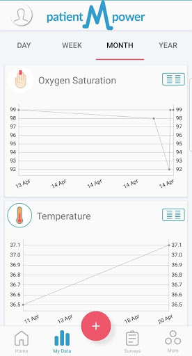  |   |   | 
 |  

## Development team
In the following we report the main information provided by the development team in the Google play store.

| | |
|-------------------------|-------------------------|
| **Developer**  | patientMpower |
| **Website**  | [https://info.patientmpower.com/](https://info.patientmpower.com/) |
| **Email** | info+covid-19@patientmpower.com |
| **Physical address**  | [The Digital Depot Thomas St Dublin D08 TCV4 Ireland](https://www.google.com/maps/search/The%20Digital%20Depot%20Thomas%20St%20Dublin%20D08%20TCV4%20Ireland) (Google Maps) |
| **Other developed apps**  | [https://play.google.com/store/apps/developer?id=patientMpower](https://play.google.com/store/apps/developer?id=patientMpower) |

## Android support

| | |
|-------------------------|-------------------------|
| **Declared target Android version**  | Android10, version 10 (API level 29) |
| **Effective target Android version**  | Android10, version 10 (API level 29) |
| **Minimum supported Android version**  | Jelly Bean, version 4.3.x (API level 18) |
| **Maximum target Android version**  | - |

The larger the difference between the minimum and maximum supported Android versions, the better. A larger difference means a wider audience. For example, old phones have a very low Android version, so a high minimum supported Android version means that the app cannot be used by users with old phones, thus leading to accessibility problems. 

## Requested permissions

In the following we report the complete list of the permissions requested by the app. 

| **Permission** | **Protection level** | **Description** | 
|-------------------------|-------------------------|-------------------------|
 **android.permission ACCESS_COARSE_LOCATION** | :warning:**Dangerous** | Allows an app to access approximate location. 
 **android.permission ACCESS_FINE_LOCATION** | :warning:**Dangerous** | Allows an app to access precise location. 
 **android.permission ACCESS_NETWORK_STATE** | Normal | Allows applications to access information about networks. 
 **android.permission BLUETOOTH** | Normal | Allows applications to connect to paired bluetooth devices. 
 **android.permission BLUETOOTH_ADMIN** | Normal | Allows applications to discover and pair bluetooth devices. 
 **android.permission CAMERA** | :warning:**Dangerous** | Required to be able to access the camera device. 
 **android.permission INTERNET** | Normal | Allows applications to open network sockets. 
 **android.permission READ_EXTERNAL_STORAGE** | :warning:**Dangerous** | Allows an application to read from external storage. 
 **android.permission RECEIVE_BOOT_COMPLETED** | Normal | Allows an application to receive the Intent.ACTION_BOOT_COMPLETED that is broadcast after the system finishes booting. 
 **android.permission VIBRATE** | Normal | Allows access to the vibrator. 
 **android.permission WAKE_LOCK** | Normal | Allows using PowerManager WakeLocks to keep processor from sleeping or screen from dimming. 
 **android.permission WRITE_EXTERNAL_STORAGE** | :warning:**Dangerous** | Allows an application to write to external storage. 
 **com.amazon.device.messaging.permission RECEIVE** | - | - 
 **com.google.android.c2dm.permission RECEIVE** | - | - 
 **com.google.android.finsky.permission BIND_GET_INSTALL_REFERRER_SERVICE** | - | - 
 **com.maithu.transplantbuddy.covid19.permission C2D_MESSAGE** | - | - 
 **com.maithu.transplantbuddy.covid19.permission RECEIVE_ADM_MESSAGE** | - | - 

## Mentioned servers

| **Server** | **Registrant** | **Registrant country** | **Creation date** | 
|-------------------------|-------------------------|-------------------------|-------------------------|
 | googlesyndication.com | Google LLC | :us: US | 2003-01-21 06:17:24 |
 | google.com | Google LLC | :us: US | 1997-09-15 04:00:00 |
 | facebook.com | Facebook, Inc. | :us: US | 1997-03-29 05:00:00 |
 | megsupporttools.com | - | IE | 2017-03-07 18:37:51 |
 | patientmpower.com | Patient Buddy | IE | 2016-04-06 17:01:49 |
 | app-measurement.com | Google LLC | :us: US | 2015-06-19 20:13:31 |
 | googleapis.com | Google LLC | :us: US | 2005-01-25 17:52:26 |
 | googleapis.com | Google LLC | :us: US | 2005-01-25 17:52:26 |
 | waqi.info | Contact Privacy Inc. Customer 0147459724 | :canada: CA | 2013-01-28 13:36:34 |
 | mixpanel.com | WhoisGuard, Inc. | PA | 2007-03-13 02:23:00 |
 | urbanairship.com | DNStination Inc. | :us: US | 2009-04-14 06:34:46 |
 | vimeo.com | Vimeo, Inc. | :us: US | 2004-12-15 08:38:55 |
 | crashlytics.com | Google LLC | :us: US | 2011-01-21 15:30:40 |
 | twitter.com | Twitter, Inc. | :us: US | 2000-01-21 16:28:17 |
 | intercomcdn.com | Whois Privacy Service | :us: US | 2013-04-25 22:04:57 |
 | wistia.net | Wistia | :us: US | 2008-09-02 18:42:09 |
 | youtube.com | Google LLC | :us: US | 2005-02-15 05:13:12 |
 | wistia.com | Wistia | :us: US | 2007-03-18 21:58:55 |
 | intercom.io | Intercom Ops | IE | 2011-08-15 11:52:53 |
 | googleadservices.com | Google LLC | :us: US | 2003-06-19 16:34:53 |

## Security analysis 

Below we report the main security warnings raised by our execution of the [Androwarn](https://github.com/maaaaz/androwarn) security analysis tool.

**Telephony identifiers leakage**
> - This application reads the numeric name (MCC+MNC) of current registered operator 
> - This application reads the operator name 
> - This application reads the radio technology (network type) currently in use on the device for data transmission 
> - This application reads the unique device ID, i.e the IMEI for GSM and the MEID or ESN for CDMA phones 

**Location lookup**
> - This application reads location information from all available providers (WiFi, GPS etc.) 

**Connection interfaces exfiltration**
> - This application reads details about the currently active data network 
> - This application tries to find out if the currently active data network is metered 

**Telephony services abuse**
> - This application makes phone calls 

**Suspicious connection establishment**
> - This application opens a Socket and connects it to the remote address '' on the 'N/A' port  
> - This application opens a Socket and connects it to the remote address 'Ljava/lang/StringBuilder;->toString()Ljava/lang/String;' on the 'N/A' port  
> - This application opens a Socket and connects it to the remote address 'Ljava/net/Proxy;->type()Ljava/net/Proxy$Type;' on the 'N/A' port  
> - This application opens a Socket and connects it to the remote address 'timeout' on the 'N/A' port  

**Pim data leakage**
> - This application accesses data stored in the clipboard 

**Code execution**
> - This application loads a native library: 'Ljava/lang/String;->valueOf(Ljava/lang/Object;)Ljava/lang/String;' 
> - This application loads a native library: 'jniPdfium' 
> - This application loads a native library: 'modft2' 
> - This application loads a native library: 'modpdfium' 
> - This application loads a native library: 'modpng' 
> - This application executes a UNIX command containing this argument: 'uname -a' 

## User ratings and reviews

Below we provide information about how end users are reacting to the app in terms of ratings and reviews in the Google Play store.

### Ratings

The patientMpower for COVID-19 app has been installed by more than **1000** times. At this time, **-** rated the app and its average score is **0.0**. Below we show the distribution of the ratings across the usual star-based rating of Google Play

:star::star::star::star::star:: 0

:star::star::star::star:: 0

:star::star::star:: 0

:star::star:: 0

:star:: 0

### Reviews 

#### 5-star reviews

No recent reviews available with 5 stars.

#### 4-star reviews

No recent reviews available with 4 stars.

#### 3-star reviews

No recent reviews available with 3 stars.

#### 2-star reviews

No recent reviews available with 2 stars.

#### 1-star reviews

> Not working  :date: __2020-06-09 23:02:07__

# UCLH COVID-19
App version ``0.0.4``

Analyzed with [covid-apps-observer](http://github.com/covid-apps-observer) project, version ``0.1``

## App overview
| | |
|-------------------------|-------------------------| 
| **Name**&nbsp;&nbsp;&nbsp;&nbsp;&nbsp;&nbsp;&nbsp;&nbsp;&nbsp;&nbsp;&nbsp;&nbsp;&nbsp;&nbsp;&nbsp;&nbsp;&nbsp;&nbsp;&nbsp;&nbsp;&nbsp;&nbsp;&nbsp;&nbsp;&nbsp;&nbsp;&nbsp;&nbsp;&nbsp;&nbsp;&nbsp;&nbsp;&nbsp;&nbsp;&nbsp;&nbsp;&nbsp;&nbsp;&nbsp;&nbsp;  | UCLH COVID-19 |
| **Unique identifier** | co.uk.healthcreatives.uclhcovid19 |
| **Link to Google Play** | [https://play.google.com/store/apps/details?id=co.uk.healthcreatives.uclhcovid19](https://play.google.com/store/apps/details?id=co.uk.healthcreatives.uclhcovid19) |
| **Summary**  | UCLH COVID-19 Clinical Guidance app |
| **Privacy policy** | [http://healthcreatives.co.uk/privacy/uclh-covid-19/index.html](http://healthcreatives.co.uk/privacy/uclh-covid-19/index.html) |
| **Latest version** | 0.0.4 |
| **Last update** | 2020-04-30 19:52:47 |
| **Recent changes** | Additions and updates to guidance, including: PPE requirements for operative interventions; the use of antimicrobials; CPAP positioning; a visual guide to PPE; donning and doffing - non AGP. |
| **Installs**  | 100+ |
| **Category** | Medical |
| **First release** | Apr 12, 2020 |
| **Size**  | 3.0M |
| **Supported Android version**  | - |

### Description
> This app has been developed for UCLH as part of their COVID-19 response. 
 The guidelines in this app have been authored by a wide range of clinical and staff, who have worked closely with our operational teams at UCLH and draws on all their invaluable expertise. It contains guidance on staff and patient protection, clinical care, clinician-facing standard operating procedures and educational materials.
  
 The guidelines are based on:
 • The expertise of our teams
 • Existing best practice
 • Experience from colleagues working in organisations, cities and countries dealing with the COIVD-19 epidemic
 • Published research
 • Content released from professional and speciality organisations and associations
  
 Content will expand rapidly over the coming days in response to clinical need for guidance, our evolving understanding of COVID-19 and as our approach adapts. The guidance will be made available through a release cycle. Each release will describe key changes since last time, this information can be found via the "version control" button.
  
 Content has been approved UCLH COVID-19 clinical guideline committee.
  
 Some of our guidance may be relevant to clinicians working in other organisations and we are keen to share approaches to clinical management and service design during this pandemic. Please refer to your local clinical and governance leads regarding adaption of any guidance locally and contact for any information about the guidance. We would also be keen to hear from non-UCLH clinicians regarding their learning, expertise and how we might improve our approach.

### User interface
The developers of the app provide the following screenshots in the Google play store.
| | | |
|:-------------------------:|:-------------------------:|:-------------------------:|
 |   |   |   | 
 |   |   |   | 

## Development team
In the following we report the main information provided by the development team in the Google play store.

| | |
|-------------------------|-------------------------|
| **Developer**  | Vincent Harding - UCL Health Creatives |
| **Website**  | - |
| **Email** | v.harding@ucl.ac.uk |
| **Physical address**  | - |
| **Other developed apps**  | [https://play.google.com/store/apps/developer?id=Vincent+Harding+-+UCL+Health+Creatives](https://play.google.com/store/apps/developer?id=Vincent+Harding+-+UCL+Health+Creatives) |

## Android support

| | |
|-------------------------|-------------------------|
| **Declared target Android version**  | Pie, version 9 (API level 28) |
| **Effective target Android version**  | Pie, version 9 (API level 28) |
| **Minimum supported Android version**  | Pie, version 9 (API level 28) |
| **Maximum target Android version**  | - |

The larger the difference between the minimum and maximum supported Android versions, the better. A larger difference means a wider audience. For example, old phones have a very low Android version, so a high minimum supported Android version means that the app cannot be used by users with old phones, thus leading to accessibility problems. 

## Requested permissions

In the following we report the complete list of the permissions requested by the app. 

| **Permission** | **Protection level** | **Description** | 
|-------------------------|-------------------------|-------------------------|
 **android.permission INTERNET** | Normal | Allows applications to open network sockets. 
 **android.permission READ_EXTERNAL_STORAGE** | :warning:**Dangerous** | Allows an application to read from external storage. 
 **android.permission WRITE_EXTERNAL_STORAGE** | :warning:**Dangerous** | Allows an application to write to external storage. 

## Mentioned servers

| **Server** | **Registrant** | **Registrant country** | **Creation date** | 
|-------------------------|-------------------------|-------------------------|-------------------------|
 | gstatic.com | Google LLC | :us: US | 2008-02-11 15:31:25 |
 | google.com | Google LLC | :us: US | 1997-09-15 04:00:00 |

## Security analysis 

Below we report the main security warnings raised by our execution of the [Androwarn](https://github.com/maaaaz/androwarn) security analysis tool.

**Connection interfaces exfiltration**
> - This application reads details about the currently active data network 
> - This application tries to find out if the currently active data network is metered 

## User ratings and reviews

Below we provide information about how end users are reacting to the app in terms of ratings and reviews in the Google Play store.

### Ratings

The UCLH COVID-19 app has been installed by more than **100** times. At this time, **-** rated the app and its average score is **0.0**. Below we show the distribution of the ratings across the usual star-based rating of Google Play

:star::star::star::star::star:: 0

:star::star::star::star:: 0

:star::star::star:: 0

:star::star:: 0

:star:: 0

### Reviews 

#### 5-star reviews

No recent reviews available with 5 stars.

#### 4-star reviews

No recent reviews available with 4 stars.

#### 3-star reviews

No recent reviews available with 3 stars.

#### 2-star reviews

No recent reviews available with 2 stars.

#### 1-star reviews

No recent reviews available with 1 stars.

# CoronaReport - COVID-19 reports for Social Science
App version ``2.9.6``

Analyzed with [covid-apps-observer](http://github.com/covid-apps-observer) project, version ``0.1``

## App overview
| | |
|-------------------------|-------------------------| 
| **Name**&nbsp;&nbsp;&nbsp;&nbsp;&nbsp;&nbsp;&nbsp;&nbsp;&nbsp;&nbsp;&nbsp;&nbsp;&nbsp;&nbsp;&nbsp;&nbsp;&nbsp;&nbsp;&nbsp;&nbsp;&nbsp;&nbsp;&nbsp;&nbsp;&nbsp;&nbsp;&nbsp;&nbsp;&nbsp;&nbsp;&nbsp;&nbsp;&nbsp;&nbsp;&nbsp;&nbsp;&nbsp;&nbsp;&nbsp;&nbsp;  | CoronaReport - COVID-19 reports for Social Science |
| **Unique identifier** | com.spotteron.coronareport |
| **Link to Google Play** | [https://play.google.com/store/apps/details?id=com.spotteron.coronareport](https://play.google.com/store/apps/details?id=com.spotteron.coronareport) |
| **Summary**  | Citizen-led democratic reporting on the Coronavirus. Share your story. |
| **Privacy policy** | [https://www.spotteron.net/terms-of-use](https://www.spotteron.net/terms-of-use) |
| **Latest version** | 2.9.6 |
| **Last update** | 2020-06-11 03:36:19 |
| **Recent changes** | Minor change in imprint: Data Protection Officer Name updated |
| **Installs**  | 5,000+ |
| **Category** | Health & Fitness |
| **First release** | Mar 23, 2020 |
| **Size**  | 17M |
| **Supported Android version**  | 4.4 and up |

### Description
> CoronaReport is a citizen science project developed by the Scottish Collaboration for Public Health Research and Policy (SCPHRP), and the University of Edinburgh. Citizens can record their experiences of the disease, and the effects on their lives. The app is not intended to be used for/in emergencies or for diagnostics/medical purposes.
 Coronavirus (COVID-19) is the viral pandemic affecting communities worldwide. The pandemic’s impacts are varied and substantial. CoronaReport is a citizen science project which democratizes the reporting on the Coronavirus, and makes these reports accessible to other citizens. You can create public reports about your experiences, including how the virus is affecting your area and the way your community functions (e.g., schools, nursing homes, and businesses).
 About the project
 The collected and anonymized data from the reports will then be shared on the CoronaReport platform enabling you and other citizens to see first-hand accounts about how people are feeling and experiencing the impact of coronavirus. You can choose how much information you want to contribute to your reports and if you want to connect with others to share experiences. By working together citizens can build a real-time and vivid picture of how coronavirus is influencing the way people live and work. For example, we do not know the extent to which countermeasures like social distancing are being practised and how this, and other countermeasures, are affecting people’s well-being. Find out more about the project on the website: www.coronareport.global
 The project is running on the SPOTTERON Citizen Science Platform.

### User interface
The developers of the app provide the following screenshots in the Google play store.
| | | |
|:-------------------------:|:-------------------------:|:-------------------------:|
 |   | 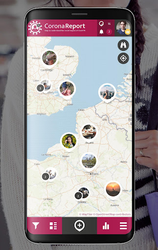  | 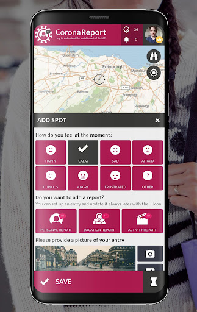  | 
 |   |   |   | 
 | 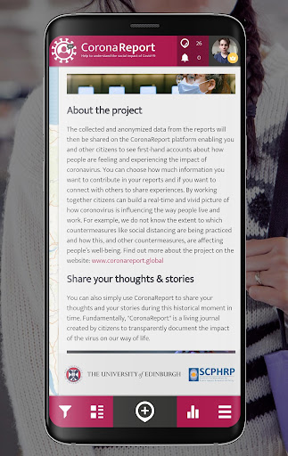 

## Development team
In the following we report the main information provided by the development team in the Google play store.

| | |
|-------------------------|-------------------------|
| **Developer**  | SPOTTERON |
| **Website**  | [https://www.spotteron.net](https://www.spotteron.net) |
| **Email** | office@spotteron.net |
| **Physical address**  | [Faßziehergasse 5, 1070 Wien](https://www.google.com/maps/search/Faßziehergasse%205,%201070%20Wien) (Google Maps) |
| **Other developed apps**  | [https://play.google.com/store/apps/developer?id=6074809323558115618](https://play.google.com/store/apps/developer?id=6074809323558115618) |

## Android support

| | |
|-------------------------|-------------------------|
| **Declared target Android version**  | Pie, version 9 (API level 28) |
| **Effective target Android version**  | Pie, version 9 (API level 28) |
| **Minimum supported Android version**  | KitKat, version 4.4 - 4.4.4 (API level 19) |
| **Maximum target Android version**  | - |

The larger the difference between the minimum and maximum supported Android versions, the better. A larger difference means a wider audience. For example, old phones have a very low Android version, so a high minimum supported Android version means that the app cannot be used by users with old phones, thus leading to accessibility problems. 

## Requested permissions

In the following we report the complete list of the permissions requested by the app. 

| **Permission** | **Protection level** | **Description** | 
|-------------------------|-------------------------|-------------------------|
 **android.permission ACCESS_COARSE_LOCATION** | :warning:**Dangerous** | Allows an app to access approximate location. 
 **android.permission ACCESS_FINE_LOCATION** | :warning:**Dangerous** | Allows an app to access precise location. 
 **android.permission ACCESS_NETWORK_STATE** | Normal | Allows applications to access information about networks. 
 **android.permission INTERNET** | Normal | Allows applications to open network sockets. 
 **android.permission READ_APP_BADGE** | - | - 
 **android.permission VIBRATE** | Normal | Allows access to the vibrator. 
 **android.permission WAKE_LOCK** | Normal | Allows using PowerManager WakeLocks to keep processor from sleeping or screen from dimming. 
 **android.permission WRITE_EXTERNAL_STORAGE** | :warning:**Dangerous** | Allows an application to write to external storage. 
 **com.anddoes.launcher.permission UPDATE_COUNT** | - | - 
 **com.google.android.c2dm.permission RECEIVE** | - | - 
 **com.htc.launcher.permission READ_SETTINGS** | - | - 
 **com.htc.launcher.permission UPDATE_SHORTCUT** | - | - 
 **com.huawei.android.launcher.permission CHANGE_BADGE** | - | - 
 **com.huawei.android.launcher.permission READ_SETTINGS** | - | - 
 **com.huawei.android.launcher.permission WRITE_SETTINGS** | - | - 
 **com.majeur.launcher.permission UPDATE_BADGE** | - | - 
 **com.oppo.launcher.permission READ_SETTINGS** | - | - 
 **com.oppo.launcher.permission WRITE_SETTINGS** | - | - 
 **com.sec.android.provider.badge.permission READ** | - | - 
 **com.sec.android.provider.badge.permission WRITE** | - | - 
 **com.sonyericsson.home.permission BROADCAST_BADGE** | - | - 
 **com.sonymobile.home.permission PROVIDER_INSERT_BADGE** | - | - 
 **com.spotteron.coronareport.permission C2D_MESSAGE** | - | - 
 **me.everything.badger.permission BADGE_COUNT_READ** | - | - 
 **me.everything.badger.permission BADGE_COUNT_WRITE** | - | - 

## Mentioned servers

| **Server** | **Registrant** | **Registrant country** | **Creation date** | 
|-------------------------|-------------------------|-------------------------|-------------------------|
 | google.com | Google LLC | :us: US | 1997-09-15 04:00:00 |
 | gstatic.com | Google LLC | :us: US | 2008-02-11 15:31:25 |
 | whatsapp.com | Whatsapp Inc. | :us: US | 2008-09-04 12:39:12 |
 | googleapis.com | Google LLC | :us: US | 2005-01-25 17:52:26 |

## Security analysis 

Below we report the main security warnings raised by our execution of the [Androwarn](https://github.com/maaaaz/androwarn) security analysis tool.

**Connection interfaces exfiltration**
> - This application reads details about the currently active data network 
> - This application tries to find out if the currently active data network is metered 

**Telephony services abuse**
> - This application makes phone calls 

**Pim data leakage**
> - This application accesses the downloads folder 
> - This application accesses data stored in the clipboard 

**Code execution**
> - This application loads a native library: 'sqlc-evcore-native-driver' 
> - This application executes a UNIX command containing this argument: 'Ljava/lang/StringBuilder;->toString()Ljava/lang/String;' 

## User ratings and reviews

Below we provide information about how end users are reacting to the app in terms of ratings and reviews in the Google Play store.

### Ratings

The CoronaReport - COVID-19 reports for Social Science app has been installed by more than **5000** times. At this time, **11** rated the app and its average score is **4.6363635**. Below we show the distribution of the ratings across the usual star-based rating of Google Play

:star::star::star::star::star:: 10

:star::star::star::star:: 0

:star::star::star:: 0

:star::star:: 0

:star:: 1

### Reviews 

#### 5-star reviews

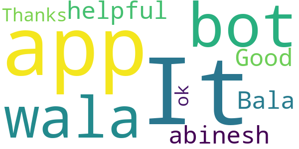

> Bala abinesh  :date: __2020-11-08 05:04:51__

> Good  :date: __2020-10-24 10:16:07__

> Thanks ok  :date: __2020-07-19 14:13:24__

#### 4-star reviews

No recent reviews available with 4 stars.

#### 3-star reviews

No recent reviews available with 3 stars.

#### 2-star reviews

No recent reviews available with 2 stars.

#### 1-star reviews

> Don't like  :date: __2020-05-07 23:16:32__

# One You Couch to 5K
App version ``7.4.0``

Analyzed with [covid-apps-observer](http://github.com/covid-apps-observer) project, version ``0.1``

## App overview
| | |
|-------------------------|-------------------------| 
| **Name**&nbsp;&nbsp;&nbsp;&nbsp;&nbsp;&nbsp;&nbsp;&nbsp;&nbsp;&nbsp;&nbsp;&nbsp;&nbsp;&nbsp;&nbsp;&nbsp;&nbsp;&nbsp;&nbsp;&nbsp;&nbsp;&nbsp;&nbsp;&nbsp;&nbsp;&nbsp;&nbsp;&nbsp;&nbsp;&nbsp;&nbsp;&nbsp;&nbsp;&nbsp;&nbsp;&nbsp;&nbsp;&nbsp;&nbsp;&nbsp;  | One You Couch to 5K |
| **Unique identifier** | com.phe.couchto5K |
| **Link to Google Play** | [https://play.google.com/store/apps/details?id=com.phe.couchto5K](https://play.google.com/store/apps/details?id=com.phe.couchto5K) |
| **Summary**  | The FREE Couch to 5K app. We’ll take you from couch to 5k hero in just 9 weeks! |
| **Privacy policy** | [https://www.nhs.uk/oneyou/privacy-policy](https://www.nhs.uk/oneyou/privacy-policy) |
| **Latest version** | 7.4.0 |
| **Last update** | 2020-07-27 12:06:56 |
| **Recent changes** | General bug fixes and maintenance improvements. |
| **Installs**  | 1,000,000+ |
| **Category** | Health & Fitness |
| **First release** | Mar 5, 2016 |
| **Size**  | 132M |
| **Supported Android version**  | 4.4W and up |

### Description
> For the latest official information about what you can and can't do at this time, visit https://www.nhs.uk/conditions/coronavirus-covid-19/ 
 It’s an easy to follow programme known the world over, and perfect for those new to running and need some extra support and motivation along the way.
 The app features a choice of 5 great trainers to support and motivate you at every step of the way, telling you when to run and when to walk, from broadcaster and former Olympian Michael Johnson, comedians Sarah Millican and Sanjeev Kohli, BBC presenter Jo Whiley, and our very own Laura, who have now helped over 2 million people like you start their own running journeys.
 One You Couch to 5K features:
 • A flexible programme that can be completed in as little as 9 weeks, or longer if you want to go at your own pace
 • Easy to follow countdown timer so you can see and well as hear how long you’ve got left of each run
 • Works alongside your preferred music player, automatically 'dipping' the volumes so you can hear the instructions and motivations from your chosen trainer
 • Signals a half-time bell when you get half way, so you know when to head home!
 • Lets you track your progress and awards achievements as you move through the runs
 • Lets you rate how you feel before and after each session to help acknowledge the immediate benefits for doing some physical activity
 • Connects you with likeminded people through the Couch to 5k HealthUnlocked community forums, offering loads of advice, tips and motivations to keep you on you on your fitness journey
 One You is here to help you live more healthily and make the changes that matter most. Millions of people have already got running with the Couch to 5k plan. Now it’s your turn! Download this app, get off the couch and we’ll help you reach your health goals.

### User interface
The developers of the app provide the following screenshots in the Google play store.
| | | |
|:-------------------------:|:-------------------------:|:-------------------------:|
 |   |   |   | 
 |   |   |   | 
 |   |  

## Development team
In the following we report the main information provided by the development team in the Google play store.

| | |
|-------------------------|-------------------------|
| **Developer**  | Public Health England Digital |
| **Website**  | [https://www.nhs.uk/oneyou/moving](https://www.nhs.uk/oneyou/moving) |
| **Email** | oneyou@phe.gov.uk |
| **Physical address**  | - |
| **Other developed apps**  | [https://play.google.com/store/apps/developer?id=Public+Health+England+Digital](https://play.google.com/store/apps/developer?id=Public+Health+England+Digital) |

## Android support

| | |
|-------------------------|-------------------------|
| **Declared target Android version**  | Pie, version 9 (API level 28) |
| **Effective target Android version**  | Pie, version 9 (API level 28) |
| **Minimum supported Android version**  | KitKat W, version 4.4W - 4.4.4W (API level 20) |
| **Maximum target Android version**  | - |

The larger the difference between the minimum and maximum supported Android versions, the better. A larger difference means a wider audience. For example, old phones have a very low Android version, so a high minimum supported Android version means that the app cannot be used by users with old phones, thus leading to accessibility problems. 

## Requested permissions

In the following we report the complete list of the permissions requested by the app. 

| **Permission** | **Protection level** | **Description** | 
|-------------------------|-------------------------|-------------------------|
 **android.permission ACCESS_COARSE_LOCATION** | :warning:**Dangerous** | Allows an app to access approximate location. 
 **android.permission ACCESS_FINE_LOCATION** | :warning:**Dangerous** | Allows an app to access precise location. 
 **android.permission ACCESS_NETWORK_STATE** | Normal | Allows applications to access information about networks. 
 **android.permission BLUETOOTH** | Normal | Allows applications to connect to paired bluetooth devices. 
 **android.permission BLUETOOTH_ADMIN** | Normal | Allows applications to discover and pair bluetooth devices. 
 **android.permission INTERNET** | Normal | Allows applications to open network sockets. 
 **android.permission WAKE_LOCK** | Normal | Allows using PowerManager WakeLocks to keep processor from sleeping or screen from dimming. 
 **android.permission WRITE_EXTERNAL_STORAGE** | :warning:**Dangerous** | Allows an application to write to external storage. 
 **com.android.alarm.permission SET_ALARM** | Normal | Allows an application to broadcast an Intent to set an alarm for the user. 
 **com.google.android.c2dm.permission RECEIVE** | - | - 
 **com.google.android.finsky.permission BIND_GET_INSTALL_REFERRER_SERVICE** | - | - 

## Mentioned servers

| **Server** | **Registrant** | **Registrant country** | **Creation date** | 
|-------------------------|-------------------------|-------------------------|-------------------------|
 | googlesyndication.com | Google LLC | :us: US | 2003-01-21 06:17:24 |
 | google.com | Google LLC | :us: US | 1997-09-15 04:00:00 |
 | google-analytics.com | Google LLC | :us: US | 2005-07-18 19:24:32 |
 | app-measurement.com | Google LLC | :us: US | 2015-06-19 20:13:31 |
 | googletagmanager.com | Google LLC | :us: US | 2011-11-11 23:39:05 |
 | paragon-cc.co.uk | - | - | 2017-04-04 00:00:00 |
 | bbc.co.uk | - | - | 1996-08-01 00:00:00 |
 | df-phe.com | DOGFI.SH Mobile | GB | 2015-06-16 14:57:16 |
 | phedigital.co.uk | - | - | 2018-06-06 00:00:00 |
 | youtube.com | Google LLC | :us: US | 2005-02-15 05:13:12 |
 | crashlytics.com | Google LLC | :us: US | 2011-01-21 15:30:40 |
 | nhs.uk | Department of Health | - | 1996-08-01 00:00:00 |
 | tealiumiq.com | Whois Privacy Service | :us: US | 2011-02-09 18:33:06 |
 | googleapis.com | Google LLC | :us: US | 2005-01-25 17:52:26 |
 | googleadservices.com | Google LLC | :us: US | 2003-06-19 16:34:53 |
 | healthunlocked.com | Everything Unlocked Ltd | GB | 2008-05-04 18:31:28 |

## Security analysis 

Below we report the main security warnings raised by our execution of the [Androwarn](https://github.com/maaaaz/androwarn) security analysis tool.

**Telephony identifiers leakage**
> - This application reads the ISO country code equivalent of the current registered operator's MCC (Mobile Country Code) 
> - This application reads the numeric name (MCC+MNC) of current registered operator 
> - This application reads the operator name 

**Connection interfaces exfiltration**
> - This application reads details about the currently active data network 
> - This application tries to find out if the currently active data network is metered 

**Suspicious connection establishment**
> - This application opens a Socket and connects it to the remote address '' on the 'N/A' port  
> - This application opens a Socket and connects it to the remote address 'Ljava/lang/StringBuilder;->toString()Ljava/lang/String;' on the ': connect, resolve' port  
> - This application opens a Socket and connects it to the remote address 'Ljava/lang/StringBuilder;->toString()Ljava/lang/String;' on the 'N/A' port  
> - This application opens a Socket and connects it to the remote address 'Ljava/net/Proxy;->type()Ljava/net/Proxy$Type;' on the 'N/A' port  
> - This application opens a Socket and connects it to the remote address 'timeout' on the 'N/A' port  

## User ratings and reviews

Below we provide information about how end users are reacting to the app in terms of ratings and reviews in the Google Play store.

### Ratings

The One You Couch to 5K app has been installed by more than **1000000** times. At this time, **28344** rated the app and its average score is **4.744284**. Below we show the distribution of the ratings across the usual star-based rating of Google Play

:star::star::star::star::star:: 23520

:star::star::star::star:: 3559

:star::star::star:: 548

:star::star:: 279

:star:: 438

### Reviews 

#### 5-star reviews

> Encouraging, inspiring, motivating, like it 😃  :date: __2021-01-03 14:50:14__

> Great, easy to follow, great encouragement when feeling that's it! Just need to continue it but will probably use week 9 when I run.  :date: __2021-01-03 14:46:31__

> Gave me a structured training programme to get started  :date: __2021-01-03 13:54:57__

> Very clear, simple and achievable program. Even if it doesn't seem so when the new. goals are looming.  :date: __2021-01-03 12:51:32__

> I'm finding this a really comfortable way to train, With a good play list in the back ground 😊  :date: __2021-01-03 11:36:44__

> Did this over the lockdown. Excellent, helped me build up stamina and endurance. I can now run for 30 minutes and have continued to run. Worked for me would highly recommend.  :date: __2021-01-03 10:21:53__

> The app has been great, easy to use. The training program is being used for the second time around, getting back from injury gently. I'm 70 next year, so it's great to have a plan that has worked before.  :date: __2021-01-03 10:17:32__

> Given me a sense of achievement 👌  :date: __2021-01-03 08:04:42__

> I've actually started running! Really good app  :date: __2021-01-02 23:35:37__

> Fantastic, easy to follow app which improves your fitness really gradually. Has made me feel so much better in such a short time.  :date: __2021-01-02 20:39:40__

#### 4-star reviews

> Would be better if the app had a report on your runs.  :date: __2021-01-03 10:48:07__

> Good clear instructions with positive comments and tips.  :date: __2021-01-01 19:42:29__

> Hard work but fun to an worth it.  :date: __2021-01-01 18:49:53__

> No way to save data or map your run, it's just literally audio guide nothing more.  :date: __2021-01-01 08:56:16__

> Great app, last run wouldn't let me complete though.  :date: __2021-01-01 00:20:44__

> Really helped motivate me and achieve a goal.  :date: __2020-12-31 16:02:09__

> Excellent App, got me back in the habit of running gradually so I almost enjoy it now, I've never stuck to running this long so I'm pleased I've now pushed through and made it habit to include in my weekly fitness. The voice over trainers didn't always work so I had to swap them about a bit but it was still fine.  :date: __2020-12-31 14:48:18__

> Postive  :date: __2020-12-31 10:59:13__

> Please give advise in how to use with own music.  :date: __2020-12-30 20:58:29__

> I have done a lot of running regular 10 miles and half marathons. Running was always something that I could pick back up easily. I had a hip replacement and 4 year lay off. I still did other things, i.e. walking football. After my 60th birthday I decided to throw caution to the wind and start again with a 5K. I struggled and walked most of it. A friend recommended Ct5k and I love the feeling of achieving little targets and building on them. It's hard but can' wait to hit that 5k target.  :date: __2020-12-30 19:58:29__

#### 3-star reviews

> It seems to bounce out of the app when I am running. So I have to keep logging in. Not sure if it is because it is so cold or because I have my music on. Or both. I have only completed day two. I am living Sarah telling me what to do. 😂  :date: __2021-01-03 10:26:06__

> Crashed half way through a run. Took me a while to realise  :date: __2021-01-02 10:42:13__

> It's a good app, but it does crash every single time the screen goes blank unfortunately.. I was running for a lot longer than a minute thinking to myself this feels even longer than it usually does 😂 although I did manage it so quite pleased with myself... However as previous people have said it it is a little disheartening, in the end I took to running with my phone unlocked which wasn't ideal, may use my fitbit instead from now on.  :date: __2021-01-01 23:43:03__

> It was successful in that it got me running, however I frequently lost connection part way through.  :date: __2020-12-30 09:54:20__

> Enjoyed the podcast. This means I can listen to my own playlist. But I cannot see how the run went (data such as speed, distance etc) using the app, which would be useful.  :date: __2020-12-28 12:32:28__

> Loved it, then my knees didn't..I will give it another go when I feel my legs, knees are stronger..so, speed walking to it rather than running...  :date: __2020-12-22 18:24:23__

> Really good, being able to choose a voice that comfort and motivates you really helps - especially with children. Only issues we have found are that it very often closest he app part way through a run, which is irritating when you're waiting for instruction and that sometimes it doesn't seem to save runs so my son struggles with following his progress  :date: __2020-12-22 14:38:54__

> More comentry during run and walk sessions like countdown would be good  :date: __2020-12-17 16:08:08__

> Starts off well but it's so frustrating that it crashes or stops working mid run!  :date: __2020-12-13 18:44:52__

> Good but it shuts down when running  :date: __2020-12-12 18:11:11__

#### 2-star reviews

> I like the app and love my coach Michael Johnson. But it stops mid run on EVERY SINGLE RUN, rendering itself useless. Very very frustrating. It would also be good if the coach pep talks varied from run to run (rather than week to week) in the early weeks.  :date: __2020-12-30 22:17:12__

> I had heard good things about this app, unfortunately the app cuts off quite frequently and this is really disheartening when you are in the middle of a run. If they get this bug fixed then I would give it 5 stars.  :date: __2020-12-27 21:06:48__

> The app is a great idea and well thought out. Having a coach is nice and I like that it has a reminder feature. However, the app consistantly crashes at least twice during a run. Not so bad when you are on a walking session, but particularly annoying when you are running. I have set the recommended power settings for my phone but it still crashes. Also it often asks me to reset the trainer as the audio is not available or my phone is out of memory (not true).So nice idea if it worked properly.  :date: __2020-12-09 12:26:39__

> I was really pleased with this app however on week two it lost all of the sound (the instructions) which quite frankly makes it useless. I have uninstalled and reinstalled multiple times but it hasn't made the slightest bit of difference. A real shame!  :date: __2020-12-08 14:46:07__

> I love the guides running, however the app simply doesn't work properly. I have changed the settings to manage manually multiple times yet it always stops mid run. Whenever you reopen the app, you have to start the run all over again. Please fix this, it's a real pity.  :date: __2020-12-06 15:49:04__

> Lovely app but the sound would not work. Had to run holding the phone so I could see the instructions. I have a Pixel 3 and wonder if this is the reason it doesn't work properly. Would really like to be able to use this app fully!  :date: __2020-12-02 09:31:02__

> Keeps restarting so. I. Have to stop and go back to where I was in the work out  :date: __2020-11-30 23:10:00__

> Make sure you have a stopwatch as this app constantly crashes.  :date: __2020-11-30 07:30:07__

> The app keeps stopping mid run. If it did not do this is would be brilliant.  :date: __2020-11-30 00:39:33__

> The programme is great and the app worked brilliantly over the summer when I first used it. I'm not doing the programme again at a faster speed and I'm having problems with the app asking me to reset the trainer because I'm out of memory (not true) and resets the trainer every time I go out. Please can you review for bugs. Also this time there must have been an update as the podcast no longer stops the background audio when the trainer comes on. This is annoying as I miss patches from the audio.  :date: __2020-11-28 10:59:00__

#### 1-star reviews

> Very dissapointed my second schedule run and it keeps freezing 😣  :date: __2020-12-30 18:56:35__

> Cannot make run in background No matter what, I cannot get this app to work unless its the only thing I have running. I have given it every permission and it still cuts out. Very disappointing  :date: __2020-12-27 08:55:05__

> Decided to start running again, but wanted to start from scratch so downloaded this. One run in and it paused itself throughout. I ended up counting my way through it and ignoring the app.  :date: __2020-12-21 14:21:02__

> Terrible why do I have to have some "celebrity" talking to me. I just want to complete the programme on my own. Why is there no option to turn the voice off. Usual bbc rubbish.  :date: __2020-12-15 00:09:57__

> Constantly crashes  :date: __2020-12-10 08:08:26__

> Keeps turning off, need to restart app. Does not work with my Spotify.  :date: __2020-12-10 07:37:08__

> Doesn't work for me on android using Spotify. I get the first couple of directions, then silence.  :date: __2020-12-09 10:59:33__

> I used this app on my Huawei P10 Lite and it worked amazing. I'm about half way through the 9 week programme and I got a new phone for my birthday, a P30 Pro, and it doesn't work. In the help section it doesn't list my phone or it's EMUI so it doesn't look like it's compatible with the newer versions. Hopefully they will update the app at some point. It's so disappointing.  :date: __2020-12-04 20:46:44__

> app keeps crashing mid run. waste of time  :date: __2020-12-02 20:12:29__

> Very good when it doesn't crash. So annoying when the app crashes half way through a run. It never completes a run now. At least I do.  :date: __2020-11-30 20:00:50__

# Ayush Sanjivani
App version ``1.0.9``

Analyzed with [covid-apps-observer](http://github.com/covid-apps-observer) project, version ``0.1``

## App overview
| | |
|-------------------------|-------------------------| 
| **Name**&nbsp;&nbsp;&nbsp;&nbsp;&nbsp;&nbsp;&nbsp;&nbsp;&nbsp;&nbsp;&nbsp;&nbsp;&nbsp;&nbsp;&nbsp;&nbsp;&nbsp;&nbsp;&nbsp;&nbsp;&nbsp;&nbsp;&nbsp;&nbsp;&nbsp;&nbsp;&nbsp;&nbsp;&nbsp;&nbsp;&nbsp;&nbsp;&nbsp;&nbsp;&nbsp;&nbsp;&nbsp;&nbsp;&nbsp;&nbsp;  | Ayush Sanjivani |
| **Unique identifier** | com.negd.ayushfeedback |
| **Link to Google Play** | [https://play.google.com/store/apps/details?id=com.negd.ayushfeedback](https://play.google.com/store/apps/details?id=com.negd.ayushfeedback) |
| **Summary**  | For analysing the use of AYUSH interventions for immunity in COVID 19 situation. |
| **Privacy policy** | [https://test2.ncog.gov.in/Ayush_Sanjivani_Privacy/privacy-policy-page/privay-policy.html](https://test2.ncog.gov.in/Ayush_Sanjivani_Privacy/privacy-policy-page/privay-policy.html) |
| **Latest version** | 1.0.9 |
| **Last update** | 2020-11-16 13:45:04 |
| **Recent changes** | - Bug fixes and optimizations |
| **Installs**  | 500,000+ |
| **Category** | Health & Fitness |
| **First release** | Apr 24, 2020 |
| **Size**  | 4.8M |
| **Supported Android version**  | 4.4 and up |

### Description
> The Ministry of AYUSH presents the “Ayush Sanjivani” mobile application for understanding the measures adopted by public for enhancing immunity and keeping themselves healthy in the difficult COVID-19 situation. The app is designed as a simple but effective mechanism of electronic documentation for studying population behaviour. Response of the public to the advisories issued by the AYUSH Ministry on immunity enhancement will be an important area of examination. In addition, provision is also made for recording other measures (if any) propagated by AYUSH practitioners and adopted by general public for immunity enhancement and disease prevention. Data collected through this app will be analyzed to find out usage of AYUSH interventions and its efficacy in maintaining health by enhancing immunity.
 This app is at the centre of a massive exercise to study specific health seeking behaviours of the public in which the Central Research Councils of AYUSH, the National Institutes of AYUSH, numerous AYUSH educational institutions and state governments bodies collaborate. The Ministry has a target sample size of 1 million people for this study, making it one of the largest in any discipline of medicine. All those who volunteer to furnish information through this app will be making a significant contribution to the study of public health in the country.
 Data collected will be analyzed and will be useful for the AYUSH systems, and will establish their viability as health-assuring practices globally. This would also add momentum to the growth of the AYUSH Sector.

### User interface
The developers of the app provide the following screenshots in the Google play store.
| | | |
|:-------------------------:|:-------------------------:|:-------------------------:|
 |   |   | 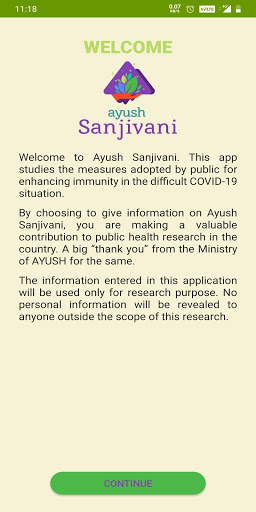  | 
 |   | 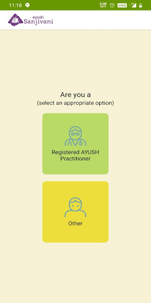  |   | 
 |   | 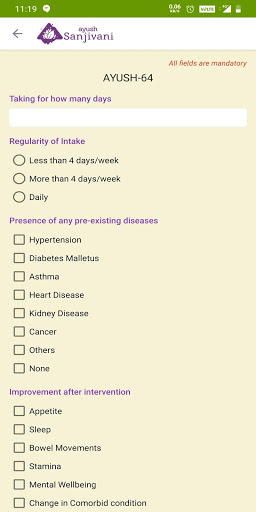 

## Development team
In the following we report the main information provided by the development team in the Google play store.

| | |
|-------------------------|-------------------------|
| **Developer**  | Ministry of AYUSH |
| **Website**  | [https://www.ayush.gov.in/](https://www.ayush.gov.in/) |
| **Email** | ayush.sanjivani@digitalindia.gov.in |
| **Physical address**  | - |
| **Other developed apps**  | [https://play.google.com/store/apps/developer?id=Ministry+of+AYUSH](https://play.google.com/store/apps/developer?id=Ministry+of+AYUSH) |

## Android support

| | |
|-------------------------|-------------------------|
| **Declared target Android version**  | Android10, version 10 (API level 29) |
| **Effective target Android version**  | Android10, version 10 (API level 29) |
| **Minimum supported Android version**  | KitKat, version 4.4 - 4.4.4 (API level 19) |
| **Maximum target Android version**  | - |

The larger the difference between the minimum and maximum supported Android versions, the better. A larger difference means a wider audience. For example, old phones have a very low Android version, so a high minimum supported Android version means that the app cannot be used by users with old phones, thus leading to accessibility problems. 

## Requested permissions

In the following we report the complete list of the permissions requested by the app. 

| **Permission** | **Protection level** | **Description** | 
|-------------------------|-------------------------|-------------------------|
 **android.permission ACCESS_NETWORK_STATE** | Normal | Allows applications to access information about networks. 
 **android.permission INTERNET** | Normal | Allows applications to open network sockets. 
 **android.permission WAKE_LOCK** | Normal | Allows using PowerManager WakeLocks to keep processor from sleeping or screen from dimming. 
 **com.google.android.c2dm.permission RECEIVE** | - | - 

## Mentioned servers

| **Server** | **Registrant** | **Registrant country** | **Creation date** | 
|-------------------------|-------------------------|-------------------------|-------------------------|
 | google.com | Google LLC | :us: US | 1997-09-15 04:00:00 |
 | facebook.com | Facebook, Inc. | :us: US | 1997-03-29 05:00:00 |
 | googleapis.com | Google LLC | :us: US | 2005-01-25 17:52:26 |

## Security analysis 

Below we report the main security warnings raised by our execution of the [Androwarn](https://github.com/maaaaz/androwarn) security analysis tool.

**Connection interfaces exfiltration**
> - This application reads details about the currently active data network 
> - This application tries to find out if the currently active data network is metered 

**Telephony services abuse**
> - This application makes phone calls 

**Suspicious connection establishment**
> - This application opens a Socket and connects it to the remote address '' on the 'N/A' port  
> - This application opens a Socket and connects it to the remote address 'Ljava/lang/StringBuilder;->toString()Ljava/lang/String;' on the 'N/A' port  
> - This application opens a Socket and connects it to the remote address 'Ljava/net/Proxy;->type()Ljava/net/Proxy$Type;' on the 'N/A' port  
> - This application opens a Socket and connects it to the remote address 'timeout' on the 'N/A' port  

## User ratings and reviews

Below we provide information about how end users are reacting to the app in terms of ratings and reviews in the Google Play store.

### Ratings

The Ayush Sanjivani app has been installed by more than **500000** times. At this time, **2241** rated the app and its average score is **3.9267242**. Below we show the distribution of the ratings across the usual star-based rating of Google Play

:star::star::star::star::star:: 1344

:star::star::star::star:: 299

:star::star::star:: 106

:star::star:: 77

:star:: 415

### Reviews 

#### 5-star reviews

> Very useful  :date: __2020-12-28 11:20:24__

> Good knowledgeable app  :date: __2020-11-24 15:28:15__

> Otp to bhejo  :date: __2020-11-24 15:01:06__

> Very good  :date: __2020-10-17 14:28:14__

> Nice  :date: __2020-10-12 19:37:32__

> Too good  :date: __2020-10-08 19:43:41__

> Excellent  :date: __2020-09-29 05:46:40__

> Best App for everyone customer 👍👍  :date: __2020-09-25 04:03:17__

> Excellent  :date: __2020-09-05 14:20:45__

> Best app all details available for taking care of our self on our own  :date: __2020-09-03 19:05:32__

#### 4-star reviews

> Provide general basic ayuervedic medicine tips for more general diseases  :date: __2020-10-19 19:29:10__

> Nice app for immune system improvement  :date: __2020-08-24 17:23:46__

> Best  :date: __2020-08-22 15:42:21__

> Not too useful  :date: __2020-08-21 22:01:41__

> I had new to this app and shall find out results after use.  :date: __2020-08-10 20:27:59__

> Good  :date: __2020-08-10 18:34:52__

> Nice app  :date: __2020-07-14 07:24:21__

> Ok  :date: __2020-07-11 18:18:24__

> Very helpful  :date: __2020-07-04 13:54:42__

> Good app for health.  :date: __2020-07-02 08:14:07__

#### 3-star reviews

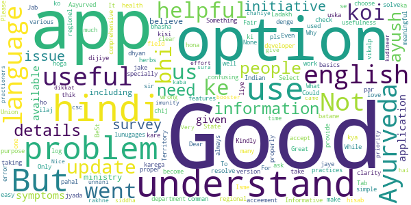

> Fair  :date: __2020-07-18 19:00:04__

> Problem ke hisab se uska ilaj batane ke liye bhi option dijiye Jab kisi ko koi problem hoga to us option me jake check karega kya chij use kare ki problem thik ho jaye Tab jyada log Aayurved par dhyan denge.  :date: __2020-07-02 10:20:19__

> Good  :date: __2020-06-28 14:13:38__

> "Something went wrong " What is this pls solve  :date: __2020-06-21 06:27:48__

> It's very helpful for us  :date: __2020-06-20 03:00:22__

> Good pahal by csc  :date: __2020-06-18 13:05:46__

> Good  :date: __2020-06-18 09:06:21__

> Good  :date: __2020-06-13 08:42:18__

> Good But some Issues..  :date: __2020-06-11 03:19:58__

> BeSt  :date: __2020-06-10 07:56:36__

#### 2-star reviews

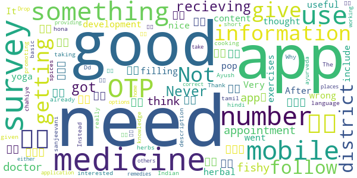

> I am not recieving OTP on my mobile number.  :date: __2020-11-14 22:14:07__

> Never got any appointment from doctor  :date: __2020-08-27 07:43:48__

> Good  :date: __2020-07-30 12:40:56__

> நான் சென்னை தாம்பரத்திலுள்ள சித்தா மருத்துவமனை சென்றிருந்தபோது இந்த appக்கு டவுன்லோடு பண்ணிக்கோங்க னு சொன்னாங்க.நானும் டவுன்லோடு பண்ணினால் ஆங்கிலம் & ஹிந்தியை தவிர வேறு மொழியில்லை.சரி பரவாயில்லை வேறு ஏதாவது உறுபடியா இருக்கும்னு பார்த்தா அதுவும் இல்லை .. என்னை பொறுத்தவரை இது not in use..  :date: __2020-07-25 16:21:02__

> I think something fishy on this app development  :date: __2020-07-01 08:05:18__

> After filling up all the information in getting pop up like something went wrong  :date: __2020-06-18 09:04:30__

> It's nice  :date: __2020-06-13 08:36:21__

> Not very useful  :date: __2020-06-13 04:24:14__

> I thought it will include some more content like yoga exercises about herbal medicine it just for a survey😒😒  :date: __2020-06-05 18:24:30__

> Very good app but I need my language in tamil. Thank you.  :date: __2020-06-05 16:03:39__

#### 1-star reviews

> Even there is full network Not receiving OTP after submitting mobile number.  :date: __2020-11-25 02:30:44__

> Unable to receive otp  :date: __2020-11-22 01:54:03__

> Does not get OTP even thogh well connected network and without Verification can not use.  :date: __2020-11-21 17:43:31__

> No OTP. Waste of time  :date: __2020-11-21 12:31:58__

> Why does ministry choose such poor developers for these works.. Even OTP is not being sent.. All of them just take bribe and give contract to any fool.. App ke naam pe Bwasir bna dete hain... Idiots  :date: __2020-11-19 05:20:25__

> OTP not received  :date: __2020-11-18 06:27:22__

> After many attempts not received mobile OTP.  :date: __2020-11-16 04:06:05__

> Code is not coming..plz do needfu  :date: __2020-11-13 19:20:33__

> Unable to register  :date: __2020-11-13 11:41:20__

> 3 din pahle app download kiya hai, 3 din se baar baar try kar raha hu par OTP nahi aa raha...  :date: __2020-11-01 16:45:54__

# Protego
App version ``Varies with device``

Analyzed with [covid-apps-observer](http://github.com/covid-apps-observer) project, version ``0.1``

## App overview
| | |
|-------------------------|-------------------------| 
| **Name**&nbsp;&nbsp;&nbsp;&nbsp;&nbsp;&nbsp;&nbsp;&nbsp;&nbsp;&nbsp;&nbsp;&nbsp;&nbsp;&nbsp;&nbsp;&nbsp;&nbsp;&nbsp;&nbsp;&nbsp;&nbsp;&nbsp;&nbsp;&nbsp;&nbsp;&nbsp;&nbsp;&nbsp;&nbsp;&nbsp;&nbsp;&nbsp;&nbsp;&nbsp;&nbsp;&nbsp;&nbsp;&nbsp;&nbsp;&nbsp;  | Protego |
| **Unique identifier** | org.theviralapp.app1 |
| **Link to Google Play** | [https://play.google.com/store/apps/details?id=org.theviralapp.app1](https://play.google.com/store/apps/details?id=org.theviralapp.app1) |
| **Summary**  | Fully anonymous contact tracing for COVID-19 |
| **Privacy policy** | [-](-) |
| **Latest version** | Varies with device |
| **Last update** | 2020-05-30 02:24:39 |
| **Recent changes** | Fully Anonymous Contact Tracing App For COVID-19   -   No personal data used, you remain completely anonymous.  -   Completely decentralised anonymous exposure checking performed locally on each device.   -   UI updates to improve usability.  -   Enhanced security and encryption of randomly generated IDs.  -   Improved proximity detection algorithm. |
| **Installs**  | 1,000+ |
| **Category** | Health & Fitness |
| **First release** | - |
| **Size**  | Varies with device |
| **Supported Android version**  | Varies with device |

### Description
> This app is designed by medics and scientists from Imperial College London with one intention: to stop the spread of COVID-19 without compromising your privacy.
 It will let you know if any app user that you have had close contact with in past 14 days goes on to develop symptoms or a diagnosis of COVID-19.
 For example:
 If someone you waited next to in the supermarket queue last week gets a diagnosis of COVID-19 and records this in their app, you will be anonymously informed that someone you have previously been in close contact with now has the virus.You are now free to use this information about your potential exposure to make more educated decisions in your day to day life in order to limit the spread of the virus, protecting those that are most at risk. 
 You can also use this app to help others, by anonymously informing them if you get symptoms or a diagnosis relating to COVID-19. This will enable them to take appropriate action and minimise their risk of infecting others. 
 This app is an example of "privacy by design" as we believe the safest way to protect your personal information is by never collecting it in the first place. That is why this app will never even ask for your name and has no sign up whatsoever. We will also never use location data. You are completely anonymous. Neither us nor the government will ever be able to figure out who you are through this app.
 We use Bluetooth technology to register close contacts and use randomised anonymous IDs that refresh regularly as a substitute for names. For added privacy, this is all stored locally on your own device and only uploaded to the server if you report symptoms or a diagnosis of COVID-19. Additionally, only your personal device knows what IDs you have previously had, and hence only your personal device will be able to check if you have been exposed to someone with the virus. 
 We believe that the best way to do contact tracing is to collect only the absolute essential information. 
 No Names
 No Location
 No Log in
 Just contact tracing.
 For more information please visit our website at www.protegoapp.org

### User interface
The developers of the app provide the following screenshots in the Google play store.
| | | |
|:-------------------------:|:-------------------------:|:-------------------------:|
 |   |   |   | 
 |  

## Development team
In the following we report the main information provided by the development team in the Google play store.

| | |
|-------------------------|-------------------------|
| **Developer**  | Protego App Ltd |
| **Website**  | [https://www.protegoapp.org/](https://www.protegoapp.org/) |
| **Email** | info@protegoapp.org |
| **Physical address**  | - |
| **Other developed apps**  | [https://play.google.com/store/apps/developer?id=Protego+App+Ltd](https://play.google.com/store/apps/developer?id=Protego+App+Ltd) |

## Android support

| | |
|-------------------------|-------------------------|
| **Declared target Android version**  | Android10, version 10 (API level 29) |
| **Effective target Android version**  | Android10, version 10 (API level 29) |
| **Minimum supported Android version**  | Lollipop, version 5.0 (API level 21) |
| **Maximum target Android version**  | - |

The larger the difference between the minimum and maximum supported Android versions, the better. A larger difference means a wider audience. For example, old phones have a very low Android version, so a high minimum supported Android version means that the app cannot be used by users with old phones, thus leading to accessibility problems. 

## Requested permissions

In the following we report the complete list of the permissions requested by the app. 

| **Permission** | **Protection level** | **Description** | 
|-------------------------|-------------------------|-------------------------|
 **android.permission ACCESS_BACKGROUND_LOCATION** | :warning:**Dangerous** | Allows an app to access location in the background. 
 **android.permission ACCESS_COARSE_LOCATION** | :warning:**Dangerous** | Allows an app to access approximate location. 
 **android.permission ACCESS_FINE_LOCATION** | :warning:**Dangerous** | Allows an app to access precise location. 
 **android.permission ACCESS_NETWORK_STATE** | Normal | Allows applications to access information about networks. 
 **android.permission BLUETOOTH** | Normal | Allows applications to connect to paired bluetooth devices. 
 **android.permission BLUETOOTH_ADMIN** | Normal | Allows applications to discover and pair bluetooth devices. 
 **android.permission FOREGROUND_SERVICE** | Normal | Allows a regular application to use Service.startForeground. 
 **android.permission INTERNET** | Normal | Allows applications to open network sockets. 
 **android.permission RECEIVE_BOOT_COMPLETED** | Normal | Allows an application to receive the Intent.ACTION_BOOT_COMPLETED that is broadcast after the system finishes booting. 
 **android.permission REQUEST_IGNORE_BATTERY_OPTIMIZATIONS** | Normal | Permission an application must hold in order to use Settings.ACTION_REQUEST_IGNORE_BATTERY_OPTIMIZATIONS. 
 **android.permission WAKE_LOCK** | Normal | Allows using PowerManager WakeLocks to keep processor from sleeping or screen from dimming. 
 **com.google.android.c2dm.permission RECEIVE** | - | - 
 **com.google.android.finsky.permission BIND_GET_INSTALL_REFERRER_SERVICE** | - | - 

## Mentioned servers

| **Server** | **Registrant** | **Registrant country** | **Creation date** | 
|-------------------------|-------------------------|-------------------------|-------------------------|
 | googlesyndication.com | Google LLC | :us: US | 2003-01-21 06:17:24 |
 | google.com | Google LLC | :us: US | 1997-09-15 04:00:00 |
 | app-measurement.com | Google LLC | :us: US | 2015-06-19 20:13:31 |
 | googleapis.com | Google LLC | :us: US | 2005-01-25 17:52:26 |
 | crashlytics.com | Google LLC | :us: US | 2011-01-21 15:30:40 |
 | googleapis.com | Google LLC | :us: US | 2005-01-25 17:52:26 |
 | googleadservices.com | Google LLC | :us: US | 2003-06-19 16:34:53 |

## Security analysis 

Below we report the main security warnings raised by our execution of the [Androwarn](https://github.com/maaaaz/androwarn) security analysis tool.

**Connection interfaces exfiltration**
> - This application reads details about the currently active data network 
> - This application tries to find out if the currently active data network is metered 

**Suspicious connection establishment**
> - This application opens a Socket and connects it to the remote address '' on the 'N/A' port  
> - This application opens a Socket and connects it to the remote address 'Ljava/lang/StringBuilder;->toString()Ljava/lang/String;' on the 'N/A' port  
> - This application opens a Socket and connects it to the remote address 'Ljava/net/Proxy;->type()Ljava/net/Proxy$Type;' on the 'N/A' port  
> - This application opens a Socket and connects it to the remote address 'timeout' on the 'N/A' port  

**Code execution**
> - This application loads a native library 

## User ratings and reviews

Below we provide information about how end users are reacting to the app in terms of ratings and reviews in the Google Play store.

### Ratings

The Protego app has been installed by more than **1000** times. At this time, **-** rated the app and its average score is **-**. Below we show the distribution of the ratings across the usual star-based rating of Google Play

:star::star::star::star::star:: 0

:star::star::star::star:: 0

:star::star::star:: 0

:star::star:: 0

:star:: 0

### Reviews 

#### 5-star reviews

No recent reviews available with 5 stars.

#### 4-star reviews

No recent reviews available with 4 stars.

#### 3-star reviews

No recent reviews available with 3 stars.

#### 2-star reviews

No recent reviews available with 2 stars.

#### 1-star reviews

No recent reviews available with 1 stars.

# NHS People
App version ``5.87.9``

Analyzed with [covid-apps-observer](http://github.com/covid-apps-observer) project, version ``0.1``

## App overview
| | |
|-------------------------|-------------------------| 
| **Name**&nbsp;&nbsp;&nbsp;&nbsp;&nbsp;&nbsp;&nbsp;&nbsp;&nbsp;&nbsp;&nbsp;&nbsp;&nbsp;&nbsp;&nbsp;&nbsp;&nbsp;&nbsp;&nbsp;&nbsp;&nbsp;&nbsp;&nbsp;&nbsp;&nbsp;&nbsp;&nbsp;&nbsp;&nbsp;&nbsp;&nbsp;&nbsp;&nbsp;&nbsp;&nbsp;&nbsp;&nbsp;&nbsp;&nbsp;&nbsp;  | NHS People |
| **Unique identifier** | com.hivelearning.nhs |
| **Link to Google Play** | [https://play.google.com/store/apps/details?id=com.hivelearning.nhs](https://play.google.com/store/apps/details?id=com.hivelearning.nhs) |
| **Summary**  | NHS People community |
| **Privacy policy** | [https://support.nhslife.nhs.uk/hc/en-us/articles/360009382298-Privacy-Policy](https://support.nhslife.nhs.uk/hc/en-us/articles/360009382298-Privacy-Policy) |
| **Latest version** | 5.87.9 |
| **Last update** | 2020-11-26 22:01:02 |
| **Recent changes** | We update the app regularly so we can make it better for you. This version includes several bug fixes and performance improvements. |
| **Installs**  | 500+ |
| **Category** | Productivity |
| **First release** | Jun 11, 2020 |
| **Size**  | 51M |
| **Supported Android version**  | 4.1 and up |

### Description
> Join the NHS People app for:
 • Real time, essential alerts for all our NHS people during coronavirus
 • Practical resources to benefit your health and wellbeing during coronavirus
 • All NHS people wanting to connect with others in a safe space

### User interface
The developers of the app provide the following screenshots in the Google play store.
| | | |
|:-------------------------:|:-------------------------:|:-------------------------:|
 |   |   | 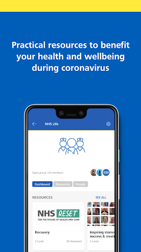  | 
 | 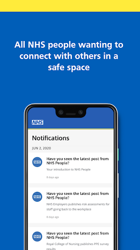 

## Development team
In the following we report the main information provided by the development team in the Google play store.

| | |
|-------------------------|-------------------------|
| **Developer**  | NHS Business Services Authority |
| **Website**  | - |
| **Email** | help@nhslife.nhs.uk |
| **Physical address**  | - |
| **Other developed apps**  | [https://play.google.com/store/apps/developer?id=NHS+Business+Services+Authority](https://play.google.com/store/apps/developer?id=NHS+Business+Services+Authority) |

## Android support

| | |
|-------------------------|-------------------------|
| **Declared target Android version**  | Pie, version 9 (API level 28) |
| **Effective target Android version**  | Pie, version 9 (API level 28) |
| **Minimum supported Android version**  | Jelly Bean, version 4.1.x (API level 16) |
| **Maximum target Android version**  | - |

The larger the difference between the minimum and maximum supported Android versions, the better. A larger difference means a wider audience. For example, old phones have a very low Android version, so a high minimum supported Android version means that the app cannot be used by users with old phones, thus leading to accessibility problems. 

## Requested permissions

In the following we report the complete list of the permissions requested by the app. 

| **Permission** | **Protection level** | **Description** | 
|-------------------------|-------------------------|-------------------------|
 **android.permission ACCESS_NETWORK_STATE** | Normal | Allows applications to access information about networks. 
 **android.permission ACCESS_WIFI_STATE** | Normal | Allows applications to access information about Wi-Fi networks. 
 **android.permission CAMERA** | :warning:**Dangerous** | Required to be able to access the camera device. 
 **android.permission INTERNET** | Normal | Allows applications to open network sockets. 
 **android.permission READ_APP_BADGE** | - | - 
 **android.permission RECEIVE_BOOT_COMPLETED** | Normal | Allows an application to receive the Intent.ACTION_BOOT_COMPLETED that is broadcast after the system finishes booting. 
 **android.permission SYSTEM_ALERT_WINDOW** | Signature - preinstalled - appop - pre23 - development | Allows an app to create windows using the type WindowManager.LayoutParams.TYPE_APPLICATION_OVERLAY, shown on top of all other apps. 
 **android.permission USE_FINGERPRINT** | Normal | This constant was deprecated in API level 28. Applications should request USE_BIOMETRIC instead 
 **android.permission VIBRATE** | Normal | Allows access to the vibrator. 
 **android.permission WAKE_LOCK** | Normal | Allows using PowerManager WakeLocks to keep processor from sleeping or screen from dimming. 
 **android.permission WRITE_EXTERNAL_STORAGE** | :warning:**Dangerous** | Allows an application to write to external storage. 
 **com.anddoes.launcher.permission UPDATE_COUNT** | - | - 
 **com.android.vending CHECK_LICENSE** | - | - 
 **com.google.android.c2dm.permission RECEIVE** | - | - 
 **com.google.android.finsky.permission BIND_GET_INSTALL_REFERRER_SERVICE** | - | - 
 **com.htc.launcher.permission READ_SETTINGS** | - | - 
 **com.htc.launcher.permission UPDATE_SHORTCUT** | - | - 
 **com.huawei.android.launcher.permission CHANGE_BADGE** | - | - 
 **com.huawei.android.launcher.permission READ_SETTINGS** | - | - 
 **com.huawei.android.launcher.permission WRITE_SETTINGS** | - | - 
 **com.majeur.launcher.permission UPDATE_BADGE** | - | - 
 **com.oppo.launcher.permission READ_SETTINGS** | - | - 
 **com.oppo.launcher.permission WRITE_SETTINGS** | - | - 
 **com.sec.android.provider.badge.permission READ** | - | - 
 **com.sec.android.provider.badge.permission WRITE** | - | - 
 **com.sonyericsson.home.permission BROADCAST_BADGE** | - | - 
 **com.sonymobile.home.permission PROVIDER_INSERT_BADGE** | - | - 
 **me.everything.badger.permission BADGE_COUNT_READ** | - | - 
 **me.everything.badger.permission BADGE_COUNT_WRITE** | - | - 

## Mentioned servers

| **Server** | **Registrant** | **Registrant country** | **Creation date** | 
|-------------------------|-------------------------|-------------------------|-------------------------|
 | bugsnag.com | Bugsnag Inc. | GB | 2011-08-18 03:26:10 |
 | android.com | Google LLC | :us: US | 1997-06-23 04:00:00 |
 | googlesyndication.com | Google LLC | :us: US | 2003-01-21 06:17:24 |
 | google.com | Google LLC | :us: US | 1997-09-15 04:00:00 |
 | app-measurement.com | Google LLC | :us: US | 2015-06-19 20:13:31 |
 | github.com | GitHub, Inc. | :us: US | 2007-10-09 18:20:50 |
 | googleapis.com | Google LLC | :us: US | 2005-01-25 17:52:26 |
 | googleadservices.com | Google LLC | :us: US | 2003-06-19 16:34:53 |

## Security analysis 

Below we report the main security warnings raised by our execution of the [Androwarn](https://github.com/maaaaz/androwarn) security analysis tool.

**Telephony identifiers leakage**
> - This application reads the numeric name (MCC+MNC) of current registered operator 
> - This application reads the operator name 
> - This application reads the phone number string for line 1, for example, the MSISDN for a GSM phone 

**Location lookup**
> - This application reads location information from all available providers (WiFi, GPS etc.) 

**Connection interfaces exfiltration**
> - This application reads details about the currently active data network 
> - This application tries to find out if the currently active data network is metered 

**Suspicious connection establishment**
> - This application opens a Socket and connects it to the remote address '' on the 'N/A' port  
> - This application opens a Socket and connects it to the remote address 'Ljava/lang/StringBuilder;->toString()Ljava/lang/String;' on the ': connect, resolve' port  
> - This application opens a Socket and connects it to the remote address 'Ljava/lang/StringBuilder;->toString()Ljava/lang/String;' on the 'N/A' port  
> - This application opens a Socket and connects it to the remote address 'Ljava/net/Proxy;->type()Ljava/net/Proxy$Type;' on the 'N/A' port  
> - This application opens a Socket and connects it to the remote address 'timeout' on the 'N/A' port  

**Pim data leakage**
> - This application accesses the downloads folder 
> - This application accesses data stored in the clipboard 

**Code execution**
> - This application loads a native library 
> - This application loads a native library: 'Ljava/util/Iterator;->next()Ljava/lang/Object;' 
> - This application loads a native library: 'bugsnag-ndk' 
> - This application loads a native library: 'bugsnag-plugin-android-anr' 
> - This application loads a native library: 'c++_shared' 
> - This application loads a native library: 'jniPdfium' 
> - This application loads a native library: 'modft2' 
> - This application loads a native library: 'modpdfium' 
> - This application loads a native library: 'modpng' 
> - This application executes a UNIX command containing this argument: '2' 

## User ratings and reviews

Below we provide information about how end users are reacting to the app in terms of ratings and reviews in the Google Play store.

### Ratings

The NHS People app has been installed by more than **500** times. At this time, **-** rated the app and its average score is **0.0**. Below we show the distribution of the ratings across the usual star-based rating of Google Play

:star::star::star::star::star:: 0

:star::star::star::star:: 0

:star::star::star:: 0

:star::star:: 0

:star:: 0

### Reviews 

#### 5-star reviews

No recent reviews available with 5 stars.

#### 4-star reviews

No recent reviews available with 4 stars.

#### 3-star reviews

No recent reviews available with 3 stars.

#### 2-star reviews

No recent reviews available with 2 stars.

#### 1-star reviews

No recent reviews available with 1 stars.

# Royal Mail - Tracking, redelivery, prices
App version ``6.0.3``

Analyzed with [covid-apps-observer](http://github.com/covid-apps-observer) project, version ``0.1``

## App overview
| | |
|-------------------------|-------------------------| 
| **Name**&nbsp;&nbsp;&nbsp;&nbsp;&nbsp;&nbsp;&nbsp;&nbsp;&nbsp;&nbsp;&nbsp;&nbsp;&nbsp;&nbsp;&nbsp;&nbsp;&nbsp;&nbsp;&nbsp;&nbsp;&nbsp;&nbsp;&nbsp;&nbsp;&nbsp;&nbsp;&nbsp;&nbsp;&nbsp;&nbsp;&nbsp;&nbsp;&nbsp;&nbsp;&nbsp;&nbsp;&nbsp;&nbsp;&nbsp;&nbsp;  | Royal Mail - Tracking, redelivery, prices |
| **Unique identifier** | com.royalmail.app.droid |
| **Link to Google Play** | [https://play.google.com/store/apps/details?id=com.royalmail.app.droid](https://play.google.com/store/apps/details?id=com.royalmail.app.droid) |
| **Summary**  | Easily manage your items and track your deliveries |
| **Privacy policy** | [https://www.royalmail.com/privacy-notice](https://www.royalmail.com/privacy-notice) |
| **Latest version** | 6.0.3 |
| **Last update** | 2020-12-07 16:06:20 |
| **Recent changes** | This release contains a range of bug fixes &amp; general performance improvements. |
| **Installs**  | 1,000,000+ |
| **Category** | Lifestyle |
| **First release** | Sep 4, 2018 |
| **Size**  | 54M |
| **Supported Android version**  | 8.0 and up |

### Description
> 📦📦📦 With the Royal Mail App, you can:
 • Send an item - quickly and easily buy postage in just a few steps. You can print your labels at home or take the QR code on the app to a Royal Mail Customer Service Point/Delivery Office and we’ll print the label for you when you drop off your item.
 • Find your nearest drop off location - Postbox, Parcel Postbox, Post Office branch or Royal Mail Customer Service Point.
 • Track your items – just enter your tracking ID number or scan the barcode to check the progress of your deliveries (available with Royal Mail Tracked and Royal Mail Special Delivery Guaranteed items)
 • Find the size and format of your parcel using the Augmented Reality Parcel Sizer guide. Available with AR supported devices.
 •	Change your delivery options to suit you – You can now change where your parcel is delivered, to a Safeplace or neighbour after it has been sent. (available with Royal Mail Tracked items)
 •	Get proof of postage sent straight to your phone – get that extra peace of mind when dropping of at any of our locations (including our 24/7 Parcel Postboxes)
 • Postcode and address finder – if you’re not sure of a full address, or want to check a postcode, just enter part of the address and we’ll fill in the blanks
 • Find any Post Office locations or Customer Service Point/Delivery Office to print your label or drop off your item, with opening hours, address, map, available services and directions
 • Receive push notifications on your deliveries - never miss a delivery update
 • Save items you are tracking, and add an alias name making them easier to identify 
 • See a photograph of the signature if someone has signed for it, or the Safeplace an item has been delivered to
 • Book a Redelivery – if you’ve missed an item you can easily book a Redelivery to your address, your neighbour’s address or a local Post Office – and specify a delivery day
 • Save postage receipts – simply take a photo of your receipt and store it to the app
 • Track an item on the go - if you have Alexa, you can track your delivery by saying an alias name you have previously assigned to an item

### User interface
The developers of the app provide the following screenshots in the Google play store.
| | | |
|:-------------------------:|:-------------------------:|:-------------------------:|
 |   |   |   | 
 |   |   |   | 
 |  

## Development team
In the following we report the main information provided by the development team in the Google play store.

| | |
|-------------------------|-------------------------|
| **Developer**  | Royal Mail Group |
| **Website**  | [https://www.royalmail.com](https://www.royalmail.com) |
| **Email** | appfeedback@royalmail.com |
| **Physical address**  | - |
| **Other developed apps**  | [https://play.google.com/store/apps/developer?id=Royal+Mail+Group](https://play.google.com/store/apps/developer?id=Royal+Mail+Group) |

## Android support

| | |
|-------------------------|-------------------------|
| **Declared target Android version**  | - |
| **Effective target Android version**  | - |
| **Minimum supported Android version**  | Oreo, version 8.0.0 (API level 26) |
| **Maximum target Android version**  | - |

The larger the difference between the minimum and maximum supported Android versions, the better. A larger difference means a wider audience. For example, old phones have a very low Android version, so a high minimum supported Android version means that the app cannot be used by users with old phones, thus leading to accessibility problems. 

## Requested permissions

In the following we report the complete list of the permissions requested by the app. 

| **Permission** | **Protection level** | **Description** | 
|-------------------------|-------------------------|-------------------------|
 **android.permission ACCESS_FINE_LOCATION** | :warning:**Dangerous** | Allows an app to access precise location. 
 **android.permission ACCESS_NETWORK_STATE** | Normal | Allows applications to access information about networks. 
 **android.permission CAMERA** | :warning:**Dangerous** | Required to be able to access the camera device. 
 **android.permission INTERNET** | Normal | Allows applications to open network sockets. 
 **android.permission RECEIVE_BOOT_COMPLETED** | Normal | Allows an application to receive the Intent.ACTION_BOOT_COMPLETED that is broadcast after the system finishes booting. 
 **android.permission WAKE_LOCK** | Normal | Allows using PowerManager WakeLocks to keep processor from sleeping or screen from dimming. 
 **android.permission WRITE_EXTERNAL_STORAGE** | :warning:**Dangerous** | Allows an application to write to external storage. 
 **com.google.android.c2dm.permission RECEIVE** | - | - 
 **com.royalmail.app.droid.permission MAPS_RECEIVE** | - | - 

## Mentioned servers

| **Server** | **Registrant** | **Registrant country** | **Creation date** | 
|-------------------------|-------------------------|-------------------------|-------------------------|
 | google.com | Google LLC | :us: US | 1997-09-15 04:00:00 |
 | microsoft.com | Microsoft Corporation | :us: US | 1991-05-02 04:00:00 |
 | tealiumiq.com | Whois Privacy Service | :us: US | 2011-02-09 18:33:06 |
 | googleapis.com | Google LLC | :us: US | 2005-01-25 17:52:26 |

## Security analysis 

Below we report the main security warnings raised by our execution of the [Androwarn](https://github.com/maaaaz/androwarn) security analysis tool.

**Telephony identifiers leakage**
> - This application reads the ISO country code equivalent of the current registered operator's MCC (Mobile Country Code) 
> - This application reads the numeric name (MCC+MNC) of current registered operator 
> - This application reads the operator name 

**Connection interfaces exfiltration**
> - This application reads details about the currently active data network 
> - This application tries to find out if the currently active data network is metered 

**Suspicious connection establishment**
> - This application opens a Socket and connects it to the remote address '' on the 'N/A' port  
> - This application opens a Socket and connects it to the remote address 'Ljava/lang/StringBuilder;->toString()Ljava/lang/String;' on the 'N/A' port  
> - This application opens a Socket and connects it to the remote address 'Ljava/net/Proxy;->type()Ljava/net/Proxy$Type;' on the 'N/A' port  
> - This application opens a Socket and connects it to the remote address 'timeout' on the 'N/A' port  

**Code execution**
> - This application loads a native library 
> - This application loads a native library: 'arcore_sdk_jni' 
> - This application loads a native library: 'arsceneview_jni' 
> - This application loads a native library: 'filament-jni' 
> - This application loads a native library: 'mono-native' 
> - This application loads a native library: 'monodroid' 
> - This application loads a native library: 'monosgen-2.0' 
> - This application loads a native library: 'xamarin-app' 
> - This application loads a native library: 'xamarin-debug-app-helper' 

## User ratings and reviews

Below we provide information about how end users are reacting to the app in terms of ratings and reviews in the Google Play store.

### Ratings

The Royal Mail - Tracking, redelivery, prices app has been installed by more than **1000000** times. At this time, **2928** rated the app and its average score is **2.2026577**. Below we show the distribution of the ratings across the usual star-based rating of Google Play

:star::star::star::star::star:: 671

:star::star::star::star:: 165

:star::star::star:: 126

:star::star:: 87

:star:: 1879

### Reviews 

#### 5-star reviews

> Idk bro 😩🖤  :date: __2021-01-02 01:28:38__

> Great  :date: __2021-01-01 23:15:21__

> excellent  :date: __2021-01-01 14:18:14__

> Works well  :date: __2020-12-31 13:21:53__

> Good  :date: __2020-12-30 14:46:37__

> Very efficient, easy to use and useful. Just what royal mail has always needed.  :date: __2020-12-24 13:34:02__

> Great app!. 👍👍😁 Happy Christmas R.M.❗✝️ 🎁🎁🎁☃️⛄☃️⛄☃️☃️☃️  :date: __2020-12-24 12:29:04__

> Good  :date: __2020-12-19 21:16:58__

> Waiting for delivery  :date: __2020-12-18 05:11:22__

> Great  :date: __2020-12-15 18:30:10__

#### 4-star reviews

> Excellent.  :date: __2021-01-03 10:46:40__

> Very good app.clear and well updated  :date: __2020-12-30 13:01:14__

> Excellent app easy to use  :date: __2020-12-18 15:14:40__

> I did not spell my email address correctly but when I went in to amend found nowhere to edit my details  :date: __2020-12-17 14:44:41__

> I like the app. Feature request: Address book, and option to set default home address. Unless I have missed it.  :date: __2020-12-17 08:50:28__

> For buying postage, it's almost perfect. I use this to post items that I make for my Etsy page, and it's mostly really good. Will be close to a 5* for that as soon as they include international postage.  :date: __2020-12-08 02:00:45__

> Excellent app, however few fixes I'd like to see. 1 After you name an item, the tracking number dissappears in the list replaced with the name. 2 allow a gap between the numbers for easier reading ie FE 1234 1234 GB 3 Allow the option to rearrange the list of items.  :date: __2020-12-05 08:29:08__

> Great until last update Used to be able to give my deliveries a meaningful name, but since yesterday's update can't do it anymore. With several deliveries on the go, it makes it difficult to see which is which. Apart from that, it's quite good  :date: __2020-12-03 15:54:52__

> If you face any problems you can't open it just change your phone's language  :date: __2020-12-03 05:39:13__

> Very good 😊. I think.  :date: __2020-11-28 07:46:14__

#### 3-star reviews

> Tracking nos are alpha-num and long and I can't copy from my sources. Info seems sketchy. Update... uninstalled as won't accept my password, LIKE SO MANY APPS IT JUST DEFEATS ITSELF. Bah humbug.  :date: __2020-12-25 13:09:29__

> Unresponsive  :date: __2020-12-23 13:30:00__

> My first experience started well, BUT I'd arranged for a parcel to be collected, got the notification confirming tracking ID, & specific day of collection by my USUAL POSTIE. However when the postie turned up, (luckily he had to ring the doorbell as he was also delivering a parcel) he knew nothing about the collection as nothing was logged on his PDA & he couldn't therefore scan it to track. He did however agree to take it & assured me it would be scanned back at the depot. We'll see 🤞  :date: __2020-12-21 14:46:59__

> Great Concept Good Execution annoying gap. Like everything about this app, sending from home is great, but one thing; the need to enter your address, as sender every time is really annoying. Why doesn't it remember my details? Once fixed be good if the box to copy that from sender to the invoice address was default or unnecessary. Once that's fixed including an address book, or the ability to use addresses in your contacts, or those already in my Click and Drop profile would be a great feature.  :date: __2020-12-19 06:33:51__

> The post box app is good in principle but why does it tell people the time the post was collected rather than the time of the next collection, If I were catching a train I would want to know when the next one was, not the time of the one I had missed.  :date: __2020-12-12 18:23:14__

> Death to deeplinks!  :date: __2020-11-28 15:17:03__

> Good app love you can name deliveries, however when you recieve a push notification and pull down your notification drawer usually there isn't enough room to display the full notification so I press on it assuming it will open the app and display the notification in full but it doesn't it just opens the app normally and the notification is lost. Otherwise a great app.  :date: __2020-11-21 09:40:21__

> A bit iffy. Sometimes info is spot on, other times non existent, or plain wrong. Not really good enough for what they consider to be a Premium Brand. Sort yourselves out!  :date: __2020-11-20 11:01:26__

> Overall a very good service  :date: __2020-11-17 17:21:54__

> The first time I used this app it was awful and I gave up, it's now at least useable, but still needs a lot of work  :date: __2020-11-14 13:18:20__

#### 2-star reviews

> A lot of registration effort for nothing you can't do via their website  :date: __2021-01-02 12:25:56__

> This is the results of privatisation in app form. Doesn't even do the basics.  :date: __2020-12-26 16:01:07__

> I installed the app to get an update as to when my delivery would occur. I dont understand why the service is "deliver by 9pm" but you have no tracking ability. It's no wonder why services like heroes are used, as they let you know when they are an hour away, estimated delivery time. I wouldnt use the Royal mail if I have any choice, customers value the ability to know when the parcel will arrive, even if that's a 3 hour time slot.  :date: __2020-12-24 21:04:12__

> Desk top version much better. Why does this app insist on first name and surname when I am sending to a business?  :date: __2020-12-23 12:25:28__

> Pretty rubbish. The QR code takes you to the all, nothing else. You then need to sign up or log in and basically type all of the details from your "Something for you" card. Only then to find out you can't book a next day delivery but you can collect tomorrow. Like I said, it's pretty useless.  :date: __2020-12-22 13:39:50__

> The registration process uses "opt out" for marketing preferences. And tracking of a special delivery just says "out for delivery" Both show just how archaic Royal Mail is. 1st class stamp prices always going up but can't do anything modern nearly as effectively as competition  :date: __2020-12-22 11:26:14__

> Rubbish takes far too long to update, they don't deliver on the day that they said that they would.  :date: __2020-12-22 03:49:45__

> Poor app. Better just to use the website. The QR code just directs you to the app, I expected it to be a unique, secure and handy way to redeliver but no. I don't trust this app either. You can type anything and it will go through without error - random name, random address, made up delivery number. Means if you make a mistake inadvertently your redelivery will be delayed.  :date: __2020-12-18 11:59:14__

> I keep getting notifications saying parcels delivered when I haven't. Finding it irritating now.  :date: __2020-12-17 19:59:31__

> A tracking app that doesn't track, pointless  :date: __2020-12-15 19:18:45__

#### 1-star reviews

> Useless No real time. Parcels are arriving hours sometimes days after the suggested time given by royal mail.  :date: __2021-01-02 20:52:10__

> Forced login  :date: __2021-01-02 02:57:13__

> absolutely terrible app it cant even tell me when my package is going to arrive but will tell when i missed my delivery after they didmt come and also whenever i scan my qr code it just brings me back to the app  :date: __2021-01-01 12:26:50__

> Useless tracking. Very vague. No information. Just telling me stuff I already know. "We have it" ect. Useless. Use the website. It's not much better. But it is slightly more information  :date: __2020-12-31 14:03:14__

> Have to register to find a post box LOL no thanks  :date: __2020-12-31 13:30:27__

> Made by clowns  :date: __2020-12-31 04:39:05__

> Absolutely rubbish. Hasn't tracked one parcel yet. I'm uninstalling it  :date: __2020-12-30 22:33:52__

> I am notified that I have a missed delivery and sent to this app. I then have to type in information from the card left at my house. But I am away on holiday and don't have the card! This is ridiculous. If the system notifies me then why cannot the system populate the app so that I can arrange redelivery when away from home.  :date: __2020-12-30 17:15:08__

> worst service everrr! There is no customer service and if I try to call you I wait for more than half an hour then you cut the call. Also, I did choose a safe place and let the door open but what happened infuriated me! I was inside the house just didn't hear him, The delivery man entered and left a note not the parcel! Just whyyyy! Just leave the goddammit parcel! I am soooo furious right now some of the items in the parcel needed for my son's birthday tomorrow what will I do now 🤬😡😡😡  :date: __2020-12-29 12:37:58__

> useless. service charged me and then not available anywhere. And no automatic refund system.  :date: __2020-12-28 18:01:02__

# City of Corona App
App version ``1.0.0``

Analyzed with [covid-apps-observer](http://github.com/covid-apps-observer) project, version ``0.1``

## App overview
| | |
|-------------------------|-------------------------| 
| **Name**&nbsp;&nbsp;&nbsp;&nbsp;&nbsp;&nbsp;&nbsp;&nbsp;&nbsp;&nbsp;&nbsp;&nbsp;&nbsp;&nbsp;&nbsp;&nbsp;&nbsp;&nbsp;&nbsp;&nbsp;&nbsp;&nbsp;&nbsp;&nbsp;&nbsp;&nbsp;&nbsp;&nbsp;&nbsp;&nbsp;&nbsp;&nbsp;&nbsp;&nbsp;&nbsp;&nbsp;&nbsp;&nbsp;&nbsp;&nbsp;  | City of Corona App |
| **Unique identifier** | io.appbuild.cityofco1 |
| **Link to Google Play** | [https://play.google.com/store/apps/details?id=io.appbuild.cityofco1](https://play.google.com/store/apps/details?id=io.appbuild.cityofco1) |
| **Summary**  | Welcome to the City of Corona App |
| **Privacy policy** | [http://cms.appbuild.io/cms/docs/legal/privacy.php?appcode=thisapp](http://cms.appbuild.io/cms/docs/legal/privacy.php?appcode=thisapp) |
| **Latest version** | 1.0.0 |
| **Last update** | 2020-10-05 17:40:49 |
| **Recent changes** | - |
| **Installs**  | 50,000+ |
| **Category** | Lifestyle |
| **First release** | Nov 28, 2018 |
| **Size**  | 27M |
| **Supported Android version**  | 5.1 and up |

### Description
> The City of Corona app provides simple methods for the community residents to engage and be part of this wonderful community. It provides ways to pay bills, sign up for recreation activities, call departments with one click, as well as Live Video feeds from many traffic cameras throughout the city. Through GPS maps, users of the app will be able to find their way to many official City offices, parks, and other locations. When looking for something to do, a calendar has events with the ability to have push notifications with instant alerts on crime, traffic, events, and more.

### User interface
The developers of the app provide the following screenshots in the Google play store.
| | | |
|:-------------------------:|:-------------------------:|:-------------------------:|
 |   |   |   | 
 |   |   | 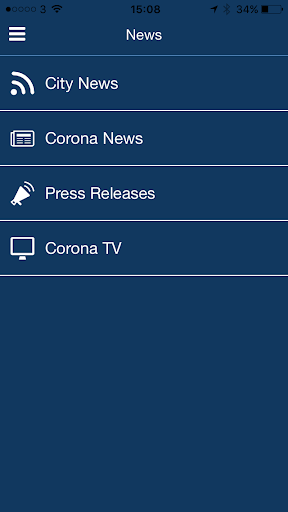  | 
 |   |  

## Development team
In the following we report the main information provided by the development team in the Google play store.

| | |
|-------------------------|-------------------------|
| **Developer**  | City of Corona |
| **Website**  | [http://www.discovercorona.com](http://www.discovercorona.com) |
| **Email** | Brittanyr@ci.corona.ca.us |
| **Physical address**  | [400 S Vicentia Ave Suite 310 Corona, CA 92882](https://www.google.com/maps/search/400%20S%20Vicentia%20Ave%20Suite%20310%20Corona,%20CA%2092882) (Google Maps) |
| **Other developed apps**  | [https://play.google.com/store/apps/developer?id=City+of+Corona](https://play.google.com/store/apps/developer?id=City+of+Corona) |

## Android support

| | |
|-------------------------|-------------------------|
| **Declared target Android version**  | Android10, version 10 (API level 29) |
| **Effective target Android version**  | Android10, version 10 (API level 29) |
| **Minimum supported Android version**  | Lollipop, version 5.1 (API level 22) |
| **Maximum target Android version**  | - |

The larger the difference between the minimum and maximum supported Android versions, the better. A larger difference means a wider audience. For example, old phones have a very low Android version, so a high minimum supported Android version means that the app cannot be used by users with old phones, thus leading to accessibility problems. 

## Requested permissions

In the following we report the complete list of the permissions requested by the app. 

| **Permission** | **Protection level** | **Description** | 
|-------------------------|-------------------------|-------------------------|
 **android.permission ACCESS_ASSISTED_GPS** | - | - 
 **android.permission ACCESS_COARSE_LOCATION** | :warning:**Dangerous** | Allows an app to access approximate location. 
 **android.permission ACCESS_FINE_LOCATION** | :warning:**Dangerous** | Allows an app to access precise location. 
 **android.permission ACCESS_GPS** | - | - 
 **android.permission ACCESS_LOCATION_EXTRA_COMMANDS** | Normal | Allows an application to access extra location provider commands. 
 **android.permission ACCESS_MOCK_LOCATION** | - | - 
 **android.permission ACCESS_NETWORK_STATE** | Normal | Allows applications to access information about networks. 
 **android.permission CAMERA** | :warning:**Dangerous** | Required to be able to access the camera device. 
 **android.permission FLASHLIGHT** | - | - 
 **android.permission FOREGROUND_SERVICE** | Normal | Allows a regular application to use Service.startForeground. 
 **android.permission INTERNET** | Normal | Allows applications to open network sockets. 
 **android.permission READ_APP_BADGE** | - | - 
 **android.permission REQUEST_IGNORE_BATTERY_OPTIMIZATIONS** | Normal | Permission an application must hold in order to use Settings.ACTION_REQUEST_IGNORE_BATTERY_OPTIMIZATIONS. 
 **android.permission VIBRATE** | Normal | Allows access to the vibrator. 
 **android.permission WAKE_LOCK** | Normal | Allows using PowerManager WakeLocks to keep processor from sleeping or screen from dimming. 
 **android.permission WRITE_EXTERNAL_STORAGE** | :warning:**Dangerous** | Allows an application to write to external storage. 
 **com.anddoes.launcher.permission UPDATE_COUNT** | - | - 
 **com.google.android.c2dm.permission RECEIVE** | - | - 
 **com.htc.launcher.permission READ_SETTINGS** | - | - 
 **com.htc.launcher.permission UPDATE_SHORTCUT** | - | - 
 **com.huawei.android.launcher.permission CHANGE_BADGE** | - | - 
 **com.huawei.android.launcher.permission READ_SETTINGS** | - | - 
 **com.huawei.android.launcher.permission WRITE_SETTINGS** | - | - 
 **com.majeur.launcher.permission UPDATE_BADGE** | - | - 
 **com.oppo.launcher.permission READ_SETTINGS** | - | - 
 **com.oppo.launcher.permission WRITE_SETTINGS** | - | - 
 **com.sec.android.provider.badge.permission READ** | - | - 
 **com.sec.android.provider.badge.permission WRITE** | - | - 
 **com.sonyericsson.home.permission BROADCAST_BADGE** | - | - 
 **com.sonymobile.home.permission PROVIDER_INSERT_BADGE** | - | - 
 **io.appbuild.cityofco1.permission C2D_MESSAGE** | - | - 
 **me.everything.badger.permission BADGE_COUNT_READ** | - | - 
 **me.everything.badger.permission BADGE_COUNT_WRITE** | - | - 

## Mentioned servers

| **Server** | **Registrant** | **Registrant country** | **Creation date** | 
|-------------------------|-------------------------|-------------------------|-------------------------|
 | braintreegateway.com | PayPal Inc. | :us: US | 2009-10-06 23:05:33 |
 | googlesyndication.com | Google LLC | :us: US | 2003-01-21 06:17:24 |
 | google.com | Google LLC | :us: US | 1997-09-15 04:00:00 |
 | facebook.com | Facebook, Inc. | :us: US | 1997-03-29 05:00:00 |
 | googleapis.com | Google LLC | :us: US | 2005-01-25 17:52:26 |
 | google-analytics.com | Google LLC | :us: US | 2005-07-18 19:24:32 |
 | app-measurement.com | Google LLC | :us: US | 2015-06-19 20:13:31 |
 | googleapis.com | Google LLC | :us: US | 2005-01-25 17:52:26 |
 | doubleclick.net | Google Inc. | :us: US | 1996-01-16 05:00:00 |
 | gstatic.com | Google LLC | :us: US | 2008-02-11 15:31:25 |
 | googleapis.com | Google LLC | :us: US | 2005-01-25 17:52:26 |
 | visa.com | Visa International Service Association | :us: US | 1994-03-08 05:00:00 |
 | googletagmanager.com | Google LLC | :us: US | 2011-11-11 23:39:05 |
 | appspot.com | Google LLC | :us: US | 2005-03-10 02:27:55 |
 | paypal.com | PayPal Inc. | :us: US | 1999-07-15 05:32:11 |
 | paypalobjects.com | PayPal Inc. | :us: US | 2005-05-12 17:11:21 |
 | whatsapp.com | Whatsapp Inc. | :us: US | 2008-09-04 12:39:12 |

## Security analysis 

Below we report the main security warnings raised by our execution of the [Androwarn](https://github.com/maaaaz/androwarn) security analysis tool.

**Telephony identifiers leakage**
> - This application reads the ISO country code equivalent for the SIM provider's country code 
> - This application reads the MCC+MNC of the provider of the SIM 
> - This application reads the SIM's serial number 
> - This application reads the Service Provider Name (SPN) 
> - This application reads the current location of the device 
> - This application reads the device phone type value 
> - This application reads the numeric name (MCC+MNC) of current registered operator 
> - This application reads the operator name 
> - This application reads the radio technology (network type) currently in use on the device for data transmission 
> - This application reads the unique device ID, i.e the IMEI for GSM and the MEID or ESN for CDMA phones 
> - This application reads the unique subscriber ID, for example, the IMSI for a GSM phone 
> - This application reads the Cell ID value 
> - This application reads the Location Area Code value 

**Location lookup**
> - This application reads location information from all available providers (WiFi, GPS etc.) 

**Connection interfaces exfiltration**
> - This application reads details about the currently active data network 
> - This application tries to find out if the currently active data network is metered 

**Telephony services abuse**
> - This application makes phone calls 
> - This application sends an SMS message 'v12' to the 'Landroid/content/Intent;-><init>()V' phone number 

**Suspicious connection establishment**
> - This application opens a Socket and connects it to the remote address '' on the '80' port  
> - This application opens a Socket and connects it to the remote address 'Network subsystem is unavailable' on the 'N/A' port  

**Pim data leakage**
> - This application accesses the downloads folder 
> - This application accesses data stored in the clipboard 

**Code execution**
> - This application loads a native library 
> - This application executes a UNIX command 
> - This application executes a UNIX command containing this argument: 'Ljava/lang/StringBuilder;->toString()Ljava/lang/String;' 

## User ratings and reviews

Below we provide information about how end users are reacting to the app in terms of ratings and reviews in the Google Play store.

### Ratings

The City of Corona App app has been installed by more than **50000** times. At this time, **43** rated the app and its average score is **3.4418604**. Below we show the distribution of the ratings across the usual star-based rating of Google Play

:star::star::star::star::star:: 21

:star::star::star::star:: 4

:star::star::star:: 3

:star::star:: 3

:star:: 12

### Reviews 

#### 5-star reviews

> Supper  :date: __2020-04-05 18:13:09__

> It is not use  :date: __2020-03-29 04:46:06__

> it is frod  :date: __2020-03-18 13:24:03__

#### 4-star reviews

No recent reviews available with 4 stars.

#### 3-star reviews

> Something something right  :date: __2020-04-03 18:03:13__

#### 2-star reviews

No recent reviews available with 2 stars.

#### 1-star reviews

> useless  :date: __2020-04-14 07:39:44__

> Very bad experience this app in this condition  :date: __2020-04-14 07:05:12__

> Not opening this sight.As per news paper we have to down load the Appp"CORONA KAWACH which informs regarding corona patients near by and advise to take necessary precautions in this regard.But thisdoes not appear in the list .  :date: __2020-03-31 15:34:55__

> does not work very bad performance  :date: __2020-03-30 21:48:38__

> Doesn't work well at all. Download App direct from City of Corona website.  :date: __2019-06-21 00:33:30__

# ALHOSN UAE
App version ``1.44.248``

Analyzed with [covid-apps-observer](http://github.com/covid-apps-observer) project, version ``0.1``

## App overview
| | |
|-------------------------|-------------------------| 
| **Name**&nbsp;&nbsp;&nbsp;&nbsp;&nbsp;&nbsp;&nbsp;&nbsp;&nbsp;&nbsp;&nbsp;&nbsp;&nbsp;&nbsp;&nbsp;&nbsp;&nbsp;&nbsp;&nbsp;&nbsp;&nbsp;&nbsp;&nbsp;&nbsp;&nbsp;&nbsp;&nbsp;&nbsp;&nbsp;&nbsp;&nbsp;&nbsp;&nbsp;&nbsp;&nbsp;&nbsp;&nbsp;&nbsp;&nbsp;&nbsp;  | ALHOSN UAE |
| **Unique identifier** | doh.health.shield |
| **Link to Google Play** | [https://play.google.com/store/apps/details?id=doh.health.shield](https://play.google.com/store/apps/details?id=doh.health.shield) |
| **Summary**  | ALHOSN UAE allows you to keep your COVID-19 results on your mobile device |
| **Privacy policy** | [https://alhosnapp.ae/en/privacy-policy/](https://alhosnapp.ae/en/privacy-policy/) |
| **Latest version** | 1.44.248 |
| **Last update** | 2020-11-10 11:38:29 |
| **Recent changes** | - Improved user experience - App stability |
| **Installs**  | 1,000,000+ |
| **Category** | Medical |
| **First release** | Apr 7, 2020 |
| **Size**  | 12M |
| **Supported Android version**  | 5.0 and up |

### Description
> The ALHOSN UAE app is the official COVID-19 testing channel for health authorities in the United Arab Emirates, by the Ministry of Health and Prevention.
 By using the app, everyone can help stop the spread of COVID-19 and keep their family and friends safe.
  
 You can receive your COVID-19 test results directly on your phone with a unique QR code that is proof of your status and that of everyone else around you who also have the app, giving you peace of mind that you can safely interact.
 The app can also help trace people who may have come within close proximity to confirmed COVID-19 cases for an extended period of time. It uses short-distance Bluetooth signals to determine when your phone is near another phone that also has the app installed.  Both phones exchange anonymized IDs which are then stored in encrypted form on your phone. Using the anonymized IDs, health authorities can quickly identify and contact people at risk of infection so they can be retested.
  
 Put your health in your hands with 3 easy steps:
 1.      Download the ALHOSN UAE app
 2.      Authenticate with your Emirates ID and phone number
 3.      Turn on Bluetooth and push notifications on your smartphone
  
 Download the ALHOSN UAE app today and share it with your family and friends.
 Together, we can stop the spread of COVID-19
 Safer Together.

### User interface
The developers of the app provide the following screenshots in the Google play store.
| | | |
|:-------------------------:|:-------------------------:|:-------------------------:|
 |   |  

## Development team
In the following we report the main information provided by the development team in the Google play store.

| | |
|-------------------------|-------------------------|
| **Developer**  | Ministry of Health and Prevention - UAE |
| **Website**  | [https://alhosnapp.ae/en/contact-us/](https://alhosnapp.ae/en/contact-us/) |
| **Email** | info@alhosnapp.ae |
| **Physical address**  | - |
| **Other developed apps**  | [https://play.google.com/store/apps/developer?id=Ministry+of+Health+and+Prevention+-+UAE](https://play.google.com/store/apps/developer?id=Ministry+of+Health+and+Prevention+-+UAE) |

## Android support

| | |
|-------------------------|-------------------------|
| **Declared target Android version**  | Android10, version 10 (API level 29) |
| **Effective target Android version**  | Android10, version 10 (API level 29) |
| **Minimum supported Android version**  | Lollipop, version 5.0 (API level 21) |
| **Maximum target Android version**  | - |

The larger the difference between the minimum and maximum supported Android versions, the better. A larger difference means a wider audience. For example, old phones have a very low Android version, so a high minimum supported Android version means that the app cannot be used by users with old phones, thus leading to accessibility problems. 

## Requested permissions

In the following we report the complete list of the permissions requested by the app. 

| **Permission** | **Protection level** | **Description** | 
|-------------------------|-------------------------|-------------------------|
 **android.permission ACCESS_BACKGROUND_LOCATION** | :warning:**Dangerous** | Allows an app to access location in the background. 
 **android.permission ACCESS_FINE_LOCATION** | :warning:**Dangerous** | Allows an app to access precise location. 
 **android.permission ACCESS_NETWORK_STATE** | Normal | Allows applications to access information about networks. 
 **android.permission BLUETOOTH** | Normal | Allows applications to connect to paired bluetooth devices. 
 **android.permission BLUETOOTH_ADMIN** | Normal | Allows applications to discover and pair bluetooth devices. 
 **android.permission CAMERA** | :warning:**Dangerous** | Required to be able to access the camera device. 
 **android.permission FOREGROUND_SERVICE** | Normal | Allows a regular application to use Service.startForeground. 
 **android.permission INTERNET** | Normal | Allows applications to open network sockets. 
 **android.permission QUICKBOOT_POWERON** | - | - 
 **android.permission RECEIVE_BOOT_COMPLETED** | Normal | Allows an application to receive the Intent.ACTION_BOOT_COMPLETED that is broadcast after the system finishes booting. 
 **android.permission REQUEST_IGNORE_BATTERY_OPTIMIZATIONS** | Normal | Permission an application must hold in order to use Settings.ACTION_REQUEST_IGNORE_BATTERY_OPTIMIZATIONS. 
 **android.permission WAKE_LOCK** | Normal | Allows using PowerManager WakeLocks to keep processor from sleeping or screen from dimming. 
 **android.permission WRITE_EXTERNAL_STORAGE** | :warning:**Dangerous** | Allows an application to write to external storage. 
 **com.google.android.c2dm.permission RECEIVE** | - | - 

## Mentioned servers

| **Server** | **Registrant** | **Registrant country** | **Creation date** | 
|-------------------------|-------------------------|-------------------------|-------------------------|
 | adobe.com | Adobe Inc. | :us: US | 1986-11-17 05:00:00 |
 | google.com | Google LLC | :us: US | 1997-09-15 04:00:00 |
 | healthshielduae.com | Domains By Proxy, LLC | :us: US | 2020-03-31 19:30:02 |

## Security analysis 

Below we report the main security warnings raised by our execution of the [Androwarn](https://github.com/maaaaz/androwarn) security analysis tool.

**Connection interfaces exfiltration**
> - This application reads details about the currently active data network 
> - This application tries to find out if the currently active data network is metered 

**Suspicious connection establishment**
> - This application opens a Socket and connects it to the remote address 'Li/b/a/a/a;->f(Ljava/lang/String;)Ljava/lang/StringBuilder;' on the 'N/A' port  
> - This application opens a Socket and connects it to the remote address 'Ljava/net/Proxy;->type()Ljava/net/Proxy$Type;' on the 'N/A' port  
> - This application opens a Socket and connects it to the remote address 'hostname == null ' on the 'N/A' port  
> - This application opens a Socket and connects it to the remote address 'timeout' on the 'N/A' port  

**Code execution**
> - This application loads a native library 
> - This application loads a native library: 'tool-checker' 
> - This application executes a UNIX command 
> - This application executes a UNIX command containing this argument: 'getprop' 
> - This application executes a UNIX command containing this argument: 'mount' 

## User ratings and reviews

Below we provide information about how end users are reacting to the app in terms of ratings and reviews in the Google Play store.

### Ratings

The ALHOSN UAE app has been installed by more than **1000000** times. At this time, **6085** rated the app and its average score is **4.3555193**. Below we show the distribution of the ratings across the usual star-based rating of Google Play

:star::star::star::star::star:: 4545

:star::star::star::star:: 543

:star::star::star:: 266

:star::star:: 79

:star:: 652

### Reviews 

#### 5-star reviews

> Good  :date: __2021-01-03 13:17:20__

> for health support  :date: __2021-01-02 23:49:45__

> Good  :date: __2021-01-02 19:06:36__

> Nice application  :date: __2021-01-02 09:44:15__

> Very user friendly  :date: __2021-01-02 00:12:58__

> Awesome  :date: __2021-01-01 06:51:59__

> Nice work uae  :date: __2020-12-31 14:33:26__

> Excellent service  :date: __2020-12-30 23:25:30__

> i love this software  :date: __2020-12-30 19:57:31__

> Very nice and quick  :date: __2020-12-30 18:33:41__

#### 4-star reviews

> Good  :date: __2021-01-03 09:25:31__

> V.good  :date: __2021-01-02 16:14:38__

> Found okay  :date: __2021-01-02 06:23:39__

> Excellent  :date: __2021-01-01 06:08:20__

> Good app  :date: __2020-12-26 14:50:44__

> The result is taking more time to get updated  :date: __2020-12-25 06:09:32__

> Very good app.  :date: __2020-12-23 11:23:08__

> Best way  :date: __2020-12-20 06:55:11__

> Very good  :date: __2020-12-19 08:33:26__

> Good  :date: __2020-12-16 11:33:48__

#### 3-star reviews

> useful  :date: __2020-12-31 16:56:18__

> Nice...  :date: __2020-12-25 02:24:19__

> The updated version is getting hanging..  :date: __2020-12-24 14:17:27__

> Excellent..  :date: __2020-12-21 05:19:25__

> Super  :date: __2020-12-18 11:45:39__

> Hi. I have a problem with the app. I have installed it on my phone but the app stays on home screen only and I am supposed to fly to UAE in a couple of days . What will happen if the app doesn't work on my phone? Do I have to buy a new phone in order to be allowed entry into the country? Can someone please give me some answers. I don't know who to contact about this . Thank you  :date: __2020-12-13 14:12:12__

> Good  :date: __2020-12-11 12:55:07__

> Why my photo won't appear in the app?  :date: __2020-12-10 19:45:41__

> Good  :date: __2020-12-10 09:05:54__

> Did covid test at al zahra hospital sharjah but it was not registered on the alhosn app even though it was negative it should have been shown in app. Please instruct al zahra hosp sharjah esp Nmc group hospitals to register all covid tests or this app will soon become useless  :date: __2020-11-30 05:37:08__

#### 2-star reviews

> I know people using this app have way worse problems than I have but here is my take, I have one problem with the app why does it need my Bluetooth and location data all the time and why can't I make the choice if I want to get notified to know if there is anyone positive near me. The Bluetooth and location permission seems kinda creepy like they are trying to track your devices connected via bluetooth and track your location. That Is my problem with the app.  :date: __2021-01-03 14:43:47__

> It is not showing the update results of covid test  :date: __2021-01-01 21:07:29__

> Not working always  :date: __2021-01-01 13:06:23__

> Very slow  :date: __2020-12-31 11:11:18__

> Since the last update the app is getting stuck, displaying only the splash screen  :date: __2020-12-30 12:01:01__

> I've been re-installing, logging out/logging in again and again but still i cannot proceed to get my result. It always ask me some survey, can't able to submit because it keeps hangs up.  :date: __2020-12-30 06:55:43__

> Good  :date: __2020-12-29 18:16:42__

> Slow. .. can't understand the importance and value of using this application !!!!!  :date: __2020-12-29 05:39:11__

> System very slow  :date: __2020-12-29 04:09:05__

> Hi After installing this app, I can't proceed as it does not show the Yes / No option in the pre-conditions survey. So I can't move forward and do the submit. I tried the uninstallng of app and again installed the same. But still the same. Please rectify the issue. Thanks  :date: __2020-12-27 05:36:27__

#### 1-star reviews

> Opened up the app and the first thing its asking for is: Push notifications(okay cool, I understand that) Location(to send a simple test result? Yeah... no) Bluetooth access(?????? For what???) Battery optimisation(?????? For what???) I'm not even putting this on my phone, sorry. I dont see why this is necessary to simply send a test result through to my phone.  :date: __2021-01-03 11:07:26__

> Can't use it without selling your soul (and battery life), not even to view results and status  :date: __2021-01-02 12:28:17__

> Horrible experience, I have taken vaccine and more than one month has passed tested negative several times, still not given emergency usage , called like more than 10 times to call center waiting patiently and tell the call centre executive the problem they say they have taken complaint bu till now no result, I think it is high time govt of uae looks into these issues.  :date: __2021-01-02 12:21:59__

> Cant go to next level after installation  :date: __2021-01-02 10:09:46__

> I did my pcr test got result via sms but the app is just not updating, I tried restarting the phone deleting and reinstalling the still it shows my last pcr result not the current one. What should I do?  :date: __2021-01-01 11:52:54__

> Unstable app and terrible customer service. They are rude and they never call back or even solve any issues.  :date: __2020-12-31 13:28:22__

> It hasn't updated since my last test. Typing in was a nightmare It says if you see this message restart your phone and I restarted it 6 times and the message still came up.  :date: __2020-12-31 04:10:45__

> Very very BAD app! Ian deleting this app  :date: __2020-12-30 11:03:50__

> Program donst work at all  :date: __2020-12-29 13:03:40__

> This app is trash it doesnt even work properly.  :date: __2020-12-29 11:49:37__

# GoodSAM Responder
App version ``12.6``

Analyzed with [covid-apps-observer](http://github.com/covid-apps-observer) project, version ``0.1``

## App overview
| | |
|-------------------------|-------------------------| 
| **Name**&nbsp;&nbsp;&nbsp;&nbsp;&nbsp;&nbsp;&nbsp;&nbsp;&nbsp;&nbsp;&nbsp;&nbsp;&nbsp;&nbsp;&nbsp;&nbsp;&nbsp;&nbsp;&nbsp;&nbsp;&nbsp;&nbsp;&nbsp;&nbsp;&nbsp;&nbsp;&nbsp;&nbsp;&nbsp;&nbsp;&nbsp;&nbsp;&nbsp;&nbsp;&nbsp;&nbsp;&nbsp;&nbsp;&nbsp;&nbsp;  | GoodSAM Responder |
| **Unique identifier** | com.goodsam.responder |
| **Link to Google Play** | [https://play.google.com/store/apps/details?id=com.goodsam.responder](https://play.google.com/store/apps/details?id=com.goodsam.responder) |
| **Summary**  | GoodSAM connects those with specific skill sets to those in need. |
| **Privacy policy** | [https://goodsamapp.org/dataprotection](https://goodsamapp.org/dataprotection) |
| **Latest version** | 12.6 |
| **Last update** | 2020-12-27 15:45:40 |
| **Recent changes** | Fixing the bug which was causing the app to crash when uploading a photo affecting some android phones. |
| **Installs**  | 100,000+ |
| **Category** | Health & Fitness |
| **First release** | Apr 21, 2014 |
| **Size**  | 55M |
| **Supported Android version**  | 4.1 and up |

### Description
> The GoodSAM Responder App is a professional deployment system used by Emergency Services around the world.
 GoodSAM provides a range of solutions connecting those with specific skill sets to those in need, for example:
 -       GoodSAM Cardiac – This system is used by ambulance services to alert those trained in resuscitation (e.g. off duty paramedics, nurses, doctors, police and fire staff) to those nearby who are likely to be in cardiac arrest. This system has saved many lives around the world.
 -       GoodSAM Volunteer Response – GoodSAM is a platform used by organisations such as the Royal Voluntary Service and British Red Cross.
 -       GoodSAM Pro – This is a professional dispatch system for community first responders and the emergency services.
 The App utilises the latest in location technology and has many advanced features including a built in “radio” (Buzz) function so you can communicate with surrounding colleagues.
 The GoodSAM platform has saved hundreds of lives and helped many thousands of people around the world. If you can help your community, please download the App and register under your parent organisation (or get your parent organisation on board if they are not on!).
 Visit www.goodsamapp.org for more information
 Please download the App and join our global community.

### User interface
The developers of the app provide the following screenshots in the Google play store.
| | | |
|:-------------------------:|:-------------------------:|:-------------------------:|
 |   |   |   | 
 | 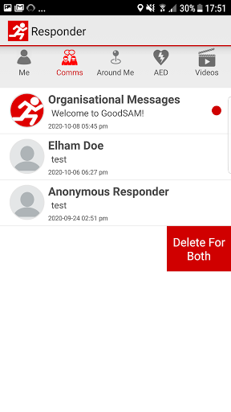  |   |   | 
 |   |  

## Development team
In the following we report the main information provided by the development team in the Google play store.

| | |
|-------------------------|-------------------------|
| **Developer**  | GoodSAM LTD |
| **Website**  | [http://www.goodsamapp.org/](http://www.goodsamapp.org/) |
| **Email** | info@goodsamapp.org |
| **Physical address**  | - |
| **Other developed apps**  | [https://play.google.com/store/apps/developer?id=GoodSAM+LTD](https://play.google.com/store/apps/developer?id=GoodSAM+LTD) |

## Android support

| | |
|-------------------------|-------------------------|
| **Declared target Android version**  | Android10, version 10 (API level 29) |
| **Effective target Android version**  | Android10, version 10 (API level 29) |
| **Minimum supported Android version**  | Jelly Bean, version 4.1.x (API level 16) |
| **Maximum target Android version**  | - |

The larger the difference between the minimum and maximum supported Android versions, the better. A larger difference means a wider audience. For example, old phones have a very low Android version, so a high minimum supported Android version means that the app cannot be used by users with old phones, thus leading to accessibility problems. 

## Requested permissions

In the following we report the complete list of the permissions requested by the app. 

| **Permission** | **Protection level** | **Description** | 
|-------------------------|-------------------------|-------------------------|
 **android.permission ACCESS_BACKGROUND_LOCATION** | :warning:**Dangerous** | Allows an app to access location in the background. 
 **android.permission ACCESS_COARSE_LOCATION** | :warning:**Dangerous** | Allows an app to access approximate location. 
 **android.permission ACCESS_FINE_LOCATION** | :warning:**Dangerous** | Allows an app to access precise location. 
 **android.permission ACCESS_NETWORK_STATE** | Normal | Allows applications to access information about networks. 
 **android.permission CAMERA** | :warning:**Dangerous** | Required to be able to access the camera device. 
 **android.permission FLASHLIGHT** | - | - 
 **android.permission GET_ACCOUNTS** | :warning:**Dangerous** | Allows access to the list of accounts in the Accounts Service. 
 **android.permission INTERNET** | Normal | Allows applications to open network sockets. 
 **android.permission MODIFY_AUDIO_SETTINGS** | Normal | Allows an application to modify global audio settings. 
 **android.permission READ_CONTACTS** | :warning:**Dangerous** | Allows an application to read the user's contacts data. 
 **android.permission READ_EXTERNAL_STORAGE** | :warning:**Dangerous** | Allows an application to read from external storage. 
 **android.permission READ_OWNER_DATA** | - | - 
 **android.permission RECEIVE_BOOT_COMPLETED** | Normal | Allows an application to receive the Intent.ACTION_BOOT_COMPLETED that is broadcast after the system finishes booting. 
 **android.permission RECORD_AUDIO** | :warning:**Dangerous** | Allows an application to record audio. 
 **android.permission REQUEST_IGNORE_BATTERY_OPTIMIZATIONS** | Normal | Permission an application must hold in order to use Settings.ACTION_REQUEST_IGNORE_BATTERY_OPTIMIZATIONS. 
 **android.permission USE_CREDENTIALS** | - | - 
 **android.permission VIBRATE** | Normal | Allows access to the vibrator. 
 **android.permission WAKE_LOCK** | Normal | Allows using PowerManager WakeLocks to keep processor from sleeping or screen from dimming. 
 **android.permission WRITE_EXTERNAL_STORAGE** | :warning:**Dangerous** | Allows an application to write to external storage. 
 **com.goodsam.responder.permission C2D_MESSAGE** | - | - 
 **com.goodsam.responder.permission MAPS_RECEIVE** | - | - 
 **com.google.android.c2dm.permission RECEIVE** | - | - 
 **com.google.android.finsky.permission BIND_GET_INSTALL_REFERRER_SERVICE** | - | - 
 **com.google.android.gms.permission ACTIVITY_RECOGNITION** | - | - 
 **com.google.android.providers.gsf.permission READ_GSERVICES** | - | - 

## Mentioned servers

| **Server** | **Registrant** | **Registrant country** | **Creation date** | 
|-------------------------|-------------------------|-------------------------|-------------------------|
 | facebook.com | Facebook, Inc. | :us: US | 1997-03-29 05:00:00 |
 | google.com | Google LLC | :us: US | 1997-09-15 04:00:00 |
 | goodsam.co.uk | - | - | 2013-07-27 00:00:00 |
 | goodsamapp.org | Registrant State/Province: | GB | 2014-03-17 22:10:28 |
 | linkedin.com | LinkedIn Corporation | :us: US | 2002-11-02 15:38:11 |
 | googlesyndication.com | Google LLC | :us: US | 2003-01-21 06:17:24 |
 | googleapis.com | Google LLC | :us: US | 2005-01-25 17:52:26 |
 | app-measurement.com | Google LLC | :us: US | 2015-06-19 20:13:31 |
 | googleadservices.com | Google LLC | :us: US | 2003-06-19 16:34:53 |

## Security analysis 

Below we report the main security warnings raised by our execution of the [Androwarn](https://github.com/maaaaz/androwarn) security analysis tool.

**Telephony identifiers leakage**
> - This application reads the numeric name (MCC+MNC) of current registered operator 
> - This application reads the operator name 

**Connection interfaces exfiltration**
> - This application reads details about the currently active data network 
> - This application tries to find out if the currently active data network is metered 

**Audio video eavesdropping**
> - This application records audio from the 'MIC' source  

**Suspicious connection establishment**
> - This application opens a Socket and connects it to the remote address '' on the 'N/A' port  
> - This application opens a Socket and connects it to the remote address 'Ljava/lang/StringBuilder;->toString()Ljava/lang/String;' on the 'N/A' port  
> - This application opens a Socket and connects it to the remote address 'Ljava/net/Proxy;->type()Ljava/net/Proxy$Type;' on the 'N/A' port  
> - This application opens a Socket and connects it to the remote address 'Lorg/apache/http/HttpHost;->getPort()I' on the 'Lorg/apache/http/HttpHost;->getPort()I' port  
> - This application opens a Socket and connects it to the remote address 'timeout' on the 'N/A' port  

**Code execution**
> - This application loads a native library 
> - This application executes a UNIX command 

## User ratings and reviews

Below we provide information about how end users are reacting to the app in terms of ratings and reviews in the Google Play store.

### Ratings

The GoodSAM Responder app has been installed by more than **100000** times. At this time, **1213** rated the app and its average score is **2.717742**. Below we show the distribution of the ratings across the usual star-based rating of Google Play

:star::star::star::star::star:: 254

:star::star::star::star:: 117

:star::star::star:: 225

:star::star:: 264

:star:: 353

### Reviews 

#### 5-star reviews

> Yay ! Now can change the alert sound, both I, my neighbour and my neighbour's dog are happy :-)  :date: __2020-12-21 15:15:22__

> Great App, functions well. Alot of people moaning about the noise but they need to understand it was originally set up to alert responders like myself to a cardiac arrest and that this happens infrequently and needs to be loud and out there to make sure it alerts us! I have responded using it and it was very good and I know of several responders that use it well.  :date: __2020-12-16 10:23:43__

> Helping in times like these is vital. User friendly precise and professional.  :date: __2020-09-20 17:43:57__

> Always freeze accept button when I am assigned for task...don't know what's happening...  :date: __2020-09-14 15:21:40__

> A service that provides help for people in need. Very professional and friendly service that's was needed during the Covid 19 pandemic but still provides essential services through out the year.  :date: __2020-09-04 21:29:15__

> Works well! Love being a Responder  :date: __2020-08-26 13:45:55__

> Never had a problem with this app. Very straight forward and they are keen to improve it as it gets used more and more.  :date: __2020-06-19 13:17:18__

> Never had an issue with the app. I use the OHCA responder as not signed up for the NHS voluntary scheme. One glitch I do need help with. I cannot upload photo or position if a community defib. Have tried on 2 phones. Both have location and tags unlocked. But no joy. Any ideas. For those below who are not happy with the app. Keep trying. Be patient. This app has saved lives around the world. It was a steep climb for the design team to go from out of hospital cardiac arrest to what it is now  :date: __2020-06-12 12:32:12__

> Easy to use and extremely useful.  :date: __2020-06-08 21:45:43__

> Very easy to use and works as it should.  :date: __2020-06-03 18:05:29__

#### 4-star reviews

> Swift reply  :date: __2020-12-30 22:08:38__

> As others have reported since last week I have not been receiving the sound alerts and the app is now version 12.5 - I can choose the sound on the"me" page but even the simulated alert doesn't produce a sound. I have missed several alerts including a patient transport. I now have tested the push notification and this worked, so will wait to see what happens when I get a real alert. Thanks for the quick response.  :date: __2020-12-27 12:30:16__

> Good support, very worthwhile and satisfying role in the community.  :date: __2020-12-27 00:45:31__

> Since recent update, siren won't play when simulating a test. Volume is up full, setting is active to play siren even on silent, all app permissions are same prior to update. Don't know if it will work if turnout is real?  :date: __2020-12-24 11:11:53__

> App won't let me register. Freezes with a spinning wheel icon after filling in the form  :date: __2020-12-19 03:03:10__

> Appreciate your helpful response - sadly my area is not on the list but I noticed the link for registering my interest in case it is added in the future. Thank you and all the best  :date: __2020-10-08 19:52:04__

> Please give us a volume control for that dreadful siren  :date: __2020-09-26 15:13:11__

> Well after not bothering to log on much over the summer due to never being called on, I received an email saying more people were needing help. Plus I felt I should do something to say thank you for early access to the Track and Trace app. I logged on half an hour ago and just had my first call! She's already received help from a neighbour but was very grateful for the call.  :date: __2020-09-25 11:51:16__

> The app work good. But the notification siren (which I am not able to change) puts me off. Think about a loud siren in the middle of a restaurant, quite house/work place. Ability to choose between a couple of notification tones/ringtones will be of great help. Thanks  :date: __2020-08-20 12:13:07__

> Seems to work fine, gives plenty of information. Has been disappointing the number of requests that have come through though. Maybe it is a good thing and very few locals need support during the Pandemic.  :date: __2020-07-01 14:54:44__

#### 3-star reviews

> UPDATE! Since couple of bug fixes - slightly improved, but my 'On Duty Hours' only increase when marked "off duty" on the toggles. Still unable to load AED's.  :date: __2020-12-31 12:02:28__

> I am missing calls because there is no sound alert !!!  :date: __2020-12-26 17:32:36__

> Since the new update the Responder app defined alert sound does not work. Instead it uses the standard system alert sound. I sent a test notification from the website as suggested but the loud alert sound does not work.  :date: __2020-12-23 13:35:56__

> I also can't get the sirens to work. All settings are as before.  :date: __2020-12-22 20:41:26__

> Not enough room to write in here what needs addressing as it's limited to 500 letters and spaces I'd barely touched the surface on what needs sorting and ran out of space, but there isn't enough information or user functionality in the app we need a lot more communication options in app with a more detailed description to assist with dealing with failed calls not being answered by the people that are in need plus a lot of other options and also an in app guidance and helpcentre  :date: __2020-12-10 11:08:18__

> Like others have said, I have an issue with the siren. I am a petsitter and it terrifies some of the cats I am visiting. I did ring and complain about this. I ended up turning it off the weeks. I have just turned it back on. Two alerts I accepted. First I keep ringing so dropped the job. Another had already arranged for someone to take him shopping. Now I have just got back the alert I dropped earlier and still no answer. The alerts are not reliable.  :date: __2020-11-28 18:46:36__

> Good app but siren way too loud, it's driving my neighbour mad ! Apart from that, as others say here, 90% of people I ring have no idea why I rang, or how or why somebody put them on list. That needs addressing . On top of that some of the alerts are days old ,their prescription or shopping done days ago.Im becoming a bit disheartened wasting my time every day. I'm more than happy to run around for folks but less happy with wasted calls  :date: __2020-11-19 16:11:24__

> Doesn't work. I try to register using my St John certificate and the swirl of doom just spins foreverrrrrrrr; by which I mean 20 minutes over WiFi. Was able to register via the Web then log in to the app. But app registration just did not work.  :date: __2020-11-17 22:19:48__

> I've responded a couple of times to find that the chat request was for the previous day and had been dealt with? Embarrassing and unnecessary and the siren is excruciating why not a special phone sound kinder on the ears  :date: __2020-11-03 13:24:23__

> The app is ok however this Sunday I received 6 requests in quick succession. All bar one needed no help, and most requests I get end up being no help needed. My main criticism of the app is that once an alert comes in it sets my notification volume to max. I don't want or need to be notified each time normal messages come in which is why it is set to mute. Please can you make sure the app doesn't change my notification settings  :date: __2020-10-09 21:17:20__

#### 2-star reviews

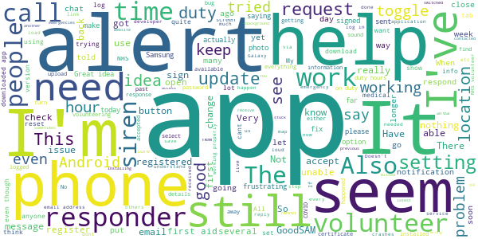

> Location update not working in the background (Android 11, Samsung S20), always getting alerts for emergencies 25mi away. It seems Android 11 isn't allowing an app anymore to ask for permanent background location permissions at point of installation. You have to go in the android apps settings and activate it manually.  :date: __2021-01-03 10:50:40__

> STILL UNABLE, to upload photos of new AEDs locations to the GoodSAM app this is after installing the latest version available. When trying to use a photo taken with a google pixel phone with all location accesses switch on, the GoodSAM app still says to use a picture with location services switched on. In the past, I've replied via email to yourselves about this issue, uploaded bug reports sent pictures and still awaiting your reply. The GoodSAM app still won't sync up with android auto.  :date: __2021-01-01 15:38:33__

> I haven't had contact for over s week and when i go into app says wrong email address !also no siren before that and missed several requests. Not contacted very often. Sometimes people dont need any help.  :date: __2020-12-30 19:12:30__

> When I access the map it get stuck and no response on the screen so can't escape. I have to uninstall and reinstall. This is on the samsung A40  :date: __2020-12-29 14:54:52__

> I have the same problem as previous reviewer ie no sound on Goodsam notifications. I've gone to the website and sent myself a push notification. I now get the standard Samsung notification sound rather than the very distinctive Goodsam loud SIREN. How do I get back to the siren?  :date: __2020-12-23 13:08:55__

> Since last weeks update I no longer receive an audio alert, just visual alert. I have had 6 alerts and missed a couple because of no siren. I have reinstalled the app, re booted the phone and tried it on another Sony and a Samsung. The same problem occurs. Really need a fix to ensure I don't miss any more alerts.  :date: __2020-12-23 11:56:05__

> App is ok but no way to check back on previous messages. I responded to a call from a gentleman who needed shopping tomorrow. I agreed to do it and then toggled the app to show "responded" as soon as I've done that then previous messages dissappear and I now no longer have address or contact details to sort this out tomorrow!!  :date: __2020-11-28 18:00:32__

> My app ppears that it doesn't work I havent had any alerts, and I can't change my organisation  :date: __2020-11-25 21:44:29__

> The alerts work for a few weeks then the siren stop and I'm not notified of an alert. It just says in comma you missed an alert. So frustrating.  :date: __2020-11-18 11:27:38__

> Very poor for something so important. Clumsy, bad layout, adding an AED is broken. Come on, this app is IMPORTANT. Sort it out. (Reply to developer - Yes I have checked both of those settings and it still doesn't work. No reply to 4 emails requesting help either)  :date: __2020-11-17 19:39:03__

#### 1-star reviews

> Lack of clear instructions for new users. Lack of clarity as to what to do when alerted. No facility to indicate failure to contact helpee. Ear splitting siren alert. Responder photo spuriously rotated by 90 degrees. Poor graphics on responder der map - much too large. Code of conduct is incorrect for repurposed usage of the app and assumes physical attendance - also requires acknowledgement to a statement I cannot comply with to use app.  :date: __2021-01-03 11:37:38__

> Absolute rubbish! Can't even register it keeps saying an email has been sent when I didn't even put my email address in anywhere and there is nothing in my emails including my spam, so I deleted the app and re installed it, tried again with an email address this time and it says you already have an account and to go to email to accept. But there is NO EMAIL! So frustrating!  :date: __2021-01-01 20:11:44__

> So complicated and unnecessary to use  :date: __2020-12-30 14:24:01__

> Signed up for volunteering i get a notification for help when I click on accept the app goes blurry in the background and the connection just swirls and freezes ive checked permissions and location permissions in settings they are all on.Ive got a Samsung s10 the app works on my sons phone which is the s8 dont understand why its not working on my phone.  :date: __2020-12-29 18:06:21__

> I am still not getting audio alerts on my app, which is essentail for what I use it for  :date: __2020-12-29 00:45:00__

> 2701 hours on duty and not a single request  :date: __2020-12-28 22:50:16__

> I previously commented that the siren alert no longer worked meaning I had missed several requests. The sound now works when I change the notification sound but still doesn't go off when I simulate an alert. Still a 1 star review until this basic function is fixed.  :date: __2020-12-28 18:25:42__

> The app needs to be more accurate, location tech needs updating and also needs some other updates and upgrades, it isn't showing i have a defib when I have uploaded it numerous times and it has been accepted on both apps please fix immediately/asap  :date: __2020-12-27 01:13:08__

> Since it updated I have missed two calls because it no longer rings but just dings. The siren was much easier to catch. May have to stop being a volunteer if I can't catch the calls in time.  :date: __2020-12-25 19:24:13__

> Worked fine for quite some time and yet now, no requests are coming through and nobody knows why. Have reinstalled etc but no joy. Constantly failing, and no reasoning for it, have emailed you but no response, so I can't help people who need support.  :date: __2020-12-17 19:46:06__

# Campus by Airbus
App version ``2.1.8.3316-SNAPSHOT``

Analyzed with [covid-apps-observer](http://github.com/covid-apps-observer) project, version ``0.1``

## App overview
| | |
|-------------------------|-------------------------| 
| **Name**&nbsp;&nbsp;&nbsp;&nbsp;&nbsp;&nbsp;&nbsp;&nbsp;&nbsp;&nbsp;&nbsp;&nbsp;&nbsp;&nbsp;&nbsp;&nbsp;&nbsp;&nbsp;&nbsp;&nbsp;&nbsp;&nbsp;&nbsp;&nbsp;&nbsp;&nbsp;&nbsp;&nbsp;&nbsp;&nbsp;&nbsp;&nbsp;&nbsp;&nbsp;&nbsp;&nbsp;&nbsp;&nbsp;&nbsp;&nbsp;  | Campus by Airbus |
| **Unique identifier** | com.airbus.campus |
| **Link to Google Play** | [https://play.google.com/store/apps/details?id=com.airbus.campus](https://play.google.com/store/apps/details?id=com.airbus.campus) |
| **Summary**  | An easy-to-use cartography app to navigate around Airbus sites and facilities. |
| **Privacy policy** | [-](-) |
| **Latest version** | 2.1.8.3316-SNAPSHOT |
| **Last update** | 2020-07-21 16:28:33 |
| **Recent changes** | - Main menu options located at bottom of app opening screen for easier access. - POIs changed to clickable icons for easy individual/multiple selection. - “World map” icon added for viewing Airbus European sites quickly. - New “Useful Apps” created for displaying Public/Private apps. - Hamburg Internal shuttle timetables in PDF format. - Orientation/directional improvements in relation to buildings/POIs around users.. - Bugs &amp; general performance improvements. |
| **Installs**  | 10,000+ |
| **Category** | Maps & Navigation |
| **First release** | Apr 23, 2018 |
| **Size**  | 56M |
| **Supported Android version**  | 5.0 and up |

### Description
> Campus is the Airbus app that helps you quickly locate where you are and what is around you whilst visiting an Airbus site. The app provides easy-to-use site search capabilities, which allows you to switch from one site to another quickly by either using the search bar menu, settings or by selecting the “world icon” to view all available sites. The app provides information on building locations, Airbus shuttle services, links to public shuttle services (currently only for Toulouse & Hamburg) and different points of interests like entrance points, car parks, defibrillators, restaurants, etc. The information is provided on a site basis and new supported site information (Buildings, POIs, etc) will appear over time.

### User interface
The developers of the app provide the following screenshots in the Google play store.
| | | |
|:-------------------------:|:-------------------------:|:-------------------------:|
 |   |   |   | 
 |   |   |   | 
 |   | 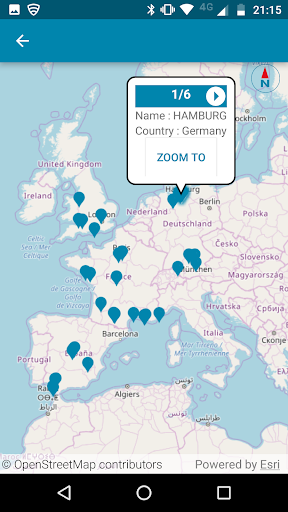 

## Development team
In the following we report the main information provided by the development team in the Google play store.

| | |
|-------------------------|-------------------------|
| **Developer**  | Airbus Group |
| **Website**  | [http://www.airbus.com](http://www.airbus.com) |
| **Email** | support.campus@airbus.com |
| **Physical address**  | [B02 Building 2, rond-point Dewoitine, BP 90112 31703 Blagnac Cedex - FRANCE](https://www.google.com/maps/search/B02%20Building%202,%20rond-point%20Dewoitine,%20BP%2090112%2031703%20Blagnac%20Cedex%20-%20FRANCE) (Google Maps) |
| **Other developed apps**  | [https://play.google.com/store/apps/developer?id=Airbus+Group](https://play.google.com/store/apps/developer?id=Airbus+Group) |

## Android support

| | |
|-------------------------|-------------------------|
| **Declared target Android version**  | Pie, version 9 (API level 28) |
| **Effective target Android version**  | Pie, version 9 (API level 28) |
| **Minimum supported Android version**  | Lollipop, version 5.0 (API level 21) |
| **Maximum target Android version**  | - |

The larger the difference between the minimum and maximum supported Android versions, the better. A larger difference means a wider audience. For example, old phones have a very low Android version, so a high minimum supported Android version means that the app cannot be used by users with old phones, thus leading to accessibility problems. 

## Requested permissions

In the following we report the complete list of the permissions requested by the app. 

| **Permission** | **Protection level** | **Description** | 
|-------------------------|-------------------------|-------------------------|
 **android.permission ACCESS_FINE_LOCATION** | :warning:**Dangerous** | Allows an app to access precise location. 
 **android.permission ACCESS_NETWORK_STATE** | Normal | Allows applications to access information about networks. 
 **android.permission FOREGROUND_SERVICE** | Normal | Allows a regular application to use Service.startForeground. 
 **android.permission INTERNET** | Normal | Allows applications to open network sockets. 
 **android.permission VIBRATE** | Normal | Allows access to the vibrator. 
 **android.permission WAKE_LOCK** | Normal | Allows using PowerManager WakeLocks to keep processor from sleeping or screen from dimming. 
 **com.google.android.c2dm.permission RECEIVE** | - | - 
 **com.google.android.finsky.permission BIND_GET_INSTALL_REFERRER_SERVICE** | - | - 

## Mentioned servers

| **Server** | **Registrant** | **Registrant country** | **Creation date** | 
|-------------------------|-------------------------|-------------------------|-------------------------|
 | amazonaws.com | Amazon.com, Inc. | :us: US | 2005-08-18 02:10:45 |
 | hvv.de | - | - | - |
 | tisseo.fr | TISSEO COLLECTIVITES | - | 2002-12-10 23:00:00 |
 | google.com | Google LLC | :us: US | 1997-09-15 04:00:00 |
 | geofox.de | - | - | - |
 | googlesyndication.com | Google LLC | :us: US | 2003-01-21 06:17:24 |
 | googleapis.com | Google LLC | :us: US | 2005-01-25 17:52:26 |
 | google-analytics.com | Google LLC | :us: US | 2005-07-18 19:24:32 |
 | app-measurement.com | Google LLC | :us: US | 2015-06-19 20:13:31 |
 | googletagmanager.com | Google LLC | :us: US | 2011-11-11 23:39:05 |
 | crashlytics.com | Google LLC | :us: US | 2011-01-21 15:30:40 |

## Security analysis 

Below we report the main security warnings raised by our execution of the [Androwarn](https://github.com/maaaaz/androwarn) security analysis tool.

**Location lookup**
> - This application reads location information from all available providers (WiFi, GPS etc.) 

**Connection interfaces exfiltration**
> - This application reads details about the currently active data network 
> - This application tries to find out if the currently active data network is metered 

**Suspicious connection establishment**
> - This application opens a Socket and connects it to the remote address '' on the 'N/A' port  
> - This application opens a Socket and connects it to the remote address 'Ljava/lang/StringBuilder;->toString()Ljava/lang/String;' on the 'N/A' port  
> - This application opens a Socket and connects it to the remote address 'Ljava/net/Proxy;->type()Ljava/net/Proxy$Type;' on the 'N/A' port  
> - This application opens a Socket and connects it to the remote address 'timeout' on the 'N/A' port  

**Code execution**
> - This application loads a native library 
> - This application loads a native library: '' 
> - This application loads a native library: 'c++_shared' 
> - This application loads a native library: 'runtimecore' 
> - This application loads a native library: 'runtimecore_java' 

## User ratings and reviews

Below we provide information about how end users are reacting to the app in terms of ratings and reviews in the Google Play store.

### Ratings

The Campus by Airbus app has been installed by more than **10000** times. At this time, **37** rated the app and its average score is **2.9729729**. Below we show the distribution of the ratings across the usual star-based rating of Google Play

:star::star::star::star::star:: 13

:star::star::star::star:: 4

:star::star::star:: 2

:star::star:: 5

:star:: 13

### Reviews 

#### 5-star reviews

No recent reviews available with 5 stars.

#### 4-star reviews

> Please update to the new bus schedule in Finkenwerde.  :date: __2019-12-16 07:10:00__

#### 3-star reviews

No recent reviews available with 3 stars.

#### 2-star reviews

> It seems to need some debugging... It crashes before even openig  :date: __2018-05-03 15:49:30__

#### 1-star reviews

> Used to work, now not even loading. Asks for network just after it downloaded the app... Why could there not be sitemap as backup  :date: __2020-01-17 07:37:45__

> Not working with Oppo phone  :date: __2020-01-05 17:21:40__

> No way to make it work, needs debugging...  :date: __2018-09-21 17:54:33__

# One You Active 10 Walking Tracker
App version ``4.1.0``

Analyzed with [covid-apps-observer](http://github.com/covid-apps-observer) project, version ``0.1``

## App overview
| | |
|-------------------------|-------------------------| 
| **Name**&nbsp;&nbsp;&nbsp;&nbsp;&nbsp;&nbsp;&nbsp;&nbsp;&nbsp;&nbsp;&nbsp;&nbsp;&nbsp;&nbsp;&nbsp;&nbsp;&nbsp;&nbsp;&nbsp;&nbsp;&nbsp;&nbsp;&nbsp;&nbsp;&nbsp;&nbsp;&nbsp;&nbsp;&nbsp;&nbsp;&nbsp;&nbsp;&nbsp;&nbsp;&nbsp;&nbsp;&nbsp;&nbsp;&nbsp;&nbsp;  | One You Active 10 Walking Tracker |
| **Unique identifier** | uk.ac.shef.oak.pheactiveten |
| **Link to Google Play** | [https://play.google.com/store/apps/details?id=uk.ac.shef.oak.pheactiveten](https://play.google.com/store/apps/details?id=uk.ac.shef.oak.pheactiveten) |
| **Summary**  | Active 10 shows you when you are walking quickly enough to get health benefits. |
| **Privacy policy** | [https://www.nhs.uk/oneyou/privacy-policy#H6QQyKsRuuBpI7Dg.97](https://www.nhs.uk/oneyou/privacy-policy#H6QQyKsRuuBpI7Dg.97) |
| **Latest version** | 4.1.0 |
| **Last update** | 2020-10-06 14:21:07 |
| **Recent changes** | We release regular updates to the Active 10 app to fix issues and improve performance.  In this release we have completed some minor bug fixes under the hood. |
| **Installs**  | 100,000+ |
| **Category** | Health & Fitness |
| **First release** | Mar 3, 2017 |
| **Size**  | 18M |
| **Supported Android version**  | 5.1 and up |

### Description
> Active 10 is a free and easy to use walking app that tracks your walking and shows you how you can increase your intensity to benefit your health. The app is designed to support you every step of the way to increase your daily level of physical activity, with simple and achievable milestones and rewards along the way.
 Key features:
 * Tracks all your walking and how many minutes were brisk
 * Rewards every brisk minute achieved throughout the day, so perfect for those starting from low levels of activity
 * Promotes goal setting to help keep you motivated and help you progress
 * Store and view up to 12 months of your walking activity, to see how far you have come 
 * Discover loads of hints and tips on achieving a healthier lifestyle
 BRISK WALKING BENEFITS YOUR HEALTH
 We all know how important it is to be active. The good news is you don’t have to go to the gym or start expensive fitness programmes, walking counts too!
 Just ten minutes of brisk walking every day can get your heart pumping and can make you feel more energetic, as well as lowering your risk of serious illnesses like heart disease and type 2 diabetes. Going for a brisk walk is a great way to clear your head and improve your mood.
 Active 10s are simple to fit into your day. From taking the dog out to going for a lunchtime walk there are lots of opportunities to introduce brisk walking into your daily routine.
 This app relies on your phone’s inbuilt sensors to measure your activity so you may experience varying levels of accuracy especially in older devices/operating systems. To improve accuracy, keep your phone in a pocket close to your body rather than in a loose coat pocket or bag.
 If you have any feedback on how we can improve the app please send it to oneyou@phe.gov.uk.
 Frequently asked questions: https://www.nhs.uk/oneyou/active10/faqs

### User interface
The developers of the app provide the following screenshots in the Google play store.
| | | |
|:-------------------------:|:-------------------------:|:-------------------------:|
 |   |   |   | 
 |   |  

## Development team
In the following we report the main information provided by the development team in the Google play store.

| | |
|-------------------------|-------------------------|
| **Developer**  | Public Health England Digital |
| **Website**  | [http://www.nhs.uk/oneyou/active10](http://www.nhs.uk/oneyou/active10) |
| **Email** | oneyou@phe.gov.uk |
| **Physical address**  | - |
| **Other developed apps**  | [https://play.google.com/store/apps/developer?id=Public+Health+England+Digital](https://play.google.com/store/apps/developer?id=Public+Health+England+Digital) |

## Android support

| | |
|-------------------------|-------------------------|
| **Declared target Android version**  | Pie, version 9 (API level 28) |
| **Effective target Android version**  | Pie, version 9 (API level 28) |
| **Minimum supported Android version**  | Lollipop, version 5.1 (API level 22) |
| **Maximum target Android version**  | - |

The larger the difference between the minimum and maximum supported Android versions, the better. A larger difference means a wider audience. For example, old phones have a very low Android version, so a high minimum supported Android version means that the app cannot be used by users with old phones, thus leading to accessibility problems. 

## Requested permissions

In the following we report the complete list of the permissions requested by the app. 

| **Permission** | **Protection level** | **Description** | 
|-------------------------|-------------------------|-------------------------|
 **android.permission ACCESS_FINE_LOCATION** | :warning:**Dangerous** | Allows an app to access precise location. 
 **android.permission ACCESS_NETWORK_STATE** | Normal | Allows applications to access information about networks. 
 **android.permission ACCESS_WIFI_STATE** | Normal | Allows applications to access information about Wi-Fi networks. 
 **android.permission INTERNET** | Normal | Allows applications to open network sockets. 
 **android.permission MODIFY_AUDIO_SETTINGS** | Normal | Allows an application to modify global audio settings. 
 **android.permission READ_EXTERNAL_STORAGE** | :warning:**Dangerous** | Allows an application to read from external storage. 
 **android.permission RECEIVE_BOOT_COMPLETED** | Normal | Allows an application to receive the Intent.ACTION_BOOT_COMPLETED that is broadcast after the system finishes booting. 
 **android.permission RECORD_AUDIO** | :warning:**Dangerous** | Allows an application to record audio. 
 **android.permission WAKE_LOCK** | Normal | Allows using PowerManager WakeLocks to keep processor from sleeping or screen from dimming. 
 **android.permission WRITE_EXTERNAL_STORAGE** | :warning:**Dangerous** | Allows an application to write to external storage. 
 **com.google.android.c2dm.permission RECEIVE** | - | - 
 **com.google.android.finsky.permission BIND_GET_INSTALL_REFERRER_SERVICE** | - | - 

## Mentioned servers

| **Server** | **Registrant** | **Registrant country** | **Creation date** | 
|-------------------------|-------------------------|-------------------------|-------------------------|
 | googleapis.com | Google LLC | :us: US | 2005-01-25 17:52:26 |
 | phedigital.co.uk | - | - | 2018-06-06 00:00:00 |
 | paragon-cc.co.uk | - | - | 2017-04-04 00:00:00 |
 | nhs.uk | Department of Health | - | 1996-08-01 00:00:00 |
 | googlesyndication.com | Google LLC | :us: US | 2003-01-21 06:17:24 |
 | google.com | Google LLC | :us: US | 1997-09-15 04:00:00 |
 | app-measurement.com | Google LLC | :us: US | 2015-06-19 20:13:31 |
 | instabug.com | - | :us: US | 2000-05-16 23:13:25 |
 | crashlytics.com | Google LLC | :us: US | 2011-01-21 15:30:40 |
 | googleadservices.com | Google LLC | :us: US | 2003-06-19 16:34:53 |

## Security analysis 

Below we report the main security warnings raised by our execution of the [Androwarn](https://github.com/maaaaz/androwarn) security analysis tool.

**Telephony identifiers leakage**
> - This application reads the numeric name (MCC+MNC) of current registered operator 
> - This application reads the operator name 

**Connection interfaces exfiltration**
> - This application reads details about the currently active data network 
> - This application tries to find out if the currently active data network is metered 

**Audio video eavesdropping**
> - This application records audio from the 'MIC' source  

**Suspicious connection establishment**
> - This application opens a Socket and connects it to the remote address ': ; port is out of range' on the 'N/A' port  
> - This application opens a Socket and connects it to the remote address 'Lc/b/a/a/a;->a(Ljava/lang/String;)Ljava/lang/StringBuilder;' on the 'N/A' port  
> - This application opens a Socket and connects it to the remote address 'Ljava/net/Proxy;->type()Ljava/net/Proxy$Type;' on the 'N/A' port  
> - This application opens a Socket and connects it to the remote address 'timeout' on the 'N/A' port  

**Code execution**
> - This application loads a native library 
> - This application loads a native library: 'constant' 
> - This application executes a UNIX command 
> - This application executes a UNIX command containing this argument: '' 

## User ratings and reviews

Below we provide information about how end users are reacting to the app in terms of ratings and reviews in the Google Play store.

### Ratings

The One You Active 10 Walking Tracker app has been installed by more than **100000** times. At this time, **3985** rated the app and its average score is **4.235589**. Below we show the distribution of the ratings across the usual star-based rating of Google Play

:star::star::star::star::star:: 2239

:star::star::star::star:: 1079

:star::star::star:: 279

:star::star:: 149

:star:: 239

### Reviews 

#### 5-star reviews

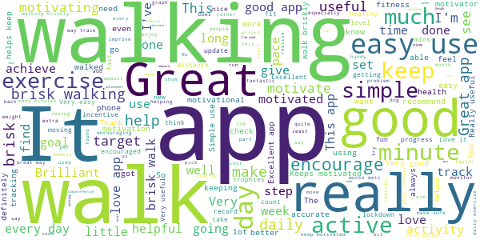

> Reliable, easy to use, encouraging  :date: __2021-01-03 07:08:13__

> Easy to use App, motivating and you monitor your progress because it gives you a weekly progress report  :date: __2021-01-02 16:58:04__

> Brilliant 👏  :date: __2021-01-01 21:48:14__

> Excellent app for tracking Brisk walks  :date: __2021-01-01 14:54:16__

> Great for me keeps me motivated  :date: __2020-12-31 12:17:12__

> Has helped to motivate me to be more active by walking. I have also been able to increase my target through the use of the app  :date: __2020-12-28 21:01:03__

> Great app. It's easy to do 10 minutes brisk walk each day, using the app has encouraged me to do 20 or 30 minutes. But there's no pressure to do more than 10.  :date: __2020-12-28 14:05:04__

> Easy to use _ tracks both total walking and brisk walking, which has certainly encouraged me to speed up a bit! I  :date: __2020-12-25 13:07:54__

> Feel motivated!  :date: __2020-12-23 10:01:29__

> Have been encouraged to keep walking.  :date: __2020-12-22 23:43:24__

#### 4-star reviews

> Using this app helps me to be more disciplined with walking and it has taught me how fast I should be going.  :date: __2021-01-03 09:39:49__

> A great app, so simple and effective.  :date: __2021-01-01 16:51:08__

> Easy to use. Maybe more specific information about brisk walking would help me up my pace as I get fitter  :date: __2020-12-31 16:35:54__

> Only one issue. I am tall over 6ft My wife is 5ft we can do the same walk with very different results. Obviously her little legs are having to go further... It would be useful to be able to set step size, then at least we could compete on a level playing field. Every thing else works well  :date: __2020-12-31 11:07:04__

> Simple app designed to help you become more active. It doesn't record lots of complicated data, just tells you you have walked at a brisk pace for 10 minutes, 20 minutes etc. It has helped me considerably and would recommend it to help get you started on the right track  :date: __2020-12-30 16:12:39__

> My target for my age is 30 mins of brisk walking a day. Can be 10 mins at a time etc. This app gives my total walking time and more importantly my brisk walking time where I puff and pant. Easy to use and accurate. Use it daily now.  :date: __2020-12-28 13:44:13__

> Great idea and very useful. Be aware not always 100% accurate depending on the signal strength.  :date: __2020-12-27 14:10:47__

> All satisfactory  :date: __2020-12-22 19:22:45__

> Very good  :date: __2020-12-14 09:47:03__

> If you want some simple recipes it is a good free app.  :date: __2020-12-13 18:13:20__

#### 3-star reviews

> Unreliable. Data registered and then disappears.  :date: __2021-01-03 14:38:01__

> Generally good and has motivated me to get a faster pace and do that for me time. Some irritations, however. I would like to set a (much) higher target but 30 mins a day is the maximum. Also, totals seem very slow to update at times and you have to close the app and open again. E.g. Its Sunday and yet my Saturday walk was still not reflected in the weekly figurea until I shut the app.  :date: __2020-11-29 23:42:05__

> I would like the app to dostep counter as well as distance and pace record  :date: __2020-11-25 14:34:13__

> Reach goals every day  :date: __2020-11-23 20:09:33__

> OK ish  :date: __2020-11-19 17:11:19__

> If you exceed your target the app doesn't recognise that and tells you 'keep going' for the target.  :date: __2020-11-16 10:42:09__

> Loads quicker than the earlier version, but otherwise inferior. Needs to allow more than 30 minutes as a target, also appears to under-record brisk walking.  :date: __2020-11-10 18:47:51__

> 9 November 2020: it works better than it used to, except I keep getting messages to update, I click the update button but the update doesn't happen. So annoying. Still, this app got me walking, and I've got healthier because of it.  :date: __2020-11-09 11:15:39__

> Active 10 just did an update and got rid of all my walks! Very annoying  :date: __2020-11-05 14:23:04__

> Why does it ask, every time it starts, to get the latest updates, when it has the latest version?? It'll be removed if it continues to annoy me.  :date: __2020-11-04 10:02:55__

#### 2-star reviews

> Always Only show 8 minutes of brisk walking even though I have done 44mins.  :date: __2020-12-30 16:24:28__

> Keep adding my husband and my totals together  :date: __2020-12-29 16:40:16__

> Far too often doesn't recognised I've walked at all.  :date: __2020-12-01 20:26:15__

> I was enjoying this app and it was great for getting you motivated about getting out and about. I have just clicked on it and it's not showing that I did any walking for the last 2 days!! I walk to work, so it should show. It was all there yesterday, but now nothing. Seems pointless using the app of it's going to delete what I've done, that's not very motivating..  :date: __2020-11-29 08:23:41__

> It does not work offline and i hate that  :date: __2020-11-17 08:29:56__

> App needs tweaking. Just walked for 25 mins app says 8 mins active that's all, not recorded the other 17 mins at all, I know phone senser is working as samsung health has recorded correctly. Also it can't add up,yesterday the daily "today" says I've done "32" mins of brisk walking then tells me I've NEARLY achieved 3 x10min awards, but it shows 3 gold cups. I also get fed up of it asking me to "update" everytime I open the app, if I choose "ok" there is clearly no new update  :date: __2020-11-13 12:01:01__

> I like the app, it's simple and tells me exactly what I need to know. But the latest version keeps prompting to update, very annoying!!  :date: __2020-11-08 20:04:35__

> Keeps telling me an update is available. As far as I can tell Ihave already downloaded it  :date: __2020-11-05 13:45:47__

> Very basic, but good enough. Been using for a year now and no major problems. A few extra features would make it more useful, but then I guess complexity could compromise the quality and reliability. UPDATE: New version is buggy. It keeps saying there is an update when I am on the latest.  :date: __2020-11-05 10:13:24__

> App does not give distance travelled, constantly reminds about an update but if you try to update your taken to the option to download same version as already installed. Not good.  :date: __2020-10-23 23:50:09__

#### 1-star reviews

> Doesn't work. Walk fast every day and it's still recorded nothing!!! a  :date: __2020-12-10 09:49:31__

> This is the third time I have installed this app, each time it has failed, locking up, not working. I'll try for the last time Correction this is the fourth and it has frozen YET AGAIN! Given up uninstall Ed. Tried the app again, vastly over reporting the time walking. Will uninstall again when will you get it right?  :date: __2020-12-09 12:23:50__

> Not very accurate! Came back to try the app with a new phone but it still underestimate the number of brisk minutes (in my opinion). I have to almost sprint for it to register and even then it's not very generous. It demotivates rather than encourages so I just make sure I do 30 mins of brisk walking and ignore the app!  :date: __2020-12-08 18:36:34__

> Not working properly, even when brisk walking, says no brisk walking, was OK, up until about 2 weeks ago.... now does not register steps correctly 🙄  :date: __2020-11-29 13:59:30__

> Not accurate  :date: __2020-11-28 23:02:54__

> Nov 2020 - decided to try app again but it crashed twice this past week and can't get any help from the developers. May 2020 - the app has again deleted all my data - which is even more upsetting given how much effort I've been making during lock down to move more. I'd give it 1/2 star now and will be looking for a new app. Previous review (Dec 2019) said the app is great but I no longer think so after my data being totally deleted.  :date: __2020-11-27 22:15:58__

> We are having real issues with this app. A 55 minute very brisk walk recently gave us only 6 minutes brisk walking and the following day showed nothing. Losing relevance rapidly!!  :date: __2020-11-27 10:45:56__

> Cannot get app to work. It seems to get into a loop when setting up at the fitness page. I press continue and get taken back to the beginning.  :date: __2020-11-22 11:49:01__

> I only have a 26inch leg so my strides are short, to get it to register as a brisk walk on this app i had to jog for the10min  :date: __2020-11-18 12:46:23__

> Previous version was very good and accurate. Walk the same route at the same speed. Previous version 20 minutes brisk new version 5 minutes brisk. Going to uninstall. It is a waste of time.  :date: __2020-11-10 20:57:41__

# Leisure for Life
App version ``4.66``

Analyzed with [covid-apps-observer](http://github.com/covid-apps-observer) project, version ``0.1``

## App overview
| | |
|-------------------------|-------------------------| 
| **Name**&nbsp;&nbsp;&nbsp;&nbsp;&nbsp;&nbsp;&nbsp;&nbsp;&nbsp;&nbsp;&nbsp;&nbsp;&nbsp;&nbsp;&nbsp;&nbsp;&nbsp;&nbsp;&nbsp;&nbsp;&nbsp;&nbsp;&nbsp;&nbsp;&nbsp;&nbsp;&nbsp;&nbsp;&nbsp;&nbsp;&nbsp;&nbsp;&nbsp;&nbsp;&nbsp;&nbsp;&nbsp;&nbsp;&nbsp;&nbsp;  | Leisure for Life |
| **Unique identifier** | com.innovatise.rctcbc |
| **Link to Google Play** | [https://play.google.com/store/apps/details?id=com.innovatise.rctcbc](https://play.google.com/store/apps/details?id=com.innovatise.rctcbc) |
| **Summary**  | Access all Rhondda Cynon Taf Leisure Centres from just one App |
| **Privacy policy** | [http://www.rctcbc.gov.uk/leisure](http://www.rctcbc.gov.uk/leisure) |
| **Latest version** | 4.66 |
| **Last update** | 2020-11-24 09:54:45 |
| **Recent changes** | Thanks for using our app! To make our app better for you, we bring updates to the App Store regularly. Updates will include new features, fixes and performance improvements. |
| **Installs**  | 5,000+ |
| **Category** | Health & Fitness |
| **First release** | Dec 1, 2017 |
| **Size**  | 36M |
| **Supported Android version**  | 5.1 and up |

### Description
> With the Rhondda Cynon Taf Council Leisure for Life  app you always have your facility in your pocket with quick and easy access to book your favourite fitness classes and activities. Get up-to-date information, news, fitness class timetables, public swim timetables, offers, events and receive push notifications for important news.
 FITNESS CLASS TIMETABLES
 Get real-time access to your centre’s timetable for classes, including times, fitness instructors and class description.
 FITNESS CLASS BOOKINGS
 Check availability, make a booking, amend a booking and cancel a booking – all on the move!
 PUBLIC SWIM TIMETABLES
 Get real-time access to your centre’s timetable for public swim sessions.
 CENTRE INFORMATION
 Find out about our opening times and facilities.
 NEWS AND PUSH NOTIFICATIONS
 Instantly get notified of centre news and events direct to your phone. With our app, you’ll immediately know when there are new events or classes, ensuring that you’ll never miss a thing.
 OFFERS
 Get push notifications for new offers so you always know about special promotions.
 MEMBERSHIPS AND ONLINE JOINING
 View our different types of membership to find the one which best suits you and join online.
 CONTACT US
 Easily contact us with leisure centre telephone numbers and email addresses or view directions and maps.
 SHARE THROUGH FACEBOOK, TWITTER AND EMAIL
 Share fitness classes, news, centre information and offers with your friends and family at the touch of a button.
 CENTRES INCLUDED
 Rhondda Leisure Centre, Tonyrefail Leisure centre, Llantrisant Leisure Centre, Hawthorn Leisure Centre, Abercynon Leisure Centre, Sobells Leisure centre, Rhondda Fach Leisure Centre, Bronwydd Pool
 ................................
 CYMRAEG
 Drwy lawrlwytho ap Hamdden am Oes Cyngor Rhondda Cynon Taf, bydd modd cadw'r cyfleuster yn eich poced a chadw lle mewn dosbarth ffitrwydd neu ar gyfer gweithgareddau'n gyflym ac yn hawdd. Byddwch chi'n derbyn y wybodaeth a'r newyddion diweddaraf, amserlenni dosbarthiadau ffitrwydd, amserlenni nofio cyhoeddus, cynigion, achlysuron. Bydd modd i chi hefyd dewis derbyn hysbysiadau ynglŷn â newyddion pwysig.
 AMSERLEN Y DOSBARTHIADAU CADW'N HEINI
 Bydd gyda chi fynediad at amserlenni dosbarthiadau'r ganolfan, gan gynnwys amseroedd, hyfforddwyr y dosbarth a disgrifiad o'r dosbarth.
 CADW LLE MEWN DOSBARTH FFITRWYDD
 Bydd modd i chi wirio argaeledd, trefnu gweithgaredd, newid gweithgaredd neu ganslo gweithgaredd - ar eich ffôn!
 AMSERLEN NOFIO CYHOEDDUS
 Bydd gyda chi mynediad at amserlenni sesiynau nofio cyhoeddus eich canolfan.
 GWYBODAETH AM Y GANOLFAN
 Dysgwch ragor am oriau agor a chyfleusterau'r ganolfan.
 NEWYDDION A HYSBYSIADAU
 Cewch chi hysbysebion ynglŷn â newyddion ac achlysuron y ganolfan ar eich ffôn Bydd yr ap yn sicrhau eich bod chi'n cael gwybod pa achlysuron a dosbarthiadau newydd sydd ar gael ar unwaith. Fyddwch chi ddim yn colli allan! 
 CYNIGION
 Byddwch chi'n derbyn hysbysiadau ynglŷn â chynigion newydd fel eich bod chi'n ymwybodol o hyrwyddiadau arbennig.
 AELODAETH AC YMUNO AR-LEIN
 Cymerwch gipolwg ar y mathau gwahanol o aelodaeth sydd ar gael, a dewiswch yr un sydd orau gennych chi. Ymunwch ar-lein!
 MANYLION CYSWLLT  
 Mae'n hawdd cysylltu â ni drwy'r ap. Mae rhifau ffôn a chyfeiriadau e-bost wedi'u nodi, neu mae modd cael cyfeiriadau drwy ddefnyddio'r map.
 RHANNWCH WYBODAETH AR FACEBOOK, TWITTER AC E-BOST
 Rhannwch wybodaeth am ddosbarth ffitrwydd, newyddion, gwybodaeth am y ganolfan a chynigion gyda'ch teulu a'ch ffrindiau wrth bwyso botwm.

### User interface
The developers of the app provide the following screenshots in the Google play store.
| | | |
|:-------------------------:|:-------------------------:|:-------------------------:|
 |   | 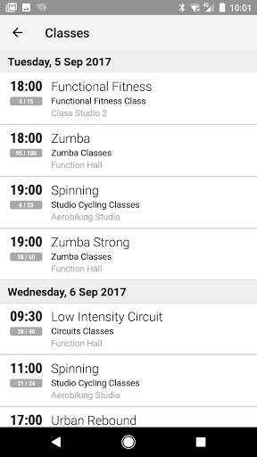  |   | 
 |   |  

## Development team
In the following we report the main information provided by the development team in the Google play store.

| | |
|-------------------------|-------------------------|
| **Developer**  | Innovatise GmbH |
| **Website**  | [http://www.rctcbc.gov.uk/leisure](http://www.rctcbc.gov.uk/leisure) |
| **Email** | leisuremembership@rctcbc.gov.uk |
| **Physical address**  | - |
| **Other developed apps**  | [https://play.google.com/store/apps/developer?id=Innovatise+GmbH](https://play.google.com/store/apps/developer?id=Innovatise+GmbH) |

## Android support

| | |
|-------------------------|-------------------------|
| **Declared target Android version**  | Pie, version 9 (API level 28) |
| **Effective target Android version**  | Pie, version 9 (API level 28) |
| **Minimum supported Android version**  | Lollipop, version 5.0 (API level 21) |
| **Maximum target Android version**  | - |

The larger the difference between the minimum and maximum supported Android versions, the better. A larger difference means a wider audience. For example, old phones have a very low Android version, so a high minimum supported Android version means that the app cannot be used by users with old phones, thus leading to accessibility problems. 

## Requested permissions

In the following we report the complete list of the permissions requested by the app. 

| **Permission** | **Protection level** | **Description** | 
|-------------------------|-------------------------|-------------------------|
 **android.permission ACCESS_COARSE_LOCATION** | :warning:**Dangerous** | Allows an app to access approximate location. 
 **android.permission ACCESS_FINE_LOCATION** | :warning:**Dangerous** | Allows an app to access precise location. 
 **android.permission ACCESS_NETWORK_STATE** | Normal | Allows applications to access information about networks. 
 **android.permission ACCESS_WIFI_STATE** | Normal | Allows applications to access information about Wi-Fi networks. 
 **android.permission AUTHENTICATE_ACCOUNTS** | - | - 
 **android.permission BLUETOOTH** | Normal | Allows applications to connect to paired bluetooth devices. 
 **android.permission BLUETOOTH_ADMIN** | Normal | Allows applications to discover and pair bluetooth devices. 
 **android.permission CAMERA** | :warning:**Dangerous** | Required to be able to access the camera device. 
 **android.permission GET_ACCOUNTS** | :warning:**Dangerous** | Allows access to the list of accounts in the Accounts Service. 
 **android.permission INTERNET** | Normal | Allows applications to open network sockets. 
 **android.permission MANAGE_ACCOUNTS** | - | - 
 **android.permission READ_PHONE_STATE** | :warning:**Dangerous** | Allows read only access to phone state, including the phone number of the device, current cellular network information, the status of any ongoing calls, and a list of any PhoneAccounts registered on the device. 
 **android.permission RECEIVE_BOOT_COMPLETED** | Normal | Allows an application to receive the Intent.ACTION_BOOT_COMPLETED that is broadcast after the system finishes booting. 
 **android.permission VIBRATE** | Normal | Allows access to the vibrator. 
 **android.permission WAKE_LOCK** | Normal | Allows using PowerManager WakeLocks to keep processor from sleeping or screen from dimming. 
 **android.permission WRITE_EXTERNAL_STORAGE** | :warning:**Dangerous** | Allows an application to write to external storage. 
 **com.google.android.c2dm.permission RECEIVE** | - | - 
 **com.google.android.finsky.permission BIND_GET_INSTALL_REFERRER_SERVICE** | - | - 
 **com.google.android.providers.gsf.permission READ_GSERVICES** | - | - 

## Mentioned servers

| **Server** | **Registrant** | **Registrant country** | **Creation date** | 
|-------------------------|-------------------------|-------------------------|-------------------------|
 | google.com | Google LLC | :us: US | 1997-09-15 04:00:00 |
 | myfitapp.de | - | - | - |
 | microsoft.com | Microsoft Corporation | :us: US | 1991-05-02 04:00:00 |
 | googlesyndication.com | Google LLC | :us: US | 2003-01-21 06:17:24 |
 | googleapis.com | Google LLC | :us: US | 2005-01-25 17:52:26 |
 | app-measurement.com | Google LLC | :us: US | 2015-06-19 20:13:31 |

## Security analysis 

Below we report the main security warnings raised by our execution of the [Androwarn](https://github.com/maaaaz/androwarn) security analysis tool.

**Telephony identifiers leakage**
> - This application reads the ISO country code equivalent for the SIM provider's country code 
> - This application reads the ISO country code equivalent of the current registered operator's MCC (Mobile Country Code) 
> - This application reads the MCC+MNC of the provider of the SIM 
> - This application reads the Service Provider Name (SPN) 
> - This application reads the constant indicating the state of the device SIM card 
> - This application reads the device phone type value 
> - This application reads the numeric name (MCC+MNC) of current registered operator 
> - This application reads the operator name 
> - This application reads the radio technology (network type) currently in use on the device for data transmission 
> - This application reads the unique device ID, i.e the IMEI for GSM and the MEID or ESN for CDMA phones 

**Connection interfaces exfiltration**
> - This application reads details about the currently active data network 
> - This application tries to find out if the currently active data network is metered 

**Telephony services abuse**
> - This application makes phone calls 

**Suspicious connection establishment**
> - This application opens a Socket and connects it to the remote address '' on the 'N/A' port  
> - This application opens a Socket and connects it to the remote address 'Ljava/lang/StringBuilder;->toString()Ljava/lang/String;' on the 'N/A' port  
> - This application opens a Socket and connects it to the remote address 'Ljava/net/Proxy;->type()Ljava/net/Proxy$Type;' on the 'N/A' port  
> - This application opens a Socket and connects it to the remote address 'timeout' on the 'N/A' port  

**Code execution**
> - This application loads a native library 
> - This application loads a native library: 'jniPdfium' 
> - This application loads a native library: 'modft2' 
> - This application loads a native library: 'modpdfium' 
> - This application loads a native library: 'modpng' 

## User ratings and reviews

Below we provide information about how end users are reacting to the app in terms of ratings and reviews in the Google Play store.

### Ratings

The Leisure for Life app has been installed by more than **5000** times. At this time, **32** rated the app and its average score is **2.90625**. Below we show the distribution of the ratings across the usual star-based rating of Google Play

:star::star::star::star::star:: 12

:star::star::star::star:: 1

:star::star::star:: 4

:star::star:: 2

:star:: 13

### Reviews 

#### 5-star reviews

> Fantastic  :date: __2020-12-20 19:56:08__

> awsome  :date: __2019-05-07 17:19:15__

> Can book all my classes with ease now . If in welsh change by clicking top 
left hand corner and select new club with. +  :date: __2018-08-01 10:43:48__

> I use it to book classes and find out times  :date: __2018-04-27 19:56:40__

> So far, so good! Looks great. Easy to navigate and book with!  :date: __2017-12-11 22:50:58__

> Fantastic app so convenient for booking classes and keeping track of my workouts love it 👍  :date: __2017-12-07 14:30:54__

#### 4-star reviews

> Teething problems. As it was in welsh but how to sort below If you go to the APP and in the left hand corner there is a menu tab 'three lines'.   Then click the 'my clubs' tab. Then click + in the right hand corner. Then you should be able to see all pages or club names in both English and in Welsh. Select one in your language prefrence  :date: __2020-10-08 15:34:33__

#### 3-star reviews

> When it works it's really good...it's really hit and miss though! It either sits on a loading page for ages or tells you there's a jellybean error 🤔 fix these annoying glitches and it would be brilliant.  :date: __2020-09-15 20:05:15__

> It's basically like a mobile version of the website. No support for NFC  :date: __2017-12-13 08:35:18__

#### 2-star reviews

> Having to keep uninstalling and reinstalling in the hopes that it may work. Sometimes I can book gym sessions, often I cant. Such a shame as the app seems to have a lot of potential.  :date: __2020-08-18 18:07:59__

> Was OK until updated. Now cannot book a class within half an hour of it starting. Various classes don't show up, just received an update that boot camp classes are available to book and upon checking they do not show. Should be able to swipe in with phone but no availability to do this so it means queueing at the entrance before you can go to the class.  :date: __2019-05-25 16:05:53__

#### 1-star reviews

> Stopped working for upgrade days ago and still not working!  :date: __2020-10-17 16:51:28__

> No option to book as just public I dont want a membership  :date: __2020-10-17 05:45:37__

> No option for this is English?! We're not all Welsh speakers!  :date: __2020-09-28 11:03:54__

> Terrible just terrible only gives Welsh language with no option to switch no clear signpost to register as a new member. Eventually get to the end of the process and it's corrupted and throws you all the way out Rubbish. Waste of time  :date: __2020-09-24 18:33:43__

> Just awful  :date: __2020-09-02 09:42:44__

> Worked fine until yesterday's update. Now I cant book classes. Can you sort it asap  :date: __2020-08-17 20:51:35__

> Unable to book a class....rubbish  :date: __2020-08-11 00:04:20__

> It's all in Welsh is there an option to change it to english  :date: __2018-07-25 13:25:31__

> it's all in welsh ....how do you turn on English?  :date: __2018-07-10 11:39:19__

> It's all in Welsh is there a way to change this please?  :date: __2018-06-21 01:01:46__

# Bramley Health App
App version ``1.0.0``

Analyzed with [covid-apps-observer](http://github.com/covid-apps-observer) project, version ``0.1``

## App overview
| | |
|-------------------------|-------------------------| 
| **Name**&nbsp;&nbsp;&nbsp;&nbsp;&nbsp;&nbsp;&nbsp;&nbsp;&nbsp;&nbsp;&nbsp;&nbsp;&nbsp;&nbsp;&nbsp;&nbsp;&nbsp;&nbsp;&nbsp;&nbsp;&nbsp;&nbsp;&nbsp;&nbsp;&nbsp;&nbsp;&nbsp;&nbsp;&nbsp;&nbsp;&nbsp;&nbsp;&nbsp;&nbsp;&nbsp;&nbsp;&nbsp;&nbsp;&nbsp;&nbsp;  | Bramley Health App |
| **Unique identifier** | com.AppInstitute.bramleyv1 |
| **Link to Google Play** | [https://play.google.com/store/apps/details?id=com.AppInstitute.bramleyv1](https://play.google.com/store/apps/details?id=com.AppInstitute.bramleyv1) |
| **Summary**  | Providing NHS Primary Care GP Services |
| **Privacy policy** | [http://cms.appbuild.io/cms/docs/legal/privacy.php?appcode=thisapp](http://cms.appbuild.io/cms/docs/legal/privacy.php?appcode=thisapp) |
| **Latest version** | 1.0.0 |
| **Last update** | 2019-07-17 12:30:05 |
| **Recent changes** | - |
| **Installs**  | 1,000+ |
| **Category** | Health & Fitness |
| **First release** | May 9, 2018 |
| **Size**  | 32M |
| **Supported Android version**  | 4.4 and up |

### Description
> The Bramley Health App is designed for our patients who are registered at one of our sites in England. Once registered as a patient, you can access online services including:
 - econsultations: reviewed by a GP or Nurse Practitioner once submitted who will get in contact regarding next steps
 - face-to-face and telephone appointments: bookable via the login section
 - video consultations: visit the econsultation page for more information
 - request a referral based: you request will be reviewed by a clinician who will either refer you or make contact to discuss further
 - sick note request: use the app to submit a new or repeat sick note request
 - medication request: use the econsultation section to order repeat or request new medication
 - view your GP medical record: log in to your medical record via the app and view your medical history, previous test results and other health information about you
 - health information: read and watch health information 
 To use the app, you must be aged 13 and over and registered with one of our GP surgeries. Registering is easy and can be done using the app. As long as you live in England, you can register with us and make us your main GP Surgery which will allow you to access all our online services. If you live more than 2 miles away from our physical locations, you will still be able to access all our services except for home visits.

### User interface
The developers of the app provide the following screenshots in the Google play store.
| | | |
|:-------------------------:|:-------------------------:|:-------------------------:|
 |   |   |   | 
 |   |   |   | 
 |  

## Development team
In the following we report the main information provided by the development team in the Google play store.

| | |
|-------------------------|-------------------------|
| **Developer**  | Fuller and Forbes Healthare |
| **Website**  | [http://www.bramleyonline.co.uk](http://www.bramleyonline.co.uk) |
| **Email** | bramley.village@nhs.net |
| **Physical address**  | [Fuller and Forbes Healthcare Bramley Village Health and Wellbeing Centre Highfield Road Bramley Leeds LS13 2BL](https://www.google.com/maps/search/Fuller%20and%20Forbes%20Healthcare%20Bramley%20Village%20Health%20and%20Wellbeing%20Centre%20Highfield%20Road%20Bramley%20Leeds%20LS13%202BL) (Google Maps) |
| **Other developed apps**  | [https://play.google.com/store/apps/developer?id=Fuller+and+Forbes+Healthare](https://play.google.com/store/apps/developer?id=Fuller+and+Forbes+Healthare) |

## Android support

| | |
|-------------------------|-------------------------|
| **Declared target Android version**  | Pie, version 9 (API level 28) |
| **Effective target Android version**  | Pie, version 9 (API level 28) |
| **Minimum supported Android version**  | KitKat, version 4.4 - 4.4.4 (API level 19) |
| **Maximum target Android version**  | - |

The larger the difference between the minimum and maximum supported Android versions, the better. A larger difference means a wider audience. For example, old phones have a very low Android version, so a high minimum supported Android version means that the app cannot be used by users with old phones, thus leading to accessibility problems. 

## Requested permissions

In the following we report the complete list of the permissions requested by the app. 

| **Permission** | **Protection level** | **Description** | 
|-------------------------|-------------------------|-------------------------|
 **android.permission ACCESS_ASSISTED_GPS** | - | - 
 **android.permission ACCESS_COARSE_LOCATION** | :warning:**Dangerous** | Allows an app to access approximate location. 
 **android.permission ACCESS_FINE_LOCATION** | :warning:**Dangerous** | Allows an app to access precise location. 
 **android.permission ACCESS_GPS** | - | - 
 **android.permission ACCESS_LOCATION_EXTRA_COMMANDS** | Normal | Allows an application to access extra location provider commands. 
 **android.permission ACCESS_MOCK_LOCATION** | - | - 
 **android.permission ACCESS_NETWORK_STATE** | Normal | Allows applications to access information about networks. 
 **android.permission CAMERA** | :warning:**Dangerous** | Required to be able to access the camera device. 
 **android.permission FLASHLIGHT** | - | - 
 **android.permission INTERNET** | Normal | Allows applications to open network sockets. 
 **android.permission READ_APP_BADGE** | - | - 
 **android.permission VIBRATE** | Normal | Allows access to the vibrator. 
 **android.permission WAKE_LOCK** | Normal | Allows using PowerManager WakeLocks to keep processor from sleeping or screen from dimming. 
 **android.permission WRITE_EXTERNAL_STORAGE** | :warning:**Dangerous** | Allows an application to write to external storage. 
 **com.AppInstitute.bramleyv1.permission C2D_MESSAGE** | - | - 
 **com.anddoes.launcher.permission UPDATE_COUNT** | - | - 
 **com.google.android.c2dm.permission RECEIVE** | - | - 
 **com.htc.launcher.permission READ_SETTINGS** | - | - 
 **com.htc.launcher.permission UPDATE_SHORTCUT** | - | - 
 **com.huawei.android.launcher.permission CHANGE_BADGE** | - | - 
 **com.huawei.android.launcher.permission READ_SETTINGS** | - | - 
 **com.huawei.android.launcher.permission WRITE_SETTINGS** | - | - 
 **com.majeur.launcher.permission UPDATE_BADGE** | - | - 
 **com.oppo.launcher.permission READ_SETTINGS** | - | - 
 **com.oppo.launcher.permission WRITE_SETTINGS** | - | - 
 **com.sec.android.provider.badge.permission READ** | - | - 
 **com.sec.android.provider.badge.permission WRITE** | - | - 
 **com.sonyericsson.home.permission BROADCAST_BADGE** | - | - 
 **com.sonymobile.home.permission PROVIDER_INSERT_BADGE** | - | - 
 **me.everything.badger.permission BADGE_COUNT_READ** | - | - 
 **me.everything.badger.permission BADGE_COUNT_WRITE** | - | - 

## Mentioned servers

| **Server** | **Registrant** | **Registrant country** | **Creation date** | 
|-------------------------|-------------------------|-------------------------|-------------------------|
 | braintreegateway.com | PayPal Inc. | :us: US | 2009-10-06 23:05:33 |
 | googlesyndication.com | Google LLC | :us: US | 2003-01-21 06:17:24 |
 | google.com | Google LLC | :us: US | 1997-09-15 04:00:00 |
 | facebook.com | Facebook, Inc. | :us: US | 1997-03-29 05:00:00 |
 | googleapis.com | Google LLC | :us: US | 2005-01-25 17:52:26 |
 | google-analytics.com | Google LLC | :us: US | 2005-07-18 19:24:32 |
 | app-measurement.com | Google LLC | :us: US | 2015-06-19 20:13:31 |
 | googleapis.com | Google LLC | :us: US | 2005-01-25 17:52:26 |
 | doubleclick.net | Google Inc. | :us: US | 1996-01-16 05:00:00 |
 | gstatic.com | Google LLC | :us: US | 2008-02-11 15:31:25 |
 | googleapis.com | Google LLC | :us: US | 2005-01-25 17:52:26 |
 | visa.com | Visa International Service Association | :us: US | 1994-03-08 05:00:00 |
 | googletagmanager.com | Google LLC | :us: US | 2011-11-11 23:39:05 |
 | appspot.com | Google LLC | :us: US | 2005-03-10 02:27:55 |
 | paypal.com | PayPal Inc. | :us: US | 1999-07-15 05:32:11 |
 | paypalobjects.com | PayPal Inc. | :us: US | 2005-05-12 17:11:21 |
 | whatsapp.com | Whatsapp Inc. | :us: US | 2008-09-04 12:39:12 |

## Security analysis 

Below we report the main security warnings raised by our execution of the [Androwarn](https://github.com/maaaaz/androwarn) security analysis tool.

**Telephony identifiers leakage**
> - This application reads the ISO country code equivalent for the SIM provider's country code 
> - This application reads the MCC+MNC of the provider of the SIM 
> - This application reads the SIM's serial number 
> - This application reads the Service Provider Name (SPN) 
> - This application reads the current location of the device 
> - This application reads the device phone type value 
> - This application reads the numeric name (MCC+MNC) of current registered operator 
> - This application reads the operator name 
> - This application reads the radio technology (network type) currently in use on the device for data transmission 
> - This application reads the unique device ID, i.e the IMEI for GSM and the MEID or ESN for CDMA phones 
> - This application reads the unique subscriber ID, for example, the IMSI for a GSM phone 
> - This application reads the Cell ID value 
> - This application reads the Location Area Code value 

**Location lookup**
> - This application reads location information from all available providers (WiFi, GPS etc.) 

**Connection interfaces exfiltration**
> - This application reads details about the currently active data network 
> - This application tries to find out if the currently active data network is metered 

**Telephony services abuse**
> - This application makes phone calls 
> - This application sends an SMS message 'v12' to the 'Landroid/content/Intent;-><init>()V' phone number 

**Suspicious connection establishment**
> - This application opens a Socket and connects it to the remote address '' on the '80' port  
> - This application opens a Socket and connects it to the remote address 'Network subsystem is unavailable' on the 'N/A' port  

**Pim data leakage**
> - This application accesses the downloads folder 
> - This application accesses data stored in the clipboard 

**Code execution**
> - This application loads a native library 
> - This application executes a UNIX command 
> - This application executes a UNIX command containing this argument: 'Ljava/lang/StringBuilder;->toString()Ljava/lang/String;' 

## User ratings and reviews

Below we provide information about how end users are reacting to the app in terms of ratings and reviews in the Google Play store.

### Ratings

The Bramley Health App app has been installed by more than **1000** times. At this time, **-** rated the app and its average score is **0.0**. Below we show the distribution of the ratings across the usual star-based rating of Google Play

:star::star::star::star::star:: 0

:star::star::star::star:: 0

:star::star::star:: 0

:star::star:: 0

:star:: 0

### Reviews 

#### 5-star reviews

No recent reviews available with 5 stars.

#### 4-star reviews

No recent reviews available with 4 stars.

#### 3-star reviews

No recent reviews available with 3 stars.

#### 2-star reviews

No recent reviews available with 2 stars.

#### 1-star reviews

> Q The app will not allow me to register to use the service.  :date: __2020-11-19 13:59:38__

> Terrible  :date: __2020-06-17 12:43:14__

> Shocking , awful app. Unable to register as page just comes up blank when clicking to register via the app. Guess I'll have to stick to the good old fashioned way of ringing the doctors up  :date: __2020-05-01 09:39:46__

# MenaLabs
App version ``1.1.4``

Analyzed with [covid-apps-observer](http://github.com/covid-apps-observer) project, version ``0.1``

## App overview
| | |
|-------------------------|-------------------------| 
| **Name**&nbsp;&nbsp;&nbsp;&nbsp;&nbsp;&nbsp;&nbsp;&nbsp;&nbsp;&nbsp;&nbsp;&nbsp;&nbsp;&nbsp;&nbsp;&nbsp;&nbsp;&nbsp;&nbsp;&nbsp;&nbsp;&nbsp;&nbsp;&nbsp;&nbsp;&nbsp;&nbsp;&nbsp;&nbsp;&nbsp;&nbsp;&nbsp;&nbsp;&nbsp;&nbsp;&nbsp;&nbsp;&nbsp;&nbsp;&nbsp;  | MenaLabs |
| **Unique identifier** | com.menalabs.app |
| **Link to Google Play** | [https://play.google.com/store/apps/details?id=com.menalabs.app](https://play.google.com/store/apps/details?id=com.menalabs.app) |
| **Summary**  | Find a specialist or medical test and book a visit at MenaLabs laboratories |
| **Privacy policy** | [https://www.heartbits.me/privacy-policy/](https://www.heartbits.me/privacy-policy/) |
| **Latest version** | 1.1.4 |
| **Last update** | 2020-09-24 10:56:00 |
| **Recent changes** | Visual improvements |
| **Installs**  | 500+ |
| **Category** | Medical |
| **First release** | Apr 18, 2020 |
| **Size**  | 11M |
| **Supported Android version**  | 4.1 and up |

### Description
> Manage your health mobile way. Find a specialists or medical test and make an appointment at MenaLabs laboratories.
 MenaLabs mobile application allows making appointments in MenaLabs laboratories with specialists of your need and ordering specialty tests. The application brings also loyalty program for MenaLabs customers.
 A transparent interface and intuitive navigation allow:
 *) user registration
 *) presentation of a health care provider
 *) presentation of specialists and their profiles
 *) mechanism to book, reschedule and cancel appointments with specialists
 *) notification reminder about an incoming visit
 *) visit satisfaction feedback collection
 *) presentation of history of visits
 *) laboratory result delivery to the patient
 *) mechanism of loyalty points collection
 *) presentation of rewards to be redeemed using the collected loyalty points

### User interface
The developers of the app provide the following screenshots in the Google play store.
| | | |
|:-------------------------:|:-------------------------:|:-------------------------:|
 |   |   |   | 
 |   |  

## Development team
In the following we report the main information provided by the development team in the Google play store.

| | |
|-------------------------|-------------------------|
| **Developer**  | Menalabs |
| **Website**  | [https://www.menalabs.com/](https://www.menalabs.com/) |
| **Email** | support@heartbits.me |
| **Physical address**  | - |
| **Other developed apps**  | [https://play.google.com/store/apps/developer?id=Menalabs](https://play.google.com/store/apps/developer?id=Menalabs) |

## Android support

| | |
|-------------------------|-------------------------|
| **Declared target Android version**  | Android10, version 10 (API level 29) |
| **Effective target Android version**  | Android10, version 10 (API level 29) |
| **Minimum supported Android version**  | Jelly Bean, version 4.1.x (API level 16) |
| **Maximum target Android version**  | - |

The larger the difference between the minimum and maximum supported Android versions, the better. A larger difference means a wider audience. For example, old phones have a very low Android version, so a high minimum supported Android version means that the app cannot be used by users with old phones, thus leading to accessibility problems. 

## Requested permissions

In the following we report the complete list of the permissions requested by the app. 

| **Permission** | **Protection level** | **Description** | 
|-------------------------|-------------------------|-------------------------|
 **android.permission ACCESS_COARSE_LOCATION** | :warning:**Dangerous** | Allows an app to access approximate location. 
 **android.permission ACCESS_NETWORK_STATE** | Normal | Allows applications to access information about networks. 
 **android.permission ACCESS_WIFI_STATE** | Normal | Allows applications to access information about Wi-Fi networks. 
 **android.permission INTERNET** | Normal | Allows applications to open network sockets. 
 **android.permission RECEIVE_BOOT_COMPLETED** | Normal | Allows an application to receive the Intent.ACTION_BOOT_COMPLETED that is broadcast after the system finishes booting. 
 **android.permission VIBRATE** | Normal | Allows access to the vibrator. 
 **android.permission WAKE_LOCK** | Normal | Allows using PowerManager WakeLocks to keep processor from sleeping or screen from dimming. 
 **com.google.android.c2dm.permission RECEIVE** | - | - 
 **com.google.android.finsky.permission BIND_GET_INSTALL_REFERRER_SERVICE** | - | - 

## Mentioned servers

| **Server** | **Registrant** | **Registrant country** | **Creation date** | 
|-------------------------|-------------------------|-------------------------|-------------------------|
 | android.com | Google LLC | :us: US | 1997-06-23 04:00:00 |
 | googlesyndication.com | Google LLC | :us: US | 2003-01-21 06:17:24 |
 | google.com | Google LLC | :us: US | 1997-09-15 04:00:00 |
 | app-measurement.com | Google LLC | :us: US | 2015-06-19 20:13:31 |
 | googleapis.com | Google LLC | :us: US | 2005-01-25 17:52:26 |
 | googleadservices.com | Google LLC | :us: US | 2003-06-19 16:34:53 |

## Security analysis 

Below we report the main security warnings raised by our execution of the [Androwarn](https://github.com/maaaaz/androwarn) security analysis tool.

**Telephony identifiers leakage**
> - This application reads the numeric name (MCC+MNC) of current registered operator 
> - This application reads the operator name 
> - This application reads the phone number string for line 1, for example, the MSISDN for a GSM phone 

**Location lookup**
> - This application reads location information from all available providers (WiFi, GPS etc.) 

**Connection interfaces exfiltration**
> - This application reads details about the currently active data network 
> - This application tries to find out if the currently active data network is metered 

**Suspicious connection establishment**
> - This application opens a Socket and connects it to the remote address '' on the 'N/A' port  
> - This application opens a Socket and connects it to the remote address 'Ljava/lang/StringBuilder;->toString()Ljava/lang/String;' on the ': connect, resolve' port  
> - This application opens a Socket and connects it to the remote address 'Ljava/lang/StringBuilder;->toString()Ljava/lang/String;' on the 'N/A' port  
> - This application opens a Socket and connects it to the remote address 'Ljava/net/Proxy;->type()Ljava/net/Proxy$Type;' on the 'N/A' port  
> - This application opens a Socket and connects it to the remote address 'timeout' on the 'N/A' port  

**Pim data leakage**
> - This application accesses data stored in the clipboard 

**Code execution**
> - This application loads a native library 
> - This application executes a UNIX command containing this argument: '2' 

## User ratings and reviews

Below we provide information about how end users are reacting to the app in terms of ratings and reviews in the Google Play store.

### Ratings

The MenaLabs app has been installed by more than **500** times. At this time, **30** rated the app and its average score is **4.866667**. Below we show the distribution of the ratings across the usual star-based rating of Google Play

:star::star::star::star::star:: 29

:star::star::star::star:: 0

:star::star::star:: 0

:star::star:: 0

:star:: 1

### Reviews 

#### 5-star reviews

> Fast and reliable service  :date: __2020-09-09 06:53:21__

> Exceptional services,easy to navigate  :date: __2020-08-20 17:49:31__

> Easy to use. 👏  :date: __2020-08-17 10:39:33__

> Great staff and fast and efficient service.  :date: __2020-08-17 10:25:23__

> So educative and a friendly place of work  :date: __2020-08-16 10:46:45__

> Appoinment are so easy..staff are expert and professionals. excellent Apps Keep it up👍👍👍👍👍  :date: __2020-08-15 13:41:12__

> Fast and Reliable results.  :date: __2020-08-15 12:26:50__

> They provide ultimate quality service  :date: __2020-08-15 12:06:56__

> Easy to book an appointment and very reliable  :date: __2020-08-15 11:51:16__

> Easy to navigate app, very responsive. 5 star to this!  :date: __2020-08-15 11:50:51__

#### 4-star reviews

No recent reviews available with 4 stars.

#### 3-star reviews

No recent reviews available with 3 stars.

#### 2-star reviews

No recent reviews available with 2 stars.

#### 1-star reviews

No recent reviews available with 1 stars.

# LTH Guidelines
App version ``1.1.0``

Analyzed with [covid-apps-observer](http://github.com/covid-apps-observer) project, version ``0.1``

## App overview
| | |
|-------------------------|-------------------------| 
| **Name**&nbsp;&nbsp;&nbsp;&nbsp;&nbsp;&nbsp;&nbsp;&nbsp;&nbsp;&nbsp;&nbsp;&nbsp;&nbsp;&nbsp;&nbsp;&nbsp;&nbsp;&nbsp;&nbsp;&nbsp;&nbsp;&nbsp;&nbsp;&nbsp;&nbsp;&nbsp;&nbsp;&nbsp;&nbsp;&nbsp;&nbsp;&nbsp;&nbsp;&nbsp;&nbsp;&nbsp;&nbsp;&nbsp;&nbsp;&nbsp;  | LTH Guidelines |
| **Unique identifier** | com.nhs.lth.guidelines |
| **Link to Google Play** | [https://play.google.com/store/apps/details?id=com.nhs.lth.guidelines](https://play.google.com/store/apps/details?id=com.nhs.lth.guidelines) |
| **Summary**  | Hospital guidelines for health care professionals. |
| **Privacy policy** | [-](-) |
| **Latest version** | 1.1.0 |
| **Last update** | 2020-03-15 19:51:54 |
| **Recent changes** | Links can be opened from description page |
| **Installs**  | 500+ |
| **Category** | Medical |
| **First release** | Mar 13, 2020 |
| **Size**  | 7.0M |
| **Supported Android version**  | 4.1 and up |

### Description
> This app provides hospital guidelines for healthcare professions. This app replicates guidelines published elsewhere, such as on www.gov.uk by Public Health England and provides guidance on current practice allowing safe and effective assessment, placement, testing and management of patients. Guidelines are regularly reviewed in line with updates from Public Health England and other sources.

### User interface
The developers of the app provide the following screenshots in the Google play store.
| | | |
|:-------------------------:|:-------------------------:|:-------------------------:|
 |   |   |   | 

## Development team
In the following we report the main information provided by the development team in the Google play store.

| | |
|-------------------------|-------------------------|
| **Developer**  | Lancashire Teaching Hospitals NHS Foundation Trust |
| **Website**  | [https://www.lancsteachinghospitals.nhs.uk/](https://www.lancsteachinghospitals.nhs.uk/) |
| **Email** | webmaster@lthtr.nhs.uk |
| **Physical address**  | [Lancashire Teaching Hospitals Royal Preston Hospital Sharoe Green Lane Fulwood Preston PR2 2JU](https://www.google.com/maps/search/Lancashire%20Teaching%20Hospitals%20Royal%20Preston%20Hospital%20Sharoe%20Green%20Lane%20Fulwood%20Preston%20PR2%202JU) (Google Maps) |
| **Other developed apps**  | [https://play.google.com/store/apps/developer?id=Lancashire+Teaching+Hospitals+NHS+Foundation+Trust](https://play.google.com/store/apps/developer?id=Lancashire+Teaching+Hospitals+NHS+Foundation+Trust) |

## Android support

| | |
|-------------------------|-------------------------|
| **Declared target Android version**  | Pie, version 9 (API level 28) |
| **Effective target Android version**  | Pie, version 9 (API level 28) |
| **Minimum supported Android version**  | Jelly Bean, version 4.1.x (API level 16) |
| **Maximum target Android version**  | - |

The larger the difference between the minimum and maximum supported Android versions, the better. A larger difference means a wider audience. For example, old phones have a very low Android version, so a high minimum supported Android version means that the app cannot be used by users with old phones, thus leading to accessibility problems. 

## Requested permissions

In the following we report the complete list of the permissions requested by the app. 

| **Permission** | **Protection level** | **Description** | 
|-------------------------|-------------------------|-------------------------|
 **android.permission ACCESS_NETWORK_STATE** | Normal | Allows applications to access information about networks. 
 **android.permission ACCESS_WIFI_STATE** | Normal | Allows applications to access information about Wi-Fi networks. 
 **android.permission INTERNET** | Normal | Allows applications to open network sockets. 
 **android.permission WAKE_LOCK** | Normal | Allows using PowerManager WakeLocks to keep processor from sleeping or screen from dimming. 
 **com.google.android.c2dm.permission RECEIVE** | - | - 
 **com.google.android.finsky.permission BIND_GET_INSTALL_REFERRER_SERVICE** | - | - 

## Mentioned servers

| **Server** | **Registrant** | **Registrant country** | **Creation date** | 
|-------------------------|-------------------------|-------------------------|-------------------------|
 | googlesyndication.com | Google LLC | :us: US | 2003-01-21 06:17:24 |
 | google.com | Google LLC | :us: US | 1997-09-15 04:00:00 |
 | app-measurement.com | Google LLC | :us: US | 2015-06-19 20:13:31 |
 | googleadservices.com | Google LLC | :us: US | 2003-06-19 16:34:53 |

## Security analysis 

Below we report the main security warnings raised by our execution of the [Androwarn](https://github.com/maaaaz/androwarn) security analysis tool.

**Connection interfaces exfiltration**
> - This application reads details about the currently active data network 

**Pim data leakage**
> - This application accesses data stored in the clipboard 

**Code execution**
> - This application loads a native library: 'flutter' 

## User ratings and reviews

Below we provide information about how end users are reacting to the app in terms of ratings and reviews in the Google Play store.

### Ratings

The LTH Guidelines app has been installed by more than **500** times. At this time, **-** rated the app and its average score is **0.0**. Below we show the distribution of the ratings across the usual star-based rating of Google Play

:star::star::star::star::star:: 0

:star::star::star::star:: 0

:star::star::star:: 0

:star::star:: 0

:star:: 0

### Reviews 

#### 5-star reviews

No recent reviews available with 5 stars.

#### 4-star reviews

No recent reviews available with 4 stars.

#### 3-star reviews

No recent reviews available with 3 stars.

#### 2-star reviews

No recent reviews available with 2 stars.

#### 1-star reviews

No recent reviews available with 1 stars.

# NHS Ayrshire & Arran
App version ``3.0.2``

Analyzed with [covid-apps-observer](http://github.com/covid-apps-observer) project, version ``0.1``

## App overview
| | |
|-------------------------|-------------------------| 
| **Name**&nbsp;&nbsp;&nbsp;&nbsp;&nbsp;&nbsp;&nbsp;&nbsp;&nbsp;&nbsp;&nbsp;&nbsp;&nbsp;&nbsp;&nbsp;&nbsp;&nbsp;&nbsp;&nbsp;&nbsp;&nbsp;&nbsp;&nbsp;&nbsp;&nbsp;&nbsp;&nbsp;&nbsp;&nbsp;&nbsp;&nbsp;&nbsp;&nbsp;&nbsp;&nbsp;&nbsp;&nbsp;&nbsp;&nbsp;&nbsp;  | NHS Ayrshire & Arran |
| **Unique identifier** | uk.nhs.ayrshirearran |
| **Link to Google Play** | [https://play.google.com/store/apps/details?id=uk.nhs.ayrshirearran](https://play.google.com/store/apps/details?id=uk.nhs.ayrshirearran) |
| **Summary**  | NHS Ayrshire &amp; Arran |
| **Privacy policy** | [https://www.piota.co.uk/privacy-cookies-policy-piota-app/](https://www.piota.co.uk/privacy-cookies-policy-piota-app/) |
| **Latest version** | 3.0.2 |
| **Last update** | 2020-04-06 10:48:39 |
| **Recent changes** | Fixed issues with push notifications and tile icons. |
| **Installs**  | 1,000+ |
| **Category** | Medical |
| **First release** | Apr 6, 2020 |
| **Size**  | Varies with device |
| **Supported Android version**  | 6.0 and up |

### Description
> The NHS Ayrshire & Arran app consists of information about healthcare services maintained by the NHS Ayrshire & Arran regional NHS Board in Scotland. The app is published by NHS Ayrshire & Arran regional NHS Board.
 Each provided service contains a rich mix of authoritative information about your condition, lifestyle pointers, local and national resources you can access, contacts information, clinic schedules and emergency information should you get into trouble. Browse these whenever you need.
 In addition each service can, if you allow it, message you via targeted push notifications, saving time and cost for the NHS and delivering a better more relevant service to you.
 Simply type your healthcare service name into the search box, open the app and select the push notifications relevant for you in the Settings section.
 You can select, interact and receive notifications from more than one of our services in our app.

### User interface
The developers of the app provide the following screenshots in the Google play store.
| | | |
|:-------------------------:|:-------------------------:|:-------------------------:|
 |   |  

## Development team
In the following we report the main information provided by the development team in the Google play store.

| | |
|-------------------------|-------------------------|
| **Developer**  | NHS Ayrshire & Arran |
| **Website**  | [https://www.nhsaaa.net/](https://www.nhsaaa.net/) |
| **Email** | support@piota.co.uk |
| **Physical address**  | - |
| **Other developed apps**  | [https://play.google.com/store/apps/developer?id=NHS+Ayrshire+%26+Arran](https://play.google.com/store/apps/developer?id=NHS+Ayrshire+%26+Arran) |

## Android support

| | |
|-------------------------|-------------------------|
| **Declared target Android version**  | Android10, version 10 (API level 29) |
| **Effective target Android version**  | Android10, version 10 (API level 29) |
| **Minimum supported Android version**  | Marshmallow, version 6.0 (API level 23) |
| **Maximum target Android version**  | - |

The larger the difference between the minimum and maximum supported Android versions, the better. A larger difference means a wider audience. For example, old phones have a very low Android version, so a high minimum supported Android version means that the app cannot be used by users with old phones, thus leading to accessibility problems. 

## Requested permissions

In the following we report the complete list of the permissions requested by the app. 

| **Permission** | **Protection level** | **Description** | 
|-------------------------|-------------------------|-------------------------|
 **android.permission ACCESS_NETWORK_STATE** | Normal | Allows applications to access information about networks. 
 **android.permission INTERNET** | Normal | Allows applications to open network sockets. 
 **android.permission WAKE_LOCK** | Normal | Allows using PowerManager WakeLocks to keep processor from sleeping or screen from dimming. 
 **com.google.android.c2dm.permission RECEIVE** | - | - 
 **com.google.android.finsky.permission BIND_GET_INSTALL_REFERRER_SERVICE** | - | - 

## Mentioned servers

| **Server** | **Registrant** | **Registrant country** | **Creation date** | 
|-------------------------|-------------------------|-------------------------|-------------------------|
 | googlesyndication.com | Google LLC | :us: US | 2003-01-21 06:17:24 |
 | google.com | Google LLC | :us: US | 1997-09-15 04:00:00 |
 | app-measurement.com | Google LLC | :us: US | 2015-06-19 20:13:31 |
 | googleadservices.com | Google LLC | :us: US | 2003-06-19 16:34:53 |

## Security analysis 

Below we report the main security warnings raised by our execution of the [Androwarn](https://github.com/maaaaz/androwarn) security analysis tool.

**Connection interfaces exfiltration**
> - This application reads details about the currently active data network 

**Pim data leakage**
> - This application accesses data stored in the clipboard 

**Code execution**
> - This application loads a native library: 'flutter' 

## User ratings and reviews

Below we provide information about how end users are reacting to the app in terms of ratings and reviews in the Google Play store.

### Ratings

The NHS Ayrshire & Arran app has been installed by more than **1000** times. At this time, **-** rated the app and its average score is **0.0**. Below we show the distribution of the ratings across the usual star-based rating of Google Play

:star::star::star::star::star:: 0

:star::star::star::star:: 0

:star::star::star:: 0

:star::star:: 0

:star:: 0

### Reviews 

#### 5-star reviews

No recent reviews available with 5 stars.

#### 4-star reviews

No recent reviews available with 4 stars.

#### 3-star reviews

No recent reviews available with 3 stars.

#### 2-star reviews

> Not very up to date with information during the Corana virus crisis. Not the easiest site to navigate  :date: __2020-09-17 17:41:27__

#### 1-star reviews

No recent reviews available with 1 stars.

# Healthily: Self-Care & Health Journal
App version ``4.01.08``

Analyzed with [covid-apps-observer](http://github.com/covid-apps-observer) project, version ``0.1``

## App overview
| | |
|-------------------------|-------------------------| 
| **Name**&nbsp;&nbsp;&nbsp;&nbsp;&nbsp;&nbsp;&nbsp;&nbsp;&nbsp;&nbsp;&nbsp;&nbsp;&nbsp;&nbsp;&nbsp;&nbsp;&nbsp;&nbsp;&nbsp;&nbsp;&nbsp;&nbsp;&nbsp;&nbsp;&nbsp;&nbsp;&nbsp;&nbsp;&nbsp;&nbsp;&nbsp;&nbsp;&nbsp;&nbsp;&nbsp;&nbsp;&nbsp;&nbsp;&nbsp;&nbsp;  | Healthily: Self-Care & Health Journal |
| **Unique identifier** | md.your |
| **Link to Google Play** | [https://play.google.com/store/apps/details?id=md.your](https://play.google.com/store/apps/details?id=md.your) |
| **Summary**  | Manage your health, check your symptoms and track your progress |
| **Privacy policy** | [https://www.your.md/privacy](https://www.your.md/privacy) |
| **Latest version** | 4.01.08 |
| **Last update** | 2020-12-15 20:12:14 |
| **Recent changes** | In this release we’ve tuned up some tech and squashed some bugs.   Have feedback? We&#39;d love to hear it. Email us at support@livehealthily.com and we&#39;ll get back to you. |
| **Installs**  | 1,000,000+ |
| **Category** | Health & Fitness |
| **First release** | Apr 28, 2014 |
| **Size**  | 17M |
| **Supported Android version**  | 5.0 and up |

### Description
> Designed by doctors, used by millions, Healthily is the free, award-winning self-care app that helps you look after you every day. Manage 100s of conditions, check your symptoms, track your progress and much more.
 From deciding when to see a doctor, to making small changes to feel better every day, Healthily brings you the tools you need for self-care, wherever you are.
 Talk to our friendly chatbot about your symptoms, browse our world-class health library and use our journal and trackers to look after your health with confidence.
 <b>From coronavirus to mental health, we’ve got you covered</b>
 We help you find self-care information on a huge range of health conditions including:
 • Coronavirus (Covid-19)
 • Cold and flu
 • Sore throat
 • Headaches
 • Back pain
 • Sexual health
 • Sleep and tiredness
 • Anxiety and depression
 <b>How to use Healthily</b>
 Understand your health, take action and build healthier habits, step by step.
 ASSESS: Talk to our friendly chatbot to check your health.
 LEARN: Get trusted information from our world-class health library.
 TRACK: See what’s working with our health journal and trackers. 
 FIND: Find vetted products and services in our OneStop Health™ marketplace.
 DISCUSS: Connect with people with similar experiences.
 MANAGE: Look after specific issues with our dedicated hubs.
 We bring together everything you need for self-care, during the coronavirus (Covid-19) outbreak and beyond.
 <b>Here’s what people are saying about Healthily</b>
 <i>“This is the best app I ever installed”</i> - @Emanuel Tănasă, Google Play
 <i>“Very accurate and always on point with information”</i> - @Jesseina Torres, Google Play
 <i>“This is like carrying a personal doctor in your pocket”</i> - @Rising Sun, Google Play
 <i>“The best health app so far”</i> - @Likando Ilishebo, Google Play
 <i>“Love this app and especially the journal”</i> - @Sondre Eftedal Blom, Google Play
 Join millions of people already using Healthily, the self-care app.
 <b>Your safety is our top priority</b>
 As your self-care app, we take your security seriously. Our chatbot, health tracker and journal have the ePrivacy seal of approval, so you can be confident your data is private and protected.
 All our health and self-care content is reviewed and approved by our team of in-house doctors. Our Clinical Advisory Board, made up of world-renowned medical experts, supervise this process.
 Healthily is classified as a Class I Medical Device registered with the Medicines and Healthcare products Regulatory Agency (MHRA) and is CE accredited, which means that our services comply with European Union Medical Device legislation.
 <b>(*) SAFE USE</b>
 If you’re generally healthy and don’t suffer from any chronic or rare medical conditions, we can help identify less serious conditions that you can manage yourself and guide you on whether to see a doctor. Healthily cannot consider all the information a doctor can and is not able to identify all conditions or symptoms. Healthily does not provide diagnosis or medical advice.
 Healthily cannot be used for information about babies, children aged 15 and younger, pregnant women, people on immunosuppressive treatment, and people with complex or long-term conditions.
 For more information read <i><a href="https://www.google.com/url?q=https%3A%2F%2Fwww.your.md%2Flegal%2Fterms&sa=D&sntz=1&usg=AFQjCNHMtLbfQYmnPJ17jtXb5y9C0WeuCg">Healthily Terms of Service and </a><a href="https://www.google.com/url?q=https%3A%2F%2Fwww.your.md%2Flegal%2Fsafe-use&sa=D&sntz=1&usg=AFQjCNF_NSceUv2TAvAxVm8NddwVB8BPVw">Safe Use Instructions</a></i>.

### User interface
The developers of the app provide the following screenshots in the Google play store.
| | | |
|:-------------------------:|:-------------------------:|:-------------------------:|
 |   |   |   | 
 |   |   |   | 
 |  

## Development team
In the following we report the main information provided by the development team in the Google play store.

| | |
|-------------------------|-------------------------|
| **Developer**  | Your.MD |
| **Website**  | [https://www.your.md](https://www.your.md) |
| **Email** | feedback@your.md |
| **Physical address**  | [5th Floor, 43 Whitfield Street London W1T 4HD](https://www.google.com/maps/search/5th%20Floor,%2043%20Whitfield%20Street%20London%20W1T%204HD) (Google Maps) |
| **Other developed apps**  | [https://play.google.com/store/apps/developer?id=Your.MD](https://play.google.com/store/apps/developer?id=Your.MD) |

## Android support

| | |
|-------------------------|-------------------------|
| **Declared target Android version**  | Android10, version 10 (API level 29) |
| **Effective target Android version**  | Android10, version 10 (API level 29) |
| **Minimum supported Android version**  | Lollipop, version 5.0 (API level 21) |
| **Maximum target Android version**  | - |

The larger the difference between the minimum and maximum supported Android versions, the better. A larger difference means a wider audience. For example, old phones have a very low Android version, so a high minimum supported Android version means that the app cannot be used by users with old phones, thus leading to accessibility problems. 

## Requested permissions

In the following we report the complete list of the permissions requested by the app. 

| **Permission** | **Protection level** | **Description** | 
|-------------------------|-------------------------|-------------------------|
 **android.permission ACCESS_FINE_LOCATION** | :warning:**Dangerous** | Allows an app to access precise location. 
 **android.permission ACCESS_NETWORK_STATE** | Normal | Allows applications to access information about networks. 
 **android.permission ACCESS_WIFI_STATE** | Normal | Allows applications to access information about Wi-Fi networks. 
 **android.permission BODY_SENSORS** | :warning:**Dangerous** | Allows an application to access data from sensors that the user uses to measure what is happening inside his/her body, such as heart rate. 
 **android.permission FOREGROUND_SERVICE** | Normal | Allows a regular application to use Service.startForeground. 
 **android.permission INTERNET** | Normal | Allows applications to open network sockets. 
 **android.permission READ_PROFILE** | - | - 
 **android.permission RECEIVE_BOOT_COMPLETED** | Normal | Allows an application to receive the Intent.ACTION_BOOT_COMPLETED that is broadcast after the system finishes booting. 
 **android.permission USE_CREDENTIALS** | - | - 
 **android.permission VIBRATE** | Normal | Allows access to the vibrator. 
 **android.permission WAKE_LOCK** | Normal | Allows using PowerManager WakeLocks to keep processor from sleeping or screen from dimming. 
 **android.permission WRITE_EXTERNAL_STORAGE** | :warning:**Dangerous** | Allows an application to write to external storage. 
 **com.android.vending BILLING** | - | - 
 **com.google.android.c2dm.permission RECEIVE** | - | - 
 **com.google.android.finsky.permission BIND_GET_INSTALL_REFERRER_SERVICE** | - | - 

## Mentioned servers

| **Server** | **Registrant** | **Registrant country** | **Creation date** | 
|-------------------------|-------------------------|-------------------------|-------------------------|
 | googlesyndication.com | Google LLC | :us: US | 2003-01-21 06:17:24 |
 | googleapis.com | Google LLC | :us: US | 2005-01-25 17:52:26 |
 | urbanairship.com | DNStination Inc. | :us: US | 2009-04-14 06:34:46 |
 | asnapieu.com | DNStination Inc. | :us: US | 2019-05-15 21:27:07 |
 | android.com | Google LLC | :us: US | 1997-06-23 04:00:00 |
 | apache.org | The Apache Software Foundation | :us: US | 1995-04-11 04:00:00 |
 | github.com | GitHub, Inc. | :us: US | 2007-10-09 18:20:50 |
 | github.io | GitHub, Inc. | :us: US | 2013-03-08 19:12:48 |
 | facebook.com | Facebook, Inc. | :us: US | 1997-03-29 05:00:00 |
 | github.io | GitHub, Inc. | :us: US | 2013-03-08 19:12:48 |
 | amplitude.com | Amplitude | :us: US | 1996-05-09 04:00:00 |
 | gstatic.com | Google LLC | :us: US | 2008-02-11 15:31:25 |
 | google.com | Google LLC | :us: US | 1997-09-15 04:00:00 |
 | googleapis.com | Google LLC | :us: US | 2005-01-25 17:52:26 |
 | googleadservices.com | Google LLC | :us: US | 2003-06-19 16:34:53 |
 | app-measurement.com | Google LLC | :us: US | 2015-06-19 20:13:31 |
 | crashlytics.com | Google LLC | :us: US | 2011-01-21 15:30:40 |
 | googleapis.com | Google LLC | :us: US | 2005-01-25 17:52:26 |
 | eprivacy.eu | - | - | - |
 | twitter.com | Twitter, Inc. | :us: US | 2000-01-21 16:28:17 |
 | linkedin.com | LinkedIn Corporation | :us: US | 2002-11-02 15:38:11 |
 | instagram.com | Instagram LLC | :us: US | 2004-06-04 13:37:18 |
 | livehealthily.com | - | :us: US | 2003-11-02 19:28:09 |

## Security analysis 

Below we report the main security warnings raised by our execution of the [Androwarn](https://github.com/maaaaz/androwarn) security analysis tool.

**Telephony identifiers leakage**
> - This application reads the ISO country code equivalent of the current registered operator's MCC (Mobile Country Code) 
> - This application reads the MCC+MNC of the provider of the SIM 
> - This application reads the Service Provider Name (SPN) 
> - This application reads the device phone type value 
> - This application reads the numeric name (MCC+MNC) of current registered operator 
> - This application reads the operator name 

**Location lookup**
> - This application reads location information from all available providers (WiFi, GPS etc.) 

**Connection interfaces exfiltration**
> - This application reads details about the currently active data network 
> - This application tries to find out if the currently active data network is metered 

**Suspicious connection establishment**
> - This application opens a Socket and connects it to the remote address '; port is out of range' on the 'N/A' port  
> - This application opens a Socket and connects it to the remote address 'Ljava/net/Proxy;->type()Ljava/net/Proxy$Type;' on the 'N/A' port  
> - This application opens a Socket and connects it to the remote address 'Lm0/c/c/a/a;->t(Ljava/lang/String;)Ljava/lang/StringBuilder;' on the 'N/A' port  
> - This application opens a Socket and connects it to the remote address 'timeout' on the 'N/A' port  

**Code execution**
> - This application loads a native library 
> - This application loads a native library: 'bypass' 
> - This application loads a native library: 'tool-checker' 
> - This application executes a UNIX command 
> - This application executes a UNIX command containing this argument: 'getprop' 
> - This application executes a UNIX command containing this argument: 'mount' 

## User ratings and reviews

Below we provide information about how end users are reacting to the app in terms of ratings and reviews in the Google Play store.

### Ratings

The Healthily: Self-Care & Health Journal app has been installed by more than **1000000** times. At this time, **13944** rated the app and its average score is **4.105301**. Below we show the distribution of the ratings across the usual star-based rating of Google Play

:star::star::star::star::star:: 8442

:star::star::star::star:: 2207

:star::star::star:: 1228

:star::star:: 459

:star:: 1608

### Reviews 

#### 5-star reviews

> Very useful used few times a week.  :date: __2021-01-01 12:43:33__

> makes tracking my health much easier and has built in symptom checker too!  :date: __2020-12-22 10:18:16__

> MU5 Maximum  :date: __2020-12-17 05:25:18__

> Good  :date: __2020-12-15 19:41:38__

> ok so far  :date: __2020-12-15 16:40:27__

> great app for health .and .very education  :date: __2020-12-15 09:21:54__

> I'm loving it. I loved the revamped UI design. Seems like I won't be needing another health app. Keep it up!  :date: __2020-12-11 12:04:26__

> nice one  :date: __2020-11-22 05:51:59__

> внат ан авесоме аpp. итс хелпинг те ундерстанд мы health  :date: __2020-11-21 23:00:02__

> it's great to determine if you need to go to the Dr, so easy to overlook symptoms but this app makes me look at the whole picture  :date: __2020-11-20 13:37:11__

#### 4-star reviews

> it very nice to have a Healthy app to improve body works  :date: __2020-11-21 01:08:24__

> Not used yet  :date: __2020-11-14 13:33:05__

> I really like it but really wish you could have dark mode feature please and thank you!!!!  :date: __2020-11-10 21:28:14__

> Interesting  :date: __2020-11-08 22:26:29__

> nice app  :date: __2020-11-08 15:30:38__

> I feel pain and weak today. thinking of going to the E.R. the past few days.  :date: __2020-10-27 03:39:59__

> good app  :date: __2020-10-21 15:36:15__

> Good experience  :date: __2020-09-24 02:06:25__

> It is good for keeping notes about your health and other information  :date: __2020-09-21 01:45:58__

> Reliable  :date: __2020-08-01 21:24:53__

#### 3-star reviews

> it's helpful  :date: __2020-12-18 09:23:55__

> 👍🏿  :date: __2020-12-14 15:49:12__

> cool  :date: __2020-11-27 02:36:18__

> Reasonable  :date: __2020-10-12 17:07:49__

> I have a headache today and app sent me almost strait to the doctor as a serious issue. Not sure one of headache is that serious and reason might be any. Also I would welcome dark version (theme) of the app. Headache and white screen is not good.  :date: __2020-10-09 20:36:09__

> First impression fairly easy to use, me being a 59 year old tec no fobe  :date: __2020-10-03 15:30:49__

> Most third class 👎👎👎  :date: __2020-09-30 13:58:53__

> Can't decide right away_need a little more time working on this app to get a hang of how it works  :date: __2020-09-30 12:12:37__

> Hello! I can't open the app after updating, it just shows blank page and then closes. I'm still on android version 5.1 if it helps. I really like this app as a health checker, hope it gets a fix soon.  :date: __2020-09-12 21:18:27__

> The chat with someone part sucks but rest is interesting  :date: __2020-09-05 08:41:55__

#### 2-star reviews

> Just asked how i felt today, i said awful and the reply was.....Awesome? Bye bye  :date: __2020-10-12 01:00:36__

> Didn't seem bad, but I'm not able to use it because I'm currently pregnant. There's no options for pregnancy or post delivery options.  :date: __2020-10-10 23:31:28__

> The how to use the app instructions aren't clear enough for me.  :date: __2020-10-07 05:17:05__

> Error message comes up when I try to sign up so I can't use the app.....  :date: __2020-09-03 12:54:01__

> I has always been a great app. But after update it keeps crashing ..Please Fix this.  :date: __2020-07-23 03:04:41__

> Keeps crashing. Won't open  :date: __2020-06-28 00:43:57__

> Keep getting and error message when trying to go to journal.  :date: __2020-06-27 12:37:51__

> Not what I expected didnt find it very helpful for me  :date: __2020-04-01 08:10:43__

> I tried to open the app and when it asked for my birth year I put 2006,it said the app was only for 16-100 but I dont get why,people under the age of 16 might need help too this app is limiting chances of people the age of 15 and under to get help,apart from this I think the app is quite good for those over 16 as it can help them with things they didnt know they could use help with or give them more help. In conclusion good app but improve on the age situation please as I want to try it.  :date: __2019-12-30 23:59:09__

> Pl advice doctors advice which u give here from which country  :date: __2019-09-15 18:35:53__

#### 1-star reviews

> never downloaded this. no clue how it ended up in my app list  :date: __2020-12-30 20:13:04__

> Great app  :date: __2020-11-13 07:47:00__

> Notes don't save. It only has a back button which does not save the note.  :date: __2020-10-07 16:26:38__

> I have this app downloaded on my phone, but I can't open it What's wrong.  :date: __2020-10-04 04:03:07__

> Not useful to me  :date: __2020-10-03 14:29:55__

> Malware possibilities  :date: __2020-09-22 01:13:09__

> Inappropriate question (unrelated to headaches). Uninstalled app  :date: __2020-09-19 21:23:47__

> Unable to register with email address. Keep on receiving error message, even after uninstall and reinstall.  :date: __2020-09-16 18:03:27__

> Not working , dead app. Airtel provider  :date: __2020-08-07 12:26:46__

> Acidity? You're a doctor app and you don't know what is acidity?  :date: __2020-08-03 19:06:33__

# HasHealth Video Consultations
App version ``1.0.5``

Analyzed with [covid-apps-observer](http://github.com/covid-apps-observer) project, version ``0.1``

## App overview
| | |
|-------------------------|-------------------------| 
| **Name**&nbsp;&nbsp;&nbsp;&nbsp;&nbsp;&nbsp;&nbsp;&nbsp;&nbsp;&nbsp;&nbsp;&nbsp;&nbsp;&nbsp;&nbsp;&nbsp;&nbsp;&nbsp;&nbsp;&nbsp;&nbsp;&nbsp;&nbsp;&nbsp;&nbsp;&nbsp;&nbsp;&nbsp;&nbsp;&nbsp;&nbsp;&nbsp;&nbsp;&nbsp;&nbsp;&nbsp;&nbsp;&nbsp;&nbsp;&nbsp;  | HasHealth Video Consultations |
| **Unique identifier** | com.nuasolutions.hse.prod |
| **Link to Google Play** | [https://play.google.com/store/apps/details?id=com.nuasolutions.hse.prod](https://play.google.com/store/apps/details?id=com.nuasolutions.hse.prod) |
| **Summary**  | HasHealth Video Consultations allows patients to see their clinician directly. |
| **Privacy policy** | [https://www.nuahealth.com/site_pages/privacy](https://www.nuahealth.com/site_pages/privacy) |
| **Latest version** | 1.0.5 |
| **Last update** | 2020-12-03 10:39:18 |
| **Recent changes** | - Fixed an issue where clicking Back would cause the user to reenter the Consultation Room - Fixed an issue whereby the user would not enter the app from an appointment link - Fixed an issue whereby turning on the torch would not turn on the correct camera |
| **Installs**  | 1,000+ |
| **Category** | Medical |
| **First release** | Mar 15, 2020 |
| **Size**  | 20M |
| **Supported Android version**  | 4.4 and up |

### Description
> HasHealth is a Video Consultation Service launched in response to Coronavirus / COVID-19 that allows you access to your own Clinician from the comfort of your home, all through our Android App.
 It is a new way to see your own clinician.
 HOW IT WORKS
 1. Contact your local practice / clinic to arrange a video appointment
 2. Receive an email/SMS with your unique link containing your access code
 2. See your own clinician by clicking the link or by entering the code
 FEATURES
 * Live Video Consultations – medical advice from your own clinician using video and audio
 * Available everywhere in the Republic of Ireland - available anytime, anywhere
 * Your data is always safe and 100% confidential. This Service is fully compliant with the General Data Protection Regulation (GDPR).
 Please note, all medical advice is provided by your own Clinician, who has total clinical independence in deciding what they can safely treat and diagnose using this Service.
 You will need a high quality, reliable Internet connection to use the Service.
 This Service is not recommended for medical emergencies or acute medical episodes.
 If the clinician decides it necessary, they may recommend you have an in-clinic appointment or alternatively ask you to contact your local Out of Hours or accident and emergency department as appropriate.
 www.hashealth.com

### User interface
The developers of the app provide the following screenshots in the Google play store.
| | | |
|:-------------------------:|:-------------------------:|:-------------------------:|
 |   |   |   | 
 |  

## Development team
In the following we report the main information provided by the development team in the Google play store.

| | |
|-------------------------|-------------------------|
| **Developer**  | Webdoctor Limited |
| **Website**  | [https://www.nuahealth.com](https://www.nuahealth.com) |
| **Email** | info@nuahealth.com |
| **Physical address**  | - |
| **Other developed apps**  | [https://play.google.com/store/apps/developer?id=Webdoctor+Limited](https://play.google.com/store/apps/developer?id=Webdoctor+Limited) |

## Android support

| | |
|-------------------------|-------------------------|
| **Declared target Android version**  | Pie, version 9 (API level 28) |
| **Effective target Android version**  | Pie, version 9 (API level 28) |
| **Minimum supported Android version**  | KitKat, version 4.4 - 4.4.4 (API level 19) |
| **Maximum target Android version**  | - |

The larger the difference between the minimum and maximum supported Android versions, the better. A larger difference means a wider audience. For example, old phones have a very low Android version, so a high minimum supported Android version means that the app cannot be used by users with old phones, thus leading to accessibility problems. 

## Requested permissions

In the following we report the complete list of the permissions requested by the app. 

| **Permission** | **Protection level** | **Description** | 
|-------------------------|-------------------------|-------------------------|
 **android.permission ACCESS_NETWORK_STATE** | Normal | Allows applications to access information about networks. 
 **android.permission BLUETOOTH** | Normal | Allows applications to connect to paired bluetooth devices. 
 **android.permission BROADCAST_STICKY** | Normal | Allows an application to broadcast sticky intents. 
 **android.permission CALL_PHONE** | :warning:**Dangerous** | Allows an application to initiate a phone call without going through the Dialer user interface for the user to confirm the call. 
 **android.permission CAMERA** | :warning:**Dangerous** | Required to be able to access the camera device. 
 **android.permission INTERNET** | Normal | Allows applications to open network sockets. 
 **android.permission MODIFY_AUDIO_SETTINGS** | Normal | Allows an application to modify global audio settings. 
 **android.permission READ_EXTERNAL_STORAGE** | :warning:**Dangerous** | Allows an application to read from external storage. 
 **android.permission READ_PHONE_STATE** | :warning:**Dangerous** | Allows read only access to phone state, including the phone number of the device, current cellular network information, the status of any ongoing calls, and a list of any PhoneAccounts registered on the device. 
 **android.permission RECORD_AUDIO** | :warning:**Dangerous** | Allows an application to record audio. 
 **android.permission WAKE_LOCK** | Normal | Allows using PowerManager WakeLocks to keep processor from sleeping or screen from dimming. 
 **android.permission WRITE_EXTERNAL_STORAGE** | :warning:**Dangerous** | Allows an application to write to external storage. 
 **com.google.android.c2dm.permission RECEIVE** | - | - 
 **com.google.android.finsky.permission BIND_GET_INSTALL_REFERRER_SERVICE** | - | - 

## Mentioned servers

| **Server** | **Registrant** | **Registrant country** | **Creation date** | 
|-------------------------|-------------------------|-------------------------|-------------------------|
 | googlesyndication.com | Google LLC | :us: US | 2003-01-21 06:17:24 |
 | google.com | Google LLC | :us: US | 1997-09-15 04:00:00 |
 | app-measurement.com | Google LLC | :us: US | 2015-06-19 20:13:31 |
 | logentries.com | Rapid7 | :us: US | 2010-02-08 16:18:32 |
 | hashealth.com | REDACTED FOR GDPR | IE | 2020-01-07 05:32:15 |
 | opentok.com | Domains By Proxy, LLC | :us: US | 2010-09-24 17:14:13 |
 | crashlytics.com | Google LLC | :us: US | 2011-01-21 15:30:40 |
 | googleapis.com | Google LLC | :us: US | 2005-01-25 17:52:26 |
 | googleadservices.com | Google LLC | :us: US | 2003-06-19 16:34:53 |

## Security analysis 

Below we report the main security warnings raised by our execution of the [Androwarn](https://github.com/maaaaz/androwarn) security analysis tool.

**Connection interfaces exfiltration**
> - This application reads details about the currently active data network 
> - This application tries to find out if the currently active data network is metered 

**Telephony services abuse**
> - This application makes phone calls 

**Suspicious connection establishment**
> - This application opens a Socket and connects it to the remote address '' on the 'N/A' port  
> - This application opens a Socket and connects it to the remote address 'Lcom/logentries/net/LogentriesClient;->getPort()I' on the 'Lcom/logentries/net/LogentriesClient;->getPort()I' port  
> - This application opens a Socket and connects it to the remote address 'Ljava/lang/StringBuilder;->toString()Ljava/lang/String;' on the 'N/A' port  
> - This application opens a Socket and connects it to the remote address 'Ljava/net/Proxy;->type()Ljava/net/Proxy$Type;' on the 'N/A' port  
> - This application opens a Socket and connects it to the remote address 'timeout' on the 'N/A' port  

**Code execution**
> - This application loads a native library: 'Ljava/lang/String;->valueOf(Ljava/lang/Object;)Ljava/lang/String;' 
> - This application loads a native library: 'opentok' 

## User ratings and reviews

Below we provide information about how end users are reacting to the app in terms of ratings and reviews in the Google Play store.

### Ratings

The HasHealth Video Consultations app has been installed by more than **1000** times. At this time, **-** rated the app and its average score is **0.0**. Below we show the distribution of the ratings across the usual star-based rating of Google Play

:star::star::star::star::star:: 0

:star::star::star::star:: 0

:star::star::star:: 0

:star::star:: 0

:star:: 0

### Reviews 

#### 5-star reviews

No recent reviews available with 5 stars.

#### 4-star reviews

No recent reviews available with 4 stars.

#### 3-star reviews

No recent reviews available with 3 stars.

#### 2-star reviews

No recent reviews available with 2 stars.

#### 1-star reviews

No recent reviews available with 1 stars.

# Evergreen Life PHR
App version ``19.0.0``

Analyzed with [covid-apps-observer](http://github.com/covid-apps-observer) project, version ``0.1``

## App overview
| | |
|-------------------------|-------------------------| 
| **Name**&nbsp;&nbsp;&nbsp;&nbsp;&nbsp;&nbsp;&nbsp;&nbsp;&nbsp;&nbsp;&nbsp;&nbsp;&nbsp;&nbsp;&nbsp;&nbsp;&nbsp;&nbsp;&nbsp;&nbsp;&nbsp;&nbsp;&nbsp;&nbsp;&nbsp;&nbsp;&nbsp;&nbsp;&nbsp;&nbsp;&nbsp;&nbsp;&nbsp;&nbsp;&nbsp;&nbsp;&nbsp;&nbsp;&nbsp;&nbsp;  | Evergreen Life PHR |
| **Unique identifier** | com.ascent.phr |
| **Link to Google Play** | [https://play.google.com/store/apps/details?id=com.ascent.phr](https://play.google.com/store/apps/details?id=com.ascent.phr) |
| **Summary**  | Book appointments, order prescriptions and manage your health and wellbeing |
| **Privacy policy** | [https://www.evergreen-life.co.uk/terms/website-terms-of-use](https://www.evergreen-life.co.uk/terms/website-terms-of-use) |
| **Latest version** | 19.0.0 |
| **Last update** | 2020-12-19 22:19:53 |
| **Recent changes** | Our simplified registration process means it has never been easier to start your wellbeing journey with Evergreen Life to take control of your health.  We have also added stability improvements and bug fixes to improve your app experience. |
| **Installs**  | 100,000+ |
| **Category** | Health & Fitness |
| **First release** | Apr 4, 2016 |
| **Size**  | 9.9M |
| **Supported Android version**  | 5.1 and up |

### Description
> 💚 Order repeat prescriptions to your door
 💚 Book GP appointments
 💚 View your GP medical record and carry it in your pocket
 💚 Discover your Wellness Score and get practical insights into your wellbeing
 💚 Build your most accurate health record
 <b>NHS-ASSURED GP ONLINE SERVICES</b>
 Available at all GP practices in England:
 • Save yourself time by booking and cancelling GP appointments ⏰
 • Order your repeat prescriptions directly to your door, so you’re never without your medication 🚚 💊
 • Stay informed with 24/7 access to your GP medical record, including test results, immunisations, allergies and medications 📁
 <b>ONE HEALTH RECORD. WHEN YOU NEED IT</b> 
 It may come as a surprise but a central record of your health doesn’t exist - your GP, hospital and other healthcare records aren’t joined up and information is not necessarily shared between them. That can make things pretty tricky, having to remember important information from memory, and explain past treatments and conditions over and over. With Evergreen Life, you can be in control and keep all your health data, including all of your GP records, in the palm of your hand - building a fully accurate and up-to-date record that you can carry with you all the time.
 <b>WHAT’S YOUR WELLNESS SCORE?</b>
 Your Wellness Score can help you understand if you’re doing all you can to stay well. The score is based on your answers to the app’s clinically-researched Wellness Checks in areas such as fitness, happiness, sleep and diet. By discovering your Wellness Score, you’ll get personalised and practical insights into ways you can optimise your health and wellbeing.
 <b>MEDICATION REMINDERS</b>
 Give yourself one less thing to worry about. Never forget to take your medications again with the Evergreen Life medicine app, helping you safely manage your own or your family’s health 💊
 <b>HEALTH AND FITNESS TRACKER</b>
 Track your health and fitness measurements, including blood pressure, body fat percentage and blood sugar levels, so you can monitor your health goals 🏋️‍♂️🤸‍♂️
 <b>SECURELY STORE YOUR DOCUMENTS</b>
 If you struggle to find appointment letters or your health information is difficult to manage, storing all your documents in one app can make it much easier to organise your care 📩
 <b>SHARE WITH THOSE WHO MATTER MOST</b>
 Get the best care possible and give peace-of-mind to your family or health providers with secure access to your shared health information.
  
 <b>DNA TESTING: UNLOCK YOUR HEALTH SECRETS</b> 🤫
 With Evergreen Life DNA testing, you can find out how your genes influence your:
 • DIET - Fuel your body with the nutrition it needs
 • METABOLISM - Understand what foods will help you feel healthiest
 • FITNESS - Achieve better fitness results, faster
 • SKIN - Personalise your beauty routine by what your skin needs
 Need a helping hand? 🖐️ If you want any help and support with using the app or getting set up with GP online services, head to https://help.evergreen-life.co.uk or call our Support Team at 0161 768 6063
 <i>*Your local doctor’s surgery may not offer all GP online services. Ask your practice directly to find out which are available to you.</i>

### User interface
The developers of the app provide the following screenshots in the Google play store.
| | | |
|:-------------------------:|:-------------------------:|:-------------------------:|
 |   |   |   | 
 |   |   |   | 
 |   |  

## Development team
In the following we report the main information provided by the development team in the Google play store.

| | |
|-------------------------|-------------------------|
| **Developer**  | Evergreen Health Solutions Ltd |
| **Website**  | [http://www.evergreen-life.co.uk](http://www.evergreen-life.co.uk) |
| **Email** | hello@evergreen-life.co.uk |
| **Physical address**  | - |
| **Other developed apps**  | [https://play.google.com/store/apps/developer?id=Evergreen+Health+Solutions+Ltd](https://play.google.com/store/apps/developer?id=Evergreen+Health+Solutions+Ltd) |

## Android support

| | |
|-------------------------|-------------------------|
| **Declared target Android version**  | Android10, version 10 (API level 29) |
| **Effective target Android version**  | Android10, version 10 (API level 29) |
| **Minimum supported Android version**  | Lollipop, version 5.1 (API level 22) |
| **Maximum target Android version**  | - |

The larger the difference between the minimum and maximum supported Android versions, the better. A larger difference means a wider audience. For example, old phones have a very low Android version, so a high minimum supported Android version means that the app cannot be used by users with old phones, thus leading to accessibility problems. 

## Requested permissions

In the following we report the complete list of the permissions requested by the app. 

| **Permission** | **Protection level** | **Description** | 
|-------------------------|-------------------------|-------------------------|
 **android.permission ACCESS_COARSE_LOCATION** | :warning:**Dangerous** | Allows an app to access approximate location. 
 **android.permission ACCESS_FINE_LOCATION** | :warning:**Dangerous** | Allows an app to access precise location. 
 **android.permission ACCESS_NETWORK_STATE** | Normal | Allows applications to access information about networks. 
 **android.permission CAMERA** | :warning:**Dangerous** | Required to be able to access the camera device. 
 **android.permission FLASHLIGHT** | - | - 
 **android.permission FOREGROUND_SERVICE** | Normal | Allows a regular application to use Service.startForeground. 
 **android.permission INTERNET** | Normal | Allows applications to open network sockets. 
 **android.permission READ_APP_BADGE** | - | - 
 **android.permission READ_CALENDAR** | :warning:**Dangerous** | Allows an application to read the user's calendar data. 
 **android.permission READ_EXTERNAL_STORAGE** | :warning:**Dangerous** | Allows an application to read from external storage. 
 **android.permission USE_FINGERPRINT** | Normal | This constant was deprecated in API level 28. Applications should request USE_BIOMETRIC instead 
 **android.permission VIBRATE** | Normal | Allows access to the vibrator. 
 **android.permission WAKE_LOCK** | Normal | Allows using PowerManager WakeLocks to keep processor from sleeping or screen from dimming. 
 **android.permission WRITE_CALENDAR** | :warning:**Dangerous** | Allows an application to write the user's calendar data. 
 **android.permission WRITE_EXTERNAL_STORAGE** | :warning:**Dangerous** | Allows an application to write to external storage. 
 **com.anddoes.launcher.permission UPDATE_COUNT** | - | - 
 **com.ascent.phr.permission C2D_MESSAGE** | - | - 
 **com.google.android.c2dm.permission RECEIVE** | - | - 
 **com.google.android.finsky.permission BIND_GET_INSTALL_REFERRER_SERVICE** | - | - 
 **com.htc.launcher.permission READ_SETTINGS** | - | - 
 **com.htc.launcher.permission UPDATE_SHORTCUT** | - | - 
 **com.huawei.android.launcher.permission CHANGE_BADGE** | - | - 
 **com.huawei.android.launcher.permission READ_SETTINGS** | - | - 
 **com.huawei.android.launcher.permission WRITE_SETTINGS** | - | - 
 **com.majeur.launcher.permission UPDATE_BADGE** | - | - 
 **com.oppo.launcher.permission READ_SETTINGS** | - | - 
 **com.oppo.launcher.permission WRITE_SETTINGS** | - | - 
 **com.sec.android.provider.badge.permission READ** | - | - 
 **com.sec.android.provider.badge.permission WRITE** | - | - 
 **com.sonyericsson.home.permission BROADCAST_BADGE** | - | - 
 **com.sonymobile.home.permission PROVIDER_INSERT_BADGE** | - | - 
 **me.everything.badger.permission BADGE_COUNT_READ** | - | - 
 **me.everything.badger.permission BADGE_COUNT_WRITE** | - | - 

## Mentioned servers

| **Server** | **Registrant** | **Registrant country** | **Creation date** | 
|-------------------------|-------------------------|-------------------------|-------------------------|
 | google.com | Google LLC | :us: US | 1997-09-15 04:00:00 |
 | appspot.com | Google LLC | :us: US | 2005-03-10 02:27:55 |
 | branch.io | Branch | :us: US | 2011-11-10 13:52:13 |
 | gstatic.com | Google LLC | :us: US | 2008-02-11 15:31:25 |
 | googleapis.com | Google LLC | :us: US | 2005-01-25 17:52:26 |
 | bnc.lt | - | - | 2016-11-14 00:00:00 |
 | whatsapp.com | Whatsapp Inc. | :us: US | 2008-09-04 12:39:12 |

## Security analysis 

Below we report the main security warnings raised by our execution of the [Androwarn](https://github.com/maaaaz/androwarn) security analysis tool.

**Telephony identifiers leakage**
> - This application reads the numeric name (MCC+MNC) of current registered operator 
> - This application reads the operator name 

**Connection interfaces exfiltration**
> - This application reads details about the currently active data network 
> - This application tries to find out if the currently active data network is metered 

**Telephony services abuse**
> - This application makes phone calls 

**Pim data leakage**
> - This application accesses the calendar 
> - This application accesses the downloads folder 
> - This application accesses data stored in the clipboard 

**Code execution**
> - This application loads a native library 
> - This application executes a UNIX command containing this argument: 'Ljava/lang/StringBuilder;->toString()Ljava/lang/String;' 

## User ratings and reviews

Below we provide information about how end users are reacting to the app in terms of ratings and reviews in the Google Play store.

### Ratings

The Evergreen Life PHR app has been installed by more than **100000** times. At this time, **3895** rated the app and its average score is **4.5658536**. Below we show the distribution of the ratings across the usual star-based rating of Google Play

:star::star::star::star::star:: 2813

:star::star::star::star:: 712

:star::star::star:: 228

:star::star:: 47

:star:: 95

### Reviews 

#### 5-star reviews

> Easy to use  :date: __2021-01-03 07:58:48__

> Excellent, no hassle with telephone calls.  :date: __2021-01-02 08:35:04__

> Easy to use and order repeat prescriptions.  :date: __2020-12-31 18:06:11__

> excellent App .  :date: __2020-12-29 20:38:14__

> Good app to order your prescriptions.  :date: __2020-12-29 15:00:26__

> very easy use and convenient  :date: __2020-12-24 10:34:51__

> Works as should no problems  :date: __2020-12-23 15:20:17__

> good  :date: __2020-12-22 18:48:11__

> Simple to use love it  :date: __2020-12-22 16:19:52__

> Great app linked to my gp. so much info and hassle.free ordering a repeat prescription  :date: __2020-12-19 14:28:57__

#### 4-star reviews

> works alright most of the time  :date: __2021-01-02 23:03:58__

> Lots of functionality doesnt work because GP hasn't signed up to provide it but was does work is quite good. Most annoying aspect is when there is an upgrade due and you cannot log in and use it until you upgrade...but it doesnt tell you that it just makes out you got you credentials wrong.  :date: __2021-01-02 10:15:46__

> All good  :date: __2020-12-30 21:24:23__

> Easy to use.  :date: __2020-12-19 08:02:02__

> Easy to use.  :date: __2020-12-16 10:54:37__

> The app is very good, but my surgery currently uses very little of the functionality. So it's a lot of screens for just prescriptions.  :date: __2020-12-15 11:44:05__

> still slow, and not user friendly  :date: __2020-12-14 10:21:55__

> straightforward and useful app  :date: __2020-11-30 22:57:14__

> Quite a good app. All your medical info in one place. Only problem is when I send a message, no matter what it's about, I only get 'null' as a reply which isn't very helpful.  :date: __2020-11-19 12:17:35__

> Useful!  :date: __2020-11-06 23:06:27__

#### 3-star reviews

> It should be more simple than it is. Asking many confidential questions and information.???  :date: __2021-01-02 22:45:40__

> Works but confusing and sprawling  :date: __2020-12-28 10:56:23__

> bio security does not work fingerprint works on all apart from this the most important one  :date: __2020-12-20 11:56:14__

> Was a good app to check, history, make appointments and order repeat prescription. But lately I can't log on keep saying password or login is incorrect. When I reset password it works from the email link. Also would be good if e-prescription pharmacy could be set when requesting prescription so you don't have to leave a message. If log in and prescription issue fixed would be happy to rate 5 star 😪  :date: __2020-12-18 01:11:37__

> sometimes when they make changes, you have to spend time searching for the prescription ordering tab,which should be the most prominent thing on the site, not on a sub page  :date: __2020-12-17 17:41:11__

> not as good as it could be ,why no way of uploading documents other than pictures and why not visible to members of the surgery by default?  :date: __2020-12-02 13:30:55__

> when I try to make an appointment it just says no appointments available — always. Prescription ordering works fine.  :date: __2020-11-29 18:28:27__

> not easy for seniors to use.  :date: __2020-11-29 17:46:23__

> when I want my prescription delivered,only comes up with only one pharmacy which I dont want to use,l prefer to use my local one  :date: __2020-11-26 09:31:51__

> takes too long to find page to order repeats.  :date: __2020-11-23 18:00:18__

#### 2-star reviews

> takes ages to load  :date: __2021-01-01 17:03:50__

> too many options. too complicated to do simple things like repeat prescription.  :date: __2020-12-11 16:13:10__

> Was working but isn't now. Can't get prescriptions . Says not allowed even though I've used the service many times before.  :date: __2020-12-08 01:33:14__

> The app is not accepting either my PIN nor my password. I can only assume the app has crashed  :date: __2020-12-07 20:47:38__

> over complicated if all you want to do is order a repeat prescription.  :date: __2020-11-28 18:06:24__

> doesn't allow to log in  :date: __2020-11-27 23:48:59__

> Too many irrelevant pop up links when logging in making it difficult to get to the bit I need (repeat prescription). I can get through them but others may struggle  :date: __2020-11-27 13:54:02__

> difficult to use  :date: __2020-11-27 10:15:40__

> biometric logon does not work, and last whole would not order my prescription  :date: __2020-11-22 12:22:00__

> Prescription function issues when trying to order. Galaxy S10. Used to work fine, now all but useless to me.  :date: __2020-11-08 15:03:43__

#### 1-star reviews

> Sends too many notifications about irrelevant subjects  :date: __2020-12-17 12:11:27__

> one of the worst apps ever.  :date: __2020-12-12 11:00:02__

> now cannot put note onto repeat prescription  :date: __2020-12-10 17:01:41__

> app works intermittently  :date: __2020-12-08 15:10:27__

> keeps stopping mid prescription order  :date: __2020-12-08 11:16:05__

> Currently not recognising the biometric login. I change login via password which worked, but now I can't use GP services to order my repeat prescription, just see a continuous evergreen logo which I presume means it's trying to connect.  :date: __2020-12-08 10:12:22__

> Unstable keeps telling me to log on when I already am keeps crashing  :date: __2020-12-07 21:24:34__

> the worst app I have on my phone. I only have it to enable me to order repeat prescriptions and this is 10times more effort than another app our gp previously supported. in short its rubbish.  :date: __2020-12-05 09:59:45__

> Not the best  :date: __2020-11-26 19:48:37__

> don't look at the comments part. sends permissions to wrong place.  :date: __2020-11-22 10:43:26__

# My Ansa
App version ``1.2.0.0``

Analyzed with [covid-apps-observer](http://github.com/covid-apps-observer) project, version ``0.1``

## App overview
| | |
|-------------------------|-------------------------| 
| **Name**&nbsp;&nbsp;&nbsp;&nbsp;&nbsp;&nbsp;&nbsp;&nbsp;&nbsp;&nbsp;&nbsp;&nbsp;&nbsp;&nbsp;&nbsp;&nbsp;&nbsp;&nbsp;&nbsp;&nbsp;&nbsp;&nbsp;&nbsp;&nbsp;&nbsp;&nbsp;&nbsp;&nbsp;&nbsp;&nbsp;&nbsp;&nbsp;&nbsp;&nbsp;&nbsp;&nbsp;&nbsp;&nbsp;&nbsp;&nbsp;  | My Ansa |
| **Unique identifier** | com.app.p3681GD |
| **Link to Google Play** | [https://play.google.com/store/apps/details?id=com.app.p3681GD](https://play.google.com/store/apps/details?id=com.app.p3681GD) |
| **Summary**  | App for Ansa |
| **Privacy policy** | [http://www.ansa.co.uk/about-us/privacy-notice.aspx](http://www.ansa.co.uk/about-us/privacy-notice.aspx) |
| **Latest version** | 1.2.0.0 |
| **Last update** | 2020-03-24 16:27:42 |
| **Recent changes** | - |
| **Installs**  | 100+ |
| **Category** | Business |
| **First release** | Mar 24, 2020 |
| **Size**  | 30M |
| **Supported Android version**  | 2.3.3 and up |

### Description
> App for Ansa employees to access the latest information

### User interface
The developers of the app provide the following screenshots in the Google play store.
| | | |
|:-------------------------:|:-------------------------:|:-------------------------:|
 |   |   |   | 
 |  

## Development team
In the following we report the main information provided by the development team in the Google play store.

| | |
|-------------------------|-------------------------|
| **Developer**  | Ansa Environmental Services Ltd |
| **Website**  | - |
| **Email** | emma@dalzell.com |
| **Physical address**  | - |
| **Other developed apps**  | [https://play.google.com/store/apps/developer?id=Ansa+Environmental+Services+Ltd](https://play.google.com/store/apps/developer?id=Ansa+Environmental+Services+Ltd) |

## Android support

| | |
|-------------------------|-------------------------|
| **Declared target Android version**  | Pie, version 9 (API level 28) |
| **Effective target Android version**  | Pie, version 9 (API level 28) |
| **Minimum supported Android version**  | Gingerbread, version 2.3.3 - 2.3.7 (API level 10) |
| **Maximum target Android version**  | - |

The larger the difference between the minimum and maximum supported Android versions, the better. A larger difference means a wider audience. For example, old phones have a very low Android version, so a high minimum supported Android version means that the app cannot be used by users with old phones, thus leading to accessibility problems. 

## Requested permissions

In the following we report the complete list of the permissions requested by the app. 

| **Permission** | **Protection level** | **Description** | 
|-------------------------|-------------------------|-------------------------|
 **android.permission ACCESS_COARSE_LOCATION** | :warning:**Dangerous** | Allows an app to access approximate location. 
 **android.permission ACCESS_FINE_LOCATION** | :warning:**Dangerous** | Allows an app to access precise location. 
 **android.permission ACCESS_NETWORK_STATE** | Normal | Allows applications to access information about networks. 
 **android.permission INTERNET** | Normal | Allows applications to open network sockets. 
 **android.permission READ_GSERVICES** | - | - 
 **android.permission WAKE_LOCK** | Normal | Allows using PowerManager WakeLocks to keep processor from sleeping or screen from dimming. 
 **android.permission WRITE_EXTERNAL_STORAGE** | :warning:**Dangerous** | Allows an application to write to external storage. 
 **com.app.p3681GD.permission C2D_MESSAGE** | - | - 
 **com.google.android.c2dm.permission RECEIVE** | - | - 
 **com.google.android.providers.gsf.permission READ_GSERVICES** | - | - 

## Mentioned servers

| **Server** | **Registrant** | **Registrant country** | **Creation date** | 
|-------------------------|-------------------------|-------------------------|-------------------------|
 | googlesyndication.com | Google LLC | :us: US | 2003-01-21 06:17:24 |
 | googleapis.com | Google LLC | :us: US | 2005-01-25 17:52:26 |
 | google.com | Google LLC | :us: US | 1997-09-15 04:00:00 |
 | app-measurement.com | Google LLC | :us: US | 2015-06-19 20:13:31 |
 | doubleclick.net | Google Inc. | :us: US | 1996-01-16 05:00:00 |
 | gstatic.com | Google LLC | :us: US | 2008-02-11 15:31:25 |
 | googleapis.com | Google LLC | :us: US | 2005-01-25 17:52:26 |

## Security analysis 

Below we report the main security warnings raised by our execution of the [Androwarn](https://github.com/maaaaz/androwarn) security analysis tool.

**Telephony identifiers leakage**
> - This application reads the device phone type value 
> - This application reads the numeric name (MCC+MNC) of current registered operator 
> - This application reads the radio technology (network type) currently in use on the device for data transmission 

**Connection interfaces exfiltration**
> - This application reads details about the currently active data network 
> - This application tries to find out if the currently active data network is metered 

**Telephony services abuse**
> - This application makes phone calls 

**Code execution**
> - This application loads a native library: 'monodroid' 
> - This application loads a native library: 'xamarin-app' 

## User ratings and reviews

Below we provide information about how end users are reacting to the app in terms of ratings and reviews in the Google Play store.

### Ratings

The My Ansa app has been installed by more than **100** times. At this time, **-** rated the app and its average score is **0.0**. Below we show the distribution of the ratings across the usual star-based rating of Google Play

:star::star::star::star::star:: 0

:star::star::star::star:: 0

:star::star::star:: 0

:star::star:: 0

:star:: 0

### Reviews 

#### 5-star reviews

No recent reviews available with 5 stars.

#### 4-star reviews

No recent reviews available with 4 stars.

#### 3-star reviews

No recent reviews available with 3 stars.

#### 2-star reviews

No recent reviews available with 2 stars.

#### 1-star reviews

No recent reviews available with 1 stars.

# BuMP+
App version ``1.1.0``

Analyzed with [covid-apps-observer](http://github.com/covid-apps-observer) project, version ``0.1``

## App overview
| | |
|-------------------------|-------------------------| 
| **Name**&nbsp;&nbsp;&nbsp;&nbsp;&nbsp;&nbsp;&nbsp;&nbsp;&nbsp;&nbsp;&nbsp;&nbsp;&nbsp;&nbsp;&nbsp;&nbsp;&nbsp;&nbsp;&nbsp;&nbsp;&nbsp;&nbsp;&nbsp;&nbsp;&nbsp;&nbsp;&nbsp;&nbsp;&nbsp;&nbsp;&nbsp;&nbsp;&nbsp;&nbsp;&nbsp;&nbsp;&nbsp;&nbsp;&nbsp;&nbsp;  | BuMP+ |
| **Unique identifier** | uk.ac.ox.ibme.bumpplus |
| **Link to Google Play** | [https://play.google.com/store/apps/details?id=uk.ac.ox.ibme.bumpplus](https://play.google.com/store/apps/details?id=uk.ac.ox.ibme.bumpplus) |
| **Summary**  | Blood Pressure App for Pregnancy Monitoring |
| **Privacy policy** | [https://www.ouh.nhs.uk/privacy/default.aspx](https://www.ouh.nhs.uk/privacy/default.aspx) |
| **Latest version** | 1.1.0 |
| **Last update** | 2020-07-13 22:38:45 |
| **Recent changes** | Changes and improvements to BuMP+ |
| **Installs**  | 50+ |
| **Category** | Health & Fitness |
| **First release** | Mar 29, 2020 |
| **Size**  | 10M |
| **Supported Android version**  | 4.4 and up |

### Description
> Please note this application is only available for users registered in the BuMP-Plus programme (it's not yet available to a wider public).
 Good blood pressure control in the mother is crucial during pregnancy for the health of both the mother and baby.
 This application supports women to monitor their own blood pressure at home in addition to their usual antenatal care.

### User interface
The developers of the app provide the following screenshots in the Google play store.
| | | |
|:-------------------------:|:-------------------------:|:-------------------------:|
 |   |   |   | 
 |  

## Development team
In the following we report the main information provided by the development team in the Google play store.

| | |
|-------------------------|-------------------------|
| **Developer**  | IBME - University of Oxford |
| **Website**  | [http://edge.oxnet.nhs.uk/bump-plus](http://edge.oxnet.nhs.uk/bump-plus) |
| **Email** | ibme.development@gmail.com |
| **Physical address**  | [Institute of Biomedical Engineering Department of Engineering Science Old Road Campus Research Building University of Oxford Headington Oxford OX3 7DQ, UK](https://www.google.com/maps/search/Institute%20of%20Biomedical%20Engineering%20Department%20of%20Engineering%20Science%20Old%20Road%20Campus%20Research%20Building%20University%20of%20Oxford%20Headington%20Oxford%20OX3%207DQ,%20UK) (Google Maps) |
| **Other developed apps**  | [https://play.google.com/store/apps/developer?id=IBME+-+University+of+Oxford](https://play.google.com/store/apps/developer?id=IBME+-+University+of+Oxford) |

## Android support

| | |
|-------------------------|-------------------------|
| **Declared target Android version**  | Pie, version 9 (API level 28) |
| **Effective target Android version**  | Pie, version 9 (API level 28) |
| **Minimum supported Android version**  | KitKat, version 4.4 - 4.4.4 (API level 19) |
| **Maximum target Android version**  | - |

The larger the difference between the minimum and maximum supported Android versions, the better. A larger difference means a wider audience. For example, old phones have a very low Android version, so a high minimum supported Android version means that the app cannot be used by users with old phones, thus leading to accessibility problems. 

## Requested permissions

In the following we report the complete list of the permissions requested by the app. 

| **Permission** | **Protection level** | **Description** | 
|-------------------------|-------------------------|-------------------------|
 **android.permission ACCESS_NETWORK_STATE** | Normal | Allows applications to access information about networks. 
 **android.permission INTERNET** | Normal | Allows applications to open network sockets. 
 **android.permission WAKE_LOCK** | Normal | Allows using PowerManager WakeLocks to keep processor from sleeping or screen from dimming. 
 **android.permission WRITE_EXTERNAL_STORAGE** | :warning:**Dangerous** | Allows an application to write to external storage. 
 **com.google.android.c2dm.permission RECEIVE** | - | - 
 **com.google.android.finsky.permission BIND_GET_INSTALL_REFERRER_SERVICE** | - | - 
 **com.google.android.providers.gsf.permission READ_GSERVICES** | - | - 

## Mentioned servers

| **Server** | **Registrant** | **Registrant country** | **Creation date** | 
|-------------------------|-------------------------|-------------------------|-------------------------|
 | googlesyndication.com | Google LLC | :us: US | 2003-01-21 06:17:24 |
 | google.com | Google LLC | :us: US | 1997-09-15 04:00:00 |
 | google-analytics.com | Google LLC | :us: US | 2005-07-18 19:24:32 |
 | app-measurement.com | Google LLC | :us: US | 2015-06-19 20:13:31 |
 | googleapis.com | Google LLC | :us: US | 2005-01-25 17:52:26 |
 | crashlytics.com | Google LLC | :us: US | 2011-01-21 15:30:40 |
 | gstatic.com | Google LLC | :us: US | 2008-02-11 15:31:25 |
 | googleapis.com | Google LLC | :us: US | 2005-01-25 17:52:26 |
 | googleadservices.com | Google LLC | :us: US | 2003-06-19 16:34:53 |

## Security analysis 

Below we report the main security warnings raised by our execution of the [Androwarn](https://github.com/maaaaz/androwarn) security analysis tool.

**Telephony identifiers leakage**
> - This application reads the numeric name (MCC+MNC) of current registered operator 
> - This application reads the operator name 

**Connection interfaces exfiltration**
> - This application reads details about the currently active data network 
> - This application tries to find out if the currently active data network is metered 

**Suspicious connection establishment**
> - This application opens a Socket and connects it to the remote address '' on the 'N/A' port  
> - This application opens a Socket and connects it to the remote address 'Ljava/lang/StringBuilder;->toString()Ljava/lang/String;' on the ': connect, resolve' port  
> - This application opens a Socket and connects it to the remote address 'Ljava/lang/StringBuilder;->toString()Ljava/lang/String;' on the 'N/A' port  
> - This application opens a Socket and connects it to the remote address 'Ljava/net/Proxy;->type()Ljava/net/Proxy$Type;' on the 'N/A' port  
> - This application opens a Socket and connects it to the remote address 'timeout' on the 'N/A' port  

**Code execution**
> - This application loads a native library: 'crashlytics' 

## User ratings and reviews

Below we provide information about how end users are reacting to the app in terms of ratings and reviews in the Google Play store.

### Ratings

The BuMP+ app has been installed by more than **50** times. At this time, **-** rated the app and its average score is **0.0**. Below we show the distribution of the ratings across the usual star-based rating of Google Play

:star::star::star::star::star:: 0

:star::star::star::star:: 0

:star::star::star:: 0

:star::star:: 0

:star:: 0

### Reviews 

#### 5-star reviews

No recent reviews available with 5 stars.

#### 4-star reviews

No recent reviews available with 4 stars.

#### 3-star reviews

No recent reviews available with 3 stars.

#### 2-star reviews

No recent reviews available with 2 stars.

#### 1-star reviews

No recent reviews available with 1 stars.

# Credits

This project makes use of the following main third-party projects:
* Androguard: [https://github.com/androguard/androguard](https://github.com/androguard/androguard)
* Androwarn: [https://github.com/maaaaz/androwarn](https://github.com/maaaaz/androwarn)
* google_play_scraper: [https://github.com/JoMingyu/google-play-scraper](https://github.com/JoMingyu/google-play-scraper)
* whois: [https://github.com/DannyCork/python-whois](https://github.com/DannyCork/python-whois)
* BeautifulSoup: [https://www.crummy.com/software/BeautifulSoup](https://www.crummy.com/software/BeautifulSoup)

Other open-source projects used in this project include: 

- androguard==3.3.5
- appnope==0.1.0
- asn1crypto==1.3.0
- backcall==0.1.0
- beautifulsoup4==4.9.0
- bs4==0.0.1
- certifi==2020.4.5.1
- cffi==1.14.0
- chardet==3.0.4
- click==7.1.2
- colorama==0.4.3
- cryptography==2.9.2
- cycler==0.10.0
- decorator==4.4.2
- future==0.18.2
- google-play-scraper==0.1.1
- idna==2.9
- ipython==7.13.0
- ipython-genutils==0.2.0
- jedi==0.17.0
- Jinja2==2.11.2
- joblib==0.14.1
- kiwisolver==1.2.0
- lxml==4.5.0
- MarkupSafe==1.1.1
- matplotlib==3.2.1
- networkx==2.4
- nltk==3.5
- numpy==1.18.3
- parso==0.7.0
- pexpect==4.8.0
- pickleshare==0.7.5
- Pillow==7.1.2
- play-scraper==0.6.0
- prompt-toolkit==3.0.5
- ptyprocess==0.6.0
- pycountry==19.8.18
- pycparser==2.20
- pydot==1.4.1
- Pygments==2.6.1
- pyOpenSSL==19.1.0
- pyparsing==2.4.7
- python-dateutil==2.8.1
- regex==2020.4.4
- requests==2.23.0
- requests-futures==1.0.0
- six==1.14.0
- soupsieve==2.0
- tld==0.12.1
- tqdm==4.45.0
- traitlets==4.3.3
- urllib3==1.25.9
- wcwidth==0.1.9
- wordcloud==1.7.0

