# COVID-related Android apps in UK

Author: `Ivano Malavolta` (ivanomalavolta@gmail.com)

Created at: `2021/2/13`

Report generated by the [covid-apps-observer](http://github.com/covid-apps-observer) project, version 0.1

# Table of contents 

- [Background](#background)
    * [Data sources and analyses](#data-sources-and-analyses)
        * [App metadata](#app-metadata)
        * [Requested permissions](#requested-permissions)
        * [Mentioned servers](#mentioned_servers)
        * [Security analysis](#security_analysis)
        * [User ratings and reviews](#user-ratings-and-reviews)
    * [Disclaimer](#disclaimer)
- [WHO Info](#who-info)
- [Coronavirus Help](#coronavirus-help)
- [COVIDCare NI](#covidcare-ni)
- [OpenWHO: Knowledge for Health Emergencies](#openwho-knowledge-for-health-emergencies)
- [NHS COVID-19](#nhs-covid-19)
- [Protect Scotland](#protect-scotland)
- [Jersey COVID Alert](#jersey-covid-alert)
- [StopCOVID NI](#stopcovid-ni)
- [Beat Covid Gibraltar](#beat-covid-gibraltar)
- [COVID Symptom Study](#covid-symptom-study)
- [NHS 24 : Covid-19 and flu information](#nhs-24--covid-19-and-flu-information)
- [COVID-19 Sounds](#covid-19-sounds)
- [NHS App](#nhs-app)
- [C19 Control](#c19-control)
- [Lasante - Seychelles Coronavirus Tool](#lasante---seychelles-coronavirus-tool)
- [patientMpower for COVID-19](#patientmpower-for-covid-19)
- [UCLH COVID-19](#uclh-covid-19)
- [CoronaReport - COVID-19 reports for Social Science](#coronareport---covid-19-reports-for-social-science)
- [One You Couch to 5K](#one-you-couch-to-5k)
- [Ayush Sanjivani](#ayush-sanjivani)
- [Protego](#protego)
- [NHS People](#nhs-people)
- [Royal Mail - Tracking, redelivery, prices](#royal-mail---tracking-redelivery-prices)
- [City of Corona App](#city-of-corona-app)
- [ALHOSN UAE](#alhosn-uae)
- [GoodSAM Responder](#goodsam-responder)
- [Campus by Airbus](#campus-by-airbus)
- [One You Active 10 Walking Tracker](#one-you-active-10-walking-tracker)
- [Leisure for Life](#leisure-for-life)
- [Bramley Health App](#bramley-health-app)
- [MenaLabs](#menalabs)
- [LTH Guidelines](#lth-guidelines)
- [NHS Ayrshire & Arran](#nhs-ayrshire--arran)
- [Healthily: Self-Care & Health Journal](#healthily-self-care--health-journal)
- [HasHealth Video Consultations](#hashealth-video-consultations)
- [Evergreen Life PHR](#evergreen-life-phr)
- [My Ansa](#my-ansa)
- [BuMP+](#bump+)

- [Credits](#credits)

# How to read this report

This report has been generated by the [covid-apps-observer](http://github.com/covid-apps-observer) project. The project automatically analyzes the apps by extracting information which is already publicly available either on the web or in the apps binary files. 

Our analysis covers the following apps:
| | |
|-------------------------|-------------------------| 
|  | WHO Info
|  | Coronavirus Help
|  | COVIDCare NI
|  | OpenWHO: Knowledge for Health Emergencies
|  | NHS COVID-19
|  | Protect Scotland
|  | Jersey COVID Alert
|  | StopCOVID NI
|  | Beat Covid Gibraltar
|  | COVID Symptom Study
|  | NHS 24 : Covid-19 and flu information
|  | COVID-19 Sounds
|  | NHS App
|  | C19 Control
|  | Lasante - Seychelles Coronavirus Tool
|  | patientMpower for COVID-19
|  | UCLH COVID-19
|  | CoronaReport - COVID-19 reports for Social Science
|  | One You Couch to 5K
|  | Ayush Sanjivani
|  | Protego
|  | NHS People
|  | Royal Mail - Tracking, redelivery, prices
|  | City of Corona App
|  | ALHOSN UAE
|  | GoodSAM Responder
|  | Campus by Airbus
|  | One You Active 10 Walking Tracker
|  | Leisure for Life
|  | Bramley Health App
|  | MenaLabs
|  | LTH Guidelines
|  | NHS Ayrshire & Arran
|  | Healthily: Self-Care & Health Journal
|  | HasHealth Video Consultations
| 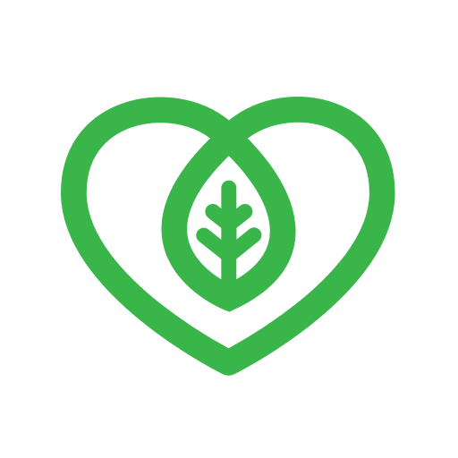 | Evergreen Life PHR
|  | My Ansa
|  | BuMP+

The details of our analysis are presented in the remainder of this report.

For independent verification, the raw data and the source code of the project is publicly available in its GitHub repository [http://github.com/covid-apps-observer](http://github.com/covid-apps-observer) and its source code has been thoroughly commented in order to provide all the details about how the information provided in this report has been extracted. 

Any feedback, questions, and improvements about the project are very welcome, feel free to create an issue or pull request directly in its GitHub repository: [http://github.com/covid-apps-observer](http://github.com/covid-apps-observer).

## Data sources and analyses

The analysis of each app is structured around five main dimensions: 
* App metadata  
* Requested permissions
* Mentioned servers
* Androwarn analysis
* User ratings and reviews

In the following we describe the data sources and analysis performed for each dimension.

### App metadata

App metadata includes an overview of the main information about the app (for example, its name, releases, privacy policy, etc.), contact information of the development team, and the various Android versions supported by the app. This information is extracted from two main data sources:
* _Google Play store_: we automatically mined the web page of the Google Play store showing the basic information about the app and we parsed it in order to extract information about the app and development team 
* _Android Manifest file_: in our analysis we decompiled the binary file of the app (it is similar to a Zip archive but it contains the code of the app instead of normal files) and we extracted information about the supported Android versions, as it has been listed by its development team.

The extracted app metadata feeds the _App overview_, _Development team_, and _Android support_ sections of this report.
We make use of the [google-play-scraper](https://github.com/JoMingyu/google-play-scraper) tool for extracting the raw data related to this dimension of the project.

### Requested permissions

The Android operating system has a permission model which allows users to grant access to potentially privacy-related information. Every Android app has to explictly declare the permissions it needs to properly function in the Android Manifest file.  

In this report we also show the protection level of each permission, which is a key information for understanding how the requested permissions related to the user's privacy. We carefully analyzed the [official Android documentation (v. 29)](https://developer.android.com/reference/android/Manifest.permission), and it resulted that a permission requested by an Android app can belong to the following protection levels:
* **Dangerous**: higher-risk permissions that would give a requesting app access to private user data or control over the device that can negatively impact the user. Because this type of permission introduces potential risk, the system usually does not automatically grant it to the requesting app. For example, any dangerous permissions requested by an app may be displayed to the user and require confirmation before proceeding.
* **Normal**: this is the default and most common level in Android; normal permissions are lower-risk and give access to isolated app-level features, with minimal risk to other apps, the system, or the user. 
* **Signature**: permissions granted only if the requesting app is signed with the same certificate as the app that declared the permission
* **Appop**: old permission level, a reminiscence of the App Ops tool that Google introduced in Android 4.3.
* **Development**: optional permissions which can be granted to development-oriented apps.
* **Privileged**: permissions who give higher power to mobile apps w.r.t. other apps, such as binding to incoming calls, interacting via bluetooth with other devices without user interaction, etc.
* **Preinstalled**: reserved only for preinstalled apps
* **Installer**: allow the holder to start the permission usage screen for an app
* **RetailDemo**: permissions related to devices used in demonstrations in shops.
* **Pre23**: permissions automatically granted to apps targeting devices running pre-6.0 Android.
* **Upcoming**: permissions which will be released in the next version of the Android platform. 
* **Deprecated**: permissions belonging to old releases of the Android platform, they should not be used by developers since they will not be supported in the near future.
* **Not for use by third-party applications**: permissions which can be requested only by apps developed by Google.
* **Undefined**: this protection level is not documented by Google.

The permissions dimension of this project is based on the [Androguard](https://github.com/androguard/androguard) static analysis tool.

### Mentioned servers

We decompiled each app in order to look for all possible mentions of remote URLs. The mentioned URLs can refer to remote servers the the app is using for either sending or receiving information, web addresses for directing the user to an information website, and so on. 

:warning: It is important to note that this analysis is not meant to be complete and it is very prone to obfuscation. The servers reported here are simply _mentioned_ somewhere in the code of the app and are meant to just give an indication about the "hooks" of the app towards external resources. For example, for an Android app it is normal to contact Google services in order to send/receive push notifications, or to contact the servers of analytics services for having real-time diagnostics about crashes of the app or bugs.

This part of the analysis is based on the [Androguard](https://github.com/androguard/androguard) static analysis tool for identfying the raw URLs mentioned in the app; then, the information about each mentioned server is collected by performing a _whois_ lookup on the first-level domain present in the URL.

### Security analysis

This dimension is based on the [Androwarn](https://github.com/maaaaz/androwarn) structural and data flow analysis of Android bytecode. Androwarn is developed by the University of Lyon/INSA (France) and it has been used in several academic studies. According to its documentation, Androwarn targets the following categories of potential security issues:
* **Telephony identifiers exfiltration**: IMEI, IMSI, MCC, MNC, LAC, CID, operator's name, etc.
* **Device settings exfiltration**: software version, usage statistics, system settings, logs, etc.
* **Geolocation information leakage**: GPS/WiFi geolocation, etc.
* **Connection interfaces information exfiltration**: WiFi credentials, Bluetooth MAC adress, etc.
* **Telephony services abuse**: premium SMS sending, phone call composition, etc.
* **Audio/video flow interception**: call recording, video capture, etc.
* **Remote connection establishment**: socket open call, Bluetooth pairing, APN settings edit, etc.
* **PIM data leakage**: contacts, calendar, SMS, mails, clipboard, etc.
* **External memory operations**: file access on SD card, etc.
* **PIM data modification**: add/delete contacts, calendar events, etc.
* **Arbitrary code execution**: native code using JNI, UNIX command, privilege escalation, etc.
* **Denial of Service**: event notification deactivation, file deletion, process killing, virtual keyboard disable, terminal shutdown/reboot, etc.

Note: We do not consider this data point in the current version of our analyzers since it is too verbose for our purposes.

:warning: It is important to note that Androwarn is a static analysis tool, and as such it performs a variety of heuristics and approximations in its analyses. Said that, the results shown in this report are meant to provide an indication of _potential_ security issues and should be by no means treated as complete and correct.   

### User ratings and reviews

For this dimension we turn again to the web interface of the Google Play store. Firstly, we automatically mine summary statistics about user ratings from the web page of the app under analysis; then, we automatically download the newest 1000 reviews of the app under analysis. For each level of rating (5 stars, 4 stars, , etc., 1 star) we show:
- a word cloud presenting the main terms used by end users in their reviews in the Google Play store
- the last 10 reviews provided by app users in the Google Play store. 

This purposefully simple analysis is meant to help both future users and the development team of the app in understanding what are the main positive and negative points of the app under analysis.

We make use of the [google-play-scraper](https://github.com/JoMingyu/google-play-scraper) tool for extracting the raw data related to this dimension of the project.

## Disclaimer 

This report has been produced independently of any parties and its only objective is to help anybody in better understanding how COVID-related apps work in practice (and compare to each other). The results of this report are limited to the specific version of the software used for running the analyses and on the various heuristics implemented in there. In other words, the results of the analyzers may differ depending on the time and modalities in which they are executed. We do not guarantee that the results of the analyses and the corresponding contents of this report are fully complete or correct. The analysis software is licensed under the [MIT License](https://github.com/iivanoo/covid-apps-observer/blob/master/LICENSE).

# WHO Info
App version ``4.1.0``

Analyzed with [covid-apps-observer](http://github.com/covid-apps-observer) project, version ``0.1``

## App overview
| | |
|-------------------------|-------------------------| 
| **Name**&nbsp;&nbsp;&nbsp;&nbsp;&nbsp;&nbsp;&nbsp;&nbsp;&nbsp;&nbsp;&nbsp;&nbsp;&nbsp;&nbsp;&nbsp;&nbsp;&nbsp;&nbsp;&nbsp;&nbsp;&nbsp;&nbsp;&nbsp;&nbsp;&nbsp;&nbsp;&nbsp;&nbsp;&nbsp;&nbsp;&nbsp;&nbsp;&nbsp;&nbsp;&nbsp;&nbsp;&nbsp;&nbsp;&nbsp;&nbsp;  | WHO Info |
| **Unique identifier** | org.who.infoapp |
| **Link to Google Play** | [https://play.google.com/store/apps/details?id=org.who.infoapp](https://play.google.com/store/apps/details?id=org.who.infoapp) |
| **Summary**  | The official World Health Organization Information App. |
| **Privacy policy** | [https://www.who.int/about/who-we-are/privacy-policy](https://www.who.int/about/who-we-are/privacy-policy) |
| **Latest version** | 4.1.0 |
| **Last update** | 2021-01-14 10:10:28 |
| **Recent changes** | This release introduces &quot;Health Topics&quot;. &quot;Health Topics&quot; provide additional information about favourite health topics. |
| **Installs**  | 500,000+ |
| **Category** | News & Magazines |
| **First release** | Apr 13, 2020 |
| **Size**  | 12M |
| **Supported Android version**  | 4.2 and up |

### Description
> Have the latest health information at your fingertips with the official World Health Organization Information App. This app displays the latest news, events, features and breaking updates on outbreaks. 
  
 WHO works worldwide to promote health, keep the world safe, and serve the vulnerable. 
 Our goal is to ensure that a billion more people have universal health coverage, to protect a billion more people from health emergencies, and provide a further billion people with better health and well-being.

### User interface
The developers of the app provide the following screenshots in the Google play store.
| | | |
|:-------------------------:|:-------------------------:|:-------------------------:|
 |   |   |   | 
 |   |   |   | 
 |   |   |   | 
 |   |   |   | 
 |   |   |   | 
 |   |   | 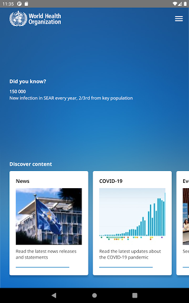  | 
 |   |   |   | 
 |   |   |   | 

## Development team
In the following we report the main information provided by the development team in the Google play store.

| | |
|-------------------------|-------------------------|
| **Developer**  | World Health Organization |
| **Website**  | [https://www.who.int/](https://www.who.int/) |
| **Email** | dcx@who.int |
| **Physical address**  | [Avenu Appia 20 1211 Geneva Switzerland](https://www.google.com/maps/search/Avenu%20Appia%2020%201211%20Geneva%20Switzerland) (Google Maps) |
| **Other developed apps**  | [https://play.google.com/store/apps/developer?id=World+Health+Organization](https://play.google.com/store/apps/developer?id=World+Health+Organization) |

## Android support

| | |
|-------------------------|-------------------------|
| **Declared target Android version**  | - |
| **Effective target Android version**  | - |
| **Minimum supported Android version**  | Jelly Bean, version 4.2.x (API level 17) |
| **Maximum target Android version**  | - |

The larger the difference between the minimum and maximum supported Android versions, the better. A larger difference means a wider audience. For example, old phones have a very low Android version, so a high minimum supported Android version means that the app cannot be used by users with old phones, thus leading to accessibility problems. 

## Requested permissions

In the following we report the complete list of the permissions requested by the app. 

| **Permission** | **Protection level** | **Description** | 
|-------------------------|-------------------------|-------------------------|
 **android.permission ACCESS_NETWORK_STATE** | Normal | Allows applications to access information about networks. 
 **android.permission INTERNET** | Normal | Allows applications to open network sockets. 
 **android.permission READ_CALENDAR** | :warning:**Dangerous** | Allows an application to read the user's calendar data. 
 **android.permission READ_EXTERNAL_STORAGE** | :warning:**Dangerous** | Allows an application to read from external storage. 
 **android.permission WAKE_LOCK** | Normal | Allows using PowerManager WakeLocks to keep processor from sleeping or screen from dimming. 
 **android.permission WRITE_CALENDAR** | :warning:**Dangerous** | Allows an application to write the user's calendar data. 
 **android.permission WRITE_EXTERNAL_STORAGE** | :warning:**Dangerous** | Allows an application to write to external storage. 
 **com.google.android.c2dm.permission RECEIVE** | - | - 
 **com.google.android.finsky.permission BIND_GET_INSTALL_REFERRER_SERVICE** | - | - 

## Mentioned servers

| **Server** | **Registrant** | **Registrant country** | **Creation date** | 
|-------------------------|-------------------------|-------------------------|-------------------------|
 | adobe.com | Adobe Inc. | :us: US | 1986-11-17 05:00:00 |
 | googlesyndication.com | Google LLC | :us: US | 2003-01-21 06:17:24 |
 | google.com | Google LLC | :us: US | 1997-09-15 04:00:00 |
 | app-measurement.com | Google LLC | :us: US | 2015-06-19 20:13:31 |
 | googleapis.com | Google LLC | :us: US | 2005-01-25 17:52:26 |
 | googleadservices.com | Google LLC | :us: US | 2003-06-19 16:34:53 |

## Security analysis 

Below we report the main security warnings raised by our execution of the [Androwarn](https://github.com/maaaaz/androwarn) security analysis tool.

**Connection interfaces exfiltration**
> - This application reads details about the currently active data network 
> - This application tries to find out if the currently active data network is metered 

**Suspicious connection establishment**
> - This application opens a Socket and connects it to the remote address 'Lfi/iki/elonen/NanoHTTPD$ResponseException;' on the 'N/A' port  
> - This application opens a Socket and connects it to the remote address 'NanoHttpd Shutdown' on the 'N/A' port  

**Code execution**
> - This application loads a native library: 'NativeScript' 
> - This application executes a UNIX command containing this argument: '2' 

## User ratings and reviews

Below we provide information about how end users are reacting to the app in terms of ratings and reviews in the Google Play store.

### Ratings

The WHO Info app has been installed by more than **500000** times. At this time, **1114** rated the app and its average score is **4.108108**. Below we show the distribution of the ratings across the usual star-based rating of Google Play

:star::star::star::star::star:: 754

:star::star::star::star:: 90

:star::star::star:: 60

:star::star:: 60

:star:: 150

### Reviews 

#### 5-star reviews

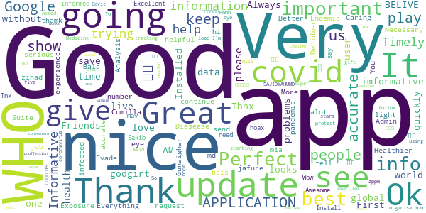

> Good  :date: __2021-01-17 13:53:04__

> Gives global data on covid 19 updates.  :date: __2021-01-07 08:43:58__

> Very nice app for health.  :date: __2020-12-12 06:15:46__

> Great. Installed quickly without problems. :-)  :date: __2020-11-15 16:31:45__

> Thnx u save live  :date: __2020-11-11 19:32:07__

> Always the best one!  :date: __2020-11-04 22:22:46__

> Great app  :date: __2020-11-03 15:50:52__

> Good  :date: __2020-10-31 20:49:42__

> 😊😊😊  :date: __2020-10-21 18:17:56__

> I. AM. BELIVE. W. H. O  :date: __2020-10-04 06:51:53__

#### 4-star reviews

> Not sure yet  :date: __2020-09-27 08:50:53__

> Excellent engineering tools. Your whatsapp number please.  :date: __2020-08-05 11:01:52__

> all the demand who it is hey  :date: __2020-07-20 15:10:48__

> Using this more and more. After the cdc called religion an essential. I don't know what whackadoodle besides trump/pence is messing with the info. Thank you for being a more logical alternative. As usa is being pulled back by whackadoodles and foreign commies.  :date: __2020-07-17 03:09:14__

> Nice  :date: __2020-07-08 17:19:26__

> good  :date: __2020-06-03 00:37:10__

> It's just information, not the actual tracker. But has plenty of information that's 100% accurate.  :date: __2020-05-31 02:37:20__

> I really want to appreciate Dr. Aliu Sam for using his natural roots and herbs medicine to cure me of Syphilis Since 11 months now I have been living with this disease and it has been giving me challenges, I was so perplexed cause I have been taking several drugs to be cured but all have been in vain. One morning I was browsing through the Internet then i saw several testimonies about Dr. Aliu Sam curing people off verious diseases and immediately I contacted Dr. Aliu Sam I told himabout my trou  :date: __2020-05-08 05:33:57__

> It did not detect  :date: __2020-04-29 18:37:26__

> Could do with more accurate information to keep people alive. But no harm done.  :date: __2020-04-29 13:41:12__

#### 3-star reviews

> A good improvement could be the implementation of a search system for arguments that a person want to find ( like the guidelines about health and healthy diet). At first look seems it miss a lot from the website.  :date: __2020-09-27 10:09:16__

> Good App but I don't trust the WHO. Just have the app to stay up to date with the crazy things the WHO gets up to  :date: __2020-07-29 10:34:08__

> Will not download onto my 1year old state of the art smatphone. Bad, as a user of many android apps what are you thinking. I have found more than 3700 other users that can not use this app. Come on you must no you have problem.  :date: __2020-05-26 02:04:59__

> Good  :date: __2020-05-14 21:22:11__

> Best.  :date: __2020-04-20 13:14:33__

> Looks nice great look smooth Lario  :date: __2020-04-18 09:44:30__

#### 2-star reviews

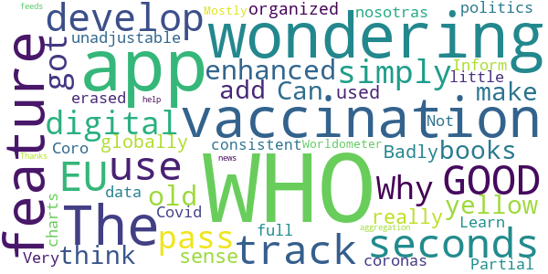

> Badly organized, unadjustable, and full of politics,i erased it  :date: __2020-11-13 07:29:53__

> Coro nosotras coronas  :date: __2020-07-02 06:41:55__

> Partial  :date: __2020-06-22 12:24:23__

> Learn more  :date: __2020-06-15 23:35:50__

> WHO Inform Covid 19  :date: __2020-05-24 17:14:56__

> Very little data or charts. Not consistent with Worldometer. Mostly an aggregation of news feeds about WHO  :date: __2020-05-15 15:38:10__

> Thanks for your help.  :date: __2020-04-22 18:52:40__

#### 1-star reviews

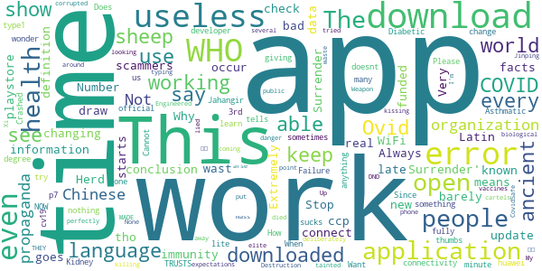

> I do not like the new update.  :date: __2021-01-19 23:39:15__

> Says I can't connect even tho I have WiFi and data on  :date: __2021-01-04 02:35:04__

> Extremely bad application. Always not working at all. Why do you keep it in the playstore?!  :date: __2020-12-15 16:13:48__

> A wast of time  :date: __2020-11-04 13:04:20__

> “‘Ovid’ is Latin for a sheep. COVID starts with a C, which also means ‘see’ in ancient language. 19 was known as the “Number of Surrender” in ancient times.”  It goes on to draw the conclusion, “C-OVID 19 = ‘See a Sheep Surrender'”.  :date: __2020-11-02 08:06:17__

> Very scammers  :date: __2020-10-19 19:45:47__

> I just downloaded it, but every time I open it just say "an error occur check your connectivity" or something like that... didn't work...  :date: __2020-10-10 17:24:54__

> Does not work  :date: __2020-10-09 00:12:33__

> This is your official application? and sometimes it doesn't work  :date: __2020-10-07 18:26:16__

> I am not able to download it fully its no use to me as i am a type1 Diabetic and Asthmatic i am also in 3rd degree Kidney Failure.  :date: __2020-09-29 02:20:05__

# Coronavirus Help
App version ``1.1``

Analyzed with [covid-apps-observer](http://github.com/covid-apps-observer) project, version ``0.1``

## App overview
| | |
|-------------------------|-------------------------| 
| **Name**&nbsp;&nbsp;&nbsp;&nbsp;&nbsp;&nbsp;&nbsp;&nbsp;&nbsp;&nbsp;&nbsp;&nbsp;&nbsp;&nbsp;&nbsp;&nbsp;&nbsp;&nbsp;&nbsp;&nbsp;&nbsp;&nbsp;&nbsp;&nbsp;&nbsp;&nbsp;&nbsp;&nbsp;&nbsp;&nbsp;&nbsp;&nbsp;&nbsp;&nbsp;&nbsp;&nbsp;&nbsp;&nbsp;&nbsp;&nbsp;  | Coronavirus Help |
| **Unique identifier** | appinventor.ai_david_taylor.Coronavirus_help2020 |
| **Link to Google Play** | [https://play.google.com/store/apps/details?id=appinventor.ai_david_taylor.Coronavirus_help2020](https://play.google.com/store/apps/details?id=appinventor.ai_david_taylor.Coronavirus_help2020) |
| **Summary**  | Help and advice on the Coronavirus (Covid-19) |
| **Privacy policy** | [-](-) |
| **Latest version** | 1.1 |
| **Last update** | 2020-04-23 09:48:32 |
| **Recent changes** | Splash screen removed, more advice added through the Ryecroft website feature |
| **Installs**  | 1,000+ |
| **Category** | Health & Fitness |
| **First release** | Mar 26, 2020 |
| **Size**  | 5.9M |
| **Supported Android version**  | 2.1 and up |

### Description
> This app collates genuine information from sorces such as the UK Government, WHO, NHS and others in one place. THis idea being all of the information is genuine and updated on a regular basis by the organisations mentioned.

### User interface
The developers of the app provide the following screenshots in the Google play store.
| | | |
|:-------------------------:|:-------------------------:|:-------------------------:|
 |   |   |   | 
 |  

## Development team
In the following we report the main information provided by the development team in the Google play store.

| | |
|-------------------------|-------------------------|
| **Developer**  | Dave at Ryecroft Community Hub & BITS |
| **Website**  | [http://www.ryecroftnrc.org](http://www.ryecroftnrc.org) |
| **Email** | david.taylor@ryecroftnrc.org |
| **Physical address**  | - |
| **Other developed apps**  | [https://play.google.com/store/apps/developer?id=Dave+at+Ryecroft+Community+Hub+%26+BITS](https://play.google.com/store/apps/developer?id=Dave+at+Ryecroft+Community+Hub+%26+BITS) |

## Android support

| | |
|-------------------------|-------------------------|
| **Declared target Android version**  | Pie, version 9 (API level 28) |
| **Effective target Android version**  | Pie, version 9 (API level 28) |
| **Minimum supported Android version**  | Eclair, version 2.1 (API level 7) |
| **Maximum target Android version**  | - |

The larger the difference between the minimum and maximum supported Android versions, the better. A larger difference means a wider audience. For example, old phones have a very low Android version, so a high minimum supported Android version means that the app cannot be used by users with old phones, thus leading to accessibility problems. 

## Requested permissions

In the following we report the complete list of the permissions requested by the app. 

| **Permission** | **Protection level** | **Description** | 
|-------------------------|-------------------------|-------------------------|
 **android.permission ACCESS_NETWORK_STATE** | Normal | Allows applications to access information about networks. 
 **android.permission ACCESS_WIFI_STATE** | Normal | Allows applications to access information about Wi-Fi networks. 
 **android.permission INTERNET** | Normal | Allows applications to open network sockets. 
 **android.permission READ_EXTERNAL_STORAGE** | :warning:**Dangerous** | Allows an application to read from external storage. 
 **android.permission WRITE_EXTERNAL_STORAGE** | :warning:**Dangerous** | Allows an application to write to external storage. 

## Mentioned servers

| **Server** | **Registrant** | **Registrant country** | **Creation date** | 
|-------------------------|-------------------------|-------------------------|-------------------------|
 | google.com | Google LLC | :us: US | 1997-09-15 04:00:00 |
 | w3.org | W3C | :us: US | 1994-07-06 04:00:00 |
 | gnu.org | Free Software Foundation | :us: US | 1995-11-24 05:00:00 |
 | googleapis.com | Google LLC | :us: US | 2005-01-25 17:52:26 |
 | appspot.com | Google LLC | :us: US | 2005-03-10 02:27:55 |
 | appspot.com | Google LLC | :us: US | 2005-03-10 02:27:55 |
 | mit.edu | Massachusetts Institute of Technology | - | 1985-05-23 00:00:00 |
 | appspot.com | Google LLC | :us: US | 2005-03-10 02:27:55 |
 | yandex.net | - | :ru: RU | 2000-11-14 06:56:55 |
 |  | - | - | 1996-08-01 00:00:00 |
 | redcross.org | American National Red Cross | :us: US | 1995-09-05 04:00:00 |
 |  | - | - | 2003-11-04 00:00:00 |
 |  | - | - | 1996-08-01 00:00:00 |
 |  | - | - | 1996-08-01 00:00:00 |

## Security analysis 

Below we report the main security warnings raised by our execution of the [Androwarn](https://github.com/maaaaz/androwarn) security analysis tool.

**Telephony identifiers leakage**
> - This application reads the unique device ID, i.e the IMEI for GSM and the MEID or ESN for CDMA phones 

**Location lookup**
> - This application reads location information from all available providers (WiFi, GPS etc.) 

**Connection interfaces exfiltration**
> - This application reads details about the currently active data network 
> - This application tries to find out if the currently active data network is metered 

**Telephony services abuse**
> - This application makes phone calls 

**Audio video eavesdropping**
> - This application records audio from the 'MIC' source  

**Suspicious connection establishment**
> - This application opens a Socket and connects it to the remote address '4' on the 'v31' port  

**Pim data leakage**
> - This application accesses the contacts list 

**Code execution**
> - This application executes a UNIX command 
> - This application executes a UNIX command containing this argument: 'Ljava/util/List;->size()I' 

## User ratings and reviews

Below we provide information about how end users are reacting to the app in terms of ratings and reviews in the Google Play store.

### Ratings

The Coronavirus Help app has been installed by more than **1000** times. At this time, **19** rated the app and its average score is **4.0**. Below we show the distribution of the ratings across the usual star-based rating of Google Play

:star::star::star::star::star:: 13

:star::star::star::star:: 1

:star::star::star:: 1

:star::star:: 0

:star:: 4

### Reviews 

#### 5-star reviews

> Good  :date: __2020-10-10 21:21:40__

> Just got this app and really loved the fact that all covid19 info you need was in 1 place and easy to use great job. (was a little hard to find on google play. An app like this should be more visible)  :date: __2020-07-12 23:25:15__

> Very informative  :date: __2020-07-09 21:39:20__

> This helps me from the new crona very good 👍 👌 😊 ☺ 😀 😄 👍 👌 😊  :date: __2020-06-15 17:43:31__

> Contact tracing. Uk  :date: __2020-06-01 22:22:36__

> I love it 💖 so simple to use and not confusing at all, I love that everything is in one place and from the people that we should be listening to and not from misleading sources (newspapers) x I love all you over 70's that was involved in making this great app x I am 28 and I couldn't of done anything like this well done guys stay safe 💋💋  :date: __2020-05-27 22:54:07__

> This app is very good .  :date: __2020-05-26 02:43:22__

> Brilliant app! Very informative and easy to follow. Highly recommend  :date: __2020-05-08 13:34:16__

> Easy to use  :date: __2020-05-03 17:07:02__

> It's good that this information is available in one location, however please note (developers) that the physical distance required by law and for the best chance of avoiding the virus via breath, is 2 metres, not 1 metre as stated in the app. Sorry to be picky, but this is crucial information. As for the risk of malware, some of the more rudimentary so-called security apps will throw up false positives but Kaspersky, AVG and Malwarebytes will not. 🏳  :date: __2020-05-02 18:01:23__

#### 4-star reviews

> Goof  :date: __2020-09-26 20:22:38__

> Great to see all the information bundled into one little package, unfortunately, because the app simply directs you to websites that are displayed within a web view, it's completely useless for offline use.  :date: __2020-05-30 11:49:56__

> Hi I'm not criticising your app but my avast antivirus also detected that there was malware in your app so I wasn't able to install. Maybe this is something you want to look into  :date: __2020-04-28 03:51:39__

#### 3-star reviews

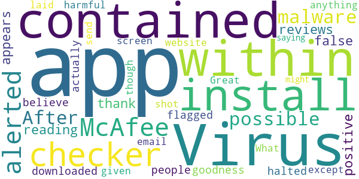

> Virus checker (McAfee) alerted to a (possible) malware contained within this app. After reading other reviews of this app it appears to be a false positive, thank goodness other people had flagged this as i would of halted the install and not downloaded it. I don't believe its actually anything harmful contained within the app itself. I would given the app a 5 ⭐ except its laid out like a website from 1992. Great app though  :date: __2020-05-21 09:29:34__

> What is your email? I can send you a screen shot saying that the app might be a virus when I install it  :date: __2020-04-26 14:51:15__

#### 2-star reviews

> Who'd of thought I'd need an app to "help" me with a virus that I have a 99.94% chance of surviving (official numbers).  :date: __2020-06-25 08:48:45__

#### 1-star reviews

> Here is another app that's been put on my phone and I can't use it to track if I have been near anybody with coronavirus as according to the app it doesn't work in Scotland. What the bloody point of putting this app on people's phones if they can't use it.  :date: __2020-08-18 09:31:46__

> Stolen content  :date: __2020-06-21 18:51:30__

> Turns out I didn't need an app for a mysteriously absent virus that has killed worldwide less than seasonal flu.  :date: __2020-06-09 10:13:17__

> If I wanted to see a picture of the word caronavirus I can Google one . Other than this it's pretty useless probably worst app I've encountered  :date: __2020-04-17 14:09:13__

> Will not open in Sony XZ3  :date: __2020-04-14 17:58:35__

# COVIDCare NI
App version ``2.0``

Analyzed with [covid-apps-observer](http://github.com/covid-apps-observer) project, version ``0.1``

## App overview
| | |
|-------------------------|-------------------------| 
| **Name**&nbsp;&nbsp;&nbsp;&nbsp;&nbsp;&nbsp;&nbsp;&nbsp;&nbsp;&nbsp;&nbsp;&nbsp;&nbsp;&nbsp;&nbsp;&nbsp;&nbsp;&nbsp;&nbsp;&nbsp;&nbsp;&nbsp;&nbsp;&nbsp;&nbsp;&nbsp;&nbsp;&nbsp;&nbsp;&nbsp;&nbsp;&nbsp;&nbsp;&nbsp;&nbsp;&nbsp;&nbsp;&nbsp;&nbsp;&nbsp;  | COVIDCare NI |
| **Unique identifier** | net.hscni.covid19ni |
| **Link to Google Play** | [https://play.google.com/store/apps/details?id=net.hscni.covid19ni](https://play.google.com/store/apps/details?id=net.hscni.covid19ni) |
| **Summary**  | COVIDCare NI is a coronavirus symptom check with the latest advice and guidance |
| **Privacy policy** | [https://www.health-ni.gov.uk/publications/covid-19-app-privacy-notice](https://www.health-ni.gov.uk/publications/covid-19-app-privacy-notice) |
| **Latest version** | 2.0 |
| **Last update** | 2020-07-22 16:32:05 |
| **Recent changes** | · Featured articles on mental health and general advice · Latest regulations and easing of lockdown guidance  · Information on how to get tested and testing facilities · COVID-19 statistics · Isolation timer updated to include isolation following a positive test result and isolation due to close contact with someone with COVID-19 · Ability to add household members symptoms to dashboard · Improved navigation |
| **Installs**  | 50,000+ |
| **Category** | Medical |
| **First release** | Mar 24, 2020 |
| **Size**  | 60M |
| **Supported Android version**  | 4.2 and up |

### Description
> Overview
 The COVIDCare NI app has been developed by Digital Health and Care NI in partnership with Health & Social Care, the Public Health Agency and the Department of Health.
 The app has been designed to help the public in Northern Ireland keep up to date with the latest advice on the COVID-19 pandemic, helping you to:
 Check if you or someone in your household has coronavirus symptoms.
 Access personalised advice based on your answers to the symptom check questions.
 Decide if you need clinical advice and how to access it.
 Easily find links to trusted information resources on COVID-19 advice and mental health resources.
 Self-isolate if you have symptoms by checking the self-isolation timer for both yourself and your household.
 Search current advice by using a search function of FAQs.
 We continue to update the app with new features based on feedback from citizens in Northern Ireland and will continue to ensure app users get access to the most up to date headlines and changes in the advice and guidance.
 Things are moving quickly with the pandemic so you may need to come back to refresh your app regularly. We’ll let you know when this is necessary.
 Thank you for your support in helping us project your family, friends and community.
 Why use the app?
 The app is available for use in Northern Ireland to all individuals who are currently residing in Northern Ireland.
 Data Security
 The app does not collect any personally identifiable information.
 We will collect information related to the postcode and age of the user to help us track the impact of COVID-19 in Northern Ireland.
 This will help us to plan services and ensure that resources are directed to the areas of greatest need.

### User interface
The developers of the app provide the following screenshots in the Google play store.
| | | |
|:-------------------------:|:-------------------------:|:-------------------------:|
 |   |   |   | 
 |   |  

## Development team
In the following we report the main information provided by the development team in the Google play store.

| | |
|-------------------------|-------------------------|
| **Developer**  | Health & Social Care Northern Ireland |
| **Website**  | [https://www.publichealth.hscni.net/](https://www.publichealth.hscni.net/) |
| **Email** | hscdhcni@gmail.com |
| **Physical address**  | - |
| **Other developed apps**  | [https://play.google.com/store/apps/developer?id=Health+%26+Social+Care+Northern+Ireland](https://play.google.com/store/apps/developer?id=Health+%26+Social+Care+Northern+Ireland) |

## Android support

| | |
|-------------------------|-------------------------|
| **Declared target Android version**  | Android10, version 10 (API level 29) |
| **Effective target Android version**  | Android10, version 10 (API level 29) |
| **Minimum supported Android version**  | Jelly Bean, version 4.2.x (API level 17) |
| **Maximum target Android version**  | - |

The larger the difference between the minimum and maximum supported Android versions, the better. A larger difference means a wider audience. For example, old phones have a very low Android version, so a high minimum supported Android version means that the app cannot be used by users with old phones, thus leading to accessibility problems. 

## Requested permissions

In the following we report the complete list of the permissions requested by the app. 

| **Permission** | **Protection level** | **Description** | 
|-------------------------|-------------------------|-------------------------|
 **android.permission ACCESS_NETWORK_STATE** | Normal | Allows applications to access information about networks. 
 **android.permission ACCESS_WIFI_STATE** | Normal | Allows applications to access information about Wi-Fi networks. 
 **android.permission INTERNET** | Normal | Allows applications to open network sockets. 
 **android.permission WAKE_LOCK** | Normal | Allows using PowerManager WakeLocks to keep processor from sleeping or screen from dimming. 
 **com.google.android.c2dm.permission RECEIVE** | - | - 
 **net.hscni.covid19ni.permission C2D_MESSAGE** | - | - 

## Mentioned servers

| **Server** | **Registrant** | **Registrant country** | **Creation date** | 
|-------------------------|-------------------------|-------------------------|-------------------------|
 | google.com | Google LLC | :us: US | 1997-09-15 04:00:00 |
 | w3.org | W3C | :us: US | 1994-07-06 04:00:00 |
 | microsoft.com | Microsoft Corporation | :us: US | 1991-05-02 04:00:00 |
 | googleapis.com | Google LLC | :us: US | 2005-01-25 17:52:26 |

## Security analysis 

Below we report the main security warnings raised by our execution of the [Androwarn](https://github.com/maaaaz/androwarn) security analysis tool.

**Telephony identifiers leakage**
> - This application reads the ISO country code equivalent of the current registered operator's MCC (Mobile Country Code) 
> - This application reads the numeric name (MCC+MNC) of current registered operator 
> - This application reads the operator name 

**Connection interfaces exfiltration**
> - This application reads details about the currently active data network 

**Code execution**
> - This application loads a native library: 'monodroid' 
> - This application loads a native library: 'monosgen-2.0' 
> - This application loads a native library: 'xamarin-app' 
> - This application loads a native library: 'xamarin-debug-app-helper' 

## User ratings and reviews

Below we provide information about how end users are reacting to the app in terms of ratings and reviews in the Google Play store.

### Ratings

The COVIDCare NI app has been installed by more than **50000** times. At this time, **300** rated the app and its average score is **3.58**. Below we show the distribution of the ratings across the usual star-based rating of Google Play

:star::star::star::star::star:: 162

:star::star::star::star:: 27

:star::star::star:: 12

:star::star:: 21

:star:: 78

### Reviews 

#### 5-star reviews

> Good so far  :date: __2020-12-31 05:36:23__

> A great app for the current crises. Well designed and easy to navigate  :date: __2020-12-15 01:13:45__

> Excellent service I could recommend  :date: __2020-10-19 15:13:53__

> Very poor  :date: __2020-09-08 20:21:41__

> Amazing and informative app. PLEASE NOTE THIS APP IS FOR NORTHERN IRELAND ONLY. So don't think this will work in other parts of the UK or the world, however it is compatible with the republic of ireland version.  :date: __2020-08-01 00:43:11__

> Easy to use and informative  :date: __2020-07-30 19:39:35__

> Excellent  :date: __2020-07-30 15:56:15__

> Excellent and informative  :date: __2020-06-30 14:11:20__

> Amazing the p we people who it doesn't work you need to go to the NHS website or gothirmont web don't give the 1 star if do you are ungrateful and it probably your phone. 😂😂😂  :date: __2020-06-06 22:45:27__

> Easy to use informative and source of good advice and information specific for NI residents.  :date: __2020-06-06 10:56:34__

#### 4-star reviews

> Would a regional breakdown of new cases  :date: __2020-07-31 00:38:27__

> Seems promising at first glance, easy to use with good range of features. It also let's you use the app on behalf of someone else which might be good for elderly/and or the less technical, visually impaired or less able bodied. What accessibility features does it conform to? One issue I had was when I filled in the symptom checker flow. The last stage presents a blank yellow screen and it's not intuitive that you have to close or go back to see suggestions  :date: __2020-07-30 18:59:15__

> Could do with more updates. But pretty good for sign posting  :date: __2020-06-29 12:39:16__

> A bit empty but good overall!  :date: __2020-06-17 22:06:54__

> Manchester not,,,,,  :date: __2020-06-11 21:25:59__

> Quite good app as has a symptoms checker and some info, advice and statistics.. However doesn't have what I actually downloaded it for which was to find out about updates to current regulations and recovery plan such as easing of lockdown rules etc.. Have to search for this and then visit nidirect website for this info..  :date: __2020-06-07 21:55:20__

> Good app  :date: __2020-05-06 23:22:23__

> Great app, though the virtual assistant could use some more specific information / ai training. Thanks for making this.  :date: __2020-04-02 10:48:28__

> Handy advice in scarey times  :date: __2020-04-01 21:27:09__

> Hopefully this could be a very powerful way of identifying cv19 hotspots.  :date: __2020-03-31 20:18:01__

#### 3-star reviews

> Information not updated regularly  :date: __2020-10-05 08:48:36__

> I have just downloaded this app can anyone please tell me if it's free or is there a payment on it  :date: __2020-08-11 23:00:25__

> Who owns this App is it a private profit making company? If so is this another privatisation by the back door which is all too common with the NHS overall in recent years Own it Don't rent it!  :date: __2020-05-06 15:23:14__

> I was looking for statistics on the spread in NI as we are lumped in with the UK in official statistics, this app doesn't seem to have that. Useful advice but nothing I haven't heard 1000 times already - those who aren't listening won't be downloading the app anyway.  :date: __2020-04-11 15:32:23__

> N/A  :date: __2020-04-10 00:07:41__

> Helps a bit but I still rang 111 help line  :date: __2020-04-07 03:46:29__

> Only available in Ireland!  :date: __2020-04-02 18:40:10__

> Doesn't work in the UK  :date: __2020-04-01 08:16:36__

> Only available in Northern Ireland 🇮🇪 😢  :date: __2020-03-26 13:18:23__

#### 2-star reviews

> Not in NI but won't load 😔  :date: __2020-06-20 10:41:04__

> Sporadic updates. Better to just use google.  :date: __2020-05-26 17:42:14__

> No updated figures since April 30  :date: __2020-05-04 17:55:33__

> Sorry 2 stars only. App not for England or Wales. Advertised on the news as available all over UK and this is not so. So I've uninstalled it.  :date: __2020-04-11 23:08:08__

> Why is this only available in NI and not available anywhere else I think its deplorable as we are all dealing with this and not just NI  :date: __2020-04-10 14:03:09__

> Nothing new or useful here.  :date: __2020-04-06 19:46:22__

> My is it only NI  :date: __2020-03-26 08:24:52__

#### 1-star reviews

> Pointless really, after you go to the trouble of registering and getting it set up, all it does is ask you 3 questions. Have you a temperature? Have you a continuous cough? Did anyone in your household have covid symptoms? That's it!!  :date: __2021-01-01 20:35:30__

> Hasn't worked since the upgrade. Keeps asking me to connect to network when I am already connected  :date: __2020-11-18 14:07:13__

> Complete rubbish. I answered all the questions in the symptom checker as perfectly healthy, it told me to isolate as I had covid symptoms. Absolute nonsense.  :date: __2020-10-26 23:26:48__

> Rubbish  :date: __2020-10-18 20:47:15__

> Totally useless!; Not able to get passed "Accept" terms. Be easier to wait for the news updates. Amazingly bad.  :date: __2020-10-04 18:50:14__

> App won't open once installed :-(  :date: __2020-09-24 10:53:15__

> only works on recent phones, completely misses the point...must work everywhere or it is pointless.  :date: __2020-08-11 12:19:23__

> It came to stop as I had no tracing ability and said no more.  :date: __2020-07-31 23:15:28__

> doesn't work...!  :date: __2020-07-31 22:10:26__

> This is not the official app for Northern Ireland COVID19. STOPCOVID NI is the correct app  :date: __2020-07-31 19:47:35__

# OpenWHO: Knowledge for Health Emergencies
App version ``3.7``

Analyzed with [covid-apps-observer](http://github.com/covid-apps-observer) project, version ``0.1``

## App overview
| | |
|-------------------------|-------------------------| 
| **Name**&nbsp;&nbsp;&nbsp;&nbsp;&nbsp;&nbsp;&nbsp;&nbsp;&nbsp;&nbsp;&nbsp;&nbsp;&nbsp;&nbsp;&nbsp;&nbsp;&nbsp;&nbsp;&nbsp;&nbsp;&nbsp;&nbsp;&nbsp;&nbsp;&nbsp;&nbsp;&nbsp;&nbsp;&nbsp;&nbsp;&nbsp;&nbsp;&nbsp;&nbsp;&nbsp;&nbsp;&nbsp;&nbsp;&nbsp;&nbsp;  | OpenWHO: Knowledge for Health Emergencies |
| **Unique identifier** | de.xikolo.openwho |
| **Link to Google Play** | [https://play.google.com/store/apps/details?id=de.xikolo.openwho](https://play.google.com/store/apps/details?id=de.xikolo.openwho) |
| **Summary**  | Life-saving knowledge for frontline responders in health emergencies. |
| **Privacy policy** | [https://openwho.org/pages/privacy](https://openwho.org/pages/privacy) |
| **Latest version** | 3.7 |
| **Last update** | 2020-11-23 13:57:15 |
| **Recent changes** | - Bug fixes and performance improvements |
| **Installs**  | 1,000,000+ |
| **Category** | Education |
| **First release** | May 17, 2017 |
| **Size**  | 18M |
| **Supported Android version**  | 5.0 and up |

### Description
> OpenWHO is the World Health Organization's (WHO) interactive knowledge-transfer platform offering online courses to improve the response to health emergencies. OpenWHO enables the Organization and its key partners to transfer life-saving knowledge to large numbers of frontline responders.
 With OpenWHO, you have the flexibility to learn at your convenience. Watch the short video lectures and test your knowledge with self-tests when and where you like. The course forum and the collaboration space allow you to get in touch with other participants and experts around the world.
  
 Designed primarily for health care workers, frontline responders, and decision-makers, the app is also a source of information for those affected by disease outbreaks and health emergencies, or for those with a general interest in WHO's work in health emergencies.
  
 It features 6 channels:
 - The <b>Outbreak</b> channel addresses the management of infectious diseases and provides life-saving, scientific information.
 - The <b>Ready for Response</b> channel helps prepare personnel who are training for deployment to work in disease outbreaks and health emergencies.
 - The <b>Get Social</b> channel focuses on social science-based interventions and helps to communicate with affected communities.
 - The <b>Preparing for Pandemics</b> channel brings together courses on various aspects of preparedness, including surveillance, public health measures and risk communication during a pandemic.
 - The <b>COVID-19</b> channel provides learning resources in WHO's 6 official languages (Arabic, Chinese, English, French, Russian and Spanish) for health professionals, decision-makers and the public for the outbreak of coronavirus disease (COVID-19).
 - The <b>COVID-19 National Languages</b> channel provides the same learning resources as the COVID-19 channel but in national languages, such as Indonesian, Japanese and Portuguese. 
  
 OpenWHO courses are available in many languages, including WHO's 6 official languages. 
  
 Download the app now, and join the OpenWHO community.
 This app is developed in cooperation between the Hasso Plattner Institute and the WHO. The learning content is provided exclusively by the WHO.

### User interface
The developers of the app provide the following screenshots in the Google play store.
| | | |
|:-------------------------:|:-------------------------:|:-------------------------:|
 |   |   |   | 
 |   |   |   | 

## Development team
In the following we report the main information provided by the development team in the Google play store.

| | |
|-------------------------|-------------------------|
| **Developer**  | HPI Knowledge Engineering Team |
| **Website**  | [https://openwho.org/](https://openwho.org/) |
| **Email** | openwho-support@hpi.de |
| **Physical address**  | [Prof.-Dr.-Helmert-Str.2-3 14482 Potsdam](https://www.google.com/maps/search/Prof.-Dr.-Helmert-Str.2-3%2014482%20Potsdam) (Google Maps) |
| **Other developed apps**  | [https://play.google.com/store/apps/developer?id=7185448023325736337](https://play.google.com/store/apps/developer?id=7185448023325736337) |

## Android support

| | |
|-------------------------|-------------------------|
| **Declared target Android version**  | - |
| **Effective target Android version**  | - |
| **Minimum supported Android version**  | Lollipop, version 5.0 (API level 21) |
| **Maximum target Android version**  | - |

The larger the difference between the minimum and maximum supported Android versions, the better. A larger difference means a wider audience. For example, old phones have a very low Android version, so a high minimum supported Android version means that the app cannot be used by users with old phones, thus leading to accessibility problems. 

## Requested permissions

In the following we report the complete list of the permissions requested by the app. 

| **Permission** | **Protection level** | **Description** | 
|-------------------------|-------------------------|-------------------------|
 **android.permission ACCESS_NETWORK_STATE** | Normal | Allows applications to access information about networks. 
 **android.permission ACCESS_WIFI_STATE** | Normal | Allows applications to access information about Wi-Fi networks. 
 **android.permission DOWNLOAD_WITHOUT_NOTIFICATION** | - | - 
 **android.permission FOREGROUND_SERVICE** | Normal | Allows a regular application to use Service.startForeground. 
 **android.permission INTERNET** | Normal | Allows applications to open network sockets. 
 **android.permission RECEIVE_BOOT_COMPLETED** | Normal | Allows an application to receive the Intent.ACTION_BOOT_COMPLETED that is broadcast after the system finishes booting. 
 **android.permission WAKE_LOCK** | Normal | Allows using PowerManager WakeLocks to keep processor from sleeping or screen from dimming. 
 **android.permission WRITE_EXTERNAL_STORAGE** | :warning:**Dangerous** | Allows an application to write to external storage. 
 **com.google.android.c2dm.permission RECEIVE** | - | - 
 **com.google.android.finsky.permission BIND_GET_INSTALL_REFERRER_SERVICE** | - | - 

## Mentioned servers

| **Server** | **Registrant** | **Registrant country** | **Creation date** | 
|-------------------------|-------------------------|-------------------------|-------------------------|
 | googlesyndication.com | Google LLC | :us: US | 2003-01-21 06:17:24 |
 | google.com | Google LLC | :us: US | 1997-09-15 04:00:00 |
 | apple.com | Apple Inc. | :us: US | 1987-02-19 05:00:00 |
 | aomedia.org | Contact Privacy Inc. Customer 1243324949 | :canada: CA | 2015-08-24 14:07:31 |
 | dashif.org | VTM Group | :us: US | 2012-04-27 13:02:46 |
 | app-measurement.com | Google LLC | :us: US | 2015-06-19 20:13:31 |
 | w3.org | W3C | :us: US | 1994-07-06 04:00:00 |
 | googleapis.com | Google LLC | :us: US | 2005-01-25 17:52:26 |
 | psdev.de | - | - | - |
 | xmlpull.org | WhoisGuard, Inc. | PA | 2001-11-26 20:33:08 |
 | crashlytics.com | Google LLC | :us: US | 2011-01-21 15:30:40 |
 | apache.org | The Apache Software Foundation | :us: US | 1995-04-11 04:00:00 |
 | opensource.org | Open Source Initiative | :us: US | 1998-02-11 05:00:00 |
 | creativecommons.org | Creative Commons Corporation | :canada: CA | 2001-01-15 16:51:44 |
 | eclipse.org | Eclipse.org Foundation, Inc. | :canada: CA | 1997-04-14 04:00:00 |
 | gnu.org | Free Software Foundation | :us: US | 1995-11-24 05:00:00 |
 | mozilla.org | Mozilla Corporation | :us: US | 1998-01-24 05:00:00 |
 | googleadservices.com | Google LLC | :us: US | 2003-06-19 16:34:53 |

## Security analysis 

Below we report the main security warnings raised by our execution of the [Androwarn](https://github.com/maaaaz/androwarn) security analysis tool.

**Telephony identifiers leakage**
> - This application reads the ISO country code equivalent of the current registered operator's MCC (Mobile Country Code) 
> - This application reads the MCC+MNC of the provider of the SIM 

**Connection interfaces exfiltration**
> - This application reads details about the currently active data network 
> - This application tries to find out if the currently active data network is metered 

**Suspicious connection establishment**
> - This application opens a Socket and connects it to the remote address ' returned no addresses for  ; port is out of range' on the 'N/A' port  
> - This application opens a Socket and connects it to the remote address '' on the 'N/A' port  
> - This application opens a Socket and connects it to the remote address 'Ljava/lang/StringBuilder;->toString()Ljava/lang/String;' on the 'N/A' port  
> - This application opens a Socket and connects it to the remote address 'Ljava/net/Proxy;->type()Ljava/net/Proxy$Type;' on the 'N/A' port  
> - This application opens a Socket and connects it to the remote address 'timeout' on the 'N/A' port  

**Code execution**
> - This application loads a native library 

## User ratings and reviews

Below we provide information about how end users are reacting to the app in terms of ratings and reviews in the Google Play store.

### Ratings

The OpenWHO: Knowledge for Health Emergencies app has been installed by more than **1000000** times. At this time, **3403** rated the app and its average score is **4.2647057**. Below we show the distribution of the ratings across the usual star-based rating of Google Play

:star::star::star::star::star:: 2403

:star::star::star::star:: 370

:star::star::star:: 130

:star::star:: 130

:star:: 370

### Reviews 

#### 5-star reviews

> V.good  :date: __2021-02-09 14:12:24__

> Great medical field app sourceGreat medical field app source!  :date: __2021-02-09 07:42:09__

> Very useful  :date: __2021-01-18 06:49:28__

> Good  :date: __2021-01-07 09:35:04__

> Iloveit  :date: __2021-01-03 07:20:51__

> Very good  :date: __2020-12-29 17:40:56__

> I love this app because it makes essay a lot.  :date: __2020-12-27 18:00:46__

> It's a great platform for me to send money 💰 safely  :date: __2020-12-15 14:26:31__

> Good  :date: __2020-12-08 16:01:38__

> + definitely a good app. I'm a fan  :date: __2020-12-03 11:12:16__

#### 4-star reviews

> Get the things that wark in all honesty s Yes it does  :date: __2021-01-11 02:38:09__

> WHO has offered great courses but we're expecting more courses within less time gap as it's been month's since WHO has launched any course.Secondly,there is no direct place offered in the WHO app to express our views.  :date: __2020-12-11 07:27:50__

> Online course class is use full  :date: __2020-07-17 11:52:09__

> Excellent information but less attractive for the most  :date: __2020-07-02 17:54:08__

> Good working  :date: __2020-06-28 08:53:05__

> Could you please host the videos also on YouTube, since we cannot access the Vimeo Platform here in Indonesia. Thank you.  :date: __2020-06-24 07:38:57__

> Good source of information  :date: __2020-06-20 09:36:05__

> Excellent Direction~  :date: __2020-06-19 14:08:55__

> Mast  :date: __2020-06-13 09:10:54__

> Good app of thh halt.  :date: __2020-05-31 05:25:43__

#### 3-star reviews

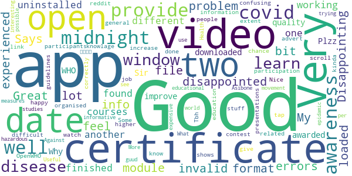

> Good info  :date: __2020-12-24 16:44:57__

> I feel a bit disappointed, experienced a lot of errors. My module and videos can't be loaded.  :date: __2020-07-26 17:32:06__

> Great app, but my only problem is that I can't open my certificate file. Says invalid format. Disappointing 😭  :date: __2020-07-23 02:09:56__

> Videos were not working only, so I uninstalled it.  :date: __2020-07-18 08:42:28__

> I have finished two courses on two different date(one before midnight, another after midnight) but found same date on both while I downloaded Certificates. Why is this?  :date: __2020-06-11 19:18:50__

> covid  :date: __2020-06-11 18:37:22__

> Sir, Plzz improve the quality of the certificate awarded by the WHO to the participants to increase more & more participation as well as awareness of the people in this contest organised by OpenWHO.  :date: __2020-05-24 16:44:50__

> Some extent it's very good and its provide guidelines to advert disease.  :date: __2020-05-23 18:33:55__

> Nice app however difficult to watch video presentations  :date: __2020-05-14 19:35:42__

> Very confusing. not happy with the link. I don't know if I have done it correctly.  :date: __2020-05-12 22:12:31__

#### 2-star reviews

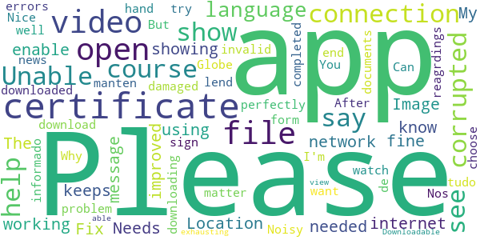

> Needs to be improved. Image don't show up . Fix needed  :date: __2020-12-23 15:51:31__

> The app keeps showing me this message (please enable network connection) when I open it, don't know why ?? My internet connection is working fine and I am using all the other apps perfectly well. Can you lend me a hand in this matter.  :date: __2020-11-08 08:31:34__

> After downloading the certificate at the end of the course when u try to open it. It says the file is corrupted or damaged  :date: __2020-09-23 14:26:48__

> Unable to watch the video or download the video.  :date: __2020-08-08 15:29:04__

> I can't open the certificate. Please help me out of this problem  :date: __2020-07-31 05:25:00__

> It shows errors again and again,Can't sign in  :date: __2020-06-26 16:11:53__

> I completed a course and then downloaded certificate it ... But I'm unable too see my certificate as it say corrupted file or invalid file. Please help with reagrdings to it.  :date: __2020-05-27 13:14:22__

> Noisy app.  :date: __2020-04-21 21:34:45__

> Nice  :date: __2020-04-09 16:25:41__

> Please , i want the App in the form of the Globe.  :date: __2020-04-05 14:35:33__

#### 1-star reviews

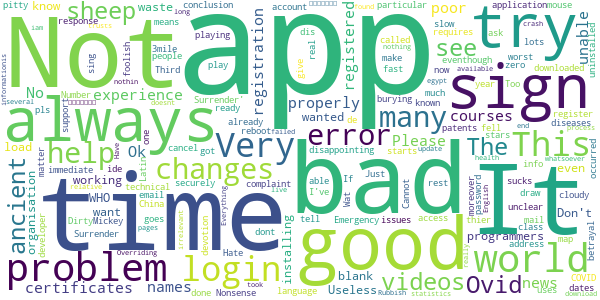

> The videos are not playing eventhough I've downloaded them  :date: __2020-11-03 10:43:38__

> “‘Ovid’ is Latin for a sheep. COVID starts with a C, which also means ‘see’ in ancient language. 19 was known as the “Number of Surrender” in ancient times.”  It goes on to draw the conclusion, “C-OVID 19 = ‘See a Sheep Surrender'”.  :date: __2020-11-02 08:04:58__

> Very bad experience i got unable to login very bad i fell worst experience  :date: __2020-09-26 10:55:02__

> Ok  :date: __2020-08-10 23:31:14__

> This is called an "Emergency" app but requires registration? Very disappointing.  :date: __2020-08-06 20:55:46__

> unable to make account and register, also not able to login.  :date: __2020-08-04 11:59:45__

> I can't Login no matter how much I try.  :date: __2020-07-04 14:19:09__

> This app is having technical issues  :date: __2020-07-03 17:13:33__

> Not a good application....It always changes names in certificates and it changes dates also moreover i have done courses and it changes there names also in certificates...so many problems...now what to do  :date: __2020-07-02 03:49:39__

> Not sign in properly many time errors.. Please help me out of this problem. I already registered a complaint that particular problem through mail.  :date: __2020-06-16 05:10:29__

# NHS COVID-19
App version ``4.4 (146)``

Analyzed with [covid-apps-observer](http://github.com/covid-apps-observer) project, version ``0.1``

## App overview
| | |
|-------------------------|-------------------------| 
| **Name**&nbsp;&nbsp;&nbsp;&nbsp;&nbsp;&nbsp;&nbsp;&nbsp;&nbsp;&nbsp;&nbsp;&nbsp;&nbsp;&nbsp;&nbsp;&nbsp;&nbsp;&nbsp;&nbsp;&nbsp;&nbsp;&nbsp;&nbsp;&nbsp;&nbsp;&nbsp;&nbsp;&nbsp;&nbsp;&nbsp;&nbsp;&nbsp;&nbsp;&nbsp;&nbsp;&nbsp;&nbsp;&nbsp;&nbsp;&nbsp;  | NHS COVID-19 |
| **Unique identifier** | uk.nhs.covid19.production |
| **Link to Google Play** | [https://play.google.com/store/apps/details?id=uk.nhs.covid19.production](https://play.google.com/store/apps/details?id=uk.nhs.covid19.production) |
| **Summary**  | Protect your loved ones with the NHS contact tracing app for England and Wales. |
| **Privacy policy** | [https://covid19.nhs.uk/our-policies.html](https://covid19.nhs.uk/our-policies.html) |
| **Latest version** | 4.4 (146) |
| **Last update** | 2021-02-08 18:08:05 |
| **Recent changes** | We have introduced a change which means that after entering certain types of test results in the app, users may be advised to book a follow-up test that is sent to a lab for analysis. Other design, language and accessibility optimisations. |
| **Installs**  | 5,000,000+ |
| **Category** | Medical |
| **First release** | Aug 12, 2020 |
| **Size**  | 8.4M |
| **Supported Android version**  | 6.0 and up |

### Description
> The NHS COVID-19 app is the official contact tracing app for England and Wales. 
 It is the fastest way of knowing when you’re at risk from coronavirus. The quicker you know, the quicker you can alert your loved ones, and your community. 
 The more of us that use it, the better we can control coronavirus. 
 The app runs on proven software developed by Apple and Google, designed so that nobody will know who or where you are. And you can delete your data, or the app, at any time.
 It has a number of features: 
 Trace: Find out when you’ve been near other app users who have tested positive for coronavirus
 Alert: Lets you know the level of coronavirus risk in your postcode district. 
 Check-in: Use our simple QR code scanner to check-in to venues like bars and restaurants. You will get alerted if you have visited a venue where you may have come into contact with coronavirus.
 Symptoms: Check if you have coronavirus symptoms and see if you need to order a test. 
 Test: Helps you order a test if you need to.
 Isolate: Keep track of your self-isolation countdown and access relevant advice.
 Available in English, Welsh, Arabic (Modern Standard), Bengali, Chinese (Simplified), Gujarati, Polish, Punjabi (Gurmukhi script), Romanian, Somali, Turkish and Urdu.
 The app can be used across UK borders in England, Wales, Scotland, Northern Ireland, Jersey and Gibraltar, detecting all relevant contact tracing app users (regardless of them using different official apps), alerting them if they have been in contact with coronavirus. 
 The app has been built in collaboration with some of the most innovative organisations in the world. We have worked with medical experts, privacy groups, at-risk communities and we’ve shared knowledge with the teams working on similar apps in many countries.
 Protect your loved ones. Please download the app. 
 The App is CE marked as a class I medical device in the United Kingdom and developed in compliance with European Commission Directive 93/42/EEC for class I devices.

### User interface
The developers of the app provide the following screenshots in the Google play store.
| | | |
|:-------------------------:|:-------------------------:|:-------------------------:|
 |   |   |   | 
 |   |  

## Development team
In the following we report the main information provided by the development team in the Google play store.

| | |
|-------------------------|-------------------------|
| **Developer**  | Department of Health and Social Care |
| **Website**  | [https://covid19.nhs.uk/](https://covid19.nhs.uk/) |
| **Email** | NHSCovid-19AppStoreSupport@nhsbsa.nhs.uk |
| **Physical address**  | - |
| **Other developed apps**  | [https://play.google.com/store/apps/developer?id=Department+of+Health+and+Social+Care](https://play.google.com/store/apps/developer?id=Department+of+Health+and+Social+Care) |

## Android support

| | |
|-------------------------|-------------------------|
| **Declared target Android version**  | Android10, version 10 (API level 29) |
| **Effective target Android version**  | Android10, version 10 (API level 29) |
| **Minimum supported Android version**  | Marshmallow, version 6.0 (API level 23) |
| **Maximum target Android version**  | - |

The larger the difference between the minimum and maximum supported Android versions, the better. A larger difference means a wider audience. For example, old phones have a very low Android version, so a high minimum supported Android version means that the app cannot be used by users with old phones, thus leading to accessibility problems. 

## Requested permissions

In the following we report the complete list of the permissions requested by the app. 

| **Permission** | **Protection level** | **Description** | 
|-------------------------|-------------------------|-------------------------|
 **android.permission ACCESS_NETWORK_STATE** | Normal | Allows applications to access information about networks. 
 **android.permission BLUETOOTH** | Normal | Allows applications to connect to paired bluetooth devices. 
 **android.permission CAMERA** | :warning:**Dangerous** | Required to be able to access the camera device. 
 **android.permission FOREGROUND_SERVICE** | Normal | Allows a regular application to use Service.startForeground. 
 **android.permission INTERNET** | Normal | Allows applications to open network sockets. 
 **android.permission RECEIVE_BOOT_COMPLETED** | Normal | Allows an application to receive the Intent.ACTION_BOOT_COMPLETED that is broadcast after the system finishes booting. 
 **android.permission WAKE_LOCK** | Normal | Allows using PowerManager WakeLocks to keep processor from sleeping or screen from dimming. 

## Mentioned servers

| **Server** | **Registrant** | **Registrant country** | **Creation date** | 
|-------------------------|-------------------------|-------------------------|-------------------------|
 | google.com | Google LLC | :us: US | 1997-09-15 04:00:00 |
 | ietf.org | IETF Trust | :us: US | 1995-03-11 05:00:00 |
 | googleapis.com | Google LLC | :us: US | 2005-01-25 17:52:26 |
 | apache.org | The Apache Software Foundation | :us: US | 1995-04-11 04:00:00 |

## Security analysis 

Below we report the main security warnings raised by our execution of the [Androwarn](https://github.com/maaaaz/androwarn) security analysis tool.

**Connection interfaces exfiltration**
> - This application reads details about the currently active data network 
> - This application tries to find out if the currently active data network is metered 

**Suspicious connection establishment**
> - This application opens a Socket and connects it to the remote address ' returned no addresses for  ; port is out of range' on the 'N/A' port  
> - This application opens a Socket and connects it to the remote address '' on the 'N/A' port  
> - This application opens a Socket and connects it to the remote address 'Ljava/lang/StringBuilder;->toString()Ljava/lang/String;' on the 'N/A' port  
> - This application opens a Socket and connects it to the remote address 'Ljava/net/Proxy;->type()Ljava/net/Proxy$Type;' on the 'N/A' port  
> - This application opens a Socket and connects it to the remote address 'timeout' on the 'N/A' port  

**Code execution**
> - This application loads a native library 
> - This application loads a native library: 'Ljava/lang/String;->valueOf(Ljava/lang/Object;)Ljava/lang/String;' 

## User ratings and reviews

Below we provide information about how end users are reacting to the app in terms of ratings and reviews in the Google Play store.

### Ratings

The NHS COVID-19 app has been installed by more than **5000000** times. At this time, **99111** rated the app and its average score is **3.7043085**. Below we show the distribution of the ratings across the usual star-based rating of Google Play

:star::star::star::star::star:: 52625

:star::star::star::star:: 11669

:star::star::star:: 8491

:star::star:: 5541

:star:: 20785

### Reviews 

#### 5-star reviews

> Easy to get on with  :date: __2021-02-13 19:34:45__

> V.good.hope.nhs.covid.app Is.in It.now.charging.mob.thank.y.i.need.t.covid.app  :date: __2021-02-13 18:46:46__

> Ok,  :date: __2021-02-13 17:23:39__

> No issues or problems at all  :date: __2021-02-13 14:13:35__

> Very good  :date: __2021-02-13 13:12:58__

> Have been given my 1st.vaccination earlier than I expected thank you Boris for making this happen for UK  :date: __2021-02-12 23:04:34__

> good to know were ssafe  :date: __2021-02-12 20:15:19__

> I'm pleased with the app, provides good clear advice  :date: __2021-02-12 19:55:59__

> very good  :date: __2021-02-12 19:11:21__

> Easy to navigate.  :date: __2021-02-12 17:08:18__

#### 4-star reviews

> Thankfully  :date: __2021-02-11 21:30:01__

> Seems fine, keep up the good work guys! :)  :date: __2021-02-11 16:38:52__

> Okay  :date: __2021-02-11 14:49:32__

> They fixed a problem with the app, so upping the star count. Can you fix the problem with the government as well? Also, can you gamify the app, like points for not getting covid or something? Unlockable achievements? Daily rewards? Anything to break the tedium. Thanks, xxxx  :date: __2021-02-06 08:26:59__

> Twilight zone  :date: __2021-02-06 06:00:00__

> sometimes a little slow, but works okay.  :date: __2021-02-05 13:04:42__

> UPDATE: Alert appears to have stopped - thanks for that. App now seems to work fine.  :date: __2021-02-05 12:37:13__

> The new advive not always up to date otherwise ok  :date: __2021-02-04 15:56:53__

> Suddenly my Bluetooth won't switch so the app won't work I cant seem to fix it. Update. I had restarted several times it didn't help. Powering off worked tho. So it's up and running again thanks  :date: __2021-02-01 18:33:52__

> This app is ok and as there is no alternative you can't choose anything else. I used it for checking into venues, but due to national lockdown I no longer do this. I haven't been alerted to any contacts so assume I've not had contact with anyone testing positive. The Test and Trace programme seems to have largely been an inefficient use of public money that has been ignored but many people. Perhaps a public inquiry will reveal the cost/benefit of this.  :date: __2021-01-30 22:58:58__

#### 3-star reviews

> 20/1/21 26/1/21? 12/2/21  :date: __2021-02-12 11:11:41__

> The app may or may not be running in the background there is no way to tell. Initially after starting the app of I display all running shoes this one shows not after a few minutes it no longer does. I am not at all sure it is running and have to remember to the start of every time I leave the house.  :date: __2021-02-12 07:28:30__

> Works fine. Excessive notifications though about loading.  :date: __2021-02-12 06:53:46__

> I can't change my postcode as l cannot find the home page or the "manage my app" section, l have spent ages trying to sort this out but have had no luck  :date: __2021-02-12 00:28:35__

> Currently won't open. Uninstall and reinstall still not working. On opening the app it just crashes. Using a Pixel phone so should work with Android  :date: __2021-02-11 19:02:52__

> Despite false isolations, I've given it a third chance. Currently its behaving as I would expect. Its not giving isolation messages and Thats because I'm not mixing still. Its 5 weeks with trace on and no more false positives. SO FAR. Ive marked it up to 3 and will see how it goes.  :date: __2021-02-11 10:15:20__

> I keep getting exposure notifications, but nothing more. What happens next? Thanks.  :date: __2021-02-10 21:41:43__

> It's fine, but kind of a mess. You cannot actually enter in any codes you get at test centers. Additionally, here are some points to improve upon: Changing location is possible but kinda hard to find. Others have issues with the app being suspended. Power management issues should be acknowledged by the app, and users should be asked to exempt the app on first start. National statistics would be nice. Also please add the option to add a shortcut to the 'scan' activity.  :date: __2021-02-10 17:45:11__

> Moor Costmer id De Store  :date: __2021-02-08 19:39:14__

> Quite annoying having to keep Bluetooth ans gps on ALL the time. If you don't you are reminded every 10 mins or so to turn them all on. Someone should tell the developer the power consuptions of these features and houw it affects the battery life. Having WiFi on anyway (which is as good as gps when you are at home) should sufice to get the notifications.  :date: __2021-02-08 01:17:24__

#### 2-star reviews

> Doesnt work well  :date: __2021-02-13 16:58:59__

> Doesn't open half the time, and not informative the rest  :date: __2021-02-13 09:54:27__

> It barely works. The only reason I have it installed at this point is because if I fear that if I try to uninstall it, Michael Gove will appear and kick me in the groin. Having notifications about legislation changes is nice, but otherwise it's so poorly thought out. The main reason I signed up was for privacy-first contact tracing, but that feature requires both bluetooth *and* location permissions, which is highly suspect! And when you do get a hit, the notification autodismisses itself. Wow.  :date: __2021-02-13 09:37:16__

> Not too sure if it's reliable.  :date: __2021-02-12 21:50:43__

> How can you review your exposure checks  :date: __2021-02-12 20:23:04__

> Constant notification saying loading.  :date: __2021-02-12 08:29:14__

> I read in the app to put in the code that came with the covid test result. I've had tests but no code. I find the app to be unhelpful and not very user friendly. Feel as if it was made in a rush. Sorry but I believe the review needs to be honest and fair.  :date: __2021-02-10 17:06:32__

> Used to work but no longer even starts, I just got a pop-up from Android telling me the app is continuously stopping. When I try to open the app, it is frozen on the splash screen. Reinstalling didn't fix it  :date: __2021-02-10 07:54:56__

> Had a load notification on my phone for a day now please fix  :date: __2021-02-09 18:32:51__

> Sometimes I have switched the app off at night to save power and I set it to come on again in 8 hours. However if you miss the brief reminder it doesn't come on and I go about my day with it switched off. There doesn't seem to be away for it to resume operating automatically.  :date: __2021-02-09 08:24:17__

#### 1-star reviews

> Terribly awful  :date: __2021-02-13 17:34:17__

> Brittle sucks u suck🖕🖕🖕🖕🖕🖕☝️  :date: __2021-02-13 17:18:10__

> The app originally promised no GPS now it does uninstalled  :date: __2021-02-13 15:29:16__

> CANT DOWNLOAD IF UNDER 16!?!? Pointless. Must have GPS and Bluetooth on at all times to work. Immediately the app drains your battery. REPLY: Sorry I'm not able to copy and paste the link so I can't.  :date: __2021-02-13 13:43:14__

> Reply to dev response 13.2.21 I was looking for the information saying when the covid app had last checked for contact, not if I had any positive contact. A previous version had stopped working and I only found out after a couple weeks by checking if it had been updating contacts( which it hadn't), I am unable to check this now.  :date: __2021-02-13 12:38:25__

> I knew from a close contact that they had tested positive, but the app running on a Samsung app did not notify me that I needed to isolate, until I went into the app to see why I hadn't received a notification. The whole point of this is app is to run in the background and inform you of events, not for you to go looking for them.  :date: __2021-02-13 10:58:33__

> Rubbish. In same house as someone who is positive and still not getting any alert I live with him obviously we are in constant contact. And your app is still not showing any alerts. Its rubbish  :date: __2021-02-13 09:50:50__

> Ok, until...I went onto the play store and there was an 'enable' button on it. I've never disabled it. It was working. A contact tracing app that disables itself is not a very effective one. Poor.  :date: __2021-02-13 07:05:43__

> 1 simply because whoever I got covid from wasn't using it, kind of sums up the app experience as a whole.  :date: __2021-02-12 22:36:52__

> Don't work on my phone I have a Samsung fold phone and it don't work I have tried all the app for covid-19 and not one of them work 😑😒😡  :date: __2021-02-12 22:14:36__

# Protect Scotland
App version ``1.2.0``

Analyzed with [covid-apps-observer](http://github.com/covid-apps-observer) project, version ``0.1``

## App overview
| | |
|-------------------------|-------------------------| 
| **Name**&nbsp;&nbsp;&nbsp;&nbsp;&nbsp;&nbsp;&nbsp;&nbsp;&nbsp;&nbsp;&nbsp;&nbsp;&nbsp;&nbsp;&nbsp;&nbsp;&nbsp;&nbsp;&nbsp;&nbsp;&nbsp;&nbsp;&nbsp;&nbsp;&nbsp;&nbsp;&nbsp;&nbsp;&nbsp;&nbsp;&nbsp;&nbsp;&nbsp;&nbsp;&nbsp;&nbsp;&nbsp;&nbsp;&nbsp;&nbsp;  | Protect Scotland |
| **Unique identifier** | gov.scot.covidtracker |
| **Link to Google Play** | [https://play.google.com/store/apps/details?id=gov.scot.covidtracker](https://play.google.com/store/apps/details?id=gov.scot.covidtracker) |
| **Summary**  | Help stop the spread of Covid-19 in Scotland by using the Protect Scotland app. |
| **Privacy policy** | [https://protect.scot/privacy-policy-app](https://protect.scot/privacy-policy-app) |
| **Latest version** | 1.2.0 |
| **Last update** | 2021-02-08 19:38:37 |
| **Recent changes** | In-app process for generating self-isolation certificates. |
| **Installs**  | 500,000+ |
| **Category** | Medical |
| **First release** | Sep 4, 2020 |
| **Size**  | 107M |
| **Supported Android version**  | 6.0 and up |

### Description
> Help Scotland keep the spread of coronavirus under control by downloading and using the free Protect Scotland app from NHS Scotland’s Test and Protect service. 
 Using the app is entirely voluntary.  When you use the app, you will be alerted if you have been in close contact with another app user who has tested positive for coronavirus. If you test positive and you enter the unique code sent to you into the app, it will anonymously warn other app users whom you have been in close contact with.
 Using Bluetooth, the app will search for other devices with the Protect Scotland app installed, which are within 2m of your phone. You don’t need to have a WiFi connection. The app uses a very small amount of your mobile phone data.  
 
Once you’ve downloaded the app, encourage your friends, family and colleagues to do so too. The more people who download and use the Protect Scotland app, the more likely we are to keep coronavirus under control. . The benefits of using the app are:

Speeds up the process of identifying and notifying people that have been at risk of catching coronavirus, particularly of unknown contacts
Slows the spread of the virus
Reduces the likelihood of further lockdowns
Helps protect the health service, your family and friends, yourself and the people of Scotland
 Ultimately, you can help to stop the spread of coronavirus in Scotland by downloading and using the Protect Scotland app.
 Privacy and Data
 The Protect Scotland app is designed to protect the privacy of all users. It doesn’t store or share any personally identifiable information, like your name or address. Nobody can track your location by using the app or tell who you are.
 You can remove the app from your device at any time, and all the data stored on your phone will be deleted.

### User interface
The developers of the app provide the following screenshots in the Google play store.
| | | |
|:-------------------------:|:-------------------------:|:-------------------------:|
 |   |   |   | 
 |   |  

## Development team
In the following we report the main information provided by the development team in the Google play store.

| | |
|-------------------------|-------------------------|
| **Developer**  | NHS Education for Scotland |
| **Website**  | [https://protect.scot/index.html](https://protect.scot/index.html) |
| **Email** | testandprotect@nhs.scot |
| **Physical address**  | [NHS Education for Scotland Knowledge Services 2 Central Quay 3rd Floor 89 Hydepark Street Glasgow G3 8BW ](https://www.google.com/maps/search/NHS%20Education%20for%20Scotland%20Knowledge%20Services%202%20Central%20Quay%203rd%20Floor%2089%20Hydepark%20Street%20Glasgow%20G3%208BW%20) (Google Maps) |
| **Other developed apps**  | [https://play.google.com/store/apps/developer?id=NHS+Education+for+Scotland](https://play.google.com/store/apps/developer?id=NHS+Education+for+Scotland) |

## Android support

| | |
|-------------------------|-------------------------|
| **Declared target Android version**  | Android10, version 10 (API level 29) |
| **Effective target Android version**  | Android10, version 10 (API level 29) |
| **Minimum supported Android version**  | Marshmallow, version 6.0 (API level 23) |
| **Maximum target Android version**  | - |

The larger the difference between the minimum and maximum supported Android versions, the better. A larger difference means a wider audience. For example, old phones have a very low Android version, so a high minimum supported Android version means that the app cannot be used by users with old phones, thus leading to accessibility problems. 

## Requested permissions

In the following we report the complete list of the permissions requested by the app. 

| **Permission** | **Protection level** | **Description** | 
|-------------------------|-------------------------|-------------------------|
 **android.permission ACCESS_NETWORK_STATE** | Normal | Allows applications to access information about networks. 
 **android.permission ACCESS_WIFI_STATE** | Normal | Allows applications to access information about Wi-Fi networks. 
 **android.permission BLUETOOTH** | Normal | Allows applications to connect to paired bluetooth devices. 
 **android.permission FOREGROUND_SERVICE** | Normal | Allows a regular application to use Service.startForeground. 
 **android.permission INTERNET** | Normal | Allows applications to open network sockets. 
 **android.permission RECEIVE_BOOT_COMPLETED** | Normal | Allows an application to receive the Intent.ACTION_BOOT_COMPLETED that is broadcast after the system finishes booting. 
 **android.permission VIBRATE** | Normal | Allows access to the vibrator. 

## Mentioned servers

| **Server** | **Registrant** | **Registrant country** | **Creation date** | 
|-------------------------|-------------------------|-------------------------|-------------------------|
 | android.com | Google LLC | :us: US | 1997-06-23 04:00:00 |
 | google.com | Google LLC | :us: US | 1997-09-15 04:00:00 |
 | expo.io | See PrivacyGuardian.org | :us: US | 2011-05-01 21:26:50 |

## Security analysis 

Below we report the main security warnings raised by our execution of the [Androwarn](https://github.com/maaaaz/androwarn) security analysis tool.

**Telephony identifiers leakage**
> - This application reads the MCC+MNC of the provider of the SIM 

**Connection interfaces exfiltration**
> - This application reads details about the currently active data network 
> - This application tries to find out if the currently active data network is metered 

**Suspicious connection establishment**
> - This application opens a Socket and connects it to the remote address ' returned no addresses for  ; port is out of range' on the 'N/A' port  
> - This application opens a Socket and connects it to the remote address '' on the 'N/A' port  
> - This application opens a Socket and connects it to the remote address 'Ljava/lang/StringBuilder;->toString()Ljava/lang/String;' on the 'N/A' port  
> - This application opens a Socket and connects it to the remote address 'Ljava/net/Proxy;->type()Ljava/net/Proxy$Type;' on the 'N/A' port  
> - This application opens a Socket and connects it to the remote address 'timeout' on the 'N/A' port  

**Pim data leakage**
> - This application accesses data stored in the clipboard 

**Code execution**
> - This application loads a native library 
> - This application executes a UNIX command 

## User ratings and reviews

Below we provide information about how end users are reacting to the app in terms of ratings and reviews in the Google Play store.

### Ratings

The Protect Scotland app has been installed by more than **500000** times. At this time, **2723** rated the app and its average score is **4.1214285**. Below we show the distribution of the ratings across the usual star-based rating of Google Play

:star::star::star::star::star:: 1819

:star::star::star::star:: 301

:star::star::star:: 107

:star::star:: 107

:star:: 389

### Reviews 

#### 5-star reviews

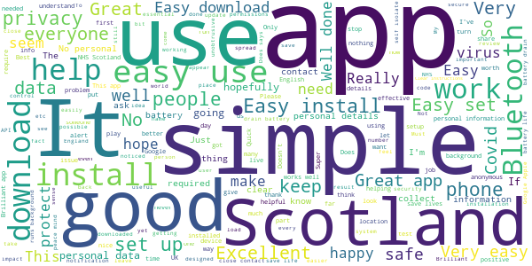

> Good app to have  :date: __2021-02-13 14:17:13__

> Easy install, anonymous and unobtrusive. No personal details required. Get alerted if you have been in close contact with anyone recently testing positive. What you choose to do then is up to you. Similarly if you have a positive test, you choose to update the app/system. A win-win for everyone, and it will help restrict and limit any spread. Update: 31st Jan 20: The app/system works. My partner got a +ve test result this morning. She entered her code and I was notified a few hours later.  :date: __2021-02-13 14:12:49__

> Excellent app, runs in the background, doesn't collect your data, never had a problem with it. Brilliant, thanks NHS Scotland!  :date: __2021-02-13 12:47:23__

> Well developed programme, well done to the Scottish government 👏  :date: __2021-02-13 09:16:08__

> Easy to do  :date: __2021-02-12 19:17:32__

> Good  :date: __2021-02-12 19:12:42__

> Doing what it's designed for  :date: __2021-02-12 12:45:26__

> Excellent  :date: __2021-02-11 19:25:33__

> Great app.....  :date: __2021-02-11 13:37:04__

> Best thing i ever done everyone should have it  :date: __2021-02-11 13:29:36__

#### 4-star reviews

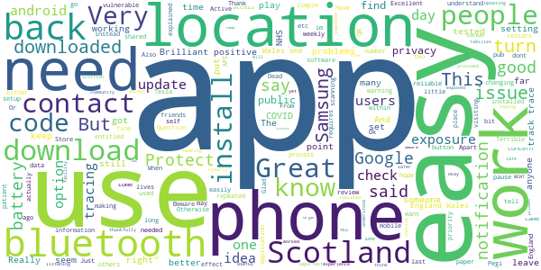

> Useful  :date: __2021-02-12 16:43:23__

> Very important app very good  :date: __2021-02-07 17:27:01__

> Excellent. Many thanks for making this app which keeps us all safer and aware.  :date: __2021-01-27 22:28:42__

> Updating review,,,track and trace provided me with new code which worked within the app. Will say I have been in contact with two people who tested positive but had no notification through app but dont know if they inputted the code 🤔  :date: __2021-01-20 13:31:05__

> Ok  :date: __2021-01-14 15:36:03__

> OK  :date: __2021-01-07 10:58:35__

> It saves lives  :date: __2021-01-02 00:22:28__

> Have not needed to use  :date: __2020-12-23 00:24:50__

> Easy to use no problems except for the battery so had to use a back up facility  :date: __2020-12-16 22:14:09__

> Okay I think.I may just have been so Isolated I have not had a concern ..yet .  :date: __2020-12-14 23:01:39__

#### 3-star reviews

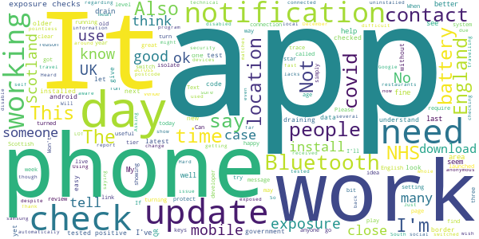

> I received a notification to self-isolate back in November. When I checked the periods of exposure on the Google notification page there had been no exposure checks for several days including the day I was allegedly exposed. It turned out I was nowhere near anybody that had corvid-19. My next door neighbour had tested positive a week or so before. The Bluetooth picked up the notification through the wall.  :date: __2021-02-12 14:22:32__

> None  :date: __2021-01-22 22:34:21__

> An ok app but my husband and I both tested positive on the same day. The following day, we each received a text to say we'd been in close contact with someone who had tested positive. Given we live in the same house ...  :date: __2021-01-20 18:16:11__

> Nice if there was a log of when it was working and when instead of praying that a notification comes up if you've been exposed.  :date: __2021-01-13 18:32:20__

> Update: appear to be getting daily exposure updates now. Will give the app another try. I have had zero response from the developer.  :date: __2021-01-09 00:16:58__

> The app used to work fine until the 10 Dec update but then stopped checking for exposures automatically. It was difficult to report the issue --- it feels like mails / app reviews only got attention after people made fuss on social media. The app works OK now, after the 5 Jan update, but I wish there was an easier way to report bugs, and more transparency regarding existing ones.  :date: __2021-01-08 13:18:19__

> Just got a notification after accidently turning off my.location to be informed I haven't been checked since 14th December !!!  :date: __2021-01-07 23:23:07__

> Was working for a while but not performed a check since 16th December 2020 despite always being on.  :date: __2021-01-03 22:07:19__

> I occasionally check this app and all is well. Thank God.  :date: __2020-12-30 23:14:17__

> No exposure checks in the last 14 days, yet I've had bluetooth & location switched on.  :date: __2020-12-30 14:39:08__

#### 2-star reviews

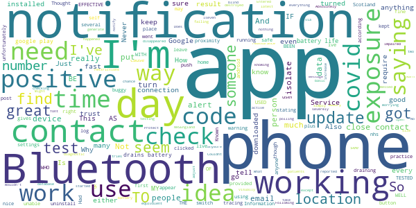

> There is no way of knowing if it iseven working. Updates saying everything is fine you haven't been in contact with a positive person would be nice.  :date: __2021-02-12 13:30:55__

> Never had an alert no idea if that's working and there's no way to take two phones and do a diagnostic safe proximity test between them for reassurance. I simply don't trust this or the NHSEngland equivalent and I use both.  :date: __2021-02-12 04:20:30__

> I don't know if it works right..  :date: __2021-02-11 11:40:25__

> Cannot increase or adjust the font size. I am severely visually impaired/blind.  :date: __2021-02-04 14:05:45__

> I had a message via the app once but when I clicked on it, it disappeared.theres nothing in app about using QR code...or how.  :date: __2021-01-17 09:03:08__

> Known not to work as positive testing patients do not put in their results  :date: __2021-01-16 11:16:29__

> Entered my post code to see the restrictions in my post code and it can't find it  :date: __2021-01-13 16:28:03__

> Never tells me when I have been in known contact. Wouldn't except a code for positive result  :date: __2021-01-11 00:09:22__

> Is this app working.  :date: __2021-01-08 23:48:11__

> Does it do anything . No buttons seem active  :date: __2020-12-23 12:48:16__

#### 1-star reviews

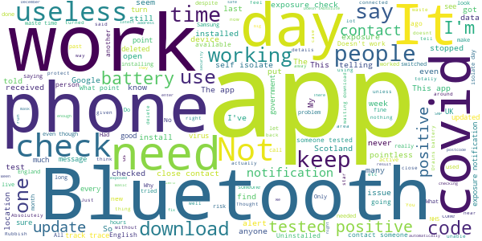

> As someone who works in England and commutes back to Scotland, this app is useless. Why is everyone in the UK not using the same app. There are thousands like me.  :date: __2021-02-13 14:15:18__

> Exceeding doubtful that the App actually works.  :date: __2021-02-13 14:11:50__

> This app seems useless  :date: __2021-02-13 12:21:58__

> CONTROLAVIRUS. . Switch off your TV..bin the mask.. Hug each other.. Educate yourselves. Seriously people this app is a security risk.. NEVER keep your Bluetooth 0n...  :date: __2021-02-13 07:23:28__

> I tested positive for covid and it wouldn't accept my test code to mark me as a positive case  :date: __2021-02-12 16:41:15__

> The app will not download or should I say update from the older version..  :date: __2021-02-11 19:26:45__

> Trying to download the updated App from the current App but it is in a loop and does not update.  :date: __2021-02-11 14:14:58__

> Useless. It doesn't update automatically. So by chance I saw a new update available. Had someone near me who has tested positive and has updated their app with the result but it didn't alert me in any way. Whoever invented this, should be sacked.  :date: __2021-02-11 14:10:20__

> Works smoother than a goat on a dance floor  :date: __2021-02-11 04:00:35__

> So in a month this app has used 0.00mb of data.. it doesnt work and totally pointless. More SNP propaganda  :date: __2021-02-06 12:24:45__

# Jersey COVID Alert
App version ``1.0.6``

Analyzed with [covid-apps-observer](http://github.com/covid-apps-observer) project, version ``0.1``

## App overview
| | |
|-------------------------|-------------------------| 
| **Name**&nbsp;&nbsp;&nbsp;&nbsp;&nbsp;&nbsp;&nbsp;&nbsp;&nbsp;&nbsp;&nbsp;&nbsp;&nbsp;&nbsp;&nbsp;&nbsp;&nbsp;&nbsp;&nbsp;&nbsp;&nbsp;&nbsp;&nbsp;&nbsp;&nbsp;&nbsp;&nbsp;&nbsp;&nbsp;&nbsp;&nbsp;&nbsp;&nbsp;&nbsp;&nbsp;&nbsp;&nbsp;&nbsp;&nbsp;&nbsp;  | Jersey COVID Alert |
| **Unique identifier** | com.governmentofjersey.jerseycovidalert |
| **Link to Google Play** | [https://play.google.com/store/apps/details?id=com.governmentofjersey.jerseycovidalert](https://play.google.com/store/apps/details?id=com.governmentofjersey.jerseycovidalert) |
| **Summary**  | Jersey&#39;s COVID-19 contact tracing app |
| **Privacy policy** | [https://covidalert.gov.je/pages/privacy-notice.aspx](https://covidalert.gov.je/pages/privacy-notice.aspx) |
| **Latest version** | 1.0.6 |
| **Last update** | 2021-01-28 12:04:32 |
| **Recent changes** | Text updates, minor bug fixes. |
| **Installs**  | 10,000+ |
| **Category** | Medical |
| **First release** | Oct 8, 2020 |
| **Size**  | 108M |
| **Supported Android version**  | 6.0 and up |

### Description
> This is the official digital contact tracing and exposure notification application provided by Public Health, Government of Jersey for visitors and citizens on the island of Jersey.
 By using the app you can help prevent and contain outbreaks of COVID-19. 
 The app will warn you with an Exposure Alert if you have been near someone who has recently been diagnosed with COVID-19.  If you choose, you can ask the Contact Tracing Team to call you for specific advice and support if you get an Exposure Alert.  
 If you are diagnosed with COVID-19, the app lets you anonymously warn people you were near to before you became aware that you were infectious. Only people with a confirmed case of COVID-19 can do this with the support of the Contact Tracing Team.
 Your privacy is protected:
 •        No personal information needed to sign up
 •        The app does not record your location and does not use GPS. 
 •        The app is built with strong privacy protection. 
 •        Use of the app is always voluntary. 
 •        The app will ask your permission to share any data. 
 •        The app can be uninstalled at any time. 
 •        It is extremely unlikely that you could be identified by other users while using the app. 
 Developed on behalf of Public Health (JHA) by Digital Health (HCS) and Digital Jersey.

### User interface
The developers of the app provide the following screenshots in the Google play store.
| | | |
|:-------------------------:|:-------------------------:|:-------------------------:|
 |   | 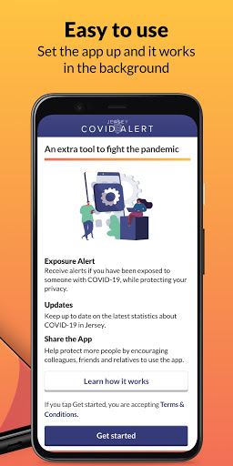  |   | 
 |   |  

## Development team
In the following we report the main information provided by the development team in the Google play store.

| | |
|-------------------------|-------------------------|
| **Developer**  | Government of Jersey |
| **Website**  | [http://covidalert.gov.je](http://covidalert.gov.je) |
| **Email** | covidalert@gov.je |
| **Physical address**  | [Digital Health, 4 Edward Place, The Parade, St. Helier, Jersey JE2 3QP](https://www.google.com/maps/search/Digital%20Health,%204%20Edward%20Place,%20The%20Parade,%20St.%20Helier,%20Jersey%20JE2%203QP) (Google Maps) |
| **Other developed apps**  | [https://play.google.com/store/apps/developer?id=5014249503765258721](https://play.google.com/store/apps/developer?id=5014249503765258721) |

## Android support

| | |
|-------------------------|-------------------------|
| **Declared target Android version**  | Android10, version 10 (API level 29) |
| **Effective target Android version**  | Android10, version 10 (API level 29) |
| **Minimum supported Android version**  | Marshmallow, version 6.0 (API level 23) |
| **Maximum target Android version**  | - |

The larger the difference between the minimum and maximum supported Android versions, the better. A larger difference means a wider audience. For example, old phones have a very low Android version, so a high minimum supported Android version means that the app cannot be used by users with old phones, thus leading to accessibility problems. 

## Requested permissions

In the following we report the complete list of the permissions requested by the app. 

| **Permission** | **Protection level** | **Description** | 
|-------------------------|-------------------------|-------------------------|
 **android.permission ACCESS_NETWORK_STATE** | Normal | Allows applications to access information about networks. 
 **android.permission ACCESS_WIFI_STATE** | Normal | Allows applications to access information about Wi-Fi networks. 
 **android.permission BLUETOOTH** | Normal | Allows applications to connect to paired bluetooth devices. 
 **android.permission FOREGROUND_SERVICE** | Normal | Allows a regular application to use Service.startForeground. 
 **android.permission INTERNET** | Normal | Allows applications to open network sockets. 
 **android.permission RECEIVE_BOOT_COMPLETED** | Normal | Allows an application to receive the Intent.ACTION_BOOT_COMPLETED that is broadcast after the system finishes booting. 
 **android.permission VIBRATE** | Normal | Allows access to the vibrator. 

## Mentioned servers

| **Server** | **Registrant** | **Registrant country** | **Creation date** | 
|-------------------------|-------------------------|-------------------------|-------------------------|
 | android.com | Google LLC | :us: US | 1997-06-23 04:00:00 |
 | google.com | Google LLC | :us: US | 1997-09-15 04:00:00 |
 | expo.io | See PrivacyGuardian.org | :us: US | 2011-05-01 21:26:50 |

## Security analysis 

Below we report the main security warnings raised by our execution of the [Androwarn](https://github.com/maaaaz/androwarn) security analysis tool.

**Connection interfaces exfiltration**
> - This application reads details about the currently active data network 
> - This application tries to find out if the currently active data network is metered 

**Suspicious connection establishment**
> - This application opens a Socket and connects it to the remote address ' returned no addresses for  ; port is out of range' on the 'N/A' port  
> - This application opens a Socket and connects it to the remote address '' on the 'N/A' port  
> - This application opens a Socket and connects it to the remote address 'Ljava/lang/StringBuilder;->toString()Ljava/lang/String;' on the ': connect, resolve' port  
> - This application opens a Socket and connects it to the remote address 'Ljava/lang/StringBuilder;->toString()Ljava/lang/String;' on the 'N/A' port  
> - This application opens a Socket and connects it to the remote address 'Ljava/net/Proxy;->type()Ljava/net/Proxy$Type;' on the 'N/A' port  
> - This application opens a Socket and connects it to the remote address 'timeout' on the 'N/A' port  

**Pim data leakage**
> - This application accesses data stored in the clipboard 

**Code execution**
> - This application loads a native library 
> - This application executes a UNIX command 

## User ratings and reviews

Below we provide information about how end users are reacting to the app in terms of ratings and reviews in the Google Play store.

### Ratings

The Jersey COVID Alert app has been installed by more than **10000** times. At this time, **41** rated the app and its average score is **3.317073**. Below we show the distribution of the ratings across the usual star-based rating of Google Play

:star::star::star::star::star:: 19

:star::star::star::star:: 4

:star::star::star:: 3

:star::star:: 1

:star:: 14

### Reviews 

#### 5-star reviews

> The layout is simplistic and it is working fine for me 🙂  :date: __2020-10-19 16:19:39__

> Good information  :date: __2020-10-17 22:05:35__

#### 4-star reviews

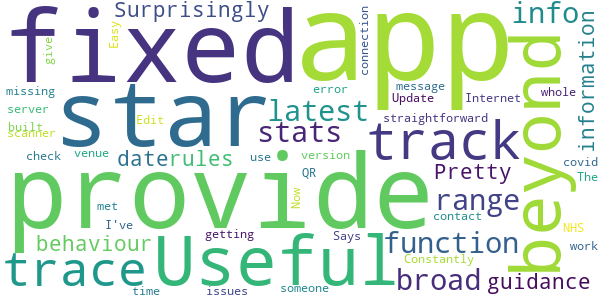

> Useful beyond its track trace function. Provides broad range of latest stats and other info. Surprisingly it does not provide up to date behaviour guidance and rules information.  :date: __2020-12-19 01:22:15__

> Pretty straightforward. NHS app has built in QR scanner for venue check-in which this app is missing.  :date: __2020-12-05 01:22:57__

> Constantly getting "cannot contact server" error message. Edit The fixed version does now work. Easy to use. Now a 4 star app (can't give 5 stars until I've met someone with covid!,)  :date: __2020-10-15 18:20:59__

> Says no Internet connection the whole time. Update has fixed issues  :date: __2020-10-14 21:31:16__

#### 3-star reviews

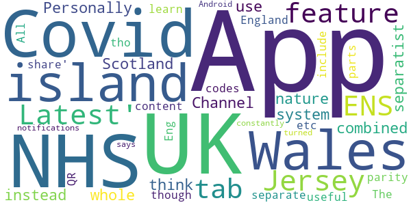

> Personally I think the Channel Islands as a whole should use a combined system instead of separatist nature. I also don't get why NHS Scotland app separate from the NHS Covid-19 England & Wales App though both parts of the UK and same island. The Jersey App 'Latest' & 'share' tabs content is useful and all the UK Covid ENS apps should include the feature. All UK ENS Apps should feature parity on NHS Eng&Wales App - QR codes etc tho Jersey 'Latest' tab all the UK Covid apps could learn from!  :date: __2020-11-14 21:29:22__

> App constantly says the notifications are turned off but they are on Android  :date: __2020-11-04 16:25:20__

#### 2-star reviews

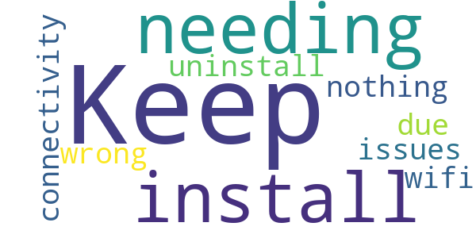

> Keep needing to install/uninstall due to connectivity issues but nothing wrong with my wifi.  :date: __2020-11-18 08:43:30__

#### 1-star reviews

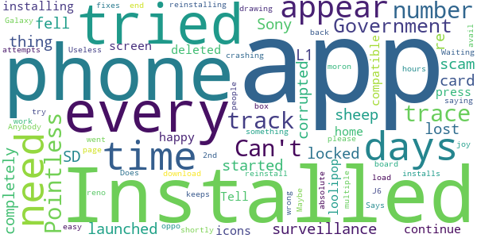

> Can't get through to the track and trace number. Pointless  :date: __2020-11-30 21:25:58__

> Government surveillance scam, sheep fell for it!  :date: __2020-11-21 05:22:03__

> Installed the app on my Sony L1, launched the app and it completely locked the phone up, I re started the phone and it had corrupted my SD card so every thing on there is lost and needs re-installing, It deleted icons from my home screen so I am not happy with it  :date: __2020-11-05 11:42:01__

> not compatible with loolipop 5.1  :date: __2020-10-18 19:55:41__

> Tell you to press continue and just times out, tried reinstalling and all other easy fixes to no avail  :date: __2020-10-16 13:18:41__

> I have tried to load this app for 2 days now and every time a box appears saying "something went wrong our end, please try again" . Maybe the IT people need to back to the drawing board!!  :date: __2020-10-16 12:54:52__

> Does now work with oppo reno 2. App keeps crashing after 2nd page.  :date: __2020-10-16 12:32:23__

> Waiting for the app to download. 4 Days!!!!!!. Useless!!.  :date: __2020-10-16 12:29:24__

> Anybody who installs this is an absolute moron!  :date: __2020-10-16 12:22:08__

> Says installed on my Galaxy J6 and app will appear shortly but after 24 hours and multiple attempts to reinstall no joy  :date: __2020-10-16 12:12:52__

# StopCOVID NI
App version ``2.3.0``

Analyzed with [covid-apps-observer](http://github.com/covid-apps-observer) project, version ``0.1``

## App overview
| | |
|-------------------------|-------------------------| 
| **Name**&nbsp;&nbsp;&nbsp;&nbsp;&nbsp;&nbsp;&nbsp;&nbsp;&nbsp;&nbsp;&nbsp;&nbsp;&nbsp;&nbsp;&nbsp;&nbsp;&nbsp;&nbsp;&nbsp;&nbsp;&nbsp;&nbsp;&nbsp;&nbsp;&nbsp;&nbsp;&nbsp;&nbsp;&nbsp;&nbsp;&nbsp;&nbsp;&nbsp;&nbsp;&nbsp;&nbsp;&nbsp;&nbsp;&nbsp;&nbsp;  | StopCOVID NI |
| **Unique identifier** | net.hscni.covidtracker |
| **Link to Google Play** | [https://play.google.com/store/apps/details?id=net.hscni.covidtracker](https://play.google.com/store/apps/details?id=net.hscni.covidtracker) |
| **Summary**  | The coronavirus contact tracing app for Northern Ireland |
| **Privacy policy** | [https://covid-19.hscni.net/privacy-notice/](https://covid-19.hscni.net/privacy-notice/) |
| **Latest version** | 2.3.0 |
| **Last update** | 2020-11-13 18:21:47 |
| **Recent changes** | - Create and send a certificate proving you need to self-isolate to other people and organisations, e.g. your employer or the Social Security Agency. - Self-isolation periods are now calculated based on the date of exposure.  |
| **Installs**  | 100,000+ |
| **Category** | Medical |
| **First release** | Jul 29, 2020 |
| **Size**  | 108M |
| **Supported Android version**  | 6.0 and up |

### Description
> If you are 11 or older and live in Northern Ireland you can use this HSC contact tracing app. By using it you will help stop or slow the spread of coronavirus.
 ** Support the health services **
 ** Help avoid more lockdowns **
 ** Save lives **
 How does the app work?
 If you are in close contact with an app user who has told their app that they have COVID-19, you will get an alert from this app. You won’t know who it was or where it happened. You must then self-isolate for the period shown in the app. There’s advice on how to self-isolate and answers to common questions about this in the app.
 If you test positive for COVID-19 you can tell this app. Other app users that you’ve been close to will then be alerted. They won’t know that it was you or where it happened.
 ** Works in the background on Bluetooth, not GPS, and uses very little battery **
 ** Please keep Bluetooth on so the app can work properly **
 How is my privacy protected?
 ** This app never knows your name or where you are, so it’s completely private **
 It uses the ‘Exposure Notification API’ developed by Apple and Google in a joint effort to help governments and health agencies reduce the spread of COVID-19 through contact tracing, with user privacy and security core to the design. This is sometimes called the ‘decentralised’ model.
 If you test positive for COVID-19 you will get a code by SMS text message from 'HSCresult'. When you put your code into this app you will be asked to share the 'Random IDs’ that your phone has been swapping with other app users over the last 14 days. This will allow us to tell those people that they have been exposed to COVID-19. 
 ** We will never ask you to reply to the SMS text message **
 ** Please ignore any message if it asks you to reply or send information **
 So that you can use this app when travelling abroad we will securely share 'Random IDs' with other countries. This also means that apps used by visitors from those countries will work here.
 ** This app will never track your identity or location **

### User interface
The developers of the app provide the following screenshots in the Google play store.
| | | |
|:-------------------------:|:-------------------------:|:-------------------------:|
 |   |   |   | 
 |   |   |   | 
 |  

## Development team
In the following we report the main information provided by the development team in the Google play store.

| | |
|-------------------------|-------------------------|
| **Developer**  | Health & Social Care Northern Ireland |
| **Website**  | [https://covid-19.hscni.net/contact-tracing/](https://covid-19.hscni.net/contact-tracing/) |
| **Email** | StopCOVIDNIApp@hscni.net |
| **Physical address**  | - |
| **Other developed apps**  | [https://play.google.com/store/apps/developer?id=Health+%26+Social+Care+Northern+Ireland](https://play.google.com/store/apps/developer?id=Health+%26+Social+Care+Northern+Ireland) |

## Android support

| | |
|-------------------------|-------------------------|
| **Declared target Android version**  | Android10, version 10 (API level 29) |
| **Effective target Android version**  | Android10, version 10 (API level 29) |
| **Minimum supported Android version**  | Marshmallow, version 6.0 (API level 23) |
| **Maximum target Android version**  | - |

The larger the difference between the minimum and maximum supported Android versions, the better. A larger difference means a wider audience. For example, old phones have a very low Android version, so a high minimum supported Android version means that the app cannot be used by users with old phones, thus leading to accessibility problems. 

## Requested permissions

In the following we report the complete list of the permissions requested by the app. 

| **Permission** | **Protection level** | **Description** | 
|-------------------------|-------------------------|-------------------------|
 **android.permission ACCESS_NETWORK_STATE** | Normal | Allows applications to access information about networks. 
 **android.permission ACCESS_WIFI_STATE** | Normal | Allows applications to access information about Wi-Fi networks. 
 **android.permission BLUETOOTH** | Normal | Allows applications to connect to paired bluetooth devices. 
 **android.permission FOREGROUND_SERVICE** | Normal | Allows a regular application to use Service.startForeground. 
 **android.permission INTERNET** | Normal | Allows applications to open network sockets. 
 **android.permission RECEIVE_BOOT_COMPLETED** | Normal | Allows an application to receive the Intent.ACTION_BOOT_COMPLETED that is broadcast after the system finishes booting. 
 **android.permission VIBRATE** | Normal | Allows access to the vibrator. 

## Mentioned servers

| **Server** | **Registrant** | **Registrant country** | **Creation date** | 
|-------------------------|-------------------------|-------------------------|-------------------------|
 | android.com | Google LLC | :us: US | 1997-06-23 04:00:00 |
 | google.com | Google LLC | :us: US | 1997-09-15 04:00:00 |
 | expo.io | See PrivacyGuardian.org | :us: US | 2011-05-01 21:26:50 |

## Security analysis 

Below we report the main security warnings raised by our execution of the [Androwarn](https://github.com/maaaaz/androwarn) security analysis tool.

**Telephony identifiers leakage**
> - This application reads the numeric name (MCC+MNC) of current registered operator 
> - This application reads the operator name 

**Connection interfaces exfiltration**
> - This application reads details about the currently active data network 
> - This application tries to find out if the currently active data network is metered 

**Suspicious connection establishment**
> - This application opens a Socket and connects it to the remote address ' returned no addresses for  ; port is out of range' on the 'N/A' port  
> - This application opens a Socket and connects it to the remote address '' on the 'N/A' port  
> - This application opens a Socket and connects it to the remote address 'Ljava/lang/StringBuilder;->toString()Ljava/lang/String;' on the 'N/A' port  
> - This application opens a Socket and connects it to the remote address 'Ljava/net/Proxy;->type()Ljava/net/Proxy$Type;' on the 'N/A' port  
> - This application opens a Socket and connects it to the remote address 'timeout' on the 'N/A' port  

**Pim data leakage**
> - This application accesses data stored in the clipboard 

**Code execution**
> - This application loads a native library 
> - This application executes a UNIX command 

## User ratings and reviews

Below we provide information about how end users are reacting to the app in terms of ratings and reviews in the Google Play store.

### Ratings

The StopCOVID NI app has been installed by more than **100000** times. At this time, **478** rated the app and its average score is **2.67**. Below we show the distribution of the ratings across the usual star-based rating of Google Play

:star::star::star::star::star:: 148

:star::star::star::star:: 19

:star::star::star:: 43

:star::star:: 62

:star:: 206

### Reviews 

#### 5-star reviews

> Excellent  :date: __2021-02-12 01:34:28__

> Works for me...  :date: __2021-01-29 17:24:27__

> Thankfully no alert yet  :date: __2021-01-27 19:45:45__

> Fantastic  :date: __2021-01-08 19:00:21__

> This app is a scam , it steals all your information and sent to 3rd parties , so be careful.  :date: __2021-01-08 14:34:36__

> Very good  :date: __2021-01-05 19:18:02__

> Installed this as soon as it became available. Happy to support the good work  :date: __2021-01-03 15:43:57__

> Helpful  :date: __2021-01-02 01:45:10__

> I strumming for DCI middlemoor u big style fun and games cock  :date: __2020-12-26 05:13:43__

> Helps to keep me safe and others safe  :date: __2020-12-21 03:35:48__

#### 4-star reviews

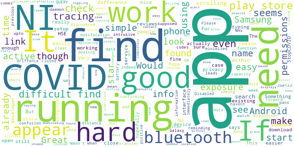

> Very good upto date info.  :date: __2021-02-04 10:51:09__

> COVID NI there are many driffence information about COVID  :date: __2021-01-10 23:10:53__

> Zoe123  :date: __2020-11-22 15:45:06__

> Just discovered the app had been "Auto Disabled" on my android phone. Something to watch out for (When it's running you should get a notification once a week, reminding you and confirming that it is indeed running).  :date: __2020-10-21 23:33:44__

> Please add the capacity to scan QR codes like the NHS app does, not having this function leads to confusion in dealing with GB businesses in NI  :date: __2020-10-10 08:57:01__

> It seems to work, and I really hope it does.. it is simple, and not intrusive. I look forward to seeing his it pans out.  :date: __2020-10-08 01:00:45__

> This app only checks exposure if it comes within a short distance of someone else who has the app. No exposure checks mean you havent been close enough to someone for it to check.  :date: __2020-10-02 20:06:28__

> QUERY! If having to move devices, how are you supposed to transfer the existing exposure checks from the previous 14 days to the new device, in case any of those report a positive case?  :date: __2020-09-21 22:39:02__

> Once running, seems to be very good. But was hard to find. Wasn't immediately clear if there was a background daemon service running or the app had to be "minimized" but not closed to work. Samsung Galaxy 8 running Android 9: It seems Samsung's battery optimisation service was killing the app. After a reboot, it seemed OK, though. Closing/swiping away the app and then toggling bluetooth on/off showed it was still running (I got an alert from the app saying bluetooth needs enabled).  :date: __2020-08-13 21:40:20__

> No problems downloading and it appears active on my Samsung S10. Would love to understand more about the keys as we're registering them without leaving the house!  :date: __2020-08-12 22:11:42__

#### 3-star reviews

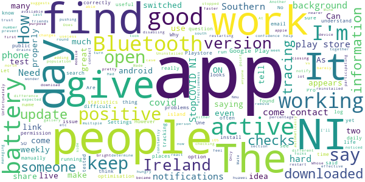

> It has stopped working for over a week  :date: __2021-01-20 02:36:29__

> Can you make a version of this app for the huawei app gallery?  :date: __2020-11-26 21:32:22__

> Does not give n Ireland  :date: __2020-11-20 13:22:56__

> The App keeps disabling itself.  :date: __2020-10-26 07:53:08__

> C. Nmu  :date: __2020-10-17 23:19:09__

> No log updates. Uninstalled and reinstalled the app for NI. Made no difference. How can we trust it.  :date: __2020-10-16 14:07:46__

> I don't know  :date: __2020-10-11 18:11:48__

> Downloaded this when it became available, but after the last update, it keeps pushing me to turn my bluetooth on and restart the app; my Bluetooth has been on, and restarting the app doesn't help. Only had this issue since the update, but makes having the app pretty much useless.  :date: __2020-10-11 15:06:04__

> Mine barely checks (once in 14 days) but my friends checks multiple times a day. I'm nearer much more people than them so I don't understand.  :date: __2020-10-11 11:19:25__

> I downloaded the app. I get that someone will notify me if I come into contact with someone who has the app and then tests positive. However, I feel it should give people either daily or weekly updates of places that the person has been and I wonder when two mobile phones that have the app downloaded on the phones - do they react to each other. Another thing is people on the island of ireland both north and south of the island should be able to use both apps together.  :date: __2020-10-06 23:59:37__

#### 2-star reviews

> App randomly stops publishing exposure checks which would imply its no longer working. Have had to reinstall 3 times.  :date: __2021-02-07 21:50:29__

> Haven't use it yet so not sure what to say.  :date: __2021-01-12 01:12:16__

> Bluetooth is always on but the app tells me to turn it on! Same after restarting the device and checking Bluetooth status  :date: __2020-12-30 18:52:58__

> Got a notification to say i was in contact and had to isolate. Only problem was i had been in contact the 10th. First told of it the 23rd with 1day left to isolate. Its reliant on people updating the app with their test results and if they dont do that then nobody knows  :date: __2020-11-23 21:34:22__

> I had hoped that this app would provide useful timely and accurate information to users. Instead I see that the statistics are not kept up to date. By way of example today is 05/11/20 but the R number estimate is from 16/10/20. Come on people for the sake of credibility must do better!  :date: __2020-11-05 23:37:19__

> I don't see the point in this app. As I checked today 2nd November as I'd accidentally knocked off Bluetooth. Seen it last checked on 12th October. I am a key worker, I could potentially come into contact with this virus. And after 14 days it removes data. So that is a lot of potential contact with this virus missed. If it's not going to work and check then why have it installed?  :date: __2020-11-02 09:56:14__

> Either it doesn't work or nobody has it... since the 20th of October (it is now the 1st of Nov) I have had 2 notifications (checks), 1 of which are my partner. Pointless.  :date: __2020-11-01 20:20:25__

> Its not working keeps telling me connect to blutooth and I have!  :date: __2020-10-28 18:45:24__

> The app worked well but I noticed at times when I was out that no checks had been made. I did recieve an alert to isolate for 14 days which I did, yet on the 5th day into isolation I got another notification saying that I've been exposed and have to isolate for 14 days. I hadn't left to house, I didnt even leave my bedroom so I'm not sure how accurate this app is which is why I removed it.  :date: __2020-10-26 09:57:00__

> No alert given for App update. No weekly alerts given for 2 consecutive weeks  :date: __2020-10-24 04:50:41__

#### 1-star reviews

> The app told me to self isolate for a period of 10 days which ended 2 days before I got the notification.  :date: __2021-02-11 08:32:39__

> Its not working...I have uninstalled it twice and reinstalled and its not even doing checks. I havent received anything from this app. This needs fixed if its designed to help prevent spread of Covid-19 and save lives. Very disappointed  :date: __2021-02-11 01:43:48__

> Absolute waste of time. Even after spending 12 days in hospital and being exposed to co-vid, I received nothing from this app  :date: __2021-02-10 13:17:55__

> I used this app from I tested positive it has never turned red etc like it suppose to 😡  :date: __2021-02-06 15:42:06__

> In contact with quite a few covid positive people and no alert, obviously not working  :date: __2021-02-03 10:33:24__

> Even though it says you only need Bluetooth enabled my app tells me to keep location enabled for notifications. This drains my battery so I won't be using it.  :date: __2021-02-02 16:39:24__

> I have just deleted the app, the police in England are being given new powers to access your information via the app. Its only a matter of time before NI does the same. This is NOT what I signed up for. Completely lost my trust and have uninstalled. The notifications aren't useful, it doesn't tell you when or where you came into contact with someone.  :date: __2021-01-30 10:25:47__

> Statistically I have been in direct contact with a number of Covid cases. Not one single alert.  :date: __2021-01-30 00:09:06__

> I have used it daily just to see if it works and it has never went off. I work on a Covid Ward... I also have family who were in the same place for the same amount of time with the same people and some got the notification and others didnt. It simply doesn't work.  :date: __2021-01-26 12:42:55__

> It didn't send me any notification I happened to open my app and had 4 days self isolation left, that was certainly pointless considering I missed 6 days isolation and being around my co workers  :date: __2021-01-18 08:43:00__

# Beat Covid Gibraltar
App version ``1.0.3``

Analyzed with [covid-apps-observer](http://github.com/covid-apps-observer) project, version ``0.1``

## App overview
| | |
|-------------------------|-------------------------| 
| **Name**&nbsp;&nbsp;&nbsp;&nbsp;&nbsp;&nbsp;&nbsp;&nbsp;&nbsp;&nbsp;&nbsp;&nbsp;&nbsp;&nbsp;&nbsp;&nbsp;&nbsp;&nbsp;&nbsp;&nbsp;&nbsp;&nbsp;&nbsp;&nbsp;&nbsp;&nbsp;&nbsp;&nbsp;&nbsp;&nbsp;&nbsp;&nbsp;&nbsp;&nbsp;&nbsp;&nbsp;&nbsp;&nbsp;&nbsp;&nbsp;  | Beat Covid Gibraltar |
| **Unique identifier** | com.gha.covid.tracker |
| **Link to Google Play** | [https://play.google.com/store/apps/details?id=com.gha.covid.tracker](https://play.google.com/store/apps/details?id=com.gha.covid.tracker) |
| **Summary**  | Let’s Beat COVID-19 together |
| **Privacy policy** | [https://gibraltar.gov.gi/beatcovidapp/privacy](https://gibraltar.gov.gi/beatcovidapp/privacy) |
| **Latest version** | 1.0.3 |
| **Last update** | 2021-02-04 11:18:05 |
| **Recent changes** | Minor bug fixes and updates |
| **Installs**  | 10,000+ |
| **Category** | Medical |
| **First release** | Jun 25, 2020 |
| **Size**  | 106M |
| **Supported Android version**  | 6.0 and up |

### Description
> The Beat COVID Gibraltar app is for the citizens of Gibraltar and uses the bluetooth technology on your phone to track other phones you have been in close proximity to. It uses the Exposure Notification Service and you will be notified directly if you have been in close contact with someone who has tested positive for the virus. Likewise, if you are tested positive for COVID-19 yourself, those you have been in close contact with will be notified.  
 No personal data will be stored or used.  
 This app is totally anonymous and no personal information will be logged or shared with anyone. 
 Join the fight against COVID-19 and download the app today. 
 Beat COVID Gibraltar has been developed by the Gibraltar Health Authority and HM Government of Gibraltar.

### User interface
The developers of the app provide the following screenshots in the Google play store.
| | | |
|:-------------------------:|:-------------------------:|:-------------------------:|
 |   |   |   | 
 | 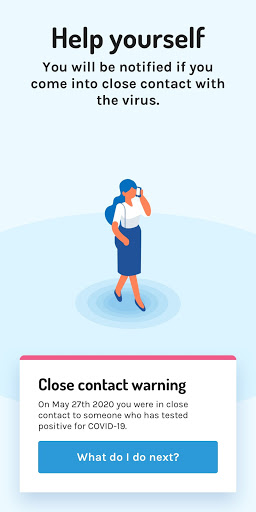  |  

## Development team
In the following we report the main information provided by the development team in the Google play store.

| | |
|-------------------------|-------------------------|
| **Developer**  | Gibraltar Health Authority |
| **Website**  | [https://www.gibraltar.gov.gi/beatcovidapp](https://www.gibraltar.gov.gi/beatcovidapp) |
| **Email** | info@gha.ie |
| **Physical address**  | - |
| **Other developed apps**  | [https://play.google.com/store/apps/developer?id=Gibraltar+Health+Authority](https://play.google.com/store/apps/developer?id=Gibraltar+Health+Authority) |

## Android support

| | |
|-------------------------|-------------------------|
| **Declared target Android version**  | Pie, version 9 (API level 28) |
| **Effective target Android version**  | Pie, version 9 (API level 28) |
| **Minimum supported Android version**  | Marshmallow, version 6.0 (API level 23) |
| **Maximum target Android version**  | - |

The larger the difference between the minimum and maximum supported Android versions, the better. A larger difference means a wider audience. For example, old phones have a very low Android version, so a high minimum supported Android version means that the app cannot be used by users with old phones, thus leading to accessibility problems. 

## Requested permissions

In the following we report the complete list of the permissions requested by the app. 

| **Permission** | **Protection level** | **Description** | 
|-------------------------|-------------------------|-------------------------|
 **android.permission ACCESS_NETWORK_STATE** | Normal | Allows applications to access information about networks. 
 **android.permission ACCESS_WIFI_STATE** | Normal | Allows applications to access information about Wi-Fi networks. 
 **android.permission BLUETOOTH** | Normal | Allows applications to connect to paired bluetooth devices. 
 **android.permission INTERNET** | Normal | Allows applications to open network sockets. 

## Mentioned servers

| **Server** | **Registrant** | **Registrant country** | **Creation date** | 
|-------------------------|-------------------------|-------------------------|-------------------------|
 | android.com | Google LLC | :us: US | 1997-06-23 04:00:00 |
 | google.com | Google LLC | :us: US | 1997-09-15 04:00:00 |
 | expo.io | See PrivacyGuardian.org | :us: US | 2011-05-01 21:26:50 |

## Security analysis 

Below we report the main security warnings raised by our execution of the [Androwarn](https://github.com/maaaaz/androwarn) security analysis tool.

**Telephony identifiers leakage**
> - This application reads the numeric name (MCC+MNC) of current registered operator 
> - This application reads the operator name 

**Connection interfaces exfiltration**
> - This application reads details about the currently active data network 
> - This application tries to find out if the currently active data network is metered 

**Suspicious connection establishment**
> - This application opens a Socket and connects it to the remote address ' returned no addresses for  ; port is out of range' on the 'N/A' port  
> - This application opens a Socket and connects it to the remote address '' on the 'N/A' port  
> - This application opens a Socket and connects it to the remote address 'Ljava/lang/StringBuilder;->toString()Ljava/lang/String;' on the ': connect, resolve' port  
> - This application opens a Socket and connects it to the remote address 'Ljava/lang/StringBuilder;->toString()Ljava/lang/String;' on the 'N/A' port  
> - This application opens a Socket and connects it to the remote address 'Ljava/net/Proxy;->type()Ljava/net/Proxy$Type;' on the 'N/A' port  
> - This application opens a Socket and connects it to the remote address 'timeout' on the 'N/A' port  

**Pim data leakage**
> - This application accesses data stored in the clipboard 

**Code execution**
> - This application loads a native library 
> - This application executes a UNIX command 

## User ratings and reviews

Below we provide information about how end users are reacting to the app in terms of ratings and reviews in the Google Play store.

### Ratings

The Beat Covid Gibraltar app has been installed by more than **10000** times. At this time, **75** rated the app and its average score is **3.2133334**. Below we show the distribution of the ratings across the usual star-based rating of Google Play

:star::star::star::star::star:: 35

:star::star::star::star:: 4

:star::star::star:: 5

:star::star:: 4

:star:: 27

### Reviews 

#### 5-star reviews

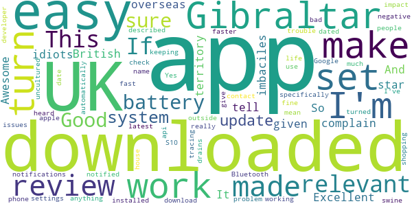

> Awesome And Excellent  :date: __2021-01-11 13:25:46__

> 👍😎  :date: __2020-11-05 21:22:14__

> So, I downloaded this app to complain... about the idiots who have downloaded the app then given it a 1 star review for not being made for the UK 1. Gibraltar is a British overseas territory, as such it is relevant to the UK, you imbaciles. 2. It does tell you it is made specifically for Gibraltar, check the name of the app, you uncultured swine. 3. If you are not from Gibraltar it isn't relevant to you. This does not mean you should give it a negative review, as that does not make it a bad app.  :date: __2020-09-27 14:21:48__

> This app is really easy and fast and doesn't have too much of an impact on your battery life  :date: __2020-08-18 01:16:04__

> Works as described, easy to set up and turn on.- I've not heard anything from the developer and I'm in the UK, the more people who use it - the more will be notified  :date: __2020-08-09 14:58:58__

> Good  :date: __2020-08-08 14:37:46__

> You have to make sure your phone is up to date with system update. I up dated my S10+ and download this and it works fine.  :date: __2020-08-04 22:11:47__

> Good 👍🏼  :date: __2020-07-25 13:20:16__

> Downloaded and working in the UK. If you are having trouble with set up make sure you have the latest system update from Google/ apple and turn on the contact tracing api in settings.  :date: __2020-07-21 10:11:48__

> Downloaded, installed and turned on notifications no problem - very easy. Yes, it does automatically turn on your Bluetooth which drains the battery faster but I'm keeping it on only when I'm outside my house&work, e.g.shopping.  :date: __2020-07-19 23:06:12__

#### 4-star reviews

> First covid app good work Gibraltar  :date: __2020-11-01 18:01:54__

> Easy to load works out of the box on pixel 2xl. Android 10. Only question is only as useful as number of folks using it. Needs a bit of publicity.  :date: __2020-07-30 15:49:20__

#### 3-star reviews

> It may have been me, I didn't understand how it worked.  :date: __2020-10-08 15:24:12__

> It doesn't give out any information...  :date: __2020-07-20 19:00:47__

#### 2-star reviews

No recent reviews available with 2 stars.

#### 1-star reviews

> Government surveillance scam,shhep fell for it!  :date: __2020-11-21 05:17:20__

> Pathetic app which does does not download! If it had zero to rate, I would instead of 1 star  :date: __2020-10-09 17:02:10__

> I don't live in Gibraltar so it's no help to me.  :date: __2020-09-24 21:07:36__

> You ask a quistion have been traded positive then a question mark but not nagged ie it should of been yes or no mo on this app does not help at all I have never been rested for c19 been very carefull flowed all rules but witch is the right easy app for yes and no for c19 for me southnorwood  :date: __2020-09-24 14:40:32__

> Doesnt even work in the background  :date: __2020-08-14 00:51:41__

> Waste of time ! Doesn't seem to do anything at all, who said that it was for UK, and why should something developed by and for Gibraltar have any relevance for the UK ?  :date: __2020-08-08 17:35:31__

> What does this App actually do? It doesn't seem able to access surveys they send you emails asking you to complete? Why can't the App itself actually ask you?  :date: __2020-08-07 11:07:46__

> No instructions on how it works  :date: __2020-08-03 21:03:07__

> Ok, I only downloaded this app last night & although the reviews seem ok. This was the 1st & main app for COVID-19 tracking. Yes I realise Gibraltar is it's main domain, I get it. But seeing as this was my only option really, Am I just meant to look at the compass tracker, watching random green dots faintly appearing, with the blue screen just saying "Active"/click if i tested positive? How do i know? I don't! We can't just ask 4 test. Bluetooth is always on. So do i just wait 4 an alert? 🤷🏻‍  :date: __2020-07-31 22:24:09__

> This App is not designed for th UK, it is designed only for Gibraltar the app is useless, contact the developer like i did, UK citizen you will be told we can't use it in the UK 🇬🇧 This is their response "This App has been developed specifically with Gibraltar in mind. It is open for download by anyone, including cross-frontier workers and persons who regularly visit Gibraltar. If you are not in Gibraltar (whether residing, working or visiting) this app is of no real use to you"  :date: __2020-07-30 22:25:30__

# COVID Symptom Study
App version ``2.4.0``

Analyzed with [covid-apps-observer](http://github.com/covid-apps-observer) project, version ``0.1``

## App overview
| | |
|-------------------------|-------------------------| 
| **Name**&nbsp;&nbsp;&nbsp;&nbsp;&nbsp;&nbsp;&nbsp;&nbsp;&nbsp;&nbsp;&nbsp;&nbsp;&nbsp;&nbsp;&nbsp;&nbsp;&nbsp;&nbsp;&nbsp;&nbsp;&nbsp;&nbsp;&nbsp;&nbsp;&nbsp;&nbsp;&nbsp;&nbsp;&nbsp;&nbsp;&nbsp;&nbsp;&nbsp;&nbsp;&nbsp;&nbsp;&nbsp;&nbsp;&nbsp;&nbsp;  | COVID Symptom Study |
| **Unique identifier** | com.joinzoe.covid_zoe |
| **Link to Google Play** | [https://play.google.com/store/apps/details?id=com.joinzoe.covid_zoe](https://play.google.com/store/apps/details?id=com.joinzoe.covid_zoe) |
| **Summary**  | Help slow COVID-19 by self-reporting your symptoms daily, even if you feel well. |
| **Privacy policy** | [https://predict.study/covid-privacy-notice/](https://predict.study/covid-privacy-notice/) |
| **Latest version** | 2.4.0 |
| **Last update** | 2021-02-08 21:04:34 |
| **Recent changes** | Security upgrade and bug fixes.  |
| **Installs**  | 1,000,000+ |
| **Category** | Health & Fitness |
| **First release** | Mar 20, 2020 |
| **Size**  | 37M |
| **Supported Android version**  | 5.0 and up |

### Description
> Take 1 minute each day and help fight the spread of COVID-19 in your community
 * Report your health daily even if you feel well
 * Get a daily estimate of COVID in your area
 * Help slow the outbreak near you
 Join millions of people supporting scientists at Stanford University, Harvard University, Massachusetts General Hospital, and King's College London to help fight coronavirus by identifying:
 * How fast the virus is spreading in your area
 * High-risk areas in the US
 * Who is most at risk, by better understanding symptoms linked to underlying health conditions
 You will contribute to advance research on COVID-19 in partnership with leading health researchers globally like TwinsUK, one of the most clinically detailed studies in the world.
 This app (formerly known as the Covid Symptom Tracker) allows you to help others, but does not give health advice. If you need health advice please visit the CDC website at: [https://www.cdc.gov/coronavirus/2019-ncov/index.html](https://www.cdc.gov/coronavirus/2019-ncov/index.html)
 This app has been designed for everyone to report their status not just those who are ill.
 It was designed by doctors and scientists at King's College London, Guys and St Thomas’ Hospitals and Zoe Global Limited, a health technology company.
 In the US the app is being used by the Nurses' Health Study to identify symptoms in active healthcare workers who are treating people with COVID across the country and risking their own health to help us.
 In response to recommendations by Stand Up To Cancer (SU2C), the app also includes questions for cancer patients and survivors, such as if they are living with cancer, what type of cancer and what treatment they are receiving.
 If you would like to help out in this difficult time, then you can. Download the app and share daily your own status, even if you are well. With your help we can understand much better the situation across the nation, how the disease presents itself to different people, and how it progresses.
 This is a new virus which the world has never seen before. There are a wide range of symptoms, which differ between people. With your help we can understand better how the disease presents itself depending upon individual factors such as health and age.
 No information you share will be used for commercial purposes.
 There are two parts to the app:
 HEALTH INFORMATION
 You will be asked to share some general information, such as your age and some health details, such as whether you have certain diseases.
 SYMPTOM TRACKING
 We will ask you every day to let us know how you feel, so you can share your symptoms. We will also ask whether you have visited the hospital, what treatment you received there, and whether you have been tested for COVID-19 (Coronavirus).

### User interface
The developers of the app provide the following screenshots in the Google play store.
| | | |
|:-------------------------:|:-------------------------:|:-------------------------:|
 |   |   |   | 
 |   |   |   | 
 |   |  

## Development team
In the following we report the main information provided by the development team in the Google play store.

| | |
|-------------------------|-------------------------|
| **Developer**  | Zoe Global Limited |
| **Website**  | [http://covid.joinzoe.com/](http://covid.joinzoe.com/) |
| **Email** | covid@joinzoe.com |
| **Physical address**  | [164 Westminster Bridge Road London SE1 7RW United Kingdom](https://www.google.com/maps/search/164%20Westminster%20Bridge%20Road%20London%20SE1%207RW%20United%20Kingdom) (Google Maps) |
| **Other developed apps**  | [https://play.google.com/store/apps/developer?id=Zoe+Global+Limited](https://play.google.com/store/apps/developer?id=Zoe+Global+Limited) |

## Android support

| | |
|-------------------------|-------------------------|
| **Declared target Android version**  | Android10, version 10 (API level 29) |
| **Effective target Android version**  | Android10, version 10 (API level 29) |
| **Minimum supported Android version**  | Lollipop, version 5.0 (API level 21) |
| **Maximum target Android version**  | - |

The larger the difference between the minimum and maximum supported Android versions, the better. A larger difference means a wider audience. For example, old phones have a very low Android version, so a high minimum supported Android version means that the app cannot be used by users with old phones, thus leading to accessibility problems. 

## Requested permissions

In the following we report the complete list of the permissions requested by the app. 

| **Permission** | **Protection level** | **Description** | 
|-------------------------|-------------------------|-------------------------|
 **android.permission ACCESS_NETWORK_STATE** | Normal | Allows applications to access information about networks. 
 **android.permission ACCESS_WIFI_STATE** | Normal | Allows applications to access information about Wi-Fi networks. 
 **android.permission INTERNET** | Normal | Allows applications to open network sockets. 
 **android.permission READ_APP_BADGE** | - | - 
 **android.permission READ_EXTERNAL_STORAGE** | :warning:**Dangerous** | Allows an application to read from external storage. 
 **android.permission RECEIVE_BOOT_COMPLETED** | Normal | Allows an application to receive the Intent.ACTION_BOOT_COMPLETED that is broadcast after the system finishes booting. 
 **android.permission WAKE_LOCK** | Normal | Allows using PowerManager WakeLocks to keep processor from sleeping or screen from dimming. 
 **android.permission WRITE_EXTERNAL_STORAGE** | :warning:**Dangerous** | Allows an application to write to external storage. 
 **com.anddoes.launcher.permission UPDATE_COUNT** | - | - 
 **com.google.android.c2dm.permission RECEIVE** | - | - 
 **com.google.android.finsky.permission BIND_GET_INSTALL_REFERRER_SERVICE** | - | - 
 **com.htc.launcher.permission READ_SETTINGS** | - | - 
 **com.htc.launcher.permission UPDATE_SHORTCUT** | - | - 
 **com.huawei.android.launcher.permission CHANGE_BADGE** | - | - 
 **com.huawei.android.launcher.permission READ_SETTINGS** | - | - 
 **com.huawei.android.launcher.permission WRITE_SETTINGS** | - | - 
 **com.majeur.launcher.permission UPDATE_BADGE** | - | - 
 **com.oppo.launcher.permission READ_SETTINGS** | - | - 
 **com.oppo.launcher.permission WRITE_SETTINGS** | - | - 
 **com.sec.android.provider.badge.permission READ** | - | - 
 **com.sec.android.provider.badge.permission WRITE** | - | - 
 **com.sonyericsson.home.permission BROADCAST_BADGE** | - | - 
 **com.sonymobile.home.permission PROVIDER_INSERT_BADGE** | - | - 
 **me.everything.badger.permission BADGE_COUNT_READ** | - | - 
 **me.everything.badger.permission BADGE_COUNT_WRITE** | - | - 

## Mentioned servers

| **Server** | **Registrant** | **Registrant country** | **Creation date** | 
|-------------------------|-------------------------|-------------------------|-------------------------|
 | amplitude.com | Amplitude | :us: US | 1996-05-09 04:00:00 |
 | android.com | Google LLC | :us: US | 1997-06-23 04:00:00 |
 | google.com | Google LLC | :us: US | 1997-09-15 04:00:00 |
 | microsoft.com | Microsoft Corporation | :us: US | 1991-05-02 04:00:00 |
 | googleapis.com | Google LLC | :us: US | 2005-01-25 17:52:26 |
 | cloudfront.net | Amazon.com, Inc. | :us: US | 2008-04-25 18:25:49 |
 | expo.io | See PrivacyGuardian.org | :us: US | 2011-05-01 21:26:50 |

## Security analysis 

Below we report the main security warnings raised by our execution of the [Androwarn](https://github.com/maaaaz/androwarn) security analysis tool.

**Telephony identifiers leakage**
> - This application reads the ISO country code equivalent of the current registered operator's MCC (Mobile Country Code) 
> - This application reads the device phone type value 
> - This application reads the numeric name (MCC+MNC) of current registered operator 
> - This application reads the operator name 

**Location lookup**
> - This application reads location information from all available providers (WiFi, GPS etc.) 

**Connection interfaces exfiltration**
> - This application reads details about the currently active data network 
> - This application tries to find out if the currently active data network is metered 

**Suspicious connection establishment**
> - This application opens a Socket and connects it to the remote address '' on the 'N/A' port  
> - This application opens a Socket and connects it to the remote address 'Ljava/lang/StringBuilder;->toString()Ljava/lang/String;' on the ': connect, resolve' port  
> - This application opens a Socket and connects it to the remote address 'Ljava/lang/StringBuilder;->toString()Ljava/lang/String;' on the 'N/A' port  
> - This application opens a Socket and connects it to the remote address 'Ljava/net/Proxy;->type()Ljava/net/Proxy$Type;' on the 'N/A' port  
> - This application opens a Socket and connects it to the remote address 'timeout' on the 'N/A' port  

**Pim data leakage**
> - This application accesses data stored in the clipboard 

**Code execution**
> - This application loads a native library 
> - This application loads a native library: 'log' 
> - This application loads a native library: 'sentry' 
> - This application loads a native library: 'sentry-android' 
> - This application executes a UNIX command 

## User ratings and reviews

Below we provide information about how end users are reacting to the app in terms of ratings and reviews in the Google Play store.

### Ratings

The COVID Symptom Study app has been installed by more than **1000000** times. At this time, **137120** rated the app and its average score is **4.7255664**. Below we show the distribution of the ratings across the usual star-based rating of Google Play

:star::star::star::star::star:: 107021

:star::star::star::star:: 25316

:star::star::star:: 3021

:star::star:: 781

:star:: 981

### Reviews 

#### 5-star reviews

> Essential feedback  :date: __2021-02-13 19:50:42__

> This is an excellent app with sound, evidence-based information, well presented. The safety study will, I hope, persuade doubters to be vaccinated.  :date: __2021-02-13 19:09:51__

> Great to be able to help out to fight this deadly virus. Well done guys 👍👍  :date: __2021-02-13 18:30:36__

> Checked in pretty much everyday since lockdown 1 started. A glitch after a few months in but it's been fine since. Through using this app I've been asked to (& done) a test to see if I've had Covid & got a home test after feeling rough but not with.typical Covid systems. Easy to do & nice to think I'm contributing to research & knowledge.  :date: __2021-02-13 18:13:42__

> Very smooth would recommend. Keep up the good work.  :date: __2021-02-13 17:34:08__

> Great idea. UI could use some work.  :date: __2021-02-13 17:11:32__

> Simple to use.  :date: __2021-02-13 16:39:40__

> Easy to use  :date: __2021-02-13 15:04:39__

> Simple clear and I think it helps.  :date: __2021-02-13 15:04:02__

> Easy to use. Great source of information on covid 19  :date: __2021-02-13 13:53:49__

#### 4-star reviews

> Ok  :date: __2021-02-13 16:20:20__

> Less than a minute a day. Excellent source of information. Local statistics and regular vlogs.  :date: __2021-02-13 15:37:46__

> So far I've maintained my logging in unless I am busy and forgetful. I intend to carry on.  :date: __2021-02-13 14:47:26__

> Easy to use.  :date: __2021-02-13 13:58:17__

> Easy to follow. Informative  :date: __2021-02-13 13:48:28__

> N problem to use and it may be of help. Just do it  :date: __2021-02-13 13:38:09__

> Easy to use and very informative.  :date: __2021-02-13 12:38:57__

> Easy and quick to report daily. Very simple display. Very interesting research links. Pod cast presentations engaging and information clearly explained.  :date: __2021-02-13 11:37:19__

> I've probably missed something, but it doesnt seem to remind me each day to do it, and I'm a bit bored of having to say that I havent had another test and i havent been vaccinated EVERY DAY... surely there could be an option to add information if one wanted to, rather than being asked two extra questions every day.  :date: __2021-02-13 11:02:15__

> Fairly easy to use but can't fulfil latest instruction as my screen not the same as Zoe's  :date: __2021-02-13 09:39:10__

#### 3-star reviews

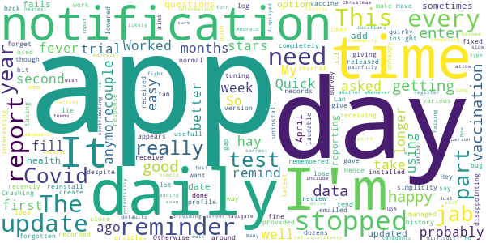

> Get, 'Something went wrong, please try again later' each time I try to complete medical questionnaire. UPDATE: Now working ok since update. Daily reminder to enter your health status is good. App lacks ability to state that you know you have had Covid, but haven't had a test. This must apply to tens of thousands who suffered at home or who's symptoms were very mild and where caught off other tested members of same household. If to provide valuable data, surly, this must be included.  :date: __2021-02-13 13:25:45__

> Was a bit confusing as I only down loaded app after my 1st vaccine,it would not let me go back to add that I also had a head ache and fuzzy head 20hours in so if others had the same experience your symtoms value may be incorrect or wrong  :date: __2021-02-12 12:47:59__

> Easy to use.  :date: __2021-02-08 14:25:03__

> Only problem I don't know my blood group so I had to guess. There should be an option under blood group to say don't know  :date: __2021-02-06 12:32:39__

> Please fix the error with the days. I report every day and am frustrated that it continually tells me I haven't reported for 2 or more days. I've tried contacting you various ways, but nothing has changed except it can read up to 5 days now. Am I wasting my time?  :date: __2021-02-06 12:07:29__

> I failed first of all to enter my vaccination details because I was using as an early version of the app. It was only when I deleted the app in frustration that I realized that if I reinstalled it I might get a newer version. I did email Zoe for help but the instructions were confusing  :date: __2021-02-05 20:39:41__

> Lack of possibility to describe reactions to vaccination that might be helpful for the study.  :date: __2021-02-05 16:27:43__

> Was an avid user but then needed to change my email address and there's no function to do that nor way to contact the author. So had to delete.  :date: __2021-02-02 22:15:07__

> Report in daily but sometimes it's not recorded and I am being told that it's a day or more since I reported in. A month later and this is still happening, every few days my input is not being recorded  :date: __2021-02-01 18:17:15__

> Not able to input vaccine side effects other than on arm - glitch? Think it would benefit you to capture which vaccine manufacturer has been given too.  :date: __2021-01-27 19:47:12__

#### 2-star reviews

> Difficult to work. Repeatedly back to first page. Does not accept what is entered.  :date: __2021-02-13 18:00:23__

> Can no longer see the prompt on the vaccine page  :date: __2021-02-12 12:19:35__

> It stopped working, button stays grayed on screen display vaccine dosage information when one dose recorded and no change, can't hit enter.  :date: __2021-02-11 22:35:06__

> Didn't seem to have an option for being pregnant. I think a lot of my symptoms can be down to pregnancy...  :date: __2021-02-10 14:14:43__

> I am able to report me and my family's condition regularly. However, the app crashes everytime I select the COVID & Diet "Let's go" button. It also crashes before I can send feedback.  :date: __2021-02-08 04:46:23__

> Please reassure me that my data is actually being recorded. The app says I haven't entered any for 4 days. That simply isn't the case. I have missed a day as I forgot to charge my phone, but I entered data Yesterday afternoon. This inaccuracy has been there from the beginning. I want to be sure it is worthwhile continuing. Have you even seen this? Why don't you respond to my numerous contacts about this? I entered yesterday. The app says 5 days.  :date: __2021-02-06 12:17:00__

> The map makes less sense since they started using cases per million when everywhere else does it per100,000. It also appears data for Wales is at least a fortnight behind.  :date: __2021-02-05 01:08:37__

> The app has begun erroring since yesterday (28th Jan 2021). It loads, the screen with 'report today, even if you're well' appears for a split second before the whole screen goes white and stays that way. It's now unusable and this is day two of not being able to log.  :date: __2021-01-29 11:47:20__

> Unfortunately when I tried to insert a password my phone's keyboard covered the box I was meant to write it in! An elementary design error which rendered the app useless. I'm surprised this hasn't been fixed.  :date: __2021-01-27 17:23:40__

> I installed it 3 weeks ago, and to begin with it worked fine. Then it asked me to log in with my password and email for the first time. I was unable to do that because on my phone - a Samsung Galaxy A10 - as soon as I begin to type, the keyboard covers the place where the password has to go! It was also telling me my password wasn't recognised although I am certain it was the one I submitted. I tried the Force Stop recommended but it made no difference. finally I uninstalled the app. I have tried now to reinstall it but I guess I will still have the same problem. I'd be really grateful if anyone can help. It 's a great idea, but the app needs to be reliable. I am disappointed not to be able to participate.  :date: __2021-01-23 22:54:01__

#### 1-star reviews

> Cant download. Stuck on pending with a rotating circle that goes on forever.  :date: __2021-02-13 01:33:25__

> would like to record daily but the app goes to page have you had a test, which I recorded on the first day but dioes not let me go past it. anyone have any ideas which may help  :date: __2021-02-10 17:19:11__

> The app is making a massive contribution to the fight against Covid-19, and on a day-to-day basis it works fine. The downside is that it breaks when it's updated. After the last three updates I've either been unable to login (despite getting a password reset), or the daily notifications have stopped. In all cases the only fix was to uninstall the updated app and reinstall from scratch. The update process needs more testing before new versions are released otherwise users will give up.  :date: __2021-02-09 15:06:18__

> I can't report my vaccination on my profile !  :date: __2021-02-07 10:12:31__

> Downloaded this. Suspected/documented Covid only had 'yes" answers. Left that as the answer was no and completed the other questions as 'no' except that I could count on someone IF I needed help. With those entirely correct answers, 'continue' button is not highlighted. Only highlights if you say yes to documented or suspected Covid. I thought this was a general app for all, not reliant on Covid contact. Am I doing something wrong?  :date: __2021-02-06 14:01:42__

> Not easy to use. Finding how to report is poorly designed. No wonder you are short of 70+s.. its now improved now having problems editing vaccine type and batch  :date: __2021-02-06 13:02:10__

> Completely useless, no longer reminds me every day 🙄 Lucky if I remember to use it once a month now 😆 and that's NOT an exaggeration!  :date: __2021-02-06 05:36:22__

> Have uninstalled the app. Watched the recent webinar and wasn't impressed. BoJo and his Tory cronies will risk everyone's lives no matter what scientific advice is provided.  :date: __2021-02-05 00:10:13__

> Never gave any info except for NI resident, so no good for me in Brighton  :date: __2021-02-02 19:59:56__

> This should be such a simple little app. Why is it taking up 479 MB of my phone's storage??  :date: __2021-02-01 14:58:00__

# NHS 24 : Covid-19 and flu information
App version ``2.0.1``

Analyzed with [covid-apps-observer](http://github.com/covid-apps-observer) project, version ``0.1``

## App overview
| | |
|-------------------------|-------------------------| 
| **Name**&nbsp;&nbsp;&nbsp;&nbsp;&nbsp;&nbsp;&nbsp;&nbsp;&nbsp;&nbsp;&nbsp;&nbsp;&nbsp;&nbsp;&nbsp;&nbsp;&nbsp;&nbsp;&nbsp;&nbsp;&nbsp;&nbsp;&nbsp;&nbsp;&nbsp;&nbsp;&nbsp;&nbsp;&nbsp;&nbsp;&nbsp;&nbsp;&nbsp;&nbsp;&nbsp;&nbsp;&nbsp;&nbsp;&nbsp;&nbsp;  | NHS 24 : Covid-19 and flu information |
| **Unique identifier** | scot.nhs24.coronavirus |
| **Link to Google Play** | [https://play.google.com/store/apps/details?id=scot.nhs24.coronavirus](https://play.google.com/store/apps/details?id=scot.nhs24.coronavirus) |
| **Summary**  | Coronavirus info and flu vaccine guidance for people in Scotland |
| **Privacy policy** | [https://www.nhsinform.scot/privacy-and-cookies-policy](https://www.nhsinform.scot/privacy-and-cookies-policy) |
| **Latest version** | 2.0.1 |
| **Last update** | 2020-10-13 14:55:01 |
| **Recent changes** | Minor bug fixes |
| **Installs**  | 10,000+ |
| **Category** | Health & Fitness |
| **First release** | Apr 19, 2020 |
| **Size**  | 12M |
| **Supported Android version**  | 4.2 and up |

### Description
> Get the latest health information on coronavirus in Scotland and find out how and where to get your flu vaccination this winter.
 This app is owned and delivered by NHS 24

### User interface
The developers of the app provide the following screenshots in the Google play store.
| | | |
|:-------------------------:|:-------------------------:|:-------------------------:|
 | 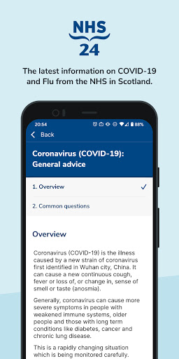  | 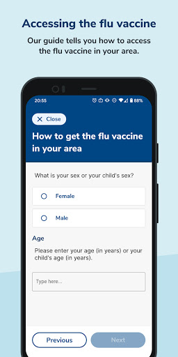  | 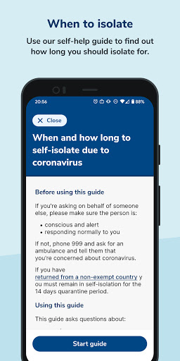  | 
 |   |   | 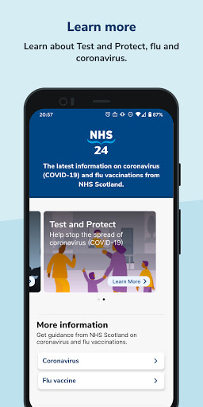  | 

## Development team
In the following we report the main information provided by the development team in the Google play store.

| | |
|-------------------------|-------------------------|
| **Developer**  | NHS24 |
| **Website**  | - |
| **Email** | ContentWorkRequest@nhs24.scot.nhs.uk |
| **Physical address**  | - |
| **Other developed apps**  | [https://play.google.com/store/apps/developer?id=NHS24](https://play.google.com/store/apps/developer?id=NHS24) |

## Android support

| | |
|-------------------------|-------------------------|
| **Declared target Android version**  | - |
| **Effective target Android version**  | - |
| **Minimum supported Android version**  | Jelly Bean, version 4.2.x (API level 17) |
| **Maximum target Android version**  | - |

The larger the difference between the minimum and maximum supported Android versions, the better. A larger difference means a wider audience. For example, old phones have a very low Android version, so a high minimum supported Android version means that the app cannot be used by users with old phones, thus leading to accessibility problems. 

## Requested permissions

In the following we report the complete list of the permissions requested by the app. 

| **Permission** | **Protection level** | **Description** | 
|-------------------------|-------------------------|-------------------------|
 **android.permission ACCESS_NETWORK_STATE** | Normal | Allows applications to access information about networks. 
 **android.permission INTERNET** | Normal | Allows applications to open network sockets. 
 **android.permission WAKE_LOCK** | Normal | Allows using PowerManager WakeLocks to keep processor from sleeping or screen from dimming. 
 **com.google.android.c2dm.permission RECEIVE** | - | - 

## Mentioned servers

| **Server** | **Registrant** | **Registrant country** | **Creation date** | 
|-------------------------|-------------------------|-------------------------|-------------------------|
 | google.com | Google LLC | :us: US | 1997-09-15 04:00:00 |
 | w3.org | W3C | :us: US | 1994-07-06 04:00:00 |

## Security analysis 

Below we report the main security warnings raised by our execution of the [Androwarn](https://github.com/maaaaz/androwarn) security analysis tool.

**Telephony identifiers leakage**
> - This application reads the ISO country code equivalent of the current registered operator's MCC (Mobile Country Code) 

**Connection interfaces exfiltration**
> - This application reads details about the currently active data network 

**Suspicious connection establishment**
> - This application opens a Socket and connects it to the remote address '' on the 'N/A' port  
> - This application opens a Socket and connects it to the remote address 'Ljava/lang/StringBuilder;->toString()Ljava/lang/String;' on the 'N/A' port  
> - This application opens a Socket and connects it to the remote address 'Ljava/net/Proxy;->type()Ljava/net/Proxy$Type;' on the 'N/A' port  
> - This application opens a Socket and connects it to the remote address 'timeout' on the 'N/A' port  

**Pim data leakage**
> - This application accesses data stored in the clipboard 

**Code execution**
> - This application loads a native library: 'flutter' 

## User ratings and reviews

Below we provide information about how end users are reacting to the app in terms of ratings and reviews in the Google Play store.

### Ratings

The NHS 24 : Covid-19 and flu information app has been installed by more than **10000** times. At this time, **53** rated the app and its average score is **3.2075472**. Below we show the distribution of the ratings across the usual star-based rating of Google Play

:star::star::star::star::star:: 21

:star::star::star::star:: 7

:star::star::star:: 5

:star::star:: 2

:star:: 18

### Reviews 

#### 5-star reviews

> Have symptoms.  :date: __2021-02-04 02:33:24__

> Straight forward to use and no nonsense answers to questions  :date: __2020-09-29 22:57:54__

> This is an excellent app with key information relating to coronavirus. Everyone should download it. However, for all of the clueless wonders out there who cannot read and have left it One Star reviews because it doesn't trace, it's not supposed to trace. There is a specific, dedicated app for 'Test & Protect' in Scotland, and that is the new Scottish tracking app. Learn to read, and you may well have a better chance of doing what you need to do in order to avoid coronavirus.  :date: __2020-09-24 18:39:42__

> Everything you need  :date: __2020-07-31 14:49:51__

> Am just about to try to see how good it is!  :date: __2020-05-29 12:27:51__

#### 4-star reviews

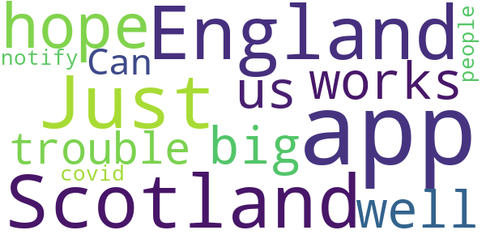

> I am in England not Scotland  :date: __2020-09-27 22:41:55__

> Just hope that this app works well for all of us if not we'll all in big trouble.  :date: __2020-09-26 13:18:41__

> Can this app notify me for other people who have covid  :date: __2020-09-24 19:20:35__

#### 3-star reviews

> Ok  :date: __2020-10-24 12:35:36__

> Since there's so many NHS apps, one general for patients who may need advice for their condition, another for general health information, whilst so many 3rd parties are using their logo, can NHS not name this Scottish app with Scotland AND COVID-19 in the name so the English and Welsh people can avoid this one?  :date: __2020-09-25 15:59:44__

> How do i check using post code  :date: __2020-09-24 13:19:39__

> If you are looking for the contact tracing app you need to search for Protect Scotland - this is not the app you are looking for. Stay Safe, Be Kind.  :date: __2020-09-10 12:15:04__

> Very disappointed with this app, very very basic, no proximity alerts, no information where positive areas are. I really wanted this app to impress me but sadly has failed. Why not just team up with the Kings College / ZOE Covid19 app as this has more information on where the hotpots are and offers you daily check-in for symptoms to collect live data. Come on NHS Scotland you can do much better than this!  :date: __2020-09-03 17:22:15__

#### 2-star reviews

> Nothing new here  :date: __2020-09-27 16:01:55__

> Do not think a lot of this app  :date: __2020-09-24 09:18:39__

#### 1-star reviews

> I dont live in scotland, why would I want this?  :date: __2021-01-28 14:01:16__

> There is no track and trace, if this isn't it then where is it?  :date: __2020-12-18 17:52:56__

> Rubish it does not work andstops everything elsewith failed to launch  :date: __2020-10-09 14:01:12__

> This is too basic, and tells you nothing about covid-19 nor its wider symptoms. It just asks those 3 questions. I wonder if this is just a waste of resources.  :date: __2020-10-05 02:00:49__

> Wouldn't work  :date: __2020-10-04 23:13:02__

> Big Brother is watching you!  :date: __2020-09-29 04:12:08__

> I couldn't see anything about contact tracing if I came close to someone who tested positive. Just a lidt of symptoms  :date: __2020-09-28 21:45:06__

> no use at all  :date: __2020-09-27 20:36:00__

> This is for Scotland not England  :date: __2020-09-24 22:04:32__

> Not sure I've got the right app I wanted the track and trace one  :date: __2020-09-24 19:30:42__

# COVID-19 Sounds
App version ``1.1.19``

Analyzed with [covid-apps-observer](http://github.com/covid-apps-observer) project, version ``0.1``

## App overview
| | |
|-------------------------|-------------------------| 
| **Name**&nbsp;&nbsp;&nbsp;&nbsp;&nbsp;&nbsp;&nbsp;&nbsp;&nbsp;&nbsp;&nbsp;&nbsp;&nbsp;&nbsp;&nbsp;&nbsp;&nbsp;&nbsp;&nbsp;&nbsp;&nbsp;&nbsp;&nbsp;&nbsp;&nbsp;&nbsp;&nbsp;&nbsp;&nbsp;&nbsp;&nbsp;&nbsp;&nbsp;&nbsp;&nbsp;&nbsp;&nbsp;&nbsp;&nbsp;&nbsp;  | COVID-19 Sounds |
| **Unique identifier** | uk.ac.cam.cl.covid19sounds |
| **Link to Google Play** | [https://play.google.com/store/apps/details?id=uk.ac.cam.cl.covid19sounds](https://play.google.com/store/apps/details?id=uk.ac.cam.cl.covid19sounds) |
| **Summary**  | Contribute your cough and voice sounds for research into COVID-19. |
| **Privacy policy** | [http://covid-19-sounds.org/privacy.html](http://covid-19-sounds.org/privacy.html) |
| **Latest version** | 1.1.19 |
| **Last update** | 2020-10-15 19:20:46 |
| **Recent changes** | scroll bar highliting |
| **Installs**  | 10,000+ |
| **Category** | Education |
| **First release** | Mar 25, 2020 |
| **Size**  | 3.4M |
| **Supported Android version**  | 5.0 and up |

### Description
> This app is part of a research project at the University of Cambridge. The aim of this research is to develop machine learning algorithms to automatically detect if a person is suffering of COVID-19, based primarily on sounds of their voice, their breathing and coughing. 
 In order to enable this research we are launching a large scale, crowdsourced data collection through a mobile app. The app will collect some basic demographics and medical history data, as well as some voice samples (while you read text on the screen) through a questionnaire and a few seconds of breathing and coughing through the phone microphone. We will additionally collect one location sample. The app will also ask if you have tested positive for the virus. The app won't be tracking you and only collect this data when you actively interact with it. 
 The data will be stored on University servers and be used solely for research purposes. We hope to release the dataset we are collecting to other researchers after the initial analysis. 
 The app will not give medical advice and any reports of symptoms will not be responded to by medical assistance.
 This app is available in English, Spanish, French, German, Hindi, Greek, Portuguese, Russian, Italian, and Chinese.

### User interface
The developers of the app provide the following screenshots in the Google play store.
| | | |
|:-------------------------:|:-------------------------:|:-------------------------:|
 |   |   |   | 
 | 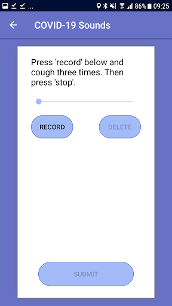 

## Development team
In the following we report the main information provided by the development team in the Google play store.

| | |
|-------------------------|-------------------------|
| **Developer**  | cam-cl-mobile-systems |
| **Website**  | [http://covid-19-sounds.org](http://covid-19-sounds.org) |
| **Email** | covid19sounds@gmail.com |
| **Physical address**  | - |
| **Other developed apps**  | [https://play.google.com/store/apps/developer?id=cam-cl-mobile-systems](https://play.google.com/store/apps/developer?id=cam-cl-mobile-systems) |

## Android support

| | |
|-------------------------|-------------------------|
| **Declared target Android version**  | Android10, version 10 (API level 29) |
| **Effective target Android version**  | Android10, version 10 (API level 29) |
| **Minimum supported Android version**  | Lollipop, version 5.0 (API level 21) |
| **Maximum target Android version**  | - |

The larger the difference between the minimum and maximum supported Android versions, the better. A larger difference means a wider audience. For example, old phones have a very low Android version, so a high minimum supported Android version means that the app cannot be used by users with old phones, thus leading to accessibility problems. 

## Requested permissions

In the following we report the complete list of the permissions requested by the app. 

| **Permission** | **Protection level** | **Description** | 
|-------------------------|-------------------------|-------------------------|
 **android.permission ACCESS_COARSE_LOCATION** | :warning:**Dangerous** | Allows an app to access approximate location. 
 **android.permission ACCESS_NETWORK_STATE** | Normal | Allows applications to access information about networks. 
 **android.permission ACCESS_WIFI_STATE** | Normal | Allows applications to access information about Wi-Fi networks. 
 **android.permission AUTHENTICATE_ACCOUNTS** | - | - 
 **android.permission GET_ACCOUNTS** | :warning:**Dangerous** | Allows access to the list of accounts in the Accounts Service. 
 **android.permission INTERNET** | Normal | Allows applications to open network sockets. 
 **android.permission READ_SYNC_SETTINGS** | Normal | Allows applications to read the sync settings. 
 **android.permission READ_SYNC_STATS** | Normal | Allows applications to read the sync stats. 
 **android.permission RECORD_AUDIO** | :warning:**Dangerous** | Allows an application to record audio. 
 **android.permission WRITE_SYNC_SETTINGS** | Normal | Allows applications to write the sync settings. 
 **com.samsung.android.providers.context.permission WRITE_USE_APP_FEATURE_SURVEY** | - | - 

## Mentioned servers

| **Server** | **Registrant** | **Registrant country** | **Creation date** | 
|-------------------------|-------------------------|-------------------------|-------------------------|
 | google.com | Google LLC | :us: US | 1997-09-15 04:00:00 |
 | googleapis.com | Google LLC | :us: US | 2005-01-25 17:52:26 |

## Security analysis 

Below we report the main security warnings raised by our execution of the [Androwarn](https://github.com/maaaaz/androwarn) security analysis tool.

**Connection interfaces exfiltration**
> - This application reads details about the currently active data network 
> - This application tries to find out if the currently active data network is metered 

**Suspicious connection establishment**
> - This application opens a Socket and connects it to the remote address 'Lcz/msebera/android/httpclient/HttpHost;->getPort()I' on the 'Lcz/msebera/android/httpclient/HttpHost;->getPort()I' port  

## User ratings and reviews

Below we provide information about how end users are reacting to the app in terms of ratings and reviews in the Google Play store.

### Ratings

The COVID-19 Sounds app has been installed by more than **10000** times. At this time, **72** rated the app and its average score is **3.8611112**. Below we show the distribution of the ratings across the usual star-based rating of Google Play

:star::star::star::star::star:: 43

:star::star::star::star:: 7

:star::star::star:: 4

:star::star:: 5

:star:: 13

### Reviews 

#### 5-star reviews

> I wasn't able to answer my covid test results are pending... but overall a great app  :date: __2020-12-13 20:06:00__

> The verification page with the user id has a broken link. Its not closed so if you click anywhere after the link, it clicks the link. Great app! I hope they are able to collect enough data to do what they want.  :date: __2020-11-10 20:11:56__

> Great easy to use app. One day could lead to great things.  :date: __2020-11-03 18:29:57__

> Easy to use, hopefully helpful.  :date: __2020-09-02 04:49:31__

> Great easy app I'm sure it will be extremely useful long term  :date: __2020-08-08 09:23:57__

> 👍👍👍👍👍 this app is very useful. Thanks for this ideya. 😉😉👍👍👍👍👍  :date: __2020-07-18 12:42:37__

> how I'll know my result  :date: __2020-05-22 00:35:52__

> Great idea, all the best with this app, hope we can win over Covid-19!  :date: __2020-04-13 21:34:53__

#### 4-star reviews

No recent reviews available with 4 stars.

#### 3-star reviews

> Covid test question needs an 'unknown' option. I've been tested before, with negative result, but months ago, so saying my 'current status' is negative is misleading, but I can't say I've 'Never' been tested. Could also be used by those who've had a test, but awaiting results. There should be a definition of what 'current' means too. The question on whether you think you've had Covid needs a 'Maybe' option. I think I may have, but mildly & not the obvious symptoms so not confident to say 'Yes'.  :date: __2021-01-13 02:47:12__

#### 2-star reviews

> So, well, this app only gets your data: you send your talk, your cough, your data, and that's it. It gives you back nothing. You contribute to science. The problem here is: why don't they give me back the result of my data, based on the data they accumulated? This is not fair, no matter how much the data is valuable/correct. Just give me the output, even if just for curiosity. You state that the app is 98% correct. So there's no reason to be so shy. Also: this app would render the swab completely useless. Maybe the app doesn't give back the results so to not destroy the market of a perfectly useless device like the swab? I can see no other reason.  :date: __2020-12-31 18:10:40__

> The app asked me to complete the same survey every morning. I would have been happy to provide weekly responses, but found daily prompts too stressful given my very limited understanding of how this might help.  :date: __2020-11-27 18:27:29__

#### 1-star reviews

> Broken... Doesn't work  :date: __2021-01-10 17:21:19__

> I cant open it  :date: __2020-10-20 00:37:26__

# NHS App
App version ``1.45.0``

Analyzed with [covid-apps-observer](http://github.com/covid-apps-observer) project, version ``0.1``

## App overview
| | |
|-------------------------|-------------------------| 
| **Name**&nbsp;&nbsp;&nbsp;&nbsp;&nbsp;&nbsp;&nbsp;&nbsp;&nbsp;&nbsp;&nbsp;&nbsp;&nbsp;&nbsp;&nbsp;&nbsp;&nbsp;&nbsp;&nbsp;&nbsp;&nbsp;&nbsp;&nbsp;&nbsp;&nbsp;&nbsp;&nbsp;&nbsp;&nbsp;&nbsp;&nbsp;&nbsp;&nbsp;&nbsp;&nbsp;&nbsp;&nbsp;&nbsp;&nbsp;&nbsp;  | NHS App |
| **Unique identifier** | com.nhs.online.nhsonline |
| **Link to Google Play** | [https://play.google.com/store/apps/details?id=com.nhs.online.nhsonline](https://play.google.com/store/apps/details?id=com.nhs.online.nhsonline) |
| **Summary**  | Access NHS services in England |
| **Privacy policy** | [https://www.nhs.uk/using-the-nhs/nhs-services/the-nhs-app/privacy/](https://www.nhs.uk/using-the-nhs/nhs-services/the-nhs-app/privacy/) |
| **Latest version** | 1.45.0 |
| **Last update** | 2021-02-05 10:21:45 |
| **Recent changes** | Bug fixes, and various performance, stability and accessibility enhancements. |
| **Installs**  | 1,000,000+ |
| **Category** | Medical |
| **First release** | Dec 31, 2018 |
| **Size**  | 56M |
| **Supported Android version**  | 5.0 and up |

### Description
> <b>This is not the NHS COVID-19 app. To download the NHS COVID-19 contact tracing app, go to covid19.nhs.uk</b>
 Owned and run by the NHS, the NHS App is a simple and secure way to access a range of NHS services on your smartphone or tablet.
 To use the NHS App you must be aged 13 and over and registered with a GP surgery in England.
 You can also access NHS App services from the browser on your desktop or laptop computer. Go to www.nhs.uk/app
 Use the NHS App to:
 •	get advice about coronavirus
 •	order your repeat prescriptions
 •	book and manage appointments at your GP surgery
 •	get health information and advice
 •	view your health record securely
 •	register your organ donation decision
 •	find out how the NHS uses your data
 If your GP surgery or hospital offers other services in the NHS App, you may be able to:
 •	message your GP surgery, doctor or health professional online
 •	consult a GP or health professional through an online form and get a reply
 •	access health services on behalf of someone you care for
 •	view your hospital and other healthcare appointments
 •	view useful links your doctor or health professional has shared with you
 •	view and manage your care plans
 Get advice about coronavirus 
 ---------------------------------------
 Get information about coronavirus and find out what to do if you think you have it.
 Order repeat prescriptions 
 -----------------------------------
 See your available medicines, request a new repeat prescription and choose a pharmacy for your prescriptions to be sent to.
 Book appointments
 --------------------------
 Search for, book and cancel appointments at your GP surgery. See details of your upcoming and past appointments.
 Get health advice
 -----------------------------
 Search trusted NHS information and advice on hundreds of conditions and treatments. You can also answer questions to get instant advice or medical help near you. 
 View your health record
 ----------------------------------
 Securely access your GP health record, to see information like your allergies and your current and past medicines. If your GP surgery has given you access to your detailed medical record, you can also see information like test results and details of your consultations. 
 Register your organ donation decision
 --------------------------------------------------
 Choose to donate some or all of your organs and check your registered decision.
 Find out how the NHS uses your data
 -------------------------------------------------
 Choose if data from your health records is shared for research and planning.
 Keeping your data secure
 ---------------------------------
 After you download the app, you will need to set up an NHS login and prove who you are. The app then securely connects to information from your GP surgery. 
 If your Android device supports fingerprint detection, you can use it to log in to the NHS App each time, instead of using a password and security code.

### User interface
The developers of the app provide the following screenshots in the Google play store.
| | | |
|:-------------------------:|:-------------------------:|:-------------------------:|
 |   |   |   | 
 |   |   |   | 
 |   |   |   | 
 |   |   |   | 
 |   |   |   | 
 |   |   |   | 

## Development team
In the following we report the main information provided by the development team in the Google play store.

| | |
|-------------------------|-------------------------|
| **Developer**  | NHS Digital |
| **Website**  | [https://www.nhs.uk/using-the-nhs/nhs-services/the-nhs-app/help/](https://www.nhs.uk/using-the-nhs/nhs-services/the-nhs-app/help/) |
| **Email** | nhsapp@nhs.net |
| **Physical address**  | - |
| **Other developed apps**  | [https://play.google.com/store/apps/developer?id=NHS+Digital](https://play.google.com/store/apps/developer?id=NHS+Digital) |

## Android support

| | |
|-------------------------|-------------------------|
| **Declared target Android version**  | Android10, version 10 (API level 29) |
| **Effective target Android version**  | Android10, version 10 (API level 29) |
| **Minimum supported Android version**  | Lollipop, version 5.0 (API level 21) |
| **Maximum target Android version**  | - |

The larger the difference between the minimum and maximum supported Android versions, the better. A larger difference means a wider audience. For example, old phones have a very low Android version, so a high minimum supported Android version means that the app cannot be used by users with old phones, thus leading to accessibility problems. 

## Requested permissions

In the following we report the complete list of the permissions requested by the app. 

| **Permission** | **Protection level** | **Description** | 
|-------------------------|-------------------------|-------------------------|
 **android.permission ACCESS_FINE_LOCATION** | :warning:**Dangerous** | Allows an app to access precise location. 
 **android.permission ACCESS_NETWORK_STATE** | Normal | Allows applications to access information about networks. 
 **android.permission CAMERA** | :warning:**Dangerous** | Required to be able to access the camera device. 
 **android.permission INTERNET** | Normal | Allows applications to open network sockets. 
 **android.permission MODIFY_AUDIO_SETTINGS** | Normal | Allows an application to modify global audio settings. 
 **android.permission NFC** | Normal | Allows applications to perform I/O operations over NFC. 
 **android.permission READ_EXTERNAL_STORAGE** | :warning:**Dangerous** | Allows an application to read from external storage. 
 **android.permission READ_PHONE_STATE** | :warning:**Dangerous** | Allows read only access to phone state, including the phone number of the device, current cellular network information, the status of any ongoing calls, and a list of any PhoneAccounts registered on the device. 
 **android.permission RECORD_AUDIO** | :warning:**Dangerous** | Allows an application to record audio. 
 **android.permission USE_FINGERPRINT** | Normal | This constant was deprecated in API level 28. Applications should request USE_BIOMETRIC instead 
 **android.permission WAKE_LOCK** | Normal | Allows using PowerManager WakeLocks to keep processor from sleeping or screen from dimming. 
 **android.permission WRITE_EXTERNAL_STORAGE** | :warning:**Dangerous** | Allows an application to write to external storage. 
 **com.google.android.c2dm.permission RECEIVE** | - | - 
 **com.google.android.finsky.permission BIND_GET_INSTALL_REFERRER_SERVICE** | - | - 
 **org.fidoalliance.uaf.permissions FIDO_CLIENT** | - | - 

## Mentioned servers

| **Server** | **Registrant** | **Registrant country** | **Creation date** | 
|-------------------------|-------------------------|-------------------------|-------------------------|
 | googlesyndication.com | Google LLC | :us: US | 2003-01-21 06:17:24 |
 | google.com | Google LLC | :us: US | 1997-09-15 04:00:00 |
 | app-measurement.com | Google LLC | :us: US | 2015-06-19 20:13:31 |

## Security analysis 

Below we report the main security warnings raised by our execution of the [Androwarn](https://github.com/maaaaz/androwarn) security analysis tool.

**Connection interfaces exfiltration**
> - This application reads details about the currently active data network 

**Telephony services abuse**
> - This application makes phone calls 

**Suspicious connection establishment**
> - This application opens a Socket and connects it to the remote address '; port is out of range' on the 'N/A' port  
> - This application opens a Socket and connects it to the remote address 'Lc/b/b/a/a;->w(Ljava/lang/String;)Ljava/lang/StringBuilder;' on the 'N/A' port  
> - This application opens a Socket and connects it to the remote address 'Ljava/net/Proxy;->type()Ljava/net/Proxy$Type;' on the 'N/A' port  
> - This application opens a Socket and connects it to the remote address 'timeout' on the 'N/A' port  

**Code execution**
> - This application loads a native library: 'DocumentCropper' 
> - This application loads a native library: 'Integrity' 
> - This application loads a native library: 'Liveness' 
> - This application loads a native library: 'Ocr' 
> - This application loads a native library: 'Preflight' 
> - This application loads a native library: 'Quality' 
> - This application loads a native library: 'gnustl_shared' 
> - This application loads a native library: 'lept' 
> - This application loads a native library: 'opencv_java3' 
> - This application loads a native library: 'tensorflow_inference' 
> - This application loads a native library: 'tensorflow_jni' 
> - This application loads a native library: 'tess' 

## User ratings and reviews

Below we provide information about how end users are reacting to the app in terms of ratings and reviews in the Google Play store.

### Ratings

The NHS App app has been installed by more than **1000000** times. At this time, **6190** rated the app and its average score is **3.772655**. Below we show the distribution of the ratings across the usual star-based rating of Google Play

:star::star::star::star::star:: 3435

:star::star::star::star:: 836

:star::star::star:: 305

:star::star:: 305

:star:: 1309

### Reviews 

#### 5-star reviews

> Always 😆  :date: __2021-02-13 06:59:47__

> So far so good.  :date: __2021-02-12 16:17:01__

> Easy to use. Good for advice on what to do, what to expect and how to treat/self manage.  :date: __2021-02-12 14:47:55__

> Good  :date: __2021-02-12 09:57:23__

> Good  :date: __2021-02-12 01:33:14__

> Found it easy to register. Very good so far.  :date: __2021-02-12 00:33:50__

> Simple to use. Clear uncluttered screens. Clear uncomplicated instructions. Effective stress buster!  :date: __2021-02-11 14:48:13__

> So useful for ordering prescriptions and booking appointments  :date: __2021-02-11 14:10:38__

> All my records are accessible including details of my Covid-19 vaccine. A faff to setup as it needs documents uploaded but worth it.  :date: __2021-02-11 08:44:19__

> Complex to set up (as it should be: protects your healthcare data) but extremely useful once done. Some of the limitations lie with the surgeries and hospitals enabling sharing rather than the app.  :date: __2021-02-10 14:25:20__

#### 4-star reviews

> Seems Ok Seting up your NHS access on a laptop or tsblet to avoid fiddling atound with a phone. Some typical design problems. The back button on the phone should have the same function as the back button on the page as you could easily log out. The scroll nars are too thin, particlarily on the desktop version. Date of birth doesnt tab from box to box. Doese anybody who designs these things ever use them!  :date: __2021-02-12 13:16:29__

> Works for me now.  :date: __2021-02-11 19:51:43__

> Seems yo work well  :date: __2021-02-11 13:00:02__

> Easy to use and gives access to my information plus the ability to order repeat prescriptions. Would like to see vaccination status shown going forward.  :date: __2021-02-10 18:25:18__

> Easy to download. Very helpful for accessing NHS number. Hopefully will make my life easier in future. Potentially a very useful timesaving tool.  :date: __2021-02-07 12:48:27__

> Very simple and easy to use  :date: __2021-02-06 09:02:29__

> Good but hard to register still stuck on wife's doctors practice could not supply I'd information. As requested by app  :date: __2021-02-05 17:44:32__

> Can't complete registration. Can't open camcorder. Edit...... No works.had to register with different device  :date: __2021-02-05 13:26:29__

> I find it very helpful and easy to use. The drawbacks is that I can't download the app into my wife phone even after trying over twenty times at different times of the day  :date: __2021-02-05 13:03:58__

> Great app, my only criticism would be is still receiving security codes after ticking to 'remember this device'  :date: __2021-02-04 19:31:45__

#### 3-star reviews

> Tried to update the app and it won't work. Uninstalled the original to start again and that won't load. Is there a problem I a ready had the app on my phone and have been using it satisfactorily for months. It was only when I was asked to update it and it wouldn't let me use it until I did, that I had problems with it. My phone is up to date and has plenty of storage and memory. It is the app which has the problem. It was fine until the update.  :date: __2021-02-12 02:53:10__

> Not the best app I've ever attempted to use, insists on telling me there's a problem with my connection, strangely everything else on my phone works! Of course UK gov can't be their fault now can it. Could be a very good app with a bit of knowledgeable input  :date: __2021-02-09 14:18:03__

> The log in took over four hours to complete. It will not load on my laptop. Once everything is up loaded on to a smart phone. you log in to check perscriptions all you get is an error message. I still do not know if they have been ordered and they have just ran out, so now still have to ring to find out. the phone charges are now over forty pounds. A complete waste of time and money !!!!!!!! I now have no error messages so all is working at the moment, fingers crossed up the star rating .  :date: __2021-02-03 16:12:08__

> The app has been freezing for last few days. I have sent a report but its still doing it  :date: __2021-02-02 18:35:20__

> I have asked for the confirmation email to start but had no email sent to me, must of tried 30 times now  :date: __2021-02-01 15:42:12__

> Great app very useful just wish I could make an appointment on this app here  :date: __2021-01-29 16:59:16__

> Very difficult if you don't have passport or driving licence  :date: __2021-01-24 20:37:05__

> When GP appointment booking is going to restart?  :date: __2021-01-22 17:20:42__

> Good updated information as needed.  :date: __2021-01-18 17:04:45__

> "we could not change your fingerprint setting". But every other app can.  :date: __2021-01-15 21:22:44__

#### 2-star reviews

> Tried to use this to connect without having to go via the surgery but it just says "Sorry - we cannot connect you to your GP surgery" and prompts me to sign up to online services via the surgery (who, when I called them, could not find the information required by the app) This error occured even though I got the verification email saying the surgery has approved it. Currently awaiting a response to the query I raised via link provided.  :date: __2021-02-12 12:42:09__

> Internet connection error! I have been through all of the validation process and had a message of confirmation from my surgery, but every time I try to use the app I get a message saying Internet connection error. There is no issue with my Internet but I cannot use the app.  :date: __2021-02-11 18:48:49__

> Takes to long to fill out  :date: __2021-02-08 13:02:28__

> Not very user friendly. History deleted without any notice.  :date: __2021-02-08 01:40:38__

> App is great concept...but varification to set it up is a nightmare! Confirming your ID is a problem at the point when you have to do a video and talk 4 secure numbers given to you. The start video now does not find video function and you have no search options as it retainsand goes auto to the galley from when you took a photo of your chosen ID to send.  :date: __2021-02-06 15:12:32__

> Disappointed, took a couple of attempts to originally set up, also it the issue of out of date medical records, last entry was for a vaccination in 2013, no mention of the bowel cancer I was diagnosed and treated for in 2019.  :date: __2021-02-06 11:14:26__

> It keeps wanting updates it seems...each time I come to use it...a bit of a bore  :date: __2021-02-04 10:29:07__

> It won't accept any video verification even on my huawei 2019!  :date: __2021-02-02 19:11:58__

> Tried 12times to dwn load video with numbas n no replys won't take it, infuriating,,!!! Tried writings numbas!!! Nooooope  :date: __2021-02-01 18:46:24__

> needs to update nhs calls on appointments you have done through app for medical advice please  :date: __2021-01-31 22:46:33__

#### 1-star reviews

> The prove ID is a nightmare to get through, once through ordering prescriptions seems to work but that's about it. Looking up GP surgery records doesn't work, can't access them. Booking appointment isn't available,  :date: __2021-02-13 11:26:00__

> Useless, damn thing won't accept my records.  :date: __2021-02-12 22:06:11__

> It could be a very useful app, if only worked! Have tried for months and months to verify my identify. When you need to proceed with uploading your ID or recording the video, it doesn't allow you to select the camera. I have sent several feedbacks and nothing has changed. Have read the troubleshooting guide when there is nothing to troubleshoot as it's clearly a bug. I give up!!!  :date: __2021-02-12 21:39:27__

> Video upload not working  :date: __2021-02-12 16:23:15__

> Impossible to verify your I. D! Absolute waste of time.  :date: __2021-02-12 15:16:49__

> Rubbish. Awful sign up process, finicky, inefficient, time wasting. Just like the NHS.  :date: __2021-02-12 12:25:46__

> I installed the app alongside the coronovirus contact tracing app. My coronavirus jab invitation arrived by post and when my local hospital offered me a jab from unused daily stock, they called my landline. What is the point of this app?  :date: __2021-02-12 00:42:41__

> Totally useless for me, I followed the instructions and verified my ID no problem, I cannot however get past the screen that connects to my surgery as they want me to 'present myself at the surgery with 2 forms of ID' - really? in the situation we are in now? - So a complete waste of my time, when all I intended to do was ease the pressure on the NHS. I will probably do what I have always done when it comes to accessing NHS services - give up. I am after all 68 and still soldiering on.  :date: __2021-02-11 21:49:26__

> Wasted too much time on this, Cannot confirm my ID to get full functionality as the video option won't open when required , all the permissions are set correctly. Unusable app, Pointless, only one thing worse than a bad app, a bad app that doesn't work. Should be zero stars and would be if it were an option...  :date: __2021-02-11 20:57:18__

> 11/2/2021 Absolute rubbish! This app does NOT work. Aged in my 70's and with the assistance of my son, I spent 2 and a half hours and failed miserably to successfully confirm I.D using the scan function or video function. After having issues with my normal pharmacy access, I expected the NHS app to end my problems. This app has wasted my time and caused great upset. I won't be recommending this app.  :date: __2021-02-11 17:31:15__

# C19 Control
App version ``1.4.0``

Analyzed with [covid-apps-observer](http://github.com/covid-apps-observer) project, version ``0.1``

## App overview
| | |
|-------------------------|-------------------------| 
| **Name**&nbsp;&nbsp;&nbsp;&nbsp;&nbsp;&nbsp;&nbsp;&nbsp;&nbsp;&nbsp;&nbsp;&nbsp;&nbsp;&nbsp;&nbsp;&nbsp;&nbsp;&nbsp;&nbsp;&nbsp;&nbsp;&nbsp;&nbsp;&nbsp;&nbsp;&nbsp;&nbsp;&nbsp;&nbsp;&nbsp;&nbsp;&nbsp;&nbsp;&nbsp;&nbsp;&nbsp;&nbsp;&nbsp;&nbsp;&nbsp;  | C19 Control |
| **Unique identifier** | com.elt.covid_android |
| **Link to Google Play** | [https://play.google.com/store/apps/details?id=com.elt.covid_android](https://play.google.com/store/apps/details?id=com.elt.covid_android) |
| **Summary**  | Record and monitor the C19 status for people being cared for and for care staff. |
| **Privacy policy** | [https://www.c19control.com/privacy-policy](https://www.c19control.com/privacy-policy) |
| **Latest version** | 1.4.0 |
| **Last update** | 2020-05-19 15:34:07 |
| **Recent changes** | Text changes and usability improvements |
| **Installs**  | 50+ |
| **Category** | Medical |
| **First release** | Apr 20, 2020 |
| **Size**  | 4.2M |
| **Supported Android version**  | 6.0 and up |

### Description
> C19 CONTROL is the fast and simple way for care providers to record and report COVID-19 status and PPE use on the frontline of care.  
  
 Care staff can view a list of people being cared for, and for each person they can record the advice given by the official NHS service in their region; the relevant symptoms; and the appropriate COVID-19 status.  Care Staff can also record their own Personal Protective Equipment (PPE) supply levels, giving their Care Managers a real-time view of PPE needs across their team.
 Care managers can use the app to record the COVID-19 status for each of their care staff, and can quickly add new people to the list of care receivers and care staff.  Care Managers can also record the overall PPE levels for the care service, to help when re-ordering stock.
 Using the C19 CONTROL web portal, care managers can set the dependency level of people being cared for and can run reports of COVID-19status and dependency level for people being cared for, and COVID-19 status and PPE levels for care staff.
 The data recorded by C19 CONTROL will help both care providers as well as local, regional and national government organisations to gain a better understanding of the cases of suspected or confirmed COVID-19 across health and social care systems so that they can better anticipate health needs and plan resource requirements.

### User interface
The developers of the app provide the following screenshots in the Google play store.
| | | |
|:-------------------------:|:-------------------------:|:-------------------------:|
 |   |   |   | 
 |   | 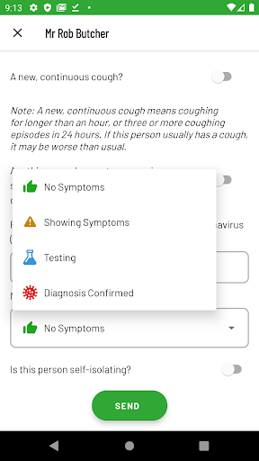  |   | 
 |   |   | 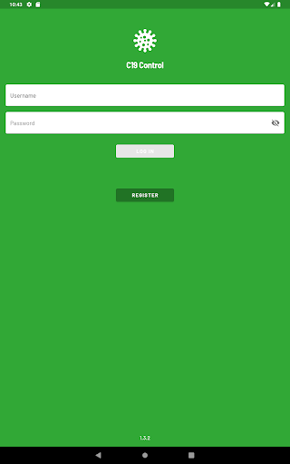  | 
 | 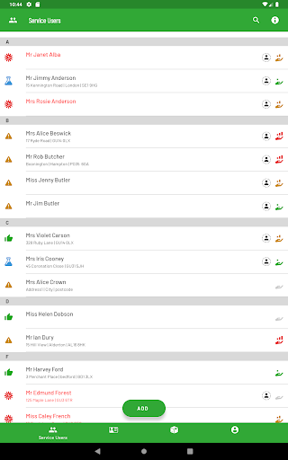  |   | 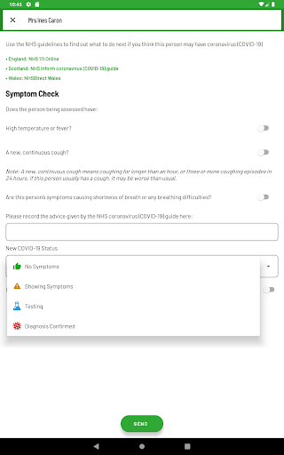  | 
 |   |   | 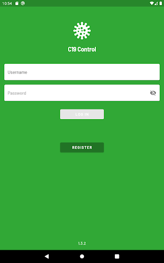  | 
 |   |   | 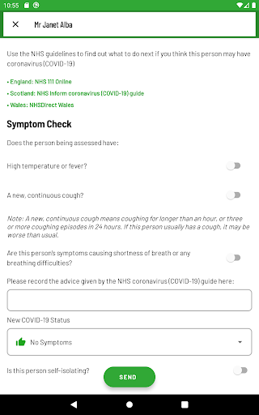  | 
 |   |   | 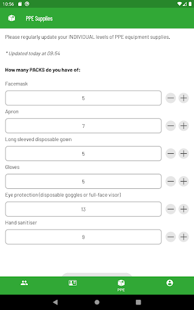  | 
 |  

## Development team
In the following we report the main information provided by the development team in the Google play store.

| | |
|-------------------------|-------------------------|
| **Developer**  | everyLIFE |
| **Website**  | [https://www.c19control.com/](https://www.c19control.com/) |
| **Email** | support@c19control.com |
| **Physical address**  | [A1, East Wing, Cody Technology Park, Ively Road, Farnborough, UK, GU14 0LX](https://www.google.com/maps/search/A1,%20East%20Wing,%20Cody%20Technology%20Park,%20Ively%20Road,%20Farnborough,%20UK,%20GU14%200LX) (Google Maps) |
| **Other developed apps**  | [https://play.google.com/store/apps/developer?id=everyLIFE](https://play.google.com/store/apps/developer?id=everyLIFE) |

## Android support

| | |
|-------------------------|-------------------------|
| **Declared target Android version**  | Android10, version 10 (API level 29) |
| **Effective target Android version**  | Android10, version 10 (API level 29) |
| **Minimum supported Android version**  | Marshmallow, version 6.0 (API level 23) |
| **Maximum target Android version**  | - |

The larger the difference between the minimum and maximum supported Android versions, the better. A larger difference means a wider audience. For example, old phones have a very low Android version, so a high minimum supported Android version means that the app cannot be used by users with old phones, thus leading to accessibility problems. 

## Requested permissions

In the following we report the complete list of the permissions requested by the app. 

| **Permission** | **Protection level** | **Description** | 
|-------------------------|-------------------------|-------------------------|
 **android.permission ACCESS_NETWORK_STATE** | Normal | Allows applications to access information about networks. 
 **android.permission CALL_PHONE** | :warning:**Dangerous** | Allows an application to initiate a phone call without going through the Dialer user interface for the user to confirm the call. 
 **android.permission INTERNET** | Normal | Allows applications to open network sockets. 
 **android.permission WAKE_LOCK** | Normal | Allows using PowerManager WakeLocks to keep processor from sleeping or screen from dimming. 
 **com.google.android.c2dm.permission RECEIVE** | - | - 
 **com.google.android.finsky.permission BIND_GET_INSTALL_REFERRER_SERVICE** | - | - 

## Mentioned servers

| **Server** | **Registrant** | **Registrant country** | **Creation date** | 
|-------------------------|-------------------------|-------------------------|-------------------------|
 | googleapis.com | Google LLC | :us: US | 2005-01-25 17:52:26 |
 | googlesyndication.com | Google LLC | :us: US | 2003-01-21 06:17:24 |
 | google.com | Google LLC | :us: US | 1997-09-15 04:00:00 |
 | app-measurement.com | Google LLC | :us: US | 2015-06-19 20:13:31 |
 | googleadservices.com | Google LLC | :us: US | 2003-06-19 16:34:53 |
 | crashlytics.com | Google LLC | :us: US | 2011-01-21 15:30:40 |
 | googleapis.com | Google LLC | :us: US | 2005-01-25 17:52:26 |
 | passgenius.com | - | GB | 2014-09-28 21:17:28 |

## Security analysis 

Below we report the main security warnings raised by our execution of the [Androwarn](https://github.com/maaaaz/androwarn) security analysis tool.

**Connection interfaces exfiltration**
> - This application reads details about the currently active data network 
> - This application tries to find out if the currently active data network is metered 

**Telephony services abuse**
> - This application makes phone calls 

**Suspicious connection establishment**
> - This application opens a Socket and connects it to the remote address ': ; port is out of range' on the 'N/A' port  
> - This application opens a Socket and connects it to the remote address 'Ld/c/a/a/a;->a(Ljava/lang/String;)Ljava/lang/StringBuilder;' on the 'N/A' port  
> - This application opens a Socket and connects it to the remote address 'Ljava/net/Proxy;->type()Ljava/net/Proxy$Type;' on the 'N/A' port  
> - This application opens a Socket and connects it to the remote address 'timeout' on the 'N/A' port  

## User ratings and reviews

Below we provide information about how end users are reacting to the app in terms of ratings and reviews in the Google Play store.

### Ratings

The C19 Control app has been installed by more than **50** times. At this time, **-** rated the app and its average score is **0.0**. Below we show the distribution of the ratings across the usual star-based rating of Google Play

:star::star::star::star::star:: 0

:star::star::star::star:: 0

:star::star::star:: 0

:star::star:: 0

:star:: 0

### Reviews 

#### 5-star reviews

> I care for my friends so I got this app  :date: __2020-12-27 19:53:18__

> Simple to use with a very easy to navigate set of menus.  :date: __2020-04-30 07:50:48__

#### 4-star reviews

No recent reviews available with 4 stars.

#### 3-star reviews

No recent reviews available with 3 stars.

#### 2-star reviews

No recent reviews available with 2 stars.

#### 1-star reviews

No recent reviews available with 1 stars.

# patientMpower for COVID-19
App version ``covid-19-1.6.0``

Analyzed with [covid-apps-observer](http://github.com/covid-apps-observer) project, version ``0.1``

## App overview
| | |
|-------------------------|-------------------------| 
| **Name**&nbsp;&nbsp;&nbsp;&nbsp;&nbsp;&nbsp;&nbsp;&nbsp;&nbsp;&nbsp;&nbsp;&nbsp;&nbsp;&nbsp;&nbsp;&nbsp;&nbsp;&nbsp;&nbsp;&nbsp;&nbsp;&nbsp;&nbsp;&nbsp;&nbsp;&nbsp;&nbsp;&nbsp;&nbsp;&nbsp;&nbsp;&nbsp;&nbsp;&nbsp;&nbsp;&nbsp;&nbsp;&nbsp;&nbsp;&nbsp;  | patientMpower for COVID-19 |
| **Unique identifier** | com.maithu.transplantbuddy.covid19 |
| **Link to Google Play** | [https://play.google.com/store/apps/details?id=com.maithu.transplantbuddy.covid19](https://play.google.com/store/apps/details?id=com.maithu.transplantbuddy.covid19) |
| **Summary**  | patientMpower COVID-19 Patient Management app |
| **Privacy policy** | [https://info.patientmpower.com/covid19-privacy-policy](https://info.patientmpower.com/covid19-privacy-policy) |
| **Latest version** | covid-19-1.6.0 |
| **Last update** | 2021-02-09 17:41:31 |
| **Recent changes** | Our support email and phone number are now visible in the app. |
| **Installs**  | 1,000+ |
| **Category** | Health & Fitness |
| **First release** | Mar 15, 2020 |
| **Size**  | 64M |
| **Supported Android version**  | 4.3 and up |

### Description
> The patientMpower for COVID-19 app is for people in the Republic of Ireland who have been enrolled in the COVID-19 remote monitoring programme by a healthcare professional. 
 The patientMpower for COVID-19 app will allow you to monitor your COVID-19 symptoms and  health information such as your oxygen levels and temperature whilst you are in self-isolation. This information will be shared confidentially with trained personnel at dedicated monitoring centres. They will be able to see your information immediately. Monitoring will enable healthcare professionals to assess if you are recovering well whilst in isolation or if you need additional support (e.g. extra treatments at home or if you need to go to hospital). 
 It is recommended that you consent to using location services after downloading this app. If you don’t want to consent to sharing your location you can continue to use the app. The location information will be de-identified and used for research into COVID-19. 
 KEY FEATURES
  - Monitors your oxygen saturation (using a device called a pulse oximeter), which is important to track to ensure you are recovering from COVID-19
  - Tracks your symptoms including breathlessness
  - Records details of relevant underlying conditions and your existing medications
  - Anonymised location monitoring, to help us understand trends of COVID-19 across Ireland and plan resources to best deliver healthcare
  - Confidential health data viewable in real time by healthcare professionals at monitoring centres
 patientMpower are an Irish digital health company who are experienced in providing home monitoring  platforms for people with lung conditions. If you need help installing the app or need any technical support please email support@patientMpower.com. 
 IMPORTANT: This app cannot provide medical intervention in the event of an emergency. If you experience a rapid worsening of symptoms or severe breathing difficulties please contact 999 or 112. 
 Privacy policy:
 https://info.patientmpower.com/covid19-privacy-policy

### User interface
The developers of the app provide the following screenshots in the Google play store.
| | | |
|:-------------------------:|:-------------------------:|:-------------------------:|
 | 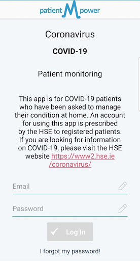  |   |   | 
 |   |   | 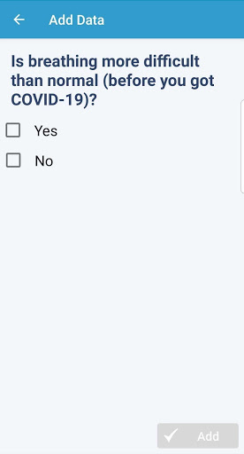  | 
 |  

## Development team
In the following we report the main information provided by the development team in the Google play store.

| | |
|-------------------------|-------------------------|
| **Developer**  | patientMpower |
| **Website**  | [https://info.patientmpower.com/](https://info.patientmpower.com/) |
| **Email** | info+covid-19@patientmpower.com |
| **Physical address**  | [The Digital Depot Thomas St Dublin D08 TCV4 Ireland](https://www.google.com/maps/search/The%20Digital%20Depot%20Thomas%20St%20Dublin%20D08%20TCV4%20Ireland) (Google Maps) |
| **Other developed apps**  | [https://play.google.com/store/apps/developer?id=patientMpower](https://play.google.com/store/apps/developer?id=patientMpower) |

## Android support

| | |
|-------------------------|-------------------------|
| **Declared target Android version**  | Android10, version 10 (API level 29) |
| **Effective target Android version**  | Android10, version 10 (API level 29) |
| **Minimum supported Android version**  | Jelly Bean, version 4.3.x (API level 18) |
| **Maximum target Android version**  | - |

The larger the difference between the minimum and maximum supported Android versions, the better. A larger difference means a wider audience. For example, old phones have a very low Android version, so a high minimum supported Android version means that the app cannot be used by users with old phones, thus leading to accessibility problems. 

## Requested permissions

In the following we report the complete list of the permissions requested by the app. 

| **Permission** | **Protection level** | **Description** | 
|-------------------------|-------------------------|-------------------------|
 **android.permission ACCESS_COARSE_LOCATION** | :warning:**Dangerous** | Allows an app to access approximate location. 
 **android.permission ACCESS_FINE_LOCATION** | :warning:**Dangerous** | Allows an app to access precise location. 
 **android.permission ACCESS_NETWORK_STATE** | Normal | Allows applications to access information about networks. 
 **android.permission BLUETOOTH** | Normal | Allows applications to connect to paired bluetooth devices. 
 **android.permission BLUETOOTH_ADMIN** | Normal | Allows applications to discover and pair bluetooth devices. 
 **android.permission CAMERA** | :warning:**Dangerous** | Required to be able to access the camera device. 
 **android.permission INTERNET** | Normal | Allows applications to open network sockets. 
 **android.permission READ_EXTERNAL_STORAGE** | :warning:**Dangerous** | Allows an application to read from external storage. 
 **android.permission RECEIVE_BOOT_COMPLETED** | Normal | Allows an application to receive the Intent.ACTION_BOOT_COMPLETED that is broadcast after the system finishes booting. 
 **android.permission VIBRATE** | Normal | Allows access to the vibrator. 
 **android.permission WAKE_LOCK** | Normal | Allows using PowerManager WakeLocks to keep processor from sleeping or screen from dimming. 
 **android.permission WRITE_EXTERNAL_STORAGE** | :warning:**Dangerous** | Allows an application to write to external storage. 
 **com.amazon.device.messaging.permission RECEIVE** | - | - 
 **com.google.android.c2dm.permission RECEIVE** | - | - 
 **com.google.android.finsky.permission BIND_GET_INSTALL_REFERRER_SERVICE** | - | - 
 **com.maithu.transplantbuddy.covid19.permission C2D_MESSAGE** | - | - 
 **com.maithu.transplantbuddy.covid19.permission RECEIVE_ADM_MESSAGE** | - | - 

## Mentioned servers

| **Server** | **Registrant** | **Registrant country** | **Creation date** | 
|-------------------------|-------------------------|-------------------------|-------------------------|
 | googlesyndication.com | Google LLC | :us: US | 2003-01-21 06:17:24 |
 | google.com | Google LLC | :us: US | 1997-09-15 04:00:00 |
 | facebook.com | Facebook, Inc. | :us: US | 1997-03-29 05:00:00 |
 | megsupporttools.com | Registrant State/Province: N/A | IE | 2017-03-07 18:37:51 |
 | patientmpower.com | Patient Buddy | IE | 2016-04-06 17:01:49 |
 | app-measurement.com | Google LLC | :us: US | 2015-06-19 20:13:31 |
 | googleapis.com | Google LLC | :us: US | 2005-01-25 17:52:26 |
 | googleapis.com | Google LLC | :us: US | 2005-01-25 17:52:26 |
 | waqi.info | Contact Privacy Inc. Customer 0147459724 | :canada: CA | 2013-01-28 13:36:34 |
 | mixpanel.com | WhoisGuard, Inc. | PA | 2007-03-13 02:23:00 |
 | urbanairship.com | DNStination Inc. | :us: US | 2009-04-14 06:34:46 |
 | vimeo.com | Vimeo, Inc. | :us: US | 2004-12-15 08:38:55 |
 | crashlytics.com | Google LLC | :us: US | 2011-01-21 15:30:40 |
 | twitter.com | Twitter, Inc. | :us: US | 2000-01-21 16:28:17 |
 | intercomcdn.com | Whois Privacy Service | :us: US | 2013-04-25 22:04:57 |
 | wistia.net | Wistia | :us: US | 2008-09-02 18:42:09 |
 | youtube.com | Google LLC | :us: US | 2005-02-15 05:13:12 |
 | wistia.com | Wistia | :us: US | 2007-03-18 21:58:55 |
 | intercom.io | Intercom Ops | IE | 2011-08-15 11:52:53 |
 | googleadservices.com | Google LLC | :us: US | 2003-06-19 16:34:53 |

## Security analysis 

Below we report the main security warnings raised by our execution of the [Androwarn](https://github.com/maaaaz/androwarn) security analysis tool.

**Telephony identifiers leakage**
> - This application reads the numeric name (MCC+MNC) of current registered operator 
> - This application reads the operator name 
> - This application reads the radio technology (network type) currently in use on the device for data transmission 
> - This application reads the unique device ID, i.e the IMEI for GSM and the MEID or ESN for CDMA phones 

**Location lookup**
> - This application reads location information from all available providers (WiFi, GPS etc.) 

**Connection interfaces exfiltration**
> - This application reads details about the currently active data network 
> - This application tries to find out if the currently active data network is metered 

**Telephony services abuse**
> - This application makes phone calls 

**Suspicious connection establishment**
> - This application opens a Socket and connects it to the remote address '' on the 'N/A' port  
> - This application opens a Socket and connects it to the remote address 'Ljava/lang/StringBuilder;->toString()Ljava/lang/String;' on the 'N/A' port  
> - This application opens a Socket and connects it to the remote address 'Ljava/net/Proxy;->type()Ljava/net/Proxy$Type;' on the 'N/A' port  
> - This application opens a Socket and connects it to the remote address 'timeout' on the 'N/A' port  

**Pim data leakage**
> - This application accesses data stored in the clipboard 

**Code execution**
> - This application loads a native library: 'Ljava/lang/String;->valueOf(Ljava/lang/Object;)Ljava/lang/String;' 
> - This application loads a native library: 'jniPdfium' 
> - This application loads a native library: 'modft2' 
> - This application loads a native library: 'modpdfium' 
> - This application loads a native library: 'modpng' 
> - This application executes a UNIX command containing this argument: 'uname -a' 

## User ratings and reviews

Below we provide information about how end users are reacting to the app in terms of ratings and reviews in the Google Play store.

### Ratings

The patientMpower for COVID-19 app has been installed by more than **1000** times. At this time, **-** rated the app and its average score is **0.0**. Below we show the distribution of the ratings across the usual star-based rating of Google Play

:star::star::star::star::star:: 0

:star::star::star::star:: 0

:star::star::star:: 0

:star::star:: 0

:star:: 0

### Reviews 

#### 5-star reviews

No recent reviews available with 5 stars.

#### 4-star reviews

No recent reviews available with 4 stars.

#### 3-star reviews

No recent reviews available with 3 stars.

#### 2-star reviews

No recent reviews available with 2 stars.

#### 1-star reviews

> Not working  :date: __2020-06-09 23:02:07__

# UCLH COVID-19
App version ``0.0.6``

Analyzed with [covid-apps-observer](http://github.com/covid-apps-observer) project, version ``0.1``

## App overview
| | |
|-------------------------|-------------------------| 
| **Name**&nbsp;&nbsp;&nbsp;&nbsp;&nbsp;&nbsp;&nbsp;&nbsp;&nbsp;&nbsp;&nbsp;&nbsp;&nbsp;&nbsp;&nbsp;&nbsp;&nbsp;&nbsp;&nbsp;&nbsp;&nbsp;&nbsp;&nbsp;&nbsp;&nbsp;&nbsp;&nbsp;&nbsp;&nbsp;&nbsp;&nbsp;&nbsp;&nbsp;&nbsp;&nbsp;&nbsp;&nbsp;&nbsp;&nbsp;&nbsp;  | UCLH COVID-19 |
| **Unique identifier** | co.uk.healthcreatives.uclhcovid19 |
| **Link to Google Play** | [https://play.google.com/store/apps/details?id=co.uk.healthcreatives.uclhcovid19](https://play.google.com/store/apps/details?id=co.uk.healthcreatives.uclhcovid19) |
| **Summary**  | UCLH COVID-19 Clinical Guidance app |
| **Privacy policy** | [http://healthcreatives.co.uk/privacy/uclh-covid-19/index.html](http://healthcreatives.co.uk/privacy/uclh-covid-19/index.html) |
| **Latest version** | 0.0.6 |
| **Last update** | 2021-01-28 13:39:45 |
| **Recent changes** | Added: &quot;Quick guide to High Flow Nasal Oxygen Therapy in COVID-19 patients&quot;  |
| **Installs**  | 100+ |
| **Category** | Medical |
| **First release** | Apr 12, 2020 |
| **Size**  | 3.0M |
| **Supported Android version**  | - |

### Description
> This app has been developed for UCLH as part of their COVID-19 response. 
 The guidelines in this app have been authored by a wide range of clinical and staff, who have worked closely with our operational teams at UCLH and draws on all their invaluable expertise. It contains guidance on staff and patient protection, clinical care, clinician-facing standard operating procedures and educational materials.
  
 The guidelines are based on:
 • The expertise of our teams
 • Existing best practice
 • Experience from colleagues working in organisations, cities and countries dealing with the COIVD-19 epidemic
 • Published research
 • Content released from professional and speciality organisations and associations
  
 Content will expand rapidly over the coming days in response to clinical need for guidance, our evolving understanding of COVID-19 and as our approach adapts. The guidance will be made available through a release cycle. Each release will describe key changes since last time, this information can be found via the "version control" button.
  
 Content has been approved UCLH COVID-19 clinical guideline committee.
  
 Some of our guidance may be relevant to clinicians working in other organisations and we are keen to share approaches to clinical management and service design during this pandemic. Please refer to your local clinical and governance leads regarding adaption of any guidance locally and contact for any information about the guidance. We would also be keen to hear from non-UCLH clinicians regarding their learning, expertise and how we might improve our approach.

### User interface
The developers of the app provide the following screenshots in the Google play store.
| | | |
|:-------------------------:|:-------------------------:|:-------------------------:|
 |   |   |   | 
 |   | 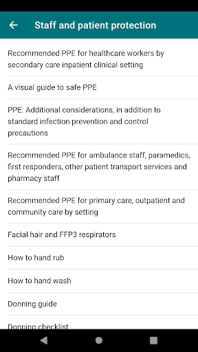  | 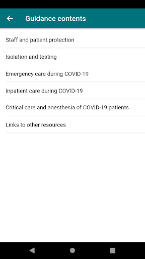  | 

## Development team
In the following we report the main information provided by the development team in the Google play store.

| | |
|-------------------------|-------------------------|
| **Developer**  | Vincent Harding - UCL Health Creatives |
| **Website**  | - |
| **Email** | v.harding@ucl.ac.uk |
| **Physical address**  | - |
| **Other developed apps**  | [https://play.google.com/store/apps/developer?id=Vincent+Harding+-+UCL+Health+Creatives](https://play.google.com/store/apps/developer?id=Vincent+Harding+-+UCL+Health+Creatives) |

## Android support

| | |
|-------------------------|-------------------------|
| **Declared target Android version**  | Pie, version 9 (API level 28) |
| **Effective target Android version**  | Pie, version 9 (API level 28) |
| **Minimum supported Android version**  | Pie, version 9 (API level 28) |
| **Maximum target Android version**  | - |

The larger the difference between the minimum and maximum supported Android versions, the better. A larger difference means a wider audience. For example, old phones have a very low Android version, so a high minimum supported Android version means that the app cannot be used by users with old phones, thus leading to accessibility problems. 

## Requested permissions

In the following we report the complete list of the permissions requested by the app. 

| **Permission** | **Protection level** | **Description** | 
|-------------------------|-------------------------|-------------------------|
 **android.permission INTERNET** | Normal | Allows applications to open network sockets. 
 **android.permission READ_EXTERNAL_STORAGE** | :warning:**Dangerous** | Allows an application to read from external storage. 
 **android.permission WRITE_EXTERNAL_STORAGE** | :warning:**Dangerous** | Allows an application to write to external storage. 

## Mentioned servers

| **Server** | **Registrant** | **Registrant country** | **Creation date** | 
|-------------------------|-------------------------|-------------------------|-------------------------|
 | gstatic.com | Google LLC | :us: US | 2008-02-11 15:31:25 |
 | google.com | Google LLC | :us: US | 1997-09-15 04:00:00 |

## Security analysis 

Below we report the main security warnings raised by our execution of the [Androwarn](https://github.com/maaaaz/androwarn) security analysis tool.

**Connection interfaces exfiltration**
> - This application reads details about the currently active data network 
> - This application tries to find out if the currently active data network is metered 

## User ratings and reviews

Below we provide information about how end users are reacting to the app in terms of ratings and reviews in the Google Play store.

### Ratings

The UCLH COVID-19 app has been installed by more than **100** times. At this time, **-** rated the app and its average score is **0.0**. Below we show the distribution of the ratings across the usual star-based rating of Google Play

:star::star::star::star::star:: 0

:star::star::star::star:: 0

:star::star::star:: 0

:star::star:: 0

:star:: 0

### Reviews 

#### 5-star reviews

No recent reviews available with 5 stars.

#### 4-star reviews

No recent reviews available with 4 stars.

#### 3-star reviews

No recent reviews available with 3 stars.

#### 2-star reviews

No recent reviews available with 2 stars.

#### 1-star reviews

No recent reviews available with 1 stars.

# CoronaReport - COVID-19 reports for Social Science
App version ``2.9.6``

Analyzed with [covid-apps-observer](http://github.com/covid-apps-observer) project, version ``0.1``

## App overview
| | |
|-------------------------|-------------------------| 
| **Name**&nbsp;&nbsp;&nbsp;&nbsp;&nbsp;&nbsp;&nbsp;&nbsp;&nbsp;&nbsp;&nbsp;&nbsp;&nbsp;&nbsp;&nbsp;&nbsp;&nbsp;&nbsp;&nbsp;&nbsp;&nbsp;&nbsp;&nbsp;&nbsp;&nbsp;&nbsp;&nbsp;&nbsp;&nbsp;&nbsp;&nbsp;&nbsp;&nbsp;&nbsp;&nbsp;&nbsp;&nbsp;&nbsp;&nbsp;&nbsp;  | CoronaReport - COVID-19 reports for Social Science |
| **Unique identifier** | com.spotteron.coronareport |
| **Link to Google Play** | [https://play.google.com/store/apps/details?id=com.spotteron.coronareport](https://play.google.com/store/apps/details?id=com.spotteron.coronareport) |
| **Summary**  | Citizen-led democratic reporting on the Coronavirus. Share your story. |
| **Privacy policy** | [https://www.spotteron.net/terms-of-use](https://www.spotteron.net/terms-of-use) |
| **Latest version** | 2.9.6 |
| **Last update** | 2020-06-11 03:36:19 |
| **Recent changes** | Minor change in imprint: Data Protection Officer Name updated |
| **Installs**  | 5,000+ |
| **Category** | Health & Fitness |
| **First release** | Mar 23, 2020 |
| **Size**  | 17M |
| **Supported Android version**  | 4.4 and up |

### Description
> CoronaReport is a citizen science project developed by the Scottish Collaboration for Public Health Research and Policy (SCPHRP), and the University of Edinburgh. Citizens can record their experiences of the disease, and the effects on their lives. The app is not intended to be used for/in emergencies or for diagnostics/medical purposes.
 Coronavirus (COVID-19) is the viral pandemic affecting communities worldwide. The pandemic’s impacts are varied and substantial. CoronaReport is a citizen science project which democratizes the reporting on the Coronavirus, and makes these reports accessible to other citizens. You can create public reports about your experiences, including how the virus is affecting your area and the way your community functions (e.g., schools, nursing homes, and businesses).
 About the project
 The collected and anonymized data from the reports will then be shared on the CoronaReport platform enabling you and other citizens to see first-hand accounts about how people are feeling and experiencing the impact of coronavirus. You can choose how much information you want to contribute to your reports and if you want to connect with others to share experiences. By working together citizens can build a real-time and vivid picture of how coronavirus is influencing the way people live and work. For example, we do not know the extent to which countermeasures like social distancing are being practised and how this, and other countermeasures, are affecting people’s well-being. Find out more about the project on the website: www.coronareport.global
 The project is running on the SPOTTERON Citizen Science Platform.

### User interface
The developers of the app provide the following screenshots in the Google play store.
| | | |
|:-------------------------:|:-------------------------:|:-------------------------:|
 |   |   |   | 
 | 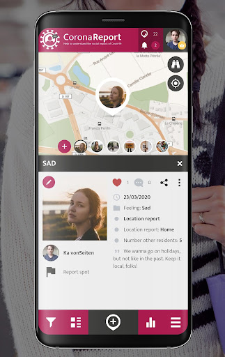  |   | 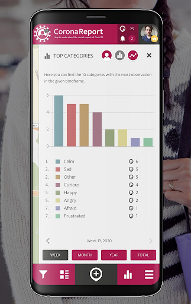  | 
 |  

## Development team
In the following we report the main information provided by the development team in the Google play store.

| | |
|-------------------------|-------------------------|
| **Developer**  | SPOTTERON |
| **Website**  | [https://www.spotteron.net](https://www.spotteron.net) |
| **Email** | office@spotteron.net |
| **Physical address**  | [Faßziehergasse 5, 1070 Wien](https://www.google.com/maps/search/Faßziehergasse%205,%201070%20Wien) (Google Maps) |
| **Other developed apps**  | [https://play.google.com/store/apps/developer?id=6074809323558115618](https://play.google.com/store/apps/developer?id=6074809323558115618) |

## Android support

| | |
|-------------------------|-------------------------|
| **Declared target Android version**  | Pie, version 9 (API level 28) |
| **Effective target Android version**  | Pie, version 9 (API level 28) |
| **Minimum supported Android version**  | KitKat, version 4.4 - 4.4.4 (API level 19) |
| **Maximum target Android version**  | - |

The larger the difference between the minimum and maximum supported Android versions, the better. A larger difference means a wider audience. For example, old phones have a very low Android version, so a high minimum supported Android version means that the app cannot be used by users with old phones, thus leading to accessibility problems. 

## Requested permissions

In the following we report the complete list of the permissions requested by the app. 

| **Permission** | **Protection level** | **Description** | 
|-------------------------|-------------------------|-------------------------|
 **android.permission ACCESS_COARSE_LOCATION** | :warning:**Dangerous** | Allows an app to access approximate location. 
 **android.permission ACCESS_FINE_LOCATION** | :warning:**Dangerous** | Allows an app to access precise location. 
 **android.permission ACCESS_NETWORK_STATE** | Normal | Allows applications to access information about networks. 
 **android.permission INTERNET** | Normal | Allows applications to open network sockets. 
 **android.permission READ_APP_BADGE** | - | - 
 **android.permission VIBRATE** | Normal | Allows access to the vibrator. 
 **android.permission WAKE_LOCK** | Normal | Allows using PowerManager WakeLocks to keep processor from sleeping or screen from dimming. 
 **android.permission WRITE_EXTERNAL_STORAGE** | :warning:**Dangerous** | Allows an application to write to external storage. 
 **com.anddoes.launcher.permission UPDATE_COUNT** | - | - 
 **com.google.android.c2dm.permission RECEIVE** | - | - 
 **com.htc.launcher.permission READ_SETTINGS** | - | - 
 **com.htc.launcher.permission UPDATE_SHORTCUT** | - | - 
 **com.huawei.android.launcher.permission CHANGE_BADGE** | - | - 
 **com.huawei.android.launcher.permission READ_SETTINGS** | - | - 
 **com.huawei.android.launcher.permission WRITE_SETTINGS** | - | - 
 **com.majeur.launcher.permission UPDATE_BADGE** | - | - 
 **com.oppo.launcher.permission READ_SETTINGS** | - | - 
 **com.oppo.launcher.permission WRITE_SETTINGS** | - | - 
 **com.sec.android.provider.badge.permission READ** | - | - 
 **com.sec.android.provider.badge.permission WRITE** | - | - 
 **com.sonyericsson.home.permission BROADCAST_BADGE** | - | - 
 **com.sonymobile.home.permission PROVIDER_INSERT_BADGE** | - | - 
 **com.spotteron.coronareport.permission C2D_MESSAGE** | - | - 
 **me.everything.badger.permission BADGE_COUNT_READ** | - | - 
 **me.everything.badger.permission BADGE_COUNT_WRITE** | - | - 

## Mentioned servers

| **Server** | **Registrant** | **Registrant country** | **Creation date** | 
|-------------------------|-------------------------|-------------------------|-------------------------|
 | google.com | Google LLC | :us: US | 1997-09-15 04:00:00 |
 | gstatic.com | Google LLC | :us: US | 2008-02-11 15:31:25 |
 | whatsapp.com | Whatsapp Inc. | :us: US | 2008-09-04 12:39:12 |
 | googleapis.com | Google LLC | :us: US | 2005-01-25 17:52:26 |

## Security analysis 

Below we report the main security warnings raised by our execution of the [Androwarn](https://github.com/maaaaz/androwarn) security analysis tool.

**Connection interfaces exfiltration**
> - This application reads details about the currently active data network 
> - This application tries to find out if the currently active data network is metered 

**Telephony services abuse**
> - This application makes phone calls 

**Pim data leakage**
> - This application accesses the downloads folder 
> - This application accesses data stored in the clipboard 

**Code execution**
> - This application loads a native library: 'sqlc-evcore-native-driver' 
> - This application executes a UNIX command containing this argument: 'Ljava/lang/StringBuilder;->toString()Ljava/lang/String;' 

## User ratings and reviews

Below we provide information about how end users are reacting to the app in terms of ratings and reviews in the Google Play store.

### Ratings

The CoronaReport - COVID-19 reports for Social Science app has been installed by more than **5000** times. At this time, **11** rated the app and its average score is **4.6363635**. Below we show the distribution of the ratings across the usual star-based rating of Google Play

:star::star::star::star::star:: 10

:star::star::star::star:: 0

:star::star::star:: 0

:star::star:: 0

:star:: 1

### Reviews 

#### 5-star reviews

> Bala abinesh  :date: __2020-11-08 05:04:51__

> Good  :date: __2020-10-24 10:16:07__

> Thanks ok  :date: __2020-07-19 14:13:24__

#### 4-star reviews

No recent reviews available with 4 stars.

#### 3-star reviews

No recent reviews available with 3 stars.

#### 2-star reviews

No recent reviews available with 2 stars.

#### 1-star reviews

> Don't like  :date: __2020-05-07 23:16:32__

# One You Couch to 5K
App version ``7.4.0``

Analyzed with [covid-apps-observer](http://github.com/covid-apps-observer) project, version ``0.1``

## App overview
| | |
|-------------------------|-------------------------| 
| **Name**&nbsp;&nbsp;&nbsp;&nbsp;&nbsp;&nbsp;&nbsp;&nbsp;&nbsp;&nbsp;&nbsp;&nbsp;&nbsp;&nbsp;&nbsp;&nbsp;&nbsp;&nbsp;&nbsp;&nbsp;&nbsp;&nbsp;&nbsp;&nbsp;&nbsp;&nbsp;&nbsp;&nbsp;&nbsp;&nbsp;&nbsp;&nbsp;&nbsp;&nbsp;&nbsp;&nbsp;&nbsp;&nbsp;&nbsp;&nbsp;  | One You Couch to 5K |
| **Unique identifier** | com.phe.couchto5K |
| **Link to Google Play** | [https://play.google.com/store/apps/details?id=com.phe.couchto5K](https://play.google.com/store/apps/details?id=com.phe.couchto5K) |
| **Summary**  | The FREE Couch to 5K app. We’ll take you from couch to 5k hero in just 9 weeks! |
| **Privacy policy** | [https://www.nhs.uk/oneyou/privacy-policy](https://www.nhs.uk/oneyou/privacy-policy) |
| **Latest version** | 7.4.0 |
| **Last update** | 2020-07-27 12:06:56 |
| **Recent changes** | General bug fixes and maintenance improvements. |
| **Installs**  | 1,000,000+ |
| **Category** | Health & Fitness |
| **First release** | Mar 5, 2016 |
| **Size**  | 132M |
| **Supported Android version**  | 4.4W and up |

### Description
> For the latest official information about what you can and can't do at this time, visit https://www.nhs.uk/conditions/coronavirus-covid-19/ 
 It’s an easy to follow programme known the world over, and perfect for those new to running and need some extra support and motivation along the way.
 The app features a choice of 5 great trainers to support and motivate you at every step of the way, telling you when to run and when to walk, from broadcaster and former Olympian Michael Johnson, comedians Sarah Millican and Sanjeev Kohli, BBC presenter Jo Whiley, and our very own Laura, who have now helped over 2 million people like you start their own running journeys.
 One You Couch to 5K features:
 • A flexible programme that can be completed in as little as 9 weeks, or longer if you want to go at your own pace
 • Easy to follow countdown timer so you can see and well as hear how long you’ve got left of each run
 • Works alongside your preferred music player, automatically 'dipping' the volumes so you can hear the instructions and motivations from your chosen trainer
 • Signals a half-time bell when you get half way, so you know when to head home!
 • Lets you track your progress and awards achievements as you move through the runs
 • Lets you rate how you feel before and after each session to help acknowledge the immediate benefits for doing some physical activity
 • Connects you with likeminded people through the Couch to 5k HealthUnlocked community forums, offering loads of advice, tips and motivations to keep you on you on your fitness journey
 One You is here to help you live more healthily and make the changes that matter most. Millions of people have already got running with the Couch to 5k plan. Now it’s your turn! Download this app, get off the couch and we’ll help you reach your health goals.

### User interface
The developers of the app provide the following screenshots in the Google play store.
| | | |
|:-------------------------:|:-------------------------:|:-------------------------:|
 |   |   |   | 
 |   |   |   | 
 |   |  

## Development team
In the following we report the main information provided by the development team in the Google play store.

| | |
|-------------------------|-------------------------|
| **Developer**  | Public Health England Digital |
| **Website**  | [https://www.nhs.uk/oneyou/moving](https://www.nhs.uk/oneyou/moving) |
| **Email** | oneyou@phe.gov.uk |
| **Physical address**  | - |
| **Other developed apps**  | [https://play.google.com/store/apps/developer?id=Public+Health+England+Digital](https://play.google.com/store/apps/developer?id=Public+Health+England+Digital) |

## Android support

| | |
|-------------------------|-------------------------|
| **Declared target Android version**  | Pie, version 9 (API level 28) |
| **Effective target Android version**  | Pie, version 9 (API level 28) |
| **Minimum supported Android version**  | KitKat W, version 4.4W - 4.4.4W (API level 20) |
| **Maximum target Android version**  | - |

The larger the difference between the minimum and maximum supported Android versions, the better. A larger difference means a wider audience. For example, old phones have a very low Android version, so a high minimum supported Android version means that the app cannot be used by users with old phones, thus leading to accessibility problems. 

## Requested permissions

In the following we report the complete list of the permissions requested by the app. 

| **Permission** | **Protection level** | **Description** | 
|-------------------------|-------------------------|-------------------------|
 **android.permission ACCESS_COARSE_LOCATION** | :warning:**Dangerous** | Allows an app to access approximate location. 
 **android.permission ACCESS_FINE_LOCATION** | :warning:**Dangerous** | Allows an app to access precise location. 
 **android.permission ACCESS_NETWORK_STATE** | Normal | Allows applications to access information about networks. 
 **android.permission BLUETOOTH** | Normal | Allows applications to connect to paired bluetooth devices. 
 **android.permission BLUETOOTH_ADMIN** | Normal | Allows applications to discover and pair bluetooth devices. 
 **android.permission INTERNET** | Normal | Allows applications to open network sockets. 
 **android.permission WAKE_LOCK** | Normal | Allows using PowerManager WakeLocks to keep processor from sleeping or screen from dimming. 
 **android.permission WRITE_EXTERNAL_STORAGE** | :warning:**Dangerous** | Allows an application to write to external storage. 
 **com.android.alarm.permission SET_ALARM** | Normal | Allows an application to broadcast an Intent to set an alarm for the user. 
 **com.google.android.c2dm.permission RECEIVE** | - | - 
 **com.google.android.finsky.permission BIND_GET_INSTALL_REFERRER_SERVICE** | - | - 

## Mentioned servers

| **Server** | **Registrant** | **Registrant country** | **Creation date** | 
|-------------------------|-------------------------|-------------------------|-------------------------|
 | googlesyndication.com | Google LLC | :us: US | 2003-01-21 06:17:24 |
 | google.com | Google LLC | :us: US | 1997-09-15 04:00:00 |
 | google-analytics.com | Google LLC | :us: US | 2005-07-18 19:24:32 |
 | app-measurement.com | Google LLC | :us: US | 2015-06-19 20:13:31 |
 | googletagmanager.com | Google LLC | :us: US | 2011-11-11 23:39:05 |
 | paragon-cc.co.uk | - | - | 2017-04-04 00:00:00 |
 | bbc.co.uk | - | - | 1996-08-01 00:00:00 |
 | df-phe.com | DOGFI.SH Mobile | GB | 2015-06-16 14:57:16 |
 | phedigital.co.uk | - | - | 2018-06-06 00:00:00 |
 | youtube.com | Google LLC | :us: US | 2005-02-15 05:13:12 |
 | crashlytics.com | Google LLC | :us: US | 2011-01-21 15:30:40 |
 | nhs.uk | Department of Health | - | 1996-08-01 00:00:00 |
 | tealiumiq.com | Whois Privacy Service | :us: US | 2011-02-09 18:33:06 |
 | googleapis.com | Google LLC | :us: US | 2005-01-25 17:52:26 |
 | googleadservices.com | Google LLC | :us: US | 2003-06-19 16:34:53 |
 | healthunlocked.com | Everything Unlocked Ltd | GB | 2008-05-04 18:31:28 |

## Security analysis 

Below we report the main security warnings raised by our execution of the [Androwarn](https://github.com/maaaaz/androwarn) security analysis tool.

**Telephony identifiers leakage**
> - This application reads the ISO country code equivalent of the current registered operator's MCC (Mobile Country Code) 
> - This application reads the numeric name (MCC+MNC) of current registered operator 
> - This application reads the operator name 

**Connection interfaces exfiltration**
> - This application reads details about the currently active data network 
> - This application tries to find out if the currently active data network is metered 

**Suspicious connection establishment**
> - This application opens a Socket and connects it to the remote address '' on the 'N/A' port  
> - This application opens a Socket and connects it to the remote address 'Ljava/lang/StringBuilder;->toString()Ljava/lang/String;' on the ': connect, resolve' port  
> - This application opens a Socket and connects it to the remote address 'Ljava/lang/StringBuilder;->toString()Ljava/lang/String;' on the 'N/A' port  
> - This application opens a Socket and connects it to the remote address 'Ljava/net/Proxy;->type()Ljava/net/Proxy$Type;' on the 'N/A' port  
> - This application opens a Socket and connects it to the remote address 'timeout' on the 'N/A' port  

## User ratings and reviews

Below we provide information about how end users are reacting to the app in terms of ratings and reviews in the Google Play store.

### Ratings

The One You Couch to 5K app has been installed by more than **1000000** times. At this time, **28344** rated the app and its average score is **4.744284**. Below we show the distribution of the ratings across the usual star-based rating of Google Play

:star::star::star::star::star:: 23520

:star::star::star::star:: 3559

:star::star::star:: 548

:star::star:: 279

:star:: 438

### Reviews 

#### 5-star reviews

> Brilliant app, I used it during lockdown to get back into running after a long absence. Found the coach really good and just at the times you need it.  :date: __2021-02-13 19:41:00__

> Motivating  :date: __2021-02-13 19:37:55__

> Fantastic, I became a runner with this app. Big recommendation!  :date: __2021-02-13 19:11:19__

> Great introduction for beginner runners  :date: __2021-02-13 18:38:37__

> Good programme , difficult to start but gradually getting easier. We'll planned.  :date: __2021-02-13 13:22:51__

> I find it a great help.  :date: __2021-02-13 11:41:17__

> Used this on 2 occasions after periods of illness to get back to fitness. It's really helpful.  :date: __2021-02-13 11:32:52__

> Fantastic app  :date: __2021-02-13 11:26:14__

> Really good motivation and great build up really helps you get started  :date: __2021-02-13 10:19:57__

> Great app that had really helped us achieve our goal. 👍  :date: __2021-02-13 00:27:13__

#### 4-star reviews

> It really does work to get you going, the structure is helpful. Only complaint would be that the Micheal Johnson coaching option doesn't seem to work  :date: __2021-02-13 13:41:03__

> It works, it really works. Sometimes it doesn't lower background music but it's great  :date: __2021-02-13 13:02:52__

> Chilled way of gaining fitness 👌  :date: __2021-02-13 12:58:02__

> Very good idea for old people who do not want to look stupid running around the streets.  :date: __2021-02-12 17:56:24__

> Occasionally just stops which can mean you miss a prompt, but a great way to get you started.  :date: __2021-02-12 12:32:55__

> This app has got me off the couch and running. I can't fault the concept and I love Sarah Millican in a new way. Unfortunately I had to knock a star off due to a technical fault. Often - nearly every other time I run - the app switches off mid-training,leaving me either running or walking for an extended period without knowing it's happened, and then wasting time trying to restart the app and remember where I was. It doesn't seem to be a connectivity issue as my tracker and Spotify work fine.  :date: __2021-02-12 10:26:19__

> Bit glitchy at times. Have to change my coach everytime I go for a run  :date: __2021-02-11 17:36:10__

> A good gradual increase that's easy to fit in to daily life.  :date: __2021-02-11 13:44:05__

> Disappointed that Sarah Millican stopped working after the first fun but otherwise a great app  :date: __2021-02-11 12:17:40__

> Really helped me feel fitter and keep motivated, doesnt operate too well on my Huawei phone tho  :date: __2021-02-10 20:00:09__

#### 3-star reviews

> Somehow, I managed to have 4 copies going at the same time, out of sync. There was no way to stop them. It shouldn't be possible to start it while a copy is running.  :date: __2021-02-11 13:00:41__

> They need to bring it to wearables/iwatch  :date: __2021-02-11 10:48:34__

> This app is amazing. After 9 intense weeks I am able to run more than 5k. This app is magical. The reason why I'm rating it 3 stars is sometimes the app becomes buggy during some runs like the music won't fade why your coach speaks to you.  :date: __2021-02-07 20:47:20__

> The app is great and really helps teaching you to run. I am not at 5 k yet but I can run for 30 minutes. The only reason I rated 3 is that it bugged quite a bit on week 5 and started taking me through the week 4 routine again. I was also disappointed that the voice over did not change run to run or at least for the last run of the week.  :date: __2021-02-07 11:05:09__

> It would get a 5, but it keeps keeps dropping out if the phone locks or take a photo.  :date: __2021-02-07 09:35:37__

> Content is great, I've just completed my second week and I am progressing. However, app not always reliable. Sometimes complains it cant load audio files and has frozen at times. 5 stars for content, 2 for reliability.  :date: __2021-01-30 18:53:22__

> Keeps crashing but great idea Started ok but since around 15/1/21 the app shuts down sometime in the first 15 minutes. Can leave you warming up for too long or continuing the first run for too long. Only when you notice and restart the app do you find out you're back at the beginning again. Great idea, love Sarah's voice but not much use unless this can be fixed.Now on week 4 and it's do e in twice on two runs. Please fix it. OnePlus6, all up to date  :date: __2021-01-30 15:52:19__

> When the App is working it is fantastic. I've managed to get to wk 3. However keeps crashing and not logging the run.  :date: __2021-01-29 00:22:08__

> Stopping talking to me halfway through !!  :date: __2021-01-28 21:32:47__

> Excellent, basic, but with annoying flaws. I recommend this, but it is so annoying when the app tells you a run is complete, but all record of it is then lost as you haven't manually saved it. Then having reminder alarms to run going off while you're running is just silly. Five starts with a bit more thought in usability.  :date: __2021-01-27 08:02:44__

#### 2-star reviews

> Keeps crashing mid-run. Incredibly irritating.  :date: __2021-02-11 07:47:58__

> In my previous review I gave it a 3 or 4 stars, but now at the end of Week 3 I'm ready to switch to another App. The problem is that it keeps closing whilst I'm running, so I'm not actually running or walking for the time it says to. About the only time I found it didn't close was the first couple of runs when I held the phone in my hand. This latest run, I switched it to Flight to mode to try and avoid notifications confusing it and switched off some of the easy open settings! No good.  :date: __2021-02-10 09:48:59__

> It's a great concept and I enjoy using it for the most part but I am sick and tired of the app crashing mid run. Edit - 8/2/21 still crashes mid run. Absolutely useless!  :date: __2021-02-08 19:00:46__

> Got the app last weekend been out on 2 runs inbetween gym sessions and on both runs the app has just stopped!  :date: __2021-02-07 20:28:50__

> The running schedule is great and I'm really enjoying it. Michael Johnson's audio is motivational without being cheesey. I have an Honor phone so the app shuts down part way through a run, apparently there's nothing the developers can do about this. I have downloaded a free interval timer that does the job and runs successfully in the background without issue, and just use the Couch to 5k app for the schedule and to log my runs.  :date: __2021-02-07 17:33:40__

> The app is fine but doesn't seem to to work with Surface earbuds. The audio sends to pause when connected to wireless earbuds  :date: __2021-02-07 14:15:46__

> The principle is good but I'm now at the end of week 5 and giving up on this app. The app has crashed on me the past 5 or 6 times I've been out for a run which becomes frustrating as you lose your position in your session. It has worked to get me off the couch and I am covering 5k but not running the full 5k yet. The bugs need to be addressed as this is a great app when it works.  :date: __2021-02-05 14:09:09__

> The structure is good for first time runners but the app closes constantly losing the place you're at during your run.. Really not useful for actually tracking progress  :date: __2021-02-03 14:29:24__

> The app closes itself after a short time, so I can't listen to music while using it, I have to keep my phone open and move the timer to where I think it last stopped. Very annoying. It loses my day every time, putting me back to day one.  :date: __2021-01-29 08:26:42__

> Great plan but shocking how much it crashes in the middle of runs. Will delete and try and find a better app that actually works.  :date: __2021-01-27 16:04:25__

#### 1-star reviews

> Keeps cutting out while on runs  :date: __2021-02-13 20:47:15__

> Not fit for purpose - app stops running when phone closes/locks. But if you keep phone unlocked you cannot put the phone in your pocket or armband as you inadvertently press pause/exit etc  :date: __2021-02-11 15:43:16__

> Any tips to prevent this App closing on itself? It keeps happening several times every run  :date: __2021-02-10 19:32:34__

> Boring  :date: __2021-02-10 11:35:11__

> Horrendous app. Completed first run and the app shut itself off 4 times so had to keep restarting, thought it may have just been a glich so stuck with it for the next two runs, done exactly the same thing!! So off putting, concept is good, shame the app doesn't actually follow suit  :date: __2021-02-04 16:37:40__

> Rubbish, finished the run and there is no way to view stats, distance, speed etc. It says couch to 5k but there's no way to check. Of course you could run another app alongside it but after music and this that would be 3 apps running simultaneously, the start running app is well better...sorry Jo  :date: __2021-02-01 20:50:55__

> Frustrating - the app is not saving my runs and not letting me progress to later week runs. I only want this app to do one thing and that is play a series of podcasts and it doesn't do that.  :date: __2021-01-30 12:44:37__

> Keeps cutting out half way through . Deleted it and download again but still does the same  :date: __2021-01-29 19:18:10__

> Plan is good, but app keeps disconnecting  :date: __2021-01-29 16:02:47__

> It's changed. I used it last year and it was brilliant but now it stops during the warm up walk and I end up walking for longer before I realise. Then I have to restart the app, find my place and start again, only for it to repeat. I would love to keep using it as I found it to be really beneficial for me.  :date: __2021-01-27 20:07:49__

# Ayush Sanjivani
App version ``1.0.9``

Analyzed with [covid-apps-observer](http://github.com/covid-apps-observer) project, version ``0.1``

## App overview
| | |
|-------------------------|-------------------------| 
| **Name**&nbsp;&nbsp;&nbsp;&nbsp;&nbsp;&nbsp;&nbsp;&nbsp;&nbsp;&nbsp;&nbsp;&nbsp;&nbsp;&nbsp;&nbsp;&nbsp;&nbsp;&nbsp;&nbsp;&nbsp;&nbsp;&nbsp;&nbsp;&nbsp;&nbsp;&nbsp;&nbsp;&nbsp;&nbsp;&nbsp;&nbsp;&nbsp;&nbsp;&nbsp;&nbsp;&nbsp;&nbsp;&nbsp;&nbsp;&nbsp;  | Ayush Sanjivani |
| **Unique identifier** | com.negd.ayushfeedback |
| **Link to Google Play** | [https://play.google.com/store/apps/details?id=com.negd.ayushfeedback](https://play.google.com/store/apps/details?id=com.negd.ayushfeedback) |
| **Summary**  | For analysing the use of AYUSH interventions for immunity in COVID 19 situation. |
| **Privacy policy** | [https://test2.ncog.gov.in/Ayush_Sanjivani_Privacy/privacy-policy-page/privay-policy.html](https://test2.ncog.gov.in/Ayush_Sanjivani_Privacy/privacy-policy-page/privay-policy.html) |
| **Latest version** | 1.0.9 |
| **Last update** | 2020-11-16 13:45:04 |
| **Recent changes** | - Bug fixes and optimizations |
| **Installs**  | 500,000+ |
| **Category** | Health & Fitness |
| **First release** | Apr 24, 2020 |
| **Size**  | 4.8M |
| **Supported Android version**  | 4.4 and up |

### Description
> The Ministry of AYUSH presents the “Ayush Sanjivani” mobile application for understanding the measures adopted by public for enhancing immunity and keeping themselves healthy in the difficult COVID-19 situation. The app is designed as a simple but effective mechanism of electronic documentation for studying population behaviour. Response of the public to the advisories issued by the AYUSH Ministry on immunity enhancement will be an important area of examination. In addition, provision is also made for recording other measures (if any) propagated by AYUSH practitioners and adopted by general public for immunity enhancement and disease prevention. Data collected through this app will be analyzed to find out usage of AYUSH interventions and its efficacy in maintaining health by enhancing immunity.
 This app is at the centre of a massive exercise to study specific health seeking behaviours of the public in which the Central Research Councils of AYUSH, the National Institutes of AYUSH, numerous AYUSH educational institutions and state governments bodies collaborate. The Ministry has a target sample size of 1 million people for this study, making it one of the largest in any discipline of medicine. All those who volunteer to furnish information through this app will be making a significant contribution to the study of public health in the country.
 Data collected will be analyzed and will be useful for the AYUSH systems, and will establish their viability as health-assuring practices globally. This would also add momentum to the growth of the AYUSH Sector.

### User interface
The developers of the app provide the following screenshots in the Google play store.
| | | |
|:-------------------------:|:-------------------------:|:-------------------------:|
 |   |   |   | 
 |   |   | 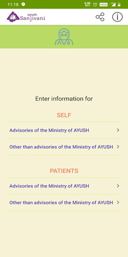  | 
 |   |  

## Development team
In the following we report the main information provided by the development team in the Google play store.

| | |
|-------------------------|-------------------------|
| **Developer**  | Ministry of AYUSH |
| **Website**  | [https://www.ayush.gov.in/](https://www.ayush.gov.in/) |
| **Email** | ayush.sanjivani@digitalindia.gov.in |
| **Physical address**  | - |
| **Other developed apps**  | [https://play.google.com/store/apps/developer?id=Ministry+of+AYUSH](https://play.google.com/store/apps/developer?id=Ministry+of+AYUSH) |

## Android support

| | |
|-------------------------|-------------------------|
| **Declared target Android version**  | Android10, version 10 (API level 29) |
| **Effective target Android version**  | Android10, version 10 (API level 29) |
| **Minimum supported Android version**  | KitKat, version 4.4 - 4.4.4 (API level 19) |
| **Maximum target Android version**  | - |

The larger the difference between the minimum and maximum supported Android versions, the better. A larger difference means a wider audience. For example, old phones have a very low Android version, so a high minimum supported Android version means that the app cannot be used by users with old phones, thus leading to accessibility problems. 

## Requested permissions

In the following we report the complete list of the permissions requested by the app. 

| **Permission** | **Protection level** | **Description** | 
|-------------------------|-------------------------|-------------------------|
 **android.permission ACCESS_NETWORK_STATE** | Normal | Allows applications to access information about networks. 
 **android.permission INTERNET** | Normal | Allows applications to open network sockets. 
 **android.permission WAKE_LOCK** | Normal | Allows using PowerManager WakeLocks to keep processor from sleeping or screen from dimming. 
 **com.google.android.c2dm.permission RECEIVE** | - | - 

## Mentioned servers

| **Server** | **Registrant** | **Registrant country** | **Creation date** | 
|-------------------------|-------------------------|-------------------------|-------------------------|
 | google.com | Google LLC | :us: US | 1997-09-15 04:00:00 |
 | facebook.com | Facebook, Inc. | :us: US | 1997-03-29 05:00:00 |
 | googleapis.com | Google LLC | :us: US | 2005-01-25 17:52:26 |

## Security analysis 

Below we report the main security warnings raised by our execution of the [Androwarn](https://github.com/maaaaz/androwarn) security analysis tool.

**Connection interfaces exfiltration**
> - This application reads details about the currently active data network 
> - This application tries to find out if the currently active data network is metered 

**Telephony services abuse**
> - This application makes phone calls 

**Suspicious connection establishment**
> - This application opens a Socket and connects it to the remote address '' on the 'N/A' port  
> - This application opens a Socket and connects it to the remote address 'Ljava/lang/StringBuilder;->toString()Ljava/lang/String;' on the 'N/A' port  
> - This application opens a Socket and connects it to the remote address 'Ljava/net/Proxy;->type()Ljava/net/Proxy$Type;' on the 'N/A' port  
> - This application opens a Socket and connects it to the remote address 'timeout' on the 'N/A' port  

## User ratings and reviews

Below we provide information about how end users are reacting to the app in terms of ratings and reviews in the Google Play store.

### Ratings

The Ayush Sanjivani app has been installed by more than **500000** times. At this time, **2241** rated the app and its average score is **3.9267242**. Below we show the distribution of the ratings across the usual star-based rating of Google Play

:star::star::star::star::star:: 1344

:star::star::star::star:: 299

:star::star::star:: 106

:star::star:: 77

:star:: 415

### Reviews 

#### 5-star reviews

> Good  :date: __2021-01-30 15:30:51__

> Very useful  :date: __2020-12-28 11:20:24__

> Good knowledgeable app  :date: __2020-11-24 15:28:15__

> Otp to bhejo  :date: __2020-11-24 15:01:06__

> Very good  :date: __2020-10-17 14:28:14__

> Nice  :date: __2020-10-12 19:37:32__

> Too good  :date: __2020-10-08 19:43:41__

> Excellent  :date: __2020-09-29 05:46:40__

> Best App for everyone customer 👍👍  :date: __2020-09-25 04:03:17__

> Excellent  :date: __2020-09-05 14:20:45__

#### 4-star reviews

> Provide general basic ayuervedic medicine tips for more general diseases  :date: __2020-10-19 19:29:10__

> Nice app for immune system improvement  :date: __2020-08-24 17:23:46__

> Best  :date: __2020-08-22 15:42:21__

> Not too useful  :date: __2020-08-21 22:01:41__

> I had new to this app and shall find out results after use.  :date: __2020-08-10 20:27:59__

> Good  :date: __2020-08-10 18:34:52__

> Nice app  :date: __2020-07-14 07:24:21__

> Ok  :date: __2020-07-11 18:18:24__

> Very helpful  :date: __2020-07-04 13:54:42__

> Good app for health.  :date: __2020-07-02 08:14:07__

#### 3-star reviews

> Fair  :date: __2020-07-18 19:00:04__

> Problem ke hisab se uska ilaj batane ke liye bhi option dijiye Jab kisi ko koi problem hoga to us option me jake check karega kya chij use kare ki problem thik ho jaye Tab jyada log Aayurved par dhyan denge.  :date: __2020-07-02 10:20:19__

> Good  :date: __2020-06-28 14:13:38__

> "Something went wrong " What is this pls solve  :date: __2020-06-21 06:27:48__

> It's very helpful for us  :date: __2020-06-20 03:00:22__

> Good pahal by csc  :date: __2020-06-18 13:05:46__

> Good  :date: __2020-06-18 09:06:21__

> Good  :date: __2020-06-13 08:42:18__

> Good But some Issues..  :date: __2020-06-11 03:19:58__

> BeSt  :date: __2020-06-10 07:56:36__

#### 2-star reviews

> I am not recieving OTP on my mobile number.  :date: __2020-11-14 22:14:07__

> Never got any appointment from doctor  :date: __2020-08-27 07:43:48__

> Good  :date: __2020-07-30 12:40:56__

> நான் சென்னை தாம்பரத்திலுள்ள சித்தா மருத்துவமனை சென்றிருந்தபோது இந்த appக்கு டவுன்லோடு பண்ணிக்கோங்க னு சொன்னாங்க.நானும் டவுன்லோடு பண்ணினால் ஆங்கிலம் & ஹிந்தியை தவிர வேறு மொழியில்லை.சரி பரவாயில்லை வேறு ஏதாவது உறுபடியா இருக்கும்னு பார்த்தா அதுவும் இல்லை .. என்னை பொறுத்தவரை இது not in use..  :date: __2020-07-25 16:21:02__

> I think something fishy on this app development  :date: __2020-07-01 08:05:18__

> After filling up all the information in getting pop up like something went wrong  :date: __2020-06-18 09:04:30__

> It's nice  :date: __2020-06-13 08:36:21__

> Not very useful  :date: __2020-06-13 04:24:14__

> I thought it will include some more content like yoga exercises about herbal medicine it just for a survey😒😒  :date: __2020-06-05 18:24:30__

> Very good app but I need my language in tamil. Thank you.  :date: __2020-06-05 16:03:39__

#### 1-star reviews

> Even there is full network Not receiving OTP after submitting mobile number.  :date: __2020-11-25 02:30:44__

> Unable to receive otp  :date: __2020-11-22 01:54:03__

> Does not get OTP even thogh well connected network and without Verification can not use.  :date: __2020-11-21 17:43:31__

> No OTP. Waste of time  :date: __2020-11-21 12:31:58__

> Why does ministry choose such poor developers for these works.. Even OTP is not being sent.. All of them just take bribe and give contract to any fool.. App ke naam pe Bwasir bna dete hain... Idiots  :date: __2020-11-19 05:20:25__

> OTP not received  :date: __2020-11-18 06:27:22__

> After many attempts not received mobile OTP.  :date: __2020-11-16 04:06:05__

> Code is not coming..plz do needfu  :date: __2020-11-13 19:20:33__

> Unable to register  :date: __2020-11-13 11:41:20__

> 3 din pahle app download kiya hai, 3 din se baar baar try kar raha hu par OTP nahi aa raha...  :date: __2020-11-01 16:45:54__

# Protego
App version ``Varies with device``

Analyzed with [covid-apps-observer](http://github.com/covid-apps-observer) project, version ``0.1``

## App overview
| | |
|-------------------------|-------------------------| 
| **Name**&nbsp;&nbsp;&nbsp;&nbsp;&nbsp;&nbsp;&nbsp;&nbsp;&nbsp;&nbsp;&nbsp;&nbsp;&nbsp;&nbsp;&nbsp;&nbsp;&nbsp;&nbsp;&nbsp;&nbsp;&nbsp;&nbsp;&nbsp;&nbsp;&nbsp;&nbsp;&nbsp;&nbsp;&nbsp;&nbsp;&nbsp;&nbsp;&nbsp;&nbsp;&nbsp;&nbsp;&nbsp;&nbsp;&nbsp;&nbsp;  | Protego |
| **Unique identifier** | org.theviralapp.app1 |
| **Link to Google Play** | [https://play.google.com/store/apps/details?id=org.theviralapp.app1](https://play.google.com/store/apps/details?id=org.theviralapp.app1) |
| **Summary**  | Fully anonymous contact tracing for COVID-19 |
| **Privacy policy** | [-](-) |
| **Latest version** | Varies with device |
| **Last update** | 2020-05-30 02:24:39 |
| **Recent changes** | Fully Anonymous Contact Tracing App For COVID-19   -   No personal data used, you remain completely anonymous.  -   Completely decentralised anonymous exposure checking performed locally on each device.   -   UI updates to improve usability.  -   Enhanced security and encryption of randomly generated IDs.  -   Improved proximity detection algorithm. |
| **Installs**  | 1,000+ |
| **Category** | Health & Fitness |
| **First release** | - |
| **Size**  | Varies with device |
| **Supported Android version**  | Varies with device |

### Description
> This app is designed by medics and scientists from Imperial College London with one intention: to stop the spread of COVID-19 without compromising your privacy.
 It will let you know if any app user that you have had close contact with in past 14 days goes on to develop symptoms or a diagnosis of COVID-19.
 For example:
 If someone you waited next to in the supermarket queue last week gets a diagnosis of COVID-19 and records this in their app, you will be anonymously informed that someone you have previously been in close contact with now has the virus.You are now free to use this information about your potential exposure to make more educated decisions in your day to day life in order to limit the spread of the virus, protecting those that are most at risk. 
 You can also use this app to help others, by anonymously informing them if you get symptoms or a diagnosis relating to COVID-19. This will enable them to take appropriate action and minimise their risk of infecting others. 
 This app is an example of "privacy by design" as we believe the safest way to protect your personal information is by never collecting it in the first place. That is why this app will never even ask for your name and has no sign up whatsoever. We will also never use location data. You are completely anonymous. Neither us nor the government will ever be able to figure out who you are through this app.
 We use Bluetooth technology to register close contacts and use randomised anonymous IDs that refresh regularly as a substitute for names. For added privacy, this is all stored locally on your own device and only uploaded to the server if you report symptoms or a diagnosis of COVID-19. Additionally, only your personal device knows what IDs you have previously had, and hence only your personal device will be able to check if you have been exposed to someone with the virus. 
 We believe that the best way to do contact tracing is to collect only the absolute essential information. 
 No Names
 No Location
 No Log in
 Just contact tracing.
 For more information please visit our website at www.protegoapp.org

### User interface
The developers of the app provide the following screenshots in the Google play store.
| | | |
|:-------------------------:|:-------------------------:|:-------------------------:|
 |   |   |   | 
 |  

## Development team
In the following we report the main information provided by the development team in the Google play store.

| | |
|-------------------------|-------------------------|
| **Developer**  | Protego App Ltd |
| **Website**  | [https://www.protegoapp.org/](https://www.protegoapp.org/) |
| **Email** | info@protegoapp.org |
| **Physical address**  | - |
| **Other developed apps**  | [https://play.google.com/store/apps/developer?id=Protego+App+Ltd](https://play.google.com/store/apps/developer?id=Protego+App+Ltd) |

## Android support

| | |
|-------------------------|-------------------------|
| **Declared target Android version**  | Android10, version 10 (API level 29) |
| **Effective target Android version**  | Android10, version 10 (API level 29) |
| **Minimum supported Android version**  | Lollipop, version 5.0 (API level 21) |
| **Maximum target Android version**  | - |

The larger the difference between the minimum and maximum supported Android versions, the better. A larger difference means a wider audience. For example, old phones have a very low Android version, so a high minimum supported Android version means that the app cannot be used by users with old phones, thus leading to accessibility problems. 

## Requested permissions

In the following we report the complete list of the permissions requested by the app. 

| **Permission** | **Protection level** | **Description** | 
|-------------------------|-------------------------|-------------------------|
 **android.permission ACCESS_BACKGROUND_LOCATION** | :warning:**Dangerous** | Allows an app to access location in the background. 
 **android.permission ACCESS_COARSE_LOCATION** | :warning:**Dangerous** | Allows an app to access approximate location. 
 **android.permission ACCESS_FINE_LOCATION** | :warning:**Dangerous** | Allows an app to access precise location. 
 **android.permission ACCESS_NETWORK_STATE** | Normal | Allows applications to access information about networks. 
 **android.permission BLUETOOTH** | Normal | Allows applications to connect to paired bluetooth devices. 
 **android.permission BLUETOOTH_ADMIN** | Normal | Allows applications to discover and pair bluetooth devices. 
 **android.permission FOREGROUND_SERVICE** | Normal | Allows a regular application to use Service.startForeground. 
 **android.permission INTERNET** | Normal | Allows applications to open network sockets. 
 **android.permission RECEIVE_BOOT_COMPLETED** | Normal | Allows an application to receive the Intent.ACTION_BOOT_COMPLETED that is broadcast after the system finishes booting. 
 **android.permission REQUEST_IGNORE_BATTERY_OPTIMIZATIONS** | Normal | Permission an application must hold in order to use Settings.ACTION_REQUEST_IGNORE_BATTERY_OPTIMIZATIONS. 
 **android.permission WAKE_LOCK** | Normal | Allows using PowerManager WakeLocks to keep processor from sleeping or screen from dimming. 
 **com.google.android.c2dm.permission RECEIVE** | - | - 
 **com.google.android.finsky.permission BIND_GET_INSTALL_REFERRER_SERVICE** | - | - 

## Mentioned servers

| **Server** | **Registrant** | **Registrant country** | **Creation date** | 
|-------------------------|-------------------------|-------------------------|-------------------------|
 | googlesyndication.com | Google LLC | :us: US | 2003-01-21 06:17:24 |
 | google.com | Google LLC | :us: US | 1997-09-15 04:00:00 |
 | app-measurement.com | Google LLC | :us: US | 2015-06-19 20:13:31 |
 | googleapis.com | Google LLC | :us: US | 2005-01-25 17:52:26 |
 | crashlytics.com | Google LLC | :us: US | 2011-01-21 15:30:40 |
 | googleapis.com | Google LLC | :us: US | 2005-01-25 17:52:26 |
 | googleadservices.com | Google LLC | :us: US | 2003-06-19 16:34:53 |

## Security analysis 

Below we report the main security warnings raised by our execution of the [Androwarn](https://github.com/maaaaz/androwarn) security analysis tool.

**Connection interfaces exfiltration**
> - This application reads details about the currently active data network 
> - This application tries to find out if the currently active data network is metered 

**Suspicious connection establishment**
> - This application opens a Socket and connects it to the remote address '' on the 'N/A' port  
> - This application opens a Socket and connects it to the remote address 'Ljava/lang/StringBuilder;->toString()Ljava/lang/String;' on the 'N/A' port  
> - This application opens a Socket and connects it to the remote address 'Ljava/net/Proxy;->type()Ljava/net/Proxy$Type;' on the 'N/A' port  
> - This application opens a Socket and connects it to the remote address 'timeout' on the 'N/A' port  

**Code execution**
> - This application loads a native library 

## User ratings and reviews

Below we provide information about how end users are reacting to the app in terms of ratings and reviews in the Google Play store.

### Ratings

The Protego app has been installed by more than **1000** times. At this time, **-** rated the app and its average score is **-**. Below we show the distribution of the ratings across the usual star-based rating of Google Play

:star::star::star::star::star:: 0

:star::star::star::star:: 0

:star::star::star:: 0

:star::star:: 0

:star:: 0

### Reviews 

#### 5-star reviews

No recent reviews available with 5 stars.

#### 4-star reviews

No recent reviews available with 4 stars.

#### 3-star reviews

No recent reviews available with 3 stars.

#### 2-star reviews

No recent reviews available with 2 stars.

#### 1-star reviews

No recent reviews available with 1 stars.

# NHS People
App version ``5.87.9``

Analyzed with [covid-apps-observer](http://github.com/covid-apps-observer) project, version ``0.1``

## App overview
| | |
|-------------------------|-------------------------| 
| **Name**&nbsp;&nbsp;&nbsp;&nbsp;&nbsp;&nbsp;&nbsp;&nbsp;&nbsp;&nbsp;&nbsp;&nbsp;&nbsp;&nbsp;&nbsp;&nbsp;&nbsp;&nbsp;&nbsp;&nbsp;&nbsp;&nbsp;&nbsp;&nbsp;&nbsp;&nbsp;&nbsp;&nbsp;&nbsp;&nbsp;&nbsp;&nbsp;&nbsp;&nbsp;&nbsp;&nbsp;&nbsp;&nbsp;&nbsp;&nbsp;  | NHS People |
| **Unique identifier** | com.hivelearning.nhs |
| **Link to Google Play** | [https://play.google.com/store/apps/details?id=com.hivelearning.nhs](https://play.google.com/store/apps/details?id=com.hivelearning.nhs) |
| **Summary**  | NHS People community |
| **Privacy policy** | [https://support.nhslife.nhs.uk/hc/en-us/articles/360009382298-Privacy-Policy](https://support.nhslife.nhs.uk/hc/en-us/articles/360009382298-Privacy-Policy) |
| **Latest version** | 5.87.9 |
| **Last update** | 2020-11-26 22:01:02 |
| **Recent changes** | We update the app regularly so we can make it better for you. This version includes several bug fixes and performance improvements. |
| **Installs**  | 500+ |
| **Category** | Productivity |
| **First release** | Jun 11, 2020 |
| **Size**  | 51M |
| **Supported Android version**  | 4.1 and up |

### Description
> Join the NHS People app for:
 • Real time, essential alerts for all our NHS people during coronavirus
 • Practical resources to benefit your health and wellbeing during coronavirus
 • All NHS people wanting to connect with others in a safe space

### User interface
The developers of the app provide the following screenshots in the Google play store.
| | | |
|:-------------------------:|:-------------------------:|:-------------------------:|
 |   | 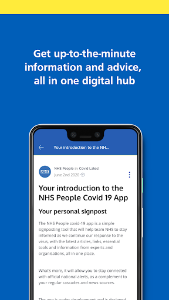  |   | 
 |  

## Development team
In the following we report the main information provided by the development team in the Google play store.

| | |
|-------------------------|-------------------------|
| **Developer**  | NHS Business Services Authority |
| **Website**  | - |
| **Email** | help@nhslife.nhs.uk |
| **Physical address**  | - |
| **Other developed apps**  | [https://play.google.com/store/apps/developer?id=NHS+Business+Services+Authority](https://play.google.com/store/apps/developer?id=NHS+Business+Services+Authority) |

## Android support

| | |
|-------------------------|-------------------------|
| **Declared target Android version**  | Pie, version 9 (API level 28) |
| **Effective target Android version**  | Pie, version 9 (API level 28) |
| **Minimum supported Android version**  | Jelly Bean, version 4.1.x (API level 16) |
| **Maximum target Android version**  | - |

The larger the difference between the minimum and maximum supported Android versions, the better. A larger difference means a wider audience. For example, old phones have a very low Android version, so a high minimum supported Android version means that the app cannot be used by users with old phones, thus leading to accessibility problems. 

## Requested permissions

In the following we report the complete list of the permissions requested by the app. 

| **Permission** | **Protection level** | **Description** | 
|-------------------------|-------------------------|-------------------------|
 **android.permission ACCESS_NETWORK_STATE** | Normal | Allows applications to access information about networks. 
 **android.permission ACCESS_WIFI_STATE** | Normal | Allows applications to access information about Wi-Fi networks. 
 **android.permission CAMERA** | :warning:**Dangerous** | Required to be able to access the camera device. 
 **android.permission INTERNET** | Normal | Allows applications to open network sockets. 
 **android.permission READ_APP_BADGE** | - | - 
 **android.permission RECEIVE_BOOT_COMPLETED** | Normal | Allows an application to receive the Intent.ACTION_BOOT_COMPLETED that is broadcast after the system finishes booting. 
 **android.permission SYSTEM_ALERT_WINDOW** | Signature - preinstalled - appop - pre23 - development | Allows an app to create windows using the type WindowManager.LayoutParams.TYPE_APPLICATION_OVERLAY, shown on top of all other apps. 
 **android.permission USE_FINGERPRINT** | Normal | This constant was deprecated in API level 28. Applications should request USE_BIOMETRIC instead 
 **android.permission VIBRATE** | Normal | Allows access to the vibrator. 
 **android.permission WAKE_LOCK** | Normal | Allows using PowerManager WakeLocks to keep processor from sleeping or screen from dimming. 
 **android.permission WRITE_EXTERNAL_STORAGE** | :warning:**Dangerous** | Allows an application to write to external storage. 
 **com.anddoes.launcher.permission UPDATE_COUNT** | - | - 
 **com.android.vending CHECK_LICENSE** | - | - 
 **com.google.android.c2dm.permission RECEIVE** | - | - 
 **com.google.android.finsky.permission BIND_GET_INSTALL_REFERRER_SERVICE** | - | - 
 **com.htc.launcher.permission READ_SETTINGS** | - | - 
 **com.htc.launcher.permission UPDATE_SHORTCUT** | - | - 
 **com.huawei.android.launcher.permission CHANGE_BADGE** | - | - 
 **com.huawei.android.launcher.permission READ_SETTINGS** | - | - 
 **com.huawei.android.launcher.permission WRITE_SETTINGS** | - | - 
 **com.majeur.launcher.permission UPDATE_BADGE** | - | - 
 **com.oppo.launcher.permission READ_SETTINGS** | - | - 
 **com.oppo.launcher.permission WRITE_SETTINGS** | - | - 
 **com.sec.android.provider.badge.permission READ** | - | - 
 **com.sec.android.provider.badge.permission WRITE** | - | - 
 **com.sonyericsson.home.permission BROADCAST_BADGE** | - | - 
 **com.sonymobile.home.permission PROVIDER_INSERT_BADGE** | - | - 
 **me.everything.badger.permission BADGE_COUNT_READ** | - | - 
 **me.everything.badger.permission BADGE_COUNT_WRITE** | - | - 

## Mentioned servers

| **Server** | **Registrant** | **Registrant country** | **Creation date** | 
|-------------------------|-------------------------|-------------------------|-------------------------|
 | bugsnag.com | Bugsnag Inc. | GB | 2011-08-18 03:26:10 |
 | android.com | Google LLC | :us: US | 1997-06-23 04:00:00 |
 | googlesyndication.com | Google LLC | :us: US | 2003-01-21 06:17:24 |
 | google.com | Google LLC | :us: US | 1997-09-15 04:00:00 |
 | app-measurement.com | Google LLC | :us: US | 2015-06-19 20:13:31 |
 | github.com | GitHub, Inc. | :us: US | 2007-10-09 18:20:50 |
 | googleapis.com | Google LLC | :us: US | 2005-01-25 17:52:26 |
 | googleadservices.com | Google LLC | :us: US | 2003-06-19 16:34:53 |

## Security analysis 

Below we report the main security warnings raised by our execution of the [Androwarn](https://github.com/maaaaz/androwarn) security analysis tool.

**Telephony identifiers leakage**
> - This application reads the numeric name (MCC+MNC) of current registered operator 
> - This application reads the operator name 
> - This application reads the phone number string for line 1, for example, the MSISDN for a GSM phone 

**Location lookup**
> - This application reads location information from all available providers (WiFi, GPS etc.) 

**Connection interfaces exfiltration**
> - This application reads details about the currently active data network 
> - This application tries to find out if the currently active data network is metered 

**Suspicious connection establishment**
> - This application opens a Socket and connects it to the remote address '' on the 'N/A' port  
> - This application opens a Socket and connects it to the remote address 'Ljava/lang/StringBuilder;->toString()Ljava/lang/String;' on the ': connect, resolve' port  
> - This application opens a Socket and connects it to the remote address 'Ljava/lang/StringBuilder;->toString()Ljava/lang/String;' on the 'N/A' port  
> - This application opens a Socket and connects it to the remote address 'Ljava/net/Proxy;->type()Ljava/net/Proxy$Type;' on the 'N/A' port  
> - This application opens a Socket and connects it to the remote address 'timeout' on the 'N/A' port  

**Pim data leakage**
> - This application accesses the downloads folder 
> - This application accesses data stored in the clipboard 

**Code execution**
> - This application loads a native library 
> - This application loads a native library: 'Ljava/util/Iterator;->next()Ljava/lang/Object;' 
> - This application loads a native library: 'bugsnag-ndk' 
> - This application loads a native library: 'bugsnag-plugin-android-anr' 
> - This application loads a native library: 'c++_shared' 
> - This application loads a native library: 'jniPdfium' 
> - This application loads a native library: 'modft2' 
> - This application loads a native library: 'modpdfium' 
> - This application loads a native library: 'modpng' 
> - This application executes a UNIX command containing this argument: '2' 

## User ratings and reviews

Below we provide information about how end users are reacting to the app in terms of ratings and reviews in the Google Play store.

### Ratings

The NHS People app has been installed by more than **500** times. At this time, **-** rated the app and its average score is **0.0**. Below we show the distribution of the ratings across the usual star-based rating of Google Play

:star::star::star::star::star:: 0

:star::star::star::star:: 0

:star::star::star:: 0

:star::star:: 0

:star:: 0

### Reviews 

#### 5-star reviews

No recent reviews available with 5 stars.

#### 4-star reviews

No recent reviews available with 4 stars.

#### 3-star reviews

No recent reviews available with 3 stars.

#### 2-star reviews

No recent reviews available with 2 stars.

#### 1-star reviews

No recent reviews available with 1 stars.

# Royal Mail - Tracking, redelivery, prices
App version ``7.0.3``

Analyzed with [covid-apps-observer](http://github.com/covid-apps-observer) project, version ``0.1``

## App overview
| | |
|-------------------------|-------------------------| 
| **Name**&nbsp;&nbsp;&nbsp;&nbsp;&nbsp;&nbsp;&nbsp;&nbsp;&nbsp;&nbsp;&nbsp;&nbsp;&nbsp;&nbsp;&nbsp;&nbsp;&nbsp;&nbsp;&nbsp;&nbsp;&nbsp;&nbsp;&nbsp;&nbsp;&nbsp;&nbsp;&nbsp;&nbsp;&nbsp;&nbsp;&nbsp;&nbsp;&nbsp;&nbsp;&nbsp;&nbsp;&nbsp;&nbsp;&nbsp;&nbsp;  | Royal Mail - Tracking, redelivery, prices |
| **Unique identifier** | com.royalmail.app.droid |
| **Link to Google Play** | [https://play.google.com/store/apps/details?id=com.royalmail.app.droid](https://play.google.com/store/apps/details?id=com.royalmail.app.droid) |
| **Summary**  | Easily manage your items and track your deliveries |
| **Privacy policy** | [https://www.royalmail.com/privacy-notice](https://www.royalmail.com/privacy-notice) |
| **Latest version** | 7.0.3 |
| **Last update** | 2021-02-09 17:20:30 |
| **Recent changes** | This latest version includes some performance updates and bug fixes. |
| **Installs**  | 1,000,000+ |
| **Category** | Lifestyle |
| **First release** | Sep 4, 2018 |
| **Size**  | 56M |
| **Supported Android version**  | 8.0 and up |

### Description
> 📦📦📦 With the Royal Mail App, you can:
 • Send an item - quickly and easily buy postage in just a few steps. You can print your labels at home or take the QR code on the app to a Royal Mail Customer Service Point/Delivery Office and we’ll print the label for you when you drop off your item.
 • Find your nearest drop off location - Postbox, Parcel Postbox, Post Office branch or Royal Mail Customer Service Point.
 • Track your items – just enter your tracking ID number or scan the barcode to check the progress of your deliveries (available with Royal Mail Tracked and Royal Mail Special Delivery Guaranteed items)
 • Find the size and format of your parcel using the Augmented Reality Parcel Sizer guide. Available with AR supported devices.
 •	Change your delivery options to suit you – You can now change where your parcel is delivered, to a Safeplace or neighbour after it has been sent. (available with Royal Mail Tracked items)
 •	Get proof of postage sent straight to your phone – get that extra peace of mind when dropping of at any of our locations (including our 24/7 Parcel Postboxes)
 • Postcode and address finder – if you’re not sure of a full address, or want to check a postcode, just enter part of the address and we’ll fill in the blanks
 • Find any Post Office locations or Customer Service Point/Delivery Office to print your label or drop off your item, with opening hours, address, map, available services and directions
 • Receive push notifications on your deliveries - never miss a delivery update
 • Save items you are tracking, and add an alias name making them easier to identify 
 • See a photograph of the signature if someone has signed for it, or the Safeplace an item has been delivered to
 • Book a Redelivery – if you’ve missed an item you can easily book a Redelivery to your address, your neighbour’s address or a local Post Office – and specify a delivery day
 • Save postage receipts – simply take a photo of your receipt and store it to the app
 • Track an item on the go - if you have Alexa, you can track your delivery by saying an alias name you have previously assigned to an item

### User interface
The developers of the app provide the following screenshots in the Google play store.
| | | |
|:-------------------------:|:-------------------------:|:-------------------------:|
 |   |   |   | 
 |   |   |   | 
 |  

## Development team
In the following we report the main information provided by the development team in the Google play store.

| | |
|-------------------------|-------------------------|
| **Developer**  | Royal Mail Group |
| **Website**  | [https://www.royalmail.com](https://www.royalmail.com) |
| **Email** | appfeedback@royalmail.com |
| **Physical address**  | - |
| **Other developed apps**  | [https://play.google.com/store/apps/developer?id=Royal+Mail+Group](https://play.google.com/store/apps/developer?id=Royal+Mail+Group) |

## Android support

| | |
|-------------------------|-------------------------|
| **Declared target Android version**  | - |
| **Effective target Android version**  | - |
| **Minimum supported Android version**  | Oreo, version 8.0.0 (API level 26) |
| **Maximum target Android version**  | - |

The larger the difference between the minimum and maximum supported Android versions, the better. A larger difference means a wider audience. For example, old phones have a very low Android version, so a high minimum supported Android version means that the app cannot be used by users with old phones, thus leading to accessibility problems. 

## Requested permissions

In the following we report the complete list of the permissions requested by the app. 

| **Permission** | **Protection level** | **Description** | 
|-------------------------|-------------------------|-------------------------|
 **android.permission ACCESS_FINE_LOCATION** | :warning:**Dangerous** | Allows an app to access precise location. 
 **android.permission ACCESS_NETWORK_STATE** | Normal | Allows applications to access information about networks. 
 **android.permission CAMERA** | :warning:**Dangerous** | Required to be able to access the camera device. 
 **android.permission INTERNET** | Normal | Allows applications to open network sockets. 
 **android.permission WAKE_LOCK** | Normal | Allows using PowerManager WakeLocks to keep processor from sleeping or screen from dimming. 
 **android.permission WRITE_EXTERNAL_STORAGE** | :warning:**Dangerous** | Allows an application to write to external storage. 
 **com.google.android.c2dm.permission RECEIVE** | - | - 
 **com.royalmail.app.droid.permission MAPS_RECEIVE** | - | - 

## Mentioned servers

| **Server** | **Registrant** | **Registrant country** | **Creation date** | 
|-------------------------|-------------------------|-------------------------|-------------------------|
 | google.com | Google LLC | :us: US | 1997-09-15 04:00:00 |
 | microsoft.com | Microsoft Corporation | :us: US | 1991-05-02 04:00:00 |
 | tealiumiq.com | Whois Privacy Service | :us: US | 2011-02-09 18:33:06 |
 | tiqcdn.com | Whois Privacy Service | :us: US | 2012-07-11 23:06:45 |
 | googleapis.com | Google LLC | :us: US | 2005-01-25 17:52:26 |

## Security analysis 

Below we report the main security warnings raised by our execution of the [Androwarn](https://github.com/maaaaz/androwarn) security analysis tool.

**Telephony identifiers leakage**
> - This application reads the ISO country code equivalent of the current registered operator's MCC (Mobile Country Code) 
> - This application reads the numeric name (MCC+MNC) of current registered operator 
> - This application reads the operator name 

**Connection interfaces exfiltration**
> - This application reads details about the currently active data network 
> - This application tries to find out if the currently active data network is metered 

**Suspicious connection establishment**
> - This application opens a Socket and connects it to the remote address '' on the 'N/A' port  
> - This application opens a Socket and connects it to the remote address 'Ljava/lang/StringBuilder;->toString()Ljava/lang/String;' on the 'N/A' port  
> - This application opens a Socket and connects it to the remote address 'Ljava/net/Proxy;->type()Ljava/net/Proxy$Type;' on the 'N/A' port  
> - This application opens a Socket and connects it to the remote address 'timeout' on the 'N/A' port  

**Code execution**
> - This application loads a native library: 'Ljava/lang/String;->valueOf(Ljava/lang/Object;)Ljava/lang/String;' 
> - This application loads a native library: 'arcore_sdk_jni' 
> - This application loads a native library: 'arsceneview_jni' 
> - This application loads a native library: 'filament-jni' 
> - This application loads a native library: 'mono-native' 
> - This application loads a native library: 'monodroid' 
> - This application loads a native library: 'monosgen-2.0' 
> - This application loads a native library: 'xamarin-app' 
> - This application loads a native library: 'xamarin-debug-app-helper' 

## User ratings and reviews

Below we provide information about how end users are reacting to the app in terms of ratings and reviews in the Google Play store.

### Ratings

The Royal Mail - Tracking, redelivery, prices app has been installed by more than **1000000** times. At this time, **3307** rated the app and its average score is **3.0737462**. Below we show the distribution of the ratings across the usual star-based rating of Google Play

:star::star::star::star::star:: 1298

:star::star::star::star:: 351

:star::star::star:: 185

:star::star:: 244

:star:: 1229

### Reviews 

#### 5-star reviews

> Excellent  :date: __2021-02-12 21:15:01__

> Good  :date: __2021-02-12 01:32:27__

> Very good  :date: __2021-02-11 02:25:36__

> Brilliant tracking. Quick & up to date.  :date: __2021-02-10 18:34:09__

> great app  :date: __2021-02-10 16:15:39__

> Easy app to use and track parcels. Does the job.  :date: __2021-02-10 08:39:04__

> Thanks a lot for your tiny help of delivey specially this season winter.  :date: __2021-02-09 10:57:15__

> Really easy app to use. All the information are there, easy to find and fast to find everything. I do not use the website anymore as you can even buy the stamps there...but do not know how it will be in final (I suppose you receive a Pdf On email to print and glue on the parcel/letter). Immediate action when asking to deliver again or to track parcel  :date: __2021-02-07 16:21:18__

> Great 👍👍👍🙂  :date: __2021-02-07 15:32:27__

> This app does work  :date: __2021-02-06 17:10:26__

#### 4-star reviews

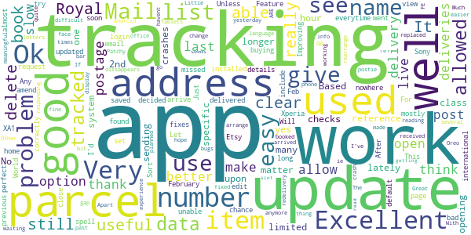

> No matter how many updates this app has, it still doesn't work, crashes upon opening everytime. I have been unable to use the app since February 2020 on a Sony Xperia XA1. Sort it out Royal Mail. Update, 13 Feb 2021 decided to try this app again and installed it again, it now works, opens, can login, and view my saved tracking numbers. Let's see how long it works.  :date: __2021-02-13 20:14:54__

> OK..  :date: __2021-02-09 20:35:17__

> Ok  :date: __2021-02-01 14:04:05__

> Improving thanks  :date: __2021-01-23 21:31:53__

> It's not a bad app for tracking parcels. Just would really like to be able to delete them from my list once they've been delivered. Any chance?  :date: __2021-01-19 16:25:38__

> World's be useful if it allowed you to delete previous tracked items  :date: __2021-01-12 10:14:01__

> This app is useful for tracking when your parcel will arrive.  :date: __2021-01-04 15:45:28__

> Excellent.  :date: __2021-01-03 10:46:40__

> Very good app.clear and well updated  :date: __2020-12-30 13:01:14__

> Excellent app easy to use  :date: __2020-12-18 15:14:40__

#### 3-star reviews

> Will not let me do change of address or any other services.  :date: __2021-02-12 14:46:46__

> Claims tubes that meet medium parcel dimensions are too big.  :date: __2021-02-11 22:00:00__

> Everytime I go on the app my session has expired and have to log in quite frustrating  :date: __2021-02-08 08:48:09__

> I use primarily for tracking incoming and outgoing parcels. Cannot edit description when inputting data which leaves me with columns of meaningless numbers until I am eventually allowed to manually edit once RM have clocked the item in system which is very slow and tedious. Unedited numbers are also duplicated in list and shuffled around making even more work! And whatever happened to push notifications? More and more I am having to use third party apps to help with tracking and sanity. 🚛🆘☯️  :date: __2021-02-07 15:31:01__

> When you click on a URL to the tracking number on another app suck as a email, it directs to this app instead of a web page which would be great but it doesn't phase the URL and extract the tracking number then take you directly there.  :date: __2021-02-03 09:34:29__

> Tracking Don't Update most of the time  :date: __2021-01-21 16:07:13__

> Sorry, an error occurred, can't install it, done the redelivery through site, just uninstalled.....  :date: __2021-01-18 19:42:45__

> Dates incorrectly read as US. Your item was delivered 01 August 2021... When it was delivered 20210108, not 20210801....  :date: __2021-01-08 10:24:06__

> Looking for cost of posting to Europe (Ireland). Can't find on this site!  :date: __2021-01-04 12:19:33__

> Tracking nos are alpha-num and long and I can't copy from my sources. Info seems sketchy. Update... uninstalled as won't accept my password, LIKE SO MANY APPS IT JUST DEFEATS ITSELF. Bah humbug.  :date: __2020-12-25 13:09:29__

#### 2-star reviews

> Finding it difficult to use  :date: __2021-02-10 12:14:09__

> Got there eventually but not a straight forward process. Like something from 2010.  :date: __2021-01-29 08:08:07__

> Useless they delivered to my house every day but don't have my address in the app therefore cant even log on or do anything  :date: __2021-01-26 21:24:17__

> Difficult to track things  :date: __2021-01-25 16:16:27__

> Needs quite a bit of work to make it worth having on the phone. It tells you you've had an attempted delivery, but with the same notification you cannot book a redelivery. Makes no sense.  :date: __2021-01-24 11:49:15__

> Gives you no option to talk to a real person in a live chat when you want to find out what's happened to your package you go round and round in circles with the options they give you and end up no better off you would of thought a company as big as royal mail would have that option and more tracking info so far not impressed at all  :date: __2021-01-20 19:59:54__

> App can be good but is limited and annoying. If registered and track items if you are out on delivery it doesn't let you schedule redelivery using details on app.You have to manually enter everything including address to redeliver.  :date: __2021-01-20 17:19:05__

> No landscape support  :date: __2021-01-19 08:30:47__

> Rocky start. Firstly they don't tell you if your previous login from the old app has been carried over so I had to do a forgot password to see if my email is still recognised. Then I wanted to change my password. To do this in a standard way on any app you tapo the three lines to pull down the menu - so far so good, then you tap Account - oh no you don't there isn't one so you fumble about trying the obscure options and get know where. I still haven't found where the Account settings are.  :date: __2021-01-11 12:22:55__

> There is no way to change your password in the app or website settings, seriously?  :date: __2021-01-07 15:06:41__

#### 1-star reviews

> Great App and Worse Service in UK. Maybe behind DPD. Hermes is better.  :date: __2021-02-13 13:26:55__

> The app is great, at giving misinformation, and delivering outlandishly overpromised delivery dates. The actual delivery service is an outdated dinosaur, needs to be wound up. 48 hour deliveries take up to a week, or 3 weeks, or get lost and never turn up. Update: latest package sat in a distribution centre for a week then got returned to the retailer, app still shows it in the distribution centre  :date: __2021-02-12 11:22:17__

> Third try with this app, previous review below. Your request could not be processed due to temporarily server maintenance. Does this app ever work? Previous review: Failed to help on a parcel a coupe of months back, but I thought I'd risk it and try again. No point - this time 'internal server error message'. Fails on the first task of redelivery! Downloaded this to try and get a parcel redelivered and got the same 'sorry an error occured while processing your request' others have.  :date: __2021-02-12 00:32:20__

> Awful  :date: __2021-02-10 16:15:15__

> Need to make the app like DPD and Hermes. Whereby it knows your details and notifys you when you have received a parcel and keeps you up to date when it's arriving. This app is nothing more than a waste of time.  :date: __2021-02-09 11:51:12__

> Royal mail what a joke you are. 1st I have a delivery window attached to my property that allows large parcels to be left in a secure room. So what do I find a Royal mail missed delivery telling me item to big for letter box no large parcel in the delivery window just the card 2nd you get a qr code to arrange a delivery that directs you to a Google app that doesn't work. 3rd you try calling the attached number and wait 2 hours to contact a human with the BS bovine splatter music excuse  :date: __2021-02-08 17:54:05__

> Only wanted to arrange a delivery couldn't figure it out.  :date: __2021-02-08 16:48:11__

> Full of errors stopping you from buying postage  :date: __2021-02-07 23:52:12__

> Rubbish doesn't do anything not fit for purpose  :date: __2021-02-07 10:35:10__

> Wont even log me in! I use the desktop site 20 - 30 times a day so I know what my email and password is but just says error x attempts left. - I wont bother  :date: __2021-02-07 10:30:47__

# City of Corona App
App version ``1.0.0``

Analyzed with [covid-apps-observer](http://github.com/covid-apps-observer) project, version ``0.1``

## App overview
| | |
|-------------------------|-------------------------| 
| **Name**&nbsp;&nbsp;&nbsp;&nbsp;&nbsp;&nbsp;&nbsp;&nbsp;&nbsp;&nbsp;&nbsp;&nbsp;&nbsp;&nbsp;&nbsp;&nbsp;&nbsp;&nbsp;&nbsp;&nbsp;&nbsp;&nbsp;&nbsp;&nbsp;&nbsp;&nbsp;&nbsp;&nbsp;&nbsp;&nbsp;&nbsp;&nbsp;&nbsp;&nbsp;&nbsp;&nbsp;&nbsp;&nbsp;&nbsp;&nbsp;  | City of Corona App |
| **Unique identifier** | io.appbuild.cityofco1 |
| **Link to Google Play** | [https://play.google.com/store/apps/details?id=io.appbuild.cityofco1](https://play.google.com/store/apps/details?id=io.appbuild.cityofco1) |
| **Summary**  | Welcome to the City of Corona App |
| **Privacy policy** | [http://cms.appbuild.io/cms/docs/legal/privacy.php?appcode=thisapp](http://cms.appbuild.io/cms/docs/legal/privacy.php?appcode=thisapp) |
| **Latest version** | 1.0.0 |
| **Last update** | 2020-10-05 17:40:49 |
| **Recent changes** | - |
| **Installs**  | 50,000+ |
| **Category** | Lifestyle |
| **First release** | Nov 28, 2018 |
| **Size**  | 27M |
| **Supported Android version**  | 5.1 and up |

### Description
> The City of Corona app provides simple methods for the community residents to engage and be part of this wonderful community. It provides ways to pay bills, sign up for recreation activities, call departments with one click, as well as Live Video feeds from many traffic cameras throughout the city. Through GPS maps, users of the app will be able to find their way to many official City offices, parks, and other locations. When looking for something to do, a calendar has events with the ability to have push notifications with instant alerts on crime, traffic, events, and more.

### User interface
The developers of the app provide the following screenshots in the Google play store.
| | | |
|:-------------------------:|:-------------------------:|:-------------------------:|
 |   | 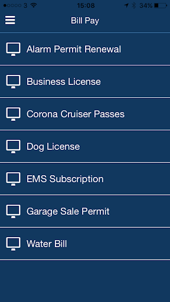  |   | 
 |   |   |   | 
 |   | 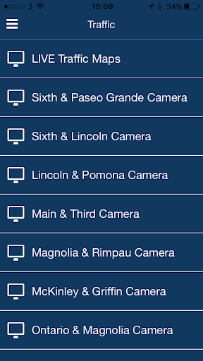 

## Development team
In the following we report the main information provided by the development team in the Google play store.

| | |
|-------------------------|-------------------------|
| **Developer**  | City of Corona |
| **Website**  | [http://www.discovercorona.com](http://www.discovercorona.com) |
| **Email** | Brittanyr@ci.corona.ca.us |
| **Physical address**  | [400 S Vicentia Ave Suite 310 Corona, CA 92882](https://www.google.com/maps/search/400%20S%20Vicentia%20Ave%20Suite%20310%20Corona,%20CA%2092882) (Google Maps) |
| **Other developed apps**  | [https://play.google.com/store/apps/developer?id=City+of+Corona](https://play.google.com/store/apps/developer?id=City+of+Corona) |

## Android support

| | |
|-------------------------|-------------------------|
| **Declared target Android version**  | Android10, version 10 (API level 29) |
| **Effective target Android version**  | Android10, version 10 (API level 29) |
| **Minimum supported Android version**  | Lollipop, version 5.1 (API level 22) |
| **Maximum target Android version**  | - |

The larger the difference between the minimum and maximum supported Android versions, the better. A larger difference means a wider audience. For example, old phones have a very low Android version, so a high minimum supported Android version means that the app cannot be used by users with old phones, thus leading to accessibility problems. 

## Requested permissions

In the following we report the complete list of the permissions requested by the app. 

| **Permission** | **Protection level** | **Description** | 
|-------------------------|-------------------------|-------------------------|
 **android.permission ACCESS_ASSISTED_GPS** | - | - 
 **android.permission ACCESS_COARSE_LOCATION** | :warning:**Dangerous** | Allows an app to access approximate location. 
 **android.permission ACCESS_FINE_LOCATION** | :warning:**Dangerous** | Allows an app to access precise location. 
 **android.permission ACCESS_GPS** | - | - 
 **android.permission ACCESS_LOCATION_EXTRA_COMMANDS** | Normal | Allows an application to access extra location provider commands. 
 **android.permission ACCESS_MOCK_LOCATION** | - | - 
 **android.permission ACCESS_NETWORK_STATE** | Normal | Allows applications to access information about networks. 
 **android.permission CAMERA** | :warning:**Dangerous** | Required to be able to access the camera device. 
 **android.permission FLASHLIGHT** | - | - 
 **android.permission FOREGROUND_SERVICE** | Normal | Allows a regular application to use Service.startForeground. 
 **android.permission INTERNET** | Normal | Allows applications to open network sockets. 
 **android.permission READ_APP_BADGE** | - | - 
 **android.permission REQUEST_IGNORE_BATTERY_OPTIMIZATIONS** | Normal | Permission an application must hold in order to use Settings.ACTION_REQUEST_IGNORE_BATTERY_OPTIMIZATIONS. 
 **android.permission VIBRATE** | Normal | Allows access to the vibrator. 
 **android.permission WAKE_LOCK** | Normal | Allows using PowerManager WakeLocks to keep processor from sleeping or screen from dimming. 
 **android.permission WRITE_EXTERNAL_STORAGE** | :warning:**Dangerous** | Allows an application to write to external storage. 
 **com.anddoes.launcher.permission UPDATE_COUNT** | - | - 
 **com.google.android.c2dm.permission RECEIVE** | - | - 
 **com.htc.launcher.permission READ_SETTINGS** | - | - 
 **com.htc.launcher.permission UPDATE_SHORTCUT** | - | - 
 **com.huawei.android.launcher.permission CHANGE_BADGE** | - | - 
 **com.huawei.android.launcher.permission READ_SETTINGS** | - | - 
 **com.huawei.android.launcher.permission WRITE_SETTINGS** | - | - 
 **com.majeur.launcher.permission UPDATE_BADGE** | - | - 
 **com.oppo.launcher.permission READ_SETTINGS** | - | - 
 **com.oppo.launcher.permission WRITE_SETTINGS** | - | - 
 **com.sec.android.provider.badge.permission READ** | - | - 
 **com.sec.android.provider.badge.permission WRITE** | - | - 
 **com.sonyericsson.home.permission BROADCAST_BADGE** | - | - 
 **com.sonymobile.home.permission PROVIDER_INSERT_BADGE** | - | - 
 **io.appbuild.cityofco1.permission C2D_MESSAGE** | - | - 
 **me.everything.badger.permission BADGE_COUNT_READ** | - | - 
 **me.everything.badger.permission BADGE_COUNT_WRITE** | - | - 

## Mentioned servers

| **Server** | **Registrant** | **Registrant country** | **Creation date** | 
|-------------------------|-------------------------|-------------------------|-------------------------|
 | braintreegateway.com | PayPal Inc. | :us: US | 2009-10-06 23:05:33 |
 | googlesyndication.com | Google LLC | :us: US | 2003-01-21 06:17:24 |
 | google.com | Google LLC | :us: US | 1997-09-15 04:00:00 |
 | facebook.com | Facebook, Inc. | :us: US | 1997-03-29 05:00:00 |
 | googleapis.com | Google LLC | :us: US | 2005-01-25 17:52:26 |
 | google-analytics.com | Google LLC | :us: US | 2005-07-18 19:24:32 |
 | app-measurement.com | Google LLC | :us: US | 2015-06-19 20:13:31 |
 | googleapis.com | Google LLC | :us: US | 2005-01-25 17:52:26 |
 | doubleclick.net | Google Inc. | :us: US | 1996-01-16 05:00:00 |
 | gstatic.com | Google LLC | :us: US | 2008-02-11 15:31:25 |
 | googleapis.com | Google LLC | :us: US | 2005-01-25 17:52:26 |
 | visa.com | Visa International Service Association | :us: US | 1994-03-08 05:00:00 |
 | googletagmanager.com | Google LLC | :us: US | 2011-11-11 23:39:05 |
 | appspot.com | Google LLC | :us: US | 2005-03-10 02:27:55 |
 | paypal.com | PayPal Inc. | :us: US | 1999-07-15 05:32:11 |
 | paypalobjects.com | PayPal Inc. | :us: US | 2005-05-12 17:11:21 |
 | whatsapp.com | Whatsapp Inc. | :us: US | 2008-09-04 12:39:12 |

## Security analysis 

Below we report the main security warnings raised by our execution of the [Androwarn](https://github.com/maaaaz/androwarn) security analysis tool.

**Telephony identifiers leakage**
> - This application reads the ISO country code equivalent for the SIM provider's country code 
> - This application reads the MCC+MNC of the provider of the SIM 
> - This application reads the SIM's serial number 
> - This application reads the Service Provider Name (SPN) 
> - This application reads the current location of the device 
> - This application reads the device phone type value 
> - This application reads the numeric name (MCC+MNC) of current registered operator 
> - This application reads the operator name 
> - This application reads the radio technology (network type) currently in use on the device for data transmission 
> - This application reads the unique device ID, i.e the IMEI for GSM and the MEID or ESN for CDMA phones 
> - This application reads the unique subscriber ID, for example, the IMSI for a GSM phone 
> - This application reads the Cell ID value 
> - This application reads the Location Area Code value 

**Location lookup**
> - This application reads location information from all available providers (WiFi, GPS etc.) 

**Connection interfaces exfiltration**
> - This application reads details about the currently active data network 
> - This application tries to find out if the currently active data network is metered 

**Telephony services abuse**
> - This application makes phone calls 
> - This application sends an SMS message 'v12' to the 'Landroid/content/Intent;-><init>()V' phone number 

**Suspicious connection establishment**
> - This application opens a Socket and connects it to the remote address '' on the '80' port  
> - This application opens a Socket and connects it to the remote address 'Network subsystem is unavailable' on the 'N/A' port  

**Pim data leakage**
> - This application accesses the downloads folder 
> - This application accesses data stored in the clipboard 

**Code execution**
> - This application loads a native library 
> - This application executes a UNIX command 
> - This application executes a UNIX command containing this argument: 'Ljava/lang/StringBuilder;->toString()Ljava/lang/String;' 

## User ratings and reviews

Below we provide information about how end users are reacting to the app in terms of ratings and reviews in the Google Play store.

### Ratings

The City of Corona App app has been installed by more than **50000** times. At this time, **43** rated the app and its average score is **3.4418604**. Below we show the distribution of the ratings across the usual star-based rating of Google Play

:star::star::star::star::star:: 21

:star::star::star::star:: 4

:star::star::star:: 3

:star::star:: 3

:star:: 12

### Reviews 

#### 5-star reviews

> Supper  :date: __2020-04-05 18:13:09__

> It is not use  :date: __2020-03-29 04:46:06__

> it is frod  :date: __2020-03-18 13:24:03__

#### 4-star reviews

No recent reviews available with 4 stars.

#### 3-star reviews

> Something something right  :date: __2020-04-03 18:03:13__

#### 2-star reviews

No recent reviews available with 2 stars.

#### 1-star reviews

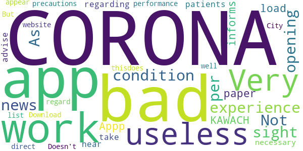

> useless  :date: __2020-04-14 07:39:44__

> Very bad experience this app in this condition  :date: __2020-04-14 07:05:12__

> Not opening this sight.As per news paper we have to down load the Appp"CORONA KAWACH which informs regarding corona patients near by and advise to take necessary precautions in this regard.But thisdoes not appear in the list .  :date: __2020-03-31 15:34:55__

> does not work very bad performance  :date: __2020-03-30 21:48:38__

> Doesn't work well at all. Download App direct from City of Corona website.  :date: __2019-06-21 00:33:30__

# ALHOSN UAE
App version ``1.44.248``

Analyzed with [covid-apps-observer](http://github.com/covid-apps-observer) project, version ``0.1``

## App overview
| | |
|-------------------------|-------------------------| 
| **Name**&nbsp;&nbsp;&nbsp;&nbsp;&nbsp;&nbsp;&nbsp;&nbsp;&nbsp;&nbsp;&nbsp;&nbsp;&nbsp;&nbsp;&nbsp;&nbsp;&nbsp;&nbsp;&nbsp;&nbsp;&nbsp;&nbsp;&nbsp;&nbsp;&nbsp;&nbsp;&nbsp;&nbsp;&nbsp;&nbsp;&nbsp;&nbsp;&nbsp;&nbsp;&nbsp;&nbsp;&nbsp;&nbsp;&nbsp;&nbsp;  | ALHOSN UAE |
| **Unique identifier** | doh.health.shield |
| **Link to Google Play** | [https://play.google.com/store/apps/details?id=doh.health.shield](https://play.google.com/store/apps/details?id=doh.health.shield) |
| **Summary**  | ALHOSN UAE allows you to keep your COVID-19 results on your mobile device |
| **Privacy policy** | [https://alhosnapp.ae/en/privacy-policy/](https://alhosnapp.ae/en/privacy-policy/) |
| **Latest version** | 1.44.248 |
| **Last update** | 2020-11-10 11:38:29 |
| **Recent changes** | - Improved user experience - App stability |
| **Installs**  | 1,000,000+ |
| **Category** | Medical |
| **First release** | Apr 7, 2020 |
| **Size**  | 12M |
| **Supported Android version**  | 5.0 and up |

### Description
> The ALHOSN UAE app is the official COVID-19 testing channel for health authorities in the United Arab Emirates, by the Ministry of Health and Prevention.
 By using the app, everyone can help stop the spread of COVID-19 and keep their family and friends safe.
  
 You can receive your COVID-19 test results directly on your phone with a unique QR code that is proof of your status and that of everyone else around you who also have the app, giving you peace of mind that you can safely interact.
 The app can also help trace people who may have come within close proximity to confirmed COVID-19 cases for an extended period of time. It uses short-distance Bluetooth signals to determine when your phone is near another phone that also has the app installed.  Both phones exchange anonymized IDs which are then stored in encrypted form on your phone. Using the anonymized IDs, health authorities can quickly identify and contact people at risk of infection so they can be retested.
  
 Put your health in your hands with 3 easy steps:
 1.      Download the ALHOSN UAE app
 2.      Authenticate with your Emirates ID and phone number
 3.      Turn on Bluetooth and push notifications on your smartphone
  
 Download the ALHOSN UAE app today and share it with your family and friends.
 Together, we can stop the spread of COVID-19
 Safer Together.

### User interface
The developers of the app provide the following screenshots in the Google play store.
| | | |
|:-------------------------:|:-------------------------:|:-------------------------:|
 |   |  

## Development team
In the following we report the main information provided by the development team in the Google play store.

| | |
|-------------------------|-------------------------|
| **Developer**  | Ministry of Health and Prevention - UAE |
| **Website**  | [https://alhosnapp.ae/en/contact-us/](https://alhosnapp.ae/en/contact-us/) |
| **Email** | info@alhosnapp.ae |
| **Physical address**  | - |
| **Other developed apps**  | [https://play.google.com/store/apps/developer?id=Ministry+of+Health+and+Prevention+-+UAE](https://play.google.com/store/apps/developer?id=Ministry+of+Health+and+Prevention+-+UAE) |

## Android support

| | |
|-------------------------|-------------------------|
| **Declared target Android version**  | Android10, version 10 (API level 29) |
| **Effective target Android version**  | Android10, version 10 (API level 29) |
| **Minimum supported Android version**  | Lollipop, version 5.0 (API level 21) |
| **Maximum target Android version**  | - |

The larger the difference between the minimum and maximum supported Android versions, the better. A larger difference means a wider audience. For example, old phones have a very low Android version, so a high minimum supported Android version means that the app cannot be used by users with old phones, thus leading to accessibility problems. 

## Requested permissions

In the following we report the complete list of the permissions requested by the app. 

| **Permission** | **Protection level** | **Description** | 
|-------------------------|-------------------------|-------------------------|
 **android.permission ACCESS_BACKGROUND_LOCATION** | :warning:**Dangerous** | Allows an app to access location in the background. 
 **android.permission ACCESS_FINE_LOCATION** | :warning:**Dangerous** | Allows an app to access precise location. 
 **android.permission ACCESS_NETWORK_STATE** | Normal | Allows applications to access information about networks. 
 **android.permission BLUETOOTH** | Normal | Allows applications to connect to paired bluetooth devices. 
 **android.permission BLUETOOTH_ADMIN** | Normal | Allows applications to discover and pair bluetooth devices. 
 **android.permission CAMERA** | :warning:**Dangerous** | Required to be able to access the camera device. 
 **android.permission FOREGROUND_SERVICE** | Normal | Allows a regular application to use Service.startForeground. 
 **android.permission INTERNET** | Normal | Allows applications to open network sockets. 
 **android.permission QUICKBOOT_POWERON** | - | - 
 **android.permission RECEIVE_BOOT_COMPLETED** | Normal | Allows an application to receive the Intent.ACTION_BOOT_COMPLETED that is broadcast after the system finishes booting. 
 **android.permission REQUEST_IGNORE_BATTERY_OPTIMIZATIONS** | Normal | Permission an application must hold in order to use Settings.ACTION_REQUEST_IGNORE_BATTERY_OPTIMIZATIONS. 
 **android.permission WAKE_LOCK** | Normal | Allows using PowerManager WakeLocks to keep processor from sleeping or screen from dimming. 
 **android.permission WRITE_EXTERNAL_STORAGE** | :warning:**Dangerous** | Allows an application to write to external storage. 
 **com.google.android.c2dm.permission RECEIVE** | - | - 

## Mentioned servers

| **Server** | **Registrant** | **Registrant country** | **Creation date** | 
|-------------------------|-------------------------|-------------------------|-------------------------|
 | adobe.com | Adobe Inc. | :us: US | 1986-11-17 05:00:00 |
 | google.com | Google LLC | :us: US | 1997-09-15 04:00:00 |
 | healthshielduae.com | Domains By Proxy, LLC | :us: US | 2020-03-31 19:30:02 |

## Security analysis 

Below we report the main security warnings raised by our execution of the [Androwarn](https://github.com/maaaaz/androwarn) security analysis tool.

**Connection interfaces exfiltration**
> - This application reads details about the currently active data network 
> - This application tries to find out if the currently active data network is metered 

**Suspicious connection establishment**
> - This application opens a Socket and connects it to the remote address 'Li/b/a/a/a;->f(Ljava/lang/String;)Ljava/lang/StringBuilder;' on the 'N/A' port  
> - This application opens a Socket and connects it to the remote address 'Ljava/net/Proxy;->type()Ljava/net/Proxy$Type;' on the 'N/A' port  
> - This application opens a Socket and connects it to the remote address 'hostname == null ' on the 'N/A' port  
> - This application opens a Socket and connects it to the remote address 'timeout' on the 'N/A' port  

**Code execution**
> - This application loads a native library 
> - This application loads a native library: 'tool-checker' 
> - This application executes a UNIX command 
> - This application executes a UNIX command containing this argument: 'getprop' 
> - This application executes a UNIX command containing this argument: 'mount' 

## User ratings and reviews

Below we provide information about how end users are reacting to the app in terms of ratings and reviews in the Google Play store.

### Ratings

The ALHOSN UAE app has been installed by more than **1000000** times. At this time, **6085** rated the app and its average score is **4.3555193**. Below we show the distribution of the ratings across the usual star-based rating of Google Play

:star::star::star::star::star:: 4545

:star::star::star::star:: 543

:star::star::star:: 266

:star::star:: 79

:star:: 652

### Reviews 

#### 5-star reviews

> It's not working properly even not come open  :date: __2021-02-13 18:16:59__

> Great  :date: __2021-02-13 17:18:10__

> Very good  :date: __2021-02-13 14:45:12__

> Nice  :date: __2021-02-12 20:51:58__

> Good  :date: __2021-02-12 15:20:38__

> I did a vaccine two time. And it doesn't show any thing about any one of them.   I did restart to the phone. I did uninstall and install again.  Nothing changed.  It only show my last PCR test not the vaccine  :date: __2021-02-12 11:19:39__

> My viccine second dos finish but app not show result  :date: __2021-02-12 10:08:12__

> Very good app... Its i can see my test result of corona virus  :date: __2021-02-12 08:27:30__

> I download this , Igot result from my first pcr test, I don't get dpi test and second pcr test results in alhosn ap. I got the results but it's not updated.  :date: __2021-02-12 08:17:05__

> The best 🎊🎉🥞  :date: __2021-02-12 00:37:07__

#### 4-star reviews

> Working well  :date: __2021-02-12 07:47:56__

> Good  :date: __2021-02-09 17:47:36__

> Nice app but it's soo loaded i don't know why opening time many's mints  :date: __2021-02-09 03:59:31__

> Good  :date: __2021-02-08 11:38:19__

> গুড অপশন ইউএই  :date: __2021-02-07 14:38:25__

> I did test last 02/02/2021 is still not showing my results..how.......  :date: __2021-02-07 07:50:27__

> Good  :date: __2021-02-05 07:02:27__

> this app helpful  :date: __2021-02-02 14:57:27__

> I like it 🙂😊  :date: __2021-02-02 04:02:02__

> Excellent  :date: __2021-02-01 05:34:27__

#### 3-star reviews

> Since, I have a terrible experience using this App. here are some pointers for all the users, and hope these helps: 1. Make sure to register the same Contact no. you gave during PCR test. Thus, it will show an error credentials. 2. Unfortunately, if you got infected after your quarantine. You are required to complete 2 negative results. Thus, it won't turn to green. IMPORTANT!!! MAKE SURE TO UNDERGO A PCR IN DHA ONLY. NOT TO THE CLINIC.  :date: __2021-02-11 06:00:07__

> The app is not working properly, covid 19 test report is not reflecting in my Al Hosn app, I tried to reach customer care to fix the issue more than trice today, they are just telling that it will be fix within 30 minutes each times. I am travelling from Dubai to Abu Dhabi and as per New rule border police will not allow me to enter Abu Dhabi until unless the report reflected in App.  :date: __2021-02-09 14:58:22__

> For anyone suffering from wrong credentials issue, you need to download and install UAE Pass application, and verify the information at an approved kiosk (you can do this at the FCA happiness centers), after that and one PCR test the Al Hosn app will work.  :date: __2021-02-09 04:52:16__

> Dear : Sir/Mam My vaccination finished 03/02/2021. still this app no any changes for my detailes. what is use for this app. how much day taken for this updation.please clear this matter for updation. Thanks : Best Regards  :date: __2021-02-08 07:05:10__

> I've reinstalled it and it's still not showing my E status.  :date: __2021-02-06 20:31:15__

> 2 doses of Vaccination is done. But more than 10 days finished but still not updated in alhosn app. message also come to my mobile regarding vaccination finish. Kindly update  :date: __2021-02-04 19:59:44__

> I don't have an ID card, I'm coming to travel, how do I drive?  :date: __2021-02-04 07:49:26__

> When i take the pcr test its not showing anymore. Now that i have covid19 still not showing.  :date: __2021-02-03 04:42:27__

> Fair  :date: __2021-02-02 12:22:13__

> Too much massage notifications pop up irritating  :date: __2021-01-31 23:15:02__

#### 2-star reviews

> Technical issues with this mean records don't get updated. No response from Alhosn team when try to contact them. Disappointed as this is required to prove vaccine status and pcr test results  :date: __2021-02-13 07:07:39__

> يعطل الجهاز  :date: __2021-02-11 07:25:29__

> Not working properly and no results yet.  :date: __2021-02-10 17:20:08__

> Very nice  :date: __2021-02-06 18:08:25__

> The App is battery intensive  :date: __2021-02-06 17:10:02__

> The app doesn't open, just showing the logo  :date: __2021-02-05 00:06:32__

> App used to work but not anymore. I tried setting up my account with no luck and tried sending the error message to the developer email but i bounced back saying the inbox is full. Let me know how to resolve it. Thanks  :date: __2021-01-31 11:15:07__

> I can't opened my Alhons i want the result from here  :date: __2021-01-31 06:18:12__

> Hopeful  :date: __2021-01-29 18:06:23__

> After one month it is not opening  :date: __2021-01-26 11:47:55__

#### 1-star reviews

> I have done covid test 3 times but doesnt show on this App As it reflects no test report available as i have given the same mobile no.to the test center. I received text msg of my covid test on the same no. But al hosn app says your no.is not registered try with your mob.no.as i dont have any other local no. I mail the support team but it says our mail box is full we r not able to help u try again later. Please check with this app i request the Al Hosn Support team. It will be very helpful to u  :date: __2021-02-13 17:19:34__

> Im tired for log in appear error .i need this apps what shall i do?  :date: __2021-02-13 13:43:17__

> I can't open it  :date: __2021-02-13 10:13:59__

> Its asking survey and no option more  :date: __2021-02-13 08:27:46__

> Not working well  :date: __2021-02-13 08:15:23__

> It's not showing my test results. No results found even I had two PCR test.  :date: __2021-02-12 23:51:31__

> I took 3 tests ..and still not even one showed in the app .  :date: __2021-02-12 21:52:05__

> No customer support. I have completed my vaccination but status till now not updated and there is no one to help.  :date: __2021-02-12 16:59:08__

> I downloaded this app ..to check my vaccinated records....it's not working showing error..... always can't scan ..  :date: __2021-02-12 11:15:27__

> Not even opening on samsung A70  :date: __2021-02-12 05:58:39__

# GoodSAM Responder
App version ``13.3``

Analyzed with [covid-apps-observer](http://github.com/covid-apps-observer) project, version ``0.1``

## App overview
| | |
|-------------------------|-------------------------| 
| **Name**&nbsp;&nbsp;&nbsp;&nbsp;&nbsp;&nbsp;&nbsp;&nbsp;&nbsp;&nbsp;&nbsp;&nbsp;&nbsp;&nbsp;&nbsp;&nbsp;&nbsp;&nbsp;&nbsp;&nbsp;&nbsp;&nbsp;&nbsp;&nbsp;&nbsp;&nbsp;&nbsp;&nbsp;&nbsp;&nbsp;&nbsp;&nbsp;&nbsp;&nbsp;&nbsp;&nbsp;&nbsp;&nbsp;&nbsp;&nbsp;  | GoodSAM Responder |
| **Unique identifier** | com.goodsam.responder |
| **Link to Google Play** | [https://play.google.com/store/apps/details?id=com.goodsam.responder](https://play.google.com/store/apps/details?id=com.goodsam.responder) |
| **Summary**  | GoodSAM connects those with specific skill sets to those in need. |
| **Privacy policy** | [https://www.goodsamapp.org/dataprotectionhtml](https://www.goodsamapp.org/dataprotectionhtml) |
| **Latest version** | 13.3 |
| **Last update** | 2021-01-24 21:38:47 |
| **Recent changes** | Updating the app to pull the latest code of conduct from the server and make it specific to each organisation on the platform. |
| **Installs**  | 100,000+ |
| **Category** | Health & Fitness |
| **First release** | Apr 21, 2014 |
| **Size**  | 55M |
| **Supported Android version**  | 4.1 and up |

### Description
> The GoodSAM Responder App is a professional deployment system used by Emergency Services around the world.
 GoodSAM provides a range of solutions connecting those with specific skill sets to those in need, for example:
 -       GoodSAM Cardiac – This system is used by ambulance services to alert those trained in resuscitation (e.g. off duty paramedics, nurses, doctors, police and fire staff) to those nearby who are likely to be in cardiac arrest. This system has saved many lives around the world.
 -       GoodSAM Volunteer Response – GoodSAM is a platform used by organisations such as the Royal Voluntary Service and British Red Cross.
 -       GoodSAM Pro – This is a professional dispatch system for community first responders and the emergency services.
 The App utilises the latest in location technology and has many advanced features including a built in “radio” (Buzz) function so you can communicate with surrounding colleagues.
 The GoodSAM platform has saved hundreds of lives and helped many thousands of people around the world. If you can help your community, please download the App and register under your parent organisation (or get your parent organisation on board if they are not on!).
 Visit www.goodsamapp.org for more information
 Please download the App and join our global community.

### User interface
The developers of the app provide the following screenshots in the Google play store.
| | | |
|:-------------------------:|:-------------------------:|:-------------------------:|
 |   |   |   | 
 |   |   |   | 
 | 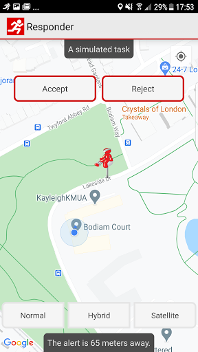  |  

## Development team
In the following we report the main information provided by the development team in the Google play store.

| | |
|-------------------------|-------------------------|
| **Developer**  | GoodSAM LTD |
| **Website**  | [http://www.goodsamapp.org/](http://www.goodsamapp.org/) |
| **Email** | info@goodsamapp.org |
| **Physical address**  | - |
| **Other developed apps**  | [https://play.google.com/store/apps/developer?id=GoodSAM+LTD](https://play.google.com/store/apps/developer?id=GoodSAM+LTD) |

## Android support

| | |
|-------------------------|-------------------------|
| **Declared target Android version**  | - |
| **Effective target Android version**  | - |
| **Minimum supported Android version**  | Jelly Bean, version 4.1.x (API level 16) |
| **Maximum target Android version**  | - |

The larger the difference between the minimum and maximum supported Android versions, the better. A larger difference means a wider audience. For example, old phones have a very low Android version, so a high minimum supported Android version means that the app cannot be used by users with old phones, thus leading to accessibility problems. 

## Requested permissions

In the following we report the complete list of the permissions requested by the app. 

| **Permission** | **Protection level** | **Description** | 
|-------------------------|-------------------------|-------------------------|
 **android.permission ACCESS_BACKGROUND_LOCATION** | :warning:**Dangerous** | Allows an app to access location in the background. 
 **android.permission ACCESS_COARSE_LOCATION** | :warning:**Dangerous** | Allows an app to access approximate location. 
 **android.permission ACCESS_FINE_LOCATION** | :warning:**Dangerous** | Allows an app to access precise location. 
 **android.permission ACCESS_NETWORK_STATE** | Normal | Allows applications to access information about networks. 
 **android.permission CALL_PHONE** | :warning:**Dangerous** | Allows an application to initiate a phone call without going through the Dialer user interface for the user to confirm the call. 
 **android.permission CAMERA** | :warning:**Dangerous** | Required to be able to access the camera device. 
 **android.permission FLASHLIGHT** | - | - 
 **android.permission GET_ACCOUNTS** | :warning:**Dangerous** | Allows access to the list of accounts in the Accounts Service. 
 **android.permission INTERNET** | Normal | Allows applications to open network sockets. 
 **android.permission MODIFY_AUDIO_SETTINGS** | Normal | Allows an application to modify global audio settings. 
 **android.permission READ_CONTACTS** | :warning:**Dangerous** | Allows an application to read the user's contacts data. 
 **android.permission READ_EXTERNAL_STORAGE** | :warning:**Dangerous** | Allows an application to read from external storage. 
 **android.permission READ_OWNER_DATA** | - | - 
 **android.permission RECEIVE_BOOT_COMPLETED** | Normal | Allows an application to receive the Intent.ACTION_BOOT_COMPLETED that is broadcast after the system finishes booting. 
 **android.permission RECORD_AUDIO** | :warning:**Dangerous** | Allows an application to record audio. 
 **android.permission REQUEST_IGNORE_BATTERY_OPTIMIZATIONS** | Normal | Permission an application must hold in order to use Settings.ACTION_REQUEST_IGNORE_BATTERY_OPTIMIZATIONS. 
 **android.permission USE_CREDENTIALS** | - | - 
 **android.permission VIBRATE** | Normal | Allows access to the vibrator. 
 **android.permission WAKE_LOCK** | Normal | Allows using PowerManager WakeLocks to keep processor from sleeping or screen from dimming. 
 **android.permission WRITE_EXTERNAL_STORAGE** | :warning:**Dangerous** | Allows an application to write to external storage. 
 **com.goodsam.responder.permission C2D_MESSAGE** | - | - 
 **com.goodsam.responder.permission MAPS_RECEIVE** | - | - 
 **com.google.android.c2dm.permission RECEIVE** | - | - 
 **com.google.android.finsky.permission BIND_GET_INSTALL_REFERRER_SERVICE** | - | - 
 **com.google.android.gms.permission ACTIVITY_RECOGNITION** | - | - 
 **com.google.android.providers.gsf.permission READ_GSERVICES** | - | - 

## Mentioned servers

| **Server** | **Registrant** | **Registrant country** | **Creation date** | 
|-------------------------|-------------------------|-------------------------|-------------------------|
 | adobe.com | Adobe Inc. | :us: US | 1986-11-17 05:00:00 |
 | facebook.com | Facebook, Inc. | :us: US | 1997-03-29 05:00:00 |
 | google.com | Google LLC | :us: US | 1997-09-15 04:00:00 |
 | goodsam.co.uk | - | - | 2013-07-27 00:00:00 |
 | goodsamapp.org | Registrant State/Province: | GB | 2014-03-17 22:10:28 |
 | linkedin.com | LinkedIn Corporation | :us: US | 2002-11-02 15:38:11 |
 | googlesyndication.com | Google LLC | :us: US | 2003-01-21 06:17:24 |
 | googleapis.com | Google LLC | :us: US | 2005-01-25 17:52:26 |
 | app-measurement.com | Google LLC | :us: US | 2015-06-19 20:13:31 |
 | googleadservices.com | Google LLC | :us: US | 2003-06-19 16:34:53 |

## Security analysis 

Below we report the main security warnings raised by our execution of the [Androwarn](https://github.com/maaaaz/androwarn) security analysis tool.

**Telephony identifiers leakage**
> - This application reads the numeric name (MCC+MNC) of current registered operator 
> - This application reads the operator name 

**Connection interfaces exfiltration**
> - This application reads details about the currently active data network 
> - This application tries to find out if the currently active data network is metered 

**Telephony services abuse**
> - This application makes phone calls 

**Audio video eavesdropping**
> - This application records audio from the 'MIC' source  

**Suspicious connection establishment**
> - This application opens a Socket and connects it to the remote address '' on the 'N/A' port  
> - This application opens a Socket and connects it to the remote address 'Ljava/lang/StringBuilder;->toString()Ljava/lang/String;' on the 'N/A' port  
> - This application opens a Socket and connects it to the remote address 'Ljava/net/Proxy;->type()Ljava/net/Proxy$Type;' on the 'N/A' port  
> - This application opens a Socket and connects it to the remote address 'Lorg/apache/http/HttpHost;->getPort()I' on the 'Lorg/apache/http/HttpHost;->getPort()I' port  
> - This application opens a Socket and connects it to the remote address 'timeout' on the 'N/A' port  

**Code execution**
> - This application loads a native library 
> - This application executes a UNIX command 

## User ratings and reviews

Below we provide information about how end users are reacting to the app in terms of ratings and reviews in the Google Play store.

### Ratings

The GoodSAM Responder app has been installed by more than **100000** times. At this time, **1290** rated the app and its average score is **2.4651163**. Below we show the distribution of the ratings across the usual star-based rating of Google Play

:star::star::star::star::star:: 190

:star::star::star::star:: 130

:star::star::star:: 230

:star::star:: 280

:star:: 460

### Reviews 

#### 5-star reviews

> Upon installation, I can't seem to get past the initial introduction pages. The button at the bottom which says "Ask for permissions" does nothing when tapped. I've checked the permissions that the app has been granted in the application manager, and it has everything it needs. Phone is a Samsung J3 running Android 5.1.1. Update: Thanks to the team for updating this so quickly. All working perfectly now!  :date: __2021-02-03 10:32:29__

> Never leaves me alone. Works really well. Dare not sign on unless I've got a good bit of time to offer because I can easily get the next call before I've got home from the previous.  :date: __2021-01-27 18:54:23__

> Hi my app isn't working, I'm not getting any sound when simulating an alert and only just realised. I could of missed so many calls because of this it's not fair  :date: __2021-01-16 03:04:47__

> Edit: Thank you for clarifying and the quick response, that is working now! The app is not sending me notifications, I have been sent tasks but are missing them (even though I have been using my phone at the time the message is sent) because the app isn't sending my phone notifications. I have tried uninstalling and reinstalling a few times now and have checked notification and location permissions are allowed...  :date: __2021-01-13 21:43:42__

> Excellent link to people who need support. Easy to manage App.  :date: __2021-01-13 17:15:05__

> Yay ! Now can change the alert sound, both I, my neighbour and my neighbour's dog are happy :-)  :date: __2020-12-21 15:15:22__

> Great App, functions well. Alot of people moaning about the noise but they need to understand it was originally set up to alert responders like myself to a cardiac arrest and that this happens infrequently and needs to be loud and out there to make sure it alerts us! I have responded using it and it was very good and I know of several responders that use it well.  :date: __2020-12-16 10:23:43__

> Helping in times like these is vital. User friendly precise and professional.  :date: __2020-09-20 17:43:57__

> Always freeze accept button when I am assigned for task...don't know what's happening...  :date: __2020-09-14 15:21:40__

> A service that provides help for people in need. Very professional and friendly service that's was needed during the Covid 19 pandemic but still provides essential services through out the year.  :date: __2020-09-04 21:29:15__

#### 4-star reviews

> I got my Hi Vis jackets but im still waiting for a shift as a Vaccine Steward through the app, im not sure if you need the Duty button on or off for it but im looking forward to it.  :date: __2021-02-12 16:45:42__

> Sometimes I wonder if anyone knows that I have logged on "duty" to the controllers. I have logged on for a mere 180 hours and in that time I have had just four "shouts" three of which didn't pick up and the fourth just needed a "chat. How do I know, that you know, that I am here ready to go? Many thanks Alan Hobbs  :date: __2021-02-11 20:30:35__

> The app works ok most of the time. One problem I get is the location side, I've had to reject quite a few alerts that have been 12 miles away even though my app is set at 5 miles.  :date: __2021-01-23 09:57:46__

> The App need an audible alert when scheduled tasks appear. I have missed opportunities to volunteer due to this. Steve. NHS/RVS Volunteer.  :date: __2021-01-20 16:16:50__

> The issue I had experienced has been resolved. Now, the app is up and running on my phone as it should. Thank you 👍  :date: __2021-01-15 16:06:29__

> I just updated as there should be a new task tab for vaccination steward volunteers. I see nothing different  :date: __2021-01-14 18:39:42__

> Version 12.8 on Android 10: looks like notifications may have been fixed, although now when I receive a task I get a "double ding" where my notification sound plays twice, almost over the top of itself. Still, this is better than silence. Some tasks still do not say what type of help is required until the "accept" button is clicked. UPDATE: forgot I had the "bypass silent" option on, was the only way I could receive alerts in prev. version. Yes, if off, I get one "ding" now as expected - thnx!  :date: __2021-01-13 12:48:32__

> Update: issue now fixed with a distance slider on the 'me' tab, the app now works fine. ----- I am being inundated with requests that are far outside of the area I can reasonably travel. In the last 10 minutes I have had 31 requests to help, but all 5km-10km away. I have double checked that the app knows my location via the emailed link. I can't spend all day rejecting 3 requests a minute until I find one that is in a reasonable cycle/foot radius of my location.  :date: __2021-01-11 18:50:43__

> Early experience so far is fine. Though when I select 'find a route' in simulation mode Uber opens rather than Google maps. Any ideas on how to correct this?  :date: __2021-01-06 19:02:09__

> Excellent and very easy to use. However there is more way to return to the information page after you have accepted the task.  :date: __2021-01-04 18:59:08__

#### 3-star reviews

> This app worked very well with my previous Android 10. Since upgrading my phone to a new Android 10, I stopped getting sound notifications. I followed your FAQs, allowed all permissions, but I still don't get them as sound alert. I used to have a sound notification for a simulated task, but I don't get it now. Can you help please as I may miss request if I don't look on the screen...  :date: __2021-02-11 11:50:54__

> Always crashes for no apparent reason. Had no alerts in thousands of hours. Crash report sent  :date: __2021-01-29 09:28:59__

> The app tells me my certificate/ID is out of date but when I log onto the website it states it's valid until next year. Please help!  :date: __2021-01-29 07:30:57__

> As a volunteer, can I request an option that allows volunteers to log in the app that someone isn't picking up their phone despite 3 attempts by 3 other responders? I can see i'm the 4th responder. It would be useful to have a 'tried to contact but no response' action without having to call the 0800 number each time.  :date: __2021-01-26 17:50:15__

> Can the app not give basic details on the alert as hard to know if can adequately deal with the situation? Also I assume the alert goes to everyone locally until someone responds...I hope so as I didn't get sound on notification so no idea what time it came through?  :date: __2021-01-23 14:50:50__

> This app work fine on my phone, but my husband cannot get it to work on his Galaxy Alpha. The screen displays 'please log in' but there is nowhere to do so, and you cannot exit from the app. He really wants to volunteer.  :date: __2021-01-21 11:00:36__

> I have just been cleared and invited to join. I have lost my password and unable to retrieve it. What should I do?  :date: __2021-01-17 12:09:30__

> NHS have advised that app has been modified to allow selection of the distance you are willing to accept a task but I cannot find this feature. Also I don't have a "tasks" tab, still showing the "comms" tab. Edward  :date: __2021-01-15 20:08:06__

> I don't know how to change my settings, as requested, and don't know how you would know my preferred distances (for being a steward at vaccination centres). Incidentally, I'd find it easier if messages referred to miles not kilometres, as that's what we use in this country!  :date: __2021-01-15 00:28:17__

> I'm registered on my laptop all ok but have downloaded the app on my mobile and it won't accept my same login/password!?  :date: __2021-01-14 13:00:31__

#### 2-star reviews

> Appears not to work properly not count the amount of time responder on duty and rearly get alerts. Not a good app development interaction.  :date: __2021-02-11 14:11:12__

> Keeps crashing.  :date: __2021-02-09 14:17:56__

> 1. I uninstalled the Goodsam app from my Android v10 tablet as the Task tab didn't show like on the smartphone. I was planning to reinstall to fix this bug. Now it says my tablet isn't compatible. WHY!!? It seems perverse to withdraw the tablet version. It was useful if my wife borrowed the phone. 2. I am signed up as a stewarding volunteer. It would help if you could add an alert when a task comes in. This could be the siren already in place. But as the "tasks" are less urgent an email would suffice.  :date: __2021-02-04 20:16:22__

> 02/02/21 STILL UNABLE to upload photos of new AEDs locations to the GoodSAM app this is after installing the latest version available. When trying to use a photo taken with a google pixel phone with all location accesses switch on, the GoodSAM app still says to use a picture with location services switched on. In the past, I've replied via email to yourselves about this issue, uploaded bug reports sent pictures and still awaiting your reply.  :date: __2021-02-03 15:04:48__

> Buggy, clunky UI. Clicking on 'Show details' of a booked task closes the app every time. The details can only be seen by restarting the app. No way to go back to the homepage without clicking back through every page of the 'tasks' section. Can't copy text, eg task addresses. User unfriendly.  :date: __2021-02-02 18:22:40__

> Difficult to use efficiently  :date: __2021-01-29 10:37:31__

> Check everything probably 5 times, location always on, notifications on, everything possible is on still not getting notifications. Any advice? Version Android 11  :date: __2021-01-22 18:14:11__

> Taking forever to register to the point I have given up  :date: __2021-01-21 17:21:42__

> Despite all my phone settings being correct I get no sound when simulating an alert and despite my location being on full it shows me in the Atlantic Ocean off the coast of Africa when I'm in the south of England  :date: __2021-01-19 17:51:38__

> Simple to download but when opened it always shows a world map and no means of logging in PB  :date: __2021-01-19 15:59:39__

#### 1-star reviews

> The installation is clunky. If there's anything going to stop somewhere using an app, that'll be it. (I test and write software as a profession.) It's hard to scroll the page without hitting a selector (such as the country). The image crop allows only a square and could not set to the width of my driver's license, so part of the license was cut off. After several attemps of that, I was forced to select Work ID instead of Drivers License. And please fully capitalise countries' names!  :date: __2021-02-13 00:16:26__

> It doesn't make sense how to volunteer as a steward this way.  :date: __2021-02-11 07:39:10__

> Jobs are too far away or clients do not need help  :date: __2021-02-01 19:58:44__

> I spent nearly an hour calling people before someone actually needed assistance. Not very good use of my time. After spending 5 hours on this app, I only physically helped 2 people. The database seem to have far too many people in it who doesn't need immediate assistance and tends to like pushing you more and more inwards towards the city centre rather than in just your local area. So far, quite disappointed in this app.  :date: __2021-01-30 16:40:56__

> Over 500 hours of volunteering, not been called on once. Reported the problem, told to uninstall and reinstall. Did that a few times, still not working. Reported the problem verbally on a couple of occasions as well as by email, to no avail. How much money and time have the NHS wasted on this app? Please tell me if this app is working.  :date: __2021-01-25 19:47:47__

> Trying to register but can't get past the initial set up page. I put that im goodsam and its asking for my credentials document. I put in any old thing and then got the wheel of doom. Ridiculous !  :date: __2021-01-22 23:48:14__

> trying to download app but keep getting error code 403 please help.  :date: __2021-01-22 19:28:19__

> I have tried to complete registration on this app 5 times but can't get pass occupation not sure what to do next will call team tomorrow  :date: __2021-01-21 20:21:27__

> I have a OnePlus 6t and Samsung Galaxy Tab 5Se, both running Android 10. The app isn't compatible with either of them. Both these devices are fairly popular. Can you please update the app and make it compatible, please?  :date: __2021-01-21 18:55:00__

> Unfortunately this app has not notified me of alerts for many months. No audio to alerts. I have reinstalled the app, kept it updated but nothing has fixed the fault and I see many others reporting the exact same fault for many months also. I have emailed the developers repeatedly but never had a reply?  :date: __2021-01-20 12:22:34__

# Campus by Airbus
App version ``2.1.8.3316-SNAPSHOT``

Analyzed with [covid-apps-observer](http://github.com/covid-apps-observer) project, version ``0.1``

## App overview
| | |
|-------------------------|-------------------------| 
| **Name**&nbsp;&nbsp;&nbsp;&nbsp;&nbsp;&nbsp;&nbsp;&nbsp;&nbsp;&nbsp;&nbsp;&nbsp;&nbsp;&nbsp;&nbsp;&nbsp;&nbsp;&nbsp;&nbsp;&nbsp;&nbsp;&nbsp;&nbsp;&nbsp;&nbsp;&nbsp;&nbsp;&nbsp;&nbsp;&nbsp;&nbsp;&nbsp;&nbsp;&nbsp;&nbsp;&nbsp;&nbsp;&nbsp;&nbsp;&nbsp;  | Campus by Airbus |
| **Unique identifier** | com.airbus.campus |
| **Link to Google Play** | [https://play.google.com/store/apps/details?id=com.airbus.campus](https://play.google.com/store/apps/details?id=com.airbus.campus) |
| **Summary**  | An easy-to-use cartography app to navigate around Airbus sites and facilities. |
| **Privacy policy** | [-](-) |
| **Latest version** | 2.1.8.3316-SNAPSHOT |
| **Last update** | 2020-07-21 16:28:33 |
| **Recent changes** | - Main menu options located at bottom of app opening screen for easier access. - POIs changed to clickable icons for easy individual/multiple selection. - “World map” icon added for viewing Airbus European sites quickly. - New “Useful Apps” created for displaying Public/Private apps. - Hamburg Internal shuttle timetables in PDF format. - Orientation/directional improvements in relation to buildings/POIs around users.. - Bugs &amp; general performance improvements. |
| **Installs**  | 10,000+ |
| **Category** | Maps & Navigation |
| **First release** | Apr 23, 2018 |
| **Size**  | 56M |
| **Supported Android version**  | 5.0 and up |

### Description
> Campus is the Airbus app that helps you quickly locate where you are and what is around you whilst visiting an Airbus site. The app provides easy-to-use site search capabilities, which allows you to switch from one site to another quickly by either using the search bar menu, settings or by selecting the “world icon” to view all available sites. The app provides information on building locations, Airbus shuttle services, links to public shuttle services (currently only for Toulouse & Hamburg) and different points of interests like entrance points, car parks, defibrillators, restaurants, etc. The information is provided on a site basis and new supported site information (Buildings, POIs, etc) will appear over time.

### User interface
The developers of the app provide the following screenshots in the Google play store.
| | | |
|:-------------------------:|:-------------------------:|:-------------------------:|
 |   |   |   | 
 |   |   |   | 
 |   |  

## Development team
In the following we report the main information provided by the development team in the Google play store.

| | |
|-------------------------|-------------------------|
| **Developer**  | Airbus Group |
| **Website**  | [http://www.airbus.com](http://www.airbus.com) |
| **Email** | support.campus@airbus.com |
| **Physical address**  | [B02 Building 2, rond-point Dewoitine, BP 90112 31703 Blagnac Cedex - FRANCE](https://www.google.com/maps/search/B02%20Building%202,%20rond-point%20Dewoitine,%20BP%2090112%2031703%20Blagnac%20Cedex%20-%20FRANCE) (Google Maps) |
| **Other developed apps**  | [https://play.google.com/store/apps/developer?id=Airbus+Group](https://play.google.com/store/apps/developer?id=Airbus+Group) |

## Android support

| | |
|-------------------------|-------------------------|
| **Declared target Android version**  | Pie, version 9 (API level 28) |
| **Effective target Android version**  | Pie, version 9 (API level 28) |
| **Minimum supported Android version**  | Lollipop, version 5.0 (API level 21) |
| **Maximum target Android version**  | - |

The larger the difference between the minimum and maximum supported Android versions, the better. A larger difference means a wider audience. For example, old phones have a very low Android version, so a high minimum supported Android version means that the app cannot be used by users with old phones, thus leading to accessibility problems. 

## Requested permissions

In the following we report the complete list of the permissions requested by the app. 

| **Permission** | **Protection level** | **Description** | 
|-------------------------|-------------------------|-------------------------|
 **android.permission ACCESS_FINE_LOCATION** | :warning:**Dangerous** | Allows an app to access precise location. 
 **android.permission ACCESS_NETWORK_STATE** | Normal | Allows applications to access information about networks. 
 **android.permission FOREGROUND_SERVICE** | Normal | Allows a regular application to use Service.startForeground. 
 **android.permission INTERNET** | Normal | Allows applications to open network sockets. 
 **android.permission VIBRATE** | Normal | Allows access to the vibrator. 
 **android.permission WAKE_LOCK** | Normal | Allows using PowerManager WakeLocks to keep processor from sleeping or screen from dimming. 
 **com.google.android.c2dm.permission RECEIVE** | - | - 
 **com.google.android.finsky.permission BIND_GET_INSTALL_REFERRER_SERVICE** | - | - 

## Mentioned servers

| **Server** | **Registrant** | **Registrant country** | **Creation date** | 
|-------------------------|-------------------------|-------------------------|-------------------------|
 | amazonaws.com | Amazon.com, Inc. | :us: US | 2005-08-18 02:10:45 |
 | hvv.de | - | - | - |
 | tisseo.fr | TISSEO COLLECTIVITES | - | 2002-12-10 23:00:00 |
 | google.com | Google LLC | :us: US | 1997-09-15 04:00:00 |
 | geofox.de | - | - | - |
 | googlesyndication.com | Google LLC | :us: US | 2003-01-21 06:17:24 |
 | googleapis.com | Google LLC | :us: US | 2005-01-25 17:52:26 |
 | google-analytics.com | Google LLC | :us: US | 2005-07-18 19:24:32 |
 | app-measurement.com | Google LLC | :us: US | 2015-06-19 20:13:31 |
 | googletagmanager.com | Google LLC | :us: US | 2011-11-11 23:39:05 |
 | crashlytics.com | Google LLC | :us: US | 2011-01-21 15:30:40 |

## Security analysis 

Below we report the main security warnings raised by our execution of the [Androwarn](https://github.com/maaaaz/androwarn) security analysis tool.

**Location lookup**
> - This application reads location information from all available providers (WiFi, GPS etc.) 

**Connection interfaces exfiltration**
> - This application reads details about the currently active data network 
> - This application tries to find out if the currently active data network is metered 

**Suspicious connection establishment**
> - This application opens a Socket and connects it to the remote address '' on the 'N/A' port  
> - This application opens a Socket and connects it to the remote address 'Ljava/lang/StringBuilder;->toString()Ljava/lang/String;' on the 'N/A' port  
> - This application opens a Socket and connects it to the remote address 'Ljava/net/Proxy;->type()Ljava/net/Proxy$Type;' on the 'N/A' port  
> - This application opens a Socket and connects it to the remote address 'timeout' on the 'N/A' port  

**Code execution**
> - This application loads a native library 
> - This application loads a native library: '' 
> - This application loads a native library: 'c++_shared' 
> - This application loads a native library: 'runtimecore' 
> - This application loads a native library: 'runtimecore_java' 

## User ratings and reviews

Below we provide information about how end users are reacting to the app in terms of ratings and reviews in the Google Play store.

### Ratings

The Campus by Airbus app has been installed by more than **10000** times. At this time, **37** rated the app and its average score is **2.9729729**. Below we show the distribution of the ratings across the usual star-based rating of Google Play

:star::star::star::star::star:: 13

:star::star::star::star:: 4

:star::star::star:: 2

:star::star:: 5

:star:: 13

### Reviews 

#### 5-star reviews

No recent reviews available with 5 stars.

#### 4-star reviews

> Please update to the new bus schedule in Finkenwerde.  :date: __2019-12-16 07:10:00__

#### 3-star reviews

No recent reviews available with 3 stars.

#### 2-star reviews

> It seems to need some debugging... It crashes before even openig  :date: __2018-05-03 15:49:30__

#### 1-star reviews

> It stopped working on Android 10. Loading the map keeps on crashing the app.  :date: __2021-01-11 20:42:35__

> Used to work, now not even loading. Asks for network just after it downloaded the app... Why could there not be sitemap as backup  :date: __2020-01-17 07:37:45__

> Not working with Oppo phone  :date: __2020-01-05 17:21:40__

> No way to make it work, needs debugging...  :date: __2018-09-21 17:54:33__

# One You Active 10 Walking Tracker
App version ``5.0.13``

Analyzed with [covid-apps-observer](http://github.com/covid-apps-observer) project, version ``0.1``

## App overview
| | |
|-------------------------|-------------------------| 
| **Name**&nbsp;&nbsp;&nbsp;&nbsp;&nbsp;&nbsp;&nbsp;&nbsp;&nbsp;&nbsp;&nbsp;&nbsp;&nbsp;&nbsp;&nbsp;&nbsp;&nbsp;&nbsp;&nbsp;&nbsp;&nbsp;&nbsp;&nbsp;&nbsp;&nbsp;&nbsp;&nbsp;&nbsp;&nbsp;&nbsp;&nbsp;&nbsp;&nbsp;&nbsp;&nbsp;&nbsp;&nbsp;&nbsp;&nbsp;&nbsp;  | One You Active 10 Walking Tracker |
| **Unique identifier** | uk.ac.shef.oak.pheactiveten |
| **Link to Google Play** | [https://play.google.com/store/apps/details?id=uk.ac.shef.oak.pheactiveten](https://play.google.com/store/apps/details?id=uk.ac.shef.oak.pheactiveten) |
| **Summary**  | Active 10 shows you when you are walking quickly enough to get health benefits. |
| **Privacy policy** | [https://www.nhs.uk/oneyou/privacy-policy#H6QQyKsRuuBpI7Dg.97](https://www.nhs.uk/oneyou/privacy-policy#H6QQyKsRuuBpI7Dg.97) |
| **Latest version** | 5.0.13 |
| **Last update** | 2021-02-01 19:03:16 |
| **Recent changes** | This release features an update to restore the missing data that some users experienced after a previous app update. The app will need to be open in order for the data to be restored. The process may take a few minutes so please keep your app open while it is processing in the background.  |
| **Installs**  | 100,000+ |
| **Category** | Health & Fitness |
| **First release** | Mar 3, 2017 |
| **Size**  | 18M |
| **Supported Android version**  | 5.1 and up |

### Description
> Active 10 is a free and easy to use walking app that tracks your walking and shows you how you can increase your intensity to benefit your health. The app is designed to support you every step of the way to increase your daily level of physical activity, with simple and achievable milestones and rewards along the way.
 Key features:
 * Tracks all your walking and how many minutes were brisk
 * Rewards every brisk minute achieved throughout the day, so perfect for those starting from low levels of activity
 * Promotes goal setting to help keep you motivated and help you progress
 * Store and view up to 12 months of your walking activity, to see how far you have come 
 * Discover loads of hints and tips on achieving a healthier lifestyle
 BRISK WALKING BENEFITS YOUR HEALTH
 We all know how important it is to be active. The good news is you don’t have to go to the gym or start expensive fitness programmes, walking counts too!
 Just ten minutes of brisk walking every day can get your heart pumping and can make you feel more energetic, as well as lowering your risk of serious illnesses like heart disease and type 2 diabetes. Going for a brisk walk is a great way to clear your head and improve your mood.
 Active 10s are simple to fit into your day. From taking the dog out to going for a lunchtime walk there are lots of opportunities to introduce brisk walking into your daily routine.
 This app relies on your phone’s inbuilt sensors to measure your activity so you may experience varying levels of accuracy especially in older devices/operating systems. To improve accuracy, keep your phone in a pocket close to your body rather than in a loose coat pocket or bag.
 If you have any feedback on how we can improve the app please send it to oneyou@phe.gov.uk.
 Frequently asked questions: https://www.nhs.uk/oneyou/active10/faqs

### User interface
The developers of the app provide the following screenshots in the Google play store.
| | | |
|:-------------------------:|:-------------------------:|:-------------------------:|
 |   |   |   | 
 |   |   |   | 

## Development team
In the following we report the main information provided by the development team in the Google play store.

| | |
|-------------------------|-------------------------|
| **Developer**  | Public Health England Digital |
| **Website**  | [http://www.nhs.uk/oneyou/active10](http://www.nhs.uk/oneyou/active10) |
| **Email** | oneyou@phe.gov.uk |
| **Physical address**  | - |
| **Other developed apps**  | [https://play.google.com/store/apps/developer?id=Public+Health+England+Digital](https://play.google.com/store/apps/developer?id=Public+Health+England+Digital) |

## Android support

| | |
|-------------------------|-------------------------|
| **Declared target Android version**  | Android10, version 10 (API level 29) |
| **Effective target Android version**  | Android10, version 10 (API level 29) |
| **Minimum supported Android version**  | Lollipop, version 5.1 (API level 22) |
| **Maximum target Android version**  | - |

The larger the difference between the minimum and maximum supported Android versions, the better. A larger difference means a wider audience. For example, old phones have a very low Android version, so a high minimum supported Android version means that the app cannot be used by users with old phones, thus leading to accessibility problems. 

## Requested permissions

In the following we report the complete list of the permissions requested by the app. 

| **Permission** | **Protection level** | **Description** | 
|-------------------------|-------------------------|-------------------------|
 **android.permission ACCESS_FINE_LOCATION** | :warning:**Dangerous** | Allows an app to access precise location. 
 **android.permission ACCESS_NETWORK_STATE** | Normal | Allows applications to access information about networks. 
 **android.permission ACCESS_WIFI_STATE** | Normal | Allows applications to access information about Wi-Fi networks. 
 **android.permission ACTIVITY_RECOGNITION** | :warning:**Dangerous** | Allows an application to recognize physical activity. 
 **android.permission INTERNET** | Normal | Allows applications to open network sockets. 
 **android.permission MODIFY_AUDIO_SETTINGS** | Normal | Allows an application to modify global audio settings. 
 **android.permission READ_EXTERNAL_STORAGE** | :warning:**Dangerous** | Allows an application to read from external storage. 
 **android.permission RECEIVE_BOOT_COMPLETED** | Normal | Allows an application to receive the Intent.ACTION_BOOT_COMPLETED that is broadcast after the system finishes booting. 
 **android.permission WAKE_LOCK** | Normal | Allows using PowerManager WakeLocks to keep processor from sleeping or screen from dimming. 
 **android.permission WRITE_EXTERNAL_STORAGE** | :warning:**Dangerous** | Allows an application to write to external storage. 
 **com.google.android.c2dm.permission RECEIVE** | - | - 
 **com.google.android.finsky.permission BIND_GET_INSTALL_REFERRER_SERVICE** | - | - 

## Mentioned servers

| **Server** | **Registrant** | **Registrant country** | **Creation date** | 
|-------------------------|-------------------------|-------------------------|-------------------------|
 | nhs.uk | Department of Health | - | 1996-08-01 00:00:00 |
 | googlesyndication.com | Google LLC | :us: US | 2003-01-21 06:17:24 |
 | google.com | Google LLC | :us: US | 1997-09-15 04:00:00 |
 | googleapis.com | Google LLC | :us: US | 2005-01-25 17:52:26 |
 | app-measurement.com | Google LLC | :us: US | 2015-06-19 20:13:31 |
 | instabug.com | - | :us: US | 2000-05-16 23:13:25 |
 | phedigital.co.uk | - | - | 2018-06-06 00:00:00 |
 | paragon-cc.co.uk | - | - | 2017-04-04 00:00:00 |
 | crashlytics.com | Google LLC | :us: US | 2011-01-21 15:30:40 |
 | googleadservices.com | Google LLC | :us: US | 2003-06-19 16:34:53 |

## Security analysis 

Below we report the main security warnings raised by our execution of the [Androwarn](https://github.com/maaaaz/androwarn) security analysis tool.

**Telephony identifiers leakage**
> - This application reads the numeric name (MCC+MNC) of current registered operator 
> - This application reads the operator name 

**Connection interfaces exfiltration**
> - This application reads details about the currently active data network 
> - This application tries to find out if the currently active data network is metered 

**Audio video eavesdropping**
> - This application records audio from the 'MIC' source  

**Suspicious connection establishment**
> - This application opens a Socket and connects it to the remote address 'La/b/a/a/a;->s(Ljava/lang/String;)Ljava/lang/StringBuilder;' on the 'N/A' port  
> - This application opens a Socket and connects it to the remote address 'Ljava/net/Proxy;->type()Ljava/net/Proxy$Type;' on the 'N/A' port  
> - This application opens a Socket and connects it to the remote address 'hostname == null ' on the 'N/A' port  
> - This application opens a Socket and connects it to the remote address 'timeout' on the 'N/A' port  

**Code execution**
> - This application loads a native library 
> - This application loads a native library: 'constant' 
> - This application executes a UNIX command 
> - This application executes a UNIX command containing this argument: '' 

## User ratings and reviews

Below we provide information about how end users are reacting to the app in terms of ratings and reviews in the Google Play store.

### Ratings

The One You Active 10 Walking Tracker app has been installed by more than **100000** times. At this time, **4309** rated the app and its average score is **3.983871**. Below we show the distribution of the ratings across the usual star-based rating of Google Play

:star::star::star::star::star:: 2275

:star::star::star::star:: 963

:star::star::star:: 327

:star::star:: 218

:star:: 526

### Reviews 

#### 5-star reviews

> A great incentive to help you keep active.  :date: __2021-02-13 14:06:38__

> Simply but effective way to encourage maintaining a brisk pace.  :date: __2021-02-13 09:24:34__

> Excellent App!  :date: __2021-02-12 14:42:38__

> One of the best app I'll added 10/10  :date: __2021-02-11 11:58:28__

> Makes me want to go out for a walk really enjoying the app  :date: __2021-02-10 18:45:57__

> Useful to make sure you are getting the most health benefits from walking. Good motivation to get out every day. Enjoying having a daily goal to aim for and it spurs me to do an extra few minutes to make sure I get the next Active 10 trophy!  :date: __2021-02-10 10:41:37__

> It's motivating, I have only been using the app for just over a week, and I set myself daily challenges to do a bit more than the day before. It's easy to use, and u can see your progress. Whether ur walking for 10 mins a day, or going on an expedition, it's brilliant, and you feel good when u look at your progress. Highly recommended  :date: __2021-02-09 14:17:57__

> Great little app  :date: __2021-02-09 13:31:28__

> Use this app every day and found it really useful and makes me feel good knowing how well I have done.  :date: __2021-02-08 19:00:13__

> Works great, really motivating.  :date: __2021-02-08 17:09:42__

#### 4-star reviews

> Love this app, it has got me walking.  :date: __2021-02-11 19:10:40__

> Helping me get more motivated. Walking more getting my daily steps up. Thanks  :date: __2021-02-11 13:41:11__

> Ok  :date: __2021-02-10 17:15:00__

> Good for timing your walks  :date: __2021-02-10 14:12:34__

> Good and easy to use. Puzzled why it will say I have achieved a target for a whole week when I have had days I haven't been outside!  :date: __2021-02-09 14:45:33__

> I downloaded this app as although I walked every day I was concerned that it wasn't beneficial to my health . This app tracks brisk walking that is walking that gets your heart beating and burns fat. So far I'm impressed with the app.  :date: __2021-02-08 23:14:37__

> Thankfully it works without me remembering to open app. 10 minutes is hard with a slow dog in lockdown!  :date: __2021-02-08 09:42:07__

> Simple app that records minutes of brisk walking, which can be a good incentive for some.  :date: __2021-02-05 20:09:20__

> Nice and simple.  :date: __2021-02-05 17:14:59__

> Useful and motivational app.  :date: __2021-02-04 17:38:10__

#### 3-star reviews

> Not easy to understand.  :date: __2021-02-09 21:00:39__

> I find it helpful when it works but some days it doesn't .  :date: __2021-02-08 14:16:50__

> The new version isn't as good as the old one. Not as easy to track down he month's walking. Can we have old one back?  :date: __2021-02-07 13:43:58__

> It was working great keep me motivated until it stopped registering any steps that I had done. Also showed steps one day but were not there the next.  :date: __2021-02-04 07:12:57__

> It's great for motivating me to just do 20-30 mins brisk walking each day. But the minutes it records changes later in the day - reduces! So it may say I did 33 mins brisk, then suddenly it changes to 28 mins brisk - which is very annoying. If they could iron that issue out it would be great.  :date: __2021-02-02 09:15:50__

> Works when it works. When outside walking it picks up the motion. However it doesn't register anything other than time - often erroneously - when eg ballroom dancing or treadmill walking.  :date: __2021-02-01 11:54:48__

> I know I have walked brisk sometimes but the app does not alway pick it up  :date: __2021-01-29 10:14:37__

> Good idea I guess it got me off the sofa but it doesn't always seems to work, seems to depend on which pocket my phone is in which is slightly demotivating.  :date: __2021-01-27 09:12:34__

> Not been using for long. But clear and concise  :date: __2021-01-22 13:38:54__

> It's an ok app. As long as you have your phone in your pocket it records the time you are moving and how much of it was brisk. It does seem to lose the information from one day to another though, which is a bit annoying as you could compare your movements over the last week or months - pointless if it doesn't save continuously. The app does have information, or rather links to other areas, ie healthy eating.  :date: __2021-01-20 12:57:15__

#### 2-star reviews

> Doesn't take into consideration somebody's starting fitness level or age. I went for a walk for 40 minutes in the snow came back sweating and out of breath. My doctor says that is a brisk walk and good for me the app size I did 5-minutes. I feel that you need to be jogging for it to say you're walking briskly. Not all bad it does tell you how long you've been walking for.  :date: __2021-02-10 17:04:25__

> Very disappointed that the app doesn't always count the brisk steps. If I put my phone in my pocket it counts steps but not brisk steps. I have to hold the phone in my hand for it to work properly. It took me a long while to work this out. It was helpful to read that other people had experienced the same problem and I tried holding it as a result. Nowhere on the app to discuss problems like this. When it does count accurately I find it very useful and motivating.  :date: __2021-02-10 13:31:15__

> A 20 minute walk is apparently 40 minutes. Unsure if this actually measures the time of the walk correctly however it definitely encourages you to be more active. I'd give it more if it was more accurate.  :date: __2021-02-06 21:27:37__

> Recently has consistently failed to record what I know must be brisk walking given the number of people I overtake, and the distance. Am going to uninstall. Disappointing.  :date: __2021-02-05 16:21:50__

> Sometimes works sometimes doesn't.. Bit more than frustrating at times... Still the steps are done which is the point..  :date: __2021-02-04 12:38:59__

> Doesn't recognize brisk walking on my HTC desire 530, even if I jog and I've tried it in every pocket.  :date: __2021-02-01 19:11:34__

> Although it's an encouraging app, I've noticed it's not completely accurate but helps general motivational. I would be really happy if it actually measured the distances walked or run.  :date: __2021-01-28 14:56:11__

> Regularly does not track my brisk walking unless I hold the phone in my hand while I walk.  :date: __2021-01-23 10:53:20__

> I walked, and my walks were measured and I got a badge , great! Then walks disappeared😐uninstalled and re installed.. same thing🤷👎 Good idea, but its not working properly  :date: __2021-01-17 15:35:42__

> Works fine on IOS but poor on Android - keeps stopping - can't adjust the target. I uninstalled and reinstalled but still same. All my other apps work fine.  :date: __2021-01-17 02:54:31__

#### 1-star reviews

> For a supposedly motivational app, this one is astonishingly demotivating! Regularly removing "Active" minutes a few hours after awarding them is not good. It has now started not recording anything about 1 day in 3 - just pretends my brisk walking didn't happen!  :date: __2021-02-11 12:49:37__

> It hasn't registered my walks for the last few days, definitely walking 'briskly' enough! Disappointed.  :date: __2021-02-09 13:42:28__

> I have no idea what you have to do to register brisk walking. I was walking at a pace to make me breath hard and built a sweat keeping the pace steady up and down hills. Result 31 minutes 0 brisk. Tried it again. This time despite walking for a couple of hours at the weekend and one again today, the app failed to record that I had walked at all, let alone briskly. It is therefore useless. Time to uninstall.  :date: __2021-02-03 12:30:13__

> Very poor app. Have installed and used it twice now. Both times my fitbit tracker recorded over 100 minutes brisk walking. This app recorded 3 minutes the first walk, and 19 the next. I have deleted it and won't bother again.  :date: __2021-01-31 12:59:27__

> Hopeless. Now worse. Keeps saying I might lose data as I need to log in every 30 days. I am pleased to see the return of rewards but when are you going to get the basics to work properly? It is showing 42 mins brisk walking today though I've only just got up but nothing at all for yesterday when I went for a long brisk walk and my data for 12 days ago never did appear.  :date: __2021-01-26 11:21:17__

> Installed first time and registered brisk walk, next few days nothing. Unistalled the Installed again and still not registering brisk walks or steps. A good idea but not working. Now unable to register as will not accept my Post Code / email address.  :date: __2021-01-23 09:01:21__

> This use to work, it's broken now  :date: __2021-01-19 16:37:53__

> A good app for raising blood pressure, not so good for encouraging walking. It seems to forget data despite the update. For instance on the day it says 20 minutes, look at your history and it's only 5.  :date: __2021-01-19 13:36:30__

> Loses walking data within 24 hours which is really annoying despite the update on 15th January.  :date: __2021-01-19 13:33:18__

> Broken since last update!  :date: __2021-01-18 07:40:26__

# Leisure for Life
App version ``4.66``

Analyzed with [covid-apps-observer](http://github.com/covid-apps-observer) project, version ``0.1``

## App overview
| | |
|-------------------------|-------------------------| 
| **Name**&nbsp;&nbsp;&nbsp;&nbsp;&nbsp;&nbsp;&nbsp;&nbsp;&nbsp;&nbsp;&nbsp;&nbsp;&nbsp;&nbsp;&nbsp;&nbsp;&nbsp;&nbsp;&nbsp;&nbsp;&nbsp;&nbsp;&nbsp;&nbsp;&nbsp;&nbsp;&nbsp;&nbsp;&nbsp;&nbsp;&nbsp;&nbsp;&nbsp;&nbsp;&nbsp;&nbsp;&nbsp;&nbsp;&nbsp;&nbsp;  | Leisure for Life |
| **Unique identifier** | com.innovatise.rctcbc |
| **Link to Google Play** | [https://play.google.com/store/apps/details?id=com.innovatise.rctcbc](https://play.google.com/store/apps/details?id=com.innovatise.rctcbc) |
| **Summary**  | Access all Rhondda Cynon Taf Leisure Centres from just one App |
| **Privacy policy** | [http://www.rctcbc.gov.uk/leisure](http://www.rctcbc.gov.uk/leisure) |
| **Latest version** | 4.66 |
| **Last update** | 2020-11-24 09:54:45 |
| **Recent changes** | Thanks for using our app! To make our app better for you, we bring updates to the App Store regularly. Updates will include new features, fixes and performance improvements. |
| **Installs**  | 5,000+ |
| **Category** | Health & Fitness |
| **First release** | Dec 1, 2017 |
| **Size**  | 36M |
| **Supported Android version**  | 5.1 and up |

### Description
> With the Rhondda Cynon Taf Council Leisure for Life  app you always have your facility in your pocket with quick and easy access to book your favourite fitness classes and activities. Get up-to-date information, news, fitness class timetables, public swim timetables, offers, events and receive push notifications for important news.
 FITNESS CLASS TIMETABLES
 Get real-time access to your centre’s timetable for classes, including times, fitness instructors and class description.
 FITNESS CLASS BOOKINGS
 Check availability, make a booking, amend a booking and cancel a booking – all on the move!
 PUBLIC SWIM TIMETABLES
 Get real-time access to your centre’s timetable for public swim sessions.
 CENTRE INFORMATION
 Find out about our opening times and facilities.
 NEWS AND PUSH NOTIFICATIONS
 Instantly get notified of centre news and events direct to your phone. With our app, you’ll immediately know when there are new events or classes, ensuring that you’ll never miss a thing.
 OFFERS
 Get push notifications for new offers so you always know about special promotions.
 MEMBERSHIPS AND ONLINE JOINING
 View our different types of membership to find the one which best suits you and join online.
 CONTACT US
 Easily contact us with leisure centre telephone numbers and email addresses or view directions and maps.
 SHARE THROUGH FACEBOOK, TWITTER AND EMAIL
 Share fitness classes, news, centre information and offers with your friends and family at the touch of a button.
 CENTRES INCLUDED
 Rhondda Leisure Centre, Tonyrefail Leisure centre, Llantrisant Leisure Centre, Hawthorn Leisure Centre, Abercynon Leisure Centre, Sobells Leisure centre, Rhondda Fach Leisure Centre, Bronwydd Pool
 ................................
 CYMRAEG
 Drwy lawrlwytho ap Hamdden am Oes Cyngor Rhondda Cynon Taf, bydd modd cadw'r cyfleuster yn eich poced a chadw lle mewn dosbarth ffitrwydd neu ar gyfer gweithgareddau'n gyflym ac yn hawdd. Byddwch chi'n derbyn y wybodaeth a'r newyddion diweddaraf, amserlenni dosbarthiadau ffitrwydd, amserlenni nofio cyhoeddus, cynigion, achlysuron. Bydd modd i chi hefyd dewis derbyn hysbysiadau ynglŷn â newyddion pwysig.
 AMSERLEN Y DOSBARTHIADAU CADW'N HEINI
 Bydd gyda chi fynediad at amserlenni dosbarthiadau'r ganolfan, gan gynnwys amseroedd, hyfforddwyr y dosbarth a disgrifiad o'r dosbarth.
 CADW LLE MEWN DOSBARTH FFITRWYDD
 Bydd modd i chi wirio argaeledd, trefnu gweithgaredd, newid gweithgaredd neu ganslo gweithgaredd - ar eich ffôn!
 AMSERLEN NOFIO CYHOEDDUS
 Bydd gyda chi mynediad at amserlenni sesiynau nofio cyhoeddus eich canolfan.
 GWYBODAETH AM Y GANOLFAN
 Dysgwch ragor am oriau agor a chyfleusterau'r ganolfan.
 NEWYDDION A HYSBYSIADAU
 Cewch chi hysbysebion ynglŷn â newyddion ac achlysuron y ganolfan ar eich ffôn Bydd yr ap yn sicrhau eich bod chi'n cael gwybod pa achlysuron a dosbarthiadau newydd sydd ar gael ar unwaith. Fyddwch chi ddim yn colli allan! 
 CYNIGION
 Byddwch chi'n derbyn hysbysiadau ynglŷn â chynigion newydd fel eich bod chi'n ymwybodol o hyrwyddiadau arbennig.
 AELODAETH AC YMUNO AR-LEIN
 Cymerwch gipolwg ar y mathau gwahanol o aelodaeth sydd ar gael, a dewiswch yr un sydd orau gennych chi. Ymunwch ar-lein!
 MANYLION CYSWLLT  
 Mae'n hawdd cysylltu â ni drwy'r ap. Mae rhifau ffôn a chyfeiriadau e-bost wedi'u nodi, neu mae modd cael cyfeiriadau drwy ddefnyddio'r map.
 RHANNWCH WYBODAETH AR FACEBOOK, TWITTER AC E-BOST
 Rhannwch wybodaeth am ddosbarth ffitrwydd, newyddion, gwybodaeth am y ganolfan a chynigion gyda'ch teulu a'ch ffrindiau wrth bwyso botwm.

### User interface
The developers of the app provide the following screenshots in the Google play store.
| | | |
|:-------------------------:|:-------------------------:|:-------------------------:|
 |   |   |   | 
 |   |  

## Development team
In the following we report the main information provided by the development team in the Google play store.

| | |
|-------------------------|-------------------------|
| **Developer**  | Innovatise GmbH |
| **Website**  | [http://www.rctcbc.gov.uk/leisure](http://www.rctcbc.gov.uk/leisure) |
| **Email** | leisuremembership@rctcbc.gov.uk |
| **Physical address**  | - |
| **Other developed apps**  | [https://play.google.com/store/apps/developer?id=Innovatise+GmbH](https://play.google.com/store/apps/developer?id=Innovatise+GmbH) |

## Android support

| | |
|-------------------------|-------------------------|
| **Declared target Android version**  | Pie, version 9 (API level 28) |
| **Effective target Android version**  | Pie, version 9 (API level 28) |
| **Minimum supported Android version**  | Lollipop, version 5.0 (API level 21) |
| **Maximum target Android version**  | - |

The larger the difference between the minimum and maximum supported Android versions, the better. A larger difference means a wider audience. For example, old phones have a very low Android version, so a high minimum supported Android version means that the app cannot be used by users with old phones, thus leading to accessibility problems. 

## Requested permissions

In the following we report the complete list of the permissions requested by the app. 

| **Permission** | **Protection level** | **Description** | 
|-------------------------|-------------------------|-------------------------|
 **android.permission ACCESS_COARSE_LOCATION** | :warning:**Dangerous** | Allows an app to access approximate location. 
 **android.permission ACCESS_FINE_LOCATION** | :warning:**Dangerous** | Allows an app to access precise location. 
 **android.permission ACCESS_NETWORK_STATE** | Normal | Allows applications to access information about networks. 
 **android.permission ACCESS_WIFI_STATE** | Normal | Allows applications to access information about Wi-Fi networks. 
 **android.permission AUTHENTICATE_ACCOUNTS** | - | - 
 **android.permission BLUETOOTH** | Normal | Allows applications to connect to paired bluetooth devices. 
 **android.permission BLUETOOTH_ADMIN** | Normal | Allows applications to discover and pair bluetooth devices. 
 **android.permission CAMERA** | :warning:**Dangerous** | Required to be able to access the camera device. 
 **android.permission GET_ACCOUNTS** | :warning:**Dangerous** | Allows access to the list of accounts in the Accounts Service. 
 **android.permission INTERNET** | Normal | Allows applications to open network sockets. 
 **android.permission MANAGE_ACCOUNTS** | - | - 
 **android.permission READ_PHONE_STATE** | :warning:**Dangerous** | Allows read only access to phone state, including the phone number of the device, current cellular network information, the status of any ongoing calls, and a list of any PhoneAccounts registered on the device. 
 **android.permission RECEIVE_BOOT_COMPLETED** | Normal | Allows an application to receive the Intent.ACTION_BOOT_COMPLETED that is broadcast after the system finishes booting. 
 **android.permission VIBRATE** | Normal | Allows access to the vibrator. 
 **android.permission WAKE_LOCK** | Normal | Allows using PowerManager WakeLocks to keep processor from sleeping or screen from dimming. 
 **android.permission WRITE_EXTERNAL_STORAGE** | :warning:**Dangerous** | Allows an application to write to external storage. 
 **com.google.android.c2dm.permission RECEIVE** | - | - 
 **com.google.android.finsky.permission BIND_GET_INSTALL_REFERRER_SERVICE** | - | - 
 **com.google.android.providers.gsf.permission READ_GSERVICES** | - | - 

## Mentioned servers

| **Server** | **Registrant** | **Registrant country** | **Creation date** | 
|-------------------------|-------------------------|-------------------------|-------------------------|
 | google.com | Google LLC | :us: US | 1997-09-15 04:00:00 |
 | myfitapp.de | - | - | - |
 | microsoft.com | Microsoft Corporation | :us: US | 1991-05-02 04:00:00 |
 | googlesyndication.com | Google LLC | :us: US | 2003-01-21 06:17:24 |
 | googleapis.com | Google LLC | :us: US | 2005-01-25 17:52:26 |
 | app-measurement.com | Google LLC | :us: US | 2015-06-19 20:13:31 |

## Security analysis 

Below we report the main security warnings raised by our execution of the [Androwarn](https://github.com/maaaaz/androwarn) security analysis tool.

**Telephony identifiers leakage**
> - This application reads the ISO country code equivalent for the SIM provider's country code 
> - This application reads the ISO country code equivalent of the current registered operator's MCC (Mobile Country Code) 
> - This application reads the MCC+MNC of the provider of the SIM 
> - This application reads the Service Provider Name (SPN) 
> - This application reads the constant indicating the state of the device SIM card 
> - This application reads the device phone type value 
> - This application reads the numeric name (MCC+MNC) of current registered operator 
> - This application reads the operator name 
> - This application reads the radio technology (network type) currently in use on the device for data transmission 
> - This application reads the unique device ID, i.e the IMEI for GSM and the MEID or ESN for CDMA phones 

**Connection interfaces exfiltration**
> - This application reads details about the currently active data network 
> - This application tries to find out if the currently active data network is metered 

**Telephony services abuse**
> - This application makes phone calls 

**Suspicious connection establishment**
> - This application opens a Socket and connects it to the remote address '' on the 'N/A' port  
> - This application opens a Socket and connects it to the remote address 'Ljava/lang/StringBuilder;->toString()Ljava/lang/String;' on the 'N/A' port  
> - This application opens a Socket and connects it to the remote address 'Ljava/net/Proxy;->type()Ljava/net/Proxy$Type;' on the 'N/A' port  
> - This application opens a Socket and connects it to the remote address 'timeout' on the 'N/A' port  

**Code execution**
> - This application loads a native library 
> - This application loads a native library: 'jniPdfium' 
> - This application loads a native library: 'modft2' 
> - This application loads a native library: 'modpdfium' 
> - This application loads a native library: 'modpng' 

## User ratings and reviews

Below we provide information about how end users are reacting to the app in terms of ratings and reviews in the Google Play store.

### Ratings

The Leisure for Life app has been installed by more than **5000** times. At this time, **32** rated the app and its average score is **2.90625**. Below we show the distribution of the ratings across the usual star-based rating of Google Play

:star::star::star::star::star:: 12

:star::star::star::star:: 1

:star::star::star:: 4

:star::star:: 2

:star:: 13

### Reviews 

#### 5-star reviews

> Fantastic  :date: __2020-12-20 19:56:08__

> awsome  :date: __2019-05-07 17:19:15__

> Can book all my classes with ease now . If in welsh change by clicking top 
left hand corner and select new club with. +  :date: __2018-08-01 10:43:48__

> I use it to book classes and find out times  :date: __2018-04-27 19:56:40__

> So far, so good! Looks great. Easy to navigate and book with!  :date: __2017-12-11 22:50:58__

> Fantastic app so convenient for booking classes and keeping track of my workouts love it 👍  :date: __2017-12-07 14:30:54__

#### 4-star reviews

> Teething problems. As it was in welsh but how to sort below If you go to the APP and in the left hand corner there is a menu tab 'three lines'.   Then click the 'my clubs' tab. Then click + in the right hand corner. Then you should be able to see all pages or club names in both English and in Welsh. Select one in your language prefrence  :date: __2020-10-08 15:34:33__

#### 3-star reviews

> When it works it's really good...it's really hit and miss though! It either sits on a loading page for ages or tells you there's a jellybean error 🤔 fix these annoying glitches and it would be brilliant.  :date: __2020-09-15 20:05:15__

> It's basically like a mobile version of the website. No support for NFC  :date: __2017-12-13 08:35:18__

#### 2-star reviews

> Having to keep uninstalling and reinstalling in the hopes that it may work. Sometimes I can book gym sessions, often I cant. Such a shame as the app seems to have a lot of potential.  :date: __2020-08-18 18:07:59__

> Was OK until updated. Now cannot book a class within half an hour of it starting. Various classes don't show up, just received an update that boot camp classes are available to book and upon checking they do not show. Should be able to swipe in with phone but no availability to do this so it means queueing at the entrance before you can go to the class.  :date: __2019-05-25 16:05:53__

#### 1-star reviews

> Stopped working for upgrade days ago and still not working!  :date: __2020-10-17 16:51:28__

> No option to book as just public I dont want a membership  :date: __2020-10-17 05:45:37__

> No option for this is English?! We're not all Welsh speakers!  :date: __2020-09-28 11:03:54__

> Terrible just terrible only gives Welsh language with no option to switch no clear signpost to register as a new member. Eventually get to the end of the process and it's corrupted and throws you all the way out Rubbish. Waste of time  :date: __2020-09-24 18:33:43__

> Just awful  :date: __2020-09-02 09:42:44__

> Worked fine until yesterday's update. Now I cant book classes. Can you sort it asap  :date: __2020-08-17 20:51:35__

> Unable to book a class....rubbish  :date: __2020-08-11 00:04:20__

> It's all in Welsh is there an option to change it to english  :date: __2018-07-25 13:25:31__

> it's all in welsh ....how do you turn on English?  :date: __2018-07-10 11:39:19__

> It's all in Welsh is there a way to change this please?  :date: __2018-06-21 01:01:46__

# Bramley Health App
App version ``1.0.0``

Analyzed with [covid-apps-observer](http://github.com/covid-apps-observer) project, version ``0.1``

## App overview
| | |
|-------------------------|-------------------------| 
| **Name**&nbsp;&nbsp;&nbsp;&nbsp;&nbsp;&nbsp;&nbsp;&nbsp;&nbsp;&nbsp;&nbsp;&nbsp;&nbsp;&nbsp;&nbsp;&nbsp;&nbsp;&nbsp;&nbsp;&nbsp;&nbsp;&nbsp;&nbsp;&nbsp;&nbsp;&nbsp;&nbsp;&nbsp;&nbsp;&nbsp;&nbsp;&nbsp;&nbsp;&nbsp;&nbsp;&nbsp;&nbsp;&nbsp;&nbsp;&nbsp;  | Bramley Health App |
| **Unique identifier** | com.AppInstitute.bramleyv1 |
| **Link to Google Play** | [https://play.google.com/store/apps/details?id=com.AppInstitute.bramleyv1](https://play.google.com/store/apps/details?id=com.AppInstitute.bramleyv1) |
| **Summary**  | Providing NHS Primary Care GP Services |
| **Privacy policy** | [http://cms.appbuild.io/cms/docs/legal/privacy.php?appcode=thisapp](http://cms.appbuild.io/cms/docs/legal/privacy.php?appcode=thisapp) |
| **Latest version** | 1.0.0 |
| **Last update** | 2019-07-17 12:30:05 |
| **Recent changes** | - |
| **Installs**  | 1,000+ |
| **Category** | Health & Fitness |
| **First release** | May 9, 2018 |
| **Size**  | 32M |
| **Supported Android version**  | 4.4 and up |

### Description
> The Bramley Health App is designed for our patients who are registered at one of our sites in England. Once registered as a patient, you can access online services including:
 - econsultations: reviewed by a GP or Nurse Practitioner once submitted who will get in contact regarding next steps
 - face-to-face and telephone appointments: bookable via the login section
 - video consultations: visit the econsultation page for more information
 - request a referral based: you request will be reviewed by a clinician who will either refer you or make contact to discuss further
 - sick note request: use the app to submit a new or repeat sick note request
 - medication request: use the econsultation section to order repeat or request new medication
 - view your GP medical record: log in to your medical record via the app and view your medical history, previous test results and other health information about you
 - health information: read and watch health information 
 To use the app, you must be aged 13 and over and registered with one of our GP surgeries. Registering is easy and can be done using the app. As long as you live in England, you can register with us and make us your main GP Surgery which will allow you to access all our online services. If you live more than 2 miles away from our physical locations, you will still be able to access all our services except for home visits.

### User interface
The developers of the app provide the following screenshots in the Google play store.
| | | |
|:-------------------------:|:-------------------------:|:-------------------------:|
 |   |   |   | 
 |   |   |   | 
 |  

## Development team
In the following we report the main information provided by the development team in the Google play store.

| | |
|-------------------------|-------------------------|
| **Developer**  | Fuller and Forbes Healthare |
| **Website**  | [http://www.bramleyonline.co.uk](http://www.bramleyonline.co.uk) |
| **Email** | bramley.village@nhs.net |
| **Physical address**  | [Fuller and Forbes Healthcare Bramley Village Health and Wellbeing Centre Highfield Road Bramley Leeds LS13 2BL](https://www.google.com/maps/search/Fuller%20and%20Forbes%20Healthcare%20Bramley%20Village%20Health%20and%20Wellbeing%20Centre%20Highfield%20Road%20Bramley%20Leeds%20LS13%202BL) (Google Maps) |
| **Other developed apps**  | [https://play.google.com/store/apps/developer?id=Fuller+and+Forbes+Healthare](https://play.google.com/store/apps/developer?id=Fuller+and+Forbes+Healthare) |

## Android support

| | |
|-------------------------|-------------------------|
| **Declared target Android version**  | Pie, version 9 (API level 28) |
| **Effective target Android version**  | Pie, version 9 (API level 28) |
| **Minimum supported Android version**  | KitKat, version 4.4 - 4.4.4 (API level 19) |
| **Maximum target Android version**  | - |

The larger the difference between the minimum and maximum supported Android versions, the better. A larger difference means a wider audience. For example, old phones have a very low Android version, so a high minimum supported Android version means that the app cannot be used by users with old phones, thus leading to accessibility problems. 

## Requested permissions

In the following we report the complete list of the permissions requested by the app. 

| **Permission** | **Protection level** | **Description** | 
|-------------------------|-------------------------|-------------------------|
 **android.permission ACCESS_ASSISTED_GPS** | - | - 
 **android.permission ACCESS_COARSE_LOCATION** | :warning:**Dangerous** | Allows an app to access approximate location. 
 **android.permission ACCESS_FINE_LOCATION** | :warning:**Dangerous** | Allows an app to access precise location. 
 **android.permission ACCESS_GPS** | - | - 
 **android.permission ACCESS_LOCATION_EXTRA_COMMANDS** | Normal | Allows an application to access extra location provider commands. 
 **android.permission ACCESS_MOCK_LOCATION** | - | - 
 **android.permission ACCESS_NETWORK_STATE** | Normal | Allows applications to access information about networks. 
 **android.permission CAMERA** | :warning:**Dangerous** | Required to be able to access the camera device. 
 **android.permission FLASHLIGHT** | - | - 
 **android.permission INTERNET** | Normal | Allows applications to open network sockets. 
 **android.permission READ_APP_BADGE** | - | - 
 **android.permission VIBRATE** | Normal | Allows access to the vibrator. 
 **android.permission WAKE_LOCK** | Normal | Allows using PowerManager WakeLocks to keep processor from sleeping or screen from dimming. 
 **android.permission WRITE_EXTERNAL_STORAGE** | :warning:**Dangerous** | Allows an application to write to external storage. 
 **com.AppInstitute.bramleyv1.permission C2D_MESSAGE** | - | - 
 **com.anddoes.launcher.permission UPDATE_COUNT** | - | - 
 **com.google.android.c2dm.permission RECEIVE** | - | - 
 **com.htc.launcher.permission READ_SETTINGS** | - | - 
 **com.htc.launcher.permission UPDATE_SHORTCUT** | - | - 
 **com.huawei.android.launcher.permission CHANGE_BADGE** | - | - 
 **com.huawei.android.launcher.permission READ_SETTINGS** | - | - 
 **com.huawei.android.launcher.permission WRITE_SETTINGS** | - | - 
 **com.majeur.launcher.permission UPDATE_BADGE** | - | - 
 **com.oppo.launcher.permission READ_SETTINGS** | - | - 
 **com.oppo.launcher.permission WRITE_SETTINGS** | - | - 
 **com.sec.android.provider.badge.permission READ** | - | - 
 **com.sec.android.provider.badge.permission WRITE** | - | - 
 **com.sonyericsson.home.permission BROADCAST_BADGE** | - | - 
 **com.sonymobile.home.permission PROVIDER_INSERT_BADGE** | - | - 
 **me.everything.badger.permission BADGE_COUNT_READ** | - | - 
 **me.everything.badger.permission BADGE_COUNT_WRITE** | - | - 

## Mentioned servers

| **Server** | **Registrant** | **Registrant country** | **Creation date** | 
|-------------------------|-------------------------|-------------------------|-------------------------|
 | braintreegateway.com | PayPal Inc. | :us: US | 2009-10-06 23:05:33 |
 | googlesyndication.com | Google LLC | :us: US | 2003-01-21 06:17:24 |
 | google.com | Google LLC | :us: US | 1997-09-15 04:00:00 |
 | facebook.com | Facebook, Inc. | :us: US | 1997-03-29 05:00:00 |
 | googleapis.com | Google LLC | :us: US | 2005-01-25 17:52:26 |
 | google-analytics.com | Google LLC | :us: US | 2005-07-18 19:24:32 |
 | app-measurement.com | Google LLC | :us: US | 2015-06-19 20:13:31 |
 | googleapis.com | Google LLC | :us: US | 2005-01-25 17:52:26 |
 | doubleclick.net | Google Inc. | :us: US | 1996-01-16 05:00:00 |
 | gstatic.com | Google LLC | :us: US | 2008-02-11 15:31:25 |
 | googleapis.com | Google LLC | :us: US | 2005-01-25 17:52:26 |
 | visa.com | Visa International Service Association | :us: US | 1994-03-08 05:00:00 |
 | googletagmanager.com | Google LLC | :us: US | 2011-11-11 23:39:05 |
 | appspot.com | Google LLC | :us: US | 2005-03-10 02:27:55 |
 | paypal.com | PayPal Inc. | :us: US | 1999-07-15 05:32:11 |
 | paypalobjects.com | PayPal Inc. | :us: US | 2005-05-12 17:11:21 |
 | whatsapp.com | Whatsapp Inc. | :us: US | 2008-09-04 12:39:12 |

## Security analysis 

Below we report the main security warnings raised by our execution of the [Androwarn](https://github.com/maaaaz/androwarn) security analysis tool.

**Telephony identifiers leakage**
> - This application reads the ISO country code equivalent for the SIM provider's country code 
> - This application reads the MCC+MNC of the provider of the SIM 
> - This application reads the SIM's serial number 
> - This application reads the Service Provider Name (SPN) 
> - This application reads the current location of the device 
> - This application reads the device phone type value 
> - This application reads the numeric name (MCC+MNC) of current registered operator 
> - This application reads the operator name 
> - This application reads the radio technology (network type) currently in use on the device for data transmission 
> - This application reads the unique device ID, i.e the IMEI for GSM and the MEID or ESN for CDMA phones 
> - This application reads the unique subscriber ID, for example, the IMSI for a GSM phone 
> - This application reads the Cell ID value 
> - This application reads the Location Area Code value 

**Location lookup**
> - This application reads location information from all available providers (WiFi, GPS etc.) 

**Connection interfaces exfiltration**
> - This application reads details about the currently active data network 
> - This application tries to find out if the currently active data network is metered 

**Telephony services abuse**
> - This application makes phone calls 
> - This application sends an SMS message 'v12' to the 'Landroid/content/Intent;-><init>()V' phone number 

**Suspicious connection establishment**
> - This application opens a Socket and connects it to the remote address '' on the '80' port  
> - This application opens a Socket and connects it to the remote address 'Network subsystem is unavailable' on the 'N/A' port  

**Pim data leakage**
> - This application accesses the downloads folder 
> - This application accesses data stored in the clipboard 

**Code execution**
> - This application loads a native library 
> - This application executes a UNIX command 
> - This application executes a UNIX command containing this argument: 'Ljava/lang/StringBuilder;->toString()Ljava/lang/String;' 

## User ratings and reviews

Below we provide information about how end users are reacting to the app in terms of ratings and reviews in the Google Play store.

### Ratings

The Bramley Health App app has been installed by more than **1000** times. At this time, **-** rated the app and its average score is **0.0**. Below we show the distribution of the ratings across the usual star-based rating of Google Play

:star::star::star::star::star:: 0

:star::star::star::star:: 0

:star::star::star:: 0

:star::star:: 0

:star:: 0

### Reviews 

#### 5-star reviews

No recent reviews available with 5 stars.

#### 4-star reviews

No recent reviews available with 4 stars.

#### 3-star reviews

No recent reviews available with 3 stars.

#### 2-star reviews

No recent reviews available with 2 stars.

#### 1-star reviews

> Q The app will not allow me to register to use the service.  :date: __2020-11-19 13:59:38__

> Terrible  :date: __2020-06-17 12:43:14__

> Shocking , awful app. Unable to register as page just comes up blank when clicking to register via the app. Guess I'll have to stick to the good old fashioned way of ringing the doctors up  :date: __2020-05-01 09:39:46__

# MenaLabs
App version ``1.1.4``

Analyzed with [covid-apps-observer](http://github.com/covid-apps-observer) project, version ``0.1``

## App overview
| | |
|-------------------------|-------------------------| 
| **Name**&nbsp;&nbsp;&nbsp;&nbsp;&nbsp;&nbsp;&nbsp;&nbsp;&nbsp;&nbsp;&nbsp;&nbsp;&nbsp;&nbsp;&nbsp;&nbsp;&nbsp;&nbsp;&nbsp;&nbsp;&nbsp;&nbsp;&nbsp;&nbsp;&nbsp;&nbsp;&nbsp;&nbsp;&nbsp;&nbsp;&nbsp;&nbsp;&nbsp;&nbsp;&nbsp;&nbsp;&nbsp;&nbsp;&nbsp;&nbsp;  | MenaLabs |
| **Unique identifier** | com.menalabs.app |
| **Link to Google Play** | [https://play.google.com/store/apps/details?id=com.menalabs.app](https://play.google.com/store/apps/details?id=com.menalabs.app) |
| **Summary**  | Find a specialist or medical test and book a visit at MenaLabs laboratories |
| **Privacy policy** | [https://www.heartbits.me/privacy-policy/](https://www.heartbits.me/privacy-policy/) |
| **Latest version** | 1.1.4 |
| **Last update** | 2020-09-24 10:56:00 |
| **Recent changes** | Visual improvements |
| **Installs**  | 500+ |
| **Category** | Medical |
| **First release** | Apr 18, 2020 |
| **Size**  | 11M |
| **Supported Android version**  | 4.1 and up |

### Description
> Manage your health mobile way. Find a specialists or medical test and make an appointment at MenaLabs laboratories.
 MenaLabs mobile application allows making appointments in MenaLabs laboratories with specialists of your need and ordering specialty tests. The application brings also loyalty program for MenaLabs customers.
 A transparent interface and intuitive navigation allow:
 *) user registration
 *) presentation of a health care provider
 *) presentation of specialists and their profiles
 *) mechanism to book, reschedule and cancel appointments with specialists
 *) notification reminder about an incoming visit
 *) visit satisfaction feedback collection
 *) presentation of history of visits
 *) laboratory result delivery to the patient
 *) mechanism of loyalty points collection
 *) presentation of rewards to be redeemed using the collected loyalty points

### User interface
The developers of the app provide the following screenshots in the Google play store.
| | | |
|:-------------------------:|:-------------------------:|:-------------------------:|
 |   |   |   | 
 |   |  

## Development team
In the following we report the main information provided by the development team in the Google play store.

| | |
|-------------------------|-------------------------|
| **Developer**  | Menalabs |
| **Website**  | [https://www.menalabs.com/](https://www.menalabs.com/) |
| **Email** | support@heartbits.me |
| **Physical address**  | - |
| **Other developed apps**  | [https://play.google.com/store/apps/developer?id=Menalabs](https://play.google.com/store/apps/developer?id=Menalabs) |

## Android support

| | |
|-------------------------|-------------------------|
| **Declared target Android version**  | Android10, version 10 (API level 29) |
| **Effective target Android version**  | Android10, version 10 (API level 29) |
| **Minimum supported Android version**  | Jelly Bean, version 4.1.x (API level 16) |
| **Maximum target Android version**  | - |

The larger the difference between the minimum and maximum supported Android versions, the better. A larger difference means a wider audience. For example, old phones have a very low Android version, so a high minimum supported Android version means that the app cannot be used by users with old phones, thus leading to accessibility problems. 

## Requested permissions

In the following we report the complete list of the permissions requested by the app. 

| **Permission** | **Protection level** | **Description** | 
|-------------------------|-------------------------|-------------------------|
 **android.permission ACCESS_COARSE_LOCATION** | :warning:**Dangerous** | Allows an app to access approximate location. 
 **android.permission ACCESS_NETWORK_STATE** | Normal | Allows applications to access information about networks. 
 **android.permission ACCESS_WIFI_STATE** | Normal | Allows applications to access information about Wi-Fi networks. 
 **android.permission INTERNET** | Normal | Allows applications to open network sockets. 
 **android.permission RECEIVE_BOOT_COMPLETED** | Normal | Allows an application to receive the Intent.ACTION_BOOT_COMPLETED that is broadcast after the system finishes booting. 
 **android.permission VIBRATE** | Normal | Allows access to the vibrator. 
 **android.permission WAKE_LOCK** | Normal | Allows using PowerManager WakeLocks to keep processor from sleeping or screen from dimming. 
 **com.google.android.c2dm.permission RECEIVE** | - | - 
 **com.google.android.finsky.permission BIND_GET_INSTALL_REFERRER_SERVICE** | - | - 

## Mentioned servers

| **Server** | **Registrant** | **Registrant country** | **Creation date** | 
|-------------------------|-------------------------|-------------------------|-------------------------|
 | android.com | Google LLC | :us: US | 1997-06-23 04:00:00 |
 | googlesyndication.com | Google LLC | :us: US | 2003-01-21 06:17:24 |
 | google.com | Google LLC | :us: US | 1997-09-15 04:00:00 |
 | app-measurement.com | Google LLC | :us: US | 2015-06-19 20:13:31 |
 | googleapis.com | Google LLC | :us: US | 2005-01-25 17:52:26 |
 | googleadservices.com | Google LLC | :us: US | 2003-06-19 16:34:53 |

## Security analysis 

Below we report the main security warnings raised by our execution of the [Androwarn](https://github.com/maaaaz/androwarn) security analysis tool.

**Telephony identifiers leakage**
> - This application reads the numeric name (MCC+MNC) of current registered operator 
> - This application reads the operator name 
> - This application reads the phone number string for line 1, for example, the MSISDN for a GSM phone 

**Location lookup**
> - This application reads location information from all available providers (WiFi, GPS etc.) 

**Connection interfaces exfiltration**
> - This application reads details about the currently active data network 
> - This application tries to find out if the currently active data network is metered 

**Suspicious connection establishment**
> - This application opens a Socket and connects it to the remote address '' on the 'N/A' port  
> - This application opens a Socket and connects it to the remote address 'Ljava/lang/StringBuilder;->toString()Ljava/lang/String;' on the ': connect, resolve' port  
> - This application opens a Socket and connects it to the remote address 'Ljava/lang/StringBuilder;->toString()Ljava/lang/String;' on the 'N/A' port  
> - This application opens a Socket and connects it to the remote address 'Ljava/net/Proxy;->type()Ljava/net/Proxy$Type;' on the 'N/A' port  
> - This application opens a Socket and connects it to the remote address 'timeout' on the 'N/A' port  

**Pim data leakage**
> - This application accesses data stored in the clipboard 

**Code execution**
> - This application loads a native library 
> - This application executes a UNIX command containing this argument: '2' 

## User ratings and reviews

Below we provide information about how end users are reacting to the app in terms of ratings and reviews in the Google Play store.

### Ratings

The MenaLabs app has been installed by more than **500** times. At this time, **30** rated the app and its average score is **4.866667**. Below we show the distribution of the ratings across the usual star-based rating of Google Play

:star::star::star::star::star:: 29

:star::star::star::star:: 0

:star::star::star:: 0

:star::star:: 0

:star:: 1

### Reviews 

#### 5-star reviews

> Fast and reliable service  :date: __2020-09-09 06:53:21__

> Exceptional services,easy to navigate  :date: __2020-08-20 17:49:31__

> Easy to use. 👏  :date: __2020-08-17 10:39:33__

> Great staff and fast and efficient service.  :date: __2020-08-17 10:25:23__

> So educative and a friendly place of work  :date: __2020-08-16 10:46:45__

> Appoinment are so easy..staff are expert and professionals. excellent Apps Keep it up👍👍👍👍👍  :date: __2020-08-15 13:41:12__

> Fast and Reliable results.  :date: __2020-08-15 12:26:50__

> They provide ultimate quality service  :date: __2020-08-15 12:06:56__

> Easy to book an appointment and very reliable  :date: __2020-08-15 11:51:16__

> Easy to navigate app, very responsive. 5 star to this!  :date: __2020-08-15 11:50:51__

#### 4-star reviews

No recent reviews available with 4 stars.

#### 3-star reviews

No recent reviews available with 3 stars.

#### 2-star reviews

No recent reviews available with 2 stars.

#### 1-star reviews

No recent reviews available with 1 stars.

# LTH Guidelines
App version ``1.1.0``

Analyzed with [covid-apps-observer](http://github.com/covid-apps-observer) project, version ``0.1``

## App overview
| | |
|-------------------------|-------------------------| 
| **Name**&nbsp;&nbsp;&nbsp;&nbsp;&nbsp;&nbsp;&nbsp;&nbsp;&nbsp;&nbsp;&nbsp;&nbsp;&nbsp;&nbsp;&nbsp;&nbsp;&nbsp;&nbsp;&nbsp;&nbsp;&nbsp;&nbsp;&nbsp;&nbsp;&nbsp;&nbsp;&nbsp;&nbsp;&nbsp;&nbsp;&nbsp;&nbsp;&nbsp;&nbsp;&nbsp;&nbsp;&nbsp;&nbsp;&nbsp;&nbsp;  | LTH Guidelines |
| **Unique identifier** | com.nhs.lth.guidelines |
| **Link to Google Play** | [https://play.google.com/store/apps/details?id=com.nhs.lth.guidelines](https://play.google.com/store/apps/details?id=com.nhs.lth.guidelines) |
| **Summary**  | Hospital guidelines for health care professionals. |
| **Privacy policy** | [-](-) |
| **Latest version** | 1.1.0 |
| **Last update** | 2020-03-15 19:51:54 |
| **Recent changes** | Links can be opened from description page |
| **Installs**  | 500+ |
| **Category** | Medical |
| **First release** | Mar 13, 2020 |
| **Size**  | 7.0M |
| **Supported Android version**  | 4.1 and up |

### Description
> This app provides hospital guidelines for healthcare professions. This app replicates guidelines published elsewhere, such as on www.gov.uk by Public Health England and provides guidance on current practice allowing safe and effective assessment, placement, testing and management of patients. Guidelines are regularly reviewed in line with updates from Public Health England and other sources.

### User interface
The developers of the app provide the following screenshots in the Google play store.
| | | |
|:-------------------------:|:-------------------------:|:-------------------------:|
 |   |   |   | 

## Development team
In the following we report the main information provided by the development team in the Google play store.

| | |
|-------------------------|-------------------------|
| **Developer**  | Lancashire Teaching Hospitals NHS Foundation Trust |
| **Website**  | [https://www.lancsteachinghospitals.nhs.uk/](https://www.lancsteachinghospitals.nhs.uk/) |
| **Email** | webmaster@lthtr.nhs.uk |
| **Physical address**  | [Lancashire Teaching Hospitals Royal Preston Hospital Sharoe Green Lane Fulwood Preston PR2 2JU](https://www.google.com/maps/search/Lancashire%20Teaching%20Hospitals%20Royal%20Preston%20Hospital%20Sharoe%20Green%20Lane%20Fulwood%20Preston%20PR2%202JU) (Google Maps) |
| **Other developed apps**  | [https://play.google.com/store/apps/developer?id=Lancashire+Teaching+Hospitals+NHS+Foundation+Trust](https://play.google.com/store/apps/developer?id=Lancashire+Teaching+Hospitals+NHS+Foundation+Trust) |

## Android support

| | |
|-------------------------|-------------------------|
| **Declared target Android version**  | Pie, version 9 (API level 28) |
| **Effective target Android version**  | Pie, version 9 (API level 28) |
| **Minimum supported Android version**  | Jelly Bean, version 4.1.x (API level 16) |
| **Maximum target Android version**  | - |

The larger the difference between the minimum and maximum supported Android versions, the better. A larger difference means a wider audience. For example, old phones have a very low Android version, so a high minimum supported Android version means that the app cannot be used by users with old phones, thus leading to accessibility problems. 

## Requested permissions

In the following we report the complete list of the permissions requested by the app. 

| **Permission** | **Protection level** | **Description** | 
|-------------------------|-------------------------|-------------------------|
 **android.permission ACCESS_NETWORK_STATE** | Normal | Allows applications to access information about networks. 
 **android.permission ACCESS_WIFI_STATE** | Normal | Allows applications to access information about Wi-Fi networks. 
 **android.permission INTERNET** | Normal | Allows applications to open network sockets. 
 **android.permission WAKE_LOCK** | Normal | Allows using PowerManager WakeLocks to keep processor from sleeping or screen from dimming. 
 **com.google.android.c2dm.permission RECEIVE** | - | - 
 **com.google.android.finsky.permission BIND_GET_INSTALL_REFERRER_SERVICE** | - | - 

## Mentioned servers

| **Server** | **Registrant** | **Registrant country** | **Creation date** | 
|-------------------------|-------------------------|-------------------------|-------------------------|
 | googlesyndication.com | Google LLC | :us: US | 2003-01-21 06:17:24 |
 | google.com | Google LLC | :us: US | 1997-09-15 04:00:00 |
 | app-measurement.com | Google LLC | :us: US | 2015-06-19 20:13:31 |
 | googleadservices.com | Google LLC | :us: US | 2003-06-19 16:34:53 |

## Security analysis 

Below we report the main security warnings raised by our execution of the [Androwarn](https://github.com/maaaaz/androwarn) security analysis tool.

**Connection interfaces exfiltration**
> - This application reads details about the currently active data network 

**Pim data leakage**
> - This application accesses data stored in the clipboard 

**Code execution**
> - This application loads a native library: 'flutter' 

## User ratings and reviews

Below we provide information about how end users are reacting to the app in terms of ratings and reviews in the Google Play store.

### Ratings

The LTH Guidelines app has been installed by more than **500** times. At this time, **-** rated the app and its average score is **0.0**. Below we show the distribution of the ratings across the usual star-based rating of Google Play

:star::star::star::star::star:: 0

:star::star::star::star:: 0

:star::star::star:: 0

:star::star:: 0

:star:: 0

### Reviews 

#### 5-star reviews

No recent reviews available with 5 stars.

#### 4-star reviews

No recent reviews available with 4 stars.

#### 3-star reviews

No recent reviews available with 3 stars.

#### 2-star reviews

No recent reviews available with 2 stars.

#### 1-star reviews

No recent reviews available with 1 stars.

# NHS Ayrshire & Arran
App version ``3.2.1``

Analyzed with [covid-apps-observer](http://github.com/covid-apps-observer) project, version ``0.1``

## App overview
| | |
|-------------------------|-------------------------| 
| **Name**&nbsp;&nbsp;&nbsp;&nbsp;&nbsp;&nbsp;&nbsp;&nbsp;&nbsp;&nbsp;&nbsp;&nbsp;&nbsp;&nbsp;&nbsp;&nbsp;&nbsp;&nbsp;&nbsp;&nbsp;&nbsp;&nbsp;&nbsp;&nbsp;&nbsp;&nbsp;&nbsp;&nbsp;&nbsp;&nbsp;&nbsp;&nbsp;&nbsp;&nbsp;&nbsp;&nbsp;&nbsp;&nbsp;&nbsp;&nbsp;  | NHS Ayrshire & Arran |
| **Unique identifier** | uk.nhs.ayrshirearran |
| **Link to Google Play** | [https://play.google.com/store/apps/details?id=uk.nhs.ayrshirearran](https://play.google.com/store/apps/details?id=uk.nhs.ayrshirearran) |
| **Summary**  | Regional information about healthcare services in Scotland |
| **Privacy policy** | [https://www.piota.co.uk/privacy-cookies-policy-piota-app/](https://www.piota.co.uk/privacy-cookies-policy-piota-app/) |
| **Latest version** | 3.2.1 |
| **Last update** | 2021-02-03 17:17:26 |
| **Recent changes** | Grouped or stacked notifications are now supported. PDF attachment support is improved. Images in articles are displayed more effectively. You can press return in a text field to start a new line. We fixed an issue where alerts could display as unread, despite having been read. We also fixed an issue where logos used in the app home page might not refresh automatically. Lastly we improved support for special characters such as emoji’s in content and Unicode characters in notifications. |
| **Installs**  | 1,000+ |
| **Category** | Medical |
| **First release** | Apr 6, 2020 |
| **Size**  | 63M |
| **Supported Android version**  | 6.0 and up |

### Description
> The NHS Ayrshire & Arran app consists of information about healthcare services maintained by the NHS Ayrshire & Arran regional NHS Board in Scotland. The app is published by NHS Ayrshire & Arran regional NHS Board.
 Each provided service contains a rich mix of authoritative information about your condition, lifestyle pointers, local and national resources you can access, contacts information, clinic schedules and emergency information should you get into trouble. Browse these whenever you need.
 In addition each service can, if you allow it, message you via targeted push notifications, saving time and cost for the NHS and delivering a better more relevant service to you.
 Simply type your healthcare service name into the search box, open the app and select the push notifications relevant for you in the Settings section.
 You can select, interact and receive notifications from more than one of our services in our app.

### User interface
The developers of the app provide the following screenshots in the Google play store.
| | | |
|:-------------------------:|:-------------------------:|:-------------------------:|
 |   |  

## Development team
In the following we report the main information provided by the development team in the Google play store.

| | |
|-------------------------|-------------------------|
| **Developer**  | NHS Ayrshire & Arran |
| **Website**  | [https://www.nhsaaa.net/](https://www.nhsaaa.net/) |
| **Email** | support@piota.co.uk |
| **Physical address**  | - |
| **Other developed apps**  | [https://play.google.com/store/apps/developer?id=NHS+Ayrshire+%26+Arran](https://play.google.com/store/apps/developer?id=NHS+Ayrshire+%26+Arran) |

## Android support

| | |
|-------------------------|-------------------------|
| **Declared target Android version**  | Android10, version 10 (API level 29) |
| **Effective target Android version**  | Android10, version 10 (API level 29) |
| **Minimum supported Android version**  | Marshmallow, version 6.0 (API level 23) |
| **Maximum target Android version**  | - |

The larger the difference between the minimum and maximum supported Android versions, the better. A larger difference means a wider audience. For example, old phones have a very low Android version, so a high minimum supported Android version means that the app cannot be used by users with old phones, thus leading to accessibility problems. 

## Requested permissions

In the following we report the complete list of the permissions requested by the app. 

| **Permission** | **Protection level** | **Description** | 
|-------------------------|-------------------------|-------------------------|
 **android.permission ACCESS_NETWORK_STATE** | Normal | Allows applications to access information about networks. 
 **android.permission INTERNET** | Normal | Allows applications to open network sockets. 
 **android.permission WAKE_LOCK** | Normal | Allows using PowerManager WakeLocks to keep processor from sleeping or screen from dimming. 
 **com.google.android.c2dm.permission RECEIVE** | - | - 
 **com.google.android.finsky.permission BIND_GET_INSTALL_REFERRER_SERVICE** | - | - 

## Mentioned servers

| **Server** | **Registrant** | **Registrant country** | **Creation date** | 
|-------------------------|-------------------------|-------------------------|-------------------------|
 | googlesyndication.com | Google LLC | :us: US | 2003-01-21 06:17:24 |
 | google.com | Google LLC | :us: US | 1997-09-15 04:00:00 |
 | app-measurement.com | Google LLC | :us: US | 2015-06-19 20:13:31 |
 | googleadservices.com | Google LLC | :us: US | 2003-06-19 16:34:53 |

## Security analysis 

Below we report the main security warnings raised by our execution of the [Androwarn](https://github.com/maaaaz/androwarn) security analysis tool.

**Connection interfaces exfiltration**
> - This application reads details about the currently active data network 

**Pim data leakage**
> - This application accesses data stored in the clipboard 

**Code execution**
> - This application loads a native library: 'flutter' 

## User ratings and reviews

Below we provide information about how end users are reacting to the app in terms of ratings and reviews in the Google Play store.

### Ratings

The NHS Ayrshire & Arran app has been installed by more than **1000** times. At this time, **-** rated the app and its average score is **0.0**. Below we show the distribution of the ratings across the usual star-based rating of Google Play

:star::star::star::star::star:: 0

:star::star::star::star:: 0

:star::star::star:: 0

:star::star:: 0

:star:: 0

### Reviews 

#### 5-star reviews

> Love it  :date: __2021-01-05 00:10:17__

#### 4-star reviews

No recent reviews available with 4 stars.

#### 3-star reviews

No recent reviews available with 3 stars.

#### 2-star reviews

> Not very up to date with information during the Corana virus crisis. Not the easiest site to navigate  :date: __2020-09-17 17:41:27__

#### 1-star reviews

No recent reviews available with 1 stars.

# Healthily: Self-Care & Health Journal
App version ``4.01.09``

Analyzed with [covid-apps-observer](http://github.com/covid-apps-observer) project, version ``0.1``

## App overview
| | |
|-------------------------|-------------------------| 
| **Name**&nbsp;&nbsp;&nbsp;&nbsp;&nbsp;&nbsp;&nbsp;&nbsp;&nbsp;&nbsp;&nbsp;&nbsp;&nbsp;&nbsp;&nbsp;&nbsp;&nbsp;&nbsp;&nbsp;&nbsp;&nbsp;&nbsp;&nbsp;&nbsp;&nbsp;&nbsp;&nbsp;&nbsp;&nbsp;&nbsp;&nbsp;&nbsp;&nbsp;&nbsp;&nbsp;&nbsp;&nbsp;&nbsp;&nbsp;&nbsp;  | Healthily: Self-Care & Health Journal |
| **Unique identifier** | md.your |
| **Link to Google Play** | [https://play.google.com/store/apps/details?id=md.your](https://play.google.com/store/apps/details?id=md.your) |
| **Summary**  | Track and manage your health with the award-winning self-care app. |
| **Privacy policy** | [https://www.your.md/privacy](https://www.your.md/privacy) |
| **Latest version** | 4.01.09 |
| **Last update** | 2021-02-02 10:35:53 |
| **Recent changes** | 2021 IS LOOKING GREAT. So far, we’ve smartened up the look of our assessment report in chat, tuned up some tech and squashed some bugs.   Please tell us how else we could improve. Or do you, maybe, feel an urge to say something lovely? If so, don’t resist because doing good makes you feel good. (That’s because kind deeds promote the release of endorphins in the brain.)  FOR YOUR ‘HELPER’S HIGH’, SAY ‘HI’ TO US  Email support@livehealthily.com and we’ll get back to you, with pleasure. |
| **Installs**  | 1,000,000+ |
| **Category** | Health & Fitness |
| **First release** | Apr 28, 2014 |
| **Size**  | 16M |
| **Supported Android version**  | 5.0 and up |

### Description
> Designed by doctors, used by millions, Healthily is the free, award-winning self-care app that helps you look after you every day. Manage 100s of conditions, check your symptoms, track your progress and much more.
 From deciding when to see a doctor, to making small changes to feel better every day, Healthily brings you the tools you need for self-care, wherever you are.
 Talk to our friendly chatbot about your symptoms, browse our world-class health library and use our journal and trackers to look after your health with confidence.
 <b>From coronavirus to mental health, we’ve got you covered</b>
 We help you find self-care information on a huge range of health conditions including:
 • Coronavirus (Covid-19)
 • Cold and flu
 • Sore throat
 • Headaches
 • Back pain
 • Sexual health
 • Sleep and tiredness
 • Anxiety and depression
 <b>How to use Healthily</b>
 Understand your health, take action and build healthier habits, step by step.
 ASSESS: Talk to our friendly chatbot to check your health.
 LEARN: Get trusted information from our world-class health library.
 TRACK: See what’s working with our health journal and trackers. 
 FIND: Find vetted products and services in our OneStop Health™ marketplace.
 DISCUSS: Connect with people with similar experiences.
 MANAGE: Look after specific issues with our dedicated hubs.
 We bring together everything you need for self-care, during the coronavirus (Covid-19) outbreak and beyond.
 <b>Here’s what people are saying about Healthily</b>
 <i>“This is the best app I ever installed”</i> - @Emanuel Tănasă, Google Play
 <i>“Very accurate and always on point with information”</i> - @Jesseina Torres, Google Play
 <i>“This is like carrying a personal doctor in your pocket”</i> - @Rising Sun, Google Play
 <i>“The best health app so far”</i> - @Likando Ilishebo, Google Play
 <i>“Love this app and especially the journal”</i> - @Sondre Eftedal Blom, Google Play
 Join millions of people already using Healthily, the self-care app.
 <b>Your safety is our top priority</b>
 As your self-care app, we take your security seriously. Our chatbot, health tracker and journal have the ePrivacy seal of approval, so you can be confident your data is private and protected.
 All our health and self-care content is reviewed and approved by our team of in-house doctors. Our Clinical Advisory Board, made up of world-renowned medical experts, supervise this process.
 Healthily is classified as a Class I Medical Device registered with the Medicines and Healthcare products Regulatory Agency (MHRA) and is CE accredited, which means that our services comply with European Union Medical Device legislation.
 <b>(*) SAFE USE</b>
 If you’re generally healthy and don’t suffer from any chronic or rare medical conditions, we can help identify less serious conditions that you can manage yourself and guide you on whether to see a doctor. Healthily cannot consider all the information a doctor can and is not able to identify all conditions or symptoms. Healthily does not provide diagnosis or medical advice.
 Healthily cannot be used for information about babies, children aged 15 and younger, pregnant women, people on immunosuppressive treatment, and people with complex or long-term conditions.
 For more information read <i><a href="https://www.google.com/url?q=https%3A%2F%2Fwww.your.md%2Flegal%2Fterms&sa=D&sntz=1&usg=AFQjCNHMtLbfQYmnPJ17jtXb5y9C0WeuCg">Healthily Terms of Service and </a><a href="https://www.google.com/url?q=https%3A%2F%2Fwww.your.md%2Flegal%2Fsafe-use&sa=D&sntz=1&usg=AFQjCNF_NSceUv2TAvAxVm8NddwVB8BPVw">Safe Use Instructions</a></i>.

### User interface
The developers of the app provide the following screenshots in the Google play store.
| | | |
|:-------------------------:|:-------------------------:|:-------------------------:|
 |   |   |   | 
 |   |   |   | 

## Development team
In the following we report the main information provided by the development team in the Google play store.

| | |
|-------------------------|-------------------------|
| **Developer**  | Your.MD |
| **Website**  | [https://www.livehealthily.com](https://www.livehealthily.com) |
| **Email** | feedback@livehealthily.com |
| **Physical address**  | [5th Floor, 43 Whitfield Street London W1T 4HD](https://www.google.com/maps/search/5th%20Floor,%2043%20Whitfield%20Street%20London%20W1T%204HD) (Google Maps) |
| **Other developed apps**  | [https://play.google.com/store/apps/developer?id=Your.MD](https://play.google.com/store/apps/developer?id=Your.MD) |

## Android support

| | |
|-------------------------|-------------------------|
| **Declared target Android version**  | Android10, version 10 (API level 29) |
| **Effective target Android version**  | Android10, version 10 (API level 29) |
| **Minimum supported Android version**  | Lollipop, version 5.0 (API level 21) |
| **Maximum target Android version**  | - |

The larger the difference between the minimum and maximum supported Android versions, the better. A larger difference means a wider audience. For example, old phones have a very low Android version, so a high minimum supported Android version means that the app cannot be used by users with old phones, thus leading to accessibility problems. 

## Requested permissions

In the following we report the complete list of the permissions requested by the app. 

| **Permission** | **Protection level** | **Description** | 
|-------------------------|-------------------------|-------------------------|
 **android.permission ACCESS_FINE_LOCATION** | :warning:**Dangerous** | Allows an app to access precise location. 
 **android.permission ACCESS_NETWORK_STATE** | Normal | Allows applications to access information about networks. 
 **android.permission ACCESS_WIFI_STATE** | Normal | Allows applications to access information about Wi-Fi networks. 
 **android.permission BODY_SENSORS** | :warning:**Dangerous** | Allows an application to access data from sensors that the user uses to measure what is happening inside his/her body, such as heart rate. 
 **android.permission FOREGROUND_SERVICE** | Normal | Allows a regular application to use Service.startForeground. 
 **android.permission INTERNET** | Normal | Allows applications to open network sockets. 
 **android.permission READ_PROFILE** | - | - 
 **android.permission RECEIVE_BOOT_COMPLETED** | Normal | Allows an application to receive the Intent.ACTION_BOOT_COMPLETED that is broadcast after the system finishes booting. 
 **android.permission USE_CREDENTIALS** | - | - 
 **android.permission VIBRATE** | Normal | Allows access to the vibrator. 
 **android.permission WAKE_LOCK** | Normal | Allows using PowerManager WakeLocks to keep processor from sleeping or screen from dimming. 
 **android.permission WRITE_EXTERNAL_STORAGE** | :warning:**Dangerous** | Allows an application to write to external storage. 
 **com.android.vending BILLING** | - | - 
 **com.google.android.c2dm.permission RECEIVE** | - | - 
 **com.google.android.finsky.permission BIND_GET_INSTALL_REFERRER_SERVICE** | - | - 

## Mentioned servers

| **Server** | **Registrant** | **Registrant country** | **Creation date** | 
|-------------------------|-------------------------|-------------------------|-------------------------|
 | googlesyndication.com | Google LLC | :us: US | 2003-01-21 06:17:24 |
 | googleapis.com | Google LLC | :us: US | 2005-01-25 17:52:26 |
 | urbanairship.com | DNStination Inc. | :us: US | 2009-04-14 06:34:46 |
 | asnapieu.com | DNStination Inc. | :us: US | 2019-05-15 21:27:07 |
 | airship.eu | - | - | - |
 | android.com | Google LLC | :us: US | 1997-06-23 04:00:00 |
 | apache.org | The Apache Software Foundation | :us: US | 1995-04-11 04:00:00 |
 | github.com | GitHub, Inc. | :us: US | 2007-10-09 18:20:50 |
 | github.io | GitHub, Inc. | :us: US | 2013-03-08 19:12:48 |
 | facebook.com | Facebook, Inc. | :us: US | 1997-03-29 05:00:00 |
 | github.io | GitHub, Inc. | :us: US | 2013-03-08 19:12:48 |
 | amplitude.com | Amplitude | :us: US | 1996-05-09 04:00:00 |
 | gstatic.com | Google LLC | :us: US | 2008-02-11 15:31:25 |
 | google.com | Google LLC | :us: US | 1997-09-15 04:00:00 |
 | googleapis.com | Google LLC | :us: US | 2005-01-25 17:52:26 |
 | googleadservices.com | Google LLC | :us: US | 2003-06-19 16:34:53 |
 | app-measurement.com | Google LLC | :us: US | 2015-06-19 20:13:31 |
 | crashlytics.com | Google LLC | :us: US | 2011-01-21 15:30:40 |
 | googleapis.com | Google LLC | :us: US | 2005-01-25 17:52:26 |
 | livehealthily.com | Registrant State/Province: Massachusetts | :us: US | 2003-11-02 19:28:09 |
 | eprivacy.eu | - | - | - |
 | twitter.com | Twitter, Inc. | :us: US | 2000-01-21 16:28:17 |
 | linkedin.com | LinkedIn Corporation | :us: US | 2002-11-02 15:38:11 |
 | instagram.com | Instagram LLC | :us: US | 2004-06-04 13:37:18 |

## Security analysis 

Below we report the main security warnings raised by our execution of the [Androwarn](https://github.com/maaaaz/androwarn) security analysis tool.

**Telephony identifiers leakage**
> - This application reads the ISO country code equivalent of the current registered operator's MCC (Mobile Country Code) 
> - This application reads the MCC+MNC of the provider of the SIM 
> - This application reads the Service Provider Name (SPN) 
> - This application reads the device phone type value 
> - This application reads the numeric name (MCC+MNC) of current registered operator 
> - This application reads the operator name 

**Location lookup**
> - This application reads location information from all available providers (WiFi, GPS etc.) 

**Connection interfaces exfiltration**
> - This application reads details about the currently active data network 
> - This application tries to find out if the currently active data network is metered 

**Suspicious connection establishment**
> - This application opens a Socket and connects it to the remote address '; port is out of range' on the 'N/A' port  
> - This application opens a Socket and connects it to the remote address 'Lf/d/c/a/a;->C(Ljava/lang/String;)Ljava/lang/StringBuilder;' on the 'N/A' port  
> - This application opens a Socket and connects it to the remote address 'Ljava/net/Proxy;->type()Ljava/net/Proxy$Type;' on the 'N/A' port  
> - This application opens a Socket and connects it to the remote address 'timeout' on the 'N/A' port  

**Code execution**
> - This application loads a native library 
> - This application loads a native library: 'bypass' 
> - This application loads a native library: 'tool-checker' 
> - This application executes a UNIX command 
> - This application executes a UNIX command containing this argument: 'getprop' 
> - This application executes a UNIX command containing this argument: 'mount' 

## User ratings and reviews

Below we provide information about how end users are reacting to the app in terms of ratings and reviews in the Google Play store.

### Ratings

The Healthily: Self-Care & Health Journal app has been installed by more than **1000000** times. At this time, **14010** rated the app and its average score is **4.0990734**. Below we show the distribution of the ratings across the usual star-based rating of Google Play

:star::star::star::star::star:: 8369

:star::star::star::star:: 2327

:star::star::star:: 1258

:star::star:: 449

:star:: 1607

### Reviews 

#### 5-star reviews

> Good  :date: __2021-02-11 14:17:55__

> Prayers for healing  :date: __2021-01-08 15:05:08__

> Gives me healthy tips evrry single day to remind me to take care of myself.  :date: __2021-01-05 14:57:39__

> nice Application  :date: __2021-01-04 13:59:25__

> Very useful used few times a week.  :date: __2021-01-01 12:43:33__

> makes tracking my health much easier and has built in symptom checker too!  :date: __2020-12-22 10:18:16__

> MU5 Maximum  :date: __2020-12-17 05:25:18__

> Good  :date: __2020-12-15 19:41:38__

> ok so far  :date: __2020-12-15 16:40:27__

> great app for health .and .very education  :date: __2020-12-15 09:21:54__

#### 4-star reviews

> Still learning  :date: __2021-02-01 18:10:39__

> This is a really good app. I think it could use some more features like pain location and number scale.  :date: __2021-01-29 20:37:49__

> plenty of information, good amount of advice, wasn't able to recommend healthy practices specific to my condition.  :date: __2021-01-11 22:43:50__

> it very nice to have a Healthy app to improve body works  :date: __2020-11-21 01:08:24__

> Not used yet  :date: __2020-11-14 13:33:05__

> I really like it but really wish you could have dark mode feature please and thank you!!!!  :date: __2020-11-10 21:28:14__

> Interesting  :date: __2020-11-08 22:26:29__

> nice app  :date: __2020-11-08 15:30:38__

> I feel pain and weak today. thinking of going to the E.R. the past few days.  :date: __2020-10-27 03:39:59__

> good app  :date: __2020-10-21 15:36:15__

#### 3-star reviews

> it's helpful  :date: __2020-12-18 09:23:55__

> 👍🏿  :date: __2020-12-14 15:49:12__

> cool  :date: __2020-11-27 02:36:18__

> Reasonable  :date: __2020-10-12 17:07:49__

> I have a headache today and app sent me almost strait to the doctor as a serious issue. Not sure one of headache is that serious and reason might be any. Also I would welcome dark version (theme) of the app. Headache and white screen is not good.  :date: __2020-10-09 20:36:09__

> First impression fairly easy to use, me being a 59 year old tec no fobe  :date: __2020-10-03 15:30:49__

> Most third class 👎👎👎  :date: __2020-09-30 13:58:53__

> Can't decide right away_need a little more time working on this app to get a hang of how it works  :date: __2020-09-30 12:12:37__

> Hello! I can't open the app after updating, it just shows blank page and then closes. I'm still on android version 5.1 if it helps. I really like this app as a health checker, hope it gets a fix soon.  :date: __2020-09-12 21:18:27__

> The chat with someone part sucks but rest is interesting  :date: __2020-09-05 08:41:55__

#### 2-star reviews

> Just asked how i felt today, i said awful and the reply was.....Awesome? Bye bye  :date: __2020-10-12 01:00:36__

> Didn't seem bad, but I'm not able to use it because I'm currently pregnant. There's no options for pregnancy or post delivery options.  :date: __2020-10-10 23:31:28__

> The how to use the app instructions aren't clear enough for me.  :date: __2020-10-07 05:17:05__

> Error message comes up when I try to sign up so I can't use the app.....  :date: __2020-09-03 12:54:01__

> I has always been a great app. But after update it keeps crashing ..Please Fix this.  :date: __2020-07-23 03:04:41__

> Keeps crashing. Won't open  :date: __2020-06-28 00:43:57__

> Keep getting and error message when trying to go to journal.  :date: __2020-06-27 12:37:51__

> Not what I expected didnt find it very helpful for me  :date: __2020-04-01 08:10:43__

> I tried to open the app and when it asked for my birth year I put 2006,it said the app was only for 16-100 but I dont get why,people under the age of 16 might need help too this app is limiting chances of people the age of 15 and under to get help,apart from this I think the app is quite good for those over 16 as it can help them with things they didnt know they could use help with or give them more help. In conclusion good app but improve on the age situation please as I want to try it.  :date: __2019-12-30 23:59:09__

> Pl advice doctors advice which u give here from which country  :date: __2019-09-15 18:35:53__

#### 1-star reviews

> never downloaded this. no clue how it ended up in my app list  :date: __2020-12-30 20:13:04__

> Great app  :date: __2020-11-13 07:47:00__

> Notes don't save. It only has a back button which does not save the note.  :date: __2020-10-07 16:26:38__

> I have this app downloaded on my phone, but I can't open it What's wrong.  :date: __2020-10-04 04:03:07__

> Not useful to me  :date: __2020-10-03 14:29:55__

> Malware possibilities  :date: __2020-09-22 01:13:09__

> Inappropriate question (unrelated to headaches). Uninstalled app  :date: __2020-09-19 21:23:47__

> Unable to register with email address. Keep on receiving error message, even after uninstall and reinstall.  :date: __2020-09-16 18:03:27__

> Not working , dead app. Airtel provider  :date: __2020-08-07 12:26:46__

> Acidity? You're a doctor app and you don't know what is acidity?  :date: __2020-08-03 19:06:33__

# HasHealth Video Consultations
App version ``1.0.7``

Analyzed with [covid-apps-observer](http://github.com/covid-apps-observer) project, version ``0.1``

## App overview
| | |
|-------------------------|-------------------------| 
| **Name**&nbsp;&nbsp;&nbsp;&nbsp;&nbsp;&nbsp;&nbsp;&nbsp;&nbsp;&nbsp;&nbsp;&nbsp;&nbsp;&nbsp;&nbsp;&nbsp;&nbsp;&nbsp;&nbsp;&nbsp;&nbsp;&nbsp;&nbsp;&nbsp;&nbsp;&nbsp;&nbsp;&nbsp;&nbsp;&nbsp;&nbsp;&nbsp;&nbsp;&nbsp;&nbsp;&nbsp;&nbsp;&nbsp;&nbsp;&nbsp;  | HasHealth Video Consultations |
| **Unique identifier** | com.nuasolutions.hse.prod |
| **Link to Google Play** | [https://play.google.com/store/apps/details?id=com.nuasolutions.hse.prod](https://play.google.com/store/apps/details?id=com.nuasolutions.hse.prod) |
| **Summary**  | HasHealth Video Consultations allows patients to see their clinician directly. |
| **Privacy policy** | [https://www.nuahealth.com/site_pages/privacy](https://www.nuahealth.com/site_pages/privacy) |
| **Latest version** | 1.0.7 |
| **Last update** | 2021-01-26 15:46:23 |
| **Recent changes** | Fixed a bug where the torch would remain on post consultation |
| **Installs**  | 1,000+ |
| **Category** | Medical |
| **First release** | Mar 15, 2020 |
| **Size**  | 18M |
| **Supported Android version**  | 4.4 and up |

### Description
> HasHealth is a Video Consultation Service launched in response to Coronavirus / COVID-19 that allows you access to your own Clinician from the comfort of your home, all through our Android App.
 It is a new way to see your own clinician.
 HOW IT WORKS
 1. Contact your local practice / clinic to arrange a video appointment
 2. Receive an email/SMS with your unique link containing your access code
 2. See your own clinician by clicking the link or by entering the code
 FEATURES
 * Live Video Consultations – medical advice from your own clinician using video and audio
 * Available everywhere in the Republic of Ireland - available anytime, anywhere
 * Your data is always safe and 100% confidential. This Service is fully compliant with the General Data Protection Regulation (GDPR).
 Please note, all medical advice is provided by your own Clinician, who has total clinical independence in deciding what they can safely treat and diagnose using this Service.
 You will need a high quality, reliable Internet connection to use the Service.
 This Service is not recommended for medical emergencies or acute medical episodes.
 If the clinician decides it necessary, they may recommend you have an in-clinic appointment or alternatively ask you to contact your local Out of Hours or accident and emergency department as appropriate.
 www.hashealth.com

### User interface
The developers of the app provide the following screenshots in the Google play store.
| | | |
|:-------------------------:|:-------------------------:|:-------------------------:|
 |   |   |   | 
 |  

## Development team
In the following we report the main information provided by the development team in the Google play store.

| | |
|-------------------------|-------------------------|
| **Developer**  | Webdoctor Limited |
| **Website**  | [https://www.nuahealth.com](https://www.nuahealth.com) |
| **Email** | info@nuahealth.com |
| **Physical address**  | - |
| **Other developed apps**  | [https://play.google.com/store/apps/developer?id=Webdoctor+Limited](https://play.google.com/store/apps/developer?id=Webdoctor+Limited) |

## Android support

| | |
|-------------------------|-------------------------|
| **Declared target Android version**  | Pie, version 9 (API level 28) |
| **Effective target Android version**  | Pie, version 9 (API level 28) |
| **Minimum supported Android version**  | KitKat, version 4.4 - 4.4.4 (API level 19) |
| **Maximum target Android version**  | - |

The larger the difference between the minimum and maximum supported Android versions, the better. A larger difference means a wider audience. For example, old phones have a very low Android version, so a high minimum supported Android version means that the app cannot be used by users with old phones, thus leading to accessibility problems. 

## Requested permissions

In the following we report the complete list of the permissions requested by the app. 

| **Permission** | **Protection level** | **Description** | 
|-------------------------|-------------------------|-------------------------|
 **android.permission ACCESS_NETWORK_STATE** | Normal | Allows applications to access information about networks. 
 **android.permission BLUETOOTH** | Normal | Allows applications to connect to paired bluetooth devices. 
 **android.permission BROADCAST_STICKY** | Normal | Allows an application to broadcast sticky intents. 
 **android.permission CALL_PHONE** | :warning:**Dangerous** | Allows an application to initiate a phone call without going through the Dialer user interface for the user to confirm the call. 
 **android.permission CAMERA** | :warning:**Dangerous** | Required to be able to access the camera device. 
 **android.permission INTERNET** | Normal | Allows applications to open network sockets. 
 **android.permission MODIFY_AUDIO_SETTINGS** | Normal | Allows an application to modify global audio settings. 
 **android.permission READ_EXTERNAL_STORAGE** | :warning:**Dangerous** | Allows an application to read from external storage. 
 **android.permission READ_PHONE_STATE** | :warning:**Dangerous** | Allows read only access to phone state, including the phone number of the device, current cellular network information, the status of any ongoing calls, and a list of any PhoneAccounts registered on the device. 
 **android.permission RECORD_AUDIO** | :warning:**Dangerous** | Allows an application to record audio. 
 **android.permission WAKE_LOCK** | Normal | Allows using PowerManager WakeLocks to keep processor from sleeping or screen from dimming. 
 **android.permission WRITE_EXTERNAL_STORAGE** | :warning:**Dangerous** | Allows an application to write to external storage. 
 **com.google.android.c2dm.permission RECEIVE** | - | - 
 **com.google.android.finsky.permission BIND_GET_INSTALL_REFERRER_SERVICE** | - | - 

## Mentioned servers

| **Server** | **Registrant** | **Registrant country** | **Creation date** | 
|-------------------------|-------------------------|-------------------------|-------------------------|
 | googlesyndication.com | Google LLC | :us: US | 2003-01-21 06:17:24 |
 | google.com | Google LLC | :us: US | 1997-09-15 04:00:00 |
 | app-measurement.com | Google LLC | :us: US | 2015-06-19 20:13:31 |
 | logentries.com | Rapid7 | :us: US | 2010-02-08 16:18:32 |
 | hashealth.com | REDACTED FOR GDPR | IE | 2020-01-07 05:32:15 |
 | opentok.com | Domains By Proxy, LLC | :us: US | 2010-09-24 17:14:13 |
 | crashlytics.com | Google LLC | :us: US | 2011-01-21 15:30:40 |
 | googleapis.com | Google LLC | :us: US | 2005-01-25 17:52:26 |
 | googleadservices.com | Google LLC | :us: US | 2003-06-19 16:34:53 |

## Security analysis 

Below we report the main security warnings raised by our execution of the [Androwarn](https://github.com/maaaaz/androwarn) security analysis tool.

**Connection interfaces exfiltration**
> - This application reads details about the currently active data network 
> - This application tries to find out if the currently active data network is metered 

**Telephony services abuse**
> - This application makes phone calls 

**Suspicious connection establishment**
> - This application opens a Socket and connects it to the remote address '' on the 'N/A' port  
> - This application opens a Socket and connects it to the remote address 'Lcom/logentries/net/LogentriesClient;->getPort()I' on the 'Lcom/logentries/net/LogentriesClient;->getPort()I' port  
> - This application opens a Socket and connects it to the remote address 'Ljava/lang/StringBuilder;->toString()Ljava/lang/String;' on the 'N/A' port  
> - This application opens a Socket and connects it to the remote address 'Ljava/net/Proxy;->type()Ljava/net/Proxy$Type;' on the 'N/A' port  
> - This application opens a Socket and connects it to the remote address 'timeout' on the 'N/A' port  

**Code execution**
> - This application loads a native library: 'Ljava/lang/String;->valueOf(Ljava/lang/Object;)Ljava/lang/String;' 
> - This application loads a native library: 'opentok' 

## User ratings and reviews

Below we provide information about how end users are reacting to the app in terms of ratings and reviews in the Google Play store.

### Ratings

The HasHealth Video Consultations app has been installed by more than **1000** times. At this time, **-** rated the app and its average score is **0.0**. Below we show the distribution of the ratings across the usual star-based rating of Google Play

:star::star::star::star::star:: 0

:star::star::star::star:: 0

:star::star::star:: 0

:star::star:: 0

:star:: 0

### Reviews 

#### 5-star reviews

No recent reviews available with 5 stars.

#### 4-star reviews

No recent reviews available with 4 stars.

#### 3-star reviews

No recent reviews available with 3 stars.

#### 2-star reviews

No recent reviews available with 2 stars.

#### 1-star reviews

No recent reviews available with 1 stars.

# Evergreen Life PHR
App version ``19.0.0``

Analyzed with [covid-apps-observer](http://github.com/covid-apps-observer) project, version ``0.1``

## App overview
| | |
|-------------------------|-------------------------| 
| **Name**&nbsp;&nbsp;&nbsp;&nbsp;&nbsp;&nbsp;&nbsp;&nbsp;&nbsp;&nbsp;&nbsp;&nbsp;&nbsp;&nbsp;&nbsp;&nbsp;&nbsp;&nbsp;&nbsp;&nbsp;&nbsp;&nbsp;&nbsp;&nbsp;&nbsp;&nbsp;&nbsp;&nbsp;&nbsp;&nbsp;&nbsp;&nbsp;&nbsp;&nbsp;&nbsp;&nbsp;&nbsp;&nbsp;&nbsp;&nbsp;  | Evergreen Life PHR |
| **Unique identifier** | com.ascent.phr |
| **Link to Google Play** | [https://play.google.com/store/apps/details?id=com.ascent.phr](https://play.google.com/store/apps/details?id=com.ascent.phr) |
| **Summary**  | Book appointments, order prescriptions and manage your health and wellbeing |
| **Privacy policy** | [https://www.evergreen-life.co.uk/terms/website-terms-of-use](https://www.evergreen-life.co.uk/terms/website-terms-of-use) |
| **Latest version** | 19.0.0 |
| **Last update** | 2020-12-19 22:19:53 |
| **Recent changes** | Our simplified registration process means it has never been easier to start your wellbeing journey with Evergreen Life to take control of your health.  We have also added stability improvements and bug fixes to improve your app experience. |
| **Installs**  | 100,000+ |
| **Category** | Health & Fitness |
| **First release** | Apr 4, 2016 |
| **Size**  | 9.9M |
| **Supported Android version**  | 5.1 and up |

### Description
> 💚 Order repeat prescriptions to your door
 💚 Book GP appointments
 💚 View your GP medical record and carry it in your pocket
 💚 Discover your Wellness Score and get practical insights into your wellbeing
 💚 Build your most accurate health record
 <b>NHS-ASSURED GP ONLINE SERVICES</b>
 Available at all GP practices in England:
 • Save yourself time by booking and cancelling GP appointments ⏰
 • Order your repeat prescriptions directly to your door, so you’re never without your medication 🚚 💊
 • Stay informed with 24/7 access to your GP medical record, including test results, immunisations, allergies and medications 📁
 <b>ONE HEALTH RECORD. WHEN YOU NEED IT</b> 
 It may come as a surprise but a central record of your health doesn’t exist - your GP, hospital and other healthcare records aren’t joined up and information is not necessarily shared between them. That can make things pretty tricky, having to remember important information from memory, and explain past treatments and conditions over and over. With Evergreen Life, you can be in control and keep all your health data, including all of your GP records, in the palm of your hand - building a fully accurate and up-to-date record that you can carry with you all the time.
 <b>WHAT’S YOUR WELLNESS SCORE?</b>
 Your Wellness Score can help you understand if you’re doing all you can to stay well. The score is based on your answers to the app’s clinically-researched Wellness Checks in areas such as fitness, happiness, sleep and diet. By discovering your Wellness Score, you’ll get personalised and practical insights into ways you can optimise your health and wellbeing.
 <b>MEDICATION REMINDERS</b>
 Give yourself one less thing to worry about. Never forget to take your medications again with the Evergreen Life medicine app, helping you safely manage your own or your family’s health 💊
 <b>HEALTH AND FITNESS TRACKER</b>
 Track your health and fitness measurements, including blood pressure, body fat percentage and blood sugar levels, so you can monitor your health goals 🏋️‍♂️🤸‍♂️
 <b>SECURELY STORE YOUR DOCUMENTS</b>
 If you struggle to find appointment letters or your health information is difficult to manage, storing all your documents in one app can make it much easier to organise your care 📩
 <b>SHARE WITH THOSE WHO MATTER MOST</b>
 Get the best care possible and give peace-of-mind to your family or health providers with secure access to your shared health information.
  
 <b>DNA TESTING: UNLOCK YOUR HEALTH SECRETS</b> 🤫
 With Evergreen Life DNA testing, you can find out how your genes influence your:
 • DIET - Fuel your body with the nutrition it needs
 • METABOLISM - Understand what foods will help you feel healthiest
 • FITNESS - Achieve better fitness results, faster
 • SKIN - Personalise your beauty routine by what your skin needs
 Need a helping hand? 🖐️ If you want any help and support with using the app or getting set up with GP online services, head to https://help.evergreen-life.co.uk or call our Support Team at 0161 768 6063
 <i>*Your local doctor’s surgery may not offer all GP online services. Ask your practice directly to find out which are available to you.</i>

### User interface
The developers of the app provide the following screenshots in the Google play store.
| | | |
|:-------------------------:|:-------------------------:|:-------------------------:|
 |   |   |   | 
 |   |   |   | 
 |   |  

## Development team
In the following we report the main information provided by the development team in the Google play store.

| | |
|-------------------------|-------------------------|
| **Developer**  | Evergreen Health Solutions Ltd |
| **Website**  | [http://www.evergreen-life.co.uk](http://www.evergreen-life.co.uk) |
| **Email** | hello@evergreen-life.co.uk |
| **Physical address**  | - |
| **Other developed apps**  | [https://play.google.com/store/apps/developer?id=Evergreen+Health+Solutions+Ltd](https://play.google.com/store/apps/developer?id=Evergreen+Health+Solutions+Ltd) |

## Android support

| | |
|-------------------------|-------------------------|
| **Declared target Android version**  | Android10, version 10 (API level 29) |
| **Effective target Android version**  | Android10, version 10 (API level 29) |
| **Minimum supported Android version**  | Lollipop, version 5.1 (API level 22) |
| **Maximum target Android version**  | - |

The larger the difference between the minimum and maximum supported Android versions, the better. A larger difference means a wider audience. For example, old phones have a very low Android version, so a high minimum supported Android version means that the app cannot be used by users with old phones, thus leading to accessibility problems. 

## Requested permissions

In the following we report the complete list of the permissions requested by the app. 

| **Permission** | **Protection level** | **Description** | 
|-------------------------|-------------------------|-------------------------|
 **android.permission ACCESS_COARSE_LOCATION** | :warning:**Dangerous** | Allows an app to access approximate location. 
 **android.permission ACCESS_FINE_LOCATION** | :warning:**Dangerous** | Allows an app to access precise location. 
 **android.permission ACCESS_NETWORK_STATE** | Normal | Allows applications to access information about networks. 
 **android.permission CAMERA** | :warning:**Dangerous** | Required to be able to access the camera device. 
 **android.permission FLASHLIGHT** | - | - 
 **android.permission FOREGROUND_SERVICE** | Normal | Allows a regular application to use Service.startForeground. 
 **android.permission INTERNET** | Normal | Allows applications to open network sockets. 
 **android.permission READ_APP_BADGE** | - | - 
 **android.permission READ_CALENDAR** | :warning:**Dangerous** | Allows an application to read the user's calendar data. 
 **android.permission READ_EXTERNAL_STORAGE** | :warning:**Dangerous** | Allows an application to read from external storage. 
 **android.permission USE_FINGERPRINT** | Normal | This constant was deprecated in API level 28. Applications should request USE_BIOMETRIC instead 
 **android.permission VIBRATE** | Normal | Allows access to the vibrator. 
 **android.permission WAKE_LOCK** | Normal | Allows using PowerManager WakeLocks to keep processor from sleeping or screen from dimming. 
 **android.permission WRITE_CALENDAR** | :warning:**Dangerous** | Allows an application to write the user's calendar data. 
 **android.permission WRITE_EXTERNAL_STORAGE** | :warning:**Dangerous** | Allows an application to write to external storage. 
 **com.anddoes.launcher.permission UPDATE_COUNT** | - | - 
 **com.ascent.phr.permission C2D_MESSAGE** | - | - 
 **com.google.android.c2dm.permission RECEIVE** | - | - 
 **com.google.android.finsky.permission BIND_GET_INSTALL_REFERRER_SERVICE** | - | - 
 **com.htc.launcher.permission READ_SETTINGS** | - | - 
 **com.htc.launcher.permission UPDATE_SHORTCUT** | - | - 
 **com.huawei.android.launcher.permission CHANGE_BADGE** | - | - 
 **com.huawei.android.launcher.permission READ_SETTINGS** | - | - 
 **com.huawei.android.launcher.permission WRITE_SETTINGS** | - | - 
 **com.majeur.launcher.permission UPDATE_BADGE** | - | - 
 **com.oppo.launcher.permission READ_SETTINGS** | - | - 
 **com.oppo.launcher.permission WRITE_SETTINGS** | - | - 
 **com.sec.android.provider.badge.permission READ** | - | - 
 **com.sec.android.provider.badge.permission WRITE** | - | - 
 **com.sonyericsson.home.permission BROADCAST_BADGE** | - | - 
 **com.sonymobile.home.permission PROVIDER_INSERT_BADGE** | - | - 
 **me.everything.badger.permission BADGE_COUNT_READ** | - | - 
 **me.everything.badger.permission BADGE_COUNT_WRITE** | - | - 

## Mentioned servers

| **Server** | **Registrant** | **Registrant country** | **Creation date** | 
|-------------------------|-------------------------|-------------------------|-------------------------|
 | google.com | Google LLC | :us: US | 1997-09-15 04:00:00 |
 | appspot.com | Google LLC | :us: US | 2005-03-10 02:27:55 |
 | branch.io | Branch | :us: US | 2011-11-10 13:52:13 |
 | gstatic.com | Google LLC | :us: US | 2008-02-11 15:31:25 |
 | googleapis.com | Google LLC | :us: US | 2005-01-25 17:52:26 |
 | bnc.lt | - | - | 2016-11-14 00:00:00 |
 | whatsapp.com | Whatsapp Inc. | :us: US | 2008-09-04 12:39:12 |

## Security analysis 

Below we report the main security warnings raised by our execution of the [Androwarn](https://github.com/maaaaz/androwarn) security analysis tool.

**Telephony identifiers leakage**
> - This application reads the numeric name (MCC+MNC) of current registered operator 
> - This application reads the operator name 

**Connection interfaces exfiltration**
> - This application reads details about the currently active data network 
> - This application tries to find out if the currently active data network is metered 

**Telephony services abuse**
> - This application makes phone calls 

**Pim data leakage**
> - This application accesses the calendar 
> - This application accesses the downloads folder 
> - This application accesses data stored in the clipboard 

**Code execution**
> - This application loads a native library 
> - This application executes a UNIX command containing this argument: 'Ljava/lang/StringBuilder;->toString()Ljava/lang/String;' 

## User ratings and reviews

Below we provide information about how end users are reacting to the app in terms of ratings and reviews in the Google Play store.

### Ratings

The Evergreen Life PHR app has been installed by more than **100000** times. At this time, **3895** rated the app and its average score is **4.5658536**. Below we show the distribution of the ratings across the usual star-based rating of Google Play

:star::star::star::star::star:: 2813

:star::star::star::star:: 712

:star::star::star:: 228

:star::star:: 47

:star:: 95

### Reviews 

#### 5-star reviews

> Really good app, better than most I have used...  :date: __2021-02-10 23:06:48__

> So easy to download and use. Should you need any help or advice the Staff are most friendly and understanding.  :date: __2021-02-09 16:23:35__

> Easy to use you can also leave notes for your surgery to sort for you too...perfect for me...you can view personal info about yourself and it has a password to secure all personal information 🙂  :date: __2021-02-09 09:17:51__

> Always easy to use and keeps you up to date at all times.  :date: __2021-01-31 19:05:27__

> very good  :date: __2021-01-30 17:10:52__

> very easy to use app  :date: __2021-01-27 17:11:33__

> Good app for what I need it to do.  :date: __2021-01-26 23:53:19__

> always reliable  :date: __2021-01-22 23:05:05__

> great  :date: __2021-01-19 12:51:15__

> Do not hesitate, this is the app you need, forget the rest, just started using it and it's brilliant.  :date: __2021-01-17 15:25:13__

#### 4-star reviews

> I find the app easy to use and so far have not had any issues.  :date: __2021-02-11 13:59:39__

> works alright most of the time  :date: __2021-01-02 23:03:58__

> Lots of functionality doesnt work because GP hasn't signed up to provide it but was does work is quite good. Most annoying aspect is when there is an upgrade due and you cannot log in and use it until you upgrade...but it doesnt tell you that it just makes out you got you credentials wrong.  :date: __2021-01-02 10:15:46__

> All good  :date: __2020-12-30 21:24:23__

> Easy to use.  :date: __2020-12-19 08:02:02__

> Easy to use.  :date: __2020-12-16 10:54:37__

> The app is very good, but my surgery currently uses very little of the functionality. So it's a lot of screens for just prescriptions.  :date: __2020-12-15 11:44:05__

> still slow, and not user friendly  :date: __2020-12-14 10:21:55__

> straightforward and useful app  :date: __2020-11-30 22:57:14__

> Quite a good app. All your medical info in one place. Only problem is when I send a message, no matter what it's about, I only get 'null' as a reply which isn't very helpful.  :date: __2020-11-19 12:17:35__

#### 3-star reviews

> It's OK, but the biometric login fails every time  :date: __2021-01-26 09:52:00__

> I have not upgraded yet  :date: __2021-01-24 01:21:17__

> sat  :date: __2021-01-11 13:20:41__

> Not a bad app. a bit glitchy but OK.  :date: __2021-01-07 23:23:33__

> Even after making a note of my password, it still told me it was wrong. The last few times I've logged in I've had to set up a new one. Not the best app in the world  :date: __2021-01-06 13:50:24__

> good app but was simpler to use in earlier versions; a bit cumbersome UI, the most popular shortcuts (e.g. repeat prescription) are not immediately obvious.  :date: __2021-01-05 18:34:24__

> every so often I have problems logging in but on the whole its good  :date: __2021-01-04 11:04:40__

> It should be more simple than it is. Asking many confidential questions and information.???  :date: __2021-01-02 22:45:40__

> Works but confusing and sprawling  :date: __2020-12-28 10:56:23__

> bio security does not work fingerprint works on all apart from this the most important one  :date: __2020-12-20 11:56:14__

#### 2-star reviews

> The app no longer loads up, I used it to order repeat prescriptions now it won't do anything  :date: __2021-02-13 09:41:43__

> Seems to not ever load the prescriptions section which was the main reason I got it.  :date: __2021-02-02 00:17:09__

> Not been able to order a prescription for the last 6 months using app. Was fine before that.  :date: __2021-01-28 13:02:32__

> login makes you go crazy and doesn't let you in  :date: __2021-01-22 13:09:48__

> ok App doesn't really do much in the way of looking at your medical records or being able to book appointments at the doctors etc. not really sure why I still have it installed tbh  :date: __2021-01-14 22:26:48__

> only for ordering prescription nothing else works  :date: __2021-01-05 20:39:32__

> takes ages to load  :date: __2021-01-01 17:03:50__

> too many options. too complicated to do simple things like repeat prescription.  :date: __2020-12-11 16:13:10__

> Was working but isn't now. Can't get prescriptions . Says not allowed even though I've used the service many times before.  :date: __2020-12-08 01:33:14__

> The app is not accepting either my PIN nor my password. I can only assume the app has crashed  :date: __2020-12-07 20:47:38__

#### 1-star reviews

> Cannot log on. Password never recognised and biometric logon never works. I have had to delete the app and reinstall it, add a new password (same as the old one) and can then order repeat prescription. That happens every time I need to reorder. Have reported the problems to the admin of the app but problems persist  :date: __2021-02-08 13:26:22__

> Rubbish app. Cannot access any information recently 😕. Its supposed to make GP access easier. Its such a pain.  :date: __2021-01-21 09:56:33__

> Won't connect to GP practice, so of no use to me. I tried asking on "live chat" but just got an automated referral to changing gp practice - not what I wanted to do at all.  :date: __2021-01-15 08:40:33__

> Was good at first but now seems more concerned with getting you to fill in stupid health questions than keeping it simple to follow. Always takes me a while to find out where I order repeat prescriptions.  :date: __2021-01-07 18:59:10__

> Support staff are wonderful, patient but latest app is not easy to navigate & when I finally manage to find where to order medications, I get repeated notifications about the message box having 'special characters' even when it's blank. Seriously, I've wasted hours on different days reloading the app, try typing a sentence or removing it. I've only a few days of meds left. I've tried again, done exactly the same & got error notification & leaving then coming back, it's accepted! Bizarre  :date: __2021-01-07 14:48:17__

> Just got worse, all I want is to access the GP services, I don't want any of the other bloat! The latest update has turned documents from the doctors into a html link! Now I have no way of saving a PDF copy which was the feature I used the most. It hasn't fixed the size problem, trying to print to PDF gives 13 pages for a few page document, not even changing the paper size to A2 works! Definitely on my list to change services to an alternative access method.  :date: __2021-01-04 12:30:50__

> Sends too many notifications about irrelevant subjects  :date: __2020-12-17 12:11:27__

> one of the worst apps ever.  :date: __2020-12-12 11:00:02__

> now cannot put note onto repeat prescription  :date: __2020-12-10 17:01:41__

> app works intermittently  :date: __2020-12-08 15:10:27__

# My Ansa
App version ``1.2.0.0``

Analyzed with [covid-apps-observer](http://github.com/covid-apps-observer) project, version ``0.1``

## App overview
| | |
|-------------------------|-------------------------| 
| **Name**&nbsp;&nbsp;&nbsp;&nbsp;&nbsp;&nbsp;&nbsp;&nbsp;&nbsp;&nbsp;&nbsp;&nbsp;&nbsp;&nbsp;&nbsp;&nbsp;&nbsp;&nbsp;&nbsp;&nbsp;&nbsp;&nbsp;&nbsp;&nbsp;&nbsp;&nbsp;&nbsp;&nbsp;&nbsp;&nbsp;&nbsp;&nbsp;&nbsp;&nbsp;&nbsp;&nbsp;&nbsp;&nbsp;&nbsp;&nbsp;  | My Ansa |
| **Unique identifier** | com.app.p3681GD |
| **Link to Google Play** | [https://play.google.com/store/apps/details?id=com.app.p3681GD](https://play.google.com/store/apps/details?id=com.app.p3681GD) |
| **Summary**  | App for Ansa |
| **Privacy policy** | [http://www.ansa.co.uk/about-us/privacy-notice.aspx](http://www.ansa.co.uk/about-us/privacy-notice.aspx) |
| **Latest version** | 1.2.0.0 |
| **Last update** | 2020-03-24 16:27:42 |
| **Recent changes** | - |
| **Installs**  | 100+ |
| **Category** | Business |
| **First release** | Mar 24, 2020 |
| **Size**  | 30M |
| **Supported Android version**  | 2.3.3 and up |

### Description
> App for Ansa employees to access the latest information

### User interface
The developers of the app provide the following screenshots in the Google play store.
| | | |
|:-------------------------:|:-------------------------:|:-------------------------:|
 |   |   |   | 
 |  

## Development team
In the following we report the main information provided by the development team in the Google play store.

| | |
|-------------------------|-------------------------|
| **Developer**  | Ansa Environmental Services Ltd |
| **Website**  | - |
| **Email** | emma@dalzell.com |
| **Physical address**  | - |
| **Other developed apps**  | [https://play.google.com/store/apps/developer?id=Ansa+Environmental+Services+Ltd](https://play.google.com/store/apps/developer?id=Ansa+Environmental+Services+Ltd) |

## Android support

| | |
|-------------------------|-------------------------|
| **Declared target Android version**  | Pie, version 9 (API level 28) |
| **Effective target Android version**  | Pie, version 9 (API level 28) |
| **Minimum supported Android version**  | Gingerbread, version 2.3.3 - 2.3.7 (API level 10) |
| **Maximum target Android version**  | - |

The larger the difference between the minimum and maximum supported Android versions, the better. A larger difference means a wider audience. For example, old phones have a very low Android version, so a high minimum supported Android version means that the app cannot be used by users with old phones, thus leading to accessibility problems. 

## Requested permissions

In the following we report the complete list of the permissions requested by the app. 

| **Permission** | **Protection level** | **Description** | 
|-------------------------|-------------------------|-------------------------|
 **android.permission ACCESS_COARSE_LOCATION** | :warning:**Dangerous** | Allows an app to access approximate location. 
 **android.permission ACCESS_FINE_LOCATION** | :warning:**Dangerous** | Allows an app to access precise location. 
 **android.permission ACCESS_NETWORK_STATE** | Normal | Allows applications to access information about networks. 
 **android.permission INTERNET** | Normal | Allows applications to open network sockets. 
 **android.permission READ_GSERVICES** | - | - 
 **android.permission WAKE_LOCK** | Normal | Allows using PowerManager WakeLocks to keep processor from sleeping or screen from dimming. 
 **android.permission WRITE_EXTERNAL_STORAGE** | :warning:**Dangerous** | Allows an application to write to external storage. 
 **com.app.p3681GD.permission C2D_MESSAGE** | - | - 
 **com.google.android.c2dm.permission RECEIVE** | - | - 
 **com.google.android.providers.gsf.permission READ_GSERVICES** | - | - 

## Mentioned servers

| **Server** | **Registrant** | **Registrant country** | **Creation date** | 
|-------------------------|-------------------------|-------------------------|-------------------------|
 | googlesyndication.com | Google LLC | :us: US | 2003-01-21 06:17:24 |
 | googleapis.com | Google LLC | :us: US | 2005-01-25 17:52:26 |
 | google.com | Google LLC | :us: US | 1997-09-15 04:00:00 |
 | app-measurement.com | Google LLC | :us: US | 2015-06-19 20:13:31 |
 | doubleclick.net | Google Inc. | :us: US | 1996-01-16 05:00:00 |
 | gstatic.com | Google LLC | :us: US | 2008-02-11 15:31:25 |
 | googleapis.com | Google LLC | :us: US | 2005-01-25 17:52:26 |

## Security analysis 

Below we report the main security warnings raised by our execution of the [Androwarn](https://github.com/maaaaz/androwarn) security analysis tool.

**Telephony identifiers leakage**
> - This application reads the device phone type value 
> - This application reads the numeric name (MCC+MNC) of current registered operator 
> - This application reads the radio technology (network type) currently in use on the device for data transmission 

**Connection interfaces exfiltration**
> - This application reads details about the currently active data network 
> - This application tries to find out if the currently active data network is metered 

**Telephony services abuse**
> - This application makes phone calls 

**Code execution**
> - This application loads a native library: 'monodroid' 
> - This application loads a native library: 'xamarin-app' 

## User ratings and reviews

Below we provide information about how end users are reacting to the app in terms of ratings and reviews in the Google Play store.

### Ratings

The My Ansa app has been installed by more than **100** times. At this time, **-** rated the app and its average score is **0.0**. Below we show the distribution of the ratings across the usual star-based rating of Google Play

:star::star::star::star::star:: 0

:star::star::star::star:: 0

:star::star::star:: 0

:star::star:: 0

:star:: 0

### Reviews 

#### 5-star reviews

No recent reviews available with 5 stars.

#### 4-star reviews

No recent reviews available with 4 stars.

#### 3-star reviews

No recent reviews available with 3 stars.

#### 2-star reviews

No recent reviews available with 2 stars.

#### 1-star reviews

No recent reviews available with 1 stars.

# BuMP+
App version ``1.1.0``

Analyzed with [covid-apps-observer](http://github.com/covid-apps-observer) project, version ``0.1``

## App overview
| | |
|-------------------------|-------------------------| 
| **Name**&nbsp;&nbsp;&nbsp;&nbsp;&nbsp;&nbsp;&nbsp;&nbsp;&nbsp;&nbsp;&nbsp;&nbsp;&nbsp;&nbsp;&nbsp;&nbsp;&nbsp;&nbsp;&nbsp;&nbsp;&nbsp;&nbsp;&nbsp;&nbsp;&nbsp;&nbsp;&nbsp;&nbsp;&nbsp;&nbsp;&nbsp;&nbsp;&nbsp;&nbsp;&nbsp;&nbsp;&nbsp;&nbsp;&nbsp;&nbsp;  | BuMP+ |
| **Unique identifier** | uk.ac.ox.ibme.bumpplus |
| **Link to Google Play** | [https://play.google.com/store/apps/details?id=uk.ac.ox.ibme.bumpplus](https://play.google.com/store/apps/details?id=uk.ac.ox.ibme.bumpplus) |
| **Summary**  | Blood Pressure App for Pregnancy Monitoring |
| **Privacy policy** | [https://www.ouh.nhs.uk/privacy/default.aspx](https://www.ouh.nhs.uk/privacy/default.aspx) |
| **Latest version** | 1.1.0 |
| **Last update** | 2020-07-13 22:38:45 |
| **Recent changes** | Changes and improvements to BuMP+ |
| **Installs**  | 50+ |
| **Category** | Health & Fitness |
| **First release** | Mar 29, 2020 |
| **Size**  | 10M |
| **Supported Android version**  | 4.4 and up |

### Description
> Please note this application is only available for users registered in the BuMP-Plus programme (it's not yet available to a wider public).
 Good blood pressure control in the mother is crucial during pregnancy for the health of both the mother and baby.
 This application supports women to monitor their own blood pressure at home in addition to their usual antenatal care.

### User interface
The developers of the app provide the following screenshots in the Google play store.
| | | |
|:-------------------------:|:-------------------------:|:-------------------------:|
 |   |   |   | 
 |  

## Development team
In the following we report the main information provided by the development team in the Google play store.

| | |
|-------------------------|-------------------------|
| **Developer**  | IBME - University of Oxford |
| **Website**  | [http://edge.oxnet.nhs.uk/bump-plus](http://edge.oxnet.nhs.uk/bump-plus) |
| **Email** | ibme.development@gmail.com |
| **Physical address**  | [Institute of Biomedical Engineering Department of Engineering Science Old Road Campus Research Building University of Oxford Headington Oxford OX3 7DQ, UK](https://www.google.com/maps/search/Institute%20of%20Biomedical%20Engineering%20Department%20of%20Engineering%20Science%20Old%20Road%20Campus%20Research%20Building%20University%20of%20Oxford%20Headington%20Oxford%20OX3%207DQ,%20UK) (Google Maps) |
| **Other developed apps**  | [https://play.google.com/store/apps/developer?id=IBME+-+University+of+Oxford](https://play.google.com/store/apps/developer?id=IBME+-+University+of+Oxford) |

## Android support

| | |
|-------------------------|-------------------------|
| **Declared target Android version**  | Pie, version 9 (API level 28) |
| **Effective target Android version**  | Pie, version 9 (API level 28) |
| **Minimum supported Android version**  | KitKat, version 4.4 - 4.4.4 (API level 19) |
| **Maximum target Android version**  | - |

The larger the difference between the minimum and maximum supported Android versions, the better. A larger difference means a wider audience. For example, old phones have a very low Android version, so a high minimum supported Android version means that the app cannot be used by users with old phones, thus leading to accessibility problems. 

## Requested permissions

In the following we report the complete list of the permissions requested by the app. 

| **Permission** | **Protection level** | **Description** | 
|-------------------------|-------------------------|-------------------------|
 **android.permission ACCESS_NETWORK_STATE** | Normal | Allows applications to access information about networks. 
 **android.permission INTERNET** | Normal | Allows applications to open network sockets. 
 **android.permission WAKE_LOCK** | Normal | Allows using PowerManager WakeLocks to keep processor from sleeping or screen from dimming. 
 **android.permission WRITE_EXTERNAL_STORAGE** | :warning:**Dangerous** | Allows an application to write to external storage. 
 **com.google.android.c2dm.permission RECEIVE** | - | - 
 **com.google.android.finsky.permission BIND_GET_INSTALL_REFERRER_SERVICE** | - | - 
 **com.google.android.providers.gsf.permission READ_GSERVICES** | - | - 

## Mentioned servers

| **Server** | **Registrant** | **Registrant country** | **Creation date** | 
|-------------------------|-------------------------|-------------------------|-------------------------|
 | googlesyndication.com | Google LLC | :us: US | 2003-01-21 06:17:24 |
 | google.com | Google LLC | :us: US | 1997-09-15 04:00:00 |
 | google-analytics.com | Google LLC | :us: US | 2005-07-18 19:24:32 |
 | app-measurement.com | Google LLC | :us: US | 2015-06-19 20:13:31 |
 | googleapis.com | Google LLC | :us: US | 2005-01-25 17:52:26 |
 | crashlytics.com | Google LLC | :us: US | 2011-01-21 15:30:40 |
 | gstatic.com | Google LLC | :us: US | 2008-02-11 15:31:25 |
 | googleapis.com | Google LLC | :us: US | 2005-01-25 17:52:26 |
 | googleadservices.com | Google LLC | :us: US | 2003-06-19 16:34:53 |

## Security analysis 

Below we report the main security warnings raised by our execution of the [Androwarn](https://github.com/maaaaz/androwarn) security analysis tool.

**Telephony identifiers leakage**
> - This application reads the numeric name (MCC+MNC) of current registered operator 
> - This application reads the operator name 

**Connection interfaces exfiltration**
> - This application reads details about the currently active data network 
> - This application tries to find out if the currently active data network is metered 

**Suspicious connection establishment**
> - This application opens a Socket and connects it to the remote address '' on the 'N/A' port  
> - This application opens a Socket and connects it to the remote address 'Ljava/lang/StringBuilder;->toString()Ljava/lang/String;' on the ': connect, resolve' port  
> - This application opens a Socket and connects it to the remote address 'Ljava/lang/StringBuilder;->toString()Ljava/lang/String;' on the 'N/A' port  
> - This application opens a Socket and connects it to the remote address 'Ljava/net/Proxy;->type()Ljava/net/Proxy$Type;' on the 'N/A' port  
> - This application opens a Socket and connects it to the remote address 'timeout' on the 'N/A' port  

**Code execution**
> - This application loads a native library: 'crashlytics' 

## User ratings and reviews

Below we provide information about how end users are reacting to the app in terms of ratings and reviews in the Google Play store.

### Ratings

The BuMP+ app has been installed by more than **50** times. At this time, **-** rated the app and its average score is **0.0**. Below we show the distribution of the ratings across the usual star-based rating of Google Play

:star::star::star::star::star:: 0

:star::star::star::star:: 0

:star::star::star:: 0

:star::star:: 0

:star:: 0

### Reviews 

#### 5-star reviews

No recent reviews available with 5 stars.

#### 4-star reviews

No recent reviews available with 4 stars.

#### 3-star reviews

No recent reviews available with 3 stars.

#### 2-star reviews

No recent reviews available with 2 stars.

#### 1-star reviews

No recent reviews available with 1 stars.

# Credits

This project makes use of the following main third-party projects:
* Androguard: [https://github.com/androguard/androguard](https://github.com/androguard/androguard)
* Androwarn: [https://github.com/maaaaz/androwarn](https://github.com/maaaaz/androwarn)
* google_play_scraper: [https://github.com/JoMingyu/google-play-scraper](https://github.com/JoMingyu/google-play-scraper)
* whois: [https://github.com/DannyCork/python-whois](https://github.com/DannyCork/python-whois)
* BeautifulSoup: [https://www.crummy.com/software/BeautifulSoup](https://www.crummy.com/software/BeautifulSoup)

Other open-source projects used in this project include: 

- androguard==3.3.5
- appnope==0.1.0
- asn1crypto==1.3.0
- backcall==0.1.0
- beautifulsoup4==4.9.0
- bs4==0.0.1
- certifi==2020.4.5.1
- cffi==1.14.0
- chardet==3.0.4
- click==7.1.2
- colorama==0.4.3
- cryptography==2.9.2
- cycler==0.10.0
- decorator==4.4.2
- future==0.18.2
- google-play-scraper==0.1.1
- idna==2.9
- ipython==7.13.0
- ipython-genutils==0.2.0
- jedi==0.17.0
- Jinja2==2.11.2
- joblib==0.14.1
- kiwisolver==1.2.0
- lxml==4.5.0
- MarkupSafe==1.1.1
- matplotlib==3.2.1
- networkx==2.4
- nltk==3.5
- numpy==1.18.3
- parso==0.7.0
- pexpect==4.8.0
- pickleshare==0.7.5
- Pillow==7.1.2
- play-scraper==0.6.0
- prompt-toolkit==3.0.5
- ptyprocess==0.6.0
- pycountry==19.8.18
- pycparser==2.20
- pydot==1.4.1
- Pygments==2.6.1
- pyOpenSSL==19.1.0
- pyparsing==2.4.7
- python-dateutil==2.8.1
- regex==2020.4.4
- requests==2.23.0
- requests-futures==1.0.0
- six==1.14.0
- soupsieve==2.0
- tld==0.12.1
- tqdm==4.45.0
- traitlets==4.3.3
- urllib3==1.25.9
- wcwidth==0.1.9
- wordcloud==1.7.0

