# COVID-related Android apps in UK

Author: `Ivano Malavolta` (ivanomalavolta@gmail.com)

Created at: `2021/5/22`

Report generated by the [covid-apps-observer](http://github.com/covid-apps-observer) project, version 0.1

# Table of contents 

- [Background](#background)
    * [Data sources and analyses](#data-sources-and-analyses)
        * [App metadata](#app-metadata)
        * [Requested permissions](#requested-permissions)
        * [Mentioned servers](#mentioned_servers)
        * [Security analysis](#security_analysis)
        * [User ratings and reviews](#user-ratings-and-reviews)
    * [Disclaimer](#disclaimer)
- [WHO Info](#who-info)
- [Coronavirus Help](#coronavirus-help)
- [COVIDCare NI](#covidcare-ni)
- [OpenWHO: Knowledge for Health Emergencies](#openwho-knowledge-for-health-emergencies)
- [NHS COVID-19](#nhs-covid-19)
- [Protect Scotland](#protect-scotland)
- [Jersey COVID Alert](#jersey-covid-alert)
- [StopCOVID NI](#stopcovid-ni)
- [Beat Covid Gibraltar](#beat-covid-gibraltar)
- [COVID Symptom Study](#covid-symptom-study)
- [NHS 24 : Covid-19 and flu information](#nhs-24--covid-19-and-flu-information)
- [COVID-19 Sounds](#covid-19-sounds)
- [NHS App](#nhs-app)
- [C19 Control](#c19-control)
- [Lasante - Seychelles Coronavirus Tool](#lasante---seychelles-coronavirus-tool)
- [patientMpower for COVID-19](#patientmpower-for-covid-19)
- [UCLH COVID-19](#uclh-covid-19)
- [CoronaReport - COVID-19 reports for Social Science](#coronareport---covid-19-reports-for-social-science)
- [One You Couch to 5K](#one-you-couch-to-5k)
- [Ayush Sanjivani](#ayush-sanjivani)
- [Protego](#protego)
- [NHS People](#nhs-people)
- [Royal Mail - Tracking, redelivery, prices](#royal-mail---tracking-redelivery-prices)
- [City of Corona App](#city-of-corona-app)
- [ALHOSN UAE](#alhosn-uae)
- [GoodSAM Responder](#goodsam-responder)
- [Campus by Airbus](#campus-by-airbus)
- [One You Active 10 Walking Tracker](#one-you-active-10-walking-tracker)
- [Leisure for Life](#leisure-for-life)
- [Bramley Health App](#bramley-health-app)
- [MenaLabs](#menalabs)
- [LTH Guidelines](#lth-guidelines)
- [NHS Ayrshire & Arran](#nhs-ayrshire--arran)
- [Healthily: Self-Care & Health Journal](#healthily-self-care--health-journal)
- [HasHealth Video Consultations](#hashealth-video-consultations)
- [Evergreen Life PHR](#evergreen-life-phr)
- [My Ansa](#my-ansa)
- [BuMP+](#bump+)

- [Credits](#credits)

# How to read this report

This report has been generated by the [covid-apps-observer](http://github.com/covid-apps-observer) project. The project automatically analyzes the apps by extracting information which is already publicly available either on the web or in the apps binary files. 

Our analysis covers the following apps:
| | |
|-------------------------|-------------------------| 
|  | WHO Info
|  | Coronavirus Help
|  | COVIDCare NI
|  | OpenWHO: Knowledge for Health Emergencies
|  | NHS COVID-19
|  | Protect Scotland
|  | Jersey COVID Alert
|  | StopCOVID NI
|  | Beat Covid Gibraltar
|  | COVID Symptom Study
|  | NHS 24 : Covid-19 and flu information
|  | COVID-19 Sounds
|  | NHS App
|  | C19 Control
|  | Lasante - Seychelles Coronavirus Tool
|  | patientMpower for COVID-19
|  | UCLH COVID-19
|  | CoronaReport - COVID-19 reports for Social Science
|  | One You Couch to 5K
|  | Ayush Sanjivani
|  | Protego
|  | NHS People
|  | Royal Mail - Tracking, redelivery, prices
|  | City of Corona App
|  | ALHOSN UAE
|  | GoodSAM Responder
|  | Campus by Airbus
|  | One You Active 10 Walking Tracker
|  | Leisure for Life
|  | Bramley Health App
|  | MenaLabs
|  | LTH Guidelines
|  | NHS Ayrshire & Arran
|  | Healthily: Self-Care & Health Journal
|  | HasHealth Video Consultations
|  | Evergreen Life PHR
|  | My Ansa
|  | BuMP+

The details of our analysis are presented in the remainder of this report.

For independent verification, the raw data and the source code of the project is publicly available in its GitHub repository [http://github.com/covid-apps-observer](http://github.com/covid-apps-observer) and its source code has been thoroughly commented in order to provide all the details about how the information provided in this report has been extracted. 

Any feedback, questions, and improvements about the project are very welcome, feel free to create an issue or pull request directly in its GitHub repository: [http://github.com/covid-apps-observer](http://github.com/covid-apps-observer).

## Data sources and analyses

The analysis of each app is structured around five main dimensions: 
* App metadata  
* Requested permissions
* Mentioned servers
* Androwarn analysis
* User ratings and reviews

In the following we describe the data sources and analysis performed for each dimension.

### App metadata

App metadata includes an overview of the main information about the app (for example, its name, releases, privacy policy, etc.), contact information of the development team, and the various Android versions supported by the app. This information is extracted from two main data sources:
* _Google Play store_: we automatically mined the web page of the Google Play store showing the basic information about the app and we parsed it in order to extract information about the app and development team 
* _Android Manifest file_: in our analysis we decompiled the binary file of the app (it is similar to a Zip archive but it contains the code of the app instead of normal files) and we extracted information about the supported Android versions, as it has been listed by its development team.

The extracted app metadata feeds the _App overview_, _Development team_, and _Android support_ sections of this report.
We make use of the [google-play-scraper](https://github.com/JoMingyu/google-play-scraper) tool for extracting the raw data related to this dimension of the project.

### Requested permissions

The Android operating system has a permission model which allows users to grant access to potentially privacy-related information. Every Android app has to explictly declare the permissions it needs to properly function in the Android Manifest file.  

In this report we also show the protection level of each permission, which is a key information for understanding how the requested permissions related to the user's privacy. We carefully analyzed the [official Android documentation (v. 29)](https://developer.android.com/reference/android/Manifest.permission), and it resulted that a permission requested by an Android app can belong to the following protection levels:
* **Dangerous**: higher-risk permissions that would give a requesting app access to private user data or control over the device that can negatively impact the user. Because this type of permission introduces potential risk, the system usually does not automatically grant it to the requesting app. For example, any dangerous permissions requested by an app may be displayed to the user and require confirmation before proceeding.
* **Normal**: this is the default and most common level in Android; normal permissions are lower-risk and give access to isolated app-level features, with minimal risk to other apps, the system, or the user. 
* **Signature**: permissions granted only if the requesting app is signed with the same certificate as the app that declared the permission
* **Appop**: old permission level, a reminiscence of the App Ops tool that Google introduced in Android 4.3.
* **Development**: optional permissions which can be granted to development-oriented apps.
* **Privileged**: permissions who give higher power to mobile apps w.r.t. other apps, such as binding to incoming calls, interacting via bluetooth with other devices without user interaction, etc.
* **Preinstalled**: reserved only for preinstalled apps
* **Installer**: allow the holder to start the permission usage screen for an app
* **RetailDemo**: permissions related to devices used in demonstrations in shops.
* **Pre23**: permissions automatically granted to apps targeting devices running pre-6.0 Android.
* **Upcoming**: permissions which will be released in the next version of the Android platform. 
* **Deprecated**: permissions belonging to old releases of the Android platform, they should not be used by developers since they will not be supported in the near future.
* **Not for use by third-party applications**: permissions which can be requested only by apps developed by Google.
* **Undefined**: this protection level is not documented by Google.

The permissions dimension of this project is based on the [Androguard](https://github.com/androguard/androguard) static analysis tool.

### Mentioned servers

We decompiled each app in order to look for all possible mentions of remote URLs. The mentioned URLs can refer to remote servers the the app is using for either sending or receiving information, web addresses for directing the user to an information website, and so on. 

:warning: It is important to note that this analysis is not meant to be complete and it is very prone to obfuscation. The servers reported here are simply _mentioned_ somewhere in the code of the app and are meant to just give an indication about the "hooks" of the app towards external resources. For example, for an Android app it is normal to contact Google services in order to send/receive push notifications, or to contact the servers of analytics services for having real-time diagnostics about crashes of the app or bugs.

This part of the analysis is based on the [Androguard](https://github.com/androguard/androguard) static analysis tool for identfying the raw URLs mentioned in the app; then, the information about each mentioned server is collected by performing a _whois_ lookup on the first-level domain present in the URL.

### Security analysis

This dimension is based on the [Androwarn](https://github.com/maaaaz/androwarn) structural and data flow analysis of Android bytecode. Androwarn is developed by the University of Lyon/INSA (France) and it has been used in several academic studies. According to its documentation, Androwarn targets the following categories of potential security issues:
* **Telephony identifiers exfiltration**: IMEI, IMSI, MCC, MNC, LAC, CID, operator's name, etc.
* **Device settings exfiltration**: software version, usage statistics, system settings, logs, etc.
* **Geolocation information leakage**: GPS/WiFi geolocation, etc.
* **Connection interfaces information exfiltration**: WiFi credentials, Bluetooth MAC adress, etc.
* **Telephony services abuse**: premium SMS sending, phone call composition, etc.
* **Audio/video flow interception**: call recording, video capture, etc.
* **Remote connection establishment**: socket open call, Bluetooth pairing, APN settings edit, etc.
* **PIM data leakage**: contacts, calendar, SMS, mails, clipboard, etc.
* **External memory operations**: file access on SD card, etc.
* **PIM data modification**: add/delete contacts, calendar events, etc.
* **Arbitrary code execution**: native code using JNI, UNIX command, privilege escalation, etc.
* **Denial of Service**: event notification deactivation, file deletion, process killing, virtual keyboard disable, terminal shutdown/reboot, etc.

Note: We do not consider this data point in the current version of our analyzers since it is too verbose for our purposes.

:warning: It is important to note that Androwarn is a static analysis tool, and as such it performs a variety of heuristics and approximations in its analyses. Said that, the results shown in this report are meant to provide an indication of _potential_ security issues and should be by no means treated as complete and correct.   

### User ratings and reviews

For this dimension we turn again to the web interface of the Google Play store. Firstly, we automatically mine summary statistics about user ratings from the web page of the app under analysis; then, we automatically download the newest 1000 reviews of the app under analysis. For each level of rating (5 stars, 4 stars, , etc., 1 star) we show:
- a word cloud presenting the main terms used by end users in their reviews in the Google Play store
- the last 10 reviews provided by app users in the Google Play store. 

This purposefully simple analysis is meant to help both future users and the development team of the app in understanding what are the main positive and negative points of the app under analysis.

We make use of the [google-play-scraper](https://github.com/JoMingyu/google-play-scraper) tool for extracting the raw data related to this dimension of the project.

## Disclaimer 

This report has been produced independently of any parties and its only objective is to help anybody in better understanding how COVID-related apps work in practice (and compare to each other). The results of this report are limited to the specific version of the software used for running the analyses and on the various heuristics implemented in there. In other words, the results of the analyzers may differ depending on the time and modalities in which they are executed. We do not guarantee that the results of the analyses and the corresponding contents of this report are fully complete or correct. The analysis software is licensed under the [MIT License](https://github.com/iivanoo/covid-apps-observer/blob/master/LICENSE).

# WHO Info
App version ``4.1.0``

Analyzed with [covid-apps-observer](http://github.com/covid-apps-observer) project, version ``0.1``

## App overview
| | |
|-------------------------|-------------------------| 
| **Name**&nbsp;&nbsp;&nbsp;&nbsp;&nbsp;&nbsp;&nbsp;&nbsp;&nbsp;&nbsp;&nbsp;&nbsp;&nbsp;&nbsp;&nbsp;&nbsp;&nbsp;&nbsp;&nbsp;&nbsp;&nbsp;&nbsp;&nbsp;&nbsp;&nbsp;&nbsp;&nbsp;&nbsp;&nbsp;&nbsp;&nbsp;&nbsp;&nbsp;&nbsp;&nbsp;&nbsp;&nbsp;&nbsp;&nbsp;&nbsp;  | WHO Info |
| **Unique identifier** | org.who.infoapp |
| **Link to Google Play** | [https://play.google.com/store/apps/details?id=org.who.infoapp](https://play.google.com/store/apps/details?id=org.who.infoapp) |
| **Summary**  | The official World Health Organization Information App. |
| **Privacy policy** | [https://www.who.int/about/who-we-are/privacy-policy](https://www.who.int/about/who-we-are/privacy-policy) |
| **Latest version** | 4.1.0 |
| **Last update** | 2021-01-14 10:10:28 |
| **Recent changes** | This release introduces &quot;Health Topics&quot;. &quot;Health Topics&quot; provide additional information about favourite health topics. |
| **Installs**  | 500,000+ |
| **Category** | News & Magazines |
| **First release** | Apr 13, 2020 |
| **Size**  | 12M |
| **Supported Android version**  | 4.2 and up |

### Description
> Have the latest health information at your fingertips with the official World Health Organization Information App. This app displays the latest news, events, features and breaking updates on outbreaks. 
  
 WHO works worldwide to promote health, keep the world safe, and serve the vulnerable. 
 Our goal is to ensure that a billion more people have universal health coverage, to protect a billion more people from health emergencies, and provide a further billion people with better health and well-being.

### User interface
The developers of the app provide the following screenshots in the Google play store.
| | | |
|:-------------------------:|:-------------------------:|:-------------------------:|
 |   |   |   | 
 |   |   |   | 
 |   |   |   | 
 |   |   |   | 
 |   |   |   | 
 |   |   |   | 
 |   |   | 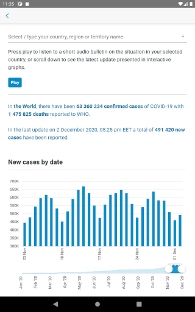  | 
 |   |   | 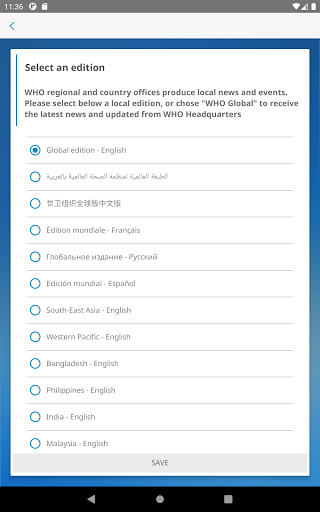  | 

## Development team
In the following we report the main information provided by the development team in the Google play store.

| | |
|-------------------------|-------------------------|
| **Developer**  | World Health Organization |
| **Website**  | [https://www.who.int/](https://www.who.int/) |
| **Email** | dcx@who.int |
| **Physical address**  | [Avenu Appia 20 1211 Geneva Switzerland](https://www.google.com/maps/search/Avenu%20Appia%2020%201211%20Geneva%20Switzerland) (Google Maps) |
| **Other developed apps**  | [https://play.google.com/store/apps/developer?id=World+Health+Organization](https://play.google.com/store/apps/developer?id=World+Health+Organization) |

## Android support

| | |
|-------------------------|-------------------------|
| **Declared target Android version**  | - |
| **Effective target Android version**  | - |
| **Minimum supported Android version**  | Jelly Bean, version 4.2.x (API level 17) |
| **Maximum target Android version**  | - |

The larger the difference between the minimum and maximum supported Android versions, the better. A larger difference means a wider audience. For example, old phones have a very low Android version, so a high minimum supported Android version means that the app cannot be used by users with old phones, thus leading to accessibility problems. 

## Requested permissions

In the following we report the complete list of the permissions requested by the app. 

| **Permission** | **Protection level** | **Description** | 
|-------------------------|-------------------------|-------------------------|
 **android.permission ACCESS_NETWORK_STATE** | Normal | Allows applications to access information about networks. 
 **android.permission INTERNET** | Normal | Allows applications to open network sockets. 
 **android.permission READ_CALENDAR** | :warning:**Dangerous** | Allows an application to read the user's calendar data. 
 **android.permission READ_EXTERNAL_STORAGE** | :warning:**Dangerous** | Allows an application to read from external storage. 
 **android.permission WAKE_LOCK** | Normal | Allows using PowerManager WakeLocks to keep processor from sleeping or screen from dimming. 
 **android.permission WRITE_CALENDAR** | :warning:**Dangerous** | Allows an application to write the user's calendar data. 
 **android.permission WRITE_EXTERNAL_STORAGE** | :warning:**Dangerous** | Allows an application to write to external storage. 
 **com.google.android.c2dm.permission RECEIVE** | - | - 
 **com.google.android.finsky.permission BIND_GET_INSTALL_REFERRER_SERVICE** | - | - 

## Mentioned servers

| **Server** | **Registrant** | **Registrant country** | **Creation date** | 
|-------------------------|-------------------------|-------------------------|-------------------------|
 | adobe.com | Adobe Inc. | :us: US | 1986-11-17 05:00:00 |
 | googlesyndication.com | Google LLC | :us: US | 2003-01-21 06:17:24 |
 | google.com | Google LLC | :us: US | 1997-09-15 04:00:00 |
 | app-measurement.com | Google LLC | :us: US | 2015-06-19 20:13:31 |
 | googleapis.com | Google LLC | :us: US | 2005-01-25 17:52:26 |
 | googleadservices.com | Google LLC | :us: US | 2003-06-19 16:34:53 |

## Security analysis 

Below we report the main security warnings raised by our execution of the [Androwarn](https://github.com/maaaaz/androwarn) security analysis tool.

**Connection interfaces exfiltration**
> - This application reads details about the currently active data network 
> - This application tries to find out if the currently active data network is metered 

**Suspicious connection establishment**
> - This application opens a Socket and connects it to the remote address 'Lfi/iki/elonen/NanoHTTPD$ResponseException;' on the 'N/A' port  
> - This application opens a Socket and connects it to the remote address 'NanoHttpd Shutdown' on the 'N/A' port  

**Code execution**
> - This application loads a native library: 'NativeScript' 
> - This application executes a UNIX command containing this argument: '2' 

## User ratings and reviews

Below we provide information about how end users are reacting to the app in terms of ratings and reviews in the Google Play store.

### Ratings

The WHO Info app has been installed by more than **500000** times. At this time, **1114** rated the app and its average score is **4.108108**. Below we show the distribution of the ratings across the usual star-based rating of Google Play

:star::star::star::star::star:: 754

:star::star::star::star:: 90

:star::star::star:: 60

:star::star:: 60

:star:: 150

### Reviews 

#### 5-star reviews

> Friends is godgirt  :date: __2021-04-27 06:51:26__

> Like it  :date: __2021-04-08 13:28:53__

> I love this app its very important for me to see what's going on in the world of Who as very imformative app  :date: __2021-03-30 14:48:27__

> Good  :date: __2021-03-24 19:33:39__

> Very good  :date: __2021-03-23 07:14:57__

> 9/12/2020  :date: __2021-03-12 11:25:34__

> Good  :date: __2021-01-17 13:53:04__

> Gives global data on covid 19 updates.  :date: __2021-01-07 08:43:58__

> Very nice app for health.  :date: __2020-12-12 06:15:46__

> Great. Installed quickly without problems. :-)  :date: __2020-11-15 16:31:45__

#### 4-star reviews

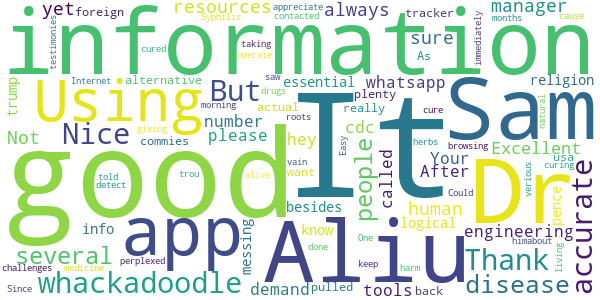

> It's always good in human resources manager  :date: __2021-03-18 00:21:01__

> Not sure yet  :date: __2020-09-27 08:50:53__

> Excellent engineering tools. Your whatsapp number please.  :date: __2020-08-05 11:01:52__

> all the demand who it is hey  :date: __2020-07-20 15:10:48__

> Using this more and more. After the cdc called religion an essential. I don't know what whackadoodle besides trump/pence is messing with the info. Thank you for being a more logical alternative. As usa is being pulled back by whackadoodles and foreign commies.  :date: __2020-07-17 03:09:14__

> Nice  :date: __2020-07-08 17:19:26__

> good  :date: __2020-06-03 00:37:10__

> It's just information, not the actual tracker. But has plenty of information that's 100% accurate.  :date: __2020-05-31 02:37:20__

> I really want to appreciate Dr. Aliu Sam for using his natural roots and herbs medicine to cure me of Syphilis Since 11 months now I have been living with this disease and it has been giving me challenges, I was so perplexed cause I have been taking several drugs to be cured but all have been in vain. One morning I was browsing through the Internet then i saw several testimonies about Dr. Aliu Sam curing people off verious diseases and immediately I contacted Dr. Aliu Sam I told himabout my trou  :date: __2020-05-08 05:33:57__

> It did not detect  :date: __2020-04-29 18:37:26__

#### 3-star reviews

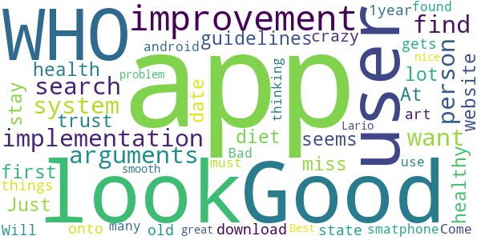

> A good improvement could be the implementation of a search system for arguments that a person want to find ( like the guidelines about health and healthy diet). At first look seems it miss a lot from the website.  :date: __2020-09-27 10:09:16__

> Good App but I don't trust the WHO. Just have the app to stay up to date with the crazy things the WHO gets up to  :date: __2020-07-29 10:34:08__

> Will not download onto my 1year old state of the art smatphone. Bad, as a user of many android apps what are you thinking. I have found more than 3700 other users that can not use this app. Come on you must no you have problem.  :date: __2020-05-26 02:04:59__

> Good  :date: __2020-05-14 21:22:11__

> Best.  :date: __2020-04-20 13:14:33__

> Looks nice great look smooth Lario  :date: __2020-04-18 09:44:30__

#### 2-star reviews

> GOOD  :date: __2021-04-28 06:11:46__

> I had the app only a few seconds. I was wondering if we can use it to track vaccination. I am wondering. The EU develop a digital vaccination pass. Why does this app got not simply enhanced. The old yellow books were also from the WHO. Can you add such a feature? I think it would make really sense if the WHO had this feature in it and it can be globally used.  :date: __2021-04-04 23:04:57__

> Badly organized, unadjustable, and full of politics,i erased it  :date: __2020-11-13 07:29:53__

> Coro nosotras coronas  :date: __2020-07-02 06:41:55__

> Partial  :date: __2020-06-22 12:24:23__

> Learn more  :date: __2020-06-15 23:35:50__

> WHO Inform Covid 19  :date: __2020-05-24 17:14:56__

> Very little data or charts. Not consistent with Worldometer. Mostly an aggregation of news feeds about WHO  :date: __2020-05-15 15:38:10__

> Thanks for your help.  :date: __2020-04-22 18:52:40__

#### 1-star reviews

> This app is as is the definition of w.h.o. it barely works, it ccp funded, and is late with useless information.  :date: __2021-03-31 11:03:41__

> Herd immunity is real. Stop changing facts  :date: __2021-03-14 16:25:09__

> I do not like the new update.  :date: __2021-01-19 23:39:15__

> Says I can't connect even tho I have WiFi and data on  :date: __2021-01-04 02:35:04__

> Extremely bad application. Always not working at all. Why do you keep it in the playstore?!  :date: __2020-12-15 16:13:48__

> A wast of time  :date: __2020-11-04 13:04:20__

> “‘Ovid’ is Latin for a sheep. COVID starts with a C, which also means ‘see’ in ancient language. 19 was known as the “Number of Surrender” in ancient times.”  It goes on to draw the conclusion, “C-OVID 19 = ‘See a Sheep Surrender'”.  :date: __2020-11-02 08:06:17__

> Very scammers  :date: __2020-10-19 19:45:47__

> I just downloaded it, but every time I open it just say "an error occur check your connectivity" or something like that... didn't work...  :date: __2020-10-10 17:24:54__

> Does not work  :date: __2020-10-09 00:12:33__

# Coronavirus Help
App version ``1.1``

Analyzed with [covid-apps-observer](http://github.com/covid-apps-observer) project, version ``0.1``

## App overview
| | |
|-------------------------|-------------------------| 
| **Name**&nbsp;&nbsp;&nbsp;&nbsp;&nbsp;&nbsp;&nbsp;&nbsp;&nbsp;&nbsp;&nbsp;&nbsp;&nbsp;&nbsp;&nbsp;&nbsp;&nbsp;&nbsp;&nbsp;&nbsp;&nbsp;&nbsp;&nbsp;&nbsp;&nbsp;&nbsp;&nbsp;&nbsp;&nbsp;&nbsp;&nbsp;&nbsp;&nbsp;&nbsp;&nbsp;&nbsp;&nbsp;&nbsp;&nbsp;&nbsp;  | Coronavirus Help |
| **Unique identifier** | appinventor.ai_david_taylor.Coronavirus_help2020 |
| **Link to Google Play** | [https://play.google.com/store/apps/details?id=appinventor.ai_david_taylor.Coronavirus_help2020](https://play.google.com/store/apps/details?id=appinventor.ai_david_taylor.Coronavirus_help2020) |
| **Summary**  | Help and advice on the Coronavirus (Covid-19) |
| **Privacy policy** | [-](-) |
| **Latest version** | 1.1 |
| **Last update** | 2020-04-23 09:48:32 |
| **Recent changes** | Splash screen removed, more advice added through the Ryecroft website feature |
| **Installs**  | 1,000+ |
| **Category** | Health & Fitness |
| **First release** | Mar 26, 2020 |
| **Size**  | 5.9M |
| **Supported Android version**  | 2.1 and up |

### Description
> This app collates genuine information from sorces such as the UK Government, WHO, NHS and others in one place. THis idea being all of the information is genuine and updated on a regular basis by the organisations mentioned.

### User interface
The developers of the app provide the following screenshots in the Google play store.
| | | |
|:-------------------------:|:-------------------------:|:-------------------------:|
 |   |   |   | 
 |  

## Development team
In the following we report the main information provided by the development team in the Google play store.

| | |
|-------------------------|-------------------------|
| **Developer**  | Dave at Ryecroft Community Hub & BITS |
| **Website**  | [http://www.ryecroftnrc.org](http://www.ryecroftnrc.org) |
| **Email** | david.taylor@ryecroftnrc.org |
| **Physical address**  | - |
| **Other developed apps**  | [https://play.google.com/store/apps/developer?id=Dave+at+Ryecroft+Community+Hub+%26+BITS](https://play.google.com/store/apps/developer?id=Dave+at+Ryecroft+Community+Hub+%26+BITS) |

## Android support

| | |
|-------------------------|-------------------------|
| **Declared target Android version**  | Pie, version 9 (API level 28) |
| **Effective target Android version**  | Pie, version 9 (API level 28) |
| **Minimum supported Android version**  | Eclair, version 2.1 (API level 7) |
| **Maximum target Android version**  | - |

The larger the difference between the minimum and maximum supported Android versions, the better. A larger difference means a wider audience. For example, old phones have a very low Android version, so a high minimum supported Android version means that the app cannot be used by users with old phones, thus leading to accessibility problems. 

## Requested permissions

In the following we report the complete list of the permissions requested by the app. 

| **Permission** | **Protection level** | **Description** | 
|-------------------------|-------------------------|-------------------------|
 **android.permission ACCESS_NETWORK_STATE** | Normal | Allows applications to access information about networks. 
 **android.permission ACCESS_WIFI_STATE** | Normal | Allows applications to access information about Wi-Fi networks. 
 **android.permission INTERNET** | Normal | Allows applications to open network sockets. 
 **android.permission READ_EXTERNAL_STORAGE** | :warning:**Dangerous** | Allows an application to read from external storage. 
 **android.permission WRITE_EXTERNAL_STORAGE** | :warning:**Dangerous** | Allows an application to write to external storage. 

## Mentioned servers

| **Server** | **Registrant** | **Registrant country** | **Creation date** | 
|-------------------------|-------------------------|-------------------------|-------------------------|
 | google.com | Google LLC | :us: US | 1997-09-15 04:00:00 |
 | w3.org | W3C | :us: US | 1994-07-06 04:00:00 |
 | gnu.org | Free Software Foundation | :us: US | 1995-11-24 05:00:00 |
 | googleapis.com | Google LLC | :us: US | 2005-01-25 17:52:26 |
 | appspot.com | Google LLC | :us: US | 2005-03-10 02:27:55 |
 | appspot.com | Google LLC | :us: US | 2005-03-10 02:27:55 |
 | mit.edu | Massachusetts Institute of Technology | - | 1985-05-23 00:00:00 |
 | appspot.com | Google LLC | :us: US | 2005-03-10 02:27:55 |
 | yandex.net | - | :ru: RU | 2000-11-14 06:56:55 |
 |  | - | - | 1996-08-01 00:00:00 |
 | redcross.org | American National Red Cross | :us: US | 1995-09-05 04:00:00 |
 |  | - | - | 2003-11-04 00:00:00 |
 |  | - | - | 1996-08-01 00:00:00 |
 |  | - | - | 1996-08-01 00:00:00 |

## Security analysis 

Below we report the main security warnings raised by our execution of the [Androwarn](https://github.com/maaaaz/androwarn) security analysis tool.

**Telephony identifiers leakage**
> - This application reads the unique device ID, i.e the IMEI for GSM and the MEID or ESN for CDMA phones 

**Location lookup**
> - This application reads location information from all available providers (WiFi, GPS etc.) 

**Connection interfaces exfiltration**
> - This application reads details about the currently active data network 
> - This application tries to find out if the currently active data network is metered 

**Telephony services abuse**
> - This application makes phone calls 

**Audio video eavesdropping**
> - This application records audio from the 'MIC' source  

**Suspicious connection establishment**
> - This application opens a Socket and connects it to the remote address '4' on the 'v31' port  

**Pim data leakage**
> - This application accesses the contacts list 

**Code execution**
> - This application executes a UNIX command 
> - This application executes a UNIX command containing this argument: 'Ljava/util/List;->size()I' 

## User ratings and reviews

Below we provide information about how end users are reacting to the app in terms of ratings and reviews in the Google Play store.

### Ratings

The Coronavirus Help app has been installed by more than **1000** times. At this time, **19** rated the app and its average score is **4.0**. Below we show the distribution of the ratings across the usual star-based rating of Google Play

:star::star::star::star::star:: 13

:star::star::star::star:: 1

:star::star::star:: 1

:star::star:: 0

:star:: 4

### Reviews 

#### 5-star reviews

> As a 74 year old "extremely clinically vulnerable" person I found this app invaluable. As a retired systems engineer I find it extremely well put together with accurate data I want/need to see and easy to navigate. Thank you.  :date: __2021-03-26 09:07:32__

> Good  :date: __2020-10-10 21:21:40__

> Just got this app and really loved the fact that all covid19 info you need was in 1 place and easy to use great job. (was a little hard to find on google play. An app like this should be more visible)  :date: __2020-07-12 23:25:15__

> Very informative  :date: __2020-07-09 21:39:20__

> This helps me from the new crona very good 👍 👌 😊 ☺ 😀 😄 👍 👌 😊  :date: __2020-06-15 17:43:31__

> Contact tracing. Uk  :date: __2020-06-01 22:22:36__

> I love it 💖 so simple to use and not confusing at all, I love that everything is in one place and from the people that we should be listening to and not from misleading sources (newspapers) x I love all you over 70's that was involved in making this great app x I am 28 and I couldn't of done anything like this well done guys stay safe 💋💋  :date: __2020-05-27 22:54:07__

> This app is very good .  :date: __2020-05-26 02:43:22__

> Brilliant app! Very informative and easy to follow. Highly recommend  :date: __2020-05-08 13:34:16__

> Easy to use  :date: __2020-05-03 17:07:02__

#### 4-star reviews

> Goof  :date: __2020-09-26 20:22:38__

> Great to see all the information bundled into one little package, unfortunately, because the app simply directs you to websites that are displayed within a web view, it's completely useless for offline use.  :date: __2020-05-30 11:49:56__

> Hi I'm not criticising your app but my avast antivirus also detected that there was malware in your app so I wasn't able to install. Maybe this is something you want to look into  :date: __2020-04-28 03:51:39__

#### 3-star reviews

> Virus checker (McAfee) alerted to a (possible) malware contained within this app. After reading other reviews of this app it appears to be a false positive, thank goodness other people had flagged this as i would of halted the install and not downloaded it. I don't believe its actually anything harmful contained within the app itself. I would given the app a 5 ⭐ except its laid out like a website from 1992. Great app though  :date: __2020-05-21 09:29:34__

> What is your email? I can send you a screen shot saying that the app might be a virus when I install it  :date: __2020-04-26 14:51:15__

#### 2-star reviews

> Who'd of thought I'd need an app to "help" me with a virus that I have a 99.94% chance of surviving (official numbers).  :date: __2020-06-25 08:48:45__

#### 1-star reviews

> Here is another app that's been put on my phone and I can't use it to track if I have been near anybody with coronavirus as according to the app it doesn't work in Scotland. What the bloody point of putting this app on people's phones if they can't use it.  :date: __2020-08-18 09:31:46__

> Stolen content  :date: __2020-06-21 18:51:30__

> Turns out I didn't need an app for a mysteriously absent virus that has killed worldwide less than seasonal flu.  :date: __2020-06-09 10:13:17__

> If I wanted to see a picture of the word caronavirus I can Google one . Other than this it's pretty useless probably worst app I've encountered  :date: __2020-04-17 14:09:13__

> Will not open in Sony XZ3  :date: __2020-04-14 17:58:35__

# COVIDCare NI
App version ``2.0``

Analyzed with [covid-apps-observer](http://github.com/covid-apps-observer) project, version ``0.1``

## App overview
| | |
|-------------------------|-------------------------| 
| **Name**&nbsp;&nbsp;&nbsp;&nbsp;&nbsp;&nbsp;&nbsp;&nbsp;&nbsp;&nbsp;&nbsp;&nbsp;&nbsp;&nbsp;&nbsp;&nbsp;&nbsp;&nbsp;&nbsp;&nbsp;&nbsp;&nbsp;&nbsp;&nbsp;&nbsp;&nbsp;&nbsp;&nbsp;&nbsp;&nbsp;&nbsp;&nbsp;&nbsp;&nbsp;&nbsp;&nbsp;&nbsp;&nbsp;&nbsp;&nbsp;  | COVIDCare NI |
| **Unique identifier** | net.hscni.covid19ni |
| **Link to Google Play** | [https://play.google.com/store/apps/details?id=net.hscni.covid19ni](https://play.google.com/store/apps/details?id=net.hscni.covid19ni) |
| **Summary**  | COVIDCare NI is a coronavirus symptom check with the latest advice and guidance |
| **Privacy policy** | [https://www.health-ni.gov.uk/publications/covid-19-app-privacy-notice](https://www.health-ni.gov.uk/publications/covid-19-app-privacy-notice) |
| **Latest version** | 2.0 |
| **Last update** | 2020-07-22 16:32:05 |
| **Recent changes** | · Featured articles on mental health and general advice · Latest regulations and easing of lockdown guidance  · Information on how to get tested and testing facilities · COVID-19 statistics · Isolation timer updated to include isolation following a positive test result and isolation due to close contact with someone with COVID-19 · Ability to add household members symptoms to dashboard · Improved navigation |
| **Installs**  | 50,000+ |
| **Category** | Medical |
| **First release** | Mar 24, 2020 |
| **Size**  | 60M |
| **Supported Android version**  | 4.2 and up |

### Description
> Overview
 The COVIDCare NI app has been developed by Digital Health and Care NI in partnership with Health & Social Care, the Public Health Agency and the Department of Health.
 The app has been designed to help the public in Northern Ireland keep up to date with the latest advice on the COVID-19 pandemic, helping you to:
 Check if you or someone in your household has coronavirus symptoms.
 Access personalised advice based on your answers to the symptom check questions.
 Decide if you need clinical advice and how to access it.
 Easily find links to trusted information resources on COVID-19 advice and mental health resources.
 Self-isolate if you have symptoms by checking the self-isolation timer for both yourself and your household.
 Search current advice by using a search function of FAQs.
 We continue to update the app with new features based on feedback from citizens in Northern Ireland and will continue to ensure app users get access to the most up to date headlines and changes in the advice and guidance.
 Things are moving quickly with the pandemic so you may need to come back to refresh your app regularly. We’ll let you know when this is necessary.
 Thank you for your support in helping us project your family, friends and community.
 Why use the app?
 The app is available for use in Northern Ireland to all individuals who are currently residing in Northern Ireland.
 Data Security
 The app does not collect any personally identifiable information.
 We will collect information related to the postcode and age of the user to help us track the impact of COVID-19 in Northern Ireland.
 This will help us to plan services and ensure that resources are directed to the areas of greatest need.

### User interface
The developers of the app provide the following screenshots in the Google play store.
| | | |
|:-------------------------:|:-------------------------:|:-------------------------:|
 |   |   |   | 
 |   |  

## Development team
In the following we report the main information provided by the development team in the Google play store.

| | |
|-------------------------|-------------------------|
| **Developer**  | Health & Social Care Northern Ireland |
| **Website**  | [https://www.publichealth.hscni.net/](https://www.publichealth.hscni.net/) |
| **Email** | hscdhcni@gmail.com |
| **Physical address**  | - |
| **Other developed apps**  | [https://play.google.com/store/apps/developer?id=Health+%26+Social+Care+Northern+Ireland](https://play.google.com/store/apps/developer?id=Health+%26+Social+Care+Northern+Ireland) |

## Android support

| | |
|-------------------------|-------------------------|
| **Declared target Android version**  | Android10, version 10 (API level 29) |
| **Effective target Android version**  | Android10, version 10 (API level 29) |
| **Minimum supported Android version**  | Jelly Bean, version 4.2.x (API level 17) |
| **Maximum target Android version**  | - |

The larger the difference between the minimum and maximum supported Android versions, the better. A larger difference means a wider audience. For example, old phones have a very low Android version, so a high minimum supported Android version means that the app cannot be used by users with old phones, thus leading to accessibility problems. 

## Requested permissions

In the following we report the complete list of the permissions requested by the app. 

| **Permission** | **Protection level** | **Description** | 
|-------------------------|-------------------------|-------------------------|
 **android.permission ACCESS_NETWORK_STATE** | Normal | Allows applications to access information about networks. 
 **android.permission ACCESS_WIFI_STATE** | Normal | Allows applications to access information about Wi-Fi networks. 
 **android.permission INTERNET** | Normal | Allows applications to open network sockets. 
 **android.permission WAKE_LOCK** | Normal | Allows using PowerManager WakeLocks to keep processor from sleeping or screen from dimming. 
 **com.google.android.c2dm.permission RECEIVE** | - | - 
 **net.hscni.covid19ni.permission C2D_MESSAGE** | - | - 

## Mentioned servers

| **Server** | **Registrant** | **Registrant country** | **Creation date** | 
|-------------------------|-------------------------|-------------------------|-------------------------|
 | google.com | Google LLC | :us: US | 1997-09-15 04:00:00 |
 | w3.org | W3C | :us: US | 1994-07-06 04:00:00 |
 | microsoft.com | Microsoft Corporation | :us: US | 1991-05-02 04:00:00 |
 | googleapis.com | Google LLC | :us: US | 2005-01-25 17:52:26 |

## Security analysis 

Below we report the main security warnings raised by our execution of the [Androwarn](https://github.com/maaaaz/androwarn) security analysis tool.

**Telephony identifiers leakage**
> - This application reads the ISO country code equivalent of the current registered operator's MCC (Mobile Country Code) 
> - This application reads the numeric name (MCC+MNC) of current registered operator 
> - This application reads the operator name 

**Connection interfaces exfiltration**
> - This application reads details about the currently active data network 

**Code execution**
> - This application loads a native library: 'monodroid' 
> - This application loads a native library: 'monosgen-2.0' 
> - This application loads a native library: 'xamarin-app' 
> - This application loads a native library: 'xamarin-debug-app-helper' 

## User ratings and reviews

Below we provide information about how end users are reacting to the app in terms of ratings and reviews in the Google Play store.

### Ratings

The COVIDCare NI app has been installed by more than **50000** times. At this time, **300** rated the app and its average score is **3.58**. Below we show the distribution of the ratings across the usual star-based rating of Google Play

:star::star::star::star::star:: 162

:star::star::star::star:: 27

:star::star::star:: 12

:star::star:: 21

:star:: 78

### Reviews 

#### 5-star reviews

> I very much like this app and use it daily to look at the statistics which are usually updated on a daily basis except sometimes at weekends or public holidays. Would it be possible to ensure stats are updated for every day?  :date: __2021-05-03 07:45:01__

> Good so far  :date: __2020-12-31 05:36:23__

> A great app for the current crises. Well designed and easy to navigate  :date: __2020-12-15 01:13:45__

> Excellent service I could recommend  :date: __2020-10-19 15:13:53__

> Very poor  :date: __2020-09-08 20:21:41__

> Amazing and informative app. PLEASE NOTE THIS APP IS FOR NORTHERN IRELAND ONLY. So don't think this will work in other parts of the UK or the world, however it is compatible with the republic of ireland version.  :date: __2020-08-01 00:43:11__

> Easy to use and informative  :date: __2020-07-30 19:39:35__

> Excellent  :date: __2020-07-30 15:56:15__

> Excellent and informative  :date: __2020-06-30 14:11:20__

> Amazing the p we people who it doesn't work you need to go to the NHS website or gothirmont web don't give the 1 star if do you are ungrateful and it probably your phone. 😂😂😂  :date: __2020-06-06 22:45:27__

#### 4-star reviews

> Would a regional breakdown of new cases  :date: __2020-07-31 00:38:27__

> Seems promising at first glance, easy to use with good range of features. It also let's you use the app on behalf of someone else which might be good for elderly/and or the less technical, visually impaired or less able bodied. What accessibility features does it conform to? One issue I had was when I filled in the symptom checker flow. The last stage presents a blank yellow screen and it's not intuitive that you have to close or go back to see suggestions  :date: __2020-07-30 18:59:15__

> Could do with more updates. But pretty good for sign posting  :date: __2020-06-29 12:39:16__

> A bit empty but good overall!  :date: __2020-06-17 22:06:54__

> Manchester not,,,,,  :date: __2020-06-11 21:25:59__

> Quite good app as has a symptoms checker and some info, advice and statistics.. However doesn't have what I actually downloaded it for which was to find out about updates to current regulations and recovery plan such as easing of lockdown rules etc.. Have to search for this and then visit nidirect website for this info..  :date: __2020-06-07 21:55:20__

> Good app  :date: __2020-05-06 23:22:23__

> Great app, though the virtual assistant could use some more specific information / ai training. Thanks for making this.  :date: __2020-04-02 10:48:28__

> Handy advice in scarey times  :date: __2020-04-01 21:27:09__

> Hopefully this could be a very powerful way of identifying cv19 hotspots.  :date: __2020-03-31 20:18:01__

#### 3-star reviews

> Information not updated regularly  :date: __2020-10-05 08:48:36__

> I have just downloaded this app can anyone please tell me if it's free or is there a payment on it  :date: __2020-08-11 23:00:25__

> Who owns this App is it a private profit making company? If so is this another privatisation by the back door which is all too common with the NHS overall in recent years Own it Don't rent it!  :date: __2020-05-06 15:23:14__

> I was looking for statistics on the spread in NI as we are lumped in with the UK in official statistics, this app doesn't seem to have that. Useful advice but nothing I haven't heard 1000 times already - those who aren't listening won't be downloading the app anyway.  :date: __2020-04-11 15:32:23__

> N/A  :date: __2020-04-10 00:07:41__

> Helps a bit but I still rang 111 help line  :date: __2020-04-07 03:46:29__

> Only available in Ireland!  :date: __2020-04-02 18:40:10__

> Doesn't work in the UK  :date: __2020-04-01 08:16:36__

> Only available in Northern Ireland 🇮🇪 😢  :date: __2020-03-26 13:18:23__

#### 2-star reviews

> Not in NI but won't load 😔  :date: __2020-06-20 10:41:04__

> Sporadic updates. Better to just use google.  :date: __2020-05-26 17:42:14__

> No updated figures since April 30  :date: __2020-05-04 17:55:33__

> Sorry 2 stars only. App not for England or Wales. Advertised on the news as available all over UK and this is not so. So I've uninstalled it.  :date: __2020-04-11 23:08:08__

> Why is this only available in NI and not available anywhere else I think its deplorable as we are all dealing with this and not just NI  :date: __2020-04-10 14:03:09__

> Nothing new or useful here.  :date: __2020-04-06 19:46:22__

> My is it only NI  :date: __2020-03-26 08:24:52__

#### 1-star reviews

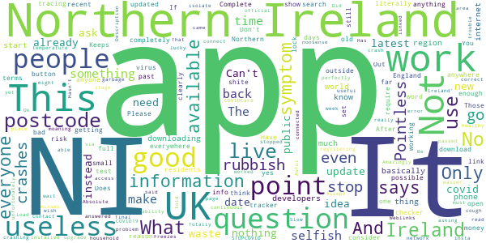

> Freezes at final stage  :date: __2021-05-10 14:29:41__

> Awful  :date: __2021-05-03 19:21:43__

> Pointless really, after you go to the trouble of registering and getting it set up, all it does is ask you 3 questions. Have you a temperature? Have you a continuous cough? Did anyone in your household have covid symptoms? That's it!!  :date: __2021-01-01 20:35:30__

> Hasn't worked since the upgrade. Keeps asking me to connect to network when I am already connected  :date: __2020-11-18 14:07:13__

> Complete rubbish. I answered all the questions in the symptom checker as perfectly healthy, it told me to isolate as I had covid symptoms. Absolute nonsense.  :date: __2020-10-26 23:26:48__

> Rubbish  :date: __2020-10-18 20:47:15__

> Totally useless!; Not able to get passed "Accept" terms. Be easier to wait for the news updates. Amazingly bad.  :date: __2020-10-04 18:50:14__

> App won't open once installed :-(  :date: __2020-09-24 10:53:15__

> only works on recent phones, completely misses the point...must work everywhere or it is pointless.  :date: __2020-08-11 12:19:23__

> It came to stop as I had no tracing ability and said no more.  :date: __2020-07-31 23:15:28__

# OpenWHO: Knowledge for Health Emergencies
App version ``3.7``

Analyzed with [covid-apps-observer](http://github.com/covid-apps-observer) project, version ``0.1``

## App overview
| | |
|-------------------------|-------------------------| 
| **Name**&nbsp;&nbsp;&nbsp;&nbsp;&nbsp;&nbsp;&nbsp;&nbsp;&nbsp;&nbsp;&nbsp;&nbsp;&nbsp;&nbsp;&nbsp;&nbsp;&nbsp;&nbsp;&nbsp;&nbsp;&nbsp;&nbsp;&nbsp;&nbsp;&nbsp;&nbsp;&nbsp;&nbsp;&nbsp;&nbsp;&nbsp;&nbsp;&nbsp;&nbsp;&nbsp;&nbsp;&nbsp;&nbsp;&nbsp;&nbsp;  | OpenWHO: Knowledge for Health Emergencies |
| **Unique identifier** | de.xikolo.openwho |
| **Link to Google Play** | [https://play.google.com/store/apps/details?id=de.xikolo.openwho](https://play.google.com/store/apps/details?id=de.xikolo.openwho) |
| **Summary**  | Life-saving knowledge for frontline responders in health emergencies. |
| **Privacy policy** | [https://openwho.org/pages/privacy](https://openwho.org/pages/privacy) |
| **Latest version** | 3.7 |
| **Last update** | 2020-11-23 13:57:15 |
| **Recent changes** | - Bug fixes and performance improvements |
| **Installs**  | 1,000,000+ |
| **Category** | Education |
| **First release** | May 17, 2017 |
| **Size**  | 18M |
| **Supported Android version**  | 5.0 and up |

### Description
> OpenWHO is the World Health Organization's (WHO) interactive knowledge-transfer platform offering online courses to improve the response to health emergencies. OpenWHO enables the Organization and its key partners to transfer life-saving knowledge to large numbers of frontline responders.
 With OpenWHO, you have the flexibility to learn at your convenience. Watch the short video lectures and test your knowledge with self-tests when and where you like. The course forum and the collaboration space allow you to get in touch with other participants and experts around the world.
  
 Designed primarily for health care workers, frontline responders, and decision-makers, the app is also a source of information for those affected by disease outbreaks and health emergencies, or for those with a general interest in WHO's work in health emergencies.
  
 It features 6 channels:
 - The <b>Outbreak</b> channel addresses the management of infectious diseases and provides life-saving, scientific information.
 - The <b>Ready for Response</b> channel helps prepare personnel who are training for deployment to work in disease outbreaks and health emergencies.
 - The <b>Get Social</b> channel focuses on social science-based interventions and helps to communicate with affected communities.
 - The <b>Preparing for Pandemics</b> channel brings together courses on various aspects of preparedness, including surveillance, public health measures and risk communication during a pandemic.
 - The <b>COVID-19</b> channel provides learning resources in WHO's 6 official languages (Arabic, Chinese, English, French, Russian and Spanish) for health professionals, decision-makers and the public for the outbreak of coronavirus disease (COVID-19).
 - The <b>COVID-19 National Languages</b> channel provides the same learning resources as the COVID-19 channel but in national languages, such as Indonesian, Japanese and Portuguese. 
  
 OpenWHO courses are available in many languages, including WHO's 6 official languages. 
  
 Download the app now, and join the OpenWHO community.
 This app is developed in cooperation between the Hasso Plattner Institute and the WHO. The learning content is provided exclusively by the WHO.

### User interface
The developers of the app provide the following screenshots in the Google play store.
| | | |
|:-------------------------:|:-------------------------:|:-------------------------:|
 |   |   |   | 
 |   |   |   | 

## Development team
In the following we report the main information provided by the development team in the Google play store.

| | |
|-------------------------|-------------------------|
| **Developer**  | HPI Knowledge Engineering Team |
| **Website**  | [https://openwho.org/](https://openwho.org/) |
| **Email** | openwho-support@hpi.de |
| **Physical address**  | [Prof.-Dr.-Helmert-Str.2-3 14482 Potsdam](https://www.google.com/maps/search/Prof.-Dr.-Helmert-Str.2-3%2014482%20Potsdam) (Google Maps) |
| **Other developed apps**  | [https://play.google.com/store/apps/developer?id=7185448023325736337](https://play.google.com/store/apps/developer?id=7185448023325736337) |

## Android support

| | |
|-------------------------|-------------------------|
| **Declared target Android version**  | - |
| **Effective target Android version**  | - |
| **Minimum supported Android version**  | Lollipop, version 5.0 (API level 21) |
| **Maximum target Android version**  | - |

The larger the difference between the minimum and maximum supported Android versions, the better. A larger difference means a wider audience. For example, old phones have a very low Android version, so a high minimum supported Android version means that the app cannot be used by users with old phones, thus leading to accessibility problems. 

## Requested permissions

In the following we report the complete list of the permissions requested by the app. 

| **Permission** | **Protection level** | **Description** | 
|-------------------------|-------------------------|-------------------------|
 **android.permission ACCESS_NETWORK_STATE** | Normal | Allows applications to access information about networks. 
 **android.permission ACCESS_WIFI_STATE** | Normal | Allows applications to access information about Wi-Fi networks. 
 **android.permission DOWNLOAD_WITHOUT_NOTIFICATION** | - | - 
 **android.permission FOREGROUND_SERVICE** | Normal | Allows a regular application to use Service.startForeground. 
 **android.permission INTERNET** | Normal | Allows applications to open network sockets. 
 **android.permission RECEIVE_BOOT_COMPLETED** | Normal | Allows an application to receive the Intent.ACTION_BOOT_COMPLETED that is broadcast after the system finishes booting. 
 **android.permission WAKE_LOCK** | Normal | Allows using PowerManager WakeLocks to keep processor from sleeping or screen from dimming. 
 **android.permission WRITE_EXTERNAL_STORAGE** | :warning:**Dangerous** | Allows an application to write to external storage. 
 **com.google.android.c2dm.permission RECEIVE** | - | - 
 **com.google.android.finsky.permission BIND_GET_INSTALL_REFERRER_SERVICE** | - | - 

## Mentioned servers

| **Server** | **Registrant** | **Registrant country** | **Creation date** | 
|-------------------------|-------------------------|-------------------------|-------------------------|
 | googlesyndication.com | Google LLC | :us: US | 2003-01-21 06:17:24 |
 | google.com | Google LLC | :us: US | 1997-09-15 04:00:00 |
 | apple.com | Apple Inc. | :us: US | 1987-02-19 05:00:00 |
 | aomedia.org | Contact Privacy Inc. Customer 1243324949 | :canada: CA | 2015-08-24 14:07:31 |
 | dashif.org | VTM Group | :us: US | 2012-04-27 13:02:46 |
 | app-measurement.com | Google LLC | :us: US | 2015-06-19 20:13:31 |
 | w3.org | W3C | :us: US | 1994-07-06 04:00:00 |
 | googleapis.com | Google LLC | :us: US | 2005-01-25 17:52:26 |
 | psdev.de | - | - | - |
 | xmlpull.org | WhoisGuard, Inc. | PA | 2001-11-26 20:33:08 |
 | crashlytics.com | Google LLC | :us: US | 2011-01-21 15:30:40 |
 | apache.org | The Apache Software Foundation | :us: US | 1995-04-11 04:00:00 |
 | opensource.org | Open Source Initiative | :us: US | 1998-02-11 05:00:00 |
 | creativecommons.org | Creative Commons Corporation | :canada: CA | 2001-01-15 16:51:44 |
 | eclipse.org | Eclipse.org Foundation, Inc. | :canada: CA | 1997-04-14 04:00:00 |
 | gnu.org | Free Software Foundation | :us: US | 1995-11-24 05:00:00 |
 | mozilla.org | Mozilla Corporation | :us: US | 1998-01-24 05:00:00 |
 | googleadservices.com | Google LLC | :us: US | 2003-06-19 16:34:53 |

## Security analysis 

Below we report the main security warnings raised by our execution of the [Androwarn](https://github.com/maaaaz/androwarn) security analysis tool.

**Telephony identifiers leakage**
> - This application reads the ISO country code equivalent of the current registered operator's MCC (Mobile Country Code) 
> - This application reads the MCC+MNC of the provider of the SIM 

**Connection interfaces exfiltration**
> - This application reads details about the currently active data network 
> - This application tries to find out if the currently active data network is metered 

**Suspicious connection establishment**
> - This application opens a Socket and connects it to the remote address ' returned no addresses for  ; port is out of range' on the 'N/A' port  
> - This application opens a Socket and connects it to the remote address '' on the 'N/A' port  
> - This application opens a Socket and connects it to the remote address 'Ljava/lang/StringBuilder;->toString()Ljava/lang/String;' on the 'N/A' port  
> - This application opens a Socket and connects it to the remote address 'Ljava/net/Proxy;->type()Ljava/net/Proxy$Type;' on the 'N/A' port  
> - This application opens a Socket and connects it to the remote address 'timeout' on the 'N/A' port  

**Code execution**
> - This application loads a native library 

## User ratings and reviews

Below we provide information about how end users are reacting to the app in terms of ratings and reviews in the Google Play store.

### Ratings

The OpenWHO: Knowledge for Health Emergencies app has been installed by more than **1000000** times. At this time, **3403** rated the app and its average score is **4.2647057**. Below we show the distribution of the ratings across the usual star-based rating of Google Play

:star::star::star::star::star:: 2403

:star::star::star::star:: 370

:star::star::star:: 130

:star::star:: 130

:star:: 370

### Reviews 

#### 5-star reviews

> Great courses available, glad I signed up!  :date: __2021-05-08 06:00:42__

> nice  :date: __2021-04-26 00:57:17__

> Love social work with love of nation.  :date: __2021-04-22 17:30:04__

> It's very usefull app  :date: __2021-04-18 18:42:21__

> I actually love this app. It's useful! I can read and internalize the whole things there. Thanks a lot!  :date: __2021-04-09 09:11:56__

> I am from India and I trust WHO. All indians love WHO, sobthere isn't much doubt to not believe this app.  :date: __2021-03-31 06:34:06__

> Covid 19 loan  :date: __2021-03-19 17:57:06__

> Good platform for learning  :date: __2021-03-15 18:21:49__

> Better Application health safety  :date: __2021-03-13 19:19:47__

> Yydud  :date: __2021-03-11 11:20:39__

#### 4-star reviews

> Funeral Sewa Services  :date: __2021-04-21 07:58:33__

> Helpful  :date: __2021-03-17 21:04:11__

> Excellent  :date: __2021-03-15 02:41:11__

> Get the things that wark in all honesty s Yes it does  :date: __2021-01-11 02:38:09__

> WHO has offered great courses but we're expecting more courses within less time gap as it's been month's since WHO has launched any course.Secondly,there is no direct place offered in the WHO app to express our views.  :date: __2020-12-11 07:27:50__

> Online course class is use full  :date: __2020-07-17 11:52:09__

> Excellent information but less attractive for the most  :date: __2020-07-02 17:54:08__

> Good working  :date: __2020-06-28 08:53:05__

> Could you please host the videos also on YouTube, since we cannot access the Vimeo Platform here in Indonesia. Thank you.  :date: __2020-06-24 07:38:57__

> Good source of information  :date: __2020-06-20 09:36:05__

#### 3-star reviews

> Good info  :date: __2020-12-24 16:44:57__

> I feel a bit disappointed, experienced a lot of errors. My module and videos can't be loaded.  :date: __2020-07-26 17:32:06__

> Great app, but my only problem is that I can't open my certificate file. Says invalid format. Disappointing 😭  :date: __2020-07-23 02:09:56__

> Videos were not working only, so I uninstalled it.  :date: __2020-07-18 08:42:28__

> I have finished two courses on two different date(one before midnight, another after midnight) but found same date on both while I downloaded Certificates. Why is this?  :date: __2020-06-11 19:18:50__

> covid  :date: __2020-06-11 18:37:22__

> Sir, Plzz improve the quality of the certificate awarded by the WHO to the participants to increase more & more participation as well as awareness of the people in this contest organised by OpenWHO.  :date: __2020-05-24 16:44:50__

> Some extent it's very good and its provide guidelines to advert disease.  :date: __2020-05-23 18:33:55__

> Nice app however difficult to watch video presentations  :date: __2020-05-14 19:35:42__

> Very confusing. not happy with the link. I don't know if I have done it correctly.  :date: __2020-05-12 22:12:31__

#### 2-star reviews

> Location  :date: __2021-05-13 11:57:32__

> Needs to be improved. Image don't show up . Fix needed  :date: __2020-12-23 15:51:31__

> The app keeps showing me this message (please enable network connection) when I open it, don't know why ?? My internet connection is working fine and I am using all the other apps perfectly well. Can you lend me a hand in this matter.  :date: __2020-11-08 08:31:34__

> After downloading the certificate at the end of the course when u try to open it. It says the file is corrupted or damaged  :date: __2020-09-23 14:26:48__

> Unable to watch the video or download the video.  :date: __2020-08-08 15:29:04__

> I can't open the certificate. Please help me out of this problem  :date: __2020-07-31 05:25:00__

> It shows errors again and again,Can't sign in  :date: __2020-06-26 16:11:53__

> I completed a course and then downloaded certificate it ... But I'm unable too see my certificate as it say corrupted file or invalid file. Please help with reagrdings to it.  :date: __2020-05-27 13:14:22__

> Noisy app.  :date: __2020-04-21 21:34:45__

> Nice  :date: __2020-04-09 16:25:41__

#### 1-star reviews

> Too slow  :date: __2021-04-24 23:22:18__

> The videos are not playing eventhough I've downloaded them  :date: __2020-11-03 10:43:38__

> “‘Ovid’ is Latin for a sheep. COVID starts with a C, which also means ‘see’ in ancient language. 19 was known as the “Number of Surrender” in ancient times.”  It goes on to draw the conclusion, “C-OVID 19 = ‘See a Sheep Surrender'”.  :date: __2020-11-02 08:04:58__

> Very bad experience i got unable to login very bad i fell worst experience  :date: __2020-09-26 10:55:02__

> Ok  :date: __2020-08-10 23:31:14__

> This is called an "Emergency" app but requires registration? Very disappointing.  :date: __2020-08-06 20:55:46__

> unable to make account and register, also not able to login.  :date: __2020-08-04 11:59:45__

> I can't Login no matter how much I try.  :date: __2020-07-04 14:19:09__

> This app is having technical issues  :date: __2020-07-03 17:13:33__

> Not a good application....It always changes names in certificates and it changes dates also moreover i have done courses and it changes there names also in certificates...so many problems...now what to do  :date: __2020-07-02 03:49:39__

# NHS COVID-19
App version ``4.10 (189)``

Analyzed with [covid-apps-observer](http://github.com/covid-apps-observer) project, version ``0.1``

## App overview
| | |
|-------------------------|-------------------------| 
| **Name**&nbsp;&nbsp;&nbsp;&nbsp;&nbsp;&nbsp;&nbsp;&nbsp;&nbsp;&nbsp;&nbsp;&nbsp;&nbsp;&nbsp;&nbsp;&nbsp;&nbsp;&nbsp;&nbsp;&nbsp;&nbsp;&nbsp;&nbsp;&nbsp;&nbsp;&nbsp;&nbsp;&nbsp;&nbsp;&nbsp;&nbsp;&nbsp;&nbsp;&nbsp;&nbsp;&nbsp;&nbsp;&nbsp;&nbsp;&nbsp;  | NHS COVID-19 |
| **Unique identifier** | uk.nhs.covid19.production |
| **Link to Google Play** | [https://play.google.com/store/apps/details?id=uk.nhs.covid19.production](https://play.google.com/store/apps/details?id=uk.nhs.covid19.production) |
| **Summary**  | Protect your loved ones with the NHS contact tracing app for England and Wales. |
| **Privacy policy** | [https://covid19.nhs.uk/our-policies.html](https://covid19.nhs.uk/our-policies.html) |
| **Latest version** | 4.10 (189) |
| **Last update** | 2021-05-07 13:29:34 |
| **Recent changes** | You can now use the app on all Android tablets, as long as it has a mobile connection such as 4G or 5G. We have changed how you pause contact tracing to make it clearer when to do this. There are also accessibility improvements when using VoiceOver or Talkback with the app. |
| **Installs**  | 10,000,000+ |
| **Category** | Medical |
| **First release** | Aug 12, 2020 |
| **Size**  | 9.2M |
| **Supported Android version**  | 6.0 and up |

### Description
> The NHS COVID-19 app is the official contact tracing app for England and Wales. 
 It is the fastest way of knowing when you’re at risk from coronavirus. The quicker you know, the quicker you can alert your loved ones, and your community. 
 The more of us that use it, the better we can control coronavirus. 
 The app runs on proven software developed by Apple and Google, designed so that nobody will know who or where you are. And you can delete your data, or the app, at any time.
 It has a number of features: 
 Trace: Find out when you’ve been near other app users who have tested positive for coronavirus
 Alert: Lets you know the level of coronavirus risk in your postcode district. 
 Check-in: Use our simple QR code scanner to check-in to venues like bars and restaurants. You will get alerted if you have visited a venue where you may have come into contact with coronavirus.
 Symptoms: Check if you have coronavirus symptoms and see if you need to order a test. 
 Test: Helps you order a test if you need to.
 Isolate: Keep track of your self-isolation countdown and access relevant advice.
 Available in English, Welsh, Arabic (Modern Standard), Bengali, Chinese (Simplified), Gujarati, Polish, Punjabi (Gurmukhi script), Romanian, Somali, Turkish and Urdu.
 The app can be used across UK borders in England, Wales, Scotland, Northern Ireland, Jersey and Gibraltar, detecting all relevant contact tracing app users (regardless of them using different official apps), alerting them if they have been in contact with coronavirus. 
 The app has been built in collaboration with some of the most innovative organisations in the world. We have worked with medical experts, privacy groups, at-risk communities and we’ve shared knowledge with the teams working on similar apps in many countries.
 Protect your loved ones. Please download the app. 
 The app is UKCA marked as Class I medical device in the United Kingdom and developed in compliance with Medical Devices Regulations 2002 (SI 2002 No 618, as amended).

### User interface
The developers of the app provide the following screenshots in the Google play store.
| | | |
|:-------------------------:|:-------------------------:|:-------------------------:|
 |   |   |   | 
 |   |   |   | 
 |   |   |   | 
 |   |   |   | 
 |   |   |   | 

## Development team
In the following we report the main information provided by the development team in the Google play store.

| | |
|-------------------------|-------------------------|
| **Developer**  | Department of Health and Social Care |
| **Website**  | [https://covid19.nhs.uk/](https://covid19.nhs.uk/) |
| **Email** | NHSCovid-19AppStoreSupport@nhsbsa.nhs.uk |
| **Physical address**  | - |
| **Other developed apps**  | [https://play.google.com/store/apps/developer?id=Department+of+Health+and+Social+Care](https://play.google.com/store/apps/developer?id=Department+of+Health+and+Social+Care) |

## Android support

| | |
|-------------------------|-------------------------|
| **Declared target Android version**  | Android10, version 10 (API level 29) |
| **Effective target Android version**  | Android10, version 10 (API level 29) |
| **Minimum supported Android version**  | Marshmallow, version 6.0 (API level 23) |
| **Maximum target Android version**  | - |

The larger the difference between the minimum and maximum supported Android versions, the better. A larger difference means a wider audience. For example, old phones have a very low Android version, so a high minimum supported Android version means that the app cannot be used by users with old phones, thus leading to accessibility problems. 

## Requested permissions

In the following we report the complete list of the permissions requested by the app. 

| **Permission** | **Protection level** | **Description** | 
|-------------------------|-------------------------|-------------------------|
 **android.permission ACCESS_NETWORK_STATE** | Normal | Allows applications to access information about networks. 
 **android.permission BLUETOOTH** | Normal | Allows applications to connect to paired bluetooth devices. 
 **android.permission CAMERA** | :warning:**Dangerous** | Required to be able to access the camera device. 
 **android.permission FOREGROUND_SERVICE** | Normal | Allows a regular application to use Service.startForeground. 
 **android.permission INTERNET** | Normal | Allows applications to open network sockets. 
 **android.permission RECEIVE_BOOT_COMPLETED** | Normal | Allows an application to receive the Intent.ACTION_BOOT_COMPLETED that is broadcast after the system finishes booting. 
 **android.permission REQUEST_IGNORE_BATTERY_OPTIMIZATIONS** | Normal | Permission an application must hold in order to use Settings.ACTION_REQUEST_IGNORE_BATTERY_OPTIMIZATIONS. 
 **android.permission WAKE_LOCK** | Normal | Allows using PowerManager WakeLocks to keep processor from sleeping or screen from dimming. 

## Mentioned servers

| **Server** | **Registrant** | **Registrant country** | **Creation date** | 
|-------------------------|-------------------------|-------------------------|-------------------------|
 | google.com | Google LLC | :us: US | 1997-09-15 04:00:00 |
 | ietf.org | IETF Trust | :us: US | 1995-03-11 05:00:00 |
 | googleapis.com | Google LLC | :us: US | 2005-01-25 17:52:26 |
 | apache.org | The Apache Software Foundation | :us: US | 1995-04-11 04:00:00 |

## Security analysis 

Below we report the main security warnings raised by our execution of the [Androwarn](https://github.com/maaaaz/androwarn) security analysis tool.

**Connection interfaces exfiltration**
> - This application reads details about the currently active data network 
> - This application tries to find out if the currently active data network is metered 

**Suspicious connection establishment**
> - This application opens a Socket and connects it to the remote address ' returned no addresses for  ; port is out of range' on the 'N/A' port  
> - This application opens a Socket and connects it to the remote address '' on the 'N/A' port  
> - This application opens a Socket and connects it to the remote address 'Ljava/lang/StringBuilder;->toString()Ljava/lang/String;' on the 'N/A' port  
> - This application opens a Socket and connects it to the remote address 'Ljava/net/Proxy;->type()Ljava/net/Proxy$Type;' on the 'N/A' port  
> - This application opens a Socket and connects it to the remote address 'timeout' on the 'N/A' port  

**Code execution**
> - This application loads a native library 
> - This application loads a native library: 'Ljava/lang/String;->valueOf(Ljava/lang/Object;)Ljava/lang/String;' 

## User ratings and reviews

Below we provide information about how end users are reacting to the app in terms of ratings and reviews in the Google Play store.

### Ratings

The NHS COVID-19 app has been installed by more than **10000000** times. At this time, **108707** rated the app and its average score is **4.1177278**. Below we show the distribution of the ratings across the usual star-based rating of Google Play

:star::star::star::star::star:: 70663

:star::star::star::star:: 13495

:star::star::star:: 6374

:star::star:: 3037

:star:: 15138

### Reviews 

#### 5-star reviews

> For Your own safe, just follow the rules.  :date: __2021-05-22 16:09:45__

> very good service just what I needed  :date: __2021-05-22 13:57:40__

> very good and very easy to understand  :date: __2021-05-22 12:26:54__

> very useful and helpful and easy to use  :date: __2021-05-22 12:21:58__

> Lovely cafe in Renishaw Hall. very clean, great Covid practices. Good food and great coffees. Decor very civilised! Plenty of outdoor space - if only it would stop raining! Renishaw Gardens are well worth a visit  :date: __2021-05-22 11:55:45__

> works well and saves us lots of time  :date: __2021-05-22 11:30:39__

> Always aware --and tested every other week  :date: __2021-05-22 10:30:10__

> good app  :date: __2021-05-22 10:21:19__

> works great.  :date: __2021-05-22 09:25:18__

> Helps keep the country safe  :date: __2021-05-22 09:14:42__

#### 4-star reviews

> Good app but needs to include if you have had the vaccine  :date: __2021-05-22 13:35:44__

> Does'nt always work  :date: __2021-05-22 00:09:37__

> Easy to use and provides excellent information.  :date: __2021-05-21 16:57:45__

> BBC news have said covid: test and trace failure helped Indian variant spread, report says if this is true then so why waste £37bn on making this app.  :date: __2021-05-21 05:58:13__

> you have to scan in and put hand cream on then you wait till you are shown to a table, next you order a drink and your meal. very polite and friendly you are called up for your meal you tell the chef that you want then you return to wait for your meal and your drinks are brought to you. when you have eaten you leave bye a top door back to the carparck  :date: __2021-05-20 17:11:57__

> When the little symbol comes up on my phone, telling me it's loading, sometimes it doesn't go away for days. I've had that loading symbol on my phone now for three days, so I uninstalled and reinstalled. Had it there for a week before, then I got bored of it. Other than that, seems a good little app.  :date: __2021-05-20 09:24:12__

> Good app,.does what it does NHS why not add the ability to book a vaccination on the home page,.also vaccination history, this to bolster any future vaccination passport info if required  :date: __2021-05-19 12:58:04__

> Needs to be opened to Scotland. I don't see the point in have 2 apps... This makes more sense it is even named correctly.  :date: __2021-05-19 12:13:48__

> Hi when are you going to update to show proof of vaccination  :date: __2021-05-18 16:10:50__

> easy to use once you know how. There are no clear instructions.  :date: __2021-05-18 15:46:00__

#### 3-star reviews

> big brother is watching us😂  :date: __2021-05-22 12:05:31__

> As the restrictions change, the app doesn't always update to changes..... it's still saying we're in lockdown, but there are changes coming on 17th May...umm its nearly June now. Urgh. Other than that it seems ok for checking into venues etc.  :date: __2021-05-22 11:52:38__

> won't let me put my information into it so can be my personal information ie passport  :date: __2021-05-20 20:53:06__

> When will app be updated to show vaccination status for android phones?  :date: __2021-05-20 19:20:27__

> it's fine  :date: __2021-05-19 20:09:53__

> sometimes it goes wrong and don't let me get into it  :date: __2021-05-19 13:51:32__

> When will the app show vaccine record ?  :date: __2021-05-18 19:05:16__

> Why is the shortcut no longer available in my apps? It's been fine until this week (when ironically I've used it more!)  :date: __2021-05-18 16:42:54__

> 2 days after the May 17th restrictions easing and the app still hadn't updated.  :date: __2021-05-18 11:29:05__

> I was under the impression you could keep your vaccination data within this app due to the reports of fraudulent vaccination documents on the rise, could do with enhancing so you could input other relevant data.  :date: __2021-05-16 21:00:03__

#### 2-star reviews

> not great! not worth £37b  :date: __2021-05-22 13:21:28__

> It is for keeping updated in my area. It isn't updated very often.  :date: __2021-05-22 12:07:01__

> Annoying  :date: __2021-05-20 21:27:52__

> Annoying. Get pop ups "alerts" on my phone that disappear as soon as tap to look at them. Next door got Covid-19, app told me I was infected, despite never being in contact with them other than by text. Waste of NHS resources tbh ..  :date: __2021-05-20 20:16:05__

> Was very cross today when the app had disappeared off my tablet what's point of track and trace when you come to use it and it's gone had to reput it on  :date: __2021-05-20 12:09:32__

> Recently relocated quite a distance to discover there's no way to change your postcode on this app when you move house. Now the location information is out of date and useless.  :date: __2021-05-19 20:16:26__

> Had to uninstall as every I switched on it crashed my phone!  :date: __2021-05-19 07:58:09__

> Now does not allow me to stop scanning for an indefinite period, max 12 hrs. I live alone, I do not go near people, I might go into the local village or a shop once a week. I don't need it on very often I have blocked all notifications.  :date: __2021-05-18 19:09:58__

> When you try to scan the app, while checking in at a venue, it doesn't respond  :date: __2021-05-18 15:18:31__

> Others, like me, have been confused about which app to use to show your vaccination record. NOTE: You need the standard NHS app, linked to your medical records, to show that, NOT this one. My vaccination records show clearly in the NHS app.  :date: __2021-05-18 11:25:44__

#### 1-star reviews

> Inconsistent dates, track and trace tell you to of igore them on the phone, huge delay between registering a positive test and your contacts actually receiving a notification (even if they've been in the same room all day)  :date: __2021-05-22 17:13:48__

> The app wouldn't even recognise the letter l meaning that the test results were impossible to put in. And considering we had to buy a new phone to get the app. The app is downright useless for us  :date: __2021-05-22 17:07:06__

> rubbish  :date: __2021-05-22 16:39:55__

> App is awful and I can't use it, turned it on and in 15 minutes the Bluetooth used almost 40 percent of phones power. So unless my Bluetooth is broken somehow that's not a workable amount of power drain  :date: __2021-05-22 16:03:03__

> doesn't even work on my phone what a joke  :date: __2021-05-22 14:16:36__

> Worst use of taxpayers money- wasting battery of users ALL THE TIME  :date: __2021-05-22 12:37:34__

> Doesn't scan the QR codes  :date: __2021-05-22 10:06:59__

> Not worth the £35 million it cost us to produce  :date: __2021-05-22 00:15:54__

> Rubbish app, have had both jabs an can't show IV had them.  :date: __2021-05-21 20:48:39__

> App will no longer open for the last week or so, just hangs on the black nhs covid loadscreen. Had no issues until recently. Samsung S21 ultra.  :date: __2021-05-21 15:24:52__

# Protect Scotland
App version ``1.2.1``

Analyzed with [covid-apps-observer](http://github.com/covid-apps-observer) project, version ``0.1``

## App overview
| | |
|-------------------------|-------------------------| 
| **Name**&nbsp;&nbsp;&nbsp;&nbsp;&nbsp;&nbsp;&nbsp;&nbsp;&nbsp;&nbsp;&nbsp;&nbsp;&nbsp;&nbsp;&nbsp;&nbsp;&nbsp;&nbsp;&nbsp;&nbsp;&nbsp;&nbsp;&nbsp;&nbsp;&nbsp;&nbsp;&nbsp;&nbsp;&nbsp;&nbsp;&nbsp;&nbsp;&nbsp;&nbsp;&nbsp;&nbsp;&nbsp;&nbsp;&nbsp;&nbsp;  | Protect Scotland |
| **Unique identifier** | gov.scot.covidtracker |
| **Link to Google Play** | [https://play.google.com/store/apps/details?id=gov.scot.covidtracker](https://play.google.com/store/apps/details?id=gov.scot.covidtracker) |
| **Summary**  | Help stop the spread of Covid-19 in Scotland by using the Protect Scotland app. |
| **Privacy policy** | [https://protect.scot/privacy-policy-app](https://protect.scot/privacy-policy-app) |
| **Latest version** | 1.2.1 |
| **Last update** | 2021-02-17 10:10:01 |
| **Recent changes** | Minor test changes. |
| **Installs**  | 500,000+ |
| **Category** | Medical |
| **First release** | Sep 4, 2020 |
| **Size**  | 107M |
| **Supported Android version**  | 6.0 and up |

### Description
> Help Scotland keep the spread of coronavirus under control by downloading and using the free Protect Scotland app from NHS Scotland’s Test and Protect service. 
 Using the app is entirely voluntary.  When you use the app, you will be alerted if you have been in close contact with another app user who has tested positive for coronavirus. If you test positive and you enter the unique code sent to you into the app, it will anonymously warn other app users whom you have been in close contact with.
 Using Bluetooth, the app will search for other devices with the Protect Scotland app installed, which are within 2m of your phone. You don’t need to have a WiFi connection. The app uses a very small amount of your mobile phone data.  
 
Once you’ve downloaded the app, encourage your friends, family and colleagues to do so too. The more people who download and use the Protect Scotland app, the more likely we are to keep coronavirus under control. . The benefits of using the app are:

Speeds up the process of identifying and notifying people that have been at risk of catching coronavirus, particularly of unknown contacts
Slows the spread of the virus
Reduces the likelihood of further lockdowns
Helps protect the health service, your family and friends, yourself and the people of Scotland
 Ultimately, you can help to stop the spread of coronavirus in Scotland by downloading and using the Protect Scotland app.
 Privacy and Data
 The Protect Scotland app is designed to protect the privacy of all users. It doesn’t store or share any personally identifiable information, like your name or address. Nobody can track your location by using the app or tell who you are.
 You can remove the app from your device at any time, and all the data stored on your phone will be deleted.

### User interface
The developers of the app provide the following screenshots in the Google play store.
| | | |
|:-------------------------:|:-------------------------:|:-------------------------:|
 |   |   |   | 
 |   |  

## Development team
In the following we report the main information provided by the development team in the Google play store.

| | |
|-------------------------|-------------------------|
| **Developer**  | NHS Education for Scotland |
| **Website**  | [https://protect.scot/index.html](https://protect.scot/index.html) |
| **Email** | testandprotect@nhs.scot |
| **Physical address**  | [NHS Education for Scotland Knowledge Services 2 Central Quay 3rd Floor 89 Hydepark Street Glasgow G3 8BW ](https://www.google.com/maps/search/NHS%20Education%20for%20Scotland%20Knowledge%20Services%202%20Central%20Quay%203rd%20Floor%2089%20Hydepark%20Street%20Glasgow%20G3%208BW%20) (Google Maps) |
| **Other developed apps**  | [https://play.google.com/store/apps/developer?id=NHS+Education+for+Scotland](https://play.google.com/store/apps/developer?id=NHS+Education+for+Scotland) |

## Android support

| | |
|-------------------------|-------------------------|
| **Declared target Android version**  | Android10, version 10 (API level 29) |
| **Effective target Android version**  | Android10, version 10 (API level 29) |
| **Minimum supported Android version**  | Marshmallow, version 6.0 (API level 23) |
| **Maximum target Android version**  | - |

The larger the difference between the minimum and maximum supported Android versions, the better. A larger difference means a wider audience. For example, old phones have a very low Android version, so a high minimum supported Android version means that the app cannot be used by users with old phones, thus leading to accessibility problems. 

## Requested permissions

In the following we report the complete list of the permissions requested by the app. 

| **Permission** | **Protection level** | **Description** | 
|-------------------------|-------------------------|-------------------------|
 **android.permission ACCESS_NETWORK_STATE** | Normal | Allows applications to access information about networks. 
 **android.permission ACCESS_WIFI_STATE** | Normal | Allows applications to access information about Wi-Fi networks. 
 **android.permission BLUETOOTH** | Normal | Allows applications to connect to paired bluetooth devices. 
 **android.permission FOREGROUND_SERVICE** | Normal | Allows a regular application to use Service.startForeground. 
 **android.permission INTERNET** | Normal | Allows applications to open network sockets. 
 **android.permission RECEIVE_BOOT_COMPLETED** | Normal | Allows an application to receive the Intent.ACTION_BOOT_COMPLETED that is broadcast after the system finishes booting. 
 **android.permission VIBRATE** | Normal | Allows access to the vibrator. 

## Mentioned servers

| **Server** | **Registrant** | **Registrant country** | **Creation date** | 
|-------------------------|-------------------------|-------------------------|-------------------------|
 | android.com | Google LLC | :us: US | 1997-06-23 04:00:00 |
 | google.com | Google LLC | :us: US | 1997-09-15 04:00:00 |
 | expo.io | See PrivacyGuardian.org | :us: US | 2011-05-01 21:26:50 |

## Security analysis 

Below we report the main security warnings raised by our execution of the [Androwarn](https://github.com/maaaaz/androwarn) security analysis tool.

**Telephony identifiers leakage**
> - This application reads the MCC+MNC of the provider of the SIM 

**Connection interfaces exfiltration**
> - This application reads details about the currently active data network 
> - This application tries to find out if the currently active data network is metered 

**Suspicious connection establishment**
> - This application opens a Socket and connects it to the remote address ' returned no addresses for  ; port is out of range' on the 'N/A' port  
> - This application opens a Socket and connects it to the remote address '' on the 'N/A' port  
> - This application opens a Socket and connects it to the remote address 'Ljava/lang/StringBuilder;->toString()Ljava/lang/String;' on the 'N/A' port  
> - This application opens a Socket and connects it to the remote address 'Ljava/net/Proxy;->type()Ljava/net/Proxy$Type;' on the 'N/A' port  
> - This application opens a Socket and connects it to the remote address 'timeout' on the 'N/A' port  

**Pim data leakage**
> - This application accesses data stored in the clipboard 

**Code execution**
> - This application loads a native library 
> - This application executes a UNIX command 

## User ratings and reviews

Below we provide information about how end users are reacting to the app in terms of ratings and reviews in the Google Play store.

### Ratings

The Protect Scotland app has been installed by more than **500000** times. At this time, **2827** rated the app and its average score is **4.216312**. Below we show the distribution of the ratings across the usual star-based rating of Google Play

:star::star::star::star::star:: 1986

:star::star::star::star:: 250

:star::star::star:: 130

:star::star:: 140

:star:: 321

### Reviews 

#### 5-star reviews

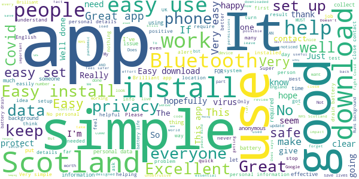

> No issues. Runs in the background. My Bluetooth always on for car anyway. Its never going to be perfectly accurate but it's one tool not a complete solution.  :date: __2021-05-22 14:11:17__

> Clever, simple app, it helps fight Covid while protecting your privacy  :date: __2021-05-19 08:23:31__

> A bit of a pain to drain battery keeping bluetooth/location on constantly, but a small price to pay for public health & safety!  :date: __2021-05-17 06:42:30__

> but yea m  :date: __2021-05-13 02:04:43__

> Easy to use, watch you don't have your VPN switched on or it doesn't take any readings, wouldn't know it was working behind the scenes to help protect Scotland  :date: __2021-05-01 22:05:02__

> Great app 1st thing I added to my account well done,🌞🌈  :date: __2021-04-29 00:06:05__

> Good  :date: __2021-04-21 09:37:24__

> Great  :date: __2021-04-17 15:13:50__

> Speedy results..well up to date  :date: __2021-04-10 16:38:03__

> Easy to setup and use. Minimal battery drain.  :date: __2021-03-24 13:36:27__

#### 4-star reviews

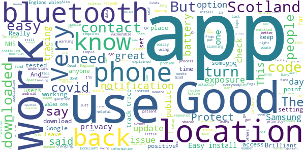

> Good app  :date: __2021-03-29 22:40:54__

> Good helpful app  :date: __2021-02-23 17:24:21__

> Very good.  :date: __2021-02-22 14:00:38__

> The problem I have is police access but I'm using as the place is drowning in COVID19  :date: __2021-02-21 21:56:07__

> Good app but think you need everybody to sign up. Next door neibour had covid 19 but didnt know until a few weeks later.  :date: __2021-02-20 21:24:16__

> Had no interactions  :date: __2021-02-17 14:29:32__

> Notified  :date: __2021-02-14 15:57:22__

> Useful  :date: __2021-02-12 16:43:23__

> Very important app very good  :date: __2021-02-07 17:27:01__

> Excellent. Many thanks for making this app which keeps us all safer and aware.  :date: __2021-01-27 22:28:42__

#### 3-star reviews

> Not sure if this app actually does anything. Only seems to do a check when I open it. App can go days with no checking for contacts according to the fingerprint checking Google summary page.  :date: __2021-04-24 18:55:23__

> As people from other area's in the UK visit Scotland I don't believe the app syncs with other apps from other locations in the UK but only Scotland. If this is the case then it won't work unless someone in Scotland develops covid and others have this same version.  :date: __2021-04-18 14:37:32__

> Huawei 30pro. It doesn't recognize that my Bluetooth is on and so does not activate.  :date: __2021-04-07 11:02:15__

> This might just be the most effective software to be Bluetooth turned on all the time to enable almost everyone in Scotland to track&trace possible SARS/covid carriers,..  :date: __2021-04-04 11:33:48__

> Early version seemed fine, sat happily in background, but now app complains when I don't have Bluetooth or location on at home.  :date: __2021-03-25 11:07:01__

> Couldn't add my positive code to the app.  :date: __2021-03-22 01:02:01__

> Of questionable usability. Stay at home, and this app will still keep nagging you to switch on location - presumably the vision of the Covid hordes invading your dwelling makes spending battery power on satellite navigation worthwhile. Now, I remember The Omega Man from the first time around (1971 film), but did the designer of this really do so too? 🤔 I'd rather not be nagged at home to turn this on, thanks.  :date: __2021-03-19 19:13:23__

> It says it is unable to check for exposures as Bluetooth is turned off, but it's on.  :date: __2021-03-16 03:27:16__

> Seems ok  :date: __2021-03-09 20:15:55__

> Oooft photo.yruk  :date: __2021-02-25 12:44:41__

#### 2-star reviews

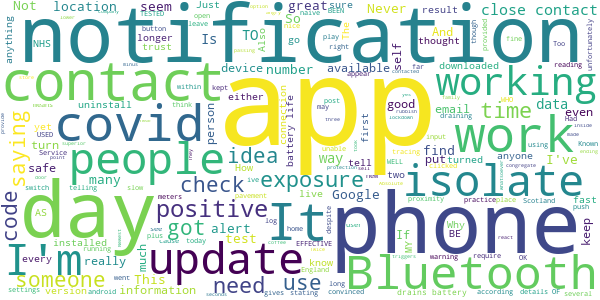

> Absolute rubbish no information whatsoever NHS app for England far superior  :date: __2021-05-16 13:59:20__

> Newest version no longer available for my phone. This means lower protection as lockdown is ending. very angry at this.  :date: __2021-05-01 01:13:48__

> Too slow to react. The app is only as good as the data it has to work with. I got a notification I should isolate for -6 days (yes minus 6 days) it took that long for the data to be made available to the app...  :date: __2021-04-13 11:47:25__

> It doesn't provide any live longer Information.  :date: __2021-04-06 11:13:28__

> Twice in three days I was contacted to isolate for 10 days despite never being in anyone's company inside or out within two meters I haven't even been near my own family. If passing someone on a pavement within seconds triggers the app for you to isolate then what's the point? They sell coffee at a door where people congregate on a pavement less than two meters to get past?  :date: __2021-03-13 10:03:34__

> Gave me a notification saying I had been in contact with someone with covid and had to self isolate....10 days AFTER I had been in contact with them and I only had to isolate for 1 day?? Not convinced it works or it is very slow to update you.  :date: __2021-02-19 14:05:01__

> When I first got the App I thought it was great to have it but now I am convinced it doesn't work giving people false confidence they've not been in contact with Covid, I have been in close contact with covid infected people yet never had notification. I think its flawed by requiring people to self input if they have it. Yet reading other reviews such as people in same household both entering details and none being informed that they've been in close contact? Raises suspension app authenticity  :date: __2021-02-14 10:44:35__

> I was quite naive and feeling safe because I hwe receuved zero contact alerts, so was blissfully confident that I was OK. Until today that is, when I discovered that a) there was an update that was not automatically applied, b) there are so many criticisms of the app and c) so many complaint communucations to the developer remain unanswered.... Is the app a complete con? Is it just to calm the naive and stupid like me. I had not encountered any issues, but then I didn't expect to.. I was safe???  :date: __2021-02-14 01:07:48__

> There is no way of knowing if it iseven working. Updates saying everything is fine you haven't been in contact with a positive person would be nice.  :date: __2021-02-12 13:30:55__

> Never had an alert no idea if that's working and there's no way to take two phones and do a diagnostic safe proximity test between them for reassurance. I simply don't trust this or the NHSEngland equivalent and I use both.  :date: __2021-02-12 04:20:30__

#### 1-star reviews

> Tested positive unable to upload code given. No way to report that I could see that all my contacted people were warned. Nothing showed on my app. No advice was given. I did my duty but there is no evidence to me that the app is functioning.  :date: __2021-05-21 08:42:03__

> Totally unclear whether it is doing anything  :date: __2021-05-20 23:53:37__

> Ridiculous idea to have a standalone app for scotland, not synced with England so the data in it is all but useless as the borders are now bein crossed again...  :date: __2021-05-16 21:56:48__

> I've never been able to use this app, as it's incompatible with phones made before ~2017, which is quite disgusting given the reason for its existence.  :date: __2021-05-13 17:33:32__

> Don't think this app works as good as it does any more. When I used to switch off Bluetooth I got a notification now it doesn't do anything  :date: __2021-04-28 18:13:57__

> Waste of time  :date: __2021-04-27 14:25:19__

> Truly ridiculous that there is a different app for Scotland. I need to have the England one as well and deactivate the other one every time I cross the border. Proof that devolution is a total waste of time and money.  :date: __2021-04-20 11:47:01__

> Useless app as it is no good if you are travelling to other parts of the UK and you need to scan a QR code on the NHS app.  :date: __2021-04-18 23:45:17__

> The app didn't work well with my phone as it drained the battery alot quicker than usual. Come late in the afternoon my phone would be dead so no option but to uninstall. Update:- Its been a few months since this app was released and everyone I've talked to has ether uninstalled the app already or never installed it in the first place. Waste of space and battery.  :date: __2021-04-11 05:07:15__

> Waste of time and tax money. Been with people who have notified the ap that they are covid positive and the ap did not notify me.  :date: __2021-04-01 15:40:03__

# Jersey COVID Alert
App version ``1.0.8``

Analyzed with [covid-apps-observer](http://github.com/covid-apps-observer) project, version ``0.1``

## App overview
| | |
|-------------------------|-------------------------| 
| **Name**&nbsp;&nbsp;&nbsp;&nbsp;&nbsp;&nbsp;&nbsp;&nbsp;&nbsp;&nbsp;&nbsp;&nbsp;&nbsp;&nbsp;&nbsp;&nbsp;&nbsp;&nbsp;&nbsp;&nbsp;&nbsp;&nbsp;&nbsp;&nbsp;&nbsp;&nbsp;&nbsp;&nbsp;&nbsp;&nbsp;&nbsp;&nbsp;&nbsp;&nbsp;&nbsp;&nbsp;&nbsp;&nbsp;&nbsp;&nbsp;  | Jersey COVID Alert |
| **Unique identifier** | com.governmentofjersey.jerseycovidalert |
| **Link to Google Play** | [https://play.google.com/store/apps/details?id=com.governmentofjersey.jerseycovidalert](https://play.google.com/store/apps/details?id=com.governmentofjersey.jerseycovidalert) |
| **Summary**  | Jersey&#39;s COVID-19 contact tracing app |
| **Privacy policy** | [https://covidalert.gov.je/pages/privacy-notice.aspx](https://covidalert.gov.je/pages/privacy-notice.aspx) |
| **Latest version** | 1.0.8 |
| **Last update** | 2021-03-24 09:46:38 |
| **Recent changes** | Minor bug fixes and improvements |
| **Installs**  | 10,000+ |
| **Category** | Medical |
| **First release** | Oct 8, 2020 |
| **Size**  | 108M |
| **Supported Android version**  | 6.0 and up |

### Description
> This is the official digital contact tracing and exposure notification application provided by Public Health, Government of Jersey for visitors and citizens on the island of Jersey.
 By using the app you can help prevent and contain outbreaks of COVID-19. 
 The app will warn you with an Exposure Alert if you have been near someone who has recently been diagnosed with COVID-19.  If you choose, you can ask the Contact Tracing Team to call you for specific advice and support if you get an Exposure Alert.  
 If you are diagnosed with COVID-19, the app lets you anonymously warn people you were near to before you became aware that you were infectious. Only people with a confirmed case of COVID-19 can do this with the support of the Contact Tracing Team.
 Your privacy is protected:
 •        No personal information needed to sign up
 •        The app does not record your location and does not use GPS. 
 •        The app is built with strong privacy protection. 
 •        Use of the app is always voluntary. 
 •        The app will ask your permission to share any data. 
 •        The app can be uninstalled at any time. 
 •        It is extremely unlikely that you could be identified by other users while using the app. 
 Developed on behalf of Public Health (JHA) by Digital Health (HCS) and Digital Jersey.

### User interface
The developers of the app provide the following screenshots in the Google play store.
| | | |
|:-------------------------:|:-------------------------:|:-------------------------:|
 |   |   | 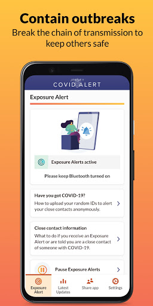  | 
 |   |  

## Development team
In the following we report the main information provided by the development team in the Google play store.

| | |
|-------------------------|-------------------------|
| **Developer**  | Government of Jersey |
| **Website**  | [http://covidalert.gov.je](http://covidalert.gov.je) |
| **Email** | covidalert@gov.je |
| **Physical address**  | [Digital Health, 4 Edward Place, The Parade, St. Helier, Jersey JE2 3QP](https://www.google.com/maps/search/Digital%20Health,%204%20Edward%20Place,%20The%20Parade,%20St.%20Helier,%20Jersey%20JE2%203QP) (Google Maps) |
| **Other developed apps**  | [https://play.google.com/store/apps/developer?id=5014249503765258721](https://play.google.com/store/apps/developer?id=5014249503765258721) |

## Android support

| | |
|-------------------------|-------------------------|
| **Declared target Android version**  | Android10, version 10 (API level 29) |
| **Effective target Android version**  | Android10, version 10 (API level 29) |
| **Minimum supported Android version**  | Marshmallow, version 6.0 (API level 23) |
| **Maximum target Android version**  | - |

The larger the difference between the minimum and maximum supported Android versions, the better. A larger difference means a wider audience. For example, old phones have a very low Android version, so a high minimum supported Android version means that the app cannot be used by users with old phones, thus leading to accessibility problems. 

## Requested permissions

In the following we report the complete list of the permissions requested by the app. 

| **Permission** | **Protection level** | **Description** | 
|-------------------------|-------------------------|-------------------------|
 **android.permission ACCESS_NETWORK_STATE** | Normal | Allows applications to access information about networks. 
 **android.permission ACCESS_WIFI_STATE** | Normal | Allows applications to access information about Wi-Fi networks. 
 **android.permission BLUETOOTH** | Normal | Allows applications to connect to paired bluetooth devices. 
 **android.permission FOREGROUND_SERVICE** | Normal | Allows a regular application to use Service.startForeground. 
 **android.permission INTERNET** | Normal | Allows applications to open network sockets. 
 **android.permission RECEIVE_BOOT_COMPLETED** | Normal | Allows an application to receive the Intent.ACTION_BOOT_COMPLETED that is broadcast after the system finishes booting. 
 **android.permission VIBRATE** | Normal | Allows access to the vibrator. 

## Mentioned servers

| **Server** | **Registrant** | **Registrant country** | **Creation date** | 
|-------------------------|-------------------------|-------------------------|-------------------------|
 | android.com | Google LLC | :us: US | 1997-06-23 04:00:00 |
 | google.com | Google LLC | :us: US | 1997-09-15 04:00:00 |
 | expo.io | See PrivacyGuardian.org | :us: US | 2011-05-01 21:26:50 |

## Security analysis 

Below we report the main security warnings raised by our execution of the [Androwarn](https://github.com/maaaaz/androwarn) security analysis tool.

**Telephony identifiers leakage**
> - This application reads the MCC+MNC of the provider of the SIM 

**Connection interfaces exfiltration**
> - This application reads details about the currently active data network 
> - This application tries to find out if the currently active data network is metered 

**Suspicious connection establishment**
> - This application opens a Socket and connects it to the remote address ' returned no addresses for  ; port is out of range' on the 'N/A' port  
> - This application opens a Socket and connects it to the remote address '' on the 'N/A' port  
> - This application opens a Socket and connects it to the remote address 'Ljava/lang/StringBuilder;->toString()Ljava/lang/String;' on the ': connect, resolve' port  
> - This application opens a Socket and connects it to the remote address 'Ljava/lang/StringBuilder;->toString()Ljava/lang/String;' on the 'N/A' port  
> - This application opens a Socket and connects it to the remote address 'Ljava/net/Proxy;->type()Ljava/net/Proxy$Type;' on the 'N/A' port  
> - This application opens a Socket and connects it to the remote address 'timeout' on the 'N/A' port  

**Pim data leakage**
> - This application accesses data stored in the clipboard 

**Code execution**
> - This application loads a native library 
> - This application executes a UNIX command 

## User ratings and reviews

Below we provide information about how end users are reacting to the app in terms of ratings and reviews in the Google Play store.

### Ratings

The Jersey COVID Alert app has been installed by more than **10000** times. At this time, **44** rated the app and its average score is **3.3181818**. Below we show the distribution of the ratings across the usual star-based rating of Google Play

:star::star::star::star::star:: 20

:star::star::star::star:: 5

:star::star::star:: 3

:star::star:: 1

:star:: 15

### Reviews 

#### 5-star reviews

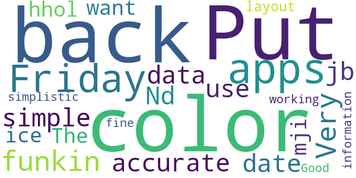

> Nd u jb want k j u mji u u I ice hhol.. ..  :date: __2021-04-23 18:09:53__

> The layout is simplistic and it is working fine for me 🙂  :date: __2020-10-19 16:19:39__

> Good information  :date: __2020-10-17 22:05:35__

#### 4-star reviews

> Useful beyond its track trace function. Provides broad range of latest stats and other info. Surprisingly it does not provide up to date behaviour guidance and rules information.  :date: __2020-12-19 01:22:15__

> Pretty straightforward. NHS app has built in QR scanner for venue check-in which this app is missing.  :date: __2020-12-05 01:22:57__

> Constantly getting "cannot contact server" error message. Edit The fixed version does now work. Easy to use. Now a 4 star app (can't give 5 stars until I've met someone with covid!,)  :date: __2020-10-15 18:20:59__

> Says no Internet connection the whole time. Update has fixed issues  :date: __2020-10-14 21:31:16__

#### 3-star reviews

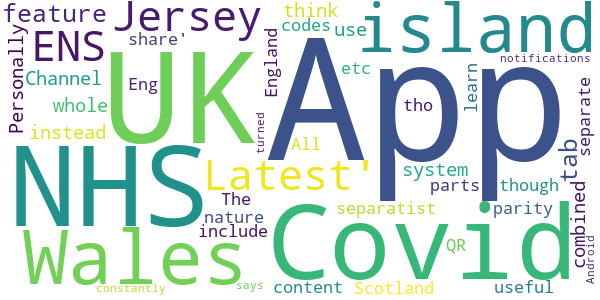

> Personally I think the Channel Islands as a whole should use a combined system instead of separatist nature. I also don't get why NHS Scotland app separate from the NHS Covid-19 England & Wales App though both parts of the UK and same island. The Jersey App 'Latest' & 'share' tabs content is useful and all the UK Covid ENS apps should include the feature. All UK ENS Apps should feature parity on NHS Eng&Wales App - QR codes etc tho Jersey 'Latest' tab all the UK Covid apps could learn from!  :date: __2020-11-14 21:29:22__

> App constantly says the notifications are turned off but they are on Android  :date: __2020-11-04 16:25:20__

#### 2-star reviews

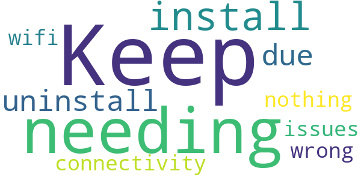

> Keep needing to install/uninstall due to connectivity issues but nothing wrong with my wifi.  :date: __2020-11-18 08:43:30__

#### 1-star reviews

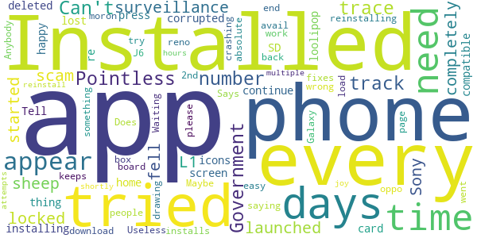

> Can't get through to the track and trace number. Pointless  :date: __2020-11-30 21:25:58__

> Government surveillance scam, sheep fell for it!  :date: __2020-11-21 05:22:03__

> Installed the app on my Sony L1, launched the app and it completely locked the phone up, I re started the phone and it had corrupted my SD card so every thing on there is lost and needs re-installing, It deleted icons from my home screen so I am not happy with it  :date: __2020-11-05 11:42:01__

> not compatible with loolipop 5.1  :date: __2020-10-18 19:55:41__

> Tell you to press continue and just times out, tried reinstalling and all other easy fixes to no avail  :date: __2020-10-16 13:18:41__

> I have tried to load this app for 2 days now and every time a box appears saying "something went wrong our end, please try again" . Maybe the IT people need to back to the drawing board!!  :date: __2020-10-16 12:54:52__

> Does now work with oppo reno 2. App keeps crashing after 2nd page.  :date: __2020-10-16 12:32:23__

> Waiting for the app to download. 4 Days!!!!!!. Useless!!.  :date: __2020-10-16 12:29:24__

> Anybody who installs this is an absolute moron!  :date: __2020-10-16 12:22:08__

> Says installed on my Galaxy J6 and app will appear shortly but after 24 hours and multiple attempts to reinstall no joy  :date: __2020-10-16 12:12:52__

# StopCOVID NI
App version ``2.3.1``

Analyzed with [covid-apps-observer](http://github.com/covid-apps-observer) project, version ``0.1``

## App overview
| | |
|-------------------------|-------------------------| 
| **Name**&nbsp;&nbsp;&nbsp;&nbsp;&nbsp;&nbsp;&nbsp;&nbsp;&nbsp;&nbsp;&nbsp;&nbsp;&nbsp;&nbsp;&nbsp;&nbsp;&nbsp;&nbsp;&nbsp;&nbsp;&nbsp;&nbsp;&nbsp;&nbsp;&nbsp;&nbsp;&nbsp;&nbsp;&nbsp;&nbsp;&nbsp;&nbsp;&nbsp;&nbsp;&nbsp;&nbsp;&nbsp;&nbsp;&nbsp;&nbsp;  | StopCOVID NI |
| **Unique identifier** | net.hscni.covidtracker |
| **Link to Google Play** | [https://play.google.com/store/apps/details?id=net.hscni.covidtracker](https://play.google.com/store/apps/details?id=net.hscni.covidtracker) |
| **Summary**  | The coronavirus contact tracing app for Northern Ireland |
| **Privacy policy** | [https://covid-19.hscni.net/privacy-notice/](https://covid-19.hscni.net/privacy-notice/) |
| **Latest version** | 2.3.1 |
| **Last update** | 2021-02-11 10:24:37 |
| **Recent changes** | Minor text changes and bug fixes |
| **Installs**  | 100,000+ |
| **Category** | Medical |
| **First release** | Jul 29, 2020 |
| **Size**  | 108M |
| **Supported Android version**  | 6.0 and up |

### Description
> If you are 11 or older and live in Northern Ireland you can use this HSC contact tracing app. By using it you will help stop or slow the spread of coronavirus.
 ** Support the health services **
 ** Help avoid more lockdowns **
 ** Save lives **
 How does the app work?
 If you are in close contact with an app user who has told their app that they have COVID-19, you will get an alert from this app. You won’t know who it was or where it happened. You must then self-isolate for the period shown in the app. There’s advice on how to self-isolate and answers to common questions about this in the app.
 If you test positive for COVID-19 you can tell this app. Other app users that you’ve been close to will then be alerted. They won’t know that it was you or where it happened.
 ** Works in the background on Bluetooth, not GPS, and uses very little battery **
 ** Please keep Bluetooth on so the app can work properly **
 How is my privacy protected?
 ** This app never knows your name or where you are, so it’s completely private **
 It uses the ‘Exposure Notification API’ developed by Apple and Google in a joint effort to help governments and health agencies reduce the spread of COVID-19 through contact tracing, with user privacy and security core to the design. This is sometimes called the ‘decentralised’ model.
 If you test positive for COVID-19 you will get a code by SMS text message from 'HSCresult'. When you put your code into this app you will be asked to share the 'Random IDs’ that your phone has been swapping with other app users over the last 14 days. This will allow us to tell those people that they have been exposed to COVID-19. 
 ** We will never ask you to reply to the SMS text message **
 ** Please ignore any message if it asks you to reply or send information **
 So that you can use this app when travelling abroad we will securely share 'Random IDs' with other countries. This also means that apps used by visitors from those countries will work here.
 ** This app will never track your identity or location **

### User interface
The developers of the app provide the following screenshots in the Google play store.
| | | |
|:-------------------------:|:-------------------------:|:-------------------------:|
 |   | 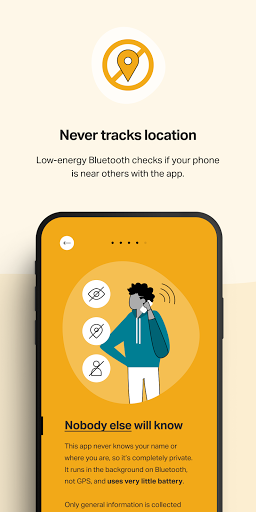  |   | 
 |   | 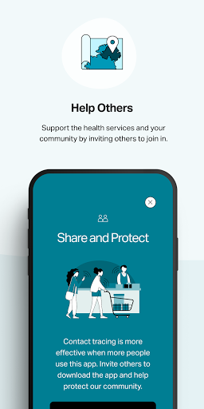  |   | 
 |  

## Development team
In the following we report the main information provided by the development team in the Google play store.

| | |
|-------------------------|-------------------------|
| **Developer**  | Health & Social Care Northern Ireland |
| **Website**  | [https://covid-19.hscni.net/contact-tracing/](https://covid-19.hscni.net/contact-tracing/) |
| **Email** | StopCOVIDNIApp@hscni.net |
| **Physical address**  | - |
| **Other developed apps**  | [https://play.google.com/store/apps/developer?id=Health+%26+Social+Care+Northern+Ireland](https://play.google.com/store/apps/developer?id=Health+%26+Social+Care+Northern+Ireland) |

## Android support

| | |
|-------------------------|-------------------------|
| **Declared target Android version**  | Android10, version 10 (API level 29) |
| **Effective target Android version**  | Android10, version 10 (API level 29) |
| **Minimum supported Android version**  | Marshmallow, version 6.0 (API level 23) |
| **Maximum target Android version**  | - |

The larger the difference between the minimum and maximum supported Android versions, the better. A larger difference means a wider audience. For example, old phones have a very low Android version, so a high minimum supported Android version means that the app cannot be used by users with old phones, thus leading to accessibility problems. 

## Requested permissions

In the following we report the complete list of the permissions requested by the app. 

| **Permission** | **Protection level** | **Description** | 
|-------------------------|-------------------------|-------------------------|
 **android.permission ACCESS_NETWORK_STATE** | Normal | Allows applications to access information about networks. 
 **android.permission ACCESS_WIFI_STATE** | Normal | Allows applications to access information about Wi-Fi networks. 
 **android.permission BLUETOOTH** | Normal | Allows applications to connect to paired bluetooth devices. 
 **android.permission FOREGROUND_SERVICE** | Normal | Allows a regular application to use Service.startForeground. 
 **android.permission INTERNET** | Normal | Allows applications to open network sockets. 
 **android.permission RECEIVE_BOOT_COMPLETED** | Normal | Allows an application to receive the Intent.ACTION_BOOT_COMPLETED that is broadcast after the system finishes booting. 
 **android.permission VIBRATE** | Normal | Allows access to the vibrator. 

## Mentioned servers

| **Server** | **Registrant** | **Registrant country** | **Creation date** | 
|-------------------------|-------------------------|-------------------------|-------------------------|
 | android.com | Google LLC | :us: US | 1997-06-23 04:00:00 |
 | google.com | Google LLC | :us: US | 1997-09-15 04:00:00 |
 | expo.io | See PrivacyGuardian.org | :us: US | 2011-05-01 21:26:50 |

## Security analysis 

Below we report the main security warnings raised by our execution of the [Androwarn](https://github.com/maaaaz/androwarn) security analysis tool.

**Telephony identifiers leakage**
> - This application reads the MCC+MNC of the provider of the SIM 

**Connection interfaces exfiltration**
> - This application reads details about the currently active data network 
> - This application tries to find out if the currently active data network is metered 

**Suspicious connection establishment**
> - This application opens a Socket and connects it to the remote address ' returned no addresses for  ; port is out of range' on the 'N/A' port  
> - This application opens a Socket and connects it to the remote address '' on the 'N/A' port  
> - This application opens a Socket and connects it to the remote address 'Ljava/lang/StringBuilder;->toString()Ljava/lang/String;' on the 'N/A' port  
> - This application opens a Socket and connects it to the remote address 'Ljava/net/Proxy;->type()Ljava/net/Proxy$Type;' on the 'N/A' port  
> - This application opens a Socket and connects it to the remote address 'timeout' on the 'N/A' port  

**Pim data leakage**
> - This application accesses data stored in the clipboard 

**Code execution**
> - This application loads a native library 
> - This application executes a UNIX command 

## User ratings and reviews

Below we provide information about how end users are reacting to the app in terms of ratings and reviews in the Google Play store.

### Ratings

The StopCOVID NI app has been installed by more than **100000** times. At this time, **595** rated the app and its average score is **3.15**. Below we show the distribution of the ratings across the usual star-based rating of Google Play

:star::star::star::star::star:: 275

:star::star::star::star:: 29

:star::star::star:: 29

:star::star:: 35

:star:: 227

### Reviews 

#### 5-star reviews

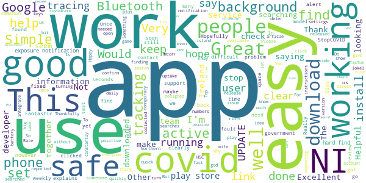

> This is a very good idea xx  :date: __2021-03-12 05:41:45__

> Clear and easy to use  :date: __2021-02-25 15:33:24__

> DOWNLOAD THIS APP  :date: __2021-02-16 18:41:31__

> Excellent  :date: __2021-02-12 01:34:28__

> Works for me...  :date: __2021-01-29 17:24:27__

> Thankfully no alert yet  :date: __2021-01-27 19:45:45__

> Fantastic  :date: __2021-01-08 19:00:21__

> This app is a scam , it steals all your information and sent to 3rd parties , so be careful.  :date: __2021-01-08 14:34:36__

> Very good  :date: __2021-01-05 19:18:02__

> Installed this as soon as it became available. Happy to support the good work  :date: __2021-01-03 15:43:57__

#### 4-star reviews

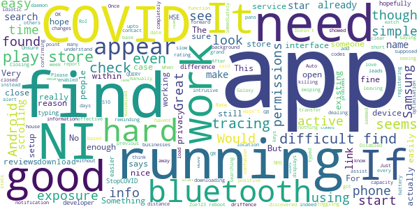

> Very good upto date info.  :date: __2021-02-04 10:51:09__

> COVID NI there are many driffence information about COVID  :date: __2021-01-10 23:10:53__

> Zoe123  :date: __2020-11-22 15:45:06__

> Just discovered the app had been "Auto Disabled" on my android phone. Something to watch out for (When it's running you should get a notification once a week, reminding you and confirming that it is indeed running).  :date: __2020-10-21 23:33:44__

> Please add the capacity to scan QR codes like the NHS app does, not having this function leads to confusion in dealing with GB businesses in NI  :date: __2020-10-10 08:57:01__

> It seems to work, and I really hope it does.. it is simple, and not intrusive. I look forward to seeing his it pans out.  :date: __2020-10-08 01:00:45__

> This app only checks exposure if it comes within a short distance of someone else who has the app. No exposure checks mean you havent been close enough to someone for it to check.  :date: __2020-10-02 20:06:28__

> QUERY! If having to move devices, how are you supposed to transfer the existing exposure checks from the previous 14 days to the new device, in case any of those report a positive case?  :date: __2020-09-21 22:39:02__

> Once running, seems to be very good. But was hard to find. Wasn't immediately clear if there was a background daemon service running or the app had to be "minimized" but not closed to work. Samsung Galaxy 8 running Android 9: It seems Samsung's battery optimisation service was killing the app. After a reboot, it seemed OK, though. Closing/swiping away the app and then toggling bluetooth on/off showed it was still running (I got an alert from the app saying bluetooth needs enabled).  :date: __2020-08-13 21:40:20__

> No problems downloading and it appears active on my Samsung S10. Would love to understand more about the keys as we're registering them without leaving the house!  :date: __2020-08-12 22:11:42__

#### 3-star reviews

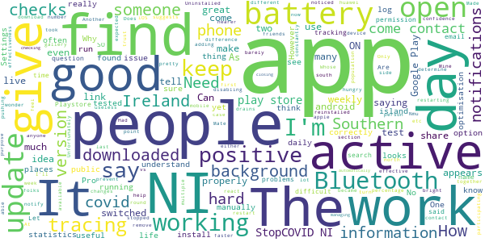

> It took a while to download and install. However when you first open the app it says "tracing not active " this suggests the app is not running in the background. Update: Working great now.  :date: __2021-02-15 23:03:25__

> It has stopped working for over a week  :date: __2021-01-20 02:36:29__

> Can you make a version of this app for the huawei app gallery?  :date: __2020-11-26 21:32:22__

> Does not give n Ireland  :date: __2020-11-20 13:22:56__

> The App keeps disabling itself.  :date: __2020-10-26 07:53:08__

> C. Nmu  :date: __2020-10-17 23:19:09__

> No log updates. Uninstalled and reinstalled the app for NI. Made no difference. How can we trust it.  :date: __2020-10-16 14:07:46__

> I don't know  :date: __2020-10-11 18:11:48__

> Downloaded this when it became available, but after the last update, it keeps pushing me to turn my bluetooth on and restart the app; my Bluetooth has been on, and restarting the app doesn't help. Only had this issue since the update, but makes having the app pretty much useless.  :date: __2020-10-11 15:06:04__

> Mine barely checks (once in 14 days) but my friends checks multiple times a day. I'm nearer much more people than them so I don't understand.  :date: __2020-10-11 11:19:25__

#### 2-star reviews

> Haven't use it yet so not sure what to say.  :date: __2021-01-12 01:12:16__

> Bluetooth is always on but the app tells me to turn it on! Same after restarting the device and checking Bluetooth status  :date: __2020-12-30 18:52:58__

> Got a notification to say i was in contact and had to isolate. Only problem was i had been in contact the 10th. First told of it the 23rd with 1day left to isolate. Its reliant on people updating the app with their test results and if they dont do that then nobody knows  :date: __2020-11-23 21:34:22__

> I had hoped that this app would provide useful timely and accurate information to users. Instead I see that the statistics are not kept up to date. By way of example today is 05/11/20 but the R number estimate is from 16/10/20. Come on people for the sake of credibility must do better!  :date: __2020-11-05 23:37:19__

> I don't see the point in this app. As I checked today 2nd November as I'd accidentally knocked off Bluetooth. Seen it last checked on 12th October. I am a key worker, I could potentially come into contact with this virus. And after 14 days it removes data. So that is a lot of potential contact with this virus missed. If it's not going to work and check then why have it installed?  :date: __2020-11-02 09:56:14__

> Either it doesn't work or nobody has it... since the 20th of October (it is now the 1st of Nov) I have had 2 notifications (checks), 1 of which are my partner. Pointless.  :date: __2020-11-01 20:20:25__

> Its not working keeps telling me connect to blutooth and I have!  :date: __2020-10-28 18:45:24__

> The app worked well but I noticed at times when I was out that no checks had been made. I did recieve an alert to isolate for 14 days which I did, yet on the 5th day into isolation I got another notification saying that I've been exposed and have to isolate for 14 days. I hadn't left to house, I didnt even leave my bedroom so I'm not sure how accurate this app is which is why I removed it.  :date: __2020-10-26 09:57:00__

> No alert given for App update. No weekly alerts given for 2 consecutive weeks  :date: __2020-10-24 04:50:41__

> Despite having my Bluetooth on constantly, the app is telling me tracing is not active. There is clearly a bug in the app that needs fixed.  :date: __2020-10-23 23:31:59__

#### 1-star reviews

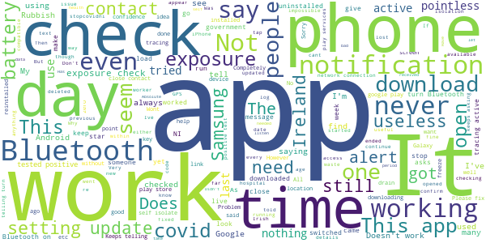

> Doesn't work so what's the point???  :date: __2021-04-04 18:28:18__

> Uless not needed  :date: __2021-03-30 01:48:45__

> I never installed this app and there it was. Would never give them access to my phone, ever  :date: __2021-03-18 21:53:40__

> It never ever worked  :date: __2021-03-18 11:42:00__

> Stuiped app need to improve on it big time  :date: __2021-03-13 23:02:17__

> Notification doesn't work  :date: __2021-03-11 14:27:29__

> App randomly stops publishing exposure checks which would imply its no longer working. Have had to reinstall 3 times.  :date: __2021-03-10 15:51:37__

> Didn't tell me I had a contact when I was caring for someone with a positive test (and I inputted tha data for them, Bluetooth on etc)  :date: __2021-03-08 10:09:22__

> Got a positive test but no code issued for the app to alert close contacts.  :date: __2021-02-25 01:20:16__

> My privacy wasn't private  :date: __2021-02-21 15:53:18__

# Beat Covid Gibraltar
App version ``1.0.3``

Analyzed with [covid-apps-observer](http://github.com/covid-apps-observer) project, version ``0.1``

## App overview
| | |
|-------------------------|-------------------------| 
| **Name**&nbsp;&nbsp;&nbsp;&nbsp;&nbsp;&nbsp;&nbsp;&nbsp;&nbsp;&nbsp;&nbsp;&nbsp;&nbsp;&nbsp;&nbsp;&nbsp;&nbsp;&nbsp;&nbsp;&nbsp;&nbsp;&nbsp;&nbsp;&nbsp;&nbsp;&nbsp;&nbsp;&nbsp;&nbsp;&nbsp;&nbsp;&nbsp;&nbsp;&nbsp;&nbsp;&nbsp;&nbsp;&nbsp;&nbsp;&nbsp;  | Beat Covid Gibraltar |
| **Unique identifier** | com.gha.covid.tracker |
| **Link to Google Play** | [https://play.google.com/store/apps/details?id=com.gha.covid.tracker](https://play.google.com/store/apps/details?id=com.gha.covid.tracker) |
| **Summary**  | Let’s Beat COVID-19 together |
| **Privacy policy** | [https://gibraltar.gov.gi/beatcovidapp/privacy](https://gibraltar.gov.gi/beatcovidapp/privacy) |
| **Latest version** | 1.0.3 |
| **Last update** | 2021-02-04 11:18:05 |
| **Recent changes** | Minor bug fixes and updates |
| **Installs**  | 10,000+ |
| **Category** | Medical |
| **First release** | Jun 25, 2020 |
| **Size**  | 106M |
| **Supported Android version**  | 6.0 and up |

### Description
> The Beat COVID Gibraltar app is for the citizens of Gibraltar and uses the bluetooth technology on your phone to track other phones you have been in close proximity to. It uses the Exposure Notification Service and you will be notified directly if you have been in close contact with someone who has tested positive for the virus. Likewise, if you are tested positive for COVID-19 yourself, those you have been in close contact with will be notified.  
 No personal data will be stored or used.  
 This app is totally anonymous and no personal information will be logged or shared with anyone. 
 Join the fight against COVID-19 and download the app today. 
 Beat COVID Gibraltar has been developed by the Gibraltar Health Authority and HM Government of Gibraltar.

### User interface
The developers of the app provide the following screenshots in the Google play store.
| | | |
|:-------------------------:|:-------------------------:|:-------------------------:|
 |   |   |   | 
 |   |  

## Development team
In the following we report the main information provided by the development team in the Google play store.

| | |
|-------------------------|-------------------------|
| **Developer**  | Gibraltar Health Authority |
| **Website**  | [https://www.gibraltar.gov.gi/beatcovidapp](https://www.gibraltar.gov.gi/beatcovidapp) |
| **Email** | info@gha.ie |
| **Physical address**  | - |
| **Other developed apps**  | [https://play.google.com/store/apps/developer?id=Gibraltar+Health+Authority](https://play.google.com/store/apps/developer?id=Gibraltar+Health+Authority) |

## Android support

| | |
|-------------------------|-------------------------|
| **Declared target Android version**  | Pie, version 9 (API level 28) |
| **Effective target Android version**  | Pie, version 9 (API level 28) |
| **Minimum supported Android version**  | Marshmallow, version 6.0 (API level 23) |
| **Maximum target Android version**  | - |

The larger the difference between the minimum and maximum supported Android versions, the better. A larger difference means a wider audience. For example, old phones have a very low Android version, so a high minimum supported Android version means that the app cannot be used by users with old phones, thus leading to accessibility problems. 

## Requested permissions

In the following we report the complete list of the permissions requested by the app. 

| **Permission** | **Protection level** | **Description** | 
|-------------------------|-------------------------|-------------------------|
 **android.permission ACCESS_NETWORK_STATE** | Normal | Allows applications to access information about networks. 
 **android.permission ACCESS_WIFI_STATE** | Normal | Allows applications to access information about Wi-Fi networks. 
 **android.permission BLUETOOTH** | Normal | Allows applications to connect to paired bluetooth devices. 
 **android.permission INTERNET** | Normal | Allows applications to open network sockets. 

## Mentioned servers

| **Server** | **Registrant** | **Registrant country** | **Creation date** | 
|-------------------------|-------------------------|-------------------------|-------------------------|
 | android.com | Google LLC | :us: US | 1997-06-23 04:00:00 |
 | google.com | Google LLC | :us: US | 1997-09-15 04:00:00 |
 | expo.io | See PrivacyGuardian.org | :us: US | 2011-05-01 21:26:50 |

## Security analysis 

Below we report the main security warnings raised by our execution of the [Androwarn](https://github.com/maaaaz/androwarn) security analysis tool.

**Telephony identifiers leakage**
> - This application reads the numeric name (MCC+MNC) of current registered operator 
> - This application reads the operator name 

**Connection interfaces exfiltration**
> - This application reads details about the currently active data network 
> - This application tries to find out if the currently active data network is metered 

**Suspicious connection establishment**
> - This application opens a Socket and connects it to the remote address ' returned no addresses for  ; port is out of range' on the 'N/A' port  
> - This application opens a Socket and connects it to the remote address '' on the 'N/A' port  
> - This application opens a Socket and connects it to the remote address 'Ljava/lang/StringBuilder;->toString()Ljava/lang/String;' on the ': connect, resolve' port  
> - This application opens a Socket and connects it to the remote address 'Ljava/lang/StringBuilder;->toString()Ljava/lang/String;' on the 'N/A' port  
> - This application opens a Socket and connects it to the remote address 'Ljava/net/Proxy;->type()Ljava/net/Proxy$Type;' on the 'N/A' port  
> - This application opens a Socket and connects it to the remote address 'timeout' on the 'N/A' port  

**Pim data leakage**
> - This application accesses data stored in the clipboard 

**Code execution**
> - This application loads a native library 
> - This application executes a UNIX command 

## User ratings and reviews

Below we provide information about how end users are reacting to the app in terms of ratings and reviews in the Google Play store.

### Ratings

The Beat Covid Gibraltar app has been installed by more than **10000** times. At this time, **75** rated the app and its average score is **3.2133334**. Below we show the distribution of the ratings across the usual star-based rating of Google Play

:star::star::star::star::star:: 35

:star::star::star::star:: 4

:star::star::star:: 5

:star::star:: 4

:star:: 27

### Reviews 

#### 5-star reviews

> Awesome And Excellent  :date: __2021-01-11 13:25:46__

> 👍😎  :date: __2020-11-05 21:22:14__

> So, I downloaded this app to complain... about the idiots who have downloaded the app then given it a 1 star review for not being made for the UK 1. Gibraltar is a British overseas territory, as such it is relevant to the UK, you imbaciles. 2. It does tell you it is made specifically for Gibraltar, check the name of the app, you uncultured swine. 3. If you are not from Gibraltar it isn't relevant to you. This does not mean you should give it a negative review, as that does not make it a bad app.  :date: __2020-09-27 14:21:48__

> This app is really easy and fast and doesn't have too much of an impact on your battery life  :date: __2020-08-18 01:16:04__

> Works as described, easy to set up and turn on.- I've not heard anything from the developer and I'm in the UK, the more people who use it - the more will be notified  :date: __2020-08-09 14:58:58__

> Good  :date: __2020-08-08 14:37:46__

> You have to make sure your phone is up to date with system update. I up dated my S10+ and download this and it works fine.  :date: __2020-08-04 22:11:47__

> Good 👍🏼  :date: __2020-07-25 13:20:16__

> Downloaded and working in the UK. If you are having trouble with set up make sure you have the latest system update from Google/ apple and turn on the contact tracing api in settings.  :date: __2020-07-21 10:11:48__

> Downloaded, installed and turned on notifications no problem - very easy. Yes, it does automatically turn on your Bluetooth which drains the battery faster but I'm keeping it on only when I'm outside my house&work, e.g.shopping.  :date: __2020-07-19 23:06:12__

#### 4-star reviews

> First covid app good work Gibraltar  :date: __2020-11-01 18:01:54__

> Easy to load works out of the box on pixel 2xl. Android 10. Only question is only as useful as number of folks using it. Needs a bit of publicity.  :date: __2020-07-30 15:49:20__

#### 3-star reviews

> It may have been me, I didn't understand how it worked.  :date: __2020-10-08 15:24:12__

> It doesn't give out any information...  :date: __2020-07-20 19:00:47__

#### 2-star reviews

No recent reviews available with 2 stars.

#### 1-star reviews

> On my card code got 7 numbers not 6 .  :date: __2021-04-12 11:33:44__

> Government surveillance scam,shhep fell for it!  :date: __2020-11-21 05:17:20__

> Pathetic app which does does not download! If it had zero to rate, I would instead of 1 star  :date: __2020-10-09 17:02:10__

> I don't live in Gibraltar so it's no help to me.  :date: __2020-09-24 21:07:36__

> You ask a quistion have been traded positive then a question mark but not nagged ie it should of been yes or no mo on this app does not help at all I have never been rested for c19 been very carefull flowed all rules but witch is the right easy app for yes and no for c19 for me southnorwood  :date: __2020-09-24 14:40:32__

> Doesnt even work in the background  :date: __2020-08-14 00:51:41__

> Waste of time ! Doesn't seem to do anything at all, who said that it was for UK, and why should something developed by and for Gibraltar have any relevance for the UK ?  :date: __2020-08-08 17:35:31__

> What does this App actually do? It doesn't seem able to access surveys they send you emails asking you to complete? Why can't the App itself actually ask you?  :date: __2020-08-07 11:07:46__

> No instructions on how it works  :date: __2020-08-03 21:03:07__

> Ok, I only downloaded this app last night & although the reviews seem ok. This was the 1st & main app for COVID-19 tracking. Yes I realise Gibraltar is it's main domain, I get it. But seeing as this was my only option really, Am I just meant to look at the compass tracker, watching random green dots faintly appearing, with the blue screen just saying "Active"/click if i tested positive? How do i know? I don't! We can't just ask 4 test. Bluetooth is always on. So do i just wait 4 an alert? 🤷🏻‍  :date: __2020-07-31 22:24:09__

# COVID Symptom Study
App version ``2.4.0``

Analyzed with [covid-apps-observer](http://github.com/covid-apps-observer) project, version ``0.1``

## App overview
| | |
|-------------------------|-------------------------| 
| **Name**&nbsp;&nbsp;&nbsp;&nbsp;&nbsp;&nbsp;&nbsp;&nbsp;&nbsp;&nbsp;&nbsp;&nbsp;&nbsp;&nbsp;&nbsp;&nbsp;&nbsp;&nbsp;&nbsp;&nbsp;&nbsp;&nbsp;&nbsp;&nbsp;&nbsp;&nbsp;&nbsp;&nbsp;&nbsp;&nbsp;&nbsp;&nbsp;&nbsp;&nbsp;&nbsp;&nbsp;&nbsp;&nbsp;&nbsp;&nbsp;  | COVID Symptom Study |
| **Unique identifier** | com.joinzoe.covid_zoe |
| **Link to Google Play** | [https://play.google.com/store/apps/details?id=com.joinzoe.covid_zoe](https://play.google.com/store/apps/details?id=com.joinzoe.covid_zoe) |
| **Summary**  | Help slow COVID-19 by self-reporting your symptoms daily, even if you feel well. |
| **Privacy policy** | [https://predict.study/covid-privacy-notice/](https://predict.study/covid-privacy-notice/) |
| **Latest version** | 2.4.0 |
| **Last update** | 2021-02-08 21:04:34 |
| **Recent changes** | Security upgrade and bug fixes.  |
| **Installs**  | 1,000,000+ |
| **Category** | Health & Fitness |
| **First release** | Mar 20, 2020 |
| **Size**  | 37M |
| **Supported Android version**  | 5.0 and up |

### Description
> Take 1 minute each day and help fight the spread of COVID-19 in your community
 * Report your health daily even if you feel well
 * Get a daily estimate of COVID in your area
 * Help slow the outbreak near you
 Join millions of people supporting scientists at Stanford University, Harvard University, Massachusetts General Hospital, and King's College London to help fight coronavirus by identifying:
 * How fast the virus is spreading in your area
 * High-risk areas in the US
 * Who is most at risk, by better understanding symptoms linked to underlying health conditions
 You will contribute to advance research on COVID-19 in partnership with leading health researchers globally like TwinsUK, one of the most clinically detailed studies in the world.
 This app (formerly known as the Covid Symptom Tracker) allows you to help others, but does not give health advice. If you need health advice please visit the CDC website at: [https://www.cdc.gov/coronavirus/2019-ncov/index.html](https://www.cdc.gov/coronavirus/2019-ncov/index.html)
 This app has been designed for everyone to report their status not just those who are ill.
 It was designed by doctors and scientists at King's College London, Guys and St Thomas’ Hospitals and Zoe Global Limited, a health technology company.
 In the US the app is being used by the Nurses' Health Study to identify symptoms in active healthcare workers who are treating people with COVID across the country and risking their own health to help us.
 In response to recommendations by Stand Up To Cancer (SU2C), the app also includes questions for cancer patients and survivors, such as if they are living with cancer, what type of cancer and what treatment they are receiving.
 If you would like to help out in this difficult time, then you can. Download the app and share daily your own status, even if you are well. With your help we can understand much better the situation across the nation, how the disease presents itself to different people, and how it progresses.
 This is a new virus which the world has never seen before. There are a wide range of symptoms, which differ between people. With your help we can understand better how the disease presents itself depending upon individual factors such as health and age.
 No information you share will be used for commercial purposes.
 There are two parts to the app:
 HEALTH INFORMATION
 You will be asked to share some general information, such as your age and some health details, such as whether you have certain diseases.
 SYMPTOM TRACKING
 We will ask you every day to let us know how you feel, so you can share your symptoms. We will also ask whether you have visited the hospital, what treatment you received there, and whether you have been tested for COVID-19 (Coronavirus).

### User interface
The developers of the app provide the following screenshots in the Google play store.
| | | |
|:-------------------------:|:-------------------------:|:-------------------------:|
 |   |   |   | 
 |   |   |   | 
 |   |  

## Development team
In the following we report the main information provided by the development team in the Google play store.

| | |
|-------------------------|-------------------------|
| **Developer**  | Zoe Global Limited |
| **Website**  | [http://covid.joinzoe.com/](http://covid.joinzoe.com/) |
| **Email** | covid@joinzoe.com |
| **Physical address**  | [164 Westminster Bridge Road London SE1 7RW United Kingdom](https://www.google.com/maps/search/164%20Westminster%20Bridge%20Road%20London%20SE1%207RW%20United%20Kingdom) (Google Maps) |
| **Other developed apps**  | [https://play.google.com/store/apps/developer?id=Zoe+Global+Limited](https://play.google.com/store/apps/developer?id=Zoe+Global+Limited) |

## Android support

| | |
|-------------------------|-------------------------|
| **Declared target Android version**  | Android10, version 10 (API level 29) |
| **Effective target Android version**  | Android10, version 10 (API level 29) |
| **Minimum supported Android version**  | Lollipop, version 5.0 (API level 21) |
| **Maximum target Android version**  | - |

The larger the difference between the minimum and maximum supported Android versions, the better. A larger difference means a wider audience. For example, old phones have a very low Android version, so a high minimum supported Android version means that the app cannot be used by users with old phones, thus leading to accessibility problems. 

## Requested permissions

In the following we report the complete list of the permissions requested by the app. 

| **Permission** | **Protection level** | **Description** | 
|-------------------------|-------------------------|-------------------------|
 **android.permission ACCESS_NETWORK_STATE** | Normal | Allows applications to access information about networks. 
 **android.permission ACCESS_WIFI_STATE** | Normal | Allows applications to access information about Wi-Fi networks. 
 **android.permission INTERNET** | Normal | Allows applications to open network sockets. 
 **android.permission READ_APP_BADGE** | - | - 
 **android.permission READ_EXTERNAL_STORAGE** | :warning:**Dangerous** | Allows an application to read from external storage. 
 **android.permission RECEIVE_BOOT_COMPLETED** | Normal | Allows an application to receive the Intent.ACTION_BOOT_COMPLETED that is broadcast after the system finishes booting. 
 **android.permission WAKE_LOCK** | Normal | Allows using PowerManager WakeLocks to keep processor from sleeping or screen from dimming. 
 **android.permission WRITE_EXTERNAL_STORAGE** | :warning:**Dangerous** | Allows an application to write to external storage. 
 **com.anddoes.launcher.permission UPDATE_COUNT** | - | - 
 **com.google.android.c2dm.permission RECEIVE** | - | - 
 **com.google.android.finsky.permission BIND_GET_INSTALL_REFERRER_SERVICE** | - | - 
 **com.htc.launcher.permission READ_SETTINGS** | - | - 
 **com.htc.launcher.permission UPDATE_SHORTCUT** | - | - 
 **com.huawei.android.launcher.permission CHANGE_BADGE** | - | - 
 **com.huawei.android.launcher.permission READ_SETTINGS** | - | - 
 **com.huawei.android.launcher.permission WRITE_SETTINGS** | - | - 
 **com.majeur.launcher.permission UPDATE_BADGE** | - | - 
 **com.oppo.launcher.permission READ_SETTINGS** | - | - 
 **com.oppo.launcher.permission WRITE_SETTINGS** | - | - 
 **com.sec.android.provider.badge.permission READ** | - | - 
 **com.sec.android.provider.badge.permission WRITE** | - | - 
 **com.sonyericsson.home.permission BROADCAST_BADGE** | - | - 
 **com.sonymobile.home.permission PROVIDER_INSERT_BADGE** | - | - 
 **me.everything.badger.permission BADGE_COUNT_READ** | - | - 
 **me.everything.badger.permission BADGE_COUNT_WRITE** | - | - 

## Mentioned servers

| **Server** | **Registrant** | **Registrant country** | **Creation date** | 
|-------------------------|-------------------------|-------------------------|-------------------------|
 | amplitude.com | Amplitude | :us: US | 1996-05-09 04:00:00 |
 | android.com | Google LLC | :us: US | 1997-06-23 04:00:00 |
 | google.com | Google LLC | :us: US | 1997-09-15 04:00:00 |
 | microsoft.com | Microsoft Corporation | :us: US | 1991-05-02 04:00:00 |
 | googleapis.com | Google LLC | :us: US | 2005-01-25 17:52:26 |
 | cloudfront.net | Amazon.com, Inc. | :us: US | 2008-04-25 18:25:49 |
 | expo.io | See PrivacyGuardian.org | :us: US | 2011-05-01 21:26:50 |

## Security analysis 

Below we report the main security warnings raised by our execution of the [Androwarn](https://github.com/maaaaz/androwarn) security analysis tool.

**Telephony identifiers leakage**
> - This application reads the ISO country code equivalent of the current registered operator's MCC (Mobile Country Code) 
> - This application reads the device phone type value 
> - This application reads the numeric name (MCC+MNC) of current registered operator 
> - This application reads the operator name 

**Location lookup**
> - This application reads location information from all available providers (WiFi, GPS etc.) 

**Connection interfaces exfiltration**
> - This application reads details about the currently active data network 
> - This application tries to find out if the currently active data network is metered 

**Suspicious connection establishment**
> - This application opens a Socket and connects it to the remote address '' on the 'N/A' port  
> - This application opens a Socket and connects it to the remote address 'Ljava/lang/StringBuilder;->toString()Ljava/lang/String;' on the ': connect, resolve' port  
> - This application opens a Socket and connects it to the remote address 'Ljava/lang/StringBuilder;->toString()Ljava/lang/String;' on the 'N/A' port  
> - This application opens a Socket and connects it to the remote address 'Ljava/net/Proxy;->type()Ljava/net/Proxy$Type;' on the 'N/A' port  
> - This application opens a Socket and connects it to the remote address 'timeout' on the 'N/A' port  

**Pim data leakage**
> - This application accesses data stored in the clipboard 

**Code execution**
> - This application loads a native library 
> - This application loads a native library: 'log' 
> - This application loads a native library: 'sentry' 
> - This application loads a native library: 'sentry-android' 
> - This application executes a UNIX command 

## User ratings and reviews

Below we provide information about how end users are reacting to the app in terms of ratings and reviews in the Google Play store.

### Ratings

The COVID Symptom Study app has been installed by more than **1000000** times. At this time, **137120** rated the app and its average score is **4.7255664**. Below we show the distribution of the ratings across the usual star-based rating of Google Play

:star::star::star::star::star:: 107021

:star::star::star::star:: 25316

:star::star::star:: 3021

:star::star:: 781

:star:: 981

### Reviews 

#### 5-star reviews

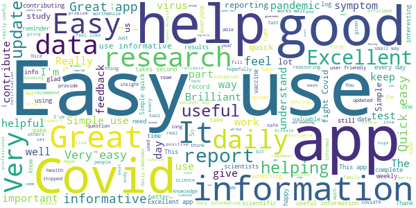

> Great 👍  :date: __2021-05-13 15:21:53__

> Great app and I love that I'm contributing to science  :date: __2021-05-13 13:39:17__

> Very easy to use  :date: __2021-05-13 12:45:16__

> This should be a compulsory addition to all smartphones..so why is it not. It is very helpful  :date: __2021-05-13 12:44:27__

> Brilliant  :date: __2021-05-13 11:35:41__

> Easy to use.  :date: __2021-05-13 11:18:26__

> Easy to use, takes a minute to say how you feel and you're done  :date: __2021-05-13 08:31:14__

> Simple to use and I am helping us all to defeat covid  :date: __2021-05-13 08:19:51__

> Easy to use  :date: __2021-05-13 08:01:38__

> Easy to complete daily....if I remember  :date: __2021-05-13 05:58:09__

#### 4-star reviews

> Good app would have thought though that it would ask for any pre-existing conditions a user may have  :date: __2021-05-13 12:53:56__

> Purpose of the app is great but no widget and push notifications are very sporadic which defeats the object  :date: __2021-05-13 12:37:27__

> Easy to use  :date: __2021-05-12 23:02:51__

> The app was pretty clear to use.  :date: __2021-05-12 21:42:12__

> Mainly easy to use but have had a couple of blips e. g. Entered info but next day it says nothing was entered and today opened to find I hadn't entered info for over 100days. This is wrong.  :date: __2021-05-12 13:25:00__

> OK but failed after an Android update, had to reinstall it.  :date: __2021-05-11 16:53:18__

> Easy to use. Also has very easy to understand information on the covid situation and research.  :date: __2021-05-11 13:50:38__

> Just identified a bug. If I report for a household, where one person has had a vaccine and the others haven't, if I report for that person first, the rest of the house gets the informational about still recording symptoms.  :date: __2021-05-10 18:51:41__

> Need a daily email reminder.  :date: __2021-05-10 18:05:03__

> Very easy to use.  :date: __2021-05-10 10:11:39__

#### 3-star reviews

> I'm close to giving up on this app. My second jab was done as part of a trial. The app does not want trial jabs to be recorded. So I have to lie every day and say I haven't had a second jab. I also had hay fever recently and was asked to take a Covid test. Hay fever is completely normal for me at this time of year. I will probably have it for a couple of months. I'm not taking dozens of Covid tests!  :date: __2021-05-12 01:39:30__

> It is a bit quirky ..needs some fine tuning to make it work better  :date: __2021-05-10 16:22:30__

> Worked really well until a couple of weeks ago when I stopped getting notifications. I need these to remind me to update every day. I managed to get them back for around 3 days they then stopped again. Hence why only gave 3 stars.  :date: __2021-05-08 12:34:54__

> Really good app, easy to fill the survey but I don't receive the daily reminders anymore... So I tend to forget  :date: __2021-05-07 23:46:52__

> Its not really that usefull.  :date: __2021-05-06 21:30:52__

> notifications have stopped  :date: __2021-05-06 11:24:16__

> I stopped getting the push notifications and have forgotten to log for over a week! Have remembered now but lowered the stars on this review because of that. Otherwise a fab app and idea.  :date: __2021-05-01 10:23:28__

> Hey - as of 6 days ago, I'm not getting daily notifications, so there's a gap in my records. This appears to be a bug.  :date: __2021-04-27 12:59:36__

> OKAY  :date: __2021-04-23 08:23:40__

> Crashing daily so having to uninstall and reinstall every time ☹  :date: __2021-04-22 13:11:09__

#### 2-star reviews

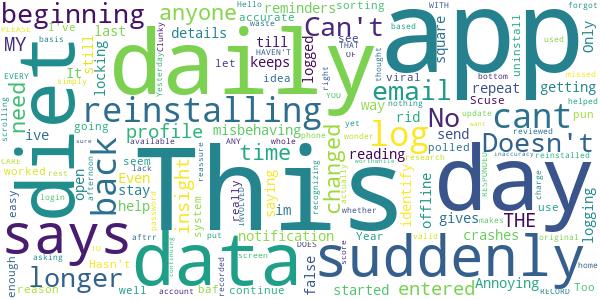

> This app has suddenly started misbehaving. It says it is offline when it is not. Even after reinstalling it will not open- it crashes. Annoying.  :date: __2021-05-11 12:01:50__

> I send daily details but still have up to 3 reminders. Only way of getting rid of notification is to repeat . This gives false reading .  :date: __2021-05-10 18:59:47__

> App keeps locking me out, saying cant identify me, also i cant stay logged in after i get help to log back in, then im back to square 1.. ive been logging since the beginning daily till the last few days, it needs sorting for me to continue.  :date: __2021-05-09 20:08:38__

> Hasn't polled me in 9 days. No idea why.  :date: __2021-05-04 17:19:14__

> No longer very accurate  :date: __2021-04-20 07:41:19__

> Doesn't seem easy enough to use. Can't see it going "viral". (Scuse the pun).  :date: __2021-04-15 11:48:20__

> I was in this for over a. Year but your system through me out and I can no longer get into it and can't email anyone. Too baf  :date: __2021-04-14 17:41:53__

> This app worked really well, now for some reason, it won't let me log in. I've uninstall and reinstalled and changed my password, nothing has helped 🤷‍♀️  :date: __2021-04-13 13:17:59__

> Suddenly asking me to login each time and now not recognizing my account aftrr reinstalling.  :date: __2021-04-09 17:53:00__

> Clunky, on a daily basis you need to update your profiles, yet they are only available by scrolling right to the bottom of the home screen, which you have to do again and again for EVERY profile, no thought put into how this is used daily.  :date: __2021-03-31 15:40:49__

#### 1-star reviews

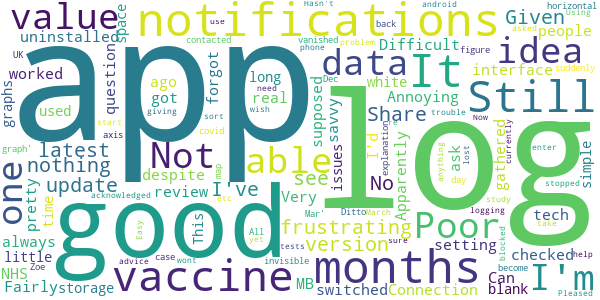

> Not as good as the NHS one  :date: __2021-05-05 22:39:28__

> Annoying  :date: __2021-05-02 14:41:42__

> I haven't had any notifications for months, despite the app setting being switched on.  :date: __2021-04-19 12:47:37__

> Poor. Connection Difficult always to log in .  :date: __2021-04-09 12:28:45__

> I had this app a while ago, uninstalled it but forgot to review it. Fairly poor interface but also I'd question the value of the data gathered and how it can be of real value.  :date: __2021-04-07 03:02:39__

> Apparently I'm supposed to be able to log my vaccine on here. Still have not worked out how. Can ask other people log their vaccine, but no idea how to log my own. Very frustrating. I've checked I've got the latest version, I'm pretty tech savvy but still no idea. Given up.  :date: __2021-04-06 08:49:24__

> 547 MB of storage used!? This should be such a simple little app!  :date: __2021-04-04 15:00:35__

> Still a blank white space where the graphs should be: there were no issues for a long time, then suddenly one day they vanished! All you see is the covid case figure, 'Dec-Mar' on the horizontal axis & 'Share the graph', nothing else: you can't share what you can't see. No explanation given. Ditto for the UK map: that's become invisible too. I contacted Zoe a good while back, they acknowledged the problem...but nothing. It is a good app, but I do wish they would take the trouble to sort it out.  :date: __2021-04-01 11:56:57__

> Hasn't asked me for update for months. Not sure why it stopped giving me notifications. Using latest (android) version and notifications not blocked on phone  :date: __2021-03-28 13:42:39__

> Easy to use. Pleased to be able to help this study. Update March 21 It's lost about 3.5 months of my data. No advice yet on if I need to re-enter vaccine, tests, etc. so currently not logging anything. Frustrating.  :date: __2021-03-27 17:44:40__

# NHS 24 : Covid-19 and flu information
App version ``2.0.1``

Analyzed with [covid-apps-observer](http://github.com/covid-apps-observer) project, version ``0.1``

## App overview
| | |
|-------------------------|-------------------------| 
| **Name**&nbsp;&nbsp;&nbsp;&nbsp;&nbsp;&nbsp;&nbsp;&nbsp;&nbsp;&nbsp;&nbsp;&nbsp;&nbsp;&nbsp;&nbsp;&nbsp;&nbsp;&nbsp;&nbsp;&nbsp;&nbsp;&nbsp;&nbsp;&nbsp;&nbsp;&nbsp;&nbsp;&nbsp;&nbsp;&nbsp;&nbsp;&nbsp;&nbsp;&nbsp;&nbsp;&nbsp;&nbsp;&nbsp;&nbsp;&nbsp;  | NHS 24 : Covid-19 and flu information |
| **Unique identifier** | scot.nhs24.coronavirus |
| **Link to Google Play** | [https://play.google.com/store/apps/details?id=scot.nhs24.coronavirus](https://play.google.com/store/apps/details?id=scot.nhs24.coronavirus) |
| **Summary**  | Coronavirus info and flu vaccine guidance for people in Scotland |
| **Privacy policy** | [https://www.nhsinform.scot/privacy-and-cookies-policy](https://www.nhsinform.scot/privacy-and-cookies-policy) |
| **Latest version** | 2.0.1 |
| **Last update** | 2020-10-13 14:55:01 |
| **Recent changes** | Minor bug fixes |
| **Installs**  | 10,000+ |
| **Category** | Health & Fitness |
| **First release** | Apr 19, 2020 |
| **Size**  | 12M |
| **Supported Android version**  | 4.2 and up |

### Description
> Get the latest health information on coronavirus in Scotland and find out how and where to get your flu vaccination this winter.
 This app is owned and delivered by NHS 24

### User interface
The developers of the app provide the following screenshots in the Google play store.
| | | |
|:-------------------------:|:-------------------------:|:-------------------------:|
 |   |   |   | 
 |   |   |   | 

## Development team
In the following we report the main information provided by the development team in the Google play store.

| | |
|-------------------------|-------------------------|
| **Developer**  | NHS24 |
| **Website**  | - |
| **Email** | ContentWorkRequest@nhs24.scot.nhs.uk |
| **Physical address**  | - |
| **Other developed apps**  | [https://play.google.com/store/apps/developer?id=NHS24](https://play.google.com/store/apps/developer?id=NHS24) |

## Android support

| | |
|-------------------------|-------------------------|
| **Declared target Android version**  | - |
| **Effective target Android version**  | - |
| **Minimum supported Android version**  | Jelly Bean, version 4.2.x (API level 17) |
| **Maximum target Android version**  | - |

The larger the difference between the minimum and maximum supported Android versions, the better. A larger difference means a wider audience. For example, old phones have a very low Android version, so a high minimum supported Android version means that the app cannot be used by users with old phones, thus leading to accessibility problems. 

## Requested permissions

In the following we report the complete list of the permissions requested by the app. 

| **Permission** | **Protection level** | **Description** | 
|-------------------------|-------------------------|-------------------------|
 **android.permission ACCESS_NETWORK_STATE** | Normal | Allows applications to access information about networks. 
 **android.permission INTERNET** | Normal | Allows applications to open network sockets. 
 **android.permission WAKE_LOCK** | Normal | Allows using PowerManager WakeLocks to keep processor from sleeping or screen from dimming. 
 **com.google.android.c2dm.permission RECEIVE** | - | - 

## Mentioned servers

| **Server** | **Registrant** | **Registrant country** | **Creation date** | 
|-------------------------|-------------------------|-------------------------|-------------------------|
 | google.com | Google LLC | :us: US | 1997-09-15 04:00:00 |
 | w3.org | W3C | :us: US | 1994-07-06 04:00:00 |

## Security analysis 

Below we report the main security warnings raised by our execution of the [Androwarn](https://github.com/maaaaz/androwarn) security analysis tool.

**Telephony identifiers leakage**
> - This application reads the ISO country code equivalent of the current registered operator's MCC (Mobile Country Code) 

**Connection interfaces exfiltration**
> - This application reads details about the currently active data network 

**Suspicious connection establishment**
> - This application opens a Socket and connects it to the remote address '' on the 'N/A' port  
> - This application opens a Socket and connects it to the remote address 'Ljava/lang/StringBuilder;->toString()Ljava/lang/String;' on the 'N/A' port  
> - This application opens a Socket and connects it to the remote address 'Ljava/net/Proxy;->type()Ljava/net/Proxy$Type;' on the 'N/A' port  
> - This application opens a Socket and connects it to the remote address 'timeout' on the 'N/A' port  

**Pim data leakage**
> - This application accesses data stored in the clipboard 

**Code execution**
> - This application loads a native library: 'flutter' 

## User ratings and reviews

Below we provide information about how end users are reacting to the app in terms of ratings and reviews in the Google Play store.

### Ratings

The NHS 24 : Covid-19 and flu information app has been installed by more than **10000** times. At this time, **53** rated the app and its average score is **3.2075472**. Below we show the distribution of the ratings across the usual star-based rating of Google Play

:star::star::star::star::star:: 21

:star::star::star::star:: 7

:star::star::star:: 5

:star::star:: 2

:star:: 18

### Reviews 

#### 5-star reviews

> Just get this app on my phone please  :date: __2021-05-22 15:09:52__

> Have symptoms.  :date: __2021-02-04 02:33:24__

> Straight forward to use and no nonsense answers to questions  :date: __2020-09-29 22:57:54__

> This is an excellent app with key information relating to coronavirus. Everyone should download it. However, for all of the clueless wonders out there who cannot read and have left it One Star reviews because it doesn't trace, it's not supposed to trace. There is a specific, dedicated app for 'Test & Protect' in Scotland, and that is the new Scottish tracking app. Learn to read, and you may well have a better chance of doing what you need to do in order to avoid coronavirus.  :date: __2020-09-24 18:39:42__

> Everything you need  :date: __2020-07-31 14:49:51__

> Am just about to try to see how good it is!  :date: __2020-05-29 12:27:51__

#### 4-star reviews

> I am in England not Scotland  :date: __2020-09-27 22:41:55__

> Just hope that this app works well for all of us if not we'll all in big trouble.  :date: __2020-09-26 13:18:41__

> Can this app notify me for other people who have covid  :date: __2020-09-24 19:20:35__

#### 3-star reviews

> Ok  :date: __2020-10-24 12:35:36__

> Since there's so many NHS apps, one general for patients who may need advice for their condition, another for general health information, whilst so many 3rd parties are using their logo, can NHS not name this Scottish app with Scotland AND COVID-19 in the name so the English and Welsh people can avoid this one?  :date: __2020-09-25 15:59:44__

> How do i check using post code  :date: __2020-09-24 13:19:39__

> If you are looking for the contact tracing app you need to search for Protect Scotland - this is not the app you are looking for. Stay Safe, Be Kind.  :date: __2020-09-10 12:15:04__

> Very disappointed with this app, very very basic, no proximity alerts, no information where positive areas are. I really wanted this app to impress me but sadly has failed. Why not just team up with the Kings College / ZOE Covid19 app as this has more information on where the hotpots are and offers you daily check-in for symptoms to collect live data. Come on NHS Scotland you can do much better than this!  :date: __2020-09-03 17:22:15__

#### 2-star reviews

> Nothing new here  :date: __2020-09-27 16:01:55__

> Do not think a lot of this app  :date: __2020-09-24 09:18:39__

#### 1-star reviews

> I dont live in scotland, why would I want this?  :date: __2021-01-28 14:01:16__

> There is no track and trace, if this isn't it then where is it?  :date: __2020-12-18 17:52:56__

> Rubish it does not work andstops everything elsewith failed to launch  :date: __2020-10-09 14:01:12__

> This is too basic, and tells you nothing about covid-19 nor its wider symptoms. It just asks those 3 questions. I wonder if this is just a waste of resources.  :date: __2020-10-05 02:00:49__

> Wouldn't work  :date: __2020-10-04 23:13:02__

> Big Brother is watching you!  :date: __2020-09-29 04:12:08__

> I couldn't see anything about contact tracing if I came close to someone who tested positive. Just a lidt of symptoms  :date: __2020-09-28 21:45:06__

> no use at all  :date: __2020-09-27 20:36:00__

> This is for Scotland not England  :date: __2020-09-24 22:04:32__

> Not sure I've got the right app I wanted the track and trace one  :date: __2020-09-24 19:30:42__

# COVID-19 Sounds
App version ``1.1.19``

Analyzed with [covid-apps-observer](http://github.com/covid-apps-observer) project, version ``0.1``

## App overview
| | |
|-------------------------|-------------------------| 
| **Name**&nbsp;&nbsp;&nbsp;&nbsp;&nbsp;&nbsp;&nbsp;&nbsp;&nbsp;&nbsp;&nbsp;&nbsp;&nbsp;&nbsp;&nbsp;&nbsp;&nbsp;&nbsp;&nbsp;&nbsp;&nbsp;&nbsp;&nbsp;&nbsp;&nbsp;&nbsp;&nbsp;&nbsp;&nbsp;&nbsp;&nbsp;&nbsp;&nbsp;&nbsp;&nbsp;&nbsp;&nbsp;&nbsp;&nbsp;&nbsp;  | COVID-19 Sounds |
| **Unique identifier** | uk.ac.cam.cl.covid19sounds |
| **Link to Google Play** | [https://play.google.com/store/apps/details?id=uk.ac.cam.cl.covid19sounds](https://play.google.com/store/apps/details?id=uk.ac.cam.cl.covid19sounds) |
| **Summary**  | Contribute your cough and voice sounds for research into COVID-19. |
| **Privacy policy** | [http://covid-19-sounds.org/privacy.html](http://covid-19-sounds.org/privacy.html) |
| **Latest version** | 1.1.19 |
| **Last update** | 2020-10-15 19:20:46 |
| **Recent changes** | scroll bar highliting |
| **Installs**  | 10,000+ |
| **Category** | Education |
| **First release** | Mar 25, 2020 |
| **Size**  | 3.4M |
| **Supported Android version**  | 5.0 and up |

### Description
> This app is part of a research project at the University of Cambridge. The aim of this research is to develop machine learning algorithms to automatically detect if a person is suffering of COVID-19, based primarily on sounds of their voice, their breathing and coughing. 
 In order to enable this research we are launching a large scale, crowdsourced data collection through a mobile app. The app will collect some basic demographics and medical history data, as well as some voice samples (while you read text on the screen) through a questionnaire and a few seconds of breathing and coughing through the phone microphone. We will additionally collect one location sample. The app will also ask if you have tested positive for the virus. The app won't be tracking you and only collect this data when you actively interact with it. 
 The data will be stored on University servers and be used solely for research purposes. We hope to release the dataset we are collecting to other researchers after the initial analysis. 
 The app will not give medical advice and any reports of symptoms will not be responded to by medical assistance.
 This app is available in English, Spanish, French, German, Hindi, Greek, Portuguese, Russian, Italian, and Chinese.

### User interface
The developers of the app provide the following screenshots in the Google play store.
| | | |
|:-------------------------:|:-------------------------:|:-------------------------:|
 | 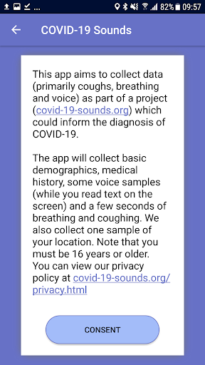  |   |   | 
 |  

## Development team
In the following we report the main information provided by the development team in the Google play store.

| | |
|-------------------------|-------------------------|
| **Developer**  | cam-cl-mobile-systems |
| **Website**  | [http://covid-19-sounds.org](http://covid-19-sounds.org) |
| **Email** | covid19sounds@gmail.com |
| **Physical address**  | - |
| **Other developed apps**  | [https://play.google.com/store/apps/developer?id=cam-cl-mobile-systems](https://play.google.com/store/apps/developer?id=cam-cl-mobile-systems) |

## Android support

| | |
|-------------------------|-------------------------|
| **Declared target Android version**  | Android10, version 10 (API level 29) |
| **Effective target Android version**  | Android10, version 10 (API level 29) |
| **Minimum supported Android version**  | Lollipop, version 5.0 (API level 21) |
| **Maximum target Android version**  | - |

The larger the difference between the minimum and maximum supported Android versions, the better. A larger difference means a wider audience. For example, old phones have a very low Android version, so a high minimum supported Android version means that the app cannot be used by users with old phones, thus leading to accessibility problems. 

## Requested permissions

In the following we report the complete list of the permissions requested by the app. 

| **Permission** | **Protection level** | **Description** | 
|-------------------------|-------------------------|-------------------------|
 **android.permission ACCESS_COARSE_LOCATION** | :warning:**Dangerous** | Allows an app to access approximate location. 
 **android.permission ACCESS_NETWORK_STATE** | Normal | Allows applications to access information about networks. 
 **android.permission ACCESS_WIFI_STATE** | Normal | Allows applications to access information about Wi-Fi networks. 
 **android.permission AUTHENTICATE_ACCOUNTS** | - | - 
 **android.permission GET_ACCOUNTS** | :warning:**Dangerous** | Allows access to the list of accounts in the Accounts Service. 
 **android.permission INTERNET** | Normal | Allows applications to open network sockets. 
 **android.permission READ_SYNC_SETTINGS** | Normal | Allows applications to read the sync settings. 
 **android.permission READ_SYNC_STATS** | Normal | Allows applications to read the sync stats. 
 **android.permission RECORD_AUDIO** | :warning:**Dangerous** | Allows an application to record audio. 
 **android.permission WRITE_SYNC_SETTINGS** | Normal | Allows applications to write the sync settings. 
 **com.samsung.android.providers.context.permission WRITE_USE_APP_FEATURE_SURVEY** | - | - 

## Mentioned servers

| **Server** | **Registrant** | **Registrant country** | **Creation date** | 
|-------------------------|-------------------------|-------------------------|-------------------------|
 | google.com | Google LLC | :us: US | 1997-09-15 04:00:00 |
 | googleapis.com | Google LLC | :us: US | 2005-01-25 17:52:26 |

## Security analysis 

Below we report the main security warnings raised by our execution of the [Androwarn](https://github.com/maaaaz/androwarn) security analysis tool.

**Connection interfaces exfiltration**
> - This application reads details about the currently active data network 
> - This application tries to find out if the currently active data network is metered 

**Suspicious connection establishment**
> - This application opens a Socket and connects it to the remote address 'Lcz/msebera/android/httpclient/HttpHost;->getPort()I' on the 'Lcz/msebera/android/httpclient/HttpHost;->getPort()I' port  

## User ratings and reviews

Below we provide information about how end users are reacting to the app in terms of ratings and reviews in the Google Play store.

### Ratings

The COVID-19 Sounds app has been installed by more than **10000** times. At this time, **72** rated the app and its average score is **3.8611112**. Below we show the distribution of the ratings across the usual star-based rating of Google Play

:star::star::star::star::star:: 43

:star::star::star::star:: 7

:star::star::star:: 4

:star::star:: 5

:star:: 13

### Reviews 

#### 5-star reviews

> I wasn't able to answer my covid test results are pending... but overall a great app  :date: __2020-12-13 20:06:00__

> The verification page with the user id has a broken link. Its not closed so if you click anywhere after the link, it clicks the link. Great app! I hope they are able to collect enough data to do what they want.  :date: __2020-11-10 20:11:56__

> Great easy to use app. One day could lead to great things.  :date: __2020-11-03 18:29:57__

> Easy to use, hopefully helpful.  :date: __2020-09-02 04:49:31__

> Great easy app I'm sure it will be extremely useful long term  :date: __2020-08-08 09:23:57__

> 👍👍👍👍👍 this app is very useful. Thanks for this ideya. 😉😉👍👍👍👍👍  :date: __2020-07-18 12:42:37__

> how I'll know my result  :date: __2020-05-22 00:35:52__

> Great idea, all the best with this app, hope we can win over Covid-19!  :date: __2020-04-13 21:34:53__

#### 4-star reviews

No recent reviews available with 4 stars.

#### 3-star reviews

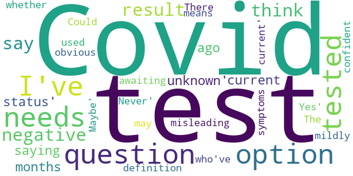

> Covid test question needs an 'unknown' option. I've been tested before, with negative result, but months ago, so saying my 'current status' is negative is misleading, but I can't say I've 'Never' been tested. Could also be used by those who've had a test, but awaiting results. There should be a definition of what 'current' means too. The question on whether you think you've had Covid needs a 'Maybe' option. I think I may have, but mildly & not the obvious symptoms so not confident to say 'Yes'.  :date: __2021-01-13 02:47:12__

#### 2-star reviews

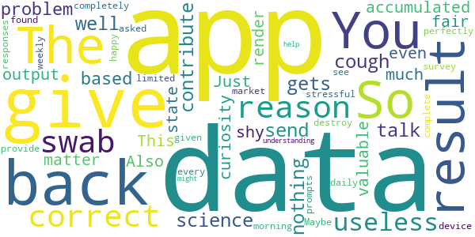

> So, well, this app only gets your data: you send your talk, your cough, your data, and that's it. It gives you back nothing. You contribute to science. The problem here is: why don't they give me back the result of my data, based on the data they accumulated? This is not fair, no matter how much the data is valuable/correct. Just give me the output, even if just for curiosity. You state that the app is 98% correct. So there's no reason to be so shy. Also: this app would render the swab completely useless. Maybe the app doesn't give back the results so to not destroy the market of a perfectly useless device like the swab? I can see no other reason.  :date: __2020-12-31 18:10:40__

> The app asked me to complete the same survey every morning. I would have been happy to provide weekly responses, but found daily prompts too stressful given my very limited understanding of how this might help.  :date: __2020-11-27 18:27:29__

#### 1-star reviews

> Broken... Doesn't work  :date: __2021-01-10 17:21:19__

> I cant open it  :date: __2020-10-20 00:37:26__

# NHS App
App version ``1.48.7``

Analyzed with [covid-apps-observer](http://github.com/covid-apps-observer) project, version ``0.1``

## App overview
| | |
|-------------------------|-------------------------| 
| **Name**&nbsp;&nbsp;&nbsp;&nbsp;&nbsp;&nbsp;&nbsp;&nbsp;&nbsp;&nbsp;&nbsp;&nbsp;&nbsp;&nbsp;&nbsp;&nbsp;&nbsp;&nbsp;&nbsp;&nbsp;&nbsp;&nbsp;&nbsp;&nbsp;&nbsp;&nbsp;&nbsp;&nbsp;&nbsp;&nbsp;&nbsp;&nbsp;&nbsp;&nbsp;&nbsp;&nbsp;&nbsp;&nbsp;&nbsp;&nbsp;  | NHS App |
| **Unique identifier** | com.nhs.online.nhsonline |
| **Link to Google Play** | [https://play.google.com/store/apps/details?id=com.nhs.online.nhsonline](https://play.google.com/store/apps/details?id=com.nhs.online.nhsonline) |
| **Summary**  | Access NHS services in England |
| **Privacy policy** | [https://www.nhs.uk/using-the-nhs/nhs-services/the-nhs-app/privacy/](https://www.nhs.uk/using-the-nhs/nhs-services/the-nhs-app/privacy/) |
| **Latest version** | 1.48.7 |
| **Last update** | 2021-04-13 10:30:09 |
| **Recent changes** | Improvements:  - We have renamed &quot;Settings&quot; to &quot;More&quot; and updated the icon - Bug fixes, and various performance, stability and accessibility enhancements |
| **Installs**  | 1,000,000+ |
| **Category** | Medical |
| **First release** | Dec 31, 2018 |
| **Size**  | 56M |
| **Supported Android version**  | 5.0 and up |

### Description
> <b>This is not the NHS COVID-19 app. To download the NHS COVID-19 contact tracing app, go to covid19.nhs.uk</b>
 Owned and run by the NHS, the NHS App is a simple and secure way to access a range of NHS services on your smartphone or tablet.
 To use the NHS App you must be aged 13 and over and registered with a GP surgery in England.
 You can also access NHS App services from the browser on your desktop or laptop computer. Go to www.nhs.uk/app
 Use the NHS App to:
 •	get advice about coronavirus
 •	order your repeat prescriptions
 •	book and manage appointments at your GP surgery
 •	get health information and advice
 •	view your health record securely
 •	register your organ donation decision
 •	find out how the NHS uses your data
 If your GP surgery or hospital offers other services in the NHS App, you may be able to:
 •	message your GP surgery, doctor or health professional online
 •	consult a GP or health professional through an online form and get a reply
 •	access health services on behalf of someone you care for
 •	view your hospital and other healthcare appointments
 •	view useful links your doctor or health professional has shared with you
 •	view and manage your care plans
 Get advice about coronavirus 
 ---------------------------------------
 Get information about coronavirus and find out what to do if you think you have it.
 Order repeat prescriptions 
 -----------------------------------
 See your available medicines, request a new repeat prescription and choose a pharmacy for your prescriptions to be sent to.
 Book appointments
 --------------------------
 Search for, book and cancel appointments at your GP surgery. See details of your upcoming and past appointments.
 Get health advice
 -----------------------------
 Search trusted NHS information and advice on hundreds of conditions and treatments. You can also answer questions to get instant advice or medical help near you. 
 View your health record
 ----------------------------------
 Securely access your GP health record, to see information like your allergies and your current and past medicines. If your GP surgery has given you access to your detailed medical record, you can also see information like test results and details of your consultations. 
 Register your organ donation decision
 --------------------------------------------------
 Choose to donate some or all of your organs and check your registered decision.
 Find out how the NHS uses your data
 -------------------------------------------------
 Choose if data from your health records is shared for research and planning.
 Keeping your data secure
 ---------------------------------
 After you download the app, you will need to set up an NHS login and prove who you are. The app then securely connects to information from your GP surgery. 
 If your Android device supports fingerprint detection, you can use it to log in to the NHS App each time, instead of using a password and security code.

### User interface
The developers of the app provide the following screenshots in the Google play store.
| | | |
|:-------------------------:|:-------------------------:|:-------------------------:|
 |   |   |   | 
 |   |   |   | 
 |   |   |   | 
 |   |   |   | 
 |   |   |   | 
 |   |   |   | 

## Development team
In the following we report the main information provided by the development team in the Google play store.

| | |
|-------------------------|-------------------------|
| **Developer**  | NHS Digital |
| **Website**  | [https://www.nhs.uk/using-the-nhs/nhs-services/the-nhs-app/help/](https://www.nhs.uk/using-the-nhs/nhs-services/the-nhs-app/help/) |
| **Email** | nhsapp@nhs.net |
| **Physical address**  | - |
| **Other developed apps**  | [https://play.google.com/store/apps/developer?id=NHS+Digital](https://play.google.com/store/apps/developer?id=NHS+Digital) |

## Android support

| | |
|-------------------------|-------------------------|
| **Declared target Android version**  | Pie, version 9 (API level 28) |
| **Effective target Android version**  | Pie, version 9 (API level 28) |
| **Minimum supported Android version**  | Lollipop, version 5.0 (API level 21) |
| **Maximum target Android version**  | - |

The larger the difference between the minimum and maximum supported Android versions, the better. A larger difference means a wider audience. For example, old phones have a very low Android version, so a high minimum supported Android version means that the app cannot be used by users with old phones, thus leading to accessibility problems. 

## Requested permissions

In the following we report the complete list of the permissions requested by the app. 

| **Permission** | **Protection level** | **Description** | 
|-------------------------|-------------------------|-------------------------|
 **android.permission ACCESS_FINE_LOCATION** | :warning:**Dangerous** | Allows an app to access precise location. 
 **android.permission ACCESS_NETWORK_STATE** | Normal | Allows applications to access information about networks. 
 **android.permission CAMERA** | :warning:**Dangerous** | Required to be able to access the camera device. 
 **android.permission INTERNET** | Normal | Allows applications to open network sockets. 
 **android.permission MODIFY_AUDIO_SETTINGS** | Normal | Allows an application to modify global audio settings. 
 **android.permission READ_EXTERNAL_STORAGE** | :warning:**Dangerous** | Allows an application to read from external storage. 
 **android.permission READ_PHONE_STATE** | :warning:**Dangerous** | Allows read only access to phone state, including the phone number of the device, current cellular network information, the status of any ongoing calls, and a list of any PhoneAccounts registered on the device. 
 **android.permission RECORD_AUDIO** | :warning:**Dangerous** | Allows an application to record audio. 
 **android.permission USE_FINGERPRINT** | Normal | This constant was deprecated in API level 28. Applications should request USE_BIOMETRIC instead 
 **android.permission WAKE_LOCK** | Normal | Allows using PowerManager WakeLocks to keep processor from sleeping or screen from dimming. 
 **android.permission WRITE_EXTERNAL_STORAGE** | :warning:**Dangerous** | Allows an application to write to external storage. 
 **com.google.android.c2dm.permission RECEIVE** | - | - 
 **com.google.android.finsky.permission BIND_GET_INSTALL_REFERRER_SERVICE** | - | - 
 **org.fidoalliance.uaf.permissions FIDO_CLIENT** | - | - 

## Mentioned servers

| **Server** | **Registrant** | **Registrant country** | **Creation date** | 
|-------------------------|-------------------------|-------------------------|-------------------------|
 | googlesyndication.com | Google LLC | :us: US | 2003-01-21 06:17:24 |
 | google.com | Google LLC | :us: US | 1997-09-15 04:00:00 |
 | app-measurement.com | Google LLC | :us: US | 2015-06-19 20:13:31 |

## Security analysis 

Below we report the main security warnings raised by our execution of the [Androwarn](https://github.com/maaaaz/androwarn) security analysis tool.

**Connection interfaces exfiltration**
> - This application reads details about the currently active data network 

**Telephony services abuse**
> - This application makes phone calls 

## User ratings and reviews

Below we provide information about how end users are reacting to the app in terms of ratings and reviews in the Google Play store.

### Ratings

The NHS App app has been installed by more than **1000000** times. At this time, **7245** rated the app and its average score is **3.4703448**. Below we show the distribution of the ratings across the usual star-based rating of Google Play

:star::star::star::star::star:: 3429

:star::star::star::star:: 1019

:star::star::star:: 409

:star::star:: 309

:star:: 2079

### Reviews 

#### 5-star reviews

> Easy to install and use, especially as I'm a technophobe  :date: __2021-05-22 13:50:42__

> I found it easy to install and very user friendly. Considering the complexity that sits behind the app to link with GP practices and other systems I reckon NHS Digital have done a great job. Thanks team and keep up the good work!  :date: __2021-05-22 12:19:01__

> Could not get through passing my details across via a camera on my tablet - the 'oval' did not even pick up my face and i did try 4 times. I appreciats that identity has to be proved in some way, but this just defeated me. I will try again when/if there is a better solution Since my last post, i have successfully dowmloaded the latest version, registered and used the app. It is a good product, and i am happy to have it. Well done all involved!!  :date: __2021-05-22 12:06:37__

> I love this app, can access your repeat prescription, plus much more. Very easy to use.  :date: __2021-05-22 11:20:17__

> Excellent service  :date: __2021-05-22 00:34:19__

> Simple to set up and use. No problems encountered at all.  :date: __2021-05-21 23:34:49__

> You can reorder prescriptions which is great.  :date: __2021-05-21 22:40:49__

> No issues, works fine and confirms that two vaccinations have been had  :date: __2021-05-21 19:20:50__

> TEAM NHS... EXCELLENT WORK ADMINISTRATORS.... WITHIN PROVISION OF 1.OPTIONAL FINGERPRINT ACCESS USING ANDROID VERSION 11. 2. RECEIVED OFFICIAL UK GOVT NHS COVID VAC STATUS PAPER CERTIFICATE ROLLOUT VIA EMAIL REF FOR BORDER CONTROL TRAVEL PURPOSES🚀🛸🪐🌌✈️🌍🌎🌏🗺️ *JUST DOWNLOADED.FRI 21/05. *REF UPDATE:*APP working VERY WELL via 1.MULTIPLE FINGERRINT recognition achieved. 2. NHS APP OVERVIEW HAS CLEAR MEDICAL RECORDS DISPLAY. 👩‍⚕️💉🍾🥇👍🚀ps.. GOOGLE saved STRONG password OPTION also works  :date: __2021-05-21 17:50:54__

> Very good app and from me that means a lot.  :date: __2021-05-21 15:44:02__

#### 4-star reviews

> NHS app finally updated the over envasive security requirements to request the already existing patient data from your GP. A great improvement. The login process needs massive improvement, fingerprint doesn't work or prompt. Will review the app shortly, thx  :date: __2021-05-22 09:53:13__

> Impressive features, I look forward to making use of them to reduce the time I spend trying to get through to my GP's surgery. My biggest gripe is that the app breaks the Android back button. It doesn't take you BACK to the previous page, it tries to log you out of the app every time press use it. To get back, you need to tap a link on the page, also marked "Back". Otherwise I would have given the app 5 stars. It was ironic to have to submit my passport and a video of myself given that anyone who knows my name, date of birth and address can access / alter this information over the phone with my GP's surgery. I suspect that this is more of a problem with my GP's surgery than this app though. I'm also surprised that it's acceptable to restrict full access to the app to people who have paid to have a form of photo ID given the claims made about measures to combat election fraud recently.  :date: __2021-05-21 17:35:03__

> Why does my covid passport have an expiration date? (20/06/21)  :date: __2021-05-21 12:15:17__

> Could someone please tell me how to register a second person . We both use same email . There doesn't seem to be any way to set up new registration using same email .  :date: __2021-05-21 10:39:29__

> Working fine now, registered with local GP online and my records show in the app.  :date: __2021-05-21 10:35:06__

> I have registered ok and I can log in but it didn't ask me to submit a ID photo or my picture? How do I do this?  :date: __2021-05-20 23:05:37__

> I found it easy to install and register, except for the taking a photo. The app decided when to take the photo instead of the user, I think it should be the other way round as I had glasses on still reading instructions, whereas the comparisons picture for validation was my driving licence which does not have me wearing glasses. I think it is a good thing that the NHS shares the data it has with the patient. The only problem I had was trying to check the QR code. Is there a special app to read it or anything you can recommend, because when I tried a QR reader or Scanner against it I just got "gobblygook" text, so I have no idea if the QR code actually works, It would be good to check that it did, before I used it in earnest. Thanks  :date: __2021-05-20 22:58:40__

> Was a bit annoyed at first as it wants an email address to confirm identity - and the mail didnt arrive. Turned out it was somehow being regarxed as spam....duh Followed the reg process - youll need your nhs number - and it was then fine.and in then shows my covid vaccination status, which is actually quite cool  :date: __2021-05-20 19:30:28__

> It's good but should have section to virtually hold the GHIC travel health card. It should also hold Covid 19 vaccination status, test status, that can be used in conjunction with airlines and other countries proof of vaccination. The app should also generate a QR code for vaccine status that is compatible with the EU Digital Green Certificate.  :date: __2021-05-20 17:56:16__

> It works well.  :date: __2021-05-20 17:41:25__

#### 3-star reviews

> Navigation is frustrating, every time I swipe to go back it offers to fog me out. Text on icons at the bottom of screen is too small.  :date: __2021-05-22 12:46:18__

> I have downloaded the app and it's working well. However, I had my second vaccination early in January and it seems that my passport will expire in June of this year. Will I still be able to travel abroad? Denis Tall  :date: __2021-05-22 09:06:49__

> Complex to get into! Got as far as taking a video to prove who I am. Said it was in a format that it couldn't open. I use an Android 9 phone. Can't do anything about it. The app is not user friendly.  :date: __2021-05-21 23:19:36__

> I registered my husband using his phone - no problem! I am now trying to register myself on my phone. I was easily able to upload my ID documents but I am unable to verify my ID with a scanned photograph. The app won't allow me to use the camera function!!!!  :date: __2021-05-21 19:28:29__

> Can't find my passport covid on this app where and how can I find it please  :date: __2021-05-21 10:43:12__

> Cannot find my Covid vaccination status, i have had both doses and only the card given back at the centre.  :date: __2021-05-21 10:05:13__

> I installed the app in my mobile and it worked perfectly. But, when I installed the app in my wife's mobile, it demanded to do a prove who am I, I did the photo of the driving licence and record a small video with numbers , which it didn't go. That's completely stupid and no need to do it . I gave all the details of my wife and nhs number, so no need to make it complicated. My app in my mobile didn't ask me for the prove who am I. It access easily to my health records.  :date: __2021-05-21 09:37:29__

> Hardly works properly always kicking out errors when trying to access it, fingerprint keeps switching itself off. One of the most useless apps I have ever used. I was in A&E at the beginning of the week and it didn't even register. Someone seriously needs to get a grip of this app.  :date: __2021-05-21 08:07:26__

> Oh dear. For a health app, the devs don't seem to have heard of accessibility. The icons at the bottom of the screen are poor anyway so need text. I needed a magnifier to read that text! And then there's the inconsistent way of going "back". Sometimes there is a Back link on-screen, sometimes not. The only thing which seems consistent is that the Android back button doesn't do what you'd want to do. The app seems to be a poor quality copy of an iOS app rather than being fit for purpose on Androi  :date: __2021-05-20 19:33:50__

> I have downloaded app but keeps telling me we are experiencing technical difficulties try again. I've tried many times still no luck Have tried again and it seems to be working. Thank you for responding  :date: __2021-05-20 18:38:46__

#### 2-star reviews

> Impossible to complete the registration process, I gave up after 3 attempts.  :date: __2021-05-22 17:22:09__

> Not for the UK it's for England only.  :date: __2021-05-22 11:49:14__

> Initially it seemed that with Android 5.1 it was impossible to download the app. Hooray! Persistence was rewarded! I managed to download and install the app at my third attempt! But it seems impossible to get past the big blue NHS logo on the first webpage. The app is too big for my limited 'memory' - and won't let me move it to my SD where there is loads of space! Will report further in coming days.  :date: __2021-05-22 10:58:24__

> Why do you need my photo to log on?  :date: __2021-05-22 07:45:03__

> Used to work ok, but since they added the covid19 vaccination pages, I just get an error when I try to access my health records. Until that's fixed, the app does nothing other than prove I've had my cv19 jabs.  :date: __2021-05-22 00:04:35__

> App works OK but cannot log out by going to menu and selecting log out. It takes you back to logging in screen. Ony way is to force close the app. How can an app be released with such an issue.  :date: __2021-05-21 21:45:13__

> I AM STRUGGLING TO GET MY REPEAT PRESCRIPTIONS . UNABLE TO LOGIN VERY FRUSTRATING .... THE CODE IS NOT COMING THROUGH ON MY MOBILE PHONE  :date: __2021-05-21 18:10:37__

> Password requirement means that it is not easy to remember and the app requires it to be input every time it is used even on what I have told it is a trusted device. I am signed up for online prescription ordering but the app says I am not. Get this fixed please.  :date: __2021-05-21 13:16:21__

> Unable to verify identity. Have made two or three attempts to verify my identity, so can't even use the app, which as it is rhe official app for proving one has had the jabs is fairly unhelpful. I uploaded a photo successfully, then tried facial scan but then just got "please wait" for ages before the app chucked me off. Further attempts won't give me facial scan option, only video option and then that comes up as "file not recognised". A NOT splendid way to waste several hours!  :date: __2021-05-21 08:10:02__

> Cannot find NHS records despite repeatedly trying  :date: __2021-05-21 00:45:47__

#### 1-star reviews

> I've tried several times I get to the code and it f???s me of  :date: __2021-05-22 17:19:01__

> Unable to log in with name OR NHS no. Useless...  :date: __2021-05-22 17:17:37__

> Awful. Tried to register twice. Takes me through the whole rigmarole only to say it cannot connect to my GP "having technical issues, please try again later". How many days later should I be trying? Been like this for days. Other half had no issues registering, I'm not so lucky.  :date: __2021-05-22 17:15:26__

> Unable to login! Keep getting the same error message. Uninstalled and reinstalled app twice but still the same! Grrrrr!  :date: __2021-05-22 17:01:27__

> Usless app. As part of the id verification you have to film a video saying a pin. But the app makes it impossible to do it successfully. Tried on multiple devices. Won't start camera successfully, and misidentifies video as photo. Usless.  :date: __2021-05-22 16:23:31__

> It won't accept my details. Saying they are wrong. I'm pretty sure I'm putting my name in correctly 🙄 it's also saying my nhs number is wrong which it isnt  :date: __2021-05-22 15:30:03__

> Abysmal. Would not set up on my mobile. Waste of time. Please ask for your money back. (Apparently, the developer has responded. Unfortunately, their response is not visible to me.) Tried it again. Still does not work with my new up to date Android phone. Will not waste more time.  :date: __2021-05-22 15:03:30__

> Edited: Support now tell me i need to email a URL link to my practice to tell them how to give me access. Thing is my GP practice has no email access for patients - it is phone or Fax ONLY. Hopeless. Par for the course for NHS IT.  :date: __2021-05-22 14:40:55__

> Can't believe how bad this app is. The log on process is unbelievably complex. I realise that it must be secure but the logging on process is far to cumbersone.  :date: __2021-05-22 14:00:18__

> Not compatible with the Android password manager. This forces people to use easy to remember passwords. Goes against NCSC advice!  :date: __2021-05-22 13:57:57__

# C19 Control
App version ``1.4.0``

Analyzed with [covid-apps-observer](http://github.com/covid-apps-observer) project, version ``0.1``

## App overview
| | |
|-------------------------|-------------------------| 
| **Name**&nbsp;&nbsp;&nbsp;&nbsp;&nbsp;&nbsp;&nbsp;&nbsp;&nbsp;&nbsp;&nbsp;&nbsp;&nbsp;&nbsp;&nbsp;&nbsp;&nbsp;&nbsp;&nbsp;&nbsp;&nbsp;&nbsp;&nbsp;&nbsp;&nbsp;&nbsp;&nbsp;&nbsp;&nbsp;&nbsp;&nbsp;&nbsp;&nbsp;&nbsp;&nbsp;&nbsp;&nbsp;&nbsp;&nbsp;&nbsp;  | C19 Control |
| **Unique identifier** | com.elt.covid_android |
| **Link to Google Play** | [https://play.google.com/store/apps/details?id=com.elt.covid_android](https://play.google.com/store/apps/details?id=com.elt.covid_android) |
| **Summary**  | Record and monitor the C19 status for people being cared for and for care staff. |
| **Privacy policy** | [https://www.c19control.com/privacy-policy](https://www.c19control.com/privacy-policy) |
| **Latest version** | 1.4.0 |
| **Last update** | 2020-05-19 15:34:07 |
| **Recent changes** | Text changes and usability improvements |
| **Installs**  | 50+ |
| **Category** | Medical |
| **First release** | Apr 20, 2020 |
| **Size**  | 4.2M |
| **Supported Android version**  | 6.0 and up |

### Description
> C19 CONTROL is the fast and simple way for care providers to record and report COVID-19 status and PPE use on the frontline of care.  
  
 Care staff can view a list of people being cared for, and for each person they can record the advice given by the official NHS service in their region; the relevant symptoms; and the appropriate COVID-19 status.  Care Staff can also record their own Personal Protective Equipment (PPE) supply levels, giving their Care Managers a real-time view of PPE needs across their team.
 Care managers can use the app to record the COVID-19 status for each of their care staff, and can quickly add new people to the list of care receivers and care staff.  Care Managers can also record the overall PPE levels for the care service, to help when re-ordering stock.
 Using the C19 CONTROL web portal, care managers can set the dependency level of people being cared for and can run reports of COVID-19status and dependency level for people being cared for, and COVID-19 status and PPE levels for care staff.
 The data recorded by C19 CONTROL will help both care providers as well as local, regional and national government organisations to gain a better understanding of the cases of suspected or confirmed COVID-19 across health and social care systems so that they can better anticipate health needs and plan resource requirements.

### User interface
The developers of the app provide the following screenshots in the Google play store.
| | | |
|:-------------------------:|:-------------------------:|:-------------------------:|
 | 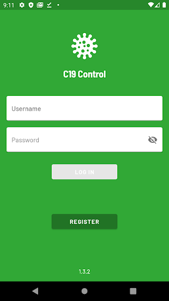  | 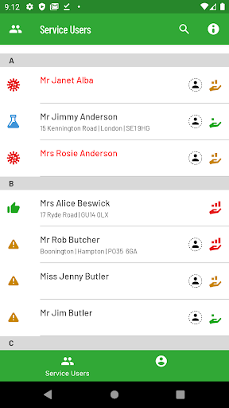  |   | 
 | 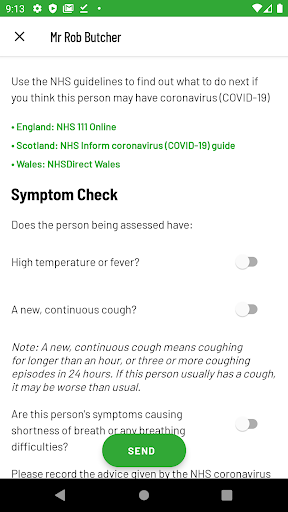  |   |   | 
 |   |   |   | 
 |   |   |   | 
 |   |   |   | 
 |   | 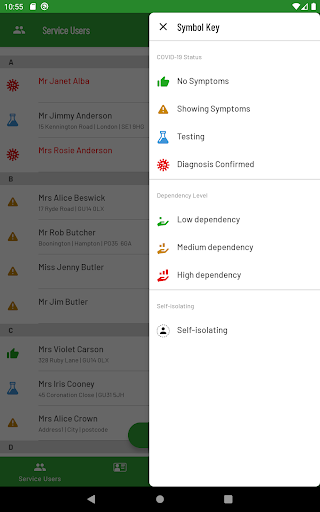  |   | 
 | 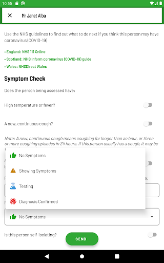  |   |   | 
 |  

## Development team
In the following we report the main information provided by the development team in the Google play store.

| | |
|-------------------------|-------------------------|
| **Developer**  | everyLIFE |
| **Website**  | [https://www.c19control.com/](https://www.c19control.com/) |
| **Email** | support@c19control.com |
| **Physical address**  | [A1, East Wing, Cody Technology Park, Ively Road, Farnborough, UK, GU14 0LX](https://www.google.com/maps/search/A1,%20East%20Wing,%20Cody%20Technology%20Park,%20Ively%20Road,%20Farnborough,%20UK,%20GU14%200LX) (Google Maps) |
| **Other developed apps**  | [https://play.google.com/store/apps/developer?id=everyLIFE](https://play.google.com/store/apps/developer?id=everyLIFE) |

## Android support

| | |
|-------------------------|-------------------------|
| **Declared target Android version**  | Android10, version 10 (API level 29) |
| **Effective target Android version**  | Android10, version 10 (API level 29) |
| **Minimum supported Android version**  | Marshmallow, version 6.0 (API level 23) |
| **Maximum target Android version**  | - |

The larger the difference between the minimum and maximum supported Android versions, the better. A larger difference means a wider audience. For example, old phones have a very low Android version, so a high minimum supported Android version means that the app cannot be used by users with old phones, thus leading to accessibility problems. 

## Requested permissions

In the following we report the complete list of the permissions requested by the app. 

| **Permission** | **Protection level** | **Description** | 
|-------------------------|-------------------------|-------------------------|
 **android.permission ACCESS_NETWORK_STATE** | Normal | Allows applications to access information about networks. 
 **android.permission CALL_PHONE** | :warning:**Dangerous** | Allows an application to initiate a phone call without going through the Dialer user interface for the user to confirm the call. 
 **android.permission INTERNET** | Normal | Allows applications to open network sockets. 
 **android.permission WAKE_LOCK** | Normal | Allows using PowerManager WakeLocks to keep processor from sleeping or screen from dimming. 
 **com.google.android.c2dm.permission RECEIVE** | - | - 
 **com.google.android.finsky.permission BIND_GET_INSTALL_REFERRER_SERVICE** | - | - 

## Mentioned servers

| **Server** | **Registrant** | **Registrant country** | **Creation date** | 
|-------------------------|-------------------------|-------------------------|-------------------------|
 | googleapis.com | Google LLC | :us: US | 2005-01-25 17:52:26 |
 | googlesyndication.com | Google LLC | :us: US | 2003-01-21 06:17:24 |
 | google.com | Google LLC | :us: US | 1997-09-15 04:00:00 |
 | app-measurement.com | Google LLC | :us: US | 2015-06-19 20:13:31 |
 | googleadservices.com | Google LLC | :us: US | 2003-06-19 16:34:53 |
 | crashlytics.com | Google LLC | :us: US | 2011-01-21 15:30:40 |
 | googleapis.com | Google LLC | :us: US | 2005-01-25 17:52:26 |
 | passgenius.com | - | GB | 2014-09-28 21:17:28 |

## Security analysis 

Below we report the main security warnings raised by our execution of the [Androwarn](https://github.com/maaaaz/androwarn) security analysis tool.

**Connection interfaces exfiltration**
> - This application reads details about the currently active data network 
> - This application tries to find out if the currently active data network is metered 

**Telephony services abuse**
> - This application makes phone calls 

**Suspicious connection establishment**
> - This application opens a Socket and connects it to the remote address ': ; port is out of range' on the 'N/A' port  
> - This application opens a Socket and connects it to the remote address 'Ld/c/a/a/a;->a(Ljava/lang/String;)Ljava/lang/StringBuilder;' on the 'N/A' port  
> - This application opens a Socket and connects it to the remote address 'Ljava/net/Proxy;->type()Ljava/net/Proxy$Type;' on the 'N/A' port  
> - This application opens a Socket and connects it to the remote address 'timeout' on the 'N/A' port  

## User ratings and reviews

Below we provide information about how end users are reacting to the app in terms of ratings and reviews in the Google Play store.

### Ratings

The C19 Control app has been installed by more than **50** times. At this time, **-** rated the app and its average score is **0.0**. Below we show the distribution of the ratings across the usual star-based rating of Google Play

:star::star::star::star::star:: 0

:star::star::star::star:: 0

:star::star::star:: 0

:star::star:: 0

:star:: 0

### Reviews 

#### 5-star reviews

> I care for my friends so I got this app  :date: __2020-12-27 19:53:18__

> Simple to use with a very easy to navigate set of menus.  :date: __2020-04-30 07:50:48__

#### 4-star reviews

No recent reviews available with 4 stars.

#### 3-star reviews

No recent reviews available with 3 stars.

#### 2-star reviews

No recent reviews available with 2 stars.

#### 1-star reviews

No recent reviews available with 1 stars.

# patientMpower for COVID-19
App version ``covid-19-1.6.1``

Analyzed with [covid-apps-observer](http://github.com/covid-apps-observer) project, version ``0.1``

## App overview
| | |
|-------------------------|-------------------------| 
| **Name**&nbsp;&nbsp;&nbsp;&nbsp;&nbsp;&nbsp;&nbsp;&nbsp;&nbsp;&nbsp;&nbsp;&nbsp;&nbsp;&nbsp;&nbsp;&nbsp;&nbsp;&nbsp;&nbsp;&nbsp;&nbsp;&nbsp;&nbsp;&nbsp;&nbsp;&nbsp;&nbsp;&nbsp;&nbsp;&nbsp;&nbsp;&nbsp;&nbsp;&nbsp;&nbsp;&nbsp;&nbsp;&nbsp;&nbsp;&nbsp;  | patientMpower for COVID-19 |
| **Unique identifier** | com.maithu.transplantbuddy.covid19 |
| **Link to Google Play** | [https://play.google.com/store/apps/details?id=com.maithu.transplantbuddy.covid19](https://play.google.com/store/apps/details?id=com.maithu.transplantbuddy.covid19) |
| **Summary**  | patientMpower COVID-19 Patient Management app |
| **Privacy policy** | [https://info.patientmpower.com/covid19-privacy-policy](https://info.patientmpower.com/covid19-privacy-policy) |
| **Latest version** | covid-19-1.6.1 |
| **Last update** | 2021-03-11 10:15:46 |
| **Recent changes** | We&#39;ve made some minor improvements and bug fixes. |
| **Installs**  | 1,000+ |
| **Category** | Health & Fitness |
| **First release** | Mar 15, 2020 |
| **Size**  | 64M |
| **Supported Android version**  | 4.3 and up |

### Description
> The patientMpower for COVID-19 app is for people in the Republic of Ireland who have been enrolled in the COVID-19 remote monitoring programme by a healthcare professional. 
 The patientMpower for COVID-19 app will allow you to monitor your COVID-19 symptoms and  health information such as your oxygen levels and temperature whilst you are in self-isolation. This information will be shared confidentially with trained personnel at dedicated monitoring centres. They will be able to see your information immediately. Monitoring will enable healthcare professionals to assess if you are recovering well whilst in isolation or if you need additional support (e.g. extra treatments at home or if you need to go to hospital). 
 It is recommended that you consent to using location services after downloading this app. If you don’t want to consent to sharing your location you can continue to use the app. The location information will be de-identified and used for research into COVID-19. 
 KEY FEATURES
  - Monitors your oxygen saturation (using a device called a pulse oximeter), which is important to track to ensure you are recovering from COVID-19
  - Tracks your symptoms including breathlessness
  - Records details of relevant underlying conditions and your existing medications
  - Anonymised location monitoring, to help us understand trends of COVID-19 across Ireland and plan resources to best deliver healthcare
  - Confidential health data viewable in real time by healthcare professionals at monitoring centres
 patientMpower are an Irish digital health company who are experienced in providing home monitoring  platforms for people with lung conditions. If you need help installing the app or need any technical support please email support@patientMpower.com. 
 IMPORTANT: This app cannot provide medical intervention in the event of an emergency. If you experience a rapid worsening of symptoms or severe breathing difficulties please contact 999 or 112. 
 Privacy policy:
 https://info.patientmpower.com/covid19-privacy-policy

### User interface
The developers of the app provide the following screenshots in the Google play store.
| | | |
|:-------------------------:|:-------------------------:|:-------------------------:|
 |   |   | 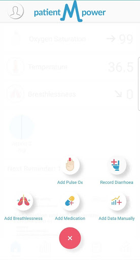  | 
 |   |   |   | 
 |  

## Development team
In the following we report the main information provided by the development team in the Google play store.

| | |
|-------------------------|-------------------------|
| **Developer**  | patientMpower |
| **Website**  | [https://info.patientmpower.com/](https://info.patientmpower.com/) |
| **Email** | info+covid-19@patientmpower.com |
| **Physical address**  | [The Digital Depot Thomas St Dublin D08 TCV4 Ireland](https://www.google.com/maps/search/The%20Digital%20Depot%20Thomas%20St%20Dublin%20D08%20TCV4%20Ireland) (Google Maps) |
| **Other developed apps**  | [https://play.google.com/store/apps/developer?id=patientMpower](https://play.google.com/store/apps/developer?id=patientMpower) |

## Android support

| | |
|-------------------------|-------------------------|
| **Declared target Android version**  | Android10, version 10 (API level 29) |
| **Effective target Android version**  | Android10, version 10 (API level 29) |
| **Minimum supported Android version**  | Jelly Bean, version 4.3.x (API level 18) |
| **Maximum target Android version**  | - |

The larger the difference between the minimum and maximum supported Android versions, the better. A larger difference means a wider audience. For example, old phones have a very low Android version, so a high minimum supported Android version means that the app cannot be used by users with old phones, thus leading to accessibility problems. 

## Requested permissions

In the following we report the complete list of the permissions requested by the app. 

| **Permission** | **Protection level** | **Description** | 
|-------------------------|-------------------------|-------------------------|
 **android.permission ACCESS_COARSE_LOCATION** | :warning:**Dangerous** | Allows an app to access approximate location. 
 **android.permission ACCESS_FINE_LOCATION** | :warning:**Dangerous** | Allows an app to access precise location. 
 **android.permission ACCESS_NETWORK_STATE** | Normal | Allows applications to access information about networks. 
 **android.permission BLUETOOTH** | Normal | Allows applications to connect to paired bluetooth devices. 
 **android.permission BLUETOOTH_ADMIN** | Normal | Allows applications to discover and pair bluetooth devices. 
 **android.permission CAMERA** | :warning:**Dangerous** | Required to be able to access the camera device. 
 **android.permission INTERNET** | Normal | Allows applications to open network sockets. 
 **android.permission READ_EXTERNAL_STORAGE** | :warning:**Dangerous** | Allows an application to read from external storage. 
 **android.permission RECEIVE_BOOT_COMPLETED** | Normal | Allows an application to receive the Intent.ACTION_BOOT_COMPLETED that is broadcast after the system finishes booting. 
 **android.permission VIBRATE** | Normal | Allows access to the vibrator. 
 **android.permission WAKE_LOCK** | Normal | Allows using PowerManager WakeLocks to keep processor from sleeping or screen from dimming. 
 **android.permission WRITE_EXTERNAL_STORAGE** | :warning:**Dangerous** | Allows an application to write to external storage. 
 **com.amazon.device.messaging.permission RECEIVE** | - | - 
 **com.google.android.c2dm.permission RECEIVE** | - | - 
 **com.google.android.finsky.permission BIND_GET_INSTALL_REFERRER_SERVICE** | - | - 
 **com.maithu.transplantbuddy.covid19.permission C2D_MESSAGE** | - | - 
 **com.maithu.transplantbuddy.covid19.permission RECEIVE_ADM_MESSAGE** | - | - 

## Mentioned servers

| **Server** | **Registrant** | **Registrant country** | **Creation date** | 
|-------------------------|-------------------------|-------------------------|-------------------------|
 | googlesyndication.com | Google LLC | :us: US | 2003-01-21 06:17:24 |
 | google.com | Google LLC | :us: US | 1997-09-15 04:00:00 |
 | facebook.com | Facebook, Inc. | :us: US | 1997-03-29 05:00:00 |
 | megsupporttools.com | Registrant State/Province: N/A | IE | 2017-03-07 18:37:51 |
 | patientmpower.com | Patient Buddy | IE | 2016-04-06 17:01:49 |
 | app-measurement.com | Google LLC | :us: US | 2015-06-19 20:13:31 |
 | googleapis.com | Google LLC | :us: US | 2005-01-25 17:52:26 |
 | googleapis.com | Google LLC | :us: US | 2005-01-25 17:52:26 |
 | waqi.info | Contact Privacy Inc. Customer 0147459724 | :canada: CA | 2013-01-28 13:36:34 |
 | mixpanel.com | WhoisGuard, Inc. | PA | 2007-03-13 02:23:00 |
 | urbanairship.com | DNStination Inc. | :us: US | 2009-04-14 06:34:46 |
 | vimeo.com | Vimeo, Inc. | :us: US | 2004-12-15 08:38:55 |
 | crashlytics.com | Google LLC | :us: US | 2011-01-21 15:30:40 |
 | twitter.com | Twitter, Inc. | :us: US | 2000-01-21 16:28:17 |
 | intercomcdn.com | Whois Privacy Service | :us: US | 2013-04-25 22:04:57 |
 | wistia.net | Wistia | :us: US | 2008-09-02 18:42:09 |
 | youtube.com | Google LLC | :us: US | 2005-02-15 05:13:12 |
 | wistia.com | Wistia | :us: US | 2007-03-18 21:58:55 |
 | intercom.io | Intercom Ops | IE | 2011-08-15 11:52:53 |
 | googleadservices.com | Google LLC | :us: US | 2003-06-19 16:34:53 |

## Security analysis 

Below we report the main security warnings raised by our execution of the [Androwarn](https://github.com/maaaaz/androwarn) security analysis tool.

**Telephony identifiers leakage**
> - This application reads the numeric name (MCC+MNC) of current registered operator 
> - This application reads the operator name 
> - This application reads the radio technology (network type) currently in use on the device for data transmission 
> - This application reads the unique device ID, i.e the IMEI for GSM and the MEID or ESN for CDMA phones 

**Location lookup**
> - This application reads location information from all available providers (WiFi, GPS etc.) 

**Connection interfaces exfiltration**
> - This application reads details about the currently active data network 
> - This application tries to find out if the currently active data network is metered 

**Telephony services abuse**
> - This application makes phone calls 

**Suspicious connection establishment**
> - This application opens a Socket and connects it to the remote address '' on the 'N/A' port  
> - This application opens a Socket and connects it to the remote address 'Ljava/lang/StringBuilder;->toString()Ljava/lang/String;' on the 'N/A' port  
> - This application opens a Socket and connects it to the remote address 'Ljava/net/Proxy;->type()Ljava/net/Proxy$Type;' on the 'N/A' port  
> - This application opens a Socket and connects it to the remote address 'timeout' on the 'N/A' port  

**Pim data leakage**
> - This application accesses data stored in the clipboard 

**Code execution**
> - This application loads a native library: 'Ljava/lang/String;->valueOf(Ljava/lang/Object;)Ljava/lang/String;' 
> - This application loads a native library: 'jniPdfium' 
> - This application loads a native library: 'modft2' 
> - This application loads a native library: 'modpdfium' 
> - This application loads a native library: 'modpng' 
> - This application executes a UNIX command containing this argument: 'uname -a' 

## User ratings and reviews

Below we provide information about how end users are reacting to the app in terms of ratings and reviews in the Google Play store.

### Ratings

The patientMpower for COVID-19 app has been installed by more than **1000** times. At this time, **6** rated the app and its average score is **3.1666667**. Below we show the distribution of the ratings across the usual star-based rating of Google Play

:star::star::star::star::star:: 3

:star::star::star::star:: 0

:star::star::star:: 0

:star::star:: 1

:star:: 2

### Reviews 

#### 5-star reviews

No recent reviews available with 5 stars.

#### 4-star reviews

No recent reviews available with 4 stars.

#### 3-star reviews

No recent reviews available with 3 stars.

#### 2-star reviews

No recent reviews available with 2 stars.

#### 1-star reviews

> Not working  :date: __2020-06-09 23:02:07__

# UCLH COVID-19
App version ``0.0.9``

Analyzed with [covid-apps-observer](http://github.com/covid-apps-observer) project, version ``0.1``

## App overview
| | |
|-------------------------|-------------------------| 
| **Name**&nbsp;&nbsp;&nbsp;&nbsp;&nbsp;&nbsp;&nbsp;&nbsp;&nbsp;&nbsp;&nbsp;&nbsp;&nbsp;&nbsp;&nbsp;&nbsp;&nbsp;&nbsp;&nbsp;&nbsp;&nbsp;&nbsp;&nbsp;&nbsp;&nbsp;&nbsp;&nbsp;&nbsp;&nbsp;&nbsp;&nbsp;&nbsp;&nbsp;&nbsp;&nbsp;&nbsp;&nbsp;&nbsp;&nbsp;&nbsp;  | UCLH COVID-19 |
| **Unique identifier** | co.uk.healthcreatives.uclhcovid19 |
| **Link to Google Play** | [https://play.google.com/store/apps/details?id=co.uk.healthcreatives.uclhcovid19](https://play.google.com/store/apps/details?id=co.uk.healthcreatives.uclhcovid19) |
| **Summary**  | UCLH COVID-19 Clinical Guidance app |
| **Privacy policy** | [http://healthcreatives.co.uk/privacy/uclh-covid-19/index.html](http://healthcreatives.co.uk/privacy/uclh-covid-19/index.html) |
| **Latest version** | 0.0.9 |
| **Last update** | 2021-03-19 14:20:14 |
| **Recent changes** | Added COVID19 pregnancy pathway |
| **Installs**  | 100+ |
| **Category** | Medical |
| **First release** | Apr 12, 2020 |
| **Size**  | 3.0M |
| **Supported Android version**  | - |

### Description
> This app has been developed for UCLH as part of their COVID-19 response. 
 The guidelines in this app have been authored by a wide range of clinical and staff, who have worked closely with our operational teams at UCLH and draws on all their invaluable expertise. It contains guidance on staff and patient protection, clinical care, clinician-facing standard operating procedures and educational materials.
  
 The guidelines are based on:
 • The expertise of our teams
 • Existing best practice
 • Experience from colleagues working in organisations, cities and countries dealing with the COIVD-19 epidemic
 • Published research
 • Content released from professional and speciality organisations and associations
  
 Content will expand rapidly over the coming days in response to clinical need for guidance, our evolving understanding of COVID-19 and as our approach adapts. The guidance will be made available through a release cycle. Each release will describe key changes since last time, this information can be found via the "version control" button.
  
 Content has been approved UCLH COVID-19 clinical guideline committee.
  
 Some of our guidance may be relevant to clinicians working in other organisations and we are keen to share approaches to clinical management and service design during this pandemic. Please refer to your local clinical and governance leads regarding adaption of any guidance locally and contact for any information about the guidance. We would also be keen to hear from non-UCLH clinicians regarding their learning, expertise and how we might improve our approach.

### User interface
The developers of the app provide the following screenshots in the Google play store.
| | | |
|:-------------------------:|:-------------------------:|:-------------------------:|
 |   |   |   | 
 | 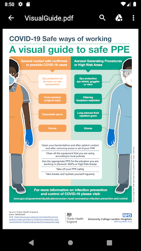  |   |   | 

## Development team
In the following we report the main information provided by the development team in the Google play store.

| | |
|-------------------------|-------------------------|
| **Developer**  | Vincent Harding - UCL Health Creatives |
| **Website**  | - |
| **Email** | v.harding@ucl.ac.uk |
| **Physical address**  | - |
| **Other developed apps**  | [https://play.google.com/store/apps/developer?id=Vincent+Harding+-+UCL+Health+Creatives](https://play.google.com/store/apps/developer?id=Vincent+Harding+-+UCL+Health+Creatives) |

## Android support

| | |
|-------------------------|-------------------------|
| **Declared target Android version**  | Pie, version 9 (API level 28) |
| **Effective target Android version**  | Pie, version 9 (API level 28) |
| **Minimum supported Android version**  | Pie, version 9 (API level 28) |
| **Maximum target Android version**  | - |

The larger the difference between the minimum and maximum supported Android versions, the better. A larger difference means a wider audience. For example, old phones have a very low Android version, so a high minimum supported Android version means that the app cannot be used by users with old phones, thus leading to accessibility problems. 

## Requested permissions

In the following we report the complete list of the permissions requested by the app. 

| **Permission** | **Protection level** | **Description** | 
|-------------------------|-------------------------|-------------------------|
 **android.permission INTERNET** | Normal | Allows applications to open network sockets. 
 **android.permission READ_EXTERNAL_STORAGE** | :warning:**Dangerous** | Allows an application to read from external storage. 
 **android.permission WRITE_EXTERNAL_STORAGE** | :warning:**Dangerous** | Allows an application to write to external storage. 

## Mentioned servers

| **Server** | **Registrant** | **Registrant country** | **Creation date** | 
|-------------------------|-------------------------|-------------------------|-------------------------|
 | gstatic.com | Google LLC | :us: US | 2008-02-11 15:31:25 |
 | google.com | Google LLC | :us: US | 1997-09-15 04:00:00 |

## Security analysis 

Below we report the main security warnings raised by our execution of the [Androwarn](https://github.com/maaaaz/androwarn) security analysis tool.

**Connection interfaces exfiltration**
> - This application reads details about the currently active data network 
> - This application tries to find out if the currently active data network is metered 

## User ratings and reviews

Below we provide information about how end users are reacting to the app in terms of ratings and reviews in the Google Play store.

### Ratings

The UCLH COVID-19 app has been installed by more than **100** times. At this time, **-** rated the app and its average score is **0**. Below we show the distribution of the ratings across the usual star-based rating of Google Play

:star::star::star::star::star:: 0

:star::star::star::star:: 0

:star::star::star:: 0

:star::star:: 0

:star:: 0

### Reviews 

#### 5-star reviews

No recent reviews available with 5 stars.

#### 4-star reviews

No recent reviews available with 4 stars.

#### 3-star reviews

No recent reviews available with 3 stars.

#### 2-star reviews

No recent reviews available with 2 stars.

#### 1-star reviews

No recent reviews available with 1 stars.

# CoronaReport - COVID-19 reports for Social Science
App version ``2.9.6``

Analyzed with [covid-apps-observer](http://github.com/covid-apps-observer) project, version ``0.1``

## App overview
| | |
|-------------------------|-------------------------| 
| **Name**&nbsp;&nbsp;&nbsp;&nbsp;&nbsp;&nbsp;&nbsp;&nbsp;&nbsp;&nbsp;&nbsp;&nbsp;&nbsp;&nbsp;&nbsp;&nbsp;&nbsp;&nbsp;&nbsp;&nbsp;&nbsp;&nbsp;&nbsp;&nbsp;&nbsp;&nbsp;&nbsp;&nbsp;&nbsp;&nbsp;&nbsp;&nbsp;&nbsp;&nbsp;&nbsp;&nbsp;&nbsp;&nbsp;&nbsp;&nbsp;  | CoronaReport - COVID-19 reports for Social Science |
| **Unique identifier** | com.spotteron.coronareport |
| **Link to Google Play** | [https://play.google.com/store/apps/details?id=com.spotteron.coronareport](https://play.google.com/store/apps/details?id=com.spotteron.coronareport) |
| **Summary**  | Citizen-led democratic reporting on the Coronavirus. Share your story. |
| **Privacy policy** | [https://www.spotteron.net/terms-of-use](https://www.spotteron.net/terms-of-use) |
| **Latest version** | 2.9.6 |
| **Last update** | 2020-06-11 03:36:19 |
| **Recent changes** | Minor change in imprint: Data Protection Officer Name updated |
| **Installs**  | 5,000+ |
| **Category** | Health & Fitness |
| **First release** | Mar 23, 2020 |
| **Size**  | 17M |
| **Supported Android version**  | 4.4 and up |

### Description
> CoronaReport is a citizen science project developed by the Scottish Collaboration for Public Health Research and Policy (SCPHRP), and the University of Edinburgh. Citizens can record their experiences of the disease, and the effects on their lives. The app is not intended to be used for/in emergencies or for diagnostics/medical purposes.
 Coronavirus (COVID-19) is the viral pandemic affecting communities worldwide. The pandemic’s impacts are varied and substantial. CoronaReport is a citizen science project which democratizes the reporting on the Coronavirus, and makes these reports accessible to other citizens. You can create public reports about your experiences, including how the virus is affecting your area and the way your community functions (e.g., schools, nursing homes, and businesses).
 About the project
 The collected and anonymized data from the reports will then be shared on the CoronaReport platform enabling you and other citizens to see first-hand accounts about how people are feeling and experiencing the impact of coronavirus. You can choose how much information you want to contribute to your reports and if you want to connect with others to share experiences. By working together citizens can build a real-time and vivid picture of how coronavirus is influencing the way people live and work. For example, we do not know the extent to which countermeasures like social distancing are being practised and how this, and other countermeasures, are affecting people’s well-being. Find out more about the project on the website: www.coronareport.global
 The project is running on the SPOTTERON Citizen Science Platform.

### User interface
The developers of the app provide the following screenshots in the Google play store.
| | | |
|:-------------------------:|:-------------------------:|:-------------------------:|
 | 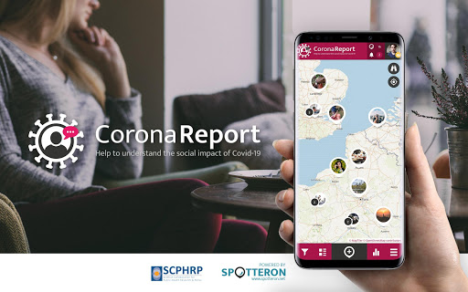  |   |   | 
 |   | 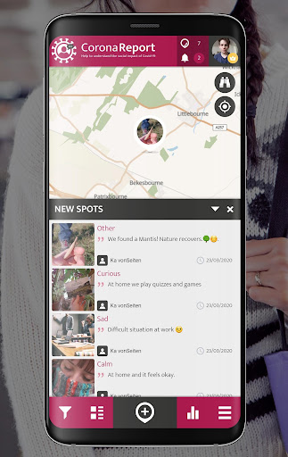  |   | 
 |  

## Development team
In the following we report the main information provided by the development team in the Google play store.

| | |
|-------------------------|-------------------------|
| **Developer**  | SPOTTERON |
| **Website**  | [https://www.spotteron.net](https://www.spotteron.net) |
| **Email** | office@spotteron.net |
| **Physical address**  | [Faßziehergasse 5, 1070 Wien](https://www.google.com/maps/search/Faßziehergasse%205,%201070%20Wien) (Google Maps) |
| **Other developed apps**  | [https://play.google.com/store/apps/developer?id=6074809323558115618](https://play.google.com/store/apps/developer?id=6074809323558115618) |

## Android support

| | |
|-------------------------|-------------------------|
| **Declared target Android version**  | Pie, version 9 (API level 28) |
| **Effective target Android version**  | Pie, version 9 (API level 28) |
| **Minimum supported Android version**  | KitKat, version 4.4 - 4.4.4 (API level 19) |
| **Maximum target Android version**  | - |

The larger the difference between the minimum and maximum supported Android versions, the better. A larger difference means a wider audience. For example, old phones have a very low Android version, so a high minimum supported Android version means that the app cannot be used by users with old phones, thus leading to accessibility problems. 

## Requested permissions

In the following we report the complete list of the permissions requested by the app. 

| **Permission** | **Protection level** | **Description** | 
|-------------------------|-------------------------|-------------------------|
 **android.permission ACCESS_COARSE_LOCATION** | :warning:**Dangerous** | Allows an app to access approximate location. 
 **android.permission ACCESS_FINE_LOCATION** | :warning:**Dangerous** | Allows an app to access precise location. 
 **android.permission ACCESS_NETWORK_STATE** | Normal | Allows applications to access information about networks. 
 **android.permission INTERNET** | Normal | Allows applications to open network sockets. 
 **android.permission READ_APP_BADGE** | - | - 
 **android.permission VIBRATE** | Normal | Allows access to the vibrator. 
 **android.permission WAKE_LOCK** | Normal | Allows using PowerManager WakeLocks to keep processor from sleeping or screen from dimming. 
 **android.permission WRITE_EXTERNAL_STORAGE** | :warning:**Dangerous** | Allows an application to write to external storage. 
 **com.anddoes.launcher.permission UPDATE_COUNT** | - | - 
 **com.google.android.c2dm.permission RECEIVE** | - | - 
 **com.htc.launcher.permission READ_SETTINGS** | - | - 
 **com.htc.launcher.permission UPDATE_SHORTCUT** | - | - 
 **com.huawei.android.launcher.permission CHANGE_BADGE** | - | - 
 **com.huawei.android.launcher.permission READ_SETTINGS** | - | - 
 **com.huawei.android.launcher.permission WRITE_SETTINGS** | - | - 
 **com.majeur.launcher.permission UPDATE_BADGE** | - | - 
 **com.oppo.launcher.permission READ_SETTINGS** | - | - 
 **com.oppo.launcher.permission WRITE_SETTINGS** | - | - 
 **com.sec.android.provider.badge.permission READ** | - | - 
 **com.sec.android.provider.badge.permission WRITE** | - | - 
 **com.sonyericsson.home.permission BROADCAST_BADGE** | - | - 
 **com.sonymobile.home.permission PROVIDER_INSERT_BADGE** | - | - 
 **com.spotteron.coronareport.permission C2D_MESSAGE** | - | - 
 **me.everything.badger.permission BADGE_COUNT_READ** | - | - 
 **me.everything.badger.permission BADGE_COUNT_WRITE** | - | - 

## Mentioned servers

| **Server** | **Registrant** | **Registrant country** | **Creation date** | 
|-------------------------|-------------------------|-------------------------|-------------------------|
 | google.com | Google LLC | :us: US | 1997-09-15 04:00:00 |
 | gstatic.com | Google LLC | :us: US | 2008-02-11 15:31:25 |
 | whatsapp.com | Whatsapp Inc. | :us: US | 2008-09-04 12:39:12 |
 | googleapis.com | Google LLC | :us: US | 2005-01-25 17:52:26 |

## Security analysis 

Below we report the main security warnings raised by our execution of the [Androwarn](https://github.com/maaaaz/androwarn) security analysis tool.

**Connection interfaces exfiltration**
> - This application reads details about the currently active data network 
> - This application tries to find out if the currently active data network is metered 

**Telephony services abuse**
> - This application makes phone calls 

**Pim data leakage**
> - This application accesses the downloads folder 
> - This application accesses data stored in the clipboard 

**Code execution**
> - This application loads a native library: 'sqlc-evcore-native-driver' 
> - This application executes a UNIX command containing this argument: 'Ljava/lang/StringBuilder;->toString()Ljava/lang/String;' 

## User ratings and reviews

Below we provide information about how end users are reacting to the app in terms of ratings and reviews in the Google Play store.

### Ratings

The CoronaReport - COVID-19 reports for Social Science app has been installed by more than **5000** times. At this time, **11** rated the app and its average score is **4.6363635**. Below we show the distribution of the ratings across the usual star-based rating of Google Play

:star::star::star::star::star:: 10

:star::star::star::star:: 0

:star::star::star:: 0

:star::star:: 0

:star:: 1

### Reviews 

#### 5-star reviews

> It bot wala app  :date: __2021-05-11 13:02:32__

> It is very helpful app.  :date: __2021-03-12 15:45:53__

> Bala abinesh  :date: __2020-11-08 05:04:51__

> Good  :date: __2020-10-24 10:16:07__

> Thanks ok  :date: __2020-07-19 14:13:24__

#### 4-star reviews

> Paitra  :date: __2021-03-17 15:54:38__

#### 3-star reviews

No recent reviews available with 3 stars.

#### 2-star reviews

No recent reviews available with 2 stars.

#### 1-star reviews

> Not good  :date: __2021-05-12 19:43:36__

> Useless  :date: __2021-05-03 13:53:43__

> Very hard to setup it won't let me put a profile photo on. Now it's saying my password is wrong. Come on guys ????????  :date: __2021-02-21 19:31:16__

> Don't like  :date: __2020-05-07 23:16:32__

# One You Couch to 5K
App version ``7.6.1``

Analyzed with [covid-apps-observer](http://github.com/covid-apps-observer) project, version ``0.1``

## App overview
| | |
|-------------------------|-------------------------| 
| **Name**&nbsp;&nbsp;&nbsp;&nbsp;&nbsp;&nbsp;&nbsp;&nbsp;&nbsp;&nbsp;&nbsp;&nbsp;&nbsp;&nbsp;&nbsp;&nbsp;&nbsp;&nbsp;&nbsp;&nbsp;&nbsp;&nbsp;&nbsp;&nbsp;&nbsp;&nbsp;&nbsp;&nbsp;&nbsp;&nbsp;&nbsp;&nbsp;&nbsp;&nbsp;&nbsp;&nbsp;&nbsp;&nbsp;&nbsp;&nbsp;  | One You Couch to 5K |
| **Unique identifier** | com.phe.couchto5K |
| **Link to Google Play** | [https://play.google.com/store/apps/details?id=com.phe.couchto5K](https://play.google.com/store/apps/details?id=com.phe.couchto5K) |
| **Summary**  | The FREE Couch to 5K app. We’ll take you from couch to 5k hero in just 9 weeks! |
| **Privacy policy** | [https://www.nhs.uk/oneyou/privacy-policy](https://www.nhs.uk/oneyou/privacy-policy) |
| **Latest version** | 7.6.1 |
| **Last update** | 2021-03-29 19:15:26 |
| **Recent changes** | This release contain improvements to the design and layout with a few additions including tips and animations. |
| **Installs**  | 1,000,000+ |
| **Category** | Health & Fitness |
| **First release** | Mar 5, 2016 |
| **Size**  | 27M |
| **Supported Android version**  | 5.0 and up |

### Description
> It’s an easy to follow programme known the world over, and perfect for those new to running and need some extra support and motivation along the way.
 The app features a choice of 4 great trainers to support and motivate you at every step of the way, telling you when to run and when to walk, from comedians Sarah Millican and Sanjeev Kohli, BBC presenter Jo Whiley, and our very own Laura, who have now helped over 2 million people like you start their own running journeys.
 Couch to 5K features:
 • A flexible programme that can be completed in as little as 9 weeks, or longer if you want to go at your own pace
 • Easy to follow countdown timer so you can see and well as hear how long you’ve got left of each run
 • Works alongside your preferred music player, automatically 'dipping' the volumes so you can hear the instructions and motivations from your chosen trainer
 • Offers timely tips and motivations to keep you on your fitness journey
 • Signals a half-time bell when you get half way, so you know when to head home!
 • Lets you track your progress and awards achievements as you move through the runs
 • Connects you with likeminded people through the Couch to 5k HealthUnlocked community forums and Facebook groups. 
 Millions of people have already got running with theCouch to 5k plan, now it’s your turn!
 Download this app, get off the couch and we’ll help you reach your health goals.

### User interface
The developers of the app provide the following screenshots in the Google play store.
| | | |
|:-------------------------:|:-------------------------:|:-------------------------:|
 |   |   |   | 
 |   |   |   | 
 |   |  

## Development team
In the following we report the main information provided by the development team in the Google play store.

| | |
|-------------------------|-------------------------|
| **Developer**  | Public Health England Digital |
| **Website**  | [https://www.nhs.uk/oneyou/moving](https://www.nhs.uk/oneyou/moving) |
| **Email** | oneyou@phe.gov.uk |
| **Physical address**  | - |
| **Other developed apps**  | [https://play.google.com/store/apps/developer?id=Public+Health+England+Digital](https://play.google.com/store/apps/developer?id=Public+Health+England+Digital) |

## Android support

| | |
|-------------------------|-------------------------|
| **Declared target Android version**  | Android10, version 10 (API level 29) |
| **Effective target Android version**  | Android10, version 10 (API level 29) |
| **Minimum supported Android version**  | Lollipop, version 5.0 (API level 21) |
| **Maximum target Android version**  | - |

The larger the difference between the minimum and maximum supported Android versions, the better. A larger difference means a wider audience. For example, old phones have a very low Android version, so a high minimum supported Android version means that the app cannot be used by users with old phones, thus leading to accessibility problems. 

## Requested permissions

In the following we report the complete list of the permissions requested by the app. 

| **Permission** | **Protection level** | **Description** | 
|-------------------------|-------------------------|-------------------------|
 **android.permission ACCESS_COARSE_LOCATION** | :warning:**Dangerous** | Allows an app to access approximate location. 
 **android.permission ACCESS_NETWORK_STATE** | Normal | Allows applications to access information about networks. 
 **android.permission BLUETOOTH** | Normal | Allows applications to connect to paired bluetooth devices. 
 **android.permission BLUETOOTH_ADMIN** | Normal | Allows applications to discover and pair bluetooth devices. 
 **android.permission INTERNET** | Normal | Allows applications to open network sockets. 
 **android.permission WAKE_LOCK** | Normal | Allows using PowerManager WakeLocks to keep processor from sleeping or screen from dimming. 
 **android.permission WRITE_EXTERNAL_STORAGE** | :warning:**Dangerous** | Allows an application to write to external storage. 
 **com.android.alarm.permission SET_ALARM** | Normal | Allows an application to broadcast an Intent to set an alarm for the user. 
 **com.google.android.finsky.permission BIND_GET_INSTALL_REFERRER_SERVICE** | - | - 

## Mentioned servers

| **Server** | **Registrant** | **Registrant country** | **Creation date** | 
|-------------------------|-------------------------|-------------------------|-------------------------|
 | adobe.com | Adobe Inc. | :us: US | 1986-11-17 05:00:00 |
 | googlesyndication.com | Google LLC | :us: US | 2003-01-21 06:17:24 |
 | google.com | Google LLC | :us: US | 1997-09-15 04:00:00 |
 | google-analytics.com | Google LLC | :us: US | 2005-07-18 19:24:32 |
 | app-measurement.com | Google LLC | :us: US | 2015-06-19 20:13:31 |
 | googletagmanager.com | Google LLC | :us: US | 2011-11-11 23:39:05 |
 | paragon-cc.co.uk | - | - | 2017-04-04 00:00:00 |
 | bbc.co.uk | - | - | 1996-08-01 00:00:00 |
 | df-phe.com | DOGFI.SH Mobile | GB | 2015-06-16 14:57:16 |
 | phedigital.co.uk | - | - | 2018-06-06 00:00:00 |
 | youtube.com | Google LLC | :us: US | 2005-02-15 05:13:12 |
 | crashlytics.com | Google LLC | :us: US | 2011-01-21 15:30:40 |
 | tealiumiq.com | Whois Privacy Service | :us: US | 2011-02-09 18:33:06 |
 | googleapis.com | Google LLC | :us: US | 2005-01-25 17:52:26 |
 | googleadservices.com | Google LLC | :us: US | 2003-06-19 16:34:53 |
 | nhs.uk | Department of Health | - | 1996-08-01 00:00:00 |
 | healthunlocked.com | Everything Unlocked Ltd | GB | 2008-05-04 18:31:28 |

## Security analysis 

Below we report the main security warnings raised by our execution of the [Androwarn](https://github.com/maaaaz/androwarn) security analysis tool.

**Telephony identifiers leakage**
> - This application reads the ISO country code equivalent of the current registered operator's MCC (Mobile Country Code) 
> - This application reads the MCC+MNC of the provider of the SIM 
> - This application reads the numeric name (MCC+MNC) of current registered operator 
> - This application reads the operator name 

**Connection interfaces exfiltration**
> - This application reads details about the currently active data network 
> - This application tries to find out if the currently active data network is metered 

**Suspicious connection establishment**
> - This application opens a Socket and connects it to the remote address ' returned no addresses for  ; port is out of range' on the 'N/A' port  
> - This application opens a Socket and connects it to the remote address '' on the 'N/A' port  
> - This application opens a Socket and connects it to the remote address 'Ljava/lang/StringBuilder;->toString()Ljava/lang/String;' on the 'N/A' port  
> - This application opens a Socket and connects it to the remote address 'Ljava/net/Proxy;->type()Ljava/net/Proxy$Type;' on the 'N/A' port  
> - This application opens a Socket and connects it to the remote address 'timeout' on the 'N/A' port  

## User ratings and reviews

Below we provide information about how end users are reacting to the app in terms of ratings and reviews in the Google Play store.

### Ratings

The One You Couch to 5K app has been installed by more than **1000000** times. At this time, **33534** rated the app and its average score is **4.7511835**. Below we show the distribution of the ratings across the usual star-based rating of Google Play

:star::star::star::star::star:: 27691

:star::star::star::star:: 4415

:star::star::star:: 734

:star::star:: 317

:star:: 377

### Reviews 

#### 5-star reviews

> Never thought I could run 5K, this got me there in manageable chunks. Now running regularly and enjoying the increased fitness.  :date: __2021-05-22 14:25:35__

> Helped me improve fitness 😊  :date: __2021-05-22 13:27:05__

> I never run ever before, thanks to that app I managed to run for 30 minutes without stopping. The app features are really easy to use and give good advice for beginner runners. The coach voices make such a different and it motivates you throughout your progress. I would definitely recommend to use it.  :date: __2021-05-22 12:45:54__

> Good  :date: __2021-05-22 12:11:09__

> It's taken me a long time to start and gett out running, this has been so much better than trying to do it by myself. Thank you Sarah Millican for your help 😊😆😊  :date: __2021-05-22 11:52:09__

> Incredible idea. A simple to follow plan that allows people to begin a journey of fitness that they might've considered impossible prior. I'd recommend it to anyone who is willing and able to attempt, the effort you put in is worth the rewards you get out. App is simple to use, and works incredibly well alongside your own music to seamlessly blend together.  :date: __2021-05-22 11:33:03__

> Does the job and got me off the couch. Week 4 here we come!  :date: __2021-05-22 10:50:08__

> It works... just completed the programme, moving to consolidation. Re used last three weeks after injury  :date: __2021-05-22 10:24:30__

> Just completed the couch to 5k. Feeling over the moon. Can't believe that I, the ultimate couch potato, achieved this. I am a runner now and loving it😊  :date: __2021-05-22 09:27:51__

> Great, hard at first, but by the end I really enjoyed each session  :date: __2021-05-21 23:17:43__

#### 4-star reviews

> Minor issues with automatic music control (often changing the volume too late or for too long) otherwise great way to get into (or back into) running.  :date: __2021-05-22 14:24:01__

> Great app. Very motivational. Only improvement I would suggest, I would love to see it have trackers/music attached to it. Ideally you need 3 apps open at the same time, numerous occasions you get so caught up with one, you lose the others.. nothing more frustrating than completing the run and it not saving on the tracker!  :date: __2021-05-21 09:55:15__

> Loving the app so far, but am finding it's not logging all of my runs- so having to repeat Run 1 of Week 2 again- hoping it's a one-off but mildly frustrating having to go back again!  :date: __2021-05-21 03:48:32__

> When it works it's great but it's much too easy to pause or exit it mid run which is very annoying.  :date: __2021-05-20 23:37:48__

> Like the reminder feature, and Michael Johnson is great!  :date: __2021-05-20 13:21:55__

> So good to have a familiar voice supporting on this journey  :date: __2021-05-19 00:10:57__

> So easy to follow and succeed!  :date: __2021-05-16 22:09:55__

> Easy to use, with our without glasses.  :date: __2021-05-15 08:33:11__

> Great app and really helps build stamina pretty quickly. Would be 5 stars except that it crashes mid session at least once per session (usually during the warm up or 1st run)  :date: __2021-05-14 14:17:50__

> It's good but seems to have a flaw where it doesn't count all my runs. So I have to do 4 runs each "week" {this actually makes it more than a week) for it to count 3! I'm on week 4 now and this has happened in weeks 2,3 and 4. I don't think it happened in week 1. But no-one else in the reviews has complained about this so maybe use just me! I guess it won't hurt I'll just complete the program more gradually than everyone else.  :date: __2021-05-14 12:09:53__

#### 3-star reviews

> Works perfectly on an iPhone, pretty terrible on a Samsung galaxy.  :date: __2021-05-12 03:34:32__

> It's great it tells you what to do but not so great you can't play music in the background, even with the options it gives you, it stops when the speaker starts talking.  :date: __2021-05-01 15:42:44__

> The instructors talk far too much. It's not a podcast.  :date: __2021-04-30 18:14:37__

> Good overall app but it sometimes crashes halfway through a run so you have to make up the rest of your run as an estimate. I am also now struggling to open the app up as I write this review. When the app works it is really good but overall seems a little bit buggy  :date: __2021-04-30 14:51:37__

> Great app to keep you on track running and helping reach goals. Would be 5 star but for the week 6 runs, the first two seem to be round the wrong way and from week 6 onwards, none of the runs save at the end and the app doesn't seem to recognise I've started. So I start the app and go running, then if I go to reopen the app during the run it wants me to start again but the prompts and notifications still sound. So if you do start again you get the prompts duplicating which is confusing!  :date: __2021-04-28 18:54:59__

> It's really helpful, there aren't many options for the trainers. It is slow to download but there are great choices for times. You also get a reminder which is also good for someone like me who has bad memory and no motivation.  :date: __2021-04-27 13:13:17__

> Love Jo Whiley coaching, she is so motivational, but the app turns itself off towards the end of most runs! Screen is locked and it is nothing to do with battery saver  :date: __2021-04-26 21:44:36__

> App has a glitch from week 4. The voice is out of sync with the timer which is really off putting and have to check the timer while running. If I open another app for example to change my music this app stops working and have to start the run again and skip to where I was. Not ideal while running. Would be a great app if it didn't have bugs  :date: __2021-04-18 00:28:38__

> So downloaded this app and used it with music on my old phone. Used Jo as my coach as she sounds sincere. New phone now cant listen to Jo & music- it says "can't use music with this trainer". Use Laura, got my music but no marker for half way through to turn around- guessing. Why is it so random and variable???  :date: __2021-04-17 20:14:29__

> Great Idea! Very basic, app need work. Issues include: Volume of narrator is very low compared to other apps at the same phone volume level so I can't play music while trying to listen to instructions. Silent running for me. Not intuitive and I consistant, on the last day week two second to last run is the only time Sanjeev does not tell me to start running. Pointless celebrity Voices, they all say the exact same thing... What's the point? I genuinely thought they had recorded it for someone.  :date: __2021-04-15 08:23:54__

#### 2-star reviews

> The voice of the coach is not in sync with my music from Spotify. Long periods of time where the coach isn't speaking and the volume dipped during this period. Conversley, the music is at full volume whilst the coach is speaking. This was from week one. Its quite distracting and would like it fixed, else is a good app.  :date: __2021-05-16 00:46:37__

> Brilliant idea, poor execution. The app is crashing, which results in resetting the day/run progress and second instance somehow running in background, still playing comments.  :date: __2021-05-13 14:11:52__

> Is there any settings to stop the app from not working when the phone screen is off?  :date: __2021-04-26 10:30:31__

> This is an excellent programme that gets you running and in much better shape. I have completed the full programme twice now. The biggest flaw is that there is no follow-on plan. So after couch-to-5k I did 5k-to-couch! Update: reducing to 2 stars because regrettably the excellent trainer Michael Johnson is being removed. Update2: thank you for the reply. Please add a trainer like Michael who is minimalist and has gravitas.  :date: __2021-04-23 12:00:39__

> Can confirm on my Pixel 3 phone runs will only work when Lice Captioning is on. Timer won't count down so cant do runs without it on. Strange Even after recent update. Still doing it  :date: __2021-04-21 16:40:03__

> So far I have seen my fitness build using the program however the app is quite buggy. The most annoying bug is that once I have hit start run if I switch to a different app e.g. music player, the audio continues but the timer within the app stops completely meaning at the end of my run I have to skip through the whole process because if I start it again then I get 2 sets of trainer audio at different times.  :date: __2021-04-14 12:23:00__

> The programme is good but I wish there were different versions to listen to for each of the week's three runs...I don't want to hear the same tips three times, especially when they interrupt my podcast! But more annoying is the fact that the app keeps silently crashing which completely messes up the workout.  :date: __2021-04-14 09:16:09__

> Overall the App works OK. But now I'm on the end of week 6 at 25mins of running, the App decided to NOT save that run. In the previous build it automatically prompted to save the run without worrying about losing the run record. Sadly the "new improvements" have broken it. And there is no automatic save prompt. Not great!! Please fix.  :date: __2021-04-13 09:53:37__

> Just started week 2 and the app keeps stopping mid-run.....really annoying when you need it for your run/walk timings  :date: __2021-04-12 11:00:30__

> Unfortunately even after changing settings on my phone, the app would just stop whilst on my run. Sometimes twice. I now have to listen to the poscasts.  :date: __2021-04-10 21:11:12__

#### 1-star reviews

> Downloaded 3 times but app freezing at the "let's get started" page. To tech support to sort it out!  :date: __2021-05-20 21:49:04__

> Did run 1. Tapped on run 2 the next time, but played run 1. Managed to get it to play run 2, but only recording that I've done the first run!  :date: __2021-05-20 00:01:32__

> After downloading the app... the app wouldn't move past the "Ready" screen. Even for me as an utter couch potato expected that I was going have to do some sort of exercise!  :date: __2021-05-18 21:05:43__

> WHERE HAS MICHAEL JOHNSON GONE?!!!  :date: __2021-05-15 11:25:44__

> Closes down when in use very annoying when your trying to run 11/05/2021 still closes down never closed down on my Samsung phone  :date: __2021-05-11 18:59:01__

> Excellent programme to get you running.  :date: __2021-05-10 11:54:58__

> Downloaded several times but can't get past the 'let's get started' page. I have now uninstalled it.  :date: __2021-05-07 17:51:51__

> Does not load past pick your coach  :date: __2021-05-06 13:51:55__

> Shouldn't have got rid of Michael as a Trainer  :date: __2021-05-04 20:08:33__

> I've downloaded the app on my Samsung phone but cannot get past the screen that says choose you coach, it's just froze on that, can anyone help please .  :date: __2021-05-03 13:51:18__

# Ayush Sanjivani
App version ``1.0.9``

Analyzed with [covid-apps-observer](http://github.com/covid-apps-observer) project, version ``0.1``

## App overview
| | |
|-------------------------|-------------------------| 
| **Name**&nbsp;&nbsp;&nbsp;&nbsp;&nbsp;&nbsp;&nbsp;&nbsp;&nbsp;&nbsp;&nbsp;&nbsp;&nbsp;&nbsp;&nbsp;&nbsp;&nbsp;&nbsp;&nbsp;&nbsp;&nbsp;&nbsp;&nbsp;&nbsp;&nbsp;&nbsp;&nbsp;&nbsp;&nbsp;&nbsp;&nbsp;&nbsp;&nbsp;&nbsp;&nbsp;&nbsp;&nbsp;&nbsp;&nbsp;&nbsp;  | Ayush Sanjivani |
| **Unique identifier** | com.negd.ayushfeedback |
| **Link to Google Play** | [https://play.google.com/store/apps/details?id=com.negd.ayushfeedback](https://play.google.com/store/apps/details?id=com.negd.ayushfeedback) |
| **Summary**  | For analysing the use of AYUSH interventions for immunity in COVID 19 situation. |
| **Privacy policy** | [https://test2.ncog.gov.in/Ayush_Sanjivani_Privacy/privacy-policy-page/privay-policy.html](https://test2.ncog.gov.in/Ayush_Sanjivani_Privacy/privacy-policy-page/privay-policy.html) |
| **Latest version** | 1.0.9 |
| **Last update** | 2020-11-16 13:45:04 |
| **Recent changes** | - Bug fixes and optimizations |
| **Installs**  | 500,000+ |
| **Category** | Health & Fitness |
| **First release** | Apr 24, 2020 |
| **Size**  | 4.8M |
| **Supported Android version**  | 4.4 and up |

### Description
> The Ministry of AYUSH presents the “Ayush Sanjivani” mobile application for understanding the measures adopted by public for enhancing immunity and keeping themselves healthy in the difficult COVID-19 situation. The app is designed as a simple but effective mechanism of electronic documentation for studying population behaviour. Response of the public to the advisories issued by the AYUSH Ministry on immunity enhancement will be an important area of examination. In addition, provision is also made for recording other measures (if any) propagated by AYUSH practitioners and adopted by general public for immunity enhancement and disease prevention. Data collected through this app will be analyzed to find out usage of AYUSH interventions and its efficacy in maintaining health by enhancing immunity.
 This app is at the centre of a massive exercise to study specific health seeking behaviours of the public in which the Central Research Councils of AYUSH, the National Institutes of AYUSH, numerous AYUSH educational institutions and state governments bodies collaborate. The Ministry has a target sample size of 1 million people for this study, making it one of the largest in any discipline of medicine. All those who volunteer to furnish information through this app will be making a significant contribution to the study of public health in the country.
 Data collected will be analyzed and will be useful for the AYUSH systems, and will establish their viability as health-assuring practices globally. This would also add momentum to the growth of the AYUSH Sector.

### User interface
The developers of the app provide the following screenshots in the Google play store.
| | | |
|:-------------------------:|:-------------------------:|:-------------------------:|
 |   |   |   | 
 | 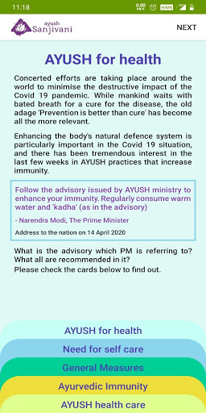  |   |   | 
 |   |  

## Development team
In the following we report the main information provided by the development team in the Google play store.

| | |
|-------------------------|-------------------------|
| **Developer**  | Ministry of AYUSH |
| **Website**  | [https://www.ayush.gov.in/](https://www.ayush.gov.in/) |
| **Email** | ayush.sanjivani@digitalindia.gov.in |
| **Physical address**  | - |
| **Other developed apps**  | [https://play.google.com/store/apps/developer?id=Ministry+of+AYUSH](https://play.google.com/store/apps/developer?id=Ministry+of+AYUSH) |

## Android support

| | |
|-------------------------|-------------------------|
| **Declared target Android version**  | Android10, version 10 (API level 29) |
| **Effective target Android version**  | Android10, version 10 (API level 29) |
| **Minimum supported Android version**  | KitKat, version 4.4 - 4.4.4 (API level 19) |
| **Maximum target Android version**  | - |

The larger the difference between the minimum and maximum supported Android versions, the better. A larger difference means a wider audience. For example, old phones have a very low Android version, so a high minimum supported Android version means that the app cannot be used by users with old phones, thus leading to accessibility problems. 

## Requested permissions

In the following we report the complete list of the permissions requested by the app. 

| **Permission** | **Protection level** | **Description** | 
|-------------------------|-------------------------|-------------------------|
 **android.permission ACCESS_NETWORK_STATE** | Normal | Allows applications to access information about networks. 
 **android.permission INTERNET** | Normal | Allows applications to open network sockets. 
 **android.permission WAKE_LOCK** | Normal | Allows using PowerManager WakeLocks to keep processor from sleeping or screen from dimming. 
 **com.google.android.c2dm.permission RECEIVE** | - | - 

## Mentioned servers

| **Server** | **Registrant** | **Registrant country** | **Creation date** | 
|-------------------------|-------------------------|-------------------------|-------------------------|
 | google.com | Google LLC | :us: US | 1997-09-15 04:00:00 |
 | facebook.com | Facebook, Inc. | :us: US | 1997-03-29 05:00:00 |
 | googleapis.com | Google LLC | :us: US | 2005-01-25 17:52:26 |

## Security analysis 

Below we report the main security warnings raised by our execution of the [Androwarn](https://github.com/maaaaz/androwarn) security analysis tool.

**Connection interfaces exfiltration**
> - This application reads details about the currently active data network 
> - This application tries to find out if the currently active data network is metered 

**Telephony services abuse**
> - This application makes phone calls 

**Suspicious connection establishment**
> - This application opens a Socket and connects it to the remote address '' on the 'N/A' port  
> - This application opens a Socket and connects it to the remote address 'Ljava/lang/StringBuilder;->toString()Ljava/lang/String;' on the 'N/A' port  
> - This application opens a Socket and connects it to the remote address 'Ljava/net/Proxy;->type()Ljava/net/Proxy$Type;' on the 'N/A' port  
> - This application opens a Socket and connects it to the remote address 'timeout' on the 'N/A' port  

## User ratings and reviews

Below we provide information about how end users are reacting to the app in terms of ratings and reviews in the Google Play store.

### Ratings

The Ayush Sanjivani app has been installed by more than **500000** times. At this time, **2241** rated the app and its average score is **3.9267242**. Below we show the distribution of the ratings across the usual star-based rating of Google Play

:star::star::star::star::star:: 1344

:star::star::star::star:: 299

:star::star::star:: 106

:star::star:: 77

:star:: 415

### Reviews 

#### 5-star reviews

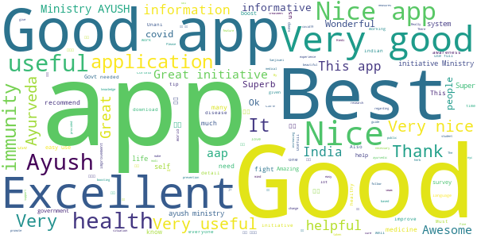

> It is a very helpful application for recover health...  :date: __2021-05-11 04:13:36__

> मै अपने मोबाइल पर otp नहीं प्राप्त कर पा रहा हूं,,क्यों?  :date: __2021-04-22 07:37:41__

> Useful app for all  :date: __2021-04-07 10:57:22__

> Good  :date: __2021-01-30 15:30:51__

> Very useful  :date: __2020-12-28 11:20:24__

> Good knowledgeable app  :date: __2020-11-24 15:28:15__

> Otp to bhejo  :date: __2020-11-24 15:01:06__

> Very good  :date: __2020-10-17 14:28:14__

> Nice  :date: __2020-10-12 19:37:32__

> Too good  :date: __2020-10-08 19:43:41__

#### 4-star reviews

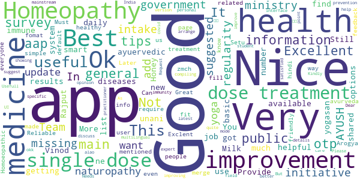

> I got the otp............., much more information and daily tips and updates should ne available , and be shared to public  :date: __2021-05-17 08:19:11__

> Not getting OTP on any number  :date: __2021-04-17 18:27:40__

> Provide general basic ayuervedic medicine tips for more general diseases  :date: __2020-10-19 19:29:10__

> Nice app for immune system improvement  :date: __2020-08-24 17:23:46__

> Best  :date: __2020-08-22 15:42:21__

> Not too useful  :date: __2020-08-21 22:01:41__

> I had new to this app and shall find out results after use.  :date: __2020-08-10 20:27:59__

> Good  :date: __2020-08-10 18:34:52__

> Nice app  :date: __2020-07-14 07:24:21__

> Ok  :date: __2020-07-11 18:18:24__

#### 3-star reviews

> Fair  :date: __2020-07-18 19:00:04__

> Problem ke hisab se uska ilaj batane ke liye bhi option dijiye Jab kisi ko koi problem hoga to us option me jake check karega kya chij use kare ki problem thik ho jaye Tab jyada log Aayurved par dhyan denge.  :date: __2020-07-02 10:20:19__

> Good  :date: __2020-06-28 14:13:38__

> "Something went wrong " What is this pls solve  :date: __2020-06-21 06:27:48__

> It's very helpful for us  :date: __2020-06-20 03:00:22__

> Good pahal by csc  :date: __2020-06-18 13:05:46__

> Good  :date: __2020-06-18 09:06:21__

> Good  :date: __2020-06-13 08:42:18__

> Good But some Issues..  :date: __2020-06-11 03:19:58__

> BeSt  :date: __2020-06-10 07:56:36__

#### 2-star reviews

> I am not recieving OTP on my mobile number.  :date: __2020-11-14 22:14:07__

> Never got any appointment from doctor  :date: __2020-08-27 07:43:48__

> Good  :date: __2020-07-30 12:40:56__

> நான் சென்னை தாம்பரத்திலுள்ள சித்தா மருத்துவமனை சென்றிருந்தபோது இந்த appக்கு டவுன்லோடு பண்ணிக்கோங்க னு சொன்னாங்க.நானும் டவுன்லோடு பண்ணினால் ஆங்கிலம் & ஹிந்தியை தவிர வேறு மொழியில்லை.சரி பரவாயில்லை வேறு ஏதாவது உறுபடியா இருக்கும்னு பார்த்தா அதுவும் இல்லை .. என்னை பொறுத்தவரை இது not in use..  :date: __2020-07-25 16:21:02__

> I think something fishy on this app development  :date: __2020-07-01 08:05:18__

> After filling up all the information in getting pop up like something went wrong  :date: __2020-06-18 09:04:30__

> It's nice  :date: __2020-06-13 08:36:21__

> Not very useful  :date: __2020-06-13 04:24:14__

> I thought it will include some more content like yoga exercises about herbal medicine it just for a survey😒😒  :date: __2020-06-05 18:24:30__

> Very good app but I need my language in tamil. Thank you.  :date: __2020-06-05 16:03:39__

#### 1-star reviews

> It allows only Indian mobile numbers NRIs cannot use this app .. Sad  :date: __2021-05-13 16:02:40__

> Not getting OTP  :date: __2021-05-07 20:02:03__

> Unable to login due to OTP, plz fix this issue.  :date: __2021-05-01 12:02:35__

> Otp not received.  :date: __2021-05-01 03:45:41__

> Doesn't send OTP. Doesn't get started.  :date: __2021-04-29 18:10:04__

> I do not get the OTP of this app, I tried many times, did not log in  :date: __2021-04-29 17:27:08__

> It's a junk app. No OTP received after several try.  :date: __2021-04-27 14:20:10__

> Otp nhi ata hai  :date: __2021-04-27 08:02:20__

> Worst  :date: __2021-04-25 16:58:55__

> OTP ?not coming  :date: __2021-04-22 19:30:07__

# Protego
App version ``Varies with device``

Analyzed with [covid-apps-observer](http://github.com/covid-apps-observer) project, version ``0.1``

## App overview
| | |
|-------------------------|-------------------------| 
| **Name**&nbsp;&nbsp;&nbsp;&nbsp;&nbsp;&nbsp;&nbsp;&nbsp;&nbsp;&nbsp;&nbsp;&nbsp;&nbsp;&nbsp;&nbsp;&nbsp;&nbsp;&nbsp;&nbsp;&nbsp;&nbsp;&nbsp;&nbsp;&nbsp;&nbsp;&nbsp;&nbsp;&nbsp;&nbsp;&nbsp;&nbsp;&nbsp;&nbsp;&nbsp;&nbsp;&nbsp;&nbsp;&nbsp;&nbsp;&nbsp;  | Protego |
| **Unique identifier** | org.theviralapp.app1 |
| **Link to Google Play** | [https://play.google.com/store/apps/details?id=org.theviralapp.app1](https://play.google.com/store/apps/details?id=org.theviralapp.app1) |
| **Summary**  | Fully anonymous contact tracing for COVID-19 |
| **Privacy policy** | [-](-) |
| **Latest version** | Varies with device |
| **Last update** | 2020-05-30 02:24:39 |
| **Recent changes** | Fully Anonymous Contact Tracing App For COVID-19   -   No personal data used, you remain completely anonymous.  -   Completely decentralised anonymous exposure checking performed locally on each device.   -   UI updates to improve usability.  -   Enhanced security and encryption of randomly generated IDs.  -   Improved proximity detection algorithm. |
| **Installs**  | 1,000+ |
| **Category** | Health & Fitness |
| **First release** | - |
| **Size**  | Varies with device |
| **Supported Android version**  | Varies with device |

### Description
> This app is designed by medics and scientists from Imperial College London with one intention: to stop the spread of COVID-19 without compromising your privacy.
 It will let you know if any app user that you have had close contact with in past 14 days goes on to develop symptoms or a diagnosis of COVID-19.
 For example:
 If someone you waited next to in the supermarket queue last week gets a diagnosis of COVID-19 and records this in their app, you will be anonymously informed that someone you have previously been in close contact with now has the virus.You are now free to use this information about your potential exposure to make more educated decisions in your day to day life in order to limit the spread of the virus, protecting those that are most at risk. 
 You can also use this app to help others, by anonymously informing them if you get symptoms or a diagnosis relating to COVID-19. This will enable them to take appropriate action and minimise their risk of infecting others. 
 This app is an example of "privacy by design" as we believe the safest way to protect your personal information is by never collecting it in the first place. That is why this app will never even ask for your name and has no sign up whatsoever. We will also never use location data. You are completely anonymous. Neither us nor the government will ever be able to figure out who you are through this app.
 We use Bluetooth technology to register close contacts and use randomised anonymous IDs that refresh regularly as a substitute for names. For added privacy, this is all stored locally on your own device and only uploaded to the server if you report symptoms or a diagnosis of COVID-19. Additionally, only your personal device knows what IDs you have previously had, and hence only your personal device will be able to check if you have been exposed to someone with the virus. 
 We believe that the best way to do contact tracing is to collect only the absolute essential information. 
 No Names
 No Location
 No Log in
 Just contact tracing.
 For more information please visit our website at www.protegoapp.org

### User interface
The developers of the app provide the following screenshots in the Google play store.
| | | |
|:-------------------------:|:-------------------------:|:-------------------------:|
 |   |   |   | 
 |  

## Development team
In the following we report the main information provided by the development team in the Google play store.

| | |
|-------------------------|-------------------------|
| **Developer**  | Protego App Ltd |
| **Website**  | [https://www.protegoapp.org/](https://www.protegoapp.org/) |
| **Email** | info@protegoapp.org |
| **Physical address**  | - |
| **Other developed apps**  | [https://play.google.com/store/apps/developer?id=Protego+App+Ltd](https://play.google.com/store/apps/developer?id=Protego+App+Ltd) |

## Android support

| | |
|-------------------------|-------------------------|
| **Declared target Android version**  | Android10, version 10 (API level 29) |
| **Effective target Android version**  | Android10, version 10 (API level 29) |
| **Minimum supported Android version**  | Lollipop, version 5.0 (API level 21) |
| **Maximum target Android version**  | - |

The larger the difference between the minimum and maximum supported Android versions, the better. A larger difference means a wider audience. For example, old phones have a very low Android version, so a high minimum supported Android version means that the app cannot be used by users with old phones, thus leading to accessibility problems. 

## Requested permissions

In the following we report the complete list of the permissions requested by the app. 

| **Permission** | **Protection level** | **Description** | 
|-------------------------|-------------------------|-------------------------|
 **android.permission ACCESS_BACKGROUND_LOCATION** | :warning:**Dangerous** | Allows an app to access location in the background. 
 **android.permission ACCESS_COARSE_LOCATION** | :warning:**Dangerous** | Allows an app to access approximate location. 
 **android.permission ACCESS_FINE_LOCATION** | :warning:**Dangerous** | Allows an app to access precise location. 
 **android.permission ACCESS_NETWORK_STATE** | Normal | Allows applications to access information about networks. 
 **android.permission BLUETOOTH** | Normal | Allows applications to connect to paired bluetooth devices. 
 **android.permission BLUETOOTH_ADMIN** | Normal | Allows applications to discover and pair bluetooth devices. 
 **android.permission FOREGROUND_SERVICE** | Normal | Allows a regular application to use Service.startForeground. 
 **android.permission INTERNET** | Normal | Allows applications to open network sockets. 
 **android.permission RECEIVE_BOOT_COMPLETED** | Normal | Allows an application to receive the Intent.ACTION_BOOT_COMPLETED that is broadcast after the system finishes booting. 
 **android.permission REQUEST_IGNORE_BATTERY_OPTIMIZATIONS** | Normal | Permission an application must hold in order to use Settings.ACTION_REQUEST_IGNORE_BATTERY_OPTIMIZATIONS. 
 **android.permission WAKE_LOCK** | Normal | Allows using PowerManager WakeLocks to keep processor from sleeping or screen from dimming. 
 **com.google.android.c2dm.permission RECEIVE** | - | - 
 **com.google.android.finsky.permission BIND_GET_INSTALL_REFERRER_SERVICE** | - | - 

## Mentioned servers

| **Server** | **Registrant** | **Registrant country** | **Creation date** | 
|-------------------------|-------------------------|-------------------------|-------------------------|
 | googlesyndication.com | Google LLC | :us: US | 2003-01-21 06:17:24 |
 | google.com | Google LLC | :us: US | 1997-09-15 04:00:00 |
 | app-measurement.com | Google LLC | :us: US | 2015-06-19 20:13:31 |
 | googleapis.com | Google LLC | :us: US | 2005-01-25 17:52:26 |
 | crashlytics.com | Google LLC | :us: US | 2011-01-21 15:30:40 |
 | googleapis.com | Google LLC | :us: US | 2005-01-25 17:52:26 |
 | googleadservices.com | Google LLC | :us: US | 2003-06-19 16:34:53 |

## Security analysis 

Below we report the main security warnings raised by our execution of the [Androwarn](https://github.com/maaaaz/androwarn) security analysis tool.

**Connection interfaces exfiltration**
> - This application reads details about the currently active data network 
> - This application tries to find out if the currently active data network is metered 

**Suspicious connection establishment**
> - This application opens a Socket and connects it to the remote address '' on the 'N/A' port  
> - This application opens a Socket and connects it to the remote address 'Ljava/lang/StringBuilder;->toString()Ljava/lang/String;' on the 'N/A' port  
> - This application opens a Socket and connects it to the remote address 'Ljava/net/Proxy;->type()Ljava/net/Proxy$Type;' on the 'N/A' port  
> - This application opens a Socket and connects it to the remote address 'timeout' on the 'N/A' port  

**Code execution**
> - This application loads a native library 

## User ratings and reviews

Below we provide information about how end users are reacting to the app in terms of ratings and reviews in the Google Play store.

### Ratings

The Protego app has been installed by more than **1000** times. At this time, **-** rated the app and its average score is **-**. Below we show the distribution of the ratings across the usual star-based rating of Google Play

:star::star::star::star::star:: 0

:star::star::star::star:: 0

:star::star::star:: 0

:star::star:: 0

:star:: 0

### Reviews 

#### 5-star reviews

No recent reviews available with 5 stars.

#### 4-star reviews

No recent reviews available with 4 stars.

#### 3-star reviews

No recent reviews available with 3 stars.

#### 2-star reviews

No recent reviews available with 2 stars.

#### 1-star reviews

No recent reviews available with 1 stars.

# NHS People
App version ``5.87.9``

Analyzed with [covid-apps-observer](http://github.com/covid-apps-observer) project, version ``0.1``

## App overview
| | |
|-------------------------|-------------------------| 
| **Name**&nbsp;&nbsp;&nbsp;&nbsp;&nbsp;&nbsp;&nbsp;&nbsp;&nbsp;&nbsp;&nbsp;&nbsp;&nbsp;&nbsp;&nbsp;&nbsp;&nbsp;&nbsp;&nbsp;&nbsp;&nbsp;&nbsp;&nbsp;&nbsp;&nbsp;&nbsp;&nbsp;&nbsp;&nbsp;&nbsp;&nbsp;&nbsp;&nbsp;&nbsp;&nbsp;&nbsp;&nbsp;&nbsp;&nbsp;&nbsp;  | NHS People |
| **Unique identifier** | com.hivelearning.nhs |
| **Link to Google Play** | [https://play.google.com/store/apps/details?id=com.hivelearning.nhs](https://play.google.com/store/apps/details?id=com.hivelearning.nhs) |
| **Summary**  | NHS People community |
| **Privacy policy** | [https://support.nhslife.nhs.uk/hc/en-us/articles/360009382298-Privacy-Policy](https://support.nhslife.nhs.uk/hc/en-us/articles/360009382298-Privacy-Policy) |
| **Latest version** | 5.87.9 |
| **Last update** | 2020-11-26 22:01:02 |
| **Recent changes** | We update the app regularly so we can make it better for you. This version includes several bug fixes and performance improvements. |
| **Installs**  | 500+ |
| **Category** | Productivity |
| **First release** | Jun 11, 2020 |
| **Size**  | 51M |
| **Supported Android version**  | 4.1 and up |

### Description
> Join the NHS People app for:
 • Real time, essential alerts for all our NHS people during coronavirus
 • Practical resources to benefit your health and wellbeing during coronavirus
 • All NHS people wanting to connect with others in a safe space

### User interface
The developers of the app provide the following screenshots in the Google play store.
| | | |
|:-------------------------:|:-------------------------:|:-------------------------:|
 |   |   |   | 
 |  

## Development team
In the following we report the main information provided by the development team in the Google play store.

| | |
|-------------------------|-------------------------|
| **Developer**  | NHS Business Services Authority |
| **Website**  | - |
| **Email** | help@nhslife.nhs.uk |
| **Physical address**  | - |
| **Other developed apps**  | [https://play.google.com/store/apps/developer?id=NHS+Business+Services+Authority](https://play.google.com/store/apps/developer?id=NHS+Business+Services+Authority) |

## Android support

| | |
|-------------------------|-------------------------|
| **Declared target Android version**  | Pie, version 9 (API level 28) |
| **Effective target Android version**  | Pie, version 9 (API level 28) |
| **Minimum supported Android version**  | Jelly Bean, version 4.1.x (API level 16) |
| **Maximum target Android version**  | - |

The larger the difference between the minimum and maximum supported Android versions, the better. A larger difference means a wider audience. For example, old phones have a very low Android version, so a high minimum supported Android version means that the app cannot be used by users with old phones, thus leading to accessibility problems. 

## Requested permissions

In the following we report the complete list of the permissions requested by the app. 

| **Permission** | **Protection level** | **Description** | 
|-------------------------|-------------------------|-------------------------|
 **android.permission ACCESS_NETWORK_STATE** | Normal | Allows applications to access information about networks. 
 **android.permission ACCESS_WIFI_STATE** | Normal | Allows applications to access information about Wi-Fi networks. 
 **android.permission CAMERA** | :warning:**Dangerous** | Required to be able to access the camera device. 
 **android.permission INTERNET** | Normal | Allows applications to open network sockets. 
 **android.permission READ_APP_BADGE** | - | - 
 **android.permission RECEIVE_BOOT_COMPLETED** | Normal | Allows an application to receive the Intent.ACTION_BOOT_COMPLETED that is broadcast after the system finishes booting. 
 **android.permission SYSTEM_ALERT_WINDOW** | Signature - preinstalled - appop - pre23 - development | Allows an app to create windows using the type WindowManager.LayoutParams.TYPE_APPLICATION_OVERLAY, shown on top of all other apps. 
 **android.permission USE_FINGERPRINT** | Normal | This constant was deprecated in API level 28. Applications should request USE_BIOMETRIC instead 
 **android.permission VIBRATE** | Normal | Allows access to the vibrator. 
 **android.permission WAKE_LOCK** | Normal | Allows using PowerManager WakeLocks to keep processor from sleeping or screen from dimming. 
 **android.permission WRITE_EXTERNAL_STORAGE** | :warning:**Dangerous** | Allows an application to write to external storage. 
 **com.anddoes.launcher.permission UPDATE_COUNT** | - | - 
 **com.android.vending CHECK_LICENSE** | - | - 
 **com.google.android.c2dm.permission RECEIVE** | - | - 
 **com.google.android.finsky.permission BIND_GET_INSTALL_REFERRER_SERVICE** | - | - 
 **com.htc.launcher.permission READ_SETTINGS** | - | - 
 **com.htc.launcher.permission UPDATE_SHORTCUT** | - | - 
 **com.huawei.android.launcher.permission CHANGE_BADGE** | - | - 
 **com.huawei.android.launcher.permission READ_SETTINGS** | - | - 
 **com.huawei.android.launcher.permission WRITE_SETTINGS** | - | - 
 **com.majeur.launcher.permission UPDATE_BADGE** | - | - 
 **com.oppo.launcher.permission READ_SETTINGS** | - | - 
 **com.oppo.launcher.permission WRITE_SETTINGS** | - | - 
 **com.sec.android.provider.badge.permission READ** | - | - 
 **com.sec.android.provider.badge.permission WRITE** | - | - 
 **com.sonyericsson.home.permission BROADCAST_BADGE** | - | - 
 **com.sonymobile.home.permission PROVIDER_INSERT_BADGE** | - | - 
 **me.everything.badger.permission BADGE_COUNT_READ** | - | - 
 **me.everything.badger.permission BADGE_COUNT_WRITE** | - | - 

## Mentioned servers

| **Server** | **Registrant** | **Registrant country** | **Creation date** | 
|-------------------------|-------------------------|-------------------------|-------------------------|
 | bugsnag.com | Bugsnag Inc. | GB | 2011-08-18 03:26:10 |
 | android.com | Google LLC | :us: US | 1997-06-23 04:00:00 |
 | googlesyndication.com | Google LLC | :us: US | 2003-01-21 06:17:24 |
 | google.com | Google LLC | :us: US | 1997-09-15 04:00:00 |
 | app-measurement.com | Google LLC | :us: US | 2015-06-19 20:13:31 |
 | github.com | GitHub, Inc. | :us: US | 2007-10-09 18:20:50 |
 | googleapis.com | Google LLC | :us: US | 2005-01-25 17:52:26 |
 | googleadservices.com | Google LLC | :us: US | 2003-06-19 16:34:53 |

## Security analysis 

Below we report the main security warnings raised by our execution of the [Androwarn](https://github.com/maaaaz/androwarn) security analysis tool.

**Telephony identifiers leakage**
> - This application reads the numeric name (MCC+MNC) of current registered operator 
> - This application reads the operator name 
> - This application reads the phone number string for line 1, for example, the MSISDN for a GSM phone 

**Location lookup**
> - This application reads location information from all available providers (WiFi, GPS etc.) 

**Connection interfaces exfiltration**
> - This application reads details about the currently active data network 
> - This application tries to find out if the currently active data network is metered 

**Suspicious connection establishment**
> - This application opens a Socket and connects it to the remote address '' on the 'N/A' port  
> - This application opens a Socket and connects it to the remote address 'Ljava/lang/StringBuilder;->toString()Ljava/lang/String;' on the ': connect, resolve' port  
> - This application opens a Socket and connects it to the remote address 'Ljava/lang/StringBuilder;->toString()Ljava/lang/String;' on the 'N/A' port  
> - This application opens a Socket and connects it to the remote address 'Ljava/net/Proxy;->type()Ljava/net/Proxy$Type;' on the 'N/A' port  
> - This application opens a Socket and connects it to the remote address 'timeout' on the 'N/A' port  

**Pim data leakage**
> - This application accesses the downloads folder 
> - This application accesses data stored in the clipboard 

**Code execution**
> - This application loads a native library 
> - This application loads a native library: 'Ljava/util/Iterator;->next()Ljava/lang/Object;' 
> - This application loads a native library: 'bugsnag-ndk' 
> - This application loads a native library: 'bugsnag-plugin-android-anr' 
> - This application loads a native library: 'c++_shared' 
> - This application loads a native library: 'jniPdfium' 
> - This application loads a native library: 'modft2' 
> - This application loads a native library: 'modpdfium' 
> - This application loads a native library: 'modpng' 
> - This application executes a UNIX command containing this argument: '2' 

## User ratings and reviews

Below we provide information about how end users are reacting to the app in terms of ratings and reviews in the Google Play store.

### Ratings

The NHS People app has been installed by more than **500** times. At this time, **-** rated the app and its average score is **0.0**. Below we show the distribution of the ratings across the usual star-based rating of Google Play

:star::star::star::star::star:: 0

:star::star::star::star:: 0

:star::star::star:: 0

:star::star:: 0

:star:: 0

### Reviews 

#### 5-star reviews

No recent reviews available with 5 stars.

#### 4-star reviews

No recent reviews available with 4 stars.

#### 3-star reviews

No recent reviews available with 3 stars.

#### 2-star reviews

No recent reviews available with 2 stars.

#### 1-star reviews

No recent reviews available with 1 stars.

# Royal Mail - Tracking, redelivery, prices
App version ``7.3.1``

Analyzed with [covid-apps-observer](http://github.com/covid-apps-observer) project, version ``0.1``

## App overview
| | |
|-------------------------|-------------------------| 
| **Name**&nbsp;&nbsp;&nbsp;&nbsp;&nbsp;&nbsp;&nbsp;&nbsp;&nbsp;&nbsp;&nbsp;&nbsp;&nbsp;&nbsp;&nbsp;&nbsp;&nbsp;&nbsp;&nbsp;&nbsp;&nbsp;&nbsp;&nbsp;&nbsp;&nbsp;&nbsp;&nbsp;&nbsp;&nbsp;&nbsp;&nbsp;&nbsp;&nbsp;&nbsp;&nbsp;&nbsp;&nbsp;&nbsp;&nbsp;&nbsp;  | Royal Mail - Tracking, redelivery, prices |
| **Unique identifier** | com.royalmail.app.droid |
| **Link to Google Play** | [https://play.google.com/store/apps/details?id=com.royalmail.app.droid](https://play.google.com/store/apps/details?id=com.royalmail.app.droid) |
| **Summary**  | Easily manage your items and track your deliveries |
| **Privacy policy** | [https://www.royalmail.com/privacy-notice](https://www.royalmail.com/privacy-notice) |
| **Latest version** | 7.3.1 |
| **Last update** | 2021-04-15 13:50:09 |
| **Recent changes** | The latest version delivers a great, new feature enabling the ability to log in to your Royal Mail account using Biometrics. |
| **Installs**  | 1,000,000+ |
| **Category** | Lifestyle |
| **First release** | Sep 4, 2018 |
| **Size**  | 57M |
| **Supported Android version**  | 8.0 and up |

### Description
> 📦📦📦 With the Royal Mail App, you can:
 • Send an item - quickly and easily buy postage in just a few steps. You can print your labels at home or take the QR code on the app to a Royal Mail Customer Service Point/Delivery Office and we’ll print the label for you when you drop off your item.
 • Find your nearest drop off location - Postbox, Parcel Postbox, Post Office branch or Royal Mail Customer Service Point.
 • Track your items – just enter your tracking ID number or scan the barcode to check the progress of your deliveries (available with Royal Mail Tracked and Royal Mail Special Delivery Guaranteed items)
 • Find the size and format of your parcel using the Augmented Reality Parcel Sizer guide. Available with AR supported devices.
 •	Change your delivery options to suit you – You can now change where your parcel is delivered, to a Safeplace or neighbour after it has been sent. (available with Royal Mail Tracked items)
 •	Get proof of postage sent straight to your phone – get that extra peace of mind when dropping of at any of our locations (including our 24/7 Parcel Postboxes)
 • Postcode and address finder – if you’re not sure of a full address, or want to check a postcode, just enter part of the address and we’ll fill in the blanks
 • Find any Post Office locations or Customer Service Point/Delivery Office to print your label or drop off your item, with opening hours, address, map, available services and directions
 • Receive push notifications on your deliveries - never miss a delivery update
 • Save items you are tracking, and add an alias name making them easier to identify 
 • See a photograph of the signature if someone has signed for it, or the Safeplace an item has been delivered to
 • Book a Redelivery – if you’ve missed an item you can easily book a Redelivery to your address, your neighbour’s address or a local Post Office – and specify a delivery day
 • Save postage receipts – simply take a photo of your receipt and store it to the app
 • Track an item on the go - if you have Alexa, you can track your delivery by saying an alias name you have previously assigned to an item

### User interface
The developers of the app provide the following screenshots in the Google play store.
| | | |
|:-------------------------:|:-------------------------:|:-------------------------:|
 |   |   |   | 
 |   |   |   | 
 |  

## Development team
In the following we report the main information provided by the development team in the Google play store.

| | |
|-------------------------|-------------------------|
| **Developer**  | Royal Mail Group |
| **Website**  | [https://www.royalmail.com](https://www.royalmail.com) |
| **Email** | appfeedback@royalmail.com |
| **Physical address**  | - |
| **Other developed apps**  | [https://play.google.com/store/apps/developer?id=Royal+Mail+Group](https://play.google.com/store/apps/developer?id=Royal+Mail+Group) |

## Android support

| | |
|-------------------------|-------------------------|
| **Declared target Android version**  | - |
| **Effective target Android version**  | - |
| **Minimum supported Android version**  | Oreo, version 8.0.0 (API level 26) |
| **Maximum target Android version**  | - |

The larger the difference between the minimum and maximum supported Android versions, the better. A larger difference means a wider audience. For example, old phones have a very low Android version, so a high minimum supported Android version means that the app cannot be used by users with old phones, thus leading to accessibility problems. 

## Requested permissions

In the following we report the complete list of the permissions requested by the app. 

| **Permission** | **Protection level** | **Description** | 
|-------------------------|-------------------------|-------------------------|
 **android.permission ACCESS_FINE_LOCATION** | :warning:**Dangerous** | Allows an app to access precise location. 
 **android.permission ACCESS_NETWORK_STATE** | Normal | Allows applications to access information about networks. 
 **android.permission CAMERA** | :warning:**Dangerous** | Required to be able to access the camera device. 
 **android.permission FOREGROUND_SERVICE** | Normal | Allows a regular application to use Service.startForeground. 
 **android.permission INTERNET** | Normal | Allows applications to open network sockets. 
 **android.permission WAKE_LOCK** | Normal | Allows using PowerManager WakeLocks to keep processor from sleeping or screen from dimming. 
 **android.permission WRITE_EXTERNAL_STORAGE** | :warning:**Dangerous** | Allows an application to write to external storage. 
 **com.google.android.c2dm.permission RECEIVE** | - | - 
 **com.royalmail.app.droid.permission MAPS_RECEIVE** | - | - 

## Mentioned servers

| **Server** | **Registrant** | **Registrant country** | **Creation date** | 
|-------------------------|-------------------------|-------------------------|-------------------------|
 | google.com | Google LLC | :us: US | 1997-09-15 04:00:00 |
 | microsoft.com | Microsoft Corporation | :us: US | 1991-05-02 04:00:00 |
 | tealiumiq.com | Whois Privacy Service | :us: US | 2011-02-09 18:33:06 |
 | tiqcdn.com | Whois Privacy Service | :us: US | 2012-07-11 23:06:45 |
 | googleapis.com | Google LLC | :us: US | 2005-01-25 17:52:26 |

## Security analysis 

Below we report the main security warnings raised by our execution of the [Androwarn](https://github.com/maaaaz/androwarn) security analysis tool.

**Telephony identifiers leakage**
> - This application reads the ISO country code equivalent of the current registered operator's MCC (Mobile Country Code) 
> - This application reads the numeric name (MCC+MNC) of current registered operator 
> - This application reads the operator name 

**Connection interfaces exfiltration**
> - This application reads details about the currently active data network 
> - This application tries to find out if the currently active data network is metered 

**Suspicious connection establishment**
> - This application opens a Socket and connects it to the remote address '' on the 'N/A' port  
> - This application opens a Socket and connects it to the remote address 'Ljava/lang/StringBuilder;->toString()Ljava/lang/String;' on the 'N/A' port  
> - This application opens a Socket and connects it to the remote address 'Ljava/net/Proxy;->type()Ljava/net/Proxy$Type;' on the 'N/A' port  
> - This application opens a Socket and connects it to the remote address 'timeout' on the 'N/A' port  

**Code execution**
> - This application loads a native library 
> - This application loads a native library: 'Ljava/lang/String;->valueOf(Ljava/lang/Object;)Ljava/lang/String;' 
> - This application loads a native library: 'arcore_sdk_jni' 
> - This application loads a native library: 'arsceneview_jni' 
> - This application loads a native library: 'filament-jni' 
> - This application loads a native library: 'mono-native' 
> - This application loads a native library: 'monodroid' 
> - This application loads a native library: 'monosgen-2.0' 
> - This application loads a native library: 'xamarin-app' 
> - This application loads a native library: 'xamarin-debug-app-helper' 

## User ratings and reviews

Below we provide information about how end users are reacting to the app in terms of ratings and reviews in the Google Play store.

### Ratings

The Royal Mail - Tracking, redelivery, prices app has been installed by more than **1000000** times. At this time, **3680** rated the app and its average score is **3.401084**. Below we show the distribution of the ratings across the usual star-based rating of Google Play

:star::star::star::star::star:: 1786

:star::star::star::star:: 359

:star::star::star:: 229

:star::star:: 159

:star:: 1147

### Reviews 

#### 5-star reviews

> our postman is an absolute poppet  :date: __2021-05-22 13:47:09__

> great app. really useful especially with all the scams about  :date: __2021-05-21 15:30:07__

> very easy to navigate and convenient.  :date: __2021-05-21 12:30:50__

> The app works well for updating tracking information, you can now re-name the parcels individually making multiple items easier too track through the system.  :date: __2021-05-21 12:15:59__

> great  :date: __2021-05-21 11:49:57__

> Brilliant  :date: __2021-05-21 06:44:55__

> Great service..all posties...are very cheerful and helpful...thx  :date: __2021-05-20 19:39:39__

> Royal Mail are very good & our postmen & women are very friendly. Love the tracking app fab.  :date: __2021-05-20 12:08:07__

> so easy 😁😁  :date: __2021-05-20 11:10:20__

> Always an efficient and friendly service.  :date: __2021-05-20 09:30:36__

#### 4-star reviews

> very good. bloody marvellous  :date: __2021-05-21 22:16:15__

> Great service, excellent staff. well done royal mail ❤️  :date: __2021-05-21 14:28:48__

> Royal mail have been the main UK postal service since Time began! and have always been reliable! l don't think they have the public faith that they used to have Year's ago! but they've coped admirably during this Pandemic and most likely clawed back some of that missing public faith! Well done Royal Mail!  :date: __2021-05-21 01:17:02__

> Overall it does what you'd expect. it goyld ne improved by autoupdating when someone semds you packaged as other such apps do  :date: __2021-05-18 18:42:57__

> Unable to get into the app  :date: __2021-05-18 10:12:10__

> I've used this app twice, and it is good.  :date: __2021-05-15 11:57:46__

> Great, a few of the features could be improved upon. There is an awful lot of information which is really helpful. This means I can find out how much a parcel is to send or track my own, without having to call RM, who are always busy. I like how I can link texts & emails from either Royal Mail or, indeed, the companies I am buying from, straight to the app, it cam all be looked at & tracked with my phone. very useful app & service. I would recommend. I want to add my thanks for their service  :date: __2021-05-14 20:39:41__

> yes another good service by Royal Mail. 👏  :date: __2021-05-12 17:55:11__

> great app  :date: __2021-05-11 07:33:56__

> Still has the occasional glitch  :date: __2021-05-09 21:37:29__

#### 3-star reviews

> Useful app but it needs the ability to clearly define a safe delivery location, extra star when this feature is provided in the app  :date: __2021-05-22 10:54:22__

> parcels being delivered to me are not automatically visible on app unless it's tracking number is physicaly typed in other companies do this automatically  :date: __2021-05-21 10:04:01__

> good app gives bit more clarity but could maybe do more to track a parcel  :date: __2021-05-21 02:51:21__

> As with most delivery apps it this relies on accurate info input. Parcels showing as 'Due for delivery on....' and then not updating even when the due date passes make these apps incredibly frustrating. This is no exception.  :date: __2021-05-20 03:42:07__

> It would be nice to be updated on tracked parcels. Sometimes you get updates others you cant track until its delivered.  :date: __2021-05-19 13:51:05__

> ok but a bit of info before delivery would be nice,, you only get information after delivery,,pretty pointless  :date: __2021-05-18 23:52:47__

> slow and unreliable  :date: __2021-05-17 17:12:41__

> Confusing as items are lodged with Post Office, to be delivered by Royal Mail. Therefore the number issued by Post Office, for tracking may not work in Royal Mail App.  :date: __2021-05-16 15:26:25__

> Takes a wee while to get into it, but it works.  :date: __2021-05-14 08:17:17__

> Doesn't really work for international packages. Wish I could delete recently tracked after they've been delivered.  :date: __2021-05-12 10:37:15__

#### 2-star reviews

> It's usable, but normally takes a lot of input to get anything done. I'd probably rate it 3 or 4 stars, but it's just so far off the dpd app.  :date: __2021-05-20 12:29:47__

> Why is it that with the Dominos app I can literally watch as my pizza travels along the roads but the best Royal Mail can do is narrow it down to half a day, and, it's in the town you live in?  :date: __2021-05-15 10:43:48__

> Not with enough info:as to redirecting parcel when tracking a parcel not helpful no telephone num:or chatline parcel far away from my home. In this NHS 2U part of this issues could only leave a short message feedback and chat useless. Had id known about parcel being dispatched and incorrect forwarding address could had acted much quicker.  :date: __2021-05-15 05:17:12__

> Constantly having to log back in with the app giving a pop up of my log in has expired  :date: __2021-05-13 09:42:23__

> Unable to confirm the status of your item We have not attempted to deliver your item yet please try again later. So it only tracks deliveries made? Sssuuuupppppeeeerrrrr useful  :date: __2021-05-11 19:23:54__

> PayPal payment no longer working. Logging out removes your sending history. (So you can't access labels or get proof of postage on items sent). No reply yet to my support requests by email. Have to fill in my details every time I send items.  :date: __2021-05-10 12:48:29__

> Can't sign up can't get my parcel redelivered no use I had to ring up a expensive phone number in order to get mail delivered the lazy post man yet again didn't ring my door bell  :date: __2021-05-07 23:36:05__

> postie didn't ring my buzzer, i have been in all day, not happy at all  :date: __2021-05-07 15:36:10__

> just had a text to say my parcel will be delivered on May 4th, which was yesterday, royal mail still the useless clowns they have always been  :date: __2021-05-05 11:50:31__

> not always upto date with tracking.  :date: __2021-05-05 08:22:42__

#### 1-star reviews

> Hopeless. Doesn't tell you where your parcel is until day of delivery or after it has bern delivered!  :date: __2021-05-21 09:25:42__

> the app tells me they were delivering yesterday by 2.14pm and I still don't have it the next day and no update on app  :date: __2021-05-20 08:11:46__

> All I want to do is track an item I'm due to receive. So why force me to register? No thanks  :date: __2021-05-18 19:42:17__

> I did not recieve my parcel on the day specified and waited in all day for it to be delivered . Disappointed  :date: __2021-05-15 21:32:03__

> Rubbish app you have to repeat all of your own address and contact details details several times to book a redelivery must have been designed by an idiot. Why couldn't they make it so that you can just scan a barcode like any other decent parcel company and arrange your redelivery from that ever likely Royal Mail struggling  :date: __2021-05-15 19:38:29__

> always late  :date: __2021-05-15 11:34:23__

> Waste of time just like the royal mail and post service customer care is stupid royal mail is a joke to the British public and country  :date: __2021-05-15 10:41:16__

> Doesn't work. Nothing but errors  :date: __2021-05-15 09:10:26__

> awful service. left calling card but no sorting office times for collection of parcel. redelivery is 2 days! take no notice of where to leave my parcels.  :date: __2021-05-14 10:45:14__

> Items are never delivered on the day the app says they are coming!  :date: __2021-05-13 15:33:54__

# City of Corona App
App version ``1.0.0``

Analyzed with [covid-apps-observer](http://github.com/covid-apps-observer) project, version ``0.1``

## App overview
| | |
|-------------------------|-------------------------| 
| **Name**&nbsp;&nbsp;&nbsp;&nbsp;&nbsp;&nbsp;&nbsp;&nbsp;&nbsp;&nbsp;&nbsp;&nbsp;&nbsp;&nbsp;&nbsp;&nbsp;&nbsp;&nbsp;&nbsp;&nbsp;&nbsp;&nbsp;&nbsp;&nbsp;&nbsp;&nbsp;&nbsp;&nbsp;&nbsp;&nbsp;&nbsp;&nbsp;&nbsp;&nbsp;&nbsp;&nbsp;&nbsp;&nbsp;&nbsp;&nbsp;  | City of Corona App |
| **Unique identifier** | io.appbuild.cityofco1 |
| **Link to Google Play** | [https://play.google.com/store/apps/details?id=io.appbuild.cityofco1](https://play.google.com/store/apps/details?id=io.appbuild.cityofco1) |
| **Summary**  | Welcome to the City of Corona App |
| **Privacy policy** | [http://cms.appbuild.io/cms/docs/legal/privacy.php?appcode=thisapp](http://cms.appbuild.io/cms/docs/legal/privacy.php?appcode=thisapp) |
| **Latest version** | 1.0.0 |
| **Last update** | 2020-10-05 17:40:49 |
| **Recent changes** | - |
| **Installs**  | 50,000+ |
| **Category** | Lifestyle |
| **First release** | Nov 28, 2018 |
| **Size**  | 27M |
| **Supported Android version**  | 5.1 and up |

### Description
> The City of Corona app provides simple methods for the community residents to engage and be part of this wonderful community. It provides ways to pay bills, sign up for recreation activities, call departments with one click, as well as Live Video feeds from many traffic cameras throughout the city. Through GPS maps, users of the app will be able to find their way to many official City offices, parks, and other locations. When looking for something to do, a calendar has events with the ability to have push notifications with instant alerts on crime, traffic, events, and more.

### User interface
The developers of the app provide the following screenshots in the Google play store.
| | | |
|:-------------------------:|:-------------------------:|:-------------------------:|
 |   |   |   | 
 |   |   |   | 
 |   |  

## Development team
In the following we report the main information provided by the development team in the Google play store.

| | |
|-------------------------|-------------------------|
| **Developer**  | City of Corona |
| **Website**  | [http://www.discovercorona.com](http://www.discovercorona.com) |
| **Email** | Brittanyr@ci.corona.ca.us |
| **Physical address**  | [400 S Vicentia Ave Suite 310 Corona, CA 92882](https://www.google.com/maps/search/400%20S%20Vicentia%20Ave%20Suite%20310%20Corona,%20CA%2092882) (Google Maps) |
| **Other developed apps**  | [https://play.google.com/store/apps/developer?id=City+of+Corona](https://play.google.com/store/apps/developer?id=City+of+Corona) |

## Android support

| | |
|-------------------------|-------------------------|
| **Declared target Android version**  | Android10, version 10 (API level 29) |
| **Effective target Android version**  | Android10, version 10 (API level 29) |
| **Minimum supported Android version**  | Lollipop, version 5.1 (API level 22) |
| **Maximum target Android version**  | - |

The larger the difference between the minimum and maximum supported Android versions, the better. A larger difference means a wider audience. For example, old phones have a very low Android version, so a high minimum supported Android version means that the app cannot be used by users with old phones, thus leading to accessibility problems. 

## Requested permissions

In the following we report the complete list of the permissions requested by the app. 

| **Permission** | **Protection level** | **Description** | 
|-------------------------|-------------------------|-------------------------|
 **android.permission ACCESS_ASSISTED_GPS** | - | - 
 **android.permission ACCESS_COARSE_LOCATION** | :warning:**Dangerous** | Allows an app to access approximate location. 
 **android.permission ACCESS_FINE_LOCATION** | :warning:**Dangerous** | Allows an app to access precise location. 
 **android.permission ACCESS_GPS** | - | - 
 **android.permission ACCESS_LOCATION_EXTRA_COMMANDS** | Normal | Allows an application to access extra location provider commands. 
 **android.permission ACCESS_MOCK_LOCATION** | - | - 
 **android.permission ACCESS_NETWORK_STATE** | Normal | Allows applications to access information about networks. 
 **android.permission CAMERA** | :warning:**Dangerous** | Required to be able to access the camera device. 
 **android.permission FLASHLIGHT** | - | - 
 **android.permission FOREGROUND_SERVICE** | Normal | Allows a regular application to use Service.startForeground. 
 **android.permission INTERNET** | Normal | Allows applications to open network sockets. 
 **android.permission READ_APP_BADGE** | - | - 
 **android.permission REQUEST_IGNORE_BATTERY_OPTIMIZATIONS** | Normal | Permission an application must hold in order to use Settings.ACTION_REQUEST_IGNORE_BATTERY_OPTIMIZATIONS. 
 **android.permission VIBRATE** | Normal | Allows access to the vibrator. 
 **android.permission WAKE_LOCK** | Normal | Allows using PowerManager WakeLocks to keep processor from sleeping or screen from dimming. 
 **android.permission WRITE_EXTERNAL_STORAGE** | :warning:**Dangerous** | Allows an application to write to external storage. 
 **com.anddoes.launcher.permission UPDATE_COUNT** | - | - 
 **com.google.android.c2dm.permission RECEIVE** | - | - 
 **com.htc.launcher.permission READ_SETTINGS** | - | - 
 **com.htc.launcher.permission UPDATE_SHORTCUT** | - | - 
 **com.huawei.android.launcher.permission CHANGE_BADGE** | - | - 
 **com.huawei.android.launcher.permission READ_SETTINGS** | - | - 
 **com.huawei.android.launcher.permission WRITE_SETTINGS** | - | - 
 **com.majeur.launcher.permission UPDATE_BADGE** | - | - 
 **com.oppo.launcher.permission READ_SETTINGS** | - | - 
 **com.oppo.launcher.permission WRITE_SETTINGS** | - | - 
 **com.sec.android.provider.badge.permission READ** | - | - 
 **com.sec.android.provider.badge.permission WRITE** | - | - 
 **com.sonyericsson.home.permission BROADCAST_BADGE** | - | - 
 **com.sonymobile.home.permission PROVIDER_INSERT_BADGE** | - | - 
 **io.appbuild.cityofco1.permission C2D_MESSAGE** | - | - 
 **me.everything.badger.permission BADGE_COUNT_READ** | - | - 
 **me.everything.badger.permission BADGE_COUNT_WRITE** | - | - 

## Mentioned servers

| **Server** | **Registrant** | **Registrant country** | **Creation date** | 
|-------------------------|-------------------------|-------------------------|-------------------------|
 | braintreegateway.com | PayPal Inc. | :us: US | 2009-10-06 23:05:33 |
 | googlesyndication.com | Google LLC | :us: US | 2003-01-21 06:17:24 |
 | google.com | Google LLC | :us: US | 1997-09-15 04:00:00 |
 | facebook.com | Facebook, Inc. | :us: US | 1997-03-29 05:00:00 |
 | googleapis.com | Google LLC | :us: US | 2005-01-25 17:52:26 |
 | google-analytics.com | Google LLC | :us: US | 2005-07-18 19:24:32 |
 | app-measurement.com | Google LLC | :us: US | 2015-06-19 20:13:31 |
 | googleapis.com | Google LLC | :us: US | 2005-01-25 17:52:26 |
 | doubleclick.net | Google Inc. | :us: US | 1996-01-16 05:00:00 |
 | gstatic.com | Google LLC | :us: US | 2008-02-11 15:31:25 |
 | googleapis.com | Google LLC | :us: US | 2005-01-25 17:52:26 |
 | visa.com | Visa International Service Association | :us: US | 1994-03-08 05:00:00 |
 | googletagmanager.com | Google LLC | :us: US | 2011-11-11 23:39:05 |
 | appspot.com | Google LLC | :us: US | 2005-03-10 02:27:55 |
 | paypal.com | PayPal Inc. | :us: US | 1999-07-15 05:32:11 |
 | paypalobjects.com | PayPal Inc. | :us: US | 2005-05-12 17:11:21 |
 | whatsapp.com | Whatsapp Inc. | :us: US | 2008-09-04 12:39:12 |

## Security analysis 

Below we report the main security warnings raised by our execution of the [Androwarn](https://github.com/maaaaz/androwarn) security analysis tool.

**Telephony identifiers leakage**
> - This application reads the ISO country code equivalent for the SIM provider's country code 
> - This application reads the MCC+MNC of the provider of the SIM 
> - This application reads the SIM's serial number 
> - This application reads the Service Provider Name (SPN) 
> - This application reads the current location of the device 
> - This application reads the device phone type value 
> - This application reads the numeric name (MCC+MNC) of current registered operator 
> - This application reads the operator name 
> - This application reads the radio technology (network type) currently in use on the device for data transmission 
> - This application reads the unique device ID, i.e the IMEI for GSM and the MEID or ESN for CDMA phones 
> - This application reads the unique subscriber ID, for example, the IMSI for a GSM phone 
> - This application reads the Cell ID value 
> - This application reads the Location Area Code value 

**Location lookup**
> - This application reads location information from all available providers (WiFi, GPS etc.) 

**Connection interfaces exfiltration**
> - This application reads details about the currently active data network 
> - This application tries to find out if the currently active data network is metered 

**Telephony services abuse**
> - This application makes phone calls 
> - This application sends an SMS message 'v12' to the 'Landroid/content/Intent;-><init>()V' phone number 

**Suspicious connection establishment**
> - This application opens a Socket and connects it to the remote address '' on the '80' port  
> - This application opens a Socket and connects it to the remote address 'Network subsystem is unavailable' on the 'N/A' port  

**Pim data leakage**
> - This application accesses the downloads folder 
> - This application accesses data stored in the clipboard 

**Code execution**
> - This application loads a native library 
> - This application executes a UNIX command 
> - This application executes a UNIX command containing this argument: 'Ljava/lang/StringBuilder;->toString()Ljava/lang/String;' 

## User ratings and reviews

Below we provide information about how end users are reacting to the app in terms of ratings and reviews in the Google Play store.

### Ratings

The City of Corona App app has been installed by more than **50000** times. At this time, **43** rated the app and its average score is **3.4418604**. Below we show the distribution of the ratings across the usual star-based rating of Google Play

:star::star::star::star::star:: 21

:star::star::star::star:: 4

:star::star::star:: 3

:star::star:: 3

:star:: 12

### Reviews 

#### 5-star reviews

> Mmm  :date: __2021-05-08 12:25:22__

> Supper  :date: __2020-04-05 18:13:09__

> It is not use  :date: __2020-03-29 04:46:06__

> it is frod  :date: __2020-03-18 13:24:03__

#### 4-star reviews

No recent reviews available with 4 stars.

#### 3-star reviews

> Something something right  :date: __2020-04-03 18:03:13__

#### 2-star reviews

> Ok  :date: __2021-04-14 19:26:53__

#### 1-star reviews

> useless  :date: __2020-04-14 07:39:44__

> Very bad experience this app in this condition  :date: __2020-04-14 07:05:12__

> Not opening this sight.As per news paper we have to down load the Appp"CORONA KAWACH which informs regarding corona patients near by and advise to take necessary precautions in this regard.But thisdoes not appear in the list .  :date: __2020-03-31 15:34:55__

> does not work very bad performance  :date: __2020-03-30 21:48:38__

> Doesn't work well at all. Download App direct from City of Corona website.  :date: __2019-06-21 00:33:30__

# ALHOSN UAE
App version ``1.47.669``

Analyzed with [covid-apps-observer](http://github.com/covid-apps-observer) project, version ``0.1``

## App overview
| | |
|-------------------------|-------------------------| 
| **Name**&nbsp;&nbsp;&nbsp;&nbsp;&nbsp;&nbsp;&nbsp;&nbsp;&nbsp;&nbsp;&nbsp;&nbsp;&nbsp;&nbsp;&nbsp;&nbsp;&nbsp;&nbsp;&nbsp;&nbsp;&nbsp;&nbsp;&nbsp;&nbsp;&nbsp;&nbsp;&nbsp;&nbsp;&nbsp;&nbsp;&nbsp;&nbsp;&nbsp;&nbsp;&nbsp;&nbsp;&nbsp;&nbsp;&nbsp;&nbsp;  | ALHOSN UAE |
| **Unique identifier** | doh.health.shield |
| **Link to Google Play** | [https://play.google.com/store/apps/details?id=doh.health.shield](https://play.google.com/store/apps/details?id=doh.health.shield) |
| **Summary**  | ALHOSN UAE allows you to keep your COVID-19 results on your mobile device |
| **Privacy policy** | [https://alhosnapp.ae/en/privacy-policy/](https://alhosnapp.ae/en/privacy-policy/) |
| **Latest version** | 1.47.669 |
| **Last update** | 2021-05-10 19:16:45 |
| **Recent changes** | - Improved user experience  - App stability |
| **Installs**  | 1,000,000+ |
| **Category** | Medical |
| **First release** | Apr 7, 2020 |
| **Size**  | 12M |
| **Supported Android version**  | 5.0 and up |

### Description
> The ALHOSN UAE app is the official COVID-19 testing channel for health authorities in the United Arab Emirates, by the Ministry of Health and Prevention.
 By using the app, everyone can help stop the spread of COVID-19 and keep their family and friends safe.
  
 You can receive your COVID-19 test results directly on your phone with a unique QR code that is proof of your status and that of everyone else around you who also have the app, giving you peace of mind that you can safely interact.
 The app can also help trace people who may have come within close proximity to confirmed COVID-19 cases for an extended period of time. It uses short-distance Bluetooth signals to determine when your phone is near another phone that also has the app installed.  Both phones exchange anonymized IDs which are then stored in encrypted form on your phone. Using the anonymized IDs, health authorities can quickly identify and contact people at risk of infection so they can be retested.
  
 Put your health in your hands with 3 easy steps:
 1.      Download the ALHOSN UAE app
 2.      Authenticate with your Emirates ID and phone number
 3.      Turn on Bluetooth and push notifications on your smartphone
  
 Download the ALHOSN UAE app today and share it with your family and friends.
 Together, we can stop the spread of COVID-19
 Safer Together.

### User interface
The developers of the app provide the following screenshots in the Google play store.
| | | |
|:-------------------------:|:-------------------------:|:-------------------------:|
 |   |  

## Development team
In the following we report the main information provided by the development team in the Google play store.

| | |
|-------------------------|-------------------------|
| **Developer**  | Ministry of Health and Prevention - UAE |
| **Website**  | [https://alhosnapp.ae/en/contact-us/](https://alhosnapp.ae/en/contact-us/) |
| **Email** | info@alhosnapp.ae |
| **Physical address**  | - |
| **Other developed apps**  | [https://play.google.com/store/apps/developer?id=Ministry+of+Health+and+Prevention+-+UAE](https://play.google.com/store/apps/developer?id=Ministry+of+Health+and+Prevention+-+UAE) |

## Android support

| | |
|-------------------------|-------------------------|
| **Declared target Android version**  | Android10, version 10 (API level 29) |
| **Effective target Android version**  | Android10, version 10 (API level 29) |
| **Minimum supported Android version**  | Lollipop, version 5.0 (API level 21) |
| **Maximum target Android version**  | - |

The larger the difference between the minimum and maximum supported Android versions, the better. A larger difference means a wider audience. For example, old phones have a very low Android version, so a high minimum supported Android version means that the app cannot be used by users with old phones, thus leading to accessibility problems. 

## Requested permissions

In the following we report the complete list of the permissions requested by the app. 

| **Permission** | **Protection level** | **Description** | 
|-------------------------|-------------------------|-------------------------|
 **android.permission ACCESS_NETWORK_STATE** | Normal | Allows applications to access information about networks. 
 **android.permission CAMERA** | :warning:**Dangerous** | Required to be able to access the camera device. 
 **android.permission FOREGROUND_SERVICE** | Normal | Allows a regular application to use Service.startForeground. 
 **android.permission INTERNET** | Normal | Allows applications to open network sockets. 
 **android.permission QUICKBOOT_POWERON** | - | - 
 **android.permission RECEIVE_BOOT_COMPLETED** | Normal | Allows an application to receive the Intent.ACTION_BOOT_COMPLETED that is broadcast after the system finishes booting. 
 **android.permission REQUEST_IGNORE_BATTERY_OPTIMIZATIONS** | Normal | Permission an application must hold in order to use Settings.ACTION_REQUEST_IGNORE_BATTERY_OPTIMIZATIONS. 
 **android.permission WAKE_LOCK** | Normal | Allows using PowerManager WakeLocks to keep processor from sleeping or screen from dimming. 
 **android.permission WRITE_EXTERNAL_STORAGE** | :warning:**Dangerous** | Allows an application to write to external storage. 
 **com.google.android.c2dm.permission RECEIVE** | - | - 

## Mentioned servers

| **Server** | **Registrant** | **Registrant country** | **Creation date** | 
|-------------------------|-------------------------|-------------------------|-------------------------|
 | adobe.com | Adobe Inc. | :us: US | 1986-11-17 05:00:00 |
 | google.com | Google LLC | :us: US | 1997-09-15 04:00:00 |
 | healthshielduae.com | Domains By Proxy, LLC | :us: US | 2020-03-31 19:30:02 |

## Security analysis 

Below we report the main security warnings raised by our execution of the [Androwarn](https://github.com/maaaaz/androwarn) security analysis tool.

**Telephony identifiers leakage**
> - This application reads the MCC+MNC of the provider of the SIM 
> - This application reads the unique device ID, i.e the IMEI for GSM and the MEID or ESN for CDMA phones 

**Connection interfaces exfiltration**
> - This application reads details about the currently active data network 
> - This application tries to find out if the currently active data network is metered 

**Suspicious connection establishment**
> - This application opens a Socket and connects it to the remote address 'Lh/b/a/a/a;->f(Ljava/lang/String;)Ljava/lang/StringBuilder;' on the 'N/A' port  
> - This application opens a Socket and connects it to the remote address 'Ljava/net/Proxy;->type()Ljava/net/Proxy$Type;' on the 'N/A' port  
> - This application opens a Socket and connects it to the remote address 'hostname == null ' on the 'N/A' port  
> - This application opens a Socket and connects it to the remote address 'timeout' on the 'N/A' port  

**Code execution**
> - This application loads a native library 
> - This application loads a native library: 'tool-checker' 
> - This application executes a UNIX command 
> - This application executes a UNIX command containing this argument: 'getprop' 
> - This application executes a UNIX command containing this argument: 'mount' 

## User ratings and reviews

Below we provide information about how end users are reacting to the app in terms of ratings and reviews in the Google Play store.

### Ratings

The ALHOSN UAE app has been installed by more than **1000000** times. At this time, **20402** rated the app and its average score is **3.8944309**. Below we show the distribution of the ratings across the usual star-based rating of Google Play

:star::star::star::star::star:: 13181

:star::star::star::star:: 1452

:star::star::star:: 760

:star::star:: 454

:star:: 4555

### Reviews 

#### 5-star reviews

> Good  :date: __2021-05-22 17:09:17__

> Good  :date: __2021-05-22 15:33:54__

> Good  :date: __2021-05-22 15:08:05__

> good  :date: __2021-05-22 13:24:56__

> Super  :date: __2021-05-22 12:39:06__

> Very good  :date: __2021-05-22 10:43:29__

> Good  :date: __2021-05-22 09:29:03__

> Great  :date: __2021-05-21 22:27:50__

> Perfect, doesn't hang or take a lot of ram, doesn't work in background a lot like it used to be and very light app.  :date: __2021-05-21 21:51:15__

> Good  :date: __2021-05-21 20:23:53__

#### 4-star reviews

> Good  :date: __2021-05-20 21:45:32__

> Why Didn't Show My Covid19 Vaccine Report?  :date: __2021-05-20 21:22:30__

> Bm  :date: __2021-05-20 10:44:18__

> I'm not able to access the app  :date: __2021-05-19 18:05:40__

> Nice  :date: __2021-05-19 08:37:22__

> Always use it  :date: __2021-05-19 06:50:33__

> Truly grateful to Dubai, UAE for the vaccine and for prioritizing public health and safety. Had my 2nd dose in Grand Hyatt, doctor/medical and staff were kind, accommodating and truly helped and assisted to locate my record so I can have to my 2nd dose. Thank you.  :date: __2021-05-18 05:12:44__

> My covid vaccine 1st dose showed sputnik then I take my 2nd vaccine with sputnik why it shown here in alhosn my 2nd which turn another first dose vaccine as sinopharm. How it turn out like this.??  :date: __2021-05-17 16:28:44__

> It is working properly. Please implement an offline feature with "vaccinted" QR code validity for 24 hours, or something similar, as app is not working without wifi. Thanks.  :date: __2021-05-16 11:43:16__

> Very good app to get vaccine report and test result quickly  :date: __2021-05-15 20:21:50__

#### 3-star reviews

> The app doesn't open anymore 😕  :date: __2021-05-20 19:41:10__

> Takes ages for the test results to show up in the app even though I got the results by sms  :date: __2021-05-19 16:59:40__

> Why 2st dose E we get lat after 28 ?  :date: __2021-05-18 23:53:07__

> Vaccination status still not shown after more than 2 months of my second dose. Only the fist dose is shown in the app. Regular follow up is difficult as the customer care is always busy.  :date: __2021-05-17 08:28:26__

> My vaccine second dose data is still not avilable. I have completed my second dose in Feb. Tried calling toll free num,couldn't connect through  :date: __2021-05-17 05:45:43__

> Nice  :date: __2021-05-16 14:39:00__

> Good  :date: __2021-05-15 12:05:47__

> Please let me download this app I've tried so many time still I can't download it  :date: __2021-05-14 16:22:27__

> The application is good but not working outside UAE.  :date: __2021-05-11 03:46:27__

> I am vaccinated with 2nd dose on 25th jan 2021 and had covid test also on 4th april 21 which was negative . But still exemption (E) is not showing in Al hosn app kindly support to update the status E  :date: __2021-05-06 13:02:55__

#### 2-star reviews

> The app is not opening when connected via cellular data. I only get a screen with ALHOSN written. But it opens and connects well when connected via WiFi, why?? At the health center we have to use cellular data and that where the problem starts. Tried everything but still it doesn't work via cellular data connection.  :date: __2021-05-22 09:36:24__

> Take to long to updated , and sometimes i get stopped at the boreder because of that  :date: __2021-05-21 15:30:59__

> If you're travelling as a tourist to Dubai, but you don't need/get a VISA, how to you get a Unified ID? Without one, tourists can't use this app to show they are vaccinated...  :date: __2021-05-21 09:22:12__

> its not working in my mobile  :date: __2021-05-20 10:04:35__

> The test result has not come  :date: __2021-05-18 03:26:16__

> This working very bad please check  :date: __2021-05-17 18:58:21__

> My reports are not going to the app  :date: __2021-05-14 09:12:10__

> Not open  :date: __2021-05-12 08:07:58__

> Until the moment my vaccination is not mentioned in app Two months and more now and still nothing Hotline is not answering  :date: __2021-05-11 20:21:01__

> Needs improvements. Results for tests done in private facilities get updated faster than the ones done at any of SEHA facilities.  :date: __2021-05-11 11:25:01__

#### 1-star reviews

> Not working  :date: __2021-05-22 16:54:25__

> Worst App just Stuck on Welcome Screen tried on Different Phones IOS and Android Both nothing Happened....need Vaccination Certificate Download to Travel but Its worst app made....  :date: __2021-05-22 13:33:03__

> The app doesn't open. I re-installed twice but it doesn't work  :date: __2021-05-22 12:11:02__

> this aplication is not working in my phone  :date: __2021-05-22 10:53:15__

> App is down . No updates, not customer service  :date: __2021-05-22 09:58:01__

> My vaccination report in not getting updated bcoz of that i am unable to travel. My pcr is not valid for 7 days as it e or vaccinated is not showing.  :date: __2021-05-22 09:38:55__

> doesn't work on android. tested it on 2 phones same result. only works on ios.  :date: __2021-05-22 08:27:36__

> But its app I can't open why I don't know why please checked  :date: __2021-05-22 08:25:24__

> app not working  :date: __2021-05-22 07:36:11__

> This is very bad app it doesn't work on my mobile my mobile is samsung s8 plus Pls fix this problem  :date: __2021-05-22 00:16:55__

# GoodSAM Responder
App version ``14.2``

Analyzed with [covid-apps-observer](http://github.com/covid-apps-observer) project, version ``0.1``

## App overview
| | |
|-------------------------|-------------------------| 
| **Name**&nbsp;&nbsp;&nbsp;&nbsp;&nbsp;&nbsp;&nbsp;&nbsp;&nbsp;&nbsp;&nbsp;&nbsp;&nbsp;&nbsp;&nbsp;&nbsp;&nbsp;&nbsp;&nbsp;&nbsp;&nbsp;&nbsp;&nbsp;&nbsp;&nbsp;&nbsp;&nbsp;&nbsp;&nbsp;&nbsp;&nbsp;&nbsp;&nbsp;&nbsp;&nbsp;&nbsp;&nbsp;&nbsp;&nbsp;&nbsp;  | GoodSAM Responder |
| **Unique identifier** | com.goodsam.responder |
| **Link to Google Play** | [https://play.google.com/store/apps/details?id=com.goodsam.responder](https://play.google.com/store/apps/details?id=com.goodsam.responder) |
| **Summary**  | GoodSAM connects those with specific skill sets to those in need. |
| **Privacy policy** | [https://www.goodsamapp.org/dataprotectionhtml](https://www.goodsamapp.org/dataprotectionhtml) |
| **Latest version** | 14.2 |
| **Last update** | 2021-04-28 01:44:36 |
| **Recent changes** | Continuous under the hood improvements. |
| **Installs**  | 100,000+ |
| **Category** | Health & Fitness |
| **First release** | Apr 21, 2014 |
| **Size**  | 58M |
| **Supported Android version**  | 4.1 and up |

### Description
> The GoodSAM Responder App is a professional deployment system used by Emergency Services around the world.
 GoodSAM provides a range of solutions connecting those with specific skill sets to those in need, for example:
 -       GoodSAM Cardiac – This system is used by ambulance services to alert those trained in resuscitation (e.g. off duty paramedics, nurses, doctors, police and fire staff) to those nearby who are likely to be in cardiac arrest. This system has saved many lives around the world.
 -       GoodSAM Volunteer Response – GoodSAM is a platform used by organisations such as the Royal Voluntary Service and British Red Cross.
 -       GoodSAM Pro – This is a professional dispatch system for community first responders and the emergency services.
 The App utilises the latest in location technology and has many advanced features including a built in “radio” (Buzz) function so you can communicate with surrounding colleagues.
 The GoodSAM platform has saved hundreds of lives and helped many thousands of people around the world. If you can help your community, please download the App and register under your parent organisation (or get your parent organisation on board if they are not on!).
 Visit www.goodsamapp.org for more information
 Please download the App and join our global community.

### User interface
The developers of the app provide the following screenshots in the Google play store.
| | | |
|:-------------------------:|:-------------------------:|:-------------------------:|
 |   |   | 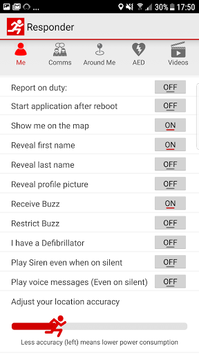  | 
 |   |   | 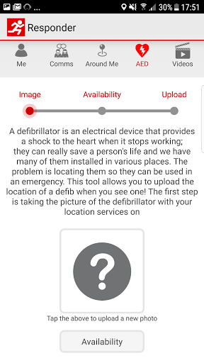  | 
 |   |  

## Development team
In the following we report the main information provided by the development team in the Google play store.

| | |
|-------------------------|-------------------------|
| **Developer**  | GoodSAM LTD |
| **Website**  | [http://www.goodsamapp.org/](http://www.goodsamapp.org/) |
| **Email** | info@goodsamapp.org |
| **Physical address**  | - |
| **Other developed apps**  | [https://play.google.com/store/apps/developer?id=GoodSAM+LTD](https://play.google.com/store/apps/developer?id=GoodSAM+LTD) |

## Android support

| | |
|-------------------------|-------------------------|
| **Declared target Android version**  | - |
| **Effective target Android version**  | - |
| **Minimum supported Android version**  | Jelly Bean, version 4.1.x (API level 16) |
| **Maximum target Android version**  | - |

The larger the difference between the minimum and maximum supported Android versions, the better. A larger difference means a wider audience. For example, old phones have a very low Android version, so a high minimum supported Android version means that the app cannot be used by users with old phones, thus leading to accessibility problems. 

## Requested permissions

In the following we report the complete list of the permissions requested by the app. 

| **Permission** | **Protection level** | **Description** | 
|-------------------------|-------------------------|-------------------------|
 **android.permission ACCESS_BACKGROUND_LOCATION** | :warning:**Dangerous** | Allows an app to access location in the background. 
 **android.permission ACCESS_COARSE_LOCATION** | :warning:**Dangerous** | Allows an app to access approximate location. 
 **android.permission ACCESS_FINE_LOCATION** | :warning:**Dangerous** | Allows an app to access precise location. 
 **android.permission ACCESS_NETWORK_STATE** | Normal | Allows applications to access information about networks. 
 **android.permission CALL_PHONE** | :warning:**Dangerous** | Allows an application to initiate a phone call without going through the Dialer user interface for the user to confirm the call. 
 **android.permission CAMERA** | :warning:**Dangerous** | Required to be able to access the camera device. 
 **android.permission FLASHLIGHT** | - | - 
 **android.permission GET_ACCOUNTS** | :warning:**Dangerous** | Allows access to the list of accounts in the Accounts Service. 
 **android.permission INTERNET** | Normal | Allows applications to open network sockets. 
 **android.permission MODIFY_AUDIO_SETTINGS** | Normal | Allows an application to modify global audio settings. 
 **android.permission READ_CONTACTS** | :warning:**Dangerous** | Allows an application to read the user's contacts data. 
 **android.permission READ_EXTERNAL_STORAGE** | :warning:**Dangerous** | Allows an application to read from external storage. 
 **android.permission READ_OWNER_DATA** | - | - 
 **android.permission RECEIVE_BOOT_COMPLETED** | Normal | Allows an application to receive the Intent.ACTION_BOOT_COMPLETED that is broadcast after the system finishes booting. 
 **android.permission RECORD_AUDIO** | :warning:**Dangerous** | Allows an application to record audio. 
 **android.permission REQUEST_IGNORE_BATTERY_OPTIMIZATIONS** | Normal | Permission an application must hold in order to use Settings.ACTION_REQUEST_IGNORE_BATTERY_OPTIMIZATIONS. 
 **android.permission USE_CREDENTIALS** | - | - 
 **android.permission VIBRATE** | Normal | Allows access to the vibrator. 
 **android.permission WAKE_LOCK** | Normal | Allows using PowerManager WakeLocks to keep processor from sleeping or screen from dimming. 
 **android.permission WRITE_EXTERNAL_STORAGE** | :warning:**Dangerous** | Allows an application to write to external storage. 
 **com.goodsam.responder.permission C2D_MESSAGE** | - | - 
 **com.goodsam.responder.permission MAPS_RECEIVE** | - | - 
 **com.google.android.c2dm.permission RECEIVE** | - | - 
 **com.google.android.finsky.permission BIND_GET_INSTALL_REFERRER_SERVICE** | - | - 
 **com.google.android.gms.permission ACTIVITY_RECOGNITION** | - | - 
 **com.google.android.providers.gsf.permission READ_GSERVICES** | - | - 

## Mentioned servers

| **Server** | **Registrant** | **Registrant country** | **Creation date** | 
|-------------------------|-------------------------|-------------------------|-------------------------|
 | adobe.com | Adobe Inc. | :us: US | 1986-11-17 05:00:00 |
 | facebook.com | Facebook, Inc. | :us: US | 1997-03-29 05:00:00 |
 | google.com | Google LLC | :us: US | 1997-09-15 04:00:00 |
 | goodsam.co.uk | - | - | 2013-07-27 00:00:00 |
 | goodsamapp.org | Registrant State/Province: | GB | 2014-03-17 22:10:28 |
 | linkedin.com | LinkedIn Corporation | :us: US | 2002-11-02 15:38:11 |
 | googlesyndication.com | Google LLC | :us: US | 2003-01-21 06:17:24 |
 | googleapis.com | Google LLC | :us: US | 2005-01-25 17:52:26 |
 | app-measurement.com | Google LLC | :us: US | 2015-06-19 20:13:31 |
 | googleadservices.com | Google LLC | :us: US | 2003-06-19 16:34:53 |

## Security analysis 

Below we report the main security warnings raised by our execution of the [Androwarn](https://github.com/maaaaz/androwarn) security analysis tool.

**Telephony identifiers leakage**
> - This application reads the numeric name (MCC+MNC) of current registered operator 
> - This application reads the operator name 

**Connection interfaces exfiltration**
> - This application reads details about the currently active data network 
> - This application tries to find out if the currently active data network is metered 

**Telephony services abuse**
> - This application makes phone calls 

**Audio video eavesdropping**
> - This application records audio from the 'MIC' source  

**Suspicious connection establishment**
> - This application opens a Socket and connects it to the remote address '' on the 'N/A' port  
> - This application opens a Socket and connects it to the remote address 'Ljava/lang/StringBuilder;->toString()Ljava/lang/String;' on the 'N/A' port  
> - This application opens a Socket and connects it to the remote address 'Ljava/net/Proxy;->type()Ljava/net/Proxy$Type;' on the 'N/A' port  
> - This application opens a Socket and connects it to the remote address 'Lorg/apache/http/HttpHost;->getPort()I' on the 'Lorg/apache/http/HttpHost;->getPort()I' port  
> - This application opens a Socket and connects it to the remote address 'timeout' on the 'N/A' port  

**Code execution**
> - This application loads a native library 
> - This application executes a UNIX command 

## User ratings and reviews

Below we provide information about how end users are reacting to the app in terms of ratings and reviews in the Google Play store.

### Ratings

The GoodSAM Responder app has been installed by more than **100000** times. At this time, **1360** rated the app and its average score is **2.875**. Below we show the distribution of the ratings across the usual star-based rating of Google Play

:star::star::star::star::star:: 340

:star::star::star::star:: 210

:star::star::star:: 170

:star::star:: 220

:star:: 420

### Reviews 

#### 5-star reviews

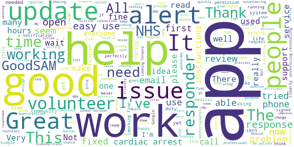

> Great idea the only problem k have at the moment is there's no buttons when I'm running a simulation  :date: __2021-05-20 20:18:20__

> Easy to use  :date: __2021-05-11 09:28:33__

> I recieved a alert and was 1st on the scene to help out someone in the community. Everybody needs this app.  :date: __2021-05-07 15:02:12__

> Good  :date: __2021-05-03 08:23:04__

> How do I reinstall this app on my new phone? I The app on Google play just says installed. frustrated.  :date: __2021-04-23 20:54:42__

> Goodsam app  :date: __2021-04-07 21:41:29__

> Brilliant have been able to help lots of people using this. Would like to know how to turn the volume for the siren down as very loud but other than that I have used it for over a year now with no problems.  :date: __2021-04-05 13:29:45__

> Because of this app i have been able to give people a second chance at life, i have attended many life changing calls and confirmed succesfull resusitation outcomes on a number of calls  :date: __2021-04-03 01:37:22__

> Not going to leave a rating yet, I want to wait and see if my issue gets resolved and that this actually works first. Issue: No Email received!! Now that everything is sorted, the app works fine for me.  :date: __2021-03-24 05:33:31__

> Excellent & is developed continuously.  :date: __2021-03-08 15:15:54__

#### 4-star reviews

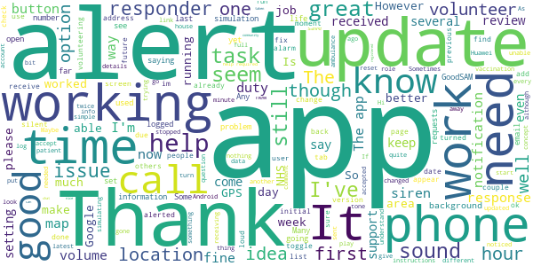

> Can we have a filter option by day of the week or time under future tasks, please? Sometimes with more than several hundreds on that list it is very difficult to find the relevant ones for VSS roles. Many thanks.  :date: __2021-05-21 10:00:55__

> Works for me. However, it would be nice to be able to list future tasks differently or offer sort by options.  :date: __2021-05-14 17:42:33__

> I've registered to volunteer at vaccination sites, received an email saying that they have noticed I hadn't taken up any opportunity, well that's because I haven't received any! Still receiving check in and chat and community response but nothing else.  :date: __2021-05-07 19:54:30__

> Please allow filtering of future tasks by day  :date: __2021-05-04 11:55:54__

> Fundamentally sound but as a NHS volunteer responder there are two key niggles which could be addressed to make life much easier: 1. Unable to copy phone numbers from alerts to paste into the phone app, which means switching back and forth to type it manually. Can you make the number a link to dial directly or at least let it be copied to the clipboard? 2. Can't accept more than one task at a time so it's not possible to do them in one trip or make another call when the first isn't answered.  :date: __2021-03-24 06:05:24__

> Since the update, this is a good app. I still haven't had a volunteering alert for the vaccination centres yet, here's hoping!  :date: __2021-02-27 17:01:46__

> Seems to run well. Had no alerts yet since registering  :date: __2021-02-26 05:17:37__

> I got my Hi Vis jackets but im still waiting for a shift as a Vaccine Steward through the app, im not sure if you need the Duty button on or off for it but im looking forward to it.  :date: __2021-02-12 16:45:42__

> Sometimes I wonder if anyone knows that I have logged on "duty" to the controllers. I have logged on for a mere 180 hours and in that time I have had just four "shouts" three of which didn't pick up and the fourth just needed a "chat. How do I know, that you know, that I am here ready to go? Many thanks Alan Hobbs  :date: __2021-02-11 20:30:35__

> The app works ok most of the time. One problem I get is the location side, I've had to reject quite a few alerts that have been 12 miles away even though my app is set at 5 miles.  :date: __2021-01-23 09:57:46__

#### 3-star reviews

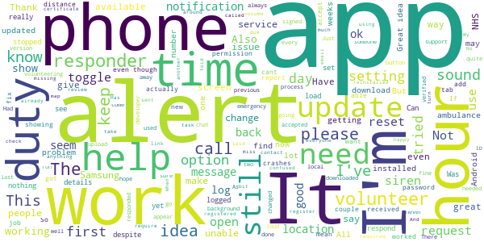

> Good Idea. But after 814 hours on duty there is no task.  :date: __2021-03-19 19:01:12__

> Cant find a decent burger .... ppppfffffff  :date: __2021-03-12 14:29:29__

> Have not received actual work in months. Lots of alerts about people safeguarding but when called no action required. Also I'm supposed to be a driver but haven't seen a driver call since I initially registered.  :date: __2021-02-26 18:26:17__

> This app worked very well with my previous Android 10. Since upgrading my phone to a new Android 10, I stopped getting sound notifications. I followed your FAQs, allowed all permissions, but I still don't get them as sound alert. I used to have a sound notification for a simulated task, but I don't get it now. Can you help please as I may miss request if I don't look on the screen...  :date: __2021-02-11 11:50:54__

> Always crashes for no apparent reason. Had no alerts in thousands of hours. Crash report sent  :date: __2021-01-29 09:28:59__

> The app tells me my certificate/ID is out of date but when I log onto the website it states it's valid until next year. Please help!  :date: __2021-01-29 07:30:57__

> As a volunteer, can I request an option that allows volunteers to log in the app that someone isn't picking up their phone despite 3 attempts by 3 other responders? I can see i'm the 4th responder. It would be useful to have a 'tried to contact but no response' action without having to call the 0800 number each time.  :date: __2021-01-26 17:50:15__

> Can the app not give basic details on the alert as hard to know if can adequately deal with the situation? Also I assume the alert goes to everyone locally until someone responds...I hope so as I didn't get sound on notification so no idea what time it came through?  :date: __2021-01-23 14:50:50__

> This app work fine on my phone, but my husband cannot get it to work on his Galaxy Alpha. The screen displays 'please log in' but there is nowhere to do so, and you cannot exit from the app. He really wants to volunteer.  :date: __2021-01-21 11:00:36__

> I have just been cleared and invited to join. I have lost my password and unable to retrieve it. What should I do?  :date: __2021-01-17 12:09:30__

#### 2-star reviews

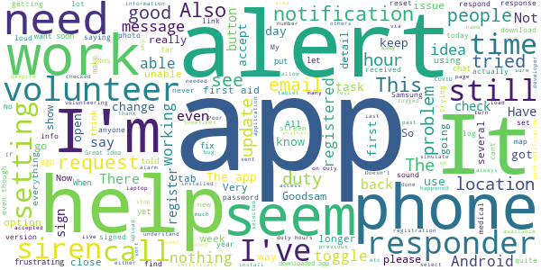

> The app is not loading the page my details is fully. Only showing my name, verifying organisation and expiry date. I cannot get the rest the page to load. I need access to this to be able adjust the notification alter by turning off the siren when I am going into a meeting at work. Please help..  :date: __2021-05-17 12:22:14__

> Tried to register right now. Filled in my details and upon pressing the register button got the notification: "Couldn't send the registration link to the email provided. Is the email correct?" Yes, it is correct, because I used the "Passwort forgotten" button that send me a resetting link to the same email. Now I can't go through registration, since the registration link never reached my inbox but apparently the email did, because "this email is in use". 🙄 Will give more stars later.  :date: __2021-05-12 07:04:09__

> Registered to be a responder last year, still awaiting acceptance  :date: __2021-05-06 18:02:57__

> The notification alerts are limited to: 1.embarrasingly loud & protracted. 2. irritating as hell 3. difficult to hear The app itself works reasonably well but, having tried everything I can think of, I simply can't get it to remember my password I.e. no apparent option including via phone settings. All other apps give option to retain on installation. Tiresome logging in, therefore, which at times can be for remorseless alerts for assistance throughout the day. So, very poorly designed.  :date: __2021-05-03 09:01:42__

> Unable to use the app and therefore unable to continue currently as a volunteer.. The app fails when I click the "future tasks" tab. All other tabs work. The app worked on my previous Motorola G6, but does not work on my existing Motorola G6. Have been installing and uninstalling the app for the past 3 days, since I started using my new phone. Help, please. Thanks!  :date: __2021-04-13 12:42:01__

> 28/02/21 V 13.7 Now able to upload photo of new AED locations, it's only taken a year.  :date: __2021-02-28 15:41:31__

> Rubbish - waiting 5 weeks now no shifts nothing??? Frustrating 😞  :date: __2021-02-26 18:12:54__

> Patchy  :date: __2021-02-26 16:59:05__

> Mine looks nothing like the simulation pictures, nothing ever in my tasks  :date: __2021-02-23 09:28:11__

> Poor  :date: __2021-02-19 18:51:16__

#### 1-star reviews

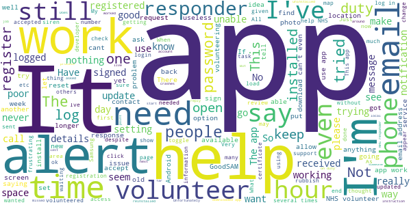

> Doesn't pick up shifts within 25. Only when I'm in a big city and not from home base! Even though I live closer to the shifts being offered! Live in Skelton (North East Yorkshire). Don't get anything at all even for shifts at Redcar - though can see shifs at Redcar when I'm in Middlesbrough!  :date: __2021-05-19 17:05:11__

> Attempted to register as a registered responder and 4 weeks later still waiting for it to be reviewed/approved. Nil other way to contact them.  :date: __2021-04-28 02:32:18__

> I've been logged in for over 1000 hours and never had a notification, even though I have all notification settings turned on. I've just gone into messages to find loads saying I've not responded to a request. How can I respond if the app isn't notifying me?  :date: __2021-03-28 09:16:49__

> Load of rubbish. Was told by emergency Doctor from other side of my Borough to sign up to get a volunteer to collect my prescription. App wouldn't even let me state I was in the UK when registering. Tried several times. Give up. Response to developers: I was told to register by a gp to find a volunteer to collect a prescription/medication last night The App would not let me put the UK as my country! I am already registered with NHS First Responders. I get a call every couple of weeks.  :date: __2021-03-26 11:43:35__

> After update app no longer opens. Re installed works once and then does not open again. Now unable to access to log on  :date: __2021-03-24 12:12:46__

> Even though I have turned on notifications and location but the crash when ever I click on tasks.  :date: __2021-03-20 10:06:46__

> When ever I click on future tasks it turns off so I am unable to check or book any task  :date: __2021-03-19 23:36:28__

> I sign on and then think it'll send notification but it hasn't been so someone sends a request I haven't received it so goes to the next responder I'll make sure I have it loaded more often now  :date: __2021-03-12 19:36:31__

> I still haven't had a Volunteering alert for the Vaccination Centre in my area where I live, patiently waiting!  :date: __2021-03-02 15:26:33__

> Never had any notification since April 2020 to end Feb 2021. Hours clock up but not heard anything. Don't think it works.  :date: __2021-02-26 17:48:54__

# Campus by Airbus
App version ``2.1.8.3316-SNAPSHOT``

Analyzed with [covid-apps-observer](http://github.com/covid-apps-observer) project, version ``0.1``

## App overview
| | |
|-------------------------|-------------------------| 
| **Name**&nbsp;&nbsp;&nbsp;&nbsp;&nbsp;&nbsp;&nbsp;&nbsp;&nbsp;&nbsp;&nbsp;&nbsp;&nbsp;&nbsp;&nbsp;&nbsp;&nbsp;&nbsp;&nbsp;&nbsp;&nbsp;&nbsp;&nbsp;&nbsp;&nbsp;&nbsp;&nbsp;&nbsp;&nbsp;&nbsp;&nbsp;&nbsp;&nbsp;&nbsp;&nbsp;&nbsp;&nbsp;&nbsp;&nbsp;&nbsp;  | Campus by Airbus |
| **Unique identifier** | com.airbus.campus |
| **Link to Google Play** | [https://play.google.com/store/apps/details?id=com.airbus.campus](https://play.google.com/store/apps/details?id=com.airbus.campus) |
| **Summary**  | An easy-to-use cartography app to navigate around Airbus sites and facilities. |
| **Privacy policy** | [-](-) |
| **Latest version** | 2.1.8.3316-SNAPSHOT |
| **Last update** | 2020-07-21 16:28:33 |
| **Recent changes** | - Main menu options located at bottom of app opening screen for easier access. - POIs changed to clickable icons for easy individual/multiple selection. - “World map” icon added for viewing Airbus European sites quickly. - New “Useful Apps” created for displaying Public/Private apps. - Hamburg Internal shuttle timetables in PDF format. - Orientation/directional improvements in relation to buildings/POIs around users.. - Bugs &amp; general performance improvements. |
| **Installs**  | 10,000+ |
| **Category** | Maps & Navigation |
| **First release** | Apr 23, 2018 |
| **Size**  | 56M |
| **Supported Android version**  | 5.0 and up |

### Description
> Campus is the Airbus app that helps you quickly locate where you are and what is around you whilst visiting an Airbus site. The app provides easy-to-use site search capabilities, which allows you to switch from one site to another quickly by either using the search bar menu, settings or by selecting the “world icon” to view all available sites. The app provides information on building locations, Airbus shuttle services, links to public shuttle services (currently only for Toulouse & Hamburg) and different points of interests like entrance points, car parks, defibrillators, restaurants, etc. The information is provided on a site basis and new supported site information (Buildings, POIs, etc) will appear over time.

### User interface
The developers of the app provide the following screenshots in the Google play store.
| | | |
|:-------------------------:|:-------------------------:|:-------------------------:|
 |   |   |   | 
 |   |   |   | 
 |   |  

## Development team
In the following we report the main information provided by the development team in the Google play store.

| | |
|-------------------------|-------------------------|
| **Developer**  | Airbus Group |
| **Website**  | [http://www.airbus.com](http://www.airbus.com) |
| **Email** | support.campus@airbus.com |
| **Physical address**  | [B02 Building 2, rond-point Dewoitine, BP 90112 31703 Blagnac Cedex - FRANCE](https://www.google.com/maps/search/B02%20Building%202,%20rond-point%20Dewoitine,%20BP%2090112%2031703%20Blagnac%20Cedex%20-%20FRANCE) (Google Maps) |
| **Other developed apps**  | [https://play.google.com/store/apps/developer?id=Airbus+Group](https://play.google.com/store/apps/developer?id=Airbus+Group) |

## Android support

| | |
|-------------------------|-------------------------|
| **Declared target Android version**  | Pie, version 9 (API level 28) |
| **Effective target Android version**  | Pie, version 9 (API level 28) |
| **Minimum supported Android version**  | Lollipop, version 5.0 (API level 21) |
| **Maximum target Android version**  | - |

The larger the difference between the minimum and maximum supported Android versions, the better. A larger difference means a wider audience. For example, old phones have a very low Android version, so a high minimum supported Android version means that the app cannot be used by users with old phones, thus leading to accessibility problems. 

## Requested permissions

In the following we report the complete list of the permissions requested by the app. 

| **Permission** | **Protection level** | **Description** | 
|-------------------------|-------------------------|-------------------------|
 **android.permission ACCESS_FINE_LOCATION** | :warning:**Dangerous** | Allows an app to access precise location. 
 **android.permission ACCESS_NETWORK_STATE** | Normal | Allows applications to access information about networks. 
 **android.permission FOREGROUND_SERVICE** | Normal | Allows a regular application to use Service.startForeground. 
 **android.permission INTERNET** | Normal | Allows applications to open network sockets. 
 **android.permission VIBRATE** | Normal | Allows access to the vibrator. 
 **android.permission WAKE_LOCK** | Normal | Allows using PowerManager WakeLocks to keep processor from sleeping or screen from dimming. 
 **com.google.android.c2dm.permission RECEIVE** | - | - 
 **com.google.android.finsky.permission BIND_GET_INSTALL_REFERRER_SERVICE** | - | - 

## Mentioned servers

| **Server** | **Registrant** | **Registrant country** | **Creation date** | 
|-------------------------|-------------------------|-------------------------|-------------------------|
 | amazonaws.com | Amazon.com, Inc. | :us: US | 2005-08-18 02:10:45 |
 | hvv.de | - | - | - |
 | tisseo.fr | TISSEO COLLECTIVITES | - | 2002-12-10 23:00:00 |
 | google.com | Google LLC | :us: US | 1997-09-15 04:00:00 |
 | geofox.de | - | - | - |
 | googlesyndication.com | Google LLC | :us: US | 2003-01-21 06:17:24 |
 | googleapis.com | Google LLC | :us: US | 2005-01-25 17:52:26 |
 | google-analytics.com | Google LLC | :us: US | 2005-07-18 19:24:32 |
 | app-measurement.com | Google LLC | :us: US | 2015-06-19 20:13:31 |
 | googletagmanager.com | Google LLC | :us: US | 2011-11-11 23:39:05 |
 | crashlytics.com | Google LLC | :us: US | 2011-01-21 15:30:40 |

## Security analysis 

Below we report the main security warnings raised by our execution of the [Androwarn](https://github.com/maaaaz/androwarn) security analysis tool.

**Location lookup**
> - This application reads location information from all available providers (WiFi, GPS etc.) 

**Connection interfaces exfiltration**
> - This application reads details about the currently active data network 
> - This application tries to find out if the currently active data network is metered 

**Suspicious connection establishment**
> - This application opens a Socket and connects it to the remote address '' on the 'N/A' port  
> - This application opens a Socket and connects it to the remote address 'Ljava/lang/StringBuilder;->toString()Ljava/lang/String;' on the 'N/A' port  
> - This application opens a Socket and connects it to the remote address 'Ljava/net/Proxy;->type()Ljava/net/Proxy$Type;' on the 'N/A' port  
> - This application opens a Socket and connects it to the remote address 'timeout' on the 'N/A' port  

**Code execution**
> - This application loads a native library 
> - This application loads a native library: '' 
> - This application loads a native library: 'c++_shared' 
> - This application loads a native library: 'runtimecore' 
> - This application loads a native library: 'runtimecore_java' 

## User ratings and reviews

Below we provide information about how end users are reacting to the app in terms of ratings and reviews in the Google Play store.

### Ratings

The Campus by Airbus app has been installed by more than **10000** times. At this time, **37** rated the app and its average score is **2.9729729**. Below we show the distribution of the ratings across the usual star-based rating of Google Play

:star::star::star::star::star:: 13

:star::star::star::star:: 4

:star::star::star:: 2

:star::star:: 5

:star:: 13

### Reviews 

#### 5-star reviews

No recent reviews available with 5 stars.

#### 4-star reviews

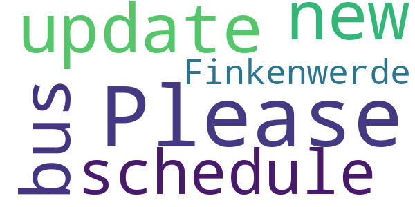

> Please update to the new bus schedule in Finkenwerde.  :date: __2019-12-16 07:10:00__

#### 3-star reviews

No recent reviews available with 3 stars.

#### 2-star reviews

> It seems to need some debugging... It crashes before even openig  :date: __2018-05-03 15:49:30__

#### 1-star reviews

> It stopped working on Android 10. Loading the map keeps on crashing the app.  :date: __2021-01-11 20:42:35__

> Used to work, now not even loading. Asks for network just after it downloaded the app... Why could there not be sitemap as backup  :date: __2020-01-17 07:37:45__

> Not working with Oppo phone  :date: __2020-01-05 17:21:40__

> No way to make it work, needs debugging...  :date: __2018-09-21 17:54:33__

# One You Active 10 Walking Tracker
App version ``5.0.16``

Analyzed with [covid-apps-observer](http://github.com/covid-apps-observer) project, version ``0.1``

## App overview
| | |
|-------------------------|-------------------------| 
| **Name**&nbsp;&nbsp;&nbsp;&nbsp;&nbsp;&nbsp;&nbsp;&nbsp;&nbsp;&nbsp;&nbsp;&nbsp;&nbsp;&nbsp;&nbsp;&nbsp;&nbsp;&nbsp;&nbsp;&nbsp;&nbsp;&nbsp;&nbsp;&nbsp;&nbsp;&nbsp;&nbsp;&nbsp;&nbsp;&nbsp;&nbsp;&nbsp;&nbsp;&nbsp;&nbsp;&nbsp;&nbsp;&nbsp;&nbsp;&nbsp;  | One You Active 10 Walking Tracker |
| **Unique identifier** | uk.ac.shef.oak.pheactiveten |
| **Link to Google Play** | [https://play.google.com/store/apps/details?id=uk.ac.shef.oak.pheactiveten](https://play.google.com/store/apps/details?id=uk.ac.shef.oak.pheactiveten) |
| **Summary**  | Active 10 shows you when you are walking quickly enough to get health benefits. |
| **Privacy policy** | [https://www.nhs.uk/oneyou/privacy-policy#H6QQyKsRuuBpI7Dg.97](https://www.nhs.uk/oneyou/privacy-policy#H6QQyKsRuuBpI7Dg.97) |
| **Latest version** | 5.0.16 |
| **Last update** | 2021-04-15 18:54:13 |
| **Recent changes** | We release regular updates to the Active 10 app to fix issues and improve its performance.  This update contains IMPORTANT UPDATES to improve the app  integration with Google Fit and keep things working as expected.            |
| **Installs**  | 100,000+ |
| **Category** | Health & Fitness |
| **First release** | Mar 3, 2017 |
| **Size**  | 19M |
| **Supported Android version**  | 5.1 and up |

### Description
> Active 10 is a free and easy to use walking app that tracks your walking and shows you how you can increase your intensity to benefit your health. The app is designed to support you every step of the way to increase your daily level of physical activity, with simple and achievable milestones and rewards along the way.
 Key features:
 * Tracks all your walking and how many minutes were brisk
 * Rewards every brisk minute achieved throughout the day, so perfect for those starting from low levels of activity
 * Promotes goal setting to help keep you motivated and help you progress
 * Store and view up to 12 months of your walking activity, to see how far you have come 
 * Discover loads of hints and tips on achieving a healthier lifestyle
 BRISK WALKING BENEFITS YOUR HEALTH
 We all know how important it is to be active. The good news is you don’t have to go to the gym or start expensive fitness programmes, walking counts too!
 Just ten minutes of brisk walking every day can get your heart pumping and can make you feel more energetic, as well as lowering your risk of serious illnesses like heart disease and type 2 diabetes. Going for a brisk walk is a great way to clear your head and improve your mood.
 Active 10s are simple to fit into your day. From taking the dog out to going for a lunchtime walk there are lots of opportunities to introduce brisk walking into your daily routine.
 This app relies on your phone’s inbuilt sensors to measure your activity so you may experience varying levels of accuracy especially in older devices/operating systems. To improve accuracy, keep your phone in a pocket close to your body rather than in a loose coat pocket or bag.
 If you have any feedback on how we can improve the app please send it to oneyou@phe.gov.uk.
 Frequently asked questions: https://www.nhs.uk/oneyou/active10/faqs

### User interface
The developers of the app provide the following screenshots in the Google play store.
| | | |
|:-------------------------:|:-------------------------:|:-------------------------:|
 |   |   |   | 
 |   |   |   | 

## Development team
In the following we report the main information provided by the development team in the Google play store.

| | |
|-------------------------|-------------------------|
| **Developer**  | Public Health England Digital |
| **Website**  | [http://www.nhs.uk/oneyou/active10](http://www.nhs.uk/oneyou/active10) |
| **Email** | oneyou@phe.gov.uk |
| **Physical address**  | - |
| **Other developed apps**  | [https://play.google.com/store/apps/developer?id=Public+Health+England+Digital](https://play.google.com/store/apps/developer?id=Public+Health+England+Digital) |

## Android support

| | |
|-------------------------|-------------------------|
| **Declared target Android version**  | Android10, version 10 (API level 29) |
| **Effective target Android version**  | Android10, version 10 (API level 29) |
| **Minimum supported Android version**  | Lollipop, version 5.1 (API level 22) |
| **Maximum target Android version**  | - |

The larger the difference between the minimum and maximum supported Android versions, the better. A larger difference means a wider audience. For example, old phones have a very low Android version, so a high minimum supported Android version means that the app cannot be used by users with old phones, thus leading to accessibility problems. 

## Requested permissions

In the following we report the complete list of the permissions requested by the app. 

| **Permission** | **Protection level** | **Description** | 
|-------------------------|-------------------------|-------------------------|
 **android.permission ACCESS_FINE_LOCATION** | :warning:**Dangerous** | Allows an app to access precise location. 
 **android.permission ACCESS_NETWORK_STATE** | Normal | Allows applications to access information about networks. 
 **android.permission ACCESS_WIFI_STATE** | Normal | Allows applications to access information about Wi-Fi networks. 
 **android.permission ACTIVITY_RECOGNITION** | :warning:**Dangerous** | Allows an application to recognize physical activity. 
 **android.permission INTERNET** | Normal | Allows applications to open network sockets. 
 **android.permission MODIFY_AUDIO_SETTINGS** | Normal | Allows an application to modify global audio settings. 
 **android.permission READ_EXTERNAL_STORAGE** | :warning:**Dangerous** | Allows an application to read from external storage. 
 **android.permission RECEIVE_BOOT_COMPLETED** | Normal | Allows an application to receive the Intent.ACTION_BOOT_COMPLETED that is broadcast after the system finishes booting. 
 **android.permission WAKE_LOCK** | Normal | Allows using PowerManager WakeLocks to keep processor from sleeping or screen from dimming. 
 **android.permission WRITE_EXTERNAL_STORAGE** | :warning:**Dangerous** | Allows an application to write to external storage. 
 **com.google.android.c2dm.permission RECEIVE** | - | - 
 **com.google.android.finsky.permission BIND_GET_INSTALL_REFERRER_SERVICE** | - | - 

## Mentioned servers

| **Server** | **Registrant** | **Registrant country** | **Creation date** | 
|-------------------------|-------------------------|-------------------------|-------------------------|
 | nhs.uk | Department of Health | - | 1996-08-01 00:00:00 |
 | googlesyndication.com | Google LLC | :us: US | 2003-01-21 06:17:24 |
 | google.com | Google LLC | :us: US | 1997-09-15 04:00:00 |
 | googleapis.com | Google LLC | :us: US | 2005-01-25 17:52:26 |
 | app-measurement.com | Google LLC | :us: US | 2015-06-19 20:13:31 |
 | instabug.com | - | :us: US | 2000-05-16 23:13:25 |
 | phedigital.co.uk | - | - | 2018-06-06 00:00:00 |
 | paragon-cc.co.uk | - | - | 2017-04-04 00:00:00 |
 | crashlytics.com | Google LLC | :us: US | 2011-01-21 15:30:40 |
 | googleadservices.com | Google LLC | :us: US | 2003-06-19 16:34:53 |

## Security analysis 

Below we report the main security warnings raised by our execution of the [Androwarn](https://github.com/maaaaz/androwarn) security analysis tool.

**Telephony identifiers leakage**
> - This application reads the numeric name (MCC+MNC) of current registered operator 
> - This application reads the operator name 

**Connection interfaces exfiltration**
> - This application reads details about the currently active data network 
> - This application tries to find out if the currently active data network is metered 

**Audio video eavesdropping**
> - This application records audio from the 'MIC' source  

**Suspicious connection establishment**
> - This application opens a Socket and connects it to the remote address 'La/b/a/a/a;->s(Ljava/lang/String;)Ljava/lang/StringBuilder;' on the 'N/A' port  
> - This application opens a Socket and connects it to the remote address 'Ljava/net/Proxy;->type()Ljava/net/Proxy$Type;' on the 'N/A' port  
> - This application opens a Socket and connects it to the remote address 'hostname == null ' on the 'N/A' port  
> - This application opens a Socket and connects it to the remote address 'timeout' on the 'N/A' port  

**Code execution**
> - This application loads a native library 
> - This application loads a native library: 'constant' 
> - This application executes a UNIX command 
> - This application executes a UNIX command containing this argument: '' 

## User ratings and reviews

Below we provide information about how end users are reacting to the app in terms of ratings and reviews in the Google Play store.

### Ratings

The One You Active 10 Walking Tracker app has been installed by more than **100000** times. At this time, **4661** rated the app and its average score is **4.2532187**. Below we show the distribution of the ratings across the usual star-based rating of Google Play

:star::star::star::star::star:: 2701

:star::star::star::star:: 1120

:star::star::star:: 410

:star::star:: 180

:star:: 250

### Reviews 

#### 5-star reviews

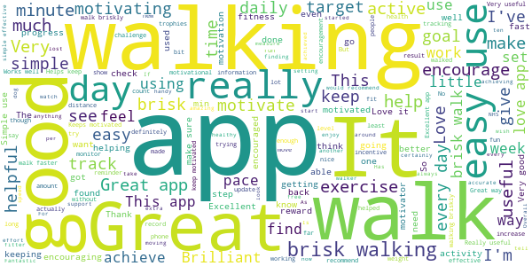

> Useful, I like to know I have done some brisk walking  :date: __2021-05-21 22:52:13__

> Helps to encourage exercise  :date: __2021-05-20 08:34:09__

> I like using this app. It helps me to exercise every day. Precise instructions with many rewards and NO punishments, it only encourages me to push myself harder, without even being pushy itself. I live the detailed articles on fitness and wellbeing!  :date: __2021-05-19 19:22:22__

> Easy to use. Keeps me motivated  :date: __2021-05-19 14:31:38__

> Great way to support a more active day.  :date: __2021-05-19 10:36:44__

> Excellent app inspires you to keep walking each day and increase the amount of brisk walking you do.  :date: __2021-05-18 21:03:01__

> Awesome 👌🏼  :date: __2021-05-18 17:38:51__

> Easy to use  :date: __2021-05-17 12:06:37__

> I really like this app..it encourages Me to walk more without the expense of a watch.  :date: __2021-05-16 19:26:22__

> Excellent  :date: __2021-05-16 19:02:01__

#### 4-star reviews

> Learning more about my eating habits. Quite an eye opening.  :date: __2021-05-18 14:03:13__

> I wanted to find an easy way to increase my activity and found this NHS sponsored app. It has really encouraged me to get out every day for at least 20 mins walk and after less than a month I am feeling the benefits.  :date: __2021-05-17 08:55:22__

> I loved this app at first it's very useful as I have fibromyalgia an need to phase my exercise slowly. However the app stopped registering my brisk steps and i kept pushing harder to get those brisk mins in, the result was I pushed to hard, then it stopped working. At times I walk quickly and it doesn't register other times I walk slowly and it registers. This has been demotivating. If these issue were fixed it would be a great tool for me  :date: __2021-05-09 13:52:48__

> The app is great 👍  :date: __2021-05-09 09:25:08__

> Good incentive to keep active walking  :date: __2021-05-06 21:53:22__

> Very easy to use and a great indicator of brisk v strolling walking  :date: __2021-05-03 09:46:27__

> Useful to track walking activity which counts towards exercise targets  :date: __2021-05-01 18:23:41__

> This is a good app  :date: __2021-05-01 14:37:10__

> Sometimes I walk fast and the tracker doesn't register it as brisk. I didn't realise the phone had to be on my person; not in a handbag.  :date: __2021-04-30 12:50:55__

> The first couple of minutes don't register however brisk you walk so it's best not to stop. Otherwise it's a good help to measuring your walks  :date: __2021-04-28 08:54:51__

#### 3-star reviews

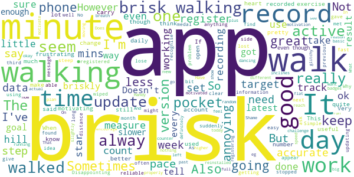

> No baseline assessment to measure whst is "brisk" for me. Makes you feel good when you notch up a chunk of brisk minutes, motivating to make me reach the next 10.  :date: __2021-05-03 11:17:55__

> This app is quite good, but only for mapping your walks. It would be good if it included other activities such as gardening, going to the gym, swimming etc.  :date: __2021-05-01 18:00:27__

> Wish it would show the miles I have walked. I'm sure it used too. Disappointing  :date: __2021-04-30 17:02:41__

> Not very accurate - when walking with someone else who uses the app, they have hugely different results! It's good for making you walk fast though  :date: __2021-04-25 17:59:26__

> Not sure how accurate the measurement of brisk walking is. But it certainly raises awareness.  :date: __2021-04-19 23:59:09__

> What is counted as brisk seems quite random. If I use it when I'm dancing, it will record 30 mins as brisk one day, then nothing the next even though I'm doing the same dances to the same tracks.  :date: __2021-04-18 22:35:47__

> Would be nice to have a step counter and distance built in  :date: __2021-04-16 16:57:08__

> It started really well, and I would have scored higher, but for some reason over the past couple of weeks it is recording my car journeys too. ( And not showing up as brisk during this time😂) I've checked to see if there is anything I need to change in settings, but nothing. Shame asvi was really enjoying it, but can't rely on the data any more. So frustrating.  :date: __2021-04-15 15:07:55__

> stopped working, reinstalled twice, still not working, Have reinstall after a while. Working much better  :date: __2021-04-14 08:44:45__

> Moved to anew and in all othe respects reliable huawei p30 Pro. Suddenly the app is highly erratic in what it deems is an active pace and is under recording the same. I know by timing myself I am walking at 130 steps per minute, the app recognises I'm walking but does not record these as brisk minutes in a cases. I suspect its recording brisk for less than half the actual brisk walked  :date: __2021-04-13 21:26:39__

#### 2-star reviews

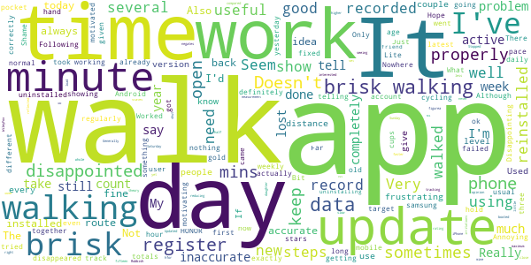

> The app counts cycling as brisk walking... It's just not right. Hope it get fixed.  :date: __2021-05-17 18:57:09__

> It does not register brisk walking properly. I walk with my daughter both using active 10, mine shows very little brisk walking compared with hers. Rubbish.  :date: __2021-05-15 15:25:57__

> Doesn't always work  :date: __2021-05-10 20:48:27__

> Stopped tracking. Worked well 1st week but now doesn't track my walking at all. Annoying as I walk for an hour and half each day and am interested in seeing how I'm doing  :date: __2021-04-26 10:47:44__

> Generally good and has motivated me to get a faster pace and do that for me time. Some irritations, however. I would like to set a (much) higher target but 30 mins a day is the maximum. Also, totals seem very slow to update at times and you have to close the app and open again. E.g. Its Sunday and yet my Saturday walk was still not reflected in the weekly figurea until I shut the app. Updated, data for several days lost, so reducing rating to 2 stars.  :date: __2021-04-18 15:14:40__

> Doesn't work properly. Very inaccurate at times.  :date: __2021-04-16 15:50:00__

> I can't get the app to work, my data has disappeared and won't load back on. I have uninstalled and reinstalled after a few days but still nothing  :date: __2021-04-11 13:13:15__

> Really good idea in theory but the measurement of brisk is not accurate in my opinion, which negates the whole idea of the app. Think I'd need to be practically sprinting for brisk to register.  :date: __2021-04-07 22:56:03__

> Not reliable, I do the same walk each week in the same time sometimes it records 100 brisk minutes other times like today 8 minutes  :date: __2021-03-18 17:45:18__

> It just doesn't register much of my brisk walking. Seems completely random, some days all is fine, other days only about 10% registers.  :date: __2021-03-06 17:09:46__

#### 1-star reviews

> Hopeless. Doesn't record minutes of walking accurately let alone minutes of brisk walking. Today I walked briskly for 30 minutes but only 24 minutes of walking was recorded and just 8 were recorded as "brisk". So I practically ran for 5 minutes, then walked briskly for another 5, to try and push the brisk minutes up. No additional minutes of walking, brisk or otherwise were recorded. It stuck at 24 and 8. It was fine for a couple of days but hasn't recorded accurately since then.  :date: __2021-05-09 18:22:31__

> Didn't find this app useful because what I felt was a brisk walk for me didn't register leaving me feeling disheartened. ☹️  :date: __2021-04-29 19:09:50__

> It has been working fine, then for the last month it has been awful! Not recording the correct time I'd been walking! Told me I'd walked one minute and I'd actually done 30 minutes!  :date: __2021-04-27 11:54:05__

> ever since new update in Feb the app cannot get my walking info or it says I'm missing data  :date: __2021-04-19 00:57:31__

> This was so simple, but now useless. It just stopped working; used to record approx. time walking and time spent brisk walking - now nothing! Latest version of Android, Pixel 3a  :date: __2021-04-18 18:32:21__

> Infuriating. I walk briskly for 30mins and it clocks up two cups and a few minutes, a couple of hours later I open the app up prior to walking and its reset to 1 cup and 1 minute. This has happened every day since I downloaded it (3 days) Seemed to settle down but suddenly keeps trying to load and says "we don't seem to be able to access your data"  :date: __2021-04-11 13:47:38__

> Another waste of time and space doesn't help at all  :date: __2021-04-05 01:16:21__

> This app used to be great but when I resumed this month after a break it simply doesn't work. Constantly trying to load data and never does. Downgraded from a 5 star review. Sort it please.  :date: __2021-03-31 09:46:06__

> Very hit and miss in the measurement of "brisk" walking, well basically random. Good idea but poorly developed.  :date: __2021-03-29 00:56:02__

> Not fit for purpose. Doesn't record anything.  :date: __2021-03-25 03:20:55__

# Leisure for Life
App version ``4.74``

Analyzed with [covid-apps-observer](http://github.com/covid-apps-observer) project, version ``0.1``

## App overview
| | |
|-------------------------|-------------------------| 
| **Name**&nbsp;&nbsp;&nbsp;&nbsp;&nbsp;&nbsp;&nbsp;&nbsp;&nbsp;&nbsp;&nbsp;&nbsp;&nbsp;&nbsp;&nbsp;&nbsp;&nbsp;&nbsp;&nbsp;&nbsp;&nbsp;&nbsp;&nbsp;&nbsp;&nbsp;&nbsp;&nbsp;&nbsp;&nbsp;&nbsp;&nbsp;&nbsp;&nbsp;&nbsp;&nbsp;&nbsp;&nbsp;&nbsp;&nbsp;&nbsp;  | Leisure for Life |
| **Unique identifier** | com.innovatise.rctcbc |
| **Link to Google Play** | [https://play.google.com/store/apps/details?id=com.innovatise.rctcbc](https://play.google.com/store/apps/details?id=com.innovatise.rctcbc) |
| **Summary**  | Access all Rhondda Cynon Taf Leisure Centres from just one App |
| **Privacy policy** | [http://www.rctcbc.gov.uk/leisure](http://www.rctcbc.gov.uk/leisure) |
| **Latest version** | 4.74 |
| **Last update** | 2021-03-01 04:20:41 |
| **Recent changes** | Thanks for using our app! To make our app better for you, we bring updates to the App Store regularly. Updates will include new features, fixes and performance improvements. |
| **Installs**  | 5,000+ |
| **Category** | Health & Fitness |
| **First release** | Dec 1, 2017 |
| **Size**  | 37M |
| **Supported Android version**  | 5.1 and up |

### Description
> With the Rhondda Cynon Taf Council Leisure for Life  app you always have your facility in your pocket with quick and easy access to book your favourite fitness classes and activities. Get up-to-date information, news, fitness class timetables, public swim timetables, offers, events and receive push notifications for important news.
 FITNESS CLASS TIMETABLES
 Get real-time access to your centre’s timetable for classes, including times, fitness instructors and class description.
 FITNESS CLASS BOOKINGS
 Check availability, make a booking, amend a booking and cancel a booking – all on the move!
 PUBLIC SWIM TIMETABLES
 Get real-time access to your centre’s timetable for public swim sessions.
 CENTRE INFORMATION
 Find out about our opening times and facilities.
 NEWS AND PUSH NOTIFICATIONS
 Instantly get notified of centre news and events direct to your phone. With our app, you’ll immediately know when there are new events or classes, ensuring that you’ll never miss a thing.
 OFFERS
 Get push notifications for new offers so you always know about special promotions.
 MEMBERSHIPS AND ONLINE JOINING
 View our different types of membership to find the one which best suits you and join online.
 CONTACT US
 Easily contact us with leisure centre telephone numbers and email addresses or view directions and maps.
 SHARE THROUGH FACEBOOK, TWITTER AND EMAIL
 Share fitness classes, news, centre information and offers with your friends and family at the touch of a button.
 CENTRES INCLUDED
 Rhondda Leisure Centre, Tonyrefail Leisure centre, Llantrisant Leisure Centre, Hawthorn Leisure Centre, Abercynon Leisure Centre, Sobells Leisure centre, Rhondda Fach Leisure Centre, Bronwydd Pool
 ................................
 CYMRAEG
 Drwy lawrlwytho ap Hamdden am Oes Cyngor Rhondda Cynon Taf, bydd modd cadw'r cyfleuster yn eich poced a chadw lle mewn dosbarth ffitrwydd neu ar gyfer gweithgareddau'n gyflym ac yn hawdd. Byddwch chi'n derbyn y wybodaeth a'r newyddion diweddaraf, amserlenni dosbarthiadau ffitrwydd, amserlenni nofio cyhoeddus, cynigion, achlysuron. Bydd modd i chi hefyd dewis derbyn hysbysiadau ynglŷn â newyddion pwysig.
 AMSERLEN Y DOSBARTHIADAU CADW'N HEINI
 Bydd gyda chi fynediad at amserlenni dosbarthiadau'r ganolfan, gan gynnwys amseroedd, hyfforddwyr y dosbarth a disgrifiad o'r dosbarth.
 CADW LLE MEWN DOSBARTH FFITRWYDD
 Bydd modd i chi wirio argaeledd, trefnu gweithgaredd, newid gweithgaredd neu ganslo gweithgaredd - ar eich ffôn!
 AMSERLEN NOFIO CYHOEDDUS
 Bydd gyda chi mynediad at amserlenni sesiynau nofio cyhoeddus eich canolfan.
 GWYBODAETH AM Y GANOLFAN
 Dysgwch ragor am oriau agor a chyfleusterau'r ganolfan.
 NEWYDDION A HYSBYSIADAU
 Cewch chi hysbysebion ynglŷn â newyddion ac achlysuron y ganolfan ar eich ffôn Bydd yr ap yn sicrhau eich bod chi'n cael gwybod pa achlysuron a dosbarthiadau newydd sydd ar gael ar unwaith. Fyddwch chi ddim yn colli allan! 
 CYNIGION
 Byddwch chi'n derbyn hysbysiadau ynglŷn â chynigion newydd fel eich bod chi'n ymwybodol o hyrwyddiadau arbennig.
 AELODAETH AC YMUNO AR-LEIN
 Cymerwch gipolwg ar y mathau gwahanol o aelodaeth sydd ar gael, a dewiswch yr un sydd orau gennych chi. Ymunwch ar-lein!
 MANYLION CYSWLLT  
 Mae'n hawdd cysylltu â ni drwy'r ap. Mae rhifau ffôn a chyfeiriadau e-bost wedi'u nodi, neu mae modd cael cyfeiriadau drwy ddefnyddio'r map.
 RHANNWCH WYBODAETH AR FACEBOOK, TWITTER AC E-BOST
 Rhannwch wybodaeth am ddosbarth ffitrwydd, newyddion, gwybodaeth am y ganolfan a chynigion gyda'ch teulu a'ch ffrindiau wrth bwyso botwm.

### User interface
The developers of the app provide the following screenshots in the Google play store.
| | | |
|:-------------------------:|:-------------------------:|:-------------------------:|
 |   |   | 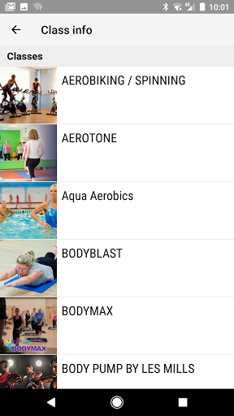  | 
 | 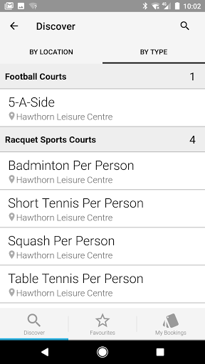  |  

## Development team
In the following we report the main information provided by the development team in the Google play store.

| | |
|-------------------------|-------------------------|
| **Developer**  | Innovatise GmbH |
| **Website**  | [http://www.rctcbc.gov.uk/leisure](http://www.rctcbc.gov.uk/leisure) |
| **Email** | leisuremembership@rctcbc.gov.uk |
| **Physical address**  | - |
| **Other developed apps**  | [https://play.google.com/store/apps/developer?id=Innovatise+GmbH](https://play.google.com/store/apps/developer?id=Innovatise+GmbH) |

## Android support

| | |
|-------------------------|-------------------------|
| **Declared target Android version**  | Pie, version 9 (API level 28) |
| **Effective target Android version**  | Pie, version 9 (API level 28) |
| **Minimum supported Android version**  | Lollipop, version 5.0 (API level 21) |
| **Maximum target Android version**  | - |

The larger the difference between the minimum and maximum supported Android versions, the better. A larger difference means a wider audience. For example, old phones have a very low Android version, so a high minimum supported Android version means that the app cannot be used by users with old phones, thus leading to accessibility problems. 

## Requested permissions

In the following we report the complete list of the permissions requested by the app. 

| **Permission** | **Protection level** | **Description** | 
|-------------------------|-------------------------|-------------------------|
 **android.permission ACCESS_COARSE_LOCATION** | :warning:**Dangerous** | Allows an app to access approximate location. 
 **android.permission ACCESS_FINE_LOCATION** | :warning:**Dangerous** | Allows an app to access precise location. 
 **android.permission ACCESS_NETWORK_STATE** | Normal | Allows applications to access information about networks. 
 **android.permission ACCESS_WIFI_STATE** | Normal | Allows applications to access information about Wi-Fi networks. 
 **android.permission AUTHENTICATE_ACCOUNTS** | - | - 
 **android.permission BLUETOOTH** | Normal | Allows applications to connect to paired bluetooth devices. 
 **android.permission BLUETOOTH_ADMIN** | Normal | Allows applications to discover and pair bluetooth devices. 
 **android.permission CAMERA** | :warning:**Dangerous** | Required to be able to access the camera device. 
 **android.permission GET_ACCOUNTS** | :warning:**Dangerous** | Allows access to the list of accounts in the Accounts Service. 
 **android.permission INTERNET** | Normal | Allows applications to open network sockets. 
 **android.permission MANAGE_ACCOUNTS** | - | - 
 **android.permission READ_PHONE_STATE** | :warning:**Dangerous** | Allows read only access to phone state, including the phone number of the device, current cellular network information, the status of any ongoing calls, and a list of any PhoneAccounts registered on the device. 
 **android.permission RECEIVE_BOOT_COMPLETED** | Normal | Allows an application to receive the Intent.ACTION_BOOT_COMPLETED that is broadcast after the system finishes booting. 
 **android.permission VIBRATE** | Normal | Allows access to the vibrator. 
 **android.permission WAKE_LOCK** | Normal | Allows using PowerManager WakeLocks to keep processor from sleeping or screen from dimming. 
 **android.permission WRITE_EXTERNAL_STORAGE** | :warning:**Dangerous** | Allows an application to write to external storage. 
 **com.google.android.c2dm.permission RECEIVE** | - | - 
 **com.google.android.finsky.permission BIND_GET_INSTALL_REFERRER_SERVICE** | - | - 
 **com.google.android.providers.gsf.permission READ_GSERVICES** | - | - 

## Mentioned servers

| **Server** | **Registrant** | **Registrant country** | **Creation date** | 
|-------------------------|-------------------------|-------------------------|-------------------------|
 | google.com | Google LLC | :us: US | 1997-09-15 04:00:00 |
 | myfitapp.de | - | - | - |
 | microsoft.com | Microsoft Corporation | :us: US | 1991-05-02 04:00:00 |
 | googlesyndication.com | Google LLC | :us: US | 2003-01-21 06:17:24 |
 | googleapis.com | Google LLC | :us: US | 2005-01-25 17:52:26 |
 | app-measurement.com | Google LLC | :us: US | 2015-06-19 20:13:31 |

## Security analysis 

Below we report the main security warnings raised by our execution of the [Androwarn](https://github.com/maaaaz/androwarn) security analysis tool.

**Telephony identifiers leakage**
> - This application reads the ISO country code equivalent for the SIM provider's country code 
> - This application reads the ISO country code equivalent of the current registered operator's MCC (Mobile Country Code) 
> - This application reads the MCC+MNC of the provider of the SIM 
> - This application reads the Service Provider Name (SPN) 
> - This application reads the constant indicating the state of the device SIM card 
> - This application reads the device phone type value 
> - This application reads the numeric name (MCC+MNC) of current registered operator 
> - This application reads the operator name 
> - This application reads the radio technology (network type) currently in use on the device for data transmission 
> - This application reads the unique device ID, i.e the IMEI for GSM and the MEID or ESN for CDMA phones 

**Connection interfaces exfiltration**
> - This application reads details about the currently active data network 
> - This application tries to find out if the currently active data network is metered 

**Telephony services abuse**
> - This application makes phone calls 

**Suspicious connection establishment**
> - This application opens a Socket and connects it to the remote address '' on the 'N/A' port  
> - This application opens a Socket and connects it to the remote address 'Ljava/lang/StringBuilder;->toString()Ljava/lang/String;' on the 'N/A' port  
> - This application opens a Socket and connects it to the remote address 'Ljava/net/Proxy;->type()Ljava/net/Proxy$Type;' on the 'N/A' port  
> - This application opens a Socket and connects it to the remote address 'timeout' on the 'N/A' port  

**Code execution**
> - This application loads a native library 
> - This application loads a native library: 'jniPdfium' 
> - This application loads a native library: 'modft2' 
> - This application loads a native library: 'modpdfium' 
> - This application loads a native library: 'modpng' 

## User ratings and reviews

Below we provide information about how end users are reacting to the app in terms of ratings and reviews in the Google Play store.

### Ratings

The Leisure for Life app has been installed by more than **5000** times. At this time, **34** rated the app and its average score is **3.0294118**. Below we show the distribution of the ratings across the usual star-based rating of Google Play

:star::star::star::star::star:: 14

:star::star::star::star:: 1

:star::star::star:: 4

:star::star:: 2

:star:: 13

### Reviews 

#### 5-star reviews

> My first ever time swimming at Abercynon today. What a wonderful welcome! The staff were incredibly friendly, well informed and proffesional. Sarah on reception was an absolute star!I spoke to her this afternoon over the telephone, I could not believe how helpful she was talking me through directions, and my options. So refreshing to meet such lovely people there today. "Salt of the earth" springs to mind. All staff were polite, respectful and patient. Thankyou all so much! Lauren Miller  :date: __2021-05-06 20:50:07__

> Fantastic  :date: __2020-12-20 19:56:08__

> awsome  :date: __2019-05-07 17:19:15__

> Can book all my classes with ease now . If in welsh change by clicking top 
left hand corner and select new club with. +  :date: __2018-08-01 10:43:48__

> I use it to book classes and find out times  :date: __2018-04-27 19:56:40__

> So far, so good! Looks great. Easy to navigate and book with!  :date: __2017-12-11 22:50:58__

> Fantastic app so convenient for booking classes and keeping track of my workouts love it 👍  :date: __2017-12-07 14:30:54__

#### 4-star reviews

> Teething problems. As it was in welsh but how to sort below If you go to the APP and in the left hand corner there is a menu tab 'three lines'.   Then click the 'my clubs' tab. Then click + in the right hand corner. Then you should be able to see all pages or club names in both English and in Welsh. Select one in your language prefrence  :date: __2020-10-08 15:34:33__

#### 3-star reviews

> When it works it's really good...it's really hit and miss though! It either sits on a loading page for ages or tells you there's a jellybean error 🤔 fix these annoying glitches and it would be brilliant.  :date: __2020-09-15 20:05:15__

> It's basically like a mobile version of the website. No support for NFC  :date: __2017-12-13 08:35:18__

#### 2-star reviews

> Having to keep uninstalling and reinstalling in the hopes that it may work. Sometimes I can book gym sessions, often I cant. Such a shame as the app seems to have a lot of potential.  :date: __2020-08-18 18:07:59__

> Was OK until updated. Now cannot book a class within half an hour of it starting. Various classes don't show up, just received an update that boot camp classes are available to book and upon checking they do not show. Should be able to swipe in with phone but no availability to do this so it means queueing at the entrance before you can go to the class.  :date: __2019-05-25 16:05:53__

#### 1-star reviews

> When trying to book a gym session on android phone can only book 1 day in advance getting no opportunity to train where as ios users can book 7 days ahead  :date: __2021-05-13 21:40:45__

> My first time trying to use the app and most things on there wont work. I tried booking a swimming class but couldn't remember my pin when I click on the option to reset my password the page wouldn't load. I managed to get onto a page to update my details but it kept saying invalid email address even though that's the email I use and it wont let me change it. Gave up in the end.  :date: __2021-05-08 12:22:16__

> As a couple of OAP's we paid £460 annual membership in Feb 2019, then lockdown occurred. Our local centre we joined to use is now a vaccination centre. Can't contact the council, cant speak to anyone at the leisure centres, the app doesn't load, and from the reviews, doesn't work anyway.For God's sake RCT council, put some up to date information on your site, and sort things out.  :date: __2021-05-06 10:35:43__

> Stopped working for upgrade days ago and still not working!  :date: __2020-10-17 16:51:28__

> No option to book as just public I dont want a membership  :date: __2020-10-17 05:45:37__

> No option for this is English?! We're not all Welsh speakers!  :date: __2020-09-28 11:03:54__

> Terrible just terrible only gives Welsh language with no option to switch no clear signpost to register as a new member. Eventually get to the end of the process and it's corrupted and throws you all the way out Rubbish. Waste of time  :date: __2020-09-24 18:33:43__

> Just awful  :date: __2020-09-02 09:42:44__

> Worked fine until yesterday's update. Now I cant book classes. Can you sort it asap  :date: __2020-08-17 20:51:35__

> Unable to book a class....rubbish  :date: __2020-08-11 00:04:20__

# Bramley Health App
App version ``1.0.0``

Analyzed with [covid-apps-observer](http://github.com/covid-apps-observer) project, version ``0.1``

## App overview
| | |
|-------------------------|-------------------------| 
| **Name**&nbsp;&nbsp;&nbsp;&nbsp;&nbsp;&nbsp;&nbsp;&nbsp;&nbsp;&nbsp;&nbsp;&nbsp;&nbsp;&nbsp;&nbsp;&nbsp;&nbsp;&nbsp;&nbsp;&nbsp;&nbsp;&nbsp;&nbsp;&nbsp;&nbsp;&nbsp;&nbsp;&nbsp;&nbsp;&nbsp;&nbsp;&nbsp;&nbsp;&nbsp;&nbsp;&nbsp;&nbsp;&nbsp;&nbsp;&nbsp;  | Bramley Health App |
| **Unique identifier** | com.AppInstitute.bramleyv1 |
| **Link to Google Play** | [https://play.google.com/store/apps/details?id=com.AppInstitute.bramleyv1](https://play.google.com/store/apps/details?id=com.AppInstitute.bramleyv1) |
| **Summary**  | Providing NHS Primary Care GP Services |
| **Privacy policy** | [http://cms.appbuild.io/cms/docs/legal/privacy.php?appcode=thisapp](http://cms.appbuild.io/cms/docs/legal/privacy.php?appcode=thisapp) |
| **Latest version** | 1.0.0 |
| **Last update** | 2019-07-17 12:30:05 |
| **Recent changes** | - |
| **Installs**  | 1,000+ |
| **Category** | Health & Fitness |
| **First release** | May 9, 2018 |
| **Size**  | 32M |
| **Supported Android version**  | 4.4 and up |

### Description
> The Bramley Health App is designed for our patients who are registered at one of our sites in England. Once registered as a patient, you can access online services including:
 - econsultations: reviewed by a GP or Nurse Practitioner once submitted who will get in contact regarding next steps
 - face-to-face and telephone appointments: bookable via the login section
 - video consultations: visit the econsultation page for more information
 - request a referral based: you request will be reviewed by a clinician who will either refer you or make contact to discuss further
 - sick note request: use the app to submit a new or repeat sick note request
 - medication request: use the econsultation section to order repeat or request new medication
 - view your GP medical record: log in to your medical record via the app and view your medical history, previous test results and other health information about you
 - health information: read and watch health information 
 To use the app, you must be aged 13 and over and registered with one of our GP surgeries. Registering is easy and can be done using the app. As long as you live in England, you can register with us and make us your main GP Surgery which will allow you to access all our online services. If you live more than 2 miles away from our physical locations, you will still be able to access all our services except for home visits.

### User interface
The developers of the app provide the following screenshots in the Google play store.
| | | |
|:-------------------------:|:-------------------------:|:-------------------------:|
 |   |   |   | 
 |   |   |   | 
 |  

## Development team
In the following we report the main information provided by the development team in the Google play store.

| | |
|-------------------------|-------------------------|
| **Developer**  | Fuller and Forbes Healthare |
| **Website**  | [http://www.bramleyonline.co.uk](http://www.bramleyonline.co.uk) |
| **Email** | bramley.village@nhs.net |
| **Physical address**  | [Fuller and Forbes Healthcare Bramley Village Health and Wellbeing Centre Highfield Road Bramley Leeds LS13 2BL](https://www.google.com/maps/search/Fuller%20and%20Forbes%20Healthcare%20Bramley%20Village%20Health%20and%20Wellbeing%20Centre%20Highfield%20Road%20Bramley%20Leeds%20LS13%202BL) (Google Maps) |
| **Other developed apps**  | [https://play.google.com/store/apps/developer?id=Fuller+and+Forbes+Healthare](https://play.google.com/store/apps/developer?id=Fuller+and+Forbes+Healthare) |

## Android support

| | |
|-------------------------|-------------------------|
| **Declared target Android version**  | Pie, version 9 (API level 28) |
| **Effective target Android version**  | Pie, version 9 (API level 28) |
| **Minimum supported Android version**  | KitKat, version 4.4 - 4.4.4 (API level 19) |
| **Maximum target Android version**  | - |

The larger the difference between the minimum and maximum supported Android versions, the better. A larger difference means a wider audience. For example, old phones have a very low Android version, so a high minimum supported Android version means that the app cannot be used by users with old phones, thus leading to accessibility problems. 

## Requested permissions

In the following we report the complete list of the permissions requested by the app. 

| **Permission** | **Protection level** | **Description** | 
|-------------------------|-------------------------|-------------------------|
 **android.permission ACCESS_ASSISTED_GPS** | - | - 
 **android.permission ACCESS_COARSE_LOCATION** | :warning:**Dangerous** | Allows an app to access approximate location. 
 **android.permission ACCESS_FINE_LOCATION** | :warning:**Dangerous** | Allows an app to access precise location. 
 **android.permission ACCESS_GPS** | - | - 
 **android.permission ACCESS_LOCATION_EXTRA_COMMANDS** | Normal | Allows an application to access extra location provider commands. 
 **android.permission ACCESS_MOCK_LOCATION** | - | - 
 **android.permission ACCESS_NETWORK_STATE** | Normal | Allows applications to access information about networks. 
 **android.permission CAMERA** | :warning:**Dangerous** | Required to be able to access the camera device. 
 **android.permission FLASHLIGHT** | - | - 
 **android.permission INTERNET** | Normal | Allows applications to open network sockets. 
 **android.permission READ_APP_BADGE** | - | - 
 **android.permission VIBRATE** | Normal | Allows access to the vibrator. 
 **android.permission WAKE_LOCK** | Normal | Allows using PowerManager WakeLocks to keep processor from sleeping or screen from dimming. 
 **android.permission WRITE_EXTERNAL_STORAGE** | :warning:**Dangerous** | Allows an application to write to external storage. 
 **com.AppInstitute.bramleyv1.permission C2D_MESSAGE** | - | - 
 **com.anddoes.launcher.permission UPDATE_COUNT** | - | - 
 **com.google.android.c2dm.permission RECEIVE** | - | - 
 **com.htc.launcher.permission READ_SETTINGS** | - | - 
 **com.htc.launcher.permission UPDATE_SHORTCUT** | - | - 
 **com.huawei.android.launcher.permission CHANGE_BADGE** | - | - 
 **com.huawei.android.launcher.permission READ_SETTINGS** | - | - 
 **com.huawei.android.launcher.permission WRITE_SETTINGS** | - | - 
 **com.majeur.launcher.permission UPDATE_BADGE** | - | - 
 **com.oppo.launcher.permission READ_SETTINGS** | - | - 
 **com.oppo.launcher.permission WRITE_SETTINGS** | - | - 
 **com.sec.android.provider.badge.permission READ** | - | - 
 **com.sec.android.provider.badge.permission WRITE** | - | - 
 **com.sonyericsson.home.permission BROADCAST_BADGE** | - | - 
 **com.sonymobile.home.permission PROVIDER_INSERT_BADGE** | - | - 
 **me.everything.badger.permission BADGE_COUNT_READ** | - | - 
 **me.everything.badger.permission BADGE_COUNT_WRITE** | - | - 

## Mentioned servers

| **Server** | **Registrant** | **Registrant country** | **Creation date** | 
|-------------------------|-------------------------|-------------------------|-------------------------|
 | braintreegateway.com | PayPal Inc. | :us: US | 2009-10-06 23:05:33 |
 | googlesyndication.com | Google LLC | :us: US | 2003-01-21 06:17:24 |
 | google.com | Google LLC | :us: US | 1997-09-15 04:00:00 |
 | facebook.com | Facebook, Inc. | :us: US | 1997-03-29 05:00:00 |
 | googleapis.com | Google LLC | :us: US | 2005-01-25 17:52:26 |
 | google-analytics.com | Google LLC | :us: US | 2005-07-18 19:24:32 |
 | app-measurement.com | Google LLC | :us: US | 2015-06-19 20:13:31 |
 | googleapis.com | Google LLC | :us: US | 2005-01-25 17:52:26 |
 | doubleclick.net | Google Inc. | :us: US | 1996-01-16 05:00:00 |
 | gstatic.com | Google LLC | :us: US | 2008-02-11 15:31:25 |
 | googleapis.com | Google LLC | :us: US | 2005-01-25 17:52:26 |
 | visa.com | Visa International Service Association | :us: US | 1994-03-08 05:00:00 |
 | googletagmanager.com | Google LLC | :us: US | 2011-11-11 23:39:05 |
 | appspot.com | Google LLC | :us: US | 2005-03-10 02:27:55 |
 | paypal.com | PayPal Inc. | :us: US | 1999-07-15 05:32:11 |
 | paypalobjects.com | PayPal Inc. | :us: US | 2005-05-12 17:11:21 |
 | whatsapp.com | Whatsapp Inc. | :us: US | 2008-09-04 12:39:12 |

## Security analysis 

Below we report the main security warnings raised by our execution of the [Androwarn](https://github.com/maaaaz/androwarn) security analysis tool.

**Telephony identifiers leakage**
> - This application reads the ISO country code equivalent for the SIM provider's country code 
> - This application reads the MCC+MNC of the provider of the SIM 
> - This application reads the SIM's serial number 
> - This application reads the Service Provider Name (SPN) 
> - This application reads the current location of the device 
> - This application reads the device phone type value 
> - This application reads the numeric name (MCC+MNC) of current registered operator 
> - This application reads the operator name 
> - This application reads the radio technology (network type) currently in use on the device for data transmission 
> - This application reads the unique device ID, i.e the IMEI for GSM and the MEID or ESN for CDMA phones 
> - This application reads the unique subscriber ID, for example, the IMSI for a GSM phone 
> - This application reads the Cell ID value 
> - This application reads the Location Area Code value 

**Location lookup**
> - This application reads location information from all available providers (WiFi, GPS etc.) 

**Connection interfaces exfiltration**
> - This application reads details about the currently active data network 
> - This application tries to find out if the currently active data network is metered 

**Telephony services abuse**
> - This application makes phone calls 
> - This application sends an SMS message 'v12' to the 'Landroid/content/Intent;-><init>()V' phone number 

**Suspicious connection establishment**
> - This application opens a Socket and connects it to the remote address '' on the '80' port  
> - This application opens a Socket and connects it to the remote address 'Network subsystem is unavailable' on the 'N/A' port  

**Pim data leakage**
> - This application accesses the downloads folder 
> - This application accesses data stored in the clipboard 

**Code execution**
> - This application loads a native library 
> - This application executes a UNIX command 
> - This application executes a UNIX command containing this argument: 'Ljava/lang/StringBuilder;->toString()Ljava/lang/String;' 

## User ratings and reviews

Below we provide information about how end users are reacting to the app in terms of ratings and reviews in the Google Play store.

### Ratings

The Bramley Health App app has been installed by more than **1000** times. At this time, **-** rated the app and its average score is **0.0**. Below we show the distribution of the ratings across the usual star-based rating of Google Play

:star::star::star::star::star:: 0

:star::star::star::star:: 0

:star::star::star:: 0

:star::star:: 0

:star:: 0

### Reviews 

#### 5-star reviews

No recent reviews available with 5 stars.

#### 4-star reviews

No recent reviews available with 4 stars.

#### 3-star reviews

No recent reviews available with 3 stars.

#### 2-star reviews

No recent reviews available with 2 stars.

#### 1-star reviews

> Q The app will not allow me to register to use the service.  :date: __2020-11-19 13:59:38__

> Terrible  :date: __2020-06-17 12:43:14__

> Shocking , awful app. Unable to register as page just comes up blank when clicking to register via the app. Guess I'll have to stick to the good old fashioned way of ringing the doctors up  :date: __2020-05-01 09:39:46__

# MenaLabs
App version ``1.1.4``

Analyzed with [covid-apps-observer](http://github.com/covid-apps-observer) project, version ``0.1``

## App overview
| | |
|-------------------------|-------------------------| 
| **Name**&nbsp;&nbsp;&nbsp;&nbsp;&nbsp;&nbsp;&nbsp;&nbsp;&nbsp;&nbsp;&nbsp;&nbsp;&nbsp;&nbsp;&nbsp;&nbsp;&nbsp;&nbsp;&nbsp;&nbsp;&nbsp;&nbsp;&nbsp;&nbsp;&nbsp;&nbsp;&nbsp;&nbsp;&nbsp;&nbsp;&nbsp;&nbsp;&nbsp;&nbsp;&nbsp;&nbsp;&nbsp;&nbsp;&nbsp;&nbsp;  | MenaLabs |
| **Unique identifier** | com.menalabs.app |
| **Link to Google Play** | [https://play.google.com/store/apps/details?id=com.menalabs.app](https://play.google.com/store/apps/details?id=com.menalabs.app) |
| **Summary**  | Find a specialist or medical test and book a visit at MenaLabs laboratories |
| **Privacy policy** | [https://www.heartbits.me/privacy-policy/](https://www.heartbits.me/privacy-policy/) |
| **Latest version** | 1.1.4 |
| **Last update** | 2020-09-24 10:56:00 |
| **Recent changes** | Visual improvements |
| **Installs**  | 500+ |
| **Category** | Medical |
| **First release** | Apr 18, 2020 |
| **Size**  | 11M |
| **Supported Android version**  | 4.1 and up |

### Description
> Manage your health mobile way. Find a specialists or medical test and make an appointment at MenaLabs laboratories.
 MenaLabs mobile application allows making appointments in MenaLabs laboratories with specialists of your need and ordering specialty tests. The application brings also loyalty program for MenaLabs customers.
 A transparent interface and intuitive navigation allow:
 *) user registration
 *) presentation of a health care provider
 *) presentation of specialists and their profiles
 *) mechanism to book, reschedule and cancel appointments with specialists
 *) notification reminder about an incoming visit
 *) visit satisfaction feedback collection
 *) presentation of history of visits
 *) laboratory result delivery to the patient
 *) mechanism of loyalty points collection
 *) presentation of rewards to be redeemed using the collected loyalty points

### User interface
The developers of the app provide the following screenshots in the Google play store.
| | | |
|:-------------------------:|:-------------------------:|:-------------------------:|
 |   |   |   | 
 |   |  

## Development team
In the following we report the main information provided by the development team in the Google play store.

| | |
|-------------------------|-------------------------|
| **Developer**  | Menalabs |
| **Website**  | [https://www.menalabs.com/](https://www.menalabs.com/) |
| **Email** | support@heartbits.me |
| **Physical address**  | - |
| **Other developed apps**  | [https://play.google.com/store/apps/developer?id=Menalabs](https://play.google.com/store/apps/developer?id=Menalabs) |

## Android support

| | |
|-------------------------|-------------------------|
| **Declared target Android version**  | Android10, version 10 (API level 29) |
| **Effective target Android version**  | Android10, version 10 (API level 29) |
| **Minimum supported Android version**  | Jelly Bean, version 4.1.x (API level 16) |
| **Maximum target Android version**  | - |

The larger the difference between the minimum and maximum supported Android versions, the better. A larger difference means a wider audience. For example, old phones have a very low Android version, so a high minimum supported Android version means that the app cannot be used by users with old phones, thus leading to accessibility problems. 

## Requested permissions

In the following we report the complete list of the permissions requested by the app. 

| **Permission** | **Protection level** | **Description** | 
|-------------------------|-------------------------|-------------------------|
 **android.permission ACCESS_COARSE_LOCATION** | :warning:**Dangerous** | Allows an app to access approximate location. 
 **android.permission ACCESS_NETWORK_STATE** | Normal | Allows applications to access information about networks. 
 **android.permission ACCESS_WIFI_STATE** | Normal | Allows applications to access information about Wi-Fi networks. 
 **android.permission INTERNET** | Normal | Allows applications to open network sockets. 
 **android.permission RECEIVE_BOOT_COMPLETED** | Normal | Allows an application to receive the Intent.ACTION_BOOT_COMPLETED that is broadcast after the system finishes booting. 
 **android.permission VIBRATE** | Normal | Allows access to the vibrator. 
 **android.permission WAKE_LOCK** | Normal | Allows using PowerManager WakeLocks to keep processor from sleeping or screen from dimming. 
 **com.google.android.c2dm.permission RECEIVE** | - | - 
 **com.google.android.finsky.permission BIND_GET_INSTALL_REFERRER_SERVICE** | - | - 

## Mentioned servers

| **Server** | **Registrant** | **Registrant country** | **Creation date** | 
|-------------------------|-------------------------|-------------------------|-------------------------|
 | android.com | Google LLC | :us: US | 1997-06-23 04:00:00 |
 | googlesyndication.com | Google LLC | :us: US | 2003-01-21 06:17:24 |
 | google.com | Google LLC | :us: US | 1997-09-15 04:00:00 |
 | app-measurement.com | Google LLC | :us: US | 2015-06-19 20:13:31 |
 | googleapis.com | Google LLC | :us: US | 2005-01-25 17:52:26 |
 | googleadservices.com | Google LLC | :us: US | 2003-06-19 16:34:53 |

## Security analysis 

Below we report the main security warnings raised by our execution of the [Androwarn](https://github.com/maaaaz/androwarn) security analysis tool.

**Telephony identifiers leakage**
> - This application reads the numeric name (MCC+MNC) of current registered operator 
> - This application reads the operator name 
> - This application reads the phone number string for line 1, for example, the MSISDN for a GSM phone 

**Location lookup**
> - This application reads location information from all available providers (WiFi, GPS etc.) 

**Connection interfaces exfiltration**
> - This application reads details about the currently active data network 
> - This application tries to find out if the currently active data network is metered 

**Suspicious connection establishment**
> - This application opens a Socket and connects it to the remote address '' on the 'N/A' port  
> - This application opens a Socket and connects it to the remote address 'Ljava/lang/StringBuilder;->toString()Ljava/lang/String;' on the ': connect, resolve' port  
> - This application opens a Socket and connects it to the remote address 'Ljava/lang/StringBuilder;->toString()Ljava/lang/String;' on the 'N/A' port  
> - This application opens a Socket and connects it to the remote address 'Ljava/net/Proxy;->type()Ljava/net/Proxy$Type;' on the 'N/A' port  
> - This application opens a Socket and connects it to the remote address 'timeout' on the 'N/A' port  

**Pim data leakage**
> - This application accesses data stored in the clipboard 

**Code execution**
> - This application loads a native library 
> - This application executes a UNIX command containing this argument: '2' 

## User ratings and reviews

Below we provide information about how end users are reacting to the app in terms of ratings and reviews in the Google Play store.

### Ratings

The MenaLabs app has been installed by more than **500** times. At this time, **30** rated the app and its average score is **4.866667**. Below we show the distribution of the ratings across the usual star-based rating of Google Play

:star::star::star::star::star:: 29

:star::star::star::star:: 0

:star::star::star:: 0

:star::star:: 0

:star:: 1

### Reviews 

#### 5-star reviews

> Convenient  :date: __2021-05-02 18:37:15__

> Fast and reliable service  :date: __2020-09-09 06:53:21__

> Exceptional services,easy to navigate  :date: __2020-08-20 17:49:31__

> Easy to use. 👏  :date: __2020-08-17 10:39:33__

> Great staff and fast and efficient service.  :date: __2020-08-17 10:25:23__

> So educative and a friendly place of work  :date: __2020-08-16 10:46:45__

> Appoinment are so easy..staff are expert and professionals. excellent Apps Keep it up👍👍👍👍👍  :date: __2020-08-15 13:41:12__

> Fast and Reliable results.  :date: __2020-08-15 12:26:50__

> They provide ultimate quality service  :date: __2020-08-15 12:06:56__

> Easy to book an appointment and very reliable  :date: __2020-08-15 11:51:16__

#### 4-star reviews

No recent reviews available with 4 stars.

#### 3-star reviews

No recent reviews available with 3 stars.

#### 2-star reviews

No recent reviews available with 2 stars.

#### 1-star reviews

> OTP didnt come forever  :date: __2021-04-11 13:13:51__

> Covid pcr test not available in Dubai  :date: __2021-03-08 18:39:40__

# LTH Guidelines
App version ``1.1.0``

Analyzed with [covid-apps-observer](http://github.com/covid-apps-observer) project, version ``0.1``

## App overview
| | |
|-------------------------|-------------------------| 
| **Name**&nbsp;&nbsp;&nbsp;&nbsp;&nbsp;&nbsp;&nbsp;&nbsp;&nbsp;&nbsp;&nbsp;&nbsp;&nbsp;&nbsp;&nbsp;&nbsp;&nbsp;&nbsp;&nbsp;&nbsp;&nbsp;&nbsp;&nbsp;&nbsp;&nbsp;&nbsp;&nbsp;&nbsp;&nbsp;&nbsp;&nbsp;&nbsp;&nbsp;&nbsp;&nbsp;&nbsp;&nbsp;&nbsp;&nbsp;&nbsp;  | LTH Guidelines |
| **Unique identifier** | com.nhs.lth.guidelines |
| **Link to Google Play** | [https://play.google.com/store/apps/details?id=com.nhs.lth.guidelines](https://play.google.com/store/apps/details?id=com.nhs.lth.guidelines) |
| **Summary**  | Hospital guidelines for health care professionals. |
| **Privacy policy** | [-](-) |
| **Latest version** | 1.1.0 |
| **Last update** | 2020-03-15 19:51:54 |
| **Recent changes** | Links can be opened from description page |
| **Installs**  | 500+ |
| **Category** | Medical |
| **First release** | Mar 13, 2020 |
| **Size**  | 7.0M |
| **Supported Android version**  | 4.1 and up |

### Description
> This app provides hospital guidelines for healthcare professions. This app replicates guidelines published elsewhere, such as on www.gov.uk by Public Health England and provides guidance on current practice allowing safe and effective assessment, placement, testing and management of patients. Guidelines are regularly reviewed in line with updates from Public Health England and other sources.

### User interface
The developers of the app provide the following screenshots in the Google play store.
| | | |
|:-------------------------:|:-------------------------:|:-------------------------:|
 |   |   |   | 

## Development team
In the following we report the main information provided by the development team in the Google play store.

| | |
|-------------------------|-------------------------|
| **Developer**  | Lancashire Teaching Hospitals NHS Foundation Trust |
| **Website**  | [https://www.lancsteachinghospitals.nhs.uk/](https://www.lancsteachinghospitals.nhs.uk/) |
| **Email** | webmaster@lthtr.nhs.uk |
| **Physical address**  | [Lancashire Teaching Hospitals Royal Preston Hospital Sharoe Green Lane Fulwood Preston PR2 2JU](https://www.google.com/maps/search/Lancashire%20Teaching%20Hospitals%20Royal%20Preston%20Hospital%20Sharoe%20Green%20Lane%20Fulwood%20Preston%20PR2%202JU) (Google Maps) |
| **Other developed apps**  | [https://play.google.com/store/apps/developer?id=Lancashire+Teaching+Hospitals+NHS+Foundation+Trust](https://play.google.com/store/apps/developer?id=Lancashire+Teaching+Hospitals+NHS+Foundation+Trust) |

## Android support

| | |
|-------------------------|-------------------------|
| **Declared target Android version**  | Pie, version 9 (API level 28) |
| **Effective target Android version**  | Pie, version 9 (API level 28) |
| **Minimum supported Android version**  | Jelly Bean, version 4.1.x (API level 16) |
| **Maximum target Android version**  | - |

The larger the difference between the minimum and maximum supported Android versions, the better. A larger difference means a wider audience. For example, old phones have a very low Android version, so a high minimum supported Android version means that the app cannot be used by users with old phones, thus leading to accessibility problems. 

## Requested permissions

In the following we report the complete list of the permissions requested by the app. 

| **Permission** | **Protection level** | **Description** | 
|-------------------------|-------------------------|-------------------------|
 **android.permission ACCESS_NETWORK_STATE** | Normal | Allows applications to access information about networks. 
 **android.permission ACCESS_WIFI_STATE** | Normal | Allows applications to access information about Wi-Fi networks. 
 **android.permission INTERNET** | Normal | Allows applications to open network sockets. 
 **android.permission WAKE_LOCK** | Normal | Allows using PowerManager WakeLocks to keep processor from sleeping or screen from dimming. 
 **com.google.android.c2dm.permission RECEIVE** | - | - 
 **com.google.android.finsky.permission BIND_GET_INSTALL_REFERRER_SERVICE** | - | - 

## Mentioned servers

| **Server** | **Registrant** | **Registrant country** | **Creation date** | 
|-------------------------|-------------------------|-------------------------|-------------------------|
 | googlesyndication.com | Google LLC | :us: US | 2003-01-21 06:17:24 |
 | google.com | Google LLC | :us: US | 1997-09-15 04:00:00 |
 | app-measurement.com | Google LLC | :us: US | 2015-06-19 20:13:31 |
 | googleadservices.com | Google LLC | :us: US | 2003-06-19 16:34:53 |

## Security analysis 

Below we report the main security warnings raised by our execution of the [Androwarn](https://github.com/maaaaz/androwarn) security analysis tool.

**Connection interfaces exfiltration**
> - This application reads details about the currently active data network 

**Pim data leakage**
> - This application accesses data stored in the clipboard 

**Code execution**
> - This application loads a native library: 'flutter' 

## User ratings and reviews

Below we provide information about how end users are reacting to the app in terms of ratings and reviews in the Google Play store.

### Ratings

The LTH Guidelines app has been installed by more than **500** times. At this time, **-** rated the app and its average score is **0.0**. Below we show the distribution of the ratings across the usual star-based rating of Google Play

:star::star::star::star::star:: 0

:star::star::star::star:: 0

:star::star::star:: 0

:star::star:: 0

:star:: 0

### Reviews 

#### 5-star reviews

No recent reviews available with 5 stars.

#### 4-star reviews

No recent reviews available with 4 stars.

#### 3-star reviews

No recent reviews available with 3 stars.

#### 2-star reviews

No recent reviews available with 2 stars.

#### 1-star reviews

No recent reviews available with 1 stars.

# NHS Ayrshire & Arran
App version ``3.2.1``

Analyzed with [covid-apps-observer](http://github.com/covid-apps-observer) project, version ``0.1``

## App overview
| | |
|-------------------------|-------------------------| 
| **Name**&nbsp;&nbsp;&nbsp;&nbsp;&nbsp;&nbsp;&nbsp;&nbsp;&nbsp;&nbsp;&nbsp;&nbsp;&nbsp;&nbsp;&nbsp;&nbsp;&nbsp;&nbsp;&nbsp;&nbsp;&nbsp;&nbsp;&nbsp;&nbsp;&nbsp;&nbsp;&nbsp;&nbsp;&nbsp;&nbsp;&nbsp;&nbsp;&nbsp;&nbsp;&nbsp;&nbsp;&nbsp;&nbsp;&nbsp;&nbsp;  | NHS Ayrshire & Arran |
| **Unique identifier** | uk.nhs.ayrshirearran |
| **Link to Google Play** | [https://play.google.com/store/apps/details?id=uk.nhs.ayrshirearran](https://play.google.com/store/apps/details?id=uk.nhs.ayrshirearran) |
| **Summary**  | Regional information about healthcare services in Scotland |
| **Privacy policy** | [https://www.piota.co.uk/privacy-cookies-policy-piota-app/](https://www.piota.co.uk/privacy-cookies-policy-piota-app/) |
| **Latest version** | 3.2.1 |
| **Last update** | 2021-02-03 17:17:26 |
| **Recent changes** | Grouped or stacked notifications are now supported. PDF attachment support is improved. Images in articles are displayed more effectively. You can press return in a text field to start a new line. We fixed an issue where alerts could display as unread, despite having been read. We also fixed an issue where logos used in the app home page might not refresh automatically. Lastly we improved support for special characters such as emoji’s in content and Unicode characters in notifications. |
| **Installs**  | 1,000+ |
| **Category** | Medical |
| **First release** | Apr 6, 2020 |
| **Size**  | 63M |
| **Supported Android version**  | 6.0 and up |

### Description
> The NHS Ayrshire & Arran app consists of information about healthcare services maintained by the NHS Ayrshire & Arran regional NHS Board in Scotland. The app is published by NHS Ayrshire & Arran regional NHS Board.
 Each provided service contains a rich mix of authoritative information about your condition, lifestyle pointers, local and national resources you can access, contacts information, clinic schedules and emergency information should you get into trouble. Browse these whenever you need.
 In addition each service can, if you allow it, message you via targeted push notifications, saving time and cost for the NHS and delivering a better more relevant service to you.
 Simply type your healthcare service name into the search box, open the app and select the push notifications relevant for you in the Settings section.
 You can select, interact and receive notifications from more than one of our services in our app.

### User interface
The developers of the app provide the following screenshots in the Google play store.
| | | |
|:-------------------------:|:-------------------------:|:-------------------------:|
 |   |  

## Development team
In the following we report the main information provided by the development team in the Google play store.

| | |
|-------------------------|-------------------------|
| **Developer**  | NHS Ayrshire & Arran |
| **Website**  | [https://www.nhsaaa.net/](https://www.nhsaaa.net/) |
| **Email** | support@piota.co.uk |
| **Physical address**  | - |
| **Other developed apps**  | [https://play.google.com/store/apps/developer?id=NHS+Ayrshire+%26+Arran](https://play.google.com/store/apps/developer?id=NHS+Ayrshire+%26+Arran) |

## Android support

| | |
|-------------------------|-------------------------|
| **Declared target Android version**  | Android10, version 10 (API level 29) |
| **Effective target Android version**  | Android10, version 10 (API level 29) |
| **Minimum supported Android version**  | Marshmallow, version 6.0 (API level 23) |
| **Maximum target Android version**  | - |

The larger the difference between the minimum and maximum supported Android versions, the better. A larger difference means a wider audience. For example, old phones have a very low Android version, so a high minimum supported Android version means that the app cannot be used by users with old phones, thus leading to accessibility problems. 

## Requested permissions

In the following we report the complete list of the permissions requested by the app. 

| **Permission** | **Protection level** | **Description** | 
|-------------------------|-------------------------|-------------------------|
 **android.permission ACCESS_NETWORK_STATE** | Normal | Allows applications to access information about networks. 
 **android.permission INTERNET** | Normal | Allows applications to open network sockets. 
 **android.permission WAKE_LOCK** | Normal | Allows using PowerManager WakeLocks to keep processor from sleeping or screen from dimming. 
 **com.google.android.c2dm.permission RECEIVE** | - | - 
 **com.google.android.finsky.permission BIND_GET_INSTALL_REFERRER_SERVICE** | - | - 

## Mentioned servers

| **Server** | **Registrant** | **Registrant country** | **Creation date** | 
|-------------------------|-------------------------|-------------------------|-------------------------|
 | googlesyndication.com | Google LLC | :us: US | 2003-01-21 06:17:24 |
 | google.com | Google LLC | :us: US | 1997-09-15 04:00:00 |
 | app-measurement.com | Google LLC | :us: US | 2015-06-19 20:13:31 |
 | googleadservices.com | Google LLC | :us: US | 2003-06-19 16:34:53 |

## Security analysis 

Below we report the main security warnings raised by our execution of the [Androwarn](https://github.com/maaaaz/androwarn) security analysis tool.

**Connection interfaces exfiltration**
> - This application reads details about the currently active data network 

**Pim data leakage**
> - This application accesses data stored in the clipboard 

**Code execution**
> - This application loads a native library: 'flutter' 

## User ratings and reviews

Below we provide information about how end users are reacting to the app in terms of ratings and reviews in the Google Play store.

### Ratings

The NHS Ayrshire & Arran app has been installed by more than **1000** times. At this time, **-** rated the app and its average score is **0.0**. Below we show the distribution of the ratings across the usual star-based rating of Google Play

:star::star::star::star::star:: 0

:star::star::star::star:: 0

:star::star::star:: 0

:star::star:: 0

:star:: 0

### Reviews 

#### 5-star reviews

> Very useful app.  :date: __2021-03-28 20:12:31__

> Love it  :date: __2021-01-05 00:10:17__

#### 4-star reviews

No recent reviews available with 4 stars.

#### 3-star reviews

No recent reviews available with 3 stars.

#### 2-star reviews

> Not very up to date with information during the Corana virus crisis. Not the easiest site to navigate  :date: __2020-09-17 17:41:27__

#### 1-star reviews

No recent reviews available with 1 stars.

# Healthily: Self-Care & Health Journal
App version ``4.03.00``

Analyzed with [covid-apps-observer](http://github.com/covid-apps-observer) project, version ``0.1``

## App overview
| | |
|-------------------------|-------------------------| 
| **Name**&nbsp;&nbsp;&nbsp;&nbsp;&nbsp;&nbsp;&nbsp;&nbsp;&nbsp;&nbsp;&nbsp;&nbsp;&nbsp;&nbsp;&nbsp;&nbsp;&nbsp;&nbsp;&nbsp;&nbsp;&nbsp;&nbsp;&nbsp;&nbsp;&nbsp;&nbsp;&nbsp;&nbsp;&nbsp;&nbsp;&nbsp;&nbsp;&nbsp;&nbsp;&nbsp;&nbsp;&nbsp;&nbsp;&nbsp;&nbsp;  | Healthily: Self-Care & Health Journal |
| **Unique identifier** | md.your |
| **Link to Google Play** | [https://play.google.com/store/apps/details?id=md.your](https://play.google.com/store/apps/details?id=md.your) |
| **Summary**  | Track and manage your health with the award-winning self-care app. |
| **Privacy policy** | [https://www.your.md/privacy](https://www.your.md/privacy) |
| **Latest version** | 4.03.00 |
| **Last update** | 2021-05-11 15:36:07 |
| **Recent changes** | GOODBYE, BACK PAIN. HELLO, NEW BACK PAIN HUB. Introducing our new Back Pain Hub – designed by our doctors to help you get better, faster. Try it free for 7 days.  ·  TRACK YOURSELF BETTER Discover the 6 habits of happy backs, then track them – and see your progress.   ·  STRENGTHEN YOUR BACK Try the 16 must-do exercises and stretches recommended by our physio.  ·  ESCAPE YOUR PAIN Learn simple breathing and relaxation techniques to help you tackle your pain in minutes. |
| **Installs**  | 1,000,000+ |
| **Category** | Health & Fitness |
| **First release** | Apr 28, 2014 |
| **Size**  | 20M |
| **Supported Android version**  | 5.0 and up |

### Description
> <b>Designed by doctors, used by millions</b>
 Healthily is the free, award-winning self-care app that helps you look after you every day. Manage hundreds of conditions, check your symptoms, track your progress and more.
 From helping you decide when to see a doctor, to making small changes to feel better every day, Healthily brings you the self-care tools you need, wherever you are.
 Talk to our friendly chatbot about your symptoms, browse our world-class health library, plus use our journal and trackers to look after your health with confidence. 
 <b>How Healthily works</b>
 Understand your health, take action and build healthier habits, step by step.
 ASSESS: Talk to DOT, our friendly chatbot who helps you check your health.
 LEARN: Get tailored tips on wellbeing, and explore trusted information in our world-class health library.
 TRACK: See what’s working with our health journal and trackers.
 FIND: Find vetted products and services in our OneStop Health™ marketplace.
 MANAGE: Learn how to manage your symptoms from home.
 <b>Join millions of people already living Healthily</b> 
 <i>“This is the best app I ever installed”</i> - @Emanuel Tănasă, Google Play
 <i>“Very accurate and always on point with information”</i> - @Jesseina Torres, Google Play
 <i>“This is like carrying a personal doctor in your pocket”</i> - @Rising Sun, Google Play
 <i>“The best health app so far”</i> - @Likando Ilishebo, Google Play
 <i>“Love this app and especially the journal”</i> - @Sondre Eftedal Blom, Google Play
 <b>From coronavirus to mental health, we’re in this together</b>
 Get self-care info validated by doctors on hundreds of health conditions like:
 • Coronavirus (COVID-19)
 • Colds and flu
 • Back pain
 • Sore throat
 • Headaches
 • Sexual health
 • Sleep and tiredness
 • Anxiety and depression
 <b>Everything we do is medically approved</b>
 Our in-house doctors review and approve all our health and self-care content under the guidance of our clinical advisory board, which is made up of world-renowned medical experts.
 Healthily is registered as a Class I Medical Device with the Medicines and Healthcare Products Regulatory Agency (MHRA). It’s CE accredited – meaning our services follow EU Medical Device legislation.
 <b>Look after yourself safely</b>
 If you don’t have a chronic or rare medical condition, our app could be right for you. 
 Healthily can’t consider everything a doctor can, or identify every condition or symptom. We don’t diagnose or give medical advice.
 Our information isn’t appropriate for babies, children aged 15 and younger, or if you’re pregnant, on immunosuppressive treatment or have complex or long-term conditions.
 Read our <a href="https://www.google.com/url?q=https%3A%2F%2Fwww.livehealthily.com%2Flegal%2Fterms&sa=D&sntz=1&usg=AFQjCNGWlQ-S3tuTbflqwuHi4ncKuEz4bg">terms of service</a> and <a href="https://www.google.com/url?q=https%3A%2F%2Fwww.livehealthily.com%2Flegal%2Fsafe-use&sa=D&sntz=1&usg=AFQjCNGuaTzAjH2N1NfQCi2dJG5gubgPQw">how to use Healthily safely</a>.
 <b>Your data is safe with us too</b>
 Our chatbot, health tracker and journal have the ePrivacy seal of approval, so you know your data is private and protected.
 Read our <a href="https://www.google.com/url?q=https%3A%2F%2Fwww.livehealthily.com%2Flegal%2Fprivacy&sa=D&sntz=1&usg=AFQjCNGAdWsHVJW9DYgtcb7t6pQIFgXSXg">privacy policy</a>.

### User interface
The developers of the app provide the following screenshots in the Google play store.
| | | |
|:-------------------------:|:-------------------------:|:-------------------------:|
 |   |   |   | 
 |   |   |   | 
 |  

## Development team
In the following we report the main information provided by the development team in the Google play store.

| | |
|-------------------------|-------------------------|
| **Developer**  | Your.MD |
| **Website**  | [https://www.livehealthily.com](https://www.livehealthily.com) |
| **Email** | feedback@livehealthily.com |
| **Physical address**  | [5th Floor, 43 Whitfield Street London W1T 4HD](https://www.google.com/maps/search/5th%20Floor,%2043%20Whitfield%20Street%20London%20W1T%204HD) (Google Maps) |
| **Other developed apps**  | [https://play.google.com/store/apps/developer?id=Your.MD](https://play.google.com/store/apps/developer?id=Your.MD) |

## Android support

| | |
|-------------------------|-------------------------|
| **Declared target Android version**  | Android10, version 10 (API level 29) |
| **Effective target Android version**  | Android10, version 10 (API level 29) |
| **Minimum supported Android version**  | Lollipop, version 5.0 (API level 21) |
| **Maximum target Android version**  | - |

The larger the difference between the minimum and maximum supported Android versions, the better. A larger difference means a wider audience. For example, old phones have a very low Android version, so a high minimum supported Android version means that the app cannot be used by users with old phones, thus leading to accessibility problems. 

## Requested permissions

In the following we report the complete list of the permissions requested by the app. 

| **Permission** | **Protection level** | **Description** | 
|-------------------------|-------------------------|-------------------------|
 **android.permission ACCESS_FINE_LOCATION** | :warning:**Dangerous** | Allows an app to access precise location. 
 **android.permission ACCESS_NETWORK_STATE** | Normal | Allows applications to access information about networks. 
 **android.permission ACCESS_WIFI_STATE** | Normal | Allows applications to access information about Wi-Fi networks. 
 **android.permission BODY_SENSORS** | :warning:**Dangerous** | Allows an application to access data from sensors that the user uses to measure what is happening inside his/her body, such as heart rate. 
 **android.permission FOREGROUND_SERVICE** | Normal | Allows a regular application to use Service.startForeground. 
 **android.permission INTERNET** | Normal | Allows applications to open network sockets. 
 **android.permission READ_PROFILE** | - | - 
 **android.permission RECEIVE_BOOT_COMPLETED** | Normal | Allows an application to receive the Intent.ACTION_BOOT_COMPLETED that is broadcast after the system finishes booting. 
 **android.permission USE_CREDENTIALS** | - | - 
 **android.permission VIBRATE** | Normal | Allows access to the vibrator. 
 **android.permission WAKE_LOCK** | Normal | Allows using PowerManager WakeLocks to keep processor from sleeping or screen from dimming. 
 **android.permission WRITE_EXTERNAL_STORAGE** | :warning:**Dangerous** | Allows an application to write to external storage. 
 **com.android.vending BILLING** | - | - 
 **com.google.android.c2dm.permission RECEIVE** | - | - 
 **com.google.android.finsky.permission BIND_GET_INSTALL_REFERRER_SERVICE** | - | - 

## Mentioned servers

| **Server** | **Registrant** | **Registrant country** | **Creation date** | 
|-------------------------|-------------------------|-------------------------|-------------------------|
 | googlesyndication.com | Google LLC | :us: US | 2003-01-21 06:17:24 |
 | googleapis.com | Google LLC | :us: US | 2005-01-25 17:52:26 |
 | urbanairship.com | DNStination Inc. | :us: US | 2009-04-14 06:34:46 |
 | asnapieu.com | DNStination Inc. | :us: US | 2019-05-15 21:27:07 |
 | livehealthily.com | Registrant State/Province: Massachusetts | :us: US | 2003-11-02 19:28:09 |
 | android.com | Google LLC | :us: US | 1997-06-23 04:00:00 |
 | apache.org | The Apache Software Foundation | :us: US | 1995-04-11 04:00:00 |
 | github.com | GitHub, Inc. | :us: US | 2007-10-09 18:20:50 |
 | github.io | GitHub, Inc. | :us: US | 2013-03-08 19:12:48 |
 | facebook.com | Facebook, Inc. | :us: US | 1997-03-29 05:00:00 |
 | github.io | GitHub, Inc. | :us: US | 2013-03-08 19:12:48 |
 | airship.eu | - | - | - |
 | contentful.com | Contentful GmbH | :de: DE | 2006-01-12 09:46:22 |
 | amplitude.com | Amplitude | :us: US | 1996-05-09 04:00:00 |
 | gstatic.com | Google LLC | :us: US | 2008-02-11 15:31:25 |
 | google.com | Google LLC | :us: US | 1997-09-15 04:00:00 |
 | googleapis.com | Google LLC | :us: US | 2005-01-25 17:52:26 |
 | googleadservices.com | Google LLC | :us: US | 2003-06-19 16:34:53 |
 | app-measurement.com | Google LLC | :us: US | 2015-06-19 20:13:31 |
 | crashlytics.com | Google LLC | :us: US | 2011-01-21 15:30:40 |
 | eprivacy.eu | - | - | - |
 | twitter.com | Twitter, Inc. | :us: US | 2000-01-21 16:28:17 |
 | linkedin.com | LinkedIn Corporation | :us: US | 2002-11-02 15:38:11 |
 | instagram.com | Instagram LLC | :us: US | 2004-06-04 13:37:18 |
 | googleapis.com | Google LLC | :us: US | 2005-01-25 17:52:26 |

## Security analysis 

Below we report the main security warnings raised by our execution of the [Androwarn](https://github.com/maaaaz/androwarn) security analysis tool.

**Telephony identifiers leakage**
> - This application reads the ISO country code equivalent of the current registered operator's MCC (Mobile Country Code) 
> - This application reads the MCC+MNC of the provider of the SIM 
> - This application reads the Service Provider Name (SPN) 
> - This application reads the device phone type value 
> - This application reads the numeric name (MCC+MNC) of current registered operator 
> - This application reads the operator name 

**Location lookup**
> - This application reads location information from all available providers (WiFi, GPS etc.) 

**Connection interfaces exfiltration**
> - This application reads details about the currently active data network 
> - This application tries to find out if the currently active data network is metered 

**Suspicious connection establishment**
> - This application opens a Socket and connects it to the remote address '; port is out of range' on the 'N/A' port  
> - This application opens a Socket and connects it to the remote address 'Lf/d/c/a/a;->E(Ljava/lang/String;)Ljava/lang/StringBuilder;' on the 'N/A' port  
> - This application opens a Socket and connects it to the remote address 'Ljava/net/Proxy;->type()Ljava/net/Proxy$Type;' on the 'N/A' port  
> - This application opens a Socket and connects it to the remote address 'timeout' on the 'N/A' port  

**Code execution**
> - This application loads a native library 
> - This application loads a native library: 'bypass' 
> - This application loads a native library: 'tool-checker' 
> - This application executes a UNIX command 
> - This application executes a UNIX command containing this argument: 'getprop' 
> - This application executes a UNIX command containing this argument: 'mount' 

## User ratings and reviews

Below we provide information about how end users are reacting to the app in terms of ratings and reviews in the Google Play store.

### Ratings

The Healthily: Self-Care & Health Journal app has been installed by more than **1000000** times. At this time, **14040** rated the app and its average score is **4.089031**. Below we show the distribution of the ratings across the usual star-based rating of Google Play

:star::star::star::star::star:: 8330

:star::star::star::star:: 2350

:star::star::star:: 1260

:star::star:: 480

:star:: 1620

### Reviews 

#### 5-star reviews

> I like this app  :date: __2021-04-29 23:32:37__

> great app  :date: __2021-03-29 23:52:31__

> Exvellent  :date: __2021-03-08 08:04:06__

> Thank you  :date: __2021-02-28 04:00:05__

> Need Healthy Habits.....Great Choice....your in control....  :date: __2021-02-21 08:27:19__

> Good  :date: __2021-02-11 14:17:55__

> Prayers for healing  :date: __2021-01-08 15:05:08__

> Gives me healthy tips evrry single day to remind me to take care of myself.  :date: __2021-01-05 14:57:39__

> nice Application  :date: __2021-01-04 13:59:25__

> Very useful used few times a week.  :date: __2021-01-01 12:43:33__

#### 4-star reviews

> Still learning  :date: __2021-02-01 18:10:39__

> This is a really good app. I think it could use some more features like pain location and number scale.  :date: __2021-01-29 20:37:49__

> plenty of information, good amount of advice, wasn't able to recommend healthy practices specific to my condition.  :date: __2021-01-11 22:43:50__

> it very nice to have a Healthy app to improve body works  :date: __2020-11-21 01:08:24__

> Not used yet  :date: __2020-11-14 13:33:05__

> I really like it but really wish you could have dark mode feature please and thank you!!!!  :date: __2020-11-10 21:28:14__

> Interesting  :date: __2020-11-08 22:26:29__

> nice app  :date: __2020-11-08 15:30:38__

> I feel pain and weak today. thinking of going to the E.R. the past few days.  :date: __2020-10-27 03:39:59__

> good app  :date: __2020-10-21 15:36:15__

#### 3-star reviews

> There could be more choices as to things to track. More importantly, I've had notes that I've written disappear. I know if I get here and record things about my condition, I write a note and there aren't always notes.  :date: __2021-02-24 16:46:44__

> it's helpful  :date: __2020-12-18 09:23:55__

> 👍🏿  :date: __2020-12-14 15:49:12__

> cool  :date: __2020-11-27 02:36:18__

> Reasonable  :date: __2020-10-12 17:07:49__

> I have a headache today and app sent me almost strait to the doctor as a serious issue. Not sure one of headache is that serious and reason might be any. Also I would welcome dark version (theme) of the app. Headache and white screen is not good.  :date: __2020-10-09 20:36:09__

> First impression fairly easy to use, me being a 59 year old tec no fobe  :date: __2020-10-03 15:30:49__

> Most third class 👎👎👎  :date: __2020-09-30 13:58:53__

> Can't decide right away_need a little more time working on this app to get a hang of how it works  :date: __2020-09-30 12:12:37__

> Hello! I can't open the app after updating, it just shows blank page and then closes. I'm still on android version 5.1 if it helps. I really like this app as a health checker, hope it gets a fix soon.  :date: __2020-09-12 21:18:27__

#### 2-star reviews

> It was good but now I can't connect!  :date: __2021-02-25 08:58:02__

> Just asked how i felt today, i said awful and the reply was.....Awesome? Bye bye  :date: __2020-10-12 01:00:36__

> Didn't seem bad, but I'm not able to use it because I'm currently pregnant. There's no options for pregnancy or post delivery options.  :date: __2020-10-10 23:31:28__

> The how to use the app instructions aren't clear enough for me.  :date: __2020-10-07 05:17:05__

> Error message comes up when I try to sign up so I can't use the app.....  :date: __2020-09-03 12:54:01__

> I has always been a great app. But after update it keeps crashing ..Please Fix this.  :date: __2020-07-23 03:04:41__

> Keeps crashing. Won't open  :date: __2020-06-28 00:43:57__

> Keep getting and error message when trying to go to journal.  :date: __2020-06-27 12:37:51__

> Not what I expected didnt find it very helpful for me  :date: __2020-04-01 08:10:43__

> I tried to open the app and when it asked for my birth year I put 2006,it said the app was only for 16-100 but I dont get why,people under the age of 16 might need help too this app is limiting chances of people the age of 15 and under to get help,apart from this I think the app is quite good for those over 16 as it can help them with things they didnt know they could use help with or give them more help. In conclusion good app but improve on the age situation please as I want to try it.  :date: __2019-12-30 23:59:09__

#### 1-star reviews

> They lied it costs money  :date: __2021-03-09 09:11:56__

> never downloaded this. no clue how it ended up in my app list  :date: __2020-12-30 20:13:04__

> Great app  :date: __2020-11-13 07:47:00__

> Notes don't save. It only has a back button which does not save the note.  :date: __2020-10-07 16:26:38__

> I have this app downloaded on my phone, but I can't open it What's wrong.  :date: __2020-10-04 04:03:07__

> Not useful to me  :date: __2020-10-03 14:29:55__

> Malware possibilities  :date: __2020-09-22 01:13:09__

> Inappropriate question (unrelated to headaches). Uninstalled app  :date: __2020-09-19 21:23:47__

> Unable to register with email address. Keep on receiving error message, even after uninstall and reinstall.  :date: __2020-09-16 18:03:27__

> Not working , dead app. Airtel provider  :date: __2020-08-07 12:26:46__

# HasHealth Video Consultations
App version ``1.2.1-a0460680``

Analyzed with [covid-apps-observer](http://github.com/covid-apps-observer) project, version ``0.1``

## App overview
| | |
|-------------------------|-------------------------| 
| **Name**&nbsp;&nbsp;&nbsp;&nbsp;&nbsp;&nbsp;&nbsp;&nbsp;&nbsp;&nbsp;&nbsp;&nbsp;&nbsp;&nbsp;&nbsp;&nbsp;&nbsp;&nbsp;&nbsp;&nbsp;&nbsp;&nbsp;&nbsp;&nbsp;&nbsp;&nbsp;&nbsp;&nbsp;&nbsp;&nbsp;&nbsp;&nbsp;&nbsp;&nbsp;&nbsp;&nbsp;&nbsp;&nbsp;&nbsp;&nbsp;  | HasHealth Video Consultations |
| **Unique identifier** | com.nuasolutions.hse.prod |
| **Link to Google Play** | [https://play.google.com/store/apps/details?id=com.nuasolutions.hse.prod](https://play.google.com/store/apps/details?id=com.nuasolutions.hse.prod) |
| **Summary**  | HasHealth Video Consultations allows patients to see their clinician directly. |
| **Privacy policy** | [https://www.hashealth.com/privacy-policy/](https://www.hashealth.com/privacy-policy/) |
| **Latest version** | 1.2.1-a0460680 |
| **Last update** | 2021-04-20 13:06:34 |
| **Recent changes** | - Improved usability around finishing a video call |
| **Installs**  | 1,000+ |
| **Category** | Medical |
| **First release** | Mar 15, 2020 |
| **Size**  | 19M |
| **Supported Android version**  | 4.4 and up |

### Description
> HasHealth is a Video Consultation Service launched in response to Coronavirus / COVID-19 that allows you access to your own Clinician from the comfort of your home, all through our Android App.
 It is a new way to see your own clinician.
 HOW IT WORKS
 1. Contact your local practice / clinic to arrange a video appointment
 2. Receive an email/SMS with your unique link containing your access code
 2. See your own clinician by clicking the link or by entering the code
 FEATURES
 * Live Video Consultations – medical advice from your own clinician using video and audio
 * Available everywhere in the Republic of Ireland - available anytime, anywhere
 * Your data is always safe and 100% confidential. This Service is fully compliant with the General Data Protection Regulation (GDPR).
 Please note, all medical advice is provided by your own Clinician, who has total clinical independence in deciding what they can safely treat and diagnose using this Service.
 You will need a high quality, reliable Internet connection to use the Service.
 This Service is not recommended for medical emergencies or acute medical episodes.
 If the clinician decides it necessary, they may recommend you have an in-clinic appointment or alternatively ask you to contact your local Out of Hours or accident and emergency department as appropriate.
 www.hashealth.com

### User interface
The developers of the app provide the following screenshots in the Google play store.
| | | |
|:-------------------------:|:-------------------------:|:-------------------------:|
 |   |   |   | 
 |   |   |   | 

## Development team
In the following we report the main information provided by the development team in the Google play store.

| | |
|-------------------------|-------------------------|
| **Developer**  | Webdoctor Limited |
| **Website**  | [https://www.nuahealth.com](https://www.nuahealth.com) |
| **Email** | info@nuahealth.com |
| **Physical address**  | - |
| **Other developed apps**  | [https://play.google.com/store/apps/developer?id=Webdoctor+Limited](https://play.google.com/store/apps/developer?id=Webdoctor+Limited) |

## Android support

| | |
|-------------------------|-------------------------|
| **Declared target Android version**  | Android10, version 10 (API level 29) |
| **Effective target Android version**  | Android10, version 10 (API level 29) |
| **Minimum supported Android version**  | KitKat, version 4.4 - 4.4.4 (API level 19) |
| **Maximum target Android version**  | - |

The larger the difference between the minimum and maximum supported Android versions, the better. A larger difference means a wider audience. For example, old phones have a very low Android version, so a high minimum supported Android version means that the app cannot be used by users with old phones, thus leading to accessibility problems. 

## Requested permissions

In the following we report the complete list of the permissions requested by the app. 

| **Permission** | **Protection level** | **Description** | 
|-------------------------|-------------------------|-------------------------|
 **android.permission ACCESS_NETWORK_STATE** | Normal | Allows applications to access information about networks. 
 **android.permission BLUETOOTH** | Normal | Allows applications to connect to paired bluetooth devices. 
 **android.permission BROADCAST_STICKY** | Normal | Allows an application to broadcast sticky intents. 
 **android.permission CALL_PHONE** | :warning:**Dangerous** | Allows an application to initiate a phone call without going through the Dialer user interface for the user to confirm the call. 
 **android.permission CAMERA** | :warning:**Dangerous** | Required to be able to access the camera device. 
 **android.permission INTERNET** | Normal | Allows applications to open network sockets. 
 **android.permission MODIFY_AUDIO_SETTINGS** | Normal | Allows an application to modify global audio settings. 
 **android.permission READ_EXTERNAL_STORAGE** | :warning:**Dangerous** | Allows an application to read from external storage. 
 **android.permission READ_PHONE_STATE** | :warning:**Dangerous** | Allows read only access to phone state, including the phone number of the device, current cellular network information, the status of any ongoing calls, and a list of any PhoneAccounts registered on the device. 
 **android.permission RECORD_AUDIO** | :warning:**Dangerous** | Allows an application to record audio. 
 **android.permission USE_BIOMETRIC** | Normal | Allows an app to use device supported biometric modalities. 
 **android.permission USE_FINGERPRINT** | Normal | This constant was deprecated in API level 28. Applications should request USE_BIOMETRIC instead 
 **android.permission WAKE_LOCK** | Normal | Allows using PowerManager WakeLocks to keep processor from sleeping or screen from dimming. 
 **android.permission WRITE_EXTERNAL_STORAGE** | :warning:**Dangerous** | Allows an application to write to external storage. 
 **com.google.android.c2dm.permission RECEIVE** | - | - 
 **com.google.android.finsky.permission BIND_GET_INSTALL_REFERRER_SERVICE** | - | - 

## Mentioned servers

| **Server** | **Registrant** | **Registrant country** | **Creation date** | 
|-------------------------|-------------------------|-------------------------|-------------------------|
 | opentok.com | Domains By Proxy, LLC | :us: US | 2010-09-24 17:14:13 |
 | googlesyndication.com | Google LLC | :us: US | 2003-01-21 06:17:24 |
 | google.com | Google LLC | :us: US | 1997-09-15 04:00:00 |
 | googleadservices.com | Google LLC | :us: US | 2003-06-19 16:34:53 |
 | app-measurement.com | Google LLC | :us: US | 2015-06-19 20:13:31 |
 | crashlytics.com | Google LLC | :us: US | 2011-01-21 15:30:40 |
 | hashealth.com | REDACTED FOR GDPR | IE | 2020-01-07 05:32:15 |

## Security analysis 

Below we report the main security warnings raised by our execution of the [Androwarn](https://github.com/maaaaz/androwarn) security analysis tool.

**Telephony identifiers leakage**
> - This application reads the MCC+MNC of the provider of the SIM 

**Connection interfaces exfiltration**
> - This application reads details about the currently active data network 

**Telephony services abuse**
> - This application makes phone calls 

**Code execution**
> - This application loads a native library 
> - This application loads a native library: 'crashlytics' 
> - This application loads a native library: 'crashlytics-handler' 
> - This application loads a native library: 'opentok' 

## User ratings and reviews

Below we provide information about how end users are reacting to the app in terms of ratings and reviews in the Google Play store.

### Ratings

The HasHealth Video Consultations app has been installed by more than **1000** times. At this time, **-** rated the app and its average score is **0**. Below we show the distribution of the ratings across the usual star-based rating of Google Play

:star::star::star::star::star:: 0

:star::star::star::star:: 0

:star::star::star:: 0

:star::star:: 0

:star:: 0

### Reviews 

#### 5-star reviews

No recent reviews available with 5 stars.

#### 4-star reviews

No recent reviews available with 4 stars.

#### 3-star reviews

No recent reviews available with 3 stars.

#### 2-star reviews

No recent reviews available with 2 stars.

#### 1-star reviews

No recent reviews available with 1 stars.

# Evergreen Life PHR
App version ``19.2.3``

Analyzed with [covid-apps-observer](http://github.com/covid-apps-observer) project, version ``0.1``

## App overview
| | |
|-------------------------|-------------------------| 
| **Name**&nbsp;&nbsp;&nbsp;&nbsp;&nbsp;&nbsp;&nbsp;&nbsp;&nbsp;&nbsp;&nbsp;&nbsp;&nbsp;&nbsp;&nbsp;&nbsp;&nbsp;&nbsp;&nbsp;&nbsp;&nbsp;&nbsp;&nbsp;&nbsp;&nbsp;&nbsp;&nbsp;&nbsp;&nbsp;&nbsp;&nbsp;&nbsp;&nbsp;&nbsp;&nbsp;&nbsp;&nbsp;&nbsp;&nbsp;&nbsp;  | Evergreen Life PHR |
| **Unique identifier** | com.ascent.phr |
| **Link to Google Play** | [https://play.google.com/store/apps/details?id=com.ascent.phr](https://play.google.com/store/apps/details?id=com.ascent.phr) |
| **Summary**  | Book appointments, order prescriptions and manage your health and wellbeing |
| **Privacy policy** | [https://www.evergreen-life.co.uk/terms/website-terms-of-use](https://www.evergreen-life.co.uk/terms/website-terms-of-use) |
| **Latest version** | 19.2.3 |
| **Last update** | 2021-04-30 17:20:20 |
| **Recent changes** | Our simplified login and registration processes mean it has never been easier to take control of your health and wellbeing with Evergreen Life.   We have also added stability improvements and bug fixes to improve your app experience. |
| **Installs**  | 100,000+ |
| **Category** | Health & Fitness |
| **First release** | Apr 4, 2016 |
| **Size**  | 13M |
| **Supported Android version**  | 5.1 and up |

### Description
> <b>In control. Healthier. Happier.</b>
 💚 Order repeat prescriptions to your door
 💚 Book GP appointments
 💚 Bring all your health information and GP records together
 💚 Discover your Wellness Score
 💚 Get practical insights on how to be as happy and healthy as possible
 <b><i>Welcome to Happychondria.
 Welcome to Evergreen Life.</i></b>
 Happychondria is the word we use to describe <b>the blissful state of being in complete control of one's health and wellbeing</b>. By using the Evergreen Life app to interact with GP services like booking appointments and ordering prescriptions, as well as managing your wellbeing through our Wellness Score, you can take control of your health and wellbeing and experience Happychondria for yourself.
 <b>NHS-ASSURED GP ONLINE SERVICES</b>
 Available at GP practices in England:
 • Save yourself time by booking and cancelling GP appointments ⏰
 • Order your repeat prescriptions directly to your door 🚚 💊
 • Stay informed with 24/7 access to your GP medical record, including test results, immunisations, allergies and medications 📁
 <b>WHAT’S YOUR WELLNESS SCORE?</b>
 Taking control of your health starts with understanding it. Based on your answers to clinically-reviewed questions, your <b>Wellness Score</b> out of 100 helps you see if you’re doing all you can to be healthy and provides insights on how to optimise your wellbeing. 
 <b>ONE HEALTH RECORD. WHEN YOU NEED IT</b>
 Your GP, hospital and other records aren’t joined up, so it can get pretty tricky having to repeat the same information over and over. With Evergreen Life, you can <b>build an accurate, up-to-date health record in the palm of your hand</b>.
 <b>MEDICATION REMINDERS</b>
 Give yourself one less thing to worry about. Never forget to take your medications again with the Evergreen Life medicine app, helping you safely manage your own or your family’s health 💊
 <b>HEALTH AND FITNESS TRACKER</b>
 Track your health and fitness measurements, including blood pressure, body fat percentage and blood sugar levels, so you can monitor your health goals 💪🏻
 <b>SECURELY STORE YOUR DOCUMENTS</b>
 If you struggle to find appointment letters or your health information is difficult to manage, storing all your documents in one app can make it much easier to organise your care 📩
 <b>SHARE WITH THOSE WHO MATTER MOST</b>
 Get the best care possible and give peace-of-mind to your family or health providers with secure access to your shared health information.
 Need a helping hand? 🖐️ If you want any help and support with using the app or getting set up with GP online services, head to https://help.evergreen-life.co.uk or call our Support Team at 0161 768 6063
 <i>*Your local doctor’s surgery may not offer all GP online services. Ask your practice directly to find out which are available to you.</i>

### User interface
The developers of the app provide the following screenshots in the Google play store.
| | | |
|:-------------------------:|:-------------------------:|:-------------------------:|
 |   |   |   | 
 |   |   |   | 
 |   |  

## Development team
In the following we report the main information provided by the development team in the Google play store.

| | |
|-------------------------|-------------------------|
| **Developer**  | Evergreen Health Solutions Ltd |
| **Website**  | [http://www.evergreen-life.co.uk](http://www.evergreen-life.co.uk) |
| **Email** | hello@evergreen-life.co.uk |
| **Physical address**  | - |
| **Other developed apps**  | [https://play.google.com/store/apps/developer?id=Evergreen+Health+Solutions+Ltd](https://play.google.com/store/apps/developer?id=Evergreen+Health+Solutions+Ltd) |

## Android support

| | |
|-------------------------|-------------------------|
| **Declared target Android version**  | Android10, version 10 (API level 29) |
| **Effective target Android version**  | Android10, version 10 (API level 29) |
| **Minimum supported Android version**  | Lollipop, version 5.1 (API level 22) |
| **Maximum target Android version**  | - |

The larger the difference between the minimum and maximum supported Android versions, the better. A larger difference means a wider audience. For example, old phones have a very low Android version, so a high minimum supported Android version means that the app cannot be used by users with old phones, thus leading to accessibility problems. 

## Requested permissions

In the following we report the complete list of the permissions requested by the app. 

| **Permission** | **Protection level** | **Description** | 
|-------------------------|-------------------------|-------------------------|
 **android.permission ACCESS_COARSE_LOCATION** | :warning:**Dangerous** | Allows an app to access approximate location. 
 **android.permission ACCESS_FINE_LOCATION** | :warning:**Dangerous** | Allows an app to access precise location. 
 **android.permission ACCESS_NETWORK_STATE** | Normal | Allows applications to access information about networks. 
 **android.permission CAMERA** | :warning:**Dangerous** | Required to be able to access the camera device. 
 **android.permission FLASHLIGHT** | - | - 
 **android.permission FOREGROUND_SERVICE** | Normal | Allows a regular application to use Service.startForeground. 
 **android.permission INTERNET** | Normal | Allows applications to open network sockets. 
 **android.permission READ_APP_BADGE** | - | - 
 **android.permission READ_CALENDAR** | :warning:**Dangerous** | Allows an application to read the user's calendar data. 
 **android.permission READ_EXTERNAL_STORAGE** | :warning:**Dangerous** | Allows an application to read from external storage. 
 **android.permission USE_FINGERPRINT** | Normal | This constant was deprecated in API level 28. Applications should request USE_BIOMETRIC instead 
 **android.permission VIBRATE** | Normal | Allows access to the vibrator. 
 **android.permission WAKE_LOCK** | Normal | Allows using PowerManager WakeLocks to keep processor from sleeping or screen from dimming. 
 **android.permission WRITE_CALENDAR** | :warning:**Dangerous** | Allows an application to write the user's calendar data. 
 **android.permission WRITE_EXTERNAL_STORAGE** | :warning:**Dangerous** | Allows an application to write to external storage. 
 **com.anddoes.launcher.permission UPDATE_COUNT** | - | - 
 **com.ascent.phr.permission C2D_MESSAGE** | - | - 
 **com.google.android.c2dm.permission RECEIVE** | - | - 
 **com.google.android.finsky.permission BIND_GET_INSTALL_REFERRER_SERVICE** | - | - 
 **com.htc.launcher.permission READ_SETTINGS** | - | - 
 **com.htc.launcher.permission UPDATE_SHORTCUT** | - | - 
 **com.huawei.android.launcher.permission CHANGE_BADGE** | - | - 
 **com.huawei.android.launcher.permission READ_SETTINGS** | - | - 
 **com.huawei.android.launcher.permission WRITE_SETTINGS** | - | - 
 **com.majeur.launcher.permission UPDATE_BADGE** | - | - 
 **com.oppo.launcher.permission READ_SETTINGS** | - | - 
 **com.oppo.launcher.permission WRITE_SETTINGS** | - | - 
 **com.sec.android.provider.badge.permission READ** | - | - 
 **com.sec.android.provider.badge.permission WRITE** | - | - 
 **com.sonyericsson.home.permission BROADCAST_BADGE** | - | - 
 **com.sonymobile.home.permission PROVIDER_INSERT_BADGE** | - | - 
 **me.everything.badger.permission BADGE_COUNT_READ** | - | - 
 **me.everything.badger.permission BADGE_COUNT_WRITE** | - | - 

## Mentioned servers

| **Server** | **Registrant** | **Registrant country** | **Creation date** | 
|-------------------------|-------------------------|-------------------------|-------------------------|
 | google.com | Google LLC | :us: US | 1997-09-15 04:00:00 |
 | appspot.com | Google LLC | :us: US | 2005-03-10 02:27:55 |
 | branch.io | Branch | :us: US | 2011-11-10 13:52:13 |
 | gstatic.com | Google LLC | :us: US | 2008-02-11 15:31:25 |
 | googleapis.com | Google LLC | :us: US | 2005-01-25 17:52:26 |
 | bnc.lt | - | - | 2016-11-14 00:00:00 |
 | whatsapp.com | WhatsApp LLC | :us: US | 2008-09-04 12:39:12 |

## Security analysis 

Below we report the main security warnings raised by our execution of the [Androwarn](https://github.com/maaaaz/androwarn) security analysis tool.

**Telephony identifiers leakage**
> - This application reads the numeric name (MCC+MNC) of current registered operator 
> - This application reads the operator name 

**Connection interfaces exfiltration**
> - This application reads details about the currently active data network 
> - This application tries to find out if the currently active data network is metered 

**Telephony services abuse**
> - This application makes phone calls 

**Pim data leakage**
> - This application accesses the calendar 
> - This application accesses the downloads folder 
> - This application accesses data stored in the clipboard 

**Code execution**
> - This application loads a native library 
> - This application executes a UNIX command containing this argument: 'Ljava/lang/StringBuilder;->toString()Ljava/lang/String;' 

## User ratings and reviews

Below we provide information about how end users are reacting to the app in terms of ratings and reviews in the Google Play store.

### Ratings

The Evergreen Life PHR app has been installed by more than **100000** times. At this time, **5462** rated the app and its average score is **4.5018315**. Below we show the distribution of the ratings across the usual star-based rating of Google Play

:star::star::star::star::star:: 3802

:star::star::star::star:: 1050

:star::star::star:: 340

:star::star:: 90

:star:: 180

### Reviews 

#### 5-star reviews

> excellent  :date: __2021-05-20 21:40:26__

> Nice app  :date: __2021-05-18 15:48:31__

> quick and easy to use not like other providers which are hit and miss with log in very good service  :date: __2021-05-18 13:17:07__

> smashing app - can do everything necessary very easily and quickly  :date: __2021-05-17 15:23:10__

> quite easy to do  :date: __2021-05-12 14:58:22__

> very useful  :date: __2021-05-09 23:15:13__

> Nice app  :date: __2021-05-09 11:46:56__

> excellent system  :date: __2021-05-02 11:48:59__

> very useful service but no available appointments to see GP in whatever format is worrying!  :date: __2021-05-01 09:48:48__

> very efficient, great service!!  :date: __2021-04-27 19:02:06__

#### 4-star reviews

> App is now working again. And I'm happy again.😁 But apprehensive...  :date: __2021-05-14 13:26:14__

> This app is 10 times better than Patient Access. It's very interactive and keeps the user up to date in many areas like health and well being, including your rights as a patient to having access to your records.  :date: __2021-05-02 09:35:47__

> not fully user friendly, it's not obvious how to get things done, needs some getting used to to navigate. otherwise works very well.  :date: __2021-04-19 22:01:56__

> Works well. Limited functionality - presumably due to government and surgery constraints  :date: __2021-04-09 10:06:27__

> bit slow today - edit: It is thankfully back up to speed today, though it means I'm unable to make a physical recording of it.  :date: __2021-03-09 10:40:38__

> Had problems logging in, but Evergreen helped solve that problem. Thanks guys!  :date: __2021-02-22 22:56:40__

> I find the app easy to use and so far have not had any issues.  :date: __2021-02-11 13:59:39__

> works alright most of the time  :date: __2021-01-02 23:03:58__

> Lots of functionality doesnt work because GP hasn't signed up to provide it but was does work is quite good. Most annoying aspect is when there is an upgrade due and you cannot log in and use it until you upgrade...but it doesnt tell you that it just makes out you got you credentials wrong.  :date: __2021-01-02 10:15:46__

> All good  :date: __2020-12-30 21:24:23__

#### 3-star reviews

> Can be glitchy. Biometric login often doesn't work.  :date: __2021-05-18 15:06:02__

> Fine when it works but frequently requires multiple login attempts, takes too long to load, and I don't love that it is trying to sell me stuff when I just want to use it to interact with my GP surgery. Lots can be improved and would be happy to provide feedback if the product team want to contact me.  :date: __2021-05-17 11:01:12__

> Bug fixes required - keeps crashing every time I request a prescription and cannot afford for the requests to not go through. Please fix.  :date: __2021-05-15 09:44:00__

> can be temperamental  :date: __2021-04-29 13:01:26__

> my GP service is not fully functional but good for repeat prescriptions  :date: __2021-04-22 08:02:42__

> hard to log in with biometrics  :date: __2021-04-13 19:41:35__

> Good, but the app freezes quite a lot. The full DNA results actually caused more questions that couldn't be answered due to a lack of clarity in the original answers. The questions around daily health involve a community question and if you aren't community minded in their opinion your score hits the floor. People can be happy without being involved in community. I use it daily just to register my covid status. Would I be using it otherwise, probably not.  :date: __2021-03-21 11:53:58__

> Wont let me get on to log in  :date: __2021-03-09 18:33:29__

> fairly easy to use but the app is a bit unstable - slow at times and some screens don't load on 1st or 2nd attempt  :date: __2021-03-05 21:46:12__

> Tried to access my medical records. I just get a message telling my they can't link to me GP practice. Not tried anything else with this app.  :date: __2021-03-03 11:40:19__

#### 2-star reviews

> I only use this app to order prescriptions. I can't book appointments through the app. Ordering prescriptions is quick and easy though.  :date: __2021-05-13 21:50:17__

> order page seems to change each time I use it. Consequently, sometimes I think I've ordered and I haven't.  :date: __2021-04-18 12:27:20__

> log on always a Faff  :date: __2021-02-28 14:57:25__

> Awful, only use it because I have to.  :date: __2021-02-14 17:26:45__

> The app no longer loads up, I used it to order repeat prescriptions now it won't do anything  :date: __2021-02-13 09:41:43__

> Seems to not ever load the prescriptions section which was the main reason I got it.  :date: __2021-02-02 00:17:09__

> Not been able to order a prescription for the last 6 months using app. Was fine before that.  :date: __2021-01-28 13:02:32__

> login makes you go crazy and doesn't let you in  :date: __2021-01-22 13:09:48__

> ok App doesn't really do much in the way of looking at your medical records or being able to book appointments at the doctors etc. not really sure why I still have it installed tbh  :date: __2021-01-14 22:26:48__

> only for ordering prescription nothing else works  :date: __2021-01-05 20:39:32__

#### 1-star reviews

> Not able to even sign up as freezes on biometrics page. Ridiculous.  :date: __2021-05-16 13:13:38__

> Hardly ever works properly nowadays, all i want is to order a repeat prescription.  :date: __2021-05-16 10:31:12__

> Dreadful. It will let me in on laptop, but not on phone app. Wasted so much time. You could die waiting for the tech. What a dreadful state of affairs  :date: __2021-05-04 16:15:41__

> overly complicated, confusing where and what to tap, biometrics usually does not work. Utter cr*p  :date: __2021-04-22 11:35:52__

> Too buggy  :date: __2021-04-13 09:13:44__

> Terrible! I'm always having issues on this app with accessing my medication and ordering it. It has caused me so much stress and has very negative impact on my mental health!  :date: __2021-04-13 00:29:39__

> Biometrics constantly failing  :date: __2021-04-12 04:09:11__

> unable to order medication  :date: __2021-04-04 10:39:47__

> Does not work properly on my Samsung s21 I cannot access my medical record at all.  :date: __2021-03-25 01:04:29__

> Cannot get on the app, click forgotten password, get emailed code, enter code, and it asks security question, answer question and get message too many failed attempts, account temporarily suspended, come back a month later, and get same message on first security question answer, so just how long is your idea of temporary?  :date: __2021-03-13 20:15:59__

# My Ansa
App version ``1.2.0.0``

Analyzed with [covid-apps-observer](http://github.com/covid-apps-observer) project, version ``0.1``

## App overview
| | |
|-------------------------|-------------------------| 
| **Name**&nbsp;&nbsp;&nbsp;&nbsp;&nbsp;&nbsp;&nbsp;&nbsp;&nbsp;&nbsp;&nbsp;&nbsp;&nbsp;&nbsp;&nbsp;&nbsp;&nbsp;&nbsp;&nbsp;&nbsp;&nbsp;&nbsp;&nbsp;&nbsp;&nbsp;&nbsp;&nbsp;&nbsp;&nbsp;&nbsp;&nbsp;&nbsp;&nbsp;&nbsp;&nbsp;&nbsp;&nbsp;&nbsp;&nbsp;&nbsp;  | My Ansa |
| **Unique identifier** | com.app.p3681GD |
| **Link to Google Play** | [https://play.google.com/store/apps/details?id=com.app.p3681GD](https://play.google.com/store/apps/details?id=com.app.p3681GD) |
| **Summary**  | App for Ansa |
| **Privacy policy** | [http://www.ansa.co.uk/about-us/privacy-notice.aspx](http://www.ansa.co.uk/about-us/privacy-notice.aspx) |
| **Latest version** | 1.2.0.0 |
| **Last update** | 2020-03-24 16:27:42 |
| **Recent changes** | - |
| **Installs**  | 100+ |
| **Category** | Business |
| **First release** | Mar 24, 2020 |
| **Size**  | 30M |
| **Supported Android version**  | 2.3.3 and up |

### Description
> App for Ansa employees to access the latest information

### User interface
The developers of the app provide the following screenshots in the Google play store.
| | | |
|:-------------------------:|:-------------------------:|:-------------------------:|
 |   |   |   | 
 |  

## Development team
In the following we report the main information provided by the development team in the Google play store.

| | |
|-------------------------|-------------------------|
| **Developer**  | Ansa Environmental Services Ltd |
| **Website**  | - |
| **Email** | emma@dalzell.com |
| **Physical address**  | - |
| **Other developed apps**  | [https://play.google.com/store/apps/developer?id=Ansa+Environmental+Services+Ltd](https://play.google.com/store/apps/developer?id=Ansa+Environmental+Services+Ltd) |

## Android support

| | |
|-------------------------|-------------------------|
| **Declared target Android version**  | Pie, version 9 (API level 28) |
| **Effective target Android version**  | Pie, version 9 (API level 28) |
| **Minimum supported Android version**  | Gingerbread, version 2.3.3 - 2.3.7 (API level 10) |
| **Maximum target Android version**  | - |

The larger the difference between the minimum and maximum supported Android versions, the better. A larger difference means a wider audience. For example, old phones have a very low Android version, so a high minimum supported Android version means that the app cannot be used by users with old phones, thus leading to accessibility problems. 

## Requested permissions

In the following we report the complete list of the permissions requested by the app. 

| **Permission** | **Protection level** | **Description** | 
|-------------------------|-------------------------|-------------------------|
 **android.permission ACCESS_COARSE_LOCATION** | :warning:**Dangerous** | Allows an app to access approximate location. 
 **android.permission ACCESS_FINE_LOCATION** | :warning:**Dangerous** | Allows an app to access precise location. 
 **android.permission ACCESS_NETWORK_STATE** | Normal | Allows applications to access information about networks. 
 **android.permission INTERNET** | Normal | Allows applications to open network sockets. 
 **android.permission READ_GSERVICES** | - | - 
 **android.permission WAKE_LOCK** | Normal | Allows using PowerManager WakeLocks to keep processor from sleeping or screen from dimming. 
 **android.permission WRITE_EXTERNAL_STORAGE** | :warning:**Dangerous** | Allows an application to write to external storage. 
 **com.app.p3681GD.permission C2D_MESSAGE** | - | - 
 **com.google.android.c2dm.permission RECEIVE** | - | - 
 **com.google.android.providers.gsf.permission READ_GSERVICES** | - | - 

## Mentioned servers

| **Server** | **Registrant** | **Registrant country** | **Creation date** | 
|-------------------------|-------------------------|-------------------------|-------------------------|
 | googlesyndication.com | Google LLC | :us: US | 2003-01-21 06:17:24 |
 | googleapis.com | Google LLC | :us: US | 2005-01-25 17:52:26 |
 | google.com | Google LLC | :us: US | 1997-09-15 04:00:00 |
 | app-measurement.com | Google LLC | :us: US | 2015-06-19 20:13:31 |
 | doubleclick.net | Google Inc. | :us: US | 1996-01-16 05:00:00 |
 | gstatic.com | Google LLC | :us: US | 2008-02-11 15:31:25 |
 | googleapis.com | Google LLC | :us: US | 2005-01-25 17:52:26 |

## Security analysis 

Below we report the main security warnings raised by our execution of the [Androwarn](https://github.com/maaaaz/androwarn) security analysis tool.

**Telephony identifiers leakage**
> - This application reads the device phone type value 
> - This application reads the numeric name (MCC+MNC) of current registered operator 
> - This application reads the radio technology (network type) currently in use on the device for data transmission 

**Connection interfaces exfiltration**
> - This application reads details about the currently active data network 
> - This application tries to find out if the currently active data network is metered 

**Telephony services abuse**
> - This application makes phone calls 

**Code execution**
> - This application loads a native library: 'monodroid' 
> - This application loads a native library: 'xamarin-app' 

## User ratings and reviews

Below we provide information about how end users are reacting to the app in terms of ratings and reviews in the Google Play store.

### Ratings

The My Ansa app has been installed by more than **100** times. At this time, **-** rated the app and its average score is **0.0**. Below we show the distribution of the ratings across the usual star-based rating of Google Play

:star::star::star::star::star:: 0

:star::star::star::star:: 0

:star::star::star:: 0

:star::star:: 0

:star:: 0

### Reviews 

#### 5-star reviews

No recent reviews available with 5 stars.

#### 4-star reviews

No recent reviews available with 4 stars.

#### 3-star reviews

No recent reviews available with 3 stars.

#### 2-star reviews

No recent reviews available with 2 stars.

#### 1-star reviews

No recent reviews available with 1 stars.

# BuMP+
App version ``1.1.0``

Analyzed with [covid-apps-observer](http://github.com/covid-apps-observer) project, version ``0.1``

## App overview
| | |
|-------------------------|-------------------------| 
| **Name**&nbsp;&nbsp;&nbsp;&nbsp;&nbsp;&nbsp;&nbsp;&nbsp;&nbsp;&nbsp;&nbsp;&nbsp;&nbsp;&nbsp;&nbsp;&nbsp;&nbsp;&nbsp;&nbsp;&nbsp;&nbsp;&nbsp;&nbsp;&nbsp;&nbsp;&nbsp;&nbsp;&nbsp;&nbsp;&nbsp;&nbsp;&nbsp;&nbsp;&nbsp;&nbsp;&nbsp;&nbsp;&nbsp;&nbsp;&nbsp;  | BuMP+ |
| **Unique identifier** | uk.ac.ox.ibme.bumpplus |
| **Link to Google Play** | [https://play.google.com/store/apps/details?id=uk.ac.ox.ibme.bumpplus](https://play.google.com/store/apps/details?id=uk.ac.ox.ibme.bumpplus) |
| **Summary**  | Blood Pressure App for Pregnancy Monitoring |
| **Privacy policy** | [https://www.ouh.nhs.uk/privacy/default.aspx](https://www.ouh.nhs.uk/privacy/default.aspx) |
| **Latest version** | 1.1.0 |
| **Last update** | 2020-07-13 22:38:45 |
| **Recent changes** | Changes and improvements to BuMP+ |
| **Installs**  | 50+ |
| **Category** | Health & Fitness |
| **First release** | Mar 29, 2020 |
| **Size**  | 10M |
| **Supported Android version**  | 4.4 and up |

### Description
> Please note this application is only available for users registered in the BuMP-Plus programme (it's not yet available to a wider public).
 Good blood pressure control in the mother is crucial during pregnancy for the health of both the mother and baby.
 This application supports women to monitor their own blood pressure at home in addition to their usual antenatal care.

### User interface
The developers of the app provide the following screenshots in the Google play store.
| | | |
|:-------------------------:|:-------------------------:|:-------------------------:|
 |   |   |   | 
 |  

## Development team
In the following we report the main information provided by the development team in the Google play store.

| | |
|-------------------------|-------------------------|
| **Developer**  | IBME - University of Oxford |
| **Website**  | [http://edge.oxnet.nhs.uk/bump-plus](http://edge.oxnet.nhs.uk/bump-plus) |
| **Email** | ibme.development@gmail.com |
| **Physical address**  | [Institute of Biomedical Engineering Department of Engineering Science Old Road Campus Research Building University of Oxford Headington Oxford OX3 7DQ, UK](https://www.google.com/maps/search/Institute%20of%20Biomedical%20Engineering%20Department%20of%20Engineering%20Science%20Old%20Road%20Campus%20Research%20Building%20University%20of%20Oxford%20Headington%20Oxford%20OX3%207DQ,%20UK) (Google Maps) |
| **Other developed apps**  | [https://play.google.com/store/apps/developer?id=IBME+-+University+of+Oxford](https://play.google.com/store/apps/developer?id=IBME+-+University+of+Oxford) |

## Android support

| | |
|-------------------------|-------------------------|
| **Declared target Android version**  | Pie, version 9 (API level 28) |
| **Effective target Android version**  | Pie, version 9 (API level 28) |
| **Minimum supported Android version**  | KitKat, version 4.4 - 4.4.4 (API level 19) |
| **Maximum target Android version**  | - |

The larger the difference between the minimum and maximum supported Android versions, the better. A larger difference means a wider audience. For example, old phones have a very low Android version, so a high minimum supported Android version means that the app cannot be used by users with old phones, thus leading to accessibility problems. 

## Requested permissions

In the following we report the complete list of the permissions requested by the app. 

| **Permission** | **Protection level** | **Description** | 
|-------------------------|-------------------------|-------------------------|
 **android.permission ACCESS_NETWORK_STATE** | Normal | Allows applications to access information about networks. 
 **android.permission INTERNET** | Normal | Allows applications to open network sockets. 
 **android.permission WAKE_LOCK** | Normal | Allows using PowerManager WakeLocks to keep processor from sleeping or screen from dimming. 
 **android.permission WRITE_EXTERNAL_STORAGE** | :warning:**Dangerous** | Allows an application to write to external storage. 
 **com.google.android.c2dm.permission RECEIVE** | - | - 
 **com.google.android.finsky.permission BIND_GET_INSTALL_REFERRER_SERVICE** | - | - 
 **com.google.android.providers.gsf.permission READ_GSERVICES** | - | - 

## Mentioned servers

| **Server** | **Registrant** | **Registrant country** | **Creation date** | 
|-------------------------|-------------------------|-------------------------|-------------------------|
 | googlesyndication.com | Google LLC | :us: US | 2003-01-21 06:17:24 |
 | google.com | Google LLC | :us: US | 1997-09-15 04:00:00 |
 | google-analytics.com | Google LLC | :us: US | 2005-07-18 19:24:32 |
 | app-measurement.com | Google LLC | :us: US | 2015-06-19 20:13:31 |
 | googleapis.com | Google LLC | :us: US | 2005-01-25 17:52:26 |
 | crashlytics.com | Google LLC | :us: US | 2011-01-21 15:30:40 |
 | gstatic.com | Google LLC | :us: US | 2008-02-11 15:31:25 |
 | googleapis.com | Google LLC | :us: US | 2005-01-25 17:52:26 |
 | googleadservices.com | Google LLC | :us: US | 2003-06-19 16:34:53 |

## Security analysis 

Below we report the main security warnings raised by our execution of the [Androwarn](https://github.com/maaaaz/androwarn) security analysis tool.

**Telephony identifiers leakage**
> - This application reads the numeric name (MCC+MNC) of current registered operator 
> - This application reads the operator name 

**Connection interfaces exfiltration**
> - This application reads details about the currently active data network 
> - This application tries to find out if the currently active data network is metered 

**Suspicious connection establishment**
> - This application opens a Socket and connects it to the remote address '' on the 'N/A' port  
> - This application opens a Socket and connects it to the remote address 'Ljava/lang/StringBuilder;->toString()Ljava/lang/String;' on the ': connect, resolve' port  
> - This application opens a Socket and connects it to the remote address 'Ljava/lang/StringBuilder;->toString()Ljava/lang/String;' on the 'N/A' port  
> - This application opens a Socket and connects it to the remote address 'Ljava/net/Proxy;->type()Ljava/net/Proxy$Type;' on the 'N/A' port  
> - This application opens a Socket and connects it to the remote address 'timeout' on the 'N/A' port  

**Code execution**
> - This application loads a native library: 'crashlytics' 

## User ratings and reviews

Below we provide information about how end users are reacting to the app in terms of ratings and reviews in the Google Play store.

### Ratings

The BuMP+ app has been installed by more than **50** times. At this time, **-** rated the app and its average score is **0.0**. Below we show the distribution of the ratings across the usual star-based rating of Google Play

:star::star::star::star::star:: 0

:star::star::star::star:: 0

:star::star::star:: 0

:star::star:: 0

:star:: 0

### Reviews 

#### 5-star reviews

No recent reviews available with 5 stars.

#### 4-star reviews

No recent reviews available with 4 stars.

#### 3-star reviews

No recent reviews available with 3 stars.

#### 2-star reviews

No recent reviews available with 2 stars.

#### 1-star reviews

No recent reviews available with 1 stars.

# Credits

This project makes use of the following main third-party projects:
* Androguard: [https://github.com/androguard/androguard](https://github.com/androguard/androguard)
* Androwarn: [https://github.com/maaaaz/androwarn](https://github.com/maaaaz/androwarn)
* google_play_scraper: [https://github.com/JoMingyu/google-play-scraper](https://github.com/JoMingyu/google-play-scraper)
* whois: [https://github.com/DannyCork/python-whois](https://github.com/DannyCork/python-whois)
* BeautifulSoup: [https://www.crummy.com/software/BeautifulSoup](https://www.crummy.com/software/BeautifulSoup)

Other open-source projects used in this project include: 

- androguard==3.3.5
- appnope==0.1.0
- asn1crypto==1.3.0
- backcall==0.1.0
- beautifulsoup4==4.9.0
- bs4==0.0.1
- certifi==2020.4.5.1
- cffi==1.14.0
- chardet==3.0.4
- click==7.1.2
- colorama==0.4.3
- cryptography==2.9.2
- cycler==0.10.0
- decorator==4.4.2
- future==0.18.2
- google-play-scraper==0.1.1
- idna==2.9
- ipython==7.13.0
- ipython-genutils==0.2.0
- jedi==0.17.0
- Jinja2==2.11.2
- joblib==0.14.1
- kiwisolver==1.2.0
- lxml==4.5.0
- MarkupSafe==1.1.1
- matplotlib==3.2.1
- networkx==2.4
- nltk==3.5
- numpy==1.18.3
- parso==0.7.0
- pexpect==4.8.0
- pickleshare==0.7.5
- Pillow==7.1.2
- play-scraper==0.6.0
- prompt-toolkit==3.0.5
- ptyprocess==0.6.0
- pycountry==19.8.18
- pycparser==2.20
- pydot==1.4.1
- Pygments==2.6.1
- pyOpenSSL==19.1.0
- pyparsing==2.4.7
- python-dateutil==2.8.1
- regex==2020.4.4
- requests==2.23.0
- requests-futures==1.0.0
- six==1.14.0
- soupsieve==2.0
- tld==0.12.1
- tqdm==4.45.0
- traitlets==4.3.3
- urllib3==1.25.9
- wcwidth==0.1.9
- wordcloud==1.7.0

