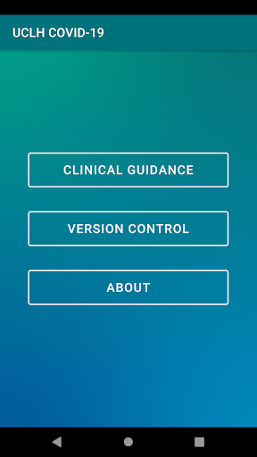
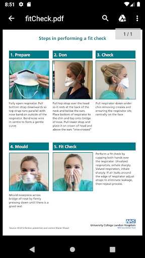
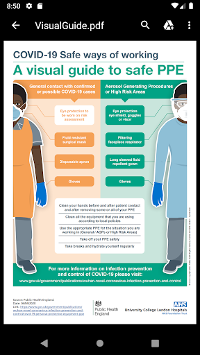

# UCLH COVID-19
App version ``0.0.6``

Analyzed with [covid-apps-observer](http://github.com/covid-apps-observer) project, version ``0.1``

## App overview
| | |
|-------------------------|-------------------------| 
| **Name**&nbsp;&nbsp;&nbsp;&nbsp;&nbsp;&nbsp;&nbsp;&nbsp;&nbsp;&nbsp;&nbsp;&nbsp;&nbsp;&nbsp;&nbsp;&nbsp;&nbsp;&nbsp;&nbsp;&nbsp;&nbsp;&nbsp;&nbsp;&nbsp;&nbsp;&nbsp;&nbsp;&nbsp;&nbsp;&nbsp;&nbsp;&nbsp;&nbsp;&nbsp;&nbsp;&nbsp;&nbsp;&nbsp;&nbsp;&nbsp;  | UCLH COVID-19 |
| **Unique identifier** | co.uk.healthcreatives.uclhcovid19 |
| **Link to Google Play** | [https://play.google.com/store/apps/details?id=co.uk.healthcreatives.uclhcovid19](https://play.google.com/store/apps/details?id=co.uk.healthcreatives.uclhcovid19) |
| **Summary**  | UCLH COVID-19 Clinical Guidance app |
| **Privacy policy** | [http://healthcreatives.co.uk/privacy/uclh-covid-19/index.html](http://healthcreatives.co.uk/privacy/uclh-covid-19/index.html) |
| **Latest version** | 0.0.6 |
| **Last update** | 2021-01-28 13:39:45 |
| **Recent changes** | Added: &quot;Quick guide to High Flow Nasal Oxygen Therapy in COVID-19 patients&quot;  |
| **Installs**  | 100+ |
| **Category** | Medical |
| **First release** | Apr 12, 2020 |
| **Size**  | 3.0M |
| **Supported Android version**  | - |

### Description
> This app has been developed for UCLH as part of their COVID-19 response. 
 The guidelines in this app have been authored by a wide range of clinical and staff, who have worked closely with our operational teams at UCLH and draws on all their invaluable expertise. It contains guidance on staff and patient protection, clinical care, clinician-facing standard operating procedures and educational materials.
  
 The guidelines are based on:
 • The expertise of our teams
 • Existing best practice
 • Experience from colleagues working in organisations, cities and countries dealing with the COIVD-19 epidemic
 • Published research
 • Content released from professional and speciality organisations and associations
  
 Content will expand rapidly over the coming days in response to clinical need for guidance, our evolving understanding of COVID-19 and as our approach adapts. The guidance will be made available through a release cycle. Each release will describe key changes since last time, this information can be found via the "version control" button.
  
 Content has been approved UCLH COVID-19 clinical guideline committee.
  
 Some of our guidance may be relevant to clinicians working in other organisations and we are keen to share approaches to clinical management and service design during this pandemic. Please refer to your local clinical and governance leads regarding adaption of any guidance locally and contact for any information about the guidance. We would also be keen to hear from non-UCLH clinicians regarding their learning, expertise and how we might improve our approach.

### User interface
The developers of the app provide the following screenshots in the Google play store.
| | | |
|:-------------------------:|:-------------------------:|:-------------------------:|
 |   |   |   | 
 |   |   |   | 

## Development team
In the following we report the main information provided by the development team in the Google play store.

| | |
|-------------------------|-------------------------|
| **Developer**  | Vincent Harding - UCL Health Creatives |
| **Website**  | - |
| **Email** | v.harding@ucl.ac.uk |
| **Physical address**  | - |
| **Other developed apps**  | [https://play.google.com/store/apps/developer?id=Vincent+Harding+-+UCL+Health+Creatives](https://play.google.com/store/apps/developer?id=Vincent+Harding+-+UCL+Health+Creatives) |

## Android support

| | |
|-------------------------|-------------------------|
| **Declared target Android version**  | Pie, version 9 (API level 28) |
| **Effective target Android version**  | Pie, version 9 (API level 28) |
| **Minimum supported Android version**  | Pie, version 9 (API level 28) |
| **Maximum target Android version**  | - |

The larger the difference between the minimum and maximum supported Android versions, the better. A larger difference means a wider audience. For example, old phones have a very low Android version, so a high minimum supported Android version means that the app cannot be used by users with old phones, thus leading to accessibility problems. 

## Requested permissions

In the following we report the complete list of the permissions requested by the app. 

| **Permission** | **Protection level** | **Description** | 
|-------------------------|-------------------------|-------------------------|
 **android.permission INTERNET** | Normal | Allows applications to open network sockets. 
 **android.permission READ_EXTERNAL_STORAGE** | :warning:**Dangerous** | Allows an application to read from external storage. 
 **android.permission WRITE_EXTERNAL_STORAGE** | :warning:**Dangerous** | Allows an application to write to external storage. 

## Mentioned servers

| **Server** | **Registrant** | **Registrant country** | **Creation date** | 
|-------------------------|-------------------------|-------------------------|-------------------------|
 | gstatic.com | Google LLC | :us: US | 2008-02-11 15:31:25 |
 | google.com | Google LLC | :us: US | 1997-09-15 04:00:00 |

## Security analysis 

Below we report the main security warnings raised by our execution of the [Androwarn](https://github.com/maaaaz/androwarn) security analysis tool.

**Connection interfaces exfiltration**
> - This application reads details about the currently active data network 
> - This application tries to find out if the currently active data network is metered 

## User ratings and reviews

Below we provide information about how end users are reacting to the app in terms of ratings and reviews in the Google Play store.

### Ratings

The UCLH COVID-19 app has been installed by more than **100** times. At this time, **-** rated the app and its average score is **0.0**. Below we show the distribution of the ratings across the usual star-based rating of Google Play

:star::star::star::star::star:: 0

:star::star::star::star:: 0

:star::star::star:: 0

:star::star:: 0

:star:: 0

### Reviews 

#### 5-star reviews

No recent reviews available with 5 stars.

#### 4-star reviews

No recent reviews available with 4 stars.

#### 3-star reviews

No recent reviews available with 3 stars.

#### 2-star reviews

No recent reviews available with 2 stars.

#### 1-star reviews

No recent reviews available with 1 stars.
