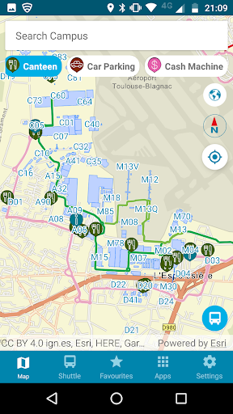
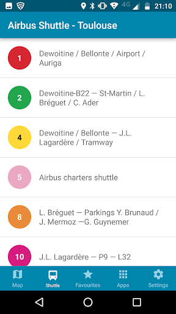
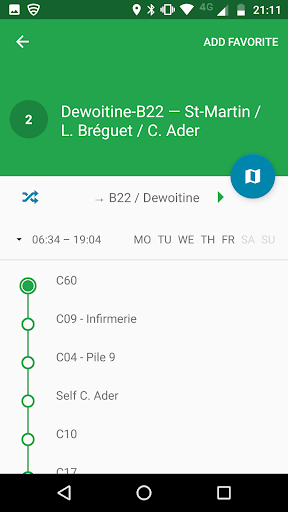
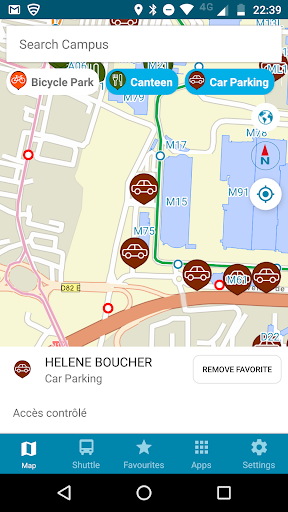
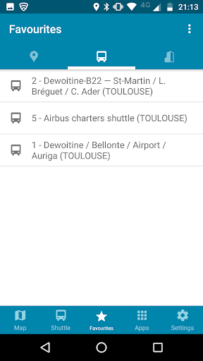
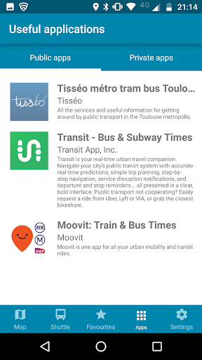
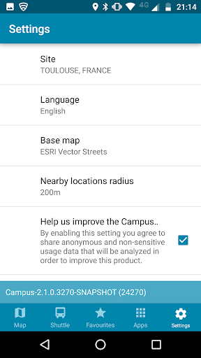
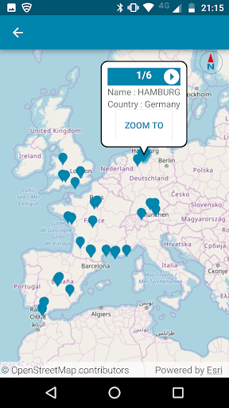

# Campus by Airbus
App version ``2.1.8.3316-SNAPSHOT``

Analyzed with [covid-apps-observer](http://github.com/covid-apps-observer) project, version ``0.1``

## App overview
| | |
|-------------------------|-------------------------| 
| **Name**&nbsp;&nbsp;&nbsp;&nbsp;&nbsp;&nbsp;&nbsp;&nbsp;&nbsp;&nbsp;&nbsp;&nbsp;&nbsp;&nbsp;&nbsp;&nbsp;&nbsp;&nbsp;&nbsp;&nbsp;&nbsp;&nbsp;&nbsp;&nbsp;&nbsp;&nbsp;&nbsp;&nbsp;&nbsp;&nbsp;&nbsp;&nbsp;&nbsp;&nbsp;&nbsp;&nbsp;&nbsp;&nbsp;&nbsp;&nbsp;  | Campus by Airbus |
| **Unique identifier** | com.airbus.campus |
| **Link to Google Play** | [https://play.google.com/store/apps/details?id=com.airbus.campus](https://play.google.com/store/apps/details?id=com.airbus.campus) |
| **Summary**  | An easy-to-use cartography app to navigate around Airbus sites and facilities. |
| **Privacy policy** | [-](-) |
| **Latest version** | 2.1.8.3316-SNAPSHOT |
| **Last update** | 2020-07-21 16:28:33 |
| **Recent changes** | - Main menu options located at bottom of app opening screen for easier access. - POIs changed to clickable icons for easy individual/multiple selection. - “World map” icon added for viewing Airbus European sites quickly. - New “Useful Apps” created for displaying Public/Private apps. - Hamburg Internal shuttle timetables in PDF format. - Orientation/directional improvements in relation to buildings/POIs around users.. - Bugs &amp; general performance improvements. |
| **Installs**  | 10,000+ |
| **Category** | Maps & Navigation |
| **First release** | Apr 23, 2018 |
| **Size**  | 56M |
| **Supported Android version**  | 5.0 and up |

### Description
> Campus is the Airbus app that helps you quickly locate where you are and what is around you whilst visiting an Airbus site. The app provides easy-to-use site search capabilities, which allows you to switch from one site to another quickly by either using the search bar menu, settings or by selecting the “world icon” to view all available sites. The app provides information on building locations, Airbus shuttle services, links to public shuttle services (currently only for Toulouse & Hamburg) and different points of interests like entrance points, car parks, defibrillators, restaurants, etc. The information is provided on a site basis and new supported site information (Buildings, POIs, etc) will appear over time.

### User interface
The developers of the app provide the following screenshots in the Google play store.
| | | |
|:-------------------------:|:-------------------------:|:-------------------------:|
 |   |   |   | 
 |   |   |   | 
 |   |  

## Development team
In the following we report the main information provided by the development team in the Google play store.

| | |
|-------------------------|-------------------------|
| **Developer**  | Airbus Group |
| **Website**  | [http://www.airbus.com](http://www.airbus.com) |
| **Email** | support.campus@airbus.com |
| **Physical address**  | [B02 Building 2, rond-point Dewoitine, BP 90112 31703 Blagnac Cedex - FRANCE](https://www.google.com/maps/search/B02%20Building%202,%20rond-point%20Dewoitine,%20BP%2090112%2031703%20Blagnac%20Cedex%20-%20FRANCE) (Google Maps) |
| **Other developed apps**  | [https://play.google.com/store/apps/developer?id=Airbus+Group](https://play.google.com/store/apps/developer?id=Airbus+Group) |

## Android support

| | |
|-------------------------|-------------------------|
| **Declared target Android version**  | Pie, version 9 (API level 28) |
| **Effective target Android version**  | Pie, version 9 (API level 28) |
| **Minimum supported Android version**  | Lollipop, version 5.0 (API level 21) |
| **Maximum target Android version**  | - |

The larger the difference between the minimum and maximum supported Android versions, the better. A larger difference means a wider audience. For example, old phones have a very low Android version, so a high minimum supported Android version means that the app cannot be used by users with old phones, thus leading to accessibility problems. 

## Requested permissions

In the following we report the complete list of the permissions requested by the app. 

| **Permission** | **Protection level** | **Description** | 
|-------------------------|-------------------------|-------------------------|
 **android.permission ACCESS_FINE_LOCATION** | :warning:**Dangerous** | Allows an app to access precise location. 
 **android.permission ACCESS_NETWORK_STATE** | Normal | Allows applications to access information about networks. 
 **android.permission FOREGROUND_SERVICE** | Normal | Allows a regular application to use Service.startForeground. 
 **android.permission INTERNET** | Normal | Allows applications to open network sockets. 
 **android.permission VIBRATE** | Normal | Allows access to the vibrator. 
 **android.permission WAKE_LOCK** | Normal | Allows using PowerManager WakeLocks to keep processor from sleeping or screen from dimming. 
 **com.google.android.c2dm.permission RECEIVE** | - | - 
 **com.google.android.finsky.permission BIND_GET_INSTALL_REFERRER_SERVICE** | - | - 

## Mentioned servers

| **Server** | **Registrant** | **Registrant country** | **Creation date** | 
|-------------------------|-------------------------|-------------------------|-------------------------|
 | amazonaws.com | Amazon.com, Inc. | :us: US | 2005-08-18 02:10:45 |
 | hvv.de | - | - | - |
 | tisseo.fr | TISSEO COLLECTIVITES | - | 2002-12-10 23:00:00 |
 | google.com | Google LLC | :us: US | 1997-09-15 04:00:00 |
 | geofox.de | - | - | - |
 | googlesyndication.com | Google LLC | :us: US | 2003-01-21 06:17:24 |
 | googleapis.com | Google LLC | :us: US | 2005-01-25 17:52:26 |
 | google-analytics.com | Google LLC | :us: US | 2005-07-18 19:24:32 |
 | app-measurement.com | Google LLC | :us: US | 2015-06-19 20:13:31 |
 | googletagmanager.com | Google LLC | :us: US | 2011-11-11 23:39:05 |
 | crashlytics.com | Google LLC | :us: US | 2011-01-21 15:30:40 |

## Security analysis 

Below we report the main security warnings raised by our execution of the [Androwarn](https://github.com/maaaaz/androwarn) security analysis tool.

**Location lookup**
> - This application reads location information from all available providers (WiFi, GPS etc.) 

**Connection interfaces exfiltration**
> - This application reads details about the currently active data network 
> - This application tries to find out if the currently active data network is metered 

**Suspicious connection establishment**
> - This application opens a Socket and connects it to the remote address '' on the 'N/A' port  
> - This application opens a Socket and connects it to the remote address 'Ljava/lang/StringBuilder;->toString()Ljava/lang/String;' on the 'N/A' port  
> - This application opens a Socket and connects it to the remote address 'Ljava/net/Proxy;->type()Ljava/net/Proxy$Type;' on the 'N/A' port  
> - This application opens a Socket and connects it to the remote address 'timeout' on the 'N/A' port  

**Code execution**
> - This application loads a native library 
> - This application loads a native library: '' 
> - This application loads a native library: 'c++_shared' 
> - This application loads a native library: 'runtimecore' 
> - This application loads a native library: 'runtimecore_java' 

## User ratings and reviews

Below we provide information about how end users are reacting to the app in terms of ratings and reviews in the Google Play store.

### Ratings

The Campus by Airbus app has been installed by more than **10000** times. At this time, **37** rated the app and its average score is **2.9729729**. Below we show the distribution of the ratings across the usual star-based rating of Google Play

:star::star::star::star::star:: 13

:star::star::star::star:: 4

:star::star::star:: 2

:star::star:: 5

:star:: 13

### Reviews 

#### 5-star reviews

No recent reviews available with 5 stars.

#### 4-star reviews

> Please update to the new bus schedule in Finkenwerde.  :date: __2019-12-16 07:10:00__

#### 3-star reviews

No recent reviews available with 3 stars.

#### 2-star reviews

> It seems to need some debugging... It crashes before even openig  :date: __2018-05-03 15:49:30__

#### 1-star reviews

> Used to work, now not even loading. Asks for network just after it downloaded the app... Why could there not be sitemap as backup  :date: __2020-01-17 07:37:45__

> Not working with Oppo phone  :date: __2020-01-05 17:21:40__

> No way to make it work, needs debugging...  :date: __2018-09-21 17:54:33__

