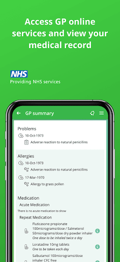
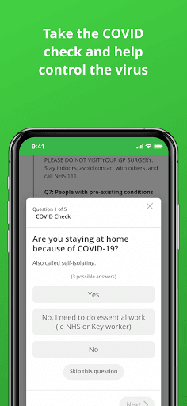
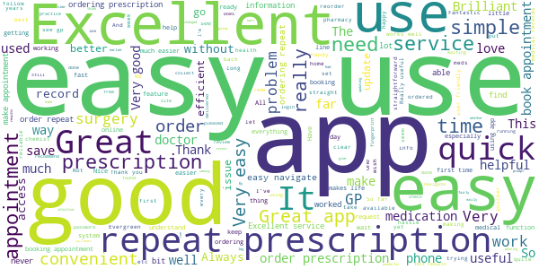
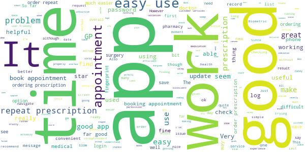
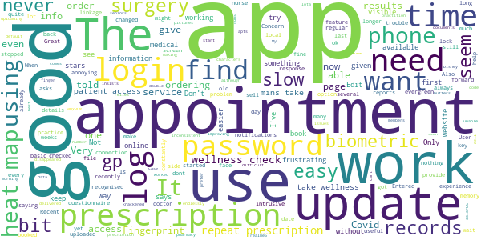

# Evergreen Life PHR
App version ``18.1.1``

Analyzed with [covid-apps-observer](http://github.com/covid-apps-observer) project, version ``0.1``

## App overview
| | |
|-------------------------|-------------------------| 
| **Name**&nbsp;&nbsp;&nbsp;&nbsp;&nbsp;&nbsp;&nbsp;&nbsp;&nbsp;&nbsp;&nbsp;&nbsp;&nbsp;&nbsp;&nbsp;&nbsp;&nbsp;&nbsp;&nbsp;&nbsp;&nbsp;&nbsp;&nbsp;&nbsp;&nbsp;&nbsp;&nbsp;&nbsp;&nbsp;&nbsp;&nbsp;&nbsp;&nbsp;&nbsp;&nbsp;&nbsp;&nbsp;&nbsp;&nbsp;&nbsp;  | Evergreen Life PHR |
| **Unique identifier** | com.ascent.phr |
| **Link to Google Play** | [https://play.google.com/store/apps/details?id=com.ascent.phr](https://play.google.com/store/apps/details?id=com.ascent.phr) |
| **Summary**  | Book appointments, order prescriptions and manage your health and wellbeing |
| **Privacy policy** | [https://www.evergreen-life.co.uk/terms/website-terms-of-use](https://www.evergreen-life.co.uk/terms/website-terms-of-use) |
| **Latest version** | 18.1.1 |
| **Last update** | 2020-11-18 11:27:44 |
| **Recent changes** | We’re constantly working to improve our service to you with regular updates. If you have any ideas for further improvements, ideas for features, or need help, contact us via our website evergreen-life.co.uk. We’re always happy to help. |
| **Installs**  | 100,000+ |
| **Category** | Health & Fitness |
| **First release** | Apr 4, 2016 |
| **Size**  | 9.8M |
| **Supported Android version**  | 5.1 and up |

### Description
> 💚 Order repeat prescriptions to your door
 💚 Book GP appointments
 💚 View your GP medical record and carry it in your pocket
 💚 Discover your Wellness Score and get practical insights into your wellbeing
 💚 Build your most accurate health record
 <b>NHS-ASSURED GP ONLINE SERVICES</b>
 Available at all GP practices in England:
 • Save yourself time by booking and cancelling GP appointments ⏰
 • Order your repeat prescriptions directly to your door, so you’re never without your medication 🚚 💊
 • Stay informed with 24/7 access to your GP medical record, including test results, immunisations, allergies and medications 📁
 <b>ONE HEALTH RECORD. WHEN YOU NEED IT</b> 
 It may come as a surprise but a central record of your health doesn’t exist - your GP, hospital and other healthcare records aren’t joined up and information is not necessarily shared between them. That can make things pretty tricky, having to remember important information from memory, and explain past treatments and conditions over and over. With Evergreen Life, you can be in control and keep all your health data, including all of your GP records, in the palm of your hand - building a fully accurate and up-to-date record that you can carry with you all the time.
 <b>WHAT’S YOUR WELLNESS SCORE?</b>
 Your Wellness Score can help you understand if you’re doing all you can to stay well. The score is based on your answers to the app’s clinically-researched Wellness Checks in areas such as fitness, happiness, sleep and diet. By discovering your Wellness Score, you’ll get personalised and practical insights into ways you can optimise your health and wellbeing.
 <b>MEDICATION REMINDERS</b>
 Give yourself one less thing to worry about. Never forget to take your medications again with the Evergreen Life medicine app, helping you safely manage your own or your family’s health 💊
 <b>HEALTH AND FITNESS TRACKER</b>
 Track your health and fitness measurements, including blood pressure, body fat percentage and blood sugar levels, so you can monitor your health goals 🏋️‍♂️🤸‍♂️
 <b>SECURELY STORE YOUR DOCUMENTS</b>
 If you struggle to find appointment letters or your health information is difficult to manage, storing all your documents in one app can make it much easier to organise your care 📩
 <b>SHARE WITH THOSE WHO MATTER MOST</b>
 Get the best care possible and give peace-of-mind to your family or health providers with secure access to your shared health information.
  
 <b>DNA TESTING: UNLOCK YOUR HEALTH SECRETS</b> 🤫
 With Evergreen Life DNA testing, you can find out how your genes influence your:
 • DIET - Fuel your body with the nutrition it needs
 • METABOLISM - Understand what foods will help you feel healthiest
 • FITNESS - Achieve better fitness results, faster
 • SKIN - Personalise your beauty routine by what your skin needs
 Need a helping hand? 🖐️ If you want any help and support with using the app or getting set up with GP online services, head to https://help.evergreen-life.co.uk or call our Support Team at 0161 768 6063
 <i>*Your local doctor’s surgery may not offer all GP online services. Ask your practice directly to find out which are available to you.</i>

### User interface
The developers of the app provide the following screenshots in the Google play store.
| | | |
|:-------------------------:|:-------------------------:|:-------------------------:|
 |   |   |   | 
 |   |   |   | 
 |   |  

## Development team
In the following we report the main information provided by the development team in the Google play store.

| | |
|-------------------------|-------------------------|
| **Developer**  | Evergreen Health Solutions Ltd |
| **Website**  | [http://www.evergreen-life.co.uk](http://www.evergreen-life.co.uk) |
| **Email** | hello@evergreen-life.co.uk |
| **Physical address**  | - |
| **Other developed apps**  | [https://play.google.com/store/apps/developer?id=Evergreen+Health+Solutions+Ltd](https://play.google.com/store/apps/developer?id=Evergreen+Health+Solutions+Ltd) |

## Android support

| | |
|-------------------------|-------------------------|
| **Declared target Android version**  | Android10, version 10 (API level 29) |
| **Effective target Android version**  | Android10, version 10 (API level 29) |
| **Minimum supported Android version**  | Lollipop, version 5.1 (API level 22) |
| **Maximum target Android version**  | - |

The larger the difference between the minimum and maximum supported Android versions, the better. A larger difference means a wider audience. For example, old phones have a very low Android version, so a high minimum supported Android version means that the app cannot be used by users with old phones, thus leading to accessibility problems. 

## Requested permissions

In the following we report the complete list of the permissions requested by the app. 

| **Permission** | **Protection level** | **Description** | 
|-------------------------|-------------------------|-------------------------|
 **android.permission ACCESS_COARSE_LOCATION** | :warning:**Dangerous** | Allows an app to access approximate location. 
 **android.permission ACCESS_FINE_LOCATION** | :warning:**Dangerous** | Allows an app to access precise location. 
 **android.permission ACCESS_NETWORK_STATE** | Normal | Allows applications to access information about networks. 
 **android.permission CAMERA** | :warning:**Dangerous** | Required to be able to access the camera device. 
 **android.permission FLASHLIGHT** | - | - 
 **android.permission FOREGROUND_SERVICE** | Normal | Allows a regular application to use Service.startForeground. 
 **android.permission INTERNET** | Normal | Allows applications to open network sockets. 
 **android.permission READ_APP_BADGE** | - | - 
 **android.permission READ_CALENDAR** | :warning:**Dangerous** | Allows an application to read the user's calendar data. 
 **android.permission READ_EXTERNAL_STORAGE** | :warning:**Dangerous** | Allows an application to read from external storage. 
 **android.permission USE_FINGERPRINT** | Normal | This constant was deprecated in API level 28. Applications should request USE_BIOMETRIC instead 
 **android.permission VIBRATE** | Normal | Allows access to the vibrator. 
 **android.permission WAKE_LOCK** | Normal | Allows using PowerManager WakeLocks to keep processor from sleeping or screen from dimming. 
 **android.permission WRITE_CALENDAR** | :warning:**Dangerous** | Allows an application to write the user's calendar data. 
 **android.permission WRITE_EXTERNAL_STORAGE** | :warning:**Dangerous** | Allows an application to write to external storage. 
 **com.anddoes.launcher.permission UPDATE_COUNT** | - | - 
 **com.ascent.phr.permission C2D_MESSAGE** | - | - 
 **com.google.android.c2dm.permission RECEIVE** | - | - 
 **com.google.android.finsky.permission BIND_GET_INSTALL_REFERRER_SERVICE** | - | - 
 **com.htc.launcher.permission READ_SETTINGS** | - | - 
 **com.htc.launcher.permission UPDATE_SHORTCUT** | - | - 
 **com.huawei.android.launcher.permission CHANGE_BADGE** | - | - 
 **com.huawei.android.launcher.permission READ_SETTINGS** | - | - 
 **com.huawei.android.launcher.permission WRITE_SETTINGS** | - | - 
 **com.majeur.launcher.permission UPDATE_BADGE** | - | - 
 **com.oppo.launcher.permission READ_SETTINGS** | - | - 
 **com.oppo.launcher.permission WRITE_SETTINGS** | - | - 
 **com.sec.android.provider.badge.permission READ** | - | - 
 **com.sec.android.provider.badge.permission WRITE** | - | - 
 **com.sonyericsson.home.permission BROADCAST_BADGE** | - | - 
 **com.sonymobile.home.permission PROVIDER_INSERT_BADGE** | - | - 
 **me.everything.badger.permission BADGE_COUNT_READ** | - | - 
 **me.everything.badger.permission BADGE_COUNT_WRITE** | - | - 

## Mentioned servers

| **Server** | **Registrant** | **Registrant country** | **Creation date** | 
|-------------------------|-------------------------|-------------------------|-------------------------|
 | google.com | Google LLC | :us: US | 1997-09-15 04:00:00 |
 | appspot.com | Google LLC | :us: US | 2005-03-10 02:27:55 |
 | branch.io | Branch | :us: US | 2011-11-10 13:52:13 |
 | gstatic.com | Google LLC | :us: US | 2008-02-11 15:31:25 |
 | googleapis.com | Google LLC | :us: US | 2005-01-25 17:52:26 |
 | bnc.lt | - | - | 2016-11-14 00:00:00 |
 | whatsapp.com | Whatsapp Inc. | :us: US | 2008-09-04 12:39:12 |

## Security analysis 

Below we report the main security warnings raised by our execution of the [Androwarn](https://github.com/maaaaz/androwarn) security analysis tool.

**Telephony identifiers leakage**
> - This application reads the numeric name (MCC+MNC) of current registered operator 
> - This application reads the operator name 

**Connection interfaces exfiltration**
> - This application reads details about the currently active data network 
> - This application tries to find out if the currently active data network is metered 

**Telephony services abuse**
> - This application makes phone calls 

**Pim data leakage**
> - This application accesses the calendar 
> - This application accesses the downloads folder 
> - This application accesses data stored in the clipboard 

**Code execution**
> - This application loads a native library 
> - This application executes a UNIX command containing this argument: 'Ljava/lang/StringBuilder;->toString()Ljava/lang/String;' 

## User ratings and reviews

Below we provide information about how end users are reacting to the app in terms of ratings and reviews in the Google Play store.

### Ratings

The Evergreen Life PHR app has been installed by more than **100000** times. At this time, **2951** rated the app and its average score is **3.9661016**. Below we show the distribution of the ratings across the usual star-based rating of Google Play

:star::star::star::star::star:: 1741

:star::star::star::star:: 390

:star::star::star:: 220

:star::star:: 180

:star:: 420

### Reviews 

#### 5-star reviews

> Thanks for this lovely App  :date: __2020-11-23 09:09:36__

> Good app, fairly intuitive & simple to use.  :date: __2020-11-22 19:02:14__

> easy to use, very convenient  :date: __2020-11-22 08:31:51__

> very good app, loads of info  :date: __2020-11-20 00:55:36__

> You are wonderful no worrying about things with you here  :date: __2020-11-19 17:51:20__

> Really good app  :date: __2020-11-19 09:09:09__

> Excellent no hassle  :date: __2020-11-18 10:31:52__

> The best app.  :date: __2020-11-02 23:37:48__

> Cool  :date: __2020-10-30 23:09:41__

> Nice  :date: __2020-10-29 12:50:45__

#### 4-star reviews

> Quite a good app. All your medical info in one place. Only problem is when I send a message, no matter what it's about, I only get 'null' as a reply which isn't very helpful.  :date: __2020-11-19 12:17:35__

> Useful!  :date: __2020-11-06 23:06:27__

> Update 07-04: Originally gave this app 5 stars then after an update, it didn't work, so reduced the rating. Since 7th April I have had no issues and it seems to be working fine. Just hope this continues. UPDATE 15 Oct: Have decided to use another app, although I have to say there were only a few problems. Trouble is I don't need problems. When you're ordering meds, you want it to be plain sailing and simple. I would tentatively recommend this app but it has to work without hiccups. Thanks  :date: __2020-10-15 11:01:41__

> I have been using same from almost the first week.off course when you first released the app it had one or two problems, then again which new release does not have problems. Seen a couple of comments saying difficult to understand.all I can say is that they must have a different program open to me.  :date: __2020-10-13 22:29:16__

> Could you let me lnow how yo record fitness results  :date: __2020-09-29 11:05:21__

> So much easier than waiting on hold to book an appointment :). However, parts of the interface can be confusing at times and hard to navigate. I can imagine it being difficult if you aren't tech savvy.  :date: __2020-09-10 12:03:38__

> Have used for a while now and found it very useful, however, recently it has stopped connecting to the server. Does anyone know the cause or have a fix?  :date: __2020-08-20 21:30:04__

> I can use this on my phone and laptop. This is useful.  :date: __2020-08-02 08:27:46__

> Edit: Although I still have no idea why I couldn't log in last time, the app is now working perfectly. It is very useful to be able to order a repeat prescription and to see medical records. Much easier than trying to get through to the surgery by phone. Evergreen Customer Services were very helpful! I installed the app on my phone but it just keeps scrolling through the 5 introductory screens and won't let me log in. It's a really good idea but no use if it's not reliable.  :date: __2020-08-01 14:05:06__

> Getting to know the app... How do I view photos of appointment letters I have taken? I can see the thumbnails, but can't open them?  :date: __2020-07-15 08:49:26__

#### 3-star reviews

> Edit: this is working again now - but only on my old phone (which is too knackered to sell so ok). My new phone runs colorOS, (realme6), which might have something to do with it. Disney+ doesn't work on it because of this... Edit: I can't get to the bit where you order a precriotion. It just buffers endlessly. 4/5/2020 Works well for me.  :date: __2020-11-23 08:25:52__

> good but needs improving  :date: __2020-11-22 13:36:15__

> I would like to see my records but they don't seem to be available  :date: __2020-11-20 14:19:30__

> Frustrating after the last update it constantly asks for the screen lock code making it very difficult to get access to the app. Is anyone else having trouble  :date: __2020-11-13 10:04:33__

> User experience inconsistent, lota if data not available from practition  :date: __2020-10-14 14:23:14__

> App is fine but biometric finger scan never worked.  :date: __2020-10-13 20:52:10__

> Not the best to get the information I need  :date: __2020-10-13 20:08:20__

> Works in a basic way but it relies on your GP practice to provide a lot of the connections to other info, which in my case they don't. Also the biometric log in does not work now. It did work to start with, but although it says Fingerprint recognised it cannot log me in?  :date: __2020-09-23 19:54:52__

> Can't even login. The linkage number given by my practice is 13 characters (double checked many times) but the app it insists it should be 15!  :date: __2020-09-04 13:52:41__

> I've been using this app for quite a while now & l haven't had any issues until this morning & now it's saying its unable to log me in. None of my details have changed its seem since there was an update that its happened. Any chance someone can reply to this to help me out.  :date: __2020-08-25 12:52:35__

#### 2-star reviews

> biometric logon does not work, and last whole would not order my prescription  :date: __2020-11-22 12:22:00__

> Prescription function issues when trying to order. Galaxy S10. Used to work fine, now all but useless to me.  :date: __2020-11-08 15:03:43__

> I will leave this rating as '2' as a warning to other potential users that there is an issue. ie that sometimes the App stops recognising your password and that, despite their best endeavours and lots of communications between us, Evergreen Life have not been able to resolve this issue. Hopefully one day they will get to the bottom of it as it is otherwise a pretty good App (and the Web access is good) but there are I know other similar Apps available that are probably worth looking at first.  :date: __2020-10-24 11:10:45__

> Having major problems with your app it keeps logging me out I then have to reset my password this has happened twice in a week it's completely unusable now and I can't order my meds really really bad...  :date: __2020-10-17 08:38:12__

> This was a good App till it started promoting Pharmacy2u right in the App when we were going through the first Covid peak. Unfortunately I opted for that which never worked out and I had to switch back to my old pharmacy. Since then this App continues to update repeats in a haphazard manner repeatedly bringing up the same data when I request repeats. It is sad that after a long time I am uninstalling it. Business should never be given precedence to the core functions of people using this App.  :date: __2020-10-15 11:09:34__

> The app worked fine up until very recently where now I can't do anything in it and the buttons are unresponsive. The Customer Service team recommended reinstalling the app but this did nothing.  :date: __2020-10-15 09:19:19__

> Extraordinary initial interface, more like a game for the sharp eyed than a practical aid for those in pain or in a hurry. 'Playful" with tiny print. I suppose you'd get used to it.  :date: __2020-10-06 01:08:43__

> Okay when it works, which is not very often.  :date: __2020-09-28 09:38:54__

> This app was good, but now can't log on it just goes through the introduction screen its annoying as its the easiest way I order my prescriptions. Can you please fix...  :date: __2020-07-31 10:53:50__

> Unable to add more than one medication, and when doing the well being test despite selecting the never smoked option, it the asked questions about how many cigarettes I smoked a day. So not intuitive software. I ended up deleting  :date: __2020-06-26 17:47:02__

#### 1-star reviews

> don't look at the comments part. sends permissions to wrong place.  :date: __2020-11-22 10:43:26__

> AVOID THIS USELESS APP This app is nothing but logging users out, doesn't accept complex passwords, unlinks your GP account and then loads up half the time without any styling. Update 2020 Just just as useless in 2019 but now with 100% more notifications to drive you up the wall. Anything I try to do on this non-functioning app it just crashes. The NHS services are also tucked away making GP services harder to find and use.  :date: __2020-11-21 13:03:16__

> Unable to use finger print to log in. Have reset print numerous times and accepted by app - then won't allow print to be used for log on . Amateur Time  :date: __2020-11-20 19:51:20__

> Absolutely pants. It was fine originally but for the last year or so it freezes making it useless to me. Reloaded many times to no avail - time for me to move on.... No - I can't be bothered to ring customer services - it's an app - it doesn't work on my old phone or my new phone - plenty of alternatives out there.... Avoid.  :date: __2020-11-04 20:26:56__

> Absolute rubbish.I cant even opt out of automatic updates.When I try and update the app, it just says "waiting on download." It won't let me use the app unless I complete the update so now I am stuck.Absolutely stupid way to design an app.Useless!!!!!  :date: __2020-10-31 18:14:42__

> Atrocious app. Won't let me log in when I know 100% that my credentials are correct. When I click to reset the password, it does nothing. How can we ever log in then?!? Awful.  :date: __2020-10-15 15:30:51__

> Only wanted to make doctor's appointment. Too many extras. Are they mining data?  :date: __2020-10-13 21:02:41__

> My phone has facial recognition: does this app? No, don't be silly. It's all in a Google Security API that no 'developer' is able to understand yet. Agree about the interface; it is very poorly thought out. And it's not about me, is it? It's about selling services. Don't you just hate what's happening with our NHS?  :date: __2020-10-13 19:25:24__

> Finger print password does not work and it's the default setting  :date: __2020-10-08 10:11:52__

> This app is truly awful. Half the buttons don't even work, constantly logs you out and won't allow you to log in again. I've ended up having to use their website instead, which is also awful. If you're looking for an app to connect to your practice, for the love of God don't use this one. 1 star because I can't give it negative stars  :date: __2020-10-08 09:50:31__

