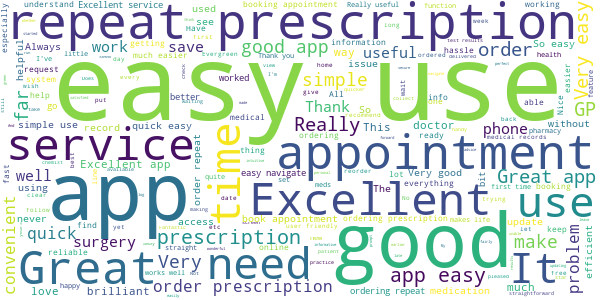
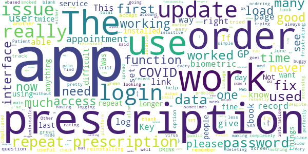

# Evergreen Life PHR
App version ``19.0.0``

Analyzed with [covid-apps-observer](http://github.com/covid-apps-observer) project, version ``0.1``

## App overview
| | |
|-------------------------|-------------------------| 
| **Name**&nbsp;&nbsp;&nbsp;&nbsp;&nbsp;&nbsp;&nbsp;&nbsp;&nbsp;&nbsp;&nbsp;&nbsp;&nbsp;&nbsp;&nbsp;&nbsp;&nbsp;&nbsp;&nbsp;&nbsp;&nbsp;&nbsp;&nbsp;&nbsp;&nbsp;&nbsp;&nbsp;&nbsp;&nbsp;&nbsp;&nbsp;&nbsp;&nbsp;&nbsp;&nbsp;&nbsp;&nbsp;&nbsp;&nbsp;&nbsp;  | Evergreen Life PHR |
| **Unique identifier** | com.ascent.phr |
| **Link to Google Play** | [https://play.google.com/store/apps/details?id=com.ascent.phr](https://play.google.com/store/apps/details?id=com.ascent.phr) |
| **Summary**  | Book appointments, order prescriptions and manage your health and wellbeing |
| **Privacy policy** | [https://www.evergreen-life.co.uk/terms/website-terms-of-use](https://www.evergreen-life.co.uk/terms/website-terms-of-use) |
| **Latest version** | 19.0.0 |
| **Last update** | 2020-12-19 22:19:53 |
| **Recent changes** | Our simplified registration process means it has never been easier to start your wellbeing journey with Evergreen Life to take control of your health.  We have also added stability improvements and bug fixes to improve your app experience. |
| **Installs**  | 100,000+ |
| **Category** | Health & Fitness |
| **First release** | Apr 4, 2016 |
| **Size**  | 9.9M |
| **Supported Android version**  | 5.1 and up |

### Description
> 💚 Order repeat prescriptions to your door
 💚 Book GP appointments
 💚 View your GP medical record and carry it in your pocket
 💚 Discover your Wellness Score and get practical insights into your wellbeing
 💚 Build your most accurate health record
 <b>NHS-ASSURED GP ONLINE SERVICES</b>
 Available at all GP practices in England:
 • Save yourself time by booking and cancelling GP appointments ⏰
 • Order your repeat prescriptions directly to your door, so you’re never without your medication 🚚 💊
 • Stay informed with 24/7 access to your GP medical record, including test results, immunisations, allergies and medications 📁
 <b>ONE HEALTH RECORD. WHEN YOU NEED IT</b> 
 It may come as a surprise but a central record of your health doesn’t exist - your GP, hospital and other healthcare records aren’t joined up and information is not necessarily shared between them. That can make things pretty tricky, having to remember important information from memory, and explain past treatments and conditions over and over. With Evergreen Life, you can be in control and keep all your health data, including all of your GP records, in the palm of your hand - building a fully accurate and up-to-date record that you can carry with you all the time.
 <b>WHAT’S YOUR WELLNESS SCORE?</b>
 Your Wellness Score can help you understand if you’re doing all you can to stay well. The score is based on your answers to the app’s clinically-researched Wellness Checks in areas such as fitness, happiness, sleep and diet. By discovering your Wellness Score, you’ll get personalised and practical insights into ways you can optimise your health and wellbeing.
 <b>MEDICATION REMINDERS</b>
 Give yourself one less thing to worry about. Never forget to take your medications again with the Evergreen Life medicine app, helping you safely manage your own or your family’s health 💊
 <b>HEALTH AND FITNESS TRACKER</b>
 Track your health and fitness measurements, including blood pressure, body fat percentage and blood sugar levels, so you can monitor your health goals 🏋️‍♂️🤸‍♂️
 <b>SECURELY STORE YOUR DOCUMENTS</b>
 If you struggle to find appointment letters or your health information is difficult to manage, storing all your documents in one app can make it much easier to organise your care 📩
 <b>SHARE WITH THOSE WHO MATTER MOST</b>
 Get the best care possible and give peace-of-mind to your family or health providers with secure access to your shared health information.
  
 <b>DNA TESTING: UNLOCK YOUR HEALTH SECRETS</b> 🤫
 With Evergreen Life DNA testing, you can find out how your genes influence your:
 • DIET - Fuel your body with the nutrition it needs
 • METABOLISM - Understand what foods will help you feel healthiest
 • FITNESS - Achieve better fitness results, faster
 • SKIN - Personalise your beauty routine by what your skin needs
 Need a helping hand? 🖐️ If you want any help and support with using the app or getting set up with GP online services, head to https://help.evergreen-life.co.uk or call our Support Team at 0161 768 6063
 <i>*Your local doctor’s surgery may not offer all GP online services. Ask your practice directly to find out which are available to you.</i>

### User interface
The developers of the app provide the following screenshots in the Google play store.
| | | |
|:-------------------------:|:-------------------------:|:-------------------------:|
 |   |   |   | 
 |   |   |   | 
 |   |  

## Development team
In the following we report the main information provided by the development team in the Google play store.

| | |
|-------------------------|-------------------------|
| **Developer**  | Evergreen Health Solutions Ltd |
| **Website**  | [http://www.evergreen-life.co.uk](http://www.evergreen-life.co.uk) |
| **Email** | hello@evergreen-life.co.uk |
| **Physical address**  | - |
| **Other developed apps**  | [https://play.google.com/store/apps/developer?id=Evergreen+Health+Solutions+Ltd](https://play.google.com/store/apps/developer?id=Evergreen+Health+Solutions+Ltd) |

## Android support

| | |
|-------------------------|-------------------------|
| **Declared target Android version**  | Android10, version 10 (API level 29) |
| **Effective target Android version**  | Android10, version 10 (API level 29) |
| **Minimum supported Android version**  | Lollipop, version 5.1 (API level 22) |
| **Maximum target Android version**  | - |

The larger the difference between the minimum and maximum supported Android versions, the better. A larger difference means a wider audience. For example, old phones have a very low Android version, so a high minimum supported Android version means that the app cannot be used by users with old phones, thus leading to accessibility problems. 

## Requested permissions

In the following we report the complete list of the permissions requested by the app. 

| **Permission** | **Protection level** | **Description** | 
|-------------------------|-------------------------|-------------------------|
 **android.permission ACCESS_COARSE_LOCATION** | :warning:**Dangerous** | Allows an app to access approximate location. 
 **android.permission ACCESS_FINE_LOCATION** | :warning:**Dangerous** | Allows an app to access precise location. 
 **android.permission ACCESS_NETWORK_STATE** | Normal | Allows applications to access information about networks. 
 **android.permission CAMERA** | :warning:**Dangerous** | Required to be able to access the camera device. 
 **android.permission FLASHLIGHT** | - | - 
 **android.permission FOREGROUND_SERVICE** | Normal | Allows a regular application to use Service.startForeground. 
 **android.permission INTERNET** | Normal | Allows applications to open network sockets. 
 **android.permission READ_APP_BADGE** | - | - 
 **android.permission READ_CALENDAR** | :warning:**Dangerous** | Allows an application to read the user's calendar data. 
 **android.permission READ_EXTERNAL_STORAGE** | :warning:**Dangerous** | Allows an application to read from external storage. 
 **android.permission USE_FINGERPRINT** | Normal | This constant was deprecated in API level 28. Applications should request USE_BIOMETRIC instead 
 **android.permission VIBRATE** | Normal | Allows access to the vibrator. 
 **android.permission WAKE_LOCK** | Normal | Allows using PowerManager WakeLocks to keep processor from sleeping or screen from dimming. 
 **android.permission WRITE_CALENDAR** | :warning:**Dangerous** | Allows an application to write the user's calendar data. 
 **android.permission WRITE_EXTERNAL_STORAGE** | :warning:**Dangerous** | Allows an application to write to external storage. 
 **com.anddoes.launcher.permission UPDATE_COUNT** | - | - 
 **com.ascent.phr.permission C2D_MESSAGE** | - | - 
 **com.google.android.c2dm.permission RECEIVE** | - | - 
 **com.google.android.finsky.permission BIND_GET_INSTALL_REFERRER_SERVICE** | - | - 
 **com.htc.launcher.permission READ_SETTINGS** | - | - 
 **com.htc.launcher.permission UPDATE_SHORTCUT** | - | - 
 **com.huawei.android.launcher.permission CHANGE_BADGE** | - | - 
 **com.huawei.android.launcher.permission READ_SETTINGS** | - | - 
 **com.huawei.android.launcher.permission WRITE_SETTINGS** | - | - 
 **com.majeur.launcher.permission UPDATE_BADGE** | - | - 
 **com.oppo.launcher.permission READ_SETTINGS** | - | - 
 **com.oppo.launcher.permission WRITE_SETTINGS** | - | - 
 **com.sec.android.provider.badge.permission READ** | - | - 
 **com.sec.android.provider.badge.permission WRITE** | - | - 
 **com.sonyericsson.home.permission BROADCAST_BADGE** | - | - 
 **com.sonymobile.home.permission PROVIDER_INSERT_BADGE** | - | - 
 **me.everything.badger.permission BADGE_COUNT_READ** | - | - 
 **me.everything.badger.permission BADGE_COUNT_WRITE** | - | - 

## Mentioned servers

| **Server** | **Registrant** | **Registrant country** | **Creation date** | 
|-------------------------|-------------------------|-------------------------|-------------------------|
 | google.com | Google LLC | :us: US | 1997-09-15 04:00:00 |
 | appspot.com | Google LLC | :us: US | 2005-03-10 02:27:55 |
 | branch.io | Branch | :us: US | 2011-11-10 13:52:13 |
 | gstatic.com | Google LLC | :us: US | 2008-02-11 15:31:25 |
 | googleapis.com | Google LLC | :us: US | 2005-01-25 17:52:26 |
 | bnc.lt | - | - | 2016-11-14 00:00:00 |
 | whatsapp.com | Whatsapp Inc. | :us: US | 2008-09-04 12:39:12 |

## Security analysis 

Below we report the main security warnings raised by our execution of the [Androwarn](https://github.com/maaaaz/androwarn) security analysis tool.

**Telephony identifiers leakage**
> - This application reads the numeric name (MCC+MNC) of current registered operator 
> - This application reads the operator name 

**Connection interfaces exfiltration**
> - This application reads details about the currently active data network 
> - This application tries to find out if the currently active data network is metered 

**Telephony services abuse**
> - This application makes phone calls 

**Pim data leakage**
> - This application accesses the calendar 
> - This application accesses the downloads folder 
> - This application accesses data stored in the clipboard 

**Code execution**
> - This application loads a native library 
> - This application executes a UNIX command containing this argument: 'Ljava/lang/StringBuilder;->toString()Ljava/lang/String;' 

## User ratings and reviews

Below we provide information about how end users are reacting to the app in terms of ratings and reviews in the Google Play store.

### Ratings

The Evergreen Life PHR app has been installed by more than **100000** times. At this time, **3895** rated the app and its average score is **4.5658536**. Below we show the distribution of the ratings across the usual star-based rating of Google Play

:star::star::star::star::star:: 2813

:star::star::star::star:: 712

:star::star::star:: 228

:star::star:: 47

:star:: 95

### Reviews 

#### 5-star reviews

> Easy to use  :date: __2021-01-03 07:58:48__

> Excellent, no hassle with telephone calls.  :date: __2021-01-02 08:35:04__

> Easy to use and order repeat prescriptions.  :date: __2020-12-31 18:06:11__

> excellent App .  :date: __2020-12-29 20:38:14__

> Good app to order your prescriptions.  :date: __2020-12-29 15:00:26__

> very easy use and convenient  :date: __2020-12-24 10:34:51__

> Works as should no problems  :date: __2020-12-23 15:20:17__

> good  :date: __2020-12-22 18:48:11__

> Simple to use love it  :date: __2020-12-22 16:19:52__

> Great app linked to my gp. so much info and hassle.free ordering a repeat prescription  :date: __2020-12-19 14:28:57__

#### 4-star reviews

> works alright most of the time  :date: __2021-01-02 23:03:58__

> Lots of functionality doesnt work because GP hasn't signed up to provide it but was does work is quite good. Most annoying aspect is when there is an upgrade due and you cannot log in and use it until you upgrade...but it doesnt tell you that it just makes out you got you credentials wrong.  :date: __2021-01-02 10:15:46__

> All good  :date: __2020-12-30 21:24:23__

> Easy to use.  :date: __2020-12-19 08:02:02__

> Easy to use.  :date: __2020-12-16 10:54:37__

> The app is very good, but my surgery currently uses very little of the functionality. So it's a lot of screens for just prescriptions.  :date: __2020-12-15 11:44:05__

> still slow, and not user friendly  :date: __2020-12-14 10:21:55__

> straightforward and useful app  :date: __2020-11-30 22:57:14__

> Quite a good app. All your medical info in one place. Only problem is when I send a message, no matter what it's about, I only get 'null' as a reply which isn't very helpful.  :date: __2020-11-19 12:17:35__

> Useful!  :date: __2020-11-06 23:06:27__

#### 3-star reviews

> It should be more simple than it is. Asking many confidential questions and information.???  :date: __2021-01-02 22:45:40__

> Works but confusing and sprawling  :date: __2020-12-28 10:56:23__

> bio security does not work fingerprint works on all apart from this the most important one  :date: __2020-12-20 11:56:14__

> Was a good app to check, history, make appointments and order repeat prescription. But lately I can't log on keep saying password or login is incorrect. When I reset password it works from the email link. Also would be good if e-prescription pharmacy could be set when requesting prescription so you don't have to leave a message. If log in and prescription issue fixed would be happy to rate 5 star 😪  :date: __2020-12-18 01:11:37__

> sometimes when they make changes, you have to spend time searching for the prescription ordering tab,which should be the most prominent thing on the site, not on a sub page  :date: __2020-12-17 17:41:11__

> not as good as it could be ,why no way of uploading documents other than pictures and why not visible to members of the surgery by default?  :date: __2020-12-02 13:30:55__

> when I try to make an appointment it just says no appointments available — always. Prescription ordering works fine.  :date: __2020-11-29 18:28:27__

> not easy for seniors to use.  :date: __2020-11-29 17:46:23__

> when I want my prescription delivered,only comes up with only one pharmacy which I dont want to use,l prefer to use my local one  :date: __2020-11-26 09:31:51__

> takes too long to find page to order repeats.  :date: __2020-11-23 18:00:18__

#### 2-star reviews

> takes ages to load  :date: __2021-01-01 17:03:50__

> too many options. too complicated to do simple things like repeat prescription.  :date: __2020-12-11 16:13:10__

> Was working but isn't now. Can't get prescriptions . Says not allowed even though I've used the service many times before.  :date: __2020-12-08 01:33:14__

> The app is not accepting either my PIN nor my password. I can only assume the app has crashed  :date: __2020-12-07 20:47:38__

> over complicated if all you want to do is order a repeat prescription.  :date: __2020-11-28 18:06:24__

> doesn't allow to log in  :date: __2020-11-27 23:48:59__

> Too many irrelevant pop up links when logging in making it difficult to get to the bit I need (repeat prescription). I can get through them but others may struggle  :date: __2020-11-27 13:54:02__

> difficult to use  :date: __2020-11-27 10:15:40__

> biometric logon does not work, and last whole would not order my prescription  :date: __2020-11-22 12:22:00__

> Prescription function issues when trying to order. Galaxy S10. Used to work fine, now all but useless to me.  :date: __2020-11-08 15:03:43__

#### 1-star reviews

> Sends too many notifications about irrelevant subjects  :date: __2020-12-17 12:11:27__

> one of the worst apps ever.  :date: __2020-12-12 11:00:02__

> now cannot put note onto repeat prescription  :date: __2020-12-10 17:01:41__

> app works intermittently  :date: __2020-12-08 15:10:27__

> keeps stopping mid prescription order  :date: __2020-12-08 11:16:05__

> Currently not recognising the biometric login. I change login via password which worked, but now I can't use GP services to order my repeat prescription, just see a continuous evergreen logo which I presume means it's trying to connect.  :date: __2020-12-08 10:12:22__

> Unstable keeps telling me to log on when I already am keeps crashing  :date: __2020-12-07 21:24:34__

> the worst app I have on my phone. I only have it to enable me to order repeat prescriptions and this is 10times more effort than another app our gp previously supported. in short its rubbish.  :date: __2020-12-05 09:59:45__

> Not the best  :date: __2020-11-26 19:48:37__

> don't look at the comments part. sends permissions to wrong place.  :date: __2020-11-22 10:43:26__

