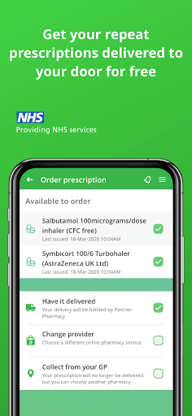
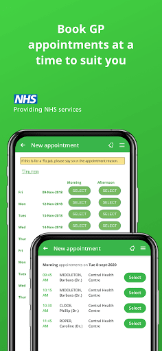
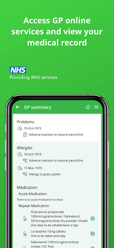
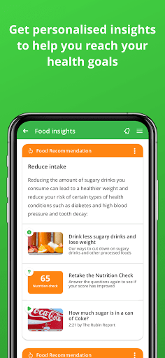
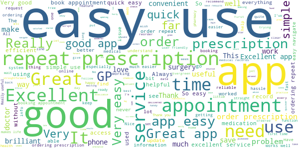
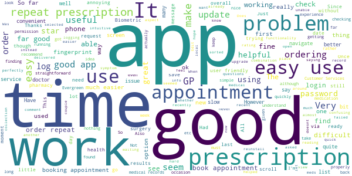
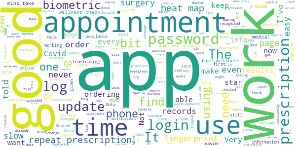
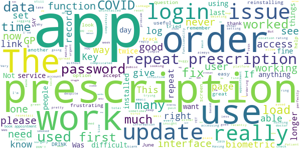
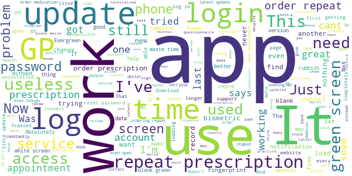

# Evergreen Life PHR
App version ``19.1.1``

Analyzed with [covid-apps-observer](http://github.com/covid-apps-observer) project, version ``0.1``

## App overview
| | |
|-------------------------|-------------------------| 
| **Name**&nbsp;&nbsp;&nbsp;&nbsp;&nbsp;&nbsp;&nbsp;&nbsp;&nbsp;&nbsp;&nbsp;&nbsp;&nbsp;&nbsp;&nbsp;&nbsp;&nbsp;&nbsp;&nbsp;&nbsp;&nbsp;&nbsp;&nbsp;&nbsp;&nbsp;&nbsp;&nbsp;&nbsp;&nbsp;&nbsp;&nbsp;&nbsp;&nbsp;&nbsp;&nbsp;&nbsp;&nbsp;&nbsp;&nbsp;&nbsp;  | Evergreen Life PHR |
| **Unique identifier** | com.ascent.phr |
| **Link to Google Play** | [https://play.google.com/store/apps/details?id=com.ascent.phr](https://play.google.com/store/apps/details?id=com.ascent.phr) |
| **Summary**  | Book appointments, order prescriptions and manage your health and wellbeing |
| **Privacy policy** | [https://www.evergreen-life.co.uk/terms/website-terms-of-use](https://www.evergreen-life.co.uk/terms/website-terms-of-use) |
| **Latest version** | 19.1.1 |
| **Last update** | 2021-02-22 10:19:45 |
| **Recent changes** | We’re constantly working to improve our service to you with regular updates. If you have any ideas for further improvements, ideas for features, or need help, contact us via our website evergreen-life.co.uk. We’re always happy to help. |
| **Installs**  | 100,000+ |
| **Category** | Health & Fitness |
| **First release** | Apr 4, 2016 |
| **Size**  | 9.9M |
| **Supported Android version**  | 5.1 and up |

### Description
> <b>In control. Healthier. Happier.</b>
 💚 Order repeat prescriptions to your door
 💚 Book GP appointments
 💚 Bring all your health information and GP records together
 💚 Discover your Wellness Score
 💚 Get practical insights on how to be as happy and healthy as possible
 <b><i>Welcome to Happychondria.
 Welcome to Evergreen Life.</i></b>
 Happychondria is the word we use to describe <b>the blissful state of being in complete control of one's health and wellbeing</b>. By using the Evergreen Life app to interact with GP services like booking appointments and ordering prescriptions, as well as managing your wellbeing through our Wellness Score, you can take control of your health and wellbeing and experience Happychondria for yourself.
 <b>NHS-ASSURED GP ONLINE SERVICES</b>
 Available at GP practices in England:
 • Save yourself time by booking and cancelling GP appointments ⏰
 • Order your repeat prescriptions directly to your door 🚚 💊
 • Stay informed with 24/7 access to your GP medical record, including test results, immunisations, allergies and medications 📁
 <b>WHAT’S YOUR WELLNESS SCORE?</b>
 Taking control of your health starts with understanding it. Based on your answers to clinically-reviewed questions, your <b>Wellness Score</b> out of 100 helps you see if you’re doing all you can to be healthy and provides insights on how to optimise your wellbeing. 
 <b>ONE HEALTH RECORD. WHEN YOU NEED IT</b>
 Your GP, hospital and other records aren’t joined up, so it can get pretty tricky having to repeat the same information over and over. With Evergreen Life, you can <b>build an accurate, up-to-date health record in the palm of your hand</b>.
 <b>MEDICATION REMINDERS</b>
 Give yourself one less thing to worry about. Never forget to take your medications again with the Evergreen Life medicine app, helping you safely manage your own or your family’s health 💊
 <b>HEALTH AND FITNESS TRACKER</b>
 Track your health and fitness measurements, including blood pressure, body fat percentage and blood sugar levels, so you can monitor your health goals 💪🏻
 <b>SECURELY STORE YOUR DOCUMENTS</b>
 If you struggle to find appointment letters or your health information is difficult to manage, storing all your documents in one app can make it much easier to organise your care 📩
 <b>SHARE WITH THOSE WHO MATTER MOST</b>
 Get the best care possible and give peace-of-mind to your family or health providers with secure access to your shared health information.
 Need a helping hand? 🖐️ If you want any help and support with using the app or getting set up with GP online services, head to https://help.evergreen-life.co.uk or call our Support Team at 0161 768 6063
 <i>*Your local doctor’s surgery may not offer all GP online services. Ask your practice directly to find out which are available to you.</i>

### User interface
The developers of the app provide the following screenshots in the Google play store.
| | | |
|:-------------------------:|:-------------------------:|:-------------------------:|
 |   |   |   | 
 |   |   |   | 
 |   |  

## Development team
In the following we report the main information provided by the development team in the Google play store.

| | |
|-------------------------|-------------------------|
| **Developer**  | Evergreen Health Solutions Ltd |
| **Website**  | [http://www.evergreen-life.co.uk](http://www.evergreen-life.co.uk) |
| **Email** | hello@evergreen-life.co.uk |
| **Physical address**  | - |
| **Other developed apps**  | [https://play.google.com/store/apps/developer?id=Evergreen+Health+Solutions+Ltd](https://play.google.com/store/apps/developer?id=Evergreen+Health+Solutions+Ltd) |

## Android support

| | |
|-------------------------|-------------------------|
| **Declared target Android version**  | Android10, version 10 (API level 29) |
| **Effective target Android version**  | Android10, version 10 (API level 29) |
| **Minimum supported Android version**  | Lollipop, version 5.1 (API level 22) |
| **Maximum target Android version**  | - |

The larger the difference between the minimum and maximum supported Android versions, the better. A larger difference means a wider audience. For example, old phones have a very low Android version, so a high minimum supported Android version means that the app cannot be used by users with old phones, thus leading to accessibility problems. 

## Requested permissions

In the following we report the complete list of the permissions requested by the app. 

| **Permission** | **Protection level** | **Description** | 
|-------------------------|-------------------------|-------------------------|
 **android.permission ACCESS_COARSE_LOCATION** | :warning:**Dangerous** | Allows an app to access approximate location. 
 **android.permission ACCESS_FINE_LOCATION** | :warning:**Dangerous** | Allows an app to access precise location. 
 **android.permission ACCESS_NETWORK_STATE** | Normal | Allows applications to access information about networks. 
 **android.permission CAMERA** | :warning:**Dangerous** | Required to be able to access the camera device. 
 **android.permission FLASHLIGHT** | - | - 
 **android.permission FOREGROUND_SERVICE** | Normal | Allows a regular application to use Service.startForeground. 
 **android.permission INTERNET** | Normal | Allows applications to open network sockets. 
 **android.permission READ_APP_BADGE** | - | - 
 **android.permission READ_CALENDAR** | :warning:**Dangerous** | Allows an application to read the user's calendar data. 
 **android.permission READ_EXTERNAL_STORAGE** | :warning:**Dangerous** | Allows an application to read from external storage. 
 **android.permission USE_FINGERPRINT** | Normal | This constant was deprecated in API level 28. Applications should request USE_BIOMETRIC instead 
 **android.permission VIBRATE** | Normal | Allows access to the vibrator. 
 **android.permission WAKE_LOCK** | Normal | Allows using PowerManager WakeLocks to keep processor from sleeping or screen from dimming. 
 **android.permission WRITE_CALENDAR** | :warning:**Dangerous** | Allows an application to write the user's calendar data. 
 **android.permission WRITE_EXTERNAL_STORAGE** | :warning:**Dangerous** | Allows an application to write to external storage. 
 **com.anddoes.launcher.permission UPDATE_COUNT** | - | - 
 **com.ascent.phr.permission C2D_MESSAGE** | - | - 
 **com.google.android.c2dm.permission RECEIVE** | - | - 
 **com.google.android.finsky.permission BIND_GET_INSTALL_REFERRER_SERVICE** | - | - 
 **com.htc.launcher.permission READ_SETTINGS** | - | - 
 **com.htc.launcher.permission UPDATE_SHORTCUT** | - | - 
 **com.huawei.android.launcher.permission CHANGE_BADGE** | - | - 
 **com.huawei.android.launcher.permission READ_SETTINGS** | - | - 
 **com.huawei.android.launcher.permission WRITE_SETTINGS** | - | - 
 **com.majeur.launcher.permission UPDATE_BADGE** | - | - 
 **com.oppo.launcher.permission READ_SETTINGS** | - | - 
 **com.oppo.launcher.permission WRITE_SETTINGS** | - | - 
 **com.sec.android.provider.badge.permission READ** | - | - 
 **com.sec.android.provider.badge.permission WRITE** | - | - 
 **com.sonyericsson.home.permission BROADCAST_BADGE** | - | - 
 **com.sonymobile.home.permission PROVIDER_INSERT_BADGE** | - | - 
 **me.everything.badger.permission BADGE_COUNT_READ** | - | - 
 **me.everything.badger.permission BADGE_COUNT_WRITE** | - | - 

## Mentioned servers

| **Server** | **Registrant** | **Registrant country** | **Creation date** | 
|-------------------------|-------------------------|-------------------------|-------------------------|
 | google.com | Google LLC | :us: US | 1997-09-15 04:00:00 |
 | appspot.com | Google LLC | :us: US | 2005-03-10 02:27:55 |
 | branch.io | Branch | :us: US | 2011-11-10 13:52:13 |
 | gstatic.com | Google LLC | :us: US | 2008-02-11 15:31:25 |
 | googleapis.com | Google LLC | :us: US | 2005-01-25 17:52:26 |
 | bnc.lt | - | - | 2016-11-14 00:00:00 |
 | whatsapp.com | WhatsApp LLC | :us: US | 2008-09-04 12:39:12 |

## Security analysis 

Below we report the main security warnings raised by our execution of the [Androwarn](https://github.com/maaaaz/androwarn) security analysis tool.

**Telephony identifiers leakage**
> - This application reads the numeric name (MCC+MNC) of current registered operator 
> - This application reads the operator name 

**Connection interfaces exfiltration**
> - This application reads details about the currently active data network 
> - This application tries to find out if the currently active data network is metered 

**Telephony services abuse**
> - This application makes phone calls 

**Pim data leakage**
> - This application accesses the calendar 
> - This application accesses the downloads folder 
> - This application accesses data stored in the clipboard 

**Code execution**
> - This application loads a native library 
> - This application executes a UNIX command containing this argument: 'Ljava/lang/StringBuilder;->toString()Ljava/lang/String;' 

## User ratings and reviews

Below we provide information about how end users are reacting to the app in terms of ratings and reviews in the Google Play store.

### Ratings

The Evergreen Life PHR app has been installed by more than **100000** times. At this time, **4724** rated the app and its average score is **4.6299376**. Below we show the distribution of the ratings across the usual star-based rating of Google Play

:star::star::star::star::star:: 3547

:star::star::star::star:: 835

:star::star::star:: 176

:star::star:: 108

:star:: 58

### Reviews 

#### 5-star reviews

> does what it says on the tin as long as your GP is on the ball with updating at their end.  :date: __2021-02-24 11:35:02__

> great app  :date: __2021-02-22 12:56:01__

> works well for ordering repeat scripts  :date: __2021-02-21 18:37:51__

> quick and painless. Great app  :date: __2021-02-16 14:13:59__

> excellent service  :date: __2021-02-14 11:47:01__

> Really good app, better than most I have used...  :date: __2021-02-10 23:06:48__

> So easy to download and use. Should you need any help or advice the Staff are most friendly and understanding.  :date: __2021-02-09 16:23:35__

> Easy to use you can also leave notes for your surgery to sort for you too...perfect for me...you can view personal info about yourself and it has a password to secure all personal information 🙂  :date: __2021-02-09 09:17:51__

> Always easy to use and keeps you up to date at all times.  :date: __2021-01-31 19:05:27__

> very good  :date: __2021-01-30 17:10:52__

#### 4-star reviews

> Had problems logging in, but Evergreen helped solve that problem. Thanks guys!  :date: __2021-02-22 22:56:40__

> I find the app easy to use and so far have not had any issues.  :date: __2021-02-11 13:59:39__

> works alright most of the time  :date: __2021-01-02 23:03:58__

> Lots of functionality doesnt work because GP hasn't signed up to provide it but was does work is quite good. Most annoying aspect is when there is an upgrade due and you cannot log in and use it until you upgrade...but it doesnt tell you that it just makes out you got you credentials wrong.  :date: __2021-01-02 10:15:46__

> All good  :date: __2020-12-30 21:24:23__

> Easy to use.  :date: __2020-12-19 08:02:02__

> Easy to use.  :date: __2020-12-16 10:54:37__

> The app is very good, but my surgery currently uses very little of the functionality. So it's a lot of screens for just prescriptions.  :date: __2020-12-15 11:44:05__

> still slow, and not user friendly  :date: __2020-12-14 10:21:55__

> straightforward and useful app  :date: __2020-11-30 22:57:14__

#### 3-star reviews

> It's OK, but the biometric login fails every time  :date: __2021-01-26 09:52:00__

> I have not upgraded yet  :date: __2021-01-24 01:21:17__

> sat  :date: __2021-01-11 13:20:41__

> Not a bad app. a bit glitchy but OK.  :date: __2021-01-07 23:23:33__

> Even after making a note of my password, it still told me it was wrong. The last few times I've logged in I've had to set up a new one. Not the best app in the world  :date: __2021-01-06 13:50:24__

> good app but was simpler to use in earlier versions; a bit cumbersome UI, the most popular shortcuts (e.g. repeat prescription) are not immediately obvious.  :date: __2021-01-05 18:34:24__

> every so often I have problems logging in but on the whole its good  :date: __2021-01-04 11:04:40__

> It should be more simple than it is. Asking many confidential questions and information.???  :date: __2021-01-02 22:45:40__

> Works but confusing and sprawling  :date: __2020-12-28 10:56:23__

> bio security does not work fingerprint works on all apart from this the most important one  :date: __2020-12-20 11:56:14__

#### 2-star reviews

> Awful, only use it because I have to.  :date: __2021-02-14 17:26:45__

> The app no longer loads up, I used it to order repeat prescriptions now it won't do anything  :date: __2021-02-13 09:41:43__

> Seems to not ever load the prescriptions section which was the main reason I got it.  :date: __2021-02-02 00:17:09__

> Not been able to order a prescription for the last 6 months using app. Was fine before that.  :date: __2021-01-28 13:02:32__

> login makes you go crazy and doesn't let you in  :date: __2021-01-22 13:09:48__

> ok App doesn't really do much in the way of looking at your medical records or being able to book appointments at the doctors etc. not really sure why I still have it installed tbh  :date: __2021-01-14 22:26:48__

> only for ordering prescription nothing else works  :date: __2021-01-05 20:39:32__

> takes ages to load  :date: __2021-01-01 17:03:50__

> too many options. too complicated to do simple things like repeat prescription.  :date: __2020-12-11 16:13:10__

> Was working but isn't now. Can't get prescriptions . Says not allowed even though I've used the service many times before.  :date: __2020-12-08 01:33:14__

#### 1-star reviews

> Cannot log on. Password never recognised and biometric logon never works. I have had to delete the app and reinstall it, add a new password (same as the old one) and can then order repeat prescription. That happens every time I need to reorder. Have reported the problems to the admin of the app but problems persist  :date: __2021-02-08 13:26:22__

> Rubbish app. Cannot access any information recently 😕. Its supposed to make GP access easier. Its such a pain.  :date: __2021-01-21 09:56:33__

> Won't connect to GP practice, so of no use to me. I tried asking on "live chat" but just got an automated referral to changing gp practice - not what I wanted to do at all.  :date: __2021-01-15 08:40:33__

> Was good at first but now seems more concerned with getting you to fill in stupid health questions than keeping it simple to follow. Always takes me a while to find out where I order repeat prescriptions.  :date: __2021-01-07 18:59:10__

> Support staff are wonderful, patient but latest app is not easy to navigate & when I finally manage to find where to order medications, I get repeated notifications about the message box having 'special characters' even when it's blank. Seriously, I've wasted hours on different days reloading the app, try typing a sentence or removing it. I've only a few days of meds left. I've tried again, done exactly the same & got error notification & leaving then coming back, it's accepted! Bizarre  :date: __2021-01-07 14:48:17__

> Just got worse, all I want is to access the GP services, I don't want any of the other bloat! The latest update has turned documents from the doctors into a html link! Now I have no way of saving a PDF copy which was the feature I used the most. It hasn't fixed the size problem, trying to print to PDF gives 13 pages for a few page document, not even changing the paper size to A2 works! Definitely on my list to change services to an alternative access method.  :date: __2021-01-04 12:30:50__

> Sends too many notifications about irrelevant subjects  :date: __2020-12-17 12:11:27__

> one of the worst apps ever.  :date: __2020-12-12 11:00:02__

> now cannot put note onto repeat prescription  :date: __2020-12-10 17:01:41__

> app works intermittently  :date: __2020-12-08 15:10:27__

