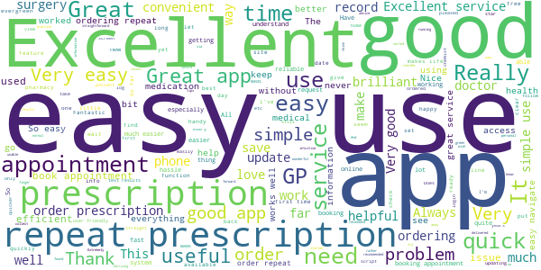
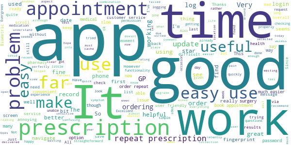
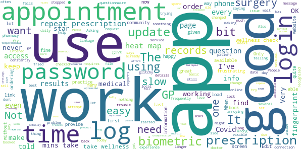
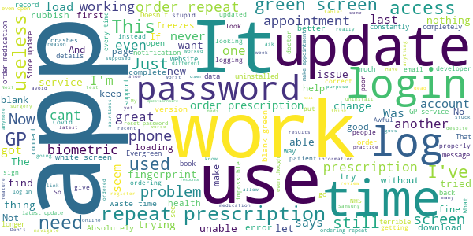

# Evergreen Life PHR
App version ``19.3.0``

Analyzed with [covid-apps-observer](http://github.com/covid-apps-observer) project, version ``0.1``

## App overview
| | |
|-------------------------|-------------------------| 
| **Name**&nbsp;&nbsp;&nbsp;&nbsp;&nbsp;&nbsp;&nbsp;&nbsp;&nbsp;&nbsp;&nbsp;&nbsp;&nbsp;&nbsp;&nbsp;&nbsp;&nbsp;&nbsp;&nbsp;&nbsp;&nbsp;&nbsp;&nbsp;&nbsp;&nbsp;&nbsp;&nbsp;&nbsp;&nbsp;&nbsp;&nbsp;&nbsp;&nbsp;&nbsp;&nbsp;&nbsp;&nbsp;&nbsp;&nbsp;&nbsp;  | Evergreen Life PHR |
| **Unique identifier** | com.ascent.phr |
| **Link to Google Play** | [https://play.google.com/store/apps/details?id=com.ascent.phr](https://play.google.com/store/apps/details?id=com.ascent.phr) |
| **Summary**  | Book appointments, order prescriptions and manage your health and wellbeing |
| **Privacy policy** | [https://www.evergreen-life.co.uk/terms/website-terms-of-use](https://www.evergreen-life.co.uk/terms/website-terms-of-use) |
| **Latest version** | 19.3.0 |
| **Last update** | 2021-05-24 13:03:09 |
| **Recent changes** | We have fixed a known bug involving biometric login. Users using biometric login to access the app will need to re enter their password and re-enable biometric login.  We have also made a change to our Wellness Checks. Now when you complete a check you will be taken straight to the Section Summary screen where you can access health insights and see if there are other Wellness Checks that you wish to complete. |
| **Installs**  | 100,000+ |
| **Category** | Health & Fitness |
| **First release** | Apr 4, 2016 |
| **Size**  | 13M |
| **Supported Android version**  | 5.1 and up |

### Description
> <b>In control. Healthier. Happier.</b>
 💚 Order repeat prescriptions to your door
 💚 Book GP appointments
 💚 Bring all your health information and GP records together
 💚 Discover your Wellness Score
 💚 Get practical insights on how to be as happy and healthy as possible
 <b><i>Welcome to Happychondria.
 Welcome to Evergreen Life.</i></b>
 Happychondria is the word we use to describe <b>the blissful state of being in complete control of one's health and wellbeing</b>. By using the Evergreen Life app to interact with GP services like booking appointments and ordering prescriptions, as well as managing your wellbeing through our Wellness Score, you can take control of your health and wellbeing and experience Happychondria for yourself.
 <b>NHS-ASSURED GP ONLINE SERVICES</b>
 Available at GP practices in England:
 • Save yourself time by booking and cancelling GP appointments ⏰
 • Order your repeat prescriptions directly to your door 🚚 💊
 • Stay informed with 24/7 access to your GP medical record, including test results, immunisations, allergies and medications 📁
 <b>WHAT’S YOUR WELLNESS SCORE?</b>
 Taking control of your health starts with understanding it. Based on your answers to clinically-reviewed questions, your <b>Wellness Score</b> out of 100 helps you see if you’re doing all you can to be healthy and provides insights on how to optimise your wellbeing. 
 <b>ONE HEALTH RECORD. WHEN YOU NEED IT</b>
 Your GP, hospital and other records aren’t joined up, so it can get pretty tricky having to repeat the same information over and over. With Evergreen Life, you can <b>build an accurate, up-to-date health record in the palm of your hand</b>.
 <b>MEDICATION REMINDERS</b>
 Give yourself one less thing to worry about. Never forget to take your medications again with the Evergreen Life medicine app, helping you safely manage your own or your family’s health 💊
 <b>HEALTH AND FITNESS TRACKER</b>
 Track your health and fitness measurements, including blood pressure, body fat percentage and blood sugar levels, so you can monitor your health goals 💪🏻
 <b>SECURELY STORE YOUR DOCUMENTS</b>
 If you struggle to find appointment letters or your health information is difficult to manage, storing all your documents in one app can make it much easier to organise your care 📩
 <b>SHARE WITH THOSE WHO MATTER MOST</b>
 Get the best care possible and give peace-of-mind to your family or health providers with secure access to your shared health information.
 Need a helping hand? 🖐️ If you want any help and support with using the app or getting set up with GP online services, head to https://help.evergreen-life.co.uk or call our Support Team at 0161 768 6063
 <i>*Your local doctor’s surgery may not offer all GP online services. Ask your practice directly to find out which are available to you.</i>

### User interface
The developers of the app provide the following screenshots in the Google play store.
| | | |
|:-------------------------:|:-------------------------:|:-------------------------:|
 |   |   |   | 
 |   |   |   | 
 |   |  

## Development team
In the following we report the main information provided by the development team in the Google play store.

| | |
|-------------------------|-------------------------|
| **Developer**  | Evergreen Health Solutions Ltd |
| **Website**  | [http://www.evergreen-life.co.uk](http://www.evergreen-life.co.uk) |
| **Email** | hello@evergreen-life.co.uk |
| **Physical address**  | - |
| **Other developed apps**  | [https://play.google.com/store/apps/developer?id=Evergreen+Health+Solutions+Ltd](https://play.google.com/store/apps/developer?id=Evergreen+Health+Solutions+Ltd) |

## Android support

| | |
|-------------------------|-------------------------|
| **Declared target Android version**  | Android10, version 10 (API level 29) |
| **Effective target Android version**  | Android10, version 10 (API level 29) |
| **Minimum supported Android version**  | Lollipop, version 5.1 (API level 22) |
| **Maximum target Android version**  | - |

The larger the difference between the minimum and maximum supported Android versions, the better. A larger difference means a wider audience. For example, old phones have a very low Android version, so a high minimum supported Android version means that the app cannot be used by users with old phones, thus leading to accessibility problems. 

## Requested permissions

In the following we report the complete list of the permissions requested by the app. 

| **Permission** | **Protection level** | **Description** | 
|-------------------------|-------------------------|-------------------------|
 **android.permission ACCESS_COARSE_LOCATION** | :warning:**Dangerous** | Allows an app to access approximate location. 
 **android.permission ACCESS_FINE_LOCATION** | :warning:**Dangerous** | Allows an app to access precise location. 
 **android.permission ACCESS_NETWORK_STATE** | Normal | Allows applications to access information about networks. 
 **android.permission CAMERA** | :warning:**Dangerous** | Required to be able to access the camera device. 
 **android.permission FLASHLIGHT** | - | - 
 **android.permission FOREGROUND_SERVICE** | Normal | Allows a regular application to use Service.startForeground. 
 **android.permission INTERNET** | Normal | Allows applications to open network sockets. 
 **android.permission READ_APP_BADGE** | - | - 
 **android.permission READ_CALENDAR** | :warning:**Dangerous** | Allows an application to read the user's calendar data. 
 **android.permission READ_EXTERNAL_STORAGE** | :warning:**Dangerous** | Allows an application to read from external storage. 
 **android.permission USE_FINGERPRINT** | Normal | This constant was deprecated in API level 28. Applications should request USE_BIOMETRIC instead 
 **android.permission VIBRATE** | Normal | Allows access to the vibrator. 
 **android.permission WAKE_LOCK** | Normal | Allows using PowerManager WakeLocks to keep processor from sleeping or screen from dimming. 
 **android.permission WRITE_CALENDAR** | :warning:**Dangerous** | Allows an application to write the user's calendar data. 
 **android.permission WRITE_EXTERNAL_STORAGE** | :warning:**Dangerous** | Allows an application to write to external storage. 
 **com.anddoes.launcher.permission UPDATE_COUNT** | - | - 
 **com.ascent.phr.permission C2D_MESSAGE** | - | - 
 **com.google.android.c2dm.permission RECEIVE** | - | - 
 **com.google.android.finsky.permission BIND_GET_INSTALL_REFERRER_SERVICE** | - | - 
 **com.htc.launcher.permission READ_SETTINGS** | - | - 
 **com.htc.launcher.permission UPDATE_SHORTCUT** | - | - 
 **com.huawei.android.launcher.permission CHANGE_BADGE** | - | - 
 **com.huawei.android.launcher.permission READ_SETTINGS** | - | - 
 **com.huawei.android.launcher.permission WRITE_SETTINGS** | - | - 
 **com.majeur.launcher.permission UPDATE_BADGE** | - | - 
 **com.oppo.launcher.permission READ_SETTINGS** | - | - 
 **com.oppo.launcher.permission WRITE_SETTINGS** | - | - 
 **com.sec.android.provider.badge.permission READ** | - | - 
 **com.sec.android.provider.badge.permission WRITE** | - | - 
 **com.sonyericsson.home.permission BROADCAST_BADGE** | - | - 
 **com.sonymobile.home.permission PROVIDER_INSERT_BADGE** | - | - 
 **me.everything.badger.permission BADGE_COUNT_READ** | - | - 
 **me.everything.badger.permission BADGE_COUNT_WRITE** | - | - 

## Mentioned servers

| **Server** | **Registrant** | **Registrant country** | **Creation date** | 
|-------------------------|-------------------------|-------------------------|-------------------------|
 | google.com | Google LLC | :us: US | 1997-09-15 04:00:00 |
 | appspot.com | Google LLC | :us: US | 2005-03-10 02:27:55 |
 | branch.io | Branch | :us: US | 2011-11-10 13:52:13 |
 | gstatic.com | Google LLC | :us: US | 2008-02-11 15:31:25 |
 | googleapis.com | Google LLC | :us: US | 2005-01-25 17:52:26 |
 | bnc.lt | - | - | 2016-11-14 00:00:00 |
 | whatsapp.com | WhatsApp LLC | :us: US | 2008-09-04 12:39:12 |

## Security analysis 

Below we report the main security warnings raised by our execution of the [Androwarn](https://github.com/maaaaz/androwarn) security analysis tool.

**Telephony identifiers leakage**
> - This application reads the numeric name (MCC+MNC) of current registered operator 
> - This application reads the operator name 

**Connection interfaces exfiltration**
> - This application reads details about the currently active data network 
> - This application tries to find out if the currently active data network is metered 

**Telephony services abuse**
> - This application makes phone calls 

**Pim data leakage**
> - This application accesses the calendar 
> - This application accesses the downloads folder 
> - This application accesses data stored in the clipboard 

**Code execution**
> - This application loads a native library 
> - This application executes a UNIX command containing this argument: 'Ljava/lang/StringBuilder;->toString()Ljava/lang/String;' 

## User ratings and reviews

Below we provide information about how end users are reacting to the app in terms of ratings and reviews in the Google Play store.

### Ratings

The Evergreen Life PHR app has been installed by more than **100000** times. At this time, **5758** rated the app and its average score is **4.5184565**. Below we show the distribution of the ratings across the usual star-based rating of Google Play

:star::star::star::star::star:: 4021

:star::star::star::star:: 1130

:star::star::star:: 357

:star::star:: 77

:star:: 173

### Reviews 

#### 5-star reviews

> great  :date: __2021-06-29 11:41:28__

> Brilliant app so easy to order my medication, been using for a couple of years now and I've never had a problem until yesterday, I contacted customer support via email and they replied very quickly, problem sorted, excellent customer support.  :date: __2021-06-29 01:01:51__

> brilliant app  :date: __2021-06-27 20:45:15__

> extremely useful app  :date: __2021-06-27 07:58:57__

> Easy to use.  :date: __2021-06-23 20:58:14__

> Great app, very easy and handy to use. Used to have problems with login but that seems to have been fixed  :date: __2021-06-22 23:07:09__

> Excellent service. Easy to use, and convenient  :date: __2021-06-22 10:18:48__

> very useful to manage your communication  :date: __2021-06-21 12:00:37__

> Fiinally a way to have your medical history at YOUR finger tips rather than EVERYONE else's finger tips, bar you!!!  :date: __2021-06-20 17:48:42__

> easy to use unlike some  :date: __2021-06-20 10:41:24__

#### 4-star reviews

> App is really useful in telling users their health with just a few simple questions. Also useful for monitoring over a period of time.  :date: __2021-07-09 21:06:36__

> it's just a bit of a pain how they keep asking for me to update my covid jab record when I've already done it (4 times to-date)  :date: __2021-06-25 09:41:45__

> Better than others I've tried  :date: __2021-06-21 19:18:18__

> Had an issue beforehand regarding logging in but customer service was excellent and can now use the app. Wish I could have access to more of my records like test results but I'm happy overall x  :date: __2021-06-11 12:18:04__

> App is now working again. And I'm happy again.😁 But apprehensive...  :date: __2021-05-14 13:26:14__

> This app is 10 times better than Patient Access. It's very interactive and keeps the user up to date in many areas like health and well being, including your rights as a patient to having access to your records.  :date: __2021-05-02 09:35:47__

> not fully user friendly, it's not obvious how to get things done, needs some getting used to to navigate. otherwise works very well.  :date: __2021-04-19 22:01:56__

> Works well. Limited functionality - presumably due to government and surgery constraints  :date: __2021-04-09 10:06:27__

> bit slow today - edit: It is thankfully back up to speed today, though it means I'm unable to make a physical recording of it.  :date: __2021-03-09 10:40:38__

> Had problems logging in, but Evergreen helped solve that problem. Thanks guys!  :date: __2021-02-22 22:56:40__

#### 3-star reviews

> not optimised for android accessible settings  :date: __2021-06-27 10:29:39__

> Unimpressive  :date: __2021-06-09 10:11:22__

> Been working great until today and now won't take password to log in  :date: __2021-05-28 21:04:14__

> Can be glitchy. Biometric login often doesn't work.  :date: __2021-05-18 15:06:02__

> Fine when it works but frequently requires multiple login attempts, takes too long to load, and I don't love that it is trying to sell me stuff when I just want to use it to interact with my GP surgery. Lots can be improved and would be happy to provide feedback if the product team want to contact me.  :date: __2021-05-17 11:01:12__

> Bug fixes required - keeps crashing every time I request a prescription and cannot afford for the requests to not go through. Please fix.  :date: __2021-05-15 09:44:00__

> can be temperamental  :date: __2021-04-29 13:01:26__

> my GP service is not fully functional but good for repeat prescriptions  :date: __2021-04-22 08:02:42__

> hard to log in with biometrics  :date: __2021-04-13 19:41:35__

> Good, but the app freezes quite a lot. The full DNA results actually caused more questions that couldn't be answered due to a lack of clarity in the original answers. The questions around daily health involve a community question and if you aren't community minded in their opinion your score hits the floor. People can be happy without being involved in community. I use it daily just to register my covid status. Would I be using it otherwise, probably not.  :date: __2021-03-21 11:53:58__

#### 2-star reviews

> I liked this app. I've been using it for a while with no problems but the latest updates have rendered it useless as I can't even login anymore. It doesn't recognise my credentials at all. It's been like this for a month or 2 now...  :date: __2021-07-06 14:50:44__

> Slow, Unrealiable  :date: __2021-06-18 11:44:19__

> Did like the app, but suddenly it doesn't work at all for the last month. Can't log in with either biometrics or password. So have to use the website. And the worst thing is I have had no response from the company at all.  :date: __2021-06-14 23:02:24__

> biometrics not working and keeps logging me out  :date: __2021-06-10 09:38:20__

> I can't get past the GP registration system i have entered my details correctly but it is saying, "There was a problem with your sign up. Check the information is correct and try again". I have tried 7 times to get past this and nothing . I'm fed up with it.  :date: __2021-06-07 14:21:51__

> I only use this app to order prescriptions. I can't book appointments through the app. Ordering prescriptions is quick and easy though.  :date: __2021-05-13 21:50:17__

> order page seems to change each time I use it. Consequently, sometimes I think I've ordered and I haven't.  :date: __2021-04-18 12:27:20__

> log on always a Faff  :date: __2021-02-28 14:57:25__

> Awful, only use it because I have to.  :date: __2021-02-14 17:26:45__

> The app no longer loads up, I used it to order repeat prescriptions now it won't do anything  :date: __2021-02-13 09:41:43__

#### 1-star reviews

> Clunky and issues with passwords/refreshing. If the appointment you selected is taken, the system makes you confirm your password before you can attempt to book another. Causing you to miss out on other appointments. You always need to refresh twice before your results are actually updated. Aware these are just two functions but they are only ones I use. And being able to manage your health care is the point of the app.  :date: __2021-07-07 09:09:57__

> This used to work fine but now passwords don't work, thus making the app pointless.  :date: __2021-07-01 10:02:30__

> This is really helpful  :date: __2021-06-30 13:22:00__

> Never remembers password have to reset every time  :date: __2021-06-29 09:02:52__

> Doesn't go past the loading screen  :date: __2021-06-21 17:26:15__

> It doesn't recognise the password anymore, even it just been reseted. And fingerprint scanner is not accepted. If is not solved quickly i will have to use another app. I have diabetes and i need to login often.  :date: __2021-06-14 14:23:41__

> GP service not working anymore after this update.  :date: __2021-06-12 12:15:48__

> Frustrating and going round in circles. Being told my email is invalid (total nonsense) and being sent numbers to my mobile then means starting to register all over again. And uninstalling and installing again I met the same problems. The app is poorly designed and not fit for purpose and instead of saving my time has wasted it. I shall not bother again.login is a nightmare.  :date: __2021-06-08 17:36:26__

> keeps saying the user and password are incorrect. I change the password=>get access. Close app. Next time says the same thing=>change password again....in a loop.  :date: __2021-06-02 20:22:56__

> Not able to even sign up as freezes on biometrics page. Ridiculous.  :date: __2021-05-16 13:13:38__

