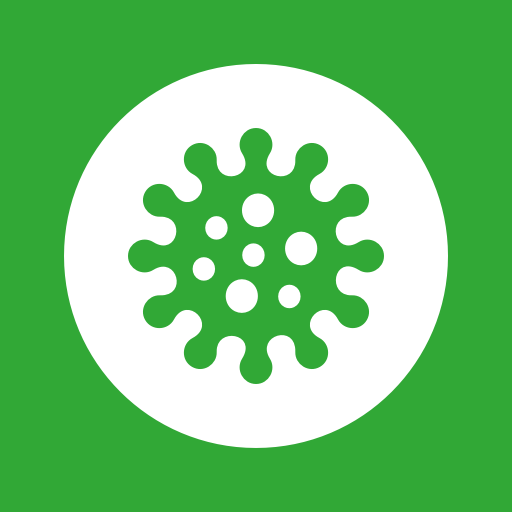
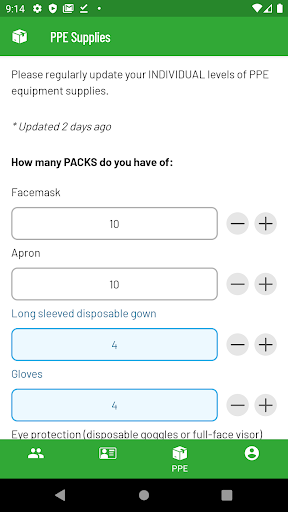
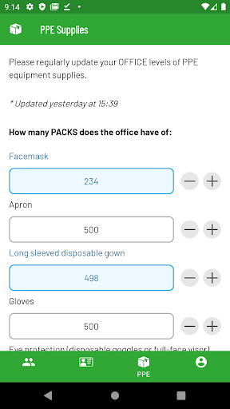
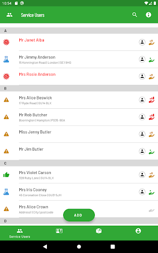
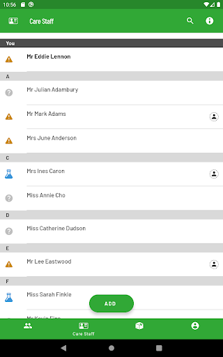
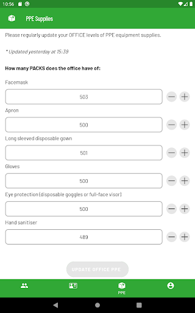

# C19 Control
App version ``1.4.0``

Analyzed with [covid-apps-observer](http://github.com/covid-apps-observer) project, version ``0.1``

## App overview
| | |
|-------------------------|-------------------------| 
| **Name**&nbsp;&nbsp;&nbsp;&nbsp;&nbsp;&nbsp;&nbsp;&nbsp;&nbsp;&nbsp;&nbsp;&nbsp;&nbsp;&nbsp;&nbsp;&nbsp;&nbsp;&nbsp;&nbsp;&nbsp;&nbsp;&nbsp;&nbsp;&nbsp;&nbsp;&nbsp;&nbsp;&nbsp;&nbsp;&nbsp;&nbsp;&nbsp;&nbsp;&nbsp;&nbsp;&nbsp;&nbsp;&nbsp;&nbsp;&nbsp;  | C19 Control |
| **Unique identifier** | com.elt.covid_android |
| **Link to Google Play** | [https://play.google.com/store/apps/details?id=com.elt.covid_android](https://play.google.com/store/apps/details?id=com.elt.covid_android) |
| **Summary**  | Record and monitor the C19 status for people being cared for and for care staff. |
| **Privacy policy** | [https://www.c19control.com/privacy-policy](https://www.c19control.com/privacy-policy) |
| **Latest version** | 1.4.0 |
| **Last update** | 2020-05-19 15:34:07 |
| **Recent changes** | Text changes and usability improvements |
| **Installs**  | 50+ |
| **Category** | Medical |
| **First release** | Apr 20, 2020 |
| **Size**  | 4.2M |
| **Supported Android version**  | 6.0 and up |

### Description
> C19 CONTROL is the fast and simple way for care providers to record and report COVID-19 status and PPE use on the frontline of care.  
  
 Care staff can view a list of people being cared for, and for each person they can record the advice given by the official NHS service in their region; the relevant symptoms; and the appropriate COVID-19 status.  Care Staff can also record their own Personal Protective Equipment (PPE) supply levels, giving their Care Managers a real-time view of PPE needs across their team.
 Care managers can use the app to record the COVID-19 status for each of their care staff, and can quickly add new people to the list of care receivers and care staff.  Care Managers can also record the overall PPE levels for the care service, to help when re-ordering stock.
 Using the C19 CONTROL web portal, care managers can set the dependency level of people being cared for and can run reports of COVID-19status and dependency level for people being cared for, and COVID-19 status and PPE levels for care staff.
 The data recorded by C19 CONTROL will help both care providers as well as local, regional and national government organisations to gain a better understanding of the cases of suspected or confirmed COVID-19 across health and social care systems so that they can better anticipate health needs and plan resource requirements.

### User interface
The developers of the app provide the following screenshots in the Google play store.
| | | |
|:-------------------------:|:-------------------------:|:-------------------------:|
 |   |   |   | 
 |   |   |   | 
 |   |   |   | 
 |   |   |   | 
 |   |   |   | 
 |   |   |   | 
 |   |   |   | 
 |  

## Development team
In the following we report the main information provided by the development team in the Google play store.

| | |
|-------------------------|-------------------------|
| **Developer**  | everyLIFE |
| **Website**  | [https://www.c19control.com/](https://www.c19control.com/) |
| **Email** | support@c19control.com |
| **Physical address**  | [A1, East Wing, Cody Technology Park, Ively Road, Farnborough, UK, GU14 0LX](https://www.google.com/maps/search/A1,%20East%20Wing,%20Cody%20Technology%20Park,%20Ively%20Road,%20Farnborough,%20UK,%20GU14%200LX) (Google Maps) |
| **Other developed apps**  | [https://play.google.com/store/apps/developer?id=everyLIFE](https://play.google.com/store/apps/developer?id=everyLIFE) |

## Android support

| | |
|-------------------------|-------------------------|
| **Declared target Android version**  | Android10, version 10 (API level 29) |
| **Effective target Android version**  | Android10, version 10 (API level 29) |
| **Minimum supported Android version**  | Marshmallow, version 6.0 (API level 23) |
| **Maximum target Android version**  | - |

The larger the difference between the minimum and maximum supported Android versions, the better. A larger difference means a wider audience. For example, old phones have a very low Android version, so a high minimum supported Android version means that the app cannot be used by users with old phones, thus leading to accessibility problems. 

## Requested permissions

In the following we report the complete list of the permissions requested by the app. 

| **Permission** | **Protection level** | **Description** | 
|-------------------------|-------------------------|-------------------------|
 **android.permission ACCESS_NETWORK_STATE** | Normal | Allows applications to access information about networks. 
 **android.permission CALL_PHONE** | :warning:**Dangerous** | Allows an application to initiate a phone call without going through the Dialer user interface for the user to confirm the call. 
 **android.permission INTERNET** | Normal | Allows applications to open network sockets. 
 **android.permission WAKE_LOCK** | Normal | Allows using PowerManager WakeLocks to keep processor from sleeping or screen from dimming. 
 **com.google.android.c2dm.permission RECEIVE** | - | - 
 **com.google.android.finsky.permission BIND_GET_INSTALL_REFERRER_SERVICE** | - | - 

## Mentioned servers

| **Server** | **Registrant** | **Registrant country** | **Creation date** | 
|-------------------------|-------------------------|-------------------------|-------------------------|
 | googleapis.com | Google LLC | :us: US | 2005-01-25 17:52:26 |
 | googlesyndication.com | Google LLC | :us: US | 2003-01-21 06:17:24 |
 | google.com | Google LLC | :us: US | 1997-09-15 04:00:00 |
 | app-measurement.com | Google LLC | :us: US | 2015-06-19 20:13:31 |
 | googleadservices.com | Google LLC | :us: US | 2003-06-19 16:34:53 |
 | crashlytics.com | Google LLC | :us: US | 2011-01-21 15:30:40 |
 | googleapis.com | Google LLC | :us: US | 2005-01-25 17:52:26 |
 | passgenius.com | - | GB | 2014-09-28 21:17:28 |

## Security analysis 

Below we report the main security warnings raised by our execution of the [Androwarn](https://github.com/maaaaz/androwarn) security analysis tool.

**Connection interfaces exfiltration**
> - This application reads details about the currently active data network 
> - This application tries to find out if the currently active data network is metered 

**Telephony services abuse**
> - This application makes phone calls 

**Suspicious connection establishment**
> - This application opens a Socket and connects it to the remote address ': ; port is out of range' on the 'N/A' port  
> - This application opens a Socket and connects it to the remote address 'Ld/c/a/a/a;->a(Ljava/lang/String;)Ljava/lang/StringBuilder;' on the 'N/A' port  
> - This application opens a Socket and connects it to the remote address 'Ljava/net/Proxy;->type()Ljava/net/Proxy$Type;' on the 'N/A' port  
> - This application opens a Socket and connects it to the remote address 'timeout' on the 'N/A' port  

## User ratings and reviews

Below we provide information about how end users are reacting to the app in terms of ratings and reviews in the Google Play store.

### Ratings

The C19 Control app has been installed by more than **50** times. At this time, **-** rated the app and its average score is **0.0**. Below we show the distribution of the ratings across the usual star-based rating of Google Play

:star::star::star::star::star:: 0

:star::star::star::star:: 0

:star::star::star:: 0

:star::star:: 0

:star:: 0

### Reviews 

#### 5-star reviews

> I care for my friends so I got this app  :date: __2020-12-27 19:53:18__

> Simple to use with a very easy to navigate set of menus.  :date: __2020-04-30 07:50:48__

#### 4-star reviews

No recent reviews available with 4 stars.

#### 3-star reviews

No recent reviews available with 3 stars.

#### 2-star reviews

No recent reviews available with 2 stars.

#### 1-star reviews

No recent reviews available with 1 stars.
