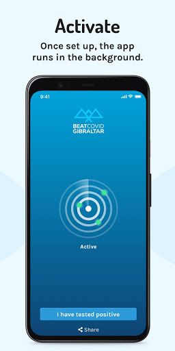
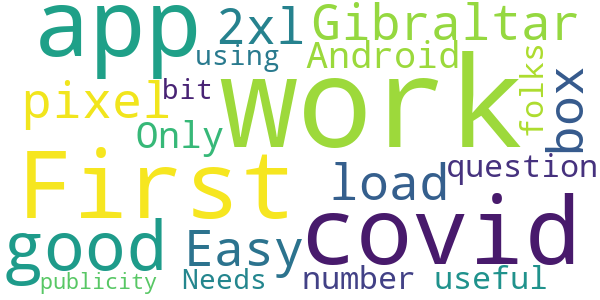
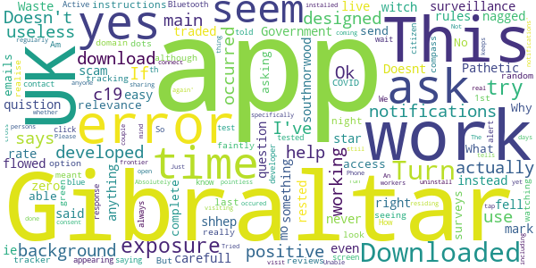

# Beat Covid Gibraltar
App version ``1.0.2``

Analyzed with [covid-apps-observer](http://github.com/covid-apps-observer) project, version ``0.1``

## App overview
| | |
|-------------------------|-------------------------| 
| **Name**&nbsp;&nbsp;&nbsp;&nbsp;&nbsp;&nbsp;&nbsp;&nbsp;&nbsp;&nbsp;&nbsp;&nbsp;&nbsp;&nbsp;&nbsp;&nbsp;&nbsp;&nbsp;&nbsp;&nbsp;&nbsp;&nbsp;&nbsp;&nbsp;&nbsp;&nbsp;&nbsp;&nbsp;&nbsp;&nbsp;&nbsp;&nbsp;&nbsp;&nbsp;&nbsp;&nbsp;&nbsp;&nbsp;&nbsp;&nbsp;  | Beat Covid Gibraltar |
| **Unique identifier** | com.gha.covid.tracker |
| **Link to Google Play** | [https://play.google.com/store/apps/details?id=com.gha.covid.tracker](https://play.google.com/store/apps/details?id=com.gha.covid.tracker) |
| **Summary**  | Let’s Beat COVID-19 together |
| **Privacy policy** | [https://gibraltar.gov.gi/beatcovidapp/privacy](https://gibraltar.gov.gi/beatcovidapp/privacy) |
| **Latest version** | 1.0.2 |
| **Last update** | 2020-11-11 17:53:36 |
| **Recent changes** | Minor bug fixes and adds a Pause function for specific scenarios |
| **Installs**  | 10,000+ |
| **Category** | Medical |
| **First release** | Jun 25, 2020 |
| **Size**  | 106M |
| **Supported Android version**  | 6.0 and up |

### Description
> The Beat COVID Gibraltar app is for the citizens of Gibraltar and uses the bluetooth technology on your phone to track other phones you have been in close proximity to. It uses the Exposure Notification Service and you will be notified directly if you have been in close contact with someone who has tested positive for the virus. Likewise, if you are tested positive for COVID-19 yourself, those you have been in close contact with will be notified.  
 No personal data will be stored or used.  
 This app is totally anonymous and no personal information will be logged or shared with anyone. 
 Join the fight against COVID-19 and download the app today. 
 Beat COVID Gibraltar has been developed by the Gibraltar Health Authority and HM Government of Gibraltar.

### User interface
The developers of the app provide the following screenshots in the Google play store.
| | | |
|:-------------------------:|:-------------------------:|:-------------------------:|
 |   |   |   | 
 |   |  

## Development team
In the following we report the main information provided by the development team in the Google play store.

| | |
|-------------------------|-------------------------|
| **Developer**  | Gibraltar Health Authority |
| **Website**  | [https://www.gibraltar.gov.gi/beatcovidapp](https://www.gibraltar.gov.gi/beatcovidapp) |
| **Email** | info@gha.ie |
| **Physical address**  | - |
| **Other developed apps**  | [https://play.google.com/store/apps/developer?id=Gibraltar+Health+Authority](https://play.google.com/store/apps/developer?id=Gibraltar+Health+Authority) |

## Android support

| | |
|-------------------------|-------------------------|
| **Declared target Android version**  | Pie, version 9 (API level 28) |
| **Effective target Android version**  | Pie, version 9 (API level 28) |
| **Minimum supported Android version**  | Marshmallow, version 6.0 (API level 23) |
| **Maximum target Android version**  | - |

The larger the difference between the minimum and maximum supported Android versions, the better. A larger difference means a wider audience. For example, old phones have a very low Android version, so a high minimum supported Android version means that the app cannot be used by users with old phones, thus leading to accessibility problems. 

## Requested permissions

In the following we report the complete list of the permissions requested by the app. 

| **Permission** | **Protection level** | **Description** | 
|-------------------------|-------------------------|-------------------------|
 **android.permission ACCESS_NETWORK_STATE** | Normal | Allows applications to access information about networks. 
 **android.permission ACCESS_WIFI_STATE** | Normal | Allows applications to access information about Wi-Fi networks. 
 **android.permission BLUETOOTH** | Normal | Allows applications to connect to paired bluetooth devices. 
 **android.permission INTERNET** | Normal | Allows applications to open network sockets. 

## Mentioned servers

| **Server** | **Registrant** | **Registrant country** | **Creation date** | 
|-------------------------|-------------------------|-------------------------|-------------------------|
 | android.com | Google LLC | :us: US | 1997-06-23 04:00:00 |
 | google.com | Google LLC | :us: US | 1997-09-15 04:00:00 |
 | expo.io | See PrivacyGuardian.org | :us: US | 2011-05-01 21:26:50 |

## Security analysis 

Below we report the main security warnings raised by our execution of the [Androwarn](https://github.com/maaaaz/androwarn) security analysis tool.

**Telephony identifiers leakage**
> - This application reads the numeric name (MCC+MNC) of current registered operator 
> - This application reads the operator name 

**Connection interfaces exfiltration**
> - This application reads details about the currently active data network 
> - This application tries to find out if the currently active data network is metered 

**Suspicious connection establishment**
> - This application opens a Socket and connects it to the remote address ' returned no addresses for  ; port is out of range' on the 'N/A' port  
> - This application opens a Socket and connects it to the remote address '' on the 'N/A' port  
> - This application opens a Socket and connects it to the remote address 'Ljava/lang/StringBuilder;->toString()Ljava/lang/String;' on the ': connect, resolve' port  
> - This application opens a Socket and connects it to the remote address 'Ljava/lang/StringBuilder;->toString()Ljava/lang/String;' on the 'N/A' port  
> - This application opens a Socket and connects it to the remote address 'Ljava/net/Proxy;->type()Ljava/net/Proxy$Type;' on the 'N/A' port  
> - This application opens a Socket and connects it to the remote address 'timeout' on the 'N/A' port  

**Pim data leakage**
> - This application accesses data stored in the clipboard 

**Code execution**
> - This application loads a native library 
> - This application executes a UNIX command 

## User ratings and reviews

Below we provide information about how end users are reacting to the app in terms of ratings and reviews in the Google Play store.

### Ratings

The Beat Covid Gibraltar app has been installed by more than **10000** times. At this time, **70** rated the app and its average score is **3.142857**. Below we show the distribution of the ratings across the usual star-based rating of Google Play

:star::star::star::star::star:: 31

:star::star::star::star:: 5

:star::star::star:: 4

:star::star:: 3

:star:: 27

### Reviews 

#### 5-star reviews

> 👍😎  :date: __2020-11-05 21:22:14__

> So, I downloaded this app to complain... about the idiots who have downloaded the app then given it a 1 star review for not being made for the UK 1. Gibraltar is a British overseas territory, as such it is relevant to the UK, you imbaciles. 2. It does tell you it is made specifically for Gibraltar, check the name of the app, you uncultured swine. 3. If you are not from Gibraltar it isn't relevant to you. This does not mean you should give it a negative review, as that does not make it a bad app.  :date: __2020-09-27 14:21:48__

> This app is really easy and fast and doesn't have too much of an impact on your battery life  :date: __2020-08-18 01:16:04__

> Works as described, easy to set up and turn on.- I've not heard anything from the developer and I'm in the UK, the more people who use it - the more will be notified  :date: __2020-08-09 14:58:58__

> Good  :date: __2020-08-08 14:37:46__

> You have to make sure your phone is up to date with system update. I up dated my S10+ and download this and it works fine.  :date: __2020-08-04 22:11:47__

> Good 👍🏼  :date: __2020-07-25 13:20:16__

> Downloaded and working in the UK. If you are having trouble with set up make sure you have the latest system update from Google/ apple and turn on the contact tracing api in settings.  :date: __2020-07-21 10:11:48__

> Downloaded, installed and turned on notifications no problem - very easy. Yes, it does automatically turn on your Bluetooth which drains the battery faster but I'm keeping it on only when I'm outside my house&work, e.g.shopping.  :date: __2020-07-19 23:06:12__

> Easy to set up and no issues  :date: __2020-07-10 19:09:49__

#### 4-star reviews

> First covid app good work Gibraltar  :date: __2020-11-01 18:01:54__

> Easy to load works out of the box on pixel 2xl. Android 10. Only question is only as useful as number of folks using it. Needs a bit of publicity.  :date: __2020-07-30 15:49:20__

#### 3-star reviews

> It may have been me, I didn't understand how it worked.  :date: __2020-10-08 15:24:12__

> It doesn't give out any information...  :date: __2020-07-20 19:00:47__

#### 2-star reviews

No recent reviews available with 2 stars.

#### 1-star reviews

> Government surveillance scam,shhep fell for it!  :date: __2020-11-21 05:17:20__

> Pathetic app which does does not download! If it had zero to rate, I would instead of 1 star  :date: __2020-10-09 17:02:10__

> I don't live in Gibraltar so it's no help to me.  :date: __2020-09-24 21:07:36__

> You ask a quistion have been traded positive then a question mark but not nagged ie it should of been yes or no mo on this app does not help at all I have never been rested for c19 been very carefull flowed all rules but witch is the right easy app for yes and no for c19 for me southnorwood  :date: __2020-09-24 14:40:32__

> Doesnt even work in the background  :date: __2020-08-14 00:51:41__

> Waste of time ! Doesn't seem to do anything at all, who said that it was for UK, and why should something developed by and for Gibraltar have any relevance for the UK ?  :date: __2020-08-08 17:35:31__

> What does this App actually do? It doesn't seem able to access surveys they send you emails asking you to complete? Why can't the App itself actually ask you?  :date: __2020-08-07 11:07:46__

> No instructions on how it works  :date: __2020-08-03 21:03:07__

> Ok, I only downloaded this app last night & although the reviews seem ok. This was the 1st & main app for COVID-19 tracking. Yes I realise Gibraltar is it's main domain, I get it. But seeing as this was my only option really, Am I just meant to look at the compass tracker, watching random green dots faintly appearing, with the blue screen just saying "Active"/click if i tested positive? How do i know? I don't! We can't just ask 4 test. Bluetooth is always on. So do i just wait 4 an alert? 🤷🏻‍  :date: __2020-07-31 22:24:09__

> This App is not designed for th UK, it is designed only for Gibraltar the app is useless, contact the developer like i did, UK citizen you will be told we can't use it in the UK 🇬🇧 This is their response "This App has been developed specifically with Gibraltar in mind. It is open for download by anyone, including cross-frontier workers and persons who regularly visit Gibraltar. If you are not in Gibraltar (whether residing, working or visiting) this app is of no real use to you"  :date: __2020-07-30 22:25:30__

