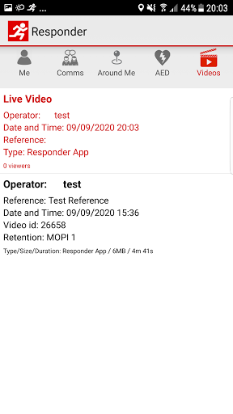
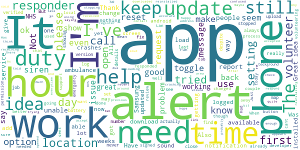
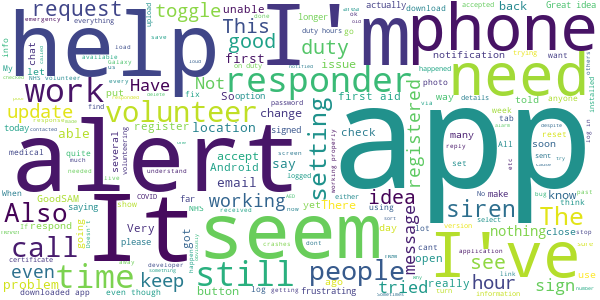
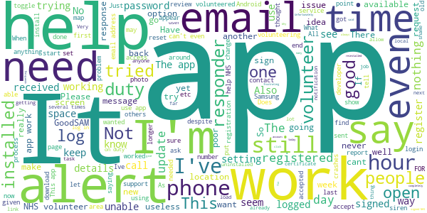

# GoodSAM Responder
App version ``12.2``

Analyzed with [covid-apps-observer](http://github.com/covid-apps-observer) project, version ``0.1``

## App overview
| | |
|-------------------------|-------------------------| 
| **Name**&nbsp;&nbsp;&nbsp;&nbsp;&nbsp;&nbsp;&nbsp;&nbsp;&nbsp;&nbsp;&nbsp;&nbsp;&nbsp;&nbsp;&nbsp;&nbsp;&nbsp;&nbsp;&nbsp;&nbsp;&nbsp;&nbsp;&nbsp;&nbsp;&nbsp;&nbsp;&nbsp;&nbsp;&nbsp;&nbsp;&nbsp;&nbsp;&nbsp;&nbsp;&nbsp;&nbsp;&nbsp;&nbsp;&nbsp;&nbsp;  | GoodSAM Responder |
| **Unique identifier** | com.goodsam.responder |
| **Link to Google Play** | [https://play.google.com/store/apps/details?id=com.goodsam.responder](https://play.google.com/store/apps/details?id=com.goodsam.responder) |
| **Summary**  | GoodSAM connects those with specific skill sets to those in need. |
| **Privacy policy** | [https://goodsamapp.org/dataprotection](https://goodsamapp.org/dataprotection) |
| **Latest version** | 12.2 |
| **Last update** | 2020-09-30 22:40:12 |
| **Recent changes** | - Enabling more task types on the platform including group tasks. - Bug fixes and improvements. |
| **Installs**  | 100,000+ |
| **Category** | Health & Fitness |
| **First release** | Apr 21, 2014 |
| **Size**  | 40M |
| **Supported Android version**  | 4.1 and up |

### Description
> The GoodSAM Responder App is a professional deployment system used by Emergency Services around the world.
 GoodSAM provides a range of solutions connecting those with specific skill sets to those in need, for example:
 -       GoodSAM Cardiac – This system is used by ambulance services to alert those trained in resuscitation (e.g. off duty paramedics, nurses, doctors, police and fire staff) to those nearby who are likely to be in cardiac arrest. This system has saved many lives around the world.
 -       GoodSAM Volunteer Response – GoodSAM is a platform used by organisations such as the Royal Voluntary Service and British Red Cross.
 -       GoodSAM Pro – This is a professional dispatch system for community first responders and the emergency services.
 The App utilises the latest in location technology and has many advanced features including a built in “radio” (Buzz) function so you can communicate with surrounding colleagues.
 The GoodSAM platform has saved hundreds of lives and helped many thousands of people around the world. If you can help your community, please download the App and register under your parent organisation (or get your parent organisation on board if they are not on!).
 Visit www.goodsamapp.org for more information
 Please download the App and join our global community.

### User interface
The developers of the app provide the following screenshots in the Google play store.
| | | |
|:-------------------------:|:-------------------------:|:-------------------------:|
 |   |   |   | 
 |   |   |   | 
 |   |  

## Development team
In the following we report the main information provided by the development team in the Google play store.

| | |
|-------------------------|-------------------------|
| **Developer**  | GoodSAM LTD |
| **Website**  | [http://www.goodsamapp.org/](http://www.goodsamapp.org/) |
| **Email** | info@goodsamapp.org |
| **Physical address**  | - |
| **Other developed apps**  | [https://play.google.com/store/apps/developer?id=GoodSAM+LTD](https://play.google.com/store/apps/developer?id=GoodSAM+LTD) |

## Android support

| | |
|-------------------------|-------------------------|
| **Declared target Android version**  | Android10, version 10 (API level 29) |
| **Effective target Android version**  | Android10, version 10 (API level 29) |
| **Minimum supported Android version**  | Jelly Bean, version 4.1.x (API level 16) |
| **Maximum target Android version**  | - |

The larger the difference between the minimum and maximum supported Android versions, the better. A larger difference means a wider audience. For example, old phones have a very low Android version, so a high minimum supported Android version means that the app cannot be used by users with old phones, thus leading to accessibility problems. 

## Requested permissions

In the following we report the complete list of the permissions requested by the app. 

| **Permission** | **Protection level** | **Description** | 
|-------------------------|-------------------------|-------------------------|
 **android.permission ACCESS_BACKGROUND_LOCATION** | :warning:**Dangerous** | Allows an app to access location in the background. 
 **android.permission ACCESS_COARSE_LOCATION** | :warning:**Dangerous** | Allows an app to access approximate location. 
 **android.permission ACCESS_FINE_LOCATION** | :warning:**Dangerous** | Allows an app to access precise location. 
 **android.permission ACCESS_NETWORK_STATE** | Normal | Allows applications to access information about networks. 
 **android.permission CAMERA** | :warning:**Dangerous** | Required to be able to access the camera device. 
 **android.permission FLASHLIGHT** | - | - 
 **android.permission GET_ACCOUNTS** | :warning:**Dangerous** | Allows access to the list of accounts in the Accounts Service. 
 **android.permission INTERNET** | Normal | Allows applications to open network sockets. 
 **android.permission MODIFY_AUDIO_SETTINGS** | Normal | Allows an application to modify global audio settings. 
 **android.permission READ_CONTACTS** | :warning:**Dangerous** | Allows an application to read the user's contacts data. 
 **android.permission READ_EXTERNAL_STORAGE** | :warning:**Dangerous** | Allows an application to read from external storage. 
 **android.permission READ_OWNER_DATA** | - | - 
 **android.permission RECEIVE_BOOT_COMPLETED** | Normal | Allows an application to receive the Intent.ACTION_BOOT_COMPLETED that is broadcast after the system finishes booting. 
 **android.permission RECORD_AUDIO** | :warning:**Dangerous** | Allows an application to record audio. 
 **android.permission REQUEST_IGNORE_BATTERY_OPTIMIZATIONS** | Normal | Permission an application must hold in order to use Settings.ACTION_REQUEST_IGNORE_BATTERY_OPTIMIZATIONS. 
 **android.permission USE_CREDENTIALS** | - | - 
 **android.permission VIBRATE** | Normal | Allows access to the vibrator. 
 **android.permission WAKE_LOCK** | Normal | Allows using PowerManager WakeLocks to keep processor from sleeping or screen from dimming. 
 **android.permission WRITE_EXTERNAL_STORAGE** | :warning:**Dangerous** | Allows an application to write to external storage. 
 **com.goodsam.responder.permission C2D_MESSAGE** | - | - 
 **com.goodsam.responder.permission MAPS_RECEIVE** | - | - 
 **com.google.android.c2dm.permission RECEIVE** | - | - 
 **com.google.android.finsky.permission BIND_GET_INSTALL_REFERRER_SERVICE** | - | - 
 **com.google.android.gms.permission ACTIVITY_RECOGNITION** | - | - 
 **com.google.android.providers.gsf.permission READ_GSERVICES** | - | - 

## Mentioned servers

| **Server** | **Registrant** | **Registrant country** | **Creation date** | 
|-------------------------|-------------------------|-------------------------|-------------------------|
 | facebook.com | Facebook, Inc. | :us: US | 1997-03-29 05:00:00 |
 | google.com | Google LLC | :us: US | 1997-09-15 04:00:00 |
 | goodsam.co.uk | - | - | 2013-07-27 00:00:00 |
 | goodsamapp.org | Registrant State/Province: | GB | 2014-03-17 22:10:28 |
 | linkedin.com | LinkedIn Corporation | :us: US | 2002-11-02 15:38:11 |
 | googlesyndication.com | Google LLC | :us: US | 2003-01-21 06:17:24 |
 | googleapis.com | Google LLC | :us: US | 2005-01-25 17:52:26 |
 | app-measurement.com | Google LLC | :us: US | 2015-06-19 20:13:31 |
 | googleadservices.com | Google LLC | :us: US | 2003-06-19 16:34:53 |

## Security analysis 

Below we report the main security warnings raised by our execution of the [Androwarn](https://github.com/maaaaz/androwarn) security analysis tool.

**Telephony identifiers leakage**
> - This application reads the numeric name (MCC+MNC) of current registered operator 
> - This application reads the operator name 

**Connection interfaces exfiltration**
> - This application reads details about the currently active data network 
> - This application tries to find out if the currently active data network is metered 

**Audio video eavesdropping**
> - This application records audio from the 'MIC' source  

**Suspicious connection establishment**
> - This application opens a Socket and connects it to the remote address '' on the 'N/A' port  
> - This application opens a Socket and connects it to the remote address 'Ljava/lang/StringBuilder;->toString()Ljava/lang/String;' on the 'N/A' port  
> - This application opens a Socket and connects it to the remote address 'Ljava/net/Proxy;->type()Ljava/net/Proxy$Type;' on the 'N/A' port  
> - This application opens a Socket and connects it to the remote address 'Lorg/apache/http/HttpHost;->getPort()I' on the 'Lorg/apache/http/HttpHost;->getPort()I' port  
> - This application opens a Socket and connects it to the remote address 'timeout' on the 'N/A' port  

**Code execution**
> - This application loads a native library 
> - This application executes a UNIX command 

## User ratings and reviews

Below we provide information about how end users are reacting to the app in terms of ratings and reviews in the Google Play store.

### Ratings

The GoodSAM Responder app has been installed by more than **100000** times. At this time, **1194** rated the app and its average score is **2.7058823**. Below we show the distribution of the ratings across the usual star-based rating of Google Play

:star::star::star::star::star:: 261

:star::star::star::star:: 100

:star::star::star:: 211

:star::star:: 271

:star:: 351

### Reviews 

#### 5-star reviews

> Helping in times like these is vital. User friendly precise and professional.  :date: __2020-09-20 17:43:57__

> Always freeze accept button when I am assigned for task...don't know what's happening...  :date: __2020-09-14 15:21:40__

> A service that provides help for people in need. Very professional and friendly service that's was needed during the Covid 19 pandemic but still provides essential services through out the year.  :date: __2020-09-04 21:29:15__

> Works well! Love being a Responder  :date: __2020-08-26 13:45:55__

> Never had a problem with this app. Very straight forward and they are keen to improve it as it gets used more and more.  :date: __2020-06-19 13:17:18__

> Never had an issue with the app. I use the OHCA responder as not signed up for the NHS voluntary scheme. One glitch I do need help with. I cannot upload photo or position if a community defib. Have tried on 2 phones. Both have location and tags unlocked. But no joy. Any ideas. For those below who are not happy with the app. Keep trying. Be patient. This app has saved lives around the world. It was a steep climb for the design team to go from out of hospital cardiac arrest to what it is now  :date: __2020-06-12 12:32:12__

> Easy to use and extremely useful.  :date: __2020-06-08 21:45:43__

> Very easy to use and works as it should.  :date: __2020-06-03 18:05:29__

> App is good now the issue App not recording me as on call is fixed...  :date: __2020-05-27 11:53:31__

> Easy to use and up to date information  :date: __2020-05-17 22:52:17__

#### 4-star reviews

> Appreciate your helpful response - sadly my area is not on the list but I noticed the link for registering my interest in case it is added in the future. Thank you and all the best  :date: __2020-10-08 19:52:04__

> Please give us a volume control for that dreadful siren  :date: __2020-09-26 15:13:11__

> Well after not bothering to log on much over the summer due to never being called on, I received an email saying more people were needing help. Plus I felt I should do something to say thank you for early access to the Track and Trace app. I logged on half an hour ago and just had my first call! She's already received help from a neighbour but was very grateful for the call.  :date: __2020-09-25 11:51:16__

> The app work good. But the notification siren (which I am not able to change) puts me off. Think about a loud siren in the middle of a restaurant, quite house/work place. Ability to choose between a couple of notification tones/ringtones will be of great help. Thanks  :date: __2020-08-20 12:13:07__

> Seems to work fine, gives plenty of information. Has been disappointing the number of requests that have come through though. Maybe it is a good thing and very few locals need support during the Pandemic.  :date: __2020-07-01 14:54:44__

> Up until yesterday it worked fine but now I can only get my initial screen with photo. I can't get page with on/off options (on duty / receive alerts etc)  :date: __2020-06-19 11:26:09__

> The app is decent enuff but there phone-in workers are ridiculous 🙄 rude to a point of where they lie to your face over and over and over and if u don't write all the info down on paper say goodbye to any refunds  :date: __2020-06-16 09:39:42__

> Well built app  :date: __2020-06-09 23:10:33__

> Embarrassingly loud notification  :date: __2020-06-06 22:04:39__

> I have had alerts, accepted job, contacted person and yes help required. Rang surgery for collection of prescription and was already collected. Some time previous, so why had alert come through after collection. Needs more info as to progression of job. i.e Accepted, collected, delivered maybe? Good idea though.  :date: __2020-06-04 14:04:22__

#### 3-star reviews

> Not enough room to write in here what needs addressing as it's limited to 500 letters and spaces I'd barely touched the surface on what needs sorting and ran out of space, but there isn't enough information or user functionality in the app we need a lot more communication options in app with a more detailed description to assist with dealing with failed calls not being answered by the people that are in need plus a lot of other options and also an in app guidance and helpcentre  :date: __2020-12-10 11:08:18__

> Like others have said, I have an issue with the siren. I am a petsitter and it terrifies some of the cats I am visiting. I did ring and complain about this. I ended up turning it off the weeks. I have just turned it back on. Two alerts I accepted. First I keep ringing so dropped the job. Another had already arranged for someone to take him shopping. Now I have just got back the alert I dropped earlier and still no answer. The alerts are not reliable.  :date: __2020-11-28 18:46:36__

> Good app but siren way too loud, it's driving my neighbour mad ! Apart from that, as others say here, 90% of people I ring have no idea why I rang, or how or why somebody put them on list. That needs addressing . On top of that some of the alerts are days old ,their prescription or shopping done days ago.Im becoming a bit disheartened wasting my time every day. I'm more than happy to run around for folks but less happy with wasted calls  :date: __2020-11-19 16:11:24__

> Doesn't work. I try to register using my St John certificate and the swirl of doom just spins foreverrrrrrrr; by which I mean 20 minutes over WiFi. Was able to register via the Web then log in to the app. But app registration just did not work.  :date: __2020-11-17 22:19:48__

> I've responded a couple of times to find that the chat request was for the previous day and had been dealt with? Embarrassing and unnecessary and the siren is excruciating why not a special phone sound kinder on the ears  :date: __2020-11-03 13:24:23__

> The app is ok however this Sunday I received 6 requests in quick succession. All bar one needed no help, and most requests I get end up being no help needed. My main criticism of the app is that once an alert comes in it sets my notification volume to max. I don't want or need to be notified each time normal messages come in which is why it is set to mute. Please can you make sure the app doesn't change my notification settings  :date: __2020-10-09 21:17:20__

> I am getting alerts but am unable to accept or reject them, have reinstalled app as advised by volunteer helpline & this has made no difference.  :date: __2020-10-02 15:18:13__

> App works well, though it does not always record your time. Cannot make contact with any app designers to help resolve the problem. Tried a re-install but it didn't help.  :date: __2020-08-20 14:13:43__

> Always crashes for no apparent reason. Had no alerts in thousands of hours. Crash report sent  :date: __2020-08-16 21:21:10__

> Worked perfectly before the update.  :date: __2020-08-05 18:58:39__

#### 2-star reviews

> App is ok but no way to check back on previous messages. I responded to a call from a gentleman who needed shopping tomorrow. I agreed to do it and then toggled the app to show "responded" as soon as I've done that then previous messages dissappear and I now no longer have address or contact details to sort this out tomorrow!!  :date: __2020-11-28 18:00:32__

> My app ppears that it doesn't work I havent had any alerts, and I can't change my organisation  :date: __2020-11-25 21:44:29__

> Still unable to upload photos of new AEDs locations to the GoodSAM app. I've replied via email and awaiting your reply.  :date: __2020-11-20 23:07:53__

> Not contacted very often. Sometimes people dont need any help.  :date: __2020-11-19 09:37:32__

> The alerts work for a few weeks then the siren stop and I'm not notified of an alert. It just says in comma you missed an alert. So frustrating.  :date: __2020-11-18 11:27:38__

> Very poor for something so important. Clumsy, bad layout, adding an AED is broken. Come on, this app is IMPORTANT. Sort it out. (Reply to developer - Yes I have checked both of those settings and it still doesn't work. No reply to 4 emails requesting help either)  :date: __2020-11-17 19:39:03__

> Only just come back to the app...but now i know why I deleted it! The siren is just too loud! I have to have my phone on silent now to stop it going off. I can understand why it was there during the apps initial use, for first responders calling to medical emergencies, but check in and chats or collecting groceries and prescriptions are hardly medical emergencies that need to be completed that precise minute. I cannot have my phone on silent constantly, so think I will have to delete it again...  :date: __2020-11-10 10:38:35__

> Goodsam can u explain as to WHY today their was a serious cardiac arrest which happened litrally 2mins from where i live....why wasnt the alarm raised and i could of potentially saved this old gents life,but because nobody knew were the nearest defibrillator was,by time ambulance etc got to him he had passed away...This absolutely breaks my heart because i could of saved this gent potential, but was not alerted.....its a disgrace really is....  :date: __2020-11-04 00:24:36__

> When volunteering in SE London I get a lot of requests which are 4-8miles away. This is too far in a city and unnecessary given the number of volunteers that must be available (e.g 15 within a few hundred yards of me). I therefore waste a lot of time with the siren continually blarring and rejecting 9 out of ten requests before accepting a request within a reasonable distance. It should be easy add a setting so that requests beyond a certain distance are not referred.  :date: __2020-10-21 17:04:53__

> App is obviously for a good cause, but I keep signing myself out as off duty to avoid the ear splitting notifications (which are unaffected by muting your phone) 3x a minute for requests that are way out of my range. Needs location restrictions and notification adjustments ASAP!  :date: __2020-10-17 16:46:43__

#### 1-star reviews

> All this good will from the public is thrown away by an app that is next to useless. When alerted people have no idea why I'm phoning, their data doesn't match up with the message and the message is often hours/days old although the alarm has just sounded. What a waste of people's willingness to help in this crisis.  :date: __2020-12-11 11:52:18__

> Bug in google play. Services  :date: __2020-12-08 19:41:19__

> Worked fine for quite some time and yet now, no requests are coming through and nobody knows why. Have reinstalled etc but no joy.  :date: __2020-11-26 23:42:23__

> I can't believe you can't adjust the volume on that siren, deleting it.  :date: __2020-11-23 01:04:08__

> I have received many alerts but was able to respind to only one as the alarm no longer works on my phone, although it does if I simulate it.  :date: __2020-11-22 10:58:20__

> I'm afraid I won't be using the app. The siren is, as the previous reviewer stated, ear splitting. I'll volunteer through a local organisation.  :date: __2020-11-19 00:30:41__

> Opens to register but thats as far as it goes, fill in my details and hit register and nothing happens, the little wheel just goes round and round  :date: __2020-11-01 19:45:27__

> Completely unusable. When you get an alert, there's absolutely no indication as to what you're supposed to do, and no way to contact the person needing help.  :date: __2020-10-17 18:32:29__

> I am being inundated with requests that are far outside of the area I can reasonably travel. In the last 10 minutes I have had 31 requests to help, but all 5km-10km away. I have double checked that the app knows my location via the emailed link. I can't spend all day rejecting 3 requests a minute until I find one that is in a reasonable cycle/foot radius of my location. I'm in London so I am sure there are people nearby that I could help but as is I am not seeing them. Please fix this!  :date: __2020-10-09 18:28:42__

> I am receiving alerts from miles away.. sometimes even different cities, which are more than 200 miles away. 😒  :date: __2020-10-08 18:22:35__

